## 第9章 変わるルールと状態の連鎖 ―― Strategy × State パターン

―― 思考の型：複雑なビジネスルールと状態遷移が絡み合う場所をどう解くか

### この章の核心

**システムの振る舞いが「ビジネスルール」と「状態遷移」という異なる2つの軸で変化する場合、これらを分離せずに一つのクラスに抱え込むと、機能拡張のたびにコードが爆発的に複雑化する。**

第9章からは本書の第二部です。第一部では、章ごとに主となる一つの変更課題へ焦点を当て、対応するパターンを一つずつ学びました。第二部では、変更の決定者や頻度が異なる複数の課題が同じシステムに存在する場合を扱います。同じ7つのフェーズで問題を分析しますが、一つの構造だけでは変更影響を十分に分けられないとき、複数のパターンを組み合わせます。「パターンを使うために設計する」のではなく、「変化の軸を分析して必要な境界を選ぶ」という順序は変わりません。

### この章を読むと得られること

* **得られること1：** ビジネスルールの切り替えと状態ごとの振る舞いが混在している箇所を識別できるようになる

* **得られること2：** 接続点で状態遷移と優先度ルールの知識がどこへ漏れているかを調べ、変更の痛みが生まれる理由を判断できるようになる

* **得られること3：** 複合的な変化に対して、複数の解決手段を組み合わせてどのように局所化できるかを説明できるようになる

* **得られること4：** 現場の複雑な条件分岐を、if文の羅列からオブジェクトの構成へと変換する視点

## 🔵 フェーズ1：現状把握 ―― 仕様を整理し、システムと紐付ける

この問題を解くために7つのフェーズを使います。はじめに現状把握から開始し、仮説立案・問題特定・原因分析・課題定義・対策検討・対策実施という順で進みます。変更要求が来る前のシステムの現状を事実として把握するところから始めます。はじめに仕様と動作例で「このシステムが何をするか」を確認し、それからコードを読みます。

### 1-1：このシステムの仕様

このシステムは、社内のITヘルプデスクで使われている「サポートチケット管理システム」です。社員から届くPCやネットワークのトラブル報告をチケットとして登録し、ヘルプデスク担当者がそれを解決するまでの過程を管理しています。

リリース当初は、チケットの受付から完了までのステータスも単純で、ルールの変更もほとんどありませんでした。しかし、サービスの拡大に伴い、チケットの分類ごとに詳細な対応フローが求められるようになり、さらに重要度や顧客ごとの優先順位設定など、業務ルールが複雑化の一途をたどっています。

一見すると、一つのクラスでチケットの状態遷移とビジネスルールをすべて管理しており、機能は網羅されているように見えます。

**チケットの状態と実行できる操作**

| 状態 | 状態名（英語） | 実行できる操作 |
|---|---|---|
| 受付中 | Open | 担当者アサイン |
| 対応中 | InProgress | 解決・エスカレーション |
| 解決済み | Resolved | 再受付 |

基本の流れは「Open → InProgress → Resolved」の一方向です。解決済みチケットを再度受け付ける「Resolved → Open」という逆流もあります。

**優先度ルール**

| ユーザー種別 | 設定される優先度 | 適用タイミング |
|---|---|---|
| 一般ユーザー | Normal（標準） | チケット登録時・再受付時 |
| プレミアムユーザー | High（高優先度） | チケット登録時・再受付時・エスカレーション時 |

**このシステムの関係者**

| 役割 | 担当者 | 管轄する知識 |
|---|---|---|
| 状態遷移ルールの管理 | 運用チーム | 状態の追加・変更・遷移条件 |
| 優先度判定ルールの管理 | 品質管理チーム | ユーザー種別と優先度の基準 |

後のフェーズで「誰の判断で変わる知識か」を確認するとき、この関係者表が基準になります。

**このシステムの登場クラス**

| クラス名 | 役割 | 担当する仕様 |
|---|---|---|
| TicketManager | チケットの全体管理・状態遷移 | チケットの受付から完了までのステータス管理 |
| PriorityCalculator | 優先度の計算 | タイトルや顧客情報に基づく優先度の自動判定 |
| Ticket | チケット情報の保持 | ID、タイトル、顧客名、優先度、状態などのデータ |

---

### 1-2：動作例テーブル

このシステムがどのように動くかを、代表的な操作パターンで示します。クラス図やコードを読む前に、「何をするシステムか」をここで確認してください。

| # | チケット種別 | 操作 | 優先度ルール | 状態遷移 |
| --- | --- | --- | --- | --- |
| 1 | 新規チケット | 一般ユーザーが登録 | 標準優先度（Normal） | → 受付中（Open） |
| 2 | 新規チケット | プレミアムユーザーが登録 | 高優先度（High） | → 受付中（Open） |
| 3 | 受付中チケット | 担当者アサイン | ルール適用なし | → 対応中（InProgress）に遷移 |
| 4 | 対応中チケット | 担当者が解決 | ルール適用なし | → 解決済み（Resolved）に遷移 |
| 5 | 解決済みチケット | 一般ユーザーが再オープン | 標準優先度（Normal） | → 再受付中（Open）に遷移 |
| 6 | 対応中チケット | プレミアムユーザーがエスカレーション | 高優先度（High）に切り替え | エスカレーション実行（状態遷移なし） |

この6つの動作パターンが、このシステムが満たす必要がある動作の基準です。後でステップを比較するときも、「どのステップもこれと同じ動作を実現する」という前提で読んでください。

### 1-2b：状態遷移表

このシステムで管理する状態と、各状態から可能な遷移を整理します。これが今回の「変わりやすい部分（状態ごとの振る舞い）」の全体像です。

| 現在の状態 | アサイン | 解決 | 再受付 |
| --- | --- | --- | --- |
| Open（受付中） | → InProgress（対応中） | —— | —— |
| InProgress（対応中） | —— | → Resolved（解決済み） | —— |
| Resolved（解決済み） | —— | —— | → Open（再受付中） |

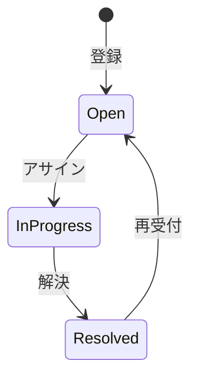

「Open → InProgress → Resolved」という一方向の流れが基本ですが、「解決済み → 再受付」という逆流があります。状態が増えるほど、このマトリクスの「空欄（——）」の管理が複雑になります。

> **📌 この章の実装スコープについて**
> 1-5節の変更要求では「保留中」「ベンダー確認中」といった新しい状態の追加が言及されており、2-5節のヒアリングでもこれらの追加が「確定（半期以内）」と記録されています。ただし、これらの状態は本章のフェーズ7最終コードには含まれていません。本章の実装スコープは上記の3状態（Open / InProgress / Resolved）と、Strategyパターンによる優先度ルールの分離に絞っています。新状態の追加は、本章の設計を土台とした次の反復（イテレーション）で行う想定です。

---

### 1-3：クラス構成図

現状のコード構造です。状態管理とルール判定が混在しており、拡張のたびに依存関係が深まっています。

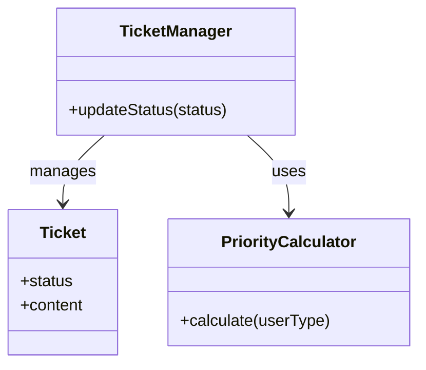

`TicketManager` クラスが、チケットの状態管理と、その遷移に伴う優先度計算という異なる責務を抱えています。

---

### 1-4：実装コード（現状）

システムの現状の実装を確認します。コードを役割ごとに分けて読んでいきます。

**PriorityCalculator クラス**

```cpp
#include <iostream>
#include <string>

using namespace std;

// 優先度ルール（変わる可能性がある）
class PriorityCalculator {
public:
    string calculate(string userType) {
        if (userType == "premium") return "High"; // ← ルール判定を直書き
        return "Normal";
    }
};
```

**TicketManager クラス**

```cpp
// チケット管理（状態とルールが混在）
class TicketManager {
    PriorityCalculator calc;
public:
    void updateStatus(string userType, string status) {
        string priority = calc.calculate(userType); // ← ルール判定の知識が混在
        if (status == "Open") {
            cout << "チケット受付中。優先度: " << priority << endl;
        } else if (status == "InProgress" && priority == "High") {
            cout << "緊急対応中。担当者を招集します。" << endl;
        }
    }
};
```

**main 関数**

```cpp
int main() {
    TicketManager manager;
    manager.updateStatus("premium", "InProgress");
    return 0;
}
```

このコードを見ると、`TicketManager` が優先度の計算ルール（`PriorityCalculator`）と、状態に応じたアクション（if-else）の両方を直接知っていることが分かります。

---

### 1-5：変更要求

【運用チームと品質管理チームからの要求】
ある月曜日の朝、ヘルプデスクのマネージャーからチャットが届きました。

「お疲れ様。現在対応しているチケットシステムなんだけど、今度から『SLA（サービスレベル合意）』を厳格に運用することになったんだ。特に、重要度が高いチケットが『Open』状態のまま長時間放置されるのは何としても避けたい。それと同時に、これまではチケットのステータスが3種類しかなかったけれど、今後は『保留中』や『ベンダー確認中』といった状態も増える予定だ。この新しいルールと状態遷移の複雑さに、今のシステムで対応できるかな？」

なるほど。今回の変更要求は「重要度に応じた優先度判断ルールの追加」と「状態遷移の増加」という、二つの大きな柱があるようです。今のコードのまま状態が増えると、if-else の分岐がさらに増え、変更箇所を追いにくくなる可能性があります。この先、このシステムが抱える重荷をどう分けるか、仮説を立てて確認します。

---

## 🟣 フェーズ2：仮説立案 ―― 何が変わるかを観察し、ヒアリングで裏付ける

フェーズ1で、`TicketManager` がチケットの状態遷移と優先度計算ロジックを直接保持している現状を把握しました。届いた変更要求を踏まえ、この設計における変動と不変を整理します。

### 2-1：`TicketManager`に混在している知識と担当チーム

`TicketManager.updateStatus()` が現在抱えている知識と、それぞれを変更するチームを確認します。

| 知識（コードが直接持っているもの） | 変更を決めるチーム | 適切か |
|---|---|---|
| 優先度計算ルールの呼び出し | SLA管理チーム（四半期改定） | ❌ 混在 |
| Open状態での振る舞いの条件 | 運用プロセスチーム | ❌ 混在 |
| 対応中かつ高優先度の条件と振る舞い | 運用プロセスチーム＋SLA管理チーム | ❌ 混在（複数担当者） |

❌が3つある。しかも1行が複数チームにまたがっています。「変わる理由」が2つの軸（優先度ルールと状態遷移）に分かれており、それぞれ異なる担当者が変更を決定することがヒアリングで確認されています。

### 2-3：今回の変更で確実に変わること

変更要求として明示的に届いた内容と、現状把握から見えている直近の変化を整理します。今回の変更は2つの独立した軸で同時に起きています。

| **分類** | **具体的な内容** | **変わる軸** |
| --- | --- | --- |
| 🔴 **変動する** | ステータスごとの振る舞い（遷移先・アクション） | 状態遷移の軸 |
| 🔴 **変動する** | 優先度判定ルール（SLA基準等） | 優先度ルールの軸 |
| 🟢 **不変** | チケットの基本属性データ | — |

コードを読んだだけで「このルールと状態管理は分離できる」と断定するのは危険です。実際に運用を担うヘルプデスクの担当者に、この先の見通しを直接確認します。

### ヒアリングに向けた背景確認

このシステムは、社内のITヘルプデスク部門が運用するサポートチケット管理を担っています。サービスが拡大するにつれて、対応フローの複雑さが増し、特に重要顧客向けのSLA（サービスレベル合意）の厳格化が求められるようになっています。変更の主な関係者は、ビジネスルールを管理するSLA管理チームと、業務プロセスを設計する運用プロセスチームの2者です。この2者が独立して変更を決定している点が、この章の設計判断の核心になります。

### 2-4：関係者ヒアリング

仮説を持って、ヘルプデスクの運用担当者と話し合いを持ちました。

* **開発者：** 「今後『保留中』や『ベンダー確認中』といったステータスが増えるとのことですが、状態によって『できること（遷移先）』や『通知の有無』は変わりますか？」
* **運用担当者：** 「そうなんだ。例えば『ベンダー確認中』の時は、こちらから担当者への割り当ては行わず、自動通知を止める必要がある。逆に『保留中』の時は…」
* **開発者：** 「なるほど。では、重要度に応じた『優先度判定ルール』は、今後も頻繁に調整されますか？」
* **運用担当者：** 「その通り。SLAの基準は四半期ごとに見直す予定だし、顧客との契約内容によってもルールが変わる可能性があるんだよ。プレミアムユーザー向けに今後さらに細かい区分ができるかもしれない。」
* **開発者：** 「確認させてください。状態の種類が増えたとき、SLAのルールも同時に変わりますか？それとも別々に変わりますか？」
* **運用担当者：** 「決める場が別だね。SLAは四半期ごとに契約で見直すもの。状態の追加は業務プロセスの話で、半年単位でシステム側と相談して決める。ただし、エスカレーションのように両方を使う機能では接続の確認が必要だよ。」
* **開発者：** 「分かりました。状態ごとの振る舞いと、優先度の計算ルールは、それぞれ独立して頻繁に変更されるということですね。」

ヒアリングの結果、「チケットの状態ごとの振る舞い」と「優先度判定ルール」は、変更のタイミングと決定者が異なることが分かりました。SLAは四半期ごと、状態の種類追加は半年単位です。実装上は組み合わせて使う場面がありますが、変更理由は分けて扱う価値がある二つの軸です。

> **現実のヒアリングでは——** このシナリオでは相手がちょうど設計に役立つ情報を教えてくれています。現実には「変わるかどうか分からない」「たぶん変わらない」という答えが返ることも多いです。そのときは、コードの変更履歴（`git log`）や過去の障害記録を「ヒアリングの代わり」として使ってみてください。「過去に何度変わったか」が、「将来変わりやすいか」の最も正直な証拠です。

### 2-5：ヒアリングで判明した将来リスク

ヒアリングで「今すぐではないが将来起こりうる」と判明したリスクを確定変更とは分けて記録します。

| **リスク** | **ヒアリングでの発言** | **発生確率** |
| --- | --- | --- |
| プレミアムユーザーの区分細分化 | 「今後さらに細かい区分ができるかもしれない」 | 中（次の契約改定時） |
| 複数担当者による同時操作 | 「複数のヘルプデスク担当者が同じチケットを同時に見ることがある」 | 高（日常的に発生） |
| 新状態の追加（保留中・ベンダー確認中） | 「今後はこうした状態も増える予定」 | 確定（半期以内） |

「状態遷移」という変更軸と「優先度ルール」という変更軸を、今の混沌とした `TicketManager` から切り離す必要がありそうです。フェーズ2で「何が変わり、何が変わらないか」が確定しました。次のフェーズ3では、この変更要求を実際に今のコードで試みて、具体的にどのような問題が起きるかをおのずとします。

---

## 🟣 フェーズ3：問題特定 ―― 変更の痛みを発見する

### 3-1：変更を試みる

フェーズ2で確定した「状態遷移の増加」と「優先度判定ルールの変更」を、今のコードにそのまま実装してみることにしました。

はじめに、新しいステータス「保留中」を追加するために `Ticket` クラスに定数を追加します。次に、`TicketManager` の `updateStatus` メソッド内にある膨大な `if-else` 分岐に、新しい状態の処理を書き足します。続いて、SLAルールの変更に対応するため、`PriorityCalculator` の `calculate` メソッドも修正します。

作業を進める中で、すぐに気づきました。「状態ごとのアクションとルールの条件分岐が混在していて、どちらが変わったときにどこを直せばいいか分からない」という感覚です。ステータスが一つ増えるだけで、「遷移の可否」「担当者への通知」「優先度計算」という、それぞれ変更理由の異なるロジックを一つの大きなメソッドの中で同時に考慮する必要があります。「状態を足したのにSLAのロジックも壊れたかもしれない」という不安が、常について回ります。

### 3-2：変更影響グラフ

今のコードのまま変更を試みた際の影響範囲を可視化します。

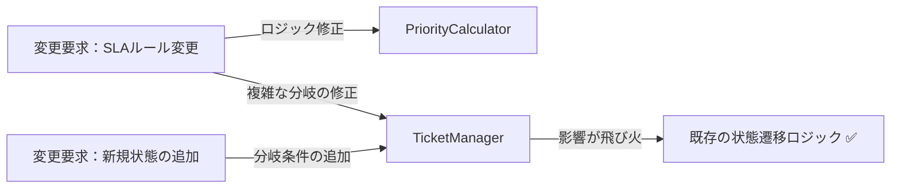

グラフが示す通り、ルール変更であれ状態追加であれ、結局は `TicketManager` という唯一の「状態管理の中心となるクラス」が修正のたびに常に触られることになります。

### 3-3：痛みの言語化

「またこの巨大な `if-else` を編集するのか…」というのが、この作業を始めた瞬間の率直な感覚です。

1つ目の痛みは、このクラスが「何でも屋」になりすぎていることです。状態遷移という「振る舞い」と、優先度計算という「ビジネスルール」が密接に絡み合っているため、片方をいじると、もう片方のロジックを無意識に壊してしまう恐怖が常にあります。

2つ目の痛みは、変更の局所化ができていないことです。新しい状態を追加するたびに、本来なら関係のないはずの優先度計算ロジックや、既存の遷移処理まで全てテストし直さなければなりません。この「どこまで影響が出るか分からない」という不安が、開発者の手を鈍らせ、システムをより硬直的なものにしています。

---
> **📌 問題（確定）**
> チケット管理システムでは、「優先度ルールの変更」と「状態遷移の追加」という2つの変化が、それぞれ異なる担当者の判断で独立して発生する。どちらの変化が来ても `TicketManager` を開かなければならず、無関係なロジックまで再テストを強いられる。
---

フェーズ3で「変更が辛い」という事実が確認できました。次のフェーズ4では、なぜ辛いのかを構造的に言語化します。

---

## 🟠 フェーズ4：原因分析 ―― なぜ辛いのかを構造で言語化する

フェーズ3で確認したように、チケットの「状態」が増えるたびに、チケット管理クラスのコードが肥大化し、修正のたびに予期せぬ副作用への恐怖を感じる状態にあります。ここでは、この問題の原因を構造的な観点から紐解いていきます。

### 4-1：痛みの根源を探る（観察と原因）

フェーズ3でのシミュレーションから見えてきた観察事実と、その根本にある構造的な原因を対応させます。「根本原因（構造で言語化）」の列には、「なぜ変更が辛いのか」をコードの構造として表現した原因を記載します。観察事実から「症状」ではなく「構造上の欠陥」を言語化することが、このステップの目的です。

| **根本原因（構造で言語化）** | **観察** | **変わる理由** | **必要なパターン** |
| --- | --- | --- | --- |
| **根本原因A：優先度ルールの混在** | 優先度計算ルールが変わると、チケットの状態遷移ロジックまで再テストが必要になる | ビジネスルールの変更（SLA改定・顧客区分の細分化） | Strategyが必要 |
| **根本原因B：状態遷移ロジックの混在** | 新しいチケット状態を追加するたびに、管理クラスが修正される | 状態の種類の追加（保留中・ベンダー確認中など） | Stateが必要 |

これら2つの根本原因は**互いに独立した変化軸**です。優先度ルールが変わっても状態遷移は変わりません。状態の種類が増えても優先度ルールは変わりません。独立しているからこそ、1つのパターンだけでは解決しきれません。

コードを追うと、単に状態が増えるだけでなく、その状態によって「何をする必要があるか（通知するのか、誰に割り当てるのか）」という判定ロジックが、優先度の計算ルールと複雑に絡み合っていることが分かります。これにより、コードを変更する際に「どこからどこまでが影響範囲なのか」を直感的に捉えることが難しくなっています。

### 4-2：変わるもの/変わってほしくないもの

> **「変わらないもの」と「変わってほしくないもの」は異なります。** 「変わらないもの」は経験的事実（今まで変わっていない）、「変わってほしくないもの」は設計意図（ここを安定させてほかを守りたい）です。ここで整理するのは後者です。

構造を整理するために、変化の軸を分けてみます。

| **変わり続けるもの（🔴）** | **変わってほしくないもの（🟢）** |
| --- | --- |
| チケットの「状態ごとの振る舞い」（遷移先、アクション） | チケットの「現在の状態」を保持する基盤データ |
| 優先度判定の「ビジネスルール」（SLA基準、顧客要件） | 「状態遷移を開始する」という汎用的なインターフェース |

これまで私たちは、「チケット」という一つのオブジェクトの中に、ライフサイクルの管理（状態）と、そこから派生するビジネス上の判断（ルール）を無理やり押し込めていました。状態が変わるたびにルールが動くのではなく、それぞれが別の軸として進化できるように整理する必要があります。

### 4-3：2つの接続点に漏れている知識を確認する

現在の`TicketManager`が、状態遷移と優先度判定について何を知っているかを確認します。

今の`TicketManager`には、状態名・遷移条件・優先度計算の条件が集まっています。状態担当とSLA担当の知識が一つのクラスへ埋め込まれています。

現在は、状態遷移・優先度計算・エスカレーション判定が `TicketManager` の条件分岐へ集まっています。そのため、優先度ルールだけを変える要求でも、状態遷移を含むクラス全体を確認しなければなりません。

---
> **📌 原因（確定）**
> `TicketManager`が優先度ルールと状態遷移の条件分岐を同時に保持していることが根本原因である。変わる理由が異なる2つの知識を1クラスが直接持つ頻度が高いほど、片方を修正するたびに他方への影響確認コストが発生し続ける。
---

フェーズ4で根本原因が言語化できました。次のフェーズ5では、この整理を元に、解決する課題を具体的に定義していきます。

---

## 🟡 フェーズ5：課題定義 ―― 接続点で何が流れているかを見る

フェーズ4は「なぜ辛いか」を答えました。フェーズ5が問うのは「その境界でどんなデータが流れているか」です。型・値のレベルに降りていきます。

フェーズ4で、「チケットの状態ごとの振る舞い」と「優先度判定ルール」が `TicketManager` クラス内で密結合に混在していることが、変更のたびにコードを汚染させる原因だと特定しました。今のままでは、状態遷移のロジックに手を入れるたびに、無関係な優先度計算のコードまでテストし直す必要があり、非常に効率が悪くなっています。

今回の分析により、`TicketManager` クラス内に以下の2つの接続点（ジョイント）が存在することが明確になりました。接続点A は状態遷移ロジックの境界、接続点B は優先度判定ロジックの境界です。

以上の分析を、フェーズ6の対策検討に向けたまとめ表として整理します。

| **接続点** | **接続するデータ（型・値）** |
| --- | --- |
| 接続点A | `transition()` 内の `if (status == "Open")` / `"InProgress"` / `"Resolved"` 等の文字列定数 ― 状態名と遷移条件が `TicketManager` の条件分岐に直接埋め込まれている |
| 接続点B | `calculatePriority()` 内の `calc.calculate(userType: string)` の引数・戻り値（`"High"` / `"Normal"` 等の文字列）― SLA基準と顧客区分の判定値が直接ハードコードされている |

この表が埋まったことで、私たちが解くべき課題は「状態ごとの振る舞いをオブジェクトへ抽出すること」と「優先度判定ルールを独立したアルゴリズムとして分離すること」の2点に絞り込まれました。

---
> **📌 課題（確定）**
> 解くべき課題は2つある。接続点Aでは、状態遷移の条件分岐（`if (status == "Open")` 等）を `TicketManager` から切り離し、状態ごとの振る舞いを独立したオブジェクトとして管理できるようにすること。接続点Bでは、SLA基準や顧客区分の判定ロジック（`calc.calculate(userType)` 等）を `TicketManager` の外に出し、優先度ルールを単独で差し替えられるようにすること。
---

フェーズ5で「何を解くか」が確定しました。次のフェーズ6では、この2つの課題に対し、段階的な改善と決断を検討します。

---

## 🔴 フェーズ6：対策検討 ―― 段階的な改善と決断

フェーズ5で整理した「状態ごとの振る舞い」と「優先度判定ルール」という二つの課題に対し、どのように構造を分離するかを検討します。どちらの課題も「変わりやすさ」が特徴であるため、それぞれの接続点から不要な知識を移す必要があります。

どのステップも、動作例テーブルで示した基本的な動作（行1〜3・6）を実現します。行4・5（Resolved遷移・再オープン）はフェーズ7の最終実装で初めて全カバーされます。違うのは「変更が来たときにどこを触ることになるか」です。

---

### ステップ1：プライベートメソッドで整理する

**この形の考え方：**
フェーズ3で示したコードを、接続点の設計は変えずにプライベートメソッドで整理した形です。各処理の意味がメソッド名で明確になります。`PriorityCalculator` を直接メンバに持ち、`if-else` 分岐もそのままですが、各分岐をプライベートメソッドに抽出して責任を整理します。

**構造図：**

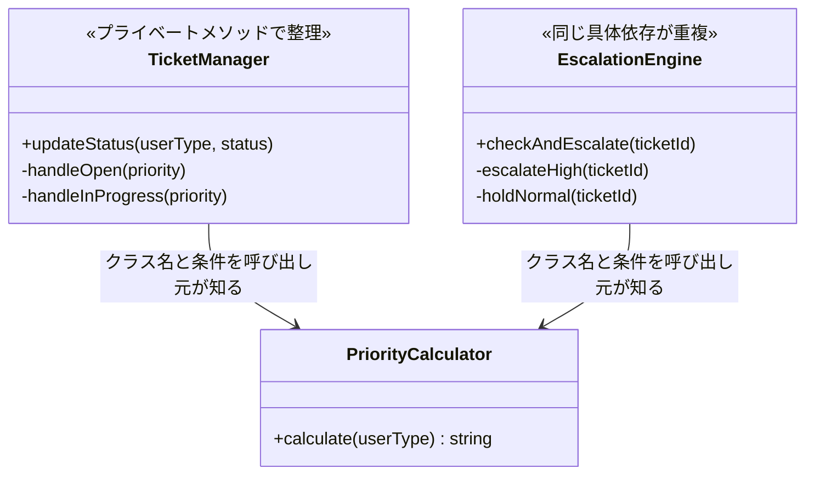

両クラスとも`PriorityCalculator`というクラス名を知っており、ルール変更のたびに2か所を修正する必要がある点はフェーズ3と同じです。プライベートメソッドで読みやすくなりましたが、知識の置き場所は変わっていません。

**PriorityCalculator クラス（ステップ1）：**

```cpp
// ステップ1：優先度ルールをそのまま維持（クラス名と条件を呼び出し元が知る）
class PriorityCalculator {
public:
    string calculate(string userType) {
        if (userType == "premium") return "High"; // ← 具体：文字列を直書き
        return "Normal";
    }
};
```

**TicketManager クラス（ステップ1）：**

```cpp
// ステップ1：プライベートメソッドで各分岐の責任を整理
class TicketManager {
    PriorityCalculator calc; // ← 具体：PriorityCalculatorを直接保持
public:
    void updateStatus(string userType, string status) {
        string priority = calc.calculate(userType);
        if (status == "Open") {
            handleOpen(priority); // ← 処理の意図がメソッド名で明確になった
            return;
        }
        if (status == "InProgress") {
            handleInProgress(priority);
        }
    }
private:
    void handleOpen(string priority) {
        cout << "チケット受付中。優先度: " << priority << endl;
    }
    void handleInProgress(string priority) {
        if (priority == "High") {
            cout << "緊急対応中。担当者を招集します。" << endl;
        }
    }
};
```

**EscalationEngine クラスと main（ステップ1）：**

```cpp
// ステップ1：EscalationEngineも同じ構造でプライベートメソッドに整理
class EscalationEngine {
public:
    void checkAndEscalate(string ticketId) {
        PriorityCalculator calc; // ← 具体：TicketManagerと同じ具体型を重複して保持
        string priority = calc.calculate("premium");
        if (priority == "High") {
            escalateHigh(ticketId);
            return;
        }
        holdNormal(ticketId);
    }
private:
    void escalateHigh(string ticketId) {
        cout << "[EscalationEngine] チケット " << ticketId
             << " をエスカレーション。" << endl;
    }
    void holdNormal(string ticketId) {
        cout << "[EscalationEngine] チケット " << ticketId
             << " は通常優先度。対応待ち。" << endl;
    }
};

int main() {
    TicketManager manager;

    // 行1: 一般ユーザーが新規登録（Normal優先度でOpen）
    manager.updateStatus("normal", "Open");

    // 行2: プレミアムユーザーが新規登録（High優先度でOpen）
    manager.updateStatus("premium", "Open");

    // 行3: 担当者アサイン（InProgressへ遷移）
    manager.updateStatus("normal", "InProgress");

    // 行6: プレミアムユーザーがエスカレーション（このステップでは EscalationEngine が担当）
    EscalationEngine engine;
    engine.checkAndEscalate("T-001");

    // 行4・行5（Resolved／再オープン）はこのステップでは未実装
    return 0;
}
```

プライベートメソッドに整理したことで各分岐の意図は読みやすくなりましたが、両クラスともに `PriorityCalculator` という具体型を直接知っており、ルールが変わると2か所を修正する構造は変わっていません。

**このステップのトレードオフ：**

* 変更容易性：低（ルール変更のたびに具体型を知る両クラスを修正する必要がある）
* テスト容易性：低（具体クラスへの依存が残り、切り離せない）
* 実装コスト：低（プライベートメソッドへの抽出のみ）

---

### ステップ2：処理を別クラスに切り出す

**この形の考え方：**
優先度計算や状態処理を別クラスへ切り出し、呼び出し元がそれらへ処理を委ねる形です。処理の置き場所は分かれますが、呼び出し元は `PriorityCalculator` や各Phaseのクラス名と生成方法を知っています。実装を差し替える要求では、呼び出し元も修正します。

**構造図：**

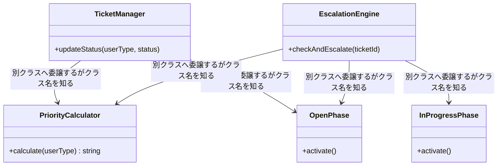

クラスは分離されて処理を委ねるようになりましたが、呼び出し元が各実装のクラス名と生成方法を知っています。状態やルールを差し替えるときは、処理クラスだけでなく呼び出し元も修正する構造です。

**PriorityCalculator クラスと状態クラス（ステップ2）：**

```cpp
// ステップ2：処理を別クラスに切り出した（別クラスへ委譲するがクラス名を知る）
class PriorityCalculator {
public:
    string calculate(string userType) {
        if (userType == "premium") return "High";
        return "Normal";
    }
};

class OpenPhase {
public:
    // 呼び出し元はここに処理を委ねる（間接）
    void activate() { cout << "チケットをオープン状態に設定。" << endl; }
};

class InProgressPhase {
public:
    void activate() { cout << "チケットを対応中状態に設定。" << endl; }
};
```

**TicketManager クラス（ステップ2）：**

```cpp
// ステップ2：TicketManagerが具体クラスを知り、処理をそのクラスに委ねる
class TicketManager {
public:
    void updateStatus(string userType, string status) {
        PriorityCalculator calc; // ← 具体：型名を直接書いている
        string priority = calc.calculate(userType);
        // ← 間接：計算はcalcに委ねて自分ではやらない
        if (status == "Open") {
            OpenPhase s; // ← 具体：OpenPhaseという型名を直接書いている
            s.activate(); // ← 間接：Open状態の処理をsに委ねる
            cout << "優先度: " << priority << endl;
            return;
        }
        if (status == "InProgress" && priority == "High") {
            InProgressPhase s; // ← 具体：InProgressPhaseを直接生成
            s.activate(); // ← 間接：対応中状態の処理をsに委ねる
            cout << "緊急対応中。担当者を招集します。" << endl;
        }
    }
};
```

**EscalationEngine クラスと main（ステップ2）：**

```cpp
// ステップ2：EscalationEngineも同じ具体クラスを知り処理を委ねる
class EscalationEngine {
public:
    void checkAndEscalate(string ticketId) {
        PriorityCalculator calc; // ← 具体：TicketManagerと同じ型を重複して使用
        string priority = calc.calculate("premium");
        // ← 間接：優先度計算はcalcに委ねる
        if (priority == "High") {
            InProgressPhase inProg; // ← 具体：型名を直接書いている
            inProg.activate();      // ← 間接：処理を委ねる
            cout << "[EscalationEngine] チケット " << ticketId
                 << " をエスカレーション。" << endl;
            return;
        }
        OpenPhase open; // ← 具体：型名を直接書いている
        open.activate();            // ← 間接：処理を委ねる
    }
};

int main() {
    TicketManager manager;
    manager.updateStatus("premium", "InProgress");

    EscalationEngine engine;
    engine.checkAndEscalate("T-001");
    return 0;
}
```

処理を別クラスに委ねる形（間接）になりましたが、具体クラス名の知識が両クラスに重複しており、クラスを差し替えるには両方を修正する必要があるでしょう。

**このステップのトレードオフ：**

* 変更容易性：低〜中（クラスは分かれたが、具体クラス名の依存は両方に残る）
* テスト容易性：低（依然として具体クラスを直接生成する必要がある）
* 実装コスト：低（リファクタリングの範囲が限定的）

---

### ステップ3：関数アプローチの限界を確認する

ステップ1・2の構造では呼び出し元がルールの種類と状態名を知る問題が残りました。ここで少し立ち止まって、処理を関数（プライベートメソッド）として整理し直した場合に何が見えてくるかを確認します。

```cpp
// ステップ3：条件・処理を関数に切り出した場合の整理限界
class TicketManager {
    // 処理を個別メソッドに切り出す
    string calcPremiumPriority() { return "High"; }
    string calcNormalPriority() { return "Normal"; }
    void handleOpen(string priority) {
        cout << "チケット受付中。優先度: " << priority << endl;
    }
    void handleInProgress(string priority) {
        if (priority == "High") {
            cout << "緊急対応中。担当者を招集します。" << endl;
        }
    }
    string routePriority(string userType) {
        if (userType == "premium") return calcPremiumPriority();
        return calcNormalPriority();
    }
    void routeStatus(string status, string priority) {
        if (status == "Open") handleOpen(priority);
        else if (status == "InProgress") handleInProgress(priority);
    }
public:
    void updateStatus(string userType, string status) {
        string priority = routePriority(userType);
        routeStatus(status, priority);
    }
};
```

なお、ステップ1・2で登場した `EscalationEngine` も同様に関数化できますが、ここでは `TicketManager` の関数化パターンに絞って確認します。`EscalationEngine` も同じ思考プロセスを経て同じ限界に突き当たります。

関数化により各処理の意図は読みやすくなりました。しかしここで立ち止まって、抽出した関数群を観察してください。`calcPremiumPriority()` と `calcNormalPriority()` はどちらも「同じ引数を受け取り同じ型を返す」一貫した構造を持っています。`handleOpen()` と `handleInProgress()` も同様です。「一貫した構造（同じ形）を持つ関数が並んでいる」ことは「共通インターフェースとして抽象化できる」証拠です。

しかし関数化のままでは2つの軸で同じ限界に直面します。**優先度ルールの軸：**「VIP優先度」が増えるたびに `TicketManager` を開いて新しい関数を追加し、`routePriority` の `if` 文に書き足す必要があります。**状態遷移の軸：**「保留中」状態が追加されるたびに `TicketManager` を開いて `handleHold()` 関数を追加し、`routeStatus` の `if` 文に書き足す必要があります。2つの軸それぞれで「クラスが永遠に変わり続ける」という根本問題は解決していません。

この限界が、次のステップ4でStrategyパターンを導入する動機になります。

---

### ステップ4：Strategyパターンで優先度ルールを分離する

ステップ3で「関数化の限界」が見えました。各関数が「同じ形（インターフェース）を持つ」なら、それを共通インターフェースとして抽象化できます。はじめに優先度ルールの変化軸から解決します。

**構造図：**

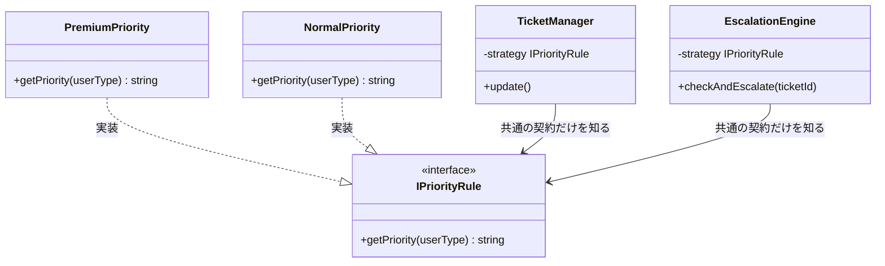

**インターフェースと優先度戦略クラス（ステップ4）：**

```cpp
#include <iostream>
#include <string>
using namespace std;

// 優先度判定のインターフェース（Strategyパターンの骨格）
class IPriorityRule {
public:
    virtual ~IPriorityRule() = default;
    virtual string getPriority(string userType) = 0;
};

// プレミアムユーザー向け優先度ルール
class PremiumPriority : public IPriorityRule {
public:
    string getPriority(string userType) override {
        return "High"; // ← プレミアムユーザーは常にHighとする
    }
};

// 一般ユーザー向け優先度ルール
class NormalPriority : public IPriorityRule {
public:
    string getPriority(string userType) override {
        return "Normal";
    }
};
```

**TicketManager クラス（ステップ4）：**

```cpp
// ステップ4：TicketManagerはIPriorityRule*のみを知る（優先度ルールの軸が解決）
class TicketManager {
    IPriorityRule* strategy; // ← 抽象：外部から注入されたインターフェースのみ知っている
public:
    TicketManager(IPriorityRule* s) : strategy(s) {}
    void updateStatus(string userType, string status) {
        string priority = strategy->getPriority(userType); // ← 抽象経由で呼ぶ
        // 状態遷移のif-elseはまだTicketManager内に残っている
        if (status == "Open") {
            cout << "チケット受付中。優先度: " << priority << endl;
        } else if (status == "InProgress" && priority == "High") {
            cout << "緊急対応中。担当者を招集します。" << endl;
        }
    }
};
```

**EscalationEngine クラスと main（ステップ4）：**

```cpp
// EscalationEngineもIPriorityRule*のみを知る
class EscalationEngine {
    IPriorityRule* strategy; // ← 抽象：外部から注入されたインターフェースのみ知っている
public:
    EscalationEngine(IPriorityRule* s) : strategy(s) {}
    void checkAndEscalate(string ticketId) {
        string priority = strategy->getPriority("premium"); // EscalationEngineはPremium用途に限定して使うため
        cout << "[EscalationEngine] 判定優先度: " << priority << endl;
        if (priority == "High") {
            cout << "[EscalationEngine] チケット " << ticketId
                 << " をエスカレーション。" << endl;
        }
    }
};

int main() {
    PremiumPriority strategy;            // ← 具体：呼び出し側だけが具体クラスを生成
    TicketManager manager(&strategy);
    manager.updateStatus("premium", "InProgress");

    PremiumPriority esc_strategy;
    EscalationEngine engine(&esc_strategy);
    engine.checkAndEscalate("T-001");
    return 0;
}
```

ステップ4でStrategyパターンを導入したことで、優先度ルールは新しいStrategyクラスと選択・注入箇所へ分けられました。`TicketManager` の判定ロジックへルール種別の条件分岐を増やさずに済みます。しかし状態遷移の変化軸はまだ残っています。新しい状態「保留中」が追加されるたびに、`TicketManager` の状態判定の `if` 文を開かなければなりません。この残課題を解決するのがステップ5です。

---

### ステップ5：Stateパターンで状態ごとの振る舞いを分離する

ステップ4で残った「状態による変化」を解決するために、状態ごとの振る舞いをオブジェクトとして分離する設計を導入します。なお、この実装例では状態遷移の管理責任は呼び出し側（Context）に残し、「状態ごとの表示やアクション」の分離に焦点を当てています。

なお、このステップから `TicketManager` を **`TicketContext`** に改名します。Stateパターンの導入によりこのクラスはもはや「状態を管理する」責務を持たず、現在の状態オブジェクトを保持して委譲するだけの「コンテキスト」に変わるためです。GoFのStateパターンでは、状態オブジェクトを保持するクラスを慣習的に Context と呼びます。

**構造図：**

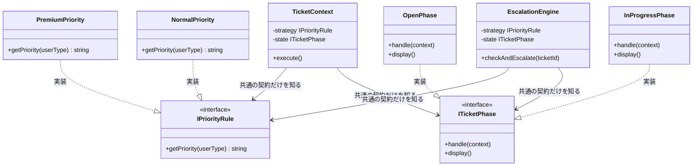

`TicketContext` と `EscalationEngine` はどちらも2つのインターフェースのみを知り、具体クラスはmain()側だけが生成して注入する。

**インターフェース定義（ステップ5）：**

```cpp
#include <iostream>
#include <string>
using namespace std;

// Strategy: 優先度判定のインターフェース
class IPriorityRule {
public:
    virtual ~IPriorityRule() = default;
    virtual string getPriority(string userType) = 0;
};

// State: 状態別振る舞いのインターフェース
class ITicketPhase {
public:
    virtual ~ITicketPhase() = default;
    virtual void handle(class TicketContext* context) = 0;
    virtual void display() = 0;
};
```

**優先度戦略クラス（ステップ5）：**

```cpp
// プレミアムユーザー向け優先度ルール
class PremiumPriority : public IPriorityRule {
public:
    string getPriority(string userType) override {
        return "High"; // ← プレミアムユーザーは常にHighとする
    }
};

// 一般ユーザー向け優先度ルール
class NormalPriority : public IPriorityRule {
public:
    string getPriority(string userType) override {
        return "Normal";
    }
};
```

**状態クラス（ステップ5）：**

```cpp
// Open状態の振る舞い
class OpenPhase : public ITicketPhase {
public:
    void handle(TicketContext* context) override { display(); }
    void display() override {
        cout << "チケット受付中。" << endl;
    }
};

// 対応中状態の振る舞い
class InProgressPhase : public ITicketPhase {
public:
    void handle(TicketContext* context) override { display(); }
    void display() override {
        cout << "チケット対応中。担当者に割り当て。" << endl;
    }
};
```

**TicketContext クラス（ステップ5）：**

```cpp
// コンテキスト：インターフェース型のみを知る
class TicketContext {
    ITicketPhase* state;
    IPriorityRule* strategy;
public:
    TicketContext(ITicketPhase* st, IPriorityRule* s)
        : state(st), strategy(s) {}
    void setState(ITicketPhase* s) { state = s; }
    void setStrategy(IPriorityRule* s) { strategy = s; }
    void execute(string userType) {
        string priority = strategy->getPriority(userType); // ← 抽象経由
        cout << "優先度: " << priority << " — ";
        state->handle(this); // ← 直接呼び出し
    }
    string calculatePriority(string userType) {
        return strategy->getPriority(userType);
    }
};
```

**EscalationEngine クラスと main（ステップ5）：**

```cpp
// EscalationEngineもインターフェースのみを知る
class EscalationEngine {
    IPriorityRule* strategy; // ← 抽象：外部から注入されたインターフェースのみ知っている
    ITicketPhase* state;
public:
    EscalationEngine(IPriorityRule* s, ITicketPhase* st)
        : strategy(s), state(st) {}
    void checkAndEscalate(string ticketId) {
        string priority = strategy->getPriority("premium"); // EscalationEngineはPremium用途に限定して使うため
        if (priority == "High") {
            cout << "[EscalationEngine] チケット " << ticketId
                 << " をエスカレーション。" << endl;
            // エスカレーションでは状態遷移を行わず、
            // 現在状態の表示だけを安全に呼び出す
            state->display(); // ← context不要の専用操作
        }
    }
};

int main() {
    PremiumPriority strategy;            // ← 具体：呼び出し側だけが具体クラスを生成
    InProgressPhase state;               // ← 具体：呼び出し側だけが具体クラスを生成
    TicketContext ctx(&state, &strategy);
    ctx.execute("premium");

    PremiumPriority esc_strategy;
    InProgressPhase esc_state;
    EscalationEngine engine(&esc_strategy, &esc_state);
    engine.checkAndEscalate("T-001");
    return 0;
}
```

ここまでの短いコードは、2つの変化軸を別のインターフェースへ分ける骨格を示したものです。`handle()` は表示だけに省略しています。フェーズ7の完成版では、各状態クラスが次の状態を保持し、`TicketContext::setState()` を呼んで実際に遷移させます。

**このステップのトレードオフ：**

* 変更容易性：高（どの変化軸の変更も、対応する独立クラスだけで完結する）
* テスト容易性：高（インターフェースに対しスタブを差し込んで個別にテストできる）
* 実装コスト：中（インターフェースと複数の実装クラスを定義する必要がある）

---

### どこまで設計を進めるのが良いか（採用ステップの決断）

それぞれのステップには一長一短があります。ステップ5の「共通の契約だけを知る（インターフェースの導入）」は強力ですが、クラス数が増加する「初期投資コスト」もかかります。どこで止めるかは、**「今後の変更頻度（ビジネス要求）」**で決断します。

* **ステップ1（プライベートメソッドで整理）で止めるケース：** 優先度ルールが「通常」と「緊急」の2つだけで、当面増える見込みが低い場合。
* **ステップ2（処理を別クラスに切り出す）で止めるケース：** クラスごとに分けたいが、動的なルールの切り替えは発生しない場合。
* **ステップ3（関数アプローチの限界確認）で止めるケース：** チームに関数化アプローチの限界を共有したが、まだ変更頻度が低くインターフェース導入のコストが高い場合の様子見判断。
* **ステップ4（Strategyパターン）で止めるケース：** 優先度ルールは複数存在し今後も増えるが、状態遷移はまだシンプルで増える見込みがない場合。
* **ステップ5（Strategy × State）まで進むケース：** 優先度ルールと状態遷移の両方が、独立した担当者によって頻繁に変更されることが確定している場合。

**今回の決断：**
フェーズ2のヒアリングで「VIP顧客向けルールの追加」や「休日用ルールの追加」など、優先度ルールの頻繁な変更が確定しています。さらに状態自体の拡張も予想されます。2つの変化軸（状態の増減、優先度ルールの変更）をそれぞれ独立して安全に変更できるようにするため、**ステップ5（Strategy × State）まで進む**決断を下します。

> 実はこのステップ5の構造には名前があります。「優先度ルールの差し替え可能な分離」は **Strategyパターン**、「状態ごとの振る舞いをオブジェクトとして表現する」は **Stateパターン** と呼ばれています。この構造は、第1章で学んだ**Strategyパターン**と、第3章で学んだ**Stateパターン**を組み合わせた複合設計です。

フェーズ6で採用ステップが決まりました。次のフェーズ7では、この決断を最終的なコードに落とし込みます。

---

## 🟢 フェーズ7：対策実施 ―― 変化に強いコードを完成させる

採用した Strategyパターン（優先度ルールの分離）および Stateパターン（状態ごとの振る舞いの分離）を実装し、ビジネスルールと状態固有の処理をそれぞれ独立したクラスへカプセル化します。

### 7-1：解決後のコード（全体）

優先度判定を `IPriorityRule`、状態管理を `ITicketPhase` へとそれぞれ分離しました。

**IPriorityRule インターフェースと実装クラス**

```cpp
#include <iostream>
#include <string>
#include <vector>

using namespace std;

// Strategy: 優先度計算のインターフェース
class IPriorityRule {
public:
    virtual ~IPriorityRule() = default;
    virtual string getPriority(string userType) = 0;
};
```

**PremiumPriority と NormalPriority クラス**

```cpp
// プレミアムユーザー向け優先度ルール
class PremiumPriority : public IPriorityRule {
public:
    string getPriority(string userType) override { return "High"; }
};

// 一般ユーザー向け優先度ルール
class NormalPriority : public IPriorityRule {
public:
    string getPriority(string userType) override { return "Normal"; }
};
```

**ITicketPhase インターフェース**

```cpp
// State: 状態別振る舞いのインターフェース
class ITicketPhase {
public:
    virtual ~ITicketPhase() = default;
    virtual void handle(class TicketContext* context) = 0;
    virtual void display() = 0;
};
```

**OpenPhase / InProgressPhase / ResolvedPhase クラス**

```cpp
// Open状態の振る舞い
class OpenPhase : public ITicketPhase {
    ITicketPhase* next = nullptr;
public:
    void setNext(ITicketPhase* phase) { next = phase; }
    void handle(TicketContext* context) override;
    void display() override;
};

// InProgress状態の振る舞い
class InProgressPhase : public ITicketPhase {
    ITicketPhase* next = nullptr;
public:
    void setNext(ITicketPhase* phase) { next = phase; }
    void handle(TicketContext* context) override;
    void display() override;
};

// Resolved状態の振る舞い
class ResolvedPhase : public ITicketPhase {
    ITicketPhase* next = nullptr;
public:
    void setNext(ITicketPhase* phase) { next = phase; }
    void handle(TicketContext* context) override;
    void display() override;
};
```

**TicketContext クラス（コンテキスト）**

```cpp
// コンテキスト：インターフェース型のみを保持する
class TicketContext {
    ITicketPhase* state;
    IPriorityRule* strategy;
public:
    TicketContext(ITicketPhase* st, IPriorityRule* s)
        : state(st), strategy(s) {}
    void setState(ITicketPhase* s) { state = s; }
    void setStrategy(IPriorityRule* s) { strategy = s; }
    void execute(string userType) {
        string priority = strategy->getPriority(userType); // ← 抽象経由
        cout << "優先度: " << priority << " — ";
        state->display();
    }
    void transition(string userType) {
        string priority = strategy->getPriority(userType);
        cout << "優先度: " << priority << " — ";
        state->handle(this); // 現在の状態が次の状態を決める
    }
    string calculatePriority(string userType) {
        return strategy->getPriority(userType);
    }
};
```

**状態クラスの handle 実装**

```cpp
// OpenPhase の実装（TicketContextが定義された後）
void OpenPhase::handle(TicketContext* context) {
    if (next == nullptr) { display(); return; }
    context->setState(next);
    next->display();
}
void OpenPhase::display() {
    cout << "チケット受付中。" << endl;
}

// InProgressPhase の実装
void InProgressPhase::handle(TicketContext* context) {
    if (next == nullptr) { display(); return; }
    context->setState(next);
    next->display();
}
void InProgressPhase::display() {
    cout << "チケット対応中。担当者に割り当て。" << endl;
}

// ResolvedPhase の実装
void ResolvedPhase::handle(TicketContext* context) {
    if (next == nullptr) { display(); return; }
    context->setState(next);
    next->display();
}
void ResolvedPhase::display() {
    cout << "チケット解決済み。クローズしました。" << endl;
}
```

**EscalationEngine クラス**

```cpp
// EscalationEngineもインターフェースのみを知る
class EscalationEngine {
    IPriorityRule* strategy;
    ITicketPhase* state;
public:
    EscalationEngine(IPriorityRule* s, ITicketPhase* st)
        : strategy(s), state(st) {}
    void checkAndEscalate(string ticketId) {
        string priority = strategy->getPriority("premium"); // EscalationEngineはPremium用途に限定して使うため
        cout << "[EscalationEngine] 判定優先度: " << priority << endl;
        if (priority == "High") {
            cout << "[EscalationEngine] チケット " << ticketId
                 << " をエスカレーション。" << endl;
            // エスカレーションでは状態遷移を行わず、
            // 現在状態の表示だけを安全に呼び出す
            state->display();
        }
    }
};
```

`handle(context)` は各状態が次の状態を選び、`TicketContext` を更新する通常処理で使います。`display()` は
状態を変えずに現在の振る舞いだけを実行するときに使います。遷移先は組み立て時に `setNext()` で注入するため、`TicketContext` に状態名の条件分岐は戻りません。
`EscalationEngine` が `nullptr` を渡す必要がなくなり、将来の状態クラスが
`context` を参照する実装へ変わっても安全です。

**TicketApplication クラス（組み立て担当）**

具体クラスを知っているのはこの1クラスだけです。`main()` は組み立てを知りません。

```cpp
// TicketApplication：具体クラスの組み立てと実行を担当する
class TicketApplication {
public:
    void run() {
        NormalPriority normalStrategy;
        PremiumPriority premiumStrategy;
        OpenPhase openPhase;
        InProgressPhase inProgressPhase;
        ResolvedPhase resolvedPhase;
        openPhase.setNext(&inProgressPhase);
        inProgressPhase.setNext(&resolvedPhase);
        resolvedPhase.setNext(&openPhase);

        // 行1: 一般ユーザーが新規登録
        cout << "--- 行1: 一般ユーザーが新規登録 ---" << endl;
        TicketContext ctx1(&openPhase, &normalStrategy);
        ctx1.execute("normal");

        // 行2: プレミアムユーザーが新規登録
        cout << "--- 行2: プレミアムユーザーが新規登録 ---" << endl;
        TicketContext ctx2(&openPhase, &premiumStrategy);
        ctx2.execute("premium");

        // 行3: 受付中チケットに担当者をアサイン（Open→InProgress）
        cout << "--- 行3: 担当者アサイン ---" << endl;
        ctx1.transition("normal");

        // 行4: 担当者が解決（InProgress→Resolved）
        cout << "--- 行4: 担当者が解決 ---" << endl;
        ctx1.transition("normal");

        // 行5: 解決済みを一般ユーザーが再オープン（Resolved→Open）
        cout << "--- 行5: 一般ユーザーが再オープン ---" << endl;
        ctx1.transition("normal");

        // 行6: プレミアムユーザーがエスカレーション
        cout << "--- 行6: プレミアムユーザーがエスカレーション ---" << endl;
        InProgressPhase esc_state;
        EscalationEngine engine(&premiumStrategy, &esc_state);
        engine.checkAndEscalate("T-001");
    }
};
```

**main 関数**

```cpp
int main() {
    TicketApplication app;
    app.run();
    return 0;
}
```

**実行結果：**

```
--- 行1: 一般ユーザーが新規登録 ---
優先度: Normal — チケット受付中。
--- 行2: プレミアムユーザーが新規登録 ---
優先度: High — チケット受付中。
--- 行3: 担当者アサイン ---
優先度: Normal — チケット対応中。担当者に割り当て。
--- 行4: 担当者が解決 ---
優先度: Normal — チケット解決済み。クローズしました。
--- 行5: 一般ユーザーが再オープン ---
優先度: Normal — チケット受付中。
--- 行6: プレミアムユーザーがエスカレーション ---
[EscalationEngine] 判定優先度: High
[EscalationEngine] チケット T-001 をエスカレーション。
チケット対応中。担当者に割り当て。
```

動作テーブル全6行と一致しています。行6では、`EscalationEngine` が `strategy->getPriority("premium")` を呼び、判定結果の `High` を出力してからエスカレーションします。期待値である優先度と、条件成立後の処理をそれぞれ実行結果で確認できます。

`TicketApplication` は初期状態と優先度Strategyの組み立てを担当し、`main()` は起動だけを担います。ただし、具体状態への遷移先は各Phaseクラスにも記述されています。初期状態や注入するStrategyを替える変更は `TicketApplication`、状態遷移ルールを替える変更は関係するPhase、共通契約を替える変更は利用側も含めて修正します。

---

### 7-2：動作シーケンス図

ステップ5で到達したStrategy × Stateパターンの実行時のオブジェクト間のやり取りを可視化します。`TicketApplication` が依存関係を注入し、`TicketContext` が具象クラスを知らずに抽象インターフェース経由で処理を委譲する流れが確認できます。

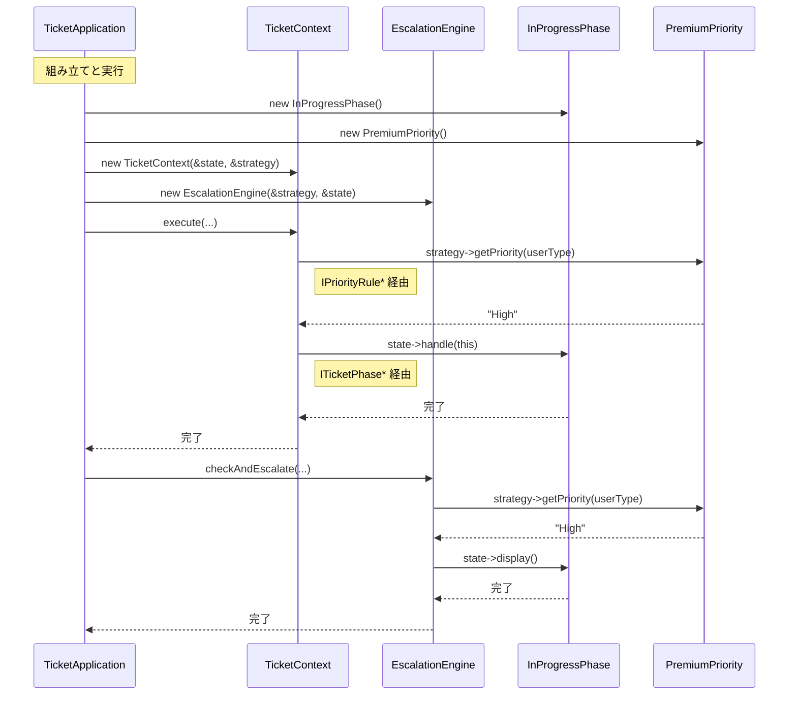

---

### 7-3：変更影響グラフ（改善後）

フェーズ3と同じ「SLAルール変更」や「状態追加」を試みます。

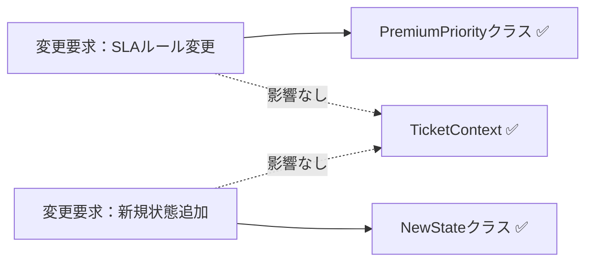

フェーズ3のグラフと比較して、変更要求がそれぞれ独立したクラスに閉じるようになり、`TicketContext` への飛び火がなくなりました。

### 7-4：変更シナリオ表

| **シナリオ** | **変わるクラス（触る場所）** | **変わらないクラス** |
| --- | --- | --- |
| 優先度計算ルールを変更する | `IPriorityRule` 派生クラス | `TicketContext`, `ITicketPhase` |
| 新しい状態を追加する | `ITicketPhase` 派生クラスを新規作成 | `TicketContext`, `IPriorityRule` |

変更が来ても、触るのは該当する戦略や状態クラスのみです。これがこの設計で手に入れた「変更耐性」です。諦めたものは、インターフェースやクラスの増加というわずかな設計コストです。

---

## 整理

### この章で定義したこと

| | 内容 |
|---|---|
| **問題** | チケット管理で「優先度ルールの変更」と「状態遷移の追加」という変わる理由が異なる2つの変化が、同じ `TicketManager` に混在している |
| **原因** | `TicketManager` が `PriorityCalculator` と状態遷移ロジックを「クラス名と条件を呼び出し元が知る」で保持しているため、どちらの変化が来ても両方への影響確認が必要になる |
| **課題** | 状態ごとの振る舞い（接続点A）と優先度判定ロジック（接続点B）を、それぞれ独立して差し替えられる構造に切り離すこと |
| **解決策** | Strategy × State パターン：`IPriorityRule`（優先度ルールの軸）と `ITicketPhase`（状態遷移の軸）の2つのインターフェースで変化軸を分離し、`TicketContext` はどちらの具体クラスも知らない設計にする |

### フェーズとこの章でやったこと

| **フェーズ** | **この章でやったこと** |
| --- | --- |
| 🔵 フェーズ1：現状把握 | チケット管理システムにおける状態遷移とルール判定の混在を観察した。仕様・動作例・コード・クラス構成図・変更要求を把握した |
| 🟣 フェーズ2：仮説立案 | 責任チェック表・変わる理由の分析で2つの変化軸を特定した。運用担当者へのヒアリングで、二つの軸（ルールと状態）が独立して変動することを確認した |
| 🟣 フェーズ3：問題特定 | `if-else` 分岐の肥大化による修正の連鎖という痛みを確認した |
| 🟠 フェーズ4：原因分析 | 振る舞いとルールの密結合を「直差し」状態として診断した |
| 🟡 フェーズ5：課題定義 | 状態とルールの二つの接続点を特定し、疎結合化を課題とした |
| 🔴 フェーズ6：対策検討 | 5ステップを比較し、Strategy × Stateパターン（共通の契約だけを知る）を採用した |
| 🟢 フェーズ7：対策実施 | インターフェースを導入し、責務をクラスに分離した。シーケンス図・変更影響グラフ・変更シナリオ表で局所化を確認した |

### 責任の移動

| **責任** | **変更前** | **変更後** |
| --- | --- | --- |
| チケットの全体フロー管理 | `TicketManager` | `TicketContext`（変わらず） |
| 状態ごとの振る舞いの実装 | `TicketManager`（if-else直書き） | `OpenPhase` / `InProgressPhase` 等の各フェーズクラス |
| 優先度判定ルールの実装 | `TicketManager`（直書き） | `PremiumPriority` / `NormalPriority` 等の各ルールクラス |
| 状態遷移の契約定義 | —（なし） | `ITicketPhase` |
| 優先度判定の契約定義 | —（なし） | `IPriorityRule` |

### 使ったパターン × 解消した根本原因

| **使ったパターン** | **解消した根本原因** |
| --- | --- |
| Strategyパターン（`IPriorityRule`） | 根本原因A：優先度ルールが `TicketManager` 内に混在し、SLA改定のたびに状態遷移ロジックまで再テストが必要だった |
| Stateパターン（`ITicketPhase`） | 根本原因B：状態遷移ロジックが `TicketManager` 内に混在し、新状態を追加するたびに管理クラスへの修正が必要だった |

2つのパターンはそれぞれ独立した根本原因を解消しています。どちらか一方だけでは、残った根本原因が将来の変更で痛みを生み続けます。

---

## 振り返り

### 「この章を読むと得られること」は手に入ったか

| **得られること** | **この章のどこで示したか** |
| --- | --- |
| 1. 変動箇所の識別力 | フェーズ2の責任チェック表・変わる理由の分析でルールと状態を変動要因として特定した |
| 2. 接続点の診断力 | フェーズ4のケーブル比喩で現状の混在を「クラス名と条件を呼び出し元が知る」として診断した |
| 3. 構造改善の説明力 | フェーズ7の変更シナリオ表で、変更が独立クラスに閉じる構造を示した |
| 4. if文からオブジェクトへの変換視点 | フェーズ6の5ステップで、関数化の限界からインターフェース化への変換プロセスを示した |

### 3つの設計原則はどう適用されたか

**原則1「変わるものをカプセル化せよ」の現れ**

- 具体化された場所：各 `IPriorityRule` および `ITicketPhase` の実装クラス
- 解説：変化するロジックを個別のクラスへ追い出し、`TicketContext` から切り離しました。新しいルールや状態が追加されても `TicketContext` は無影響です。

**原則2「実装ではなくインターフェースに対してプログラムせよ」の現れ**

- 具体化された場所：`IPriorityRule`, `ITicketPhase`
- 解説：統括クラスは具体的なアルゴリズムや状態を知らず、インターフェース経由で呼び出します。既存の契約に収まる優先度ルールや状態を差し替える場合、`TicketContext` の委譲ロジックは保てます。新しい操作や遷移用の契約が必要になれば、インターフェースとContextも見直します。

**原則3「継承よりコンポジションを優先せよ」の現れ**

- 具体化された場所：`TicketContext` が Strategy と State を保持する構成
- 解説：ロジックの振る舞いを継承ではなく、保持するオブジェクトの差し替えによって実現しました。継承だけで「状態×優先度ルール」の全組み合わせを表すと、状態3種類×優先度ルール3種類で9クラスになります。状態やルールが増えるたびに組み合わせクラスも増える、二次元的な膨張が起きます。コンポジションなら、状態クラスまたはルールクラスと、それらを結び付ける組み立て箇所を変更できます。

---

## あなたのコードで考えてみてください

この章で辿った思考プロセスを、あなた自身のコードに当てはめてみましょう。

1. **複数の変動軸を探す：** あなたのコードに「振る舞いが変わる理由が2つ以上、同じクラスに混在している」箇所がありますか？「状態によって処理が変わる」と「ビジネスルールによって処理が変わる」が同居していませんか？**判断基準：** そのクラスの変更理由を1文で書こうとして「AまたはBが変わったとき」という形になるなら、変動軸が混在しています。
2. **変わる理由を分ける：** そのクラスの変更要求が来たとき、担当者は何人いますか？異なる担当者の判断が1か所に混在しているなら、分けるサインです。**判断基準：** git blameで「このメソッドは営業が要求した変更で前回修正、前々回はシステムチームの要件で修正」となっていれば、2つの責任が混在しています。
3. **爆発を想像する：** 状態の種類が3つ→5つ、ルールの種類が2つ→4つになったとき、今の構造ではメソッド数はどのくらい増えますか？それは管理できる範囲ですか？**判断基準：** 「状態×ルール数」のかけ算でメソッドや分岐が増えるなら爆発します。足し算で済むなら許容範囲です。
4. **分けた後を想像する：** 「状態の遷移ロジック」と「ビジネスルール」をそれぞれ別クラスに切り出したとき、新しい状態を追加するとき触るファイルはどこだけになりますか？**判断基準：** 「1ファイルだけ」が答えなら設計が機能しています。「複数ファイル」が答えなら、まだ依存が残っています。

---

## パターン解説：Strategy × State

この複合パターンは、ビジネス上の「アルゴリズム（戦略）」と「状態（状態遷移）」が独立して変化する際、それぞれをパターンの対象とすることで、爆発的な分岐を整理する強力なアプローチです。

> [!INFO] コラム: StrategyとState、似ているけれど何が違う？
> どちらのパターンも「インターフェースを使って具体的な振る舞いを切り替える」という構造は同じです。しかし、目的（意図）が異なります。Strategyは「優先度計算」のような特定のアルゴリズムを差し替えるためのものですが、Stateは「受付中」「対応中」といったオブジェクトのライフサイクル（状態）を表現するためのものです。構造が同じでも、変化の軸が違うため別々に扱う必要があります。

### この章の実装との対応

GoF（Gang of Four）とは、1994年に出版された書籍『Design Patterns』の4人の著者の総称です。彼らが整理した23のパターンは、現在も設計の共通言語として広く使われています。

**Strategyパターン（GoF標準）：**

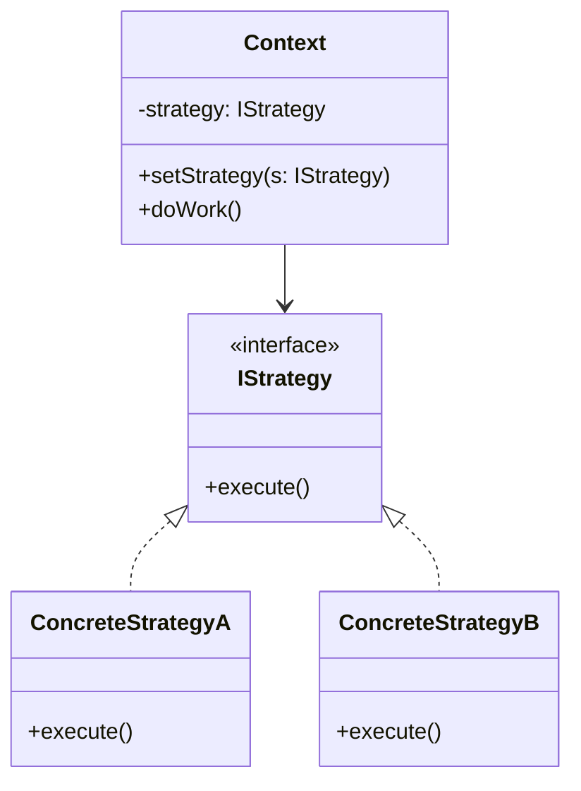

| GoFの名前 | この章での対応 |
| --- | --- |
| Context | `TicketContext` |
| Strategy | `IPriorityRule` |
| ConcreteStrategyA | `PremiumPriority` |
| ConcreteStrategyB | `NormalPriority` |

**Stateパターン（GoF標準）：**

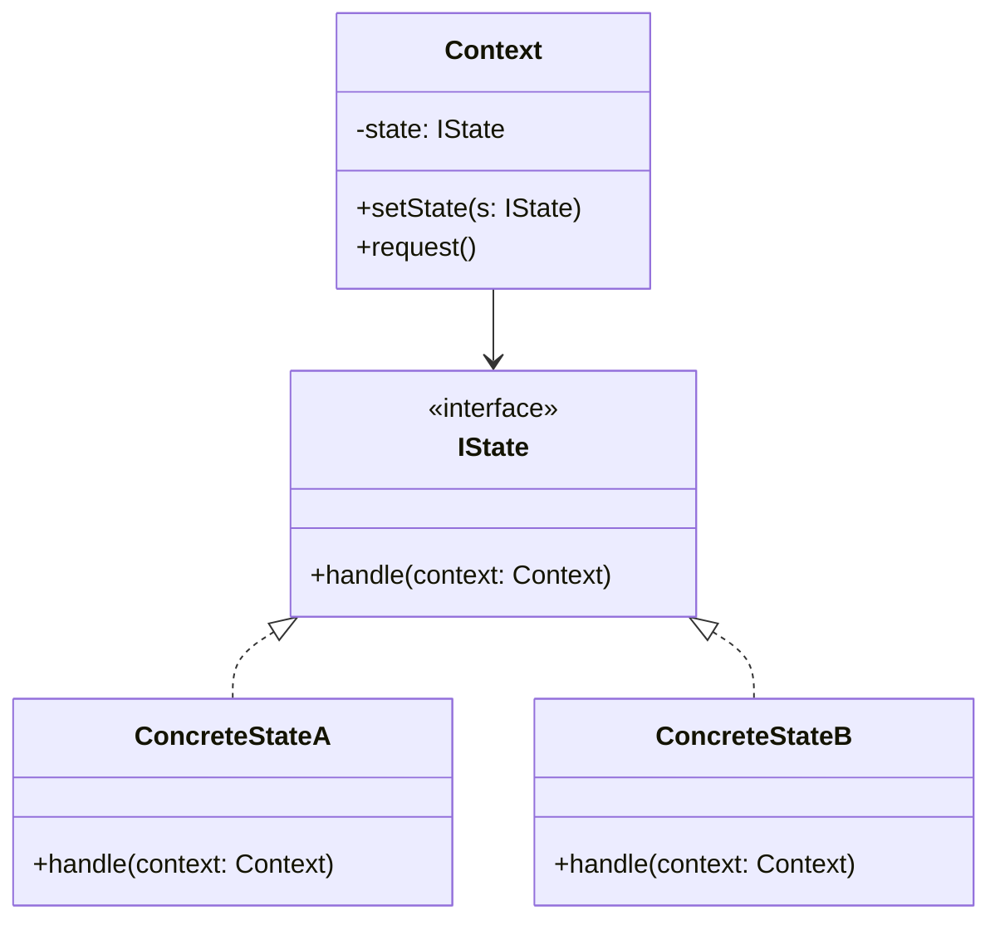

| GoFの名前 | この章での対応 |
| --- | --- |
| Context | `TicketContext` |
| IState | `ITicketPhase` |
| ConcreteStateA | `OpenPhase` |
| ConcreteStateB | `InProgressPhase` |

### 使いどころと限界

- **使うと良い：** 状態遷移が複雑で、さらにその状態ごとのルールが頻繁に変わるような大規模なワークフロー管理。または「変わる理由が2種類あり、それぞれ異なる担当者が変更を決定する」ことがヒアリングで確認された場合。
- **使わない方が良い：** シンプルな遷移であれば `if-else` の方が可読性が高いこともあります。判断基準として以下を確認してください。① 状態が2種類以下かつ今後増える予定がない、② ビジネスルールが1種類だけで四半期改定などの変更予定がない、③ 担当者が1人（変更の判断者が1人）——この3条件をすべて満たすなら、パターン適用はやりすぎです。1つでも満たさない場合は、将来のクラス爆発を避けるためにパターン適用を検討してください。

【過剰コード：シンプルなものまで無理に分離した例】

状態が「Open」「Closed」の2つだけで、ルールも「ハイか否か」1種類だけのシンプルなシステムにStrategy × Stateを適用すると、クラス爆発が起きます。

```cpp
// 【過剰コード】状態2種類・ルール1種類のみのシンプルなシステムに
// Strategy × State を適用した場合の例

// ── Strategy側（ルール1種類だけなのにインターフェースを定義）
class IPriorityRule {
public:
    virtual ~IPriorityRule() = default;
    virtual string getPriority() = 0;
};
class SinglePriority : public IPriorityRule { // ← 実装クラスが1つだけ
public:
    string getPriority() override { return "Normal"; }
};

// ── State側（状態2種類のみなのにインターフェースを定義）
class ISimpleState {
public:
    virtual ~ISimpleState() = default;
    virtual void handle() = 0;
};
class OpenState : public ISimpleState {  // ← 状態クラスが2つだけ
public:
    void handle() override { cout << "Open" << endl; }
};
class ClosedState : public ISimpleState {
public:
    void handle() override { cout << "Closed" << endl; }
};

// ── 合計5クラス + 2インターフェース。if-else 2行で書けた処理が
//    7つのクラスに分散し、次に触る人は全クラスを読まないと
//    「何をしているか」を理解できなくなる。
```

これを素直に書くと次のように2行で済みます。

```cpp
// シンプルな if-else の方が読みやすい場合
void updateStatus(string status) {
    if (status == "Open") cout << "Open" << endl;
    else cout << "Closed" << endl;
}
```

「状態が2つ以下・ルールが1種類」という条件では、パターン適用はクラス数を増やすだけで変更耐性の恩恵がありません。変化の見込みがないなら、シンプルな実装が一つの考え方です。

### この章のまとめ

チケット管理というドメインと Strategy × State の組み合わせの関係を一言で言うなら、「優先度ルール」と「状態遷移」は変わる速度も担当者も違う2つの変化軸であり、それぞれに別の境界を設けることで変更影響を分けやすくなる、ということです。先にパターン名を選ぶのではなく、問題を分析した結果がStrategyとStateの役割に対応した——この順序が、第二部を通じて最も伝えたいことです。

7つのフェーズを通じて、読者は1つのクラスに混在する2つの変化軸という観察から始まり、「変わる速度と担当者が違うならば分けるべき」という分析を経て、軸ごとに異なるパターンを当てるという判断へと進みました。フェーズ4で「優先度ルール」と「状態遷移」が独立した接続点を持つことが確認された時点で、1つのパターンでは解決しきれないことが見えました。その「解決しきれない」という気づきこそが、2つ目のパターンへ進む根拠になります。フェーズ6の5ステップで段階的に進化させた思考の流れは、複合問題に直面したときの手順として、このまま現場で使えると思っています。

あなたのコードの中にも、「誰の判断で変わるか」が異なる2つのロジックが同じクラスに同居している箇所があるはずです。それぞれの変化軸を問うことが、どのパターンをどこに当てるかを見つける入口になります。
