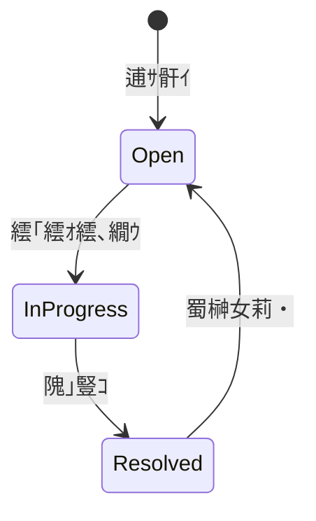
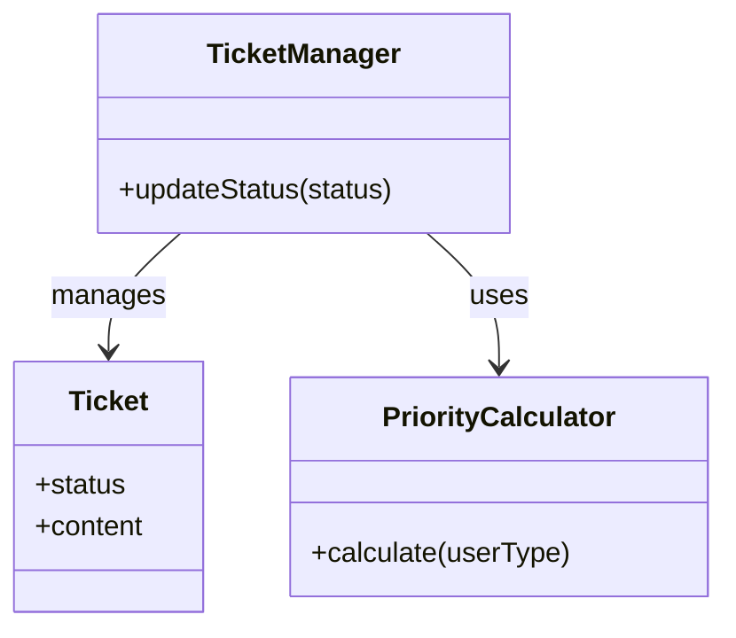
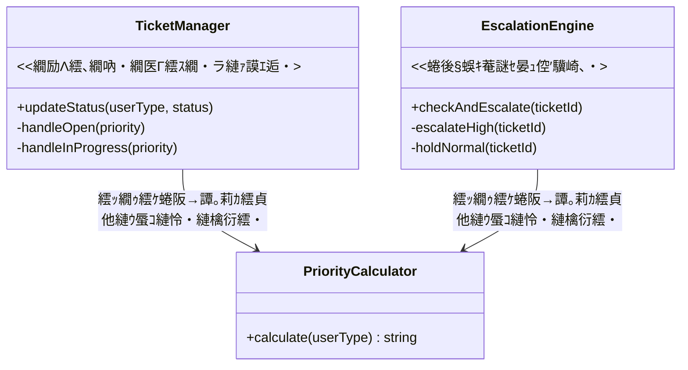
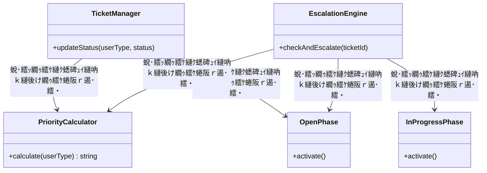
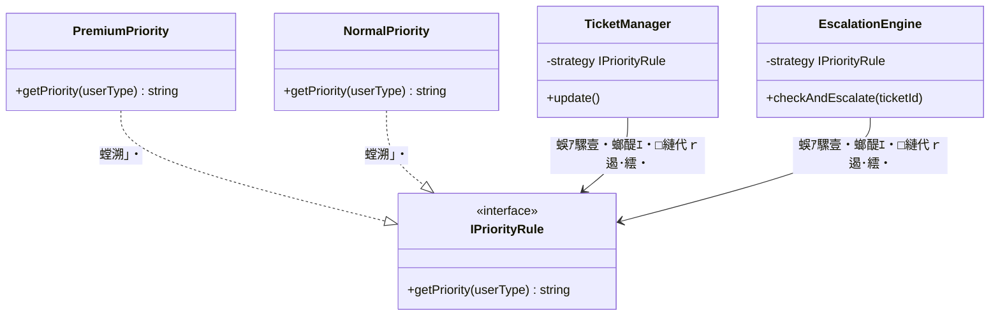
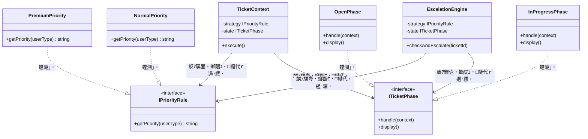
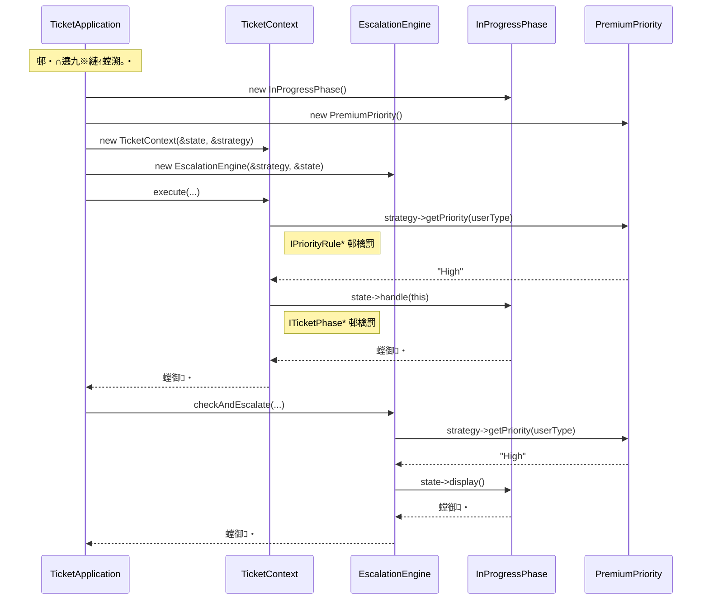
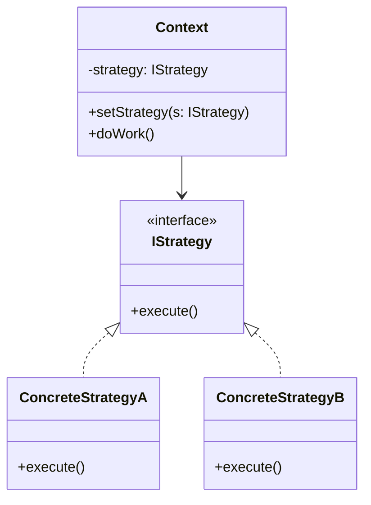
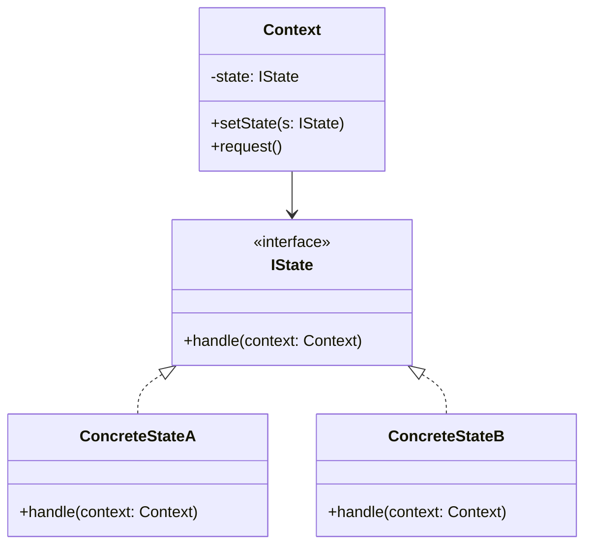

## 隨ｬ9遶 螟峨ｏ繧九Ν繝ｼ繝ｫ縺ｨ迥ｶ諷九・騾｣骼・窶補€・Strategy ﾃ・State 繝代ち繝ｼ繝ｳ

窶補€・諤晁€・・蝙具ｼ夊､・尅縺ｪ繝薙ず繝阪せ繝ｫ繝ｼ繝ｫ縺ｨ迥ｶ諷矩・遘ｻ縺檎ｵ｡縺ｿ蜷医≧蝣ｴ謇€繧偵←縺・ｧ｣縺上°

### 縺薙・遶縺ｮ譬ｸ蠢・

**繧ｷ繧ｹ繝・Β縺ｮ謖ｯ繧玖・縺・′縲後ン繧ｸ繝阪せ繝ｫ繝ｼ繝ｫ縲阪→縲檎憾諷矩・遘ｻ縲阪→縺・≧逡ｰ縺ｪ繧・縺､縺ｮ霆ｸ縺ｧ螟牙喧縺吶ｋ蝣ｴ蜷医€√％繧後ｉ繧貞・髮｢縺帙★縺ｫ荳€縺､縺ｮ繧ｯ繝ｩ繧ｹ縺ｫ謚ｱ縺郁ｾｼ繧€縺ｨ縲∵ｩ溯・諡｡蠑ｵ縺ｮ縺溘・縺ｫ繧ｳ繝ｼ繝峨′辷・匱逧・↓隍・尅蛹悶☆繧九€・*

隨ｬ9遶縺九ｉ縺ｯ譛ｬ譖ｸ縺ｮ隨ｬ莠碁Κ縺ｧ縺吶€らｬｬ荳€驛ｨ縺ｧ縺ｯ縲∫ｫ縺斐→縺ｫ荳ｻ縺ｨ縺ｪ繧倶ｸ€縺､縺ｮ螟画峩隱ｲ鬘後∈辟ｦ轤ｹ繧貞ｽ薙※縲∝ｯｾ蠢懊☆繧九ヱ繧ｿ繝ｼ繝ｳ繧剃ｸ€縺､縺壹▽蟄ｦ縺ｳ縺ｾ縺励◆縲らｬｬ莠碁Κ縺ｧ縺ｯ縲∝､画峩縺ｮ豎ｺ螳夊€・ｄ鬆ｻ蠎ｦ縺檎焚縺ｪ繧玖､・焚縺ｮ隱ｲ鬘後′蜷後§繧ｷ繧ｹ繝・Β縺ｫ蟄伜惠縺吶ｋ蝣ｴ蜷医ｒ謇ｱ縺・∪縺吶€ょ酔縺・縺､縺ｮ繝輔ぉ繝ｼ繧ｺ縺ｧ蝠城｡後ｒ蛻・梵縺励∪縺吶′縲∽ｸ€縺､縺ｮ讒矩€縺縺代〒縺ｯ螟画峩蠖ｱ髻ｿ繧貞香蛻・↓蛻・￠繧峨ｌ縺ｪ縺・→縺阪€∬､・焚縺ｮ繝代ち繝ｼ繝ｳ繧堤ｵ・∩蜷医ｏ縺帙∪縺吶€ゅ€後ヱ繧ｿ繝ｼ繝ｳ繧剃ｽｿ縺・◆繧√↓險ｭ險医☆繧九€阪・縺ｧ縺ｯ縺ｪ縺上€√€悟､牙喧縺ｮ霆ｸ繧貞・譫舌＠縺ｦ蠢・ｦ√↑蠅・阜繧帝∈縺ｶ縲阪→縺・≧鬆・ｺ上・螟峨ｏ繧翫∪縺帙ｓ縲・

### 縺薙・遶繧定ｪｭ繧€縺ｨ蠕励ｉ繧後ｋ縺薙→

* **蠕励ｉ繧後ｋ縺薙→1・・* 繝薙ず繝阪せ繝ｫ繝ｼ繝ｫ縺ｮ蛻・ｊ譖ｿ縺医→迥ｶ諷九＃縺ｨ縺ｮ謖ｯ繧玖・縺・′豺ｷ蝨ｨ縺励※縺・ｋ邂・園繧定ｭ伜挨縺ｧ縺阪ｋ繧医≧縺ｫ縺ｪ繧・

* **蠕励ｉ繧後ｋ縺薙→2・・* 謗･邯夂せ縺ｧ迥ｶ諷矩・遘ｻ縺ｨ蜆ｪ蜈亥ｺｦ繝ｫ繝ｼ繝ｫ縺ｮ遏･隴倥′縺ｩ縺薙∈貍上ｌ縺ｦ縺・ｋ縺九ｒ隱ｿ縺ｹ縲∝､画峩縺ｮ逞帙∩縺檎函縺ｾ繧後ｋ逅・罰繧貞愛譁ｭ縺ｧ縺阪ｋ繧医≧縺ｫ縺ｪ繧・

* **蠕励ｉ繧後ｋ縺薙→3・・* 隍・粋逧・↑螟牙喧縺ｫ蟇ｾ縺励※縲∬､・焚縺ｮ隗｣豎ｺ謇区ｮｵ繧堤ｵ・∩蜷医ｏ縺帙※縺ｩ縺ｮ繧医≧縺ｫ螻€謇€蛹悶〒縺阪ｋ縺九ｒ隱ｬ譏弱〒縺阪ｋ繧医≧縺ｫ縺ｪ繧・

* **蠕励ｉ繧後ｋ縺薙→4・・* 迴ｾ蝣ｴ縺ｮ隍・尅縺ｪ譚｡莉ｶ蛻・ｲ舌ｒ縲（f譁・・鄒・・縺九ｉ繧ｪ繝悶ず繧ｧ繧ｯ繝医・讒区・縺ｸ縺ｨ螟画鋤縺吶ｋ隕也せ

## 鳩 繝輔ぉ繝ｼ繧ｺ1・夂樟迥ｶ謚頑升 窶補€・莉墓ｧ倥ｒ謨ｴ逅・＠縲√す繧ｹ繝・Β縺ｨ邏蝉ｻ倥￠繧・

縺薙・蝠城｡後ｒ隗｣縺上◆繧√↓7縺､縺ｮ繝輔ぉ繝ｼ繧ｺ繧剃ｽｿ縺・∪縺吶€ゅ・縺倥ａ縺ｫ迴ｾ迥ｶ謚頑升縺九ｉ髢句ｧ九＠縲∽ｻｮ隱ｬ遶区｡医・蝠城｡檎音螳壹・蜴溷屏蛻・梵繝ｻ隱ｲ鬘悟ｮ夂ｾｩ繝ｻ蟇ｾ遲匁､懆ｨ弱・蟇ｾ遲門ｮ滓命縺ｨ縺・≧鬆・〒騾ｲ縺ｿ縺ｾ縺吶€ょ､画峩隕∵ｱゅ′譚･繧句燕縺ｮ繧ｷ繧ｹ繝・Β縺ｮ迴ｾ迥ｶ繧剃ｺ句ｮ溘→縺励※謚頑升縺吶ｋ縺ｨ縺薙ｍ縺九ｉ蟋九ａ縺ｾ縺吶€ゅ・縺倥ａ縺ｫ莉墓ｧ倥→蜍穂ｽ應ｾ九〒縲後％縺ｮ繧ｷ繧ｹ繝・Β縺御ｽ輔ｒ縺吶ｋ縺九€阪ｒ遒ｺ隱阪＠縲√◎繧後°繧峨さ繝ｼ繝峨ｒ隱ｭ縺ｿ縺ｾ縺吶€・

### 1-1・壹％縺ｮ繧ｷ繧ｹ繝・Β縺ｮ莉墓ｧ・

縺薙・繧ｷ繧ｹ繝・Β縺ｯ縲∫､ｾ蜀・・IT繝倥Ν繝励ョ繧ｹ繧ｯ縺ｧ菴ｿ繧上ｌ縺ｦ縺・ｋ縲後し繝昴・繝医メ繧ｱ繝・ヨ邂｡逅・す繧ｹ繝・Β縲阪〒縺吶€ら､ｾ蜩｡縺九ｉ螻翫￥PC繧・ロ繝・ヨ繝ｯ繝ｼ繧ｯ縺ｮ繝医Λ繝悶Ν蝣ｱ蜻翫ｒ繝√こ繝・ヨ縺ｨ縺励※逋ｻ骭ｲ縺励€√・繝ｫ繝励ョ繧ｹ繧ｯ諡・ｽ楢€・′縺昴ｌ繧定ｧ｣豎ｺ縺吶ｋ縺ｾ縺ｧ縺ｮ驕守ｨ九ｒ邂｡逅・＠縺ｦ縺・∪縺吶€・

繝ｪ繝ｪ繝ｼ繧ｹ蠖灘・縺ｯ縲√メ繧ｱ繝・ヨ縺ｮ蜿嶺ｻ倥°繧牙ｮ御ｺ・∪縺ｧ縺ｮ繧ｹ繝・・繧ｿ繧ｹ繧ょ腰邏斐〒縲√Ν繝ｼ繝ｫ縺ｮ螟画峩繧ゅ⊇縺ｨ繧薙←縺ゅｊ縺ｾ縺帙ｓ縺ｧ縺励◆縲ゅ＠縺九＠縲√し繝ｼ繝薙せ縺ｮ諡｡螟ｧ縺ｫ莨ｴ縺・€√メ繧ｱ繝・ヨ縺ｮ蛻・｡槭＃縺ｨ縺ｫ隧ｳ邏ｰ縺ｪ蟇ｾ蠢懊ヵ繝ｭ繝ｼ縺梧ｱゅａ繧峨ｌ繧九ｈ縺・↓縺ｪ繧翫€√＆繧峨↓驥崎ｦ∝ｺｦ繧・｡ｧ螳｢縺斐→縺ｮ蜆ｪ蜈磯・ｽ崎ｨｭ螳壹↑縺ｩ縲∵･ｭ蜍吶Ν繝ｼ繝ｫ縺瑚､・尅蛹悶・荳€騾斐ｒ縺溘←縺｣縺ｦ縺・∪縺吶€・

荳€隕九☆繧九→縲∽ｸ€縺､縺ｮ繧ｯ繝ｩ繧ｹ縺ｧ繝√こ繝・ヨ縺ｮ迥ｶ諷矩・遘ｻ縺ｨ繝薙ず繝阪せ繝ｫ繝ｼ繝ｫ繧偵☆縺ｹ縺ｦ邂｡逅・＠縺ｦ縺翫ｊ縲∵ｩ溯・縺ｯ邯ｲ鄒・＆繧後※縺・ｋ繧医≧縺ｫ隕九∴縺ｾ縺吶€・

**繝√こ繝・ヨ縺ｮ迥ｶ諷九→螳溯｡後〒縺阪ｋ謫堺ｽ・*

| 迥ｶ諷・| 迥ｶ諷句錐・郁恭隱橸ｼ・| 螳溯｡後〒縺阪ｋ謫堺ｽ・|
|---|---|---|
| 蜿嶺ｻ倅ｸｭ | Open | 諡・ｽ楢€・い繧ｵ繧､繝ｳ |
| 蟇ｾ蠢應ｸｭ | InProgress | 隗｣豎ｺ繝ｻ繧ｨ繧ｹ繧ｫ繝ｬ繝ｼ繧ｷ繝ｧ繝ｳ |
| 隗｣豎ｺ貂医∩ | Resolved | 蜀榊女莉・|

蝓ｺ譛ｬ縺ｮ豬√ｌ縺ｯ縲薫pen 竊・InProgress 竊・Resolved縲阪・荳€譁ｹ蜷代〒縺吶€りｧ｣豎ｺ貂医∩繝√こ繝・ヨ繧貞・蠎ｦ蜿励￠莉倥￠繧九€軍esolved 竊・Open縲阪→縺・≧騾・ｵ√ｂ縺ゅｊ縺ｾ縺吶€・

**蜆ｪ蜈亥ｺｦ繝ｫ繝ｼ繝ｫ**

| 繝ｦ繝ｼ繧ｶ繝ｼ遞ｮ蛻･ | 險ｭ螳壹＆繧後ｋ蜆ｪ蜈亥ｺｦ | 驕ｩ逕ｨ繧ｿ繧､繝溘Φ繧ｰ |
|---|---|---|
| 荳€闊ｬ繝ｦ繝ｼ繧ｶ繝ｼ | Normal・域ｨ呎ｺ厄ｼ・| 繝√こ繝・ヨ逋ｻ骭ｲ譎ゅ・蜀榊女莉俶凾 |
| 繝励Ξ繝溘い繝繝ｦ繝ｼ繧ｶ繝ｼ | High・磯ｫ伜━蜈亥ｺｦ・・| 繝√こ繝・ヨ逋ｻ骭ｲ譎ゅ・蜀榊女莉俶凾繝ｻ繧ｨ繧ｹ繧ｫ繝ｬ繝ｼ繧ｷ繝ｧ繝ｳ譎・|

**縺薙・繧ｷ繧ｹ繝・Β縺ｮ髢｢菫り€・*

| 蠖ｹ蜑ｲ | 諡・ｽ楢€・| 邂｡霓・☆繧狗衍隴・|
|---|---|---|
| 迥ｶ諷矩・遘ｻ繝ｫ繝ｼ繝ｫ縺ｮ邂｡逅・| 驕狗畑繝√・繝 | 迥ｶ諷九・霑ｽ蜉繝ｻ螟画峩繝ｻ驕ｷ遘ｻ譚｡莉ｶ |
| 蜆ｪ蜈亥ｺｦ蛻､螳壹Ν繝ｼ繝ｫ縺ｮ邂｡逅・| 蜩∬ｳｪ邂｡逅・メ繝ｼ繝 | 繝ｦ繝ｼ繧ｶ繝ｼ遞ｮ蛻･縺ｨ蜆ｪ蜈亥ｺｦ縺ｮ蝓ｺ貅・|

蠕後・繝輔ぉ繝ｼ繧ｺ縺ｧ縲瑚ｪｰ縺ｮ蛻､譁ｭ縺ｧ螟峨ｏ繧狗衍隴倥°縲阪ｒ遒ｺ隱阪☆繧九→縺阪€√％縺ｮ髢｢菫り€・｡ｨ縺悟渕貅悶↓縺ｪ繧翫∪縺吶€・

### 1-2・壼虚菴應ｾ九ユ繝ｼ繝悶Ν

縺薙・繧ｷ繧ｹ繝・Β縺後←縺ｮ繧医≧縺ｫ蜍輔￥縺九ｒ縲∽ｻ｣陦ｨ逧・↑謫堺ｽ懊ヱ繧ｿ繝ｼ繝ｳ縺ｧ遉ｺ縺励∪縺吶€ゅけ繝ｩ繧ｹ蝗ｳ繧・さ繝ｼ繝峨ｒ隱ｭ繧€蜑阪↓縲√€御ｽ輔ｒ縺吶ｋ繧ｷ繧ｹ繝・Β縺九€阪ｒ縺薙％縺ｧ遒ｺ隱阪＠縺ｦ縺上□縺輔＞縲・

| 繝√こ繝・ヨ遞ｮ蛻･ | 謫堺ｽ・| 蜆ｪ蜈亥ｺｦ繝ｫ繝ｼ繝ｫ | 迥ｶ諷矩・遘ｻ |
| --- | --- | --- | --- |
| 譁ｰ隕上メ繧ｱ繝・ヨ | 荳€闊ｬ繝ｦ繝ｼ繧ｶ繝ｼ縺檎匳骭ｲ | 讓呎ｺ門━蜈亥ｺｦ・・ormal・・| 竊・蜿嶺ｻ倅ｸｭ・・pen・・|
| 譁ｰ隕上メ繧ｱ繝・ヨ | 繝励Ξ繝溘い繝繝ｦ繝ｼ繧ｶ繝ｼ縺檎匳骭ｲ | 鬮伜━蜈亥ｺｦ・・igh・・| 竊・蜿嶺ｻ倅ｸｭ・・pen・・|
| 蜿嶺ｻ倅ｸｭ繝√こ繝・ヨ | 諡・ｽ楢€・い繧ｵ繧､繝ｳ | 繝ｫ繝ｼ繝ｫ驕ｩ逕ｨ縺ｪ縺・| 竊・蟇ｾ蠢應ｸｭ・・nProgress・峨↓驕ｷ遘ｻ |
| 蟇ｾ蠢應ｸｭ繝√こ繝・ヨ | 諡・ｽ楢€・′隗｣豎ｺ | 繝ｫ繝ｼ繝ｫ驕ｩ逕ｨ縺ｪ縺・| 竊・隗｣豎ｺ貂医∩・・esolved・峨↓驕ｷ遘ｻ |
| 隗｣豎ｺ貂医∩繝√こ繝・ヨ | 荳€闊ｬ繝ｦ繝ｼ繧ｶ繝ｼ縺悟・繧ｪ繝ｼ繝励Φ | 讓呎ｺ門━蜈亥ｺｦ・・ormal・・| 竊・蜀榊女莉倅ｸｭ・・pen・峨↓驕ｷ遘ｻ |
| 蟇ｾ蠢應ｸｭ繝√こ繝・ヨ | 繝励Ξ繝溘い繝繝ｦ繝ｼ繧ｶ繝ｼ縺後お繧ｹ繧ｫ繝ｬ繝ｼ繧ｷ繝ｧ繝ｳ | 鬮伜━蜈亥ｺｦ・・igh・峨↓蛻・ｊ譖ｿ縺・| 繧ｨ繧ｹ繧ｫ繝ｬ繝ｼ繧ｷ繝ｧ繝ｳ螳溯｡鯉ｼ育憾諷矩・遘ｻ縺ｪ縺暦ｼ・|

縺薙・6縺､縺ｮ蜍穂ｽ懊ヱ繧ｿ繝ｼ繝ｳ縺後€√％縺ｮ繧ｷ繧ｹ繝・Β縺梧ｺ€縺溘☆蠢・ｦ√′縺ゅｋ蜍穂ｽ懊・蝓ｺ貅悶〒縺吶€ょｾ後〒繧ｹ繝・ャ繝励ｒ豈碑ｼ・☆繧九→縺阪ｂ縲√€後←縺ｮ繧ｹ繝・ャ繝励ｂ縺薙ｌ縺ｨ蜷後§蜍穂ｽ懊ｒ螳溽樟縺吶ｋ縲阪→縺・≧蜑肴署縺ｧ隱ｭ繧薙〒縺上□縺輔＞縲・

### 1-2b・夂憾諷矩・遘ｻ陦ｨ

縺薙・繧ｷ繧ｹ繝・Β縺ｧ邂｡逅・☆繧狗憾諷九→縲∝推迥ｶ諷九°繧牙庄閭ｽ縺ｪ驕ｷ遘ｻ繧呈紛逅・＠縺ｾ縺吶€ゅ％繧後′莉雁屓縺ｮ縲悟､峨ｏ繧翫ｄ縺吶＞驛ｨ蛻・ｼ育憾諷九＃縺ｨ縺ｮ謖ｯ繧玖・縺・ｼ峨€阪・蜈ｨ菴灘ワ縺ｧ縺吶€・

| 迴ｾ蝨ｨ縺ｮ迥ｶ諷・| 繧｢繧ｵ繧､繝ｳ | 隗｣豎ｺ | 蜀榊女莉・|
| --- | --- | --- | --- |
| Open・亥女莉倅ｸｭ・・| 竊・InProgress・亥ｯｾ蠢應ｸｭ・・| 窶披€・| 窶披€・|
| InProgress・亥ｯｾ蠢應ｸｭ・・| 窶披€・| 竊・Resolved・郁ｧ｣豎ｺ貂医∩・・| 窶披€・|
| Resolved・郁ｧ｣豎ｺ貂医∩・・| 窶披€・| 窶披€・| 竊・Open・亥・蜿嶺ｻ倅ｸｭ・・|



縲薫pen 竊・InProgress 竊・Resolved縲阪→縺・≧荳€譁ｹ蜷代・豬√ｌ縺悟渕譛ｬ縺ｧ縺吶′縲√€瑚ｧ｣豎ｺ貂医∩ 竊・蜀榊女莉倥€阪→縺・≧騾・ｵ√′縺ゅｊ縺ｾ縺吶€ら憾諷九′蠅励∴繧九⊇縺ｩ縲√％縺ｮ繝槭ヨ繝ｪ繧ｯ繧ｹ縺ｮ縲檎ｩｺ谺・ｼ遺€披€費ｼ峨€阪・邂｡逅・′隍・尅縺ｫ縺ｪ繧翫∪縺吶€・

> **東 縺薙・遶縺ｮ螳溯｣・せ繧ｳ繝ｼ繝励↓縺､縺・※**
> 1-5遽€縺ｮ螟画峩隕∵ｱゅ〒縺ｯ縲御ｿ晉蕗荳ｭ縲阪€後・繝ｳ繝€繝ｼ遒ｺ隱堺ｸｭ縲阪→縺・▲縺滓眠縺励＞迥ｶ諷九・霑ｽ蜉縺瑚ｨ€蜿翫＆繧後※縺翫ｊ縲・-5遽€縺ｮ繝偵い繝ｪ繝ｳ繧ｰ縺ｧ繧ゅ％繧後ｉ縺ｮ霑ｽ蜉縺後€檎｢ｺ螳夲ｼ亥濠譛滉ｻ･蜀・ｼ峨€阪→險倬鹸縺輔ｌ縺ｦ縺・∪縺吶€ゅ◆縺縺励€√％繧後ｉ縺ｮ迥ｶ諷九・譛ｬ遶縺ｮ繝輔ぉ繝ｼ繧ｺ7譛€邨ゅさ繝ｼ繝峨↓縺ｯ蜷ｫ縺ｾ繧後※縺・∪縺帙ｓ縲よ悽遶縺ｮ螳溯｣・せ繧ｳ繝ｼ繝励・荳願ｨ倥・3迥ｶ諷具ｼ・pen / InProgress / Resolved・峨→縲ヾtrategy繝代ち繝ｼ繝ｳ縺ｫ繧医ｋ蜆ｪ蜈亥ｺｦ繝ｫ繝ｼ繝ｫ縺ｮ蛻・屬縺ｫ邨槭▲縺ｦ縺・∪縺吶€よ眠迥ｶ諷九・霑ｽ蜉縺ｯ縲∵悽遶縺ｮ險ｭ險医ｒ蝨溷床縺ｨ縺励◆谺｡縺ｮ蜿榊ｾｩ・医う繝・Ξ繝ｼ繧ｷ繝ｧ繝ｳ・峨〒陦後≧諠ｳ螳壹〒縺吶€・

谺｡縺ｯ莉墓ｧ倥→繧ｯ繝ｩ繧ｹ繧貞ｯｾ蠢懊▼縺代∪縺吶€・

**縺薙・繧ｷ繧ｹ繝・Β縺ｮ逋ｻ蝣ｴ繧ｯ繝ｩ繧ｹ**

| 繧ｯ繝ｩ繧ｹ蜷・| 蠖ｹ蜑ｲ | 諡・ｽ薙☆繧倶ｻ墓ｧ・|
|---|---|---|
| TicketManager | 繝√こ繝・ヨ縺ｮ蜈ｨ菴鍋ｮ｡逅・・迥ｶ諷矩・遘ｻ | 繝√こ繝・ヨ縺ｮ蜿嶺ｻ倥°繧牙ｮ御ｺ・∪縺ｧ縺ｮ繧ｹ繝・・繧ｿ繧ｹ邂｡逅・|
| PriorityCalculator | 蜆ｪ蜈亥ｺｦ縺ｮ險育ｮ・| 繧ｿ繧､繝医Ν繧・｡ｧ螳｢諠・ｱ縺ｫ蝓ｺ縺･縺丞━蜈亥ｺｦ縺ｮ閾ｪ蜍募愛螳・|
| Ticket | 繝√こ繝・ヨ諠・ｱ縺ｮ菫晄戟 | ID縲√ち繧､繝医Ν縲・｡ｧ螳｢蜷阪€∝━蜈亥ｺｦ縲∫憾諷九↑縺ｩ縺ｮ繝・・繧ｿ |

---

### 1-3・壹け繝ｩ繧ｹ讒区・蝗ｳ

迴ｾ迥ｶ縺ｮ繧ｳ繝ｼ繝画ｧ矩€縺ｧ縺吶€ら憾諷狗ｮ｡逅・→繝ｫ繝ｼ繝ｫ蛻､螳壹′豺ｷ蝨ｨ縺励※縺翫ｊ縲∵僑蠑ｵ縺ｮ縺溘・縺ｫ萓晏ｭ倬未菫ゅ′豺ｱ縺ｾ縺｣縺ｦ縺・∪縺吶€・



`TicketManager` 繧ｯ繝ｩ繧ｹ縺後€√メ繧ｱ繝・ヨ縺ｮ迥ｶ諷狗ｮ｡逅・→縲√◎縺ｮ驕ｷ遘ｻ縺ｫ莨ｴ縺・━蜈亥ｺｦ險育ｮ励→縺・≧逡ｰ縺ｪ繧玖ｲｬ蜍吶ｒ謚ｱ縺医※縺・∪縺吶€・

---

### 1-4・壼ｮ溯｣・さ繝ｼ繝会ｼ育樟迥ｶ・・

繧ｷ繧ｹ繝・Β縺ｮ迴ｾ迥ｶ縺ｮ螳溯｣・ｒ遒ｺ隱阪＠縺ｾ縺吶€ゅさ繝ｼ繝峨ｒ蠖ｹ蜑ｲ縺斐→縺ｫ蛻・￠縺ｦ隱ｭ繧薙〒縺・″縺ｾ縺吶€・

**PriorityCalculator 繧ｯ繝ｩ繧ｹ**

```cpp
#include <iostream>
#include <string>

using namespace std;

// 蜆ｪ蜈亥ｺｦ繝ｫ繝ｼ繝ｫ・亥､峨ｏ繧句庄閭ｽ諤ｧ縺後≠繧具ｼ・
class PriorityCalculator {
public:
    string calculate(string userType) {
        if (userType == "premium") return "High"; // 竊・繝ｫ繝ｼ繝ｫ蛻､螳壹ｒ逶ｴ譖ｸ縺・
        return "Normal";
    }
};
```

**TicketManager 繧ｯ繝ｩ繧ｹ**

```cpp
// 繝√こ繝・ヨ邂｡逅・ｼ育憾諷九→繝ｫ繝ｼ繝ｫ縺梧ｷｷ蝨ｨ・・
class TicketManager {
    PriorityCalculator calc;
public:
    void updateStatus(string userType, string status) {
        string priority = calc.calculate(userType); // 竊・繝ｫ繝ｼ繝ｫ蛻､螳壹・遏･隴倥′豺ｷ蝨ｨ
        if (status == "Open") {
            cout << "繝√こ繝・ヨ蜿嶺ｻ倅ｸｭ縲ょ━蜈亥ｺｦ: " << priority << endl;
        } else if (status == "InProgress" && priority == "High") {
            cout << "邱頑€･蟇ｾ蠢應ｸｭ縲よ球蠖楢€・ｒ諡幃寔縺励∪縺吶€・ << endl;
        }
    }
};
```

**main 髢｢謨ｰ**

```cpp
int main() {
    TicketManager manager;
    manager.updateStatus("premium", "InProgress");
    return 0;
}
```

**螳溯｡檎ｵ先棡**

```
邱頑€･蟇ｾ蠢應ｸｭ縲よ球蠖楢€・ｒ諡幃寔縺励∪縺吶€・
```

縺薙・繧ｳ繝ｼ繝峨ｒ隕九ｋ縺ｨ縲～TicketManager` 縺悟━蜈亥ｺｦ縺ｮ險育ｮ励Ν繝ｼ繝ｫ・・PriorityCalculator`・峨→縲∫憾諷九↓蠢懊§縺溘い繧ｯ繧ｷ繝ｧ繝ｳ・・f-else・峨・荳｡譁ｹ繧堤峩謗･遏･縺｣縺ｦ縺・ｋ縺薙→縺悟・縺九ｊ縺ｾ縺吶€・

---

### 1-5・壼､画峩隕∵ｱ・

縲宣°逕ｨ繝√・繝縺ｨ蜩∬ｳｪ邂｡逅・メ繝ｼ繝縺九ｉ縺ｮ隕∵ｱゅ€・
縺ゅｋ譛域屆譌･縺ｮ譛昴€√・繝ｫ繝励ョ繧ｹ繧ｯ縺ｮ繝槭ロ繝ｼ繧ｸ繝｣繝ｼ縺九ｉ繝√Ε繝・ヨ縺悟ｱ翫″縺ｾ縺励◆縲・

縲後♀逍ｲ繧梧ｧ倥€ら樟蝨ｨ蟇ｾ蠢懊＠縺ｦ縺・ｋ繝√こ繝・ヨ繧ｷ繧ｹ繝・Β縺ｪ繧薙□縺代←縲∽ｻ雁ｺｦ縺九ｉ縲惨LA・医し繝ｼ繝薙せ繝ｬ繝吶Ν蜷域э・峨€上ｒ蜴ｳ譬ｼ縺ｫ驕狗畑縺吶ｋ縺薙→縺ｫ縺ｪ縺｣縺溘ｓ縺縲ら音縺ｫ縲・㍾隕∝ｺｦ縺碁ｫ倥＞繝√こ繝・ヨ縺後€三pen縲冗憾諷九・縺ｾ縺ｾ髟ｷ譎る俣謾ｾ鄂ｮ縺輔ｌ繧九・縺ｯ菴輔→縺励※繧る∩縺代◆縺・€ゅ◎繧後→蜷梧凾縺ｫ縲√％繧後∪縺ｧ縺ｯ繝√こ繝・ヨ縺ｮ繧ｹ繝・・繧ｿ繧ｹ縺・遞ｮ鬘槭＠縺九↑縺九▲縺溘￠繧後←縲∽ｻ雁ｾ後・縲惹ｿ晉蕗荳ｭ縲上ｄ縲弱・繝ｳ繝€繝ｼ遒ｺ隱堺ｸｭ縲上→縺・▲縺溽憾諷九ｂ蠅励∴繧倶ｺ亥ｮ壹□縲ゅ％縺ｮ譁ｰ縺励＞繝ｫ繝ｼ繝ｫ縺ｨ迥ｶ諷矩・遘ｻ縺ｮ隍・尅縺輔↓縲∽ｻ翫・繧ｷ繧ｹ繝・Β縺ｧ蟇ｾ蠢懊〒縺阪ｋ縺九↑・溘€・

縺ｪ繧九⊇縺ｩ縲ゆｻ雁屓縺ｮ螟画峩隕∵ｱゅ・縲碁㍾隕∝ｺｦ縺ｫ蠢懊§縺溷━蜈亥ｺｦ蛻､譁ｭ繝ｫ繝ｼ繝ｫ縺ｮ霑ｽ蜉縲阪→縲檎憾諷矩・遘ｻ縺ｮ蠅怜刈縲阪→縺・≧縲∽ｺ後▽縺ｮ螟ｧ縺阪↑譟ｱ縺後≠繧九ｈ縺・〒縺吶€ゆｻ翫・繧ｳ繝ｼ繝峨・縺ｾ縺ｾ迥ｶ諷九′蠅励∴繧九→縲（f-else 縺ｮ蛻・ｲ舌′縺輔ｉ縺ｫ蠅励∴縲∝､画峩邂・園繧定ｿｽ縺・↓縺上￥縺ｪ繧句庄閭ｽ諤ｧ縺後≠繧翫∪縺吶€ゅ％縺ｮ蜈医€√％縺ｮ繧ｷ繧ｹ繝・Β縺梧干縺医ｋ驥崎差繧偵←縺・・縺代ｋ縺九€∽ｻｮ隱ｬ繧堤ｫ九※縺ｦ遒ｺ隱阪＠縺ｾ縺吶€・

**莉墓ｧ伜､画峩縺ｮ蜀・ｮｹ**

螟画峩隕∵ｱゅｒ蜿励￠縺ｦ縲∫樟蝨ｨ縺ｮ莉墓ｧ倥′縺ｩ縺・､峨ｏ繧九°繧呈紛逅・＠縺ｾ縺吶€・

| 鬆・岼 | 螟画峩蜑・| 螟画峩蠕・|
|---|---|---|
| 繝√こ繝・ヨ迥ｶ諷九・遞ｮ鬘・| 3遞ｮ鬘橸ｼ・pen / InProgress / Resolved・・| 菫晉蕗荳ｭ繝ｻ繝吶Φ繝€繝ｼ遒ｺ隱堺ｸｭ縺ｪ縺ｩ譁ｰ迥ｶ諷九ｒ霑ｽ蜉莠亥ｮ・|
| 蜆ｪ蜈亥ｺｦ繝ｫ繝ｼ繝ｫ | 荳€闊ｬ竊誰ormal縲√・繝ｬ繝溘い繝竊辿igh 縺ｮ蝗ｺ螳壼愛螳・| SLA蝓ｺ貅悶↓蝓ｺ縺･縺丞愛螳壹Ν繝ｼ繝ｫ・亥屁蜊頑悄縺斐→縺ｫ謾ｹ螳夲ｼ・|

縲檎憾諷九′蠅励∴繧九€榊､画峩縺ｨ縲悟━蜈亥ｺｦ繝ｫ繝ｼ繝ｫ縺悟､峨ｏ繧九€榊､画峩縺ｯ縲∽ｻ雁ｾ後ｂ蛻･縺ｮ繧ｿ繧､繝溘Φ繧ｰ縺ｧ螻翫￥蜿ｯ閭ｽ諤ｧ縺後≠繧翫∪縺吶€ゅ％縺ｮ2縺､縺ｯ迢ｬ遶九＠縺溯ｻｸ縺ｨ縺励※謇ｱ縺・ｿ・ｦ√′縺ゅｊ縺ｾ縺吶€・

---

## 泪 繝輔ぉ繝ｼ繧ｺ2・壻ｻｮ隱ｬ遶区｡・窶補€・菴輔′螟峨ｏ繧九°繧定ｦｳ蟇溘＠縲√ヲ繧｢繝ｪ繝ｳ繧ｰ縺ｧ陬丈ｻ倥￠繧・

繝輔ぉ繝ｼ繧ｺ1縺ｧ縲～TicketManager` 縺後メ繧ｱ繝・ヨ縺ｮ迥ｶ諷矩・遘ｻ縺ｨ蜆ｪ蜈亥ｺｦ險育ｮ励Ο繧ｸ繝・け繧堤峩謗･菫晄戟縺励※縺・ｋ迴ｾ迥ｶ繧呈滑謠｡縺励∪縺励◆縲ょｱ翫＞縺溷､画峩隕∵ｱゅｒ雕上∪縺医€√％縺ｮ險ｭ險医↓縺翫￠繧句､牙虚縺ｨ荳榊､峨ｒ謨ｴ逅・＠縺ｾ縺吶€・

### 2-1・啻TicketManager`縺ｫ豺ｷ蝨ｨ縺励※縺・ｋ遏･隴倥→諡・ｽ薙メ繝ｼ繝

`TicketManager.updateStatus()` 縺檎樟蝨ｨ謚ｱ縺医※縺・ｋ遏･隴倥→縲√◎繧後◇繧後ｒ螟画峩縺吶ｋ繝√・繝繧堤｢ｺ隱阪＠縺ｾ縺吶€・

| 遏･隴假ｼ医さ繝ｼ繝峨′逶ｴ謗･謖√▲縺ｦ縺・ｋ繧ゅ・・・| 螟画峩繧呈ｱｺ繧√ｋ繝√・繝 | 驕ｩ蛻・° |
|---|---|---|
| 蜆ｪ蜈亥ｺｦ險育ｮ励Ν繝ｼ繝ｫ縺ｮ蜻ｼ縺ｳ蜃ｺ縺・| SLA邂｡逅・メ繝ｼ繝・亥屁蜊頑悄謾ｹ螳夲ｼ・| 笶・豺ｷ蝨ｨ |
| Open迥ｶ諷九〒縺ｮ謖ｯ繧玖・縺・・譚｡莉ｶ | 驕狗畑繝励Ο繧ｻ繧ｹ繝√・繝 | 笶・豺ｷ蝨ｨ |
| 蟇ｾ蠢應ｸｭ縺九▽鬮伜━蜈亥ｺｦ縺ｮ譚｡莉ｶ縺ｨ謖ｯ繧玖・縺・| 驕狗畑繝励Ο繧ｻ繧ｹ繝√・繝・鬼LA邂｡逅・メ繝ｼ繝 | 笶・豺ｷ蝨ｨ・郁､・焚諡・ｽ楢€・ｼ・|

笶後′3縺､縺ゅｋ縲ゅ＠縺九ｂ1陦後′隍・焚繝√・繝縺ｫ縺ｾ縺溘′縺｣縺ｦ縺・∪縺吶€ゅ€悟､峨ｏ繧狗炊逕ｱ縲阪′2縺､縺ｮ霆ｸ・亥━蜈亥ｺｦ繝ｫ繝ｼ繝ｫ縺ｨ迥ｶ諷矩・遘ｻ・峨↓蛻・°繧後※縺翫ｊ縲√◎繧後◇繧檎焚縺ｪ繧区球蠖楢€・′螟画峩繧呈ｱｺ螳壹☆繧九％縺ｨ縺後ヲ繧｢繝ｪ繝ｳ繧ｰ縺ｧ遒ｺ隱阪＆繧後※縺・∪縺吶€・

### 2-3・壻ｻ雁屓縺ｮ螟画峩縺ｧ遒ｺ螳溘↓螟峨ｏ繧九％縺ｨ

螟画峩隕∵ｱゅ→縺励※譏守､ｺ逧・↓螻翫＞縺溷・螳ｹ縺ｨ縲∫樟迥ｶ謚頑升縺九ｉ隕九∴縺ｦ縺・ｋ逶ｴ霑代・螟牙喧繧呈紛逅・＠縺ｾ縺吶€ゆｻ雁屓縺ｮ螟画峩縺ｯ2縺､縺ｮ迢ｬ遶九＠縺溯ｻｸ縺ｧ蜷梧凾縺ｫ襍ｷ縺阪※縺・∪縺吶€・

| **蛻・｡・* | **蜈ｷ菴鍋噪縺ｪ蜀・ｮｹ** | **螟峨ｏ繧玖ｻｸ** |
| --- | --- | --- |
| 閥 **螟牙虚縺吶ｋ** | 繧ｹ繝・・繧ｿ繧ｹ縺斐→縺ｮ謖ｯ繧玖・縺・ｼ磯・遘ｻ蜈医・繧｢繧ｯ繧ｷ繝ｧ繝ｳ・・| 迥ｶ諷矩・遘ｻ縺ｮ霆ｸ |
| 閥 **螟牙虚縺吶ｋ** | 蜆ｪ蜈亥ｺｦ蛻､螳壹Ν繝ｼ繝ｫ・・LA蝓ｺ貅也ｭ会ｼ・| 蜆ｪ蜈亥ｺｦ繝ｫ繝ｼ繝ｫ縺ｮ霆ｸ |
| 泙 **荳榊､・* | 繝√こ繝・ヨ縺ｮ蝓ｺ譛ｬ螻樊€ｧ繝・・繧ｿ | 窶・|

繧ｳ繝ｼ繝峨ｒ隱ｭ繧薙□縺縺代〒縲後％縺ｮ繝ｫ繝ｼ繝ｫ縺ｨ迥ｶ諷狗ｮ｡逅・・蛻・屬縺ｧ縺阪ｋ縲阪→譁ｭ螳壹☆繧九・縺ｯ蜊ｱ髯ｺ縺ｧ縺吶€ょｮ滄圀縺ｫ驕狗畑繧呈球縺・・繝ｫ繝励ョ繧ｹ繧ｯ縺ｮ諡・ｽ楢€・↓縲√％縺ｮ蜈医・隕矩€壹＠繧堤峩謗･遒ｺ隱阪＠縺ｾ縺吶€・

### 繝偵い繝ｪ繝ｳ繧ｰ縺ｫ蜷代￠縺溯レ譎ｯ遒ｺ隱・

縺薙・繧ｷ繧ｹ繝・Β縺ｯ縲∫､ｾ蜀・・IT繝倥Ν繝励ョ繧ｹ繧ｯ驛ｨ髢€縺碁°逕ｨ縺吶ｋ繧ｵ繝昴・繝医メ繧ｱ繝・ヨ邂｡逅・ｒ諡・▲縺ｦ縺・∪縺吶€ゅし繝ｼ繝薙せ縺梧僑螟ｧ縺吶ｋ縺ｫ縺､繧後※縲∝ｯｾ蠢懊ヵ繝ｭ繝ｼ縺ｮ隍・尅縺輔′蠅励＠縲∫音縺ｫ驥崎ｦ・｡ｧ螳｢蜷代￠縺ｮSLA・医し繝ｼ繝薙せ繝ｬ繝吶Ν蜷域э・峨・蜴ｳ譬ｼ蛹悶′豎ゅａ繧峨ｌ繧九ｈ縺・↓縺ｪ縺｣縺ｦ縺・∪縺吶€ょ､画峩縺ｮ荳ｻ縺ｪ髢｢菫り€・・縲√ン繧ｸ繝阪せ繝ｫ繝ｼ繝ｫ繧堤ｮ｡逅・☆繧鬼LA邂｡逅・メ繝ｼ繝縺ｨ縲∵･ｭ蜍吶・繝ｭ繧ｻ繧ｹ繧定ｨｭ險医☆繧矩°逕ｨ繝励Ο繧ｻ繧ｹ繝√・繝縺ｮ2閠・〒縺吶€ゅ％縺ｮ2閠・′迢ｬ遶九＠縺ｦ螟画峩繧呈ｱｺ螳壹＠縺ｦ縺・ｋ轤ｹ縺後€√％縺ｮ遶縺ｮ險ｭ險亥愛譁ｭ縺ｮ譬ｸ蠢・↓縺ｪ繧翫∪縺吶€・

### 2-4・夐未菫り€・ヲ繧｢繝ｪ繝ｳ繧ｰ

莉ｮ隱ｬ繧呈戟縺｣縺ｦ縲√・繝ｫ繝励ョ繧ｹ繧ｯ縺ｮ驕狗畑諡・ｽ楢€・→隧ｱ縺怜粋縺・ｒ謖√■縺ｾ縺励◆縲・

* **髢狗匱閠・ｼ・* 縲御ｻ雁ｾ後€惹ｿ晉蕗荳ｭ縲上ｄ縲弱・繝ｳ繝€繝ｼ遒ｺ隱堺ｸｭ縲上→縺・▲縺溘せ繝・・繧ｿ繧ｹ縺悟｢励∴繧九→縺ｮ縺薙→縺ｧ縺吶′縲∫憾諷九↓繧医▲縺ｦ縲弱〒縺阪ｋ縺薙→・磯・遘ｻ蜈茨ｼ峨€上ｄ縲朱€夂衍縺ｮ譛臥┌縲上・螟峨ｏ繧翫∪縺吶°・溘€・
* **驕狗畑諡・ｽ楢€・ｼ・* 縲後◎縺・↑繧薙□縲ゆｾ九∴縺ｰ縲弱・繝ｳ繝€繝ｼ遒ｺ隱堺ｸｭ縲上・譎ゅ・縲√％縺｡繧峨°繧画球蠖楢€・∈縺ｮ蜑ｲ繧雁ｽ薙※縺ｯ陦後ｏ縺壹€∬・蜍暮€夂衍繧呈ｭ｢繧√ｋ蠢・ｦ√′縺ゅｋ縲る€・↓縲惹ｿ晉蕗荳ｭ縲上・譎ゅ・窶ｦ縲・
* **髢狗匱閠・ｼ・* 縲後↑繧九⊇縺ｩ縲ゅ〒縺ｯ縲・㍾隕∝ｺｦ縺ｫ蠢懊§縺溘€主━蜈亥ｺｦ蛻､螳壹Ν繝ｼ繝ｫ縲上・縲∽ｻ雁ｾ後ｂ鬆ｻ郢√↓隱ｿ謨ｴ縺輔ｌ縺ｾ縺吶°・溘€・
* **驕狗畑諡・ｽ楢€・ｼ・* 縲後◎縺ｮ騾壹ｊ縲４LA縺ｮ蝓ｺ貅悶・蝗帛濠譛溘＃縺ｨ縺ｫ隕狗峩縺吩ｺ亥ｮ壹□縺励€・｡ｧ螳｢縺ｨ縺ｮ螂醍ｴ・・螳ｹ縺ｫ繧医▲縺ｦ繧ゅΝ繝ｼ繝ｫ縺悟､峨ｏ繧句庄閭ｽ諤ｧ縺後≠繧九ｓ縺繧医€ゅ・繝ｬ繝溘い繝繝ｦ繝ｼ繧ｶ繝ｼ蜷代￠縺ｫ莉雁ｾ後＆繧峨↓邏ｰ縺九＞蛹ｺ蛻・′縺ｧ縺阪ｋ縺九ｂ縺励ｌ縺ｪ縺・€ゅ€・
* **髢狗匱閠・ｼ・* 縲檎｢ｺ隱阪＆縺帙※縺上□縺輔＞縲ら憾諷九・遞ｮ鬘槭′蠅励∴縺溘→縺阪€ヾLA縺ｮ繝ｫ繝ｼ繝ｫ繧ょ酔譎ゅ↓螟峨ｏ繧翫∪縺吶°・溘◎繧後→繧ょ挨縲・↓螟峨ｏ繧翫∪縺吶°・溘€・
* **驕狗畑諡・ｽ楢€・ｼ・* 縲梧ｱｺ繧√ｋ蝣ｴ縺悟挨縺縺ｭ縲４LA縺ｯ蝗帛濠譛溘＃縺ｨ縺ｫ螂醍ｴ・〒隕狗峩縺吶ｂ縺ｮ縲ら憾諷九・霑ｽ蜉縺ｯ讌ｭ蜍吶・繝ｭ繧ｻ繧ｹ縺ｮ隧ｱ縺ｧ縲∝濠蟷ｴ蜊倅ｽ阪〒繧ｷ繧ｹ繝・Β蛛ｴ縺ｨ逶ｸ隲・＠縺ｦ豎ｺ繧√ｋ縲ゅ◆縺縺励€√お繧ｹ繧ｫ繝ｬ繝ｼ繧ｷ繝ｧ繝ｳ縺ｮ繧医≧縺ｫ荳｡譁ｹ繧剃ｽｿ縺・ｩ溯・縺ｧ縺ｯ謗･邯壹・遒ｺ隱阪′蠢・ｦ√□繧医€ゅ€・
* **髢狗匱閠・ｼ・* 縲悟・縺九ｊ縺ｾ縺励◆縲ら憾諷九＃縺ｨ縺ｮ謖ｯ繧玖・縺・→縲∝━蜈亥ｺｦ縺ｮ險育ｮ励Ν繝ｼ繝ｫ縺ｯ縲√◎繧後◇繧檎峡遶九＠縺ｦ鬆ｻ郢√↓螟画峩縺輔ｌ繧九→縺・≧縺薙→縺ｧ縺吶・縲ゅ€・

繝偵い繝ｪ繝ｳ繧ｰ縺ｮ邨先棡縲√€後メ繧ｱ繝・ヨ縺ｮ迥ｶ諷九＃縺ｨ縺ｮ謖ｯ繧玖・縺・€阪→縲悟━蜈亥ｺｦ蛻､螳壹Ν繝ｼ繝ｫ縲阪・縲∝､画峩縺ｮ繧ｿ繧､繝溘Φ繧ｰ縺ｨ豎ｺ螳夊€・′逡ｰ縺ｪ繧九％縺ｨ縺悟・縺九ｊ縺ｾ縺励◆縲４LA縺ｯ蝗帛濠譛溘＃縺ｨ縲∫憾諷九・遞ｮ鬘櫁ｿｽ蜉縺ｯ蜊雁ｹｴ蜊倅ｽ阪〒縺吶€ょｮ溯｣・ｸ翫・邨・∩蜷医ｏ縺帙※菴ｿ縺・ｴ髱｢縺後≠繧翫∪縺吶′縲∝､画峩逅・罰縺ｯ蛻・￠縺ｦ謇ｱ縺・ｾ｡蛟､縺後≠繧倶ｺ後▽縺ｮ霆ｸ縺ｧ縺吶€・

### 2-5・壹ヲ繧｢繝ｪ繝ｳ繧ｰ縺ｧ蛻､譏弱＠縺溷ｰ・擂繝ｪ繧ｹ繧ｯ

繝偵い繝ｪ繝ｳ繧ｰ縺ｧ縲御ｻ翫☆縺舌〒縺ｯ縺ｪ縺・′蟆・擂襍ｷ縺薙ｊ縺・ｋ縲阪→蛻､譏弱＠縺溘Μ繧ｹ繧ｯ繧堤｢ｺ螳壼､画峩縺ｨ縺ｯ蛻・￠縺ｦ險倬鹸縺励∪縺吶€・

| **繝ｪ繧ｹ繧ｯ** | **繝偵い繝ｪ繝ｳ繧ｰ縺ｧ縺ｮ逋ｺ險€** | **逋ｺ逕溽｢ｺ邇・* |
| --- | --- | --- |
| 繝励Ξ繝溘い繝繝ｦ繝ｼ繧ｶ繝ｼ縺ｮ蛹ｺ蛻・ｴｰ蛻・喧 | 縲御ｻ雁ｾ後＆繧峨↓邏ｰ縺九＞蛹ｺ蛻・′縺ｧ縺阪ｋ縺九ｂ縺励ｌ縺ｪ縺・€・| 荳ｭ・域ｬ｡縺ｮ螂醍ｴ・隼螳壽凾・・|
| 隍・焚諡・ｽ楢€・↓繧医ｋ蜷梧凾謫堺ｽ・| 縲瑚､・焚縺ｮ繝倥Ν繝励ョ繧ｹ繧ｯ諡・ｽ楢€・′蜷後§繝√こ繝・ヨ繧貞酔譎ゅ↓隕九ｋ縺薙→縺後≠繧九€・| 鬮假ｼ域律蟶ｸ逧・↓逋ｺ逕滂ｼ・|
| 譁ｰ迥ｶ諷九・霑ｽ蜉・井ｿ晉蕗荳ｭ繝ｻ繝吶Φ繝€繝ｼ遒ｺ隱堺ｸｭ・・| 縲御ｻ雁ｾ後・縺薙≧縺励◆迥ｶ諷九ｂ蠅励∴繧倶ｺ亥ｮ壹€・| 遒ｺ螳夲ｼ亥濠譛滉ｻ･蜀・ｼ・|

縲檎憾諷矩・遘ｻ縲阪→縺・≧螟画峩霆ｸ縺ｨ縲悟━蜈亥ｺｦ繝ｫ繝ｼ繝ｫ縲阪→縺・≧螟画峩霆ｸ繧偵€∽ｻ翫・豺ｷ豐後→縺励◆ `TicketManager` 縺九ｉ蛻・ｊ髮｢縺吝ｿ・ｦ√′縺ゅｊ縺昴≧縺ｧ縺吶€ゅヵ繧ｧ繝ｼ繧ｺ2縺ｧ縲御ｽ輔′螟峨ｏ繧翫€∽ｽ輔′螟峨ｏ繧峨↑縺・°縲阪′遒ｺ螳壹＠縺ｾ縺励◆縲よｬ｡縺ｮ繝輔ぉ繝ｼ繧ｺ3縺ｧ縺ｯ縲√％縺ｮ螟画峩隕∵ｱゅｒ螳滄圀縺ｫ莉翫・繧ｳ繝ｼ繝峨〒隧ｦ縺ｿ縺ｦ縲∝・菴鍋噪縺ｫ縺ｩ縺ｮ繧医≧縺ｪ蝠城｡後′襍ｷ縺阪ｋ縺九ｒ縺翫・縺壹→縺励∪縺吶€・

---

## 泪 繝輔ぉ繝ｼ繧ｺ3・壼撫鬘檎音螳・窶補€・螟画峩縺ｮ逞帙∩繧堤匱隕九☆繧・

### 3-1・壼､画峩繧定ｩｦ縺ｿ繧・

繝輔ぉ繝ｼ繧ｺ2縺ｧ遒ｺ螳壹＠縺溘€檎憾諷矩・遘ｻ縺ｮ蠅怜刈縲阪→縲悟━蜈亥ｺｦ蛻､螳壹Ν繝ｼ繝ｫ縺ｮ螟画峩縲阪ｒ縲∽ｻ翫・繧ｳ繝ｼ繝峨↓縺昴・縺ｾ縺ｾ螳溯｣・＠縺ｦ縺ｿ繧九％縺ｨ縺ｫ縺励∪縺励◆縲・

縺ｯ縺倥ａ縺ｫ縲∵眠縺励＞繧ｹ繝・・繧ｿ繧ｹ縲御ｿ晉蕗荳ｭ縲阪ｒ霑ｽ蜉縺吶ｋ縺溘ａ縺ｫ `Ticket` 繧ｯ繝ｩ繧ｹ縺ｫ螳壽焚繧定ｿｽ蜉縺励∪縺吶€よｬ｡縺ｫ縲～TicketManager` 縺ｮ `updateStatus` 繝｡繧ｽ繝・ラ蜀・↓縺ゅｋ閹ｨ螟ｧ縺ｪ `if-else` 蛻・ｲ舌↓縲∵眠縺励＞迥ｶ諷九・蜃ｦ逅・ｒ譖ｸ縺崎ｶｳ縺励∪縺吶€らｶ壹＞縺ｦ縲ヾLA繝ｫ繝ｼ繝ｫ縺ｮ螟画峩縺ｫ蟇ｾ蠢懊☆繧九◆繧√€～PriorityCalculator` 縺ｮ `calculate` 繝｡繧ｽ繝・ラ繧ゆｿｮ豁｣縺励∪縺吶€・

菴懈･ｭ繧帝€ｲ繧√ｋ荳ｭ縺ｧ縲√☆縺舌↓豌励▼縺阪∪縺励◆縲ゅ€檎憾諷九＃縺ｨ縺ｮ繧｢繧ｯ繧ｷ繝ｧ繝ｳ縺ｨ繝ｫ繝ｼ繝ｫ縺ｮ譚｡莉ｶ蛻・ｲ舌′豺ｷ蝨ｨ縺励※縺・※縲√←縺｡繧峨′螟峨ｏ縺｣縺溘→縺阪↓縺ｩ縺薙ｒ逶ｴ縺帙・縺・＞縺句・縺九ｉ縺ｪ縺・€阪→縺・≧諢溯ｦ壹〒縺吶€ゅせ繝・・繧ｿ繧ｹ縺御ｸ€縺､蠅励∴繧九□縺代〒縲√€碁・遘ｻ縺ｮ蜿ｯ蜷ｦ縲阪€梧球蠖楢€・∈縺ｮ騾夂衍縲阪€悟━蜈亥ｺｦ險育ｮ励€阪→縺・≧縲√◎繧後◇繧悟､画峩逅・罰縺ｮ逡ｰ縺ｪ繧九Ο繧ｸ繝・け繧剃ｸ€縺､縺ｮ螟ｧ縺阪↑繝｡繧ｽ繝・ラ縺ｮ荳ｭ縺ｧ蜷梧凾縺ｫ閠・・縺吶ｋ蠢・ｦ√′縺ゅｊ縺ｾ縺吶€ゅ€檎憾諷九ｒ雜ｳ縺励◆縺ｮ縺ｫSLA縺ｮ繝ｭ繧ｸ繝・け繧ょ｣翫ｌ縺溘°繧ゅ＠繧後↑縺・€阪→縺・≧荳榊ｮ峨′縲∝ｸｸ縺ｫ縺､縺・※蝗槭ｊ縺ｾ縺吶€・

螳滄圀縺ｫ螟画峩繧貞刈縺医◆繧ｳ繝ｼ繝峨ｒ隕九※縺ｿ縺ｾ縺励ｇ縺・€・

```cpp
// 蜆ｪ蜈亥ｺｦ繝ｫ繝ｼ繝ｫ・・LA謾ｹ螳壹ｒ蜿肴丐・・
class PriorityCalculator {
public:
    std::string calculate(std::string userType) {
        if (userType == "premium")   return "High";
        if (userType == "corporate") return "High"; // 竊・霑ｽ蜉
        return "Normal";
    }
};

// 繝√こ繝・ヨ邂｡逅・ｼ医€御ｿ晉蕗荳ｭ縲咲憾諷九ｒ霑ｽ蜉・・
class TicketManager {
    PriorityCalculator calc;
public:
    void updateStatus(std::string userType,
                      std::string status) {
        std::string priority = calc.calculate(userType);
        if (status == "Open") {
            std::cout << "繝√こ繝・ヨ蜿嶺ｻ倅ｸｭ縲ょ━蜈亥ｺｦ: "
                      << priority << std::endl;
        } else if (status == "InProgress"
                   && priority == "High") {
            std::cout << "邱頑€･蟇ｾ蠢應ｸｭ縲よ球蠖楢€・ｒ諡幃寔縺励∪縺吶€・
                      << std::endl;
        } else if (status == "Pending") { // 竊・譁ｰ隕剰ｿｽ蜉
            std::cout << "菫晉蕗荳ｭ縲ら炊逕ｱ繧定ｨ倬鹸縺励∪縺吶€・
                      << std::endl;
        }
    }
};

int main() {
    TicketManager mgr;
    mgr.updateStatus("premium",   "Open");
    mgr.updateStatus("premium",   "InProgress");
    mgr.updateStatus("corporate", "Open");    // SLA螟画峩縺ｧ High
    mgr.updateStatus("general",   "Pending"); // 譁ｰ隕冗憾諷・
    return 0;
}
```

螳溯｡檎ｵ先棡・・

```
繝√こ繝・ヨ蜿嶺ｻ倅ｸｭ縲ょ━蜈亥ｺｦ: High
邱頑€･蟇ｾ蠢應ｸｭ縲よ球蠖楢€・ｒ諡幃寔縺励∪縺吶€・
繝√こ繝・ヨ蜿嶺ｻ倅ｸｭ縲ょ━蜈亥ｺｦ: High
菫晉蕗荳ｭ縲ら炊逕ｱ繧定ｨ倬鹸縺励∪縺吶€・
```

蜍穂ｽ懊・豁｣縺励￥縺ｪ縺｣縺ｦ縺・∪縺吶€ゅ＠縺九＠ `PriorityCalculator` 縺ｨ `TicketManager` 縺ｮ荳｡譁ｹ繧剃ｿｮ豁｣縺励※縺翫ｊ縲√€檎憾諷玖ｿｽ蜉縲阪→縲郡LA繝ｫ繝ｼ繝ｫ螟画峩縲阪→縺・≧2縺､縺ｮ逡ｰ縺ｪ繧句､牙喧縺悟酔縺・`updateStatus` 繝｡繧ｽ繝・ラ蜀・↓邨｡縺ｿ蜷医▲縺ｦ縺・∪縺吶€・

### 3-2・壼､画峩蠖ｱ髻ｿ繧ｰ繝ｩ繝・

莉翫・繧ｳ繝ｼ繝峨・縺ｾ縺ｾ螟画峩繧定ｩｦ縺ｿ縺滄圀縺ｮ蠖ｱ髻ｿ遽・峇繧貞庄隕門喧縺励∪縺吶€・

```mermaid
graph LR
    T1["螟画峩隕∵ｱゑｼ售LA繝ｫ繝ｼ繝ｫ螟画峩"] -->|"繝ｭ繧ｸ繝・け菫ｮ豁｣"| A["PriorityCalculator"]
    T1 -->|"隍・尅縺ｪ蛻・ｲ舌・菫ｮ豁｣"| B["TicketManager"]
    T2["螟画峩隕∵ｱゑｼ壽眠隕冗憾諷九・霑ｽ蜉"] -->|"蛻・ｲ先擅莉ｶ縺ｮ霑ｽ蜉"| B
    B -->|"蠖ｱ髻ｿ縺碁｣帙・轣ｫ"| C["譌｢蟄倥・迥ｶ諷矩・遘ｻ繝ｭ繧ｸ繝・け 笨・]
```

繧ｰ繝ｩ繝輔′遉ｺ縺咎€壹ｊ縲√Ν繝ｼ繝ｫ螟画峩縺ｧ縺ゅｌ迥ｶ諷玖ｿｽ蜉縺ｧ縺ゅｌ縲∫ｵ仙ｱ€縺ｯ `TicketManager` 縺ｨ縺・≧蜚ｯ荳€縺ｮ縲檎憾諷狗ｮ｡逅・・荳ｭ蠢・→縺ｪ繧九け繝ｩ繧ｹ縲阪′菫ｮ豁｣縺ｮ縺溘・縺ｫ蟶ｸ縺ｫ隗ｦ繧峨ｌ繧九％縺ｨ縺ｫ縺ｪ繧翫∪縺吶€・

### 3-3・夂李縺ｿ縺ｮ險€隱槫喧

縲後∪縺溘％縺ｮ蟾ｨ螟ｧ縺ｪ `if-else` 繧堤ｷｨ髮・☆繧九・縺銀€ｦ縲阪→縺・≧縺ｮ縺後€√％縺ｮ菴懈･ｭ繧貞ｧ九ａ縺溽椪髢薙・邇・峩縺ｪ諢溯ｦ壹〒縺吶€・

1縺､逶ｮ縺ｮ逞帙∩縺ｯ縲√％縺ｮ繧ｯ繝ｩ繧ｹ縺後€御ｽ輔〒繧ょｱ九€阪↓縺ｪ繧翫☆縺弱※縺・ｋ縺薙→縺ｧ縺吶€ら憾諷矩・遘ｻ縺ｨ縺・≧縲梧険繧玖・縺・€阪→縲∝━蜈亥ｺｦ險育ｮ励→縺・≧縲後ン繧ｸ繝阪せ繝ｫ繝ｼ繝ｫ縲阪′蟇・磁縺ｫ邨｡縺ｿ蜷医▲縺ｦ縺・ｋ縺溘ａ縲∫援譁ｹ繧偵＞縺倥ｋ縺ｨ縲√ｂ縺・援譁ｹ縺ｮ繝ｭ繧ｸ繝・け繧堤┌諢剰ｭ倥↓螢翫＠縺ｦ縺励∪縺・＄諤悶′蟶ｸ縺ｫ縺ゅｊ縺ｾ縺吶€・

2縺､逶ｮ縺ｮ逞帙∩縺ｯ縲∝､画峩縺ｮ螻€謇€蛹悶′縺ｧ縺阪※縺・↑縺・％縺ｨ縺ｧ縺吶€よ眠縺励＞迥ｶ諷九ｒ霑ｽ蜉縺吶ｋ縺溘・縺ｫ縲∵悽譚･縺ｪ繧蛾未菫ゅ・縺ｪ縺・・縺壹・蜆ｪ蜈亥ｺｦ險育ｮ励Ο繧ｸ繝・け繧・€∵里蟄倥・驕ｷ遘ｻ蜃ｦ逅・∪縺ｧ蜈ｨ縺ｦ繝・せ繝医＠逶ｴ縺輔↑縺代ｌ縺ｰ縺ｪ繧翫∪縺帙ｓ縲ゅ％縺ｮ縲後←縺薙∪縺ｧ蠖ｱ髻ｿ縺悟・繧九°蛻・°繧峨↑縺・€阪→縺・≧荳榊ｮ峨′縲・幕逋ｺ閠・・謇九ｒ驤阪ｉ縺帙€√す繧ｹ繝・Β繧偵ｈ繧顔｡ｬ逶ｴ逧・↑繧ゅ・縺ｫ縺励※縺・∪縺吶€・

---
> **東 蝠城｡鯉ｼ育｢ｺ螳夲ｼ・*
> 繝√こ繝・ヨ邂｡逅・す繧ｹ繝・Β縺ｧ縺ｯ縲√€悟━蜈亥ｺｦ繝ｫ繝ｼ繝ｫ縺ｮ螟画峩縲阪→縲檎憾諷矩・遘ｻ縺ｮ霑ｽ蜉縲阪→縺・≧2縺､縺ｮ螟牙喧縺後€√◎繧後◇繧檎焚縺ｪ繧区球蠖楢€・・蛻､譁ｭ縺ｧ迢ｬ遶九＠縺ｦ逋ｺ逕溘☆繧九€ゅ←縺｡繧峨・螟牙喧縺梧擂縺ｦ繧・`TicketManager` 繧帝幕縺九↑縺代ｌ縺ｰ縺ｪ繧峨★縲∫┌髢｢菫ゅ↑繝ｭ繧ｸ繝・け縺ｾ縺ｧ蜀阪ユ繧ｹ繝医ｒ蠑ｷ縺・ｉ繧後ｋ縲・
---

繝輔ぉ繝ｼ繧ｺ3縺ｧ縲悟､画峩縺瑚ｾ帙＞縲阪→縺・≧莠句ｮ溘′遒ｺ隱阪〒縺阪∪縺励◆縲よｬ｡縺ｮ繝輔ぉ繝ｼ繧ｺ4縺ｧ縺ｯ縲√↑縺懆ｾ帙＞縺ｮ縺九ｒ讒矩€逧・↓險€隱槫喧縺励∪縺吶€・

---

## 泛 繝輔ぉ繝ｼ繧ｺ4・壼次蝗蛻・梵 窶補€・縺ｪ縺懆ｾ帙＞縺ｮ縺九ｒ讒矩€縺ｧ險€隱槫喧縺吶ｋ

繝輔ぉ繝ｼ繧ｺ3縺ｧ遒ｺ隱阪＠縺溘ｈ縺・↓縲√メ繧ｱ繝・ヨ縺ｮ縲檎憾諷九€阪′蠅励∴繧九◆縺ｳ縺ｫ縲√メ繧ｱ繝・ヨ邂｡逅・け繝ｩ繧ｹ縺ｮ繧ｳ繝ｼ繝峨′閧･螟ｧ蛹悶＠縲∽ｿｮ豁｣縺ｮ縺溘・縺ｫ莠域悄縺帙〓蜑ｯ菴懃畑縺ｸ縺ｮ諱先€悶ｒ諢溘§繧狗憾諷九↓縺ゅｊ縺ｾ縺吶€ゅ％縺薙〒縺ｯ縲√％縺ｮ蝠城｡後・蜴溷屏繧呈ｧ矩€逧・↑隕ｳ轤ｹ縺九ｉ邏占ｧ｣縺・※縺・″縺ｾ縺吶€・

### 4-1・夂李縺ｿ縺ｮ譬ｹ貅舌ｒ謗｢繧具ｼ郁ｦｳ蟇溘→蜴溷屏・・

繝輔ぉ繝ｼ繧ｺ3縺ｧ縺ｮ繧ｷ繝溘Η繝ｬ繝ｼ繧ｷ繝ｧ繝ｳ縺九ｉ隕九∴縺ｦ縺阪◆隕ｳ蟇滉ｺ句ｮ溘→縲√◎縺ｮ譬ｹ譛ｬ縺ｫ縺ゅｋ讒矩€逧・↑蜴溷屏繧貞ｯｾ蠢懊＆縺帙∪縺吶€ゅ€梧ｹ譛ｬ蜴溷屏・域ｧ矩€縺ｧ險€隱槫喧・峨€阪・蛻励↓縺ｯ縲√€後↑縺懷､画峩縺瑚ｾ帙＞縺ｮ縺九€阪ｒ繧ｳ繝ｼ繝峨・讒矩€縺ｨ縺励※陦ｨ迴ｾ縺励◆蜴溷屏繧定ｨ倩ｼ峨＠縺ｾ縺吶€りｦｳ蟇滉ｺ句ｮ溘°繧峨€檎裸迥ｶ縲阪〒縺ｯ縺ｪ縺上€梧ｧ矩€荳翫・谺髯･縲阪ｒ險€隱槫喧縺吶ｋ縺薙→縺後€√％縺ｮ繧ｹ繝・ャ繝励・逶ｮ逧・〒縺吶€・

| **譬ｹ譛ｬ蜴溷屏・域ｧ矩€縺ｧ險€隱槫喧・・* | **隕ｳ蟇・* | **螟峨ｏ繧狗炊逕ｱ** | **蠢・ｦ√↑繝代ち繝ｼ繝ｳ** |
| --- | --- | --- | --- |
| **譬ｹ譛ｬ蜴溷屏A・壼━蜈亥ｺｦ繝ｫ繝ｼ繝ｫ縺ｮ豺ｷ蝨ｨ** | 蜆ｪ蜈亥ｺｦ險育ｮ励Ν繝ｼ繝ｫ縺悟､峨ｏ繧九→縲√メ繧ｱ繝・ヨ縺ｮ迥ｶ諷矩・遘ｻ繝ｭ繧ｸ繝・け縺ｾ縺ｧ蜀阪ユ繧ｹ繝医′蠢・ｦ√↓縺ｪ繧・| 繝薙ず繝阪せ繝ｫ繝ｼ繝ｫ縺ｮ螟画峩・・LA謾ｹ螳壹・鬘ｧ螳｢蛹ｺ蛻・・邏ｰ蛻・喧・・| Strategy縺悟ｿ・ｦ・|
| **譬ｹ譛ｬ蜴溷屏B・夂憾諷矩・遘ｻ繝ｭ繧ｸ繝・け縺ｮ豺ｷ蝨ｨ** | 譁ｰ縺励＞繝√こ繝・ヨ迥ｶ諷九ｒ霑ｽ蜉縺吶ｋ縺溘・縺ｫ縲∫ｮ｡逅・け繝ｩ繧ｹ縺御ｿｮ豁｣縺輔ｌ繧・| 迥ｶ諷九・遞ｮ鬘槭・霑ｽ蜉・井ｿ晉蕗荳ｭ繝ｻ繝吶Φ繝€繝ｼ遒ｺ隱堺ｸｭ縺ｪ縺ｩ・・| State縺悟ｿ・ｦ・|

縺薙ｌ繧・縺､縺ｮ譬ｹ譛ｬ蜴溷屏縺ｯ**莠偵＞縺ｫ迢ｬ遶九＠縺溷､牙喧霆ｸ**縺ｧ縺吶€ょ━蜈亥ｺｦ繝ｫ繝ｼ繝ｫ縺悟､峨ｏ縺｣縺ｦ繧ら憾諷矩・遘ｻ縺ｯ螟峨ｏ繧翫∪縺帙ｓ縲ら憾諷九・遞ｮ鬘槭′蠅励∴縺ｦ繧ょ━蜈亥ｺｦ繝ｫ繝ｼ繝ｫ縺ｯ螟峨ｏ繧翫∪縺帙ｓ縲ら峡遶九＠縺ｦ縺・ｋ縺九ｉ縺薙◎縲・縺､縺ｮ繝代ち繝ｼ繝ｳ縺縺代〒縺ｯ隗｣豎ｺ縺励″繧後∪縺帙ｓ縲・

繧ｳ繝ｼ繝峨ｒ霑ｽ縺・→縲∝腰縺ｫ迥ｶ諷九′蠅励∴繧九□縺代〒縺ｪ縺上€√◎縺ｮ迥ｶ諷九↓繧医▲縺ｦ縲御ｽ輔ｒ縺吶ｋ蠢・ｦ√′縺ゅｋ縺具ｼ磯€夂衍縺吶ｋ縺ｮ縺九€∬ｪｰ縺ｫ蜑ｲ繧雁ｽ薙※繧九・縺具ｼ峨€阪→縺・≧蛻､螳壹Ο繧ｸ繝・け縺後€∝━蜈亥ｺｦ縺ｮ險育ｮ励Ν繝ｼ繝ｫ縺ｨ隍・尅縺ｫ邨｡縺ｿ蜷医▲縺ｦ縺・ｋ縺薙→縺悟・縺九ｊ縺ｾ縺吶€ゅ％繧後↓繧医ｊ縲√さ繝ｼ繝峨ｒ螟画峩縺吶ｋ髫帙↓縲後←縺薙°繧峨←縺薙∪縺ｧ縺悟ｽｱ髻ｿ遽・峇縺ｪ縺ｮ縺九€阪ｒ逶ｴ諢溽噪縺ｫ謐峨∴繧九％縺ｨ縺碁屮縺励￥縺ｪ縺｣縺ｦ縺・∪縺吶€・

### 4-2・壼､峨ｏ繧九ｂ縺ｮ/螟峨ｏ縺｣縺ｦ縺ｻ縺励￥縺ｪ縺・ｂ縺ｮ

> **縲悟､峨ｏ繧峨↑縺・ｂ縺ｮ縲阪→縲悟､峨ｏ縺｣縺ｦ縺ｻ縺励￥縺ｪ縺・ｂ縺ｮ縲阪・逡ｰ縺ｪ繧翫∪縺吶€・* 縲悟､峨ｏ繧峨↑縺・ｂ縺ｮ縲阪・邨碁ｨ鍋噪莠句ｮ滂ｼ井ｻ翫∪縺ｧ螟峨ｏ縺｣縺ｦ縺・↑縺・ｼ峨€√€悟､峨ｏ縺｣縺ｦ縺ｻ縺励￥縺ｪ縺・ｂ縺ｮ縲阪・險ｭ險域э蝗ｳ・医％縺薙ｒ螳牙ｮ壹＆縺帙※縺ｻ縺九ｒ螳医ｊ縺溘＞・峨〒縺吶€ゅ％縺薙〒謨ｴ逅・☆繧九・縺ｯ蠕瑚€・〒縺吶€・

讒矩€繧呈紛逅・☆繧九◆繧√↓縲∝､牙喧縺ｮ霆ｸ繧貞・縺代※縺ｿ縺ｾ縺吶€・

| **螟峨ｏ繧顔ｶ壹￠繧九ｂ縺ｮ・芋沐ｴ・・* | **螟峨ｏ縺｣縺ｦ縺ｻ縺励￥縺ｪ縺・ｂ縺ｮ・芋沺｢・・* |
| --- | --- |
| 繝√こ繝・ヨ縺ｮ縲檎憾諷九＃縺ｨ縺ｮ謖ｯ繧玖・縺・€搾ｼ磯・遘ｻ蜈医€√い繧ｯ繧ｷ繝ｧ繝ｳ・・| 繝√こ繝・ヨ縺ｮ縲檎樟蝨ｨ縺ｮ迥ｶ諷九€阪ｒ菫晄戟縺吶ｋ蝓ｺ逶､繝・・繧ｿ |
| 蜆ｪ蜈亥ｺｦ蛻､螳壹・縲後ン繧ｸ繝阪せ繝ｫ繝ｼ繝ｫ縲搾ｼ・LA蝓ｺ貅悶€・｡ｧ螳｢隕∽ｻｶ・・| 縲檎憾諷矩・遘ｻ繧帝幕蟋九☆繧九€阪→縺・≧豎守畑逧・↑繧､繝ｳ繧ｿ繝ｼ繝輔ぉ繝ｼ繧ｹ |

縺薙ｌ縺ｾ縺ｧ遘√◆縺｡縺ｯ縲√€後メ繧ｱ繝・ヨ縲阪→縺・≧荳€縺､縺ｮ繧ｪ繝悶ず繧ｧ繧ｯ繝医・荳ｭ縺ｫ縲√Λ繧､繝輔し繧､繧ｯ繝ｫ縺ｮ邂｡逅・ｼ育憾諷具ｼ峨→縲√◎縺薙°繧画ｴｾ逕溘☆繧九ン繧ｸ繝阪せ荳翫・蛻､譁ｭ・医Ν繝ｼ繝ｫ・峨ｒ辟｡逅・ｄ繧頑款縺苓ｾｼ繧√※縺・∪縺励◆縲ら憾諷九′螟峨ｏ繧九◆縺ｳ縺ｫ繝ｫ繝ｼ繝ｫ縺悟虚縺上・縺ｧ縺ｯ縺ｪ縺上€√◎繧後◇繧後′蛻･縺ｮ霆ｸ縺ｨ縺励※騾ｲ蛹悶〒縺阪ｋ繧医≧縺ｫ謨ｴ逅・☆繧句ｿ・ｦ√′縺ゅｊ縺ｾ縺吶€・

### 4-3・・縺､縺ｮ謗･邯夂せ縺ｫ貍上ｌ縺ｦ縺・ｋ遏･隴倥ｒ遒ｺ隱阪☆繧・

迴ｾ蝨ｨ縺ｮ`TicketManager`縺後€∫憾諷矩・遘ｻ縺ｨ蜆ｪ蜈亥ｺｦ蛻､螳壹↓縺､縺・※菴輔ｒ遏･縺｣縺ｦ縺・ｋ縺九ｒ遒ｺ隱阪＠縺ｾ縺吶€・

莉翫・`TicketManager`縺ｫ縺ｯ縲∫憾諷句錐繝ｻ驕ｷ遘ｻ譚｡莉ｶ繝ｻ蜆ｪ蜈亥ｺｦ險育ｮ励・譚｡莉ｶ縺碁寔縺ｾ縺｣縺ｦ縺・∪縺吶€ら憾諷区球蠖薙→SLA諡・ｽ薙・遏･隴倥′荳€縺､縺ｮ繧ｯ繝ｩ繧ｹ縺ｸ蝓九ａ霎ｼ縺ｾ繧後※縺・∪縺吶€・

迴ｾ蝨ｨ縺ｯ縲∫憾諷矩・遘ｻ繝ｻ蜆ｪ蜈亥ｺｦ險育ｮ励・繧ｨ繧ｹ繧ｫ繝ｬ繝ｼ繧ｷ繝ｧ繝ｳ蛻､螳壹′ `TicketManager` 縺ｮ譚｡莉ｶ蛻・ｲ舌∈髮・∪縺｣縺ｦ縺・∪縺吶€ゅ◎縺ｮ縺溘ａ縲∝━蜈亥ｺｦ繝ｫ繝ｼ繝ｫ縺縺代ｒ螟峨∴繧玖ｦ∵ｱゅ〒繧ゅ€∫憾諷矩・遘ｻ繧貞性繧€繧ｯ繝ｩ繧ｹ蜈ｨ菴薙ｒ遒ｺ隱阪＠縺ｪ縺代ｌ縺ｰ縺ｪ繧翫∪縺帙ｓ縲・

---
> **東 蜴溷屏・育｢ｺ螳夲ｼ・*
> `TicketManager`縺悟━蜈亥ｺｦ繝ｫ繝ｼ繝ｫ縺ｨ迥ｶ諷矩・遘ｻ縺ｮ譚｡莉ｶ蛻・ｲ舌ｒ蜷梧凾縺ｫ菫晄戟縺励※縺・ｋ縺薙→縺梧ｹ譛ｬ蜴溷屏縺ｧ縺ゅｋ縲ょ､峨ｏ繧狗炊逕ｱ縺檎焚縺ｪ繧・縺､縺ｮ遏･隴倥ｒ1繧ｯ繝ｩ繧ｹ縺檎峩謗･謖√▽鬆ｻ蠎ｦ縺碁ｫ倥＞縺ｻ縺ｩ縲∫援譁ｹ繧剃ｿｮ豁｣縺吶ｋ縺溘・縺ｫ莉匁婿縺ｸ縺ｮ蠖ｱ髻ｿ遒ｺ隱阪さ繧ｹ繝医′逋ｺ逕溘＠邯壹￠繧九€・
---

繝輔ぉ繝ｼ繧ｺ4縺ｧ譬ｹ譛ｬ蜴溷屏縺瑚ｨ€隱槫喧縺ｧ縺阪∪縺励◆縲よｬ｡縺ｮ繝輔ぉ繝ｼ繧ｺ5縺ｧ縺ｯ縲√％縺ｮ謨ｴ逅・ｒ蜈・↓縲∬ｧ｣豎ｺ縺吶ｋ隱ｲ鬘後ｒ蜈ｷ菴鍋噪縺ｫ螳夂ｾｩ縺励※縺・″縺ｾ縺吶€・

---

## 泯 繝輔ぉ繝ｼ繧ｺ5・夊ｪｲ鬘悟ｮ夂ｾｩ 窶補€・謗･邯夂せ縺ｧ菴輔′豬√ｌ縺ｦ縺・ｋ縺九ｒ隕九ｋ

繝輔ぉ繝ｼ繧ｺ4縺ｯ縲後↑縺懆ｾ帙＞縺九€阪ｒ遲斐∴縺ｾ縺励◆縲ゅヵ繧ｧ繝ｼ繧ｺ5縺悟撫縺・・縺ｯ縲後◎縺ｮ蠅・阜縺ｧ縺ｩ繧薙↑繝・・繧ｿ縺梧ｵ√ｌ縺ｦ縺・ｋ縺九€阪〒縺吶€ょ梛繝ｻ蛟､縺ｮ繝ｬ繝吶Ν縺ｫ髯阪ｊ縺ｦ縺・″縺ｾ縺吶€・

繝輔ぉ繝ｼ繧ｺ4縺ｧ縲√€後メ繧ｱ繝・ヨ縺ｮ迥ｶ諷九＃縺ｨ縺ｮ謖ｯ繧玖・縺・€阪→縲悟━蜈亥ｺｦ蛻､螳壹Ν繝ｼ繝ｫ縲阪′ `TicketManager` 繧ｯ繝ｩ繧ｹ蜀・〒蟇・ｵ仙粋縺ｫ豺ｷ蝨ｨ縺励※縺・ｋ縺薙→縺後€∝､画峩縺ｮ縺溘・縺ｫ繧ｳ繝ｼ繝峨ｒ豎壽沒縺輔○繧句次蝗縺縺ｨ迚ｹ螳壹＠縺ｾ縺励◆縲ゆｻ翫・縺ｾ縺ｾ縺ｧ縺ｯ縲∫憾諷矩・遘ｻ縺ｮ繝ｭ繧ｸ繝・け縺ｫ謇九ｒ蜈･繧後ｋ縺溘・縺ｫ縲∫┌髢｢菫ゅ↑蜆ｪ蜈亥ｺｦ險育ｮ励・繧ｳ繝ｼ繝峨∪縺ｧ繝・せ繝医＠逶ｴ縺吝ｿ・ｦ√′縺ゅｊ縲・撼蟶ｸ縺ｫ蜉ｹ邇・′謔ｪ縺上↑縺｣縺ｦ縺・∪縺吶€・

莉雁屓縺ｮ蛻・梵縺ｫ繧医ｊ縲～TicketManager` 繧ｯ繝ｩ繧ｹ蜀・↓莉･荳九・2縺､縺ｮ謗･邯夂せ・医ず繝ｧ繧､繝ｳ繝茨ｼ峨′蟄伜惠縺吶ｋ縺薙→縺梧・遒ｺ縺ｫ縺ｪ繧翫∪縺励◆縲よ磁邯夂せA 縺ｯ迥ｶ諷矩・遘ｻ繝ｭ繧ｸ繝・け縺ｮ蠅・阜縲∵磁邯夂せB 縺ｯ蜆ｪ蜈亥ｺｦ蛻､螳壹Ο繧ｸ繝・け縺ｮ蠅・阜縺ｧ縺吶€・

莉･荳翫・蛻・梵繧偵€√ヵ繧ｧ繝ｼ繧ｺ6縺ｮ蟇ｾ遲匁､懆ｨ弱↓蜷代￠縺溘∪縺ｨ繧∬｡ｨ縺ｨ縺励※謨ｴ逅・＠縺ｾ縺吶€・

| **謗･邯夂せ** | **謗･邯壹☆繧九ョ繝ｼ繧ｿ・亥梛繝ｻ蛟､・・* |
| --- | --- |
| 謗･邯夂せA | `transition()` 蜀・・ `if (status == "Open")` / `"InProgress"` / `"Resolved"` 遲峨・譁・ｭ怜・螳壽焚 窶・迥ｶ諷句錐縺ｨ驕ｷ遘ｻ譚｡莉ｶ縺・`TicketManager` 縺ｮ譚｡莉ｶ蛻・ｲ舌↓逶ｴ謗･蝓九ａ霎ｼ縺ｾ繧後※縺・ｋ |
| 謗･邯夂せB | `calculatePriority()` 蜀・・ `calc.calculate(userType: string)` 縺ｮ蠑墓焚繝ｻ謌ｻ繧雁€､・・"High"` / `"Normal"` 遲峨・譁・ｭ怜・・俄€・SLA蝓ｺ貅悶→鬘ｧ螳｢蛹ｺ蛻・・蛻､螳壼€､縺檎峩謗･繝上・繝峨さ繝ｼ繝峨＆繧後※縺・ｋ |

縺薙・陦ｨ縺悟沂縺ｾ縺｣縺溘％縺ｨ縺ｧ縲∫ｧ√◆縺｡縺瑚ｧ｣縺上∋縺崎ｪｲ鬘後・縲檎憾諷九＃縺ｨ縺ｮ謖ｯ繧玖・縺・ｒ繧ｪ繝悶ず繧ｧ繧ｯ繝医∈謚ｽ蜃ｺ縺吶ｋ縺薙→縲阪→縲悟━蜈亥ｺｦ蛻､螳壹Ν繝ｼ繝ｫ繧堤峡遶九＠縺溘い繝ｫ繧ｴ繝ｪ繧ｺ繝縺ｨ縺励※蛻・屬縺吶ｋ縺薙→縲阪・2轤ｹ縺ｫ邨槭ｊ霎ｼ縺ｾ繧後∪縺励◆縲・

---
> **東 隱ｲ鬘鯉ｼ育｢ｺ螳夲ｼ・*
> 隗｣縺上∋縺崎ｪｲ鬘後・2縺､縺ゅｋ縲よ磁邯夂せA縺ｧ縺ｯ縲∫憾諷矩・遘ｻ縺ｮ譚｡莉ｶ蛻・ｲ撰ｼ・if (status == "Open")` 遲会ｼ峨ｒ `TicketManager` 縺九ｉ蛻・ｊ髮｢縺励€∫憾諷九＃縺ｨ縺ｮ謖ｯ繧玖・縺・ｒ迢ｬ遶九＠縺溘が繝悶ず繧ｧ繧ｯ繝医→縺励※邂｡逅・〒縺阪ｋ繧医≧縺ｫ縺吶ｋ縺薙→縲よ磁邯夂せB縺ｧ縺ｯ縲ヾLA蝓ｺ貅悶ｄ鬘ｧ螳｢蛹ｺ蛻・・蛻､螳壹Ο繧ｸ繝・け・・calc.calculate(userType)` 遲会ｼ峨ｒ `TicketManager` 縺ｮ螟悶↓蜃ｺ縺励€∝━蜈亥ｺｦ繝ｫ繝ｼ繝ｫ繧貞腰迢ｬ縺ｧ蟾ｮ縺玲崛縺医ｉ繧後ｋ繧医≧縺ｫ縺吶ｋ縺薙→縲・
---

繝輔ぉ繝ｼ繧ｺ5縺ｧ縲御ｽ輔ｒ隗｣縺上°縲阪′遒ｺ螳壹＠縺ｾ縺励◆縲よｬ｡縺ｮ繝輔ぉ繝ｼ繧ｺ6縺ｧ縺ｯ縲√％縺ｮ2縺､縺ｮ隱ｲ鬘後↓蟇ｾ縺励€∵ｮｵ髫守噪縺ｪ謾ｹ蝟・→豎ｺ譁ｭ繧呈､懆ｨ弱＠縺ｾ縺吶€・

---

## 閥 繝輔ぉ繝ｼ繧ｺ6・壼ｯｾ遲匁､懆ｨ・窶補€・谿ｵ髫守噪縺ｪ謾ｹ蝟・→豎ｺ譁ｭ

繝輔ぉ繝ｼ繧ｺ5縺ｧ謨ｴ逅・＠縺溘€檎憾諷九＃縺ｨ縺ｮ謖ｯ繧玖・縺・€阪→縲悟━蜈亥ｺｦ蛻､螳壹Ν繝ｼ繝ｫ縲阪→縺・≧莠後▽縺ｮ隱ｲ鬘後↓蟇ｾ縺励€√←縺ｮ繧医≧縺ｫ讒矩€繧貞・髮｢縺吶ｋ縺九ｒ讀懆ｨ弱＠縺ｾ縺吶€ゅ←縺｡繧峨・隱ｲ鬘後ｂ縲悟､峨ｏ繧翫ｄ縺吶＆縲阪′迚ｹ蠕ｴ縺ｧ縺ゅｋ縺溘ａ縲√◎繧後◇繧後・謗･邯夂せ縺九ｉ荳崎ｦ√↑遏･隴倥ｒ遘ｻ縺吝ｿ・ｦ√′縺ゅｊ縺ｾ縺吶€・

縺ｩ縺ｮ繧ｹ繝・ャ繝励ｂ縲∝虚菴應ｾ九ユ繝ｼ繝悶Ν縺ｧ遉ｺ縺励◆蝓ｺ譛ｬ逧・↑蜍穂ｽ懶ｼ郁｡・縲・繝ｻ6・峨ｒ螳溽樟縺励∪縺吶€り｡・繝ｻ5・・esolved驕ｷ遘ｻ繝ｻ蜀阪が繝ｼ繝励Φ・峨・繝輔ぉ繝ｼ繧ｺ7縺ｮ譛€邨ょｮ溯｣・〒蛻昴ａ縺ｦ蜈ｨ繧ｫ繝舌・縺輔ｌ縺ｾ縺吶€る＆縺・・縺ｯ縲悟､画峩縺梧擂縺溘→縺阪↓縺ｩ縺薙ｒ隗ｦ繧九％縺ｨ縺ｫ縺ｪ繧九°縲阪〒縺吶€・

---

### 繧ｹ繝・ャ繝・・壹・繝ｩ繧､繝吶・繝医Γ繧ｽ繝・ラ縺ｧ謨ｴ逅・☆繧・

**縺薙・蠖｢縺ｮ閠・∴譁ｹ・・*
繝輔ぉ繝ｼ繧ｺ3縺ｧ遉ｺ縺励◆繧ｳ繝ｼ繝峨ｒ縲∵磁邯夂せ縺ｮ險ｭ險医・螟峨∴縺壹↓繝励Λ繧､繝吶・繝医Γ繧ｽ繝・ラ縺ｧ謨ｴ逅・＠縺溷ｽ｢縺ｧ縺吶€ょ推蜃ｦ逅・・諢丞袖縺後Γ繧ｽ繝・ラ蜷阪〒譏守｢ｺ縺ｫ縺ｪ繧翫∪縺吶€ＡPriorityCalculator` 繧堤峩謗･繝｡繝ｳ繝舌↓謖√■縲～if-else` 蛻・ｲ舌ｂ縺昴・縺ｾ縺ｾ縺ｧ縺吶′縲∝推蛻・ｲ舌ｒ繝励Λ繧､繝吶・繝医Γ繧ｽ繝・ラ縺ｫ謚ｽ蜃ｺ縺励※雋ｬ莉ｻ繧呈紛逅・＠縺ｾ縺吶€・

**讒矩€蝗ｳ・・*



荳｡繧ｯ繝ｩ繧ｹ縺ｨ繧ＡPriorityCalculator`縺ｨ縺・≧繧ｯ繝ｩ繧ｹ蜷阪ｒ遏･縺｣縺ｦ縺翫ｊ縲√Ν繝ｼ繝ｫ螟画峩縺ｮ縺溘・縺ｫ2縺区園繧剃ｿｮ豁｣縺吶ｋ蠢・ｦ√′縺ゅｋ轤ｹ縺ｯ繝輔ぉ繝ｼ繧ｺ3縺ｨ蜷後§縺ｧ縺吶€ゅ・繝ｩ繧､繝吶・繝医Γ繧ｽ繝・ラ縺ｧ隱ｭ縺ｿ繧・☆縺上↑繧翫∪縺励◆縺後€∫衍隴倥・鄂ｮ縺榊ｴ謇€縺ｯ螟峨ｏ縺｣縺ｦ縺・∪縺帙ｓ縲・

**PriorityCalculator 繧ｯ繝ｩ繧ｹ・医せ繝・ャ繝・・会ｼ・*

```cpp
// 繧ｹ繝・ャ繝・・壼━蜈亥ｺｦ繝ｫ繝ｼ繝ｫ繧偵◎縺ｮ縺ｾ縺ｾ邯ｭ謖・ｼ医け繝ｩ繧ｹ蜷阪→譚｡莉ｶ繧貞他縺ｳ蜃ｺ縺怜・縺檎衍繧具ｼ・
class PriorityCalculator {
public:
    string calculate(string userType) {
        if (userType == "premium") return "High"; // 竊・蜈ｷ菴難ｼ壽枚蟄怜・繧堤峩譖ｸ縺・
        return "Normal";
    }
};
```

**TicketManager 繧ｯ繝ｩ繧ｹ・医せ繝・ャ繝・・会ｼ・*

```cpp
// 繧ｹ繝・ャ繝・・壹・繝ｩ繧､繝吶・繝医Γ繧ｽ繝・ラ縺ｧ蜷・・蟯舌・雋ｬ莉ｻ繧呈紛逅・
class TicketManager {
    PriorityCalculator calc; // 竊・蜈ｷ菴難ｼ啀riorityCalculator繧堤峩謗･菫晄戟
public:
    void updateStatus(string userType, string status) {
        string priority = calc.calculate(userType);
        if (status == "Open") {
            handleOpen(priority); // 竊・蜃ｦ逅・・諢丞峙縺後Γ繧ｽ繝・ラ蜷阪〒譏守｢ｺ縺ｫ縺ｪ縺｣縺・
            return;
        }
        if (status == "InProgress") {
            handleInProgress(priority);
        }
    }
private:
    void handleOpen(string priority) {
        cout << "繝√こ繝・ヨ蜿嶺ｻ倅ｸｭ縲ょ━蜈亥ｺｦ: " << priority << endl;
    }
    void handleInProgress(string priority) {
        if (priority == "High") {
            cout << "邱頑€･蟇ｾ蠢應ｸｭ縲よ球蠖楢€・ｒ諡幃寔縺励∪縺吶€・ << endl;
        }
    }
};
```

**EscalationEngine 繧ｯ繝ｩ繧ｹ縺ｨ main・医せ繝・ャ繝・・会ｼ・*

```cpp
// 繧ｹ繝・ャ繝・・哘scalationEngine繧ょ酔縺俶ｧ矩€縺ｧ繝励Λ繧､繝吶・繝医Γ繧ｽ繝・ラ縺ｫ謨ｴ逅・
class EscalationEngine {
public:
    void checkAndEscalate(string ticketId) {
        PriorityCalculator calc; // 竊・蜈ｷ菴難ｼ啜icketManager縺ｨ蜷後§蜈ｷ菴灘梛繧帝㍾隍・＠縺ｦ菫晄戟
        string priority = calc.calculate("premium");
        if (priority == "High") {
            escalateHigh(ticketId);
            return;
        }
        holdNormal(ticketId);
    }
private:
    void escalateHigh(string ticketId) {
        cout << "[EscalationEngine] 繝√こ繝・ヨ " << ticketId
             << " 繧偵お繧ｹ繧ｫ繝ｬ繝ｼ繧ｷ繝ｧ繝ｳ縲・ << endl;
    }
    void holdNormal(string ticketId) {
        cout << "[EscalationEngine] 繝√こ繝・ヨ " << ticketId
             << " 縺ｯ騾壼ｸｸ蜆ｪ蜈亥ｺｦ縲ょｯｾ蠢懷ｾ・■縲・ << endl;
    }
};

int main() {
    TicketManager manager;

    // 陦・: 荳€闊ｬ繝ｦ繝ｼ繧ｶ繝ｼ縺梧眠隕冗匳骭ｲ・・ormal蜆ｪ蜈亥ｺｦ縺ｧOpen・・
    manager.updateStatus("normal", "Open");

    // 陦・: 繝励Ξ繝溘い繝繝ｦ繝ｼ繧ｶ繝ｼ縺梧眠隕冗匳骭ｲ・・igh蜆ｪ蜈亥ｺｦ縺ｧOpen・・
    manager.updateStatus("premium", "Open");

    // 陦・: 諡・ｽ楢€・い繧ｵ繧､繝ｳ・・nProgress縺ｸ驕ｷ遘ｻ・・
    manager.updateStatus("normal", "InProgress");

    // 陦・: 繝励Ξ繝溘い繝繝ｦ繝ｼ繧ｶ繝ｼ縺後お繧ｹ繧ｫ繝ｬ繝ｼ繧ｷ繝ｧ繝ｳ・医％縺ｮ繧ｹ繝・ャ繝励〒縺ｯ EscalationEngine 縺梧球蠖難ｼ・
    EscalationEngine engine;
    engine.checkAndEscalate("T-001");

    // 陦・繝ｻ陦・・・esolved・丞・繧ｪ繝ｼ繝励Φ・峨・縺薙・繧ｹ繝・ャ繝励〒縺ｯ譛ｪ螳溯｣・
    return 0;
}
```

繝励Λ繧､繝吶・繝医Γ繧ｽ繝・ラ縺ｫ謨ｴ逅・＠縺溘％縺ｨ縺ｧ蜷・・蟯舌・諢丞峙縺ｯ隱ｭ縺ｿ繧・☆縺上↑繧翫∪縺励◆縺後€∽ｸ｡繧ｯ繝ｩ繧ｹ縺ｨ繧ゅ↓ `PriorityCalculator` 縺ｨ縺・≧蜈ｷ菴灘梛繧堤峩謗･遏･縺｣縺ｦ縺翫ｊ縲√Ν繝ｼ繝ｫ縺悟､峨ｏ繧九→2縺区園繧剃ｿｮ豁｣縺吶ｋ讒矩€縺ｯ螟峨ｏ縺｣縺ｦ縺・∪縺帙ｓ縲・

**縺薙・繧ｹ繝・ャ繝励・繝医Ξ繝ｼ繝峨が繝包ｼ・*

* 螟画峩螳ｹ譏捺€ｧ・壻ｽ趣ｼ医Ν繝ｼ繝ｫ螟画峩縺ｮ縺溘・縺ｫ蜈ｷ菴灘梛繧堤衍繧倶ｸ｡繧ｯ繝ｩ繧ｹ繧剃ｿｮ豁｣縺吶ｋ蠢・ｦ√′縺ゅｋ・・
* 繝・せ繝亥ｮｹ譏捺€ｧ・壻ｽ趣ｼ亥・菴薙け繝ｩ繧ｹ縺ｸ縺ｮ萓晏ｭ倥′谿九ｊ縲∝・繧企屬縺帙↑縺・ｼ・
* 螳溯｣・さ繧ｹ繝茨ｼ壻ｽ趣ｼ医・繝ｩ繧､繝吶・繝医Γ繧ｽ繝・ラ縺ｸ縺ｮ謚ｽ蜃ｺ縺ｮ縺ｿ・・

---

### 繧ｹ繝・ャ繝・・壼・逅・ｒ蛻･繧ｯ繝ｩ繧ｹ縺ｫ蛻・ｊ蜃ｺ縺・

**縺薙・蠖｢縺ｮ閠・∴譁ｹ・・*
蜆ｪ蜈亥ｺｦ險育ｮ励ｄ迥ｶ諷句・逅・ｒ蛻･繧ｯ繝ｩ繧ｹ縺ｸ蛻・ｊ蜃ｺ縺励€∝他縺ｳ蜃ｺ縺怜・縺後◎繧後ｉ縺ｸ蜃ｦ逅・ｒ蟋斐・繧句ｽ｢縺ｧ縺吶€ょ・逅・・鄂ｮ縺榊ｴ謇€縺ｯ蛻・°繧後∪縺吶′縲∝他縺ｳ蜃ｺ縺怜・縺ｯ `PriorityCalculator` 繧・推Phase縺ｮ繧ｯ繝ｩ繧ｹ蜷阪→逕滓・譁ｹ豕輔ｒ遏･縺｣縺ｦ縺・∪縺吶€ょｮ溯｣・ｒ蟾ｮ縺玲崛縺医ｋ隕∵ｱゅ〒縺ｯ縲∝他縺ｳ蜃ｺ縺怜・繧ゆｿｮ豁｣縺励∪縺吶€・

**讒矩€蝗ｳ・・*



繧ｯ繝ｩ繧ｹ縺ｯ蛻・屬縺輔ｌ縺ｦ蜃ｦ逅・ｒ蟋斐・繧九ｈ縺・↓縺ｪ繧翫∪縺励◆縺後€∝他縺ｳ蜃ｺ縺怜・縺悟推螳溯｣・・繧ｯ繝ｩ繧ｹ蜷阪→逕滓・譁ｹ豕輔ｒ遏･縺｣縺ｦ縺・∪縺吶€ら憾諷九ｄ繝ｫ繝ｼ繝ｫ繧貞ｷｮ縺玲崛縺医ｋ縺ｨ縺阪・縲∝・逅・け繝ｩ繧ｹ縺縺代〒縺ｪ縺丞他縺ｳ蜃ｺ縺怜・繧ゆｿｮ豁｣縺吶ｋ讒矩€縺ｧ縺吶€・

**PriorityCalculator 繧ｯ繝ｩ繧ｹ縺ｨ迥ｶ諷九け繝ｩ繧ｹ・医せ繝・ャ繝・・会ｼ・*

```cpp
// 繧ｹ繝・ャ繝・・壼・逅・ｒ蛻･繧ｯ繝ｩ繧ｹ縺ｫ蛻・ｊ蜃ｺ縺励◆・亥挨繧ｯ繝ｩ繧ｹ縺ｸ蟋碑ｭｲ縺吶ｋ縺後け繝ｩ繧ｹ蜷阪ｒ遏･繧具ｼ・
class PriorityCalculator {
public:
    string calculate(string userType) {
        if (userType == "premium") return "High";
        return "Normal";
    }
};

class OpenPhase {
public:
    // 蜻ｼ縺ｳ蜃ｺ縺怜・縺ｯ縺薙％縺ｫ蜃ｦ逅・ｒ蟋斐・繧具ｼ磯俣謗･・・
    void activate() { cout << "繝√こ繝・ヨ繧偵が繝ｼ繝励Φ迥ｶ諷九↓險ｭ螳壹€・ << endl; }
};

class InProgressPhase {
public:
    void activate() { cout << "繝√こ繝・ヨ繧貞ｯｾ蠢應ｸｭ迥ｶ諷九↓險ｭ螳壹€・ << endl; }
};
```

**TicketManager 繧ｯ繝ｩ繧ｹ・医せ繝・ャ繝・・会ｼ・*

```cpp
// 繧ｹ繝・ャ繝・・啜icketManager縺悟・菴薙け繝ｩ繧ｹ繧堤衍繧翫€∝・逅・ｒ縺昴・繧ｯ繝ｩ繧ｹ縺ｫ蟋斐・繧・
class TicketManager {
public:
    void updateStatus(string userType, string status) {
        PriorityCalculator calc; // 竊・蜈ｷ菴難ｼ壼梛蜷阪ｒ逶ｴ謗･譖ｸ縺・※縺・ｋ
        string priority = calc.calculate(userType);
        // 竊・髢捺磁・夊ｨ育ｮ励・calc縺ｫ蟋斐・縺ｦ閾ｪ蛻・〒縺ｯ繧・ｉ縺ｪ縺・
        if (status == "Open") {
            OpenPhase s; // 竊・蜈ｷ菴難ｼ唹penPhase縺ｨ縺・≧蝙句錐繧堤峩謗･譖ｸ縺・※縺・ｋ
            s.activate(); // 竊・髢捺磁・唹pen迥ｶ諷九・蜃ｦ逅・ｒs縺ｫ蟋斐・繧・
            cout << "蜆ｪ蜈亥ｺｦ: " << priority << endl;
            return;
        }
        if (status == "InProgress" && priority == "High") {
            InProgressPhase s; // 竊・蜈ｷ菴難ｼ唔nProgressPhase繧堤峩謗･逕滓・
            s.activate(); // 竊・髢捺磁・壼ｯｾ蠢應ｸｭ迥ｶ諷九・蜃ｦ逅・ｒs縺ｫ蟋斐・繧・
            cout << "邱頑€･蟇ｾ蠢應ｸｭ縲よ球蠖楢€・ｒ諡幃寔縺励∪縺吶€・ << endl;
        }
    }
};
```

**EscalationEngine 繧ｯ繝ｩ繧ｹ縺ｨ main・医せ繝・ャ繝・・会ｼ・*

```cpp
// 繧ｹ繝・ャ繝・・哘scalationEngine繧ょ酔縺伜・菴薙け繝ｩ繧ｹ繧堤衍繧雁・逅・ｒ蟋斐・繧・
class EscalationEngine {
public:
    void checkAndEscalate(string ticketId) {
        PriorityCalculator calc; // 竊・蜈ｷ菴難ｼ啜icketManager縺ｨ蜷後§蝙九ｒ驥崎､・＠縺ｦ菴ｿ逕ｨ
        string priority = calc.calculate("premium");
        // 竊・髢捺磁・壼━蜈亥ｺｦ險育ｮ励・calc縺ｫ蟋斐・繧・
        if (priority == "High") {
            InProgressPhase inProg; // 竊・蜈ｷ菴難ｼ壼梛蜷阪ｒ逶ｴ謗･譖ｸ縺・※縺・ｋ
            inProg.activate();      // 竊・髢捺磁・壼・逅・ｒ蟋斐・繧・
            cout << "[EscalationEngine] 繝√こ繝・ヨ " << ticketId
                 << " 繧偵お繧ｹ繧ｫ繝ｬ繝ｼ繧ｷ繝ｧ繝ｳ縲・ << endl;
            return;
        }
        OpenPhase open; // 竊・蜈ｷ菴難ｼ壼梛蜷阪ｒ逶ｴ謗･譖ｸ縺・※縺・ｋ
        open.activate();            // 竊・髢捺磁・壼・逅・ｒ蟋斐・繧・
    }
};

int main() {
    TicketManager manager;
    manager.updateStatus("premium", "InProgress");

    EscalationEngine engine;
    engine.checkAndEscalate("T-001");
    return 0;
}
```

蜃ｦ逅・ｒ蛻･繧ｯ繝ｩ繧ｹ縺ｫ蟋斐・繧句ｽ｢・磯俣謗･・峨↓縺ｪ繧翫∪縺励◆縺後€∝・菴薙け繝ｩ繧ｹ蜷阪・遏･隴倥′荳｡繧ｯ繝ｩ繧ｹ縺ｫ驥崎､・＠縺ｦ縺翫ｊ縲√け繝ｩ繧ｹ繧貞ｷｮ縺玲崛縺医ｋ縺ｫ縺ｯ荳｡譁ｹ繧剃ｿｮ豁｣縺吶ｋ蠢・ｦ√′縺ゅｋ縺ｧ縺励ｇ縺・€・

**縺薙・繧ｹ繝・ャ繝励・繝医Ξ繝ｼ繝峨が繝包ｼ・*

* 螟画峩螳ｹ譏捺€ｧ・壻ｽ弱€應ｸｭ・医け繝ｩ繧ｹ縺ｯ蛻・°繧後◆縺後€∝・菴薙け繝ｩ繧ｹ蜷阪・萓晏ｭ倥・荳｡譁ｹ縺ｫ谿九ｋ・・
* 繝・せ繝亥ｮｹ譏捺€ｧ・壻ｽ趣ｼ井ｾ晉┯縺ｨ縺励※蜈ｷ菴薙け繝ｩ繧ｹ繧堤峩謗･逕滓・縺吶ｋ蠢・ｦ√′縺ゅｋ・・
* 螳溯｣・さ繧ｹ繝茨ｼ壻ｽ趣ｼ医Μ繝輔ぃ繧ｯ繧ｿ繝ｪ繝ｳ繧ｰ縺ｮ遽・峇縺碁剞螳夂噪・・

---

### 繧ｹ繝・ャ繝・・夐未謨ｰ繧｢繝励Ο繝ｼ繝√・髯千阜繧堤｢ｺ隱阪☆繧・

繧ｹ繝・ャ繝・繝ｻ2縺ｮ讒矩€縺ｧ縺ｯ蜻ｼ縺ｳ蜃ｺ縺怜・縺後Ν繝ｼ繝ｫ縺ｮ遞ｮ鬘槭→迥ｶ諷句錐繧堤衍繧句撫鬘後′谿九ｊ縺ｾ縺励◆縲ゅ％縺薙〒蟆代＠遶九■豁｢縺ｾ縺｣縺ｦ縲∝・逅・ｒ髢｢謨ｰ・医・繝ｩ繧､繝吶・繝医Γ繧ｽ繝・ラ・峨→縺励※謨ｴ逅・＠逶ｴ縺励◆蝣ｴ蜷医↓菴輔′隕九∴縺ｦ縺上ｋ縺九ｒ遒ｺ隱阪＠縺ｾ縺吶€・

```cpp
// 繧ｹ繝・ャ繝・・壽擅莉ｶ繝ｻ蜃ｦ逅・ｒ髢｢謨ｰ縺ｫ蛻・ｊ蜃ｺ縺励◆蝣ｴ蜷医・謨ｴ逅・剞逡・
class TicketManager {
    // 蜃ｦ逅・ｒ蛟句挨繝｡繧ｽ繝・ラ縺ｫ蛻・ｊ蜃ｺ縺・
    string calcPremiumPriority() { return "High"; }
    string calcNormalPriority() { return "Normal"; }
    void handleOpen(string priority) {
        cout << "繝√こ繝・ヨ蜿嶺ｻ倅ｸｭ縲ょ━蜈亥ｺｦ: " << priority << endl;
    }
    void handleInProgress(string priority) {
        if (priority == "High") {
            cout << "邱頑€･蟇ｾ蠢應ｸｭ縲よ球蠖楢€・ｒ諡幃寔縺励∪縺吶€・ << endl;
        }
    }
    string routePriority(string userType) {
        if (userType == "premium") return calcPremiumPriority();
        return calcNormalPriority();
    }
    void routeStatus(string status, string priority) {
        if (status == "Open") handleOpen(priority);
        else if (status == "InProgress") handleInProgress(priority);
    }
public:
    void updateStatus(string userType, string status) {
        string priority = routePriority(userType);
        routeStatus(status, priority);
    }
};
```

縺ｪ縺翫€√せ繝・ャ繝・繝ｻ2縺ｧ逋ｻ蝣ｴ縺励◆ `EscalationEngine` 繧ょ酔讒倥↓髢｢謨ｰ蛹悶〒縺阪∪縺吶′縲√％縺薙〒縺ｯ `TicketManager` 縺ｮ髢｢謨ｰ蛹悶ヱ繧ｿ繝ｼ繝ｳ縺ｫ邨槭▲縺ｦ遒ｺ隱阪＠縺ｾ縺吶€ＡEscalationEngine` 繧ょ酔縺俶€晁€・・繝ｭ繧ｻ繧ｹ繧堤ｵ後※蜷後§髯千阜縺ｫ遯√″蠖薙◆繧翫∪縺吶€・

髢｢謨ｰ蛹悶↓繧医ｊ蜷・・逅・・諢丞峙縺ｯ隱ｭ縺ｿ繧・☆縺上↑繧翫∪縺励◆縲ゅ＠縺九＠縺薙％縺ｧ遶九■豁｢縺ｾ縺｣縺ｦ縲∵歓蜃ｺ縺励◆髢｢謨ｰ鄒､繧定ｦｳ蟇溘＠縺ｦ縺上□縺輔＞縲ＡcalcPremiumPriority()` 縺ｨ `calcNormalPriority()` 縺ｯ縺ｩ縺｡繧峨ｂ縲悟酔縺伜ｼ墓焚繧貞女縺大叙繧雁酔縺伜梛繧定ｿ斐☆縲堺ｸ€雋ｫ縺励◆讒矩€繧呈戟縺｣縺ｦ縺・∪縺吶€ＡhandleOpen()` 縺ｨ `handleInProgress()` 繧ょ酔讒倥〒縺吶€ゅ€御ｸ€雋ｫ縺励◆讒矩€・亥酔縺伜ｽ｢・峨ｒ謖√▽髢｢謨ｰ縺御ｸｦ繧薙〒縺・ｋ縲阪％縺ｨ縺ｯ縲悟・騾壹う繝ｳ繧ｿ繝ｼ繝輔ぉ繝ｼ繧ｹ縺ｨ縺励※謚ｽ雎｡蛹悶〒縺阪ｋ縲崎ｨｼ諡縺ｧ縺吶€・

縺励°縺鈴未謨ｰ蛹悶・縺ｾ縺ｾ縺ｧ縺ｯ2縺､縺ｮ霆ｸ縺ｧ蜷後§髯千阜縺ｫ逶ｴ髱｢縺励∪縺吶€・*蜆ｪ蜈亥ｺｦ繝ｫ繝ｼ繝ｫ縺ｮ霆ｸ・・*縲祁IP蜆ｪ蜈亥ｺｦ縲阪′蠅励∴繧九◆縺ｳ縺ｫ `TicketManager` 繧帝幕縺・※譁ｰ縺励＞髢｢謨ｰ繧定ｿｽ蜉縺励€～routePriority` 縺ｮ `if` 譁・↓譖ｸ縺崎ｶｳ縺吝ｿ・ｦ√′縺ゅｊ縺ｾ縺吶€・*迥ｶ諷矩・遘ｻ縺ｮ霆ｸ・・*縲御ｿ晉蕗荳ｭ縲咲憾諷九′霑ｽ蜉縺輔ｌ繧九◆縺ｳ縺ｫ `TicketManager` 繧帝幕縺・※ `handleHold()` 髢｢謨ｰ繧定ｿｽ蜉縺励€～routeStatus` 縺ｮ `if` 譁・↓譖ｸ縺崎ｶｳ縺吝ｿ・ｦ√′縺ゅｊ縺ｾ縺吶€・縺､縺ｮ霆ｸ縺昴ｌ縺槭ｌ縺ｧ縲後け繝ｩ繧ｹ縺梧ｰｸ驕縺ｫ螟峨ｏ繧顔ｶ壹￠繧九€阪→縺・≧譬ｹ譛ｬ蝠城｡後・隗｣豎ｺ縺励※縺・∪縺帙ｓ縲・

縺薙・髯千阜縺後€∵ｬ｡縺ｮ繧ｹ繝・ャ繝・縺ｧStrategy繝代ち繝ｼ繝ｳ繧貞ｰ主・縺吶ｋ蜍墓ｩ溘↓縺ｪ繧翫∪縺吶€・

---

### 繧ｹ繝・ャ繝・・售trategy繝代ち繝ｼ繝ｳ縺ｧ蜆ｪ蜈亥ｺｦ繝ｫ繝ｼ繝ｫ繧貞・髮｢縺吶ｋ

繧ｹ繝・ャ繝・縺ｧ縲碁未謨ｰ蛹悶・髯千阜縲阪′隕九∴縺ｾ縺励◆縲ょ推髢｢謨ｰ縺後€悟酔縺伜ｽ｢・医う繝ｳ繧ｿ繝ｼ繝輔ぉ繝ｼ繧ｹ・峨ｒ謖√▽縲阪↑繧峨€√◎繧後ｒ蜈ｱ騾壹う繝ｳ繧ｿ繝ｼ繝輔ぉ繝ｼ繧ｹ縺ｨ縺励※謚ｽ雎｡蛹悶〒縺阪∪縺吶€ゅ・縺倥ａ縺ｫ蜆ｪ蜈亥ｺｦ繝ｫ繝ｼ繝ｫ縺ｮ螟牙喧霆ｸ縺九ｉ隗｣豎ｺ縺励∪縺吶€・

**讒矩€蝗ｳ・・*



**繧､繝ｳ繧ｿ繝ｼ繝輔ぉ繝ｼ繧ｹ縺ｨ蜆ｪ蜈亥ｺｦ謌ｦ逡･繧ｯ繝ｩ繧ｹ・医せ繝・ャ繝・・会ｼ・*

```cpp
#include <iostream>
#include <string>
using namespace std;

// 蜆ｪ蜈亥ｺｦ蛻､螳壹・繧､繝ｳ繧ｿ繝ｼ繝輔ぉ繝ｼ繧ｹ・・trategy繝代ち繝ｼ繝ｳ縺ｮ鬪ｨ譬ｼ・・
class IPriorityRule {
public:
    virtual ~IPriorityRule() = default;
    virtual string getPriority(string userType) = 0;
};

// 繝励Ξ繝溘い繝繝ｦ繝ｼ繧ｶ繝ｼ蜷代￠蜆ｪ蜈亥ｺｦ繝ｫ繝ｼ繝ｫ
class PremiumPriority : public IPriorityRule {
public:
    string getPriority(string userType) override {
        return "High"; // 竊・繝励Ξ繝溘い繝繝ｦ繝ｼ繧ｶ繝ｼ縺ｯ蟶ｸ縺ｫHigh縺ｨ縺吶ｋ
    }
};

// 荳€闊ｬ繝ｦ繝ｼ繧ｶ繝ｼ蜷代￠蜆ｪ蜈亥ｺｦ繝ｫ繝ｼ繝ｫ
class NormalPriority : public IPriorityRule {
public:
    string getPriority(string userType) override {
        return "Normal";
    }
};
```

**TicketManager 繧ｯ繝ｩ繧ｹ・医せ繝・ャ繝・・会ｼ・*

```cpp
// 繧ｹ繝・ャ繝・・啜icketManager縺ｯIPriorityRule*縺ｮ縺ｿ繧堤衍繧具ｼ亥━蜈亥ｺｦ繝ｫ繝ｼ繝ｫ縺ｮ霆ｸ縺瑚ｧ｣豎ｺ・・
class TicketManager {
    IPriorityRule* strategy; // 竊・謚ｽ雎｡・壼､夜Κ縺九ｉ豕ｨ蜈･縺輔ｌ縺溘う繝ｳ繧ｿ繝ｼ繝輔ぉ繝ｼ繧ｹ縺ｮ縺ｿ遏･縺｣縺ｦ縺・ｋ
public:
    TicketManager(IPriorityRule* s) : strategy(s) {}
    void updateStatus(string userType, string status) {
        string priority = strategy->getPriority(userType); // 竊・謚ｽ雎｡邨檎罰縺ｧ蜻ｼ縺ｶ
        // 迥ｶ諷矩・遘ｻ縺ｮif-else縺ｯ縺ｾ縺TicketManager蜀・↓谿九▲縺ｦ縺・ｋ
        if (status == "Open") {
            cout << "繝√こ繝・ヨ蜿嶺ｻ倅ｸｭ縲ょ━蜈亥ｺｦ: " << priority << endl;
        } else if (status == "InProgress" && priority == "High") {
            cout << "邱頑€･蟇ｾ蠢應ｸｭ縲よ球蠖楢€・ｒ諡幃寔縺励∪縺吶€・ << endl;
        }
    }
};
```

**EscalationEngine 繧ｯ繝ｩ繧ｹ縺ｨ main・医せ繝・ャ繝・・会ｼ・*

```cpp
// EscalationEngine繧・PriorityRule*縺ｮ縺ｿ繧堤衍繧・
class EscalationEngine {
    IPriorityRule* strategy; // 竊・謚ｽ雎｡・壼､夜Κ縺九ｉ豕ｨ蜈･縺輔ｌ縺溘う繝ｳ繧ｿ繝ｼ繝輔ぉ繝ｼ繧ｹ縺ｮ縺ｿ遏･縺｣縺ｦ縺・ｋ
public:
    EscalationEngine(IPriorityRule* s) : strategy(s) {}
    void checkAndEscalate(string ticketId) {
        string priority = strategy->getPriority("premium"); // EscalationEngine縺ｯPremium逕ｨ騾斐↓髯仙ｮ壹＠縺ｦ菴ｿ縺・◆繧・
        cout << "[EscalationEngine] 蛻､螳壼━蜈亥ｺｦ: " << priority << endl;
        if (priority == "High") {
            cout << "[EscalationEngine] 繝√こ繝・ヨ " << ticketId
                 << " 繧偵お繧ｹ繧ｫ繝ｬ繝ｼ繧ｷ繝ｧ繝ｳ縲・ << endl;
        }
    }
};

int main() {
    PremiumPriority strategy;            // 竊・蜈ｷ菴難ｼ壼他縺ｳ蜃ｺ縺怜・縺縺代′蜈ｷ菴薙け繝ｩ繧ｹ繧堤函謌・
    TicketManager manager(&strategy);
    manager.updateStatus("premium", "InProgress");

    PremiumPriority esc_strategy;
    EscalationEngine engine(&esc_strategy);
    engine.checkAndEscalate("T-001");
    return 0;
}
```

繧ｹ繝・ャ繝・縺ｧStrategy繝代ち繝ｼ繝ｳ繧貞ｰ主・縺励◆縺薙→縺ｧ縲∝━蜈亥ｺｦ繝ｫ繝ｼ繝ｫ縺ｯ譁ｰ縺励＞Strategy繧ｯ繝ｩ繧ｹ縺ｨ驕ｸ謚槭・豕ｨ蜈･邂・園縺ｸ蛻・￠繧峨ｌ縺ｾ縺励◆縲ＡTicketManager` 縺ｮ蛻､螳壹Ο繧ｸ繝・け縺ｸ繝ｫ繝ｼ繝ｫ遞ｮ蛻･縺ｮ譚｡莉ｶ蛻・ｲ舌ｒ蠅励ｄ縺輔★縺ｫ貂医∩縺ｾ縺吶€ゅ＠縺九＠迥ｶ諷矩・遘ｻ縺ｮ螟牙喧霆ｸ縺ｯ縺ｾ縺谿九▲縺ｦ縺・∪縺吶€よ眠縺励＞迥ｶ諷九€御ｿ晉蕗荳ｭ縲阪′霑ｽ蜉縺輔ｌ繧九◆縺ｳ縺ｫ縲～TicketManager` 縺ｮ迥ｶ諷句愛螳壹・ `if` 譁・ｒ髢九°縺ｪ縺代ｌ縺ｰ縺ｪ繧翫∪縺帙ｓ縲ゅ％縺ｮ谿玖ｪｲ鬘後ｒ隗｣豎ｺ縺吶ｋ縺ｮ縺後せ繝・ャ繝・縺ｧ縺吶€・

---

### 繧ｹ繝・ャ繝・・售tate繝代ち繝ｼ繝ｳ縺ｧ迥ｶ諷九＃縺ｨ縺ｮ謖ｯ繧玖・縺・ｒ蛻・屬縺吶ｋ

繧ｹ繝・ャ繝・縺ｧ谿九▲縺溘€檎憾諷九↓繧医ｋ螟牙喧縲阪ｒ隗｣豎ｺ縺吶ｋ縺溘ａ縺ｫ縲∫憾諷九＃縺ｨ縺ｮ謖ｯ繧玖・縺・ｒ繧ｪ繝悶ず繧ｧ繧ｯ繝医→縺励※蛻・屬縺吶ｋ險ｭ險医ｒ蟆主・縺励∪縺吶€ゅ↑縺翫€√％縺ｮ螳溯｣・ｾ九〒縺ｯ迥ｶ諷矩・遘ｻ縺ｮ邂｡逅・ｲｬ莉ｻ縺ｯ蜻ｼ縺ｳ蜃ｺ縺怜・・・ontext・峨↓谿九＠縲√€檎憾諷九＃縺ｨ縺ｮ陦ｨ遉ｺ繧・い繧ｯ繧ｷ繝ｧ繝ｳ縲阪・蛻・屬縺ｫ辟ｦ轤ｹ繧貞ｽ薙※縺ｦ縺・∪縺吶€・

縺ｪ縺翫€√％縺ｮ繧ｹ繝・ャ繝励°繧・`TicketManager` 繧・**`TicketContext`** 縺ｫ謾ｹ蜷阪＠縺ｾ縺吶€４tate繝代ち繝ｼ繝ｳ縺ｮ蟆主・縺ｫ繧医ｊ縺薙・繧ｯ繝ｩ繧ｹ縺ｯ繧ゅ・繧・€檎憾諷九ｒ邂｡逅・☆繧九€崎ｲｬ蜍吶ｒ謖√◆縺壹€∫樟蝨ｨ縺ｮ迥ｶ諷九が繝悶ず繧ｧ繧ｯ繝医ｒ菫晄戟縺励※蟋碑ｭｲ縺吶ｋ縺縺代・縲後さ繝ｳ繝・く繧ｹ繝医€阪↓螟峨ｏ繧九◆繧√〒縺吶€・oF縺ｮState繝代ち繝ｼ繝ｳ縺ｧ縺ｯ縲∫憾諷九が繝悶ず繧ｧ繧ｯ繝医ｒ菫晄戟縺吶ｋ繧ｯ繝ｩ繧ｹ繧呈・鄙堤噪縺ｫ Context 縺ｨ蜻ｼ縺ｳ縺ｾ縺吶€・

**讒矩€蝗ｳ・・*



`TicketContext` 縺ｨ `EscalationEngine` 縺ｯ縺ｩ縺｡繧峨ｂ2縺､縺ｮ繧､繝ｳ繧ｿ繝ｼ繝輔ぉ繝ｼ繧ｹ縺ｮ縺ｿ繧堤衍繧翫€∝・菴薙け繝ｩ繧ｹ縺ｯmain()蛛ｴ縺縺代′逕滓・縺励※豕ｨ蜈･縺吶ｋ縲・

**繧､繝ｳ繧ｿ繝ｼ繝輔ぉ繝ｼ繧ｹ螳夂ｾｩ・医せ繝・ャ繝・・会ｼ・*

```cpp
#include <iostream>
#include <string>
using namespace std;

// Strategy: 蜆ｪ蜈亥ｺｦ蛻､螳壹・繧､繝ｳ繧ｿ繝ｼ繝輔ぉ繝ｼ繧ｹ
class IPriorityRule {
public:
    virtual ~IPriorityRule() = default;
    virtual string getPriority(string userType) = 0;
};

// State: 迥ｶ諷句挨謖ｯ繧玖・縺・・繧､繝ｳ繧ｿ繝ｼ繝輔ぉ繝ｼ繧ｹ
class ITicketPhase {
public:
    virtual ~ITicketPhase() = default;
    virtual void handle(class TicketContext* context) = 0;
    virtual void display() = 0;
};
```

**蜆ｪ蜈亥ｺｦ謌ｦ逡･繧ｯ繝ｩ繧ｹ・医せ繝・ャ繝・・会ｼ・*

```cpp
// 繝励Ξ繝溘い繝繝ｦ繝ｼ繧ｶ繝ｼ蜷代￠蜆ｪ蜈亥ｺｦ繝ｫ繝ｼ繝ｫ
class PremiumPriority : public IPriorityRule {
public:
    string getPriority(string userType) override {
        return "High"; // 竊・繝励Ξ繝溘い繝繝ｦ繝ｼ繧ｶ繝ｼ縺ｯ蟶ｸ縺ｫHigh縺ｨ縺吶ｋ
    }
};

// 荳€闊ｬ繝ｦ繝ｼ繧ｶ繝ｼ蜷代￠蜆ｪ蜈亥ｺｦ繝ｫ繝ｼ繝ｫ
class NormalPriority : public IPriorityRule {
public:
    string getPriority(string userType) override {
        return "Normal";
    }
};
```

**迥ｶ諷九け繝ｩ繧ｹ・医せ繝・ャ繝・・会ｼ・*

```cpp
// Open迥ｶ諷九・謖ｯ繧玖・縺・
class OpenPhase : public ITicketPhase {
public:
    void handle(TicketContext* context) override { display(); }
    void display() override {
        cout << "繝√こ繝・ヨ蜿嶺ｻ倅ｸｭ縲・ << endl;
    }
};

// 蟇ｾ蠢應ｸｭ迥ｶ諷九・謖ｯ繧玖・縺・
class InProgressPhase : public ITicketPhase {
public:
    void handle(TicketContext* context) override { display(); }
    void display() override {
        cout << "繝√こ繝・ヨ蟇ｾ蠢應ｸｭ縲よ球蠖楢€・↓蜑ｲ繧雁ｽ薙※縲・ << endl;
    }
};
```

**TicketContext 繧ｯ繝ｩ繧ｹ・医せ繝・ャ繝・・会ｼ・*

```cpp
// 繧ｳ繝ｳ繝・く繧ｹ繝茨ｼ壹う繝ｳ繧ｿ繝ｼ繝輔ぉ繝ｼ繧ｹ蝙九・縺ｿ繧堤衍繧・
class TicketContext {
    ITicketPhase* state;
    IPriorityRule* strategy;
public:
    TicketContext(ITicketPhase* st, IPriorityRule* s)
        : state(st), strategy(s) {}
    void setState(ITicketPhase* s) { state = s; }
    void setStrategy(IPriorityRule* s) { strategy = s; }
    void execute(string userType) {
        string priority = strategy->getPriority(userType); // 竊・謚ｽ雎｡邨檎罰
        cout << "蜆ｪ蜈亥ｺｦ: " << priority << " 窶・";
        state->handle(this); // 竊・逶ｴ謗･蜻ｼ縺ｳ蜃ｺ縺・
    }
    string calculatePriority(string userType) {
        return strategy->getPriority(userType);
    }
};
```

**EscalationEngine 繧ｯ繝ｩ繧ｹ縺ｨ main・医せ繝・ャ繝・・会ｼ・*

```cpp
// EscalationEngine繧ゅう繝ｳ繧ｿ繝ｼ繝輔ぉ繝ｼ繧ｹ縺ｮ縺ｿ繧堤衍繧・
class EscalationEngine {
    IPriorityRule* strategy; // 竊・謚ｽ雎｡・壼､夜Κ縺九ｉ豕ｨ蜈･縺輔ｌ縺溘う繝ｳ繧ｿ繝ｼ繝輔ぉ繝ｼ繧ｹ縺ｮ縺ｿ遏･縺｣縺ｦ縺・ｋ
    ITicketPhase* state;
public:
    EscalationEngine(IPriorityRule* s, ITicketPhase* st)
        : strategy(s), state(st) {}
    void checkAndEscalate(string ticketId) {
        string priority = strategy->getPriority("premium"); // EscalationEngine縺ｯPremium逕ｨ騾斐↓髯仙ｮ壹＠縺ｦ菴ｿ縺・◆繧・
        if (priority == "High") {
            cout << "[EscalationEngine] 繝√こ繝・ヨ " << ticketId
                 << " 繧偵お繧ｹ繧ｫ繝ｬ繝ｼ繧ｷ繝ｧ繝ｳ縲・ << endl;
            // 繧ｨ繧ｹ繧ｫ繝ｬ繝ｼ繧ｷ繝ｧ繝ｳ縺ｧ縺ｯ迥ｶ諷矩・遘ｻ繧定｡後ｏ縺壹€・
            // 迴ｾ蝨ｨ迥ｶ諷九・陦ｨ遉ｺ縺縺代ｒ螳牙・縺ｫ蜻ｼ縺ｳ蜃ｺ縺・
            state->display(); // 竊・context荳崎ｦ√・蟆ら畑謫堺ｽ・
        }
    }
};

int main() {
    PremiumPriority strategy;            // 竊・蜈ｷ菴難ｼ壼他縺ｳ蜃ｺ縺怜・縺縺代′蜈ｷ菴薙け繝ｩ繧ｹ繧堤函謌・
    InProgressPhase state;               // 竊・蜈ｷ菴難ｼ壼他縺ｳ蜃ｺ縺怜・縺縺代′蜈ｷ菴薙け繝ｩ繧ｹ繧堤函謌・
    TicketContext ctx(&state, &strategy);
    ctx.execute("premium");

    PremiumPriority esc_strategy;
    InProgressPhase esc_state;
    EscalationEngine engine(&esc_strategy, &esc_state);
    engine.checkAndEscalate("T-001");
    return 0;
}
```

縺薙％縺ｾ縺ｧ縺ｮ遏ｭ縺・さ繝ｼ繝峨・縲・縺､縺ｮ螟牙喧霆ｸ繧貞挨縺ｮ繧､繝ｳ繧ｿ繝ｼ繝輔ぉ繝ｼ繧ｹ縺ｸ蛻・￠繧矩ｪｨ譬ｼ繧堤､ｺ縺励◆繧ゅ・縺ｧ縺吶€Ａhandle()` 縺ｯ陦ｨ遉ｺ縺縺代↓逵∫払縺励※縺・∪縺吶€ゅヵ繧ｧ繝ｼ繧ｺ7縺ｮ螳梧・迚医〒縺ｯ縲∝推迥ｶ諷九け繝ｩ繧ｹ縺梧ｬ｡縺ｮ迥ｶ諷九ｒ菫晄戟縺励€～TicketContext::setState()` 繧貞他繧薙〒螳滄圀縺ｫ驕ｷ遘ｻ縺輔○縺ｾ縺吶€・

**縺薙・繧ｹ繝・ャ繝励・繝医Ξ繝ｼ繝峨が繝包ｼ・*

* 螟画峩螳ｹ譏捺€ｧ・夐ｫ假ｼ井ｸｻ縺ｪ螟画峩縺ｯ蟇ｾ蠢懊☆繧狗峡遶九け繝ｩ繧ｹ蜀・↓髯仙ｮ壹〒縺阪ｋ・・
* 繝・せ繝亥ｮｹ譏捺€ｧ・夐ｫ假ｼ医う繝ｳ繧ｿ繝ｼ繝輔ぉ繝ｼ繧ｹ縺ｫ蟇ｾ縺励せ繧ｿ繝悶ｒ蟾ｮ縺苓ｾｼ繧薙〒蛟句挨縺ｫ繝・せ繝医〒縺阪ｋ・・
* 螳溯｣・さ繧ｹ繝茨ｼ壻ｸｭ・医う繝ｳ繧ｿ繝ｼ繝輔ぉ繝ｼ繧ｹ縺ｨ隍・焚縺ｮ螳溯｣・け繝ｩ繧ｹ繧貞ｮ夂ｾｩ縺吶ｋ蠢・ｦ√′縺ゅｋ・・

---

### 縺ｩ縺薙∪縺ｧ險ｭ險医ｒ騾ｲ繧√ｋ縺ｮ縺瑚憶縺・°・域治逕ｨ繧ｹ繝・ャ繝励・豎ｺ譁ｭ・・

縺昴ｌ縺槭ｌ縺ｮ繧ｹ繝・ャ繝励↓縺ｯ荳€髟ｷ荳€遏ｭ縺後≠繧翫∪縺吶€ゅせ繝・ャ繝・縺ｮ縲悟・騾壹・螂醍ｴ・□縺代ｒ遏･繧具ｼ医う繝ｳ繧ｿ繝ｼ繝輔ぉ繝ｼ繧ｹ縺ｮ蟆主・・峨€阪・蠑ｷ蜉帙〒縺吶′縲√け繝ｩ繧ｹ謨ｰ縺悟｢怜刈縺吶ｋ縲悟・譛滓兜雉・さ繧ｹ繝医€阪ｂ縺九°繧翫∪縺吶€ゅ←縺薙〒豁｢繧√ｋ縺九・縲・*縲御ｻ雁ｾ後・螟画峩鬆ｻ蠎ｦ・医ン繧ｸ繝阪せ隕∵ｱゑｼ峨€・*縺ｧ豎ｺ譁ｭ縺励∪縺吶€・

* **繧ｹ繝・ャ繝・・医・繝ｩ繧､繝吶・繝医Γ繧ｽ繝・ラ縺ｧ謨ｴ逅・ｼ峨〒豁｢繧√ｋ繧ｱ繝ｼ繧ｹ・・* 蜆ｪ蜈亥ｺｦ繝ｫ繝ｼ繝ｫ縺後€碁€壼ｸｸ縲阪→縲檎ｷ頑€･縲阪・2縺､縺縺代〒縲∝ｽ馴擇蠅励∴繧玖ｦ玖ｾｼ縺ｿ縺御ｽ弱＞蝣ｴ蜷医€・
* **繧ｹ繝・ャ繝・・亥・逅・ｒ蛻･繧ｯ繝ｩ繧ｹ縺ｫ蛻・ｊ蜃ｺ縺呻ｼ峨〒豁｢繧√ｋ繧ｱ繝ｼ繧ｹ・・* 繧ｯ繝ｩ繧ｹ縺斐→縺ｫ蛻・￠縺溘＞縺後€∝虚逧・↑繝ｫ繝ｼ繝ｫ縺ｮ蛻・ｊ譖ｿ縺医・逋ｺ逕溘＠縺ｪ縺・ｴ蜷医€・
* **繧ｹ繝・ャ繝・・磯未謨ｰ繧｢繝励Ο繝ｼ繝√・髯千阜遒ｺ隱搾ｼ峨〒豁｢繧√ｋ繧ｱ繝ｼ繧ｹ・・* 繝√・繝縺ｫ髢｢謨ｰ蛹悶い繝励Ο繝ｼ繝√・髯千阜繧貞・譛峨＠縺溘′縲√∪縺螟画峩鬆ｻ蠎ｦ縺御ｽ弱￥繧､繝ｳ繧ｿ繝ｼ繝輔ぉ繝ｼ繧ｹ蟆主・縺ｮ繧ｳ繧ｹ繝医′鬮倥＞蝣ｴ蜷医・讒伜ｭ占ｦ句愛譁ｭ縲・
* **繧ｹ繝・ャ繝・・・trategy繝代ち繝ｼ繝ｳ・峨〒豁｢繧√ｋ繧ｱ繝ｼ繧ｹ・・* 蜆ｪ蜈亥ｺｦ繝ｫ繝ｼ繝ｫ縺ｯ隍・焚蟄伜惠縺嶺ｻ雁ｾ後ｂ蠅励∴繧九′縲∫憾諷矩・遘ｻ縺ｯ縺ｾ縺繧ｷ繝ｳ繝励Ν縺ｧ蠅励∴繧玖ｦ玖ｾｼ縺ｿ縺後↑縺・ｴ蜷医€・
* **繧ｹ繝・ャ繝・・・trategy ﾃ・State・峨∪縺ｧ騾ｲ繧€繧ｱ繝ｼ繧ｹ・・* 蜆ｪ蜈亥ｺｦ繝ｫ繝ｼ繝ｫ縺ｨ迥ｶ諷矩・遘ｻ縺ｮ荳｡譁ｹ縺後€∫峡遶九＠縺滓球蠖楢€・↓繧医▲縺ｦ鬆ｻ郢√↓螟画峩縺輔ｌ繧九％縺ｨ縺檎｢ｺ螳壹＠縺ｦ縺・ｋ蝣ｴ蜷医€・

**莉雁屓縺ｮ豎ｺ譁ｭ・・*
繝輔ぉ繝ｼ繧ｺ2縺ｮ繝偵い繝ｪ繝ｳ繧ｰ縺ｧ縲祁IP鬘ｧ螳｢蜷代￠繝ｫ繝ｼ繝ｫ縺ｮ霑ｽ蜉縲阪ｄ縲御ｼ第律逕ｨ繝ｫ繝ｼ繝ｫ縺ｮ霑ｽ蜉縲阪↑縺ｩ縲∝━蜈亥ｺｦ繝ｫ繝ｼ繝ｫ縺ｮ鬆ｻ郢√↑螟画峩縺檎｢ｺ螳壹＠縺ｦ縺・∪縺吶€ゅ＆繧峨↓迥ｶ諷玖・菴薙・諡｡蠑ｵ繧ゆｺ域Φ縺輔ｌ縺ｾ縺吶€・縺､縺ｮ螟牙喧霆ｸ・育憾諷九・蠅玲ｸ帙€∝━蜈亥ｺｦ繝ｫ繝ｼ繝ｫ縺ｮ螟画峩・峨ｒ縺昴ｌ縺槭ｌ迢ｬ遶九＠縺ｦ螳牙・縺ｫ螟画峩縺ｧ縺阪ｋ繧医≧縺ｫ縺吶ｋ縺溘ａ縲・*繧ｹ繝・ャ繝・・・trategy ﾃ・State・峨∪縺ｧ騾ｲ繧€**豎ｺ譁ｭ繧剃ｸ九＠縺ｾ縺吶€・

> 螳溘・縺薙・繧ｹ繝・ャ繝・縺ｮ讒矩€縺ｫ縺ｯ蜷榊燕縺後≠繧翫∪縺吶€ゅ€悟━蜈亥ｺｦ繝ｫ繝ｼ繝ｫ縺ｮ蟾ｮ縺玲崛縺亥庄閭ｽ縺ｪ蛻・屬縲阪・ **Strategy繝代ち繝ｼ繝ｳ**縲√€檎憾諷九＃縺ｨ縺ｮ謖ｯ繧玖・縺・ｒ繧ｪ繝悶ず繧ｧ繧ｯ繝医→縺励※陦ｨ迴ｾ縺吶ｋ縲阪・ **State繝代ち繝ｼ繝ｳ** 縺ｨ蜻ｼ縺ｰ繧後※縺・∪縺吶€ゅ％縺ｮ讒矩€縺ｯ縲∫ｬｬ1遶縺ｧ蟄ｦ繧薙□**Strategy繝代ち繝ｼ繝ｳ**縺ｨ縲∫ｬｬ3遶縺ｧ蟄ｦ繧薙□**State繝代ち繝ｼ繝ｳ**繧堤ｵ・∩蜷医ｏ縺帙◆隍・粋險ｭ險医〒縺吶€・

繝輔ぉ繝ｼ繧ｺ6縺ｧ謗｡逕ｨ繧ｹ繝・ャ繝励′豎ｺ縺ｾ繧翫∪縺励◆縲よｬ｡縺ｮ繝輔ぉ繝ｼ繧ｺ7縺ｧ縺ｯ縲√％縺ｮ豎ｺ譁ｭ繧呈怙邨ら噪縺ｪ繧ｳ繝ｼ繝峨↓關ｽ縺ｨ縺苓ｾｼ縺ｿ縺ｾ縺吶€・

---

## 泙 繝輔ぉ繝ｼ繧ｺ7・壼ｯｾ遲門ｮ滓命 窶補€・螟牙喧縺ｫ蠑ｷ縺・さ繝ｼ繝峨ｒ螳梧・縺輔○繧・

謗｡逕ｨ縺励◆ Strategy繝代ち繝ｼ繝ｳ・亥━蜈亥ｺｦ繝ｫ繝ｼ繝ｫ縺ｮ蛻・屬・峨♀繧医・ State繝代ち繝ｼ繝ｳ・育憾諷九＃縺ｨ縺ｮ謖ｯ繧玖・縺・・蛻・屬・峨ｒ螳溯｣・＠縲√ン繧ｸ繝阪せ繝ｫ繝ｼ繝ｫ縺ｨ迥ｶ諷句崋譛峨・蜃ｦ逅・ｒ縺昴ｌ縺槭ｌ迢ｬ遶九＠縺溘け繝ｩ繧ｹ縺ｸ繧ｫ繝励そ繝ｫ蛹悶＠縺ｾ縺吶€・

### 7-1・夊ｧ｣豎ｺ蠕後・繧ｳ繝ｼ繝会ｼ亥・菴難ｼ・

蜆ｪ蜈亥ｺｦ蛻､螳壹ｒ `IPriorityRule`縲∫憾諷狗ｮ｡逅・ｒ `ITicketPhase` 縺ｸ縺ｨ縺昴ｌ縺槭ｌ蛻・屬縺励∪縺励◆縲・

**IPriorityRule 繧､繝ｳ繧ｿ繝ｼ繝輔ぉ繝ｼ繧ｹ縺ｨ螳溯｣・け繝ｩ繧ｹ**

```cpp
#include <iostream>
#include <string>
#include <vector>

using namespace std;

// Strategy: 蜆ｪ蜈亥ｺｦ險育ｮ励・繧､繝ｳ繧ｿ繝ｼ繝輔ぉ繝ｼ繧ｹ
class IPriorityRule {
public:
    virtual ~IPriorityRule() = default;
    virtual string getPriority(string userType) = 0;
};
```

**PremiumPriority 縺ｨ NormalPriority 繧ｯ繝ｩ繧ｹ**

```cpp
// 繝励Ξ繝溘い繝繝ｦ繝ｼ繧ｶ繝ｼ蜷代￠蜆ｪ蜈亥ｺｦ繝ｫ繝ｼ繝ｫ
class PremiumPriority : public IPriorityRule {
public:
    string getPriority(string userType) override { return "High"; }
};

// 荳€闊ｬ繝ｦ繝ｼ繧ｶ繝ｼ蜷代￠蜆ｪ蜈亥ｺｦ繝ｫ繝ｼ繝ｫ
class NormalPriority : public IPriorityRule {
public:
    string getPriority(string userType) override { return "Normal"; }
};
```

**ITicketPhase 繧､繝ｳ繧ｿ繝ｼ繝輔ぉ繝ｼ繧ｹ**

```cpp
// State: 迥ｶ諷句挨謖ｯ繧玖・縺・・繧､繝ｳ繧ｿ繝ｼ繝輔ぉ繝ｼ繧ｹ
class ITicketPhase {
public:
    virtual ~ITicketPhase() = default;
    virtual void handle(class TicketContext* context) = 0;
    virtual void display() = 0;
};
```

**OpenPhase / InProgressPhase / ResolvedPhase 繧ｯ繝ｩ繧ｹ**

```cpp
// Open迥ｶ諷九・謖ｯ繧玖・縺・
class OpenPhase : public ITicketPhase {
    ITicketPhase* next = nullptr;
public:
    void setNext(ITicketPhase* phase) { next = phase; }
    void handle(TicketContext* context) override;
    void display() override;
};

// InProgress迥ｶ諷九・謖ｯ繧玖・縺・
class InProgressPhase : public ITicketPhase {
    ITicketPhase* next = nullptr;
public:
    void setNext(ITicketPhase* phase) { next = phase; }
    void handle(TicketContext* context) override;
    void display() override;
};

// Resolved迥ｶ諷九・謖ｯ繧玖・縺・
class ResolvedPhase : public ITicketPhase {
    ITicketPhase* next = nullptr;
public:
    void setNext(ITicketPhase* phase) { next = phase; }
    void handle(TicketContext* context) override;
    void display() override;
};
```

**TicketContext 繧ｯ繝ｩ繧ｹ・医さ繝ｳ繝・く繧ｹ繝茨ｼ・*

```cpp
// 繧ｳ繝ｳ繝・く繧ｹ繝茨ｼ壹う繝ｳ繧ｿ繝ｼ繝輔ぉ繝ｼ繧ｹ蝙九・縺ｿ繧剃ｿ晄戟縺吶ｋ
class TicketContext {
    ITicketPhase* state;
    IPriorityRule* strategy;
public:
    TicketContext(ITicketPhase* st, IPriorityRule* s)
        : state(st), strategy(s) {}
    void setState(ITicketPhase* s) { state = s; }
    void setStrategy(IPriorityRule* s) { strategy = s; }
    void execute(string userType) {
        string priority = strategy->getPriority(userType); // 竊・謚ｽ雎｡邨檎罰
        cout << "蜆ｪ蜈亥ｺｦ: " << priority << " 窶・";
        state->display();
    }
    void transition(string userType) {
        string priority = strategy->getPriority(userType);
        cout << "蜆ｪ蜈亥ｺｦ: " << priority << " 窶・";
        state->handle(this); // 迴ｾ蝨ｨ縺ｮ迥ｶ諷九′谺｡縺ｮ迥ｶ諷九ｒ豎ｺ繧√ｋ
    }
    string calculatePriority(string userType) {
        return strategy->getPriority(userType);
    }
};
```

**迥ｶ諷九け繝ｩ繧ｹ縺ｮ handle 螳溯｣・*

```cpp
// OpenPhase 縺ｮ螳溯｣・ｼ・icketContext縺悟ｮ夂ｾｩ縺輔ｌ縺溷ｾ鯉ｼ・
void OpenPhase::handle(TicketContext* context) {
    if (next == nullptr) { display(); return; }
    context->setState(next);
    next->display();
}
void OpenPhase::display() {
    cout << "繝√こ繝・ヨ蜿嶺ｻ倅ｸｭ縲・ << endl;
}

// InProgressPhase 縺ｮ螳溯｣・
void InProgressPhase::handle(TicketContext* context) {
    if (next == nullptr) { display(); return; }
    context->setState(next);
    next->display();
}
void InProgressPhase::display() {
    cout << "繝√こ繝・ヨ蟇ｾ蠢應ｸｭ縲よ球蠖楢€・↓蜑ｲ繧雁ｽ薙※縲・ << endl;
}

// ResolvedPhase 縺ｮ螳溯｣・
void ResolvedPhase::handle(TicketContext* context) {
    if (next == nullptr) { display(); return; }
    context->setState(next);
    next->display();
}
void ResolvedPhase::display() {
    cout << "繝√こ繝・ヨ隗｣豎ｺ貂医∩縲ゅけ繝ｭ繝ｼ繧ｺ縺励∪縺励◆縲・ << endl;
}
```

**EscalationEngine 繧ｯ繝ｩ繧ｹ**

```cpp
// EscalationEngine繧ゅう繝ｳ繧ｿ繝ｼ繝輔ぉ繝ｼ繧ｹ縺ｮ縺ｿ繧堤衍繧・
class EscalationEngine {
    IPriorityRule* strategy;
    ITicketPhase* state;
public:
    EscalationEngine(IPriorityRule* s, ITicketPhase* st)
        : strategy(s), state(st) {}
    void checkAndEscalate(string ticketId) {
        string priority = strategy->getPriority("premium"); // EscalationEngine縺ｯPremium逕ｨ騾斐↓髯仙ｮ壹＠縺ｦ菴ｿ縺・◆繧・
        cout << "[EscalationEngine] 蛻､螳壼━蜈亥ｺｦ: " << priority << endl;
        if (priority == "High") {
            cout << "[EscalationEngine] 繝√こ繝・ヨ " << ticketId
                 << " 繧偵お繧ｹ繧ｫ繝ｬ繝ｼ繧ｷ繝ｧ繝ｳ縲・ << endl;
            // 繧ｨ繧ｹ繧ｫ繝ｬ繝ｼ繧ｷ繝ｧ繝ｳ縺ｧ縺ｯ迥ｶ諷矩・遘ｻ繧定｡後ｏ縺壹€・
            // 迴ｾ蝨ｨ迥ｶ諷九・陦ｨ遉ｺ縺縺代ｒ螳牙・縺ｫ蜻ｼ縺ｳ蜃ｺ縺・
            state->display();
        }
    }
};
```

`handle(context)` 縺ｯ蜷・憾諷九′谺｡縺ｮ迥ｶ諷九ｒ驕ｸ縺ｳ縲～TicketContext` 繧呈峩譁ｰ縺吶ｋ騾壼ｸｸ蜃ｦ逅・〒菴ｿ縺・∪縺吶€Ａdisplay()` 縺ｯ
迥ｶ諷九ｒ螟峨∴縺壹↓迴ｾ蝨ｨ縺ｮ謖ｯ繧玖・縺・□縺代ｒ螳溯｡後☆繧九→縺阪↓菴ｿ縺・∪縺吶€る・遘ｻ蜈医・邨・∩遶九※譎ゅ↓ `setNext()` 縺ｧ豕ｨ蜈･縺吶ｋ縺溘ａ縲～TicketContext` 縺ｫ迥ｶ諷句錐縺ｮ譚｡莉ｶ蛻・ｲ舌・謌ｻ繧翫∪縺帙ｓ縲・
`EscalationEngine` 縺・`nullptr` 繧呈ｸ｡縺吝ｿ・ｦ√′縺ｪ縺上↑繧翫€∝ｰ・擂縺ｮ迥ｶ諷九け繝ｩ繧ｹ縺・
`context` 繧貞盾辣ｧ縺吶ｋ螳溯｣・∈螟峨ｏ縺｣縺ｦ繧ょｮ牙・縺ｧ縺吶€・

**TicketApplication 繧ｯ繝ｩ繧ｹ・育ｵ・∩遶九※諡・ｽ難ｼ・*

蜈ｷ菴薙け繝ｩ繧ｹ繧堤衍縺｣縺ｦ縺・ｋ縺ｮ縺ｯ縺薙・1繧ｯ繝ｩ繧ｹ縺縺代〒縺吶€Ａmain()` 縺ｯ邨・∩遶九※繧堤衍繧翫∪縺帙ｓ縲・

```cpp
// TicketApplication・壼・菴薙け繝ｩ繧ｹ縺ｮ邨・∩遶九※縺ｨ螳溯｡後ｒ諡・ｽ薙☆繧・
class TicketApplication {
public:
    void run() {
        NormalPriority normalStrategy;
        PremiumPriority premiumStrategy;
        OpenPhase openPhase;
        InProgressPhase inProgressPhase;
        ResolvedPhase resolvedPhase;
        openPhase.setNext(&inProgressPhase);
        inProgressPhase.setNext(&resolvedPhase);
        resolvedPhase.setNext(&openPhase);

        // 陦・: 荳€闊ｬ繝ｦ繝ｼ繧ｶ繝ｼ縺梧眠隕冗匳骭ｲ
        cout << "--- 陦・: 荳€闊ｬ繝ｦ繝ｼ繧ｶ繝ｼ縺梧眠隕冗匳骭ｲ ---" << endl;
        TicketContext ctx1(&openPhase, &normalStrategy);
        ctx1.execute("normal");

        // 陦・: 繝励Ξ繝溘い繝繝ｦ繝ｼ繧ｶ繝ｼ縺梧眠隕冗匳骭ｲ
        cout << "--- 陦・: 繝励Ξ繝溘い繝繝ｦ繝ｼ繧ｶ繝ｼ縺梧眠隕冗匳骭ｲ ---" << endl;
        TicketContext ctx2(&openPhase, &premiumStrategy);
        ctx2.execute("premium");

        // 陦・: 蜿嶺ｻ倅ｸｭ繝√こ繝・ヨ縺ｫ諡・ｽ楢€・ｒ繧｢繧ｵ繧､繝ｳ・・pen竊棚nProgress・・
        cout << "--- 陦・: 諡・ｽ楢€・い繧ｵ繧､繝ｳ ---" << endl;
        ctx1.transition("normal");

        // 陦・: 諡・ｽ楢€・′隗｣豎ｺ・・nProgress竊坦esolved・・
        cout << "--- 陦・: 諡・ｽ楢€・′隗｣豎ｺ ---" << endl;
        ctx1.transition("normal");

        // 陦・: 隗｣豎ｺ貂医∩繧剃ｸ€闊ｬ繝ｦ繝ｼ繧ｶ繝ｼ縺悟・繧ｪ繝ｼ繝励Φ・・esolved竊丹pen・・
        cout << "--- 陦・: 荳€闊ｬ繝ｦ繝ｼ繧ｶ繝ｼ縺悟・繧ｪ繝ｼ繝励Φ ---" << endl;
        ctx1.transition("normal");

        // 陦・: 繝励Ξ繝溘い繝繝ｦ繝ｼ繧ｶ繝ｼ縺後お繧ｹ繧ｫ繝ｬ繝ｼ繧ｷ繝ｧ繝ｳ
        cout << "--- 陦・: 繝励Ξ繝溘い繝繝ｦ繝ｼ繧ｶ繝ｼ縺後お繧ｹ繧ｫ繝ｬ繝ｼ繧ｷ繝ｧ繝ｳ ---" << endl;
        InProgressPhase esc_state;
        EscalationEngine engine(&premiumStrategy, &esc_state);
        engine.checkAndEscalate("T-001");
    }
};
```

**main 髢｢謨ｰ**

```cpp
int main() {
    TicketApplication app;
    app.run();
    return 0;
}
```

**螳溯｡檎ｵ先棡・・*

```
--- 陦・: 荳€闊ｬ繝ｦ繝ｼ繧ｶ繝ｼ縺梧眠隕冗匳骭ｲ ---
蜆ｪ蜈亥ｺｦ: Normal 窶・繝√こ繝・ヨ蜿嶺ｻ倅ｸｭ縲・
--- 陦・: 繝励Ξ繝溘い繝繝ｦ繝ｼ繧ｶ繝ｼ縺梧眠隕冗匳骭ｲ ---
蜆ｪ蜈亥ｺｦ: High 窶・繝√こ繝・ヨ蜿嶺ｻ倅ｸｭ縲・
--- 陦・: 諡・ｽ楢€・い繧ｵ繧､繝ｳ ---
蜆ｪ蜈亥ｺｦ: Normal 窶・繝√こ繝・ヨ蟇ｾ蠢應ｸｭ縲よ球蠖楢€・↓蜑ｲ繧雁ｽ薙※縲・
--- 陦・: 諡・ｽ楢€・′隗｣豎ｺ ---
蜆ｪ蜈亥ｺｦ: Normal 窶・繝√こ繝・ヨ隗｣豎ｺ貂医∩縲ゅけ繝ｭ繝ｼ繧ｺ縺励∪縺励◆縲・
--- 陦・: 荳€闊ｬ繝ｦ繝ｼ繧ｶ繝ｼ縺悟・繧ｪ繝ｼ繝励Φ ---
蜆ｪ蜈亥ｺｦ: Normal 窶・繝√こ繝・ヨ蜿嶺ｻ倅ｸｭ縲・
--- 陦・: 繝励Ξ繝溘い繝繝ｦ繝ｼ繧ｶ繝ｼ縺後お繧ｹ繧ｫ繝ｬ繝ｼ繧ｷ繝ｧ繝ｳ ---
[EscalationEngine] 蛻､螳壼━蜈亥ｺｦ: High
[EscalationEngine] 繝√こ繝・ヨ T-001 繧偵お繧ｹ繧ｫ繝ｬ繝ｼ繧ｷ繝ｧ繝ｳ縲・
繝√こ繝・ヨ蟇ｾ蠢應ｸｭ縲よ球蠖楢€・↓蜑ｲ繧雁ｽ薙※縲・
```

蜍穂ｽ懊ユ繝ｼ繝悶Ν蜈ｨ6陦後→荳€閾ｴ縺励※縺・∪縺吶€り｡・縺ｧ縺ｯ縲～EscalationEngine` 縺・`strategy->getPriority("premium")` 繧貞他縺ｳ縲∝愛螳夂ｵ先棡縺ｮ `High` 繧貞・蜉帙＠縺ｦ縺九ｉ繧ｨ繧ｹ繧ｫ繝ｬ繝ｼ繧ｷ繝ｧ繝ｳ縺励∪縺吶€よ悄蠕・€､縺ｧ縺ゅｋ蜆ｪ蜈亥ｺｦ縺ｨ縲∵擅莉ｶ謌千ｫ句ｾ後・蜃ｦ逅・ｒ縺昴ｌ縺槭ｌ螳溯｡檎ｵ先棡縺ｧ遒ｺ隱阪〒縺阪∪縺吶€・

`TicketApplication` 縺ｯ蛻晄悄迥ｶ諷九→蜆ｪ蜈亥ｺｦStrategy縺ｮ邨・∩遶九※繧呈球蠖薙＠縲～main()` 縺ｯ襍ｷ蜍輔□縺代ｒ諡・＞縺ｾ縺吶€ゅ◆縺縺励€∝・菴鍋憾諷九∈縺ｮ驕ｷ遘ｻ蜈医・蜷Пhase繧ｯ繝ｩ繧ｹ縺ｫ繧りｨ倩ｿｰ縺輔ｌ縺ｦ縺・∪縺吶€ょ・譛溽憾諷九ｄ豕ｨ蜈･縺吶ｋStrategy繧呈崛縺医ｋ螟画峩縺ｯ `TicketApplication`縲∫憾諷矩・遘ｻ繝ｫ繝ｼ繝ｫ繧呈崛縺医ｋ螟画峩縺ｯ髢｢菫ゅ☆繧輝hase縲∝・騾壼･醍ｴ・ｒ譖ｿ縺医ｋ螟画峩縺ｯ蛻ｩ逕ｨ蛛ｴ繧ょ性繧√※菫ｮ豁｣縺励∪縺吶€・

---

### 7-2・壼虚菴懊す繝ｼ繧ｱ繝ｳ繧ｹ蝗ｳ

繧ｹ繝・ャ繝・縺ｧ蛻ｰ驕斐＠縺欖trategy ﾃ・State繝代ち繝ｼ繝ｳ縺ｮ螳溯｡梧凾縺ｮ繧ｪ繝悶ず繧ｧ繧ｯ繝磯俣縺ｮ繧・ｊ蜿悶ｊ繧貞庄隕門喧縺励∪縺吶€ＡTicketApplication` 縺御ｾ晏ｭ倬未菫ゅｒ豕ｨ蜈･縺励€～TicketContext` 縺悟・雎｡繧ｯ繝ｩ繧ｹ繧堤衍繧峨★縺ｫ謚ｽ雎｡繧､繝ｳ繧ｿ繝ｼ繝輔ぉ繝ｼ繧ｹ邨檎罰縺ｧ蜃ｦ逅・ｒ蟋碑ｭｲ縺吶ｋ豬√ｌ縺檎｢ｺ隱阪〒縺阪∪縺吶€・



---

### 7-3・壼､画峩蠖ｱ髻ｿ繧ｰ繝ｩ繝包ｼ域隼蝟・ｾ鯉ｼ・

繝輔ぉ繝ｼ繧ｺ3縺ｨ蜷後§縲郡LA繝ｫ繝ｼ繝ｫ螟画峩縲阪ｄ縲檎憾諷玖ｿｽ蜉縲阪ｒ隧ｦ縺ｿ縺ｾ縺吶€・

```mermaid
graph LR
    T1["螟画峩隕∵ｱゑｼ售LA繝ｫ繝ｼ繝ｫ螟画峩"] --> F1["PremiumPriority繧ｯ繝ｩ繧ｹ 笨・]
    T1 -. "蠖ｱ髻ｿ縺ｪ縺・ .-> A["TicketContext 笨・]
    T2["螟画峩隕∵ｱゑｼ壽眠隕冗憾諷玖ｿｽ蜉"] --> F2["NewState繧ｯ繝ｩ繧ｹ 笨・]
    T2 -. "蠖ｱ髻ｿ縺ｪ縺・ .-> A
```

繝輔ぉ繝ｼ繧ｺ3縺ｮ繧ｰ繝ｩ繝輔→豈碑ｼ・＠縺ｦ縲∝､画峩隕∵ｱゅ′縺昴ｌ縺槭ｌ迢ｬ遶九＠縺溘け繝ｩ繧ｹ縺ｫ髢峨§繧九ｈ縺・↓縺ｪ繧翫€～TicketContext` 縺ｸ縺ｮ鬟帙・轣ｫ縺後↑縺上↑繧翫∪縺励◆縲・

### 7-4・壼､画峩繧ｷ繝翫Μ繧ｪ陦ｨ

| **繧ｷ繝翫Μ繧ｪ** | **螟峨ｏ繧九け繝ｩ繧ｹ・郁ｧｦ繧句ｴ謇€・・* | **螟峨ｏ繧峨↑縺・け繝ｩ繧ｹ** |
| --- | --- | --- |
| 蜆ｪ蜈亥ｺｦ險育ｮ励Ν繝ｼ繝ｫ繧貞､画峩縺吶ｋ | `IPriorityRule` 豢ｾ逕溘け繝ｩ繧ｹ | `TicketContext`, `ITicketPhase` |
| 譁ｰ縺励＞迥ｶ諷九ｒ霑ｽ蜉縺吶ｋ | `ITicketPhase` 豢ｾ逕溘け繝ｩ繧ｹ繧呈眠隕丈ｽ懈・ | `TicketContext`, `IPriorityRule` |

螟画峩縺梧擂縺ｦ繧ゅ€∬ｧｦ繧九・縺ｯ隧ｲ蠖薙☆繧区姶逡･繧・憾諷九け繝ｩ繧ｹ縺ｮ縺ｿ縺ｧ縺吶€ゅ％繧後′縺薙・險ｭ險医〒謇九↓蜈･繧後◆縲悟､画峩閠先€ｧ縲阪〒縺吶€りｫｦ繧√◆繧ゅ・縺ｯ縲√う繝ｳ繧ｿ繝ｼ繝輔ぉ繝ｼ繧ｹ繧・け繝ｩ繧ｹ縺ｮ蠅怜刈縺ｨ縺・≧繧上★縺九↑險ｭ險医さ繧ｹ繝医〒縺吶€・

---

## 謨ｴ逅・

### 縺薙・遶縺ｧ螳夂ｾｩ縺励◆縺薙→

| | 蜀・ｮｹ |
|---|---|
| **蝠城｡・* | 繝√こ繝・ヨ邂｡逅・〒縲悟━蜈亥ｺｦ繝ｫ繝ｼ繝ｫ縺ｮ螟画峩縲阪→縲檎憾諷矩・遘ｻ縺ｮ霑ｽ蜉縲阪→縺・≧螟峨ｏ繧狗炊逕ｱ縺檎焚縺ｪ繧・縺､縺ｮ螟牙喧縺後€∝酔縺・`TicketManager` 縺ｫ豺ｷ蝨ｨ縺励※縺・ｋ |
| **蜴溷屏** | `TicketManager` 縺・`PriorityCalculator` 縺ｨ迥ｶ諷矩・遘ｻ繝ｭ繧ｸ繝・け繧偵€後け繝ｩ繧ｹ蜷阪→譚｡莉ｶ繧貞他縺ｳ蜃ｺ縺怜・縺檎衍繧九€阪〒菫晄戟縺励※縺・ｋ縺溘ａ縲√←縺｡繧峨・螟牙喧縺梧擂縺ｦ繧ゆｸ｡譁ｹ縺ｸ縺ｮ蠖ｱ髻ｿ遒ｺ隱阪′蠢・ｦ√↓縺ｪ繧・|
| **隱ｲ鬘・* | 迥ｶ諷九＃縺ｨ縺ｮ謖ｯ繧玖・縺・ｼ域磁邯夂せA・峨→蜆ｪ蜈亥ｺｦ蛻､螳壹Ο繧ｸ繝・け・域磁邯夂せB・峨ｒ縲√◎繧後◇繧檎峡遶九＠縺ｦ蟾ｮ縺玲崛縺医ｉ繧後ｋ讒矩€縺ｫ蛻・ｊ髮｢縺吶％縺ｨ |
| **隗｣豎ｺ遲・* | Strategy ﾃ・State 繝代ち繝ｼ繝ｳ・啻IPriorityRule`・亥━蜈亥ｺｦ繝ｫ繝ｼ繝ｫ縺ｮ霆ｸ・峨→ `ITicketPhase`・育憾諷矩・遘ｻ縺ｮ霆ｸ・峨・2縺､縺ｮ繧､繝ｳ繧ｿ繝ｼ繝輔ぉ繝ｼ繧ｹ縺ｧ螟牙喧霆ｸ繧貞・髮｢縺励€～TicketContext` 縺ｯ縺ｩ縺｡繧峨・蜈ｷ菴薙け繝ｩ繧ｹ繧ら衍繧峨↑縺・ｨｭ險医↓縺吶ｋ |

### 繝輔ぉ繝ｼ繧ｺ縺ｨ縺薙・遶縺ｧ繧・▲縺溘％縺ｨ

| **繝輔ぉ繝ｼ繧ｺ** | **縺薙・遶縺ｧ繧・▲縺溘％縺ｨ** |
| --- | --- |
| 鳩 繝輔ぉ繝ｼ繧ｺ1・夂樟迥ｶ謚頑升 | 繝√こ繝・ヨ邂｡逅・す繧ｹ繝・Β縺ｫ縺翫￠繧狗憾諷矩・遘ｻ縺ｨ繝ｫ繝ｼ繝ｫ蛻､螳壹・豺ｷ蝨ｨ繧定ｦｳ蟇溘＠縺溘€ゆｻ墓ｧ倥・蜍穂ｽ應ｾ九・繧ｳ繝ｼ繝峨・繧ｯ繝ｩ繧ｹ讒区・蝗ｳ繝ｻ螟画峩隕∵ｱゅｒ謚頑升縺励◆ |
| 泪 繝輔ぉ繝ｼ繧ｺ2・壻ｻｮ隱ｬ遶区｡・| 雋ｬ莉ｻ繝√ぉ繝・け陦ｨ繝ｻ螟峨ｏ繧狗炊逕ｱ縺ｮ蛻・梵縺ｧ2縺､縺ｮ螟牙喧霆ｸ繧堤音螳壹＠縺溘€る°逕ｨ諡・ｽ楢€・∈縺ｮ繝偵い繝ｪ繝ｳ繧ｰ縺ｧ縲∽ｺ後▽縺ｮ霆ｸ・医Ν繝ｼ繝ｫ縺ｨ迥ｶ諷具ｼ峨′迢ｬ遶九＠縺ｦ螟牙虚縺吶ｋ縺薙→繧堤｢ｺ隱阪＠縺・|
| 泪 繝輔ぉ繝ｼ繧ｺ3・壼撫鬘檎音螳・| `if-else` 蛻・ｲ舌・閧･螟ｧ蛹悶↓繧医ｋ菫ｮ豁｣縺ｮ騾｣骼悶→縺・≧逞帙∩繧堤｢ｺ隱阪＠縺・|
| 泛 繝輔ぉ繝ｼ繧ｺ4・壼次蝗蛻・梵 | 謖ｯ繧玖・縺・→繝ｫ繝ｼ繝ｫ縺ｮ蟇・ｵ仙粋繧偵€檎峩蟾ｮ縺励€咲憾諷九→縺励※險ｺ譁ｭ縺励◆ |
| 泯 繝輔ぉ繝ｼ繧ｺ5・夊ｪｲ鬘悟ｮ夂ｾｩ | 迥ｶ諷九→繝ｫ繝ｼ繝ｫ縺ｮ莠後▽縺ｮ謗･邯夂せ繧堤音螳壹＠縲∫鮪邨仙粋蛹悶ｒ隱ｲ鬘後→縺励◆ |
| 閥 繝輔ぉ繝ｼ繧ｺ6・壼ｯｾ遲匁､懆ｨ・| 5繧ｹ繝・ャ繝励ｒ豈碑ｼ・＠縲ヾtrategy ﾃ・State繝代ち繝ｼ繝ｳ・亥・騾壹・螂醍ｴ・□縺代ｒ遏･繧具ｼ峨ｒ謗｡逕ｨ縺励◆ |
| 泙 繝輔ぉ繝ｼ繧ｺ7・壼ｯｾ遲門ｮ滓命 | 繧､繝ｳ繧ｿ繝ｼ繝輔ぉ繝ｼ繧ｹ繧貞ｰ主・縺励€∬ｲｬ蜍吶ｒ繧ｯ繝ｩ繧ｹ縺ｫ蛻・屬縺励◆縲ゅす繝ｼ繧ｱ繝ｳ繧ｹ蝗ｳ繝ｻ螟画峩蠖ｱ髻ｿ繧ｰ繝ｩ繝輔・螟画峩繧ｷ繝翫Μ繧ｪ陦ｨ縺ｧ螻€謇€蛹悶ｒ遒ｺ隱阪＠縺・|

### 雋ｬ莉ｻ縺ｮ遘ｻ蜍・

| **雋ｬ莉ｻ** | **螟画峩蜑・* | **螟画峩蠕・* |
| --- | --- | --- |
| 繝√こ繝・ヨ縺ｮ蜈ｨ菴薙ヵ繝ｭ繝ｼ邂｡逅・| `TicketManager` | `TicketContext`・亥､峨ｏ繧峨★・・|
| 迥ｶ諷九＃縺ｨ縺ｮ謖ｯ繧玖・縺・・螳溯｣・| `TicketManager`・・f-else逶ｴ譖ｸ縺搾ｼ・| `OpenPhase` / `InProgressPhase` 遲峨・蜷・ヵ繧ｧ繝ｼ繧ｺ繧ｯ繝ｩ繧ｹ |
| 蜆ｪ蜈亥ｺｦ蛻､螳壹Ν繝ｼ繝ｫ縺ｮ螳溯｣・| `TicketManager`・育峩譖ｸ縺搾ｼ・| `PremiumPriority` / `NormalPriority` 遲峨・蜷・Ν繝ｼ繝ｫ繧ｯ繝ｩ繧ｹ |
| 迥ｶ諷矩・遘ｻ縺ｮ螂醍ｴ・ｮ夂ｾｩ | 窶費ｼ医↑縺暦ｼ・| `ITicketPhase` |
| 蜆ｪ蜈亥ｺｦ蛻､螳壹・螂醍ｴ・ｮ夂ｾｩ | 窶費ｼ医↑縺暦ｼ・| `IPriorityRule` |

### 菴ｿ縺｣縺溘ヱ繧ｿ繝ｼ繝ｳ ﾃ・隗｣豸医＠縺滓ｹ譛ｬ蜴溷屏

| **菴ｿ縺｣縺溘ヱ繧ｿ繝ｼ繝ｳ** | **隗｣豸医＠縺滓ｹ譛ｬ蜴溷屏** |
| --- | --- |
| Strategy繝代ち繝ｼ繝ｳ・・IPriorityRule`・・| 譬ｹ譛ｬ蜴溷屏A・壼━蜈亥ｺｦ繝ｫ繝ｼ繝ｫ縺・`TicketManager` 蜀・↓豺ｷ蝨ｨ縺励€ヾLA謾ｹ螳壹・縺溘・縺ｫ迥ｶ諷矩・遘ｻ繝ｭ繧ｸ繝・け縺ｾ縺ｧ蜀阪ユ繧ｹ繝医′蠢・ｦ√□縺｣縺・|
| State繝代ち繝ｼ繝ｳ・・ITicketPhase`・・| 譬ｹ譛ｬ蜴溷屏B・夂憾諷矩・遘ｻ繝ｭ繧ｸ繝・け縺・`TicketManager` 蜀・↓豺ｷ蝨ｨ縺励€∵眠迥ｶ諷九ｒ霑ｽ蜉縺吶ｋ縺溘・縺ｫ邂｡逅・け繝ｩ繧ｹ縺ｸ縺ｮ菫ｮ豁｣縺悟ｿ・ｦ√□縺｣縺・|

2縺､縺ｮ繝代ち繝ｼ繝ｳ縺ｯ縺昴ｌ縺槭ｌ迢ｬ遶九＠縺滓ｹ譛ｬ蜴溷屏繧定ｧ｣豸医＠縺ｦ縺・∪縺吶€ゅ←縺｡繧峨°荳€譁ｹ縺縺代〒縺ｯ縲∵ｮ九▲縺滓ｹ譛ｬ蜴溷屏縺悟ｰ・擂縺ｮ螟画峩縺ｧ逞帙∩繧堤函縺ｿ邯壹￠縺ｾ縺吶€・

---

## 謖ｯ繧願ｿ斐ｊ

### 縲後％縺ｮ遶繧定ｪｭ繧€縺ｨ蠕励ｉ繧後ｋ縺薙→縲阪・謇九↓蜈･縺｣縺溘°

| **蠕励ｉ繧後ｋ縺薙→** | **縺薙・遶縺ｮ縺ｩ縺薙〒遉ｺ縺励◆縺・* |
| --- | --- |
| 1. 螟牙虚邂・園縺ｮ隴伜挨蜉・| 繝輔ぉ繝ｼ繧ｺ2縺ｮ雋ｬ莉ｻ繝√ぉ繝・け陦ｨ繝ｻ螟峨ｏ繧狗炊逕ｱ縺ｮ蛻・梵縺ｧ繝ｫ繝ｼ繝ｫ縺ｨ迥ｶ諷九ｒ螟牙虚隕∝屏縺ｨ縺励※迚ｹ螳壹＠縺・|
| 2. 謗･邯夂せ縺ｮ險ｺ譁ｭ蜉・| 繝輔ぉ繝ｼ繧ｺ4縺ｮ繧ｱ繝ｼ繝悶Ν豈泌湊縺ｧ迴ｾ迥ｶ縺ｮ豺ｷ蝨ｨ繧偵€後け繝ｩ繧ｹ蜷阪→譚｡莉ｶ繧貞他縺ｳ蜃ｺ縺怜・縺檎衍繧九€阪→縺励※險ｺ譁ｭ縺励◆ |
| 3. 讒矩€謾ｹ蝟・・隱ｬ譏主鴨 | 繝輔ぉ繝ｼ繧ｺ7縺ｮ螟画峩繧ｷ繝翫Μ繧ｪ陦ｨ縺ｧ縲∝､画峩縺檎峡遶九け繝ｩ繧ｹ縺ｫ髢峨§繧区ｧ矩€繧堤､ｺ縺励◆ |
| 4. if譁・°繧峨が繝悶ず繧ｧ繧ｯ繝医∈縺ｮ螟画鋤隕也せ | 繝輔ぉ繝ｼ繧ｺ6縺ｮ5繧ｹ繝・ャ繝励〒縲・未謨ｰ蛹悶・髯千阜縺九ｉ繧､繝ｳ繧ｿ繝ｼ繝輔ぉ繝ｼ繧ｹ蛹悶∈縺ｮ螟画鋤繝励Ο繧ｻ繧ｹ繧堤､ｺ縺励◆ |

### 3縺､縺ｮ險ｭ險亥次蜑・・縺ｩ縺・←逕ｨ縺輔ｌ縺溘°

**蜴溷援1縲悟､峨ｏ繧九ｂ縺ｮ繧偵き繝励そ繝ｫ蛹悶○繧医€阪・迴ｾ繧・*

- 蜈ｷ菴灘喧縺輔ｌ縺溷ｴ謇€・壼推 `IPriorityRule` 縺翫ｈ縺ｳ `ITicketPhase` 縺ｮ螳溯｣・け繝ｩ繧ｹ
- 隗｣隱ｬ・壼､牙喧縺吶ｋ繝ｭ繧ｸ繝・け繧貞€句挨縺ｮ繧ｯ繝ｩ繧ｹ縺ｸ霑ｽ縺・・縺励€～TicketContext` 縺九ｉ蛻・ｊ髮｢縺励∪縺励◆縲よ眠縺励＞繝ｫ繝ｼ繝ｫ繧・憾諷九′霑ｽ蜉縺輔ｌ縺ｦ繧・`TicketContext` 縺ｯ辟｡蠖ｱ髻ｿ縺ｧ縺吶€・

**蜴溷援2縲悟ｮ溯｣・〒縺ｯ縺ｪ縺上う繝ｳ繧ｿ繝ｼ繝輔ぉ繝ｼ繧ｹ縺ｫ蟇ｾ縺励※繝励Ο繧ｰ繝ｩ繝縺帙ｈ縲阪・迴ｾ繧・*

- 蜈ｷ菴灘喧縺輔ｌ縺溷ｴ謇€・啻IPriorityRule`, `ITicketPhase`
- 隗｣隱ｬ・夂ｵｱ諡ｬ繧ｯ繝ｩ繧ｹ縺ｯ蜈ｷ菴鍋噪縺ｪ繧｢繝ｫ繧ｴ繝ｪ繧ｺ繝繧・憾諷九ｒ遏･繧峨★縲√う繝ｳ繧ｿ繝ｼ繝輔ぉ繝ｼ繧ｹ邨檎罰縺ｧ蜻ｼ縺ｳ蜃ｺ縺励∪縺吶€よ里蟄倥・螂醍ｴ・↓蜿弱∪繧句━蜈亥ｺｦ繝ｫ繝ｼ繝ｫ繧・憾諷九ｒ蟾ｮ縺玲崛縺医ｋ蝣ｴ蜷医€～TicketContext` 縺ｮ蟋碑ｭｲ繝ｭ繧ｸ繝・け縺ｯ菫昴※縺ｾ縺吶€よ眠縺励＞謫堺ｽ懊ｄ驕ｷ遘ｻ逕ｨ縺ｮ螂醍ｴ・′蠢・ｦ√↓縺ｪ繧後・縲√う繝ｳ繧ｿ繝ｼ繝輔ぉ繝ｼ繧ｹ縺ｨContext繧りｦ狗峩縺励∪縺吶€・

**蜴溷援3縲檎ｶ呎価繧医ｊ繧ｳ繝ｳ繝昴ず繧ｷ繝ｧ繝ｳ繧貞━蜈医○繧医€阪・迴ｾ繧・*

- 蜈ｷ菴灘喧縺輔ｌ縺溷ｴ謇€・啻TicketContext` 縺・Strategy 縺ｨ State 繧剃ｿ晄戟縺吶ｋ讒区・
- 隗｣隱ｬ・壹Ο繧ｸ繝・け縺ｮ謖ｯ繧玖・縺・ｒ邯呎価縺ｧ縺ｯ縺ｪ縺上€∽ｿ晄戟縺吶ｋ繧ｪ繝悶ず繧ｧ繧ｯ繝医・蟾ｮ縺玲崛縺医↓繧医▲縺ｦ螳溽樟縺励∪縺励◆縲らｶ呎価縺縺代〒縲檎憾諷凝怜━蜈亥ｺｦ繝ｫ繝ｼ繝ｫ縲阪・蜈ｨ邨・∩蜷医ｏ縺帙ｒ陦ｨ縺吶→縲∫憾諷・遞ｮ鬘榲怜━蜈亥ｺｦ繝ｫ繝ｼ繝ｫ3遞ｮ鬘槭〒9繧ｯ繝ｩ繧ｹ縺ｫ縺ｪ繧翫∪縺吶€ら憾諷九ｄ繝ｫ繝ｼ繝ｫ縺悟｢励∴繧九◆縺ｳ縺ｫ邨・∩蜷医ｏ縺帙け繝ｩ繧ｹ繧ょ｢励∴繧九€∽ｺ梧ｬ｡蜈・噪縺ｪ閹ｨ蠑ｵ縺瑚ｵｷ縺阪∪縺吶€ゅさ繝ｳ繝昴ず繧ｷ繝ｧ繝ｳ縺ｪ繧峨€∫憾諷九け繝ｩ繧ｹ縺ｾ縺溘・繝ｫ繝ｼ繝ｫ繧ｯ繝ｩ繧ｹ縺ｨ縲√◎繧後ｉ繧堤ｵ舌・莉倥￠繧狗ｵ・∩遶九※邂・園繧貞､画峩縺ｧ縺阪∪縺吶€・

---

## 縺ゅ↑縺溘・繧ｳ繝ｼ繝峨〒閠・∴縺ｦ縺ｿ縺ｦ縺上□縺輔＞

縺薙・遶縺ｧ霎ｿ縺｣縺滓€晁€・・繝ｭ繧ｻ繧ｹ繧偵€√≠縺ｪ縺溯・霄ｫ縺ｮ繧ｳ繝ｼ繝峨↓蠖薙※縺ｯ繧√※縺ｿ縺ｾ縺励ｇ縺・€・

1. **隍・焚縺ｮ螟牙虚霆ｸ繧呈爾縺呻ｼ・* 縺ゅ↑縺溘・繧ｳ繝ｼ繝峨↓縲梧険繧玖・縺・′螟峨ｏ繧狗炊逕ｱ縺・縺､莉･荳翫€∝酔縺倥け繝ｩ繧ｹ縺ｫ豺ｷ蝨ｨ縺励※縺・ｋ縲咲ｮ・園縺後≠繧翫∪縺吶°・溘€檎憾諷九↓繧医▲縺ｦ蜃ｦ逅・′螟峨ｏ繧九€阪→縲後ン繧ｸ繝阪せ繝ｫ繝ｼ繝ｫ縺ｫ繧医▲縺ｦ蜃ｦ逅・′螟峨ｏ繧九€阪′蜷悟ｱ・＠縺ｦ縺・∪縺帙ｓ縺具ｼ・*蛻､譁ｭ蝓ｺ貅厄ｼ・* 縺昴・繧ｯ繝ｩ繧ｹ縺ｮ螟画峩逅・罰繧・譁・〒譖ｸ縺薙≧縺ｨ縺励※縲窟縺ｾ縺溘・B縺悟､峨ｏ縺｣縺溘→縺阪€阪→縺・≧蠖｢縺ｫ縺ｪ繧九↑繧峨€∝､牙虚霆ｸ縺梧ｷｷ蝨ｨ縺励※縺・∪縺吶€・
2. **螟峨ｏ繧狗炊逕ｱ繧貞・縺代ｋ・・* 縺昴・繧ｯ繝ｩ繧ｹ縺ｮ螟画峩隕∵ｱゅ′譚･縺溘→縺阪€∵球蠖楢€・・菴穂ｺｺ縺・∪縺吶°・溽焚縺ｪ繧区球蠖楢€・・蛻､譁ｭ縺・縺区園縺ｫ豺ｷ蝨ｨ縺励※縺・ｋ縺ｪ繧峨€∝・縺代ｋ繧ｵ繧､繝ｳ縺ｧ縺吶€・*蛻､譁ｭ蝓ｺ貅厄ｼ・* git blame縺ｧ縲後％縺ｮ繝｡繧ｽ繝・ラ縺ｯ蝟ｶ讌ｭ縺瑚ｦ∵ｱゅ＠縺溷､画峩縺ｧ蜑榊屓菫ｮ豁｣縲∝燕縲・屓縺ｯ繧ｷ繧ｹ繝・Β繝√・繝縺ｮ隕∽ｻｶ縺ｧ菫ｮ豁｣縲阪→縺ｪ縺｣縺ｦ縺・ｌ縺ｰ縲・縺､縺ｮ雋ｬ莉ｻ縺梧ｷｷ蝨ｨ縺励※縺・∪縺吶€・
3. **辷・匱繧呈Φ蜒上☆繧具ｼ・* 迥ｶ諷九・遞ｮ鬘槭′3縺､竊・縺､縲√Ν繝ｼ繝ｫ縺ｮ遞ｮ鬘槭′2縺､竊・縺､縺ｫ縺ｪ縺｣縺溘→縺阪€∽ｻ翫・讒矩€縺ｧ縺ｯ繝｡繧ｽ繝・ラ謨ｰ縺ｯ縺ｩ縺ｮ縺上ｉ縺・｢励∴縺ｾ縺吶°・溘◎繧後・邂｡逅・〒縺阪ｋ遽・峇縺ｧ縺吶°・・*蛻､譁ｭ蝓ｺ貅厄ｼ・* 縲檎憾諷凝励Ν繝ｼ繝ｫ謨ｰ縲阪・縺九￠邂励〒繝｡繧ｽ繝・ラ繧・・蟯舌′蠅励∴繧九↑繧臥・逋ｺ縺励∪縺吶€りｶｳ縺礼ｮ励〒貂医・縺ｪ繧芽ｨｱ螳ｹ遽・峇縺ｧ縺吶€・
4. **蛻・￠縺溷ｾ後ｒ諠ｳ蜒上☆繧具ｼ・* 縲檎憾諷九・驕ｷ遘ｻ繝ｭ繧ｸ繝・け縲阪→縲後ン繧ｸ繝阪せ繝ｫ繝ｼ繝ｫ縲阪ｒ縺昴ｌ縺槭ｌ蛻･繧ｯ繝ｩ繧ｹ縺ｫ蛻・ｊ蜃ｺ縺励◆縺ｨ縺阪€∵眠縺励＞迥ｶ諷九ｒ霑ｽ蜉縺吶ｋ縺ｨ縺崎ｧｦ繧九ヵ繧｡繧､繝ｫ縺ｯ縺ｩ縺薙□縺代↓縺ｪ繧翫∪縺吶°・・*蛻､譁ｭ蝓ｺ貅厄ｼ・* 縲・繝輔ぃ繧､繝ｫ縺縺代€阪′遲斐∴縺ｪ繧芽ｨｭ險医′讖溯・縺励※縺・∪縺吶€ゅ€瑚､・焚繝輔ぃ繧､繝ｫ縲阪′遲斐∴縺ｪ繧峨€√∪縺萓晏ｭ倥′谿九▲縺ｦ縺・∪縺吶€・

---

## 繝代ち繝ｼ繝ｳ隗｣隱ｬ・售trategy ﾃ・State

縺薙・隍・粋繝代ち繝ｼ繝ｳ縺ｯ縲√ン繧ｸ繝阪せ荳翫・縲後い繝ｫ繧ｴ繝ｪ繧ｺ繝・域姶逡･・峨€阪→縲檎憾諷具ｼ育憾諷矩・遘ｻ・峨€阪′迢ｬ遶九＠縺ｦ螟牙喧縺吶ｋ髫帙€√◎繧後◇繧後ｒ繝代ち繝ｼ繝ｳ縺ｮ蟇ｾ雎｡縺ｨ縺吶ｋ縺薙→縺ｧ縲∫・逋ｺ逧・↑蛻・ｲ舌ｒ謨ｴ逅・☆繧句ｼｷ蜉帙↑繧｢繝励Ο繝ｼ繝√〒縺吶€・

> [!INFO] 繧ｳ繝ｩ繝: Strategy縺ｨState縲∽ｼｼ縺ｦ縺・ｋ縺代ｌ縺ｩ菴輔′驕輔≧・・
> 縺ｩ縺｡繧峨・繝代ち繝ｼ繝ｳ繧ゅ€後う繝ｳ繧ｿ繝ｼ繝輔ぉ繝ｼ繧ｹ繧剃ｽｿ縺｣縺ｦ蜈ｷ菴鍋噪縺ｪ謖ｯ繧玖・縺・ｒ蛻・ｊ譖ｿ縺医ｋ縲阪→縺・≧讒矩€縺ｯ蜷後§縺ｧ縺吶€ゅ＠縺九＠縲∫岼逧・ｼ域э蝗ｳ・峨′逡ｰ縺ｪ繧翫∪縺吶€４trategy縺ｯ縲悟━蜈亥ｺｦ險育ｮ励€阪・繧医≧縺ｪ迚ｹ螳壹・繧｢繝ｫ繧ｴ繝ｪ繧ｺ繝繧貞ｷｮ縺玲崛縺医ｋ縺溘ａ縺ｮ繧ゅ・縺ｧ縺吶′縲ヾtate縺ｯ縲悟女莉倅ｸｭ縲阪€悟ｯｾ蠢應ｸｭ縲阪→縺・▲縺溘が繝悶ず繧ｧ繧ｯ繝医・繝ｩ繧､繝輔し繧､繧ｯ繝ｫ・育憾諷具ｼ峨ｒ陦ｨ迴ｾ縺吶ｋ縺溘ａ縺ｮ繧ゅ・縺ｧ縺吶€よｧ矩€縺悟酔縺倥〒繧ゅ€∝､牙喧縺ｮ霆ｸ縺碁＆縺・◆繧∝挨縲・↓謇ｱ縺・ｿ・ｦ√′縺ゅｊ縺ｾ縺吶€・

### 縺薙・遶縺ｮ螳溯｣・→縺ｮ蟇ｾ蠢・

GoF・・ang of Four・峨→縺ｯ縲・994蟷ｴ縺ｫ蜃ｺ迚医＆繧後◆譖ｸ邀阪€札esign Patterns縲上・4莠ｺ縺ｮ闡苓€・・邱冗ｧｰ縺ｧ縺吶€ょｽｼ繧峨′謨ｴ逅・＠縺・3縺ｮ繝代ち繝ｼ繝ｳ縺ｯ縲∫樟蝨ｨ繧りｨｭ險医・蜈ｱ騾夊ｨ€隱槭→縺励※蠎・￥菴ｿ繧上ｌ縺ｦ縺・∪縺吶€・

**Strategy繝代ち繝ｼ繝ｳ・・oF讓呎ｺ厄ｼ会ｼ・*



| GoF縺ｮ蜷榊燕 | 縺薙・遶縺ｧ縺ｮ蟇ｾ蠢・|
| --- | --- |
| Context | `TicketContext` |
| Strategy | `IPriorityRule` |
| ConcreteStrategyA | `PremiumPriority` |
| ConcreteStrategyB | `NormalPriority` |

**State繝代ち繝ｼ繝ｳ・・oF讓呎ｺ厄ｼ会ｼ・*



| GoF縺ｮ蜷榊燕 | 縺薙・遶縺ｧ縺ｮ蟇ｾ蠢・|
| --- | --- |
| Context | `TicketContext` |
| IState | `ITicketPhase` |
| ConcreteStateA | `OpenPhase` |
| ConcreteStateB | `InProgressPhase` |

### 菴ｿ縺・←縺薙ｍ縺ｨ髯千阜

- **菴ｿ縺・→濶ｯ縺・ｼ・* 迥ｶ諷矩・遘ｻ縺瑚､・尅縺ｧ縲√＆繧峨↓縺昴・迥ｶ諷九＃縺ｨ縺ｮ繝ｫ繝ｼ繝ｫ縺碁ｻ郢√↓螟峨ｏ繧九ｈ縺・↑螟ｧ隕乗ｨ｡縺ｪ繝ｯ繝ｼ繧ｯ繝輔Ο繝ｼ邂｡逅・€ゅ∪縺溘・縲悟､峨ｏ繧狗炊逕ｱ縺・遞ｮ鬘槭≠繧翫€√◎繧後◇繧檎焚縺ｪ繧区球蠖楢€・′螟画峩繧呈ｱｺ螳壹☆繧九€阪％縺ｨ縺後ヲ繧｢繝ｪ繝ｳ繧ｰ縺ｧ遒ｺ隱阪＆繧後◆蝣ｴ蜷医€・
- **菴ｿ繧上↑縺・婿縺瑚憶縺・ｼ・* 繧ｷ繝ｳ繝励Ν縺ｪ驕ｷ遘ｻ縺ｧ縺ゅｌ縺ｰ `if-else` 縺ｮ譁ｹ縺悟庄隱ｭ諤ｧ縺碁ｫ倥＞縺薙→繧ゅ≠繧翫∪縺吶€ょ愛譁ｭ蝓ｺ貅悶→縺励※莉･荳九ｒ遒ｺ隱阪＠縺ｦ縺上□縺輔＞縲や蔵 迥ｶ諷九′2遞ｮ鬘樔ｻ･荳九°縺､莉雁ｾ悟｢励∴繧倶ｺ亥ｮ壹′縺ｪ縺・€≫贈 繝薙ず繝阪せ繝ｫ繝ｼ繝ｫ縺・遞ｮ鬘槭□縺代〒蝗帛濠譛滓隼螳壹↑縺ｩ縺ｮ螟画峩莠亥ｮ壹′縺ｪ縺・€≫造 諡・ｽ楢€・′1莠ｺ・亥､画峩縺ｮ蛻､譁ｭ閠・′1莠ｺ・俄€披€斐％縺ｮ3譚｡莉ｶ繧偵☆縺ｹ縺ｦ貅€縺溘☆縺ｪ繧峨€√ヱ繧ｿ繝ｼ繝ｳ驕ｩ逕ｨ縺ｯ繧・ｊ縺吶℃縺ｧ縺吶€・縺､縺ｧ繧よｺ€縺溘＆縺ｪ縺・ｴ蜷医・縲∝ｰ・擂縺ｮ繧ｯ繝ｩ繧ｹ辷・匱繧帝∩縺代ｋ縺溘ａ縺ｫ繝代ち繝ｼ繝ｳ驕ｩ逕ｨ繧呈､懆ｨ弱＠縺ｦ縺上□縺輔＞縲・

縲宣℃蜑ｰ繧ｳ繝ｼ繝会ｼ壹す繝ｳ繝励Ν縺ｪ繧ゅ・縺ｾ縺ｧ辟｡逅・↓蛻・屬縺励◆萓九€・

迥ｶ諷九′縲薫pen縲阪€靴losed縲阪・2縺､縺縺代〒縲√Ν繝ｼ繝ｫ繧ゅ€後ワ繧､縺句凄縺九€・遞ｮ鬘槭□縺代・繧ｷ繝ｳ繝励Ν縺ｪ繧ｷ繧ｹ繝・Β縺ｫStrategy ﾃ・State繧帝←逕ｨ縺吶ｋ縺ｨ縲√け繝ｩ繧ｹ辷・匱縺瑚ｵｷ縺阪∪縺吶€・

```cpp
// 縲宣℃蜑ｰ繧ｳ繝ｼ繝峨€醍憾諷・遞ｮ鬘槭・繝ｫ繝ｼ繝ｫ1遞ｮ鬘槭・縺ｿ縺ｮ繧ｷ繝ｳ繝励Ν縺ｪ繧ｷ繧ｹ繝・Β縺ｫ
// Strategy ﾃ・State 繧帝←逕ｨ縺励◆蝣ｴ蜷医・萓・

// 笏€笏€ Strategy蛛ｴ・医Ν繝ｼ繝ｫ1遞ｮ鬘槭□縺代↑縺ｮ縺ｫ繧､繝ｳ繧ｿ繝ｼ繝輔ぉ繝ｼ繧ｹ繧貞ｮ夂ｾｩ・・
class IPriorityRule {
public:
    virtual ~IPriorityRule() = default;
    virtual string getPriority() = 0;
};
class SinglePriority : public IPriorityRule { // 竊・螳溯｣・け繝ｩ繧ｹ縺・縺､縺縺・
public:
    string getPriority() override { return "Normal"; }
};

// 笏€笏€ State蛛ｴ・育憾諷・遞ｮ鬘槭・縺ｿ縺ｪ縺ｮ縺ｫ繧､繝ｳ繧ｿ繝ｼ繝輔ぉ繝ｼ繧ｹ繧貞ｮ夂ｾｩ・・
class ISimpleState {
public:
    virtual ~ISimpleState() = default;
    virtual void handle() = 0;
};
class OpenState : public ISimpleState {  // 竊・迥ｶ諷九け繝ｩ繧ｹ縺・縺､縺縺・
public:
    void handle() override { cout << "Open" << endl; }
};
class ClosedState : public ISimpleState {
public:
    void handle() override { cout << "Closed" << endl; }
};

// 笏€笏€ 蜷郁ｨ・繧ｯ繝ｩ繧ｹ + 2繧､繝ｳ繧ｿ繝ｼ繝輔ぉ繝ｼ繧ｹ縲Ｊf-else 2陦後〒譖ｸ縺代◆蜃ｦ逅・′
//    7縺､縺ｮ繧ｯ繝ｩ繧ｹ縺ｫ蛻・淵縺励€∵ｬ｡縺ｫ隗ｦ繧倶ｺｺ縺ｯ蜈ｨ繧ｯ繝ｩ繧ｹ繧定ｪｭ縺ｾ縺ｪ縺・→
//    縲御ｽ輔ｒ縺励※縺・ｋ縺九€阪ｒ逅・ｧ｣縺ｧ縺阪↑縺上↑繧九€・
```

縺薙ｌ繧堤ｴ逶ｴ縺ｫ譖ｸ縺上→谺｡縺ｮ繧医≧縺ｫ2陦後〒貂医∩縺ｾ縺吶€・

```cpp
// 繧ｷ繝ｳ繝励Ν縺ｪ if-else 縺ｮ譁ｹ縺瑚ｪｭ縺ｿ繧・☆縺・ｴ蜷・
void updateStatus(string status) {
    if (status == "Open") cout << "Open" << endl;
    else cout << "Closed" << endl;
}
```

縲檎憾諷九′2縺､莉･荳九・繝ｫ繝ｼ繝ｫ縺・遞ｮ鬘槭€阪→縺・≧譚｡莉ｶ縺ｧ縺ｯ縲√ヱ繧ｿ繝ｼ繝ｳ驕ｩ逕ｨ縺ｯ繧ｯ繝ｩ繧ｹ謨ｰ繧貞｢励ｄ縺吶□縺代〒螟画峩閠先€ｧ縺ｮ諱ｩ諱ｵ縺後≠繧翫∪縺帙ｓ縲ょ､牙喧縺ｮ隕玖ｾｼ縺ｿ縺後↑縺・↑繧峨€√す繝ｳ繝励Ν縺ｪ螳溯｣・′荳€縺､縺ｮ閠・∴譁ｹ縺ｧ縺吶€・

### 縺薙・遶縺ｮ縺ｾ縺ｨ繧・

繝√こ繝・ヨ邂｡逅・→縺・≧繝峨Γ繧､繝ｳ縺ｨ Strategy ﾃ・State 縺ｮ邨・∩蜷医ｏ縺帙・髢｢菫ゅｒ荳€險€縺ｧ險€縺・↑繧峨€√€悟━蜈亥ｺｦ繝ｫ繝ｼ繝ｫ縲阪→縲檎憾諷矩・遘ｻ縲阪・螟峨ｏ繧矩€溷ｺｦ繧よ球蠖楢€・ｂ驕輔≧2縺､縺ｮ螟牙喧霆ｸ縺ｧ縺ゅｊ縲√◎繧後◇繧後↓蛻･縺ｮ蠅・阜繧定ｨｭ縺代ｋ縺薙→縺ｧ螟画峩蠖ｱ髻ｿ繧貞・縺代ｄ縺吶￥縺ｪ繧九€√→縺・≧縺薙→縺ｧ縺吶€ょ・縺ｫ繝代ち繝ｼ繝ｳ蜷阪ｒ驕ｸ縺ｶ縺ｮ縺ｧ縺ｯ縺ｪ縺上€∝撫鬘後ｒ蛻・梵縺励◆邨先棡縺郡trategy縺ｨState縺ｮ蠖ｹ蜑ｲ縺ｫ蟇ｾ蠢懊＠縺溪€披€斐％縺ｮ鬆・ｺ上′縲∫ｬｬ莠碁Κ繧帝€壹§縺ｦ譛€繧ゆｼ昴∴縺溘＞縺薙→縺ｧ縺吶€・

7縺､縺ｮ繝輔ぉ繝ｼ繧ｺ繧帝€壹§縺ｦ縲∬ｪｭ閠・・1縺､縺ｮ繧ｯ繝ｩ繧ｹ縺ｫ豺ｷ蝨ｨ縺吶ｋ2縺､縺ｮ螟牙喧霆ｸ縺ｨ縺・≧隕ｳ蟇溘°繧牙ｧ九∪繧翫€√€悟､峨ｏ繧矩€溷ｺｦ縺ｨ諡・ｽ楢€・′驕輔≧縺ｪ繧峨・蛻・￠繧九∋縺阪€阪→縺・≧蛻・梵繧堤ｵ後※縲∬ｻｸ縺斐→縺ｫ逡ｰ縺ｪ繧九ヱ繧ｿ繝ｼ繝ｳ繧貞ｽ薙※繧九→縺・≧蛻､譁ｭ縺ｸ縺ｨ騾ｲ縺ｿ縺ｾ縺励◆縲ゅヵ繧ｧ繝ｼ繧ｺ4縺ｧ縲悟━蜈亥ｺｦ繝ｫ繝ｼ繝ｫ縲阪→縲檎憾諷矩・遘ｻ縲阪′迢ｬ遶九＠縺滓磁邯夂せ繧呈戟縺､縺薙→縺檎｢ｺ隱阪＆繧後◆譎らせ縺ｧ縲・縺､縺ｮ繝代ち繝ｼ繝ｳ縺ｧ縺ｯ隗｣豎ｺ縺励″繧後↑縺・％縺ｨ縺瑚ｦ九∴縺ｾ縺励◆縲ゅ◎縺ｮ縲瑚ｧ｣豎ｺ縺励″繧後↑縺・€阪→縺・≧豌励▼縺阪％縺昴′縲・縺､逶ｮ縺ｮ繝代ち繝ｼ繝ｳ縺ｸ騾ｲ繧€譬ｹ諡縺ｫ縺ｪ繧翫∪縺吶€ゅヵ繧ｧ繝ｼ繧ｺ6縺ｮ5繧ｹ繝・ャ繝励〒谿ｵ髫守噪縺ｫ騾ｲ蛹悶＆縺帙◆諤晁€・・豬√ｌ縺ｯ縲∬､・粋蝠城｡後↓逶ｴ髱｢縺励◆縺ｨ縺阪・謇矩・→縺励※縲√％縺ｮ縺ｾ縺ｾ迴ｾ蝣ｴ縺ｧ菴ｿ縺医ｋ縺ｨ諤昴▲縺ｦ縺・∪縺吶€・

縺ゅ↑縺溘・繧ｳ繝ｼ繝峨・荳ｭ縺ｫ繧ゅ€√€瑚ｪｰ縺ｮ蛻､譁ｭ縺ｧ螟峨ｏ繧九°縲阪′逡ｰ縺ｪ繧・縺､縺ｮ繝ｭ繧ｸ繝・け縺悟酔縺倥け繝ｩ繧ｹ縺ｫ蜷悟ｱ・＠縺ｦ縺・ｋ邂・園縺後≠繧九・縺壹〒縺吶€ゅ◎繧後◇繧後・螟牙喧霆ｸ繧貞撫縺・％縺ｨ縺後€√←縺ｮ繝代ち繝ｼ繝ｳ繧偵←縺薙↓蠖薙※繧九°繧定ｦ九▽縺代ｋ蜈･蜿｣縺ｫ縺ｪ繧翫∪縺吶€・

