## 第9章 変わるルールと状態の連鎖 ―― Strategy × State パターン

―― 思考の型：複雑なビジネスルールと状態遷移が絡み合う場所をどう解くか

### この章の核心

**システムの振る舞いが「ビジネスルール」と「状態遷移」という異なる2つの軸で変化する場合、これらを分離せずに一つのクラスに抱え込むと、機能拡張のたびにコードが爆発的に複雑化する。**

第9章からは本書の第二部です。第一部では「変わる理由が1つ」のコードに対して1つのパターンを適用してきました。第二部では「変わる理由が複数、しかも独立している」という現実のシステムを扱います。同じ9ステップ（フェーズ1〜7）で問題を分析しますが、分析の結果として複数のパターンが組み合わさって登場します。「パターンを使うために設計する」のではなく、「変化の軸を分析した結果として自然にパターンが選ばれる」という順序は変わりません。

### この章を読むと得られること

* **得られること1：** ビジネスルールの切り替えと状態ごとの振る舞いが混在している箇所を識別できるようになる


* **得られること2：** 接続点が「具体×直接」になっているコードを見て、なぜそこが変更の痛みの発生源なのかを判断できるようになる


* **得られること3：** 複合的な変化に対して、複数の解決手段を組み合わせてどのように局所化できるかを説明できるようになる


* **得られること4：** 現場の複雑な条件分岐を、if文の羅列からオブジェクトの構成へと変換する視点

## 🔵 フェーズ1：現状把握 ―― コードとクラス構成を読む
### 1-1：システムの背景

このシステムは、社内のITヘルプデスクで使われている「サポートチケット管理システム」です。 社員から届くPCやネットワークのトラブル報告をチケットとして登録し、ヘルプデスク担当者がそれを解決するまでの過程を管理しています。

リリース当初は、チケットの受付から完了までのステータスも単純で、ルールの変更もほとんどありませんでした。 しかし、サービスの拡大に伴い、チケットの分類ごとに詳細な対応フローが求められるようになり、さらに重要度や顧客ごとの優先順位設定など、業務ルールが複雑化の一途をたどっています。

一見すると、一つのクラスでチケットの状態遷移とビジネスルールをすべて管理しており、機能は網羅されているように見えます。
---

### 1-2：動作例テーブル

このシステムがどのように動くかを、代表的な操作パターンで示します。クラス図やコードを読む前に、「何をするシステムか」をここで確認してください。

| # | チケット種別 | 操作 | 優先度ルール | 状態遷移 |
| --- | --- | --- | --- | --- |
| 1 | 新規チケット | 一般ユーザーが登録 | 標準優先度（Normal） | → 受付中（Open） |
| 2 | 新規チケット | プレミアムユーザーが登録 | 高優先度（High） | → 受付中（Open） |
| 3 | 受付中チケット | 担当者アサイン | ルール適用なし | → 対応中（InProgress）に遷移 |
| 4 | 対応中チケット | 担当者が解決 | ルール適用なし | → 解決済み（Resolved）に遷移 |
| 5 | 解決済みチケット | 一般ユーザーが再オープン | 標準優先度（Normal） | → 再受付中（Open）に遷移 |
| 6 | 対応中チケット | プレミアムユーザーがエスカレーション | 高優先度（High）に切り替え | 緊急対応モードへ移行 |

この6つの動作パターンが、このシステムが満たする必要がある動作の基準です。後で案を比較するときも、「どの案もこれと同じ動作を実現する」という前提で読んでください。
---

### 1-3：実装コード

**PriorityCalculator クラス**

```cpp
#include <iostream>
#include <string>

using namespace std;

// 優先度ルール（変わる可能性がある）
class PriorityCalculator {
public:
    string calculate(string userType) {
        if (userType == "premium") return "High"; // ← ルール判定を直書き
        return "Normal";
    }
};

```

**TicketManager クラス**

```cpp
// チケット管理（状態とルールが混在）
class TicketManager {
    PriorityCalculator calc;
public:
    void updateStatus(string userType, string status) {
        string priority = calc.calculate(userType); // ← ルール判定の知識が混在
        if (status == "Open") {
            cout << "チケット受付中。優先度: " << priority << endl;
        } else if (status == "InProgress" && priority == "High") {
            cout << "緊急対応中。担当者を招集します。" << endl;
        }
    }
};

```

**main 関数**

```cpp
int main() {
    TicketManager manager;
    manager.updateStatus("premium", "InProgress");
    return 0;
}

```

このコードを見ると、TicketManager が優先度の計算ルール（PriorityCalculator）と、状態に応じたアクション（if-else）の両方を直接知っていることが分かります。
---

### 1-4：クラス構成図

現状のコード構造です。 状態管理とルール判定が混在しており、拡張のたびに依存関係が深まっています。

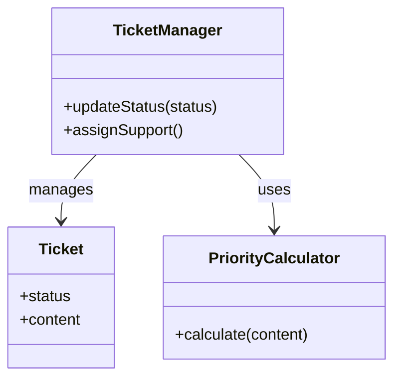

TicketManager クラスが、チケットの状態管理と、その遷移に伴う優先度計算という異なる責務を抱えています。
---

### 1-5：依存グラフ

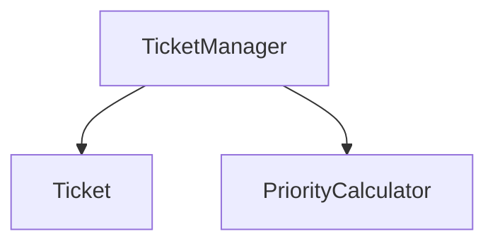

TicketManager に知識が集中しており、ここが変更のボトルネックになるリスクが示唆されます。
---

### 1-6：実行結果

上記コードの実行結果：

```text
緊急対応中。担当者を招集します。

```

これから検討するのは、同じ機能を保ちながら、変更に強い構造をどう作るかという点です。

### 1-7：届いた変更要求

ある月曜日の朝、ヘルプデスクのマネージャーからチャットが届きました。

「お疲れ様。現在対応しているチケットシステムなんだけど、今度から『SLA（サービスレベル合意）』を厳格に運用することになったんだ。特に、重要度が高いチケットが『Open』状態のまま長時間放置されるのは絶対に避けたい。それと同時に、これまではチケットのステータスが3種類しかなかったけれど、今後は『保留中』や『ベンダー確認中』といった状態も増える予定だ。この新しいルールと状態遷移の複雑さに、今のシステムで対応できるかな？」

なるほど。今回の変更要求は「重要度に応じた優先度判断ルールの追加」と「状態遷移の増加」という、二つの大きな柱があるようですね。今のコードのままでは、チケットの状態が増えるたびに、複雑な if-else の分岐がさらにカオス化するのは目に見えています。この先、このシステムが抱える重荷をどう分けるべきか、慎重に仮説を立てて確認する必要があります。


---

## 🟣 フェーズ2：仮説立案 ―― 何が変わるかを観察し、ヒアリングで裏付ける

フェーズ1で、TicketManagerがチケットの状態遷移と優先度計算ロジックを直接保持している現状を把握しました。届いた変更要求を踏まえ、この設計における変動と不変を整理します。

### 2-1：責任テーブル

| **クラス名** | **責任（1文）** | **知るべきこと** |
| --- | --- | --- |
| Ticket | チケットの現在の状態を保持する。 | 現在のステータス情報。 |
| TicketManager | チケットの状態遷移と、担当者の割り当てを管理する。 | チケットの状態、担当者割り当てのルール、優先度計算ロジック。 |
| PriorityCalculator | 問い合わせ内容から優先度を算出する。 | 優先度判定の複雑なビジネスルール。 |

TicketManager は、チケットの状態だけでなく、優先度計算というビジネスルールそのものまで「知っている」状態です。
### 2-2：責任チェック表

| **コードの行** | **持っている知識** | **管理者（観察）** |
| --- | --- | --- |
| string priority = calc.calculate(userType); | 優先度判定の具体的なルール | サービス企画チーム |
| if (status == "InProgress" ...) | 状態遷移時の具体的なアクション条件 | システム開発チーム |

要するに、チケットの「状態」を管理するという観察から、状態遷移のルールと優先度計算という「変わる理由」が異なる知識が同じ場所に混在しているという構造の問題が見えてくる。

### 2-3：変動・不変の仮説テーブル

フェーズ1での観察（フェーズ2の責任チェック表）を材料に、何が変動し、何が変わらないのかを整理します。

| **分類** | **仮説** | **根拠（フェーズ2の観察から）** |
| --- | --- | --- |
| 🔴 **変動しそう** | チケットのステータスごとの振る舞い（状態遷移） | 2-2で、状態ごとのアクションが if-else で混在していると観察したため。 |
| 🔴 **変動しそう** | 優先度を判定するビジネスルール（SLA判定等） | 2-2で、優先度計算ロジックが管理者に依存して変わると観察したため。 |
| 🟢 **不変** | チケット自体の属性データ（問い合わせ内容等） | 状態がどう変わろうと、チケットが保持する必要があるデータは変わらないため。 |

コードを読んだだけで「このルールと状態管理は分離できる」と断定するのは危険です。実際に運用を担うヘルプデスクの担当者に、この先の見通しを直接確認します。

### 2-4：関係者ヒアリング

仮説を持って、ヘルプデスクの運用担当者と話し合いを持ちました。

* **開発者：** 「今後『保留中』や『ベンダー確認中』といったステータスが増えるとのことですが、状態によって『できること（遷移先）』や『通知の有無』は変わりますか？」
* **運用担当者：** 「そうなんだ。例えば『ベンダー確認中』の時は、こちらから担当者への割り当ては行わず、自動通知を止める必要がある。逆に『保留中』の時は…」
* **開発者：** 「なるほど。では、重要度に応じた『優先度判定ルール』は、今後も頻繁に調整されますか？」
* **運用担当者：** 「その通り。SLAの基準は四半期ごとに見直す予定だし、顧客との契約内容によってもルールが変わる可能性があるんだよ。プレミアムユーザー向けに今後さらに細かい区分ができるかもしれない。」
* **開発者：** 「確認させてください。状態の種類が増えたとき、SLAのルールも同時に変わりますか？それとも別々に変わりますか？」
* **運用担当者：** 「別々だよ。SLAは四半期ごとに契約で見直すもの。状態の追加は業務プロセスの話で、半年単位でシステム側と相談して決める。完全に独立した話だね。」
* **開発者：** 「分かりました。状態ごとの振る舞いと、優先度の計算ルールは、それぞれ独立して頻繁に変更されるということですね。」

ヒアリングの結果、「チケットの状態ごとの振る舞い」と「優先度判定ルール」という二つの軸が、それぞれ独立して、かつ高い頻度で変更されることが確定しました。SLAは四半期ごと、状態の種類追加は半年単位——この2つは変更のタイミングも担当者も異なる、完全に独立した変化軸です。

> **現実のヒアリングでは——** このシナリオでは相手がちょうど設計に役立つ情報を教えてくれています。現実には「変わるかどうか分からない」「たぶん変わらない」という答えが返ることも多いです。そのときは、コードの変更履歴（`git log`）や過去の障害記録を「ヒアリングの代わり」として使ってみてください。「過去に何度変わったか」が、「将来変わりやすいか」の最も正直な証拠です。

### 2-5：今回の確定変更テーブル

変更要求として明示的に届いた内容と、ヒアリングで確認できた直近の変化を整理します。

| **分類** | **具体的な内容** | **変わるタイミング** | **根拠（誰との確認か）** |
| --- | --- | --- | --- |
| 🔴 **変動する** | ステータスごとの振る舞い（遷移先・アクション） | 業務プロセスの変更ごと | 運用担当者との合意 |
| 🔴 **変動する** | 優先度判定ルール（SLA基準等） | 四半期ごとのルール改定ごと | 運用担当者との合意 |
| 🟢 **不変** | チケットの基本属性データ | 変わらない | 業務ルールとして確定 |

### 2-6：将来リスクテーブル

ヒアリングで「今すぐではないが将来起こりうる」と判明したリスクを確定変更とは分けて記録します。

| **リスク** | **ヒアリングでの発言** | **発生確率** |
| --- | --- | --- |
| プレミアムユーザーの区分細分化 | 「今後さらに細かい区分ができるかもしれない」 | 中（次の契約改定時） |
| 複数担当者による同時操作 | 「複数のヘルプデスク担当者が同じチケットを同時に見ることがある」 | 高（日常的に発生） |
| 新状態の追加（保留中・ベンダー確認中） | 「今後はこうした状態も増える予定」 | 確定（半期以内） |

「状態遷移」という変更軸と「優先度ルール」という変更軸を、今の混沌とした TicketManager から切り離す必要がありそうです。フェーズ2で「何が変わり、何が変わらないか」が確定しました。次のフェーズ3では、この変更要求を実際に今のコードで試みて、具体的にどのような問題が起きるかを明らかにします。


---

## 🟣 フェーズ3：問題特定 ―― 変更の痛みを発見する

### 3-1：変更シミュレーション

フェーズ2で確定した「状態遷移の増加」と「優先度判定ルールの変更」を、今のコードにそのまま実装してみることにしました。

はじめに、新しいステータス「保留中」を追加するために `Ticket` クラスに定数を追加します。 次に、`TicketManager` の `updateStatus` メソッド内にある膨大な `if-else` 分岐に、新しい状態の処理を書き足します。 続いて、SLAルールの変更に対応するため、`PriorityCalculator` の `calculate` メソッドも修正します。

作業を進める中で、すぐに気づきました。「状態ごとのアクションとルールの条件分岐が混在していて、どちらが変わったときにどこを直せばいいか分からない」という感覚です。 ステータスが一つ増えるだけで、「遷移の可否」「担当者への通知」「優先度計算」というそれぞれ変更理由の異なるロジックを、一つの巨大なメソッドの中で同時に考慮しなければならないのです。「状態を足したのにSLAのロジックも壊れたかもしれない」という恐怖が、常について回ります。

### 3-2：変更影響グラフ

今のコードのまま変更を試みた際の影響範囲を可視化します。

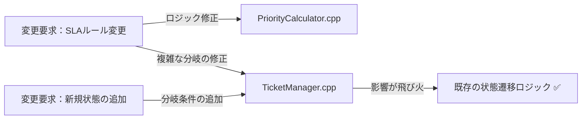

グラフが示す通り、ルール変更であれ状態追加であれ、結局は `TicketManager.cpp` という唯一の「決済統括的なクラス」が修正のたびに常に触られることになります。

### 3-3：痛みの言語化

「またこの巨大な `if-else` を編集するのか…」というのが、この作業を始めた瞬間の率直な感覚です。

1つ目の痛みは、このクラスが「何でも屋」になりすぎていることです。 状態遷移という「振る舞い」と、優先度計算という「ビジネスルール」が密接に絡み合っているため、片方をいじると、もう片方のロジックを無意識に壊してしまう恐怖が常にあります。

2つ目の痛みは、変更の局所化ができていないことです。 新しい状態を追加するたびに、本来なら関係のないはずの優先度計算ロジックや、既存の遷移処理まで全てテストし直さなければなりません。 この「どこまで影響が出るか分からない」という不安が、開発者の手を鈍らせ、システムをより硬直的なものにしています。

フェーズ3で「変更が辛い」という事実が確認できました。次のフェーズ4では、なぜ辛いのかを構造的に言語化します。


---

## 🟠 フェーズ4：原因分析 ―― なぜ辛いのかを構造で言語化する

フェーズ3で確認したように、チケットの「状態」が増えるたびに、チケット管理クラスのコードが肥大化し、修正のたびに予期せぬ副作用への恐怖を感じる状態にあります。ここでは、この問題の原因を構造的な観点から紐解いていきます。

### 4-1：観察→原因テーブル

フェーズ3でのシミュレーションから見えてきた観察事実と、その根本にある構造的な原因を対応させます。「根本原因（構造で言語化）」の列には、「なぜ変更が辛いのか」をコードの構造として表現した原因を記載します。観察事実から「症状」ではなく「構造上の欠陥」を言語化することが、このステップの目的です。

| **根本原因（構造で言語化）** | **観察** | **変わる理由** | **必要なパターン** |
| --- | --- | --- | --- |
| **根本原因A：優先度ルールの混在** | 優先度計算ルールが変わると、チケットの状態遷移ロジックまで再テストが必要になる | ビジネスルールの変更（SLA改定・顧客区分の細分化） | Strategyが必要 |
| **根本原因B：状態遷移ロジックの混在** | 新しいチケット状態を追加するたびに、管理クラスが修正される | 状態の種類の追加（保留中・ベンダー確認中など） | Stateが必要 |

これら2つの根本原因は**互いに独立した変化軸**です。優先度ルールが変わっても状態遷移は変わりません。状態の種類が増えても優先度ルールは変わりません。独立しているからこそ、1つのパターンだけでは解決しきれません。

コードを追うと、単に状態が増えるだけでなく、その状態によって「何をする必要があるか（通知するのか、誰に割り当てるのか）」という判定ロジックが、優先度の計算ルールと複雑に絡み合っていることが分かります。 これにより、コードを変更する際に「どこからどこまでが影響範囲なのか」を直感的に捉えることが難しくなっています。

### 4-2：変わるもの / 変わらないものテーブル

構造を整理するために、変化の軸を分けてみます。

| **変わり続けるもの（🔴）** | **変わってほしくないもの（🟢）** |
| --- | --- |
| チケットの「状態ごとの振る舞い」（遷移先、アクション） | チケットの「現在の状態」を保持する基盤データ |
| 優先度判定の「ビジネスルール」（SLA基準、顧客要件） | 「状態遷移を開始する」という汎用的なインターフェース |

これまで私たちは、「チケット」という一つのオブジェクトの中に、ライフサイクルの管理（状態）と、そこから派生するビジネス上の判断（ルール）を無理やり押し込めていました。 状態が変わるたびにルールが動くのではなく、それぞれが別の軸として進化できるように整理する必要があります。

### 4-3：接続形態を診断する

現在の接続形態を2×2マトリクスで診断します。

今の `TicketManager` とビジネスルール、および状態ごとの振る舞いは、USB-Cハブを経由しているようでいて、実はそのハブの中に全機器の回路が直結されているような状態（具体×直接）です。

本来であれば、状態ごとに接続口を用意し、そこにルールを差し替えてつなぐべきところを、一つの大きなコネクタにすべての機能を「直差し」してしまっています。 この状態では、一つの端子を付け替えようとするだけで、ハブ全体（`TicketManager`）の回路をショートさせないよう細心の注意が必要になります。

|  | 直接（直差し） | 間接（アダプター経由） |
|:---:|:---|:---|
| **具体**（専用規格） | **← 現在地**　ライトニング直生え → iPhone（直差し） | ライトニング直生え → ゲーム機専用アダプタを挟む → ゲーム機 |
| **抽象**（汎用規格） | Type-C直生え → 各種機器（直差し） | ライトニング直生え → Type-C変換アダプタを挟む → 各種機器 |

比喩からコードへの橋渡しを3段階で示します。

| ステップ | 表現 | 内容 |
|---|---|---|
| ①ケーブル比喩 | 専用規格の直差し | LightningケーブルをApple純正ドックに直差しした状態。端子の形（型）が専用で、間に何も挟めない |
| ②設計の言葉 | 具体クラスへの直接依存 | 呼び出す側が「何を使うか」という具体的な名前を知っており、かつ中間クラスなしに1ステップで呼ぶ |
| ③コードの証拠 | `TicketManager` 内のif-else | `userType == "premium"` や `status == "Open"` という具体的な値を直書きし、`calc.calculate()` を直接呼ぶ |

このコードで言うと：

| ケーブル比喩 | 設計上の意味 | コードの対応箇所 |
|---|---|---|
| 「具体」＝専用規格ケーブル | 型の名前（具体クラス名または具体値）を呼び出し元が直接知っている | `if (status == "Open")` / `userType == "premium"` — チケット状態とユーザー種別を文字列リテラルとして `TicketManager` に直接ハードコードしている |
| 「直接」＝直差し | 中間クラスを挟まず、1ステップで呼び出す | `calc.calculate(userType)` の呼び出しから状態遷移の `if-else` まで、`TicketManager` がすべてを1メソッド内で直接管理している |

「状態ごとの振る舞い」と「ビジネスルール」は、それぞれ独立して頻繁に変更されるべき要素です。 これらを一つの巨大なクラスに閉じ込めるのではなく、それぞれの軸で独立した接続形態へ進化させるべきだと判断できます。

フェーズ4で根本原因が言語化できました。次のフェーズ5では、この整理を元に、解決する課題を具体的に定義していきます。


---

## 🟡 フェーズ5：課題定義 ―― 解くべき接続点を特定する

フェーズ4で、「チケットの状態ごとの振る舞い」と「優先度判定ルール」が `TicketManager` クラス内で密結合に混在していることが、変更のたびにコードを汚染させる原因だと特定しました。 今のままでは、状態遷移のロジックに手を入れるたびに、無関係な優先度計算のコードまでテストし直す必要があり、非常に効率が悪くなっています。

対策案を検討する前に、今回のリファクタリングで「何を解決する必要があるか」を4つの視点で具体化し、課題を確定させます。

### 5-1：接続点の特定

今回の分析により、`TicketManager` クラス内に以下の接続点（ジョイント）が存在することが明確になりました。

* 接続点A：`TicketManager` ←→ 状態遷移ロジックの境界
* 接続点B：`TicketManager` ←→ 優先度判定ロジックの境界

チケットの状態が増えたり、優先度ルールが変わったりするたびに、これらの接続点が `TicketManager` 内の巨大な `if-else` 分岐と絡み合い、影響範囲を際限なく拡大しています。 状態遷移と優先度ルールという、変動の理由が異なる二つの責務を、それぞれ独立した接続点へと分離することが今回の最大の課題です。

### 5-2：クライアントへの影響範囲

この接続点の「クライアント」は、現在 `TicketManager` クラス自体です。 接続点をリファクタリングすることで、`TicketManager` の肥大化したメソッドを整理し、状態やルールの切り替えロジックを別のクラスへ移譲します。 これにより、`TicketManager` はチケットのライフサイクル管理という本来の責務に集中できるようになります。

### 5-3：課題まとめ表

以上の分析を、フェーズ6の対策案検討に向けたまとめ表として整理します。

| **接続点** | **分けた理由** | **非機能制約** | **クライアント影響** |
| --- | --- | --- | --- |
| 接続点A | 状態ごとの振る舞いが混在している | 複数担当者による同一チケットへの同時操作時の状態遷移整合性が必要 | `TicketManager` の状態遷移処理 |
| 接続点B | 優先度判定ルールが混在している | パフォーマンス影響は軽微 | `TicketManager` の優先度計算処理 |

この表が埋まったことで、私たちが解くべき課題は「状態ごとの振る舞いをオブジェクトへ抽出すること」と「優先度判定ルールを独立したアルゴリズムとして分離すること」の2点に絞り込まれました。

フェーズ5で「何を解くか」が確定しました。次のフェーズ6では、この2つの課題に対し、それぞれの変更軸に対応した対策ステップを検討します。


---

## 🔴 フェーズ6：段階的進化 ―― どこまで設計を進めるべきか

フェーズ5で整理した「状態ごとの振る舞い」と「優先度判定ルール」という二つの課題に対し、どのように構造を分離するかを検討します。 どちらの課題も「変わりやすさ」が特徴であるため、柔軟な接続形態への移行が必要です。

### 6-1：接続の形 2×2マトリクス

現在は `TicketManager` クラスがすべてのロジックを抱え込む「具体×直接」の状態です。 ここから、各責務を独立したクラスへと切り出し、間接層を設ける方向で対策を練ります。

まず2×2マトリクスの「2つの軸」の意味を定義します。

| 軸 | 意味 | 例（コード） |
|---|---|---|
| **横軸：具体か抽象か** | 呼び出す側が「インターフェース型」を使うか、「具体クラス名」を使うかの違い。具体＝特定のクラス名やリテラル値を直接書く。抽象＝インターフェース型だけを知り、実装クラス名は知らない | 具体：`PriorityCalculator calc;` / 抽象：`IPriorityRule* rule;` |
| **縦軸：直接か間接か** | 呼び出し元がターゲットを1ステップで呼ぶか、仲介クラスを経由するかの違い。直接＝メソッドを1回の呼び出しで届ける。間接＝コントローラー等の中間クラスを挟む | 直接：`rule->getPriority()` を呼ぶ / 間接：`controller->transition()` → controller内部で各クラスを呼ぶ |

この2軸の組み合わせで4つの接続形態が生まれます。

| 接続形態 | ケーブル例 | 特徴 |
|:---:|:---|:---|
| **具体×直接**（← 現在地） | ライトニング直生え → iPhone（直差し） | 専用端子のみ対応。差し替え不可 |
| **具体×間接** | ライトニング直生え → ゲーム機専用アダプタを挟む → ゲーム機 | 変換器を挟むが規格は専用のまま |
| **抽象×直接** | Type-C直生え → 各種機器（直差し） | どのメーカーでも同じ口で繋がる |
| **抽象×間接** | ライトニング直生え → Type-C変換アダプタを挟む → 各種機器 | アダプタを介して汎用規格で展開可能 |

どの案も、動作例テーブルで示した動作を実現します。違うのは「変更が来たときにどこを触ることになるか」です。

---

#### Step 1：具体×直接 ―― プライベートメソッドで責任を整理する

**この形の考え方：**
フェーズ3で示したコードを、接続の形は変えずにプライベートメソッドで整理した形です。各処理の意味がメソッド名で明確になります。 `PriorityCalculator` を直接メンバに持ち、`if-else` 分岐もそのままですが、各分岐をプライベートメソッドに抽出して責任を整理します。

**構造図：**

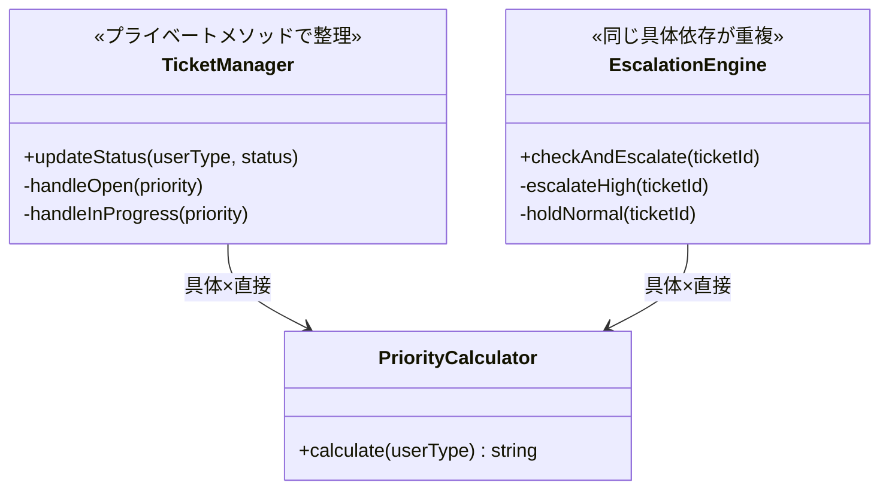

両クラスとも `PriorityCalculator` という具体型を直接知っており、ルール変更のたびに2か所を修正しなければならない点はフェーズ3と同じです。プライベートメソッドで読みやすくなりましたが、接続形態は変わっていません。

**手段の比較（Step 1内部）：**

| 手段 | 内容 | ✅ |
| --- | --- | --- |
| 手段A：プライベートメソッドに抽出 | 各分岐の処理をプライベートメソッドに切り出す | ✅（読みやすさが向上する） |
| 手段B：コメントのみで整理 | コードは変えずにコメントだけ整理する | 却下（構造問題は解決しない） |

手段Aを採用します。接続形態は具体×直接のままですが、各処理の意図がメソッド名で明確になります。

**PriorityCalculator クラス（Step 1）：**

```cpp
// Step 1：優先度ルールをそのまま維持（具体×直接）
class PriorityCalculator {
public:
    string calculate(string userType) {
        if (userType == "premium") return "High"; // ← 具体：文字列を直書き
        return "Normal";
    }
};

```

**TicketManager クラス（Step 1）：**

```cpp
// Step 1：プライベートメソッドで各分岐の責任を整理
class TicketManager {
    PriorityCalculator calc; // ← 具体：PriorityCalculatorを直接保持
public:
    void updateStatus(string userType, string status) {
        string priority = calc.calculate(userType);
        if (status == "Open") {
            handleOpen(priority); // ← 処理の意図がメソッド名で明確になった
            return;
        }
        if (status == "InProgress") {
            handleInProgress(priority);
        }
    }
private:
    void handleOpen(string priority) {
        cout << "チケット受付中。優先度: " << priority << endl;
    }
    void handleInProgress(string priority) {
        if (priority == "High") {
            cout << "緊急対応中。担当者を招集します。" << endl;
        }
    }
};

```

**EscalationEngine クラスと main（Step 1）：**

```cpp
// Step 1：EscalationEngineも同じ構造でプライベートメソッドに整理
class EscalationEngine {
public:
    void checkAndEscalate(string ticketId) {
        PriorityCalculator calc; // ← 具体：TicketManagerと同じ具体型を重複して保持
        string priority = calc.calculate("premium");
        if (priority == "High") {
            escalateHigh(ticketId);
            return;
        }
        holdNormal(ticketId);
    }
private:
    void escalateHigh(string ticketId) {
        cout << "[EscalationEngine] チケット " << ticketId
             << " をエスカレーション。" << endl;
    }
    void holdNormal(string ticketId) {
        cout << "[EscalationEngine] チケット " << ticketId
             << " は通常優先度。対応待ち。" << endl;
    }
};

int main() {
    TicketManager manager;
    manager.updateStatus("premium", "Open");

    EscalationEngine engine;
    engine.checkAndEscalate("T-001");
    return 0;
}
```

プライベートメソッドに整理したことで各分岐の意図は読みやすくなりましたが、両クラスともに `PriorityCalculator` という具体型を直接知っており、ルールが変わると2か所を修正しなければならない構造は変わっていません。

一文要約：フェーズ3のコードをプライベートメソッドで読みやすく整理した形で、接続は「具体×直接」のまま、同じ具体型依存が2か所で並行して走る。

**この形のトレードオフ：**

* 変更容易性：低（ルール変更のたびに具体型を知る両クラスを修正する必要がある）
* テスト容易性：低（具体クラスへの依存が残り、切り離せない）
* 実装コスト：低（プライベートメソッドへの抽出のみ）


---

#### Step 2：具体×間接 ―― 処理を別クラスに切り出して委ねる

**この形の考え方：**
優先度計算や状態処理を別クラスに切り出し、呼び出し元はその具体クラスを名指しで知った上でオブジェクトに処理を「委ねる」形です。自分で直接やるのではなく、切り出したオブジェクトに任せる（間接）ことで、処理の責任が明確に分離されます。ただし呼び出し元は具体クラス名を直接知っており、クラスを差し替えるには呼び出し元の修正が必要です。

**構造図：**

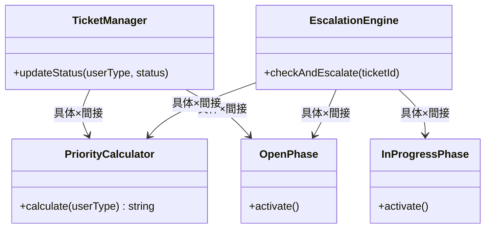

クラスは分離されて処理を委ねるようになりましたが（間接）、両クラスが各具体クラス名を直接知っており（具体）、状態やルールが増えるたびに両方を修正しなければならない。

**手段の比較（Step 2内部）：**

| 手段 | 内容 | ✅ |
| --- | --- | --- |
| 手段A：別クラスに切り出し、処理を委ねる | ロジックを別クラスに分けて呼び出し、処理はそのクラスに任せる | ✅（この案の定義通り） |
| 手段B：クラス分割＋ローカル変数に切り出し | メソッド内でローカル変数に抽出する | 却下（クラスを跨いだ依存は解消されない） |

手段Aを採用します。処理を切り出したクラスに「委ねる」形になり、各クラスの責任は明確になりました。ただし呼び出し側が具体クラス名を直接知り続けることは変わりません。

**PriorityCalculator クラスと状態クラス（Step 2）：**

```cpp
// Step 2：処理を別クラスに切り出した（具体×間接）
class PriorityCalculator {
public:
    string calculate(string userType) {
        if (userType == "premium") return "High";
        return "Normal";
    }
};

class OpenPhase {
public:
    // 呼び出し元はここに処理を委ねる（間接）
    void activate() { cout << "チケットをオープン状態に設定。" << endl; }
};

class InProgressPhase {
public:
    void activate() { cout << "チケットを対応中状態に設定。" << endl; }
};

```

**TicketManager クラス（Step 2）：**

```cpp
// Step 2：TicketManagerが具体クラスを知り、処理をそのクラスに委ねる
class TicketManager {
public:
    void updateStatus(string userType, string status) {
        PriorityCalculator calc; // ← 具体：型名を直接書いている
        string priority = calc.calculate(userType);
        // ← 間接：計算はcalcに委ねて自分ではやらない
        if (status == "Open") {
            OpenPhase s; // ← 具体：OpenPhaseという型名を直接書いている
            s.activate(); // ← 間接：Open状態の処理をsに委ねる
            cout << "優先度: " << priority << endl;
            return;
        }
        if (status == "InProgress" && priority == "High") {
            InProgressPhase s; // ← 具体：InProgressPhaseを直接生成
            s.activate(); // ← 間接：対応中状態の処理をsに委ねる
            cout << "緊急対応中。担当者を招集します。" << endl;
        }
    }
};

```

**EscalationEngine クラスと main（Step 2）：**

```cpp
// Step 2：EscalationEngineも同じ具体クラスを知り処理を委ねる
class EscalationEngine {
public:
    void checkAndEscalate(string ticketId) {
        PriorityCalculator calc; // ← 具体：TicketManagerと同じ型を重複して使用
        string priority = calc.calculate("premium");
        // ← 間接：優先度計算はcalcに委ねる
        if (priority == "High") {
            InProgressPhase inProg; // ← 具体：型名を直接書いている
            inProg.activate();      // ← 間接：処理を委ねる
            cout << "[EscalationEngine] チケット " << ticketId
                 << " をエスカレーション。" << endl;
            return;
        }
        OpenPhase open; // ← 具体：型名を直接書いている
        open.activate();            // ← 間接：処理を委ねる
    }
};

int main() {
    TicketManager manager;
    manager.updateStatus("premium", "InProgress");

    EscalationEngine engine;
    engine.checkAndEscalate("T-001");
    return 0;
}
```

処理を別クラスに委ねる形（間接）になりましたが、具体クラス名の知識が両クラスに重複しており、クラスを差し替えるには両方を修正しなければならない。

一文要約：クラスは分かれて処理を委ねるようになった（間接）が、「どのクラスを呼ぶか」という具体クラス名の知識が両方の呼び出し元に重複して残っている。

**この形のトレードオフ：**

* 変更容易性：低〜中（クラスは分かれたが、具体クラス名の依存は両方に残る）
* テスト容易性：低（依然として具体クラスを直接生成する必要がある）
* 実装コスト：低（リファクタリングの範囲が限定的）


---

#### Step 3：抽象×直接 ―― インターフェースを挟み、型だけで接続する

**この形の考え方：**
優先度ルールと状態遷移のそれぞれをインターフェース経由で扱うことで、具体的なロジックを差し替え可能にする。 各ルールや状態をインターフェース経由で扱うことで、具体的なロジックを差し替え可能にする。

**構造図：**

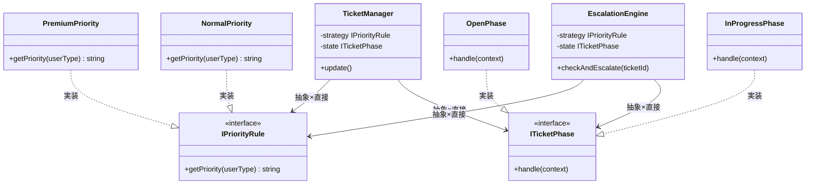

`TicketManager` と `EscalationEngine` はどちらも2つのインターフェースのみを知り、具体クラスはmain()側だけが生成して注入する。

**手段の比較（Step 3内部）：**

| 手段 | 内容 | ✅ |
| --- | --- | --- |
| 手段A：コンストラクタ注入 | インターフェース型をコンストラクタで受け取る | ✅（依存が明示的で、テスト時にスタブを差し込みやすい） |
| 手段B：セッター注入 | setStrategy() メソッドで後から渡す | 却下（初期化漏れのリスクがある） |
| 手段C：グローバル変数 | シングルトンや静的変数で共有する | 却下（テスト時に切り離せなくなる） |

手段Aのコンストラクタ注入を採用します。依存関係がコンストラクタのシグネチャに現れるため、「このクラスは何を必要としているか」が一目で分かります。

**インターフェース定義（Step 3）：**

```cpp
#include <iostream>
#include <string>
using namespace std;

// 優先度判定のインターフェース
class IPriorityRule {
public:
    virtual ~IPriorityRule() = default;
    virtual string getPriority(string userType) = 0;
};

// 状態遷移のインターフェース
class ITicketPhase {
public:
    virtual ~ITicketPhase() = default;
    virtual void handle(class TicketContext* context) = 0;
};

```

**優先度戦略クラス（Step 3）：**

```cpp
// プレミアムユーザー向け優先度ルール
class PremiumPriority : public IPriorityRule {
public:
    string getPriority(string userType) override {
        return "High"; // ← プレミアムユーザーは常にHighとする
    }
};

// 一般ユーザー向け優先度ルール
class NormalPriority : public IPriorityRule {
public:
    string getPriority(string userType) override {
        return "Normal";
    }
};

```

**状態クラス（Step 3）：**

```cpp
// Open状態の振る舞い
class OpenPhase : public ITicketPhase {
public:
    void handle(TicketContext* context) override {
        cout << "チケット受付中。" << endl;
    }
};

// 対応中状態の振る舞い
class InProgressPhase : public ITicketPhase {
public:
    void handle(TicketContext* context) override {
        cout << "チケット対応中。担当者に割り当て。" << endl;
    }
};

```

**TicketContext クラス（Step 3）：**

```cpp
// コンテキスト：インターフェース型のみを知る
class TicketContext {
    ITicketPhase* state;
    IPriorityRule* strategy;
public:
    TicketContext(ITicketPhase* st, IPriorityRule* s)
        : state(st), strategy(s) {}
    void setState(ITicketPhase* s) { state = s; }
    void execute() {
        string priority = strategy->getPriority(""); // ← インターフェース経由（抽象）
        cout << "優先度: " << priority << " で ";
        state->handle(this); // ← 直接呼び出し（中間クラスなし）
    }
};

```

**EscalationEngine クラスと main（Step 3）：**

```cpp
// EscalationEngineもインターフェースのみを知る
class EscalationEngine {
    IPriorityRule* strategy; // ← 抽象：外部から注入されたインターフェースのみ知っている
    ITicketPhase* state;
public:
    EscalationEngine(IPriorityRule* s, ITicketPhase* st)
        : strategy(s), state(st) {}
    void checkAndEscalate(string ticketId) {
        string priority = strategy->getPriority("");
        if (priority == "High") {
            cout << "[EscalationEngine] チケット " << ticketId
                 << " をエスカレーション。" << endl;
            state->handle(nullptr); // ← 直接：インターフェース経由で直接呼び出す
        }
    }
};

int main() {
    PremiumPriority strategy;            // ← 具体：呼び出し側だけが具体クラスを生成
    InProgressPhase state;               // ← 具体：呼び出し側だけが具体クラスを生成
    TicketContext ctx(&state, &strategy);
    ctx.execute();

    PremiumPriority esc_strategy;
    InProgressPhase esc_state;
    EscalationEngine engine(&esc_strategy, &esc_state); // ← 直接：インターフェース経由で注入
    engine.checkAndEscalate("T-001");
    return 0;
}
```

注入アプローチにより、両クラスとも具体クラスを知らずに済み、選択ロジックの重複が解消される。

一文要約：`main()` が具体型を組み立て、両方の呼び出し元は `IPriorityRule*` と `ITicketPhase*` という型だけを介して同じオブジェクトを呼ぶため、具体クラスが変わっても呼び出し経路は変わらない。

**この形のトレードオフ：**

* 変更容易性：高（ルールの追加や状態遷移の変更がクラス単位で完結する）
* テスト容易性：高（インターフェースに対しスタブを差し込んで個別にテストできる）
* 実装コスト：中（インターフェースと複数の実装クラスを定義する必要がある）

**Step 3で解決できること・できないこと**

Step 3の構造でインターフェース化を導入したことで、優先度ルールの差し替えは容易になりました。`IPriorityRule`を実装した新クラスを追加するだけで、`TicketManager`を変更せずに済みます。

しかし、まだ解決できていない問題があります。状態ごとの振る舞い（`OpenState`→`InProgressState`→`ClosedState`）のロジックが`TicketManager`内に残ったままで、状態の種類が増えるたびに`TicketManager`を変更しなければなりません。「優先度ルールの変化軸」は解決しましたが、「状態遷移の変化軸」がまだ残っています。

この残課題を解決するのがStep 4です。

---

#### Step 4：抽象×間接 ―― インターフェース＋仲介役を両立する

Step 3で残った「状態遷移の変化軸」を解決するために、状態ごとの振る舞いをオブジェクトとして分離する設計を導入します。これで2つの変化軸がそれぞれ独立して変更できるようになります。

**この形の考え方：**
案3のインターフェースに加え、仲介クラス（コントローラー）を設ける。 非常に高い柔軟性を持つが、すべての層に抽象と仲介役が必要となるため、構造が複雑になる。

**構造図：**

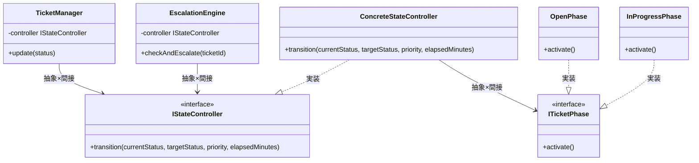

両クラスが抽象コントローラーインターフェースのみを受け取り、具体状態クラスへの依存が完全に排除されているが、インターフェースが2層になり構造が複雑になる。

**手段の比較（Step 4内部）：**

| 手段 | 内容 | ✅ |
| --- | --- | --- |
| 手段A：コントローラーインターフェース＋具体コントローラー | 仲介クラスをインターフェース化し、具体コントローラーが状態を管理する | ✅（コントローラー自体も差し替え可能になる） |
| 手段B：Factoryパターンを組み合わせる | 状態オブジェクトの生成をFactoryに任せる | 却下（この段階では過剰。状態の種類が10を超えたら検討する） |

手段Aを採用します。コントローラーがインターフェース化されることで、テスト時にコントローラー全体をスタブに差し替えることも可能になります。

**インターフェース定義（Step 4）：**

```cpp
#include <iostream>
#include <string>
using namespace std;

// 状態遷移の抽象インターフェース
class ITicketPhase {
public:
    virtual ~ITicketPhase() = default;
    virtual void activate() = 0;
};

// コントローラーの抽象インターフェース
class IStateController {
public:
    virtual ~IStateController() = default;
    virtual void transition(string currentStatus, string targetStatus,
                            string priority, int elapsedMinutes) = 0;
};

```

**状態クラス（Step 4）：**

```cpp
// 各状態クラス（ITicketPhase を実装）
class OpenPhase : public ITicketPhase {
public:
    void activate() override {
        cout << "チケットをオープン状態に設定。" << endl;
    }
};

class InProgressPhase : public ITicketPhase {
public:
    void activate() override {
        cout << "チケットを対応中状態に設定。" << endl;
    }
};

```

**ConcreteStateController クラス（Step 4）：**

```cpp
// 具体コントローラー：状態遷移とSLA判定を担当
class ConcreteStateController : public IStateController {
public:
    void transition(string currentStatus, string targetStatus,
                    string priority, int elapsedMinutes) override {
        int slaLimit = (priority == "High") ? 60 : 240;
        if (currentStatus == "Open" && elapsedMinutes > slaLimit) {
            cout << "[SLA超過] エスカレーション: " << priority
                 << "チケットが" << elapsedMinutes << "分経過。" << endl;
            InProgressPhase s; s.activate(); // ← ITicketPhase* 経由
            return;
        }
        if (targetStatus == "Open") {
            OpenPhase s; s.activate();
        } else if (targetStatus == "InProgress") {
            InProgressPhase s; s.activate();
        }
    }
};

```

**TicketManager と EscalationEngine（Step 4）：**

```cpp
// TicketManager：抽象コントローラーのみを知る
class TicketManager {
    IStateController* controller; // ← 抽象×間接
public:
    TicketManager(IStateController* c) : controller(c) {}
    void update(string currentStatus, string targetStatus, string priority) {
        controller->transition(currentStatus, targetStatus, priority, 0);
    }
};

// EscalationEngine：抽象コントローラーのみを知る
class EscalationEngine {
    IStateController* controller; // ← 抽象×間接
public:
    EscalationEngine(IStateController* c) : controller(c) {}
    void checkAndEscalate(string ticketId, string priority, int elapsed) {
        cout << "[EscalationEngine] チケット " << ticketId
             << " のSLA監視中（経過: " << elapsed << "分）。" << endl;
        controller->transition("Open", "InProgress", priority, elapsed);
    }
};

```

**main 関数（Step 4）：**

```cpp
int main() {
    ConcreteStateController ctrl; // ← 具体：組み立て側だけが具体型を知る
    TicketManager manager(&ctrl); // ← 間接：抽象コントローラーのみ見えて具体実装は隠れる
    manager.update("Open", "InProgress", "Normal");

    cout << "---" << endl;

    ConcreteStateController ctrl2;
    EscalationEngine engine(&ctrl2);
    engine.checkAndEscalate("T-001", "High", 90);
    return 0;
}
```

両クラスとも抽象コントローラーインターフェースのみを受け取るため、具体的な状態クラスやルールクラスへの依存が完全に排除される。

一文要約：呼び出し元→`IStateController*`→`ITicketPhase*` という2段階の抽象型を経由するため、どの具体クラスが動くかは `main()` の組み立て部分だけが知っている。

**この形のトレードオフ：**

* 変更容易性：高（どの層の変更も他層に影響を与えない）
* テスト容易性：高（すべての依存を切り離せる）
* 実装コスト：高（クラス数とインターフェースが大幅に増える）


---

### どこまで設計を進めるべきか（採用案の決断）

それぞれのステップには一長一短があります。ステップ3の「抽象×直接（インターフェースの導入）」は強力ですが、クラス数が増加する「初期投資コスト」もかかります。どこで止めるかは、**「今後の変更頻度（ビジネス要求）」**で決断します。

*   **Step 1（具体×直接）で止めるケース：** 優先度ルールが「通常」と「緊急」の2つだけで、今後絶対に増えない場合。
*   **Step 2（具体×間接）で止めるケース：** クラスごとに分けたいが、動的なルールの切り替えは発生しない場合。
*   **Step 3（抽象×直接）で止めるケース：** 優先度ルールが複数存在し、今後も「VIP対応」などの新しいルールが追加されたり、実行時に動的に切り替わったりする場合。既存クラスを一切修正せずに拡張できる仕組みを作るのが適切です。
*   **Step 4（抽象×間接）まで進むケース：** 状態ごとの振る舞いすらもコントローラーに一任して完全に分離したい、極めて複雑な状態遷移を持つシステムの場合。

**今回の決断：**
フェーズ2のヒアリングで「VIP顧客向けルールの追加」や「休日用ルールの追加」など、優先度ルールの頻繁な変更が確定しています。さらに状態自体の拡張も予想されます。2つの変化軸（状態の増減、優先度ルールの変更）をそれぞれ独立して安全に変更できるようにするため、**ステップ3（抽象×直接）で止める**決断を下します。案4のコントローラーの導入は、現在の規模感では構造の過剰な複雑化をもたらすため不要と判断しました。

> 実はこのStep 3の構造には名前があります。「優先度ルールの差し替え可能な分離」は **Strategyパターン**、「状態ごとの振る舞いをオブジェクトとして表現する」は **Stateパターン** と呼ばれています。この構造は、第1章で学んだ**Strategyパターン**と、第3章で学んだ**Stateパターン**を組み合わせた複合設計です。

### 6-5：耐久テスト

フェーズ2のヒアリングで挙がった「将来のリスク」に対する耐性を確認します。

| **変更シナリオ** | **触る場所** | **コスト評価** |
| --- | --- | --- |
| 重要度の算出ルール（SLA）を変更する | IPriorityRule の具象クラスを修正 | 低 |
| 新しいチケット状態「保留」を追加する | ITicketPhase の具象クラスを新規作成 | 低 |
| プレミアムユーザーの区分を細分化する | 新たな IPriorityRule 実装クラスを追加 | 低 |

採用した設計では、新しいルールや状態の追加がクラス単位の作成・修正に閉じており、既存ロジックへの影響が排除されていることが実証されました。


---

## 🟢 フェーズ7：対策実施 ―― 変化に強いコードを完成させる

採用した Strategyパターン（優先度ルールの分離）および Stateパターン（状態遷移の分離）を実装し、ビジネスルールと状態遷移の責務をそれぞれ独立したクラスへカプセル化（変更の影響を1クラス内に閉じ込めること）します。

### 7-1：解決後のコード（全体）

優先度判定を `IPriorityRule`、状態管理を `ITicketPhase` へとそれぞれ分離しました。

**IPriorityRule インターフェースと実装クラス**

```cpp
#include <iostream>
#include <string>
#include <vector>

using namespace std;

// Strategy: 優先度計算のインターフェース
class IPriorityRule {
public:
    virtual ~IPriorityRule() = default;
    virtual string getPriority(string userType) = 0;
};

```

**PremiumPriority と NormalPriority クラス**

```cpp
// プレミアムユーザー向け優先度ルール
class PremiumPriority : public IPriorityRule {
public:
    string getPriority(string userType) override { return "High"; }
};

// 一般ユーザー向け優先度ルール
class NormalPriority : public IPriorityRule {
public:
    string getPriority(string userType) override { return "Normal"; }
};

```

**ITicketPhase インターフェース**

```cpp
// State: 状態遷移のインターフェース
class ITicketPhase {
public:
    virtual ~ITicketPhase() = default;
    virtual void handle(class TicketContext* context) = 0;
};

```

**OpenPhase クラスと InProgressPhase クラス**

```cpp
// Open状態の振る舞い
class OpenPhase : public ITicketPhase {
public:
    void handle(TicketContext* context) override;
};

// InProgress状態の振る舞い
class InProgressPhase : public ITicketPhase {
public:
    void handle(TicketContext* context) override;
};

```

**TicketContext クラス（コンテキスト）**

```cpp
// コンテキスト：インターフェース型のみを保持する
class TicketContext {
    ITicketPhase* state;
    IPriorityRule* strategy;
public:
    TicketContext(ITicketPhase* st, IPriorityRule* s)
        : state(st), strategy(s) {}
    void setState(ITicketPhase* s) { state = s; }
    void setStrategy(IPriorityRule* s) { strategy = s; }
    void execute(string userType) {
        string priority = strategy->getPriority(userType); // ← 抽象経由
        cout << "優先度: " << priority << " — ";
        state->handle(this); // ← 直接呼び出し
    }
    string calculatePriority(string userType) {
        return strategy->getPriority(userType);
    }
};

```

**状態クラスの handle 実装**

```cpp
// OpenPhase の実装（TicketContextが定義された後）
void OpenPhase::handle(TicketContext* context) {
    cout << "チケット受付中。" << endl;
}

// InProgressPhase の実装
void InProgressPhase::handle(TicketContext* context) {
    cout << "チケット対応中。担当者に割り当て。" << endl;
}

```

**EscalationEngine クラス**

```cpp
// EscalationEngineもインターフェースのみを知る
class EscalationEngine {
    IPriorityRule* strategy;
    ITicketPhase* state;
public:
    EscalationEngine(IPriorityRule* s, ITicketPhase* st)
        : strategy(s), state(st) {}
    void checkAndEscalate(string ticketId) {
        string priority = strategy->getPriority("");
        if (priority == "High") {
            cout << "[EscalationEngine] チケット " << ticketId
                 << " をエスカレーション。" << endl;
            state->handle(nullptr);
        }
    }
};

```

**TicketApplication クラス（組み立て担当）**

具体クラスを知っているのはこの1クラスだけです。`main()` は組み立てを知りません。

```cpp
// TicketApplication：具体クラスの組み立てと実行を担当する
class TicketApplication {
public:
    void run() {
        // 一般ユーザーがチケットを開く
        NormalPriority normalStrategy;
        OpenPhase openState;
        TicketContext ctx1(&openState, &normalStrategy);
        ctx1.execute("normal");

        // プレミアムユーザーがチケットを開く
        PremiumPriority premiumStrategy;
        OpenPhase openState2;
        TicketContext ctx2(&openState2, &premiumStrategy);
        ctx2.execute("premium");

        // エスカレーションエンジン（プレミアムユーザー）
        PremiumPriority esc_strategy;
        InProgressPhase esc_state;
        EscalationEngine engine(&esc_strategy, &esc_state);
        engine.checkAndEscalate("T-001");
    }
};

```

**main 関数**

```cpp
int main() {
    TicketApplication app;
    app.run();
    return 0;
}

```

`TicketApplication` が具体クラスの組み立てを一手に引き受け、`main()` はキックするだけです。具体クラス名を知っているのは `TicketApplication` の1か所に集約されており、優先度ルールや状態クラスを差し替えるときもここだけを修正すれば済みます。

**動作図（シーケンス図）：**

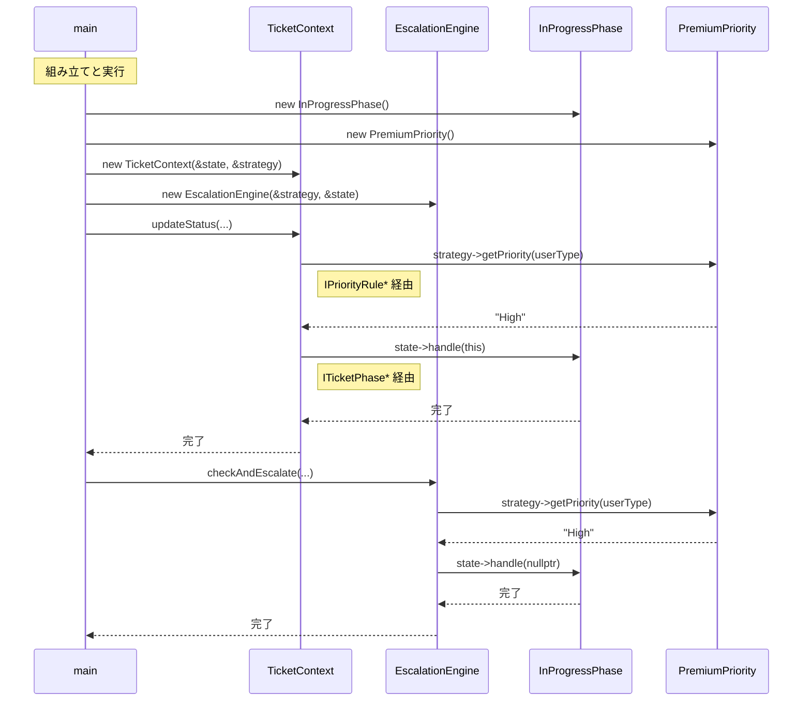

### 7-2：変更影響グラフ（改善後）

フェーズ3と同じ「SLAルール変更」や「状態追加」を試みます。

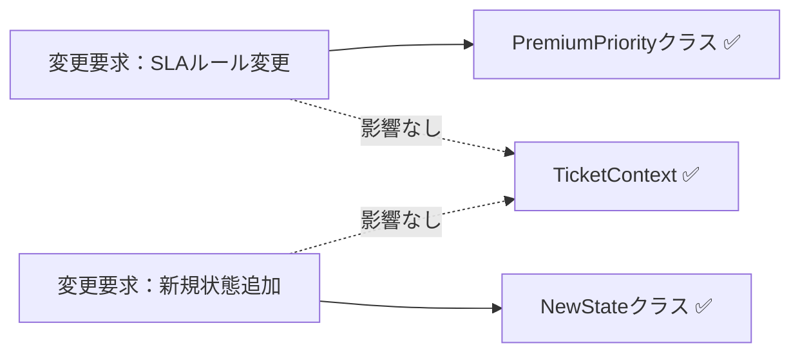

フェーズ3のグラフと比較して、変更要求がそれぞれ独立したクラスに閉じるようになり、`TicketContext` への飛び火がなくなりました。

### 7-3：変更シナリオ表

| **シナリオ** | **変わるクラス（触る場所）** | **変わらないクラス** |
| --- | --- | --- |
| 優先度計算ルールを変更する | `IPriorityRule` 派生クラス | `TicketContext`, `ITicketPhase` |
| 新しい状態を追加する | `ITicketPhase` 派生クラスを新規作成 | `TicketContext`, `IPriorityRule` |

変更が来ても、触るのは該当する戦略や状態クラスのみです。これがこの設計で手に入れた「変更耐性」です。 諦めたものは、インターフェースやクラスの増加というわずかな設計コストです。

---

### 7-4：接続形態の確認 ── この設計はどの接続か

フェーズ4-3で診断した通り、変更前のコードは **具体×直接** の状態でした。
採用したStep 3では、接続形態が **抽象×直接（USB-C直差し）** へと変化しています。

**「抽象×直接」の証拠となるコード：**

```cpp
class TicketContext {
    ITicketPhase* state;         // ← インターフェース型 = 「抽象」の証拠
    IPriorityRule* strategy; // ← インターフェース型 = 「抽象」の証拠
public:
    void execute(string userType) {
        string priority = strategy->getPriority(userType); // ← 直接呼び出し = 「直接」の証拠
        state->handle(this);                               // ← 直接呼び出し = 「直接」の証拠
    }
};
```

- `ITicketPhase*` と `IPriorityRule*` はいずれもインターフェース型 → **「抽象」** の証拠
- `state->handle()` と `strategy->getPriority()` はいずれも中間クラスなしの直接呼び出し → **「直接」** の証拠

ここで「直接」の定義を明確にしておきます。**直接＝呼び出し元がメソッドを中間クラスなしに1ステップで呼ぶこと**。インターフェース型を経由していても、そのメソッドを直接呼んでいれば「直接」です。**間接＝コントローラーや仲介クラスを挟み、呼び出し元は仲介クラスにしか話しかけない**。案4の `IStateController` がその例で、`TicketManager` はコントローラーに指示するだけで、その先でどの状態クラスが動くかは知りません。

「状態遷移ルールと優先度判定ルールをそれぞれ独立して差し替えたい」という2つの動機から、**抽象×直接** が選ばれました。

---

### 整理・振り返り・パターン解説

第9章の締めくくりとして、思考プロセスとパターンの関係を振り返ります。

#### 7フェーズとこの章でやったこと

| **フェーズ** | **この章でやったこと** |
| --- | --- |
| 🔵 フェーズ1：現状把握 | チケット管理システムにおける状態遷移とルール判定の混在を観察した。 |
| 🟣 フェーズ2：仮説立案 | 運用担当者へのヒアリングで、二つの軸（ルールと状態）が独立して変動することを確認した。 |
| 🟣 フェーズ3：問題特定 | `if-else` 分岐の肥大化による修正の連鎖という痛みを確認した。 |
| 🟠 フェーズ4：原因分析 | 振る舞いとルールの密結合を「直差し」状態として診断した。 |
| 🟡 フェーズ5：課題定義 | 状態とルールの二つの接続点を特定し、疎結合化を課題とした。 |
| 🔴 フェーズ6：対策案検討 | 接続形態の4案を比較し、抽象×直接の構造（Strategyパターン×Stateパターン）を採用した。 |
| 🟢 フェーズ7：対策実施 | インターフェースを導入し、責務をクラスに分離した。 |

#### 各クラスの最終的な責任

| **クラス名** | **責任（1文）** | **変わる理由** |
| --- | --- | --- |
| `IPriorityRule` | 優先度判定の契約を提供する。 | なし |
| `ITicketPhase` | 状態遷移の契約を提供する。 | なし |
| `TicketContext` | チケットのライフサイクルを統合管理する。 | チケットの全体フローが変わる場合 |

> **このプロセスを回した結果にたどり着いた構造こそが Strategy × State パターン です。**

#### 使ったパターン × 解消した根本原因

| **使ったパターン** | **解消した根本原因** |
| --- | --- |
| Strategyパターン（`IPriorityRule`） | 根本原因A：優先度ルールが `TicketManager` 内に混在し、SLA改定のたびに状態遷移ロジックまで再テストが必要だった |
| Stateパターン（`ITicketPhase`） | 根本原因B：状態遷移ロジックが `TicketManager` 内に混在し、新状態を追加するたびに管理クラスへの修正が必要だった |

2つのパターンはそれぞれ独立した根本原因を解消しています。どちらか一方だけでは、残った根本原因が将来の変更で痛みを生み続けます。

#### 振り返り：「この章を読むと得られること」は手に入ったか

| **得られること** | **この章のどこで示したか** |
| --- | --- |
| 変動箇所の識別力 | フェーズ2の分類表でルールと状態を変動要因として特定。 |
| 接続形態の診断力 | フェーズ4のケーブル比喩で現状の混在を診断。 |
| 構造改善の説明力 | フェーズ7の変更シナリオ表で局所化を実証。 |

#### 振り返り：第0章の3つの設計原則はどう適用されたか

* **原則1「変わるものをカプセル化せよ」の現れ**
* **具体化された場所：** 各 `IPriorityRule` および `ITicketPhase` の実装クラス
* **解説：** 変化するロジックを個別のクラスへ追い出し、`TicketContext` から切り離しました。


* **原則2「インターフェースに対してプログラムせよ」の現れ**
* **具体化された場所：** `IPriorityRule`, `ITicketPhase`
* **解説：** 統括クラスは具体的なアルゴリズムや状態を知らず、インターフェース経由で呼び出すようにしました。


* **原則3「継承よりコンポジションを優先せよ」の現れ**
* **具体化された場所：** `TicketContext` が Strategy と State を保持する構成
* **解説：** ロジックの振る舞いを継承ではなく、保持するオブジェクトの差し替えによって実現しました。継承でこの設計をしようとすると、「状態×優先度ルール」の組み合わせの数だけクラスが必要になります。例えば状態3種類×優先度ルール3種類なら9クラス。状態が1つ増えるだけで3クラスを追加しなければならない2次元的な爆発が起きます。コンポジションなら状態クラス1つ追加するだけで済みます。


---

### あなたのコードで考えてみてください

この章で辿った思考プロセスを、あなた自身のコードに当てはめてみましょう。

1. **複数の変動軸を探す：** あなたのコードに「振る舞いが変わる理由が2つ以上、同じクラスに混在している」箇所がありますか？「状態によって処理が変わる」と「ビジネスルールによって処理が変わる」が同居していませんか？**判断基準：** そのクラスの変更理由を1文で書こうとして「AまたはBが変わったとき」という形になるなら、変動軸が混在しています。
2. **変わる理由を分ける：** そのクラスの変更要求が来たとき、担当者は何人いますか？異なる担当者の判断が1か所に混在しているなら、分けるサインです。**判断基準：** git blameで「このメソッドは営業が要求した変更で前回修正、前々回はシステムチームの要件で修正」となっていれば、2つの責任が混在しています。
3. **爆発を想像する：** 状態の種類が3つ→5つ、ルールの種類が2つ→4つになったとき、今の構造ではメソッド数はどのくらい増えますか？それは管理できる範囲ですか？**判断基準：** 「状態×ルール数」のかけ算でメソッドや分岐が増えるなら爆発します。足し算で済むなら許容範囲です。
4. **分けた後を想像する：** 「状態の遷移ロジック」と「ビジネスルール」をそれぞれ別クラスに切り出したとき、新しい状態を追加するとき触るファイルはどこだけになりますか？**判断基準：** 「1ファイルだけ」が答えなら設計が機能しています。「複数ファイル」が答えなら、まだ依存が残っています。

---

### パターン解説：Strategy × State

この複合パターンは、ビジネス上の「アルゴリズム（戦略）」と「状態（状態遷移）」が独立して変化する際、それぞれをパターンの対象とすることで、爆発的な分岐を整理する強力なアプローチです。

#### この章の実装との対応

Strategyパターンが「どのルールの元で計算するか」を担当し、Stateパターンが「現在の状態で何ができるか」を担当することで、チケット管理の複雑さを解きほぐしました。

#### 使いどころと限界

* **使いどころ**：状態遷移が複雑で、さらにその状態ごとのルールが頻繁に変わるような大規模なワークフロー管理。


* **限界**：シンプルな遷移であれば `if-else` の方が可読性が高いこともあります。判断基準として以下を確認してください。① 状態が2種類以下かつ今後増える予定がない、② ビジネスルールが1種類だけで四半期改定などの変更予定がない、③ 担当者が1人（変更の判断者が1人）——この3条件をすべて満たすなら、パターン適用はやりすぎです。1つでも満たさない場合は、将来のクラス爆発を避けるためにパターン適用を検討してください。


【過剰コード：シンプルなものまで無理に分離した例】

状態が「Open」「Closed」の2つだけで、ルールも「ハイか否か」1種類だけのシンプルなシステムにStrategy×Stateを適用すると、クラス爆発が起きます。

```cpp
// 【過剰コード】状態2種類・ルール1種類のみのシンプルなシステムに
// Strategy × State を適用した場合の例

// ── Strategy側（ルール1種類だけなのにインターフェースを定義）
class IPriorityRule {
public:
    virtual ~IPriorityRule() = default;
    virtual string getPriority() = 0;
};
class SinglePriority : public IPriorityRule { // ← 実装クラスが1つだけ
public:
    string getPriority() override { return "Normal"; }
};

// ── State側（状態2種類のみなのにインターフェースを定義）
class ISimpleState {
public:
    virtual ~ISimpleState() = default;
    virtual void handle() = 0;
};
class OpenState : public ISimpleState {  // ← 状態クラスが2つだけ
public:
    void handle() override { cout << "Open" << endl; }
};
class ClosedState : public ISimpleState {
public:
    void handle() override { cout << "Closed" << endl; }
};

// ── 合計5クラス + 2インターフェース。if-else 2行で書けた処理が
//    7つのクラスに分散し、次に触る人は全クラスを読まないと
//    「何をしているか」を理解できなくなる。
```

これを素直に書くと次のように2行で済みます。

```cpp
// シンプルな if-else の方が読みやすい場合
void updateStatus(string status) {
    if (status == "Open") cout << "Open" << endl;
    else cout << "Closed" << endl;
}
```

「状態が2つ以下・ルールが1種類」という条件では、パターン適用はクラス数を増やすだけで変更耐性の恩恵がありません。変化の見込みがないなら、シンプルな実装が正解です。

### GoF抽象構造との対応

**Strategyパターン（GoF標準）：**

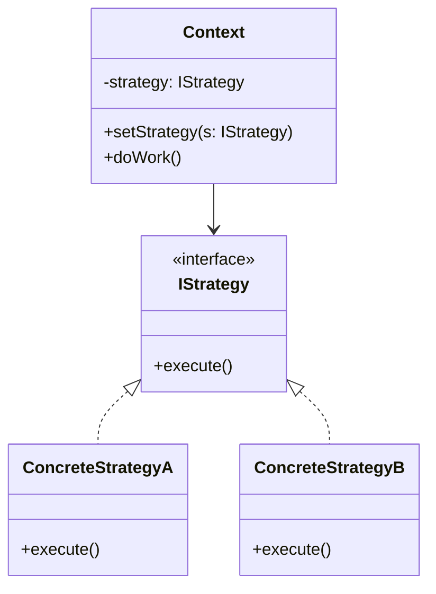

この章での対応：Context = `TicketManager`、IStrategy = `IPriorityRule`、ConcreteStrategyA = `PremiumPriority`、ConcreteStrategyB = `NormalPriority`

**Stateパターン（GoF標準）：**

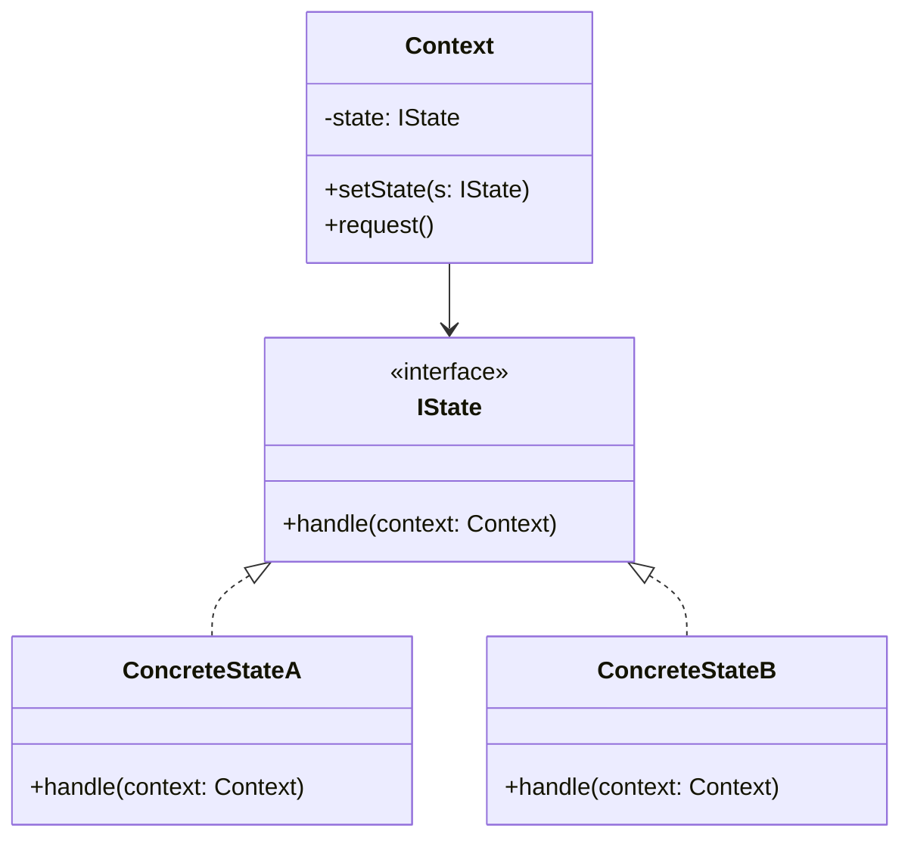

この章での対応：Context = `TicketContext`、IState = `ITicketPhase`、ConcreteStateA = `OpenPhase`、ConcreteStateB = `InProgressPhase`


