## 第9章 変わるルールと状態の連鎖 ―― Strategy × State パターン

―― 思考の型：複雑なビジネスルールと状態遷移が絡み合う場所をどう解くか

### この章の核心

**チケットの優先度ルールと状態遷移が同じ管理処理に集まっていると、VIPルールの追加でも状態追加でも同じ場所全体を修正・確認する必要が生じる。こういう問題は、「判定ルール」と「状態ごとの振る舞い」という別々の変更理由が同じ場所に混在しているシステムで起きている。**

第9章からは本書の第二部です。第一部では、章ごとに主となる一つの変更課題へ焦点を当て、対応する構造を一つずつ学びました。第二部では、変更の決定者や頻度が異なる複数の課題が同じシステムに存在する場合を扱います。同じ7つのフェーズで問題を分析しますが、一つの構造だけでは変更影響を十分に分けられないとき、複数の構造を組み合わせます。「名前を先に置いて設計する」のではなく、「変更理由の種類を分析して必要な境界を選ぶ」という順序は変わりません。

### この章を読むと得られること

* **得られること1：** ビジネスルールの切り替えと状態ごとの振る舞いが混在している箇所を識別できるようになる

* **得られること2：** 接続点で状態遷移と優先度ルールの知識がどこへ漏れているかを調べ、変更の痛みが生まれる理由を判断できるようになる

* **得られること3：** 複合的な変化に対して、複数の解決手段を組み合わせてどのように局所化できるかを説明できるようになる

* **得られること4：** 現場の複雑な条件分岐を、if文の羅列からオブジェクトの構成へと変換する視点

## 🔵 フェーズ1：現状把握 ―― 仕様を整理し、システムと紐付ける

サポートチケット管理システムが何を入力として受け取り、どの処理で加工し、何を出力するのかを整理します。

### 1-1：このシステムの仕様

このシステムは、社内のITヘルプデスクで使われている「サポートチケット管理システム」です。社員から届くPCやネットワークのトラブル報告をチケットとして登録し、ヘルプデスク担当者がそれを解決するまでの過程を管理しています。

この章で扱う現状仕様は、次の範囲です。

| 仕様項目 | この章で扱う値 | 具体例 | 何に使うか |
|---|---|---|---|
| チケット | 問い合わせ内容と現在状態 | TCK001 が Open | 状態に応じて許可される操作を判定する |
| ユーザー種別 | 一般 / プレミアム / 法人 | USR001 は法人（corporate） | 優先度計算に使う |
| 操作 | 受付・対応開始・解決など | 担当者アサイン、解決 | 状態遷移と優先度更新のきっかけになる |
| 出力 | 更新後状態と優先度 | InProgress、高優先度 | 操作結果としてチケット状態を照合する |

ここで確認する対象は、どの入力で状態と優先度がどう変わるかです。

現在状態や優先度は、利用者が毎回入力する値ではありません。チケットIDから保存済みのチケットを取得し、その状態とユーザー種別を使って操作可否と優先度を決めます。

**仕様整理図：保存データとアクセス関係**


上の文章と表で仕様を一通り確認したので、まず正常にチケットを更新できる場合の入力・判定・加工・出力の流れとして整理します。

**仕様整理図：正常系の入力・判定・加工・出力**

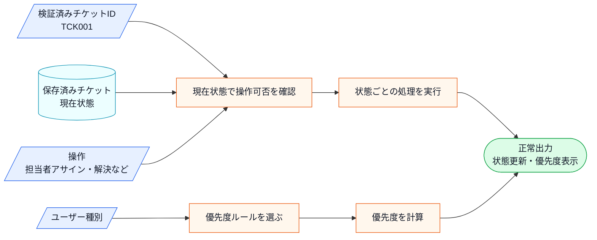

この図から読み取ることは、次の3点です。

- チケット処理には、優先度を決める流れと状態を進める流れが同時に含まれる。
- 優先度判定条件は優先度に、状態操作はチケット状態に主に影響する。
- 正常系では、保存済みチケットの状態を更新し、ユーザー種別から計算した優先度を表示する。

現状のシステムは、チケットの状態遷移と、ユーザー種別に応じた優先度設定という業務ルールを、一箇所にまとめて管理しています。

**チケットの状態と実行できる操作**

チケットに「状態」を持たせるのは、「今このチケットに対して何をしてよいか」を制御するためです。担当者が未アサインのチケットを勝手に解決済みにしてしまう、といったミスを防ぐために、この章のシステムでは状態ごとに許可される操作を絞っています。

| 状態 | 状態名（英語） | 実行できる操作 |
|---|---|---|
| 受付中 | Open | 担当者アサイン |
| 対応中 | In Progress | 解決・エスカレーション |
| 解決済み | Resolved | 再受付 |

基本の流れは「Open → InProgress → Resolved」の一方向です。解決済みチケットを再度受け付ける「Resolved → Open」という逆流もあります。「一度解決したのにまた同じ問題が起きた」というケースに対応するための遷移です。

**優先度ルール**

ユーザー種別によって優先度を変えるのは、対応時間の保証（SLA）に基づくものです。プレミアムユーザーには一次回答までの時間の約束があり、その約束を優先度へ反映します。エスカレーション時にも優先度を適用し、急ぎの対応が必要になった時点で担当者を動かせるようにします。

| ユーザー種別 | 設定される優先度 | 適用タイミング |
|---|---|---|
| 一般ユーザー | 標準（Normal） | チケット登録時・再受付時 |
| プレミアムユーザー | 高優先度（High） | チケット登録時・再受付時・エスカレーション時 |

このルールは現時点では2区分です。SLAの内容はビジネス上の契約によって変わるため、区分は今後増減する場合があります。

**このシステムの関係者**

どの知識がどの業務機能に属するかを把握しておくのは、設計判断において重要な手がかりになります。「どの業務機能に属するか」が違えば、それは別々に管理できるようにしておくべき知識かもしれないからです。

**この仕様を決める業務機能**
| 業務機能 | この章の仕様で決めていること |
|---|---|
| 運用・状態管理 | 状態の追加・変更・遷移条件 |
| 品質・評価管理 | ユーザー種別と優先度の基準 |

後のフェーズで変更要求を扱うとき、どの業務機能の知識なのかを確認するための名前として使います。

**エラー条件**

正常系の仕様を一通り確認したうえで、最後に、状態更新へ進めない入力を分けて整理します。

| エラー条件 | どこで分かるか | 出力 | 保存・通知などの副作用 |
|---|---|---|---|
| チケットIDが存在しない | チケット取得時 | チケットIDエラー | 状態更新なし |
| 現在状態では操作できない | 状態と操作の組み合わせ確認時 | 操作不可エラー | 状態更新なし |

### 1-2：動作例テーブル

このシステムがどのように動くかを、代表的な操作例で示します。クラス図やコードを読む前に、「何をするシステムか」をここで確認してください。

| チケット種別 | 操作 | 優先度ルール | 状態遷移 |
| --- | --- | --- | --- |
| 新規チケット | 一般ユーザーが登録 | 標準優先度（Normal） | → 受付中（Open） |
| 新規チケット | プレミアムユーザーが登録 | 高優先度（High） | → 受付中（Open） |
| 受付中チケット | 担当者アサイン | ルール適用なし | → 対応中（InProgress）に遷移 |
| 対応中チケット | 担当者が解決 | ルール適用なし | → 解決済み（Resolved）に遷移 |
| 解決済みチケット | 一般ユーザーが再オープン | 標準優先度（Normal） | → 再受付中（Open）に遷移 |
| 対応中チケット | プレミアムユーザーがエスカレーション | 高優先度（High） | 緊急対応（担当者を招集） |

この6つの動作例が、このシステムが満たす必要がある動作の基準です。後でステップを比較するときも、「どのステップもこれと同じ動作を実現する」という前提で読んでください。


### 1-2b：状態遷移表

このシステムで管理する状態と、各状態から可能な遷移を整理します。これは、後のフェーズで状態ごとの振る舞いを確認するときの全体像です。

| 現在の状態 | アサイン | 解決 | 再受付 |
| --- | --- | --- | --- |
| Open（受付中） | → InProgress（対応中） | —— | —— |
| InProgress（対応中） | —— | → Resolved（解決済み） | —— |
| Resolved（解決済み） | —— | —— | → Open（再受付中） |

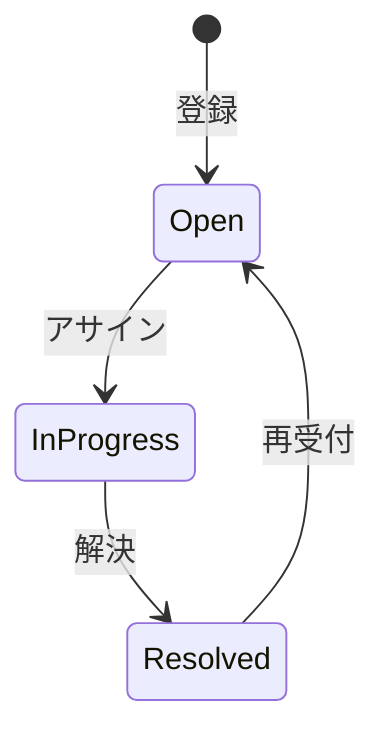

「Open → InProgress → Resolved」という一方向の流れが基本ですが、「解決済み → 再受付」という逆流があります。状態が増えるほど、このマトリクスの「空欄（——）」の管理が複雑になります。

> **📌 変更要求をどこまで実装するか**
> 1-5節では「保留中」「ベンダー確認中」などの追加が予定されています。フェーズ3では、その代表として法人ユーザー向けSLAルールと `Pending`（保留中）を変更途中コードへ追加しました。現状ではエスカレーションは「緊急対応中」というメッセージ出力にとどまりますが、フェーズ7の最終コードでは `Escalated`（緊急対応中）を独立した状態として新設し、`InProgress → Escalated → Resolved`（および差し戻し `Escalated → InProgress`）まで定義します。フェーズ6の設計とフェーズ7の最終コードでは、`Pending` と `Escalated` を落とさず追います。完成後の全状態遷移は7-1の状態遷移図で確認します。`VendorWaiting`（ベンダー確認中）は、同じ `ITicketPhase` 契約へ追加する次の変更シナリオとして7-4で確認します。

次は、この仕様を担うクラスの顔ぶれと責任を確認します。

---

### 1-3：登場クラスとクラス構成図

フェーズ1の現状コード構造に登場するクラスを先に確認します。

| クラス名 | 役割 | 担当する仕様 |
|---|---|---|
| `TicketManager` | チケット状態の更新を進める | 状態管理、操作可否、優先度計算の呼び出し |
| `PriorityCalculator` | ユーザー種別から優先度を計算する | 優先度ルール |
| `UserDatabase` | ユーザー情報の管理 | ユーザーIDからユーザー名・ユーザー種別を検索する |

各クラスの責任を把握したところで、クラス間の関係を図で確認します。

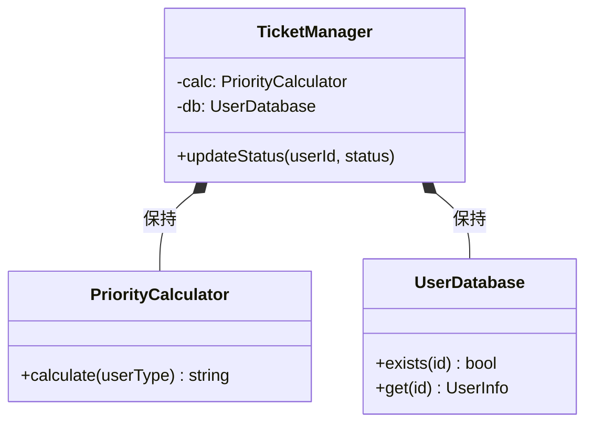

**クラス図に出てくる主なメンバーと操作**

| クラス | メンバー・操作 | 何ができるか |
|---|---|---|
| `TicketManager` | `calc` / `db` | 優先度計算とユーザー検索を行うクラスを保持する |
| `TicketManager` | `updateStatus()` | ユーザーIDと状態を受け取り、状態更新と優先度計算を進める |
| `PriorityCalculator` | `calculate()` | ユーザー種別から優先度を返す |
| `UserDatabase` | `exists()` / `get()` | ユーザーIDの存在確認と、氏名・ユーザー種別の取得を行う |


`TicketManager` クラスが、チケットの状態管理と、その遷移に伴う優先度計算という異なる責務を抱えています。

---

### 1-4：実装コード（現状）

#### コードを読む前に：クラスの責任と境界

| 対象 | 呼び出しと内部処理 | 戻り値・副作用 | 掲載上の表現 |
|---|---|---|---|
| Ticket DB | チケットID・利用者IDで検索する | 現在状態・利用者属性 | `std::map`でDBを代替する |
| 優先度ルール | 属性・条件から優先度を計算する | 優先度値 | Strategyの戻り値として表す |
| 状態 | 操作を受け遷移可否を決める | 次状態・ログ | Stateオブジェクトへ委譲する |
| `vector` | イベントログを順番に保持する | 追記・一覧表示 | 永続監査ログのメモリ代替 |

実チケットDBと通知は省略しますが、誰がどの操作を行い、どの状態へ変わり、どの優先度になったかは値として残します。

システムの現状の実装を確認します。コードを役割ごとに分けて読んでいきます。

**UserInfo / UserDatabase / PriorityCalculator クラス**

このシステムには以下の3件のユーザーデータがあらかじめ登録されています。

| ユーザーID | 氏名 | ユーザー種別 |
|---|---|---|
| USR001 | 田中 一郎 | 法人（corporate） |
| USR002 | 佐藤 花子 | プレミアム（premium） |
| USR003 | 鈴木 次郎 | 一般（standard） |

ユーザー種別によって対応優先度が変わります。現状の優先度ルールはプレミアムを高優先度、それ以外を標準とする2区分で、法人向けの高優先度は1-5の変更要求で追加します。コードを読む前にこの対応を把握しておくと、動作結果が追いやすくなります。

この章では、画面表示・実際の通知送信・時計の実測を省略し、状態更新と優先度の計算結果を中心に確認します。実システムなら通知や時刻取得は境界へ渡しますが、本章の論点は「状態遷移とルール判定という2つの変化軸を分ける構造」です。SLAの残り時間の判定は `SlaTimer`、担当者割当の発火は `AssignmentEvent` にあたる境界の向こう側として扱い、掲載コードでは優先度ルールの結果と状態遷移の呼び出しだけを追います。`print` はこれら境界の先に閉じ、SLA期限そのものの時刻計算や通知配信の中身は扱いません。

```cpp
#include <iostream>
#include <string>
#include <map>

using namespace std;

// ユーザー情報
struct UserInfo {
    string name;     // 氏名
    string userType; // "standard", "premium", "corporate"
};

// ユーザーデータベース
class UserDatabase {
    map<string, UserInfo> records;
public:
    UserDatabase() {
        records["USR001"] = {"田中 一郎", "corporate"};
        records["USR002"] = {"佐藤 花子", "premium"};
        records["USR003"] = {"鈴木 次郎", "standard"};
    }
    bool exists(const string& id) const {
        return records.count(id) > 0;
    }
    UserInfo get(const string& id) const {
        return records.at(id);
    }
    void save(const string& id, const UserInfo& info) {
        records[id] = info;           // 実行中のユーザー表へ追加
    }
};

// 優先度ルール（変わる可能性がある）
class PriorityCalculator {
public:
    string calculate(string userType) {
        if (userType == "premium") return "High"; // ← ルール判定を直書き
        return "Normal";
    }
};
```

**TicketManager クラス**

```cpp
// チケット管理（優先度計算と状態更新を行う）
class TicketManager {
    PriorityCalculator calc;
    UserDatabase db;
public:
    void updateStatus(string userId, string status) {
        if (!db.exists(userId)) {             // ← DBにないIDはエラー
            cout << "エラー: ユーザーID "
                 << userId << " は存在しません。" << endl;
            return;
        }
        UserInfo user = db.get(userId);
        string priority = calc.calculate(user.userType);
        if (status == "Open") {
            cout << "チケット受付中。優先度: " << priority << endl;
        } else if (status == "InProgress" && priority == "High") {
            cout << "緊急対応中。担当者を招集します。" << endl;
        }
    }
};
```

**main 関数**

```cpp
int main() {
    TicketManager manager;

    // 行1: 鈴木（standard）が新規チケットを登録（標準優先度 → 受付中）
    manager.updateStatus("USR003", "Open");

    // 行2: 佐藤（premium）が新規チケットを登録（高優先度 → 受付中）
    manager.updateStatus("USR002", "Open");

    // 行6: 佐藤（premium）がエスカレーション（高優先度 → 緊急対応）
    manager.updateStatus("USR002", "InProgress");

    // 存在しないユーザーIDを渡した場合
    manager.updateStatus("USR999", "Open");

    return 0;
}
```

実行対象コード：1-4の現状コード
対応する動作例：1-2の動作例テーブル
確認したいこと：入力、加工、出力が仕様どおりに対応していること

実行結果：

```
チケット受付中。優先度: Normal
チケット受付中。優先度: High
緊急対応中。担当者を招集します。
エラー: ユーザーID USR999 は存在しません。
```

> [!NOTE]
> 上記はフェーズ1の現状コードで確認できる代表的な3ケースです（行1・行2・行6）。行3（アサイン）・行4（解決）・行5（再受付）の状態遷移は、フェーズ1の現状コードでは `updateStatus()` に遷移のロジックが含まれておらず、出力が生じません。行6（エスカレーション）はフェーズ1の現状コードで出力されますが、フェーズ7では行1〜5の基本フローが実装されます。

このコードを見ると、`TicketManager` が優先度の計算ルール（`PriorityCalculator`）と、状態に応じたアクション（if-else）の両方を直接知っていることが分かります。

---

> **手元で動かすには**
> このコードは1つの `.cpp` に貼り付けて、そのままコンパイル・実行できます（例：`g++ chapter09.cpp -o app && ./app`）。`main()` は自由に組み替えて構いません。`manager.updateStatus("USR002", "Open");` の呼び出しを増減させれば、ユーザー種別（standard/premium/corporate）ごとの優先度判定と状態遷移がその場の実行結果に表れます。新しいユーザーを試すときは `UserDatabase` の登録へ `records["USR010"] = {"高橋 三郎", "corporate"};` を足す（または `save()` を呼ぶ）と、そのユーザーでも同じ処理を実行できます。データはプロセス実行中だけ有効で、終了すると消えます。

### 1-5：変更要求

【運用チームと品質管理チームからの要求】
ある月曜日の朝、ヘルプデスクのマネージャーからチャットが届きました。

「お疲れ様。現在対応しているチケットシステムなんだけど、今度から『SLA（サービスレベル合意）』を厳格に運用することになったんだ。特に、重要度が高いチケットが『Open』状態のまま長時間放置されるのは何としても避けたい。それと同時に、これまではチケットのステータスが3種類しかなかったけれど、今後は『保留中』や『ベンダー確認中』といった状態も増える予定だ。この新しいルールと状態遷移の複雑さに、今のシステムで対応できるかな？」

今回の変更要求は「重要度に応じた優先度判断ルールの追加」と「状態遷移の増加」という、二つの大きな柱があるようです。

**仕様変更の内容**

変更要求を受けて、現在の仕様がどう変わるかを整理します。

| 項目 | 変更前 | 変更後 |
|---|---|---|
| チケット状態の種類 | 3種類（Open / InProgress / Resolved） | 保留中・ベンダー確認中など新状態を追加予定 |
| 優先度ルール | 一般→Normal、プレミアム→High の固定判定 | SLA基準に基づく判定ルール（四半期ごとに改定） |
| SLA期限 | 未対応 | 受付から一定時間で期限超過を判定し優先度へ反映 |
| 担当者割当 | 未対応 | アサイン操作を割当イベントとして扱い状態を進める |
| 再オープン | Resolved→Open のみ | 再オープン時も優先度ルールを再適用して評価する |

「状態が増える」変更と「優先度ルールが変わる」変更は、今後も別のタイミングで届く可能性があります。この2つは独立した軸として扱う必要があります。

**この章が扱う複雑さ**

今回の要求には、状態とルールが同じきっかけで同時に動く場面が混ざっています。2軸以上の変化が重なっても、軸を分ければ扱えるかをこの章で確認します。

| 追加する複雑さ | 具体例 | この章で見ること |
|---|---|---|
| SLAタイマー | Open のまま期限超過で優先度をHighへ引き上げる | 期限判定を優先度ルール側へ寄せられるか |
| 担当者割当イベント | アサイン操作でOpen→InProgressへ進める | 割当という契機と状態遷移を分けて扱えるか |
| 再オープン | Resolved→Open で再度ルール評価する | 逆流時も状態軸とルール軸が独立に動くか |
| 状態とルールの同時変化 | エスカレーションで状態進行と優先度上げが同時 | 同時に動いても2軸へ分けて追えるか |

**変更前後の入力・判定・加工・出力差分**

1-1の現状仕様を退避し、変更要求を当てた後の仕様と同じ粒度で並べます。以降の分析では、この差分を追います。

| 要素 | 変更前（1-1の現状仕様） | 変更後（今回の要求） | 差分として追うもの |
|---|---|---|---|
| 入力 | チケットID、ユーザー種別、操作、保存済みの現在状態 | チケットID、ユーザー種別、操作、保存済みの現在状態、SLA基準、新状態、割当・再オープン契機 | 優先度ルールと状態種類、契機が増える |
| 判定 | 状態ごとの操作可否、固定優先度判定 | 新状態を含む操作可否、SLA期限とSLA基準の優先度判定 | 状態判定と優先度判定が別々に変わる |
| 加工 | 状態更新と優先度計算 | 割当・再オープンによる新状態への遷移とSLA優先度計算 | 二つの加工軸を分けて追う |
| 出力 | 更新後状態と優先度 | 新状態を含む更新後状態とSLA優先度 | 出力状態と優先度が増える |

**変更後の入力・加工・出力**

変更後の仕様を、1-1と同じ粒度で、正常系の入力・判定・加工・出力として確認します。1-1の図との差分は、保存済みの現在状態に保留中・ベンダー確認中などが加わること、「優先度ルールを選ぶ」の選択肢が固定の2区分からSLA基準の判定ルールに変わること、そして割当・再オープンといった契機とSLA期限の確認が入ることです。流れの形そのものは変わりません。

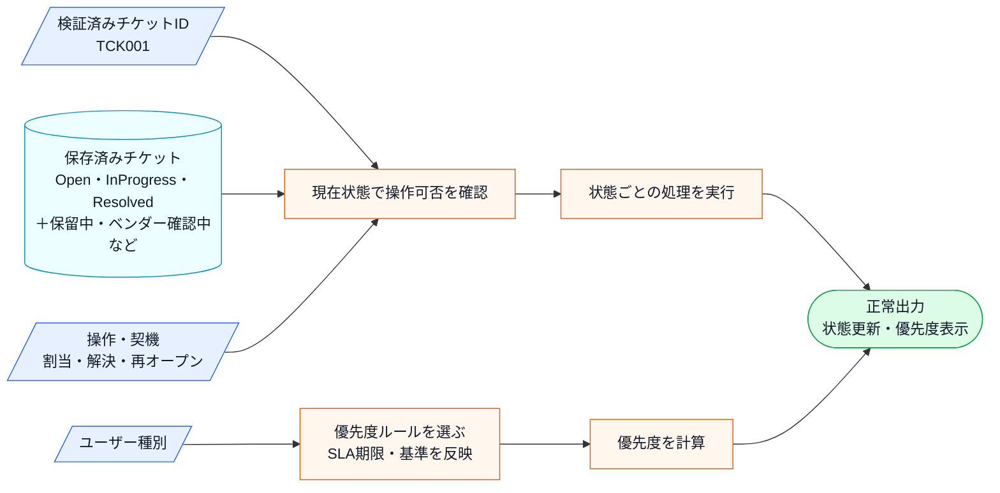

この図から読み取ることは、次の3点です。

- 変更の1つ目の柱（状態の増加・割当・再オープン）は入力の「操作・契機」と「操作は可能か」「状態ごとの処理を実行」に、2つ目の柱（優先度ルールとSLA期限の改定）は「優先度ルールを選ぶ」「優先度を計算」に、それぞれ別の箱に現れる。
- エスカレーションのように状態進行と優先度上げが同時に起きても、図の上では別々の箱を通る別の流れであり、独立した軸として扱う根拠になる。
- 出力とエラーの形は変わらない。

変更後も、失敗条件は正常系図へ混ぜずに別で確認します。

| エラー条件 | どこで分かるか | 出力 | 保存・通知などの副作用 |
|---|---|---|---|
| チケットIDが存在しない | チケット取得時 | チケットIDエラー | 状態更新なし |
| 現在状態では操作できない | 状態と操作の組み合わせ確認時 | 操作不可エラー | 状態更新なし |
| SLA期限を超過している | 割当・再オープン時のSLA確認時 | 期限超過を優先度へ反映 | 状態更新は継続、優先度がHighへ |

2つの柱が実際のコードでどこに現れるかは、フェーズ3で変更を試すコードと、フェーズ7の最終コード・実行結果で追います。

---

## 🟣 フェーズ2：仮説立案 ―― 何が変わるかを観察し、ヒアリングで裏付ける
フェーズ1で、`TicketManager` がチケットの状態遷移と優先度計算ロジックを直接保持している現状を把握しました。届いた変更要求を踏まえ、この設計における変わる見込みと当面安定の前提を整理します。

### 2-1：変わりそうな仕様の見当をつける

ここで作る一覧は、思いつきで「変わりそう」と感じたものを並べる表ではありません。フェーズ1で確認した仕様・動作例・クラス図を材料に、次の順で候補を絞ります。

1. 仕様図と動作例から、入力・判定・加工・出力のうち条件や値が変わりそうな箇所を拾う。
2. その箇所が、1-3のどのクラス・メソッドに書かれているかを対応づける。
3. その仕様が、どんな理由で、何をきっかけに、どのくらいの頻度で変わりそうかを仮説として書く。
4. 逆に、当面変えない前提にできる処理の骨格も分けておく。

この手順で見ると、「チケットを更新する」という大きな処理全体ではなく、その中のどの優先度ルール・状態遷移・操作条件が変更候補なのかを読者自身で追えるようになります。

フェーズ2では、フェーズ1で見た仕様のうち、どの状態遷移・優先度ルール・操作条件が変わりそうかを見当づけます。責務の配置は、変更要求を当てた後の痛みと合わせて確認します。

| 仕様候補 | 仕様上の場所 | フェーズ1の現状コードでの場所 | 見立て |
|---|---|---|---|
| 優先度計算ルール | 判定、状態更新前の評価 | `TicketManager.updateStatus()` | 四半期ごとに評価基準が変わる可能性があるため、今回見る |
| SLA期限による優先度引き上げ | 判定、優先度評価 | `TicketManager.updateStatus()` | 期限超過の扱いが契約で変わるため、優先度軸として今回見る |
| Open状態の振る舞い・割当契機 | 状態遷移、操作条件 | `TicketManager.updateStatus()` | 新しい状態や割当・再オープンの契機が増えるため、今回見る |
| 対応中かつ高優先度の処理 | 状態遷移、優先度判定 | `TicketManager.updateStatus()` | 状態と優先度の両方に依存する条件が変わる可能性があるため、今回見る |

この表から、今回の検討対象は「優先度ルール」と「状態ごとの振る舞い」に絞れます。2つの変化候補が同じ条件に重なると困るかどうかは、フェーズ3で変更を入れてから確認します。

### 2-2：今回の変更で確実に変わること

変更要求として明示的に届いた内容と、現状把握から見えている直近の変化を整理します。今回の変更は2つの独立した軸で同時に起きています。

| **分類** | **具体的な内容** | **変わる軸** |
| --- | --- | --- |
| 🔴 **変動する** | ステータスごとの振る舞い（遷移先・アクション・割当・再オープン） | 状態遷移の軸 |
| 🔴 **変動する** | 優先度判定ルール（SLA基準・SLA期限超過等） | 優先度ルールの軸 |
| 🟢 **当面安定** | チケットの基本属性データ | 今回の変更要求では見直し対象にしない |

コードを読んだだけで「このルールと状態管理は分離できる」と断定するのは危険です。実際に運用を担うヘルプデスクの担当者に、この先の見通しを直接確認します。

### ヒアリングに向けた背景確認

このシステムは、社内のITヘルプデスク部門が運用するサポートチケット管理を担っています。サービスが拡大するにつれて、対応フローの複雑さが増し、特に重要顧客向けのSLA（サービスレベル合意）の厳格化が求められるようになっています。変更の主な関係者は、ビジネスルールを管理するSLA管理チームと、業務プロセスを設計する運用プロセスチームの2者です。この2者が独立して変更を決定している点が、この章の設計判断の核心になります。

### 2-3：関係者ヒアリング

仮説を持って、ヘルプデスクの運用担当者と話し合いを持ちました。

* **開発者：** 「今後『保留中』や『ベンダー確認中』といったステータスが増えるとのことですが、状態によって『できること（遷移先）』や『通知の有無』は変わりますか？」
* **運用担当者：** 「そうなんだ。例えば『ベンダー確認中』の時は、こちらから担当者への割り当ては行わず、自動通知を止める必要がある。逆に『保留中』の時は…」
* **開発者：** 「なるほど。では、重要度に応じた『優先度判定ルール』は、今後も頻繁に調整されますか？」
* **運用担当者：** 「その通り。SLAの基準は四半期ごとに見直す予定だし、顧客との契約内容によってもルールが変わる可能性があるんだよ。プレミアムユーザー向けに今後さらに細かい区分ができるかもしれない。」
* **開発者：** 「確認させてください。状態の種類が増えたとき、SLAのルールも同時に変わりますか？それとも別々に変わりますか？」
* **運用担当者：** 「決める場が別だね。SLAは四半期ごとに契約で見直すもの。状態の追加は業務プロセスの話で、半年単位でシステム側と相談して決める。ただし、エスカレーションのように両方を使う機能では接続の確認が必要だよ。」
* **開発者：** 「分かりました。状態ごとの振る舞いと、優先度の計算ルールは、それぞれ独立して頻繁に変更されるということですね。」

ヒアリングの結果、「チケットの状態ごとの振る舞い」と「優先度判定ルール」は、変更のタイミングと決定者が異なることが分かりました。SLAは四半期ごと、状態の種類追加は半年単位です。実装上は組み合わせて使う場面がありますが、変更理由は分けて扱う価値がある二つの軸です。

### 2-4：ヒアリングで判明した将来リスク

ヒアリングで「今すぐではないが将来起こりうる」と判明したリスクを確定変更とは分けて記録します。

| **リスク** | **ヒアリングでの発言** | **発生確率** |
| --- | --- | --- |
| プレミアムユーザーの区分細分化 | 「今後さらに細かい区分ができるかもしれない」 | 中（次の契約改定時） |
| 複数担当者による同時操作 | 「複数のヘルプデスク担当者が同じチケットを同時に見ることがある」 | 高（日常的に発生） |
| 新状態の追加（保留中・ベンダー確認中） | 「今後はこうした状態も増える予定」 | 確定（半期以内） |

「状態遷移」という変更軸と「優先度ルール」という変更軸を、今の混沌とした `TicketManager` から切り離す必要がありそうです。フェーズ2で「何を変え、何を守るか」が確定しました。次のフェーズ3では、この変更要求を実際に今のコードで試みて、具体的にどのような問題が起きるかを明らかにします。

### 2-5：変わる見込みと当面安定の前提を確定する

2-4のヒアリング結果をもとに、将来起こりうる変更を現在の状態と対比して整理します。

| 変更内容 | 現在 | 将来（時期の目安） |
| --- | --- | --- |
| ユーザー区分と優先度の対応 | 一般→Normal、プレミアム→High の2区分 | プレミアム内にさらに細かい区分が加わる（次の契約改定時） |
| SLA期限による優先度引き上げ | 期限の概念を持たない | 受付から一定時間の超過でHighへ引き上げる基準が入る（四半期改定に連動） |
| 同一チケットへの同時アクセス | 担当者は1人を前提とした設計 | 複数担当者が同じチケットを同時に操作するケースが発生（日常的） |
| チケット状態の種類・割当契機 | Open / InProgress / Resolved の3種類、割当は手動 | 保留中・ベンダー確認中などの状態と割当・再オープンの契機が追加される（半期以内、確定） |

この変化が来たとき、状態の追加と優先度ルールの変更が別々のタイミングで到着することは確認済みです。次のフェーズ3では、フェーズ1の現状コードにこれらの変化を当ててみて、どこが痛みになるかを確認します。

---

## 🟣 フェーズ3：問題特定 ―― 変更の痛みを発見する
### 3-1：変更を試みる

フェーズ2で確定した「状態遷移の増加」と「優先度判定ルールの変更」を、今のコードにそのまま実装してみることにしました。

はじめに、新しいステータス「保留中」に対応するために、`TicketManager` の `updateStatus` メソッド内にある条件分岐に新しい状態の処理を書き足します。続いて、SLAルールの変更に対応するため、`PriorityCalculator` の `calculate` メソッドも修正します。

作業を進める中で、すぐに気づきました。「状態ごとのアクションとルールの条件分岐が混在していて、どちらが変わったときにどこを直せばいいか分からない」という感覚です。ステータスが一つ増えるだけで、「遷移の可否」「担当者への通知」「優先度計算」という、それぞれ変更理由の異なるロジックを一つの大きなメソッドの中で同時に考慮する必要があります。「状態を足したのにSLAのロジックも壊れたかもしれない」という不安が、常について回ります。

実際に変更を加えたコードを見てみましょう。なお、ユーザーIDからユーザー種別を引く `UserDatabase` は今回の変更で変わらないため、この変更試行コードでは省略し、ユーザー種別を直接渡しています。

> **中間コードの継続条件：** `UserDatabase` の存在確認とユーザー種別取得は省略後も維持します。以下の `userType` はDBから取得した値を表し、利用者が任意の種別を直接指定する新しい仕様へ変えたものではありません。

```cpp
// 優先度ルール（SLA改定を反映）
class PriorityCalculator {
public:
    std::string calculate(std::string userType) {
        if (userType == "premium")   return "High";
        if (userType == "corporate") return "High"; // ← 追加
        return "Normal";
    }
};

// チケット管理（「保留中」状態を追加）
class TicketManager {
    PriorityCalculator calc;
public:
    void updateStatus(std::string userType,
                      std::string status) {
        std::string priority = calc.calculate(userType);
        if (status == "Open") {
            std::cout << "チケット受付中。優先度: "
                      << priority << std::endl;
        } else if (status == "InProgress"
                   && priority == "High") {
            std::cout << "緊急対応中。担当者を招集します。"
                      << std::endl;
        } else if (status == "Pending") { // ← 新規追加
            std::cout << "保留中。理由を記録します。"
                      << std::endl;
        }
    }
};

int main() {
    TicketManager mgr;
    mgr.updateStatus("premium",   "Open");
    mgr.updateStatus("premium",   "InProgress");
    mgr.updateStatus("corporate", "Open");    // SLA変更で High
    mgr.updateStatus("general",   "Pending"); // 新規状態
    return 0;
}
```

実行対象コード：3-1の変更試行コード
対応する動作例：変更要求後の代表ケース
確認したいこと：変更要求を現状構造へ当てはめたとき、修正箇所と痛みがどこに出るか

実行結果：

```
チケット受付中。優先度: High
緊急対応中。担当者を招集します。
チケット受付中。優先度: High
保留中。理由を記録します。
```

動作は正しくなっています。しかし `PriorityCalculator` と `TicketManager` の両方を修正しており、「状態追加」と「SLAルール変更」という2つの異なる変化が同じ `updateStatus` メソッド内に絡み合っています。

### 3-2：変更影響グラフ

今のコードのまま変更を試みた際の影響範囲を可視化します。

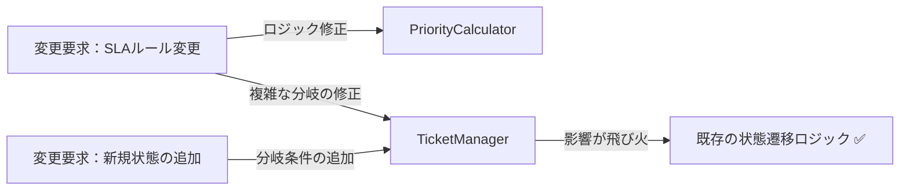

グラフが示す通り、ルール変更であれ状態追加であれ、結局は `TicketManager` という唯一の「状態管理の中心となるクラス」が修正のたびに常に触られることになります。

### 3-3：痛みの言語化

「またこの巨大な `if-else` を編集するのか…」というのが、この作業を始めた瞬間の率直な感覚です。

1つ目の痛みは、このクラスが「何でも屋」になりすぎていることです。状態遷移という「振る舞い」と、優先度計算という「ビジネスルール」が密接に絡み合っているため、片方をいじると、もう片方のロジックを無意識に壊してしまう恐怖が常にあります。

2つ目の痛みは、変更の局所化ができていないことです。新しい状態を追加するたびに、本来なら関係のないはずの優先度計算ロジックや、既存の遷移処理まで全てテストし直さなければなりません。この「どこまで影響が出るか分からない」という不安が、開発者の手を鈍らせ、システムをより硬直的なものにしています。

3つ目の痛みは、状態遷移とルール判定が同じきっかけで同時に動く場面で顕在化します。エスカレーションでは「状態を進める」と「SLA期限を見て優先度を上げる」が一度に走り、割当イベントや再オープンでも状態の遷移とその時点の優先度再評価が絡みます。同時に動くこと自体は要求どおりですが、それが同じ `updateStatus` の一続きの `if` に押し込まれているため、状態側の分岐を直したつもりが期限判定の順序を崩す、といった取り違えが起きやすくなっています。

---
> **📌 問題（確定）**
> チケット管理システムでは、「優先度ルールの変更」と「状態遷移の追加」という2つの変化が、それぞれ異なる担当者の判断で独立して発生する。どちらの変化が来ても `TicketManager` を開かなければならず、無関係なロジックまで再テストを強いられる。
---

フェーズ3で「変更が辛い」という事実が確認できました。次のフェーズ4では、なぜ辛いのかを構造的に言語化します。

---

## 🟠 フェーズ4：原因分析 ―― なぜ辛いのかを構造で言語化する
フェーズ3で確認したように、チケットの「状態」が増えるたびに、チケット管理クラスのコードが肥大化し、修正のたびに予期せぬ副作用への恐怖を感じる状態にあります。ここでは、この問題の原因を構造的な観点から紐解いていきます。

### 4-1：痛みの根源を探る（観察と原因）

フェーズ3でのシミュレーションから見えてきた観察事実と、その根本にある構造的な原因を対応させます。「根本原因（構造で言語化）」の列には、「なぜ変更が辛いのか」をコードの構造として表現した原因を記載します。観察事実から「症状」ではなく「構造上の欠陥」を言語化することが、このステップの目的です。

| **根本原因（構造で言語化）** | **観察** | **変わる理由** | **分離の方向性** |
| --- | --- | --- | --- |
| **根本原因A：優先度ルールの混在** | 優先度計算ルールが変わると、チケットの状態遷移ロジックまで再テストが必要になる | ビジネスルールの変更（SLA改定・顧客区分の細分化） | ルールを差し替え可能にする分離 |
| **根本原因B：状態遷移ロジックの混在** | 新しいチケット状態を追加するたびに、管理クラスが修正される | 状態の種類の追加（保留中・ベンダー確認中など） | 状態ごとの振る舞いをオブジェクト化する分離 |

これら2つの根本原因は**互いに独立した変化軸**です。優先度ルールが変わっても状態遷移は変わりません。状態の種類が増えても優先度ルールは変わりません。独立しているからこそ、1つの構造だけでは解決しきれません。

ここで注意したいのは、エスカレーション・割当イベント・SLA期限超過・再オープンのように、状態遷移とルール判定が同じ操作で**同時に動く**場面があることです。同時に動くからといって、変わる理由まで一つとは限りません。状態の追加を決めるのは運用プロセスチーム、SLA期限や優先度基準を決めるのはSLA管理チームで、決定者と改定タイミングは別のままです。「同じきっかけで一緒に動く」ことと「同じ理由で変わる」ことを混同すると、2軸を1つの構造へ無理に押し込む判断につながります。

コードを追うと、単に状態が増えるだけでなく、その状態によって「何をする必要があるか（通知するのか、誰に割り当てるのか）」という判定ロジックが、優先度の計算ルールと複雑に絡み合っていることが分かります。これにより、コードを変更する際に「どこからどこまでが影響範囲なのか」を直感的に捉えることが難しくなっています。

### 4-2：変わるもの/変わってほしくないもの

> **「変わらないもの」と「変わってほしくないもの」は異なります。** 「変わらないもの」は経験的事実（今まで変わっていない）、「変わってほしくないもの」は設計意図（ここを安定させてほかを守りたい）です。ここで整理するのは後者です。

構造を整理するために、変更理由の種類を分けてみます。

| **変わり続けるもの（🔴）** | **変わってほしくないもの（🟢）** |
| --- | --- |
| チケットの「状態ごとの振る舞い」（遷移先、アクション） | チケットの「現在の状態」を保持する基盤データ |
| 優先度判定の「ビジネスルール」（SLA基準、顧客要件） | 「状態遷移を開始する」という汎用的なインターフェース |

これまで私たちは、「チケット」という一つのオブジェクトの中に、ライフサイクルの管理（状態）と、そこから派生するビジネス上の判断（ルール）をまとめて扱っていました。状態が変わるたびにルールが動くのではなく、それぞれが別の軸として進化できるように整理する必要があります。

### 4-3：2つの接続点に漏れている知識を確認する

ここでの「確認すること」は、前節までに見つけた原因から抽出します。まず、原因文から「守りたい骨格」と「変わる差分」を分けます。次に、その差分を動かすために骨格側が知ってしまっている名前・条件・順序・型を拾います。最後に、接続点に残す最小の約束を、値・型・操作・イベントとして書きます。

原因によって、接続点で見る抽象観点は変わります。条件分岐が原因なら条件・定数・選択基準を見ます。処理手順が原因なら呼び出し順・前後条件・失敗時分岐を見ます。生成判断が原因なら具体クラス名・生成条件・登録場所を見ます。通知や外部連携が原因なら通知先・タイミング・成否の扱いを見ます。データや状態が原因なら、境界を流れる値・型・状態を見ます。

現在の`TicketManager`が、状態遷移と優先度判定について何を知っているかを確認します。

今の`TicketManager`には、状態名・遷移条件・優先度計算の条件が集まっています。状態担当とSLA担当の知識が一つのクラスへ埋め込まれています。

現在は、状態遷移・優先度計算・エスカレーション判定・SLA期限判定・割当契機の扱いが `TicketManager` の条件分岐へ集まっています。そのため、優先度ルールだけを変える要求でも、状態遷移を含むクラス全体を確認しなければなりません。割当や再オープンで状態とルールが同時に動く行では、どちらの軸の分岐なのかが読み手に見分けづらくなっています。

---
> **📌 原因（確定）**
> 以下の2つの独立した根本原因が重なっている：
> 1. **優先度ルールの混在**：ビジネスルールの変更による優先度計算の変化が管理クラスに波及する。
> 2. **状態遷移ロジックの混在**：状態の種類が増えるたびに、管理クラスの条件分岐が直接修正される。
>
> これらの変更理由（ルール改定と状態追加）はそれぞれ異なる頻度で発生するため、1つのクラスに混在していることで影響確認コストが発生し続ける。
---

フェーズ4で根本原因が言語化できました。次のフェーズ5では、この整理を元に、解決する課題を具体的に定義していきます。

---

## 🟡 フェーズ5：課題定義 ―― 解くべき接続点を定める
フェーズ4は「なぜ辛いか」を答えました。フェーズ5が問うのは「その境界でどんなデータが流れているか」です。型・値のレベルに降りていきます。

フェーズ4で、「チケットの状態ごとの振る舞い」と「優先度判定ルール」が `TicketManager` クラス内で密結合に混在していることが、変更のたびにコードを汚染させる原因だと特定しました。今のままでは、状態遷移のロジックに手を入れるたびに、無関係な優先度計算のコードまで確認対象に入りやすく、効率が悪くなっています。

### 接続点を特定する

接続点は、クラス図の線やインターフェース名から探すのではなく、変更要求を当てて特定します。まず、その要求で変えたい側と変えたくない側を分けます。次に、両者がどのメソッド呼び出し・引数・戻り値・生成・イベントでつながっているかを見ます。そのつながりのうち、変更要求のたびに知識が漏れて修正が波及する場所が、ここで解くべき接続点です。

今回の分析により、`TicketManager` クラス内に以下の2つの接続点（ジョイント）が存在することが明確になりました。接続点A は状態遷移ロジックの境界、接続点B は優先度判定ロジックの境界です。

3-2の変更影響とフェーズ4の原因を、二つの接続点として一表にまとめます。

| 課題ID・接続点 | 接続するデータ | 変わる側 | 守る側 |
|---|---|---|---|
| P1：状態処理 → チケット進行 | 現在状態、操作、次状態、割当・再オープンの結果 | 状態固有の操作可否・遷移先・副作用 | 公開操作、チケット保存、監査ログ、既存状態 |
| P2：優先度判定 → チケット進行 | 顧客区分、SLA期限、判定結果 `High`／`Normal` | SLA基準・顧客区分の判定ルール | 状態処理、公開操作、チケット保存 |

システム全体の課題は、状態処理と優先度判定を `TicketManager` から別々に外し、二つの変化軸を互いに知らないまま差し替えられるようにすることです。

---
> **📌 課題（確定）**
> 解くべき課題は2つある。接続点Aでは、状態遷移の条件分岐（`if (status == "Open")` 等）を `TicketManager` から切り離し、状態ごとの振る舞いを独立したオブジェクトとして管理できるようにすること。接続点Bでは、SLA基準や顧客区分の判定ロジック（`calc.calculate(userType)` 等）を `TicketManager` の外に出し、優先度ルールを単独で差し替えられるようにすること。
---

フェーズ5で「何を解くか」が確定しました。次のフェーズ6では、P1とP2を入力に一つの完成システムを設計します。

## 🔴 フェーズ6：対策検討 ―― システム全体の最終構造を定める

P1とP2を、次の三つの観点で一つの完成構造へ変換します。

| 接続点を変える観点 | システム全体の考え方 | P1・P2のコードへの反映 |
|---|---|---|
| 分離方法 | チケット進行には状態操作と優先度判定の契約だけを残し、具体的な条件を外す | P1は `ITicketPhase`、P2は `IPriorityRule` を境界にする |
| 配置場所 | 状態固有の判断と遷移は各Phase、SLA・顧客区分判定は各PriorityRuleへ置く | 状態クラス群とルールクラス群へ別々に配置する |
| 組み立て方法 | `TicketService` が全Phaseと全ルールを生成・所有し、Phase同士の遷移先を初期化時に配線する。各操作では保存済みチケットを読み、現在Phaseへ次状態を問い、結果を `TicketRepository` へ保存する | 状態と優先度を別々に保持し、状態処理と優先度判定を一つの操作で利用する |

最終構造は、状態分離構造とルール差し替え構造を `TicketService` が束ね、チケット自身（`Ticket`）は現在状態・優先度・担当者を保持する実体として `TicketRepository` に保存される一つのシステムです。片方だけを切り出す形は二つの課題を完了しない途中状態なので比較しません。

### 対策検討のクラス図：1-3の責任と依存をどう変えるか

フェーズ1の1-3で作ったクラス図へフェーズ2〜5の判断を反映し、変更後の形へ更新します。

| クラス図を変える材料 | 前工程で確認したこと | クラス図へ反映すること |
|---|---|---|
| フェーズ1のクラス図 | 現在のクラス、操作、依存関係 | 変更前クラス図としてそのまま使う |
| フェーズ2の変化予測 | 状態の種類とSLA・優先度ルールは別チームが増やす | 毎回変わる責任へ `【移す】` と注記する |
| フェーズ4の原因 | `TicketManager` に状態判断と優先度判定が混在する | 同じクラスの中で `【残す】` と `【移す】` を分ける |
| フェーズ5の接続点 | 公開操作は現在状態へ委譲し、優先度は差し替え可能ルールへ委ねればよい | P1の状態判断を状態クラスへ、P2の優先度判定を `IPriorityRule` へ置く |

**薄い黄色が着目クラス**です。変更前では `TicketManager` の `【残す】` と `【移す】`、変更後では移動先の `【新設】` を追います。矢印は1-3と同じ利用・実装・委譲関係です。

**変更前のクラス図（1-3を責任見直し用に再掲）：**

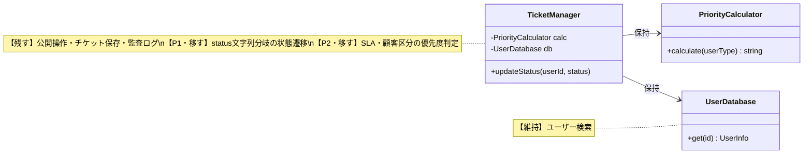

変更前は `TicketManager` が全状態の分岐と優先度判定を抱え、状態追加やSLA改定のたびに同じクラスの中身が膨らみます。

P1・P2をクラス図の変更として書くと、次の3操作になります。

1. P1：状態が満たす共通契約 `ITicketPhase`（`assign/resolve/escalate/reopen/hold` 等が次状態を返す）を新設する。
2. P2：優先度ルールが満たす共通契約 `IPriorityRule`（`getPriority`）を新設し、各ルールを実装へ移す。
3. P1・P2：`TicketService` が全Phaseと全ルールを所有し、保存済みチケットに対して状態遷移と優先度判定をそれぞれへ委譲する。

変更後は、公開操作が状態を判定せず現在状態へ委譲し、優先度は差し替え可能なルールへ委ね、`TicketManager` の混在分岐が消えたことを確認します。

**採用した変更後のクラス図：**

```mermaid
classDiagram
    class TicketService
    class TicketRepository
    class UserDatabase
    class StaffDirectory
    class TicketEventLog
    class Ticket
    class ITicketPhase { <<interface>> }
    class OpenPhase
    class InProgressPhase
    class EscalatedPhase
    class ResolvedPhase
    class PendingPhase
    class IPriorityRule { <<interface>> }
    class CorporatePriority
    class PremiumPriority
    class NormalPriority
    TicketService --> TicketRepository : チケット保存
    TicketService --> UserDatabase : 依頼者照会
    TicketService --> StaffDirectory : 担当者照会
    TicketService --> TicketEventLog : 監査記録
    TicketService o--> ITicketPhase : 状態を所有
    TicketService o--> IPriorityRule : ルールを所有
    TicketRepository --> Ticket : 保存
    Ticket --> ITicketPhase : 現在状態
    ITicketPhase <|.. OpenPhase
    ITicketPhase <|.. InProgressPhase
    ITicketPhase <|.. EscalatedPhase
    ITicketPhase <|.. ResolvedPhase
    ITicketPhase <|.. PendingPhase
    IPriorityRule <|.. CorporatePriority
    IPriorityRule <|.. PremiumPriority
    IPriorityRule <|.. NormalPriority

    note for ITicketPhase "【P1・新設】状態ごとの振る舞いの共通契約"
    note for IPriorityRule "【P2・新設】優先度判定の差し替え可能な契約"
    note for TicketService "【新設】両契約と保存先を所有し操作を実行"

    classDef focus fill:#FFF2CC,stroke:#D6B656,stroke-width:2px,color:#222222
    cssClass "ITicketPhase,OpenPhase,InProgressPhase,EscalatedPhase,ResolvedPhase,PendingPhase,IPriorityRule,CorporatePriority,PremiumPriority,NormalPriority" focus
```

クラス図の変更とコード変更を一対一で対応させると、次のようになります。

| 課題ID | クラス図をどう変えるか | コードレベルで何をするか | 実装ステップ |
|---|---|---|---|
| P1 | 共通契約 `ITicketPhase` を新設する | 各状態クラスが振る舞いと遷移先を実装する | ステップ1 |
| P2 | 共通契約 `IPriorityRule` を新設する | 各ルールクラスがSLA・顧客区分の判定を実装する | ステップ2 |
| P1・P2 | `TicketService` が両契約と保存先を所有する | 保存済みチケットへ状態遷移と優先度判定を委譲する | ステップ3 |

このクラス図が、P1・P2を反映したシステム全体の設計結論です。課題IDは図の差分を追うために使い、以降はこの構造に必要なコードだけを示します。

#### 課題箇所のおさらい（フェーズ3の関連コード）

統合表で特定した箇所だけを振り返ります。P1は `updateStatus()` の `status` 文字列分岐、P2は `calculate()` のSLA・顧客区分判定です。課題に関係しないコードは省略し、フェーズ3で明記した維持条件をそのまま引き継ぎます。

```cpp
// 現状：状態遷移と優先度判定が TicketManager に混在する
class TicketManager {
    PriorityCalculator calc;    // P2: 優先度判定を直接保持
public:
    void updateStatus(std::string userType, std::string status) {
        std::string priority = calc.calculate(userType);   // P2
        if (status == "Open") { /* ... */ }                // P1: 状態分岐
        else if (status == "InProgress" && priority == "High") { /* ... */ }
        else if (status == "Pending") { /* ... */ }        // 状態追加で増える
    }
};
```

### 6-1：採用設計をコードへ段階的に反映する

採用するクラス図と責任配置は、コードを書く前に確定しています。ここからの区切りは試行錯誤の履歴ではありません。完成形を理解できる大きさに分け、各ステップで「クラス図のどの操作・関連を実装したか」を確認します。

#### 実装ステップ1（P1）：状態の共通契約 `ITicketPhase` を定める

すべての状態が満たす契約 `ITicketPhase` を定義し、各状態クラスが自分の振る舞いと遷移を実装します。

```cpp
// P1接続点：状態ごとの振る舞いを共通契約にする
// 各操作は「遷移先の状態」を返す。nullptr はその状態では不可。
class ITicketPhase {
public:
    virtual ~ITicketPhase() = default;
    virtual std::string name() const = 0;
    virtual ITicketPhase* assign()   { return reject("アサイン"); }
    virtual ITicketPhase* resolve()  { return reject("解決"); }
    virtual ITicketPhase* escalate() { return reject("エスカレーション"); }
    virtual ITicketPhase* reopen()   { return reject("再受付"); }
    virtual ITicketPhase* hold()     { return reject("保留"); }
protected:
    ITicketPhase* reject(const std::string& op) {
        std::cout << "  操作不可: この状態では「" << op
                  << "」できません。" << std::endl;
        return nullptr;
    }
};

// 受付中：アサインで対応中へ、保留で保留中へ進む
class OpenPhase : public ITicketPhase {
    ITicketPhase* inProgress = nullptr;
    ITicketPhase* pending = nullptr;
public:
    void setInProgress(ITicketPhase* p) { inProgress = p; }
    void setPending(ITicketPhase* p)    { pending = p; }
    std::string name() const override { return "Open"; }
    ITicketPhase* assign() override { return inProgress; }
    ITicketPhase* hold() override   { return pending; }
};
```

**P1との対応：** `ITicketPhase` を新設し、各操作が遷移先の状態を返す形にしました。公開操作は状態を判定せず、現在状態へ委譲します。許可されない操作は既定の `reject()` が担うので、状態追加は新しい状態クラスと遷移元の配線だけで済みます。`InProgressPhase`（解決・エスカレーション・保留）、`EscalatedPhase`（解決・差し戻し）、`ResolvedPhase`／`PendingPhase`（再受付）も同じ形で、それぞれ許可する操作だけを上書きします。全実装は7-1で確認します。

#### 実装ステップ2（P2）：優先度ルールの共通契約 `IPriorityRule` を定める

優先度判定を差し替え可能なルールとして切り出します。SLA基準・顧客区分の判定は各ルールクラスの中に閉じ、状態処理から独立します。

```cpp
// P2接続点：優先度判定を差し替え可能なルールにする
enum class Priority { Normal, High };

class IPriorityRule {
public:
    virtual ~IPriorityRule() = default;
    virtual Priority getPriority() = 0;
};

class CorporatePriority : public IPriorityRule { // 法人向けSLA
public:
    Priority getPriority() override { return Priority::High; }
};
```

**P2との対応：** `IPriorityRule <|.. CorporatePriority` の実装関係を実装しました。優先度は `Priority` 列挙型で表し、`PremiumPriority`（High）・`NormalPriority`（Normal）も同じ形です。SLA改定はルール1クラスの差し替えに閉じます。

#### 実装ステップ3（P1・P2）：TicketServiceが両契約を所有し委譲する

`TicketService` が全Phaseと全ルールを所有し、遷移先を初期化時に配線します。各操作では保存済みチケットを読み、現在状態へ委譲し、結果を保存します。状態とルールは互いを知りません。

```cpp
// P1・P2接続点：保存済みチケットへ両契約を委譲する
class TicketService {
    TicketRepository& repo;          // チケットの保存先
    OpenPhase openPhase;             // 所有する状態（共有）
    InProgressPhase inProgressPhase;
public:
    TicketService(TicketRepository& r) : repo(r) {
        openPhase.setInProgress(&inProgressPhase); // 遷移先を配線
    }
    void assign(const std::string& ticketId,
                const std::string& assigneeId) {
        Ticket& t = repo.get(ticketId);          // 保存済みを読む
        ITicketPhase* next = t.phase->assign();  // 現在状態へ委譲
        if (!next) return;                       // 不可なら何もしない
        t.phase = next;
        t.assigneeId = assigneeId;               // 担当者を保存
        repo.save(t);                            // 変更後を保存
    }
};
```

**P1・P2との対応：** `TicketService o--> ITicketPhase` と `TicketService o--> IPriorityRule` の関連を実装しました。`TicketService` は全Phase・全ルールに加え `UserDatabase`・`StaffDirectory`・`TicketEventLog` も所有します（全体は7-1）。状態分離構造とルール差し替え構造が独立したまま、チケット実体を介して共存します。

### 6-2：システム全体の契約とデータ配置を確定する

採用システムの契約、生成場所、依存注入を一表で確定します。`TicketService` は全Phaseと全ルールを値メンバとして所有し、依頼者・担当者・保存先・監査ログは外から受け取ります。優先度はユーザー種別から選んだルールで計算し、登録時にチケット実体へ保存します。

```cpp
// TicketService 内：ユーザー種別から優先度ルールを選ぶ
IPriorityRule* ruleFor(UserType t) {
    if (t == UserType::Corporate) return &corporate;
    if (t == UserType::Premium)   return &premium;
    return &normal;
}
// 登録時に優先度を計算し、チケット実体へ保存する
void create(const std::string& ticketId,
            const std::string& userId) {
    UserType category = users.get(userId).userType;
    Priority p = ruleFor(category)->getPriority();
    Ticket t{ticketId, userId, &openPhase, p, ""};
    repo.save(t);   // 状態・優先度・担当者を1件として保存
}
```

| 接続点を変える観点 | システム全体での設計判断 | 変えたくない側が知らなくなる詳細 |
|---|---|---|
| 何を分離するか | P1の状態振る舞いを状態クラスへ、P2の優先度判定をルールクラスへ置く | 状態の種類・遷移、SLA基準・顧客区分 |
| どこで生成・選択するか | `TicketService` が全Phase・全ルールを所有し、`ruleFor()` で選ぶ | 具体状態・具体ルールの選択 |
| どう依存を渡すか | 依頼者・担当者・保存先・監査ログをコンストラクタで受け取る | 実体データの持ち方 |
| 安定側はどう実行するか | 利用側は `create()` や `assign()` などの操作だけを呼ぶ | 現在どの状態か、どの優先度ルールか |

状態とルールは `TicketService` が値メンバとして所有するため生存期間はサービスと一致し、`Ticket` 実体は現在状態を指すポインタと保存された優先度・担当者を持ちます。優先度は登録時に確定して保存され、再受付・エスカレーション時に再計算して引き継ぎます。

#### システム全体のコード適用結果

| 追跡対象 | 課題定義で目指した状態 | 適用した構造とコード | 適用結果 |
|---|---|---|---|
| P1：状態処理 | 状態追加で公開操作・保存・既存状態を変えない | 状態クラスと `ITicketPhase` 委譲 | 新状態と遷移元へ変更が閉じた |
| P2：優先度判定 | ルール変更で状態処理を変えない | ルールクラスと `IPriorityRule` 注入 | 新ルールと注入へ変更が閉じた |
| P1・P2を接続したシステム全体 | 二軸を独立に変え、公開操作・保存・ログを維持する | `TicketService` が両契約を所有し、保存済みチケットへ操作ごとに委譲する | 互いを参照せず、入口と副作用の位置も維持した |

**システム全体の実装結果：達成。** P1とP2が一つの実行経路で接続され、フェーズ5で目指した状態を実現しました。実際の動作と変更影響はフェーズ7で確認します。

## 🟢 フェーズ7：対策実施 ―― 変化に強いコードを完成させる
採用した ルール差し替え構造（優先度ルールの分離）および 状態分離構造（状態ごとの振る舞いの分離）を実装し、ビジネスルールと状態固有の処理をそれぞれ独立したクラスへカプセル化します。

### 7-1：解決後のコード（全体）

優先度判定を `IPriorityRule`（ルール差し替え構造）、状態管理を `ITicketPhase`（状態分離構造）へ分離し、チケットの状態・優先度・担当者は `TicketRepository` にチケットID単位で保存します。ここで3つのIDは別物です。**チケットID（TCK…）** はチケット自身の識別子、**依頼者ID（USR…）** はトラブルを申請したユーザー、**担当者ID（AGT…）** は対応するヘルプデスク担当者です。操作はそのつど保存済みチケットを読み込んで更新し、変更前→変更後を実行ログで確認できます。

**定数の定義（状態名・ユーザー種別・優先度・イベント種別）**

直接の文字列リテラルを本文コードへ散らばせず、意味のある名前へまとめます。ユーザー種別は「一般（standard）／プレミアム（premium）／法人（corporate）」という契約区分です。

```cpp
#include <iostream>
#include <string>
#include <vector>
#include <map>

using namespace std;

// ===== 定数（直文字列を名前で置き換える） =====
// ユーザー種別（契約区分・一般/プレミアム/法人）
enum class UserType { Standard, Premium, Corporate };
// 優先度
enum class Priority { Normal, High };

// 状態名（保存・表示・ログで使う）
namespace StatusName {
    const string Open       = "Open";        // 受付中
    const string InProgress = "InProgress";  // 対応中
    const string Escalated  = "Escalated";   // 緊急対応中
    const string Resolved   = "Resolved";    // 解決済み
    const string Pending    = "Pending";     // 保留中
}
// イベント種別（監査ログで使う）
namespace EventType {
    const string Create   = "作成";
    const string Assign   = "アサイン";
    const string Resolve  = "解決";
    const string Escalate = "エスカレーション";
    const string Reopen   = "再受付";
    const string Hold     = "保留";
}

// 優先度を表示・保存用の文字列へ変換する
string toString(Priority p) {
    return p == Priority::High ? "High" : "Normal";
}
```

**UserInfo / UserDatabase / StaffDirectory クラス**

`UserDatabase` は依頼者（申請ユーザー）を、`StaffDirectory` は対応するヘルプデスク担当者を、それぞれ別のID体系で管理します。ユーザー種別は優先度計算に使います。

```cpp
// ===== ユーザー情報 =====
struct UserInfo {
    string name; // 氏名
    UserType userType;   // ユーザー種別（契約区分）
};

class UserDatabase {
    map<string, UserInfo> records;
public:
    UserDatabase() {
        records["USR001"] = {"田中 一郎", UserType::Corporate};
        records["USR002"] = {"佐藤 花子", UserType::Premium};
        records["USR003"] = {"鈴木 次郎", UserType::Standard};
    }
    bool exists(const string& id) const { return records.count(id) > 0; }
    UserInfo get(const string& id) const { return records.at(id); }
};

// ===== ヘルプデスク担当者（依頼者USRとは別の人物） =====
class StaffDirectory {
    map<string, string> names; // 担当者ID(AGT) → 氏名
public:
    StaffDirectory() {
        names["AGT01"] = "山田 太郎";
        names["AGT02"] = "高橋 二郎";
    }
    string nameOf(const string& id) const {
        auto it = names.find(id);
        return it == names.end() ? id : it->second;
    }
};
```

**IPriorityRule と 3つの優先度ルール**

ユーザー種別ごとの優先度を、差し替え可能なルールとして切り出します。

```cpp
// ===== ルール差し替え構造：優先度計算 =====
class IPriorityRule {
public:
    virtual ~IPriorityRule() = default;
    virtual Priority getPriority() = 0;
};
class CorporatePriority : public IPriorityRule { // 法人向けSLA
public:
    Priority getPriority() override { return Priority::High; }
};
class PremiumPriority : public IPriorityRule {   // プレミアム向け
public:
    Priority getPriority() override { return Priority::High; }
};
class NormalPriority : public IPriorityRule {    // 一般向け
public:
    Priority getPriority() override { return Priority::Normal; }
};
```

**ITicketPhase インターフェース**

状態ごとの振る舞いを共通契約にします。各操作は「遷移先の状態」を返し、その状態で許可されない操作は既定で不可を通知します。

```cpp
// ===== 状態分離構造：状態別の振る舞い =====
// 各操作は「遷移先の状態」を返す。nullptr はその状態では不可。
class ITicketPhase {
public:
    virtual ~ITicketPhase() = default;
    virtual string name() const = 0;
    virtual ITicketPhase* assign()   { return reject(EventType::Assign); }
    virtual ITicketPhase* resolve()  { return reject(EventType::Resolve); }
    virtual ITicketPhase* escalate() { return reject(EventType::Escalate); }
    virtual ITicketPhase* reopen()   { return reject(EventType::Reopen); }
    virtual ITicketPhase* hold()     { return reject(EventType::Hold); }
    virtual ITicketPhase* sendBack() { return reject("差し戻し"); }
protected:
    ITicketPhase* reject(const string& op) {
        cout << "  操作不可: この状態では「" << op << "」できません。"
             << endl;
        return nullptr;
    }
};
```

**状態クラス（Open / InProgress / Escalated / Resolved / Pending）**

各状態は、自分が許可する操作だけを実装し、遷移先は組み立て時に注入されます。エスカレーション後の `Escalated`（緊急対応中）は、解決（→Resolved）と差し戻し（→InProgress）への遷移を持ちます。

```cpp
class OpenPhase : public ITicketPhase {          // 受付中
    ITicketPhase* inProgress = nullptr;
    ITicketPhase* pending = nullptr;
public:
    void setInProgress(ITicketPhase* p) { inProgress = p; }
    void setPending(ITicketPhase* p)    { pending = p; }
    string name() const override { return StatusName::Open; }
    ITicketPhase* assign() override { return inProgress; }
    ITicketPhase* hold() override   { return pending; }
};

class InProgressPhase : public ITicketPhase {    // 対応中
    ITicketPhase* resolved = nullptr;
    ITicketPhase* escalated = nullptr;
    ITicketPhase* pending = nullptr;
public:
    void setResolved(ITicketPhase* p)  { resolved = p; }
    void setEscalated(ITicketPhase* p) { escalated = p; }
    void setPending(ITicketPhase* p)   { pending = p; }
    string name() const override { return StatusName::InProgress; }
    ITicketPhase* resolve() override  { return resolved; }
    ITicketPhase* escalate() override { return escalated; }
    ITicketPhase* hold() override     { return pending; }
};

class EscalatedPhase : public ITicketPhase {     // 緊急対応中
    ITicketPhase* resolved = nullptr;
    ITicketPhase* inProgress = nullptr;
public:
    void setResolved(ITicketPhase* p)   { resolved = p; }
    void setInProgress(ITicketPhase* p) { inProgress = p; }
    string name() const override { return StatusName::Escalated; }
    ITicketPhase* resolve() override  { return resolved; }
    ITicketPhase* sendBack() override { return inProgress; }
};

class ResolvedPhase : public ITicketPhase {      // 解決済み
    ITicketPhase* open = nullptr;
public:
    void setOpen(ITicketPhase* p) { open = p; }
    string name() const override { return StatusName::Resolved; }
    ITicketPhase* reopen() override { return open; }
};

class PendingPhase : public ITicketPhase {       // 保留中
    ITicketPhase* open = nullptr;
public:
    void setOpen(ITicketPhase* p) { open = p; }
    string name() const override { return StatusName::Pending; }
    ITicketPhase* reopen() override { return open; }
};
```

**Ticket 実体と TicketRepository**

チケットは、現在状態・優先度・担当者を持つ実体としてリポジトリに保存されます。状態や優先度は利用者が毎回渡す入力ではなく、保存され引き継がれる値です。

```cpp
// ===== チケット実体とリポジトリ =====
struct Ticket {
    string id;
    string userId;
    ITicketPhase* phase;    // 現在状態（共有Phaseを指す）
    Priority priority;      // 保存された優先度（引き継がれる）
    string assigneeId;      // 担当者ID（未割当は空）
};

class TicketRepository {
    map<string, Ticket> store;
public:
    bool exists(const string& id) const { return store.count(id) > 0; }
    Ticket& get(const string& id) { return store.at(id); }
    void save(const Ticket& t) { store[t.id] = t; }
};
```

**TicketEventLog（監査ログ）**

作成・アサイン・解決・エスカレーション・再受付・保留のたびに1件追記し、チケットID・状態・優先度を記録します。ファイル保存はせず、実行中のメモリに保持します。

```cpp
// ===== 監査ログ =====
struct TicketEvent {
    string ticketId;
    string eventType;
    string status;
    string priority;
};
class TicketEventLog {
    vector<TicketEvent> records;
public:
    void add(const string& ticketId, const string& eventType,
             const string& status, Priority priority) {
        records.push_back({ticketId, eventType, status,
                           toString(priority)});
    }
    void printAll() const {
        for (const auto& r : records) {
            cout << "[" << r.ticketId << "] " << r.eventType
                 << " 状態=" << r.status
                 << " 優先度=" << r.priority << endl;
        }
    }
};
```

**TicketService（組み立てと実行）**

具体クラスを知っているのはこの1クラスだけです。状態遷移を適用し、優先度を登録・再受付・エスカレーション時に再計算して保存し、担当者をアサインで保存します。`main()` は起動だけを担います。

```cpp
// ===== 組み立てと実行：具体クラスの生成と所有をまとめる =====
class TicketService {
    TicketRepository& repo;
    UserDatabase& users;
    StaffDirectory& staff;
    TicketEventLog& log;
    NormalPriority normal;
    PremiumPriority premium;
    CorporatePriority corporate;
    OpenPhase openPhase;
    InProgressPhase inProgressPhase;
    EscalatedPhase escalatedPhase;
    ResolvedPhase resolvedPhase;
    PendingPhase pendingPhase;

    IPriorityRule* ruleFor(UserType t) {
        if (t == UserType::Corporate) return &corporate;
        if (t == UserType::Premium)   return &premium;
        return &normal;
    }
    // 状態遷移を1回適用し、成功したら保存する共通処理
    void applyTransition(const string& ticketId, ITicketPhase* next,
                         const string& eventType) {
        if (!next) return;                 // 操作不可（rejectで通知済み）
        Ticket& t = repo.get(ticketId);
        string before = t.phase->name();
        t.phase = next;
        repo.save(t);
        cout << "  " << eventType << ": 状態 " << before
             << " → " << t.phase->name() << endl;
        log.add(ticketId, eventType, t.phase->name(), t.priority);
    }
public:
    TicketService(TicketRepository& r, UserDatabase& u,
                  StaffDirectory& s, TicketEventLog& l)
        : repo(r), users(u), staff(s), log(l) {
        openPhase.setInProgress(&inProgressPhase);
        openPhase.setPending(&pendingPhase);
        inProgressPhase.setResolved(&resolvedPhase);
        inProgressPhase.setEscalated(&escalatedPhase);
        inProgressPhase.setPending(&pendingPhase);
        escalatedPhase.setResolved(&resolvedPhase);
        escalatedPhase.setInProgress(&inProgressPhase);
        resolvedPhase.setOpen(&openPhase);
        pendingPhase.setOpen(&openPhase);
    }

    void create(const string& ticketId, const string& userId) {
        if (!users.exists(userId)) {
            cout << "エラー: ユーザーID " << userId
                 << " は存在しません。" << endl;
            return;
        }
        UserType category = users.get(userId).userType;
        Priority p = ruleFor(category)->getPriority(); // 登録時に計算
        Ticket t{ticketId, userId, &openPhase, p, ""};
        repo.save(t);
        cout << "[" << ticketId << "] 作成 状態=" << t.phase->name()
             << " 優先度=" << toString(p) << endl;
        log.add(ticketId, EventType::Create, t.phase->name(), p);
    }
    void assign(const string& ticketId, const string& assigneeId) {
        Ticket& t = repo.get(ticketId);
        ITicketPhase* next = t.phase->assign();
        if (!next) return;
        t.phase = next;
        t.assigneeId = assigneeId;          // 担当者を保存
        repo.save(t);
        cout << "  " << EventType::Assign << ": 状態 "
             << StatusName::Open << " → " << t.phase->name()
             << " 担当=" << staff.nameOf(assigneeId)
             << "(" << assigneeId << ")" << endl;
        log.add(ticketId, EventType::Assign, t.phase->name(),
                t.priority);
    }
    void resolve(const string& ticketId) {
        applyTransition(ticketId, repo.get(ticketId).phase->resolve(),
                        EventType::Resolve);
    }
    void escalate(const string& ticketId) {
        Ticket& t = repo.get(ticketId);
        ITicketPhase* next = t.phase->escalate();
        if (!next) return;
        string before = t.phase->name();
        t.phase = next;
        // エスカレーション時に優先度を再計算して引き継ぐ
        t.priority = ruleFor(users.get(t.userId).userType)->getPriority();
        repo.save(t);
        cout << "  " << EventType::Escalate << ": 状態 " << before
             << " → " << t.phase->name()
             << " 優先度=" << toString(t.priority) << endl;
        log.add(ticketId, EventType::Escalate, t.phase->name(),
                t.priority);
    }
    void reopen(const string& ticketId) {
        Ticket& t = repo.get(ticketId);
        ITicketPhase* next = t.phase->reopen();
        if (!next) return;
        string before = t.phase->name();
        t.phase = next;
        // 再受付時に優先度を再計算して引き継ぐ
        t.priority = ruleFor(users.get(t.userId).userType)->getPriority();
        repo.save(t);
        cout << "  " << EventType::Reopen << ": 状態 " << before
             << " → " << t.phase->name()
             << " 優先度=" << toString(t.priority) << endl;
        log.add(ticketId, EventType::Reopen, t.phase->name(),
                t.priority);
    }
    void hold(const string& ticketId) {
        applyTransition(ticketId, repo.get(ticketId).phase->hold(),
                        EventType::Hold);
    }
};
```

**main 関数**

```cpp
int main() {
    UserDatabase users;   // 依頼者（USR）
    StaffDirectory staff; // ヘルプデスク担当者（AGT）
    TicketRepository repo;
    TicketEventLog log;
    TicketService svc(repo, users, staff, log);

    cout << "--- 行1: 依頼者 鈴木(standard)がTCK001を登録 ---" << endl;
    svc.create("TCK001", "USR003");
    cout << "--- 行2: 依頼者 佐藤(premium)がTCK002を登録 ---" << endl;
    svc.create("TCK002", "USR002");

    cout << "--- 行3: TCK001に担当者 山田をアサイン ---" << endl;
    svc.assign("TCK001", "AGT01");
    cout << "--- 行4: TCK001を解決 ---" << endl;
    svc.resolve("TCK001");
    cout << "--- 行5: TCK001を再受付（優先度を再計算） ---" << endl;
    svc.reopen("TCK001");

    cout << "--- 行6: TCK002に担当者 高橋をアサイン ---" << endl;
    svc.assign("TCK002", "AGT02");
    cout << "--- 行7: TCK002をエスカレーション（緊急対応中へ） ---"
         << endl;
    svc.escalate("TCK002");
    cout << "--- 行8: TCK002を解決（緊急対応中→解決済み） ---" << endl;
    svc.resolve("TCK002");

    cout << "--- 変更要求: 田中(corporate)のTCK003を登録し保留 ---"
         << endl;
    svc.create("TCK003", "USR001");
    svc.hold("TCK003");

    cout << "--- エラー: 存在しないユーザー ---" << endl;
    svc.create("TCK004", "USR999");

    cout << "\n--- 監査ログ ---" << endl;
    log.printAll();
    return 0;
}
```

実行対象コード：7-1の解決後コード
対応する動作例：1-2の動作例テーブル、および変更要求後の代表ケース
確認したいこと：状態・優先度・担当者がチケット単位で保存・追跡され、変更理由ごとの責任が分離されていること

**実行結果：**

```
--- 行1: 依頼者 鈴木(standard)がTCK001を登録 ---
[TCK001] 作成 状態=Open 優先度=Normal
--- 行2: 依頼者 佐藤(premium)がTCK002を登録 ---
[TCK002] 作成 状態=Open 優先度=High
--- 行3: TCK001に担当者 山田をアサイン ---
  アサイン: 状態 Open → InProgress 担当=山田 太郎(AGT01)
--- 行4: TCK001を解決 ---
  解決: 状態 InProgress → Resolved
--- 行5: TCK001を再受付（優先度を再計算） ---
  再受付: 状態 Resolved → Open 優先度=Normal
--- 行6: TCK002に担当者 高橋をアサイン ---
  アサイン: 状態 Open → InProgress 担当=高橋 二郎(AGT02)
--- 行7: TCK002をエスカレーション（緊急対応中へ） ---
  エスカレーション: 状態 InProgress → Escalated 優先度=High
--- 行8: TCK002を解決（緊急対応中→解決済み） ---
  解決: 状態 Escalated → Resolved
--- 変更要求: 田中(corporate)のTCK003を登録し保留 ---
[TCK003] 作成 状態=Open 優先度=High
  保留: 状態 Open → Pending
--- エラー: 存在しないユーザー ---
エラー: ユーザーID USR999 は存在しません。

--- 監査ログ ---
[TCK001] 作成 状態=Open 優先度=Normal
[TCK002] 作成 状態=Open 優先度=High
[TCK001] アサイン 状態=InProgress 優先度=Normal
[TCK001] 解決 状態=Resolved 優先度=Normal
[TCK001] 再受付 状態=Open 優先度=Normal
[TCK002] アサイン 状態=InProgress 優先度=High
[TCK002] エスカレーション 状態=Escalated 優先度=High
[TCK002] 解決 状態=Resolved 優先度=High
[TCK003] 作成 状態=Open 優先度=High
[TCK003] 保留 状態=Pending 優先度=High
```

行1〜8で、状態がチケットID単位で保存・追跡され、優先度が登録時に決まって以降引き継がれ（TCK002はHighのまま、再受付・エスカレーションで再計算）、担当者がアサインで保存されることを確認できます。エスカレーション（行7）では `InProgress → Escalated` へ遷移し、その後（行8）`Escalated → Resolved` へ進みます。変更要求の `Pending`（保留中）と法人向けの高優先度も落とさず追えています。

#### 解決後のクラス構成

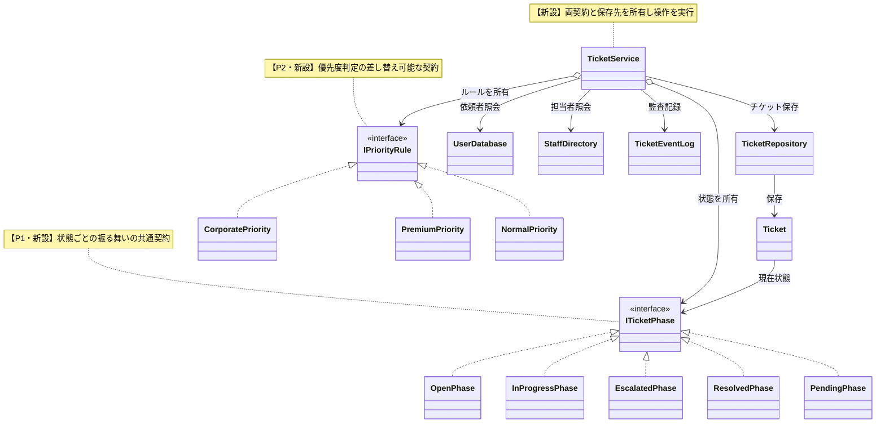

完成後はStateで進行状態を、Strategyで優先度判定を分離します。章末の抽象図と比べると、`TicketService` が両構造を束ね、`Ticket` 実体が現在状態を保持することが分かります。

#### 完成後の状態遷移

完成コードが実装する全状態と遷移を、状態遷移図で確認します。現状の3状態（Open・InProgress・Resolved）に加え、`Escalated`（緊急対応中）と `Pending`（保留中）が独立した状態として加わり、エスカレーション後の遷移先も定義されています。

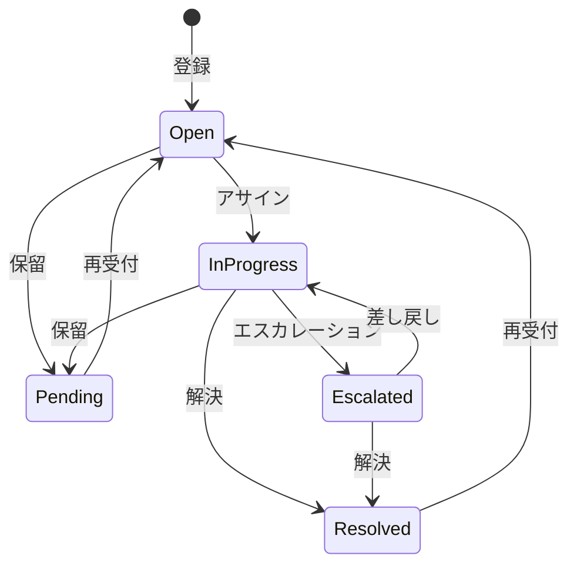

エスカレーション（`InProgress → Escalated`）の後は、解決（`Escalated → Resolved`）か、対応中への差し戻し（`Escalated → InProgress`）へ進みます。各遷移は対応する `ITicketPhase` 実装が「遷移先の状態」を返すことで表現され、許可されない操作は次状態を返さず状態が変わりません。状態が変わらないエラー（存在しないユーザー・不可操作）はこの図に含めず、実行結果とエラー条件表で扱います。

#### 変更軸ごとの完成コード追跡

| 課題ID | 完成コードの適用先 | 実装後に起きたこと | 完了条件の最終確認 |
|---|---|---|---|
| P1 | 全 `ITicketPhase` 実装と `TicketService` の各操作 | 公開操作は現在Phaseへ委譲し、状態固有遷移がPhase実装へ閉じた | 状態追加で既存の状態選択分岐を増やさない |
| P2 | 全 `IPriorityRule` 実装と `TicketService::ruleFor()` | SLA・顧客区分の判定は状態から独立して交換できた | SLA変更でPhase実装を変更しない |

### 7-2：動作シーケンス図

ルール差し替え構造 × 状態分離構造の実行時のやり取りを、TCK002のエスカレーション（`InProgress → Escalated`）で可視化します。`TicketService` が具象クラスを知らずに抽象インターフェース経由で状態遷移と優先度判定を委譲し、結果を `TicketRepository` へ保存する流れが確認できます。

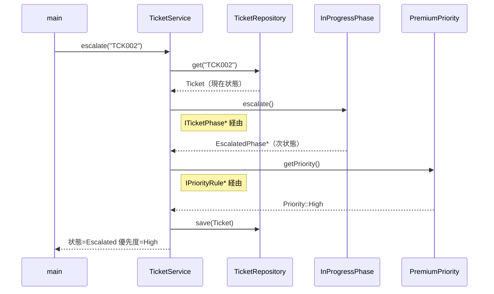

---

### 7-3：変更影響グラフ（改善後）

フェーズ3で確認した「変更要求：状態追加」と「SLAルール変更」のシナリオを、3-2と同じ粒度で再度適用します。

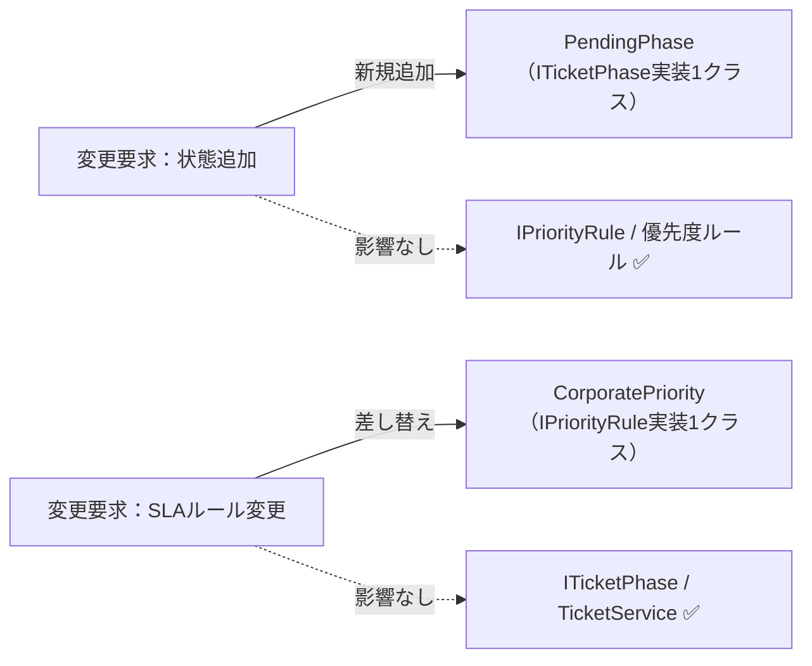

フェーズ3の変更影響グラフと同じ要求・同じ粒度で比べると、P1の状態追加は `ITicketPhase` の実装1クラスへ、P2のSLAルール変更は `IPriorityRule` の実装1クラスへ限定されました。`TicketService` は両契約を所有しつつ操作ごとに委譲するため、片方の変更がもう片方へ飛び火しません。

| 3-2で影響した場所 | 修正後 | 構造変更との対応 |
|---|---|---|
| `updateStatus()` の `status` 文字列分岐（P1） | **修正しない** | 振る舞いを各状態クラスへ移した |
| `calculate()` のSLA・顧客区分判定（P2） | ルール1クラスを差し替える | 優先度判定をルール差し替え構造へ移した |
| 3-2には状態・ルールの契約がなかった | `ITicketPhase`／`IPriorityRule` へ実装を1つずつ追加 | 変更先を新しく作った |

### 7-4：変更シナリオ表

フェーズ1の現状コードと改善後で、変更の影響がどう変わるかを対比します。

| **シナリオ** | **フェーズ1の現状コードでの影響** | **この設計での影響** |
| --- | --- | --- |
| 新しい状態（保留中）を追加 | `TicketManager` の条件分岐に新状態の処理を追加 | `PendingPhase` クラスを新規作成し、遷移ルールを設定する |
| 法人向けSLA優先度ルールを追加 | `TicketManager` の if-else ロジックを修正 | `CorporatePriority` クラスと組み立てを追加。状態クラスは保つ |
| ベンダー確認中状態を追加 | `TicketManager` の条件分岐と既存状態を確認 | `VendorWaitingPhase` クラスと遷移の組み立てを追加。優先度ルールは保つ |
| 状態遷移のルールを変更 | `TicketManager` の遷移条件を修正 | 対象の Phase クラスのみ修正 |

フェーズ1の現状コードでは状態の追加や優先度ルールの変更のたびに `TicketManager` 本体を直接修正する必要がありました。改善後は `TicketService` の既存操作に触れず、対象の Phase クラスまたは ルール差し替え構造（優先度ルール）クラスだけを変えれば済みます——それがこの設計で手に入れたものです。諦めたものは、インターフェースやクラスの増加というわずかな設計コストです。


---

## 整理

### 問題・原因・課題・解決策

| | 内容 |
|---|---|
| **問題** | チケット管理で「優先度ルールの変更」と「状態遷移の追加」という変わる理由が異なる2つの変化が、同じ `TicketManager` に混在している |
| **原因** | `TicketManager` が `PriorityCalculator` と状態遷移ロジックを「クラス名と条件を呼び出し元が知る」で保持しているため、どちらの変化が来ても両方への影響確認が必要になる |
| **課題** | 状態ごとの振る舞い（接続点A）と優先度判定ロジック（接続点B）を、それぞれ独立して差し替えられる構造に切り離すこと |
| **解決策** | ルール差し替え構造 × 状態分離構造：`IPriorityRule`（優先度ルールの軸）と `ITicketPhase`（状態遷移の軸）の2つのインターフェースで変化軸を分離し、`TicketService` はどちらの具体クラスも知らない設計にする |

### フェーズとこの章でやったこと

| **フェーズ** | **この章でやったこと** |
| --- | --- |
| 🔵 フェーズ1：現状把握 | チケット管理システムにおける状態遷移とルール判定の混在を観察した。仕様・動作例・コード・クラス構成図・変更要求を把握した |
| 🟣 フェーズ2：仮説立案 | 業務機能の所在表・変わる理由の分析で2つの変化軸を特定した。運用担当者へのヒアリングで、二つの軸（ルールと状態）が独立して変動することを確認した |
| 🟣 フェーズ3：問題特定 | `if-else` 分岐の肥大化による修正の連鎖という痛みを確認した |
| 🟠 フェーズ4：原因分析 | 振る舞いとルールの密結合を「直差し」状態として診断した |
| 🟡 フェーズ5：課題定義 | 状態とルールの二つの接続点を特定し、疎結合化を課題とした |
| 🔴 フェーズ6：対策検討 | 2ステップ（ルール差し替え→状態分離）を比較し、ルール差し替え構造 × 状態分離構造（共通の契約だけを知る）を採用した |
| 🟢 フェーズ7：対策実施 | インターフェースを導入し、責務をクラスに分離した。シーケンス図・変更影響グラフ・変更シナリオ表で局所化を確認した |

### 責任の移動

| **責任** | **変更前** | **変更後** |
| --- | --- | --- |
| チケットの全体フロー管理 | `TicketManager` | `TicketService`（操作の受け口） |
| 状態ごとの振る舞いの実装 | `TicketManager`（if-else直書き） | `OpenPhase` / `InProgressPhase` 等の各フェーズクラス |
| 優先度判定ルールの実装 | `TicketManager`（直書き） | `PremiumPriority` / `NormalPriority` 等の各ルールクラス |
| 状態遷移の契約定義 | —（なし） | `ITicketPhase` |
| 優先度判定の契約定義 | —（なし） | `IPriorityRule` |

### 使った構造 × 解消した根本原因

| **使った構造** | **解消した根本原因** |
| --- | --- |
| ルール差し替え構造（`IPriorityRule`） | 根本原因A：優先度ルールが `TicketManager` 内に混在し、SLA改定のたびに状態遷移ロジックまで再テストが必要だった |
| 状態分離構造（`ITicketPhase`） | 根本原因B：状態遷移ロジックが `TicketManager` 内に混在し、新状態を追加するたびに管理クラスへの修正が必要だった |

2つの構造はそれぞれ独立した根本原因を解消しています。どちらか一方だけでは、残った根本原因が将来の変更で痛みを生み続けます。

### 複雑さを足しても対策は変わるか

今回足した複雑さが、どの原因に効き、どの課題を生み、最終的にどちらの軸の構造へ収まったかを対応させます。2軸以上の変化が重なっても、軸を分ければ複数構造へ自然に進められることの確認です。

| 追加した複雑さ | 見えた原因 | 定めた課題 | 採用した扱い（2軸分離） |
|---|---|---|---|
| SLAタイマー | 期限超過の判定が優先度と一緒に本体へ入る | 期限を優先度ルール側へ寄せる | ルール軸（`IPriorityRule`）で判定する |
| 担当者割当イベント | 割当契機が状態遷移の分岐へ埋もれる | 契機と状態遷移を分けて扱う | 状態軸（`ITicketPhase`）の遷移で扱う |
| 再オープン | 逆流時に状態とルールが同じ行で動く | 逆流時も両軸を独立に動かす | 状態軸で遷移し、ルール軸で再評価する |
| 状態とルールの同時変化 | 同時に動くため1軸へまとめたくなる | 同時でも軸ごとに振り分ける | 組み立て側が両軸を順に呼び分ける |

---

## 振り返り

### 「この章を読むと得られること」は手に入ったか

| **得られること** | **この章のどこで示したか** |
| --- | --- |
| 1. 変動箇所の識別力 | フェーズ2の業務機能の所在表・変わる理由の分析でルールと状態を変動要因として特定した |
| 2. 接続点の診断力 | フェーズ4の原因分析で、状態遷移と優先度判定の知識が `TicketManager` に集まっている状態を診断した |
| 3. 構造改善の説明力 | フェーズ7の変更シナリオ表で、変更が独立クラスに閉じる構造を示した |
| 4. if文からオブジェクトへの変換視点 | フェーズ6の2ステップで、優先度ルールと状態をそれぞれインターフェースへ分離する変換プロセスを示した |

### 3つの設計原則はどう適用されたか

**原則1「変わるものをカプセル化せよ」の現れ**

- 具体化された場所：各 `IPriorityRule` および `ITicketPhase` の実装クラス
- 解説：変化するロジックを個別のクラスへ追い出し、`TicketService` から切り離しました。新しいルールや状態が追加されても `TicketService` の既存操作は無影響です。

**原則2「実装ではなくインターフェースに対してプログラムせよ」の現れ**

- 具体化された場所：`IPriorityRule`, `ITicketPhase`
- 解説：統括クラスは具体的なアルゴリズムや状態を知らず、インターフェース経由で呼び出します。既存の契約に収まる優先度ルールや状態を差し替える場合、`TicketService` の委譲ロジックは保てます。新しい操作や遷移用の契約が必要になれば、インターフェースと `TicketService` も見直します。

**原則3「継承よりコンポジションを優先せよ」の現れ**

- 具体化された場所：`TicketService` が ルール差し替え構造 と 状態分離構造 を保持する構成
- 解説：ロジックの振る舞いを継承ではなく、保持するオブジェクトの差し替えによって実現しました。継承だけで「状態×優先度ルール」の全組み合わせを表すと、状態3種類×優先度ルール3種類で9クラスになります。状態やルールが増えるたびに組み合わせクラスも増える、二次元的な膨張が起きます。コンポジションなら、状態クラスまたはルールクラスと、それらを結び付ける組み立て箇所を変更できます。

---

## あなたのコードで考えてみてください

この章で辿った思考プロセスを、あなた自身のコードに当てはめてみましょう。

1. **複数の変動軸を探す：** あなたのコードに「振る舞いが変わる理由が2つ以上、同じクラスに混在している」箇所がありますか？「状態によって処理が変わる」と「ビジネスルールによって処理が変わる」が同居していませんか？**判断基準：** そのクラスの変更理由を1文で書こうとして「AまたはBが変わったとき」という形になるなら、変動軸が混在しています。
2. **変わる理由を分ける：** そのクラスの変更要求が来たとき、担当者は何人いますか？異なる担当者の判断が1か所に混在しているなら、分けるサインです。**判断基準：** git blameで「このメソッドは営業が要求した変更で前回修正、前々回はシステムチームの要件で修正」となっていれば、2つの責任が混在しています。
3. **爆発を想像する：** 状態の種類が3つ→5つ、ルールの種類が2つ→4つになったとき、今の構造ではメソッド数はどのくらい増えますか？それは管理できる範囲ですか？**判断基準：** 「状態×ルール数」のかけ算でメソッドや分岐が増えるなら爆発します。足し算で済むなら許容範囲です。
4. **分けた後を想像する：** 「状態の遷移ロジック」と「ビジネスルール」をそれぞれ別クラスに切り出したとき、新しい状態を追加するとき触るファイルはどこだけになりますか？**判断基準：** 「1ファイルだけ」が答えなら設計が機能しています。「複数ファイル」が答えなら、まだ依存が残っています。

---

**題材を置き換えるときの共通手順**

この章の題材名を、自分の現場のシステム名に置き換えて考えます。

1. そのシステムは、誰が何を達成するために使うものか。
2. 入力、加工、出力は何か。
3. 最近入った変更要求、または次に来そうな変更要求は何か。
4. その変更で、触りたくない場所まで修正や再テストが広がるか。
5. 変えたいものと守りたいものを分けると、接続点には何を残すべきか。
6. 何もしない、関数化、クラス分離、契約導入、登録/組み立て移動のうち、どこまで進めるのが今回の文脈に合うか。

## パターン解説：Strategy × State

この複合パターンは、ビジネス上の「アルゴリズム（戦略）」と「状態（状態遷移）」が独立して変化する際、それぞれをパターンの対象とすることで、爆発的な分岐を整理する強力なアプローチです。

> [!INFO] コラム: StrategyとState、似ているけれど何が違う？
> どちらのパターンも「インターフェースを使って具体的な振る舞いを切り替える」という構造は同じです。しかし、目的（意図）が異なります。Strategyは「優先度計算」のような特定のアルゴリズムを差し替えるためのものですが、Stateは「受付中」「対応中」といったオブジェクトのライフサイクル（状態）を表現するためのものです。構造が同じでも、変更理由の種類が違うため別々に扱う必要があります。

### 抽象骨格の実行シーケンス

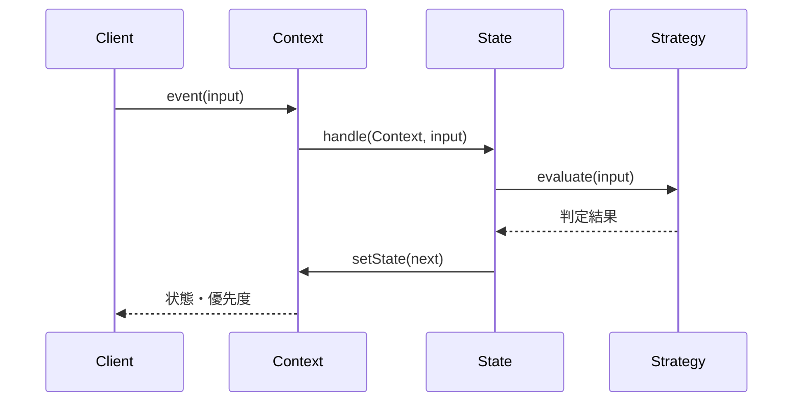

Stateが状態固有の処理を選び、その中の独立して変わる判定をStrategyへ委譲します。

### この章の実装との対応

GoF（Gang of Four）とは、1994年に出版された書籍『Design Patterns』の4人の著者の総称です。彼らが整理した23のパターンは、現在も設計の共通言語として広く使われています。

**Strategyパターン（GoF標準）：**

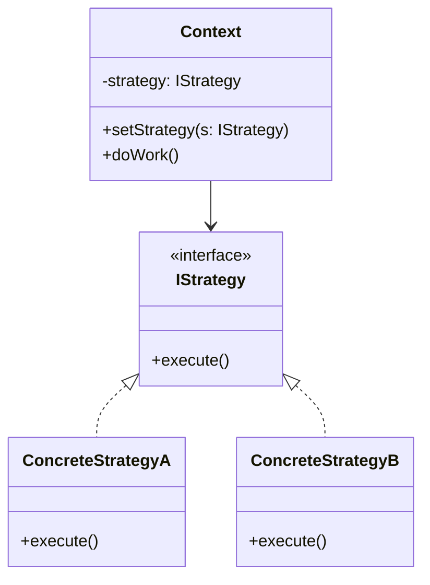

| GoFの名前 | この章での対応 |
| --- | --- |
| Context | `TicketService` |
| Strategy | `IPriorityRule` |
| ConcreteStrategyA | `PremiumPriority` |
| ConcreteStrategyB | `NormalPriority` |

**Stateパターン（GoF標準）：**

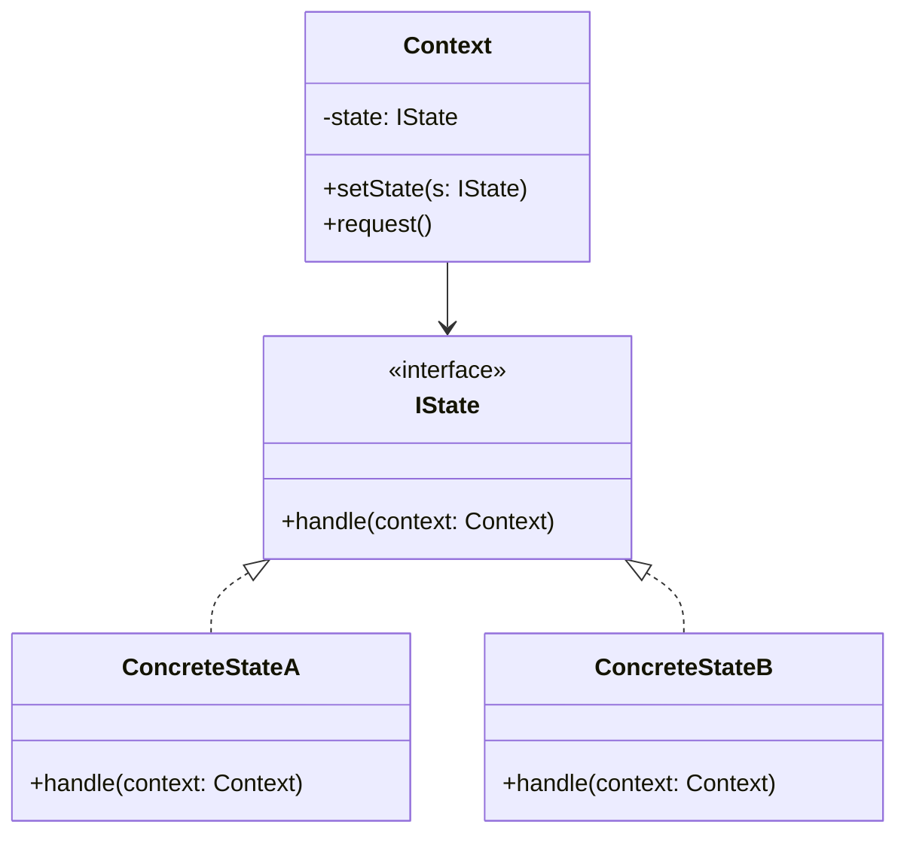

| GoFの名前 | この章での対応 |
| --- | --- |
| Context | `TicketService` |
| IState | `ITicketPhase` |
| ConcreteStateA | `OpenPhase` |
| ConcreteStateB | `InProgressPhase` |

### 使いどころと限界

- **使うと良い：** 状態遷移が複雑で、さらにその状態ごとのルールが頻繁に変わるような大規模なワークフロー管理。または「変わる理由が2種類あり、それぞれ異なる担当者が変更を決定する」ことがヒアリングで確認された場合。
- **使わない方が良い：** シンプルな遷移であれば `if-else` の方が可読性が高いこともあります。判断基準として以下を確認してください。① 状態が2種類以下かつ今後増える予定がない、② ビジネスルールが1種類だけで四半期改定などの変更予定がない、③ 担当者が1人（変更の判断者が1人）——この3条件をすべて満たすなら、パターン適用はやりすぎです。1つでも満たさない場合は、将来のクラス爆発を避けるためにパターン適用を検討してください。

【過剰コード：シンプルなものまで無理に分離した例】

状態が「Open」「Closed」の2つだけで、ルールも「ハイか否か」1種類だけのシンプルなシステムにStrategy × Stateを適用すると、クラス爆発が起きます。

```cpp
// 【過剰コード】状態2種類・ルール1種類のみのシンプルなシステムに
// Strategy × State を適用した場合の例

// ── Strategy側（ルール1種類だけなのにインターフェースを定義）
class IPriorityRule {
public:
    virtual ~IPriorityRule() = default;
    virtual string getPriority() = 0;
};
class SinglePriority : public IPriorityRule { // ← 実装クラスが1つだけ
public:
    string getPriority() override { return "Normal"; }
};

// ── State側（状態2種類のみなのにインターフェースを定義）
class ISimpleState {
public:
    virtual ~ISimpleState() = default;
    virtual void handle() = 0;
};
class OpenState : public ISimpleState {  // ← 状態クラスが2つだけ
public:
    void handle() override { cout << "Open" << endl; }
};
class ClosedState : public ISimpleState {
public:
    void handle() override { cout << "Closed" << endl; }
};

// ── 合計5クラス + 2インターフェース。if-else 2行で書けた処理が
//    7つのクラスに分散し、次に触る人は全クラスを読まないと
//    「何をしているか」を理解できなくなる。
```

これを素直に書くと次のように2行で済みます。

```cpp
// シンプルな if-else の方が読みやすい場合
void updateStatus(string status) {
    if (status == "Open") cout << "Open" << endl;
    else cout << "Closed" << endl;
}
```

「状態が2つ以下・ルールが1種類」という条件では、パターン適用はクラス数を増やすだけで変更耐性の恩恵がありません。変化の見込みがないなら、シンプルな実装が一つの考え方です。

### この章のまとめ

チケット管理というドメインと Strategy × State の組み合わせの関係を一言で言うなら、「優先度ルール」と「状態遷移」は変わる速度も担当者も違う2つの変化軸であり、それぞれに別の境界を設けることで変更影響を分けやすくなる、ということです。先にパターン名を選ぶのではなく、問題を分析した結果がStrategyとStateの役割に対応した——この順序が、第二部を通じて最も伝えたいことです。

7つのフェーズを通じて、読者は1つのクラスに混在する2つの変化軸という観察から始まり、「変わる速度と担当者が違うならば分けるべき」という分析を経て、軸ごとに異なるパターンを当てるという判断へと進みました。フェーズ4で「優先度ルール」と「状態遷移」が独立した接続点を持つことが確認された時点で、1つのパターンでは解決しきれないことが見えました。その「解決しきれない」という気づきこそが、2つ目のパターンへ進む根拠になります。フェーズ6の2ステップで軸ごとに分離した思考の流れは、複合問題に直面したときの手順として、このまま現場で使えると思っています。

あなたのコードの中にも、「どの業務機能に属するか」が異なる2つのロジックが同じクラスに同居している箇所があるはずです。それぞれの変化軸を問うことが、どのパターンをどこに当てるかを見つける入口になります。
