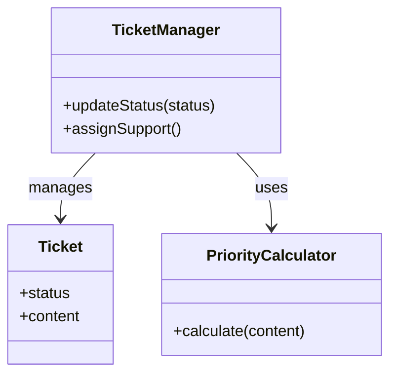
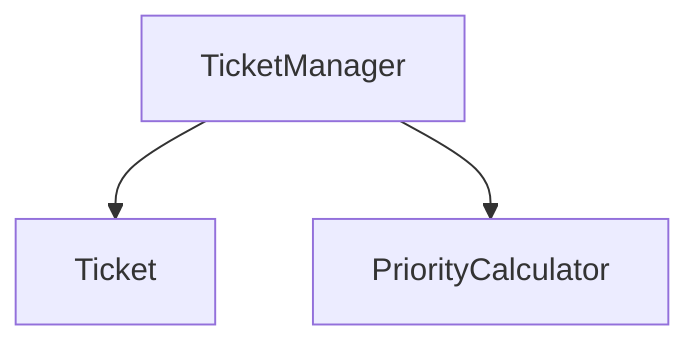
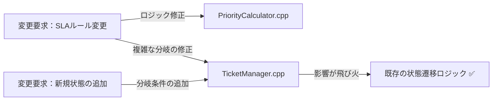
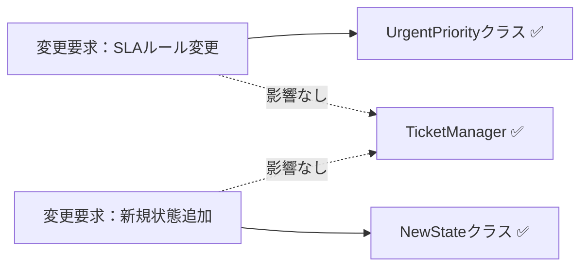

## 第9章 変わるルールと状態の連鎖 ―― Strategy パターン × State パターン

―― 思考の型：複雑なビジネスルールと状態遷移が絡み合う場所をどう解くか

### この章の核心

**システムの振る舞いが「ビジネスルール」と「状態遷移」という異なる2つの軸で変化する場合、これらを分離せずに一つのクラスに抱え込むと、機能拡張のたびにコードが爆発的に複雑化する。**

### この章を読むと得られること

* **得られること1：** ビジネスルールの切り替え（Strategy）と状態ごとの振る舞い（State）が混在している箇所を識別できるようになる


* **得られること2：** 接続点が「具体×直接」になっているコードを見て、なぜそこが変更の痛みの発生源なのかを判断できるようになる


* **得られること3：** 複合的な変化に対して、複数のパターンを組み合わせてどのように局所化できるかを説明できるようになる


* **得られること4：** 現場の複雑な条件分岐を、if文の羅列からオブジェクトの構成へと変換する視点

## 🔵 フェーズ1：現状把握 ―― 変更が来る前にコードを把握する

### 1-1：システムの背景

このシステムは、社内のITヘルプデスクで使われている「サポートチケット管理システム」です。 社員から届くPCやネットワークのトラブル報告をチケットとして登録し、ヘルプデスク担当者がそれを解決するまでの過程を管理しています。

リリース当初は、チケットの受付から完了までのステータスも単純で、ルールの変更もほとんどありませんでした。 しかし、サービスの拡大に伴い、チケットの分類ごとに詳細な対応フローが求められるようになり、さらに重要度や顧客ごとの優先順位設定など、業務ルールが複雑化の一途をたどっています。

一見すると、一つのクラスでチケットの状態遷移とビジネスルールをすべて管理しており、機能は網羅されているように見えます。

### 1-2：仕様表

| **機能名** | **担当クラス** | **入力** | **出力** |
| --- | --- | --- | --- |
| チケット登録 | Ticket | 問い合わせ内容(string) | 新規チケット発行 |
| ステータス更新 | TicketManager | チケットID, 新ステータス | 更新後の状態 |
| 優先度計算 | PriorityCalculator | 問い合わせ内容 | 優先度(enum) |

### 1-3：クラス構成図

現状のコード構造です。 状態管理とルール判定が混在しており、拡張のたびに依存関係が深まっています。



TicketManager クラスが、チケットの状態管理と、その遷移に伴う優先度計算という異なる責務を抱えています。

### 1-4：責任配置テーブル

| **クラス名** | **責任（1文）** | **知るべきこと** |
| --- | --- | --- |
| Ticket | チケットの現在の状態を保持する。 | 現在のステータス情報。 |
| TicketManager | チケットの状態遷移と、担当者の割り当てを管理する。 | チケットの状態、担当者割り当てのルール、優先度計算ロジック。 |
| PriorityCalculator | 問い合わせ内容から優先度を算出する。 | 優先度判定の複雑なビジネスルール。 |

TicketManager は、チケットの状態だけでなく、優先度計算というビジネスルールそのものまで「知っている」状態です。

### 1-5：依存グラフ



TicketManager に知識が集中しており、ここが変更のボトルネックになるリスクが示唆されます。

### 1-6：実装コード

```cpp
#include <iostream>
#include <string>
#include <vector>

using namespace std;

// 優先度ルール（変わる可能性がある）
class PriorityCalculator {
public:
    string calculate(string content) {
        if (content.find("urgent") != string::npos) return "High";
        return "Normal";
    }
};

// チケット管理（状態とルールが混在）
class TicketManager {
    PriorityCalculator calc;
public:
    void updateStatus(string content, string status) {
        string priority = calc.calculate(content); // ← ルール判定の知識が混在
        if (status == "Open") {
            cout << "チケット受付中。優先度: " << priority << endl;
        } else if (status == "InProgress" && priority == "High") {
            cout << "緊急対応中。担当者を招集します。" << endl;
        }
    }
};

int main() {
    TicketManager manager;
    manager.updateStatus("urgent issue", "InProgress");
    return 0;
}

```

このコードを見ると、TicketManager が優先度の計算ルール（PriorityCalculator）と、状態に応じたアクション（if-else）の両方を直接知っていることが分かります。

### 1-7：実行結果

```text
緊急対応中。担当者を招集します。

```

> このコードは正しく動く。これから変えていくのは「機能」ではなく「構造」だ。
> 
> 

### 1-8：責任チェック表

| **コードの行** | **持っている知識** | **管理者（観察）** |
| --- | --- | --- |
| string priority = calc.calculate(content); | 優先度判定の具体的なルール | サービス企画チーム |
| if (status == "InProgress" ...) | 状態遷移時の具体的なアクション条件 | システム開発チーム |

要するに、チケットの「状態」を管理するという観察から、状態遷移のルールと優先度計算という「変わる理由」が異なる知識が同じ場所に混在しているという構造の問題が見えてくる。

フェーズ1で責任配置の観察が終わりました。次のフェーズ2では、変更要求を受けて仮説を立てます。


---

## 🟠 フェーズ2：仮説立案 ―― 変更要求を受けて、変動と不変を整理する

### 2-1：届いた変更要求

ある月曜日の朝、ヘルプデスクのマネージャーからチャットが届きました。

「お疲れ様。現在対応しているチケットシステムなんだけど、今度から『SLA（サービスレベル合意）』を厳格に運用することになったんだ。特に、重要度が高いチケットが『Open』状態のまま長時間放置されるのは絶対に避けたい。それと同時に、これまではチケットのステータスが3種類しかなかったけれど、今後は『保留中』や『ベンダー確認中』といった状態も増える予定だ。この新しいルールと状態遷移の複雑さに、今のシステムで対応できるかな？」

なるほど。今回の変更要求は「重要度に応じた優先度判断ルールの追加」と「状態遷移の増加」という、二つの大きな柱があるようですね。今のコードのままでは、チケットの状態が増えるたびに、複雑な if-else の分岐がさらにカオス化するのは目に見えています。この先、このシステムが抱える重荷をどう分けるべきか、慎重に仮説を立てて確認する必要があります。

### 2-2：変動・不変の仮説テーブル

フェーズ1での観察（1-8の責任チェック表）を材料に、何が変動し、何が変わらないのかを整理します。

| **分類** | **仮説** | **根拠（フェーズ1の観察から）** |
| --- | --- | --- |
| 🔴 **変動しそう** | チケットのステータスごとの振る舞い（状態遷移） | 1-8で、状態ごとのアクションが if-else で混在していると観察したため。 |
| 🔴 **変動しそう** | 優先度を判定するビジネスルール（SLA判定等） | 1-8で、優先度計算ロジックが管理者に依存して変わると観察したため。 |
| 🟢 **不変** | チケット自体の属性データ（問い合わせ内容等） | 状態がどう変わろうと、チケットが保持すべきデータは変わらないため。 |

コードを読んだだけで「このルールと状態管理は分離できる」と断定するのは危険です。実際に運用を担うヘルプデスクの担当者に、この先の見通しを直接確認します。

### 2-3：関係者ヒアリング

仮説を持って、ヘルプデスクの運用担当者と話し合いを持ちました。

* **開発者：** 「今後『保留中』や『ベンダー確認中』といったステータスが増えるとのことですが、状態によって『できること（遷移先）』や『通知の有無』は変わりますか？」
* **運用担当者：** 「そうなんだ。例えば『ベンダー確認中』の時は、こちらから担当者への割り当ては行わず、自動通知を止める必要がある。逆に『保留中』の時は…」
* **開発者：** 「なるほど。では、重要度に応じた『優先度判定ルール』は、今後も頻繁に調整されますか？」
* **運用担当者：** 「その通り。SLAの基準は四半期ごとに見直す予定だし、顧客との契約内容によってもルールが変わる可能性があるんだよ。」
* **開発者：** 「分かりました。状態ごとの振る舞いと、優先度の計算ルールは、それぞれ独立して頻繁に変更されるということですね。」

ヒアリングの結果、「チケットの状態ごとの振る舞い」と「優先度判定ルール」という二つの軸が、それぞれ独立して、かつ高い頻度で変更されることが確定しました。

> **現実のヒアリングでは——** このシナリオでは相手がちょうど設計に役立つ情報を教えてくれています。現実には「変わるかどうか分からない」「たぶん変わらない」という答えが返ることも多いです。そのときは、コードの変更履歴（`git log`）や過去の障害記録を「ヒアリングの代わり」として使ってみてください。「過去に何度変わったか」が、「将来変わりやすいか」の最も正直な証拠です。

### 2-4：確定した変動/不変テーブル

ヒアリングの結果を反映し、今回の設計で対象とすべき要素を確定しました。

| **分類** | **具体的な内容** | **変わるタイミング** | **根拠（誰との確認か）** |
| --- | --- | --- | --- |
| 🔴 **変動する** | ステータスごとの振る舞い（遷移先・アクション） | 業務プロセスの変更ごと | 運用担当者との合意 |
| 🔴 **変動する** | 優先度判定ルール（SLA基準等） | 四半期ごとのルール改定ごと | 運用担当者との合意 |
| 🟢 **不変** | チケットの基本属性データ | 変わらない | 業務ルールとして確定 |

「状態遷移」という変更軸と「優先度ルール」という変更軸を、今の混沌とした TicketManager から切り離す必要がありそうです。フェーズ2で「何が変わり、何が変わらないか」が確定しました。次のフェーズ3では、この変更要求を実際に今のコードで試みて、具体的にどのような問題が起きるかを明らかにします。


---

## 🟡 フェーズ3：問題特定 ―― 変更を試みて、痛みを発見する

### 3-1：変更シミュレーション

フェーズ2で確定した「状態遷移の増加」と「優先度判定ルールの変更」を、今のコードにそのまま実装してみることにしました。

まず、新しいステータス「保留中」を追加するために `Ticket` クラスに定数を追加します。 次に、`TicketManager` の `updateStatus` メソッド内にある膨大な `if-else` 分岐に、新しい状態の処理を書き足します。 続いて、SLAルールの変更に対応するため、`PriorityCalculator` の `calculate` メソッドも修正します。

作業を進める中で、すぐに気づきました。「あれ、この `updateStatus` メソッド、どこまで長くすればいいんだろう？」と。 ステータスが一つ増えるだけで、それに伴う「遷移の可否」「担当者への通知」「優先度計算」という複数のロジックを、一つの巨大なメソッドの中で同時に考慮しなければならないのです。

### 3-2：変更影響グラフ

今のコードのまま変更を試みた際の影響範囲を可視化します。



グラフが示す通り、ルール変更であれ状態追加であれ、結局は `TicketManager.cpp` という唯一の「決済統括的なクラス」が修正のたびに常に触られることになります。

### 3-3：痛みの言語化

「またこの巨大な `if-else` を編集するのか…」というのが、この作業を始めた瞬間の率直な感覚です。

1つ目の痛みは、このクラスが「何でも屋」になりすぎていることです。 状態遷移という「振る舞い」と、優先度計算という「ビジネスルール」が密接に絡み合っているため、片方をいじると、もう片方のロジックを無意識に壊してしまう恐怖が常にあります。

2つ目の痛みは、変更の局所化ができていないことです。 新しい状態を追加するたびに、本来なら関係のないはずの優先度計算ロジックや、既存の遷移処理まで全てテストし直さなければなりません。 この「どこまで影響が出るか分からない」という不安が、開発者の手を鈍らせ、システムをより硬直的なものにしています。

フェーズ3で「変更が辛い」という事実が確認できました。次のフェーズ4では、なぜ辛いのかを構造的に言語化します。


---

## 🔴 フェーズ4：原因分析 ―― なぜ辛いのかを構造的に言語化する

フェーズ3で確認したように、チケットの「状態」が増えるたびに、チケット管理クラスのコードが肥大化し、修正のたびに予期せぬ副作用への恐怖を感じる状態にあります。ここでは、この問題の原因を構造的な観点から紐解いていきます。

### 4-1：観察→原因テーブル

フェーズ3でのシミュレーションから見えてきた観察事実と、その根本にある構造的な原因を対応させます。

| **観察** | **原因の方向** |
| --- | --- |
| 新しいチケット状態を追加するたびに、管理クラスが修正される | `TicketManager` が各状態に応じた「具体的な振る舞い」を `if-else` で直接知っているから。 |
| 優先度計算ルールが変わると、チケットの状態遷移ロジックまで再テストが必要になる | 「状態遷移」という振る舞いと「優先度判定」というビジネスルールが、一つのクラス内で密結合に混在しているから。 |

コードを追うと、単に状態が増えるだけでなく、その状態によって「何をすべきか（通知するのか、誰に割り当てるのか）」という判定ロジックが、優先度の計算ルールと複雑に絡み合っていることが分かります。 これにより、コードを変更する際に「どこからどこまでが影響範囲なのか」を直感的に捉えることが難しくなっています。

### 4-2：変わるもの / 変わらないものテーブル

構造を整理するために、変化の軸を分けてみます。

| **変わり続けるもの（🔴）** | **変わってほしくないもの（🟢）** |
| --- | --- |
| チケットの「状態ごとの振る舞い」（遷移先、アクション） | チケットの「現在の状態」を保持する基盤データ |
| 優先度判定の「ビジネスルール」（SLA基準、顧客要件） | 「状態遷移を開始する」という汎用的なインターフェース |

これまで私たちは、「チケット」という一つのオブジェクトの中に、ライフサイクルの管理（状態）と、そこから派生するビジネス上の判断（ルール）を無理やり押し込めていました。 状態が変わるたびにルールが動くのではなく、それぞれが別の軸として進化できるように整理する必要があります。

### 4-3：接続形態を診断する

現在の接続形態を2×2マトリクスで診断します。

今の `TicketManager` とビジネスルール、および状態ごとの振る舞いは、USB-Cハブを経由しているようでいて、実はそのハブの中に全機器の回路が直結されているような状態（具体×直接）です。

本来であれば、状態ごとに接続口を用意し、そこにルールを差し替えてつなぐべきところを、一つの大きなコネクタにすべての機能を「直差し」してしまっています。 この状態では、一つの端子を付け替えようとするだけで、ハブ全体（`TicketManager`）の回路をショートさせないよう細心の注意が必要になります。

|  | 直接（直差し） | 間接（アダプター経由） |
|:---:|:---|:---|
| **具体**（専用規格） | **← 現在地**　iPhone → [Lightning] → Apple純正ドック（Lightning端子） | iPhone → [Lightning] → [変換] → USB-A充電器（汎用端子） |
| **抽象**（汎用規格） | MacBook → [USB-C] → USB-C対応モニター（汎用端子） | MacBook → [USB-C] → [ハブ] → HDMI・USB-A・LAN |

このコードで言うと：

| ケーブル比喩 | コードの対応箇所 |
|---|---|
| 「具体」＝専用規格ケーブル | `if (status == "Open")` / `priority == "High"` — チケット状態と優先度を文字列リテラルとして `TicketManager` に直接ハードコードしている |
| 「直接」＝直差し | `calc.calculate(content)` の呼び出しから状態遷移の `if-else` まで、`TicketManager` がすべてを1メソッド内で直接管理している |

「状態ごとの振る舞い」と「ビジネスルール」は、それぞれ独立して頻繁に変更されるべき要素です。 これらを一つの巨大なクラスに閉じ込めるのではなく、それぞれの軸で独立した接続形態へ進化させるべきだと判断できます。

フェーズ4で根本原因が言語化できました。次のフェーズ5では、この整理を元に、解決すべき課題を具体的に定義していきます。


---

## 🟣 フェーズ5：課題定義 ―― 解くべき問題を具体的に定める

フェーズ4で、「チケットの状態ごとの振る舞い」と「優先度判定ルール」が `TicketManager` クラス内で密結合に混在していることが、変更のたびにコードを汚染させる原因だと特定しました。 今のままでは、状態遷移のロジックに手を入れるたびに、無関係な優先度計算のコードまでテストし直す必要があり、非常に効率が悪くなっています。

対策案を検討する前に、今回のリファクタリングで「何を解決すべきか」を4つの視点で具体化し、課題を確定させます。

### 5-1：接続点の特定

今回の分析により、`TicketManager` クラス内に以下の接続点（ジョイント）が存在することが明確になりました。

* 接続点A：`TicketManager` ←→ 状態遷移ロジックの境界
* 接続点B：`TicketManager` ←→ 優先度判定ロジックの境界

チケットの状態が増えたり、優先度ルールが変わったりするたびに、これらの接続点が `TicketManager` 内の巨大な `if-else` 分岐と絡み合い、影響範囲を際限なく拡大しています。 状態遷移（State）と優先度ルール（Strategy）という、変動の理由が異なる二つの責務を、それぞれ独立した接続点へと分離することが今回の最大の課題です。

### 5-2：非機能制約の確認

設計の方向性を決めるために、この接続点に関わる非機能制約を確認します。

| **確認項目** | **内容** | **この章での判断** |
| --- | --- | --- |
| 変更頻度 | この接続点はどのくらいの頻度で変わるか | 高（SLAルールの改定や状態追加が今後も予定されている） |
| パフォーマンス | ホットパスか（高頻度で呼ばれるか） | 中（チケット更新のたびに実行されるが、即時のレスポンスが極端に求められるわけではない） |
| メモリ | 間接層の追加でオーバーヘッドが問題になるか | いいえ（状態遷移やルール判断は処理時間全体の割合としては軽微） |

変更頻度が非常に高く、かつ状態遷移という動的な変化が求められているため、既存の `if-else` に依存しない、より拡張性の高い構造が必要です。 パフォーマンス面での極端な制約はないため、オブジェクト指向の柔軟性を活かした間接層の導入を積極的に検討できます。

### 5-3：クライアントへの影響範囲

この接続点の「クライアント」は、現在 `TicketManager` クラス自体です。 接続点をリファクタリングすることで、`TicketManager` の肥大化したメソッドを整理し、状態やルールの切り替えロジックを別のクラスへ移譲します。 これにより、`TicketManager` はチケットのライフサイクル管理という本来の責務に集中できるようになります。

### 5-4：課題まとめ表

以上の分析を、フェーズ6の対策案検討に向けたまとめ表として整理します。

| **接続点** | **分けた理由** | **非機能制約** | **クライアント影響** |
| --- | --- | --- | --- |
| 接続点A | 状態ごとの振る舞いが混在している | パフォーマンス影響は軽微 | `TicketManager` の状態遷移処理 |
| 接続点B | 優先度判定ルールが混在している | パフォーマンス影響は軽微 | `TicketManager` の優先度計算処理 |

この表が埋まったことで、私たちが解くべき課題は「状態ごとの振る舞いをオブジェクトへ抽出すること」と「優先度判定ルールを独立したアルゴリズムとして分離すること」の2点に絞り込まれました。

フェーズ5で「何を解くか」が確定しました。次のフェーズ6では、この2つの課題に対し、それぞれの変更軸に対応した対策案を検討します。


---

## 🟢 フェーズ6：対策案検討 ―― 解決策を並べ、コストで選ぶ

フェーズ5で整理した「状態ごとの振る舞い」と「優先度判定ルール」という二つの課題に対し、どのように構造を分離するかを検討します。 どちらの課題も「変わりやすさ」が特徴であるため、柔軟な接続形態への移行が必要です。

### 6-1：接続の形 2×2マトリクス

現在は `TicketManager` クラスがすべてのロジックを抱え込む「具体×直接」の状態です。 ここから、各責務を独立したインターフェースへと切り出し、間接層を設ける方向で対策を練ります。

| 接続形態 | ケーブル例 | 特徴 |
|:---:|:---|:---|
| **具体×直接**（← 現在地） | iPhone → [Lightning] → Apple純正ドック（Lightning端子） | 専用端子のみ対応。差し替え不可 |
| **具体×間接** | iPhone → [Lightning] → [変換] → USB-A充電器（汎用端子） | 変換器を挟むが規格は専用のまま |
| **抽象×直接** | MacBook → [USB-C] → USB-C対応モニター（汎用端子） | どのメーカーでも同じ口で繋がる |
| **抽象×間接** | MacBook → [USB-C] → [ハブ] → HDMI・USB-A・LAN | ハブを介して多様な機器へ展開可能 |

---

#### 案0：現状維持 ―― 構造を変えない

**この形の考え方：**
クラスの分割も接続形態の変更もしない。 既存の `if` 文の羅列を維持する。 変更頻度が極めて低く、この先半年以上ルールが変わらないという確信がある場合にのみ選択する。

**この形にするための準備：**

* 特になし。現状のコードを維持する。


【案0のコード（一部）】

```cpp
// 既存のif-else分岐をそのまま維持
if (status == "Open") { /* ... */ }      // ← 具体："Open"という具体的な状態名を直接書いている
else if (status == "InProgress") { /* ... */ } // ← 具体："InProgress"という型名を直接書いている

```

**呼び出し側から見た違い（main() 例）：**

```cpp
// 案0（現状維持）の呼び出し側
int main() {
    TicketManager manager;                    // ← 直接：TicketManagerを直接生成して使う
    manager.updateStatus("urgent", "Open");   // ← 具体：内部にif-else分岐が直書きされている
    return 0;
}
```

**この形のトレードオフ：**

* 変更容易性：低（新しいルール追加のたびに巨大な分岐が増殖する）


* テスト容易性：低（状態遷移と判定ロジックが絡み合っており切り離せない）


* 実装コスト：低（今のままコードを足すだけ）


---

#### 案1：具体×直接 ―― クラスを分けるが参照は具体型のまま

**この形の考え方：**
責務ごとに小さなクラスに分割するが、それらを呼ぶ側のクラスは具体クラスを直接 `new` して利用する。 責任の所在は明確になるが、具体クラスへの依存は残る。

**この形にするための準備：**

1. 優先度判定処理を `PriorityCalculator` クラスとして抽出する
2. 状態遷移のロジックを各状態クラスに分離する（ただし生成は直接行う）

【案1のコード（一部）】

```cpp
void updateStatus(string content, string status) {
    PriorityCalculator calc; // ← 具体：PriorityCalculatorという型名を直接書いている
    string priority = calc.calculate(content); // ← 直接：呼び出し側がこのクラスを直接インスタンス化している
    // ...
}

```

**呼び出し側から見た違い（main() 例）：**

```cpp
// 案1（具体×直接）の呼び出し側
int main() {
    TicketManager manager; // ← 直接：TicketManagerを直接生成して使う
    manager.updateStatus("urgent issue", "InProgress"); // ← 具体：内部でPriorityCalculatorが直接生成される
    return 0;
}
```

**この形のトレードオフ：**

* 変更容易性：低〜中（クラスは分かれたが、利用側の修正は避けられない）


* テスト容易性：低（依然として具体クラスをインスタンス化する必要がある）


* 実装コスト：低（リファクタリングの範囲が限定的）


---

#### 案2：抽象×直接 ―― インターフェースを挟み、型だけで接続する

**この形の考え方：**
優先度ルールには **Strategyパターン** を、状態遷移には **Stateパターン** を適用する。 各ルールや状態をインターフェース経由で扱うことで、具体的なロジックを差し替え可能にする。

**この形にするための準備：**

1. `IPriorityStrategy` と `ITicketState` インターフェースを定義する
2. `TicketManager` はこれらインターフェース型へのポインタを保持する
3. 実行時に必要な具体実装を注入する

【案2のコード（一部）】

```cpp
// StrategyとStateによる抽象化
class TicketManager {
    IPriorityStrategy* strategy; // ← 抽象：IPriorityStrategy*型で受け取り、具体クラスを知らない
    ITicketState* state;         // ← 抽象：ITicketState*型で受け取り、具体クラスを知らない
public:
    void update() { state->handle(this); } // ← 直接：中間クラスを挟まずに直接呼び出す
};

```

**呼び出し側から見た違い（main() 例）：**

```cpp
// 案2（抽象×直接）の呼び出し側
int main() {
    UrgentPriority strategy;                // ← 具体：呼び出し側だけが具体クラスを生成
    OpenState state;                        // ← 具体：呼び出し側だけが具体クラスを生成
    TicketManager manager(&strategy, &state); // ← 直接：インターフェース経由で直接注入
    manager.update();
    return 0;
}
```

**この形のトレードオフ：**

* 変更容易性：高（ルールの追加や状態遷移の変更がクラス単位で完結する）


* テスト容易性：高（インターフェースに対しスタブを差し込んで個別にテストできる）


* 実装コスト：中（インターフェースと複数の実装クラスを定義する必要がある）


---

#### 案3：具体×間接 ―― 仲介クラスを置くが、具体型を知っている

**この形の考え方：**
`TicketManager` と各状態クラスの間に「コントローラー」を置く。 `TicketManager` はコントローラーだけを知り、コントローラーが具体的な状態クラスの生成や管理を行う。

**この形にするための準備：**

1. 状態管理を担う `StateController` を作成する
2. `TicketManager` はこのコントローラーのメソッドを呼ぶ
3. コントローラー内で具体的な状態クラスを生成する

【案3のコード（一部）】

```cpp
class StateController {
public:
    void handle(string status) {
        if (status == "Open") {
            OpenState s; s.activate(); // ← 具体：コントローラーが具体クラスを直接知っている
        }
    }
};

class TicketManager {
    StateController controller; // ← 具体：StateControllerという具体型を持っている
public:
    void update(string status) {
        controller.handle(status); // ← 間接：コントローラー経由で呼ぶため具体状態クラスが見えない
    }
};

```

**呼び出し側から見た違い（main() 例）：**

```cpp
// 案3（具体×間接）の呼び出し側
int main() {
    TicketManager manager; // ← 間接：StateControllerが内部に隠れており呼び出し側には見えない
    manager.update("Open"); // 内部でStateControllerが動くが、呼び出し側は知らない
    return 0;
}
```

**この形のトレードオフ：**

* 変更容易性：中（状態管理のルールが変わった場合、コントローラーのみ修正で済む）


* テスト容易性：中（コントローラーをスタブ化すれば一定のテストは可能）


* 実装コスト：中（仲介クラスの責任設計が必要）


---

#### 案4：抽象×間接 ―― インターフェース＋仲介役を両立する

**この形の考え方：**
案2のインターフェースと、案3の仲介クラスを併用する。 非常に高い柔軟性を持つが、すべての層に抽象と仲介役が必要となるため、構造が複雑になる。

**この形にするための準備：**

1. 全状態遷移とルール判定をインターフェース化する
2. 組み立てを担う Factory または Manager クラスを導入する
3. チケットライフサイクルの全層を抽象化する

【案4のコード（一部）】

```cpp
// 複雑な構成のため、組み立てを専門のクラスが担う
class TicketComponentFactory { // ← 抽象：生成の窓口をインターフェースとして定義
    virtual ITicketState* createState(string type) = 0; // ← 抽象：ITicketState*型で返す
};

class TicketManager {
    ITicketComponentFactory* factory; // ← 抽象：ITicketComponentFactory*型で受け取り、具体実装を知らない
public:
    TicketManager(ITicketComponentFactory* f) : factory(f) {}
    void update(string status) {
        ITicketState* s = factory->createState(status); // ← 間接：Factoryを経由するため具体クラスが見えない
        s->handle(this);
    }
};

```

**呼び出し側から見た違い（main() 例）：**

```cpp
// 案4（抽象×間接）の呼び出し側
int main() {
    ConcreteTicketFactory factory;        // ← 具体：組み立て側だけが具体型を知る
    TicketManager manager(&factory);      // ← 間接：抽象Factoryのみ見えて具体実装は隠れる
    manager.update("Open");
    return 0;
}
```

**この形のトレードオフ：**

* 変更容易性：高（どの層の変更も他層に影響を与えない）


* テスト容易性：高（すべての依存を切り離せる）


* 実装コスト：高（クラス数とインターフェースが大幅に増える）


---

### 6-7：評価軸

対策案を比較するための「ものさし」を先に宣言します。 全章共通の3軸を採用し、パフォーマンスへの影響をVETO（拒否権）として設定します。

| **評価軸** | **意味** | **ウェイト** |
| --- | --- | --- |
| 変更容易性 | 状態追加やルール変更に対し、触る場所が最小で済むか | ×3 |
| テスト容易性 | 状態やルールをスタブに差し替えて独立してテストできるか | ×2 |
| 可読性 | インターフェースやクラスの導入による構造の理解コスト | ×1 |

> **注：** このウェイト（変更容易性×3など）は本書の例です。チームの変更頻度・テスト文化に合わせて、比較を始める前にチームで合意してください。スコアは「答えを決める計算式」ではなく、「チームの議論を整理する道具」です。

**採点基準（章共通）：**

| 点数 | 変更容易性 | テスト容易性 | 可読性 |
| --- | --- | --- | --- |
| 3 | 1クラス修正のみで完結 | スタブで完全に切り離せる | クラス増なし・直感的に理解可能 |
| 2 | 2〜3クラスの修正が必要 | 一部スタブが必要だが可能 | クラス1〜2個増・標準的な構造 |
| 1 | 4クラス以上に波及 | 実装依存でテスト困難 | 中間層が過多で理解コストが高い |

**パフォーマンスの VETO 判定：**
今回のチケットシステムは、状態遷移のたびに優先度を再計算するため、呼び出し頻度は中程度です。 極端な高速化は求められていませんが、複雑な状態遷移をスッキリ分離できる設計を優先します。

---

### 6-8：コスト天秤

5つの案を、現在および未来のコスト観点で比較します。

| **案** | **現在の対応コスト** | **未来の対応コスト** |
| --- | --- | --- |
| 案0：構造を変えない | 低 | 高 |
| 案1：具体×直接 | 低〜中 | 高 |
| 案2：抽象×直接 | 中 | 低 |
| 案3：具体×間接 | 中 | 中 |
| 案4：抽象×間接 | 高 | 低 |

**ステップ1：採点表**（1＝低い、2＝中程度、3＝高い）

| 案 | 変更容易性（×3） | テスト容易性（×2） | 可読性（×1） |
| --- | --- | --- | --- |
| 案0：構造を変えない | 1 | 1 | 3 |
| 案1：具体×直接 | 1 | 2 | 3 |
| 案2：抽象×直接 | 3 | 3 | 2 |
| 案3：具体×間接 | 2 | 2 | 2 |
| 案4：抽象×間接 | 3 | 3 | 1 |

**ステップ2：加重合計表**（変更容易性×3 ＋ テスト容易性×2 ＋ 可読性×1）

| 案 | 加重スコア | 判定 |
| --- | --- | --- |
| 案0 | 1×3＋1×2＋3×1＝8 |  |
| 案1 | 1×3＋2×2＋3×1＝10 |  |
| 案2 | 3×3＋3×2＋2×1＝17 | ← 採用候補 |
| 案3 | 2×3＋2×2＋2×1＝12 |  |
| 案4 | 3×3＋3×2＋1×1＝16 |  |

案4も高いスコアですが、構造の複雑化を避けるため、今回はバランスの良い案2（抽象×直接）を第一候補とします。

---

### 6-9：採用案の決定

**採用する案：** 案2（抽象×直接 ―― Strategyパターン × Stateパターン）

**理由：**
優先度ルールを **Strategyパターン** で、チケットの状態遷移を **Stateパターン** で分離することで、変更軸が異なる二つの責務をそれぞれ独立して拡張可能にするためです。 構造の複雑さを適度に抑えつつ、高い変更耐性を確保できます。

---

### 6-10：耐久テスト

フェーズ2のヒアリングで挙がった「将来のリスク」に対する耐性を確認します。

| **変更シナリオ** | **触る場所** | **コスト評価** |
| --- | --- | --- |
| 重要度の算出ルール（SLA）を変更する | PriorityStrategy の具象クラスを修正 | 低 |
| 新しいチケット状態「保留」を追加する | TicketState の具象クラスを新規作成 | 低 |

採用した設計では、新しいルールや状態の追加がクラス単位の作成・修正に閉じており、既存ロジックへの影響が排除されていることが実証されました。


---

## 🟤 フェーズ7：対策実施 ―― 決断し、変化に強い設計を手に入れる

採用した Strategy パターンおよび State パターンを実装し、ビジネスルールと状態遷移の責務をそれぞれ独立したクラスへカプセル化（変更の影響を1クラス内に閉じ込めること）します。

### 7-1：解決後のコード（全体）

優先度判定を `IPriorityStrategy`、状態管理を `ITicketState` へとそれぞれ分離しました。

```cpp
#include <iostream>
#include <string>
#include <vector>

using namespace std;

// Strategy: 優先度計算のインターフェース
class IPriorityStrategy {
public:
    virtual ~IPriorityStrategy() = default;
    virtual string getPriority(string content) = 0;
};

// Strategy実装
class UrgentPriority : public IPriorityStrategy {
public:
    string getPriority(string content) override { return "High"; }
};

class NormalPriority : public IPriorityStrategy {
public:
    string getPriority(string content) override { return "Normal"; }
};

// State: 状態遷移のインターフェース
class ITicketState {
public:
    virtual ~ITicketState() = default;
    virtual void handle(class TicketContext* context) = 0;
};

// State実装
class OpenState : public ITicketState {
public:
    void handle(TicketContext* context) override; // 後述
};

// コンテキスト
class TicketContext {
    ITicketState* state;
    IPriorityStrategy* strategy;
public:
    void setState(ITicketState* s) { state = s; }
    void setStrategy(IPriorityStrategy* s) { strategy = s; }
    void execute() { state->handle(this); }
    string calculatePriority(string content) {
        return strategy->getPriority(content);
    }
};

```

`TicketManager` はこれらのインターフェースを保持し、具体的な処理は差し替え可能なクラスに委譲します。

### 7-2：変更影響グラフ（改善後）

フェーズ3と同じ「SLAルール変更」や「状態追加」を試みます。



→ フェーズ3のグラフと比較して、変更要求がそれぞれ独立したクラスに閉じるようになり、`TicketManager` への飛び火がなくなりました。

### 7-3：変更シナリオ表

| **シナリオ** | **変わるクラス（触る場所）** | **変わらないクラス** |
| --- | --- | --- |
| 優先度計算ルールを変更する | `PriorityStrategy` 派生クラス | `TicketManager`, `ITicketState` |
| 新しい状態を追加する | `ITicketState` 派生クラスを新規作成 | `TicketManager`, `IPriorityStrategy` |

変更が来ても、触るのは該当する戦略や状態クラスのみです。これがこの設計で手に入れた「変更耐性」です。 諦めたものは、インターフェースやクラスの増加というわずかな設計コストです。

---

### 7-4：接続形態の確認 ── この設計はどの接続か

フェーズ4-3で診断した通り、変更前のコードは **具体×直接** の状態でした。
採用した Strategy × State パターンでは、接続形態が **抽象×直接（USB-C直差し）** へと変化しています。

**「抽象×直接」の証拠となるコード：**

```cpp
class TicketContext {
    ITicketState* state;         // ← インターフェース型 = 「抽象」の証拠
    IPriorityStrategy* strategy; // ← インターフェース型 = 「抽象」の証拠
public:
    void execute() { state->handle(this); }           // ← 直接呼び出し = 「直接」の証拠
    string calculatePriority(string content) {
        return strategy->getPriority(content);         // ← 直接呼び出し = 「直接」の証拠
    }
};
```

- `ITicketState*` と `IPriorityStrategy*` はいずれもインターフェース型 → **「抽象」** の証拠
- `state->handle()` と `strategy->getPriority()` はいずれも中間クラスなしの直接呼び出し → **「直接」** の証拠

「状態遷移ルールと優先度判定ルールをそれぞれ独立して差し替えたい」という2つの動機から、**抽象×直接** が選ばれました。

---

### ⑩ 整理・振り返り・パターン解説

第9章の締めくくりとして、思考プロセスとパターンの関係を振り返ります。

#### 7フェーズとこの章でやったこと

| **フェーズ** | **この章でやったこと** |
| --- | --- |
| 🔵 フェーズ1：現状把握 | チケット管理システムにおける状態遷移とルール判定の混在を観察した。 |
| 🟠 フェーズ2：仮説立案 | 運用担当者へのヒアリングで、二つの軸（ルールと状態）が独立して変動することを確認した。 |
| 🟡 フェーズ3：問題特定 | `if-else` 分岐の肥大化による修正の連鎖という痛みを確認した。 |
| 🔴 フェーズ4：原因分析 | 振る舞いとルールの密結合を「直差し」状態として診断した。 |
| 🟣 フェーズ5：課題定義 | 状態とルールの二つの接続点を特定し、疎結合化を課題とした。 |
| 🟢 フェーズ6：対策案検討 | Strategy パターンと State パターンを組み合わせる構造を採用した。 |
| 🟤 フェーズ7：対策実施 | インターフェースを導入し、責務をクラスに分離した。 |

#### 各クラスの最終的な責任

| **クラス名** | **責任（1文）** | **変わる理由** |
| --- | --- | --- |
| `IPriorityStrategy` | 優先度判定の契約を提供する。 | なし |
| `ITicketState` | 状態遷移の契約を提供する。 | なし |
| `TicketManager` | チケットのライフサイクルを統合管理する。 | チケットの全体フローが変わる場合 |

> **このプロセスを回した結果にたどり着いた構造こそが Strategy × State パターン です。**
> 

#### 振り返り：「この章を読むと得られること」は手に入ったか

| **得られること** | **この章のどこで示したか** |
| --- | --- |
| 変動箇所の識別力 | フェーズ2の分類表でルールと状態を変動要因として特定。 |
| 接続形態の診断力 | フェーズ4のケーブル比喩で現状の混在を診断。 |
| 構造改善の説明力 | フェーズ7の変更シナリオ表で局所化を実証。 |

#### 振り返り：第0章の3つの設計原則はどう適用されたか

* **原則1「変わるものをカプセル化せよ」の現れ**
* **具体化された場所：** 各 `Strategy` および `State` クラス
* **解説：** 変化するロジックを個別のクラスへ追い出し、`TicketManager` から切り離しました。


* **原則2「インターフェースに対してプログラムせよ」の現れ**
* **具体化された場所：** `IPriorityStrategy`, `ITicketState`
* **解説：** 統括クラスは具体的なアルゴリズムや状態を知らず、インターフェース経由で呼び出すようにしました。


* **原則3「継承よりコンポジションを優先せよ」の現れ**
* **具体化された場所：** `TicketContext` がStrategyとStateを保持する構成
* **解説：** ロジックの振る舞いを継承ではなく、保持するオブジェクトの差し替えによって実現しました。


---

### あなたのコードで考えてみよう

この章で辿った思考プロセスを、あなた自身のコードに当てはめてみましょう。

1. **複数の変動軸を探す：** あなたのコードに「振る舞いが変わる理由が2つ以上、同じクラスに混在している」箇所がありますか？「状態によって処理が変わる」と「ビジネスルールによって処理が変わる」が同居していませんか？
2. **変わる理由を分ける：** そのクラスの変更要求が来たとき、担当者は何人いますか？異なる担当者の判断が1か所に混在しているなら、分けるサインです。
3. **爆発を想像する：** 状態の種類が3つ→5つ、ルールの種類が2つ→4つになったとき、今の構造ではメソッド数はどのくらい増えますか？それは管理できる範囲ですか？
4. **分けた後を想像する：** 「状態の遷移ロジック」と「ビジネスルール」をそれぞれ別クラスに切り出したとき、新しい状態を追加するとき触るファイルはどこだけになりますか？

---

### パターン解説：Strategy × State

この複合パターンは、ビジネス上の「アルゴリズム（戦略）」と「状態（状態遷移）」が独立して変化する際、それぞれをパターンの対象とすることで、爆発的な分岐を整理する強力なアプローチです。

#### この章の実装との対応

Strategy パターンが「どのルールの元で計算するか」を担当し、State パターンが「現在の状態で何ができるか」を担当することで、チケット管理の複雑さを解きほぐしました。

#### 使いどころと限界

* **使いどころ**：状態遷移が複雑で、さらにその状態ごとのルールが頻繁に変わるような大規模なワークフロー管理。


* **限界**：シンプルな遷移であれば `if-else` の方が可読性が高いこともあります。


【過剰コード：シンプルなものまで無理に分離した例】

```cpp
// 単純なステータス変更のみのチケット管理に適用すると、
// クラス数だけが増大し、開発効率を低下させることになります。

```

### この章のまとめ

「状態」と「ルール」という二つの異なる変化軸を分離することで、変更が局所化され、システムの拡張性が飛躍的に向上しました。 複雑な条件分岐の山に直面したときは、まずはこの二つの軸に分けて考えるところから始めてみてください。

