## 第9章 変わるルールと状態の連鎖 ―― Strategy × State パターン

―― 思考の型：複雑なビジネスルールと状態遷移が絡み合う場所をどう解くか

### この章の核心

**一つの処理に交換可能な判定ルールと状態依存の遷移が同時に現れる場面では、同じ分岐としてまとめず、別々の変化軸として分析します。ルール追加と状態追加のどちらでも同じ管理処理全体を直しているなら、決定者や頻度の異なる知識が混在していることが兆候です。判定は交換可能な契約へ、遷移は状態ごとの責任へ分け、必要な地点でだけ再結合できるかが判断軸になります。**

第9章からは本書の第二部です。第一部では、章ごとに主となる一つの変更課題へ焦点を当て、対応する構造を一つずつ学びました。第二部では、変更の決定者や頻度が異なる複数の課題が同じシステムに存在する場合を扱います。同じ7つのフェーズで問題を分析しますが、一つの構造だけでは変更影響を十分に分けられないとき、複数の構造を組み合わせます。「名前を先に置いて設計する」のではなく、「変更理由の種類を分析して必要な境界を選ぶ」という順序は変わりません。

### この章を読むと得られること

* **得られること1：** ビジネスルールの切り替えと状態ごとの振る舞いが混在している箇所を識別できるようになる

* **得られること2：** 接続点で状態遷移と優先度ルールの知識がどこへ漏れているかを調べ、変更の痛みが生まれる理由を判断できるようになる

* **得られること3：** 複合的な変化に対して、複数の解決手段を組み合わせてどのように局所化できるかを説明できるようになる

* **得られること4：** 現場の複雑な条件分岐を、if文の羅列からオブジェクトの構成へと変換する視点

## 🔵 フェーズ1：現状把握 ―― 仕様を整理し、システムと紐付ける

サポートチケット管理システムが何を入力として受け取り、どの処理で加工し、何を出力するのかを整理します。

### 1-1：このシステムの仕様

このシステムは、社内のITヘルプデスクで使うサポートチケット管理システムです。申請者ID、問い合わせ内容、担当者の操作を受け取り、利用者台帳とチケット台帳から契約区分・現在状態・優先度を取得します。契約区分から初期優先度を判定し、現在状態で操作が許可される場合だけ状態を更新して保存し、チケットID、状態、優先度、通知内容を記録します。

#### まず代表入力と実行結果から動きをつかむ

詳細な仕様やコードへ入る前に、1-4の`main()`から1件のチケットを追いかけます。このシステムは1回呼んで終わりではなく、**同じチケットへ操作を重ねるたびに状態と優先度が入れ替わる**ため、準備から複数回の操作までをまとめて見ます。

**代表入力（1-4の`main()`から抜粋）：**

```cpp
    // 準備：ユーザー台帳（鈴木=一般 / 佐藤=プレミアム）を持つ入口を作る
    TicketManager manager;

    // 一般ユーザーの鈴木が問い合わせチケットを登録する
    manager.create("TCK001", "USR003");

    // 同じチケットIDへ操作を重ねていく
    // AGT01 はヘルプデスク担当者のID。assign のときだけ渡す
    manager.updateStatus("TCK001", "assign", "AGT01");
    manager.updateStatus("TCK001", "escalate");
    manager.updateStatus("TCK001", "resolve");
    manager.updateStatus("TCK001", "reopen");
```

IDには2つの体系があります。`USR003` は問い合わせを出した**依頼者**のIDで、契約区分から優先度を決めるために使います。`AGT01` は対応する**ヘルプデスク担当者**のIDで、`assign` のときだけ渡します。

この入力に対する代表的な実行結果は次のとおりです。

```
[TCK001] 作成 申請者=鈴木 次郎 状態=Open 優先度=Normal
[TCK001] assign: 状態 Open → InProgress 優先度=Normal 担当=AGT01
[TCK001] escalate: 状態 InProgress → Escalated 優先度=High 担当=AGT01
[TCK001] resolve: 状態 Escalated → Resolved 優先度=High 担当=AGT01
[TCK001] reopen: 状態 Resolved → Open 優先度=Normal 担当=AGT01
```

1行ずつ追うと、このシステムが何をしているかが見えてきます。状態は `Open → InProgress → Escalated → Resolved → Open` と進み、優先度は登録時の `Normal` からエスカレーションで `High` へ上がり、再受付で `Normal` へ戻ります。**次の操作は、前の操作が保存した状態から始まります。** 4回目の `resolve` が `Escalated` から始まっているのはそのためです。`担当=AGT01` が `assign` の後の行にも出続けるのも同じ理由で、1回渡した担当者IDが保存済みチケットに残っているからです。

この入力と出力から、(1)申請者と操作を受け取り、(2)保存済みの状態を読んで操作できるかを判定し、(3)成功したときだけ状態と優先度を更新して保存する、という一連の動きが読み取れます。同じ入力を含む完全なコードと実行結果は1-4に掲載します。

#### 最初にシステム全体をつかむ

- **入力：** ユーザーID、チケットID、担当者が行う操作を受け取る。
- **処理：** 保存済みのチケット状態とユーザー種別を読み、現在状態で操作できるかを判定し、成功時だけ状態を更新し、操作に応じて優先度を計算・引き上げ・維持のいずれかで扱って保存する。
- **出力：** 操作後の状態、優先度、担当者を返し、不正なIDや操作では保存状態を変えない。
- **掲載コードでの代替：** 実システムのユーザーDBとチケットDBはメモリ上の登録表、画面や通知は標準出力で表す。状態遷移、優先度判定、保存後状態の再利用は実際に行う。

まずこの一連の動きを押さえ、以降で要求、ユーザーと状態、操作規則、クラス、コードの順に詳細を確認します。

#### 現行要求ベースライン

| 要求ID | 現行要求 | 受入条件 |
|---|---|---|
| 要求ID1 | 登録時はユーザー種別から優先度を決め、エスカレーションで引き上げ、再受付で初期値へ戻す | 一般はNormal、プレミアムはHigh。エスカレーション後はどちらもHigh。再受付でユーザー種別の値へ戻る |
| 要求ID2 | Open・InProgress・Escalated・Resolvedの状態遷移を管理する | 状態ごとに許可された操作だけ成功する |
| 要求ID3 | チケットの状態と優先度を保存・取得する | 次の操作が保存済み状態から始まる |
| 要求ID4 | 担当者割当・解決・再受付・エスカレーション・差し戻しを処理する | 操作後の状態と優先度が規則どおりになる |
| 要求ID5 | 未登録ユーザー・チケット、許可されない操作を拒否する | エラー時に保存状態を変えない |

本章の追跡は**要求IDと変更ID**で行います。変更で各要求IDの内容がどう変わるか——継続・変更・追加——は、1-5「変更後要求ベースライン」の「変更種別・根拠となる変更ID」列で追えます。既存動作が落ちていないかは、フェーズ7の要求ID別回帰で確認します。

この章で扱う現状仕様は、次の範囲です。

| 仕様項目 | この章で扱う値 | 具体例 | 何に使うか |
|---|---|---|---|
| チケット | 問い合わせ内容と現在状態 | TCK001 が Open | 状態に応じて許可される操作を判定する |
| ユーザー種別 | 一般 / プレミアム | USR002 はプレミアム | 優先度計算に使う |
| 操作 | 受付・対応開始・解決など | 担当者アサイン、解決 | 状態遷移と優先度更新のきっかけになる |
| 出力 | 更新後状態と優先度 | InProgress、高優先度 | 操作結果としてチケット状態を照合する |

ここで確認する対象は、どの入力で状態と優先度がどう変わるかです。

**登録済みのユーザー**

チケットの申請者は、次の3名から指定します。ユーザー種別（一般／プレミアム）が優先度計算に使われ、登録されていないユーザーIDを指定するとエラーになります。

| ユーザーID | 氏名 | ユーザー種別 |
|---|---|---|
| USR001 | 田中 一郎 | 一般（standard） |
| USR002 | 佐藤 花子 | プレミアム（premium） |
| USR003 | 鈴木 次郎 | 一般（standard） |

現在状態や優先度は、利用者が毎回入力する値ではありません。チケットIDから保存済みのチケットを取得し、その状態とユーザー種別を使って操作可否と優先度を決めます。

**システム全体図：チケット管理と保存データの境界**

最も大きな境界は「担当者 → サポートチケット管理システム」です。保存済みチケット、優先度ルール、実行結果は対象システムの内側にまとめます。

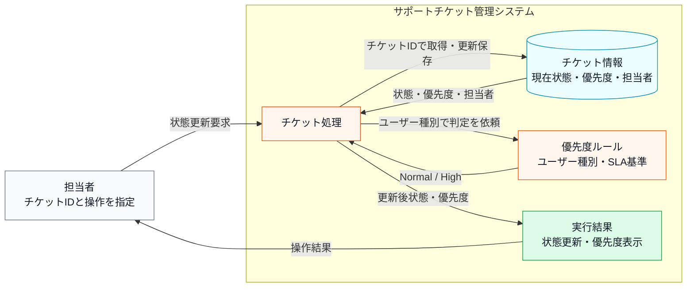
```mermaid
flowchart LR
    U["担当者<br>チケットIDと操作を指定"] -->|"状態更新要求"| S

    subgraph SUPPORT["サポートチケット管理システム"]
        S["チケット処理"]
        T[("チケット情報<br>現在状態・優先度・担当者")]
        P["優先度ルール<br>ユーザー種別・SLA基準"]
        R["実行結果<br>状態更新・優先度表示"]
        S -->|"チケットIDで取得・更新保存"| T
        T -->|"状態・優先度・担当者"| S
        S -->|"ユーザー種別で判定を依頼"| P
        P -->|"Normal / High"| S
        S -->|"更新後状態・優先度"| R
    end

    R -->|"操作結果"| U

    classDef actor fill:#f8fafc,stroke:#64748b,color:#111827;
    classDef data fill:#ecfeff,stroke:#0891b2,color:#111827;
    classDef process fill:#fff7ed,stroke:#ea580c,color:#111827;
    classDef result fill:#dcfce7,stroke:#16a34a,color:#111827;
    class U actor;
    class T data;
    class S,P process;
    class R result;
```

上の文章と表で仕様を一通り確認したので、まず正常にチケットを更新できる場合の入力・判定・加工・出力の流れとして整理します。

状態と優先度は別の値ですが、1回の操作の中で併せて使われます。最初に現在状態で操作可否と次状態を決め、そのうえで操作ごとに優先度を3通りに扱います。登録と再受付ではユーザー種別から計算します（再受付は初期値へ戻すことになります）。エスカレーションでは契約区分によらずHighへ引き上げます。アサイン・解決・差し戻しでは保存済みの優先度を維持します。

**システム内部図：正常系の入力・判定・加工・出力**

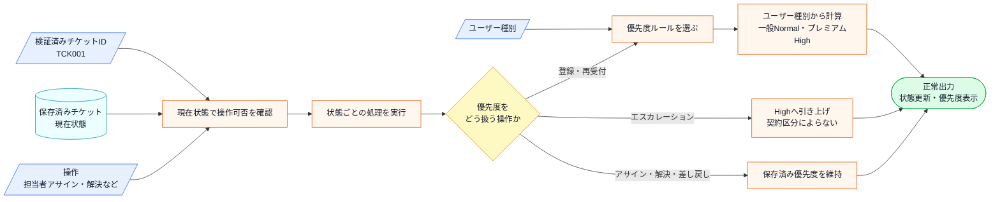
```mermaid
flowchart LR
    A[/検証済みチケットID<br>TCK001/]:::input --> D[現在状態で操作可否を確認]:::process
    C[(保存済みチケット<br>現在状態)]:::data --> D
    E[/ユーザー種別/]:::input --> F[優先度ルールを選ぶ]:::process
    G[/操作<br>担当者アサイン・解決など/]:::input --> D
    D --> H[状態ごとの処理を実行]:::process
    H --> K{優先度を<br>どう扱う操作か}:::decision
    K -->|登録・再受付| F
    F --> I[ユーザー種別から計算<br>一般Normal・プレミアムHigh]:::process
    K -->|エスカレーション| M[Highへ引き上げ<br>契約区分によらない]:::process
    K -->|アサイン・解決・差し戻し| L[保存済み優先度を維持]:::process
    I --> J
    M --> J
    L --> J
    J([正常出力<br>状態更新・優先度表示]):::normal

    classDef data fill:#ecfeff,stroke:#0891b2,color:#111827;
    classDef input fill:#e7f0ff,stroke:#2563eb,color:#111827;
    classDef process fill:#fff7ed,stroke:#ea580c,color:#111827;
    classDef decision fill:#fef9c3,stroke:#ca8a04,color:#111827;
    classDef normal fill:#dcfce7,stroke:#16a34a,color:#111827;
```

この図から読み取ることは、次の3点です。

- 1回の操作で、現在状態による操作可否を先に判定し、そのうえで優先度を計算・引き上げ・維持のどれかで扱う。
- 状態と優先度は併せて処理されるが、状態操作は次状態、ユーザー種別ルールは優先度という別の判断を担う。
- 一般ユーザーのチケットは、エスカレーションでHighになり、再受付でNormalへ戻る。同じチケットでも優先度が変わるかどうかは操作の種類で決まる。

現状のシステムは、チケットの状態遷移と、ユーザー種別に応じた優先度設定という業務ルールを、一箇所にまとめて管理しています。

**チケットの状態と実行できる操作**

チケットに「状態」を持たせるのは、「今このチケットに対して何をしてよいか」を制御するためです。担当者が未アサインのチケットを勝手に解決済みにしてしまう、といったミスを防ぐために、この章のシステムでは状態ごとに許可される操作を絞っています。

| 状態 | 状態名（英語） | 実行できる操作 |
|---|---|---|
| 受付中 | Open | 担当者アサイン |
| 対応中 | InProgress | 解決・エスカレーション |
| 緊急対応中 | Escalated | 解決・差し戻し |
| 解決済み | Resolved | 再受付 |

各チケットの現在状態は、チケットID単位で保存され、操作のたびに更新・追跡されます。基本の流れは「Open → InProgress → Resolved」で、対応中に緊急対応が必要になれば「InProgress → Escalated（緊急対応中）」へ進み、そこから「解決」または「対応中へ差し戻し」ます。解決済みチケットを再度受け付ける「Resolved → Open」という逆流もあります。「一度解決したのにまた同じ問題が起きた」というケースに対応するための遷移です。

**優先度ルール**

ユーザー種別によって優先度を変えるのは、対応時間の保証（SLA）に基づくものです。プレミアムユーザーには一次回答までの時間の約束があり、その約束を優先度へ反映します。

**優先度が動くのは3つの契機だけです。** 登録時と再受付時はユーザー種別から決め直し、エスカレーション時はユーザー種別を見ずにHighへ引き上げます。それ以外の操作（アサイン・解決・差し戻し）では、保存済みの優先度をそのまま維持します。

| 契機 | 一般ユーザー | プレミアムユーザー |
|---|---|---|
| チケット登録時 | Normal | High |
| 再受付時 | Normal | High |
| エスカレーション時 | High（引き上げ） | High |
| 上記以外の操作 | 変更しない | 変更しない |

エスカレーションは、利用者自身ではなくヘルプデスク担当者が「通常対応では解決できない」と判断したときに実行する操作です。利用者区分にかかわらず `InProgress` のチケットで実行できます。状態は全利用者で `Escalated` へ進み、優先度も利用者区分によらずHighへ引き上げます。一般ユーザーのチケットがNormalからHighへ上がるのはこの契機だけです。プレミアムユーザーは登録時点からHighなので、この契機では値が変わりません。状態と優先度は別の値として扱います。

このルールは現時点では2区分です。SLAの内容はビジネス上の契約によって変わるため、区分は今後増減する場合があります。

**このシステムの関係者**

どの知識がどの業務機能に属するかを把握しておくのは、設計判断において重要な手がかりになります。「どの業務機能に属するか」が違えば、それは別々に管理できるようにしておくべき知識かもしれないからです。

**この仕様を決める業務機能**

| 業務機能 | この章の仕様で決めていること |
|---|---|
| 運用・状態管理 | 状態の追加・変更・遷移条件 |
| 品質・評価管理 | ユーザー種別と優先度の基準 |

後のフェーズで変更要求を扱うとき、どの業務機能の知識なのかを確認するための名前として使います。

**エラー条件**

正常系の仕様を一通り確認したうえで、最後に、状態更新へ進めない入力を分けて整理します。

| エラー条件 | どこで分かるか | 出力 | 保存・通知などの副作用 |
|---|---|---|---|
| チケットIDが存在しない | チケット取得時 | チケットIDエラー | 状態更新なし |
| 現在状態では操作できない | 状態と操作の組み合わせ確認時 | 操作不可エラー | 状態更新なし |

### 1-2：動作例テーブル

このシステムがどのように動くかを、代表的な操作例で示します。クラス図やコードを読む前に、「何をするシステムか」をここで確認してください。チケットは独立して進むので、チケットごとに分けて追います。

**TCK001（一般ユーザーの鈴木 次郎が登録）**

| 行 | 操作 | 優先度結果 | 状態遷移 |
|---|---|---|---|
| 1 | 一般ユーザーが登録 | Normal | 新規→Open |
| 3 | 担当者をアサイン | Normalを維持 | Open→InProgress |
| 4 | エスカレーション | Normal→Highへ引き上げ | InProgress→Escalated |
| 5 | 解決 | Highを維持 | Escalated→Resolved |
| 6 | 再オープン | High→Normalへ再計算 | Resolved→Open |

一般ユーザーのチケットで優先度が動くのは、行4のエスカレーションと行6の再オープンだけです。

**TCK002（プレミアムユーザーの佐藤 花子が登録）**

| 行 | 操作 | 優先度結果 | 状態遷移 |
|---|---|---|---|
| 2 | プレミアムユーザーが登録 | High | 新規→Open |
| 7 | 担当者をアサイン | Highを維持 | Open→InProgress |
| 8 | 解決 | Highを維持 | InProgress→Resolved |

プレミアムユーザーは登録時点でHighなので、以降の操作で優先度は動きません。

「行」の番号は、1-4の`main()`が実行する順番です。2件のチケットを交互に操作するため、番号は表をまたいで飛びます。この8行が、1-4の`main()`と実行結果へ一対一に対応する動作基準です。存在しないユーザーの登録は、正常系8行とは分けてエラー条件として確認します。


### 1-2b：状態と優先度の遷移表

このシステムで管理する状態と、各状態から可能な遷移を整理します。これは、後のフェーズで状態ごとの振る舞いを確認するときの全体像です。

| 現在の状態 | 操作 | 遷移先 |
| --- | --- | --- |
| Open（受付中） | アサイン | InProgress（対応中） |
| InProgress（対応中） | 解決 | Resolved（解決済み） |
| InProgress（対応中） | エスカレーション | Escalated（緊急対応中） |
| Escalated（緊急対応中） | 解決 | Resolved（解決済み） |
| Escalated（緊急対応中） | 差し戻し | InProgress（対応中） |
| Resolved（解決済み） | 再受付 | Open（受付中） |

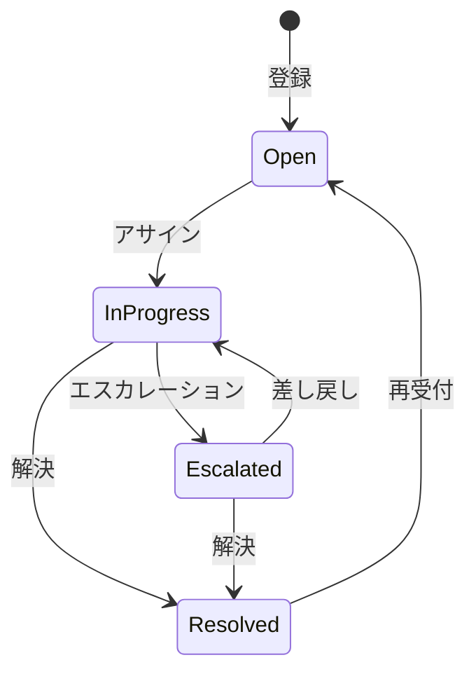
```mermaid
stateDiagram-v2
    [*] --> Open : 登録
    Open --> InProgress : アサイン
    InProgress --> Resolved : 解決
    InProgress --> Escalated : エスカレーション
    Escalated --> Resolved : 解決
    Escalated --> InProgress : 差し戻し
    Resolved --> Open : 再受付
```

「Open → InProgress → Resolved」という一方向の流れが基本ですが、対応中に緊急対応が必要になれば `Escalated`（緊急対応中）へ進み、そこから解決または対応中への差し戻しに分かれます。「解決済み → 再受付」という逆流もあります。ここでは、変更要求を先取りせず、現状の4状態と6遷移だけを確認します。

**優先度の遷移**

優先度も `Normal` と `High` の2値を行き来します。状態と違って遷移先を決めるのは操作だけではなく、依頼者のユーザー種別も関わります。

| 現在の優先度 | 契機 | 遷移先 |
| --- | --- | --- |
| （なし） | 登録（一般） | Normal |
| （なし） | 登録（プレミアム） | High |
| Normal | エスカレーション | High |
| High | エスカレーション | High（変化なし） |
| High | 再受付（一般） | Normal |
| High | 再受付（プレミアム） | High（変化なし） |
| Normal / High | アサイン・解決・差し戻し | 変化なし |

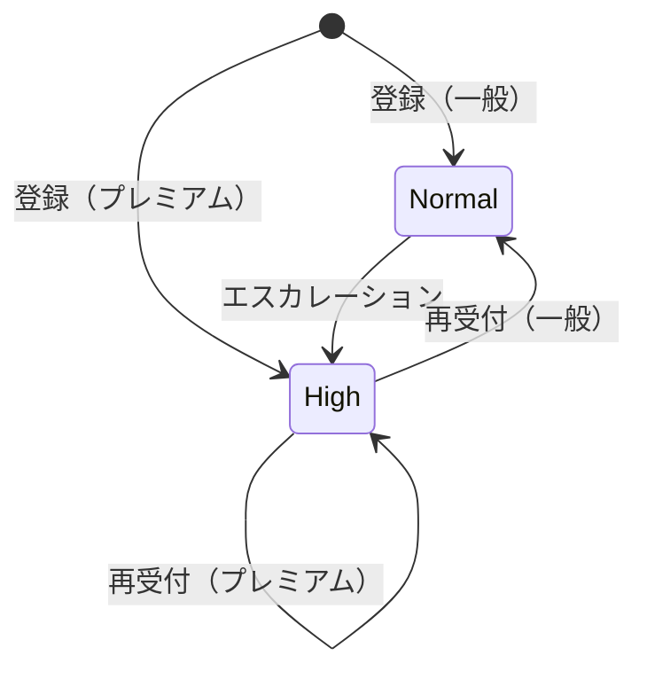
```mermaid
stateDiagram-v2
    [*] --> Normal : 登録（一般）
    [*] --> High : 登録（プレミアム）
    Normal --> High : エスカレーション
    High --> Normal : 再受付（一般）
    High --> High : 再受付（プレミアム）
```

状態は4つの値を6つの遷移でめぐりますが、優先度は2つの値を行き来するだけです。**この2つの表が別々の形をしていること自体が、状態と優先度が別々のルールで動いている証拠です。** 状態遷移は操作だけで決まり、優先度遷移は操作とユーザー種別の組み合わせで決まります。それでも現状のコードでは、両方が同じ場所で判定されています。

次は、この仕様を担うクラスの顔ぶれと責任を確認します。

---

### 1-3：登場クラスとクラス構成図

フェーズ1の現状コード構造に登場するクラスを先に確認します。

| クラス名 | 役割 | 担当する仕様 |
|---|---|---|
| `TicketManager` | チケット操作の受け口 | 状態遷移、操作可否、優先度計算の呼び出し |
| `Ticket` | チケット1件分の保存データ | ID・利用者・状態・優先度・担当者の受け渡し |
| `TicketRepository` | チケットの保存・取得 | 状態・優先度・担当者をID単位で保存する |
| `PriorityCalculator` | ユーザー種別から優先度を計算する | 優先度ルール |
| `UserInfo` | ユーザー1件分の情報 | 氏名・ユーザー種別の受け渡し |
| `UserDatabase` | ユーザー情報の管理 | ユーザーIDからユーザー名・ユーザー種別を検索する |

各クラスの責任を把握したところで、クラス間の関係を図で確認します。

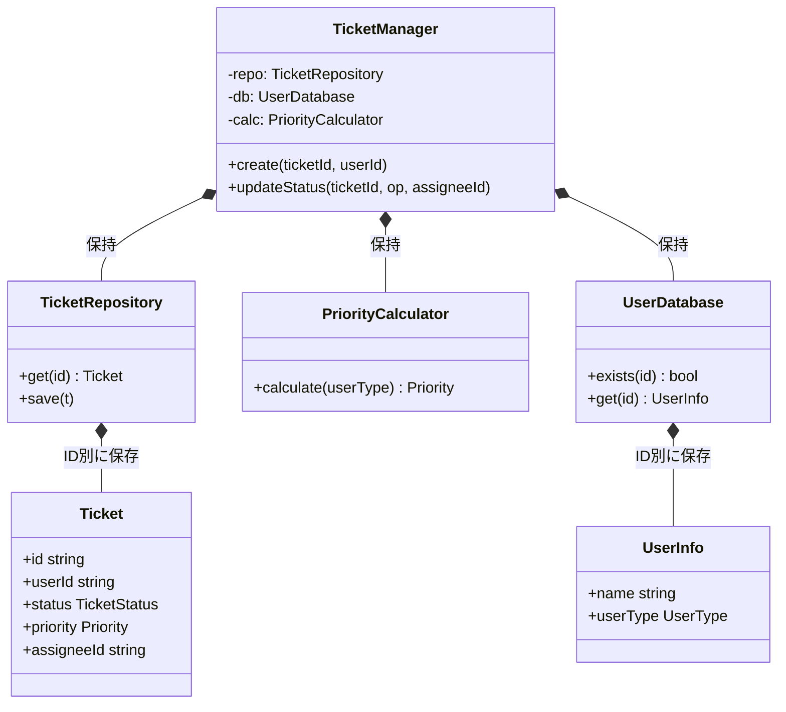
```mermaid
classDiagram
    class TicketManager {
        -repo: TicketRepository
        -db: UserDatabase
        -calc: PriorityCalculator
        +create(ticketId, userId)
        +updateStatus(ticketId, op, assigneeId)
    }
    class TicketRepository {
        +get(id) Ticket
        +save(t)
    }
    class Ticket {
        +id string
        +userId string
        +status TicketStatus
        +priority Priority
        +assigneeId string
    }
    class PriorityCalculator {
        +calculate(userType) Priority
    }
    class UserDatabase {
        +exists(id) bool
        +get(id) UserInfo
    }
    class UserInfo {
        +name string
        +userType UserType
    }
    TicketManager *-- TicketRepository : 保持
    TicketManager *-- PriorityCalculator : 保持
    TicketManager *-- UserDatabase : 保持
    TicketRepository *-- Ticket : ID別に保存
    UserDatabase *-- UserInfo : ID別に保存
```

**クラス図に出てくる主なメンバーと操作**

| クラス | メンバー・操作 | 何ができるか |
|---|---|---|
| `TicketManager` | `create()` / `updateStatus()` | チケットを登録・保存し、操作に応じて状態と優先度を更新する |
| `Ticket` | `id` / `userId` / `status` / `priority` / `assigneeId` | チケット1件分の現在状態・優先度・担当者を受け渡す |
| `TicketRepository` | `get()` / `save()` | チケットIDをキーに状態・優先度・担当者を保存・取得する |
| `PriorityCalculator` | `calculate()` | ユーザー種別から優先度を返す |
| `UserInfo` | `name` / `userType` | ユーザー1件分の氏名と利用者区分を受け渡す |
| `UserDatabase` | `exists()` / `get()` | ユーザーIDの存在確認と、氏名・ユーザー種別の取得を行う |


`TicketManager` クラスが、チケットの状態遷移と、その遷移に伴う優先度計算という異なる責務を、一つのメソッドの分岐で抱えています。状態そのものは `TicketRepository` にチケットID単位で保存され、追跡できます。

**この章での簡略化**

掲載コードが実際に保持する状態と、実システムの境界を置き換えた部分を分けます。**この表はこの章を通して有効です。** 

| 実システムの要素 | 掲載コードで行うこと | 代替・省略する範囲 |
|---|---|---|
| 問い合わせ画面 | `main()`からチケットID・利用者ID・操作・担当者IDを渡す | GUI、ログイン、セッションは作らない |
| 利用者DB | 固定した利用者を`std::map`へ登録し、IDと種別を照合する | 永続DB、利用者編集、認証基盤は扱わない |
| チケットDB | 状態・優先度・担当者を`std::map`へ保存し、操作間で再取得する | プロセス終了後の永続化、同時更新、DBトランザクションは扱わない |
| 担当者名簿 | 担当者ID（AGT）を受け取って保存する | 現状コードでは氏名を引かず、IDをそのまま表示する |
| 時計・期限監視 | 今回の優先度は利用者種別から同期計算する | 実時計、バックグラウンド監視、期限通知は将来リスクとして扱う |
| 画面・通知 | 状態変化とエラーを`std::cout`へ出す | 実画面描画、メール・チャット通知を標準出力で代替する |


---

### 1-4：実装コード（現状）

#### コードを読む前に：クラスの責任と境界

この表は、利用者情報、チケット状態、優先度判定、操作がどこで接続するかを示す読解用の地図です。DBや通知の代替方法は簡略化節へ集約しました。

| 対象 | 主な責任 | 接続先・結果 |
|---|---|---|
| ユーザーDB | ユーザーIDで検索する | 氏名・ユーザー種別を返す |
| チケット保存庫 | チケットIDで保存・取得する | 現在状態・優先度・担当者を返す |
| 優先度ルール | ユーザー種別から優先度を計算する | HighまたはNormalを返す |
| チケット管理 | 操作を受け状態遷移を決める | 次状態・優先度を保存する |

誰がどの操作を行い、どの状態・優先度になったかをチケットID単位で追います。

#### 現状コード

この章では、画面表示・実際の通知送信・時計の実測を省略し、状態の保存と優先度の計算結果を中心に確認します。

---

**共通ヘッダー**

```cpp
#include <iostream>
#include <string>
#include <map>

using namespace std;
```

以降のすべてのクラスが使います。

---

**値と列挙**

```cpp
// ユーザー種別。現状は一般とプレミアムの2区分。
enum class UserType {
    Standard,
    Premium
};

// 優先度。この章で追う2値。
enum class Priority {
    Normal,
    High
};

// 現在状態。文字列のタイプミスを防ぐため、取り得る値を列挙する。
enum class TicketStatus {
    Open,
    InProgress,
    Escalated,
    Resolved
};

// 優先度を保存・表示用の文字列へ変換する。
string toString(Priority priority) {
    return priority == Priority::High ? "High" : "Normal";
}

// 状態をエラー表示と遷移ログへ出すための変換関数。
string statusName(TicketStatus status) {
    switch (status) {
    case TicketStatus::Open:       return "Open";
    case TicketStatus::InProgress: return "InProgress";
    case TicketStatus::Escalated:  return "Escalated";
    case TicketStatus::Resolved:   return "Resolved";
    }
    return "Unknown";
}
```

契約区分・優先度・状態を名前付きの値として表し、表示用の文字列へ変える関数を添えます。1-2と1-2bの表に出てきた値が、そのまま列挙子になっています。

---

**UserInfo と UserDatabase**

```cpp
// ユーザー情報
struct UserInfo {
    string name;       // 氏名
    UserType userType; // 契約区分
};

// ユーザーデータベース
class UserDatabase {
    map<string, UserInfo> records;
public:
    UserDatabase() {
        records["USR001"] = {"田中 一郎", UserType::Standard};
        records["USR002"] = {"佐藤 花子", UserType::Premium};
        records["USR003"] = {"鈴木 次郎", UserType::Standard};
    }
    bool exists(const string& id) const {
        return records.count(id) > 0;
    }
    UserInfo get(const string& id) const {
        return records.at(id);
    }
};
```

- **責任：** ユーザーIDから存在確認と情報取得を行う
- **処理：** コンストラクタで1-1の3名を登録し、以後は問い合わせに答えるだけ
- **副作用：** なし（実行中に登録内容は変わりません）

優先度の判定に使うのは `userType` です。実システムのユーザー管理DBを、実行中だけ有効なインメモリの登録表で代替しています。

---

**PriorityCalculator**

```cpp
// 優先度ルール（変わる可能性がある）
class PriorityCalculator {
public:
    Priority calculate(UserType userType) {
        if (userType == UserType::Premium) {
            return Priority::High; // ← ルール判定を直書き
        }
        return Priority::Normal;
    }
};
```

ユーザー種別から優先度を返します。**プレミアムかどうかという判定条件が、この `if` に直接書かれています。** 区分が増えれば、増えた分だけこの関数へ条件が足されます。

---

**Ticket**

```cpp
// チケット実体：状態・優先度・担当者を保持する
struct Ticket {
    string id;
    string userId;
    TicketStatus status; // 現在状態（保存される）
    Priority priority;   // 優先度（保存される）
    string assigneeId;   // 担当者（未割当は空）
};
```

チケット1件分の保存データです。`status` と `priority` がここに残るので、次の操作は前の操作の結果から始まります。

---

**TicketRepository**

```cpp
// チケット保存庫：チケットID単位で保存・取得する
class TicketRepository {
    map<string, Ticket> store;
public:
    bool exists(const string& id) const {
        return store.count(id) > 0;
    }
    Ticket& get(const string& id) { return store.at(id); }
    void save(const Ticket& t) { store[t.id] = t; }
};
```

チケットIDをキーに保存・取得します。実システムのチケットDBを、実行中だけ有効なインメモリの `map` で代替しています。

---

**TicketManager の宣言**

チケット操作の受け口です。2つの公開操作が、このシステムの入口です。

```cpp
// チケット管理：状態遷移と優先度判定を1クラスに抱える
class TicketManager {
    TicketRepository repo;    // 状態を保存する
    UserDatabase db;
    PriorityCalculator calc;  // 優先度判定を直接保持
public:
    void create(const string& ticketId, const string& userId);
    void updateStatus(const string& ticketId, const string& op,
                      const string& assigneeId = "");
};
```

- **責任：** 操作を受け、状態遷移と優先度をまとめて決めて保存する
- **副作用：** `TicketRepository` への保存と、標準出力への表示

3つの部品を値メンバとして持っています。**外から差し替える余地はありません。** 定義を2つ、上のメンバーを見ながら読んでいきます。

---

**TicketManager::create()**

```cpp
// チケットを登録して保存する
void TicketManager::create(const string& ticketId, const string& userId) {
    if (!db.exists(userId)) {          // ← DBにないIDはエラー
        cout << "エラー: ユーザーID " << userId
             << " は存在しません。" << endl;
        return;
    }
    UserInfo requester = db.get(userId);
    UserType userType = requester.userType;
    Priority priority = calc.calculate(userType); // 優先度を判定
    Ticket t{
        ticketId,
        userId,
        TicketStatus::Open,
        priority,
        ""
    };
    repo.save(t);
    cout << "[" << ticketId << "] 作成 申請者=" << requester.name
         << " 状態=Open 優先度=" << toString(priority) << endl;
}
```

ユーザーの存在を確認し、優先度を判定して、状態 `Open` のチケットを保存します。未登録のユーザーIDでは保存へ進みません。

---

**TicketManager::updateStatus()**

この章の痛みが集まる関数です。**外側の `switch` で現在状態を分け、その内側で操作を判定します。**

```cpp
// 状態遷移と優先度判定を1メソッドの分岐で行う
void TicketManager::updateStatus(const string& ticketId, const string& op,
                                 const string& assigneeId) {
    Ticket& t = repo.get(ticketId);
    TicketStatus before = t.status;
    bool changed = false;
    switch (t.status) {
    case TicketStatus::Open:
        if (op == "assign") {
            t.status = TicketStatus::InProgress;
            t.assigneeId = assigneeId;
            changed = true;
        }
        break;
    case TicketStatus::InProgress:
        if (op == "resolve") {
            t.status = TicketStatus::Resolved;
            changed = true;
        } else if (op == "escalate") {
            t.status = TicketStatus::Escalated;
            // 状態分岐の中で優先度も引き上げる
            t.priority = Priority::High;
            changed = true;
        }
        break;
    case TicketStatus::Escalated:
        if (op == "resolve") {
            t.status = TicketStatus::Resolved;
            changed = true;
        } else if (op == "sendback") {
            t.status = TicketStatus::InProgress;
            changed = true;
        }
        break;
    case TicketStatus::Resolved:
        if (op == "reopen") {
            t.status = TicketStatus::Open;
            // 状態分岐の中で優先度を初期値へ戻す
            t.priority = calc.calculate(db.get(t.userId).userType);
            changed = true;
        }
        break;
    }
    if (!changed) {
        cout << "[" << ticketId << "] 操作不可: 状態 "
             << statusName(t.status)
             << " で " << op << " はできません。" << endl;
        return;
    }
    repo.save(t);                                // 変更後を保存
    cout << "[" << ticketId << "] " << op << ": 状態 "
         << statusName(before) << " → " << statusName(t.status)
         << " 優先度=" << toString(t.priority);
    if (!t.assigneeId.empty())
        cout << " 担当=" << t.assigneeId;
    cout << endl;
}
```

- **判断が2つ：** 現在状態と操作の組み合わせで遷移先を決める判断と、優先度をどうするかの判断が、同じ `switch` の中に並んでいます
- **順序に意味：** `before` を先に控え、遷移させ、保存してから表示します。保存より先に表示すると、保存失敗時に嘘のログが残ります
- **失敗の扱い：** `changed` が `false` のままなら保存も表示もせず、操作不可として抜けます

1-2bの2つの遷移表を思い出してください。状態遷移は操作だけで決まり、優先度遷移は操作とユーザー種別の組み合わせで決まります。**その別々のルールが、この1つの `switch` の同じ分岐に同居しています。** `escalate` の分岐にある `t.priority = Priority::High;` と、`reopen` の分岐にある `calc.calculate(...)` がそれです。列挙型で状態値のタイプミスは防げますが、2種類の判断が混ざる構造は変わりません。

---

#### `main()` と実行結果

ここまでのコードを連結して実行します。`main()` を行のまとまりごとに区切り、それぞれの直後に対応する出力を置きます。行番号は1-2の動作例テーブルと同じです。

---

**組み立てと、行1〜行2の登録**

`TicketManager` は3つの部品を内部で作るので、`main()` で組み立てるものはありません。

```cpp
int main() {
    TicketManager manager;

    // 行1: 鈴木(standard)が登録 → 標準優先度・受付中
    manager.create("TCK001", "USR003");
    // 行2: 佐藤(premium)が登録 → 高優先度・受付中
    manager.create("TCK002", "USR002");
```

```
[TCK001] 作成 申請者=鈴木 次郎 状態=Open 優先度=Normal
[TCK002] 作成 申請者=佐藤 花子 状態=Open 優先度=High
```

同じ `create()` を2回呼んだだけで、優先度が `Normal` と `High` に分かれました。分けたのは `PriorityCalculator::calculate()` の `if` です。

---

**行3〜行6：TCK001をアサイン → エスカレーション → 解決 → 再受付**

```cpp
    // 行3: TCK001をアサイン → 対応中（優先度は維持）
    manager.updateStatus("TCK001", "assign", "AGT01");
    // 行4: TCK001をエスカレーション → 緊急対応中（NormalからHighへ）
    manager.updateStatus("TCK001", "escalate");
    // 行5: TCK001を解決 → 解決済み（Highを維持）
    manager.updateStatus("TCK001", "resolve");
    // 行6: TCK001を再受付 → 受付中（Normalへ戻す）
    manager.updateStatus("TCK001", "reopen");
```

```
[TCK001] assign: 状態 Open → InProgress 優先度=Normal 担当=AGT01
[TCK001] escalate: 状態 InProgress → Escalated 優先度=High 担当=AGT01
[TCK001] resolve: 状態 Escalated → Resolved 優先度=High 担当=AGT01
[TCK001] reopen: 状態 Resolved → Open 優先度=Normal 担当=AGT01
```

状態がID単位で保存され、次の操作が前の結果から始まっています。行5の解決が `Escalated` から始まっているのは、行4のエスカレーションが保存したからです。優先度が動いたのは行4と行6の2回だけで、これが1-2bの優先度遷移表と一致します。

---

**行7〜行8：TCK002をアサイン → 解決**

```cpp
    // 行7: TCK002をアサイン → 対応中（Highを維持）
    manager.updateStatus("TCK002", "assign", "AGT02");
    // 行8: TCK002を解決 → 解決済み（Highを維持）
    manager.updateStatus("TCK002", "resolve");
```

```
[TCK002] assign: 状態 Open → InProgress 優先度=High 担当=AGT02
[TCK002] resolve: 状態 InProgress → Resolved 優先度=High 担当=AGT02
```

TCK001の操作を4回はさんでも、TCK002は自分の `Open` から再開しています。各更新行の先頭にチケットIDを出すので、どちらのチケットの遷移かを区別できます。

---

**エラー：存在しないユーザーID**

```cpp
    // 存在しないユーザーID
    manager.create("TCK004", "USR999");

    return 0;
}
```

```
エラー: ユーザーID USR999 は存在しません。
```

`create()` の先頭の存在確認で止まり、チケットは保存されません。

---

ここまでで、入力・操作に応じて状態と優先度がチケットID単位で保存・更新されることを確認しました。そして `TicketManager` が、優先度の計算ルール（`PriorityCalculator`）と状態に応じた遷移（`status` の分岐）の両方を直接知り、`updateStatus()` の一つのメソッドで扱っていることも見えました。

---

> **手元で動かすには**
> このコードは1つの `.cpp` に貼り付けて、そのままコンパイル・実行できます（例：`g++ chapter09.cpp -o app && ./app`）。`main()` は自由に組み替えて構いません。`manager.create("TCK005", "USR002");` や `manager.updateStatus("TCK005", "assign", "AGT01");` の呼び出しを足せば、チケットごとの状態と優先度がその場の実行結果に表れます。現状コードへユーザーを追加するときは、`UserDatabase` の登録表へ一般またはプレミアムのレコードを足します。現状のユーザー種別は一般・プレミアムの2種類です。データはプロセス実行中だけ有効で、終了すると消えます。

#### 仕様入力が現状コードで使われるまで

チケットID、ユーザーID、操作、担当者IDが、どの判定と保存へ使われるかを分けて追います。

| 仕様入力 | コード上の受け取り口 | 実際に使う箇所 | 結果への現れ方 |
|---|---|---|---|
| チケットID・ユーザーID | `TicketManager::create()` | ユーザー存在確認、優先度計算、`TicketRepository` への保存 | 初期状態Openと優先度、または未登録ユーザーエラーになる |
| 操作 | `updateStatus(ticketId, op, ...)` | 現在状態ごとの `if-else` | 次状態または操作不可メッセージになる |
| 担当者ID | `updateStatus()` の `assigneeId` | assign操作でチケットへ保存する | 以後の状態更新ログへ同じ担当者が現れる |
| ユーザー種別 | `Ticket::userId` から `UserDatabase` を再参照する | 作成時とreopen時の `PriorityCalculator::calculate()`（escalateは契約区分を見ずHighへ引き上げる） | NormalまたはHighの優先度として保存され、エスカレーション後は一般でもHighになる |

### 1-5：変更要求

【運用チームと品質管理チームからの要求】
ある月曜日の朝、ヘルプデスクのマネージャーからチャットが届きました。

「お疲れ様。現在対応しているチケットシステムなんだけど、法人契約のSLA運用を始めるので、法人ユーザーのチケットは登録・再受付・エスカレーション時にHighとして扱ってほしい。それと同時に、これまではチケットのステータスは受付中・対応中・緊急対応中・解決済みだったけれど、まず『保留中』を追加したい。『ベンダー確認中』なども今後増える予定だ。なお、Openのまま一次回答期限を超えたチケットを自動でHighへ引き上げる監視は次の契約改定候補で、今回は実装対象外だ。この新しいルールと状態遷移の複雑さに、今のシステムで対応できるかな？」

この章でいう「SLAを厳格に運用する」とは、今回実装する「法人ユーザーをHighとする優先度ルール」と、次期候補の「一次回答期限超過を自動検出してHighへ引き上げる監視」を区別して管理することです。今回の変更要求は、前者の優先度ルール追加と「保留中」の状態追加という、二つの大きな柱です。期限監視は将来リスクとしてフェーズ2で記録しますが、掲載コードには入れません。

今回の二つの柱を、実行結果で判定できる変更依頼へ分けます。

| 変更依頼ID | 確定した変更内容 | 入力 | 受入条件 |
|---|---|---|---|
| 変更ID1 | 法人ユーザーを登録時と再受付時にHighとする | ユーザー区分、対象操作 | 2操作で法人はHighとなり、一般・プレミアムの既存結果は変わらない |
| 変更ID2 | Pending状態と、Open/InProgressからの保留、Pendingからの再受付を追加する | 保存済み状態、保留・再受付操作 | 許可された遷移だけが保存され、再受付時は変更ID1の優先度を再計算する |

#### 変更後要求ベースライン

| 要求ID | 変更種別・根拠となる変更ID | 変更後要求 | 受入条件 |
|---|---|---|---|
| 要求ID1 | 変更<br/>根拠: 変更ID1 | 登録時と再受付時は一般Normal・プレミアムと法人Highで計算し、エスカレーションでは全区分をHighへ引き上げる | 登録・再受付で法人がHighになり、エスカレーション後は一般もHighになる |
| 要求ID2 | 変更<br/>根拠: 変更ID2 | 既存4状態にPendingを加え、許可された状態遷移だけを行う | Open/InProgressから保留し、Pendingから再受付できる |
| 要求ID3 | 継続<br/>根拠: 変更ID2 | チケットの状態と優先度を保存・取得する | Pendingを含む次操作が保存済み状態から始まる |
| 要求ID4 | 変更<br/>根拠: 変更ID1, 変更ID2 | 担当者割当・解決・再受付・エスカレーション・差し戻し・保留を処理する | 各操作後の状態と優先度が規則どおりになる |
| 要求ID5 | 継続<br/>根拠: — | 未登録入力・許可されない操作を拒否する | エラー時に保存状態を変えない |

**変更前→変更後の要求対照（今回変える要求IDだけ）**

現行ベースラインと変更後ベースラインを往復せずに済むよう、今回変える要求IDだけを取り出し、変更前と変更後を同じ行へ並べます。

| 要求ID | 変更前の要求（現行） | 変更後の有効要求 | 根拠変更ID |
|---|---|---|---|
| 要求ID1 | 登録時はユーザー種別から優先度を決め、エスカレーションで引き上げ、再受付で初期値へ戻す | 登録時と再受付時は一般Normal・プレミアムと法人Highで計算し、エスカレーションでは全区分をHighへ引き上げる | 変更ID1 |
| 要求ID2 | Open・InProgress・Escalated・Resolvedの状態遷移を管理する | 既存4状態にPendingを加え、許可された状態遷移だけを行う | 変更ID2 |
| 要求ID4 | 担当者割当・解決・再受付・エスカレーション・差し戻しを処理する | 担当者割当・解決・再受付・エスカレーション・差し戻し・保留を処理する | 変更ID1・変更ID2 |

要求ID3・要求ID5は継続（変更前＝変更後）のため対照表には載せません。変更後ベースラインで内容を確認できます。

**仕様変更の内容**

変更要求を受けて、現在の仕様がどう変わるかを整理します。

| 項目 | 変更前 | 変更後 |
|---|---|---|
| チケット状態の種類 | 4種類（Open / InProgress / Escalated / Resolved） | 保留中（Pending）を追加。ベンダー確認中は将来候補 |
| 優先度ルール | 一般→Normal、プレミアム→High の固定判定 | 法人→Highを追加し、登録・再受付・エスカレーション時に適用 |
| SLA期限 | 未対応 | **今回は変更なし**。一次回答期限の自動監視は次期候補 |
| 担当者割当 | Open→InProgressの操作として対応済み | **変更なし**。新状態でも操作可否を状態ごとに定める |
| 再オープン | Resolved→Openで優先度をユーザー種別から計算し直す | Pending→Openを追加し、同じ優先度ルールで計算し直す |

今回変えるのは状態遷移と優先度判定です。チケット、利用者情報、チケット保存の契約は仕様変更の対象ではないため、次の共通基盤は変更前後で維持します。

| 変更対象外の共通基盤 | 変更前 | 変更後 |
|---|---|---|
| `Ticket` | チケット1件分の情報を表す | **変更なし** |
| `TicketRepository` | チケットを保存・取得する | **変更なし** |
| `UserDatabase` | 利用者情報を取得する | **変更なし** |

「状態が増える」変更と「優先度ルールが変わる」変更は、今後も別のタイミングで届く可能性があります。この2つは独立した軸として扱う必要があります。

**状態と優先度ルールの変更点**

今回の要求には、状態とルールが同じきっかけで同時に動く場面が混ざっています。2軸以上の変化が重なっても、軸を分ければ扱えるかをこの章で確認します。

| 追加する複雑さ | 具体例 | この章で見ること |
|---|---|---|
| 法人向けSLA | 法人ユーザーをHighとして扱う | 顧客区分の追加を優先度ルール側へ閉じられるか |
| 担当者割当イベント | アサイン操作でOpen→InProgressへ進める | 割当という契機と状態遷移を分けて扱えるか |
| 再オープン | Resolved→Open で再度ルール評価する | 逆流時も状態軸とルール軸が独立に動くか |
| 状態とルールの同時変化 | エスカレーションで状態進行と優先度上げが同時 | 同時に動いても2軸へ分けて追えるか |

**変更前後の入力・判定・加工・出力差分**

1-1の現状仕様を退避し、変更要求を当てた後の仕様と同じ粒度で並べます。以降の分析では、この差分を追います。

| 要素 | 変更前（1-1の現状仕様） | 変更後（今回の要求） | 差分として追うもの |
|---|---|---|---|
| 入力 | チケットID、ユーザー種別、操作、保存済みの現在状態 | 同じ入力に法人区分と保留操作を追加 | 優先度ルールと状態種類が増える |
| 判定 | 状態ごとの操作可否、一般・プレミアムの固定優先度判定 | 保留中を含む操作可否、法人を含む優先度判定 | 状態判定と優先度判定が別々に変わる |
| 加工 | 状態更新と優先度計算 | 保留・再オープンによる状態遷移と法人SLA優先度計算 | 二つの加工軸を分けて追う |
| 出力 | 更新後状態と優先度 | 保留中を含む更新後状態と法人のHigh優先度 | 出力状態と優先度区分が増える |

**変更後の状態遷移仕様**

1-2bの変更前図と同じ粒度で、今回追加する状態と遷移だけに
`【追加】`を付けます。既存の4状態と6遷移は変えません。

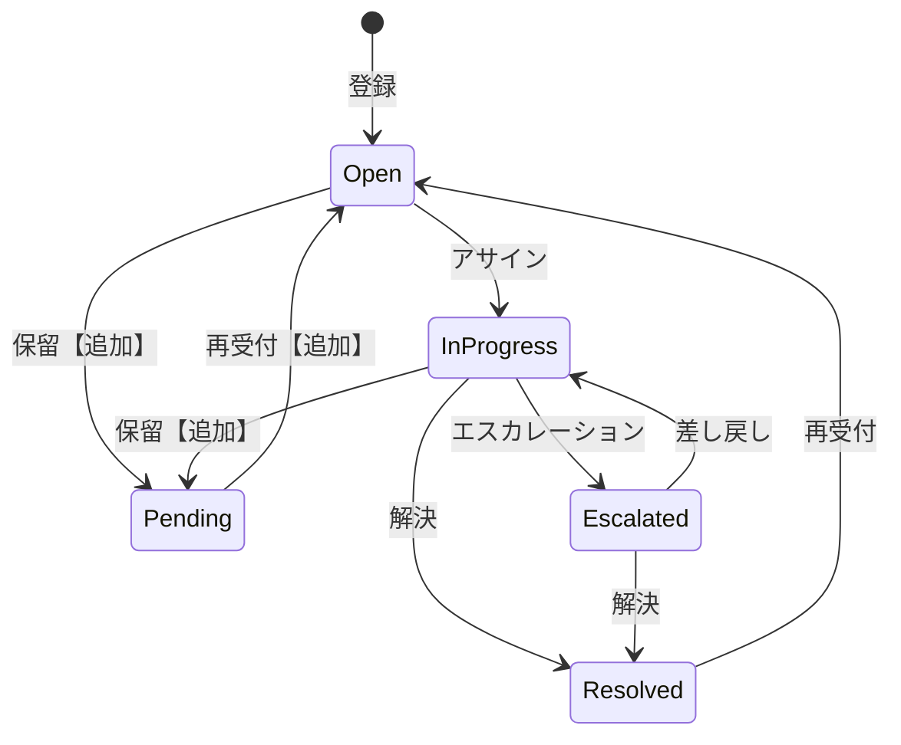
```mermaid
stateDiagram-v2
    [*] --> Open : 登録
    Open --> InProgress : アサイン
    Open --> Pending : 保留【追加】
    InProgress --> Resolved : 解決
    InProgress --> Escalated : エスカレーション
    InProgress --> Pending : 保留【追加】
    Escalated --> Resolved : 解決
    Escalated --> InProgress : 差し戻し
    Resolved --> Open : 再受付
    Pending --> Open : 再受付【追加】
```

変更箇所は `Pending` と、それにつながる保留・再受付の3遷移です。
状態が変わらない操作不可エラーは遷移ではないため、この図には加えません。

**変更後の入力・加工・出力**

変更後の仕様を、1-1のシステム内部図と同じ箱・矢印・配置で示します。薄い黄色と`【追加】`が今回変わる箇所です。保存済み状態へ保留中、ユーザー種別へ法人、操作へ保留、優先度選択へ法人向けルールが加わります。優先度を計算・引き上げ・維持のどれで扱うかを操作で判定する流れは変更前と同じです。

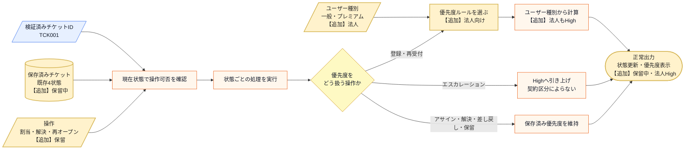
```mermaid
flowchart LR
    A[/検証済みチケットID<br>TCK001/]:::input --> D[現在状態で操作可否を確認]:::process
    C[(保存済みチケット<br>既存4状態<br>【追加】保留中)]:::data --> D
    E[/ユーザー種別<br>一般・プレミアム<br>【追加】法人/]:::input --> F[優先度ルールを選ぶ<br>【追加】法人向け]:::process
    G[/操作<br>割当・解決・再オープン<br>【追加】保留/]:::input --> D
    D --> H[状態ごとの処理を実行]:::process
    H --> K{優先度を<br>どう扱う操作か}:::decision
    K -->|登録・再受付| F
    F --> I[ユーザー種別から計算<br>【追加】法人もHigh]:::process
    K -->|エスカレーション| M[Highへ引き上げ<br>契約区分によらない]:::process
    K -->|アサイン・解決・差し戻し・保留| L[保存済み優先度を維持]:::process
    I --> J
    M --> J
    L --> J
    J([正常出力<br>状態更新・優先度表示<br>【追加】保留中・法人High]):::normal

    classDef data fill:#ecfeff,stroke:#0891b2,color:#111827;
    classDef input fill:#e7f0ff,stroke:#2563eb,color:#111827;
    classDef process fill:#fff7ed,stroke:#ea580c,color:#111827;
    classDef decision fill:#fef9c3,stroke:#ca8a04,color:#111827;
    classDef normal fill:#dcfce7,stroke:#16a34a,color:#111827;
    classDef changed fill:#FFF2CC,stroke:#D6B656,stroke-width:2px,color:#222222;
    class C,E,F,G,J changed;
```

この図から読み取ることは、次の3点です。

- 変更の1つ目の柱（保留状態と再オープン）は「保存済みチケット」「操作」「出力」に、2つ目の柱（法人向け優先度ルール）は「ユーザー種別」「優先度ルール」「出力」に現れる。
- エスカレーションのように状態進行と優先度上げが同時に起きても、図の上では別々の箱を通る別の流れであり、独立した軸として扱う根拠になる。
- 箱と矢印の構造、優先度を維持する操作の処理、エラーの形は変わらない。

変更後も、失敗条件は正常系図へ混ぜずに別で確認します。

| エラー条件 | どこで分かるか | 出力 | 保存・通知などの副作用 |
|---|---|---|---|
| チケットIDが存在しない | チケット取得時 | チケットIDエラー | 状態更新なし |
| 現在状態では操作できない | 状態と操作の組み合わせ確認時 | 操作不可エラー | 状態更新なし |

2つの柱が実際のコードでどこに現れるかは、フェーズ3で変更を試すコードと、フェーズ7の最終コード・実行結果で追います。

**フェーズ1のまとめ：今回追う変更ID一覧**

このフェーズで確定した変更依頼を一覧にして締めます。フェーズ2でこの変更IDを仮説・ヒアリングへ、フェーズ3で一つずつ試して痛みへ、と順につなぎます。

| 変更ID | 変更依頼の要点 | 関係する要求ID（追加は変更後ID） |
|---|---|---|
| 変更ID1 | 法人ユーザーを登録時と再受付時にHighとする | 要求ID1・要求ID4 |
| 変更ID2 | Pending状態と、Open/InProgressからの保留・Pendingからの再受付を追加する | 要求ID2・要求ID3・要求ID4 |

---

## 🟣 フェーズ2：仮説立案 ―― 何が変わるかを観察し、ヒアリングで裏付ける
フェーズ1で、`TicketManager` がチケットの状態遷移と優先度計算ロジックを直接保持している現状を把握しました。届いた変更要求を踏まえ、この設計における変わる見込みと当面安定の前提を整理します。

### 2-1：変わりそうな仕様の見当をつける

ここで作る一覧は、思いつきで「変わりそう」と感じたものを並べる表ではありません。フェーズ1で確認した仕様・動作例・クラス図を材料に、次の順で候補を絞ります。

1. 仕様図と動作例から、入力・判定・加工・出力のうち条件や値が変わりそうな箇所を拾う。
2. その箇所が、1-3のどのクラス・メソッドに書かれているかを対応づける。
3. その仕様が、どんな理由で、何をきっかけに、どのくらいの頻度で変わりそうかを仮説として書く。
4. 逆に、当面変えない前提にできる処理の骨格も分けておく。

この手順で見ると、「チケットを更新する」という大きな処理全体ではなく、その中のどの優先度ルール・状態遷移・操作条件が変更候補なのかを読者自身で追えるようになります。

フェーズ2では、フェーズ1で見た仕様のうち、どの状態遷移・優先度ルール・操作条件が変わりそうかを見当づけます。責務の配置は、変更要求を当てた後の痛みと合わせて確認します。

| 仕様候補             | 仕様上の場所      | フェーズ1の現状コードでの場所                | 見立て                                    |
| ---------------- | ----------- | ------------------------------ | -------------------------------------- |
| 優先度計算ルール         | 判定、状態更新前の評価 | `TicketManager.updateStatus()` | 1-5で法人向けHighの追加が確定したため、今回の変更対象として見る |
| SLA期限による優先度引き上げ  | 判定、優先度評価    | 現状コードにはない | 1-5で次期候補とされたため、確定変更と分けてヒアリングする |
| Open状態の振る舞い・割当契機 | 状態遷移、操作条件   | `TicketManager.updateStatus()` | 新しい状態や割当・再オープンの契機が増えるため、今回見る           |
| 対応中かつ高優先度の処理     | 状態遷移、優先度判定  | `TicketManager.updateStatus()` | 状態と優先度の両方に依存する条件が変わる可能性があるため、今回見る      |

この表から、今回の検討対象は「優先度ルール」と「状態ごとの振る舞い」に絞れます。2つの変化候補が同じ条件に重なると困るかどうかは、フェーズ3で変更を入れてから確認します。

#### ヒアリングで確認すること

状態と優先度が同時に使われても、変更理由まで同じとは限りません。そこで別々に質問します。

| 見当 | 現時点の仮説 | 確認する質問 | 確認先 |
|---|---|---|---|
| 状態 | 状態ごとの操作・通知が増える | 新状態で遷移先や通知は変わるか | 運用担当者 |
| 優先度 | SLAや契約で判定が変わる | 優先度ルールはどの頻度で見直すか | 運用担当者 |
| 今回の範囲 | 期限監視は別の変更になる | 今回は法人Highまでで、期限監視は対象外か | 運用担当者 |
| 変更時期 | 状態と優先度は別々に変わる | 二つを決める担当・時期は同じか | 運用担当者 |

この質問を2-3で確認し、二つの変化軸を一つにまとめてよいかを判断します。

### 2-2：今回の変更で確実に変わること

1-5で確定した変更IDを、そのまま今回確実に変わることとして確認します。章ごとに異なる色や記号は使わず、以降でも同じ変更IDで追跡します。

- **変更ID1：法人ユーザーを登録時と再受付時にHighとする**
- **変更ID2：Pending状態と、Open/InProgressからの保留、Pendingからの再受付を追加する**

コードを読んだだけで「このルールと状態管理は分離できる」と断定するのは危険です。実際に運用を担うヘルプデスクの担当者に、この先の見通しを直接確認します。

### ヒアリングに向けた背景確認

このシステムは、社内のITヘルプデスク部門が運用するサポートチケット管理を担っています。サービスが拡大するにつれて、対応フローの複雑さが増し、特に重要顧客向けのSLA（サービスレベル合意）の厳格化が求められるようになっています。変更の主な関係者は、ビジネスルールを管理するSLA管理チームと、業務プロセスを設計する運用プロセスチームの2者です。この2者が独立して変更を決定している点が、この章の設計判断の核心になります。

### 2-3：関係者ヒアリング

仮説を持って、ヘルプデスクの運用担当者と話し合いを持ちました。

* **開発者：** 「今後『保留中』や『ベンダー確認中』といったステータスが増えるとのことですが、状態によって『できること（遷移先）』や『通知の有無』は変わりますか？」
* **運用担当者：** 「そうなんだ。例えば『ベンダー確認中』の時は、こちらから担当者への割り当ては行わず、自動通知を止める必要がある。逆に『保留中』の時は…」
* **開発者：** 「なるほど。では、重要度に応じた『優先度判定ルール』は、今後も頻繁に調整されますか？」
* **運用担当者：** 「その通り。SLAの基準は四半期ごとに見直す予定だし、顧客との契約内容によってもルールが変わる可能性があるんだよ。プレミアムユーザー向けに今後さらに細かい区分ができるかもしれない。」
* **開発者：** 「今回実装するのは法人をHighにする区分追加までで、一次回答期限の自動監視は次期候補という理解で合っていますか？」
* **運用担当者：** 「合っている。期限監視には受付時刻と現在時刻の入力、定期実行も必要になるので、要件を確定してから別途追加する。今回のコードへは混ぜないでほしい。」
* **開発者：** 「確認させてください。状態の種類が増えたとき、SLAのルールも同時に変わりますか？それとも別々に変わりますか？」
* **運用担当者：** 「決める場が別だね。SLAは四半期ごとに契約で見直すもの。状態の追加は業務プロセスの話で、半年単位でシステム側と相談して決める。ただし、エスカレーションのように両方を使う機能では接続の確認が必要だよ。」
* **開発者：** 「分かりました。状態ごとの振る舞いと、優先度の計算ルールは、それぞれ独立して頻繁に変更されるということですね。」

ヒアリングの結果、「チケットの状態ごとの振る舞い」と「優先度判定ルール」は、変更のタイミングと決定者が異なることが分かりました。SLAは四半期ごと、状態の種類追加は半年単位です。実装上は組み合わせて使う場面がありますが、変更理由は分けて扱う価値がある二つの軸です。

### 2-4：ヒアリングで判明した将来リスク

ヒアリングで「今すぐではないが将来起こりうる」と判明したリスクを確定変更とは分けて記録します。

| リスクID | 将来リスク | 時期の目安 | 根拠 |
|---|---|---|---|
| リスクID1 | プレミアムユーザーの区分細分化 | 次の契約改定時 | ヒアリング「今後さらに細かい区分ができるかもしれない」 |
| リスクID2 | 一次回答期限の自動監視 | 要件確定後（次の契約改定時） | ヒアリング「受付時刻・現在時刻・定期実行を含め、要件確定後に追加する」 |
| リスクID3 | 複数担当者による同時操作 | 日常的に発生 | ヒアリング「複数のヘルプデスク担当者が同じチケットを同時に見ることがある」 |
| リスクID4 | 新状態の追加（保留中・ベンダー確認中） | 半期以内 | ヒアリング「今後はこうした状態も増える予定」 |

なお、チケット状態の通知方法自体（画面表示から顧客向けメール・SMSへの変更）もヒアリングで話題になりましたが、今回の変更対象ではないためリスクIDには起こさず対象外として記録します。通知手段は状態遷移・優先度判定の軸とは独立した境界であり、本章で扱う二軸の分離には影響しません。

「状態遷移」という変更軸と「優先度ルール」という変更軸を、今の混沌とした `TicketManager` から切り離す必要がありそうです。フェーズ2で「何を変え、何を守るか」が確定しました。次のフェーズ3では、この変更要求を実際に今のコードで試みて、具体的にどのような問題が起きるかを明らかにします。

### 2-5：変わる見込みと当面安定の前提を確定する

2-4のリスクIDを、状態・優先度・同時更新で変えられるようにする部分と、チケット処理の安定側へ分けます。「はい」は、フェーズ6で**独立した変化軸を別々に変更しても、受付・保存・操作の入口へ影響を広げない構造か**を判定するための印です。

| リスクID・変化軸 | 変わる見込み | 変えられるようにする部分 | 当面安定として守る部分 |
|---|---|---|---|
| リスクID1：プレミアムユーザーの区分細分化 | はい | ユーザー区分から優先度を決める規則 | チケット登録・再受付・エスカレーションの入口 |
| リスクID2：一次回答期限の自動監視 | はい | 時刻の取得、期限判定、引き上げ契機 | 優先度を保存し結果へ返す流れ |
| リスクID3：複数担当者による同時操作 | はい | 更新競合の検出と排他制御 | チケットIDを使う操作契約と保存内容 |
| リスクID4：新状態の追加（保留中・ベンダー確認中） | はい | 状態固有の操作と遷移 | チケットの保存、履歴、利用者向け操作の入口 |

したがって2-5の出力は、「状態遷移・優先度判定・競合制御は独立して変えられるようにし、チケット操作と保存の契約は守る」という設計条件です。フェーズ3では変更ID1・変更ID2だけを現在の構造へ適用し、リスクIDはフェーズ6の構造評価に使います。

---

## 🟣 フェーズ3：問題特定 ―― 変更の痛みを発見する
### 3-1：変更を試みる

フェーズ2で確定した「状態遷移の増加」と「優先度判定ルールの変更」を、今のコードにそのまま実装してみることにしました。

作業を進めると、変更ID1の法人優先度と変更ID2のPending遷移が同じ条件分岐へ入りました。優先度だけを変えた箇所と状態だけを変えた箇所を分けて確認できず、二つの確定要求を一つの大きなメソッドの中で同時に考慮する必要があります。

> **この抜粋の外は、現状のままです。** `UserInfo`、`Ticket`、`TicketRepository`、`Priority`、`toString()`、`TicketManager` の宣言、`TicketManager::create()` は1-4の定義をそのまま使います。以下は1-4で読んだ順に、変更が入った定義だけを並べたものです。

変更した定義は4つです。1-4と同じ並び順で、上から見ていきます。

| 1-4での掲載単位 | 今回の変更 | 根拠 |
|---|---|---|
| 値と列挙 | `UserType` へ `Corporate`、`TicketStatus` へ `Pending`、`statusName()` へ変換1行 | 変更ID1・変更ID2 |
| `UserDatabase` | 法人ユーザーUSR004を1件追加 | 変更ID1 |
| `PriorityCalculator` | 法人をHighとする `if` を1本追加 | 変更ID1 |
| `TicketManager::updateStatus()` | `hold` の分岐を2か所、`Pending` のcaseを1か所追加 | 変更ID2 |

---

**値と列挙（変更あり）**

```cpp
// 1-4のユーザー種別へ、変更要求の法人区分を追加する
enum class UserType {
    Standard,
    Premium,
    Corporate
};

// 1-4の列挙型へ、変更要求の保留中を追加する
enum class TicketStatus {
    Open,
    InProgress,
    Escalated,
    Resolved,
    Pending
};

string statusName(TicketStatus status) {
    switch (status) {
    case TicketStatus::Open:       return "Open";
    case TicketStatus::InProgress: return "InProgress";
    case TicketStatus::Escalated:  return "Escalated";
    case TicketStatus::Resolved:   return "Resolved";
    case TicketStatus::Pending:    return "Pending";
    }
    return "Unknown";
}
```

列挙子を足すだけでは足りません。`statusName()` は操作不可・変更前・変更後の3か所で呼ばれる表示用の変換なので、**同じ値を2か所へ書く**ことになります。書き忘れると `Pending` が `Unknown` と表示されますが、コンパイルは通ります。

---

**UserDatabase（変更あり）**

```cpp
class UserDatabase {
    map<string, UserInfo> records;
public:
    UserDatabase() {
        // 現状の3件は据え置き、変更要求の代表として法人ユーザーUSR004を追加する
        records["USR001"] = {"田中 一郎", UserType::Standard};
        records["USR002"] = {"佐藤 花子", UserType::Premium};
        records["USR003"] = {"鈴木 次郎", UserType::Standard};
        records["USR004"] = {"伊藤 四郎", UserType::Corporate};
    }
    bool exists(const string& id) const {
        return records.count(id) > 0;
    }
    UserInfo get(const string& id) const {
        return records.at(id);
    }
};
```

登録行が1件増えただけです。**ここは痛くありません。** データが増えるだけの変更は、素直に1行で済みます。

---

**PriorityCalculator（変更あり）**

```cpp
// 優先度ルール（SLA改定を反映）
class PriorityCalculator {
public:
    Priority calculate(UserType userType) {
        if (userType == UserType::Premium) {
            return Priority::High;
        }
        if (userType == UserType::Corporate) { // ← 追加
            return Priority::High;
        }
        return Priority::Normal;
    }
};
```

法人区分の追加で、この関数の `if` は1本から2本になりました。**変えているのはSLAの話だけなのに、開いているのは状態遷移と同じファイルです。**

---

**TicketManager::updateStatus()（変更あり）**

```cpp
void TicketManager::updateStatus(const string& ticketId, const string& op,
                                 const string& assigneeId) {
    Ticket& t = repo.get(ticketId);
    TicketStatus before = t.status;
    bool changed = false;
    switch (t.status) {
    case TicketStatus::Open:
        if (op == "assign") {
            t.status = TicketStatus::InProgress;
            t.assigneeId = assigneeId;
            changed = true;
        } else if (op == "hold") {                // ← 追加
            t.status = TicketStatus::Pending;
            changed = true;
        }
        break;
    case TicketStatus::InProgress:
        if (op == "resolve") {
            t.status = TicketStatus::Resolved;
            changed = true;
        } else if (op == "escalate") {
            t.status = TicketStatus::Escalated;
            t.priority = Priority::High;   // 契約区分によらず引き上げ
            changed = true;
        } else if (op == "hold") {                // ← 追加
            t.status = TicketStatus::Pending;
            changed = true;
        }
        break;
    case TicketStatus::Escalated:
        if (op == "resolve") {
            t.status = TicketStatus::Resolved;
            changed = true;
        } else if (op == "sendback") {
            t.status = TicketStatus::InProgress;
            changed = true;
        }
        break;
    case TicketStatus::Resolved:
    case TicketStatus::Pending:                   // ← 追加
        if (op == "reopen") {
            t.status = TicketStatus::Open;
            t.priority = calc.calculate(db.get(t.userId).userType);
            changed = true;
        }
        break;
    }
    if (!changed) {
        cout << "[" << ticketId << "] 操作不可: 状態 "
             << statusName(t.status)
             << " で " << op << " はできません。" << endl;
        return;
    }
    repo.save(t);
    cout << "[" << ticketId << "] " << op << ": 状態 "
         << statusName(before) << " → " << statusName(t.status)
         << " 優先度=" << toString(t.priority);
    if (!t.assigneeId.empty())
        cout << " 担当=" << t.assigneeId;
    cout << endl;
}
```

- **同じ `else if` を2か所へ書く：** 「Openから保留できる」「InProgressから保留できる」は仕様としては1つの状態追加ですが、コードでは別々の `case` の中へ同じ4行を書きます
- **片方だけ書いても動く：** どちらか一方を書き忘れても、もう一方は正しく動きます。コンパイルも通り、テストでその遷移を試さなければ気づけません
- **優先度の行が混ざったまま：** `escalate` の `t.priority = Priority::High;` と `reopen` の `calc.calculate(...)` は、今回まったく変えていないのに、変更した分岐と同じ画面の中にあります

---

#### `main()` と実行結果

上の4定義を1-4のコードへ当てはめ、法人ユーザーの登録と保留の追加という代表ケースを通します。**見るのは動くかどうかではなく、変更要求を現状の構造へ当てはめたときに修正箇所と痛みがどこに出るかです。**

```cpp
int main() {
    TicketManager manager;

    // Openから保留できるか
    manager.create("TCK010", "USR004");
    manager.updateStatus("TCK010", "hold");
    manager.updateStatus("TCK010", "reopen");

    // InProgressから保留できるか
    manager.create("TCK011", "USR004");
    manager.updateStatus("TCK011", "assign", "AGT01");
    manager.updateStatus("TCK011", "hold");
    manager.updateStatus("TCK011", "reopen");

    return 0;
}
```

```
[TCK010] 作成 申請者=伊藤 四郎 状態=Open 優先度=High
[TCK010] hold: 状態 Open → Pending 優先度=High
[TCK010] reopen: 状態 Pending → Open 優先度=High
[TCK011] 作成 申請者=伊藤 四郎 状態=Open 優先度=High
[TCK011] assign: 状態 Open → InProgress 優先度=High
[TCK011] hold: 状態 InProgress → Pending 優先度=High
[TCK011] reopen: 状態 Pending → Open 優先度=High
```

法人がHighで登録され、Openからの保留とInProgressからの保留がどちらも通り、Pendingから再受付できています。**動作は正しくなっています。** 変更要求は満たせました。

痛いのは結果ではなく、そこへ至る過程です。「状態追加（保留中）」と「SLAルール変更（法人）」という変わる理由の違う2つの変更が、`PriorityCalculator`（SLAルール）と `TicketManager::updateStatus()`（状態遷移）へ同時に入りました。しかも保留の追加は、同じ4行を2か所へ書き、`statusName()` へも1行足す、という**1つの仕様変更が3か所へ散る**形になっています。

### 3-2：変更影響グラフ

今のコードのまま変更を試みた際の影響範囲を可視化します。

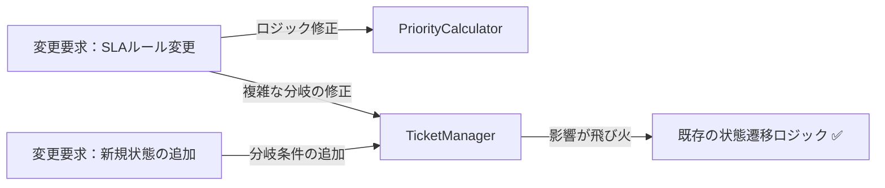
```mermaid
graph LR
    T1["変更要求：SLAルール変更"] -->|"ロジック修正"| A["PriorityCalculator"]
    T1 -->|"複雑な分岐の修正"| B["TicketManager"]
    T2["変更要求：新規状態の追加"] -->|"分岐条件の追加"| B
    B -->|"影響が飛び火"| C["既存の状態遷移ロジック ✅"]
```

グラフが示す通り、変更ID1の優先度変更と変更ID2の状態追加は、どちらも`TicketManager`を修正対象にしました。

### 3-3：痛みの言語化

「またこの巨大な `if-else` を編集するのか…」というのが、この作業を始めた瞬間の率直な感覚です。

1つ目の痛みは、このクラスが「何でも屋」になりすぎていることです。状態遷移という「振る舞い」と、優先度計算という「ビジネスルール」が密接に絡み合っているため、片方をいじると、もう片方のロジックを無意識に壊してしまう恐怖が常にあります。

2つ目の痛みは、変更の局所化ができていないことです。変更ID2のPendingを追加した際に、本来は別軸である変更ID1の優先度計算と既存遷移までテスト対象になりました。

3つ目の痛みは、状態遷移とルール判定が同じきっかけで同時に動く場面で顕在化します。エスカレーションでは「状態を進める」と「優先度をHighへ引き上げる」が一度に走り、再オープンでは「状態を戻す」と「ユーザー種別から優先度を計算し直す」が一度に走ります。しかも同じ優先度という値を、操作によって引き上げたり計算し直したり維持したりと3通りに扱い分けており、その判断が状態分岐の中に散っています。同時に動くこと自体は要求どおりですが、それが同じ `updateStatus` の一続きの `if` に押し込まれているため、状態側の分岐を直したつもりが優先度の引き上げや再計算を落とす、といった取り違えが起きやすくなっています。実際、一般ユーザーのチケットはエスカレーションでNormalからHighへ上がり、再受付でNormalへ戻ります。この上がり下がりは状態分岐の中に書かれた2行が担っており、どちらか一方を消しても他方の経路は動き続けます。

---
> **📌 問題（確定）**
> チケット管理システムでは、「優先度ルールの変更」と「状態遷移の追加」という2つの変化が、それぞれ異なる担当者の判断で独立して発生する。どちらの変化が来ても `TicketManager` を開かなければならず、無関係なロジックまで再テストを強いられる。
---

観測した痛みへ`問題ID`を付け、どの変更IDから来たかを対応づけます。

| 問題ID | 観測した痛み（変更途中コード） | 起点の変更ID |
|---|---|---|
| 問題ID1 | 状態遷移と優先度の扱い（引き上げ・再計算・維持）が同じ分岐に絡み、片方をいじると他方のロジックを無意識に壊す恐怖がある | 変更ID1・変更ID2 |
| 問題ID2 | Pending追加で、本来別軸の優先度計算と既存遷移までテスト対象になり、変更が局所化できない | 変更ID2 |
| 問題ID4 | 保留への遷移を Open と InProgress の2つの `case` へ同じ形で書き足し、`statusName()` の変換分岐にも同じ値を足した。一方だけ書き忘れても他方は動くため、抜けに気づけない | 変更ID2 |
| 問題ID3 | 優先度を引き上げる操作・計算し直す操作・維持する操作の判断が状態分岐の中へ散り、状態側を直したつもりが優先度の引き上げや再計算を落とす取り違えが起きる | 変更ID1・変更ID2 |

フェーズ3で「変更が辛い」という事実が確認できました。次のフェーズ4では、なぜ辛いのかを構造的に言語化します。

---

## 🟠 フェーズ4：原因分析 ―― なぜ辛いのかを構造で言語化する
フェーズ3で確認したように、チケットの「状態」が増えるたびに、チケット管理クラスのコードが肥大化し、修正のたびに予期せぬ副作用への恐怖を感じる状態にあります。ここでは、この問題の原因を構造的な観点から紐解いていきます。

### 4-1：痛みの根源を探る（観察と原因）

フェーズ3で観察した事実を出発点にします。**左から右へ読んでください。** 観察された事実に対して「なぜそれが起きるのか（変わる理由）」を当て、そこから「コードの構造として何が問題なのか」を言い切ります。症状ではなく構造上の欠陥として言語化することが、このステップの目的です。

| **観察（フェーズ3の事実）** | **変わる理由** | **構造で言語化した原因** | **分離の方向性** |
| --- | --- | --- | --- |
| 優先度計算ルールが変わると、チケットの状態遷移ロジックまで再テストが必要になる | ビジネスルールの変更（SLA改定・顧客区分の細分化） | **原因A：優先度ルールの混在** | ルールを差し替え可能にする分離 |
| 新しいチケット状態を追加するたびに、管理クラスが修正される | 状態の種類の追加（保留中・ベンダー確認中など） | **原因B：状態遷移ロジックの混在** | 状態ごとの振る舞いをオブジェクト化する分離 |

これら2つの原因は**互いに独立した変化軸**です。優先度ルールが変わっても状態遷移は変わりません。状態の種類が増えても優先度ルールは変わりません。独立しているからこそ、1つの構造だけでは解決しきれません。

ここで注意したいのは、エスカレーションや再オープンのように、状態遷移とルール判定が同じ操作で**同時に動く**場面があることです。同時に動くからといって、変わる理由まで一つとは限りません。状態の追加を決めるのは運用プロセスチーム、ユーザー区分や将来のSLA期限基準を決めるのはSLA管理チームで、決定者と改定タイミングは別のままです。「同じきっかけで一緒に動く」ことと「同じ理由で変わる」ことを混同すると、2軸を1つの構造へ無理に押し込む判断につながります。

コードを追うと、単に状態が増えるだけでなく、その状態によって「何をする必要があるか（通知するのか、誰に割り当てるのか）」という判定ロジックが、優先度の計算ルールと複雑に絡み合っていることが分かります。これにより、コードを変更する際に「どこからどこまでが影響範囲なのか」を直感的に捉えることが難しくなっています。

### 4-2：変わるもの/変わってほしくないもの

> **「変わらないもの」と「変わってほしくないもの」は異なります。** 「変わらないもの」は経験的事実（今まで変わっていない）、「変わってほしくないもの」は設計意図（ここを安定させてほかを守りたい）です。ここで整理するのは後者です。

構造を整理するために、変更理由の種類を分けてみます。

| **変わり続けるもの** | **変わってほしくないもの** |
| --- | --- |
| チケットの「状態ごとの振る舞い」（遷移先、アクション） | チケットの「現在の状態」を保持する基盤データ |
| 優先度判定の「ビジネスルール」（SLA基準、顧客要件） | 「状態遷移を開始する」という汎用的なインターフェース |

これまで私たちは、「チケット」という一つのオブジェクトの中に、ライフサイクルの管理（状態）と、そこから派生するビジネス上の判断（ルール）をまとめて扱っていました。状態が変わるたびにルールが動くのではなく、それぞれが別の軸として進化できるように整理する必要があります。

### 4-3：接続点に漏れている状態と優先度の知識を確認する

原因A・原因Bのそれぞれについて、`TicketManager` が「変わってほしくない手順」と「変わり続ける差分」のどちらを知ってしまっているかを分けます。原因Bは条件分岐が原因なので状態名と遷移先の対応を、原因Aも条件分岐が原因なので区分ごとの判定条件を見ます。

| 原因 | 変えたくない手順（骨格） | 骨格が知ってしまっている差分 | 接続点に残す最小の約束 |
|---|---|---|---|
| 原因B：状態遷移の混在 | 操作を受けて可否を判定し、成功時だけ保存して結果を出す | `Open` `InProgress` `Escalated` `Resolved` という状態名と、状態ごとの許可操作・遷移先の対応 | 「この操作は許されるか、許されるなら次はどの状態か」を返す操作 |
| 原因A：優先度ルールの混在 | 登録時と再受付時に優先度を決めて保存する | `Premium` ならHigh、それ以外はNormal という区分ごとの判定条件 | 「この依頼者の優先度は何か」を返す操作 |

どちらの行も、骨格から具体的な名前（状態名・区分名）を消し、代わりに問いかけを1つだけ残す形になっています。骨格が答えを持たなくなれば、答えが増えても骨格は動きません。

現在は、状態遷移・優先度計算・エスカレーション判定・割当契機の扱いが `TicketManager` の条件分岐へ集まっています。そのため、法人区分の追加のように優先度ルールだけを変える要求でも、状態遷移を含むクラス全体を確認しなければなりません。再オープンやエスカレーションで状態とルールが同時に動く行では、どちらの軸の分岐なのかが読み手に見分けづらくなっています。将来SLA期限判定を加える場合も、このままでは同じ分岐へさらに条件が増えます。

---
> **📌 原因（確定）**
> 以下の2つの独立した根本原因が重なっている：
> 1. **優先度ルールの混在**：ビジネスルールの変更による優先度計算の変化が管理クラスに波及する。
> 2. **状態遷移ロジックの混在**：状態の種類が増えるたびに、管理クラスの条件分岐が直接修正される。
>
> これらの変更理由（ルール改定と状態追加）はそれぞれ異なる頻度で発生するため、1つのクラスに混在していることで影響確認コストが発生し続ける。
---

フェーズ3の問題IDに対応づけて、構造上の原因へ`原因ID`を付けます。本章は独立した2軸なので、原因も2つに分かれます。次のフェーズ5は、この原因IDから課題IDを導きます。

| 原因ID | 構造上の原因（何が同じ責任へ集まっているか） | 対応する問題ID |
|---|---|---|
| 原因ID1 | 状態遷移ロジックの混在：状態の種類が増えるたびに `TicketManager` の条件分岐が直接修正される | 問題ID1・問題ID2・問題ID3 |
| 原因ID2 | 優先度ルールの混在：ビジネスルール改定による優先度計算の変化が管理クラスへ波及する | 問題ID1・問題ID2・問題ID3 |

3つの痛みは、この独立した2軸（状態・優先度）が同じクラスへ混在したことの複合症状です。したがって両軸の分離（課題ID1・課題ID2）で解消します。

フェーズ4で根本原因が言語化できました。次のフェーズ5では、この整理を元に、解決する課題を具体的に定義していきます。

---

## 🟡 フェーズ5：課題定義 ―― 原因から課題を検討して確定する

フェーズ4で確定した原因は、まだ課題そのものではありません。まず変えるべき構造を候補として導き、システム全体で候補の関係を整理してから、解くべき接続点を確定します。

### 5-1：原因から課題候補を洗い出す

| 原因ID・確定した事実 | そのままだと残る痛み | 課題候補 | 候補を導いた理由 |
|---|---|---|---|
| 原因ID1：チケット進行処理が全状態の操作可否・遷移を分岐する | Pending追加で既存状態と全操作を再確認する | 状態固有の振る舞いをチケット進行から分離する | 状態は独立して追加・変更される |
| 原因ID2：同じ進行処理が顧客区分ごとの優先度条件も分岐する | 法人追加で状態処理まで同時修正する | 優先度判定を状態進行から分離する | 状態と優先度は別の理由で変わる |

ここで挙げるのは、原因のどの構造を変える必要があるかまでです。それをどのクラスへどう置くかは、課題を確定してからフェーズ6で決めます。

### 5-2：課題候補をシステム全体で評価する

| 課題候補 | 必要性・他候補との関係 | 統合／分割の判断 | 採否 |
|---|---|---|---|
| 状態固有動作の分離 | 必須。変更ID2の状態追加影響を局所化する | 優先度判定とは独立した変化軸 | 採用 |
| 優先度判定の分離 | 必須。変更ID1の顧客区分追加影響を局所化する | 状態が必要時に結果だけ使う接続点として残す | 採用 |

候補を一つずつ部分対策として採用するのではなく、すべてを解いた完成状態から逆算します。変更IDと課題IDは一対一とは限らないため、変更依頼の数に合わせて課題を増減させません。

### 5-3：課題IDと接続点を確定する

評価を通過した候補だけに課題ID1から欠番なくIDを付けます。

| 課題ID・接続点 | 接続するもの・変わる側 | 守る側 | 完了条件 |
|---|---|---|---|
| 課題ID1：状態固有処理とチケット進行の境界 | **接続:** 現在状態、操作、次状態、操作結果<br/>**変わる側:** 状態ごとの操作可否・遷移・副作用 | 公開操作、保存、既存状態 | 状態追加が新しい状態動作と遷移登録に閉じる |
| 課題ID2：優先度判定とチケット進行の境界 | **接続:** 顧客区分とHigh／Normalの結果<br/>**変わる側:** 顧客区分・SLA基準の判定条件 | 状態処理、公開操作、保存 | 区分追加が新しい優先度規則と登録に閉じる |

📌 **システム全体の完了状態**：チケット進行は現在状態へ操作を委ね、優先度が必要な場面だけ独立した判定結果を使う。状態追加と顧客区分追加は別々に局所変更できる。

課題IDを定義できたので、ここまでの追跡を一列で見渡します。痛みは2軸にまたがる複合症状なので、課題IDの背骨で束ねます。

| 問題ID（フェーズ3の痛み） | 原因ID（フェーズ4の構造原因） | 課題ID（達成目標） |
|---|---|---|
| 問題ID1・問題ID3：状態と優先度が同じ分岐で絡み取り違えやすい | 原因ID1：状態遷移ロジックの混在 | 課題ID1：状態固有の振る舞いをチケット進行から分離 |
| 問題ID2：状態追加で優先度計算まで再テストに巻き込まれる | 原因ID2：優先度ルールの混在 | 課題ID2：優先度判定をチケット進行から分離 |

この表と完了状態が、そのままフェーズ6の入力です。要求の受入は要求ID、設計課題の解消は課題ID、今回の変更影響は変更IDで別々に追跡します。
## 🔴 フェーズ6：対策検討 ―― システム全体の最終構造を定める

**ここからは、変更前のクラス図とコードを少しずつ書き換えていきます。** 完成形を先に見せるのではなく、1つ判断するたびに図とコードがどう変わるかを追います。

#### まず全体像 ―― どんな構造へ変えるか（抽象）

フェーズ4で、一つの進行処理が「状態ごとの操作可否・遷移・副作用」と「顧客区分・SLA基準による優先度の判定ルール」という**別々の理由で変わる2つの判断**を、同じ場所へ抱えていることを確認しました。対策は、この2つを別々の責任へ分け、一つのチケット進行経路へ再結合することです。ここで使う2つの構造は、いずれも第一部で扱った基本構造です。第二部の応用編なので、構造名（と対応するパターン名）を語彙として併記しますが、パターン名から設計を選ぶのではなく、上で確認した「別々に変わる2つの判断」から必要な構造を導きます。

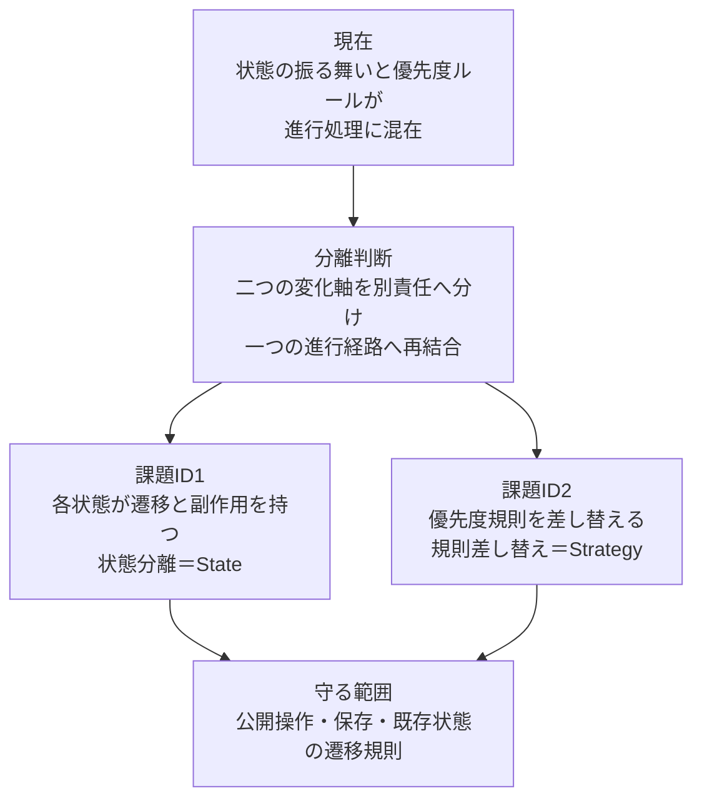
```mermaid
flowchart TB
    A[現在<br/>状態の振る舞いと優先度ルールが<br/>進行処理に混在] --> B[分離判断<br/>二つの変化軸を別責任へ分け<br/>一つの進行経路へ再結合]
    B --> C[課題ID1<br/>各状態が遷移と副作用を持つ<br/>状態分離＝State]
    B --> D[課題ID2<br/>優先度規則を差し替える<br/>規則差し替え＝Strategy]
    C --> E[守る範囲<br/>公開操作・保存・既存状態の遷移規則]
    D --> E
```

**このフローの左から右が、この後の順序です。** まず右端の「守る範囲」を具体的に確定します。守る範囲が決まらないと、どこで線を引いてよいか決められません。そのうえで課題ID1・課題ID2の順に、クラス図とコードを少しずつ書き換えます。

**守る範囲 ―― この章で変えないもの。**

- **公開操作**：`create()` で起票し、操作を受けて状態を進める、という入口の形
- **保存**：`TicketRepository` がチケットをID別に保持し、`get()`／`save()` で読み書きする
- **既存状態の遷移規則**：受付中→対応中→解決済み、エスカレーション、差し戻し、再受付の各遷移そのもの
- **出力**：状態遷移1件につき1行、遷移前後の状態名と優先度を表示する

この4つが変わっていないことは、フェーズ7の受入・回帰エビデンスで確認します。

### 対策検討のクラス図：1-3の責任と依存をどう変えるか

フェーズ1の1-3で作ったクラス図が、これから書き換えていく**基準の図**です。まずここへフェーズ2〜5の判断を注記として載せ、どの責任を残し、どの責任を移すかを確定します。

| クラス図を変える材料 | 前工程で確認したこと                         | クラス図へ反映すること                                        |
| ---------- | ---------------------------------- | -------------------------------------------------- |
| フェーズ1のクラス図 | 現在のクラス、操作、依存関係                     | 変更前クラス図としてそのまま使う                                   |
| フェーズ2の変化予測 | 状態の種類とSLA・優先度ルールは別チームが増やす          | 毎回変わる責任へ `【移す】` と注記する                              |
| フェーズ4の原因   | `TicketManager` に状態判断と優先度判定が混在する   | 同じクラスの中で `【残す】` と `【移す】` を分ける                      |
| フェーズ5の接続点  | 公開操作は現在状態へ委譲し、優先度は差し替え可能ルールへ委ねればよい | 課題ID1の状態判断と課題ID2の優先度判定を、それぞれ `TicketManager` の外へ出す |

**薄い黄色が着目クラス**です。ここでは `TicketManager` の `【残す】` と `【移す】` を追います。矢印は1-3と同じ利用・実装・委譲関係です。

**変更前のクラス図（基準の図）：**

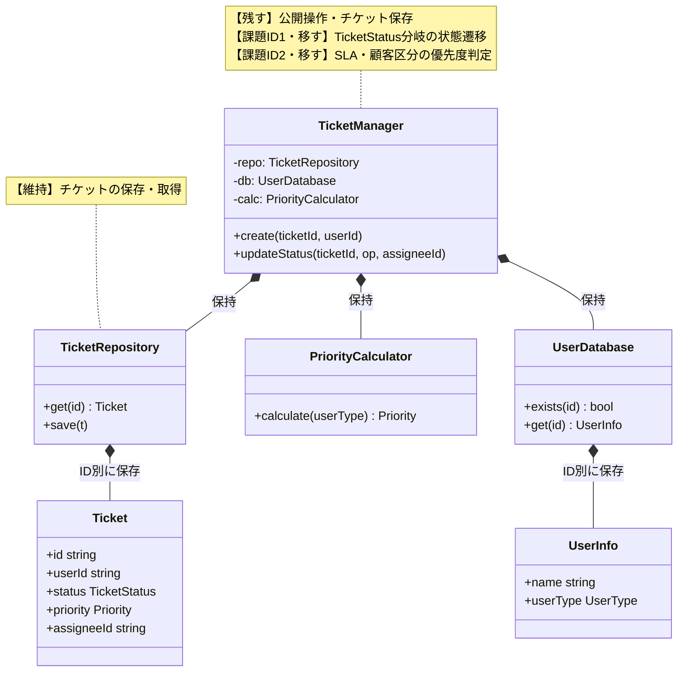
```mermaid
classDiagram
    class TicketManager {
        -repo: TicketRepository
        -db: UserDatabase
        -calc: PriorityCalculator
        +create(ticketId, userId)
        +updateStatus(ticketId, op, assigneeId)
    }
    class TicketRepository {
        +get(id) Ticket
        +save(t)
    }
    class Ticket {
        +id string
        +userId string
        +status TicketStatus
        +priority Priority
        +assigneeId string
    }
    class PriorityCalculator {
        +calculate(userType) Priority
    }
    class UserDatabase {
        +exists(id) bool
        +get(id) UserInfo
    }
    class UserInfo {
        +name string
        +userType UserType
    }
    TicketManager *-- TicketRepository : 保持
    TicketManager *-- PriorityCalculator : 保持
    TicketManager *-- UserDatabase : 保持
    TicketRepository *-- Ticket : ID別に保存
    UserDatabase *-- UserInfo : ID別に保存

    note for TicketManager "【残す】公開操作・チケット保存<br/>【課題ID1・移す】TicketStatus分岐の状態遷移<br/>【課題ID2・移す】SLA・顧客区分の優先度判定"
    note for TicketRepository "【維持】チケットの保存・取得"

    classDef focus fill:#FFF2CC,stroke:#D6B656,stroke-width:2px,color:#222222
    cssClass "TicketManager" focus
```

向きと掲載クラスは1-3から変えていません。同じ図に注記と色だけを加え、`TicketManager` のどの責任を残し、どの責任を移すかに着目します。**この図が出発点で、以降の各段でここへ1つずつ足していきます。**

クラス図の変更として書くと、次の3操作になります。**どんなクラスを新設し、何という名前にするかは、この後の各段で決めます。** ここで確定しているのは操作の種類だけです。

1. 課題ID1：状態が満たす共通契約を新設し、状態ごとの振る舞いをその実装へ移す。
2. 課題ID2：優先度ルールが満たす共通契約を新設し、区分ごとの判定をその実装へ移す。
3. 課題ID1・課題ID2：具体を生成・所有する場所を決め、公開操作を持つクラスへ渡す。

この3操作を、どんな手順で導くのかを次から順に書きます。

#### 接続点の分離・配置・組み立てを決める

フェーズ6で決めるのは、次の3つです。**どれもこの後の各段で決めます。ここでは何を決めるのかだけを確認します。**

- **分離方法**：チケット進行に何を残し、何を契約の裏へ外すか。課題ID1と課題ID2で別々の境界になります。
- **配置場所**：外した判断を、どんな単位のクラスへ置くか。状態ごとか、区分ごとか、まとめて1つか。
- **組み立て方法**：具体クラスを誰が生成・所有し、公開操作を持つクラスへどう渡すか。

**この3つは独立して決められません。** 分離方法が決まらないと配置場所が決まらず、配置場所が決まらないと組み立て方法が決まりません。だから順に決めます。決まった結論をまとめて振り返る表は、フェーズ6の末尾（6-1）に置きます。

### 課題ID1・課題ID2を6段で解く

**【課題の原因】** 課題ID1は、問題ID1・問題ID3（状態と優先度が同じ分岐で絡み、状態追加のたびに `updateStatus` の巨大 `switch` を触る）＝原因ID1（状態遷移ロジックの混在）。課題ID2は、問題ID2（状態追加で優先度計算まで再テストに巻き込まれる）＝原因ID2（優先度ルールの混在）。この2つを分離対象にします。

**この課題（何を解きたいか）：** 「保留中」を1つ足すだけで状態別 `switch` と各遷移の副作用まで抱え、法人区分を1つ足すだけで `if` 連鎖を触って状態処理の再テストまで巻き込む。**公開操作は状態を判定せず、状態ごとの許可操作と遷移先だけを差し替えられる**ようにするのが課題ID1、**優先度判定を、状態処理を知らずに差し替えられる**ようにするのが課題ID2です。

**どう解決するか（方針）：** 状態ごとの振る舞いを共通契約の裏へ揃えて現在状態へ委譲し（状態分離構造＝State）、優先度判定も差し替え可能なルール契約の裏へ揃えて区分で選んだルールへ委ねます（規則差し替え構造＝Strategy）。

**2つの課題を、別々に解いて後で合流させる形にはしません。** 5-2で確認したとおり2つは独立した変化軸なので、契約・骨格・具体はそれぞれの軸で決まります。ただし**置き場所と組み立ては共通です。** 片方だけ先に組み立てて後からもう片方を足すと、組み立ての判断をやり直すことになります。そこで、6段を1周し、前半3段は軸ごとに、後半3段はまとめて決めます。

| 段 | 何を決めるか | 軸ごとか |
|---|---|---|
| 1【契約】 | 分けて、境界に何が渡るかを決める | 軸ごと |
| 2【安定骨格】 | 呼ぶのは、残った側 | 軸ごと |
| 3【具体】 | 契約の裏を埋める | 軸ごと |
| 4【生成】 | 実体を作る人がいる | **共通** |
| 5【注入】 | 作ったものを渡す | **共通** |
| 6【利用開始】 | 結果として、呼び方はこうなった | **共通** |

**出発点。** やることはもう決まっています。`updateStatus()` から状態ごとの振る舞いを、`PriorityCalculator::calculate` から区分ごとの判定条件を、それぞれ分けることです。分ける対象も5-3で決まっています。まだ決まっていないのは、**分けた後にどう繋ぐか**だけです。

書き換える前のコードは3-1にあります。**ここで全部を再掲することはしません。** 各段で、その段が触る数行だけを3-1から抜き出し、変更後と並べます。

---

**1. 分けて、境界に何が渡るかを決める 【契約】**

まずコードに線を引きます。線を引いただけでは分けられません。**隙間を何が行き来するかを決めて、はじめて切り離せます。** 行き来するものは5-3の接続点定義表がすでに挙げているので、この段で決めるのは**その受け渡しの形**です。

**課題ID1（状態軸）。** `updateStatus()` の中身を割ります。

出て行くもの。

- 受付中ならアサインできて、解決済みならできない、という状態ごとの可否
- 許されたとき、次はどの状態になるか

残るもの。

- チケットIDで保存済みチケットを引くこと
- 決まった遷移先で状態を書き換え、保存すること
- 表示（実行結果への1行出力）

**割り方の根拠は、状態が増えたときに触るかどうかです。** 「保留中」を足すと上の2つは増えますが、下の3つは1行も増えません。変更前のコードでは、この2種類が同じ `if` の中に混ざっています。

**掲載箇所：`TicketManager::updateStatus(const string&, const string&, const string&)`** ―― 3-1の `switch` から受付中のケースだけを抜き出したもの（対策前）

```cpp
        case TicketStatus::Open:
            if (op == "assign") {
                t.status = TicketStatus::InProgress;   // ← 残る側（書き換え）
                t.assigneeId = assigneeId;             // ← 残る側
                changed = true;
            } else if (op == "hold") {                 // ← 出て行く側（可否）
                t.status = TicketStatus::Pending;      //    と遷移先
                changed = true;
            }
            break;
```

**接続するものは、5-3で4つと決まっています。** 現在状態、操作、次状態、操作結果です。数はもう決まっていて、**形が決まっていません。** 1つずつ決めます。

| 接続するもの（5-3） | 決めた形 | そう決めた理由 |
|---|---|---|
| 現在状態 | 引数で渡さない。状態ごとに別のクラスを用意し、**オブジェクトそのものが現在状態を体現する** | 引数で渡すと、受け取った側がまた状態で分岐する。分岐が移動するだけになる |
| 操作 | 引数で渡さない。**操作ごとに別のメソッド**にする | 変更前は `op` の文字列で分岐していた。文字列のまま渡せば、`if (op == ...)` が移動するだけになる |
| 次状態 | **状態名**（`TicketStatus`）で返す | 次の状態のオブジェクトで返すと、状態どうしが互いを持ち、生成後に配線が要る。状態を1つ足すたびに既存の状態も触ることになり、完了条件に反する |
| 操作結果 | 許されたかどうかの真偽で返す | 許されない操作は共通の断り方でよく、状態ごとに書かせる必要がない |

**前の2つが引数から消え、後ろの2つが戻り値になりました。** 呼ぶ側から見ると、渡すものが無くなり、返るものが2つになったということです。

```cpp
// 課題ID1接続点：状態ごとの振る舞いを共通契約にする
// 各操作は「次はどの状態か」を返す。相手のオブジェクトは持たない。
struct Transition {
    bool allowed;
    TicketStatus next;   // allowed が false のときは使わない
};

class ITicketPhase {
public:
    virtual ~ITicketPhase() = default;
    virtual Transition assign() const   { return reject("アサイン"); }
    virtual Transition resolve() const  { return reject("解決"); }
    virtual Transition escalate() const { return reject("エスカレーション"); }
    virtual Transition reopen() const   { return reject("再受付"); }
    virtual Transition hold() const     { return reject("保留"); }
    virtual Transition sendBack() const { return reject("差し戻し"); }
protected:
    Transition reject(const std::string& op) const {
        std::cout << "  操作不可: この状態では「" << op
                  << "」できません。" << std::endl;
        return {false, TicketStatus::Open};
    }
};
```

`Transition` の2つのメンバーが、そのまま「操作結果」と「次状態」です。操作ごとに別のメソッドと決めたので、6つ並びます。許可されない操作は既定の `reject()` が引き受けるので、呼ぶ側は状態を判定しません。

**契約だけでは、決めた形が本当に成立するのか確かめられません。** 実装を1つ見ます。

**掲載箇所：`OpenPhase`（クラス全体）** ―― 受付中の状態

```cpp
// 受付中：アサインで対応中へ、保留で保留中へ進む
class OpenPhase : public ITicketPhase {
public:
    Transition assign() const override {
        return {true, TicketStatus::InProgress};
    }
    Transition hold() const override {
        return {true, TicketStatus::Pending};
    }
};
```

- **「現在状態を引数で渡さない」の実態。** `assign()` に引数がありません。それでも「受付中からのアサイン」と分かるのは、**このクラスであること自体が『受付中』だから**です。**メンバー変数が1つもない**のはそのためです
- **「操作ごとに別メソッド」の実態。** `op == "assign"` の比較がありません。メソッド名が操作そのものになっています
- **「次状態と操作結果を返す」の実態。** `{true, TicketStatus::InProgress}` の `true` が操作結果、`TicketStatus::InProgress` が次状態です。返しているのは**状態名**であって、次の状態のオブジェクトではありません

変更前の `case` にあった `t.status = ...` と `changed = true` が、ここにはありません。**では、状態を書き換えるのは誰の仕事になるのか。それは2で決めます。**

**課題ID2（優先度軸）。** 同じことを `calculate()` にします。

出て行くのは「プレミアム顧客なら High、一般顧客なら Normal」という区分ごとの判定と、SLA基準が改定されたときに書き換わる条件。残るのは「依頼者IDで台帳を引いて区分を得ること」と「決まった優先度でチケットを作り、保存すること」です。**割り方の根拠は同じで、法人区分を足すと前者は増え、後者は1行も増えません。**

**掲載箇所：`PriorityCalculator::calculate(UserType)`** ―― 3-1の `if` 連鎖（対策前）

```cpp
    Priority calculate(UserType userType) {
        if (userType == UserType::Premium) {
            return Priority::High;
        }
        if (userType == UserType::Corporate) { // ← 追加
            return Priority::High;
        }
        return Priority::Normal;
    }
```

**接続するものは、5-3で2つと決まっています。** 顧客区分と、High／Normalの結果です。こちらも形を決めます。

| 接続するもの（5-3） | 決めた形 | そう決めた理由 |
|---|---|---|
| 顧客区分 | 引数で渡さない。**区分ごとに別のクラス**を用意する | 引数で渡すと、受け取った側がまた区分で分岐する。上の `if` 連鎖が移動するだけになる |
| High／Normalの結果 | `Priority` をそのまま返す | 1-4から存在する型で、新しく決めることがない |

**接続点にチケットの内容も状態も入っていません。** 5-3で守る側を「状態処理、公開操作、保存」と決めたからです。渡せば優先度ルールが状態処理を知ることになり、完了条件の「状態処理を変えない」が崩れます。

区分が引数から消え、結果だけが戻ります。

```cpp
// 課題ID2接続点：優先度判定を差し替え可能なルールにする
class IPriorityRule {
public:
    virtual ~IPriorityRule() = default;
    virtual Priority getPriority() = 0;
};
```

引数が無いのは、顧客区分を引数から消したからです。こちらも実装を1つ見て確かめます。

**掲載箇所：`CorporatePriority`（クラス全体）** ―― 法人向けSLA

```cpp
class CorporatePriority : public IPriorityRule { // 法人向けSLA
public:
    Priority getPriority() override { return Priority::High; }
};
```

- **「顧客区分を引数で渡さない」の実態。** 引数がありません。変更前の `if (userType == UserType::Corporate)` の**条件**が消え、**結果**だけが残りました。条件が要らないのは、**このクラスであること自体が『法人』だから**です
- **「結果を返す」の実態。** `Priority::High` の1つだけです。チケットも状態も見ていません

どの区分でどのクラスを選ぶかは、まだ決まっていません。**それは4で決めます。**

**2つを並べると分かること。** 接続するものが4つの課題ID1では、前半2つを引数から消した結果、6つの操作それぞれが `Transition` を返す形になりました。2つの課題ID2では、1つを消して1メソッドで足ります。**接続点で行き来するものの数と、そのうち何を引数から消したかが、契約の大きさを決めます。** 契約が大きすぎると感じたら、5-3の接続するものへ戻ります。

この段ではまだクラス図を出しません。契約を置いただけで、**関係が1本もできていない**からです。図にできるものが無い段では、図を出しません。

**では、この契約を誰が呼ぶのか。**

---

**2. 呼ぶのは、残った側 【安定骨格】**

呼べるのは1で残った側だけです。出て行った側が出て行った側を呼べば、具体が増えるたびに両方を触ることになり、分けた意味が消えます。

残った側は、公開操作を持つクラス——つまり `TicketManager` です。ただし**中身が変わったので、名前が合わなくなります。**

`TicketManager` の "Manager" は、状態遷移も優先度判定も自分で決めていたことを指していました。1で決めた形では、このクラスに残るのは「保存済みチケットを読み、契約へ尋ね、返ってきた結果を保存する」という取り次ぎだけです。**判断は1つも残りません。** 名前を `TicketService` へ変えます。

名前を変えなくても動きます。それでも変えるのは、`Manager` のまま残すと**「まだ何か判断している」と読まれる**からです。1-3のクラス一覧で `TicketManager` の役割を「状態遷移、操作可否、優先度計算の呼び出し」と書きました。そのうち2つがここから出て行った以上、役割の説明も名前も書き換わります。

**メンバーも変わるので、宣言から見ます。**

**掲載箇所：`TicketService`（クラス宣言）**

```cpp
class TicketService {
    TicketRepository& repo;      // 1-4から継続：チケットの保存・取得
    UserDatabase&     users;     // 1-4から継続：依頼者の区分照会
    StaffDirectory&   staff;     // 表示用：担当者IDから氏名を引く
    TicketEventLog&   log;       // 記録用：状態遷移を時系列で残す
    TicketPolicySet&  policies;  // 【新設】状態契約とルール契約の実体
public:
    TicketService(TicketRepository& r, UserDatabase& u,
                  StaffDirectory& s, TicketEventLog& l,
                  TicketPolicySet& p)
        : repo(r), users(u), staff(s), log(l), policies(p) {}

    void create(const std::string& ticketId, const std::string& userId);
    void assign(const std::string& ticketId, const std::string& assigneeId);
    // resolve / escalate / reopen / hold / sendBack も同じ形
};
```

`PriorityCalculator` を持っていた場所が `TicketPolicySet` に置き換わりました。**具体状態も具体ルールも、名前が1つも出てきません。**

`TicketPolicySet` は、2つの契約の実体を持つ箱です。ここでは「状態名を渡すと状態オブジェクトを返し、顧客区分を渡すとルールを返す窓口」とだけ捉えてください。**中身は4で開きます。** この段で決めているのは、`TicketService` が具体を1つも知らないという1点だけです。

`staff` による担当者名の表示と、`log` への状態遷移の記録は、7-1で導入する担当者名簿と監査ログです。**課題ID1・課題ID2のどちらにも関与しません。** この章で分けるのは状態と優先度の2軸だけで、表示と記録は分けた後もそのまま残ります。以降の断片ではこの2つを省略します。

**課題ID1（状態軸）。** `assign()` が状態契約を呼びます。

```cpp
void TicketService::assign(const string& ticketId,
                           const string& assigneeId) {
    // …チケットIDの存在確認（省略）…
    Ticket& t = repo.get(ticketId);

    Transition tr = policies.phaseFor(t.status).assign();  // ←契約への1行
    if (!tr.allowed) return;                               // 不可なら何もしない

    t.status = tr.next;
    t.assigneeId = assigneeId;
    repo.save(t);
    // …実行結果への1行表示（省略）…
}
```

**ポイントは `policies.phaseFor(t.status).assign()` の1行だけです。** 1で「残るもの」として数えた3つが、そのまま読む・尋ねる・保存するの3段になっています。変更前の `switch` と比べると、**状態名で分岐する `case` が1つも無くなりました。** 現在状態は、引数の `ticketId` で引いたチケットの `status` から得ています。

**課題ID2（優先度軸）。** `create()` がルール契約を呼びます。

```cpp
void TicketService::create(const string& ticketId, const string& userId) {
    // …ユーザーIDの存在確認（省略）…
    UserInfo requester = users.get(userId);
    UserType category = requester.userType;

    Priority p = policies.priorityRule(category).getPriority();  // ←契約への1行

    Ticket t{ticketId, userId, policies.initialStatus(), p, ""};
    repo.save(t);
    // …実行結果への1行表示（省略）…
}
```

こちらも**ポイントは1行**です。変更前と比べると、**`if (userType == ...)` の連鎖が1つも無くなりました。** 判定に使う区分は、引数の `userId` で台帳を引いて得ています。利用側が区分を渡すのではありません。`reopen()` も同じ形で、保存済みチケットの `userId` から引き直します。

**優先度をルールが決めない場所が1つだけあります。** `escalate()` は、契約区分によらず `Priority::High` を直接代入します（要求ID1）。エスカレーションは顧客区分の話ではなく「緊急扱いにする」という操作そのものの意味だからです。**区分で決まる優先度はルールへ、操作で決まる優先度は安定骨格へ**、と置き場所が分かれています。ここを取り違えてルール側へ持たせると、全ルールがエスカレーションを知ることになります。

宣言に並べた残り5つの公開操作（`resolve` / `escalate` / `reopen` / `hold` / `sendBack`）も、`assign()` と同じ3段です。読む、現在状態へ尋ねる、返った遷移先を保存する。**操作が増えても段は増えません。**

2つの契約への依存が、ここで初めて図に描けます。

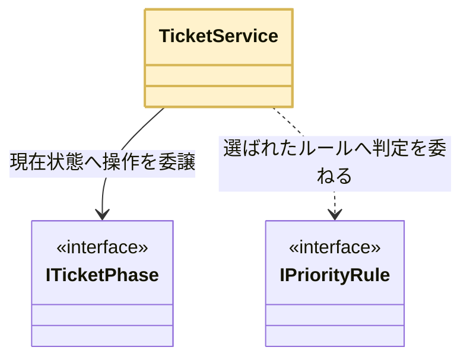
```mermaid
classDiagram
    class TicketService
    class ITicketPhase { <<interface>> }
    class IPriorityRule { <<interface>> }
    TicketService --> ITicketPhase : 現在状態へ操作を委譲
    TicketService ..> IPriorityRule : 選ばれたルールへ判定を委ねる
    class TicketService:::focus
    classDef focus fill:#FFF2CC,stroke:#D6B656,stroke-width:2px
```

**2つの契約の間に矢印がありません。** 状態とルールは互いを知らない、というのが5-2で確認した独立性で、図にもそのまま出ています。基準の図にあった `TicketManager *-- PriorityCalculator` はここで消えます。`TicketRepository`・`UserDatabase` への依存は基準の図のまま変わりません。

**ここで検算します。具体を1つ足したとき、この2つの手順は変わるか。** 変わらないなら、1の割り方は正しかったことになります。変わるなら割り残しがあるので、1へ戻って線を引き直します。第9章では「保留中」を足しても3段、法人区分を足しても同じ形のままでした。

---

**3. 契約の裏を埋める 【具体】**

契約と、それを呼ぶ手順が決まりました。1では契約の裏を1つずつ覗いて、渡すもの・受け取るものを確かめました。**ここで残り全部を埋めます。**

**課題ID1（状態軸）。** 1で見た `OpenPhase` の疑問が、ここで解けます。**`t.status = ...` を書かないのは、状態を書き換えるのが2の安定骨格の仕事だからです。** 契約の裏に置くのは「許すか」「次はどこか」の2つだけで、それ以外は何も書きません。

残りの4クラスも同じ形です。ここでは `OpenPhase` と対照的なものを1つ見ます。

**掲載箇所：`EscalatedPhase`（クラス全体）** ―― 緊急対応中の状態

```cpp
// 緊急対応中：解決と、対応中への差し戻しだけを許可する
class EscalatedPhase : public ITicketPhase {
public:
    Transition resolve() const override {
        return {true, TicketStatus::Resolved};
    }
    Transition sendBack() const override {
        return {true, TicketStatus::InProgress};
    }
};
```

**`assign()` も `hold()` もありません。** 緊急対応中はアサインも保留もできない、という規則を、**書かないことで表しています。** 書かなければ `ITicketPhase` の既定 `reject()` が引き受けます。変更前は「その `case` に `else if` が無い」という不在で表していたものが、「そのクラスに `override` が無い」という不在へ移りました。

5クラスを並べると、1-2bの状態遷移表がそのままクラスの一覧になります。

| 状態クラス | 上書きする操作 | 返す遷移先 | 書かないこと |
|---|---|---|---|
| `OpenPhase` | `assign()` / `hold()` | 対応中 / 保留中 | 解決・エスカレーション・差し戻し・再受付 |
| `InProgressPhase` | `resolve()` / `escalate()` / `hold()` | 解決済み / エスカレーション済み / 保留中 | アサイン・差し戻し・再受付 |
| `EscalatedPhase` | `resolve()` / `sendBack()` | 解決済み / 対応中 | アサイン・保留・再受付 |
| `ResolvedPhase` | `reopen()` | 受付中 | 上記以外すべて |
| `PendingPhase` | `reopen()` | 受付中 | 上記以外すべて |

**右端の列は、コードのどこにも書かれていません。** 表では読者のために言葉にしていますが、実際のクラスには `override` が無いだけです。不在で表すこと自体は変更前の `switch` も同じでしたが、**触る範囲が1つの巨大な `switch` から1クラスへ縮んでいます。**

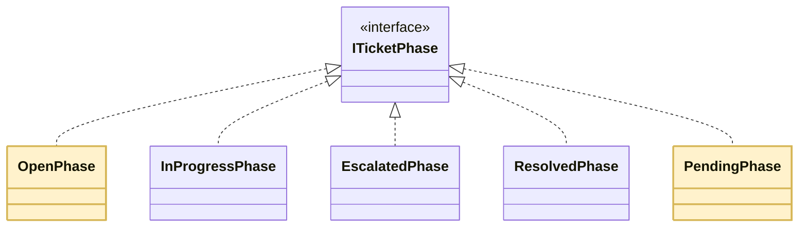
```mermaid
classDiagram
    class ITicketPhase { <<interface>> }
    class OpenPhase
    class InProgressPhase
    class EscalatedPhase
    class ResolvedPhase
    class PendingPhase
    ITicketPhase <|.. OpenPhase
    ITicketPhase <|.. InProgressPhase
    ITicketPhase <|.. EscalatedPhase
    ITicketPhase <|.. ResolvedPhase
    ITicketPhase <|.. PendingPhase
    class OpenPhase:::focus
    class PendingPhase:::focus
    classDef focus fill:#FFF2CC,stroke:#D6B656,stroke-width:2px
```

`switch` の5つの `case` が、5つのクラスになりました。**変更要求で足した「保留中」が、`PendingPhase` という1クラスに収まっています。** これで課題ID1の完了条件「状態追加が新しい状態クラスと遷移元の配線に閉じ、公開操作・保存を変えない」を満たします。状態を1つ足すときに書くのは、このようなクラス1つと、状態名から引く `switch` へ1行だけです。

**課題ID2（優先度軸）。** こちらは1で見た `CorporatePriority` がそのまま完成形です。**判定を返す以外に書くことがないので、増える段がありません。** 残りの2クラスも同じ形で、変更前の `if` 連鎖の各分岐が1クラスずつに対応します。

| ルールクラス | 対応する顧客区分 | 返す優先度 | 変更前の対応箇所 |
|---|---|---|---|
| `NormalPriority` | 一般 | Normal | `return Priority::Normal;`（既定） |
| `PremiumPriority` | プレミアム | High | 1本目の `if` |
| `CorporatePriority` | 法人 | High | 2本目の `if`（変更要求で追加） |

`PremiumPriority` と `CorporatePriority` は同じ High を返しますが、**根拠が違うので分けます。** プレミアムは契約プラン、法人は法人向けSLAです。SLA改定でどちらか一方だけが変わったとき、触るのは1クラスで済みます。

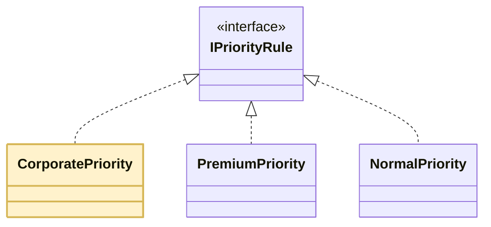
```mermaid
classDiagram
    class IPriorityRule { <<interface>> }
    class CorporatePriority
    class PremiumPriority
    class NormalPriority
    IPriorityRule <|.. CorporatePriority
    IPriorityRule <|.. PremiumPriority
    IPriorityRule <|.. NormalPriority
    class CorporatePriority:::focus
    classDef focus fill:#FFF2CC,stroke:#D6B656,stroke-width:2px
```

`if` 連鎖の3分岐が、3つのクラスになりました。**変更要求で足した法人区分が、`CorporatePriority` という1クラスに収まっています。** これで課題ID2の完了条件「区分追加が新しいルールクラスと選択登録に閉じ、状態処理を変えない」を満たします。

**もう一度検算します。契約のメソッド以外に書きたくなるものがあるか。** あるなら、1の割り方か数え方を間違えています。どちらの軸でも出てきませんでした。

**ここまでで、クラスの設計は終わりです。** 残っているのは、これらを誰が作り、どう渡すかだけになりました。**そしてここから先は、2つの軸で共通です。**

---

**4. 実体を作る人がいる 【生成】**

2の安定骨格は `policies` を通して契約を呼んでいました。その実体を、誰かが作らなければいけません。具体状態も具体ルールも、`TicketService` に作らせるわけにはいきません。作れば具体の名前を知ることになり、分けた意味が消えます。

**ここで、この章で唯一の共同決定があります。箱は1つか、2つか。**

- **2つに分ける**（`TicketPhaseSet` と `PriorityRuleSet`）。軸が独立していることが型にも出ます。ただし注入が2引数になり、軸を足すたびに `TicketService` のコンストラクタが伸びます
- **1つにまとめる**（`TicketPolicySet`）。注入は1引数のまま。軸を足しても呼び出し側の形が変わりません

**1つにまとめる形を採ります。** どちらも「具体を1か所へ集める」という目的は満たしますが、変更が及ぶ範囲が違います。軸を足したときに `TicketService` のコンストラクタと `main()` の両方を触るのが2つの形、箱の中だけで済むのが1つの形です。**この判断は、片方の軸だけを見ていては決められません。** 課題ID1・課題ID2をまとめて解いてきたのは、この1点のためです。

**掲載箇所：`main()`** ―― 組み立ての1行目

```cpp
TicketPolicySet policies;   // 具体状態と具体ルールを生成・所有する
```

**この1行の中身を開きます。** 名前だけ出して後回しにすると、2で見た `policies.phaseFor()` と `policies.priorityRule()` が何をしているのか分からないままになります。

**掲載箇所：`TicketPolicySet`（クラス全体）**

```cpp
// 課題ID1・課題ID2の組み立て：具体状態と具体ルールを生成・所有する
class TicketPolicySet {
    NormalPriority normal;
    PremiumPriority premium;
    CorporatePriority corporate;
    OpenPhase openPhase;
    InProgressPhase inProgressPhase;
    EscalatedPhase escalatedPhase;
    ResolvedPhase resolvedPhase;
    PendingPhase pendingPhase;
public:
    TicketStatus initialStatus() const { return TicketStatus::Open; }

    const ITicketPhase& phaseFor(TicketStatus status) const {
        switch (status) {
        case TicketStatus::InProgress: return inProgressPhase;
        case TicketStatus::Escalated:  return escalatedPhase;
        case TicketStatus::Resolved:   return resolvedPhase;
        case TicketStatus::Pending:    return pendingPhase;
        case TicketStatus::Open:       break;
        }
        return openPhase;
    }

    IPriorityRule& priorityRule(UserType type) {
        if (type == UserType::Corporate) {
            return corporate;
        }
        if (type == UserType::Premium) {
            return premium;
        }
        return normal;
    }
};
```

**中身は3つに分かれます。**

- **メンバー：** 具体状態5つと具体ルール3つを、値として直接持ちます。ポインタでも参照でもないので、`TicketPolicySet` が生きているあいだ部品も生きています
- **`phaseFor()`：** 状態名から状態オブジェクトを引く `switch`。**この章で `TicketStatus` の `switch` が残るのはここ1か所だけです。** 変更前は公開操作の中にあった同じ `switch` が、部品を引く1か所へ移りました
- **`priorityRule()`：** 顧客区分からルールを引く `if` 連鎖。こちらも1か所だけです

**コンストラクタがありません。** 1で「次はどの状態か」を名前で返す形にしたので、状態どうしを配線する処理そのものが不要になりました。**1の判断が、ここへ効いています。**

**状態を1つ足すときに触るのは、`phaseFor()` の `switch` へ1行と、メンバーへ1行だけです。** 区分を1つ足すときも `priorityRule()` へ1行とメンバーへ1行。3で確認した完了条件の「登録に閉じる」が、この2か所を指しています。

**所有と生存期間もここで決まります。**

- 具体状態・具体ルールは `TicketPolicySet` が値メンバとして持ちます。相互に配線しないので、生成順を気にする必要がありません
- `Ticket` が持つのは状態オブジェクトではなく `TicketStatus` の**値**です。保存済みデータが状態オブジェクトを指さないので、保存データと部品の生存期間が絡みません
- したがって、生存期間を気にするのは「`TicketPolicySet` が `TicketService` より長生きするか」の1点だけになります。**これは次の5で確かめます。**

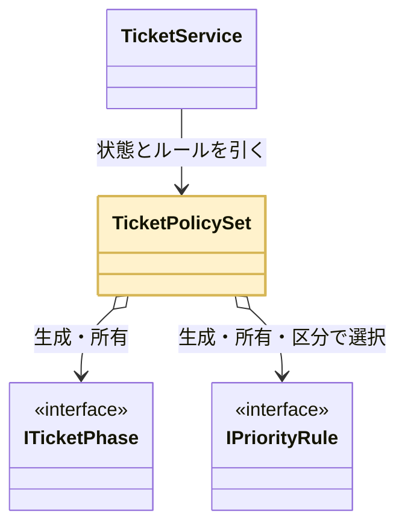
```mermaid
classDiagram
    class TicketService
    class TicketPolicySet
    class ITicketPhase { <<interface>> }
    class IPriorityRule { <<interface>> }
    TicketService --> TicketPolicySet : 状態とルールを引く
    TicketPolicySet o--> ITicketPhase : 生成・所有
    TicketPolicySet o--> IPriorityRule : 生成・所有・区分で選択
    class TicketPolicySet:::focus
    classDef focus fill:#FFF2CC,stroke:#D6B656,stroke-width:2px
```

2つの軸が、ここで初めて同じ箱へ入ります。**それでも `ITicketPhase` と `IPriorityRule` の間には矢印がありません。** 同じ箱に入れても、互いを知らないままです。

---

**5. 作ったものを渡す 【注入】**

作った `policies` を、契約を呼ぶ側へ渡します。渡し方は3つしかありません。

- `TicketService` が自分で作る。具体の名前を知ることになり、分けた意味が消えます
- どこかから取りに行く（グローバル変数やシングルトン）。依存が引数に現れず、テストで差し替えられません
- 外から受け取る

残るのは3つ目だけです。**注入すると先に決めているのではなく、契約を呼ぶと決めた時点で他の選択肢が消えます。**

**「渡す」がどう変わるのかは、`main()` の冒頭を並べると見えます。** 変更前はこうでした。

**掲載箇所：`main()`** ―― 3-1の組み立て（対策前）

```cpp
int main() {
    TicketManager manager;   // これだけ。部品は manager の中にある
```

**部品が1つも見えません。** `TicketManager` が `TicketRepository`・`UserDatabase`・`PriorityCalculator` を値メンバとして内側に持っているからです（基準の図の `*--` 3本）。`main()` は部品の存在を知らずに済む代わりに、**差し替えることもできません。**

変更後はこうなります。

**掲載箇所：`main()`** ―― 組み立ての全体（対策後）

```cpp
int main() {
    UserDatabase     users;     // 依頼者の台帳（USR）
    StaffDirectory   staff;     // 担当者名簿（AGT）
    TicketRepository repo;      // チケットの保存先
    TicketEventLog   log;       // 監査ログ
    TicketPolicySet  policies;  // 状態契約とルール契約の実体（4で作った箱）
    TicketService    svc(repo, users, staff, log, policies);
```

**部品が5つとも `main()` に出てきました。** `TicketService` は1つも作らず、5つを**参照として借りるだけ**です。作る場所が中から外へ出たこと、それがこの段で言う「注入」です。

渡している5つの中身は次のとおりです。

| 引数 | 何を渡しているか | 変更前はどこにあったか |
|---|---|---|
| `repo` | チケットの保存先 | `TicketManager` の値メンバ |
| `users` | 依頼者の台帳（区分を引く） | `TicketManager` の値メンバ |
| `staff` | 担当者名簿（表示用） | 1-4には無い。7-1で追加する |
| `log` | 監査ログ（記録用） | 1-4には無い。7-1で追加する |
| `policies` | 状態契約とルール契約の実体 | **`PriorityCalculator` が居た場所** |

**この章の対策で入れ替わったのは、最後の1行だけです。** `PriorityCalculator`（具体の判定を持つクラス）が消え、`TicketPolicySet`（契約の実体を持つ箱）が入りました。`repo` と `users` は変更前から `TicketManager` が持っていたものが、内側から引数へ移っただけです。

**`repo` と `users` まで外へ出したのはなぜか。** この2つは自分で作っても分離は壊れません。それでも外へそろえたのは、**組み立ての場所を1か所にするため**です。一部を中で作り一部を外から受け取ると、どれが差し替え可能でどれが固定なのかが読めなくなります。`main()` の6行を見れば、このシステムが何を部品として持っているかが全部分かる状態にします。

**生存期間もこの並びで決まります。** `policies` は `svc` より前の行で作られ、`main()` を抜けるまで生きています。`TicketService` が持つのは参照なので、**借りている相手が先に消えることはありません。** 4で「次の5で確かめます」と書いたのがこれです。

受け取る側の形は、2で見た宣言のとおりです。5つの参照をメンバーへ保持するだけで、コンストラクタで判断も生成もしません。5つのうち契約に関わるのは `policies` だけで、**4で箱を1つにしたおかげで、軸が2つあっても契約の引数は1つで済んでいます。**

---

**6. 結果として、呼び方はこうなった 【利用開始】**

組み立てが終わりました。呼び出し側がどう変わったかを、変更前と並べて見ます。

**掲載箇所：`main()`** ―― 3-1の起票とアサイン（対策前）

```cpp
    manager.create("TCK001", "USR003");
    manager.updateStatus("TCK001", "assign", "AGT01");
```

**掲載箇所：`main()`** ―― 同じ操作（対策後、5で見た組み立ての続き）

```cpp
    svc.create("TCK001", "USR003");   // 課題ID2の経路：区分から優先度を決める
    svc.assign("TCK001", "AGT01");    // 課題ID1の経路：現在状態へ操作を委譲する
```

**2つの軸で、変わり方が違いました。**

課題ID1では、第2引数だった操作名の文字列 `"assign"` が関数名になりました。文字列で操作を選ぶ場所がもうどこにも無いからです。残る引数はチケットIDと担当者IDだけで、どの状態から始まるかを呼び出し側は書きません。

課題ID2では、**呼び方がほとんど変わりませんでした。** 変わったのは呼ぶ相手が `manager` から `svc` になっただけで、引数はフェーズ3までと同じです。区分も優先度も、もともと呼び出し側は書いていませんでした。変わったのは呼び方ではなく、この1行の先で誰が判定するかです。

**同じ6段を通っても、呼び方が変わるかどうかは課題によって違います。** そして**どちらも、1から5の結果であって前提ではありません。** 先に見せると、まだ導いていない結論を見せることになります。

増えたのは組み立ての2行です。これは隠さず数えます。利用側が `ITicketPhase::assign()` や `IPriorityRule::getPriority()` を直接呼ぶことはありません。

#### システム全体の最終構造を決める

課題ID1で足した図と課題ID2で足した図を重ねると、システム全体の最終構造になります。`TicketPolicySet` が状態分離構造とルール差し替え構造の両方を組み立て、`TicketService` がその抽象契約を使う一つのシステムです。チケット自身（`Ticket`）は現在状態・優先度・担当者を保持する実体として `TicketRepository` に保存されます。片方だけを切り出す形は二つの課題を完了しない途中状態なので比較しません。

各段で足した部分がすべて入っているかを、次の図で照合します。

**採用した変更後のクラス図：**


```mermaid
classDiagram
    class TicketService
    class TicketPolicySet
    class TicketRepository
    class UserDatabase
    class StaffDirectory
    class TicketEventLog
    class Ticket
    class ITicketPhase { <<interface>> }
    class OpenPhase
    class InProgressPhase
    class EscalatedPhase
    class ResolvedPhase
    class PendingPhase
    class IPriorityRule { <<interface>> }
    class CorporatePriority
    class PremiumPriority
    class NormalPriority
    TicketService --> TicketRepository : チケット保存
    TicketService --> UserDatabase : 依頼者照会
    TicketService --> StaffDirectory : 担当者照会
    TicketService --> TicketEventLog : 監査記録
    TicketService --> TicketPolicySet : 状態・ルールを利用
    TicketPolicySet o--> ITicketPhase : 状態を所有・配線
    TicketPolicySet o--> IPriorityRule : ルールを所有・選択
    TicketRepository --> Ticket : 保存
    Ticket --> ITicketPhase : 現在状態
    TicketService --> ITicketPhase : 現在状態へ操作を委譲
    ITicketPhase <|.. OpenPhase
    ITicketPhase <|.. InProgressPhase
    ITicketPhase <|.. EscalatedPhase
    ITicketPhase <|.. ResolvedPhase
    ITicketPhase <|.. PendingPhase
    IPriorityRule <|.. CorporatePriority
    IPriorityRule <|.. PremiumPriority
    IPriorityRule <|.. NormalPriority

    note for ITicketPhase "【課題ID1・新設】状態ごとの振る舞いの共通契約"
    note for IPriorityRule "【課題ID2・新設】優先度判定の差し替え可能な契約"
    note for TicketPolicySet "【新設】具体状態・具体ルールを生成・所有・配線"
    note for TicketService "【新設】抽象契約を使って公開操作・保存・ログを実行"

    classDef focus fill:#FFF2CC,stroke:#D6B656,stroke-width:2px,color:#222222
    cssClass "TicketService,TicketPolicySet,ITicketPhase,OpenPhase,InProgressPhase,EscalatedPhase,ResolvedPhase,PendingPhase,IPriorityRule,CorporatePriority,PremiumPriority,NormalPriority" focus
```

クラス図の変更とコード変更を一対一で対応させると、次のようになります。

| 課題ID | クラス図をどう変えるか | コードレベルで何をするか | 詳しく解く節 |
|---|---|---|---|
| 課題ID1 | 共通契約 `ITicketPhase` を新設し、公開操作を現在状態へ委譲する | 各状態クラスが許可操作と遷移先を実装し、`TicketService` は状態を判定しない | 課題ID1節（【契約】〜【利用開始】） |
| 課題ID2 | 共通契約 `IPriorityRule` を新設し、区分でルールを選ぶ | 各ルールクラスがSLA・顧客区分の判定を実装し、`TicketPolicySet` が選択・所有する | 課題ID2節（【契約】〜【利用開始】） |

このクラス図が、課題ID1・課題ID2を反映したシステム全体の設計結論です。課題IDは図の差分を追うために使い、以降はこの構造に必要なコードだけを示します。

### 6-1：生成・所有・実行順のまとめ

#### 構造ポイントの全貌 ―― どの責任がどこへ移るか

6段で決めたことを、責任の移動として一覧にします。**並び順は、考えた順です。** 表の1行が本文の1段に対応します。前半3段は軸ごとに決めたので2つの契約が並び、後半3段は共通なので1つです。

| ポイント | 変更前の所属 → 変更後の所属 | 設計操作・生成／注入／所有 | このポイントが決まると次に決まること |
|---|---|---|---|
| 【契約】（軸ごと） | `updateStatus()` の巨大 `switch` → `ITicketPhase` の6操作／`calculate()` の `if` 連鎖 → `IPriorityRule::getPriority()` | 線を引き、隙間を跨ぐものを両方向数えて契約にする（状態軸は2つ、優先度軸は1つ） | この契約を誰が呼ぶか＝【安定骨格】 |
| 【安定骨格】（軸ごと） | 状態と優先度が混ざる `updateStatus()` → `TicketService::assign()`／`create()` が委譲と保存だけを行う | 残った側の手順を、具体が増えても段数が変わらない形で固定する | 契約の裏に何を置くか＝【具体】 |
| 【具体】（軸ごと） | 分岐に埋もれた状態別可否とルール → `OpenPhase::assign()` ほか5クラス／`CorporatePriority::getPriority()` ほか3クラス | 契約のメソッドだけを埋め、それ以外を書かない | 実体を誰が作るか＝【生成】 |
| 【生成】（共通） | `TicketManager` が全分岐を内包 → `TicketPolicySet` が状態とルールを生成・所有 | 箱を1つにするか2つにするかを決め、具体の生成と所有を1か所へ集める | 作ったものをどう渡すか＝【注入】 |
| 【注入】（共通） | 利用側が区分を見て呼び分け → `TicketService(repo, users, staff, log, policies)` | 自分で作る・取りに行くを消し、外から受け取る形だけを残す | すべて決まった結果としての呼び方＝【利用開始】 |
| 【利用開始】（共通） | 呼び出し側が操作名の文字列を渡す → `svc.assign("TCK001", "AGT01");` | 組み立てた同じ実体を使い、公開操作を呼ぶ | ここから実行が始まり、【安定骨格】へ入る |

**【利用開始】が最後にあるのは、対策後の呼び方が設計の結果だからです。** `updateStatus("TCK001", "assign", "AGT01")` が `svc.assign("TCK001", "AGT01")` へ変わるのは、上の5つを決め終えてから分かることでした。一方で課題ID2の `svc.create("TCK001", "USR003")` は引数が変わっていません。**同じ順で考えても、呼び方が変わるかどうかは課題によって違います。**

#### 代表ケースの実行接続

6段は考えた順でした。**ここからは実行時に通る順で、同じ6つを貫きます。** TCK001の起票（優先度軸）とアサイン（状態軸）を、1本の経路として追います。

| 実行順・ポイント | 掲載箇所 | 実際のコード接続 | 次の呼出先 |
|---|---|---|---|
| 1. 【生成】 | `main()` | `TicketPolicySet policies;` が具体状態5つと具体ルール3つを生成・所有 | 【注入】へ |
| 2. 【注入】 | `main()` | `TicketService svc(repo, users, staff, log, policies);` | 【利用開始】へ |
| 3. 【利用開始】 | `main()` | `svc.create("TCK001", "USR003");` → 続けて `svc.assign("TCK001", "AGT01");` | `TicketService::create()`／`assign()` |
| 4. 【安定骨格】優先度軸 | `TicketService::create(const string&, const string&)` | `users.get(userId)` で区分を引き、`policies.priorityRule(category).getPriority()` を呼んで結果を保存 | `IPriorityRule::getPriority()` |
| 5. 【契約】【具体】優先度軸 | `IPriorityRule::getPriority()` → `NormalPriority::getPriority()` | USR003は一般区分なので `Priority::Normal` を返す | 戻り値を【安定骨格】が保存 |
| 6. 【安定骨格】状態軸 | `TicketService::assign(const string&, const string&)` | `policies.phaseFor(t.status).assign()` で現在状態へ委譲し、返った遷移先を保存 | `ITicketPhase::assign()` |
| 7. 【契約】【具体】状態軸 | `ITicketPhase::assign()` → `OpenPhase::assign()` | 許可操作なので `{true, TicketStatus::InProgress}` を返す | 戻り値を【安定骨格】が保存 |

**4〜5と6〜7が、まったく交わっていません。** 優先度軸は `IPriorityRule` の裏で完結し、状態軸は `ITicketPhase` の裏で完結します。共有しているのは【生成】で作った1つの `policies` と、【注入】で渡した1つの `svc` だけです。**2つの軸が独立しているという5-2の判断が、実行経路でも確認できます。**

### 6-2：システム全体の契約とデータ配置を確定する

採用システムの契約、生成場所、依存注入を一表で確定します。
`TicketPolicySet` は全Phaseと全ルールを値メンバとして所有します。
`TicketService` は組み立て済み部品、依頼者、担当者、保存先、監査ログを
外から受け取ります。

**掲載箇所：`TicketService::create(const std::string&, const std::string&)`** ―― 6-1で確定した完成形の全文です。

```cpp
// TicketService 内：選択判断を持たず、組み立て済み部品へ問い合わせる
void TicketService::create(const std::string& ticketId,
                           const std::string& userId) {
    UserType category = users.get(userId).userType;
    Priority p = policies.priorityRule(category).getPriority();
    Ticket t{ticketId, userId, policies.initialStatus(), p, ""};
    repo.save(t);   // 状態・優先度・担当者を1件として保存
}
```

| 接続点を変える観点 | システム全体での設計判断 | 変えたくない側が知らなくなる詳細 |
|---|---|---|
| 何を分離するか | 課題ID1の状態振る舞いを状態クラスへ、課題ID2の優先度判定をルールクラスへ置く | 状態の種類・遷移、SLA基準・顧客区分 |
| どこで生成・選択するか | `TicketPolicySet` が全Phase・全ルールを所有し、`priorityRule()` で選ぶ | 具体状態・具体ルールの生成・配線・選択 |
| どう依存を渡すか | `main()` がPolicySet、依頼者、担当者、保存先、監査ログをServiceへ注入する | 具体部品の組み立てと実体データの持ち方 |
| 安定側はどう実行するか | 利用側は `create()` や `assign()` などの操作だけを呼ぶ | 現在どの状態か、どの優先度ルールか |

状態とルールは `TicketPolicySet` が値メンバとして所有し、`main()` では
PolicySetをServiceより先に生成します。保存されるチケットが持つのは
`TicketStatus` の値なので、チケットのデータが部品を指すことはありません。
優先度は登録時に確定して保存され、再受付時はユーザー種別から計算し直し、
エスカレーション時はHighへ引き上げます。

#### システム全体のコード適用結果

| 追跡対象 | 課題定義で目指した状態 | 適用した構造とコード | 適用結果 |
|---|---|---|---|
| 課題ID1：状態処理 | 状態追加で公開操作・保存・既存状態を変えない | 状態クラスと `ITicketPhase` 委譲 | 新状態と遷移元へ変更が閉じた |
| 課題ID2：優先度判定 | ルール変更で状態処理を変えない | ルールクラスと `IPriorityRule` 注入 | 新ルールと注入へ変更が閉じた |
| 課題ID1・課題ID2を接続したシステム全体 | 二軸を独立に変え、公開操作・保存・ログを維持する | `TicketPolicySet` が具体部品を所有し、`TicketService` が抽象契約を利用する | 組み立て判断をServiceから外し、入口と副作用の位置も維持した |

**システム全体の実装結果：達成。** 課題ID1と課題ID2が一つの実行経路で接続され、フェーズ5で目指した状態を実現しました。実際の動作と変更影響はフェーズ7で確認します。

### 6-3：課題から完成構造までの設計トレース

ここまでの決定を、課題ID1→課題ID2の順に一望へまとめます。この表は設計課題だけを追います。変更要求の受入はフェーズ7の要求ID表、変更影響は7-4の変更ID表で別に確認します。

| 課題ID | 採用構造と生成・接続場所 | 完成コードの主な場所 | 確認 |
|---|---|---|---|
| 課題ID1（状態処理） | 状態分離。`TicketService`が現在Phaseへ委譲し、各状態が次状態を返す | `ITicketPhase`、`OpenPhase`／`InProgressPhase`／`PendingPhase`／`ResolvedPhase`／`EscalatedPhase` | 状態追加が新状態と遷移登録に閉じる |
| 課題ID2（優先度判定） | 規則差し替え。`TicketPolicySet`が全ルールを配線し、注入された`IPriorityRule`へ委ねる | `IPriorityRule`、`PremiumPriority`／`CorporatePriority`／`NormalPriority`、`TicketPolicySet` | 区分追加が新ルールと注入に閉じる |
| 変更対象外 | 公開操作・保存。進行入口は委譲先だけが変わる | `TicketService`の公開操作、`TicketRepository` | 1-4、保存済み状態から再開 |

このクラス図、コード適用結果、シーケンス、コード変更表が、フェーズ7へ渡す完成設計です。

### 6-4：将来リスクに対する設計上の確認

ここでは将来状態・監視機能の実装有無ではなく、フェーズ2のリスクIDを採用構造へ再適用し、状態・優先度の入口をどこまで守れ、競合や時刻起点に何が残るかを評価します。

| リスクID・将来リスク | 現在の構造による備え | リスク発生時の変更先 | 守れる範囲・残る弱点 |
|---|---|---|---|
| リスクID1：プレミアムユーザーの区分細分化 | 優先度条件と値をIPriorityRule実装へ置き、状態遷移から分ける | 新PriorityRule、TicketPolicySetの選択・所有 | 状態側を守り、区分追加を新Ruleと選択へ限定できる。区分の組合せが増えると単一選択規則が弱点になる |
| リスクID2：一次回答期限の自動監視 | 時刻起点と状態遷移を分け、監視処理からTicketServiceの共通入口へ接続する | 時刻データ、スケジューラ、対象Phase操作 | TicketServiceの状態操作を再利用できる。時計・対象抽出・再実行の運用境界は現在の同期処理外に残る |
| リスクID3：複数担当者による同時操作 | 状態・担当者保存の正本をTicketRepositoryへ集めているが、競合制御契約は別途必要になる | TicketRepository、TicketServiceの更新条件 | 競合判定の置き場所はRepository境界に限定できるが、版番号・排他・再試行の契約は現在未解決である |
| リスクID4：新状態の追加（保留中・ベンダー確認中） | ITicketPhase実装として状態を追加し、遷移選択をTicketPolicySetへ集める | 新Phase、TicketPolicySet、進入元の遷移 | 優先度Ruleと公開操作を守れる。進入元が多い状態では複数Phaseの遷移追加が残る |

リスクID3のようにパターン分離だけでは解けない運用リスクも残します。リスクIDは万能性の主張ではなく、採用構造の有効範囲を示すために使います。

## 🟢 フェーズ7：対策実施 ―― 変化に強いコードを完成させる
採用した ルール差し替え構造（優先度ルールの分離）および 状態分離構造（状態ごとの振る舞いの分離）を実装し、ビジネスルールと状態固有の処理をそれぞれ独立したクラスへカプセル化します。

### 7-1：解決後のコード（全体）

優先度判定を `IPriorityRule`（ルール差し替え構造）、状態管理を `ITicketPhase`（状態分離構造）へ分離し、チケットの状態・優先度・担当者は `TicketRepository` にチケットID単位で保存します。ここで3つのIDは別物です。**チケットID（TCK…）** はチケット自身の識別子、**依頼者ID（USR…）** はトラブルを申請したユーザー、**担当者ID（AGT…）** は対応するヘルプデスク担当者です。操作はそのつど保存済みチケットを読み込んで更新し、変更前→変更後を実行ログで確認できます。

**1-4から引き継ぐ列挙型と、変更要求で追加した値**

`UserType`、`Priority`、`TicketStatus`、`statusName()` は1-4から
引き継ぎます。変更要求による差分は `Corporate` と `Pending` の追加です。
次のコードでは、7-1を単独で実行できるよう、継続する定義も含めて再掲します。
監査ログ用のイベント名だけは、完成コードでログを一貫して出すための表示語彙です。

#### 完成後のクラス一覧

完成コードで定義する型を先に一覧化します。各型の依存方向と実現関係は、直後のクラス図で確認します。

- `TicketService`、`TicketPolicySet`、`TicketRepository`、`UserDatabase`
- `StaffDirectory`、`TicketEventLog`、`Ticket`、`ITicketPhase`
- `OpenPhase`、`InProgressPhase`、`EscalatedPhase`、`ResolvedPhase`
- `PendingPhase`、`IPriorityRule`、`CorporatePriority`、`PremiumPriority`
- `NormalPriority`

#### 完成後のクラス図


```mermaid
classDiagram
    class TicketService
    class TicketPolicySet
    class TicketRepository
    class UserDatabase
    class StaffDirectory
    class TicketEventLog
    class Ticket
    class ITicketPhase { <<interface>> }
    class OpenPhase
    class InProgressPhase
    class EscalatedPhase
    class ResolvedPhase
    class PendingPhase
    class IPriorityRule { <<interface>> }
    class CorporatePriority
    class PremiumPriority
    class NormalPriority
    TicketService --> TicketRepository : チケット保存
    TicketService --> UserDatabase : 依頼者照会
    TicketService --> StaffDirectory : 担当者照会
    TicketService --> TicketEventLog : 監査記録
    TicketService --> TicketPolicySet : 状態・ルールを利用
    TicketPolicySet o--> ITicketPhase : 状態を所有・配線
    TicketPolicySet o--> IPriorityRule : ルールを所有・選択
    TicketRepository --> Ticket : 保存
    Ticket --> ITicketPhase : 現在状態
    TicketService --> ITicketPhase : 現在状態へ操作を委譲
    ITicketPhase <|.. OpenPhase
    ITicketPhase <|.. InProgressPhase
    ITicketPhase <|.. EscalatedPhase
    ITicketPhase <|.. ResolvedPhase
    ITicketPhase <|.. PendingPhase
    IPriorityRule <|.. CorporatePriority
    IPriorityRule <|.. PremiumPriority
    IPriorityRule <|.. NormalPriority

    note for ITicketPhase "【課題ID1・新設】状態ごとの振る舞いの共通契約"
    note for IPriorityRule "【課題ID2・新設】優先度判定の差し替え可能な契約"
    note for TicketPolicySet "【新設】具体状態・具体ルールを生成・所有・配線"
    note for TicketService "【新設】抽象契約を使って公開操作・保存・ログを実行"

    classDef focus fill:#FFF2CC,stroke:#D6B656,stroke-width:2px,color:#222222
    cssClass "TicketService,TicketPolicySet,ITicketPhase,OpenPhase,InProgressPhase,EscalatedPhase,ResolvedPhase,PendingPhase,IPriorityRule,CorporatePriority,PremiumPriority,NormalPriority" focus
```

完成後は状態ごとの処理と優先度判定を分離します。`TicketPolicySet` が
具体部品を組み立て、`TicketService` は抽象契約だけを使い、`Ticket` 実体が
現在状態を保持します。この図はフェーズ6で確定した採用図と同じ定義です。

#### 完成後の実行シーケンス

ルール差し替え構造 × 状態分離構造の実行時のやり取りを、TCK002のエスカレーション（`InProgress → Escalated`）で可視化します。`TicketService` が具象クラスを知らずに抽象インターフェース経由で状態遷移と優先度判定を委譲し、結果を `TicketRepository` へ保存する流れが確認できます。

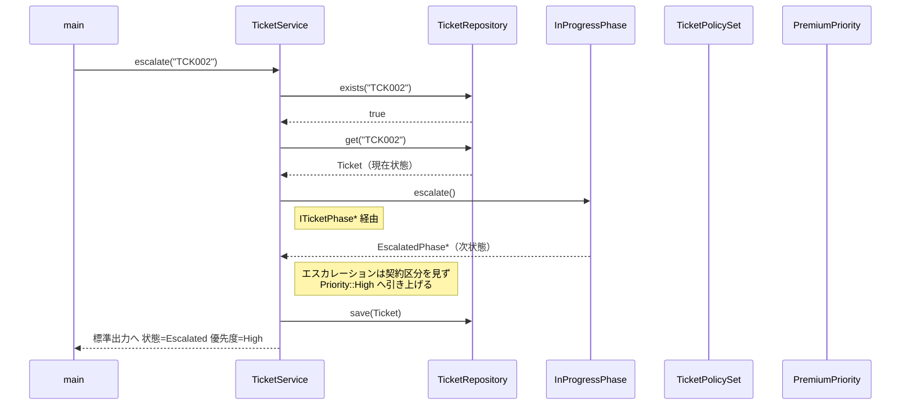
```mermaid
sequenceDiagram
    participant Main as main
    participant Svc as TicketService
    participant Repo as TicketRepository
    participant Ph as InProgressPhase
    participant Set as TicketPolicySet
    participant Rule as PremiumPriority
    Main->>Svc: escalate("TCK002")
    Svc->>Repo: exists("TCK002")
    Repo-->>Svc: true
    Svc->>Repo: get("TCK002")
    Repo-->>Svc: Ticket（現在状態）
    Svc->>Ph: escalate()
    Note right of Svc: ITicketPhase* 経由
    Ph-->>Svc: EscalatedPhase*（次状態）
    Note right of Svc: エスカレーションは契約区分を見ず<br/>Priority::High へ引き上げる
    Svc->>Repo: save(Ticket)
    Svc-->>Main: 標準出力へ 状態=Escalated 優先度=High
```

---

#### 完成コード

クラスを1つずつ、上から順に読みます。**メンバー変数と、それを使う処理を同じ場所で見られるように**しています。宣言と定義を分けるのは `TicketService` だけです。判断の基準は次の一行です。

> **メンバーを見ないと読めない関数は、メンバーと一緒に置く。**

`main()` と実行結果は最後に、行のまとまりごとに並べます。上から順に連結すれば、そのまま1つのC++14プログラムとして動きます。

---

**共通ヘッダー**

```cpp
#include <iostream>
#include <string>
#include <vector>
#include <map>

using namespace std;
```

以降のすべてのクラスが使います。

---

**値と列挙**

```cpp
// ===== 1-4から継続する型。CorporateとPendingだけが今回の追加 =====
enum class UserType { Standard, Premium, Corporate };
enum class Priority { Normal, High };

enum class TicketStatus {
    Open,
    InProgress,
    Escalated,
    Resolved,
    Pending
};

string statusName(TicketStatus status) {
    switch (status) {
    case TicketStatus::Open:       return "Open";
    case TicketStatus::InProgress: return "InProgress";
    case TicketStatus::Escalated:  return "Escalated";
    case TicketStatus::Resolved:   return "Resolved";
    case TicketStatus::Pending:    return "Pending";
    }
    return "Unknown";
}

// イベント種別（監査ログで使う）
namespace EventType {
    const string Create   = "作成";
    const string Assign   = "アサイン";
    const string Resolve  = "解決";
    const string Escalate = "エスカレーション";
    const string Reopen   = "再受付";
    const string Hold     = "保留";
}

// 優先度を表示・保存用の文字列へ変換する
string toString(Priority p) {
    return p == Priority::High ? "High" : "Normal";
}
```

契約区分・優先度・状態を名前付きの値として表し、表示用の文字列へ変える関数を添えます。変更要求で `Corporate` と `Pending` が1つずつ増えました。

---

**Transition**

状態クラスが返す値です。**「次はどの状態か」を状態名で答え、相手のオブジェクトは持ちません。**

```cpp
// 操作の結果。allowed が false なら、その状態ではその操作はできない
struct Transition {
    bool allowed;
    TicketStatus next;  // allowed が false のときは使わない
};
```

`allowed` が `false` のときは `next` を使いません。この型があることで、状態どうしが互いを参照せずに済みます。

---

**UserInfo と UserDatabase**

```cpp
// ===== ユーザー情報 =====
struct UserInfo {
    string name;        // 氏名
    UserType userType;  // ユーザー種別（契約区分）
};

class UserDatabase {
    map<string, UserInfo> records;

public:
    UserDatabase() {
        records["USR001"] = {"田中 一郎", UserType::Standard};
        records["USR002"] = {"佐藤 花子", UserType::Premium};
        records["USR003"] = {"鈴木 次郎", UserType::Standard};
        // 変更要求で追加した法人ユーザー
        records["USR004"] = {"伊藤 四郎", UserType::Corporate};
    }

    bool exists(const string& id) const { return records.count(id) > 0; }
    UserInfo get(const string& id) const { return records.at(id); }
};
```

- **責任：** ユーザーIDから存在確認と情報取得を行う
- **処理：** コンストラクタで4名を登録し、以後は問い合わせに答えるだけ
- **副作用：** なし（実行中に登録内容は変わりません）

USR004が変更要求で追加した法人ユーザーです。優先度の判定に使うのは `userType` です。

---

**StaffDirectory**

依頼者（USR）とは別のID体系で担当者を持ちます。

```cpp
// ===== ヘルプデスク担当者（依頼者USRとは別の人物） =====
class StaffDirectory {
    map<string, string> names;  // 担当者ID(AGT) → 氏名

public:
    StaffDirectory() {
        names["AGT01"] = "山田 太郎";
        names["AGT02"] = "高橋 二郎";
    }

    string nameOf(const string& id) const {
        auto it = names.find(id);
        return it == names.end() ? id : it->second;
    }
};
```

登録があれば氏名を、なければIDをそのまま返します。優先度を決めるのは依頼者の契約区分で、担当者は表示にだけ使います。

---

**IPriorityRule**

```cpp
// ===== ルール差し替え構造：優先度計算 =====
class IPriorityRule {
public:
    virtual ~IPriorityRule() = default;

    virtual Priority getPriority() = 0;
};
```

契約区分ごとの優先度の決め方をそろえる契約です。`getPriority()` は純粋仮想なので、実装側が必ず答えます。

---

**3つの優先度ルール**

```cpp
class CorporatePriority : public IPriorityRule {  // 法人向けSLA
public:
    Priority getPriority() override { return Priority::High; }
};

class PremiumPriority : public IPriorityRule {    // プレミアム向け
public:
    Priority getPriority() override { return Priority::High; }
};

class NormalPriority : public IPriorityRule {     // 一般向け
public:
    Priority getPriority() override { return Priority::Normal; }
};
```

**同じ答えでもクラスを分けているのは、変わる理由が別だからです。** 法人のSLAが変わっても、プレミアムの扱いは動きません。区分が増えるときに足すのは、ここへ1クラスと、`TicketPolicySet::priorityRule()` の選択1行だけです。

---

**ITicketPhase**

状態ごとに許可される操作をそろえる契約です。

```cpp
// ===== 状態分離構造：状態別の振る舞い =====
// 各操作は「次はどの状態か」を返す。相手のオブジェクトは持たない。
class ITicketPhase {
public:
    virtual ~ITicketPhase() = default;

    virtual Transition assign() const   { return reject(EventType::Assign); }
    virtual Transition resolve() const  { return reject(EventType::Resolve); }
    virtual Transition escalate() const { return reject(EventType::Escalate); }
    virtual Transition reopen() const   { return reject(EventType::Reopen); }
    virtual Transition hold() const     { return reject(EventType::Hold); }
    virtual Transition sendBack() const { return reject("差し戻し"); }

protected:
    Transition reject(const string& op) const {
        cout << "  操作不可: この状態では「" << op << "」できません。"
             << endl;
        return {false, TicketStatus::Open};
    }
};
```

6つの操作すべてに既定の実装があり、既定では拒否します。**各状態クラスは許可する操作だけを上書きすればよく、禁止の組み合わせを書き並べる必要がありません。** 続く5クラスを、この表と見比べながら読んでください。

| 状態 | 上書きする操作 | 次の状態 |
|---|---|---|
| `OpenPhase`（受付中） | `assign` `hold` | `InProgress` / `Pending` |
| `InProgressPhase`（対応中） | `resolve` `escalate` `hold` | `Resolved` / `Escalated` / `Pending` |
| `EscalatedPhase`（緊急対応中） | `resolve` `sendBack` | `Resolved` / `InProgress` |
| `ResolvedPhase`（解決済み） | `reopen` | `Open` |
| `PendingPhase`（保留中） | `reopen` | `Open` |

---

**OpenPhase**

```cpp
class OpenPhase : public ITicketPhase {           // 受付中
public:
    Transition assign() const override {
        return {true, TicketStatus::InProgress};
    }
    Transition hold() const override {
        return {true, TicketStatus::Pending};
    }
};
```

アサインで対応中へ、保留で保留中へ進みます。**メンバー変数が1つもありません。** 次の状態を名前で答えるだけなので、相手のオブジェクトを持つ必要がないからです。

---

**InProgressPhase**

```cpp
class InProgressPhase : public ITicketPhase {     // 対応中
public:
    Transition resolve() const override {
        return {true, TicketStatus::Resolved};
    }
    Transition escalate() const override {
        return {true, TicketStatus::Escalated};
    }
    Transition hold() const override {
        return {true, TicketStatus::Pending};
    }
};
```

解決・エスカレーション・保留の3つを許可します。

---

**EscalatedPhase**

```cpp
class EscalatedPhase : public ITicketPhase {      // 緊急対応中
public:
    Transition resolve() const override {
        return {true, TicketStatus::Resolved};
    }
    Transition sendBack() const override {
        return {true, TicketStatus::InProgress};
    }
};
```

解決と、対応中への差し戻しだけを許可します。**アサインも保留もできません。** その規則は、ここに何も書かないことで表しています。

---

**ResolvedPhase と PendingPhase**

```cpp
class ResolvedPhase : public ITicketPhase {       // 解決済み
public:
    Transition reopen() const override {
        return {true, TicketStatus::Open};
    }
};

class PendingPhase : public ITicketPhase {        // 保留中
public:
    Transition reopen() const override {
        return {true, TicketStatus::Open};
    }
};
```

どちらも再受付で受付中へ戻ります。同じ内容の2クラスですが、戻る理由が違うので分けています。解決済みからの再受付は「再発」、保留中からの再受付は「保留解除」です。

---

**Ticket と TicketRepository**

```cpp
// ===== チケット実体とリポジトリ =====
struct Ticket {
    string id;
    string userId;
    TicketStatus status;  // 現在状態（保存されるのは値）
    Priority priority;    // 保存された優先度（引き継がれる）
    string assigneeId;    // 担当者ID（未割当は空）
};

class TicketRepository {
    map<string, Ticket> store;

public:
    bool exists(const string& id) const { return store.count(id) > 0; }
    Ticket& get(const string& id) { return store.at(id); }
    void save(const Ticket& t) { store[t.id] = t; }
};
```

- **責任：** チケットをID単位で保存・取得する
- **処理：** 実行中だけ有効なインメモリの表として持つ
- **副作用：** `save()` が保存内容を書き換える。次の操作はここから読み直す

`status` は列挙型の値です。**チケットが保存するのは状態の名前であって、状態オブジェクトへのポインタではありません。** そのため保存・復元でポインタの張り直しが要りません。

---

**TicketEvent と TicketEventLog**

```cpp
// ===== 監査ログ =====
struct TicketEvent {
    string ticketId;
    string eventType;
    string status;
    string priority;
};

class TicketEventLog {
    vector<TicketEvent> records;

public:
    void add(const string& ticketId, const string& eventType,
             const string& status, Priority priority) {
        records.push_back({ticketId, eventType, status,
                           toString(priority)});
    }

    // チケットID単位でまとめて出す（各IDの中では時系列のまま）
    void printAll() const {
        vector<string> ids;
        for (size_t i = 0; i < records.size(); ++i) {
            bool seen = false;
            for (size_t k = 0; k < ids.size(); ++k)
                if (ids[k] == records[i].ticketId) seen = true;
            if (!seen) ids.push_back(records[i].ticketId);
        }

        for (size_t k = 0; k < ids.size(); ++k) {
            cout << "[" << ids[k] << "]" << endl;
            for (size_t i = 0; i < records.size(); ++i) {
                if (records[i].ticketId != ids[k]) continue;
                cout << "  " << records[i].eventType
                     << " 状態=" << records[i].status
                     << " 優先度=" << records[i].priority << endl;
            }
        }
    }
};
```

状態が変わった事実を時系列で残します。`add()` は渡された値を1件積むだけで、状態を判断しません。`printAll()` はチケットID単位でまとめて出すので、1件のチケットの履歴を縦に追えます。

---

**TicketPolicySet**

具体状態と具体ルールを所有し、状態名からオブジェクトを引くクラスです。

```cpp
// ===== 具体状態・具体ルールの所有と選択 =====
class TicketPolicySet {
    NormalPriority normal;
    PremiumPriority premium;
    CorporatePriority corporate;
    OpenPhase openPhase;
    InProgressPhase inProgressPhase;
    EscalatedPhase escalatedPhase;
    ResolvedPhase resolvedPhase;
    PendingPhase pendingPhase;

public:
    TicketStatus initialStatus() const { return TicketStatus::Open; }

    const ITicketPhase& phaseFor(TicketStatus status) const {
        switch (status) {
        case TicketStatus::InProgress: return inProgressPhase;
        case TicketStatus::Escalated:  return escalatedPhase;
        case TicketStatus::Resolved:   return resolvedPhase;
        case TicketStatus::Pending:    return pendingPhase;
        case TicketStatus::Open:       break;
        }
        return openPhase;
    }

    IPriorityRule& priorityRule(UserType type) {
        if (type == UserType::Corporate) {
            return corporate;
        }
        if (type == UserType::Premium) {
            return premium;
        }
        return normal;
    }
};
```

- **責任：** 8つの部品を所有し、状態名と契約区分から使う部品を選ぶ
- **副作用：** なし

**コンストラクタがありません。** 状態が互いを参照しなくなったので、配線する処理そのものが消えました。新しい状態を足すときは、メンバーへ1つ、`phaseFor()` の `switch` へ1行を足します。

---

**TicketService の宣言**

公開操作を受け、検証・状態への委譲・保存・監査記録を順に行います。7つの公開操作が、この章で解いた構造の入口です。

```cpp
// ===== 実行：組み立て済み部品を使ってユースケースを進める =====
class TicketService {
    TicketRepository& repo;
    UserDatabase& users;
    StaffDirectory& staff;
    TicketEventLog& log;
    TicketPolicySet& policies;

    // 遷移を1回適用し、成功したら保存する共通処理
    void applyTransition(const string& ticketId, const Transition& tr,
                         const string& eventType);

public:
    TicketService(TicketRepository& r, UserDatabase& u,
                  StaffDirectory& s, TicketEventLog& l,
                  TicketPolicySet& p)
        : repo(r), users(u), staff(s), log(l), policies(p) {}

    void create(const string& ticketId, const string& userId);
    void assign(const string& ticketId, const string& assigneeId);
    void resolve(const string& ticketId);
    void escalate(const string& ticketId);
    void sendBack(const string& ticketId);
    void reopen(const string& ticketId);
    void hold(const string& ticketId);
};
```

- **責任：** 保存済みチケットを読み、現在状態へ委譲し、返った遷移先を保存する
- **副作用：** `TicketRepository` への保存と `TicketEventLog` への記録

コンストラクタだけが本体を持っています。5つの部品を受け取って参照で保持するだけで、処理がないためです。**具体状態の選択と具体ルールの選択はこのクラスにありません。** 定義を7つ、上のメンバーを見ながら読んでいきます。

---

**TicketService::create()**

```cpp
void TicketService::create(const string& ticketId, const string& userId) {
    if (!users.exists(userId)) {
        cout << "エラー: ユーザーID " << userId
             << " は存在しません。" << endl;
        return;
    }

    UserInfo requester = users.get(userId);
    UserType category = requester.userType;
    Priority p = policies.priorityRule(category).getPriority();

    Ticket t{ticketId, userId, policies.initialStatus(), p, ""};
    repo.save(t);

    cout << "[" << ticketId << "] 作成 申請者=" << requester.name
         << " 状態=" << statusName(t.status)
         << " 優先度=" << toString(p) << endl;
    log.add(ticketId, EventType::Create, statusName(t.status), p);
}
```

申請者を台帳で確認し、契約区分から初期優先度を決めて保存します。未登録のユーザーIDでは、保存にも監査ログにも進みません。**どの区分がどの優先度かは、この関数からは見えません。**

---

**TicketService::assign()**

担当者IDも保存するため、後述の共通処理を使いません。

```cpp
void TicketService::assign(const string& ticketId,
                           const string& assigneeId) {
    if (!repo.exists(ticketId)) {  // 仕様のエラー条件
        cout << "エラー: チケットID " << ticketId
             << " は存在しません。" << endl;
        return;
    }

    Ticket& t = repo.get(ticketId);
    string before = statusName(t.status);
    Transition tr = policies.phaseFor(t.status).assign();
    if (!tr.allowed) return;

    t.status = tr.next;
    t.assigneeId = assigneeId;  // 担当者を保存
    repo.save(t);

    cout << "  " << EventType::Assign << ": 状態 "
         << before << " → " << statusName(t.status)
         << " 担当=" << staff.nameOf(assigneeId)
         << "(" << assigneeId << ")" << endl;
    log.add(ticketId, EventType::Assign, statusName(t.status),
            t.priority);
}
```

- 現在状態を `phaseFor()` で引き、その状態へ `assign()` を尋ねます
- `allowed` が `false`（この状態では不可）なら何もせずに戻ります
- 状態を保存してから監査ログへ記録します。この順序は、記録だけが残って状態が変わっていない状態を作らないためです

---

**TicketService::resolve() と hold()**

どちらも状態を進めるだけで、追加の保存項目がありません。

```cpp
void TicketService::resolve(const string& ticketId) {
    applyTransition(ticketId,
                    policies.phaseFor(repo.get(ticketId).status).resolve(),
                    EventType::Resolve);
}

void TicketService::hold(const string& ticketId) {
    applyTransition(ticketId,
                    policies.phaseFor(repo.get(ticketId).status).hold(),
                    EventType::Hold);
}
```

現在状態へ尋ねた結果を、そのまま次の共通処理へ渡します。**この2行が、7つの操作のうち最も単純な形です。**

---

**TicketService::applyTransition()**

追加の保存項目がない操作が共有する内部処理です。

```cpp
void TicketService::applyTransition(const string& ticketId,
                                    const Transition& tr,
                                    const string& eventType) {
    if (!tr.allowed) return;       // 操作不可（rejectで通知済み）
    if (!repo.exists(ticketId)) {  // 仕様のエラー条件
        cout << "エラー: チケットID " << ticketId
             << " は存在しません。" << endl;
        return;
    }

    Ticket& t = repo.get(ticketId);
    string before = statusName(t.status);
    t.status = tr.next;
    repo.save(t);

    cout << "  " << eventType << ": 状態 " << before
         << " → " << statusName(t.status) << endl;
    log.add(ticketId, eventType, statusName(t.status), t.priority);
}
```

- `allowed` が `false` のときは、状態クラスがすでに拒否を通知しているので何もしません
- 保存の直前にチケットIDの存在をもう一度確認します
- 状態を保存してから監査ログへ記録します

---

**TicketService::escalate()**

状態に加えて優先度も変えるため、共通処理を使いません。

```cpp
void TicketService::escalate(const string& ticketId) {
    if (!repo.exists(ticketId)) {  // 仕様のエラー条件
        cout << "エラー: チケットID " << ticketId
             << " は存在しません。" << endl;
        return;
    }

    Ticket& t = repo.get(ticketId);
    Transition tr = policies.phaseFor(t.status).escalate();
    if (!tr.allowed) return;

    string before = statusName(t.status);
    t.status = tr.next;
    // エスカレーション時は契約区分によらず優先度を引き上げる
    t.priority = Priority::High;
    repo.save(t);

    cout << "  " << EventType::Escalate << ": 状態 " << before
         << " → " << statusName(t.status)
         << " 優先度=" << toString(t.priority) << endl;
    log.add(ticketId, EventType::Escalate, statusName(t.status),
            t.priority);
}
```

**契約区分によらず `High` へ引き上げる**ので、優先度ルールへは尋ねません。引き上げの規則を持っているのはこの1行だけです。

---

**TicketService::reopen()**

エスカレーションと逆に、優先度を契約区分から計算し直します。

```cpp
void TicketService::reopen(const string& ticketId) {
    if (!repo.exists(ticketId)) {  // 仕様のエラー条件
        cout << "エラー: チケットID " << ticketId
             << " は存在しません。" << endl;
        return;
    }

    Ticket& t = repo.get(ticketId);
    Transition tr = policies.phaseFor(t.status).reopen();
    if (!tr.allowed) return;

    string before = statusName(t.status);
    t.status = tr.next;
    // 再受付時はユーザー種別から再計算し、初期値へ戻す
    UserType type = users.get(t.userId).userType;
    t.priority = policies.priorityRule(type).getPriority();
    repo.save(t);

    cout << "  " << EventType::Reopen << ": 状態 " << before
         << " → " << statusName(t.status)
         << " 優先度=" << toString(t.priority) << endl;
    log.add(ticketId, EventType::Reopen, statusName(t.status),
            t.priority);
}
```

引き上げたままにしないための処理です。**同じ優先度という値でも、上げるのは `escalate()`、戻すのは優先度ルール**と、決める場所が分かれています。

---

**TicketService::sendBack()**

```cpp
void TicketService::sendBack(const string& ticketId) {
    if (!repo.exists(ticketId)) {  // 仕様のエラー条件
        cout << "エラー: チケットID " << ticketId
             << " は存在しません。" << endl;
        return;
    }

    Ticket& t = repo.get(ticketId);
    Transition tr = policies.phaseFor(t.status).sendBack();
    if (!tr.allowed) return;

    string before = statusName(t.status);
    t.status = tr.next;
    repo.save(t);

    cout << "  差し戻し: 状態 " << before
         << " → " << statusName(t.status) << endl;
    log.add(ticketId, "差し戻し", statusName(t.status), t.priority);
}
```

緊急対応中から対応中へ戻します。優先度は引き上げたまま維持します。

---

##### `main()` と実行結果

ここまでのコードを連結して実行します。`main()` を行のまとまりごとに区切り、それぞれの直後に対応する出力を置きます。

---

**組み立てと、行1〜行2の登録**

6つの部品を作り、`TicketService` へ渡します。**`main()` に状態名も優先度の判定もありません。**

```cpp
int main() {
    UserDatabase users;    // 依頼者（USR）
    StaffDirectory staff;  // ヘルプデスク担当者（AGT）
    TicketRepository repo;
    TicketEventLog log;
    TicketPolicySet policies;
    TicketService svc(repo, users, staff, log, policies);

    cout << "--- 行1 ---" << endl;
    svc.create("TCK001", "USR003");
    cout << "--- 行2 ---" << endl;
    svc.create("TCK002", "USR002");
```

```
--- 行1 ---
[TCK001] 作成 申請者=鈴木 次郎 状態=Open 優先度=Normal
--- 行2 ---
[TCK002] 作成 申請者=佐藤 花子 状態=Open 優先度=High
```

同じ `create()` を2回呼んだだけで、優先度が `Normal` と `High` に分かれました。分けたのは `TicketPolicySet::priorityRule()` が選んだルールで、`create()` 自身は区分を見ていません。

---

**行3〜行5：TCK001をアサイン → 解決 → 再受付**

```cpp
    cout << "--- 行3 ---" << endl;
    svc.assign("TCK001", "AGT01");
    cout << "--- 行4 ---" << endl;
    svc.resolve("TCK001");
    cout << "--- 行5 ---" << endl;
    svc.reopen("TCK001");
```

```
--- 行3 ---
  アサイン: 状態 Open → InProgress 担当=山田 太郎(AGT01)
--- 行4 ---
  解決: 状態 InProgress → Resolved
--- 行5 ---
  再受付: 状態 Resolved → Open 優先度=Normal
```

状態がID単位で保存され、次の操作が前の結果から始まっています。行4の解決が `InProgress` から始まっているのは、行3のアサインが保存したからです。

---

**行6〜行8：TCK002をアサイン → エスカレーション → 解決**

```cpp
    cout << "--- 行6 ---" << endl;
    svc.assign("TCK002", "AGT02");
    cout << "--- 行7 ---" << endl;
    svc.escalate("TCK002");
    cout << "--- 行8 ---" << endl;
    svc.resolve("TCK002");
```

```
--- 行6 ---
  アサイン: 状態 Open → InProgress 担当=高橋 二郎(AGT02)
--- 行7 ---
  エスカレーション: 状態 InProgress → Escalated 優先度=High
--- 行8 ---
  解決: 状態 Escalated → Resolved
```

`Escalated`（緊急対応中）を経由して解決へ進みます。プレミアムなので優先度は最初から `High` のままです。

---

**変更要求：法人ユーザーの登録・保留・再受付・差し戻し**

```cpp
    cout << "--- 変更要求1 ---" << endl;
    svc.create("TCK003", "USR004");
    svc.hold("TCK003");
    cout << "--- 変更要求2 ---" << endl;
    svc.reopen("TCK003");           // Pending → Open（優先度を再計算）
    svc.assign("TCK003", "AGT01");  // Open → InProgress
    svc.hold("TCK003");             // InProgress → Pending
    svc.reopen("TCK003");           // Pending → Open
    svc.assign("TCK003", "AGT01");
    svc.escalate("TCK003");         // InProgress → Escalated
    svc.sendBack("TCK003");         // Escalated → InProgress（差し戻し）
```

```
--- 変更要求1 ---
[TCK003] 作成 申請者=伊藤 四郎 状態=Open 優先度=High
  保留: 状態 Open → Pending
--- 変更要求2 ---
  再受付: 状態 Pending → Open 優先度=High
  アサイン: 状態 Open → InProgress 担当=山田 太郎(AGT01)
  保留: 状態 InProgress → Pending
  再受付: 状態 Pending → Open 優先度=High
  アサイン: 状態 Open → InProgress 担当=山田 太郎(AGT01)
  エスカレーション: 状態 InProgress → Escalated 優先度=High
  差し戻し: 状態 Escalated → InProgress
```

変更ID1「登録時と再受付時に法人はHigh」と変更ID2「再受付時は優先度を計算し直す」を、同じ法人チケットで通して確認できます。保留は `Open` からも `InProgress` からも入れます。

---

**回帰：一般ユーザーの優先度が上がって戻る**

```cpp
    cout << "--- 回帰: 一般ユーザー ---" << endl;
    svc.assign("TCK001", "AGT01");  // Open → InProgress（Normalを維持）
    svc.escalate("TCK001");         // Normal → High へ引き上げ
    svc.resolve("TCK001");          // Highを維持
    svc.reopen("TCK001");           // High → Normal へ計算し直す
```

```
--- 回帰: 一般ユーザー ---
  アサイン: 状態 Open → InProgress 担当=山田 太郎(AGT01)
  エスカレーション: 状態 InProgress → Escalated 優先度=High
  解決: 状態 Escalated → Resolved
  再受付: 状態 Resolved → Open 優先度=Normal
```

エスカレーションで `Normal` から `High` へ上がり、再受付で `Normal` へ戻りました。引き上げは `TicketService::escalate()` が、戻しは優先度ルールが決めています。

---

**エラー3種**

```cpp
    cout << "--- エラー1 ---" << endl;
    svc.create("TCK004", "USR999");
    cout << "--- エラー2 ---" << endl;
    svc.reopen("TCK003");           // InProgress からは再受付できない
    cout << "--- エラー3 ---" << endl;
    svc.assign("TCK999", "AGT01");  // 保存されていないチケット
```

```
--- エラー1 ---
エラー: ユーザーID USR999 は存在しません。
--- エラー2 ---
  操作不可: この状態では「再受付」できません。
--- エラー3 ---
エラー: チケットID TCK999 は存在しません。
```

許可されない操作は状態クラスが拒否し、状態も優先度も変わりません。どの操作を許すかは各状態クラスが持つので、`TicketService` 側に「この状態のときは何ができるか」という分岐は残りません。

---

**監査ログ**

```cpp
    cout << "\n--- 監査ログ ---" << endl;
    log.printAll();
    return 0;
}
```

```

--- 監査ログ ---
[TCK001]
  作成 状態=Open 優先度=Normal
  アサイン 状態=InProgress 優先度=Normal
  解決 状態=Resolved 優先度=Normal
  再受付 状態=Open 優先度=Normal
  アサイン 状態=InProgress 優先度=Normal
  エスカレーション 状態=Escalated 優先度=High
  解決 状態=Resolved 優先度=High
  再受付 状態=Open 優先度=Normal
[TCK002]
  作成 状態=Open 優先度=High
  アサイン 状態=InProgress 優先度=High
  エスカレーション 状態=Escalated 優先度=High
  解決 状態=Resolved 優先度=High
[TCK003]
  作成 状態=Open 優先度=High
  保留 状態=Pending 優先度=High
  再受付 状態=Open 優先度=High
  アサイン 状態=InProgress 優先度=High
  保留 状態=Pending 優先度=High
  再受付 状態=Open 優先度=High
  アサイン 状態=InProgress 優先度=High
  エスカレーション 状態=Escalated 優先度=High
  差し戻し 状態=InProgress 優先度=High
```

チケットID単位でまとめて出しています。TCK003を上から読むと、作成でも再受付でも優先度がHighのままだと分かります。一方TCK001は、途中のエスカレーションでNormalからHighへ上がり、再受付でNormalへ戻っています。**引き上げが契約区分によらないこと**が、1つのブロックの中で追えます。

---

#### 変更後の状態遷移仕様との照合

1-5で確定した変更後の状態遷移仕様と、完成コードのPhase配線を照合します。
現状の4状態に `Pending` が加わり、保留と再受付の遷移が実装されています。

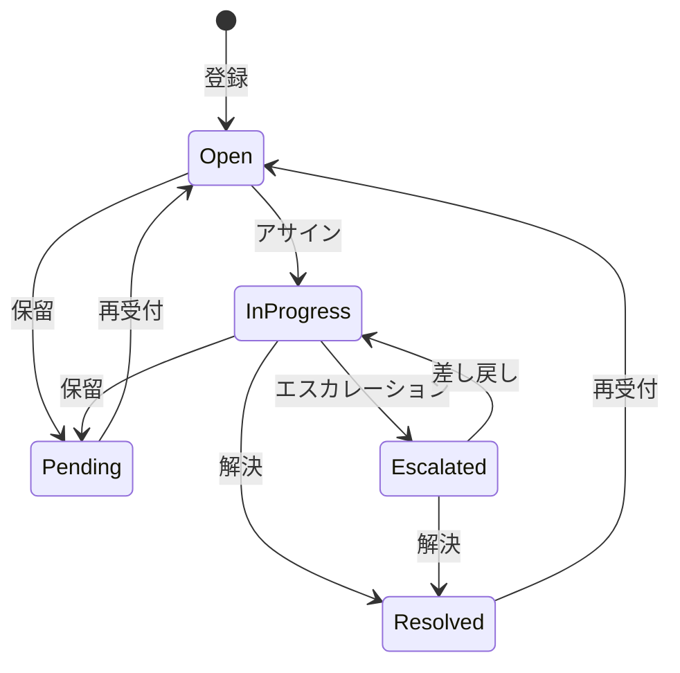
```mermaid
stateDiagram-v2
    [*] --> Open : 登録
    Open --> InProgress : アサイン
    Open --> Pending : 保留
    InProgress --> Resolved : 解決
    InProgress --> Escalated : エスカレーション
    InProgress --> Pending : 保留
    Escalated --> Resolved : 解決
    Escalated --> InProgress : 差し戻し
    Resolved --> Open : 再受付
    Pending --> Open : 再受付
```

エスカレーション（`InProgress → Escalated`）の後は、解決（`Escalated → Resolved`）か、対応中への差し戻し（`Escalated → InProgress`）へ進みます。各遷移は対応する `ITicketPhase` 実装が「遷移先の状態」を返すことで表現され、許可されない操作は次状態を返さず状態が変わりません。状態が変わらないエラー（存在しないユーザー・不可操作）はこの図に含めず、実行結果とエラー条件表で扱います。

#### 最終要求の実装・受入エビデンス

変更後要求ベースラインの全有効要求IDを同じ順序で照合します。今回変わらなかった既存要求も対象にするため、要求の消失を検出できます。

| 要求ID | 最終要求 | 適用コード | 実行シナリオ・観測結果・判定 |
|---|---|---|---|
| 要求ID1 | 登録時と再受付時は一般Normal・プレミアムと法人Highで計算し、エスカレーションでは全区分をHighへ引き上げる | 各`IPriorityRule`、`TicketPolicySet`、`TicketService::escalate()` | 監査ログのTCK003で作成・再受付とも法人High。エスカレーションは契約区分を見ずHigh<br/>**判定:** 合格 |
| 要求ID2 | 既存4状態にPendingを加え、許可された状態遷移だけを行う | 各`ITicketPhase` | TCK003でOpen→Pending、InProgress→Pending、Pending→Openを実行<br/>**判定:** 合格 |
| 要求ID3 | チケットの状態と優先度を保存・取得する | `TicketRepository` | Pendingを含む次操作が保存状態から開始<br/>**判定:** 合格 |
| 要求ID4 | 担当者割当・解決・再受付・エスカレーション・差し戻し・保留を処理する | `TicketService`、各Phase | TCK003で6操作を通し、状態・優先度が規則どおり。差し戻しはEscalated→InProgress<br/>**判定:** 合格 |
| 要求ID5 | 未登録入力・許可されない操作を拒否する | 各Directory・Phase、`TicketRepository::exists()` | 未登録USR999と未登録TCK999を拒否し、InProgressからの再受付は「操作不可」で状態不変<br/>**判定:** 合格 |

上の表は継続（要求ID3・要求ID5）・変更（要求ID1・要求ID2・要求ID4）を同じ順序で並べ、変わらなかった既存要求も回帰対象に含めています。継続要求が合格していることで、既存動作が落ちていないことを確認できます。要求の受入・回帰はここで完了します。課題IDへ直接対応付けず、以下では変更試行の痛みから導いた構造課題だけを別に確認します。

#### 設計課題の構造改善結果

要求の受入とは分けて、課題IDごとに構造と変更影響を確認します。

| 課題ID | 構造差分・コード適用先 | 確認できた効果 | 残る変更先 |
|---|---|---|---|
| 課題ID1 | 状態動作を各`ITicketPhase`へ分離 | Pending追加が新Phaseと配線に閉じた | 新Phaseと遷移登録 |
| 課題ID2 | 優先度条件を各`IPriorityRule`へ分離 | 法人追加が新RuleとPolicySet設定に閉じた | 新Ruleと設定 |
#### 変更前→変更後の不変条件照合

| 変更対象外 | 変更前 | 変更後 | 確認根拠 |
|---|---|---|---|
| チケット保存 | `TicketRepository` に `Ticket` を保存 | 同じID・本文・状態データを保存 | 1-4と7-1の取得・保存コード |
| 利用者情報 | `UserDatabase` から区分を取得 | 同じ利用者IDからRule入力へ渡す | 法人ケースの実行結果 |

### 7-2：動作シーケンス図の検証

完成クラス図と実行シーケンスは、完成コードへ入る前に示しました。ここまでのコード、要求追跡表、不変条件照合を証拠として、次節で変更影響を再確認します。

### 7-3：変更影響グラフ（改善後）

フェーズ3で確認した「変更要求：状態追加」と「SLAルール変更」のシナリオを、3-2と同じ粒度で再度適用します。

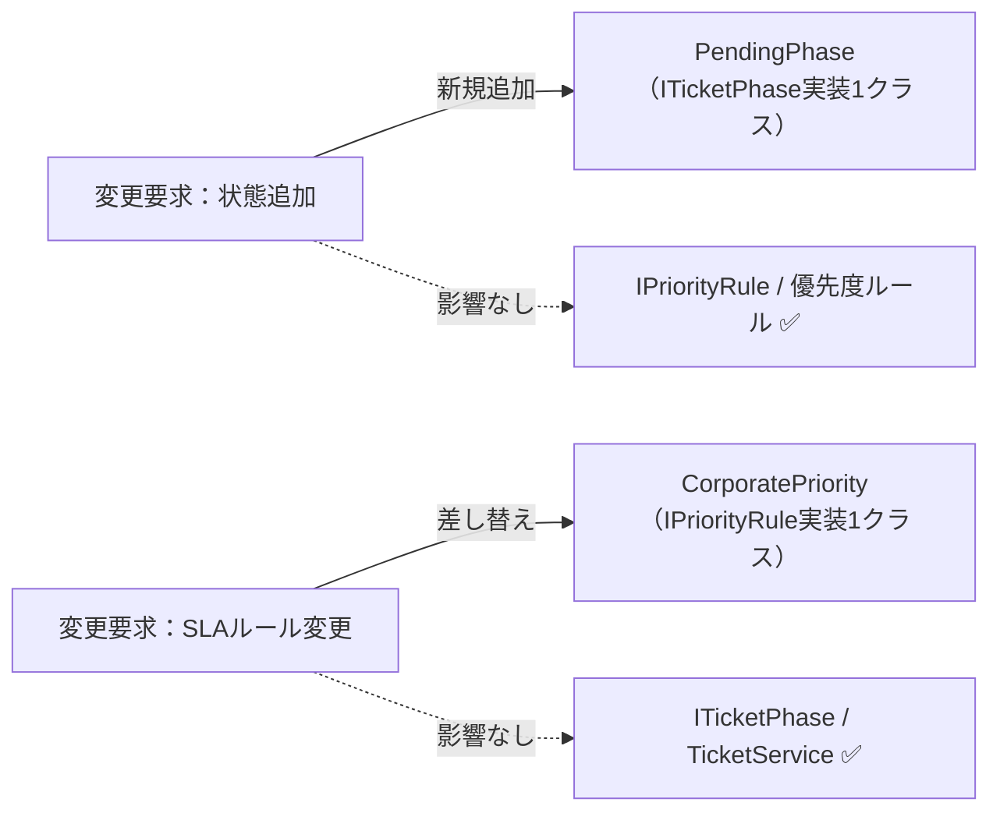
```mermaid
graph LR
    T1["変更要求：状態追加"]
        -->|新規追加| N1["PendingPhase<br>（ITicketPhase実装1クラス）"]
    T2["変更要求：SLAルール変更"]
        -->|差し替え| N2["CorporatePriority<br>（IPriorityRule実装1クラス）"]
    T1 -. "影響なし" .-> A["IPriorityRule / 優先度ルール ✅"]
    T2 -. "影響なし" .-> B["ITicketPhase / TicketService ✅"]
```

フェーズ3の変更影響グラフと同じ要求・同じ粒度で比べると、課題ID1の状態追加は `ITicketPhase` の実装と `TicketPolicySet` の配線へ、課題ID2のSLAルール変更は `IPriorityRule` の実装と同じ組み立て箇所へ限定されました。`TicketService` は注入された契約へ操作ごとに委譲するため、片方の変更判断がもう片方へ入り込みません。

| 3-2で影響した場所 | 修正後 | 構造変更との対応 |
|---|---|---|
| `updateStatus()` の `op` 文字列分岐と `status` の switch（課題ID1） | **修正しない** | 振る舞いを各状態クラスへ移した |
| `calculate()` のSLA・顧客区分判定（課題ID2） | ルール1クラスを差し替える | 優先度判定をルール差し替え構造へ移した |
| 3-2には状態・ルールの契約がなかった | `ITicketPhase`／`IPriorityRule` へ実装を1つずつ追加 | 変更先を新しく作った |

### 7-4：変更シナリオ表

今回の変更ID1・変更ID2について、フェーズ1の構造で必要だった修正と完成構造の結果を対比します。

| 変更依頼 | フェーズ1の現状構造での影響 | 完成構造での結果 |
| --- | --- | --- |
| 変更ID1：法人ユーザーを登録時と再受付時にHighとする | `TicketManager`の2操作へ法人判定を追加 | `CorporatePriority`へ判定を集め、2操作でHigh、一般・プレミアムは従来結果になることを確認 |
| 変更ID2：Pending状態と、Open/InProgressからの保留、Pendingからの再受付を追加する | `TicketManager`の状態分岐と各操作を修正 | `PendingPhase`へ状態固有の遷移を置き、許可された遷移だけ保存し、再受付時に変更ID1を再評価 |

状態と優先度を別の契約へ分けた代わりに、インターフェース、具象クラス、組み立てを管理するコストを引き受けます。


---

## 整理

### 問題・原因・課題・解決策

| | 内容 |
|---|---|
| **問題** | チケット管理で「優先度ルールの変更」と「状態遷移の追加」という変わる理由が異なる2つの変化が、同じ `TicketManager` に混在している |
| **原因** | `TicketManager` が `PriorityCalculator` と状態遷移ロジックを「クラス名と条件を呼び出し元が知る」で保持しているため、どちらの変化が来ても両方への影響確認が必要になる |
| **課題** | 状態ごとの振る舞い（接続点A）と優先度判定ロジック（接続点B）を、それぞれ独立して差し替えられる構造に切り離すこと |
| **解決策** | ルール差し替え構造 × 状態分離構造：`IPriorityRule`（優先度ルールの軸）と `ITicketPhase`（状態遷移の軸）の2つのインターフェースで変化軸を分離し、`TicketService` はどちらの具体クラスも知らない設計にする |

### フェーズとこの章でやったこと

| **フェーズ** | **この章でやったこと** |
| --- | --- |
| 🔵 フェーズ1：現状把握 | チケット管理システムにおける状態遷移とルール判定の混在を観察した。仕様・動作例・コード・クラス構成図・変更要求を把握した |
| 🟣 フェーズ2：仮説立案 | 業務機能の所在表・変わる理由の分析で2つの変化軸を特定した。運用担当者へのヒアリングで、二つの軸（ルールと状態）が独立して変動することを確認した |
| 🟣 フェーズ3：問題特定 | `if-else` 分岐の肥大化による修正の連鎖という痛みを確認した |
| 🟠 フェーズ4：原因分析 | 振る舞いとルールの密結合を「直差し」状態として診断した |
| 🟡 フェーズ5：課題定義 | 状態とルールの二つの接続点を特定し、疎結合化を課題とした |
| 🔴 フェーズ6：対策検討 | 課題ID1・課題ID2を同時に満たすルール差し替え構造×状態分離構造を先に確定し、状態契約→ルール契約→組み立ての順でコードへ反映した |
| 🟢 フェーズ7：対策実施 | インターフェースを導入し、責務をクラスに分離した。シーケンス図・変更影響グラフ・変更シナリオ表で局所化を確認した |

### 責任の移動

| **責任** | **変更前** | **変更後** |
| --- | --- | --- |
| チケットの全体フロー管理 | `TicketManager` | `TicketService`（操作の受け口） |
| 状態ごとの振る舞いの実装 | `TicketManager`（if-else直書き） | `OpenPhase` / `InProgressPhase` 等の各フェーズクラス |
| 優先度判定ルールの実装 | `TicketManager`（直書き） | `PremiumPriority` / `NormalPriority` 等の各ルールクラス |
| 状態遷移の契約定義 | —（なし） | `ITicketPhase` |
| 優先度判定の契約定義 | —（なし） | `IPriorityRule` |

### 使った構造 × 解消した根本原因

| **使った構造** | **解消した根本原因** |
| --- | --- |
| ルール差し替え構造（`IPriorityRule`） | 根本原因A：優先度ルールが `TicketManager` 内に混在し、SLA改定のたびに状態遷移ロジックまで再テストが必要だった |
| 状態分離構造（`ITicketPhase`） | 根本原因B：状態遷移ロジックが `TicketManager` 内に混在し、新状態を追加するたびに管理クラスへの修正が必要だった |

2つの構造はそれぞれ独立した根本原因を解消しています。どちらか一方だけでは、残った根本原因が将来の変更で痛みを生み続けます。

### 複雑さを足しても対策は変わるか

今回足した複雑さと、同じ軸に入る将来候補が、どの原因に効き、どの課題を生み、最終的にどちらの構造へ収まるかを対応させます。期限監視だけは今回の掲載コードに入れていないため、必要になる追加入力も明記します。

| 追加した複雑さ | 見えた原因 | 定めた課題 | 採用した扱い（2軸分離） |
|---|---|---|---|
| SLA期限監視（将来候補） | 期限超過の判定が優先度と一緒に本体へ入る | 期限を優先度ルール側へ寄せる | 今回は未実装。要件確定後、受付時刻と現在時刻をルール入力へ追加する |
| 担当者割当イベント | 割当契機が状態遷移の分岐へ埋もれる | 契機と状態遷移を分けて扱う | 状態軸（`ITicketPhase`）の遷移で扱う |
| 再オープン | 逆流時に状態とルールが同じ行で動く | 逆流時も両軸を独立に動かす | 状態軸で遷移し、ルール軸で再評価する |
| 状態とルールの同時変化 | 同時に動くため1軸へまとめたくなる | 同時でも軸ごとに振り分ける | 組み立て側が両軸を順に呼び分ける |

---

## 振り返り

### 「この章を読むと得られること」は手に入ったか

| **得られること** | **この章のどこで示したか** |
| --- | --- |
| 1. 変動箇所の識別力 | フェーズ2の業務機能の所在表・変わる理由の分析でルールと状態を変動要因として特定した |
| 2. 接続点の診断力 | フェーズ4の原因分析で、状態遷移と優先度判定の知識が `TicketManager` に集まっている状態を診断した |
| 3. 構造改善の説明力 | フェーズ7の変更シナリオ表で、変更が独立クラスに閉じる構造を示した |
| 4. if文からオブジェクトへの変換視点 | フェーズ6で二軸を同時に分ける最終構造を確定し、優先度ルールと状態をそれぞれのインターフェースへ反映する順序を示した |

### 第0章の3つの設計原則はどう適用されたか

**原則1「変わるものをカプセル化せよ」の現れ**

- 具体化された場所：各 `IPriorityRule` および `ITicketPhase` の実装クラス
- 解説：変化するロジックを個別のクラスへ追い出し、`TicketService` から切り離しました。新しいルールや状態が追加されても `TicketService` の既存操作は無影響です。

**原則2「実装ではなくインターフェースに対してプログラムせよ」の現れ**

- 具体化された場所：`IPriorityRule`, `ITicketPhase`
- 解説：統括クラスは具体的なアルゴリズムや状態を知らず、インターフェース経由で呼び出します。既存の契約に収まる優先度ルールや状態を差し替える場合、`TicketService` の委譲ロジックは保てます。新しい操作や遷移用の契約が必要になれば、インターフェースと `TicketService` も見直します。

**原則3「継承よりコンポジションを優先せよ」の現れ**

- 具体化された場所：`TicketService` が ルール差し替え構造 と 状態分離構造 を保持する構成
- 解説：ロジックの振る舞いを継承ではなく、保持するオブジェクトの差し替えによって実現しました。継承だけで「状態×優先度ルール」の全組み合わせを表すと、変更後の状態5種類×優先度ルール3種類で15クラスになります。状態やルールが増えるたびに組み合わせクラスも増える、二次元的な膨張が起きます。コンポジションなら、状態クラスまたはルールクラスと、それらを結び付ける組み立て箇所を変更できます。

---

## あなたのコードで考えてみてください

この章で辿った思考プロセスを、あなた自身のコードに当てはめてみましょう。

1. **複数の変動軸を探す：** あなたのコードに「振る舞いが変わる理由が2つ以上、同じクラスに混在している」箇所がありますか？「状態によって処理が変わる」と「ビジネスルールによって処理が変わる」が同居していませんか？**判断基準：** そのクラスの変更理由を1文で書こうとして「AまたはBが変わったとき」という形になるなら、変動軸が混在しています。
2. **変わる理由を分ける：** 同じクラスに、内容・時期・決定根拠が独立した変更要求が入りますか？**判断基準：** 状態追加だけをしてもルールは変わらず、ルール改定だけをしても状態は変わらないなら、二つの変化軸です。担当者や`git blame`は、その独立性を裏付ける補助情報として使います。
3. **爆発を想像する：** 状態の種類が3つ→5つ、ルールの種類が2つ→4つになったとき、今の構造ではメソッド数はどのくらい増えますか？それは管理できる範囲ですか？**判断基準：** 「状態×ルール数」のかけ算でメソッドや分岐が増えるなら爆発します。足し算で済むなら許容範囲です。
4. **分けた後を想像する：** 「状態の遷移ロジック」と「ビジネスルール」をそれぞれ別クラスに切り出したとき、新しい状態を追加するとき触るファイルはどこだけになりますか？**判断基準：** 「1ファイルだけ」が答えなら設計が機能しています。「複数ファイル」が答えなら、まだ依存が残っています。

---

**題材を置き換えるときの共通手順**

この章の題材名を、自分の現場のシステム名に置き換えて考えます。

1. そのシステムは、誰が何を達成するために使うものか。
2. 入力、加工、出力は何か。
3. 最近入った変更要求、または次に来そうな変更要求は何か。
4. その変更で、触りたくない場所まで修正や再テストが広がるか。
5. 変えたいものと守りたいものを分けると、接続点には何を残すべきか。
6. 全課題を満たす完成構造が複数成立するか。成立するなら、責任配置・変更影響・導入コストの差は何か。

## パターン解説：Strategy × State

この複合パターンは、ビジネス上の「アルゴリズム（戦略）」と「状態（状態遷移）」が独立して変化する際、それぞれをパターンの対象とすることで、爆発的な分岐を整理する強力なアプローチです。

> [!INFO] コラム: StrategyとState、似ているけれど何が違う？
> どちらのパターンも「インターフェースを使って具体的な振る舞いを切り替える」という構造は同じです。しかし、目的（意図）が異なります。Strategyは「優先度計算」のような特定のアルゴリズムを差し替えるためのものですが、Stateは「受付中」「対応中」といったオブジェクトのライフサイクル（状態）を表現するためのものです。構造が同じでも、変更理由の種類が違うため別々に扱う必要があります。

### 抽象骨格の実行シーケンス

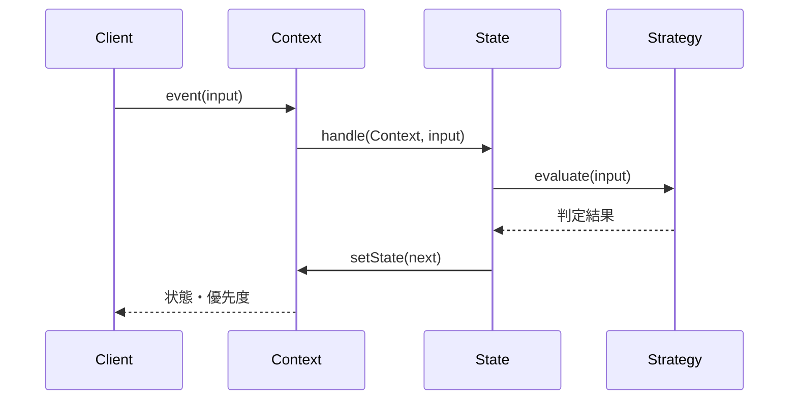
```mermaid
sequenceDiagram
    participant C as Client
    participant X as Context
    participant S as State
    participant R as Strategy
    C->>X: event(input)
    X->>S: handle(Context, input)
    S->>R: evaluate(input)
    R-->>S: 判定結果
    S->>X: setState(next)
    X-->>C: 状態・優先度
```

Stateが状態固有の処理を選び、その中の独立して変わる判定をStrategyへ委譲します。

### この章の実装との対応

GoF（Gang of Four）とは、1994年に出版された書籍『Design Patterns』の4人の著者の総称です。彼らが整理した23のパターンは、現在も設計の共通言語として広く使われています。

**Strategyパターン（GoF標準）：**

```mermaid
classDiagram
    class Context {
        -strategy: IStrategy
        +setStrategy(s: IStrategy)
        +doWork()
    }
    class IStrategy {
        <<interface>>
        +execute()
    }
    class ConcreteStrategyA {
        +execute()
    }
    class ConcreteStrategyB {
        +execute()
    }
    Context --> IStrategy
    IStrategy <|.. ConcreteStrategyA
    IStrategy <|.. ConcreteStrategyB
```

| GoFの名前 | この章での対応 |
| --- | --- |
| Context | `TicketService` |
| Strategy | `IPriorityRule` |
| ConcreteStrategyA | `PremiumPriority` |
| ConcreteStrategyB | `NormalPriority` |

**Stateパターン（GoF標準）：**

```mermaid
classDiagram
    class Context {
        -state: IState
        +setState(s: IState)
        +request()
    }
    class IState {
        <<interface>>
        +handle(context: Context)
    }
    class ConcreteStateA {
        +handle(context: Context)
    }
    class ConcreteStateB {
        +handle(context: Context)
    }
    Context --> IState
    IState <|.. ConcreteStateA
    IState <|.. ConcreteStateB
```

| GoFの名前 | この章での対応 |
| --- | --- |
| Context | `TicketService` |
| IState | `ITicketPhase` |
| ConcreteStateA | `OpenPhase` |
| ConcreteStateB | `InProgressPhase` |

### 使いどころと限界

- **使うと良い：** 状態遷移とビジネスルールが独立して追加・変更され、両者を組み合わせる必要があるワークフロー管理。変更時期や決定根拠が異なることを要求・履歴・ヒアリングで確認できる場合に向きます。
- **使わない方が良い：** 状態とルールが少なく、独立した変更理由も追加見込みもなく、一つの条件を変えると常にもう一方も同時に変わるなら、`if-else`の方が読みやすい場合があります。人数ではなく、変更理由の独立性、変更頻度、組み合わせ数に対して分離コストが見合うかで判断します。

【過剰コード：シンプルなものまで無理に分離した例】

状態が「Open」「Closed」の2つだけで、ルールも「ハイか否か」1種類だけのシンプルなシステムにStrategy × Stateを適用すると、クラス爆発が起きます。

```cpp
// 【過剰コード】状態2種類・ルール1種類のみのシンプルなシステムに
// Strategy × State を適用した場合の例

// ── Strategy側（ルール1種類だけなのにインターフェースを定義）
class IPriorityRule {
public:
    virtual ~IPriorityRule() = default;
    virtual string getPriority() = 0;
};
class SinglePriority : public IPriorityRule { // ← 実装クラスが1つだけ
public:
    string getPriority() override { return "Normal"; }
};

// ── State側（状態2種類のみなのにインターフェースを定義）
class ISimpleState {
public:
    virtual ~ISimpleState() = default;
    virtual void handle() = 0;
};
```
続いて `OpenState` です。

```cpp
class OpenState : public ISimpleState {  // ← 状態クラスが2つだけ
public:
    void handle() override { cout << "Open" << endl; }
};
class ClosedState : public ISimpleState {
public:
    void handle() override { cout << "Closed" << endl; }
};

// ── 合計5クラス + 2インターフェース。if-else 2行で書けた処理が
//    7つのクラスに分散し、次に触る人は全クラスを読まないと
//    「何をしているか」を理解できなくなる。
```

`ISimpleState` も `OpenState` も作らず素直に書くと、どのクラスにも属さない関数 `updateStatus()` だけで、次のように2行で済みます。

```cpp
// シンプルな if-else の方が読みやすい場合
void updateStatus(string status) {
    if (status == "Open") cout << "Open" << endl;
    else cout << "Closed" << endl;
}
```

「状態が2つ以下・ルールが1種類」という条件では、パターン適用はクラス数を増やすだけで変更耐性の恩恵がありません。変化の見込みがないなら、シンプルな実装が一つの考え方です。

### この章のまとめ

チケット管理というドメインと Strategy × State の組み合わせの関係を一言で言うなら、「優先度ルール」と「状態遷移」は変わる速度も担当者も違う2つの変化軸であり、それぞれに別の境界を設けることで変更影響を分けやすくなる、ということです。先にパターン名を選ぶのではなく、問題を分析した結果がStrategyとStateの役割に対応した——この順序が、第二部を通じて最も伝えたいことです。

7つのフェーズを通じて、読者は1つのクラスに混在する2つの変化軸という観察から始まり、フェーズ4〜5で「優先度ルール」と「状態遷移」の独立した接続点をすべて確定しました。フェーズ6では一方ずつ試すのではなく、二軸を同時に解く責任配置を先に決め、コードだけを状態契約、ルール契約、組み立ての理解順に反映しています。StrategyとStateは、この完成構造の各責任に付いた名前です。

あなたのコードの中にも、「どの業務機能に属するか」が異なる2つのロジックが同じクラスに同居している箇所があるはずです。それぞれの変化軸を問うことが、どのパターンをどこに当てるかを見つける入口になります。
