## 第9章 変わるルールと状態の連鎖 ―― Strategy × State パターン

―― 思考の型：複雑なビジネスルールと状態遷移が絡み合う場所をどう解くか

### この章の核心

**チケットの優先度ルールと状態遷移が同じ管理処理に集まっていると、VIPルールの追加でも状態追加でも同じ場所全体を修正・確認する必要が生じる。こういう問題は、「判定ルール」と「状態ごとの振る舞い」という別々の変更理由が同じ場所に混在しているシステムで起きている。**

第9章からは本書の第二部です。第一部では、章ごとに主となる一つの変更課題へ焦点を当て、対応する構造を一つずつ学びました。第二部では、変更の決定者や頻度が異なる複数の課題が同じシステムに存在する場合を扱います。同じ7つのフェーズで問題を分析しますが、一つの構造だけでは変更影響を十分に分けられないとき、複数の構造を組み合わせます。「名前を先に置いて設計する」のではなく、「変更理由の種類を分析して必要な境界を選ぶ」という順序は変わりません。

### この章を読むと得られること

* **得られること1：** ビジネスルールの切り替えと状態ごとの振る舞いが混在している箇所を識別できるようになる

* **得られること2：** 接続点で状態遷移と優先度ルールの知識がどこへ漏れているかを調べ、変更の痛みが生まれる理由を判断できるようになる

* **得られること3：** 複合的な変化に対して、複数の解決手段を組み合わせてどのように局所化できるかを説明できるようになる

* **得られること4：** 現場の複雑な条件分岐を、if文の羅列からオブジェクトの構成へと変換する視点

## 🔵 フェーズ1：現状把握 ―― 仕様を整理し、システムと紐付ける

サポートチケット管理システムが何を入力として受け取り、どの処理で加工し、何を出力するのかを整理します。

### 1-1：このシステムの仕様

このシステムは、社内のITヘルプデスクで使われている「サポートチケット管理システム」です。社員から届くPCやネットワークのトラブル報告をチケットとして登録し、ヘルプデスク担当者がそれを解決するまでの過程を管理しています。

#### まず実行結果から動きをつかむ

詳細な仕様やコードへ入る前に、担当者が問い合わせチケットを新規作成した結果を見ます。

**代表的な実行結果：**

```
[TCK001] 作成 申請者=鈴木 次郎 状態=Open 優先度=Normal
[TCK002] 作成 申請者=佐藤 花子 状態=Open 優先度=High
```

この出力から、①申請者と内容を入力し、②検証→作成→状態・優先度の付与→保存の順に進み、③作成したチケットの状態と優先度が表示される、という一連の動きが読み取れます。これを押さえてから、以降の要求・仕様・コードを読み進めます。

**この結果を生む入力（1-4の`main()`から抜粋）：**

```cpp
manager.create("TCK001", "USR003"); // 一般(鈴木)が作成 → Open・Normal
manager.create("TCK002", "USR002"); // プレミアム(佐藤)が作成 → Open・High
```

同じ入力を含む完全なコードと実行結果は1-4に掲載します。

#### 最初にシステム全体をつかむ

- **入力：** ユーザーID、チケットID、担当者が行う操作を受け取る。
- **処理：** 保存済みのチケット状態とユーザー種別を読み、現在状態で操作できるかを判定し、成功時だけ状態と優先度を再計算して保存する。
- **出力：** 操作後の状態、優先度、担当者を返し、不正なIDや操作では保存状態を変えない。
- **掲載コードでの代替：** 実システムのユーザーDBとチケットDBはメモリ上の登録表、画面や通知は標準出力で表す。状態遷移、優先度判定、保存後状態の再利用は実際に行う。

まずこの一連の動きを押さえ、以降で要求、ユーザーと状態、操作規則、クラス、コードの順に詳細を確認します。

#### 現行要求ベースライン

| 要求ID | 現行要求 | 受入条件 |
|---|---|---|
| 要求ID1 | 登録ユーザーの種別から初期優先度を決める | 一般はNormal、プレミアムはHighになる |
| 要求ID2 | Open・InProgress・Escalated・Resolvedの状態遷移を管理する | 状態ごとに許可された操作だけ成功する |
| 要求ID3 | チケットの状態と優先度を保存・取得する | 次の操作が保存済み状態から始まる |
| 要求ID4 | 担当者割当・解決・再受付・エスカレーション・差し戻しを処理する | 操作後の状態と優先度が規則どおりになる |
| 要求ID5 | 未登録ユーザー・チケット、許可されない操作を拒否する | エラー時に保存状態を変えない |

本章の追跡は**要求IDと変更ID**で行います。変更で各要求IDの内容がどう変わるか——継続・変更・追加——は、1-5「変更後要求ベースライン」の「変更種別・根拠となる変更ID」列で追えます。既存動作が落ちていないかは、フェーズ7の要求ID別回帰で確認します。

この章で扱う現状仕様は、次の範囲です。

| 仕様項目 | この章で扱う値 | 具体例 | 何に使うか |
|---|---|---|---|
| チケット | 問い合わせ内容と現在状態 | TCK001 が Open | 状態に応じて許可される操作を判定する |
| ユーザー種別 | 一般 / プレミアム | USR002 はプレミアム | 優先度計算に使う |
| 操作 | 受付・対応開始・解決など | 担当者アサイン、解決 | 状態遷移と優先度更新のきっかけになる |
| 出力 | 更新後状態と優先度 | InProgress、高優先度 | 操作結果としてチケット状態を照合する |

ここで確認する対象は、どの入力で状態と優先度がどう変わるかです。

**登録済みのユーザー**

チケットの申請者は、次の3名から指定します。ユーザー種別（一般／プレミアム）が優先度計算に使われ、登録されていないユーザーIDを指定するとエラーになります。

| ユーザーID | 氏名 | ユーザー種別 |
|---|---|---|
| USR001 | 田中 一郎 | 一般（standard） |
| USR002 | 佐藤 花子 | プレミアム（premium） |
| USR003 | 鈴木 次郎 | 一般（standard） |

現在状態や優先度は、利用者が毎回入力する値ではありません。チケットIDから保存済みのチケットを取得し、その状態とユーザー種別を使って操作可否と優先度を決めます。

**システム全体図：チケット管理と保存データの境界**

最も大きな境界は「担当者 → サポートチケット管理システム」です。保存済みチケット、優先度ルール、実行結果は対象システムの内側にまとめます。

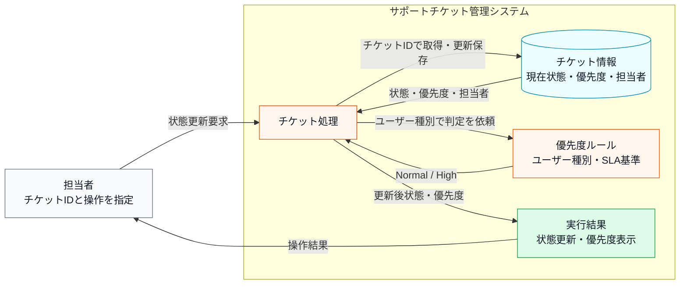
```mermaid
flowchart LR
    U["担当者<br>チケットIDと操作を指定"] -->|"状態更新要求"| S

    subgraph SUPPORT["サポートチケット管理システム"]
        S["チケット処理"]
        T[("チケット情報<br>現在状態・優先度・担当者")]
        P["優先度ルール<br>ユーザー種別・SLA基準"]
        R["実行結果<br>状態更新・優先度表示"]
        S -->|"チケットIDで取得・更新保存"| T
        T -->|"状態・優先度・担当者"| S
        S -->|"ユーザー種別で判定を依頼"| P
        P -->|"Normal / High"| S
        S -->|"更新後状態・優先度"| R
    end

    R -->|"操作結果"| U

    classDef actor fill:#f8fafc,stroke:#64748b,color:#111827;
    classDef data fill:#ecfeff,stroke:#0891b2,color:#111827;
    classDef process fill:#fff7ed,stroke:#ea580c,color:#111827;
    classDef result fill:#dcfce7,stroke:#16a34a,color:#111827;
    class U actor;
    class T data;
    class S,P process;
    class R result;
```

上の文章と表で仕様を一通り確認したので、まず正常にチケットを更新できる場合の入力・判定・加工・出力の流れとして整理します。

状態と優先度は別の値ですが、1回の操作の中で併せて使われます。最初に現在状態で操作可否と次状態を決め、その操作が登録・再受付・エスカレーションならユーザー種別から優先度も再計算します。アサイン・解決・差し戻しでは保存済みの優先度を維持します。

**システム内部図：正常系の入力・判定・加工・出力**

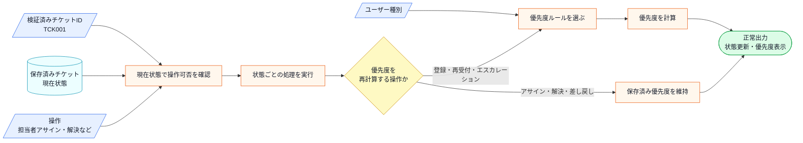
```mermaid
flowchart LR
    A[/検証済みチケットID<br>TCK001/]:::input --> D[現在状態で操作可否を確認]:::process
    C[(保存済みチケット<br>現在状態)]:::data --> D
    E[/ユーザー種別/]:::input --> F[優先度ルールを選ぶ]:::process
    G[/操作<br>担当者アサイン・解決など/]:::input --> D
    D --> H[状態ごとの処理を実行]:::process
    H --> K{優先度を<br>再計算する操作か}:::decision
    K -->|登録・再受付・エスカレーション| F
    F --> I[優先度を計算]:::process
    K -->|アサイン・解決・差し戻し| L[保存済み優先度を維持]:::process
    I --> J
    L --> J
    J([正常出力<br>状態更新・優先度表示]):::normal

    classDef data fill:#ecfeff,stroke:#0891b2,color:#111827;
    classDef input fill:#e7f0ff,stroke:#2563eb,color:#111827;
    classDef process fill:#fff7ed,stroke:#ea580c,color:#111827;
    classDef decision fill:#fef9c3,stroke:#ca8a04,color:#111827;
    classDef normal fill:#dcfce7,stroke:#16a34a,color:#111827;
```

この図から読み取ることは、次の3点です。

- 1回の操作で、現在状態による操作可否を先に判定し、必要な操作だけ優先度も再計算する。
- 状態と優先度は併せて処理されるが、状態操作は次状態、ユーザー種別ルールは優先度という別の判断を担う。
- 正常系では、更新後状態と、再計算または維持した優先度を同じ結果として表示する。

現状のシステムは、チケットの状態遷移と、ユーザー種別に応じた優先度設定という業務ルールを、一箇所にまとめて管理しています。

**チケットの状態と実行できる操作**

チケットに「状態」を持たせるのは、「今このチケットに対して何をしてよいか」を制御するためです。担当者が未アサインのチケットを勝手に解決済みにしてしまう、といったミスを防ぐために、この章のシステムでは状態ごとに許可される操作を絞っています。

| 状態 | 状態名（英語） | 実行できる操作 |
|---|---|---|
| 受付中 | Open | 担当者アサイン |
| 対応中 | InProgress | 解決・エスカレーション |
| 緊急対応中 | Escalated | 解決・差し戻し |
| 解決済み | Resolved | 再受付 |

各チケットの現在状態は、チケットID単位で保存され、操作のたびに更新・追跡されます。基本の流れは「Open → InProgress → Resolved」で、対応中に緊急対応が必要になれば「InProgress → Escalated（緊急対応中）」へ進み、そこから「解決」または「対応中へ差し戻し」ます。解決済みチケットを再度受け付ける「Resolved → Open」という逆流もあります。「一度解決したのにまた同じ問題が起きた」というケースに対応するための遷移です。

**優先度ルール**

ユーザー種別によって優先度を変えるのは、対応時間の保証（SLA）に基づくものです。プレミアムユーザーには一次回答までの時間の約束があり、その約束を優先度へ反映します。エスカレーション時にも優先度を適用し、急ぎの対応が必要になった時点で担当者を動かせるようにします。

| ユーザー種別 | 設定される優先度 | 適用タイミング |
|---|---|---|
| 一般ユーザー | 標準（Normal） | チケット登録時・再受付時・エスカレーション時 |
| プレミアムユーザー | 高優先度（High） | チケット登録時・再受付時・エスカレーション時 |

エスカレーションは、利用者自身ではなくヘルプデスク担当者が「通常対応では解決できない」と判断したときに実行する操作です。利用者区分にかかわらず `InProgress` のチケットで実行できます。状態は全利用者で `Escalated` へ進みますが、現状の優先度は利用者区分の固定ルールで再計算するため、一般はNormal、プレミアムはHighのままです。状態と優先度は別の値として扱います。

このルールは現時点では2区分です。SLAの内容はビジネス上の契約によって変わるため、区分は今後増減する場合があります。

**このシステムの関係者**

どの知識がどの業務機能に属するかを把握しておくのは、設計判断において重要な手がかりになります。「どの業務機能に属するか」が違えば、それは別々に管理できるようにしておくべき知識かもしれないからです。

**この仕様を決める業務機能**

| 業務機能 | この章の仕様で決めていること |
|---|---|
| 運用・状態管理 | 状態の追加・変更・遷移条件 |
| 品質・評価管理 | ユーザー種別と優先度の基準 |

後のフェーズで変更要求を扱うとき、どの業務機能の知識なのかを確認するための名前として使います。

**エラー条件**

正常系の仕様を一通り確認したうえで、最後に、状態更新へ進めない入力を分けて整理します。

| エラー条件 | どこで分かるか | 出力 | 保存・通知などの副作用 |
|---|---|---|---|
| チケットIDが存在しない | チケット取得時 | チケットIDエラー | 状態更新なし |
| 現在状態では操作できない | 状態と操作の組み合わせ確認時 | 操作不可エラー | 状態更新なし |

### 1-2：動作例テーブル

このシステムがどのように動くかを、代表的な操作例で示します。クラス図やコードを読む前に、「何をするシステムか」をここで確認してください。

| 行 | 操作 | 優先度結果 | 状態遷移 |
|---|---|---|---|
| 1 | TCK001を一般ユーザーが登録 | Normal | 新規→Open |
| 2 | TCK002をプレミアムユーザーが登録 | High | 新規→Open |
| 3 | TCK001へ担当者をアサイン | Normalを維持 | Open→InProgress |
| 4 | TCK001を解決 | Normalを維持 | InProgress→Resolved |
| 5 | TCK001を再オープン | Normalを再計算 | Resolved→Open |
| 6 | TCK002へ担当者をアサイン | Highを維持 | Open→InProgress |
| 7 | TCK002をエスカレーション | Highを再計算 | InProgress→Escalated |
| 8 | TCK002を解決 | Highを維持 | Escalated→Resolved |

この8行が、1-4の`main()`と実行結果へ一対一に対応する動作基準です。存在しないユーザーの登録は、正常系8行とは分けてエラー条件として確認します。


### 1-2b：状態遷移表

このシステムで管理する状態と、各状態から可能な遷移を整理します。これは、後のフェーズで状態ごとの振る舞いを確認するときの全体像です。

| 現在の状態 | 操作 | 遷移先 |
| --- | --- | --- |
| Open（受付中） | アサイン | InProgress（対応中） |
| InProgress（対応中） | 解決 | Resolved（解決済み） |
| InProgress（対応中） | エスカレーション | Escalated（緊急対応中） |
| Escalated（緊急対応中） | 解決 | Resolved（解決済み） |
| Escalated（緊急対応中） | 差し戻し | InProgress（対応中） |
| Resolved（解決済み） | 再受付 | Open（受付中） |

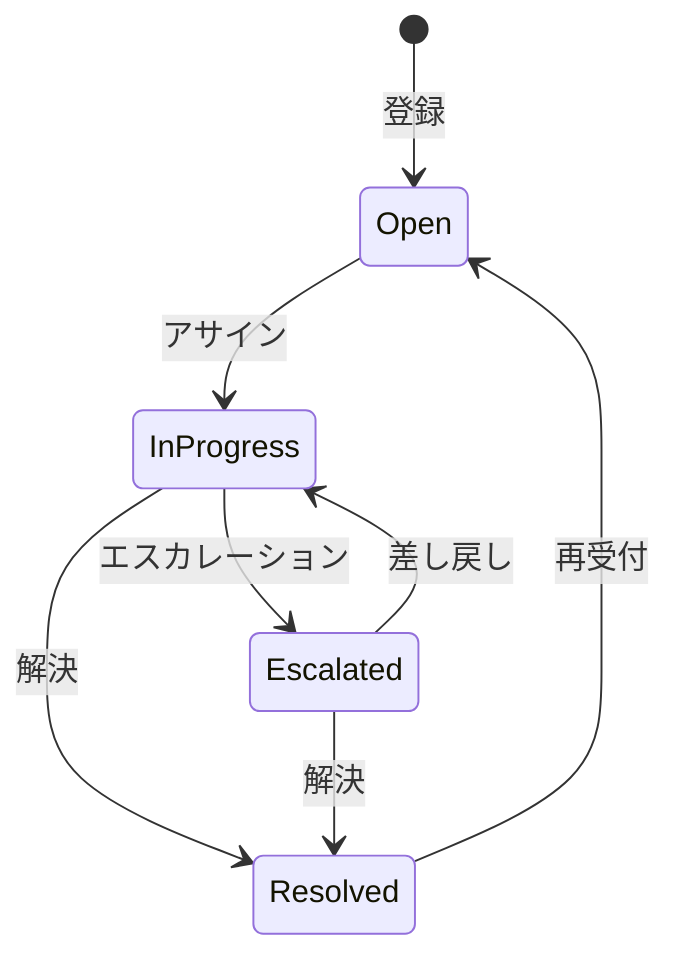
```mermaid
stateDiagram-v2
    [*] --> Open : 登録
    Open --> InProgress : アサイン
    InProgress --> Resolved : 解決
    InProgress --> Escalated : エスカレーション
    Escalated --> Resolved : 解決
    Escalated --> InProgress : 差し戻し
    Resolved --> Open : 再受付
```

「Open → InProgress → Resolved」という一方向の流れが基本ですが、対応中に緊急対応が必要になれば `Escalated`（緊急対応中）へ進み、そこから解決または対応中への差し戻しに分かれます。「解決済み → 再受付」という逆流もあります。ここでは、変更要求を先取りせず、現状の4状態と6遷移だけを確認します。

次は、この仕様を担うクラスの顔ぶれと責任を確認します。

---

### 1-3：登場クラスとクラス構成図

フェーズ1の現状コード構造に登場するクラスを先に確認します。

| クラス名 | 役割 | 担当する仕様 |
|---|---|---|
| `TicketManager` | チケット操作の受け口 | 状態遷移、操作可否、優先度計算の呼び出し |
| `Ticket` | チケット1件分の保存データ | ID・利用者・状態・優先度・担当者の受け渡し |
| `TicketRepository` | チケットの保存・取得 | 状態・優先度・担当者をID単位で保存する |
| `PriorityCalculator` | ユーザー種別から優先度を計算する | 優先度ルール |
| `UserInfo` | ユーザー1件分の情報 | 氏名・ユーザー種別の受け渡し |
| `UserDatabase` | ユーザー情報の管理 | ユーザーIDからユーザー名・ユーザー種別を検索する |

各クラスの責任を把握したところで、クラス間の関係を図で確認します。

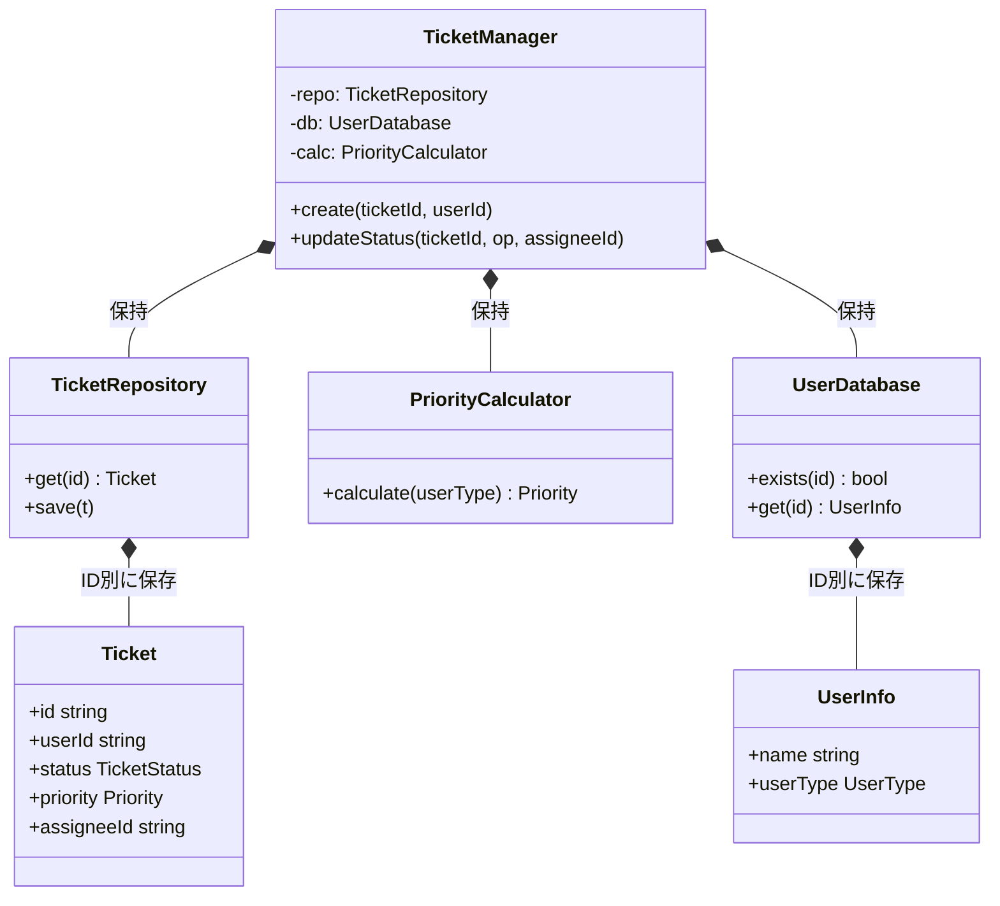
```mermaid
classDiagram
    class TicketManager {
        -repo: TicketRepository
        -db: UserDatabase
        -calc: PriorityCalculator
        +create(ticketId, userId)
        +updateStatus(ticketId, op, assigneeId)
    }
    class TicketRepository {
        +get(id) Ticket
        +save(t)
    }
    class Ticket {
        +id string
        +userId string
        +status TicketStatus
        +priority Priority
        +assigneeId string
    }
    class PriorityCalculator {
        +calculate(userType) Priority
    }
    class UserDatabase {
        +exists(id) bool
        +get(id) UserInfo
    }
    class UserInfo {
        +name string
        +userType UserType
    }
    TicketManager *-- TicketRepository : 保持
    TicketManager *-- PriorityCalculator : 保持
    TicketManager *-- UserDatabase : 保持
    TicketRepository *-- Ticket : ID別に保存
    UserDatabase *-- UserInfo : ID別に保存
```

**クラス図に出てくる主なメンバーと操作**

| クラス | メンバー・操作 | 何ができるか |
|---|---|---|
| `TicketManager` | `create()` / `updateStatus()` | チケットを登録・保存し、操作に応じて状態と優先度を更新する |
| `Ticket` | `id` / `userId` / `status` / `priority` / `assigneeId` | チケット1件分の現在状態・優先度・担当者を受け渡す |
| `TicketRepository` | `get()` / `save()` | チケットIDをキーに状態・優先度・担当者を保存・取得する |
| `PriorityCalculator` | `calculate()` | ユーザー種別から優先度を返す |
| `UserInfo` | `name` / `userType` | ユーザー1件分の氏名と利用者区分を受け渡す |
| `UserDatabase` | `exists()` / `get()` | ユーザーIDの存在確認と、氏名・ユーザー種別の取得を行う |


`TicketManager` クラスが、チケットの状態遷移と、その遷移に伴う優先度計算という異なる責務を、一つのメソッドの分岐で抱えています。状態そのものは `TicketRepository` にチケットID単位で保存され、追跡できます。

---

### 1-4：実装コード（現状）

#### コードを読む前に：クラスの責任と境界

| 対象 | 呼び出しと内部処理 | 戻り値・副作用 | 掲載上の表現 |
|---|---|---|---|
| ユーザーDB | ユーザーIDで検索する | 氏名・ユーザー種別 | `std::map`でDBを代替する |
| チケット保存庫 | チケットIDで保存・取得する | 現在状態・優先度・担当者 | `std::map`でDBを代替する |
| 優先度ルール | ユーザー種別から優先度を計算する | 優先度値（High/Normal） | 文字列で返す |
| チケット管理 | 操作を受け状態遷移を決めて保存する | 次状態・優先度更新 | `if-else`で判定する |

実システムのチケットDBと通知は省略し `std::map` で代替しますが、誰がどの操作を行い、どの状態へ変わり、どの優先度になったかはチケットID単位で保存し、追跡できるようにします。

#### 仕様入力が現状コードで使われるまで

チケットID、ユーザーID、操作、担当者IDが、どの判定と保存へ使われるかを分けて追います。

| 仕様入力 | コード上の受け取り口 | 実際に使う箇所 | 結果への現れ方 |
|---|---|---|---|
| チケットID・ユーザーID | `TicketManager::create()` | ユーザー存在確認、優先度計算、`TicketRepository` への保存 | 初期状態Openと優先度、または未登録ユーザーエラーになる |
| 操作 | `updateStatus(ticketId, op, ...)` | 現在状態ごとの `if-else` | 次状態または操作不可メッセージになる |
| 担当者ID | `updateStatus()` の `assigneeId` | assign操作でチケットへ保存する | 以後の状態更新ログへ同じ担当者が現れる |
| ユーザー種別 | `Ticket::userId` から `UserDatabase` を再参照する | 作成・escalate・reopen時の `PriorityCalculator::calculate()` | NormalまたはHighの優先度として保存される |

システムの現状の実装を確認します。コードを役割ごとに分けて読んでいきます。

**UserInfo / UserDatabase / PriorityCalculator クラス**

ユーザーマスターは1-1で示した3件（USR001〜USR003）です。次のコードの `UserDatabase` が、その氏名とユーザー種別を保持します。現状の優先度ルールは、プレミアムを高優先度、それ以外を標準とする2区分です。

この章では、画面表示・実際の通知送信・時計の実測を省略し、状態の保存と優先度の計算結果を中心に確認します。実システムなら通知や時刻取得は境界の向こうで扱いますが、掲載コードでは優先度ルールの結果と状態遷移、そしてその保存だけを追います。

```cpp
#include <iostream>
#include <string>
#include <map>

using namespace std;

// ユーザー種別。現状は一般とプレミアムの2区分。
enum class UserType {
    Standard,
    Premium
};

// 優先度。変更前後で共通して使う値。
enum class Priority {
    Normal,
    High
};

// 優先度を保存・表示用の文字列へ変換する。
string toString(Priority priority) {
    return priority == Priority::High ? "High" : "Normal";
}

// ユーザー情報
struct UserInfo {
    string name;       // 氏名
    UserType userType; // 契約区分
};

// ユーザーデータベース
class UserDatabase {
    map<string, UserInfo> records;
public:
    UserDatabase() {
        records["USR001"] = {"田中 一郎", UserType::Standard};
        records["USR002"] = {"佐藤 花子", UserType::Premium};
        records["USR003"] = {"鈴木 次郎", UserType::Standard};
    }
    bool exists(const string& id) const {
        return records.count(id) > 0;
    }
    UserInfo get(const string& id) const {
        return records.at(id);
    }
};

// 優先度ルール（変わる可能性がある）
class PriorityCalculator {
public:
    Priority calculate(UserType userType) {
        if (userType == UserType::Premium) {
            return Priority::High; // ← ルール判定を直書き
        }
        return Priority::Normal;
    }
};
```

- `UserType` と `Priority` は、現状コードの時点から使う値です。後の設計変更で突然追加する定数ではありません。今回の要求では `UserType` に法人区分だけを追加します。
- `UserInfo` は氏名とユーザー種別を持ち、`UserDatabase` はユーザーIDから検索します。実システムのユーザー管理DBを、実行中だけ有効なインメモリの登録表で代替しています。
- `PriorityCalculator` はユーザー種別から優先度を返します。現状はプレミアムを高優先度、それ以外を標準とする2区分です。

**Ticket / TicketRepository クラス（状態を保存する）**

チケットは、現在状態・優先度・担当者を持つ実体としてチケットID単位で保存されます。操作のたびに保存済みチケットを読み込んで更新します。

```cpp
// 現在状態。文字列のタイプミスを防ぐため、取り得る値を列挙する。
enum class TicketStatus {
    Open,
    InProgress,
    Escalated,
    Resolved
};

string statusName(TicketStatus status) {
    switch (status) {
    case TicketStatus::Open:       return "Open";
    case TicketStatus::InProgress: return "InProgress";
    case TicketStatus::Escalated:  return "Escalated";
    case TicketStatus::Resolved:   return "Resolved";
    }
    return "Unknown";
}

// チケット実体：状態・優先度・担当者を保持する
struct Ticket {
    string id;
    string userId;
    TicketStatus status; // 現在状態（保存される）
    Priority priority;    // 優先度（保存される）
    string assigneeId;    // 担当者（未割当は空）
};

// チケット保存庫：チケットID単位で保存・取得する
class TicketRepository {
    map<string, Ticket> store;
public:
    bool exists(const string& id) const {
        return store.count(id) > 0;
    }
    Ticket& get(const string& id) { return store.at(id); }
    void save(const Ticket& t) { store[t.id] = t; }
};
```

- `Ticket` は1件のチケットで、状態・優先度・担当者を保持します。
- `TicketRepository` はチケットIDをキーに保存・取得します。実システムのチケットDBを、実行中だけ有効なインメモリの `map` で代替しています。状態はここに残るため、操作の前後で追跡できます。

**TicketManager クラス**

```cpp
// チケット管理：状態遷移と優先度判定を1クラスに抱える
class TicketManager {
    TicketRepository repo;    // 状態を保存する
    UserDatabase db;
    PriorityCalculator calc;  // 優先度判定を直接保持
public:
    // チケットを登録して保存する
    void create(const string& ticketId, const string& userId) {
        if (!db.exists(userId)) {          // ← DBにないIDはエラー
            cout << "エラー: ユーザーID " << userId
                 << " は存在しません。" << endl;
            return;
        }
        UserInfo requester = db.get(userId);
        UserType userType = requester.userType;
        Priority priority = calc.calculate(userType); // 優先度を判定
        Ticket t{
            ticketId,
            userId,
            TicketStatus::Open,
            priority,
            ""
        };
        repo.save(t);
        cout << "[" << ticketId << "] 作成 申請者=" << requester.name
             << " 状態=Open 優先度=" << toString(priority) << endl;
    }
    // 状態遷移と優先度判定を1メソッドの分岐で行う
    void updateStatus(const string& ticketId, const string& op,
                      const string& assigneeId = "") {
        Ticket& t = repo.get(ticketId);
        TicketStatus before = t.status;
        bool changed = false;
        switch (t.status) {
        case TicketStatus::Open:
            if (op == "assign") {
                t.status = TicketStatus::InProgress;
                t.assigneeId = assigneeId;
                changed = true;
            }
            break;
        case TicketStatus::InProgress:
            if (op == "resolve") {
                t.status = TicketStatus::Resolved;
                changed = true;
            } else if (op == "escalate") {
                t.status = TicketStatus::Escalated;
                // 状態分岐の中で優先度ルールも呼ぶ
                t.priority = calc.calculate(db.get(t.userId).userType);
                changed = true;
            }
            break;
        case TicketStatus::Escalated:
            if (op == "resolve") {
                t.status = TicketStatus::Resolved;
                changed = true;
            } else if (op == "sendback") {
                t.status = TicketStatus::InProgress;
                changed = true;
            }
            break;
        case TicketStatus::Resolved:
            if (op == "reopen") {
                t.status = TicketStatus::Open;
                // 状態分岐の中で優先度ルールも呼ぶ
                t.priority = calc.calculate(db.get(t.userId).userType);
                changed = true;
            }
            break;
        }
        if (!changed) {
            cout << "[" << ticketId << "] 操作不可: 状態 "
                 << statusName(t.status)
                 << " で " << op << " はできません。" << endl;
            return;
        }
        repo.save(t);                                // 変更後を保存
        cout << "[" << ticketId << "] " << op << ": 状態 "
             << statusName(before) << " → " << statusName(t.status)
             << " 優先度=" << toString(t.priority);
        if (!t.assigneeId.empty())
            cout << " 担当=" << t.assigneeId;
        cout << endl;
    }
};
```

- `create()` はユーザーの存在を確認し、優先度を判定して、状態 `TicketStatus::Open` のチケットを保存します。
- `updateStatus()` は外側の`switch`で現在状態を分け、その内側で操作を判定します。`assign`では担当者IDを保存し、`escalate`・`reopen`の状態分岐内で優先度も再計算します。列挙型で状態値のタイプミスは防げますが、状態別処理の中へ優先度判定（`calc.calculate()`）が入り込む構造は変わりません。

**main 関数**

まず依存を組み立て、登録（鈴木standard・佐藤premiumのチケット作成）を実行します。

```cpp
int main() {
    TicketManager manager;

    // 行1: 鈴木(standard)が登録 → 標準優先度・受付中
    manager.create("TCK001", "USR003");
    // 行2: 佐藤(premium)が登録 → 高優先度・受付中
    manager.create("TCK002", "USR002");
```

登録の実行結果：

```
[TCK001] 作成 申請者=鈴木 次郎 状態=Open 優先度=Normal
[TCK002] 作成 申請者=佐藤 花子 状態=Open 優先度=High
```

続いて、TCK001の状態遷移（アサイン→解決→再受付）を実行します。

```cpp
    // 行3: TCK001をアサイン → 対応中
    manager.updateStatus("TCK001", "assign", "AGT01");
    // 行4: TCK001を解決 → 解決済み
    manager.updateStatus("TCK001", "resolve");
    // 行5: TCK001を再受付 → 受付中（優先度を再計算）
    manager.updateStatus("TCK001", "reopen");
```

TCK001の状態遷移の実行結果：

```
[TCK001] assign: 状態 Open → InProgress 優先度=Normal 担当=AGT01
[TCK001] resolve: 状態 InProgress → Resolved 優先度=Normal 担当=AGT01
[TCK001] reopen: 状態 Resolved → Open 優先度=Normal 担当=AGT01
```

続いて、TCK002の状態遷移（アサイン→エスカレーション→解決）を実行します。

```cpp
    // 行6: TCK002をアサイン → 対応中
    manager.updateStatus("TCK002", "assign", "AGT02");
    // 行7: TCK002をエスカレーション → 緊急対応中
    manager.updateStatus("TCK002", "escalate");
    // 行8: TCK002を解決 → 解決済み
    manager.updateStatus("TCK002", "resolve");
```

TCK002の状態遷移の実行結果：

```
[TCK002] assign: 状態 Open → InProgress 優先度=High 担当=AGT02
[TCK002] escalate: 状態 InProgress → Escalated 優先度=High 担当=AGT02
[TCK002] resolve: 状態 Escalated → Resolved 優先度=High 担当=AGT02
```

最後に、エラー（存在しないユーザーID）を実行し、`main()` を終了します。

```cpp
    // 存在しないユーザーID
    manager.create("TCK004", "USR999");

    return 0;
}
```

エラー（存在しないユーザーID）の実行結果：

```
エラー: ユーザーID USR999 は存在しません。
```

各ケースのコードとその実行結果をその場で並べたので、離れた `main()` と出力を行き来せずに照合できます（確認したいこと：入力・操作に応じて状態と優先度がチケットID単位で保存・更新されること）。

> [!NOTE]
> 実行結果は、1-2の動作例（行1〜行8）と存在しないユーザーのエラーに対応します。各更新行の先頭にチケットIDを出すため、`assign → resolve → reopen`がTCK001、`assign → escalate → resolve`がTCK002へ適用されたことを区別できます。状態は `TicketRepository` にチケットID単位で保存され、操作のたびに現在状態と優先度が更新されます。

このコードを見ると、`TicketManager` が優先度の計算ルール（`PriorityCalculator`）と、状態に応じたアクション（`status` の分岐）の両方を直接知り、`updateStatus()` の一つのメソッドで扱っていることが分かります。

---

> **手元で動かすには**
> このコードは1つの `.cpp` に貼り付けて、そのままコンパイル・実行できます（例：`g++ chapter09.cpp -o app && ./app`）。`main()` は自由に組み替えて構いません。`manager.create("TCK005", "USR002");` や `manager.updateStatus("TCK005", "assign", "AGT01");` の呼び出しを足せば、チケットごとの状態と優先度がその場の実行結果に表れます。現状コードへユーザーを追加するときは、`UserDatabase` の登録表へ一般またはプレミアムのレコードを足します。現状のユーザー種別は一般・プレミアムの2種類です。データはプロセス実行中だけ有効で、終了すると消えます。

### 1-5：変更要求

【運用チームと品質管理チームからの要求】
ある月曜日の朝、ヘルプデスクのマネージャーからチャットが届きました。

「お疲れ様。現在対応しているチケットシステムなんだけど、法人契約のSLA運用を始めるので、法人ユーザーのチケットは登録・再受付・エスカレーション時にHighとして扱ってほしい。それと同時に、これまではチケットのステータスは受付中・対応中・緊急対応中・解決済みだったけれど、まず『保留中』を追加したい。『ベンダー確認中』なども今後増える予定だ。なお、Openのまま一次回答期限を超えたチケットを自動でHighへ引き上げる監視は次の契約改定候補で、今回は実装対象外だ。この新しいルールと状態遷移の複雑さに、今のシステムで対応できるかな？」

この章でいう「SLAを厳格に運用する」とは、今回実装する「法人ユーザーをHighとする優先度ルール」と、次期候補の「一次回答期限超過を自動検出してHighへ引き上げる監視」を区別して管理することです。今回の変更要求は、前者の優先度ルール追加と「保留中」の状態追加という、二つの大きな柱です。期限監視は将来リスクとしてフェーズ2で記録しますが、掲載コードには入れません。

今回の二つの柱を、実行結果で判定できる変更依頼へ分けます。

| 変更依頼ID | 確定した変更内容 | 入力 | 受入条件 |
|---|---|---|---|
| 変更ID1 | 法人ユーザーを登録・再受付・エスカレーション時にHighとする | ユーザー区分、対象操作 | 3操作で法人はHighとなり、一般・プレミアムの既存結果は変わらない |
| 変更ID2 | Pending状態と、Open/InProgressからの保留、Pendingからの再受付を追加する | 保存済み状態、保留・再受付操作 | 許可された遷移だけが保存され、再受付時は変更ID1の優先度を再計算する |

#### 変更後要求ベースライン

| 要求ID | 変更種別・根拠となる変更ID | 変更後要求 | 受入条件 |
|---|---|---|---|
| 要求ID1 | 変更<br/>根拠: 変更ID1 | 一般はNormal、プレミアムと法人はHighとして優先度を計算する | 登録・再受付・エスカレーションで法人がHighになる |
| 要求ID2 | 変更<br/>根拠: 変更ID2 | 既存4状態にPendingを加え、許可された状態遷移だけを行う | Open/InProgressから保留し、Pendingから再受付できる |
| 要求ID3 | 継続<br/>根拠: 変更ID2 | チケットの状態と優先度を保存・取得する | Pendingを含む次操作が保存済み状態から始まる |
| 要求ID4 | 変更<br/>根拠: 変更ID1, 変更ID2 | 担当者割当・解決・再受付・エスカレーション・差し戻し・保留を処理する | 各操作後の状態と優先度が規則どおりになる |
| 要求ID5 | 継続<br/>根拠: — | 未登録入力・許可されない操作を拒否する | エラー時に保存状態を変えない |

**変更前→変更後の要求対照（今回変える要求IDだけ）**

現行ベースラインと変更後ベースラインを往復せずに済むよう、今回変える要求IDだけを取り出し、変更前と変更後を同じ行へ並べます。

| 要求ID | 変更前の要求（現行） | 変更後の有効要求 | 根拠変更ID |
|---|---|---|---|
| 要求ID1 | 登録ユーザーの種別から初期優先度を決める | 一般はNormal、プレミアムと法人はHighとして優先度を計算する | 変更ID1 |
| 要求ID2 | Open・InProgress・Escalated・Resolvedの状態遷移を管理する | 既存4状態にPendingを加え、許可された状態遷移だけを行う | 変更ID2 |
| 要求ID4 | 担当者割当・解決・再受付・エスカレーション・差し戻しを処理する | 担当者割当・解決・再受付・エスカレーション・差し戻し・保留を処理する | 変更ID1・変更ID2 |

要求ID3・要求ID5は継続（変更前＝変更後）のため対照表には載せません。変更後ベースラインで内容を確認できます。

**仕様変更の内容**

変更要求を受けて、現在の仕様がどう変わるかを整理します。

| 項目 | 変更前 | 変更後 |
|---|---|---|
| チケット状態の種類 | 4種類（Open / InProgress / Escalated / Resolved） | 保留中（Pending）を追加。ベンダー確認中は将来候補 |
| 優先度ルール | 一般→Normal、プレミアム→High の固定判定 | 法人→Highを追加し、登録・再受付・エスカレーション時に適用 |
| SLA期限 | 未対応 | **今回は変更なし**。一次回答期限の自動監視は次期候補 |
| 担当者割当 | Open→InProgressの操作として対応済み | **変更なし**。新状態でも操作可否を状態ごとに定める |
| 再オープン | Resolved→Openで優先度を再計算 | Pending→Openを追加し、同じ優先度ルールで再計算 |

今回変えるのは状態遷移と優先度判定です。チケット、利用者情報、チケット保存の契約は仕様変更の対象ではないため、次の共通基盤は変更前後で維持します。

| 変更対象外の共通基盤 | 変更前 | 変更後 |
|---|---|---|
| `Ticket` | チケット1件分の情報を表す | **変更なし** |
| `TicketRepository` | チケットを保存・取得する | **変更なし** |
| `UserDatabase` | 利用者情報を取得する | **変更なし** |

「状態が増える」変更と「優先度ルールが変わる」変更は、今後も別のタイミングで届く可能性があります。この2つは独立した軸として扱う必要があります。

**状態と優先度ルールの変更点**

今回の要求には、状態とルールが同じきっかけで同時に動く場面が混ざっています。2軸以上の変化が重なっても、軸を分ければ扱えるかをこの章で確認します。

| 追加する複雑さ | 具体例 | この章で見ること |
|---|---|---|
| 法人向けSLA | 法人ユーザーをHighとして扱う | 顧客区分の追加を優先度ルール側へ閉じられるか |
| 担当者割当イベント | アサイン操作でOpen→InProgressへ進める | 割当という契機と状態遷移を分けて扱えるか |
| 再オープン | Resolved→Open で再度ルール評価する | 逆流時も状態軸とルール軸が独立に動くか |
| 状態とルールの同時変化 | エスカレーションで状態進行と優先度上げが同時 | 同時に動いても2軸へ分けて追えるか |

**変更前後の入力・判定・加工・出力差分**

1-1の現状仕様を退避し、変更要求を当てた後の仕様と同じ粒度で並べます。以降の分析では、この差分を追います。

| 要素 | 変更前（1-1の現状仕様） | 変更後（今回の要求） | 差分として追うもの |
|---|---|---|---|
| 入力 | チケットID、ユーザー種別、操作、保存済みの現在状態 | 同じ入力に法人区分と保留操作を追加 | 優先度ルールと状態種類が増える |
| 判定 | 状態ごとの操作可否、一般・プレミアムの固定優先度判定 | 保留中を含む操作可否、法人を含む優先度判定 | 状態判定と優先度判定が別々に変わる |
| 加工 | 状態更新と優先度計算 | 保留・再オープンによる状態遷移と法人SLA優先度計算 | 二つの加工軸を分けて追う |
| 出力 | 更新後状態と優先度 | 保留中を含む更新後状態と法人のHigh優先度 | 出力状態と優先度区分が増える |

**変更後の状態遷移仕様**

1-2bの変更前図と同じ粒度で、今回追加する状態と遷移だけに
`【追加】`を付けます。既存の4状態と6遷移は変えません。

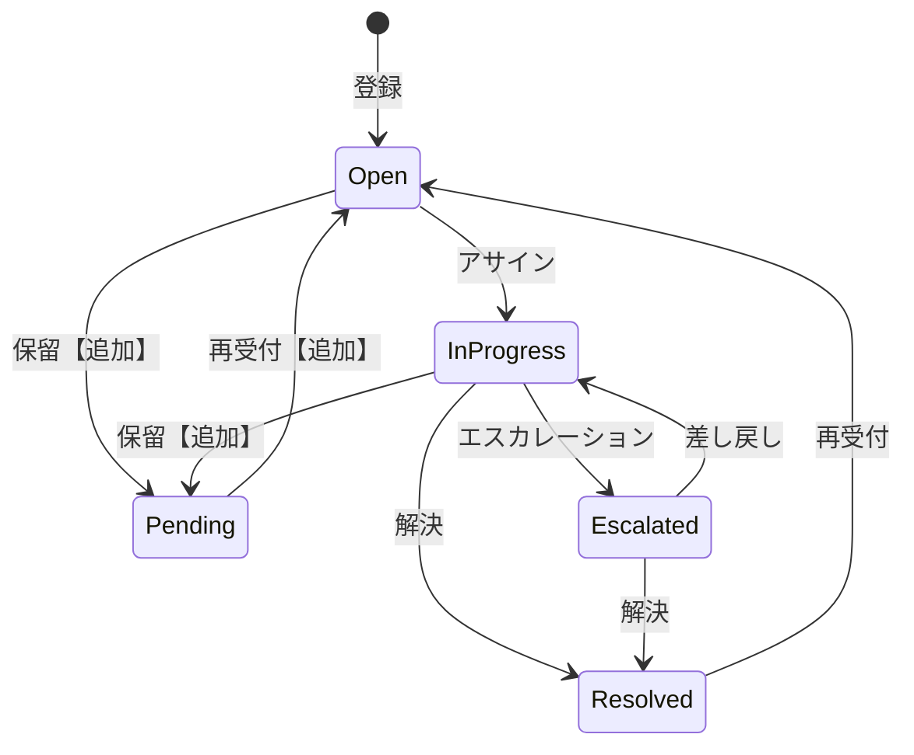
```mermaid
stateDiagram-v2
    [*] --> Open : 登録
    Open --> InProgress : アサイン
    Open --> Pending : 保留【追加】
    InProgress --> Resolved : 解決
    InProgress --> Escalated : エスカレーション
    InProgress --> Pending : 保留【追加】
    Escalated --> Resolved : 解決
    Escalated --> InProgress : 差し戻し
    Resolved --> Open : 再受付
    Pending --> Open : 再受付【追加】
```

変更箇所は `Pending` と、それにつながる保留・再受付の3遷移です。
状態が変わらない操作不可エラーは遷移ではないため、この図には加えません。

**変更後の入力・加工・出力**

変更後の仕様を、1-1のシステム内部図と同じ箱・矢印・配置で示します。薄い黄色と`【追加】`が今回変わる箇所です。保存済み状態へ保留中、ユーザー種別へ法人、操作へ保留、優先度選択へ法人向けルールが加わります。優先度を再計算する操作かを判定し、不要なら保存済み優先度を維持する流れは変更前と同じです。

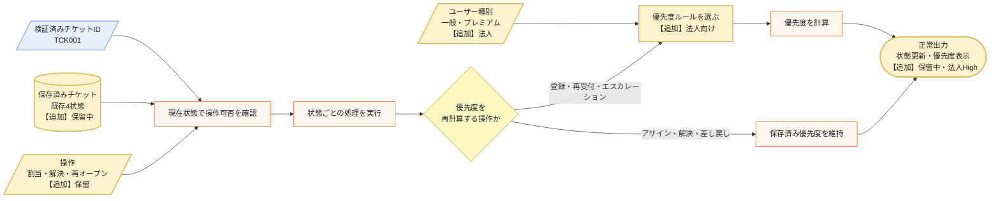
```mermaid
flowchart LR
    A[/検証済みチケットID<br>TCK001/]:::input --> D[現在状態で操作可否を確認]:::process
    C[(保存済みチケット<br>既存4状態<br>【追加】保留中)]:::data --> D
    E[/ユーザー種別<br>一般・プレミアム<br>【追加】法人/]:::input --> F[優先度ルールを選ぶ<br>【追加】法人向け]:::process
    G[/操作<br>割当・解決・再オープン<br>【追加】保留/]:::input --> D
    D --> H[状態ごとの処理を実行]:::process
    H --> K{優先度を<br>再計算する操作か}:::decision
    K -->|登録・再受付・エスカレーション| F
    F --> I[優先度を計算]:::process
    K -->|アサイン・解決・差し戻し| L[保存済み優先度を維持]:::process
    I --> J
    L --> J
    J([正常出力<br>状態更新・優先度表示<br>【追加】保留中・法人High]):::normal

    classDef data fill:#ecfeff,stroke:#0891b2,color:#111827;
    classDef input fill:#e7f0ff,stroke:#2563eb,color:#111827;
    classDef process fill:#fff7ed,stroke:#ea580c,color:#111827;
    classDef decision fill:#fef9c3,stroke:#ca8a04,color:#111827;
    classDef normal fill:#dcfce7,stroke:#16a34a,color:#111827;
    classDef changed fill:#FFF2CC,stroke:#D6B656,stroke-width:2px,color:#222222;
    class C,E,F,G,J changed;
```

この図から読み取ることは、次の3点です。

- 変更の1つ目の柱（保留状態と再オープン）は「保存済みチケット」「操作」「出力」に、2つ目の柱（法人向け優先度ルール）は「ユーザー種別」「優先度ルール」「出力」に現れる。
- エスカレーションのように状態進行と優先度上げが同時に起きても、図の上では別々の箱を通る別の流れであり、独立した軸として扱う根拠になる。
- 箱と矢印の構造、優先度を再計算しない操作で既存値を維持する処理、エラーの形は変わらない。

変更後も、失敗条件は正常系図へ混ぜずに別で確認します。

| エラー条件 | どこで分かるか | 出力 | 保存・通知などの副作用 |
|---|---|---|---|
| チケットIDが存在しない | チケット取得時 | チケットIDエラー | 状態更新なし |
| 現在状態では操作できない | 状態と操作の組み合わせ確認時 | 操作不可エラー | 状態更新なし |

2つの柱が実際のコードでどこに現れるかは、フェーズ3で変更を試すコードと、フェーズ7の最終コード・実行結果で追います。

**フェーズ1のまとめ：今回追う変更ID一覧**

このフェーズで確定した変更依頼を一覧にして締めます。フェーズ2でこの変更IDを仮説・ヒアリングへ、フェーズ3で一つずつ試して痛みへ、と順につなぎます。

| 変更ID | 変更依頼の要点 | 関係する要求ID（追加は変更後ID） |
|---|---|---|
| 変更ID1 | 法人ユーザーを登録・再受付・エスカレーション時にHighとする | 要求ID1・要求ID4 |
| 変更ID2 | Pending状態と、Open/InProgressからの保留・Pendingからの再受付を追加する | 要求ID2・要求ID3・要求ID4 |

---

## 🟣 フェーズ2：仮説立案 ―― 何が変わるかを観察し、ヒアリングで裏付ける
フェーズ1で、`TicketManager` がチケットの状態遷移と優先度計算ロジックを直接保持している現状を把握しました。届いた変更要求を踏まえ、この設計における変わる見込みと当面安定の前提を整理します。

### 2-1：変わりそうな仕様の見当をつける

ここで作る一覧は、思いつきで「変わりそう」と感じたものを並べる表ではありません。フェーズ1で確認した仕様・動作例・クラス図を材料に、次の順で候補を絞ります。

1. 仕様図と動作例から、入力・判定・加工・出力のうち条件や値が変わりそうな箇所を拾う。
2. その箇所が、1-3のどのクラス・メソッドに書かれているかを対応づける。
3. その仕様が、どんな理由で、何をきっかけに、どのくらいの頻度で変わりそうかを仮説として書く。
4. 逆に、当面変えない前提にできる処理の骨格も分けておく。

この手順で見ると、「チケットを更新する」という大きな処理全体ではなく、その中のどの優先度ルール・状態遷移・操作条件が変更候補なのかを読者自身で追えるようになります。

フェーズ2では、フェーズ1で見た仕様のうち、どの状態遷移・優先度ルール・操作条件が変わりそうかを見当づけます。責務の配置は、変更要求を当てた後の痛みと合わせて確認します。

| 仕様候補             | 仕様上の場所      | フェーズ1の現状コードでの場所                | 見立て                                    |
| ---------------- | ----------- | ------------------------------ | -------------------------------------- |
| 優先度計算ルール         | 判定、状態更新前の評価 | `TicketManager.updateStatus()` | 1-5で法人向けHighの追加が確定したため、今回の変更対象として見る |
| SLA期限による優先度引き上げ  | 判定、優先度評価    | 現状コードにはない | 1-5で次期候補とされたため、確定変更と分けてヒアリングする |
| Open状態の振る舞い・割当契機 | 状態遷移、操作条件   | `TicketManager.updateStatus()` | 新しい状態や割当・再オープンの契機が増えるため、今回見る           |
| 対応中かつ高優先度の処理     | 状態遷移、優先度判定  | `TicketManager.updateStatus()` | 状態と優先度の両方に依存する条件が変わる可能性があるため、今回見る      |

この表から、今回の検討対象は「優先度ルール」と「状態ごとの振る舞い」に絞れます。2つの変化候補が同じ条件に重なると困るかどうかは、フェーズ3で変更を入れてから確認します。

#### ヒアリングで確認すること

状態と優先度が同時に使われても、変更理由まで同じとは限りません。そこで別々に質問します。

| 見当 | 現時点の仮説 | 確認する質問 | 確認先 |
|---|---|---|---|
| 状態 | 状態ごとの操作・通知が増える | 新状態で遷移先や通知は変わるか | 運用担当者 |
| 優先度 | SLAや契約で判定が変わる | 優先度ルールはどの頻度で見直すか | 運用担当者 |
| 今回の範囲 | 期限監視は別の変更になる | 今回は法人Highまでで、期限監視は対象外か | 運用担当者 |
| 変更時期 | 状態と優先度は別々に変わる | 二つを決める担当・時期は同じか | 運用担当者 |

この質問を2-3で確認し、二つの変化軸を一つにまとめてよいかを判断します。

### 2-2：今回の変更で確実に変わること

変更要求として明示的に届いた内容と、現状把握から見えている直近の変化を整理します。今回の変更は2つの独立した軸で同時に起きています。

| **分類** | **具体的な内容** | **変わる軸** |
| --- | --- | --- |
| 🔴 **変動する** | ステータスごとの振る舞い（遷移先・アクション・割当・再オープン） | 状態遷移の軸 |
| 🔴 **変動する** | 優先度判定ルール（法人向けSLA区分の追加） | 優先度ルールの軸 |
| 🟢 **当面安定** | チケットの基本属性データ | 今回の変更要求では見直し対象にしない |

コードを読んだだけで「このルールと状態管理は分離できる」と断定するのは危険です。実際に運用を担うヘルプデスクの担当者に、この先の見通しを直接確認します。

### ヒアリングに向けた背景確認

このシステムは、社内のITヘルプデスク部門が運用するサポートチケット管理を担っています。サービスが拡大するにつれて、対応フローの複雑さが増し、特に重要顧客向けのSLA（サービスレベル合意）の厳格化が求められるようになっています。変更の主な関係者は、ビジネスルールを管理するSLA管理チームと、業務プロセスを設計する運用プロセスチームの2者です。この2者が独立して変更を決定している点が、この章の設計判断の核心になります。

### 2-3：関係者ヒアリング

仮説を持って、ヘルプデスクの運用担当者と話し合いを持ちました。

* **開発者：** 「今後『保留中』や『ベンダー確認中』といったステータスが増えるとのことですが、状態によって『できること（遷移先）』や『通知の有無』は変わりますか？」
* **運用担当者：** 「そうなんだ。例えば『ベンダー確認中』の時は、こちらから担当者への割り当ては行わず、自動通知を止める必要がある。逆に『保留中』の時は…」
* **開発者：** 「なるほど。では、重要度に応じた『優先度判定ルール』は、今後も頻繁に調整されますか？」
* **運用担当者：** 「その通り。SLAの基準は四半期ごとに見直す予定だし、顧客との契約内容によってもルールが変わる可能性があるんだよ。プレミアムユーザー向けに今後さらに細かい区分ができるかもしれない。」
* **開発者：** 「今回実装するのは法人をHighにする区分追加までで、一次回答期限の自動監視は次期候補という理解で合っていますか？」
* **運用担当者：** 「合っている。期限監視には受付時刻と現在時刻の入力、定期実行も必要になるので、要件を確定してから別途追加する。今回のコードへは混ぜないでほしい。」
* **開発者：** 「確認させてください。状態の種類が増えたとき、SLAのルールも同時に変わりますか？それとも別々に変わりますか？」
* **運用担当者：** 「決める場が別だね。SLAは四半期ごとに契約で見直すもの。状態の追加は業務プロセスの話で、半年単位でシステム側と相談して決める。ただし、エスカレーションのように両方を使う機能では接続の確認が必要だよ。」
* **開発者：** 「分かりました。状態ごとの振る舞いと、優先度の計算ルールは、それぞれ独立して頻繁に変更されるということですね。」

ヒアリングの結果、「チケットの状態ごとの振る舞い」と「優先度判定ルール」は、変更のタイミングと決定者が異なることが分かりました。SLAは四半期ごと、状態の種類追加は半年単位です。実装上は組み合わせて使う場面がありますが、変更理由は分けて扱う価値がある二つの軸です。

### 2-4：ヒアリングで判明した将来リスク

ヒアリングで「今すぐではないが将来起こりうる」と判明したリスクを確定変更とは分けて記録します。

| リスクID | 将来リスク | 時期の目安 | 根拠 |
|---|---|---|---|
| リスクID1 | プレミアムユーザーの区分細分化 | 次の契約改定時 | ヒアリング「今後さらに細かい区分ができるかもしれない」 |
| リスクID2 | 一次回答期限の自動監視 | 要件確定後（次の契約改定時） | ヒアリング「受付時刻・現在時刻・定期実行を含め、要件確定後に追加する」 |
| リスクID3 | 複数担当者による同時操作 | 日常的に発生 | ヒアリング「複数のヘルプデスク担当者が同じチケットを同時に見ることがある」 |
| リスクID4 | 新状態の追加（保留中・ベンダー確認中） | 半期以内 | ヒアリング「今後はこうした状態も増える予定」 |

なお、チケット状態の通知方法自体（画面表示から顧客向けメール・SMSへの変更）もヒアリングで話題になりましたが、今回の変更対象ではないためリスクIDには起こさず対象外として記録します。通知手段は状態遷移・優先度判定の軸とは独立した境界であり、本章で扱う二軸の分離には影響しません。

「状態遷移」という変更軸と「優先度ルール」という変更軸を、今の混沌とした `TicketManager` から切り離す必要がありそうです。フェーズ2で「何を変え、何を守るか」が確定しました。次のフェーズ3では、この変更要求を実際に今のコードで試みて、具体的にどのような問題が起きるかを明らかにします。

### 2-5：変わる見込みと当面安定の前提を確定する

2-4のリスクIDを、状態・優先度・同時更新で変えられるようにする部分と、チケット処理の安定側へ分けます。「はい」は、フェーズ6で**独立した変化軸を別々に変更しても、受付・保存・操作の入口へ影響を広げない構造か**を判定するための印です。

| リスクID・変化軸 | 変わる見込み | 変えられるようにする部分 | 当面安定として守る部分 |
|---|---|---|---|
| リスクID1：プレミアムユーザーの区分細分化 | はい | ユーザー区分から優先度を決める規則 | チケット登録・再受付・エスカレーションの入口 |
| リスクID2：一次回答期限の自動監視 | はい | 時刻の取得、期限判定、引き上げ契機 | 優先度を保存し結果へ返す流れ |
| リスクID3：複数担当者による同時操作 | はい | 更新競合の検出と排他制御 | チケットIDを使う操作契約と保存内容 |
| リスクID4：新状態の追加（保留中・ベンダー確認中） | はい | 状態固有の操作と遷移 | チケットの保存、履歴、利用者向け操作の入口 |

したがって2-5の出力は、「状態遷移・優先度判定・競合制御は独立して変えられるようにし、チケット操作と保存の契約は守る」という設計条件です。フェーズ3では変更ID1・変更ID2だけを現在の構造へ適用し、リスクIDはフェーズ6の構造評価に使います。

---

## 🟣 フェーズ3：問題特定 ―― 変更の痛みを発見する
### 3-1：変更を試みる

フェーズ2で確定した「状態遷移の増加」と「優先度判定ルールの変更」を、今のコードにそのまま実装してみることにしました。

はじめに、新しいステータス「保留中」に対応するために、`TicketManager` の `updateStatus` メソッド内にある条件分岐に新しい状態の処理を書き足します。続いて、SLAルールの変更に対応するため、`PriorityCalculator` の `calculate` メソッドも修正します。

作業を進めると、変更ID1の法人優先度と変更ID2のPending遷移が同じ条件分岐へ入りました。優先度だけを変えた箇所と状態だけを変えた箇所を分けて確認できず、二つの確定要求を一つの大きなメソッドの中で同時に考慮する必要があります。

実際に変更を加えたコードを見てみましょう。法人区分を追加するため
`UserType` に `Corporate` を足し、`UserDatabase` へ法人ユーザーUSR004を追加し、
優先度判定を変更します。現状の3件（USR001〜USR003）の区分は据え置きます。保留状態を
追加するため `TicketStatus`、`statusName()`、`updateStatus()` も変更します。
`TicketRepository` と `create()` の処理順は1-4から変えません。

> **抜粋の前提（周辺は現状のまま）：** `UserDatabase` の存在確認・ユーザー種別取得と、`TicketRepository` へのチケット保存は維持します。`Priority` と `toString()` も1-4の定義をそのまま使います。以下の `updateStatus()` は保存済みチケットを読み書きする1-4の構造へ、保留（`Pending`）の分岐を書き足したものです。

`statusName()` は、列挙型の状態をエラー表示と遷移ログへ出すための変換関数です。
この後の `操作不可`、`変更前`、`変更後` の3箇所で呼びます。`Pending` を
列挙型へ加えるだけではログに表示できないため、変換分岐にも同じ値を追加します。

```cpp
// 1-4のユーザー種別へ、変更要求の法人区分を追加する
enum class UserType {
    Standard,
    Premium,
    Corporate
};

struct UserInfo {
    string name;
    UserType userType;
};

class UserDatabase {
    map<string, UserInfo> records;
public:
    UserDatabase() {
        // 現状の3件は据え置き、変更要求の代表として法人ユーザーUSR004を追加する
        records["USR001"] = {"田中 一郎", UserType::Standard};
        records["USR002"] = {"佐藤 花子", UserType::Premium};
        records["USR003"] = {"鈴木 次郎", UserType::Standard};
        records["USR004"] = {"伊藤 四郎", UserType::Corporate};
    }
    bool exists(const string& id) const {
        return records.count(id) > 0;
    }
    UserInfo get(const string& id) const {
        return records.at(id);
    }
};

// 1-4の列挙型へ、変更要求の保留中を追加する
enum class TicketStatus {
    Open,
    InProgress,
    Escalated,
    Resolved,
    Pending
};

string statusName(TicketStatus status) {
    switch (status) {
    case TicketStatus::Open:       return "Open";
    case TicketStatus::InProgress: return "InProgress";
    case TicketStatus::Escalated:  return "Escalated";
    case TicketStatus::Resolved:   return "Resolved";
    case TicketStatus::Pending:    return "Pending";
    }
    return "Unknown";
}

// 優先度ルール（SLA改定を反映）
class PriorityCalculator {
public:
    Priority calculate(UserType userType) {
        if (userType == UserType::Premium) {
            return Priority::High;
        }
        if (userType == UserType::Corporate) { // ← 追加
            return Priority::High;
        }
        return Priority::Normal;
    }
};

// チケット管理（「保留中」状態を追加）
class TicketManager {
    TicketRepository repo;
    UserDatabase db;
    PriorityCalculator calc;
public:
    void updateStatus(const std::string& ticketId,
                      const std::string& op,
                      const std::string& assigneeId = "") {
        Ticket& t = repo.get(ticketId);
        TicketStatus before = t.status;
        bool changed = false;
        switch (t.status) {
        case TicketStatus::Open:
            if (op == "assign") {
                t.status = TicketStatus::InProgress;
                t.assigneeId = assigneeId;
                changed = true;
            } else if (op == "hold") {                // ← 追加
                t.status = TicketStatus::Pending;
                changed = true;
            }
            break;
        case TicketStatus::InProgress:
            if (op == "resolve") {
                t.status = TicketStatus::Resolved;
                changed = true;
            } else if (op == "escalate") {
                t.status = TicketStatus::Escalated;
                t.priority = calc.calculate(db.get(t.userId).userType);
                changed = true;
            } else if (op == "hold") {                // ← 追加
                t.status = TicketStatus::Pending;
                changed = true;
            }
            break;
        case TicketStatus::Escalated:
            if (op == "resolve") {
                t.status = TicketStatus::Resolved;
                changed = true;
            } else if (op == "sendback") {
                t.status = TicketStatus::InProgress;
                changed = true;
            }
            break;
        case TicketStatus::Resolved:
        case TicketStatus::Pending:                   // ← 追加
            if (op == "reopen") {
                t.status = TicketStatus::Open;
                t.priority = calc.calculate(db.get(t.userId).userType);
                changed = true;
            }
            break;
        }
        if (!changed) {
            std::cout << "[" << ticketId << "] 操作不可: 状態 "
                      << statusName(t.status)
                      << " で " << op << " はできません。"
                      << std::endl;
            return;
        }
        repo.save(t);
        std::cout << "[" << ticketId << "] " << op << ": 状態 "
                  << statusName(before) << " → " << statusName(t.status)
                  << " 優先度=" << toString(t.priority)
                  << std::endl;
    }
};
```

実行対象コード：3-1の変更試行コード（`create()` は1-4と同じ）
対応する動作例：変更要求後の代表ケース（法人登録＋保留の追加）
確認したいこと：変更要求を現状構造へ当てはめたとき、修正箇所と痛みがどこに出るか

上の差分を1-4の現状コードへ適用し、次の `main()` で代表ケースを実行します。
`create()` は1-4と同じ処理ですが、追加した法人ユーザーUSR004と優先度判定を使うため、
法人のHigh優先度が保存されます。

```cpp
int main() {
    TicketManager manager;

    manager.create("TCK010", "USR004");
    manager.updateStatus("TCK010", "hold");
    manager.updateStatus("TCK010", "reopen");

    manager.create("TCK011", "USR004");
    manager.updateStatus("TCK011", "assign", "AGT01");
    manager.updateStatus("TCK011", "hold");
    manager.updateStatus("TCK011", "reopen");

    return 0;
}
```

実行結果（法人チケットを登録し、Openからの保留とInProgressからの保留を両方試す）：

```
[TCK010] 作成 申請者=伊藤 四郎 状態=Open 優先度=High
[TCK010] hold: 状態 Open → Pending 優先度=High
[TCK010] reopen: 状態 Pending → Open 優先度=High
[TCK011] 作成 申請者=伊藤 四郎 状態=Open 優先度=High
[TCK011] assign: 状態 Open → InProgress 優先度=High
[TCK011] hold: 状態 InProgress → Pending 優先度=High
[TCK011] reopen: 状態 Pending → Open 優先度=High
```

動作は正しくなっています。変更ID2の保留は Open と InProgress の2か所へ同じ `else if (op == "hold")` を書き足すことになり、どちらか一方を書き忘れても他方は動くため、抜けに気づけません。また `Pending` を `TicketStatus` へ足しただけではログに出ないので、`statusName()` の変換分岐にも同じ値を追加しています。しかも `PriorityCalculator`（SLAルール）と `TicketManager::updateStatus()`（状態遷移）の両方を修正しており、「状態追加（保留中）」と「SLAルール変更（法人）」という2つの異なる変化が、同じ `updateStatus` メソッドの分岐と優先度呼び出しに絡み合っています。

### 3-2：変更影響グラフ

今のコードのまま変更を試みた際の影響範囲を可視化します。

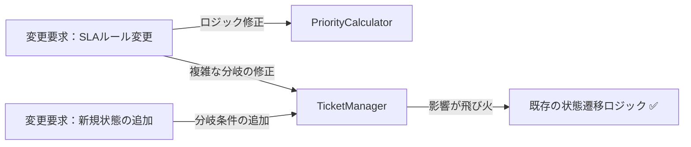
```mermaid
graph LR
    T1["変更要求：SLAルール変更"] -->|"ロジック修正"| A["PriorityCalculator"]
    T1 -->|"複雑な分岐の修正"| B["TicketManager"]
    T2["変更要求：新規状態の追加"] -->|"分岐条件の追加"| B
    B -->|"影響が飛び火"| C["既存の状態遷移ロジック ✅"]
```

グラフが示す通り、変更ID1の優先度変更と変更ID2の状態追加は、どちらも`TicketManager`を修正対象にしました。

### 3-3：痛みの言語化

「またこの巨大な `if-else` を編集するのか…」というのが、この作業を始めた瞬間の率直な感覚です。

1つ目の痛みは、このクラスが「何でも屋」になりすぎていることです。状態遷移という「振る舞い」と、優先度計算という「ビジネスルール」が密接に絡み合っているため、片方をいじると、もう片方のロジックを無意識に壊してしまう恐怖が常にあります。

2つ目の痛みは、変更の局所化ができていないことです。変更ID2のPendingを追加した際に、本来は別軸である変更ID1の優先度計算と既存遷移までテスト対象になりました。

3つ目の痛みは、状態遷移とルール判定が同じきっかけで同時に動く場面で顕在化します。エスカレーションでは「状態を進める」と「ユーザー区分から優先度を再計算する」が一度に走り、再オープンでも状態の遷移と優先度再評価が絡みます。同時に動くこと自体は要求どおりですが、それが同じ `updateStatus` の一続きの `if` に押し込まれているため、状態側の分岐を直したつもりが優先度再計算の呼び出しを落とす、といった取り違えが起きやすくなっています。

---
> **📌 問題（確定）**
> チケット管理システムでは、「優先度ルールの変更」と「状態遷移の追加」という2つの変化が、それぞれ異なる担当者の判断で独立して発生する。どちらの変化が来ても `TicketManager` を開かなければならず、無関係なロジックまで再テストを強いられる。
---

観測した痛みへ`問題ID`を付け、どの変更IDから来たかを対応づけます。この問題IDが、フェーズ4の原因ID、フェーズ5の課題IDへ順につながります。

| 問題ID | 観測した痛み（変更途中コード） | 起点の変更ID |
|---|---|---|
| 問題ID1 | 状態遷移と優先度計算が密に絡み、片方をいじると他方のロジックを無意識に壊す恐怖がある | 変更ID1・変更ID2 |
| 問題ID2 | Pending追加で、本来別軸の優先度計算と既存遷移までテスト対象になり、変更が局所化できない | 変更ID2 |
| 問題ID4 | 保留への遷移を Open と InProgress の2つの `case` へ同じ形で書き足し、`statusName()` の変換分岐にも同じ値を足した。一方だけ書き忘れても他方は動くため、抜けに気づけない | 変更ID2 |
| 問題ID3 | 状態遷移とルール判定が同じ `updateStatus` の一続きの `if` に押し込まれ、状態側を直したつもりが優先度再計算を落とす取り違えが起きる | 変更ID1・変更ID2 |

フェーズ3で「変更が辛い」という事実が確認できました。次のフェーズ4では、なぜ辛いのかを構造的に言語化します。

---

## 🟠 フェーズ4：原因分析 ―― なぜ辛いのかを構造で言語化する
フェーズ3で確認したように、チケットの「状態」が増えるたびに、チケット管理クラスのコードが肥大化し、修正のたびに予期せぬ副作用への恐怖を感じる状態にあります。ここでは、この問題の原因を構造的な観点から紐解いていきます。

### 4-1：痛みの根源を探る（観察と原因）

フェーズ3でのシミュレーションから見えてきた観察事実と、その根本にある構造的な原因を対応させます。「根本原因（構造で言語化）」の列には、「なぜ変更が辛いのか」をコードの構造として表現した原因を記載します。観察事実から「症状」ではなく「構造上の欠陥」を言語化することが、このステップの目的です。

| **根本原因（構造で言語化）** | **観察** | **変わる理由** | **分離の方向性** |
| --- | --- | --- | --- |
| **根本原因A：優先度ルールの混在** | 優先度計算ルールが変わると、チケットの状態遷移ロジックまで再テストが必要になる | ビジネスルールの変更（SLA改定・顧客区分の細分化） | ルールを差し替え可能にする分離 |
| **根本原因B：状態遷移ロジックの混在** | 新しいチケット状態を追加するたびに、管理クラスが修正される | 状態の種類の追加（保留中・ベンダー確認中など） | 状態ごとの振る舞いをオブジェクト化する分離 |

これら2つの根本原因は**互いに独立した変化軸**です。優先度ルールが変わっても状態遷移は変わりません。状態の種類が増えても優先度ルールは変わりません。独立しているからこそ、1つの構造だけでは解決しきれません。

ここで注意したいのは、エスカレーションや再オープンのように、状態遷移とルール判定が同じ操作で**同時に動く**場面があることです。同時に動くからといって、変わる理由まで一つとは限りません。状態の追加を決めるのは運用プロセスチーム、ユーザー区分や将来のSLA期限基準を決めるのはSLA管理チームで、決定者と改定タイミングは別のままです。「同じきっかけで一緒に動く」ことと「同じ理由で変わる」ことを混同すると、2軸を1つの構造へ無理に押し込む判断につながります。

コードを追うと、単に状態が増えるだけでなく、その状態によって「何をする必要があるか（通知するのか、誰に割り当てるのか）」という判定ロジックが、優先度の計算ルールと複雑に絡み合っていることが分かります。これにより、コードを変更する際に「どこからどこまでが影響範囲なのか」を直感的に捉えることが難しくなっています。

### 4-2：変わるもの/変わってほしくないもの

> **「変わらないもの」と「変わってほしくないもの」は異なります。** 「変わらないもの」は経験的事実（今まで変わっていない）、「変わってほしくないもの」は設計意図（ここを安定させてほかを守りたい）です。ここで整理するのは後者です。

構造を整理するために、変更理由の種類を分けてみます。

| **変わり続けるもの** | **変わってほしくないもの** |
| --- | --- |
| チケットの「状態ごとの振る舞い」（遷移先、アクション） | チケットの「現在の状態」を保持する基盤データ |
| 優先度判定の「ビジネスルール」（SLA基準、顧客要件） | 「状態遷移を開始する」という汎用的なインターフェース |

これまで私たちは、「チケット」という一つのオブジェクトの中に、ライフサイクルの管理（状態）と、そこから派生するビジネス上の判断（ルール）をまとめて扱っていました。状態が変わるたびにルールが動くのではなく、それぞれが別の軸として進化できるように整理する必要があります。

### 4-3：2つの接続点に漏れている知識を確認する

ここでの「確認すること」は、前節までに見つけた原因から抽出します。まず、原因文から「守りたい骨格」と「変わる差分」を分けます。次に、その差分を動かすために骨格側が知ってしまっている名前・条件・順序・型を拾います。最後に、接続点に残す最小の約束を、値・型・操作・イベントとして書きます。

原因によって、接続点で見る抽象観点は変わります。条件分岐が原因なら条件・定数・選択基準を見ます。処理手順が原因なら呼び出し順・前後条件・失敗時分岐を見ます。生成判断が原因なら具体クラス名・生成条件・登録場所を見ます。通知や外部連携が原因なら通知先・タイミング・成否の扱いを見ます。データや状態が原因なら、境界を流れる値・型・状態を見ます。

現在の`TicketManager`が、状態遷移と優先度判定について何を知っているかを確認します。

今の`TicketManager`には、状態名・遷移条件・優先度計算の条件が集まっています。状態担当とSLA担当の知識が一つのクラスへ埋め込まれています。

現在は、状態遷移・優先度計算・エスカレーション判定・割当契機の扱いが `TicketManager` の条件分岐へ集まっています。そのため、法人区分の追加のように優先度ルールだけを変える要求でも、状態遷移を含むクラス全体を確認しなければなりません。再オープンやエスカレーションで状態とルールが同時に動く行では、どちらの軸の分岐なのかが読み手に見分けづらくなっています。将来SLA期限判定を加える場合も、このままでは同じ分岐へさらに条件が増えます。

---
> **📌 原因（確定）**
> 以下の2つの独立した根本原因が重なっている：
> 1. **優先度ルールの混在**：ビジネスルールの変更による優先度計算の変化が管理クラスに波及する。
> 2. **状態遷移ロジックの混在**：状態の種類が増えるたびに、管理クラスの条件分岐が直接修正される。
>
> これらの変更理由（ルール改定と状態追加）はそれぞれ異なる頻度で発生するため、1つのクラスに混在していることで影響確認コストが発生し続ける。
---

フェーズ3の問題IDに対応づけて、構造上の原因へ`原因ID`を付けます。本章は独立した2軸なので、原因も2つに分かれます。次のフェーズ5は、この原因IDから課題IDを導きます。

| 原因ID | 構造上の原因（何が同じ責任へ集まっているか） | 対応する問題ID |
|---|---|---|
| 原因ID1 | 状態遷移ロジックの混在：状態の種類が増えるたびに `TicketManager` の条件分岐が直接修正される | 問題ID1・問題ID2・問題ID3 |
| 原因ID2 | 優先度ルールの混在：ビジネスルール改定による優先度計算の変化が管理クラスへ波及する | 問題ID1・問題ID2・問題ID3 |

3つの痛みは、この独立した2軸（状態・優先度）が同じクラスへ混在したことの複合症状です。したがって両軸の分離（課題ID1・課題ID2）で解消します。

フェーズ4で根本原因が言語化できました。次のフェーズ5では、この整理を元に、解決する課題を具体的に定義していきます。

---

## 🟡 フェーズ5：課題定義 ―― 原因から課題を検討して確定する

フェーズ4で確定した原因は、まだ課題そのものではありません。まず変えるべき構造を候補として導き、システム全体で候補の関係を整理してから、解くべき接続点を確定します。

### 5-1：原因から課題候補を洗い出す

| 原因ID・確定した事実 | そのままだと残る痛み | 課題候補 | 候補を導いた理由 |
|---|---|---|---|
| 原因ID1：チケット進行処理が全状態の操作可否・遷移を分岐する | Pending追加で既存状態と全操作を再確認する | 状態固有の振る舞いをチケット進行から分離する | 状態は独立して追加・変更される |
| 原因ID2：同じ進行処理が顧客区分ごとの優先度条件も分岐する | 法人追加で状態処理まで同時修正する | 優先度判定を状態進行から分離する | 状態と優先度は別の理由で変わる |

この段階では、解決クラス名・契約名・パターン名・生成場所を決めません。原因のどの構造を変える必要があるかだけを候補にします。

### 5-2：課題候補をシステム全体で評価する

| 課題候補 | 必要性・他候補との関係 | 統合／分割の判断 | 採否 |
|---|---|---|---|
| 状態固有動作の分離 | 必須。変更ID2の状態追加影響を局所化する | 優先度判定とは独立した変化軸 | 採用 |
| 優先度判定の分離 | 必須。変更ID1の顧客区分追加影響を局所化する | 状態が必要時に結果だけ使う接続点として残す | 採用 |

候補を一つずつ部分対策として採用するのではなく、すべてを解いた完成状態から逆算します。変更IDと課題IDは一対一とは限らないため、変更依頼の数に合わせて課題を増減させません。

### 5-3：課題IDと接続点を確定する

評価を通過した候補だけに課題ID1から欠番なくIDを付けます。

| 課題ID・接続点 | 接続するもの・変わる側 | 守る側 | 完了条件 |
|---|---|---|---|
| 課題ID1：状態固有処理とチケット進行の境界 | **接続:** 現在状態、操作、次状態、操作結果<br/>**変わる側:** 状態ごとの操作可否・遷移・副作用 | 公開操作、保存、既存状態 | 状態追加が新しい状態動作と遷移登録に閉じる |
| 課題ID2：優先度判定とチケット進行の境界 | **接続:** 顧客区分とHigh／Normalの結果<br/>**変わる側:** 顧客区分・SLA基準の判定条件 | 状態処理、公開操作、保存 | 区分追加が新しい優先度規則と登録に閉じる |

📌 **システム全体の完了状態**：チケット進行は現在状態へ操作を委ね、優先度が必要な場面だけ独立した判定結果を使う。状態追加と顧客区分追加は別々に局所変更できる。

課題IDを定義できたので、ここまでの追跡を一列で見渡します。痛みは2軸にまたがる複合症状なので、課題IDの背骨で束ねます。

| 問題ID（フェーズ3の痛み） | 原因ID（フェーズ4の構造原因） | 課題ID（達成目標） |
|---|---|---|
| 問題ID1・問題ID3：状態と優先度が同じ分岐で絡み取り違えやすい | 原因ID1：状態遷移ロジックの混在 | 課題ID1：状態固有の振る舞いをチケット進行から分離 |
| 問題ID2：状態追加で優先度計算まで再テストに巻き込まれる | 原因ID2：優先度ルールの混在 | 課題ID2：優先度判定をチケット進行から分離 |

この表と完了状態が、そのままフェーズ6の入力です。要求の受入は要求ID、設計課題の解消は課題ID、今回の変更影響は変更IDで別々に追跡します。
## 🔴 フェーズ6：対策検討 ―― システム全体の最終構造を定める

**ここからしばらくは抽象の話です。** 個々のクラスへ入る前に、この章で「何を、どんな構造へ変えるのか」を先に決めます。

#### まず全体像 ―― どんな構造へ変えるか（抽象）

フェーズ4で、一つの進行処理が「状態ごとの操作可否・遷移・副作用」と「顧客区分・SLA基準による優先度の判定ルール」という**別々の理由で変わる2つの判断**を、同じ場所へ抱えていることを確認しました。対策は、この2つを別々の責任へ分け、一つのチケット進行経路へ再結合することです。ここで使う2つの構造は、いずれも第一部で扱った基本構造です。第二部の応用編なので、構造名（と対応するパターン名）を語彙として併記しますが、パターン名から設計を選ぶのではなく、上で確認した「別々に変わる2つの判断」から必要な構造を導きます。

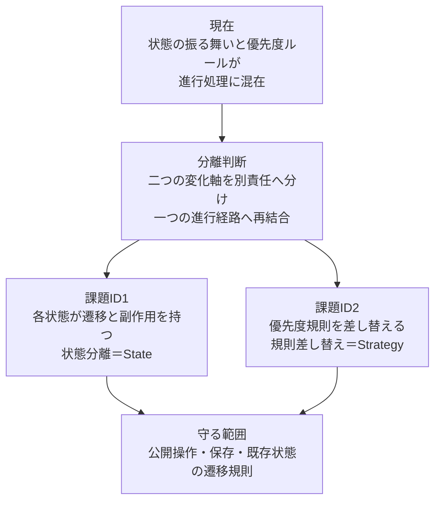
```mermaid
flowchart TB
    A[現在<br/>状態の振る舞いと優先度ルールが<br/>進行処理に混在] --> B[分離判断<br/>二つの変化軸を別責任へ分け<br/>一つの進行経路へ再結合]
    B --> C[課題ID1<br/>各状態が遷移と副作用を持つ<br/>状態分離＝State]
    B --> D[課題ID2<br/>優先度規則を差し替える<br/>規則差し替え＝Strategy]
    C --> E[守る範囲<br/>公開操作・保存・既存状態の遷移規則]
    D --> E
```

まだクラスの中身は見ません。この段階でつかんでほしいのは「状態ごとの振る舞いを状態オブジェクトへ分け（課題ID1）、優先度の判定規則を差し替え可能にして（課題ID2）、一つの進行経路へつなぐ」という筋だけです。「どのクラスが生成し、どの契約で実行するか」という具体の結論は、この後の課題ID1・課題ID2で決めていきます。決めた結論をまとめて振り返る表は、フェーズ6の末尾（6-3 設計トレース）に置きます。ここでは先に結論表を出しません。

第0章の「設計の醍醐味」の四拍子でいえば、この章は〈状態と優先度の共通契約を見つけて2軸を分離〉→〈状態オブジェクトと判定規則を生成〉→〈保持・注入〉→〈進行処理は具体を意識しない〉という同じ順序をたどります。

#### 接続点の分離・配置・組み立てを決める

| 接続点を変える観点 | システム全体の考え方 | 課題ID1・課題ID2のコードへの反映 |
|---|---|---|
| 分離方法 | チケット進行には状態操作と優先度判定の契約だけを残し、具体的な条件を外す | 課題ID1は `ITicketPhase`、課題ID2は `IPriorityRule` を境界にする |
| 配置場所 | 状態固有の判断と遷移は各Phase、SLA・顧客区分判定は各PriorityRuleへ置く | 状態クラス群とルールクラス群へ別々に配置する |
| 組み立て方法（生成・所有・登録・注入） | `TicketPolicySet` が全Phaseと全ルールを生成・所有し、遷移先を配線する。`main()` はその組み立て済み部品を `TicketService` へ注入する。Serviceは保存済みチケットを読み、抽象契約だけを利用して結果を保存する | 具体部品の生成・所有・選択を実行責任から外し、状態処理と優先度判定を一つの操作で利用する |

表の左から右へ読むと、課題ID1の状態判断と課題ID2の優先度判断が、別々の契約・配置を持ちながら、同じ生成・注入地点で一つのチケット処理へ接続されます。

#### 設計判断ごとの部分クラス図

課題ID1では、チケットが現在の`ITicketPhase`を持ち、公開サービスは状態固有の操作可否と遷移を各Phaseへ委ねます。

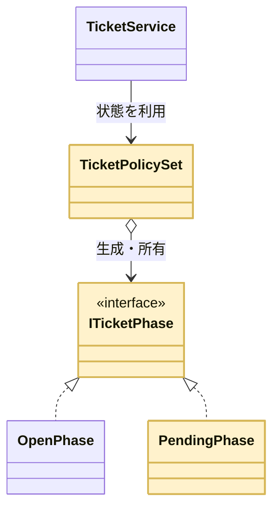
```mermaid
classDiagram
    class TicketService
    class TicketPolicySet
    class ITicketPhase { <<interface>> }
    class OpenPhase
    class PendingPhase
    TicketService --> TicketPolicySet : 状態を利用
    TicketPolicySet o--> ITicketPhase : 生成・所有
    ITicketPhase <|.. OpenPhase
    ITicketPhase <|.. PendingPhase
    class TicketPolicySet:::focus
    class ITicketPhase:::focus
    class PendingPhase:::focus
    classDef focus fill:#FFF2CC,stroke:#D6B656,stroke-width:2px
```

課題ID2では、顧客区分ごとの優先度判定を`IPriorityRule`へ分け、状態処理はHigh／Normalの結果だけを使います。

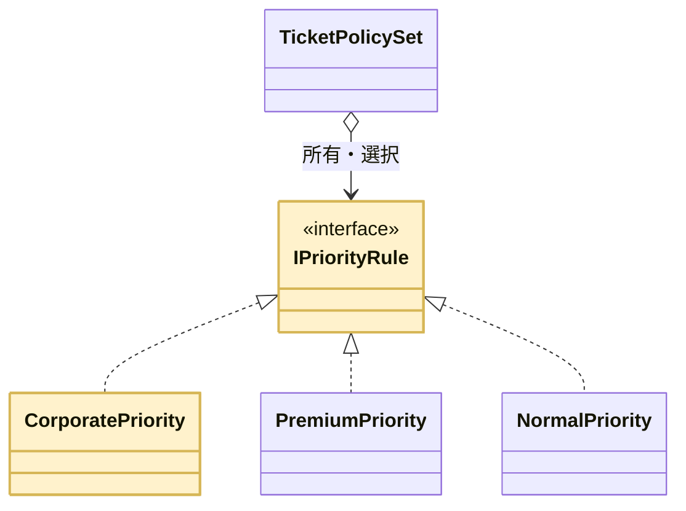
```mermaid
classDiagram
    class TicketPolicySet
    class IPriorityRule { <<interface>> }
    class CorporatePriority
    class PremiumPriority
    class NormalPriority
    TicketPolicySet o--> IPriorityRule : 所有・選択
    IPriorityRule <|.. CorporatePriority
    IPriorityRule <|.. PremiumPriority
    IPriorityRule <|.. NormalPriority
    class IPriorityRule:::focus
    class CorporatePriority:::focus
    classDef focus fill:#FFF2CC,stroke:#D6B656,stroke-width:2px
```

次のコードでは状態軸と優先度軸を別々に実装し、最後に`TicketPolicySet`で同じシステムへ組み立てます。

#### システム全体の最終構造を決める

最終構造は、`TicketPolicySet` が状態分離構造とルール差し替え構造を
組み立て、`TicketService` がその抽象契約を使う一つのシステムです。
チケット自身（`Ticket`）は現在状態・優先度・担当者を保持する実体として
`TicketRepository` に保存されます。片方だけを切り出す形は二つの課題を
完了しない途中状態なので比較しません。

### 対策検討のクラス図：1-3の責任と依存をどう変えるか

フェーズ1の1-3で作ったクラス図へフェーズ2〜5の判断を反映し、変更後の形へ更新します。

| クラス図を変える材料 | 前工程で確認したこと | クラス図へ反映すること |
|---|---|---|
| フェーズ1のクラス図 | 現在のクラス、操作、依存関係 | 変更前クラス図としてそのまま使う |
| フェーズ2の変化予測 | 状態の種類とSLA・優先度ルールは別チームが増やす | 毎回変わる責任へ `【移す】` と注記する |
| フェーズ4の原因 | `TicketManager` に状態判断と優先度判定が混在する | 同じクラスの中で `【残す】` と `【移す】` を分ける |
| フェーズ5の接続点 | 公開操作は現在状態へ委譲し、優先度は差し替え可能ルールへ委ねればよい | 課題ID1の状態判断を状態クラスへ、課題ID2の優先度判定を `IPriorityRule` へ置く |

**薄い黄色が着目クラス**です。変更前では `TicketManager` の `【残す】` と `【移す】`、変更後では移動先の `【新設】` を追います。矢印は1-3と同じ利用・実装・委譲関係です。

**変更前のクラス図（1-3を責任見直し用に再掲）：**

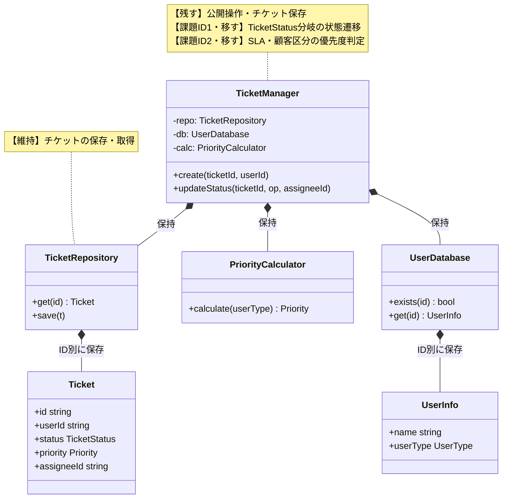
```mermaid
classDiagram
    class TicketManager {
        -repo: TicketRepository
        -db: UserDatabase
        -calc: PriorityCalculator
        +create(ticketId, userId)
        +updateStatus(ticketId, op, assigneeId)
    }
    class TicketRepository {
        +get(id) Ticket
        +save(t)
    }
    class Ticket {
        +id string
        +userId string
        +status TicketStatus
        +priority Priority
        +assigneeId string
    }
    class PriorityCalculator {
        +calculate(userType) Priority
    }
    class UserDatabase {
        +exists(id) bool
        +get(id) UserInfo
    }
    class UserInfo {
        +name string
        +userType UserType
    }
    TicketManager *-- TicketRepository : 保持
    TicketManager *-- PriorityCalculator : 保持
    TicketManager *-- UserDatabase : 保持
    TicketRepository *-- Ticket : ID別に保存
    UserDatabase *-- UserInfo : ID別に保存

    note for TicketManager "【残す】公開操作・チケット保存<br/>【課題ID1・移す】TicketStatus分岐の状態遷移<br/>【課題ID2・移す】SLA・顧客区分の優先度判定"
    note for TicketRepository "【維持】チケットの保存・取得"

    classDef focus fill:#FFF2CC,stroke:#D6B656,stroke-width:2px,color:#222222
    cssClass "TicketManager" focus
```

向きと掲載クラスは1-3から変えていません。ここでは同じ図に注記と色だけを
加え、`TicketManager` のどの責任を残し、どの責任を移すかに着目します。

課題ID1・課題ID2をクラス図の変更として書くと、次の3操作になります。

1. 課題ID1：状態が満たす共通契約 `ITicketPhase`（`assign/resolve/escalate/reopen/hold` 等が次状態を返す）を新設する。
2. 課題ID2：優先度ルールが満たす共通契約 `IPriorityRule`（`getPriority`）を新設し、各ルールを実装へ移す。
3. 課題ID1・課題ID2：`TicketPolicySet` が全Phaseと全ルールを所有・配線し、`TicketService` は注入された部品を使って保存済みチケットへ状態遷移と優先度判定を適用する。

変更後は、公開操作が状態を判定せず現在状態へ委譲し、優先度は差し替え可能なルールへ委ね、`TicketManager` の混在分岐が消えたことを確認します。

**採用した変更後のクラス図：**


```mermaid
classDiagram
    class TicketService
    class TicketPolicySet
    class TicketRepository
    class UserDatabase
    class StaffDirectory
    class TicketEventLog
    class Ticket
    class ITicketPhase { <<interface>> }
    class OpenPhase
    class InProgressPhase
    class EscalatedPhase
    class ResolvedPhase
    class PendingPhase
    class IPriorityRule { <<interface>> }
    class CorporatePriority
    class PremiumPriority
    class NormalPriority
    TicketService --> TicketRepository : チケット保存
    TicketService --> UserDatabase : 依頼者照会
    TicketService --> StaffDirectory : 担当者照会
    TicketService --> TicketEventLog : 監査記録
    TicketService --> TicketPolicySet : 状態・ルールを利用
    TicketPolicySet o--> ITicketPhase : 状態を所有・配線
    TicketPolicySet o--> IPriorityRule : ルールを所有・選択
    TicketRepository --> Ticket : 保存
    Ticket --> ITicketPhase : 現在状態
    TicketService --> ITicketPhase : 現在状態へ操作を委譲
    ITicketPhase <|.. OpenPhase
    ITicketPhase <|.. InProgressPhase
    ITicketPhase <|.. EscalatedPhase
    ITicketPhase <|.. ResolvedPhase
    ITicketPhase <|.. PendingPhase
    IPriorityRule <|.. CorporatePriority
    IPriorityRule <|.. PremiumPriority
    IPriorityRule <|.. NormalPriority

    note for ITicketPhase "【課題ID1・新設】状態ごとの振る舞いの共通契約"
    note for IPriorityRule "【課題ID2・新設】優先度判定の差し替え可能な契約"
    note for TicketPolicySet "【新設】具体状態・具体ルールを生成・所有・配線"
    note for TicketService "【新設】抽象契約を使って公開操作・保存・ログを実行"

    classDef focus fill:#FFF2CC,stroke:#D6B656,stroke-width:2px,color:#222222
    cssClass "TicketService,TicketPolicySet,ITicketPhase,OpenPhase,InProgressPhase,EscalatedPhase,ResolvedPhase,PendingPhase,IPriorityRule,CorporatePriority,PremiumPriority,NormalPriority" focus
```

クラス図の変更とコード変更を一対一で対応させると、次のようになります。

| 課題ID | クラス図をどう変えるか | コードレベルで何をするか | 詳しく解く節 |
|---|---|---|---|
| 課題ID1 | 共通契約 `ITicketPhase` を新設し、公開操作を現在状態へ委譲する | 各状態クラスが許可操作と遷移先を実装し、`TicketService` は状態を判定しない | 課題ID1節（①〜⑥） |
| 課題ID2 | 共通契約 `IPriorityRule` を新設し、区分でルールを選ぶ | 各ルールクラスがSLA・顧客区分の判定を実装し、`TicketPolicySet` が選択・所有する | 課題ID2節（①〜⑥） |

このクラス図が、課題ID1・課題ID2を反映したシステム全体の設計結論です。課題IDは図の差分を追うために使い、以降はこの構造に必要なコードだけを示します。

#### 課題箇所のおさらい（フェーズ3の関連コード）

フェーズ3で実際に変更したコードから、課題ID1の `TicketStatus` 分岐と
課題ID2の `calculate()` だけを、改行も変えずに再掲します。
`UserDatabase` のUSR004法人レコード、`TicketRepository`、`create()`、
保存とログ出力はフェーズ3のまま維持します。

```cpp
// 1-4のユーザー種別へ、変更要求の法人区分を追加する
enum class UserType {
    Standard,
    Premium,
    Corporate
};

// 1-4の列挙型へ、変更要求の保留中を追加する
enum class TicketStatus {
    Open,
    InProgress,
    Escalated,
    Resolved,
    Pending
};

string statusName(TicketStatus status) {
    switch (status) {
    case TicketStatus::Open:       return "Open";
    case TicketStatus::InProgress: return "InProgress";
    case TicketStatus::Escalated:  return "Escalated";
    case TicketStatus::Resolved:   return "Resolved";
    case TicketStatus::Pending:    return "Pending";
    }
    return "Unknown";
}

// 優先度ルール（SLA改定を反映）
class PriorityCalculator {
public:
    Priority calculate(UserType userType) {
        if (userType == UserType::Premium) {
            return Priority::High;
        }
        if (userType == UserType::Corporate) { // ← 追加
            return Priority::High;
        }
        return Priority::Normal;
    }
};

// チケット管理（「保留中」状態を追加）
class TicketManager {
    TicketRepository repo;
    UserDatabase db;
    PriorityCalculator calc;
public:
    void updateStatus(const std::string& ticketId,
                      const std::string& op,
                      const std::string& assigneeId = "") {
        Ticket& t = repo.get(ticketId);
        TicketStatus before = t.status;
        bool changed = false;
        switch (t.status) {
        case TicketStatus::Open:
            if (op == "assign") {
                t.status = TicketStatus::InProgress;
                t.assigneeId = assigneeId;
                changed = true;
            } else if (op == "hold") {                // ← 追加
                t.status = TicketStatus::Pending;
                changed = true;
            }
            break;
        case TicketStatus::InProgress:
            if (op == "resolve") {
                t.status = TicketStatus::Resolved;
                changed = true;
            } else if (op == "escalate") {
                t.status = TicketStatus::Escalated;
                t.priority = calc.calculate(db.get(t.userId).userType);
                changed = true;
            } else if (op == "hold") {                // ← 追加
                t.status = TicketStatus::Pending;
                changed = true;
            }
            break;
        case TicketStatus::Escalated:
            if (op == "resolve") {
                t.status = TicketStatus::Resolved;
                changed = true;
            } else if (op == "sendback") {
                t.status = TicketStatus::InProgress;
                changed = true;
            }
            break;
        case TicketStatus::Resolved:
        case TicketStatus::Pending:                   // ← 追加
            if (op == "reopen") {
                t.status = TicketStatus::Open;
                t.priority = calc.calculate(db.get(t.userId).userType);
                changed = true;
            }
            break;
        }
        if (!changed) {
            std::cout << "[" << ticketId << "] 操作不可: 状態 "
                      << statusName(t.status)
                      << " で " << op << " はできません。"
                      << std::endl;
            return;
        }
        repo.save(t);
        std::cout << "[" << ticketId << "] " << op << ": 状態 "
                  << statusName(before) << " → " << statusName(t.status)
                  << " 優先度=" << toString(t.priority)
                  << std::endl;
    }
};
```

### 課題ID1：状態固有の振る舞いをチケット進行から分離する

**【課題ID1の原因】** 問題ID1・問題ID3（状態と優先度が同じ分岐で絡み、状態追加のたびに `updateStatus` の巨大 `switch` を触る）＝原因ID1（状態遷移ロジックの混在）。この原因を分離対象にします。

**この課題（何を解きたいか）：** 「保留中」を1つ足すだけで、`updateStatus` の状態別 `switch` と各遷移の副作用まで抱える——問題ID1・問題ID3（痛み）／原因ID1（状態遷移の混在）です。**公開操作は状態を判定せず、状態ごとの許可操作と遷移先だけを差し替えられる**ようにするのが課題ID1です。

**どう解決するか（方針）：** 状態ごとの振る舞いを共通契約の裏へ揃え、現在状態へ操作を委譲します（状態分離構造＝State）。骨格を持たない委譲の構造なので、①契約 →③具体 →④生成 →⑤注入 →⑥実行 の順で組み立てます（②骨格は無し）。

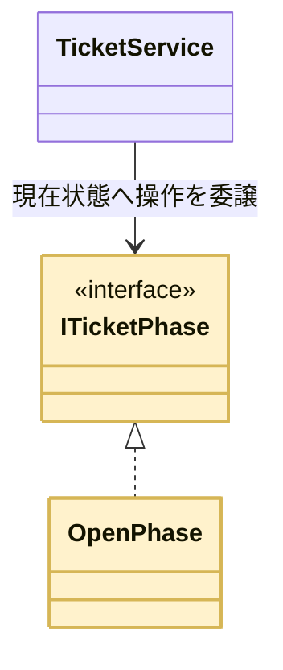
```mermaid
classDiagram
    class TicketService
    class ITicketPhase { <<interface>> }
    class OpenPhase
    TicketService --> ITicketPhase : 現在状態へ操作を委譲
    ITicketPhase <|.. OpenPhase
    class ITicketPhase:::focus
    class OpenPhase:::focus
    classDef focus fill:#FFF2CC,stroke:#D6B656,stroke-width:2px
```

**① 共通契約 `ITicketPhase` を定義する。** 各操作は「遷移先の状態」を返し、`nullptr` はその状態では不可を表します。許可されない操作は既定の `reject()` が担うので、公開操作は状態を判定しません。

```cpp
// 課題ID1接続点：状態ごとの振る舞いを共通契約にする
// 各操作は「遷移先の状態」を返す。nullptr はその状態では不可。
class ITicketPhase {
public:
    virtual ~ITicketPhase() = default;
    virtual std::string name() const = 0;
    virtual ITicketPhase* assign()   { return reject("アサイン"); }
    virtual ITicketPhase* resolve()  { return reject("解決"); }
    virtual ITicketPhase* escalate() { return reject("エスカレーション"); }
    virtual ITicketPhase* reopen()   { return reject("再受付"); }
    virtual ITicketPhase* hold()     { return reject("保留"); }
    virtual ITicketPhase* sendBack() { return reject("差し戻し"); }
protected:
    ITicketPhase* reject(const std::string& op) {
        std::cout << "  操作不可: この状態では「" << op
                  << "」できません。" << std::endl;
        return nullptr;
    }
};
```

**③ 具体状態が許可操作と遷移先だけを実装する（進行順は書かない）。** `OpenPhase` はアサインで対応中へ、保留で保留中へ進みます。`InProgressPhase`（解決・エスカレーション・保留）、`EscalatedPhase`（解決・差し戻し）、`ResolvedPhase`／`PendingPhase`（再受付）も同じ形で、許可する操作だけを上書きします。

```cpp
// 受付中：アサインで対応中へ、保留で保留中へ進む
class OpenPhase : public ITicketPhase {
    ITicketPhase* inProgress = nullptr;
    ITicketPhase* pending = nullptr;
public:
    void setInProgress(ITicketPhase* p) { inProgress = p; }
    void setPending(ITicketPhase* p)    { pending = p; }
    std::string name() const override {
        return statusName(TicketStatus::Open);
    }
    ITicketPhase* assign() override { return inProgress; }
    ITicketPhase* hold() override   { return pending; }
};
```

**④ 生成・⑤ 注入。** 具体状態の生成・所有・配線は `TicketPolicySet`（借用参照で相互接続）が持ち、`Ticket` は現在状態への借用ポインタを保持します。生成の全体像は6-1・6-2で一望します。

**⑥ 実行部は現在状態へ委譲するだけ。** `TicketService::assign()` は保存済みチケットを読み、現在状態へ `assign()` を委譲し、返った遷移先を保存します。どの状態かは知りません（コード全体は6-2）。

```cpp
Ticket& t = repo.get(ticketId);          // 保存済みを読む
ITicketPhase* next = t.phase->assign();  // ⑥ 現在状態へ委譲
if (!next) return;                       // 不可なら何もしない
t.phase = next; repo.save(t);            // 遷移後を保存
```

これで課題ID1の完了条件「状態追加が新しい状態クラスと遷移元の配線に閉じ、公開操作・保存を変えない」を満たします。課題ID2の優先度境界とは独立したまま、同じ実行経路へ接続します。

### 課題ID2：優先度判定をチケット進行から分離する

**【課題ID2の原因】** 問題ID2（状態追加で優先度計算まで再テストに巻き込まれる）＝原因ID2（優先度ルールの混在）。この原因を分離対象にします。

**この課題（何を解きたいか）：** 法人区分を1つ足すだけで、`PriorityCalculator::calculate` の `if` 連鎖を触り、状態処理の再テストまで巻き込む——問題ID2（痛み）／原因ID2（優先度ルールの混在）です。**優先度判定を、状態処理を知らずに差し替えられる**ようにするのが課題ID2です。

**どう解決するか（方針）：** 優先度判定を差し替え可能なルール契約の裏へ揃え、区分に応じて選んだルールへ委ねます（規則差し替え構造＝Strategy）。骨格を持たない委譲の構造なので、①契約 →③具体 →④生成 →⑤注入 →⑥実行 の順で組み立てます（②骨格は無し）。

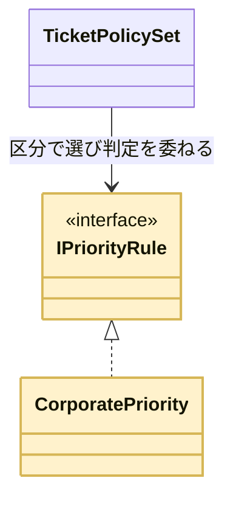
```mermaid
classDiagram
    class TicketPolicySet
    class IPriorityRule { <<interface>> }
    class CorporatePriority
    TicketPolicySet --> IPriorityRule : 区分で選び判定を委ねる
    IPriorityRule <|.. CorporatePriority
    class IPriorityRule:::focus
    class CorporatePriority:::focus
    classDef focus fill:#FFF2CC,stroke:#D6B656,stroke-width:2px
```

**① 共通契約 `IPriorityRule` を定義する。** 呼び出し側は `getPriority()` の結果 `Priority`（1-4から存在）だけを受け取り、SLA基準・顧客区分の判定を知りません。

```cpp
// 課題ID2接続点：優先度判定を差し替え可能なルールにする
class IPriorityRule {
public:
    virtual ~IPriorityRule() = default;
    virtual Priority getPriority() = 0;
};
```

**③ 具体ルールが判定だけを実装する。** `CorporatePriority`（法人向けSLA）は High を返します。`PremiumPriority`（High）・`NormalPriority`（Normal）も同じ契約を実装し、SLA改定はルール1クラスの差し替えに閉じます。

```cpp
class CorporatePriority : public IPriorityRule { // 法人向けSLA
public:
    Priority getPriority() override { return Priority::High; }
};
```

**④ 生成・⑤ 注入。** 具体ルールの生成・所有と区分による選択は `TicketPolicySet::priorityRule()` の一箇所へ閉じ、`TicketService` は組み立て済みのPolicySetを注入されて使います（生成の全体像は6-1・6-2）。

**⑥ 実行部は選ばれたルールへ委譲するだけ。** 登録・エスカレーション時に区分でルールを選び、`getPriority()` の結果を保存します。どのルールかは知りません（コード全体は6-2）。

```cpp
UserType category = users.get(userId).userType;
Priority p = policies.priorityRule(category).getPriority(); // ⑥ 委譲
```

これで課題ID2の完了条件「区分追加が新しいルールクラスと選択登録に閉じ、状態処理を変えない」を満たします。

### 6-1：生成・所有・実行順のまとめ

課題ID1・課題ID2を一本の実行経路へ束ね直します。採用するクラス図と責任配置はコードを書く前に確定しており、上の課題別展開は試行錯誤の履歴ではなく、完成構造を理解できる単位へ分けた実装順です。具体状態・具体ルールの生成、所有、配線、選択は `TicketPolicySet` に集め、`TicketService` は組み立て済みの部品を注入されて使います。

```cpp
// 課題ID1・課題ID2の組み立て：具体状態と具体ルールを生成・所有・配線する
class TicketPolicySet {
    NormalPriority normal;
    PremiumPriority premium;
    CorporatePriority corporate;
    OpenPhase openPhase;
    InProgressPhase inProgressPhase;
    EscalatedPhase escalatedPhase;
    ResolvedPhase resolvedPhase;
    PendingPhase pendingPhase;
public:
    TicketPolicySet() {
        openPhase.setInProgress(&inProgressPhase);
        openPhase.setPending(&pendingPhase);
        inProgressPhase.setResolved(&resolvedPhase);
        inProgressPhase.setEscalated(&escalatedPhase);
        inProgressPhase.setPending(&pendingPhase);
        escalatedPhase.setResolved(&resolvedPhase);
        escalatedPhase.setInProgress(&inProgressPhase);
        resolvedPhase.setOpen(&openPhase);
        pendingPhase.setOpen(&openPhase);
    }
    ITicketPhase* initialPhase() {
        return &openPhase;
    }
    IPriorityRule& priorityRule(UserType type) {
        if (type == UserType::Corporate) {
            return corporate;
        }
        if (type == UserType::Premium) {
            return premium;
        }
        return normal;
    }
};

// 安定側：組み立て済みの抽象契約を使って保存済みチケットを更新する
class TicketService {
    TicketRepository& repo;
    TicketPolicySet& policies;
public:
    TicketService(TicketRepository& r, TicketPolicySet& p)
        : repo(r), policies(p) {}
    void assign(const std::string& ticketId,
                const std::string& assigneeId) {
        Ticket& t = repo.get(ticketId);          // 保存済みを読む
        ITicketPhase* next = t.phase->assign();  // 現在状態へ委譲
        if (!next) return;                       // 不可なら何もしない
        t.phase = next;
        t.assigneeId = assigneeId;               // 担当者を保存
        repo.save(t);                            // 変更後を保存
    }
};
```

- 状態・ルール：`TicketPolicySet` が値メンバとして生成・所有し、相互接続は借用参照で配線（非所有）。
- `Ticket` が指す現在状態、`TicketService` が使うPolicySetは、いずれも借用参照であり、`TicketPolicySet` の生存期間が `TicketService` の利用期間を上回ることを6-2の組み立てで確認します。
- 優先度は登録時に確定して保存し、再受付・エスカレーション時に再計算して引き継ぎます。

### 6-2：システム全体の契約とデータ配置を確定する

採用システムの契約、生成場所、依存注入を一表で確定します。
`TicketPolicySet` は全Phaseと全ルールを値メンバとして所有します。
`TicketService` は組み立て済み部品、依頼者、担当者、保存先、監査ログを
外から受け取ります。

```cpp
// TicketService 内：選択判断を持たず、組み立て済み部品へ問い合わせる
void create(const std::string& ticketId,
            const std::string& userId) {
    UserType category = users.get(userId).userType;
    Priority p = policies.priorityRule(category).getPriority();
    Ticket t{ticketId, userId, policies.initialPhase(), p, ""};
    repo.save(t);   // 状態・優先度・担当者を1件として保存
}
```

| 接続点を変える観点 | システム全体での設計判断 | 変えたくない側が知らなくなる詳細 |
|---|---|---|
| 何を分離するか | 課題ID1の状態振る舞いを状態クラスへ、課題ID2の優先度判定をルールクラスへ置く | 状態の種類・遷移、SLA基準・顧客区分 |
| どこで生成・選択するか | `TicketPolicySet` が全Phase・全ルールを所有し、`priorityRule()` で選ぶ | 具体状態・具体ルールの生成・配線・選択 |
| どう依存を渡すか | `main()` がPolicySet、依頼者、担当者、保存先、監査ログをServiceへ注入する | 具体部品の組み立てと実体データの持ち方 |
| 安定側はどう実行するか | 利用側は `create()` や `assign()` などの操作だけを呼ぶ | 現在どの状態か、どの優先度ルールか |

状態とルールは `TicketPolicySet` が値メンバとして所有し、`main()` では
PolicySetをServiceより先に生成します。したがって、`Ticket` が指す状態の
生存期間はServiceの利用期間を上回ります。優先度は登録時に確定して保存され、
再受付・エスカレーション時に再計算して引き継ぎます。

#### システム全体のコード適用結果

| 追跡対象 | 課題定義で目指した状態 | 適用した構造とコード | 適用結果 |
|---|---|---|---|
| 課題ID1：状態処理 | 状態追加で公開操作・保存・既存状態を変えない | 状態クラスと `ITicketPhase` 委譲 | 新状態と遷移元へ変更が閉じた |
| 課題ID2：優先度判定 | ルール変更で状態処理を変えない | ルールクラスと `IPriorityRule` 注入 | 新ルールと注入へ変更が閉じた |
| 課題ID1・課題ID2を接続したシステム全体 | 二軸を独立に変え、公開操作・保存・ログを維持する | `TicketPolicySet` が具体部品を所有し、`TicketService` が抽象契約を利用する | 組み立て判断をServiceから外し、入口と副作用の位置も維持した |

**システム全体の実装結果：達成。** 課題ID1と課題ID2が一つの実行経路で接続され、フェーズ5で目指した状態を実現しました。実際の動作と変更影響はフェーズ7で確認します。

### 6-3：課題から完成構造までの設計トレース

ここまでの決定を、課題ID1→課題ID2の順に一望へまとめます。この表は設計課題だけを追います。変更要求の受入はフェーズ7の要求ID表、変更影響は7-4の変更ID表で別に確認します。

| 課題ID | 採用構造と生成・接続場所 | 完成コードの主な場所 | 確認 |
|---|---|---|---|
| 課題ID1（状態処理） | 状態分離。`TicketService`が現在Phaseへ委譲し、各状態が次状態を返す | `ITicketPhase`、`OpenPhase`／`InProgressPhase`／`PendingPhase`／`ResolvedPhase`／`EscalatedPhase` | 状態追加が新状態と遷移登録に閉じる |
| 課題ID2（優先度判定） | 規則差し替え。`TicketPolicySet`が全ルールを配線し、注入された`IPriorityRule`へ委ねる | `IPriorityRule`、`PremiumPriority`／`CorporatePriority`／`NormalPriority`、`TicketPolicySet` | 区分追加が新ルールと注入に閉じる |
| 変更対象外 | 公開操作・保存。進行入口は委譲先だけが変わる | `TicketService`の公開操作、`TicketRepository` | 1-4、保存済み状態から再開 |

このクラス図、コード適用結果、シーケンス、コード変更表が、フェーズ7へ渡す完成設計です。

### 6-4：将来リスクに対する設計上の確認

ここは将来機能を実装する場ではありません。フェーズ2のリスクIDを採用構造へ再適用し、リスクが現実になった場合の変更先と、今回守れる範囲を確認します。

| リスクID・将来リスク | 採用構造での考慮 | 将来の主な変更先 | 今回の判断 |
|---|---|---|---|
| リスクID1：プレミアムユーザーの区分細分化 | 優先度条件と値をIPriorityRule実装へ置き、状態遷移から分ける | 新PriorityRule、TicketPolicySetの選択・所有 | 状態側を守れる。将来区分は完成コードへ追加しない |
| リスクID2：一次回答期限の自動監視 | 時刻起点と状態遷移を分け、監視処理からTicketServiceの共通入口へ接続する | 時刻データ、スケジューラ、対象Phase操作 | 接続先は予測できる。監視機能は完成コードへ追加しない |
| リスクID3：複数担当者による同時操作 | 状態・担当者保存の正本をTicketRepositoryへ集めているが、競合制御契約は別途必要になる | TicketRepository、TicketServiceの更新条件 | 現構造だけでは未解決。版管理・排他仕様は確定後に設計し、完成コードへ追加しない |
| リスクID4：新状態の追加（保留中・ベンダー確認中） | ITicketPhase実装として状態を追加し、遷移選択をTicketPolicySetへ集める | 新Phase、TicketPolicySet、進入元の遷移 | 優先度Ruleを守れる。未確定状態は完成コードへ追加しない |

リスクID3のようにパターン分離だけでは解けない運用リスクも残します。リスクIDは万能性の主張ではなく、採用構造の有効範囲を示すために使います。

## 🟢 フェーズ7：対策実施 ―― 変化に強いコードを完成させる
採用した ルール差し替え構造（優先度ルールの分離）および 状態分離構造（状態ごとの振る舞いの分離）を実装し、ビジネスルールと状態固有の処理をそれぞれ独立したクラスへカプセル化します。

### 7-1：解決後のコード（全体）

優先度判定を `IPriorityRule`（ルール差し替え構造）、状態管理を `ITicketPhase`（状態分離構造）へ分離し、チケットの状態・優先度・担当者は `TicketRepository` にチケットID単位で保存します。ここで3つのIDは別物です。**チケットID（TCK…）** はチケット自身の識別子、**依頼者ID（USR…）** はトラブルを申請したユーザー、**担当者ID（AGT…）** は対応するヘルプデスク担当者です。操作はそのつど保存済みチケットを読み込んで更新し、変更前→変更後を実行ログで確認できます。

**1-4から引き継ぐ列挙型と、変更要求で追加した値**

`UserType`、`Priority`、`TicketStatus`、`statusName()` は1-4から
引き継ぎます。変更要求による差分は `Corporate` と `Pending` の追加です。
次のコードでは、7-1を単独で実行できるよう、継続する定義も含めて再掲します。
監査ログ用のイベント名だけは、完成コードでログを一貫して出すための表示語彙です。

#### 完成後のクラス一覧

完成コードで定義する型を先に一覧化します。各型の依存方向と実現関係は、直後のクラス図で確認します。

- `TicketService`、`TicketPolicySet`、`TicketRepository`、`UserDatabase`
- `StaffDirectory`、`TicketEventLog`、`Ticket`、`ITicketPhase`
- `OpenPhase`、`InProgressPhase`、`EscalatedPhase`、`ResolvedPhase`
- `PendingPhase`、`IPriorityRule`、`CorporatePriority`、`PremiumPriority`
- `NormalPriority`

#### 完成後のクラス図

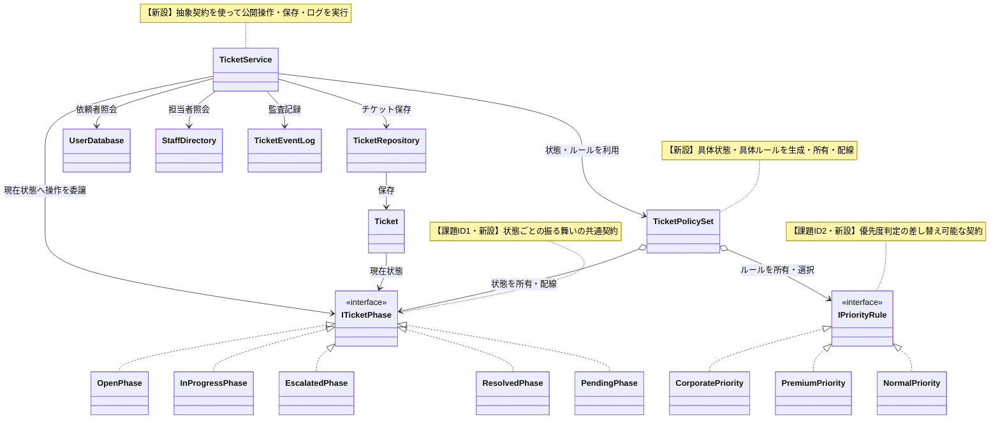
```mermaid
classDiagram
    class TicketService
    class TicketPolicySet
    class TicketRepository
    class UserDatabase
    class StaffDirectory
    class TicketEventLog
    class Ticket
    class ITicketPhase { <<interface>> }
    class OpenPhase
    class InProgressPhase
    class EscalatedPhase
    class ResolvedPhase
    class PendingPhase
    class IPriorityRule { <<interface>> }
    class CorporatePriority
    class PremiumPriority
    class NormalPriority
    TicketService --> TicketRepository : チケット保存
    TicketService --> UserDatabase : 依頼者照会
    TicketService --> StaffDirectory : 担当者照会
    TicketService --> TicketEventLog : 監査記録
    TicketService --> TicketPolicySet : 状態・ルールを利用
    TicketPolicySet o--> ITicketPhase : 状態を所有・配線
    TicketPolicySet o--> IPriorityRule : ルールを所有・選択
    TicketRepository --> Ticket : 保存
    Ticket --> ITicketPhase : 現在状態
    TicketService --> ITicketPhase : 現在状態へ操作を委譲
    ITicketPhase <|.. OpenPhase
    ITicketPhase <|.. InProgressPhase
    ITicketPhase <|.. EscalatedPhase
    ITicketPhase <|.. ResolvedPhase
    ITicketPhase <|.. PendingPhase
    IPriorityRule <|.. CorporatePriority
    IPriorityRule <|.. PremiumPriority
    IPriorityRule <|.. NormalPriority

    note for ITicketPhase "【課題ID1・新設】状態ごとの振る舞いの共通契約"
    note for IPriorityRule "【課題ID2・新設】優先度判定の差し替え可能な契約"
    note for TicketPolicySet "【新設】具体状態・具体ルールを生成・所有・配線"
    note for TicketService "【新設】抽象契約を使って公開操作・保存・ログを実行"

    classDef focus fill:#FFF2CC,stroke:#D6B656,stroke-width:2px,color:#222222
    cssClass "TicketService,TicketPolicySet,ITicketPhase,OpenPhase,InProgressPhase,EscalatedPhase,ResolvedPhase,PendingPhase,IPriorityRule,CorporatePriority,PremiumPriority,NormalPriority" focus
```

完成後は状態ごとの処理と優先度判定を分離します。`TicketPolicySet` が
具体部品を組み立て、`TicketService` は抽象契約だけを使い、`Ticket` 実体が
現在状態を保持します。この図はフェーズ6で確定した採用図と同じ定義です。

#### 完成後の実行シーケンス

ルール差し替え構造 × 状態分離構造の実行時のやり取りを、TCK002のエスカレーション（`InProgress → Escalated`）で可視化します。`TicketService` が具象クラスを知らずに抽象インターフェース経由で状態遷移と優先度判定を委譲し、結果を `TicketRepository` へ保存する流れが確認できます。

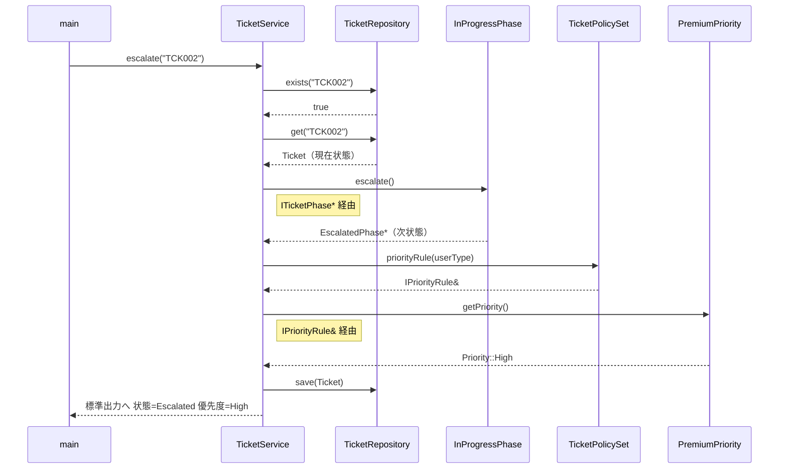
```mermaid
sequenceDiagram
    participant Main as main
    participant Svc as TicketService
    participant Repo as TicketRepository
    participant Ph as InProgressPhase
    participant Set as TicketPolicySet
    participant Rule as PremiumPriority
    Main->>Svc: escalate("TCK002")
    Svc->>Repo: exists("TCK002")
    Repo-->>Svc: true
    Svc->>Repo: get("TCK002")
    Repo-->>Svc: Ticket（現在状態）
    Svc->>Ph: escalate()
    Note right of Svc: ITicketPhase* 経由
    Ph-->>Svc: EscalatedPhase*（次状態）
    Svc->>Set: priorityRule(userType)
    Set-->>Svc: IPriorityRule&
    Svc->>Rule: getPriority()
    Note right of Svc: IPriorityRule& 経由
    Rule-->>Svc: Priority::High
    Svc->>Repo: save(Ticket)
    Svc-->>Main: 標準出力へ 状態=Escalated 優先度=High
```

---

#### 完成コード

```cpp
#include <iostream>
#include <string>
#include <vector>
#include <map>

using namespace std;

// ===== 1-4から継続する型。CorporateとPendingだけが今回の追加 =====
enum class UserType { Standard, Premium, Corporate };
enum class Priority { Normal, High };

enum class TicketStatus {
    Open,
    InProgress,
    Escalated,
    Resolved,
    Pending
};

string statusName(TicketStatus status) {
    switch (status) {
    case TicketStatus::Open:       return "Open";
    case TicketStatus::InProgress: return "InProgress";
    case TicketStatus::Escalated:  return "Escalated";
    case TicketStatus::Resolved:   return "Resolved";
    case TicketStatus::Pending:    return "Pending";
    }
    return "Unknown";
}

// イベント種別（監査ログで使う）
namespace EventType {
    const string Create   = "作成";
    const string Assign   = "アサイン";
    const string Resolve  = "解決";
    const string Escalate = "エスカレーション";
    const string Reopen   = "再受付";
    const string Hold     = "保留";
}

// 優先度を表示・保存用の文字列へ変換する
string toString(Priority p) {
    return p == Priority::High ? "High" : "Normal";
}
```

**UserInfo / UserDatabase / StaffDirectory クラス**

`UserDatabase` は依頼者（申請ユーザー）を、`StaffDirectory` は対応するヘルプデスク担当者を、それぞれ別のID体系で管理します。ユーザー種別は優先度計算に使います。

```cpp
// ===== ユーザー情報 =====
struct UserInfo {
    string name; // 氏名
    UserType userType;   // ユーザー種別（契約区分）
};

class UserDatabase {
    map<string, UserInfo> records;
public:
    UserDatabase() {
        records["USR001"] = {"田中 一郎", UserType::Standard};
        records["USR002"] = {"佐藤 花子", UserType::Premium};
        records["USR003"] = {"鈴木 次郎", UserType::Standard};
        records["USR004"] = {"伊藤 四郎", UserType::Corporate}; // 変更要求で追加した法人ユーザー
    }
    bool exists(const string& id) const { return records.count(id) > 0; }
    UserInfo get(const string& id) const { return records.at(id); }
};

// ===== ヘルプデスク担当者（依頼者USRとは別の人物） =====
class StaffDirectory {
    map<string, string> names; // 担当者ID(AGT) → 氏名
public:
    StaffDirectory() {
        names["AGT01"] = "山田 太郎";
        names["AGT02"] = "高橋 二郎";
    }
    string nameOf(const string& id) const {
        auto it = names.find(id);
        return it == names.end() ? id : it->second;
    }
};
```

**IPriorityRule と 3つの優先度ルール**

ユーザー種別ごとの優先度を、差し替え可能なルールとして切り出します。

```cpp
// ===== ルール差し替え構造：優先度計算 =====
class IPriorityRule {
public:
    virtual ~IPriorityRule() = default;
    virtual Priority getPriority() = 0;
};
class CorporatePriority : public IPriorityRule { // 法人向けSLA
public:
    Priority getPriority() override { return Priority::High; }
};
class PremiumPriority : public IPriorityRule {   // プレミアム向け
public:
    Priority getPriority() override { return Priority::High; }
};
class NormalPriority : public IPriorityRule {    // 一般向け
public:
    Priority getPriority() override { return Priority::Normal; }
};
```

**ITicketPhase インターフェース**

状態ごとの振る舞いを共通契約にします。各操作は「遷移先の状態」を返し、その状態で許可されない操作は既定で不可を通知します。

```cpp
// ===== 状態分離構造：状態別の振る舞い =====
// 各操作は「遷移先の状態」を返す。nullptr はその状態では不可。
class ITicketPhase {
public:
    virtual ~ITicketPhase() = default;
    virtual string name() const = 0;
    virtual ITicketPhase* assign()   { return reject(EventType::Assign); }
    virtual ITicketPhase* resolve()  { return reject(EventType::Resolve); }
    virtual ITicketPhase* escalate() { return reject(EventType::Escalate); }
    virtual ITicketPhase* reopen()   { return reject(EventType::Reopen); }
    virtual ITicketPhase* hold()     { return reject(EventType::Hold); }
    virtual ITicketPhase* sendBack() { return reject("差し戻し"); }
protected:
    ITicketPhase* reject(const string& op) {
        cout << "  操作不可: この状態では「" << op << "」できません。"
             << endl;
        return nullptr;
    }
};
```

**状態クラス（Open / InProgress / Escalated / Resolved / Pending）**

各状態は、自分が許可する操作だけを実装し、遷移先は組み立て時に注入されます。エスカレーション後の `Escalated`（緊急対応中）は、解決（→Resolved）と差し戻し（→InProgress）への遷移を持ちます。

```cpp
class OpenPhase : public ITicketPhase {          // 受付中
    ITicketPhase* inProgress = nullptr;
    ITicketPhase* pending = nullptr;
public:
    void setInProgress(ITicketPhase* p) { inProgress = p; }
    void setPending(ITicketPhase* p)    { pending = p; }
    string name() const override {
        return statusName(TicketStatus::Open);
    }
    ITicketPhase* assign() override { return inProgress; }
    ITicketPhase* hold() override   { return pending; }
};

class InProgressPhase : public ITicketPhase {    // 対応中
    ITicketPhase* resolved = nullptr;
    ITicketPhase* escalated = nullptr;
    ITicketPhase* pending = nullptr;
public:
    void setResolved(ITicketPhase* p)  { resolved = p; }
    void setEscalated(ITicketPhase* p) { escalated = p; }
    void setPending(ITicketPhase* p)   { pending = p; }
    string name() const override {
        return statusName(TicketStatus::InProgress);
    }
    ITicketPhase* resolve() override  { return resolved; }
    ITicketPhase* escalate() override { return escalated; }
    ITicketPhase* hold() override     { return pending; }
};

class EscalatedPhase : public ITicketPhase {     // 緊急対応中
    ITicketPhase* resolved = nullptr;
    ITicketPhase* inProgress = nullptr;
public:
    void setResolved(ITicketPhase* p)   { resolved = p; }
    void setInProgress(ITicketPhase* p) { inProgress = p; }
    string name() const override {
        return statusName(TicketStatus::Escalated);
    }
    ITicketPhase* resolve() override  { return resolved; }
    ITicketPhase* sendBack() override { return inProgress; }
};

class ResolvedPhase : public ITicketPhase {      // 解決済み
    ITicketPhase* open = nullptr;
public:
    void setOpen(ITicketPhase* p) { open = p; }
    string name() const override {
        return statusName(TicketStatus::Resolved);
    }
    ITicketPhase* reopen() override { return open; }
};

class PendingPhase : public ITicketPhase {       // 保留中
    ITicketPhase* open = nullptr;
public:
    void setOpen(ITicketPhase* p) { open = p; }
    string name() const override {
        return statusName(TicketStatus::Pending);
    }
    ITicketPhase* reopen() override { return open; }
};
```

**Ticket 実体と TicketRepository**

チケットは、現在状態・優先度・担当者を持つ実体としてリポジトリに保存されます。状態や優先度は利用者が毎回渡す入力ではなく、保存され引き継がれる値です。

```cpp
// ===== チケット実体とリポジトリ =====
struct Ticket {
    string id;
    string userId;
    ITicketPhase* phase;    // 現在状態（共有Phaseを指す）
    Priority priority;      // 保存された優先度（引き継がれる）
    string assigneeId;      // 担当者ID（未割当は空）
};

class TicketRepository {
    map<string, Ticket> store;
public:
    bool exists(const string& id) const { return store.count(id) > 0; }
    Ticket& get(const string& id) { return store.at(id); }
    void save(const Ticket& t) { store[t.id] = t; }
};
```

**TicketEventLog（監査ログ）**

作成・アサイン・解決・エスカレーション・再受付・保留のたびに1件追記し、チケットID・状態・優先度を記録します。ファイル保存はせず、実行中のメモリに保持します。

```cpp
// ===== 監査ログ =====
struct TicketEvent {
    string ticketId;
    string eventType;
    string status;
    string priority;
};
class TicketEventLog {
    vector<TicketEvent> records;
public:
    void add(const string& ticketId, const string& eventType,
             const string& status, Priority priority) {
        records.push_back({ticketId, eventType, status,
                           toString(priority)});
    }
    void printAll() const {
        for (const auto& r : records) {
            cout << "[" << r.ticketId << "] " << r.eventType
                 << " 状態=" << r.status
                 << " 優先度=" << r.priority << endl;
        }
    }
};
```

**TicketPolicySet（具体部品の組み立て）**

具体状態・具体ルールの生成、所有、配線、選択は、このクラスへ集めます。
`TicketService` は状態名やルールクラス名を知らず、組み立て済みの部品だけを
受け取ります。

```cpp
// ===== 具体状態・具体ルールの組み立てと所有 =====
class TicketPolicySet {
    NormalPriority normal;
    PremiumPriority premium;
    CorporatePriority corporate;
    OpenPhase openPhase;
    InProgressPhase inProgressPhase;
    EscalatedPhase escalatedPhase;
    ResolvedPhase resolvedPhase;
    PendingPhase pendingPhase;
public:
    TicketPolicySet() {
        openPhase.setInProgress(&inProgressPhase);
        openPhase.setPending(&pendingPhase);
        inProgressPhase.setResolved(&resolvedPhase);
        inProgressPhase.setEscalated(&escalatedPhase);
        inProgressPhase.setPending(&pendingPhase);
        escalatedPhase.setResolved(&resolvedPhase);
        escalatedPhase.setInProgress(&inProgressPhase);
        resolvedPhase.setOpen(&openPhase);
        pendingPhase.setOpen(&openPhase);
    }
    ITicketPhase* initialPhase() {
        return &openPhase;
    }
    IPriorityRule& priorityRule(UserType type) {
        if (type == UserType::Corporate) {
            return corporate;
        }
        if (type == UserType::Premium) {
            return premium;
        }
        return normal;
    }
};
```

`TicketPolicySet` の全メンバーは、初期状態の提供、遷移先の配線、
ユーザー種別に対応する優先度ルールの選択のいずれかで使われます。
具体クラス名を追加・変更するときに開く場所も、ここへまとまります。

**TicketService（ユースケースの実行）**

Serviceは公開操作を受け、検証、状態への委譲、保存、監査記録を順に行います。
具体状態の配線と具体ルールの選択は行いません。

```cpp
// ===== 実行：組み立て済み部品を使ってユースケースを進める =====
class TicketService {
    TicketRepository& repo;
    UserDatabase& users;
    StaffDirectory& staff;
    TicketEventLog& log;
    TicketPolicySet& policies;

    // 状態遷移を1回適用し、成功したら保存する共通処理
    void applyTransition(const string& ticketId, ITicketPhase* next,
                         const string& eventType) {
        if (!next) return;                 // 操作不可（rejectで通知済み）
        if (!repo.exists(ticketId)) {          // 仕様のエラー条件
            cout << "エラー: チケットID " << ticketId
                 << " は存在しません。" << endl;
            return;
        }
        Ticket& t = repo.get(ticketId);
        string before = t.phase->name();
        t.phase = next;
        repo.save(t);
        cout << "  " << eventType << ": 状態 " << before
             << " → " << t.phase->name() << endl;
        log.add(ticketId, eventType, t.phase->name(), t.priority);
    }
public:
    TicketService(TicketRepository& r, UserDatabase& u,
                  StaffDirectory& s, TicketEventLog& l,
                  TicketPolicySet& p)
        : repo(r), users(u), staff(s), log(l), policies(p) {}

    void create(const string& ticketId, const string& userId) {
        if (!users.exists(userId)) {
            cout << "エラー: ユーザーID " << userId
                 << " は存在しません。" << endl;
            return;
        }
        UserInfo requester = users.get(userId);
        UserType category = requester.userType;
        Priority p = policies.priorityRule(category).getPriority();
        Ticket t{ticketId, userId, policies.initialPhase(), p, ""};
        repo.save(t);
        cout << "[" << ticketId << "] 作成 申請者=" << requester.name
             << " 状態=" << t.phase->name()
             << " 優先度=" << toString(p) << endl;
        log.add(ticketId, EventType::Create, t.phase->name(), p);
    }
    void assign(const string& ticketId, const string& assigneeId) {
        if (!repo.exists(ticketId)) {          // 仕様のエラー条件
            cout << "エラー: チケットID " << ticketId
                 << " は存在しません。" << endl;
            return;
        }
        Ticket& t = repo.get(ticketId);
        string before = t.phase->name();
        ITicketPhase* next = t.phase->assign();
        if (!next) return;
        t.phase = next;
        t.assigneeId = assigneeId;          // 担当者を保存
        repo.save(t);
        cout << "  " << EventType::Assign << ": 状態 "
             << before << " → " << t.phase->name()
             << " 担当=" << staff.nameOf(assigneeId)
             << "(" << assigneeId << ")" << endl;
        log.add(ticketId, EventType::Assign, t.phase->name(),
                t.priority);
    }
    void resolve(const string& ticketId) {
        applyTransition(ticketId, repo.get(ticketId).phase->resolve(),
                        EventType::Resolve);
    }
    void escalate(const string& ticketId) {
        if (!repo.exists(ticketId)) {          // 仕様のエラー条件
            cout << "エラー: チケットID " << ticketId
                 << " は存在しません。" << endl;
            return;
        }
        Ticket& t = repo.get(ticketId);
        ITicketPhase* next = t.phase->escalate();
        if (!next) return;
        string before = t.phase->name();
        t.phase = next;
        // エスカレーション時に優先度を再計算して引き継ぐ
        UserType type = users.get(t.userId).userType;
        t.priority = policies.priorityRule(type).getPriority();
        repo.save(t);
        cout << "  " << EventType::Escalate << ": 状態 " << before
             << " → " << t.phase->name()
             << " 優先度=" << toString(t.priority) << endl;
        log.add(ticketId, EventType::Escalate, t.phase->name(),
                t.priority);
    }
    void sendBack(const string& ticketId) {
        if (!repo.exists(ticketId)) {          // 仕様のエラー条件
            cout << "エラー: チケットID " << ticketId
                 << " は存在しません。" << endl;
            return;
        }
        Ticket& t = repo.get(ticketId);
        ITicketPhase* next = t.phase->sendBack();
        if (!next) return;
        string before = t.phase->name();
        t.phase = next;
        repo.save(t);
        cout << "  差し戻し: 状態 " << before
             << " → " << t.phase->name() << endl;
        log.add(ticketId, "差し戻し", t.phase->name(), t.priority);
    }
    void reopen(const string& ticketId) {
        if (!repo.exists(ticketId)) {          // 仕様のエラー条件
            cout << "エラー: チケットID " << ticketId
                 << " は存在しません。" << endl;
            return;
        }
        Ticket& t = repo.get(ticketId);
        ITicketPhase* next = t.phase->reopen();
        if (!next) return;
        string before = t.phase->name();
        t.phase = next;
        // 再受付時に優先度を再計算して引き継ぐ
        UserType type = users.get(t.userId).userType;
        t.priority = policies.priorityRule(type).getPriority();
        repo.save(t);
        cout << "  " << EventType::Reopen << ": 状態 " << before
             << " → " << t.phase->name()
             << " 優先度=" << toString(t.priority) << endl;
        log.add(ticketId, EventType::Reopen, t.phase->name(),
                t.priority);
    }
    void hold(const string& ticketId) {
        applyTransition(ticketId, repo.get(ticketId).phase->hold(),
                        EventType::Hold);
    }
};
```

各メンバーの利用先を確認すると、未使用メンバーはありません。

| メンバー | 利用する処理 | Serviceに残す理由 |
|---|---|---|
| `repo` | 全操作の取得・保存 | ユースケースの副作用を確定する |
| `users` / `staff` | 依頼者検証・優先度入力・担当者表示 | 操作対象の業務データを照会する |
| `log` | 作成・遷移の監査記録 | 操作結果を同じ入口で記録する |
| `policies` | 初期状態・次状態・優先度ルールの利用 | 具体クラスを知らずに変わる処理へ委譲する |

Serviceに残る判断は「入力が存在するか」「状態操作が成功したか」という
ユースケース進行の判定です。状態別の操作可否、遷移先、SLA区分の具体判断、
具体部品の配線は外へ移っています。

**main 関数**

実行対象は7-1の完成コードです。確認したいのは、状態・優先度・担当者がチケット単位で保存・追跡され、変更理由ごとの責任が分離されていることです。ここからは行のまとまりごとに、実行するコードとその実行結果を並べます。

まず依存を組み立て、行1・行2で一般ユーザーとプレミアムユーザーがチケットを登録します。

```cpp
int main() {
    UserDatabase users;   // 依頼者（USR）
    StaffDirectory staff; // ヘルプデスク担当者（AGT）
    TicketRepository repo;
    TicketEventLog log;
    TicketPolicySet policies;
    TicketService svc(repo, users, staff, log, policies);
    cout << "--- 行1: 依頼者 鈴木(standard)がTCK001を登録 ---" << endl;
    svc.create("TCK001", "USR003");
    cout << "--- 行2: 依頼者 佐藤(premium)がTCK002を登録 ---" << endl;
    svc.create("TCK002", "USR002");
```

行1・行2の実行結果（登録時に優先度が決まり保存される）：

```
--- 行1: 依頼者 鈴木(standard)がTCK001を登録 ---
[TCK001] 作成 申請者=鈴木 次郎 状態=Open 優先度=Normal
--- 行2: 依頼者 佐藤(premium)がTCK002を登録 ---
[TCK002] 作成 申請者=佐藤 花子 状態=Open 優先度=High
```

行3〜行5で、TCK001をアサイン→解決→再受付します（状態がID単位で更新・保存される）。

```cpp
    cout << "--- 行3: TCK001に担当者 山田をアサイン ---" << endl;
    svc.assign("TCK001", "AGT01");
    cout << "--- 行4: TCK001を解決 ---" << endl;
    svc.resolve("TCK001");
    cout << "--- 行5: TCK001を再受付（優先度を再計算） ---" << endl;
    svc.reopen("TCK001");
```

行3〜行5の実行結果：

```
--- 行3: TCK001に担当者 山田をアサイン ---
  アサイン: 状態 Open → InProgress 担当=山田 太郎(AGT01)
--- 行4: TCK001を解決 ---
  解決: 状態 InProgress → Resolved
--- 行5: TCK001を再受付（優先度を再計算） ---
  再受付: 状態 Resolved → Open 優先度=Normal
```

行6〜行8で、TCK002をアサイン→エスカレーション（緊急対応中）→解決します。

```cpp
    cout << "--- 行6: TCK002に担当者 高橋をアサイン ---" << endl;
    svc.assign("TCK002", "AGT02");
    cout << "--- 行7: TCK002をエスカレーション（緊急対応中へ） ---"
         << endl;
    svc.escalate("TCK002");
    cout << "--- 行8: TCK002を解決（緊急対応中→解決済み） ---" << endl;
    svc.resolve("TCK002");
```

行6〜行8の実行結果（優先度Highが引き継がれ、Escalatedを経由する）：

```
--- 行6: TCK002に担当者 高橋をアサイン ---
  アサイン: 状態 Open → InProgress 担当=高橋 二郎(AGT02)
--- 行7: TCK002をエスカレーション（緊急対応中へ） ---
  エスカレーション: 状態 InProgress → Escalated 優先度=High
--- 行8: TCK002を解決（緊急対応中→解決済み） ---
  解決: 状態 Escalated → Resolved
```

変更要求として、法人ユーザーのTCK003を登録し保留（Pending）にします。

```cpp
    cout << "--- 変更要求: 伊藤(corporate)のTCK003を登録し保留 ---"
         << endl;
    svc.create("TCK003", "USR004");
    svc.hold("TCK003");
```

変更要求の実行結果：

```
--- 変更要求: 伊藤(corporate)のTCK003を登録し保留 ---
[TCK003] 作成 申請者=伊藤 四郎 状態=Open 優先度=High
  保留: 状態 Open → Pending
```

続けて、保留にした法人チケットを再受付し、アサインしてからエスカレーションします。変更ID1「3操作で法人はHigh」と変更ID2「再受付時は優先度を再計算する」を、同じ法人チケットで通して確認します。あわせて、InProgressからの保留（要求ID2）と、エスカレーション後の差し戻し（要求ID4）も試します。

```cpp
    cout << "--- 変更要求: TCK003を再受付し、アサイン・保留・エスカレーション ---"
         << endl;
    svc.reopen("TCK003");           // Pending → Open（優先度を再計算）
    svc.assign("TCK003", "AGT01");  // Open → InProgress
    svc.hold("TCK003");             // InProgress → Pending
    svc.reopen("TCK003");           // Pending → Open
    svc.assign("TCK003", "AGT01");
    svc.escalate("TCK003");         // InProgress → Escalated
    svc.sendBack("TCK003");         // Escalated → InProgress（差し戻し）
```

再受付・エスカレーションの実行結果：

```
--- 変更要求: TCK003を再受付し、アサイン・保留・エスカレーション ---
  再受付: 状態 Pending → Open 優先度=High
  アサイン: 状態 Open → InProgress 担当=山田 太郎(AGT01)
  保留: 状態 InProgress → Pending
  再受付: 状態 Pending → Open 優先度=High
  アサイン: 状態 Open → InProgress 担当=山田 太郎(AGT01)
  エスカレーション: 状態 InProgress → Escalated 優先度=High
  差し戻し: 状態 Escalated → InProgress
```

法人ユーザーの優先度は、作成・再受付・エスカレーションのどの操作でもHighのままです。優先度の再計算は状態遷移のたびに `TicketPolicySet` 経由で同じルールへ問い合わせるため、操作ごとに別の判定を書き足す必要がありません。保留は Open からも InProgress からも入れます。

エラー例として、存在しないユーザーIDでの登録と、現在状態で許可されていない操作を試みます。

```cpp
    cout << "--- エラー: 存在しないユーザー ---" << endl;
    svc.create("TCK004", "USR999");
    cout << "--- エラー: 許可されない操作 ---" << endl;
    svc.reopen("TCK003");           // InProgress からは再受付できない
    cout << "--- エラー: 未登録チケットID ---" << endl;
    svc.assign("TCK999", "AGT01");  // 保存されていないチケット
```

エラー例の実行結果：

```
--- エラー: 存在しないユーザー ---
エラー: ユーザーID USR999 は存在しません。
--- エラー: 許可されない操作 ---
  操作不可: この状態では「再受付」できません。
--- エラー: 未登録チケットID ---
エラー: チケットID TCK999 は存在しません。
```

許可されない操作は状態クラスが拒否し、状態も優先度も変わりません。要求ID5の受入条件はこの1行で確認できます。どの操作を許すかは各状態クラスが持つので、`TicketService` 側に「この状態のときは何ができるか」という分岐は残りません。

最後に監査ログを出力し、`main()` を終了します。

```cpp
    cout << "\n--- 監査ログ ---" << endl;
    log.printAll();
    return 0;
}
```

監査ログの実行結果：

```
--- 監査ログ ---
[TCK001] 作成 状態=Open 優先度=Normal
[TCK002] 作成 状態=Open 優先度=High
[TCK001] アサイン 状態=InProgress 優先度=Normal
[TCK001] 解決 状態=Resolved 優先度=Normal
[TCK001] 再受付 状態=Open 優先度=Normal
[TCK002] アサイン 状態=InProgress 優先度=High
[TCK002] エスカレーション 状態=Escalated 優先度=High
[TCK002] 解決 状態=Resolved 優先度=High
[TCK003] 作成 状態=Open 優先度=High
[TCK003] 保留 状態=Pending 優先度=High
[TCK003] 再受付 状態=Open 優先度=High
[TCK003] アサイン 状態=InProgress 優先度=High
[TCK003] 保留 状態=Pending 優先度=High
[TCK003] 再受付 状態=Open 優先度=High
[TCK003] アサイン 状態=InProgress 優先度=High
[TCK003] エスカレーション 状態=Escalated 優先度=High
[TCK003] 差し戻し 状態=InProgress 優先度=High
```

法人チケットTCK003の行を縦に読むと、作成・再受付・エスカレーションのいずれでも優先度がHighのままであることが追えます。変更ID1「3操作で法人はHigh」と変更ID2「再受付時は優先度を再計算する」は、この監査ログで確認できます。

行1〜8で、状態がチケットID単位で保存・追跡され、優先度が登録時に決まって以降引き継がれ（TCK002はHighのまま、再受付・エスカレーションで再計算）、担当者がアサインで保存されることを確認できます。エスカレーション（行7）では `InProgress → Escalated` へ遷移し、その後（行8）`Escalated → Resolved` へ進みます。変更要求の `Pending`（保留中）と法人向けの高優先度も落とさず追えています。

#### 変更後の状態遷移仕様との照合

1-5で確定した変更後の状態遷移仕様と、完成コードのPhase配線を照合します。
現状の4状態に `Pending` が加わり、保留と再受付の遷移が実装されています。

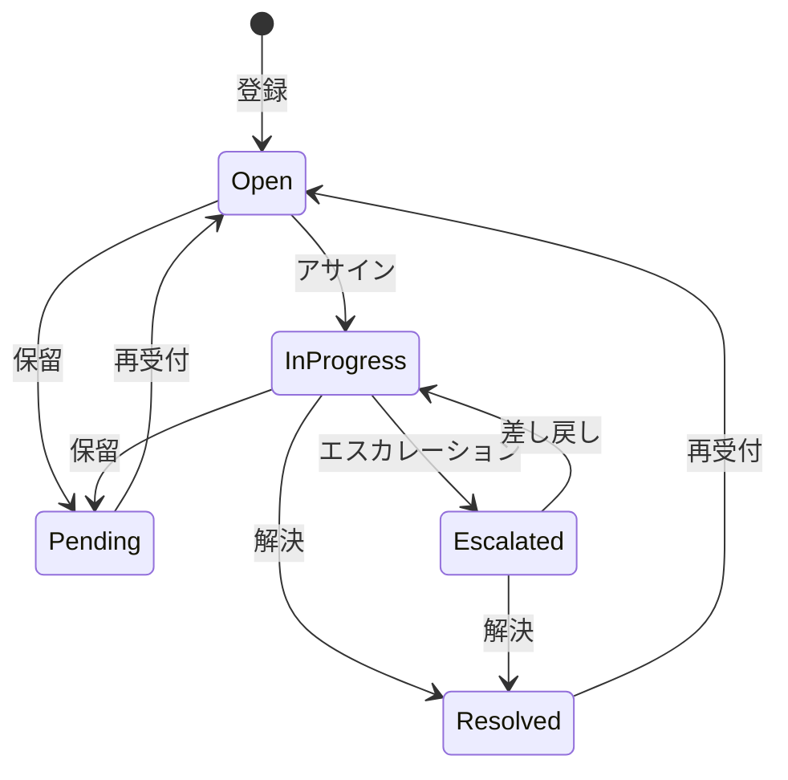
```mermaid
stateDiagram-v2
    [*] --> Open : 登録
    Open --> InProgress : アサイン
    Open --> Pending : 保留
    InProgress --> Resolved : 解決
    InProgress --> Escalated : エスカレーション
    InProgress --> Pending : 保留
    Escalated --> Resolved : 解決
    Escalated --> InProgress : 差し戻し
    Resolved --> Open : 再受付
    Pending --> Open : 再受付
```

エスカレーション（`InProgress → Escalated`）の後は、解決（`Escalated → Resolved`）か、対応中への差し戻し（`Escalated → InProgress`）へ進みます。各遷移は対応する `ITicketPhase` 実装が「遷移先の状態」を返すことで表現され、許可されない操作は次状態を返さず状態が変わりません。状態が変わらないエラー（存在しないユーザー・不可操作）はこの図に含めず、実行結果とエラー条件表で扱います。

#### 最終要求の実装・受入エビデンス

変更後要求ベースラインの全有効要求IDを同じ順序で照合します。今回変わらなかった既存要求も対象にするため、要求の消失を検出できます。

| 要求ID | 最終要求 | 適用コード | 実行シナリオ・観測結果・判定 |
|---|---|---|---|
| 要求ID1 | 一般はNormal、プレミアムと法人はHighとして優先度を計算する | 各`IPriorityRule`、`TicketPolicySet` | 監査ログのTCK003で作成・再受付・エスカレーションとも法人High<br/>**判定:** 合格 |
| 要求ID2 | 既存4状態にPendingを加え、許可された状態遷移だけを行う | 各`ITicketPhase` | TCK003でOpen→Pending、InProgress→Pending、Pending→Openを実行<br/>**判定:** 合格 |
| 要求ID3 | チケットの状態と優先度を保存・取得する | `TicketRepository` | Pendingを含む次操作が保存状態から開始<br/>**判定:** 合格 |
| 要求ID4 | 担当者割当・解決・再受付・エスカレーション・差し戻し・保留を処理する | `TicketService`、各Phase | TCK003で6操作を通し、状態・優先度が規則どおり。差し戻しはEscalated→InProgress<br/>**判定:** 合格 |
| 要求ID5 | 未登録入力・許可されない操作を拒否する | 各Directory・Phase、`TicketRepository::exists()` | 未登録USR999と未登録TCK999を拒否し、InProgressからの再受付は「操作不可」で状態不変<br/>**判定:** 合格 |

上の表は継続（要求ID3・要求ID5）・変更（要求ID1・要求ID2・要求ID4）を同じ順序で並べ、変わらなかった既存要求も回帰対象に含めています。継続要求が合格していることで、既存動作が落ちていないことを確認できます。要求の受入・回帰はここで完了します。課題IDへ直接対応付けず、以下では変更試行の痛みから導いた構造課題だけを別に確認します。

#### 設計課題の構造改善結果

要求の受入とは分けて、課題IDごとに構造と変更影響を確認します。

| 課題ID | 構造差分・コード適用先 | 確認できた効果 | 残る変更先 |
|---|---|---|---|
| 課題ID1 | 状態動作を各`ITicketPhase`へ分離 | Pending追加が新Phaseと配線に閉じた | 新Phaseと遷移登録 |
| 課題ID2 | 優先度条件を各`IPriorityRule`へ分離 | 法人追加が新RuleとPolicySet設定に閉じた | 新Ruleと設定 |
#### 変更前→変更後の不変条件照合

| 変更対象外 | 変更前 | 変更後 | 確認根拠 |
|---|---|---|---|
| チケット保存 | `TicketRepository` に `Ticket` を保存 | 同じID・本文・状態データを保存 | 1-4と7-1の取得・保存コード |
| 利用者情報 | `UserDatabase` から区分を取得 | 同じ利用者IDからRule入力へ渡す | 法人ケースの実行結果 |

### 7-2：動作シーケンス図の検証

完成クラス図と実行シーケンスは、完成コードへ入る前に示しました。ここまでのコード、要求追跡表、不変条件照合を証拠として、次節で変更影響を再確認します。

### 7-3：変更影響グラフ（改善後）

フェーズ3で確認した「変更要求：状態追加」と「SLAルール変更」のシナリオを、3-2と同じ粒度で再度適用します。

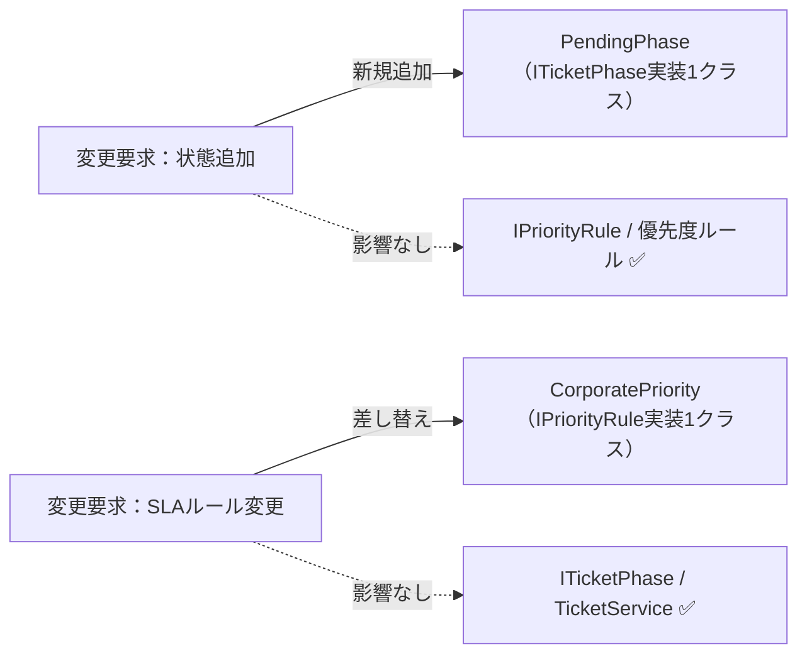
```mermaid
graph LR
    T1["変更要求：状態追加"]
        -->|新規追加| N1["PendingPhase<br>（ITicketPhase実装1クラス）"]
    T2["変更要求：SLAルール変更"]
        -->|差し替え| N2["CorporatePriority<br>（IPriorityRule実装1クラス）"]
    T1 -. "影響なし" .-> A["IPriorityRule / 優先度ルール ✅"]
    T2 -. "影響なし" .-> B["ITicketPhase / TicketService ✅"]
```

フェーズ3の変更影響グラフと同じ要求・同じ粒度で比べると、課題ID1の状態追加は `ITicketPhase` の実装と `TicketPolicySet` の配線へ、課題ID2のSLAルール変更は `IPriorityRule` の実装と同じ組み立て箇所へ限定されました。`TicketService` は注入された契約へ操作ごとに委譲するため、片方の変更判断がもう片方へ入り込みません。

| 3-2で影響した場所 | 修正後 | 構造変更との対応 |
|---|---|---|
| `updateStatus()` の `op` 文字列分岐と `status` の switch（課題ID1） | **修正しない** | 振る舞いを各状態クラスへ移した |
| `calculate()` のSLA・顧客区分判定（課題ID2） | ルール1クラスを差し替える | 優先度判定をルール差し替え構造へ移した |
| 3-2には状態・ルールの契約がなかった | `ITicketPhase`／`IPriorityRule` へ実装を1つずつ追加 | 変更先を新しく作った |

### 7-4：変更シナリオ表

今回の変更ID1・変更ID2について、フェーズ1の構造で必要だった修正と完成構造の結果を対比します。

| 変更依頼 | フェーズ1の現状構造での影響 | 完成構造での結果 |
| --- | --- | --- |
| 変更ID1：法人ユーザーを登録・再受付・エスカレーション時にHighとする | `TicketManager`の3操作へ法人判定を追加 | `CorporatePriority`へ判定を集め、3操作でHigh、一般・プレミアムは従来結果になることを確認 |
| 変更ID2：Pending状態と、Open/InProgressからの保留、Pendingからの再受付を追加する | `TicketManager`の状態分岐と各操作を修正 | `PendingPhase`へ状態固有の遷移を置き、許可された遷移だけ保存し、再受付時に変更ID1を再評価 |

状態と優先度を別の契約へ分けた代わりに、インターフェース、具象クラス、組み立てを管理するコストを引き受けます。


---

## 整理

### 問題・原因・課題・解決策

| | 内容 |
|---|---|
| **問題** | チケット管理で「優先度ルールの変更」と「状態遷移の追加」という変わる理由が異なる2つの変化が、同じ `TicketManager` に混在している |
| **原因** | `TicketManager` が `PriorityCalculator` と状態遷移ロジックを「クラス名と条件を呼び出し元が知る」で保持しているため、どちらの変化が来ても両方への影響確認が必要になる |
| **課題** | 状態ごとの振る舞い（接続点A）と優先度判定ロジック（接続点B）を、それぞれ独立して差し替えられる構造に切り離すこと |
| **解決策** | ルール差し替え構造 × 状態分離構造：`IPriorityRule`（優先度ルールの軸）と `ITicketPhase`（状態遷移の軸）の2つのインターフェースで変化軸を分離し、`TicketService` はどちらの具体クラスも知らない設計にする |

### フェーズとこの章でやったこと

| **フェーズ** | **この章でやったこと** |
| --- | --- |
| 🔵 フェーズ1：現状把握 | チケット管理システムにおける状態遷移とルール判定の混在を観察した。仕様・動作例・コード・クラス構成図・変更要求を把握した |
| 🟣 フェーズ2：仮説立案 | 業務機能の所在表・変わる理由の分析で2つの変化軸を特定した。運用担当者へのヒアリングで、二つの軸（ルールと状態）が独立して変動することを確認した |
| 🟣 フェーズ3：問題特定 | `if-else` 分岐の肥大化による修正の連鎖という痛みを確認した |
| 🟠 フェーズ4：原因分析 | 振る舞いとルールの密結合を「直差し」状態として診断した |
| 🟡 フェーズ5：課題定義 | 状態とルールの二つの接続点を特定し、疎結合化を課題とした |
| 🔴 フェーズ6：対策検討 | 課題ID1・課題ID2を同時に満たすルール差し替え構造×状態分離構造を先に確定し、状態契約→ルール契約→組み立ての順でコードへ反映した |
| 🟢 フェーズ7：対策実施 | インターフェースを導入し、責務をクラスに分離した。シーケンス図・変更影響グラフ・変更シナリオ表で局所化を確認した |

### 責任の移動

| **責任** | **変更前** | **変更後** |
| --- | --- | --- |
| チケットの全体フロー管理 | `TicketManager` | `TicketService`（操作の受け口） |
| 状態ごとの振る舞いの実装 | `TicketManager`（if-else直書き） | `OpenPhase` / `InProgressPhase` 等の各フェーズクラス |
| 優先度判定ルールの実装 | `TicketManager`（直書き） | `PremiumPriority` / `NormalPriority` 等の各ルールクラス |
| 状態遷移の契約定義 | —（なし） | `ITicketPhase` |
| 優先度判定の契約定義 | —（なし） | `IPriorityRule` |

### 使った構造 × 解消した根本原因

| **使った構造** | **解消した根本原因** |
| --- | --- |
| ルール差し替え構造（`IPriorityRule`） | 根本原因A：優先度ルールが `TicketManager` 内に混在し、SLA改定のたびに状態遷移ロジックまで再テストが必要だった |
| 状態分離構造（`ITicketPhase`） | 根本原因B：状態遷移ロジックが `TicketManager` 内に混在し、新状態を追加するたびに管理クラスへの修正が必要だった |

2つの構造はそれぞれ独立した根本原因を解消しています。どちらか一方だけでは、残った根本原因が将来の変更で痛みを生み続けます。

### 複雑さを足しても対策は変わるか

今回足した複雑さと、同じ軸に入る将来候補が、どの原因に効き、どの課題を生み、最終的にどちらの構造へ収まるかを対応させます。期限監視だけは今回の掲載コードに入れていないため、必要になる追加入力も明記します。

| 追加した複雑さ | 見えた原因 | 定めた課題 | 採用した扱い（2軸分離） |
|---|---|---|---|
| SLA期限監視（将来候補） | 期限超過の判定が優先度と一緒に本体へ入る | 期限を優先度ルール側へ寄せる | 今回は未実装。要件確定後、受付時刻と現在時刻をルール入力へ追加する |
| 担当者割当イベント | 割当契機が状態遷移の分岐へ埋もれる | 契機と状態遷移を分けて扱う | 状態軸（`ITicketPhase`）の遷移で扱う |
| 再オープン | 逆流時に状態とルールが同じ行で動く | 逆流時も両軸を独立に動かす | 状態軸で遷移し、ルール軸で再評価する |
| 状態とルールの同時変化 | 同時に動くため1軸へまとめたくなる | 同時でも軸ごとに振り分ける | 組み立て側が両軸を順に呼び分ける |

---

## 振り返り

### 「この章を読むと得られること」は手に入ったか

| **得られること** | **この章のどこで示したか** |
| --- | --- |
| 1. 変動箇所の識別力 | フェーズ2の業務機能の所在表・変わる理由の分析でルールと状態を変動要因として特定した |
| 2. 接続点の診断力 | フェーズ4の原因分析で、状態遷移と優先度判定の知識が `TicketManager` に集まっている状態を診断した |
| 3. 構造改善の説明力 | フェーズ7の変更シナリオ表で、変更が独立クラスに閉じる構造を示した |
| 4. if文からオブジェクトへの変換視点 | フェーズ6で二軸を同時に分ける最終構造を確定し、優先度ルールと状態をそれぞれのインターフェースへ反映する順序を示した |

### 第0章の3つの設計原則はどう適用されたか

**原則1「変わるものをカプセル化せよ」の現れ**

- 具体化された場所：各 `IPriorityRule` および `ITicketPhase` の実装クラス
- 解説：変化するロジックを個別のクラスへ追い出し、`TicketService` から切り離しました。新しいルールや状態が追加されても `TicketService` の既存操作は無影響です。

**原則2「実装ではなくインターフェースに対してプログラムせよ」の現れ**

- 具体化された場所：`IPriorityRule`, `ITicketPhase`
- 解説：統括クラスは具体的なアルゴリズムや状態を知らず、インターフェース経由で呼び出します。既存の契約に収まる優先度ルールや状態を差し替える場合、`TicketService` の委譲ロジックは保てます。新しい操作や遷移用の契約が必要になれば、インターフェースと `TicketService` も見直します。

**原則3「継承よりコンポジションを優先せよ」の現れ**

- 具体化された場所：`TicketService` が ルール差し替え構造 と 状態分離構造 を保持する構成
- 解説：ロジックの振る舞いを継承ではなく、保持するオブジェクトの差し替えによって実現しました。継承だけで「状態×優先度ルール」の全組み合わせを表すと、変更後の状態5種類×優先度ルール3種類で15クラスになります。状態やルールが増えるたびに組み合わせクラスも増える、二次元的な膨張が起きます。コンポジションなら、状態クラスまたはルールクラスと、それらを結び付ける組み立て箇所を変更できます。

---

## あなたのコードで考えてみてください

この章で辿った思考プロセスを、あなた自身のコードに当てはめてみましょう。

1. **複数の変動軸を探す：** あなたのコードに「振る舞いが変わる理由が2つ以上、同じクラスに混在している」箇所がありますか？「状態によって処理が変わる」と「ビジネスルールによって処理が変わる」が同居していませんか？**判断基準：** そのクラスの変更理由を1文で書こうとして「AまたはBが変わったとき」という形になるなら、変動軸が混在しています。
2. **変わる理由を分ける：** 同じクラスに、内容・時期・決定根拠が独立した変更要求が入りますか？**判断基準：** 状態追加だけをしてもルールは変わらず、ルール改定だけをしても状態は変わらないなら、二つの変化軸です。担当者や`git blame`は、その独立性を裏付ける補助情報として使います。
3. **爆発を想像する：** 状態の種類が3つ→5つ、ルールの種類が2つ→4つになったとき、今の構造ではメソッド数はどのくらい増えますか？それは管理できる範囲ですか？**判断基準：** 「状態×ルール数」のかけ算でメソッドや分岐が増えるなら爆発します。足し算で済むなら許容範囲です。
4. **分けた後を想像する：** 「状態の遷移ロジック」と「ビジネスルール」をそれぞれ別クラスに切り出したとき、新しい状態を追加するとき触るファイルはどこだけになりますか？**判断基準：** 「1ファイルだけ」が答えなら設計が機能しています。「複数ファイル」が答えなら、まだ依存が残っています。

---

**題材を置き換えるときの共通手順**

この章の題材名を、自分の現場のシステム名に置き換えて考えます。

1. そのシステムは、誰が何を達成するために使うものか。
2. 入力、加工、出力は何か。
3. 最近入った変更要求、または次に来そうな変更要求は何か。
4. その変更で、触りたくない場所まで修正や再テストが広がるか。
5. 変えたいものと守りたいものを分けると、接続点には何を残すべきか。
6. 全課題を満たす完成構造が複数成立するか。成立するなら、責任配置・変更影響・導入コストの差は何か。

## パターン解説：Strategy × State

この複合パターンは、ビジネス上の「アルゴリズム（戦略）」と「状態（状態遷移）」が独立して変化する際、それぞれをパターンの対象とすることで、爆発的な分岐を整理する強力なアプローチです。

> [!INFO] コラム: StrategyとState、似ているけれど何が違う？
> どちらのパターンも「インターフェースを使って具体的な振る舞いを切り替える」という構造は同じです。しかし、目的（意図）が異なります。Strategyは「優先度計算」のような特定のアルゴリズムを差し替えるためのものですが、Stateは「受付中」「対応中」といったオブジェクトのライフサイクル（状態）を表現するためのものです。構造が同じでも、変更理由の種類が違うため別々に扱う必要があります。

### 抽象骨格の実行シーケンス

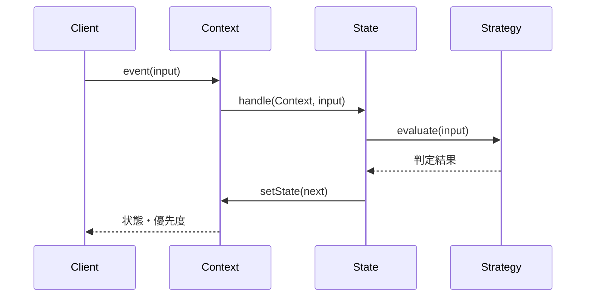
```mermaid
sequenceDiagram
    participant C as Client
    participant X as Context
    participant S as State
    participant R as Strategy
    C->>X: event(input)
    X->>S: handle(Context, input)
    S->>R: evaluate(input)
    R-->>S: 判定結果
    S->>X: setState(next)
    X-->>C: 状態・優先度
```

Stateが状態固有の処理を選び、その中の独立して変わる判定をStrategyへ委譲します。

### この章の実装との対応

GoF（Gang of Four）とは、1994年に出版された書籍『Design Patterns』の4人の著者の総称です。彼らが整理した23のパターンは、現在も設計の共通言語として広く使われています。

**Strategyパターン（GoF標準）：**

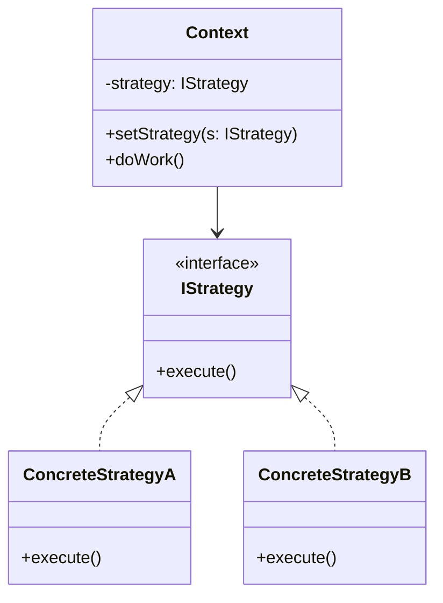
```mermaid
classDiagram
    class Context {
        -strategy: IStrategy
        +setStrategy(s: IStrategy)
        +doWork()
    }
    class IStrategy {
        <<interface>>
        +execute()
    }
    class ConcreteStrategyA {
        +execute()
    }
    class ConcreteStrategyB {
        +execute()
    }
    Context --> IStrategy
    IStrategy <|.. ConcreteStrategyA
    IStrategy <|.. ConcreteStrategyB
```

| GoFの名前 | この章での対応 |
| --- | --- |
| Context | `TicketService` |
| Strategy | `IPriorityRule` |
| ConcreteStrategyA | `PremiumPriority` |
| ConcreteStrategyB | `NormalPriority` |

**Stateパターン（GoF標準）：**

```mermaid
classDiagram
    class Context {
        -state: IState
        +setState(s: IState)
        +request()
    }
    class IState {
        <<interface>>
        +handle(context: Context)
    }
    class ConcreteStateA {
        +handle(context: Context)
    }
    class ConcreteStateB {
        +handle(context: Context)
    }
    Context --> IState
    IState <|.. ConcreteStateA
    IState <|.. ConcreteStateB
```

| GoFの名前 | この章での対応 |
| --- | --- |
| Context | `TicketService` |
| IState | `ITicketPhase` |
| ConcreteStateA | `OpenPhase` |
| ConcreteStateB | `InProgressPhase` |

### 使いどころと限界

- **使うと良い：** 状態遷移とビジネスルールが独立して追加・変更され、両者を組み合わせる必要があるワークフロー管理。変更時期や決定根拠が異なることを要求・履歴・ヒアリングで確認できる場合に向きます。
- **使わない方が良い：** 状態とルールが少なく、独立した変更理由も追加見込みもなく、一つの条件を変えると常にもう一方も同時に変わるなら、`if-else`の方が読みやすい場合があります。人数ではなく、変更理由の独立性、変更頻度、組み合わせ数に対して分離コストが見合うかで判断します。

【過剰コード：シンプルなものまで無理に分離した例】

状態が「Open」「Closed」の2つだけで、ルールも「ハイか否か」1種類だけのシンプルなシステムにStrategy × Stateを適用すると、クラス爆発が起きます。

```cpp
// 【過剰コード】状態2種類・ルール1種類のみのシンプルなシステムに
// Strategy × State を適用した場合の例

// ── Strategy側（ルール1種類だけなのにインターフェースを定義）
class IPriorityRule {
public:
    virtual ~IPriorityRule() = default;
    virtual string getPriority() = 0;
};
class SinglePriority : public IPriorityRule { // ← 実装クラスが1つだけ
public:
    string getPriority() override { return "Normal"; }
};

// ── State側（状態2種類のみなのにインターフェースを定義）
class ISimpleState {
public:
    virtual ~ISimpleState() = default;
    virtual void handle() = 0;
};
class OpenState : public ISimpleState {  // ← 状態クラスが2つだけ
public:
    void handle() override { cout << "Open" << endl; }
};
class ClosedState : public ISimpleState {
public:
    void handle() override { cout << "Closed" << endl; }
};

// ── 合計5クラス + 2インターフェース。if-else 2行で書けた処理が
//    7つのクラスに分散し、次に触る人は全クラスを読まないと
//    「何をしているか」を理解できなくなる。
```

これを素直に書くと次のように2行で済みます。

```cpp
// シンプルな if-else の方が読みやすい場合
void updateStatus(string status) {
    if (status == "Open") cout << "Open" << endl;
    else cout << "Closed" << endl;
}
```

「状態が2つ以下・ルールが1種類」という条件では、パターン適用はクラス数を増やすだけで変更耐性の恩恵がありません。変化の見込みがないなら、シンプルな実装が一つの考え方です。

### この章のまとめ

チケット管理というドメインと Strategy × State の組み合わせの関係を一言で言うなら、「優先度ルール」と「状態遷移」は変わる速度も担当者も違う2つの変化軸であり、それぞれに別の境界を設けることで変更影響を分けやすくなる、ということです。先にパターン名を選ぶのではなく、問題を分析した結果がStrategyとStateの役割に対応した——この順序が、第二部を通じて最も伝えたいことです。

7つのフェーズを通じて、読者は1つのクラスに混在する2つの変化軸という観察から始まり、フェーズ4〜5で「優先度ルール」と「状態遷移」の独立した接続点をすべて確定しました。フェーズ6では一方ずつ試すのではなく、二軸を同時に解く責任配置を先に決め、コードだけを状態契約、ルール契約、組み立ての理解順に反映しています。StrategyとStateは、この完成構造の各責任に付いた名前です。

あなたのコードの中にも、「どの業務機能に属するか」が異なる2つのロジックが同じクラスに同居している箇所があるはずです。それぞれの変化軸を問うことが、どのパターンをどこに当てるかを見つける入口になります。
