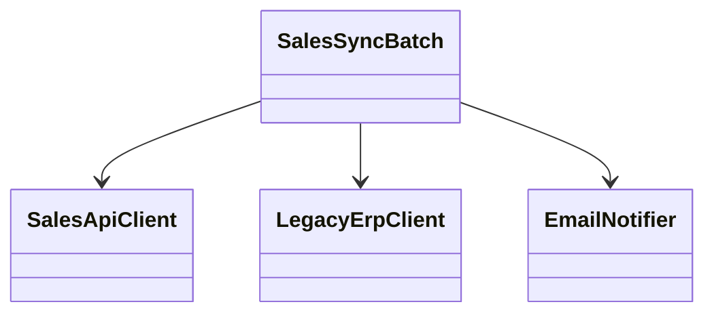
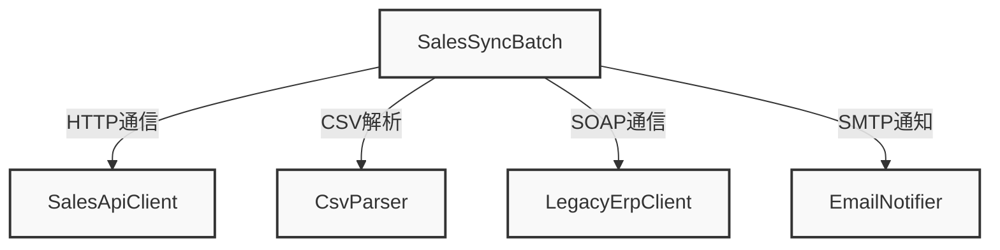
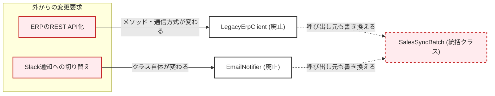
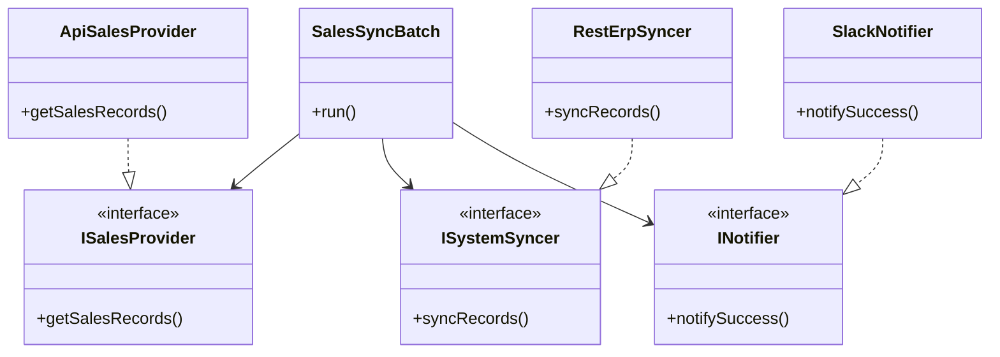
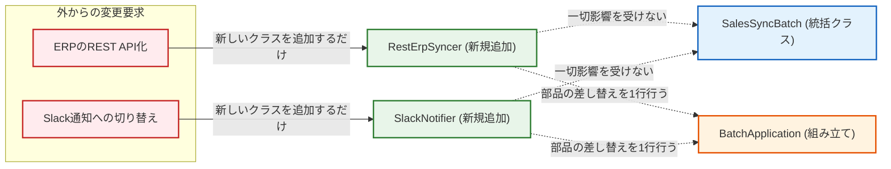
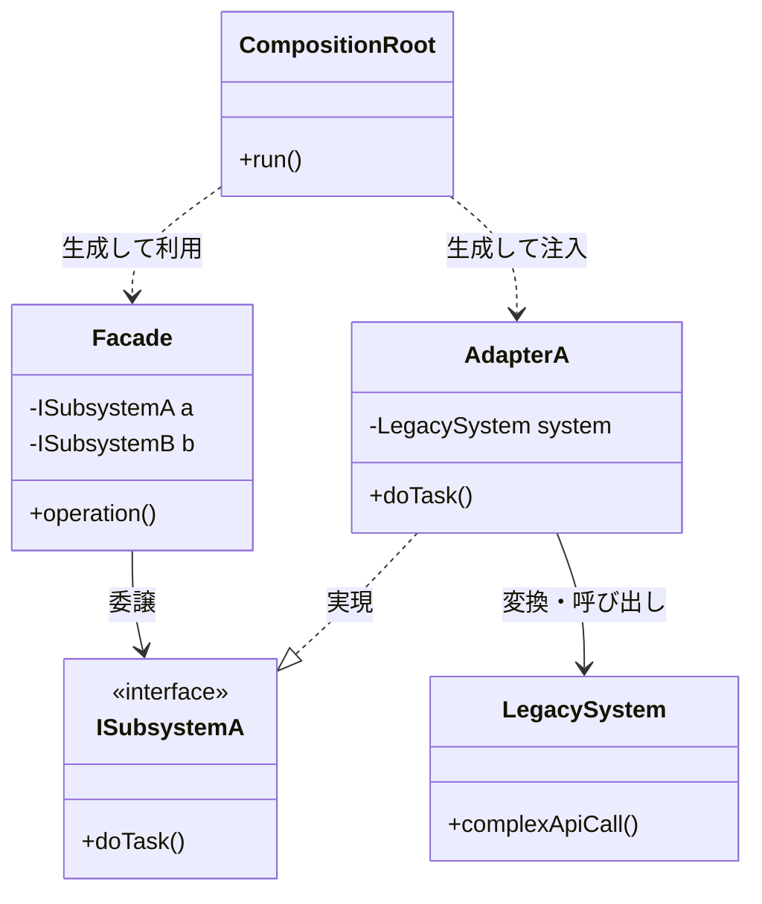

# 第10章（応用）外部連携バッチシステムを設計する

―― 思考の型：依存の過多 + 変化の混在 + 生成と利用の混在

### この章の核心

外部システムという「コントロールできない変化」から、自社の業務コアを守るための防壁を築く。

> **【レゴブロックで考える：FacadeとAdapterの複合】**
> 
> 規格がバラバラな外部のブロック（他社製品）を直接自分の作品にくっつけるのではなく、自社専用の「変換コネクタ」を間に挟むことで、外のブロックがどんな形に変わっても自分の作品を守れる状態を作ります。
> 
> **【画像生成AI用プロンプト案】**
> 
> Prompt: A child playing with Lego blocks on a table. The child is attaching various mismatched, strangely shaped blocks to a central neat structure, but using identical gray adapter pieces in between them to make them fit perfectly. Bright, colorful, educational illustration style, clean white background, isometric view.

### この章を読むと得られること

- **得られること1：** 複数の外部システムに依存した複雑なコードから、真のドメインロジックを抽出できるようになる
    
- **得られること2：** 変化の性質が異なる複数の問題を、複数の設計パターンを組み合わせて解けるようになる
    
- **得られること3：** 外部の仕様変更（API変更など）が来たとき、既存コードへの影響をゼロにする防波堤を構築できるようになる
    

---

### ステップ0：システムを把握し、仮説を立てる ―― クラス構成を見てから「変わりそうな場所」を予測する

全パターンに共通する問い 「このコードの中に、『変わる理由』が異なる2つのものが、同じ場所に混在していないか？」

#### 10.0 この章のシステム構成と仮説

**この章で扱うシステム：**

ECサイトの毎日の売上実績データを集計し、社内の会計ERPシステムへ連携し、完了結果を管理者に通知する「外部連携バッチシステム」です。異なる複数の外部システム（API、ERP、メールサーバ）と通信を行います。

**仕様表（何ができるシステムか）**

|**機能名**|**担当クラス**|**入力**|**出力**|
|---|---|---|---|
|売上データの外部連携フロー制御|`SalesSyncBatch`|外部APIからの売上CSVデータ|ERPへのSOAP送信、管理者へのEmail通知|

★以下のクラス図にCSV解析クラスがいないのは期待通り？次のクラス図ではありますが。

**クラス構成の概要**




→ **【クラス図が示す問題を1文で】業務フローの統括クラスが、連携先システムの具体的な通信方式や実装詳細をすべて直接知ってしまっている（依存の過多と混在）。**

**各クラスの責任一覧**

| **クラス名**          | **対象責任（1文）**                             | **知るべきこと**                |
| ----------------- | ---------------------------------------- | ------------------------- |
| `SalesSyncBatch`  | 売上データを取得し、会計ERPに連携して結果を通知する業務の進行順序を管理する。 | 業務ステップの順番（取得→同期→通知）       |
| `SalesApiClient`  | 外部APIにアクセスして売上のCSVデータを取得する。              | 接続先のURL、HTTP GETメソッドの仕様   |
| `LegacyErpClient` | 会計ERPに対してデータをSOAPプロトコルで送信する。             | ERPのエンドポイント、SOAPのXMLデータ構造 |
| `EmailNotifier`   | システムの管理者に処理完了のメールを送信する。                  | SMTPサーバーの設定、管理者のメールアドレス   |

★専門用語は簡単に説明してほしい。
・ERO、SOAP、XML、SMTPなど

この構成を踏まえた上で、仮説を立てます。

**変動と不変の仮説（実装コードを読む前に立てる）**

|**分類**|**仮説**|**根拠（クラス構成から読み取れること）**|
|---|---|---|
|🔴 **変動する**|外部APIの通信手段やデータフォーマット（CSV等）|自社の裁量ではなく、提供元SaaSの仕様変更に引きずられるため|
|🔴 **変動する**|ERPとの連携プロトコル（SOAP等）|全社的なインフラ刷新やクラウド移行の影響を直接受けるため|
|🔴 **変動する**|通知の手段（Email等）|社内コミュニケーションツールの流行り廃り（SlackやTeams等への移行）の影響を受けるため|
|🟢 **不変**|データを取得し、連携し、結果を通知するという「業務の進行順序」|会社のビジネスプロセスそのものであり、外部ツールが変わっても目的は変わらないため|

この仮説をステップ2（10.3）でヒアリング後に確定します。

### ステップ1：実装コードを読む ―― 責任チェックで問題の行を見つける

前回のステップでは、外部連携バッチシステムの全体像とクラス構成から「変わりそうな場所」の仮説を立てました。ここからは、実際に現場で稼働している実装コードを開き、クラスが「自分の責任を超えた余計な知識」を持っていないか、1行ずつ入念にチェックしていきましょう。

巨大な処理を担うクラスを前にして、どこから手を付けていいか迷う経験は誰にでもあると思います。そんな時は、コードが期待通りに動くという事実を一旦脇に置いて、「誰が何を知っているか」という知識の境界線に目を向けるのが設計を読み解くコツです。

#### 10.1 実装コードと責任チェック

まずは、このシステムにおける依存の広がりをマクロな視点で確認してみましょう。

**依存の広がり（実装前の全体像）**




→ **【このグラフが示す問題】バッチ処理の進行を管理する統括クラスが、連携先システムの具体的な通信方式やデータ形式まで直接知ってしまっている。**

★接着剤を使うのはやめて。ルール違反と思ってます。レゴの計上で車を作っているが、取り外しが難しい状態になっているというような例にしてほしい。他の章にも接着剤を使っている箇所があったと思うので、同じように修正してほしい。

レゴブロックで例えるなら、車を作るための「タイヤ」「エンジン」「ハンドル」といった部品が、接着剤で完全に固定されてひとつの大きな塊になっている状態です。タイヤだけを別の種類に付け替えたいのに、ノコギリで無理やり切り離さなければならない。これがコードにおける「依存が過多な状態（密結合）」の正体です。

[ImagePrompt: A top-down 3D illustration of Lego blocks glued together into a single messy chunk, with a mechanic trying to pull off a tire. Bright, colorful, educational illustration style, clean white background, isometric view.]

実際のコードを見てみましょう。まずは外部連携を担う周辺クラス群です。

```cpp
#include <iostream>
#include <string>

// 外部システムの通信を担当する具象クラス群（※解説のため処理は簡略化しています）
class SalesApiClient {
public:
    std::string fetchCsvData(const std::string& url) {
        std::cout << "GET " << url << " -> CSVデータ取得成功\n";
        return "itemA,1000\nitemB,2000";
    }
};

class LegacyErpClient {
public:
    void sendSoapRequest(const std::string& endpoint, const std::string& xmlData) {
        std::cout << "POST " << endpoint << " -> SOAP連携成功\n";
    }
};

class EmailNotifier {
public:
    void sendEmail(const std::string& address, const std::string& title) {
        std::cout << "Email sent to " << address << ": " << title << "\n";
    }
};
```

次に、これらを呼び出して業務フローを制御する、問題の起点となるメインのバッチクラスです。

```cpp
// 業務バッチの統括クラス
class SalesSyncBatch {
private:
    SalesApiClient* apiClient;
    LegacyErpClient* erpClient;
    EmailNotifier* emailNotifier;

public:
    SalesSyncBatch() {
        // クラス内部で具体的な通信クラスを直接生成してしまっている
        apiClient = new SalesApiClient();
        erpClient = new LegacyErpClient();
        emailNotifier = new EmailNotifier();
    }

    ~SalesSyncBatch() {
        delete apiClient;
        delete erpClient;
        delete emailNotifier;
    }

    void run() {
        std::cout << "--- バッチ処理開始 ---\n";

        // 1. データ取得（どのURLから、どのプロトコルで取るかを知っている）
        std::string csvData = apiClient->fetchCsvData("https://api.sales.example.com/v1/daily"); // ← 知らなくていい

        // 2. 業務ロジックと変換（CSVの解析方法やXMLの構造を知っている）
        std::cout << "CSV解析とXML変換を実行中...\n"; // ← 知らなくていい
        std::string xmlPayload = "<data>converted</data>";

        // 3. ERPへ連携（どのエンドポイントに、SOAPで送ることを知っている）
        erpClient->sendSoapRequest("http://erp.internal:8080/soap", xmlPayload); // ← 知らなくていい

        // 4. 通知（管理者のアドレスや、メールで送ることを知っている）
        emailNotifier->sendEmail("admin@example.com", "バッチ連携完了"); // ← 知らなくていい

        std::cout << "--- バッチ処理終了 ---\n";
    }
};

// バッチの起動元
int main() {
    SalesSyncBatch batch;
    batch.run();
    return 0;
}
```

**実行結果：**

```
--- バッチ処理開始 ---
GET https://api.sales.example.com/v1/daily -> CSVデータ取得成功
CSV解析とXML変換を実行中...
POST http://erp.internal:8080/soap -> SOAP連携成功
Email sent to admin@example.com: バッチ連携完了
--- バッチ処理終了 ---
```

実行結果の通り、このコードはシステムとして正しく動いています。バッチ処理の要件は十分に満たしているように見えますね。

しかし、「設計」という観点から見るとどうでしょうか。

ここで、`SalesSyncBatch` クラスが何をするクラスなのかを改めて1文で定義してみます。

**対象責任：** 「売上データを取得し、会計ERPに連携して結果を通知する」という業務の進行順序を管理する。

この定義に従って、先ほどのコードの各行が「本当にこのクラスが持つべき知識なのか？」を判定する責任チェックを行ってみましょう。

**責任チェック：SalesSyncBatch は自分の責任だけを持っているか**

|**コードの行**|**持っている知識**|**責任内か**|
|---|---|---|
|`apiClient = new SalesApiClient();`|外部API通信クラスの具体的な生成方法|✗ 組み立てる側の責任|
|`fetchCsvData("[https://api.sales](https://api.sales)...");`|接続先のURLと、データ形式がCSVであること|✗ 設定管理とAPI通信クラスの責任|
|`erpClient->sendSoapRequest(...);`|ERPへの連携手段がSOAPプロトコルであること|✗ ERP通信クラスの責任|
|`emailNotifier->sendEmail(...);`|通知手段がメールであることと、送信先のメアド|✗ 通知クラスの責任|

このように確認していくと、`SalesSyncBatch` は業務の進行順序を管理する立場でありながら、「どのURLにアクセスするか」「どんな形式のデータか」「どのプロトコルで通信するか」といった、**外部システムの具体的な実装詳細という余計なことまで知りすぎている**ことが分かります。

これが、コードのあちこちに「知らなくていい」ラベルが付いてしまった理由です。

#### 10.2 届いた変更要求

コードの全体像と責任の偏りが見えてきたタイミングで、現場ではよくある光景が展開されます。

- **差出人：** 業務部門のシステム担当者
    
- **要求内容：**
    
    「来月から全社の会計システムがクラウドERPに移行します。これに伴い、バッチの連携先を従来のSOAP方式から新しいREST API方式に変更してください。また、通知先もメールではなくチャットツール（Slack等）の運用に切り替えたいです。あと、来期からは売上データだけでなく在庫データも同じ仕組みで連携する予定なので、柔軟に対応できるようにしておいてください」
    
- **期日：** 今月末のリリースで
    

…思わずため息が出そうになる変更要求ですね。

現在の `SalesSyncBatch` クラスのままこれらに対応しようとするとどうなるでしょうか。通信方式を変えるためにクラス内の処理を書き換え、通知方法を変えるためにまた別の行を書き換えることになります。さらに在庫データ連携が加われば、if文が無限に増殖していく未来が容易に想像できます。

コードが機能として動いていることと、変更要求に耐えられる構造であることは、全く別の問題なのです。

### ステップ2：仮説を確定する ―― 関係者ヒアリングで「変わる理由」に根拠をつける

#### 10.3 仮説の検証と変動/不変の確定

ステップ0でマクロな構造の仮説を立て、ステップ1の責任チェックで現在の `SalesSyncBatch` クラスが「どの手段で通信するか」「どんな形式でデータを送るか」という実装の細部（外部システムの詳細）に過剰に依存していることが分かりました。

そして飛び込んできたのが、「REST APIへの移行」「Slackへの切り替え」「在庫データ連携の追加」という変更要求です。

現場のプレッシャーに追われていると、ここでいきなり「よし、まずはHTTP通信用のRESTクライアントクラスを作って…」とコードを書き始めたくなります。しかし、少しだけ立ち止まってください。言われた通りの変更をそのまま if 文などで追加実装していくと、半年後には「今度はLINE通知も追加して」「在庫システムがまた別のSaaSに変わった」と言われ、同じように巨大な統括クラスを開いて書き換えることになります。

コードを触る前に、「なぜこの変更が起きるのか」「次に何が変わるのか」を、システムを利用する業務部門やインフラ担当者に直接聞いてみましょう。コードを読んだだけで「ここは変わる」「ここは変わらない」と断定するのは危険だからです。

**関係者ヒアリング**

- **開発者：** 「今回のクラウドERP移行やSlackへの切り替え、承知しました。少し確認させてください。今後もこういった連携先の変更や通知手段の追加は、頻繁に発生しそうですか？ 今回は在庫システムも繋ぐとのことですが…」
    
- **業務担当者：** 「はい、発生すると思います。SaaSの乗り換えやクラウドシフトは全社的な方針なので、数年単位で利用サービスが変わる可能性は常にありますね。新しいツールが導入されれば、それに合わせて通知先も変わるでしょう」
    
- **開発者：** 「なるほど。では、バッチ処理の大きな流れ——『売上などのデータをどこかから取得して、連携先に渡して、最後に結果を通知する』という業務の進行順序自体は変わりますか？」
    
- **業務担当者：** 「そこは絶対に変わりません。うちの部署の仕事の流れそのものですから。通信方式がRESTになろうが手紙になろうが、データを取得して相手に報告するという手順は不変です」
    
- **開発者：** 「安心しました。ちなみに、連携するデータの性質についてはどうでしょう？ 将来的に、例えば売上金額などのデータの持ち方が変わる可能性はありますか？」
    
- **業務担当者：** 「あぁ、実は来年から海外展開を見据えていて、今は円（整数：`int`）で扱っている金額を、多通貨対応のために独自の金額型や小数で扱うようになるかもしれません」
    

ヒアリングを通じて、システムのどこが変わりやすく、どこが安定しているかが見えてきました。現場の声を聞くことで、「なんとなく変わりそう」という開発者の勘が、確かな根拠のある「設計の前提」へと変わります。この結果をテーブルにまとめましょう。

|**分類**|**具体的な内容**|**変わるタイミング**|**根拠**|
|---|---|---|---|
|🔴 **変動する**|外部システムとの通信手段（HTTP, SOAP, REST, SMTP等）|利用するSaaSやインフラの構成が変わったとき|業務担当者（全社的なシステム移行方針）|
|🔴 **変動する**|データのフォーマット（CSV, XML, JSON等）|連携先システムが要求するデータ形式が変わったとき|業務担当者（連携先システムの仕様に依存）|
|🔴 **変動する**|引数のプリミティブ型（金額をintから多通貨対応型へ）|グローバル展開等でビジネスの数値定義が変わったとき|業務担当者（来年の海外展開構想）|
|🟢 **不変**|業務フローの進行順序（取得→連携→通知）|会社の業務プロセスそのものが変わらない限り|業務担当者との合意|

> **設計の決断：**
> 
> 🟢 不変な部分である「業務の進行順序」をバッチ統括クラスの「契約（インターフェース）」として固定し、
> 
> 🔴 変動する「通信手段」や「データ形式」は、それぞれのインターフェースの裏側に押し込みます。

ここで重要なのは、業務担当者からヒアリングで引き出した「**金額を扱う型自体が変わる可能性（引数のプリミティブ型が変わるリスク）**」です。

インターフェースを使って部品を差し替え可能にすれば、通信方式やデータ形式の変更からは身を守ることができます。しかし、「メソッドに渡す引数の型」そのものが変わってしまった場合はどうなるのでしょうか？ この「型変更リスク」に対して、設計のパターンがどこまで立ち向かえるのかについては、ステップ6の耐久テスト（10.10）でコードを通して正直に向き合うことにします。

さて、変動と不変の境界線がはっきりと引けました。次はこの変更要求を「今のコード構造のまま」実装しようとした場合、私たちが現場でどんな痛みを味わうことになるのか、課題の分析を進めていきましょう。

### ステップ3：課題分析 ―― 変更が来たとき、どこが辛いかを確認する

ステップ2のヒアリングを通じて、通信手段やデータ形式は「頻繁に変わるもの」、業務の進行順序は「変わらないもの」という境界線が見えました。

では、この境界線が引かれていない「今のコード」のまま、先ほどの変更要求（ERPのREST化、Slack通知、在庫連携の追加）に応えようとすると、現場で何が起きるでしょうか。

仕様書とコードを照らし合わせながら、頭の中で実装をシミュレーションしてみます。

「まずは、REST API用の新しい通信クラス `RestErpClient` を作って…」

「通知用に `SlackNotifier` も必要だな…」

「それができたら、バッチの統括クラス `SalesSyncBatch` を開いて、`new` している部分を差し替えて…」

「あっ、通信のメソッド名も `sendSoapRequest` から `sendRestRequest` に変わるから、呼び出し箇所も全部書き換えないと…」

この一連の作業を想像したとき、私たちは現場で2つの大きな「痛み」に直面します。

#### 痛み1：影響範囲が広すぎて「grep地獄」に陥る

新しい通信クラスを作ること自体は難しくありません。本当に辛いのは、その「新しいクラスを使うように既存のコードを書き換える」作業です。

現状の `SalesSyncBatch` は、具象クラスを直接 `new` して、その具体的なメソッドを呼び出しています。つまり、通信プロトコルやメソッド名が変われば、呼び出し元である `SalesSyncBatch` のコードも必ず書き換えなければなりません。

「どこで古いクラスを呼んでいる？」「どこで引数の形式を組み立てている？」 影響範囲を特定するために、エディタの検索窓に古いクラス名やメソッド名を入れて、ひたすらプロジェクト全体を grep（文字列検索）して回ることになります。もしこの統括クラスが数百行、数千行に肥大化していたら、修正漏れがないかビクビクしながらコードを追いかけることになります。影響範囲が事前に予測できない状態での修正は、エンジニアにとって大きな精神的負担です。

#### 痛み2：変更の「飛び火」による無関係なテストのやり直し

さらに厄介なのが、在庫データの連携を追加するという要件です。今の構造のまま在庫連携を足そうとすると、`SalesSyncBatch` の中に「売上データならこのAPIを呼ぶ」「在庫データならあのAPIを呼ぶ」といった if 文を追加していくことになります。

通信手段やデータの種類が増えるたびに、この `SalesSyncBatch` というクラスに手を入れなければなりません。業務の進行順序を管理しているコアなクラスに変更が加わるということは、本来影響を受けないはずの「既存の売上データの連携が今まで通り動くか」まで、全てテストをやり直す必要が出てくるということです。

現場でコードを修正しようとエディタを開いたとき、思わずこんな独り言が漏れてしまいます。

「通信プロトコルが変わるだけなのに、なんで業務フロー全体を管理してるクラスまで開いて書き直さなきゃいけないんだ…？」

この呟きの原因を、図で可視化してみましょう。変更要求が、どのように無関係なクラスへと「飛び火」していくかを示すグラフです。

**依存の広がり（改善前の変更影響グラフ）**




→ **【改善前グラフが示すこと】外部システムの変更要求が、具象クラスを貫通して、呼び出し元である統括クラス（SalesSyncBatch）にまで飛び火してしまっている。**

この図を見ると、既存のコードに変更を加えるとき、何クラス開けばいいのか（どこまで直せばいいのか）が一目で分からない状態になっていることが分かります。

ここから、私たちが目指すべきゴールが見えてきます。

設計の価値というのは、「新しいコードをきれいに書けること」だけではありません。 既存のコードに変更加わるとき、影響を「この1箇所」に閉じ込められること。変更要求が来た瞬間に、「あぁ、あのファイルだけを開いて、あそこだけ直せば済むな」と一目で分かる状態を作ること。これこそが、設計の真の価値なのです。

なぜ、現状のコードは変更が飛び火してしまうのでしょうか。次のステップで、この困難の根本にある原因を言語化し、私たちが持っている設計の「手札」を探っていきましょう。

### ステップ4：原因分析 ―― 困難の根本にある設計の問題を言語化する

ステップ3で直面した、終わりの見えない「grep地獄」と、無関係な箇所への「変更の飛び火」。これらは現場のエンジニアの気力を確実に削っていきます。仕様変更が来るたびに残業してコードを書き換えていると、「自分が書いたコードが悪いのだろうか」と落ち込んでしまうこともあるかもしれません。

しかし、これはエンジニア個人のスキルの問題ではなく、コードの「構造」が引き起こしている必然的な現象です。ここでは一旦エディタから手を離し、なぜあのような苦しい影響の連鎖が起きるのか、冷静に現象を整理して言葉にしてみましょう。

**観察と原因の方向**

コードを注意深く観察すると、次のような事実が浮かび上がってきます。

|**観察**|**原因の方向**|
|---|---|
|`SalesSyncBatch` が `SalesApiClient` などの具象クラスを直接 `new` している|使う側が、使う部品の「作り方（生成手順）」まで知ってしまっている（生成と利用の混在）|
|`SalesSyncBatch` が `fetchCsvData` や `sendSoapRequest` といった固有のメソッドを呼んでいる|使う側が、相手の「具体的な形」にぴったり合わせてしまっている（具象への直接依存）|
|CSVのパースやXML文字列の組み立てが `SalesSyncBatch` の中にある|使う側が、外部システムが要求する「詳細なデータ形式」まで知ってしまっている（依存の過多）|

これらの観察から分かるのは、`SalesSyncBatch` というクラスが、本来の責任である「業務フローの進行管理」を越えて、周囲のあまりにも多くの事情を抱え込んでしまっているという事実です。

そして、ステップ2のヒアリングで得た結果と照らし合わせると、より決定的な問題の構図が見えてきます。

**変わるものと変わらないものが同じ場所にいる**

|**変わり続けるもの（🔴）**|**変わってほしくないもの（🟢）**|
|---|---|
|通信手段（SOAP方式からREST方式へ）|業務フローの進行順序（データを取得して連携する）|
|データのフォーマット（CSVからJSONへ、など）|連携すべきデータが存在するという事実|
|通知手段（EmailからSlackへ）|処理が完了したことを通知するという事実|

変わらないはずの「業務のコア」と、頻繁に変わる「外部のインフラ事情」が、同じファイルの中に混在しています。

レゴブロックで想像してみてください。本来なら「車のボディ（業務フロー）」と「タイヤ（外部連携）」は別の部品であるべきです。しかし今の状態は、ボディのプラスチックとタイヤのゴムが、製造段階でドロドロに溶かされて一つに固まっているようなものです。タイヤの種類を変えようと思ったら、ボディごと削って作り直さなければなりません。

[ImagePrompt: A top-down 3D illustration of a Lego car where the body and the wheels are melted and fused together into a single inseparable chunk of plastic. Bright, colorful, educational illustration style, clean white background, isometric view.]

この「結合が固着している状態」を解きほぐすために、私たちが第0章で学んだ設計の「4つの手札」をテーブルに並べてみましょう。

**根本原因に対する構造的対策案（手札の選定）**

|**次元**|**物理操作（手札）**|**本質的な原因（何が問題か）**|**使うべき構造的対策案（本質）**|
|---|---|---|---|
|要素|**① 分割する**（切る）|業務の進行管理と、部品の生成（new）やデータ変換処理が一つの塊に癒着している。|生成の責任やデータ変換の責任を別の場所へ移す（単一責任化）。|
|関係|**③ 規格化する**（形を揃える）|`LegacyErpClient` など、特定の相手の「具体的な実装」に直接依存しており、結合が固着している。|インターフェースを導入し、抽象への依存へと逆転させる。|
|関係|**④ 間接化する**（間に挟む）|外部APIやERPなど、複数の複雑な外部システムと直接通信しており、知るべき知識が多すぎる（依存の過多）。|業務と外部システムの間に、翻訳層となる中間層（緩衝材）を配置する。|
★手札は③と④どちらか片方で解決できない理由は？両方の手札を使おうと思わなかったので、そのような思考になったプロセスを記載してください。もしくは、③と④片方ずつで試した場合の痛みを共有して、③④両方を組み合わせるのが良いという流れが良いと思います。これは、手段①②に加え手段③を追加してもよいかもしれません。対応後のコードを見ましたが、全て③の規格化の対応に見えましたが。むしろ、②の隠ぺいにより手段①で対策済みの内容に見えましたが。

今回の「外部連携バッチシステム」は非常に厄介です。なぜなら、単に振る舞いが変わる（切り口A）だけでなく、「使う側が知らなくていいことまで知っている（依存の過多：切り口B）」と、「何を作るかの判断とどう使うかが同じ場所にある（生成と利用の混在：切り口D）」という問題が複雑に絡み合っているからです。

具体的には、手札③の「規格化」によって、直接結びついたコードの接着剤を剥がす必要があります。さらに手札④の「間接化」によって、外部の複雑な通信仕様を業務コードから見えないように覆い隠す層（Facade や Adapter のような役割）を挟み込むことが求められます。

原因は明確に言語化できました。「依存の過多」と「変化の混在」です。 次のステップ5では、この手札を使って、実際にコードの構造を段階的に変革していく思考のプロセスを体験していきましょう。どうすれば既存のコードを壊さずに、変更に強いしなやかな構造を手に入れられるのか、手を動かして検証します。

### ステップ5：対策案の検討 ―― 原因から手札を選ぶ

**特定した真因：** バッチ統括クラスが、本来の責任である「業務フローの進行管理」を越えて、通信方式、データ形式、外部システムのクラスの生成方法という「詳細な知識」まで全て抱え込んでしまっている。

この複雑に絡み合った「依存の過多」と「生成と利用の混在」を解決するために、第0章で学んだ設計の手札を順番に切っていきましょう。

#### 1. 分離・隠蔽を試す（手段①：直接依存をそのままに、処理を別クラスに切り出す）

まずは手札①（分割）を使って、巨大な `SalesSyncBatch` の中から「データ変換」や「具体的な通信」の処理を外に追い出してみます。ここでは、連携に必要な処理をひとまとめにするアダプタークラスを作って、処理を委譲してみましょう。

```cpp
#include <iostream>
#include <string>

// 既存の外部システム通信クラス群 (省略せず最低限定義)
class SalesApiClient {
public:
    std::string fetchCsvData(const std::string& url) { return "csv_data"; }
};
class LegacyErpClient {
public:
    void sendSoapRequest(const std::string& url, const std::string& xml) {}
};
class EmailNotifier {
public:
    void sendEmail(const std::string& to, const std::string& title) {}
};

// ==========================================
// 処理を切り出した別クラス群（分割・隠蔽）
// ==========================================

// 売上データ取得専用のクラス
class SalesDataFetcher {
public:
    std::string fetchDailySales() {
        SalesApiClient client;
        return client.fetchCsvData("https://api.sales.example.com/v1/daily");
    }
};

// ERP連携とデータ変換をまとめたクラス
class ErpSyncAdapter {
public:
    void syncSalesData(const std::string& csvData) {
        // CSVをXMLに変換する処理をここに隠蔽する
        std::cout << "CSV解析とXML変換を実行中...\n";
        std::string xmlPayload = "<data>converted</data>";
        
        LegacyErpClient client;
        client.sendSoapRequest("http://erp.internal:8080/soap", xmlPayload);
    }
};

// 通知専用のクラス
class BatchNotifier {
public:
    void notifySuccess() {
        EmailNotifier client;
        client.sendEmail("admin@example.com", "バッチ連携完了");
    }
};
```

これにより、統括クラスである `SalesSyncBatch` のコードは次のようにすっきりします。

```cpp
// 業務バッチの統括クラス（手段①）
class SalesSyncBatch {
private:
    SalesDataFetcher* fetcher;
    ErpSyncAdapter* erpAdapter;
    BatchNotifier* notifier;

public:
    SalesSyncBatch() {
        // まだクラス内部で具体的なクラスを生成（new）している
        fetcher = new SalesDataFetcher();
        erpAdapter = new ErpSyncAdapter();
        notifier = new BatchNotifier();
    }

    ~SalesSyncBatch() {
        delete fetcher;
        delete erpAdapter;
        delete notifier;
    }

    void run() {
        std::cout << "--- バッチ処理開始 ---\n";

        // 1. データ取得
        std::string salesData = fetcher->fetchDailySales(); // ← 戻り値がCSV形式という知識が漏れている

        // 2. ERPへ連携
        erpAdapter->syncSalesData(salesData); // ← CSV文字列をそのまま渡している

        // 3. 通知
        notifier->notifySuccess();

        std::cout << "--- バッチ処理終了 ---\n";
    }
};
```

コードの見通しはかなり良くなり、`run()` メソッドの中から細かいURLやXMLの組み立て処理は消えました。手続き型プログラミングとしてはかなり綺麗に整理された状態です。しかし、この「手段①」の構造のまま、もう一度責任チェックを行ってみましょう。

**手段①コードの責任チェック：**

|**コードの行**|**持っている知識**|**責任内か**|
|---|---|---|
|`fetcher = new SalesDataFetcher();` 等|どの具象クラスを使うかという「生成」の知識|✗ 組み立てる側の責任|
|`std::string salesData = ...`|取得したデータが生の文字列であるという知識|✗ データ表現クラスの責任|

この構造の最大の弱点は、「呼び出し元が、依存先の変更理由を引き継いでしまう」という点にあります。

例えば、APIがCSVではなくJSONを返すように変わったとします。すると `SalesDataFetcher` の戻り値が変わり、それを受け取る `SalesSyncBatch` が修正され、さらにその変数を引数として受け取る `ErpSyncAdapter` まで書き換えることになります。

つまり、手札①（分割）で処理を別クラスに分けても、クラス同士のつなぎ目が「生データ（文字列）」や「具象クラスへの直接依存」のままであるため、外部の変更が簡単に飛び火してしまうのです。

#### 2. さらに規格化・間接化を重ねる（手段②：インターフェースの導入と依存性の注入）

手段①の限界を突破するために、手札③（規格化）と手札④（間接化）を追加適用します。

**解決策のアプローチ：**

1. **規格化（インターフェース）**: `SalesSyncBatch` が知るべき「ビジネス上の責任」だけでインターフェースを定義します。「実装手段の名前（Pdf・Email等）」にするのではなく、「CSVを取得する」は「売上実績を提供する（`ISalesProvider`）」に、「SOAPで送る」は「外部システムへ同期する（`ISystemSyncer`）」にといった具合に、ビジネス責任名で命名します。実装が変わったときに名前が嘘になるのを防ぐためです。
    
2. **間接化と組み立て**: `SalesSyncBatch` の中での `new` をやめ、コンストラクタの引数（ポインタ）を通して外部から部品を渡してもらう形（依存性の注入：DI）にします。
    

実装を見てみましょう。

```cpp
#include <vector>

// ==========================================
// 1. ビジネスの言葉で定義されたインターフェース（規格化）
// ==========================================

// ※今回は簡略化のため生データを文字列リストで表現しますが、
// 本当はここに「SalesRecord」のような独自のデータ型（値オブジェクト）を入れるのが理想です。
class ISalesProvider {
public:
    virtual ~ISalesProvider() {}
    virtual std::vector<std::string> getSalesRecords() = 0; // ← どこから取るか、形式は何かを隠蔽
};

class ISystemSyncer {
public:
    virtual ~ISystemSyncer() {}
    virtual void syncRecords(const std::vector<std::string>& records) = 0; // ← どこへ、どう送るかを隠蔽
};

class INotifier {
public:
    virtual ~INotifier() {}
    virtual void notifySuccess() = 0; // ← どう通知するかを隠蔽
};
```

このインターフェースを使って、統括クラスを書き換えます。

```cpp
// ==========================================
// 2. 統括クラス（業務フローの進行管理だけに集中）
// ==========================================
class SalesSyncBatch {
private:
    // インターフェースだけを知っている（具体クラスを知らない）
    ISalesProvider* provider;
    ISystemSyncer* syncer;
    INotifier* notifier;

public:
    // 依存性の注入（DI）：使う部品は外から渡してもらう
    SalesSyncBatch(ISalesProvider* p, ISystemSyncer* s, INotifier* n)
        : provider(p), syncer(s), notifier(n) {}

    void run() {
        std::cout << "--- バッチ処理開始 ---\n";

        // 1. データ取得（CSVかJSONかは知らない）
        std::vector<std::string> records = provider->getSalesRecords();

        // 2. 外部システムへ連携（SOAPかRESTかは知らない）
        syncer->syncRecords(records);

        // 3. 通知（EmailかSlackかは知らない）
        notifier->notifySuccess();

        std::cout << "--- バッチ処理終了 ---\n";
    }
};
```

見てください。`SalesSyncBatch` の中から、`new` も、具体的な技術名（CSV、SOAP、Email）も完全に消え去りました。コンストラクタにはインターフェース型のポインタが記述されており、このクラスは「自分がどの具体的なクラスを使っているか」を一切知らないことがコードから証明されています。
★関数名も変わらないし、シグネチャも変わらず、文字列を扱うという事は知っています。文字列以外で連携したいとなったら、影響受けるのではないのですか？というか、耐久テストにある型変更の反映をしていないのはなぜ？

これにより、呼び出し元である統括クラスの「変わる理由」が、「連携先のシステムが変わったとき」ではなく「業務の進行順序自体が変わったとき」という1つだけに絞り込まれました。

そして最後に、このインターフェースを実装する具体的なクラス（アダプター）を用意します。これらが「間接化」の層として、汚い外部システムの通信仕様やデータ変換を業務コードから覆い隠してくれます。

★以下は間接化なのでしょうか？③規格化に伴う対応に見えますが？

```cpp
// ==========================================
// 3. インターフェースを実装する具象クラス群（間接化）
// ==========================================

// SalesApiClientを使った具体的なプロバイダ
class ApiSalesProvider : public ISalesProvider {
private:
    SalesApiClient client;
public:
    std::vector<std::string> getSalesRecords() override {
        std::string csv = client.fetchCsvData("https://api.sales.example.com/v1/daily");
        // ここでCSVを解析して、共通のデータ形式（vector）に変換する
        std::vector<std::string> records = {"Record1", "Record2"}; 
        return records;
    }
};

// LegacyErpClientを使った具体的なシンカー
class SoapErpSyncer : public ISystemSyncer {
private:
    LegacyErpClient client;
public:
    void syncRecords(const std::vector<std::string>& records) override {
        // 共通データ形式を受け取り、相手が求めるXMLに変換する
        std::string xmlPayload = "<data>converted</data>"; 
        client.sendSoapRequest("http://erp.internal:8080/soap", xmlPayload);
    }
};

// EmailNotifierを使った具体的な通知クラス
class EmailBatchNotifier : public INotifier {
private:
    EmailNotifier client;
public:
    void notifySuccess() override {
        client.sendEmail("admin@example.com", "バッチ連携完了");
    }
};
```

レゴブロックで例えるなら、それぞれの独自の形をした外部システム部品（API、SOAP、Email）の先端に、システム共通の「同じ形のジョイント（規格化された凹凸）」を取り付けた状態です。統括クラスは、相手がどんな機能を持っていようが、その共通ジョイントさえカチッとはまれば、中身を気にせず接続して操作できるようになりました。

[ImagePrompt: A 3D illustration of Lego blocks where a central gray block is connected to red, blue, and green blocks. Each colored block has an identical standardized connector piece allowing it to easily attach to the central block. Bright, colorful, educational illustration style, clean white background, isometric view.]

では、この手札③④まで適用した構造（手段②）の導入コストは、変更耐性という未来のメリットに見合うのでしょうか？ そして、ヒアリングで挙がった「REST APIへの移行」「在庫データ連携」「引数の型変更」というリスクに本当に耐えられるのでしょうか。次のステップ6で、天秤による評価と「耐久テスト」を行っていきましょう。

### ステップ6：天秤にかける ―― 手段を評価する

ステップ5で、私たちは2つのアプローチを試しました。 手段①は、処理を別のクラスに切り出す「分離・隠蔽」の手法です。コードから巨大な塊は消え、読みやすくはなりました。しかし、統括クラスは依然として「具象クラスを自分で生成し、具体的なデータ表現に依存している」状態であり、連携先が変われば統括クラスも書き換えが必要になります。つまり、「拡張」という評価軸では不合格です。

手段②は、そこへさらにインターフェースによる「規格化」と、DIによる「間接化」を重ねた手法です。統括クラスは具体的な部品を一切知らず、ただ「契約」通りに処理を進めるだけになりました。既存コードを一切触らずに部品を差し替える「置換」と、新機能を足す「拡張」の能力を手に入れています。

とはいえ、手段②はインターフェースやアダプタークラスをいくつも定義しなければならず、ファイル数も増えます。「クラスが増えて複雑になる。そのコストは変更耐性に見合うのか？」という疑問は、現場のエンジニアとして当然の感覚です。 ここで、両者を冷静に天秤にかけ、ヒアリング結果を踏まえてどちらを採用するか決断しましょう。

#### 10.4 手段①vs手段②の比較

設計の善し悪しを測るため、4つの評価軸を宣言します。
★以下の良い、普通、悪いは、記号でぱっと見の判断が出来るようにしたいのと、点数付けして、合計点がどうなのか、を見たうえで、どの手段にするかを決定してほしい。この指摘は他の章も同様です。また、もし影響範囲やテストへの影響が少ない、もしくは、未来への設計評価コストもそれほど大きくないという事であれば、手段①を採用した方が良い、または、予算が限られており、納期も近いという話も出したら、手段①が適切という話も、ケースバイケースで出してほしい。この話は、使う場面、使わない場面で、話を上げるのが良いね。他の章にも同様に修正初ほしい。

|**評価軸**|**手段①（分離・隠蔽のみ）**|**手段②（＋規格化・間接化）**|**評価の観点**|
|---|---|---|---|
|**現状の設計コスト**|**良い**：切り出すだけなので実装工数は低い。|**悪い**：インターフェース定義とDIの仕組みを構築する初期コスト（ファイル数増）がかかる。|将来の変更コストを「今の実装コスト」で買う投資判断として見合うか。|
|**現状の評価コスト**|**普通**：各クラス単体のテストは可能だが、結合部分は本物を使う必要がある。|**良い**：モック（テスト用の偽物部品）を注入できるため、外部システムが未完成でもテストが可能。|テストの独立性と自動化のしやすさ。|
|**未来の設計コスト**|**悪い**：変更のたびに統括クラスとアダプターの両方を書き換える必要がある。|**良い（置換・拡張）**：統括クラスを一切触らず、新しい部品を追加するだけで対応できる。|**「変更容易性」**。別の仕様変更が来た際、どれだけ少ない修正で対応できるか。|
|**未来の評価コスト**|**悪い**：統括クラスが変わるため、既存の通信機能まで回帰テストが必要。|**良い**：影響範囲が追加したクラスに局所化されるため、テストのやり直しが不要。|**「保守・追跡性」**。不具合調査時にgrep等で影響範囲をすぐ特定できるか。|

> **結論：** 今回の状況では、**手段②**を採用します。
> 
> ステップ2のヒアリングで「数年単位で利用サービスが変わる（SaaSの乗り換え）」「今月末にもRESTやSlackへの移行が控えている」という確実な変動リスクが確認されているためです。将来の変更コストを今の実装コストで買う投資判断として、十分にペイすると言えます。

#### 10.5 耐久テスト ―― ヒアリングで挙がった変化が来た

では、私たちが採用した手段②の構造が、ステップ2で予告されていた変更要求の「痛み」から本当に守ってくれるのか、耐久テストとして実演してみましょう。

**シナリオ：**

1. ERP連携を「SOAP方式」から「REST API方式」へ移行する。
    
2. 通知先を「Email」から「Slack」へ切り替える。
    

手段②の構造であれば、既存の `SalesSyncBatch` やインターフェースのコードは**1行も開きません**。ただ、新しい規格に合わせた部品クラスを「追加」するだけで済みます。

```cpp
#include <iostream>
#include <vector>
#include <string>

// 既存のインターフェース（変更なし）
class ISystemSyncer {
public:
    virtual ~ISystemSyncer() {}
    virtual void syncRecords(const std::vector<std::string>& records) = 0;
};
class INotifier {
public:
    virtual ~INotifier() {}
    virtual void notifySuccess() = 0;
};

// ==========================================
// 耐久テスト：新しい部品を「追加」するだけ
// ==========================================

// 新しいREST API用のシンカー
class RestErpSyncer : public ISystemSyncer {
public:
    void syncRecords(const std::vector<std::string>& records) override {
        // REST用のJSONに変換してPOSTする処理
        std::cout << "POST /api/v2/sync -> REST APIで連携成功 (JSON形式)\n"; // ← ここだけ追加
    }
};

// 新しいSlack通知用のノティファイア
class SlackNotifier : public INotifier {
public:
    void notifySuccess() override {
        std::cout << "Slack channel #alerts: バッチ連携完了\n"; // ← ここだけ追加
    }
};
```

**結果の解説：** 既存のコードを一切壊すことなく、新しい機能を実装できました。あとは、プログラムの起動元（第3のテーマである組み立て点）で、注入する部品を古いものから新しいものに1行差し替えるだけです。 実装クラス名に `RestErpSyncer` や `SlackNotifier` のように実装手段（技術名）を含んでいますが、差し替え後のクラス名がそのまま変更内容の説明になるため、問題ありません。

あの恐ろしい「grep地獄」は発生しません。変更要求が来たら、「新しいファイルを作り、メイン関数で部品を入れ替える」。それだけでタスクは完了します。

##### 守れない変更への正直な告白と、カプセル化への応用

しかし、設計に絶対の魔法はありません。 ヒアリングで挙がっていた「来年、金額のデータ型が `int` から多通貨対応の独自型に変わるかもしれない」というリスクについて正直にお話しします。

もし引数のプリミティブ型や、やり取りする基本のデータ構造（`std::vector<std::string>` など）が根底から変わってしまった場合、全てのインターフェースのシグネチャを書き換えることになり、どんな設計構造（FacadeであれAdapterであれ）でも変更の飛び火を防ぐことはできません。

「こういう状況ではパターンの限界ではなく、型をどう扱うかを先に決める問題」になります。 インターフェースは「呼び出し元が知らなくていい詳細を隠す契約書」です。メソッドシグネチャ（引数の型）もその詳細の一部であると考え、独自型（例えば `SalesData` クラス）で型情報自体を呼び出し元から隠蔽することが有効です。


```cpp
// 型変更の影響を防ぐための、カプセル化の応用例
class SalesData {
    // 内部にどんな型でデータを持っているか（intか、独自通貨型か）を隠蔽する
};

class ISystemSyncer {
public:
    virtual ~ISystemSyncer() {}
    // 引数をプリミティブ型ではなく、カプセル化された独自型にする
    virtual void syncRecords(const SalesData& records) = 0; 
};
```

これは第0章で学んだ「カプセル化」の応用です。どれが正解かは、どこまで型が安定しているかをチームで話し合って決めるべきでしょう。

#### 10.6 使う場面・使わない場面

手段②の構造は変更に強いですが、常にこのパターンを使えばいいというわけではありません。 パターンを使うとクラスが増えて複雑になります。本当に毎回使わなければならないのでしょうか？

結論から言えば、「シンプルに保つこともエンジニアリングの重要な選択」です。 パターンを使わずに既存コードへの最小限の変更で対処できる場合（例えば、単なる関数分割など）は、それを選ぶべきです。変更頻度・チーム規模・将来の見通しの3軸で判断しましょう。

**【過剰コード：変化の予定がないものまでパターン化した例】** 「自社内の閉じたネットワークにある、絶対に仕様変更されないレガシーDB」にデータを書き込むだけのバッチ処理に、わざわざ `IDatabaseSyncer` インターフェースを切り、DIを構築するのは過剰設計（オーバーエンジニアリング）です。

|**状況**|**適切な選択**|**理由**|
|---|---|---|
|**連携先がSaaS等で、将来仕様が変わる可能性が高い**|手段②（Facade的統括＋Adapter＋DI）を採用|将来の「grep地獄」とテストの手戻りを防ぐため。|
|**連携先が単一で、数年間変更が入ったことがない**|手段①（処理を関数や別クラスに分割するだけ）|インターフェースを導入するコストが回収できないため。|
|**一時的なデータ移行用の、使い捨てバッチツール**|起点コードのまま（すべて直書き）で良い|将来の保守を考える必要がないため。|

設計に絶対の正解はありません。 しかし、判断の基準は手に入れました。次はいよいよステップ7です。すべての部品を組み合わせ、変更に強い「外部連携システム」を完成させましょう。
### ステップ7：決断と、手に入れた未来

外部システムへの過剰な依存と、生成の責任が混在していた「あのコード」は、手札を切り続けた結果どう生まれ変わったのでしょうか。すべての部品をつなぎ合わせた、最終的なコードの全体像を見てみましょう。

#### 10.7 解決後のコード（全体）

ここでは、統括クラスに具体的な部品を渡して「組み立てる」専用のクラス（Composition Root）を用意します。システムの中で、誰が誰を使うかの組み合わせを決定する「唯一の場所」です。


```cpp
#include <iostream>
#include <vector>
#include <string>

// ==========================================
// 1. ビジネスの言葉で定義されたインターフェース（契約）
// ==========================================
class ISalesProvider {
public:
    virtual ~ISalesProvider() {}
    virtual std::vector<std::string> getSalesRecords() = 0;
};

class ISystemSyncer {
public:
    virtual ~ISystemSyncer() {}
    virtual void syncRecords(const std::vector<std::string>& records) = 0;
};

class INotifier {
public:
    virtual ~INotifier() {}
    virtual void notifySuccess() = 0;
};

// ==========================================
// 2. 統括クラス（業務フローの進行管理）
// ==========================================
class SalesSyncBatch {
private:
    // インターフェース型のポインタのみを保持する。
    // つまり、このクラスは「具体的な実装手段」を全く知らない。
    ISalesProvider* provider;
    ISystemSyncer* syncer;
    INotifier* notifier;

public:
    SalesSyncBatch(ISalesProvider* p, ISystemSyncer* s, INotifier* n)
        : provider(p), syncer(s), notifier(n) {}

    void run() {
        std::cout << "--- バッチ処理開始 ---\n";
        std::vector<std::string> records = provider->getSalesRecords();
        syncer->syncRecords(records);
        notifier->notifySuccess();
        std::cout << "--- バッチ処理終了 ---\n";
    }
};

// ==========================================
// 3. インターフェースを実装する具体的なアダプター群
// ==========================================
class ApiSalesProvider : public ISalesProvider {
public:
    std::vector<std::string> getSalesRecords() override {
        std::cout << "GET /v1/daily -> APIからデータ取得\n";
        return {"RecordA", "RecordB"};
    }
};

class RestErpSyncer : public ISystemSyncer {
public:
    void syncRecords(const std::vector<std::string>& records) override {
        std::cout << "POST /api/v2/sync -> REST APIで連携成功\n";
    }
};

class SlackNotifier : public INotifier {
public:
    void notifySuccess() override {
        std::cout << "Slack channel #alerts: バッチ連携完了\n";
    }
};

// ==========================================
// 4. 組み立てクラス（Composition Root）
// ==========================================
class BatchApplication {
public:
    void run() {
        // 具体クラスが new（インスタンス化）される唯一の場所。
        // ここで使う部品を決定し、統括クラスに注入する。
        ApiSalesProvider provider;
        RestErpSyncer syncer;
        SlackNotifier notifier;

        SalesSyncBatch batch(&provider, &syncer, &notifier);
        batch.run();
    }
};

// ==========================================
// 5. エントリポイント
// ==========================================
int main() {
    // main()の責任は「プログラムを起動すること」だけ。
    // 具体クラスの知識は持たず、組み立てクラスを作って動かすだけにする。
    BatchApplication app;
    app.run();
    return 0;
}
```

このコードでは、インターフェースの名前を `CsvFetcher` のような実装手段ではなく、`ISalesProvider`（売上実績を提供する）という「ビジネス上の責任」で命名しています。実装が変わっても名前が嘘にならないからです。一方で、実装クラス名は `SlackNotifier` のように技術手段を含んで構いません。差し替えられた実装クラス名が、そのままシステムの変更内容の説明になるからです。

そして、システムの実行結果はステップ1の時と同じように正しくバッチ処理を完了させますが、その「構造」は全くの別物です。

クラス図で確認してみましょう。




`SalesSyncBatch` から伸びている矢印は、インターフェースへの矢印だけです。具体的なクラスへの直接依存が見事に断ち切られていることが分かります。

#### 10.8 変更影響グラフ（改善後）

ステップ3で確認した、無関係なクラスに変更が飛び火する「改善前のグラフ」を覚えていますか。

この構造を導入した今、同じ変更要求（ERPのREST化、Slack通知）を加えた場合の影響範囲はどのように変化したでしょうか。




→ **【変更前と比較して変わったこと】外部の変更要求が、業務の統括クラスに一切飛び火しなくなり、影響が新しい具象クラスの「追加」と、組み立てクラスの「1行の差し替え」のみに局所化されました。**

設計の価値は新しいコードをきれいに書けることだけではありません。既存コードを変えるとき、影響をこの1箇所に閉じ込められることが設計の真の価値なのです。

#### 10.9 変更シナリオ表と最終責任テーブル

変更の影響が本当に1〜2クラスに収まるのか、シナリオ表で証明します。

**変更シナリオ表：何が変わったとき、どこが変わるか**

|**シナリオ**|**変わるクラス**|**変わらないクラス**|
|---|---|---|
|通知先をSlackからTeamsに変更する|`TeamsNotifier` (新規追加)<br><br>  <br><br>`BatchApplication` (1行差し替え)|`SalesSyncBatch` (統括)<br><br>  <br><br>その他の具象クラス全て|
|ERPのデータ連携形式がJSONからXMLに戻る|`RestErpSyncer` (内部処理のみ)|`SalesSyncBatch` (統括)<br><br>  <br><br>その他の具象クラス全て|
|使う部品の組み合わせ構成を変更する|`BatchApplication` (組み立て点)|全てのインターフェース<br><br>  <br><br>全ての具象クラス<br><br>  <br><br>統括クラス|

**最終責任テーブル**

|**クラス名**|**責任（1文）**|**変わる理由**|
|---|---|---|
|`SalesSyncBatch`|データの取得・同期・通知という業務の進行順序を管理する|業務プロセス自体のステップが変わったとき|
|`ApiSalesProvider`|指定されたURLからデータを取得し共通形式に変換する|データ取得元のAPI仕様が変わったとき|
|`RestErpSyncer`|共通形式のデータをRESTで送信可能な形式に変換し送信する|ERP側の通信仕様やデータ形式が変わったとき|
|`BatchApplication`|システムで利用する具体的な部品を選択し、組み立てる|システム全体で採用するインフラやツールが変わったとき|

---

### 整理

#### 8ステップとこの章でやったこと

|**ステップ**|**この章でやったこと**|
|---|---|
|ステップ0|システムの全体構成から、変動しそうな箇所（通信・形式）と不変の箇所（業務手順）の仮説を立てた。|
|ステップ1|コードの責任チェックを行い、統括クラスが実装の詳細や生成責任を知りすぎている事実を発見した。|
|ステップ2|業務担当者へヒアリングを行い、「インフラは変わるが業務手順は変わらない」ことを確定させた。|
|ステップ3|変更影響グラフを描き、外部の変更が統括クラスに飛び火してテストの手戻りを生む「痛み」を確認した。|
|ステップ4|困難の根本原因が「依存の過多」と「生成と利用の混在」にあることを言語化した。|
|ステップ5|手札を使って分離・隠蔽を試した後、さらにインターフェースとDIを用いてコードを規格化・間接化した。|
|ステップ6|評価軸でコストと未来の恩恵を天秤にかけ、ヒアリングで挙がったリスクに対する耐久テストを行った。|
|ステップ7|Composition Rootを構築してシステム全体を完成させ、変更シナリオ表で局所化を実証した。|

#### 各クラスの最終的な責任

|**クラス名**|**責任**|**変わる理由**|
|---|---|---|
|`SalesSyncBatch`|業務プロセスの進行管理|業務手順の変更|
|`ISystemSyncer`等|バッチ処理に必要な各ステップのビジネス上の契約|ビジネスが要求する役割の変更|
|`RestErpSyncer`等|外部システムと通信し、データを変換する|外部システムの仕様変更|
|`BatchApplication`|具体クラスを生成し、システムを組み立てる|採用技術の切り替え|

> **このプロセスを回した結果にたどり着いた構造こそが、外部システムの詳細を隠蔽して依存を逆転させる、【FacadeとAdapterを複合した設計（応用パターン）】 です。**

#### 振り返り：第0章の3つの哲学はどう適用されたか

- **哲学1「変わるものをカプセル化せよ」の現れ**
    
    - **具体化された場所：** 外部システムへの通信処理とデータ変換処理を別クラス（アダプター群）に閉じ込めたこと。
        
    - **解説：** 頻繁に変わる通信プロトコルやデータフォーマットをアダプターの裏側に押し込むことで、変更の影響が統括クラスへ漏れ出すのを防ぎました。
        
- **哲学2「実装ではなくインターフェースに対してプログラムせよ」の現れ**
    
    - **具体化された場所：** `SalesSyncBatch` が具象クラスではなく `ISystemSyncer` などのインターフェースのみに依存していること。
        
    - **解説：** 統括クラスは相手の具体的な正体を知りません。「契約」に従って処理を呼び出すだけでよいため、後からいくらでも実装を差し替えることができます。
        
- **哲学3「継承よりコンポジションを優先せよ」の現れ**
    
    - **具体化された場所：** `SalesSyncBatch` がコンストラクタで外部から部品（ポインタ）を受け取り、それらを組み合わせて動作していること。
        
    - **解説：** 振る舞いを変えるために統括クラスを継承して `RestSalesSyncBatch` を作るのではなく、外部から別の部品を注入（DI）することで、クラスの爆発を防ぎながら柔軟性を確保しました。
        

---

### パターン解説：Facade と Adapter を組み合わせた設計の骨格

今回の応用章では、複数のパターンの考え方が組み合わさっています。

統括クラス（`SalesSyncBatch`）は、複雑なサブシステム群をまとめて一つのシンプルな操作（`run`）として提供するという意味で **Facade パターン** の役割を担っています。しかし、その Facade 自身がサブシステムの具体的な実装に固着しないよう、**Adapter パターン**（ここでは `ISystemSyncer` などのインターフェースと具象クラス）を用いて依存関係を逆転させています。

★そもそも、第１部で**Adapter パターン** の説明する章は存在しません。そもそも、この章、破綻してませんか？応用編の位置づけは、第１部の各章の考え方の融合になります。９章の先頭の説明を見ると、
| 第10章 | Facade × Observer × Factory Method    | 外部連携バッチシステム |
になっています。


**パターンの骨格**

統括クラスは抽象（インターフェース）のみに依存し、外部システムの泥臭い処理はアダプターが吸収します。そして組み立てクラスがそれらを結びつけます。




**この章のまとめ**

コードの中に「生成（new）」が書かれているとき、それは単にインスタンスを作っているだけでなく、「私はこの具体的なクラスに永遠に依存します」という強力な接着剤を塗っていることと同じです。

業務の核となるクラスから接着剤を取り除き、インターフェースという「契約」に変えること。そして、部品を組み立てる責任をシステムの外側（Composition Root）に追い出すこと。これが、複雑な外部連携からシステムを守り、エンジニアを grep地獄 から解放するための確かなアプローチです。