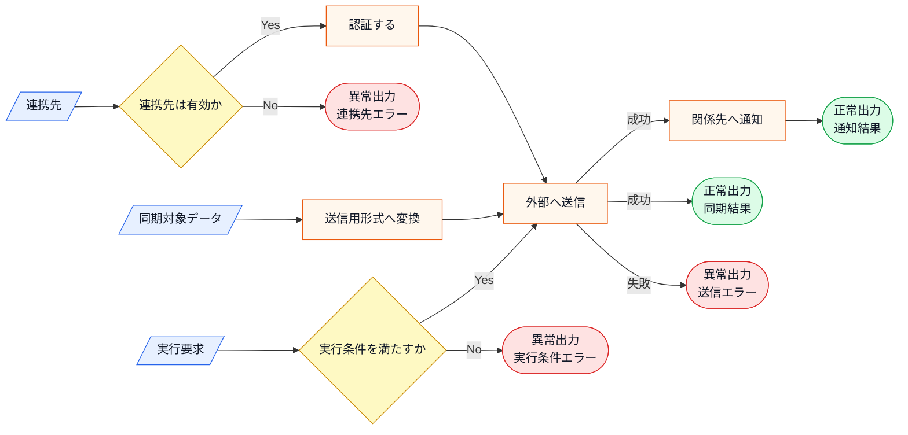
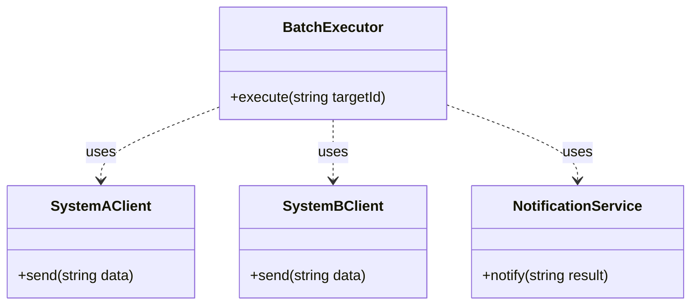
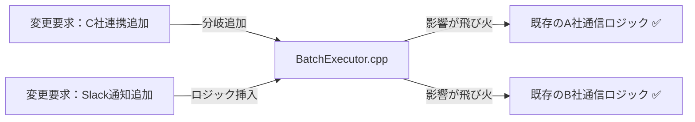
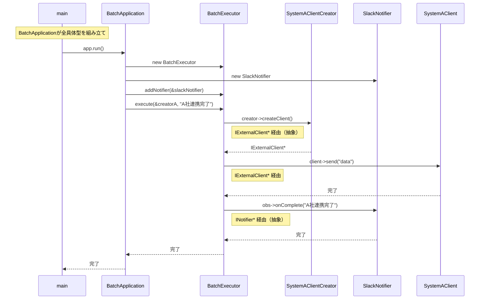
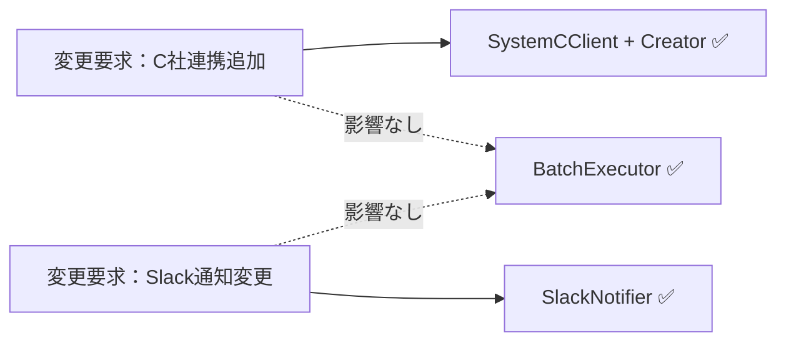
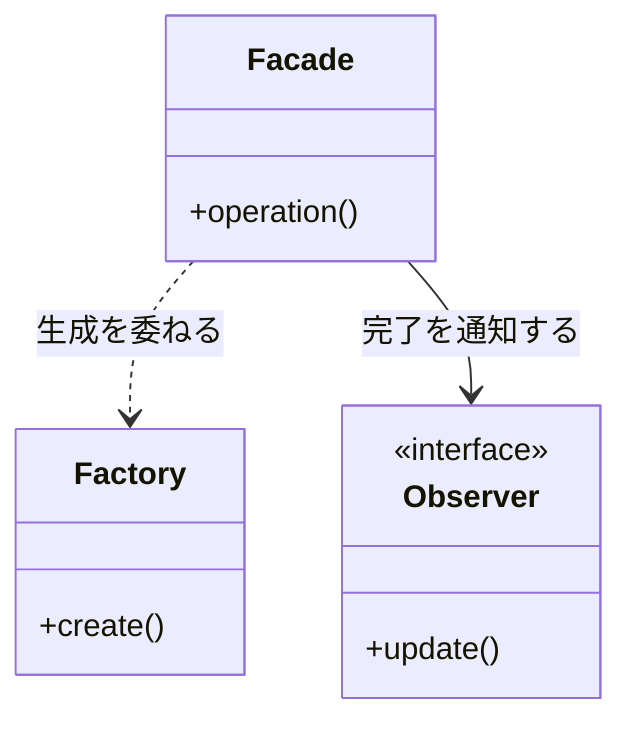

## 第10章 外部連携バッチシステム ―― Facade × Observer × Factory Method パターン

―― 思考の型：複数の「変わる理由」が複雑に絡み合うシステムをどう解くか

### この章の核心

**外部連携の通信手順、通知先、連携クライアントの生成が同じ実行処理に集まっていると、連携先追加でも通知追加でも同じ場所を修正する必要が生じる。こういう問題は、「隠す」「伝える」「作る」という別々の責任が同じ場所に混在しているシステムで起きている。**

### この章を読むと得られること

* **得られること1：** 窓口構造、通知分離構造、生成分離構造の各構造が、システムのどの「変化」に対応するためにあるのかを識別できるようになる。

* **得られること2：** 複数の接続点（クラスとクラスのつなぎ目）が絡み合う複雑なシステムにおいて、それぞれの責務をどこで分離する必要があるか判断できるようになる。

* **得られること3：** 構造の複合適用を通じて、疎結合（クラス間の依存を弱め、変更の影響が広がりにくい状態）な連携アーキテクチャを構築する方法を説明できるようになる。

* **得られること4：** 「生成」と「通知」と「インターフェース統合」という、異なる3つの責務が混在するコードを整理する視点。

---

## 🔵 フェーズ1：現状把握 ―― 仕様を整理し、システムと紐付ける

まずは、外部連携バッチシステムが何を入力として受け取り、どの処理で加工し、何を出力するのかを整理します。ここでは設計の良し悪しを判断せず、現状を事実としてそろえます。

### 1-1：このシステムの仕様

このシステムは、社内の主要システムと外部の物流管理システムを繋ぐ「外部連携バッチシステム」です。日々の注文データや在庫情報を、指定された外部システムへ同期します。

ここまでの説明を、入力・判定・加工・出力の流れとして整理します。

**仕様の入力・加工・出力**



この図から読み取ることは、次の3点です。

- 外部連携は、連携先の確認、形式変換、認証、送信、通知という複数の手順で成立する。
- 連携先が変わると、認証や送信形式など、送信前後の複数箇所に影響が出る。
- 出力には同期結果と通知結果があり、送信に失敗した場合は通知まで進まない。

当初は単一の外部連携先に対してデータを転送するだけのシンプルな構成でしたが、現在は連携先が3社に増え、それぞれが独自のデータフォーマットと接続認証を要求しています。加えて、データの転送完了後に在庫管理システムや社内通知サービスへ「処理完了」を通知する機能も追加されました。

バッチ処理の中枢となる部分が、すべての連携先との通信制御、データ変換、完了後の通知処理を抱えています。連携先が増えるたびに、その処理が追加されています。この章では、この現状を仕様とコードの対応から整理します。

**現在の連携先システム一覧**

連携先ごとに接続方式や認証方法が異なるのは、外部企業との連携では珍しくありません。各社がそれぞれ独自のAPIを持っており、こちら側がその仕様に合わせる必要があるためです。バッチ種別（月次・手動）も、業務の性質によって決まります。月次バッチは「月末締め処理」、手動トリガーは「緊急の在庫修正」など、業務上の都合を反映したものです。

| 連携先 | 役割 | バッチ種別 | 接続方式 |
|---|---|---|---|
| A社（物流管理） | 注文データの同期 | 月次バッチ | REST API（トークン認証） |
| B社（在庫管理） | 在庫情報の同期 | 手動トリガー | REST API（APIキー認証） |

連携先が2社だと管理しやすく見えますが、ビジネスの拡大に伴って「C社も追加」「D社とも連携」という要求は現実によく起きます。最初に設計の境界を引かないまま追加していくと、処理が複雑になっていく典型的な例です。

**バッチ処理の流れ**

「認証→取得→送信→通知」という4ステップの流れは、外部API連携では一般的な構成です。認証を毎回行うのは、セキュリティ上の理由からセッションを使い捨てにする設計が外部連携では多いためです。完了通知のステップは「転送が成功したかどうかを関係者が知る手段」として存在しており、運用上の監視や障害対応に欠かせません。

| ステップ | 処理内容 |
|---|---|
| ① 認証 | 連携先のAPIに接続・認証する |
| ② データ取得 | 社内システムから送信対象データを取得する |
| ③ データ送信 | 連携先のフォーマットに変換してAPIへ送信する |
| ④ 完了通知 | 処理完了を在庫管理システム・社内通知サービスへ通知する |

このフロー自体はどの連携先でも守りたい骨格です。一方、各ステップの中身（どの会社のAPIに接続するか、どのサービスへ通知するか）は連携先ごとに変わります。この「守りたい流れ」と「変わる中身」の分離が、この章の核心になります。

**この仕様を決める業務機能**

業務機能が複数あるのは、「どの業務機能が何の知識を持つか」が分かれているからです。インフラ・システム管理の領域はAPIのプロトコルを知っており、通知・連携管理の領域は通知文面のルールを知っています。この知識の分散は業務上自然なことですが、それぞれの業務機能の判断が変わるたびに同じ箇所を修正することになると、設計上の問題になります。

**この仕様を決める業務機能**
| 業務機能 | この章の仕様で決めていること |
|---|---|
| インフラ・システム管理 | 各連携先のAPIプロトコル・認証方式 |
| システム設計・生成管理 | 通知サービスの選定・生成方針 |
| 通知・連携管理 | 通知先の一覧・通知文面のルール |

後のフェーズで変更要求を扱うとき、変更の理由は3つの異なる方向から来るものとして確認します。「A社のAPI仕様が変わった（インフラ・システム管理の領域）」「Slackを通知先に追加したい（通知・連携管理の領域）」「新しいC社を連携先に追加する（システム設計・生成管理の領域）」——これらは互いに無関係な変更です。この事実は、後のフェーズで変更要求を分類するときの材料になります。

後のフェーズで変更要求を扱うとき、どの業務機能の知識なのかを確認するための名前として使います。

### 1-2：動作例テーブル

コードを読む前に、このシステムがどんな入力に対してどんな出力を返すかを確認します。この章の各ステップは、基本シナリオを実現します（エラー系は除く）。エラー系シナリオ（タイムアウト・API障害等）はエラー動作に依存するため、動作仕様の確認として使用してください。

| シナリオ | 操作 | 外部API状態 | 結果/通知 |
| --- | --- | --- | --- |
| 月次バッチ・A社正常応答 | A社向け月次バッチを実行する | 正常応答 | A社へデータ転送成功 / Slack「A社連携完了」 |
| 月次バッチ・C社タイムアウト | C社向け月次バッチを実行する | タイムアウト | 3回リトライ後に失敗ログ記録 / Slack「C社連携失敗」 |
| 日次バッチ・新規D社追加後 | D社向け日次バッチを実行する | 正常応答 | D社向け新クライアントがデータ転送成功 / Slack「D社連携完了」 |
| 手動トリガー・B社正常応答 | B社向けデータ同期を手動で実行する | 正常応答 | B社へ手動データ転送成功 / Slack「B社手動連携完了」 |
| バッチ失敗・監視チーム設定あり | A社向け月次バッチを実行する（API障害） | 障害 | 転送失敗ログ記録 / Slack＋メール両方に通知 |
| 通知先にログ基盤追加後 | B社向けバッチを実行する | 正常応答 | B社へデータ転送成功 / Slack＋ログ基盤へ同時通知 |

次は仕様とクラスを対応づけます。

**このシステムの登場クラス**

| クラス名 | 役割 | 担当する仕様 |
|---|---|---|
| BatchExecutor | 全体のバッチ実行・処理の制御 | 対象システムへのデータ送信処理と結果通知の統括 |
| SystemAClient / SystemBClient | 各連携先へのデータ送信 | 各外部システムに合わせたデータ送信 |
| NotificationService | 連携完了の通知 | バッチ実行完了の通知 |
| PartnerDatabase | パートナー設定の管理 | パートナーIDの存在確認・有効フラグ・設定情報の提供 |

---

### 1-3：登場クラスとクラス構成図

現在のクラス構造に登場するクラスを先に確認します。

| クラス名 | 役割 | 担当する仕様 |
|---|---|---|
| `BatchExecutor` | 外部連携バッチ全体を実行する | 連携先選択、送信、通知の呼び出し |
| `SystemAClient` | A社向けにデータを送信する | A社連携 |
| `SystemBClient` | B社向けにデータを送信する | B社連携 |
| `NotificationService` | 連携結果を通知する | 完了通知 |

各クラスの責任を把握したところで、クラス間の関係を図で確認します。



**クラス図に出てくる主な操作**

| クラス | 操作 | 何ができるか |
|---|---|---|
| `BatchExecutor` | `execute()` | 連携先IDを受け取り、送信処理と通知処理を進める |
| `SystemAClient` | `send()` | A社向けの形式でデータを送信する |
| `SystemBClient` | `send()` | B社向けの形式でデータを送信する |
| `NotificationService` | `notify()` | 外部連携の結果を通知する |


---

### 1-4：実装コード（現状）

連携処理の起点となる `BatchExecutor` の様子です。

このシステムには以下の3件のパートナーデータがあらかじめ登録されています。

| パートナーID | 名称 | 有効 |
|---|---|---|
| PARTNER_A | 物流会社A | ✓ |
| PARTNER_B | 決済会社B | ✓ |
| PARTNER_C | 分析会社C | ✗（無効） |

無効なパートナーや未登録のIDを指定するとエラーになります。コードを読む前にこの対応を把握しておくと、動作結果が追いやすくなります。

```cpp
#include <iostream>
#include <string>
#include <vector>
#include <map>

using namespace std;

struct PartnerConfig {
    string name;      // パートナー名
    string endpoint;  // エンドポイント（概念上）
    bool isEnabled;   // 連携有効フラグ
};

class PartnerDatabase {
private:
    map<string, PartnerConfig> records;
public:
    PartnerDatabase() {
        records["PARTNER_A"] = {"物流会社A", "logistics-a.example",  true};
        records["PARTNER_B"] = {"決済会社B", "payment-b.example",    true};
        records["PARTNER_C"] = {"分析会社C", "analytics-c.example",  false}; // 無効
    }

    bool exists(const string& id) const {
        return records.count(id) > 0;
    }

    bool isEnabled(const string& id) const {
        return records.at(id).isEnabled;
    }

    PartnerConfig get(const string& id) const {
        return records.at(id);
    }
};

class SystemAClient {
public:
    void send(string d) { cout << "A社へ送信: " << d << endl; }
};
class SystemBClient {
public:
    void send(string d) { cout << "B社へ送信: " << d << endl; }
};
class NotificationService {
public:
    void notify(string r) { cout << "完了通知: " << r << endl; }
};

class BatchExecutor {
    PartnerDatabase db;
public:
    void execute(string partnerId) {
        if (!db.exists(partnerId)) {
            cout << "エラー: パートナーID [" << partnerId
                 << "] はデータベースに登録されていません。" << endl;
            return;
        }
        if (!db.isEnabled(partnerId)) {
            PartnerConfig cfg = db.get(partnerId);
            cout << "エラー: パートナー [" << cfg.name
                 << "] は現在無効です。処理を中断します。" << endl;
            return;
        }
        PartnerConfig cfg = db.get(partnerId);
        if (partnerId == "PARTNER_A") {
            SystemAClient client; // A社向けクライアントを生成
            client.send("data");
        } else if (partnerId == "PARTNER_B") {
            SystemBClient client; // B社向けクライアントを生成
            client.send("data");
        }
        NotificationService notifier; // 連携完了を通知
        notifier.notify(cfg.name + " 連携完了");
    }
};

int main() {
    BatchExecutor executor;

    // 行1: A社向け月次バッチを実行する
    executor.execute("PARTNER_A");

    // 行4: B社向けデータ同期を手動で実行する
    executor.execute("PARTNER_B");

    // 無効パートナーの実行（C社は isEnabled==false）
    executor.execute("PARTNER_C");

    // 未登録パートナーの実行
    executor.execute("PARTNER_X");

    return 0;
}
```

実行対象コード：1-4の現状コード
対応する動作例：1-2の動作例テーブル
確認したいこと：入力、加工、出力が仕様どおりに対応していること

実行結果：

```
A社へ送信: data
完了通知: 物流会社A 連携完了
B社へ送信: data
完了通知: 決済会社B 連携完了
エラー: パートナー [分析会社C] は現在無効です。処理を中断します。
エラー: パートナーID [PARTNER_X] はデータベースに登録されていません。
```

> [!NOTE]
> 上記は現状コードで確認できる代表的なケースです。行2（C社タイムアウト）・行3（D社追加後）・行5（API障害）・行6（通知先追加後）は、リトライ・新規クライアント・複数通知先といった機能が現状コードに未実装のため、フェーズ7の最終実装で対応されます。

このコードから、`BatchExecutor` が各連携先の生成と送信、さらにはその後の通知処理までを一手に引き受けていることが分かります。

---

### 1-5：変更要求

【プロジェクトマネージャーと運用チームからの要求】
ある金曜日の午後、プロジェクトマネージャーから緊急の相談が飛び込んできました。

「お疲れ様。現在運用している外部連携バッチなんだけど、来週から新たにC社とも連携することになったんだ。それに加えて、連携処理の結果を社内のSlackへ自動通知するようにしてほしいという要望が出ている。データ転送のロジックを修正するついでに、通知処理についても何か良い仕組みを取り入れられないかな？」

**仕様変更の内容**

変更要求を受けて、現在の仕様がどう変わるかを整理します。

| 項目 | 変更前 | 変更後 |
|---|---|---|
| 連携先 | A社・B社の2社 | C社（配送管理）を追加して3社 |
| バッチ完了通知 | なし | Slack へ自動通知（成功・失敗を問わず） |

**変更後の連携先・通知先一覧**

| 種別 | 名称・役割 | 変更前 | 変更後 |
|---|---|---|---|
| 連携先 | A社（物流管理・月次バッチ） | ✅ 既存 | 変更なし |
| 連携先 | B社（在庫管理・手動トリガー） | ✅ 既存 | 変更なし |
| 連携先 | C社（配送管理・月次バッチ） | — | ✅ 新規追加 |
| 通知先 | Slack（完了通知） | — | ✅ 新規追加 |

連携先と通知先は、それぞれ独立した変化軸です。「C社を追加する」変更と「Slack通知を追加する」変更は担当者も変更タイミングも異なります。

---

## 🟣 フェーズ2：仮説立案 ―― 何が変わるかを観察し、ヒアリングで裏付ける
フェーズ1で、`BatchExecutor` が連携先クライアントの生成・通信・通知処理をすべて直接保持している現状を把握しました。届いた変更要求を踏まえ、この設計における変わる見込みと当面安定の前提を整理します。

### 2-1：変わりそうな仕様の見当をつける

ここで作る一覧は、思いつきで「変わりそう」と感じたものを並べる表ではありません。フェーズ1で確認した仕様・動作例・クラス図を材料に、次の順で候補を絞ります。

1. 仕様図と動作例から、入力・判定・加工・出力のうち条件や値が変わりそうな箇所を拾う。
2. その箇所が、1-3のどのクラス・メソッドに書かれているかを対応づける。
3. その仕様が、どんな理由で、何をきっかけに、どのくらいの頻度で変わりそうかを仮説として書く。
4. 逆に、当面変えない前提にできる処理の骨格も分けておく。

この手順で見ると、「外部連携バッチを実行する」という大きな処理全体ではなく、その中のどの連携先・通信仕様・通知先が変更候補なのかを読者自身で追えるようになります。

フェーズ1の仕様表を振り返ります。このバッチシステムには「外部連携」「通知」「バッチ制御フロー」という3つの側面があります。このうち変化が予想される仕様があります。

- **外部連携先の種類と通信仕様**（A社・B社・C社、それぞれのAPIプロトコル）：ビジネス拡大に伴い新しい連携先が追加されることがあります。今回のC社追加がその例です
- **通知先の種類**（メール・Slack・ログ収集基盤など）：業務の運用方法が変わるにつれて、通知先も追加・変更されます

一方、「バッチを実行して結果を通知する」という全体制御フローは、バッチ処理の基本として安定している部分です。

**仮説：外部連携先の種類と通知先の種類は、今後も追加・変更が続く可能性がある。**

この仮説をヒアリングで確認します。

### 2-2：今回の変更で確実に変わること

この変更要求で確実に発生する変更を整理します。「将来起きるかもしれない」ではなく、「今回の要件として決まっている」ものだけを載せます。

| **変更内容** | **具体的な変更箇所** | **根拠（変更要求）** |
| --- | --- | --- |
| C社との外部連携を追加する | `BatchExecutor` に `SystemCClient` の生成と呼び出しロジックを追加 | PM「来週からC社とも連携」 |
| Slackへの完了通知を追加する | `BatchExecutor` 内に Slack への通知処理を挿入 | PM「Slackへ自動通知してほしい」 |

### ヒアリングに向けた背景確認

変更要求の内容は把握できました。しかし「今回だけの変更か、これからも続く変化の始まりか」によって、設計の判断は大きく変わります。仮説を携えて関係者に確認する前に、このシステムの来歴を整理しておきます。

このバッチシステムは、当初A社1社との連携だけを想定して作られました。シンプルな要件だったため、`BatchExecutor` がすべてを直接担う形で問題はありませんでした。その後B社が加わり、次第にC社も対象となり、連携先が増えるたびに `if-else` の分岐が追加されてきました。通知処理も最初はコンソール出力だけでしたが、後から `NotificationService` が付け足された経緯があります。

今回の変更要求もその延長線上にあります。「今回はC社とSlack」で終わるかどうか——それをヒアリングで確認します。

### 2-3：関係者ヒアリング

仮説を携え、運用担当者と協議を行いました。

* **開発者：** 「C社との連携ですが、今回のデータフォーマットは既存のA社やB社と大きく異なりますか？」

* **運用担当者：** 「フォーマットは別物だね。また、今後D社やE社も控えているから、接続先の追加はこれからも発生するよ。」

* **開発者：** 「通知についてはどうでしょうか？ Slack以外にもメール通知が必要になる可能性はありますか？」

* **運用担当者：** 「そうだね、将来的にはログ収集基盤へのデータ投入も検討している。ただ、転送成功か失敗かという『結果の通知』という仕組み自体は今後も変わらないよ。」

* **開発者：** 「分かりました。外部との通信ロジックと、通知という振る舞いは、それぞれ独立して増殖していく可能性があるということですね。」

ヒアリングにより、通信先（生成）の増殖と、通知処理（イベントの反応）の多様化が、それぞれ別個の変化軸として扱うべきものだと確認できました。

### 2-4：ヒアリングで判明した将来リスク

ヒアリングで判明した「将来起きるかもしれない」変化をまとめます。確定変更（2-2）とは別に管理することで、今回の設計判断と将来への備えを混在させずに済みます。

| **将来のリスク** | **変わる可能性がある箇所** | **根拠（誰が言ったか）** |
| --- | --- | --- |
| D社・E社など連携先がさらに増える | `BatchExecutor` 内の振り分けロジック全体 | 運用担当者「D社・E社も控えている」 |
| Slack以外にメール・ログ基盤への通知が追加される | 通知処理全体 | 運用担当者「ログ収集基盤も検討中」 |
| バッチの実行フロー自体は今回の変更対象ではない | 当面安定 | 運用担当者「仕組み自体は今回は変えない」 |

フェーズ2で「何を変え、何を守るか」が確定しました。次のフェーズ3では、この変更要求を現在のコードで実行しようとすると何が起きるか、その痛みを確認します。

### 2-5：変わる見込みと当面安定の前提を確定する

ヒアリングで「D社・E社連携」と「メール・ログ基盤通知」の追加が予告されました。この変更が来たとき、仕様がどう変わるかを整理しておきます。

| 変更内容 | 現在 | 将来（数ヶ月後） |
|---|---|---|
| SystemAClient（A社連携） | 対応済み | 変更なし |
| SystemBClient（B社連携） | 対応済み | 変更なし |
| SystemCClient（C社連携） | 今回追加 | 変更なし |
| D社・E社連携 | —（なし） | 追加予定 |
| Slack通知 | 今回追加 | 変更なし |
| メール・ログ基盤通知 | —（なし） | 追加予定 |

連携先と通知先が同時に増えると、`BatchExecutor` の 1 クラスに複数の変更軸が積み重なることになります。この痛みをフェーズ3で確認します。

---

## 🟣 フェーズ3：問題特定 ―― 変更の痛みを発見する
### 3-1：変更を試みる

フェーズ2で確定した変更を、既存の `BatchExecutor` にそのまま組み込もうとします。「C社連携の追加」と「Slack通知の追加」——どちらもシンプルに聞こえますが、実際にコードを変えようとすると何が起きるかを確認します。

変更を試みると、次のようなコードになります。

```cpp
// C社連携を追加しようとすると...
class BatchExecutor {
public:
    void execute(string targetId) {
        if (targetId == "A") {
            SystemAClient client;
            client.send("data");
        } else if (targetId == "B") {
            SystemBClient client;
            client.send("data");
        } else if (targetId == "C") {          // ← 新しい連携先を追加
            SystemCClient client;              // ← SystemCClientも追加が必要
            client.send("data");
        }
        // Slack通知を追加しようとすると、通知の仕組みも一緒に変更が必要
        NotificationService notifier;
        notifier.notify("Success");
        SlackNotifier slack;                  // ← 通知先を増やすとここも増える
        slack.notify("Success");
    }
};
```

変更後のコードを実行すると、次のような結果になります。

```cpp
// 動作確認用のスタブ
class SystemAClient {
public:
    void send(std::string data) {
        std::cout << "[A社] " << data << std::endl;
    }
};
class SystemCClient {
public:
    void send(std::string data) {
        std::cout << "[C社] " << data << std::endl;
    }
};
class NotificationService {
public:
    void notify(std::string msg) {
        std::cout << "[メール通知] " << msg << std::endl;
    }
};
class SlackNotifier {
public:
    void notify(std::string msg) {
        std::cout << "[Slack通知] " << msg << std::endl;
    }
};

int main() {
    BatchExecutor executor;
    executor.execute("A"); // A社連携
    std::cout << "---" << std::endl;
    executor.execute("C"); // C社連携（新規）
    return 0;
}
```

実行対象コード：3-1の変更試行コード
対応する動作例：変更要求後の代表ケース
確認したいこと：変更要求を現状構造へ当てはめたとき、修正箇所と痛みがどこに出るか

実行結果：

```
[A社] data
[メール通知] Success
[Slack通知] Success
---
[C社] data
[メール通知] Success
[Slack通知] Success
```

動作は正しくなっています。しかし A社のバッチを実行したときも Slack通知が走っており、C社追加のついでに Slack通知も全社に影響しています。

このコードの何が問題か。「C社連携を追加したい」という要求と「Slack通知を追加したい」という要求は、本来まったく別の話のはずです。しかし `BatchExecutor` の `execute()` メソッドの中で両方が混在しているため、1つの変更を加えると、関係のない他の処理にも手が届いてしまいます。

さらに、D社が追加されればまた `if-else` が伸びます。メール通知が追加されれば、また通知の行が増えます。このメソッドは変更要求のたびに肥大化し続ける構造になっています。

### 3-2：変更影響グラフ

現状の構造で変更を試みた際、影響がどのように飛び火するかを可視化します。



グラフが示す通り、C社連携の追加やSlack通知の実装といった個別の要求が、既存の他の連携先ロジックにまで影響を及ぼす構造になっています。

### 3-3：痛みの言語化

「連携先が増えるたびに、既存の安定している通信処理までテストし直さないといけないのか…」

変更をシミュレートする中で、エンジニアとして感じる「痛み」が2つ明確になりました。

1つ目は、`BatchExecutor` が抱える「巨大な責任」の辛さです。このクラスは本来、バッチ処理全体のフローを制御するだけでいいはずなのに、連携先ごとの具体的な通信手段や、通知先といった「詳細」までをすべて把握し、生成まで行っています。これでは、連携先が増えるたびに管理不能なほど複雑なコードになるのは必然です。

2つ目は、連携の「生成」と「通知」という、変わる理由が異なる責務が混在していることです。連携先の通信仕様が変わるのか、それとも通知の要件が変わるのかにかかわらず、同じ大きなクラスを編集し、無関係な処理まで影響確認する必要があります。

---
> **📌 問題（確定）**
> 外部連携バッチシステムでは、「連携先の追加」「通知先の追加」「生成方法の変更」という3つの変化が、それぞれ異なる業務機能によって独立して発生する。どの変化が来ても `BatchExecutor` を開かなければならず、関係のない他の連携先ロジックや通知処理まで再テストを強いられる。
---

さらに、ヒアリングで予告された D社・E社の連携追加やログ基盤への通知も加わると、`BatchExecutor` の条件分岐がさらに増え、「連携」「通知」「生成」という 3 つの変更軸が 1 クラスにさらに積み重なることが見えてきます。ヒアリング段階ではまだ仕様が固まっていないため全コードを書ける状況ではありませんが、複数の変更軸が同じクラスに混在する構造は変わりません。

フェーズ3で「今の構造では変更が辛い」という事実が確認できました。次のフェーズ4では、この痛みの原因を構造的に分析します。

---

## 🟠 フェーズ4：原因分析 ―― なぜ辛いのかを構造で言語化する
フェーズ3で「外部連携先が増えるたびに、バッチ処理全体のコードが修正のたびに不安定になる」という痛みを確認しました。なぜこのような状態に陥るのか、その根本原因を構造的な視点で分析します。

### 4-1：痛みの根源を探る（観察と原因）

フェーズ3で観察した「痛み」と、その背後にある構造的な原因を対応させます。

| **観察した症状（痛み）** | **構造的な原因（痛みの根源）** |
| --- | --- |
| 新しい連携先を追加するたびに `BatchExecutor` の生成コードを修正する必要があります。また、複数の連携先（A社・B社・C社）との通信詳細が `BatchExecutor` 内に直接展開されており、連携先ごとの接続手順を全て把握する必要があります | 生成の混在（具体クラスの生成がビジネスロジックに混在）＋複雑さの露出（外部APIの詳細を `BatchExecutor` が直接知っている） |
| 転送結果の通知仕様を変えると、連携処理のフロー全体まで影響を受ける | 通知の密結合（通知先追加のたびに `BatchExecutor` の変更が必要） |


これら3つの根本原因は**それぞれ独立した変化軸**です。

- 連携先が増えても通知先は変わりません
- 通知先が増えても連携先クライアントの生成方法は変わりません
- 生成の仕組みが変わっても複数サブシステムの窓口の役割は変わりません

3つが独立しているからこそ、1つの構造だけでは解決しきれません。

### 4-2：変わるもの/変わってほしくないもの

> **「変わらないもの」と「変わってほしくないもの」は異なります。** 「変わらないもの」は経験的事実（今まで変わっていない）、「変わってほしくないもの」は設計意図（ここを安定させてほかを守りたい）です。ここで整理するのは後者です。

変更理由の種類が異なる要素を整理します。

| **変わり続けるもの（🔴）** | **変わってほしくないもの（🟢）** |
| --- | --- |
| 外部連携先ごとの通信手段（プロトコル・認証等） | バッチ全体の処理実行順序（取得→転送→通知） |
| 通知先のサービスや通知ルール | 通知という「イベント」自体を発生させる責務 |

連携先の追加は今後も発生する「変わる見込み」ですが、バッチ全体の転送フローは今回の変更要求では守りたい骨格です。本来、これらは別の責務として分離されるべきものであり、同じクラス内で扱われていること自体が設計上の歪みを生んでいます。

### 4-3：3つの接続点に漏れている知識を確認する

ここでの「確認すること」は、前節までに見つけた原因から抽出します。まず、原因文から「守りたい骨格」と「変わる差分」を分けます。次に、その差分を動かすために骨格側が知ってしまっている名前・条件・順序・型を拾います。最後に、接続点に残す最小の約束を、値・型・操作・イベントとして書きます。

原因によって、接続点で見る抽象観点は変わります。条件分岐が原因なら条件・定数・選択基準を見ます。処理手順が原因なら呼び出し順・前後条件・失敗時分岐を見ます。生成判断が原因なら具体クラス名・生成条件・登録場所を見ます。通知や外部連携が原因なら通知先・タイミング・成否の扱いを見ます。データや状態が原因なら、境界を流れる値・型・状態を見ます。

`BatchExecutor`が、外部連携、通知、生成について何を知っているかを確認します。

今の `BatchExecutor` と各クライアント、および通知サービスとの接続は、各連携先のクラス名・呼び出し順序・通知方法・生成方法が`BatchExecutor`へ集まっています。

接続点ごとに「`BatchExecutor`へ漏れている知識」を見ると、独立して変わる
三つの判断が一つのクラスへ集まっていることが分かります。

| 接続点 | 漏れている知識 | 変更時の波及 |
|---|---|---|
| バッチ → 外部連携 | 連携先のクラス名・認証・呼び出し順序 | 連携先追加で実行本体を変更 |
| バッチ → 通知 | 通知サービス名・通知先・通知条件 | 通知先追加で実行本体を変更 |
| バッチ → 生成 | クライアントの生成方法・所有権 | 生成方法変更で実行本体を変更 |

---
> **📌 原因（確定）**
> `BatchExecutor` が各連携先クライアント（`SystemAClient` 等）と通知サービス（`NotificationService`）を生成方法と呼び出し手順を知っていることが根本原因である。連携先の追加・通知先の変更・生成方法の見直しという変わる理由がそれぞれ異なる頻度で発生するため、変化のたびに `BatchExecutor` 全体への影響確認コストが発生し続ける。
---

フェーズ4で根本原因が言語化できました。次のフェーズ5では、解決する課題を具体的に定義していきます。

---

## 🟡 フェーズ5：課題定義 ―― 解くべき接続点を定める
フェーズ4で、「外部連携ロジック（通信）」「連携先クライアントの生成」「イベント通知」という3つの変化軸が `BatchExecutor` 内で密結合していることが根本原因だと特定しました。連携先ごとに異なる通信プロトコル、将来増えるであろう連携先の生成ロジック、そして通知手段の多様化を、現在の構造のまま扱い続けることは限界に達しています。

今回のリファクタリングで「何を解決する必要があるか」を整理すると、接続点が3つあることが分かります。

- **接続点A**：`BatchExecutor` ←→ 各外部システム（SystemA/B/C）の通信境界
- **接続点B**：`BatchExecutor` ←→ 通知サービス（NotificationService）の通知境界
- **接続点C**：`BatchExecutor` 内部での具体クライアントクラスの生成境界

現在、`BatchExecutor` はこれら3つの接続点に対して、具体的なクラスを直接生成し、メソッドを直接呼び出すため、それぞれの変更理由が同じクラスへ集まっています。連携先（接続点A）の増殖、通知手段（接続点B）の多様化、そして生成ロジック（接続点C）の散在という、3つの異なる変化軸が1つのクラス内で絡み合っているのが最大の課題です。

分離対象の責務を呼び出しているのは `BatchExecutor` クラス自身です。このクラスが連携先・通知先・生成の「詳細」をすべて知っていることが現在の制限事項です。この設計を改善することで、`BatchExecutor` は「バッチの実行順序（フロー）」だけを管理し、実際の処理（通信・通知・生成）は外部化されたクラスに任せることができます。

言い換えると、解くべき課題は次の3点です。接続点Aでは、連携先の通信詳細を `BatchExecutor` から隠すこと。接続点Bでは、通知手段の多様化に対応できる柔軟な仕組みを持つこと。接続点Cでは、連携先クライアントの生成ロジックを1か所に集約すること。この3点を独立して変更できる構造を作ることが、フェーズ6での目標になります。

```cpp
// 現在の BatchExecutor.execute() が知っていること（全部）
void execute(string targetId) {
    if (targetId == "A") {
        SystemAClient client;   // ← 具体クラスを生成している（接続点C）
        client.send("data");    // ← 通信の詳細を知っている（接続点A）
    } else if (targetId == "B") {
        SystemBClient client;   // ← 具体クラスを生成している（接続点C）
        client.send("data");    // ← 通信の詳細を知っている（接続点A）
    }
    NotificationService n;      // ← 通知サービスの実装を知っている（接続点B）
    n.notify("Success");        // ← 通知の詳細を知っている（接続点B）
}
```

このメソッドから「接続点A（通信の詳細）」「接続点B（通知の仕組み）」「接続点C（連携先の生成）」を切り出すことが、次のフェーズ6で取り組む課題です。

---
> **📌 課題（確定）**
> 解くべき課題は3つある。接続点Aでは、連携先クライアントの通信詳細（`SystemAClient` 等が持つ固有の送信処理）を `BatchExecutor` から切り離し、連携先が増えても `BatchExecutor` を変更しなくて済む構造にすること。接続点Bでは、通知先（`NotificationService` 等）を `BatchExecutor` から切り離し、通知先が増えても `BatchExecutor` を変更しなくて済む仕組みを持つこと。接続点Cでは、連携先クライアントの生成ロジックを `BatchExecutor` から切り離し、どのクライアントを生成するかを1か所で管理できるようにすること。
---

### 変わるものを一緒に分離するか、分けて分離するか

3 つの接続点がそれぞれ独立して変わることを確認します。

| 変更軸 | 変わる理由 |
|---|---|
| A（通信）：SystemA/B/C との API | 各外部システムのAPI仕様変更（各社担当者） |
| B（通知）：Slack / メール / ログ基盤 | 通知先の追加・変更（運用チーム） |
| C（生成）：クライアントの生成ロジック | 連携先の増減（同じ開発チーム） |

接続点Aでは各連携先が独立して変わります（A社のAPI変更がB社の処理に影響しない）。接続点Bでは各通知チャンネルが独立して変わります（Slack追加がメール通知に影響しない）。接続点Cの生成ロジックは連携先追加のたびに変わりますが、生成の仕組み自体は共通です。

→ **接続点ごとに別構造で分離し、3 軸が独立して変更できる構造にする**

フェーズ5で「何を解くか」が確定しました。次のフェーズ6では、これらの課題に対して具体的にどのような構造が最適か、コストの観点からステップを検討します。

---

## 🔴 フェーズ6：対策検討 ―― 案を比べ、採用する形を決める
外部連携バッチシステムにおいて、「通信の詳細」「通知処理の多様化」「連携先クライアントの生成」という3つの変更軸が `BatchExecutor` に混在していることが、システムを複雑にする原因です。ここでは、これらの責務を適切に切り離すための対策ステップを検討します。

**どのステップも、動作例テーブルの基本シナリオ（行1・3・4・6）を実現します。エラー系（行2・5）はエラー動作に依存するため各ステップでは省略しています。違うのは「変更が来たときにどこを触ることになるか」です。**

---

### ステップ1：各処理を独立した関数として切り出す（共通構造を発見する）

はじめに最初に思いつく改善として、`execute()` の中身をプライベートメソッドに分けてみます。各連携先への送信処理と完了通知処理を、それぞれ独立したプライベートメソッドとして切り出すことで、各処理の意図をメソッド名で表現できます。

```cpp
// ステップ1：各処理を独立したプライベートメソッドとして切り出す
class BatchExecutor {
public:
    void execute(string targetId) {
        if (targetId == "A") {
            sendToA(); // ← 処理の意図がメソッド名で明確になった
        } else if (targetId == "B") {
            sendToB();
        } else if (targetId == "C") {
            sendToC();
        }
        notifyComplete(); // ← 通知処理もメソッド名で意図を示す
    }
private:
    void sendToA() {
        SystemAClient client; // ← 具体：SystemAClientを直接生成
        client.send("data");
    }
    void sendToB() {
        SystemBClient client; // ← 具体：SystemBClientを直接生成
        client.send("data");
    }
    void sendToC() {
        SystemCClient client; // ← 具体：SystemCClientを直接生成
        client.send("data");
    }
    void notifyComplete() {
        NotificationService n; // ← 具体：NotificationServiceを直接生成
        n.notify("Success");
    }
};
```

`execute()` が短くなり、各メソッドの意図は伝わりやすくなりました。しかし、各プライベートメソッドの中を見ると、依然として具体クラスを直接生成しています。知識の置き場所は変わっていません。

**この段階の評価：** `sendToA()`・`sendToB()`・`sendToC()` はいずれも「クライアントを生成して `send("data")` を呼ぶ」という同じ構造を持っています。引数もなく、戻り値もなく、シグネチャが揃っています。この「複数のメソッドが同じシグネチャを持つ」という気づきは、次のステップで共通の抽象を見出す手がかりになります。また、`execute()` の制御フロー（どの連携先へ送るか）と、各メソッドの処理（実際の送信）が分離されてきており、「処理の実行と制御の判断を別のものとして扱える」という構造の芽が見えてきました。

ただし、連携先が増えるたびに `BatchExecutor` に `sendToD()`・`sendToE()` と追加し続けなければならず、3つの関心（どのクライアントを生成するか・通信の詳細・通知の仕組み）は依然として混在しています。

ここまでで「独立したメソッドに分けると共通の形が見えてくる」ことが確認できました。次のステップ2では、この共通構造をクラスレベルで整理し、依存の問題がどこに残るかを確認します。

---

### ステップ2：責任ごとに整理する（接続・通知・生成）

ステップ1の限界を踏まえて、各連携先クライアントを独立したクラスに切り出し、呼び出し元はそのクラスに処理を「委ねる」形にしてみます。

```cpp
// ステップ2：各クライアントを独立したクラスに切り出す
class SystemAClient {
public:
    void send(string data) { cout << "A社へ送信: " << data << endl; }
};
class SystemBClient {
public:
    void send(string data) { cout << "B社へ送信: " << data << endl; }
};
class SystemCClient {
public:
    void send(string data) { cout << "C社へ送信: " << data << endl; }
};
class NotificationService {
public:
    void notify(string result) { cout << "完了通知: " << result << endl; }
};

// BatchExecutorが具体クラスを知り、処理をそのクラスに委ねる
class BatchExecutor {
public:
    void execute(string targetId) {
        if (targetId == "A") {
            SystemAClient client; // ← 具体：型名を直接書いている
            client.send("data"); // ← 間接：送信処理はclientに委ねる
        } else if (targetId == "B") {
            SystemBClient client;
            client.send("data");
        } else if (targetId == "C") {
            SystemCClient client;
            client.send("data");
        }
        NotificationService n;
        n.notify("Success");
    }
};
```

クラスを分けて処理を委ねるようになりました。しかし `BatchExecutor` は依然として `SystemAClient`、`SystemBClient`、`SystemCClient` のクラス名と生成方法を知っているため、連携先の追加では `BatchExecutor` も修正します。

**評価：** クラスの分離はできたが、`BatchExecutor` が全連携先の具体クラス名を知っている状況は変わっていない。`ManualTriggerController` のような別の呼び出し元ができると、同じ具体クラス名の知識が2か所に重複する。限界が見えてきた。

---

### ステップ3：関数アプローチの限界 ―― 3つの関心が絡み合う

ステップ1とステップ2の改善を経て、問題の輪郭がより鮮明になりました。関数やクラス分割というアプローチでは解消しきれない「3つの関心の絡み合い」が残っています。

`ManualTriggerController`（手動実行コントローラー）が登場した場合を考えてみます。

```cpp
// ManualTriggerControllerも BatchExecutorと同じ具体クラスを重複して使う
class ManualTriggerController {
public:
    void triggerSync(string systemId) {
        // ← BatchExecutorと同じ具体型の知識が重複している
        if (systemId == "A") {
            SystemAClient client; client.send("manualData");
        }
        if (systemId == "B") {
            SystemBClient client; client.send("manualData");
        }
        if (systemId == "C") {
            SystemCClient client; client.send("manualData");
        }
        NotificationService n; n.notify("手動同期完了");
    }
};
```

D社が追加されると、`BatchExecutor` と `ManualTriggerController` の両方を修正する必要があります。この「知識の重複」が関数アプローチの壁です。

3つの関心が今も混在しています。「どの連携先クライアントを生成するか（生成の関心）」「どう通信するか（通信の関心）」「誰に通知するか（通知の関心）」——これら3つは変わる理由がそれぞれ異なるにもかかわらず、同じ場所に同居し続けています。関数アプローチでは、この3つを独立して変更できる構造は作れません。次のステップから、インターフェースと構造による構造的な分離を検討します。

---

### ステップ4：窓口構造を適用する ―― 外部の複雑さを隠す

ステップ3で見えた限界を受けて、連携先クライアントにインターフェースを導入します。`BatchExecutor` はインターフェース型だけを知り、具体的なクライアントクラスへの依存をなくします。

```cpp
// 連携先クライアントのインターフェースを定義
class IExternalClient {
public:
    virtual void send(string data) = 0;
};

class SystemAClient : public IExternalClient {
public:
    void send(string data) override {
        cout << "A社へ送信: " << data << endl;
    }
};
class SystemBClient : public IExternalClient {
public:
    void send(string data) override {
        cout << "B社へ送信: " << data << endl;
    }
};
class SystemCClient : public IExternalClient {
public:
    void send(string data) override {
        cout << "C社へ送信: " << data << endl;
    }
};

// BatchExecutorはインターフェースだけを知る（窓口構造として機能）
class BatchExecutor {
    IExternalClient* client; // ← 抽象：具体クラス名を知らない
public:
    BatchExecutor(IExternalClient* c) : client(c) {}
    void execute() {
        client->send("data"); // ← 直接：インターフェース経由で呼び出す
        // 通知はまだ具体クラスを直接知っている
        NotificationService n;
        n.notify("Success");
    }
};

```

`BatchExecutor` の内部から具体クライアントクラス名が消えました。連携先の複雑さが `IExternalClient` というインターフェースの裏に隠れ、`BatchExecutor` は外部連携の窓口（窓口構造）として機能し始めています。

**評価：** 連携先の詳細を隠すことができた。しかし通知処理（`NotificationService`）はまだ `BatchExecutor` の中で直接生成されている。「Slack以外への通知を追加したい」という変更要求が来ると、また `BatchExecutor` を修正する必要があります。通知の変化軸がまだ残っている。


---

### ステップ5：通知分離構造を加える ―― 通知を疎結合にする

ステップ4で残った「通知の変化軸」を解消します。通知処理にもインターフェースを導入し、通知先をリストで動的に管理する仕組みを加えます。

```cpp
// 通知のインターフェースを定義（通知契約）
class INotifier {
public:
    virtual void onComplete(string result) = 0;
};

class SlackNotifier : public INotifier {
public:
    void onComplete(string result) override {
        cout << "Slack通知: " << result << endl;
    }
};

// BatchExecutorはINotifierのリストを持ち、通知先を直接知らない
class BatchExecutor {
    IExternalClient* client;          // ← 抽象：連携先を知らない
    vector<INotifier*> notifiers;     // ← 通知先リスト（抽象型のみ）
public:
    BatchExecutor(IExternalClient* c) : client(c) {}
    void addNotifier(INotifier* obs) { notifiers.push_back(obs); }

    void execute() {
        client->send("data");
        // 全通知先に通知（通知先を知らない）
        for (int i = 0; i < notifiers.size(); i++) {
            notifiers[i]->onComplete("Success");
        }
    }
};

```

通知先がリストで管理されるようになりました。Slack以外にメール通知やログ基盤への通知を追加したい場合は、`INotifier` を実装した新クラスを作り、`addNotifier()` で登録するだけです。`BatchExecutor`の実行フローは変更しません（組み立て箇所への登録は必要です）。

**評価：** 連携先の複雑さ（窓口構造）と通知の疎結合（通知分離構造）は実現できた。しかし「どの連携先クライアントを生成するか」という判断が、まだ呼び出し元（`main()` や `BatchApplication`）に委ねられている。D社が追加されたとき、呼び出し元で `SystemDClient` を生成して渡す修正が必要になる。生成の知識がまだ分散している。

---

### ステップ6：生成分離構造を加える ―― 生成を一か所に集める（完全解）

ステップ5に残った「生成の分散」を解消します。生成メソッドを`IClientCreator::createClient()`として定義し、連携先ごとのCreatorがオーバーライドします。`BatchExecutor` はCreatorの抽象型だけを受け取り、どのクライアントを生成するかを知りません。

```cpp
// Creatorの契約。createClient()が生成を分離する接続点になる
class IClientCreator {
public:
    virtual ~IClientCreator() = default;
    virtual IExternalClient* createClient() = 0;
};

class SystemAClientCreator : public IClientCreator {
public:
    IExternalClient* createClient() override {
        return new SystemAClient();
    }
};

class SystemBClientCreator : public IClientCreator {
public:
    IExternalClient* createClient() override {
        return new SystemBClient();
    }
};

class SystemCClientCreator : public IClientCreator {
public:
    IExternalClient* createClient() override {
        return new SystemCClient();
    }
};

// BatchExecutorはCreatorの抽象型だけを受け取る
class BatchExecutor {
    vector<INotifier*> notifiers;
public:
    void addNotifier(INotifier* obs) { notifiers.push_back(obs); }

    void execute(IClientCreator* creator) {
        IExternalClient* client = creator->createClient();
        client->send("data");
        for (auto* notifier : notifiers) {
            notifier->onComplete("Success");
        }
    }
};
```

`BatchExecutor` は`IClientCreator`だけを知り、具体的なCreatorやクライアントには依存しません。新しい連携先には新しい具象Creatorを追加し、組み立て箇所で選択します。生成方法の変更が実行フローへ波及しない点が、生成分離構造を導入した効果です。

> [!INFO] コラム: なぜ直接 new してはいけないのか？
> BatchExecutor の中で直接 new SystemCClient() と書いてしまうと、連携先が増えるたびにバッチ実行のコアロジックを修正することになります。生成分離構造を導入することで、BatchExecutor は「誰かが作ってくれたクライアントを使うだけ」になり、新しい連携先が増えたときの主な変更を生成側へ寄せられます。

**評価：** 3つの変化軸（生成・通信・通知）がそれぞれ独立して変更できる構造になった。これが今回の完全解です。

---

### 採用する形を決める

それぞれのステップには一長一短があります。

| **ステップ** | **移した知識** | **特徴** | **残る問題** |
| --- | --- | --- | --- |
| ステップ1 | なし | 読みやすさ向上のみ | 3つの関心が混在したまま |
| ステップ2 | 各処理を別クラスへ移す | クラス分離 | 具体クラス名の知識が複数箇所に重複 |
| ステップ3 | 関数へ整理 | 限界を確認 | 関数では3つの関心を分離できない |
| ステップ4 | 外部連携手順を窓口へ移す | 窓口構造適用 | 通知の変化軸が残る |
| ステップ5 | 通知先の知識を登録先へ移す | 通知分離構造追加 | 生成の知識が分散している |
| ステップ6 | 生成判断をCreatorへ移す | 生成分離構造追加 | 具象Creatorの組み立てが必要 |

今回の決断はステップ6まで進めることです。フェーズ2のヒアリングで「外部連携先の追加（D社・E社）」と「通知方法の多様化（ログ基盤）」が確認されています。変更の決定者と頻度が異なる3つの責務について、外部連携の窓口、通知先の登録、Client生成の境界をそれぞれ明示する構造を採用します。


---

## 🟢 フェーズ7：対策実施 ―― 変化に強いコードを完成させる
ステップ6（外部連携・通知・生成の知識を別々の役割へ移す案）を実装し、外部連携と通知処理の責務をそれぞれ独立したクラスへカプセル化（変更の影響を1クラス内に閉じ込めること）します。

これらの構造は、第2章で学んだ**窓口構造**（ネット銀行の振り込み処理で「複数サブシステムの複雑さを窓口1つに隠す」構造）、第7章で学んだ**通知分離構造**（在庫管理システムで「変化を登録リスナーへ伝搬する」構造）、第8章で学んだ**生成分離構造**（決済プロセッサーの切り替えで「生成の知識を一箇所に集約する」構造）を組み合わせたものです。各構造の詳細は各章を参照してください。

### 7-1：解決後のコード（全体）

フェーズ6で選んだ構造を実装します。連携先クライアントの生成を`IClientCreator`と具象Creatorに、通知処理を`INotifier`として分離しました。

はじめに、通知のインターフェースと具体的な通知クラスを定義します。

```cpp
#include <iostream>
#include <string>
#include <vector>
#include <map>

using namespace std;

struct PartnerConfig {
    string name;      // パートナー名
    string endpoint;  // エンドポイント（概念上）
    bool isEnabled;   // 連携有効フラグ
};

class PartnerDatabase {
private:
    map<string, PartnerConfig> records;
public:
    PartnerDatabase() {
        records["PARTNER_A"] = {"物流会社A", "logistics-a.example",  true};
        records["PARTNER_B"] = {"決済会社B", "payment-b.example",    true};
        records["PARTNER_C"] = {"分析会社C", "analytics-c.example",  false}; // 無効
    }

    bool exists(const string& id) const {
        return records.count(id) > 0;
    }

    bool isEnabled(const string& id) const {
        return records.at(id).isEnabled;
    }

    PartnerConfig get(const string& id) const {
        return records.at(id);
    }
};

// 通知のインターフェース（通知契約）
class INotifier {
public:
    virtual ~INotifier() {}
    virtual void onComplete(string result) = 0;
};

// Slack通知の具体的な実装
class SlackNotifier : public INotifier {
public:
    void onComplete(string result) {
        cout << "Slack通知: " << result << endl;
    }
};

// メール通知の具体的な実装
class EmailNotifier : public INotifier {
public:
    void onComplete(string result) {
        cout << "Email通知: " << result << endl;
    }
};

// ログ基盤への記録
class LogNotifier : public INotifier {
public:
    void onComplete(string result) {
        cout << "ログ基盤へ記録: " << result << endl;
    }
};
```

バッチ実行ログ（`BatchLog`）はシステム起動時は空で、バッチが実行されるたびに結果を1件追記します。無効パートナーのスキップも記録します。ファイルへの保存は行わず、実行中のメモリ上にのみ保持します。

```cpp
struct BatchRecord {
    std::string partnerId;
    std::string partnerName;
    std::string status;   // "成功", "失敗", "スキップ（無効）"
};

// バッチ実行ログを管理するクラス
class BatchLog {
    std::vector<BatchRecord> records;
public:
    void add(const std::string& partnerId, const std::string& partnerName,
             const std::string& status) {
        records.push_back({partnerId, partnerName, status});
    }
    void printAll() const {
        for (const auto& r : records) {
            std::cout << "[" << r.partnerId << "] " << r.partnerName
                      << " -> " << r.status << std::endl;
        }
    }
    int size() const { return (int)records.size(); }
};
```

`INotifier` を定義することで、通知先ごとの送信方法を個別クラスへ分けられます。新しい通知先を利用するときは、このインターフェースを実装したクラスを追加し、組み立て箇所で登録します。

次に、連携先クライアントのインターフェースと実装を定義します。

```cpp
// 連携先クライアントのインターフェース（窓口構造の内部で使われる）
class IExternalClient {
public:
    virtual ~IExternalClient() {}
    virtual void send(string data) = 0;
};

// A社向け実装
class SystemAClient : public IExternalClient {
public:
    void send(string data) {
        cout << "A社へ転送: " << data << endl;
    }
};

// B社向け実装（以降、連携先が増えるたびにこの形で追加する）
class SystemBClient : public IExternalClient {
public:
    void send(string data) {
        cout << "B社へ転送: " << data << endl;
    }
};

class SystemCClient : public IExternalClient {
public:
    void send(string data) {
        cout << "C社へ転送: " << data << endl;
    }
};

// D社向け実装（新規追加）
class SystemDClient : public IExternalClient {
public:
    void send(string data) {
        cout << "D社へ転送: " << data << endl;
    }
};
```

各連携先クライアントは`IExternalClient`を実装します。D社を追加するときは、クライアントと対応するCreatorを追加します。

生成メソッドの契約と、連携先ごとの具象Creatorを定義します。

```cpp
// Creatorの契約：サブクラスが生成方法を決める
class IClientCreator {
public:
    virtual ~IClientCreator() = default;
    virtual IExternalClient* createClient() = 0;
};

class SystemAClientCreator : public IClientCreator {
public:
    IExternalClient* createClient() override {
        return new SystemAClient();
    }
};

class SystemBClientCreator : public IClientCreator {
public:
    IExternalClient* createClient() override {
        return new SystemBClient();
    }
};

class SystemCClientCreator : public IClientCreator {
public:
    IExternalClient* createClient() override {
        return new SystemCClient();
    }
};

class SystemDClientCreator : public IClientCreator {
public:
    IExternalClient* createClient() override {
        return new SystemDClient();
    }
};
```

各具象Creatorが、自分に対応するクライアントの生成だけを知ります。`BatchExecutor`は`IClientCreator`だけを知り、生成する具体型を知りません。

最後に、フローを統括する `BatchExecutor` と組み立てを示します。

```cpp
// バッチ全体のフローを統括するクラス（窓口構造）
class BatchExecutor {
    vector<INotifier*> notifiers;
public:
    void addNotifier(INotifier* obs) { notifiers.push_back(obs); }

    void execute(IClientCreator* creator, string completionMessage) {
        // 生成分離構造を抽象Creator経由で呼び出す
        IExternalClient* client = creator->createClient();
        client->send("data");
        for (auto* notifier : notifiers) {
            notifier->onComplete(completionMessage);
        }
    }
};

class ManualTriggerController {
    IExternalClient* client;
    vector<INotifier*> notifiers;
public:
    ManualTriggerController(IExternalClient* c) : client(c) {}
    void addNotifier(INotifier* notifier) {
        notifiers.push_back(notifier);
    }
    void triggerSync(string targetId) {
        cout << "[ManualTrigger] " << targetId
             << " への手動同期を実行。" << endl;
        client->send("manualData");
        for (auto* notifier : notifiers) {
            notifier->onComplete(targetId + "社手動連携完了");
        }
    }
};

class BatchApplication {
    PartnerDatabase db;

    bool validate(const string& partnerId) {
        if (!db.exists(partnerId)) {
            cout << "エラー: パートナーID [" << partnerId
                 << "] はデータベースに登録されていません。" << endl;
            return false;
        }
        if (!db.isEnabled(partnerId)) {
            PartnerConfig cfg = db.get(partnerId);
            cout << "エラー: パートナー [" << cfg.name
                 << "] は現在無効です。処理を中断します。" << endl;
            return false;
        }
        return true;
    }

public:
    void run() {
        BatchLog batchLog;
        SlackNotifier slack;
        LogNotifier log;
        SystemAClientCreator creatorA;
        SystemBClientCreator creatorB;
        SystemDClientCreator creatorD;

        cout << "--- 行1: A社月次バッチ ---" << endl;
        if (validate("PARTNER_A")) {
            PartnerConfig cfgA = db.get("PARTNER_A");
            BatchExecutor executorA;
            executorA.addNotifier(&slack);
            executorA.execute(&creatorA, cfgA.name + " 連携完了");
            batchLog.add("PARTNER_A", cfgA.name, "成功");
        } else {
            batchLog.add("PARTNER_A", "物流会社A", "失敗");
        }

        cout << "--- 行3: D社日次バッチ（新規連携先） ---" << endl;
        // D社はPartnerDatabaseに未登録のためエラーになる例として示す
        if (validate("PARTNER_D")) {
            BatchExecutor executorD;
            executorD.addNotifier(&slack);
            executorD.execute(&creatorD, "D社連携完了");
            batchLog.add("PARTNER_D", "D社", "成功");
        } else {
            batchLog.add("PARTNER_D", "D社", "失敗");
        }

        cout << "--- 行4: B社手動トリガー ---" << endl;
        if (validate("PARTNER_B")) {
            PartnerConfig cfgB = db.get("PARTNER_B");
            IExternalClient* bClient = creatorB.createClient();
            ManualTriggerController manual(bClient);
            manual.addNotifier(&slack);
            manual.triggerSync("B");
            batchLog.add("PARTNER_B", cfgB.name, "成功");
        } else {
            batchLog.add("PARTNER_B", "決済会社B", "失敗");
        }

        cout << "--- 行6: B社バッチ（Slack＋ログ基盤） ---" << endl;
        if (validate("PARTNER_B")) {
            PartnerConfig cfgB = db.get("PARTNER_B");
            BatchExecutor executorB;
            executorB.addNotifier(&slack);
            executorB.addNotifier(&log);
            executorB.execute(&creatorB, cfgB.name + " 連携完了");
            batchLog.add("PARTNER_B", cfgB.name, "成功");
        } else {
            batchLog.add("PARTNER_B", "決済会社B", "失敗");
        }

        cout << "--- 無効パートナーC社の実行試行 ---" << endl;
        if (!validate("PARTNER_C")) {
            PartnerConfig cfgC = db.get("PARTNER_C");
            batchLog.add("PARTNER_C", cfgC.name, "スキップ（無効）");
        }

        cout << "\n--- バッチ実行ログ ---\n";
        batchLog.printAll();
    }
};

int main() {
    BatchApplication app;
    app.run();
    return 0;
}
```

実行対象コード：7-1の解決後コード
対応する動作例：1-2の動作例テーブル、および変更要求後の代表ケース
確認したいこと：外部から見える結果を保ちながら、変更理由ごとの責任が分離されていること

**実行結果：**

```
--- 行1: A社月次バッチ ---
A社へ転送: data
Slack通知: 物流会社A 連携完了
--- 行3: D社日次バッチ（新規連携先） ---
エラー: パートナーID [PARTNER_D] はデータベースに登録されていません。
--- 行4: B社手動トリガー ---
[ManualTrigger] B への手動同期を実行。
B社へ転送: manualData
Slack通知: B社手動連携完了
--- 行6: B社バッチ（Slack＋ログ基盤） ---
B社へ転送: data
Slack通知: 決済会社B 連携完了
ログ基盤へ記録: 決済会社B 連携完了
--- 無効パートナーC社の実行試行 ---
エラー: パートナー [分析会社C] は現在無効です。処理を中断します。
```

基本シナリオの行1・3・4・6と一致しています。`BatchExecutor` と `ManualTriggerController` はどちらも `INotifier` を登録できるため、実行経路が異なっても同じ通知契約を利用できます。行2（タイムアウト・リトライ）と行5（API障害）は、ここでは外部APIの失敗実装を省略しているため動作仕様として残します。

この実装により、`BatchExecutor` は通信の詳細や通知の仕組みを知ることなく、フローの統括のみに専念できるようになりました。

### 7-2：動作シーケンス図

実行時にオブジェクト間でどのようなメッセージが流れるかを示します。`BatchApplication` が全具体型を組み立て、`BatchExecutor` はインターフェース経由でのみ各オブジェクトと通信していることが分かります。



### 7-3：変更影響グラフ（改善後）

フェーズ3で行った「C社連携の追加」という要求を、改善後の構造で再確認します。



グラフが示す通り、連携先追加はクライアントと具象Creator、通知変更はNotifierの実装に分かれます。組み立て箇所でCreatorを登録する変更は必要ですが、`BatchExecutor`の実行フローは変わりません。

### 7-4：変更シナリオ表

現状コードでは `BatchExecutor` が外部クライアントの生成・通信・完了通知を全て直接管理していたため、連携先の追加や通知要件の変化は常に `BatchExecutor` 本体の修正を意味していました。改善後は生成・通信・通知の責任が分離されたため、変更の影響を対応する実装クラスに限定できます。

| **シナリオ** | **現状コードでの影響** | **この設計での影響** |
|---|---|---|
| 新しい連携先（システムD等）を追加 | `BatchExecutor` に新しい接続ロジックと通知処理を追記 | `SystemDClient` と `SystemDCreator` を新規作成するだけ |
| 完了通知先（Teams等）を追加 | `BatchExecutor` に通知ロジックを直接追記 | `TeamsNotifier` 実装クラスを新規作成し登録するだけ |
| 外部APIの接続手順が変わる | `BatchExecutor` の接続ロジックを修正 | 対象の `IExternalClient` 実装クラスのみ修正 |

変更要求ごとに「どのクラスを触るか」が明確になりました。一方で、クラス数が増え、どの部品を組み合わせるかを管理するコストは引き受けます。

---

## 整理


### 問題・原因・課題・解決策

| | 内容 |
|---|---|
| **問題** | 外部連携バッチで「連携先の追加」「通知先の追加」「生成方法の変更」という変わる理由が異なる3つの変化が、同じ `BatchExecutor` に混在している |
| **原因** | `BatchExecutor` が各連携先クライアントと通知サービスを生成方法と呼び出し手順を知っているため、どの変化が来ても `BatchExecutor` 全体への影響確認が必要になる |
| **課題** | 通信の詳細（接続点A）・通知先の仕組み（接続点B）・連携先クライアントの生成（接続点C）を、それぞれ独立して差し替えられる構造に切り離すこと |
| **解決策** | 窓口構造 × 通知分離構造 × 生成分離構造：`IExternalClient`（通信の複雑さを隠す）・`INotifier`リスト（通知先を登録する）・`IClientCreator`と具象Creator（生成方法を分ける）を組み合わせ、`BatchExecutor` の実行フローへ具象クラスごとの分岐を増やさない設計にする |

### フェーズとこの章でやったこと

| **フェーズ** | **この章でやったこと** |
| --- | --- |
| 🔵 フェーズ1：現状把握 | 外部連携先の増殖と通知処理が `BatchExecutor` に混在している現状を観察した。 |
| 🟣 フェーズ2：仮説立案 | 「連携先の生成」と「通知」を独立させる仮説を立てた。確定変更と将来リスクを別々に管理した。 |
| 🟣 フェーズ3：問題特定 | `BatchExecutor` がすべての詳細を知っていることによる修正の連鎖（痛み）を確認した。 |
| 🟠 フェーズ4：原因分析 | 責務の混在を「具体クラスへの直接依存」という構造的負債として特定した。 |
| 🟡 フェーズ5：課題定義 | 通信境界（接続点A）・通知境界（接続点B）・生成境界（接続点C）の3点を接続点として特定し、各軸の疎結合化を課題とした。 |
| 🔴 フェーズ6：対策検討 | ステップ1〜6を並べ、段階的に改善しながらステップ6を採用した。 |
| 🟢 フェーズ7：対策実施 | 各責務をインターフェース経由で分離し、バッチ本体の変更耐性を高めた。採用した構造の役割が 窓口構造 × 通知分離構造 × 生成分離構造と呼ばれることを確認した。 |

### 使った構造 × 解消した根本原因

| **構造** | **解消した根本原因** |
| --- | --- |
| 窓口構造 | 複雑さの露出（BatchExecutorが外部APIの詳細を直接知っていた問題） |
| 通知分離構造 | 通知の密結合（新通知先追加でBatchExecutor本体の修正が必要だった問題） |
| 生成分離構造 | 生成の混在（具体クラスの生成がビジネスロジックと同居していた問題） |

### 責任の移動

| **クラス名** | **責任（1文）** | **変わる理由** |
| --- | --- | --- |
| `IExternalClient` | 外部連携クライアントの通信契約を提供する。 | なし |
| `INotifier` | 通知処理の契約を提供する。 | なし |
| `BatchExecutor` | バッチ全体の処理フローを統括する。 | バッチの実行順序が変わる場合 |
| `IClientCreator` / 具象Creator | 生成分離構造の契約を定義し、連携先ごとのクライアントを生成する | 新しい連携先が増える場合 |

> **このプロセスを回した結果にたどり着いた構造こそが 窓口構造 × 通知分離構造 × 生成分離構造の複合構造です。**

---

## 振り返り

### 「この章を読むと得られること」は手に入ったか

| **得られること** | **この章のどこで示したか** |
| --- | --- |
| 得られること1：各構造がどの「変化」に対応するかを識別できる | フェーズ6のステップ4〜6で、各構造が登場する順序と理由を段階的に示した。 |
| 得られること2：複数の接続点をどこで分離するか判断できる | フェーズ5で、通信境界（接続点A）・通知境界（接続点B）・生成境界（接続点C）の3点を特定した。 |
| 得られること3：疎結合な連携アーキテクチャの構築方法を説明できる | フェーズ7の変更シナリオ表で、変更の局所化を実証した。 |
| 得られること4：「生成・通知・統合」の3つの責務が混在するコードを整理できる | フェーズ2の仮説立案とヒアリングで、外部連携先と通知先という変動する仕様を特定した。 |

### 3つの設計原則はどう適用されたか

* **原則1「変わるものをカプセル化せよ」の現れ**
* **具体化された場所：** `IClientCreator`の具象Creatorと`INotifier`派生クラス
* **解説：** 連携先の実装詳細や通知先ごとのロジックを、独立したクラス群にカプセル化しました。

* **原則2「実装ではなくインターフェースに対してプログラムせよ」の現れ**
* **具体化された場所：** `IExternalClient` および `INotifier`
* **解説：** バッチ実行部はインターフェースのみを保持し、実装詳細に依存しない設計にしました。

* **原則3「継承よりコンポジションを優先せよ」の現れ**
* **具体化された場所：** `BatchExecutor` が `INotifier` リストを保持する構造
* **解説：** 通知ロジックを継承で拡張するのではなく、オブジェクトを注入することで機能を追加しました。

---

## あなたのコードで考えてみてください

この章で辿った思考プロセスを、あなた自身のコードに当てはめてみましょう。

1. **複雑さの兆候を探す：** あなたのコードに「複数の外部サービス呼び出しが1つのクラスに集中していて、何かが変わるたびにそこを開いている」箇所がありますか？
2. **変わる理由を3つに分ける：** そのクラスの変更要求は、「どのサービスを使うか（生成）」「処理の全体的な流れ（窓口）」「何かが起きたときの反応（通知）」のどれに属しますか？混在しているなら分けるサインです。
3. **影響の連鎖を測る：** 外部サービスが1つ増えたとき、変更が必要なファイルは何個ありますか？利用側のコードも変わりますか？
4. **分けた後を想像する：** 「窓口」「通知」「生成」を別々の責任として切り出したとき、それぞれの変更が他に影響しなくなるには何が必要ですか？

---

## パターン解説：Facade × Observer × Factory Method

本章では3つのパターンを組み合わせることで、連携バッチ特有の複雑さを解きほぐしました。

### パターンの骨格



Facade はバッチ実行部の複雑な連携フローを隠蔽し、Factory Method は連携先の増殖に対応する生成の窓口となり、Observer は通知先変更の波及を遮断します。

### 使いどころと限界

* **使いどころ**：外部システム連携、イベント駆動型のバッチ、設定によって振る舞いが動的に変わるシステム。

* **限界**：ごく小規模なツールであれば、これらのパターン適用はオーバースペックです。

```cpp
// 【過剰コード例】連携先が1社・通知もSlack固定の単純ケースで
//               Factory+Observer+Facadeを全部使った場合
class SimpleBatchExecutor {
    // 連携先は SystemAClient のみ・通知は SlackNotifier のみ
    // この規模でFactory/Observer/Facadeを全部使うのは過剰
    IExternalClient* client;
    vector<INotifier*> notifiers;
public:
    SimpleBatchExecutor(IExternalClient* c) : client(c) {}
    void addNotifier(INotifier* n) { notifiers.push_back(n); }
    void execute() {
        client->send("data");
        for (int i = 0; i < notifiers.size(); i++) {
            notifiers[i]->onComplete("Success");
        }
    }
};

// シンプルな直接実装で十分な場合
class SimpleBatch {
public:
    void execute() {
        SystemAClient client;   // 連携先は固定
        client.send("data");
        NotificationService n;  // 通知先は固定
        n.notify("Success");
    }
};
// → 連携先が1社・通知先が1つで今後も変わらないなら
//   SimpleBatch の直接実装で十分。
//   インターフェースや Factory を重ねるコストに見合わない。
```

### この章のまとめ

外部連携バッチ処理というドメインと Facade × Observer × Factory Method の組み合わせの関係を一言で言うなら、「通信の窓口・通知・生成」という3種類の責務はそれぞれ変わる理由が異なり、どの責務がどう変わるかを先に分析することが複合適用の出発点になる、ということです。`BatchExecutor` の各行から変化軸を読み解き、必要な境界を作った結果が三つのパターンの役割に対応した——その順序が、この章の最も重要なメッセージです。

7つのフェーズを通じて、読者は `BatchExecutor` が連携先・通知先・生成方法のすべてを知っているという観察から始まり、3種類の接続点を識別する分析を経て、それぞれの境界に合うパターンを当てるという判断へと進みました。フェーズ2の仮説立案とヒアリングで「外部連携先と通知先は今後も追加・変更が続く」と確認した時点で問題の輪郭が見え、フェーズ5で通信境界・通知境界・生成境界という3つの接続点を特定した時点で、それぞれに異なる解が必要なことが見えました。1つのパターンで解決しきれないという気づきが、次のパターンへ進む根拠になります。

あなたのコードの中にも、1つのクラスが複数の外部サービスの生成・呼び出し・通知をまとめて担っている箇所があるはずです。「それぞれの責務はどの業務機能に属するか」を問うことが、どの境界にどのパターンを当てるかを見つける入口になります。

---
