## 第10章 外部連携バッチシステム ―― Facade × Observer × Factory Method パターン

―― 思考の型：複数の「変わる理由」が複雑に絡み合うシステムをどう解くか

### この章の核心

**外部連携の通信手順、通知先、連携クライアントの生成が同じ実行処理に集まっていると、連携先追加でも通知追加でも同じ場所を修正する必要が生じる。こういう問題は、「隠す」「伝える」「作る」という別々の責任が同じ場所に混在しているシステムで起きている。**

### この章を読むと得られること

* **得られること1：** 窓口構造、通知分離構造、生成分離構造の各構造が、システムのどの「変化」に対応するためにあるのかを識別できるようになる。

* **得られること2：** 複数の接続点（クラスとクラスのつなぎ目）が絡み合う複雑なシステムにおいて、それぞれの責務をどこで分離する必要があるか判断できるようになる。

* **得られること3：** 構造の複合適用を通じて、疎結合（クラス間の依存を弱め、変更の影響が広がりにくい状態）な連携アーキテクチャを構築する方法を説明できるようになる。

* **得られること4：** 「通信」と「通知」と「生成」という、異なる3つの責務が混在するコードを整理する視点。

---

## 🔵 フェーズ1：現状把握 ―― 仕様を整理し、システムと紐付ける

外部連携バッチシステムが何を入力として受け取り、どの処理で加工し、何を出力するのかを整理します。

### 1-1：このシステムの仕様

このシステムは、社内の主要システムと外部の物流管理システムを繋ぐ「外部連携バッチシステム」です。日々の注文データや在庫情報を、指定された外部システムへ同期します。

この章で扱う現状仕様は、次の範囲です。

| 仕様項目 | この章で扱う値 | 具体例 | 何に使うか |
|---|---|---|---|
| 同期対象データ | 注文データ・在庫情報 | 注文 ORD001、在庫 SKU001 | 外部システムへ送る材料になる |
| 連携先 | 外部物流・在庫・配送システム | PARTNER_A、PARTNER_C | どのAPIへ送るかを決める |
| 通知 | 成功・失敗の通知 | Slack通知、ログ出力 | バッチ結果を関係先へ知らせる |
| 出力 | 同期結果と通知結果 | PARTNER_C連携成功、通知済み | 外部連携と通知の結果を照合する |

ここで確認する対象は、バッチが何を受け取り、どこへ送り、どの結果を返すかです。

外部連携先の認証方式や通知先は、バッチ実行時に毎回手入力する値ではありません。連携先設定と通知先設定としてシステムに登録され、実行要求に応じて読み出されます。

**仕様整理図：保存データと外部境界**

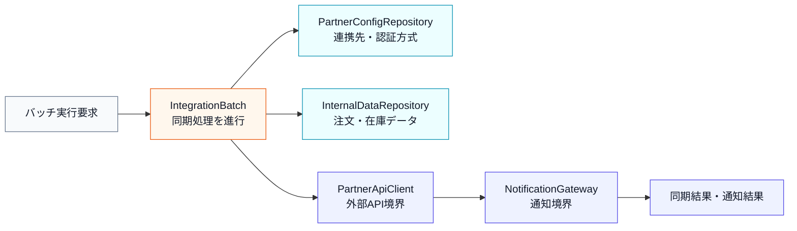

上の文章と表で仕様を一通り確認したので、まず正常に同期できる場合の入力・判定・加工・出力の流れとして整理します。

**仕様整理図：正常系の入力・判定・加工・出力**

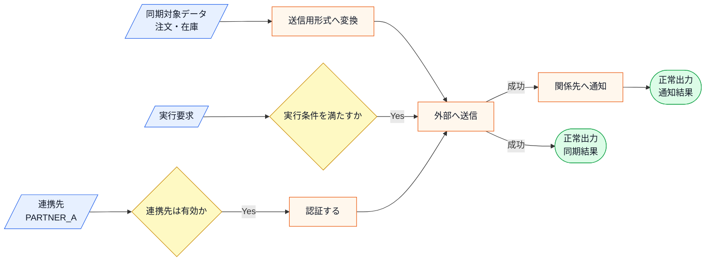

この図から読み取ることは、次の3点です。

- 外部連携は、連携先の確認、形式変換、認証、送信、通知という複数の手順で成立する。
- 連携先が変わると、認証や送信形式など、送信前後の複数箇所に影響が出る。
- 正常系では、外部APIへの送信に成功したあと、関係先へ通知して同期結果と通知結果を返す。

現状のシステムは、複数の外部連携先へデータを転送します。連携先はそれぞれ独自のデータフォーマットと接続認証を要求し、データの転送完了後には在庫管理システムや社内通知サービスへ「処理完了」を通知します。

バッチ処理の中枢となる部分が、すべての連携先との通信制御、データ変換、完了後の通知処理を抱えています。この章では、この現状を仕様とコードの対応から整理します。

**現在の連携先システム一覧**

連携先ごとに接続方式や認証方法が異なるのは、各社がそれぞれ独自のAPIを持っており、こちら側がその仕様に合わせる必要があるためです。バッチ種別（月次・手動）も、業務の性質によって決まります。月次バッチは「月末締め処理」、手動トリガーは「緊急の在庫修正」など、業務上の都合を反映したものです。

| 連携先 | 役割 | バッチ種別 | 接続方式 |
|---|---|---|---|
| A社（物流管理） | 注文データの同期 | 月次バッチ | REST API（トークン認証） |
| B社（在庫管理） | 在庫情報の同期 | 手動トリガー | REST API（APIキー認証） |

**バッチ処理の流れ**

この章のシステムのバッチ処理は、「認証→取得→送信→通知」という4ステップの流れで構成されています。認証を毎回行うのは、セッションを使い回さないことで認証情報の流出リスクを抑えるという、セキュリティ上の判断によるものです。完了通知のステップは「転送が成功したかどうかを関係者が知る手段」として存在しており、運用上の監視や障害対応に欠かせません。

| ステップ | 処理内容 |
|---|---|
| ① 認証 | 連携先のAPIに接続・認証する |
| ② データ取得 | 社内システムから送信対象データを取得する |
| ③ データ送信 | 連携先のフォーマットに変換してAPIへ送信する |
| ④ 完了通知 | 処理完了を在庫管理システム・社内通知サービスへ通知する |

このフロー自体はどの連携先でも共通する骨格です。一方、各ステップの中身（どの会社のAPIに接続するか、どのサービスへ通知するか）は連携先ごとに変わります。

**この仕様を決める業務機能**

この仕様は複数の業務機能が決めています。インフラ・システム管理の領域はAPIのプロトコルを知っており、通知・連携管理の領域は通知文面のルールを知っています。

| 業務機能 | この章の仕様で決めていること |
|---|---|
| インフラ・システム管理 | 各連携先のAPIプロトコル・認証方式 |
| システム設計・生成管理 | 通知サービスの選定・生成方針 |
| 通知・連携管理 | 通知先の一覧・通知文面のルール |

後のフェーズで変更要求を扱うとき、変更の理由は3つの異なる方向から来るものとして確認します。「A社のAPI仕様が変わった（インフラ・システム管理の領域）」「Slackを通知先に追加したい（通知・連携管理の領域）」「新しいC社を連携先に追加する（システム設計・生成管理の領域）」——これらは互いに無関係な変更です。この事実は、後のフェーズで変更要求を分類するときの材料になります。

後のフェーズで変更要求を扱うとき、どの業務機能の知識なのかを確認するための名前として使います。

**エラー条件**

正常系の仕様を一通り確認したうえで、最後に、送信へ進めない条件や外部API失敗を分けて整理します。

| エラー条件 | どこで分かるか | 出力 | 保存・通知などの副作用 |
|---|---|---|---|
| 連携先が未登録、または無効 | 連携先設定の確認時 | 連携先エラー | 外部送信なし、通知なし |
| 実行条件を満たさない | 実行要求の確認時 | 実行条件エラー | 外部送信なし、通知なし |
| 外部API送信に失敗する | `PartnerApiClient` 呼び出し時 | 送信エラー | 実システムでは失敗通知、リトライ、再実行キューを検討する |

### 1-2：動作例テーブル

コードを読む前に、このシステムがどんな入力に対してどんな出力を返すかを確認します。この章の各ステップは、基本シナリオを実現します（エラー系は除く）。エラー系シナリオ（タイムアウト・API障害等）はエラー動作に依存するため、動作仕様の確認として使用してください。

| シナリオ | 操作 | 外部API状態 | 結果/通知 |
| --- | --- | --- | --- |
| 月次バッチ・A社正常応答 | A社向け月次バッチを実行する | 正常応答 | A社へデータ転送成功 / Slack「A社連携完了」 |
| 月次バッチ・C社タイムアウト | C社向け月次バッチを実行する | タイムアウト | 3回リトライ後に失敗ログ記録 / Slack「C社連携失敗」 |
| 日次バッチ・新規D社追加後 | D社向け日次バッチを実行する | 正常応答 | D社向け新クライアントがデータ転送成功 / Slack「D社連携完了」 |
| 手動トリガー・B社正常応答 | B社向けデータ同期を手動で実行する | 正常応答 | B社へ手動データ転送成功 / Slack「B社手動連携完了」 |
| バッチ失敗・監視チーム設定あり | A社向け月次バッチを実行する（API障害） | 障害 | 転送失敗ログ記録 / Slack＋メール両方に通知 |
| 通知先にログ基盤追加後 | B社向けバッチを実行する | 正常応答 | B社へデータ転送成功 / Slack＋ログ基盤へ同時通知 |

次は仕様とクラスを対応づけます。

**このシステムの登場クラス**

| クラス名 | 役割 | 担当する仕様 |
|---|---|---|
| BatchExecutor | 全体のバッチ実行・処理の制御 | 対象システムへのデータ送信処理と結果通知の統括 |
| SystemAClient / SystemBClient | 各連携先へのデータ送信 | 各外部システムに合わせたデータ送信 |
| NotificationService | 連携完了の通知 | バッチ実行完了の通知 |
| PartnerDatabase | パートナー設定の管理 | パートナーIDの存在確認・有効フラグ・設定情報の提供 |

---

### 1-3：登場クラスとクラス構成図

現在のクラス構造に登場するクラスを先に確認します。

| クラス名 | 役割 | 担当する仕様 |
|---|---|---|
| `BatchExecutor` | 外部連携バッチ全体を実行する | 連携先選択、送信、通知の呼び出し |
| `SystemAClient` | A社向けにデータを送信する | A社連携 |
| `SystemBClient` | B社向けにデータを送信する | B社連携 |
| `NotificationService` | 連携結果を通知する | 完了通知 |

各クラスの責任を把握したところで、クラス間の関係を図で確認します。

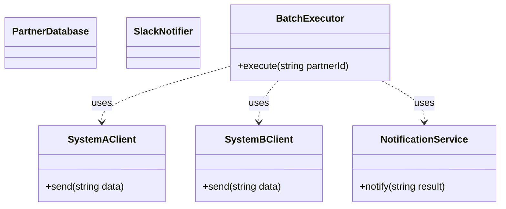

**クラス図に出てくる主な操作**

| クラス | 操作 | 何ができるか |
|---|---|---|
| `BatchExecutor` | `execute()` | 連携先IDを受け取り、送信処理と通知処理を進める |
| `SystemAClient` | `send()` | A社向けの形式でデータを送信する |
| `SystemBClient` | `send()` | B社向けの形式でデータを送信する |
| `NotificationService` | `notify()` | 外部連携の結果を通知する |


---

### 1-4：実装コード（現状）

#### コードを読む前に：クラスの責任と境界

| 対象 | 呼び出しと内部処理 | 戻り値・副作用 | 掲載上の表現 |
|---|---|---|---|
| Client | 連携データを外部システムへ送る | `DeliveryResult` | 固定応答で外部APIを代替する |
| Creator | 連携先IDからClientを生成する | `IExternalClient*` | 生成責任と利用責任を分ける |
| Notifier | バッチ結果を通知する | 成否・ログ | メール/Slackを標準出力で代替する |
| `map` / `vector` | 連携先設定と処理対象を保持する | 検索・順次実行 | DB・ジョブキューのメモリ代替 |

外部APIの通信時間と並列実行は省略します。成功、再試行可能失敗、恒久失敗を同じ結果型で返し、通知とログがどのケースに対応するかを残します。

コードは責任の固まりごとに分けて読みます。まず、あらかじめ登録されている連携先データを把握しておきます。

このシステムには以下の3件のパートナーデータがあらかじめ登録されています。

| パートナーID | 名称 | 有効 |
|---|---|---|
| PARTNER_A | 物流会社A | ✓ |
| PARTNER_B | 在庫会社B | ✓ |
| PARTNER_Z | 分析会社Z | ✗（無効：過去に連携を停止） |

無効なパートナーや未登録のIDを指定するとエラーになります。コードを読む前にこの対応を把握しておくと、動作結果が追いやすくなります。

なお実システムでは、1回のバッチ実行が「連携先ごとの送信ジョブを順番に流す」形になり、その1件ごとに成功・失敗の結果が返ります。本章の掲載コードでは、この順次実行の1単位を `BatchJob`、送信結果を `DeliveryResult` という境界スタブで簡略化して扱います。外部APIのリトライや再送キューといった通信制御そのものは論点外として省略し、順次実行の中で「どこで送信が失敗し、どこへ通知するか」だけを追います。

**① 連携先設定を表すクラス（PartnerConfig / PartnerDatabase）**

最初に、1-1の「連携先システム一覧」にあたるデータを持つ部分です。連携先IDから接続先設定を引く役割を担い、エラー条件「未登録のID」「無効な連携先」もここで判定します。

```cpp
#include <iostream>
#include <string>
#include <vector>
#include <map>

using namespace std;

struct PartnerConfig {
    string name;      // パートナー名
    string endpoint;  // エンドポイント（概念上）
    bool isEnabled;   // 連携有効フラグ
};

class PartnerDatabase {
private:
    map<string, PartnerConfig> records;
public:
    PartnerDatabase() {
        records["PARTNER_A"] = {"物流会社A", "logistics-a.example",  true};
        records["PARTNER_B"] = {"在庫会社B", "stock-b.example",      true};
        records["PARTNER_Z"] = {"分析会社Z", "analytics-z.example",  false}; // 無効
    }

    bool exists(const string& id) const {
        return records.count(id) > 0;
    }

    bool isEnabled(const string& id) const {
        return records.at(id).isEnabled;
    }

    PartnerConfig get(const string& id) const {
        return records.at(id);
    }

    void save(const string& id, const PartnerConfig& cfg) {
        records[id] = cfg;            // 実行中の連携先表へ追加
    }
};
```

`PartnerDatabase` は `std::map` で連携先IDと `PartnerConfig` を対応付けたマスターデータです。`exists()` でIDの存在確認、`isEnabled()` で有効・無効の判定、`get()` で設定取得を行います。実システムのDB問い合わせを、この章では実行終了まで覚えているインメモリの登録表で代替しています。

**② 外部連携クライアントと通知クラス（SystemAClient / SystemBClient / NotificationService / SlackNotifier）**

次に、1-1の「データ送信」「完了通知」ステップにあたる部分です。各連携先へデータを送るクライアントと、処理完了を通知するクラスです。

```cpp
class SystemAClient {
    vector<string> sent;              // 送ったデータを実際に蓄積する
public:
    void send(string d) {
        sent.push_back(d);
        cout << "A社へ送信(" << sent.size() << "件): " << d << endl;
    }
};
class SystemBClient {
    vector<string> sent;
public:
    void send(string d) {
        sent.push_back(d);
        cout << "B社へ送信(" << sent.size() << "件): " << d << endl;
    }
};
class NotificationService {
    vector<string> inbox;             // 受け取った通知を蓄積する
public:
    void notify(string r) {
        inbox.push_back(r);
        cout << "完了通知(" << inbox.size() << "件): " << r << endl;
    }
};
class SlackNotifier {
    vector<string> inbox;
public:
    void notify(string result) {
        inbox.push_back(result);
        cout << "Slack通知(" << inbox.size() << "件): " << result << endl;
    }
};
```

`SystemAClient` と `SystemBClient` は連携先ごとに分かれた送信クラスで、送ったデータを内部に蓄積しつつ、実通信は標準出力で代替します。`NotificationService` と `SlackNotifier` は転送完了後の通知を担い、受け取った通知を蓄積して通し番号（何件目か）付きで表示します。実通信こそ省きますが、「何を送り、何件通知したか」は実際の状態として残ります。

**③ バッチ処理をまとめるクラス（BatchExecutor）**

この章の中心です。1-1の「認証→取得→送信→通知」の流れを1つにまとめており、連携先の存在・有効判定、連携先ごとのクライアント生成、送信、通知までを順に実行します。

```cpp
class BatchExecutor {
    PartnerDatabase db;
public:
    void execute(string partnerId) {
        if (!db.exists(partnerId)) {
            cout << "エラー: パートナーID [" << partnerId
                 << "] はデータベースに登録されていません。" << endl;
            return;
        }
        if (!db.isEnabled(partnerId)) {
            PartnerConfig cfg = db.get(partnerId);
            cout << "エラー: パートナー [" << cfg.name
                 << "] は現在無効です。処理を中断します。" << endl;
            return;
        }
        PartnerConfig cfg = db.get(partnerId);
        if (partnerId == "PARTNER_A") {
            SystemAClient client; // A社向けクライアントを生成
            client.send(cfg.name + "のデータ");
        } else if (partnerId == "PARTNER_B") {
            SystemBClient client; // B社向けクライアントを生成
            client.send(cfg.name + "のデータ");
        }
        NotificationService notifier; // 連携完了を通知
        notifier.notify(cfg.name + " 連携完了");
    }
};
```

`execute()` の中身を順に読みます。

- **(1) 連携先の検証**：先頭の2つの `if` が、1-1のエラー条件です。未登録IDや無効な連携先は、送信へ進まず中断します。
- **(2) クライアントの生成と送信**：`if / else if` で連携先IDを見て、対応するクライアントを生成し送信します。この分岐が、連携先が増えるたびに書き足される箇所です。
- **(3) 完了通知**：送信後に `NotificationService` で完了を通知します。

**④ 実行して動作例と照合する（main）**

```cpp
int main() {
    BatchExecutor executor;

    // 行1: A社向け月次バッチを実行する
    executor.execute("PARTNER_A");

    // 行4: B社向けデータ同期を手動で実行する
    executor.execute("PARTNER_B");

    // 無効パートナーの実行（Z社は isEnabled==false）
    executor.execute("PARTNER_Z");

    // 未登録パートナーの実行
    executor.execute("PARTNER_X");

    return 0;
}
```

実行対象コード：1-4の現状コード
対応する動作例：1-2の動作例テーブル
確認したいこと：入力、加工、出力が仕様どおりに対応していること

実行結果：

```
A社へ送信(1件): 物流会社Aのデータ
完了通知(1件): 物流会社A 連携完了
B社へ送信(1件): 在庫会社Bのデータ
完了通知(1件): 在庫会社B 連携完了
エラー: パートナー [分析会社Z] は現在無効です。処理を中断します。
エラー: パートナーID [PARTNER_X] はデータベースに登録されていません。
```

> [!NOTE]
> 上記はフェーズ1の現状コードで確認できる代表的なケースです。行3（D社追加後）・行5（API障害）・行6（通知先追加後）は、フェーズ1の現状コードに未実装のため、フェーズ7の最終実装で対応します。行5では送信結果を成功／失敗として受け取り、失敗を通知と実行ログへ反映して後続ジョブを継続するところまで扱います。行2（C社タイムアウト）は、リトライ制御そのものが本章の論点外であるため、動作仕様として残します（実運用では通信失敗時のリトライとログ記録が必要です）。

このコードから、`BatchExecutor` が各連携先の生成と送信、さらにはその後の通知処理までを一手に引き受けていることが分かります。

---

> **手元で動かすには**
> このコードは1つの `.cpp` に貼り付けて、そのままコンパイル・実行できます（例：`g++ chapter10.cpp -o app && ./app`）。`main()` は自由に組み替えて構いません。`executor.execute("PARTNER_A");` の呼び出しを増減させれば、連携先ごとの実行と通知がその場の実行結果に表れます。新しい連携先を試すときは `PartnerDatabase` の登録へ `records["PARTNER_C"] = {"決済会社C", "pay-c.example", true};` を足す（または `save()` を呼ぶ）と、その連携先でも同じバッチを実行できます。データはプロセス実行中だけ有効で、終了すると消えます（外部APIや通知の実送信は境界スタブで簡略化しています）。

### 1-5：変更要求

【プロジェクトマネージャーと運用チームからの要求】
ある金曜日の午後、プロジェクトマネージャーから緊急の相談が飛び込んできました。

「お疲れ様。現在運用している外部連携バッチなんだけど、来週から新たにC社とも連携することになったんだ。それに加えて、連携処理の結果を社内のSlackへ自動通知するようにしてほしいという要望が出ている。データ転送のロジックを修正するついでに、通知処理についても何か良い仕組みを取り入れられないかな？」

**仕様変更の内容**

変更要求を受けて、現在の仕様がどう変わるかを整理します。

| 項目 | 変更前 | 変更後 |
|---|---|---|
| 連携先 | A社・B社の2社 | C社（配送管理）を追加して3社 |
| バッチ完了通知 | なし | Slack へ自動通知（成功・失敗を問わず） |
| 実行単位 | 1連携先を都度実行 | 複数連携先の送信ジョブを順番に流す |
| 送信失敗 | 未対応 | 途中の送信失敗でも後続ジョブと通知は止めない |

**この章が扱う複雑さ**

| 追加する複雑さ | 具体例 | この章で見ること |
|---|---|---|
| 順次バッチ実行 | A社→C社→D社の送信ジョブを順に流す | 実行順の骨格と、各ジョブの通信詳細を分けられるか |
| 通知イベント | 送信完了ごとに関係先へ通知する | 通知の発生と、通知先の一覧を分けられるか |
| 送信失敗 | C社への送信が失敗しても後続を止めない | 部分失敗の扱いを、生成・通信・通知のどこへ寄せるか |
| 連携先追加 | D社の送信ジョブとクライアントを足す | 実行本体を変えずに連携先を増やせるか |

順次バッチ実行・通知イベント・送信失敗・連携先追加は、それぞれ「外部手順」「通知」「生成」という別の軸に属します。この章では、4つを1つの実行処理へ積み上げず、軸ごとに分けて対策できるかを追います。

**変更後の連携先・通知先一覧**

| 種別 | 名称・役割 | 変更前 | 変更後 |
|---|---|---|---|
| 連携先 | A社（物流管理・月次バッチ） | ✅ 既存 | 変更なし |
| 連携先 | B社（在庫管理・手動トリガー） | ✅ 既存 | 変更なし |
| 連携先 | C社（配送管理・月次バッチ） | — | ✅ 新規追加 |
| 通知先 | Slack（完了通知） | — | ✅ 新規追加 |

連携先と通知先は、それぞれ独立した変化軸です。「C社を追加する」変更と「Slack通知を追加する」変更は担当者も変更タイミングも異なります。

**変更前後の入力・判定・加工・出力差分**

1-1の現状仕様を退避し、変更要求を当てた後の仕様と同じ粒度で並べます。以降の分析では、この差分を追います。

| 要素 | 変更前（1-1の現状仕様） | 変更後（今回の要求） | 差分として追うもの |
|---|---|---|---|
| 入力 | A社/B社、同期対象データ | A社/B社/C社、同期対象データ、Slack通知先、順次実行ジョブ列 | 連携先・通知先・実行するジョブ列が増える |
| 判定 | 連携先は有効か、データは送信可能か | C社を含めて有効か、通知先は有効か、送信は成功したか | 連携先・通知先・送信成否の判定が増える |
| 加工 | 送信用形式へ変換し外部連携する | ジョブを順に流してC社へも連携し、完了ごとにSlack通知する | 順次実行と通信・通知の加工が増える |
| 出力 | 同期結果 | ジョブごとの同期結果（成功/失敗）とSlack通知結果 | 送信失敗を含む結果と通知結果を追う |

**変更後の入力・加工・出力**

変更後の仕様を、1-1と同じ粒度で、正常系の入力・判定・加工・出力として確認します。1-1の図との差分は、入力の「連携先」にC社と順次実行ジョブ列が加わること、「関係先へ通知」の通知先にSlackが加わること、送信成否で分岐することの3点です。判定・加工の骨格自体は変わりません。

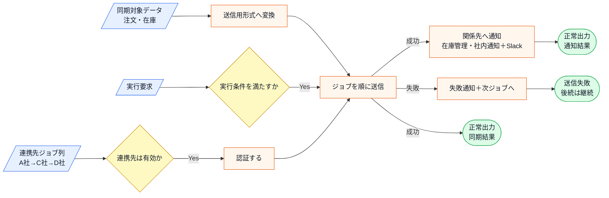

この図から読み取ることは、次の3点です。

- 「C社の追加」と「D社の追加」は入力の「連携先ジョブ列」と、その先の認証・形式変換・送信に現れる。
- 「Slack通知の追加」は送信の成功・失敗どちらの後にも現れ、通知先の一覧側の変化として整理できる。
- 「順次実行」は複数ジョブを順に流す実行骨格で、あるジョブの送信失敗があっても後続ジョブと通知は止めない。順次実行・通知・生成が図の上でも別々の箱に現れ、独立した変化軸だという整理と一致する。

変更後も、失敗条件は正常系図へ混ぜずに別で確認します。

| エラー条件 | どこで分かるか | 出力 | 保存・通知などの副作用 |
|---|---|---|---|
| 連携先が未登録、または無効 | 連携先設定の確認時 | 連携先エラー | 外部送信なし、通知なし |
| 実行条件を満たさない | 実行要求の確認時 | 実行条件エラー | 外部送信なし、通知なし |
| C社API送信に失敗する | `PartnerApiClient` 呼び出し時 | 送信エラー | 失敗通知を送り、順次実行の後続ジョブは止めない |
| 順次実行の途中ジョブが失敗する | `BatchJob` の `DeliveryResult` 確認時 | ジョブ単位の送信エラー | 失敗を記録し、次のジョブへ進む |
| Slack通知に失敗する | `NotificationGateway` 呼び出し時 | 通知エラーまたはログ記録 | 本章の中心は連携先・通知先の分離であり、詳細な再送制御は扱わない |

Slack通知は成功・失敗を問わず送る要求のため、送信失敗時の通知の扱いはフェーズ3で変更を試すときに確認します。順次実行の途中で送信が失敗しても、後続ジョブと通知は止めないという扱いも、変更後の骨格として押さえておきます。C社の追加とSlack通知が実際のコードでどこに現れるかも、フェーズ3の変更途中コードとフェーズ7の最終コード・実行結果で追います。

---

## 🟣 フェーズ2：仮説立案 ―― 何が変わるかを観察し、ヒアリングで裏付ける
フェーズ1で、`BatchExecutor` が連携先クライアントの生成・通信・通知処理をすべて直接保持している現状を把握しました。届いた変更要求を踏まえ、この設計における変わる見込みと当面安定の前提を整理します。

### 2-1：変わりそうな仕様の見当をつける

ここで作る一覧は、思いつきで「変わりそう」と感じたものを並べる表ではありません。フェーズ1で確認した仕様・動作例・クラス図を材料に、次の順で候補を絞ります。

1. 仕様図と動作例から、入力・判定・加工・出力のうち条件や値が変わりそうな箇所を拾う。
2. その箇所が、1-3のどのクラス・メソッドに書かれているかを対応づける。
3. その仕様が、どんな理由で、何をきっかけに、どのくらいの頻度で変わりそうかを仮説として書く。
4. 逆に、当面変えない前提にできる処理の骨格も分けておく。

この手順で見ると、「外部連携バッチを実行する」という大きな処理全体ではなく、その中のどの連携先・通信仕様・通知先が変更候補なのかを読者自身で追えるようになります。

フェーズ1の仕様表を振り返ります。このバッチシステムには「外部連携」「通知」「バッチ制御フロー」という3つの側面があります。このうち変化が予想される仕様があります。

- **外部連携先の種類と通信仕様**（A社・B社・C社、それぞれのAPIプロトコル）：ビジネス拡大に伴い新しい連携先が追加されることがあります。今回のC社追加がその例です
- **通知先の種類**（メール・Slack・ログ収集基盤など）：業務の運用方法が変わるにつれて、通知先も追加・変更されます

一方、「バッチを実行して結果を通知する」という全体制御フローは、バッチ処理の基本として安定している部分です。

**仮説：外部連携先の種類と通知先の種類は、今後も追加・変更が続く可能性がある。**

この仮説をヒアリングで確認します。

### 2-2：今回の変更で確実に変わること

この変更要求で確実に発生する変更を整理します。「将来起きるかもしれない」ではなく、「今回の要件として決まっている」ものだけを載せます。

| **変更内容** | **具体的な変更箇所** | **根拠（変更要求）** |
| --- | --- | --- |
| C社との外部連携を追加する | `BatchExecutor` に `SystemCClient` の生成と呼び出しロジックを追加 | PM「来週からC社とも連携」 |
| Slackへの完了通知を追加する | `BatchExecutor` 内に Slack への通知処理を挿入 | PM「Slackへ自動通知してほしい」 |
| 複数連携先を順次実行する | `BatchExecutor` にジョブ列を順に流す実行処理を追加 | PM「連携処理の結果を通知」＝複数ジョブ前提 |
| 送信失敗でも後続と通知を止めない | `BatchExecutor` に成否判定と失敗通知の分岐を追加 | PM「成功・失敗を問わず通知」 |

### ヒアリングに向けた背景確認

変更要求の内容は把握できました。しかし「今回だけの変更か、これからも続く変化の始まりか」によって、設計の判断は大きく変わります。仮説を携えて関係者に確認する前に、このシステムの来歴を整理しておきます。

このバッチシステムは、当初A社1社との連携だけを想定して作られました。シンプルな要件だったため、`BatchExecutor` がすべてを直接担う形で問題はありませんでした。その後B社が加わり、次第にC社も対象となり、連携先が増えるたびに `if-else` の分岐が追加されてきました。通知処理も最初はコンソール出力だけでしたが、後から `NotificationService` が付け足された経緯があります。

今回の変更要求もその延長線上にあります。「今回はC社とSlack」で終わるかどうか——それをヒアリングで確認します。

### 2-3：関係者ヒアリング

仮説を携え、運用担当者と協議を行いました。

* **開発者：** 「C社との連携ですが、今回のデータフォーマットは既存のA社やB社と大きく異なりますか？」

* **運用担当者：** 「フォーマットは別物だね。また、今後D社やE社も控えているから、接続先の追加はこれからも発生するよ。」

* **開発者：** 「通知についてはどうでしょうか？ Slack以外にもメール通知が必要になる可能性はありますか？」

* **運用担当者：** 「そうだね、将来的にはログ収集基盤へのデータ投入も検討している。ただ、転送成功か失敗かという『結果の通知』という仕組み自体は今後も変わらないよ。」

* **開発者：** 「分かりました。外部との通信ロジックと、通知という振る舞いは、それぞれ独立して増殖していく可能性があるということですね。」

ヒアリングにより、通信先（生成）の増殖と、通知処理（イベントの反応）の多様化が、それぞれ別個の変化軸として扱うべきものだと確認できました。

### 2-4：ヒアリングで判明した将来リスク

ヒアリングで判明した「将来起きるかもしれない」変化をまとめます。確定変更（2-2）とは別に管理することで、今回の設計判断と将来への備えを混在させずに済みます。

| **将来のリスク** | **変わる可能性がある箇所** | **根拠（誰が言ったか）** |
| --- | --- | --- |
| D社・E社など連携先がさらに増える | `BatchExecutor` 内の振り分けロジックと送信ジョブ列 | 運用担当者「D社・E社も控えている」 |
| Slack以外にメール・ログ基盤への通知が追加される | 通知処理全体 | 運用担当者「ログ収集基盤も検討中」 |
| 順次実行の途中失敗をどう扱うかが増える | 送信成否の判定と失敗通知の分岐 | 運用担当者「結果の通知という仕組みは変わらない」 |
| バッチの実行フロー自体は今回の変更対象ではない | 当面安定 | 運用担当者「仕組み自体は今回は変えない」 |

フェーズ2で「何を変え、何を守るか」が確定しました。次のフェーズ3では、この変更要求を現在のコードで実行しようとすると何が起きるか、その痛みを確認します。

### 2-5：変わる見込みと当面安定の前提を確定する

ヒアリングで「D社・E社連携」と「メール・ログ基盤通知」の追加が予告されました。この変更が来たとき、仕様がどう変わるかを整理しておきます。

| 変更内容 | 現在 | 将来（数ヶ月後） |
|---|---|---|
| SystemAClient（A社連携） | 対応済み | 変更なし |
| SystemBClient（B社連携） | 対応済み | 変更なし |
| SystemCClient（C社連携） | 今回追加 | 変更なし |
| D社・E社連携 | —（なし） | 追加予定 |
| Slack通知 | 今回追加 | 変更なし |
| メール・ログ基盤通知 | —（なし） | 追加予定 |
| 複数ジョブの順次実行 | 今回追加 | 変更なし（連携先が増えても骨格は同じ） |
| 送信失敗時の後続継続 | 今回追加 | 変更なし |

連携先と通知先が同時に増えると、`BatchExecutor` の 1 クラスに複数の変更軸が積み重なることになります。この痛みをフェーズ3で確認します。

---

## 🟣 フェーズ3：問題特定 ―― 変更の痛みを発見する
### 3-1：変更を試みる

フェーズ2で確定した変更を、既存の `BatchExecutor` にそのまま組み込もうとします。「C社連携の追加」と「Slack通知の追加」——どちらもシンプルに聞こえますが、実際にコードを変えようとすると何が起きるかを確認します。

変更を試みると、次のようなコードになります。なお、この変更試行コードでは `PartnerDatabase` による存在・有効チェックを省略し、パートナーIDを "A"・"B"・"C" と略記しています。どちらも今回の変更の論点ではないためです。

> **中間コードの継続条件：** `PartnerDatabase` の存在・有効チェックは省略後も維持し、検証済みの `partnerId` だけを `BatchExecutor` へ渡します。短縮IDは図を読みやすくする表記であり、マスター検証を削除する仕様変更ではありません。

```cpp
// C社連携を追加しようとすると...
class BatchExecutor {
public:
    void execute(string partnerId) {
        if (partnerId == "A") {
            SystemAClient client;
            client.send("data");
        } else if (partnerId == "B") {
            SystemBClient client;
            client.send("data");
        } else if (partnerId == "C") {          // ← 新しい連携先を追加
            SystemCClient client;              // ← SystemCClientも追加が必要
            client.send("data");
        }
        // Slack通知を追加しようとすると、通知の仕組みも一緒に変更が必要
        NotificationService notifier;
        notifier.notify("Success");
        SlackNotifier slack;                  // ← 通知先を増やすとここも増える
        slack.notify("Success");
    }
};
```

変更後のコードを実行すると、次のような結果になります。

```cpp
// 動作確認用のスタブ
class SystemAClient {
public:
    void send(std::string data) {
        std::cout << "[A社] " << data << std::endl;
    }
};
class SystemCClient {
public:
    void send(std::string data) {
        std::cout << "[C社] " << data << std::endl;
    }
};
class NotificationService {
public:
    void notify(std::string msg) {
        std::cout << "[メール通知] " << msg << std::endl;
    }
};
class SlackNotifier {
public:
    void notify(std::string msg) {
        std::cout << "[Slack通知] " << msg << std::endl;
    }
};

int main() {
    BatchExecutor executor;
    executor.execute("A"); // A社連携
    std::cout << "---" << std::endl;
    executor.execute("C"); // C社連携（新規）
    return 0;
}
```

実行対象コード：3-1の変更試行コード
対応する動作例：変更要求後の代表ケース
確認したいこと：変更要求を現状構造へ当てはめたとき、修正箇所と痛みがどこに出るか

実行結果：

```
[A社] data
[メール通知] Success
[Slack通知] Success
---
[C社] data
[メール通知] Success
[Slack通知] Success
```

動作は正しくなっています。しかし A社のバッチを実行したときも Slack通知が走っており、C社追加のついでに Slack通知も全社に影響しています。

このコードの何が問題か。「C社連携を追加したい」という要求と「Slack通知を追加したい」という要求は、本来まったく別の話のはずです。しかし `BatchExecutor` の `execute()` メソッドの中で両方が混在しているため、1つの変更を加えると、関係のない他の処理にも手が届いてしまいます。

さらに、D社が追加されればまた `if-else` が伸びます。メール通知が追加されれば、また通知の行が増えます。このメソッドは変更要求のたびに肥大化し続ける構造になっています。

加えて、複数連携先を順番に流す順次実行を同じメソッドへ書き足すと、この肥大化はさらに進みます。「A社→C社→D社を順に送る」という実行順の骨格と、「各社へどう送るか」という通信詳細が同じ場所に並び、途中で送信が失敗したときに後続ジョブと通知をどう続けるかという成否判定まで、すべて `execute()` の中へ入ってきます。順次実行という外部手順の骨格、送信失敗の扱い、そして通知の3つが、生成の分岐と一緒に1つのメソッドへ積み上がっていきます。

### 3-2：変更影響グラフ

現状の構造で変更を試みた際、影響がどのように飛び火するかを可視化します。

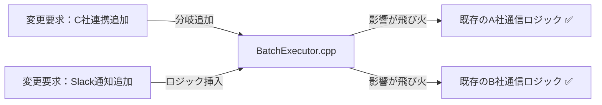

グラフが示す通り、C社連携の追加やSlack通知の実装といった個別の要求が、既存の他の連携先ロジックにまで影響を及ぼす構造になっています。

### 3-3：痛みの言語化

「連携先が増えるたびに、既存の安定している通信処理までテストし直さないといけないのか…」

変更をシミュレートする中で、エンジニアとして感じる「痛み」が2つ明確になりました。

1つ目は、`BatchExecutor` が抱える「巨大な責任」の辛さです。このクラスは本来、バッチ処理全体のフローを制御するだけでいいはずなのに、連携先ごとの具体的な通信手段や、通知先といった「詳細」までをすべて把握し、生成まで行っています。これでは、連携先が増えるたびに管理不能なほど複雑なコードになるのは必然です。

2つ目は、連携の「生成」と「通知」という、変わる理由が異なる責務が混在していることです。連携先の通信仕様が変わるのか、それとも通知の要件が変わるのかにかかわらず、同じ大きなクラスを編集し、無関係な処理まで影響確認する必要があります。ここには順次実行の骨格と送信失敗の扱いも同居しており、「ジョブを順に流す外部手順」「送信失敗のときに後続と通知をどうするか」「誰に通知するか」「どのクライアントを生成するか」という別々の理由の判断が、同じ場所へ折り重なっています。

---
> **📌 問題（確定）**
> 外部連携バッチシステムでは、「連携先の追加」「通知先の追加」「生成方法の変更」という3つの変化が、それぞれ異なる業務機能によって独立して発生する。どの変化が来ても `BatchExecutor` を開かなければならず、関係のない他の連携先ロジックや通知処理まで再テストを強いられる。
---

さらに、ヒアリングで予告された D社・E社の連携追加やログ基盤への通知も加わると、`BatchExecutor` の条件分岐がさらに増え、「連携」「通知」「生成」という 3 つの変更軸が 1 クラスにさらに積み重なることが見えてきます。ヒアリング段階ではまだ仕様が固まっていないため全コードを書ける状況ではありませんが、複数の変更軸が同じクラスに混在する構造は変わりません。

フェーズ3で「今の構造では変更が辛い」という事実が確認できました。次のフェーズ4では、この痛みの原因を構造的に分析します。

---

## 🟠 フェーズ4：原因分析 ―― なぜ辛いのかを構造で言語化する
フェーズ3で「外部連携先が増えるたびに、バッチ処理全体のコードが修正のたびに不安定になる」という痛みを確認しました。なぜこのような状態に陥るのか、その根本原因を構造的な視点で分析します。

### 4-1：痛みの根源を探る（観察と原因）

フェーズ3で観察した「痛み」と、その背後にある構造的な原因を対応させます。

| **観察した症状（痛み）** | **構造的な原因（痛みの根源）** |
| --- | --- |
| 新しい連携先を追加するたびに `BatchExecutor` の生成コードを修正する必要があります。また、複数の連携先（A社・B社・C社）との通信詳細が `BatchExecutor` 内に直接展開されており、連携先ごとの接続手順を全て把握する必要があります | 生成の混在（具体クラスの生成がビジネスロジックに混在）＋複雑さの露出（外部APIの詳細を `BatchExecutor` が直接知っている） |
| 転送結果の通知仕様を変えると、連携処理のフロー全体まで影響を受ける | 通知の密結合（通知先追加のたびに `BatchExecutor` の変更が必要） |
| 順次実行の途中で送信が失敗したとき、後続ジョブや通知の扱いを実行本体で書き分ける必要がある | 外部手順の混在（ジョブを順に流す骨格と、各ジョブの通信詳細・成否判定が同じ場所にある） |


生成・通信・通知という3つの根本原因は**それぞれ独立した変化軸**です。

- 連携先が増えても通知先は変わりません
- 通知先が増えても連携先クライアントの生成方法は変わりません
- 生成の仕組みが変わっても複数サブシステムの窓口の役割は変わりません

3つが独立しているからこそ、1つの構造だけでは解決しきれません。一方で、順次実行という外部手順の骨格は、各連携先の通信詳細が変わっても守りたい部分です。送信失敗の扱いはこの骨格側へ寄せ、生成・通信・通知の3軸とは分けて考えます。この4つ目の観点は、変化軸ではなく「守る骨格」として整理します。

### 4-2：変わるもの/変わってほしくないもの

> **「変わらないもの」と「変わってほしくないもの」は異なります。** 「変わらないもの」は経験的事実（今まで変わっていない）、「変わってほしくないもの」は設計意図（ここを安定させてほかを守りたい）です。ここで整理するのは後者です。

変更理由の種類が異なる要素を整理します。

| **変わり続けるもの（🔴）** | **変わってほしくないもの（🟢）** |
| --- | --- |
| 外部連携先ごとの通信手段（プロトコル・認証等） | バッチ全体の処理実行順序（取得→転送→通知） |
| 通知先のサービスや通知ルール | 通知という「イベント」自体を発生させる責務 |
| 各ジョブの送信成否と、失敗時の個別ハンドリング | ジョブを順に流し、途中失敗でも後続を続ける順次実行の骨格 |

連携先の追加は今後も発生する「変わる見込み」ですが、バッチ全体の転送フローは今回の変更要求では守りたい骨格です。「ジョブを順に流し、あるジョブが失敗しても後続と通知は止めない」という順次実行の骨格も、各社の通信詳細が変わっても守りたい部分です。変わるのは各ジョブの送信成否そのものであり、順に流すという外部手順は守りたい側にあります。本来、これらは別の責務として分離されるべきものであり、同じクラス内で扱われていること自体が設計上の歪みを生んでいます。

### 4-3：3つの接続点に漏れている知識を確認する

ここでの「確認すること」は、前節までに見つけた原因から抽出します。まず、原因文から「守りたい骨格」と「変わる差分」を分けます。次に、その差分を動かすために骨格側が知ってしまっている名前・条件・順序・型を拾います。最後に、接続点に残す最小の約束を、値・型・操作・イベントとして書きます。

原因によって、接続点で見る抽象観点は変わります。条件分岐が原因なら条件・定数・選択基準を見ます。処理手順が原因なら呼び出し順・前後条件・失敗時分岐を見ます。生成判断が原因なら具体クラス名・生成条件・登録場所を見ます。通知や外部連携が原因なら通知先・タイミング・成否の扱いを見ます。データや状態が原因なら、境界を流れる値・型・状態を見ます。

`BatchExecutor`が、外部連携、通知、生成について何を知っているかを確認します。

今の `BatchExecutor` と各クライアント、および通知サービスとの接続は、各連携先のクラス名・呼び出し順序・通知方法・生成方法が`BatchExecutor`へ集まっています。

接続点ごとに「`BatchExecutor`へ漏れている知識」を見ると、独立して変わる
三つの判断が一つのクラスへ集まっていることが分かります。

| 接続点 | 漏れている知識 | 変更時の波及 |
|---|---|---|
| バッチ → 外部連携 | 連携先のクラス名・認証・呼び出し順序 | 連携先追加で実行本体を変更 |
| バッチ → 通知 | 通知サービス名・通知先・通知条件 | 通知先追加で実行本体を変更 |
| バッチ → 生成 | クライアントの生成方法・所有権 | 生成方法変更で実行本体を変更 |
| バッチ → 順次実行 | ジョブ列の順序・送信成否・失敗時の後続継続 | 送信失敗の扱いを変えると実行本体を変更 |

---
> **📌 原因（確定）**
> 以下の3つの独立した根本原因が重なっている：
> 1. **外部手順の知識の漏出**：連携先ごとの通信詳細と順次実行の骨格が密結合している。
> 2. **通知先の知識の漏出**：通知サービスが増えるたびにバッチ本体の修正が必要になっている。
> 3. **生成の知識の漏出**：クライアントの生成条件・具象クラス名への依存がバッチ本体に残っている。
>
> これらの変更理由（通信手段、通知先、生成条件）はそれぞれ異なる頻度で発生するため、1つのクラスに混在していることで影響確認コストが発生し続ける。
---

フェーズ4で根本原因が言語化できました。次のフェーズ5では、解決する課題を具体的に定義していきます。

---

## 🟡 フェーズ5：課題定義 ―― 解くべき接続点を定める
フェーズ4で、「外部連携ロジック（通信）」「連携先クライアントの生成」「イベント通知」という3つの変化軸が `BatchExecutor` 内で密結合していることが根本原因だと特定しました。連携先ごとに異なる通信プロトコル、将来増えるであろう連携先の生成ロジック、そして通知手段の多様化を、現在の構造のまま扱い続けることは限界に達しています。

### 接続点を特定する

接続点は、クラス図の線やインターフェース名から探すのではなく、変更要求を当てて特定します。まず、その要求で変えたい側と変えたくない側を分けます。次に、両者がどのメソッド呼び出し・引数・戻り値・生成・イベントでつながっているかを見ます。そのつながりのうち、変更要求のたびに知識が漏れて修正が波及する場所が、ここで解くべき接続点です。

今回のリファクタリングで「何を解決する必要があるか」を整理すると、接続点が3つあることが分かります。

- **接続点A**：`BatchExecutor` ←→ 各外部システム（SystemA/B/C）の通信境界
- **接続点B**：`BatchExecutor` ←→ 通知サービス（NotificationService）の通知境界
- **接続点C**：`BatchExecutor` 内部での具体クライアントクラスの生成境界

現在、`BatchExecutor` はこれら3つの接続点に対して、具体的なクラスを直接生成し、メソッドを直接呼び出すため、それぞれの変更理由が同じクラスへ集まっています。連携先（接続点A）の増殖、通知手段（接続点B）の多様化、そして生成ロジック（接続点C）の散在という、3つの異なる変化軸が1つのクラス内で絡み合っているのが最大の課題です。

分離対象の責務を呼び出しているのは `BatchExecutor` クラス自身です。このクラスが連携先・通知先・生成の「詳細」をすべて知っていることが現在の制限事項です。この設計を改善することで、`BatchExecutor` は「バッチの実行順序（フロー）」だけを管理し、実際の処理（通信・通知・生成）は外部化されたクラスに任せることができます。

言い換えると、解くべき課題は次の3点です。接続点Aでは、連携先の通信詳細を `BatchExecutor` から隠すこと。接続点Bでは、通知手段の多様化に対応できる柔軟な仕組みを持つこと。接続点Cでは、連携先クライアントの生成ロジックを1か所に集約すること。この3点を独立して変更できる構造を作ることが、フェーズ6での目標になります。

```cpp
// 現在の BatchExecutor.execute() が知っていること（全部）
void execute(string partnerId) {
    if (partnerId == "A") {
        SystemAClient client;   // ← 具体クラスを生成している（接続点C）
        client.send("data");    // ← 通信の詳細を知っている（接続点A）
    } else if (partnerId == "B") {
        SystemBClient client;   // ← 具体クラスを生成している（接続点C）
        client.send("data");    // ← 通信の詳細を知っている（接続点A）
    }
    NotificationService n;      // ← 通知サービスの実装を知っている（接続点B）
    n.notify("Success");        // ← 通知の詳細を知っている（接続点B）
}
```

このメソッドから「接続点A（通信の詳細）」「接続点B（通知の仕組み）」「接続点C（連携先の生成）」を切り出すことが、次のフェーズ6で取り組む課題です。

---
> **📌 課題（確定）**
> 解くべき課題は3つある。接続点Aでは、連携先クライアントの通信詳細（`SystemAClient` 等が持つ固有の送信処理）を `BatchExecutor` から切り離し、連携先が増えても `BatchExecutor` を変更しなくて済む構造にすること。接続点Bでは、通知先（`NotificationService` 等）を `BatchExecutor` から切り離し、通知先が増えても `BatchExecutor` を変更しなくて済む仕組みを持つこと。接続点Cでは、連携先クライアントの生成ロジックを `BatchExecutor` から切り離し、どのクライアントを生成するかを1か所で管理できるようにすること。
---

### 変わるものを一緒に分離するか、分けて分離するか

3 つの接続点がそれぞれ独立して変わることを確認します。

| 変更軸 | 変わる理由 |
|---|---|
| A（通信）：SystemA/B/C との API | 各外部システムのAPI仕様変更（各社担当者） |
| B（通知）：Slack / メール / ログ基盤 | 通知先の追加・変更（運用チーム） |
| C（生成）：クライアントの生成ロジック | 連携先の増減（同じ開発チーム） |

接続点Aでは各連携先が独立して変わります（A社のAPI変更がB社の処理に影響しない）。接続点Bでは各通知チャンネルが独立して変わります（Slack追加がメール通知に影響しない）。接続点Cの生成ロジックは連携先追加のたびに変わりますが、生成の仕組み自体は共通です。

→ **接続点ごとに別構造で分離し、3 軸が独立して変更できる構造にする**

フェーズ5で「何を解くか」が確定しました。次のフェーズ6では、これらの課題に対して具体的にどのような構造が最適か、コストの観点からステップを検討します。

---

#### フェーズ6へ渡す課題

| 課題ID | 現在の変更影響 | 変えたくない範囲 |
|---|---|---|
| P1 | 連携先追加・API変更で `BatchExecutor` の通信分岐へ波及する | バッチの実行骨格、送信結果の扱い、他連携先 |
| P2 | 通知先追加でバッチ本体の通知分岐と失敗処理へ波及する | 送信確定のタイミング、他通知、バッチの成否 |
| P3 | 生成条件変更でバッチ入口と手動入口の具体Client生成へ波及する | 両入口が共有するApplicationと同一の送信フロー |

通信・通知・生成は別々の変更理由を持つためP1、P2、P3の連番にします。フェーズ6では同じ3枝の理想到達範囲を描きます。

## 🔴 フェーズ6：対策検討 ―― 案を比べ、採用する形を決める

フェーズ6は、フェーズ5で定めた3つの課題——**連携先ごとの通信を切り離すP1／通知先を切り離すP2／クライアント生成を切り離すP3**——を受けて始めます。問題定義で得た3本の変更影響を左へ引き継ぎ、P1〜P3の影響を切るクラス・契約・依存関係を中央に置き、同じ要求を再適用した変更影響を右に描きます。その差、守る契約、完了条件、候補を同じ課題IDの行へ落とします。その後、各IDの関連コードで中央の構造を段階的に検証し、独立した変化軸を混ぜずに、変更理由、結果、残った問題、次の判断を回収します。

#### 問題定義の変更影響を、どの構造で変えるか

フェーズ4で見えた波及は、通信仕様、通知運用、具体Client生成という3つの独立した枝でした。この3本の痛みをP1〜P3の起点にし、それぞれの構造変更後までつなぎます。

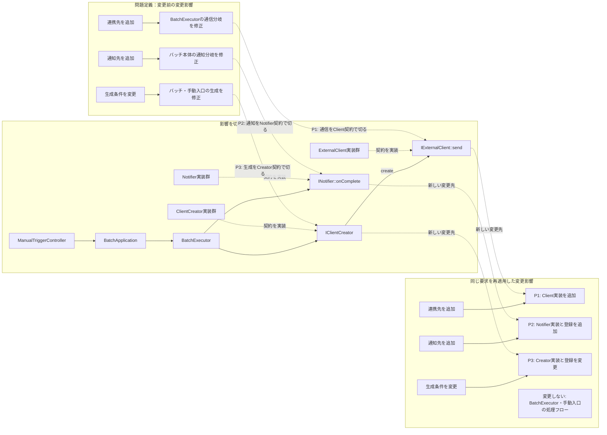

中央では、実行骨格、通信、通知、生成を別の依存関係として表します。バッチと手動入口は同じ `BatchApplication` を通り、通信・通知・生成の具体型を知らないため、左の三つの波及が右ではそれぞれ独立した変更先へ分かれます。

#### 構造と変更後の影響から、課題と候補を一続きで導く

| 課題ID | 変更の到達点 | 最初に試すコード変更 | 残る問題に対する次のコード変更 |
|---|---|---|---|
| P1 | **現在→理想の差：** 固有通信をClient実装へ閉じる<br>**切る境界・守る契約：** 通信分岐を切り、認証→取得→送信と結果を守る<br>**完了条件：** 固有通信をバッチへ戻さない | **候補：** 同じ通信契約へ出す<br>**減る影響：** バッチから通信詳細が減る | Client実装だけを差し替える |
| P2 | **現在→理想の差：** 通知追加を登録へ縮める<br>**切る境界・守る契約：** 直接通知を切り、送信確定後・部分失敗記録を守る<br>**完了条件：** バッチ骨格を変更しない | **候補：** 同じ結果契約のリストへ変える<br>**減る影響：** 通知先別分岐が減る | 登録・部分失敗集計を共通化する |
| P3 | **現在→理想の差：** 生成条件をCreator登録へ縮める<br>**切る境界・守る契約：** 具体生成を切り、所有権と同一Application利用を守る<br>**完了条件：** 手動入口へ別フローを作らない | **候補：** 具体生成をCreatorへ移す<br>**減る影響：** バッチの生成分岐が減る | Creator登録をComposition Rootへ集める |

ここからP1〜P3の横一行を、通信・通知・生成のコードへ独立に適用します。

#### 課題箇所のおさらい（フェーズ3の関連コード）

比較元は、C社連携とSlack通知を `BatchExecutor` へ直接追加したフェーズ3の変更途中コードです。


課題カードの着目コードに該当する部分だけを振り返ります。課題に関係しないコードは省略し、フェーズ3で明記した維持条件をそのまま引き継ぎます。

```cpp
// C社連携を追加しようとすると...
class BatchExecutor {
public:
    void execute(string partnerId) {
        if (partnerId == "A") {
            SystemAClient client;
            client.send("data");
        } else if (partnerId == "B") {
            SystemBClient client;
            client.send("data");
        } else if (partnerId == "C") {          // ← 新しい連携先を追加
            SystemCClient client;              // ← SystemCClientも追加が必要
            client.send("data");
        }
        // Slack通知を追加しようとすると、通知の仕組みも一緒に変更が必要
        NotificationService notifier;
        notifier.notify("Success");
        SlackNotifier slack;                  // ← 通知先を増やすとここも増える
        slack.notify("Success");
    }
};
```

```cpp
// 動作確認用のスタブ
class SystemAClient {
public:
    void send(std::string data) {
        std::cout << "[A社] " << data << std::endl;
    }
};
class SystemCClient {
public:
    void send(std::string data) {
        std::cout << "[C社] " << data << std::endl;
    }
};
class NotificationService {
public:
    void notify(std::string msg) {
        std::cout << "[メール通知] " << msg << std::endl;
    }
};
class SlackNotifier {
public:
    void notify(std::string msg) {
        std::cout << "[Slack通知] " << msg << std::endl;
    }
};

int main() {
    BatchExecutor executor;
    executor.execute("A"); // A社連携
    std::cout << "---" << std::endl;
    executor.execute("C"); // C社連携（新規）
    return 0;
}
```

同じ知識が手動実行の `ManualTriggerController` にも重複します。

### 6-1：課題IDごとに痛みコードを分解し、構造上の境界を探す

課題は3つあります。どんな形なら切り離せるかは、痛みコードを分解して探します。まず数えるのは、**独立して変わる軸がいくつあるか**です。共通の形は既に並んでいるので、関数へ切り出す段階は飛ばします。

**分解A（通信の軸）：** `if(partnerId)` の各分岐は「クライアントを生成して `send` する」。連携先ごとに差し替わる送信 → **製品の契約 `IExternalClient`（`send`）**。

```cpp
class IExternalClient {
public:
    virtual DeliveryResult send(
        const DeliveryRequest& request) = 0;
    virtual ~IExternalClient() = default;
};
```

P1では通信の入出力だけをそろえます。この時点では「どのClientを作るか」と「誰へ通知するか」は意図的に残します。
**分解B（通知の軸）：** `NotificationService`/`SlackNotifier` の直呼び出し。通知先ごとに増減する → **通知の契約 `INotifier`（`onComplete`）** のリスト。

```cpp
class INotifier {
public:
    virtual NotificationResult onComplete(
        const DeliveryResult& result) = 0;
    virtual ~INotifier() = default;
};

for (auto* notifier : notifiers)
    notificationLog.add(notifier->onComplete(result));
```

P2の通知先は登録で増減でき、1件の失敗もログへ残して次へ進めます。通信契約には変更を加えません。
**分解C（生成の軸）：** `if(partnerId) new XxxClient` という生成判断。どのクライアントを作るか → **生成の契約 `IClientCreator`（`createClient`）**。

```cpp
class IClientCreator {
public:
    virtual IExternalClient* createClient() = 0;
    virtual ~IClientCreator() = default;
};

creatorRegistry.registerCreator("partner-b", partnerBCreator);
IExternalClient* client = creatorRegistry.create(partnerId);
```

P3で具体名は組み立て・登録へ移ります。手動実行もこの登録表を使うApplicationを呼び、独自の `if(partnerId)` を持たせません。
**骨格（窓口）：** 「順に流す」実行手順そのものは変わらない。これは `BatchExecutor` に残し、契約だけを知る**窓口**にする。

**片方だけでは詰まる（第二部の肝）：** 生成だけ分けても通知の直呼びが残り、通知だけ分けても連携先の分岐が残る。しかも同じ知識が `ManualTriggerController` にも重複する。ここで分かるのは、**「決定者と頻度が異なる3つの軸は、それぞれ別の契約に分けないと、どれか1つの変更が他へ波及し続ける」**ということ。

**分解の結論：** 通信・通知・生成の3つに独立した契約を置き、`BatchExecutor` は実行順（骨格）を保ったまま契約だけを呼ぶ窓口にする。これが第二部の見立てです。

### 6-2：見つけた形を契約にし、データの置き場所を決める

見つけた3つの形を、それぞれの契約として定義します。

```cpp
DeliveryResult BatchExecutor::execute(
        const std::string& partnerId,
        const DeliveryRequest& request) {
    IExternalClient* client = creators.create(partnerId);
    DeliveryResult result = client->send(request);
    for (auto* notifier : notifiers)
        notificationLog.add(notifier->onComplete(result));
    return result;
}

void ManualTriggerController::trigger(
        const ManualRequest& request) {
    application.execute(request.partnerId, request.delivery);
}
```

骨格は生成契約→通信契約→通知契約の順に呼ぶだけです。自動バッチと手動入口の違いは起動方法だけで、システム処理は同じApplicationに一元化されます。


次に、データの置き場所を決めます。

| データ | 現状の置き場所 | 対策後の置き場所 | 置き場所を決める理由 |
|---|---|---|---|
| 連携先の設定・有効性 | `BatchExecutor` の分岐 | `PartnerDatabase` | 実行順とは別の関心事 |
| どの連携先クライアントを作るか | `if(partnerId) new` | `IClientCreator`（種別ごと） | 連携先追加を生成役の追加で吸収 |
| 通知先の一覧 | `BatchExecutor` の直呼び | `INotifier` の登録リスト | 通知先の増減を登録で扱う |
| 実行順（認証→取得→送信→通知） | `BatchExecutor` | 変えない（窓口の骨格） | 手順は安定。契約だけ差し替える |

接続点で受け渡すのは、送信の **`DeliveryResult`** と通知の **結果文字列**です。`IClientCreator` が生成したクライアントの**所有権・生存期間は生成・管理側**が持ちます（利用側は非所有の参照で受け取る）。

クラス分離を完成させるには、分離先だけでなく次の順で組み立てを確認します。

| 判断 | 関連コードで確認すること |
|---|---|
| 誰が具体実装を選ぶか | `main()`、Application、Factory、Creator、Registryなど、業務処理の外側に選択を集める |
| 誰が生成するか | 必要な依存を先に生成できる組み立て側が具体オブジェクトを生成する |
| 誰が所有するか | スタック、スマートポインタ、所有コンテナのどれが破棄まで担うかを決める |
| どう注入するか | 必須依存はコンストラクタ、増減する依存は登録操作、生成自体を替える場合は生成契約から渡す |
| 利用側は何を知るか | 利用側は抽象契約だけを保持し、処理中に具体クラスを生成しない |
| 追加時にどこを変えるか | 新しい実装クラスと組み立て・登録を変更し、安定させたい処理骨格へ具体名を戻さない |

生ポインタや参照で非所有の依存を保持する場合は、所有側の生存期間が利用側より長いことまで組み立てコードで確認します。

#### 課題IDごとのコード適用結果

| 課題ID | 候補を適用したコード | 段階的なコード変更と結果 | 守った契約・完了条件の判定 |
|---|---|---|---|
| P1 | `IExternalClient::send()`、各Client、`BatchExecutor::execute()` | **段階的な変更：** 連携先固有の認証・取得・送信をRequest→Result契約へ移し、`BatchExecutor` を結果の受取側だけに変更<br>**結果：** 固有通信がClientへ閉じた | **守った契約：** 認証→取得→送信<br>**判定：** 固有通信をバッチへ戻さず達成 |
| P2 | `INotifier::onComplete()`、登録、`NotificationLog` | **段階的な変更：** 直接通知を `INotifier` の登録ループへ移し、1件の失敗を記録して次の通知へ進む結果集計を接続<br>**結果：** 通知追加が実装と登録へ縮んだ | **守った契約：** 送信確定後、部分失敗継続<br>**判定：** バッチ骨格無変更で達成 |
| P3 | `IClientCreator`、Registry、手動入口 | **段階的な変更：** 具体Client生成をCreator登録へ移し、残っていた手動入口の重複フローを同じApplicationへの委譲へ変更<br>**結果：** 生成分岐と重複フローが消えた | **守った契約：** 所有権、両入口の同一処理<br>**判定：** 別フローなしで達成 |

### 6-3：構造の見立て（分解の結果、こうなる）

分解して3つの契約とデータ配置を決めた結果、構造はこうなります。図は出発点ではなく結論です。

現状（1メソッドに通信・通知・生成が同居）：

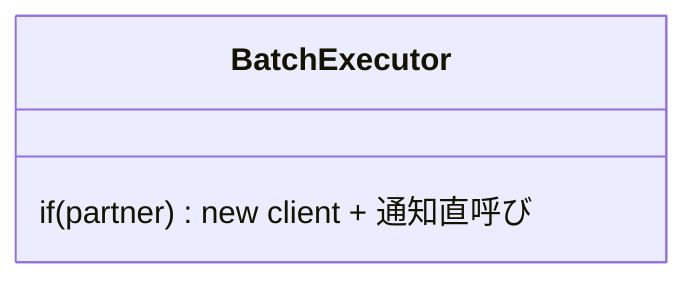

見立て（実行順は窓口に残し、3軸は契約へ）：

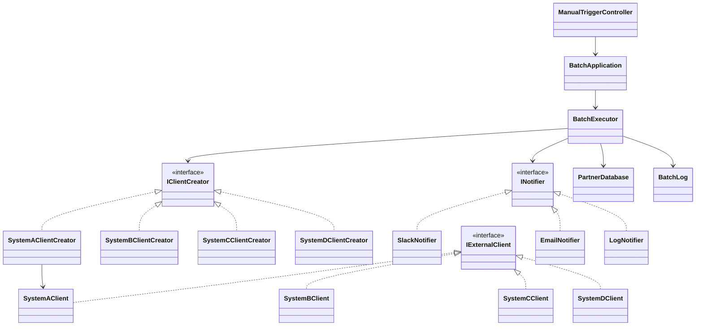

図から読み取ること：`BatchExecutor` から通信・通知・生成の具体が消え、3つの契約への依存と実行順の骨格だけが残る。3軸は互いに独立して差し替わる。

### 6-4：影響範囲（この設計で変更要求を再度当てたら）

| 変更要求 | 修正する場所 | 再テスト範囲 |
|---|---|---|
| 連携先を追加（D社・E社） | `IExternalClient` と `IClientCreator` を1組追加 | 追加した1組。**通知・実行順は無変更** |
| 通知先を追加（ログ基盤など） | `INotifier` を実装して登録 | 追加通知先。**連携・実行順は無変更** |
| ある社のAPI仕様が変わる | その `IExternalClient` 実装のみ | その連携先 |

現状との差：現状はどの軸を変えても `BatchExecutor`（と `ManualTriggerController`）を開く。対策後は軸ごとに独立して差し替えられ、実行順の骨格は触らない。**この「独立して触れる」ことがこの構造を採る理由**です。

### 採用する形を決める

各案には一長一短があります。今回の課題は、外部連携先・通知先・クライアント生成という3つの変化軸が同じ実行処理へ集まっていることです。1つの構造で全部を解こうとせず、どの案がどの軸に効くのかを分けて考えます。順次実行という骨格は、どの案でも `BatchExecutor` 側に残します。

| 案 | 解けること | 残ること | 今回の判断 |
|---|---|---|---|
| 外部連携だけ窓口化する | 連携APIの手順を隠せる | 通知先と生成判断は残る | 連携先追加には必要だが単独では不足 |
| 通知だけ登録式にする | 通知先の増減を扱える | 連携手順とClient生成は残る | 通知追加には必要だが単独では不足 |
| Client生成だけ分ける | 連携先ごとの生成判断を寄せられる | 連携実行と通知の変化は残る | 生成条件の増加には必要だが単独では不足 |
| 3つの境界を別々に作る | 連携・通知・生成を独立して変更できる | 組み立て箇所とクラス数が増える | 3軸すべてが変わるため採用する |

**今回の決断：** フェーズ2のヒアリングで「外部連携先の追加（D社・E社）」と「通知方法の多様化（ログ基盤）」が確認されています。変更の決定者と頻度が異なる3つの責務について、**外部連携の窓口・通知先の登録・Client生成の境界をそれぞれ明示する構造を採用する**決断を下します。

> この構造は、第2章の**窓口構造**、第7章の**通知分離構造**、第8章の**生成分離構造**を、問題を分析した結果として組み合わせたものです。

フェーズ6で採用する設計（3つの契約と窓口の骨格・データ配置・構造・影響範囲）が決まりました。次のフェーズ7では、この決断を動く実装（`PartnerDatabase`・各クライアント／Creator・各通知先・`BatchExecutor`・実行結果）に落とし込み、変更要求で効果を確認します。


---

## 🟢 フェーズ7：対策実施 ―― 変化に強いコードを完成させる
ステップ3（外部連携・通知・生成の知識を別々の役割へ移す案）を実装し、外部連携と通知処理の責務をそれぞれ独立したクラスへカプセル化（変更の影響を1クラス内に閉じ込めること）します。

これらの構造は、第2章で学んだ**窓口構造**（ネット銀行の振り込み処理で「複数サブシステムの複雑さを窓口1つに隠す」構造）、第7章で学んだ**通知分離構造**（在庫管理システムで「変化を登録リスナーへ伝搬する」構造）、第8章で学んだ**生成分離構造**（決済プロセッサーの切り替えで「生成の知識を一箇所に集約する」構造）を組み合わせたものです。各構造の詳細は各章を参照してください。

### 7-1：解決後のコード（全体）

フェーズ6で選んだ構造を実装します。連携先クライアントの生成を`IClientCreator`と具象Creatorに、通知処理を`INotifier`として分離しました。あわせて、1-4では簡略化のため `void` にしていた送信処理を、1件ごとの成否を表す `DeliveryResult` を返す形に改めます。これにより、`BatchExecutor` は送信の成功・失敗を実際の結果から受け取り、失敗しても記録して次のジョブへ進めます（1-4の動作仕様に残していた「行5：API障害」を、この最終コードで実際に再現します）。

解決後のコードも、責任の固まりごとに分けて読みます。

**① 連携先マスタと送信結果の型（PartnerConfig / PartnerDatabase / DeliveryResult）**

まず、連携先マスタと、送信1件ごとの成否を表す結果型を定義します。

```cpp
#include <iostream>
#include <string>
#include <vector>
#include <map>

using namespace std;

struct PartnerConfig {
    string name;      // パートナー名
    string endpoint;  // エンドポイント（概念上）
    bool isEnabled;   // 連携有効フラグ
};

class PartnerDatabase {
private:
    map<string, PartnerConfig> records;
public:
    PartnerDatabase() {
        records["PARTNER_A"] = {"物流会社A", "logistics-a.example",  true};
        records["PARTNER_B"] = {"在庫会社B", "stock-b.example",      true};
        records["PARTNER_C"] = {"配送会社C", "delivery-c.example",   true};  // 今回追加
        records["PARTNER_D"] = {"配送会社D", "delivery-d.example",   true};  // D社追加
        records["PARTNER_Z"] = {"分析会社Z", "analytics-z.example",  false}; // 無効
    }

    bool exists(const string& id) const {
        return records.count(id) > 0;
    }

    bool isEnabled(const string& id) const {
        return records.at(id).isEnabled;
    }

    PartnerConfig get(const string& id) const {
        return records.at(id);
    }

    void save(const string& id, const PartnerConfig& cfg) {
        records[id] = cfg;            // 実行中の連携先表へ追加
    }
};

// 送信1件分の結果（void をやめ、成否・メッセージを返す）
struct DeliveryResult {
    string status;   // "成功" または "失敗"
    bool success;
    string message;  // 送信の詳細（バイト数、失敗理由など）
};
```

`PartnerDatabase` は1-4と同じ連携先マスタで、今回追加のC社・D社を含みます。`DeliveryResult` は、1-4で `void` にしていた送信処理を、1件ごとの成否・メッセージを返す形へ改めた結果型です。

**② 通知のインターフェースと実装（INotifier / SlackNotifier / EmailNotifier / LogNotifier）**

次に、通知先ごとの送信方法を個別クラスへ分けるためのインターフェースと、その実装を定義します。

```cpp
// 通知のインターフェース（通知契約）
class INotifier {
public:
    virtual ~INotifier() {}
    virtual void onComplete(string result) = 0;
};

// Slack通知の具体的な実装（受け取った通知を蓄積する）
class SlackNotifier : public INotifier {
    vector<string> inbox;
public:
    void onComplete(string result) {
        inbox.push_back(result);
        cout << "Slack通知(" << inbox.size() << "件): " << result << endl;
    }
};

// メール通知の具体的な実装
class EmailNotifier : public INotifier {
    vector<string> inbox;
public:
    void onComplete(string result) {
        inbox.push_back(result);
        cout << "Email通知(" << inbox.size() << "件): " << result << endl;
    }
};

// ログ基盤への記録
class LogNotifier : public INotifier {
    vector<string> inbox;
public:
    void onComplete(string result) {
        inbox.push_back(result);
        cout << "ログ基盤へ記録(" << inbox.size() << "件): " << result << endl;
    }
};
```

**③ バッチ実行ログ（BatchRecord / BatchLog）**

バッチ実行ログ（`BatchLog`）はシステム起動時は空で、バッチが実行されるたびに結果を1件追記します。無効パートナーのスキップも記録します。ファイルへの保存は行わず、実行中のメモリ上にのみ保持します。

```cpp
struct BatchRecord {
    std::string partnerId;
    std::string partnerName;
    std::string status;   // "成功", "失敗", "スキップ（無効）"
};

// バッチ実行ログを管理するクラス
class BatchLog {
    std::vector<BatchRecord> records;
public:
    void add(const std::string& partnerId, const std::string& partnerName,
             const std::string& status) {
        records.push_back({partnerId, partnerName, status});
    }
    void printAll() const {
        for (const auto& r : records) {
            std::cout << "[" << r.partnerId << "] " << r.partnerName
                      << " -> " << r.status << std::endl;
        }
    }
    int size() const { return (int)records.size(); }
};
```

**④ 連携先クライアントの抽象と実装（IExternalClient / SystemAClient ほか）**

次に、連携先クライアントのインターフェースと実装を定義します。新しい連携先を利用するときは、このインターフェースを実装したクラスを追加します。

```cpp
// 連携先クライアントのインターフェース（送信結果 DeliveryResult を返す）
// apiHealthy は外部APIの健全性をスタブで表す（false=API障害）
class IExternalClient {
public:
    virtual ~IExternalClient() {}
    virtual DeliveryResult send(string data, bool apiHealthy) = 0;
};

// A社向け実装
class SystemAClient : public IExternalClient {
public:
    DeliveryResult send(string data, bool apiHealthy) {
        cout << "A社へ転送: " << data << endl;
        if (!apiHealthy) return {"失敗", false, "A社: API障害"};
        return {"成功", true, "A社: 連携完了"};
    }
};

// B社向け実装（以降、連携先が増えるたびにこの形で追加する）
class SystemBClient : public IExternalClient {
public:
    DeliveryResult send(string data, bool apiHealthy) {
        cout << "B社へ転送: " << data << endl;
        if (!apiHealthy) return {"失敗", false, "B社: API障害"};
        return {"成功", true, "B社: 連携完了"};
    }
};

class SystemCClient : public IExternalClient {
public:
    DeliveryResult send(string data, bool apiHealthy) {
        cout << "C社へ転送: " << data << endl;
        if (!apiHealthy) return {"失敗", false, "C社: API障害"};
        return {"成功", true, "C社: 連携完了"};
    }
};

// D社向け実装（新規追加）
class SystemDClient : public IExternalClient {
public:
    DeliveryResult send(string data, bool apiHealthy) {
        cout << "D社へ転送: " << data << endl;
        if (!apiHealthy) return {"失敗", false, "D社: API障害"};
        return {"成功", true, "D社: 連携完了"};
    }
};
```

各連携先クライアントは`IExternalClient`を実装し、送信の成否を `DeliveryResult` として返します。D社を追加するときは、クライアントと対応するCreatorを追加します。`apiHealthy` は外部APIの健全性をスタブで表し、`false`（API障害）のときは失敗結果を返します。これで動作例テーブルの行5（A社のAPI障害）を、次の `BatchExecutor` から再現できます。

**⑤ クライアント生成の抽象と実装（IClientCreator / SystemAClientCreator ほか）**

生成メソッドの契約と、連携先ごとの具象Creatorを定義します。

```cpp
// Creatorの契約：サブクラスが生成方法を決める
class IClientCreator {
public:
    virtual ~IClientCreator() = default;
    virtual IExternalClient* createClient() = 0;
};

class SystemAClientCreator : public IClientCreator {
public:
    IExternalClient* createClient() override {
        return new SystemAClient();
    }
};

class SystemBClientCreator : public IClientCreator {
public:
    IExternalClient* createClient() override {
        return new SystemBClient();
    }
};

class SystemCClientCreator : public IClientCreator {
public:
    IExternalClient* createClient() override {
        return new SystemCClient();
    }
};

class SystemDClientCreator : public IClientCreator {
public:
    IExternalClient* createClient() override {
        return new SystemDClient();
    }
};
```

各具象Creatorが、自分に対応するクライアントの生成だけを知ります。`BatchExecutor`は`IClientCreator`だけを知り、生成する具体型を知りません。

**⑥ フローを統括するクラス（BatchExecutor）**

バッチ全体のフローを統括する窓口です。`IClientCreator` 経由でクライアントを生成し、送信結果を通知先へ反映します。生成する具体型も通知先の具体型も知りません。

```cpp
// バッチ全体のフローを統括するクラス（窓口構造）
class BatchExecutor {
    vector<INotifier*> notifiers;
public:
    void addNotifier(INotifier* obs) { notifiers.push_back(obs); }

    // 送信結果を受け取り、通知内容へ反映して DeliveryResult を返す
    DeliveryResult execute(IClientCreator* creator, string partnerName,
                           bool apiHealthy = true) {
        // 生成分離構造を抽象Creator経由で呼び出す
        IExternalClient* client = creator->createClient();
        DeliveryResult r = client->send("data", apiHealthy);
        string note = r.success ? (partnerName + " 連携完了")
                                : (partnerName + " 連携失敗: " + r.message);
        for (auto* notifier : notifiers) {
            notifier->onComplete(note);
        }
        return r;
    }
};
```

`execute()` は、生成分離構造（Creator）を抽象 `IClientCreator` 経由で呼び、送信し、登録済みの全通知先へ結果を届けます。

**⑦ 手動トリガーのクラス（ManualTriggerController）**

手動同期の起点となるクラスです。指定した連携先へ同期を実行し、結果を通知先へ届けます。

```cpp
class ManualTriggerController {
    IExternalClient* client;
    vector<INotifier*> notifiers;
public:
    ManualTriggerController(IExternalClient* c) : client(c) {}
    void addNotifier(INotifier* notifier) {
        notifiers.push_back(notifier);
    }
    DeliveryResult triggerSync(string targetId, bool apiHealthy = true) {
        cout << "[ManualTrigger] " << targetId
             << " への手動同期を実行。" << endl;
        DeliveryResult r = client->send("manualData", apiHealthy);
        string note = r.success ? (targetId + "社手動連携完了")
                                : (targetId + "社手動連携失敗: " + r.message);
        for (auto* notifier : notifiers) {
            notifier->onComplete(note);
        }
        return r;
    }
};
```

`ManualTriggerController` も `BatchExecutor` と同様に、送信結果を登録済みの通知先へ届けます。

**⑧ 組み立てと実行（BatchApplication / main）**

各クラスを組み立て、動作例テーブルの代表ケースを順に実行します。どの連携先にどの通知先を組み合わせるかは、この組み立て箇所だけで決めます。

```cpp
class BatchApplication {
    PartnerDatabase db;

    bool validate(const string& partnerId) {
        if (!db.exists(partnerId)) {
            cout << "エラー: パートナーID [" << partnerId
                 << "] はデータベースに登録されていません。" << endl;
            return false;
        }
        if (!db.isEnabled(partnerId)) {
            PartnerConfig cfg = db.get(partnerId);
            cout << "エラー: パートナー [" << cfg.name
                 << "] は現在無効です。処理を中断します。" << endl;
            return false;
        }
        return true;
    }

public:
    void run() {
        BatchLog batchLog;
        SlackNotifier slack;
        EmailNotifier email;
        LogNotifier log;
        SystemAClientCreator creatorA;
        SystemBClientCreator creatorB;
        SystemCClientCreator creatorC;
        SystemDClientCreator creatorD;

        cout << "--- 行1: A社月次バッチ ---" << endl;
        if (validate("PARTNER_A")) {
            PartnerConfig cfgA = db.get("PARTNER_A");
            BatchExecutor executorA;
            executorA.addNotifier(&slack);
            DeliveryResult r = executorA.execute(&creatorA, cfgA.name);
            batchLog.add("PARTNER_A", cfgA.name, r.status);
        }

        cout << "--- 変更要求: C社月次バッチ（今回追加） ---" << endl;
        if (validate("PARTNER_C")) {
            PartnerConfig cfgC = db.get("PARTNER_C");
            BatchExecutor executorC;
            executorC.addNotifier(&slack);
            DeliveryResult r = executorC.execute(&creatorC, cfgC.name);
            batchLog.add("PARTNER_C", cfgC.name, r.status);
        }

        cout << "--- 行3: D社日次バッチ（新規D社追加後） ---" << endl;
        if (validate("PARTNER_D")) {
            PartnerConfig cfgD = db.get("PARTNER_D");
            BatchExecutor executorD;
            executorD.addNotifier(&slack);
            DeliveryResult r = executorD.execute(&creatorD, cfgD.name);
            batchLog.add("PARTNER_D", cfgD.name, r.status);  // 失敗を記録し次へ進む
        }

        cout << "--- 行4: B社手動トリガー ---" << endl;
        if (validate("PARTNER_B")) {
            PartnerConfig cfgB = db.get("PARTNER_B");
            IExternalClient* bClient = creatorB.createClient();
            ManualTriggerController manual(bClient);
            manual.addNotifier(&slack);
            DeliveryResult r = manual.triggerSync("B");
            batchLog.add("PARTNER_B", cfgB.name, r.status);
        }

        cout << "--- 行5: A社月次バッチ（API障害・Slack＋メール通知） ---" << endl;
        if (validate("PARTNER_A")) {
            PartnerConfig cfgA = db.get("PARTNER_A");
            BatchExecutor executorFail;
            executorFail.addNotifier(&slack);
            executorFail.addNotifier(&email);
            // 外部APIが障害中（apiHealthy=false）。失敗を記録し次のジョブへ進む
            DeliveryResult r =
                executorFail.execute(&creatorA, cfgA.name, false);
            batchLog.add("PARTNER_A", cfgA.name, r.status);
        }

        cout << "--- 行6: B社バッチ（Slack＋ログ基盤） ---" << endl;
        if (validate("PARTNER_B")) {
            PartnerConfig cfgB = db.get("PARTNER_B");
            BatchExecutor executorB;
            executorB.addNotifier(&slack);
            executorB.addNotifier(&log);
            DeliveryResult r = executorB.execute(&creatorB, cfgB.name);
            batchLog.add("PARTNER_B", cfgB.name, r.status);
        }

        cout << "--- 無効パートナーZ社の実行試行 ---" << endl;
        if (!validate("PARTNER_Z")) {
            PartnerConfig cfgZ = db.get("PARTNER_Z");
            batchLog.add("PARTNER_Z", cfgZ.name, "スキップ（無効）");
        }

        cout << "\n--- バッチ実行ログ ---\n";
        batchLog.printAll();
    }
};

int main() {
    BatchApplication app;
    app.run();
    return 0;
}
```

実行対象コード：7-1の解決後コード
対応する動作例：1-2の動作例テーブル、および変更要求後の代表ケース
確認したいこと：外部から見える結果を保ちながら、変更理由ごとの責任が分離されていること

**実行結果：**

```
--- 行1: A社月次バッチ ---
A社へ転送: data
Slack通知(1件): 物流会社A 連携完了
--- 変更要求: C社月次バッチ（今回追加） ---
C社へ転送: data
Slack通知(2件): 配送会社C 連携完了
--- 行3: D社日次バッチ（新規D社追加後） ---
D社へ転送: data
Slack通知(3件): 配送会社D 連携完了
--- 行4: B社手動トリガー ---
[ManualTrigger] B への手動同期を実行。
B社へ転送: manualData
Slack通知(4件): B社手動連携完了
--- 行5: A社月次バッチ（API障害・Slack＋メール通知） ---
A社へ転送: data
Slack通知(5件): 物流会社A 連携失敗: A社: API障害
Email通知(1件): 物流会社A 連携失敗: A社: API障害
--- 行6: B社バッチ（Slack＋ログ基盤） ---
B社へ転送: data
Slack通知(6件): 在庫会社B 連携完了
ログ基盤へ記録(1件): 在庫会社B 連携完了
--- 無効パートナーZ社の実行試行 ---
エラー: パートナー [分析会社Z] は現在無効です。処理を中断します。

--- バッチ実行ログ ---
[PARTNER_A] 物流会社A -> 成功
[PARTNER_C] 配送会社C -> 成功
[PARTNER_D] 配送会社D -> 成功
[PARTNER_B] 在庫会社B -> 成功
[PARTNER_A] 物流会社A -> 失敗
[PARTNER_B] 在庫会社B -> 成功
[PARTNER_Z] 分析会社Z -> スキップ（無効）
```

基本シナリオの行1・3・4・6と、変更要求で追加したC社連携のケースに一致しています。行5ではA社の外部APIが障害中（`apiHealthy=false`）で、送信が `DeliveryResult` で失敗（API障害）を返します。その結果が通知メッセージ（Slack＋メール両方）とバッチ実行ログの「失敗」に反映され、処理は中断せず次のジョブへ進んでいます。`send()` の戻り値を `void` から `DeliveryResult` に変えたことで、成否がハードコードではなく実際の送信結果から決まり、失敗を記録して次へ進む動作仕様（行5）を実コードで再現できるようになりました。`BatchExecutor` と `ManualTriggerController` はどちらも `INotifier` を登録できるため、実行経路が異なっても同じ通知契約を利用できます。行2（タイムアウト・リトライ）は、リトライ制御そのものが論点外のため動作仕様として残します。

この実装により、`BatchExecutor` は通信の詳細や通知の仕組みを知ることなく、送信結果の受け取りとフローの統括に専念できるようになりました。

#### 解決後のクラス構成


完成後はCreatorが外部Clientを生成し、`BatchExecutor` が統合窓口として実行し、Observer契約で完了を通知します。章末の複合骨格図と同じ依存方向です。

#### 課題IDごとの完成コード結果

| 課題ID | 完成コードの適用先 | 実装後に起きたこと | 完了条件の最終確認 |
|---|---|---|---|
| P1 | 全 `IExternalClient` 実装と `BatchExecutor` | 連携先固有通信はClientへ閉じ、バッチ骨格は結果だけを受け取った | 固有通信を `BatchExecutor` へ戻さない |
| P2 | 全 `INotifier` 実装、通知登録、`NotificationLog` | 通知先追加と部分失敗処理が登録・結果集計へ閉じた | 通知先追加でバッチ骨格を変更しない |
| P3 | 全 `IClientCreator` 実装、Registry、手動入口 | バッチと手動入口が同じApplication・Creator登録を利用した | 手動入口へ別の生成・送信フローを実装しない |

### 7-2：動作シーケンス図

実行時にオブジェクト間でどのようなメッセージが流れるかを示します。`BatchApplication` が全具体型を組み立て、`BatchExecutor` はインターフェース経由でのみ各オブジェクトと通信していることが分かります。

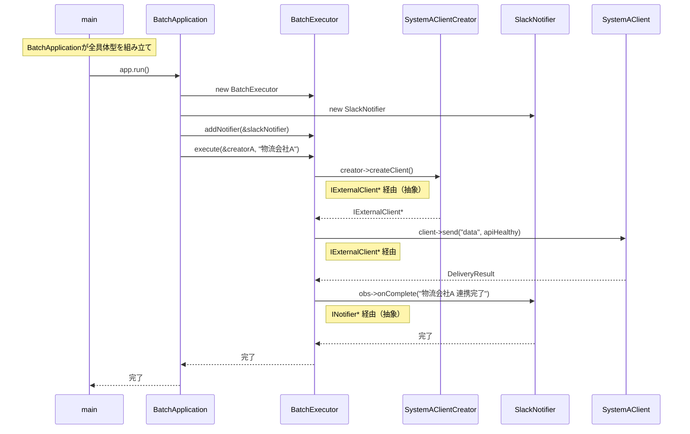

### 7-3：変更影響グラフ（改善後）

フェーズ3で行った「C社連携の追加」という要求を、改善後の構造で再確認します。

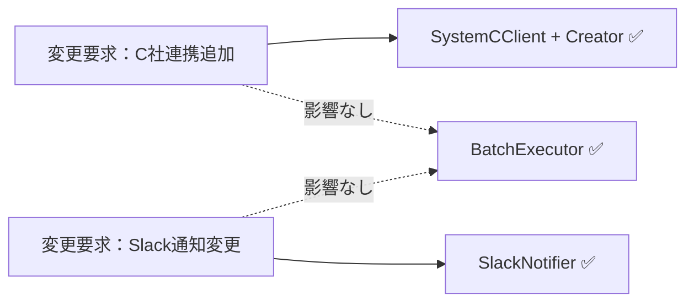

グラフが示す通り、連携先追加はクライアントと具象Creator、通知変更はNotifierの実装に分かれます。組み立て箇所でCreatorを登録する変更は必要ですが、`BatchExecutor`の実行フローは変わりません。

### 7-4：変更シナリオ表

フェーズ1の現状コードでは `BatchExecutor` が外部クライアントの生成・通信・完了通知を全て直接管理していたため、連携先の追加や通知要件の変化は常に `BatchExecutor` 本体の修正を意味していました。改善後は生成・通信・通知の責任が分離されたため、変更の影響を対応する実装クラスに限定できます。

| **シナリオ** | **フェーズ1の現状コードでの影響** | **この設計での影響** |
|---|---|---|
| C社連携を追加 | `BatchExecutor` にC社クライアントの生成・通信分岐を追記 | `SystemCClient` と `SystemCClientCreator` を追加し、組み立てへ登録。実行本体は保つ |
| Slack完了通知を追加 | `BatchExecutor` の成功・失敗処理へ通知呼び出しを追記 | `SlackNotifier` を追加し、通知先の組み立てへ登録。連携先クライアントは保つ |
| 新しい連携先（システムD等）を追加 | `BatchExecutor` に新しい接続ロジックと通知処理を追記 | `SystemDClient` と `SystemDClientCreator` を新規作成し、組み立てへ登録 |
| 完了通知先（Teams等）を追加 | `BatchExecutor` に通知ロジックを直接追記 | `TeamsNotifier` 実装クラスを新規作成し登録するだけ |
| 外部APIの接続手順が変わる | `BatchExecutor` の接続ロジックを修正 | 対象の `IExternalClient` 実装クラスのみ修正 |

変更要求ごとに「どのクラスを触るか」が明確になりました。一方で、クラス数が増え、どの部品を組み合わせるかを管理するコストは引き受けます。

---

## 整理


### 問題・原因・課題・解決策

| | 内容 |
|---|---|
| **問題** | 外部連携バッチで「連携先の追加」「通知先の追加」「生成方法の変更」という変わる理由が異なる3つの変化が、同じ `BatchExecutor` に混在している |
| **原因** | `BatchExecutor` が各連携先クライアントと通知サービスを生成方法と呼び出し手順を知っているため、どの変化が来ても `BatchExecutor` 全体への影響確認が必要になる |
| **課題** | 通信の詳細（接続点A）・通知先の仕組み（接続点B）・連携先クライアントの生成（接続点C）を、それぞれ独立して差し替えられる構造に切り離すこと |
| **解決策** | 窓口構造 × 通知分離構造 × 生成分離構造：`IExternalClient`（通信の複雑さを隠す）・`INotifier`リスト（通知先を登録する）・`IClientCreator`と具象Creator（生成方法を分ける）を組み合わせ、`BatchExecutor` の実行フローへ具象クラスごとの分岐を増やさない設計にする |

### フェーズとこの章でやったこと

| **フェーズ** | **この章でやったこと** |
| --- | --- |
| 🔵 フェーズ1：現状把握 | 外部連携先の増殖と通知処理が `BatchExecutor` に混在している現状を観察した。 |
| 🟣 フェーズ2：仮説立案 | 「連携先の生成」と「通知」を独立させる仮説を立てた。確定変更と将来リスクを別々に管理した。 |
| 🟣 フェーズ3：問題特定 | `BatchExecutor` がすべての詳細を知っていることによる修正の連鎖（痛み）を確認した。 |
| 🟠 フェーズ4：原因分析 | 責務の混在を「具体クラスへの直接依存」という構造的負債として特定した。 |
| 🟡 フェーズ5：課題定義 | 通信境界（接続点A）・通知境界（接続点B）・生成境界（接続点C）の3点を接続点として特定し、各軸の疎結合化を課題とした。 |
| 🔴 フェーズ6：対策検討 | 窓口→通知分離→生成分離の3ステップを並べ、ステップ3（3構造）まで採用した。 |
| 🟢 フェーズ7：対策実施 | 各責務をインターフェース経由で分離し、バッチ本体の変更耐性を高めた。採用した構造の役割が 窓口構造 × 通知分離構造 × 生成分離構造と呼ばれることを確認した。 |

### 使った構造 × 解消した根本原因

| **構造** | **解消した根本原因** |
| --- | --- |
| 窓口構造 | 複雑さの露出（BatchExecutorが外部APIの詳細を直接知っていた問題） |
| 通知分離構造 | 通知の密結合（新通知先追加でBatchExecutor本体の修正が必要だった問題） |
| 生成分離構造 | 生成の混在（具体クラスの生成がビジネスロジックと同居していた問題） |

### 責任の移動

| **クラス名** | **責任（1文）** | **変わる理由** |
| --- | --- | --- |
| `IExternalClient` | 外部連携クライアントの通信契約を提供する。 | なし |
| `INotifier` | 通知処理の契約を提供する。 | なし |
| `BatchExecutor` | バッチ全体の処理フローを統括する。 | バッチの実行順序が変わる場合 |
| `IClientCreator` / 具象Creator | 生成分離構造の契約を定義し、連携先ごとのクライアントを生成する | 新しい連携先が増える場合 |

> **このプロセスを回した結果にたどり着いた構造こそが 窓口構造 × 通知分離構造 × 生成分離構造の複合構造です。**

---

### 複雑さを足しても対策は変わるか

| 追加した複雑さ | 見えた原因 | 定めた課題 | 採用構造（3軸分離） |
|---|---|---|---|
| 順次バッチ実行 | 実行順の骨格と各ジョブの通信詳細が同居 | 順に流す外部手順と通信詳細を分ける | 実行順は `BatchExecutor` に残し、送信は窓口構造の裏へ |
| 通知イベント | 通知先追加が実行本体へ波及 | 通知の発生と通知先一覧を分ける | 通知分離構造の `INotifier` リストへ登録する |
| 送信失敗 | 成否判定と失敗通知が生成・通信と混在 | 失敗の扱いを外部手順側へ寄せる | 順次実行の骨格に残し、通信部品は差し替え可能に |
| 連携先追加 | 生成判断が実行本体に散在 | 生成だけを1か所へ寄せる | 生成分離構造の `IClientCreator` と具象Creatorへ |

順次実行（外部手順）・通知イベント（通知）・連携先追加（生成）が別々の軸として分離でき、送信失敗の扱いは外部手順の骨格側に閉じられることを確認しました。

---

## 振り返り

### 「この章を読むと得られること」は手に入ったか

| **得られること** | **この章のどこで示したか** |
| --- | --- |
| 得られること1：各構造がどの「変化」に対応するかを識別できる | フェーズ6のステップ1〜3で、各構造が登場する順序と理由を段階的に示した。 |
| 得られること2：複数の接続点をどこで分離するか判断できる | フェーズ5で、通信境界（接続点A）・通知境界（接続点B）・生成境界（接続点C）の3点を特定した。 |
| 得られること3：疎結合な連携アーキテクチャの構築方法を説明できる | フェーズ7の変更シナリオ表で、変更の局所化を実証した。 |
| 得られること4：「通信・通知・生成」の3つの責務が混在するコードを整理できる | フェーズ2の仮説立案とヒアリングで、外部連携先の通信詳細・通知先・クライアント生成という変動する仕様を特定した。 |

### 3つの設計原則はどう適用されたか

* **原則1「変わるものをカプセル化せよ」の現れ**
* **具体化された場所：** `IClientCreator`の具象Creatorと`INotifier`派生クラス
* **解説：** 連携先の実装詳細や通知先ごとのロジックを、独立したクラス群にカプセル化しました。

* **原則2「実装ではなくインターフェースに対してプログラムせよ」の現れ**
* **具体化された場所：** `IExternalClient` および `INotifier`
* **解説：** バッチ実行部はインターフェースのみを保持し、実装詳細に依存しない設計にしました。

* **原則3「継承よりコンポジションを優先せよ」の現れ**
* **具体化された場所：** `BatchExecutor` が `INotifier` リストを保持する構造
* **解説：** 通知ロジックを継承で拡張するのではなく、オブジェクトを注入することで機能を追加しました。

---

## あなたのコードで考えてみてください

この章で辿った思考プロセスを、あなた自身のコードに当てはめてみましょう。

1. **複雑さの兆候を探す：** あなたのコードに「複数の外部サービス呼び出しが1つのクラスに集中していて、何かが変わるたびにそこを開いている」箇所がありますか？
2. **変わる理由を3つに分ける：** そのクラスの変更要求は、「どのサービスを使うか（生成）」「処理の全体的な流れ（窓口）」「何かが起きたときの反応（通知）」のどれに属しますか？混在しているなら分けるサインです。
3. **影響の連鎖を測る：** 外部サービスが1つ増えたとき、変更が必要なファイルは何個ありますか？利用側のコードも変わりますか？
4. **分けた後を想像する：** 「窓口」「通知」「生成」を別々の責任として切り出したとき、それぞれの変更が他に影響しなくなるには何が必要ですか？

---

**題材を置き換えるときの共通手順**

この章の題材名を、自分の現場のシステム名に置き換えて考えます。

1. そのシステムは、誰が何を達成するために使うものか。
2. 入力、加工、出力は何か。
3. 最近入った変更要求、または次に来そうな変更要求は何か。
4. その変更で、触りたくない場所まで修正や再テストが広がるか。
5. 変えたいものと守りたいものを分けると、接続点には何を残すべきか。
6. 何もしない、関数化、クラス分離、契約導入、登録/組み立て移動のうち、どこまで進めるのが今回の文脈に合うか。

## パターン解説：Facade × Observer × Factory Method

本章では3つのパターンを組み合わせることで、連携バッチ特有の複雑さを解きほぐしました。

### パターンの骨格

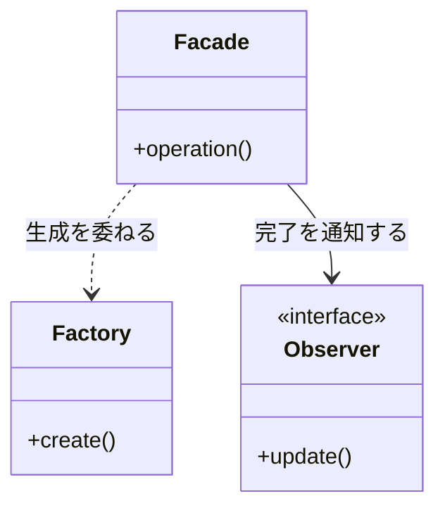

Facade はバッチ実行部の複雑な連携フローを隠蔽し、Factory Method は連携先の増殖に対応する生成の窓口となり、Observer は通知先変更の波及を遮断します。

### 抽象骨格の実行シーケンス

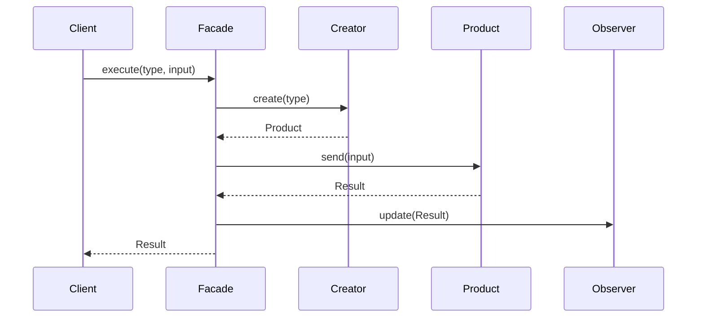

Facadeが処理全体を受け、生成をCreatorへ、外部連携をProductへ、通知をObserverへ分担します。

### 使いどころと限界

* **使いどころ**：外部システム連携、イベント駆動型のバッチ、設定によって振る舞いが動的に変わるシステム。

* **限界**：ごく小規模なツールであれば、これらのパターン適用はオーバースペックです。

```cpp
// 【過剰コード例】連携先が1社・通知もSlack固定の単純ケースで
//               Factory+Observer+Facadeを全部使った場合
class SimpleBatchExecutor {
    // 連携先は SystemAClient のみ・通知は SlackNotifier のみ
    // この規模でFactory/Observer/Facadeを全部使うのは過剰
    IExternalClient* client;
    vector<INotifier*> notifiers;
public:
    SimpleBatchExecutor(IExternalClient* c) : client(c) {}
    void addNotifier(INotifier* n) { notifiers.push_back(n); }
    void execute() {
        client->send("data");
        for (int i = 0; i < notifiers.size(); i++) {
            notifiers[i]->onComplete("Success");
        }
    }
};

// シンプルな直接実装で十分な場合
class SimpleBatch {
public:
    void execute() {
        SystemAClient client;   // 連携先は固定
        client.send("data");
        NotificationService n;  // 通知先は固定
        n.notify("Success");
    }
};
// → 連携先が1社・通知先が1つで今後も変わらないなら
//   SimpleBatch の直接実装で十分。
//   インターフェースや Factory を重ねるコストに見合わない。
```

### この章のまとめ

外部連携バッチ処理というドメインと Facade × Observer × Factory Method の組み合わせの関係を一言で言うなら、「通信の窓口・通知・生成」という3種類の責務はそれぞれ変わる理由が異なり、どの責務がどう変わるかを先に分析することが複合適用の出発点になる、ということです。`BatchExecutor` の各行から変化軸を読み解き、必要な境界を作った結果が三つのパターンの役割に対応した——その順序が、この章の最も重要なメッセージです。

7つのフェーズを通じて、読者は `BatchExecutor` が連携先・通知先・生成方法のすべてを知っているという観察から始まり、3種類の接続点を識別する分析を経て、それぞれの境界に合うパターンを当てるという判断へと進みました。フェーズ2の仮説立案とヒアリングで「外部連携先と通知先は今後も追加・変更が続く」と確認した時点で問題の輪郭が見え、フェーズ5で通信境界・通知境界・生成境界という3つの接続点を特定した時点で、それぞれに異なる解が必要なことが見えました。1つのパターンで解決しきれないという気づきが、次のパターンへ進む根拠になります。

あなたのコードの中にも、1つのクラスが複数の外部サービスの生成・呼び出し・通知をまとめて担っている箇所があるはずです。「それぞれの責務はどの業務機能に属するか」を問うことが、どの境界にどのパターンを当てるかを見つける入口になります。

---
