## 第10章 外部連携バッチシステム ―― 複数のパターンが交差する場所

―― 思考の型：複数の「変わる理由」が複雑に絡み合うシステムをどう解くか

### この章の核心

**外部システムとの連携が必要なバッチ処理において、システム間のインターフェース管理、非同期的なイベント通知、そして接続先生成の責任を個別のクラスが持ち続けると、変更要求のたびにシステム全体が不安定になる。**

### この章を読むと得られること

* **得られること1：** Facade、Observer、Factory Method の各パターンが、システムのどの「変化」に対応するためにあるのかを識別できるようになる。


* **得られること2：** 複数の接続点（クラスとクラスのつなぎ目）が絡み合う複雑なシステムにおいて、それぞれの責務をどこで分離すべきか判断できるようになる。


* **得られること3：** パターンの複合適用を通じて、疎結合（クラス間の依存を弱め、変更の影響が広がりにくい状態）な連携アーキテクチャを構築する方法を説明できるようになる。


* **得られること4：** 「生成」と「通知」と「インターフェース統合」という、異なる3つの責務が混在するコードを整理する視点。

---

## 🔵 フェーズ1：現状把握 ―― 変更が来る前にコードを把握する

### 1-1：システムの背景

このシステムは、社内の主要システムと外部の物流管理システムを繋ぐ「外部連携バッチシステム」です。 日々の注文データや在庫情報を外部システムへ同期する役割を担っており、連携先が増えるたびにバッチ処理の規模も拡大してきました。

当初は単一の外部連携先に対してデータを転送するだけのシンプルな構成でしたが、現在は連携先が3社に増え、それぞれが独自のデータフォーマットと接続認証を要求しています。 加えて、データの転送完了後に在庫管理システムや社内通知サービスへ「処理完了」を通知する機能も追加されました。

コードの構成を見ると、`BatchExecutor` というクラスが、すべての連携先との通信制御、データ変換、完了後の通知処理をすべて抱え込んでいます。 連携先が増えるたびに `BatchExecutor` に処理が追加され、今やどのロジックがどの連携先のためのものなのか、一見しただけでは判別が難しい状態です。 このコードがこれまで事業を支えてきた事実は尊重しつつ、現状を整理していきましょう。

### 1-2：仕様表

| **機能名** | **担当クラス** | **入力** | **出力** |
| --- | --- | --- | --- |
| 連携実行処理 | `BatchExecutor` | 連携先ID(string), データ(List) | 転送成功/失敗 |
| A社データ転送 | `SystemAClient` | 変換済みデータ | A社向けフォーマット通信 |
| B社データ転送 | `SystemBClient` | 変換済みデータ | B社向けフォーマット通信 |
| 通知処理 | `NotificationService` | 処理結果 | 各種通知（メール等） |

### 1-3：クラス構成図

現在のクラス構造です。`BatchExecutor` にすべてが依存していることが分かります。

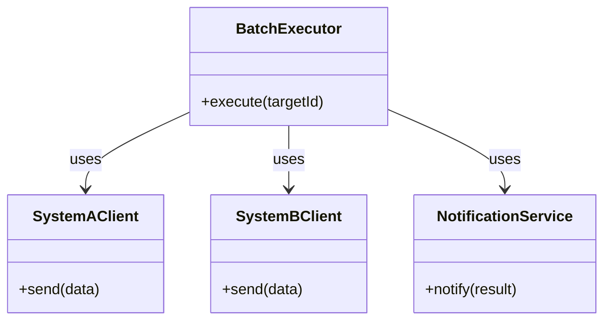

### 1-4：責任配置テーブル

| **クラス名** | **責任（1文）** | **知るべきこと** |
| --- | --- | --- |
| `BatchExecutor` | 外部連携バッチのフローを統括する。 | 連携先一覧、各クライアントの生成方法、通知先サービス。 |
| `SystemAClient` | A社システムへデータ転送を行う。 | A社のAPI接続仕様。 |
| `SystemBClient` | B社システムへデータ転送を行う。 | B社のAPI接続仕様。 |
| `NotificationService` | 処理結果を各担当者へ通知する。 | 通知先のメールアドレス等。 |

### 1-5：依存グラフ

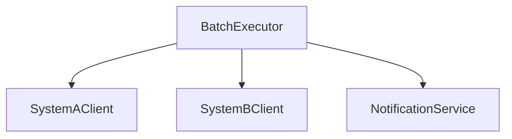

`BatchExecutor` に矢印が集中しており、連携先の追加や通知仕様の変更が即座にここへの修正を強いる構造です。

### 1-6：実装コード

連携処理の起点となる `BatchExecutor` の様子です。

```cpp
#include <iostream>
#include <string>
#include <vector>

using namespace std;

class SystemAClient {
public:
    void send(string d) { cout << "A社へ送信: " << d << endl; }
};
class SystemBClient {
public:
    void send(string d) { cout << "B社へ送信: " << d << endl; }
};
class NotificationService {
public:
    void notify(string r) { cout << "完了通知: " << r << endl; }
};

class BatchExecutor {
public:
    void execute(string targetId) {
        if (targetId == "A") {
            SystemAClient client; // ← 生成と利用が混在
            client.send("data");
        } else if (targetId == "B") {
            SystemBClient client; // ← 生成と利用が混在
            client.send("data");
        }
        NotificationService notifier; // ← 処理ごとに通知の知識も混在
        notifier.notify("Success");
    }
};

int main() {
    BatchExecutor executor;
    executor.execute("A");
    return 0;
}

```

このコードから、`BatchExecutor` が各連携先の生成と送信、さらにはその後の通知処理までを一手に引き受けていることが分かります。

### 1-7：実行結果

```text
A社へ送信: data
完了通知: Success

```

> このコードは正しく動く。これから変えていくのは「機能」ではなく「構造」だ。
> 
> 

### 1-8：責任チェック表

| **コードの行** | **持っている知識** | **管理者（観察）** |
| --- | --- | --- |
| `SystemAClient client;` | A社専用クライアントの生成知識 | インフラ担当・A社窓口担当 |
| `client.send("data");` | A社特有の通信プロトコル知識 | A社窓口担当 |
| `NotificationService notifier;` | 通知サービスの生成知識 | 全体設計者 |

要するに、連携先を識別して処理を実行しているという観察から、データ転送の「通信詳細」と「通知処理」、「連携先の生成」という複数の理由で変わるものが混在している構造の問題が見えてくる。

フェーズ1で現状把握が終わりました。次のフェーズ2では、このシステムに対する変更要求を整理し、何が変動し何が不変かを仮説立てます。

---

## 🟠 フェーズ2：仮説立案 ―― 変更要求を受けて、変動と不変を整理する

### 2-1：届いた変更要求

ある金曜日の午後、プロジェクトマネージャーから緊急の相談が飛び込んできました。

「お疲れ様。現在運用している外部連携バッチなんだけど、来週から新たにC社とも連携することになったんだ。 それに加えて、連携処理の結果を社内のSlackへ自動通知するようにしてほしいという要望が出ている。 データ転送のロジックを修正するついでに、通知処理についても何か良い仕組みを取り入れられないかな？」

データ転送先が増えるたびにバッチ全体のロジックが肥大化し、通知処理までが「おまけ」のように付け足されていく現状、そろそろ構造的なテコ入れが必要なようです。

### 2-2：変動・不変の仮説テーブル

フェーズ1での観察（1-8の責任チェック表）を基に、システムの変化を整理します。

| **分類** | **仮説** | **根拠（フェーズ1の観察から）** |
| --- | --- | --- |
| 🔴 **変動しそう** | 連携先のクライアント（SystemA/B/C...）の生成と通信ロジック | 1-8で、連携先ごとに生成と通信が混在していると観察したため。 |
| 🔴 **変動しそう** | 処理完了後の通知先や通知手段 | 1-8で、通知サービスの知識が処理ロジックと混在していると観察したため。 |
| 🟢 **不変** | バッチ処理の「実行フロー」そのもの（取得・転送・通知の流れ） | 連携先が変わっても、一連の転送フロー自体は安定しているため。 |

ただ、個別のクライアント生成や通知ルールをどこまで切り出せばいいのか、判断には慎重を期す必要があります。

### 2-3：関係者ヒアリング

仮説を携え、運用担当者と協議を行いました。

* **開発者：** 「C社との連携ですが、今回のデータフォーマットは既存のA社やB社と大きく異なりますか？」


* **運用担当者：** 「フォーマットは別物だね。 また、今後D社やE社も控えているから、接続先の追加はこれからも発生するよ。」


* **開発者：** 「通知についてはどうでしょうか？ Slack以外にもメール通知が必要になる可能性はありますか？」


* **運用担当者：** 「そうだね、将来的にはログ収集基盤へのデータ投入も検討している。 ただ、転送成功か失敗かという『結果の通知』という仕組み自体は今後も変わらないよ。」


* **開発者：** 「分かりました。外部との通信ロジックと、通知という振る舞いは、それぞれ独立して増殖していく可能性があるということですね。」


ヒアリングにより、通信先（生成）の増殖と、通知処理（イベントの反応）の多様化が、それぞれ別個の変化軸であることが確実になりました。

> **現実のヒアリングでは——** このシナリオでは相手がちょうど設計に役立つ情報を教えてくれています。現実には「変わるかどうか分からない」「たぶん変わらない」という答えが返ることも多いです。そのときは、コードの変更履歴（`git log`）や過去の障害記録を「ヒアリングの代わり」として使ってみてください。「過去に何度変わったか」が、「将来変わりやすいか」の最も正直な証拠です。

### 2-4：確定した変動/不変テーブル

| **分類** | **具体的な内容** | **変わるタイミング** | **根拠（誰との確認か）** |
| --- | --- | --- | --- |
| 🔴 **変動する** | 外部連携先の生成と通信ロジック | 連携先の追加・仕様変更時 | 運用担当者との合意 |
| 🔴 **変動する** | 結果通知の種類や通知先 | 通知要件の追加・変更時 | 運用担当者との合意 |
| 🟢 **不変** | バッチの実行プロセス（取得→転送→通知） | 変わらない | 運用担当者との合意 |

フェーズ2で「何が変わり、何が変わらないか」が確定しました。次のフェーズ3では、この変更要求を現在のコードで実行しようとすると何が起きるか、その痛みを確認します。

---

## 🟡 フェーズ3：問題特定 ―― 変更を試みて、痛みを発見する

### 3-1：変更シミュレーション

外部連携バッチシステムに「C社との連携」と「Slackへの結果通知」を追加する要求を、既存の BatchExecutor にそのまま組み込もうとします。

まず、SystemCClient クラスを新規作成し、通信処理を実装します。 次に、BatchExecutor の execute メソッド内にある既存の if-else 分岐に、targetId == "C" という条件を追加し、そこで SystemCClient を生成して send メソッドを呼び出します。 さらに、処理結果を Slack に飛ばすため、NotificationService のメソッドを書き換え、BatchExecutor 内で条件判定と通知ロジックを無理やり挿入します。

作業中、ふと気づかされます。「この execute メソッド、連携先が増えるたびに if 文の列が伸びていき、通知処理の記述もカオスになっている」と。 本来なら連携先ごとの通信ロジックと、通知という副次的な振る舞いは独立しているべきです。 しかし現状では、一つのメソッドの中にこれらすべてが詰め込まれており、連携先を一つ増やすたびにバッチ全体の処理フローを壊しかねない恐怖を感じます。

### 3-2：変更影響グラフ

現状の構造で変更を試みた際、影響がどのように飛び火するかを可視化します。

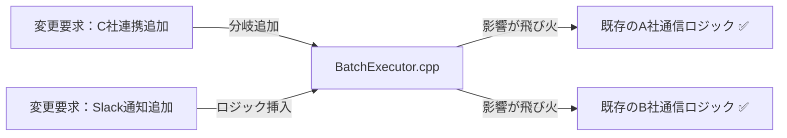

グラフが示す通り、C社連携の追加やSlack通知の実装といった個別の要求が、既存の他の連携先ロジックにまで影響を及ぼす構造になっています。

### 3-3：痛みの言語化

「連携先が増えるたびに、既存の安定している通信処理までテストし直さないといけないのか…」

変更をシミュレートする中で、エンジニアとして感じる「痛み」が二つ明確になりました。

1つ目は、BatchExecutor が抱える「巨大な責任」の辛さです。 このクラスは本来、バッチ処理全体のフローを制御するだけでいいはずなのに、連携先ごとの具体的な通信手段や、通知先といった「詳細」までをすべて把握し、生成まで行っています。 これでは、連携先が増えるたびに管理不能なほど複雑なコードになるのは必然です。

2つ目は、連携の「生成」と「通知」という、変わる理由が異なる責務が混在していることです。 連携先の通信仕様が変わるのか、それとも通知の要件が変わるのか、それを見極める前に巨大な一つのクラスを編集せざるを得ません。 変更が局所化（影響が1クラスだけで済む状態）されていないため、システム全体の安全性を確保するコストが日々跳ね上がっています。

フェーズ3で「今の構造では変更が辛い」という事実が確認できました。 次のフェーズ4では、この痛みの原因を構造的に分析します。

---

## 🔴 フェーズ4：原因分析 ―― なぜ辛いのかを構造的に言語化する

フェーズ3で「外部連携先が増えるたびに、バッチ処理全体のコードが修正のたびに不安定になる」という痛みを確認しました。 なぜこのような状態に陥るのか、その根本原因を構造的な視点で分析します。

### 4-1：観察→原因テーブル

フェーズ3で観察した「痛み」と、その背後にある構造的な原因を対応させます。

| **観察** | **原因の方向** |
| --- | --- |
| 新しい連携先を追加するたびに、統括クラス（`BatchExecutor`）の修正が必須になる | `BatchExecutor` が、連携先クライアントの「具体的なクラス名」と「接続方法」を直接知っているから。 |
| 転送結果の通知仕様を変えると、連携処理のフロー全体まで影響を受ける | 「データ転送」という連携処理と、「処理結果の通知」というイベント通知が、同じクラス内で密結合に混在しているから。 |

コードを追うと、`BatchExecutor` は単に処理を順序立てるだけでなく、連携先それぞれの認証、通信、データ変換という「詳細」までを一身に背負っています。 その上、通知処理の呼び出しまで行っているため、連携先ごとの個別の事情と、システム共通の通知フローが同じ場所で絡み合っていることが分かります。

### 4-2：変わるもの / 変わらないものテーブル

変化の軸が異なる要素を整理します。

| **変わり続けるもの（🔴）** | **変わってほしくないもの（🟢）** |
| --- | --- |
| 外部連携先ごとの通信手段（プロトコル・認証等） | バッチ全体の処理実行順序（取得→転送→通知） |
| 通知先のサービスや通知ルール | 通知という「イベント」自体を発生させる責務 |

連携先の追加は今後も発生する「変動」ですが、バッチ全体の転送フローは「不変」に近い構造です。 本来、これらは別の責務として分離されるべきものであり、同じクラス内で扱われていること自体が設計上の歪みを生んでいます。

### 4-3：接続形態を診断する

現在の接続形態を2×2マトリクスで診断します。

今の `BatchExecutor` と各クライアント、および通知サービスとの接続は、巨大なUSBハブの中に、各機器の電源回路や通信制御が直接はんだ付けされている状態（具体×間接）だと言えます。

ハブ（`BatchExecutor`）を開けば、中には各機器専用の回路が複雑に入り組んでおり、一つの配線をいじろうとすると、他の回路にまで誤って電流が流れてしまうような状態です。 本来なら、ハブのポートには汎用的な規格（抽象）のプラグを差し込むべきところを、専用線で直結してしまっているために、変更がシステム全体へと伝播してしまうのです。

|  | 直接（直差し） | 間接（アダプター経由） |
|:---:|:---|:---|
| **具体**（専用規格） | iPhone → [Lightning] → Apple純正ドック（Lightning端子） | **← 現在地**　iPhone → [Lightning] → [変換] → USB-A充電器（汎用端子） |
| **抽象**（汎用規格） | MacBook → [USB-C] → USB-C対応モニター（汎用端子） | MacBook → [USB-C] → [ハブ] → HDMI・USB-A・LAN |

フェーズ4で根本原因が言語化できました。 次のフェーズ5では、解決すべき課題を具体的に定義していきます。

---

## 🟣 フェーズ5：課題定義 ―― 解くべき問題を具体的に定める

フェーズ4で、「外部連携ロジック（通信）」と「イベント通知」が `BatchExecutor` 内で密結合していることが、コードを複雑化させ、変更のたびにシステム全体を不安定にする根本原因だと特定しました。 連携先ごとに異なる通信プロトコルと、将来増えるであろう通知手段を、現在の構造のまま扱い続けることは限界に達しています。

対策案を検討する前に、今回のリファクタリングで「何を解決すべきか」を4つの視点で具体化し、課題を確定させます。

### 5-1：接続点の特定

フェーズ4の分析に基づき、以下の接続点（ジョイント）を特定しました。

* 接続点A：`BatchExecutor` ←→ 各外部システム（SystemA/B/C）の通信境界
* 接続点B：`BatchExecutor` ←→ 通知サービス（NotificationService）の通知境界

現在、`BatchExecutor` はこれら2つの接続点に対して、具体的なクラスを直接 `new` し、メソッドを直接呼び出すという「具体×間接」に近い混在状態にあります。 特に連携先（接続点A）の増殖と、通知手段（接続点B）の多様化という二つの異なる変化軸が、一つのクラス内で「スパゲッティ」のように絡み合っているのが最大の課題です。

### 5-2：非機能制約の確認

設計の方向性を決めるために、この接続点に関わる非機能制約を確認します。

| **確認項目** | **内容** | **この章での判断** |
| --- | --- | --- |
| 変更頻度 | この接続点はどのくらいの頻度で変わるか | 高（今後も連携先と通知先の追加が続く） |
| パフォーマンス | ホットパスか（高頻度で呼ばれるか） | 低（バッチ処理であり、即時性はそれほど要求されない） |
| メモリ | 間接層の追加でオーバーヘッドが問題になるか | いいえ（バッチ処理のため、柔軟性を優先してよい） |
| 実行時間 | バッチ処理の最大実行時間に制約があるか | 要設計（業務システムとの連携バッチは、業務時間外（深夜帯）に完了しなければならない時間制限がある場合が多い。外部システムの応答待ち時間も含めたタイムアウト設計が、外部連携クラスの構造に影響する） |

変更頻度が「高」であるため、連携先や通知先が増えるたびにバッチ全体のロジックが書き換わるような構造は避けなければなりません。 通常のバッチ実行では処理時間の問題は軽微ですが、外部システムとの連携を含む夜間バッチには完了期限（締め時刻）があります。タイムアウトと再試行ポリシーは、外部クライアントクラスの設計方針に影響します。

### 5-3：クライアントへの影響範囲

分離対象の責務を呼び出しているのは `BatchExecutor` クラス自身です。 このクラスが連携先や通知先の「詳細」を知っていることが現在の制限事項です。 この設計を改善することで、`BatchExecutor` は「バッチの実行順序（フロー）」だけを管理し、実際の処理（通信や通知）は外部化されたクラスに任せることができます。

### 5-4：課題まとめ表

これまでの分析を、フェーズ6の対策案検討に向けた課題として整理します。

| **接続点** | **分けた理由** | **非機能制約** | **クライアント影響** |
| --- | --- | --- | --- |
| 接続点A | 連携先追加によるロジックの肥大化 | 高頻度の変更・夜間バッチの締め時刻によるタイムアウト設計が必要 | `BatchExecutor` の通信処理 |
| 接続点B | 通知手段の多様化への対応 | 高頻度の変更 | `BatchExecutor` の通知処理 |

この表が、次に検討するパターン適用の出発点となります。 外部連携（Factory Method・Facade）と、通知処理（Observer）を別々の視点で切り離す構造を目指します。

フェーズ5で「何を解くか」が確定しました。 次のフェーズ6では、これらの課題に対して具体的にどのようなパターンの組み合わせが最適か、コストの観点から案を検討します。

---

## 🟢 フェーズ6：対策案検討 ―― 解決策を並べ、コストで選ぶ

外部連携バッチシステムにおいて、「連携先の追加」と「通知処理の多様化」という二つの変更軸が `BatchExecutor` に混在していることが、システムを複雑にする原因です。 ここでは、これらの責務を適切に切り離すための対策案を検討します。

### 6-1：接続の形 2×2マトリクス

現在は通信クライアントや通知サービスを `BatchExecutor` が直接生成して利用する「具体×直接」の状態です。 これらをインターフェースで抽象化し、生成を Factory Method 等へ委譲する方向で検討します。

| 接続形態 | ケーブル例 | 特徴 |
|:---:|:---|:---|
| **具体×直接**（← 現在地） | iPhone → [Lightning] → Apple純正ドック（Lightning端子） | 専用端子のみ対応。差し替え不可 |
| **具体×間接** | iPhone → [Lightning] → [変換] → USB-A充電器（汎用端子） | 変換器を挟むが規格は専用のまま |
| **抽象×直接** | MacBook → [USB-C] → USB-C対応モニター（汎用端子） | どのメーカーでも同じ口で繋がる |
| **抽象×間接** | MacBook → [USB-C] → [ハブ] → HDMI・USB-A・LAN | ハブを介して多様な機器へ展開可能 |

---

#### 案0：現状維持 ―― 構造を変えない

**この形の考え方：**
クラスの分割も接続形態の変更もしない。 既存の `if-else` 分岐に新しい連携先や通知条件を足し続ける。 変更頻度が極めて低く、この先半年以上修正の予定がない場合にのみ選択する。

**構造図：**

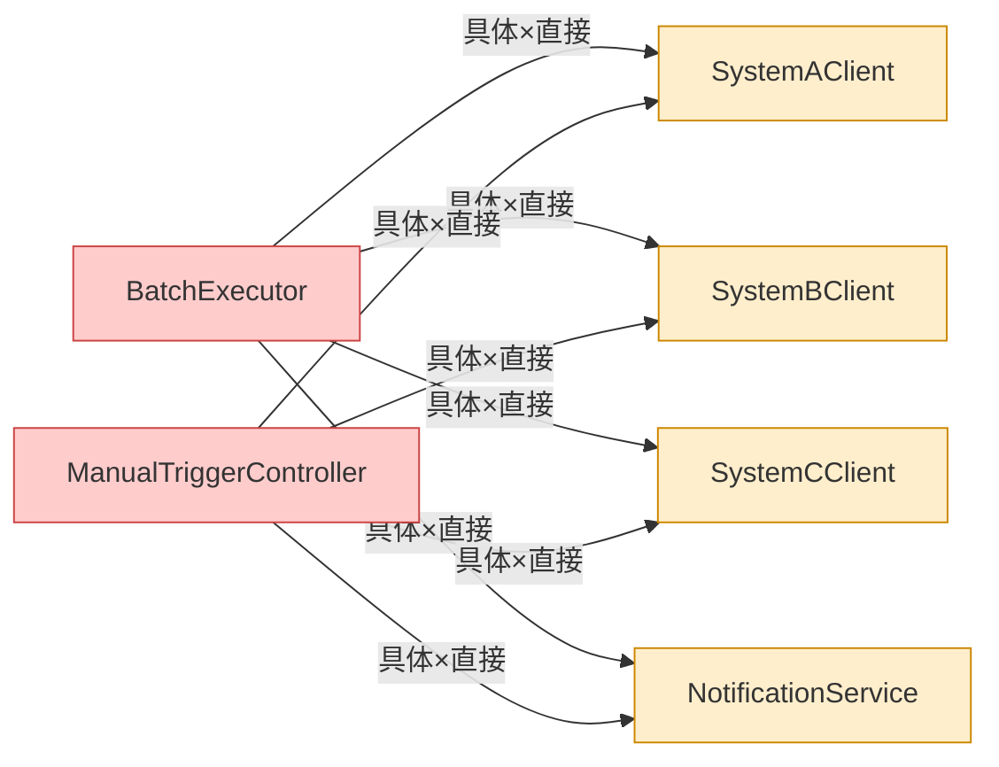

両クラスが同じ連携先クライアントと通知サービスを直接知っており、連携先が増えると2か所を修正しなければならない。

【コード例】

```cpp
void execute(string targetId) {
    if (targetId == "C") { SystemCClient client; client.send("data"); } // ← 具体：SystemCClientという型名を直接書いている
    NotificationService n; n.notify("Success"); // ← 具体：NotificationServiceという型名を直接書いている
}

```

**呼び出し側から見た違い（main() 例）：**

```cpp
// 案0（現状維持）の呼び出し側
// 両クラスが同じ外部システム振り分けロジックを重複して持つ
class ManualTriggerController {
public:
    void triggerSync(string systemId) {
        // ← 具体：BatchExecutorと同じif-else分岐をそのまま複製している
        if (systemId == "A") {
            SystemAClient client; client.send("manualData");
        } else if (systemId == "B") {
            SystemBClient client; client.send("manualData");
        } else if (systemId == "C") {
            SystemCClient client; client.send("manualData");
        }
        NotificationService n; n.notify("手動同期完了");
    }
};

int main() {
    BatchExecutor executor;          // ← 直接：BatchExecutorを直接生成して使う
    executor.execute("C");           // ← 具体：内部にSystemCClientなどが直書きされている

    ManualTriggerController manual;  // ← 直接：ManualTriggerControllerも直接生成
    manual.triggerSync("B");         // ← 具体：内部に同じif-else分岐が重複している
    return 0;
}
```

両クラスが同じロジックを重複して持つため、連携先が増えると2か所を修正しなければならない。

**動作図：**

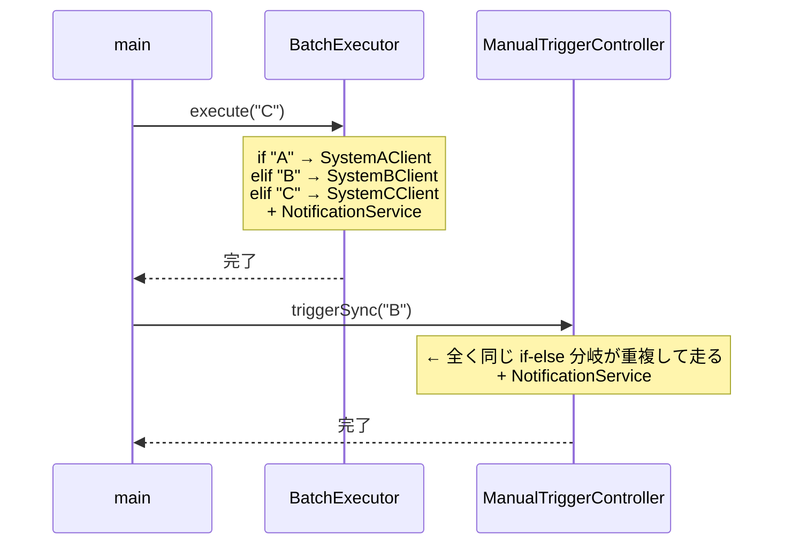

一文要約：連携先の振り分けロジックと通知処理が両クラスの内部に直書きされているため、同じ分岐が2か所で並行して走る。

**この形のトレードオフ：**

* 変更容易性：低（連携先が増えるたびに `BatchExecutor` が肥大化する）


* テスト容易性：低（通信処理と通知ロジックが分離できず、テストが困難）


* 実装コスト：低（今のコードに数行足すだけ）


---

#### 案1：具体×直接 ―― クラスを分けるが参照は具体型のまま

**この形の考え方：**
各連携先のクライアントをクラス化するが、呼び出し側はそれらを直接 `new` する。 責任の所在は明確になるが、依然としてクラスの生成知識が利用側に混在している。

**構造図：**

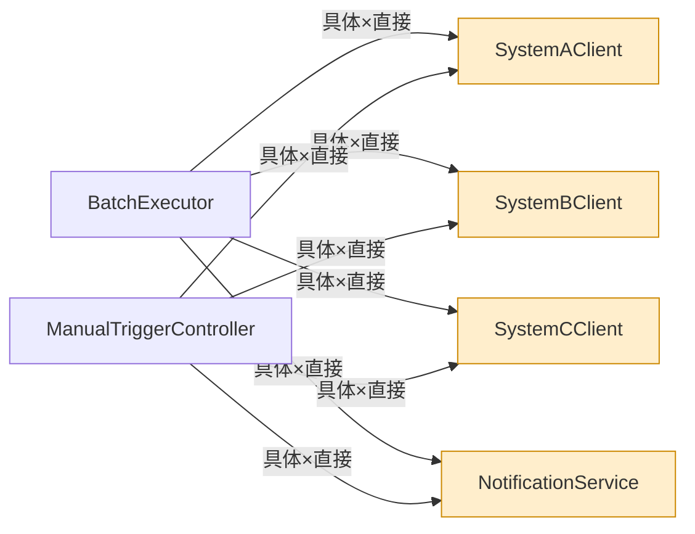

クラスは分離されたが、両クラスが各具体クライアントへの矢印を重複して持っており、連携先が増えるたびに両方を修正する必要がある。

【コード例】

```cpp
void execute(string targetId) {
    if (targetId == "C") {
        SystemCClient client; // ← 具体：SystemCClientという型名を直接書いている
        client.send("data");  // ← 直接：呼び出し側がこのクラスを直接インスタンス化している
    }
}

```

**呼び出し側から見た違い（main() 例）：**

```cpp
// 案1（具体×直接）の呼び出し側
// 選択ロジックが両クラスに重複している
class ManualTriggerController {
public:
    void triggerSync(string systemId) {
        if (systemId == "C") {
            SystemCClient client; // ← 具体：SystemCClientという型名を直接書いている
            client.send("manualData"); // ← 直接：このクラスを直接インスタンス化している
        }
        NotificationService n; n.notify("手動同期完了");
    }
};

int main() {
    BatchExecutor executor; // ← 直接：BatchExecutorを直接生成して使う
    executor.execute("C");  // ← 具体：内部でSystemCClientが直接生成される

    ManualTriggerController manual; // ← 直接：ManualTriggerControllerも直接生成して使う
    manual.triggerSync("B");        // ← 具体：内部でSystemBClientが直接生成される
    return 0;
}
```

選択ロジックが両クラスに重複しており、連携先が増えるたびに両方を修正しなければならない。

**動作図：**

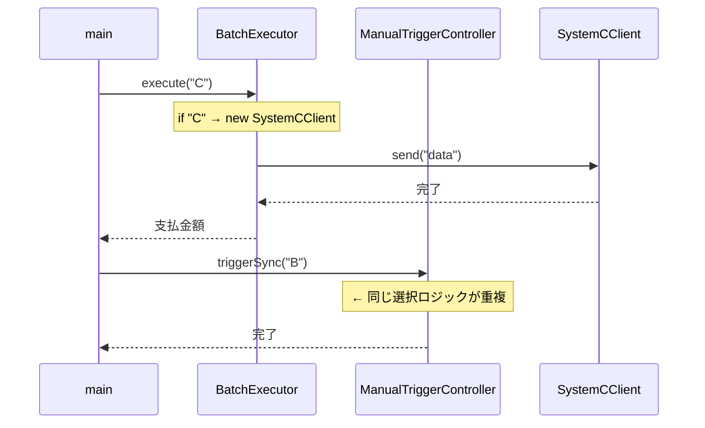

一文要約：クラスは分かれたが「どのクラスを呼ぶか」という判断を両方の呼び出し元がそれぞれ行っており、呼び出し経路が2本並んで重複している。

**この形のトレードオフ：**

* 変更容易性：低〜中（クラスは分離できたが、生成ロジックの混在は残る）


* テスト容易性：低（具体クラスへの依存が強いため切り離せない）


* 実装コスト：低（クラスへの切り出しのみ）


---

#### 案2：抽象×直接 ―― インターフェースを挟み、型だけで接続する

**この形の考え方：**
連携先との通信インターフェースを定義し、生成を Factory Method パターンで抽象化する。 また、通知処理には Observer パターンを適用し、結果の通知先を動的に登録可能にする。

**構造図：**

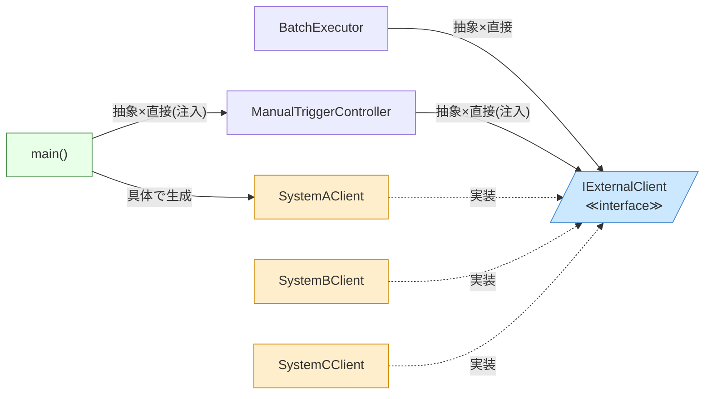

`BatchExecutor` はFactory経由でインターフェースのみを利用し、`ManualTriggerController` は外部から注入されたインターフェースのみを知り、両クラスとも具体クライアントへの依存がなくなっている。

【コード例】

```cpp
class IExternalClient { public: virtual void send(string d) = 0; };
// この構造を Factory Method パターンと呼ぶ
IExternalClient* factory(string id) { /* ... */ } // ← 抽象：IExternalClient*型で返し、具体クラスを知らない

// Observer パターンの導入
void execute() {
    client->send("data");                           // ← 抽象：IExternalClient*型で受け取り、具体クラスを知らない
    for(auto* obs : observers) obs->notify("Success"); // ← 直接：IObserver*型で直接通知する
}

```

**呼び出し側から見た違い（main() 例）：**

```cpp
// 案2（抽象×直接）の呼び出し側
// 注入アプローチにより、両クラスで具体クライアントへの依存がなくなる
class ManualTriggerController {
    IExternalClient* client; // ← 抽象：外部から注入されたインターフェースのみ知っている
public:
    ManualTriggerController(IExternalClient* c) : client(c) {}
    void triggerSync(string systemId) {
        cout << "[ManualTrigger] " << systemId
             << " への手動同期を実行。" << endl;
        client->send("manualData"); // ← 直接：インターフェース経由で直接呼び出す
    }
};

int main() {
    BatchExecutor executor;        // ← 直接：BatchExecutorを直接生成
    executor.execute("C");         // ← 抽象：呼び出し側は具体クライアントクラスを知らない

    SystemBClient bClient;
    ManualTriggerController manual(&bClient); // ← 直接：インターフェース経由で直接注入
    manual.triggerSync("B");       // ← 抽象：内部では具体クライアントを知らない
    return 0;
}
```

注入アプローチにより、両クラスとも具体クライアントクラスを知らずに済み、選択ロジックの重複が解消される。

**動作図：**

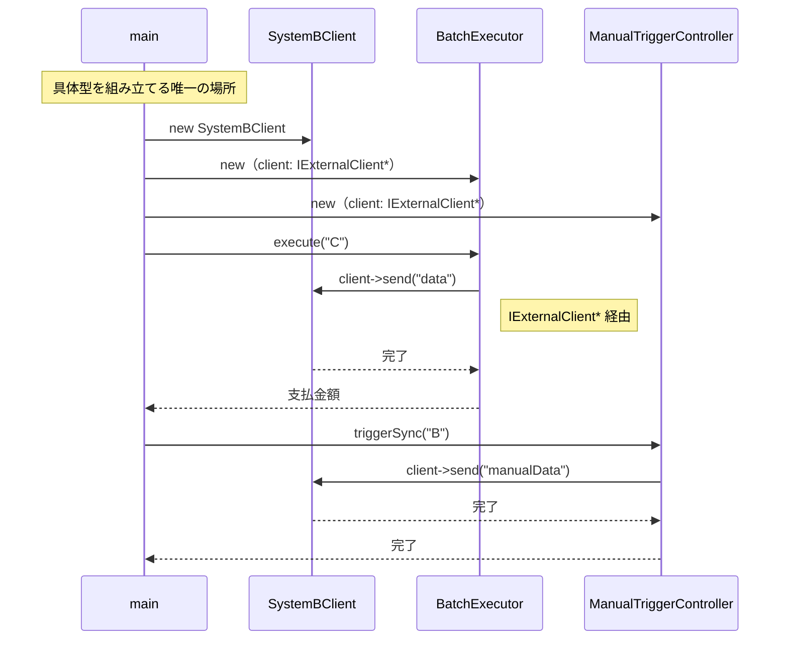

一文要約：`main()` が具体型を組み立て、両方の呼び出し元は `IExternalClient*` という型だけを介して同じオブジェクトを呼ぶため、具体クラスが変わっても呼び出し経路は変わらない。

**この形のトレードオフ：**

* 変更容易性：中〜高（新しい連携先追加はFactoryの修正だけで済む）


* テスト容易性：高（I/Fに対してスタブを容易に差し込める）


* 実装コスト：中（インターフェース定義とFactoryの実装が必要）


---

#### 案3：具体×間接 ―― 仲介クラスを置くが、具体型を知っている

**この形の考え方：**
`BatchExecutor` と各クライアントの間に「Facade クラス」を置く。 この Facade が連携処理の裏側を隠蔽する。 ただし、この Facade は個別のクライアントの具体型を知っている。

**構造図：**

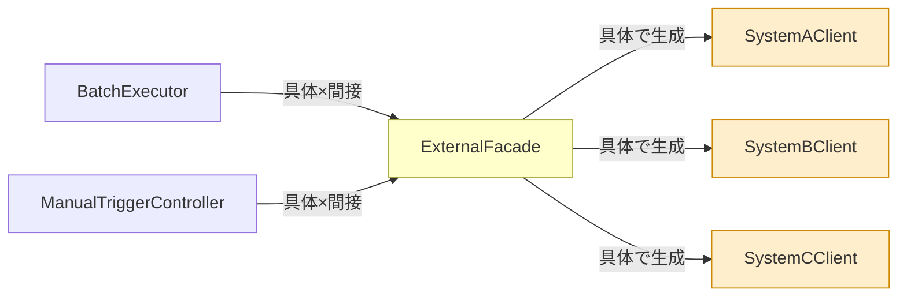

両クラスが `ExternalFacade` だけを知り、具体クライアントはFacadeの内部に隠蔽されているが、Facade自体は各具体クラスを直接知っている。

【コード例】

```cpp
#include <iostream>
#include <string>
#include <vector>

using namespace std;

// 各外部クライアント（具体型）
class SystemAClient {
public:
    void send(string data) { cout << "A社へ送信: " << data << endl; }
};
class SystemBClient {
public:
    void send(string data) { cout << "B社へ送信: " << data << endl; }
};
class SystemCClient {
public:
    void send(string data) { cout << "C社へ送信: " << data << endl; }
};

// 連携結果を記録するクラス
class SyncLog {
public:
    void record(string targetId, bool success, int attempt) {
        cout << "[ログ] " << targetId << " 試行" << attempt
             << "回目: " << (success ? "成功" : "失敗") << endl;
    }
};

// ExternalFacade: リトライ・ログ記録を集約する仲介クラス
class ExternalFacade {
    SyncLog log;
    // ← 具体：各クライアントの具体型を直接知っている
    void sendWithRetry(string targetId, string data, int maxRetry) {
        for (int attempt = 1; attempt <= maxRetry; attempt++) {
            bool success = false;
            // 指数バックオフ待機（デモのため省略）
            if (targetId == "A") {
                SystemAClient c; c.send(data); success = true;
            } else if (targetId == "B") {
                SystemBClient c; c.send(data); success = true;
            } else if (targetId == "C") {
                SystemCClient c; c.send(data); success = true;
            }
            log.record(targetId, success, attempt);
            if (success) return;
            cout << "[リトライ] " << attempt << "回目失敗。再試行します。"
                 << endl;
        }
        cout << "[エラー] " << targetId << " への連携が失敗しました。"
             << endl;
    }
public:
    // ← 間接：呼び出し元は各クライアントの具体型を知らなくてよい
    void run(string targetId, string data) {
        cout << "[Facade] " << targetId << " への連携を開始。" << endl;
        sendWithRetry(targetId, data, 3); // 最大3回リトライ
    }
};

// 呼び出し元1: 夜間バッチ実行
class BatchExecutor {
    ExternalFacade facade; // ← 具体：ExternalFacadeという具体型を持っている
public:
    void executeNightlyBatch(vector<string> targets) {
        cout << "[BatchExecutor] 夜間バッチ開始。" << endl;
        for (auto& targetId : targets) {
            facade.run(targetId, "nightlyData");
            // ← 間接：Facade経由のため具体クライアントが見えない
        }
        cout << "[BatchExecutor] 夜間バッチ完了。" << endl;
    }
};

// 呼び出し元2: 管理者による手動トリガー
class ManualTriggerController {
    ExternalFacade facade; // ← 具体：ExternalFacadeという具体型を持っている
public:
    void triggerManual(string targetId, string data) {
        cout << "[ManualTrigger] " << targetId
             << " への手動連携を実行。" << endl;
        facade.run(targetId, data);
        // ← 間接：Facade経由のため具体クライアントが見えない
    }
};

```

**呼び出し側から見た違い（main() 例）：**

```cpp
int main() {
    // 呼び出し元1: 夜間バッチ
    BatchExecutor batch;
    batch.executeNightlyBatch({"A", "B", "C"});

    cout << "---" << endl;

    // 呼び出し元2: 手動トリガー（管理者操作）
    ManualTriggerController manual;
    manual.triggerManual("B", "manualTestData");

    return 0;
}
```

このコードを見ると、`ExternalFacade` は依然として各外部クライアントの具体型を知っており、連携先が増えれば修正が必要です。しかし、指数バックオフによるリトライと連携結果の記録という複雑なロジックを一箇所に集め、`BatchExecutor`（夜間バッチ）と `ManualTriggerController`（手動実行）が同じ連携フローを共有できる点に、この形の価値があります。

**動作図：**

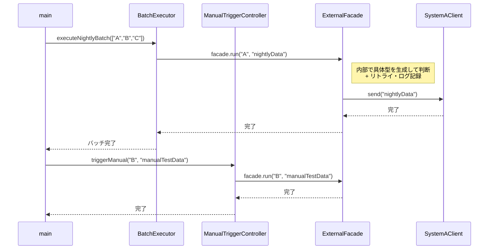

一文要約：両方の呼び出し元が同じ `ExternalFacade` を経由するため連携判断の呼び出し経路が1本に収束し、選択ロジックの重複が消える。

**この形のトレードオフ：**

* 変更容易性：中（Facadeへの修正に閉じる）


* テスト容易性：中（Facadeをスタブ化すれば一定のテストは可能）


* 実装コスト：中（Facadeクラスの作成が必要）


---

#### 案4：抽象×間接 ―― インターフェース＋仲介役を両立する

**この形の考え方：**
Facade によるインターフェース統合、Factory Method による生成の分離、Observer による通知の疎結合をすべて組み込む。 変更影響は完全に局所化されるが、クラス数は最大になる。

**構造図：**

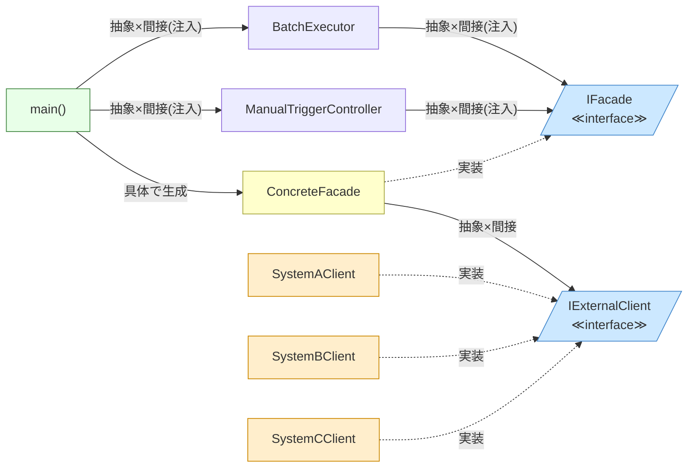

両クラスが抽象Facadeインターフェースのみを受け取り、具体クライアントへの依存が完全に排除されているが、インターフェースが2層になり構造が複雑になる。

【コード例】

```cpp
class IFacade { virtual void execute() = 0; }; // ← 抽象：生成の窓口をインターフェースとして定義

class BatchExecutor {
    IFacade* facade; // ← 抽象：IFacade*型で受け取り、具体実装を知らない
public:
    BatchExecutor(IFacade* f) : facade(f) {}
    void execute(string targetId) {
        facade->execute(); // ← 間接：Facade経由で呼ぶため内部のクライアント群が見えない
    }
};

```

**呼び出し側から見た違い（main() 例）：**

```cpp
// 案4（抽象×間接）の呼び出し側
// 両クラスとも抽象Facadeのみを知っており、具体クライアント実装は隠れている
class ManualTriggerController {
    IFacade* facade; // ← 抽象：抽象Facadeインターフェースのみ知っている
public:
    ManualTriggerController(IFacade* f) : facade(f) {}
    void triggerSync(string systemId) {
        cout << "[ManualTrigger] " << systemId
             << " への手動同期を実行。" << endl;
        facade->execute();
        // ← 間接：Facade経由のため具体クライアントが見えない
    }
};

int main() {
    ConcreteFacade facade;             // ← 具体：組み立て側だけが具体型を知る
    BatchExecutor executor(&facade);   // ← 間接：抽象Facadeのみ見えて具体実装は隠れる
    executor.execute("C");

    ConcreteFacade facade2;
    ManualTriggerController manual(&facade2);
    // ← 間接：抽象Facadeのみ見えて具体実装は隠れる
    manual.triggerSync("B");
    return 0;
}
```

両クラスとも抽象Facadeインターフェースのみを受け取るため、具体的なクライアントクラスへの依存が完全に排除される。

**動作図：**

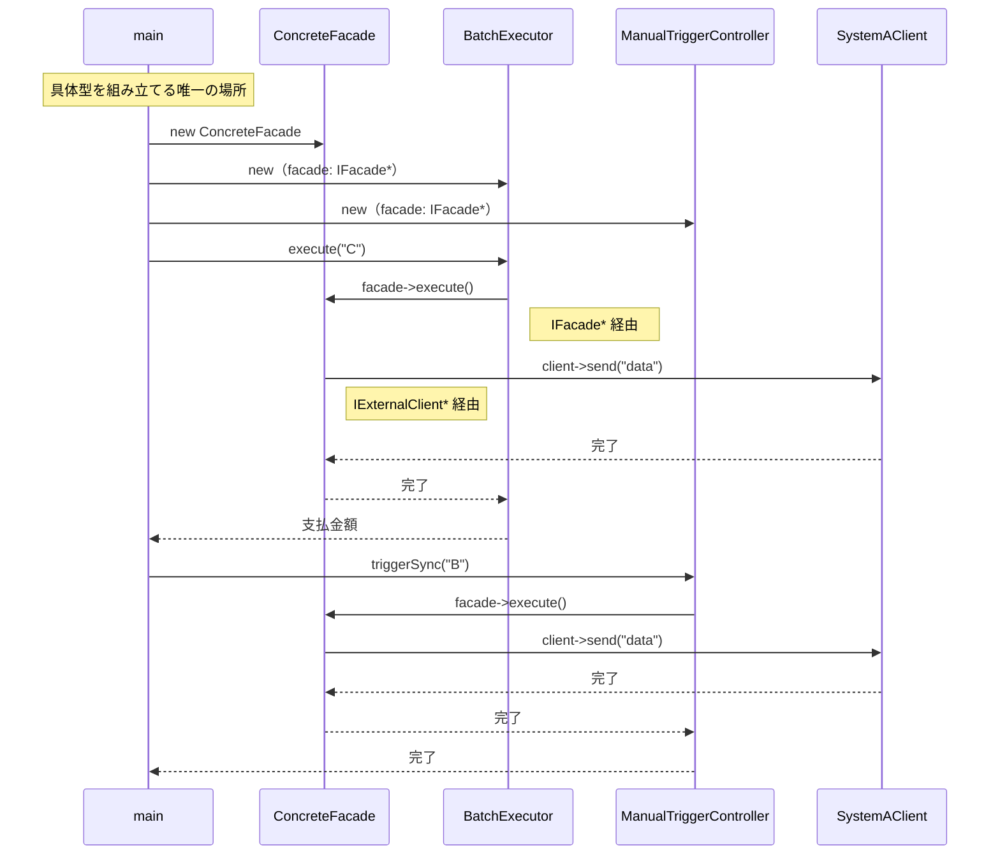

一文要約：呼び出し元→`IFacade*`→`IExternalClient*` という2段階の抽象型を経由するため、どの具体クラスが動くかは `main()` の組み立て部分だけが知っている。

**この形のトレードオフ：**

* 変更容易性：高（あらゆる層が独立して変更可能）


* テスト容易性：高（全ての依存をスタブに差し替え可能）


* 実装コスト：高（非常に多くのクラスと複雑な設計が必要）


---

### 6-7：評価軸

対策案を比較するための「ものさし」を先に宣言します。 外部連携バッチシステムにおいて、複数のパターン（Facade、Observer、Factory Method）を適用する際の評価軸を定義します。

| **評価軸** | **意味** | **ウェイト** |
| --- | --- | --- |
| 変更容易性 | 連携先追加や通知要件変更の際、触る場所が最小で済むか | ×3 |
| テスト容易性 | クライアントや通知先をスタブに差し替えてテスト可能か | ×2 |
| 可読性 | パターン導入によるクラス数増加と構造の複雑化度合い | ×1 |

> **注：** このウェイト（変更容易性×3など）は本書の例です。チームの変更頻度・テスト文化に合わせて、比較を始める前にチームで合意してください。スコアは「答えを決める計算式」ではなく、「チームの議論を整理する道具」です。

**採点基準（章共通）：**

| 点数 | 変更容易性 | テスト容易性 | 可読性 |
| --- | --- | --- | --- |
| 3 | 1クラス追加のみで完結 | スタブで完全に切り離せる | クラス増なし・直感的に理解可能 |
| 2 | 2〜3クラスの修正が必要 | 一部スタブが必要だが可能 | クラス1〜2個増・標準的な構造 |
| 1 | 4クラス以上の波及 | 実装依存でテスト困難 | 中間層が過多で理解コストが高い |

**パフォーマンスの VETO 判定：**
本バッチ処理は定期実行であり、即時性の制約は低いため、パフォーマンス上の VETO は発動しません。 柔軟な連携と通知を実現する設計を優先します。

---

### 6-8：コスト天秤

5つの案を比較します。

| **案** | **現在の対応コスト** | **未来の対応コスト** |
| --- | --- | --- |
| 案0：現状維持 | 低 | 高 |
| 案1：具体×直接 | 低〜中 | 高 |
| 案2：抽象×直接 | 中 | 低〜中 |
| 案3：具体×間接 | 中 | 中 |
| 案4：抽象×間接 | 高 | 低 |

**ステップ1：採点表**（1＝低い、2＝中程度、3＝高い）

| 案 | 変更容易性（×3） | テスト容易性（×2） | 可読性（×1） |
| --- | --- | --- | --- |
| 案0：構造を変えない | 1 | 1 | 3 |
| 案1：具体×直接 | 1 | 2 | 3 |
| 案2：抽象×直接 | 2 | 2 | 2 |
| 案3：具体×間接 | 2 | 2 | 2 |
| 案4：抽象×間接 | 3 | 3 | 1 |

**ステップ2：加重合計表**

| 案 | 加重スコア | 判定 |
| --- | --- | --- |
| 案0 | 1×3＋1×2＋3×1＝8 |  |
| 案1 | 1×3＋2×2＋3×1＝10 |  |
| 案2 | 2×3＋2×2＋2×1＝12 |  |
| 案3 | 2×3＋2×2＋2×1＝12 |  |
| 案4 | 3×3＋3×2＋1×1＝16 | ← 採用候補 |

外部システム連携とイベント通知という複数の責務が絡み合うため、案4（抽象×間接）の柔軟性が最も評価されました。

---

### 6-9：採用案の決定

**採用する案：** 案4（抽象×間接 ―― Facade パターン × Observer パターン × Factory Method パターン）

**理由：**
複数の外部連携先と通知要件を独立して拡張できるようにするため、各責務を完全にインターフェース経由で疎結合化する案4を採用します。 実装コストは高いですが、将来の連携先増殖を見越した長期運用には不可欠な投資です。

---

### 6-10：耐久テスト

フェーズ2のヒアリングで挙がった将来のリスクに対する耐性を確認します。

| **変更シナリオ** | **触る場所** | **コスト評価** |
| --- | --- | --- |
| D社連携を追加する | `ClientFactory` に new ロジック追加 | 低 |
| 通知先に「ログ基盤」を追加する | `IObserver` を実装した `LogObserver` を作成 | 低 |

採用した設計では、新しい通信先は Factory で、新しい通知先は Observer で追加でき、既存の連携ロジックを一切修正せずに済みました。

フェーズ6で採用する案が決まりました。次のフェーズ7では、この案を実際にコードとして実装し、変更耐性が高まった構造を確認します。

---

## 🟤 フェーズ7：対策実施 ―― 決断し、変化に強い設計を手に入れる

採用した案4（Facade × Observer × Factory Method）を実装し、外部連携と通知処理の責務をそれぞれ独立したクラスへカプセル化（変更の影響を1クラス内に閉じ込めること）します。

### 7-1：解決後のコード（全体）

連携先クライアントの生成を `ClientFactory` に、通知処理を `Observer` として分離しました。

```cpp
#include <iostream>
#include <string>
#include <vector>

using namespace std;

// 1. Observer: 通知のインターフェース
class IObserver {
public:
    virtual ~IObserver() = default;
    virtual void onComplete(string result) = 0;
};

// 2. Factory Method & Facade: 連携先クライアントのインターフェース
class IExternalClient {
public:
    virtual ~IExternalClient() = default;
    virtual void send(string data) = 0;
};

// クライアント実装（Facadeで呼び出される）
class SystemAClient : public IExternalClient {
public:
    void send(string data) override { cout << "A社へ転送: " << data << endl; }
};

// ※ ClientFactory と SlackObserver の実装詳細は省略しています。
// ClientFactory::create(targetId) は targetId に応じた IExternalClient 派生クラスを返します。
class ClientFactory {
public:
    static IExternalClient* create(string targetId) {
        if (targetId == "A") return new SystemAClient();
        // B社、C社など他の連携先クラスをここに追加するだけで済む
        return nullptr;
    }
};

// SlackObserver は Observer パターンの具体的な通知先クラスです。
class SlackObserver : public IObserver {
public:
    void onComplete(string result) override {
        cout << "Slack通知: バッチ処理完了 [" << result << "]" << endl;
    }
};

// 組み立て（BatchApplication）
class BatchExecutor {
    vector<IObserver*> observers;
public:
    void addObserver(IObserver* obs) { observers.push_back(obs); }
    void execute(string targetId) {
        // Factory Method で生成
        IExternalClient* client = ClientFactory::create(targetId);
        if (client) {
            client->send("data");
            // Observerに通知
            for (auto* obs : observers) obs->onComplete("Success");
            delete client;
        }
    }
};

int main() {
    BatchExecutor executor;
    SlackObserver slack;
    executor.addObserver(&slack); // 通知先を登録
    executor.execute("A");
    return 0;
}

```

この実装により、`BatchExecutor` は通信の詳細や通知の仕組みを知ることなく、フローの統括のみに専念できるようになりました。

### 7-2：変更影響グラフ（改善後）

フェーズ3で行った「C社連携の追加」という要求を、改善後の構造で再確認します。

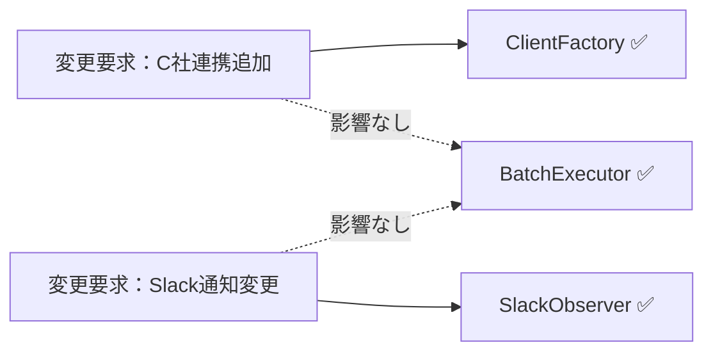

→ グラフが示す通り、変更要求はそれぞれ `ClientFactory` や `Observer` クラスに閉じており、`BatchExecutor` のメインフローには一切影響が及ばなくなりました。

### 7-3：変更シナリオ表

この設計により、連携先追加や通知要件の変化に強い構造となりました。

| **シナリオ** | **変わるクラス（触る場所）** | **変わらないクラス** |
| --- | --- | --- |
| 新しい連携先（D社）を追加する | `ClientFactory` に new ロジック追加 | `BatchExecutor`, `NotificationService` |
| メール通知を追加する | `MailObserver` クラスを新規作成 | `BatchExecutor`, `IExternalClient` |

変更が来ても、触るのは該当する Factory や Observer の実装クラスだけ——それがこの設計で手に入れたものです。 諦めたものは、クラス数の増加というわずかな設計コストです。

---

### 7-4：接続形態の確認 ── この設計はどの接続か

フェーズ4-3で診断した通り、変更前のコードは **具体×間接** の状態でした。
採用した Facade × Observer × Factory Method パターンでは、接続形態が **抽象×間接（USB-Cハブ経由）** へと変化しています。

**「抽象×間接」の証拠となるコード：**

```cpp
class BatchExecutor {
    vector<IObserver*> observers;  // ← インターフェース型 = 「抽象」の証拠
public:
    void execute(string targetId) {
        // Factory 経由で生成 = 「間接」の証拠
        IExternalClient* client = ClientFactory::create(targetId);
        if (client) {
            client->send("data");
            for (auto* obs : observers) obs->onComplete("Success"); // ← Observer 経由 = 「間接」の証拠
        }
    }
};
```

- `IObserver*` と `IExternalClient*` はインターフェース型 → **「抽象」** の証拠
- クライアントは `ClientFactory::create()` を経由して生成（直接 `new` しない）→ **「間接」** の証拠
- 通知は `IObserver` リストを経由して送られる → **「間接」** の証拠

「連携先・通知先を差し替えたいかつ生成・通知の詳細を知らせたくない」という動機から、**抽象×間接** が選ばれました。

### ⑩ 整理・振り返り・パターン解説

第10章では、外部連携バッチシステムという「生成・通信・通知」が絡み合う複雑なシステムを題材に、複数のパターンを組み合わせることで設計を整理しました。

#### 7フェーズとこの章でやったこと

| **フェーズ** | **この章でやったこと** |
| --- | --- |
| 🔵 フェーズ1：現状把握 | 外部連携先の増殖と通知処理が `BatchExecutor` に混在している現状を観察した。 |
| 🟠 フェーズ2：仮説立案 | 「連携先の生成（Factory）」と「通知（Observer）」を独立させる仮説を立てた。 |
| 🟡 フェーズ3：問題特定 | `BatchExecutor` がすべての詳細を知っていることによる修正の連鎖（痛み）を確認した。 |
| 🔴 フェーズ4：原因分析 | 責務の混在を「具体クラスへの直接依存」という構造的負債として特定した。 |
| 🟣 フェーズ5：課題定義 | 通信境界と通知境界の2点を接続点として特定し、疎結合化を課題とした。 |
| 🟢 フェーズ6：対策案検討 | Facade、Observer、Factory Method の複合適用（案4）を採用した。 |
| 🟤 フェーズ7：対策実施 | 各責務をインターフェース経由で分離し、バッチ本体の変更耐性を高めた。 |

#### 各クラスの最終的な責任

| **クラス名** | **責任（1文）** | **変わる理由** |
| --- | --- | --- |
| `IExternalClient` | 外部連携クライアントの通信契約を提供する。 | なし |
| `IObserver` | 通知処理の契約を提供する。 | なし |
| `BatchExecutor` | バッチ全体の処理フローを統括する。 | バッチの実行順序が変わる場合 |
| `ClientFactory` | 外部連携クライアントを生成する。 | 新しい連携先が増える場合 |

> **このプロセスを回した結果にたどり着いた構造こそが Facade × Observer × Factory Method の複合パターン です。**
> 

#### 振り返り：「この章を読むと得られること」は手に入ったか

| **得られること** | **この章のどこで示したか** |
| --- | --- |
| 得られること1 | フェーズ2のヒアリングと2-4の分類表で変動箇所を識別した。 |
| 得られること2 | フェーズ5で、複数の接続点が存在することを特定した。 |
| 得られること3 | フェーズ7の変更シナリオ表で、変更の局所化を実証した。 |

#### 振り返り：3つの設計原則はどう適用されたか

* **原則1「変わるものをカプセル化せよ」の現れ**
* **具体化された場所：** `ClientFactory` と `Observer` 派生クラス
* **解説：** 連携先の実装詳細や通知先ごとのロジックを、独立したクラス群にカプセル化しました。


* **原則2「実装ではなくインターフェースに対してプログラムせよ」の現れ**
* **具体化された場所：** `IExternalClient` および `IObserver`
* **解説：** バッチ実行部はインターフェースのみを保持し、実装詳細に依存しない設計にしました。


* **原則3「継承よりコンポジションを優先せよ」の現れ**
* **具体化された場所：** `BatchExecutor` が `IObserver` リストを保持する構造
* **解説：** 通知ロジックを継承で拡張するのではなく、オブジェクトを注入することで機能を追加しました。


---

### あなたのコードで考えてみてください

この章で辿った思考プロセスを、あなた自身のコードに当てはめてみましょう。

1. **複雑さの兆候を探す：** あなたのコードに「複数の外部サービス呼び出しが1つのクラスに集中していて、何かが変わるたびにそこを開いている」箇所がありますか？
2. **変わる理由を3つに分ける：** そのクラスの変更要求は、「どのサービスを使うか（生成）」「処理の全体的な流れ（窓口）」「何かが起きたときの反応（通知）」のどれに属しますか？混在しているなら分けるサインです。
3. **影響の連鎖を測る：** 外部サービスが1つ増えたとき、変更が必要なファイルは何個ありますか？利用側のコードも変わりますか？
4. **分けた後を想像する：** 「窓口」「通知」「生成」を別々の責任として切り出したとき、それぞれの変更が他に影響しなくなるには何が必要ですか？

---

### パターン解説：Facade × Observer × Factory Method

本章では3つのパターンを組み合わせることで、連携バッチ特有の複雑さを解きほぐしました。

#### パターンの骨格

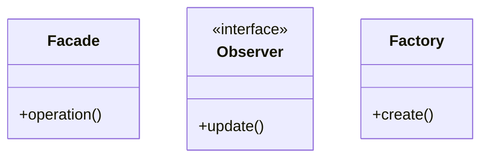

Facade はバッチ実行部の複雑な連携フローを隠蔽し、Factory Method は連携先の増殖に対応する生成の窓口となり、Observer は通知先変更の波及を遮断します。

#### 使いどころと限界

* **使いどころ**：外部システム連携、イベント駆動型のバッチ、設定によって振る舞いが動的に変わるシステム。


* **限界**：非常に小規模なツールであれば、これらのパターン適用はオーバースペックです。


【過剰コード：変化が単一である場合の例】

```cpp
// 連携先が今後も増える見込みがなく、通知もログ出力のみであれば、
// Facadeを導入するだけで十分であり、FactoryやObserverは過剰な抽象化となります。

```

### この章のまとめ

連携先や通知先といった「個別の変動」を、インターフェースという「契約」で保護し、生成の責務を分離しました。 これにより、バッチシステムの骨格を変えずに、新しい外部要求を安全に追加できる柔軟な設計が実現しました。