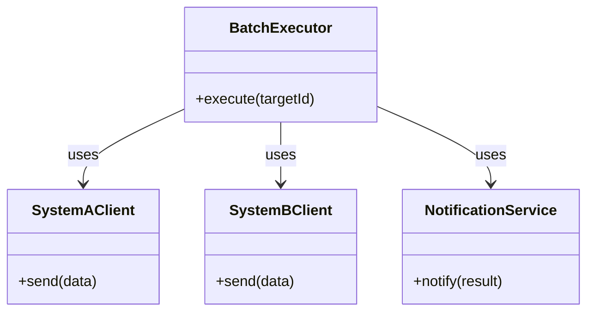
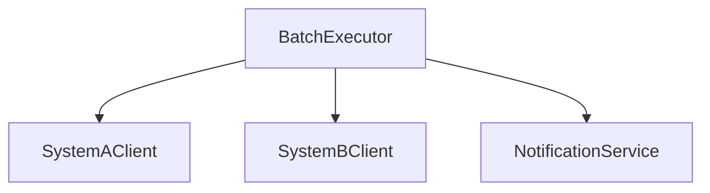
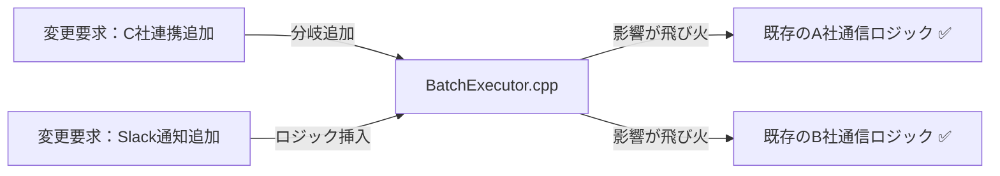
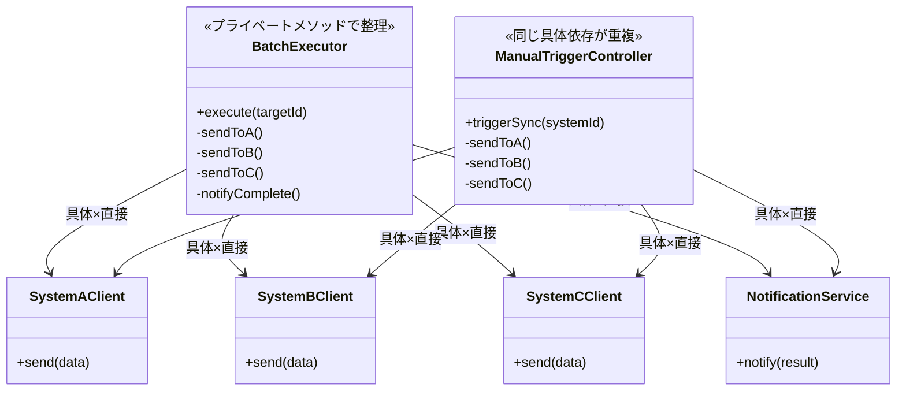
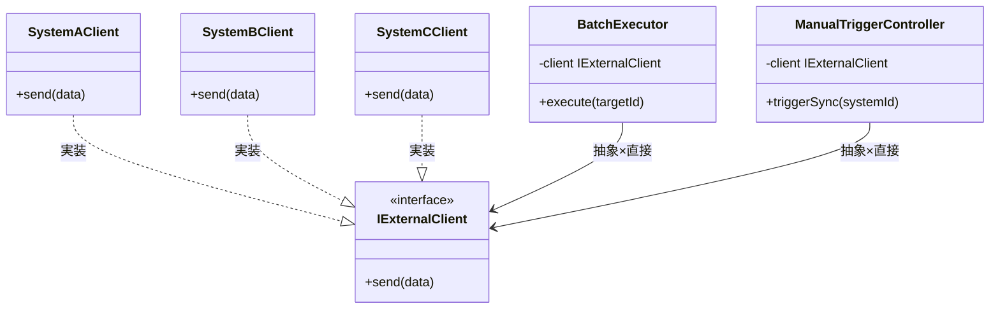
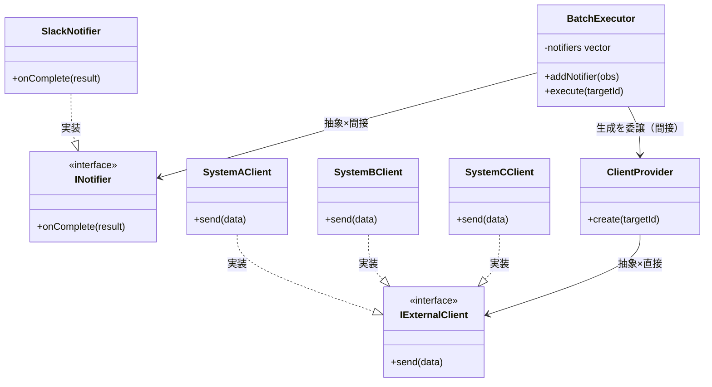
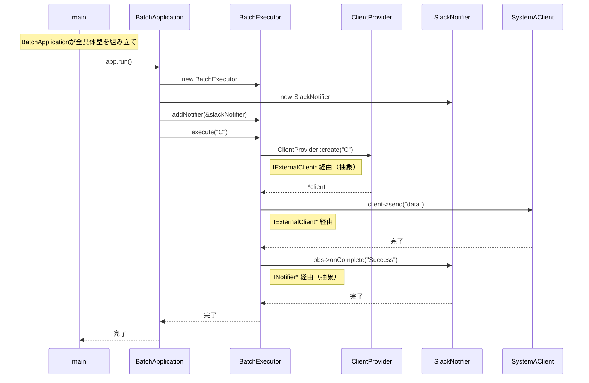
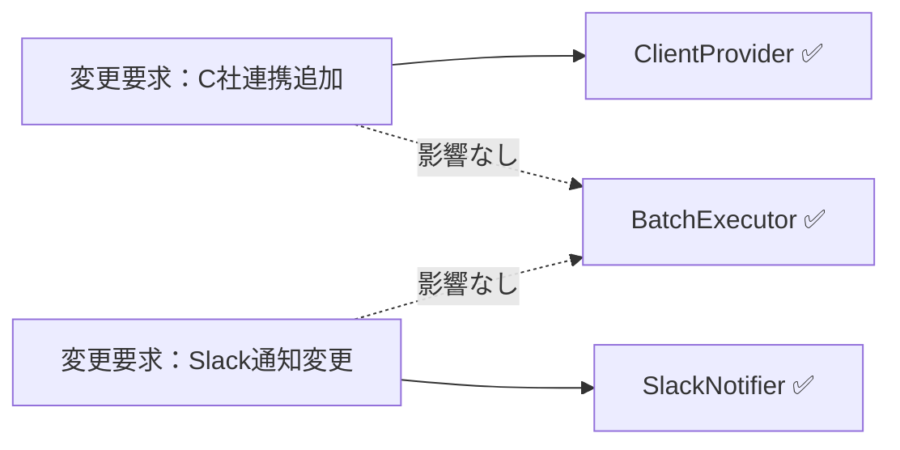
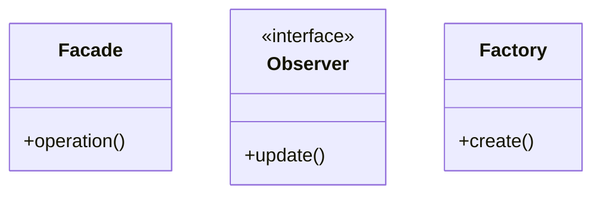

## 第10章 外部連携バッチシステム ―― Facade × Observer × Factory Method パターン

―― 思考の型：複数の「変わる理由」が複雑に絡み合うシステムをどう解くか

### この章の核心

**外部システムとの連携が必要なバッチ処理において、システム間のインターフェース管理、非同期的なイベント通知、そして接続先生成の責任を個別のクラスが持ち続けると、変更要求のたびにシステム全体が不安定になる。**

### この章を読むと得られること

* **得られること1：** Facade、Observer、Factory Method の各パターンが、システムのどの「変化」に対応するためにあるのかを識別できるようになる。


* **得られること2：** 複数の接続点（クラスとクラスのつなぎ目）が絡み合う複雑なシステムにおいて、それぞれの責務をどこで分離する必要があるか判断できるようになる。


* **得られること3：** パターンの複合適用を通じて、疎結合（クラス間の依存を弱め、変更の影響が広がりにくい状態）な連携アーキテクチャを構築する方法を説明できるようになる。


* **得られること4：** 「生成」と「通知」と「インターフェース統合」という、異なる3つの責務が混在するコードを整理する視点。

---

## 🔵 フェーズ1：現状把握 ―― コードとクラス構成を読む
### 1-1：システムの背景

このシステムは、社内の主要システムと外部の物流管理システムを繋ぐ「外部連携バッチシステム」です。 日々の注文データや在庫情報を外部システムへ同期する役割を担っており、連携先が増えるたびにバッチ処理の規模も拡大してきました。

当初は単一の外部連携先に対してデータを転送するだけのシンプルな構成でしたが、現在は連携先が3社に増え、それぞれが独自のデータフォーマットと接続認証を要求しています。 加えて、データの転送完了後に在庫管理システムや社内通知サービスへ「処理完了」を通知する機能も追加されました。

コードの構成を見ると、`BatchExecutor` というクラスが、すべての連携先との通信制御、データ変換、完了後の通知処理をすべて抱え込んでいます。 連携先が増えるたびに `BatchExecutor` に処理が追加され、今やどのロジックがどの連携先のためのものなのか、一見しただけでは判別が難しい状態です。 このコードがこれまで事業を支えてきた事実は尊重しつつ、現状を整理していきましょう。
---

### 1-2：動作例テーブル ―― 仕様を「動かした結果」で確認する

コードを読む前に、このシステムがどんな入力に対してどんな出力を返すかを確認します。この章のどの案も、以下の動作を実現します。

| シナリオ | 操作 | 外部API状態 | 結果 | 通知 |
| --- | --- | --- | --- | --- |
| 月次バッチ・A社正常応答 | `BatchExecutor.execute("A")` | 正常応答 | A社へデータ転送成功 | Slack「A社連携完了」 |
| 月次バッチ・C社タイムアウト | `BatchExecutor.execute("C")` | タイムアウト | 3回リトライ後に失敗ログ記録 | Slack「C社連携失敗」 |
| 日次バッチ・新規D社追加後 | `BatchExecutor.execute("D")` | 正常応答 | D社向け新クライアントがデータ転送成功 | Slack「D社連携完了」 |
| 手動トリガー・B社正常応答 | `ManualTriggerController.triggerSync("B")` | 正常応答 | B社へ手動データ転送成功 | Slack「B社手動連携完了」 |
| バッチ失敗・監視チーム設定あり | `BatchExecutor.execute("A")`（API障害） | 障害 | 転送失敗ログ記録 | Slack＋メール両方に通知 |
| 通知先にログ基盤追加後 | `BatchExecutor.execute("B")` | 正常応答 | B社へデータ転送成功 | Slack＋ログ基盤へ同時通知 |
---

### 1-3：実装コード

連携処理の起点となる `BatchExecutor` の様子です。

```cpp
#include <iostream>
#include <string>
#include <vector>

using namespace std;

class SystemAClient {
public:
    void send(string d) { cout << "A社へ送信: " << d << endl; }
};
class SystemBClient {
public:
    void send(string d) { cout << "B社へ送信: " << d << endl; }
};
class NotificationService {
public:
    void notify(string r) { cout << "完了通知: " << r << endl; }
};

class BatchExecutor {
public:
    void execute(string targetId) {
        if (targetId == "A") {
            SystemAClient client; // ← 生成と利用が混在
            client.send("data");
        } else if (targetId == "B") {
            SystemBClient client; // ← 生成と利用が混在
            client.send("data");
        }
        NotificationService notifier; // ← 処理ごとに通知の知識も混在
        notifier.notify("Success");
    }
};

int main() {
    BatchExecutor executor;
    executor.execute("A");
    return 0;
}

```

このコードから、`BatchExecutor` が各連携先の生成と送信、さらにはその後の通知処理までを一手に引き受けていることが分かります。
---

### 1-4：クラス構成図

現在のクラス構造です。`BatchExecutor` にすべてが依存していることが分かります。


---

### 1-5：依存グラフ



`BatchExecutor` に矢印が集中しており、連携先の追加や通知仕様の変更が即座にここへの修正を強いる構造です。
---

### 1-6：実行結果

上記コードの実行結果：

```text
A社へ送信: data
完了通知: Success
```

これから検討するのは、同じ機能を保ちながら、変更に強い構造をどう作るかという点です。

### 1-7：届いた変更要求

ある金曜日の午後、プロジェクトマネージャーから緊急の相談が飛び込んできました。

「お疲れ様。現在運用している外部連携バッチなんだけど、来週から新たにC社とも連携することになったんだ。 それに加えて、連携処理の結果を社内のSlackへ自動通知するようにしてほしいという要望が出ている。 データ転送のロジックを修正するついでに、通知処理についても何か良い仕組みを取り入れられないかな？」

データ転送先が増えるたびにバッチ全体のロジックが肥大化し、通知処理までが「おまけ」のように付け足されていく現状、そろそろ構造的なテコ入れが必要なようです。


---

## 🟣 フェーズ2：仮説立案 ―― 何が変わるかを観察し、ヒアリングで裏付ける

フェーズ1で、BatchExecutorが連携先クライアントの生成・通信・通知処理をすべて直接保持している現状を把握しました。届いた変更要求を踏まえ、この設計における変動と不変を整理します。

### 2-1：責任テーブル

| **クラス名** | **責任（1文）** | **知るべきこと** |
| --- | --- | --- |
| `BatchExecutor` | 外部連携バッチのフローを統括する。 | 連携先一覧、各クライアントの生成方法、通知先サービス。 |
| `SystemAClient` | A社システムへデータ転送を行う。 | A社のAPI接続仕様。 |
| `SystemBClient` | B社システムへデータ転送を行う。 | B社のAPI接続仕様。 |
| `NotificationService` | 処理結果を各担当者へ通知する。 | 通知先のメールアドレス等。 |
### 2-2：責任チェック表

| **コードの行** | **持っている知識** | **管理者（観察）** |
| --- | --- | --- |
| `SystemAClient client;` | A社専用クライアントの生成知識 | インフラ担当・A社窓口担当 |
| `client.send("data");` | A社特有の通信プロトコル知識 | A社窓口担当 |
| `NotificationService notifier;` | 通知サービスの生成知識 | 全体設計者 |

要するに、連携先を識別して処理を実行しているという観察から、データ転送の「通信詳細」と「通知処理」、「連携先の生成」という複数の理由で変わるものが混在している構造の問題が見えてくる。

### 2-3：今回の確定変更テーブル

この変更要求で確実に発生する変更を整理します。「将来起きるかもしれない」ではなく、「今回の要件として決まっている」ものだけを載せます。

| **変更内容** | **具体的な変更箇所** | **根拠（変更要求）** |
| --- | --- | --- |
| C社との外部連携を追加する | `BatchExecutor` に `SystemCClient` の生成と呼び出しロジックを追加 | PM「来週からC社とも連携」 |
| Slackへの完了通知を追加する | `BatchExecutor` 内に Slack への通知処理を挿入 | PM「Slackへ自動通知してほしい」 |

### 2-4：関係者ヒアリング

仮説を携え、運用担当者と協議を行いました。

* **開発者：** 「C社との連携ですが、今回のデータフォーマットは既存のA社やB社と大きく異なりますか？」


* **運用担当者：** 「フォーマットは別物だね。 また、今後D社やE社も控えているから、接続先の追加はこれからも発生するよ。」


* **開発者：** 「通知についてはどうでしょうか？ Slack以外にもメール通知が必要になる可能性はありますか？」


* **運用担当者：** 「そうだね、将来的にはログ収集基盤へのデータ投入も検討している。 ただ、転送成功か失敗かという『結果の通知』という仕組み自体は今後も変わらないよ。」


* **開発者：** 「分かりました。外部との通信ロジックと、通知という振る舞いは、それぞれ独立して増殖していく可能性があるということですね。」


ヒアリングにより、通信先（生成）の増殖と、通知処理（イベントの反応）の多様化が、それぞれ別個の変化軸であることが確実になりました。

> **現実のヒアリングでは——** このシナリオでは相手がちょうど設計に役立つ情報を教えてくれています。現実には「変わるかどうか分からない」「たぶん変わらない」という答えが返ることも多いです。そのときは、コードの変更履歴（`git log`）や過去の障害記録を「ヒアリングの代わり」として使ってみてください。「過去に何度変わったか」が、「将来変わりやすいか」の最も正直な証拠です。

### 2-5：将来リスクテーブル

ヒアリングで判明した「将来起きるかもしれない」変化をまとめます。確定変更（2-2）とは別に管理することで、今回の設計判断と将来への備えを混在させずに済みます。

| **将来のリスク** | **変わる可能性がある箇所** | **根拠（誰が言ったか）** |
| --- | --- | --- |
| D社・E社など連携先がさらに増える | `BatchExecutor` 内の振り分けロジック全体 | 運用担当者「D社・E社も控えている」 |
| Slack以外にメール・ログ基盤への通知が追加される | 通知処理全体 | 運用担当者「ログ収集基盤も検討中」 |
| バッチの実行フロー自体は変わらない | 不変 | 運用担当者「仕組み自体は変わらない」 |

フェーズ2で「何が変わり、何が変わらないか」が確定しました。次のフェーズ3では、この変更要求を現在のコードで実行しようとすると何が起きるか、その痛みを確認します。


---

## 🟣 フェーズ3：問題特定 ―― 変更の痛みを発見する

### 3-1：変更シミュレーション

外部連携バッチシステムに「C社との連携」と「Slackへの結果通知」を追加する要求を、既存の BatchExecutor にそのまま組み込もうとします。

はじめに、SystemCClient クラスを新規作成し、通信処理を実装します。 次に、BatchExecutor の execute メソッド内にある既存の if-else 分岐に、targetId == "C" という条件を追加し、そこで SystemCClient を生成して send メソッドを呼び出します。 さらに、処理結果を Slack に飛ばすため、NotificationService のメソッドを書き換え、BatchExecutor 内で条件判定と通知ロジックを無理やり挿入します。

作業中、ふと気づかされます。「この execute メソッド、連携先が増えるたびに if 文の列が伸びていき、通知処理の記述もカオスになっている」と。 本来なら連携先ごとの通信ロジックと、通知という副次的な振る舞いは独立している方がよいでしょう。 しかし現状では、一つのメソッドの中にこれらすべてが詰め込まれており、連携先を一つ増やすたびにバッチ全体の処理フローを壊しかねない恐怖を感じます。

### 3-2：変更影響グラフ

現状の構造で変更を試みた際、影響がどのように飛び火するかを可視化します。



グラフが示す通り、C社連携の追加やSlack通知の実装といった個別の要求が、既存の他の連携先ロジックにまで影響を及ぼす構造になっています。

### 3-3：痛みの言語化

「連携先が増えるたびに、既存の安定している通信処理までテストし直さないといけないのか…」

変更をシミュレートする中で、エンジニアとして感じる「痛み」が二つ明確になりました。

1つ目は、BatchExecutor が抱える「巨大な責任」の辛さです。 このクラスは本来、バッチ処理全体のフローを制御するだけでいいはずなのに、連携先ごとの具体的な通信手段や、通知先といった「詳細」までをすべて把握し、生成まで行っています。 これでは、連携先が増えるたびに管理不能なほど複雑なコードになるのは必然です。

2つ目は、連携の「生成」と「通知」という、変わる理由が異なる責務が混在していることです。 連携先の通信仕様が変わるのか、それとも通知の要件が変わるのか、それを見極める前に巨大な一つのクラスを編集せざるを得ません。 変更が局所化（影響が1クラスだけで済む状態）されていないため、システム全体の安全性を確保するコストが日々跳ね上がっています。

フェーズ3で「今の構造では変更が辛い」という事実が確認できました。 次のフェーズ4では、この痛みの原因を構造的に分析します。

---

## 🟠 フェーズ4：原因分析 ―― なぜ辛いのかを構造で言語化する

フェーズ3で「外部連携先が増えるたびに、バッチ処理全体のコードが修正のたびに不安定になる」という痛みを確認しました。 なぜこのような状態に陥るのか、その根本原因を構造的な視点で分析します。

### 4-1：観察→原因テーブル

フェーズ3で観察した「痛み」と、その背後にある構造的な原因を対応させます。

| **根本原因** | **観察** | **解消するパターン** |
| --- | --- | --- |
| 根本原因A：生成の混在（具体クラス生成がビジネスロジックに混在） | 新しい連携先を追加するたびに、統括クラス（`BatchExecutor`）内の生成コードを修正しなければならない | Factory Methodで解消 |
| 根本原因B：複雑さの露出（外部APIの詳細をBatchExecutorが直接知っている） | 複数の連携先（A社・B社・C社）との通信詳細が `BatchExecutor` 内に直接展開されており、連携先ごとの接続手順を全て把握しなければならない | Facadeで解消 |
| 根本原因C：通知の密結合（通知先追加のたびBatchExecutor変更が必要） | 転送結果の通知仕様を変えると、連携処理のフロー全体まで影響を受ける | Observerで解消 |

これら3つの根本原因は**それぞれ独立した変化軸**です。

- 連携先が増えても通知先は変わりません
- 通知先が増えても連携先クライアントの生成方法は変わりません
- 生成の仕組みが変わっても複数サブシステムの窓口の役割は変わりません

3つが独立しているからこそ、1つのパターンだけでは解決しきれません。

コードを追うと、`BatchExecutor` は単に処理を順序立てるだけでなく、連携先それぞれの認証、通信、データ変換という「詳細」までを一身に背負っています。 その上、通知処理の呼び出しまで行っているため、連携先ごとの個別の事情と、システム共通の通知フローが同じ場所で絡み合っていることが分かります。

### 4-2：変わるもの / 変わらないものテーブル

変化の軸が異なる要素を整理します。

| **変わり続けるもの（🔴）** | **変わってほしくないもの（🟢）** |
| --- | --- |
| 外部連携先ごとの通信手段（プロトコル・認証等） | バッチ全体の処理実行順序（取得→転送→通知） |
| 通知先のサービスや通知ルール | 通知という「イベント」自体を発生させる責務 |

連携先の追加は今後も発生する「変動」ですが、バッチ全体の転送フローは「不変」に近い構造です。 本来、これらは別の責務として分離されるべきものであり、同じクラス内で扱われていること自体が設計上の歪みを生んでいます。

### 4-3：接続形態を診断する

現在の接続形態を2×2マトリクスで診断します。

今の `BatchExecutor` と各クライアント、および通知サービスとの接続は、巨大なハブに対して、各機器の専用ケーブルが直接差し込まれている状態（具体×直接）だと言えます。

ハブ（`BatchExecutor`）の中には各機器専用の複雑な変換回路が内蔵されており、新しい機器を繋ぐために一つの回路をいじろうとすると、他の回路にまで影響が及んでしまうような状態です。本来なら、ハブのポートには汎用的な規格（抽象）のプラグを差し込むべきところを、専用線でつないでしまっているために、変更がシステム全体へと伝播してしまうのです。

|  | 直接（直差し） | 間接（アダプター経由） |
|:---:|:---|:---|
| **具体**（専用規格） | **← 現在地**　ライトニング直生え → iPhone（直差し） | ライトニング直生え → ゲーム機専用アダプタを挟む → ゲーム機 |
| **抽象**（汎用規格） | Type-C直生え → 各種機器（直差し） | ライトニング直生え → Type-C変換アダプタを挟む → 各種機器 |

フェーズ4で根本原因が言語化できました。 次のフェーズ5では、解決する課題を具体的に定義していきます。

---

## 🟡 フェーズ5：課題定義 ―― 解くべき接続点を特定する

フェーズ4で、「外部連携ロジック（通信）」と「イベント通知」が `BatchExecutor` 内で密結合していることが、コードを複雑化させ、変更のたびにシステム全体を不安定にする根本原因だと特定しました。 連携先ごとに異なる通信プロトコルと、将来増えるであろう通知手段を、現在の構造のまま扱い続けることは限界に達しています。

対策案を検討する前に、今回のリファクタリングで「何を解決する必要があるか」を4つの視点で具体化し、課題を確定させます。

### 5-1：接続点の特定

フェーズ4の分析に基づき、以下の接続点（ジョイント）を特定しました。

* 接続点A：`BatchExecutor` ←→ 各外部システム（SystemA/B/C）の通信境界
* 接続点B：`BatchExecutor` ←→ 通知サービス（NotificationService）の通知境界

現在、`BatchExecutor` はこれら2つの接続点に対して、具体的なクラスを直接 `new` し、メソッドを直接呼び出すという「具体×直接」の状態にあります。 特に連携先（接続点A）の増殖と、通知手段（接続点B）の多様化という二つの異なる変化軸が、一つのクラス内で絡み合っており、複数の変化軸が1つのクラス内で絡み合っているのが最大の課題です。

### 5-2：クライアントへの影響範囲

分離対象の責務を呼び出しているのは `BatchExecutor` クラス自身です。 このクラスが連携先や通知先の「詳細」を知っていることが現在の制限事項です。 この設計を改善することで、`BatchExecutor` は「バッチの実行順序（フロー）」だけを管理し、実際の処理（通信や通知）は外部化されたクラスに任せることができます。

### 5-3：課題まとめ表

これまでの分析を、フェーズ6の対策案検討に向けた課題として整理します。

| **接続点** | **分けた理由** | **非機能制約** | **クライアント影響** |
| --- | --- | --- | --- |
| 接続点A | 連携先追加によるロジックの肥大化 | 高頻度の変更・夜間バッチの締め時刻によるタイムアウト設計が必要 | `BatchExecutor` の通信処理 |
| 接続点B | 通知手段の多様化への対応 | 高頻度の変更 | `BatchExecutor` の通知処理 |

フェーズ5で「何を解くか」が確定しました。 次のフェーズ6では、これらの課題に対して具体的にどのような構造が最適か、コストの観点からステップを検討します。

---

## 🔴 フェーズ6：段階的進化 ―― どこまで設計を進めるべきか

外部連携バッチシステムにおいて、「連携先の追加」と「通知処理の多様化」という二つの変更軸が `BatchExecutor` に混在していることが、システムを複雑にする原因です。 ここでは、これらの責務を適切に切り離すための対策ステップを検討します。

**どの案も、動作例テーブルで示した動作を実現します。違うのは「変更が来たときにどこを触ることになるか」です。**

### 6-1：接続の形 2×2マトリクス

現在は通信クライアントや通知サービスを `BatchExecutor` が直接生成して利用する「具体×直接」の状態です。 これらをインターフェースで抽象化し、生成を委譲する方向で検討します。

| 接続形態 | ケーブル例 | 特徴 |
|:---:|:---|:---|
| **具体×直接**（← 現在地） | ライトニング直生え → iPhone（直差し） | 専用端子のみ対応。差し替え不可 |
| **具体×間接** | ライトニング直生え → ゲーム機専用アダプタを挟む → ゲーム機 | 変換器を挟むが規格は専用のまま |
| **抽象×直接** | Type-C直生え → 各種機器（直差し） | どのメーカーでも同じ口で繋がる |
| **抽象×間接** | ライトニング直生え → Type-C変換アダプタを挟む → 各種機器 | アダプタを介して汎用規格で展開可能 |

---

#### Step 1：具体×直接 ―― プライベートメソッドで責任を整理する

**この形の考え方：**
フェーズ3で示したコードを、接続の形は変えずにプライベートメソッドで整理した形です。各処理の意味がメソッド名で明確になります。 `SystemAClient` や `SystemBClient` を直接メンバに持ち、`if-else` 分岐もそのままですが、各分岐をプライベートメソッドに抽出して責任を整理します。

**構造図：**



両クラスとも具体型を直接知っており、連携先が増えると2か所を修正しなければならない点はフェーズ3と同じです。プライベートメソッドで読みやすくなりましたが、接続形態は変わっていません。

**手段の比較：**

| 手段 | 方法 | 特徴 |
| --- | --- | --- |
| 手段A：プライベートメソッドに抽出 | 各分岐の処理をプライベートメソッドに切り出す | ✅（読みやすさが向上する） |
| 手段B：コメントのみで整理 | コードは変えずにコメントだけ整理する | 却下（構造問題は解決しない） |

手段Aを採用します。接続形態は具体×直接のままですが、各処理の意図がメソッド名で明確になります。

**BatchExecutor クラス（Step 1）：**

```cpp
// Step 1：プライベートメソッドで各分岐の責任を整理
class BatchExecutor {
public:
    void execute(string targetId) {
        if (targetId == "A") {
            sendToA(); // ← 処理の意図がメソッド名で明確になった
        } else if (targetId == "B") {
            sendToB();
        } else if (targetId == "C") {
            sendToC();
        }
        notifyComplete(); // ← 通知処理もメソッド名で意図を示す
    }
private:
    void sendToA() {
        SystemAClient client; // ← 具体：SystemAClientを直接生成
        client.send("data");
    }
    void sendToB() {
        SystemBClient client; // ← 具体：SystemBClientを直接生成
        client.send("data");
    }
    void sendToC() {
        SystemCClient client; // ← 具体：SystemCClientを直接生成
        client.send("data");
    }
    void notifyComplete() {
        NotificationService n; // ← 具体：NotificationServiceを直接生成
        n.notify("Success");
    }
};
```

**ManualTriggerController クラスと main（Step 1）：**

```cpp
// Step 1：ManualTriggerControllerも同じ構造でプライベートメソッドに整理
class ManualTriggerController {
public:
    void triggerSync(string systemId) {
        // ← BatchExecutorと同じ具体型を重複して保持
        if (systemId == "A") { sendToA(); }
        if (systemId == "B") { sendToB(); }
        if (systemId == "C") { sendToC(); }
        notifyComplete();
    }
private:
    void sendToA() {
        SystemAClient client; client.send("manualData");
    }
    void sendToB() {
        SystemBClient client; client.send("manualData");
    }
    void sendToC() {
        SystemCClient client; client.send("manualData");
    }
    void notifyComplete() {
        NotificationService n; n.notify("手動同期完了");
    }
};

int main() {
    BatchExecutor executor;
    executor.execute("C");

    ManualTriggerController manual;
    manual.triggerSync("B");
    return 0;
}
```

プライベートメソッドに整理したことで各処理の意図は読みやすくなりましたが、両クラスともに具体型を直接知っており、連携先が増えると2か所を修正しなければならない構造は変わっていません。

一文要約：フェーズ3のコードをプライベートメソッドで読みやすく整理した形で、接続は「具体×直接」のまま、同じ具体型依存が2か所で並行して走る。

**この形のトレードオフ：**

* 変更容易性：低（連携先が増えるたびに両クラスを修正する必要がある）


* テスト容易性：低（具体クラスへの依存が残り、切り離せない）


* 実装コスト：低（プライベートメソッドへの抽出のみ）


---

#### Step 2：具体×間接 ―― 処理を別クラスに切り出して委ねる

**この形の考え方：**
各連携先クライアントを別クラスに切り出し、呼び出し元はその具体クラスを名指しで知った上でオブジェクトに処理を「委ねる」形です。自分で直接やるのではなく、切り出したオブジェクトに任せる（間接）ことで、処理の責任が明確に分離されます。ただし呼び出し元は具体クラス名を直接知っており、クラスを差し替えるには呼び出し元の修正が必要です。

**構造図：**


クラスは分離されて処理を委ねるようになりましたが（間接）、両クラスが各具体クラス名を直接知っており（具体）、連携先が増えるたびに両方を修正しなければならない。

**手段の比較：**

| 手段 | 方法 | 特徴 |
| --- | --- | --- |
| 手段A：別クラスに切り出し、処理を委ねる | ロジックを別クラスに分けて呼び出し、処理はそのクラスに任せる | ✅（この案の定義通り） |
| 手段B：クラス分割＋ローカル変数に切り出し | メソッド内でローカル変数に抽出する | 却下（クラスを跨いだ依存は解消されない） |

手段Aを採用します。処理を切り出したクラスに「委ねる」形になり、各クラスの責任は明確になりました。ただし呼び出し側が具体クラス名を直接知り続けることは変わりません。

**連携先クライアントと通知クラス（Step 2）：**

```cpp
// Step 2：各クライアントを独立したクラスに切り出した（具体×間接）
class SystemAClient {
public:
    // 呼び出し元はここに処理を委ねる（間接）
    void send(string data) { cout << "A社へ送信: " << data << endl; }
};

class SystemBClient {
public:
    void send(string data) { cout << "B社へ送信: " << data << endl; }
};

class SystemCClient {
public:
    void send(string data) { cout << "C社へ送信: " << data << endl; }
};

class NotificationService {
public:
    void notify(string result) { cout << "完了通知: " << result << endl; }
};
```

**BatchExecutor クラス（Step 2）：**

```cpp
// Step 2：BatchExecutorが具体クラスを知り、処理をそのクラスに委ねる
class BatchExecutor {
public:
    void execute(string targetId) {
        if (targetId == "A") {
            SystemAClient client; // ← 具体：型名を直接書いている
            client.send("data"); // ← 間接：送信処理はclientに委ねる
        } else if (targetId == "B") {
            SystemBClient client; // ← 具体：型名を直接書いている
            client.send("data"); // ← 間接：送信処理はclientに委ねる
        } else if (targetId == "C") {
            SystemCClient client; // ← 具体：型名を直接書いている
            client.send("data"); // ← 間接：送信処理はclientに委ねる
        }
        NotificationService n; // ← 具体：型名を直接書いている
        n.notify("Success");   // ← 間接：通知処理はnに委ねる
    }
};
```

**ManualTriggerController クラスと main（Step 2）：**

```cpp
// Step 2：ManualTriggerControllerも同じ具体クラスを知り処理を委ねる
class ManualTriggerController {
public:
    void triggerSync(string systemId) {
        if (systemId == "A") {
            SystemAClient client; // ← 具体：BatchExecutorと同じ型を重複して使用
            client.send("manualData"); // ← 間接：処理を委ねる
        }
        if (systemId == "B") {
            SystemBClient client; // ← 具体：型名を直接書いている
            client.send("manualData");
        }
        if (systemId == "C") {
            SystemCClient client; // ← 具体：型名を直接書いている
            client.send("manualData");
        }
        NotificationService n; // ← 具体：型名を直接書いている
        n.notify("手動同期完了"); // ← 間接：処理を委ねる
    }
};

int main() {
    BatchExecutor executor;
    executor.execute("C");

    ManualTriggerController manual;
    manual.triggerSync("B");
    return 0;
}
```

処理を別クラスに委ねる形（間接）になりましたが、具体クラス名の知識が両クラスに重複しており、連携先が増えるたびに両方を修正しなければならない。

一文要約：クラスは分かれて処理を委ねるようになった（間接）が、「どのクラスを呼ぶか」という具体クラス名の知識が両方の呼び出し元に重複して残っている。

**この形のトレードオフ：**

* 変更容易性：低〜中（クラスは分かれたが、具体クラス名の依存は両方に残る）


* テスト容易性：低（依然として具体クラスを直接生成する必要がある）


* 実装コスト：低（リファクタリングの範囲が限定的）


---

#### Step 3：抽象×直接 ―― インターフェースを挟み、型だけで接続する

**この形の考え方：**
連携先との通信インターフェースを定義し、生成を一か所に集約する。 また、通知処理を動的に登録可能な仕組みにする。 呼び出し元はインターフェース型だけを知り、具体クラスへの依存をなくす。

**構造図：**



`BatchExecutor` はインターフェースのみを利用し、`ManualTriggerController` は外部から注入されたインターフェースのみを知り、両クラスとも具体クライアントへの依存がなくなっている。

**手段の比較：**

| 手段 | 方法 | 特徴 |
| --- | --- | --- |
| 手段A：コンストラクタ注入 | `BatchExecutor(IExternalClient* c)` でインターフェース型を受け取る | 依存を外から差し込める。テスト時にスタブを注入しやすい |
| 手段B：セッターで注入 | `setClient(IExternalClient* c)` でセットする | 後から差し替え可能。ただし「未設定」状態のリスクがある |
| 手段C：生成を内部に集約（振り分け関数） | `if-else` で具体型を生成するヘルパーをメンバに持つ | 外部には型を隠せるが、内部では具体型を知っている。次の案（間接）に近い発想 |

**手段A**（コンストラクタ注入は「依存を明示する」という設計の意図が最も明確。テスト容易性も高い）のコードを以下に示します。

インターフェースと連携先クライアントの実装を定義します。

```cpp
class IExternalClient {
public:
    virtual void send(string d) = 0;
};

class SystemAClient : public IExternalClient {
public:
    void send(string d) override { cout << "A社へ送信: " << d << endl; }
};
class SystemBClient : public IExternalClient {
public:
    void send(string d) override { cout << "B社へ送信: " << d << endl; }
};
class SystemCClient : public IExternalClient {
public:
    void send(string d) override { cout << "C社へ送信: " << d << endl; }
};
```

`BatchExecutor` はインターフェース経由でクライアントを受け取ります。

```cpp
class BatchExecutor {
    IExternalClient* client; // ← 抽象：IExternalClient*型で受け取り、具体クラスを知らない
public:
    BatchExecutor(IExternalClient* c) : client(c) {}
    void execute(string targetId) {
        client->send("data"); // ← 直接：インターフェース経由で直接呼び出す
        cout << "完了通知を送信" << endl;
    }
};

```

`BatchExecutor` の内部から具体クラス名が消えた。代わりに `IExternalClient*` という型だけで動作する。

**呼び出し側から見た違い（main() 例）：**

```cpp
// 案3（抽象×直接）の呼び出し側
// 注入アプローチにより、両クラスで具体クライアントへの依存がなくなる
class ManualTriggerController {
    IExternalClient* client; // ← 抽象：外部から注入されたインターフェースのみ知っている
public:
    ManualTriggerController(IExternalClient* c) : client(c) {}
    void triggerSync(string systemId) {
        cout << "[ManualTrigger] " << systemId
             << " への手動同期を実行。" << endl;
        client->send("manualData"); // ← 直接：インターフェース経由で直接呼び出す
    }
};

int main() {
    SystemCClient cClient;
    BatchExecutor executor(&cClient); // ← 抽象：呼び出し側は具体クライアントクラスを渡すだけ

    SystemBClient bClient;
    ManualTriggerController manual(&bClient);
    manual.triggerSync("B");
    return 0;
}
```

注入アプローチにより、両クラスとも具体クライアントクラスを知らずに済み、選択ロジックの重複が解消される。

一文要約：`main()` が具体型を組み立て、両方の呼び出し元は `IExternalClient*` という型だけを介して同じオブジェクトを呼ぶため、具体クラスが変わっても呼び出し経路は変わらない。

**この形のトレードオフ：**

* 変更容易性：中〜高（新しい連携先追加は新クラスの追加と `main()` の組み立て修正だけで済む）


* テスト容易性：高（インターフェースに対してスタブを容易に差し込める）


* 実装コスト：中（インターフェース定義と注入の仕組みが必要）


---

#### Step 3の限界

Step 3でインターフェース化を導入したことで、連携先クライアントをインターフェース経由で差し替えられるようになりました。しかし、**Step 3では通知の変化軸が残っています**。具体的には以下の2つの問題が残ります。

1. **生成の問題**：どのクライアントを生成するかの判断が`BatchExecutor`に残ったまま。連携先が増えるたびに`BatchExecutor`を修正しなければなりません。
2. **通知の問題**：通知先が増えるたびに`BatchExecutor`を修正しなければなりません。通知先を増やすという変化軸が、バッチのメインフローに直接結びついたままです。

Step 3でインターフェース化はできたが、通知先の動的変動に対応できない。新しい通知先を追加するたびにBatchExecutorの修正が必要になる。次のStep 4では、この「通知の問題」を解消するためObserverパターンの構造が自然に加わります。

Step 4では、これら2つの残課題を順番に解決します。

---

#### Step 4：抽象×間接 ―― インターフェース＋仲介役を両立する

Step 3の限界で確認した通り、「通知の変化軸」がまだ`BatchExecutor`に残っています。Step 4ではこの残課題を段階的に解決します。

**ステップ1：まず通知の問題を解決する**

通知先を`vector<INotifier*>`のリストで管理し、`BatchExecutor`が通知先を直接知らない仕組みを加えます。新しい通知先はリストに追加するだけで済むようになり、`BatchExecutor`を触らなくてよくなります。

**しかし通知を疎結合にしても「生成の問題」はまだ残っています。** どの連携先クライアントを生成するかの判断が`BatchExecutor`内に残ったままです。連携先が増えるたびに`BatchExecutor`を修正しなければなりません。

**ステップ2：次に生成の問題を解決する**

生成の責務を専用クラス（`ClientProvider`）へ切り出します。`BatchExecutor`は「どの連携先クラスを生成するか」という知識を持たなくてよくなります。

**しかしこれで、`BatchExecutor`は複数の外部システムを直接調整しながら通信を行う役割も担っています。** この複数サブシステムとの接続の複雑さを隠す窓口が必要です。

**ステップ3：複数サブシステムの接続を窓口にまとめる**

これらの複数サブシステムへの接続をまとめて管理するために、`BatchExecutor`自体が窓口（Facade）としての役割を持ちます。これにより、呼び出し側は`BatchExecutor`だけを知ればよくなります。

**この形の考え方：**
仲介クラス（Facade）によるインターフェース統合、生成の分離、通知の疎結合をすべて組み込む。 変更影響は完全に局所化されるが、クラス数は最大になる。

**構造図：**



`BatchExecutor` が窓口（Facade）としてフローを統括し、`ClientProvider` が生成を担い、`INotifier` リストが通知を担う。3つの責務がそれぞれ独立したクラスに分離されている。

**手段の比較：**

| 手段 | 方法 | 特徴 |
| --- | --- | --- |
| 手段A：生成を専用クラス（Factory）に委譲 | `IExternalClient* create(targetId)` を持つクラスを作る | 生成の責務が1クラスに集中。呼び出し元は型を知らずに済む |
| 手段B：通知先をリストで動的に管理する | `vector<INotifier*>` に通知先を登録・一括呼び出し | 通知先の追加・削除がリストへの操作だけで完結する |
| 手段C：生成と通知を同一クラスに持つ | 仲介クラスが生成も通知も担う | クラス数は減るが責務が再び混在する。変化の軸が違うので分けるべき |

**手段A＋手段B の組み合わせ**（生成と通知はそれぞれ独立して変わるため、それぞれ別の仕組みで管理する。これにより変更影響が完全に局所化される）のコードを以下に示します。

通知インターフェースと生成の窓口を定義します。

```cpp
class INotifier {
public:
    virtual void onComplete(string result) = 0;
};

class IExternalClient {
public:
    virtual void send(string data) = 0;
};
```

生成の責務を専用クラスに切り出します。

```cpp
class ClientProvider {
public:
    static IExternalClient* create(string targetId) {
        if (targetId == "A") return new SystemAClient();
        if (targetId == "B") return new SystemBClient();
        if (targetId == "C") return new SystemCClient();
        // 新しい連携先はここに1行追加するだけ
        return nullptr;
    }
};
```

`BatchExecutor` は窓口（Facade）として機能し、生成と通知の詳細を知らず、フローの統括だけを担います。

```cpp
// BatchExecutor自体がFacadeとして機能する
class BatchExecutor {
    vector<INotifier*> notifiers; // ← Observerリスト（抽象型のみ）
public:
    void addNotifier(INotifier* obs) { notifiers.push_back(obs); }

    void execute(string targetId) {
        // Factory経由で生成（具体クラスを知らない）← 間接
        IExternalClient* client = ClientProvider::create(targetId);
        if (client) {
            client->send("data"); // ← 抽象：IExternalClient*型で呼ぶ
            // 全Observerに通知（通知先を知らない）← 間接
            for (auto* obs : notifiers) obs->onComplete("Success");
            delete client;
        }
    }
};

```

`BatchExecutor` は通信の詳細も通知の詳細も知らず、フローの統括（Facade）だけを担う。連携先が何社あろうと、通知先が何件あろうと、このクラスを変更する理由がなくなった。

**呼び出し側から見た違い（main() 例）：**

```cpp
// 案4（抽象×間接）の呼び出し側
// BatchExecutorが窓口となり、呼び出し側は組み立てだけを知る
int main() {
    BatchExecutor executor;   // ← Facade：窓口を生成するだけ
    SlackNotifier slack;
    executor.addNotifier(&slack); // ← 通知先をリストに登録
    executor.execute("C");        // ← 具体クラスを知らずに実行できる
    return 0;
}
```

`BatchExecutor`（Facade）が窓口となるため、呼び出し側は通知先をリストに登録するだけで通知先を増やせる。具体的なクライアントクラスへの依存は`ClientProvider`に閉じている。

一文要約：`ClientProvider::create()` 経由で生成（間接）、`INotifier*`リスト経由で通知（間接）——どの具体クラスが動くかは`ClientProvider`と`addNotifier()`の登録部分だけが知っている。

**この形のトレードオフ：**

* 変更容易性：高（あらゆる層が独立して変更可能）


* テスト容易性：高（全ての依存をスタブに差し替え可能）


* 実装コスト：高（非常に多くのクラスと複雑な設計が必要）


---

### どこまで設計を進めるべきか（採用案の決断）

それぞれのステップには一長一短があります。ステップ4の「抽象×間接（Facade/Observer/Factoryの統合）」は極めて強力ですが、クラス数が激増し構造が複雑になる「初期投資コスト」もかかります。どこで止めるかは、**「今後の変更頻度（ビジネス要求）」**で決断します。

*   **Step 1（具体×直接）で止めるケース：** 連携先システムが現状の2つだけで、将来も絶対に増えない場合。
*   **Step 2（具体×間接）で止めるケース：** 連携先の仕様変更はあるが、呼び出し側はバッチ処理1か所しかない場合。
*   **Step 3（抽象×直接）で止めるケース：** 連携先は増えるが、通知の要件は現状のままで追加の要件がない場合。
*   **Step 4（抽象×間接）まで進むケース：** 連携先のシステムが次々と増え、かつ「完了を誰に知らせるか」という通知の要件も頻繁に変わる場合。

**今回の決断：**
フェーズ2のヒアリングで「外部連携先の追加（経理システムや人事システム）」と「通知方法の多様化」が確定しています。外部システム連携とイベント通知という複数の責務が絡み合い、変化の軸が2次元以上に広がっているため、各責務を完全にインターフェース経由で疎結合化する**ステップ4（抽象×間接）まで進化させる**決断を下します。実装コストは高いですが、将来の連携先増殖と通知要件の変化を見越した長期運用には不可欠な投資です。

> 実は、この章で選んだStep 4の構造には名前があります。**Facade パターン × Observer パターン × Factory Method パターン** です。「パターンを学んで使い方を覚える」のではなく、「問題を分析した結果として自然に選ばれた構造」がこの3つのパターンの組み合わせだったという順序が大切です。

### 6-5：耐久テスト

フェーズ2のヒアリングで挙がった将来のリスクに対する耐性を確認します。

| **変更シナリオ** | **触る場所** | **コスト評価** |
| --- | --- | --- |
| D社連携を追加する | `ClientProvider` に new ロジック追加 | 低 |
| 通知先に「ログ基盤」を追加する | 通知インターフェースを実装した `LogNotifier` を作成 | 低 |

採用した設計では、新しい通信先は Factory で、新しい通知先は Observer で追加でき、既存の連携ロジックを一切修正せずに済みます。

フェーズ6で採用する案が決まりました。次のフェーズ7では、この案を実際にコードとして実装し、採用した構造の名前を確認します。

---

## 🟢 フェーズ7：対策実施 ―― 変化に強いコードを完成させる

Step 4（抽象×間接）を実装し、外部連携と通知処理の責務をそれぞれ独立したクラスへカプセル化（変更の影響を1クラス内に閉じ込めること）します。

実は、この章で選んだStep 4の構造には名前があります。**Facade パターン × Observer パターン × Factory Method パターン** です。「パターンを学んで使い方を覚える」のではなく、「問題を分析した結果として自然に選ばれた構造」がこの3つのパターンの組み合わせだったという順序が大切です。

これらの構造は、第2章で学んだ**Facadeパターン**（ネット銀行の振り込み処理で「複数サブシステムの複雑さを窓口1つに隠す」構造）、第7章で学んだ**Observerパターン**（在庫管理システムで「変化を登録リスナーへ伝搬する」構造）、第8章で学んだ**Factory Methodパターン**（決済プロセッサーの切り替えで「生成の知識を一箇所に集約する」構造）を組み合わせたものです。各パターンの詳細は各章を参照してください。

### 7-1：解決後のコード（全体）

フェーズ6で選んだ構造を実装します。連携先クライアントの生成を `ClientProvider` に、通知処理を `INotifier` として分離しました。

はじめに、通知のインターフェースと具体的な通知クラスを定義します。

```cpp
#include <iostream>
#include <string>
#include <vector>

using namespace std;

// 通知のインターフェース（Observer パターンの契約）
class INotifier {
public:
    virtual ~INotifier() = default;
    virtual void onComplete(string result) = 0;
};

// Slack通知の具体的な実装
class SlackNotifier : public INotifier {
public:
    void onComplete(string result) override {
        cout << "Slack通知: バッチ処理完了 [" << result << "]" << endl;
    }
};
```

`INotifier` を定義することで、通知先の追加は「このインターフェースを実装した新クラスを作る」だけになる。

次に、連携先クライアントのインターフェースと実装を定義します。

```cpp
// 連携先クライアントのインターフェース（Facade の内部で使われる）
class IExternalClient {
public:
    virtual ~IExternalClient() = default;
    virtual void send(string data) = 0;
};

// A社向け実装
class SystemAClient : public IExternalClient {
public:
    void send(string data) override {
        cout << "A社へ転送: " << data << endl;
    }
};

// B社向け実装（以降、連携先が増えるたびにこの形で追加する）
class SystemBClient : public IExternalClient {
public:
    void send(string data) override {
        cout << "B社へ転送: " << data << endl;
    }
};

class SystemCClient : public IExternalClient {
public:
    void send(string data) override {
        cout << "C社へ転送: " << data << endl;
    }
};
```

各連携先クライアントは `IExternalClient` を実装するだけ。D社を追加するときも同じ形で1クラス追加するだけで済む。

生成の責務を一か所に集めます。

```cpp
// 生成の窓口（Factory Method パターン）
class ClientProvider {
public:
    static IExternalClient* create(string targetId) {
        if (targetId == "A") return new SystemAClient();
        if (targetId == "B") return new SystemBClient();
        if (targetId == "C") return new SystemCClient();
        // 新しい連携先はここに1行追加するだけ
        return nullptr;
    }
};
```

`ClientProvider` が「どの連携先クラスを生成するか」という知識を一手に引き受ける。`BatchExecutor` はもうこの知識を持たなくてよい。

最後に、フローを統括する `BatchExecutor` と組み立てを示します。

```cpp
// バッチ全体のフローを統括するクラス
class BatchExecutor {
    vector<INotifier*> notifiers; // ← Observer リスト
public:
    void addNotifier(INotifier* obs) { notifiers.push_back(obs); }

    void execute(string targetId) {
        // Factory Method で生成（具体クラスを知らない）
        IExternalClient* client = ClientProvider::create(targetId);
        if (client) {
            client->send("data");
            // 全Observerに通知（通知先を知らない）
            for (auto* obs : notifiers) obs->onComplete("Success");
            delete client;
        }
    }
};

// 手動実行コントローラー（ManualTriggerController）
class ManualTriggerController {
    IExternalClient* client;
public:
    ManualTriggerController(IExternalClient* c) : client(c) {}
    void triggerSync(string targetId) {
        cout << "[ManualTrigger] " << targetId
             << " への手動同期を実行。" << endl;
        client->send("manualData");
    }
};

// 組み立てと実行を担うクラス（main()の代わりに具体クラスを知る）
class BatchApplication {
public:
    void run(string targetId) {
        // 通知先の組み立て
        SlackNotifier slack;

        // バッチ実行クラスの組み立て
        BatchExecutor executor;
        executor.addNotifier(&slack);

        // 実行
        executor.execute(targetId);
    }

    void runManual(string targetId) {
        SystemAClient client;
        ManualTriggerController manual(&client);
        manual.triggerSync(targetId);
    }
};

int main() {
    BatchApplication app;
    app.run("A");
    app.runManual("A");
    return 0;
}

```

この実装により、`BatchExecutor` は通信の詳細や通知の仕組みを知ることなく、フローの統括のみに専念できるようになりました。

**動作図（シーケンス図）：**



### 7-2：変更影響グラフ（改善後）

フェーズ3で行った「C社連携の追加」という要求を、改善後の構造で再確認します。



グラフが示す通り、変更要求はそれぞれ `ClientProvider` や `Observer` クラスに閉じており、`BatchExecutor` のメインフローには一切影響が及ばなくなりました。

### 7-3：変更シナリオ表

この設計により、連携先追加や通知要件の変化に強い構造となりました。

| **シナリオ** | **変わるクラス（触る場所）** | **変わらないクラス** |
| --- | --- | --- |
| 新しい連携先（D社）を追加する | `ClientProvider` に new ロジック追加 | `BatchExecutor`, `INotifier` 実装クラス |
| メール通知を追加する | `MailNotifier` クラスを新規作成 | `BatchExecutor`, `IExternalClient` 実装クラス |

変更が来ても、触るのは該当する Factory や Observer の実装クラスだけ——それがこの設計で手に入れたものです。 諦めたものは、クラス数の増加というわずかな設計コストです。

---

### 7-4：接続形態の確認 ── この設計はどの接続か

フェーズ4-3で診断した通り、変更前のコードは **具体×間接** の状態でした。
採用した構造（Facade × Observer × Factory Method パターン）では、接続形態が **抽象×間接（Type-C変換アダプタ経由）** へと変化しています。

**「抽象×間接」の証拠となるコード：**

```cpp
class BatchExecutor {
    vector<INotifier*> notifiers;  // ← インターフェース型 = 「抽象」の証拠
public:
    void execute(string targetId) {
        // Factory 経由で生成 = 「間接」の証拠
        IExternalClient* client = ClientProvider::create(targetId);
        if (client) {
            client->send("data");
            for (auto* obs : notifiers) obs->onComplete("Success");
            // ← Observer 経由 = 「間接」の証拠
        }
    }
};
```

- `INotifier*` と `IExternalClient*` はインターフェース型 → **「抽象」** の証拠
- クライアントは `ClientProvider::create()` を経由して生成（直接 `new` しない）→ **「間接」** の証拠
- 通知は `INotifier` リストを経由して送られる → **「間接」** の証拠

「連携先・通知先を差し替えたいかつ生成・通知の詳細を知らせたくない」という動機から、**抽象×間接** が選ばれました。

### 整理・振り返り・パターン解説

第10章では、外部連携バッチシステムという「生成・通信・通知」が絡み合う複雑なシステムを題材に、複数の構造を比較検討することで設計を整理しました。

#### 7フェーズとこの章でやったこと

| **フェーズ** | **この章でやったこと** |
| --- | --- |
| 🔵 フェーズ1：現状把握 | 外部連携先の増殖と通知処理が `BatchExecutor` に混在している現状を観察した。 |
| 🟣 フェーズ2：仮説立案 | 「連携先の生成」と「通知」を独立させる仮説を立てた。確定変更と将来リスクを別々に管理した。 |
| 🟣 フェーズ3：問題特定 | `BatchExecutor` がすべての詳細を知っていることによる修正の連鎖（痛み）を確認した。 |
| 🟠 フェーズ4：原因分析 | 責務の混在を「具体クラスへの直接依存」という構造的負債として特定した。 |
| 🟡 フェーズ5：課題定義 | 通信境界と通知境界の2点を接続点として特定し、疎結合化を課題とした。 |
| 🔴 フェーズ6：対策案検討 | Step 1〜Step 4を並べ、各案で手段を比較しながらコスト天秤をかけてStep 4を採用した。 |
| 🟢 フェーズ7：対策実施 | 各責務をインターフェース経由で分離し、バッチ本体の変更耐性を高めた。採用した構造がFacade × Observer × Factory Method パターンと呼ばれることを確認した。 |

#### 使ったパターン × 解消した根本原因

| パターン | 解消した根本原因 |
|---|---|
| Facade | 複雑さの露出（BatchExecutorが外部APIの詳細を直接知っていた問題）|
| Observer | 通知の密結合（新通知先追加でBatchExecutor本体の修正が必要だった問題）|
| Factory Method | 生成の混在（具体クラスの生成がビジネスロジックと同居していた問題）|

#### 各クラスの最終的な責任

| **クラス名** | **責任（1文）** | **変わる理由** |
| --- | --- | --- |
| `IExternalClient` | 外部連携クライアントの通信契約を提供する。 | なし |
| `INotifier` | 通知処理の契約を提供する。 | なし |
| `BatchExecutor` | バッチ全体の処理フローを統括する。 | バッチの実行順序が変わる場合 |
| `ClientProvider` | 外部連携クライアントを生成する。 | 新しい連携先が増える場合 |

> **このプロセスを回した結果にたどり着いた構造こそが Facade × Observer × Factory Method の複合パターン です。**
> 

#### 振り返り：「この章を読むと得られること」は手に入ったか

| **得られること** | **この章のどこで示したか** |
| --- | --- |
| 得られること1 | フェーズ2のヒアリングと2-4の分類表で変動箇所を識別した。 |
| 得られること2 | フェーズ5で、複数の接続点が存在することを特定した。 |
| 得られること3 | フェーズ7の変更シナリオ表で、変更の局所化を実証した。 |

#### 振り返り：3つの設計原則はどう適用されたか

* **原則1「変わるものをカプセル化せよ」の現れ**
* **具体化された場所：** `ClientProvider` と `INotifier` 派生クラス
* **解説：** 連携先の実装詳細や通知先ごとのロジックを、独立したクラス群にカプセル化しました。


* **原則2「実装ではなくインターフェースに対してプログラムせよ」の現れ**
* **具体化された場所：** `IExternalClient` および `INotifier`
* **解説：** バッチ実行部はインターフェースのみを保持し、実装詳細に依存しない設計にしました。


* **原則3「継承よりコンポジションを優先せよ」の現れ**
* **具体化された場所：** `BatchExecutor` が `INotifier` リストを保持する構造
* **解説：** 通知ロジックを継承で拡張するのではなく、オブジェクトを注入することで機能を追加しました。


---

### あなたのコードで考えてみてください

この章で辿った思考プロセスを、あなた自身のコードに当てはめてみましょう。

1. **複雑さの兆候を探す：** あなたのコードに「複数の外部サービス呼び出しが1つのクラスに集中していて、何かが変わるたびにそこを開いている」箇所がありますか？
2. **変わる理由を3つに分ける：** そのクラスの変更要求は、「どのサービスを使うか（生成）」「処理の全体的な流れ（窓口）」「何かが起きたときの反応（通知）」のどれに属しますか？混在しているなら分けるサインです。
3. **影響の連鎖を測る：** 外部サービスが1つ増えたとき、変更が必要なファイルは何個ありますか？利用側のコードも変わりますか？
4. **分けた後を想像する：** 「窓口」「通知」「生成」を別々の責任として切り出したとき、それぞれの変更が他に影響しなくなるには何が必要ですか？

---

### パターン解説：Facade × Observer × Factory Method

本章では3つのパターンを組み合わせることで、連携バッチ特有の複雑さを解きほぐしました。

#### パターンの骨格



Facade はバッチ実行部の複雑な連携フローを隠蔽し、Factory Method は連携先の増殖に対応する生成の窓口となり、Observer は通知先変更の波及を遮断します。

#### 使いどころと限界

* **使いどころ**：外部システム連携、イベント駆動型のバッチ、設定によって振る舞いが動的に変わるシステム。


* **限界**：非常に小規模なツールであれば、これらのパターン適用はオーバースペックです。


【過剰コード：変化が単一である場合の例】

```cpp
// 【過剰コード例】連携先が1社・通知もSlack固定の単純ケースで
//               Factory+Observerを使った場合
class SimpleBatchExecutor {
    // 連携先は SystemAClient のみ・通知は SlackNotifier のみ
    // この規模でFactory/Observer/Facadeを全部使うのは過剰
    IExternalClient* client;
    vector<INotifier*> notifiers;
public:
    SimpleBatchExecutor(IExternalClient* c) : client(c) {}
    void addNotifier(INotifier* n) { notifiers.push_back(n); }
    void execute() {
        client->send("data");
        for (auto* n : notifiers) n->onComplete("Success");
    }
};

// シンプルな直接実装で十分な場合
class SimpleBatch {
public:
    void execute() {
        SystemAClient client;  // 連携先は固定
        client.send("data");
        SlackNotifier notifier; // 通知先は固定
        notifier.onComplete("Success");
    }
};
// → 連携先が1社・通知先が1つで今後も変わらないなら
//   SimpleBatch の直接実装で十分。
//   インターフェースや Factory を重ねるコストに見合わない。
```


外部連携バッチシステムという題材を通じて、複数の構造が交差する設計を段階的に解きほぐす思考を体験できたのではないかと思います。この章で辿った7つのフェーズは、どんな現場のコードにも同じように使える思考の型です。
