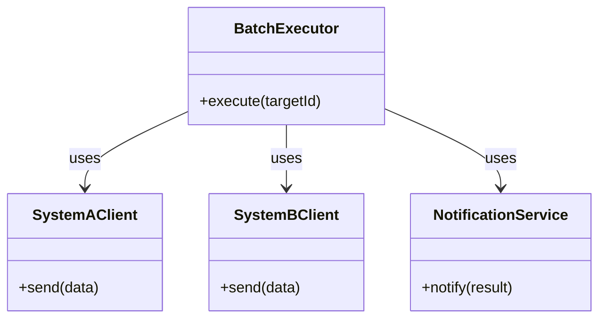
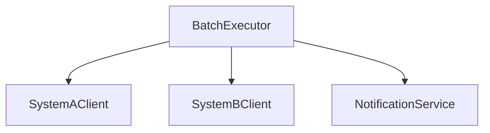
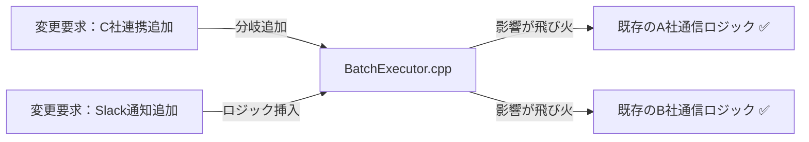
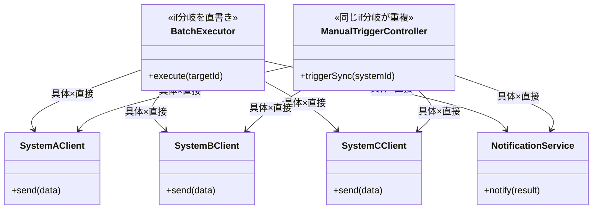
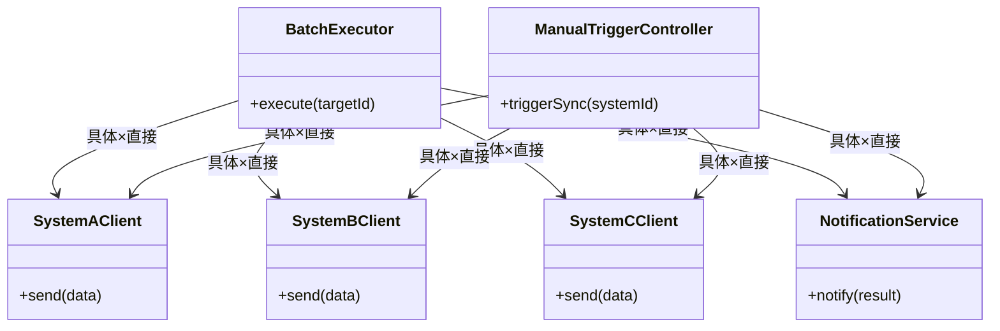
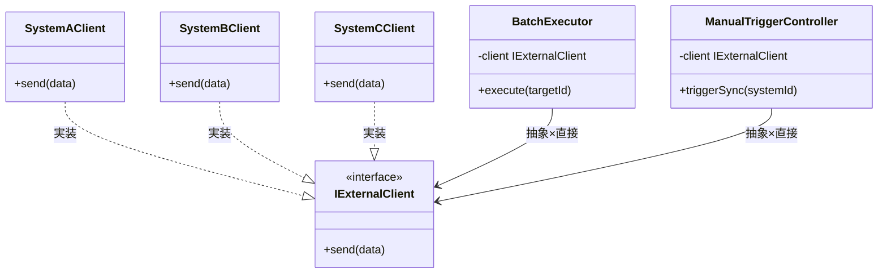
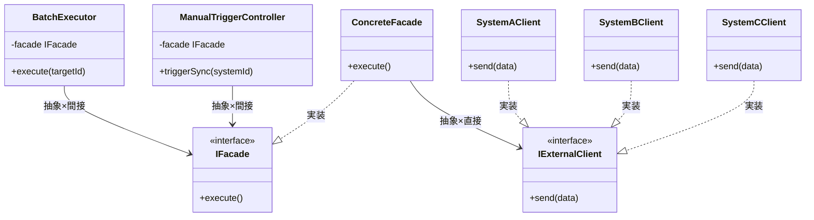
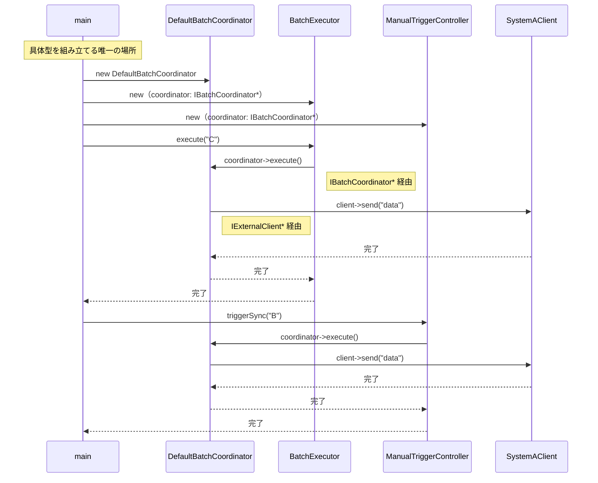
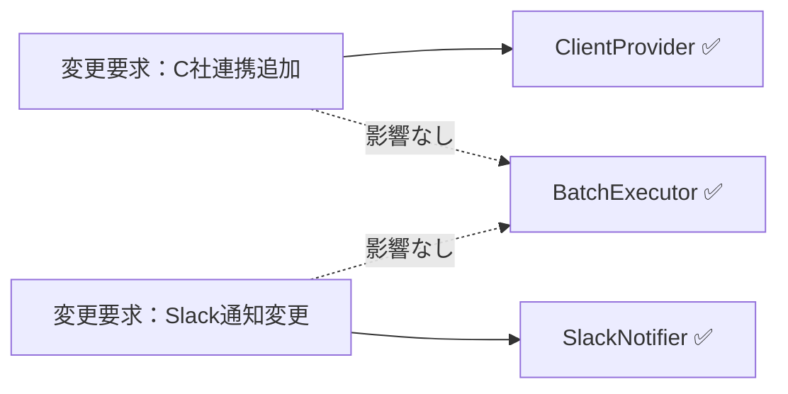
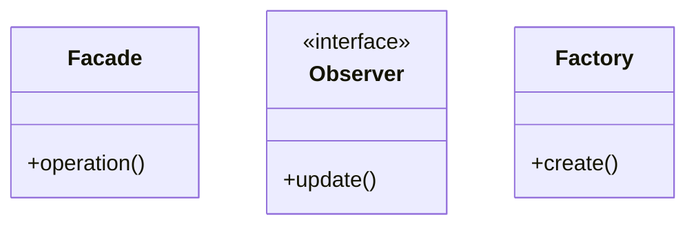

## 第10章 外部連携バッチシステム ―― 複数のパターンが交差する場所

―― 思考の型：複数の「変わる理由」が複雑に絡み合うシステムをどう解くか

### この章の核心

**外部システムとの連携が必要なバッチ処理において、システム間のインターフェース管理、非同期的なイベント通知、そして接続先生成の責任を個別のクラスが持ち続けると、変更要求のたびにシステム全体が不安定になる。**

### この章を読むと得られること

* **得られること1：** Facade、Observer、Factory Method の各パターンが、システムのどの「変化」に対応するためにあるのかを識別できるようになる。


* **得られること2：** 複数の接続点（クラスとクラスのつなぎ目）が絡み合う複雑なシステムにおいて、それぞれの責務をどこで分離すべきか判断できるようになる。


* **得られること3：** パターンの複合適用を通じて、疎結合（クラス間の依存を弱め、変更の影響が広がりにくい状態）な連携アーキテクチャを構築する方法を説明できるようになる。


* **得られること4：** 「生成」と「通知」と「インターフェース統合」という、異なる3つの責務が混在するコードを整理する視点。

---

## 🔵 フェーズ1：現状把握 ―― 変更が来る前にコードを把握する

### 1-1：システムの背景

このシステムは、社内の主要システムと外部の物流管理システムを繋ぐ「外部連携バッチシステム」です。 日々の注文データや在庫情報を外部システムへ同期する役割を担っており、連携先が増えるたびにバッチ処理の規模も拡大してきました。

当初は単一の外部連携先に対してデータを転送するだけのシンプルな構成でしたが、現在は連携先が3社に増え、それぞれが独自のデータフォーマットと接続認証を要求しています。 加えて、データの転送完了後に在庫管理システムや社内通知サービスへ「処理完了」を通知する機能も追加されました。

コードの構成を見ると、`BatchExecutor` というクラスが、すべての連携先との通信制御、データ変換、完了後の通知処理をすべて抱え込んでいます。 連携先が増えるたびに `BatchExecutor` に処理が追加され、今やどのロジックがどの連携先のためのものなのか、一見しただけでは判別が難しい状態です。 このコードがこれまで事業を支えてきた事実は尊重しつつ、現状を整理していきましょう。

### 1-2：仕様表


**外部連携バッチルール**

| ルール名 | 発動条件 | 結果 | 具体例 |
| --- | --- | --- | --- |
| 連携先振り分け | 連携先ID（"A"/"B"/"C"）を受け取る | 対応するクライアントへデータ転送 | ID="A" → A社向けフォーマットで送信 |
| リトライ制御 | 転送失敗時（最大3回） | 再試行・失敗ログ記録 | C社への接続タイムアウト → 3回再試行後にエラーログ |
| 完了通知 | データ転送が成功・失敗で完了した時 | 登録済みの通知先全員へ結果を送信 | Slackへ「A社連携完了」を通知 |

**このルールを使う場所**

同じ外部連携処理を2か所で使います。この「2か所で使う」という仕様が、設計の違いを生む起点になります。

| 使用場所 | 用途 |
| --- | --- |
| `BatchExecutor` | 夜間バッチで全連携先へ一括転送する |
| `ManualTriggerController` | 管理者が手動で特定の連携先へ即時転送する |

### 1-X：動作例テーブル ―― 仕様を「動かした結果」で確認する

コードを読む前に、このシステムがどんな入力に対してどんな出力を返すかを確認します。この章のどの案も、以下の動作を実現します。

| シナリオ | 操作 | 外部API状態 | 結果 | 通知 |
| --- | --- | --- | --- | --- |
| 月次バッチ・A社正常応答 | `BatchExecutor.execute("A")` | 正常応答 | A社へデータ転送成功 | Slack「A社連携完了」 |
| 月次バッチ・C社タイムアウト | `BatchExecutor.execute("C")` | タイムアウト | 3回リトライ後に失敗ログ記録 | Slack「C社連携失敗」 |
| 日次バッチ・新規D社追加後 | `BatchExecutor.execute("D")` | 正常応答 | D社向け新クライアントがデータ転送成功 | Slack「D社連携完了」 |
| 手動トリガー・B社正常応答 | `ManualTriggerController.triggerSync("B")` | 正常応答 | B社へ手動データ転送成功 | Slack「B社手動連携完了」 |
| バッチ失敗・監視チーム設定あり | `BatchExecutor.execute("A")`（API障害） | 障害 | 転送失敗ログ記録 | Slack＋メール両方に通知 |
| 通知先にログ基盤追加後 | `BatchExecutor.execute("B")` | 正常応答 | B社へデータ転送成功 | Slack＋ログ基盤へ同時通知 |

### 1-3：クラス構成図

現在のクラス構造です。`BatchExecutor` にすべてが依存していることが分かります。



### 1-4：責任配置テーブル

| **クラス名** | **責任（1文）** | **知るべきこと** |
| --- | --- | --- |
| `BatchExecutor` | 外部連携バッチのフローを統括する。 | 連携先一覧、各クライアントの生成方法、通知先サービス。 |
| `SystemAClient` | A社システムへデータ転送を行う。 | A社のAPI接続仕様。 |
| `SystemBClient` | B社システムへデータ転送を行う。 | B社のAPI接続仕様。 |
| `NotificationService` | 処理結果を各担当者へ通知する。 | 通知先のメールアドレス等。 |

### 1-5：依存グラフ



`BatchExecutor` に矢印が集中しており、連携先の追加や通知仕様の変更が即座にここへの修正を強いる構造です。

### 1-6：実装コード

連携処理の起点となる `BatchExecutor` の様子です。

```cpp
#include <iostream>
#include <string>
#include <vector>

using namespace std;

class SystemAClient {
public:
    void send(string d) { cout << "A社へ送信: " << d << endl; }
};
class SystemBClient {
public:
    void send(string d) { cout << "B社へ送信: " << d << endl; }
};
class NotificationService {
public:
    void notify(string r) { cout << "完了通知: " << r << endl; }
};

class BatchExecutor {
public:
    void execute(string targetId) {
        if (targetId == "A") {
            SystemAClient client; // ← 生成と利用が混在
            client.send("data");
        } else if (targetId == "B") {
            SystemBClient client; // ← 生成と利用が混在
            client.send("data");
        }
        NotificationService notifier; // ← 処理ごとに通知の知識も混在
        notifier.notify("Success");
    }
};

int main() {
    BatchExecutor executor;
    executor.execute("A");
    return 0;
}

```

このコードから、`BatchExecutor` が各連携先の生成と送信、さらにはその後の通知処理までを一手に引き受けていることが分かります。

### 1-7：実行結果

上記コードの実行結果：```text
A社へ送信: data
完了通知: Success
このコードは正しく動いています。これから検討するのは、同じ機能を保ちながら、変更に強い構造をどう作るかという点です。
> 
> 

### 1-8：責任チェック表

| **コードの行** | **持っている知識** | **管理者（観察）** |
| --- | --- | --- |
| `SystemAClient client;` | A社専用クライアントの生成知識 | インフラ担当・A社窓口担当 |
| `client.send("data");` | A社特有の通信プロトコル知識 | A社窓口担当 |
| `NotificationService notifier;` | 通知サービスの生成知識 | 全体設計者 |

要するに、連携先を識別して処理を実行しているという観察から、データ転送の「通信詳細」と「通知処理」、「連携先の生成」という複数の理由で変わるものが混在している構造の問題が見えてくる。

フェーズ1で現状把握が終わりました。次のフェーズ2では、このシステムに対する変更要求を整理し、何が変動し何が不変かを仮説立てます。

---

## 🟣 フェーズ2：仮説立案 ―― 変更要求を受けて、変動と不変を整理する

### 2-1：届いた変更要求

ある金曜日の午後、プロジェクトマネージャーから緊急の相談が飛び込んできました。

「お疲れ様。現在運用している外部連携バッチなんだけど、来週から新たにC社とも連携することになったんだ。 それに加えて、連携処理の結果を社内のSlackへ自動通知するようにしてほしいという要望が出ている。 データ転送のロジックを修正するついでに、通知処理についても何か良い仕組みを取り入れられないかな？」

データ転送先が増えるたびにバッチ全体のロジックが肥大化し、通知処理までが「おまけ」のように付け足されていく現状、そろそろ構造的なテコ入れが必要なようです。

### 2-2：今回の確定変更テーブル

この変更要求で確実に発生する変更を整理します。「将来起きるかもしれない」ではなく、「今回の要件として決まっている」ものだけを載せます。

| **変更内容** | **具体的な変更箇所** | **根拠（変更要求）** |
| --- | --- | --- |
| C社との外部連携を追加する | `BatchExecutor` に `SystemCClient` の生成と呼び出しロジックを追加 | PM「来週からC社とも連携」 |
| Slackへの完了通知を追加する | `BatchExecutor` 内に Slack への通知処理を挿入 | PM「Slackへ自動通知してほしい」 |

### 2-3：関係者ヒアリング

仮説を携え、運用担当者と協議を行いました。

* **開発者：** 「C社との連携ですが、今回のデータフォーマットは既存のA社やB社と大きく異なりますか？」


* **運用担当者：** 「フォーマットは別物だね。 また、今後D社やE社も控えているから、接続先の追加はこれからも発生するよ。」


* **開発者：** 「通知についてはどうでしょうか？ Slack以外にもメール通知が必要になる可能性はありますか？」


* **運用担当者：** 「そうだね、将来的にはログ収集基盤へのデータ投入も検討している。 ただ、転送成功か失敗かという『結果の通知』という仕組み自体は今後も変わらないよ。」


* **開発者：** 「分かりました。外部との通信ロジックと、通知という振る舞いは、それぞれ独立して増殖していく可能性があるということですね。」


ヒアリングにより、通信先（生成）の増殖と、通知処理（イベントの反応）の多様化が、それぞれ別個の変化軸であることが確実になりました。

> **現実のヒアリングでは——** このシナリオでは相手がちょうど設計に役立つ情報を教えてくれています。現実には「変わるかどうか分からない」「たぶん変わらない」という答えが返ることも多いです。そのときは、コードの変更履歴（`git log`）や過去の障害記録を「ヒアリングの代わり」として使ってみてください。「過去に何度変わったか」が、「将来変わりやすいか」の最も正直な証拠です。

### 2-4：将来リスクテーブル

ヒアリングで判明した「将来起きるかもしれない」変化をまとめます。確定変更（2-2）とは別に管理することで、今回の設計判断と将来への備えを混在させずに済みます。

| **将来のリスク** | **変わる可能性がある箇所** | **根拠（誰が言ったか）** |
| --- | --- | --- |
| D社・E社など連携先がさらに増える | `BatchExecutor` 内の振り分けロジック全体 | 運用担当者「D社・E社も控えている」 |
| Slack以外にメール・ログ基盤への通知が追加される | 通知処理全体 | 運用担当者「ログ収集基盤も検討中」 |
| バッチの実行フロー自体は変わらない | 不変 | 運用担当者「仕組み自体は変わらない」 |

フェーズ2で「何が変わり、何が変わらないか」が確定しました。次のフェーズ3では、この変更要求を現在のコードで実行しようとすると何が起きるか、その痛みを確認します。

---

## 🟣 フェーズ3：問題特定 ―― 変更を試みて、痛みを発見する

### 3-1：変更シミュレーション

外部連携バッチシステムに「C社との連携」と「Slackへの結果通知」を追加する要求を、既存の BatchExecutor にそのまま組み込もうとします。

まず、SystemCClient クラスを新規作成し、通信処理を実装します。 次に、BatchExecutor の execute メソッド内にある既存の if-else 分岐に、targetId == "C" という条件を追加し、そこで SystemCClient を生成して send メソッドを呼び出します。 さらに、処理結果を Slack に飛ばすため、NotificationService のメソッドを書き換え、BatchExecutor 内で条件判定と通知ロジックを無理やり挿入します。

作業中、ふと気づかされます。「この execute メソッド、連携先が増えるたびに if 文の列が伸びていき、通知処理の記述もカオスになっている」と。 本来なら連携先ごとの通信ロジックと、通知という副次的な振る舞いは独立しているべきです。 しかし現状では、一つのメソッドの中にこれらすべてが詰め込まれており、連携先を一つ増やすたびにバッチ全体の処理フローを壊しかねない恐怖を感じます。

### 3-2：変更影響グラフ

現状の構造で変更を試みた際、影響がどのように飛び火するかを可視化します。



グラフが示す通り、C社連携の追加やSlack通知の実装といった個別の要求が、既存の他の連携先ロジックにまで影響を及ぼす構造になっています。

### 3-3：痛みの言語化

「連携先が増えるたびに、既存の安定している通信処理までテストし直さないといけないのか…」

変更をシミュレートする中で、エンジニアとして感じる「痛み」が二つ明確になりました。

1つ目は、BatchExecutor が抱える「巨大な責任」の辛さです。 このクラスは本来、バッチ処理全体のフローを制御するだけでいいはずなのに、連携先ごとの具体的な通信手段や、通知先といった「詳細」までをすべて把握し、生成まで行っています。 これでは、連携先が増えるたびに管理不能なほど複雑なコードになるのは必然です。

2つ目は、連携の「生成」と「通知」という、変わる理由が異なる責務が混在していることです。 連携先の通信仕様が変わるのか、それとも通知の要件が変わるのか、それを見極める前に巨大な一つのクラスを編集せざるを得ません。 変更が局所化（影響が1クラスだけで済む状態）されていないため、システム全体の安全性を確保するコストが日々跳ね上がっています。

フェーズ3で「今の構造では変更が辛い」という事実が確認できました。 次のフェーズ4では、この痛みの原因を構造的に分析します。

---

## 🟠 フェーズ4：原因分析 ―― なぜ辛いのかを構造的に言語化する

フェーズ3で「外部連携先が増えるたびに、バッチ処理全体のコードが修正のたびに不安定になる」という痛みを確認しました。 なぜこのような状態に陥るのか、その根本原因を構造的な視点で分析します。

### 4-1：観察→原因テーブル

フェーズ3で観察した「痛み」と、その背後にある構造的な原因を対応させます。

| **観察** | **原因の方向** |
| --- | --- |
| 新しい連携先を追加するたびに、統括クラス（`BatchExecutor`）の修正が必須になる | `BatchExecutor` が、連携先クライアントの「具体的なクラス名」と「接続方法」を直接知っているから。 |
| 転送結果の通知仕様を変えると、連携処理のフロー全体まで影響を受ける | 「データ転送」という連携処理と、「処理結果の通知」というイベント通知が、同じクラス内で密結合に混在しているから。 |

コードを追うと、`BatchExecutor` は単に処理を順序立てるだけでなく、連携先それぞれの認証、通信、データ変換という「詳細」までを一身に背負っています。 その上、通知処理の呼び出しまで行っているため、連携先ごとの個別の事情と、システム共通の通知フローが同じ場所で絡み合っていることが分かります。

### 4-2：変わるもの / 変わらないものテーブル

変化の軸が異なる要素を整理します。

| **変わり続けるもの（🔴）** | **変わってほしくないもの（🟢）** |
| --- | --- |
| 外部連携先ごとの通信手段（プロトコル・認証等） | バッチ全体の処理実行順序（取得→転送→通知） |
| 通知先のサービスや通知ルール | 通知という「イベント」自体を発生させる責務 |

連携先の追加は今後も発生する「変動」ですが、バッチ全体の転送フローは「不変」に近い構造です。 本来、これらは別の責務として分離されるべきものであり、同じクラス内で扱われていること自体が設計上の歪みを生んでいます。

### 4-3：接続形態を診断する

現在の接続形態を2×2マトリクスで診断します。

今の `BatchExecutor` と各クライアント、および通知サービスとの接続は、巨大なUSBハブの中に、各機器の電源回路や通信制御が直接はんだ付けされている状態（具体×間接）だと言えます。

ハブ（`BatchExecutor`）を開けば、中には各機器専用の回路が複雑に入り組んでおり、一つの配線をいじろうとすると、他の回路にまで誤って電流が流れてしまうような状態です。 本来なら、ハブのポートには汎用的な規格（抽象）のプラグを差し込むべきところを、専用線で直結してしまっているために、変更がシステム全体へと伝播してしまうのです。

|  | 直接（直差し） | 間接（アダプター経由） |
|:---:|:---|:---|
| **具体**（専用規格） | iPhone → [Lightning] → Apple純正ドック（Lightning端子） | **← 現在地**　iPhone → [Lightning] → [変換] → USB-A充電器（汎用端子） |
| **抽象**（汎用規格） | MacBook → [USB-C] → USB-C対応モニター（汎用端子） | MacBook → [USB-C] → [ハブ] → HDMI・USB-A・LAN |

フェーズ4で根本原因が言語化できました。 次のフェーズ5では、解決すべき課題を具体的に定義していきます。

---

## 🟡 フェーズ5：課題定義 ―― 解くべき問題を具体的に定める

フェーズ4で、「外部連携ロジック（通信）」と「イベント通知」が `BatchExecutor` 内で密結合していることが、コードを複雑化させ、変更のたびにシステム全体を不安定にする根本原因だと特定しました。 連携先ごとに異なる通信プロトコルと、将来増えるであろう通知手段を、現在の構造のまま扱い続けることは限界に達しています。

対策案を検討する前に、今回のリファクタリングで「何を解決すべきか」を4つの視点で具体化し、課題を確定させます。

### 5-1：接続点の特定

フェーズ4の分析に基づき、以下の接続点（ジョイント）を特定しました。

* 接続点A：`BatchExecutor` ←→ 各外部システム（SystemA/B/C）の通信境界
* 接続点B：`BatchExecutor` ←→ 通知サービス（NotificationService）の通知境界

現在、`BatchExecutor` はこれら2つの接続点に対して、具体的なクラスを直接 `new` し、メソッドを直接呼び出すという「具体×間接」に近い混在状態にあります。 特に連携先（接続点A）の増殖と、通知手段（接続点B）の多様化という二つの異なる変化軸が、一つのクラス内で「スパゲッティ」のように絡み合っているのが最大の課題です。

### 5-2：非機能制約の確認

設計の方向性を決めるために、この接続点に関わる非機能制約を確認します。

| **確認項目** | **内容** | **この章での判断** |
| --- | --- | --- |
| 変更頻度 | この接続点はどのくらいの頻度で変わるか | 高（今後も連携先と通知先の追加が続く） |
| パフォーマンス | ホットパスか（高頻度で呼ばれるか） | 低（バッチ処理であり、即時性はそれほど要求されない） |
| メモリ | 間接層の追加でオーバーヘッドが問題になるか | いいえ（バッチ処理のため、柔軟性を優先してよい） |
| 実行時間 | バッチ処理の最大実行時間に制約があるか | 要設計（業務システムとの連携バッチは、業務時間外（深夜帯）に完了しなければならない時間制限がある場合が多い。外部システムの応答待ち時間も含めたタイムアウト設計が、外部連携クラスの構造に影響する） |

変更頻度が「高」であるため、連携先や通知先が増えるたびにバッチ全体のロジックが書き換わるような構造は避けなければなりません。 通常のバッチ実行では処理時間の問題は軽微ですが、外部システムとの連携を含む夜間バッチには完了期限（締め時刻）があります。タイムアウトと再試行ポリシーは、外部クライアントクラスの設計方針に影響します。

### 5-3：クライアントへの影響範囲

分離対象の責務を呼び出しているのは `BatchExecutor` クラス自身です。 このクラスが連携先や通知先の「詳細」を知っていることが現在の制限事項です。 この設計を改善することで、`BatchExecutor` は「バッチの実行順序（フロー）」だけを管理し、実際の処理（通信や通知）は外部化されたクラスに任せることができます。

### 5-4：課題まとめ表

これまでの分析を、フェーズ6の対策案検討に向けた課題として整理します。

| **接続点** | **分けた理由** | **非機能制約** | **クライアント影響** |
| --- | --- | --- | --- |
| 接続点A | 連携先追加によるロジックの肥大化 | 高頻度の変更・夜間バッチの締め時刻によるタイムアウト設計が必要 | `BatchExecutor` の通信処理 |
| 接続点B | 通知手段の多様化への対応 | 高頻度の変更 | `BatchExecutor` の通知処理 |

フェーズ5で「何を解くか」が確定しました。 次のフェーズ6では、これらの課題に対して具体的にどのような構造が最適か、コストの観点から案を検討します。

---

## 🔴 フェーズ6：対策案検討 ―― 解決策を並べ、コストで選ぶ

外部連携バッチシステムにおいて、「連携先の追加」と「通知処理の多様化」という二つの変更軸が `BatchExecutor` に混在していることが、システムを複雑にする原因です。 ここでは、これらの責務を適切に切り離すための対策案を検討します。

**どの案も、動作例テーブルで示した動作を実現します。違うのは「変更が来たときにどこを触ることになるか」です。**

### 6-1：接続の形 2×2マトリクス

現在は通信クライアントや通知サービスを `BatchExecutor` が直接生成して利用する「具体×直接」の状態です。 これらをインターフェースで抽象化し、生成を委譲する方向で検討します。

| 接続形態 | ケーブル例 | 特徴 |
|:---:|:---|:---|
| **具体×直接**（← 現在地） | iPhone → [Lightning] → Apple純正ドック（Lightning端子） | 専用端子のみ対応。差し替え不可 |
| **具体×間接** | iPhone → [Lightning] → [変換] → USB-A充電器（汎用端子） | 変換器を挟むが規格は専用のまま |
| **抽象×直接** | MacBook → [USB-C] → USB-C対応モニター（汎用端子） | どのメーカーでも同じ口で繋がる |
| **抽象×間接** | MacBook → [USB-C] → [ハブ] → HDMI・USB-A・LAN | ハブを介して多様な機器へ展開可能 |

---

#### 案1：現状のまま ―― 構造を変えない

**この形の考え方：**
クラスの分割も接続形態の変更もしない。 既存の `if-else` 分岐に新しい連携先や通知条件を足し続ける。 変更頻度が極めて低く、この先半年以上修正の予定がない場合にのみ選択する。

**構造図：**



両クラスが同じ連携先クライアントと通知サービスを直接知っており、連携先が増えると2か所を修正しなければならない。

**手段の比較：**

| 手段 | 方法 | 特徴 |
| --- | --- | --- |
| 手段A：if分岐に追記 | `execute()` 内に `else if (targetId == "C")` を追加 | 最も実装が速い。ただし分岐が増えるたびに読みにくくなる |
| 手段B：switch文に整理 | `if-else` を `switch` に書き換え | `if-else` より見通しがわずかに良くなるが、本質的な問題は変わらない |

→ **採用：手段A**（今回の要件はC社追加の1件のみ。最速で対応できる手段を選ぶ。ただし構造問題は解消しない）

【コード例】

```cpp
void execute(string targetId) {
    if (targetId == "C") { SystemCClient client; client.send("data"); }
    // ← 具体：SystemCClientという型名を直接書いている
    NotificationService n; n.notify("Success");
    // ← 具体：NotificationServiceという型名を直接書いている
}

```

このコードを見ると、連携先が増えるたびに `execute()` が肥大化し、既存の安定したロジックを毎回触ることになる構造が明確です。

**呼び出し側から見た違い（main() 例）：**

```cpp
// 案1（現状のまま）の呼び出し側
// 両クラスが同じ外部システム振り分けロジックを重複して持つ
class ManualTriggerController {
public:
    void triggerSync(string systemId) {
        // ← BatchExecutorと同じif-else分岐をそのまま複製している
        if (systemId == "A") {
            SystemAClient client; client.send("manualData");
        } else if (systemId == "B") {
            SystemBClient client; client.send("manualData");
        } else if (systemId == "C") {
            SystemCClient client; client.send("manualData");
        }
        NotificationService n; n.notify("手動同期完了");
    }
};

int main() {
    BatchExecutor executor;
    executor.execute("C");

    ManualTriggerController manual;
    manual.triggerSync("B");
    return 0;
}
```

両クラスが同じロジックを重複して持つため、連携先が増えると2か所を修正しなければならない。

一文要約：連携先の振り分けロジックと通知処理が両クラスの内部に直書きされているため、同じ分岐が2か所で並行して走る。

**この形のトレードオフ：**

* 変更容易性：低（連携先が増えるたびに `BatchExecutor` が肥大化する）


* テスト容易性：低（通信処理と通知ロジックが分離できず、テストが困難）


* 実装コスト：低（今のコードに数行足すだけ）


---

#### 案2：具体×直接 ―― クラスを分けるが参照は具体型のまま

**この形の考え方：**
各連携先のクライアントをクラス化するが、呼び出し側はそれらを直接 `new` する。 責任の所在は明確になるが、依然としてクラスの生成知識が利用側に混在している。

**構造図：**



クラスは分離されたが、両クラスが各具体クライアントへの矢印を重複して持っており、連携先が増えるたびに両方を修正する必要がある。

**手段の比較：**

| 手段 | 方法 | 特徴 |
| --- | --- | --- |
| 手段A：クラスを切り出して直接生成 | `SystemCClient` をクラス化し、呼び出し元で直接 `new` する | 責任はクラスに分かれるが、生成の知識は呼び出し元に残る |
| 手段B：ヘルパー関数に集約 | 振り分けロジックをフリー関数にまとめる | 関数1つに集約されるが、インターフェースなしのため型依存は変わらない |
| 手段C：staticメソッドに集約 | クラスのstaticメソッドに振り分けを集める | 案Aの変形。依存関係は同じで利点は薄い |

→ **採用：手段A**（クラスの責任を分離するという方向性は正しい。ただし次の案（抽象化）への踏み台として位置づける）

【コード例】

各連携先クライアントをクラスとして分離します。

```cpp
class SystemCClient {
public:
    void send(string data) { cout << "C社へ送信: " << data << endl; }
};
```

呼び出し元では具体型を直接生成します。

```cpp
void execute(string targetId) {
    if (targetId == "C") {
        SystemCClient client; // ← 具体：SystemCClientという型名を直接書いている
        client.send("data");  // ← 直接：呼び出し側がこのクラスを直接インスタンス化している
    }
}

```

クラスは分かれたが、`execute()` が `SystemCClient` という型名を直接知っている点は変わらない。

**呼び出し側から見た違い（main() 例）：**

```cpp
// 案2（具体×直接）の呼び出し側
// 選択ロジックが両クラスに重複している
class ManualTriggerController {
public:
    void triggerSync(string systemId) {
        if (systemId == "C") {
            SystemCClient client; // ← 具体：SystemCClientという型名を直接書いている
            client.send("manualData");
        }
        NotificationService n; n.notify("手動同期完了");
    }
};

int main() {
    BatchExecutor executor;
    executor.execute("C");

    ManualTriggerController manual;
    manual.triggerSync("B");
    return 0;
}
```

選択ロジックが両クラスに重複しており、連携先が増えるたびに両方を修正しなければならない。

一文要約：クラスは分かれたが「どのクラスを呼ぶか」という判断を両方の呼び出し元がそれぞれ行っており、呼び出し経路が2本並んで重複している。

**この形のトレードオフ：**

* 変更容易性：低〜中（クラスは分離できたが、生成ロジックの混在は残る）


* テスト容易性：低（具体クラスへの依存が強いため切り離せない）


* 実装コスト：低（クラスへの切り出しのみ）


---

#### 案3：抽象×直接 ―― インターフェースを挟み、型だけで接続する

**この形の考え方：**
連携先との通信インターフェースを定義し、生成を一か所に集約する。 また、通知処理を動的に登録可能な仕組みにする。 呼び出し元はインターフェース型だけを知り、具体クラスへの依存をなくす。

**構造図：**



`BatchExecutor` はインターフェースのみを利用し、`ManualTriggerController` は外部から注入されたインターフェースのみを知り、両クラスとも具体クライアントへの依存がなくなっている。

**手段の比較：**

| 手段 | 方法 | 特徴 |
| --- | --- | --- |
| 手段A：コンストラクタ注入 | `BatchExecutor(IExternalClient* c)` でインターフェース型を受け取る | 依存を外から差し込める。テスト時にスタブを注入しやすい |
| 手段B：セッターで注入 | `setClient(IExternalClient* c)` でセットする | 後から差し替え可能。ただし「未設定」状態のリスクがある |
| 手段C：生成を内部に集約（振り分け関数） | `if-else` で具体型を生成するヘルパーをメンバに持つ | 外部には型を隠せるが、内部では具体型を知っている。次の案（間接）に近い発想 |

→ **採用：手段A**（コンストラクタ注入は「依存を明示する」という設計の意図が最も明確。テスト容易性も高い）

インターフェースと連携先クライアントの実装を定義します。

```cpp
class IExternalClient {
public:
    virtual void send(string d) = 0;
};

class SystemAClient : public IExternalClient {
public:
    void send(string d) override { cout << "A社へ送信: " << d << endl; }
};
class SystemBClient : public IExternalClient {
public:
    void send(string d) override { cout << "B社へ送信: " << d << endl; }
};
class SystemCClient : public IExternalClient {
public:
    void send(string d) override { cout << "C社へ送信: " << d << endl; }
};
```

`BatchExecutor` はインターフェース経由でクライアントを受け取ります。

```cpp
class BatchExecutor {
    IExternalClient* client; // ← 抽象：IExternalClient*型で受け取り、具体クラスを知らない
public:
    BatchExecutor(IExternalClient* c) : client(c) {}
    void execute(string targetId) {
        client->send("data"); // ← 直接：インターフェース経由で直接呼び出す
        cout << "完了通知を送信" << endl;
    }
};

```

`BatchExecutor` の内部から具体クラス名が消えた。代わりに `IExternalClient*` という型だけで動作する。

**呼び出し側から見た違い（main() 例）：**

```cpp
// 案3（抽象×直接）の呼び出し側
// 注入アプローチにより、両クラスで具体クライアントへの依存がなくなる
class ManualTriggerController {
    IExternalClient* client; // ← 抽象：外部から注入されたインターフェースのみ知っている
public:
    ManualTriggerController(IExternalClient* c) : client(c) {}
    void triggerSync(string systemId) {
        cout << "[ManualTrigger] " << systemId
             << " への手動同期を実行。" << endl;
        client->send("manualData"); // ← 直接：インターフェース経由で直接呼び出す
    }
};

int main() {
    SystemCClient cClient;
    BatchExecutor executor(&cClient); // ← 抽象：呼び出し側は具体クライアントクラスを渡すだけ

    SystemBClient bClient;
    ManualTriggerController manual(&bClient);
    manual.triggerSync("B");
    return 0;
}
```

注入アプローチにより、両クラスとも具体クライアントクラスを知らずに済み、選択ロジックの重複が解消される。

一文要約：`main()` が具体型を組み立て、両方の呼び出し元は `IExternalClient*` という型だけを介して同じオブジェクトを呼ぶため、具体クラスが変わっても呼び出し経路は変わらない。

**この形のトレードオフ：**

* 変更容易性：中〜高（新しい連携先追加は新クラスの追加と `main()` の組み立て修正だけで済む）


* テスト容易性：高（インターフェースに対してスタブを容易に差し込める）


* 実装コスト：中（インターフェース定義と注入の仕組みが必要）


---

#### 案4：抽象×間接 ―― インターフェース＋仲介役を両立する

**この形の考え方：**
仲介クラス（Facade）によるインターフェース統合、生成の分離、通知の疎結合をすべて組み込む。 変更影響は完全に局所化されるが、クラス数は最大になる。

**構造図：**



両クラスが抽象Facadeインターフェースのみを受け取り、具体クライアントへの依存が完全に排除されているが、インターフェースが2層になり構造が複雑になる。

**手段の比較：**

| 手段 | 方法 | 特徴 |
| --- | --- | --- |
| 手段A：生成を専用クラス（Factory）に委譲 | `IExternalClient* create(targetId)` を持つクラスを作る | 生成の責務が1クラスに集中。呼び出し元は型を知らずに済む |
| 手段B：通知をリスト管理（Observer型） | `vector<INotifier*>` に通知先を登録・一括呼び出し | 通知先の追加・削除がリストへの操作だけで完結する |
| 手段C：生成と通知を同一クラスに持つ | 仲介クラスが生成も通知も担う | クラス数は減るが責務が再び混在する。変化の軸が違うので分けるべき |

→ **採用：手段A＋手段B の組み合わせ**（生成と通知はそれぞれ独立して変わるため、それぞれ別の仕組みで管理する。これにより変更影響が完全に局所化される）

通知インターフェースと生成の窓口を定義します。

```cpp
class INotifier {
public:
    virtual void onComplete(string result) = 0;
};

class IExternalClient {
public:
    virtual void send(string data) = 0;
};
```

生成の責務を専用クラスに切り出します。

```cpp
class ClientProvider {
public:
    static IExternalClient* create(string targetId) {
        if (targetId == "A") return new SystemAClient();
        if (targetId == "B") return new SystemBClient();
        if (targetId == "C") return new SystemCClient();
        // 新しい連携先はここに1行追加するだけ
        return nullptr;
    }
};
```

`BatchExecutor` は生成と通知の詳細を知らず、フローの統括だけを担います。

```cpp
class BatchExecutor {
    IFacade* facade; // ← 抽象：IFacade*型で受け取り、具体実装を知らない
public:
    BatchExecutor(IFacade* f) : facade(f) {}
    void execute(string targetId) {
        facade->execute(); // ← 間接：Facade経由で呼ぶため内部のクライアント群が見えない
    }
};

```

`BatchExecutor` は `IFacade*` だけを知っている。連携先が何社あろうと、通知先が何件あろうと、このクラスを変更する理由がなくなった。

**呼び出し側から見た違い（main() 例）：**

```cpp
// 案4（抽象×間接）の呼び出し側
// 両クラスとも抽象Facadeのみを知っており、具体クライアント実装は隠れている
class ManualTriggerController {
    IFacade* facade; // ← 抽象：抽象Facadeインターフェースのみ知っている
public:
    ManualTriggerController(IFacade* f) : facade(f) {}
    void triggerSync(string systemId) {
        cout << "[ManualTrigger] " << systemId
             << " への手動同期を実行。" << endl;
        facade->execute();
        // ← 間接：Facade経由のため具体クライアントが見えない
    }
};

int main() {
    ConcreteFacade facade;             // ← 具体：組み立て側だけが具体型を知る
    BatchExecutor executor(&facade);   // ← 間接：抽象Facadeのみ見えて具体実装は隠れる
    executor.execute("C");

    ConcreteFacade facade2;
    ManualTriggerController manual(&facade2);
    // ← 間接：抽象Facadeのみ見えて具体実装は隠れる
    manual.triggerSync("B");
    return 0;
}
```

両クラスとも抽象Facadeインターフェースのみを受け取るため、具体的なクライアントクラスへの依存が完全に排除される。

一文要約：呼び出し元→`IBatchCoordinator*`→`IExternalClient*` という2段階の抽象型を経由するため、どの具体クラスが動くかは `main()` の組み立て部分だけが知っている。

**この形のトレードオフ：**

* 変更容易性：高（あらゆる層が独立して変更可能）


* テスト容易性：高（全ての依存をスタブに差し替え可能）


* 実装コスト：高（非常に多くのクラスと複雑な設計が必要）


---

### 6-7：評価軸

対策案を比較するための「ものさし」を先に宣言します。 外部連携バッチシステムにおいて、複数の構造オプションを比較する際の評価軸を定義します。

| **評価軸** | **意味** | **ウェイト** |
| --- | --- | --- |
| 変更容易性 | 連携先追加や通知要件変更の際、触る場所が最小で済むか | ×3 |
| テスト容易性 | クライアントや通知先をスタブに差し替えてテスト可能か | ×2 |
| 可読性 | クラス数増加と構造の複雑化度合い | ×1 |

> **注：** このウェイト（変更容易性×3など）は本書の例です。チームの変更頻度・テスト文化に合わせて、比較を始める前にチームで合意してください。スコアは「答えを決める計算式」ではなく、「チームの議論を整理する道具」です。

**採点基準（章共通）：**

| 点数 | 変更容易性 | テスト容易性 | 可読性 |
| --- | --- | --- | --- |
| 3 | 1クラス追加のみで完結 | スタブで完全に切り離せる | クラス増なし・直感的に理解可能 |
| 2 | 2〜3クラスの修正が必要 | 一部スタブが必要だが可能 | クラス1〜2個増・標準的な構造 |
| 1 | 4クラス以上の波及 | 実装依存でテスト困難 | 中間層が過多で理解コストが高い |

**パフォーマンスの VETO 判定：**
本バッチ処理は定期実行であり、即時性の制約は低いため、パフォーマンス上の VETO は発動しません。 柔軟な連携と通知を実現する設計を優先します。

---

### 6-8：コスト天秤

4つの案を比較します。

| **案** | **現在の対応コスト** | **未来の対応コスト** |
| --- | --- | --- |
| 案1：現状のまま | 低 | 高 |
| 案2：具体×直接 | 低〜中 | 高 |
| 案3：抽象×直接 | 中 | 低〜中 |
| 案4：抽象×間接 | 高 | 低 |

**ステップ1：採点表**（1＝低い、2＝中程度、3＝高い）

| 案 | 変更容易性（×3） | テスト容易性（×2） | 可読性（×1） |
| --- | --- | --- | --- |
| 案1：現状のまま | 1 | 1 | 3 |
| 案2：具体×直接 | 1 | 2 | 3 |
| 案3：抽象×直接 | 2 | 2 | 2 |
| 案4：抽象×間接 | 3 | 3 | 1 |

**ステップ2：加重合計表**

| 案 | 加重スコア | 判定 |
| --- | --- | --- |
| 案1 | 1×3＋1×2＋3×1＝8 |  |
| 案2 | 1×3＋2×2＋3×1＝10 |  |
| 案3 | 2×3＋2×2＋2×1＝12 |  |
| 案4 | 3×3＋3×2＋1×1＝16 | ← 採用候補 |

外部システム連携とイベント通知という複数の責務が絡み合うため、案4（抽象×間接）の柔軟性が最も評価されました。

---

### 6-9：採用案の決定

**採用する案：** 案4（抽象×間接）

**理由：**
複数の外部連携先と通知要件を独立して拡張できるようにするため、各責務を完全にインターフェース経由で疎結合化する案4を採用します。 実装コストは高いですが、将来の連携先増殖を見越した長期運用には不可欠な投資です。

---

### 6-10：耐久テスト

フェーズ2のヒアリングで挙がった将来のリスクに対する耐性を確認します。

| **変更シナリオ** | **触る場所** | **コスト評価** |
| --- | --- | --- |
| D社連携を追加する | `ClientProvider` に new ロジック追加 | 低 |
| 通知先に「ログ基盤」を追加する | 通知インターフェースを実装した `LogNotifier` を作成 | 低 |

採用した設計では、新しい通信先は Factory で、新しい通知先は Observer で追加でき、既存の連携ロジックを一切修正せずに済みます。

フェーズ6で採用する案が決まりました。次のフェーズ7では、この案を実際にコードとして実装し、採用した構造の名前を確認します。

---

## 🟢 フェーズ7：対策実施 ―― 決断し、変化に強い設計を手に入れる

採用した案4（抽象×間接）を実装し、外部連携と通知処理の責務をそれぞれ独立したクラスへカプセル化（変更の影響を1クラス内に閉じ込めること）します。

実は、この章で選んだ案4の構造には名前があります。**Facade パターン × Observer パターン × Factory Method パターン** です。「パターンを学んで使い方を覚える」のではなく、「問題を分析した結果として自然に選ばれた構造」がこの3つのパターンの組み合わせだったという順序が大切です。

### 7-1：解決後のコード（全体）

フェーズ6で選んだ構造を実装します。連携先クライアントの生成を `ClientProvider` に、通知処理を `INotifier` として分離しました。

まず、通知のインターフェースと具体的な通知クラスを定義します。

```cpp
#include <iostream>
#include <string>
#include <vector>

using namespace std;

// 通知のインターフェース（Observer パターンの契約）
class INotifier {
public:
    virtual ~INotifier() = default;
    virtual void onComplete(string result) = 0;
};

// Slack通知の具体的な実装
class SlackNotifier : public INotifier {
public:
    void onComplete(string result) override {
        cout << "Slack通知: バッチ処理完了 [" << result << "]" << endl;
    }
};
```

`INotifier` を定義することで、通知先の追加は「このインターフェースを実装した新クラスを作る」だけになる。

次に、連携先クライアントのインターフェースと実装を定義します。

```cpp
// 連携先クライアントのインターフェース（Facade の内部で使われる）
class IExternalClient {
public:
    virtual ~IExternalClient() = default;
    virtual void send(string data) = 0;
};

// A社向け実装
class SystemAClient : public IExternalClient {
public:
    void send(string data) override {
        cout << "A社へ転送: " << data << endl;
    }
};

// B社向け実装（以降、連携先が増えるたびにこの形で追加する）
class SystemBClient : public IExternalClient {
public:
    void send(string data) override {
        cout << "B社へ転送: " << data << endl;
    }
};

class SystemCClient : public IExternalClient {
public:
    void send(string data) override {
        cout << "C社へ転送: " << data << endl;
    }
};
```

各連携先クライアントは `IExternalClient` を実装するだけ。D社を追加するときも同じ形で1クラス追加するだけで済む。

生成の責務を一か所に集めます。

```cpp
// 生成の窓口（Factory Method パターン）
class ClientProvider {
public:
    static IExternalClient* create(string targetId) {
        if (targetId == "A") return new SystemAClient();
        if (targetId == "B") return new SystemBClient();
        if (targetId == "C") return new SystemCClient();
        // 新しい連携先はここに1行追加するだけ
        return nullptr;
    }
};
```

`ClientProvider` が「どの連携先クラスを生成するか」という知識を一手に引き受ける。`BatchExecutor` はもうこの知識を持たなくてよい。

最後に、フローを統括する `BatchExecutor` と組み立てを示します。

```cpp
// バッチ全体のフローを統括するクラス
class BatchExecutor {
    vector<INotifier*> notifiers; // ← Observer リスト
public:
    void addNotifier(INotifier* obs) { notifiers.push_back(obs); }

    void execute(string targetId) {
        // Factory Method で生成（具体クラスを知らない）
        IExternalClient* client = ClientProvider::create(targetId);
        if (client) {
            client->send("data");
            // 全Observerに通知（通知先を知らない）
            for (auto* obs : notifiers) obs->onComplete("Success");
            delete client;
        }
    }
};

int main() {
    BatchExecutor executor;
    SlackNotifier slack;
    executor.addNotifier(&slack); // 通知先を登録
    executor.execute("A");
    return 0;
}

```

この実装により、`BatchExecutor` は通信の詳細や通知の仕組みを知ることなく、フローの統括のみに専念できるようになりました。

**動作図（シーケンス図）：**



### 7-2：変更影響グラフ（改善後）

フェーズ3で行った「C社連携の追加」という要求を、改善後の構造で再確認します。



グラフが示す通り、変更要求はそれぞれ `ClientProvider` や `Observer` クラスに閉じており、`BatchExecutor` のメインフローには一切影響が及ばなくなりました。

### 7-3：変更シナリオ表

この設計により、連携先追加や通知要件の変化に強い構造となりました。

| **シナリオ** | **変わるクラス（触る場所）** | **変わらないクラス** |
| --- | --- | --- |
| 新しい連携先（D社）を追加する | `ClientProvider` に new ロジック追加 | `BatchExecutor`, `INotifier` 実装クラス |
| メール通知を追加する | `MailNotifier` クラスを新規作成 | `BatchExecutor`, `IExternalClient` 実装クラス |

変更が来ても、触るのは該当する Factory や Observer の実装クラスだけ——それがこの設計で手に入れたものです。 諦めたものは、クラス数の増加というわずかな設計コストです。

---

### 7-4：接続形態の確認 ── この設計はどの接続か

フェーズ4-3で診断した通り、変更前のコードは **具体×間接** の状態でした。
採用した構造（Facade × Observer × Factory Method パターン）では、接続形態が **抽象×間接（USB-Cハブ経由）** へと変化しています。

**「抽象×間接」の証拠となるコード：**

```cpp
class BatchExecutor {
    vector<INotifier*> notifiers;  // ← インターフェース型 = 「抽象」の証拠
public:
    void execute(string targetId) {
        // Factory 経由で生成 = 「間接」の証拠
        IExternalClient* client = ClientProvider::create(targetId);
        if (client) {
            client->send("data");
            for (auto* obs : notifiers) obs->onComplete("Success");
            // ← Observer 経由 = 「間接」の証拠
        }
    }
};
```

- `INotifier*` と `IExternalClient*` はインターフェース型 → **「抽象」** の証拠
- クライアントは `ClientProvider::create()` を経由して生成（直接 `new` しない）→ **「間接」** の証拠
- 通知は `INotifier` リストを経由して送られる → **「間接」** の証拠

「連携先・通知先を差し替えたいかつ生成・通知の詳細を知らせたくない」という動機から、**抽象×間接** が選ばれました。

### ⑩ 整理・振り返り・パターン解説

第10章では、外部連携バッチシステムという「生成・通信・通知」が絡み合う複雑なシステムを題材に、複数の構造を比較検討することで設計を整理しました。

#### 7フェーズとこの章でやったこと

| **フェーズ** | **この章でやったこと** |
| --- | --- |
| 🔵 フェーズ1：現状把握 | 外部連携先の増殖と通知処理が `BatchExecutor` に混在している現状を観察した。 |
| 🟣 フェーズ2：仮説立案 | 「連携先の生成」と「通知」を独立させる仮説を立てた。確定変更と将来リスクを別々に管理した。 |
| 🟣 フェーズ3：問題特定 | `BatchExecutor` がすべての詳細を知っていることによる修正の連鎖（痛み）を確認した。 |
| 🟠 フェーズ4：原因分析 | 責務の混在を「具体クラスへの直接依存」という構造的負債として特定した。 |
| 🟡 フェーズ5：課題定義 | 通信境界と通知境界の2点を接続点として特定し、疎結合化を課題とした。 |
| 🔴 フェーズ6：対策案検討 | 案1〜案4を並べ、各案で手段を比較しながらコスト天秤をかけて案4を採用した。 |
| 🟢 フェーズ7：対策実施 | 各責務をインターフェース経由で分離し、バッチ本体の変更耐性を高めた。採用した構造がFacade × Observer × Factory Method パターンと呼ばれることを確認した。 |

#### 各クラスの最終的な責任

| **クラス名** | **責任（1文）** | **変わる理由** |
| --- | --- | --- |
| `IExternalClient` | 外部連携クライアントの通信契約を提供する。 | なし |
| `INotifier` | 通知処理の契約を提供する。 | なし |
| `BatchExecutor` | バッチ全体の処理フローを統括する。 | バッチの実行順序が変わる場合 |
| `ClientProvider` | 外部連携クライアントを生成する。 | 新しい連携先が増える場合 |

> **このプロセスを回した結果にたどり着いた構造こそが Facade × Observer × Factory Method の複合パターン です。**
> 

#### 振り返り：「この章を読むと得られること」は手に入ったか

| **得られること** | **この章のどこで示したか** |
| --- | --- |
| 得られること1 | フェーズ2のヒアリングと2-4の分類表で変動箇所を識別した。 |
| 得られること2 | フェーズ5で、複数の接続点が存在することを特定した。 |
| 得られること3 | フェーズ7の変更シナリオ表で、変更の局所化を実証した。 |

#### 振り返り：3つの設計原則はどう適用されたか

* **原則1「変わるものをカプセル化せよ」の現れ**
* **具体化された場所：** `ClientProvider` と `INotifier` 派生クラス
* **解説：** 連携先の実装詳細や通知先ごとのロジックを、独立したクラス群にカプセル化しました。


* **原則2「実装ではなくインターフェースに対してプログラムせよ」の現れ**
* **具体化された場所：** `IExternalClient` および `INotifier`
* **解説：** バッチ実行部はインターフェースのみを保持し、実装詳細に依存しない設計にしました。


* **原則3「継承よりコンポジションを優先せよ」の現れ**
* **具体化された場所：** `BatchExecutor` が `INotifier` リストを保持する構造
* **解説：** 通知ロジックを継承で拡張するのではなく、オブジェクトを注入することで機能を追加しました。


---

### あなたのコードで考えてみてください

この章で辿った思考プロセスを、あなた自身のコードに当てはめてみましょう。

1. **複雑さの兆候を探す：** あなたのコードに「複数の外部サービス呼び出しが1つのクラスに集中していて、何かが変わるたびにそこを開いている」箇所がありますか？
2. **変わる理由を3つに分ける：** そのクラスの変更要求は、「どのサービスを使うか（生成）」「処理の全体的な流れ（窓口）」「何かが起きたときの反応（通知）」のどれに属しますか？混在しているなら分けるサインです。
3. **影響の連鎖を測る：** 外部サービスが1つ増えたとき、変更が必要なファイルは何個ありますか？利用側のコードも変わりますか？
4. **分けた後を想像する：** 「窓口」「通知」「生成」を別々の責任として切り出したとき、それぞれの変更が他に影響しなくなるには何が必要ですか？

---

### パターン解説：Facade × Observer × Factory Method

本章では3つのパターンを組み合わせることで、連携バッチ特有の複雑さを解きほぐしました。

#### パターンの骨格



Facade はバッチ実行部の複雑な連携フローを隠蔽し、Factory Method は連携先の増殖に対応する生成の窓口となり、Observer は通知先変更の波及を遮断します。

#### 使いどころと限界

* **使いどころ**：外部システム連携、イベント駆動型のバッチ、設定によって振る舞いが動的に変わるシステム。


* **限界**：非常に小規模なツールであれば、これらのパターン適用はオーバースペックです。


【過剰コード：変化が単一である場合の例】

```cpp
// 連携先が今後も増える見込みがなく、通知もログ出力のみであれば、
// 仲介クラスを導入するだけで十分であり、生成の分離や通知リストは過剰な抽象化となります。

```


外部連携バッチシステムという題材を通じて、複数の構造が交差する設計を段階的に解きほぐす思考を体験できたのではないかと思います。この章で辿った7つのフェーズは、どんな現場のコードにも同じように使える思考の型です。
