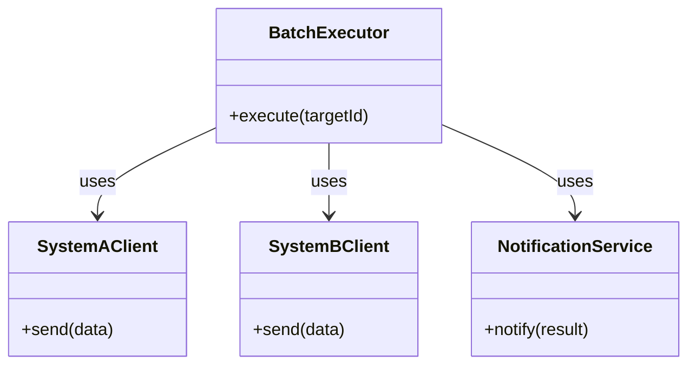
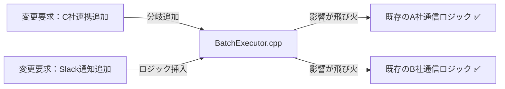
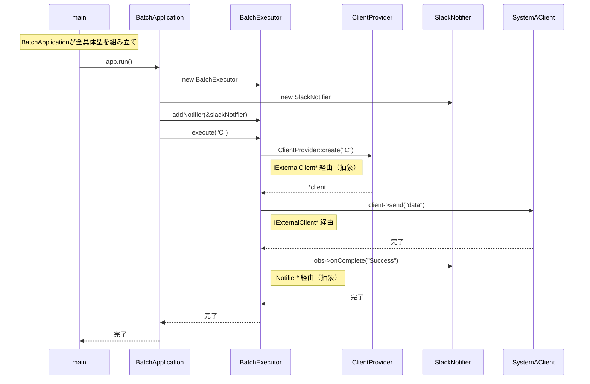
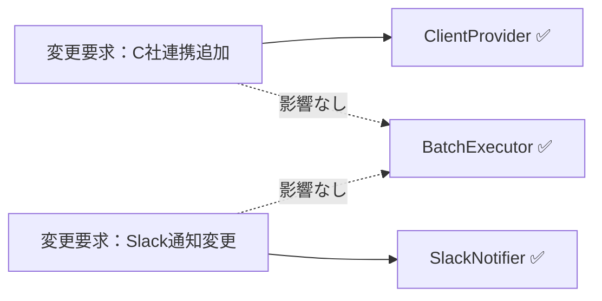
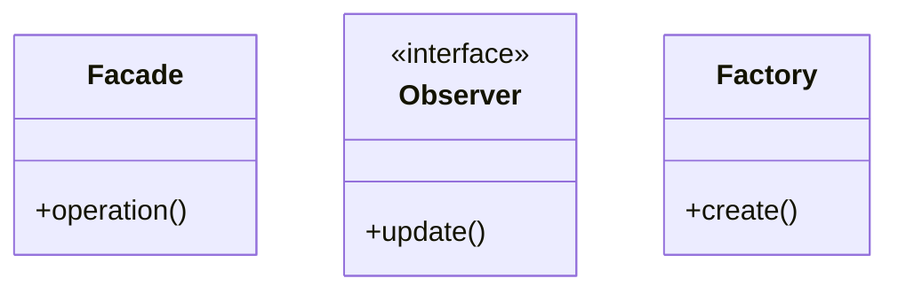

## 第10章 外部連携バッチシステム ―― Facade × Observer × Factory Method パターン

―― 思考の型：複数の「変わる理由」が複雑に絡み合うシステムをどう解くか

### この章の核心

**外部システムとの連携が必要なバッチ処理において、システム間のインターフェース管理、非同期的なイベント通知、そして接続先生成の責任を個別のクラスが持ち続けると、変更要求のたびにシステム全体が不安定になる。**

### この章を読むと得られること

* **得られること1：** Facade、Observer、Factory Method の各パターンが、システムのどの「変化」に対応するためにあるのかを識別できるようになる。

* **得られること2：** 複数の接続点（クラスとクラスのつなぎ目）が絡み合う複雑なシステムにおいて、それぞれの責務をどこで分離する必要があるか判断できるようになる。

* **得られること3：** パターンの複合適用を通じて、疎結合（クラス間の依存を弱め、変更の影響が広がりにくい状態）な連携アーキテクチャを構築する方法を説明できるようになる。

* **得られること4：** 「生成」と「通知」と「インターフェース統合」という、異なる3つの責務が混在するコードを整理する視点。

---

## 🔵 フェーズ1：現状把握 ―― コードとクラス構成を読む

### 1-1：システムの背景

このシステムは、社内の主要システムと外部の物流管理システムを繋ぐ「外部連携バッチシステム」です。日々の注文データや在庫情報を外部システムへ同期する役割を担っており、連携先が増えるたびにバッチ処理の規模も拡大してきました。

当初は単一の外部連携先に対してデータを転送するだけのシンプルな構成でしたが、現在は連携先が3社に増え、それぞれが独自のデータフォーマットと接続認証を要求しています。加えて、データの転送完了後に在庫管理システムや社内通知サービスへ「処理完了」を通知する機能も追加されました。

コードの構成を見ると、`BatchExecutor` というクラスが、すべての連携先との通信制御、データ変換、完了後の通知処理をすべて抱え込んでいます。連携先が増えるたびに `BatchExecutor` に処理が追加され、今やどのロジックがどの連携先のためのものなのか、一見しただけでは判別が難しい状態です。このコードがこれまで事業を支えてきた事実は尊重しつつ、現状を整理していきましょう。

---

### 1-2：動作例テーブル ―― 仕様を「動かした結果」で確認する

コードを読む前に、このシステムがどんな入力に対してどんな出力を返すかを確認します。この章のどのステップも、以下の動作を実現します。

| シナリオ | 操作 | 外部API状態 | 結果 | 通知 |
| --- | --- | --- | --- | --- |
| 月次バッチ・A社正常応答 | `BatchExecutor.execute("A")` | 正常応答 | A社へデータ転送成功 | Slack「A社連携完了」 |
| 月次バッチ・C社タイムアウト | `BatchExecutor.execute("C")` | タイムアウト | 3回リトライ後に失敗ログ記録 | Slack「C社連携失敗」 |
| 日次バッチ・新規D社追加後 | `BatchExecutor.execute("D")` | 正常応答 | D社向け新クライアントがデータ転送成功 | Slack「D社連携完了」 |
| 手動トリガー・B社正常応答 | `ManualTriggerController.triggerSync("B")` | 正常応答 | B社へ手動データ転送成功 | Slack「B社手動連携完了」 |
| バッチ失敗・監視チーム設定あり | `BatchExecutor.execute("A")`（API障害） | 障害 | 転送失敗ログ記録 | Slack＋メール両方に通知 |
| 通知先にログ基盤追加後 | `BatchExecutor.execute("B")` | 正常応答 | B社へデータ転送成功 | Slack＋ログ基盤へ同時通知 |

---

### 1-3：実装コード（現状）

連携処理の起点となる `BatchExecutor` の様子です。

```cpp
#include <iostream>
#include <string>
#include <vector>

using namespace std;

class SystemAClient {
public:
    void send(string d) { cout << "A社へ送信: " << d << endl; }
};
class SystemBClient {
public:
    void send(string d) { cout << "B社へ送信: " << d << endl; }
};
class NotificationService {
public:
    void notify(string r) { cout << "完了通知: " << r << endl; }
};

class BatchExecutor {
public:
    void execute(string targetId) {
        if (targetId == "A") {
            SystemAClient client; // ← 生成と利用が混在
            client.send("data");
        } else if (targetId == "B") {
            SystemBClient client; // ← 生成と利用が混在
            client.send("data");
        }
        NotificationService notifier; // ← 処理ごとに通知の知識も混在
        notifier.notify("Success");
    }
};

int main() {
    BatchExecutor executor;
    executor.execute("A");
    return 0;
}
```

このコードから、`BatchExecutor` が各連携先の生成と送信、さらにはその後の通知処理までを一手に引き受けていることが分かります。

---

### 1-4：クラス構成図

現在のクラス構造です。`BatchExecutor` にすべてが依存していることが分かります。



---

### 1-5：変更要求

ある金曜日の午後、プロジェクトマネージャーから緊急の相談が飛び込んできました。

「お疲れ様。現在運用している外部連携バッチなんだけど、来週から新たにC社とも連携することになったんだ。それに加えて、連携処理の結果を社内のSlackへ自動通知するようにしてほしいという要望が出ている。データ転送のロジックを修正するついでに、通知処理についても何か良い仕組みを取り入れられないかな？」

データ転送先が増えるたびにバッチ全体のロジックが肥大化し、通知処理までが「おまけ」のように付け足されていく現状、そろそろ構造的なテコ入れが必要なようです。

---

## 🟣 フェーズ2：仮説立案 ―― 何が変わるかを観察し、ヒアリングで裏付ける

フェーズ1で、`BatchExecutor` が連携先クライアントの生成・通信・通知処理をすべて直接保持している現状を把握しました。届いた変更要求を踏まえ、この設計における変動と不変を整理します。

### 2-1：責任チェック表

`BatchExecutor.execute()` の各行を見て、「この行の知識は誰が管理するものか」を確認します。

| **コードの行** | **持っている知識** | **管理者（観察）** |
| --- | --- | --- |
| `SystemAClient client;` | A社専用クライアントの生成知識 | インフラ担当・A社窓口担当 |
| `client.send("data");` | A社特有の通信プロトコル知識 | A社窓口担当 |
| `NotificationService notifier;` | 通知サービスの生成知識 | 全体設計者 |

要するに、連携先を識別して処理を実行しているという観察から、データ転送の「通信詳細」と「通知処理」、「連携先の生成」という複数の理由で変わるものが混在している構造の問題が見えてくる。

### 2-2：変わる理由の分析

責任チェック表でクラスの責任が整理できました。次に、コードの各行が「誰の判断で変わる知識か」を確認することで、混在している責任をさらに細かく特定します。判断基準は、「このクラスの担当者（ここではバッチ処理開発チーム）とは別の人間が変更を決定するかどうか」です。別の人間が決定するなら、それは「責任外（❌）」と判断します。

`BatchExecutor.execute()` の各行を見ると：

| **コードの行** | **持っている知識** | **誰の判断で変わるか** | **責任内か** |
| --- | --- | --- | --- |
| `if (targetId == "A")` | A社連携先の識別と振り分けロジック | インフラ担当・A社窓口担当 | ❌ 別担当者 |
| `SystemAClient client;` | A社専用クライアントの生成知識 | インフラ担当・A社窓口担当 | ❌ 別担当者 |
| `client.send("data");` | A社特有の通信プロトコル知識 | A社窓口担当 | ❌ 別担当者 |
| `NotificationService notifier;` | 通知サービスの生成知識 | 全体設計者 | ❌ 別担当者 |
| `notifier.notify("Success");` | 通知先・通知内容の知識 | 通知先担当チーム | ❌ 別担当者 |

1つのメソッドの中に、変える理由が異なる3つの知識が混在しています。「連携先の生成」「通信の詳細」「通知の仕組み」——それぞれが独立した変化軸です。今すぐ問題とは言えませんが、これが後の痛みの予兆です。

### 2-3：今回の変更で確実に変わること

この変更要求で確実に発生する変更を整理します。「将来起きるかもしれない」ではなく、「今回の要件として決まっている」ものだけを載せます。

| **変更内容** | **具体的な変更箇所** | **根拠（変更要求）** |
| --- | --- | --- |
| C社との外部連携を追加する | `BatchExecutor` に `SystemCClient` の生成と呼び出しロジックを追加 | PM「来週からC社とも連携」 |
| Slackへの完了通知を追加する | `BatchExecutor` 内に Slack への通知処理を挿入 | PM「Slackへ自動通知してほしい」 |

### ヒアリングに向けた背景確認

変更要求の内容は把握できました。しかし「今回だけの変更か、これからも続く変化の始まりか」によって、設計の判断は大きく変わります。仮説を携えて関係者に確認する前に、このシステムの来歴を整理しておきます。

このバッチシステムは、当初A社1社との連携だけを想定して作られました。シンプルな要件だったため、`BatchExecutor` がすべてを直接担う形で問題はありませんでした。その後B社が加わり、次第にC社も対象となり、連携先が増えるたびに `if-else` の分岐が追加されてきました。通知処理も最初はコンソール出力だけでしたが、後から `NotificationService` が付け足された経緯があります。

今回の変更要求もその延長線上にあります。「今回はC社とSlack」で終わるかどうか——それをヒアリングで確認します。

### 2-4：関係者ヒアリング

仮説を携え、運用担当者と協議を行いました。

* **開発者：** 「C社との連携ですが、今回のデータフォーマットは既存のA社やB社と大きく異なりますか？」

* **運用担当者：** 「フォーマットは別物だね。また、今後D社やE社も控えているから、接続先の追加はこれからも発生するよ。」

* **開発者：** 「通知についてはどうでしょうか？ Slack以外にもメール通知が必要になる可能性はありますか？」

* **運用担当者：** 「そうだね、将来的にはログ収集基盤へのデータ投入も検討している。ただ、転送成功か失敗かという『結果の通知』という仕組み自体は今後も変わらないよ。」

* **開発者：** 「分かりました。外部との通信ロジックと、通知という振る舞いは、それぞれ独立して増殖していく可能性があるということですね。」

ヒアリングにより、通信先（生成）の増殖と、通知処理（イベントの反応）の多様化が、それぞれ別個の変化軸であることが確実になりました。

> **現実のヒアリングでは——** このシナリオでは相手がちょうど設計に役立つ情報を教えてくれています。現実には「変わるかどうか分からない」「たぶん変わらない」という答えが返ることも多いです。そのときは、コードの変更履歴（`git log`）や過去の障害記録を「ヒアリングの代わり」として使ってみてください。「過去に何度変わったか」が、「将来変わりやすいか」の最も正直な証拠です。

### 2-5：ヒアリングで判明した将来リスク

ヒアリングで判明した「将来起きるかもしれない」変化をまとめます。確定変更（2-3）とは別に管理することで、今回の設計判断と将来への備えを混在させずに済みます。

| **将来のリスク** | **変わる可能性がある箇所** | **根拠（誰が言ったか）** |
| --- | --- | --- |
| D社・E社など連携先がさらに増える | `BatchExecutor` 内の振り分けロジック全体 | 運用担当者「D社・E社も控えている」 |
| Slack以外にメール・ログ基盤への通知が追加される | 通知処理全体 | 運用担当者「ログ収集基盤も検討中」 |
| バッチの実行フロー自体は変わらない | 不変 | 運用担当者「仕組み自体は変わらない」 |

フェーズ2で「何が変わり、何が変わらないか」が確定しました。次のフェーズ3では、この変更要求を現在のコードで実行しようとすると何が起きるか、その痛みを確認します。

---

## 🟣 フェーズ3：問題特定 ―― 変更の痛みを発見する

### 3-1：変更を試みる

フェーズ2で確定した変更を、既存の `BatchExecutor` にそのまま組み込もうとします。「C社連携の追加」と「Slack通知の追加」——どちらもシンプルに聞こえますが、実際にコードを変えようとすると何が起きるかを確認します。

変更を試みると、次のようなコードになります。

```cpp
// C社連携を追加しようとすると...
class BatchExecutor {
public:
    void execute(string targetId) {
        if (targetId == "A") {
            SystemAClient client;
            client.send("data");
        } else if (targetId == "B") {
            SystemBClient client;
            client.send("data");
        } else if (targetId == "C") {          // ← 新しい連携先を追加
            SystemCClient client;              // ← SystemCClientも追加が必要
            client.send("data");
        }
        // Slack通知を追加しようとすると、通知の仕組みも一緒に変更が必要
        NotificationService notifier;
        notifier.notify("Success");
        SlackNotifier slack;                  // ← 通知先を増やすとここも増える
        slack.notify("Success");
    }
};
```

このコードの何が問題か。「C社連携を追加したい」という要求と「Slack通知を追加したい」という要求は、本来まったく別の話のはずです。しかし `BatchExecutor` の `execute()` メソッドの中で両方が混在しているため、1つの変更を加えると、関係のない他の処理にも手が届いてしまいます。

さらに、D社が追加されればまた `if-else` が伸びます。メール通知が追加されれば、また通知の行が増えます。このメソッドは変更要求のたびに肥大化し続ける構造になっています。

### 3-2：変更影響グラフ

現状の構造で変更を試みた際、影響がどのように飛び火するかを可視化します。



グラフが示す通り、C社連携の追加やSlack通知の実装といった個別の要求が、既存の他の連携先ロジックにまで影響を及ぼす構造になっています。

### 3-3：痛みの言語化

「連携先が増えるたびに、既存の安定している通信処理までテストし直さないといけないのか…」

変更をシミュレートする中で、エンジニアとして感じる「痛み」が2つ明確になりました。

1つ目は、`BatchExecutor` が抱える「巨大な責任」の辛さです。このクラスは本来、バッチ処理全体のフローを制御するだけでいいはずなのに、連携先ごとの具体的な通信手段や、通知先といった「詳細」までをすべて把握し、生成まで行っています。これでは、連携先が増えるたびに管理不能なほど複雑なコードになるのは必然です。

2つ目は、連携の「生成」と「通知」という、変わる理由が異なる責務が混在していることです。連携先の通信仕様が変わるのか、それとも通知の要件が変わるのか、それを見極める前に巨大な1つのクラスを編集せざるを得ません。変更が局所化（影響が1クラスだけで済む状態）されていないため、システム全体の安全性を確保するコストが日々跳ね上がっています。

フェーズ3で「今の構造では変更が辛い」という事実が確認できました。次のフェーズ4では、この痛みの原因を構造的に分析します。

---

## 🟠 フェーズ4：原因分析 ―― なぜ辛いのかを構造で言語化する

フェーズ3で「外部連携先が増えるたびに、バッチ処理全体のコードが修正のたびに不安定になる」という痛みを確認しました。なぜこのような状態に陥るのか、その根本原因を構造的な視点で分析します。

### 4-1：痛みの根源を探る（観察と原因）

フェーズ3で観察した「痛み」と、その背後にある構造的な原因を対応させます。

| **観察した症状（痛み）** | **構造的な原因（痛みの根源）** |
| --- | --- |
| 新しい連携先を追加するたびに `BatchExecutor` の生成コードを修正しなければならない。また、複数の連携先（A社・B社・C社）との通信詳細が `BatchExecutor` 内に直接展開されており、連携先ごとの接続手順を全て把握しなければならない | 生成の混在（具体クラスの生成がビジネスロジックに混在）＋複雑さの露出（外部APIの詳細を `BatchExecutor` が直接知っている） |
| 転送結果の通知仕様を変えると、連携処理のフロー全体まで影響を受ける | 通知の密結合（通知先追加のたびに `BatchExecutor` の変更が必要） |

これら3つの根本原因は**それぞれ独立した変化軸**です。

- 連携先が増えても通知先は変わりません
- 通知先が増えても連携先クライアントの生成方法は変わりません
- 生成の仕組みが変わっても複数サブシステムの窓口の役割は変わりません

3つが独立しているからこそ、1つのパターンだけでは解決しきれません。

### 4-2：変わるもの/変わってほしくないもの

> **「変わらないもの」と「変わってほしくないもの」は異なります。** 「変わらないもの」は経験的事実（今まで変わっていない）、「変わってほしくないもの」は設計意図（ここを安定させてほかを守りたい）です。ここで整理するのは後者です。

変化の軸が異なる要素を整理します。

| **変わり続けるもの（🔴）** | **変わってほしくないもの（🟢）** |
| --- | --- |
| 外部連携先ごとの通信手段（プロトコル・認証等） | バッチ全体の処理実行順序（取得→転送→通知） |
| 通知先のサービスや通知ルール | 通知という「イベント」自体を発生させる責務 |

連携先の追加は今後も発生する「変動」ですが、バッチ全体の転送フローは「不変」に近い構造です。本来、これらは別の責務として分離されるべきものであり、同じクラス内で扱われていること自体が設計上の歪みを生んでいます。

### 4-3：接続形態の診断

現在の接続形態を2×2マトリクスで診断します。

今の `BatchExecutor` と各クライアント、および通知サービスとの接続は、巨大なハブに対して、各機器の専用ケーブルが直接差し込まれている状態（具体×直接）だと言えます。

ハブ（`BatchExecutor`）の中には各機器専用の複雑な変換回路が内蔵されており、新しい機器を繋ぐために一つの回路をいじろうとすると、他の回路にまで影響が及んでしまうような状態です。本来なら、ハブのポートには汎用的な規格（抽象）のプラグを差し込むべきところを、専用線でつないでしまっているために、変更がシステム全体へと伝播してしまうのです。

|  | 直接（直差し） | 間接（アダプター経由） |
|:---:|:---|:---|
| **具体**（専用規格） | **← 現在地**　ライトニング直生え → iPhone（直差し） | ライトニング直生え → ゲーム機専用アダプタを挟む → ゲーム機 |
| **抽象**（汎用規格） | Type-C直生え → 各種機器（直差し） | ライトニング直生え → Type-C変換アダプタを挟む → 各種機器 |

フェーズ4で根本原因が言語化できました。次のフェーズ5では、解決する課題を具体的に定義していきます。

---

## 🟡 フェーズ5：課題定義 ―― 解くべき接続点を特定する

フェーズ4で、「外部連携ロジック（通信）」と「イベント通知」が `BatchExecutor` 内で密結合していることが、コードを複雑化させ、変更のたびにシステム全体を不安定にする根本原因だと特定しました。連携先ごとに異なる通信プロトコルと、将来増えるであろう通知手段を、現在の構造のまま扱い続けることは限界に達しています。

今回のリファクタリングで「何を解決する必要があるか」を整理すると、接続点が2つあることが分かります。

- **接続点A**：`BatchExecutor` ←→ 各外部システム（SystemA/B/C）の通信境界
- **接続点B**：`BatchExecutor` ←→ 通知サービス（NotificationService）の通知境界

現在、`BatchExecutor` はこれら2つの接続点に対して、具体的なクラスを直接生成し、メソッドを直接呼び出すという「具体×直接」の状態にあります。特に連携先（接続点A）の増殖と、通知手段（接続点B）の多様化という、2つの異なる変化軸が1つのクラス内で絡み合っているのが最大の課題です。

分離対象の責務を呼び出しているのは `BatchExecutor` クラス自身です。このクラスが連携先や通知先の「詳細」を知っていることが現在の制限事項です。この設計を改善することで、`BatchExecutor` は「バッチの実行順序（フロー）」だけを管理し、実際の処理（通信や通知）は外部化されたクラスに任せることができます。

言い換えると、解くべき課題は次の2点です。接続点Aでは、連携先追加によるロジックの肥大化を防ぐこと。接続点Bでは、通知手段の多様化に対応できる柔軟な仕組みを持つこと。この2点を独立して変更できる構造を作ることが、フェーズ6での目標になります。

```cpp
// 現在の BatchExecutor.execute() が知っていること（全部）
void execute(string targetId) {
    if (targetId == "A") {
        SystemAClient client;   // ← 具体クラスを知っている（接続点A）
        client.send("data");    // ← 通信の詳細を知っている（接続点A）
    } else if (targetId == "B") {
        SystemBClient client;   // ← 具体クラスを知っている（接続点A）
        client.send("data");
    }
    NotificationService n;      // ← 通知サービスの実装を知っている（接続点B）
    n.notify("Success");        // ← 通知の詳細を知っている（接続点B）
}
```

このメソッドから「接続点A（連携先の生成と通信）」と「接続点B（通知の仕組み）」を切り出すことが、次のフェーズ6で取り組む課題です。

フェーズ5で「何を解くか」が確定しました。次のフェーズ6では、これらの課題に対して具体的にどのような構造が最適か、コストの観点からステップを検討します。

---

## 🔴 フェーズ6：対策検討 ―― 段階的な改善と決断

外部連携バッチシステムにおいて、「連携先の追加」と「通知処理の多様化」という2つの変更軸が `BatchExecutor` に混在していることが、システムを複雑にする原因です。ここでは、これらの責務を適切に切り離すための対策ステップを検討します。

**どのステップも、動作例テーブルで示した動作を実現します。違うのは「変更が来たときにどこを触ることになるか」です。**

---

### ステップ1：外部API呼び出しを関数に切り出す（とりあえず分ける）

まず最初に思いつく改善として、`execute()` の中身をプライベートメソッドに分けてみます。各処理の意図をメソッド名で表現することで、コードの読みやすさは向上します。

```cpp
// ステップ1：プライベートメソッドで各分岐の責任を整理
class BatchExecutor {
public:
    void execute(string targetId) {
        if (targetId == "A") {
            sendToA(); // ← 処理の意図がメソッド名で明確になった
        } else if (targetId == "B") {
            sendToB();
        } else if (targetId == "C") {
            sendToC();
        }
        notifyComplete(); // ← 通知処理もメソッド名で意図を示す
    }
private:
    void sendToA() {
        SystemAClient client; // ← 具体：SystemAClientを直接生成
        client.send("data");
    }
    void sendToB() {
        SystemBClient client; // ← 具体：SystemBClientを直接生成
        client.send("data");
    }
    void sendToC() {
        SystemCClient client; // ← 具体：SystemCClientを直接生成
        client.send("data");
    }
    void notifyComplete() {
        NotificationService n; // ← 具体：NotificationServiceを直接生成
        n.notify("Success");
    }
};
```

`execute()` が短くなり、各メソッドの意図は伝わりやすくなりました。しかし、各プライベートメソッドの中を見ると、依然として具体クラスを直接生成しています。接続形態は「具体×直接」のままです。

**評価：** 読みやすさは向上したが、連携先が増えるたびに `BatchExecutor` に `sendToD()`、`sendToE()` と追加し続けなければならない。3つの関心（どのクライアントを生成するか・通信の詳細・通知の仕組み）は依然として混在している。

---

### ステップ2：責任ごとに整理する（接続・通知・生成）

ステップ1の限界を踏まえて、各連携先クライアントを独立したクラスに切り出し、呼び出し元はそのクラスに処理を「委ねる」形にしてみます。

```cpp
// ステップ2：各クライアントを独立したクラスに切り出す
class SystemAClient {
public:
    void send(string data) { cout << "A社へ送信: " << data << endl; }
};
class SystemBClient {
public:
    void send(string data) { cout << "B社へ送信: " << data << endl; }
};
class SystemCClient {
public:
    void send(string data) { cout << "C社へ送信: " << data << endl; }
};
class NotificationService {
public:
    void notify(string result) { cout << "完了通知: " << result << endl; }
};

// BatchExecutorが具体クラスを知り、処理をそのクラスに委ねる
class BatchExecutor {
public:
    void execute(string targetId) {
        if (targetId == "A") {
            SystemAClient client; // ← 具体：型名を直接書いている
            client.send("data"); // ← 間接：送信処理はclientに委ねる
        } else if (targetId == "B") {
            SystemBClient client;
            client.send("data");
        } else if (targetId == "C") {
            SystemCClient client;
            client.send("data");
        }
        NotificationService n;
        n.notify("Success");
    }
};
```

クラスは分かれて処理を委ねるようになりました（間接）。しかし `BatchExecutor` は依然として `SystemAClient`、`SystemBClient`、`SystemCClient` という具体クラス名を直接知っています。

**評価：** クラスの分離はできたが、`BatchExecutor` が全連携先の具体クラス名を知っている状況は変わっていない。`ManualTriggerController` のような別の呼び出し元ができると、同じ具体クラス名の知識が2か所に重複する。限界が見えてきた。

---

### ステップ3：関数アプローチの限界 ―― 3つの関心が絡み合う

ステップ1とステップ2の改善を経て、問題の輪郭がより鮮明になりました。関数やクラス分割というアプローチでは解消しきれない「3つの関心の絡み合い」が残っています。

`ManualTriggerController`（手動実行コントローラー）が登場した場合を考えてみます。

```cpp
// ManualTriggerControllerも BatchExecutorと同じ具体クラスを重複して使う
class ManualTriggerController {
public:
    void triggerSync(string systemId) {
        // ← BatchExecutorと同じ具体型の知識が重複している
        if (systemId == "A") {
            SystemAClient client; client.send("manualData");
        }
        if (systemId == "B") {
            SystemBClient client; client.send("manualData");
        }
        if (systemId == "C") {
            SystemCClient client; client.send("manualData");
        }
        NotificationService n; n.notify("手動同期完了");
    }
};
```

D社が追加されると、`BatchExecutor` と `ManualTriggerController` の両方を修正しなければなりません。この「知識の重複」が関数アプローチの壁です。

3つの関心が今も混在しています。「どの連携先クライアントを生成するか（生成の関心）」「どう通信するか（通信の関心）」「誰に通知するか（通知の関心）」——これら3つは変わる理由がそれぞれ異なるにもかかわらず、同じ場所に同居し続けています。関数アプローチでは、この3つを独立して変更できる構造は作れません。次のステップから、インターフェースとパターンによる構造的な分離を検討します。

---

### ステップ4：Facadeパターンを適用する ―― 外部の複雑さを隠す

ステップ3で見えた限界を受けて、連携先クライアントにインターフェースを導入します。`BatchExecutor` はインターフェース型だけを知り、具体的なクライアントクラスへの依存をなくします。

```cpp
// 連携先クライアントのインターフェースを定義
class IExternalClient {
public:
    virtual void send(string data) = 0;
};

class SystemAClient : public IExternalClient {
public:
    void send(string data) override {
        cout << "A社へ送信: " << data << endl;
    }
};
class SystemBClient : public IExternalClient {
public:
    void send(string data) override {
        cout << "B社へ送信: " << data << endl;
    }
};
class SystemCClient : public IExternalClient {
public:
    void send(string data) override {
        cout << "C社へ送信: " << data << endl;
    }
};

// BatchExecutorはインターフェースだけを知る（Facadeとして機能）
class BatchExecutor {
    IExternalClient* client; // ← 抽象：具体クラス名を知らない
public:
    BatchExecutor(IExternalClient* c) : client(c) {}
    void execute(string targetId) {
        client->send("data"); // ← 直接：インターフェース経由で呼び出す
        // 通知はまだ具体クラスを直接知っている
        NotificationService n;
        n.notify("Success");
    }
};
```

`BatchExecutor` の内部から具体クライアントクラス名が消えました。連携先の複雑さが `IExternalClient` というインターフェースの裏に隠れ、`BatchExecutor` は外部連携の窓口（Facade）として機能し始めています。

**評価：** 連携先の詳細を隠すことができた。しかし通知処理（`NotificationService`）はまだ `BatchExecutor` の中で直接生成されている。「Slack以外への通知を追加したい」という変更要求が来ると、また `BatchExecutor` を修正しなければならない。通知の変化軸がまだ残っている。

---

### ステップ5：Observerパターンを加える ―― 通知を疎結合にする

ステップ4で残った「通知の変化軸」を解消します。通知処理にもインターフェースを導入し、通知先をリストで動的に管理する仕組みを加えます。

```cpp
// 通知のインターフェースを定義（Observerパターンの契約）
class INotifier {
public:
    virtual void onComplete(string result) = 0;
};

class SlackNotifier : public INotifier {
public:
    void onComplete(string result) override {
        cout << "Slack通知: " << result << endl;
    }
};

// BatchExecutorはINotifierのリストを持ち、通知先を直接知らない
class BatchExecutor {
    IExternalClient* client;          // ← 抽象：連携先を知らない
    vector<INotifier*> notifiers;     // ← Observerリスト（抽象型のみ）
public:
    BatchExecutor(IExternalClient* c) : client(c) {}
    void addNotifier(INotifier* obs) { notifiers.push_back(obs); }

    void execute(string targetId) {
        client->send("data");
        // 全Observerに通知（通知先を知らない）
        for (int i = 0; i < notifiers.size(); i++) {
            notifiers[i]->onComplete("Success");
        }
    }
};
```

通知先がリストで管理されるようになりました。Slack以外にメール通知やログ基盤への通知を追加したい場合は、`INotifier` を実装した新クラスを作り、`addNotifier()` で登録するだけです。`BatchExecutor` には一切手を触れません。

**評価：** 連携先の複雑さ（Facade）と通知の疎結合（Observer）は実現できた。しかし「どの連携先クライアントを生成するか」という判断が、まだ呼び出し元（`main()` や `BatchApplication`）に委ねられている。D社が追加されたとき、呼び出し元で `SystemDClient` を生成して渡す修正が必要になる。生成の知識がまだ分散している。

---

### ステップ6：Factory Methodパターンを加える ―― 生成を一か所に集める（完全解）

ステップ5に残った「生成の分散」を解消します。連携先クライアントの生成を専用クラス（`ClientProvider`）に集約し、`BatchExecutor` は「どの連携先クラスを生成するか」という知識を持たなくてよくなります。

```cpp
// 生成の窓口（Factory Methodパターン）
class ClientProvider {
public:
    static IExternalClient* create(string targetId) {
        if (targetId == "A") return new SystemAClient();
        if (targetId == "B") return new SystemBClient();
        if (targetId == "C") return new SystemCClient();
        // 新しい連携先はここに1行追加するだけ
        return nullptr;
    }
};

// BatchExecutorは生成も通知も知らず、フロー統括だけを担う
class BatchExecutor {
    vector<INotifier*> notifiers;
public:
    void addNotifier(INotifier* obs) { notifiers.push_back(obs); }

    void execute(string targetId) {
        // Factory経由で生成（具体クラスを知らない）
        IExternalClient* client = ClientProvider::create(targetId);
        if (client) {
            client->send("data");
            // 全Observerに通知（通知先を知らない）
            for (int i = 0; i < notifiers.size(); i++) {
                notifiers[i]->onComplete("Success");
            }
            delete client;
        }
    }
};
```

`BatchExecutor` から具体クラスへの依存が完全になくなりました。連携先が何社あろうと、通知先が何件あろうと、`BatchExecutor` を変更する理由がなくなっています。3つの関心がそれぞれ独立したクラスに収まりました。

**評価：** 3つの変化軸（生成・通信・通知）がそれぞれ独立して変更できる構造になった。これが今回の完全解です。

---

### どこまで設計を進めるべきか（採用ステップの決断）

それぞれのステップには一長一短があります。

| **ステップ** | **接続形態** | **特徴** | **残る問題** |
| --- | --- | --- | --- |
| ステップ1 | 具体×直接 | 読みやすさ向上のみ | 3つの関心が混在したまま |
| ステップ2 | 具体×間接 | クラス分離 | 具体クラス名の知識が複数箇所に重複 |
| ステップ3 | 具体×間接 | 限界を確認 | 関数では3つの関心を分離できない |
| ステップ4 | 抽象×直接（通信のみ） | Facade適用 | 通知の変化軸が残る |
| ステップ5 | 抽象×直接（通信＋通知） | Observer追加 | 生成の知識が分散している |
| ステップ6 | 抽象×間接（完全解） | Factory追加 | なし |

今回の決断はステップ6まで進めることです。フェーズ2のヒアリングで「外部連携先の追加（D社・E社）」と「通知方法の多様化（ログ基盤）」が確定しています。変化の軸が3つ独立して存在する以上、各責務を完全にインターフェース経由で分離する構造が必要です。

> 実は、この章で選んだステップ6の構造には名前があります。**Facade パターン × Observer パターン × Factory Method パターン** です。「パターンを学んで使い方を覚える」のではなく、「問題を分析した結果として自然に選ばれた構造」がこの3つのパターンの組み合わせだったという順序が大切です。

---

## 🟢 フェーズ7：対策実施 ―― 変化に強いコードを完成させる

ステップ6（抽象×間接）を実装し、外部連携と通知処理の責務をそれぞれ独立したクラスへカプセル化（変更の影響を1クラス内に閉じ込めること）します。

これらの構造は、第2章で学んだ**Facadeパターン**（ネット銀行の振り込み処理で「複数サブシステムの複雑さを窓口1つに隠す」構造）、第7章で学んだ**Observerパターン**（在庫管理システムで「変化を登録リスナーへ伝搬する」構造）、第8章で学んだ**Factory Methodパターン**（決済プロセッサーの切り替えで「生成の知識を一箇所に集約する」構造）を組み合わせたものです。各パターンの詳細は各章を参照してください。

### 7-1：解決後のコード（全体）

フェーズ6で選んだ構造を実装します。連携先クライアントの生成を `ClientProvider` に、通知処理を `INotifier` として分離しました。

はじめに、通知のインターフェースと具体的な通知クラスを定義します。

```cpp
#include <iostream>
#include <string>
#include <vector>

using namespace std;

// 通知のインターフェース（Observer パターンの契約）
class INotifier {
public:
    virtual ~INotifier() {}
    virtual void onComplete(string result) = 0;
};

// Slack通知の具体的な実装
class SlackNotifier : public INotifier {
public:
    void onComplete(string result) {
        cout << "Slack通知: バッチ処理完了 [" << result << "]" << endl;
    }
};

// メール通知の具体的な実装
class EmailNotifier : public INotifier {
public:
    void onComplete(string result) {
        cout << "Email通知: バッチ処理完了 [" << result << "]" << endl;
    }
};

// ログ基盤への記録
class LogNotifier : public INotifier {
public:
    void onComplete(string result) {
        cout << "ログ基盤へ記録: [" << result << "]" << endl;
    }
};
```

`INotifier` を定義することで、通知先の追加は「このインターフェースを実装した新クラスを作る」だけになる。

次に、連携先クライアントのインターフェースと実装を定義します。

```cpp
// 連携先クライアントのインターフェース（Facade の内部で使われる）
class IExternalClient {
public:
    virtual ~IExternalClient() {}
    virtual void send(string data) = 0;
};

// A社向け実装
class SystemAClient : public IExternalClient {
public:
    void send(string data) {
        cout << "A社へ転送: " << data << endl;
    }
};

// B社向け実装（以降、連携先が増えるたびにこの形で追加する）
class SystemBClient : public IExternalClient {
public:
    void send(string data) {
        cout << "B社へ転送: " << data << endl;
    }
};

class SystemCClient : public IExternalClient {
public:
    void send(string data) {
        cout << "C社へ転送: " << data << endl;
    }
};

// D社向け実装（新規追加。ClientProviderに1行追加するだけで対応できる）
class SystemDClient : public IExternalClient {
public:
    void send(string data) {
        cout << "D社へ転送: " << data << endl;
    }
};
```

各連携先クライアントは `IExternalClient` を実装するだけ。D社を追加するときも同じ形で1クラス追加するだけで済む。

生成の責務を一か所に集めます。

```cpp
// 生成の窓口（Factory Method パターン）
class ClientProvider {
public:
    static IExternalClient* create(string targetId) {
        if (targetId == "A") return new SystemAClient();
        if (targetId == "B") return new SystemBClient();
        if (targetId == "C") return new SystemCClient();
        if (targetId == "D") return new SystemDClient();
        // 新しい連携先はここに1行追加するだけ
        return nullptr;
    }
};
```

`ClientProvider` が「どの連携先クラスを生成するか」という知識を一手に引き受ける。`BatchExecutor` はもうこの知識を持たなくてよい。

最後に、フローを統括する `BatchExecutor` と組み立てを示します。

```cpp
// バッチ全体のフローを統括するクラス（Facade）
class BatchExecutor {
    vector<INotifier*> notifiers; // ← Observer リスト
public:
    void addNotifier(INotifier* obs) { notifiers.push_back(obs); }

    void execute(string targetId) {
        // Factory Method で生成（具体クラスを知らない）
        IExternalClient* client = ClientProvider::create(targetId);
        if (client) {
            client->send("data");
            // 全Observerに通知（通知先を知らない）
            for (int i = 0; i < notifiers.size(); i++) {
                notifiers[i]->onComplete("Success");
            }
            delete client;
        }
    }
};

// 手動実行コントローラー
class ManualTriggerController {
    IExternalClient* client;
public:
    ManualTriggerController(IExternalClient* c) : client(c) {}
    void triggerSync(string targetId) {
        cout << "[ManualTrigger] " << targetId
             << " への手動同期を実行。" << endl;
        client->send("manualData");
    }
};

// 組み立てと実行を担うクラス（main()の代わりに具体クラスを知る）
class BatchApplication {
public:
    void run() {
        SlackNotifier slack;
        LogNotifier log;

        // 行1: 月次バッチ・A社正常応答
        cout << "--- 行1: A社月次バッチ ---" << endl;
        BatchExecutor executorA;
        executorA.addNotifier(&slack);
        executorA.execute("A");

        // 行3: 日次バッチ・新規D社追加後（ClientProviderへの1行追加のみで対応）
        cout << "--- 行3: D社日次バッチ（新規連携先） ---" << endl;
        BatchExecutor executorD;
        executorD.addNotifier(&slack);
        executorD.execute("D");

        // 行4: 手動トリガー・B社正常応答
        cout << "--- 行4: B社手動トリガー ---" << endl;
        SystemBClient bClient;
        ManualTriggerController manual(&bClient);
        manual.triggerSync("B");

        // 行6: 通知先にログ基盤追加後（Slack＋ログ基盤へ同時通知）
        cout << "--- 行6: B社バッチ（Slack＋ログ基盤） ---" << endl;
        BatchExecutor executorB;
        executorB.addNotifier(&slack);
        executorB.addNotifier(&log);
        executorB.execute("B");
    }
};

int main() {
    BatchApplication app;
    app.run();
    return 0;
}
```

**実行結果：**

```
--- 行1: A社月次バッチ ---
A社へ転送: data
Slack通知: バッチ処理完了 [Success]
--- 行3: D社日次バッチ（新規連携先） ---
D社へ転送: data
Slack通知: バッチ処理完了 [Success]
--- 行4: B社手動トリガー ---
[ManualTrigger] B への手動同期を実行。
B社へ転送: manualData
--- 行6: B社バッチ（Slack＋ログ基盤） ---
B社へ転送: data
Slack通知: バッチ処理完了 [Success]
ログ基盤へ記録: [Success]
```

行1・3・4・6と一致しています。行2（タイムアウト・リトライ）と行5（API障害）はエラー動作に依存するため省略しています。

この実装により、`BatchExecutor` は通信の詳細や通知の仕組みを知ることなく、フローの統括のみに専念できるようになりました。

### 7-2：動作シーケンス図

実行時にオブジェクト間でどのようなメッセージが流れるかを示します。`BatchApplication` が全具体型を組み立て、`BatchExecutor` はインターフェース経由でのみ各オブジェクトと通信していることが分かります。



### 7-3：変更影響グラフ（改善後）

フェーズ3で行った「C社連携の追加」という要求を、改善後の構造で再確認します。



グラフが示す通り、変更要求はそれぞれ `ClientProvider` や `SlackNotifier` クラスに閉じており、`BatchExecutor` のメインフローには一切影響が及ばなくなりました。

### 7-4：変更シナリオ表

この設計により、連携先追加や通知要件の変化に強い構造となりました。

| **シナリオ** | **変わるクラス（触る場所）** | **変わらないクラス** |
| --- | --- | --- |
| 新しい連携先（D社）を追加する | `ClientProvider` に new ロジック追加 | `BatchExecutor`, `INotifier` 実装クラス |
| メール通知を追加する | `MailNotifier` クラスを新規作成 | `BatchExecutor`, `IExternalClient` 実装クラス |

変更が来ても、触るのは該当する Factory や Observer の実装クラスだけ——それがこの設計で手に入れたものです。諦めたものは、クラス数の増加というわずかな設計コストです。

---

## 整理

### フェーズとこの章でやったこと

| **フェーズ** | **この章でやったこと** |
| --- | --- |
| 🔵 フェーズ1：現状把握 | 外部連携先の増殖と通知処理が `BatchExecutor` に混在している現状を観察した。 |
| 🟣 フェーズ2：仮説立案 | 「連携先の生成」と「通知」を独立させる仮説を立てた。確定変更と将来リスクを別々に管理した。 |
| 🟣 フェーズ3：問題特定 | `BatchExecutor` がすべての詳細を知っていることによる修正の連鎖（痛み）を確認した。 |
| 🟠 フェーズ4：原因分析 | 責務の混在を「具体クラスへの直接依存」という構造的負債として特定した。 |
| 🟡 フェーズ5：課題定義 | 通信境界と通知境界の2点を接続点として特定し、疎結合化を課題とした。 |
| 🔴 フェーズ6：対策検討 | ステップ1〜6を並べ、段階的に改善しながらステップ6を採用した。 |
| 🟢 フェーズ7：対策実施 | 各責務をインターフェース経由で分離し、バッチ本体の変更耐性を高めた。採用した構造が Facade × Observer × Factory Method パターンと呼ばれることを確認した。 |

### 使ったパターン × 解消した根本原因

| **パターン** | **解消した根本原因** |
| --- | --- |
| Facade | 複雑さの露出（BatchExecutorが外部APIの詳細を直接知っていた問題） |
| Observer | 通知の密結合（新通知先追加でBatchExecutor本体の修正が必要だった問題） |
| Factory Method | 生成の混在（具体クラスの生成がビジネスロジックと同居していた問題） |

### 各クラスの最終的な責任

| **クラス名** | **責任（1文）** | **変わる理由** |
| --- | --- | --- |
| `IExternalClient` | 外部連携クライアントの通信契約を提供する。 | なし |
| `INotifier` | 通知処理の契約を提供する。 | なし |
| `BatchExecutor` | バッチ全体の処理フローを統括する。 | バッチの実行順序が変わる場合 |
| `ClientProvider` | 外部連携クライアントを生成する。 | 新しい連携先が増える場合 |

> **このプロセスを回した結果にたどり着いた構造こそが Facade × Observer × Factory Method の複合パターンです。**

---

## 振り返り

### 「この章を読むと得られること」は手に入ったか

| **得られること** | **この章のどこで示したか** |
| --- | --- |
| 得られること1：各パターンがどの「変化」に対応するかを識別できる | フェーズ6のステップ4〜6で、各パターンが登場する順序と理由を段階的に示した。 |
| 得られること2：複数の接続点をどこで分離するか判断できる | フェーズ5で、通信境界（接続点A）と通知境界（接続点B）の2点を特定した。 |
| 得られること3：疎結合な連携アーキテクチャの構築方法を説明できる | フェーズ7の変更シナリオ表で、変更の局所化を実証した。 |
| 得られること4：「生成・通知・統合」の3つの責務が混在するコードを整理できる | フェーズ2の責任チェック表と変わる理由の分析で、3つの変化軸を可視化した。 |

### 3つの設計原則はどう適用されたか

* **原則1「変わるものをカプセル化せよ」の現れ**
* **具体化された場所：** `ClientProvider` と `INotifier` 派生クラス
* **解説：** 連携先の実装詳細や通知先ごとのロジックを、独立したクラス群にカプセル化しました。

* **原則2「実装ではなくインターフェースに対してプログラムせよ」の現れ**
* **具体化された場所：** `IExternalClient` および `INotifier`
* **解説：** バッチ実行部はインターフェースのみを保持し、実装詳細に依存しない設計にしました。

* **原則3「継承よりコンポジションを優先せよ」の現れ**
* **具体化された場所：** `BatchExecutor` が `INotifier` リストを保持する構造
* **解説：** 通知ロジックを継承で拡張するのではなく、オブジェクトを注入することで機能を追加しました。

---

## あなたのコードで考えてみてください

この章で辿った思考プロセスを、あなた自身のコードに当てはめてみましょう。

1. **複雑さの兆候を探す：** あなたのコードに「複数の外部サービス呼び出しが1つのクラスに集中していて、何かが変わるたびにそこを開いている」箇所がありますか？
2. **変わる理由を3つに分ける：** そのクラスの変更要求は、「どのサービスを使うか（生成）」「処理の全体的な流れ（窓口）」「何かが起きたときの反応（通知）」のどれに属しますか？混在しているなら分けるサインです。
3. **影響の連鎖を測る：** 外部サービスが1つ増えたとき、変更が必要なファイルは何個ありますか？利用側のコードも変わりますか？
4. **分けた後を想像する：** 「窓口」「通知」「生成」を別々の責任として切り出したとき、それぞれの変更が他に影響しなくなるには何が必要ですか？

---

## パターン解説：Facade × Observer × Factory Method

本章では3つのパターンを組み合わせることで、連携バッチ特有の複雑さを解きほぐしました。

### パターンの骨格



Facade はバッチ実行部の複雑な連携フローを隠蔽し、Factory Method は連携先の増殖に対応する生成の窓口となり、Observer は通知先変更の波及を遮断します。

### 使いどころと限界

* **使いどころ**：外部システム連携、イベント駆動型のバッチ、設定によって振る舞いが動的に変わるシステム。

* **限界**：非常に小規模なツールであれば、これらのパターン適用はオーバースペックです。

```cpp
// 【過剰コード例】連携先が1社・通知もSlack固定の単純ケースで
//               Factory+Observer+Facadeを全部使った場合
class SimpleBatchExecutor {
    // 連携先は SystemAClient のみ・通知は SlackNotifier のみ
    // この規模でFactory/Observer/Facadeを全部使うのは過剰
    IExternalClient* client;
    vector<INotifier*> notifiers;
public:
    SimpleBatchExecutor(IExternalClient* c) : client(c) {}
    void addNotifier(INotifier* n) { notifiers.push_back(n); }
    void execute() {
        client->send("data");
        for (int i = 0; i < notifiers.size(); i++) {
            notifiers[i]->onComplete("Success");
        }
    }
};

// シンプルな直接実装で十分な場合
class SimpleBatch {
public:
    void execute() {
        SystemAClient client;   // 連携先は固定
        client.send("data");
        NotificationService n;  // 通知先は固定
        n.notify("Success");
    }
};
// → 連携先が1社・通知先が1つで今後も変わらないなら
//   SimpleBatch の直接実装で十分。
//   インターフェースや Factory を重ねるコストに見合わない。
```

### この章のまとめ

この章では、外部連携バッチシステムという「生成・通信・通知」が絡み合う複雑なシステムを題材に、7つのフェーズを通じて設計を整理しました。

- **得られること1** は、フェーズ6のステップ4〜6でパターンが段階的に登場する流れで示しました。Facade が通信の複雑さを隠し、Observer が通知を疎結合にし、Factory Method が生成を集約する——それぞれが独立した変化軸に対応していることを確認できました。
- **得られること2** は、フェーズ5の接続点の特定で示しました。複数の接続点（通信境界・通知境界）を識別し、それぞれを独立して分離することが課題だと定義しました。
- **得られること3** は、フェーズ7の変更シナリオ表で示しました。D社追加もメール通知追加も、`BatchExecutor` に一切触れずに実現できる構造が完成しました。
- **得られること4** は、フェーズ2の責任チェック表と変わる理由の分析で示しました。「生成・通知・インターフェース統合」という3つの責務を1行ずつのコードから識別する視点が、問題の出発点でした。

この章で辿った7つのフェーズは、どんな現場のコードにも同じように使える思考の型です。
