## 第10章 外部連携バッチシステム ―― Facade × Observer × Factory Method パターン

―― 思考の型：複数の「変わる理由」が複雑に絡み合うシステムをどう解くか

### この章の核心

**複数の外部境界、結果通知、具象オブジェクトの生成が一つの処理へ絡む場面では、複雑だから一括で包むのではなく、呼び出し手順・伝達・生成という変化軸を分けます。異なる種類の追加要求が毎回同じ実行処理へ集中するなら、決定理由の異なる知識が混在していることが兆候です。それぞれを適した境界へ局所化し、全体の実行順と失敗方針だけを一か所で再結合できるかが判断軸になります。**

### この章を読むと得られること

* **得られること1：** 窓口構造、通知分離構造、生成分離構造の各構造が、システムのどの「変化」に対応するためにあるのかを識別できるようになる。

* **得られること2：** 複数の接続点（クラスとクラスのつなぎ目）が絡み合う複雑なシステムにおいて、それぞれの責務をどこで分離する必要があるか判断できるようになる。

* **得られること3：** 構造の複合適用を通じて、疎結合（クラス間の依存を弱め、変更の影響が広がりにくい状態）な連携アーキテクチャを構築する方法を説明できるようになる。

* **得られること4：** 「通信」と「通知」と「生成」という、異なる3つの責務が混在するコードを整理する視点。

---

## 🔵 フェーズ1：現状把握 ―― 仕様を整理し、システムと紐付ける

外部連携バッチシステムが何を入力として受け取り、どの処理で加工し、何を出力するのかを整理します。

### 1-1：このシステムの仕様

このシステムは、社内の受注・在庫管理システムと外部の物流管理システムを繋ぐバッチシステムです。運用者から連携先IDと同期対象を受け取り、社内の注文または在庫データを取得します。登録済みの連携先設定から送信クライアントを選び、対象データを相手先形式へ加工して順に送信し、各結果をバッチ履歴へ保存します。最後に成功・失敗件数を集計して運用通知へ渡します。

#### まず代表入力と実行結果から動きをつかむ

詳細な仕様やコードへ入る前に、1-4の`main()`で運用者が「連携先A社・同期対象は注文」を指定してバッチを1件実行する入力を確認します。

**代表入力（1-4の`main()`から抜粋）：**

```cpp
    // 準備：連携先台帳・実行ログ・データ取得元を組み立てる
    PartnerDatabase db;
    BatchLog batchLog;
    OrderDataSource orders;
    InventoryDataSource inventory;
    SyncDataCatalog dataCatalog(orders, inventory);
    BatchExecutor executor(db, batchLog, dataCatalog);

    // 1回目：物流会社A（PARTNER_A）へ注文データを同期する
    executor.execute({"PARTNER_A", SyncTarget::Orders});

    // 2回目：同じ入口へ、別の連携先と別の同期対象を渡す
    executor.execute({"PARTNER_B", SyncTarget::Inventory});

    // 3回目：連携が無効になっている会社を指定する
    executor.execute({"PARTNER_Z", SyncTarget::Orders});
```

この入力に対する代表的な実行結果は次のとおりです。
★以下、区切りが分かりづらい。コード直すと手間だから、せめて、ブロックを３つにわけてはどうか。
他の章でも同様に１つのブロックで出力結果がダラダラ記載されている場合、ブロックで分けてほしい。

```
[送信先] 物流会社A (logistics-a.example)
A社へ送信(1件): 注文 ORD001
[送信結果詳細] A社: 13バイト送信
実行結果を保存(1件): [PARTNER_A] 物流会社A -> 成功
完了通知(1件): 物流会社A 連携完了
[送信先] 在庫会社B (stock-b.example)
B社へ送信(1件): 在庫 SKU001
[送信結果詳細] B社: 13バイト送信
実行結果を保存(2件): [PARTNER_B] 在庫会社B -> 成功
完了通知(1件): 在庫会社B 連携完了
エラー: パートナー [分析会社Z] は現在無効です。処理を中断します。
実行結果を保存(3件): [PARTNER_Z] 分析会社Z -> スキップ（無効）
```

3回並べると、この章の骨格が見えます。**送信先も送るデータも違うのに、「設定を引く → データを取る → 送る → 結果を保存する → 通知する」という順序は変わりません。** 3回目は連携が無効なので送信せずに止まりますが、それでも実行ログには3件目として残ります。**保存件数が1→2→3と積み上がる**ことも、1回だけの実行では見えませんでした。

この入力と出力から、(1)運用者が連携先IDと同期対象を指定し、(2)有効な連携先の確認→社内データ取得→外部API送信→結果保存→社内通知の順に進み、(3)連携先ごとの送信結果と通知結果が残る、という一連の動きが読み取れます。同じ入力を含む完全なコードと実行結果は1-4に掲載します。

#### 最初にシステム全体をつかむ

- **入力：** 連携先IDと、注文または在庫という同期対象を受け取る。
- **処理：** 保存済みの連携先設定を確認し、社内データを取得して対象APIへ送り、その結果を保存して社内通知へ渡す。
- **出力：** 連携先ごとの送信結果、実行ログ、通知結果を返し、未登録・無効な連携先は外部へ送らない。
- **掲載コードでの代替：** 連携先設定と実行ログはメモリ上の登録表、社内データ取得・外部API・通知サービスはデータ蓄積と標準出力を使う境界スタブで表す。送信対象の選択、結果保存、通知までの流れは実際に行う。

まずこの一連の動きを押さえ、以降で要求、連携データ、保存と外部境界、クラス、コードの順に詳細を確認します。

#### 現行要求ベースライン

| 要求ID | 現行要求 | 受入条件 |
|---|---|---|
| 要求ID1 | A社・B社の有効な連携先設定を取得する | 登録済み有効先だけ送信対象になる |
| 要求ID2 | 注文または在庫データを取得して指定先へ送る | 要求した同期対象の実データがAPIへ渡る |
| 要求ID3 | 送信結果をDeliveryResultで返し、BatchLogへ保存する | 連携先ID・名称・状態を1件記録する |
| 要求ID4 | 1件の送信完了を社内通知サービスへ通知する | 送信結果に対応する通知結果を返す |
| 要求ID5 | 未登録・無効な連携先を外部送信せず記録する | スキップまたは失敗結果だけが保存される |

本章の追跡は**要求IDと変更ID**で行います。変更で各要求IDの内容がどう変わるか——継続・変更・追加——は、1-5「変更後要求ベースライン」の「変更種別・根拠となる変更ID」列で追えます。既存動作が落ちていないかは、フェーズ7の要求ID別回帰で確認します。

この章で扱う現状仕様は、次の範囲です。

| 仕様項目 | この章で扱う値 | 具体例 | 何に使うか |
|---|---|---|---|
| 実行入力 | 連携先ID・同期対象 | PARTNER_A・注文 | 接続先と取得する社内データを決める |
| 同期対象データ | 注文データ・在庫情報 | 注文 ORD001、在庫 SKU001 | 外部システムへ送る材料になる |
| 連携先 | 外部物流・在庫システム | PARTNER_A、PARTNER_B | どのAPIへ送るかを決める |
| 通知 | 送信完了の通知 | 社内通知サービスへの完了通知 | バッチ結果を関係先へ知らせる |
| 出力 | 同期結果と通知結果 | PARTNER_A連携成功、完了通知済み | 外部連携と通知の結果を照合する |
| 保存 | 連携先設定と実行結果 | 連携先ID・名称・状態（PARTNER_A・物流会社A・成功） | 設定の参照と実行結果の確認に使う |

ここで確認する対象は、バッチが何を受け取り、どこへ送り、どの結果を返すかです。

外部連携先の接続先や有効状態は、バッチ実行時に毎回手入力する値ではありません。連携先設定として外部連携バッチシステムに保存され、同期要求に応じて読み出されます。また、1件の送信が終わるたびに、連携先ID・名称・状態を実行結果として保存します。

**登録済みの連携先**

連携先マスターには、次の3件が登録されています。無効な連携先や未登録のIDを指定するとエラーになり、スキップまたは失敗として記録されます。

| パートナーID | 名称 | 接続先 | 有効 |
|---|---|---|---|
| PARTNER_A | 物流会社A | logistics-a.example | ✓ |
| PARTNER_B | 在庫会社B | stock-b.example | ✓ |
| PARTNER_Z | 分析会社Z | analytics-z.example | ✗（無効：過去に連携を停止） |

ここでは、実装クラスではなく、まず各システムの境界と、その間を流れるデータを確認します。A社とB社はどちらも現在接続している外部システムです。A社には受注管理システムの注文データ、B社には商品在庫管理システムの在庫情報を送ります。

**システム全体図：保存データとシステム間のやり取り**

最も大きな境界は「運用担当者・社内データ元 → 外部連携バッチシステム → 連携先・通知サービス」です。設定と実行ログだけを対象システムの内側に置きます。

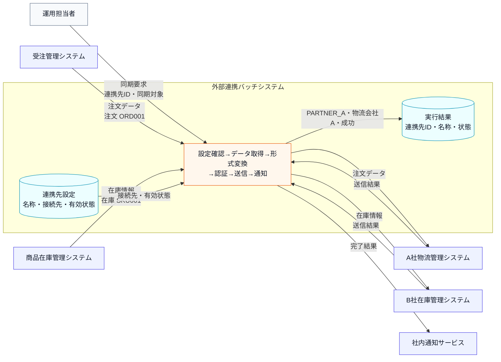
```mermaid
flowchart LR
    O["運用担当者"] -->|"同期要求<br>連携先ID・同期対象"| F
    ORD["受注管理システム"] -->|"注文データ<br>注文 ORD001"| F
    STK["商品在庫管理システム"] -->|"在庫情報<br>在庫 SKU001"| F

    subgraph BATCH["外部連携バッチシステム"]
        CFG[("連携先設定<br>名称・接続先・有効状態")]
        F["設定確認→データ取得→形式変換<br>→認証→送信→通知"]
        LOG[("実行結果<br>連携先ID・名称・状態")]
        CFG -->|"接続先・有効状態"| F
        F -->|"PARTNER_A・物流会社A・成功"| LOG
    end

    F -->|"注文データ"| A["A社物流管理システム"]
    A -->|"送信結果"| F
    F -->|"在庫情報"| B["B社在庫管理システム"]
    B -->|"送信結果"| F
    F -->|"完了結果"| N["社内通知サービス"]

    classDef actor fill:#f8fafc,stroke:#64748b,color:#111827;
    classDef data fill:#ecfeff,stroke:#0891b2,color:#111827;
    classDef process fill:#fff7ed,stroke:#ea580c,color:#111827;
    classDef boundary fill:#eef2ff,stroke:#4f46e5,color:#111827;
    class O actor;
    class CFG,LOG data;
    class F process;
    class ORD,STK,A,B,N boundary;
```

この図は、外部連携バッチシステムを一つの箱として見た図です。運用担当者が渡すのは「連携先ID」と「同期対象」です。バッチは同期対象に応じて受注管理システムまたは商品在庫管理システムからデータを読み、A社またはB社へ送ります。保存する実行結果は抽象的な「バッチ結果」ではなく、「連携先ID・名称・状態」の3項目です。

次に、中央の「外部連携バッチシステム」の箱を開きます。全体図がシステム間の境界と保存項目を示すのに対し、内部図は、入力がどの判定とAPI呼び出しを通って保存・通知へ届くかを示します。

**システム内部図：入力契約・API呼び出し・結果処理**

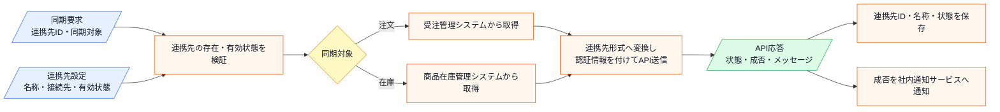
```mermaid
flowchart LR
    A[/"同期要求<br>連携先ID・同期対象"/]:::input --> C["連携先の存在・有効状態を検証"]:::process
    B[/"連携先設定<br>名称・接続先・有効状態"/]:::input --> C
    C --> D{"同期対象"}:::decision
    D -->|"注文"| E["受注管理システムから取得"]:::process
    D -->|"在庫"| F["商品在庫管理システムから取得"]:::process
    E --> G["連携先形式へ変換し<br>認証情報を付けてAPI送信"]:::process
    F --> G
    G --> H[/"API応答<br>状態・成否・メッセージ"/]:::output
    H --> I["連携先ID・名称・状態を保存"]:::process
    H --> J["成否を社内通知サービスへ通知"]:::process

    classDef input fill:#e7f0ff,stroke:#2563eb,color:#111827;
    classDef process fill:#fff7ed,stroke:#ea580c,color:#111827;
    classDef decision fill:#fef9c3,stroke:#ca8a04,color:#111827;
    classDef output fill:#dcfce7,stroke:#16a34a,color:#111827;
```

この二つの図から読み取ることは、次の3点です。

- 受注管理・商品在庫管理・外部連携バッチ・A社/B社の間で、どのデータと結果を受け渡すかが分かる。
- 外部連携バッチシステムは、`連携先ID・同期対象` と保存済み設定を受け、対象データの選択、API送信、結果保存、通知を順に行う。
- 後でコードを読むときは、この仕様上の処理が、どのクラスの責任として実装されているかを1-3以降で対応づける。

現状のシステムは、複数の外部連携先へデータを転送します。連携先はそれぞれ独自のデータフォーマットと接続認証を要求し、データの転送完了後には在庫管理システムや社内通知サービスへ「処理完了」を通知します。

バッチ処理の中枢となる部分が、すべての連携先との通信制御、データ変換、完了後の通知処理を抱えています。この章では、この現状を仕様とコードの対応から整理します。

**現在の連携先システム一覧**

連携先ごとに接続方式や認証方法が異なるのは、各社がそれぞれ独自のAPIを持っており、こちら側がその仕様に合わせる必要があるためです。バッチ種別（月次・手動）も、業務の性質によって決まります。月次バッチは「月末締め処理」、手動トリガーは「緊急の在庫修正」など、業務上の都合を反映したものです。

| 連携先      | 役割       | バッチ種別  | 接続方式              |
| -------- | -------- | ------ | ----------------- |
| A社（物流管理） | 注文データの同期 | 月次バッチ  | REST API（トークン認証）  |
| B社（在庫管理） | 在庫情報の同期  | 手動トリガー | REST API（APIキー認証） |

**バッチ処理の流れ**

この章のシステムのバッチ処理は、「認証→取得→送信→通知」という4ステップの流れで構成されています。認証を毎回行うのは、セッションを使い回さないことで認証情報の流出リスクを抑えるという、セキュリティ上の判断によるものです。完了通知のステップは「転送が成功したかどうかを関係者が知る手段」として存在しており、運用上の監視や障害対応に欠かせません。

| ステップ | 処理内容 |
|---|---|
| (1) 認証 | 連携先のAPIに接続・認証する |
| (2) データ取得 | 社内システムから送信対象データを取得する |
| (3) データ送信 | 連携先のフォーマットに変換してAPIへ送信する |
| (4) 完了通知 | 処理完了を在庫管理システム・社内通知サービスへ通知する |

このフロー自体はどの連携先でも共通する骨格です。一方、各ステップの中身（どの会社のAPIに接続するか、どのサービスへ通知するか）は連携先ごとに変わります。

**この仕様を決める業務機能**

この仕様は複数の業務機能が決めています。インフラ・システム管理の領域はAPIのプロトコルを知っており、通知・連携管理の領域は通知文面のルールを知っています。

| 業務機能 | この章の仕様で決めていること |
|---|---|
| インフラ・システム管理 | 各連携先のAPIプロトコル・認証方式 |
| システム設計・生成管理 | 通知サービスの選定・生成方針 |
| 通知・連携管理 | 通知先の一覧・通知文面のルール |

ここでは、APIの接続方式、連携先の選択、通知の運用が、それぞれ別の業務機能によって決まるという現状だけを押さえます。具体的な変更要求は1-5で初めて確認します。

**エラー条件**

正常系の仕様を一通り確認したうえで、最後に、送信へ進めない条件や外部API失敗を分けて整理します。

| エラー条件 | どこで分かるか | 出力 | 保存・通知などの副作用 |
|---|---|---|---|
| 連携先が未登録、または無効 | 連携先設定の確認時 | 連携先エラー | 外部送信なし、通知なし |
| 外部API送信に失敗する | 外部システムへの送信時 | 送信エラー | 送信結果を保存する。リトライ、再実行キュー、後続ジョブの継続は現状の掲載コードでは扱わない |

### 1-2：動作例テーブル

コードを読む前に、現状システムがどんな入力に対してどんな出力を返すかを確認します。後続の変更要求で初めて追加する動作はここへ混ぜず、1-5で別に定義します。

| 行 | シナリオ | 操作 | 現状の結果 |
|---|---|---|---|
| 1 | A社向け正常実行 | A社向け月次バッチを実行する | A社へ注文データを送り、成功結果を保存して社内通知サービスへ完了通知する |
| 2 | B社向け正常実行 | B社向け同期を実行する | B社へ在庫情報を送り、成功結果を保存して社内通知サービスへ完了通知する |
| 3 | 無効な連携先 | 無効化済みのZ社を指定する | 送信・通知を行わず、スキップ結果を保存して無効エラーを返す |
| 4 | 未登録の連携先 | 未登録のX社を指定する | 送信・通知を行わず、失敗結果を保存して未登録エラーを返す |

次は、この仕様を現状コードのクラスへ対応づけます。

---

### 1-3：登場クラスとクラス構成図

現在のクラス構造に登場するクラスを先に確認します。

| クラス名 | 役割 | 担当する仕様 |
|---|---|---|
| `SyncRequest` | 1回の同期で指定する連携先IDと同期対象を持つ値 | 実行入力 |
| `OrderDataSource` | 受注管理システムから現在の同期対象を取得する境界 | 注文データの取得 |
| `InventoryDataSource` | 商品在庫管理システムから現在の同期対象を取得する境界 | 在庫情報の取得 |
| `SyncDataCatalog` | 同期対象に応じてデータ取得先を選ぶ | 注文・在庫の選択 |
| `PartnerConfig` | 1社分の連携先名・接続先・有効状態を持つ値 | 保存済みの連携先設定 |
| `PartnerDatabase` | 連携先IDごとの設定を保存・検索する | 連携先の存在・有効確認と設定取得 |
| `DeliveryResult` | 送信1件の成否と詳細を受け渡す値 | 外部システムから返る送信結果 |
| `BatchRecord` | 保存する実行結果1件を表す値 | 連携先ID・名称・成否の記録 |
| `BatchLog` | バッチ実行結果を保存・一覧表示する | 実行結果の保存 |
| `BatchExecutor` | 外部連携バッチ全体を実行する | 連携先選択、送信、通知の呼び出し |
| `SystemAClient` | A社向けにデータを送信する | A社連携 |
| `SystemBClient` | B社向けにデータを送信する | B社連携 |
| `NotificationService` | 連携結果を通知する | 完了通知 |

各クラスの責任を把握したところで、クラス間の関係を図で確認します。

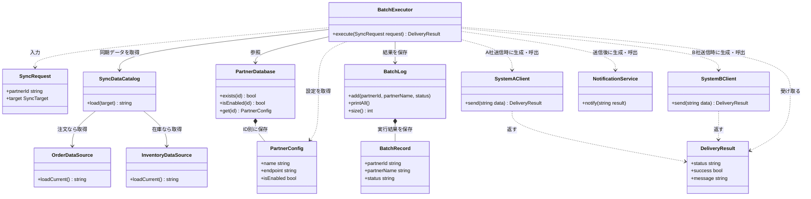
```mermaid
classDiagram
    class SyncRequest {
        +partnerId string
        +target SyncTarget
    }
    class OrderDataSource {
        +loadCurrent() string
    }
    class InventoryDataSource {
        +loadCurrent() string
    }
    class SyncDataCatalog {
        +load(target) string
    }
    class PartnerConfig {
        +name string
        +endpoint string
        +isEnabled bool
    }
    class PartnerDatabase {
        +exists(id) bool
        +isEnabled(id) bool
        +get(id) PartnerConfig
    }
    class DeliveryResult {
        +status string
        +success bool
        +message string
    }
    class BatchRecord {
        +partnerId string
        +partnerName string
        +status string
    }
    class BatchLog {
        +add(partnerId, partnerName, status)
        +printAll()
        +size() int
    }
    class BatchExecutor {
        +execute(SyncRequest request) DeliveryResult
    }
    class SystemAClient {
        +send(string data) DeliveryResult
    }
    class SystemBClient {
        +send(string data) DeliveryResult
    }
    class NotificationService {
        +notify(string result)
    }
    PartnerDatabase *-- PartnerConfig : ID別に保存
    BatchLog *-- BatchRecord : 実行結果を保存
    SyncDataCatalog --> OrderDataSource : 注文なら取得
    SyncDataCatalog --> InventoryDataSource : 在庫なら取得
    BatchExecutor ..> SyncRequest : 入力
    BatchExecutor --> SyncDataCatalog : 同期データを取得
    BatchExecutor --> PartnerDatabase : 参照
    BatchExecutor --> BatchLog : 結果を保存
    BatchExecutor ..> PartnerConfig : 設定を取得
    SystemAClient ..> DeliveryResult : 返す
    SystemBClient ..> DeliveryResult : 返す
    BatchExecutor ..> DeliveryResult : 受け取る
    BatchExecutor ..> SystemAClient : A社送信時に生成・呼出
    BatchExecutor ..> SystemBClient : B社送信時に生成・呼出
    BatchExecutor ..> NotificationService : 送信後に生成・呼出
```

**クラス図に出てくる主な操作**

| クラス | 操作 | 何ができるか |
|---|---|---|
| `SyncRequest` | `partnerId` / `target` | 連携先と取得する同期データを一緒に指定する |
| `OrderDataSource` | `loadCurrent()` | 受注管理システムの同期対象を返す |
| `InventoryDataSource` | `loadCurrent()` | 商品在庫管理システムの同期対象を返す |
| `SyncDataCatalog` | `load()` | 同期対象に応じて注文または在庫を取得する |
| `PartnerConfig` | `name` / `endpoint` / `isEnabled` | 1社分の名称、接続先、有効状態を受け渡す |
| `PartnerDatabase` | `exists()` / `isEnabled()` / `get()` | 連携先の存在・有効状態を確認し、設定を返す |
| `DeliveryResult` | `status` / `success` / `message` | 送信1件の成否と詳細を受け渡す |
| `BatchRecord` | `partnerId` / `partnerName` / `status` | 保存する実行結果1件を表す |
| `BatchLog` | `add()` / `printAll()` / `size()` | 実行結果を追記し、保存件数と内容を確認する |
| `BatchExecutor` | `execute()` | 同期要求を受け取り、データ取得、送信、結果保存、通知を進める |
| `SystemAClient` | `send()` | A社向けに送信し、結果を返す |
| `SystemBClient` | `send()` | B社向けに送信し、結果を返す |
| `NotificationService` | `notify()` | 外部連携の結果を通知する |

図に置いたすべての型は、現状コードで定義され、少なくとも一つの保存・取得・生成・呼び出し関係を持ちます。`DeliveryResult` と `BatchLog` は、変更前からある送信結果の契約と保存方法です。この図に描いてあるのは、現状コードにある型だけです。

**この章での簡略化**

掲載コードで実際に進めるバッチ処理と、外部境界のスタブを分けます。
★REST APIについては、以下に記載不要か？外部API通信の事か。そうであれば、言葉を紐づけてほしい。

| 実システムの要素 | 現状の掲載コードで行うこと | 代替・省略する範囲 |
|---|---|---|
| バッチ起動・認証 | `main()`から連携先IDと同期対象を渡す | ジョブスケジューラ、運用者認証、排他実行は扱わない |
| 連携先設定DB | 固定設定を`std::map`へ登録し、存在・有効状態を実際に照合する | 永続DBと設定管理画面は作らない |
| 社内データ取得 | 注文・在庫の固定データを取得境界から返す | 実際の受注・在庫システム接続は行わない |
| 外部API送信 | 送信対象をクライアントへ渡し、`DeliveryResult`を返す | HTTP通信、認証、タイムアウト、再試行は境界スタブで代替する |
| ログ・通知 | 結果を`vector`へ保存し、通知内容を蓄積して`std::cout`へ出す | 永続ログDB、実通知サービスは使わない |

---

### 1-4：実装コード（現状）

#### コードを読む前に：クラスの責任と境界

この表は、連携先の選択、送信、結果保存、完了通知をどの順で接続するかを示す読解用の地図です。DB・API・通知の代替方法は簡略化節へ集約しました。

| 対象 | 主な責任 | 接続先・結果 |
|---|---|---|
| 連携先設定 | 連携先IDから設定を検索する | `PartnerConfig`を返す |
| A社・B社向け送信 | 連携データを外部システムへ送る | `DeliveryResult`を返す |
| 実行結果の保存 | 送信結果を1件ずつ受け取る | `BatchRecord`として保存する |
| 完了通知 | バッチ結果を社内通知へ渡す | 通知受付結果を残す |

現状コードは、一つの連携先を指定して送信します。送信1件の成否は`DeliveryResult`で受け取り、`BatchLog`へ保存します。この結果契約と保存方法は今回の仕様変更では変えません。

連携先マスターは、1-1で示した3件（PARTNER_A / PARTNER_B / PARTNER_Z）です。現状では、1回の `execute()` が1社分の送信、結果保存、完了通知を行います。送信結果の値と保存先はすでにあります。外部API障害を含む複数ジョブを順次流す制御、失敗後の継続、リトライ、再送キューは、現状コードにはありません。

#### 現状コード

定義を1つずつ、上から順に読みます。**メンバー変数と、それを使う処理を同じ場所で見られるように**しています。宣言と定義を分けるのは `BatchExecutor` だけです。判断の基準は次の一行です。

> **メンバーを見ないと読めない関数は、メンバーと一緒に置く。**

`main()` と実行結果は最後に、行のまとまりごとに並べます。上から順に連結すれば、そのまま1つのC++14プログラムとして動きます。

---

**共通ヘッダー**

```cpp
#include <iostream>
#include <string>
#include <vector>
#include <map>
#include <memory>

using namespace std;
```

以降のすべてのクラスが使います。

---

**SyncTarget と SyncRequest**

1-1の入力契約「連携先ID・同期対象」をそのままコードにします。月次・手動は起動方法であり、どのデータを取得するかを決める値ではありません。そのため、曖昧だった「実行種別」は `SyncTarget`（注文・在庫）と言い換え、`SyncRequest` で連携先IDと一緒に渡します。

```cpp
enum class SyncTarget {
    Orders,
    Inventory
};

struct SyncRequest {
    string partnerId;
    SyncTarget target;
};
```

`SyncRequest` が、仕様図の入力と `execute()` の引数を繋ぐ契約です。以降のコードは、連携先IDだけから架空のデータを作らず、`target` に対応する社内データを取得します。

---

**PartnerConfig と PartnerDatabase**

1-1の「連携先設定」です。連携先IDから接続先設定を引き、未登録・無効を区別します。

```cpp
struct PartnerConfig {
    string name;      // パートナー名
    string endpoint;  // エンドポイント（概念上）
    bool isEnabled;   // 連携有効フラグ
};

class PartnerDatabase {
private:
    map<string, PartnerConfig> records;
public:
    PartnerDatabase() {
        records["PARTNER_A"] = {"物流会社A", "logistics-a.example",  true};
        records["PARTNER_B"] = {"在庫会社B", "stock-b.example",      true};
        records["PARTNER_Z"] = {"分析会社Z", "analytics-z.example",  false}; // 無効
    }

    bool exists(const string& id) const {
        return records.count(id) > 0;
    }

    bool isEnabled(const string& id) const {
        return records.at(id).isEnabled;
    }

    PartnerConfig get(const string& id) const {
        return records.at(id);
    }

    void save(const string& id, const PartnerConfig& cfg) {
        records[id] = cfg;            // 実行中の連携先表へ追加
    }
};
```

Z社は、連携先追加や有効判定を本章の設計課題にするための存在ではありません。「登録済みだが停止中」と「未登録」を現状仕様どおり区別できるかを確認するエラー動作用のデータです。今回変える外部連携と通知の二つの変化軸とは切り離し、設定確認の処理と結果保存方法は変更前後で維持します。

---

**OrderDataSource と InventoryDataSource**

1-1の受注管理システムと商品在庫管理システムを、掲載コードでは取得境界として表します。

```cpp
class OrderDataSource {
public:
    string loadCurrent() const {
        return "注文 ORD001";
    }
};

class InventoryDataSource {
public:
    string loadCurrent() const {
        return "在庫 SKU001";
    }
};
```

実システムではDBや社内APIから対象レコードを取得します。この章では取得境界を小さなスタブにし、注文 `ORD001` と在庫 `SKU001` が実際に送信経路へ流れたことを出力で確認できるようにしています。

---

**SyncDataCatalog**

要求の `target` を見て取得先を選びます。

```cpp
class SyncDataCatalog {
    OrderDataSource& orders;
    InventoryDataSource& inventory;
public:
    SyncDataCatalog(OrderDataSource& orderSource,
                    InventoryDataSource& inventorySource)
        : orders(orderSource), inventory(inventorySource) {}

    string load(SyncTarget target) const {
        return target == SyncTarget::Orders
            ? orders.loadCurrent()
            : inventory.loadCurrent();
    }
};
```

取得先の選択はこの1か所だけです。**この取得方法も1-5の仕様変更では変えません。**

---

**DeliveryResult と BatchRecord**

外部APIから返る値と、そこから保存する値を分けます。

```cpp
// 送信1件分の結果。今回の仕様変更の前後で同じ契約を使う。
struct DeliveryResult {
    string status;   // "成功" または "失敗"
    bool success;
    string message;
};

struct BatchRecord {
    string partnerId;
    string partnerName;
    string status;
};
```

`DeliveryResult` は状態・成否・メッセージを受け取り、`BatchRecord` は1-1で明示した連携先ID・名称・状態の3項目を保存します。**返る値と残す値を別の型にしているので、送信結果の形が変わっても保存の形は動きません。**

---

**BatchLog**

```cpp
// バッチ実行結果の保存方法も、今回の仕様変更の前後で変えない。
class BatchLog {
    vector<BatchRecord> records;
public:
    void add(const string& partnerId, const string& partnerName,
             const string& status) {
        records.push_back({partnerId, partnerName, status});
        cout << "実行結果を保存(" << records.size() << "件): ["
             << partnerId << "] " << partnerName
             << " -> " << status << endl;
    }
    void printAll() const {
        for (const auto& r : records) {
            cout << "[" << r.partnerId << "] " << r.partnerName
                 << " -> " << r.status << endl;
        }
    }
    int size() const { return static_cast<int>(records.size()); }
};
```

追記のたびに件数を表示します。`DeliveryResult`、`BatchRecord`、`BatchLog` は変更後コードでも同じ型と保存方法を使います。

---

**SystemAClient と SystemBClient**

1-1の「データ送信」ステップです。連携先ごとに分かれています。

```cpp
class SystemAClient {
    vector<string> sent;              // 送ったデータを実際に蓄積する
public:
    DeliveryResult send(string d) {
        sent.push_back(d);
        cout << "A社へ送信(" << sent.size() << "件): " << d << endl;
        return {"成功", true, "A社: " + to_string(d.size()) + "バイト送信"};
    }
};
class SystemBClient {
    vector<string> sent;
public:
    DeliveryResult send(string d) {
        sent.push_back(d);
        cout << "B社へ送信(" << sent.size() << "件): " << d << endl;
        return {"成功", true, "B社: " + to_string(d.size()) + "バイト送信"};
    }
};
```

**2つのクラスは、名前以外ほとんど同じです。** どちらも送ったデータを内部に蓄積し、同じ `DeliveryResult` を返します。共通の契約はなく、`send(string)` というシグネチャがたまたま一致しているだけです。

---

**NotificationService**

1-1の「完了通知」ステップです。

```cpp
class NotificationService {
    vector<string> inbox;             // 受け取った通知を蓄積する
public:
    void notify(string r) {
        inbox.push_back(r);
        cout << "完了通知(" << inbox.size() << "件): " << r << endl;
    }
};
```

転送後の社内通知を担い、受け取った通知を蓄積して通し番号付きで表示します。

---

**BatchExecutor の宣言**

この章の中心です。1-1の「認証→取得→送信→通知」の流れを1つにまとめています。

```cpp
class BatchExecutor {
    PartnerDatabase& db;
    BatchLog& batchLog;
    SyncDataCatalog& dataCatalog;
public:
    BatchExecutor(PartnerDatabase& database, BatchLog& log,
                  SyncDataCatalog& catalog)
        : db(database), batchLog(log), dataCatalog(catalog) {}

    DeliveryResult execute(const SyncRequest& request);
};
```

設定・ログ・取得カタログは外から受け取って参照で持ちます。**送信クライアントと通知は持っていません。** 公開操作は `execute()` の1つだけです。

---

**BatchExecutor::execute()**

```cpp
DeliveryResult BatchExecutor::execute(const SyncRequest& request) {
    const string& partnerId = request.partnerId;
    if (!db.exists(partnerId)) {
        cout << "エラー: パートナーID [" << partnerId
             << "] はデータベースに登録されていません。" << endl;
        DeliveryResult r{"失敗", false, "未登録"};
        batchLog.add(partnerId, "未登録", r.status);
        return r;
    }
    if (!db.isEnabled(partnerId)) {
        PartnerConfig cfg = db.get(partnerId);
        cout << "エラー: パートナー [" << cfg.name
             << "] は現在無効です。処理を中断します。" << endl;
        DeliveryResult r{"失敗", false, "無効"};
        batchLog.add(partnerId, cfg.name, "スキップ（無効）");
        return r;
    }
    PartnerConfig cfg = db.get(partnerId);
    string data = dataCatalog.load(request.target);
    cout << "[送信先] " << cfg.name
         << " (" << cfg.endpoint << ")" << endl;
    DeliveryResult result{"失敗", false, "未対応の連携先"};
    if (partnerId == "PARTNER_A") {
        SystemAClient client; // A社向けクライアントを生成
        result = client.send(data);
    } else if (partnerId == "PARTNER_B") {
        SystemBClient client; // B社向けクライアントを生成
        result = client.send(data);
    }
cout << "[送信結果詳細] " << result.message << endl;
batchLog.add(partnerId, cfg.name, result.status);
NotificationService notifier;
notifier.notify(cfg.name + (result.success ? " 連携完了" : " 連携失敗"));
return result;
}
```

- **判断が3つ：** 連携先の登録、連携先の有効、どのクライアントを使うか
- **順序に意味：** 検証 → 取得 → 送信 → 保存 → 通知の順です。検証で落ちても保存だけは行うので、スキップ・失敗の記録が残ります
- **失敗の扱い：** 未登録・無効では送信も通知もせず、`BatchLog` へ結果だけを残します
- **所有：** `SystemAClient` と `NotificationService` を**この関数の中で生成しています。** 呼ぶたびに作られ、呼び終わると消えます

**中ほどの `if / else if` を見てください。** `BatchExecutor` は連携先IDから使う送信クラスを選び、その具体クラス名を直接知っています。連携先が増えるたびに、ここへ分岐が1本増えます。末尾の通知も同じで、`NotificationService` という具体クラス名が直接書かれています。

---

#### `main()` と実行結果

動作例4行を、行ごとに区切って実行します。`SyncRequest{"PARTNER_A", SyncTarget::Orders}` はA社と注文データを、`SyncRequest{"PARTNER_B", SyncTarget::Inventory}` はB社と在庫情報を指定します。`execute()` 内でその同期対象を使ってデータを取得するため、入力値が飾りにならず、送信内容まで繋がります。

---

**組み立てと、行1：A社向け月次バッチ**

```cpp
int main() {
    PartnerDatabase db;
    BatchLog batchLog;
    OrderDataSource orders;
    InventoryDataSource inventory;
    SyncDataCatalog dataCatalog(orders, inventory);
    BatchExecutor executor(db, batchLog, dataCatalog);

    // 行1: A社向け月次バッチを実行する
    executor.execute({"PARTNER_A", SyncTarget::Orders});
```

行1（A社向け月次バッチ）の実行結果：

```
[送信先] 物流会社A (logistics-a.example)
A社へ送信(1件): 注文 ORD001
[送信結果詳細] A社: 13バイト送信
実行結果を保存(1件): [PARTNER_A] 物流会社A -> 成功
完了通知(1件): 物流会社A 連携完了
```

---

**行2：B社向けデータ同期**

```cpp
    // 行2: B社向けデータ同期を実行する
    executor.execute({"PARTNER_B", SyncTarget::Inventory});
```

行2（B社向けデータ同期）の実行結果：

```
[送信先] 在庫会社B (stock-b.example)
B社へ送信(1件): 在庫 SKU001
[送信結果詳細] B社: 13バイト送信
実行結果を保存(2件): [PARTNER_B] 在庫会社B -> 成功
完了通知(1件): 在庫会社B 連携完了
```

---

**行3：無効パートナーZ社**

```cpp
    // 行3: 無効パートナーの実行（Z社は isEnabled==false）
    executor.execute({"PARTNER_Z", SyncTarget::Orders});
```

行3（無効パートナーZ社）の実行結果：

```
エラー: パートナー [分析会社Z] は現在無効です。処理を中断します。
実行結果を保存(3件): [PARTNER_Z] 分析会社Z -> スキップ（無効）
```

---

**行4：未登録パートナー**

```cpp
    // 行4: 未登録パートナーの実行
    executor.execute({"PARTNER_X", SyncTarget::Orders});
```

行4（未登録パートナー）の実行結果：

```
エラー: パートナーID [PARTNER_X] はデータベースに登録されていません。
実行結果を保存(4件): [PARTNER_X] 未登録 -> 失敗
```

---

**バッチ実行ログの出力**

```cpp
    cout << "\n--- バッチ実行ログ（" << batchLog.size() << "件） ---\n";
    batchLog.printAll();

    return 0;
}
```

バッチ実行ログの実行結果：

```

--- バッチ実行ログ（4件） ---
[PARTNER_A] 物流会社A -> 成功
[PARTNER_B] 在庫会社B -> 成功
[PARTNER_Z] 分析会社Z -> スキップ（無効）
[PARTNER_X] 未登録 -> 失敗
```
4件が順に残りました。行1・2はA社・B社への送信、結果保存、完了通知まで進み、行3・4は送信と通知を行わず、スキップ・失敗結果だけを保存しています。

---

このコードから、`BatchExecutor` が各連携先の生成と送信、さらにはその後の通知処理までを一手に引き受けていることが分かります。

---

> **手元で動かすには**
> このコードは1つの `.cpp` に貼り付けて、そのままコンパイル・実行できます（例：`g++ chapter10.cpp -o app && ./app`）。`main()` は自由に組み替えて構いません。`executor.execute({"PARTNER_A", SyncTarget::Orders});` の呼び出しを増減させれば、連携先・同期対象ごとの実行と通知がその場の実行結果に表れます。`SyncTarget::Orders` を `SyncTarget::Inventory` へ変えると、同じ連携先へ在庫データが流れます。`db.save("PARTNER_B", {"在庫会社B", "stock-b.example", false});` のように有効フラグを `false` にすれば、その連携先はスキップされ、保存だけが残ります。一方、登録表へ未知の連携先（たとえば `PARTNER_C`）を足しても、それだけでは送信できません。`execute()` が連携先IDごとに送信クライアントを選ぶ形になっているため、`未対応の連携先` として失敗します。送信するには送信クライアントの追加と `execute()` の修正が要ります。データはプロセス実行中だけ有効で、終了すると消えます（社内DB・外部API・通知の実接続は境界スタブで簡略化しています）。

#### 仕様入力が現状コードで使われるまで

1-1の連携先IDと同期対象を、設定検索と送信データ選択の二つへ分けて追います。

| 仕様入力 | コード上の受け取り口 | 実際に使う箇所 | 結果への現れ方 |
|---|---|---|---|
| 連携先ID | `SyncRequest::partnerId` | `PartnerDatabase` の存在・有効確認と送信先Clientの選択 | A社・B社への送信、無効・未登録エラーに分かれる |
| 同期対象 | `SyncRequest::target` | `SyncDataCatalog::load(request.target)` | 注文データまたは在庫データが選ばれる |
| 選択済み同期データ | `execute()` のローカル変数 `data` | `client.send(data)` | 送信済みデータ、`DeliveryResult`、`BatchLog`へ同じ内容がつながる |

### 1-5：変更要求

【プロジェクトマネージャーと運用チームからの要求】
ある金曜日の午後、プロジェクトマネージャーから緊急の相談が飛び込んできました。

「お疲れ様。現在運用している外部連携バッチなんだけど、来週から新たにC社とも連携することになったんだ。それに加えて、連携処理の結果を社内のSlackへ自動通知するようにしてほしいという要望が出ている。データ転送のロジックを修正するついでに、通知処理についても何か良い仕組みを取り入れられないかな？」

運用チームからは実行条件も続けて提示されました。「A社・B社・C社の定時ジョブは一つのバッチで登録順に流してほしい。1社の送信が失敗しても、その結果を保存してSlackへ通知し、残りの会社は続けてほしい」。したがって、順次実行と途中失敗後の継続は推測ではなく今回の確定要件です。

依頼文を、実行結果で判定できる変更依頼へ分けます。

| 変更依頼ID | 確定した変更内容 | 入力 | 受入条件 |
|---|---|---|---|
| 変更ID1 | C社の外部連携を追加する | C社設定、同期要求、注文データ | C社へ送信し、既存と同じ結果契約で保存する |
| 変更ID2 | 各社の成功・失敗をSlackへ自動通知する | 各送信結果 | A社・B社・C社の各結果がSlackへ1件ずつ通知される |
| 変更ID3 | A社・B社・C社のジョブを登録順に一つのバッチで実行する | 順序付きジョブ列 | 実行ログの順序が登録順と一致する |
| 変更ID4 | 途中の送信失敗を保存・通知し、後続ジョブを続ける | 各ジョブの送信成否 | B社を失敗させてもC社が実行され、3件すべての結果が残る |

#### 変更後要求ベースライン

| 要求ID | 変更種別・根拠となる変更ID | 変更後要求 | 受入条件 |
|---|---|---|---|
| 要求ID1 | 変更<br/>根拠: 変更ID1 | A社・B社・C社の有効な連携先設定を取得する | 登録済み有効先だけ送信対象になる |
| 要求ID2 | 継続<br/>根拠: — | 注文または在庫データを取得して指定先へ送る | 要求した実データが各APIへ渡る |
| 要求ID3 | 継続<br/>根拠: 変更ID4 | 各送信結果をDeliveryResultで返し、BatchLogへ保存する | 成功・失敗を3件とも記録する |
| 要求ID4 | 変更<br/>根拠: 変更ID2 | 各社の送信結果をSlackへ個別通知する | A・B・Cの結果通知が各1件残る |
| 要求ID5 | 継続<br/>根拠: — | 未登録・無効な連携先を外部送信せず記録する | スキップまたは失敗結果だけが保存される |
| 要求ID6 | 追加<br/>根拠: 変更ID3 | A・B・Cを登録順に一つのバッチで実行する | 実行ログが登録順と一致する |
| 要求ID7 | 追加<br/>根拠: 変更ID4 | 途中失敗を保存・通知し、後続ジョブを続ける | B失敗後もCを実行し、3件すべて残る |

**変更前→変更後の要求対照（今回変える要求IDだけ）**

現行ベースラインと変更後ベースラインを往復せずに済むよう、今回変える要求IDだけを取り出し、変更前と変更後を同じ行へ並べます。

| 要求ID | 変更前の要求（現行） | 変更後の有効要求 | 根拠変更ID |
|---|---|---|---|
| 要求ID1 | A社・B社の有効な連携先設定を取得する | A社・B社・C社の有効な連携先設定を取得する | 変更ID1 |
| 要求ID4 | 1件の送信完了を社内通知サービスへ通知する | 各社の送信結果をSlackへ個別通知する | 変更ID2 |
| 要求ID6 | （新規・現行なし） | A・B・Cを登録順に一つのバッチで実行する | 変更ID3 |
| 要求ID7 | （新規・現行なし） | 途中失敗を保存・通知し、後続ジョブを続ける | 変更ID4 |

要求ID2・要求ID3・要求ID5は継続（変更前＝変更後）のため対照表には載せません。変更後ベースラインで内容を確認できます。

送信結果の型と実行ログは変更前から維持する共通基盤です。変更ID2で足すのは、通知の受付成否を呼び出し元へ返す内部契約と、その記録先です。D社・Email・ログ基盤、再試行は将来リスクまたは対象外であり、今回の完成コードへは入れません。★これはネタバレですか？消してください。

**仕様変更の内容**

変更要求を受けて、現在の仕様がどう変わるかを整理します。

| 項目 | 変更前 | 変更後 |
|---|---|---|
| 連携先 | A社・B社の2社 | C社（配送管理）を追加して3社 |
| バッチ完了通知 | 社内向けの汎用完了通知 | 通知先をSlackへ具体化し、成功・失敗を自動通知 |
| 実行単位 | 1連携先を都度実行 | 複数連携先の送信ジョブを順番に流す |
| 送信失敗 | 1件の結果は表現・保存できるが、後続ジョブはない | 途中の送信失敗でも後続ジョブと通知は止めない |
| 結果の表現・保存 | `DeliveryResult`から`BatchRecord`を作り`BatchLog`へ保存する | **変更なし**。同じ結果契約と保存方法を使う |

最後の行は仕様変更ではなく、変更前後で守る共通基盤です。対策後のコードにだけ`DeliveryResult`や`BatchLog`が現れると、「連携先・通知・実行単位を変える」という要求とは無関係に保存方法まで変えたことになります。その差分を生じさせないため、以降は既存の結果契約と保存方法をそのまま引き継ぎます。

**変更後の動作例**

現状動作例と変更要求を混ぜないため、C社・Slack・順次実行・送信失敗を含むケースはここで初めて定義します。フェーズ7の完成コードと実行結果は、この表の行番号へ対応させます。

| 行 | シナリオ | 操作・外部状態 | 変更後の結果 |
|---|---|---|---|
| 1 | A・B・C社の順次バッチ | A正常→BのAPI障害→C正常の順に登録 | 3件を登録順に実行し、各結果を保存してSlack通知する。B失敗後もCを続行する |
| 2 | B社手動トリガー | B社へ正常送信する | 既存の手動入口も同じ送信・保存・Slack通知を使う |
| 3 | 無効パートナー | 無効なZ社を指定する | 外部送信・Slack通知をせず、スキップ結果だけを保存する |

行1が変更ID1〜変更ID4を一度に確認する受入ケースです。行2・3は変更対象外の既存入口とエラー契約が維持されたことを確認します。

**バッチ連携で追加する処理と確認点**

| 追加する複雑さ | 具体例 | この章で見ること |
|---|---|---|
| 順次バッチ実行 | A社→B社→C社の送信ジョブを順に流す | 実行順の骨格と、各ジョブの通信詳細を分けられるか |
| 通知イベント | 送信完了ごとに関係先へ通知する | 通知の発生と、通知先の一覧を分けられるか |
| 送信失敗 | C社への送信が失敗しても後続を止めない | 部分失敗の扱いを、生成・通信・通知のどこへ寄せるか |
| 連携先追加 | C社の送信ジョブとクライアントを足す | 実行本体を変えずに今回の連携先を増やせるか |

順次バッチ実行・通知イベント・送信失敗・連携先追加は、それぞれ「外部手順」「通知」「生成」という別の軸に属します。この章では、4つを1つの実行処理へ積み上げず、軸ごとに分けて対策できるかを追います。

**変更後の連携先・通知先一覧**

| 種別 | 名称・役割 | 変更前 | 変更後 |
|---|---|---|---|
| 連携先 | A社（物流管理・月次バッチ） | ✅ 既存 | 変更なし |
| 連携先 | B社（在庫管理・手動トリガー） | ✅ 既存 | 変更なし |
| 連携先 | C社（配送管理・月次バッチ） | — | ✅ 新規追加 |
| 通知先 | Slack（成功・失敗通知） | — | ✅ 新規追加 |

連携先と通知先は、それぞれ独立した変化軸です。「C社を追加する」変更と「Slack通知を追加する」変更は担当者も変更タイミングも異なります。今回実装するのはC社とSlackだけです。D社などの連携先や別通知手段はフェーズ2の将来リスクとして変更先を予測しますが、完成コードでは実現済みにしません。

**変更前後の入力・判定・加工・出力差分**

1-1の現状仕様を退避し、変更要求を当てた後の仕様と同じ粒度で並べます。以降の分析では、この差分を追います。

| 要素 | 変更前（1-1の現状仕様） | 変更後（今回の要求） | 差分として追うもの |
|---|---|---|---|
| 入力 | `SyncRequest`（A社/B社の連携先ID・同期対象） | 同じ`SyncRequest`でC社を指定し、Slack通知先と順次実行ジョブ列を組み立てる | 連携先・通知先・実行するジョブ列が増える。要求の形は変更しない |
| 判定 | 連携先は有効か、データは送信可能か | C社を含めて有効か、通知先は有効か、送信は成功したか | 連携先・通知先・送信成否の判定が増える |
| 加工 | `SyncDataCatalog`で注文・在庫を取得し、送信用形式へ変換して外部連携する | 同じ取得方法でジョブを順に流してC社へも連携し、完了ごとにSlack通知する | 順次実行と通信・通知の加工が増える。データ取得は変更しない |
| 出力 | 同期結果と汎用完了通知 | ジョブごとの同期結果（成功/失敗）とSlack通知結果 | 送信失敗を含む結果と通知結果を追う |
| 保存 | `DeliveryResult`を`BatchLog`へ1件ずつ保存 | 同じ結果契約と保存方法を使う | **変更なし。対策検討で作り替えない** |

したがって、`SyncRequest`、`SyncDataCatalog`、`DeliveryResult`、`BatchRecord`、`BatchLog` は変更対象外の共通基盤です。フェーズ6では通信・通知・生成の責任だけを移し、入力、社内データの取得、結果契約、保存方法は作り替えません。

**変更後の入力・加工・出力**

変更後の仕様を、1-1と同じ粒度で、正常系の入力・判定・加工・出力として確認します。1-1の図との差分は、入力の「連携先」にC社と順次実行ジョブ列が加わること、「関係先へ通知」の通知先にSlackが加わること、送信成否で分岐することの3点です。判定・加工の骨格自体は変わりません。

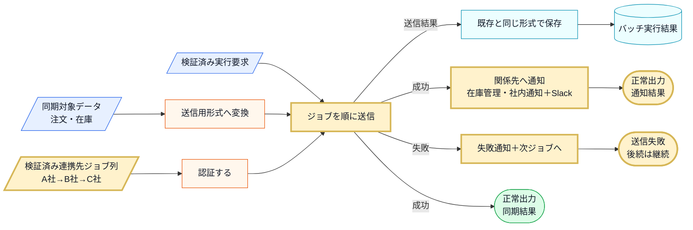
```mermaid
flowchart LR
    A[/検証済み連携先ジョブ列<br>A社→B社→C社/]:::input --> G[認証する]:::process
    C[/同期対象データ<br>注文・在庫/]:::input --> D[送信用形式へ変換]:::process
    E[/検証済み実行要求/]:::input --> H
    D --> H[ジョブを順に送信]:::process
    G --> H
    H -->|送信結果| R[既存と同じ形式で保存]:::stable
    R --> S[(バッチ実行結果)]:::stable
    H -->|成功| I[関係先へ通知<br>在庫管理・社内通知＋Slack]:::process
    H -->|失敗| L[失敗通知＋次ジョブへ]:::process
    H -->|成功| J([正常出力<br>同期結果]):::normal
    I --> K([正常出力<br>通知結果]):::normal
    L --> M([送信失敗<br>後続は継続]):::normal

    classDef input fill:#e7f0ff,stroke:#2563eb,color:#111827;
    classDef process fill:#fff7ed,stroke:#ea580c,color:#111827;
    classDef decision fill:#fef9c3,stroke:#ca8a04,color:#111827;
    classDef normal fill:#dcfce7,stroke:#16a34a,color:#111827;
    classDef stable fill:#ecfeff,stroke:#0891b2,color:#111827;
    classDef changed fill:#fff2cc,stroke:#d6b656,stroke-width:3px,color:#111827;
    class A,H,I,L,K,M changed;
```

この図から読み取ることは、次の4点です。

- 「C社の追加」は入力の「連携先ジョブ列」と、その先の認証・形式変換・送信に現れる。
- 「Slack通知の追加」は送信の成功・失敗どちらの後にも現れ、通知先の一覧側の変化として整理できる。
- 「順次実行」は複数ジョブを順に流す実行骨格で、あるジョブの送信失敗があっても後続ジョブと通知は止めない。通信Clientの生成は外部連携軸を実装する手段であり、独立した業務上の変化軸とは数えない。
- 水色の「既存と同じ形式で保存→バッチ実行結果」は1-1から変わらない。変更する通信・通知・実行構造が、既存の`DeliveryResult`と`BatchLog`へ接続し直されるだけである。

変更後も、失敗条件は正常系図へ混ぜずに別で確認します。

| エラー条件 | どこで分かるか | 出力 | 保存・通知などの副作用 |
|---|---|---|---|
| 連携先が未登録、または無効 | 連携先設定の確認時 | 連携先エラー | 外部送信なし、通知なし |
| C社API送信に失敗する | 外部送信の実行時 | 送信エラー | 失敗通知を送り、順次実行の後続ジョブは止めない |
| 順次実行の途中ジョブが失敗する | 各ジョブの送信結果の確認時 | ジョブ単位の送信エラー | 失敗を記録し、次のジョブへ進む |
| Slack通知に失敗する | 通知送信時 | 通知エラーまたはログ記録 | 本章の中心は連携先・通知先の分離であり、詳細な再送制御は扱わない |

Slack通知は成功・失敗を問わず送る要求のため、送信失敗時の通知の扱いはフェーズ3で変更を試すときに確認します。順次実行の途中で送信が失敗しても、後続ジョブと通知は止めないという扱いも、変更後の骨格として押さえておきます。C社の追加とSlack通知が実際のコードでどこに現れるかも、フェーズ3の変更途中コードとフェーズ7の最終コード・実行結果で追います。

---

**フェーズ1のまとめ：今回追う変更ID一覧**

このフェーズで確定した変更依頼を一覧にして締めます。フェーズ2でこの変更IDを仮説・ヒアリングへ、フェーズ3で一つずつ試して痛みへ、と順につなぎます。

| 変更ID | 変更依頼の要点 | 関係する要求ID（追加は変更後ID） |
|---|---|---|
| 変更ID1 | C社の外部連携を追加する | 要求ID1 |
| 変更ID2 | 各社の成功・失敗をSlackへ自動通知する | 要求ID4 |
| 変更ID3 | A社・B社・C社のジョブを登録順に一つのバッチで実行する | 要求ID6 |
| 変更ID4 | 途中の送信失敗を保存・通知し、後続ジョブを続ける | 要求ID3、要求ID7 |

## 🟣 フェーズ2：仮説立案 ―― 何が変わるかを観察し、ヒアリングで裏付ける
フェーズ1で、`BatchExecutor` が連携先クライアントの生成・通信・通知処理をすべて直接保持している現状を把握しました。届いた変更要求を踏まえ、この設計における変わる見込みと当面安定の前提を整理します。

### 2-1：変わりそうな仕様の見当をつける

ここで作る一覧は、思いつきで「変わりそう」と感じたものを並べる表ではありません。フェーズ1で確認した仕様・動作例・クラス図を材料に、次の順で候補を絞ります。

1. 仕様図と動作例から、入力・判定・加工・出力のうち条件や値が変わりそうな箇所を拾う。
2. その箇所が、1-3のどのクラス・メソッドに書かれているかを対応づける。
3. その仕様が、どんな理由で、何をきっかけに、どのくらいの頻度で変わりそうかを仮説として書く。
4. 逆に、当面変えない前提にできる処理の骨格も分けておく。

この手順で見ると、「外部連携バッチを実行する」という大きな処理全体ではなく、その中のどの連携先・通信仕様・通知先が変更候補なのかを読者自身で追えるようになります。

フェーズ1の仕様表を振り返ります。このバッチシステムには「外部連携」「通知」「バッチ制御フロー」という3つの側面があります。このうち変化が予想される仕様があります。

- **外部連携先の種類と通信仕様**（A社・B社・C社、それぞれのAPIプロトコル）：ビジネス拡大に伴い新しい連携先が追加されることがあります。今回のC社追加がその例です
- **通知先の種類**（メール・Slack・ログ収集基盤など）：業務の運用方法が変わるにつれて、通知先も追加・変更されます

一方、「バッチを実行して結果を通知する」という全体制御フローは、バッチ処理の基本として安定している部分です。

**仮説：外部連携先の種類と通知先の種類は、今後も追加・変更が続く可能性がある。**

この仮説をヒアリングで確認します。

#### ヒアリングで確認すること

外部連携と通知の見当から、それぞれ何が増え、何が共通のままかを質問へ変換します。

| 見当 | 現時点の仮説 | 確認する質問 | 確認先 |
|---|---|---|---|
| 外部連携 | 会社ごとに形式が異なり追加が続く | C社の形式差と、その後の連携先予定は何か | 運用担当者 |
| 通知先 | Slack以外も増える | 今後必要になる通知先は何か | 運用担当者 |
| 通知の意味 | 成否を通知する目的は維持される | 連携先が増えても結果通知という役割は同じか | 運用担当者 |

2-3ではこの質問を使い、外部通信と通知が別々に変わるかを確認します。

### 2-2：今回の変更で確実に変わること

1-5で確定した変更IDを、そのまま今回確実に変わることとして確認します。章ごとに異なる色や記号は使わず、以降でも同じ変更IDで追跡します。

- **変更ID1：C社の外部連携を追加する**
- **変更ID2：各社の成功・失敗をSlackへ自動通知する**
- **変更ID3：A社・B社・C社のジョブを登録順に一つのバッチで実行する**
- **変更ID4：途中の送信失敗を保存・通知し、後続ジョブを続ける**

### ヒアリングに向けた背景確認

変更要求の内容は把握できました。しかし「今回だけの変更か、これからも続く変化の始まりか」によって、設計の判断は大きく変わります。仮説を携えて関係者に確認する前に、このシステムの来歴を整理しておきます。

このバッチシステムは、当初A社1社との連携だけを想定して作られました。シンプルな要件だったため、`BatchExecutor` がすべてを直接担う形で問題はありませんでした。その後B社が加わり、次第にC社も対象となり、連携先が増えるたびに `if-else` の分岐が追加されてきました。通知処理も最初はコンソール出力だけでしたが、後から `NotificationService` が付け足された経緯があります。

今回の変更要求もその延長線上にあります。「今回はC社とSlack」で終わるかどうか——それをヒアリングで確認します。

### 2-3：関係者ヒアリング

仮説を携え、運用担当者と協議を行いました。

* **開発者：** 「C社との連携ですが、今回のデータフォーマットは既存のA社やB社と大きく異なりますか？」

* **運用担当者：** 「フォーマットは別物だね。また、今後D社やE社も控えているから、接続先の追加はこれからも発生するよ。」

* **開発者：** 「通知についてはどうでしょうか？ Slack以外にもメール通知が必要になる可能性はありますか？」

* **運用担当者：** 「そうだね、将来的にはログ収集基盤へのデータ投入も検討している。ただ、転送成功か失敗かという『結果の通知』という仕組み自体は今後も変わらないよ。」

* **開発者：** 「分かりました。外部との通信ロジックと、通知という振る舞いは、それぞれ独立して増殖していく可能性があるということですね。」

ヒアリングにより、通信先（生成）の増殖と、通知処理（イベントの反応）の多様化が、それぞれ別個の変化軸として扱うべきものだと確認できました。

### 2-4：ヒアリングで判明した将来リスク

ヒアリングで判明した「将来起きるかもしれない」変化をまとめます。確定変更（2-2）とは別に管理することで、今回の設計判断と将来への備えを混在させずに済みます。

| リスクID | 将来リスク | 時期の目安 | 根拠 |
|---|---|---|---|
| リスクID1 | D社・E社など連携先がさらに増える（`BatchExecutor` 内の振り分けと送信ジョブ列が変わる） | 近い将来（すでに控えている） | 運用担当者「D社・E社も控えている」 |
| リスクID2 | Slack以外にメール・ログ基盤への通知が追加される（通知処理全体が変わる） | 検討中 | 運用担当者「ログ収集基盤も検討中」 |
| リスクID3 | 順次実行の途中失敗の扱いが増える（送信成否の判定と失敗通知の分岐が変わる） | 連携先の増加に伴い | 運用担当者「設計側の予見（ヒアリング外）」 |

なお、今回追加するのは「複数ジョブを登録順に流し、途中失敗後も続行する」という外側の実行骨格です。各社固有の再試行回数やバックオフは未確定なので今回対象外とします。この二つを混同しません。

フェーズ2で「何を変え、何を守るか」が確定しました。次のフェーズ3では、この変更要求を現在のコードで実行しようとすると何が起きるか、その痛みを確認します。

### 2-5：変わる見込みと当面安定の前提を確定する

2-4のリスクIDを、連携先・通知先・失敗方針で変えられるようにする部分と、バッチ実行の安定側へ分けます。「はい」は、フェーズ6で**この三つ（連携先・通知先・失敗方針）を別々に変更しても、順次実行と結果保存へ影響を広げない構造か**を判定するための印です。

| リスクID・変化軸 | 変わる見込み | 変えられるようにする部分 | 当面安定として守る部分 |
|---|---|---|---|
| リスクID1：D社・E社など連携先がさらに増える（`BatchExecutor` 内の振り分けと送信ジョブ列が変わる） | はい | 連携先ごとの通信と生成・登録 | 同期要求、登録順のジョブ実行、送信結果の保存 |
| リスクID2：Slack以外にメール・ログ基盤への通知が追加される（通知処理全体が変わる） | はい | 通知先ごとの送信と登録 | 各ジョブ結果を通知へ渡す流れ、連携処理 |
| リスクID3：順次実行の途中失敗の扱いが増える（送信成否の判定と失敗通知の分岐が変わる） | はい | 失敗時の継続・停止・通知方針 | ジョブ単位の結果保存、登録順の実行 |

したがって2-5の出力は、「連携・通知・失敗方針は独立して変えられるようにし、同期要求・順次実行・結果保存は守る」という設計条件です。フェーズ3では変更ID1〜変更ID4だけを現在の構造へ適用し、リスクIDはフェーズ6の構造評価に使います。

---

## 🟣 フェーズ3：問題特定 ―― 変更の痛みを発見する
### 3-1：変更を試みる

フェーズ2で確定した変更を、既存の `BatchExecutor` にそのまま組み込もうとします。「C社連携の追加」と「Slack通知の追加」——どちらもシンプルに聞こえますが、実際にコードを変えようとすると何が起きるかを確認します。

> **この抜粋の外は、現状のままです。** `PartnerDatabase` の存在・有効チェックは省略後も維持し、検証済みの `SyncRequest` だけを `BatchExecutor` へ渡します。`SyncRequest`、`SyncDataCatalog`、`DeliveryResult`、`BatchLog` は1-4の定義をそのまま使います。パートナーIDを "A"・"B"・"C" と略記するのは読みやすさのための表記であり、マスター検証や同期対象データの取得を削除する仕様変更ではありません。

変更した定義は5つです。1-4と同じ並び順で、上から見ていきます。

| 1-4での掲載単位 | 今回の変更 | 根拠 |
|---|---|---|
| （新規） | `SystemCClient` を追加 | 変更ID1 |
| （新規） | `SlackNotifier` を追加 | 変更ID2 |
| `BatchExecutor::execute()` | C社の分岐とSlack通知の呼び出しを追加 | 変更ID1・変更ID2 |
| （新規） | `BatchExecutor::runBatch()` を追加 | 変更ID3・変更ID4 |
| （新規・確認用） | `SystemBClient` を失敗するスタブへ | 変更ID4 |

---

**SystemCClient と SlackNotifier（追加）**

新しい連携先と、新しい通知先です。`SystemCClient::send()` は既存の `SystemAClient::send()` と、`SlackNotifier::notify()` は `NotificationService::notify()` と同じ形にします。

```cpp
class SystemCClient {
public:
    DeliveryResult send(std::string data) {
        std::cout << "[C社] " << data << std::endl;
        return {"成功", true, "C社送信完了"};
    }
};

class SlackNotifier {
public:
    void notify(std::string msg) {
        std::cout << "[Slack通知] " << msg << std::endl;
    }
};
```

`SystemCClient` は既存2社と同じ形、`SlackNotifier` は `NotificationService` と同じ形です。**クラスを足すこと自体は痛くありません。** 痛みは、これらを呼ぶ側に出ます。

---

**BatchExecutor::execute()（変更あり）**

```cpp
// C社連携を追加すると、次の分岐が増える
class BatchExecutor {
    BatchLog& batchLog;
    SyncDataCatalog& dataCatalog;
public:
    BatchExecutor(BatchLog& log, SyncDataCatalog& catalog)
        : batchLog(log), dataCatalog(catalog) {}

    DeliveryResult execute(const SyncRequest& request) {
        string partnerId = request.partnerId;
        string data = dataCatalog.load(request.target);
        DeliveryResult result{"失敗", false, "未対応"};
        if (partnerId == "A") {
            SystemAClient client;
            result = client.send(data);
        } else if (partnerId == "B") {
            SystemBClient client;
            result = client.send(data);
        } else if (partnerId == "C") {          // ← 新しい連携先を追加
            SystemCClient client;              // ← SystemCClientも追加が必要
            result = client.send(data);
        }
        batchLog.add(partnerId, partnerId + "社", result.status); // 保存方法は変更しない
        // Slack通知を追加しようとすると、通知の仕組みも一緒に変更が必要
        NotificationService notifier;
        notifier.notify(result.status);
        SlackNotifier slack;                  // ← 通知先を増やすとここも増える
        slack.notify(result.status);
        return result;
    }
};
```

- **別々の確定要求が同じ関数を触る：** 変更ID1のC社分岐と、変更ID2のSlack呼び出しが、同じ `execute()` へ入りました
- **通知先を1つ足すと呼び出しが1行増える：** `NotificationService` の隣に `SlackNotifier` が並びます。全社共通の処理なので、C社だけでなくA社・B社の実行時にもSlackが飛びます

「C社連携を追加したい」と「Slack通知を追加したい」は、本来まったく別の話です。しかし `execute()` の中で両方が混在しているため、**1つの変更を加えると関係のない他の処理にも手が届いてしまいます。**

---

**動作確認用のスタブ**

```cpp
// 動作確認用のスタブ
class SystemAClient {
public:
    DeliveryResult send(std::string data) {
        std::cout << "[A社] " << data << std::endl;
        return {"成功", true, "A社送信完了"};
    }
};
class NotificationService {
public:
    void notify(std::string msg) {
        std::cout << "[完了通知] " << msg << std::endl;
    }
};
```

`SystemAClient` と `NotificationService` は1-4と同じ挙動です。この抜粋を単体で動かすために再掲します。

---

#### `main()` と実行結果（変更ID1・変更ID2）

A社とC社の連携をそれぞれ通します。**見るのは動くかどうかではなく、変更要求を現状の構造へ当てはめたときに修正箇所と痛みがどこに出るかです。**

---

**ケース1：A社・注文連携**

```cpp
int main() {
    BatchLog batchLog;
    OrderDataSource orders;
    InventoryDataSource inventory;
    SyncDataCatalog dataCatalog(orders, inventory);
    BatchExecutor executor(batchLog, dataCatalog);
    executor.execute({"A", SyncTarget::Orders}); // A社・注文連携
    std::cout << "---" << std::endl;
```

```
[A社] 注文 ORD001
実行結果を保存(1件): [A] A社 -> 成功
[完了通知] 成功
[Slack通知] 成功
---
```

**A社の連携なのにSlack通知が飛んでいます。** 変更ID2はSlack通知の追加でしたが、追加した場所が全社共通の `execute()` なので、既存2社の挙動も変わりました。

---

**ケース2：C社・注文連携（新規）**

同じ `main()` の続きです。

```cpp
    executor.execute({"C", SyncTarget::Orders}); // C社・注文連携（新規）
    return 0;
}
```

```
[C社] 注文 ORD001
実行結果を保存(2件): [C] C社 -> 成功
[完了通知] 成功
[Slack通知] 成功
```

C社も同じ経路で動きました。**動作は正しくなっています。** 変更ID1・変更ID2は満たせました。

---

**SystemBClient（確認用・失敗するスタブ）**

残る変更ID3（登録順に一つのバッチで実行する）と変更ID4（途中の送信失敗を保存・通知し、後続ジョブを続ける）を当てはめます。まず、途中で失敗する連携先としてB社のスタブを用意します。

```cpp
class SystemBClient {
public:
    DeliveryResult send(std::string data) {
        std::cout << "[B社] " << data << " → 接続タイムアウト" << std::endl;
        return {"失敗", false, "B社送信失敗"};
    }
};
```

---

**BatchExecutor::runBatch()（追加）**

順次実行と成否判定を `BatchExecutor` へ追加します。実行順の骨格と成否の扱いを置ける場所が、このクラスの外にないためです。

```cpp
    // 変更ID3：登録順に一つのバッチで流す実行順の骨格
    // 変更ID4：途中の失敗を保存・通知したうえで後続を続ける
    void runBatch(const std::vector<SyncRequest>& requests) {
        int okCount = 0;
        int ngCount = 0;
        for (size_t i = 0; i < requests.size(); ++i) {
            std::cout << "[ジョブ" << (i + 1) << "] "
                      << requests[i].partnerId << "社" << std::endl;
            DeliveryResult r = execute(requests[i]);
            if (r.success) {
                ++okCount;
            } else {
                ++ngCount;                       // ← 変更ID4の成否集計
                batchLog.add(requests[i].partnerId,
                             requests[i].partnerId + "社",
                             "失敗として記録");
                SlackNotifier slack;             // ← 失敗も通知する
                slack.notify(requests[i].partnerId + "社の送信に失敗");
                std::cout << "後続ジョブを続けます" << std::endl;
            }
        }
        std::cout << "バッチ完了: 成功" << okCount
                  << "件・失敗" << ngCount << "件" << std::endl;
    }
```

- **`execute()` を呼ぶ側に成否の扱いを書いた：** `execute()` はすでに保存も通知もしているのに、`runBatch()` でも失敗時に保存とSlack通知を行っています
- **4つの責任が1クラスへ：** 順次実行という外部手順の骨格、送信失敗の扱い、通知、連携先ごとの生成分岐

---

#### `main()` と実行結果（変更ID3・変更ID4）

同じ `main()` から `executor.runBatch()` を呼び、A社→B社→C社を登録順に流します。2件目のB社が失敗します。**見るのは、登録順に流して失敗後も続けられるかと、そのために `execute()` の周りへ何が増えたかです。**

```cpp
    std::vector<SyncRequest> jobs;
    jobs.push_back({"A", SyncTarget::Orders});
    jobs.push_back({"B", SyncTarget::Orders});   // 途中で失敗する
    jobs.push_back({"C", SyncTarget::Orders});
    executor.runBatch(jobs);
```

```text
[ジョブ1] A社
[A社] 注文 ORD001
実行結果を保存(1件): [A] A社 -> 成功
[完了通知] 成功
[Slack通知] 成功
[ジョブ2] B社
[B社] 注文 ORD001 → 接続タイムアウト
実行結果を保存(2件): [B] B社 -> 失敗
[完了通知] 失敗
[Slack通知] 失敗
実行結果を保存(3件): [B] B社 -> 失敗として記録
[Slack通知] B社の送信に失敗
後続ジョブを続けます
[ジョブ3] C社
[C社] 注文 ORD001
実行結果を保存(4件): [C] C社 -> 成功
[完了通知] 成功
[Slack通知] 成功
バッチ完了: 成功2件・失敗1件
```

登録順に流れ、B社の失敗後もC社が実行されました。**動作は正しくなっています。** 変更要求は満たせました。

---

痛いのは結果ではなく、そこへ至る過程です。出力をよく見てください。**B社の失敗が2回保存され、2回Slackへ通知されています。** 保存件数は3社の実行で4件になりました。

`execute()` が成否に関わらず保存と通知を行う一方、変更ID4のために `runBatch()` にも失敗時の保存と通知を書いたためです。どちらか一方に寄せるには、`execute()` の側が「バッチから呼ばれたのか単発で呼ばれたのか」を知る必要があります。**実行順の骨格と1件の送信が同じクラスに同居しているため、責任の切れ目がありません。**

こうして、順次実行という外部手順の骨格、送信失敗の扱い、通知、そして連携先ごとの生成分岐の4つが、1つのクラスへ積み上がりました。

### 3-2：変更影響グラフ

現状の構造で変更を試みた際、影響がどのように飛び火するかを可視化します。

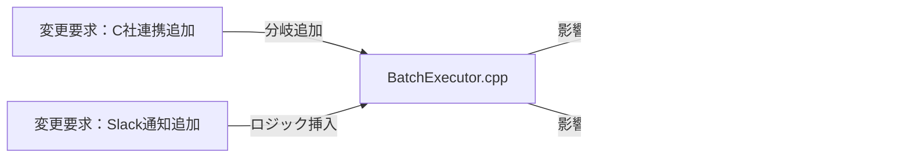
```mermaid
graph LR
    T1["変更要求：C社連携追加"] -->|"分岐追加"| B["BatchExecutor.cpp"]
    T2["変更要求：Slack通知追加"] -->|"ロジック挿入"| B
    B -->|"影響が飛び火"| C["既存のA社通信ロジック ✅"]
    B -->|"影響が飛び火"| D["既存のB社通信ロジック ✅"]
```

グラフが示す通り、C社連携の追加やSlack通知の実装といった個別の要求が、既存の他の連携先ロジックにまで影響を及ぼす構造になっています。

### 3-3：痛みの言語化

「C社を追加しただけなのに、既存のA社・B社通信までテストし直す必要があるのか……」

変更をシミュレートする中で、エンジニアとして感じる「痛み」が2つ明確になりました。

1つ目は、`BatchExecutor`が抱える責任の多さです。変更ID1・変更ID2を試した時点で、全体フローに加えてC社の通信、Slack通知、具体クライアントの生成が同じクラスへ入りました。残る変更ID3の順次実行と変更ID4の途中失敗の継続判断も、書き足す先は同じ `execute()` です。

2つ目は、連携の「生成」と「通知」という、変わる理由が異なる責務が混在していることです。連携先の通信仕様が変わるのか、それとも通知の要件が変わるのかにかかわらず、同じ大きなクラスを編集し、無関係な処理まで影響確認する必要があります。ここには順次実行の骨格と送信失敗の扱いも同居しており、「ジョブを順に流す外部手順」「送信失敗のときに後続と通知をどうするか」「誰に通知するか」「どのクライアントを生成するか」という別々の理由の判断が、同じ場所へ折り重なっています。

---
> **📌 問題（確定）**
> 変更ID1・変更ID2を試したところ、C社通信とSlack通知、具体クライアントの生成を`BatchExecutor`へ追加することになった。変更ID3の登録順実行と変更ID4の途中失敗の継続判断も同じ`execute()`へ入る。異なる要求が同じクラスへ集中し、関係のないA社・B社通信まで再テスト対象になった。
---

観測した痛みへ`問題ID`を付け、どの変更IDから来たかを対応づけます。

| 問題ID | 観測した痛み（変更途中コード） | 起点の変更ID |
|---|---|---|
| 問題ID1 | C社追加で連携先ごとの通信詳細と具体クライアント生成が `BatchExecutor` へ入り、既存A社・B社通信まで再テスト対象になる | 変更ID1・変更ID3 |
| 問題ID2 | Slack通知の追加や通知仕様の変更で、連携処理のフロー全体まで影響を受ける | 変更ID2 |
| 問題ID3 | 順次実行の途中で送信が失敗したとき、後続ジョブや通知の扱いを実行本体で書き分けた。`execute()`と`runBatch()`の両方が保存・通知を行い、B社の失敗が2回保存・2回通知された | 変更ID4 |
| 問題ID4 | 実行順の骨格（登録順に流す）と1件の送信詳細が同じクラスへ同居し、`execute()`が単発呼び出しかバッチ経由かを区別できない | 変更ID3 |

フェーズ3で「今の構造では変更が辛い」という事実が確認できました。次のフェーズ4では、この痛みの原因を構造的に分析します。

---

## 🟠 フェーズ4：原因分析 ―― なぜ辛いのかを構造で言語化する
フェーズ3で「外部連携先が増えるたびに、バッチ処理全体のコードが修正のたびに不安定になる」という痛みを確認しました。なぜこのような状態に陥るのか、その根本原因を構造的な視点で分析します。

### 4-1：痛みの根源を探る（観察と原因）

フェーズ3で観察した「痛み」と、その背後にある構造的な原因を対応させます。

| **観察した症状（痛み）** | **構造的な原因（痛みの根源）** |
| --- | --- |
| 新しい連携先を追加するたびに `BatchExecutor` の生成コードを修正する必要があります。また、複数の連携先（A社・B社・C社）との通信詳細が `BatchExecutor` 内に直接展開されており、連携先ごとの接続手順を全て把握する必要があります | 生成の混在（具体クラスの生成がビジネスロジックに混在）＋複雑さの露出（外部APIの詳細を `BatchExecutor` が直接知っている） |
| 転送結果の通知仕様を変えると、連携処理のフロー全体まで影響を受ける | 通知の密結合（通知先追加のたびに `BatchExecutor` の変更が必要） |
| 順次実行の途中で送信が失敗したとき、後続ジョブや通知の扱いを実行本体で書き分ける必要がある | 外部手順の混在（ジョブを順に流す骨格と、各ジョブの通信詳細・成否判定が同じ場所にある） |


独立した業務上の変化軸は、外部連携と通知の二つです。生成は外部連携を利用側から分離するために決める実装責任であり、三つ目の課題として水増ししません。

- 連携先が増えても通知先は変わりません
- 通知先が増えても連携先クライアントの生成方法は変わりません
- Clientの生成・所有方法は、外部連携境界を成立させる組み立て判断として通信と一緒に追跡します

二つの変化軸は独立しています。一方、順次実行は各連携先の通信詳細が変わっても守りたい骨格です。送信失敗の扱いはこの骨格側へ寄せます。Client生成は外部連携境界をどう組み立てるかという設計判断として扱い、別の要求軸にはしません。

### 4-2：変わるもの/変わってほしくないもの

> **「変わらないもの」と「変わってほしくないもの」は異なります。** 「変わらないもの」は経験的事実（今まで変わっていない）、「変わってほしくないもの」は設計意図（ここを安定させてほかを守りたい）です。ここで整理するのは後者です。

変更理由の種類が異なる要素を整理します。

| **変わり続けるもの** | **変わってほしくないもの** |
| --- | --- |
| 外部連携先ごとの通信手段（プロトコル・認証等） | バッチ全体の処理実行順序（取得→転送→通知） |
| 通知先のサービスや通知ルール | 通知という「イベント」自体を発生させる責務 |
| 各ジョブの送信成否と、失敗時の個別ハンドリング | ジョブを順に流し、途中失敗でも後続を続ける順次実行の骨格 |

連携先の追加は今後も発生する「変わる見込み」ですが、バッチ全体の転送フローは今回の変更要求では守りたい骨格です。「ジョブを順に流し、あるジョブが失敗しても後続と通知は止めない」という順次実行の骨格も、各社の通信詳細が変わっても守りたい部分です。変わるのは各ジョブの送信成否そのものであり、順に流すという外部手順は守りたい側にあります。本来、これらは別の責務として分離されるべきものであり、同じクラス内で扱われていること自体が設計上の歪みを生んでいます。

### 4-3：二つの接続点と組み立て責任に漏れている知識を確認する
★この項目、他の章にはないが、テンプレ通りにできているか。
ここでの「確認すること」は、前節までに見つけた原因から抽出します。まず、原因文から「守りたい骨格」と「変わる差分」を分けます。次に、その差分を動かすために骨格側が知ってしまっている名前・条件・順序・型を拾います。最後に、接続点に残す最小の約束を、値・型・操作・イベントとして書きます。

原因によって、接続点で見る抽象観点は変わります。条件分岐が原因なら条件・定数・選択基準を見ます。処理手順が原因なら呼び出し順・前後条件・失敗時分岐を見ます。生成判断が原因なら具体クラス名・生成条件・登録場所を見ます。通知や外部連携が原因なら通知先・タイミング・成否の扱いを見ます。データや状態が原因なら、境界を流れる値・型・状態を見ます。

`BatchExecutor`が、外部連携、通知、生成について何を知っているかを確認します。

今の `BatchExecutor` と各クライアント、および通知サービスとの接続は、各連携先のクラス名・呼び出し順序・通知方法・生成方法が`BatchExecutor`へ集まっています。

接続点ごとに「`BatchExecutor`へ漏れている知識」を見ると、独立して変わる
三つの判断が一つのクラスへ集まっていることが分かります。

| 接続点 | 漏れている知識 | 変更時の波及 |
|---|---|---|
| バッチ → 外部連携 | 連携先のクラス名・認証・呼び出し順序 | 連携先追加で実行本体を変更 |
| バッチ → 通知 | 通知サービス名・通知先・通知条件 | 通知先追加で実行本体を変更 |
| バッチ → 生成 | クライアントの生成方法・所有権 | 生成方法変更で実行本体を変更 |
| バッチ → 順次実行 | ジョブ列の順序・送信成否・失敗時の後続継続 | 送信失敗の扱いを変えると実行本体を変更 |

---
> **📌 原因（確定）**
> 以下の2つの独立した根本原因と、外部連携軸の組み立て不備が重なっている：
> 1. **外部手順の知識の漏出**：連携先ごとの通信詳細と順次実行の骨格が密結合している。
> 2. **通知先の知識の漏出**：通知サービスが増えるたびにバッチ本体の修正が必要になっている。
> - **組み立ての不備**：クライアントの生成・所有と具象クラス名への依存が、外部連携の利用側に残っている。
>
> 外部連携と通知は変更理由が異なります。生成・所有は外部連携を差し替え可能にするため、通信境界と同時に解く必要があります。
---

フェーズ3の問題IDに対応づけて、構造上の原因へ`原因ID`を付けます。本章は外部連携と通知の2軸なので、原因も2つに分かれます。次のフェーズ5は、この原因IDから課題IDを導きます。

| 原因ID | 構造上の原因（何が同じ責任へ集まっているか） | 対応する問題ID |
|---|---|---|
| 原因ID1 | 外部手順の知識の漏出：連携先ごとの通信詳細と具体クライアント生成・所有が、順次実行の骨格と密結合している | 問題ID1・問題ID3 |
| 原因ID2 | 通知先の知識の漏出：通知サービスが増えるたびにバッチ本体の修正が必要になる | 問題ID2 |

Client生成は3つ目の軸ではなく、課題ID1（外部連携）を差し替え可能にする組み立て判断として、通信境界と一緒に解きます。

フェーズ4で根本原因が言語化できました。次のフェーズ5では、解決する課題を具体的に定義していきます。

---

## 🟡 フェーズ5：課題定義 ―― 原因から課題を検討して確定する

フェーズ4で確定した原因は、まだ課題そのものではありません。まず変えるべき構造を候補として導き、システム全体で候補の関係を整理してから、解くべき接続点を確定します。

### 5-1：原因から課題候補を洗い出す

| 原因ID・確定した事実 | そのままだと残る痛み | 課題候補 | 候補を導いた理由 |
|---|---|---|---|
| 原因ID1：バッチ骨格が連携先ごとのClient生成・API手順を知る | C社追加で実行順・結果保存まで修正する | 連携先固有の生成・通信をバッチ骨格から分離する | バッチ順序と外部APIは別の理由で変わる |
| 原因ID2：バッチ骨格が具体通知先と失敗処理を直接知る | Slack追加・通知失敗で送信継続処理まで変わる | 通知先の種類と配送をバッチ骨格から分離する | 外部送信と社内通知は別の理由で変わる |

ここで挙げるのは、原因のどの構造を変える必要があるかまでです。それをどのクラスへどう置くかは、課題を確定してからフェーズ6で決めます。

### 5-2：課題候補をシステム全体で評価する

| 課題候補 | 必要性・他候補との関係 | 統合／分割の判断 | 採否 |
|---|---|---|---|
| 連携先固有処理の分離 | 必須。変更ID1・変更ID3・変更ID4の影響をAPI詳細から切る | Client生成を含む一つの連携境界へ統合 | 採用 |
| 通知配送の分離 | 必須。変更ID2と個別失敗をバッチ本体から切る | 送信結果イベントで連携境界と接続 | 採用 |

候補を一つずつ部分対策として採用するのではなく、すべてを解いた完成状態から逆算します。変更IDと課題IDは一対一とは限らないため、変更依頼の数に合わせて課題を増減させません。

### 5-3：課題IDと接続点を確定する

評価を通過した候補だけに課題ID1から欠番なくIDを付けます。

| 課題ID・接続点 | 接続するもの・変わる側 | 守る側 | 完了条件 |
|---|---|---|---|
| 課題ID1：外部連携とバッチ骨格の境界 | **接続:** 同期データ、送信結果、生成済みClient<br/>**変わる側:** API・認証・通信手順とClient生成 | データ取得、登録順実行、結果保存、後続継続 | 連携先追加がClient・処理・生成登録に閉じ、バッチ順序が変わらない |
| 課題ID2：通知配送とバッチ骨格の境界 | **接続:** 送信結果イベントと通知受付結果<br/>**変わる側:** 通知手段・宛先・失敗処理 | 送信確定、結果保存、後続ジョブ | 通知追加・失敗が登録先と個別結果に閉じ、後続送信を止めない |

📌 **システム全体の完了状態**：バッチは登録順に各連携ジョブを実行・保存し、結果イベントを登録済み通知先へ渡す。連携先・通知先の具体詳細や個別失敗を骨格へ漏らさない。

課題IDを定義できたので、ここまでの追跡を一列で見渡します。

| 問題ID（フェーズ3の痛み） | 原因ID（フェーズ4の構造原因） | 課題ID（達成目標） |
|---|---|---|
| 問題ID1・問題ID3：通信詳細・生成・失敗処理が骨格へ密結合 | 原因ID1：外部手順の知識の漏出 | 課題ID1：連携先固有の生成・通信をバッチ骨格から分離 |
| 問題ID2：通知先追加・仕様変更でバッチ本体が変わる | 原因ID2：通知先の知識の漏出 | 課題ID2：通知先の種類と配送をバッチ骨格から分離 |

この表と完了状態が、そのままフェーズ6の入力です。要求の受入は要求ID、設計課題の解消は課題ID、今回の変更影響は変更IDで別々に追跡します。
## 🔴 フェーズ6：対策検討 ―― システム全体の最終構造を定める

**ここからしばらくは抽象の話です。** 個々のクラスへ入る前に、この章で「何を、どんな構造へ変えるのか」を先に決めます。

#### まず全体像 ―― どんな構造へ変えるか（抽象）

フェーズ4で、一つの`BatchExecutor`が「連携先ごとの通信手順」「結果を届ける通知先」「連携クライアントの生成」という**別々の理由で変わる3つの判断**を、同じ実行処理へ抱えていることを確認しました。対策は、この3つを別々の責任へ分け、最後に一本の実行経路（確認→取得→送信→保存→通知）へ結び直すことです。ここで使う3つの構造は、いずれも第一部で扱った基本構造です。第二部の応用編なので、構造名（と対応するパターン名）を語彙として併記しますが、パターン名から設計を選ぶのではなく、上で確認した「別々に変わる3つの判断」から必要な構造を導きます。

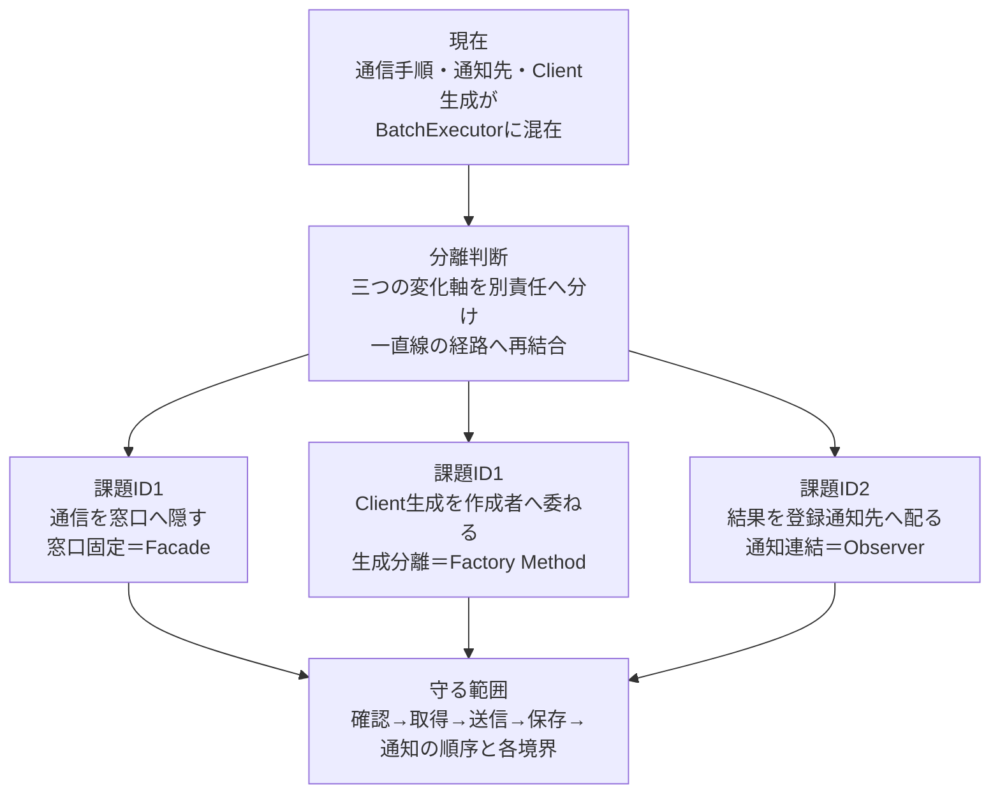
```mermaid
flowchart TB
    A[現在<br/>通信手順・通知先・Client生成が<br/>BatchExecutorに混在] --> B[分離判断<br/>三つの変化軸を別責任へ分け<br/>一直線の経路へ再結合]
    B --> C[課題ID1<br/>通信を窓口へ隠す<br/>窓口固定＝Facade]
    B --> D[課題ID1<br/>Client生成を作成者へ委ねる<br/>生成分離＝Factory Method]
    B --> E[課題ID2<br/>結果を登録通知先へ配る<br/>通知連結＝Observer]
    C --> F[守る範囲<br/>確認→取得→送信→保存→通知の順序と各境界]
    D --> F
    E --> F
```

まだクラスの中身は見ません。この段階でつかんでほしいのは「3つの変わる理由を2つの接続課題へ分け、最後に一本へつなぐ」という筋だけです（通信手順と生成は同じ連携先の追加で一緒に動くため、課題ID1として一つの接続点にまとめます）。「どのクラスが生成し、どの契約で実行するか」という具体の結論は、この後の課題ID1・課題ID2で一つずつ決めていきます。決めた結論をまとめて振り返る表は、フェーズ6の末尾（6-3 設計トレース）に置きます。ここでは先に結論表を出しません。

第0章の「設計の醍醐味」の四拍子でいえば、この章は〈外部連携と通知の共通契約を見つけて分離〉→〈Clientと通知先を生成〉→〈組み立て役が登録・注入〉→〈バッチ骨格は具体を意識しない〉という同じ順序をたどります。

#### 構造ポイントの全貌 ―― どの責任がどこへ移るか

課題ID1・課題ID2の【契約】〜【利用開始】が、どのクラス・関数から、どのクラス・関数へ責任を移すかを先に一覧します。断片コードを読む前に、この表で全貌をつかんでください。各ポイントの詳しいコードは、この後の課題ID節に同じ番号で置きます。

| ポイント | 変更前の所属 → 変更後の所属 | 設計操作・生成／注入／所有 | 次の接続先 |
|---|---|---|---|
| 【契約】 | `execute()` が連携先IDで分岐 → `IExternalClient::send()` と `INotifier::onComplete()` | 送信と通知を別々の契約へ切り出す | 【具体】のoverride |
| 【安定骨格】 骨格 | 生成・送信・通知が混ざる `execute()` → 生成役へ委譲→契約呼出→破棄と、登録リストの反復 | 連携先・通知先が増えても変えない順序を固定する | 【契約】の `send()` / `onComplete()` |
| 【具体】 | 分岐に埋もれた送信詳細 → `SystemAClient::send()` ほか、`SlackNotifier::onComplete()` ほか | 連携先ごとの通信と、通知先ごとの送信を実装へ閉じる | 戻り値を【安定骨格】の保存・通知へ |
| 【生成】 | `execute()` 内の固定具象 → `SystemAClientCreator::createClient()` と組み立て役のローカル変数 | 生成役の1か所へ具象選択を閉じる（Clientの所有は【安定骨格】） | 【注入】の受渡行 |
| 【注入】 | 利用側が具体Clientを選ぶ → `execute(request, &creatorA)` と `addNotifier(&slack)` | 生成役と通知先を契約として渡す・登録する | 【利用開始】が呼ぶ `execute()` |
| 【利用開始】 | 呼び出し側が連携先ごとの手順を知る → `batch.execute(request, &creatorA);` | 【生成】【注入】で組み立てた同じ実体を使い、公開操作を1回呼ぶ | 【安定骨格】の `execute()` |

この表の上から順に、変更前はどこに判断が集まっていたか、何をどこへ移すか、誰が生成・注入・所有するか、代表入力がどの順で流れるかを追えます。実行時の呼び出し順は表の並び（【契約】→【利用開始】）ではなく【生成】→【注入】→【利用開始】→【安定骨格】→【契約】→【具体】で、課題ID節の末尾に実行接続表として置きます。

#### 接続点の分離・配置・組み立てを決める

具体クラスへ入る前に、課題ID1・課題ID2を「どう分け、どこへ置き、どう組み立てるか」という同じ三観点で一度に見渡します。実装はフェーズ7で行います。各課題が最終構造のどこへ着地するかの地図です。

| 接続点を変える観点 | システム全体の考え方 | 課題ID1・課題ID2のコードへの反映 |
|---|---|---|
| 分離方法 | バッチ骨格には外部送信・通知の契約だけを残し、具体的な通信・通知・生成判断を外す | 課題ID1は`IExternalClient`と`IClientCreator`、課題ID2は`INotifier`を境界にする |
| 配置場所 | API詳細は各Client、通知手段は各Notifier、具体Clientの選択は各Creatorへ置く | 三つの具象クラス群へ変更理由ごとに配置する |
| 組み立て方法（生成・所有・登録・注入） | 組み立て側がCreatorとNotifierを生成・所有・登録し、共有Applicationへ注入する。入口は連携先IDを渡し、CreatorがClientを選択・生成、Executorが契約だけを実行する | バッチ入口と手動入口は同じApplicationを共有する |

表の左から右へ読むと、課題ID1の通信・生成・所有と課題ID2の通知が、それぞれの契約・配置を持ちながら、一つのComposition Rootから共通実行フローへ接続されます。

#### 設計判断ごとの部分クラス図

課題ID1では、連携先ごとの通信を`IExternalClient`へ、生成方法を`IClientCreator`へ分け、バッチジョブは生成契約だけを持ちます。

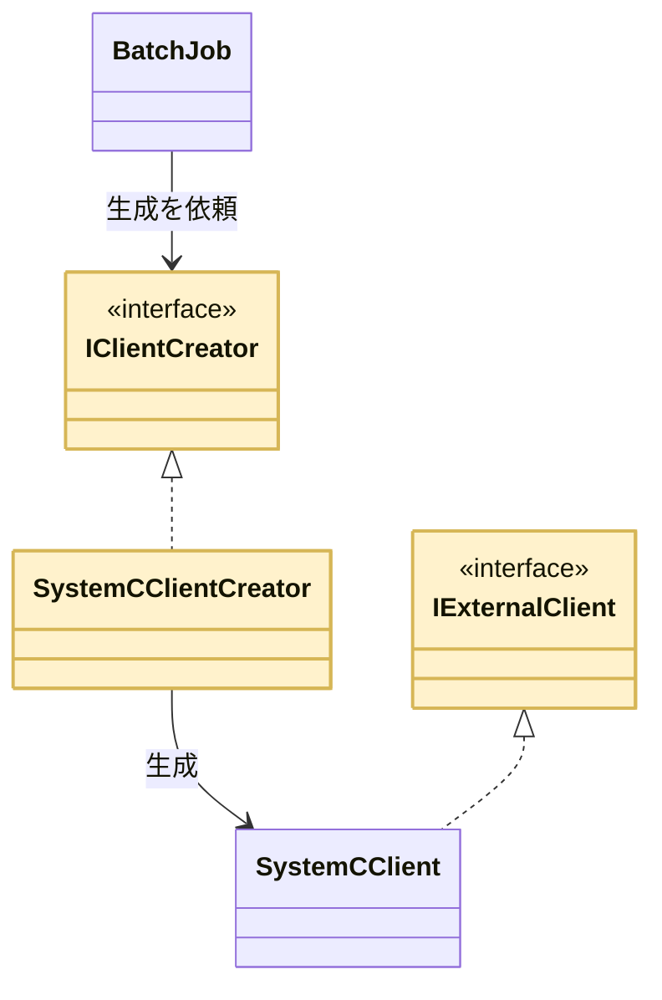
```mermaid
classDiagram
    class BatchJob
    class IClientCreator { <<interface>> }
    class SystemCClientCreator
    class IExternalClient { <<interface>> }
    class SystemCClient
    BatchJob --> IClientCreator : 生成を依頼
    IClientCreator <|.. SystemCClientCreator
    SystemCClientCreator --> SystemCClient : 生成
    IExternalClient <|.. SystemCClient
    class IClientCreator:::focus
    class IExternalClient:::focus
    class SystemCClientCreator:::focus
    classDef focus fill:#FFF2CC,stroke:#D6B656,stroke-width:2px
```

課題ID2では、バッチが具体通知先ではなく`INotifier`へ結果を渡し、Slackはその一実装になります。

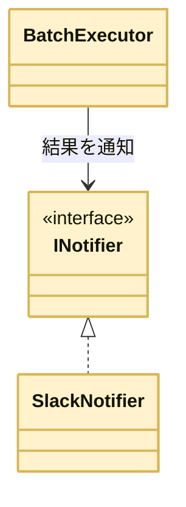
```mermaid
classDiagram
    class BatchExecutor
    class INotifier { <<interface>> }
    class SlackNotifier
    BatchExecutor --> INotifier : 結果を通知
    INotifier <|.. SlackNotifier
    class BatchExecutor:::focus
    class INotifier:::focus
    class SlackNotifier:::focus
    classDef focus fill:#FFF2CC,stroke:#D6B656,stroke-width:2px
```

次のコードでは連携の生成・通信、登録順実行、通知の順に組み立て、部分失敗後も後続を続ける骨格へ接続します。

#### システム全体の最終構造を決める

最終構造は、窓口構造・通知分離構造・生成分離構造を `BatchExecutor` の実行フローで組み合わせる一つのシステムです。生成は外部連携（課題ID1）の組み立てに属するため、解くべき課題は課題ID1（通信＋生成）と課題ID2（通知）の2つです。一部だけを切り出す形は2つの課題を完了しない途中状態なので比較しません。

### 対策検討のクラス図：1-3の責任と依存をどう変えるか

フェーズ1の1-3で作ったクラス図へフェーズ2〜5の判断を反映し、変更後の形へ更新します。

| クラス図を変える材料 | 前工程で確認したこと | クラス図へ反映すること |
|---|---|---|
| フェーズ1のクラス図 | 現在のクラス、操作、依存関係 | 変更前クラス図としてそのまま使う |
| フェーズ2の変化予測 | 連携先・通知先・生成条件は別チームが増やす | 毎回変わる責任へ `【移す】` と注記する |
| フェーズ4の原因 | `BatchExecutor` に通信・通知・生成が混在する | 同じクラスの中で `【残す】` と `【移す】` を分ける |
| フェーズ5の接続点 | 実行順は残し、外部連携と通知を各契約へ委ねればよい | 課題ID1を`IExternalClient`と`IClientCreator`、課題ID2を`INotifier`へ置く |

**薄い黄色が今回変える責任、薄い水色が変更前後で維持する共通基盤**です。変更前では `BatchExecutor` の `【残す】` と `【移す】`、変更後では移動先の `【新設】` を追います。`SyncRequest`、`SyncDataCatalog`、`PartnerDatabase`、`DeliveryResult`、`BatchLog`は作り替えず、新しい通信・通知・生成構造から同じ基盤へ接続します。

**変更前のクラス図（1-3を責任見直し用に再掲）：**

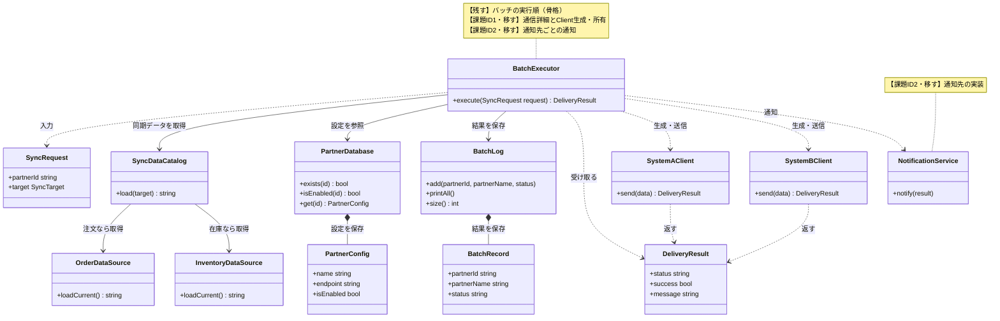
```mermaid
classDiagram
    class SyncRequest {
        +partnerId string
        +target SyncTarget
    }
    class OrderDataSource {
        +loadCurrent() string
    }
    class InventoryDataSource {
        +loadCurrent() string
    }
    class SyncDataCatalog {
        +load(target) string
    }
    class PartnerConfig {
        +name string
        +endpoint string
        +isEnabled bool
    }
    class PartnerDatabase {
        +exists(id) bool
        +isEnabled(id) bool
        +get(id) PartnerConfig
    }
    class DeliveryResult {
        +status string
        +success bool
        +message string
    }
    class BatchRecord {
        +partnerId string
        +partnerName string
        +status string
    }
    class BatchLog {
        +add(partnerId, partnerName, status)
        +printAll()
        +size() int
    }
    class BatchExecutor {
        +execute(SyncRequest request) DeliveryResult
    }
    class SystemAClient { +send(data) DeliveryResult }
    class SystemBClient { +send(data) DeliveryResult }
    class NotificationService { +notify(result) }
    PartnerDatabase *-- PartnerConfig : 設定を保存
    BatchLog *-- BatchRecord : 結果を保存
    SyncDataCatalog --> OrderDataSource : 注文なら取得
    SyncDataCatalog --> InventoryDataSource : 在庫なら取得
    BatchExecutor ..> SyncRequest : 入力
    BatchExecutor --> SyncDataCatalog : 同期データを取得
    BatchExecutor --> PartnerDatabase : 設定を参照
    BatchExecutor --> BatchLog : 結果を保存
    SystemAClient ..> DeliveryResult : 返す
    SystemBClient ..> DeliveryResult : 返す
    BatchExecutor ..> DeliveryResult : 受け取る
    BatchExecutor ..> SystemAClient : 生成・送信
    BatchExecutor ..> SystemBClient : 生成・送信
    BatchExecutor ..> NotificationService : 通知

    note for BatchExecutor "【残す】バッチの実行順（骨格）<br/>【課題ID1・移す】通信詳細とClient生成・所有<br/>【課題ID2・移す】通知先ごとの通知"
    note for NotificationService "【課題ID2・移す】通知先の実装"

    classDef focus fill:#FFF2CC,stroke:#D6B656,stroke-width:2px,color:#222222
    classDef stable fill:#E0F7FA,stroke:#0891B2,stroke-width:2px,color:#222222
    cssClass "BatchExecutor" focus
    cssClass "SyncRequest,OrderDataSource,InventoryDataSource,SyncDataCatalog,PartnerConfig,PartnerDatabase,DeliveryResult,BatchRecord,BatchLog" stable
```

変更前は`BatchExecutor`が外部連携と通知の二軸を抱え、さらに課題ID1のClient生成まで自分で行うため、連携先追加・通知追加のどちらでも同じ`execute()`を開きます。

課題ID1・課題ID2をクラス図の変更として書くと、次の3操作になります。

1. 課題ID1：連携先が満たす通信の窓口契約 `IExternalClient`（`send`）を新設する（窓口構造）。
2. 課題ID2：通知先が満たす共通契約 `INotifier`（`onComplete`）を新設し、登録リストで扱う（通知分離構造）。
3. 課題ID1：生成を担う契約`IClientCreator`（`createClient`）を新設し、外部連携の生成・所有を利用側から外す（生成分離構造）。

変更後は、`BatchExecutor` が実行順だけを持ち、通信・通知・生成がそれぞれの契約の裏へ移り、`execute()` の混在分岐が消えたことを確認します。

**採用した変更後のクラス図：**


```mermaid
classDiagram
    class SyncRequest
    class OrderDataSource
    class InventoryDataSource
    class SyncDataCatalog
    class PartnerConfig
    class PartnerDatabase
    class DeliveryResult
    class NotificationResult
    class NotificationLog
    class BatchRecord
    class BatchLog
    class BatchApplication
    class ManualTriggerController
    class BatchJob
    class SystemBClient
    class SystemCClient
    class SystemBClientCreator
    class SystemCClientCreator
    class BatchExecutor
    class IExternalClient { <<interface>> }
    class IClientCreator { <<interface>> }
    class INotifier { <<interface>> }
    class SystemAClientCreator
    class SystemAClient
    class SlackNotifier
    SyncDataCatalog --> OrderDataSource : 注文なら取得
    SyncDataCatalog --> InventoryDataSource : 在庫なら取得
    BatchExecutor ..> SyncRequest : 入力
    BatchExecutor ..> BatchJob : 登録順に実行
    BatchJob --> IClientCreator : 生成方法
    BatchJob ..> SyncRequest : 要求
    BatchExecutor --> SyncDataCatalog : 同期データを取得
    ManualTriggerController --> BatchExecutor : 同じexecuteを起動
    BatchExecutor --> IClientCreator
    BatchExecutor --> INotifier
    IClientCreator <|.. SystemAClientCreator
    IExternalClient <|.. SystemAClient
    SystemAClientCreator --> SystemAClient
    INotifier <|.. SlackNotifier
    IExternalClient <|.. SystemBClient
    IExternalClient <|.. SystemCClient
    IClientCreator <|.. SystemBClientCreator
    IClientCreator <|.. SystemCClientCreator
    PartnerDatabase *-- PartnerConfig : 設定を保存
    BatchLog *-- BatchRecord : 結果を保存
    NotificationLog *-- NotificationResult : 通知結果を保存
    INotifier ..> NotificationResult : 返す
    IExternalClient ..> DeliveryResult : 返す
    BatchExecutor ..> DeliveryResult : 受け取る
    BatchExecutor --> PartnerDatabase : 既存設定を参照
    BatchExecutor --> BatchLog : 既存方式で保存
    BatchExecutor --> NotificationLog : 通知成否を保存
    BatchApplication *-- PartnerDatabase : 所有
    BatchApplication *-- BatchLog : 所有
    BatchApplication *-- NotificationLog : 所有
    BatchApplication *-- OrderDataSource : 所有
    BatchApplication *-- InventoryDataSource : 所有
    BatchApplication *-- SyncDataCatalog : 所有
    BatchApplication --> BatchExecutor : 組み立て・実行
    BatchApplication --> ManualTriggerController : 組み立て・実行

    note for IExternalClient "【課題ID1・新設】通信の窓口契約（窓口構造）"
    note for INotifier "【課題ID2・新設】通知の共通契約（通知分離構造）"
    note for IClientCreator "【課題ID1・新設】外部連携Clientの生成契約"

    classDef focus fill:#FFF2CC,stroke:#D6B656,stroke-width:2px,color:#222222
    classDef stable fill:#E0F7FA,stroke:#0891B2,stroke-width:2px,color:#222222
    cssClass "IExternalClient,SystemAClient,INotifier,SlackNotifier,IClientCreator,SystemAClientCreator,NotificationResult,NotificationLog" focus
    cssClass "SyncRequest,OrderDataSource,InventoryDataSource,SyncDataCatalog,PartnerConfig,PartnerDatabase,DeliveryResult,BatchRecord,BatchLog" stable
```

クラス図の変更とコード変更を一対一で対応させると、次のようになります。

| 課題ID | クラス図をどう変えるか | コードレベルで何をするか | 詳しく解く節 |
|---|---|---|---|
| 課題ID1 | 通信窓口 `IExternalClient` と生成役 `IClientCreator` を新設する | 各Clientが `send()`、各Creatorが `createClient()` を実装し通信・生成・所有を閉じる | 課題ID1節（【契約】〜【利用開始】） |
| 課題ID2 | 通知の共通契約 `INotifier` を新設する | 各Notifierが `onComplete()` を実装し登録制にする | 課題ID2節（【契約】〜【利用開始】） |

このクラス図が、課題ID1・課題ID2を反映したシステム全体の設計結論です。課題IDは図の差分を追うために使い、以降はこの構造に必要なコードだけを示します。

**ここから具体へ入ります。** まず分ける対象の“もと”のコードを手元に戻し、次に課題ID1→課題ID2の順で、判断を一つずつ構造へ移します。

#### 課題箇所のおさらい（フェーズ3の関連コード）

統合表で特定した箇所だけを振り返ります。課題ID1は通信の直呼びと具体Clientの生成分岐、課題ID2は通知サービスの直生成・直呼びです。課題に関係しないコードは省略し、フェーズ3で明記した維持条件をそのまま引き継ぎます。

```cpp
// 現状：通信・通知・生成が execute() に混在する
DeliveryResult BatchExecutor::execute(const SyncRequest& request) {
    std::string partnerId = request.partnerId;
    std::string data = dataCatalog.load(request.target); // 変更対象外
    DeliveryResult result{"失敗", false, "未対応"};
    if (partnerId == "A") {
        SystemAClient client;   // 課題ID1: 通信と同じ理由で具体Clientを生成
        result = client.send(data); // 課題ID1: 通信の詳細を知っている
    } else if (partnerId == "B") {
        SystemBClient client;   // 課題ID1
        result = client.send(data); // 課題ID1
    }
    batchLog.add(partnerId, partnerId + "社", result.status); // 変更対象外
    NotificationService n;      // 課題ID2: 通知サービスを直接生成
    n.notify(result.status);     // 課題ID2: 通知の詳細を知っている
    return result;
}
```

### 課題ID1：連携先固有の生成・通信をバッチ骨格から分離する

**【課題ID1の原因】** 問題ID1・問題ID3（連携先の通信詳細と具体クライアント生成・失敗処理が骨格へ密結合）＝原因ID1（外部手順の知識の漏出）。この原因を分離対象にします。

**この課題（何を解きたいか）：** C社を足すだけで、`execute()` が具体Clientの生成分岐と各社の送信詳細まで抱える——問題ID1・問題ID3（痛み）／原因ID1（外部手順の漏出）です。**バッチの実行順は固定したまま、連携先ごとの生成と通信だけを差し替えられる**ようにするのが課題ID1です。

**どう解決するか（方針）：** 通信の窓口を共通契約の裏へ隠し（窓口固定構造＝Facade）、どの具体Clientを作るかの生成判断も生成役へ寄せます（生成分離構造＝Factory Method）。【契約】 →【安定骨格】検証・生成・送信を並べる窓口骨格 →【具体】 →【生成】 →【注入】 →【利用開始】実行 の順で組み立てます。

この課題で新設するのは、通信窓口 `IExternalClient` と生成役 `IClientCreator` の2契約です。

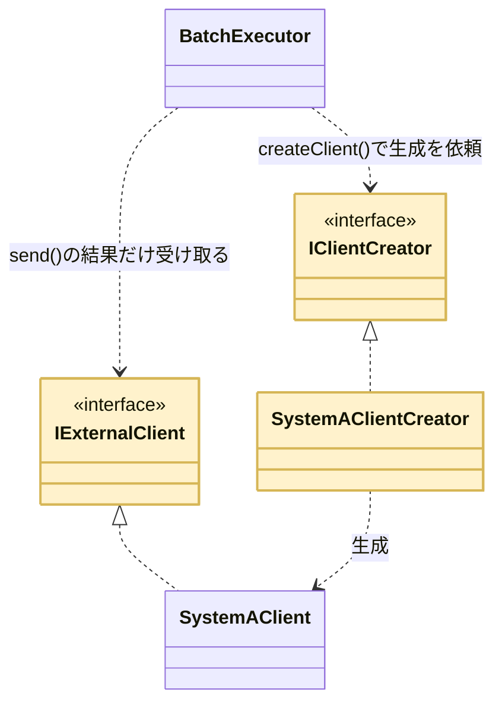
```mermaid
classDiagram
    class BatchExecutor
    class IExternalClient { <<interface>> }
    class SystemAClient
    class IClientCreator { <<interface>> }
    class SystemAClientCreator
    BatchExecutor ..> IClientCreator : createClient()で生成を依頼
    BatchExecutor ..> IExternalClient : send()の結果だけ受け取る
    IExternalClient <|.. SystemAClient
    IClientCreator <|.. SystemAClientCreator
    SystemAClientCreator ..> SystemAClient : 生成
    class IExternalClient:::focus
    class IClientCreator:::focus
    class SystemAClientCreator:::focus
    classDef focus fill:#FFF2CC,stroke:#D6B656,stroke-width:2px
```

**【契約】 共通契約 `IExternalClient` を定義する。** `BatchExecutor` は `send()` の結果 `DeliveryResult`（1-4から存在）だけを受け取り、各社固有の送信手順を知りません。

```cpp
class IExternalClient {
public:
    virtual ~IExternalClient() = default;
    // apiHealthy は、1-5のエラー条件「外部API送信に失敗する」を掲載コードで
    // 再現するためのスタブ入力。実システムでは通信結果そのものにあたる。
    virtual DeliveryResult send(const std::string& data,
                                bool apiHealthy) = 0;
};
```

**【具体】Clientが送信詳細だけを実装する（実行順は書かない）。** `SystemBClient`・`SystemCClient` も同じ形で、宛先と通信手順だけが変わります。

```cpp
class SystemAClient : public IExternalClient {
public:
    DeliveryResult send(const std::string& data,
                        bool apiHealthy) override {
        // A社APIへ転送（通信詳細はこのクラスに閉じる）
        if (!apiHealthy) return {"失敗", false, "A社: API障害"};
        return {"成功", true, "A社受付: " + data};
    }
};
```

**【生成】 どの具体を生成するかを、生成役 `IClientCreator` の一箇所へ閉じる。** `createClient()` は `new` した使い捨てClientを生ポインタで返し、**所有は呼び出した `execute()` が持ち、送信後に `delete` する**（【利用開始】で破棄）。

```cpp
class IClientCreator {
public:
    virtual ~IClientCreator() = default;
    virtual IExternalClient* createClient() = 0;
};
class SystemAClientCreator : public IClientCreator {
public:
    IExternalClient* createClient() override {
        return new SystemAClient();   // 所有は呼び出し側（execute）へ渡す
    }
};
```

**【注入】 生成役を安定側へ注入する。** 組み立て役 `BatchApplication` が各Creatorを所有し、`execute()` へ実行時に `IClientCreator*` を渡します（具体Clientの選択は骨格に漏れません）。

**掲載箇所：`BatchApplication::run()`** ―― 生成役を作り、実行時引数として窓口へ渡す2行です。
★完成コードと一致している？もし一致していないなら、他章も含め全見直しです。
```cpp
SystemAClientCreator creatorA;         // 生成役は組み立て側が所有
batch.execute(request, &creatorA);     // 【注入】 生成役を契約として渡す
```

**【安定骨格】 窓口の安定骨格。** `BatchExecutor::execute()` は、渡された生成役で生成→`send()`→`delete` の順を実行するだけで、A社かC社かを知りません。連携先が増えてもこの順序は変わりません。

**掲載箇所：`BatchExecutor::execute(const SyncRequest&, IClientCreator*)`** ―― 設定を引いた後の中核。生成→送信→保存→通知→破棄の順を固定します。

```cpp
IExternalClient* client = creator->createClient();  // 【安定骨格】 生成役へ委譲
DeliveryResult r = client->send(data, apiHealthy);  // 【安定骨格】 契約だけ呼ぶ
batchLog.add(partnerId, cfg.name, r.status);        // 【安定骨格】 結果を保存
for (INotifier* n : notifiers) {                    // 【安定骨格】 登録先へ一律通知
    n->onComplete(partnerId, r.status);
}
delete client;                                      // 【安定骨格】 使い捨て後に破棄
```

**【利用開始】** 組み立て役 `BatchApplication` が公開操作 `BatchExecutor::execute()` を呼びます。利用側が `createClient()` や具体Clientを直接呼ぶことはありません。

**掲載箇所：`BatchApplication::run()`** ―― 【注入】の直後。1件の連携ジョブを起動する行です。
★完成コードと一致している？
```cpp
batch.execute({"PARTNER_A", SyncTarget::Orders}, &creatorA); // 【利用開始】
```

#### 代表ケースの実行接続

A社への注文連携1件を、【生成】から【具体】まで実コードで追います。設計を説明する順は【契約】から【利用開始】ですが、実行時の呼出順は【生成】→【注入】→【利用開始】→【安定骨格】→【契約】→【具体】です。

| 実行順・ポイント | 掲載箇所 | 実際のコード接続 | 次の呼出先 |
|---|---|---|---|
| 1. 【生成】 | `SystemAClientCreator::createClient()` | `return new SystemAClient();` で使い捨てClientを作る | 【注入】へ |
| 2. 【注入】 | `BatchApplication`（組み立て側） | `batch.execute(request, &creatorA);` で生成役を契約として渡す | 【利用開始】へ |
| 3. 【利用開始】 | `BatchApplication` | `batch.execute({"PARTNER_A", SyncTarget::Orders}, &creatorA);` | `BatchExecutor::execute()` |
| 4. 【安定骨格】 | `BatchExecutor::execute(const SyncRequest&, IClientCreator*)` | `creator->createClient()` → `client->send(...)` → `delete client` の順 | `IExternalClient::send()` |
| 5. 【契約】 | `IExternalClient::send(const std::string&, bool)` | 生成されたClientへ動的ディスパッチする | `SystemAClient::send()` |
| 6. 【具体】 | `SystemAClient::send(const std::string&, bool)` | A社固有の送信手順を実行し `DeliveryResult` を返す | 戻り値を【安定骨格】の結果保存・通知へ |

【生成】の生成は生成役の中で起き、所有は【安定骨格】の `execute()` が持って送信後に破棄します。生成場所と所有者が分かれている点が、他章の【生成】とは異なります。

これで課題ID1の完了条件「連携先追加がClient・処理・生成登録に閉じ、バッチ順序が変わらない」を満たします。課題ID2の通知境界とは独立したまま、同じ実行骨格へ接続します。

### 課題ID2：通知先の種類と配送をバッチ骨格から分離する

**【課題ID2の原因】** 問題ID2（通知先の追加・仕様変更でバッチ本体が変わる）＝原因ID2（通知先の知識の漏出）。この原因を分離対象にします。

**この課題（何を解きたいか）：** Slackを足すだけで、`execute()` が具体通知先の生成と送信詳細を抱える——問題ID2（痛み）／原因ID2（通知先の漏出）です。**送信結果の配送を、通知先の種類を知らずに一律配布できる**ようにするのが課題ID2です。

**どう解決するか（方針）：** 通知先を共通契約へ揃え、登録済みの通知先へ一律配布します（通知分離構造＝Observer）。【契約】 →【安定骨格】登録リストを反復して一律配布する安定骨格 →【具体】 →【生成】 →【注入】・登録 →【利用開始】実行 の順で組み立てます。

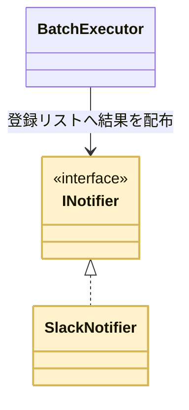
```mermaid
classDiagram
    class BatchExecutor
    class INotifier { <<interface>> }
    class SlackNotifier
    BatchExecutor --> INotifier : 登録リストへ結果を配布
    INotifier <|.. SlackNotifier
    class INotifier:::focus
    class SlackNotifier:::focus
    classDef focus fill:#FFF2CC,stroke:#D6B656,stroke-width:2px
```

**【契約】 共通契約 `INotifier` を定義する。** `BatchExecutor` は `onComplete()` の受付結果 `NotificationResult` だけを受け取ります。

```cpp
class INotifier {
public:
    virtual ~INotifier() = default;
    virtual NotificationResult
        onComplete(const std::string& message) = 0;
};
```

**【具体】通知先が送信詳細だけを実装する。**

```cpp
class SlackNotifier : public INotifier {
public:
    NotificationResult
    onComplete(const std::string& message) override {
        return {"Slack", true, message};   // Slack送信の詳細はここに閉じる
    }
};
```

**【生成】・所有。** 組み立て役 `BatchApplication` が具体通知先を生成し、所有します。

**掲載箇所：`BatchApplication::run()`** ―― 組み立ての先頭。具体通知先をローカル変数として作ります。

```cpp
SlackNotifier slack;               // 【生成】・所有は組み立て側
```

**【注入】（登録）。** 生成済みの通知先を `addNotifier()` で登録します。`BatchExecutor` が持つのは契約 `INotifier*` の借用参照だけです。

**掲載箇所：`BatchApplication::run()`** ―― 【生成】の直後。通知先を契約として窓口へ登録します。

```cpp
batch.addNotifier(&slack);         // 【注入】 登録で注入（借用参照）
```

**【安定骨格】 通知配布の安定骨格。** `BatchExecutor::execute()` は送信確定のあと、登録済みリストを順に回して `onComplete()` を呼びます。Slackかメールかを知らず、1件の通知が失敗しても送信確定と後続ジョブは止めません。

**掲載箇所：`BatchExecutor::execute(const SyncRequest&, IClientCreator*)`** ―― 送信結果を保存した直後の配布部分です。

```cpp
for (INotifier* n : notifiers) {
    n->onComplete(partnerId, result.status);   // 【安定骨格】 登録順に契約を呼ぶ
}
```

**【利用開始】** 通知そのものを利用側が呼ぶことはありません。【利用開始】は課題ID1と同じ、組み立て役 `BatchApplication` からの `batch.execute(...)` で、【安定骨格】が送信確定後に自動で配布します。

**掲載箇所：`BatchApplication::run()`** ―― 課題ID1と同じ起動行。通知はこの行から【安定骨格】を通って自動で配られます。

```cpp
batch.execute(request, &creatorA);   // 【利用開始】（通知は【安定骨格】から自動接続）
```

これで課題ID2の完了条件「通知追加・失敗が登録先と個別結果に閉じ、後続送信を止めない」を満たします。

### 6-1：生成・所有・実行順のまとめ

課題ID1・課題ID2を一本の実行経路へ束ね直します。採用するクラス図と責任配置はコードを書く前に確定しており、上の課題別展開は試行錯誤の履歴ではなく、完成構造を理解できる単位へ分けた実装順です。生成・所有・破棄・実行順は次の6-2の組み立てコードで一望します。

- Client：`execute()` が `createClient()` で生成・所有し、送信後に `delete`（使い捨て）。
- Notifier：`BatchApplication` が生成・所有し、`BatchExecutor` は借用参照を登録リストで保持（非所有）。
- Creator／Notifierの生存期間が `BatchExecutor` より長いことを、6-2の組み立てで確認します。

### 6-2：システム全体の契約とデータ配置を確定する

採用システムの契約、生成場所、依存注入を一表で確定します。接続点で受け渡すのは、送信結果 `DeliveryResult` と通知メッセージ（`string`）です。連携先設定と監査ログは `PartnerDatabase`／`BatchLog` の位置に残します。

```cpp
class BatchExecutor {
    std::vector<INotifier*> notifiers;   // 課題ID2: 登録された通知先
    PartnerDatabase& partners;
    BatchLog& log;
    NotificationLog& notificationLog;
    SyncDataCatalog& dataCatalog;         // 変更対象外の取得境界
public:
    void addNotifier(INotifier* n) { notifiers.push_back(n); }
    DeliveryResult execute(
        IClientCreator* creator,
        const SyncRequest& request) {
        IExternalClient* client = creator->createClient();   // 課題ID1の生成・所有
        std::string data = dataCatalog.load(request.target); // 既存の取得
        DeliveryResult r = client->send(data, apiHealthy);   // 課題ID1
        log.add(request.partnerId,
                partners.get(request.partnerId).name, r.status);
        for (auto* n : notifiers) {
            NotificationResult nr
                = n->onComplete(request.partnerId);          // 課題ID2
            notificationLog.add(nr);
        }
        delete client;                                       // 使い捨て後に破棄
        return r;
    }
};
```

| 接続点を変える観点 | システム全体での設計判断 | 変えたくない側が知らなくなる詳細 |
|---|---|---|
| 何を分離するか | 課題ID1を`IExternalClient`と`IClientCreator`、課題ID2を`INotifier`へ置く | 連携先の通信・生成・所有と通知先 |
| どこで生成・選択するか | 組み立て側（`BatchApplication`）がCreatorとNotifierを注入する | 具体Client・具体Notifierの選択 |
| どう依存を渡すか | 実行時にCreatorを渡し、Notifierは登録で渡す | 各契約の実体 |
| 安定側はどう実行するか | `BatchExecutor` は実行順どおりに委譲するだけ | 通信・通知・生成の中身 |

Client・Notifier・Creatorは組み立て側が所有し、`BatchExecutor` は非所有の契約ポインタを保持します。所有側の生存期間がExecutorより長いことを組み立てコードで確認します。

#### システム全体のコード適用結果

| 追跡対象 | 課題定義で目指した状態 | 適用した構造とコード | 適用結果 |
|---|---|---|---|
| 課題ID1：外部通信 | 連携先追加・API変更をバッチ骨格と他連携先へ波及させない | `IExternalClient` と各Client | 対象Clientへ通信詳細が閉じた |
| 課題ID2：通知 | 通知追加でバッチ本体の分岐を増やさない | `INotifier` の登録リスト | 新Notifierと登録へ変更が閉じた |
| 課題ID1：生成・所有 | 両入口から具体Client生成を外す | `IClientCreator`と共有Application | Client選択がCreatorへ集まり、`execute()`が所有し送信後にdeleteで破棄する |
| 課題ID1・課題ID2を接続したシステム全体 | 実行順と送信確定・成否を維持する | `execute()`が外部連携と通知の契約を順に利用する | 二軸を独立させたまま同じバッチ骨格で動く |
| 変更対象外：入力・取得・結果・保存 | 既存の入力契約、同期データ取得、結果契約、保存方法を維持する | `SyncRequest`、`SyncDataCatalog`、`DeliveryResult`、`BatchLog` をそのまま利用する | 対策前後で無関係なデータ差分を作っていない |

**システム全体の実装結果：達成。** 課題ID1・課題ID2が一つの実行経路で接続され、フェーズ5で目指した状態を実現しました。実際の動作と変更影響はフェーズ7で確認します。

### 6-3：課題から完成構造までの設計トレース

ここまでの決定を、課題ID1→課題ID2の順に一望へまとめます。この表は設計課題だけを追います。変更要求の受入はフェーズ7の要求ID表、変更影響は7-4の変更ID表で別に確認します。

| 課題ID | 採用構造と生成・接続場所 | 完成コードの主な場所 | 確認 |
|---|---|---|---|
| 課題ID1（通信） | 窓口固定。連携先ごとの通信を契約の裏へ隠す | `IExternalClient`／`SystemAClient`／`SystemBClient`／`SystemCClient` | 実行フローから通信手順の判断が消える |
| 課題ID1（生成） | 生成分離。Applicationが各Creatorを所有し、CreatorがClientを生成・破棄する | `IClientCreator`／`SystemAClientCreator`／`SystemBClientCreator`／`SystemCClientCreator` | 具体Clientの選択・生成がCreatorへ集まる |
| 課題ID2（通知） | 通知連結。Applicationが各Notifierを登録し、Executorが結果を配る | `INotifier`、`SlackNotifier`、`NotificationLog` | 通知先の追加・失敗が送信継続へ波及しない |
| 変更対象外 | 送信結果・保存。Executorは結果だけを渡す | `DeliveryResult`、`BatchLog` | 1-4、5件のバッチ実行ログ |

このクラス図、コード適用結果、シーケンス、コード変更表が、フェーズ7へ渡す完成設計です。

### 6-4：将来リスクに対する設計上の確認

ここでは将来連携先・通知先の実装有無ではなく、フェーズ2のリスクIDを採用構造へ再適用し、共通バッチ順をどこまで守れ、再試行運用に何が残るかを評価します。

| リスクID・将来リスク | 現在の構造による備え | リスク発生時の変更先 | 守れる範囲・残る弱点 |
|---|---|---|---|
| リスクID1：D社・E社など連携先がさらに増える（`BatchExecutor` 内の振り分けと送信ジョブ列が変わる） | IExternalClientとIClientCreatorの実装を登録し、順次実行骨格から会社固有処理を分ける | 新Client、Creator、PartnerDatabase、組み立て | BatchExecutorの共通順を守り、追加をClient・Creator・登録へ限定できる。Creator選択の登録表は会社追加ごとに変わる |
| リスクID2：Slack以外にメール・ログ基盤への通知が追加される（通知処理全体が変わる） | INotifier実装を追加し、BatchExecutorは共通通知契約だけを呼ぶ | 新Notifierと登録・所有箇所 | 連携Clientと送信確定を守り、通知追加を新Notifierと登録へ限定できる。通知先別の必須設定検証は追加時に必要になる |
| リスクID3：順次実行の途中失敗の扱いが増える（送信成否の判定と失敗通知の分岐が変わる） | DeliveryResultとBatchRecordで結果を共通化したが、再試行などの運用規則は実行骨格からさらに分ける余地がある | BatchExecutor、将来の実行ポリシー、BatchLog | 会社固有Clientを守れるが、停止・続行・再試行の規則はBatchExecutorに残り、増えれば実行ポリシー分離が必要になる |

リスクID1〜リスクID3を当てることで、Facade・Observer・Factory Methodの各境界が別々の将来変更を受け持つことを確認します。

## 🟢 フェーズ7：対策実施 ―― 変化に強いコードを完成させる
フェーズ6で確定した構造（外部連携・通知・生成の知識を別々の役割へ移す）を実装し、外部連携と通知処理の責務をそれぞれ独立したクラスへカプセル化（変更の影響を1クラス内に閉じ込めること）します。

これらの構造は、第2章で学んだ**窓口構造**（ネット銀行の振り込み処理で「複数サブシステムの複雑さを窓口1つに隠す」構造）、第7章で学んだ**通知分離構造**（在庫管理システムで「変化を登録リスナーへ伝搬する」構造）、第8章で学んだ**生成分離構造**（決済プロセッサーの切り替えで「生成の知識を一箇所に集約する」構造）を組み合わせたものです。各構造の詳細は各章を参照してください。

### 7-1：解決後のコード（全体）

フェーズ6で選んだ構造を実装します。連携先クライアントの生成を`IClientCreator`と具象Creatorに、通知処理を`INotifier`として分離します。入力の `SyncRequest`、データ取得の `SyncDataCatalog`、送信結果の`DeliveryResult`、保存先の`BatchLog`は1-4の現状コードから変更せず、新しい通信・通知・生成構造を既存経路へ接続します。今回追加するのは、複数ジョブの途中で失敗しても、その既存結果を記録して次へ進む制御です。

解決後のコードも、責任の固まりごとに分けて読みます。

**【1】 共通ヘッダーと同期要求（SyncRequest）**

まず、1-4から引き継ぐ入力契約を再掲します。

#### 完成後のクラス一覧

完成コードで定義する型を先に一覧化します。各型の依存方向と実現関係は、直後のクラス図で確認します。

- `SyncRequest`、`OrderDataSource`、`InventoryDataSource`、`SyncDataCatalog`
- `PartnerConfig`、`PartnerDatabase`、`DeliveryResult`、`NotificationResult`
- `NotificationLog`、`BatchRecord`、`BatchLog`、`BatchApplication`
- `ManualTriggerController`、`BatchJob`、`SystemBClient`、`SystemCClient`
- `SystemBClientCreator`、`SystemCClientCreator`、`BatchExecutor`、`IExternalClient`
- `IClientCreator`、`INotifier`、`SystemAClientCreator`、`SystemAClient`
- `SlackNotifier`

#### 完成後のクラス図

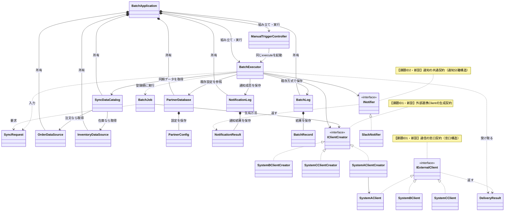
```mermaid
classDiagram
    class SyncRequest
    class OrderDataSource
    class InventoryDataSource
    class SyncDataCatalog
    class PartnerConfig
    class PartnerDatabase
    class DeliveryResult
    class NotificationResult
    class NotificationLog
    class BatchRecord
    class BatchLog
    class BatchApplication
    class ManualTriggerController
    class BatchJob
    class SystemBClient
    class SystemCClient
    class SystemBClientCreator
    class SystemCClientCreator
    class BatchExecutor
    class IExternalClient { <<interface>> }
    class IClientCreator { <<interface>> }
    class INotifier { <<interface>> }
    class SystemAClientCreator
    class SystemAClient
    class SlackNotifier
    SyncDataCatalog --> OrderDataSource : 注文なら取得
    SyncDataCatalog --> InventoryDataSource : 在庫なら取得
    BatchExecutor ..> SyncRequest : 入力
    BatchExecutor ..> BatchJob : 登録順に実行
    BatchJob --> IClientCreator : 生成方法
    BatchJob ..> SyncRequest : 要求
    BatchExecutor --> SyncDataCatalog : 同期データを取得
    ManualTriggerController --> BatchExecutor : 同じexecuteを起動
    BatchExecutor --> IClientCreator
    BatchExecutor --> INotifier
    IClientCreator <|.. SystemAClientCreator
    IExternalClient <|.. SystemAClient
    SystemAClientCreator --> SystemAClient
    INotifier <|.. SlackNotifier
    IExternalClient <|.. SystemBClient
    IExternalClient <|.. SystemCClient
    IClientCreator <|.. SystemBClientCreator
    IClientCreator <|.. SystemCClientCreator
    PartnerDatabase *-- PartnerConfig : 設定を保存
    BatchLog *-- BatchRecord : 結果を保存
    NotificationLog *-- NotificationResult : 通知結果を保存
    INotifier ..> NotificationResult : 返す
    IExternalClient ..> DeliveryResult : 返す
    BatchExecutor ..> DeliveryResult : 受け取る
    BatchExecutor --> PartnerDatabase : 既存設定を参照
    BatchExecutor --> BatchLog : 既存方式で保存
    BatchExecutor --> NotificationLog : 通知成否を保存
    BatchApplication *-- PartnerDatabase : 所有
    BatchApplication *-- BatchLog : 所有
    BatchApplication *-- NotificationLog : 所有
    BatchApplication *-- OrderDataSource : 所有
    BatchApplication *-- InventoryDataSource : 所有
    BatchApplication *-- SyncDataCatalog : 所有
    BatchApplication --> BatchExecutor : 組み立て・実行
    BatchApplication --> ManualTriggerController : 組み立て・実行

    note for IExternalClient "【課題ID1・新設】通信の窓口契約（窓口構造）"
    note for INotifier "【課題ID2・新設】通知の共通契約（通知分離構造）"
    note for IClientCreator "【課題ID1・新設】外部連携Clientの生成契約"

    classDef focus fill:#FFF2CC,stroke:#D6B656,stroke-width:2px,color:#222222
    classDef stable fill:#E0F7FA,stroke:#0891B2,stroke-width:2px,color:#222222
    cssClass "IExternalClient,SystemAClient,INotifier,SlackNotifier,IClientCreator,SystemAClientCreator,NotificationResult,NotificationLog" focus
    cssClass "SyncRequest,OrderDataSource,InventoryDataSource,SyncDataCatalog,PartnerConfig,PartnerDatabase,DeliveryResult,BatchRecord,BatchLog" stable
```

完成後はCreatorが外部Clientを生成し、`BatchExecutor` が統合窓口として実行し、Observer契約で完了を通知します。水色の入力・データ取得・設定・結果・保存は変更前と同じで、黄色の責任配置と依存関係だけが変わっています。章末の複合骨格図と同じ依存方向です。

#### 完成後の実行シーケンス

実行時にオブジェクト間でどのようなメッセージが流れるかを示します。`BatchApplication` が全具体型を組み立て、`BatchExecutor` はインターフェース経由でのみ各オブジェクトと通信していることが分かります。

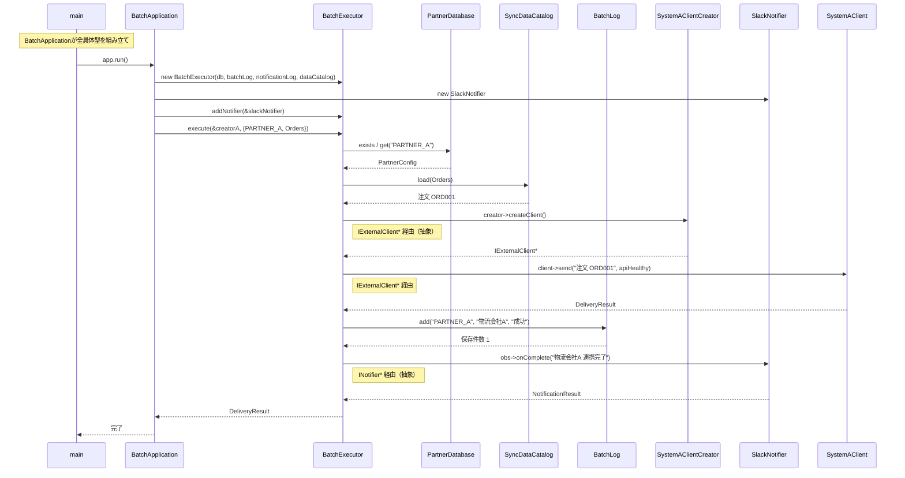
```mermaid
sequenceDiagram
    participant main
    participant BA as BatchApplication
    participant BE as BatchExecutor
    participant DB as PartnerDatabase
    participant DC as SyncDataCatalog
    participant BL as BatchLog
    participant AC as SystemAClientCreator
    participant SN as SlackNotifier
    participant SA as SystemAClient
    Note over main: BatchApplicationが全具体型を組み立て
    main->>BA: app.run()
    BA->>BE: new BatchExecutor(db, batchLog, notificationLog, dataCatalog)
    BA->>SN: new SlackNotifier
    BA->>BE: addNotifier(&slackNotifier)
    BA->>BE: execute(&creatorA, {PARTNER_A, Orders})
    BE->>DB: exists / get("PARTNER_A")
    DB-->>BE: PartnerConfig
    BE->>DC: load(Orders)
    DC-->>BE: 注文 ORD001
    BE->>AC: creator->createClient()
    Note right of BE: IExternalClient* 経由（抽象）
    AC-->>BE: IExternalClient*
    BE->>SA: client->send("注文 ORD001", apiHealthy)
    Note right of BE: IExternalClient* 経由
    SA-->>BE: DeliveryResult
    BE->>BL: add("PARTNER_A", "物流会社A", "成功")
    BL-->>BE: 保存件数 1
    BE->>SN: obs->onComplete("物流会社A 連携完了")
    Note right of BE: INotifier* 経由（抽象）
    SN-->>BE: NotificationResult
    BE-->>BA: DeliveryResult
    BA-->>main: 完了
```

#### 完成コード

```cpp
#include <iostream>
#include <string>
#include <vector>
#include <map>
#include <memory>

using namespace std;

enum class SyncTarget {
    Orders,
    Inventory
};

struct SyncRequest {
    string partnerId;
    SyncTarget target;
};
```

**【2】 同期対象データの取得（OrderDataSource / InventoryDataSource / SyncDataCatalog）**

受注管理・商品在庫管理からデータを取得する既存境界も、そのまま引き継ぎます。

```cpp
class OrderDataSource {
public:
    string loadCurrent() const {
        return "注文 ORD001";
    }
};

class InventoryDataSource {
public:
    string loadCurrent() const {
        return "在庫 SKU001";
    }
};

class SyncDataCatalog {
    OrderDataSource& orders;
    InventoryDataSource& inventory;
public:
    SyncDataCatalog(OrderDataSource& orderSource,
                    InventoryDataSource& inventorySource)
        : orders(orderSource), inventory(inventorySource) {}

    string load(SyncTarget target) const {
        return target == SyncTarget::Orders
            ? orders.loadCurrent()
            : inventory.loadCurrent();
    }
};
```

**【3】 連携先設定と送信結果（PartnerConfig / PartnerDatabase / DeliveryResult）**

連携先マスタと、送信1件ごとの成否を表す結果型も再掲します。

```cpp
struct PartnerConfig {
    string name;      // パートナー名
    string endpoint;  // エンドポイント（概念上）
    bool isEnabled;   // 連携有効フラグ
};

class PartnerDatabase {
private:
    map<string, PartnerConfig> records;
public:
    PartnerDatabase() {
        records["PARTNER_A"] = {"物流会社A", "logistics-a.example",  true};
        records["PARTNER_B"] = {"在庫会社B", "stock-b.example",      true};
        records["PARTNER_C"] = {"配送会社C", "delivery-c.example",   true};  // 今回追加
        records["PARTNER_Z"] = {"分析会社Z", "analytics-z.example",  false}; // 無効
    }

    bool exists(const string& id) const {
        return records.count(id) > 0;
    }

    bool isEnabled(const string& id) const {
        return records.at(id).isEnabled;
    }

    PartnerConfig get(const string& id) const {
        return records.at(id);
    }

    void save(const string& id, const PartnerConfig& cfg) {
        records[id] = cfg;            // 実行中の連携先表へ追加
    }
};

// 送信1件分の結果（1-4から変更しない契約）
struct DeliveryResult {
    string status;   // "成功" または "失敗"
    bool success;
    string message;  // 送信の詳細（バイト数、失敗理由など）
};
```

`PartnerDatabase` は1-4と同じ連携先マスタで、今回追加のC社レコードだけが増えます。`DeliveryResult`のフィールドと意味は1-4から変わりません。つまり、仕様変更による差分は連携先レコードと利用側の実行構造であり、結果契約ではありません。

**【4】 通知のインターフェースと実装（INotifier / SlackNotifier）**

次に、通知先ごとの送信方法を個別クラスへ分けるためのインターフェースと、その実装を定義します。

```cpp
struct NotificationResult {
    string channel;
    bool success;
    string message;
};

class NotificationLog {
    vector<NotificationResult> records;
public:
    void add(const NotificationResult& result) {
        records.push_back(result);
        cout << "通知結果を保存(" << records.size() << "件): "
             << result.channel << " -> "
             << (result.success ? "成功" : "失敗");
        if (!result.message.empty()) cout << " (" << result.message << ")";
        cout << endl;
    }
    int size() const { return (int)records.size(); }
};

// 通知のインターフェース（通知受付結果を返す契約）
class INotifier {
public:
    virtual ~INotifier() {}
    virtual NotificationResult onComplete(string result) = 0;
};

// Slack通知の具体的な実装（受け取った通知を蓄積する）
```
続いて `SlackNotifier` です。

```cpp
class SlackNotifier : public INotifier {
    vector<string> inbox;
public:
    NotificationResult onComplete(string result) {
        inbox.push_back(result);
        cout << "Slack通知(" << inbox.size() << "件): " << result << endl;
        return {"Slack", true, "受付完了"};
    }
};
```

**【5】 バッチ実行ログ（BatchRecord / BatchLog）**

バッチ実行ログ（`BatchLog`）は1-4と同じ型・同じ保存方法を使います。システム起動時は空で、バッチが実行されるたびに結果を1件追記し、保存件数も表示します。無効パートナーのスキップも記録し、ファイルではなく実行中のメモリ上に保持します。

```cpp
struct BatchRecord {
    std::string partnerId;
    std::string partnerName;
    std::string status;   // "成功", "失敗", "スキップ（無効）"
};

// バッチ実行ログを管理するクラス
class BatchLog {
    std::vector<BatchRecord> records;
public:
    void add(const std::string& partnerId, const std::string& partnerName,
             const std::string& status) {
        records.push_back({partnerId, partnerName, status});
        std::cout << "実行結果を保存(" << records.size() << "件): ["
                  << partnerId << "] " << partnerName
                  << " -> " << status << std::endl;
    }
    void printAll() const {
        for (const auto& r : records) {
            std::cout << "[" << r.partnerId << "] " << r.partnerName
                      << " -> " << r.status << std::endl;
        }
    }
    int size() const { return (int)records.size(); }
};
```

**【6】 連携先クライアントの抽象と実装（IExternalClient / SystemAClient ほか）**

次に、連携先クライアントのインターフェースと実装を定義します。新しい連携先を利用するときは、このインターフェースを実装したクラスを追加します。

```cpp
// 連携先クライアントのインターフェース（送信結果 DeliveryResult を返す）
// apiHealthy は外部APIの健全性をスタブで表す（false=API障害）
class IExternalClient {
public:
    virtual ~IExternalClient() {}
    virtual DeliveryResult send(string data, bool apiHealthy) = 0;
};

// A社向け実装
class SystemAClient : public IExternalClient {
public:
    DeliveryResult send(string data, bool apiHealthy) {
        cout << "A社へ転送: " << data << endl;
        if (!apiHealthy) return {"失敗", false, "A社: API障害"};
        return {"成功", true, "A社: 連携完了"};
    }
};

// B社向け実装
class SystemBClient : public IExternalClient {
public:
    DeliveryResult send(string data, bool apiHealthy) {
        cout << "B社へ転送: " << data << endl;
        if (!apiHealthy) return {"失敗", false, "B社: API障害"};
        return {"成功", true, "B社: 連携完了"};
    }
};
```
続いて `SystemCClient` です。

```cpp
class SystemCClient : public IExternalClient {
public:
    DeliveryResult send(string data, bool apiHealthy) {
        cout << "C社へ転送: " << data << endl;
        if (!apiHealthy) return {"失敗", false, "C社: API障害"};
        return {"成功", true, "C社: 連携完了"};
    }
};
```

各連携先クライアントは`IExternalClient`を実装し、送信の成否を `DeliveryResult` として返します。`apiHealthy` は外部APIの健全性をスタブで表し、`false`（API障害）のときは失敗結果を返します。これで1-5の変更後動作例の行1（B社のAPI障害）を、次の `BatchExecutor` から再現できます。

**【7】 クライアント生成の抽象と実装（IClientCreator / SystemAClientCreator ほか）**

生成メソッドの契約と、連携先ごとの具象Creatorを定義します。

```cpp
// Creatorの契約：サブクラスが生成方法を決める
class IClientCreator {
public:
    virtual ~IClientCreator() = default;
    virtual IExternalClient* createClient() = 0;
};

class SystemAClientCreator : public IClientCreator {
public:
    IExternalClient* createClient() override {
        return new SystemAClient();
    }
};

class SystemBClientCreator : public IClientCreator {
public:
    IExternalClient* createClient() override {
        return new SystemBClient();
    }
};
```
続いて `SystemCClientCreator` です。

```cpp
class SystemCClientCreator : public IClientCreator {
public:
    IExternalClient* createClient() override {
        return new SystemCClient();
    }
};
```

各具象Creatorが、自分に対応するクライアントの生成だけを知ります。`BatchExecutor`は`IClientCreator`だけを知り、生成する具体型を知りません。

**【8】 フローを統括するクラス（BatchExecutor）**

バッチ全体のフローを統括する窓口です。`IClientCreator` 経由でクライアントを生成し、送信結果を通知先へ反映します。生成する具体型も通知先の具体型も知りません。

```cpp
// 一つのバッチへ登録するジョブ。生成方法・要求・外部状態を保持する。
struct BatchJob {
    IClientCreator* creator;
    SyncRequest request;
    bool apiHealthy;
};

// 送信→結果保存→通知（バッチ・手動の両入口が共有する後段処理）
static DeliveryResult deliverResult(
        IExternalClient& client, const string& data,
        const string& partnerId, const string& partnerName,
        BatchLog& batchLog, NotificationLog& notificationLog,
        const vector<INotifier*>& notifiers,
        bool apiHealthy, const string& kind) {
    DeliveryResult r = client.send(data, apiHealthy);
    batchLog.add(partnerId, partnerName, r.status);
    string note = r.success ? (partnerName + " " + kind + "連携完了")
                            : (partnerName + " " + kind + "連携失敗: " + r.message);
    for (auto* notifier : notifiers) {
        NotificationResult result = notifier->onComplete(note);
        notificationLog.add(result);
    }
    return r;
}

// バッチ全体のフローを統括するクラス（窓口構造）
class BatchExecutor {
    vector<INotifier*> notifiers;
    PartnerDatabase& db;
    BatchLog& batchLog;
    NotificationLog& notificationLog;
    SyncDataCatalog& dataCatalog;
public:
    BatchExecutor(PartnerDatabase& database, BatchLog& log,
                  NotificationLog& notifications,
                  SyncDataCatalog& catalog)
        : db(database), batchLog(log),
          notificationLog(notifications), dataCatalog(catalog) {}

    void addNotifier(INotifier* obs) { notifiers.push_back(obs); }

    // 送信結果を受け取り、通知内容へ反映して DeliveryResult を返す
    DeliveryResult execute(IClientCreator* creator,
                           const SyncRequest& request,
                           bool apiHealthy = true,
                           const string& kind = "") {
        const string& partnerId = request.partnerId;
        if (!db.exists(partnerId)) {
            cout << "エラー: パートナーID [" << partnerId
                 << "] はデータベースに登録されていません。" << endl;
            DeliveryResult r{"失敗", false, "未登録"};
            batchLog.add(partnerId, "未登録", r.status);
            return r;
        }
        PartnerConfig cfg = db.get(partnerId);
        if (!cfg.isEnabled) {
            cout << "エラー: パートナー [" << cfg.name
                 << "] は現在無効です。処理を中断します。" << endl;
            DeliveryResult r{"失敗", false, "無効"};
            batchLog.add(partnerId, cfg.name, "スキップ（無効）");
            return r;
        }

        // 生成分離構造を抽象Creator経由で呼び出す
        IExternalClient* client = creator->createClient();
        string data = dataCatalog.load(request.target);
        cout << "[送信先] " << cfg.name
             << " (" << cfg.endpoint << ")" << endl;
        // 送信・保存・通知は手動入口と共有の後段処理へ委譲する
        DeliveryResult r = deliverResult(*client, data, partnerId, cfg.name,
                                         batchLog, notificationLog, notifiers,
                                         apiHealthy, kind);
        delete client;   // 使い捨てクライアントを破棄
        return r;
    }

    // 登録順に全ジョブを実行する。失敗結果でもループを止めない。
    vector<DeliveryResult> executeBatch(const vector<BatchJob>& jobs) {
        vector<DeliveryResult> results;
        for (const auto& job : jobs) {
            results.push_back(execute(job.creator, job.request,
                                      job.apiHealthy));
        }
        return results;
    }
};
```

`execute()` は1件の共通処理、`executeBatch()` は変更ID3・変更ID4の順次実行を担います。`executeBatch()`はジョブ列を登録順に走査し、失敗結果も保存・通知してから次のジョブへ進みます。したがって、`main()`が失敗後の続行を手動で呼び分けるのではありません。

所有関係を整理します。`createClient()` が返す `IExternalClient*` は使い捨てで、生成した `execute()` が所有し、送信後に `delete` して破棄します（未登録・無効の早期returnは生成前なので破棄漏れは起きません）。一方 `notifiers` が保持する `INotifier*` は**借用参照**で、実体の `SlackNotifier` は `BatchApplication::run()` がスタックに持ち、`BatchExecutor` は生成も破棄もしません。生成して所有するもの（Client）と、外から借りて使うだけのもの（Notifier）を、破棄責任の有無で区別しています。

**【9】 手動トリガーのクラス（ManualTriggerController）**

手動同期の起点となるクラスです。指定した連携先へ同期を実行し、結果を通知先へ届けます。

```cpp
class ManualTriggerController {
    BatchExecutor& executor;
    IClientCreator& creator;
public:
    ManualTriggerController(BatchExecutor& e, IClientCreator& c)
        : executor(e), creator(c) {}
    DeliveryResult triggerSync(const SyncRequest& request,
                               bool apiHealthy = true) {
        cout << "[ManualTrigger] " << request.partnerId
              << " への手動同期を実行。" << endl;
        // 手動入口は起動方法だけを担当し、同じユースケースへ委譲する。
        return executor.execute(&creator, request, apiHealthy, "手動");
    }
};
```

`ManualTriggerController`は手動起点だけを担い、Client生成、データ取得、送信、結果保存、通知のすべてを同じ`BatchExecutor::execute()`へ委譲します。後段関数だけでなくユースケース全体を共有するため、バッチ入口と手動入口で検証・生成・保存の規則が分岐しません。

**【10】 組み立てと実行（BatchApplication / main）**

各クラスを組み立て、1-5の変更後動作例の代表ケースを順に実行します。どの連携先にどの通知先を組み合わせるかは、この組み立て箇所だけで決めます。

```cpp
class BatchApplication {
    PartnerDatabase db;
    BatchLog batchLog;
    NotificationLog notificationLog;
    OrderDataSource orders;
    InventoryDataSource inventory;
    SyncDataCatalog dataCatalog;

public:
    BatchApplication() : dataCatalog(orders, inventory) {}

    void run() {
        SlackNotifier slack;
        SystemAClientCreator creatorA;
        SystemBClientCreator creatorB;
        SystemCClientCreator creatorC;

        cout << "--- 行1: A→B→C 順次バッチ（B社はAPI障害） ---"
             << endl;
        BatchExecutor batch(db, batchLog, notificationLog, dataCatalog);
        batch.addNotifier(&slack);
        vector<BatchJob> jobs{
            {&creatorA, {"PARTNER_A", SyncTarget::Orders}, true},
            {&creatorB, {"PARTNER_B", SyncTarget::Inventory}, false},
            {&creatorC, {"PARTNER_C", SyncTarget::Orders}, true}
        };
        batch.executeBatch(jobs);

        cout << "--- 行2: B社手動トリガー（既存入口） ---" << endl;
        BatchExecutor executorManual(
            db, batchLog, notificationLog, dataCatalog);
        executorManual.addNotifier(&slack);
        ManualTriggerController manual(executorManual, creatorB);
        manual.triggerSync(
            {"PARTNER_B", SyncTarget::Inventory});

        cout << "--- 行3: 無効パートナーZ社 ---" << endl;
        BatchExecutor executorZ(db, batchLog, notificationLog, dataCatalog);
        executorZ.execute(
            &creatorA, {"PARTNER_Z", SyncTarget::Orders});

        // 要求ID5の回帰：無効だけでなく未登録の連携先も外部送信しない
        cout << "--- 行4: 未登録パートナーX社 ---" << endl;
        BatchExecutor executorX(db, batchLog, notificationLog, dataCatalog);
        executorX.execute(
            &creatorA, {"PARTNER_X", SyncTarget::Orders});

        cout << "\n--- バッチ実行ログ（" << batchLog.size() << "件） ---\n";
        batchLog.printAll();
        cout << "--- 通知結果ログ（" << notificationLog.size()
             << "件） ---\n";
    }
};

int main() {
    BatchApplication app;
    app.run();
    return 0;
}
```

1-2の現状動作例と、1-5の変更後動作例を通します。見るのは、外部から見える結果が保たれたまま、変更理由ごとに責任が分かれているかです。

**実行結果：**

```
--- 行1: A→B→C 順次バッチ（B社はAPI障害） ---
[送信先] 物流会社A (logistics-a.example)
A社へ転送: 注文 ORD001
実行結果を保存(1件): [PARTNER_A] 物流会社A -> 成功
Slack通知(1件): 物流会社A 連携完了
通知結果を保存(1件): Slack -> 成功 (受付完了)
[送信先] 在庫会社B (stock-b.example)
B社へ転送: 在庫 SKU001
実行結果を保存(2件): [PARTNER_B] 在庫会社B -> 失敗
Slack通知(2件): 在庫会社B 連携失敗: B社: API障害
通知結果を保存(2件): Slack -> 成功 (受付完了)
[送信先] 配送会社C (delivery-c.example)
C社へ転送: 注文 ORD001
実行結果を保存(3件): [PARTNER_C] 配送会社C -> 成功
Slack通知(3件): 配送会社C 連携完了
通知結果を保存(3件): Slack -> 成功 (受付完了)
--- 行2: B社手動トリガー（既存入口） ---
[ManualTrigger] PARTNER_B への手動同期を実行。
[送信先] 在庫会社B (stock-b.example)
B社へ転送: 在庫 SKU001
実行結果を保存(4件): [PARTNER_B] 在庫会社B -> 成功
Slack通知(4件): 在庫会社B 手動連携完了
通知結果を保存(4件): Slack -> 成功 (受付完了)
--- 行3: 無効パートナーZ社 ---
エラー: パートナー [分析会社Z] は現在無効です。処理を中断します。
実行結果を保存(5件): [PARTNER_Z] 分析会社Z -> スキップ（無効）
--- 行4: 未登録パートナーX社 ---
エラー: パートナーID [PARTNER_X] はデータベースに登録されていません。
実行結果を保存(6件): [PARTNER_X] 未登録 -> 失敗

--- バッチ実行ログ（6件） ---
[PARTNER_A] 物流会社A -> 成功
[PARTNER_B] 在庫会社B -> 失敗
[PARTNER_C] 配送会社C -> 成功
[PARTNER_B] 在庫会社B -> 成功
[PARTNER_Z] 分析会社Z -> スキップ（無効）
[PARTNER_X] 未登録 -> 失敗
--- 通知結果ログ（4件） ---
```

行1の実行順はA社→B社→C社です。B社が失敗しても、その失敗結果とSlack通知を残した後にC社が実行されています。これにより変更ID1〜変更ID4を一つの起点操作で確認できます。行2・3では、仕様変更の対象外である手動入口と無効設定の扱いも維持しています。

この実装により、`BatchExecutor` は通信の詳細や通知の仕組みを知ることなく、送信結果の受け取りとフローの統括に専念できるようになりました。

#### 最終要求の実装・受入エビデンス

変更後要求ベースラインの全有効要求IDを同じ順序で照合します。今回変わらなかった既存要求も対象にするため、要求の消失を検出できます。

| 要求ID | 最終要求 | 適用コード | 実行シナリオ・観測結果・判定 |
|---|---|---|---|
| 要求ID1 | A社・B社・C社の有効な連携先設定を取得する | `PartnerDatabase`、各Creator | 登録済み有効先だけ送信<br/>**判定:** 合格 |
| 要求ID2 | 注文または在庫データを取得して指定先へ送る | `SyncDataCatalog`、各Client | 要求した実データをAPIへ送信<br/>**判定:** 合格 |
| 要求ID3 | 各送信結果をDeliveryResultで返し、BatchLogへ保存する | `DeliveryResult`、`BatchLog` | 成功・失敗を3件とも記録<br/>**判定:** 合格 |
| 要求ID4 | 各社の送信結果をSlackへ個別通知する | `SlackNotifier`、`NotificationLog` | A・B・Cの通知結果を各1件保存<br/>**判定:** 合格 |
| 要求ID5 | 未登録・無効な連携先を外部送信せず記録する | `PartnerDatabase`、`BatchExecutor` | 行3で無効Z社をスキップ、行4で未登録X社を失敗として記録。どちらも外部送信なし<br/>**判定:** 合格 |
| 要求ID6 | A・B・Cを登録順に一つのバッチで実行する | `BatchJob`、`executeBatch()` | 実行ログがA→B→C<br/>**判定:** 合格 |
| 要求ID7 | 途中失敗を保存・通知し、後続ジョブを続ける | `BatchExecutor`の反復処理 | B失敗後もCを実行し3件保存<br/>**判定:** 合格 |

上の表は継続（要求ID2・要求ID3・要求ID5）・変更（要求ID1・要求ID4）・追加（要求ID6・要求ID7）を同じ順序で並べ、変わらなかった既存要求も回帰対象に含めています。継続要求が合格していることで、既存動作が落ちていないことを確認できます。要求の受入・回帰はここで完了します。課題IDへ直接対応付けず、以下では変更試行の痛みから導いた構造課題だけを別に確認します。

#### 設計課題の構造改善結果

要求の受入とは分けて、課題IDごとに構造と変更影響を確認します。

| 課題ID | 構造差分・コード適用先 | 確認できた効果 | 残る変更先 |
|---|---|---|---|
| 課題ID1 | `IExternalClient`と`IClientCreator`へ通信・生成を分離 | C社追加がClient・Creator・登録に閉じた | 新ClientとCreator |
| 課題ID2 | `INotifier`へ通知を分離し個別結果を保存 | Slack追加・失敗が送信継続へ波及しない | 新Notifierと登録 |
#### 変更前→変更後の不変条件照合

| 変更対象外 | 変更前 | 変更後 | 確認根拠 |
|---|---|---|---|
| 同期入力・取得 | `SyncRequest` で対象を選び `SyncDataCatalog` から取得 | 同じ入力が同じデータ取得へ到達 | 注文・在庫の送信内容 |
| 送信結果・保存 | `DeliveryResult` を `BatchLog` へ保存 | 同じ契約・同じレコード形式 | 5件のバッチ実行ログ |

### 7-2：動作シーケンス図の検証

完成クラス図と実行シーケンスは、完成コードへ入る前に示しました。ここまでのコード、要求追跡表、不変条件照合を証拠として、次節で変更影響を再確認します。

### 7-3：変更影響グラフ（改善後）

フェーズ3で確認した「変更要求：連携先の追加」と「通知先の追加」のシナリオを、3-2と同じ粒度で再度適用します。

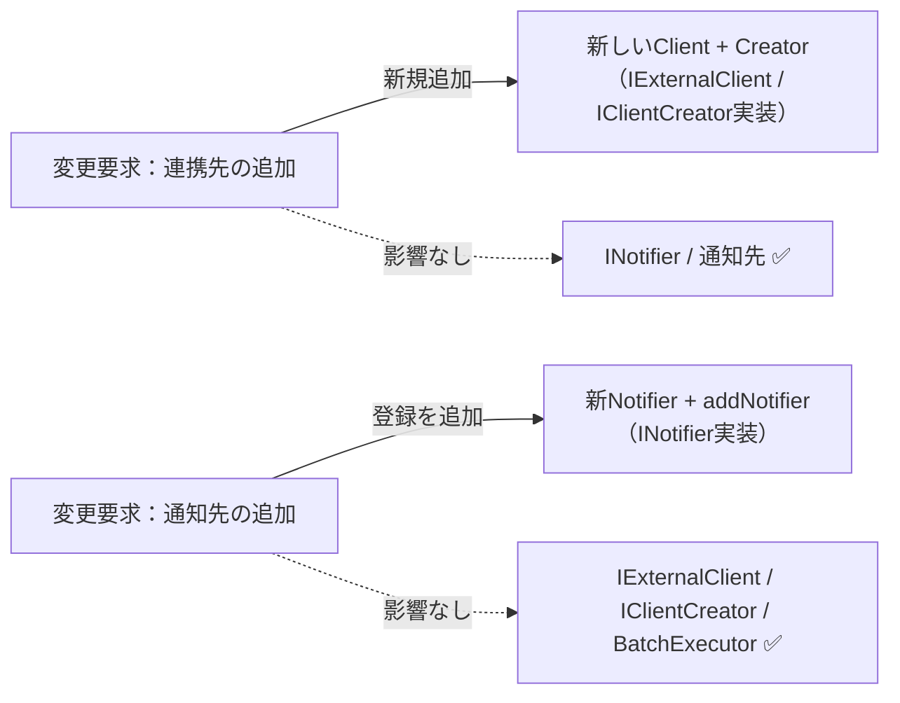
```mermaid
graph LR
    T1["変更要求：連携先の追加"]
        -->|新規追加| N1["新しいClient + Creator<br>（IExternalClient / IClientCreator実装）"]
    T2["変更要求：通知先の追加"]
        -->|登録を追加| N2["新Notifier + addNotifier<br>（INotifier実装）"]
    T1 -. "影響なし" .-> A["INotifier / 通知先 ✅"]
    T2 -. "影響なし" .-> B["IExternalClient / IClientCreator / BatchExecutor ✅"]
```

フェーズ3の変更影響グラフと同じ要求・同じ粒度で比べると、課題ID1の連携先追加は`IExternalClient`／`IClientCreator`の実装1組へ、課題ID2の通知先追加は`INotifier`の実装1クラスと登録へ限定されました。生成は課題ID1の組み立て責任であり、独立した第三の変化軸ではありません。

| 3-2で影響した場所 | 修正後 | 構造変更との対応 |
|---|---|---|
| `execute()` の通信直呼び（課題ID1） | **修正しない** | 通信を窓口構造の裏へ移した |
| `execute()` の通知直生成・直呼び（課題ID2） | Notifier追加と `addNotifier` 1行 | 通知を通知分離構造へ移した |
| `execute()` の具体Client生成分岐（課題ID1） | Creatorを1クラス追加する | 課題ID1の生成責任を生成分離構造へ移した |

### 7-4：変更シナリオ表

今回の変更ID1〜変更ID4について、フェーズ1の構造で必要だった修正と完成構造の結果を対比します。

| 変更依頼 | フェーズ1の現状構造での影響 | 完成構造での結果 |
|---|---|---|
| 変更ID1：C社の外部連携を追加する | `BatchExecutor`へC社の生成・通信分岐を追加 | `SystemCClient`とCreatorを登録し、C社へ送信した結果を既存契約で保存 |
| 変更ID2：各社の成功・失敗をSlackへ自動通知する | 各社の成功・失敗分岐へSlack呼び出しを追加 | `SlackNotifier`を登録し、A社・B社・C社の結果を各1件通知 |
| 変更ID3：A社・B社・C社のジョブを登録順に一つのバッチで実行する | `BatchExecutor`が3社の順序を条件分岐で保持 | 登録順のジョブ列を実行し、実行ログがA社→B社→C社になることを確認 |
| 変更ID4：途中の送信失敗を保存・通知し、後続ジョブを続ける | 送信分岐ごとに失敗保存・通知・継続判断を追加 | B社失敗を保存・通知した後もC社を実行し、3件すべての結果を保持 |

責任を分けた代わりに、クラス数と部品の登録・組み立てを管理するコストを引き受けます。

---

## 整理


### 問題・原因・課題・解決策

| | 内容 |
|---|---|
| **問題** | 外部連携バッチで「連携先の追加」「通知先の追加」「生成方法の変更」という変わる理由が異なる3つの判断（独立した業務上の変化軸は外部連携と通知の二つ、生成はその組み立て責任）が、同じ `BatchExecutor` に混在している |
| **原因** | `BatchExecutor` が各連携先クライアントと通知サービスを生成方法と呼び出し手順を知っているため、どの変化が来ても `BatchExecutor` 全体への影響確認が必要になる |
| **課題** | 通信の詳細と連携先クライアントの生成を外部連携の軸（課題ID1）としてまとめて切り離し、通知先の仕組みを別の軸（課題ID2）として切り離す。生成は課題ID1の組み立てに属するため、独立した課題は課題ID1・課題ID2の2つに整理する |
| **解決策** | 窓口構造 × 通知分離構造 × 生成分離構造：`IExternalClient`（通信の複雑さを隠す）・`INotifier`リスト（通知先を登録する）・`IClientCreator`と具象Creator（生成方法を分ける）を組み合わせ、`BatchExecutor` の実行フローへ具象クラスごとの分岐を増やさない設計にする |

### フェーズとこの章でやったこと

| **フェーズ** | **この章でやったこと** |
| --- | --- |
| 🔵 フェーズ1：現状把握 | 外部連携先の増殖と通知処理が `BatchExecutor` に混在している現状を観察した。 |
| 🟣 フェーズ2：仮説立案 | 「連携先の生成」と「通知」を独立させる仮説を立てた。確定変更と将来リスクを別々に管理した。 |
| 🟣 フェーズ3：問題特定 | `BatchExecutor` がすべての詳細を知っていることによる修正の連鎖（痛み）を確認した。 |
| 🟠 フェーズ4：原因分析 | 責務の混在を「具体クラスへの直接依存」という構造的負債として特定した。 |
| 🟡 フェーズ5：課題定義 | 外部連携課題ID1と通知課題ID2の二つを接続点として特定し、Client生成・所有は課題ID1の組み立て責任として同時に追跡した。 |
| 🔴 フェーズ6：対策検討 | 課題ID1・課題ID2を同時に満たす窓口×通知分離×生成分離の完成構造を確定し、課題ID別の【1】〜【6】は採用構造の実装順とした。 |
| 🟢 フェーズ7：対策実施 | 各責務をインターフェース経由で分離し、バッチ本体の変更耐性を高めた。採用した構造の役割が 窓口構造 × 通知分離構造 × 生成分離構造と呼ばれることを確認した。 |

### 使った構造 × 解消した根本原因

| **構造** | **解消した根本原因** |
| --- | --- |
| 窓口構造 | 複雑さの露出（BatchExecutorが外部APIの詳細を直接知っていた問題） |
| 通知分離構造 | 通知の密結合（新通知先追加でBatchExecutor本体の修正が必要だった問題） |
| 生成分離構造 | 生成の混在（具体クラスの生成がビジネスロジックと同居していた問題） |

### 責任の移動

| **クラス名** | **責任（1文）** | **変わる理由** |
| --- | --- | --- |
| `IExternalClient` | 外部連携クライアントの通信契約を提供する。 | なし |
| `INotifier` | 通知処理の契約を提供する。 | なし |
| `BatchExecutor` | バッチ全体の処理フローを統括する。 | バッチの実行順序が変わる場合 |
| `IClientCreator` / 具象Creator | 生成分離構造の契約を定義し、連携先ごとのクライアントを生成する | 新しい連携先が増える場合 |

> **このプロセスを回した結果にたどり着いた構造こそが 窓口構造 × 通知分離構造 × 生成分離構造の複合構造です。**

---

### 複雑さを足しても対策は変わるか

| 追加した複雑さ | 見えた原因 | 定めた課題 | 採用構造（2軸分離） |
|---|---|---|---|
| 順次バッチ実行 | 実行順の骨格と各ジョブの通信詳細が同居 | 順に流す外部手順と通信詳細を分ける | 実行順は `BatchExecutor` に残し、送信は窓口構造の裏へ |
| 通知イベント | 通知先追加が実行本体へ波及 | 通知の発生と通知先一覧を分ける | 通知分離構造の `INotifier` リストへ登録する |
| 送信失敗 | 成否判定と失敗通知が生成・通信と混在 | 失敗の扱いを外部手順側へ寄せる | 順次実行の骨格に残し、通信部品は差し替え可能に |
| 連携先追加 | 生成判断が実行本体に散在 | 生成だけを1か所へ寄せる | 生成分離構造の `IClientCreator` と具象Creatorへ |

順次実行（外部手順）・通知イベント（通知）・連携先追加（生成）が別々の軸として分離でき、送信失敗の扱いは外部手順の骨格側に閉じられることを確認しました。

---

## 振り返り

### 「この章を読むと得られること」は手に入ったか

| **得られること** | **この章のどこで示したか** |
| --- | --- |
| 得られること1：各構造がどの「変化」に対応するかを識別できる | フェーズ6の課題ID1・課題ID2の各節で、各構造が登場する順序と理由を段階的に示した。 |
| 得られること2：複数の接続点をどこで分離するか判断できる | フェーズ5で外部連携課題ID1と通知課題ID2を特定し、生成・所有を課題ID1の組み立て責任として区別した。 |
| 得られること3：疎結合な連携アーキテクチャの構築方法を説明できる | フェーズ7の変更シナリオ表で、変更の局所化を実証した。 |
| 得られること4：「通信・通知・生成」の3つの責務が混在するコードを整理できる | フェーズ2の仮説立案とヒアリングで、外部連携先の通信詳細・通知先・クライアント生成という変動する仕様を特定した。 |

### 第0章の3つの設計原則はどう適用されたか

* **原則1「変わるものをカプセル化せよ」の現れ**
* **具体化された場所：** `IClientCreator`の具象Creatorと`INotifier`派生クラス
* **解説：** 連携先の実装詳細や通知先ごとのロジックを、独立したクラス群にカプセル化しました。

* **原則2「実装ではなくインターフェースに対してプログラムせよ」の現れ**
* **具体化された場所：** `IExternalClient` および `INotifier`
* **解説：** バッチ実行部はインターフェースのみを保持し、実装詳細に依存しない設計にしました。

* **原則3「継承よりコンポジションを優先せよ」の現れ**
* **具体化された場所：** `BatchExecutor` が `INotifier` リストを保持する構造
* **解説：** 通知ロジックを継承で拡張するのではなく、オブジェクトを注入することで機能を追加しました。

---

## あなたのコードで考えてみてください

この章で辿った思考プロセスを、あなた自身のコードに当てはめてみましょう。

1. **複雑さの兆候を探す：** あなたのコードに「複数の外部サービス呼び出しが1つのクラスに集中していて、何かが変わるたびにそこを開いている」箇所がありますか？
2. **変わる理由を3つに分ける：** そのクラスの変更要求は、「どのサービスを使うか（生成）」「処理の全体的な流れ（窓口）」「何かが起きたときの反応（通知）」のどれに属しますか？混在しているなら分けるサインです。
3. **影響の連鎖を測る：** 外部サービスが1つ増えたとき、変更が必要なファイルは何個ありますか？利用側のコードも変わりますか？
4. **分けた後を想像する：** 「窓口」「通知」「生成」を別々の責任として切り出したとき、それぞれの変更が他に影響しなくなるには何が必要ですか？

---

**題材を置き換えるときの共通手順**

この章の題材名を、自分の現場のシステム名に置き換えて考えます。

1. そのシステムは、誰が何を達成するために使うものか。
2. 入力、加工、出力は何か。
3. 最近入った変更要求、または次に来そうな変更要求は何か。
4. その変更で、触りたくない場所まで修正や再テストが広がるか。
5. 変えたいものと守りたいものを分けると、接続点には何を残すべきか。
6. 全課題を満たす完成構造が複数成立するか。成立するなら、責任配置・変更影響・導入コストの差は何か。

## パターン解説：Facade × Observer × Factory Method

本章では3つのパターンを組み合わせることで、連携バッチ特有の複雑さを解きほぐしました。

### パターンの骨格

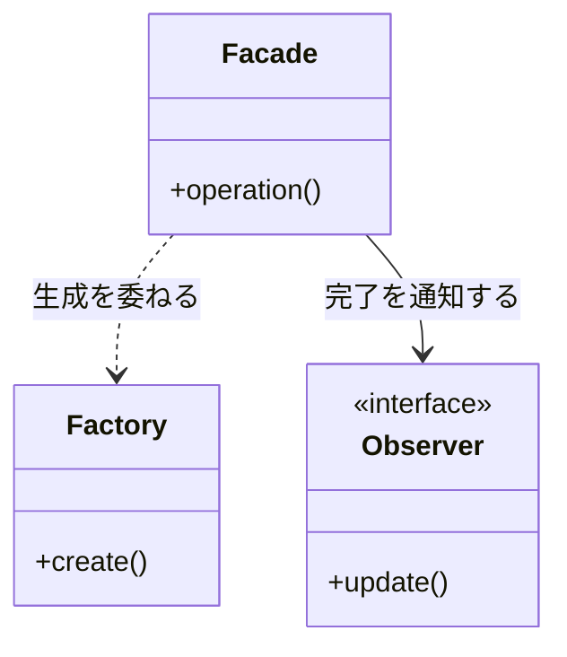
```mermaid
classDiagram
    class Facade {
        +operation()
    }
    class Observer {
        <<interface>>
        +update()
    }
    class Factory {
        +create()
    }
    Facade ..> Factory : 生成を委ねる
    Facade --> Observer : 完了を通知する
```

Facade はバッチ実行部の複雑な連携フローを隠蔽し、Factory Method は連携先の増殖に対応する生成の窓口となり、Observer は通知先変更の波及を遮断します。

### 抽象骨格の実行シーケンス

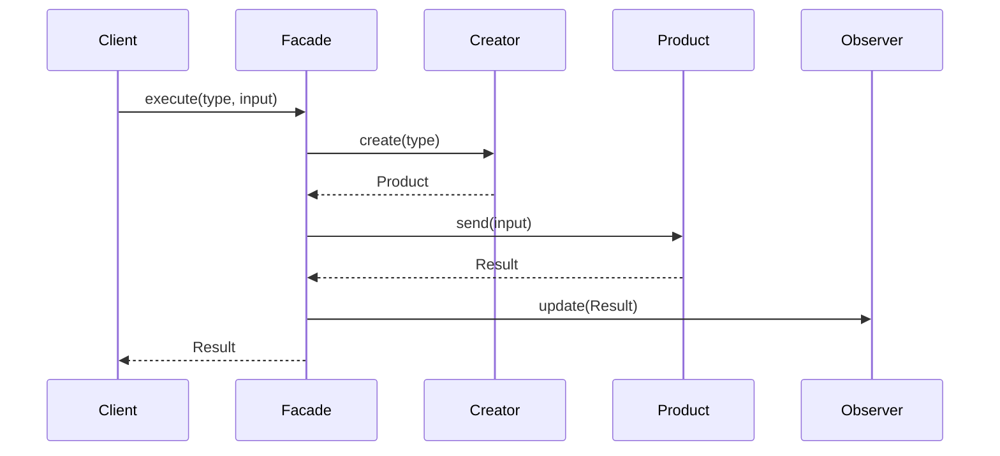
```mermaid
sequenceDiagram
    participant C as Client
    participant F as Facade
    participant CR as Creator
    participant P as Product
    participant O as Observer
    C->>F: execute(type, input)
    F->>CR: create(type)
    CR-->>F: Product
    F->>P: send(input)
    P-->>F: Result
    F->>O: update(Result)
    F-->>C: Result
```

Facadeが処理全体を受け、生成をCreatorへ、外部連携をProductへ、通知をObserverへ分担します。

### 使いどころと限界

* **使いどころ**：外部システム連携、イベント駆動型のバッチ、設定によって振る舞いが動的に変わるシステム。

* **限界**：ごく小規模なツールであれば、これらのパターン適用はオーバースペックです。

```cpp
// 【過剰コード例】連携先が1社・通知もSlack固定の単純ケースで
//               Factory+Observer+Facadeを全部使った場合
class SimpleBatchExecutor {
    // 連携先は SystemAClient のみ・通知は SlackNotifier のみ
    // この規模でFactory/Observer/Facadeを全部使うのは過剰
    IExternalClient* client;
    vector<INotifier*> notifiers;
public:
    SimpleBatchExecutor(IExternalClient* c) : client(c) {}
    void addNotifier(INotifier* n) { notifiers.push_back(n); }
    void execute() {
        client->send("data");
        for (int i = 0; i < notifiers.size(); i++) {
            notifiers[i]->onComplete("Success");
        }
    }
};

// シンプルな直接実装で十分な場合
class SimpleBatch {
public:
    void execute() {
        SystemAClient client;   // 連携先は固定
        client.send("data");
        NotificationService n;  // 通知先は固定
        n.notify("Success");
    }
};
// → 連携先が1社・通知先が1つで今後も変わらないなら
//   SimpleBatch の直接実装で十分。
//   インターフェースや Factory を重ねるコストに見合わない。
```

### この章のまとめ

外部連携バッチ処理というドメインと Facade × Observer × Factory Method の組み合わせの関係を一言で言うなら、「通信の窓口・通知・生成」という3種類の責務はそれぞれ変わる理由が異なり、どの責務がどう変わるかを先に分析することが複合適用の出発点になる、ということです。`BatchExecutor` の各行から変化軸を読み解き、必要な境界を作った結果が三つのパターンの役割に対応した——その順序が、この章の最も重要なメッセージです。

7つのフェーズを通じて、`BatchExecutor` が連携先・通知先・生成方法のすべてを知っているという観察から始まりました。フェーズ4〜5で通信・通知・生成の全変化軸を先に確定し、フェーズ6で三つを同時に分離する一つの最終システムを決めています。Facade・Observer・Factory Methodは順番に試した候補ではなく、確定済みの各接続点へ責任が重ならないよう配置した結果に付く名前です。コードだけを契約、具体実装、組み立ての理解順に分けて反映しました。

あなたのコードの中にも、1つのクラスが複数の外部サービスの生成・呼び出し・通知をまとめて担っている箇所があるはずです。「それぞれの責務はどの業務機能に属するか」を問うことが、どの境界にどのパターンを当てるかを見つける入口になります。

---
