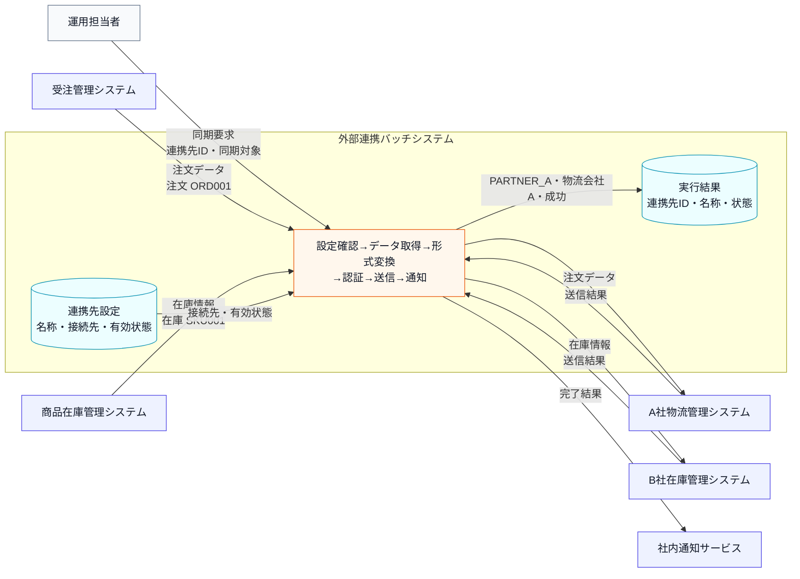
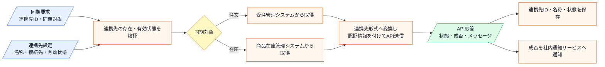
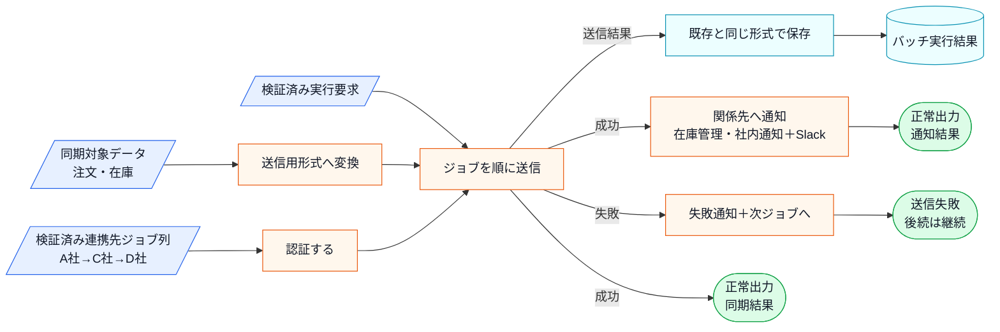
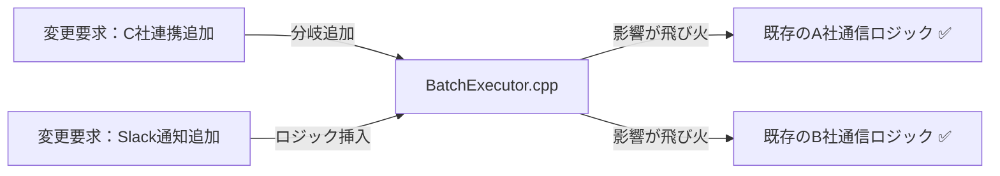
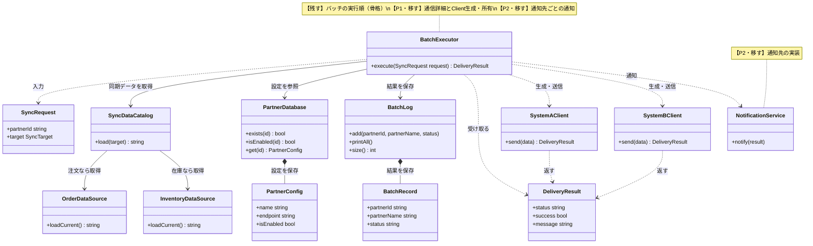
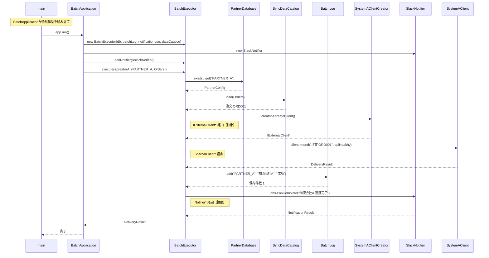
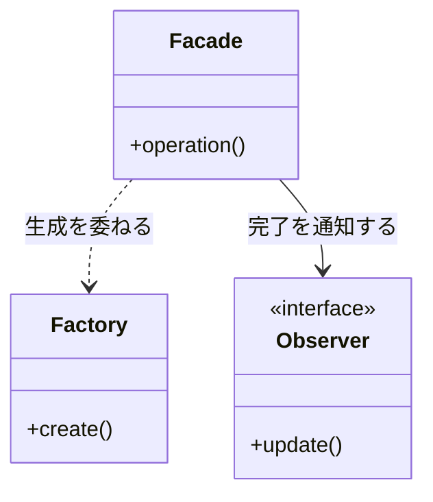
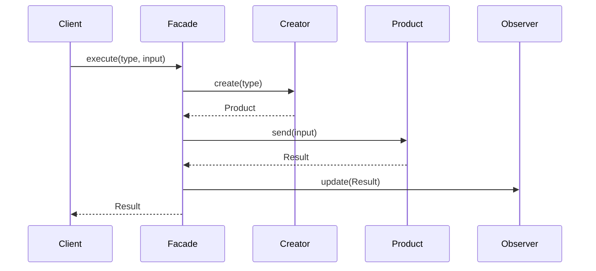

## 第10章 外部連携バッチシステム ―― Facade × Observer × Factory Method パターン

―― 思考の型：複数の「変わる理由」が複雑に絡み合うシステムをどう解くか

### この章の核心

**外部連携の通信手順、通知先、連携クライアントの生成が同じ実行処理に集まっていると、連携先追加でも通知追加でも同じ場所を修正する必要が生じる。こういう問題は、「隠す」「伝える」「作る」という別々の責任が同じ場所に混在しているシステムで起きている。**

### この章を読むと得られること

* **得られること1：** 窓口構造、通知分離構造、生成分離構造の各構造が、システムのどの「変化」に対応するためにあるのかを識別できるようになる。

* **得られること2：** 複数の接続点（クラスとクラスのつなぎ目）が絡み合う複雑なシステムにおいて、それぞれの責務をどこで分離する必要があるか判断できるようになる。

* **得られること3：** 構造の複合適用を通じて、疎結合（クラス間の依存を弱め、変更の影響が広がりにくい状態）な連携アーキテクチャを構築する方法を説明できるようになる。

* **得られること4：** 「通信」と「通知」と「生成」という、異なる3つの責務が混在するコードを整理する視点。

---

## 🔵 フェーズ1：現状把握 ―― 仕様を整理し、システムと紐付ける

外部連携バッチシステムが何を入力として受け取り、どの処理で加工し、何を出力するのかを整理します。

### 1-1：このシステムの仕様

このシステムは、社内の受注管理システム・商品在庫管理システムと、外部の物流管理システムを繋ぐ「外部連携バッチシステム」です。日々の注文データや在庫情報を、指定された外部システムへ同期します。

この章で扱う現状仕様は、次の範囲です。

| 仕様項目 | この章で扱う値 | 具体例 | 何に使うか |
|---|---|---|---|
| 実行入力 | 連携先ID・同期対象 | PARTNER_A・注文 | 接続先と取得する社内データを決める |
| 同期対象データ | 注文データ・在庫情報 | 注文 ORD001、在庫 SKU001 | 外部システムへ送る材料になる |
| 連携先 | 外部物流・在庫システム | PARTNER_A、PARTNER_B | どのAPIへ送るかを決める |
| 通知 | 送信完了の通知 | 社内通知サービスへの完了通知 | バッチ結果を関係先へ知らせる |
| 出力 | 同期結果と通知結果 | PARTNER_A連携成功、完了通知済み | 外部連携と通知の結果を照合する |
| 保存 | 連携先設定と実行結果 | 連携先ID・名称・状態（PARTNER_A・物流会社A・成功） | 設定の参照と実行結果の確認に使う |

ここで確認する対象は、バッチが何を受け取り、どこへ送り、どの結果を返すかです。

外部連携先の接続先や有効状態は、バッチ実行時に毎回手入力する値ではありません。連携先設定として外部連携バッチシステムに保存され、同期要求に応じて読み出されます。また、1件の送信が終わるたびに、連携先ID・名称・状態を実行結果として保存します。

**登録済みの連携先**

連携先マスターには、次の3件が登録されています。無効な連携先や未登録のIDを指定するとエラーになり、スキップまたは失敗として記録されます。

| パートナーID | 名称 | 接続先 | 有効 |
|---|---|---|---|
| PARTNER_A | 物流会社A | logistics-a.example | ✓ |
| PARTNER_B | 在庫会社B | stock-b.example | ✓ |
| PARTNER_Z | 分析会社Z | analytics-z.example | ✗（無効：過去に連携を停止） |

ここでは、実装クラスではなく、まず各システムの境界と、その間を流れるデータを確認します。A社とB社はどちらも現在接続している外部システムです。A社には受注管理システムの注文データ、B社には商品在庫管理システムの在庫情報を送ります。

**システム全体図：保存データとシステム間のやり取り**

最も大きな境界は「運用担当者・社内データ元 → 外部連携バッチシステム → 連携先・通知サービス」です。設定と実行ログだけを対象システムの内側に置きます。


```mermaid
flowchart LR
    O["運用担当者"] -->|"同期要求<br>連携先ID・同期対象"| F
    ORD["受注管理システム"] -->|"注文データ<br>注文 ORD001"| F
    STK["商品在庫管理システム"] -->|"在庫情報<br>在庫 SKU001"| F

    subgraph BATCH["外部連携バッチシステム"]
        CFG[("連携先設定<br>名称・接続先・有効状態")]
        F["設定確認→データ取得→形式変換<br>→認証→送信→通知"]
        LOG[("実行結果<br>連携先ID・名称・状態")]
        CFG -->|"接続先・有効状態"| F
        F -->|"PARTNER_A・物流会社A・成功"| LOG
    end

    F -->|"注文データ"| A["A社物流管理システム"]
    A -->|"送信結果"| F
    F -->|"在庫情報"| B["B社在庫管理システム"]
    B -->|"送信結果"| F
    F -->|"完了結果"| N["社内通知サービス"]

    classDef actor fill:#f8fafc,stroke:#64748b,color:#111827;
    classDef data fill:#ecfeff,stroke:#0891b2,color:#111827;
    classDef process fill:#fff7ed,stroke:#ea580c,color:#111827;
    classDef boundary fill:#eef2ff,stroke:#4f46e5,color:#111827;
    class O actor;
    class CFG,LOG data;
    class F process;
    class ORD,STK,A,B,N boundary;
```

この図は、外部連携バッチシステムを一つの箱として見た図です。運用担当者が渡すのは「連携先ID」と「同期対象」です。バッチは同期対象に応じて受注管理システムまたは商品在庫管理システムからデータを読み、A社またはB社へ送ります。保存する実行結果は抽象的な「バッチ結果」ではなく、「連携先ID・名称・状態」の3項目です。

次に、中央の「外部連携バッチシステム」の箱を開きます。全体図がシステム間の境界と保存項目を示すのに対し、内部図は、入力がどの判定とAPI呼び出しを通って保存・通知へ届くかを示します。

**システム内部図：入力契約・API呼び出し・結果処理**


```mermaid
flowchart LR
    A[/"同期要求<br>連携先ID・同期対象"/]:::input --> C["連携先の存在・有効状態を検証"]:::process
    B[/"連携先設定<br>名称・接続先・有効状態"/]:::input --> C
    C --> D{"同期対象"}:::decision
    D -->|"注文"| E["受注管理システムから取得"]:::process
    D -->|"在庫"| F["商品在庫管理システムから取得"]:::process
    E --> G["連携先形式へ変換し<br>認証情報を付けてAPI送信"]:::process
    F --> G
    G --> H[/"API応答<br>状態・成否・メッセージ"/]:::output
    H --> I["連携先ID・名称・状態を保存"]:::process
    H --> J["成否を社内通知サービスへ通知"]:::process

    classDef input fill:#e7f0ff,stroke:#2563eb,color:#111827;
    classDef process fill:#fff7ed,stroke:#ea580c,color:#111827;
    classDef decision fill:#fef9c3,stroke:#ca8a04,color:#111827;
    classDef output fill:#dcfce7,stroke:#16a34a,color:#111827;
```

この二つの図から読み取ることは、次の3点です。

- 受注管理・商品在庫管理・外部連携バッチ・A社/B社の間で、どのデータと結果を受け渡すかが分かる。
- 外部連携バッチシステムは、`連携先ID・同期対象` と保存済み設定を受け、対象データの選択、API送信、結果保存、通知を順に行う。
- 後でコードを読むときは、この仕様上の処理が、どのクラスの責任として実装されているかを1-3以降で対応づける。

現状のシステムは、複数の外部連携先へデータを転送します。連携先はそれぞれ独自のデータフォーマットと接続認証を要求し、データの転送完了後には在庫管理システムや社内通知サービスへ「処理完了」を通知します。

バッチ処理の中枢となる部分が、すべての連携先との通信制御、データ変換、完了後の通知処理を抱えています。この章では、この現状を仕様とコードの対応から整理します。

**現在の連携先システム一覧**

連携先ごとに接続方式や認証方法が異なるのは、各社がそれぞれ独自のAPIを持っており、こちら側がその仕様に合わせる必要があるためです。バッチ種別（月次・手動）も、業務の性質によって決まります。月次バッチは「月末締め処理」、手動トリガーは「緊急の在庫修正」など、業務上の都合を反映したものです。

| 連携先 | 役割 | バッチ種別 | 接続方式 |
|---|---|---|---|
| A社（物流管理） | 注文データの同期 | 月次バッチ | REST API（トークン認証） |
| B社（在庫管理） | 在庫情報の同期 | 手動トリガー | REST API（APIキー認証） |

**バッチ処理の流れ**

この章のシステムのバッチ処理は、「認証→取得→送信→通知」という4ステップの流れで構成されています。認証を毎回行うのは、セッションを使い回さないことで認証情報の流出リスクを抑えるという、セキュリティ上の判断によるものです。完了通知のステップは「転送が成功したかどうかを関係者が知る手段」として存在しており、運用上の監視や障害対応に欠かせません。

| ステップ | 処理内容 |
|---|---|
| ① 認証 | 連携先のAPIに接続・認証する |
| ② データ取得 | 社内システムから送信対象データを取得する |
| ③ データ送信 | 連携先のフォーマットに変換してAPIへ送信する |
| ④ 完了通知 | 処理完了を在庫管理システム・社内通知サービスへ通知する |

このフロー自体はどの連携先でも共通する骨格です。一方、各ステップの中身（どの会社のAPIに接続するか、どのサービスへ通知するか）は連携先ごとに変わります。

**この仕様を決める業務機能**

この仕様は複数の業務機能が決めています。インフラ・システム管理の領域はAPIのプロトコルを知っており、通知・連携管理の領域は通知文面のルールを知っています。

| 業務機能 | この章の仕様で決めていること |
|---|---|
| インフラ・システム管理 | 各連携先のAPIプロトコル・認証方式 |
| システム設計・生成管理 | 通知サービスの選定・生成方針 |
| 通知・連携管理 | 通知先の一覧・通知文面のルール |

ここでは、APIの接続方式、連携先の選択、通知の運用が、それぞれ別の業務機能によって決まるという現状だけを押さえます。具体的な変更要求は1-5で初めて確認します。

**エラー条件**

正常系の仕様を一通り確認したうえで、最後に、送信へ進めない条件や外部API失敗を分けて整理します。

| エラー条件 | どこで分かるか | 出力 | 保存・通知などの副作用 |
|---|---|---|---|
| 連携先が未登録、または無効 | 連携先設定の確認時 | 連携先エラー | 外部送信なし、通知なし |
| 実行条件を満たさない | 実行要求の確認時 | 実行条件エラー | 外部送信なし、通知なし |
| 外部API送信に失敗する | 外部システムへの送信時 | 送信エラー | 送信結果を保存する。リトライ、再実行キュー、後続ジョブの継続は現状の掲載コードでは扱わない |

### 1-2：動作例テーブル

コードを読む前に、現状システムがどんな入力に対してどんな出力を返すかを確認します。後続の変更要求で初めて追加する動作はここへ混ぜず、1-5で別に定義します。

| 行 | シナリオ | 操作 | 現状の結果 |
|---|---|---|---|
| 1 | A社向け正常実行 | A社向け月次バッチを実行する | A社へ注文データを送り、成功結果を保存して社内通知サービスへ完了通知する |
| 2 | B社向け正常実行 | B社向け同期を実行する | B社へ在庫情報を送り、成功結果を保存して社内通知サービスへ完了通知する |
| 3 | 無効な連携先 | 無効化済みのZ社を指定する | 送信・通知を行わず、スキップ結果を保存して無効エラーを返す |
| 4 | 未登録の連携先 | 未登録のX社を指定する | 送信・通知を行わず、失敗結果を保存して未登録エラーを返す |

次は、この仕様を現状コードのクラスへ対応づけます。

---

### 1-3：登場クラスとクラス構成図

現在のクラス構造に登場するクラスを先に確認します。

| クラス名 | 役割 | 担当する仕様 |
|---|---|---|
| `SyncRequest` | 1回の同期で指定する連携先IDと同期対象を持つ値 | 実行入力 |
| `OrderDataSource` | 受注管理システムから現在の同期対象を取得する境界 | 注文データの取得 |
| `InventoryDataSource` | 商品在庫管理システムから現在の同期対象を取得する境界 | 在庫情報の取得 |
| `SyncDataCatalog` | 同期対象に応じてデータ取得先を選ぶ | 注文・在庫の選択 |
| `PartnerConfig` | 1社分の連携先名・接続先・有効状態を持つ値 | 保存済みの連携先設定 |
| `PartnerDatabase` | 連携先IDごとの設定を保存・検索する | 連携先の存在・有効確認と設定取得 |
| `DeliveryResult` | 送信1件の成否と詳細を受け渡す値 | 外部システムから返る送信結果 |
| `BatchRecord` | 保存する実行結果1件を表す値 | 連携先ID・名称・成否の記録 |
| `BatchLog` | バッチ実行結果を保存・一覧表示する | 実行結果の保存 |
| `BatchExecutor` | 外部連携バッチ全体を実行する | 連携先選択、送信、通知の呼び出し |
| `SystemAClient` | A社向けにデータを送信する | A社連携 |
| `SystemBClient` | B社向けにデータを送信する | B社連携 |
| `NotificationService` | 連携結果を通知する | 完了通知 |

各クラスの責任を把握したところで、クラス間の関係を図で確認します。


```mermaid
classDiagram
    class SyncRequest {
        +partnerId string
        +target SyncTarget
    }
    class OrderDataSource {
        +loadCurrent() string
    }
    class InventoryDataSource {
        +loadCurrent() string
    }
    class SyncDataCatalog {
        +load(target) string
    }
    class PartnerConfig {
        +name string
        +endpoint string
        +isEnabled bool
    }
    class PartnerDatabase {
        +exists(id) bool
        +isEnabled(id) bool
        +get(id) PartnerConfig
    }
    class DeliveryResult {
        +status string
        +success bool
        +message string
    }
    class BatchRecord {
        +partnerId string
        +partnerName string
        +status string
    }
    class BatchLog {
        +add(partnerId, partnerName, status)
        +printAll()
        +size() int
    }
    class BatchExecutor {
        +execute(SyncRequest request) DeliveryResult
    }
    class SystemAClient {
        +send(string data) DeliveryResult
    }
    class SystemBClient {
        +send(string data) DeliveryResult
    }
    class NotificationService {
        +notify(string result)
    }
    PartnerDatabase *-- PartnerConfig : ID別に保存
    BatchLog *-- BatchRecord : 実行結果を保存
    SyncDataCatalog --> OrderDataSource : 注文なら取得
    SyncDataCatalog --> InventoryDataSource : 在庫なら取得
    BatchExecutor ..> SyncRequest : 入力
    BatchExecutor --> SyncDataCatalog : 同期データを取得
    BatchExecutor --> PartnerDatabase : 参照
    BatchExecutor --> BatchLog : 結果を保存
    BatchExecutor ..> PartnerConfig : 設定を取得
    SystemAClient ..> DeliveryResult : 返す
    SystemBClient ..> DeliveryResult : 返す
    BatchExecutor ..> DeliveryResult : 受け取る
    BatchExecutor ..> SystemAClient : A社送信時に生成・呼出
    BatchExecutor ..> SystemBClient : B社送信時に生成・呼出
    BatchExecutor ..> NotificationService : 送信後に生成・呼出
```

**クラス図に出てくる主な操作**

| クラス | 操作 | 何ができるか |
|---|---|---|
| `SyncRequest` | `partnerId` / `target` | 連携先と取得する同期データを一緒に指定する |
| `OrderDataSource` | `loadCurrent()` | 受注管理システムの同期対象を返す |
| `InventoryDataSource` | `loadCurrent()` | 商品在庫管理システムの同期対象を返す |
| `SyncDataCatalog` | `load()` | 同期対象に応じて注文または在庫を取得する |
| `PartnerConfig` | `name` / `endpoint` / `isEnabled` | 1社分の名称、接続先、有効状態を受け渡す |
| `PartnerDatabase` | `exists()` / `isEnabled()` / `get()` | 連携先の存在・有効状態を確認し、設定を返す |
| `DeliveryResult` | `status` / `success` / `message` | 送信1件の成否と詳細を受け渡す |
| `BatchRecord` | `partnerId` / `partnerName` / `status` | 保存する実行結果1件を表す |
| `BatchLog` | `add()` / `printAll()` / `size()` | 実行結果を追記し、保存件数と内容を確認する |
| `BatchExecutor` | `execute()` | 同期要求を受け取り、データ取得、送信、結果保存、通知を進める |
| `SystemAClient` | `send()` | A社向けに送信し、結果を返す |
| `SystemBClient` | `send()` | B社向けに送信し、結果を返す |
| `NotificationService` | `notify()` | 外部連携の結果を通知する |

図に置いたすべての型は、現状コードで定義され、少なくとも一つの保存・取得・生成・呼び出し関係を持ちます。`DeliveryResult` と `BatchLog` は、変更前からある送信結果の契約と保存方法です。この図には現状コードにある型だけを描き、この後の変更で足す要素は先取りしません。

---

### 1-4：実装コード（現状）

#### コードを読む前に：クラスの責任と境界

| 対象 | 呼び出しと内部処理 | 戻り値・副作用 | 掲載上の表現 |
|---|---|---|---|
| 連携先設定 | 連携先IDから設定を検索する | `PartnerConfig` | `map`で設定DBを代替する |
| A社・B社向け送信 | 連携データを外部システムへ送る | `DeliveryResult`を返し、送信済みデータを蓄積する | `vector`と標準出力で成功応答だけを代替する |
| 実行結果の保存 | 送信結果を1件ずつ追記する | `BatchRecord`を`BatchLog`へ保存する | `vector`で実行結果DBを代替する |
| 完了通知 | バッチ結果を社内通知サービスへ送る | 通知済みメッセージを蓄積する | `vector`と標準出力で通知を代替する |

現状コードは、一つの連携先を指定して送信する実装です。送信1件の成否は `DeliveryResult` で受け取り、`BatchLog`へ保存します。この結果契約と保存方法は今回の仕様変更では変えません。複数ジョブの順次実行や途中失敗後の継続、追加の通知手段は、現状コードにはありません。

#### 仕様入力が現状コードで使われるまで

1-1の連携先IDと同期対象を、設定検索と送信データ選択の二つへ分けて追います。

| 仕様入力 | コード上の受け取り口 | 実際に使う箇所 | 結果への現れ方 |
|---|---|---|---|
| 連携先ID | `SyncRequest::partnerId` | `PartnerDatabase` の存在・有効確認と送信先Clientの選択 | A社・B社への送信、無効・未登録エラーに分かれる |
| 同期対象 | `SyncRequest::target` | `SyncDataCatalog::load(request.target)` | 注文データまたは在庫データが選ばれる |
| 選択済み同期データ | `execute()` のローカル変数 `data` | `client.send(data)` | 送信済みデータ、`DeliveryResult`、`BatchLog`へ同じ内容がつながる |

コードは責任の固まりごとに分けて読みます。連携先マスターは、1-1で示した3件（PARTNER_A / PARTNER_B / PARTNER_Z）です。次のコードの `PartnerDatabase` が、その名称・接続先・有効状態を保持します。

現状では、1回の `execute()` が1社分の送信、結果保存、完了通知を行います。送信結果の値と保存先はすでにあります。外部API障害を含む複数ジョブを順次流す制御、失敗後の継続、リトライ、再送キューは、現状コードにはありません。

**① 共通ヘッダーと同期要求（SyncRequest）**

最初に、1-1の入力契約「連携先ID・同期対象」をそのままコードにします。月次・手動は起動方法であり、どのデータを取得するかを決める値ではありません。そのため、曖昧だった「実行種別」は `SyncTarget`（注文・在庫）と言い換え、`SyncRequest` で連携先IDと一緒に渡します。

```cpp
#include <iostream>
#include <string>
#include <vector>
#include <map>
#include <memory>

using namespace std;

enum class SyncTarget {
    Orders,
    Inventory
};

struct SyncRequest {
    string partnerId;
    SyncTarget target;
};
```

`SyncRequest` が、仕様図の入力と `execute()` の引数を繋ぐ契約です。以降のコードは、連携先IDだけから架空のデータを作らず、`target` に対応する社内データを取得します。

**② 連携先設定（PartnerConfig / PartnerDatabase）**

次は、1-1の「連携先設定」にあたる部分です。連携先IDから接続先設定を引き、未登録・無効を区別します。

```cpp
struct PartnerConfig {
    string name;      // パートナー名
    string endpoint;  // エンドポイント（概念上）
    bool isEnabled;   // 連携有効フラグ
};

class PartnerDatabase {
private:
    map<string, PartnerConfig> records;
public:
    PartnerDatabase() {
        records["PARTNER_A"] = {"物流会社A", "logistics-a.example",  true};
        records["PARTNER_B"] = {"在庫会社B", "stock-b.example",      true};
        records["PARTNER_Z"] = {"分析会社Z", "analytics-z.example",  false}; // 無効
    }

    bool exists(const string& id) const {
        return records.count(id) > 0;
    }

    bool isEnabled(const string& id) const {
        return records.at(id).isEnabled;
    }

    PartnerConfig get(const string& id) const {
        return records.at(id);
    }

    void save(const string& id, const PartnerConfig& cfg) {
        records[id] = cfg;            // 実行中の連携先表へ追加
    }
};
```

Z社は、連携先追加や有効判定を本章の設計課題にするための存在ではありません。「登録済みだが停止中」と「未登録」を現状仕様どおり区別できるかを確認するエラー動作用のデータです。今回変える外部連携と通知の二つの変化軸とは切り離し、設定確認の処理と結果保存方法は変更前後で維持します。

**③ 同期対象データの取得（OrderDataSource / InventoryDataSource / SyncDataCatalog）**

1-1の受注管理システムと商品在庫管理システムを、掲載コードでは取得境界として表します。`SyncDataCatalog` は要求の `target` を見て取得先を選びます。

```cpp
class OrderDataSource {
public:
    string loadCurrent() const {
        return "注文 ORD001";
    }
};

class InventoryDataSource {
public:
    string loadCurrent() const {
        return "在庫 SKU001";
    }
};

class SyncDataCatalog {
    OrderDataSource& orders;
    InventoryDataSource& inventory;
public:
    SyncDataCatalog(OrderDataSource& orderSource,
                    InventoryDataSource& inventorySource)
        : orders(orderSource), inventory(inventorySource) {}

    string load(SyncTarget target) const {
        return target == SyncTarget::Orders
            ? orders.loadCurrent()
            : inventory.loadCurrent();
    }
};
```

実システムではDBや社内APIから対象レコードを取得します。この章では取得境界を小さなスタブにし、注文 `ORD001` と在庫 `SKU001` が実際に送信経路へ流れたことを出力で確認できるようにしています。この取得方法も1-5の仕様変更では変えません。

**④ 送信結果と実行結果の保存（DeliveryResult / BatchRecord / BatchLog）**

外部APIから返る値と、そこから保存する値を分けます。`DeliveryResult` は状態・成否・メッセージを受け取り、`BatchRecord` は1-1で明示した連携先ID・名称・状態の3項目を保存します。

```cpp
// 送信1件分の結果。今回の仕様変更の前後で同じ契約を使う。
struct DeliveryResult {
    string status;   // "成功" または "失敗"
    bool success;
    string message;
};

struct BatchRecord {
    string partnerId;
    string partnerName;
    string status;
};

// バッチ実行結果の保存方法も、今回の仕様変更の前後で変えない。
class BatchLog {
    vector<BatchRecord> records;
public:
    void add(const string& partnerId, const string& partnerName,
             const string& status) {
        records.push_back({partnerId, partnerName, status});
        cout << "実行結果を保存(" << records.size() << "件): ["
             << partnerId << "] " << partnerName
             << " -> " << status << endl;
    }
    void printAll() const {
        for (const auto& r : records) {
            cout << "[" << r.partnerId << "] " << r.partnerName
                 << " -> " << r.status << endl;
        }
    }
    int size() const { return static_cast<int>(records.size()); }
};
```

`DeliveryResult`、`BatchRecord`、`BatchLog` は変更後コードでも同じ型と保存方法を使います。設定・送信結果・保存を別のコードブロックに分けたため、何が仕様変更の対象外かも追いやすくなります。

**⑤ 外部連携クライアントと通知クラス（SystemAClient / SystemBClient / NotificationService）**

次に、1-1の「データ送信」「完了通知」ステップにあたる部分です。各連携先へデータを送るクライアントと、処理完了を通知するクラスです。

```cpp
class SystemAClient {
    vector<string> sent;              // 送ったデータを実際に蓄積する
public:
    DeliveryResult send(string d) {
        sent.push_back(d);
        cout << "A社へ送信(" << sent.size() << "件): " << d << endl;
        return {"成功", true, "A社: " + to_string(d.size()) + "バイト送信"};
    }
};
class SystemBClient {
    vector<string> sent;
public:
    DeliveryResult send(string d) {
        sent.push_back(d);
        cout << "B社へ送信(" << sent.size() << "件): " << d << endl;
        return {"成功", true, "B社: " + to_string(d.size()) + "バイト送信"};
    }
};
class NotificationService {
    vector<string> inbox;             // 受け取った通知を蓄積する
public:
    void notify(string r) {
        inbox.push_back(r);
        cout << "完了通知(" << inbox.size() << "件): " << r << endl;
    }
};
```

`SystemAClient` と `SystemBClient` は連携先ごとに分かれた送信クラスで、送ったデータを内部に蓄積し、`DeliveryResult`を返します。`NotificationService` は転送後の社内通知を担い、受け取った通知を蓄積して通し番号付きで表示します。Slack通知は変更要求で追加するため、現状コードには置きません。

**⑥ バッチ処理をまとめるクラス（BatchExecutor）**

この章の中心です。1-1の「認証→取得→送信→通知」の流れを1つにまとめており、連携先の存在・有効判定、連携先ごとのクライアント生成、送信、通知までを順に実行します。

```cpp
class BatchExecutor {
    PartnerDatabase& db;
    BatchLog& batchLog;
    SyncDataCatalog& dataCatalog;
public:
    BatchExecutor(PartnerDatabase& database, BatchLog& log,
                  SyncDataCatalog& catalog)
        : db(database), batchLog(log), dataCatalog(catalog) {}

    DeliveryResult execute(const SyncRequest& request) {
        const string& partnerId = request.partnerId;
        if (!db.exists(partnerId)) {
            cout << "エラー: パートナーID [" << partnerId
                 << "] はデータベースに登録されていません。" << endl;
            DeliveryResult r{"失敗", false, "未登録"};
            batchLog.add(partnerId, "未登録", r.status);
            return r;
        }
        if (!db.isEnabled(partnerId)) {
            PartnerConfig cfg = db.get(partnerId);
            cout << "エラー: パートナー [" << cfg.name
                 << "] は現在無効です。処理を中断します。" << endl;
            DeliveryResult r{"失敗", false, "無効"};
            batchLog.add(partnerId, cfg.name, "スキップ（無効）");
            return r;
        }
        PartnerConfig cfg = db.get(partnerId);
        string data = dataCatalog.load(request.target);
        cout << "[送信先] " << cfg.name
             << " (" << cfg.endpoint << ")" << endl;
        DeliveryResult result{"失敗", false, "未対応の連携先"};
        if (partnerId == "PARTNER_A") {
            SystemAClient client; // A社向けクライアントを生成
            result = client.send(data);
        } else if (partnerId == "PARTNER_B") {
            SystemBClient client; // B社向けクライアントを生成
            result = client.send(data);
        }
        cout << "[送信結果詳細] " << result.message << endl;
        batchLog.add(partnerId, cfg.name, result.status);
        NotificationService notifier;
        notifier.notify(cfg.name + (result.success ? " 連携完了" : " 連携失敗"));
        return result;
    }
};
```

`execute()` の中身を順に読みます。

- **(1) 連携先の検証**：先頭の2つの `if` が、1-1のエラー条件です。未登録IDや無効な連携先は、送信へ進まず中断します。
- **(2) 同期データの取得**：`SyncRequest::target` を `SyncDataCatalog` へ渡し、受注管理または商品在庫管理のデータを取得します。
- **(3) クライアントの生成と送信**：`if / else if` で連携先IDを見て、対応するクライアントを生成し、取得済みのデータを送信します。この分岐が、連携先が増えるたびに書き足される箇所です。
- **(4) 完了通知**：送信後に `NotificationService` で完了を通知します。

**⑦ 実行して動作例と照合する（main）**

ここで、仕様図の入力がコードへ欠落していないかを照合します。`SyncRequest{"PARTNER_A", SyncTarget::Orders}` はA社と注文データを、`SyncRequest{"PARTNER_B", SyncTarget::Inventory}` はB社と在庫情報を指定します。`execute()` 内でその同期対象を使ってデータを取得するため、入力値が飾りにならず、送信内容まで繋がります。

まず依存を組み立て、行1（A社向け月次バッチ）を実行します。

```cpp
int main() {
    PartnerDatabase db;
    BatchLog batchLog;
    OrderDataSource orders;
    InventoryDataSource inventory;
    SyncDataCatalog dataCatalog(orders, inventory);
    BatchExecutor executor(db, batchLog, dataCatalog);

    // 行1: A社向け月次バッチを実行する
    executor.execute({"PARTNER_A", SyncTarget::Orders});
```

行1（A社向け月次バッチ）の実行結果：

```
[送信先] 物流会社A (logistics-a.example)
A社へ送信(1件): 注文 ORD001
[送信結果詳細] A社: 13バイト送信
実行結果を保存(1件): [PARTNER_A] 物流会社A -> 成功
完了通知(1件): 物流会社A 連携完了
```

続いて、行2（B社向けデータ同期）を実行します。

```cpp
    // 行2: B社向けデータ同期を実行する
    executor.execute({"PARTNER_B", SyncTarget::Inventory});
```

行2（B社向けデータ同期）の実行結果：

```
[送信先] 在庫会社B (stock-b.example)
B社へ送信(1件): 在庫 SKU001
[送信結果詳細] B社: 13バイト送信
実行結果を保存(2件): [PARTNER_B] 在庫会社B -> 成功
完了通知(1件): 在庫会社B 連携完了
```

続いて、行3（無効パートナーZ社）を実行します。

```cpp
    // 行3: 無効パートナーの実行（Z社は isEnabled==false）
    executor.execute({"PARTNER_Z", SyncTarget::Orders});
```

行3（無効パートナーZ社）の実行結果：

```
エラー: パートナー [分析会社Z] は現在無効です。処理を中断します。
実行結果を保存(3件): [PARTNER_Z] 分析会社Z -> スキップ（無効）
```

続いて、行4（未登録パートナー）を実行します。

```cpp
    // 行4: 未登録パートナーの実行
    executor.execute({"PARTNER_X", SyncTarget::Orders});
```

行4（未登録パートナー）の実行結果：

```
エラー: パートナーID [PARTNER_X] はデータベースに登録されていません。
実行結果を保存(4件): [PARTNER_X] 未登録 -> 失敗
```

最後に、蓄積したバッチ実行ログを出力し、`main()` を終了します。

```cpp
    cout << "\n--- バッチ実行ログ（" << batchLog.size() << "件） ---\n";
    batchLog.printAll();

    return 0;
}
```

バッチ実行ログの実行結果：

```

--- バッチ実行ログ（4件） ---
[PARTNER_A] 物流会社A -> 成功
[PARTNER_B] 在庫会社B -> 成功
[PARTNER_Z] 分析会社Z -> スキップ（無効）
[PARTNER_X] 未登録 -> 失敗
```

仕様とコードがずれていた原因は、以前の記述が「月次・手動という起動方法」と「注文・在庫という同期対象」をどちらも実行種別と呼び、仕様図とコードを別々に簡略化していたことです。その結果、図には第2入力があるのに `execute()` は連携先IDしか受け取らず、送信データも連携先名から作っていました。ここでは入力語彙を `同期対象` に確定し、`SyncRequest`、`SyncDataCatalog`、`send(data)` まで同じ値を追えるように修正しました。この観点は本章だけの問題にせず、他章も「仕様に書いた入力が公開メソッドへ渡り、処理の選択や出力に実際に使われるか」を横断確認するタスクへ登録します。

各ケースのコードとその実行結果をその場で並べたので、離れた `main()` と出力を行き来せずに照合できます（確認したいこと：入力、加工、出力が仕様どおりに対応していること）。

> [!NOTE]
> 上記は1-2の現状動作例4行に対応します。行1・2はA社・B社への送信、結果保存、完了通知、行3・4は送信と通知を行わず、スキップ・失敗結果だけを保存することを確認できます。C社、Slack、複数ジョブ、送信失敗後の継続は1-5の変更要求で追加し、フェーズ7の最終コードで確認します。

このコードから、`BatchExecutor` が各連携先の生成と送信、さらにはその後の通知処理までを一手に引き受けていることが分かります。

---

> **手元で動かすには**
> このコードは1つの `.cpp` に貼り付けて、そのままコンパイル・実行できます（例：`g++ chapter10.cpp -o app && ./app`）。`main()` は自由に組み替えて構いません。`executor.execute({"PARTNER_A", SyncTarget::Orders});` の呼び出しを増減させれば、連携先・同期対象ごとの実行と通知がその場の実行結果に表れます。新しい連携先を試すときは `PartnerDatabase` の登録へ `records["PARTNER_C"] = {"決済会社C", "pay-c.example", true};` を足す（または `save()` を呼ぶ）と、その連携先でも同じバッチを実行できます。データはプロセス実行中だけ有効で、終了すると消えます（社内DB・外部API・通知の実接続は境界スタブで簡略化しています）。

### 1-5：変更要求

【プロジェクトマネージャーと運用チームからの要求】
ある金曜日の午後、プロジェクトマネージャーから緊急の相談が飛び込んできました。

「お疲れ様。現在運用している外部連携バッチなんだけど、来週から新たにC社とも連携することになったんだ。それに加えて、連携処理の結果を社内のSlackへ自動通知するようにしてほしいという要望が出ている。データ転送のロジックを修正するついでに、通知処理についても何か良い仕組みを取り入れられないかな？」

運用チームからは実行条件も続けて提示されました。「A社・B社・C社の定時ジョブは一つのバッチで登録順に流してほしい。1社の送信が失敗しても、その結果を保存してSlackへ通知し、残りの会社は続けてほしい」。したがって、順次実行と途中失敗後の継続は推測ではなく今回の確定要件です。

**仕様変更の内容**

変更要求を受けて、現在の仕様がどう変わるかを整理します。

| 項目 | 変更前 | 変更後 |
|---|---|---|
| 連携先 | A社・B社の2社 | C社（配送管理）を追加して3社 |
| バッチ完了通知 | 社内向けの汎用完了通知 | 通知先をSlackへ具体化し、成功・失敗を自動通知 |
| 実行単位 | 1連携先を都度実行 | 複数連携先の送信ジョブを順番に流す |
| 送信失敗 | 1件の結果は表現・保存できるが、後続ジョブはない | 途中の送信失敗でも後続ジョブと通知は止めない |
| 結果の表現・保存 | `DeliveryResult`から`BatchRecord`を作り`BatchLog`へ保存する | **変更なし**。同じ結果契約と保存方法を使う |

最後の行は仕様変更ではなく、変更前後で守る共通基盤です。対策後のコードにだけ`DeliveryResult`や`BatchLog`が現れると、「連携先・通知・実行単位を変える」という要求とは無関係に保存方法まで変えたことになります。その差分を生じさせないため、以降は既存の結果契約と保存方法をそのまま引き継ぎます。

**変更後の動作例**

現状動作例と変更要求を混ぜないため、C社・D社・Slack・送信失敗を含むケースはここで初めて定義します。フェーズ7の完成コードと実行結果は、この表の行番号へ対応させます。

| 行 | シナリオ | 操作・外部状態 | 変更後の結果 |
|---|---|---|---|
| 1 | A社月次バッチ | A社へ正常送信する | 送信成功を記録し、Slackへ完了通知する |
| 追加 | C社月次バッチ（今回追加の主対象） | C社へ正常送信する | 送信成功を記録し、Slackへ完了通知する |
| 2 | 参考：C社タイムアウト | C社への送信がタイムアウトする | **今回対象外**。再試行回数が確定した後に別要件として扱う |
| 3 | 新規D社追加後 | D社向け日次バッチを実行する | D社向けクライアントで送信し、Slackへ完了通知する |
| 4 | B社手動トリガー | B社へ正常送信する | 手動送信に成功し、Slackへ完了通知する |
| 5 | A社API障害＋通知部分失敗 | A社送信が失敗し、メール基盤も停止中 | 送信失敗、Slack成功、Email失敗を別々に記録し、後続ジョブを続ける |
| 6 | 通知先追加後 | B社へ正常送信し、ログ通知を有効化する | 送信成功を記録し、Slackとログ基盤へ通知する |

行2は将来の検討例であり、今回の受入条件には含めません。行1・「追加」（C社正常送信）・行3〜6はフェーズ7の完成コードで実行し、行5では通知の部分失敗も記録します。

**この章が扱う複雑さ**

| 追加する複雑さ | 具体例 | この章で見ること |
|---|---|---|
| 順次バッチ実行 | A社→C社→D社の送信ジョブを順に流す | 実行順の骨格と、各ジョブの通信詳細を分けられるか |
| 通知イベント | 送信完了ごとに関係先へ通知する | 通知の発生と、通知先の一覧を分けられるか |
| 送信失敗 | C社への送信が失敗しても後続を止めない | 部分失敗の扱いを、生成・通信・通知のどこへ寄せるか |
| 連携先追加 | D社の送信ジョブとクライアントを足す | 実行本体を変えずに連携先を増やせるか |

順次バッチ実行・通知イベント・送信失敗・連携先追加は、それぞれ「外部手順」「通知」「生成」という別の軸に属します。この章では、4つを1つの実行処理へ積み上げず、軸ごとに分けて対策できるかを追います。

**変更後の連携先・通知先一覧**

| 種別 | 名称・役割 | 変更前 | 変更後 |
|---|---|---|---|
| 連携先 | A社（物流管理・月次バッチ） | ✅ 既存 | 変更なし |
| 連携先 | B社（在庫管理・手動トリガー） | ✅ 既存 | 変更なし |
| 連携先 | C社（配送管理・月次バッチ） | — | ✅ 新規追加 |
| 連携先 | D社（配送管理・日次バッチ） | — | ✅ 追加（フェーズ7で拡張実証） |
| 通知先 | Slack（成功・失敗通知） | — | ✅ 新規追加 |
| 通知先 | メール（監視チームへの失敗通知） | — | ✅ 追加（フェーズ7で拡張実証） |
| 通知先 | ログ基盤（連携ログの記録） | — | ✅ 追加（フェーズ7で拡張実証） |

連携先と通知先は、それぞれ独立した変化軸です。「C社を追加する」変更と「Slack通知を追加する」変更は担当者も変更タイミングも異なります。C社・Slackが今回の起点ですが、運用チームからは「この後もD社などの連携先や、メール・ログ基盤といった通知先を続けて足したい」と伝えられており、追加が実行本体を変えずに済むことが要求の核心です。そこでフェーズ7では、C社・Slackに加えてD社・メール・ログ基盤を後から差し込み、実行順の骨格を変えずに拡張できることまで実証します。

**変更前後の入力・判定・加工・出力差分**

1-1の現状仕様を退避し、変更要求を当てた後の仕様と同じ粒度で並べます。以降の分析では、この差分を追います。

| 要素 | 変更前（1-1の現状仕様） | 変更後（今回の要求） | 差分として追うもの |
|---|---|---|---|
| 入力 | `SyncRequest`（A社/B社の連携先ID・同期対象） | 同じ`SyncRequest`でC社を指定し、Slack通知先と順次実行ジョブ列を組み立てる | 連携先・通知先・実行するジョブ列が増える。要求の形は変更しない |
| 判定 | 連携先は有効か、データは送信可能か | C社を含めて有効か、通知先は有効か、送信は成功したか | 連携先・通知先・送信成否の判定が増える |
| 加工 | `SyncDataCatalog`で注文・在庫を取得し、送信用形式へ変換して外部連携する | 同じ取得方法でジョブを順に流してC社へも連携し、完了ごとにSlack通知する | 順次実行と通信・通知の加工が増える。データ取得は変更しない |
| 出力 | 同期結果と汎用完了通知 | ジョブごとの同期結果（成功/失敗）とSlack通知結果 | 送信失敗を含む結果と通知結果を追う |
| 保存 | `DeliveryResult`を`BatchLog`へ1件ずつ保存 | 同じ結果契約と保存方法を使う | **変更なし。対策検討で作り替えない** |

したがって、`SyncRequest`、`SyncDataCatalog`、`DeliveryResult`、`BatchRecord`、`BatchLog` は変更対象外の共通基盤です。フェーズ6では通信・通知・生成の責任だけを移し、入力、社内データの取得、結果契約、保存方法は作り替えません。

**変更後の入力・加工・出力**

変更後の仕様を、1-1と同じ粒度で、正常系の入力・判定・加工・出力として確認します。1-1の図との差分は、入力の「連携先」にC社と順次実行ジョブ列が加わること、「関係先へ通知」の通知先にSlackが加わること、送信成否で分岐することの3点です。判定・加工の骨格自体は変わりません。


```mermaid
flowchart LR
    A[/検証済み連携先ジョブ列<br>A社→C社→D社/]:::input --> G[認証する]:::process
    C[/同期対象データ<br>注文・在庫/]:::input --> D[送信用形式へ変換]:::process
    E[/検証済み実行要求/]:::input --> H
    D --> H[ジョブを順に送信]:::process
    G --> H
    H -->|送信結果| R[既存と同じ形式で保存]:::stable
    R --> S[(バッチ実行結果)]:::stable
    H -->|成功| I[関係先へ通知<br>在庫管理・社内通知＋Slack]:::process
    H -->|失敗| L[失敗通知＋次ジョブへ]:::process
    H -->|成功| J([正常出力<br>同期結果]):::normal
    I --> K([正常出力<br>通知結果]):::normal
    L --> M([送信失敗<br>後続は継続]):::normal

    classDef input fill:#e7f0ff,stroke:#2563eb,color:#111827;
    classDef process fill:#fff7ed,stroke:#ea580c,color:#111827;
    classDef decision fill:#fef9c3,stroke:#ca8a04,color:#111827;
    classDef normal fill:#dcfce7,stroke:#16a34a,color:#111827;
    classDef stable fill:#ecfeff,stroke:#0891b2,color:#111827;
```

この図から読み取ることは、次の4点です。

- 「C社の追加」と「D社の追加」は入力の「連携先ジョブ列」と、その先の認証・形式変換・送信に現れる。
- 「Slack通知の追加」は送信の成功・失敗どちらの後にも現れ、通知先の一覧側の変化として整理できる。
- 「順次実行」は複数ジョブを順に流す実行骨格で、あるジョブの送信失敗があっても後続ジョブと通知は止めない。通信Clientの生成は外部連携軸を実装する手段であり、独立した業務上の変化軸とは数えない。
- 水色の「既存と同じ形式で保存→バッチ実行結果」は1-1から変わらない。変更する通信・通知・実行構造が、既存の`DeliveryResult`と`BatchLog`へ接続し直されるだけである。

変更後も、失敗条件は正常系図へ混ぜずに別で確認します。

| エラー条件 | どこで分かるか | 出力 | 保存・通知などの副作用 |
|---|---|---|---|
| 連携先が未登録、または無効 | 連携先設定の確認時 | 連携先エラー | 外部送信なし、通知なし |
| 実行条件を満たさない | 実行要求の確認時 | 実行条件エラー | 外部送信なし、通知なし |
| C社API送信に失敗する | 外部送信の実行時 | 送信エラー | 失敗通知を送り、順次実行の後続ジョブは止めない |
| 順次実行の途中ジョブが失敗する | 各ジョブの送信結果の確認時 | ジョブ単位の送信エラー | 失敗を記録し、次のジョブへ進む |
| Slack通知に失敗する | 通知送信時 | 通知エラーまたはログ記録 | 本章の中心は連携先・通知先の分離であり、詳細な再送制御は扱わない |

Slack通知は成功・失敗を問わず送る要求のため、送信失敗時の通知の扱いはフェーズ3で変更を試すときに確認します。順次実行の途中で送信が失敗しても、後続ジョブと通知は止めないという扱いも、変更後の骨格として押さえておきます。C社の追加とSlack通知が実際のコードでどこに現れるかも、フェーズ3の変更途中コードとフェーズ7の最終コード・実行結果で追います。

---

## 🟣 フェーズ2：仮説立案 ―― 何が変わるかを観察し、ヒアリングで裏付ける
フェーズ1で、`BatchExecutor` が連携先クライアントの生成・通信・通知処理をすべて直接保持している現状を把握しました。届いた変更要求を踏まえ、この設計における変わる見込みと当面安定の前提を整理します。

### 2-1：変わりそうな仕様の見当をつける

ここで作る一覧は、思いつきで「変わりそう」と感じたものを並べる表ではありません。フェーズ1で確認した仕様・動作例・クラス図を材料に、次の順で候補を絞ります。

1. 仕様図と動作例から、入力・判定・加工・出力のうち条件や値が変わりそうな箇所を拾う。
2. その箇所が、1-3のどのクラス・メソッドに書かれているかを対応づける。
3. その仕様が、どんな理由で、何をきっかけに、どのくらいの頻度で変わりそうかを仮説として書く。
4. 逆に、当面変えない前提にできる処理の骨格も分けておく。

この手順で見ると、「外部連携バッチを実行する」という大きな処理全体ではなく、その中のどの連携先・通信仕様・通知先が変更候補なのかを読者自身で追えるようになります。

フェーズ1の仕様表を振り返ります。このバッチシステムには「外部連携」「通知」「バッチ制御フロー」という3つの側面があります。このうち変化が予想される仕様があります。

- **外部連携先の種類と通信仕様**（A社・B社・C社、それぞれのAPIプロトコル）：ビジネス拡大に伴い新しい連携先が追加されることがあります。今回のC社追加がその例です
- **通知先の種類**（メール・Slack・ログ収集基盤など）：業務の運用方法が変わるにつれて、通知先も追加・変更されます

一方、「バッチを実行して結果を通知する」という全体制御フローは、バッチ処理の基本として安定している部分です。

**仮説：外部連携先の種類と通知先の種類は、今後も追加・変更が続く可能性がある。**

この仮説をヒアリングで確認します。

### 2-2：今回の変更で確実に変わること

この変更要求で確実に発生する変更を整理します。「将来起きるかもしれない」ではなく、「今回の要件として決まっている」ものだけを載せます。

| **変更内容** | **具体的な変更箇所** | **根拠（変更要求）** |
| --- | --- | --- |
| C社との外部連携を追加する | `BatchExecutor` に `SystemCClient` の生成と呼び出しロジックを追加 | PM「来週からC社とも連携」 |
| Slackへの完了通知を追加する | `BatchExecutor` 内に Slack への通知処理を挿入 | PM「Slackへ自動通知してほしい」 |
| 複数連携先を順次実行する | `BatchExecutor` にジョブ列を順に流す実行処理を追加 | 運用チーム「A社・B社・C社を一つのバッチで登録順に流す」 |
| 送信失敗でも後続と通知を止めない | `BatchExecutor` に成否判定と失敗通知の分岐を追加 | 運用チーム「1社が失敗しても結果を保存・通知して残りを続ける」 |

### ヒアリングに向けた背景確認

変更要求の内容は把握できました。しかし「今回だけの変更か、これからも続く変化の始まりか」によって、設計の判断は大きく変わります。仮説を携えて関係者に確認する前に、このシステムの来歴を整理しておきます。

このバッチシステムは、当初A社1社との連携だけを想定して作られました。シンプルな要件だったため、`BatchExecutor` がすべてを直接担う形で問題はありませんでした。その後B社が加わり、次第にC社も対象となり、連携先が増えるたびに `if-else` の分岐が追加されてきました。通知処理も最初はコンソール出力だけでしたが、後から `NotificationService` が付け足された経緯があります。

今回の変更要求もその延長線上にあります。「今回はC社とSlack」で終わるかどうか——それをヒアリングで確認します。

### 2-3：関係者ヒアリング

仮説を携え、運用担当者と協議を行いました。

* **開発者：** 「C社との連携ですが、今回のデータフォーマットは既存のA社やB社と大きく異なりますか？」

* **運用担当者：** 「フォーマットは別物だね。また、今後D社やE社も控えているから、接続先の追加はこれからも発生するよ。」

* **開発者：** 「通知についてはどうでしょうか？ Slack以外にもメール通知が必要になる可能性はありますか？」

* **運用担当者：** 「そうだね、将来的にはログ収集基盤へのデータ投入も検討している。ただ、転送成功か失敗かという『結果の通知』という仕組み自体は今後も変わらないよ。」

* **開発者：** 「分かりました。外部との通信ロジックと、通知という振る舞いは、それぞれ独立して増殖していく可能性があるということですね。」

ヒアリングにより、通信先（生成）の増殖と、通知処理（イベントの反応）の多様化が、それぞれ別個の変化軸として扱うべきものだと確認できました。

### 2-4：ヒアリングで判明した将来リスク

ヒアリングで判明した「将来起きるかもしれない」変化をまとめます。確定変更（2-2）とは別に管理することで、今回の設計判断と将来への備えを混在させずに済みます。

| **将来リスク** | **時期の目安** | **根拠** |
|---|---|---|
| D社・E社など連携先がさらに増える（`BatchExecutor` 内の振り分けと送信ジョブ列が変わる） | 近い将来（すでに控えている） | 運用担当者「D社・E社も控えている」 |
| Slack以外にメール・ログ基盤への通知が追加される（通知処理全体が変わる） | 検討中 | 運用担当者「ログ収集基盤も検討中」 |
| 順次実行の途中失敗の扱いが増える（送信成否の判定と失敗通知の分岐が変わる） | 連携先の増加に伴い | 運用担当者「結果の通知という仕組みは変わらない」 |

なお、今回追加するのは「複数ジョブを登録順に流し、途中失敗後も続行する」という外側の実行骨格です。各社固有の再試行回数やバックオフは未確定なので今回対象外とします。この二つを混同しません。

フェーズ2で「何を変え、何を守るか」が確定しました。次のフェーズ3では、この変更要求を現在のコードで実行しようとすると何が起きるか、その痛みを確認します。

### 2-5：変わる見込みと当面安定の前提を確定する

ヒアリングで「D社・E社連携」と「メール・ログ基盤通知」の追加が予告されました。この変更が来たとき、仕様がどう変わるかを整理しておきます。

| 変更内容 | 現在 | 将来（数ヶ月後） |
|---|---|---|
| SystemAClient（A社連携） | 対応済み | 変更なし |
| SystemBClient（B社連携） | 対応済み | 変更なし |
| SystemCClient（C社連携） | 今回追加 | 変更なし |
| D社・E社連携 | —（なし） | 追加予定 |
| Slack通知 | 今回追加 | 変更なし |
| メール・ログ基盤通知 | —（なし） | 追加予定 |
| 複数ジョブの順次実行 | 今回追加 | 変更なし（連携先が増えても骨格は同じ） |
| 送信失敗時の後続継続 | 今回追加 | 変更なし |

連携先と通知先が同時に増えると、`BatchExecutor` の 1 クラスに複数の変更軸が積み重なることになります。この痛みをフェーズ3で確認します。

---

## 🟣 フェーズ3：問題特定 ―― 変更の痛みを発見する
### 3-1：変更を試みる

フェーズ2で確定した変更を、既存の `BatchExecutor` にそのまま組み込もうとします。「C社連携の追加」と「Slack通知の追加」——どちらもシンプルに聞こえますが、実際にコードを変えようとすると何が起きるかを確認します。

変更を試みると、次のようなコードになります。なお、この変更試行コードでは `PartnerDatabase` による存在・有効チェックを省略し、パートナーIDを "A"・"B"・"C" と略記しています。既存の `SyncRequest`、`SyncDataCatalog`、`DeliveryResult`、`BatchLog` は省略せず、そのまま使います。

> **中間コードの継続条件：** `PartnerDatabase` の存在・有効チェックは省略後も維持し、検証済みの `SyncRequest` だけを `BatchExecutor` へ渡します。短縮IDは図を読みやすくする表記であり、マスター検証や同期対象データの取得を削除する仕様変更ではありません。

```cpp
// C社連携を追加すると、次の分岐が増える
class BatchExecutor {
    BatchLog& batchLog;
    SyncDataCatalog& dataCatalog;
public:
    BatchExecutor(BatchLog& log, SyncDataCatalog& catalog)
        : batchLog(log), dataCatalog(catalog) {}

    DeliveryResult execute(const SyncRequest& request) {
        string partnerId = request.partnerId;
        string data = dataCatalog.load(request.target);
        DeliveryResult result{"失敗", false, "未対応"};
        if (partnerId == "A") {
            SystemAClient client;
            result = client.send(data);
        } else if (partnerId == "B") {
            SystemBClient client;
            result = client.send(data);
        } else if (partnerId == "C") {          // ← 新しい連携先を追加
            SystemCClient client;              // ← SystemCClientも追加が必要
            result = client.send(data);
        }
        batchLog.add(partnerId, partnerId + "社", result.status); // 保存方法は変更しない
        // Slack通知を追加しようとすると、通知の仕組みも一緒に変更が必要
        NotificationService notifier;
        notifier.notify(result.status);
        SlackNotifier slack;                  // ← 通知先を増やすとここも増える
        slack.notify(result.status);
        return result;
    }
};
```

変更後のコードを実行すると、次のような結果になります。

実行対象コード：3-1の変更試行コード
対応する動作例：変更要求後の代表ケース
確認したいこと：変更要求を現状構造へ当てはめたとき、修正箇所と痛みがどこに出るか

動作確認用のスタブを用意し、ケースごとに実行します。まずケース1（A社・注文連携）を実行します。

```cpp
// 動作確認用のスタブ
class SystemAClient {
public:
    DeliveryResult send(std::string data) {
        std::cout << "[A社] " << data << std::endl;
        return {"成功", true, "A社送信完了"};
    }
};
class SystemCClient {
public:
    DeliveryResult send(std::string data) {
        std::cout << "[C社] " << data << std::endl;
        return {"成功", true, "C社送信完了"};
    }
};
class NotificationService {
public:
    void notify(std::string msg) {
        std::cout << "[メール通知] " << msg << std::endl;
    }
};
class SlackNotifier {
public:
    void notify(std::string msg) {
        std::cout << "[Slack通知] " << msg << std::endl;
    }
};

int main() {
    BatchLog batchLog;
    OrderDataSource orders;
    InventoryDataSource inventory;
    SyncDataCatalog dataCatalog(orders, inventory);
    BatchExecutor executor(batchLog, dataCatalog);
    executor.execute({"A", SyncTarget::Orders}); // A社・注文連携
    std::cout << "---" << std::endl;
```

ケース1（A社・注文連携）の実行結果：

```
[A社] 注文 ORD001
実行結果を保存(1件): [A] A社 -> 成功
[メール通知] 成功
[Slack通知] 成功
---
```

最後に、ケース2（C社・注文連携／新規）を実行し、`main()` を終了します。

```cpp
    executor.execute({"C", SyncTarget::Orders}); // C社・注文連携（新規）
    return 0;
}
```

ケース2（C社・注文連携／新規）の実行結果：

```
[C社] 注文 ORD001
実行結果を保存(2件): [C] C社 -> 成功
[メール通知] 成功
[Slack通知] 成功
```

動作は正しくなっています。しかし A社のバッチを実行したときも Slack通知が走っており、C社追加のついでに Slack通知も全社に影響しています。

このコードの何が問題か。「C社連携を追加したい」という要求と「Slack通知を追加したい」という要求は、本来まったく別の話のはずです。しかし `BatchExecutor` の `execute()` メソッドの中で両方が混在しているため、1つの変更を加えると、関係のない他の処理にも手が届いてしまいます。

さらに、D社が追加されればまた `if-else` が伸びます。メール通知が追加されれば、また通知の行が増えます。このメソッドは変更要求のたびに肥大化し続ける構造になっています。

加えて、複数連携先を順番に流す順次実行を同じメソッドへ書き足すと、この肥大化はさらに進みます。「A社→C社→D社を順に送る」という実行順の骨格と、「各社へどう送るか」という通信詳細が同じ場所に並び、途中で送信が失敗したときに後続ジョブと通知をどう続けるかという成否判定まで、すべて `execute()` の中へ入ってきます。順次実行という外部手順の骨格、送信失敗の扱い、そして通知の3つが、生成の分岐と一緒に1つのメソッドへ積み上がっていきます。

### 3-2：変更影響グラフ

現状の構造で変更を試みた際、影響がどのように飛び火するかを可視化します。


```mermaid
graph LR
    T1["変更要求：C社連携追加"] -->|"分岐追加"| B["BatchExecutor.cpp"]
    T2["変更要求：Slack通知追加"] -->|"ロジック挿入"| B
    B -->|"影響が飛び火"| C["既存のA社通信ロジック ✅"]
    B -->|"影響が飛び火"| D["既存のB社通信ロジック ✅"]
```

グラフが示す通り、C社連携の追加やSlack通知の実装といった個別の要求が、既存の他の連携先ロジックにまで影響を及ぼす構造になっています。

### 3-3：痛みの言語化

「連携先が増えるたびに、既存の安定している通信処理までテストし直さないといけないのか…」

変更をシミュレートする中で、エンジニアとして感じる「痛み」が2つ明確になりました。

1つ目は、`BatchExecutor` が抱える「巨大な責任」の辛さです。このクラスは本来、バッチ処理全体のフローを制御するだけでいいはずなのに、連携先ごとの具体的な通信手段や、通知先といった「詳細」までをすべて把握し、生成まで行っています。これでは、連携先が増えるたびに管理不能なほど複雑なコードになるのは必然です。

2つ目は、連携の「生成」と「通知」という、変わる理由が異なる責務が混在していることです。連携先の通信仕様が変わるのか、それとも通知の要件が変わるのかにかかわらず、同じ大きなクラスを編集し、無関係な処理まで影響確認する必要があります。ここには順次実行の骨格と送信失敗の扱いも同居しており、「ジョブを順に流す外部手順」「送信失敗のときに後続と通知をどうするか」「誰に通知するか」「どのクライアントを生成するか」という別々の理由の判断が、同じ場所へ折り重なっています。

---
> **📌 問題（確定）**
> 外部連携バッチシステムでは、「連携先の追加」「通知先の追加」「生成方法の変更」という3つの変化が、それぞれ異なる業務機能によって独立して発生する。どの変化が来ても `BatchExecutor` を開かなければならず、関係のない他の連携先ロジックや通知処理まで再テストを強いられる。
---

さらに、ヒアリングで予告された D社・E社の連携追加やログ基盤への通知も加わると、`BatchExecutor` の条件分岐がさらに増え、「連携」「通知」「生成」という 3 つの変更軸が 1 クラスにさらに積み重なることが見えてきます。ヒアリング段階ではまだ仕様が固まっていないため全コードを書ける状況ではありませんが、複数の変更軸が同じクラスに混在する構造は変わりません。

フェーズ3で「今の構造では変更が辛い」という事実が確認できました。次のフェーズ4では、この痛みの原因を構造的に分析します。

---

## 🟠 フェーズ4：原因分析 ―― なぜ辛いのかを構造で言語化する
フェーズ3で「外部連携先が増えるたびに、バッチ処理全体のコードが修正のたびに不安定になる」という痛みを確認しました。なぜこのような状態に陥るのか、その根本原因を構造的な視点で分析します。

### 4-1：痛みの根源を探る（観察と原因）

フェーズ3で観察した「痛み」と、その背後にある構造的な原因を対応させます。

| **観察した症状（痛み）** | **構造的な原因（痛みの根源）** |
| --- | --- |
| 新しい連携先を追加するたびに `BatchExecutor` の生成コードを修正する必要があります。また、複数の連携先（A社・B社・C社）との通信詳細が `BatchExecutor` 内に直接展開されており、連携先ごとの接続手順を全て把握する必要があります | 生成の混在（具体クラスの生成がビジネスロジックに混在）＋複雑さの露出（外部APIの詳細を `BatchExecutor` が直接知っている） |
| 転送結果の通知仕様を変えると、連携処理のフロー全体まで影響を受ける | 通知の密結合（通知先追加のたびに `BatchExecutor` の変更が必要） |
| 順次実行の途中で送信が失敗したとき、後続ジョブや通知の扱いを実行本体で書き分ける必要がある | 外部手順の混在（ジョブを順に流す骨格と、各ジョブの通信詳細・成否判定が同じ場所にある） |


独立した業務上の変化軸は、外部連携と通知の二つです。生成は外部連携を利用側から分離するために決める実装責任であり、三つ目の課題として水増ししません。

- 連携先が増えても通知先は変わりません
- 通知先が増えても連携先クライアントの生成方法は変わりません
- Clientの生成・所有方法は、外部連携境界を成立させるP1の組み立て判断として通信と一緒に追跡します

二つの変化軸は独立しています。一方、順次実行は各連携先の通信詳細が変わっても守りたい骨格です。送信失敗の扱いはこの骨格側へ寄せます。Client生成はP1の外部連携境界をどう組み立てるかという設計判断として扱い、別の要求軸にはしません。

### 4-2：変わるもの/変わってほしくないもの

> **「変わらないもの」と「変わってほしくないもの」は異なります。** 「変わらないもの」は経験的事実（今まで変わっていない）、「変わってほしくないもの」は設計意図（ここを安定させてほかを守りたい）です。ここで整理するのは後者です。

変更理由の種類が異なる要素を整理します。

| **変わり続けるもの（🔴）** | **変わってほしくないもの（🟢）** |
| --- | --- |
| 外部連携先ごとの通信手段（プロトコル・認証等） | バッチ全体の処理実行順序（取得→転送→通知） |
| 通知先のサービスや通知ルール | 通知という「イベント」自体を発生させる責務 |
| 各ジョブの送信成否と、失敗時の個別ハンドリング | ジョブを順に流し、途中失敗でも後続を続ける順次実行の骨格 |

連携先の追加は今後も発生する「変わる見込み」ですが、バッチ全体の転送フローは今回の変更要求では守りたい骨格です。「ジョブを順に流し、あるジョブが失敗しても後続と通知は止めない」という順次実行の骨格も、各社の通信詳細が変わっても守りたい部分です。変わるのは各ジョブの送信成否そのものであり、順に流すという外部手順は守りたい側にあります。本来、これらは別の責務として分離されるべきものであり、同じクラス内で扱われていること自体が設計上の歪みを生んでいます。

### 4-3：二つの接続点と組み立て責任に漏れている知識を確認する

ここでの「確認すること」は、前節までに見つけた原因から抽出します。まず、原因文から「守りたい骨格」と「変わる差分」を分けます。次に、その差分を動かすために骨格側が知ってしまっている名前・条件・順序・型を拾います。最後に、接続点に残す最小の約束を、値・型・操作・イベントとして書きます。

原因によって、接続点で見る抽象観点は変わります。条件分岐が原因なら条件・定数・選択基準を見ます。処理手順が原因なら呼び出し順・前後条件・失敗時分岐を見ます。生成判断が原因なら具体クラス名・生成条件・登録場所を見ます。通知や外部連携が原因なら通知先・タイミング・成否の扱いを見ます。データや状態が原因なら、境界を流れる値・型・状態を見ます。

`BatchExecutor`が、外部連携、通知、生成について何を知っているかを確認します。

今の `BatchExecutor` と各クライアント、および通知サービスとの接続は、各連携先のクラス名・呼び出し順序・通知方法・生成方法が`BatchExecutor`へ集まっています。

接続点ごとに「`BatchExecutor`へ漏れている知識」を見ると、独立して変わる
三つの判断が一つのクラスへ集まっていることが分かります。

| 接続点 | 漏れている知識 | 変更時の波及 |
|---|---|---|
| バッチ → 外部連携 | 連携先のクラス名・認証・呼び出し順序 | 連携先追加で実行本体を変更 |
| バッチ → 通知 | 通知サービス名・通知先・通知条件 | 通知先追加で実行本体を変更 |
| バッチ → 生成 | クライアントの生成方法・所有権 | 生成方法変更で実行本体を変更 |
| バッチ → 順次実行 | ジョブ列の順序・送信成否・失敗時の後続継続 | 送信失敗の扱いを変えると実行本体を変更 |

---
> **📌 原因（確定）**
> 以下の2つの独立した根本原因と、外部連携軸の組み立て不備が重なっている：
> 1. **外部手順の知識の漏出**：連携先ごとの通信詳細と順次実行の骨格が密結合している。
> 2. **通知先の知識の漏出**：通知サービスが増えるたびにバッチ本体の修正が必要になっている。
> - **P1の組み立て不備**：クライアントの生成・所有と具象クラス名への依存が、外部連携の利用側に残っている。
>
> 外部連携と通知は変更理由が異なります。生成・所有は外部連携を差し替え可能にするため、P1の通信境界と同時に解く必要があります。
---

フェーズ4で根本原因が言語化できました。次のフェーズ5では、解決する課題を具体的に定義していきます。

---

## 🟡 フェーズ5：課題定義 ―― 解くべき接続点を定める
フェーズ4で、独立した変化軸は「外部連携」と「イベント通知」の二つであり、具体Clientの生成・所有は外部連携軸の組み立て責任だと確定しました。手段を三つ並べるために課題を分けず、二つの変更理由を一つの実行骨格へどう接続するかを考えます。

### 接続点を特定する

接続点は、クラス図の線やインターフェース名から探すのではなく、変更要求を当てて特定します。まず、その要求で変えたい側と変えたくない側を分けます。次に、両者がどのメソッド呼び出し・引数・戻り値・生成・イベントでつながっているかを見ます。そのつながりのうち、変更要求のたびに知識が漏れて修正が波及する場所が、ここで解くべき接続点です。

今回のリファクタリングで「何を解決する必要があるか」を整理すると、接続点は二つです。

- **接続点A**：`BatchExecutor` ←→ 各外部システム（SystemA/B/C）の通信境界
- **接続点B**：`BatchExecutor` ←→ 通知サービス（NotificationService）の通知境界
- **P1の組み立て責任**：接続点Aへ渡すClientの生成・所有を`BatchExecutor`の外へ置く

現在、`BatchExecutor`は接続点A・Bの具体クラスを直接生成・利用しています。外部連携の追加では通信実装とClient生成が同じ理由で変わり、通知先追加は別の理由で変わります。この二軸が同じクラスへ集まることが課題です。

分離対象の責務を呼び出しているのは `BatchExecutor` クラス自身です。このクラスが連携先・通知先・生成の「詳細」をすべて知っていることが現在の制限事項です。この設計を改善することで、`BatchExecutor` は「バッチの実行順序（フロー）」だけを管理し、実際の処理（通信・通知・生成）は外部化されたクラスに任せることができます。

言い換えると、解くべき課題は二つです。P1では通信詳細とそのClientの生成・所有を`BatchExecutor`から外します。P2では通知手段と通知結果の記録を外します。二つを同じ送信→保存→通知の骨格へ接続することが、フェーズ6の目標です。

```cpp
// 現在の BatchExecutor.execute() が知っていること（全部）
DeliveryResult execute(const SyncRequest& request) {
    string partnerId = request.partnerId;
    string data = dataCatalog.load(request.target); // 変更対象外の取得経路
    DeliveryResult result{"失敗", false, "未対応"};
    if (partnerId == "A") {
        SystemAClient client;   // ← 具体クラスを生成している（P1の組み立て：生成・所有）
        result = client.send(data); // ← 通信の詳細を知っている（接続点A）
    } else if (partnerId == "B") {
        SystemBClient client;   // ← 具体クラスを生成している（P1の組み立て：生成・所有）
        result = client.send(data); // ← 通信の詳細を知っている（接続点A）
    }
    batchLog.add(partnerId, partnerId + "社", result.status); // 既存の保存方法
    NotificationService n;      // ← 通知サービスの実装を知っている（接続点B）
    n.notify(result.status);     // ← 通知の詳細を知っている（接続点B）
    return result;
}
```

呼び出し先の責任も確認します。外部Clientは送信方法と結果作成を、通知サービスは通知方法を担っています。

```cpp
DeliveryResult SystemAClient::send(string data) {
    cout << "[A社] " << data << "\n";
    return {"成功", true, "A社送信完了"};
}

void NotificationService::notify(string message) {
    cout << "[メール通知] " << message << "\n";
}

void SlackNotifier::notify(string message) {
    cout << "[Slack通知] " << message << "\n";
}
```

P1・P2で追う接続は、`BatchExecutor`内の呼び出し行だけではありません。送信データが外部Clientでどう使われ、`DeliveryResult`がログと通知へどう渡るか、P1の具体Clientがどこで生成・所有されるかまでを両端で確認します。

3-2の変更影響とフェーズ4の原因を、二つの接続点として一表にまとめます。

| 課題ID・接続点 | 接続するデータ | 変わる側 | 守る側 |
|---|---|---|---|
| P1：外部連携 → バッチ骨格 | `SyncRequest`から取得した送信データ、`DeliveryResult`、生成したClient | 連携先ごとのAPI・認証・通信手順とClientの生成・所有 | 同期対象データの取得、バッチの実行順、結果の扱い、他連携先 |
| P2：通知 → バッチ骨格 | 実行イベント、通知受付結果 | 通知手段・宛先・失敗処理 | 送信確定のタイミング、他通知、バッチの成否 |

システム全体の課題は、P1の通信・生成・所有とP2の通知を`BatchExecutor`から外し、骨格には各契約の呼び出しだけを残すことです。二軸は独立して変わっても、同じ実行フローの中で接続されなければなりません。

---
> **📌 課題（確定）**
> 解くべき課題は2つある。P1では、連携先クライアントの通信詳細と生成・所有を`BatchExecutor`から切り離し、連携先追加を通信を担う実装と生成を担う仕組み・組み立てへ限定する。P2では、通知先と通知失敗処理を`BatchExecutor`から切り離し、通知先追加を通知を担う実装とその登録先へ限定する。
---

フェーズ5で「何を解くか」が確定しました。次のフェーズ6では、P1・P2を入力に一つの完成システムを設計します。

**着目する共通点：** 現状コードはすでに共通点を持っています。どの連携先クライアントも`send(data)→DeliveryResult`という同じ形で送信し、`BatchExecutor`はどの連携も同じ実行フローに載せています。共通点があるからこそ、P1では通信と生成・所有を同じ外部連携境界へ、P2では通知を別の境界へ外せます。フェーズ6では二つの課題を同時に満たす一つのシステムを設計します。

## 🔴 フェーズ6：対策検討 ―― システム全体の最終構造を定める

P1・P2を、次の三つの観点で一つの完成構造へ変換します。

#### 接続点の分離・配置・組み立てを決める

| 接続点を変える観点 | システム全体の考え方 | P1・P2のコードへの反映 |
|---|---|---|
| 分離方法 | バッチ骨格には外部送信・通知の契約だけを残し、具体的な通信・通知・生成判断を外す | P1は`IExternalClient`と`IClientCreator`、P2は`INotifier`を境界にする |
| 配置場所 | API詳細は各Client、通知手段は各Notifier、具体Clientの選択は各Creatorへ置く | 三つの具象クラス群へ変更理由ごとに配置する |
| 組み立て方法（生成・所有・登録・注入） | 組み立て側がCreatorとNotifierを生成・所有・登録し、共有Applicationへ注入する。入口は連携先IDを渡し、CreatorがClientを選択・生成、Executorが契約だけを実行する | バッチ入口と手動入口は同じApplicationを共有する |

表の左から右へ読むと、P1の通信・生成・所有とP2の通知が、それぞれの契約・配置を持ちながら、一つのComposition Rootから共通実行フローへ接続されます。

#### システム全体の最終構造を決める

最終構造は、窓口構造・通知分離構造・生成分離構造を `BatchExecutor` の実行フローで組み合わせる一つのシステムです。生成は外部連携（P1）の組み立てに属するため、解くべき課題はP1（通信＋生成）とP2（通知）の2つです。一部だけを切り出す形は2つの課題を完了しない途中状態なので比較しません。

### 対策検討のクラス図：1-3の責任と依存をどう変えるか

フェーズ1の1-3で作ったクラス図へフェーズ2〜5の判断を反映し、変更後の形へ更新します。

| クラス図を変える材料 | 前工程で確認したこと | クラス図へ反映すること |
|---|---|---|
| フェーズ1のクラス図 | 現在のクラス、操作、依存関係 | 変更前クラス図としてそのまま使う |
| フェーズ2の変化予測 | 連携先・通知先・生成条件は別チームが増やす | 毎回変わる責任へ `【移す】` と注記する |
| フェーズ4の原因 | `BatchExecutor` に通信・通知・生成が混在する | 同じクラスの中で `【残す】` と `【移す】` を分ける |
| フェーズ5の接続点 | 実行順は残し、外部連携と通知を各契約へ委ねればよい | P1を`IExternalClient`と`IClientCreator`、P2を`INotifier`へ置く |

**薄い黄色が今回変える責任、薄い水色が変更前後で維持する共通基盤**です。変更前では `BatchExecutor` の `【残す】` と `【移す】`、変更後では移動先の `【新設】` を追います。`SyncRequest`、`SyncDataCatalog`、`PartnerDatabase`、`DeliveryResult`、`BatchLog`は作り替えず、新しい通信・通知・生成構造から同じ基盤へ接続します。

**変更前のクラス図（1-3を責任見直し用に再掲）：**


```mermaid
classDiagram
    class SyncRequest {
        +partnerId string
        +target SyncTarget
    }
    class OrderDataSource {
        +loadCurrent() string
    }
    class InventoryDataSource {
        +loadCurrent() string
    }
    class SyncDataCatalog {
        +load(target) string
    }
    class PartnerConfig {
        +name string
        +endpoint string
        +isEnabled bool
    }
    class PartnerDatabase {
        +exists(id) bool
        +isEnabled(id) bool
        +get(id) PartnerConfig
    }
    class DeliveryResult {
        +status string
        +success bool
        +message string
    }
    class BatchRecord {
        +partnerId string
        +partnerName string
        +status string
    }
    class BatchLog {
        +add(partnerId, partnerName, status)
        +printAll()
        +size() int
    }
    class BatchExecutor {
        +execute(SyncRequest request) DeliveryResult
    }
    class SystemAClient { +send(data) DeliveryResult }
    class SystemBClient { +send(data) DeliveryResult }
    class NotificationService { +notify(result) }
    PartnerDatabase *-- PartnerConfig : 設定を保存
    BatchLog *-- BatchRecord : 結果を保存
    SyncDataCatalog --> OrderDataSource : 注文なら取得
    SyncDataCatalog --> InventoryDataSource : 在庫なら取得
    BatchExecutor ..> SyncRequest : 入力
    BatchExecutor --> SyncDataCatalog : 同期データを取得
    BatchExecutor --> PartnerDatabase : 設定を参照
    BatchExecutor --> BatchLog : 結果を保存
    SystemAClient ..> DeliveryResult : 返す
    SystemBClient ..> DeliveryResult : 返す
    BatchExecutor ..> DeliveryResult : 受け取る
    BatchExecutor ..> SystemAClient : 生成・送信
    BatchExecutor ..> SystemBClient : 生成・送信
    BatchExecutor ..> NotificationService : 通知

    note for BatchExecutor "【残す】バッチの実行順（骨格）\n【P1・移す】通信詳細とClient生成・所有\n【P2・移す】通知先ごとの通知"
    note for NotificationService "【P2・移す】通知先の実装"

    classDef focus fill:#FFF2CC,stroke:#D6B656,stroke-width:2px,color:#222222
    classDef stable fill:#E0F7FA,stroke:#0891B2,stroke-width:2px,color:#222222
    cssClass "BatchExecutor" focus
    cssClass "SyncRequest,OrderDataSource,InventoryDataSource,SyncDataCatalog,PartnerConfig,PartnerDatabase,DeliveryResult,BatchRecord,BatchLog" stable
```

変更前は`BatchExecutor`が外部連携と通知の二軸を抱え、さらにP1のClient生成まで自分で行うため、連携先追加・通知追加のどちらでも同じ`execute()`を開きます。

P1・P2をクラス図の変更として書くと、次の3操作になります。

1. P1：連携先が満たす通信の窓口契約 `IExternalClient`（`send`）を新設する（窓口構造）。
2. P2：通知先が満たす共通契約 `INotifier`（`onComplete`）を新設し、登録リストで扱う（通知分離構造）。
3. P1：生成を担う契約`IClientCreator`（`createClient`）を新設し、外部連携の生成・所有を利用側から外す（生成分離構造）。

変更後は、`BatchExecutor` が実行順だけを持ち、通信・通知・生成がそれぞれの契約の裏へ移り、`execute()` の混在分岐が消えたことを確認します。

**採用した変更後のクラス図：**


```mermaid
classDiagram
    class SyncRequest
    class OrderDataSource
    class InventoryDataSource
    class SyncDataCatalog
    class PartnerConfig
    class PartnerDatabase
    class DeliveryResult
    class NotificationResult
    class NotificationLog
    class BatchRecord
    class BatchLog
    class BatchApplication
    class ManualTriggerController
    class EmailNotifier
    class LogNotifier
    class SystemBClient
    class SystemCClient
    class SystemDClient
    class SystemBClientCreator
    class SystemCClientCreator
    class SystemDClientCreator
    class BatchExecutor
    class IExternalClient { <<interface>> }
    class IClientCreator { <<interface>> }
    class INotifier { <<interface>> }
    class SystemAClientCreator
    class SystemAClient
    class SlackNotifier
    SyncDataCatalog --> OrderDataSource : 注文なら取得
    SyncDataCatalog --> InventoryDataSource : 在庫なら取得
    BatchExecutor ..> SyncRequest : 入力
    BatchExecutor --> SyncDataCatalog : 同期データを取得
    ManualTriggerController --> BatchExecutor : 同じexecuteを起動
    BatchExecutor --> IClientCreator
    BatchExecutor --> INotifier
    IClientCreator <|.. SystemAClientCreator
    IExternalClient <|.. SystemAClient
    SystemAClientCreator --> SystemAClient
    INotifier <|.. SlackNotifier
    INotifier <|.. EmailNotifier
    INotifier <|.. LogNotifier
    IExternalClient <|.. SystemBClient
    IExternalClient <|.. SystemCClient
    IExternalClient <|.. SystemDClient
    IClientCreator <|.. SystemBClientCreator
    IClientCreator <|.. SystemCClientCreator
    IClientCreator <|.. SystemDClientCreator
    PartnerDatabase *-- PartnerConfig : 設定を保存
    BatchLog *-- BatchRecord : 結果を保存
    NotificationLog *-- NotificationResult : 通知結果を保存
    INotifier ..> NotificationResult : 返す
    IExternalClient ..> DeliveryResult : 返す
    BatchExecutor ..> DeliveryResult : 受け取る
    BatchExecutor --> PartnerDatabase : 既存設定を参照
    BatchExecutor --> BatchLog : 既存方式で保存
    BatchExecutor --> NotificationLog : 通知成否を保存
    BatchApplication *-- PartnerDatabase : 所有
    BatchApplication *-- BatchLog : 所有
    BatchApplication *-- NotificationLog : 所有
    BatchApplication *-- OrderDataSource : 所有
    BatchApplication *-- InventoryDataSource : 所有
    BatchApplication *-- SyncDataCatalog : 所有
    BatchApplication --> BatchExecutor : 組み立て・実行
    BatchApplication --> ManualTriggerController : 組み立て・実行

    note for IExternalClient "【P1・新設】通信の窓口契約（窓口構造）"
    note for INotifier "【P2・新設】通知の共通契約（通知分離構造）"
    note for IClientCreator "【P1・新設】外部連携Clientの生成契約"

    classDef focus fill:#FFF2CC,stroke:#D6B656,stroke-width:2px,color:#222222
    classDef stable fill:#E0F7FA,stroke:#0891B2,stroke-width:2px,color:#222222
    cssClass "IExternalClient,SystemAClient,INotifier,SlackNotifier,IClientCreator,SystemAClientCreator,NotificationResult,NotificationLog" focus
    cssClass "SyncRequest,OrderDataSource,InventoryDataSource,SyncDataCatalog,PartnerConfig,PartnerDatabase,DeliveryResult,BatchRecord,BatchLog" stable
```

クラス図の変更とコード変更を一対一で対応させると、次のようになります。

| 課題ID | クラス図をどう変えるか | コードレベルで何をするか | 実装ステップ |
|---|---|---|---|
| P1 | 通信の窓口契約 `IExternalClient` を新設する | 各Clientが `send()` を実装し通信詳細を閉じる | ステップ1 |
| P2 | 通知の共通契約 `INotifier` を新設する | 各Notifierが `onComplete()` を実装し登録制にする | ステップ2 |
| P1 | 生成契約`IClientCreator`を新設する | 各Creatorが`createClient()`を実装し所有権を返す | ステップ3 |

このクラス図が、P1・P2を反映したシステム全体の設計結論です。課題IDは図の差分を追うために使い、以降はこの構造に必要なコードだけを示します。

#### 課題箇所のおさらい（フェーズ3の関連コード）

統合表で特定した箇所だけを振り返ります。P1は通信の直呼びと具体Clientの生成分岐、P2は通知サービスの直生成・直呼びです。課題に関係しないコードは省略し、フェーズ3で明記した維持条件をそのまま引き継ぎます。

```cpp
// 現状：通信・通知・生成が execute() に混在する
DeliveryResult BatchExecutor::execute(const SyncRequest& request) {
    std::string partnerId = request.partnerId;
    std::string data = dataCatalog.load(request.target); // 変更対象外
    DeliveryResult result{"失敗", false, "未対応"};
    if (partnerId == "A") {
        SystemAClient client;   // P1: 通信と同じ理由で具体Clientを生成
        result = client.send(data); // P1: 通信の詳細を知っている
    } else if (partnerId == "B") {
        SystemBClient client;   // P1
        result = client.send(data); // P1
    }
    batchLog.add(partnerId, partnerId + "社", result.status); // 変更対象外
    NotificationService n;      // P2: 通知サービスを直接生成
    n.notify(result.status);     // P2: 通知の詳細を知っている
    return result;
}
```

### 6-1：採用設計をコードへ段階的に反映する

採用するクラス図と責任配置は、コードを書く前に確定しています。ここからの区切りは試行錯誤の履歴ではありません。完成形を理解できる大きさに分け、各ステップで「クラス図のどの操作・関連を実装したか」を確認します。

#### 実装ステップ1（P1）：通信の窓口契約 `IExternalClient` を定める

連携先ごとの通信詳細を窓口の裏へ隠します。`BatchExecutor` は `send()` の結果だけを受け取り、各社固有の送信処理を知りません。

```cpp
class IExternalClient {
public:
    virtual ~IExternalClient() = default;
    virtual DeliveryResult send(const std::string& data) = 0;
};
```

**P1との対応：** `IExternalClient` を新設しました（窓口構造）。戻り値には1-4から存在する`DeliveryResult`をそのまま使います。`SystemAClient`〜`SystemDClient`が実装し、通信詳細だけを各Clientへ閉じます。ここで結果契約を新設・変更しているわけではありません。

#### 実装ステップ2（P2）：通知の共通契約 `INotifier` を定め、登録制にする

通知先を `INotifier` に揃え、`BatchExecutor` は登録リストへ一律配布します。通知先追加はNotifier1クラスと登録に閉じます。

```cpp
class INotifier {
public:
    virtual ~INotifier() = default;
    virtual NotificationResult
        onComplete(const std::string& message) = 0;
};

class SlackNotifier : public INotifier {
public:
    NotificationResult
    onComplete(const std::string& message) override {
        return {"Slack", true, message};
    }
};
```

**P2との対応：** `INotifier <|.. SlackNotifier` の実装関係を実装しました（通知分離構造）。`EmailNotifier`・`LogNotifier` も同じ形で、`BatchExecutor` は具体通知先を知りません。

#### 実装ステップ3（P1）：生成契約`IClientCreator`で所有権を外へ出す

具体Clientの生成を各Creatorへ移し、`BatchExecutor` は `IClientCreator` 経由で生成します。バッチ入口と手動入口は同じCreator登録を共有します。

```cpp
class IClientCreator {
public:
    virtual ~IClientCreator() = default;
    virtual IExternalClient* createClient() = 0;
};

class SystemAClientCreator : public IClientCreator {
public:
    IExternalClient* createClient() override {
        return new SystemAClient();
    }
};
```

**P1との対応：** `IClientCreator <|.. SystemAClientCreator`と`SystemAClientCreator --> SystemAClient`を実装しました。通信とClient生成は同じ外部連携軸に属しますが、利用と生成の責任は別クラスへ置きます。P2の通知境界とは独立したまま、同じ実行骨格へ接続します。

### 6-2：システム全体の契約とデータ配置を確定する

採用システムの契約、生成場所、依存注入を一表で確定します。接続点で受け渡すのは、送信結果 `DeliveryResult` と通知メッセージ（`string`）です。連携先設定と監査ログは `PartnerDatabase`／`BatchLog` の位置に残します。

```cpp
class BatchExecutor {
    std::vector<INotifier*> notifiers;   // P2: 登録された通知先
    PartnerDatabase& partners;
    BatchLog& log;
    NotificationLog& notificationLog;
    SyncDataCatalog& dataCatalog;         // 変更対象外の取得境界
public:
    void addNotifier(INotifier* n) { notifiers.push_back(n); }
    DeliveryResult execute(
        IClientCreator* creator,
        const SyncRequest& request) {
        IExternalClient* client = creator->createClient();   // P1の生成・所有
        std::string data = dataCatalog.load(request.target); // 既存の取得
        DeliveryResult r = client->send(data);               // P1
        log.add(request.partnerId,
                partners.get(request.partnerId).name, r.status);
        for (auto* n : notifiers) {
            NotificationResult nr
                = n->onComplete(request.partnerId);          // P2
            notificationLog.add(nr);
        }
        delete client;                                       // 使い捨て後に破棄
        return r;
    }
};
```

| 接続点を変える観点 | システム全体での設計判断 | 変えたくない側が知らなくなる詳細 |
|---|---|---|
| 何を分離するか | P1を`IExternalClient`と`IClientCreator`、P2を`INotifier`へ置く | 連携先の通信・生成・所有と通知先 |
| どこで生成・選択するか | 組み立て側（`BatchApplication`）がCreatorとNotifierを注入する | 具体Client・具体Notifierの選択 |
| どう依存を渡すか | 実行時にCreatorを渡し、Notifierは登録で渡す | 各契約の実体 |
| 安定側はどう実行するか | `BatchExecutor` は実行順どおりに委譲するだけ | 通信・通知・生成の中身 |

Client・Notifier・Creatorは組み立て側が所有し、`BatchExecutor` は非所有の契約ポインタを保持します。所有側の生存期間がExecutorより長いことを組み立てコードで確認します。

#### システム全体のコード適用結果

| 追跡対象 | 課題定義で目指した状態 | 適用した構造とコード | 適用結果 |
|---|---|---|---|
| P1：外部通信 | 連携先追加・API変更をバッチ骨格と他連携先へ波及させない | `IExternalClient` と各Client | 対象Clientへ通信詳細が閉じた |
| P2：通知 | 通知追加でバッチ本体の分岐を増やさない | `INotifier` の登録リスト | 新Notifierと登録へ変更が閉じた |
| P1：生成・所有 | 両入口から具体Client生成を外す | `IClientCreator`と共有Application | Client選択がCreatorへ集まり、生成物をRAIIで破棄する |
| P1・P2を接続したシステム全体 | 実行順と送信確定・成否を維持する | `execute()`が外部連携と通知の契約を順に利用する | 二軸を独立させたまま同じバッチ骨格で動く |
| 変更対象外：入力・取得・結果・保存 | 既存の入力契約、同期データ取得、結果契約、保存方法を維持する | `SyncRequest`、`SyncDataCatalog`、`DeliveryResult`、`BatchLog` をそのまま利用する | 対策前後で無関係なデータ差分を作っていない |

**システム全体の実装結果：達成。** P1・P2が一つの実行経路で接続され、フェーズ5で目指した状態を実現しました。実際の動作と変更影響はフェーズ7で確認します。

## 🟢 フェーズ7：対策実施 ―― 変化に強いコードを完成させる
ステップ3（外部連携・通知・生成の知識を別々の役割へ移す案）を実装し、外部連携と通知処理の責務をそれぞれ独立したクラスへカプセル化（変更の影響を1クラス内に閉じ込めること）します。

これらの構造は、第2章で学んだ**窓口構造**（ネット銀行の振り込み処理で「複数サブシステムの複雑さを窓口1つに隠す」構造）、第7章で学んだ**通知分離構造**（在庫管理システムで「変化を登録リスナーへ伝搬する」構造）、第8章で学んだ**生成分離構造**（決済プロセッサーの切り替えで「生成の知識を一箇所に集約する」構造）を組み合わせたものです。各構造の詳細は各章を参照してください。

### 7-1：解決後のコード（全体）

フェーズ6で選んだ構造を実装します。連携先クライアントの生成を`IClientCreator`と具象Creatorに、通知処理を`INotifier`として分離します。入力の `SyncRequest`、データ取得の `SyncDataCatalog`、送信結果の`DeliveryResult`、保存先の`BatchLog`は1-4の現状コードから変更せず、新しい通信・通知・生成構造を既存経路へ接続します。今回追加するのは、複数ジョブの途中で失敗しても、その既存結果を記録して次へ進む制御です。

解決後のコードも、責任の固まりごとに分けて読みます。

**① 共通ヘッダーと同期要求（SyncRequest）**

まず、1-4から引き継ぐ入力契約を再掲します。

```cpp
#include <iostream>
#include <string>
#include <vector>
#include <map>
#include <memory>

using namespace std;

enum class SyncTarget {
    Orders,
    Inventory
};

struct SyncRequest {
    string partnerId;
    SyncTarget target;
};
```

**② 同期対象データの取得（OrderDataSource / InventoryDataSource / SyncDataCatalog）**

受注管理・商品在庫管理からデータを取得する既存境界も、そのまま引き継ぎます。

```cpp
class OrderDataSource {
public:
    string loadCurrent() const {
        return "注文 ORD001";
    }
};

class InventoryDataSource {
public:
    string loadCurrent() const {
        return "在庫 SKU001";
    }
};

class SyncDataCatalog {
    OrderDataSource& orders;
    InventoryDataSource& inventory;
public:
    SyncDataCatalog(OrderDataSource& orderSource,
                    InventoryDataSource& inventorySource)
        : orders(orderSource), inventory(inventorySource) {}

    string load(SyncTarget target) const {
        return target == SyncTarget::Orders
            ? orders.loadCurrent()
            : inventory.loadCurrent();
    }
};
```

**③ 連携先設定と送信結果（PartnerConfig / PartnerDatabase / DeliveryResult）**

連携先マスタと、送信1件ごとの成否を表す結果型も再掲します。

```cpp
struct PartnerConfig {
    string name;      // パートナー名
    string endpoint;  // エンドポイント（概念上）
    bool isEnabled;   // 連携有効フラグ
};

class PartnerDatabase {
private:
    map<string, PartnerConfig> records;
public:
    PartnerDatabase() {
        records["PARTNER_A"] = {"物流会社A", "logistics-a.example",  true};
        records["PARTNER_B"] = {"在庫会社B", "stock-b.example",      true};
        records["PARTNER_C"] = {"配送会社C", "delivery-c.example",   true};  // 今回追加
        records["PARTNER_D"] = {"配送会社D", "delivery-d.example",   true};  // D社追加
        records["PARTNER_Z"] = {"分析会社Z", "analytics-z.example",  false}; // 無効
    }

    bool exists(const string& id) const {
        return records.count(id) > 0;
    }

    bool isEnabled(const string& id) const {
        return records.at(id).isEnabled;
    }

    PartnerConfig get(const string& id) const {
        return records.at(id);
    }

    void save(const string& id, const PartnerConfig& cfg) {
        records[id] = cfg;            // 実行中の連携先表へ追加
    }
};

// 送信1件分の結果（1-4から変更しない契約）
struct DeliveryResult {
    string status;   // "成功" または "失敗"
    bool success;
    string message;  // 送信の詳細（バイト数、失敗理由など）
};
```

`PartnerDatabase` は1-4と同じ連携先マスタで、今回追加のC社・D社のレコードだけが増えます。`DeliveryResult`のフィールドと意味は1-4から変わりません。つまり、仕様変更による差分は連携先レコードと利用側の実行構造であり、結果契約ではありません。

**④ 通知のインターフェースと実装（INotifier / SlackNotifier / EmailNotifier / LogNotifier）**

次に、通知先ごとの送信方法を個別クラスへ分けるためのインターフェースと、その実装を定義します。

```cpp
struct NotificationResult {
    string channel;
    bool success;
    string message;
};

class NotificationLog {
    vector<NotificationResult> records;
public:
    void add(const NotificationResult& result) {
        records.push_back(result);
        cout << "通知結果を保存(" << records.size() << "件): "
             << result.channel << " -> "
             << (result.success ? "成功" : "失敗");
        if (!result.message.empty()) cout << " (" << result.message << ")";
        cout << endl;
    }
    int size() const { return (int)records.size(); }
};

// 通知のインターフェース（通知受付結果を返す契約）
class INotifier {
public:
    virtual ~INotifier() {}
    virtual NotificationResult onComplete(string result) = 0;
};

// Slack通知の具体的な実装（受け取った通知を蓄積する）
class SlackNotifier : public INotifier {
    vector<string> inbox;
public:
    NotificationResult onComplete(string result) {
        inbox.push_back(result);
        cout << "Slack通知(" << inbox.size() << "件): " << result << endl;
        return {"Slack", true, "受付完了"};
    }
};

// メール通知の具体的な実装
class EmailNotifier : public INotifier {
    vector<string> inbox;
    bool available;
public:
    explicit EmailNotifier(bool isAvailable = true)
        : available(isAvailable) {}
    NotificationResult onComplete(string result) {
        if (!available) {
            cout << "Email通知失敗: " << result << endl;
            return {"Email", false, "メール基盤停止"};
        }
        inbox.push_back(result);
        cout << "Email通知(" << inbox.size() << "件): " << result << endl;
        return {"Email", true, "受付完了"};
    }
};

// ログ基盤への記録
class LogNotifier : public INotifier {
    vector<string> inbox;
public:
    NotificationResult onComplete(string result) {
        inbox.push_back(result);
        cout << "ログ基盤へ記録(" << inbox.size() << "件): " << result << endl;
        return {"Log", true, "記録完了"};
    }
};
```

**⑤ バッチ実行ログ（BatchRecord / BatchLog）**

バッチ実行ログ（`BatchLog`）は1-4と同じ型・同じ保存方法を使います。システム起動時は空で、バッチが実行されるたびに結果を1件追記し、保存件数も表示します。無効パートナーのスキップも記録し、ファイルではなく実行中のメモリ上に保持します。

```cpp
struct BatchRecord {
    std::string partnerId;
    std::string partnerName;
    std::string status;   // "成功", "失敗", "スキップ（無効）"
};

// バッチ実行ログを管理するクラス
class BatchLog {
    std::vector<BatchRecord> records;
public:
    void add(const std::string& partnerId, const std::string& partnerName,
             const std::string& status) {
        records.push_back({partnerId, partnerName, status});
        std::cout << "実行結果を保存(" << records.size() << "件): ["
                  << partnerId << "] " << partnerName
                  << " -> " << status << std::endl;
    }
    void printAll() const {
        for (const auto& r : records) {
            std::cout << "[" << r.partnerId << "] " << r.partnerName
                      << " -> " << r.status << std::endl;
        }
    }
    int size() const { return (int)records.size(); }
};
```

**⑥ 連携先クライアントの抽象と実装（IExternalClient / SystemAClient ほか）**

次に、連携先クライアントのインターフェースと実装を定義します。新しい連携先を利用するときは、このインターフェースを実装したクラスを追加します。

```cpp
// 連携先クライアントのインターフェース（送信結果 DeliveryResult を返す）
// apiHealthy は外部APIの健全性をスタブで表す（false=API障害）
class IExternalClient {
public:
    virtual ~IExternalClient() {}
    virtual DeliveryResult send(string data, bool apiHealthy) = 0;
};

// A社向け実装
class SystemAClient : public IExternalClient {
public:
    DeliveryResult send(string data, bool apiHealthy) {
        cout << "A社へ転送: " << data << endl;
        if (!apiHealthy) return {"失敗", false, "A社: API障害"};
        return {"成功", true, "A社: 連携完了"};
    }
};

// B社向け実装（以降、連携先が増えるたびにこの形で追加する）
class SystemBClient : public IExternalClient {
public:
    DeliveryResult send(string data, bool apiHealthy) {
        cout << "B社へ転送: " << data << endl;
        if (!apiHealthy) return {"失敗", false, "B社: API障害"};
        return {"成功", true, "B社: 連携完了"};
    }
};

class SystemCClient : public IExternalClient {
public:
    DeliveryResult send(string data, bool apiHealthy) {
        cout << "C社へ転送: " << data << endl;
        if (!apiHealthy) return {"失敗", false, "C社: API障害"};
        return {"成功", true, "C社: 連携完了"};
    }
};

// D社向け実装（新規追加）
class SystemDClient : public IExternalClient {
public:
    DeliveryResult send(string data, bool apiHealthy) {
        cout << "D社へ転送: " << data << endl;
        if (!apiHealthy) return {"失敗", false, "D社: API障害"};
        return {"成功", true, "D社: 連携完了"};
    }
};
```

各連携先クライアントは`IExternalClient`を実装し、送信の成否を `DeliveryResult` として返します。D社を追加するときは、クライアントと対応するCreatorを追加します。`apiHealthy` は外部APIの健全性をスタブで表し、`false`（API障害）のときは失敗結果を返します。これで1-5の変更後動作例の行5（A社のAPI障害）を、次の `BatchExecutor` から再現できます。

**⑦ クライアント生成の抽象と実装（IClientCreator / SystemAClientCreator ほか）**

生成メソッドの契約と、連携先ごとの具象Creatorを定義します。

```cpp
// Creatorの契約：サブクラスが生成方法を決める
class IClientCreator {
public:
    virtual ~IClientCreator() = default;
    virtual IExternalClient* createClient() = 0;
};

class SystemAClientCreator : public IClientCreator {
public:
    IExternalClient* createClient() override {
        return new SystemAClient();
    }
};

class SystemBClientCreator : public IClientCreator {
public:
    IExternalClient* createClient() override {
        return new SystemBClient();
    }
};

class SystemCClientCreator : public IClientCreator {
public:
    IExternalClient* createClient() override {
        return new SystemCClient();
    }
};

class SystemDClientCreator : public IClientCreator {
public:
    IExternalClient* createClient() override {
        return new SystemDClient();
    }
};
```

各具象Creatorが、自分に対応するクライアントの生成だけを知ります。`BatchExecutor`は`IClientCreator`だけを知り、生成する具体型を知りません。

**⑧ フローを統括するクラス（BatchExecutor）**

バッチ全体のフローを統括する窓口です。`IClientCreator` 経由でクライアントを生成し、送信結果を通知先へ反映します。生成する具体型も通知先の具体型も知りません。

```cpp
// 送信→結果保存→通知（バッチ・手動の両入口が共有する後段処理）
static DeliveryResult deliverResult(
        IExternalClient& client, const string& data,
        const string& partnerId, const string& partnerName,
        BatchLog& batchLog, NotificationLog& notificationLog,
        const vector<INotifier*>& notifiers,
        bool apiHealthy, const string& kind) {
    DeliveryResult r = client.send(data, apiHealthy);
    batchLog.add(partnerId, partnerName, r.status);
    string note = r.success ? (partnerName + " " + kind + "連携完了")
                            : (partnerName + " " + kind + "連携失敗: " + r.message);
    for (auto* notifier : notifiers) {
        NotificationResult result = notifier->onComplete(note);
        notificationLog.add(result);
    }
    return r;
}

// バッチ全体のフローを統括するクラス（窓口構造）
class BatchExecutor {
    vector<INotifier*> notifiers;
    PartnerDatabase& db;
    BatchLog& batchLog;
    NotificationLog& notificationLog;
    SyncDataCatalog& dataCatalog;
public:
    BatchExecutor(PartnerDatabase& database, BatchLog& log,
                  NotificationLog& notifications,
                  SyncDataCatalog& catalog)
        : db(database), batchLog(log),
          notificationLog(notifications), dataCatalog(catalog) {}

    void addNotifier(INotifier* obs) { notifiers.push_back(obs); }

    // 送信結果を受け取り、通知内容へ反映して DeliveryResult を返す
    DeliveryResult execute(IClientCreator* creator,
                           const SyncRequest& request,
                           bool apiHealthy = true,
                           const string& kind = "") {
        const string& partnerId = request.partnerId;
        if (!db.exists(partnerId)) {
            cout << "エラー: パートナーID [" << partnerId
                 << "] はデータベースに登録されていません。" << endl;
            DeliveryResult r{"失敗", false, "未登録"};
            batchLog.add(partnerId, "未登録", r.status);
            return r;
        }
        PartnerConfig cfg = db.get(partnerId);
        if (!cfg.isEnabled) {
            cout << "エラー: パートナー [" << cfg.name
                 << "] は現在無効です。処理を中断します。" << endl;
            DeliveryResult r{"失敗", false, "無効"};
            batchLog.add(partnerId, cfg.name, "スキップ（無効）");
            return r;
        }

        // 生成分離構造を抽象Creator経由で呼び出す
        IExternalClient* client = creator->createClient();
        string data = dataCatalog.load(request.target);
        cout << "[送信先] " << cfg.name
             << " (" << cfg.endpoint << ")" << endl;
        // 送信・保存・通知は手動入口と共有の後段処理へ委譲する
        DeliveryResult r = deliverResult(*client, data, partnerId, cfg.name,
                                         batchLog, notificationLog, notifiers,
                                         apiHealthy, kind);
        delete client;   // 使い捨てクライアントを破棄
        return r;
    }
};
```

`execute()` は、1-4と同じ `SyncRequest` と設定確認を使い、同期対象データを `SyncDataCatalog` から取得した後、生成分離構造（Creator）を抽象 `IClientCreator` 経由で呼び出します。返された`DeliveryResult`を1-4と同じ`BatchLog`へ保存してから、登録済みの全通知先へ結果を届けます。

**⑨ 手動トリガーのクラス（ManualTriggerController）**

手動同期の起点となるクラスです。指定した連携先へ同期を実行し、結果を通知先へ届けます。

```cpp
class ManualTriggerController {
    BatchExecutor& executor;
    IClientCreator& creator;
public:
    ManualTriggerController(BatchExecutor& e, IClientCreator& c)
        : executor(e), creator(c) {}
    DeliveryResult triggerSync(const SyncRequest& request,
                               bool apiHealthy = true) {
        cout << "[ManualTrigger] " << request.partnerId
              << " への手動同期を実行。" << endl;
        // 手動入口は起動方法だけを担当し、同じユースケースへ委譲する。
        return executor.execute(&creator, request, apiHealthy, "手動");
    }
};
```

`ManualTriggerController`は手動起点だけを担い、Client生成、データ取得、送信、結果保存、通知のすべてを同じ`BatchExecutor::execute()`へ委譲します。後段関数だけでなくユースケース全体を共有するため、バッチ入口と手動入口で検証・生成・保存の規則が分岐しません。

**⑩ 組み立てと実行（BatchApplication / main）**

各クラスを組み立て、1-5の変更後動作例の代表ケースを順に実行します。どの連携先にどの通知先を組み合わせるかは、この組み立て箇所だけで決めます。

```cpp
class BatchApplication {
    PartnerDatabase db;
    BatchLog batchLog;
    NotificationLog notificationLog;
    OrderDataSource orders;
    InventoryDataSource inventory;
    SyncDataCatalog dataCatalog;

public:
    BatchApplication() : dataCatalog(orders, inventory) {}

    void run() {
        SlackNotifier slack;
        EmailNotifier email(false);  // 行5で通知部分失敗を実証する
        LogNotifier log;
        SystemAClientCreator creatorA;
        SystemBClientCreator creatorB;
        SystemCClientCreator creatorC;
        SystemDClientCreator creatorD;

        cout << "--- 行1: A社月次バッチ ---" << endl;
        BatchExecutor executorA(db, batchLog, notificationLog, dataCatalog);
        executorA.addNotifier(&slack);
        executorA.execute(
            &creatorA, {"PARTNER_A", SyncTarget::Orders});

        cout << "--- 変更要求: C社月次バッチ（今回追加） ---" << endl;
        BatchExecutor executorC(db, batchLog, notificationLog, dataCatalog);
        executorC.addNotifier(&slack);
        executorC.execute(
            &creatorC, {"PARTNER_C", SyncTarget::Orders});

        cout << "--- 行3: D社日次バッチ（新規D社追加後） ---" << endl;
        BatchExecutor executorD(db, batchLog, notificationLog, dataCatalog);
        executorD.addNotifier(&slack);
        executorD.execute(
            &creatorD, {"PARTNER_D", SyncTarget::Orders});

        cout << "--- 行4: B社手動トリガー ---" << endl;
        BatchExecutor executorManual(
            db, batchLog, notificationLog, dataCatalog);
        executorManual.addNotifier(&slack);
        ManualTriggerController manual(executorManual, creatorB);
        manual.triggerSync(
            {"PARTNER_B", SyncTarget::Inventory});

        cout << "--- 行5: A社月次バッチ（API障害・Slack＋メール通知） ---" << endl;
        BatchExecutor executorFail(
            db, batchLog, notificationLog, dataCatalog);
        executorFail.addNotifier(&slack);
        executorFail.addNotifier(&email);
        // 外部APIが障害中（apiHealthy=false）。失敗を記録し次のジョブへ進む
        executorFail.execute(
            &creatorA, {"PARTNER_A", SyncTarget::Orders}, false);

        cout << "--- 行6: B社バッチ（Slack＋ログ基盤） ---" << endl;
        BatchExecutor executorB(db, batchLog, notificationLog, dataCatalog);
        executorB.addNotifier(&slack);
        executorB.addNotifier(&log);
        executorB.execute(
            &creatorB, {"PARTNER_B", SyncTarget::Inventory});

        cout << "--- 無効パートナーZ社の実行試行 ---" << endl;
        BatchExecutor executorZ(db, batchLog, notificationLog, dataCatalog);
        executorZ.execute(
            &creatorA, {"PARTNER_Z", SyncTarget::Orders});

        cout << "\n--- バッチ実行ログ（" << batchLog.size() << "件） ---\n";
        batchLog.printAll();
        cout << "--- 通知結果ログ（" << notificationLog.size()
             << "件） ---\n";
    }
};

int main() {
    BatchApplication app;
    app.run();
    return 0;
}
```

実行対象コード：7-1の解決後コード
対応する動作例：1-2の現状動作例、および1-5の変更後動作例
確認したいこと：外部から見える結果を保ちながら、変更理由ごとの責任が分離されていること

**実行結果：**

```
--- 行1: A社月次バッチ ---
[送信先] 物流会社A (logistics-a.example)
A社へ転送: 注文 ORD001
実行結果を保存(1件): [PARTNER_A] 物流会社A -> 成功
Slack通知(1件): 物流会社A 連携完了
通知結果を保存(1件): Slack -> 成功 (受付完了)
--- 変更要求: C社月次バッチ（今回追加） ---
[送信先] 配送会社C (delivery-c.example)
C社へ転送: 注文 ORD001
実行結果を保存(2件): [PARTNER_C] 配送会社C -> 成功
Slack通知(2件): 配送会社C 連携完了
通知結果を保存(2件): Slack -> 成功 (受付完了)
--- 行3: D社日次バッチ（新規D社追加後） ---
[送信先] 配送会社D (delivery-d.example)
D社へ転送: 注文 ORD001
実行結果を保存(3件): [PARTNER_D] 配送会社D -> 成功
Slack通知(3件): 配送会社D 連携完了
通知結果を保存(3件): Slack -> 成功 (受付完了)
--- 行4: B社手動トリガー ---
[ManualTrigger] PARTNER_B への手動同期を実行。
B社へ転送: 在庫 SKU001
実行結果を保存(4件): [PARTNER_B] 在庫会社B -> 成功
Slack通知(4件): 在庫会社B 手動連携完了
通知結果を保存(4件): Slack -> 成功 (受付完了)
--- 行5: A社月次バッチ（API障害・Slack＋メール通知） ---
[送信先] 物流会社A (logistics-a.example)
A社へ転送: 注文 ORD001
実行結果を保存(5件): [PARTNER_A] 物流会社A -> 失敗
Slack通知(5件): 物流会社A 連携失敗: A社: API障害
通知結果を保存(5件): Slack -> 成功 (受付完了)
Email通知失敗: 物流会社A 連携失敗: A社: API障害
通知結果を保存(6件): Email -> 失敗 (メール基盤停止)
--- 行6: B社バッチ（Slack＋ログ基盤） ---
[送信先] 在庫会社B (stock-b.example)
B社へ転送: 在庫 SKU001
実行結果を保存(6件): [PARTNER_B] 在庫会社B -> 成功
Slack通知(6件): 在庫会社B 連携完了
通知結果を保存(7件): Slack -> 成功 (受付完了)
ログ基盤へ記録(1件): 在庫会社B 連携完了
通知結果を保存(8件): Log -> 成功 (記録完了)
--- 無効パートナーZ社の実行試行 ---
エラー: パートナー [分析会社Z] は現在無効です。処理を中断します。
実行結果を保存(7件): [PARTNER_Z] 分析会社Z -> スキップ（無効）

--- バッチ実行ログ（7件） ---
[PARTNER_A] 物流会社A -> 成功
[PARTNER_C] 配送会社C -> 成功
[PARTNER_D] 配送会社D -> 成功
[PARTNER_B] 在庫会社B -> 成功
[PARTNER_A] 物流会社A -> 失敗
[PARTNER_B] 在庫会社B -> 成功
[PARTNER_Z] 分析会社Z -> スキップ（無効）
--- 通知結果ログ（8件） ---
```

1-5の変更後動作例の行1・3〜6と、変更要求で追加したC社連携のケースに一致しています。行5ではA社送信が失敗し、`BatchLog`へ送信失敗を保存します。Slack通知は成功、停止中のEmail通知は失敗として別の`NotificationLog`へ保存し、それでも行6のジョブを続けます。`BatchExecutor`と`ManualTriggerController`は同じ`execute()`を使うため、検証・Client生成・送信・保存・通知の規則が経路でずれません。行2のタイムアウト再試行は、回数が未確定のため今回の受入条件から外しています。

この実装により、`BatchExecutor` は通信の詳細や通知の仕組みを知ることなく、送信結果の受け取りとフローの統括に専念できるようになりました。

#### 解決後のクラス構成


```mermaid
classDiagram
    class SyncRequest
    class OrderDataSource
    class InventoryDataSource
    class SyncDataCatalog
    class PartnerConfig
    class PartnerDatabase
    class DeliveryResult
    class NotificationResult
    class NotificationLog
    class BatchRecord
    class BatchLog
    class BatchApplication
    class ManualTriggerController
    class EmailNotifier
    class LogNotifier
    class SystemBClient
    class SystemCClient
    class SystemDClient
    class SystemBClientCreator
    class SystemCClientCreator
    class SystemDClientCreator
    class BatchExecutor
    class IExternalClient { <<interface>> }
    class IClientCreator { <<interface>> }
    class INotifier { <<interface>> }
    class SystemAClientCreator
    class SystemAClient
    class SlackNotifier
    SyncDataCatalog --> OrderDataSource : 注文なら取得
    SyncDataCatalog --> InventoryDataSource : 在庫なら取得
    BatchExecutor ..> SyncRequest : 入力
    BatchExecutor --> SyncDataCatalog : 同期データを取得
    ManualTriggerController --> BatchExecutor : 同じexecuteを起動
    BatchExecutor --> IClientCreator
    BatchExecutor --> INotifier
    IClientCreator <|.. SystemAClientCreator
    IExternalClient <|.. SystemAClient
    SystemAClientCreator --> SystemAClient
    INotifier <|.. SlackNotifier
    INotifier <|.. EmailNotifier
    INotifier <|.. LogNotifier
    IExternalClient <|.. SystemBClient
    IExternalClient <|.. SystemCClient
    IExternalClient <|.. SystemDClient
    IClientCreator <|.. SystemBClientCreator
    IClientCreator <|.. SystemCClientCreator
    IClientCreator <|.. SystemDClientCreator
    PartnerDatabase *-- PartnerConfig : 設定を保存
    BatchLog *-- BatchRecord : 結果を保存
    NotificationLog *-- NotificationResult : 通知結果を保存
    INotifier ..> NotificationResult : 返す
    IExternalClient ..> DeliveryResult : 返す
    BatchExecutor ..> DeliveryResult : 受け取る
    BatchExecutor --> PartnerDatabase : 既存設定を参照
    BatchExecutor --> BatchLog : 既存方式で保存
    BatchExecutor --> NotificationLog : 通知成否を保存
    BatchApplication *-- PartnerDatabase : 所有
    BatchApplication *-- BatchLog : 所有
    BatchApplication *-- NotificationLog : 所有
    BatchApplication *-- OrderDataSource : 所有
    BatchApplication *-- InventoryDataSource : 所有
    BatchApplication *-- SyncDataCatalog : 所有
    BatchApplication --> BatchExecutor : 組み立て・実行
    BatchApplication --> ManualTriggerController : 組み立て・実行

    note for IExternalClient "【P1・新設】通信の窓口契約（窓口構造）"
    note for INotifier "【P2・新設】通知の共通契約（通知分離構造）"
    note for IClientCreator "【P1・新設】外部連携Clientの生成契約"

    classDef focus fill:#FFF2CC,stroke:#D6B656,stroke-width:2px,color:#222222
    classDef stable fill:#E0F7FA,stroke:#0891B2,stroke-width:2px,color:#222222
    cssClass "IExternalClient,SystemAClient,INotifier,SlackNotifier,IClientCreator,SystemAClientCreator,NotificationResult,NotificationLog" focus
    cssClass "SyncRequest,OrderDataSource,InventoryDataSource,SyncDataCatalog,PartnerConfig,PartnerDatabase,DeliveryResult,BatchRecord,BatchLog" stable
```

完成後はCreatorが外部Clientを生成し、`BatchExecutor` が統合窓口として実行し、Observer契約で完了を通知します。水色の入力・データ取得・設定・結果・保存は変更前と同じで、黄色の責任配置と依存関係だけが変わっています。章末の複合骨格図と同じ依存方向です。

#### 変更軸ごとの完成コード追跡

| 課題ID | 完成コードの適用先 | 実装後に起きたこと | 完了条件の最終確認 |
|---|---|---|---|
| P1 | 全 `IExternalClient` 実装と `BatchExecutor` | 連携先固有通信はClientへ閉じ、バッチ骨格は結果だけを受け取った | 固有通信を `BatchExecutor` へ戻さない |
| P2 | 全 `INotifier` 実装と通知登録 | 通知先追加がNotifierの追加と組み立て側の登録へ閉じた | 通知先追加でバッチ骨格を変更しない |
| P1（生成・所有） | 全`IClientCreator`実装、`BatchApplication`、手動入口 | 両入口が同じCreatorとユースケースを利用し、生成物を使い捨ての生ポインタで受け取った | 手動入口へ別の生成判断を実装せず、実行後に`delete`で破棄する |
| 変更対象外 | `SyncRequest`、`SyncDataCatalog`、`DeliveryResult`、`BatchRecord`、`BatchLog` | 1-4と同じ入力・取得・結果・保存方法のまま、指定した注文・在庫が送信され、保存件数が実行ごとに増えた | 仕様変更と無関係な入力・データ・保存差分を作らない |

#### 要求→課題→構造→コード→結果の追跡

| 確定要求ID・課題ID | 構造差分・コード適用先 | 実行結果 | 残る変更先 |
|---|---|---|---|
| R1：C/D社追加と手動入口共通化／P1 | 通信とClient生成を契約へ分離し、全入口を同じ実行骨格へ接続。コード：全Client／Creator、`BatchExecutor`、`ManualTriggerController` | A〜D社と手動入口が同じ検証・保存・通知を通過 | 新Client・Creator・組み立て登録 |
| R2：Slack・Email・ログ通知／P2 | 通知先をNotifier群へ分離し、結果を別ログへ保存。コード：全 `INotifier`、`NotificationLog` | Email失敗を記録してSlack成功と後続ジョブを維持 | 新Notifierと登録 |

#### 変更前→変更後の不変条件照合

| 変更対象外 | 変更前 | 変更後 | 確認根拠 |
|---|---|---|---|
| 同期入力・取得 | `SyncRequest` で対象を選び `SyncDataCatalog` から取得 | 同じ入力が同じデータ取得へ到達 | 注文・在庫の送信内容 |
| 送信結果・保存 | `DeliveryResult` を `BatchLog` へ保存 | 同じ契約・同じレコード形式 | 7件のバッチ実行ログ |

### 7-2：動作シーケンス図

実行時にオブジェクト間でどのようなメッセージが流れるかを示します。`BatchApplication` が全具体型を組み立て、`BatchExecutor` はインターフェース経由でのみ各オブジェクトと通信していることが分かります。


```mermaid
sequenceDiagram
    participant main
    participant BA as BatchApplication
    participant BE as BatchExecutor
    participant DB as PartnerDatabase
    participant DC as SyncDataCatalog
    participant BL as BatchLog
    participant AC as SystemAClientCreator
    participant SN as SlackNotifier
    participant SA as SystemAClient
    Note over main: BatchApplicationが全具体型を組み立て
    main->>BA: app.run()
    BA->>BE: new BatchExecutor(db, batchLog, notificationLog, dataCatalog)
    BA->>SN: new SlackNotifier
    BA->>BE: addNotifier(&slackNotifier)
    BA->>BE: execute(&creatorA, {PARTNER_A, Orders})
    BE->>DB: exists / get("PARTNER_A")
    DB-->>BE: PartnerConfig
    BE->>DC: load(Orders)
    DC-->>BE: 注文 ORD001
    BE->>AC: creator->createClient()
    Note right of BE: IExternalClient* 経由（抽象）
    AC-->>BE: IExternalClient*
    BE->>SA: client->send("注文 ORD001", apiHealthy)
    Note right of BE: IExternalClient* 経由
    SA-->>BE: DeliveryResult
    BE->>BL: add("PARTNER_A", "物流会社A", "成功")
    BL-->>BE: 保存件数 1
    BE->>SN: obs->onComplete("物流会社A 連携完了")
    Note right of BE: INotifier* 経由（抽象）
    SN-->>BE: NotificationResult
    BE-->>BA: DeliveryResult
    BA-->>main: 完了
```

### 7-3：変更影響グラフ（改善後）

フェーズ3で確認した「変更要求：連携先の追加」と「通知先の追加」のシナリオを、3-2と同じ粒度で再度適用します。


```mermaid
graph LR
    T1["変更要求：連携先の追加"]
        -->|新規追加| F1["SystemDClient + Creator<br>（IExternalClient / IClientCreator実装）"]
    T2["変更要求：通知先の追加"]
        -->|登録を追加| F2["新Notifier + addNotifier<br>（INotifier実装）"]
    T1 -. "影響なし" .-> A["INotifier / 通知先 ✅"]
    T2 -. "影響なし" .-> B["IExternalClient / IClientCreator / BatchExecutor ✅"]
```

フェーズ3の変更影響グラフと同じ要求・同じ粒度で比べると、P1の連携先追加は`IExternalClient`／`IClientCreator`の実装1組へ、P2の通知先追加は`INotifier`の実装1クラスと登録へ限定されました。生成はP1の組み立て責任であり、独立した第三の変化軸ではありません。

| 3-2で影響した場所 | 修正後 | 構造変更との対応 |
|---|---|---|
| `execute()` の通信直呼び（P1） | **修正しない** | 通信を窓口構造の裏へ移した |
| `execute()` の通知直生成・直呼び（P2） | Notifier追加と `addNotifier` 1行 | 通知を通知分離構造へ移した |
| `execute()` の具体Client生成分岐（P1） | Creatorを1クラス追加する | P1の生成責任を生成分離構造へ移した |

### 7-4：変更シナリオ表

フェーズ1の現状コードでは `BatchExecutor` が外部クライアントの生成・通信・完了通知を全て直接管理していたため、連携先の追加や通知要件の変化は常に `BatchExecutor` 本体の修正を意味していました。改善後は生成・通信・通知の責任が分離されたため、変更の影響を対応する実装クラスに限定できます。

| **シナリオ** | **フェーズ1の現状コードでの影響** | **この設計での影響** |
|---|---|---|
| C社連携を追加 | `BatchExecutor` にC社クライアントの生成・通信分岐を追記 | `SystemCClient` と `SystemCClientCreator` を追加し、組み立てへ登録。実行本体は保つ |
| Slack完了通知を追加 | `BatchExecutor` の成功・失敗処理へ通知呼び出しを追記 | `SlackNotifier` を追加し、通知先の組み立てへ登録。連携先クライアントは保つ |
| 新しい連携先（システムD等）を追加 | `BatchExecutor` に新しい接続ロジックと通知処理を追記 | `SystemDClient` と `SystemDClientCreator` を新規作成し、組み立てへ登録 |
| 完了通知先（Teams等）を追加 | `BatchExecutor` に通知ロジックを直接追記 | `TeamsNotifier` 実装クラスを新規作成し登録するだけ |
| 外部APIの接続手順が変わる | `BatchExecutor` の接続ロジックを修正 | 対象の `IExternalClient` 実装クラスのみ修正 |

変更要求ごとに「どのクラスを触るか」が明確になりました。一方で、クラス数が増え、どの部品を組み合わせるかを管理するコストは引き受けます。

---

## 整理


### 問題・原因・課題・解決策

| | 内容 |
|---|---|
| **問題** | 外部連携バッチで「連携先の追加」「通知先の追加」「生成方法の変更」という変わる理由が異なる3つの変化が、同じ `BatchExecutor` に混在している |
| **原因** | `BatchExecutor` が各連携先クライアントと通知サービスを生成方法と呼び出し手順を知っているため、どの変化が来ても `BatchExecutor` 全体への影響確認が必要になる |
| **課題** | 通信の詳細と連携先クライアントの生成を外部連携の軸（P1）としてまとめて切り離し、通知先の仕組みを別の軸（P2）として切り離す。生成はP1の組み立てに属するため、独立した課題はP1・P2の2つに整理する |
| **解決策** | 窓口構造 × 通知分離構造 × 生成分離構造：`IExternalClient`（通信の複雑さを隠す）・`INotifier`リスト（通知先を登録する）・`IClientCreator`と具象Creator（生成方法を分ける）を組み合わせ、`BatchExecutor` の実行フローへ具象クラスごとの分岐を増やさない設計にする |

### フェーズとこの章でやったこと

| **フェーズ** | **この章でやったこと** |
| --- | --- |
| 🔵 フェーズ1：現状把握 | 外部連携先の増殖と通知処理が `BatchExecutor` に混在している現状を観察した。 |
| 🟣 フェーズ2：仮説立案 | 「連携先の生成」と「通知」を独立させる仮説を立てた。確定変更と将来リスクを別々に管理した。 |
| 🟣 フェーズ3：問題特定 | `BatchExecutor` がすべての詳細を知っていることによる修正の連鎖（痛み）を確認した。 |
| 🟠 フェーズ4：原因分析 | 責務の混在を「具体クラスへの直接依存」という構造的負債として特定した。 |
| 🟡 フェーズ5：課題定義 | 外部連携P1と通知P2の二つを接続点として特定し、Client生成・所有はP1の組み立て責任として同時に追跡した。 |
| 🔴 フェーズ6：対策検討 | P1・P2を同時に満たす窓口×通知分離×生成分離の完成構造を確定し、3ステップは採用構造の実装順とした。 |
| 🟢 フェーズ7：対策実施 | 各責務をインターフェース経由で分離し、バッチ本体の変更耐性を高めた。採用した構造の役割が 窓口構造 × 通知分離構造 × 生成分離構造と呼ばれることを確認した。 |

### 使った構造 × 解消した根本原因

| **構造** | **解消した根本原因** |
| --- | --- |
| 窓口構造 | 複雑さの露出（BatchExecutorが外部APIの詳細を直接知っていた問題） |
| 通知分離構造 | 通知の密結合（新通知先追加でBatchExecutor本体の修正が必要だった問題） |
| 生成分離構造 | 生成の混在（具体クラスの生成がビジネスロジックと同居していた問題） |

### 責任の移動

| **クラス名** | **責任（1文）** | **変わる理由** |
| --- | --- | --- |
| `IExternalClient` | 外部連携クライアントの通信契約を提供する。 | なし |
| `INotifier` | 通知処理の契約を提供する。 | なし |
| `BatchExecutor` | バッチ全体の処理フローを統括する。 | バッチの実行順序が変わる場合 |
| `IClientCreator` / 具象Creator | 生成分離構造の契約を定義し、連携先ごとのクライアントを生成する | 新しい連携先が増える場合 |

> **このプロセスを回した結果にたどり着いた構造こそが 窓口構造 × 通知分離構造 × 生成分離構造の複合構造です。**

---

### 複雑さを足しても対策は変わるか

| 追加した複雑さ | 見えた原因 | 定めた課題 | 採用構造（2軸分離） |
|---|---|---|---|
| 順次バッチ実行 | 実行順の骨格と各ジョブの通信詳細が同居 | 順に流す外部手順と通信詳細を分ける | 実行順は `BatchExecutor` に残し、送信は窓口構造の裏へ |
| 通知イベント | 通知先追加が実行本体へ波及 | 通知の発生と通知先一覧を分ける | 通知分離構造の `INotifier` リストへ登録する |
| 送信失敗 | 成否判定と失敗通知が生成・通信と混在 | 失敗の扱いを外部手順側へ寄せる | 順次実行の骨格に残し、通信部品は差し替え可能に |
| 連携先追加 | 生成判断が実行本体に散在 | 生成だけを1か所へ寄せる | 生成分離構造の `IClientCreator` と具象Creatorへ |

順次実行（外部手順）・通知イベント（通知）・連携先追加（生成）が別々の軸として分離でき、送信失敗の扱いは外部手順の骨格側に閉じられることを確認しました。

---

## 振り返り

### 「この章を読むと得られること」は手に入ったか

| **得られること** | **この章のどこで示したか** |
| --- | --- |
| 得られること1：各構造がどの「変化」に対応するかを識別できる | フェーズ6のステップ1〜3で、各構造が登場する順序と理由を段階的に示した。 |
| 得られること2：複数の接続点をどこで分離するか判断できる | フェーズ5で外部連携P1と通知P2を特定し、生成・所有をP1の組み立て責任として区別した。 |
| 得られること3：疎結合な連携アーキテクチャの構築方法を説明できる | フェーズ7の変更シナリオ表で、変更の局所化を実証した。 |
| 得られること4：「通信・通知・生成」の3つの責務が混在するコードを整理できる | フェーズ2の仮説立案とヒアリングで、外部連携先の通信詳細・通知先・クライアント生成という変動する仕様を特定した。 |

### 第0章の3つの設計原則はどう適用されたか

* **原則1「変わるものをカプセル化せよ」の現れ**
* **具体化された場所：** `IClientCreator`の具象Creatorと`INotifier`派生クラス
* **解説：** 連携先の実装詳細や通知先ごとのロジックを、独立したクラス群にカプセル化しました。

* **原則2「実装ではなくインターフェースに対してプログラムせよ」の現れ**
* **具体化された場所：** `IExternalClient` および `INotifier`
* **解説：** バッチ実行部はインターフェースのみを保持し、実装詳細に依存しない設計にしました。

* **原則3「継承よりコンポジションを優先せよ」の現れ**
* **具体化された場所：** `BatchExecutor` が `INotifier` リストを保持する構造
* **解説：** 通知ロジックを継承で拡張するのではなく、オブジェクトを注入することで機能を追加しました。

---

## あなたのコードで考えてみてください

この章で辿った思考プロセスを、あなた自身のコードに当てはめてみましょう。

1. **複雑さの兆候を探す：** あなたのコードに「複数の外部サービス呼び出しが1つのクラスに集中していて、何かが変わるたびにそこを開いている」箇所がありますか？
2. **変わる理由を3つに分ける：** そのクラスの変更要求は、「どのサービスを使うか（生成）」「処理の全体的な流れ（窓口）」「何かが起きたときの反応（通知）」のどれに属しますか？混在しているなら分けるサインです。
3. **影響の連鎖を測る：** 外部サービスが1つ増えたとき、変更が必要なファイルは何個ありますか？利用側のコードも変わりますか？
4. **分けた後を想像する：** 「窓口」「通知」「生成」を別々の責任として切り出したとき、それぞれの変更が他に影響しなくなるには何が必要ですか？

---

**題材を置き換えるときの共通手順**

この章の題材名を、自分の現場のシステム名に置き換えて考えます。

1. そのシステムは、誰が何を達成するために使うものか。
2. 入力、加工、出力は何か。
3. 最近入った変更要求、または次に来そうな変更要求は何か。
4. その変更で、触りたくない場所まで修正や再テストが広がるか。
5. 変えたいものと守りたいものを分けると、接続点には何を残すべきか。
6. 全課題を満たす完成構造が複数成立するか。成立するなら、責任配置・変更影響・導入コストの差は何か。

## パターン解説：Facade × Observer × Factory Method

本章では3つのパターンを組み合わせることで、連携バッチ特有の複雑さを解きほぐしました。

### パターンの骨格


```mermaid
classDiagram
    class Facade {
        +operation()
    }
    class Observer {
        <<interface>>
        +update()
    }
    class Factory {
        +create()
    }
    Facade ..> Factory : 生成を委ねる
    Facade --> Observer : 完了を通知する
```

Facade はバッチ実行部の複雑な連携フローを隠蔽し、Factory Method は連携先の増殖に対応する生成の窓口となり、Observer は通知先変更の波及を遮断します。

### 抽象骨格の実行シーケンス


```mermaid
sequenceDiagram
    participant C as Client
    participant F as Facade
    participant CR as Creator
    participant P as Product
    participant O as Observer
    C->>F: execute(type, input)
    F->>CR: create(type)
    CR-->>F: Product
    F->>P: send(input)
    P-->>F: Result
    F->>O: update(Result)
    F-->>C: Result
```

Facadeが処理全体を受け、生成をCreatorへ、外部連携をProductへ、通知をObserverへ分担します。

### 使いどころと限界

* **使いどころ**：外部システム連携、イベント駆動型のバッチ、設定によって振る舞いが動的に変わるシステム。

* **限界**：ごく小規模なツールであれば、これらのパターン適用はオーバースペックです。

```cpp
// 【過剰コード例】連携先が1社・通知もSlack固定の単純ケースで
//               Factory+Observer+Facadeを全部使った場合
class SimpleBatchExecutor {
    // 連携先は SystemAClient のみ・通知は SlackNotifier のみ
    // この規模でFactory/Observer/Facadeを全部使うのは過剰
    IExternalClient* client;
    vector<INotifier*> notifiers;
public:
    SimpleBatchExecutor(IExternalClient* c) : client(c) {}
    void addNotifier(INotifier* n) { notifiers.push_back(n); }
    void execute() {
        client->send("data");
        for (int i = 0; i < notifiers.size(); i++) {
            notifiers[i]->onComplete("Success");
        }
    }
};

// シンプルな直接実装で十分な場合
class SimpleBatch {
public:
    void execute() {
        SystemAClient client;   // 連携先は固定
        client.send("data");
        NotificationService n;  // 通知先は固定
        n.notify("Success");
    }
};
// → 連携先が1社・通知先が1つで今後も変わらないなら
//   SimpleBatch の直接実装で十分。
//   インターフェースや Factory を重ねるコストに見合わない。
```

### この章のまとめ

外部連携バッチ処理というドメインと Facade × Observer × Factory Method の組み合わせの関係を一言で言うなら、「通信の窓口・通知・生成」という3種類の責務はそれぞれ変わる理由が異なり、どの責務がどう変わるかを先に分析することが複合適用の出発点になる、ということです。`BatchExecutor` の各行から変化軸を読み解き、必要な境界を作った結果が三つのパターンの役割に対応した——その順序が、この章の最も重要なメッセージです。

7つのフェーズを通じて、`BatchExecutor` が連携先・通知先・生成方法のすべてを知っているという観察から始まりました。フェーズ4〜5で通信・通知・生成の全変化軸を先に確定し、フェーズ6で三つを同時に分離する一つの最終システムを決めています。Facade・Observer・Factory Methodは順番に試した候補ではなく、確定済みの各接続点へ責任が重ならないよう配置した結果に付く名前です。コードだけを契約、具体実装、組み立ての理解順に分けて反映しました。

あなたのコードの中にも、1つのクラスが複数の外部サービスの生成・呼び出し・通知をまとめて担っている箇所があるはずです。「それぞれの責務はどの業務機能に属するか」を問うことが、どの境界にどのパターンを当てるかを見つける入口になります。

---
