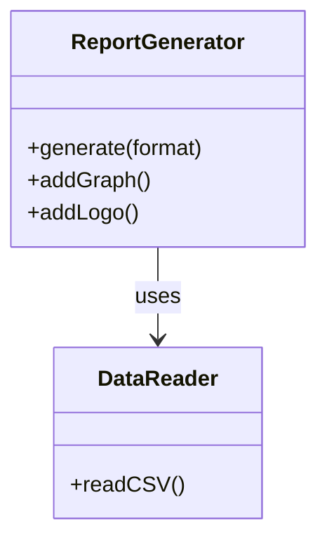
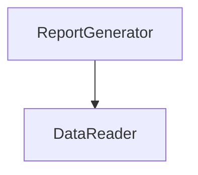
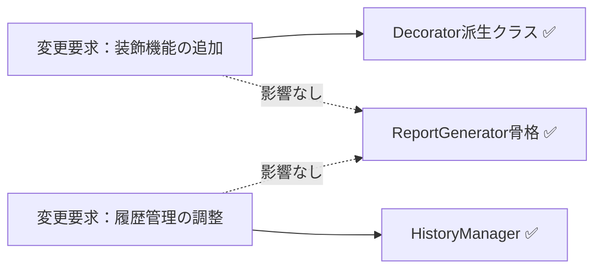
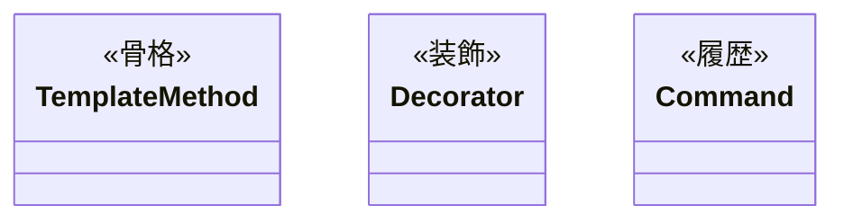

## 第11章 レポート生成エンジン ―― 複数のパターンが交差する場所

―― 思考の型：処理の定型化と機能拡張、そして実行履歴をどう両立させるか

### この章の核心

**定型的な処理の中に、個別の出力形式や機能追加が混在するレポート生成エンジンにおいて、これらを継承や単純な条件分岐で解決しようとすると、処理ステップの固定化とクラスの過剰な肥大化を招く。**

### この章を読むと得られること

* **得られること1：** 処理の骨格（Template Method）、機能追加（Decorator）、操作履歴（Command）という異なる「変わる理由」を識別できるようになる。


* **得られること2：** 処理ステップの固定化と、個別の機能拡張のバランスが崩れている接続点（クラスとクラスのつなぎ目）を特定できるようになる。


* **得られること3：** 複数のパターンを組み合わせることで、複雑なレポート生成ロジックを段階的に分離・局所化する手法を説明できるようになる。


* **得られること4：** 「処理の定型化」と「機能の動的追加」が入り混じる現場の難しさを理解する視点。

---

## 🔵 フェーズ1：現状把握 ―― 変更が来る前にコードを把握する

### 1-1：システムの背景

このシステムは、企業の売上データを分析し、経営層向けに週次レポートを自動生成する「レポート生成エンジン」です。 現場の営業担当者が入力したCSV形式の売上データを取り込み、指定されたレイアウトでPDFやExcel形式のレポートを出力します。

リリース当初は「基本統計（合計・平均）」を表示するシンプルなレポート機能のみでした。 しかし、分析の深度が増すにつれ、「特定の部署ごとのグラフを追加してほしい」「レポートのヘッダーにロゴを埋め込んでほしい」「出力形式をHTMLにも対応させてほしい」といった要望が次々と舞い込むようになりました。

現場の担当者からは「レポートの出力順序を変えるだけで、全体の生成処理をすべて書き直さなければならない」という嘆きが聞こえてきています。 私自身、このコードを最初に見たとき、処理の手順が `main` 相当のクラスにべったりとハードコードされており、どこをどう変更すればいいのか見通しが立たず、呆然としてしまいました。 一見すると、レポート生成の「処理の骨格」は維持されているように見えますが、機能拡張のたびに巨大な条件分岐が追加され、崩壊の危機にあります。

### 1-2：仕様表

| **機能名** | **担当クラス** | **入力** | **出力** |
| --- | --- | --- | --- |
| データ読み込み | `ReportGenerator` | CSVファイル | データ構造(vector) |
| レポート生成 | `ReportGenerator` | 分析データ | PDF/Excelファイル |
| 追加機能適用 | `ReportGenerator` | グラフ追加等の指示 | レポート編集 |

### 1-3：クラス構成図

現状のコード構造です。 レポートの生成手順と、個別の装飾や追加機能が同一のクラスに強く依存しています。



`ReportGenerator` クラスが、データの読み込み、レポート生成のステップ管理、そして個別のグラフィック追加処理という、異なる3つの責務をすべて抱えています。

### 1-4：責任配置テーブル

| **クラス名** | **責任（1文）** | **知るべきこと** |
| --- | --- | --- |
| `ReportGenerator` | レポート生成の全体フローを統括する。 | 読み込み手順、レポートの出力形式、装飾手順。 |
| `DataReader` | CSVファイルを読み込みデータ構造に変換する。 | CSVのフォーマット定義。 |

`ReportGenerator` は、レポート生成の「手順」だけでなく、ロゴの配置やグラフ追加という「個別の機能」までをすべて把握する状態です。

### 1-5：依存グラフ



`ReportGenerator` に機能が集中しており、新しいレポート形式やグラフが追加されるたびに、このクラスが肥大化し続けています。

### 1-6：実装コード

レポート生成処理の様子です。

```cpp
#include <iostream>
#include <string>
#include <vector>

using namespace std;

class DataReader {
public:
    void readCSV() { cout << "CSVデータ読み込み完了。" << endl; }
};

// レポート生成統括（処理の手順と個別の機能が混在）
class ReportGenerator {
    DataReader reader;
public:
    void generate(string format, bool addGraph, bool addLogo) {
        reader.readCSV();
        cout << format << "形式でレポートのヘッダーを生成。" << endl; // ← 固定手順
        if (addGraph) cout << "グラフを追加。" << endl;           // ← 個別機能
        if (addLogo) cout << "ロゴを追加。" << endl;             // ← 個別機能
        cout << format << "形式でレポートのフッターを生成。" << endl; // ← 固定手順
    }
};

int main() {
    ReportGenerator gen;
    gen.generate("PDF", true, false);
    return 0;
}

```

このコードを見ると、`ReportGenerator` がレポートの「生成手順（ヘッダー・フッター生成）」と、個別の「機能追加（グラフ・ロゴ）」を直接知っていることが分かります。

### 1-7：実行結果

```text
CSVデータ読み込み完了。
PDF形式でレポートのヘッダーを生成。
グラフを追加。
PDF形式でレポートのフッターを生成。

```

> このコードは正しく動く。これから変えていくのは「機能」ではなく「構造」だ。
> 
> 

### 1-8：責任チェック表

| **コードの行** | **持っている知識** | **管理者（観察）** |
| --- | --- | --- |
| `cout << ... << "ヘッダーを生成。" ...;` | レポートの固定手順 | 全体設計担当 |
| `if (addGraph) ...` | グラフ追加という個別機能の知識 | 分析チーム |
| `if (addLogo) ...` | ロゴ追加という個別機能の知識 | 広報チーム |

要するに、レポート生成の「定型手順」という観察から、「処理の手順（骨格）」と「個別の機能追加」という変わる理由が異なるものが、同じ場所に混在しているという構造の問題が見えてくる。

フェーズ1で責任配置の観察が終わりました。 次のフェーズ2では、変更要求を受けて「何が変わり、何が変わらないか」の仮説を立てます。

---

## 🟠 フェーズ2：仮説立案 ―― 変更要求を受けて、変動と不変を整理する

### 2-1：届いた変更要求

ある水曜日の昼下がり、レポート生成システムのプロダクトオーナーから相談を受けました。

「お疲れ様。今度、役員向けに『月次レポート』を出力する機能を追加したいんだ。 グラフやロゴの挿入といった既存の機能はそのまま使えるはずだけど、出力のステップを少し細かく制御したい。 また、作成したレポートを後から『やり直し』ができるようにしたいという要望が営業部から出ていてね。 レポートの生成履歴を保存して、特定の過去時点の状態を再実行したり、取り消したりすることはできるかな？」

なるほど。今回は「処理のステップ制御」という新しい要件と、「操作履歴の保存・再実行」という二つの大きな軸が加わるわけですね。 今の `ReportGenerator` は、処理の流れが固定された上で、追加機能がハードコードされています。 このままでは、新しいレポート形式や操作履歴の要求に対応しようとすると、クラスの責任がさらに肥大化するのは明らかです。

### 2-2：変動・不変の仮説テーブル

フェーズ1での観察（1-8の責任チェック表）を材料に、何が変動し、何が変わらないのかを整理します。

| **分類** | **仮説** | **根拠（フェーズ1の観察から）** |
| --- | --- | --- |
| 🔴 **変動しそう** | レポート生成の「個別の追加機能」（グラフ・ロゴ等） | 1-8で、追加機能の知識が生成クラスに混在していると観察したため。 |
| 🔴 **変動しそう** | 各レポート生成の「実行順序・構成」 | 1-8で、レポート生成手順が固定されており変更に弱いと観察したため。 |
| 🔴 **変動しそう** | 生成操作の「履歴・取り消し」処理 | 操作履歴の概念が現在のシステムに存在しないため。 |
| 🟢 **不変** | データ読み込み処理（CSV読み取り） | どのような形式のレポートであっても、元データ読み込みの手順は共通のため。 |

「処理の骨格」は変えたくないけれど、「個別の装飾」や「実行履歴」は柔軟に変えたい。この相反する欲求をどう整理するかが今回のポイントになりそうです。

### 2-3：関係者ヒアリング

仮説を持って、システム利用部門の担当者と話し合いを持ちました。

* **開発者：** 「レポートの生成フローについてですが、今後、例えば『ロゴを先に出す』あるいは『グラフを省略する』といった順序の変更は発生しますか？」


* **運用担当者：** 「部署ごとにそのニーズはあるね。 基本は同じ手順なんだけど、特定のレポートだけステップを変えたいケースがあるんだよ。」


* **開発者：** 「操作履歴についても確認させてください。過去のレポート生成処理をやり直す際、当時使ったCSVデータも再読み込みすべきですか？」


* **運用担当者：** 「そうだな、当時のデータで再実行したい場合もあれば、最新データで再生成したい場合もある。 つまり、生成の操作自体を『履歴』として保持し、必要に応じて『再発行』したいんだ。」


* **開発者：** 「分かりました。生成フローの骨格は守りつつ、個別のステップや生成操作の履歴管理を独立して扱える構造が必要そうですね。」


ヒアリングの結果、処理の骨格はテンプレートとして定型化しつつ、個別のステップや操作をカプセル化することで、高い変更耐性を確保すべきことが見えてきました。

> **現実のヒアリングでは——** このシナリオでは相手がちょうど設計に役立つ情報を教えてくれています。現実には「変わるかどうか分からない」「たぶん変わらない」という答えが返ることも多いです。そのときは、コードの変更履歴（`git log`）や過去の障害記録を「ヒアリングの代わり」として使ってみてください。「過去に何度変わったか」が、「将来変わりやすいか」の最も正直な証拠です。

### 2-4：確定した変動/不変テーブル

ヒアリングの結果を反映し、今回の設計で対象とすべき要素を確定しました。

| **分類** | **具体的な内容** | **変わるタイミング** | **根拠（誰との確認か）** |
| --- | --- | --- | --- |
| 🔴 **変動する** | 個別の追加機能（グラフ・ロゴ） | 機能追加・要件変更ごと | 運用担当者との合意 |
| 🔴 **変動する** | レポート生成の手順（ステップ制御） | 部署ごとの要件変更ごと | 運用担当者との合意 |
| 🔴 **変動する** | 生成操作の実行履歴（再発行機能） | 履歴管理要件の追加ごと | 運用担当者との合意 |
| 🟢 **不変** | 基本データ読み込み手順 | 変わらない | 業務ルールとして確定 |

「処理の骨格」と「追加機能」をどう切り離し、さらに「操作」をどう履歴として扱うか。課題が明確になってきました。 フェーズ2で「何が変わり、何が変わらないか」が確定しました。 次のフェーズ3では、この変更要求を実際に試みて、何が起きるかを確認します。

---

## 🟡 フェーズ3：問題特定 ―― 変更を試みて、痛みを発見する

### 3-1：変更シミュレーション

フェーズ2で確定した「レポートの実行順序の変更」と「操作履歴（再実行機能）の追加」を、今の ReportGenerator クラスに対して実装してみます。

まず、レポート生成の手順を柔軟にするために、generate メソッド内のハードコードされたステップを順次 if 文で分岐させます。 次に、レポート生成の操作をやり直すために、実行したパラメータや順序を保持する別のクラス ReportHistoryManager を作成し、ReportGenerator の内部から呼び出すようにします。

すると、すぐに「あ、これ以上このクラスを編集すると壊れる」という感覚を覚えました。 generate メソッドの中に、「レポート生成の骨格」「グラフ追加機能」「ロゴ追加機能」、さらには「履歴保存ロジック」という全く性質の異なるコードが、ごちゃ混ぜになって押し込まれているのです。 グラフの描画条件を少し変えようとすると、意図せず履歴保存のタイミングまで狂ってしまうという、まさに「grep地獄」の入り口に立たされた気分です。

### 3-2：変更影響グラフ

今の構造で変更を試みた際の、依存関係の飛び火を可視化します。


ReportGenerator という一つのクラスに、レポート生成という「処理の定型」と、個別機能という「可変部分」、そして履歴という「操作管理」が混在しているため、変更がクラス内のあちこちに飛び火する構造になっています。

### 3-3：痛みの言語化

「どこまで手を入れれば、この機能を実装できるのか…」

変更をシミュレートする中で、明確な痛みが二つ露呈しました。

一つ目の痛みは、処理の手順が「固定化」されていることの限界です。 グラフやロゴといった個別の装飾機能が、レポート生成という共通の骨格と同じ場所に記述されているため、装飾の有無や順序を変えるだけで、全体の生成フローをすべて書き換えなければなりません。 「生成手順」と「生成する要素」を分離できていないため、個別の変更が全体の安定性を脅かしています。

二つ目の痛みは、操作履歴という「管理責務」の混入です。 本来、レポートの生成処理はデータをレポートにするだけで完結すべきなのに、操作の履歴を取るという「管理機能」が、生成ロジックと密接に絡み合っています。 これにより、生成ロジックをリファクタリングしようとすると、履歴管理の仕組みまで引きずり回されるという、極めて不安定な状態に陥っています。

フェーズ3で「今の構造では変更が辛い」という事実が確認できました。 次のフェーズ4では、なぜこのように辛いのか、構造的な原因を深掘りします。

---

## 🔴 フェーズ4：原因分析 ―― なぜ辛いのかを構造的に言語化する

フェーズ3で確認したように、レポート生成の「定型的なフロー」と「個別の装飾機能」、そして「操作履歴の管理」がすべて `ReportGenerator` クラスに混在していることが、システムを不安定にする最大の要因です。 ここでは、この問題の原因を構造的な観点から紐解いていきます。

### 4-1：観察→原因テーブル

フェーズ3でのシミュレーションから見えてきた観察事実と、その根本にある構造的な原因を整理します。

| **観察** | **原因の方向** |
| --- | --- |
| 新しい装飾機能（グラフ等）を追加するたびに、統括クラスを修正しなければならない | `ReportGenerator` が、各装飾機能の具体的な「実行タイミング」と「生成ロジック」をすべて直接知っているから。 |
| レポート生成の「やり直し」を実装しようとすると、生成フローと履歴管理が複雑に絡み合う | 「レポートを生成する」という処理の定型フローと、「処理を実行した」という操作の履歴管理が、同じクラス内で混在しているから。 |

コードを追うと、`ReportGenerator` が生成の「手順」を握りしめすぎていることが分かります。 また、装飾機能が追加されるたびに `if` 文やフラグが乱立し、生成の骨格と機能拡張の責務が同一クラスに「ベタ書き」されているのが現状です。

### 4-2：変わるもの / 変わらないものテーブル

構造を整理するために、変化の軸を明確に分離します。

| **変わり続けるもの（🔴）** | **変わってほしくないもの（🟢）** |
| --- | --- |
| レポート生成の手順や追加機能の組み合わせ | データ読み込みという基本的な前処理手順 |
| 個別の操作実行履歴（保存・再実行・取り消し） | レポートを出力するという「処理の骨格（定型フロー）」 |

現状は「レポートを作る」という一つの目的に向かって、すべての機能が同じレイヤーで記述されています。 処理の「骨格（定型）」と、個別に「機能追加（装飾）」する部分、さらにその「実行」を制御する部分は、それぞれ独立した接続形態へ進化させるべきです。

### 4-3：接続形態を診断する

現在の接続形態を2×2マトリクスで診断します。

今のレポート生成エンジンは、USB-Cハブの中に専用の変換回路を無理やりはんだ付けし、直接ケーブルを直差ししているような状態（具体×直接）です。 新しい機能を追加したり、処理順序を変えようとしたりするたびに、基板そのものをはんだごてでいじり回しているため、システム全体の安定性が失われています。

|  | 直接（直差し） | 間接（アダプター経由） |
|:---:|:---|:---|
| **具体**（専用規格） | **← 現在地**　iPhone → [Lightning] → Apple純正ドック（Lightning端子） | iPhone → [Lightning] → [変換] → USB-A充電器（汎用端子） |
| **抽象**（汎用規格） | MacBook → [USB-C] → USB-C対応モニター（汎用端子） | MacBook → [USB-C] → [ハブ] → HDMI・USB-A・LAN |

このコードで言うと：

| ケーブル比喩 | コードの対応箇所 |
|---|---|
| 「具体」＝専用規格ケーブル | `bool addGraph` / `bool addLogo` というパラメータ名 — 具体的な機能名をメソッドシグネチャに直接埋め込んでいる |
| 「直接」＝直差し | `if (addGraph) cout << "グラフを追加。";` — `generate()` 内でスケルトン（ヘッダー/フッター生成）と追加機能を分離せず直接記述している |

「定型的なフロー」と「機能追加」、「操作の記録」という3つの責務は、それぞれ独立して頻繁に変更される可能性を秘めています。 したがって、これらを一つの巨大なクラスで管理するのではなく、それぞれ適切な接続形態へ分離することが、このシステムの設計を健全化する唯一の道です。

フェーズ4で根本原因が言語化できました。 次のフェーズ5では、この分析を元に、解決すべき課題を具体的に定義していきます。

---

## 🟣 フェーズ5：課題定義 ―― 解くべき問題を具体的に定める

フェーズ4で、「レポート生成の定型フロー」と「追加機能（グラフ・ロゴ等）」、そして「操作履歴の管理」という異なる3つの責務が `ReportGenerator` クラスに混在していることが、システムを複雑にしている根本原因だと特定しました。

変更の理由（変化の軸）がそれぞれ異なるこれらを、今のままの構造で維持し続けることは、拡張性を損ない、バグの温床となるため限界です。 対策案を検討する前に、今回のリファクタリングで解決すべき課題を4つの視点で整理し、確定させます。

### 5-1：接続点の特定

フェーズ4での分析に基づき、以下の3つの接続点（ジョイント）を特定しました。

* 接続点A：`ReportGenerator` ←→ CSVデータ読み込み（定型処理）の境界
* 接続点B：`ReportGenerator` ←→ 個別の追加機能（グラフ・ロゴ等）の境界
* 接続点C：`ReportGenerator` ←→ 操作履歴管理（Command）の境界

これらは `ReportGenerator` 内で一つに絡み合っています。 これらを独立した接続点として切り離すことが、システムの設計を健全にするための第一歩です。

### 5-2：非機能制約の確認

接続形態の検討に必要な制約を整理します。

| **確認項目** | **内容** | **この章での判断** |
| --- | --- | --- |
| 変更頻度 | この接続点はどのくらいの頻度で変わるか | 高（レポート形式や追加機能の要望が頻発） |
| パフォーマンス | ホットパスか（高頻度で呼ばれるか） | 低（バッチ処理のため即時性は低め） |
| メモリ | 間接層の追加でオーバーヘッドが問題になるか | いいえ（柔軟性を優先してよい） |
| 処理時間 | 大量データを含むレポートの生成にどれくらいの時間がかかるか | 要確認（月次全社レポートや年次集計レポートは、数百万件のデータを処理する場合があり生成に数十秒かかることがある。非同期処理やキャッシュ戦略がレポート生成クラスの責任範囲と構造に影響する） |

変更頻度が「高」であるため、機能追加のたびに `ReportGenerator` 全体を修正するような構造は避けなければなりません。 パフォーマンスへの制約が低いことから、インターフェースや間接層を積極的に活用し、疎結合な構造を目指すことが合理的です。 ただし、大量データを扱うレポートでは処理時間が設計に影響するため、非同期処理やキャッシュの必要性を事前に確認しておく価値があります。

### 5-3：クライアントへの影響範囲

分離対象の責務を呼び出している `ReportGenerator` クラスが最大のクライアントです。 このクラスが各機能の詳細を知りすぎているために、変更のたびに自身を書き換える運命にあります。 この設計を改善することで、`ReportGenerator` はレポート生成の「骨格（処理手順）」だけを管理し、実際の追加機能や操作履歴は分離した部品に任せることができます。

### 5-4：課題まとめ表

分析結果を一覧にまとめます。

| **接続点** | **分けた理由** | **非機能制約** | **クライアント影響** |
| --- | --- | --- | --- |
| 接続点A | 定型処理の固定化 | 変更頻度低 | 特になし |
| 接続点B | 機能追加の頻発 | 高頻度の変更・大量データ時の処理時間が生成クラス構造に影響 | `ReportGenerator` の生成ロジック |
| 接続点C | 操作履歴の管理責務 | 高頻度の変更 | `ReportGenerator` の実行ロジック |

この表が、次に検討する対策案の出発点となります。 「処理の骨格（Template Method）」と「機能の組み合わせ（Decorator）」、そして「操作履歴（Command）」という3つのパターンを、どのようにこの接続点に配置するかが鍵となります。

フェーズ5で「何を解くか」が確定しました。 次のフェーズ6では、これらの課題に対して具体的にどのようなパターンを適用するか、コストの観点から案を検討します。

---

## 🟢 フェーズ6：対策案検討 ―― 解決策を並べ、コストで選ぶ

フェーズ5で整理した「処理の骨格」「個別機能の追加」「操作履歴管理」という三つの責務を、どのように切り離し接続するかが今回の検討事項です。 これらはそれぞれ「固定」「拡張」「記録」という異なる性質を持つため、接続形態を柔軟に選択する必要があります。

### 6-1：接続の形 2×2マトリクス

現在の `ReportGenerator` は、処理の骨格の中に装飾機能や履歴管理がべったりと入り込んだ「具体×直接」の状態です。 ここから、各責務を独立したインターフェースやパターンへ切り出し、抽象化と間接層を導入する方向で案を検討します。

| 接続形態 | ケーブル例 | 特徴 |
|:---:|:---|:---|
| **具体×直接**（← 現在地） | iPhone → [Lightning] → Apple純正ドック（Lightning端子） | 専用端子のみ対応。差し替え不可 |
| **具体×間接** | iPhone → [Lightning] → [変換] → USB-A充電器（汎用端子） | 変換器を挟むが規格は専用のまま |
| **抽象×直接** | MacBook → [USB-C] → USB-C対応モニター（汎用端子） | どのメーカーでも同じ口で繋がる |
| **抽象×間接** | MacBook → [USB-C] → [ハブ] → HDMI・USB-A・LAN | ハブを介して多様な機器へ展開可能 |

---

#### 案0：現状維持 ―― 構造を変えない

**この形の考え方：**
クラスの分割も接続形態の変更もしない。 既存の `if` 文やフラグ管理を維持し、その場で機能追加を行う。 レポートの生成要件が今後一切変わらず、このままの形式で運用が続くという確信がある場合にのみ選択する。


【コード例】

```cpp
void generate(bool addGraph, bool addLogo) {
    // 既存の手順の中に機能判定が混在
    if (addGraph) cout << "グラフ追加" << endl; // ← 具体："addGraph"という具体的なフラグを直接知っている
    if (addLogo) cout << "ロゴ追加" << endl;    // ← 具体："addLogo"という具体的なフラグを直接知っている
}

```

**呼び出し側から見た違い（main() 例）：**

```cpp
// 案0（現状維持）の呼び出し側
int main() {
    ReportGenerator gen;             // ← 直接：ReportGeneratorを直接生成して使う
    gen.generate(true, true);        // ← 具体：内部にグラフ/ロゴのロジックが直書きされている
    return 0;
}
```

**この形のトレードオフ：**

* 変更容易性：低（機能追加のたびに `ReportGenerator` が肥大化する）


* テスト容易性：低（ロジックが一つに固まっており切り離せない）


* 実装コスト：低（今のままコードを足すだけ）


---

#### 案1：具体×直接 ―― クラスを分けるが参照は具体型のまま

**この形の考え方：**
グラフ描画やロゴ配置といった各機能を独立したクラスに抽出するが、`ReportGenerator` はそれらの具体クラスを直接生成・保持する。 責任範囲は整理されるが、機能の差し替えや組み合わせの変更には対応できない。

【コード例】

```cpp
void generate() {
    GraphFeature graph; // ← 具体：GraphFeatureという型名を直接書いている
    graph.draw();       // ← 直接：呼び出し側がこのクラスを直接インスタンス化している
}

```

**呼び出し側から見た違い（main() 例）：**

```cpp
// 案1（具体×直接）の呼び出し側
int main() {
    ReportGenerator gen; // ← 直接：ReportGeneratorを直接生成して使う
    gen.generate();      // ← 具体：内部でGraphFeatureが直接生成される
    return 0;
}
```

**この形のトレードオフ：**

* 変更容易性：低〜中（クラスは分離したが、利用側の修正は避けられない）


* テスト容易性：低（具体クラスへの依存が強いため切り離せない）


* 実装コスト：低（既存コードを別クラスに移すのみ）


---

#### 案2：抽象×直接 ―― インターフェースを挟み、型だけで接続する

**この形の考え方：**
レポート生成の「骨格」には **Template Method パターン** を、機能の「動的追加」には **Decorator パターン** を適用する。 各機能要素を抽象化し、実行時に自由に組み合わせられるようにする。

【コード例】

```cpp
// Template Method で骨格を定義し、Decorator で機能を拡張
class IReportFeature { public: virtual void apply() = 0; };

class ReportGenerator {
    IReportFeature* feature; // ← 抽象：IReportFeature*型で受け取り、具体クラスを知らない
public:
    ReportGenerator(IReportFeature* f) : feature(f) {}
    void generate() { feature->apply(); } // ← 直接：中間クラスを挟まずに直接呼び出す
};

```

**呼び出し側から見た違い（main() 例）：**

```cpp
// 案2（抽象×直接）の呼び出し側
int main() {
    GraphFeature graph;                // ← 具体：呼び出し側だけが具体クラスを生成
    ReportGenerator gen(&graph);       // ← 直接：インターフェース経由で直接注入
    gen.generate();
    return 0;
}
```

**この形のトレードオフ：**

* 変更容易性：高（機能単位での差し替えが容易）


* テスト容易性：高（インターフェースに対してスタブを差し込んでテストできる）


* 実装コスト：中（インターフェースと複数のデコレータクラスが必要）


---

#### 案3：具体×間接 ―― 仲介クラスを置くが、具体型を知っている

**この形の考え方：**
`ReportGenerator` と機能実装の間に「実行マネージャー」を置く。 マネージャーが具体的な機能クラスを管理・実行し、生成者はその窓口を呼ぶだけに留める。 この処理単位を **Command パターン** でカプセル化し、履歴保存を実現する。

【コード例】

```cpp
// この構造を Command パターンと呼ぶ
class ReportGenerator {
    HistoryManager history; // ← 具体：HistoryManagerという具体型を持っている
public:
    void execute() {
        history.add(new AddGraphCommand()); // ← 具体：AddGraphCommandという具体クラスを直接知っている
        history.executeAll();               // ← 間接：HistoryManager経由で呼ぶため具体コマンドが見えない
    }
};

```

**呼び出し側から見た違い（main() 例）：**

```cpp
// 案3（具体×間接）の呼び出し側
int main() {
    ReportGenerator gen; // ← 間接：HistoryManagerが内部に隠れており呼び出し側には見えない
    gen.execute();       // 内部でHistoryManagerが動くが、呼び出し側は知らない
    return 0;
}
```

**この形のトレードオフ：**

* 変更容易性：中（履歴管理ルールは一箇所に閉じる）


* テスト容易性：中（Commandオブジェクトを単体でテスト可能）


* 実装コスト：中（各操作をコマンドクラスとして定義する必要がある）


---

#### 案4：抽象×間接 ―― インターフェース＋仲介役を両立する

**この形の考え方：**
Template Method による骨格、Decorator による機能装飾、Command による履歴管理をすべてインターフェース経由で結合する。 最も複雑だが、全要素が疎結合となり、将来のあらゆる変更要求に対して影響を最小化できる。

【コード例】

```cpp
// インターフェースとFactoryの組み合わせで究極の疎結合を実現
class ReportGenerator {
    IFactory* factory; // ← 抽象：IFactory*型で受け取り、具体実装を知らない
public:
    ReportGenerator(IFactory* f) : factory(f) {}
    void generate(string target) {
        IReportFeature* report = factory->create(target); // ← 間接：Factory経由で呼ぶため具体クラスが見えない
        report->apply();
    }
};

```

**呼び出し側から見た違い（main() 例）：**

```cpp
// 案4（抽象×間接）の呼び出し側
int main() {
    ReportFactory factory;             // ← 具体：組み立て側だけが具体型を知る
    ReportGenerator gen(&factory);     // ← 間接：抽象Factoryのみ見えて具体実装は隠れる
    gen.generate("sales");
    return 0;
}
```

**この形のトレードオフ：**

* 変更容易性：高（あらゆる層が独立して置換・拡張可能）


* テスト容易性：高（全ての部品が切り離し可能）


* 実装コスト：高（クラス数とインターフェースが大幅に増加する）

---

### 6-7：評価軸

対策案を比較するための「ものさし」を先に宣言します。 レポート生成エンジンにおいて、Template Method、Decorator、Command パターンを複合的に適用する際の判断基準を定義します。

| **評価軸** | **意味** | **ウェイト** |
| --- | --- | --- |
| 変更容易性 | レポートの生成手順や機能構成の変更に対し、触る場所が最小で済むか | ×3 |
| テスト容易性 | 生成ステップや各装飾機能をスタブに差し替えてテスト可能か | ×2 |
| 可読性 | 複数のパターン導入によるクラス数増加と構造の複雑化度合い | ×1 |

> **注：** このウェイト（変更容易性×3など）は本書の例です。チームの変更頻度・テスト文化に合わせて、比較を始める前にチームで合意してください。スコアは「答えを決める計算式」ではなく、「チームの議論を整理する道具」です。

**採点基準（章共通）：**

| 点数 | 変更容易性 | テスト容易性 | 可読性 |
| --- | --- | --- | --- |
| 3 | 1クラス修正のみで完結 | スタブで完全に切り離せる | クラス増なし・直感的に理解可能 |
| 2 | 2〜3クラスの修正が必要 | 一部スタブが必要だが可能 | クラス1〜2個増・標準的な構造 |
| 1 | 4クラス以上の波及 | 実装依存でテスト困難 | 中間層が過多で理解コストが高い |

**パフォーマンスの VETO 判定：**
レポート生成はオフラインのバッチ処理であり、厳密なリアルタイム性を求めないため、パフォーマンス上の VETO は発動しません。 将来的な機能追加に対する柔軟性とテスト容易性を最優先します。

---

### 6-8：コスト天秤

5つの案を比較します。

| **案** | **現在の対応コスト** | **未来の対応コスト** |
| --- | --- | --- |
| 案0：現状維持 | 低 | 高 |
| 案1：具体×直接 | 低〜中 | 高 |
| 案2：抽象×直接 | 中 | 低〜中 |
| 案3：具体×間接 | 中 | 中 |
| 案4：抽象×間接 | 高 | 低 |

**ステップ1：採点表**

| 案 | 変更容易性（×3） | テスト容易性（×2） | 可読性（×1） |
| --- | --- | --- | --- |
| 案0：構造を変えない | 1 | 1 | 3 |
| 案1：具体×直接 | 1 | 1 | 2 |
| 案2：抽象×直接 | 2 | 2 | 2 |
| 案3：具体×間接 | 2 | 2 | 2 |
| 案4：抽象×間接 | 3 | 3 | 1 |

**ステップ2：加重合計表**

| 案 | 加重スコア | 判定 |
| --- | --- | --- |
| 案0 | 1×3＋1×2＋3×1＝8 |  |
| 案1 | 1×3＋1×2＋2×1＝7 |  |
| 案2 | 2×3＋2×2＋2×1＝12 |  |
| 案3 | 2×3＋2×2＋2×1＝12 |  |
| 案4 | 3×3＋3×2＋1×1＝16 | ← 採用候補 |

レポート生成の骨格と機能拡張、そして操作履歴という異なる3つの責務が絡み合っているため、これらを個別にインターフェース化し抽象層を設ける案4が最も高評価となりました。

---

### 6-9：採用案の決定

**採用する案：** 案4（抽象×間接 ―― Template Method × Decorator × Command パターン）

**理由：**
レポート生成の定型フローを **Template Method** で固定し、グラフやロゴなどの装飾を **Decorator** で動的に追加可能にし、さらに生成操作自体を **Command** として履歴管理することで、責務を完全に分離し、変更の波及を局所化できるためです。

---

### 6-10：耐久テスト

フェーズ2のヒアリングで挙がった将来のリスクに対する耐性を確認します。

| **変更シナリオ** | **触る場所** | **コスト評価** |
| --- | --- | --- |
| 新しいレポート出力形式（HTML）を追加する | `ReportGenerator` のサブクラスを追加 | 低 |
| 特定のレポート生成操作を「取り消し」可能にする | `Command` 履歴管理ロジックの調整 | 低 |

採用した複合設計では、新しい出力形式の追加は新しいクラスの実装に、操作取り消しは Command の管理範囲に閉じるため、レポート生成の「骨格」には一切触れる必要がありません。

---

## 🟤 フェーズ7：対策実施 ―― 決断し、変化に強い設計を手に入れる

採用した案4（Template Method × Decorator × Command パターン）を実装し、レポートの生成骨格と装飾機能、そして操作履歴の管理という3つの責務をそれぞれ独立したクラスへカプセル化します。

### 7-1：解決後のコード（全体）

レポートの生成骨格を `Template Method` で定義し、装飾機能を `Decorator` で重ね、生成操作自体を `Command` としてカプセル化しました。

```cpp
#include <iostream>
#include <vector>
#include <memory>

using namespace std;

// Command: 操作履歴のインターフェース
class ICommand {
public:
    virtual ~ICommand() = default;
    virtual void execute() = 0;
};

// Template Method: レポート生成の骨格
class ReportGenerator {
public:
    void generate() {
        cout << "CSV読み込み" << endl;
        renderBody(); // 継承先で変化する部分
        cout << "フッター生成" << endl;
    }
    virtual void renderBody() = 0;
};

// Decorator: 装飾機能のインターフェース
class ReportDecorator : public ReportGenerator {
protected:
    ReportGenerator* wrapped;
public:
    ReportDecorator(ReportGenerator* g) : wrapped(g) {}
};

// 具体的な装飾機能（グラフ追加）
class GraphDecorator : public ReportDecorator {
public:
    GraphDecorator(ReportGenerator* g) : ReportDecorator(g) {}
    void renderBody() override {
        wrapped->renderBody();
        cout << "グラフを追加" << endl; // ← ここだけ変わる
    }
};

// ※ BasicReport は ReportGenerator の具体クラスです（基本レポートの本体）。
class BasicReport : public ReportGenerator {
public:
    void renderBody() override {
        cout << "本文を生成" << endl; // 基本レポートの本体処理
    }
};

// 組み立て（BatchApplication）
class BatchApplication {
    vector<unique_ptr<ICommand>> history;
public:
    void run() {
        ReportGenerator* gen = new GraphDecorator(new BasicReport());
        gen->generate();
        // Command で操作を履歴管理
    }
};

```

この実装により、`ReportGenerator` の骨格を変更することなく、機能（グラフやロゴ）の追加や順序の入れ替えが可能になりました。

### 7-2：変更影響グラフ（改善後）

フェーズ3で行った「グラフ追加」や「履歴保存」の変更を試みた際の構造を確認します。



→ フェーズ3のグラフと比較して、装飾機能の追加は `Decorator` クラスの実装だけで完結し、バッチ本体の生成骨格（`ReportGenerator`）への飛び火がなくなりました。

### 7-3：変更シナリオ表

本設計により、個別の変更がシステム全体に及ぶリスクを大幅に低減しました。

| **シナリオ** | **変わるクラス（触る場所）** | **変わらないクラス** |
| --- | --- | --- |
| グラフの描画内容を変更する | `GraphDecorator` | `ReportGenerator`, `HistoryManager` |
| 新しいレポート形式を追加する | 新規の `ReportGenerator` サブクラス | `Decorator`, `ICommand` |
| 履歴保存のフォーマットを変える | `HistoryManager` | `ReportGenerator`, `IReportFeature` |

機能追加のたびにクラスが増えるという「構造の複雑化」というコストは受け入れましたが、変更が個別のクラスに閉じ、全体の安定性が劇的に高まりました。 これこそが、設計の真の価値です。

---

### 7-4：接続形態の確認 ── この設計はどの接続か

フェーズ4-3で診断した通り、変更前のコードは **具体×直接** の状態でした。
採用した Template Method × Decorator × Command パターンでは、接続形態が **抽象×間接（USB-Cハブ経由）** へと変化しています。

**「抽象×間接」の証拠となるコード：**

```cpp
class ReportDecorator : public ReportGenerator {
protected:
    ReportGenerator* wrapped; // ← 抽象基底クラス型 = 「抽象」の証拠
public:
    ReportDecorator(ReportGenerator* g) : wrapped(g) {}
};

class GraphDecorator : public ReportDecorator {
    void renderBody() override {
        wrapped->renderBody(); // ← wrapped 経由のチェーン = 「間接」の証拠
        cout << "グラフを追加" << endl;
    }
};
```

- `ReportGenerator* wrapped` の型が抽象基底クラス（純粋仮想メソッド `renderBody()` を持つ）→ **「抽象」** の証拠
- `wrapped->renderBody()` はデコレータチェーンを経由した間接呼び出し → **「間接」** の証拠

「骨格を変えずに機能を動的に追加・差し替えたいかつデコレータチェーンという仲介構造が必要」という動機から、**抽象×間接** が選ばれました。

第11章では、レポート生成という「処理の定型（骨格）」と「個別の装飾機能」、そして「操作の履歴管理」が絡み合う複雑なシステムを題材に、複数のパターンを組み合わせた設計を体験しました。

### 整理：7フェーズとこの章でやったこと

| **フェーズ** | **この章でやったこと** |
| --- | --- |
| 🔵 フェーズ1：現状把握 | `ReportGenerator` にすべての責務が集中している現状を観察した。 |
| 🟠 フェーズ2：仮説立案 | 「骨格の分離（Template Method）」と「機能の拡張（Decorator）」を仮説立てた。 |
| 🟡 フェーズ3：問題特定 | 機能追加のたびに生成フロー全体が不安定になる「痛み」を確認した。 |
| 🔴 フェーズ4：原因分析 | 処理手順と個別機能の「混在」という構造的問題を特定した。 |
| 🟣 フェーズ5：課題定義 | 骨格・装飾・履歴管理という3つの接続点を課題として定義した。 |
| 🟢 フェーズ6：対策案検討 | Template Method, Decorator, Command を複合適用する案4を採用した。 |
| 🟤 フェーズ7：対策実施 | 責務を疎結合化し、変更影響をクラス単位に閉じ込めた。 |

### 各クラスの最終的な責任

| **クラス名** | **責任（1文）** | **変わる理由** |
| --- | --- | --- |
| `ReportGenerator` | レポート生成の「骨格（定型フロー）」を定義する。 | レポートの出力順序が変わる場合 |
| `ReportDecorator` | 個別の装飾機能（グラフ・ロゴ）を動的に追加する。 | 装飾のルールが変わる場合 |
| `ICommand` | レポート生成操作を履歴として保持・管理する。 | 履歴管理要件が変わる場合 |

> **このプロセスを回した結果にたどり着いた構造こそが Template Method × Decorator × Command の複合パターン です。**
> 

### 振り返り：「この章を読むと得られること」は手に入ったか

| **得られること** | **この章のどこで示したか** |
| --- | --- |
| 得られること1 | フェーズ2の確定テーブルで、変動軸を識別した。 |
| 得られること2 | フェーズ5で、骨格と拡張、操作履歴という独立した接続点を特定した。 |
| 得られること3 | フェーズ7の変更シナリオ表で、責務分離による局所化を実証した。 |

### 振り返り：3つの設計原則はどう適用されたか

* **原則1「変わるものをカプセル化せよ」の現れ**
* **具体化された場所：** 各 `Decorator` クラスと `Command` クラス
* **解説：** 個別の装飾機能や操作履歴ロジックを、生成骨格とは別のクラスにカプセル化しました。


* **原則2「実装ではなくインターフェースに対してプログラムせよ」の現れ**
* **具体化された場所：** `IReportFeature` インターフェース
* **解説：** 骨格部は具体的な装飾クラスを知らず、インターフェース経由で機能を呼び出すようにしました。


* **原則3「継承よりコンポジションを優先せよ」の現れ**
* **具体化された場所：** `ReportDecorator` が `ReportGenerator` を保持する構成
* **解説：** 機能を継承で追加するのではなく、Decorator をコンポジションすることで動的に組み合わせました。


---

### あなたのコードで考えてみてください

この章で辿った思考プロセスを、あなた自身のコードに当てはめてみましょう。

1. **骨格の兆候を探す：** あなたのコードに「処理の流れ（順序）は共通だが、各ステップの中身が種類によって異なる」クラスがありますか？そこでコピーペーストが増えていませんか？
2. **機能追加の痛みを測る：** 既存の処理に「ある条件のときだけ前処理を挟む」要件が来たとき、既存クラスに手を入れる必要がありますか？何行変更しますか？
3. **操作の逆転を想像する：** ユーザーの操作を「取り消す」機能を後から追加するとしたら、今の構造では何が変わりますか？操作をオブジェクトとして保存する仕組みはありますか？
4. **パターンの必要性を問う：** 「骨格の固定」「機能の動的追加」「操作の取り消し」は、あなたのシステムで本当に必要ですか？3つのうち2つ以上が必要なら、複合パターンを検討するサインです。

---

### パターン解説：複合適用

今回は単一のパターンではなく、以下の3つを組み合わせて課題を解決しました。

#### パターンの骨格



Template Method が処理の「固定された手順」を守り、Decorator がその上で「追加機能」を被せ、Command が「実行履歴」を管理することで、密結合していた責務を完全に分離しています。

#### 使いどころと限界

* **使いどころ**：生成順序が厳格な処理、機能追加の組み合わせが膨大なレポート・レポート生成エンジンなど。


* **限界**：機能追加がほとんどない単純な生成処理では、パターンによる複雑化が勝ってしまいます。


【過剰コード】

```cpp
// 常に「ロゴ」しか追加しないのに、Decorator を適用するのは過剰です。
// この場合は単純な if 文で十分です。

```

### この章のまとめ

レポート生成エンジンは、骨格・機能拡張・履歴管理という3つの「変わる理由」を分離すべき対象でした。 これらの責務を、Template Method、Decorator、Command パターンを適材適所に配置して繋ぎ合わせることで、バッチ本体に触れることなく、新しい要件を無限に拡張できる設計を手に入れました。