## 第11章 レポート生成エンジン ―― Template Method × Decorator × Command パターン

―― 思考の型：処理の定型化と機能拡張、そして実行履歴をどう両立させるか

これまでの章では構造を1章1つで体験した。この章では3つの変更理由が混在した問題に同じ思考プロセスを使う。

### この章の核心

**レポート生成の手順、装飾機能、操作履歴が同じ生成処理に集まっていると、グラフ追加でもUndo追加でも生成手順まで修正・確認する必要が生じる。こういう問題は、「守りたい処理の骨格」と「後から増える機能」が同じ場所に混在しているシステムで起きている。**

### この章を読むと得られること

* **得られること1：** 処理の骨格、機能追加、操作履歴という異なる「変わる理由」を識別できるようになる。

* **得られること2：** 処理ステップの固定化と、個別の機能拡張のバランスが崩れている接続点（クラスとクラスのつなぎ目）を特定できるようになる。

* **得られること3：** 複数の仕組みを組み合わせることで、複数の変更理由を持つロジックを段階的に分離・局所化する手法を説明できるようになる。

* **得られること4：** 「処理の定型化」と「機能の動的追加」が入り混じる現場の難しさを理解する視点。

---

## 🔵 フェーズ1：現状把握 ―― 仕様を整理し、システムと紐付ける

レポート生成エンジンが何を入力として受け取り、どの処理で加工し、何を出力するのかを整理します。

### 1-1：このシステムの仕様

このシステムは、企業の売上データを分析し、経営層向けのレポートを生成する「レポート生成エンジン」です。利用者は、レポート種別、出力形式、装飾オプションを指定して生成を実行します。システムは、その指定に対応する売上CSVを読み込み、集計結果をレポート本文にまとめ、必要な装飾を重ねて、指定形式のファイルとして出力します。

この章で扱う現状仕様は、次の範囲です。

| 仕様項目 | この章で扱う値 | 具体例 | 何に使うか |
|---|---|---|---|
| レポート種別 | 週次・月次・部門別 | SALES_MONTHLY: 月次売上レポート | 読み込む売上CSVと本文の見せ方を決める |
| 出力形式 | PDF・Excel | pdf、excel | 配布用か分析用かに応じて出力形式を決める |
| 装飾オプション | グラフ・ロゴ・透かし | グラフあり、ロゴなし | 生成されたレポートへ追加する装飾を決める |
| 本文生成 | ヘッダー、売上集計の本文、フッター | 月次売上の集計本文 | 掲載コードでは描画APIスタブを呼び、その先を `cout` で代替する |

利用者が「月次レポートをPDFで、グラフ付き」と指定した場合、システムは月次用の売上CSVを読み込み、月次売上の集計本文を作り、その本文にグラフを加え、最後にPDFとして出力します。CSVをどのストレージから取得するか、グラフ描画ライブラリでどのように画像を生成するか、実際のPDF/Excelファイルをどう書き出すかは、この章の設計論点ではありません。掲載コードでは、外部処理の入口を `ReportRenderingApi` などの境界として残し、その先の処理だけを `cout` スタブに置き換え、生成手順と責任の集まり方を見ます。

`cout` はレポートそのものではなく、外部境界の先にある処理を簡略表示するためのスタブです。実際のシステムでは、売上CSVの取得、グラフ描画、PDF/Excelファイルの書き出しが別のライブラリやAPIで行われます。

また、実運用ではレポート生成を画面から切り離し、バックグラウンドジョブから起動する構成が一般的です。ただし、ジョブの起動・スケジューリング基盤はこの章の設計論点ではありません。掲載コードは `GenerateReportAction::execute()` を同期的に呼び、完了・失敗を `JobResult` で受け取るところまでを境界として扱います。装飾処理が途中で失敗した場合の結果と、同じ生成操作の再実行は1-5の変更要求後に扱いますが、`ReportJob` クラスや非同期実行基盤そのものは実装しません。

**仕様整理図：保存データと外部境界**

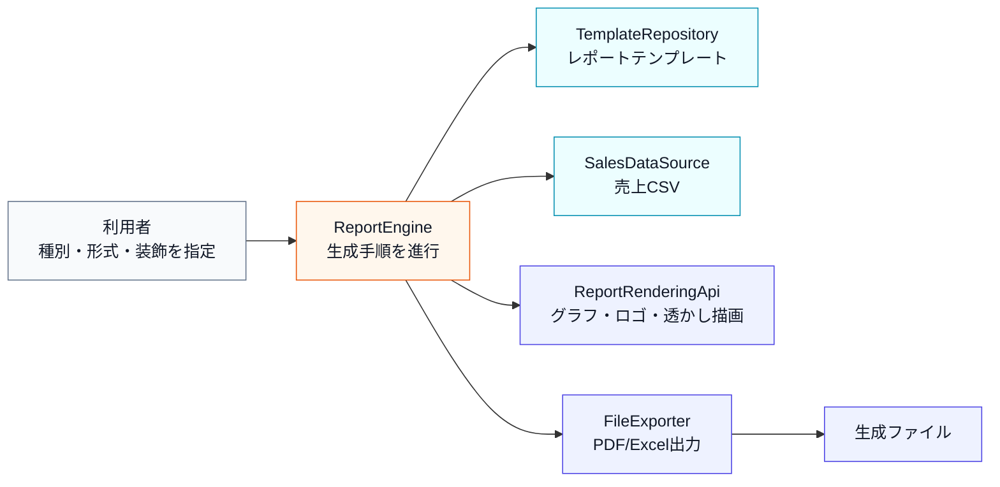

上の文章と表で仕様を一通り確認したので、まず正常にレポートを生成できる場合の入力・判定・加工・出力の流れとして整理します。

**仕様整理図：正常系の入力・判定・加工・出力**

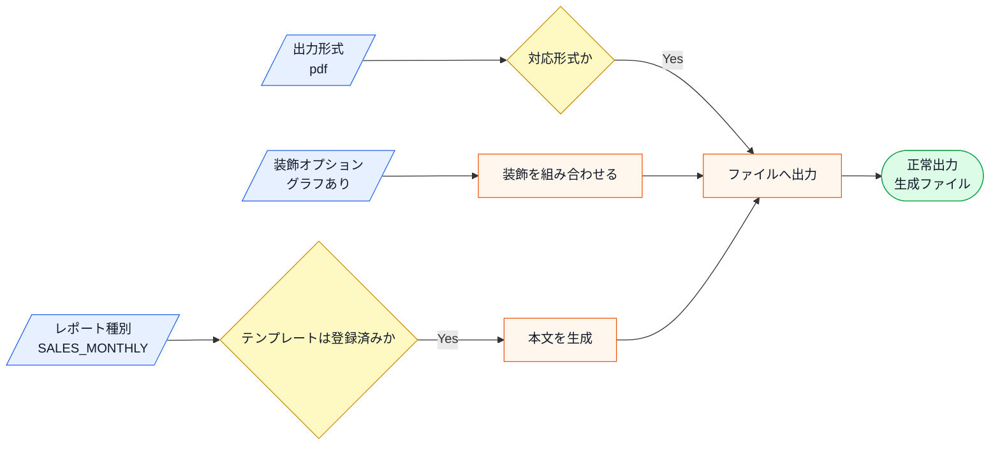

この図から読み取ることは、次の3点です。

- レポートは、レポート種別、出力形式、装飾オプションを入力として生成される。
- レポート種別と出力形式は、処理を続けてよいかを判定する材料になる。
- 本文生成と装飾適用が終わってから、指定形式のファイルとして出力される。

現状のレポート機能は、基本統計（合計・平均）を表示する構成です。現在の構造では、レポート生成の手順が処理の出発点に固定されています。

**対応するレポート種別・出力形式**

レポートの種別を「週次・月次・部門別」と分けているのは、経営層が見たい集計の粒度が目的によって異なるからです。週次は現場の素早い状況把握、月次は全社の業績管理、部門別は責任単位での比較に使われます。出力形式としてPDFとExcelの両方を提供しているのは、「配布・印刷用のPDF」と「加工・分析用のExcel」という使われ方の違いがあるためです。

| レポート種別 | 内容 | 出力形式 |
|---|---|---|
| 週次レポート | 週ごとの売上集計 | PDF・Excel |
| 月次レポート | 月ごとの売上集計 | PDF・Excel |
| 部門別レポート | 部門ごとの売上集計 | PDF・Excel |

**装飾機能の一覧**

「グラフ追加」「ロゴ埋め込み」「透かし追加」という3種類の装飾が用意されています。グラフは集計済みの売上データを図表として本文へ挿入する処理、ロゴはヘッダーへ画像を配置する処理、透かしはページ全体へ「社外秘」などの表示を重ねる処理です。

実際のシステムでは、これらの装飾はPDF/Excel生成ライブラリや画像処理ライブラリを呼び出して行います。この章の掲載コードでは、`ReportRenderingApi` という描画API境界を呼び、その先の実装だけを `cout` の出力で代替します。見たいのは「グラフを描くアルゴリズム」ではなく、「装飾処理を組み合わせ可能な部品として接続する境界」です。

| 機能 | 内容 | 要件定義の担当 |
|---|---|---|
| グラフ追加 | 部署別・期間別のグラフをレポートに挿入する | 分析チーム |
| ロゴ埋め込み | レポートのヘッダーにロゴ画像を挿入する | 広報チーム |
| 透かし追加 | 「社外秘」等の透かしをページ全体に適用する | 広報チーム |

装飾は複数を組み合わせて重ねることができます（例：グラフ＋透かし）。

**レポート生成の処理ステップ**

処理ステップが「データ取得 → 集計 → 装飾適用 → 出力」という順序で固定されているのは、前のステップの結果が次のステップに必ず必要だからです。データがないと集計できず、集計結果がないと装飾を重ねるものがなく、完成物がなければ出力できません。一方、「どの装飾を重ねるか」（ステップ③）は案件ごとに自由に変えられます。骨格（順序）は固定で、中身の一部（装飾）は柔軟という組み合わせが、このシステムをやや複雑にしている理由のひとつです。

| ステップ | 処理内容 |
|---|---|
| ① データ取得 | CSV形式の売上データを読み込む |
| ② 集計 | 合計・平均などの基本統計を算出する |
| ③ 装飾適用 | グラフ・ロゴ・透かしを順に重ねる（組み合わせ自由） |
| ④ 出力 | 指定の形式（PDF / Excel）でファイルを書き出す |

**このシステムの関係者**

「グラフ機能は分析チーム、ロゴ・透かしは広報チーム」と担当が分かれているのは、それぞれが専門知識を持つ領域だからです。グラフの表示条件はデータ分析の知識がなければ正しく決められず、ブランドロゴの配置は広報が守るガイドラインに従います。ここでは、後のフェーズで確認する材料として、どの業務機能がどの仕様を決めているかを整理します。

**この仕様を決める業務機能**
| 業務機能 | この章の仕様で決めていること |
|---|---|
| 分析・グラフ管理 | グラフの種類・表示条件・データ集計ルール |
| UI・表示管理（広報） | ブランドガイドライン・ロゴ配置・透かし仕様 |

後のフェーズで変更要求を扱うとき、どの業務機能の知識なのかを確認するための名前として使います。

**エラー条件**

正常系の仕様を一通り確認したうえで、最後に、生成へ進めない入力や外部境界の懸念を分けて整理します。

| エラー条件 | どこで分かるか | 出力 | 保存・通知などの副作用 |
|---|---|---|---|
| レポート種別に対応するテンプレートがない | テンプレート取得時 | 未登録テンプレートエラー | ファイル出力なし |
| 出力形式に対応していない | 出力形式確認時 | 未対応形式エラー | ファイル出力なし |
| 描画APIやファイル出力に失敗する | `ReportRenderingApi` / `FileExporter` 呼び出し時 | この章の1-1では詳細扱いなし | 実システムでは失敗ログと再試行対象を記録する |
| 装飾（グラフ・透かし）の適用が途中で失敗する | 装飾適用時（`ReportRenderingApi` 呼び出し中） | この章の1-1では詳細扱いなし。1-5で扱う | 生成操作を失敗として記録し、`JobResult` へ失敗を返す |

### 1-2：動作例テーブル

コードを読む前に、フェーズ1の現状コードがどんな入力に対してどんな出力を返すかを確認します。ここでは、まだ履歴・やり直し・取り消しは扱いません。それらは1-5の変更要求で初めて登場します。

| 操作 | 入力・条件 | 期待される出力・結果 |
| --- | --- | --- |
| 月次売上レポートをPDF出力 | レポート種別：月次、出力形式：PDF | PDFファイルが生成される |
| 月次売上レポートをExcel出力 | レポート種別：月次、出力形式：Excel | Excelファイルが生成される |
| グラフ付き・透かし付きでPDF出力 | 月次レポート＋グラフ装飾＋透かし装飾＋PDF出力 | 装飾が重ねて適用されたPDFが生成される |
| 未登録テンプレートを指定 | レポート種別：存在しないID | 未登録テンプレートエラーが出る |
| 未対応形式を指定 | 出力形式：未対応の形式 | 未対応形式エラーが出る |

この表は、フェーズ1の仕様図に出てきた入力・判定・加工・出力の代表例です。変更要求後の履歴操作は、1-5で別表として扱います。末尾2行（未登録テンプレート・未対応形式）は生成に入る前の入力バリデーションで、1-4の現状コードの `main` が持つ存在確認（`exists`）と形式確認（`supportsFormat`）で検出して処理を中断します。フェーズ7の最終コードは生成・装飾・履歴の振る舞いに焦点を当てるため、この2つの入力ガードは1-4で示した動作仕様として扱い、最終実行結果では正常系と履歴操作を示します。

| 段階 | 主に確認する動作 |
|---|---|
| 現状〜ステップ3 | 基本的なレポート生成と、本文生成・装飾を分けた場合の限界 |
| ステップ4 | PDF・Excelなど、骨格を共有した出力形式の追加 |
| ステップ5 | グラフ・透かしなど、装飾の動的な組み合わせ |
| ステップ6〜フェーズ7 | Undo、バッチ実行を含む6動作すべて |

したがって、フェーズ1では現状の生成動作だけを見ます。履歴や取り消しは、変更要求を受けた後に「どこへ入れようとすると困るか」を確認してから扱います。

次は、この仕様を担うクラスの顔ぶれと責任を確認します。

---

### 1-3：登場クラスとクラス構成図

登場するクラスを先に確認します。

| クラス名 | 役割 | 担当する仕様 |
|---|---|---|
| `ReportSkeleton` | レポート生成の流れを進める | データ読み込み、本文生成、装飾指定、出力 |
| `DataReader` | CSVデータを読み込む | 売上データの取得 |
| `TemplateRegistry` | テンプレートIDの登録・検索 | レポートテンプレートの名称・出力形式をIDで管理し、バリデーションに使う |


各クラスの責任を把握したところで、クラス間の関係を図で整理します。`TemplateRegistry` は `ReportSkeleton` からは使われず、呼び出し元（`main()`）がレポート生成前の検証に使います。

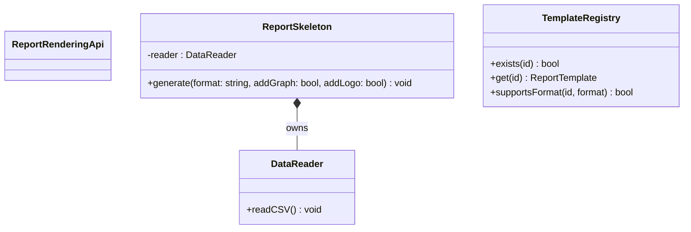

**クラス図に出てくる主なメンバーと操作**

| クラス | メンバー・操作 | 何ができるか |
|---|---|---|
| `ReportSkeleton` | `reader` | CSV読み込みを行う `DataReader` を保持する |
| `ReportSkeleton` | `generate()` | 出力形式と装飾フラグを受け取り、レポート生成を進める |
| `DataReader` | `readCSV()` | 売上データCSVを読み込む |


> **注記：** `addGraph` と `addLogo` は独立したメソッドではなく、`generate()` の引数として渡されるフラグです。これらのフラグで実際に何をしているかは、次の実装コードで確認します。

`ReportSkeleton` クラスが、データの読み込み、レポート生成のステップ管理、そして個別のグラフィック追加処理という、異なる3つの責務をすべて抱えています。

---

### 1-4：実装コード（現状）

#### コードを読む前に：クラスの責任と境界

| 対象 | 呼び出しと内部処理 | 戻り値・副作用 | 掲載上の表現 |
|---|---|---|---|
| Report骨格 | テンプレートIDから生成手順を進める | ファイル名・生成結果 | Renderer/APIをスタブ化する |
| `fstream` / `cstdio` | ファイルを開く・書く・削除する | I/O成功/失敗 | デモファイルだけを対象にする |
| `unique_ptr` / `move` | 帳票要素の所有権を一方向に渡す | 自動破棄 | 移動後の元ポインタは使わない |
| 例外 | ファイル生成不能を通知する | Actionが失敗として記録する | `try/catch`で境界失敗へ変換する |

実PDFエンジンやオブジェクトストレージは境界の外です。ファイル名、生成順序、装飾、履歴、失敗時削除は実際に動かし、デモ用パス以外は変更しません。

システムの現状の実装を確認します。コードを役割ごとに分けて読んでいきます。

#### データ読み込みクラス

はじめにCSVデータを読み込む補助クラスから見てみます。

```cpp
#include <iostream>
#include <string>
#include <vector>
#include <map>
#include <fstream>
#include <cstdio>
#include <memory>
#include <stdexcept>
#include <utility>

using namespace std;

class DataReader {
public:
    void readCSV() { cout << "CSVデータ読み込み完了。" << endl; }
};
```

`DataReader` は純粋なデータ読み込みの入れ物です。レポート生成ロジックは持たせていません。

#### テンプレートレジストリ

レポート種別をIDで管理し、その種別で利用できる出力形式を確認するデータ層を追加します。出力形式は利用者が指定する値なので、テンプレートには「既定の形式」ではなく「対応している形式」を持たせます。

このシステムには以下の3種類のレポートテンプレートがあらかじめ登録されています。

| テンプレートID | レポート名 | 対応する出力形式 |
|---|---|---|
| SALES_WEEKLY | 週次売上レポート | PDF・Excel |
| SALES_MONTHLY | 月次売上レポート | PDF・Excel |
| SALES_DEPT | 部門別売上レポート | PDF・Excel |

登録されていないIDを指定するとエラーになります。コードを読む前にこの対応を把握しておくと、動作結果が追いやすくなります。

```cpp
struct ReportTemplate {
    string name;                    // レポート名
    vector<string> supportedFormats; // "pdf", "excel"
};

class TemplateRegistry {
    map<string, ReportTemplate> templates;
public:
    TemplateRegistry() {
        templates["SALES_WEEKLY"]  = {"週次売上レポート",   {"pdf", "excel"}};
        templates["SALES_MONTHLY"] = {"月次売上レポート",   {"pdf", "excel"}};
        templates["SALES_DEPT"]    = {"部門別売上レポート", {"pdf", "excel"}};
    }

    bool exists(const string& id) const {
        return templates.count(id) > 0;
    }

    ReportTemplate get(const string& id) const {
        return templates.at(id);
    }

    void save(const string& id, const ReportTemplate& tpl) {
        templates[id] = tpl;          // 実行中のテンプレート表へ追加
    }

    bool supportsFormat(const string& id, const string& format) const {
        for (const string& supported : templates.at(id).supportedFormats) {
            if (supported == format) return true;
        }
        return false;
    }
};
```

`TemplateRegistry` は、テンプレートIDの存在確認（`exists()`）、定義の取得（`get()`）、指定された出力形式に対応しているかの確認（`supportsFormat()`）を担います。`main()` は、ここで検証したレポート種別と出力形式を使ってレポート生成に進みます。

#### レポート生成統括クラス

次に、レポートの全生成処理を担うクラスを見ます。

実際のシステムでは、CSVから集計した値を中間のレポート文書データへ変換し、そのデータをPDFライブラリまたはExcelライブラリへ渡してファイルを書き出します。グラフも、集計済みデータを元に描画用データを作り、ライブラリで本文へ挿入します。この章ではファイル生成ライブラリそのものは扱わないため、`ReportRenderingApi` という境界を呼び、その先のライブラリ処理だけを `cout` で代替します。

```cpp
// 実システムではPDF/Excel/画像生成ライブラリを呼ぶ境界。
// 掲載コードでは、その先のライブラリ処理だけをcoutで代替する。
class ReportRenderingApi {
public:
    void addHeader(const string& format) {
        cout << "[ReportRenderingApi] " << format
             << "形式でヘッダー生成APIを呼び出し。" << endl;
    }
    void addGraph() {
        cout << "[ReportRenderingApi] グラフ描画APIを呼び出し。" << endl;
    }
    void addLogo() {
        cout << "[ReportRenderingApi] ロゴ配置APIを呼び出し。" << endl;
    }
    void addFooter(const string& format) {
        cout << "[ReportRenderingApi] " << format
             << "形式でフッター生成APIを呼び出し。" << endl;
    }
};

// レポート生成統括
class ReportSkeleton {
    DataReader reader;
    ReportRenderingApi renderer;
public:
    void generate(string format, bool addGraph, bool addLogo) {
        reader.readCSV();
        renderer.addHeader(format);
        if (addGraph) renderer.addGraph();
        if (addLogo) renderer.addLogo();
        renderer.addFooter(format);
    }
};
```

このクラスが今章の中心です。`generate` メソッドは、CSV読み込み、ヘッダー生成、グラフ追加、ロゴ追加、フッター生成を順に実行します。

#### 呼び出し元と実行確認

`TemplateRegistry` でテンプレートIDの存在を確認してから処理を開始します。登録されていないIDが渡された場合はエラーを出力して中断します。

```cpp
int main() {
    TemplateRegistry registry;
    string templateId = "SALES_MONTHLY";
    string requestedFormat = "pdf";

    if (!registry.exists(templateId)) {
        cerr << "[エラー] テンプレートID '"
             << templateId << "' は登録されていません。" << endl;
        return 1;
    }

    if (!registry.supportsFormat(templateId, requestedFormat)) {
        cerr << "[エラー] テンプレートID '"
             << templateId << "' は "
             << requestedFormat << " 形式に対応していません。" << endl;
        return 1;
    }

    ReportTemplate tmpl = registry.get(templateId);
    cout << "テンプレート: " << tmpl.name
         << " (指定形式: " << requestedFormat << ")" << endl;

    ReportSkeleton gen;
    gen.generate(requestedFormat, true, false);
    return 0;
}
```

実行対象コード：1-4の現状コード
対応する動作例：1-2の動作例テーブル
確認したいこと：入力、加工、出力が仕様どおりに対応していること

実行結果：

```
テンプレート: 月次売上レポート (指定形式: pdf)
CSVデータ読み込み完了。
[ReportRenderingApi] pdf形式でヘッダー生成APIを呼び出し。
[ReportRenderingApi] グラフ描画APIを呼び出し。
[ReportRenderingApi] pdf形式でフッター生成APIを呼び出し。
```

動作例テーブルの行1（月次・PDF出力）と整合しています。次のフェーズで変更が来たときに何が起きるかを確認します。

---

> **手元で動かすには**
> このコードは1つの `.cpp` に貼り付けて、そのままコンパイル・実行できます（例：`g++ chapter11.cpp -o app && ./app`）。`main()` は自由に組み替えて構いません。たとえば `registry.save("SALES_QUARTERLY", {"四半期売上レポート", {"pdf", "excel"}});` でレポート種別を足し、`templateId` をそれに変えて実行すれば、追加した種別の生成手順がその場の実行結果に表れます。テンプレートデータはプロセス実行中だけ有効で、終了すると消えます（描画・ファイル出力は `ReportRenderingApi` 境界の先で簡略化しています）。

### 1-5：変更要求

【プロダクトオーナーと営業部からの要求】
ある水曜日の昼下がり、レポート生成システムのプロダクトオーナーから相談を受けました。

「お疲れ様。今度、役員向けに『月次レポート』を出力する機能を追加したいんだ。グラフやロゴの挿入といった既存の機能はそのまま使えるはずだけど、出力のステップを少し細かく制御したい。また、作成したレポートを後から『やり直し』ができるようにしたいという要望が営業部から出ていてね。レポートの生成履歴を保存して、特定の過去時点の状態を再実行したり、取り消したりすることはできるかな？」

今回は「処理のステップ制御」という新しい要件と、「操作履歴の保存・再実行」という二つの大きな軸が加わるわけですね。今の `ReportSkeleton` は、処理の流れが固定された上で、追加機能がハードコードされています。

**仕様変更の内容**

変更要求を受けて、現在の構造がどう変わるかを整理します。

| 変更項目 | 変更前 | 変更後 |
|---|---|---|
| レポートの生成ステップ | `generate()` に固定ハードコード | 共通骨格を固定し、レポート種別ごとの本文と装飾の組み合わせを外から選べるようにする |
| 機能の装飾（グラフ・ロゴ等） | `if` フラグで生成メソッドに混在 | 実行時に動的に組み合わせられるようにする |
| **操作履歴（新規）** | — （なし） | **生成操作をオブジェクトとして記録・取り消し可能にする** |
| **生成結果の扱い（新規）** | 同期呼び出しで成否を返さない | **生成操作を `execute()` し、成功・失敗を `JobResult` で受け取る。バックグラウンド実行基盤は対象外** |
| **装飾失敗と再実行（新規）** | — （なし） | **装飾が途中失敗した生成操作は失敗として記録し、同じ生成操作を再実行できる** |

**この章が扱う複雑さ**

| 追加する複雑さ | 具体例 | この章で見ること |
|---|---|---|
| 生成結果の境界 | 生成操作を実行し `JobResult` を受け取る | 実行基盤の都合を骨格へ持ち込まず、呼び出し元が成否を扱えるか |
| 装飾の途中失敗 | グラフ描画APIが失敗し以降の装飾を止める | 装飾失敗を骨格へ混ぜず、装飾側と結果で扱えるか |
| 失敗した生成操作の再実行 | 失敗した同じ生成操作をもう一度実行する | 生成操作を記録できる単位として持てているか |
| 生成骨格と操作履歴の分離 | 再実行は履歴の生成操作だけを材料にする | 骨格・装飾・操作履歴を別の変化軸として保てるか |

**変更前後の入力・判定・加工・出力差分**

1-1の現状仕様を退避し、変更要求を当てた後の仕様と同じ粒度で並べます。以降の分析では、この差分を追います。

| 要素 | 変更前（1-1の現状仕様） | 変更後（今回の要求） | 差分として追うもの |
|---|---|---|---|
| 入力 | レポート種別、出力形式、装飾オプション | レポート種別、出力形式、装飾オプション、操作の種類（生成・やり直し・取り消し・再実行） | 生成・やり直し・取り消しに加え、失敗した生成操作の再実行が増える |
| 判定 | テンプレート有無、形式有効、装飾可否 | 同じ判定に加え、履歴から対象操作を取り出せるか、装飾が成功したか | 履歴対象の判定と、装飾失敗の判定が増える |
| 加工 | 本文生成、装飾、出力 | 生成操作を実行し、成功後に操作を履歴へ記録、失敗時は再実行・取消を扱う | 生成操作を記録可能な単位として追い、`JobResult` の成否も追う |
| 出力 | 生成ファイル | 生成ファイル、`JobResult`（成功/失敗）、履歴更新、再実行/取消結果 | ファイルだけでなく生成結果と履歴結果も追う |

**変更後の入力・加工・出力**

変更後の仕様を、1-1と同じ粒度で確認します。1-1の図との差分は、入力に「操作の種類」が加わること、生成操作を実行して `JobResult` で成否を受けること、成功後に「生成操作を履歴へ記録」という加工が挟まることです。もう1つの要求である「生成ステップの制御」は、入力と出力を変えず加工の内部の組み立て方に関わる変更のため、この図には現れません（フェーズ3以降でコードとして確認します）。

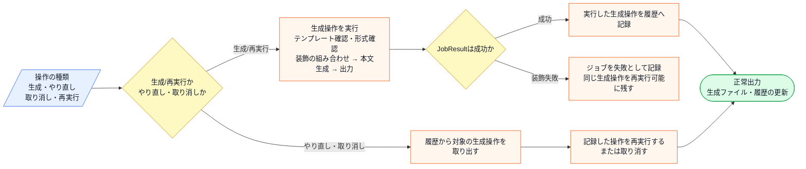

この図から読み取ることは、次の3点です。

- レポート生成の判定と加工は1-1のまま変わらず、生成操作を実行して `JobResult` で成否を受け、成功後に「生成操作を履歴へ記録」という加工が加わる。
- やり直し・取り消し・再実行は新しいレポート内容を入力とせず、履歴に記録された生成操作だけを材料にする。装飾に失敗した生成操作は、同じ操作を再実行できる形で残す。
- 「生成ステップの制御」は入出力の形を変えないため、この図ではなくフェーズ3以降のコードで差分を追う。

**変更後のエラー条件**

生成操作に関わる失敗は、正常系図へ混ぜずに別で確認します。

| エラー条件 | どこで分かるか | 出力 | 保存・通知などの副作用 |
|---|---|---|---|
| 装飾（グラフ・透かし）の適用が途中で失敗する | 装飾適用時 | `JobResult` に失敗を返す | 生成操作を失敗として記録し、同じ操作を再実行可能に残す |
| 失敗した生成操作を再実行する | 履歴の生成操作を取り出す時 | 再実行結果（成功/失敗） | 記録済みの生成操作を材料に、もう一度実行する |

図に加わった「履歴へ記録」「再実行・取り消し」「`JobResult` の成否」が実際にコードのどこへ書かれるかは、フェーズ3で変更を試すコードと、フェーズ7の最終コード・実行結果で追います。

フェーズ1でシステムの現状と変更要求が把握できました。次のフェーズ2では、「何を変え、何を守るか」を整理します。

## 🟣 フェーズ2：仮説立案 ―― 何が変わるかを観察し、ヒアリングで裏付ける
### 2-1：変わりそうな仕様の見当をつける

ここで作る一覧は、思いつきで「変わりそう」と感じたものを並べる表ではありません。フェーズ1で確認した仕様・動作例・クラス図を材料に、次の順で候補を絞ります。

1. 仕様図と動作例から、入力・判定・加工・出力のうち条件や値が変わりそうな箇所を拾う。
2. その箇所が、1-3のどのクラス・メソッドに書かれているかを対応づける。
3. その仕様が、どんな理由で、何をきっかけに、どのくらいの頻度で変わりそうかを仮説として書く。
4. 逆に、当面変えない前提にできる処理の骨格も分けておく。

この手順で見ると、「レポートを生成する」という大きな処理全体ではなく、その中のどの本文生成・装飾・出力形式が変更候補なのかを読者自身で追えるようになります。

フェーズ2では、フェーズ1で見た仕様のうち、どの値・条件・加工が変わりそうかを見当づけます。責務の配置と原因は、フェーズ3とフェーズ4で変更要求を当てながら確認します。

| 仕様候補 | 仕様上の場所 | フェーズ1の現状コードでの場所 | 見立て |
|---|---|---|---|
| レポート種別（週次・月次・部門別） | 入力、テンプレート判定、本文生成 | `TemplateRegistry`、`ReportSkeleton.generate()` | 見たい集計単位が増えると本文の見せ方が変わるため、今回見る |
| 出力形式（PDF・Excel） | 入力、対応形式判定、ファイル出力 | `TemplateRegistry.supportsFormat()`、`ReportSkeleton.generate(format, ...)` | 配布用と分析用で形式が増える可能性があるため、今回見る |
| 装飾オプション（グラフ・ロゴ・透かし） | 入力、装飾適用 | `addGraph`、`addLogo`、`if` 文 | 表示したい情報やブランド表記が追加されやすいため、今回見る |
| 操作履歴、再実行、取り消し | 1-5の変更要求で追加 | フェーズ1の現状コードにはない | 生成後の操作管理という新しい要求として見る |
| 生成結果の境界 | 1-5の変更要求で追加 | フェーズ1の現状コードでは成否を返さない | 同期実行の成否を `JobResult` で受け取る境界として見る |
| 装飾失敗と生成操作の再実行 | 1-5の変更要求で追加 | フェーズ1の現状コードにはない | 装飾側の失敗と、生成操作の再実行を分けて見る |
| データ取得元、集計式 | データ取得、集計 | `DataReader.readCSV()` | この章では固定データ取得として扱い、今回は深追いしない |

この表から、今回の検討対象は「本文生成」「出力形式」「装飾」「操作履歴」の4つに絞れます。加えて、生成結果を `JobResult` で受け取り、装飾に失敗した生成操作を再実行できるようにする現実的な複雑さは、この4つのうち「装飾」と「操作履歴」に直接効きます。一方、CSV取得や基本集計の詳細は、この章の変更要求の中心ではないため、必要な前提としてだけ扱います。

### 2-2：今回の変更で確実に変わること

プロダクトオーナーから確定要求として示された変更は次の2点です。装飾失敗と再実行は、この2点へ現実的な失敗条件を加える複雑さとして確認します。バックグラウンド実行基盤そのものは対象外です。

- **レポート生成のステップ制御**：共通手順を固定し、種別ごとの本文と装飾順を組み立てで制御できるようにする
- **操作履歴の追加**：生成操作をオブジェクトとして保持し、取り消し・再実行できるようにする

ただし「この変更が1回限りか、今後も続くか」によって、どこまで設計を変えるべきかが大きく変わります。関係者に確認します。

### ヒアリングに向けた背景確認

このシステムは、ある中堅企業の経営分析レポートを担っています。数年前にサービスが立ち上がった当初は、売上合計と平均を表示するだけのシンプルなものでした。

しかし、経営層の分析ニーズが高まるにつれ、グラフや部署別内訳など、様々な装飾や追加機能が求められるようになりました。現在は機能ごとに `if` フラグで条件分岐を追加しており、コードは日々肥大化しています。

### 2-3：関係者ヒアリング


- **開発者：** 「レポートの生成フローについてですが、今後、例えば『ロゴを先に出す』あるいは『グラフを省略する』といった順序の変更は発生しますか？」
- **運用担当者：** 「部署ごとにそのニーズはあるね。基本は同じ手順なんだけど、特定のレポートだけステップを変えたいケースがあるんだよ。」
- **開発者：** 「操作履歴についても確認させてください。過去のレポート生成処理をやり直す際、当時使ったCSVデータも再読み込みする必要があるでしょうか？」
- **運用担当者：** 「そうだな、当時のデータで再実行したい場合もあれば、最新データで再生成したい場合もある。つまり、生成の操作自体を『履歴』として保持し、必要に応じて『再発行』したいんだ。」
- **開発者：** 「分かりました。生成フローの骨格は守りつつ、個別のステップや生成操作の履歴管理を独立して扱える構造が必要そうですね。」

### 2-4：ヒアリングで判明した将来リスク

ヒアリングで浮かび上がった「確定ではないが、近い将来起こりうる変化」を記録します。これは今回の設計判断の材料です。

| **将来リスク** | **時期の目安** | **根拠** |
| --- | --- | --- |
| 再実行データの選択（当時のCSV vs 最新データ）が変わる可能性 | 継続的に | 「場合によって両方あり得る」と運用担当者から言及 |
| 出力形式の追加（PDF・Excel以外にHTMLなど） | 数ヶ月後 | 「将来的にはあるかもしれない」と言及 |
| 履歴の上限管理が必要になる可能性 | 運用が積み上がった後 | 「運用で積み上がると管理が大変」と言及 |
| 装飾失敗の扱いが増える可能性（一部だけ再試行など） | 継続的に | 外部の描画処理を伴うと、装飾ごとの失敗と再実行の要望が出やすい |

フェーズ2で「今変わること（確定）」と「将来変わるかもしれないこと（リスク）」を分けて整理できました。次のフェーズ3では、現在の構造で変更を試みたときに何が起きるかを確認します。

### 2-5：変わる見込みと当面安定の前提を確定する

ヒアリングで「再実行データ選択の変更」「出力形式の追加」「履歴管理の必要性」が予告されました。この変化が来たとき、仕様がどう変わるかを整理しておきます。

| 変更内容 | 現在 | 将来（時期の目安） |
|---|---|---|
| レポートの出力形式 | PDFとExcelの2形式 | HTML形式など数ヶ月後に追加予定 |
| 再実行時のデータソース | 固定（最新データ使用） | 当時のCSVと最新データのどちらを使うかを選択可能に（継続的に） |
| 履歴の上限管理 | 制限なし | 運用が積み上がった後、上限管理が必要になる |
| 生成結果の扱いと装飾失敗 | 成否を返さない同期呼び出し、失敗の記録なし | 生成結果を境界で受け取り、装飾に失敗した生成操作を再実行できる形が求められる。バックグラウンド実行は将来の基盤課題 |

この変化が来たとき、現在の構造がどれだけの修正コストを要求するかを、次のフェーズ3で実際に確かめます。

---

## 🟣 フェーズ3：問題特定 ―― 変更の痛みを発見する
### 3-1：変更を試みる

フェーズ2で確定した「レポートの実行順序の変更」と「操作履歴（再実行機能）の追加」を、今の `ReportSkeleton` クラスに対して実装してみます。

> **中間コードの継続条件：** 以下は生成手順・装飾・履歴の差分抜粋です。フェーズ1の `TemplateRegistry` によるテンプレートIDと形式の検証、`ReportRenderingApi` への描画委譲は維持します。履歴追加のために既存検証を外すことはしません。

はじめに、レポート生成の手順を柔軟にするために、`generate` メソッド内のハードコードされたステップを順次 `if` 文で分岐させます。次に、レポート生成の操作をやり直すために、実行したパラメータや順序を保持する別のクラス `ReportHistoryManager` を作成し、`ReportSkeleton` の内部から呼び出すようにします。

`generate` メソッドの中には、「レポート生成の骨格」「グラフ追加機能」「ロゴ追加機能」、さらに「履歴保存ロジック」という性質の異なるコードが集まっています。グラフの描画条件を変える際にも、履歴保存のタイミングまで影響を確認しなければなりません。変更箇所を検索し、関係する処理を読み解く負担が増え始めています。

実際に変更を加えたコードは次のようになります。

```cpp
class DataReader {
public:
    void readCSV() {
        std::cout << "CSVを読み込み" << std::endl;
    }
};

class ReportHistoryManager {
    std::vector<std::string> log;
public:
    void record(std::string op) {
        log.push_back(op);
        std::cout << "[履歴記録] " << op << std::endl;
    }
    void replay() {
        for (int i = 0; i < (int)log.size(); i++) {
            std::cout << "再実行: " << log[i]
                      << std::endl;
        }
    }
};

// 変更後の ReportSkeleton（履歴管理を追加した状態）
class ReportSkeleton {
    DataReader reader;
    ReportHistoryManager history; // ← 追加
    ReportRenderingApi renderer;
public:
    void generate(std::string format,
                  bool addGraph, bool addLogo) {
        reader.readCSV();
        renderer.addHeader(format);
        if (addGraph)
            renderer.addGraph();
        if (addLogo)
            renderer.addLogo();
        renderer.addFooter(format);
        // 履歴記録がここに混在してしまっている
        std::string rec = format;
        if (addGraph) rec += "+Graph";
        history.record(rec); // ← 追加
    }
    void replay() { history.replay(); }
};

int main() {
    ReportSkeleton gen;
    gen.generate("PDF", true, false);
    std::cout << "---" << std::endl;
    gen.replay();
    return 0;
}
```

実行対象コード：3-1の変更試行コード
対応する動作例：変更要求後の代表ケース
確認したいこと：変更要求を現状構造へ当てはめたとき、修正箇所と痛みがどこに出るか

実行結果：

```
CSVを読み込み
[ReportRenderingApi] PDF形式でヘッダー生成APIを呼び出し。
[ReportRenderingApi] グラフ描画APIを呼び出し。
[ReportRenderingApi] PDF形式でフッター生成APIを呼び出し。
[履歴記録] PDF+Graph
---
再実行: PDF+Graph
```

動作は正しくなっています。しかし `generate()` の末尾に履歴記録のコードが混入しており、レポート生成ロジックと操作履歴管理が同じメソッドに同居しています。

### 3-2：変更影響グラフ

今の構造で変更を試みた際の、依存関係の飛び火を可視化します。

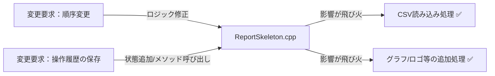

`ReportSkeleton` という一つのクラスに、レポート生成という「処理の定型」と、個別機能という「可変部分」、そして履歴という「操作管理」が混在しているため、変更がクラス内のあちこちに飛び火する構造になっています。

### 3-3：痛みの言語化

**1つ目：処理の手順が「固定化」されていることの限界。** グラフやロゴといった個別の装飾機能が、レポート生成という共通の骨格と同じ場所に記述されているため、装飾の有無や順序を変えるだけで、全体の生成フローをすべて書き換えなければなりません。

**2つ目：操作履歴という「管理責務」の混入。** レポートの生成処理はデータをレポートにする責任を中心に持つはずですが、操作の履歴を取るという「管理機能」が、生成ロジックと密接に絡み合っています。これにより、生成ロジックをリファクタリングしようとすると、履歴管理の仕組みまで一緒に考えざるを得ず、不安定になりがちです。

**3つ目：生成結果と装飾失敗が骨格へ入り込む。** 装飾が途中で失敗したら `JobResult` に失敗を返し、同じ生成操作を再実行できるようにしたい。しかし今の `generate()` は装飾を `if` フラグで直に呼んでいるため、「どの装飾で失敗したか」の判定と、失敗時に同じ生成操作をもう一度実行する仕組みを、骨格の中に書き足すことになります。装飾の失敗・生成結果・再実行という別々の関心が、生成ロジックへさらに積み重なります。

フェーズ3で「変更が辛い」ことが確認できました。次のフェーズ4では、なぜ辛いのかを構造的に言語化します。

---
> **📌 問題（確定）**
> レポート生成エンジンでは、「処理の骨格（生成順序）」「装飾機能（グラフ・ロゴ等）」「操作履歴（undo）」という、それぞれ異なる理由で変わる3つのものが `ReportSkeleton` の1メソッドに同居している。骨格を変えようとすると装飾に波及し、履歴管理を足そうとすると骨格を読み解く必要が生じる。これら3つの変化軸が同じ場所にある限り、「1つを直すと別の何かが壊れる」という痛みは繰り返す。
---

フェーズ4では「なぜその混在が辛いのか」を、コードの構造で言語化します。

## 🟠 フェーズ4：原因分析 ―― なぜ辛いのかを構造で言語化する
### 4-1：痛みの根源を探る（観察と原因）

フェーズ3で確認した「変更の辛さ」は、コードのどこから来ているのでしょうか。コードを注意深く観察すると、痛みを引き起こしている3つの事実が浮かび上がってきます。

第一に、新しいレポート形式を追加するとき、なぜ毎回 `ReportSkeleton` を開かなければならないのでしょうか？ それは、このクラス自身が「CSV読み込み → ヘッダー → グラフ/ロゴ → フッター」という**具体的な処理の骨格をすべて直接知ってしまっている（抱え込んでいる）**からです。

第二に、グラフやロゴの組み合わせを変えたいとき、なぜ骨格コードを触る必要があるのでしょうか？ それは、「どの装飾を加えるか」という機能拡張の判断が、骨格の中に `if` フラグとして直接埋め込まれているからです。

第三に、操作履歴の管理がなぜ辛いのでしょうか？ それは、「レポートを生成する」という操作の記録が、生成ロジックそのものの中に混在しているからです。

この「症状（痛み）」と「根本原因」を整理すると、以下のようになります。

| **根本原因** | **内容** | **解消する方向** |
| --- | --- | --- |
| 根本原因A：骨格処理の固定化 | 処理ステップが各クラスに重複している | 骨格の分離で解消 |
| 根本原因B：機能の動的重ねがけ | 装飾の組み合わせが増えるたびクラスが爆発 | 装飾の部品化で解消 |
| 根本原因C：操作の記録化 | 操作履歴の管理がビジネスロジックに混在 | 操作のオブジェクト化で解消 |

これら3つの根本原因は**それぞれ独立した変化軸**です。

- 「どんな手順でレポートを生成するか」（骨格）が変わっても、「どの装飾を加えるか」は変わりません
- 「どの装飾を加えるか」と「操作を記録・取り消しできるか」は、変更理由を分けて考えられます
- 「操作の記録・取り消し」が変わっても、生成手順や装飾の種類は変わりません

今回追加した複雑さも、この3つの軸へ割り振れます。装飾の途中失敗は「どの装飾を加えるか」という装飾側の関心に属し、失敗した生成操作の再実行は「操作を記録・再実行できるか」という操作履歴側の関心に属します。生成操作の成否は、骨格が装飾失敗や再実行を直接抱えなくても、`JobResult` で受け渡せば足ります。

3つが独立しているからこそ、1つの構造だけでは解決しきれません。

### 4-2：変わるもの/変わってほしくないもの

> **「変わらないもの」と「変わってほしくないもの」は異なります。** 「変わらないもの」は経験的事実（今まで変わっていない）、「変わってほしくないもの」は設計意図（ここを安定させてほかを守りたい）です。ここで整理するのは後者です。

| **変わり続けるもの（🔴）** | **変わってほしくないもの（🟢）** |
| --- | --- |
| レポート生成の手順や追加機能の組み合わせ | データ読み込みという基本的な前処理手順 |
| 個別の操作実行履歴（保存・再実行・取り消し） | レポートを出力するという「処理の骨格（定型フロー）」 |
| 装飾の成否と、失敗した生成操作の再実行の扱い | 生成操作を実行し、`JobResult` で成否を返すという結果の境界 |

**【変わる部分（変わり続けるif文と装飾フラグ）】**
```cpp
        if (addGraph) renderer.addGraph();
        if (addLogo)  renderer.addLogo();
        // ← 装飾が増えるたびにここにコードが追加される
```

**【変わってほしくない部分（守りたい骨格）】**
```cpp
        reader.readCSV();                    // 常に最初（守りたい骨格）
        renderer.addHeader(format);          // ヘッダー生成（守りたい）
        // ↑↓ この間に「本文生成」と「装飾（グラフ・ロゴ）」が入る ← 種別・組み合わせで変わる
        renderer.addFooter(format);          // 常に最後（守りたい）
```

### 4-3：接続点に漏れている3つの知識を確認する

ここでの「確認すること」は、前節までに見つけた原因から抽出します。まず、原因文から「守りたい骨格」と「変わる差分」を分けます。次に、その差分を動かすために骨格側が知ってしまっている名前・条件・順序・型を拾います。最後に、接続点に残す最小の約束を、値・型・操作・イベントとして書きます。

原因によって、接続点で見る抽象観点は変わります。条件分岐が原因なら条件・定数・選択基準を見ます。処理手順が原因なら呼び出し順・前後条件・失敗時分岐を見ます。生成判断が原因なら具体クラス名・生成条件・登録場所を見ます。通知や外部連携が原因なら通知先・タイミング・成否の扱いを見ます。データや状態が原因なら、境界を流れる値・型・状態を見ます。

現在の `ReportSkeleton` は、すべての処理を自分自身の中に直接抱え込んでいます。

**【骨格へ装飾と履歴の知識が漏れているコード】**
```cpp
class ReportSkeleton {
    ReportRenderingApi renderer;
public:
    void generate(string format, bool addGraph, bool addLogo) {
        // 骨格・装飾・履歴がすべて同じメソッドに混在
        reader.readCSV();
        renderer.addHeader(format);
        // ← 具体的な機能名を直接知っている
        if (addGraph) renderer.addGraph();
        if (addLogo)  renderer.addLogo();
        renderer.addFooter(format);
    }
};
```

`ReportSkeleton`が、処理の順序だけでなく装飾の種類と履歴記録の方法まで知っています。接続点を「誰が相手の知識を持つか」という観点で見ると、骨格クラスが装飾名・適用条件・履歴記録のタイミングまで判断していることが分かります。

| 確認する接続点 | 現在の状態 | 変更時に起きること |
|---|---|---|
| 骨格 → 装飾 | `addGraph`や`addLogo`の条件と機能名を知る | 装飾追加のたびに骨格を変更する |
| 骨格 → 履歴 | 生成処理の中で履歴記録のタイミングを知る | 履歴要件の変更が生成手順へ波及する |
| 骨格 → 生成結果 | 装飾失敗の判定と再実行の起点を骨格が抱える | 結果処理と装飾失敗の扱いが生成手順へ波及する |
| 呼び出し側 → 骨格 | 書式・装飾条件を引数の組み合わせで渡す | 組み合わせが増えるほど呼び出し規約が複雑になる |

「定型的なフロー」と「機能追加」、「操作の記録」という3つの責務は、それぞれ異なる理由で変更されます。一つのクラスで管理し続ける案と、責任を分ける案のコストを比較する価値があります。本章では、確認した変更頻度を踏まえて後者を選びます。

フェーズ4で根本原因が言語化できました。分けるべき場所（変わる理由が異なる3つのもの）が特定できた段階です。しかし「どこを分けるか」は分かっても、「何を（どの塊を）取り出せばいいか」はまだ曖昧です。次のフェーズ5では、この「取り出すターゲット」を具体的に特定します。

---
> **📌 原因（確定）**
> 以下の3つの独立した根本原因が重なっている：
> 1. **本文生成差分の埋め込み**：レポート種別ごとに変わる本文生成が共通手順へ埋め込まれている。
> 2. **装飾機能の直接知識**：どの装飾を適用するかの分岐（if文）が骨格内に直接書かれている。
> 3. **履歴管理の混在**：操作の記録や取り消しの知識が生成処理に混在している。
>
> これらの変更理由（出力フォーマット、装飾の組み合わせ、履歴要件）はそれぞれ異なる頻度で発生するため、1つのクラスに混在していることで影響確認コストが発生し続ける。
---

変化の速度が違う3つのものが同居していることは分かりました。フェーズ5では「では何を外に出すか」というターゲットを具体的に特定します。

## 🟡 フェーズ5：課題定義 ―― 解くべき接続点を定める
フェーズ4の分析により、問題の根本原因は「レポート生成の手順（骨格）」、「個別の装飾機能（グラフ・ロゴ）」、そして「操作履歴の記録と取り消し」という、変わる理由が違う3つの関心が `ReportSkeleton` の中で混在していることだと分かりました。

### 接続点を特定する

接続点は、クラス図の線やインターフェース名から探すのではなく、変更要求を当てて特定します。まず、その要求で変えたい側と変えたくない側を分けます。次に、両者がどのメソッド呼び出し・引数・戻り値・生成・イベントでつながっているかを見ます。そのつながりのうち、変更要求のたびに知識が漏れて修正が波及する場所が、ここで解くべき接続点です。

したがって、今回私たちが解くべき課題は、`ReportSkeleton` の中にある **「レポート種別（週次・月次など）ごとの本文生成処理」、「個別の装飾機能（if文の塊）」、そして「操作履歴の管理ロジック」を、それぞれ独立した部品として分離すること** です。

```cpp
class ReportSkeleton {
    ReportRenderingApi renderer;
    DataReader reader;
public:
    void generate(string format, bool addGraph, bool addLogo) {
        reader.readCSV();
        renderer.addHeader(format);

        // ↓↓↓ 分離ターゲット1：レポート形式ごとに変化する本文生成の塊 ↓↓↓
        // （現在は直接書かれていないが、週次や月次の違いを吸収する部分）
        // ↑↑↑ ここまで ↑↑↑

        // ↓↓↓ 分離ターゲット2：変わり続ける装飾機能の塊 ↓↓↓
        if (addGraph) renderer.addGraph();
        if (addLogo)  renderer.addLogo();
        // ↑↑↑ ここまで ↑↑↑

        renderer.addFooter(format);
        // ↓↓↓ 分離ターゲット3：混入している操作履歴の管理ロジック ↓↓↓
        // （現時点ではないが、追加しようとするとここに入り込んでくる）
        // ↑↑↑ ここまで ↑↑↑
    }
};
```

最終的な目標は、この `ReportSkeleton` から「どのようなレポート本文を生成するか」「どの装飾を加えるか」「操作履歴をどう管理するか」という、処理手順とは別の知識を外すことです。骨格には、レポート生成の共通手順だけを残します。

フェーズ5でターゲットが明確になりました。次のフェーズ6では、これら3つの塊をどのように分離していくか、段階的に対策を検討していきます。

---
> **📌 課題（確定）**
> `ReportSkeleton` から切り離す塊は3つあります。
> 1つ目は「レポートの種別（週次・月次など）によって変わる本文生成」です。共通の生成手順から、本文の作り方だけを差し替えられる接続点が必要です。
> 2つ目は「どの装飾を加えるか」という装飾機能の判断と処理です。生成手順の本体から、装飾の種類・順序・組み合わせを外へ出す必要があります。
> 3つ目は「生成操作を誰が記録し、どう再実行・取り消しするか」という履歴管理です。レポート生成そのものとは別に、実行した操作を扱う単位が必要です。
> 具体的なクラス名・メソッド名・パターン名は、フェーズ6で複数案を比べてから決めます。
---

ターゲットが3つに絞られました。フェーズ6では、この分離をどのステップで・どの形で実現するかを段階的に検討します。

## 🔴 フェーズ6：対策検討 ―― 案を比べ、採用する形を決める

フェーズ6は、フェーズ5で定めた3つの課題——**本文生成を骨格から切り離すこと／装飾を順に組み合わせられるようにすること／生成操作を記録・再実行・取消できる単位に分けること**——を受けて始めます。まず現行コード全体を振り返り、痛みが出た関連部分へ、課題ごとに最小の変更を重ねます。課題は「何を切り離すか」までを決めており、**その接続点をどんな形にするか**は、痛みコードを分解して探します。第二部の要は「いくつの独立した変化軸があるかを数える」ことです。各段階で「今何を変えたか」「何が減ったか」「何が残るか」を関連コードで確認し、統合後の全体コードはフェーズ7で初めて示します。
フェーズ5の課題から、対策候補は次のように出します。

| フェーズ4で見えた原因 | フェーズ5で定めた課題 | だからフェーズ6で見る候補 |
|---|---|---|
| レポート種別ごとの本文生成が共通手順の中に混ざっている | ヘッダー・本文・フッターの骨格から、本文生成だけを切り離す | 共通手順を残し、本文生成の差し替え案を見る |
| グラフ・ロゴ・透かしなど装飾の組み合わせが条件分岐になり、装飾失敗の判定も骨格へ入り込む | 装飾を個別に追加・削除でき、順に適用でき、失敗も装飾側で扱える形にする | 装飾をリスト化し、同じ操作で順に実行する案を見る |
| 生成履歴や再実行・取消は、本文生成や装飾とは別の理由で変わり、失敗した生成操作の再実行も同じ軸に属する | 生成操作そのものを履歴に残し、失敗しても同じ操作を再実行できる単位へ分ける | 生成操作を実行・再実行・取消できる単位にする案を見る |

ここで比べる案は、次の4種類です。

| 案 | 何を分けるか | 期待できる効果 | 限界 |
|---|---|---|---|
| 関数切り出し | 生成手順の中の処理名 | どこが変わる処理か見えやすくなる | 呼び出す判断は同じクラスに残る |
| 本文生成の差し替え | レポート種別ごとの本文生成 | 週次・月次などの違いを共通手順から外せる | 装飾や履歴はまだ残る |
| 装飾のリスト化 | グラフ・ロゴ・透かしの組み合わせと装飾失敗 | 利用者が選んだ装飾を順に適用でき、失敗を装飾側で扱える | 生成操作そのものの記録・取消・再実行は扱えない |
| 生成操作の単位化 | 生成・再実行・取り消し・失敗した生成操作の再実行 | 変更要求で追加された履歴操作と再実行を扱える | 本文生成や装飾の分離と組み合わせる必要がある |

「装飾をリストに入れて順に実行する」という案は自然な候補です。この章では、装飾のリスト化で解ける範囲と、履歴・取り消しまで扱うには別の単位化が必要になる範囲を分けて確認します。操作履歴については、1-5の変更要求で追加された痛みとして、ステップ6以降で「生成操作を記録・再実行・取り消しできる単位」にする案を検討します。

今回足した「装飾の途中失敗」と「失敗した生成操作の再実行」も、この分け方の判断材料になります。装飾失敗は装飾のリスト化の側（装飾を包む部品）で扱い、再実行は生成操作の単位化の側（記録できる操作オブジェクト）で扱う——このように、生成骨格・装飾・操作履歴を別軸として分けておくと、装飾失敗を骨格へ持ち込まずに済み、再実行は記録した生成操作を材料に扱えます。組み立てや結果の受け渡しには変更が残りますが、骨格そのものへ手を入れる必要は減ります。

#### 対策検討の課題カード

| ID | 原因と着目コード | 最小変更と守る契約 | 完了条件 |
|---|---|---|---|
| P1 | `generate()` が固定順序と本文差分を持つ | 固定順序を骨格へ置き、本文だけをフックにする。**守る：** header→body→footer の順序 | レポート種別追加で骨格を複製しない |
| P2 | `if(addGraph/addLogo)` が装飾の組み合わせを持つ | 1装飾が1レポートを包む同一契約へ変える。**守る：** 内側の本文を保持して装飾を順に足す | 組み合わせクラスやフラグ分岐を増やさない |
| P3 | 生成・履歴・再実行・取消が同じ処理にある | 入力を保持する生成操作へ `execute/undo` を持たせる。**守る：** 成功した生成だけを履歴へ積む | 履歴が具体レポート種別・装飾を判定しない |

骨格・装飾・操作は順に接続します。1つ目だけを入れた時点で残る装飾分岐と履歴処理を明示し、別課題を一度に解いたように見せません。

#### 振り返り：現行コード全体（フェーズ1）

最初に、構造と改行を思い出す作業を読者へ求めないため、変更要求を当てる前の完全コードを同じ並びで再掲します。ここはおさらい用であり、対策の起点はこの後に示すフェーズ3の仕様変更後コードです。候補を比べるときは、変更していない行の並び・インデント・改行をこの比較元から動かさず、責任を移した箇所だけを追います。

```cpp
#include <iostream>
#include <string>
#include <vector>
#include <map>
#include <fstream>
#include <cstdio>
#include <memory>
#include <stdexcept>
#include <utility>

using namespace std;

class DataReader {
public:
    void readCSV() { cout << "CSVデータ読み込み完了。" << endl; }
};

struct ReportTemplate {
    string name;                    // レポート名
    vector<string> supportedFormats; // "pdf", "excel"
};

class TemplateRegistry {
    map<string, ReportTemplate> templates;
public:
    TemplateRegistry() {
        templates["SALES_WEEKLY"]  = {"週次売上レポート",   {"pdf", "excel"}};
        templates["SALES_MONTHLY"] = {"月次売上レポート",   {"pdf", "excel"}};
        templates["SALES_DEPT"]    = {"部門別売上レポート", {"pdf", "excel"}};
    }

    bool exists(const string& id) const {
        return templates.count(id) > 0;
    }

    ReportTemplate get(const string& id) const {
        return templates.at(id);
    }

    void save(const string& id, const ReportTemplate& tpl) {
        templates[id] = tpl;          // 実行中のテンプレート表へ追加
    }

    bool supportsFormat(const string& id, const string& format) const {
        for (const string& supported : templates.at(id).supportedFormats) {
            if (supported == format) return true;
        }
        return false;
    }
};

// 実システムではPDF/Excel/画像生成ライブラリを呼ぶ境界。
// 掲載コードでは、その先のライブラリ処理だけをcoutで代替する。
class ReportRenderingApi {
public:
    void addHeader(const string& format) {
        cout << "[ReportRenderingApi] " << format
             << "形式でヘッダー生成APIを呼び出し。" << endl;
    }
    void addGraph() {
        cout << "[ReportRenderingApi] グラフ描画APIを呼び出し。" << endl;
    }
    void addLogo() {
        cout << "[ReportRenderingApi] ロゴ配置APIを呼び出し。" << endl;
    }
    void addFooter(const string& format) {
        cout << "[ReportRenderingApi] " << format
             << "形式でフッター生成APIを呼び出し。" << endl;
    }
};

// レポート生成統括
class ReportSkeleton {
    DataReader reader;
    ReportRenderingApi renderer;
public:
    void generate(string format, bool addGraph, bool addLogo) {
        reader.readCSV();
        renderer.addHeader(format);
        if (addGraph) renderer.addGraph();
        if (addLogo) renderer.addLogo();
        renderer.addFooter(format);
    }
};

int main() {
    TemplateRegistry registry;
    string templateId = "SALES_MONTHLY";
    string requestedFormat = "pdf";

    if (!registry.exists(templateId)) {
        cerr << "[エラー] テンプレートID '"
             << templateId << "' は登録されていません。" << endl;
        return 1;
    }

    if (!registry.supportsFormat(templateId, requestedFormat)) {
        cerr << "[エラー] テンプレートID '"
             << templateId << "' は "
             << requestedFormat << " 形式に対応していません。" << endl;
        return 1;
    }

    ReportTemplate tmpl = registry.get(templateId);
    cout << "テンプレート: " << tmpl.name
         << " (指定形式: " << requestedFormat << ")" << endl;

    ReportSkeleton gen;
    gen.generate(requestedFormat, true, false);
    return 0;
}
```

#### 起点：フェーズ3の痛みコード

比較元は、生成手順へ履歴記録と再実行を直接追加したフェーズ3の変更途中コードです。

#### 痛みの差分（フェーズ3で変更した関連部分）

現行コード全体のどこに痛みが現れたかを振り返ります。以下はフェーズ3で変更した関連部分です。

```cpp
class DataReader {
public:
    void readCSV() {
        std::cout << "CSVを読み込み" << std::endl;
    }
};

class ReportHistoryManager {
    std::vector<std::string> log;
public:
    void record(std::string op) {
        log.push_back(op);
        std::cout << "[履歴記録] " << op << std::endl;
    }
    void replay() {
        for (int i = 0; i < (int)log.size(); i++) {
            std::cout << "再実行: " << log[i]
                      << std::endl;
        }
    }
};

// 変更後の ReportSkeleton（履歴管理を追加した状態）
class ReportSkeleton {
    DataReader reader;
    ReportHistoryManager history; // ← 追加
    ReportRenderingApi renderer;
public:
    void generate(std::string format,
                  bool addGraph, bool addLogo) {
        reader.readCSV();
        renderer.addHeader(format);
        if (addGraph)
            renderer.addGraph();
        if (addLogo)
            renderer.addLogo();
        renderer.addFooter(format);
        // 履歴記録がここに混在してしまっている
        std::string rec = format;
        if (addGraph) rec += "+Graph";
        history.record(rec); // ← 追加
    }
    void replay() { history.replay(); }
};

int main() {
    ReportSkeleton gen;
    gen.generate("PDF", true, false);
    std::cout << "---" << std::endl;
    gen.replay();
    return 0;
}
```

### 6-1：痛みコードを分解して、接続点の「形」を探す

課題は3つあります。どんな形なら切り離せるかは、痛みコードを分解して探します。まず数えるのは、**独立して変わる軸がいくつあるか**です。

**分解1（骨格の軸）：** `addHeader → 本文 → addFooter` の**順序は固定**で、変わるのは本文（週次・月次…）だけ → 骨格を固定し本文を差し替える**フックの形**（`renderBody`）。

```cpp
class ReportSkeleton {
public:
    ReportDocument generate() {
        ReportDocument report;
        addHeader(report);
        renderBody(report);  // 種別差分だけを委譲
        addFooter(report);
        return report;
    }
protected:
    virtual void renderBody(ReportDocument& report) = 0;
};
```

P1で順序の複製は消えます。しかし `addGraph` と `addLogo` の分岐、履歴記録はまだ骨格の外側に残るため、P2・P3へ進みます。
**分解2（装飾の軸）：** `if(addGraph)/if(addLogo)` の組み合わせ → 装飾を「レポートを包むレポート」にして順に重ねる**装飾の形**（`ReportFeature`）。

```cpp
class IReport {
public:
    virtual ReportDocument render() = 0;
    virtual ~IReport() = default;
};

class GraphFeature : public IReport {
    IReport* inner;  // 組み立て側が生存期間を管理する
public:
    ReportDocument render() override {
        ReportDocument report = inner->render();
        report.addGraph();
        return report;
    }
};
```

P2で装飾フラグは包む順序へ変わりました。生成済みファイルをいつ履歴へ積み、どう取り消すかは装飾の責任ではないためP3へ残します。
**分解3（記録の軸）：** `history.record` と再実行・取消 → 生成操作を1つの実行・取消できる単位にする**操作の形**（`IReportAction`）。

```cpp
class IReportAction {
public:
    virtual JobResult execute() = 0;
    virtual JobResult undo() = 0;
    virtual ~IReportAction() = default;
};

class GenerateReportAction : public IReportAction {
    IReport& report;
    OutputRequest request;
public:
    JobResult execute() override;
    JobResult undo() override;
};
```

操作自身が出力要求と取消方法を持つため、P3の履歴は `IReportAction` だけを扱えます。

**片方だけでは詰まる（第二部の肝）：** 本文だけ差し替えても装飾の分岐と履歴が骨格に残る。装飾だけリスト化しても履歴が骨格に残る。履歴だけ分けても骨格と装飾が混ざったまま。ここで分かるのは、**「変わる理由が異なる3つの軸は、それぞれ別の契約に分けないと、どれか1つの変更が骨格へ染み出す」**ということ。

**分解の結論：** 骨格（`renderBody` フック）・装飾（`ReportFeature`）・記録（`IReportAction`）の3つに独立した契約を置く。これが第二部の見立てです。

### 6-2：見つけた形を契約にし、データの置き場所を決める

見つけた3つの形を、それぞれの契約として定義します。

```cpp
IReport* report = new WeeklyReport(renderingApi);
report = new GraphFeature(report);
report = new LogoFeature(report);

GenerateReportAction action(*report, outputRequest);
ReportActionHistory history;
history.execute(action);
```

本文骨格→装飾連結→生成操作→履歴の順に接続しました。各課題の契約を保った統合コードとUndo結果はフェーズ7で示します。


次に、データの置き場所を決めます。

| データ | 現状の置き場所 | 対策後の置き場所 | 置き場所を決める理由 |
|---|---|---|---|
| 生成手順の順序 | `generate()` に直書き | `ReportSkeleton.generate()`（骨格） | 順序は安定。本文だけフックへ |
| 装飾の組み合わせ | `if(addGraph)` フラグ | 装飾を包む `ReportFeature` の連結 | 組み合わせを包む順で表す |
| 生成履歴・再実行・取消 | `generate()` に混在 | `IReportAction` のリスト | 記録は別の変化軸。骨格から出す |
| 出力形式・出力先 | `generate` 引数 | `GenerateReportAction` が保持 | 操作単位が自分の入力を持つ |

接続点で受け渡すのは、生成操作の **`JobResult`（成功／失敗）**です。`ReportFeature` は内側のレポート、履歴は生成操作の**所有権・生存期間を保持側**が管理します。

クラス分離を完成させるには、分離先だけでなく次の順で組み立てを確認します。

| 判断 | 関連コードで確認すること |
|---|---|
| 誰が具体実装を選ぶか | `main()`、Application、Factory、Creator、Registryなど、業務処理の外側に選択を集める |
| 誰が生成するか | 必要な依存を先に生成できる組み立て側が具体オブジェクトを生成する |
| 誰が所有するか | スタック、スマートポインタ、所有コンテナのどれが破棄まで担うかを決める |
| どう注入するか | 必須依存はコンストラクタ、増減する依存は登録操作、生成自体を替える場合は生成契約から渡す |
| 利用側は何を知るか | 利用側は抽象契約だけを保持し、処理中に具体クラスを生成しない |
| 追加時にどこを変えるか | 新しい実装クラスと組み立て・登録を変更し、安定させたい処理骨格へ具体名を戻さない |

生ポインタや参照で非所有の依存を保持する場合は、所有側の生存期間が利用側より長いことまで組み立てコードで確認します。

### 6-3：構造の見立て（分解の結果、こうなる）

分解して3つの契約とデータ配置を決めた結果、構造はこうなります。図は出発点ではなく結論です。

現状（1メソッドに骨格・装飾・履歴が同居）：

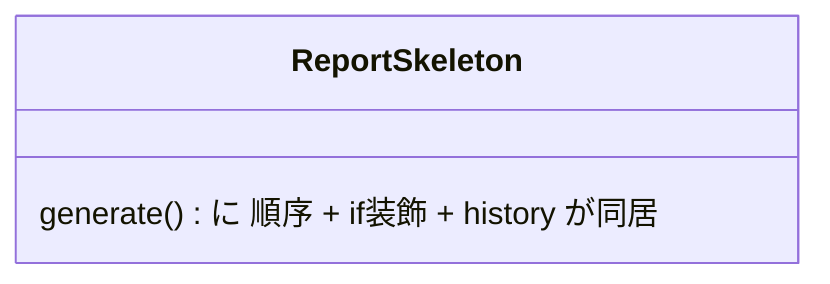

見立て（3軸を別々の契約へ）：

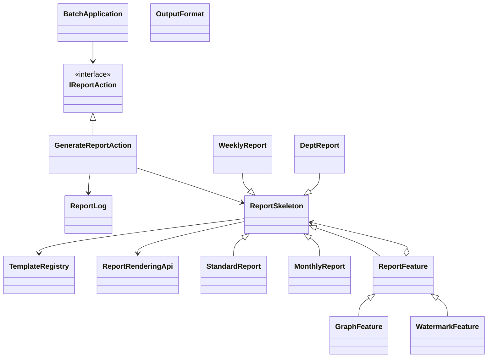

図から読み取ること：`generate()` から装飾分岐と履歴記録が消え、骨格・装飾・記録の3契約に分かれる。どれか1つを変えても他へ染み出さない。

### 6-4：影響範囲（この設計で変更要求を再度当てたら）

| 変更要求 | 修正する場所 | 再テスト範囲 |
|---|---|---|
| レポート種別を追加（部門別など） | `renderBody` を実装したクラスを1つ追加 | 追加種別。**装飾・履歴は無変更** |
| 装飾を追加（透かしなど） | `ReportFeature` を継承したクラスを1つ追加 | 追加装飾。**骨格・履歴は無変更** |
| 再実行・取消の扱いを変える | `IReportAction`／履歴管理のみ | 記録。**骨格・装飾は無変更** |

現状との差：現状はどの軸を変えても `generate()` を開く。対策後は軸ごとに独立して差し替えられ、骨格へ染み出さない。**この「独立して触れる」ことがこの構造を採る理由**です。

### 採用する形を決める

各案には一長一短があります。今回の課題は、レポート本文の骨格・装飾の組み合わせ・生成操作の履歴という3つの変化軸を同時に扱うことです。「どの案がどの軸に効くか」を分けて比べます。

| 案 | 解けること | 残ること | 今回の判断 |
|---|---|---|---|
| 本文生成だけ分ける | 週次・月次など本文差分を外へ出せる | 装飾の組み合わせとUndoは残る | 骨格固定には必要だが単独では不足 |
| 装飾をリスト化する | 利用者が選んだ装飾を順に適用できる | 生成手順の固定と履歴管理は残る | 装飾追加には必要だが単独では不足 |
| 生成操作を記録単位にする | 再実行・取り消しを扱える | 本文差分と装飾の組み合わせは別途必要 | 履歴要求には必要だが単独では不足 |
| 3つの境界を別々に作る | 骨格・装飾・履歴を独立して変更できる | クラス数と組み立てが増える | 3軸すべてが変わるため採用する |

**今回の決断：** フェーズ2のヒアリングで「基本フォーマットは全社統一の順序（骨格固定）」「部署ごとに装飾を自由に組み合わせたい（動的装飾）」「誤操作時に元に戻したい（Undo）」という3つの独立した要件が求められています。3つの変更理由を別々に扱うため、今回は**骨格固定・装飾連結・操作記録の3つの契約を別々に置く形を採用する**決断を下します。

> この構造は、第4章の**骨格固定構造**、第6章の**装飾連結構造**、第5章の**操作記録構造**に対応します。構造名を先に決めたのではなく、三つの変更課題へ順に対策した結果としてこの組み合わせになりました。

### どの構造を使うかの判断基準

3つの構造のどれを適用するかは、次のように順を追って確認できます。

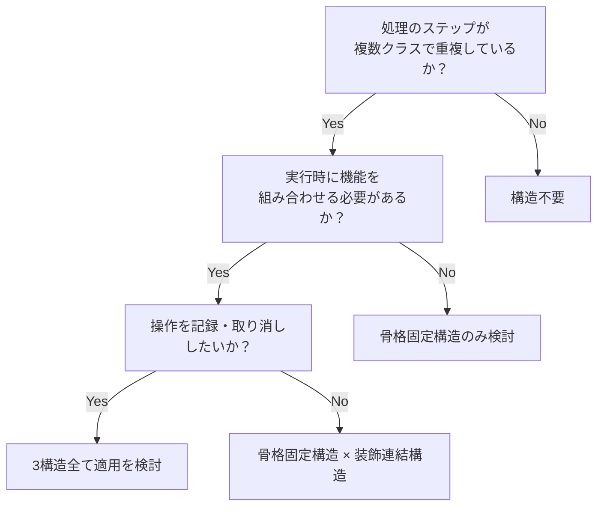

フェーズ6で採用する設計（3つの契約・データ配置・構造・影響範囲）が決まりました。次のフェーズ7では、この決断を動く実装（`TemplateRegistry`・`ReportRenderingApi`・各レポート／装飾クラス・`GenerateReportAction`・実行結果）に落とし込み、変更要求で効果を確認します。

## 🟢 フェーズ7：対策実施 ―― 変化に強いコードを完成させる
### 7-1：解決後のコード（全体）

ステップ6で決断した構造を、実行可能な完全なコードとして組み上げます。各役割ごとにコードを分けて確認します。

**1. 抽象基底クラスとインターフェース（契約）**

操作履歴のインターフェースと、レポート生成の骨格クラスを定義します。

```cpp
#include <iostream>
#include <string>
#include <vector>
#include <map>
#include <fstream>
#include <cstdio>
#include <memory>
#include <stdexcept>
#include <utility>

using namespace std;

struct ReportTemplate {
    string name;    // レポート名
    string format;  // "pdf", "excel"
};

class TemplateRegistry {
    map<string, ReportTemplate> templates;
public:
    TemplateRegistry() {
        templates["SALES_WEEKLY"]  = {"週次売上レポート",   "pdf"};
        templates["SALES_MONTHLY"] = {"月次売上レポート",   "pdf"};
        templates["SALES_DEPT"]    = {"部門別売上レポート", "pdf"};
    }

    bool exists(const string& id) const {
        return templates.count(id) > 0;
    }

    ReportTemplate get(const string& id) const {
        return templates.at(id);
    }
};
```

レポート生成ログ（`ReportLog`）はシステム起動時は空で、レポートが生成・キャンセル・失敗するたびに1件追記されます。ファイルへの保存は行わず、実行中のメモリ上にのみ保持します。

```cpp
struct ReportRecord {
    std::string templateId;    // "SALES_WEEKLY", "SALES_MONTHLY", "SALES_DEPT"
    std::string templateName;  // "週次売上", "月次売上", "部門別売上"
    std::string format;        // "pdf", "excel"
    std::string status;        // "成功", "キャンセル", "失敗"
};

// レポート生成ログを管理するクラス
class ReportLog {
    std::vector<ReportRecord> records;
public:
    void add(const std::string& templateId, const std::string& templateName,
             const std::string& format, const std::string& status) {
        records.push_back({templateId, templateName, format, status});
    }
    void printAll() const {
        for (const auto& r : records) {
            std::cout << "[" << r.templateId << "] " << r.templateName
                      << " (" << r.format << ") -> " << r.status << std::endl;
        }
    }
    int size() const { return (int)records.size(); }
};
```

```cpp
// IReportAction: 操作履歴のインターフェース（操作記録構造）
// 生成操作の結果（結果オブジェクト）：成功可否と理由
struct JobResult {
    bool success;
    std::string message;
};

class IReportAction {
public:
    virtual ~IReportAction() = default;
    virtual JobResult execute() = 0;
    virtual void undo() = 0;  // ← 取り消し操作も契約に含める
};
```

```cpp
// ReportSkeleton: レポート生成の骨格（骨格固定構造）
class ReportSkeleton {
public:
    virtual ~ReportSkeleton() = default;
    void generate() {
        cout << "CSV読み込み" << endl;
        renderBody(); // ← 継承先で変化する部分だけをここに任せる
        cout << "フッター生成" << endl;
    }
    virtual void renderBody() = 0;
};
```

`ReportSkeleton` は「CSV読み込み → 本文生成 → フッター出力」という実行順序を固定します。本文の中身（`renderBody()`）だけが派生クラスに委ねられており、これが 骨格固定構造の核心です。

**2. 具体レポートクラス（骨格固定構造の実装）**

インターフェースを満たすレポートクラスを作成します。このクラスは本文の中身を担い、骨格の処理順序は基底クラスに残します。

```cpp
// StandardReport: 基本レポートの本体
class StandardReport : public ReportSkeleton {
public:
    void renderBody() override {
        cout << "本文を生成。" << endl;
    }
};
```

```cpp
// MonthlyReport: 月次レポートの本体
class MonthlyReport : public ReportSkeleton {
public:
    void renderBody() override {
        cout << "月次集計を本文として生成。" << endl;
    }
};
```

```cpp
// WeeklyReport: 週次レポートの本体
class WeeklyReport : public ReportSkeleton {
public:
    void renderBody() override {
        cout << "週次集計を本文として生成。" << endl;
    }
};

// DeptReport: 部門別レポートの本体
class DeptReport : public ReportSkeleton {
public:
    void renderBody() override {
        cout << "部門別集計を本文として生成。" << endl;
    }
};
```

ここで重要な設計の意図を確認しておきます。**「レポートの種別（月次・週次・部門別）」は`ReportSkeleton`の派生クラスで区別し、「出力形式（PDF・Excel）」は`OutputFormat`として操作記録構造へ渡します。**サンプルでは形式名を書いたデモ用ファイルを生成します。実運用で本物のPDF・Excelを生成する場合は、`IOutputFormatter`の実装へ置き換える想定です。

**3. デコレータクラス（装飾連結構造の実装）**

装飾機能を動的に重ねる仕組みを実装します。

```cpp
// ReportFeature: 装飾機能の基底クラス（装飾連結構造基底）
class ReportFeature : public ReportSkeleton {
protected:
    ReportSkeleton* wrapped;
public:
    explicit ReportFeature(ReportSkeleton* g)
        : wrapped(g) {}
    virtual ~ReportFeature() {
        delete wrapped; // デストラクタで内側のインスタンスを再帰的に解放
    }
};
```

```cpp
// ReportRenderingApi: 実システムではPDF/Excel/画像生成ライブラリを呼ぶ境界。
// 掲載コードでは、その先のライブラリ処理だけをcoutで代替する。
class ReportRenderingApi {
public:
    void addGraph() {
        cout << "[ReportRenderingApi] グラフ描画APIを呼び出し。" << endl;
    }
    void addWatermark() {
        cout << "[ReportRenderingApi] 透かし描画APIを呼び出し。" << endl;
    }
};

// GraphFeature: グラフ追加の装飾
class GraphFeature : public ReportFeature {
    bool* available;  // 外部描画基盤が使えるか（nullptrなら常に可）
public:
    explicit GraphFeature(ReportSkeleton* g, bool* avail = nullptr)
        : ReportFeature(g), available(avail) {}
    void renderBody() override {
        wrapped->renderBody();         // ← 内側の処理を先に呼ぶ
        if (available && !*available) {
            throw runtime_error("グラフ描画APIが一時的に失敗しました");
        }
        ReportRenderingApi api;
        api.addGraph(); // ← 実システムでは描画ライブラリ/APIを呼ぶ
    }
};
```

```cpp
// WatermarkFeature: 透かし追加の装飾
class WatermarkFeature : public ReportFeature {
public:
    explicit WatermarkFeature(ReportSkeleton* g)
        : ReportFeature(g) {}
    void renderBody() override {
        wrapped->renderBody();
        ReportRenderingApi api;
        api.addWatermark();
    }
};
```

`GraphFeature` と `WatermarkFeature` は、どちらも `wrapped->renderBody()` を呼んだ後に自分の処理を追加します。装飾の中では `ReportRenderingApi` を呼びます。実運用ではここがPDF/Excel生成ライブラリや画像生成APIへの呼び出しになり、掲載コードではその先だけを `cout` で代替しています。入れ子にすることで、装飾を自由に重ねがけできます。各装飾クラスはデストラクタにより内側の要素を再帰的に解放するため、最も外側の要素が破棄されるとチェーン全体も自動的に破棄されます。

**4. コマンドクラス（操作記録構造の実装）**

レポート生成操作をオブジェクトとして記録し、取り消し可能にします。

```cpp
enum class OutputFormat { Pdf, Excel };

string formatName(OutputFormat format) {
    return format == OutputFormat::Pdf ? "PDF" : "Excel";
}

bool fileExists(const string& path) {
    ifstream input(path);
    return input.good();
}

class GenerateReportAction : public IReportAction {
    ReportSkeleton* generator;
    string outputPath;
    OutputFormat format;
    bool created = false;
public:
    GenerateReportAction(
        ReportSkeleton* g,
        string path,
        OutputFormat f
    ) : generator(g), outputPath(move(path)), format(f) {}

    ~GenerateReportAction() override {
        delete generator; // generatorを所有しているので解放する
    }

    JobResult execute() override {
        if (created) {
            return {false, "同じ操作は再実行できません。"};
        }
        if (fileExists(outputPath)) {
            return {false,
                    outputPath + " は既に存在するため上書きしません。"};
        }

        // 装飾途中の失敗はここで生成操作の失敗として受け取る
        try {
            generator->generate();
        } catch (const exception& e) {
            return {false, string("生成失敗: ") + e.what()};
        }

        // サンプルでは形式名を記録したデモ用ファイルを実際に作成する
        ofstream output(outputPath);
        if (!output) {
            return {false, outputPath + " を作成できません。"};
        }
        output << formatName(format) << " report" << endl;
        output.close();
        if (!output) {
            remove(outputPath.c_str());
            return {false, outputPath + " の書き込みに失敗しました。"};
        }
        created = true;

        cout << "[コマンド] " << formatName(format) << "形式で "
             << outputPath << " を生成して履歴に記録。" << endl;
        return {true, "生成完了"};
    }

    void handleNoFileToUndo() {
        cout << "[コマンド] この操作が生成したファイルはありません。"
             << endl;
    }

    void undo() override {
        if (!created) {
            handleNoFileToUndo();
            return;
        }
        if (remove(outputPath.c_str()) == 0) {
            created = false;
            cout << "[コマンド] " << outputPath
                 << " を削除してアンドゥ完了。" << endl;
        } else {
            cout << "[コマンド] " << outputPath
                 << " は存在しないため削除できません。" << endl;
        }
    }
};
```

**5. 組み立てと実行（BatchApplication + メイン関数）**

具体的なクラス名（`MonthlyReport`等）を知っているのは、この組み立てを行う箇所だけです。生成した操作オブジェクトは履歴が所有し、操作オブジェクトはレポート生成器を所有します。これにより、履歴から操作オブジェクトを取り除くと、その装飾のチェーンまでまとめて破棄されます。また、`BatchApplication` は `TemplateRegistry` を保持し、各レポート生成の前にテンプレートIDの存在確認を行います。登録されていないIDが渡された場合はエラーを出力して処理を中断します。

```cpp
// BatchApplication: 具体クラスを知っている主な場所
class BatchApplication {
    vector<IReportAction*> history;
    TemplateRegistry registry; // ← テンプレートIDの検証に使う

    void executeAndRemember(IReportAction* action) {
        action->execute();
        history.push_back(action);
    }

    // テンプレートIDが登録済みか確認し、未登録ならエラーを出力して nullptr を返す
    ReportTemplate* validateTemplate(const string& id,
                                     ReportTemplate& out) {
        if (!registry.exists(id)) {
            cerr << "[エラー] テンプレートID '"
                 << id << "' は登録されていません。" << endl;
            return nullptr;
        }
        out = registry.get(id);
        return &out;
    }

public:
    ~BatchApplication() {
        for (auto* action : history) {
            delete action;
        }
    }

    void run() {
        ReportTemplate tmpl;
        ReportLog reportLog;

        // 行1: 月次レポートをPDF出力
        cout << "--- 行1: 月次レポートPDF出力 ---" << endl;
        if (!validateTemplate("SALES_MONTHLY", tmpl)) return;
        cout << "テンプレート: " << tmpl.name << endl;
        executeAndRemember(new GenerateReportAction(
            new MonthlyReport(),
            "monthly.pdf",
            OutputFormat::Pdf));
        reportLog.add("SALES_MONTHLY", tmpl.name, tmpl.format, "成功");

        // 行2: 月次レポートをExcel出力
        cout << "--- 行2: 月次レポートExcel出力 ---" << endl;
        if (!validateTemplate("SALES_MONTHLY", tmpl)) return;
        cout << "テンプレート: " << tmpl.name << endl;
        executeAndRemember(new GenerateReportAction(
            new MonthlyReport(),
            "monthly.xlsx",
            OutputFormat::Excel));
        reportLog.add("SALES_MONTHLY", tmpl.name, "excel", "成功");

        // 行3: グラフ付き・透かし付きでPDF出力
        cout << "--- 行3: 装飾付きレポートPDF出力 ---" << endl;
        if (!validateTemplate("SALES_MONTHLY", tmpl)) return;
        cout << "テンプレート: " << tmpl.name << endl;
        executeAndRemember(new GenerateReportAction(
            new WatermarkFeature(
                new GraphFeature(
                    new StandardReport())),
            "decorated.pdf",
            OutputFormat::Pdf));
        reportLog.add("SALES_MONTHLY", tmpl.name, tmpl.format, "成功");

        // 行4: 月次レポートを生成し、直後にキャンセル
        cout << "--- 行4: 月次レポート生成後にキャンセル ---" << endl;
        if (!validateTemplate("SALES_MONTHLY", tmpl)) return;
        cout << "テンプレート: " << tmpl.name << endl;
        auto* cancelAction = new GenerateReportAction(
            new MonthlyReport(),
            "cancel_monthly.pdf",
            OutputFormat::Pdf);
        cancelAction->execute();
        history.push_back(cancelAction);
        history.back()->undo();
        delete history.back();
        history.pop_back();
        reportLog.add("SALES_MONTHLY", tmpl.name, tmpl.format, "キャンセル");

        // 行5: バッチで3レポート（週次・月次・部門別）を一括生成
        cout << "--- 行5: バッチで3レポート一括生成 ---" << endl;
        if (!validateTemplate("SALES_WEEKLY", tmpl)) return;
        cout << "テンプレート: " << tmpl.name << endl;
        executeAndRemember(new GenerateReportAction(
            new WeeklyReport(),
            "weekly.pdf",
            OutputFormat::Pdf));
        reportLog.add("SALES_WEEKLY", tmpl.name, tmpl.format, "成功");
        if (!validateTemplate("SALES_MONTHLY", tmpl)) return;
        executeAndRemember(new GenerateReportAction(
            new MonthlyReport(),
            "batch_monthly.pdf",
            OutputFormat::Pdf));
        reportLog.add("SALES_MONTHLY", tmpl.name, tmpl.format, "成功");
        if (!validateTemplate("SALES_DEPT", tmpl)) return;
        executeAndRemember(new GenerateReportAction(
            new DeptReport(),
            "dept.pdf",
            OutputFormat::Pdf));
        reportLog.add("SALES_DEPT", tmpl.name, tmpl.format, "成功");
        cout << "[この操作で3コマンドが履歴に追加されました。]" << endl;

        // 行6: グラフ付き月次レポートを生成してアンドゥ
        cout << "--- 行6: グラフ付き月次レポートを生成してアンドゥ ---"
             << endl;
        if (!validateTemplate("SALES_MONTHLY", tmpl)) return;
        cout << "テンプレート: " << tmpl.name << endl;
        auto* a6 = new GenerateReportAction(
            new GraphFeature(
                new MonthlyReport()),
            "graph_monthly.pdf",
            OutputFormat::Pdf);
        a6->execute();
        history.push_back(a6);
        history.back()->undo();
        delete history.back();
        history.pop_back();
        reportLog.add("SALES_MONTHLY", tmpl.name, tmpl.format, "キャンセル");

        // 行7: グラフ描画が一時的に失敗し、復旧後に同じ操作を再実行
        cout << "--- 行7: グラフ描画失敗と再実行 ---" << endl;
        if (!validateTemplate("SALES_MONTHLY", tmpl)) return;
        cout << "テンプレート: " << tmpl.name << endl;
        bool graphAvailable = false;   // 外部描画基盤が一時停止
        auto* a7 = new GenerateReportAction(
            new GraphFeature(new MonthlyReport(), &graphAvailable),
            "retry_monthly.pdf",
            OutputFormat::Pdf);
        JobResult r7 = a7->execute();
        if (!r7.success) {
            cout << "[ジョブ] 失敗: " << r7.message << endl;
            reportLog.add("SALES_MONTHLY", tmpl.name,
                          tmpl.format, "失敗");
            graphAvailable = true;     // 描画基盤が復旧
            cout << "[ジョブ] 同じ生成操作を再実行します。" << endl;
            r7 = a7->execute();
        }
        if (r7.success) {
            reportLog.add("SALES_MONTHLY", tmpl.name,
                          tmpl.format, "成功");
        }
        history.push_back(a7);

        cout << "\n--- レポート生成ログ ---\n";
        reportLog.printAll();
    }
};
```

```cpp
// main: BatchApplicationを起動するだけ
int main() {
    try {
        BatchApplication app;
        app.run();
        return 0;
    } catch (const exception& e) {
        cerr << "[エラー] " << e.what() << endl;
        return 1;
    }
}
```

実行対象コード：7-1の解決後コード
対応する動作例：1-2の動作例テーブル、および変更要求後の代表ケース
確認したいこと：外部から見える結果を保ちながら、変更理由ごとの責任が分離されていること

**実行結果：**

```
--- 行1: 月次レポートPDF出力 ---
テンプレート: 月次売上レポート
CSV読み込み
月次集計を本文として生成。
フッター生成
[コマンド] PDF形式で monthly.pdf を生成して履歴に記録。
--- 行2: 月次レポートExcel出力 ---
テンプレート: 月次売上レポート
CSV読み込み
月次集計を本文として生成。
フッター生成
[コマンド] Excel形式で monthly.xlsx を生成して履歴に記録。
--- 行3: 装飾付きレポートPDF出力 ---
テンプレート: 月次売上レポート
CSV読み込み
本文を生成。
[ReportRenderingApi] グラフ描画APIを呼び出し。
[ReportRenderingApi] 透かし描画APIを呼び出し。
フッター生成
[コマンド] PDF形式で decorated.pdf を生成して履歴に記録。
--- 行4: 月次レポート生成後にキャンセル ---
テンプレート: 月次売上レポート
CSV読み込み
月次集計を本文として生成。
フッター生成
[コマンド] PDF形式で cancel_monthly.pdf を生成して履歴に記録。
[コマンド] cancel_monthly.pdf を削除してアンドゥ完了。
--- 行5: バッチで3レポート一括生成 ---
テンプレート: 週次売上レポート
CSV読み込み
週次集計を本文として生成。
フッター生成
[コマンド] PDF形式で weekly.pdf を生成して履歴に記録。
CSV読み込み
月次集計を本文として生成。
フッター生成
[コマンド] PDF形式で batch_monthly.pdf を生成して履歴に記録。
CSV読み込み
部門別集計を本文として生成。
フッター生成
[コマンド] PDF形式で dept.pdf を生成して履歴に記録。
[この操作で3コマンドが履歴に追加されました。]
--- 行6: グラフ付き月次レポートを生成してアンドゥ ---
テンプレート: 月次売上レポート
CSV読み込み
月次集計を本文として生成。
[ReportRenderingApi] グラフ描画APIを呼び出し。
フッター生成
[コマンド] PDF形式で graph_monthly.pdf を生成して履歴に記録。
[コマンド] graph_monthly.pdf を削除してアンドゥ完了。
--- 行7: グラフ描画失敗と再実行 ---
テンプレート: 月次売上レポート
CSV読み込み
月次集計を本文として生成。
[ジョブ] 失敗: 生成失敗: グラフ描画APIが一時的に失敗しました
[ジョブ] 同じ生成操作を再実行します。
CSV読み込み
月次集計を本文として生成。
[ReportRenderingApi] グラフ描画APIを呼び出し。
フッター生成
[コマンド] PDF形式で retry_monthly.pdf を生成して履歴に記録。

--- レポート生成ログ ---
[SALES_MONTHLY] 月次売上レポート (pdf) -> 成功
[SALES_MONTHLY] 月次売上レポート (excel) -> 成功
[SALES_MONTHLY] 月次売上レポート (pdf) -> 成功
[SALES_MONTHLY] 月次売上レポート (pdf) -> キャンセル
[SALES_WEEKLY] 週次売上レポート (pdf) -> 成功
[SALES_MONTHLY] 月次売上レポート (pdf) -> 成功
[SALES_DEPT] 部門別売上レポート (pdf) -> 成功
[SALES_MONTHLY] 月次売上レポート (pdf) -> キャンセル
[SALES_MONTHLY] 月次売上レポート (pdf) -> 失敗
[SALES_MONTHLY] 月次売上レポート (pdf) -> 成功
```

掲載したデモでは、動作テーブルの7つのシナリオに対応する生成・一括実行・削除・失敗と再実行を確認しています。行5は並列処理ではなく、三つの操作を順に実行する一括処理です。サンプル実行後にはPDF用またはExcel用のデモファイルが作成され、行4と行6ではそれぞれ直前に生成した対象ファイルが削除されます。既存の出力先は上書きせず、Undoは操作オブジェクト自身が作成したファイルだけを削除します。装飾は装飾クラスのチェーンで組み合わされています。

行7は、生成操作の結果を `JobResult`（結果オブジェクト）として受け取る例です。装飾（グラフ描画）が途中で失敗すると、`GenerateReportAction` はファイルを作らずに `JobResult` へ失敗理由を返し、ログへ「失敗」を記録します。描画基盤が復旧したあと、同じ生成操作をもう一度 `execute()` すると、今度は成功して「成功」が記録されます。失敗した装飾を骨格へ混ぜず、生成操作を「記録・再実行できる単位」として持てているため、同じ操作オブジェクトをそのまま再実行できます。掲載コードはこの呼び出しを同期的に実行します。実運用では同じ `execute()` をバックグラウンドジョブから呼べますが、その非同期実行基盤はこの章の論点外です。

#### 解決後のクラス構成


完成後はTemplate Methodが帳票生成順序、Decoratorが追加機能、Commandが生成操作の履歴化を担当します。3構造が同じ責任を重複して持たないことを図で確認できます。

### 7-2：動作シーケンス図

ステップ6で到達した3構造複合の実行時のオブジェクト間のやり取りを可視化します。`BatchApplication` が依存関係を注入し、`GenerateReportAction` → `WatermarkFeature` → `StandardReport` とチェーンが繋がる流れが確認できます。

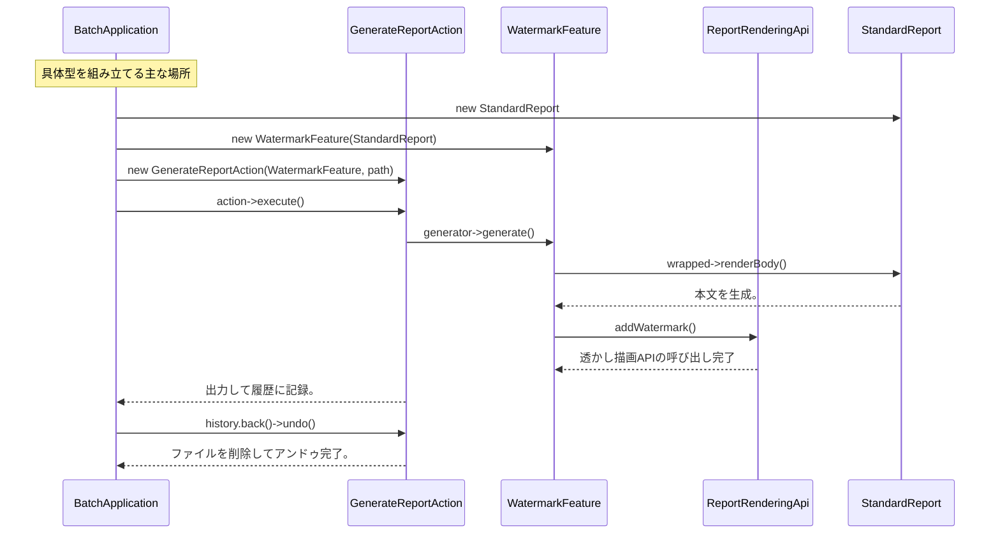

### 7-3：変更影響グラフ（改善後）

フェーズ3で行った「グラフ追加」や「履歴保存」の変更を試みた際の構造を確認します。

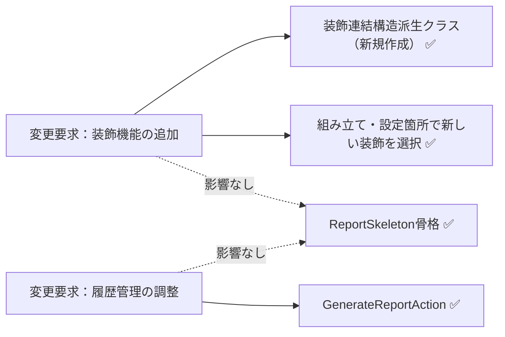

フェーズ3の変更影響グラフと比べると、新しい装飾機能の追加では装飾連結構造派生クラスに加えて、その装飾を使う組み立て・設定箇所を変更します。一方、バッチ本体の生成骨格（`ReportSkeleton`）へ装飾名や条件分岐を追加する必要はなくなりました。「変更が一箇所だけになる」のではなく、変更理由に対応する実装と構成へ影響を限定する設計です。

### 7-4：変更シナリオ表

フェーズ1の現状コードでは `ReportSkeleton` が生成手順・機能拡張・操作履歴を全て直接管理していたため、新しいレポート形式の追加や機能の変更は `ReportSkeleton` 本体の修正を意味していました。改善後は手順・機能追加・操作の責任が分離されたため、変更の影響を対応する実装クラスに限定できます。

| **シナリオ** | **フェーズ1の現状コードでの影響** | **この設計での影響** |
|---|---|---|
| 月次レポートの生成手順を固定し、装飾を選ぶ | `ReportSkeleton` に月次固有の本文と装飾分岐を追記 | `MonthlyReport` を骨格へ接続し、`GraphFeature` / `WatermarkFeature` を組み立てる |
| 生成操作を取り消し・再実行する | `ReportSkeleton` に履歴、取消、再実行の処理を追記 | `IReportAction` と履歴が同じ生成操作を `undo()` し、記録した操作の `execute()` を再度呼ぶ。骨格と装飾は保つ |
| 装飾失敗後に同じ操作を再実行する | 装飾分岐と生成手順の両方で失敗状態を管理 | `JobResult` で失敗を記録し、履歴に残した生成操作を再実行する |
| 新しいレポート種別（週次等）を追加 | `ReportSkeleton` に新しい生成手順を直接追記 | `WeeklyReport`、`TemplateRegistry` の定義、組み立てを追加。既存の骨格とレポート種別は保つ |
| 透かし機能を全レポートに追加 | `ReportSkeleton` の各手順に透かし処理を追記 | `WatermarkFeature` 装飾クラスを新規作成し、組み立てへ登録 |
| Undo機能のある操作を追加 | `ReportSkeleton` に操作処理と取り消しロジックを追記 | `IReportAction` 実装クラスを追加し、組み立て側から履歴へ渡す |

---

## 整理

### 問題・原因・課題・解決策

| | 内容 |
|---|---|
| **問題** | レポート生成エンジンで「処理の骨格」「装飾機能」「操作履歴」という変わる理由の異なる3つのものが、1つのクラスに混在している |
| **原因** | `ReportSkeleton`が骨格・装飾・履歴の知識をすべて抱え込み、異なる変更理由が同じクラスへ集まっている |
| **課題** | レポート種別ごとの本文生成処理、追加する装飾機能、操作を記録・取り消す履歴管理を、骨格クラスからそれぞれ独立した部品として外に切り出すこと |
| **解決策** | 骨格固定構造 × 装飾連結構造 × 操作記録構造：骨格の固定（骨格固定構造）・装飾の動的重ねがけ（装飾連結構造）・操作オブジェクトとしての履歴記録（操作記録構造）を3層に分け、変更の中心を対応する実装と構成箇所へ限定した |

### フェーズとこの章でやったこと

| **フェーズ** | **この章でやったこと** |
| --- | --- |
| 🔵 フェーズ1：現状把握 | 背景と動作例テーブルを確認した後、コードをクラス単位で読んだ。クラス構成図と変更要求を把握した |
| 🟣 フェーズ2：仮説立案 | 業務機能の所在表でクラスごとの変わる理由を確認した。今回の確定変更とヒアリングで判明した将来リスクを分けて整理した |
| 🟣 フェーズ3：問題特定 | 骨格・装飾・履歴を同時に変えようとして影響が飛び火することを確認した |
| 🟠 フェーズ4：原因分析 | 変わる理由が異なる3つのものが同じ場所にいることが痛みの根本と特定した |
| 🟡 フェーズ5：課題定義 | 本文生成処理・装飾機能・履歴管理という3つの分離ターゲットを特定した |
| 🔴 フェーズ6：対策検討 | 6ステップの段階的進化でそれぞれの限界を確認し、ステップ6（骨格固定構造 × 装飾連結構造 × 操作記録構造）まで進化させる決断を下した |
| 🟢 フェーズ7：対策実施 | 最終コードを実装し、変更影響グラフで変更の局所化を確認した |

### 責任の移動

| **クラス名** | **責任（1文）** | **変わる理由** |
| --- | --- | --- |
| `ReportSkeleton` | レポート生成の「骨格（定型フロー）」を定義する | レポートの出力順序が変わる場合 |
| `ReportFeature` | 内側のレポート要素を保持し、装飾を連結する共通構造を定義する | 装飾連結構造共通の連結・所有規約が変わる場合 |
| `GraphFeature` / `WatermarkFeature` | 個別の装飾処理を追加する | 各装飾の内容が変わる場合 |
| `IReportAction` | 実行と取消という操作の契約を定義する | 操作に共通して必要な契約が変わる場合 |
| `GenerateReportAction` | レポート生成・出力と、その取消に必要な状態を管理する | 生成操作やUndoの要件が変わる場合 |
| `TemplateRegistry` | テンプレートIDの登録と存在確認を担う | テンプレートの種別・出力形式定義が変わる場合 |
| `BatchApplication` | 具体的なレポート・装飾・操作記録構造を組み立て、実行履歴を所有する | 実行シナリオや構成が変わる場合 |

### 使った構造 × 解消した根本原因

| 構造 | 解消した根本原因 |
|---|---|
| 骨格固定構造 | 骨格処理の重複（各レポート形式に同じステップが散在していた問題）|
| 装飾連結構造 | 機能の動的重ねがけ（機能組み合わせが増えるたびクラスが爆発していた問題）|
| 操作記録構造 | 操作の記録化（操作履歴の管理がビジネスロジックに混在していた問題）|

### 複雑さを足しても対策は変わるか

| 追加した複雑さ | 見えた原因 | 定めた課題 | 採用した扱い |
|---|---|---|---|
| 生成結果の境界 | 結果処理が骨格へ漏れそうになる | 成否を境界で受け渡し、骨格へ結果処理を持ち込まない | 生成操作を `GenerateReportAction` に閉じ、成否は結果として返す |
| 装飾の途中失敗 | 装飾失敗の判定が骨格の `if` へ入り込む | 装飾失敗を骨格へ混ぜず装飾側で扱う | 装飾を装飾連結構造の部品に閉じ、失敗もその中で扱う |
| 失敗した生成操作の再実行 | 再実行の起点が生成手順へ混ざる | 生成操作を記録し、同じ操作を再実行できる単位にする | 操作記録構造の `IReportAction` として記録・再実行する |
| 生成骨格と操作履歴の分離 | 骨格・装飾・履歴の変化軸が同居する | 3軸を別々の部品として保つ | 骨格固定構造・装飾連結構造・操作記録構造の3層に分ける |

---

## 振り返り

### 「この章を読むと得られること」は手に入ったか

| **得られること** | **この章のどこで示したか** |
| --- | --- |
| 1. 変動箇所の識別 | フェーズ2の業務機能の所在表で、変わる理由の異なる知識の混在を発見した |
| 2. 接続点の診断 | フェーズ4で、装飾と履歴の知識が処理の骨格へ漏れている状態を確認した |
| 3. 複数構造の組み合わせ | フェーズ6で6ステップを経て3構造統合の構造を段階的に導いた |
| 4. 現場の難しさの理解 | フェーズ3で「骨格・装飾・履歴が同時に変わる」という複合問題の痛みを体感した |

### 3つの設計原則はどう適用されたか

**原則1「変わるものをカプセル化せよ」の現れ**

- 具体化された場所：各装飾クラス（`GraphFeature` 等）と `IReportAction` の実装クラス
- 解説：個別の装飾機能や操作履歴ロジックを、生成骨格とは別のクラスにカプセル化しました。新しい装飾が追加されても `ReportSkeleton` は無影響。

**原則2「実装ではなくインターフェースに対してプログラムせよ」の現れ**

- 具体化された場所：`ReportFeature` が保持する `ReportSkeleton*`、`BatchApplication` が保持する `IReportAction*`
- 解説：骨格部は具体的な装飾クラスを知らず、抽象基底クラス型経由で機能を呼び出しています。操作履歴もインターフェース経由で扱い、具体実装を知りません。

**原則3「継承よりコンポジションを優先せよ」の現れ**

- 具体化された場所：`ReportFeature` が `ReportSkeleton` を保持する構成
- 解説：機能を継承で追加するのではなく、装飾連結構造 をコンポジション（保持）することで動的に組み合わせました。「グラフ＋透かし」の組み合わせも、新規クラスなしに実現できます。

---

## あなたのコードで考えてみてください

1. **骨格の兆候を探す：** あなたのコードに「処理の流れ（順序）は共通だが、各ステップの中身が種類によって異なる」クラスがありますか？そこでコピーペーストが増えていませんか？
2. **機能追加の痛みを測る：** 既存の処理に「ある条件のときだけ前処理を挟む」要件が来たとき、既存クラスに手を入れる必要がありますか？何行変更しますか？
3. **操作の逆転を想像する：** ユーザーの操作を「取り消す」機能を後から追加するとしたら、今の構造では何が変わりますか？操作をオブジェクトとして保存する仕組みはありますか？
4. **構造の必要性を問う：** 「骨格の固定」「機能の動的追加」「操作の取り消し」は、あなたのシステムで本当に必要ですか？3つのうち2つ以上が必要なら、複合構造を検討するサインです。

---

**題材を置き換えるときの共通手順**

この章の題材名を、自分の現場のシステム名に置き換えて考えます。

1. そのシステムは、誰が何を達成するために使うものか。
2. 入力、加工、出力は何か。
3. 最近入った変更要求、または次に来そうな変更要求は何か。
4. その変更で、触りたくない場所まで修正や再テストが広がるか。
5. 変えたいものと守りたいものを分けると、接続点には何を残すべきか。
6. 何もしない、関数化、クラス分離、契約導入、登録/組み立て移動のうち、どこまで進めるのが今回の文脈に合うか。

## パターン解説：複合適用

今回は単一のパターンではなく、以下の3つを組み合わせて課題を解決しました。

### パターンの骨格

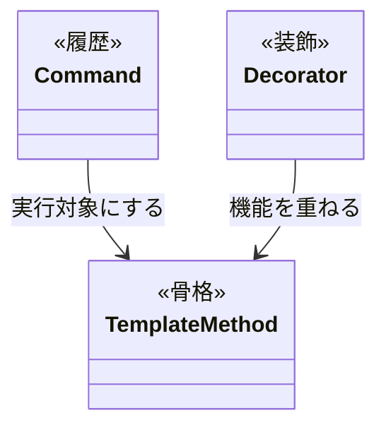

Template Method が処理の共通手順を管理し、Decorator が追加機能を組み合わせ、Command が実行履歴を管理します。各責務の境界を分けることで、変更時に確認する範囲を絞りやすくしています。ただし、各層をつなぐインターフェースや組み立てコードは共有する接続点として残ります。

### 抽象骨格の実行シーケンス

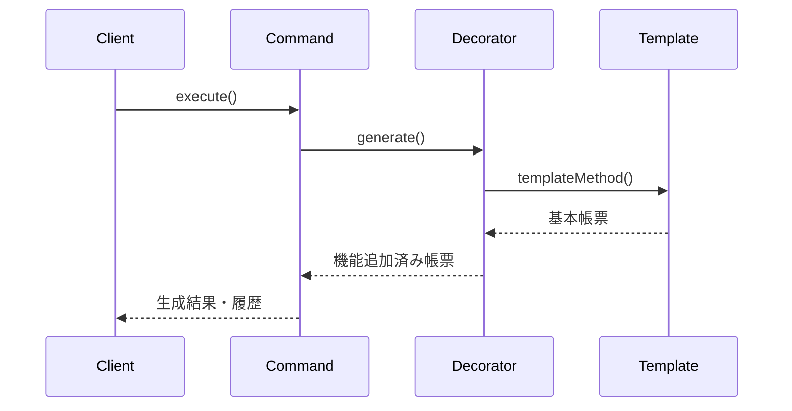

Commandが生成操作を記録し、Decoratorが機能を重ね、Template Methodが生成順序を守ります。

### 使いどころと限界

- **使いどころ**：生成順序が厳格な処理、機能追加の組み合わせが膨大なレポート・ドキュメント生成エンジンなど。
- **限界**：機能追加がほとんどない単純な生成処理では、パターンによる複雑化が勝ってしまいます。

【過剰コード：変化の予定がないものまでパターン化した例】

```cpp
// 【過剰コード例】処理の変化がほとんどないのに3パターンを全適用した場合

// TemplateMethod: 骨格固定（でも実際に変わる骨格がない）
class AbstractFixedReport {
public:
    void generate() {
        readData();
        buildContent(); // ← 常にこの1つしか使わない
        output();
    }
protected:
    virtual void buildContent() = 0;
    void readData()  { cout << "データ読み込み" << endl; }
    void output()    { cout << "出力完了" << endl; }
};

// Decorator: 装飾の追加（でも装飾の組み合わせが変わらない）
class FixedReport : public AbstractFixedReport {
protected:
    void buildContent() override {
        cout << "固定コンテンツ生成" << endl;
    }
};

// Command: 操作の記録（でもundoが不要）
class GenerateFixedReportAction {
    FixedReport report;
public:
    void execute() { report.generate(); }
    void undo()    { /* 何もしない：固定レポートにundoは不要 */ }
};
// → 3パターンを使っても、変わる理由がなければ追加コストに見合う効果が小さい
// → FixedReport::generate() を直接呼ぶだけで十分だった
```

### この章のまとめ

レポート生成というドメインと Template Method × Decorator × Command の組み合わせの関係を一言で言うなら、「骨格・装飾・履歴」という3つの変化軸を1クラスで管理しようとすると、どれか1つを直すたびに他の2つが揺れる、ということです。軸を先に分析してから各パターンを順に当てることで、複合問題を段階的に解消できました。3つのパターンが同時に必要だと分かって一気に適用したのではなく、1つ目のパターンを当てた後に「まだ解決しきれていない部分がある」という気づきが次のパターンへ進む根拠になりました。

7つのフェーズを通じて、読者はレポート生成クラスに骨格・装飾・履歴が混在しているという観察から始まり、フェーズ3で「どれか1つに集中すると他が崩れる」という複合問題の難しさを体感し、フェーズ6で骨格を固定する境界、装飾を重ねる境界、操作を記録する境界を段階的に積み上げる判断へと進みました。「1つの構造で全部解決しようとしない」という視点は、複合問題を前にしたときの最初の判断として、どの現場でも使えると思っています。変更理由を分けて考える習慣こそが、この章を通じて身についた最大のものだと感じています。

あなたのコードの中にも、1つのクラスに「何を生成するか」「どう装飾するか」「いつ記録するか」が混在している箇所があるはずです。それぞれの変化軸を問うことが、どの順序でどのパターンを当てるかを見つける入口になります。
