## 第11章 レポート生成エンジン ―― Template Method × Decorator × Command パターン

―― 思考の型：処理の定型化と機能拡張、そして実行履歴をどう両立させるか

第一部ではパターンを1章1つで体験した。この章では3つの変化軸が混在した問題に同じ思考プロセスを使う。

### この章の核心

**定型的な処理の中に、個別の出力形式や機能追加が混在するレポート生成エンジンにおいて、これらを継承や単純な条件分岐で解決しようとすると、処理ステップの固定化とクラスの過剰な肥大化を招く。**

### この章を読むと得られること

* **得られること1：** 処理の骨格、機能追加、操作履歴という異なる「変わる理由」を識別できるようになる。


* **得られること2：** 処理ステップの固定化と、個別の機能拡張のバランスが崩れている接続点（クラスとクラスのつなぎ目）を特定できるようになる。


* **得られること3：** 複数の仕組みを組み合わせることで、複雑なレポート生成ロジックを段階的に分離・局所化する手法を説明できるようになる。


* **得られること4：** 「処理の定型化」と「機能の動的追加」が入り混じる現場の難しさを理解する視点。

---

## 🔵 フェーズ1：現状把握 ―― コードとクラス構成を読む
### 1-1：システムの背景

このシステムは、企業の売上データを分析し、経営層向けに週次レポートを自動生成する「レポート生成エンジン」です。 現場の営業担当者が入力したCSV形式の売上データを取り込み、指定されたレイアウトでPDFやExcel形式のレポートを出力します。

リリース当初は「基本統計（合計・平均）」を表示するシンプルなレポート機能のみでした。 しかし、分析の深度が増すにつれ、「特定の部署ごとのグラフを追加してほしい」「レポートのヘッダーにロゴを埋め込んでほしい」「出力形式をHTMLにも対応させてほしい」といった要望が次々と舞い込むようになりました。

現場の担当者からは「レポートの出力順序を変えるだけで、全体の生成処理をすべて書き直さなければならない」という嘆きが聞こえてきています。 私自身、このコードを最初に見たとき、処理の手順が `main` 相当のクラスにべったりとハードコードされており、どこをどう変更すればいいのか見通しが立たず、呆然としてしまいました。 一見すると、レポート生成の「処理の骨格」は維持されているように見えますが、機能拡張のたびに巨大な条件分岐が追加され、崩壊の危機にあります。
---

### 1-2：動作例テーブル ―― 仕様を「動かした結果」で確認する

コードを読む前に、このシステムがどんな入力に対してどんな出力を返すかを確認します。この章のどのステップも、以下の動作を実現します。

| 操作 | 入力・条件 | 期待される出力・結果 |
| --- | --- | --- |
| 月次売上レポートをPDF出力 | レポート種別：月次、出力形式：PDF | PDFファイルが生成される |
| 月次売上レポートをExcel出力 | レポート種別：月次、出力形式：Excel | Excelファイルが生成される |
| ヘッダー付き・透かし付きでPDF出力 | 月次レポート＋ヘッダー装飾＋透かし装飾＋PDF出力 | 装飾が重ねて適用されたPDFが生成される |
| レポート生成後にキャンセル操作 | 月次レポートを生成→直後にアンドゥ実行 | アンドゥが走り、生成されたファイルが削除される |
| バッチで3レポートを同時生成 | 週次・月次・部門別の3種を一括実行 | 3ファイルが生成され、履歴に3コマンドが追加される |
| グラフ含むレポート生成全体をアンドゥ | グラフ付き月次レポートを生成→直後にアンドゥ実行 | アンドゥが走り、生成されたファイル（グラフ含む）が削除される |

この6行が、この章で設計するシステムの「正解の動き」です。後続の各ステップ（Step 1〜Step 4）は、いずれもこれらの動作を実現します。違いは「変更が来たときにどこを触ることになるか」です。
---

### 1-3：実装コード

レポート生成処理の様子です。

```cpp
#include <iostream>
#include <string>
#include <vector>

using namespace std;

class DataReader {
public:
    void readCSV() { cout << "CSVデータ読み込み完了。" << endl; }
};
```

```cpp
// レポート生成統括（処理の手順と個別の機能が混在）
class ReportSkeleton {
    DataReader reader;
public:
    void generate(string format, bool addGraph, bool addLogo) {
        reader.readCSV();
        cout << format << "形式でレポートのヘッダーを生成。" << endl;
        if (addGraph) cout << "グラフを追加。" << endl;
        if (addLogo) cout << "ロゴを追加。" << endl;
        cout << format << "形式でレポートのフッターを生成。" << endl;
    }
};
```

```cpp
int main() {
    ReportSkeleton gen;
    gen.generate("PDF", true, false);
    return 0;
}
```

このコードを見ると、`ReportSkeleton` がレポートの「生成手順（ヘッダー・フッター生成）」と、個別の「機能追加（グラフ・ロゴ）」を直接知っていることが分かります。
---

### 1-4：クラス構成図

現状のコード構造です。 レポートの生成手順と、個別の装飾や追加機能が同一のクラスに強く依存しています。

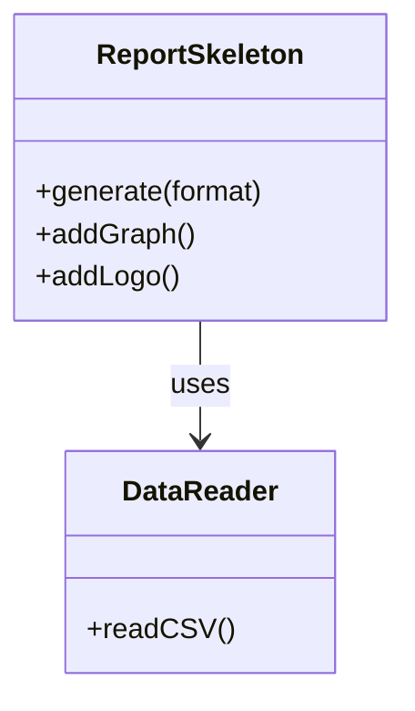

`ReportSkeleton` クラスが、データの読み込み、レポート生成のステップ管理、そして個別のグラフィック追加処理という、異なる3つの責務をすべて抱えています。
---

### 1-5：依存グラフ

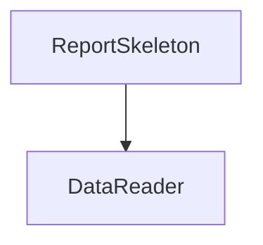

`ReportSkeleton` に機能が集中しており、新しいレポート形式やグラフが追加されるたびに、このクラスが肥大化し続けています。
---

### 1-6：実行結果

上記コードの実行結果：

```text
CSVデータ読み込み完了。
PDF形式でレポートのヘッダーを生成。
グラフを追加。
PDF形式でレポートのフッターを生成。
```

これから検討するのは、同じ機能を保ちながら、変更に強い構造をどう作るかという点です。
> 
> 

### 1-7：届いた変更要求

ある水曜日の昼下がり、レポート生成システムのプロダクトオーナーから相談を受けました。

「お疲れ様。今度、役員向けに『月次レポート』を出力する機能を追加したいんだ。 グラフやロゴの挿入といった既存の機能はそのまま使えるはずだけど、出力のステップを少し細かく制御したい。 また、作成したレポートを後から『やり直し』ができるようにしたいという要望が営業部から出ていてね。 レポートの生成履歴を保存して、特定の過去時点の状態を再実行したり、取り消したりすることはできるかな？」

なるほど。今回は「処理のステップ制御」という新しい要件と、「操作履歴の保存・再実行」という二つの大きな軸が加わるわけですね。 今の `ReportSkeleton` は、処理の流れが固定された上で、追加機能がハードコードされています。 このままでは、新しいレポート形式や操作履歴の要求に対応しようとすると、クラスの責任がさらに肥大化するのは明らかです。


---

## 🟣 フェーズ2：仮説立案 ―― 何が変わるかを観察し、ヒアリングで裏付ける

フェーズ1で、ReportSkeletonがレポート生成の定型手順と個別機能追加を直接保持している現状を把握しました。届いた変更要求を踏まえ、この設計における変動と不変を整理します。

### 2-1：責任テーブル

| **クラス名** | **責任（1文）** | **知るべきこと** |
| --- | --- | --- |
| `ReportSkeleton` | レポート生成の全体フローを統括する。 | 読み込み手順、レポートの出力形式、装飾手順。 |
| `DataReader` | CSVファイルを読み込みデータ構造に変換する。 | CSVのフォーマット定義。 |

`ReportSkeleton` は、レポート生成の「手順」だけでなく、ロゴの配置やグラフ追加という「個別の機能」までをすべて把握する状態です。
### 2-2：責任チェック表

| **コードの行** | **持っている知識** | **管理者（観察）** |
| --- | --- | --- |
| `cout << ... << "ヘッダーを生成。" ...;` | レポートの固定手順 | 全体設計担当 |
| `if (addGraph) ...` | グラフ追加という個別機能の知識 | 分析チーム |
| `if (addLogo) ...` | ロゴ追加という個別機能の知識 | 広報チーム |

要するに、レポート生成の「定型手順」という観察から、「処理の手順（骨格）」と「個別の機能追加」という変わる理由が異なるものが、同じ場所に混在しているという構造の問題が見えてくる。

### 2-3：変動・不変の仮説テーブル

フェーズ1での観察（フェーズ2の責任チェック表）を材料に、何が変動し、何が変わらないのかを整理します。

| **分類** | **仮説** | **根拠（フェーズ2の観察から）** |
| --- | --- | --- |
| 🔴 **変動しそう** | レポート生成の「個別の追加機能」（グラフ・ロゴ等） | 2-2で、追加機能の知識が生成クラスに混在していると観察したため。 |
| 🔴 **変動しそう** | 各レポート生成の「実行順序・構成」 | 2-2で、レポート生成手順が固定されており変更に弱いと観察したため。 |
| 🔴 **変動しそう** | 生成操作の「履歴・取り消し」処理 | 操作履歴の概念が現在のシステムに存在しないため。 |
| 🟢 **不変** | データ読み込み処理（CSV読み取り） | どのような形式のレポートであっても、元データ読み込みの手順は共通のため。 |

「処理の骨格」は変えたくないけれど、「個別の装飾」や「実行履歴」は柔軟に変えたい。この相反する欲求をどう整理するかが今回のポイントになりそうです。

### 2-4：今回の確定変更テーブル

仮説テーブルを土台に、今回の変更要求で確実に対応が必要な要素をはじめに確定します。ヒアリングの前に「自分はこう読んでいる」という立場を明確にしておくことで、ヒアリングの問いが具体的になります。

| **分類** | **具体的な内容** | **変わるタイミング** | **根拠（誰との確認か）** |
| --- | --- | --- | --- |
| 🔴 **変動する** | 個別の追加機能（グラフ・ロゴ） | 機能追加・要件変更ごと | 運用担当者との合意（確認待ち） |
| 🔴 **変動する** | レポート生成の手順（ステップ制御） | 部署ごとの要件変更ごと | 運用担当者との合意（確認待ち） |
| 🔴 **変動する** | 生成操作の実行履歴（再発行機能） | 履歴管理要件の追加ごと | 運用担当者との合意（確認待ち） |
| 🟢 **不変** | 基本データ読み込み手順 | 変わらない | 業務ルールとして確定 |

### 2-5：関係者ヒアリング

確定変更テーブルを持って、システム利用部門の担当者と話し合いを持ちました。

* **開発者：** 「レポートの生成フローについてですが、今後、例えば『ロゴを先に出す』あるいは『グラフを省略する』といった順序の変更は発生しますか？」


* **運用担当者：** 「部署ごとにそのニーズはあるね。 基本は同じ手順なんだけど、特定のレポートだけステップを変えたいケースがあるんだよ。」


* **開発者：** 「操作履歴についても確認させてください。過去のレポート生成処理をやり直す際、当時使ったCSVデータも再読み込みする必要があるでしょうか？」


* **運用担当者：** 「そうだな、当時のデータで再実行したい場合もあれば、最新データで再生成したい場合もある。 つまり、生成の操作自体を『履歴』として保持し、必要に応じて『再発行』したいんだ。」


* **開発者：** 「分かりました。生成フローの骨格は守りつつ、個別のステップや生成操作の履歴管理を独立して扱える構造が必要そうですね。」


ヒアリングの結果、処理の骨格はテンプレートとして定型化しつつ、個別のステップや操作をカプセル化することで、高い変更耐性を確保する必要があることが見えてきました。確定変更テーブルの「確認待ち」欄はヒアリングで裏付けが取れたため、すべて「運用担当者との合意」として確定します。

> **現実のヒアリングでは——** このシナリオでは相手がちょうど設計に役立つ情報を教えてくれています。現実には「変わるかどうか分からない」「たぶん変わらない」という答えが返ることも多いです。そのときは、コードの変更履歴（`git log`）や過去の障害記録を「ヒアリングの代わり」として使ってみてください。「過去に何度変わったか」が、「将来変わりやすいか」の最も正直な証拠です。

### 2-6：将来リスクテーブル

ヒアリングで「確定ではないが変わるかもしれない」として言及された項目を、確定変更とは別に整理します。将来の変化として想定しておくことで、設計の耐久テスト（フェーズ6）に活かします。

| **リスク項目** | **具体的な内容** | **ヒアリングでの発言** |
| --- | --- | --- |
| 再実行データの選択 | 当時のCSVで再実行するか、最新データで再実行するかが変わる可能性 | 「場合によって両方あり得る」 |
| 出力形式の追加 | PDF・Excel以外にHTML等が求められる可能性 | 「将来的にはあるかもしれない」 |
| 履歴の上限管理 | 履歴件数に上限が必要になる可能性 | 「運用で積み上がると管理が大変」 |

「処理の骨格」と「追加機能」をどう切り離し、さらに「操作」をどう履歴として扱うか。課題が明確になってきました。 フェーズ2で「何が変わり、何が変わらないか」が確定しました。 次のフェーズ3では、この変更要求を実際に試みて、何が起きるかを確認します。


---

## 🟣 フェーズ3：問題特定 ―― 変更の痛みを発見する

### 3-1：変更シミュレーション

フェーズ2で確定した「レポートの実行順序の変更」と「操作履歴（再実行機能）の追加」を、今の ReportSkeleton クラスに対して実装してみます。

はじめに、レポート生成の手順を柔軟にするために、generate メソッド内のハードコードされたステップを順次 if 文で分岐させます。 次に、レポート生成の操作をやり直すために、実行したパラメータや順序を保持する別のクラス ReportHistoryManager を作成し、ReportSkeleton の内部から呼び出すようにします。

すると、すぐに「あ、これ以上このクラスを編集すると壊れる」という感覚を覚えました。 generate メソッドの中に、「レポート生成の骨格」「グラフ追加機能」「ロゴ追加機能」、さらには「履歴保存ロジック」という全く性質の異なるコードが、ごちゃ混ぜになって押し込まれているのです。 グラフの描画条件を少し変えようとすると、意図せず履歴保存のタイミングまで狂ってしまうという、まさに「grep地獄」の入り口に立たされた気分です。

### 3-2：変更影響グラフ

今の構造で変更を試みた際の、依存関係の飛び火を可視化します。

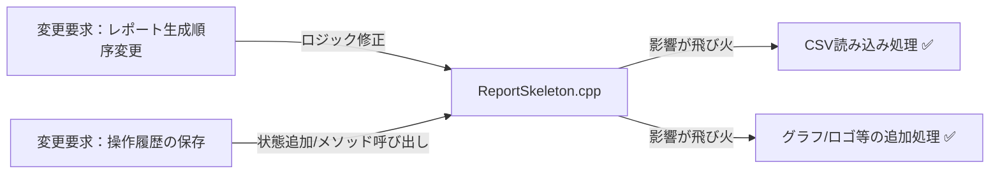

ReportSkeleton という一つのクラスに、レポート生成という「処理の定型」と、個別機能という「可変部分」、そして履歴という「操作管理」が混在しているため、変更がクラス内のあちこちに飛び火する構造になっています。

### 3-3：痛みの言語化

「どこまで手を入れれば、この機能を実装できるのか…」

変更をシミュレートする中で、明確な痛みが二つ露呈しました。

一つ目の痛みは、処理の手順が「固定化」されていることの限界です。 グラフやロゴといった個別の装飾機能が、レポート生成という共通の骨格と同じ場所に記述されているため、装飾の有無や順序を変えるだけで、全体の生成フローをすべて書き換えなければなりません。 「生成手順」と「生成する要素」を分離できていないため、個別の変更が全体の安定性を脅かしています。

二つ目の痛みは、操作履歴という「管理責務」の混入です。 本来、レポートの生成処理はデータをレポートにするだけで完結する必要があるなのに、操作の履歴を取るという「管理機能」が、生成ロジックと密接に絡み合っています。 これにより、生成ロジックをリファクタリングしようとすると、履歴管理の仕組みまで引きずり回されるという、極めて不安定な状態に陥っています。

フェーズ3で「今の構造では変更が辛い」という事実が確認できました。 次のフェーズ4では、なぜこのように辛いのか、構造的な原因を深掘りします。

---

## 🟠 フェーズ4：原因分析 ―― なぜ辛いのかを構造で言語化する

フェーズ3で確認したように、レポート生成の「定型的なフロー」と「個別の装飾機能」、そして「操作履歴の管理」がすべて `ReportSkeleton` クラスに混在していることが、システムを不安定にする最大の要因です。 ここでは、この問題の原因を構造的な観点から紐解いていきます。

### 4-1：観察→原因テーブル

フェーズ3でのシミュレーションから見えてきた観察事実と、その根本にある構造的な原因を整理します。

| **根本原因** | **内容** | **解消するパターン** |
| --- | --- | --- |
| 根本原因A：骨格処理の固定化 | 処理ステップが各クラスに重複している | Template Methodで解消 |
| 根本原因B：機能の動的重ねがけ | 装飾の組み合わせが増えるたびクラスが爆発 | Decoratorで解消 |
| 根本原因C：操作の記録化 | 操作履歴の管理がビジネスロジックに混在 | Commandで解消 |

これら3つの根本原因は**それぞれ独立した変化軸**です。

- 「どんな手順でレポートを生成するか」（骨格）が変わっても、「どの装飾を加えるか」は変わりません
- 「どの装飾を加えるか」が変わっても、「操作を記録・取り消しできるか」には影響しません
- 「操作の記録・取り消し」が変わっても、生成手順や装飾の種類は変わりません

3つが独立しているからこそ、1つのパターンだけでは解決しきれません。

コードを追うと、`ReportSkeleton` が生成の「手順」を握りしめすぎていることが分かります。 また、装飾機能が追加されるたびに `if` 文やフラグが乱立し、生成の骨格と機能拡張の責務が同一クラスに「ベタ書き」されているのが現状です。

### 4-2：変わるもの / 変わらないものテーブル

構造を整理するために、変化の軸を明確に分離します。

| **変わり続けるもの（🔴）** | **変わってほしくないもの（🟢）** |
| --- | --- |
| レポート生成の手順や追加機能の組み合わせ | データ読み込みという基本的な前処理手順 |
| 個別の操作実行履歴（保存・再実行・取り消し） | レポートを出力するという「処理の骨格（定型フロー）」 |

現状は「レポートを作る」という一つの目的に向かって、すべての機能が同じレイヤーで記述されています。 処理の「骨格（定型）」と、個別に「機能追加（装飾）」する部分、さらにその「実行」を制御する部分は、それぞれ独立した接続形態へ進化させる方がよいでしょう。

### 4-3：接続形態を診断する

現在の接続形態を2×2マトリクスで診断します。

今のレポート生成エンジンは、専用の変換回路が内蔵されたハブに対して、各機能への専用ケーブルを直差ししているような状態（具体×直接）です。新しい機能を追加したり、処理順序を変えようとしたりするたびに、ハブ内部の配線をいじり回さなければならないため、システム全体の安定性が失われています。

|  | 直接（直差し） | 間接（アダプター経由） |
|:---:|:---|:---|
| **具体**（専用規格） | **← 現在地**　ライトニング直生え → iPhone（直差し） | ライトニング直生え → ゲーム機専用アダプタを挟む → ゲーム機 |
| **抽象**（汎用規格） | Type-C直生え → 各種機器（直差し） | ライトニング直生え → Type-C変換アダプタを挟む → 各種機器 |

このコードで言うと：

| ケーブル比喩 | コードの対応箇所 |
|---|---|
| 「具体」＝専用規格ケーブル | `bool addGraph` / `bool addLogo` というパラメータ名 — 具体的な機能名をメソッドシグネチャに直接埋め込んでいる |
| 「直接」＝直差し | `if (addGraph) cout << "グラフを追加。";` — `generate()` 内でスケルトン（ヘッダー/フッター生成）と追加機能を分離せず直接記述している |

「定型的なフロー」と「機能追加」、「操作の記録」という3つの責務は、それぞれ独立して頻繁に変更される可能性を秘めています。 したがって、これらを一つの巨大なクラスで管理するのではなく、それぞれ適切な接続形態へ分離することが、このシステムの設計を健全化する唯一の道です。

フェーズ4で根本原因が言語化できました。 次のフェーズ5では、この分析を元に、解決する課題を具体的に定義していきます。

---

## 🟡 フェーズ5：課題定義 ―― 解くべき接続点を特定する

フェーズ4で、「レポート生成の定型フロー」と「追加機能（グラフ・ロゴ等）」、そして「操作履歴の管理」という異なる3つの責務が `ReportSkeleton` クラスに混在していることが、システムを複雑にしている根本原因だと特定しました。

変更の理由（変化の軸）がそれぞれ異なるこれらを、今のままの構造で維持し続けることは、拡張性を損ない、バグの温床となるため限界です。 対策を検討する前に、今回のリファクタリングで解決する課題を4つの視点で整理し、確定させます。

### 5-1：接続点の特定

フェーズ4での分析に基づき、以下の3つの接続点（ジョイント）を特定しました。

* 接続点A：`ReportSkeleton` ←→ CSVデータ読み込み（定型処理）の境界
* 接続点B：`ReportSkeleton` ←→ 個別の追加機能（グラフ・ロゴ等）の境界
* 接続点C：`ReportSkeleton` ←→ 操作履歴管理の境界

これらは `ReportSkeleton` 内で一つに絡み合っています。 これらを独立した接続点として切り離すことが、システムの設計を健全にするための第一歩です。

### 5-2：クライアントへの影響範囲

分離対象の責務を呼び出している `ReportSkeleton` クラスが最大のクライアントです。 このクラスが各機能の詳細を知りすぎているために、変更のたびに自身を書き換える運命にあります。 この設計を改善することで、`ReportSkeleton` はレポート生成の「骨格（処理手順）」だけを管理し、実際の追加機能や操作履歴は分離した部品に任せることができます。

### 5-3：課題まとめ表

分析結果を一覧にまとめます。

| **接続点** | **分けた理由** | **非機能制約** | **クライアント影響** |
| --- | --- | --- | --- |
| 接続点A | 定型処理の固定化 | 変更頻度低 | 特になし |
| 接続点B | 機能追加の頻発 | 高頻度の変更・大量データ時の処理時間が生成クラス構造に影響 | `ReportSkeleton` の生成ロジック |
| 接続点C | 操作履歴の管理責務 | 高頻度の変更 | `ReportSkeleton` の実行ロジック |

この表が、次に検討する対策の出発点となります。フェーズ5で「何を解くか」が確定しました。 次のフェーズ6では、これらの課題に対して具体的にどのような構造を適用するか、コストの観点からステップを検討します。

---

## 🔴 フェーズ6：段階的進化 ―― どこまで設計を進めるべきか

フェーズ5で整理した「処理の骨格」「個別機能の追加」「操作履歴管理」という三つの責務を、どのように切り離し接続するかが今回の検討事項です。 これらはそれぞれ「固定」「拡張」「記録」という異なる性質を持つため、接続形態を柔軟に選択する必要があります。

### 6-1：接続の形 2×2マトリクス

現在の `ReportSkeleton` は、処理の骨格の中に装飾機能や履歴管理がべったりと入り込んだ「具体×直接」の状態です。 ここから、各責務を独立したインターフェースやパターンへ切り出し、抽象化と間接層を導入する方向でステップを検討します。

| 接続形態 | ケーブル例 | 特徴 |
|:---:|:---|:---|
| **具体×直接**（← 現在地） | ライトニング直生え → iPhone（直差し） | 専用端子のみ対応。差し替え不可 |
| **具体×間接** | ライトニング直生え → ゲーム機専用アダプタを挟む → ゲーム機 | 変換器を挟むが規格は専用のまま |
| **抽象×直接** | Type-C直生え → 各種機器（直差し） | どのメーカーでも同じ口で繋がる |
| **抽象×間接** | ライトニング直生え → Type-C変換アダプタを挟む → 各種機器 | アダプタを介して汎用規格で展開可能 |

どのステップも、動作例テーブルで示した動作を実現します。違うのは「変更が来たときにどこを触ることになるか」です。

---

#### Step 1：具体×直接 ―― プライベートメソッドで責任を整理する

**この形の考え方：**
フェーズ3で示したコードを、接続の形は変えずにプライベートメソッドで整理した形です。各処理の意味がメソッド名で明確になります。 `DataReader` を直接メンバに持ち、`if` 分岐もそのままですが、各分岐をプライベートメソッドに抽出して責任を整理します。

**構造図：**

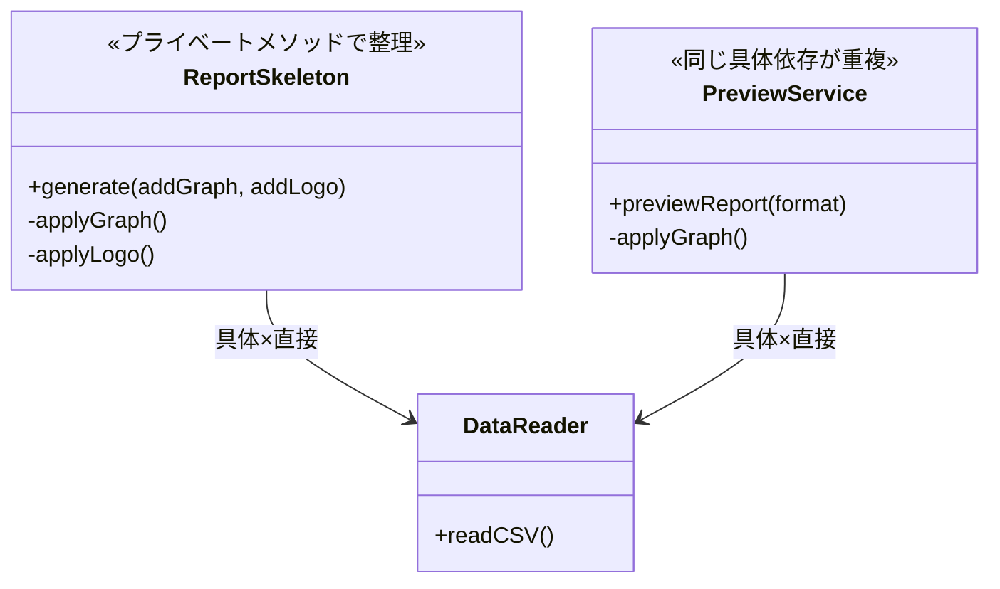

両クラスとも `DataReader` という具体型を直接知っており、機能追加のたびに両クラスを修正しなければならない点はフェーズ3と同じです。プライベートメソッドで読みやすくなりましたが、接続形態は変わっていません。

**手段の比較：**

| 手段 | 内容 | ✅ |
| --- | --- | --- |
| 手段A：プライベートメソッドに抽出 | 各分岐の処理をプライベートメソッドに切り出す | ✅（読みやすさが向上する） |
| 手段B：コメントのみで整理 | コードは変えずにコメントだけ整理する | 却下（構造問題は解決しない） |

手段Aを採用します。接続形態は具体×直接のままですが、各処理の意図がメソッド名で明確になります。

**ReportSkeleton クラス（Step 1）：**

```cpp
// Step 1：プライベートメソッドで各分岐の責任を整理
class ReportSkeleton {
    DataReader reader; // ← 具体：DataReaderを直接保持
public:
    void generate(bool addGraph, bool addLogo) {
        reader.readCSV();
        cout << "レポートのヘッダーを生成。" << endl;
        if (addGraph) {
            applyGraph(); // ← 処理の意図がメソッド名で明確になった
        }
        if (addLogo) {
            applyLogo();
        }
        cout << "レポートのフッターを生成。" << endl;
    }
private:
    void applyGraph() {
        cout << "グラフを追加。" << endl;
    }
    void applyLogo() {
        cout << "ロゴを追加。" << endl;
    }
};
```

**PreviewService クラスと main（Step 1）：**

```cpp
// Step 1：PreviewServiceも同じ構造でプライベートメソッドに整理
class PreviewService {
public:
    void previewReport(string format) {
        DataReader reader; // ← 具体：ReportSkeletonと同じ具体型を重複して保持
        reader.readCSV();
        cout << format << "形式でプレビューのヘッダーを生成。" << endl;
        applyGraph();
        cout << format << "形式でプレビューのフッターを生成。" << endl;
    }
private:
    void applyGraph() {
        cout << "グラフを追加（プレビュー）。" << endl;
    }
};

int main() {
    ReportSkeleton gen;
    gen.generate(true, false);

    PreviewService preview;
    preview.previewReport("HTML");
    return 0;
}
```

プライベートメソッドに整理したことで各処理の意図は読みやすくなりましたが、両クラスともに `DataReader` という具体型を直接知っており、機能が増えると両方を修正しなければならない構造は変わっていません。

一文要約：フェーズ3のコードをプライベートメソッドで読みやすく整理した形で、接続は「具体×直接」のまま、同じ具体型依存が2か所で並行して走る。

**この形のトレードオフ：**

* 変更容易性：低（機能追加のたびに両クラスを修正する必要がある）


* テスト容易性：低（具体クラスへの依存が残り、切り離せない）


* 実装コスト：低（プライベートメソッドへの抽出のみ）


---

#### Step 2：具体×間接 ―― 処理を別クラスに切り出して委ねる

**この形の考え方：**
グラフ描画やロゴ配置を別クラスに切り出し、呼び出し元はその具体クラスを名指しで知った上でオブジェクトに処理を「委ねる」形です。自分で直接やるのではなく、切り出したオブジェクトに任せる（間接）ことで、処理の責任が明確に分離されます。ただし呼び出し元は具体クラス名を直接知っており、クラスを差し替えるには呼び出し元の修正が必要です。

**構造図：**

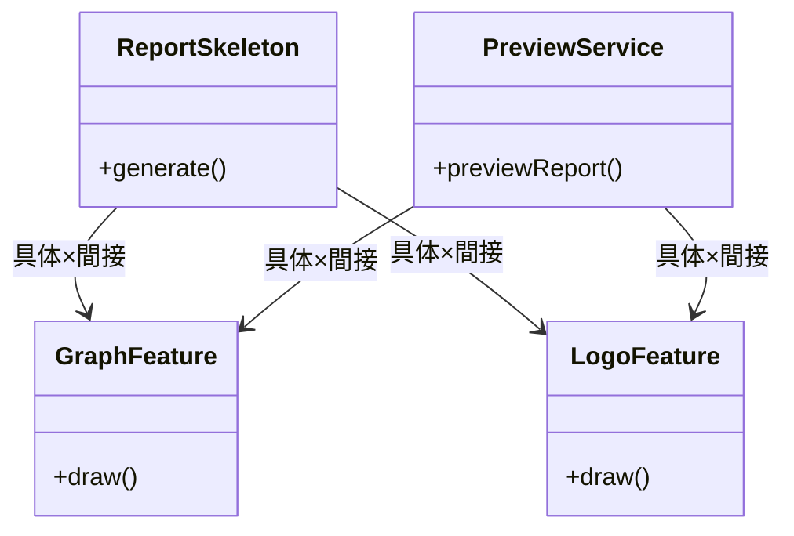

クラスは分離されて処理を委ねるようになりましたが（間接）、両クラスが各具体クラス名を直接知っており（具体）、機能クラスが増えるたびに両方を修正しなければならない。

**手段の比較：**

| 手段 | 内容 | ✅ |
| --- | --- | --- |
| 手段A：別クラスに切り出し、処理を委ねる | ロジックを別クラスに分けて呼び出し、処理はそのクラスに任せる | ✅（この手段の定義通り） |
| 手段B：静的メソッドで提供 | `GraphFeature::draw()` のように静的呼び出し | 却下（テストでの差し替えが不可能） |

手段Aを採用します。処理を切り出したクラスに「委ねる」形になり、各クラスの責任は明確になりました。ただし呼び出し側が具体クラス名を直接知り続けることは変わりません。

**機能クラス（Step 2）：**

```cpp
// Step 2：処理を別クラスに切り出した（具体×間接）
class GraphFeature {
public:
    // 呼び出し元はここに処理を委ねる（間接）
    void draw() { cout << "グラフを描画。" << endl; }
};

class LogoFeature {
public:
    void draw() { cout << "ロゴを配置。" << endl; }
};
```

**ReportSkeleton クラス（Step 2）：**

```cpp
// Step 2：ReportSkeletonが具体クラスを知り、処理をそのクラスに委ねる
class ReportSkeleton {
public:
    void generate() {
        DataReader reader; // ← 具体：DataReaderを直接生成
        reader.readCSV();  // ← 間接：読み込み処理はreaderに委ねる
        cout << "レポートのヘッダーを生成。" << endl;
        GraphFeature graph; // ← 具体：GraphFeatureという型名を直接書いている
        graph.draw();       // ← 間接：描画処理はgraphに委ねる
        cout << "レポートのフッターを生成。" << endl;
    }
};
```

**PreviewService クラスと main（Step 2）：**

```cpp
// Step 2：PreviewServiceも同じ具体クラスを知り処理を委ねる
class PreviewService {
public:
    void previewReport() {
        DataReader reader; // ← 具体：ReportSkeletonと同じ型を重複して使用
        reader.readCSV();  // ← 間接：処理を委ねる
        GraphFeature graph; // ← 具体：型名を直接書いている
        graph.draw();       // ← 間接：処理を委ねる
        LogoFeature logo;   // ← 具体：型名を直接書いている
        logo.draw();        // ← 間接：処理を委ねる
        cout << "プレビュー表示完了。" << endl;
    }
};

int main() {
    ReportSkeleton gen;
    gen.generate();

    PreviewService preview;
    preview.previewReport();
    return 0;
}
```

処理を別クラスに委ねる形（間接）になりましたが、具体クラス名の知識が両クラスに重複しており、機能クラスへの依存が両方に残る。

一文要約：クラスは分かれて処理を委ねるようになった（間接）が、「どのクラスを呼ぶか」という具体クラス名の知識が両方の呼び出し元に重複して残っている。

**この形のトレードオフ：**

* 変更容易性：低〜中（クラスは分かれたが、具体クラス名の依存は両方に残る）


* テスト容易性：低（依然として具体クラスを直接生成する必要がある）


* 実装コスト：低（リファクタリングの範囲が限定的）


---

#### Step 3：抽象×直接 ―― インターフェースを挟み、型だけで接続する

**この形の考え方：**
レポート生成の「骨格」には処理順序を固定する仕組みを、機能の「動的追加」には各機能を抽象型で受け取る仕組みを適用する。 各機能要素を抽象化し、実行時に自由に組み合わせられるようにする。

**手段の比較：**

| 手段 | 方法 | 特徴 |
| --- | --- | --- |
| 手段A：継承（Template Method） | 基底クラスに骨格を定義し、派生クラスで差分ステップを実装する | 骨格が固定されるため手順の変更に強い。一方、継承階層が深くなるとクラスが増える |
| 手段B：コンポジション（保持・委譲） | 骨格クラスが機能オブジェクトを受け取り、委譲で呼び出す | 実行時に機能を差し替えやすい。ただし骨格の固定度は継承より弱い |
| 手段C：フックメソッド | 骨格に空の「フック」を用意し、派生クラスが必要に応じてオーバーライドする | 派生クラスへの強制がなく柔軟。ただしどこで何が動くか追いにくくなる |

**手段A**（処理の実行順序を基底クラスで確定させることが今回の要件に合致する。派生クラスは「本文の中身だけ」に集中できる。）のコードを以下に示します。

手段Aにより、`ReportSkeleton` は処理の骨格を保持しながら、派生クラスが具体的なステップを担います。ただし、機能の動的な重ねがけはできないため「直接」の状態にとどまります。

**構造図：**

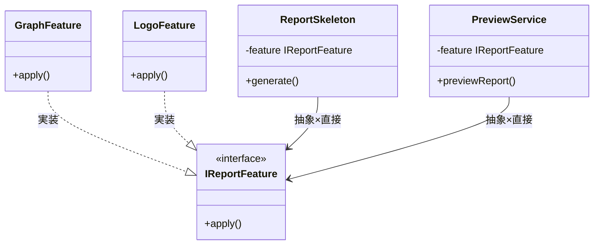

`main()` が具体クラスを生成してインターフェース経由で注入するため、`ReportSkeleton` と `PreviewService` は具体クラスを知らずに済み、選択ロジックの重複が解消される。

【コード例】

```cpp
// IReportFeature インターフェース
class IReportFeature {
public:
    virtual void apply() = 0;
};
```

```cpp
// GraphFeature 実装クラス
class GraphFeature : public IReportFeature {
public:
    void apply() override { cout << "グラフを追加。" << endl; }
};
```

```cpp
// LogoFeature 実装クラス
class LogoFeature : public IReportFeature {
public:
    void apply() override { cout << "ロゴを追加。" << endl; }
};
```

```cpp
// 骨格は固定・一部だけ変わるのがTemplate Method。装飾を加えたいDecoratorも同じインターフェースを実装する
// ReportSkeleton クラス（抽象型で受け取り、直接呼び出し）
class ReportSkeleton {
    IReportFeature* feature; // ← 抽象：具体クラスを知らない
public:
    ReportSkeleton(IReportFeature* f) : feature(f) {}
    void generate() {
        cout << "CSV読み込み" << endl;
        feature->apply(); // ← 直接：間接層を挟はじめにに呼び出す
        cout << "フッター生成" << endl;
    }
};
```

```cpp
// PreviewService クラス（同様に抽象型で受け取る）
class PreviewService {
    IReportFeature* feature;
public:
    PreviewService(IReportFeature* f) : feature(f) {}
    void previewReport() {
        feature->apply();
        cout << "プレビュー表示完了。" << endl;
    }
};
```

```cpp
// main 関数（具体型を生成して注入する唯一の場所）
int main() {
    GraphFeature graph;
    ReportSkeleton gen(&graph);
    gen.generate();

    LogoFeature logo;
    PreviewService preview(&logo);
    preview.previewReport();
    return 0;
}
```

注入アプローチにより、両クラスとも具体クラスを知らずに済み、選択ロジックの重複が解消される。

一文要約：`main()` が具体型を組み立て、両方の呼び出し元は `IReportFeature*` という型だけを介して同じオブジェクトを呼ぶため、具体クラスが変わっても呼び出し経路は変わらない。

**この形のトレードオフ：**

* 変更容易性：高（機能単位での差し替えが容易）


* テスト容易性：高（インターフェースに対してスタブを差し込んでテストできる）


* 実装コスト：中（インターフェースと複数の実装クラスが必要）


**Step 3で解決できること・できないこと**

Step 3の構造で抽象化を導入したことで、骨格処理の固定化（根本原因A）は解決しました。「CSV読み込み→本文→フッター」という順序は基底クラスが守り、派生クラスは本文の中身だけを担います。**しかし、骨格固定は解決したが実行時の装飾組み合わせに対応できない**という問題が残ります。

グラフと透かしを「どう組み合わせるか」は実行時に決めたいのに、現状では組み合わせのパターンごとにクラスが増えます。「グラフ付きレポート」「透かし付きレポート」「グラフ＋透かし付きレポート」……という爆発が起きます。この「機能の動的重ねがけ」という変化軸（根本原因B）には、骨格を固定するだけでは対応できません。骨格（`ReportSkeleton`）と同じインターフェースを実装しつつ、内部でラップして機能を追加するデコレータ構造が自然に必要になります。

装飾の問題を解決するためにデコレータ構造を加えても、**操作記録の問題はまだ残ります**。「レポートを生成した」という操作を後から取り消せる形で記録する仕組みがないため、根本原因Cへの対応としてコマンド構造がさらに自然に必要になります。

Step 4では、これら2つの残課題を（装飾→操作記録の順に）積み重ねて解決します。

---

#### Step 4：抽象×間接 ―― インターフェース＋仲介役を両立する

まず「装飾の問題」を解決します。装飾を実行時に動的に重ねられる仕組みを導入することで、クラスの爆発を防ぎます。

しかし装飾を解決しても「操作記録の問題」はまだ残ります。そこでさらに、レポート生成という操作自体をオブジェクトとして扱える仕組みを加えます。

**この形の考え方：**
処理骨格の固定化、機能装飾、履歴管理をすべてインターフェース経由で結合する。 最も複雑だが、全要素が疎結合となり、将来のあらゆる変更要求に対して影響を最小化できる。

**手段の比較：**

| 手段 | 方法 | 特徴 |
| --- | --- | --- |
| 手段A：デコレータ合成＋コマンド履歴 | 機能をラッパークラスとして重ねがけし（Decorator）、各操作をコマンドオブジェクトとして記録する（Command） | 機能の組み合わせを実行時に決定でき、取り消し・再実行も自然に実装できる。クラス数は増える |
| 手段B：ビルダーパターンで組み立てる | レポートの構成要素をBuilderが順番に組み上げ、生成完了後に操作として記録する | 組み立て手順を一箇所に集約しやすい。一方、動的な重ねがけや取り消しには追加の仕組みが必要になる |

**手段A**（グラフ・透かし・ヘッダーなどの装飾が実行時に自由に組み合わさり、かつアンドゥが要件にある今回の仕様に合致する。ビルダーは組み立て後の「装飾の着脱」が難しく、今回の要件を満たせない。）のコードを以下に示します。

手段Aを採用することで、骨格（Template Method）の上に装飾を動的に重ね（Decorator）、各操作を履歴として記録（Command）する3層の構造が成立します。呼び出し元は抽象インターフェースのみを知り、具体的な実装は組み立て担当のクラスだけが知る状態になります。

**構造図：**

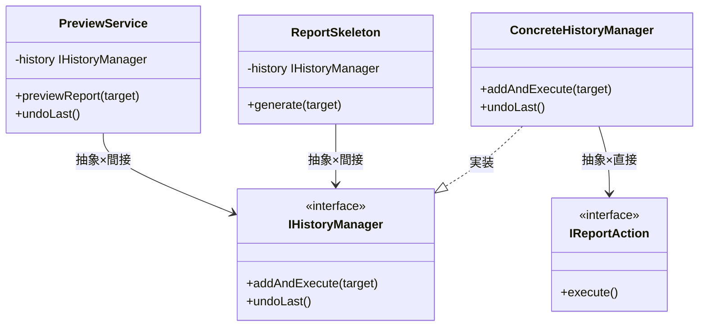

両クラスは抽象インターフェースのみを受け取り、具体的な履歴管理クラスへの依存が完全に排除されるため、`ConcreteHistoryManager` を別実装に差し替えてもコードの変更は不要となる。

> **注：** Step 4は概念提示用です。具体的な実装はフェーズ7で示します。

【コード例】

```cpp
// IHistoryManager インターフェース
class IHistoryManager {
public:
    virtual void addAndExecute(string target) = 0;
    virtual void undoLast() = 0;
};
```

```cpp
// IReportAction インターフェース
class IReportAction {
public:
    virtual void execute() = 0;
    virtual void undo() = 0;
};
```

```cpp
// ConcreteHistoryManager（履歴管理の具体実装）
class ConcreteHistoryManager : public IHistoryManager {
    vector<IReportAction*> history;
public:
    void addAndExecute(string target) override {
        cout << "[履歴] " << target << " を実行して記録。" << endl;
        // 実際にはtargetに応じてコマンドを生成して実行する
    }
    void undoLast() override {
        if (history.empty()) {
            cout << "[警告] アンドゥ対象がありません。" << endl;
            return;
        }
        cout << "[履歴] 直前の操作を取り消しました。" << endl;
    }
};
```

```cpp
// ReportSkeleton クラス（抽象HistoryManagerのみ知っている）
class ReportSkeleton {
    IHistoryManager* history; // ← 抽象：IHistoryManager*型で受け取る
public:
    ReportSkeleton(IHistoryManager* h) : history(h) {}
    void generate(string target) {
        cout << "[ReportSkeleton] " << target
             << " のレポートを生成。" << endl;
        history->addAndExecute(target);
        // ← 間接：HistoryManager経由のため具体クラスが見えない
    }
};
```

```cpp
// PreviewService クラス（同様に抽象HistoryManagerのみ知っている）
class PreviewService {
    IHistoryManager* history;
public:
    PreviewService(IHistoryManager* h) : history(h) {}
    void previewReport(string target) {
        cout << "[PreviewService] " << target
             << " のプレビューを生成。" << endl;
        history->addAndExecute(target);
    }
    void undoLast() {
        history->undoLast();
    }
};
```

```cpp
// main 関数（具体型を組み立てる唯一の場所）
int main() {
    ConcreteHistoryManager histMgr;
    ReportSkeleton gen(&histMgr);
    gen.generate("月次売上レポート");

    PreviewService preview(&histMgr);
    preview.previewReport("AddGraph");
    preview.undoLast();
    return 0;
}
```

両クラスとも抽象インターフェースのみを受け取るため、具体的な機能クラスへの依存が完全に排除される。

一文要約：呼び出し元→`IHistoryManager*`→具体実装という2段階の抽象型を経由するため、どの具体クラスが動くかは `main()` の組み立て部分だけが知っている。

**この形のトレードオフ：**

* 変更容易性：高（あらゆる層が独立して置換・拡張可能）


* テスト容易性：高（全ての部品が切り離し可能）


* 実装コスト：高（クラス数とインターフェースが大幅に増加する）

---

### どこまで設計を進めるべきか（採用ステップの決断）

それぞれのステップには一長一短があります。ステップ4の「抽象×間接（Template Method/Decorator/Commandの統合）」は極めて強力ですが、クラス数が激増し構造が複雑になる「初期投資コスト」もかかります。どこで止めるかは、**「今後の変更頻度（ビジネス要求）」**で決断します。

*   **Step 1（具体×直接）で止めるケース：** レポートの種類が現状の2つだけで、将来も絶対に増えない場合。
*   **Step 2（具体×間接）で止めるケース：** レポートの種類は増えるが、実行時の動的な装飾の組み合わせやUndo機能が不要な場合。
*   **Step 3（抽象×直接）で止めるケース：** 動的な装飾の組み合わせは必要だが、Undo機能が不要な場合。
*   **Step 4（抽象×間接）まで進むケース：** レポートの骨格を固定しつつ、動的な装飾の組み合わせが必要で、かつ操作のUndoまで求められる場合。

**今回の決断：**
フェーズ2のヒアリングで「レポートの基本フォーマットは全社統一の順序で出力したい（骨格固定）」、「部署ごとに独自の透かしや暗号化を自由に組み合わせたい（動的装飾）」、「誤操作時に元に戻したい（Undo）」という3つの独立した要件が求められています。レポート生成の骨格と機能拡張、そして操作履歴という異なる3つの責務が絡み合っているため、これらを個別にインターフェース化し抽象層を設ける**ステップ4（抽象×間接）まで進化させる**決断を下します。

> 実は、この章で選んだStep 4の構造には名前があります。**Template Method パターン × Decorator パターン × Command パターン** です。「パターンを学んで使い方を覚える」のではなく、「問題を分析した結果として自然に選ばれた構造」がこの3つのパターンの組み合わせだったという順序が大切です。

### どのパターンを使うかの判断基準

3つのパターンのどれを適用するか判断するための基準を整理します。以下のフローチャートを使うと、今の問題にどのパターンが必要かを順を追って確認できます。

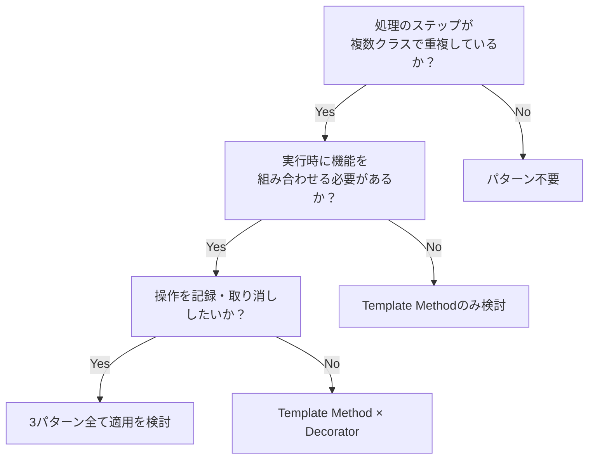

### 6-5：耐久テスト

フェーズ2のヒアリングで挙がった将来のリスクに対する耐性を確認します。

| **変更シナリオ** | **触る場所** | **コスト評価** |
| --- | --- | --- |
| 新しいレポート出力形式（HTML）を追加する | 新しい `ReportSkeleton` のサブクラスを追加 | 低 |
| 特定のレポート生成操作を「取り消し」可能にする | `IReportAction` 実装クラスの `undo()` に処理を追加 | 低 |
| 履歴の上限管理が必要になった | `ConcreteHistoryManager` 内のロジックだけを修正 | 低 |
| 再実行時のデータ選択（当時 vs 最新）が必要になった | `IHistoryManager` のインターフェース拡張のみ | 中 |

採用した複合設計では、新しい出力形式の追加は新しいクラスの実装に、操作取り消しは管理クラスの範囲に閉じるため、レポート生成の「骨格」には一切触れる必要がありません。

---

## 🟢 フェーズ7：対策実施 ―― 変化に強いコードを完成させる

フェーズ6の検討の結果、Step 4（抽象×間接）を採用しました。実装に入る前に、この構造の「名前」を確認しておきます。

**この構造は、Template Method（第4章で学んだTemplate Methodパターン） × Decorator（第6章で学んだDecoratorパターン） × Command（第5章で学んだCommandパターン） の複合パターンです。**

「定型フロー」「動的装飾」「操作の履歴化」という3つの課題を分析した結果として、この3つのパターンが自然に選ばれます。パターン名は「選ぶための呪文」ではなく、「問題を解決した結果についた名前」です。この実装を進めながら、3つのパターンがそれぞれどの責務を担っているかを確認していきましょう。

これらの構造は、第4章で学んだ**Template Methodパターン**（CSVインポート処理で「骨格は固定し、変わる部分だけをサブクラスに委ねる」構造）、第6章で学んだ**Decoratorパターン**（カスタマイズ注文システムで「機能を実行時に動的に重ねる」構造）、第5章で学んだ**Commandパターン**（家計簿アプリで「操作をオブジェクトとして記録・取り消す」構造）を組み合わせたものです。各パターンの詳細は各章を参照してください。

レポートの生成骨格と装飾機能、そして操作履歴の管理という3つの責務をそれぞれ独立したクラスへカプセル化します。

### 7-1：解決後のコード（全体）

レポートの生成骨格を Template Method で定義し、装飾機能を Decorator で重ね、生成操作自体を Command としてカプセル化しました。クラスを責務ごとに分割して示します。

**【抽象基底クラス】骨格とインターフェース**

```cpp
// IReportAction: 操作履歴のインターフェース（Command パターン）
class IReportAction {
public:
    virtual ~IReportAction() = default;
    virtual void execute() = 0;
    virtual void undo() = 0;  // ← 取り消し操作も契約に含める
};
```

```cpp
// ReportSkeleton: レポート生成の骨格（Template Method パターン）
class ReportSkeleton {
public:
    virtual ~ReportSkeleton() = default;
    void generate() {
        cout << "CSV読み込み" << endl;
        renderBody(); // ← 継承先で変化する部分だけをここに任せる
        cout << "フッター生成" << endl;
    }
    virtual void renderBody() = 0;
};
```

`ReportSkeleton` は「CSV読み込み → 本文生成 → フッター出力」という実行順序を固定します。本文の中身（`renderBody()`）だけが派生クラスに委ねられており、これが Template Method パターンの核心です。

**【具体実装クラス】基本レポート**

```cpp
// StandardReport: 基本レポートの本体（Template Method の具体実装）
class StandardReport : public ReportSkeleton {
public:
    void renderBody() override {
        cout << "本文を生成。" << endl;
    }
};
```

```cpp
// MonthlyReport: 月次レポートの本体
class MonthlyReport : public ReportSkeleton {
public:
    void renderBody() override {
        cout << "月次集計を本文として生成。" << endl;
    }
};
```

`StandardReport` と `MonthlyReport` は、それぞれ「本文の中身」だけを知っています。骨格（CSV読み込み・フッター）には一切触れません。

**【デコレータクラス】装飾機能**

```cpp
// ReportFeature: 装飾機能の基底クラス（Decorator パターン基底）
class ReportFeature : public ReportSkeleton {
protected:
    ReportSkeleton* wrapped; // ← 抽象基底クラス型 = 「抽象」の証拠
public:
    ReportFeature(ReportSkeleton* g) : wrapped(g) {}
};
```

```cpp
// GraphFeature: グラフ追加の装飾
class GraphFeature : public ReportFeature {
public:
    GraphFeature(ReportSkeleton* g) : ReportFeature(g) {}
    void renderBody() override {
        wrapped->renderBody();         // ← 内側の処理を先に呼ぶ
        cout << "グラフを追加。" << endl; // ← その後に自分の装飾を追加
    }
};
```

```cpp
// WatermarkFeature: 透かし追加の装飾
class WatermarkFeature : public ReportFeature {
public:
    WatermarkFeature(ReportSkeleton* g) : ReportFeature(g) {}
    void renderBody() override {
        wrapped->renderBody();
        cout << "透かしを追加。" << endl;
    }
};
```

`GraphFeature` と `WatermarkFeature` は、どちらも `wrapped->renderBody()` を呼んだ後に自分の処理を追加します。`new WatermarkFeature(new GraphFeature(new StandardReport()))` のように入れ子にすることで、装飾を自由に重ねがけできます。

**【コマンドクラス】操作の履歴化**

```cpp
// GenerateReportAction: レポート生成操作をオブジェクトとして記録
class GenerateReportAction : public IReportAction {
    ReportSkeleton* generator; // ← 生成対象を保持
    string outputPath;          // ← 生成先パスも記録（undo時に削除する）
public:
    GenerateReportAction(ReportSkeleton* g, string path)
        : generator(g), outputPath(path) {}
    void execute() override {
        generator->generate();
        cout << "[コマンド] " << outputPath
             << " に出力して履歴に記録。" << endl;
    }
    void undo() override {
        cout << "[コマンド] " << outputPath
             << " を削除してアンドゥ完了。" << endl;
    }
};
```

`GenerateReportAction` は「どのレポートを、どのパスに出力したか」という情報を持ちます。`undo()` を呼ぶことで、生成されたファイルを削除し操作を取り消せます。

**【BatchApplication】組み立てと履歴管理**

```cpp
// BatchApplication: 具体クラスを知っている唯一の場所
class BatchApplication {
    vector<IReportAction*> history; // ← 実行済みコマンドを積み上げる
public:
    void run() {
        // 装飾を重ねてレポートを組み立てる
        ReportSkeleton* gen =
            new WatermarkFeature(
                new GraphFeature(
                    new StandardReport()));

        // 操作をコマンドとして記録・実行
        IReportAction* action =
            new GenerateReportAction(gen, "monthly_report.pdf");
        action->execute();
        history.push_back(action); // ← 履歴に追加

        // アンドゥのデモ
        if (!history.empty()) {
            history.back()->undo();
            history.pop_back();
        }
    }
};
```

```cpp
// main: BatchApplicationを起動するだけ
int main() {
    BatchApplication app;
    app.run();
    return 0;
}
```

この実装により、`ReportSkeleton` の骨格を変更することなく、装飾（グラフ・透かし）の追加や順序の入れ替えが可能になりました。また、`GenerateReportAction` の `undo()` によって、動作例テーブルの「アンドゥ操作」も実現しています。

**動作図（シーケンス図）：**

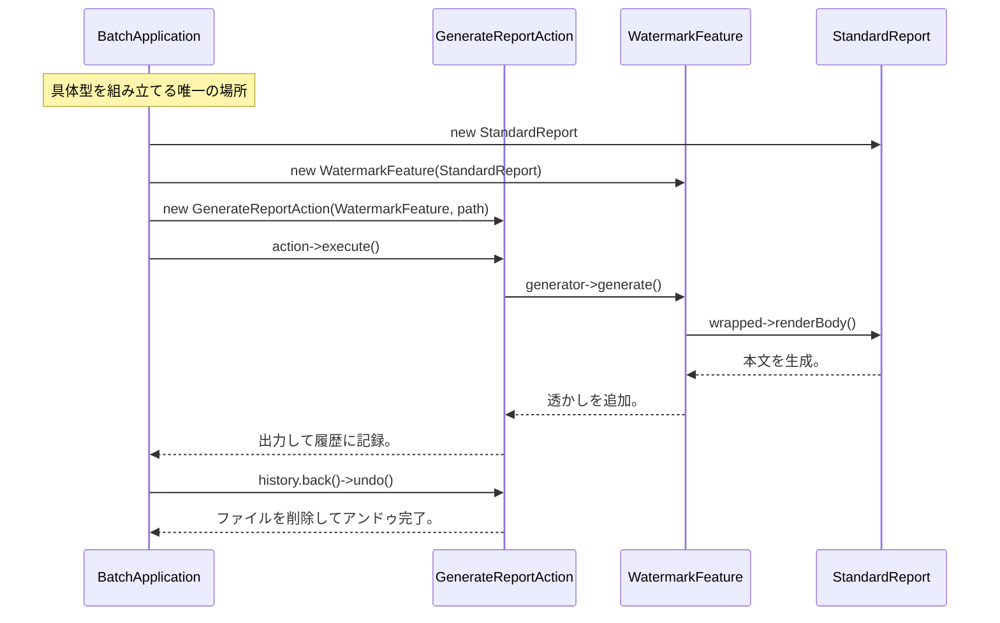

**実行結果：**

```text
CSV読み込み
本文を生成。
グラフを追加。
透かしを追加。
フッター生成
[コマンド] monthly_report.pdf に出力して履歴に記録。
[コマンド] monthly_report.pdf を削除してアンドゥ完了。
```

動作例テーブルの「ヘッダー付き・透かし付きでPDF出力」と「レポート生成後にキャンセル操作」の両方がこの出力で実現されています。

### 7-2：変更影響グラフ（改善後）

フェーズ3で行った「グラフ追加」や「履歴保存」の変更を試みた際の構造を確認します。

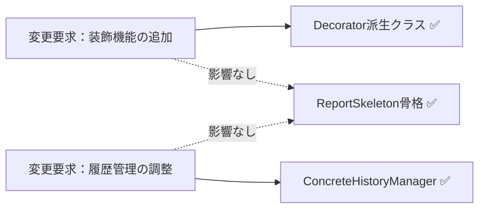

→ フェーズ3のグラフと比較して、装飾機能の追加は Decorator クラスの実装だけで完結し、バッチ本体の生成骨格（`ReportSkeleton`）への飛び火がなくなりました。

### 7-3：変更シナリオ表

本設計により、個別の変更がシステム全体に及ぶリスクを大幅に低減しました。

| **シナリオ** | **変わるクラス（触る場所）** | **変わらないクラス** |
| --- | --- | --- |
| グラフの描画内容を変更する | `GraphFeature` | `ReportSkeleton`, `ConcreteHistoryManager` |
| 新しいレポート形式を追加する | 新規の `ReportSkeleton` サブクラス | `ReportFeature`, `IReportAction` |
| 履歴保存のフォーマットを変える | `ConcreteHistoryManager` | `ReportSkeleton`, `IReportFeature` |

機能追加のたびにクラスが増えるという「構造の複雑化」というコストは受け入れましたが、変更が個別のクラスに閉じ、全体の安定性が劇的に高まりました。 これこそが、設計の真の価値です。

---

### 7-4：接続形態の確認 ── この設計はどの接続か

フェーズ4-3で診断した通り、変更前のコードは **具体×直接** の状態でした。
採用した Template Method × Decorator × Command パターンでは、接続形態が **抽象×間接（Type-C変換アダプタ経由）** へと変化しています。

**「抽象×間接」の証拠となるコード：**

```cpp
class ReportFeature : public ReportSkeleton {
protected:
    ReportSkeleton* wrapped; // ← 抽象基底クラス型 = 「抽象」の証拠
public:
    ReportFeature(ReportSkeleton* g) : wrapped(g) {}
};
```

```cpp
class GraphFeature : public ReportFeature {
    void renderBody() override {
        wrapped->renderBody(); // ← wrapped 経由のチェーン = 「間接」の証拠
        cout << "グラフを追加" << endl;
    }
};
```

- `ReportSkeleton* wrapped` の型が抽象基底クラス（純粋仮想メソッド `renderBody()` を持つ）→ **「抽象」** の証拠
- `wrapped->renderBody()` はデコレータチェーンを経由した間接呼び出し → **「間接」** の証拠

「骨格を変えずに機能を動的に追加・差し替えたいかつデコレータチェーンという仲介構造が必要」という動機から、**抽象×間接** が選ばれました。

第11章では、レポート生成という「処理の定型（骨格）」と「個別の装飾機能」、そして「操作の履歴管理」が絡み合う複雑なシステムを題材に、複数のパターンを組み合わせた設計を体験しました。

### 整理：7フェーズとこの章でやったこと

| **フェーズ** | **この章でやったこと** |
| --- | --- |
| 🔵 フェーズ1：現状把握 | `ReportSkeleton` にすべての責務が集中している現状を観察した。 |
| 🟣 フェーズ2：仮説立案 | 「骨格の分離」と「機能の拡張」を仮説立てた。 |
| 🟣 フェーズ3：問題特定 | 機能追加のたびに生成フロー全体が不安定になる「痛み」を確認した。 |
| 🟠 フェーズ4：原因分析 | 処理手順と個別機能の「混在」という構造的問題を特定した。 |
| 🟡 フェーズ5：課題定義 | 骨格・装飾・履歴管理という3つの接続点を課題として定義した。 |
| 🔴 フェーズ6：対策検討 | 4ステップを比較し、抽象×間接のStep 4を採用。Template Method × Decorator × Command の複合適用と命名した。 |
| 🟢 フェーズ7：対策実施 | 責務を疎結合化し、変更影響をクラス単位に閉じ込めた。 |

### 各クラスの最終的な責任

| **クラス名** | **責任（1文）** | **変わる理由** |
| --- | --- | --- |
| `ReportSkeleton` | レポート生成の「骨格（定型フロー）」を定義する。 | レポートの出力順序が変わる場合 |
| `ReportFeature` | 個別の装飾機能（グラフ・ロゴ）を動的に追加する。 | 装飾のルールが変わる場合 |
| `IReportAction` | レポート生成操作を履歴として保持・管理する。 | 履歴管理要件が変わる場合 |

> **このプロセスを回した結果にたどり着いた構造こそが Template Method × Decorator × Command の複合パターン です。**
> 

### 使ったパターン × 解消した根本原因

| パターン | 解消した根本原因 |
|---|---|
| Template Method | 骨格処理の重複（各レポート形式に同じステップが散在していた問題）|
| Decorator | 機能の動的重ねがけ（機能組み合わせが増えるたびクラスが爆発していた問題）|
| Command | 操作の記録化（操作履歴の管理がビジネスロジックに混在していた問題）|

### 振り返り：「この章を読むと得られること」は手に入ったか

| **得られること** | **この章のどこで示したか** |
| --- | --- |
| 得られること1 | フェーズ2の確定テーブルで、変動軸を識別した。 |
| 得られること2 | フェーズ5で、骨格と拡張、操作履歴という独立した接続点を特定した。 |
| 得られること3 | フェーズ7の変更シナリオ表で、責務分離による局所化を実証した。 |

### 振り返り：3つの設計原則はどう適用されたか

* **原則1「変わるものをカプセル化せよ」の現れ**
* **具体化された場所：** 各 `Decorator` クラスと `IReportAction` の実装クラス
* **解説：** 個別の装飾機能や操作履歴ロジックを、生成骨格とは別のクラスにカプセル化しました。


* **原則2「実装ではなくインターフェースに対してプログラムせよ」の現れ**
* **具体化された場所：** `IReportFeature` インターフェースと `IHistoryManager` インターフェース
* **解説：** 骨格部は具体的な装飾クラスを知らず、インターフェース経由で機能を呼び出すようにしました。


* **原則3「継承よりコンポジションを優先せよ」の現れ**
* **具体化された場所：** `ReportFeature` が `ReportSkeleton` を保持する構成
* **解説：** 機能を継承で追加するのではなく、Decorator をコンポジション（保持）することで動的に組み合わせました。


---

### あなたのコードで考えてみてください

この章で辿った思考プロセスを、あなた自身のコードに当てはめてみましょう。

1. **骨格の兆候を探す：** あなたのコードに「処理の流れ（順序）は共通だが、各ステップの中身が種類によって異なる」クラスがありますか？そこでコピーペーストが増えていませんか？
2. **機能追加の痛みを測る：** 既存の処理に「ある条件のときだけ前処理を挟む」要件が来たとき、既存クラスに手を入れる必要がありますか？何行変更しますか？
3. **操作の逆転を想像する：** ユーザーの操作を「取り消す」機能を後から追加するとしたら、今の構造では何が変わりますか？操作をオブジェクトとして保存する仕組みはありますか？
4. **パターンの必要性を問う：** 「骨格の固定」「機能の動的追加」「操作の取り消し」は、あなたのシステムで本当に必要ですか？3つのうち2つ以上が必要なら、複合パターンを検討するサインです。

---

### パターン解説：複合適用

今回は単一のパターンではなく、以下の3つを組み合わせて課題を解決しました。

#### パターンの骨格

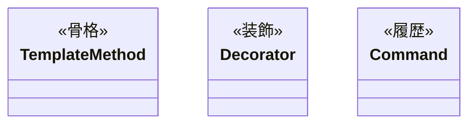

Template Method が処理の「固定された手順」を守り、Decorator がその上で「追加機能」を被せ、Command が「実行履歴」を管理することで、密結合していた責務を完全に分離しています。

#### 使いどころと限界

* **使いどころ**：生成順序が厳格な処理、機能追加の組み合わせが膨大なレポート・レポート生成エンジンなど。


* **限界**：機能追加がほとんどない単純な生成処理では、パターンによる複雑化が勝ってしまいます。


【過剰コード：変化の予定がないものまでパターン化した例】

```cpp
// 【過剰コード例】処理が一切変わらないのに3パターンを全適用した場合

// TemplateMethod: 骨格固定（でも実際に変わる骨格がない）
class AbstractFixedReport {
public:
    void generate() {
        readData();
        buildContent(); // ← 常にこの1つしか使わない
        output();
    }
protected:
    virtual void buildContent() = 0;
    void readData()  { cout << "データ読み込み" << endl; }
    void output()    { cout << "出力完了" << endl; }
};

// Decorator: 装飾の追加（でも装飾の組み合わせが変わらない）
class FixedReport : public AbstractFixedReport {
protected:
    void buildContent() override {
        cout << "固定コンテンツ生成" << endl;
    }
};

// Command: 操作の記録（でもundoが不要）
class GenerateFixedReportAction {
    FixedReport report;
public:
    void execute() { report.generate(); }
    void undo()    { /* 何もしない：固定レポートにundoは不要 */ }
};
// → 3パターン全て使ったが、変わる理由がないためメリットがゼロ
// → FixedReport::generate() を直接呼ぶだけで十分だった
```


