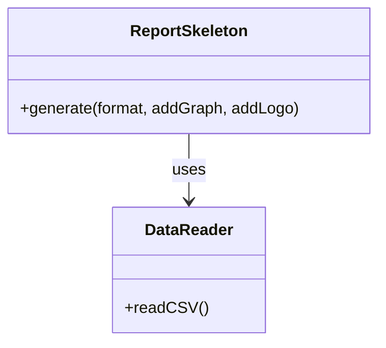
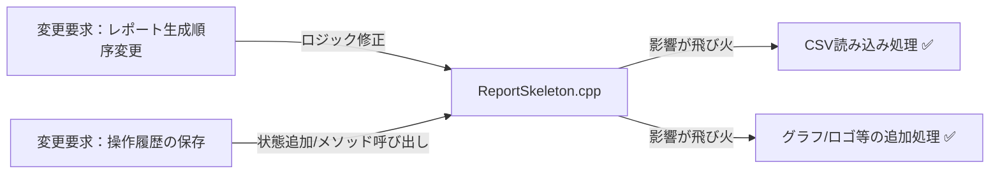
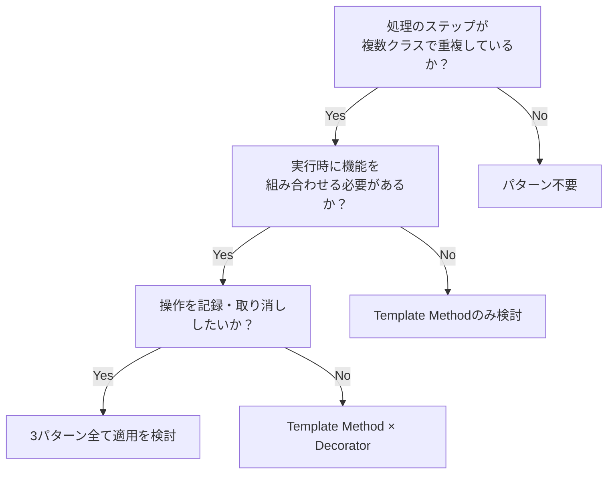
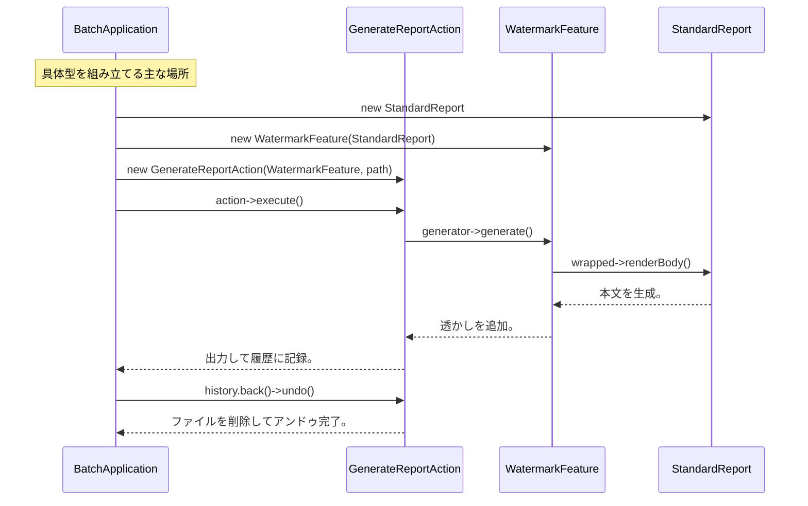
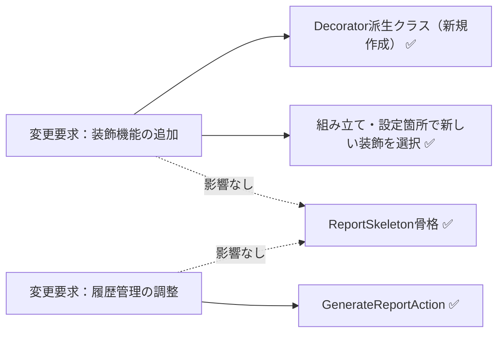
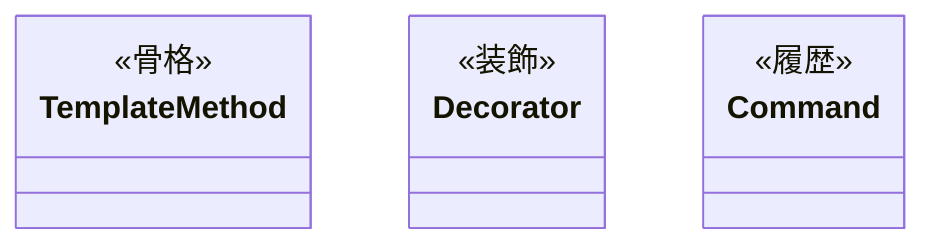

## 第11章 レポート生成エンジン ―― Template Method × Decorator × Command パターン

―― 思考の型：処理の定型化と機能拡張、そして実行履歴をどう両立させるか

これまでの章ではパターンを1章1つで体験した。この章では3つの変化軸が混在した問題に同じ思考プロセスを使う。

### この章の核心

**定型的な処理の中に、個別の出力形式や機能追加が混在するレポート生成エンジンにおいて、これらを継承や単純な条件分岐で解決しようとすると、処理ステップの固定化とクラスの過剰な肥大化を招く。**

### この章を読むと得られること

* **得られること1：** 処理の骨格、機能追加、操作履歴という異なる「変わる理由」を識別できるようになる。

* **得られること2：** 処理ステップの固定化と、個別の機能拡張のバランスが崩れている接続点（クラスとクラスのつなぎ目）を特定できるようになる。

* **得られること3：** 複数の仕組みを組み合わせることで、複数の変化軸を持つロジックを段階的に分離・局所化する手法を説明できるようになる。

* **得られること4：** 「処理の定型化」と「機能の動的追加」が入り混じる現場の難しさを理解する視点。

---

## 🔵 フェーズ1：現状把握 ―― 仕様を整理し、システムと紐付ける

### 1-1：このシステムの仕様

このシステムは、企業の売上データを分析し、経営層向けに週次レポートを自動生成する「レポート生成エンジン」です。現場の営業担当者が入力したCSV形式の売上データを取り込み、指定されたレイアウトでPDFやExcel形式のレポートを出力します。

リリース当初は「基本統計（合計・平均）」を表示するシンプルなレポート機能のみでした。しかし、分析の深度が増すにつれ、「特定の部署ごとのグラフを追加してほしい」「レポートのヘッダーにロゴを埋め込んでほしい」「出力形式をHTMLにも対応させてほしい」といった要望が次々と舞い込むようになりました。

現在の構造では、レポート生成の手順が `main` 相当のクラスにハードコードされています。

**対応するレポート種別・出力形式**

| レポート種別 | 内容 | 出力形式 |
|---|---|---|
| 週次レポート | 週ごとの売上集計 | PDF・Excel |
| 月次レポート | 月ごとの売上集計 | PDF・Excel |
| 部門別レポート | 部門ごとの売上集計 | PDF・Excel |

**装飾機能の一覧**

| 機能 | 内容 | 要件定義の担当 |
|---|---|---|
| グラフ追加 | 部署別・期間別のグラフをレポートに挿入する | 分析チーム |
| ロゴ埋め込み | レポートのヘッダーにロゴ画像を挿入する | 広報チーム |
| 透かし追加 | 「社外秘」等の透かしをページ全体に適用する | 広報チーム |

装飾は複数を組み合わせて重ねることができます（例：グラフ＋透かし）。

**レポート生成の処理ステップ**

| ステップ | 処理内容 |
|---|---|
| ① データ取得 | CSV形式の売上データを読み込む |
| ② 集計 | 合計・平均などの基本統計を算出する |
| ③ 装飾適用 | グラフ・ロゴ・透かしを順に重ねる（組み合わせ自由） |
| ④ 出力 | 指定の形式（PDF / Excel）でファイルを書き出す |

**このシステムの関係者**

| 役割 | 担当者 | 管轄する知識 |
|---|---|---|
| グラフ機能の要件定義 | 分析チーム | グラフの種類・表示条件・データ集計ルール |
| ロゴ・透かし機能の要件定義 | 広報チーム | ブランドガイドライン・ロゴ配置・透かし仕様 |

### 1-2：動作例テーブル

コードを読む前に、このシステムがどんな入力に対してどんな出力を返すかを確認します。次の表は、フェーズ7の最終コードで実現する動作です。

| 操作 | 入力・条件 | 期待される出力・結果 |
| --- | --- | --- |
| 月次売上レポートをPDF出力 | レポート種別：月次、出力形式：PDF | PDFファイルが生成される |
| 月次売上レポートをExcel出力 | レポート種別：月次、出力形式：Excel | Excelファイルが生成される |
| グラフ付き・透かし付きでPDF出力 | 月次レポート＋グラフ装飾＋透かし装飾＋PDF出力 | 装飾が重ねて適用されたPDFが生成される |
| レポート生成後にキャンセル操作 | 月次レポートを生成→直後にアンドゥ実行 | アンドゥが走り、生成されたファイルが削除される |
| バッチで3レポートを一括生成 | 週次・月次・部門別の3種を順に一括実行 | 3ファイルが生成され、履歴に3コマンドが追加される |
| グラフ含むレポート生成全体をアンドゥ | グラフ付き月次レポートを生成→直後にアンドゥ実行 | アンドゥが走り、生成されたファイル（グラフ含む）が削除される |

この6行が、この章で設計するシステムの「正解の動き」です。ただし、途中のステップはすべての動作を実現する完成版ではありません。責任を段階的に分け、各構造がどの要求まで扱えるかを比較します。

| 段階 | 主に確認する動作 |
|---|---|
| 現状〜ステップ3 | 基本的なレポート生成と、具体クラスへ分けた場合の限界 |
| ステップ4 | PDF・Excelなど、骨格を共有した出力形式の追加 |
| ステップ5 | グラフ・透かしなど、装飾の動的な組み合わせ |
| ステップ6〜フェーズ7 | Undo、バッチ実行を含む6動作すべて |

したがって、途中では未実装の行があっても構いません。最終コードで表の6動作が同じ構造上にそろうことを確認します。

次は仕様とクラスを対応づけます。

**このシステムの登場クラス**

| クラス名 | 役割 | 担当する仕様 |
|---|---|---|
| ReportSkeleton | レポートの全生成処理 | レポートのヘッダー・フッター生成と、グラフやロゴの追加制御 |
| DataReader | データ読み込み | CSV等からの基本データ読み込み処理 |

---

### 1-3：クラス構成図

コードを読んだところで、クラス間の関係を図で整理します。



> **注記：** `addGraph` と `addLogo` は独立したメソッドではなく、`generate()` の引数として渡されるフラグです。グラフ追加・ロゴ追加の処理は `generate()` 内部の `if` 分岐で行われており、1-3節の実装コードで確認できます。

`ReportSkeleton` クラスが、データの読み込み、レポート生成のステップ管理、そして個別のグラフィック追加処理という、異なる3つの責務をすべて抱えています。

---

### 1-4：実装コード（現状）

システムの現状の実装を確認します。コードを役割ごとに分けて読んでいきます。

#### データ読み込みクラス

はじめにCSVデータを読み込む補助クラスから見てみます。

```cpp
#include <iostream>
#include <string>
#include <vector>
#include <fstream>
#include <cstdio>
#include <memory>
#include <stdexcept>
#include <utility>

using namespace std;

class DataReader {
public:
    void readCSV() { cout << "CSVデータ読み込み完了。" << endl; }
};
```

`DataReader` は純粋なデータ読み込みの入れ物です。レポート生成ロジックは一切ありません。

#### レポート生成統括クラス

次に、レポートの全生成処理を担うクラスを見ます。

```cpp
// レポート生成統括（処理の手順と個別の機能が混在）
class ReportSkeleton {
    DataReader reader;
public:
    void generate(string format, bool addGraph, bool addLogo) {
        reader.readCSV();
        cout << format << "形式でレポートのヘッダーを生成。" << endl;
        if (addGraph) cout << "グラフを追加。" << endl;
        if (addLogo) cout << "ロゴを追加。" << endl;
        cout << format << "形式でレポートのフッターを生成。" << endl;
    }
};
```

このクラスが今章の中心です。`generate` メソッドの中に「レポート生成の骨格（ヘッダー・フッター生成）」と「個別の機能追加（グラフ・ロゴ）」が一緒に書かれていることを確認しておいてください。

#### 呼び出し元と実行確認

```cpp
int main() {
    ReportSkeleton gen;
    gen.generate("PDF", true, false);
    return 0;
}
```

上記コードの実行結果：

```
CSVデータ読み込み完了。
PDF形式でレポートのヘッダーを生成。
グラフを追加。
PDF形式でレポートのフッターを生成。
```

動作例テーブルの行1（月次・PDF出力）と整合しています。次のフェーズで変更が来たときに何が起きるかを確認します。

---

### 1-5：変更要求

【プロダクトオーナーと営業部からの要求】
ある水曜日の昼下がり、レポート生成システムのプロダクトオーナーから相談を受けました。

「お疲れ様。今度、役員向けに『月次レポート』を出力する機能を追加したいんだ。グラフやロゴの挿入といった既存の機能はそのまま使えるはずだけど、出力のステップを少し細かく制御したい。また、作成したレポートを後から『やり直し』ができるようにしたいという要望が営業部から出ていてね。レポートの生成履歴を保存して、特定の過去時点の状態を再実行したり、取り消したりすることはできるかな？」

今回は「処理のステップ制御」という新しい要件と、「操作履歴の保存・再実行」という二つの大きな軸が加わるわけですね。今の `ReportSkeleton` は、処理の流れが固定された上で、追加機能がハードコードされています。

**仕様変更の内容**

変更要求を受けて、現在の構造がどう変わるかを整理します。

| 変更項目 | 変更前 | 変更後 |
|---|---|---|
| レポートの生成ステップ | `generate()` に固定ハードコード | ステップを外から制御できるようにする |
| 機能の装飾（グラフ・ロゴ等） | `if` フラグで生成メソッドに混在 | 実行時に動的に組み合わせられるようにする |
| **操作履歴（新規）** | — （なし） | **生成操作をオブジェクトとして記録・取り消し可能にする** |

フェーズ1でシステムの現状と変更要求が把握できました。次のフェーズ2では、「何が変わり、何が変わらないか」を整理します。

## 🟣 フェーズ2：仮説立案 ―― 何が変わるかを観察し、ヒアリングで裏付ける

### 2-1：`ReportSkeleton`に混在している知識と担当チーム

`ReportSkeleton.generate()` が現在抱えている知識と、それぞれを変更するチームを確認します。

| 知識（コードが直接持っているもの） | 変更を決めるチーム | 適切か |
|---|---|---|
| レポートの生成手順（骨格） | 全体設計担当 | ✅ |
| グラフ追加の条件と処理 | 分析チーム | ❌ 混在 |
| ロゴ追加の条件と処理 | 広報チーム | ❌ 混在 |

❌が2つある。分析チームがグラフの仕様を変えるたびに、レポートの骨格を持つクラスに手が入ります。これが後の変更の痛みの予兆です。

### 2-2：今回の変更で確実に変わること

今回の変更要求から確定している変更は2点です。

- **レポート生成のステップ制御**：ステップの順序や構成を外から制御できるようにする
- **操作履歴の追加**：生成操作をオブジェクトとして保持し、取り消し・再実行できるようにする

ただし「この変更が1回限りか、今後も続くか」によって、どこまで設計を変えるべきかが大きく変わります。関係者に確認します。

### ヒアリングに向けた背景確認

このシステムは、ある中堅企業の経営分析レポートを担っています。数年前にサービスが立ち上がった当初は、売上合計と平均を表示するだけのシンプルなものでした。

しかし、経営層の分析ニーズが高まるにつれ、グラフや部署別内訳など、様々な装飾や追加機能が求められるようになりました。現在は機能ごとに `if` フラグで条件分岐を追加しており、コードは日々肥大化しています。

### 2-3：関係者ヒアリング

> **現実のヒアリングでは——** 本書のヒアリングシーンでは設計判断を明確にするため、意図的に「理想的な回答」が返ってくるように描いています。これはシミュレーションです。現実には、「変わるかどうか分からない」「たぶん変わらない」という曖昧な答えが返ることも多いです。そのときは `git log` や過去 of 障害記録を「ヒアリングの代わり」として使ってみてください。「過去に何度変わったか」が最も正直な証拠です。

- **開発者：** 「レポートの生成フローについてですが、今後、例えば『ロゴを先に出す』あるいは『グラフを省略する』といった順序の変更は発生しますか？」
- **運用担当者：** 「部署ごとにそのニーズはあるね。基本は同じ手順なんだけど、特定のレポートだけステップを変えたいケースがあるんだよ。」
- **開発者：** 「操作履歴についても確認させてください。過去のレポート生成処理をやり直す際、当時使ったCSVデータも再読み込みする必要があるでしょうか？」
- **運用担当者：** 「そうだな、当時のデータで再実行したい場合もあれば、最新データで再生成したい場合もある。つまり、生成の操作自体を『履歴』として保持し、必要に応じて『再発行』したいんだ。」
- **開発者：** 「分かりました。生成フローの骨格は守りつつ、個別のステップや生成操作の履歴管理を独立して扱える構造が必要そうですね。」

### 2-4：ヒアリングで判明した将来リスク

ヒアリングで浮かび上がった「確定ではないが、近い将来起こりうる変化」を記録します。これは今回の設計判断の材料です。

| **将来リスク** | **時期の目安** | **根拠** |
| --- | --- | --- |
| 再実行データの選択（当時のCSV vs 最新データ）が変わる可能性 | 継続的に | 「場合によって両方あり得る」と運用担当者から言及 |
| 出力形式の追加（PDF・Excel以外にHTMLなど） | 数ヶ月後 | 「将来的にはあるかもしれない」と言及 |
| 履歴の上限管理が必要になる可能性 | 運用が積み上がった後 | 「運用で積み上がると管理が大変」と言及 |

フェーズ2で「今変わること（確定）」と「将来変わるかもしれないこと（リスク）」を分けて整理できました。次のフェーズ3では、現在の構造で変更を試みたときに何が起きるかを確認します。

---

## 🟣 フェーズ3：問題特定 ―― 変更の痛みを発見する

### 3-1：変更を試みる

フェーズ2で確定した「レポートの実行順序の変更」と「操作履歴（再実行機能）の追加」を、今の `ReportSkeleton` クラスに対して実装してみます。

はじめに、レポート生成の手順を柔軟にするために、`generate` メソッド内のハードコードされたステップを順次 `if` 文で分岐させます。次に、レポート生成の操作をやり直すために、実行したパラメータや順序を保持する別のクラス `ReportHistoryManager` を作成し、`ReportSkeleton` の内部から呼び出すようにします。

`generate` メソッドの中には、「レポート生成の骨格」「グラフ追加機能」「ロゴ追加機能」、さらに「履歴保存ロジック」という性質の異なるコードが集まっています。グラフの描画条件を変える際にも、履歴保存のタイミングまで影響を確認しなければなりません。変更箇所を検索し、関係する処理を読み解く負担が増え始めています。

実際に変更を加えたコードは次のようになります。

```cpp
class DataReader {
public:
    void readCSV() {
        std::cout << "CSVを読み込み" << std::endl;
    }
};

class ReportHistoryManager {
    std::vector<std::string> log;
public:
    void record(std::string op) {
        log.push_back(op);
        std::cout << "[履歴記録] " << op << std::endl;
    }
    void replay() {
        for (int i = 0; i < (int)log.size(); i++) {
            std::cout << "再実行: " << log[i]
                      << std::endl;
        }
    }
};

// 変更後の ReportSkeleton（履歴管理を追加した状態）
class ReportSkeleton {
    DataReader reader;
    ReportHistoryManager history; // ← 追加
public:
    void generate(std::string format,
                  bool addGraph, bool addLogo) {
        reader.readCSV();
        std::cout << format << "形式でヘッダーを生成"
                  << std::endl;
        if (addGraph)
            std::cout << "グラフを追加" << std::endl;
        if (addLogo)
            std::cout << "ロゴを追加" << std::endl;
        std::cout << format << "形式でフッターを生成"
                  << std::endl;
        // 履歴記録がここに混在してしまっている
        std::string rec = format;
        if (addGraph) rec += "+Graph";
        history.record(rec); // ← 追加
    }
    void replay() { history.replay(); }
};

int main() {
    ReportSkeleton gen;
    gen.generate("PDF", true, false);
    std::cout << "---" << std::endl;
    gen.replay();
    return 0;
}
```

実行結果：

```
CSVを読み込み
PDF形式でヘッダーを生成
グラフを追加
PDF形式でフッターを生成
[履歴記録] PDF+Graph
---
再実行: PDF+Graph
```

動作は正しくなっています。しかし `generate()` の末尾に履歴記録のコードが混入しており、レポート生成ロジックと操作履歴管理が同じメソッドに同居しています。

### 3-2：変更影響グラフ

今の構造で変更を試みた際の、依存関係の飛び火を可視化します。



`ReportSkeleton` という一つのクラスに、レポート生成という「処理の定型」と、個別機能という「可変部分」、そして履歴という「操作管理」が混在しているため、変更がクラス内のあちこちに飛び火する構造になっています。

### 3-3：痛みの言語化

**1つ目：処理の手順が「固定化」されていることの限界。** グラフやロゴといった個別の装飾機能が、レポート生成という共通の骨格と同じ場所に記述されているため、装飾の有無や順序を変えるだけで、全体の生成フローをすべて書き換えなければなりません。

**2つ目：操作履歴という「管理責務」の混入。** 本来、レポートの生成処理はデータをレポートにするだけで完結する必要があるのに、操作の履歴を取るという「管理機能」が、生成ロジックと密接に絡み合っています。これにより、生成ロジックをリファクタリングしようとすると、履歴管理の仕組みまで引きずり回されるという、不安定になりがちです。

フェーズ3で「変更が辛い」ことが確認できました。次のフェーズ4では、なぜ辛いのかを構造的に言語化します。

---
> **📌 問題（確定）**
> レポート生成エンジンでは、「処理の骨格（生成順序）」「装飾機能（グラフ・ロゴ等）」「操作履歴（undo）」という、それぞれ異なる理由で変わる3つのものが `ReportSkeleton` の1メソッドに同居している。骨格を変えようとすると装飾に波及し、履歴管理を足そうとすると骨格を読み解く必要が生じる。これら3つの変化軸が同じ場所にある限り、「1つを直すと別の何かが壊れる」という痛みは繰り返す。
---

フェーズ4では「なぜその混在が辛いのか」を、コードの構造で言語化します。

## 🟠 フェーズ4：原因分析 ―― なぜ辛いのかを構造で言語化する

### 4-1：痛みの根源を探る（観察と原因）

フェーズ3で確認した「変更の辛さ」は、コードのどこから来ているのでしょうか。コードを注意深く観察すると、痛みを引き起こしている3つの事実が浮かび上がってきます。

第一に、新しいレポート形式を追加するとき、なぜ毎回 `ReportSkeleton` を開かなければならないのでしょうか？ それは、このクラス自身が「CSV読み込み → ヘッダー → グラフ/ロゴ → フッター」という**具体的な処理の骨格をすべて直接知ってしまっている（抱え込んでいる）**からです。

第二に、グラフやロゴの組み合わせを変えたいとき、なぜ骨格コードを触る必要があるのでしょうか？ それは、「どの装飾を加えるか」という機能拡張の判断が、骨格の中に `if` フラグとして直接埋め込まれているからです。

第三に、操作履歴の管理がなぜ辛いのでしょうか？ それは、「レポートを生成する」という操作の記録が、生成ロジックそのものの中に混在しているからです。

この「症状（痛み）」と「根本原因」を整理すると、以下のようになります。

| **根本原因** | **内容** | **解消する方向** |
| --- | --- | --- |
| 根本原因A：骨格処理の固定化 | 処理ステップが各クラスに重複している | 骨格の分離で解消 |
| 根本原因B：機能の動的重ねがけ | 装飾の組み合わせが増えるたびクラスが爆発 | 装飾の部品化で解消 |
| 根本原因C：操作の記録化 | 操作履歴の管理がビジネスロジックに混在 | 操作のオブジェクト化で解消 |

これら3つの根本原因は**それぞれ独立した変化軸**です。

- 「どんな手順でレポートを生成するか」（骨格）が変わっても、「どの装飾を加えるか」は変わりません
- 「どの装飾を加えるか」が変わっても、「操作を記録・取り消しできるか」には影響しません
- 「操作の記録・取り消し」が変わっても、生成手順や装飾の種類は変わりません

3つが独立しているからこそ、1つのパターンだけでは解決しきれません。

### 4-2：変わるもの/変わってほしくないもの

> **「変わらないもの」と「変わってほしくないもの」は異なります。** 「変わらないもの」は経験的事実（今まで変わっていない）、「変わってほしくないもの」は設計意図（ここを安定させてほかを守りたい）です。ここで整理するのは後者です。

| **変わり続けるもの（🔴）** | **変わってほしくないもの（🟢）** |
| --- | --- |
| レポート生成の手順や追加機能の組み合わせ | データ読み込みという基本的な前処理手順 |
| 個別の操作実行履歴（保存・再実行・取り消し） | レポートを出力するという「処理の骨格（定型フロー）」 |

**【変わる部分（変わり続けるif文と装飾フラグ）】**
```cpp
        if (addGraph) cout << "グラフを追加。" << endl;
        if (addLogo)  cout << "ロゴを追加。" << endl;
        // ← 装飾が増えるたびにここにコードが追加される
```

**【変わらない部分（不変の骨格）】**
```cpp
        reader.readCSV();                              // 常に最初
        cout << format << "形式でヘッダーを生成。" << endl;
        // ... (ここに変わる部分が入る) ...
        cout << format << "形式でフッターを生成。" << endl; // 常に最後
```

### 4-3：接続点に漏れている3つの知識を確認する

現在の `ReportSkeleton` は、すべての処理を自分自身の中に直接抱え込んでいます。

**【骨格へ装飾と履歴の知識が漏れているコード】**
```cpp
class ReportSkeleton {
public:
    void generate(string format, bool addGraph, bool addLogo) {
        // 骨格・装飾・履歴がすべて同じメソッドに混在
        reader.readCSV();
        cout << format << "形式でヘッダーを生成。" << endl;
        if (addGraph) cout << "グラフを追加。" << endl; // ← 具体的な機能名を直接知っている
        if (addLogo)  cout << "ロゴを追加。" << endl;
        cout << format << "形式でフッターを生成。" << endl;
    }
};
```

`ReportSkeleton`が、処理の順序だけでなく装飾の種類と履歴記録の方法まで知っています。接続点を「誰が相手の知識を持つか」という観点で見ると、骨格クラスが装飾名・適用条件・履歴記録のタイミングまで判断していることが分かります。

| 確認する接続点 | 現在の状態 | 変更時に起きること |
|---|---|---|
| 骨格 → 装飾 | `addGraph`や`addLogo`の条件と機能名を知る | 装飾追加のたびに骨格を変更する |
| 骨格 → 履歴 | 生成処理の中で履歴記録のタイミングを知る | 履歴要件の変更が生成手順へ波及する |
| 呼び出し側 → 骨格 | 書式・装飾条件を引数の組み合わせで渡す | 組み合わせが増えるほど呼び出し規約が複雑になる |

「定型的なフロー」と「機能追加」、「操作の記録」という3つの責務は、それぞれ異なる理由で変更されます。一つのクラスで管理し続ける案と、責任を分ける案のコストを比較する価値があります。本章では、確認した変更頻度を踏まえて後者を選びます。

フェーズ4で根本原因が言語化できました。分けるべき場所（変わる理由が異なる3つのもの）が特定できた段階です。しかし「どこを分けるか」は分かっても、「何を（どの塊を）取り出せばいいか」はまだ曖昧です。次のフェーズ5では、この「取り出すターゲット」を具体的に特定します。

---
> **📌 原因（確定）**
> `ReportSkeleton` が「処理の骨格」「装飾の判定（if文）」「操作の記録」という3つの知識をすべて直接抱え込んでいる。骨格の変更頻度・装飾の変更頻度・履歴要件の変更頻度はそれぞれ異なるため、この変化の速度差が噛み合わない状況でこの依存関係を維持するコストが膨らみ続ける。1つのクラスに複数の変化速度が混在していることが、修正の痛みの根本原因である。
---

変化の速度が違う3つのものが同居していることは分かりました。フェーズ5では「では何を外に出すか」というターゲットを具体的に特定します。

## 🟡 フェーズ5：課題定義 ―― 接続点で何が流れているかを見る

フェーズ4の分析により、問題の根本原因は「レポート生成の手順（骨格）」、「個別の装飾機能（グラフ・ロゴ）」、そして「操作履歴の記録と取り消し」という、変わる理由が違う3つの関心が `ReportSkeleton` の中で混在していることだと分かりました。

したがって、今回私たちが解くべき課題は、`ReportSkeleton` の中にある **「レポート形式（週次・月次など）ごとの本文生成処理」、「個別の装飾機能（if文の塊）」、そして「操作履歴の管理ロジック」を、それぞれ独立した部品として分離すること** です。

```cpp
class ReportSkeleton {
    DataReader reader;
public:
    void generate(string format, bool addGraph, bool addLogo) {
        reader.readCSV();
        cout << format << "形式でヘッダーを生成。" << endl;

        // ↓↓↓ 分離ターゲット1：レポート形式ごとに変化する本文生成の塊 ↓↓↓
        // （現在は直接書かれていないが、週次や月次の違いを吸収する部分）
        // ↑↑↑ ここまで ↑↑↑

        // ↓↓↓ 分離ターゲット2：変わり続ける装飾機能の塊 ↓↓↓
        if (addGraph) cout << "グラフを追加。" << endl;
        if (addLogo)  cout << "ロゴを追加。" << endl;
        // ↑↑↑ ここまで ↑↑↑

        cout << format << "形式でフッターを生成。" << endl;
        // ↓↓↓ 分離ターゲット3：混入している操作履歴の管理ロジック ↓↓↓
        // （現時点ではないが、追加しようとするとここに入り込んでくる）
        // ↑↑↑ ここまで ↑↑↑
    }
};
```

最終的な目標は、この `ReportSkeleton` から「どのようなレポート本文を生成するか」「どの装飾を加えるか」「操作履歴をどう管理するか」という、処理手順とは別の知識を外すことです。骨格には、レポート生成の共通手順だけを残します。

フェーズ5でターゲットが明確になりました。次のフェーズ6では、これら3つの塊をどのように分離していくか、段階的に対策を検討していきます。

---
> **📌 課題（確定）**
> `ReportSkeleton` から切り離す塊は3つあります。
> 1つ目は「レポートの種別（週次・月次など）による本文生成の処理」で、これを `renderBody()` という抽象メソッドを介して `MonthlyReport` や `WeeklyReport` といったサブクラスに逃がすこと（Template Methodの適用）。
> 2つ目は「どの装飾を加えるか（`if` 文の塊）」という装飾機能の知識で、これを `GraphFeature` や `WatermarkFeature` として骨格の外に独立させること（Decoratorの適用）。
> 3つ目は「操作を誰が記録し、どう取り消すか」という履歴管理の知識で、これを `GenerateReportAction` として骨格とは別の層に分離すること（Commandの適用）。
> これら3つを分離して初めて、骨格・装飾・履歴それぞれへの変更が互いに影響しない構造が実現できます。なお、これらの切り離しに伴い、具体クラスを組み立てる箇所（コンポジションコード）やテストコードにも対応する修正が必要になる点に注意すること。
---

ターゲットが3つに絞られました。フェーズ6では、この分離をどのステップで・どの形で実現するかを段階的に検討します。

## 🔴 フェーズ6：対策検討 ―― 段階的な改善と決断

ターゲットである3つの塊を外に出すために、いきなり正解へ飛ぶのではなく、段階的にリファクタリングを進めてみます。それぞれの段階（ステップ）でどこまで痛みが解消されるかを確認し、今回の要件において「どのステップで止めるべきか」を決断します。

### ステップ1：プライベートメソッドで責任を整理する（とりあえず分ける）

はじめに、クラスを分けずに、各処理をプライベートメソッドとして分離してみます。

```cpp
// ステップ1：プライベートメソッドで各分岐の責任を整理
class ReportSkeleton {
    DataReader reader;
public:
    void generate(bool addGraph, bool addLogo) {
        reader.readCSV();
        cout << "レポートのヘッダーを生成。" << endl;
        if (addGraph) {
            applyGraph(); // ← 処理の意図がメソッド名で明確になった
        }
        if (addLogo) {
            applyLogo();
        }
        cout << "レポートのフッターを生成。" << endl;
    }
private:
    void applyGraph() { cout << "グラフを追加。" << endl; }
    void applyLogo()  { cout << "ロゴを追加。" << endl; }
};
```

**この段階の評価：**
各処理の意図がメソッド名で明確になりました。しかし、`generate()` の中に `if` フラグと骨格が相変わらず混在したままです。新しい装飾機能（透かし、暗号化など）が来るたびに、この `ReportSkeleton` を開いて新しい `applyXxx()` メソッドを追加し、`generate()` に新しい `if` 文を書き足さなければなりません。また、`PreviewService` のような類似クラスが存在する場合、同じ構造が重複して走ります。

**残課題：** 骨格と装飾の分離が不完全。新しい装飾でクラス修正が必要。

### ステップ2：3つの責任を別々のクラスに切り出す

ステップ1の「クラスが肥大化する」という問題を解決するために、装飾機能を別クラスに切り出し、呼び出し元はその具体クラスを名指しで知った上で処理を「委ねる」形にします。

```cpp
// ステップ2：処理を別クラスに切り出した
class GraphFeature {
public:
    void draw() { cout << "グラフを描画。" << endl; }
};

class LogoFeature {
public:
    void draw() { cout << "ロゴを配置。" << endl; }
};

// ReportSkeletonが具体クラスを知り、処理をそのクラスに委ねる
class ReportSkeleton {
public:
    void generate() {
        DataReader reader;
        reader.readCSV();
        cout << "レポートのヘッダーを生成。" << endl;
        GraphFeature graph; // ← 具体：GraphFeatureという型名を直接書いている
        graph.draw();       // ← 間接：描画処理はgraphに委ねる
        cout << "レポートのフッターを生成。" << endl;
    }
};
```

**この段階の評価：**
それぞれの処理が別のファイルに分かれたため、一見すると整理されたように思えます。しかし、クラスを分けたにもかかわらず、新しい装飾が来るたびに `ReportSkeleton` を開いて新しいクラスをインクルードし、新しい記述を追加する必要があるでしょう。これが骨格側がすべての装飾クラス名を知っている限界です。

**残課題：** 装飾を追加するたびに骨格クラスの修正が必要。操作履歴もまだない。

### ステップ3：限界を確認する ―― 新フォーマット追加で骨格を必ず修正

ステップ2まで進んでも、「透かし付きレポート」「グラフ＋透かし付きレポート」のように装飾の組み合わせが増えると、組み合わせのパターンごとに `ReportSkeleton` が肥大化し続けます。さらに、`PreviewService` という類似クラスがあれば、まったく同じ問題が並行して走ります。

```cpp
// 問題：装飾の組み合わせが増えるほどクラスが爆発する
class ReportWithGraph { ... };          // グラフ付き
class ReportWithWatermark { ... };      // 透かし付き
class ReportWithGraphAndWatermark { ... }; // グラフ+透かし（爆発）
class PreviewWithGraph { ... };         // プレビュー+グラフ（重複）
```

このまま装飾クラスを増やすだけでは限界があります。「if文の塊」を外に移すには、骨格が装飾クラス名を知らなくてよい接続点へ変える必要があります。

### ステップ4：Template Method を適用する ―― 骨格を固定し、変わる部分だけをサブクラスに委ねる

骨格（ヘッダー生成・フッター生成の順序）は変えたくないが、本文の中身（`renderBody()`）だけは種類ごとに変えたい。この「固定と可変の分離」を Template Method で解決します。

```cpp
// ReportSkeleton: レポート生成の骨格（Template Method パターン）
class ReportSkeleton {
public:
    virtual ~ReportSkeleton() = default;
    void generate() {
        cout << "CSV読み込み" << endl;
        renderBody(); // ← 継承先で変化する部分だけをここに任せる
        cout << "フッター生成" << endl;
    }
    virtual void renderBody() = 0;
};

// 月次レポート：本文の中身だけを担う
class MonthlyReport : public ReportSkeleton {
public:
    void renderBody() override {
        cout << "月次集計を本文として生成。" << endl;
    }
};
```

**この段階の評価：**
`ReportSkeleton` は「CSV読み込み → 本文生成 → フッター出力」という実行順序を固定しました。本文の中身（`renderBody()`）だけが派生クラスに委ねられており、骨格の重複が解消されています。これが Template Method パターンの核心です。

**残課題：** 骨格固定は解決したが、「グラフ追加」「透かし追加」という装飾を実行時に動的に組み合わせられない。新しいレポート形式に装飾を追加するたびにサブクラスが爆発する問題がまだ残っています。

### ステップ5：Decorator を追加する ―― 機能を実行時に動的に重ねる

ステップ4で骨格は固定できました。次は「どの装飾を重ねるか」を実行時に決められるようにします。`ReportFeature` は `ReportSkeleton` を継承しつつ、内部に別の `ReportSkeleton` を所有してチェーンする Decorator 構造を使います。

```cpp
// ReportFeature: 装飾機能の基底クラス（Decorator パターン基底）
class ReportFeature : public ReportSkeleton {
protected:
    ReportSkeleton* wrapped;
public:
    explicit ReportFeature(ReportSkeleton* g)
        : wrapped(g) {}
    virtual ~ReportFeature() {
        delete wrapped; // デストラクタで内側のインスタンスを再帰的に解放
    }
};

// GraphFeature: グラフ追加の装飾
class GraphFeature : public ReportFeature {
public:
    explicit GraphFeature(ReportSkeleton* g)
        : ReportFeature(g) {}
    void renderBody() override {
        wrapped->renderBody();         // ← 内側の処理を先に呼ぶ
        cout << "グラフを追加。" << endl; // ← その後に自分の装飾を追加
    }
};

// WatermarkFeature: 透かし追加の装飾
class WatermarkFeature : public ReportFeature {
public:
    explicit WatermarkFeature(ReportSkeleton* g)
        : ReportFeature(g) {}
    void renderBody() override {
        wrapped->renderBody();
        cout << "透かしを追加。" << endl;
    }
};
```

`new WatermarkFeature(new GraphFeature(new MonthlyReport()))` のように入れ子にすることで、装飾を自由に重ねがけできます。既存機能の組み合わせを増やすだけなら、組み合わせ専用のクラスを作る必要はありません。

**この段階の評価：**
骨格の固定（Template Method）と動的な装飾の組み合わせ（Decorator）が両立しました。しかし、「レポートを生成した」という操作を後から取り消せる形で記録する仕組みがまだありません。

**残課題：** 操作記録がない。`undo()` 機能が実現できない。

### ステップ6：Command を追加して完全解を得る

装飾の問題は解決しましたが、「操作履歴」の問題はまだ残っています。レポート生成という操作自体をオブジェクトとして扱える仕組みを加えます。

```cpp
enum class OutputFormat { Pdf, Excel };

string formatName(OutputFormat format) {
    return format == OutputFormat::Pdf ? "PDF" : "Excel";
}

bool fileExists(const string& path) {
    ifstream input(path);
    return input.good();
}

class IReportAction {
public:
    virtual ~IReportAction() = default;
    virtual void execute() = 0;
    virtual void undo() = 0;
};

class GenerateReportAction : public IReportAction {
    ReportSkeleton* generator;
    string outputPath;
    OutputFormat format;
    bool created = false;
public:
    GenerateReportAction(
        ReportSkeleton* g,
        string path,
        OutputFormat f
    ) : generator(g), outputPath(move(path)), format(f) {}

    ~GenerateReportAction() override {
        delete generator; // generatorを所有しているので解放する
    }

    void execute() override {
        if (created) {
            throw logic_error("同じCommandは再実行できません。");
        }
        if (fileExists(outputPath)) {
            throw runtime_error(
                outputPath + " は既に存在するため上書きしません。");
        }

        generator->generate();
        ofstream output(outputPath);
        if (!output) {
            throw runtime_error(outputPath + " を作成できません。");
        }
        output << formatName(format) << " report" << endl;
        output.close();
        if (!output) {
            remove(outputPath.c_str());
            throw runtime_error(outputPath + " の書き込みに失敗しました。");
        }
        created = true;

        cout << "[コマンド] " << formatName(format) << "形式で "
             << outputPath << " を生成して履歴に記録。" << endl;
    }

    void handleNoFileToUndo() {
        cout << "[コマンド] このCommandが生成したファイルはありません。"
             << endl;
    }

    void undo() override {
        if (!created) {
            handleNoFileToUndo();
            return;
        }
        if (remove(outputPath.c_str()) == 0) {
            created = false;
            cout << "[コマンド] " << outputPath
                 << " を削除してアンドゥ完了。" << endl;
        } else {
            cout << "[コマンド] " << outputPath
                 << " は存在しないため削除できません。" << endl;
        }
    }
};
```

**この段階の評価：**
`GenerateReportAction`はレポート、出力形式、出力先を保持します。`execute()`は既存ファイルを上書きせず、デモ用ファイルを実際に作成します。`undo()`が削除するのは、このCommand自身が正常に作成したファイルだけです。これにより、別処理が先に作成していたファイルを誤って削除せずに、Commandの実行と取り消しを確認できます。

---

### どこまで設計を進めるのが良いか（採用ステップの決断）

それぞれのステップには一長一短があります。ステップ6の「3パターン統合」は強力ですが、クラス数が増えるという「初期投資コスト」もかかります。どこで止めるかは、**「今後の変更頻度（ビジネス要求）」**で決断します。

*   **ステップ1（プライベートメソッドで整理）で止めるケース：** 装飾の種類が現状の2つだけで、当面増える見込みが低い場合。
*   **ステップ2（具体クラスへの分離）で止めるケース：** 装飾の種類は増えるが、実行時の動的な組み合わせやUndo機能が不要な場合。
*   **ステップ3（限界の確認）で折り返す：** 骨格側が全装飾クラス名を知る限界を認識し、抽象化を検討するタイミング。
*   **ステップ4（Template Method）で止めるケース：** 骨格の重複が問題だが、動的な装飾の組み合わせが不要で、Undo機能も不要な場合。
*   **ステップ5（Template Method + Decorator）で止めるケース：** 動的な装飾の組み合わせは必要だが、Undo機能が不要な場合。
*   **ステップ6（3パターン全統合）まで進むケース：** レポートの骨格を固定しつつ、動的な装飾の組み合わせが必要で、かつ操作のUndoまで求められる場合。

**今回の決断：**
フェーズ2のヒアリングで「レポートの基本フォーマットは全社統一の順序で出力したい（骨格固定）」、「部署ごとに独自の透かしや装飾を自由に組み合わせたい（動的装飾）」、「誤操作時に元に戻したい（Undo）」という3つの独立した要件が求められています。3つの変更理由を別々に扱うため、今回は**ステップ6（Template Method × Decorator × Command の3パターン統合）まで進化させる**案を採用します。

このように、処理骨格・機能装飾・操作履歴を3層へ分けた構造は、第4章で学んだ **Template Method パターン**、第6章で学んだ **Decorator パターン**、第5章で学んだ **Command パターン** の役割に対応します。パターン名を先に決めたのではなく、三つの変更課題へ順に対策した結果として、この組み合わせになったという順序が大切です。

### どのパターンを使うかの判断基準

3つのパターンのどれを適用するか判断するための基準を整理します。以下のフローチャートを使うと、今の問題にどのパターンが必要かを順を追って確認できます。



フェーズ6で採用ステップが決まりました。次のフェーズ7では、この決断を最終的なコードに落とし込みます。

## 🟢 フェーズ7：対策実施 ―― 変化に強いコードを完成させる

> [!NOTE] C++での生ポインタとメモリ管理について
> 本書では、他言語からでも直感的にコードを理解できるようにするため、生ポインタ（`*`）を使用しています。所有権の議論よりも構造の変化に集中することが本書の目的です。
> C++において生ポインタを扱う場合、メモリの二重解放やメモリリークを防ぐため、オブジェクトの所有権を持つクラス（ここでは `ReportFeature` や `GenerateReportAction`）のデストラクタで `delete` を呼び出す責任あるメモリ管理を行っています。
> なお、ガベージコレクション（GC）を備える言語（Java、C#、Goなど）では、このような手動のメモリ解放（`delete`）は不要であり、言語ランタイムが自動的にメモリを管理します。

### 7-1：解決後のコード（全体）

ステップ6で決断した構造を、実行可能な完全なコードとして組み上げます。各役割ごとにコードを分けて見ていきましょう。

**1. 抽象基底クラスとインターフェース（契約）**

操作履歴のインターフェースと、レポート生成の骨格クラスを定義します。

```cpp
#include <iostream>
#include <string>
#include <vector>
#include <fstream>
#include <cstdio>
#include <memory>
#include <stdexcept>
#include <utility>

using namespace std;

// IReportAction: 操作履歴のインターフェース（Command パターン）
class IReportAction {
public:
    virtual ~IReportAction() = default;
    virtual void execute() = 0;
    virtual void undo() = 0;  // ← 取り消し操作も契約に含める
};
```

```cpp
// ReportSkeleton: レポート生成の骨格（Template Method パターン）
class ReportSkeleton {
public:
    virtual ~ReportSkeleton() = default;
    void generate() {
        cout << "CSV読み込み" << endl;
        renderBody(); // ← 継承先で変化する部分だけをここに任せる
        cout << "フッター生成" << endl;
    }
    virtual void renderBody() = 0;
};
```

`ReportSkeleton` は「CSV読み込み → 本文生成 → フッター出力」という実行順序を固定します。本文の中身（`renderBody()`）だけが派生クラスに委ねられており、これが Template Method パターンの核心です。

**2. 具体レポートクラス（Template Method の実装）**

インターフェースを満たすレポートクラスを作成します。このクラスは本文の中身を担い、骨格の処理順序は基底クラスに残します。

```cpp
// StandardReport: 基本レポートの本体
class StandardReport : public ReportSkeleton {
public:
    void renderBody() override {
        cout << "本文を生成。" << endl;
    }
};
```

```cpp
// MonthlyReport: 月次レポートの本体
class MonthlyReport : public ReportSkeleton {
public:
    void renderBody() override {
        cout << "月次集計を本文として生成。" << endl;
    }
};
```

```cpp
// WeeklyReport: 週次レポートの本体
class WeeklyReport : public ReportSkeleton {
public:
    void renderBody() override {
        cout << "週次集計を本文として生成。" << endl;
    }
};
```

ここで重要な設計の意図を確認しておきます。**「レポートの種別（月次・週次・部門別）」は`ReportSkeleton`の派生クラスで区別し、「出力形式（PDF・Excel）」は`OutputFormat`としてCommandへ渡します。**サンプルでは形式名を書いたデモ用ファイルを生成します。実運用で本物のPDF・Excelを生成する場合は、`IOutputFormatter`の実装へ置き換える想定です。

**3. デコレータクラス（Decorator の実装）**

装飾機能を動的に重ねる仕組みを実装します。

```cpp
// ReportFeature: 装飾機能の基底クラス（Decorator パターン基底）
class ReportFeature : public ReportSkeleton {
protected:
    ReportSkeleton* wrapped;
public:
    explicit ReportFeature(ReportSkeleton* g)
        : wrapped(g) {}
    virtual ~ReportFeature() {
        delete wrapped; // デストラクタで内側のインスタンスを再帰的に解放
    }
};
```

```cpp
// GraphFeature: グラフ追加の装飾
class GraphFeature : public ReportFeature {
public:
    explicit GraphFeature(ReportSkeleton* g)
        : ReportFeature(g) {}
    void renderBody() override {
        wrapped->renderBody();         // ← 内側の処理を先に呼ぶ
        cout << "グラフを追加。" << endl; // ← その後に自分の装飾を追加
    }
};
```

```cpp
// WatermarkFeature: 透かし追加の装飾
class WatermarkFeature : public ReportFeature {
public:
    explicit WatermarkFeature(ReportSkeleton* g)
        : ReportFeature(g) {}
    void renderBody() override {
        wrapped->renderBody();
        cout << "透かしを追加。" << endl;
    }
};
```

`GraphFeature` と `WatermarkFeature` は、どちらも `wrapped->renderBody()` を呼んだ後に自分の処理を追加します。入れ子にすることで、装飾を自由に重ねがけできます。各Decoratorはデストラクタにより内側の要素を再帰的に解放するため、最も外側の要素が破棄されるとチェーン全体も自動的に破棄されます。

**4. コマンドクラス（Command の実装）**

レポート生成操作をオブジェクトとして記録し、取り消し可能にします。

```cpp
enum class OutputFormat { Pdf, Excel };

string formatName(OutputFormat format) {
    return format == OutputFormat::Pdf ? "PDF" : "Excel";
}

bool fileExists(const string& path) {
    ifstream input(path);
    return input.good();
}

class GenerateReportAction : public IReportAction {
    ReportSkeleton* generator;
    string outputPath;
    OutputFormat format;
    bool created = false;
public:
    GenerateReportAction(
        ReportSkeleton* g,
        string path,
        OutputFormat f
    ) : generator(g), outputPath(move(path)), format(f) {}

    ~GenerateReportAction() override {
        delete generator; // generatorを所有しているので解放する
    }

    void execute() override {
        if (created) {
            throw logic_error("同じCommandは再実行できません。");
        }
        if (fileExists(outputPath)) {
            throw runtime_error(
                outputPath + " は既に存在するため上書きしません。");
        }

        generator->generate();

        // サンプルでは形式名を記録したデモ用ファイルを実際に作成する
        ofstream output(outputPath);
        if (!output) {
            throw runtime_error(outputPath + " を作成できません。");
        }
        output << formatName(format) << " report" << endl;
        output.close();
        if (!output) {
            remove(outputPath.c_str());
            throw runtime_error(outputPath + " の書き込みに失敗しました。");
        }
        created = true;

        cout << "[コマンド] " << formatName(format) << "形式で "
             << outputPath << " を生成して履歴に記録。" << endl;
    }

    void handleNoFileToUndo() {
        cout << "[コマンド] このCommandが生成したファイルはありません。"
             << endl;
    }

    void undo() override {
        if (!created) {
            handleNoFileToUndo();
            return;
        }
        if (remove(outputPath.c_str()) == 0) {
            created = false;
            cout << "[コマンド] " << outputPath
                 << " を削除してアンドゥ完了。" << endl;
        } else {
            cout << "[コマンド] " << outputPath
                 << " は存在しないため削除できません。" << endl;
        }
    }
};
```

**5. 組み立てと実行（BatchApplication + メイン関数）**

具体的なクラス名（`MonthlyReport`等）を知っているのは、この組み立てを行う箇所だけです。生成したCommandは履歴が所有し、Commandはレポート生成器を所有します。これにより、履歴からCommandを取り除くと、そのDecoratorチェーンまでまとめて破棄されます。

```cpp
// BatchApplication: 具体クラスを知っている主な場所
class BatchApplication {
    vector<IReportAction*> history;

    void executeAndRemember(IReportAction* action) {
        action->execute();
        history.push_back(action);
    }

public:
    ~BatchApplication() {
        for (auto* action : history) {
            delete action;
        }
    }

    void run() {
        // 行1: 月次レポートをPDF出力
        cout << "--- 行1: 月次レポートPDF出力 ---" << endl;
        executeAndRemember(new GenerateReportAction(
            new MonthlyReport(),
            "monthly.pdf",
            OutputFormat::Pdf));

        // 行2: 月次レポートをExcel出力
        cout << "--- 行2: 月次レポートExcel出力 ---" << endl;
        executeAndRemember(new GenerateReportAction(
            new MonthlyReport(),
            "monthly.xlsx",
            OutputFormat::Excel));

        // 行3: グラフ付き・透かし付きでPDF出力
        cout << "--- 行3: 装飾付きレポートPDF出力 ---" << endl;
        executeAndRemember(new GenerateReportAction(
            new WatermarkFeature(
                new GraphFeature(
                    new StandardReport())),
            "decorated.pdf",
            OutputFormat::Pdf));

        // 行4: 月次レポートを生成し、直後にキャンセル
        cout << "--- 行4: 月次レポート生成後にキャンセル ---" << endl;
        auto* cancelAction = new GenerateReportAction(
            new MonthlyReport(),
            "cancel_monthly.pdf",
            OutputFormat::Pdf);
        cancelAction->execute();
        history.push_back(cancelAction);
        history.back()->undo();
        delete history.back();
        history.pop_back();

        // 行5: バッチで3レポートを一括生成
        cout << "--- 行5: バッチで3レポート一括生成 ---" << endl;
        executeAndRemember(new GenerateReportAction(
            new WeeklyReport(),
            "weekly.pdf",
            OutputFormat::Pdf));
        executeAndRemember(new GenerateReportAction(
            new MonthlyReport(),
            "batch_monthly.pdf",
            OutputFormat::Pdf));
        executeAndRemember(new GenerateReportAction(
            new GraphFeature(
                new MonthlyReport()),
            "dept.pdf",
            OutputFormat::Pdf));
        cout << "[この操作で3コマンドが履歴に追加されました。]" << endl;

        // 行6: グラフ付き月次レポートを生成してアンドゥ
        cout << "--- 行6: グラフ付き月次レポートを生成してアンドゥ ---" << endl;
        auto* a6 = new GenerateReportAction(
            new GraphFeature(
                new MonthlyReport()),
            "graph_monthly.pdf",
            OutputFormat::Pdf);
        a6->execute();
        history.push_back(a6);
        history.back()->undo();
        delete history.back();
        history.pop_back();
    }
};
```

```cpp
// main: BatchApplicationを起動するだけ
int main() {
    try {
        BatchApplication app;
        app.run();
        return 0;
    } catch (const exception& e) {
        cerr << "[エラー] " << e.what() << endl;
        return 1;
    }
}
```

**実行結果：**

```
--- 行1: 月次レポートPDF出力 ---
CSV読み込み
月次集計を本文として生成。
フッター生成
[コマンド] PDF形式で monthly.pdf を生成して履歴に記録。
--- 行2: 月次レポートExcel出力 ---
CSV読み込み
月次集計を本文として生成。
フッター生成
[コマンド] Excel形式で monthly.xlsx を生成して履歴に記録。
--- 行3: 装飾付きレポートPDF出力 ---
CSV読み込み
本文を生成。
グラフを追加。
透かしを追加。
フッター生成
[コマンド] PDF形式で decorated.pdf を生成して履歴に記録。
--- 行4: 月次レポート生成後にキャンセル ---
CSV読み込み
月次集計を本文として生成。
フッター生成
[コマンド] PDF形式で cancel_monthly.pdf を生成して履歴に記録。
[コマンド] cancel_monthly.pdf を削除してアンドゥ完了。
--- 行5: バッチで3レポート一括生成 ---
CSV読み込み
週次集計を本文として生成。
フッター生成
[コマンド] PDF形式で weekly.pdf を生成して履歴に記録。
CSV読み込み
月次集計を本文として生成。
フッター生成
[コマンド] PDF形式で batch_monthly.pdf を生成して履歴に記録。
CSV読み込み
月次集計を本文として生成。
グラフを追加。
フッター生成
[コマンド] PDF形式で dept.pdf を生成して履歴に記録。
[この操作で3コマンドが履歴に追加されました。]
--- 行6: グラフ付き月次レポートを生成してアンドゥ ---
CSV読み込み
月次集計を本文として生成。
グラフを追加。
フッター生成
[コマンド] PDF形式で graph_monthly.pdf を生成して履歴に記録。
[コマンド] graph_monthly.pdf を削除してアンドゥ完了。
```

掲載したデモでは、動作テーブルの6つのシナリオに対応する生成・一括実行・削除を確認しています。行5は並列処理ではなく、三つのCommandを順に実行する一括処理です。サンプル実行後にはPDF用またはExcel用のデモファイルが作成され、行4と行6ではそれぞれ直前に生成した対象ファイルが削除されます。既存の出力先は上書きせず、UndoはCommand自身が作成したファイルだけを削除します。装飾はDecoratorチェーンで組み合わされています。

### 7-2：動作シーケンス図

ステップ6で到達した3パターン複合の実行時のオブジェクト間のやり取りを可視化します。`BatchApplication` が依存関係を注入し、`GenerateReportAction` → `WatermarkFeature` → `StandardReport` とチェーンが繋がる流れが確認できます。



### 7-3：変更影響グラフ（改善後）

フェーズ3で行った「グラフ追加」や「履歴保存」の変更を試みた際の構造を確認します。



フェーズ3の変更影響グラフと比べると、新しい装飾機能の追加ではDecorator派生クラスに加えて、その装飾を使う組み立て・設定箇所を変更します。一方、バッチ本体の生成骨格（`ReportSkeleton`）へ装飾名や条件分岐を追加する必要はなくなりました。「変更が一箇所だけになる」のではなく、変更理由に対応する実装と構成へ影響を限定する設計です。

### 7-4：変更シナリオ表

現状コードでは `ReportSkeleton` が生成手順・機能拡張・操作履歴を全て直接管理していたため、新しいレポート形式の追加や機能の変更は `ReportSkeleton` 本体の修正を意味していました。改善後は手順・機能追加・操作の責任が分離されたため、変更の影響を対応する実装クラスに限定できます。

| **シナリオ** | **現状コードでの影響** | **この設計での影響** |
|---|---|---|
| 新しいレポート形式（週次等）を追加 | `ReportSkeleton` に新しい生成手順を直接追記 | `WeeklyReport` を新規作成するだけ |
| 透かし機能を全レポートに追加 | `ReportSkeleton` の各手順に透かし処理を追記 | `WatermarkFeature` Decorator クラスを新規作成するだけ |
| Undo機能のある操作を追加 | `ReportSkeleton` に操作処理と取り消しロジックを追記 | `IReportAction` 実装クラスを新規作成するだけ |

---

## 整理

### この章で定義したこと

| | 内容 |
|---|---|
| **問題** | レポート生成エンジンで「処理の骨格」「装飾機能」「操作履歴」という変わる理由の異なる3つのものが、1つのクラスに混在している |
| **原因** | `ReportSkeleton`が骨格・装飾・履歴の知識をすべて抱え込み、異なる変更理由が同じクラスへ集まっている |
| **課題** | 「どの装飾を加えるか」という装飾機能と「操作を誰が記録・取り消すか」という履歴管理を、骨格クラスから独立した部品として外に切り出すこと |
| **解決策** | Template Method × Decorator × Command：骨格の固定（Template Method）・装飾の動的重ねがけ（Decorator）・操作オブジェクトとしての履歴記録（Command）を3層に分け、変更の中心を対応する実装と構成箇所へ限定した |

### フェーズとこの章でやったこと

| **フェーズ** | **この章でやったこと** |
| --- | --- |
| 🔵 フェーズ1：現状把握 | 背景と動作例テーブルを確認した後、コードをクラス単位で読んだ。クラス構成図と変更要求を把握した |
| 🟣 フェーズ2：仮説立案 | 責任チェック表でクラスごとの変わる理由を確認した。今回の確定変更とヒアリングで判明した将来リスクを分けて整理した |
| 🟣 フェーズ3：問題特定 | 骨格・装飾・履歴を同時に変えようとして影響が飛び火することを確認した |
| 🟠 フェーズ4：原因分析 | 変わる理由が異なる3つのものが同じ場所にいることが痛みの根本と特定した |
| 🟡 フェーズ5：課題定義 | 装飾機能と履歴管理という2つの分離ターゲットを特定した |
| 🔴 フェーズ6：対策検討 | 6ステップの段階的進化でそれぞれの限界を確認し、ステップ6（Template Method × Decorator × Command）まで進化させる決断を下した |
| 🟢 フェーズ7：対策実施 | 最終コードを実装し、変更影響グラフで変更の局所化を確認した |

### 各クラスの最終的な責任

| **クラス名** | **責任（1文）** | **変わる理由** |
| --- | --- | --- |
| `ReportSkeleton` | レポート生成の「骨格（定型フロー）」を定義する | レポートの出力順序が変わる場合 |
| `ReportFeature` | 内側のレポート要素を保持し、装飾を連結する共通構造を定義する | Decorator共通の連結・所有規約が変わる場合 |
| `GraphFeature` / `WatermarkFeature` | 個別の装飾処理を追加する | 各装飾の内容が変わる場合 |
| `IReportAction` | 実行と取消という操作の契約を定義する | 操作に共通して必要な契約が変わる場合 |
| `GenerateReportAction` | レポート生成・出力と、その取消に必要な状態を管理する | 生成操作やUndoの要件が変わる場合 |
| `BatchApplication` | 具体的なレポート・装飾・Commandを組み立て、実行履歴を所有する | 実行シナリオや構成が変わる場合 |

### 使ったパターン × 解消した根本原因

| パターン | 解消した根本原因 |
|---|---|
| Template Method | 骨格処理の重複（各レポート形式に同じステップが散在していた問題）|
| Decorator | 機能の動的重ねがけ（機能組み合わせが増えるたびクラスが爆発していた問題）|
| Command | 操作の記録化（操作履歴の管理がビジネスロジックに混在していた問題）|

---

## 振り返り

### 「この章を読むと得られること」は手に入ったか

| **得られること** | **この章のどこで示したか** |
| --- | --- |
| 1. 変動箇所の識別 | フェーズ2の責任チェック表で、変わる理由の異なる知識の混在を発見した |
| 2. 接続点の診断 | フェーズ4で、装飾と履歴の知識が処理の骨格へ漏れている状態を確認した |
| 3. 複数パターンの組み合わせ | フェーズ6で6ステップを経て3パターン統合の構造を段階的に導いた |
| 4. 現場の難しさの理解 | フェーズ3で「骨格・装飾・履歴が同時に変わる」という複合問題の痛みを体感した |

### 3つの設計原則はどう適用されたか

**原則1「変わるものをカプセル化せよ」の現れ**

- 具体化された場所：各 `Decorator` クラスと `IReportAction` の実装クラス
- 解説：個別の装飾機能や操作履歴ロジックを、生成骨格とは別のクラスにカプセル化しました。新しい装飾が追加されても `ReportSkeleton` は無影響。

**原則2「実装ではなくインターフェースに対してプログラムせよ」の現れ**

- 具体化された場所：`ReportFeature` が保持する `ReportSkeleton*`、`BatchApplication` が保持する `IReportAction*`
- 解説：骨格部は具体的な装飾クラスを知らず、抽象基底クラス型経由で機能を呼び出しています。操作履歴もインターフェース経由で扱い、具体実装を知りません。

**原則3「継承よりコンポジションを優先せよ」の現れ**

- 具体化された場所：`ReportFeature` が `ReportSkeleton` を保持する構成
- 解説：機能を継承で追加するのではなく、Decorator をコンポジション（保持）することで動的に組み合わせました。「グラフ＋透かし」の組み合わせも、新規クラスなしに実現できます。

---

## あなたのコードで考えてみてください

1. **骨格の兆候を探す：** あなたのコードに「処理の流れ（順序）は共通だが、各ステップの中身が種類によって異なる」クラスがありますか？そこでコピーペーストが増えていませんか？
2. **機能追加の痛みを測る：** 既存の処理に「ある条件のときだけ前処理を挟む」要件が来たとき、既存クラスに手を入れる必要がありますか？何行変更しますか？
3. **操作の逆転を想像する：** ユーザーの操作を「取り消す」機能を後から追加するとしたら、今の構造では何が変わりますか？操作をオブジェクトとして保存する仕組みはありますか？
4. **パターンの必要性を問う：** 「骨格の固定」「機能の動的追加」「操作の取り消し」は、あなたのシステムで本当に必要ですか？3つのうち2つ以上が必要なら、複合パターンを検討するサインです。

---

## パターン解説：複合適用

今回は単一のパターンではなく、以下の3つを組み合わせて課題を解決しました。

### パターンの骨格



Template Method が処理の共通手順を管理し、Decorator が追加機能を組み合わせ、Command が実行履歴を管理します。各責務の境界を分けることで、変更時に確認する範囲を絞りやすくしています。ただし、各層をつなぐインターフェースや組み立てコードは共有する接続点として残ります。

### 使いどころと限界

- **使いどころ**：生成順序が厳格な処理、機能追加の組み合わせが膨大なレポート・ドキュメント生成エンジンなど。
- **限界**：機能追加がほとんどない単純な生成処理では、パターンによる複雑化が勝ってしまいます。

【過剰コード：変化の予定がないものまでパターン化した例】

```cpp
// 【過剰コード例】処理が一切変わらないのに3パターンを全適用した場合

// TemplateMethod: 骨格固定（でも実際に変わる骨格がない）
class AbstractFixedReport {
public:
    void generate() {
        readData();
        buildContent(); // ← 常にこの1つしか使わない
        output();
    }
protected:
    virtual void buildContent() = 0;
    void readData()  { cout << "データ読み込み" << endl; }
    void output()    { cout << "出力完了" << endl; }
};

// Decorator: 装飾の追加（でも装飾の組み合わせが変わらない）
class FixedReport : public AbstractFixedReport {
protected:
    void buildContent() override {
        cout << "固定コンテンツ生成" << endl;
    }
};

// Command: 操作の記録（でもundoが不要）
class GenerateFixedReportAction {
    FixedReport report;
public:
    void execute() { report.generate(); }
    void undo()    { /* 何もしない：固定レポートにundoは不要 */ }
};
// → 3パターンを使っても、変わる理由がなければ追加コストに見合う効果が小さい
// → FixedReport::generate() を直接呼ぶだけで十分だった
```

### この章のまとめ

レポート生成というドメインと Template Method × Decorator × Command の組み合わせの関係を一言で言うなら、「骨格・装飾・履歴」という3つの変化軸を1クラスで管理しようとすると、どれか1つを直すたびに他の2つが揺れる、ということです。軸を先に分析してから各パターンを順に当てることで、複合問題を段階的に解消できました。3つのパターンが同時に必要だと分かって一気に適用したのではなく、1つ目のパターンを当てた後に「まだ解決しきれていない部分がある」という気づきが次のパターンへ進む根拠になりました。

7つのフェーズを通じて、読者はレポート生成クラスに骨格・装飾・履歴が混在しているという観察から始まり、フェーズ3で「どれか1つに集中すると他が崩れる」という複合問題の難しさを体感し、フェーズ6で Template Method → Decorator → Command と段階的に積み上げるという判断へと進みました。「1つのパターンで全部解決しようとしない」という視点は、複合問題を前にしたときの最初の判断として、どの現場でも使えると思っています。変化の軸を分けて考える習慣こそが、この章を通じて身についた最大のものだと感じています。

あなたのコードの中にも、1つのクラスに「何を生成するか」「どう装飾するか」「いつ記録するか」が混在している箇所があるはずです。それぞれの変化軸を問うことが、どの順序でどのパターンを当てるかを見つける入口になります。
