## 第11章 レポート生成エンジン ―― 複数のパターンが交差する場所

―― 思考の型：処理の定型化と機能拡張、そして実行履歴をどう両立させるか

### この章の核心

**定型的な処理の中に、個別の出力形式や機能追加が混在するレポート生成エンジンにおいて、これらを継承や単純な条件分岐で解決しようとすると、処理ステップの固定化とクラスの過剰な肥大化を招く。**

### この章を読むと得られること

* **得られること1：** 処理の骨格、機能追加、操作履歴という異なる「変わる理由」を識別できるようになる。


* **得られること2：** 処理ステップの固定化と、個別の機能拡張のバランスが崩れている接続点（クラスとクラスのつなぎ目）を特定できるようになる。


* **得られること3：** 複数の仕組みを組み合わせることで、複雑なレポート生成ロジックを段階的に分離・局所化する手法を説明できるようになる。


* **得られること4：** 「処理の定型化」と「機能の動的追加」が入り混じる現場の難しさを理解する視点。

---

## 🔵 フェーズ1：現状把握 ―― 変更が来る前にコードを把握する

### 1-1：システムの背景

このシステムは、企業の売上データを分析し、経営層向けに週次レポートを自動生成する「レポート生成エンジン」です。 現場の営業担当者が入力したCSV形式の売上データを取り込み、指定されたレイアウトでPDFやExcel形式のレポートを出力します。

リリース当初は「基本統計（合計・平均）」を表示するシンプルなレポート機能のみでした。 しかし、分析の深度が増すにつれ、「特定の部署ごとのグラフを追加してほしい」「レポートのヘッダーにロゴを埋め込んでほしい」「出力形式をHTMLにも対応させてほしい」といった要望が次々と舞い込むようになりました。

現場の担当者からは「レポートの出力順序を変えるだけで、全体の生成処理をすべて書き直さなければならない」という嘆きが聞こえてきています。 私自身、このコードを最初に見たとき、処理の手順が `main` 相当のクラスにべったりとハードコードされており、どこをどう変更すればいいのか見通しが立たず、呆然としてしまいました。 一見すると、レポート生成の「処理の骨格」は維持されているように見えますが、機能拡張のたびに巨大な条件分岐が追加され、崩壊の危機にあります。

### 1-2：仕様表


**レポート生成ルール**

| ルール名 | 発動条件 | 結果 | 具体例 |
| --- | --- | --- | --- |
| 定型フロー実行 | レポート生成リクエストを受け取る | CSV読み込み→本文生成→フッター出力の順で実行 | 月次レポート生成 → ヘッダー・本文・フッターを順番に出力 |
| 機能追加 | グラフ・ロゴ等のオプションが指定された場合 | 本文生成ステップに追加の描画処理を挿入 | グラフオプション指定 → 本文の後にグラフを追加 |
| 操作履歴保存 | レポート生成操作が実行された時 | 操作をオブジェクトとして記録・取り消し可能にする | 「グラフ追加」を記録 → 後から取り消し（undo）可能 |

**このルールを使う場所**

同じレポート生成処理を2か所で使います。この「2か所で使う」という仕様が、設計の違いを生む起点になります。

| 使用場所 | 用途 |
| --- | --- |
| `ReportGenerator` | 週次・月次レポートを自動生成するバッチ処理 |
| `PreviewService` | ユーザーが設定を確認しながらプレビューを生成する対話処理 |

### 1-2-b：動作例テーブル ―― 仕様を「動かした結果」で確認する

コードを読む前に、このシステムがどんな入力に対してどんな出力を返すかを確認します。この章のどの案も、以下の動作を実現します。

| 操作 | 入力・条件 | 期待される出力・結果 |
| --- | --- | --- |
| 月次売上レポートをPDF出力 | レポート種別：月次、出力形式：PDF | PDFファイルが生成される |
| 月次売上レポートをExcel出力 | レポート種別：月次、出力形式：Excel | Excelファイルが生成される |
| ヘッダー付き・透かし付きでPDF出力 | 月次レポート＋ヘッダー装飾＋透かし装飾＋PDF出力 | 装飾が重ねて適用されたPDFが生成される |
| レポート生成後にキャンセル操作 | 月次レポートを生成→直後にアンドゥ実行 | アンドゥが走り、生成されたファイルが削除される |
| バッチで3レポートを同時生成 | 週次・月次・部門別の3種を一括実行 | 3ファイルが生成され、履歴に3コマンドが追加される |
| グラフ装飾のみを取り消す | グラフ付き月次レポートを生成→グラフ追加操作をアンドゥ | グラフなしの状態に戻り、基本レポートだけが残る |

この6行が、この章で設計するシステムの「正解の動き」です。後続の各案（案1〜案4）は、いずれもこれらの動作を実現します。違いは「変更が来たときにどこを触ることになるか」です。

### 1-3：クラス構成図

現状のコード構造です。 レポートの生成手順と、個別の装飾や追加機能が同一のクラスに強く依存しています。

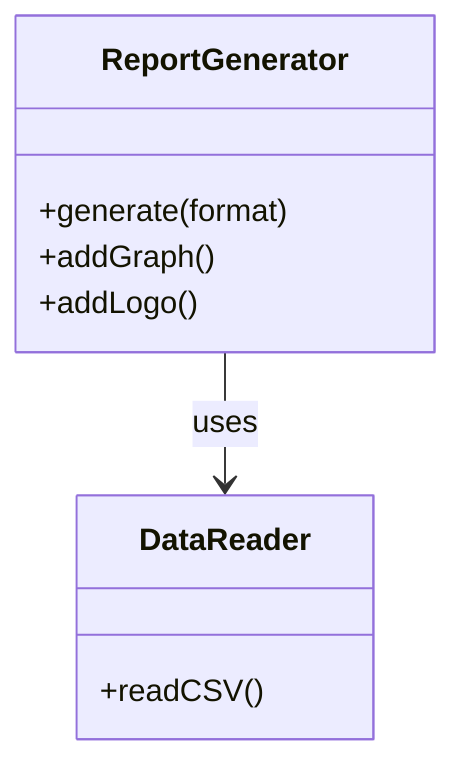

`ReportGenerator` クラスが、データの読み込み、レポート生成のステップ管理、そして個別のグラフィック追加処理という、異なる3つの責務をすべて抱えています。

### 1-4：責任配置テーブル

| **クラス名** | **責任（1文）** | **知るべきこと** |
| --- | --- | --- |
| `ReportGenerator` | レポート生成の全体フローを統括する。 | 読み込み手順、レポートの出力形式、装飾手順。 |
| `DataReader` | CSVファイルを読み込みデータ構造に変換する。 | CSVのフォーマット定義。 |

`ReportGenerator` は、レポート生成の「手順」だけでなく、ロゴの配置やグラフ追加という「個別の機能」までをすべて把握する状態です。

### 1-5：依存グラフ

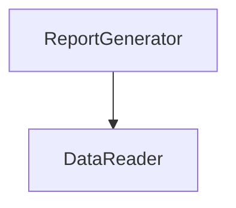

`ReportGenerator` に機能が集中しており、新しいレポート形式やグラフが追加されるたびに、このクラスが肥大化し続けています。

### 1-6：実装コード

レポート生成処理の様子です。

```cpp
#include <iostream>
#include <string>
#include <vector>

using namespace std;

class DataReader {
public:
    void readCSV() { cout << "CSVデータ読み込み完了。" << endl; }
};
```

```cpp
// レポート生成統括（処理の手順と個別の機能が混在）
class ReportGenerator {
    DataReader reader;
public:
    void generate(string format, bool addGraph, bool addLogo) {
        reader.readCSV();
        cout << format << "形式でレポートのヘッダーを生成。" << endl;
        if (addGraph) cout << "グラフを追加。" << endl;
        if (addLogo) cout << "ロゴを追加。" << endl;
        cout << format << "形式でレポートのフッターを生成。" << endl;
    }
};
```

```cpp
int main() {
    ReportGenerator gen;
    gen.generate("PDF", true, false);
    return 0;
}
```

このコードを見ると、`ReportGenerator` がレポートの「生成手順（ヘッダー・フッター生成）」と、個別の「機能追加（グラフ・ロゴ）」を直接知っていることが分かります。

### 1-7：実行結果

```text
CSVデータ読み込み完了。
PDF形式でレポートのヘッダーを生成。
グラフを追加。
PDF形式でレポートのフッターを生成。

```

このコードは正しく動いています。これから検討するのは、同じ機能を保ちながら、変更に強い構造をどう作るかという点です。
> 
> 

### 1-8：責任チェック表

| **コードの行** | **持っている知識** | **管理者（観察）** |
| --- | --- | --- |
| `cout << ... << "ヘッダーを生成。" ...;` | レポートの固定手順 | 全体設計担当 |
| `if (addGraph) ...` | グラフ追加という個別機能の知識 | 分析チーム |
| `if (addLogo) ...` | ロゴ追加という個別機能の知識 | 広報チーム |

要するに、レポート生成の「定型手順」という観察から、「処理の手順（骨格）」と「個別の機能追加」という変わる理由が異なるものが、同じ場所に混在しているという構造の問題が見えてくる。

フェーズ1で責任配置の観察が終わりました。 次のフェーズ2では、変更要求を受けて「何が変わり、何が変わらないか」の仮説を立てます。

---

## 🟠 フェーズ2：仮説立案 ―― 変更要求を受けて、変動と不変を整理する

### 2-1：届いた変更要求

ある水曜日の昼下がり、レポート生成システムのプロダクトオーナーから相談を受けました。

「お疲れ様。今度、役員向けに『月次レポート』を出力する機能を追加したいんだ。 グラフやロゴの挿入といった既存の機能はそのまま使えるはずだけど、出力のステップを少し細かく制御したい。 また、作成したレポートを後から『やり直し』ができるようにしたいという要望が営業部から出ていてね。 レポートの生成履歴を保存して、特定の過去時点の状態を再実行したり、取り消したりすることはできるかな？」

なるほど。今回は「処理のステップ制御」という新しい要件と、「操作履歴の保存・再実行」という二つの大きな軸が加わるわけですね。 今の `ReportGenerator` は、処理の流れが固定された上で、追加機能がハードコードされています。 このままでは、新しいレポート形式や操作履歴の要求に対応しようとすると、クラスの責任がさらに肥大化するのは明らかです。

### 2-2：変動・不変の仮説テーブル

フェーズ1での観察（1-8の責任チェック表）を材料に、何が変動し、何が変わらないのかを整理します。

| **分類** | **仮説** | **根拠（フェーズ1の観察から）** |
| --- | --- | --- |
| 🔴 **変動しそう** | レポート生成の「個別の追加機能」（グラフ・ロゴ等） | 1-8で、追加機能の知識が生成クラスに混在していると観察したため。 |
| 🔴 **変動しそう** | 各レポート生成の「実行順序・構成」 | 1-8で、レポート生成手順が固定されており変更に弱いと観察したため。 |
| 🔴 **変動しそう** | 生成操作の「履歴・取り消し」処理 | 操作履歴の概念が現在のシステムに存在しないため。 |
| 🟢 **不変** | データ読み込み処理（CSV読み取り） | どのような形式のレポートであっても、元データ読み込みの手順は共通のため。 |

「処理の骨格」は変えたくないけれど、「個別の装飾」や「実行履歴」は柔軟に変えたい。この相反する欲求をどう整理するかが今回のポイントになりそうです。

### 2-3：関係者ヒアリング

仮説を持って、システム利用部門の担当者と話し合いを持ちました。

* **開発者：** 「レポートの生成フローについてですが、今後、例えば『ロゴを先に出す』あるいは『グラフを省略する』といった順序の変更は発生しますか？」


* **運用担当者：** 「部署ごとにそのニーズはあるね。 基本は同じ手順なんだけど、特定のレポートだけステップを変えたいケースがあるんだよ。」


* **開発者：** 「操作履歴についても確認させてください。過去のレポート生成処理をやり直す際、当時使ったCSVデータも再読み込みすべきですか？」


* **運用担当者：** 「そうだな、当時のデータで再実行したい場合もあれば、最新データで再生成したい場合もある。 つまり、生成の操作自体を『履歴』として保持し、必要に応じて『再発行』したいんだ。」


* **開発者：** 「分かりました。生成フローの骨格は守りつつ、個別のステップや生成操作の履歴管理を独立して扱える構造が必要そうですね。」


ヒアリングの結果、処理の骨格はテンプレートとして定型化しつつ、個別のステップや操作をカプセル化することで、高い変更耐性を確保すべきことが見えてきました。

> **現実のヒアリングでは——** このシナリオでは相手がちょうど設計に役立つ情報を教えてくれています。現実には「変わるかどうか分からない」「たぶん変わらない」という答えが返ることも多いです。そのときは、コードの変更履歴（`git log`）や過去の障害記録を「ヒアリングの代わり」として使ってみてください。「過去に何度変わったか」が、「将来変わりやすいか」の最も正直な証拠です。

### 2-4：今回の確定変更テーブル

ヒアリングの結果を反映し、今回の変更要求で確実に対応が必要な要素を確定しました。

| **分類** | **具体的な内容** | **変わるタイミング** | **根拠（誰との確認か）** |
| --- | --- | --- | --- |
| 🔴 **変動する** | 個別の追加機能（グラフ・ロゴ） | 機能追加・要件変更ごと | 運用担当者との合意 |
| 🔴 **変動する** | レポート生成の手順（ステップ制御） | 部署ごとの要件変更ごと | 運用担当者との合意 |
| 🔴 **変動する** | 生成操作の実行履歴（再発行機能） | 履歴管理要件の追加ごと | 運用担当者との合意 |
| 🟢 **不変** | 基本データ読み込み手順 | 変わらない | 業務ルールとして確定 |

### 2-5：将来リスクテーブル

ヒアリングで「確定ではないが変わるかもしれない」として言及された項目を、確定変更とは別に整理します。将来の変化として想定しておくことで、設計の耐久テスト（フェーズ6）に活かします。

| **リスク項目** | **具体的な内容** | **ヒアリングでの発言** |
| --- | --- | --- |
| 再実行データの選択 | 当時のCSVで再実行するか、最新データで再実行するかが変わる可能性 | 「場合によって両方あり得る」 |
| 出力形式の追加 | PDF・Excel以外にHTML等が求められる可能性 | 「将来的にはあるかもしれない」 |
| 履歴の上限管理 | 履歴件数に上限が必要になる可能性 | 「運用で積み上がると管理が大変」 |

「処理の骨格」と「追加機能」をどう切り離し、さらに「操作」をどう履歴として扱うか。課題が明確になってきました。 フェーズ2で「何が変わり、何が変わらないか」が確定しました。 次のフェーズ3では、この変更要求を実際に試みて、何が起きるかを確認します。

---

## 🟡 フェーズ3：問題特定 ―― 変更を試みて、痛みを発見する

### 3-1：変更シミュレーション

フェーズ2で確定した「レポートの実行順序の変更」と「操作履歴（再実行機能）の追加」を、今の ReportGenerator クラスに対して実装してみます。

まず、レポート生成の手順を柔軟にするために、generate メソッド内のハードコードされたステップを順次 if 文で分岐させます。 次に、レポート生成の操作をやり直すために、実行したパラメータや順序を保持する別のクラス ReportHistoryManager を作成し、ReportGenerator の内部から呼び出すようにします。

すると、すぐに「あ、これ以上このクラスを編集すると壊れる」という感覚を覚えました。 generate メソッドの中に、「レポート生成の骨格」「グラフ追加機能」「ロゴ追加機能」、さらには「履歴保存ロジック」という全く性質の異なるコードが、ごちゃ混ぜになって押し込まれているのです。 グラフの描画条件を少し変えようとすると、意図せず履歴保存のタイミングまで狂ってしまうという、まさに「grep地獄」の入り口に立たされた気分です。

### 3-2：変更影響グラフ

今の構造で変更を試みた際の、依存関係の飛び火を可視化します。


ReportGenerator という一つのクラスに、レポート生成という「処理の定型」と、個別機能という「可変部分」、そして履歴という「操作管理」が混在しているため、変更がクラス内のあちこちに飛び火する構造になっています。

### 3-3：痛みの言語化

「どこまで手を入れれば、この機能を実装できるのか…」

変更をシミュレートする中で、明確な痛みが二つ露呈しました。

一つ目の痛みは、処理の手順が「固定化」されていることの限界です。 グラフやロゴといった個別の装飾機能が、レポート生成という共通の骨格と同じ場所に記述されているため、装飾の有無や順序を変えるだけで、全体の生成フローをすべて書き換えなければなりません。 「生成手順」と「生成する要素」を分離できていないため、個別の変更が全体の安定性を脅かしています。

二つ目の痛みは、操作履歴という「管理責務」の混入です。 本来、レポートの生成処理はデータをレポートにするだけで完結すべきなのに、操作の履歴を取るという「管理機能」が、生成ロジックと密接に絡み合っています。 これにより、生成ロジックをリファクタリングしようとすると、履歴管理の仕組みまで引きずり回されるという、極めて不安定な状態に陥っています。

フェーズ3で「今の構造では変更が辛い」という事実が確認できました。 次のフェーズ4では、なぜこのように辛いのか、構造的な原因を深掘りします。

---

## 🔴 フェーズ4：原因分析 ―― なぜ辛いのかを構造的に言語化する

フェーズ3で確認したように、レポート生成の「定型的なフロー」と「個別の装飾機能」、そして「操作履歴の管理」がすべて `ReportGenerator` クラスに混在していることが、システムを不安定にする最大の要因です。 ここでは、この問題の原因を構造的な観点から紐解いていきます。

### 4-1：観察→原因テーブル

フェーズ3でのシミュレーションから見えてきた観察事実と、その根本にある構造的な原因を整理します。

| **観察** | **原因の方向** |
| --- | --- |
| 新しい装飾機能（グラフ等）を追加するたびに、統括クラスを修正しなければならない | `ReportGenerator` が、各装飾機能の具体的な「実行タイミング」と「生成ロジック」をすべて直接知っているから。 |
| レポート生成の「やり直し」を実装しようとすると、生成フローと履歴管理が複雑に絡み合う | 「レポートを生成する」という処理の定型フローと、「処理を実行した」という操作の履歴管理が、同じクラス内で混在しているから。 |

コードを追うと、`ReportGenerator` が生成の「手順」を握りしめすぎていることが分かります。 また、装飾機能が追加されるたびに `if` 文やフラグが乱立し、生成の骨格と機能拡張の責務が同一クラスに「ベタ書き」されているのが現状です。

### 4-2：変わるもの / 変わらないものテーブル

構造を整理するために、変化の軸を明確に分離します。

| **変わり続けるもの（🔴）** | **変わってほしくないもの（🟢）** |
| --- | --- |
| レポート生成の手順や追加機能の組み合わせ | データ読み込みという基本的な前処理手順 |
| 個別の操作実行履歴（保存・再実行・取り消し） | レポートを出力するという「処理の骨格（定型フロー）」 |

現状は「レポートを作る」という一つの目的に向かって、すべての機能が同じレイヤーで記述されています。 処理の「骨格（定型）」と、個別に「機能追加（装飾）」する部分、さらにその「実行」を制御する部分は、それぞれ独立した接続形態へ進化させるべきです。

### 4-3：接続形態を診断する

現在の接続形態を2×2マトリクスで診断します。

今のレポート生成エンジンは、USB-Cハブの中に専用の変換回路を無理やりはんだ付けし、直接ケーブルを直差ししているような状態（具体×直接）です。 新しい機能を追加したり、処理順序を変えようとしたりするたびに、基板そのものをはんだごてでいじり回しているため、システム全体の安定性が失われています。

|  | 直接（直差し） | 間接（アダプター経由） |
|:---:|:---|:---|
| **具体**（専用規格） | **← 現在地**　iPhone → [Lightning] → Apple純正ドック（Lightning端子） | iPhone → [Lightning] → [変換] → USB-A充電器（汎用端子） |
| **抽象**（汎用規格） | MacBook → [USB-C] → USB-C対応モニター（汎用端子） | MacBook → [USB-C] → [ハブ] → HDMI・USB-A・LAN |

このコードで言うと：

| ケーブル比喩 | コードの対応箇所 |
|---|---|
| 「具体」＝専用規格ケーブル | `bool addGraph` / `bool addLogo` というパラメータ名 — 具体的な機能名をメソッドシグネチャに直接埋め込んでいる |
| 「直接」＝直差し | `if (addGraph) cout << "グラフを追加。";` — `generate()` 内でスケルトン（ヘッダー/フッター生成）と追加機能を分離せず直接記述している |

「定型的なフロー」と「機能追加」、「操作の記録」という3つの責務は、それぞれ独立して頻繁に変更される可能性を秘めています。 したがって、これらを一つの巨大なクラスで管理するのではなく、それぞれ適切な接続形態へ分離することが、このシステムの設計を健全化する唯一の道です。

フェーズ4で根本原因が言語化できました。 次のフェーズ5では、この分析を元に、解決すべき課題を具体的に定義していきます。

---

## 🟣 フェーズ5：課題定義 ―― 解くべき問題を具体的に定める

フェーズ4で、「レポート生成の定型フロー」と「追加機能（グラフ・ロゴ等）」、そして「操作履歴の管理」という異なる3つの責務が `ReportGenerator` クラスに混在していることが、システムを複雑にしている根本原因だと特定しました。

変更の理由（変化の軸）がそれぞれ異なるこれらを、今のままの構造で維持し続けることは、拡張性を損ない、バグの温床となるため限界です。 対策案を検討する前に、今回のリファクタリングで解決すべき課題を4つの視点で整理し、確定させます。

### 5-1：接続点の特定

フェーズ4での分析に基づき、以下の3つの接続点（ジョイント）を特定しました。

* 接続点A：`ReportGenerator` ←→ CSVデータ読み込み（定型処理）の境界
* 接続点B：`ReportGenerator` ←→ 個別の追加機能（グラフ・ロゴ等）の境界
* 接続点C：`ReportGenerator` ←→ 操作履歴管理の境界

これらは `ReportGenerator` 内で一つに絡み合っています。 これらを独立した接続点として切り離すことが、システムの設計を健全にするための第一歩です。

### 5-2：非機能制約の確認

接続形態の検討に必要な制約を整理します。

| **確認項目** | **内容** | **この章での判断** |
| --- | --- | --- |
| 変更頻度 | この接続点はどのくらいの頻度で変わるか | 高（レポート形式や追加機能の要望が頻発） |
| パフォーマンス | ホットパスか（高頻度で呼ばれるか） | 低（バッチ処理のため即時性は低め） |
| メモリ | 間接層の追加でオーバーヘッドが問題になるか | いいえ（柔軟性を優先してよい） |
| 処理時間 | 大量データを含むレポートの生成にどれくらいの時間がかかるか | 要確認（月次全社レポートや年次集計レポートは、数百万件のデータを処理する場合があり生成に数十秒かかることがある。非同期処理やキャッシュ戦略がレポート生成クラスの責任範囲と構造に影響する） |

変更頻度が「高」であるため、機能追加のたびに `ReportGenerator` 全体を修正するような構造は避けなければなりません。 パフォーマンスへの制約が低いことから、インターフェースや間接層を積極的に活用し、疎結合な構造を目指すことが合理的です。 ただし、大量データを扱うレポートでは処理時間が設計に影響するため、非同期処理やキャッシュの必要性を事前に確認しておく価値があります。

### 5-3：クライアントへの影響範囲

分離対象の責務を呼び出している `ReportGenerator` クラスが最大のクライアントです。 このクラスが各機能の詳細を知りすぎているために、変更のたびに自身を書き換える運命にあります。 この設計を改善することで、`ReportGenerator` はレポート生成の「骨格（処理手順）」だけを管理し、実際の追加機能や操作履歴は分離した部品に任せることができます。

### 5-4：課題まとめ表

分析結果を一覧にまとめます。

| **接続点** | **分けた理由** | **非機能制約** | **クライアント影響** |
| --- | --- | --- | --- |
| 接続点A | 定型処理の固定化 | 変更頻度低 | 特になし |
| 接続点B | 機能追加の頻発 | 高頻度の変更・大量データ時の処理時間が生成クラス構造に影響 | `ReportGenerator` の生成ロジック |
| 接続点C | 操作履歴の管理責務 | 高頻度の変更 | `ReportGenerator` の実行ロジック |

この表が、次に検討する対策案の出発点となります。フェーズ5で「何を解くか」が確定しました。 次のフェーズ6では、これらの課題に対して具体的にどのような構造を適用するか、コストの観点から案を検討します。

---

## 🟢 フェーズ6：対策案検討 ―― 解決策を並べ、コストで選ぶ

フェーズ5で整理した「処理の骨格」「個別機能の追加」「操作履歴管理」という三つの責務を、どのように切り離し接続するかが今回の検討事項です。 これらはそれぞれ「固定」「拡張」「記録」という異なる性質を持つため、接続形態を柔軟に選択する必要があります。

### 6-1：接続の形 2×2マトリクス

現在の `ReportGenerator` は、処理の骨格の中に装飾機能や履歴管理がべったりと入り込んだ「具体×直接」の状態です。 ここから、各責務を独立したインターフェースやパターンへ切り出し、抽象化と間接層を導入する方向で案を検討します。

| 接続形態 | ケーブル例 | 特徴 |
|:---:|:---|:---|
| **具体×直接**（← 現在地） | iPhone → [Lightning] → Apple純正ドック（Lightning端子） | 専用端子のみ対応。差し替え不可 |
| **具体×間接** | iPhone → [Lightning] → [変換] → USB-A充電器（汎用端子） | 変換器を挟むが規格は専用のまま |
| **抽象×直接** | MacBook → [USB-C] → USB-C対応モニター（汎用端子） | どのメーカーでも同じ口で繋がる |
| **抽象×間接** | MacBook → [USB-C] → [ハブ] → HDMI・USB-A・LAN | ハブを介して多様な機器へ展開可能 |

どの案も、動作例テーブルで示した動作を実現します。違うのは「変更が来たときにどこを触ることになるか」です。

---

#### 案1：現状のまま ―― 構造を変えない

**この形の考え方：**
クラスの分割も接続形態の変更もしない。 既存の `if` 文やフラグ管理を維持し、その場で機能追加を行う。 レポートの生成要件が今後一切変わらず、このままの形式で運用が続くという確信がある場合にのみ選択する。

**手段の比較：**

| 手段 | 内容 | 採用 |
| --- | --- | --- |
| 手段A：フラグを増やす | `addGraph` / `addLogo` に加え、今後の機能を同様にフラグ追加する | 採用せず（引数が際限なく増える） |
| 手段B：設定オブジェクトを渡す | `ReportOptions` 構造体をまとめて渡す | 採用（引数爆発を一時的に抑制できる） |

手段Bは引数爆発を緩和できますが、根本的な責務の混在は解消されません。この案全体として「変更頻度が高い」今回の状況には向きません。

**構造図：**

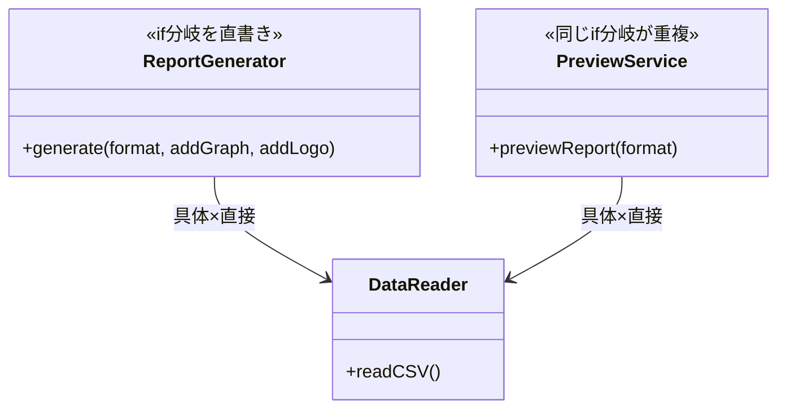

両クラスが同じ具体ロジックを内部に直書きしており、機能追加のたびに2か所を同時に修正しなければならない。

【コード例】

```cpp
// ReportGenerator クラス
class ReportGenerator {
    DataReader reader;
public:
    void generate(bool addGraph, bool addLogo) {
        reader.readCSV();
        // 既存の手順の中に機能判定が混在
        if (addGraph) cout << "グラフ追加" << endl;
        if (addLogo) cout << "ロゴ追加" << endl;
    }
};
```

```cpp
// PreviewService クラス（同じロジックが重複）
class PreviewService {
public:
    void previewReport(string format) {
        DataReader reader;
        reader.readCSV();
        cout << format << "形式でプレビューのヘッダーを生成。" << endl;
        bool addGraph = true;
        if (addGraph) cout << "グラフを追加（プレビュー）。" << endl;
        cout << format << "形式でプレビューのフッターを生成。" << endl;
    }
};
```

```cpp
// main 関数
int main() {
    ReportGenerator gen;
    gen.generate(true, false);

    PreviewService preview;
    preview.previewReport("HTML");
    return 0;
}
```

両クラスが同じロジックを重複して持つため、機能追加のたびに2か所を修正しなければならない。

**動作図：**

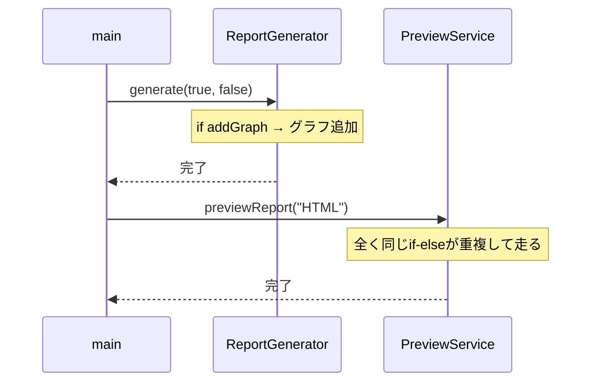

一文要約：レポート生成ロジックが各クラスの内部に直書きされているため、同じフラグ判定が2か所で並行して走る。

**この形のトレードオフ：**

* 変更容易性：低（機能追加のたびに `ReportGenerator` が肥大化する）


* テスト容易性：低（ロジックが一つに固まっており切り離せない）


* 実装コスト：低（今のままコードを足すだけ）


---

#### 案2：具体×直接 ―― クラスを分けるが参照は具体型のまま

**この形の考え方：**
グラフ描画やロゴ配置といった各機能を独立したクラスに抽出するが、`ReportGenerator` はそれらの具体クラスを直接生成・保持する。 責任範囲は整理されるが、機能の差し替えや組み合わせの変更には対応できない。

**手段の比較：**

| 手段 | 内容 | 採用 |
| --- | --- | --- |
| 手段A：機能を個別クラスに分離、直接インスタンス化 | `ReportGenerator` 内で `GraphFeature graph;` と直接生成する | 採用（クラスは分かれるが依存は具体型のまま） |
| 手段B：静的メソッドで提供 | `GraphFeature::draw()` のように静的呼び出し | 採用せず（テストでの差し替えが不可能） |

手段Aでもクラスが分離されるため案1よりは整理されますが、具体クラスへの直接依存は残ります。

**構造図：**

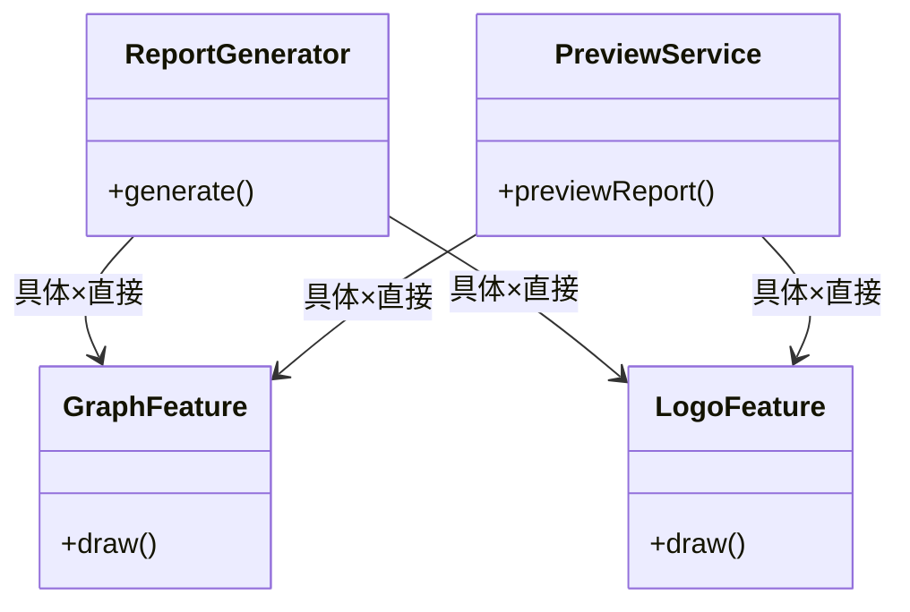

クラスは分離されたが、`ReportGenerator` と `PreviewService` の両方が同じ具体クラスへ直接依存しており、機能クラスへの重複した結合が残る。

【コード例】

```cpp
// GraphFeature クラス
class GraphFeature {
public:
    void draw() { cout << "グラフを描画。" << endl; }
};
```

```cpp
// LogoFeature クラス
class LogoFeature {
public:
    void draw() { cout << "ロゴを配置。" << endl; }
};
```

```cpp
// ReportGenerator クラス（具体型を直接生成）
class ReportGenerator {
public:
    void generate() {
        GraphFeature graph; // ← 具体：GraphFeatureという型名を直接書いている
        graph.draw();       // ← 直接：このクラスを直接インスタンス化している
    }
};
```

```cpp
// PreviewService クラス（同じ依存が重複）
class PreviewService {
public:
    void previewReport() {
        GraphFeature graph; // ← 具体：同じGraphFeatureへの依存が重複
        graph.draw();
        LogoFeature logo;
        logo.draw();
    }
};
```

```cpp
// main 関数
int main() {
    ReportGenerator gen;
    gen.generate();

    PreviewService preview;
    preview.previewReport();
    return 0;
}
```

選択ロジックが両クラスに重複しており、機能クラスへの依存が両方に残る。

**動作図：**

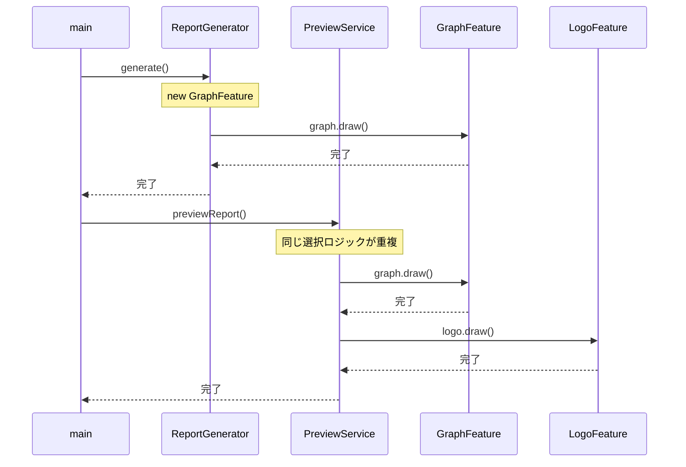

一文要約：クラスは分かれたが「どのクラスを呼ぶか」という判断を両方の呼び出し元がそれぞれ行っており、機能クラスへの呼び出し経路が2本並んで重複している。

**この形のトレードオフ：**

* 変更容易性：低〜中（クラスは分離したが、利用側の修正は避けられない）


* テスト容易性：低（具体クラスへの依存が強いため切り離せない）


* 実装コスト：低（既存コードを別クラスに移すのみ）


---

#### 案3：抽象×直接 ―― インターフェースを挟み、型だけで接続する

**この形の考え方：**
レポート生成の「骨格」には処理順序を固定する仕組みを、機能の「動的追加」には各機能を抽象型で受け取る仕組みを適用する。 各機能要素を抽象化し、実行時に自由に組み合わせられるようにする。

**手段の比較：**

| 手段 | 内容 | 採用 |
| --- | --- | --- |
| 手段A：純粋仮想クラスをインターフェースとして使う | `IReportFeature` に `apply()` を定義し、各機能が実装する | 採用（C++の標準的なインターフェース手法） |
| 手段B：関数ポインタを渡す | 機能をコールバックとして渡す | 採用せず（可読性が低く、型安全性も損なわれる） |

手段Aにより、`ReportGenerator` は具体的な機能クラスを知らずに済みます。ただし、間接層（チェーン）はないため「直接」の状態です。

**構造図：**

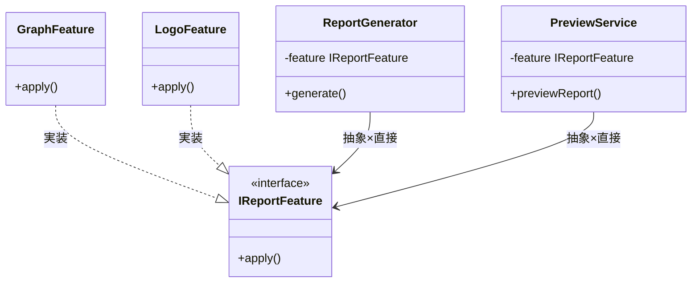

`main()` が具体クラスを生成してインターフェース経由で注入するため、`ReportGenerator` と `PreviewService` は具体クラスを知らずに済み、選択ロジックの重複が解消される。

【コード例】

```cpp
// IReportFeature インターフェース
class IReportFeature {
public:
    virtual void apply() = 0;
};
```

```cpp
// GraphFeature 実装クラス
class GraphFeature : public IReportFeature {
public:
    void apply() override { cout << "グラフを追加。" << endl; }
};
```

```cpp
// LogoFeature 実装クラス
class LogoFeature : public IReportFeature {
public:
    void apply() override { cout << "ロゴを追加。" << endl; }
};
```

```cpp
// ReportGenerator クラス（抽象型で受け取り、直接呼び出し）
class ReportGenerator {
    IReportFeature* feature; // ← 抽象：具体クラスを知らない
public:
    ReportGenerator(IReportFeature* f) : feature(f) {}
    void generate() {
        cout << "CSV読み込み" << endl;
        feature->apply(); // ← 直接：間接層を挟まずに呼び出す
        cout << "フッター生成" << endl;
    }
};
```

```cpp
// PreviewService クラス（同様に抽象型で受け取る）
class PreviewService {
    IReportFeature* feature;
public:
    PreviewService(IReportFeature* f) : feature(f) {}
    void previewReport() {
        feature->apply();
        cout << "プレビュー表示完了。" << endl;
    }
};
```

```cpp
// main 関数（具体型を生成して注入する唯一の場所）
int main() {
    GraphFeature graph;
    ReportGenerator gen(&graph);
    gen.generate();

    LogoFeature logo;
    PreviewService preview(&logo);
    preview.previewReport();
    return 0;
}
```

注入アプローチにより、両クラスとも具体クラスを知らずに済み、選択ロジックの重複が解消される。

**動作図：**

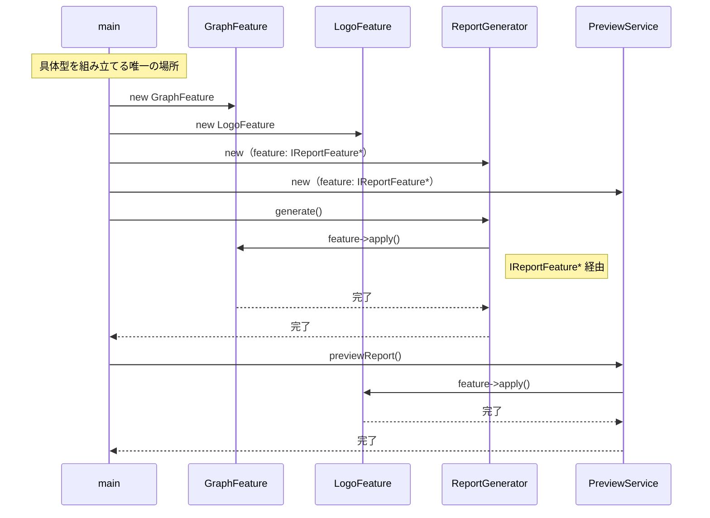

一文要約：`main()` が具体型を組み立て、両方の呼び出し元は `IReportFeature*` という型だけを介して同じオブジェクトを呼ぶため、具体クラスが変わっても呼び出し経路は変わらない。

**この形のトレードオフ：**

* 変更容易性：高（機能単位での差し替えが容易）


* テスト容易性：高（インターフェースに対してスタブを差し込んでテストできる）


* 実装コスト：中（インターフェースと複数の実装クラスが必要）


---

#### 案4：抽象×間接 ―― インターフェース＋仲介役を両立する

**この形の考え方：**
処理骨格の固定化、機能装飾、履歴管理をすべてインターフェース経由で結合する。 最も複雑だが、全要素が疎結合となり、将来のあらゆる変更要求に対して影響を最小化できる。

**手段の比較：**

| 手段 | 内容 | 採用 |
| --- | --- | --- |
| 手段A：HistoryManagerをインターフェース化 | `IHistoryManager` を定義し、具体実装を差し替え可能にする | 採用（将来の履歴管理方法の変更に備える） |
| 手段B：Decoratorチェーンで機能を重ねる | 機能をラッパークラスとして重ねがけし、組み合わせを実行時に決定する | 採用（機能の組み合わせが自由になる） |
| 手段C：Factoryで組み立てる | 具体クラスの生成を専用クラスに任せる | 採用（組み立て責務を一箇所に集約する） |

手段A・B・Cを組み合わせることで、呼び出し元は抽象インターフェースのみを知り、具体的な実装は組み立て担当のクラスだけが知る状態になります。

**構造図：**

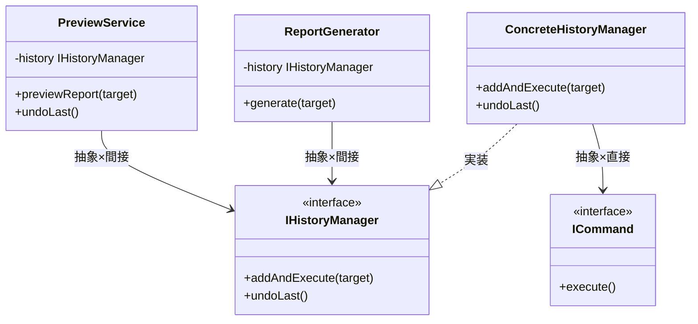

両クラスは抽象インターフェースのみを受け取り、具体的な履歴管理クラスへの依存が完全に排除されるため、`ConcreteHistoryManager` を別実装に差し替えてもコードの変更は不要となる。

【コード例】

```cpp
// IHistoryManager インターフェース
class IHistoryManager {
public:
    virtual void addAndExecute(string target) = 0;
    virtual void undoLast() = 0;
};
```

```cpp
// ICommand インターフェース
class ICommand {
public:
    virtual void execute() = 0;
    virtual void undo() = 0;
};
```

```cpp
// ConcreteHistoryManager（履歴管理の具体実装）
class ConcreteHistoryManager : public IHistoryManager {
    vector<ICommand*> history;
public:
    void addAndExecute(string target) override {
        cout << "[履歴] " << target << " を実行して記録。" << endl;
        // 実際にはtargetに応じてコマンドを生成して実行する
    }
    void undoLast() override {
        if (history.empty()) {
            cout << "[警告] アンドゥ対象がありません。" << endl;
            return;
        }
        cout << "[履歴] 直前の操作を取り消しました。" << endl;
    }
};
```

```cpp
// ReportGenerator クラス（抽象HistoryManagerのみ知っている）
class ReportGenerator {
    IHistoryManager* history; // ← 抽象：IHistoryManager*型で受け取る
public:
    ReportGenerator(IHistoryManager* h) : history(h) {}
    void generate(string target) {
        cout << "[ReportGenerator] " << target
             << " のレポートを生成。" << endl;
        history->addAndExecute(target);
        // ← 間接：HistoryManager経由のため具体クラスが見えない
    }
};
```

```cpp
// PreviewService クラス（同様に抽象HistoryManagerのみ知っている）
class PreviewService {
    IHistoryManager* history;
public:
    PreviewService(IHistoryManager* h) : history(h) {}
    void previewReport(string target) {
        cout << "[PreviewService] " << target
             << " のプレビューを生成。" << endl;
        history->addAndExecute(target);
    }
    void undoLast() {
        history->undoLast();
    }
};
```

```cpp
// main 関数（具体型を組み立てる唯一の場所）
int main() {
    ConcreteHistoryManager histMgr;
    ReportGenerator gen(&histMgr);
    gen.generate("月次売上レポート");

    PreviewService preview(&histMgr);
    preview.previewReport("AddGraph");
    preview.undoLast();
    return 0;
}
```

両クラスとも抽象インターフェースのみを受け取るため、具体的な機能クラスへの依存が完全に排除される。

**動作図：**

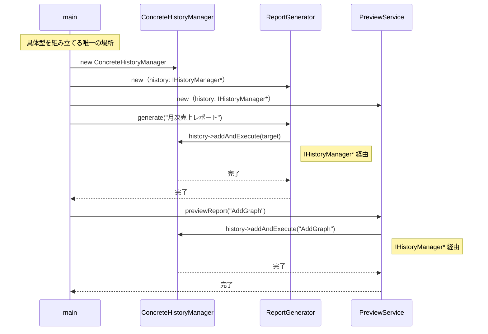

一文要約：呼び出し元→`IHistoryManager*`→具体実装という2段階の抽象型を経由するため、どの具体クラスが動くかは `main()` の組み立て部分だけが知っている。

**この形のトレードオフ：**

* 変更容易性：高（あらゆる層が独立して置換・拡張可能）


* テスト容易性：高（全ての部品が切り離し可能）


* 実装コスト：高（クラス数とインターフェースが大幅に増加する）

---

### 6-7：評価軸

対策案を比較するための「ものさし」を先に宣言します。 レポート生成エンジンにおいて、複数の仕組みを複合的に適用する際の判断基準を定義します。

| **評価軸** | **意味** | **ウェイト** |
| --- | --- | --- |
| 変更容易性 | レポートの生成手順や機能構成の変更に対し、触る場所が最小で済むか | ×3 |
| テスト容易性 | 生成ステップや各装飾機能をスタブに差し替えてテスト可能か | ×2 |
| 可読性 | 複数の仕組み導入によるクラス数増加と構造の複雑化度合い | ×1 |

> **注：** このウェイト（変更容易性×3など）は本書の例です。チームの変更頻度・テスト文化に合わせて、比較を始める前にチームで合意してください。スコアは「答えを決める計算式」ではなく、「チームの議論を整理する道具」です。

**採点基準（章共通）：**

| 点数 | 変更容易性 | テスト容易性 | 可読性 |
| --- | --- | --- | --- |
| 3 | 1クラス修正のみで完結 | スタブで完全に切り離せる | クラス増なし・直感的に理解可能 |
| 2 | 2〜3クラスの修正が必要 | 一部スタブが必要だが可能 | クラス1〜2個増・標準的な構造 |
| 1 | 4クラス以上の波及 | 実装依存でテスト困難 | 中間層が過多で理解コストが高い |

**パフォーマンスの VETO 判定：**
レポート生成はオフラインのバッチ処理であり、厳密なリアルタイム性を求めないため、パフォーマンス上の VETO は発動しません。 将来的な機能追加に対する柔軟性とテスト容易性を最優先します。

---

### 6-8：コスト天秤

4つの案を比較します。

| **案** | **現在の対応コスト** | **未来の対応コスト** |
| --- | --- | --- |
| 案1：現状のまま | 低 | 高 |
| 案2：具体×直接 | 低〜中 | 高 |
| 案3：抽象×直接 | 中 | 低〜中 |
| 案4：抽象×間接 | 高 | 低 |

**ステップ1：採点表**

| 案 | 変更容易性（×3） | テスト容易性（×2） | 可読性（×1） |
| --- | --- | --- | --- |
| 案1：現状のまま | 1 | 1 | 3 |
| 案2：具体×直接 | 1 | 1 | 2 |
| 案3：抽象×直接 | 2 | 2 | 2 |
| 案4：抽象×間接 | 3 | 3 | 1 |

**ステップ2：加重合計表**

| 案 | 加重スコア | 判定 |
| --- | --- | --- |
| 案1 | 1×3＋1×2＋3×1＝8 |  |
| 案2 | 1×3＋1×2＋2×1＝7 |  |
| 案3 | 2×3＋2×2＋2×1＝12 |  |
| 案4 | 3×3＋3×2＋1×1＝16 | ← 採用候補 |

レポート生成の骨格と機能拡張、そして操作履歴という異なる3つの責務が絡み合っているため、これらを個別にインターフェース化し抽象層を設ける案4が最も高評価となりました。

---

### 6-9：採用案の決定

**採用する案：** 案4（抽象×間接）

**理由：**
レポート生成の定型フローを固定し、グラフやロゴなどの装飾を動的に追加可能にし、さらに生成操作自体を履歴として管理することで、責務を完全に分離し、変更の波及を局所化できるためです。

実はこの「案4の構造」には名前があります。それが **Template Method × Decorator × Command パターン** の複合適用です。「定型フロー」「動的装飾」「操作の履歴化」という3つの課題を分析した結果として、この3つのパターンが自然に選ばれます。パターン名は「選ぶための呪文」ではなく、「問題を解決した結果についた名前」です。

---

### 6-10：耐久テスト

フェーズ2のヒアリングで挙がった将来のリスクに対する耐性を確認します。

| **変更シナリオ** | **触る場所** | **コスト評価** |
| --- | --- | --- |
| 新しいレポート出力形式（HTML）を追加する | 新しい `ReportGenerator` のサブクラスを追加 | 低 |
| 特定のレポート生成操作を「取り消し」可能にする | `ICommand` 実装クラスの `undo()` に処理を追加 | 低 |
| 履歴の上限管理が必要になった | `ConcreteHistoryManager` 内のロジックだけを修正 | 低 |
| 再実行時のデータ選択（当時 vs 最新）が必要になった | `IHistoryManager` のインターフェース拡張のみ | 中 |

採用した複合設計では、新しい出力形式の追加は新しいクラスの実装に、操作取り消しは管理クラスの範囲に閉じるため、レポート生成の「骨格」には一切触れる必要がありません。

---

## 🟤 フェーズ7：対策実施 ―― 決断し、変化に強い設計を手に入れる

採用した案4（Template Method × Decorator × Command パターン）を実装し、レポートの生成骨格と装飾機能、そして操作履歴の管理という3つの責務をそれぞれ独立したクラスへカプセル化します。

### 7-1：解決後のコード（全体）

レポートの生成骨格を Template Method で定義し、装飾機能を Decorator で重ね、生成操作自体を Command としてカプセル化しました。

```cpp
// ICommand: 操作履歴のインターフェース
class ICommand {
public:
    virtual ~ICommand() = default;
    virtual void execute() = 0;
};
```

```cpp
// ReportGenerator: レポート生成の骨格（Template Method）
class ReportGenerator {
public:
    void generate() {
        cout << "CSV読み込み" << endl;
        renderBody(); // 継承先で変化する部分
        cout << "フッター生成" << endl;
    }
    virtual void renderBody() = 0;
};
```

```cpp
// BasicReport: 基本レポートの本体
class BasicReport : public ReportGenerator {
public:
    void renderBody() override {
        cout << "本文を生成" << endl;
    }
};
```

```cpp
// ReportDecorator: 装飾機能のインターフェース（Decorator基底）
class ReportDecorator : public ReportGenerator {
protected:
    ReportGenerator* wrapped;
public:
    ReportDecorator(ReportGenerator* g) : wrapped(g) {}
};
```

```cpp
// GraphDecorator: グラフ追加の具体装飾
class GraphDecorator : public ReportDecorator {
public:
    GraphDecorator(ReportGenerator* g) : ReportDecorator(g) {}
    void renderBody() override {
        wrapped->renderBody();
        cout << "グラフを追加" << endl; // ← ここだけ変わる
    }
};
```

```cpp
// BatchApplication: 具体クラスを知っている唯一の場所（組み立て担当）
class BatchApplication {
    vector<ICommand*> history;
public:
    void run() {
        ReportGenerator* gen = new GraphDecorator(new BasicReport());
        gen->generate();
        // Command で操作を履歴管理（拡張ポイント）
    }
};
```

```cpp
// main: BatchApplicationを起動するだけ
int main() {
    BatchApplication app;
    app.run();
    return 0;
}
```

この実装により、`ReportGenerator` の骨格を変更することなく、機能（グラフやロゴ）の追加や順序の入れ替えが可能になりました。

### 7-2：変更影響グラフ（改善後）

フェーズ3で行った「グラフ追加」や「履歴保存」の変更を試みた際の構造を確認します。


→ フェーズ3のグラフと比較して、装飾機能の追加は Decorator クラスの実装だけで完結し、バッチ本体の生成骨格（`ReportGenerator`）への飛び火がなくなりました。

### 7-3：変更シナリオ表

本設計により、個別の変更がシステム全体に及ぶリスクを大幅に低減しました。

| **シナリオ** | **変わるクラス（触る場所）** | **変わらないクラス** |
| --- | --- | --- |
| グラフの描画内容を変更する | `GraphDecorator` | `ReportGenerator`, `ConcreteHistoryManager` |
| 新しいレポート形式を追加する | 新規の `ReportGenerator` サブクラス | `ReportDecorator`, `ICommand` |
| 履歴保存のフォーマットを変える | `ConcreteHistoryManager` | `ReportGenerator`, `IReportFeature` |

機能追加のたびにクラスが増えるという「構造の複雑化」というコストは受け入れましたが、変更が個別のクラスに閉じ、全体の安定性が劇的に高まりました。 これこそが、設計の真の価値です。

---

### 7-4：接続形態の確認 ── この設計はどの接続か

フェーズ4-3で診断した通り、変更前のコードは **具体×直接** の状態でした。
採用した Template Method × Decorator × Command パターンでは、接続形態が **抽象×間接（USB-Cハブ経由）** へと変化しています。

**「抽象×間接」の証拠となるコード：**

```cpp
class ReportDecorator : public ReportGenerator {
protected:
    ReportGenerator* wrapped; // ← 抽象基底クラス型 = 「抽象」の証拠
public:
    ReportDecorator(ReportGenerator* g) : wrapped(g) {}
};
```

```cpp
class GraphDecorator : public ReportDecorator {
    void renderBody() override {
        wrapped->renderBody(); // ← wrapped 経由のチェーン = 「間接」の証拠
        cout << "グラフを追加" << endl;
    }
};
```

- `ReportGenerator* wrapped` の型が抽象基底クラス（純粋仮想メソッド `renderBody()` を持つ）→ **「抽象」** の証拠
- `wrapped->renderBody()` はデコレータチェーンを経由した間接呼び出し → **「間接」** の証拠

「骨格を変えずに機能を動的に追加・差し替えたいかつデコレータチェーンという仲介構造が必要」という動機から、**抽象×間接** が選ばれました。

第11章では、レポート生成という「処理の定型（骨格）」と「個別の装飾機能」、そして「操作の履歴管理」が絡み合う複雑なシステムを題材に、複数のパターンを組み合わせた設計を体験しました。

### 整理：7フェーズとこの章でやったこと

| **フェーズ** | **この章でやったこと** |
| --- | --- |
| 🔵 フェーズ1：現状把握 | `ReportGenerator` にすべての責務が集中している現状を観察した。 |
| 🟠 フェーズ2：仮説立案 | 「骨格の分離」と「機能の拡張」を仮説立てた。 |
| 🟡 フェーズ3：問題特定 | 機能追加のたびに生成フロー全体が不安定になる「痛み」を確認した。 |
| 🔴 フェーズ4：原因分析 | 処理手順と個別機能の「混在」という構造的問題を特定した。 |
| 🟣 フェーズ5：課題定義 | 骨格・装飾・履歴管理という3つの接続点を課題として定義した。 |
| 🟢 フェーズ6：対策案検討 | 4案を比較し、抽象×間接の案4を採用。Template Method × Decorator × Command の複合適用と命名した。 |
| 🟤 フェーズ7：対策実施 | 責務を疎結合化し、変更影響をクラス単位に閉じ込めた。 |

### 各クラスの最終的な責任

| **クラス名** | **責任（1文）** | **変わる理由** |
| --- | --- | --- |
| `ReportGenerator` | レポート生成の「骨格（定型フロー）」を定義する。 | レポートの出力順序が変わる場合 |
| `ReportDecorator` | 個別の装飾機能（グラフ・ロゴ）を動的に追加する。 | 装飾のルールが変わる場合 |
| `ICommand` | レポート生成操作を履歴として保持・管理する。 | 履歴管理要件が変わる場合 |

> **このプロセスを回した結果にたどり着いた構造こそが Template Method × Decorator × Command の複合パターン です。**
> 

### 振り返り：「この章を読むと得られること」は手に入ったか

| **得られること** | **この章のどこで示したか** |
| --- | --- |
| 得られること1 | フェーズ2の確定テーブルで、変動軸を識別した。 |
| 得られること2 | フェーズ5で、骨格と拡張、操作履歴という独立した接続点を特定した。 |
| 得られること3 | フェーズ7の変更シナリオ表で、責務分離による局所化を実証した。 |

### 振り返り：3つの設計原則はどう適用されたか

* **原則1「変わるものをカプセル化せよ」の現れ**
* **具体化された場所：** 各 `Decorator` クラスと `ICommand` の実装クラス
* **解説：** 個別の装飾機能や操作履歴ロジックを、生成骨格とは別のクラスにカプセル化しました。


* **原則2「実装ではなくインターフェースに対してプログラムせよ」の現れ**
* **具体化された場所：** `IReportFeature` インターフェースと `IHistoryManager` インターフェース
* **解説：** 骨格部は具体的な装飾クラスを知らず、インターフェース経由で機能を呼び出すようにしました。


* **原則3「継承よりコンポジションを優先せよ」の現れ**
* **具体化された場所：** `ReportDecorator` が `ReportGenerator` を保持する構成
* **解説：** 機能を継承で追加するのではなく、Decorator をコンポジションすることで動的に組み合わせました。


---

### あなたのコードで考えてみてください

この章で辿った思考プロセスを、あなた自身のコードに当てはめてみましょう。

1. **骨格の兆候を探す：** あなたのコードに「処理の流れ（順序）は共通だが、各ステップの中身が種類によって異なる」クラスがありますか？そこでコピーペーストが増えていませんか？
2. **機能追加の痛みを測る：** 既存の処理に「ある条件のときだけ前処理を挟む」要件が来たとき、既存クラスに手を入れる必要がありますか？何行変更しますか？
3. **操作の逆転を想像する：** ユーザーの操作を「取り消す」機能を後から追加するとしたら、今の構造では何が変わりますか？操作をオブジェクトとして保存する仕組みはありますか？
4. **パターンの必要性を問う：** 「骨格の固定」「機能の動的追加」「操作の取り消し」は、あなたのシステムで本当に必要ですか？3つのうち2つ以上が必要なら、複合パターンを検討するサインです。

---

### パターン解説：複合適用

今回は単一のパターンではなく、以下の3つを組み合わせて課題を解決しました。

#### パターンの骨格

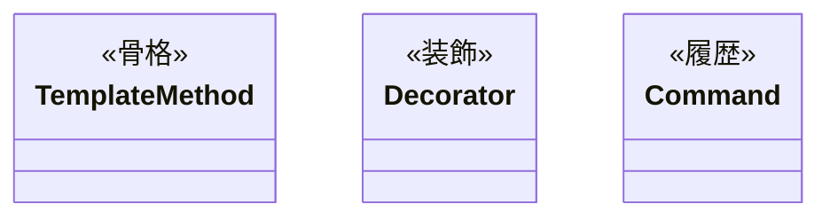

Template Method が処理の「固定された手順」を守り、Decorator がその上で「追加機能」を被せ、Command が「実行履歴」を管理することで、密結合していた責務を完全に分離しています。

#### 使いどころと限界

* **使いどころ**：生成順序が厳格な処理、機能追加の組み合わせが膨大なレポート・レポート生成エンジンなど。


* **限界**：機能追加がほとんどない単純な生成処理では、パターンによる複雑化が勝ってしまいます。


【過剰コード】

```cpp
// 常に「ロゴ」しか追加しないのに、Decorator を適用するのは過剰です。
// この場合は単純な if 文で十分です。

```

### この章のまとめ

この章の冒頭で示した「得られること」4点を、あらためて確認します。

**得られること1**（3つの変わる理由の識別）：フェーズ2の確定テーブルで、「処理の骨格」・「機能追加の組み合わせ」・「操作履歴の管理」という3つの変化軸が、それぞれ独立して変わりうることを識別しました。「このクラスが変わる理由は何か、そしてそれは誰の判断によるものか」という問いが、複雑なロジックの変化軸を分ける出発点になります。

**得られること2**（処理ステップ固定化と機能拡張のバランスの特定）：フェーズ5で、`ReportGenerator` が骨格の制御・機能の追加・履歴の記録を同時に担っている状態を接続点として特定しました。「処理の型を固定したい」と「機能を自由に組み合わせたい」という相反する要求が同居しているとき、どこが接続の崩れた場所なのかを読み取る視点が養われます。

**得られること3**（段階的な責務分離の手法の説明）：フェーズ7の変更シナリオ表で、骨格が変わるときは `ReportGenerator` のサブクラスのみ、機能が変わるときは `ReportDecorator` の実装クラスのみ、履歴管理が変わるときは `ICommand` の実装のみを変えればよい設計を確認しました。3つの仕組みを組み合わせた結果として、それぞれの変化が独立した場所に閉じる構造を説明できます。

**得られること4**（処理の定型化と機能の動的追加の両立）：フェーズ7の最終コードで、実行順序は骨格が保証しながら、機能の組み合わせは実行時に自由に変えられる状態を確認しました。「定型の中に柔軟性を持たせる」という設計の難しさに対して、複数の仕組みの組み合わせで答えを出す経験が、現場の複雑なロジックへの向き合い方を変えます。

レポート生成エンジンという題材を通じて、複数の変化軸を段階的に分離する設計の思考を体験できたのではないかと思います。この章で辿った7つのフェーズは、どんな現場のコードにも同じように使える思考の型です。
