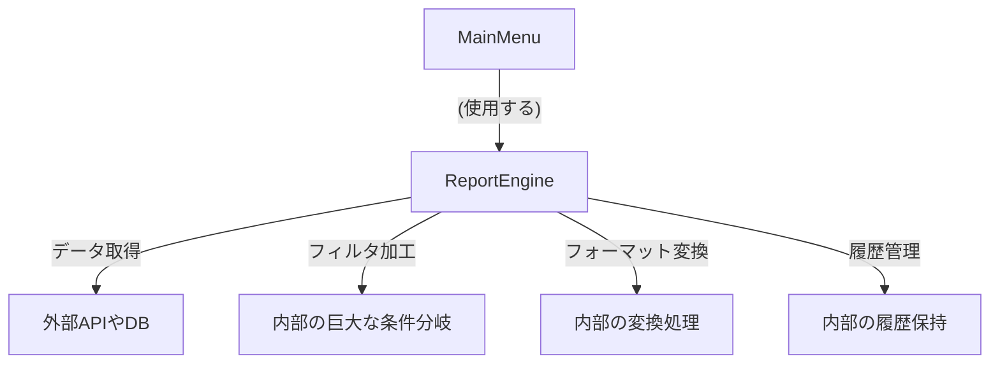
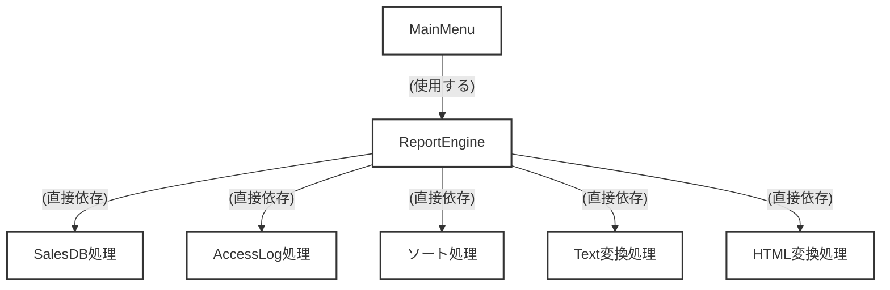
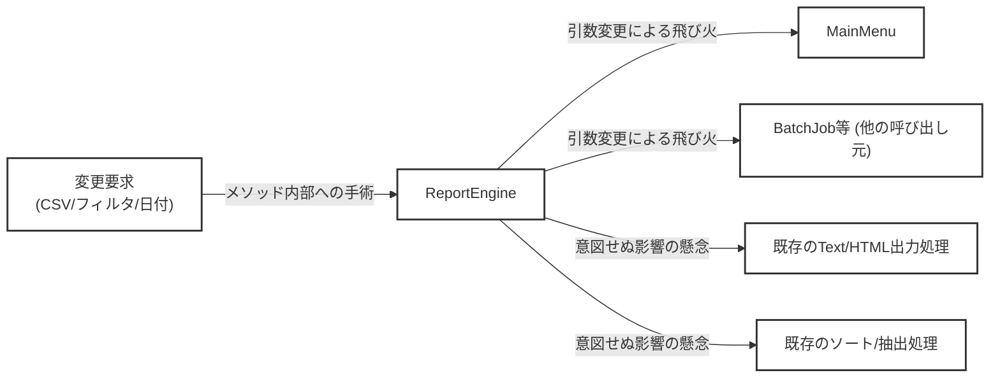
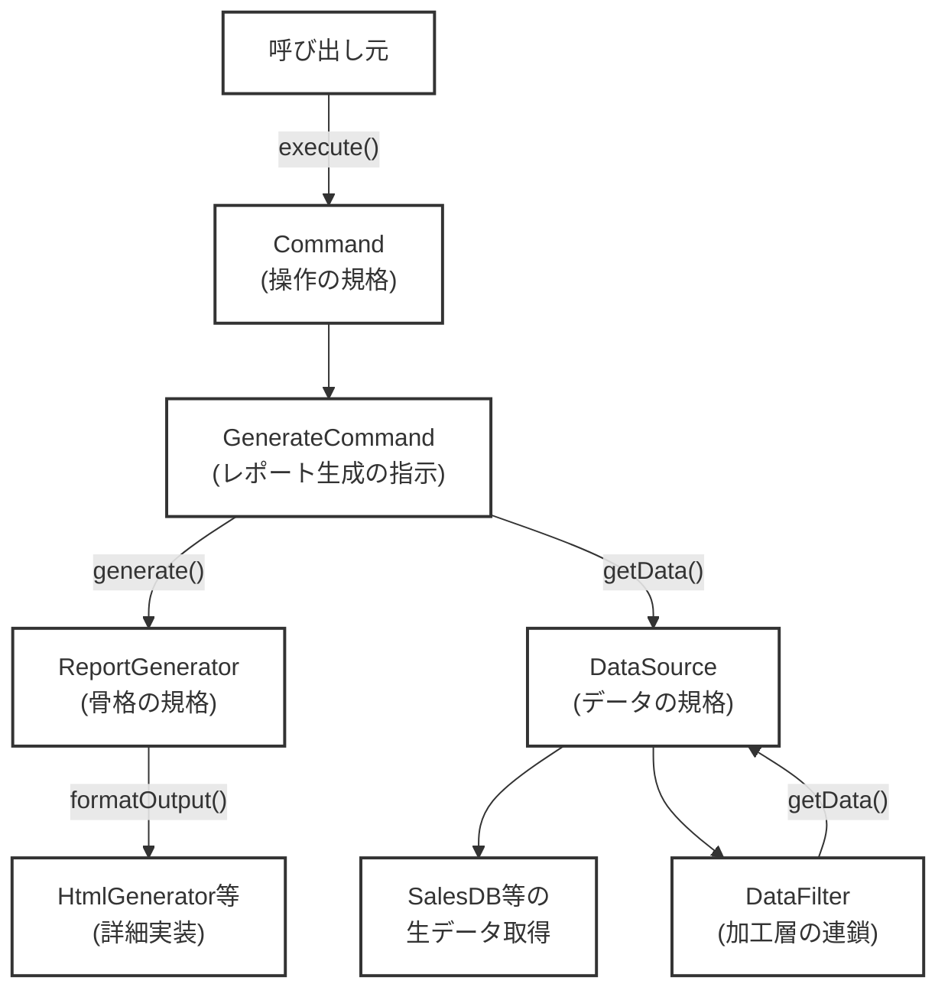

## 第11章　レポート生成エンジンを設計する

―― 思考の型：複数の「変わる理由」が複雑に絡み合う複合課題

### この章の核心

設計の真価は、単一のパターンを当てはめることではなく、絡み合った複数の「変わる理由」を解きほぐし、レゴブロックのように自由に組み合わせ可能な構造を作ることにある。

> **【レゴブロックで考える：複合パターンの適用】**
> 
> 大きなお城を作るとき、最初から1つの巨大なブロックを削り出して作るわけではありません。全体の形を決める「骨組みのブロック」、後から自由に追加できる「飾りのブロック」、そして組み立ての手順を記憶しておく「説明書のブロック」など、役割の違うブロックを組み合わせることで、どんな要求にも応えられる柔軟な形になります。ソフトウェアの設計も同じです。複数の手札を組み合わせることで、複雑な要求をシンプルに解きほぐすことができます。
> 
> **【画像生成AI用プロンプト案】**
> 
> `[ImagePrompt: A top-down 3D illustration of Lego blocks on a table. A complex castle structure is being assembled, highlighting a strong core skeleton block, decorative add-on blocks, and a blueprint manual block beside it. Bright, colorful, educational illustration style, clean white background, isometric view.]`

### この章を読むと得られること

- **得られること1：** 複雑な要件から「骨格」「組み合わせ」「操作」という異なる変わる理由を見分けられるようになる
    
- **得られること2：** 複数の設計パターン（Template Method、Decorator、Commandなど）を1つのシステムでどう統合するかがわかるようになる
    
- **得られること3：** 巨大で複雑なクラスを、安全に複数の小さなクラス群へ分割する手順がわかるようになる
    
- **得られること4：** 実務における「全部入りクラス」の爆発を防ぐための設計の勘所を身につけることができる
    

---

### ステップ0：システムを把握し、仮説を立てる ―― クラス構成を見てから「変わりそうな場所」を予測する

- **入力：** システムのシナリオ説明 ＋ クラス構成の概要（仕様表・責任一覧）
    
- **産物：** 変動と不変の「仮説テーブル」
    

> **全パターンに共通する問い**
> 
> 「このコードの中に、『変わる理由』が異なる2つのものが、同じ場所に混在していないか？」
> 
> ※「変わる理由」とは「誰の判断で変わるか」のことです。

#### 11.0 この章のシステム構成と仮説

**この章で扱うシステム：**

社内のあらゆる業務データを集約し、日報や月次決算などの帳票を作成する「レポート生成エンジン」です。

ユーザーは画面から対象データ（売上データ、アクセスログなど）を選び、出力形式（テキスト、HTML、PDFなど）を指定します。さらに、出力前に「上位10件のみに絞る」「金額でソートする」といったフィルタリング処理を複数組み合わせることができ、設定を間違えたときのために「一つ前の状態に戻す（Undo）」機能も備わっています。

**仕様表（何ができるシステムか）**

|**機能名**|**担当クラス**|**入力**|**出力**|
|---|---|---|---|
|レポート生成とフォーマット変換|`ReportEngine`|データソース種別と出力形式|レポートファイル|
|データの加工とフィルタリング|`ReportEngine`|フィルタ条件（複数可）|加工済みデータ|
|操作の履歴管理と取り消し|`ReportEngine`|Undo要求|1つ前の状態のデータ|

**クラス構成の概要**

現状のシステムは、長年の機能追加と仕様変更により、`ReportEngine` クラスがすべての処理を抱え込む「巨大な全部入りクラス」になっています。現場でよく見かける、誰も手を出したくない中心モジュールです。




→ **このグラフが示す問題：データの加工ルール、レポートの出力形式、操作の履歴管理という「変わる理由がまったく異なる処理」が、すべて1つのクラスに詰め込まれています。**

**各クラスの責任一覧**

現状の設計におけるクラスごとの役割と、知っている知識を整理します。これが本当に「単一の責任」になっているかを疑うことが設計の第一歩です。

|**クラス名**|**対象責任（1文）**|**知るべきこと**|
|---|---|---|
|`MainMenu`|ユーザーからの入力を受け付け、エンジンに生成の指示を出す。|`ReportEngine` の呼び出し方（メソッドの引数など）|
|`ReportEngine`|データの取得、加工、フォーマット変換、履歴の管理をすべて行う。|データの取得先、すべての出力形式の詳細、全フィルタの仕様、前回の状態情報|

この構成を踏まえた上で、どこが変わりそうか仮説を立てます。

**変動と不変の仮説（実装コードを読む前に立てる）**

業務システムにおいて、レポートの要件は「常に増え続ける」運命にあります。現状の構成から、以下のような変化が予測できます。

|**分類**|**仮説**|**根拠（クラス構成から読み取れること）**|
|---|---|---|
|🔴 **変動する**|データの取得元や出力形式|営業部門から「PDFレイアウトを変えたい」、データ基盤部門から「新しいAPIから取得してほしい」という要望が常に来るため。|
|🔴 **変動する**|データの加工条件（フィルタやソート）|`ReportEngine` がフィルタ条件を直接処理しており、新しい分析ニーズが出るたびに内部の条件分岐が追加される構造になっているため。|
|🔴 **変動する**|レポート生成の全体的な骨格や手順|ヘッダー構築、本文構築、フッター構築という順番がクラス内にハードコードされており、目次などを追加する際に影響を受けるため。|
|🟢 **不変**|「指示を受け取ってエンジンを動かす」という大枠のフロー|`MainMenu` はあくまでユーザーとの接点であり、レポートの詳細な仕様変更の影響を直接は受けないと考えられるため。|

現状の `ReportEngine` クラスは、「出力形式を増やしたい営業部門」「新しいデータを連携したいデータ基盤部門」「操作性を上げたいUI部門」という複数の関係者からの変更要求を、すべて1箇所で受け止める構造になってしまっています。

呼び出し元である `MainMenu` は一見シンプルに見えますが、それは `ReportEngine` があまりに多くの知識を抱え込みすぎているからです。この構造では、ちょっとしたフィルタ処理の追加が、レポート生成全体の想定外のバグ（デグレード）を引き起こしかねません。呼び出し元が多すぎて影響範囲が分からず、何度もgrepを繰り返して疲弊する、あの泥臭い苦労の原因がここにあります。

この仮説を念頭に置きつつ、次節（ステップ1）で実際にこのクラスのコードの中身を覗き、責任の所在を1行ずつチェックしていきましょう。

### ステップ1：実装コードを読む ―― 責任チェックで問題の行を見つける

#### 11.1 実装コードと責任チェック

ステップ0で、現在のシステムが `ReportEngine` クラスに多くの役割を背負わせている仮説を立てました。ここでは、実際のコードを開いて「責任通りに書かれているか」を1行ずつ確認していきます。

まずは、コードを読む前に現在の依存の広がりを見てみましょう。

**依存の広がり（実装前の全体像）**




→ **このグラフが示す問題：`ReportEngine` クラスが、データの取得先から出力形式の細部まで、すべての具体的な手段を直接知ってしまっています。**

それでは、起点となるコードを見ていきます。巨大なクラスなので、まずはデータ構造とクラスの骨組みから確認しましょう。


```cpp
#include <iostream>
#include <string>
#include <vector>

// 帳票に載せるデータ構造
struct ReportData {
    std::string title;
    int amount;
};

// レポート生成のすべてを担うクラス
class ReportEngine {
private:
    std::vector<ReportData> historyData; // 操作取り消し（Undo）用の状態保持
    bool hasHistory;

public:
    ReportEngine() {
        hasHistory = false;
    }

    // データ取得・加工・フォーマット変換を一手に引き受ける
    void generateReport(const std::string& sourceType, const std::string& format, bool sortByAmount, bool filterTop);
    
    // 履歴からの復元処理
    void undoLast();
};
```

この `ReportEngine` クラスの責任は、「**レポートの生成処理の進行を管理すること**」です。しかし、実際に知っている知識は「**データの取得手順、具体的な加工の手順、フォーマットごとの出力タグの書き方、そして状態保持**」となっています。

続いて、このクラスの中核である `generateReport` メソッドの実装を見てみます。フラグ（引数）によって処理を切り替える、現場でよく見かける構造です。


```cpp
void ReportEngine::generateReport(const std::string& sourceType, const std::string& format, bool sortByAmount, bool filterTop) {
    std::vector<ReportData> data;

    // 1. データ取得（取得先の種類が増えるたびにelse ifが増える）
    if (sourceType == "SalesDB") {
        data.push_back({"ItemA", 500});
        data.push_back({"ItemB", 1200});
        data.push_back({"ItemC", 300});
    } else if (sourceType == "AccessLog") {
        data.push_back({"PageX", 100});
        data.push_back({"PageY", 50});
    } else {
        std::cout << "Unknown data source." << std::endl;
        return;
    }

    // 履歴の保存（Undoのために内部の状態を書き換える）
    historyData = data;
    hasHistory = true;

    // 2. データの加工（条件フラグによって処理を差し込む）
    if (sortByAmount) {
        // ソート処理を直接実装している // ← 知らなくていい加工の詳細
        for (size_t i = 0; i < data.size(); ++i) {
            for (size_t j = i + 1; j < data.size(); ++j) {
                if (data[i].amount < data[j].amount) {
                    ReportData temp = data[i];
                    data[i] = data[j];
                    data[j] = temp;
                }
            }
        }
    }

    if (filterTop && data.size() > 1) {
        // 先頭1件のみ抽出 // ← 知らなくていい加工の詳細
        ReportData top = data[0];
        data.clear();
        data.push_back(top);
    }

    // 3. フォーマット変換と出力
    std::cout << "--- Report Start ---" << std::endl;
    if (format == "Text") {
        for (size_t i = 0; i < data.size(); ++i) {
            std::cout << "- " << data[i].title << " : " << data[i].amount << std::endl; // ← 知らなくていいテキストのレイアウト
        }
    } else if (format == "HTML") {
        std::cout << "<ul>" << std::endl; // ← 知らなくていいHTMLタグ
        for (size_t i = 0; i < data.size(); ++i) {
            std::cout << "  <li>" << data[i].title << " : " << data[i].amount << "</li>" << std::endl;
        }
        std::cout << "</ul>" << std::endl;
    }
    std::cout << "--- Report End ---" << std::endl;
}
```

最後に、このクラスを呼び出す `main` 関数と実行結果を確認します。


```cpp
int main() {
    ReportEngine engine;

    std::cout << "[Sales Report - Text, Sorted]" << std::endl;
    // 売上データをテキスト形式で、ソートして出力する
    engine.generateReport("SalesDB", "Text", true, false);

    std::cout << "\n[Access Log - HTML, Top 1]" << std::endl;
    // アクセスログをHTML形式で、先頭1件だけ出力する
    engine.generateReport("AccessLog", "HTML", false, true);

    return 0;
}
```

**実行結果：**

```
[Sales Report - Text, Sorted]
--- Report Start ---
- ItemB : 1200
- ItemA : 500
- ItemC : 300
--- Report End ---

[Access Log - HTML, Top 1]
--- Report Start ---
<ul>
  <li>PageX : 100</li>
</ul>
--- Report End ---
```

コードは期待通りに動いています。システムとしては何の問題もありません。問題は、今後の変更に対する「構造」にあります。

コードの各行が「誰の責任か」を判定する責任チェックを行ってみましょう。

**責任チェック：`ReportEngine` は自分の責任（レポート生成処理の進行管理）だけを持っているか**

★以下の「×」は記号にしてくれませんか。表のタイトルにも色を入れてほしい。これは他の章にも同様に修正して。

|**コードの行**|**持っている知識**|**責任内か**|
|---|---|---|
|`if (sourceType == "SalesDB")`|データソースの名前と分岐条件|✗ データ基盤担当の責任|
|`data.push_back({"ItemA", 500});`|データベースからの具体的な取得方法|✗ データ基盤担当の責任|
|`if (data[i].amount < data[j].amount)`|金額によるソートの具体的なアルゴリズム|✗ 分析・集計担当の責任|
|`std::cout << "<ul>" << std::endl;`|HTML固有のリストタグ（`<ul>`, `<li>`）の書き方|✗ UI・出力担当の責任|
|`historyData = data;`|一つ前の状態を記憶しておくという履歴管理|✗ 履歴管理担当の責任（進行管理とは別）|
|`std::cout << "--- Report Start ---"`|出力処理の開始と終了の制御（進行の枠組み）|✅ 進行管理の責任内|

責任チェック表から明らかなように、`ReportEngine` クラスは余計なことを知りすぎています。「HTMLのリストタグが `<ul>` であること」や「金額をどうやって比較するか」は、レポート生成の「進行」を管理するクラスが知るべき情報ではありません。

このクラスが持っている知識は多岐にわたり、それぞれが異なる理由で変更されます。例えば、営業部門から「HTMLの見た目を変えたい」と言われても、データ基盤部門から「新しいAPIに対応してほしい」と言われても、同じ `ReportEngine.cpp` というファイルを開き、この長大な `generateReport` メソッドの中にある `if` 文の海に手を入れなければならない構造になっているのです。

#### 11.2 届いた変更要求

ある日、営業部門のリーダーからあなたにチャットが飛んできました。

- **誰から：** 営業部門のチームリーダー
    
- **何の要求が：**
    
    1. 新たに「CSV形式」での出力を追加してほしい。
        
    2. データを「金額が1000以上のものだけ」に絞り込む新しいフィルタ機能を追加してほしい。
        
    3. 出力されるレポートのヘッダー部分（開始行の直後）に、出力実行した日付を入れてほしい。
        
- **いつまでに：** 今週の金曜日の夕方までに（あと3日）
    

「少し条件を足すだけだから、すぐできるよね？」という言葉が添えられています。

要求の1つ1つは確かにシンプルです。しかし、今の `ReportEngine` クラスにこれらを追加しようと想像してみてください。

CSV形式の `else if` を足し、1000以上で絞り込む `if` ブロックを足し、さらに `--- Report Start ---` の直後に日付出力処理を割り込ませる……。影響範囲がひとつのメソッドに集中しているため、ある変更が他の出力形式にどう影響するか、grepを繰り返して慎重に確かめながら修正しなければなりません。

次節（ステップ2）では、この「少し条件を足すだけ」の変更が将来どこまで膨らむのか、関係者にヒアリングをして仮説を確定させていきましょう。


### ステップ2：仮説を確定する ―― 関係者ヒアリングで「変わる理由」に根拠をつける

#### 11.3 仮説の検証と変動/不変の確定

ステップ0で仮説を立てました。ステップ1で責任チェックからも確認できました。しかし——コードを読んだだけで「変わる」「変わらない」と断定するのは危険です。

**関係者ヒアリング**

今回は、変更要求の依頼元である営業部門のリーダーと、大元のデータを提供しているデータ基盤部門の担当者に直接話を聞いてみます。

- **開発者（あなた）：** 「今回ご依頼いただいたCSV形式や新しいフィルタの追加ですが、こういったレポートの『出力形式』や『加工条件』は、今回限りの対応でしょうか？ それとも今後も定期的に増えていくものですか？」
    
- **営業部門リーダー：** 「間違いなく増え続けます。実は来月には客先提出用のPDF出力も必要になる見込みですし、分析の切り口（フィルタ条件）は営業施策が変わるたびに新しいものが欲しくなります。」
    
- **データ基盤担当：** 「データの取得元についても補足しておきます。来年、全社で新しい共通APIへの移行が控えています。今の『SalesDB』から直接データを引く方式はいずれ変わりますね。」
    
- **開発者（あなた）：** 「なるほど。取得も、加工も、出力も、それぞれ別々のタイミングで変わり続けるということですね。ちなみに、扱うデータの『型』について確認させてください。今は金額（amount）を `int` 型の数値として扱っていますが、将来的に小数や外貨を扱うことはありますか？」
    
- **営業部門リーダー：** 「直近ではありませんが、再来年のグローバル展開を見据えると、間違いなく外貨（小数の計算や通貨単位の保持）の扱いは必要になってきます。」
    
- **開発者（あなた）：** 「（心の声：引数の型まで変わるリスクがあるなら、構造の設計だけでどこまで守れるか見極める必要があるな……）。逆に、レポート作成における『データを取得し、加工し、指定の形式で出力する』という大枠の業務手順自体は変わりませんか？」
    
- **営業部門リーダー：** 「ええ。その業務フローの根本が変わることはありません。」
    

ヒアリングによって、「誰の判断で」「どのタイミングで」変わるのかが明確になりました。

|**分類**|**具体的な内容**|**変わるタイミング**|**根拠**|
|---|---|---|---|
|🔴 **変動する**|データの取得元や取得手段|新APIへの移行やDB変更時|データ基盤担当の回答|
|🔴 **変動する**|加工条件（フィルタやソート）|営業施策の変更時|営業部門リーダーの回答|
|🔴 **変動する**|出力フォーマット（CSV, PDF等）|現場の運用変更や顧客の要望時|営業部門リーダーの回答|
|🔴 **変動する**|引数の型（金額の小数・外貨対応など）|グローバル展開時など|営業部門リーダーの回答|
|🟢 **不変**|レポート生成の全体フロー（取得→加工→出力）|変わる日は来ない|業務の基本骨格として合意|

> **設計の決断：**
> 
> 🟢 不変な部分を「契約（インターフェース）」として固定し、
> 
> 🔴 変動する部分はそれぞれのインターフェースの裏側に押し込む。

※注意：ヒアリングで判明した「引数の型自体が変わる（金額が小数になる等）」というリスクは、インターフェースを導入するだけでは守りきれない場合があります。これについては、後続の耐久テストにて、設計の限界として正直に結果を示します。

---

### ステップ3：課題分析 ―― 変更が来たとき、どこが辛いかを確認する

#### 11.4 変更要求がもたらす「痛み」と影響範囲

（※本来はステップ2のヒアリングを通じて確定しますが）営業部門からの変更要求である「CSV形式の追加」「金額1000以上のフィルタの追加」「ヘッダーへの日付追加」について、関係者と対話したと想像してみてください。結果として、これらは今回限りの特殊な対応ではなく、今後も「新しい出力形式」「新しい分析軸」「全体レイアウトの調整」という形で、それぞれ**まったく別のタイミングで繰り返し発生する変動要素**であることが分かっています。

では、この変更を現在の `ReportEngine` クラスにそのまま組み込もうとすると、現場でどのような「痛み」が発生するでしょうか。具体的にシミュレーションしてみます。

**痛み1：引数の爆発と「grep地獄」**

新しいフィルタである「金額1000以上の絞り込み」を実装するには、外部からそのオン/オフの指示を受け取る必要があります。手っ取り早いのは、現在のメソッドに引数を足すことです。


```cpp
// 変更前
void generateReport(const std::string& sourceType, const std::string& format, bool sortByAmount, bool filterTop);

// 変更後（フラグ引数がまた一つ増えた）
void generateReport(const std::string& sourceType, const std::string& format, bool sortByAmount, bool filterTop, bool filterOver1000);
```

引数を1つ増やした瞬間、システム全体でこのメソッドを呼び出しているすべての箇所がコンパイルエラーを吐き出します。`MainMenu` クラスだけでなく、もし夜間バッチ処理のクラスなどからも呼ばれていた場合、システム全体をgrep（文字列検索）して該当箇所をすべて探し出し、末尾に `false` などのデフォルト値をひたすら書き足して回る単純作業が発生します。

「ただレポートの集計条件を1つ足したいだけなのに、なんで呼び出し元のメニュークラスまで全部修正して回らなきゃいけないんだ……？」

現場で誰もが一度は口にする、あの呟きです。呼び出し元のクラスは「レポート生成エンジン内部にどんな種類のフィルタがあるか」など知らなくていいはずです。しかし、それがメソッドの引数としてべったりと公開されているせいで、無関係なクラスにまで変更が飛び火してしまっています。

**痛み2：巨大な分岐（if文の海）での「手術」とデグレードの恐怖**

次に、メソッド内部の修正です。CSV出力のために `else if (format == "CSV")` というブロックを足し、フィルタ処理のために `if (filterOver1000)` のブロックを足します。さらに、ヘッダーに日付を出力する処理を `--- Report Start ---` の直後にねじ込みます。

このとき、既存の「テキスト出力」や「ソート処理」を壊していないことを、どうやって証明すればよいでしょうか。すべての処理が `generateReport` という一つの巨大なメソッド内に書かれているため、処理単位での局所的な単体テストができません。

また、1つの巨大なメソッドの中では変数のスコープ（有効範囲）が広がりすぎています。レポートの元データが入っている変数群を、様々な `if` 文がよってたかって加工するため、「CSVの機能を追加したら、なぜかHTML出力時にデータが空になってしまう」といった予期せぬ副作用（デグレード）に怯えることになります。結局、すべての出力パターンを手動でテストし直すという重い検証コストを支払うことになります。

**変更が飛び火する依存の広がり（改善前）**

ここで、今回の変更要求を実装しようとした際に、どこに影響が波及するのかを図で確認してみましょう。

★mermaid図に色が入っている箇所とは言っていない箇所がある。すべてに色を入れてほしい。他の章にも同様に修正してください。




→ **このグラフが示す問題：1つのクラスに複数の異なる責任が詰まっているため、一部の機能追加が呼び出し元（引数変更）と他の内部ロジック（分岐の追加）の両方に甚大な影響を及ぼしてしまいます。**

設計の価値は、新しいコードをきれいに書けることだけではありません。既存のシステムに新しい変更を加えるとき、**影響をこの1箇所に閉じ込められること**が設計の真の価値です。

今の `ReportEngine` クラスは、すべてのレゴブロックが強力な接着剤でガチガチに固められたお城のような状態です。窓（出力形式）の形を一つ変えたいだけなのに、壁ごとハンマーで壊し、屋根（呼び出し元）まで作り直さなければならない構造になっています。

次節（ステップ4）では、なぜこのようなガチガチの構造になってしまったのか、困難の根本にある設計上の原因を言語化していきます。

### ステップ4：原因分析 ―― 困難の根本にある設計の問題を言語化する

ステップ3で、少しの変更がシステム全体に飛び火し、「grep地獄」や予期せぬデグレードを引き起こす痛みをシミュレーションしました。なぜ、レポートにCSV出力を足すだけで、こんなに怯えなければならないのでしょうか？

ここでは、現在のコードで起きている事象を客観的に観察し、困難の根本にある「設計の問題」を言葉にしていきます。

**観察から見えてくる原因の方向性**

|**観察**|**原因の方向**|
|---|---|
|出力形式やフィルタ条件を追加するたびに、`generateReport` メソッドの引数（`bool` のフラグなど）が増え続ける。|呼び出し側（`MainMenu`）が、レポートエンジン内部の「どのフィルタが使えるか」などの**詳細な仕様を知りすぎている**ため、内部の変更が外部に漏れ出している。|
|一つの `generateReport` メソッドの中に、データベースからの取得、金額によるソート、HTMLのタグ生成、そして履歴の保存がすべて書かれている。|データ部門（取得）、分析部門（加工）、営業部門（出力）という**全く異なる人たちの「変わる理由」が、ひとつの塊（クラス）に癒着・混在している。**|
|ソートや絞り込みの処理が `if` 文の中に直接書かれており、フラグのオン/オフでしか制御できない。|「加工処理そのもの」と「加工処理の組み合わせ方」がべったりとくっついているため、「AをしてからBをする」といった**柔軟なパイプライン（連鎖）が組めない。**|
|操作を取り消す（Undo）ための状態保持を、`ReportEngine` クラス自身が配列で直接管理している。|本来、生成という「メインの業務」と、取り消しという「操作の管理」は別の責任であるにもかかわらず、**状態が直接露出して混ざってしまっている。**|

現場で「なぜこのクラスはこんなに複雑になったんだ……」と天を仰ぎたくなることがありますが、最初から誰も複雑なものを作ろうとしたわけではありません。「とりあえず引数にフラグを1つ足して、`if` 文で分岐させよう」という、その場しのぎの素早い対応の積み重ねが、気づけば「誰の責任でもない、誰も手を出せない巨大クラス」を生み出してしまうのです。

**変わるものと変わらないものが同じ場所にいる**

このシステムの最大の悲劇は、本来「別々のタイミングで」「別々の人の判断で」変わるはずの要素が、同じ `ReportEngine.cpp` というファイルに同居してしまっていることです。

ここから先、変更に強い柔軟な構造を作るために、「変わり続けるもの（変動）」と「変わってほしくないもの（不変）」を明確に切り分けましょう。

|**変わり続けるもの（🔴）**|**変わってほしくないもの（🟢）**|
|---|---|
|データの取得元や取得方法（データベースなのか、別APIなのか）|レポート生成の全体的な業務フロー（取得 → 加工 → 出力 という骨格）|
|金額ソートや件数絞り込みなど、個別の具体的な加工条件|複数の加工処理を、自由な順番でいくつでも重ねられるという仕組み|
|CSVやHTMLなど、出力フォーマットごとの詳細な文字列の書き方|呼び出し元が、レポートエンジンの内部仕様を知らずに「作って」とだけ依頼できること|
|履歴として保存すべきデータの中身|「一つ前の状態に戻す（Undo）」という操作の取り消し機構|

今の `ReportEngine` クラスは、この🔴と🟢がミキサーにかけられたように混ざり合っています。営業部門が「CSVフォーマットを変えたい」と言ったとき、変わってほしくない「データの取得」や「ソート処理」まで巻き添えになる危険に晒されているのは、この混在が原因です。

**本質的な原因と、使うべき物理操作（手札）**

今回は複雑なシステムであるため、原因は一つではありません。要素と関係の次元から、私たちが持っている「4つの手札（設計操作）」のどれを適用すべきかを整理します。

| **次元** | **物理操作（手札）**       | **本質的な原因（何が問題か）**                                         | **使うべき構造的対策案（本質）**                                 |
| ------ | ------------------ | --------------------------------------------------------- | -------------------------------------------------- |
| 要素     | **① 分割する（切る）**     | 「レポート生成の進行（骨格）」と「個別の詳細処理（取得・出力等）」という異なる責任が、1つのクラスに混在している。 | **骨格と詳細の分離**（不変な進行手順と、変動する具体実装を別々の場所で管理する）         |
| 要素     | **② 隠蔽する（包む）**     | 「操作を元に戻す」ためのデータや手順がエンジン内に露出し、生成業務と履歴管理業務が癒着している。          | **操作と状態のカプセル化**（「何をどう戻すか」という知識を、独立したオブジェクトとして包み込む） |
| 関係     | **③ 規格化する（形を揃える）** | 特定の加工処理（ソートや絞り込み）がべた書きされており、使う側がフラグで具体的に指定しなければならない。      | **加工処理のインターフェース統一**（加工部品の形を揃え、自由に組み合わせ可能にする）       |

これだけ多くの問題が絡み合っていると、どこから手をつけていいか途方に暮れてしまうかもしれません。

しかし、心配はいりません。巨大なお城を一度に崩す必要はありません。複数の「変わる理由」が混在しているなら、私たちの手札（分割・隠蔽・規格化・間接化）を一つずつ順番に切り、レゴブロックを分解しては形を整え、再び組み立て直していけばよいのです。

次節（ステップ5）では、まず最も根本的な問題である「骨格と詳細の混在」を分割する手札から切り出し、絡み合った糸を解きほぐすプロセスをコードで実践していきます。
### ステップ5：対策案の検討 ―― 原因から手札を選ぶ

- **ステップ4で特定した真因：** 「レポートの骨格」「データの取得・加工」「操作の履歴」という異なる理由で変わる処理が1つのクラスに癒着し、それらをつなぐ「規格化された境界」が存在しないこと。
    

困難の根本原因がはっきりしました。ここからは、私たちが持っている「4つの手札」を切って、この巨大で複雑なクラスを解きほぐしていきます。

#### 1. 分離・隠蔽を試す（手段①の基本）

まずは最も基本的な手札である**①分割する（切る）**を用いて、一つの巨大なメソッド内にべた書きされていた処理を「プライベート関数」として切り出してみます。手続き型コードとしての理想形を目指し、内部を整理整頓してみましょう。

```cpp
#include <iostream>
#include <string>
#include <vector>

struct ReportData {
    std::string title;
    int amount;
};

// 整理されたReportEngineクラス
class ReportEngine {
private:
    std::vector<ReportData> historyData;
    bool hasHistory = false;

    // 取得処理を関数として分離
    std::vector<ReportData> fetchSalesData() {
        return {{"ItemA", 500}, {"ItemB", 1200}, {"ItemC", 300}};
    }
    std::vector<ReportData> fetchAccessLog() {
        return {{"PageX", 100}, {"PageY", 50}};
    }

    // 加工処理を関数として分離
    void sortByAmount(std::vector<ReportData>& data) {
        for (size_t i = 0; i < data.size(); ++i) {
            for (size_t j = i + 1; j < data.size(); ++j) {
                if (data[i].amount < data[j].amount) {
                    std::swap(data[i], data[j]);
                }
            }
        }
    }
    void filterTop1(std::vector<ReportData>& data) {
        if (data.size() > 1) {
            ReportData top = data[0];
            data.clear();
            data.push_back(top);
        }
    }

    // 出力処理を関数として分離
    void formatText(const std::vector<ReportData>& data) {
        for (const auto& d : data) {
            std::cout << "- " << d.title << " : " << d.amount << std::endl;
        }
    }
    void formatHtml(const std::vector<ReportData>& data) {
        std::cout << "<ul>\n";
        for (const auto& d : data) {
            std::cout << "  <li>" << d.title << " : " << d.amount << "</li>\n";
        }
        std::cout << "</ul>\n";
    }

public:
    // メインの処理フロー
    void generateReport(const std::string& sourceType, const std::string& format, bool sort, bool top1) {
        std::vector<ReportData> data;

        // 1. 取得
        if (sourceType == "SalesDB") {
            data = fetchSalesData();
        } else if (sourceType == "AccessLog") {
            data = fetchAccessLog();
        }

        // 履歴の保存
        historyData = data;
        hasHistory = true;

        // 2. 加工
        if (sort) sortByAmount(data);
        if (top1) filterTop1(data);

        // 3. 出力（骨格）
        std::cout << "--- Report Start ---" << std::endl;
        if (format == "Text") {
            formatText(data);
        } else if (format == "HTML") {
            formatHtml(data);
        }
        std::cout << "--- Report End ---" << std::endl;
    }
};
```

関数に分割したことで、「どこで何をしているか」は劇的に読みやすくなりました。一つの巨大な塊の手術に比べれば、少しは安全に変更を加えられそうです。

しかし、**設計の根本的な課題は何も解決していません。**

営業部門から「CSV出力を足したい」と言われれば、相変わらず `ReportEngine` クラスを開いて `else if (format == "CSV")` を書き足さなければなりません。新しいフィルタの要求が来れば、`generateReport` メソッドの引数にフラグを追加し、呼び出し元の `MainMenu` にまで影響（grep地獄）が波及します。

処理の「中身」を別々の関数に隠蔽しても、それらを結びつける「つなぎ目」が規格化されていないため、「置換」や「拡張」の能力は得られていないのです。

#### 2. さらに規格化・間接化を重ねる（手段②：インターフェース導入）

手段①の限界を突破するために、残る手札である**③規格化する（形を揃える）**と**④間接化する（間に挟む）**を使います。今回は複数の「変わる理由」が複雑に絡み合っているため、それぞれの関心事に対して別々の規格を設ける「複合アプローチ」をとります。

> **【レゴブロックで考える：複合パターンの適用】**
> 
> ここで行うのは、1つの巨大なブロックを、役割の異なる3種類の専用ブロックに作り変える操作です。
> 
> - **骨組みのブロック（Template Method）**：レポートの「出力する順番（骨格）」だけを決めておき、中身の詳細（テキストかHTMLか）は別のブロックに任せます。
>     
> - **飾りのブロック（Decorator）**：「データ」と「加工処理（フィルタ）」のつなぎ目を同じ形に揃え、マトリョーシカのようにいくつでも連鎖して被せられるようにします。
>     
> - **説明書のブロック（Command）**：「作って」という指示そのものをブロック化し、いつでも「1つ前の指示（Undo）」を取り出せるようにします。
>     
> 
> `[ImagePrompt: A top-down 3D illustration of Lego blocks. A complex castle structure is being assembled, highlighting a strong core skeleton block, decorative add-on blocks stacked together, and a blueprint manual block beside it. Bright, colorful, educational illustration style, clean white background, isometric view.]`

それぞれの規格（インターフェース）をコードで定義してみましょう。

**① 組み合わせの規格化（Decoratorの布石）**

データの取得元（DBなど）と、そのデータを加工するフィルタ処理。これらは「データを外に返す」という点で同じビジネス上の責任を持たせることができます。


```cpp
// ビジネス責任：「レポート用のデータ群を提供する」
class DataSource {
public:
    virtual ~DataSource() = default;
    virtual std::vector<ReportData> getData() = 0; // ← 取得でも加工でも「データをもらう」窓口はこれ一つ
};
```

**② 骨格の規格化（Template Methodの布石）**

レポート生成の「ヘッダーを出力し、中身を出力し、フッターを出力する」という全体の流れ（骨格）を固定し、各フォーマット固有の書き方は下位に任せます。


```cpp
// ビジネス責任：「データを受け取り、レポートの形にして出力する」
class ReportGenerator {
public:
    virtual ~ReportGenerator() = default;

    // 骨格（不変）
    void generate(DataSource* source) {
        std::cout << "--- Report Start ---" << std::endl;
        std::vector<ReportData> data = source->getData(); // ← 具体的にどう取得・加工されたか知らなくていい
        formatOutput(data);
        std::cout << "--- Report End ---" << std::endl;
    }

protected:
    // 詳細（変動する。サブクラスに任せる部分）
    virtual void formatOutput(const std::vector<ReportData>& data) = 0;
};
```

**③ 操作の規格化（Commandの布石）**

「ユーザーからの指示」をオブジェクトとしてカプセル化します。これにより、エンジン自体が状態を持たなくても、コマンド自身が「自分はどうやって実行されたか」を記憶できるようになります。


```cpp
// ビジネス責任：「システムに対する操作を実行し、取り消し可能にする」
class Command {
public:
    virtual ~Command() = default;
    virtual void execute() = 0;
    virtual void undo() = 0;
};
```

**手段②がもたらす構造の変化（依存の広がり）**

これらの規格を導入した結果、クラス群の依存関係は以下のように変わります。




もはや `ReportEngine` という巨大な全部入りクラスは存在しません。呼び出し元は、フラグを渡す代わりに「こういう構成でレポートを作れ」という `Command` オブジェクトを組み立てて実行するだけになります。

ここには「置換」と「拡張」の能力がはっきりと備わっています。新しいフォーマットを足したければ `ReportGenerator` の具象クラスを1つ足すだけ。新しいフィルタを足したければ `DataSource` の具象クラスを1つ足すだけです。どちらも既存のコードには一切触れません。

次節（ステップ6）では、これらの部品をどのように組み立てるのか（Composition Rootの設計）を示しつつ、ヒアリングで挙がった変更要求が来たときの「耐久テスト」を実施し、この設計が本当にコストに見合うのかを天秤にかけます。

### ステップ6：天秤にかける ―― 手段を評価する

ステップ5で、私たちは2つのアプローチを試しました。

1つ目は、手札の①（分割）と②（隠蔽）を使って、巨大なメソッドをプライベート関数に整理する手段。

2つ目は、それに加えて③（規格化）と④（間接化）を使って、「骨格」「組み合わせ」「操作」の3つのインターフェースを導入する手段です。

ここで一度、キーボードから手を離して深呼吸しましょう。

設計とは、常にトレードオフ（天秤）です。美しい構造を作ることが目的なのではなく、現場の痛みを最小コストで取り除くことが目的です。2つの手段を冷静に評価してみます。

**手段①（分離・隠蔽のみ）の評価：**

「関数に切り出したことで、コードはとても読みやすくなりました。どこに何が書かれているかは一目瞭然です。しかし、つなぎ目が『規格化』されていないため、新しいCSV形式を足すには、結局 `ReportEngine` クラスを開いて `else if` の分岐を書き足す必要があります。『拡張』という評価軸では不合格です」

**手段②（＋規格化・間接化）の評価：**

「役割ごとにインターフェースで『規格化』し、具象クラスを『間接化』しました。これにより、既存のコードに一切触れることなく、新しいフィルタや出力形式の部品を差し替える『置換』と、新機能を足す『拡張』の能力を手に入れました。ただし、ファイル数やクラス数は確実に増えます」

#### 11.5 手段①vs手段②の比較

両者を、私たちが直面している現場のコストという評価軸で測ってみます。

|**評価軸**|**手段①（関数への分割）**|**手段②（インターフェースによる規格化）**|**評価の観点**|
|---|---|---|---|
|現状の設計コスト|**低い**（1ファイル内で完結）|高い（クラスとファイルが増える）|実装工数、学習コスト。手段②はコードの行数自体は増えます。|
|現状の評価コスト|高い（分岐を網羅する手動テストが必要）|**低い**（部品ごとに単体テストが可能）|各部品が独立しているため、テストコードの作成難易度は手段②が圧倒的に有利です。|
|未来の設計コスト|非常に高い（変更のたびにif文の海でgrep地獄）|**低い（既存クラスを開かずに追加のみ）**|別の仕様変更が来た際、どれだけ少ない修正で対応できるか（変更容易性）。|
|未来の評価コスト|非常に高い（予期せぬデグレードの恐怖）|**低い（影響範囲が部品単位に閉じる）**|変更したとき、他の機能が壊れていないことを証明するコスト。|
|現状・未来 総合コスト|短期的には速いが、負債が雪だるま式に膨らむ|**初期投資は要るが、変更が来るたびに回収できる**|短期的なリリース速度と、中長期的な技術負債のバランス。|

**結論：** 今回のシステムは、営業部門やデータ部門から「出力形式」や「フィルタ条件」の変更要求が繰り返し発生することがヒアリングで確定しています。初期の実装コスト（クラスが増えること）を支払ってでも、手段②を採用し、将来の変更コストを劇的に下げる投資をすべき状況です。

#### 11.6 耐久テスト ―― ヒアリングで挙がった変化が来た

では、本当に手段②が「既存コードを開かずに追加のみで対応できる」のか、証明してみましょう。

ステップ2で営業部門のリーダーから届いた3つの変更要求が実際に来た場面をシミュレートします。

1. 新たに「CSV形式」での出力を追加してほしい。
    
2. データを「金額が1000以上のものだけ」に絞り込む新しいフィルタを追加してほしい。
    
3. ヘッダー部分に実行日付を入れてほしい。
    

もし手段①のままであれば、ここで `ReportEngine` クラスを開いて手術を開始し、デグレードに怯えながら徹夜でテストすることになります。しかし、規格化された手段②では、すべて**「新しいブロックを追加するだけ」**で完了します。

まずは「CSV形式」の追加です。既存のファイルは一切見ません。新しく `CsvGenerator.cpp` を作るだけです。

C++

```
#include <iostream>

// --- 追加するコード（既存コードには触れない） ---
class CsvGenerator : public ReportGenerator {
protected:
    // 骨格が要求する「詳細」を実装するだけ // ← 知らなくていいCSVの書き方
    void formatOutput(const std::vector<ReportData>& data) override {
        for (const auto& d : data) {
            std::cout << d.title << "," << d.amount << "\n";
        }
    }
};
```

次に「金額1000以上のフィルタ」です。これも既存のデータ取得処理には触れず、「取得元のデータを上からラップする（包み込む）」という Decorator の考え方で作ります。

C++

```
// --- 追加するコード（既存コードには触れない） ---
// フィルタの基底クラス（Decorator）
class DataSourceDecorator : public DataSource {
protected:
    DataSource* wrapped; // ← ラップする対象（別のデータソースかフィルタ）
public:
    DataSourceDecorator(DataSource* source) : wrapped(source) {}
};

// 1000以上で絞り込む具体的なフィルタ
class Over1000Filter : public DataSourceDecorator {
public:
    Over1000Filter(DataSource* source) : DataSourceDecorator(source) {}

    std::vector<ReportData> getData() override {
        std::vector<ReportData> rawData = wrapped->getData(); // ← 中身を取り出す
        std::vector<ReportData> filtered;
        
        for (const auto& d : rawData) {
            if (d.amount >= 1000) { // ← 絞り込む
                filtered.push_back(d);
            }
        }
        return filtered;
    }
};
```

最後に「ヘッダーへの日付追加」です。ステップ5で定義した `ReportGenerator` の骨格を見ると、`std::cout << "--- Report Start ---"` が直接書かれていました。これは Template Method パターンの考え方からすると、「フックメソッド（サブクラスで拡張可能な処理）」として切り出しておくべきでした。骨格クラスに小さなリファクタリングを施します。

C++

```
// --- ReportGenerator の骨格を少しだけ拡張（一度だけ） ---
class ReportGenerator {
public:
    virtual ~ReportGenerator() = default;

    void generate(DataSource* source) {
        printHeader(); // ← 拡張用のフックメソッドに変更
        std::vector<ReportData> data = source->getData();
        formatOutput(data);
        printFooter();
    }

protected:
    virtual void formatOutput(const std::vector<ReportData>& data) = 0;
    
    // デフォルトの実装。必要ならサブクラスで上書き（オーバーライド）できる
    virtual void printHeader() {
        std::cout << "--- Report Start ---" << std::endl;
    }
    virtual void printFooter() {
        std::cout << "--- Report End ---" << std::endl;
    }
};
```

これで準備は整いました。では、これらの部品を一体「誰が」組み立てるのでしょうか？

各具象クラス（`CsvGenerator` や `Over1000Filter`）を `new` して結びつけるのは、システムの中で**たった1箇所（Composition Root：組み立て点）**でなければなりません。このシステムでは、バッチ処理を起動する `BatchApplication` クラスがその役割を担います。

C++

```
// --- 組み立て点（Composition Root） ---
// このクラスだけが、すべての具象クラスを知っている

class BatchApplication {
public:
    void run() {
        // 1. パーツの組み立て（売上DB ＋ 1000以上フィルタ ＋ CSV出力）
        DataSource* db = new SalesDataSource();
        
        // フィルタでDBをラップする（複数重ねることも可能）
        DataSource* filter = new Over1000Filter(db); 
        
        // CSV出力の実装クラスを指定
        ReportGenerator* generator = new CsvGenerator(); 
        
        // 2. コマンドの生成（操作の説明書を作成）
        Command* cmd = new GenerateCommand(filter, generator);
        
        // 3. 実行（これ以降、誰も具象クラスを知らない）
        cmd->execute();

        delete cmd;
        delete generator;
        delete filter;
        delete db;
    }
};

// --- プログラムの本当の入り口 ---
int main() {
    BatchApplication app;
    app.run();
    return 0;
}
```

この組み立て点のコードを見て、2つの重要な事実に気づくはずです。

1つ目は、**「呼び出し元が変わる理由を一切引き継いでいない」**ことです。 `main` 関数は `BatchApplication` を `run()` しているだけで、レポートがCSVなのかHTMLなのかすら知りません。もしレポート出力の部品が変わっても、`main` 関数は1文字も直さなくていいのです。変わるのは組み立てクラスの中の、部品を組み合わせる1行だけです。

2つ目は、**「実装手段の名前がそのまま説明になっている」**ことです。 `CsvGenerator` というクラス名には「CSV」という技術名（実装手段）が直接入っていますが、これで構いません。組み立てクラスで `new CsvGenerator()` と書かれた1行が、「今回はCSVで出力するんだな」という**変更内容そのものの説明**として機能するからです。実装を切り替えた瞬間に、名前と実態が嘘をつくことはありません。

**設計の限界と、引数の型の隠蔽について**

ここまで見事に変更を局所化できたように見えますが、守れない変更もあります。

もし、やり取りしている `ReportData` 構造体の `amount` が、要件変更で `int` から `double`（小数）や `long long` に変わったらどうなるでしょうか？

C++

```
struct ReportData {
    std::string title;
    // int amount; 
    double amount; // 型が変わった！
};
```

この瞬間、金額を比較しているすべてのフィルタ（`Over1000Filter` など）や、出力フォーマットのコードがコンパイルエラーや仕様バグを引き起こす可能性があります。インターフェースでつなぎ目を規格化しても、つなぎ目を流れる「データの型（シグネチャ）」が変わってしまえば、影響はシステム全体に及びます。

もしヒアリングの段階で「将来、金額の桁数や単位が変わる可能性が高い」と分かっていたなら、どうすべきでしょうか。その時は、インターフェースは「呼び出し元が知らなくていい詳細」を隠す契約書なのですから、プリミティブな型（`int`）をそのまま露出させるのではなく、`Amount` クラスのような独自の型（値オブジェクト）を作って**型の詳細そのものを隠蔽（カプセル化）する**という選択肢が必要です。 パターンの構造に魔法はありません。「何を隠し、何を見せるか」という最初の決断が全てを握っています。

#### 11.7 使う場面・使わない場面

複数の手札を組み合わせたこの構造は非常に強力ですが、やりすぎると痛い目を見ます。導入コスト（クラス数の増加）に見合うかどうかを判断する基準を持ちましょう。

**【過剰コード：変化の予定がないものまでパターン化した例】**

C++

```
// 半年に1回、自分だけがローカルで実行する使い捨ての集計スクリプト
class TextReportGenerator : public ReportGenerator { ... };
class SqliteDataSource : public DataSource { ... };
class SimpleGenerateCommand : public Command { ... };
```

いくら設計の練習だからといって、変更が繰り返し発生しないツールや、自分一人しか触らないスクリプトにまでこの重装備を持ち込むのは、エンジニアリングとして間違いです。 依存先が1つしかなく、将来別の出力形式が増える見込みがないなら、**ステップ5の最初に見せた「手段①：関数に切り出すだけ」が最小コストの代替案であり、大正解**なのです。

「シンプルに保つこと」も、私たちが持つ重要な選択肢の一つです。以下の表を判断基準にしてください。

|**状況**|**適切な選択**|**理由**|
|---|---|---|
|変更が頻繁に発生し、複数の関係者から異なる要望（出力形式の追加、フィルタの追加など）が絶えずやってくる。|**手段②（複合パターンの適用）**|長期的な保守コスト（grep地獄や手動テストの負荷）を、初期の実装コストで前払いして抑え込むため。|
|当面はテキスト出力とDB連携の1パターンしか存在せず、機能追加の予定も立っていない。|**手段①（関数等への分離のみ）**|将来起きるか分からない変化のために、大量のクラスを作るのは「過剰設計（YAGNI）」だから。|
|プロトタイプ開発や、使い捨ての分析用バッチツールを作っている。|**分離もせず全部入りメソッドで書く**|速度が最優先であり、コードをきれいに保つこと自体の価値が低いから。|

設計に絶対の正解はありません。 目の前のシステムがどう変わっていくのかを関係者から泥臭く聞き出し、現状のコストと未来のコストを天秤にかけて決断すること。それこそが、設計という仕事の真髄なのです。

次節（ステップ7）では、この設計プロセスを回した結果、コード全体が最終的にどのような姿に落ち着いたのか、そして影響範囲がどれほど局所化されたのかを変更シナリオ表とともに確認して章を締めくくります。

### ステップ7：決断と、手に入れた未来

度重なる変更要求と、それに伴うgrep地獄やデグレードの恐怖から解放されるため、私たちは「骨格」「組み合わせ」「操作」という3つのインターフェース（規格）を導入する決断を下しました。

初期の実装コストはかかりますが、変更が来るたびに安全かつ迅速に対応できる構造です。

最終的に、私たちのコードがどのような姿になったのかを見てみましょう。

#### 11.8 解決後のコード（全体）

コード全体のボリュームが大きくなったため、役割ごとに分割して確認します。

**1. データ構造と3つのインターフェース（規格）**

まずは、システムをつなぐ「境界」となるインターフェース群です。これらの名前は「PDF」や「Sort」といった実装手段ではなく、「データをもらう」「出力する」という**ビジネス上の責任**で名付けられています。

C++

```
#include <iostream>
#include <string>
#include <vector>

// 帳票に載せるデータ構造
struct ReportData {
    std::string title;
    int amount;
};

// 【データの規格】ビジネス責任：「レポート用のデータ群を提供する」
class DataSource {
public:
    virtual ~DataSource() = default;
    virtual std::vector<ReportData> getData() = 0;
};

// 【骨格の規格】ビジネス責任：「データを受け取り、レポートの形にして出力する」
class ReportGenerator {
public:
    virtual ~ReportGenerator() = default;

    // 骨格（不変）
    void generate(DataSource* source) {
        printHeader();
        std::vector<ReportData> data = source->getData(); // ← 具体的にどう取得・加工されたか知らなくていい
        formatOutput(data);
        printFooter();
    }

protected:
    virtual void formatOutput(const std::vector<ReportData>& data) = 0;
    virtual void printHeader() {
        std::cout << "--- Report Start ---" << std::endl;
    }
    virtual void printFooter() {
        std::cout << "--- Report End ---" << std::endl;
    }
};

// 【操作の規格】ビジネス責任：「システムに対する操作を実行し、取り消し可能にする」
class Command {
public:
    virtual ~Command() = default;
    virtual void execute() = 0;
    virtual void undo() = 0;
};
```

**2. データの取得と加工（Decorator）**

次に、データを取得する部品と、それを加工する部品です。どちらも `DataSource` インターフェースを実装しているため、同じ規格のレゴブロックとして扱うことができます。

C++

```
// 生データ取得（具体クラス）
class SalesDataSource : public DataSource {
public:
    std::vector<ReportData> getData() override {
        return {{"ItemA", 500}, {"ItemB", 1200}, {"ItemC", 300}};
    }
};

// フィルタの基底クラス（Decorator）
class DataSourceDecorator : public DataSource {
protected:
    DataSource* wrapped;
public:
    DataSourceDecorator(DataSource* source) : wrapped(source) {}
};

// 1000以上で絞り込む具体的なフィルタ
class Over1000Filter : public DataSourceDecorator {
public:
    Over1000Filter(DataSource* source) : DataSourceDecorator(source) {}

    std::vector<ReportData> getData() override {
        std::vector<ReportData> rawData = wrapped->getData();
        std::vector<ReportData> filtered;
        for (const auto& d : rawData) {
            if (d.amount >= 1000) {
                filtered.push_back(d);
            }
        }
        return filtered; // ← 絞り込んだ結果を返す
    }
};
```

**3. 出力フォーマットと操作コマンド**

出力フォーマットは `ReportGenerator` を継承し、詳細な書き方のみを実装します。そして、それらを束ねて「指示」とするのが `GenerateCommand` です。

C++

```
// CSV出力（具体クラス）
class CsvGenerator : public ReportGenerator {
protected:
    void formatOutput(const std::vector<ReportData>& data) override {
        for (const auto& d : data) {
            std::cout << d.title << "," << d.amount << "\n"; // ← CSV固有の書き方
        }
    }
};

// レポート生成の指示（具体クラス）
class GenerateCommand : public Command {
private:
    DataSource* source;
    ReportGenerator* generator;
public:
    // コンストラクタ引数でインターフェース型のポインタを受け取る
    // つまり、このクラスは具体的にどのDBやどのフォーマットかを全く知らない
    GenerateCommand(DataSource* s, ReportGenerator* g) : source(s), generator(g) {}

    void execute() override {
        generator->generate(source);
    }

    void undo() override {
        std::cout << "Undo operation" << std::endl;
    }
};
```

**4. 組み立て点（Composition Root）と main関数**

最後に、すべての具体クラスを生成し、組み合わせる「唯一の場所」です。

C++

```
// 組み立てクラス（Composition Root）
class BatchApplication {
public:
    void run() {
        // ここが全ての具体クラスをnewし、依存を注入する唯一の場所
        DataSource* db = new SalesDataSource();
        DataSource* filter = new Over1000Filter(db); 
        ReportGenerator* generator = new CsvGenerator(); 
        
        Command* cmd = new GenerateCommand(filter, generator);
        
        // 実行
        cmd->execute();

        delete cmd;
        delete generator;
        delete filter;
        delete db;
    }
};

int main() {
    // main()の責任はプログラムを起動すること。組み立てクラスを作ることだけが仕事。
    BatchApplication app;
    app.run();
    return 0;
}
```

#### 11.9 変更影響グラフ（改善後）

ステップ3の悲惨なグラフと見比べてみてください。今回の変更要求（CSV・フィルタ・日付の追加）が来たとき、私たちの設計はどのように振る舞うでしょうか。

コード スニペット

```
graph LR
    Requirement["変更要求<br>(CSV/フィルタ/日付)"] -->|"部品を追加するだけ"| Components["CsvGenerator<br>Over1000Filter"]
    Requirement -->|"組み合わせを1行変える"| CompositionRoot["BatchApplication<br>(組み立て点)"]
    
    Components -.->|"既存のフォーマット<br>には影響なし"| ExistingFormat["既存のText/HTML出力処理"]
    Components -.->|"既存のフィルタ<br>には影響なし"| ExistingFilter["既存のソート/抽出処理"]
    CompositionRoot -.->|"呼び出し元は<br>変更なし"| MainMenu["MainMenu / main()"]
    
    classDef default fill:#fff,stroke:#333,stroke-width:2px
    class Requirement fill:#ffcccc,stroke:#cc0000,stroke-width:2px
    class Components fill:#ccffcc,stroke:#009900,stroke-width:2px
```

→ **新しい要求が来ても、既存のロジックや呼び出し元には一切飛び火せず、新しい部品の追加と組み立て点の1行の変更だけで済むようになりました。**

#### 11.10 変更シナリオ表と最終責任テーブル

「変更に強い」とは、魔法のようにすべてが自動で対応できることではありません。**何が起きたとき、どのファイルを開けば済むかが事前に明確になっていること**です。

**変更シナリオ表：何が変わったとき、どこが変わるか**

|**シナリオ**|**変わるクラス**|**変わらないクラス**|
|---|---|---|
|新しいフォーマット「PDF出力」が欲しいと言われた|`PdfGenerator`（新規追加）、`BatchApplication`（組み立て）|`GenerateCommand`（統括）、`DataSource`等すべての既存クラス|
|使う部品の組み合わせが変わった（フィルタを2重にしたい等）|`BatchApplication`（組み立て）のみ|すべての既存部品クラス|
|データ取得元がDBから外部APIに変わった（集約クラスの差し替え）|`ApiDataSource`（新規追加）、`BatchApplication`（組み立て）|`GenerateCommand`（統括）、各フィルタ、各フォーマット|
|「戻る（Undo）」の仕様が変わった|`GenerateCommand`のみ|各フォーマット、データ取得、UI呼び出し側|

表を見ると、どんな変更が来ても「変わるクラス」が1〜2クラスに局所化されていることがわかります。そして、業務フローを統括する `GenerateCommand` は、具体的な集約クラスが差し替わっても「変わらないクラス」にしっかりと留まっています。

**最終責任テーブル**

|**クラス名**|**責任（1文）**|**変わる理由**|
|---|---|---|
|`DataSource`系（具体クラス群）|データを取得し、レポート用データを提供する。|取得先の変更、フィルタ条件の変更|
|`ReportGenerator`系（具体クラス群）|データを受け取り、指定されたフォーマットで出力する。|出力レイアウトや技術の変更|
|`GenerateCommand`|出力処理を指示し、状態履歴を管理する。|実行や取り消しのフロー変更|
|`BatchApplication`|全ての具象クラスを生成し、組み合わせる（Composition Root）。|要求される機能の組み合わせが変わったとき|
|`main`|プログラムを起動し、組み立てクラスを呼ぶ。|起動方法が変わったときのみ|

---

### 整理

#### 8ステップとこの章でやったこと

|**ステップ**|**この章でやったこと**|
|---|---|
|ステップ0|巨大な `ReportEngine` クラスの仕様を確認し、取得・加工・出力という「複数の変わる理由」が混在している仮説を立てました。|
|ステップ1|`generateReport` メソッドの内部で、データベースの知識やHTMLタグの知識が混在していることを、責任チェック表で確認しました。|
|ステップ2|営業部門からの「CSV追加、フィルタ追加」などの変更要求が、今後も絶えず発生する性質のものであることを確定しました。|
|ステップ3|変更を加えようとすると、引数が爆発し、grep地獄とデグレードの恐怖に苛まれるという現場の痛みを言語化しました。|
|ステップ4|根本的な原因が「骨格と詳細の混在」や「加工処理の癒着」にあることを見極め、使うべき手札を選定しました。|
|ステップ5|手札①（分割）で関数化を試した後、手札③（規格化）と④（間接化）を使って3つのインターフェースを導入するコードを実装しました。|
|ステップ6|初期コストと将来の保守コストを天秤にかけ、今回の複合パターンを採用する決断を下しました。耐久テストでもその効果を実証しました。|
|ステップ7|すべての具象クラスを `BatchApplication` に集め、影響範囲が完全に局所化されたことを変更シナリオ表で証明しました。|

#### 振り返り：第0章の3つの哲学はどう適用されたか

- **哲学1「変わるものをカプセル化せよ」の現れ**
    
    - **具体化された場所：** `DataSourceDecorator`（フィルタ条件の隠蔽）や `GenerateCommand`（操作の隠蔽）。
        
    - **解説：** 内部の複雑な絞り込み処理や、履歴をどう保持するかという状態を、それぞれのクラスの内側に包み込み、呼び出し元から見えないようにしました。
        
- **哲学2「実装ではなくインターフェースに対してプログラムせよ」の現れ**
    
    - **具体化された場所：** `GenerateCommand` のコンストラクタ引数（`DataSource*`, `ReportGenerator*`）。
        
    - **解説：** コマンドは、具体的にDBからデータを引くのか、CSVで出すのかを知りません。インターフェースという「契約書」だけを見てプログラミングされています。
        
- **哲学3「継承よりコンポジションを優先せよ」の現れ**
    
    - **具体化された場所：** `BatchApplication` でのオブジェクトの組み立て。
        
    - **解説：** `CsvOver1000FilterReportEngine` のような巨大な継承ツリーを作るのではなく、フィルタとフォーマットを別々の部品として作り、実行時にコンポジション（組み立て）することで無限の組み合わせを実現しました。
        

---

### パターン解説：複合パターンの設計

本章で私たちが組み上げたのは、1つの特定パターンではなく、**Template Method**（骨格と詳細の分離）、**Decorator**（機能の連鎖的な追加）、そして **Command**（操作のオブジェクト化）という複数のデザインパターンを統合したアーキテクチャです。

コード スニペット

```
classDiagram
    class Command {
        <<interface>>
        +execute()
        +undo()
    }
    class GenerateCommand {
        -DataSource* source
        -ReportGenerator* generator
        +execute()
        +undo()
    }
    
    class ReportGenerator {
        <<abstract>>
        +generate(DataSource*)
        #formatOutput(data)*
        #printHeader()
        #printFooter()
    }
    class CsvGenerator {
        #formatOutput(data)
    }
    
    class DataSource {
        <<interface>>
        +getData()
    }
    class SalesDataSource {
        +getData()
    }
    class DataSourceDecorator {
        <<abstract>>
        -DataSource* wrapped
        +getData()
    }
    class Over1000Filter {
        +getData()
    }

    Command <|-- GenerateCommand
    GenerateCommand o--> ReportGenerator : 使用
    GenerateCommand o--> DataSource : 使用
    
    ReportGenerator <|-- CsvGenerator
    
    DataSource <|-- SalesDataSource
    DataSource <|-- DataSourceDecorator
    DataSourceDecorator o--> DataSource : ラップする
    DataSourceDecorator <|-- Over1000Filter
    
    classDef default fill:#fff,stroke:#333,stroke-width:2px
```

> **【レゴブロックで考える：複合パターンの適用】**
> 
> 骨組みとなるブロック（Template Method）に、何度でも重ねられる飾りのブロック（Decorator）を取り付け、それらの操作手順を説明書ブロック（Command）に記録する。それぞれのブロックは接合部の形（インターフェース）が揃っているため、既存のブロックを壊すことなく、何度でも自由に組み替えることができます。
> 
> **【画像生成AI用プロンプト案】**
> 
> `[ImagePrompt: A top-down 3D illustration of Lego blocks on a table. A complex castle structure is completely assembled, highlighting a strong core skeleton block, decorative add-on blocks cleanly stacked together, and a blueprint manual block beside it. Bright, colorful, educational illustration style, clean white background, isometric view.]`

**この章のまとめ**

現実の業務システムでは、教科書のように「この問題にはこのパターン」と1対1で綺麗に当てはまることは稀です。「変わる理由」は複数同時に存在し、絡み合って襲いかかってきます。 しかし、恐れることはありません。コードの行を一つずつ指差し確認し、何が変動し何が不変かをヒアリングで確定させれば、絡まった糸は必ず解きほぐせます。今回のように複数の手札（操作）を適切に組み合わせれば、どんな巨大な全部入りクラスであっても、変更に強い柔軟な構造へと生まれ変わらせることができるのです。