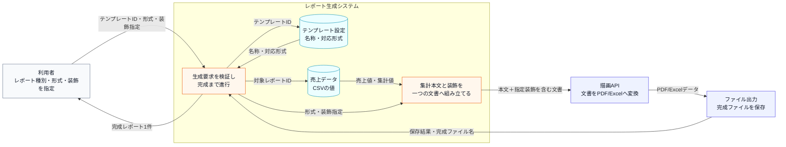
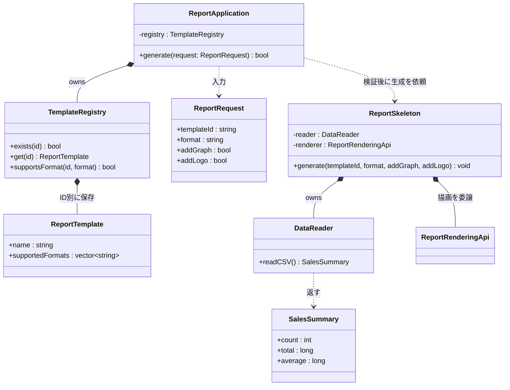
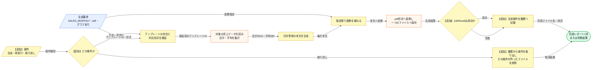
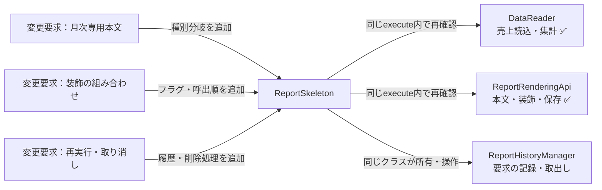
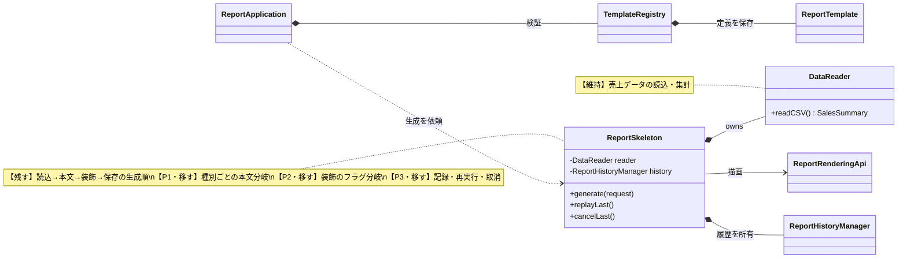
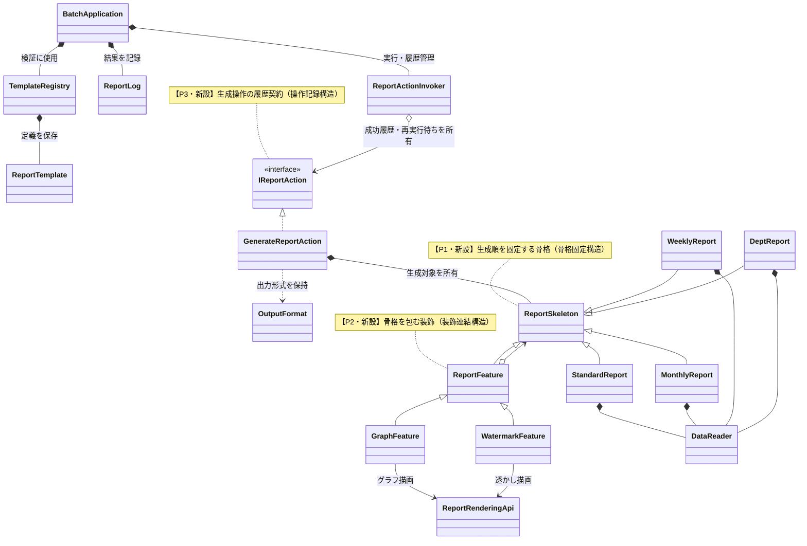
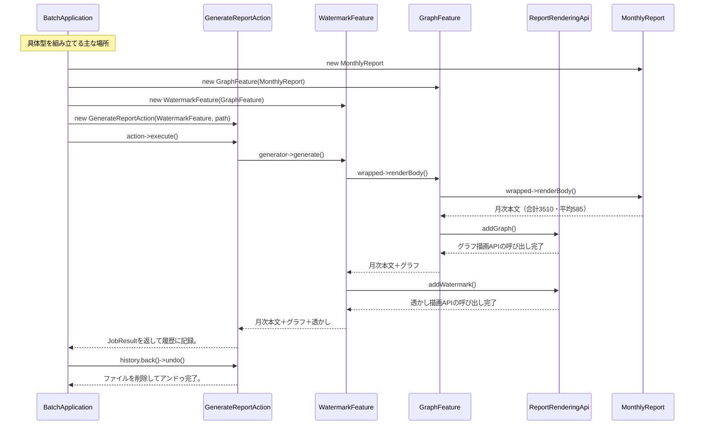
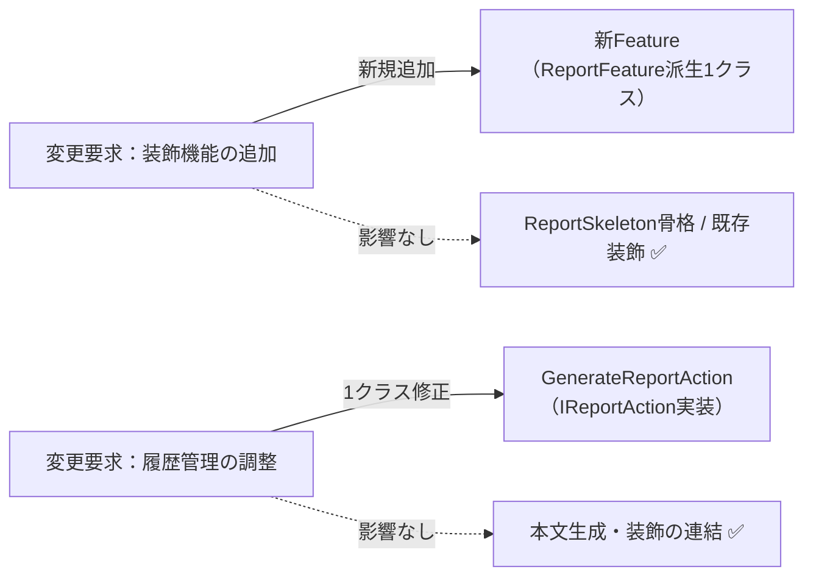
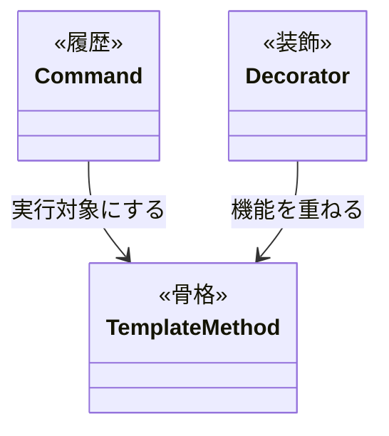
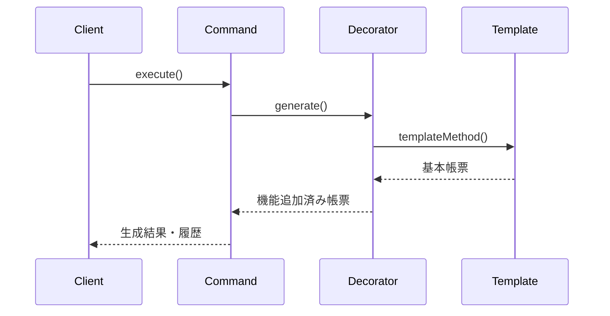

## 第11章 レポート生成エンジン ―― Template Method × Decorator × Command パターン

―― 思考の型：処理の定型化と機能拡張、そして実行履歴をどう両立させるか

これまでの章では構造を1章1つで体験した。この章では3つの変更理由が混在した問題に同じ思考プロセスを使う。

### この章の核心

**レポート生成の手順、装飾機能、操作履歴が同じ生成処理に集まっていると、グラフ追加でもUndo追加でも生成手順まで修正・確認する必要が生じる。こういう問題は、「守りたい処理の骨格」と「後から増える機能」が同じ場所に混在しているシステムで起きている。**

### この章を読むと得られること

* **得られること1：** 処理の骨格、機能追加、操作履歴という異なる「変わる理由」を識別できるようになる。

* **得られること2：** 処理ステップの固定化と、個別の機能拡張のバランスが崩れている接続点（クラスとクラスのつなぎ目）を特定できるようになる。

* **得られること3：** 複数の仕組みを組み合わせることで、複数の変更理由を持つロジックを段階的に分離・局所化する手法を説明できるようになる。

* **得られること4：** 「処理の定型化」と「機能の動的追加」が入り混じる現場の難しさを理解する視点。

---

## 🔵 フェーズ1：現状把握 ―― 仕様を整理し、システムと紐付ける

レポート生成エンジンが何を入力として受け取り、どの処理で加工し、何を出力するのかを整理します。

### 1-1：このシステムの仕様

このシステムは、企業の売上データを分析し、経営層向けのレポートを生成する「レポート生成エンジン」です。利用者は、レポート種別、出力形式、装飾オプションを指定して生成を実行します。システムは、その指定に対応する売上CSVを読み込み、集計結果をレポート本文にまとめ、必要な装飾を重ねて、指定形式のファイルとして出力します。

この章で扱う現状仕様は、次の範囲です。

| 仕様項目 | この章で扱う値 | 具体例 | 何に使うか |
|---|---|---|---|
| レポート種別 | 週次・月次・部門別 | SALES_MONTHLY: 月次売上レポート | 読み込む売上CSVと本文の見せ方を決める |
| 出力形式 | PDF・Excel | pdf、excel | 配布用か分析用かに応じて出力形式を決める |
| 装飾オプション | グラフ・ロゴ・透かし | グラフあり、ロゴなし | 生成されたレポートへ追加する装飾を決める |
| 本文生成 | ヘッダー、売上集計の本文、フッター | 月次売上の集計本文 | 掲載コードでは描画APIスタブを呼び、その先を `cout` で代替する |

利用者が「月次レポートをPDFで、グラフ付き」と指定した場合、システムは月次用の売上CSVを読み込み、月次売上の集計本文を作り、その本文にグラフを加え、最後にPDFとして出力します。CSVをどのストレージから取得するか、グラフ描画ライブラリでどのように画像を生成するか、実際のPDF/Excelファイルをどう書き出すかは、この章の設計論点ではありません。掲載コードでは、外部処理の入口を描画API境界として残し、その先の処理だけを `cout` スタブに置き換え、生成手順と責任の集まり方を見ます。

`cout` はレポートそのものではなく、外部境界の先にある処理を簡略表示するためのスタブです。実際のシステムでは、売上CSVの取得、グラフ描画、PDF/Excelファイルの書き出しが別のライブラリやAPIで行われます。

また、実運用ではレポート生成を画面から切り離し、バックグラウンドジョブから起動する構成が一般的です。ただし、ジョブの起動・スケジューリング基盤はこの章の設計論点ではありません。掲載コードは生成操作を同期的に呼び、完了・失敗の結果を受け取るところまでを境界として扱います。装飾処理が途中で失敗した場合の結果と、同じ生成操作の再実行は1-5の変更要求後に扱いますが、非同期実行基盤そのものは実装しません。

利用者が受け取る成果物は、処理ごとに分かれた4つのファイルではありません。**売上集計の本文、指定したグラフ・ロゴ・透かしを一つに組み合わせた、PDFまたはExcelの完成レポート1件**です。CSV読込、本文生成、装飾、ファイル出力は、その完成レポートを作る途中処理です。

**システム全体図：利用者・レポート生成システム・外部境界**


```mermaid
flowchart LR
    U["利用者<br>レポート種別・形式・装飾を指定"]:::actor

    subgraph SYS["レポート生成システム"]
        E["生成要求を検証し<br>完成まで進行"]:::process
        T[("テンプレート設定<br>名称・対応形式")]:::data
        D[("売上データ<br>CSVの値")]:::data
        A["集計本文と装飾を<br>一つの文書へ組み立てる"]:::process
    end

    R["描画API<br>文書をPDF/Excelへ変換"]:::boundary
    F["ファイル出力<br>完成ファイルを保存"]:::boundary

    U -->|"テンプレートID・形式・装飾指定"| E
    E -->|"テンプレートID"| T
    T -->|"名称・対応形式"| E
    E -->|"対象レポートID"| D
    D -->|"売上値・集計値"| A
    E -->|"形式・装飾指定"| A
    A -->|"本文＋指定装飾を含む文書"| R
    R -->|"PDF/Excelデータ"| F
    F -->|"保存結果・完成ファイル名"| E
    E -->|"完成レポート1件"| U

    classDef actor fill:#f8fafc,stroke:#64748b,color:#111827;
    classDef data fill:#ecfeff,stroke:#0891b2,color:#111827;
    classDef process fill:#fff7ed,stroke:#ea580c,color:#111827;
    classDef boundary fill:#eef2ff,stroke:#4f46e5,color:#111827;
```

最も大きな境界は、利用者と「レポート生成システム」の間です。描画APIとファイル出力はシステムが利用する外部境界であり、利用者向けの別成果物ではありません。

次のシステム内部図は、上図の `レポート生成システム` の箱だけを拡大します。上図の「テンプレートID・形式・装飾指定」を入力にし、「完成レポート1件」を出力するまでの判定と加工を、同じ名称で追います。

**システム内部図：正常系の入力・判定・加工・出力**


```mermaid
flowchart LR
    A[/"生成要求<br>SALES_MONTHLY・pdf・グラフあり"/]:::input
    A -->|"テンプレートID・形式"| B["テンプレートの存在と<br>対応形式を検証"]:::decision
    B -->|"検証済みテンプレートID"| C["対象の売上データを読み<br>合計・平均を集計"]:::process
    C -->|"合計3510・平均585"| D["月次売上の本文を生成"]:::process
    A -->|"グラフあり"| E["本文へグラフを重ねる"]:::process
    D -->|"集計本文"| E
    E -->|"本文＋グラフ"| F["pdf形式へ変換し<br>一つのファイルへ保存"]:::process
    F -->|"完成ファイル名・保存結果"| G(["完成レポート1件<br>月次本文＋グラフを含むPDF"]):::normal

    classDef input fill:#e7f0ff,stroke:#2563eb,color:#111827;
    classDef process fill:#fff7ed,stroke:#ea580c,color:#111827;
    classDef decision fill:#fef9c3,stroke:#ca8a04,color:#111827;
    classDef normal fill:#dcfce7,stroke:#16a34a,color:#111827;
```

この図から読み取ることは、次の3点です。

- レポートは、レポート種別、出力形式、装飾オプションを入力として生成される。
- レポート種別と出力形式は、処理を続けてよいかを判定する材料になる。
- 集計本文と指定装飾を組み合わせた後、指定形式の一つの完成ファイルとして出力される。

現状のレポート機能は、基本統計（合計・平均）を表示する構成です。現在の構造では、レポート生成の手順が処理の出発点に固定されています。

**対応するレポート種別・出力形式**

レポートの種別を「週次・月次・部門別」と分けているのは、経営層が見たい集計の粒度が目的によって異なるからです。週次は現場の素早い状況把握、月次は全社の業績管理、部門別は責任単位での比較に使われます。出力形式としてPDFとExcelの両方を提供しているのは、「配布・印刷用のPDF」と「加工・分析用のExcel」という使われ方の違いがあるためです。

| レポート種別 | 内容 | 出力形式 |
|---|---|---|
| 週次レポート | 週ごとの売上集計 | PDF・Excel |
| 月次レポート | 月ごとの売上集計 | PDF・Excel |
| 部門別レポート | 部門ごとの売上集計 | PDF・Excel |

**装飾機能の一覧**

「グラフ追加」「ロゴ埋め込み」「透かし追加」という3種類の装飾が用意されています。グラフは集計済みの売上データを図表として本文へ挿入する処理、ロゴはヘッダーへ画像を配置する処理、透かしはページ全体へ「社外秘」などの表示を重ねる処理です。

実際のシステムでは、これらの装飾はPDF/Excel生成ライブラリや画像処理ライブラリを呼び出して行います。この章の掲載コードでは、描画API境界を呼び、その先の実装だけを `cout` の出力で代替します。見たいのは「グラフを描くアルゴリズム」ではなく、「装飾処理を組み合わせ可能な部品として接続する境界」です。

| 機能 | 内容 | 要件定義の担当 |
|---|---|---|
| グラフ追加 | 部署別・期間別のグラフをレポートに挿入する | 分析チーム |
| ロゴ埋め込み | レポートのヘッダーにロゴ画像を挿入する | 広報チーム |
| 透かし追加 | 「社外秘」等の透かしをページ全体に適用する | 広報チーム |

装飾は複数を組み合わせて重ねることができます（例：グラフ＋透かし）。

**レポート生成の処理ステップ**

処理ステップが「データ取得 → 集計 → 装飾適用 → 出力」という順序で固定されているのは、前のステップの結果が次のステップに必ず必要だからです。データがないと集計できず、集計結果がないと装飾を重ねるものがなく、完成物がなければ出力できません。一方、「どの装飾を重ねるか」（ステップ③）は案件ごとに自由に変えられます。骨格（順序）は固定で、中身の一部（装飾）は柔軟という組み合わせが、このシステムをやや複雑にしている理由のひとつです。

| ステップ | 処理内容 |
|---|---|
| ① データ取得 | CSV形式の売上データを読み込む |
| ② 集計 | 合計・平均などの基本統計を算出する |
| ③ 装飾適用 | グラフ・ロゴ・透かしを順に重ねる（組み合わせ自由） |
| ④ 出力 | 指定の形式（PDF / Excel）でファイルを書き出す |

**このシステムの関係者**

「グラフ機能は分析チーム、ロゴ・透かしは広報チーム」と担当が分かれているのは、それぞれが専門知識を持つ領域だからです。グラフの表示条件はデータ分析の知識がなければ正しく決められず、ブランドロゴの配置は広報が守るガイドラインに従います。ここでは、後のフェーズで確認する材料として、どの業務機能がどの仕様を決めているかを整理します。

**この仕様を決める業務機能**

| 業務機能 | この章の仕様で決めていること |
|---|---|
| 分析・グラフ管理 | グラフの種類・表示条件・データ集計ルール |
| UI・表示管理（広報） | ブランドガイドライン・ロゴ配置・透かし仕様 |

後のフェーズで変更要求を扱うとき、どの業務機能の知識なのかを確認するための名前として使います。

**エラー条件**

正常系の仕様を一通り確認したうえで、最後に、生成へ進めない入力や外部境界の懸念を分けて整理します。

| エラー条件 | どこで分かるか | 出力 | 保存・通知などの副作用 |
|---|---|---|---|
| レポート種別に対応するテンプレートがない | テンプレート取得時 | 未登録テンプレートエラー | ファイル出力なし |
| 出力形式に対応していない | 出力形式確認時 | 未対応形式エラー | ファイル出力なし |
| 描画APIやファイル出力に失敗する | 描画・ファイル出力境界の呼び出し時 | この章の1-1では詳細扱いなし | 実システムでは失敗ログと再試行対象を記録する |
| 装飾（グラフ・透かし）の適用が途中で失敗する | 描画API境界の呼び出し中 | この章の1-1では詳細扱いなし。1-5で扱う | 生成操作を失敗として記録し、完了・失敗結果を返す |

### 1-2：動作例テーブル

コードを読む前に、フェーズ1の現状コードがどんな入力に対して、どの内容を含む完成レポートを返すか確認します。ここでは、まだ履歴・やり直し・取り消しは扱いません。それらは1-5の変更要求で初めて登場します。

| 操作 | 入力・条件 | 期待される出力・結果 |
| --- | --- | --- |
| 月次売上レポートをPDF出力 | 月次売上6件、合計3510、平均585、形式PDF | 月次の集計本文（合計3510・平均585）を含むPDFが1件生成される |
| 月次売上レポートをExcel出力 | 月次売上6件、合計3510、平均585、形式Excel | 同じ月次集計値を表形式で含むExcelが1件生成される |
| グラフ付き・透かし付きでPDF出力 | 月次本文＋グラフ＋「社外秘」透かし＋PDF | 本文・グラフ・透かしを一つに重ねたPDFが1件生成される |
| 未登録テンプレートを指定 | レポート種別：存在しないID | 未登録テンプレートエラーが出る |
| 未対応形式を指定 | 出力形式：未対応の形式 | 未対応形式エラーが出る |

この表は、フェーズ1の仕様図に出てきた入力・判定・加工・出力の代表例です。変更要求後の履歴操作は、1-5で別表として扱います。末尾2行（未登録テンプレート・未対応形式）は生成に入る前の入力バリデーションで、1-4の現状コードの `main` が持つ存在確認（`exists`）と形式確認（`supportsFormat`）で検出して処理を中断します。フェーズ7の最終コードでも同じ2つのガードを生成の入口（`requireTemplate`）に残し、無効な要求は生成へ進めません。掲載シナリオは登録済みテンプレートと対応形式だけを使うためこのガードは通過し、最終実行結果では正常系と履歴操作に焦点を当てます。

| 段階 | 主に確認する動作 |
|---|---|
| 現状〜ステップ3 | 基本的なレポート生成と、本文生成・装飾を分けた場合の限界 |
| ステップ4 | PDF・Excelなど、骨格を共有した出力形式の追加 |
| ステップ5 | グラフ・透かしなど、装飾の動的な組み合わせ |
| ステップ6〜フェーズ7 | Undo、バッチ実行を含む6動作すべて |

したがって、フェーズ1では現状の生成動作だけを見ます。履歴や取り消しは、変更要求を受けた後に「どこへ入れようとすると困るか」を確認してから扱います。

次は、この仕様を担うクラスの顔ぶれと責任を確認します。

---

### 1-3：登場クラスとクラス構成図

登場するクラスを先に確認します。

| クラス名 | 役割 | 担当する仕様 |
|---|---|---|
| `ReportSkeleton` | レポート生成の流れを進める | データ読み込み、本文生成、装飾指定、出力 |
| `DataReader` | 売上データを読み込み集計する | 売上データの取得・合計/平均の算出 |
| `TemplateRegistry` | テンプレートIDの登録・検索 | レポートテンプレートの名称・出力形式をIDで管理し、バリデーションに使う |
| `SalesSummary` | 売上集計結果を表す | 件数・合計・平均を保持する |
| `ReportTemplate` | テンプレート1件分を表す | 名称と対応出力形式を保持する |
| `ReportRenderingApi` | 描画API境界を表す | ヘッダー・本文・装飾・フッターの描画を外部へ委譲する |
| `ReportApplication` | 生成要求を受けて検証と生成を接続する | テンプレート検証後に `ReportSkeleton` を呼ぶ |
| `ReportRequest` | 利用者の生成要求を表す | テンプレートID・形式・装飾指定を保持する |


各クラスは別々の機能群ではなく、一つの生成要求を実現する同じシステムの部品です。`ReportApplication` が入口になり、`TemplateRegistry` で要求を検証した後、同じ要求を `ReportSkeleton` へ渡します。これにより、テンプレート管理側と生成側がどこで接続されるかを図上でも追えます。


```mermaid
classDiagram
    class ReportRenderingApi
    class SalesSummary {
        +count : int
        +total : long
        +average : long
    }
    class ReportTemplate {
        +name : string
        +supportedFormats : vector~string~
    }
    class ReportSkeleton {
        -reader : DataReader
        -renderer : ReportRenderingApi
        +generate(templateId, format, addGraph, addLogo) void
    }
    class ReportRequest {
        +templateId : string
        +format : string
        +addGraph : bool
        +addLogo : bool
    }
    class ReportApplication {
        -registry : TemplateRegistry
        +generate(request: ReportRequest) bool
    }
    class DataReader {
        +readCSV() SalesSummary
    }
    class TemplateRegistry {
        +exists(id) bool
        +get(id) ReportTemplate
        +supportsFormat(id, format) bool
    }
    ReportApplication *-- TemplateRegistry : owns
    ReportApplication ..> ReportRequest : 入力
    ReportApplication ..> ReportSkeleton : 検証後に生成を依頼
    ReportSkeleton *-- DataReader : owns
    ReportSkeleton *-- ReportRenderingApi : 描画を委譲
    DataReader ..> SalesSummary : 返す
    TemplateRegistry *-- ReportTemplate : ID別に保存
```

**クラス図に出てくる主なメンバーと操作**

| クラス | メンバー・操作 | 何ができるか |
|---|---|---|
| `ReportSkeleton` | `reader` | CSV読み込みを行う `DataReader` を保持する |
| `ReportSkeleton` | `generate()` | 出力形式と装飾フラグを受け取り、レポート生成を進める |
| `DataReader` | `readCSV()` | 売上データを読み込み、合計・平均を集計する |


> **注記：** `addGraph` と `addLogo` は独立したメソッドではなく、`generate()` の引数として渡されるフラグです。これらのフラグで実際に何をしているかは、次の実装コードで確認します。

`ReportSkeleton` クラスが、データの読み込み、レポート生成のステップ管理、そして個別のグラフィック追加処理という、異なる3つの責務をすべて抱えています。

---

### 1-4：実装コード（現状）

#### コードを読む前に：クラスの責任と境界

| 対象 | 呼び出しと内部処理 | 戻り値・副作用 | 掲載上の表現 |
|---|---|---|---|
| 売上データ取得 | 売上値を読み、件数・合計・平均を計算する | `SalesSummary` | `std::vector` でCSVを代替する |
| テンプレート検証 | IDの存在と対応形式を確認する | `bool` と `ReportTemplate` | `std::map` でテンプレート表を代替する |
| レポート生成 | 検証済みの要求から生成手順を進める | 本文・装飾・完成ファイル | `ReportRenderingApi` の標準出力で描画APIを代替する |
| 呼び出し元 | 入力を検証し、生成処理へ渡す | 成功・失敗 | `ReportApplication::generate()` の `bool` で表す |

実PDFエンジンやオブジェクトストレージは境界の外です。現状コードでは、集計値、生成順序、装飾指定、出力形式を標準出力で観測します。履歴、取消、再実行、失敗結果は変更要求で追加するため、まだ登場しません。

システムの現状の実装を確認します。コードを役割ごとに分けて読んでいきます。

#### データ読み込みクラス

はじめにCSVデータを読み込む補助クラスから見てみます。

```cpp
#include <iostream>
#include <string>
#include <vector>
#include <map>
#include <fstream>
#include <cstdio>
#include <memory>
#include <stdexcept>
#include <utility>

using namespace std;

// 集計結果（件数・合計・平均）
struct SalesSummary { int count; long total; long average; };

class DataReader {
    vector<int> sales;  // 月次売上データ（実際に保持する）
public:
    DataReader() : sales{520, 610, 480, 700, 560, 640} {}
    // 実データを集計して返す（合計・平均を実際に計算する）
    SalesSummary readCSV() {
        long total = 0;
        for (int v : sales) total += v;
        long avg = sales.empty() ? 0 : total / (long)sales.size();
        cout << "CSVデータ読み込み完了（" << sales.size()
             << "件, 合計" << total << "・平均" << avg << "）" << endl;
        return {(int)sales.size(), total, avg};
    }
};
```

`DataReader` は売上データを実際に保持し、`readCSV()` で合計・平均を集計して返します。装飾やファイル出力などのレポート生成ロジックは持たせていません。

#### テンプレートレジストリ

レポート種別をIDで管理し、その種別で利用できる出力形式を確認するデータ層を追加します。出力形式は利用者が指定する値なので、テンプレートには「既定の形式」ではなく「対応している形式」を持たせます。

このシステムには以下の3種類のレポートテンプレートがあらかじめ登録されています。

| テンプレートID | レポート名 | 対応する出力形式 |
|---|---|---|
| SALES_WEEKLY | 週次売上レポート | PDF・Excel |
| SALES_MONTHLY | 月次売上レポート | PDF・Excel |
| SALES_DEPT | 部門別売上レポート | PDF・Excel |

登録されていないIDを指定するとエラーになります。コードを読む前にこの対応を把握しておくと、動作結果が追いやすくなります。

```cpp
struct ReportTemplate {
    string name;                    // レポート名
    vector<string> supportedFormats; // "pdf", "excel"
};

class TemplateRegistry {
    map<string, ReportTemplate> templates;
public:
    TemplateRegistry() {
        templates["SALES_WEEKLY"]  = {"週次売上レポート",   {"pdf", "excel"}};
        templates["SALES_MONTHLY"] = {"月次売上レポート",   {"pdf", "excel"}};
        templates["SALES_DEPT"]    = {"部門別売上レポート", {"pdf", "excel"}};
    }

    bool exists(const string& id) const {
        return templates.count(id) > 0;
    }

    ReportTemplate get(const string& id) const {
        return templates.at(id);
    }

    void save(const string& id, const ReportTemplate& tpl) {
        templates[id] = tpl;          // 実行中のテンプレート表へ追加
    }

    bool supportsFormat(const string& id, const string& format) const {
        for (const string& supported : templates.at(id).supportedFormats) {
            if (supported == format) return true;
        }
        return false;
    }
};
```

`TemplateRegistry` は、テンプレートIDの存在確認（`exists()`）、定義の取得（`get()`）、指定された出力形式に対応しているかの確認（`supportsFormat()`）を担います。`main()` は、ここで検証したレポート種別と出力形式を使ってレポート生成に進みます。

#### レポート生成統括クラス

次に、レポートの全生成処理を担うクラスを見ます。

実際のシステムでは、CSVから集計した値を中間のレポート文書データへ変換し、そのデータをPDFライブラリまたはExcelライブラリへ渡してファイルを書き出します。グラフも、集計済みデータを元に描画用データを作り、ライブラリで本文へ挿入します。この章ではファイル生成ライブラリそのものは扱わないため、`ReportRenderingApi` という境界を呼び、その先のライブラリ処理だけを `cout` で代替します。

```cpp
// 実システムではPDF/Excel/画像生成ライブラリを呼ぶ境界。
// 掲載コードでは、その先のライブラリ処理だけをcoutで代替する。
class ReportRenderingApi {
public:
    void addHeader(const string& format) {
        cout << "[ReportRenderingApi] " << format
             << "形式でヘッダー生成APIを呼び出し。" << endl;
    }
    void addBody(long total, long average) {
        cout << "[ReportRenderingApi] 本文生成API：合計"
             << total << "・平均" << average << "。" << endl;
    }
    void addGraph() {
        cout << "[ReportRenderingApi] グラフ描画APIを呼び出し。" << endl;
    }
    void addLogo() {
        cout << "[ReportRenderingApi] ロゴ配置APIを呼び出し。" << endl;
    }
    void addFooter(const string& format) {
        cout << "[ReportRenderingApi] " << format
             << "形式でフッター生成APIを呼び出し。" << endl;
    }
    void writeFile(const string& templateId,
                   const string& format) {
        cout << "[ファイル出力] " << templateId << "."
             << format << " に本文と装飾をまとめて保存。" << endl;
    }
};

// レポート生成統括
class ReportSkeleton {
    DataReader reader;
    ReportRenderingApi renderer;
public:
    void generate(const string& templateId,
                  string format,
                  bool addGraph,
                  bool addLogo) {
        SalesSummary s = reader.readCSV();
        renderer.addHeader(format);
        renderer.addBody(s.total, s.average);
        if (addGraph) renderer.addGraph();
        if (addLogo) renderer.addLogo();
        renderer.addFooter(format);
        renderer.writeFile(templateId, format);
    }
};
```

このクラスが今章の生成処理の中心です。`generate` メソッドは、CSV読み込み・集計、ヘッダー生成、本文生成、グラフ追加、ロゴ追加、フッター生成、ファイル保存を順に実行します。読み込んだ売上を実際に合計・平均して本文へ渡し、本文と装飾を一つの完成ファイルへまとめます。

#### 呼び出し元と実行確認

`ReportApplication` が `ReportRequest` を受け取り、`TemplateRegistry` でテンプレートIDと形式を検証してから `ReportSkeleton` を呼びます。登録されていないIDや未対応形式なら、生成処理へ進みません。

```cpp
struct ReportRequest {
    string templateId;
    string format;
    bool addGraph;
    bool addLogo;
};

class ReportApplication {
    TemplateRegistry registry;
public:
    bool generate(const ReportRequest& request) {
        if (!registry.exists(request.templateId)) {
            cerr << "[エラー] テンプレートID '"
                 << request.templateId
                 << "' は登録されていません。" << endl;
            return false;
        }

        if (!registry.supportsFormat(
                request.templateId, request.format)) {
            cerr << "[エラー] テンプレートID '"
                 << request.templateId << "' は "
                 << request.format
                 << " 形式に対応していません。" << endl;
            return false;
        }

        ReportTemplate tmpl
            = registry.get(request.templateId);
        cout << "テンプレート: " << tmpl.name
             << " (指定形式: " << request.format << ")"
             << endl;

        ReportSkeleton generator;
        generator.generate(
            request.templateId,
            request.format,
            request.addGraph,
            request.addLogo);
        return true;
    }
};

int main() {
    ReportApplication app;
    ReportRequest request{
        "SALES_MONTHLY", "pdf", true, false};
    return app.generate(request) ? 0 : 1;
}
```

実行対象コード：1-4の現状コード
対応する動作例：1-2の動作例テーブル
確認したいこと：入力、加工、出力が仕様どおりに対応していること

実行結果：

```
テンプレート: 月次売上レポート (指定形式: pdf)
CSVデータ読み込み完了（6件, 合計3510・平均585）
[ReportRenderingApi] pdf形式でヘッダー生成APIを呼び出し。
[ReportRenderingApi] 本文生成API：合計3510・平均585。
[ReportRenderingApi] グラフ描画APIを呼び出し。
[ReportRenderingApi] pdf形式でフッター生成APIを呼び出し。
[ファイル出力] SALES_MONTHLY.pdf に本文と装飾をまとめて保存。
```

月次売上6件から合計3510・平均585が計算され、その本文とグラフが一つの `SALES_MONTHLY.pdf` へ保存されました。ファイルが存在することだけでなく、仕様入力が本文と装飾へ反映されたことまで確認できます。

---

> **手元で動かすには**
> このコードは1つの `.cpp` に貼り付けて、そのままコンパイル・実行できます（例：`g++ chapter11.cpp -o app && ./app`）。`main()` の `ReportRequest` で、登録済みテンプレートID、`pdf` / `excel`、グラフ・ロゴの指定を変えれば、その入力が集計本文・装飾・出力形式へ反映されたことを実行結果で確認できます。新しいテンプレートを試す場合は、`TemplateRegistry` のコンストラクタへ定義を1件追加してから、そのIDを要求へ指定します。テンプレートデータはプロセス実行中だけ有効で、終了すると消えます（描画・ファイル出力は `ReportRenderingApi` 境界の先で簡略化しています）。

### 1-5：変更要求

【プロダクトオーナーと営業部からの要求】
ある水曜日の昼下がり、レポート生成システムのプロダクトオーナーから相談を受けました。

「役員向けの月次レポートだけ、共通の合計・平均ではなく、月次専用の本文にしたい。グラフやロゴの挿入は既存の機能を使いながら、組み合わせと順序を実行時に選べるようにしてほしい。また、作成したレポートを後からやり直せるよう、生成操作を記録し、同じ操作の再実行や取り消しもできるだろうか」

今回は「処理のステップ制御」という新しい要件と、「操作履歴の保存・再実行」という二つの大きな軸が加わるわけですね。今の `ReportSkeleton` は、処理の流れが固定された上で、追加機能がハードコードされています。

**仕様変更の内容**

変更要求を受けて、現在の構造がどう変わるかを整理します。

| 変更項目 | 変更前 | 変更後 |
|---|---|---|
| レポートの生成ステップ | `generate()` に固定ハードコード | 共通骨格を固定し、レポート種別ごとの本文と装飾の組み合わせを外から選べるようにする |
| 機能の装飾（グラフ・ロゴ等） | `if` フラグで生成メソッドに混在 | 実行時に動的に組み合わせられるようにする |
| **操作履歴（新規）** | — （なし） | **生成操作をオブジェクトとして記録・取り消し可能にする** |
| **生成結果の扱い（新規）** | 同期呼び出しで成否を返さない | **生成操作を `execute()` し、成功・失敗を `JobResult` で受け取る。バックグラウンド実行基盤は対象外** |
| **装飾失敗と再実行（新規）** | — （なし） | **装飾が途中失敗した生成操作は失敗として記録し、同じ生成操作を再実行できる** |

今回変えるのは生成骨格・装飾・操作履歴です。売上データの読み込み、テンプレート管理、描画API境界は仕様変更の対象ではないため、次の共通基盤は変更前後で維持します。

| 変更対象外の共通基盤 | 変更前 | 変更後 |
|---|---|---|
| `DataReader` | 売上データを読み込み集計する | **変更なし** |
| `TemplateRegistry` | テンプレートを登録・検索する | **変更なし** |
| `ReportRenderingApi` | 外部の描画処理へ委譲する | **変更なし** |

**この章が扱う複雑さ**

| 追加する複雑さ | 具体例 | この章で見ること |
|---|---|---|
| 生成結果の境界 | 生成操作を実行し `JobResult` を受け取る | 実行基盤の都合を骨格へ持ち込まず、呼び出し元が成否を扱えるか |
| 装飾の途中失敗 | グラフ描画APIが失敗し以降の装飾を止める | 装飾失敗を骨格へ混ぜず、装飾側と結果で扱えるか |
| 失敗した生成操作の再実行 | 失敗した同じ生成操作をもう一度実行する | 生成操作を記録できる単位として持てているか |
| 生成骨格と操作履歴の分離 | 再実行は履歴の生成操作だけを材料にする | 骨格・装飾・操作履歴を別の変化軸として保てるか |

**変更前後の入力・判定・加工・出力差分**

1-1の現状仕様を退避し、変更要求を当てた後の仕様と同じ粒度で並べます。以降の分析では、この差分を追います。

| 要素 | 変更前（1-1の現状仕様） | 変更後（今回の要求） | 差分として追うもの |
|---|---|---|---|
| 入力 | レポート種別、出力形式、装飾オプション | レポート種別、出力形式、装飾オプション、操作の種類（生成・やり直し・取り消し・再実行） | 生成・やり直し・取り消しに加え、失敗した生成操作の再実行が増える |
| 判定 | テンプレート有無、形式有効、装飾可否 | 同じ判定に加え、履歴から対象操作を取り出せるか、装飾が成功したか | 履歴対象の判定と、装飾失敗の判定が増える |
| 加工 | 本文生成、装飾、出力 | 生成操作を実行し、成功後に操作を履歴へ記録、失敗時は再実行・取消を扱う | 生成操作を記録可能な単位として追い、`JobResult` の成否も追う |
| 出力 | 生成ファイル | 生成ファイル、`JobResult`（成功/失敗）、履歴更新、再実行/取消結果 | ファイルだけでなく生成結果と履歴結果も追う |

**変更後の入力・加工・出力**

変更後も、フェーズ1と同じ「要求の検証→売上読込・集計→本文→装飾→形式変換・保存→完成レポート」という経路を使います。黄色の `【追加】` だけが今回の仕様差分です。既存のテンプレート検証、売上データ、描画・ファイル出力境界は変えていません。


```mermaid
flowchart LR
    A[/"生成要求<br>SALES_MONTHLY・pdf・グラフあり"/]:::input
    X[/"【追加】操作<br>生成・再実行・取り消し"/]:::changed
    X -->|"操作種別"| Y{"【追加】どの操作か"}:::changed

    Y -->|"生成・再実行"| B["テンプレートの存在と<br>対応形式を検証"]:::decision
    A -->|"テンプレートID・形式"| B
    B -->|"検証済みテンプレートID"| C["対象の売上データを読み<br>合計・平均を集計"]:::process
    C -->|"合計3510・平均585"| D["月次専用の本文を生成"]:::changed
    A -->|"装飾指定"| E["指定順で装飾を重ねる"]:::changed
    D -->|"集計本文"| E
    E -->|"本文＋装飾"| F["pdf形式へ変換し<br>一つのファイルへ保存"]:::process
    F -->|"生成結果"| J{"【追加】JobResultは成功か"}:::changed
    J -->|"成功"| H["【追加】生成操作を履歴へ記録"]:::changed
    J -->|"失敗"| H
    H -->|"完成ファイル名・成否"| G(["完成レポート1件<br>または失敗結果"]):::normal

    Y -->|"取り消し"| I["【追加】履歴から操作を取り出し<br>その操作が作ったファイルを削除"]:::changed
    I -->|"取消結果"| G

    classDef input fill:#e7f0ff,stroke:#2563eb,color:#111827;
    classDef process fill:#fff7ed,stroke:#ea580c,color:#111827;
    classDef decision fill:#fef9c3,stroke:#ca8a04,color:#111827;
    classDef normal fill:#dcfce7,stroke:#16a34a,color:#111827;
    classDef changed fill:#fef9c3,stroke:#ca8a04,color:#111827;
```

この図から読み取ることは、次の3点です。

- フェーズ1から維持する経路は、テンプレート検証、売上読込・集計、形式変換・保存です。
- 月次専用本文と装飾順の選択は、既存経路の本文・装飾部分だけを変えます。
- `JobResult`、履歴記録、再実行・取り消しは、生成経路の前後へ追加されます。履歴から取り出した同じ生成操作を再利用するため、再実行時に別の入力を組み立て直しません。

**変更後のエラー条件**

生成操作に関わる失敗は、正常系図へ混ぜずに別で確認します。

| エラー条件 | どこで分かるか | 出力 | 保存・通知などの副作用 |
|---|---|---|---|
| 装飾（グラフ・透かし）の適用が途中で失敗する | 装飾適用時 | `JobResult` に失敗を返す | 生成操作を失敗として記録し、同じ操作を再実行可能に残す |
| 失敗した生成操作を再実行する | 履歴の生成操作を取り出す時 | 再実行結果（成功/失敗） | 記録済みの生成操作を材料に、もう一度実行する |

図に加わった「履歴へ記録」「再実行・取り消し」「`JobResult` の成否」が実際にコードのどこへ書かれるかは、フェーズ3で変更を試すコードと、フェーズ7の最終コード・実行結果で追います。

フェーズ1でシステムの現状と変更要求が把握できました。次のフェーズ2では、「何を変え、何を守るか」を整理します。

## 🟣 フェーズ2：仮説立案 ―― 何が変わるかを観察し、ヒアリングで裏付ける
### 2-1：変わりそうな仕様の見当をつける

ここで作る一覧は、思いつきで「変わりそう」と感じたものを並べる表ではありません。フェーズ1で確認した仕様・動作例・クラス図を材料に、次の順で候補を絞ります。

1. 仕様図と動作例から、入力・判定・加工・出力のうち条件や値が変わりそうな箇所を拾う。
2. その箇所が、1-3のどのクラス・メソッドに書かれているかを対応づける。
3. その仕様が、どんな理由で、何をきっかけに、どのくらいの頻度で変わりそうかを仮説として書く。
4. 逆に、当面変えない前提にできる処理の骨格も分けておく。

この手順で見ると、「レポートを生成する」という大きな処理全体ではなく、その中のどの本文生成・装飾・出力形式が変更候補なのかを読者自身で追えるようになります。

フェーズ2では、フェーズ1で見た仕様のうち、どの値・条件・加工が変わりそうかを見当づけます。責務の配置と原因は、フェーズ3とフェーズ4で変更要求を当てながら確認します。

| 仕様候補 | 仕様上の場所 | フェーズ1の現状コードでの場所 | 見立て |
|---|---|---|---|
| レポート種別（週次・月次・部門別） | 入力、テンプレート判定、本文生成 | `TemplateRegistry`、`ReportSkeleton.generate()` | 見たい集計単位が増えると本文の見せ方が変わるため、今回見る |
| 出力形式（PDF・Excel） | 入力、対応形式判定、ファイル出力 | `TemplateRegistry.supportsFormat()`、`ReportSkeleton.generate(format, ...)` | 配布用と分析用で形式が増える可能性があるため、今回見る |
| 装飾オプション（グラフ・ロゴ・透かし） | 入力、装飾適用 | `addGraph`、`addLogo`、`if` 文 | 表示したい情報やブランド表記が追加されやすいため、今回見る |
| 操作履歴、再実行、取り消し | 1-5の変更要求で追加 | フェーズ1の現状コードにはない | 生成後の操作管理という新しい要求として見る |
| 生成結果の境界 | 1-5の変更要求で追加 | フェーズ1の現状コードでは成否を返さない | 同期実行の成否を `JobResult` で受け取る境界として見る |
| 装飾失敗と生成操作の再実行 | 1-5の変更要求で追加 | フェーズ1の現状コードにはない | 装飾側の失敗と、生成操作の再実行を分けて見る |
| データ取得元、集計式 | データ取得、集計 | `DataReader.readCSV()` | この章では固定データ取得として扱い、今回は深追いしない |

この表から、今回の検討対象は「本文生成」「出力形式」「装飾」「操作履歴」の4つに絞れます。加えて、生成結果を `JobResult` で受け取り、装飾に失敗した生成操作を再実行できるようにする現実的な複雑さは、この4つのうち「装飾」と「操作履歴」に直接効きます。一方、CSV取得や基本集計の詳細は、この章の変更要求の中心ではないため、必要な前提としてだけ扱います。

### 2-2：今回の変更で確実に変わること

プロダクトオーナーから確定要求として示された変更は次の2点です。装飾失敗と再実行は、この2点へ現実的な失敗条件を加える複雑さとして確認します。バックグラウンド実行基盤そのものは対象外です。

- **レポート生成のステップ制御**：共通手順を固定し、種別ごとの本文と装飾順を組み立てで制御できるようにする
- **操作履歴の追加**：生成操作をオブジェクトとして保持し、取り消し・再実行できるようにする

ただし「この変更が1回限りか、今後も続くか」によって、どこまで設計を変えるべきかが大きく変わります。関係者に確認します。

### ヒアリングに向けた背景確認

このシステムは、ある中堅企業の経営分析レポートを担っています。数年前にサービスが立ち上がった当初は、売上合計と平均を表示するだけのシンプルなものでした。

しかし、経営層の分析ニーズが高まるにつれ、グラフや部署別内訳など、様々な装飾や追加機能が求められるようになりました。現在は機能ごとに `if` フラグで条件分岐を追加しており、コードは日々肥大化しています。

### 2-3：関係者ヒアリング


- **開発者：** 「レポートの生成フローについてですが、今後、例えば『ロゴを先に出す』あるいは『グラフを省略する』といった順序の変更は発生しますか？」
- **運用担当者：** 「部署ごとにそのニーズはあるね。基本は同じ手順なんだけど、特定のレポートだけステップを変えたいケースがあるんだよ。」
- **開発者：** 「操作履歴についても確認させてください。過去のレポート生成処理をやり直す際、当時使ったCSVデータも再読み込みする必要があるでしょうか？」
- **運用担当者：** 「そうだな、当時のデータで再実行したい場合もあれば、最新データで再生成したい場合もある。つまり、生成の操作自体を『履歴』として保持し、必要に応じて『再発行』したいんだ。」
- **開発者：** 「分かりました。生成フローの骨格は守りつつ、個別のステップや生成操作の履歴管理を独立して扱える構造が必要そうですね。」

### 2-4：ヒアリングで判明した将来リスク

ヒアリングで浮かび上がった「確定ではないが、近い将来起こりうる変化」を記録します。これは今回の設計判断の材料です。

| **将来リスク** | **時期の目安** | **根拠** |
| --- | --- | --- |
| 再実行データの選択（当時のCSV vs 最新データ）が変わる可能性 | 継続的に | 「場合によって両方あり得る」と運用担当者から言及 |
| 出力形式の追加（PDF・Excel以外にHTMLなど） | 数ヶ月後 | 「将来的にはあるかもしれない」と言及 |
| 履歴の上限管理が必要になる可能性 | 運用が積み上がった後 | 「運用で積み上がると管理が大変」と言及 |
| 装飾失敗の扱いが増える可能性（一部だけ再試行など） | 継続的に | 外部の描画処理を伴うと、装飾ごとの失敗と再実行の要望が出やすい |

フェーズ2で「今変わること（確定）」と「将来変わるかもしれないこと（リスク）」を分けて整理できました。次のフェーズ3では、現在の構造で変更を試みたときに何が起きるかを確認します。

### 2-5：変わる見込みと当面安定の前提を確定する

ヒアリングで「再実行データ選択の変更」「出力形式の追加」「履歴管理の必要性」が予告されました。この変化が来たとき、仕様がどう変わるかを整理しておきます。

| 変更内容 | 現在 | 将来（時期の目安） |
|---|---|---|
| レポートの出力形式 | PDFとExcelの2形式 | HTML形式など数ヶ月後に追加予定 |
| 再実行時のデータソース | 固定（最新データ使用） | 当時のCSVと最新データのどちらを使うかを選択可能に（継続的に） |
| 履歴の上限管理 | 制限なし | 運用が積み上がった後、上限管理が必要になる |
| 生成結果の扱いと装飾失敗 | 成否を返さない同期呼び出し、失敗の記録なし | 生成結果を境界で受け取り、装飾に失敗した生成操作を再実行できる形が求められる。バックグラウンド実行は将来の基盤課題 |

この変化が来たとき、現在の構造がどれだけの修正コストを要求するかを、次のフェーズ3で実際に確かめます。

---

## 🟣 フェーズ3：問題特定 ―― 変更の痛みを発見する
### 3-1：変更を試みる

フェーズ2で確定した「月次専用本文」「装飾の組み合わせ」「生成操作の記録・再実行・取り消し」を、今の `ReportSkeleton` を中心とした構造へ実装します。

> **中間コードの継続条件：** フェーズ1の `ReportApplication` による入口、`TemplateRegistry` によるテンプレートID・出力形式の検証、`ReportRenderingApi` への描画委譲は維持します。その既存経路へ本文種別の分岐、装飾フラグ、履歴記録、再実行、取消を追加し、変更要求がどこへ集中するかを確認します。

`generate` メソッドの中には、「レポート生成の骨格」「グラフ追加機能」「ロゴ追加機能」、さらに「履歴保存ロジック」という性質の異なるコードが集まっています。グラフの描画条件を変える際にも、履歴保存のタイミングまで影響を確認しなければなりません。変更箇所を検索し、関係する処理を読み解く負担が増え始めています。

実際に変更を加えたコードは次のようになります。

```cpp
#include <iostream>
#include <map>
#include <stdexcept>
#include <string>
#include <vector>

using namespace std;

struct SalesSummary {
    int count;
    long total;
    long average;
};

class DataReader {
    vector<int> monthlySales{
        520, 610, 480, 700, 560, 640};
public:
    SalesSummary readCSV() const {
        long total = 0;
        for (int value : monthlySales) {
            total += value;
        }
        long average = total /
            static_cast<long>(monthlySales.size());
        cout << "CSV読み込み: " << monthlySales.size()
             << "件 合計" << total
             << " 平均" << average << endl;
        return {
            static_cast<int>(monthlySales.size()),
            total,
            average};
    }
};

struct ReportTemplate {
    string name;
    vector<string> supportedFormats;
};

class TemplateRegistry {
    map<string, ReportTemplate> templates;
public:
    TemplateRegistry() {
        templates["SALES_WEEKLY"] = {
            "週次売上レポート", {"pdf", "excel"}};
        templates["SALES_MONTHLY"] = {
            "月次売上レポート", {"pdf", "excel"}};
        templates["SALES_DEPT"] = {
            "部門別売上レポート", {"pdf", "excel"}};
    }

    bool exists(const string& id) const {
        return templates.count(id) > 0;
    }

    ReportTemplate get(const string& id) const {
        return templates.at(id);
    }

    bool supportsFormat(
            const string& id,
            const string& format) const {
        for (const string& supported
                : templates.at(id).supportedFormats) {
            if (supported == format) {
                return true;
            }
        }
        return false;
    }
};

class ReportRenderingApi {
public:
    void addHeader(const string& format) {
        cout << "ヘッダー生成: " << format << endl;
    }
    void addBody(const string& reportName,
                 const SalesSummary& summary) {
        cout << reportName << "本文: 合計"
             << summary.total << " 平均"
             << summary.average << endl;
    }
    void addGraph() {
        cout << "グラフを本文へ追加" << endl;
    }
    void addLogo() {
        cout << "ロゴを本文へ追加" << endl;
    }
    void addFooter() {
        cout << "フッター生成" << endl;
    }
    void writeFile(const string& outputPath) {
        cout << "完成ファイルを保存: "
             << outputPath << endl;
    }
    void removeFile(const string& outputPath) {
        cout << "完成ファイルを削除: "
             << outputPath << endl;
    }
};

struct ReportRequest {
    string templateId;
    string format;
    bool addGraph;
    bool addLogo;
    string outputPath;
};

class ReportHistoryManager {
    vector<ReportRequest> history;
public:
    void record(const ReportRequest& request) {
        history.push_back(request);
        cout << "[履歴記録] "
             << request.outputPath << endl;
    }
    const ReportRequest& last() const {
        if (history.empty()) {
            throw runtime_error("履歴がありません");
        }
        return history.back();
    }
    void removeLast() {
        history.pop_back();
    }
};

class ReportSkeleton {
    DataReader reader;
    ReportHistoryManager history;
    ReportRenderingApi renderer;

    void execute(const ReportRequest& request,
                 bool recordHistory) {
        SalesSummary summary = reader.readCSV();
        renderer.addHeader(request.format);

        if (request.templateId == "SALES_MONTHLY") {
            renderer.addBody(
                "月次売上", summary);
        } else if (request.templateId == "SALES_WEEKLY") {
            renderer.addBody(
                "週次売上", summary);
        } else {
            renderer.addBody(
                "部門別売上", summary);
        }

        if (request.addGraph) {
            renderer.addGraph();
        }
        if (request.addLogo) {
            renderer.addLogo();
        }

        renderer.addFooter();
        renderer.writeFile(request.outputPath);
        if (recordHistory) {
            history.record(request);
        }
    }

public:
    void generate(const ReportRequest& request) {
        execute(request, true);
    }

    void replayLast() {
        ReportRequest request = history.last();
        cout << "[再実行] "
             << request.outputPath << endl;
        execute(request, false);
    }

    void cancelLast() {
        ReportRequest request = history.last();
        renderer.removeFile(request.outputPath);
        history.removeLast();
    }
};

class ReportApplication {
    TemplateRegistry registry;
    ReportSkeleton generator;
public:
    bool generate(const ReportRequest& request) {
        if (!registry.exists(request.templateId)) {
            cerr << "[エラー] テンプレートID '"
                 << request.templateId
                 << "' は登録されていません。" << endl;
            return false;
        }
        if (!registry.supportsFormat(
                request.templateId, request.format)) {
            cerr << "[エラー] テンプレートID '"
                 << request.templateId << "' は "
                 << request.format
                 << " 形式に対応していません。" << endl;
            return false;
        }

        ReportTemplate tmpl
            = registry.get(request.templateId);
        cout << "テンプレート: " << tmpl.name
             << " (指定形式: " << request.format << ")"
             << endl;
        generator.generate(request);
        return true;
    }

    void replayLast() {
        generator.replayLast();
    }

    void cancelLast() {
        generator.cancelLast();
    }
};

int main() {
    ReportApplication app;
    ReportRequest request{
        "SALES_MONTHLY", "pdf", true, false,
        "monthly.pdf"};

    if (!app.generate(request)) {
        return 1;
    }
    app.replayLast();
    app.cancelLast();
    return 0;
}
```

実行対象コード：3-1の変更試行コード
対応する動作例：変更要求後の代表ケース
確認したいこと：変更要求を現状構造へ当てはめたとき、修正箇所と痛みがどこに出るか

実行結果：

```
テンプレート: 月次売上レポート (指定形式: pdf)
CSV読み込み: 6件 合計3510 平均585
ヘッダー生成: pdf
月次売上本文: 合計3510 平均585
グラフを本文へ追加
フッター生成
完成ファイルを保存: monthly.pdf
[履歴記録] monthly.pdf
[再実行] monthly.pdf
CSV読み込み: 6件 合計3510 平均585
ヘッダー生成: pdf
月次売上本文: 合計3510 平均585
グラフを本文へ追加
フッター生成
完成ファイルを保存: monthly.pdf
完成ファイルを削除: monthly.pdf
```

要求した月次専用本文、グラフ付き生成、同じ操作の再実行、生成ファイルの取り消しは動きました。しかし `ReportSkeleton` は、レポート種別の分岐、装飾のフラグ、履歴記録のタイミング、再実行・削除方法をすべて知るようになりました。要求を実現できないことではなく、実現した結果として異なる変更理由が一クラスへ集まったことが痛みです。

### 3-2：変更影響グラフ

今の構造で変更を試みた際の、依存関係の飛び火を可視化します。


```mermaid
graph LR
    T1["変更要求：月次専用本文"] -->|"種別分岐を追加"| B["ReportSkeleton"]
    T2["変更要求：装飾の組み合わせ"] -->|"フラグ・呼出順を追加"| B
    T3["変更要求：再実行・取り消し"] -->|"履歴・削除処理を追加"| B
    B -->|"同じexecute内で再確認"| C["DataReader<br>売上読込・集計 ✅"]
    B -->|"同じexecute内で再確認"| D["ReportRenderingApi<br>本文・装飾・保存 ✅"]
    B -->|"同じクラスが所有・操作"| E["ReportHistoryManager<br>要求の記録・取出し"]
```

三つの変更要求はすべて `ReportSkeleton` へ入り、既存の読込・描画・保存境界と履歴の整合を同時に確認させます。どの要求も同じクラスを変更起点にする構造が、現在の変更影響です。

### 3-3：痛みの言語化

**1つ目：種別ごとの本文判断が生成骨格へ入ること。** 月次専用本文を追加するため、`execute()` に `templateId` の分岐を加えました。新しいレポート種別が増えるたび、読込・装飾・保存を進める共通手順を開く必要があります。

**2つ目：操作履歴という「管理責務」の混入。** レポートの生成処理はデータをレポートにする責任を中心に持つはずですが、操作の履歴を取るという「管理機能」が、生成ロジックと密接に絡み合っています。これにより、生成ロジックをリファクタリングしようとすると、履歴管理の仕組みまで一緒に考えざるを得ず、不安定になりがちです。

**3つ目：生成結果と装飾失敗が骨格へ入り込む。** 装飾が途中で失敗したら `JobResult` に失敗を返し、同じ生成操作を再実行できるようにしたい。しかし今の `generate()` は装飾を `if` フラグで直に呼んでいるため、「どの装飾で失敗したか」の判定と、失敗時に同じ生成操作をもう一度実行する仕組みを、骨格の中に書き足すことになります。装飾の失敗・生成結果・再実行という別々の関心が、生成ロジックへさらに積み重なります。

フェーズ3で「変更が辛い」ことが確認できました。次のフェーズ4では、なぜ辛いのかを構造的に言語化します。

---
> **📌 問題（確定）**
> レポート生成エンジンでは、「処理の骨格（生成順序）」「装飾機能（グラフ・ロゴ等）」「操作履歴（undo）」という、それぞれ異なる理由で変わる3つのものが `ReportSkeleton` の1メソッドに同居している。骨格を変えようとすると装飾に波及し、履歴管理を足そうとすると骨格を読み解く必要が生じる。これら3つの変化軸が同じ場所にある限り、「1つを直すと別の何かが壊れる」という痛みは繰り返す。
---

フェーズ4では「なぜその混在が辛いのか」を、コードの構造で言語化します。

## 🟠 フェーズ4：原因分析 ―― なぜ辛いのかを構造で言語化する
### 4-1：痛みの根源を探る（観察と原因）

フェーズ3で確認した「変更の辛さ」は、コードのどこから来ているのでしょうか。コードを注意深く観察すると、痛みを引き起こしている3つの事実が浮かび上がってきます。

第一に、新しいレポート形式を追加するとき、なぜ毎回 `ReportSkeleton` を開かなければならないのでしょうか？ それは、このクラス自身が「CSV読み込み → ヘッダー → グラフ/ロゴ → フッター」という**具体的な処理の骨格をすべて直接知ってしまっている（抱え込んでいる）**からです。

第二に、グラフやロゴの組み合わせを変えたいとき、なぜ骨格コードを触る必要があるのでしょうか？ それは、「どの装飾を加えるか」という機能拡張の判断が、骨格の中に `if` フラグとして直接埋め込まれているからです。

第三に、操作履歴の管理がなぜ辛いのでしょうか？ それは、「レポートを生成する」という操作の記録が、生成ロジックそのものの中に混在しているからです。

この「症状（痛み）」と「根本原因」を整理すると、以下のようになります。

| **根本原因** | **内容** | **解消する方向** |
| --- | --- | --- |
| 根本原因A：本文差分の埋め込み | 種別ごとの本文判断が共通の生成手順に増える | 共通手順と本文差分の境界を作る |
| 根本原因B：装飾判断の埋め込み | 装飾の種類・有無・順序を骨格のフラグで判断する | 装飾を組み合わせられる単位へ分ける |
| 根本原因C：操作の記録化 | 操作履歴の管理がビジネスロジックに混在 | 操作のオブジェクト化で解消 |

これら3つの根本原因は**それぞれ独立した変化軸**です。

- 「どんな手順でレポートを生成するか」（骨格）が変わっても、「どの装飾を加えるか」は変わりません
- 「どの装飾を加えるか」と「操作を記録・取り消しできるか」は、変更理由を分けて考えられます
- 「操作の記録・取り消し」が変わっても、生成手順や装飾の種類は変わりません

今回追加した複雑さも、この3つの軸へ割り振れます。装飾の途中失敗は「どの装飾を加えるか」という装飾側の関心に属し、失敗した生成操作の再実行は「操作を記録・再実行できるか」という操作履歴側の関心に属します。生成操作の成否は、骨格が装飾失敗や再実行を直接抱えなくても、`JobResult` で受け渡せば足ります。

3つが独立しているからこそ、1つの構造だけでは解決しきれません。

### 4-2：変わるもの/変わってほしくないもの

> **「変わらないもの」と「変わってほしくないもの」は異なります。** 「変わらないもの」は経験的事実（今まで変わっていない）、「変わってほしくないもの」は設計意図（ここを安定させてほかを守りたい）です。ここで整理するのは後者です。

| **変わり続けるもの（🔴）** | **変わってほしくないもの（🟢）** |
| --- | --- |
| レポート生成の手順や追加機能の組み合わせ | データ読み込みという基本的な前処理手順 |
| 個別の操作実行履歴（保存・再実行・取り消し） | レポートを出力するという「処理の骨格（定型フロー）」 |
| 装飾の成否と、失敗した生成操作の再実行の扱い | 生成操作を実行し、`JobResult` で成否を返すという結果の境界 |

次のコードは着目行だけではなく、`ReportSkeleton` の依存メンバーと `execute()` の入口から、本文・装飾・保存・履歴記録までをまとめて示しています。共通骨格のどこへ変化部分が挟まっているかを、この一つのメソッド内で確認します。

```cpp
class ReportSkeleton {
    DataReader reader;
    ReportHistoryManager history;
    ReportRenderingApi renderer;

    void execute(const ReportRequest& request,
                 bool recordHistory) {
        // 【守る】売上を読み、完成ファイルまで順に進める
        SalesSummary summary = reader.readCSV();
        renderer.addHeader(request.format);

        // 【変わる】レポート種別ごとの本文判断
        if (request.reportType == "monthly") {
            renderer.addBody("月次売上", summary);
        } else {
            renderer.addBody("標準売上", summary);
        }

        // 【変わる】装飾の種類・有無・順序
        if (request.addGraph) {
            renderer.addGraph();
        }
        if (request.addLogo) {
            renderer.addLogo();
        }

        // 【守る】完成物を閉じ、一つのファイルへ保存する
        renderer.addFooter();
        renderer.writeFile(request.outputPath);

        // 【変わる】履歴を記録する条件とタイミング
        if (recordHistory) {
            history.record(request);
        }
    }
};
```

守りたいのは「読込→本文→装飾→保存」という生成の順序と、一つの完成レポートを返す境界です。変わるのは、その途中へ入る本文判断、装飾判断、履歴記録の規則です。両者が `execute()` に同居しています。

### 4-3：接続点に漏れている3つの知識を確認する

ここでの「確認すること」は、前節までに見つけた原因から抽出します。まず、原因文から「守りたい骨格」と「変わる差分」を分けます。次に、その差分を動かすために骨格側が知ってしまっている名前・条件・順序・型を拾います。最後に、接続点に残す最小の約束を、値・型・操作・イベントとして書きます。

原因によって、接続点で見る抽象観点は変わります。条件分岐が原因なら条件・定数・選択基準を見ます。処理手順が原因なら呼び出し順・前後条件・失敗時分岐を見ます。生成判断が原因なら具体クラス名・生成条件・登録場所を見ます。通知や外部連携が原因なら通知先・タイミング・成否の扱いを見ます。データや状態が原因なら、境界を流れる値・型・状態を見ます。

現在の `ReportSkeleton` は、変更要求を実現した結果、三つの接続を自分自身の中に直接抱えています。

**【呼び出し元と接続先を含む現状コード】**
```cpp
class ReportSkeleton {
    DataReader reader;
    ReportHistoryManager history;
    ReportRenderingApi renderer;

    void execute(const ReportRequest& request,
                 bool recordHistory) {
        SalesSummary summary = reader.readCSV();
        renderer.addHeader(request.format);

        if (request.reportType == "monthly") {
            renderer.addBody("月次売上", summary);
        } else {
            renderer.addBody("標準売上", summary);
        }

        if (request.addGraph) {
            renderer.addGraph();
        }
        if (request.addLogo) {
            renderer.addLogo();
        }

        renderer.addFooter();
        renderer.writeFile(request.outputPath);
        if (recordHistory) {
            history.record(request);
        }
    }

public:
    void generate(const ReportRequest& request) {
        execute(request, true);
    }

    void replayLast() {
        ReportRequest request = history.last();
        execute(request, false);
    }

    void cancelLast() {
        ReportRequest request = history.last();
        renderer.removeFile(request.outputPath);
        history.removeLast();
    }
};
```

`ReportSkeleton` は、`ReportRequest` の種別・装飾フラグを読み、`ReportRenderingApi` の具体操作を選び、`ReportHistoryManager` へ要求を保存し、再実行と削除まで進めます。呼び出し行だけでなく、接続先へ渡す値と、履歴から戻した値の利用まで追うと、三つの変更理由が同じクラスを経由していることが分かります。

| 確認する接続点 | 現在の状態 | 変更時に起きること |
|---|---|---|
| 骨格 → 装飾 | `addGraph`や`addLogo`の条件と機能名を知る | 装飾追加のたびに骨格を変更する |
| 骨格 → 履歴 | 生成処理の中で履歴記録のタイミングを知る | 履歴要件の変更が生成手順へ波及する |
| 骨格 → 生成結果 | 装飾失敗の判定と再実行の起点を骨格が抱える | 結果処理と装飾失敗の扱いが生成手順へ波及する |
| 呼び出し側 → 骨格 | 書式・装飾条件を引数の組み合わせで渡す | 組み合わせが増えるほど呼び出し規約が複雑になる |

「定型的なフロー」と「機能追加」、「操作の記録」という3つの責務は、それぞれ異なる理由で変更されます。一つのクラスで管理し続ける案と、責任を分ける案のコストを比較する価値があります。本章では、確認した変更頻度を踏まえて後者を選びます。

フェーズ4で根本原因が言語化できました。分けるべき場所（変わる理由が異なる3つのもの）が特定できた段階です。しかし「どこを分けるか」は分かっても、「何を（どの塊を）取り出せばいいか」はまだ曖昧です。次のフェーズ5では、この「取り出すターゲット」を具体的に特定します。

---
> **📌 原因（確定）**
> 以下の3つの独立した根本原因が重なっている：
> 1. **本文生成差分の埋め込み**：レポート種別ごとに変わる本文生成が共通手順へ埋め込まれている。
> 2. **装飾機能の直接知識**：どの装飾を適用するかの分岐（if文）が骨格内に直接書かれている。
> 3. **履歴管理の混在**：操作の記録や取り消しの知識が生成処理に混在している。
>
> これらの変更理由（出力フォーマット、装飾の組み合わせ、履歴要件）はそれぞれ異なる頻度で発生するため、1つのクラスに混在していることで影響確認コストが発生し続ける。
---

変化の速度が違う3つのものが同居していることは分かりました。フェーズ5では「では何を外に出すか」というターゲットを具体的に特定します。

## 🟡 フェーズ5：課題定義 ―― 解くべき接続点を定める
フェーズ4の分析により、問題の根本原因は「レポート生成の手順（骨格）」、「個別の装飾機能（グラフ・ロゴ）」、そして「操作履歴の記録と取り消し」という、変わる理由が違う3つの関心が `ReportSkeleton` の中で混在していることだと分かりました。

### 接続点を特定する

接続点は、クラス図の線やインターフェース名から探すのではなく、変更要求を当てて特定します。まず、その要求で変えたい側と変えたくない側を分けます。次に、両者がどのメソッド呼び出し・引数・戻り値・生成・イベントでつながっているかを見ます。そのつながりのうち、変更要求のたびに知識が漏れて修正が波及する場所が、ここで解くべき接続点です。

ここでは解決方法を先に決めません。フェーズ3で実際に動かしたコードから、変更要求が通過する接続点を順に特定します。

**P1の現状接続：本文の選択**

`ReportSkeleton::execute()` は `request.reportType` を読み、`SalesSummary` と本文名を `ReportRenderingApi::addBody()` へ渡します。呼び出し元が本文種別の判断を持つため、種別追加で共通手順を変更します。

```cpp
if (request.reportType == "monthly") {
    renderer.addBody("月次売上", summary);
} else {
    renderer.addBody("標準売上", summary);
}
```

**P2の現状接続：装飾の選択と順序**

同じ `execute()` が装飾フラグを読み、描画APIの具体操作を順番に呼びます。接続先は同じ文書へ装飾を加えますが、呼び出し元が種類・有無・順序をすべて知っています。

```cpp
if (request.addGraph) {
    renderer.addGraph();
}
if (request.addLogo) {
    renderer.addLogo();
}
```

**P3の現状接続：生成操作の記録・再利用・取り消し**

`execute()` は生成後に要求全体を履歴へ渡します。`replayLast()` は履歴から同じ `ReportRequest` を受け取り `execute()` へ戻し、`cancelLast()` は同じ履歴から出力先を取り出して削除します。

```cpp
class ReportHistoryManager {
    vector<ReportRequest> history;
public:
    void record(const ReportRequest& request) {
        history.push_back(request);
    }
    const ReportRequest& last() const {
        if (history.empty()) {
            throw runtime_error("履歴がありません");
        }
        return history.back();
    }
    void removeLast() {
        history.pop_back();
    }
};

class ReportSkeleton {
    ReportHistoryManager history;
    ReportRenderingApi renderer;
    void execute(const ReportRequest& request,
                 bool recordHistory);
public:
    void replayLast() {
        ReportRequest request = history.last();
        execute(request, false);
    }
    void cancelLast() {
        ReportRequest request = history.last();
        renderer.removeFile(request.outputPath);
        history.removeLast();
    }
};
```

3-2の変更影響と、上で確認した実在する呼び出し・値・後続利用を、三つの接続点として一表にまとめます。

| 課題ID・接続点 | 接続するデータ | 変わる側 | 守る側 |
|---|---|---|---|
| P1：`execute()` → `addBody()` | `reportType`、`SalesSummary`、本文名 | 種別ごとの本文判断と本文生成 | 読込→本文→装飾→保存の順序 |
| P2：`execute()` → 描画API | `addGraph`、`addLogo`、適用順 | 装飾の種類・有無・順序 | 集計本文、既存描画API、完成ファイル |
| P3：生成処理 ↔ 履歴 | `ReportRequest`、`outputPath` | 記録条件、再実行、取消方法 | テンプレート検証と一回の生成操作 |

システム全体の課題は、P1〜P3の変更が同じ `ReportSkeleton` を修正起点にしない構造へ変えながら、検証済み要求から一つの完成レポートを返す既存経路を守ることです。完了条件は、本文種別、装飾、履歴のいずれかを変えても、ほかの二つと売上読込・ファイル出力を修正しないことです。

---
> **📌 課題（確定）**
> P1：本文種別を追加しても、読込・装飾・保存の共通順序を変更しない。
> P2：装飾を追加・並べ替えても、本文生成と履歴管理を変更しない。
> P3：記録・再実行・取消の方法を変えても、本文・装飾・ファイル生成を変更しない。
> 三つを分離した後も、検証済み要求から本文と装飾を含む完成レポート1件を生成し、その操作結果を記録できる一つのシステムとして接続する。
> どのクラス・契約・生成場所で実現するかは、フェーズ6で決める。
---

ターゲットが3つに絞られました。次のフェーズ6では、P1〜P3を入力に一つの完成システムを設計します。

**着目する共通点：** 現状コードはすでに共通点を持っています。本文も装飾も履歴も、同じ `generate()` の一続きの手順に載り、描画はどれも同じ `ReportRenderingApi` を通すという形にそろっています（流れの共通点）。現場では、生成の手順や描画の呼び口がばらばらなことも多く、その意味で現状コードはすでに良い出発点です。共通点があるからこそ、生成の骨格を変えず、変わる「本文（P1）・装飾（P2）・操作履歴（P3）」の3軸だけを別々の契約へ外に出せば済みます。フェーズ6では、この共通点と3つの課題を組み合わせて、一つの完成システムを設計します。

## 🔴 フェーズ6：対策検討 ―― システム全体の最終構造を定める

P1〜P3を、次の三つの観点で一つの完成構造へ変換します。

#### 接続点の分離・配置・組み立てを決める

| 接続点を変える観点 | システム全体の考え方 | P1〜P3のコードへの反映 |
|---|---|---|
| 分離方法 | 共通骨格には本文差し替え点だけを残し、装飾と操作履歴は生成本体の外へ出す | P1は `renderBody()`、P2は生成物を包む契約、P3は実行・取消契約を境界にする |
| 配置場所 | 本文は各Skeleton派生、装飾は各Feature、実行・記録・取消は各Actionへ置く | `ReportSkeleton` 派生、`ReportFeature` 派生、`IReportAction` 実装へ配置する |
| 組み立て方法 | 組み立て側が骨格を生成し、装飾を必要な順に所有連結してからActionへ渡す。履歴管理がActionを所有し、実行・再実行・取消を行う | 骨格→装飾チェーン→Action→履歴の順で一度だけ組み立てる |

#### システム全体の最終構造を決める

最終構造は、骨格固定構造・装飾連結構造・操作記録構造を直列に接続する一つのシステムです。一部だけを切り出す形は三課題を完了しない途中状態なので比較しません。

### 対策検討のクラス図：1-3の責任と依存をどう変えるか

フェーズ1の1-3で作ったクラス図へフェーズ2〜5の判断を反映し、変更後の形へ更新します。

| クラス図を変える材料 | 前工程で確認したこと | クラス図へ反映すること |
|---|---|---|
| フェーズ1のクラス図 | 現在のクラス、操作、依存関係 | 変更前クラス図としてそのまま使う |
| フェーズ2の変化予測 | レポート種別・装飾・履歴要件は今後も増える | 毎回変わる責任へ `【移す】` と注記する |
| フェーズ4の原因 | `ReportSkeleton` に本文・装飾・履歴が混在する | 同じクラスの中で `【残す】` と `【移す】` を分ける |
| フェーズ5の接続点 | 生成順は残し、本文・装飾・履歴を各契約へ委ねればよい | P1を派生の `renderBody()`、P2を `ReportFeature`、P3を `IReportAction` へ置く |

**薄い黄色が着目クラス**です。変更前では `ReportSkeleton` の `【残す】` と `【移す】`、変更後では移動先の `【新設】` を追います。矢印は1-3と同じ利用・実装・包含関係です。

**変更前のクラス図（1-3を責任見直し用に再掲）：**


```mermaid
classDiagram
    direction LR
    class ReportApplication
    class TemplateRegistry
    class ReportTemplate
    class ReportSkeleton {
        -DataReader reader
        -ReportHistoryManager history
        +generate(request)
        +replayLast()
        +cancelLast()
    }
    class DataReader { +readCSV() SalesSummary }
    class ReportRenderingApi
    class ReportHistoryManager
    ReportApplication *-- TemplateRegistry : 検証
    ReportApplication ..> ReportSkeleton : 生成を依頼
    TemplateRegistry *-- ReportTemplate : 定義を保存
    ReportSkeleton *-- DataReader : owns
    ReportSkeleton --> ReportRenderingApi : 描画
    ReportSkeleton *-- ReportHistoryManager : 履歴を所有

    note for ReportSkeleton "【残す】読込→本文→装飾→保存の生成順\n【P1・移す】種別ごとの本文分岐\n【P2・移す】装飾のフラグ分岐\n【P3・移す】記録・再実行・取消"
    note for DataReader "【維持】売上データの読込・集計"

    classDef focus fill:#FFF2CC,stroke:#D6B656,stroke-width:2px,color:#222222
    cssClass "ReportSkeleton" focus
```

変更前は `ReportApplication` が検証後に `ReportSkeleton` を呼ぶ一つのシステムですが、変更要求を実装した `ReportSkeleton` が本文分岐・装飾フラグ・履歴管理をすべて抱えています。種別追加・装飾追加・履歴要件のいずれでも同じクラスを開きます。

P1〜P3をクラス図の変更として書くと、次の3操作になります。

1. P1：生成順を固定し、本文だけを派生の `renderBody()` へ委ねる `ReportSkeleton` の骨格を新設する（骨格固定構造）。
2. P2：装飾を `ReportFeature` の派生として連結し、フラグ分岐を消す（装飾連結構造）。
3. P3：生成操作を `IReportAction`（`execute`／`undo`）の単位へ移し、履歴で扱う（操作記録構造）。

変更後は、`ReportSkeleton` が生成順だけを持ち、本文・装飾・履歴がそれぞれの契約の裏へ移り、`generate()` の混在分岐が消えたことを確認します。

**採用した変更後のクラス図：**


```mermaid
classDiagram
    class WeeklyReport
    class DeptReport
    class TemplateRegistry
    class ReportTemplate
    class ReportRenderingApi
    class ReportLog
    class BatchApplication
    class OutputFormat
    class ReportSkeleton
    class StandardReport
    class MonthlyReport
    class ReportFeature
    class GraphFeature
    class WatermarkFeature
    class DataReader
    class IReportAction { <<interface>> }
    class GenerateReportAction
    class ReportActionInvoker
    ReportSkeleton <|-- StandardReport
    ReportSkeleton <|-- MonthlyReport
    ReportSkeleton <|-- ReportFeature
    ReportFeature o--> ReportSkeleton
    ReportFeature <|-- GraphFeature
    ReportFeature <|-- WatermarkFeature
    IReportAction <|.. GenerateReportAction
    GenerateReportAction *-- ReportSkeleton : 生成対象を所有
    GenerateReportAction ..> OutputFormat : 出力形式を保持
    ReportActionInvoker o--> IReportAction : 成功履歴・再実行待ちを所有
    WeeklyReport --|> ReportSkeleton
    DeptReport --|> ReportSkeleton
    StandardReport *-- DataReader
    MonthlyReport *-- DataReader
    WeeklyReport *-- DataReader
    DeptReport *-- DataReader
    GraphFeature --> ReportRenderingApi : グラフ描画
    WatermarkFeature --> ReportRenderingApi : 透かし描画
    BatchApplication *-- TemplateRegistry : 検証に使用
    TemplateRegistry *-- ReportTemplate : 定義を保存
    BatchApplication *-- ReportLog : 結果を記録
    BatchApplication *-- ReportActionInvoker : 実行・履歴管理

    note for ReportSkeleton "【P1・新設】生成順を固定する骨格（骨格固定構造）"
    note for ReportFeature "【P2・新設】骨格を包む装飾（装飾連結構造）"
    note for IReportAction "【P3・新設】生成操作の履歴契約（操作記録構造）"

    classDef focus fill:#FFF2CC,stroke:#D6B656,stroke-width:2px,color:#222222
    cssClass "ReportSkeleton,StandardReport,MonthlyReport,ReportFeature,GraphFeature,WatermarkFeature,IReportAction,GenerateReportAction,ReportActionInvoker" focus
```

クラス図の変更とコード変更を一対一で対応させると、次のようになります。

| 課題ID | クラス図をどう変えるか | コードレベルで何をするか | 実装ステップ |
|---|---|---|---|
| P1 | 生成順を固定する `ReportSkeleton` を新設する | `generate()` を固定し `renderBody()` を派生へ委ねる | ステップ1 |
| P2 | 装飾を `ReportFeature` の連結へ移す | 各Featureが骨格を包み自分の装飾を足す | ステップ2 |
| P3 | 生成操作を `IReportAction` の単位へ移す | `GenerateReportAction` が実行・記録・取消を持つ | ステップ3 |

このクラス図が、P1〜P3を反映したシステム全体の設計結論です。課題IDは図の差分を追うために使い、以降はこの構造に必要なコードだけを示します。

#### 課題箇所のおさらい（フェーズ3の関連コード）

統合表で特定した箇所だけを振り返ります。P1は種別ごとの本文生成、P2は装飾のフラグ分岐、P3は混入しかけの履歴管理です。課題に関係しないコードは省略し、フェーズ3で明記した維持条件をそのまま引き継ぎます。

```cpp
// 現状：本文・装飾・履歴が generate() に混在しかけている
class ReportSkeleton {
    DataReader reader;
public:
    void generate(std::string format, bool addGraph, bool addLogo) {
        reader.readCSV();
        // P1: 種別ごとの本文生成がここへ入り込む
        if (addGraph) renderer.addGraph();   // P2: 装飾のフラグ分岐
        if (addLogo)  renderer.addLogo();    // P2
        // P3: 履歴を足そうとするとここへ管理ロジックが混入する
    }
};
```

### 6-1：採用設計をコードへ段階的に反映する

採用するクラス図と責任配置は、コードを書く前に確定しています。ここからの区切りは試行錯誤の履歴ではありません。完成形を理解できる大きさに分け、各ステップで「クラス図のどの操作・関連を実装したか」を確認します。

#### 実装ステップ1（P1）：生成順を固定し、本文を派生へ委ねる

`ReportSkeleton` が「読込→本文→装飾→描画」の生成順を固定し、種別ごとに変わる本文だけを純粋仮想 `renderBody()` として派生へ委ねます。

```cpp
class ReportSkeleton {
public:
    virtual ~ReportSkeleton() = default;
    void generate() {           // 生成順を固定（骨格）
        header();
        renderBody();           // 種別差分だけ派生へ委譲
        footer();
    }
    virtual void renderBody() = 0;
};

class StandardReport : public ReportSkeleton {
    void renderBody() override { /* 標準レポートの本文 */ }
};
```

**P1との対応：** `ReportSkeleton <|-- StandardReport` の骨格固定関係を実装しました（骨格固定構造）。種別追加は派生1クラスで済み、生成順は複製しません。

#### 実装ステップ2（P2）：装飾を連結部品へ移す

装飾は `ReportFeature` として骨格を包み、`renderBody()` で内側の本文へ自分の装飾を足します。包む順で任意の組み合わせを表せるため、フラグ分岐は要りません。

```cpp
class ReportFeature : public ReportSkeleton {
protected:
    ReportSkeleton* wrapped;      // 内側の骨格（所有）
public:
    ReportFeature(ReportSkeleton* w) : wrapped(w) {}
};

class GraphFeature : public ReportFeature {
    void renderBody() override {
        wrapped->renderBody();    // 内側を生成してから
        renderer.addGraph();      // 自分の装飾を足す
    }
};
```

**P2との対応：** `ReportFeature o--> ReportSkeleton` の包含と `ReportFeature <|-- GraphFeature` の派生を実装しました（装飾連結構造）。装飾追加はFeature1クラスに閉じます。

#### 実装ステップ3（P3）：生成操作を履歴の単位へ移す

生成操作を `IReportAction` の `execute()`／`undo()` にまとめ、履歴で扱います。履歴は具体種別も装飾も判定しません。

```cpp
class IReportAction {
public:
    virtual ~IReportAction() = default;
    virtual JobResult execute() = 0;
    virtual JobResult undo() = 0;
};

class GenerateReportAction : public IReportAction {
    ReportSkeleton* generator;    // 装飾済みの生成物でもよい
public:
    JobResult execute() override { /* 生成し、結果を返す */ }
    JobResult undo() override { /* 出力を削除し、結果を返す */ }
};
```

**P3との対応：** `IReportAction <|.. GenerateReportAction` と `GenerateReportAction --> ReportSkeleton` を実装しました（操作記録構造）。ここで骨格固定・装飾連結・操作記録の3構造が直列に接続されました。

### 6-2：システム全体の契約とデータ配置を確定する

採用システムの契約、生成場所、依存注入を一表で確定します。接続点で受け渡すのは、生成対象の `ReportSkeleton*`（装飾済みでもよい）と、集計結果 `SalesSummary` です。テンプレートと監査ログは `TemplateRegistry`／`ReportLog` の位置に残します。

```cpp
struct SalesSummary { int count; long total; long average; };

class BatchApplication {
    std::vector<IReportAction*> history;   // P3: 操作履歴
public:
    void run(IReportAction* action) {      // 装飾済みの生成物を実行し記録
        action->execute();
        history.push_back(action);
    }
};
```

| 接続点を変える観点 | システム全体での設計判断 | 変えたくない側が知らなくなる詳細 |
|---|---|---|
| 何を分離するか | P1を派生の `renderBody()`、P2を `ReportFeature`、P3を `IReportAction` へ置く | 種別の本文・装飾の種類・履歴の扱い |
| どこで生成・選択するか | 組み立て側（`BatchApplication`）が骨格を包み操作へ渡す | 具体種別・具体装飾の選択 |
| どう依存を渡すか | 装飾は内側の骨格を、操作は生成物を受け取る | 内側の骨格・装飾の実体 |
| 安定側はどう実行するか | 利用側は `IReportAction::execute()` だけを呼ぶ | 何段装飾されているか、どの種別か |

内側の骨格は外側の装飾が所有し、装飾済みの生成物は操作が扱います。組み立て役が生存期間をまとめて管理します。

#### システム全体のコード適用結果

| 追跡対象 | 課題定義で目指した状態 | 適用した構造とコード | 適用結果 |
|---|---|---|---|
| P1：本文生成 | 種別追加で共通手順を複製しない | `ReportSkeleton::renderBody()` と各派生 | 新しい本文は派生1クラスへ閉じた |
| P2：装飾 | 装飾追加・順序変更で本文を変えない | `ReportFeature` の所有連結 | 新Featureと組み立て順へ変更が閉じた |
| P3：操作履歴 | 実行・再実行・取消を同じ単位で扱う | `IReportAction` と履歴管理 | 生成操作をAction単位で記録・取消できた |
| P1〜P3を接続したシステム全体 | 読込→本文→装飾→描画の順を維持する | 骨格→装飾チェーン→Action→履歴の組み立て | 三軸を独立させたまま一つの生成経路で動く |

**システム全体の実装結果：達成。** P1〜P3が一つの実行経路で接続され、フェーズ5で目指した状態を実現しました。実際の動作と変更影響はフェーズ7で確認します。

## 🟢 フェーズ7：対策実施 ―― 変化に強いコードを完成させる
### 7-1：解決後のコード（全体）

フェーズ6でP1〜P3を同時に満たすものとして確定した、骨格固定・装飾連結・操作記録の複合構造を実行可能なコードとして組み上げます。各実装ステップは採用済みの一つの構造を理解しやすい順に反映したものです。

**1. 抽象基底クラスとインターフェース（契約）**

操作履歴のインターフェースと、レポート生成の骨格クラスを定義します。

```cpp
#include <iostream>
#include <string>
#include <vector>
#include <map>
#include <fstream>
#include <cstdio>
#include <memory>
#include <stdexcept>
#include <utility>

using namespace std;

struct ReportTemplate {
    string name;                     // レポート名
    vector<string> supportedFormats; // "pdf", "excel"
};

class TemplateRegistry {
    map<string, ReportTemplate> templates;
public:
    TemplateRegistry() {
        templates["SALES_WEEKLY"]  = {"週次売上レポート",   {"pdf", "excel"}};
        templates["SALES_MONTHLY"] = {"月次売上レポート",   {"pdf", "excel"}};
        templates["SALES_DEPT"]    = {"部門別売上レポート", {"pdf", "excel"}};
    }

    bool exists(const string& id) const {
        return templates.count(id) > 0;
    }

    ReportTemplate get(const string& id) const {
        return templates.at(id);
    }

    bool supportsFormat(const string& id, const string& format) const {
        for (const string& s : templates.at(id).supportedFormats) {
            if (s == format) return true;
        }
        return false;
    }
};
```

レポート生成ログ（`ReportLog`）はシステム起動時は空で、レポートが生成・キャンセル・失敗するたびに1件追記されます。ファイルへの保存は行わず、実行中のメモリ上にのみ保持します。

```cpp
struct ReportRecord {
    std::string templateId;    // "SALES_WEEKLY", "SALES_MONTHLY", "SALES_DEPT"
    std::string templateName;  // "週次売上", "月次売上", "部門別売上"
    std::string format;        // "pdf", "excel"
    std::string status;        // "成功", "キャンセル", "失敗"
};

// レポート生成ログを管理するクラス
class ReportLog {
    std::vector<ReportRecord> records;
public:
    void add(const std::string& templateId, const std::string& templateName,
             const std::string& format, const std::string& status) {
        records.push_back({templateId, templateName, format, status});
    }
    void printAll() const {
        for (const auto& r : records) {
            std::cout << "[" << r.templateId << "] " << r.templateName
                      << " (" << r.format << ") -> " << r.status << std::endl;
        }
    }
    int size() const { return (int)records.size(); }
};
```

```cpp
// IReportAction: 操作履歴のインターフェース（操作記録構造）
// 生成操作の結果（結果オブジェクト）：成功可否と理由
struct JobResult {
    bool success;
    std::string message;
};

class IReportAction {
public:
    virtual ~IReportAction() = default;
    virtual JobResult execute() = 0;
    virtual JobResult undo() = 0;  // ← 取り消し結果も呼び出し元へ返す
};
```

```cpp
// 集計結果（件数・合計・平均）
struct SalesSummary { int count; long total; long average; };

// 売上データを保持し、集計して返す（実際に計算する）
class DataReader {
    vector<int> sales;
public:
    DataReader() : sales{520, 610, 480, 700, 560, 640} {}
    explicit DataReader(vector<int> s) : sales(move(s)) {}
    SalesSummary readCSV() const {
        long total = 0;
        for (int v : sales) total += v;
        long avg = sales.empty() ? 0 : total / (long)sales.size();
        return {(int)sales.size(), total, avg};
    }
};

// ReportSkeleton: レポート生成の骨格（骨格固定構造）
class ReportSkeleton {
public:
    virtual ~ReportSkeleton() = default;
    void generate() {
        cout << "CSV読み込み" << endl;
        renderBody(); // ← 継承先で変化する部分だけをここに任せる
        cout << "フッター生成" << endl;
    }
    virtual void renderBody() = 0;
};
```

`ReportSkeleton` は「CSV読み込み → 本文生成 → フッター出力」という実行順序を固定します。本文の中身（`renderBody()`）だけが派生クラスに委ねられており、これが 骨格固定構造の核心です。

**2. 具体レポートクラス（骨格固定構造の実装）**

インターフェースを満たすレポートクラスを作成します。このクラスは本文の中身を担い、骨格の処理順序は基底クラスに残します。

```cpp
// StandardReport: 基本レポートの本体
class StandardReport : public ReportSkeleton {
    DataReader reader{{100, 200, 300}};
public:
    void renderBody() override {
        SalesSummary s = reader.readCSV();
        cout << "本文を生成（件数" << s.count
             << "・合計" << s.total
             << "・平均" << s.average << "）。" << endl;
    }
};
```

```cpp
// MonthlyReport: 月次レポートの本体
class MonthlyReport : public ReportSkeleton {
    DataReader reader;  // 1-4と同じ既定の月次売上データ
public:
    void renderBody() override {
        SalesSummary s = reader.readCSV();
        cout << "月次集計を本文として生成（件数" << s.count
             << "・合計" << s.total
             << "・平均" << s.average << "）。" << endl;
    }
};
```

```cpp
// WeeklyReport: 週次レポートの本体
class WeeklyReport : public ReportSkeleton {
    DataReader reader{{120, 150, 90, 210, 180}};
public:
    void renderBody() override {
        SalesSummary s = reader.readCSV();
        cout << "週次集計を本文として生成（件数" << s.count
             << "・合計" << s.total
             << "・平均" << s.average << "）。" << endl;
    }
};
```

```cpp
// DeptReport: 部門別レポートの本体
class DeptReport : public ReportSkeleton {
    DataReader reader{{300, 450, 280}};
public:
    void renderBody() override {
        SalesSummary s = reader.readCSV();
        cout << "部門別集計を本文として生成（件数" << s.count
             << "・合計" << s.total
             << "・平均" << s.average << "）。" << endl;
    }
};
```

ここで重要な設計の意図を確認しておきます。**「レポートの種別（月次・週次・部門別）」は`ReportSkeleton`の派生クラスで区別し、「出力形式（PDF・Excel）」は`OutputFormat`として操作記録構造へ渡します。**サンプルでは形式名を書いたデモ用ファイルを生成します。実運用で本物のPDF・Excelを生成する場合は、`IOutputFormatter`の実装へ置き換える想定です。

**3. デコレータクラス（装飾連結構造の実装）**

装飾機能を動的に重ねる仕組みを実装します。

```cpp
// ReportFeature: 装飾機能の基底クラス（装飾連結構造基底）
class ReportFeature : public ReportSkeleton {
protected:
    ReportSkeleton* wrapped;
public:
    explicit ReportFeature(ReportSkeleton* g)
        : wrapped(g) {}
    virtual ~ReportFeature() {
        delete wrapped; // デストラクタで内側のインスタンスを再帰的に解放
    }
};
```

```cpp
// ReportRenderingApi: 実システムではPDF/Excel/画像生成ライブラリを呼ぶ境界。
// 掲載コードでは、その先のライブラリ処理だけをcoutで代替する。
class ReportRenderingApi {
public:
    void addGraph() {
        cout << "[ReportRenderingApi] グラフ描画APIを呼び出し。" << endl;
    }
    void addWatermark() {
        cout << "[ReportRenderingApi] 透かし描画APIを呼び出し。" << endl;
    }
    // ファイル出力もこの描画API境界の先で行う（実システムでは
    // PDF/Excel書き出し。掲載コードではデモ用ファイルで代替）
    bool fileExists(const string& path) const {
        ifstream input(path);
        return input.good();
    }
    bool writeFile(const string& path, const string& formatLabel) {
        ofstream output(path);
        if (!output) return false;
        output << formatLabel << " report" << endl;
        output.close();
        if (!output) { remove(path.c_str()); return false; }
        return true;
    }
    bool removeFile(const string& path) {
        return remove(path.c_str()) == 0;
    }
};

// GraphFeature: グラフ追加の装飾
class GraphFeature : public ReportFeature {
    bool* available;  // 外部描画基盤が使えるか（nullptrなら常に可）
public:
    explicit GraphFeature(ReportSkeleton* g, bool* avail = nullptr)
        : ReportFeature(g), available(avail) {}
    void renderBody() override {
        wrapped->renderBody();         // ← 内側の処理を先に呼ぶ
        if (available && !*available) {
            throw runtime_error("グラフ描画APIが一時的に失敗しました");
        }
        ReportRenderingApi api;
        api.addGraph(); // ← 実システムでは描画ライブラリ/APIを呼ぶ
    }
};
```

```cpp
// WatermarkFeature: 透かし追加の装飾
class WatermarkFeature : public ReportFeature {
public:
    explicit WatermarkFeature(ReportSkeleton* g)
        : ReportFeature(g) {}
    void renderBody() override {
        wrapped->renderBody();
        ReportRenderingApi api;
        api.addWatermark();
    }
};
```

`GraphFeature` と `WatermarkFeature` は、どちらも `wrapped->renderBody()` を呼んだ後に自分の処理を追加します。装飾の中では `ReportRenderingApi` を呼びます。実運用ではここがPDF/Excel生成ライブラリや画像生成APIへの呼び出しになり、掲載コードではその先だけを `cout` で代替しています。入れ子にすることで、装飾を自由に重ねがけできます。各装飾クラスはデストラクタにより内側の要素を再帰的に解放するため、最も外側の要素が破棄されるとチェーン全体も自動的に破棄されます。

**4. コマンドクラス（操作記録構造の実装）**

レポート生成操作をオブジェクトとして記録し、取り消し可能にします。

```cpp
enum class OutputFormat { Pdf, Excel };

string formatName(OutputFormat format) {
    return format == OutputFormat::Pdf ? "PDF" : "Excel";
}

class GenerateReportAction : public IReportAction {
    ReportSkeleton* generator;
    string outputPath;
    OutputFormat format;
    ReportRenderingApi renderer; // ファイル出力も描画API境界を通す
    bool created = false;
public:
    GenerateReportAction(
        ReportSkeleton* g,
        string path,
        OutputFormat f
    ) : generator(g), outputPath(move(path)), format(f) {}

    ~GenerateReportAction() override {
        delete generator; // generatorを所有しているので解放する
    }

    JobResult execute() override {
        if (created) {
            return {false, "同じ操作は再実行できません。"};
        }
        if (renderer.fileExists(outputPath)) {
            return {false,
                    outputPath + " は既に存在するため上書きしません。"};
        }

        // 装飾途中の失敗はここで生成操作の失敗として受け取る
        try {
            generator->generate();
        } catch (const exception& e) {
            return {false, string("生成失敗: ") + e.what()};
        }

        // ファイル書き出しは描画API境界へ委譲する（骨格は媒体を知らない）
        if (!renderer.writeFile(outputPath, formatName(format))) {
            return {false, outputPath + " の書き込みに失敗しました。"};
        }
        created = true;

        cout << "[コマンド] " << formatName(format) << "形式で "
             << outputPath << " を生成して履歴に記録。" << endl;
        return {true, "生成完了"};
    }

    JobResult undo() override {
        if (!created) {
            return {false, "この操作が生成したファイルはありません。"};
        }
        if (renderer.removeFile(outputPath)) {
            created = false;
            cout << "[コマンド] " << outputPath
                 << " を削除してアンドゥ完了。" << endl;
            return {true, "アンドゥ完了"};
        } else {
            return {false,
                    outputPath + " は存在しないため削除できません。"};
        }
    }
};
```

**5. 組み立てと実行（BatchApplication + メイン関数）**

具体的なクラス名（`MonthlyReport`等）を知る組み立て責任は `BatchApplication` に置きます。ただし、複数の動作例を一つの `run()` へべた書きしません。「月次PDF」「装飾付き」「取消」「一括生成」「失敗後の再実行」を名前付きシナリオ関数に分け、`run()` は実行順だけを示します。

`ReportActionInvoker` が未完了操作と成功履歴を所有します。`BatchApplication` は履歴コンテナを直接操作せず、`execute()`・`retry()`・`undoLast()` という公開操作だけを呼びます。成功した操作だけが履歴へ移り、失敗した操作は再実行待ちとして1件だけ保持されます。操作オブジェクトはレポート生成器を所有するため、履歴または再実行待ちから外れると、内側の装飾チェーンまでまとめて破棄されます。

```cpp
// ReportActionInvoker: 実行・再実行・取消と履歴所有を一か所に閉じる
class ReportActionInvoker {
    vector<unique_ptr<IReportAction>> history;
    unique_ptr<IReportAction> pending;

    JobResult executePending() {
        JobResult result = pending->execute();
        if (result.success) {
            history.push_back(move(pending));
        }
        return result;
    }

public:
    JobResult execute(unique_ptr<IReportAction> action) {
        if (pending) {
            return {false, "再実行待ちの操作が残っています。"};
        }
        pending = move(action);
        return executePending();
    }

    JobResult retry() {
        if (!pending) {
            return {false, "再実行待ちの操作はありません。"};
        }
        return executePending();
    }

    void abandonPending() {
        pending.reset();
    }

    JobResult undoLast() {
        if (history.empty()) {
            return {false, "取り消せる操作はありません。"};
        }
        JobResult result = history.back()->undo();
        if (result.success) {
            history.pop_back();
        }
        return result;
    }

    int historySize() const {
        return static_cast<int>(history.size());
    }
};

// BatchApplication: 組み立てとシナリオ実行を担う
class BatchApplication {
    ReportActionInvoker invoker;
    TemplateRegistry registry;
    ReportLog reportLog;

    JobResult executeAndRemember(unique_ptr<IReportAction> action) {
        return invoker.execute(move(action));
    }

    ReportTemplate requireTemplate(const string& id,
                                   const string& format) {
        if (!registry.exists(id)) {
            throw invalid_argument(
                "テンプレートID '" + id
                + "' は登録されていません。");
        }
        if (!registry.supportsFormat(id, format)) {
            throw invalid_argument(
                "テンプレート '" + id
                + "' は形式 '" + format + "' に未対応です。");
        }
        return registry.get(id);
    }

    void printTemplate(const ReportTemplate& tmpl) {
        cout << "テンプレート: "
             << tmpl.name << endl;
    }

    void scenarioMonthlyPdf() {
        cout << "--- ケース1: 月次レポートPDF ---"
             << endl;
        ReportTemplate tmpl
            = requireTemplate("SALES_MONTHLY", "pdf");
        printTemplate(tmpl);
        JobResult result = executeAndRemember(make_unique<GenerateReportAction>(
            new MonthlyReport(),
            "monthly.pdf",
            OutputFormat::Pdf));
        reportLog.add(
            "SALES_MONTHLY", tmpl.name,
            "pdf", result.success ? "成功" : "失敗");
    }

    void scenarioMonthlyExcel() {
        cout << "--- ケース2: 月次レポートExcel ---"
             << endl;
        ReportTemplate tmpl
            = requireTemplate("SALES_MONTHLY", "excel");
        printTemplate(tmpl);
        JobResult result = executeAndRemember(make_unique<GenerateReportAction>(
            new MonthlyReport(),
            "monthly.xlsx",
            OutputFormat::Excel));
        reportLog.add(
            "SALES_MONTHLY", tmpl.name,
            "excel", result.success ? "成功" : "失敗");
    }

    void scenarioDecoratedPdf() {
        cout << "--- ケース3: 月次本文＋グラフ"
             << "＋透かしPDF ---" << endl;
        ReportTemplate tmpl
            = requireTemplate("SALES_MONTHLY", "pdf");
        printTemplate(tmpl);
        JobResult result = executeAndRemember(make_unique<GenerateReportAction>(
            new WatermarkFeature(
                new GraphFeature(
                    new MonthlyReport())),
            "decorated.pdf",
            OutputFormat::Pdf));
        reportLog.add(
            "SALES_MONTHLY", tmpl.name,
            "pdf", result.success ? "成功" : "失敗");
    }

    void scenarioGenerateAndCancel() {
        cout << "--- ケース4: 月次PDFを生成して"
             << "取り消す ---" << endl;
        ReportTemplate tmpl
            = requireTemplate("SALES_MONTHLY", "pdf");
        printTemplate(tmpl);
        JobResult generated = executeAndRemember(
            make_unique<GenerateReportAction>(
                new MonthlyReport(),
                "cancel_monthly.pdf",
                OutputFormat::Pdf));
        JobResult cancelled = generated.success
            ? invoker.undoLast()
            : generated;
        reportLog.add(
            "SALES_MONTHLY", tmpl.name,
            "pdf", cancelled.success ? "キャンセル" : "失敗");
    }

    void scenarioBatch() {
        cout << "--- ケース5: 週次・月次・部門別を"
             << "一括生成 ---" << endl;

        ReportTemplate weekly
            = requireTemplate("SALES_WEEKLY", "pdf");
        printTemplate(weekly);
        JobResult weeklyResult = executeAndRemember(
            make_unique<GenerateReportAction>(
                new WeeklyReport(),
                "weekly.pdf",
                OutputFormat::Pdf));
        reportLog.add(
            "SALES_WEEKLY", weekly.name,
            "pdf", weeklyResult.success ? "成功" : "失敗");

        ReportTemplate monthly
            = requireTemplate("SALES_MONTHLY", "pdf");
        printTemplate(monthly);
        JobResult monthlyResult = executeAndRemember(
            make_unique<GenerateReportAction>(
                new MonthlyReport(),
                "batch_monthly.pdf",
                OutputFormat::Pdf));
        reportLog.add(
            "SALES_MONTHLY", monthly.name,
            "pdf", monthlyResult.success ? "成功" : "失敗");

        ReportTemplate dept
            = requireTemplate("SALES_DEPT", "pdf");
        printTemplate(dept);
        JobResult deptResult = executeAndRemember(
            make_unique<GenerateReportAction>(
                new DeptReport(),
                "dept.pdf",
                OutputFormat::Pdf));
        reportLog.add(
            "SALES_DEPT", dept.name,
            "pdf", deptResult.success ? "成功" : "失敗");
        cout << "[一括生成] 履歴件数: "
             << invoker.historySize()
             << endl;
    }

    void scenarioDecoratedUndo() {
        cout << "--- ケース6: グラフ付き月次PDFを"
             << "取り消す ---" << endl;
        ReportTemplate tmpl
            = requireTemplate("SALES_MONTHLY", "pdf");
        printTemplate(tmpl);
        JobResult generated = executeAndRemember(
            make_unique<GenerateReportAction>(
                new GraphFeature(
                    new MonthlyReport()),
                "graph_monthly.pdf",
                OutputFormat::Pdf));
        JobResult cancelled = generated.success
            ? invoker.undoLast()
            : generated;
        reportLog.add(
            "SALES_MONTHLY", tmpl.name,
            "pdf", cancelled.success ? "キャンセル" : "失敗");
    }

    void scenarioRetryAfterFailure() {
        cout << "--- ケース7: グラフ描画失敗後に"
             << "同じ操作を再実行 ---" << endl;
        ReportTemplate tmpl
            = requireTemplate("SALES_MONTHLY", "pdf");
        printTemplate(tmpl);
        bool graphAvailable = false;
        JobResult result = executeAndRemember(make_unique<GenerateReportAction>(
            new GraphFeature(
                new MonthlyReport(),
                &graphAvailable),
            "retry_monthly.pdf",
            OutputFormat::Pdf));
        if (!result.success) {
            cout << "[ジョブ] 失敗: "
                 << result.message << endl;
            reportLog.add(
                "SALES_MONTHLY", tmpl.name,
                "pdf", "失敗");
            graphAvailable = true;
            cout << "[ジョブ] 同じ生成操作を"
                 << "再実行します。" << endl;
            result = invoker.retry();
        }
        if (result.success) {
            reportLog.add(
                "SALES_MONTHLY", tmpl.name,
                "pdf", "成功");
        } else {
            invoker.abandonPending();
        }
    }

public:
    void run() {
        scenarioMonthlyPdf();
        scenarioMonthlyExcel();
        scenarioDecoratedPdf();
        scenarioGenerateAndCancel();
        scenarioBatch();
        scenarioDecoratedUndo();
        scenarioRetryAfterFailure();

        cout << "\n--- レポート生成ログ ---\n";
        reportLog.printAll();
    }
};
```

```cpp
// main: BatchApplicationを起動するだけ
int main() {
    try {
        BatchApplication app;
        app.run();
        return 0;
    } catch (const exception& e) {
        cerr << "[エラー] " << e.what() << endl;
        return 1;
    }
}
```

実行対象コード：7-1の解決後コード
対応する動作例：1-2の動作例テーブル、および変更要求後の代表ケース
確認したいこと：外部から見える結果を保ちながら、変更理由ごとの責任が分離されていること

結果は `BatchApplication` のシナリオ関数と同じ単位で確認します。一つの結果ブロックにつき、確認する設計上のポイントも一つに絞ります。

**ケース1：月次の集計値を含むPDFを生成する**

```
--- ケース1: 月次レポートPDF ---
テンプレート: 月次売上レポート
CSV読み込み
月次集計を本文として生成（件数6・合計3510・平均585）。
フッター生成
[コマンド] PDF形式で monthly.pdf を生成して履歴に記録。
```

月次用データから合計3510・平均585を計算した本文が `monthly.pdf` の生成操作へ渡されました。形式名だけでなく、本文へ反映された集計値を確認できます。

**ケース2：同じ月次本文をExcel形式で生成する**

```
--- ケース2: 月次レポートExcel ---
テンプレート: 月次売上レポート
CSV読み込み
月次集計を本文として生成（件数6・合計3510・平均585）。
フッター生成
[コマンド] Excel形式で monthly.xlsx を生成して履歴に記録。
```

本文生成を変えず、出力形式だけをExcelへ切り替えられています。

**ケース3：月次本文へグラフと透かしを重ねる**

```
--- ケース3: 月次本文＋グラフ＋透かしPDF ---
テンプレート: 月次売上レポート
CSV読み込み
月次集計を本文として生成（件数6・合計3510・平均585）。
[ReportRenderingApi] グラフ描画APIを呼び出し。
[ReportRenderingApi] 透かし描画APIを呼び出し。
フッター生成
[コマンド] PDF形式で decorated.pdf を生成して履歴に記録。
```

月次本文、グラフ、透かしが別々の成果物になるのではなく、一つの `decorated.pdf` へ順に重なっています。

**ケース4：生成操作を取り消す**

```
--- ケース4: 月次PDFを生成して取り消す ---
テンプレート: 月次売上レポート
CSV読み込み
月次集計を本文として生成（件数6・合計3510・平均585）。
フッター生成
[コマンド] PDF形式で cancel_monthly.pdf を生成して履歴に記録。
[コマンド] cancel_monthly.pdf を削除してアンドゥ完了。
```

取り消し対象は、操作オブジェクト自身が生成した `cancel_monthly.pdf` です。本文生成側は削除方法を知りません。

**ケース5：異なる本文を持つ3レポートを一括生成する**

```
--- ケース5: 週次・月次・部門別を一括生成 ---
テンプレート: 週次売上レポート
CSV読み込み
週次集計を本文として生成（件数5・合計750・平均150）。
フッター生成
[コマンド] PDF形式で weekly.pdf を生成して履歴に記録。
テンプレート: 月次売上レポート
CSV読み込み
月次集計を本文として生成（件数6・合計3510・平均585）。
フッター生成
[コマンド] PDF形式で batch_monthly.pdf を生成して履歴に記録。
テンプレート: 部門別売上レポート
CSV読み込み
部門別集計を本文として生成（件数3・合計1030・平均343）。
フッター生成
[コマンド] PDF形式で dept.pdf を生成して履歴に記録。
[一括生成] 履歴件数: 6
```

一括生成は並列処理ではなく、三つの独立した生成操作を順に実行し、それぞれを履歴へ残す処理です。

**ケース6：装飾済みの生成操作も同じ契約で取り消す**

```
--- ケース6: グラフ付き月次PDFを取り消す ---
テンプレート: 月次売上レポート
CSV読み込み
月次集計を本文として生成（件数6・合計3510・平均585）。
[ReportRenderingApi] グラフ描画APIを呼び出し。
フッター生成
[コマンド] PDF形式で graph_monthly.pdf を生成して履歴に記録。
[コマンド] graph_monthly.pdf を削除してアンドゥ完了。
```

装飾の有無にかかわらず、履歴側は同じ `undo()` 契約だけを呼びます。

**ケース7：装飾失敗後に同じ生成操作を再実行する**

```
--- ケース7: グラフ描画失敗後に同じ操作を再実行 ---
テンプレート: 月次売上レポート
CSV読み込み
月次集計を本文として生成（件数6・合計3510・平均585）。
[ジョブ] 失敗: 生成失敗: グラフ描画APIが一時的に失敗しました
[ジョブ] 同じ生成操作を再実行します。
CSV読み込み
月次集計を本文として生成（件数6・合計3510・平均585）。
[ReportRenderingApi] グラフ描画APIを呼び出し。
フッター生成
[コマンド] PDF形式で retry_monthly.pdf を生成して履歴に記録。
```

最初の実行は `JobResult` で失敗理由を返し、描画基盤の復旧後は、同じ操作オブジェクトを再実行して成功しました。骨格へ再実行条件を書き足していません。

**全ケースを実行した後の生成ログ**

```
--- レポート生成ログ ---
[SALES_MONTHLY] 月次売上レポート (pdf) -> 成功
[SALES_MONTHLY] 月次売上レポート (excel) -> 成功
[SALES_MONTHLY] 月次売上レポート (pdf) -> 成功
[SALES_MONTHLY] 月次売上レポート (pdf) -> キャンセル
[SALES_WEEKLY] 週次売上レポート (pdf) -> 成功
[SALES_MONTHLY] 月次売上レポート (pdf) -> 成功
[SALES_DEPT] 部門別売上レポート (pdf) -> 成功
[SALES_MONTHLY] 月次売上レポート (pdf) -> キャンセル
[SALES_MONTHLY] 月次売上レポート (pdf) -> 失敗
[SALES_MONTHLY] 月次売上レポート (pdf) -> 成功
```

この集約ログはケースごとの説明を置き換えるものではありません。各操作の最終状態が、成功・キャンセル・失敗→成功として記録されたことだけを最後に横断確認します。

#### 解決後のクラス構成


```mermaid
classDiagram
    class WeeklyReport
    class DeptReport
    class TemplateRegistry
    class ReportTemplate
    class ReportRenderingApi
    class ReportLog
    class BatchApplication
    class OutputFormat
    class ReportSkeleton
    class StandardReport
    class MonthlyReport
    class ReportFeature
    class GraphFeature
    class WatermarkFeature
    class DataReader
    class IReportAction { <<interface>> }
    class GenerateReportAction
    class ReportActionInvoker
    ReportSkeleton <|-- StandardReport
    ReportSkeleton <|-- MonthlyReport
    ReportSkeleton <|-- ReportFeature
    ReportFeature o--> ReportSkeleton
    ReportFeature <|-- GraphFeature
    ReportFeature <|-- WatermarkFeature
    IReportAction <|.. GenerateReportAction
    GenerateReportAction *-- ReportSkeleton : 生成対象を所有
    GenerateReportAction ..> OutputFormat : 出力形式を保持
    ReportActionInvoker o--> IReportAction : 成功履歴・再実行待ちを所有
    WeeklyReport --|> ReportSkeleton
    DeptReport --|> ReportSkeleton
    StandardReport *-- DataReader
    MonthlyReport *-- DataReader
    WeeklyReport *-- DataReader
    DeptReport *-- DataReader
    GraphFeature --> ReportRenderingApi : グラフ描画
    WatermarkFeature --> ReportRenderingApi : 透かし描画
    BatchApplication *-- TemplateRegistry : 検証に使用
    TemplateRegistry *-- ReportTemplate : 定義を保存
    BatchApplication *-- ReportLog : 結果を記録
    BatchApplication *-- ReportActionInvoker : 実行・履歴管理

    note for ReportSkeleton "【P1・新設】生成順を固定する骨格（骨格固定構造）"
    note for ReportFeature "【P2・新設】骨格を包む装飾（装飾連結構造）"
    note for IReportAction "【P3・新設】生成操作の履歴契約（操作記録構造）"

    classDef focus fill:#FFF2CC,stroke:#D6B656,stroke-width:2px,color:#222222
    cssClass "ReportSkeleton,StandardReport,MonthlyReport,ReportFeature,GraphFeature,WatermarkFeature,IReportAction,GenerateReportAction,ReportActionInvoker" focus
```

完成後はTemplate Methodが帳票生成順序、Decoratorが追加機能、Commandが生成操作の履歴化を担当します。3構造が同じ責任を重複して持たないことを図で確認できます。

#### 変更軸ごとの完成コード追跡

| 課題ID | 完成コードの適用先 | 実装後に起きたこと | 完了条件の最終確認 |
|---|---|---|---|
| P1 | `ReportSkeleton` と本文実装 | 種別差分だけを交換し、生成骨格を1か所に保った | レポート種別追加で骨格を複製しない |
| P2 | `IReport` と全Feature実装 | 装飾を連結して組み合わせ、フラグ分岐を使わなかった | 組み合わせクラスやフラグ分岐を増やさない |
| P3 | `IReportAction` 実装と履歴 | 生成・再実行・取消を同じAction単位で管理した | 履歴が具体種別・装飾を判定しない |

#### 要求→課題→構造→コード→結果の追跡

| 確定要求ID・課題ID | 構造差分・コード適用先 | 実行結果 | 残る変更先 |
|---|---|---|---|
| R1：レポート種別追加／P1 | 生成順を骨格へ、本文差を派生へ分離。コード：`ReportSkeleton`、全本文クラス | 月次・週次・部門別が同じ順序で生成 | 新本文クラスとTemplate登録 |
| R2：装飾の組み合わせ／P2 | 装飾をFeatureチェーンへ分離。コード：`ReportFeature`、Graph／Watermark | 同じ成果物へ装飾を順に重ねた | 新Featureと組み立て |
| R3：取消・失敗後の再実行／P3 | 操作と所有履歴をAction／Invokerへ分離。コード：`GenerateReportAction`、`ReportActionInvoker` | 成功だけを履歴へ保存し、失敗操作を同じ単位で再実行 | 新Action、再実行方針 |

#### 変更前→変更後の不変条件照合

| 変更対象外 | 変更前 | 変更後 | 確認根拠 |
|---|---|---|---|
| 売上集計 | `DataReader` が件数・合計・平均を計算 | 同じ既定データと計算契約を維持 | 件数6・合計3510・平均585の出力 |
| テンプレート・描画境界 | `TemplateRegistry`／`ReportRenderingApi` | 同じ検証・外部描画境界 | 正常・未登録・描画失敗ケース |

### 7-2：動作シーケンス図

フェーズ6で確定した3構造複合システムの実行時のやり取りを可視化します。ケース3と同じく、`BatchApplication` が月次本文を作る `MonthlyReport` をグラフと透かしで順に包み、その完成した生成対象を `GenerateReportAction` へ渡します。これにより、本文差分・装飾・操作履歴が別の責任として接続される流れを確認できます。


```mermaid
sequenceDiagram
    participant BA as BatchApplication
    participant GRA as GenerateReportAction
    participant WF as WatermarkFeature
    participant GF as GraphFeature
    participant RRA as ReportRenderingApi
    participant MR as MonthlyReport
    Note over BA: 具体型を組み立てる主な場所
    BA->>MR: new MonthlyReport
    BA->>GF: new GraphFeature(MonthlyReport)
    BA->>WF: new WatermarkFeature(GraphFeature)
    BA->>GRA: new GenerateReportAction(WatermarkFeature, path)
    BA->>GRA: action->execute()
    GRA->>WF: generator->generate()
    WF->>GF: wrapped->renderBody()
    GF->>MR: wrapped->renderBody()
    MR-->>GF: 月次本文（合計3510・平均585）
    GF->>RRA: addGraph()
    RRA-->>GF: グラフ描画APIの呼び出し完了
    GF-->>WF: 月次本文＋グラフ
    WF->>RRA: addWatermark()
    RRA-->>WF: 透かし描画APIの呼び出し完了
    WF-->>GRA: 月次本文＋グラフ＋透かし
    GRA-->>BA: JobResultを返して履歴に記録。
    BA->>GRA: history.back()->undo()
    GRA-->>BA: ファイルを削除してアンドゥ完了。
```

### 7-3：変更影響グラフ（改善後）

フェーズ3で確認した「変更要求：装飾機能の追加」と「履歴管理の調整」のシナリオを、3-2と同じ粒度で再度適用します。


```mermaid
graph LR
    T1["変更要求：装飾機能の追加"]
        -->|新規追加| F1["新Feature<br>（ReportFeature派生1クラス）"]
    T2["変更要求：履歴管理の調整"]
        -->|1クラス修正| F2["GenerateReportAction<br>（IReportAction実装）"]
    T1 -. "影響なし" .-> A["ReportSkeleton骨格 / 既存装飾 ✅"]
    T2 -. "影響なし" .-> B["本文生成・装飾の連結 ✅"]
```

フェーズ3の変更影響グラフと同じ要求・同じ粒度で比べると、P2の装飾追加は `ReportFeature` の派生1クラスと組み立てへ、P3の履歴調整は `IReportAction` を実装する `GenerateReportAction` の中だけへ限定されました。生成骨格 `ReportSkeleton` へ装飾名や条件分岐を追加する必要はありません。

| 3-2で影響した場所 | 修正後 | 構造変更との対応 |
|---|---|---|
| 種別ごとの本文生成（P1） | **修正しない** | 生成順を骨格固定構造に固定した |
| `generate()` の装飾フラグ分岐（P2） | Featureを1クラス追加する | 装飾を装飾連結構造へ移した |
| 混入しかけの履歴管理（P3） | `GenerateReportAction` の中だけ修正 | 操作を操作記録構造へ移した |

### 7-4：変更シナリオ表

フェーズ1の現状コードでは `ReportSkeleton` が生成手順・機能拡張・操作履歴を全て直接管理していたため、新しいレポート形式の追加や機能の変更は `ReportSkeleton` 本体の修正を意味していました。改善後は手順・機能追加・操作の責任が分離されたため、変更の影響を対応する実装クラスに限定できます。

| **シナリオ** | **フェーズ1の現状コードでの影響** | **この設計での影響** |
|---|---|---|
| 月次レポートの生成手順を固定し、装飾を選ぶ | `ReportSkeleton` に月次固有の本文と装飾分岐を追記 | `MonthlyReport` を骨格へ接続し、`GraphFeature` / `WatermarkFeature` を組み立てる |
| 生成操作を取り消し・再実行する | `ReportSkeleton` に履歴、取消、再実行の処理を追記 | `IReportAction` と履歴が同じ生成操作を `undo()` し、記録した操作の `execute()` を再度呼ぶ。骨格と装飾は保つ |
| 装飾失敗後に同じ操作を再実行する | 装飾分岐と生成手順の両方で失敗状態を管理 | `JobResult` で失敗を記録し、履歴に残した生成操作を再実行する |
| 新しいレポート種別（週次等）を追加 | `ReportSkeleton` に新しい生成手順を直接追記 | `WeeklyReport`、`TemplateRegistry` の定義、組み立てを追加。既存の骨格とレポート種別は保つ |
| 透かし機能を全レポートに追加 | `ReportSkeleton` の各手順に透かし処理を追記 | `WatermarkFeature` 装飾クラスを新規作成し、組み立てへ登録 |
| Undo機能のある操作を追加 | `ReportSkeleton` に操作処理と取り消しロジックを追記 | `IReportAction` 実装クラスを追加し、組み立て側から履歴へ渡す |

---

## 整理

### 問題・原因・課題・解決策

| | 内容 |
|---|---|
| **問題** | レポート生成エンジンで「処理の骨格」「装飾機能」「操作履歴」という変わる理由の異なる3つのものが、1つのクラスに混在している |
| **原因** | `ReportSkeleton`が骨格・装飾・履歴の知識をすべて抱え込み、異なる変更理由が同じクラスへ集まっている |
| **課題** | レポート種別ごとの本文生成処理、追加する装飾機能、操作を記録・取り消す履歴管理を、骨格クラスからそれぞれ独立した部品として外に切り出すこと |
| **解決策** | 骨格固定構造 × 装飾連結構造 × 操作記録構造：骨格の固定（骨格固定構造）・装飾の動的重ねがけ（装飾連結構造）・操作オブジェクトとしての履歴記録（操作記録構造）を3層に分け、変更の中心を対応する実装と構成箇所へ限定した |

### フェーズとこの章でやったこと

| **フェーズ** | **この章でやったこと** |
| --- | --- |
| 🔵 フェーズ1：現状把握 | 背景と動作例テーブルを確認した後、コードをクラス単位で読んだ。クラス構成図と変更要求を把握した |
| 🟣 フェーズ2：仮説立案 | 業務機能の所在表でクラスごとの変わる理由を確認した。今回の確定変更とヒアリングで判明した将来リスクを分けて整理した |
| 🟣 フェーズ3：問題特定 | 骨格・装飾・履歴を同時に変えようとして影響が飛び火することを確認した |
| 🟠 フェーズ4：原因分析 | 変わる理由が異なる3つのものが同じ場所にいることが痛みの根本と特定した |
| 🟡 フェーズ5：課題定義 | 本文生成処理・装飾機能・履歴管理という3つの分離ターゲットを特定した |
| 🔴 フェーズ6：対策検討 | P1〜P3を同時に満たす骨格固定構造×装飾連結構造×操作記録構造を先に確定し、契約と責任の単位で3段階に分けてコードへ反映した |
| 🟢 フェーズ7：対策実施 | 最終コードを実装し、変更影響グラフで変更の局所化を確認した |

### 責任の移動

| **クラス名** | **責任（1文）** | **変わる理由** |
| --- | --- | --- |
| `ReportSkeleton` | レポート生成の「骨格（定型フロー）」を定義する | レポートの出力順序が変わる場合 |
| `ReportFeature` | 内側のレポート要素を保持し、装飾を連結する共通構造を定義する | 装飾連結構造共通の連結・所有規約が変わる場合 |
| `GraphFeature` / `WatermarkFeature` | 個別の装飾処理を追加する | 各装飾の内容が変わる場合 |
| `IReportAction` | 実行と取消という操作の契約を定義する | 操作に共通して必要な契約が変わる場合 |
| `GenerateReportAction` | レポート生成・出力と、その取消に必要な状態を管理する | 生成操作やUndoの要件が変わる場合 |
| `TemplateRegistry` | テンプレートIDの登録と存在確認を担う | テンプレートの種別・出力形式定義が変わる場合 |
| `BatchApplication` | 具体的なレポート・装飾・操作記録構造を組み立て、実行履歴を所有する | 実行シナリオや構成が変わる場合 |

### 使った構造 × 解消した根本原因

| 構造 | 解消した根本原因 |
|---|---|
| 骨格固定構造 | 骨格処理の重複（各レポート形式に同じステップが散在していた問題）|
| 装飾連結構造 | 機能の動的重ねがけ（機能組み合わせが増えるたびクラスが爆発していた問題）|
| 操作記録構造 | 操作の記録化（操作履歴の管理がビジネスロジックに混在していた問題）|

### 複雑さを足しても対策は変わるか

| 追加した複雑さ | 見えた原因 | 定めた課題 | 採用した扱い |
|---|---|---|---|
| 生成結果の境界 | 結果処理が骨格へ漏れそうになる | 成否を境界で受け渡し、骨格へ結果処理を持ち込まない | 生成操作を `GenerateReportAction` に閉じ、成否は結果として返す |
| 装飾の途中失敗 | 装飾失敗の判定が骨格の `if` へ入り込む | 装飾失敗を骨格へ混ぜず装飾側で扱う | 装飾を装飾連結構造の部品に閉じ、失敗もその中で扱う |
| 失敗した生成操作の再実行 | 再実行の起点が生成手順へ混ざる | 生成操作を記録し、同じ操作を再実行できる単位にする | 操作記録構造の `IReportAction` として記録・再実行する |
| 生成骨格と操作履歴の分離 | 骨格・装飾・履歴の変化軸が同居する | 3軸を別々の部品として保つ | 骨格固定構造・装飾連結構造・操作記録構造の3層に分ける |

---

## 振り返り

### 「この章を読むと得られること」は手に入ったか

| **得られること** | **この章のどこで示したか** |
| --- | --- |
| 1. 変動箇所の識別 | フェーズ2の業務機能の所在表で、変わる理由の異なる知識の混在を発見した |
| 2. 接続点の診断 | フェーズ4で、装飾と履歴の知識が処理の骨格へ漏れている状態を確認した |
| 3. 複数構造の組み合わせ | フェーズ6で6ステップを経て3構造統合の構造を段階的に導いた |
| 4. 現場の難しさの理解 | フェーズ3で「骨格・装飾・履歴が同時に変わる」という複合問題の痛みを体感した |

### 3つの設計原則はどう適用されたか

**原則1「変わるものをカプセル化せよ」の現れ**

- 具体化された場所：各装飾クラス（`GraphFeature` 等）と `IReportAction` の実装クラス
- 解説：個別の装飾機能や操作履歴ロジックを、生成骨格とは別のクラスにカプセル化しました。新しい装飾が追加されても `ReportSkeleton` は無影響。

**原則2「実装ではなくインターフェースに対してプログラムせよ」の現れ**

- 具体化された場所：`ReportFeature` が保持する `ReportSkeleton*`、`BatchApplication` が保持する `IReportAction*`
- 解説：骨格部は具体的な装飾クラスを知らず、抽象基底クラス型経由で機能を呼び出しています。操作履歴もインターフェース経由で扱い、具体実装を知りません。

**原則3「継承よりコンポジションを優先せよ」の現れ**

- 具体化された場所：`ReportFeature` が `ReportSkeleton` を保持する構成
- 解説：機能を継承で追加するのではなく、装飾連結構造 をコンポジション（保持）することで動的に組み合わせました。「グラフ＋透かし」の組み合わせも、新規クラスなしに実現できます。

---

## あなたのコードで考えてみてください

1. **骨格の兆候を探す：** あなたのコードに「処理の流れ（順序）は共通だが、各ステップの中身が種類によって異なる」クラスがありますか？そこでコピーペーストが増えていませんか？
2. **機能追加の痛みを測る：** 既存の処理に「ある条件のときだけ前処理を挟む」要件が来たとき、既存クラスに手を入れる必要がありますか？何行変更しますか？
3. **操作の逆転を想像する：** ユーザーの操作を「取り消す」機能を後から追加するとしたら、今の構造では何が変わりますか？操作をオブジェクトとして保存する仕組みはありますか？
4. **構造の必要性を問う：** 「骨格の固定」「機能の動的追加」「操作の取り消し」は、あなたのシステムで本当に必要ですか？3つのうち2つ以上が必要なら、複合構造を検討するサインです。

---

**題材を置き換えるときの共通手順**

この章の題材名を、自分の現場のシステム名に置き換えて考えます。

1. そのシステムは、誰が何を達成するために使うものか。
2. 入力、加工、出力は何か。
3. 最近入った変更要求、または次に来そうな変更要求は何か。
4. その変更で、触りたくない場所まで修正や再テストが広がるか。
5. 変えたいものと守りたいものを分けると、接続点には何を残すべきか。
6. 全課題を満たす完成構造が複数成立するか。成立するなら、責任配置・変更影響・導入コストの差は何か。

## パターン解説：複合適用

今回は単一のパターンではなく、以下の3つを組み合わせて課題を解決しました。

### パターンの骨格


```mermaid
classDiagram
    class TemplateMethod { <<骨格>> }
    class Decorator { <<装飾>> }
    class Command { <<履歴>> }
    Command --> TemplateMethod : 実行対象にする
    Decorator --> TemplateMethod : 機能を重ねる
```

Template Method が処理の共通手順を管理し、Decorator が追加機能を組み合わせ、Command が実行履歴を管理します。各責務の境界を分けることで、変更時に確認する範囲を絞りやすくしています。ただし、各層をつなぐインターフェースや組み立てコードは共有する接続点として残ります。

### 抽象骨格の実行シーケンス


```mermaid
sequenceDiagram
    participant C as Client
    participant CMD as Command
    participant D as Decorator
    participant T as Template
    C->>CMD: execute()
    CMD->>D: generate()
    D->>T: templateMethod()
    T-->>D: 基本帳票
    D-->>CMD: 機能追加済み帳票
    CMD-->>C: 生成結果・履歴
```

Commandが生成操作を記録し、Decoratorが機能を重ね、Template Methodが生成順序を守ります。

### 使いどころと限界

- **使いどころ**：生成順序が厳格な処理、機能追加の組み合わせが膨大なレポート・ドキュメント生成エンジンなど。
- **限界**：機能追加がほとんどない単純な生成処理では、パターンによる複雑化が勝ってしまいます。

【過剰コード：変化の予定がないものまでパターン化した例】

```cpp
// 【過剰コード例】処理の変化がほとんどないのに3パターンを全適用した場合

// TemplateMethod: 骨格固定（でも実際に変わる骨格がない）
class AbstractFixedReport {
public:
    void generate() {
        readData();
        buildContent(); // ← 常にこの1つしか使わない
        output();
    }
protected:
    virtual void buildContent() = 0;
    void readData()  { cout << "データ読み込み" << endl; }
    void output()    { cout << "出力完了" << endl; }
};

// Decorator: 装飾の追加（でも装飾の組み合わせが変わらない）
class FixedReport : public AbstractFixedReport {
protected:
    void buildContent() override {
        cout << "固定コンテンツ生成" << endl;
    }
};

// Command: 操作の記録（でもundoが不要）
class GenerateFixedReportAction {
    FixedReport report;
public:
    void execute() { report.generate(); }
    void undo()    { /* 何もしない：固定レポートにundoは不要 */ }
};
// → 3パターンを使っても、変わる理由がなければ追加コストに見合う効果が小さい
// → FixedReport::generate() を直接呼ぶだけで十分だった
```

### この章のまとめ

レポート生成というドメインと Template Method × Decorator × Command の組み合わせの関係を一言で言うなら、「骨格・装飾・履歴」という3つの変化軸を1クラスで管理すると、どれか1つを直すたびに他の2つが揺れる、ということです。本章では三軸を先に分析し、全課題を同時に満たす責任配置を決めました。三つのパターンは順番に試した結果ではなく、骨格、装飾、履歴という独立した接続点へ別々の責任を置いた最終構造の名前です。

7つのフェーズを通じて、読者はレポート生成クラスに骨格・装飾・履歴が混在しているという観察から始まり、フェーズ3で「どれか1つに集中すると他が崩れる」という複合問題の難しさを体感し、フェーズ6で骨格を固定する境界、装飾を重ねる境界、操作を記録する境界を段階的に積み上げる判断へと進みました。「1つの構造で全部解決しようとしない」という視点は、複合問題を前にしたときの最初の判断として、どの現場でも使えると思っています。変更理由を分けて考える習慣こそが、この章を通じて身についた最大のものだと感じています。

あなたのコードの中にも、1つのクラスに「何を生成するか」「どう装飾するか」「いつ記録するか」が混在している箇所があるはずです。それぞれの変化軸を問うことが、どの順序でどのパターンを当てるかを見つける入口になります。
