## 第11章 レポート生成エンジン ―― Template Method × Decorator × Command パターン

> 本章で扱う中心テーマは、生成手順、本文差分、装飾順、操作履歴が一つのクラスへ集まったとき、要求から責任の境界を導き直すことです。

### この章の核心

**共通手順、順序付きの追加処理、履歴を持つ操作が一つの機能へ同時に現れる場面では、三つを別々の変更理由として分析します。種類ごとの差分、追加機能の組み合わせ、取消・再実行のどれを変えても同じ巨大クラスを直すなら、骨格・装飾・操作管理が混在していることが兆候です。共通手順を固定し、追加処理を合成し、操作を履歴として保持したうえで、生成時にだけ再結合できるかが判断軸になります。**

### この章を読むと得られること

- 利用者要求を、入力と受入条件を持つ確定要求へ変換できる。
- 元のクラスの責任と、変更によって漏れ込んだ知識を区別できる。
- 共通手順、順番付き追加処理、操作履歴という三つの変化軸を見分けられる。
- クラスを分けるだけでなく、生成、選択、所有、依存注入、実行まで設計できる。
- 要求の受入・回帰と、痛みから導いた課題の構造改善を、別々の線で追跡できる。

---

## 🔵 フェーズ1：現状把握 ―― 仕様を整理し、システムと紐付ける

### 1-1：このシステムの仕様

このシステムは、企業の売上データから経営レポートを生成する「レポート生成システム」です。利用者は、テンプレートID、出力形式、装飾の有無、出力先を指定します。システムはテンプレートと形式を検証し、売上CSVを集計し、本文と装飾を一つの文書へまとめて出力します。

#### まず代表入力と実行結果から動きをつかむ

詳細な仕様やコードへ入る前に、1-4の`main()`で利用者が「月次・PDF・装飾はグラフとロゴ」を指定して生成を1件依頼する入力を確認します。

**代表入力（1-4の`main()`から抜粋）：**

```cpp
    // 準備：テンプレート台帳と出力境界を持つ入口を作る
    ReportApplication application;

    // 1回目：月次・PDF・グラフあり・ロゴあり・透かしなし
    ReportRequest request{
        "SALES_MONTHLY", OutputFormat::Pdf,
        true, true, false,
        "current_monthly_pdf_demo.txt"
    };
    application.generate(request);

    // 2回目：同じ入口へ、週次・Excel・透かしありを渡す
    ReportRequest weekly{
        "SALES_WEEKLY", OutputFormat::Excel,
        false, false, true,
        "current_weekly_excel_demo.txt"
    };
    application.generate(weekly);
```

この入力に対する代表的な実行結果は次のとおりです。

```
テンプレート: 月次売上レポート
CSV読込: 6件・合計3510・平均585
ヘッダー生成: PDF
月次売上レポート 標準本文: 件数6・合計3510・平均585
装飾適用: グラフ
装飾適用: ロゴ
フッター生成
デモ成果物を保存: current_monthly_pdf_demo.txt（実PDFではない）
デバッグログ件数: 0->1・event=generate・result=success
テンプレート: 週次売上レポート
CSV読込: 6件・合計3510・平均585
ヘッダー生成: Excel
週次売上レポート 標準本文: 件数6・合計3510・平均585
装飾適用: 透かし
フッター生成
デモ成果物を保存: current_weekly_excel_demo.txt（実Excelではない）
デバッグログ件数: 1->2・event=generate・result=success
```

2回並べると、変わるものと変わらないものが分かれます。テンプレート名、形式、装飾、保存先は要求ごとに変わりますが、**「テンプレート確認 → 集計 → ヘッダー → 本文 → 装飾 → フッター → 保存」という順序は2回とも同じ**です。そして**デバッグログ件数が `0->1` から `1->2` へ積み上がります**。1回だけの実行では、この積み上がりも順序の不変性も見えませんでした。

この入力と出力から、(1)利用者がテンプレートID・形式・装飾を指定し、(2)検証→集計→本文→装飾→保存の順に進み、(3)内部診断ログへ成否と件数の変化（0→1）が残る、という一連の動きが読み取れます。同じ入力を含む完全なコードと実行結果は1-4に掲載します。

#### 最初にシステム全体をつかむ

- **入力：** テンプレートID、出力形式、装飾の指定、出力先を受け取る。
- **処理：** テンプレートと形式を検証し、売上データを集計して本文を作り、選択された装飾を加えて一つの文書へまとめる。
- **出力：** 文書要素と保存結果を返し、内部デバッグログには処理の成否と件数変化を残す。
- **掲載コードでの代替：** 売上CSVはメモリ上の6件、PDF・Excel描画ライブラリは文書要素の標準出力とプレーンテキスト保存を行う境界スタブで表す。件数・合計・平均の計算と文書の組み立ては実際に行う。

まずこの一連の動きを押さえ、以降で要求、入力とテンプレート、処理順、外部境界、クラス、コードの順に詳細を確認します。

#### 現行要求ベースライン

| 要求ID   | 現行要求                                                 | 受入条件               |
| ------ | ---------------------------------------------------- | ------------------ |
| 要求ID1 | 登録テンプレートIDと対応出力形式を検証する                               | 未登録・非対応形式では生成しない   |
| 要求ID2 | 入力された売上データの件数・合計・平均を計算する | 本文へ件数・合計・平均が出る     |
| 要求ID3 | 週次・月次・部門別の標準本文を生成する                                  | 3テンプレートを既存形式で出力できる |
| 要求ID4 | グラフ・ロゴ・透かしの有無を本文へ反映する                                | 選択された既存装飾だけが出力へ加わる |
| 要求ID5 | 描画境界を通して指定先へデモ成果物を保存する                               | 保存先と文書要素を確認できる     |
| 要求ID6 | 内部デバッグイベントと成否・件数変化を記録する                              | 生成操作の前後件数と成否を確認できる |

本章の追跡は**要求IDと変更ID**で行います。変更で各要求IDの内容がどう変わるか——継続・変更・追加——は、1-5「変更後要求ベースライン」の「変更種別・根拠となる変更ID」列で追えます。

#### 現状の入力

| 入力 | 取り得る値 | 用途 |
|---|---|---|
| テンプレートID | SALES_WEEKLY、SALES_MONTHLY、SALES_DEPT | レポート名称と本文の種類を決める |
| 出力形式 | pdf、excel | 対応形式の検証と出力処理に使う |
| 装飾 | グラフ、ロゴ、透かしの有無 | 本文へ追加する表示要素を決める |
| 出力先 | 文字列のパス | 生成物の保存先を決める |

#### 登録済みテンプレート

| テンプレートID | 名称 | 対応形式 | 現状の本文 |
|---|---|---|---|
| SALES_WEEKLY | 週次売上レポート | pdf、excel | 合計・平均を含む標準本文 |
| SALES_MONTHLY | 月次売上レポート | pdf、excel | 合計・平均を含む標準本文 |
| SALES_DEPT | 部門別売上レポート | pdf、excel | 合計・平均を含む標準本文 |

#### 登録済み売上データ

掲載コードでは、CSV読込境界の代わりに次の6件をメモリ上へ登録しています。実際に合計と平均を計算するため、結果は件数6、合計3,510、平均585です。

| 行 | 売上 |
|---:|---:|
| 1 | 520 |
| 2 | 610 |
| 3 | 480 |
| 4 | 700 |
| 5 | 560 |
| 6 | 640 |

#### 現状の処理順

1. テンプレートIDが登録済みか確認する。
2. 指定形式がテンプレートの対応形式か確認する。
3. 売上データを読み込み、合計と平均を計算する。
4. ヘッダー、標準本文を生成する。
5. グラフ、ロゴ、透かしを固定順で必要なものだけ追加する。
6. フッターを加え、外部のファイル出力境界へ渡す。

現状では、複数の装飾を選ぶことはできますが、適用順は「グラフ→ロゴ→透かし」に固定されています。

#### 掲載コードのスタブ境界

実システムでは、描画ライブラリが有効なPDFまたはExcelファイルを生成します。本章の掲載コードは、その外部ライブラリを実装せず、完成文書の各要素を標準出力へ表示します。さらに、指定した形式名と文書内容をプレーンテキストのデモファイルへ保存します。

したがって、掲載コードが作るデモファイルは、有効なPDF・Excelではありません。確認できるのは、どの本文と装飾がどの順番で一つの成果物へ渡されたか、出力境界が呼ばれたか、という設計対象の振る舞いです。

#### 内部デバッグログ

現行システムは、処理の成否を調査するため、実行したイベント名と成功・失敗を`DebugLog`へメモリ記録します。記録のたびに、内部件数が何件から何件へ変わったかも標準出力へ表示します。現状のイベント名は`generate`です。

これは利用者が指定する業務機能ではなく、開発・保守時に処理経過を確認する内部診断機能です。テンプレート選択やレポート生成の入力には使わず、プロセス終了時に消えます。

#### システム全体図

最も大きな境界は、利用者→レポート生成システム→描画／出力サービスです。対象システムの内側にあるテンプレート設定と売上データ、外側にある描画／出力サービスを分けて示します。

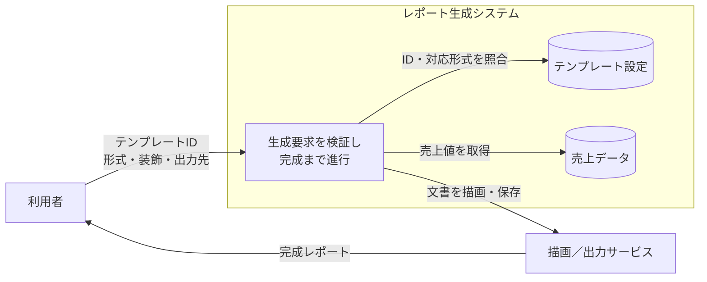
```mermaid
flowchart LR
    U["利用者"]
    subgraph SYS["レポート生成システム"]
        A["生成要求を検証し<br/>完成まで進行"]
        T[("テンプレート設定")]
        D[("売上データ")]
    end
    R["描画／出力サービス"]
    U -->|"テンプレートID<br/>形式・装飾・出力先"| A
    A -->|"ID・対応形式を照合"| T
    A -->|"売上値を取得"| D
    A -->|"文書を描画・保存"| R
    R -->|"完成レポート"| U
```

#### システム内部図

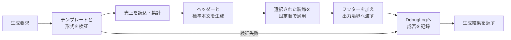
```mermaid
flowchart LR
    I["生成要求"] --> V["テンプレートと<br/>形式を検証"]
    V --> D["売上を読込・集計"]
    D --> B["ヘッダーと<br/>標準本文を生成"]
    B --> E["選択された装飾を<br/>固定順で適用"]
    E --> O["フッターを加え<br/>出力境界へ渡す"]
    O --> L["DebugLogへ<br/>成否を記録"]
    V -->|"検証失敗"| L
    L --> F["生成結果を返す"]
```

**エラー条件**

| 条件 | 結果 | 副作用 |
|---|---|---|
| テンプレートIDが未登録 | 未登録エラー | デモ成果物を保存せず、generate失敗をDebugLogへ一件記録 |
| 出力形式が非対応 | 未対応形式エラー | デモ成果物を保存せず、generate失敗をDebugLogへ一件記録。掲載コードの登録データは全テンプレートがpdf・excelの両方に対応するため、この条件はサンプル実行では発生しない |
| デモ成果物を開けない | 出力失敗 | 成功扱いにせず、generate失敗をDebugLogへ一件記録 |

### 1-2：動作例テーブル

コードを読む前に、現状の入力から結果を予測します。

| ケース | 入力 | 期待する本文 | 装飾順・出力・診断結果 |
|---|---|---|---|
| ケース1 | SALES_MONTHLY、pdf、グラフあり | 月次の標準本文 | グラフを加えて出力。DebugLogはgenerate成功、0→1件 |
| ケース2 | SALES_WEEKLY、excel、ロゴあり | 週次の標準本文 | ロゴを加えて出力。DebugLogはgenerate成功、0→1件 |
| ケース3 | SALES_DEPT、pdf、三装飾あり | 部門別の標準本文 | グラフ→ロゴ→透かしで出力。DebugLogはgenerate成功、0→1件 |
| エラー例1 | UNKNOWN、pdf | ― | 出力せず未登録エラー。DebugLogはgenerate失敗、0→1件 |

### 1-3：登場クラスとクラス構成図

| クラス名 | 現状の責任 |
|---|---|
| `ReportRequest` | テンプレート、形式、装飾フラグ、出力先を保持する |
| `ReportTemplate` | テンプレート名称と対応形式を保持する |
| `TemplateRegistry` | テンプレートを登録・検索・検証する |
| `SalesSummary` | 件数、合計、平均を保持する |
| `DataReader` | 売上データを読み込み、集計する |
| `ReportDocument` | 一つの完成文書へ入る要素を保持する |
| `ReportRenderingApi` | ヘッダー、本文、装飾、フッター、出力の外部境界を表す |
| `DebugLog` | 実行イベントと成否をメモリ記録し、件数変化を表示する |
| `ReportGenerator` | 読込から出力までを固定順で進め、本文と装飾も判断する |
| `ReportApplication` | 生成要求を受け、検証後にReportGeneratorを呼び、結果をDebugLogへ記録する |

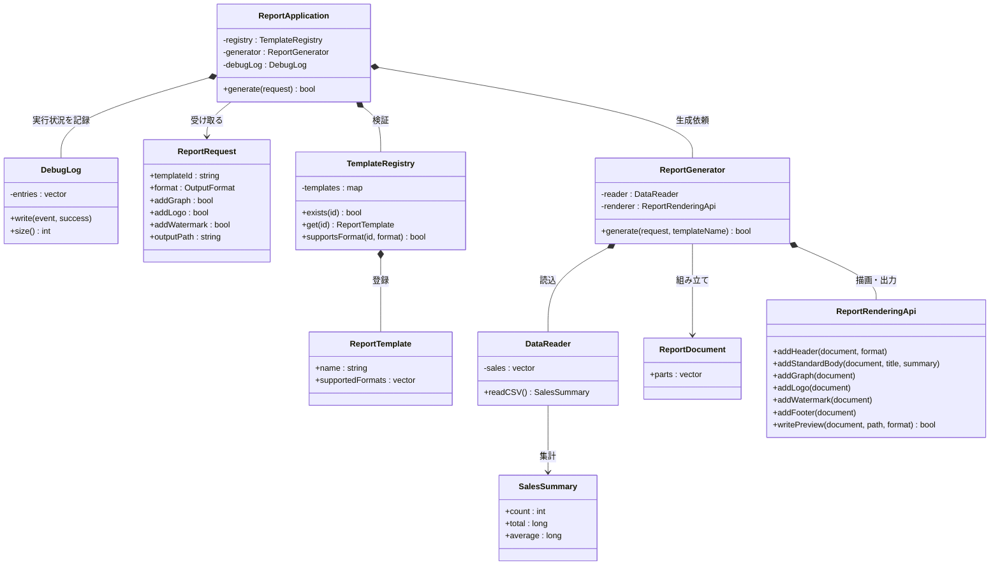
```mermaid
classDiagram
    direction TB
    class ReportApplication {
        -registry : TemplateRegistry
        -generator : ReportGenerator
        -debugLog : DebugLog
        +generate(request) bool
    }
    class DebugLog {
        -entries : vector
        +write(event, success)
        +size() int
    }
    class ReportRequest {
        +templateId : string
        +format : OutputFormat
        +addGraph : bool
        +addLogo : bool
        +addWatermark : bool
        +outputPath : string
    }
    class TemplateRegistry {
        -templates : map
        +exists(id) bool
        +get(id) ReportTemplate
        +supportsFormat(id, format) bool
    }
    class ReportTemplate {
        +name : string
        +supportedFormats : vector
    }
    class ReportGenerator {
        -reader : DataReader
        -renderer : ReportRenderingApi
        +generate(request, templateName) bool
    }
    class DataReader {
        -sales : vector
        +readCSV() SalesSummary
    }
    class SalesSummary {
        +count : int
        +total : long
        +average : long
    }
    class ReportDocument {
        +parts : vector
    }
    class ReportRenderingApi {
        +addHeader(document, format)
        +addStandardBody(document, title, summary)
        +addGraph(document)
        +addLogo(document)
        +addWatermark(document)
        +addFooter(document)
        +writePreview(document, path, format) bool
    }

    ReportApplication --> ReportRequest : 受け取る
    ReportApplication *-- TemplateRegistry : 検証
    TemplateRegistry *-- ReportTemplate : 登録
    ReportApplication *-- ReportGenerator : 生成依頼
    ReportApplication *-- DebugLog : 実行状況を記録
    ReportGenerator *-- DataReader : 読込
    DataReader --> SalesSummary : 集計
    ReportGenerator --> ReportDocument : 組み立て
    ReportGenerator *-- ReportRenderingApi : 描画・出力

    classDef focus fill:#FFF2CC,stroke:#D6B656,stroke-width:2px,color:#222
    cssClass "ReportGenerator" focus
```

薄い黄色のReportGeneratorが、現在の生成処理をまとめて担当しています。この時点では、現状の要求を満たして動作しています。

**クラス図に出てくる主なメンバーと操作**

| クラス | 保持するもの・操作 | 現状でできること |
|---|---|---|
| ReportRequest | templateId、format、三つの装飾フラグ、outputPath | 利用者が指定した一回分の生成条件を運ぶ |
| TemplateRegistry | templates、exists()、get()、supportsFormat() | IDの存在と対応形式を検証し、名称を返す |
| DataReader | sales、readCSV() | 6件の売上を読み、件数・合計・平均を返す |
| ReportGenerator | reader、renderer、generate() | 読込から出力まで進め、本文と装飾も判断する |
| ReportRenderingApi | addHeader()～writePreview() | 一つのReportDocumentへ要素を追加し、デモ成果物を保存する |
| DebugLog | entries、write()、size() | イベントと成否をメモリへ追加し、件数変化を表示する |
| ReportApplication | registry、generator、debugLog、generate() | 入力を検証し、生成処理へ接続して結果を診断記録する |

図では責任と接続を確認し、各操作の条件分岐や失敗時の戻り値は、次の現状コードで確認します。

**この章での簡略化**

掲載コードで実際に行う計算・組み立てと、外部ライブラリを置き換えた部分を分けます。

| 実システムの要素 | 現状の掲載コードで行うこと | 代替・省略する範囲 |
|---|---|---|
| 生成画面・利用者 | `main()`からテンプレート・形式・装飾・出力先を渡す | GUI、ログイン、権限管理は作らない |
| 売上CSV | メモリ上の固定6件を読み、件数・合計・平均を実際に計算する | 実ファイル読込、文字コード、巨大データ処理は扱わない |
| テンプレートDB | 固定テンプレートを`std::map`へ登録し、IDと対応形式を照合する | 永続DBとテンプレート編集画面は作らない |
| PDF・Excel生成 | 文書要素を順に`ReportDocument`へ追加する | 有効なPDF・Excelの描画ライブラリは使わず、プレーンテキストのデモ成果物で代替する |
| 診断ログ | 実行イベントと成否をメモリへ記録する | 永続監査基盤や外部ログサービスは扱わない |

### 1-4：実装コード（現状）

コードはクラス単位で分けます。最初に、各ブロックがどの責任を持つかを確認します。

| コードブロック | クラス | 見る責任 |
|---|---|---|
| 1 | 値と要求 | 入力・集計・文書 |
| 2 | DebugLog | 内部診断記録と件数変化 |
| 3 | DataReader | 売上集計 |
| 4 | ReportRenderingApi | 描画・デモ出力境界 |
| 5 | TemplateRegistry | テンプレート検証 |
| 6 | ReportGenerator | 固定順の生成と装飾判断 |
| 7 | ReportApplication、main | 入力受付、実行、診断記録 |

#### 値と要求

```cpp
#include <cstdio>
#include <fstream>
#include <iostream>
#include <map>
#include <string>
#include <utility>
#include <vector>

using namespace std;

enum class OutputFormat { Pdf, Excel };

string formatName(OutputFormat format) {
    return format == OutputFormat::Pdf ? "PDF" : "Excel";
}

struct SalesSummary {
    int count;
    long total;
    long average;
};

struct ReportDocument {
    vector<string> parts;
};

struct ReportRequest {
    string templateId;
    OutputFormat format;
    bool addGraph;
    bool addLogo;
    bool addWatermark;
    string outputPath;
};

struct ReportTemplate {
    string name;
    vector<OutputFormat> supportedFormats;
};
```

- `OutputFormat`は、利用者が指定するPDF・Excelを名前付きの値として表します。
- `ReportRequest`は、テンプレートID、形式、三つの装飾フラグ、出力先という1-1の入力を一回分にまとめます。
- `SalesSummary`はDataReaderの集計結果、`ReportDocument`は描画APIへ渡す一つの完成文書、`ReportTemplate`は登録済み名称と対応形式を保持します。
- これらは処理を選ぶクラスではなく、クラス間を流れる値と契約です。

#### DebugLog

```cpp
class DebugLog {
    vector<string> entries;
public:
    void write(const string& event, bool success) {
        int before = static_cast<int>(entries.size());
        entries.push_back(
            event + ":" + (success ? "success" : "failure"));
        cout << "デバッグログ件数: " << before
             << "->" << entries.size()
             << "・event=" << event
             << "・result="
             << (success ? "success" : "failure")
             << endl;
    }

    int size() const {
        return static_cast<int>(entries.size());
    }
};
```

- `write()`は、イベント名と成否を一件追加し、`entries`の件数が何件から何件へ変わったかを表示します。
- 記録内容は診断に必要な最小情報だけで、テンプレート、装飾、出力先を復元する完全な要求ではありません。
- `size()`は診断件数の確認用です。レポート生成の可否や再実行対象を決める判定には使いません。

#### DataReader

```cpp
class DataReader {
    vector<int> sales{520, 610, 480, 700, 560, 640};
public:
    SalesSummary readCSV() const {
        long total = 0;
        for (int value : sales) {
            total += value;
        }
        long average = sales.empty()
            ? 0
            : total / static_cast<long>(sales.size());
        cout << "CSV読込: " << sales.size()
             << "件・合計" << total
             << "・平均" << average << endl;
        return {static_cast<int>(sales.size()), total, average};
    }
};
```

- `sales`は、1-1で示した6件の売上データを保持します。
- `readCSV()`は全件を合計し、件数・合計・平均を`SalesSummary`として返します。
- 本文や装飾、出力形式は知らず、売上の読込と集計だけを担当します。

#### ReportRenderingApi

```cpp
class ReportRenderingApi {
    void append(ReportDocument& document, const string& text) const {
        document.parts.push_back(text);
        cout << text << endl;
    }
public:
    void addHeader(ReportDocument& document,
                   OutputFormat format) const {
        append(document, "ヘッダー生成: " + formatName(format));
    }

    void addStandardBody(ReportDocument& document,
                         const string& title,
                         const SalesSummary& summary) const {
        append(document,
               title + " 標準本文: 件数"
               + to_string(summary.count)
               + "・合計" + to_string(summary.total)
               + "・平均" + to_string(summary.average));
    }

    void addGraph(ReportDocument& document) const {
        append(document, "装飾適用: グラフ");
    }

    void addLogo(ReportDocument& document) const {
        append(document, "装飾適用: ロゴ");
    }

    void addWatermark(ReportDocument& document) const {
        append(document, "装飾適用: 透かし");
    }

    void addFooter(ReportDocument& document) const {
        append(document, "フッター生成");
    }

    bool writePreview(const ReportDocument& document,
                      const string& path,
                      OutputFormat format) const {
        ofstream output(path);
        if (!output) {
            return false;
        }
        output << "[DEMO PREVIEW] requested="
               << formatName(format) << '\n';
        for (const string& part : document.parts) {
            output << part << '\n';
        }
        output.close();
        if (!output) {
            remove(path.c_str());
            return false;
        }
        cout << "デモ成果物を保存: " << path
             << "（実" << formatName(format)
             << "ではない）" << endl;
        return true;
    }

};
```

- 各`add...()`は同じ`ReportDocument`へ表示要素を一つ追加します。呼び出し順は`parts`の順として観測できます。
- `writePreview()`は指定パスへプレーンテキストのデモ成果物を保存します。有効なPDF・Excelを生成する処理ではありません。
- ファイルを開けない場合は`false`を返し、書込完了に失敗した場合は不完全なデモ成果物を削除します。

#### TemplateRegistry

```cpp
class TemplateRegistry {
    map<string, ReportTemplate> templates;
public:
    TemplateRegistry() {
        templates["SALES_WEEKLY"] =
            {"週次売上レポート",
             {OutputFormat::Pdf, OutputFormat::Excel}};
        templates["SALES_MONTHLY"] =
            {"月次売上レポート",
             {OutputFormat::Pdf, OutputFormat::Excel}};
        templates["SALES_DEPT"] =
            {"部門別売上レポート",
             {OutputFormat::Pdf, OutputFormat::Excel}};
    }

    bool exists(const string& id) const {
        return templates.count(id) != 0;
    }

    const ReportTemplate& get(const string& id) const {
        return templates.at(id);
    }

    bool supportsFormat(const string& id,
                        OutputFormat format) const {
        const vector<OutputFormat>& formats =
            templates.at(id).supportedFormats;
        for (OutputFormat candidate : formats) {
            if (candidate == format) {
                return true;
            }
        }
        return false;
    }
};
```

- コンストラクタは1-1の週次・月次・部門別テンプレートを登録します。
- `exists()`は未登録ID、`supportsFormat()`は非対応形式を生成前に拒否するための判定です。
- `get()`は検証済みIDから名称と対応形式を返します。本文生成やファイル出力は担当しません。

#### ReportGenerator

```cpp
class ReportGenerator {
    DataReader reader;
    ReportRenderingApi renderer;
public:
    bool generate(const ReportRequest& request,
                  const string& templateName) {
        SalesSummary summary = reader.readCSV();
        ReportDocument document;

        renderer.addHeader(document, request.format);
        renderer.addStandardBody(
            document, templateName, summary);

        if (request.addGraph) {
            renderer.addGraph(document);
        }
        if (request.addLogo) {
            renderer.addLogo(document);
        }
        if (request.addWatermark) {
            renderer.addWatermark(document);
        }

        renderer.addFooter(document);
        return renderer.writePreview(
            document, request.outputPath, request.format);
    }
};
```

- `generate()`は、売上読込→ヘッダー→標準本文→装飾→フッター→保存という現状の処理順を進めます。
- 標準本文の生成だけでなく、三つのboolを読み、グラフ→ロゴ→透かしという固定順で具体APIを選びます。
- したがって、現状では正しく動作しますが、生成順と装飾判断が同じクラスに置かれていることをコードから確認できます。

#### ReportApplicationとmain

```cpp
class ReportApplication {
    TemplateRegistry registry;
    ReportGenerator generator;
    DebugLog debugLog;
public:
    bool generate(const ReportRequest& request) {
        if (!registry.exists(request.templateId)) {
            cout << "エラー: 未登録テンプレート "
                 << request.templateId << endl;
            debugLog.write("generate", false);
            return false;
        }
        if (!registry.supportsFormat(
                request.templateId, request.format)) {
            cout << "エラー: 未対応形式 "
                 << formatName(request.format) << endl;
            debugLog.write("generate", false);
            return false;
        }

        const ReportTemplate& reportTemplate =
            registry.get(request.templateId);
        cout << "テンプレート: "
             << reportTemplate.name << endl;
        bool success = generator.generate(
            request, reportTemplate.name);
        debugLog.write("generate", success);
        return success;
    }
};

int main() {
    ReportApplication application;

    // 1回目：月次・PDF・グラフあり・ロゴあり・透かしなし
    ReportRequest request{
        "SALES_MONTHLY",
        OutputFormat::Pdf,
        true,
        true,
        false,
        "current_monthly_pdf_demo.txt"
    };
    bool first = application.generate(request);

    // 2回目：同じ入口へ、週次・Excel・透かしありを渡す
    ReportRequest weekly{
        "SALES_WEEKLY",
        OutputFormat::Excel,
        false,
        false,
        true,
        "current_weekly_excel_demo.txt"
    };
    bool second = application.generate(weekly);

    // 3回目：登録されていないテンプレートIDを渡す
    ReportRequest unknown{
        "SALES_UNKNOWN",
        OutputFormat::Pdf,
        false,
        false,
        false,
        "current_unknown_demo.txt"
    };
    application.generate(unknown);

    return (first && second) ? 0 : 1;
}
```

- `ReportApplication::generate()`は、テンプレートIDと対応形式を検証してから`ReportGenerator`へ同じ要求を渡します。エラー時は生成・保存へ進みませんが、その失敗結果も`DebugLog`へ記録します。
- `main()`は、同じ入口へ3件の要求を順に渡します。月次・PDF・グラフとロゴ、週次・Excel・透かし、そして未登録テンプレートです。テンプレートも形式も装飾も変わりますが、呼ぶ操作は `generate()` の1つだけです。
- 利用者入力の受付、テンプレート検証、生成本体の呼び出し、内部診断記録がどこで接続されるかを示すブロックです。

実行対象コード：1-4の現状コード

確認対象：テンプレート・形式・装飾を変えても同じ順序で処理が進み、内部診断ログが1件ずつ積み上がること

実行結果：

```
テンプレート: 月次売上レポート
CSV読込: 6件・合計3510・平均585
ヘッダー生成: PDF
月次売上レポート 標準本文: 件数6・合計3510・平均585
装飾適用: グラフ
装飾適用: ロゴ
フッター生成
デモ成果物を保存: current_monthly_pdf_demo.txt（実PDFではない）
デバッグログ件数: 0->1・event=generate・result=success
テンプレート: 週次売上レポート
CSV読込: 6件・合計3510・平均585
ヘッダー生成: Excel
週次売上レポート 標準本文: 件数6・合計3510・平均585
装飾適用: 透かし
フッター生成
デモ成果物を保存: current_weekly_excel_demo.txt（実Excelではない）
デバッグログ件数: 1->2・event=generate・result=success
エラー: 未登録テンプレート SALES_UNKNOWN
デバッグログ件数: 2->3・event=generate・result=failure
```

現状の入力、集計、固定された装飾順、出力境界、内部診断ログが、1-1と1-2の説明どおりに動きました。3件を通すと、デバッグログ件数が `0->1`・`1->2`・`2->3` と積み上がり、失敗した3件目も `result=failure` として記録されることが分かります。

> **手元で動かすには**
> このコードは1つの `.cpp` に貼り付けて、そのままコンパイル・実行できます（例：`g++ chapter11.cpp -o app && ./app`）。`main()` は自由に組み替えて構いません。`ReportRequest` の `OutputFormat::Pdf` を `OutputFormat::Excel` へ変え、出力パスを `"my_report_demo.txt"` などへ変えれば、ヘッダーの形式表記と保存先が変わった実行結果に表れます。装飾の有無を示す3つの真偽値を切り替えると、適用される装飾が増減します。**実行するとカレントディレクトリへ指定名のテキストファイルが実際に作られます。**中身はヘッダー・本文・装飾・フッターを並べたデモ用のプレビューで、PDFやExcelのファイル形式では書き出しません（形式名は文字列として出力へ現れるだけです）。CSVは実ファイルを読まず、`DataReader` が固定データで代替します。集計結果と内部診断ログはプロセス実行中だけ有効で、終了すると消えます。

#### 仕様入力が現状コードで使われるまで

ここまでに確認した識別子を使い、1-1の仕様入力が検証、集計、文書生成、保存まで途切れず使われているかを検算します。コードを読んだ後に、未使用入力や固定値への置き換えがないことを確認する表です。

| 仕様入力 | コード上の受け取り口 | 実際に使う箇所 | 結果への現れ方 |
|---|---|---|---|
| テンプレートID・出力形式 | `ReportRequest::templateId` / `format` | `TemplateRegistry`の存在・対応形式確認と、ヘッダー・本文生成 | テンプレート名、PDF・Excelの表示、未登録・非対応エラーに分かれる |
| 装飾の有無 | `ReportRequest::addGraph` / `addLogo` / `addWatermark` | `ReportGenerator::generate()`の各装飾判定 | 選択したグラフ・ロゴ・透かしだけが文書要素へ加わる |
| 出力先 | `ReportRequest::outputPath` | `ReportRenderingApi::writePreview()` | 同じパスがデモ成果物の保存結果へ表示される |
| 登録済み売上データ | `DataReader::readCSV()` | 件数・合計・平均の集計と標準本文生成 | 6件・合計3510・平均585として本文と実行結果へ現れる |

### 1-5：変更要求

プロダクトオーナーと営業部から、次の依頼を受けました。

> 通常の月次レポートは今のまま残し、役員向けの月次レポートだけ専用本文にしたい。グラフやロゴなど既存の装飾を、利用者が指定した順番で重ねられるようにしたい。さらに、受け付けた生成要求を記録し、同じ設定と出力先で再実行したり、生成した成果物を取り消したりできるようにしたい。

依頼文を、実装結果を判定できる三つの変更依頼へ分けます。

| 変更依頼ID | 確定した変更内容                  | 入力       | 受入条件                                   |
| ------ | ------------------------- | -------- | -------------------------------------- |
| 変更ID1    | 通常月次を保ち、役員向けだけ専用本文にする     | テンプレートID | 通常月次と役員向け月次の本文が異なり、週次・部門別は変わらない        |
| 変更ID2    | 装飾の種類を順序付きで受け、その順に適用する    | 装飾列      | ロゴ→グラフとグラフ→ロゴの結果順が入力どおりになる             |
| 変更ID3    | 受け付けた完全な生成要求を記録し、再実行・取消する | 完全な生成要求  | 同じテンプレート・形式・装飾順・出力先で再実行でき、取消で成果物を削除できる |
本書の番号は、第0章の「本書の番号の読み方」で定義した要求ID・変更ID・リスクID・課題IDへ統一しています。表記を見れば管理対象が分かるため、英字の略語を覚える必要はありません。
#### 変更後要求ベースライン

| 要求ID | 変更種別・根拠となる変更ID | 変更後要求 | 受入条件 |
|---|---|---|---|
| 要求ID1 | 継続<br/>根拠: — | 登録テンプレートIDと対応出力形式を検証する | 未登録・非対応形式では生成しない |
| 要求ID2 | 継続<br/>根拠: — | 入力された売上データの件数・合計・平均を計算する | すべての本文へ同じ集計値が出る |
| 要求ID3 | 変更<br/>根拠: 変更ID1 | 既存3本文を保ち、役員向け月次だけ専用本文にする | 通常月次と役員向けが異なり、週次・部門別は不変 |
| 要求ID4 | 変更<br/>根拠: 変更ID2 | グラフ・ロゴ・透かしを入力順で重ねる | 装飾順を入れ替えると出力順も入れ替わる |
| 要求ID5 | 継続<br/>根拠: 変更ID3 | 描画境界を通して指定先へデモ成果物を保存・削除する | 生成・取消結果を確認できる |
| 要求ID6 | 継続<br/>根拠: — | 内部デバッグイベントと成否・件数変化を記録する | 操作前後件数がログで見える |
| 要求ID7 | 追加<br/>根拠: 変更ID3 | 完全な生成要求を履歴へ保存し、同じ内容で再実行・取消する | テンプレート・形式・装飾順・出力先が維持される |

**変更前→変更後の要求対照（今回変える要求IDだけ）**

現行ベースラインと変更後ベースラインを往復せずに済むよう、今回変える要求IDだけを取り出し、変更前と変更後を同じ行へ並べます。

| 要求ID | 変更前の要求（現行） | 変更後の有効要求 | 根拠変更ID |
|---|---|---|---|
| 要求ID3 | 週次・月次・部門別の標準本文を生成する | 既存3本文を保ち、役員向け月次だけ専用本文にする | 変更ID1 |
| 要求ID4 | グラフ・ロゴ・透かしの有無を本文へ反映する | グラフ・ロゴ・透かしを入力順で重ねる | 変更ID2 |
| 要求ID7 | （新規・現行なし） | 完全な生成要求を履歴へ保存し、同じ内容で再実行・取消する | 変更ID3 |

要求ID1・要求ID2・要求ID5・要求ID6は継続（変更前＝変更後）のため対照表には載せません。変更後ベースラインで内容を確認できます。

上の表の「変更種別・根拠となる変更ID」列が、各要求IDが変更で継続・変更・追加のどれになったか（＝要求IDの追跡）です。要求ID3・要求ID4が変更、要求ID7が追加、他は継続で、フェーズ7で全要求IDを完成コードと受入結果へ照合します。

#### 変更しない仕様

| 項目 | 維持する契約 |
|---|---|
| 売上データ | 6件、合計3,510、平均585をDataReaderが返す |
| テンプレート検証 | TemplateRegistryがIDと対応形式を検証する |
| 描画・出力境界 | ReportRenderingApiを通して文書要素とデモ成果物を扱う |
| 既存テンプレート | 週次、通常月次、部門別を残す |
| 既存装飾 | グラフ、ロゴ、透かしを残す |
| デモ出力 | 有効なPDF/Excelではなく、内容確認用テキストを保存する |
| 内部デバッグログ | イベント名と成否をメモリ記録し、件数変化を表示する。要求履歴の正本にはしない |

上表の各項目は、変更後も意味を変更なしとして維持します。

`DebugLog`は現行システムに最初からある内部基盤なので、変更ID1〜変更ID3には含めません。変更ID3で追加する要求履歴は、完全な`ReportRequest`を再実行・取消のために保持する別の業務上の記録です。デバッグログを要求履歴へ流用しません。

ここで確定したのは変更ID1〜変更ID3です。クラス、インターフェース、生成方法はまだ決めません。今回のスコープ外として何を実装しないかは、フェーズ2でヒアリングして範囲を確かめてから2-5末尾で確定します。

**フェーズ1のまとめ：今回追う変更ID一覧**

このフェーズで確定した変更依頼を一覧にして締めます。フェーズ2でこの変更IDを仮説・ヒアリングへ、フェーズ3で一つずつ試して痛みへ、と順につなぎます。

| 変更ID | 変更依頼の要点 | 関係する要求ID（追加は変更後ID） |
|---|---|---|
| 変更ID1 | 通常月次を保ち、役員向けだけ専用本文にする | 要求ID3 |
| 変更ID2 | 装飾の種類を順序付きで受け、その順に適用する | 要求ID4 |
| 変更ID3 | 受け付けた完全な生成要求を記録し、再実行・取消する | 要求ID5・要求ID7 |

---

## 🟣 フェーズ2：仮説立案 ―― 何が変わるかを観察し、ヒアリングで裏付ける

### 2-1：変わりそうな仕様の見当をつける

フェーズ1の入力、処理順、クラス図へ変更ID1〜変更ID3を重ね、どこが今後も変わりそうかを見ます。

見当は、次の順で作ります。

1. 1-1と1-2から、今回変わる入力・判定・加工・出力を拾う。
2. その仕様を1-3の責任と1-4のメソッドへ対応づける。
3. 現状と要求の差を、「何が増えるか」「何が置き換わるか」「何を残すか」に分ける。
4. クラスの分け方はまだ決めず、変更が集まりそうなコード上の場所までを仮説にする。

この手順により、パターン名や完成コードから逆算せず、フェーズ1で読者が確認した事実から三つの見当を再現できます。

| 見当 | フェーズ1で見た事実 | 要求と変化の見当 | 現状コードの場所 |
|---|---|---|---|
| 本文 | すべて標準本文 | 変更ID1：テンプレートごとの本文が増える | ReportGenerator::generate() |
| 装飾 | boolと固定if順 | 変更ID2：装飾の種類・有無・順序が組合せで変わる | 三装飾のif |
| 履歴 | 再実行に使える要求履歴はない。DebugLogはイベント名と成否だけを持つ | 変更ID3：完全な要求の受付、実行、再実行、取消の規則が変わる | 現状には要求履歴の接続点がない |

ここでは「変わりそう」という仮説までです。どのクラスへ分けるかは決めません。
#### ヒアリングで確認すること

三つの見当をそのまま結論にせず、未確定な点を質問に変えてからヒアリングへ進みます。

| 見当 | 現時点の仮説 | 確認する質問 | 確認先 |
|---|---|---|---|
| 本文 | 役員向けは通常月次と共存する | 既存月次を置き換えるのか、別テンプレートか | 営業部 |
| 装飾 | 利用者が指定した順を保つ | システム側で並べ替えず、透かしも残すか | プロダクトオーナー |
| 履歴 | 完全な要求を受付時に残す | 何を記録し、再実行・取消で何を維持するか | プロダクトオーナー |
| 今回の範囲 | 過去CSV再現とHTMLは将来検討 | 今回のコードへ含めない機能は何か | プロダクトオーナー |

2-3の会話はこの四つの質問に答える順で進めます。これにより、見当→質問→回答→将来リスクのつながりを追えます。

### 2-2：今回の変更で確実に変わること

1-5で確定した変更IDを、そのまま今回確実に変わることとして確認します。章ごとに異なる色や記号は使わず、以降でも同じ変更IDで追跡します。

- **変更ID1：通常月次を保ち、役員向けだけ専用本文にする**
- **変更ID2：装飾の種類を順序付きで受け、その順に適用する**
- **変更ID3：受け付けた完全な生成要求を記録し、再実行・取消する**

これらが今回確実に変わる範囲です。今回変えない範囲と将来の見込みは、次の関係者ヒアリングで確認します。

### 2-3：関係者ヒアリング

- 開発者：「役員向け月次は、今の月次を置き換えますか」
- 営業部：「置き換えません。通常月次はそのまま必要です。役員向けを別テンプレートとして選びます」
- 開発者：「装飾順は、システムが推奨順へ並べ替えますか」
- プロダクトオーナー：「並べ替えません。利用者がロゴ→グラフと指定したら、その順で適用してください。透かしも既存機能として残します」
- 開発者：「再実行のために何を記録しますか」
- プロダクトオーナー：「テンプレート、形式、装飾順、出力先を含む受付要求です。実行前に記録し、同じ要求をもう一度実行できるようにしてください」
- 開発者：「取消では履歴も削除しますか」
- プロダクトオーナー：「履歴は受付記録として残し、成果物だけを削除してください」
- 開発者：「HTML出力や、当時のCSVを保存して再現する機能も今回必要ですか」
- プロダクトオーナー：「将来は検討しますが、今回は不要です。再実行時は現在のDataReaderから同じサンプルデータを読みます」

これで、本文・装飾・履歴の三つの見当が変更ID1〜変更ID3の確定範囲として裏付けられました。

### 2-4：ヒアリングで判明した将来リスク

将来リスクは設計の耐久性を見る材料にしますが、今回の完成コードへ機能として追加しません。

| リスクID | 将来リスク | 時期の目安 | 根拠 |
|---|---|---|---|
| リスクID1 | HTML形式の追加 | 時期未定 | プロダクトオーナー「将来は検討」 |
| リスクID2 | 再実行で当時のCSVを使う | 時期未定 | プロダクトオーナー「将来は検討」 |
| リスクID3 | 履歴の永続化・上限管理 | 履歴運用の拡大時 | プロダクトオーナーへ今回は受付履歴だけと確認 |

### 2-5：変わる見込みと当面安定の前提を確定する

2-4のリスクIDを、レポート生成で変えられるようにする部分と、受付・生成・結果記録の安定側へ分けます。「はい」は、フェーズ6で**形式・入力の再現方法・履歴運用が変わっても、確定要求の生成経路へ影響を広げない構造か**を判定するための印です。
本章でも、将来変わる可能性には「リスクID」を使います。要求IDや変更IDと分けてリスクIDとするのは、今回実装する要求ではなく、フェーズ6で構造を評価するための条件だからです。

| リスクID・変化軸 | 変わる見込み | 変えられるようにする部分 | 当面安定として守る部分 |
|---|---|---|---|
| リスクID1：HTML形式の追加 | はい | 出力形式ごとの描画処理と登録 | 完全な生成要求、本文と装飾の組み立て、生成結果 |
| リスクID2：再実行で当時のCSVを使う | はい | 入力データの保存・参照方法 | 同じ生成要求を再実行する入口と結果契約 |
| リスクID3：履歴の永続化・上限管理 | はい | 履歴の保存先、保持件数、削除方針 | 完全な要求を記録し、再実行・取消へ渡す契約 |

したがって2-5の出力は、「出力形式・入力再現・履歴運用は変えられるようにし、生成要求から結果までの契約は守る」という設計条件です。フェーズ3では変更ID1〜変更ID3だけを現在の構造へ適用し、`DebugLog`は変更対象外の内部基盤として維持します。リスクIDはフェーズ6の構造評価に使います。

**今回実装しないもの（フェーズ2で確定した対象外）：** ここまでのヒアリングで、今回のスコープ外が確定しました。リスクID1〜リスクID3（HTML形式・当時CSVでの再現・履歴の永続化と上限管理）は、変えられるようにする対象ではありますが、今回の完成コードへは実装しません（フェーズ6で構造評価にのみ使います）。加えて、次はヒアリングでも今回は扱わないと確認しました。

- バックグラウンドジョブ、スケジューラ、並列実行
- 失敗した操作だけを自動で再試行する専用キュー
- 生成結果を別用途へ集計する業務監査ログ（既存の`DebugLog`とは別）

これらはフェーズ3以降で扱わず、完成コードへ先回りして入れません。

---

## 🟣 フェーズ3：問題特定 ―― 変更の痛みを発見する

### 3-1：変更を試みる

変更ID1〜変更ID3を、現状のReportGeneratorを中心とする構造へそのまま追加します。ここで見るのは、要求を実現できるかだけではなく、どの責任へ修正が集まるかです。

> **抜粋の前提（周辺は現状のまま）：** `DataReader`の売上集計、`TemplateRegistry`のID・形式検証、`ReportRenderingApi`の描画・デモ出力、`DebugLog`の内部診断記録、`ReportApplication`の受付入口を維持します。変更試行では変更ID1〜変更ID3だけを追加します。以下の抜粋では、変更点を読みやすくするため検証部の再掲を省き、`main()` からテンプレート表示名を直接渡しています。実際には現状どおり`TemplateRegistry`が検証したうえで表示名を返します。

#### 変更するクラス

| クラス | 変更内容 |
|---|---|
| ReportRequest | 役員向けIDと順序付き装飾列を受けられるようにする |
| TemplateRegistry | 役員向け月次テンプレートを登録する |
| ReportGenerator | 専用本文判断、装飾ループ、要求履歴、再実行、取消を追加する |
| ReportApplication | 再実行・取消の入口を追加する |

#### 変更しないクラス

DataReader、SalesSummary、ReportDocument、ReportRenderingApi、DebugLogは、1-5で維持すると決めた契約をそのまま使います。

次の変更試行コードで、各変更IDがコードのどこに現れるかを先に対応づけます（コード内にも同じ変更IDをコメントで示します）。

| 変更ID | コード上の箇所 |
|---|---|
| 変更ID1（役員向け本文） | `execute()` 冒頭の `if (request.templateId == "SALES_MONTHLY_EXECUTIVE")` 分岐 |
| 変更ID2（装飾の追加・順序） | `execute()` 内の `for (DecorationType type : request.decorations)` ループ |
| 変更ID3（履歴・再実行・取消） | `submit()` の `acceptedRequests.push_back` と、`replayLast()` / `undoLast()` |

#### ReportGeneratorへ要求を直接追加したコード

```cpp
enum class DecorationType { Graph, Logo, Watermark };

struct ChangedReportRequest {
    string templateId;
    OutputFormat format;
    vector<DecorationType> decorations;
    string outputPath;
};

class ChangedReportGenerator {
    DataReader reader;
    ReportRenderingApi renderer;
    vector<ChangedReportRequest> acceptedRequests;

    bool execute(const ChangedReportRequest& request,
                 const string& templateName) {
        SalesSummary summary = reader.readCSV();
        ReportDocument document;
        renderer.addHeader(document, request.format);

        // 変更ID1：役員向け本文の分岐を共通順の中へ追加
        if (request.templateId ==
            "SALES_MONTHLY_EXECUTIVE") {
            renderer.addStandardBody(
                document,
                "役員向け月次専用本文",
                summary);
        } else {
            renderer.addStandardBody(
                document,
                templateName,
                summary);
        }

        // 変更ID2：装飾の種類・適用順の分岐を追加
        for (DecorationType type : request.decorations) {
            if (type == DecorationType::Graph) {
                renderer.addGraph(document);
            } else if (type == DecorationType::Logo) {
                renderer.addLogo(document);
            } else {
                renderer.addWatermark(document);
            }
        }

        renderer.addFooter(document);
        return renderer.writePreview(
            document, request.outputPath, request.format);
    }

public:
    bool submit(const ChangedReportRequest& request,
                const string& templateName) {
        // 変更ID3：受け付けた要求を履歴へ保存（再実行・取消の起点）
        acceptedRequests.push_back(request);
        return execute(request, templateName);
    }

    bool replayLast(const string& templateName) {
        if (acceptedRequests.empty()) {
            return false;
        }
        return execute(acceptedRequests.back(), templateName);
    }

    bool undoLast() {
        if (acceptedRequests.empty()) {
            return false;
        }
        return remove(
            acceptedRequests.back().outputPath.c_str()) == 0;
    }
};
```
続いて `ChangedReportApplication` です。

```cpp
class ChangedReportApplication {
    ChangedReportGenerator generator;
    DebugLog debugLog;
public:
    bool submit(const ChangedReportRequest& request,
                const string& templateName) {
        bool success = generator.submit(request, templateName);
        debugLog.write("submit", success);
        return success;
    }

    bool replayLast(const string& templateName) {
        bool success = generator.replayLast(templateName);
        debugLog.write("replay", success);
        return success;
    }

    bool undoLast() {
        bool success = generator.undoLast();
        debugLog.write("undo", success);
        return success;
    }

    int debugLogSize() const {
        return debugLog.size();
    }
};
```

- `ChangedReportGenerator`は変更ID1〜変更ID3の本文判断、装飾判断、要求履歴を一か所へ直接追加した変更試行です。
- `ChangedReportApplication`は各操作をGeneratorへ委譲し、返された成否を既存の`DebugLog`へ自動記録します。ログ記録を実行コード側の手順にはしません。
- 診断責任は分離されたままですが、変更ID1〜変更ID3の異なる変更理由はGeneratorへ集中しています。次に見る痛みはこの集中です。

#### 変更要求を実行するmain

```cpp
int main() {
    ChangedReportApplication application;
    ChangedReportRequest request{
        "SALES_MONTHLY_EXECUTIVE",
        OutputFormat::Pdf,
        {DecorationType::Logo, DecorationType::Graph},
        "phase3_executive_demo.txt"
    };
    bool generated = application.submit(
        request, "役員向け月次売上レポート");
    bool replayed = application.replayLast(
        "役員向け月次売上レポート");
    bool undone = application.undoLast();
    cout << "変更試行: 生成=" << generated
         << "・再実行=" << replayed
         << "・取消=" << undone << endl;
    cout << "デバッグログ件数: "
         << application.debugLogSize() << endl;
    return generated && replayed && undone ? 0 : 1;
}
```

実行対象コード：3-1の変更試行コード

`デバッグログ件数`は、現行システムが最初から持つ内部診断ログ（要求ID6）の記録件数です。submit・replay・undoのたびにイベントと成否を1件追加し、「0->1」のように前後の件数変化を示します。ここでは、変更試行でも診断が従来どおり動いていることを確認するために表示しています。後のフェーズ7では、この診断ログ件数と「要求履歴件数」が別物である（件数も内容も異なる）ことを対比します。

実行結果：

出力の形は1-4の現行システムと同じ「CSV読込→ヘッダー→本文→装飾→フッター→保存→診断ログ」の流れです。ただし入力が今回の変更試行（役員向け月次・装飾は指定順`ロゴ→グラフ`・受付→再実行→取消）に変わったため、本文行が役員向け専用本文になり、装飾が指定順で並び、`submit`のあとに`replay`が同じ生成を一度繰り返してから`undo`が成果物を削除します。1-4と読み比べると、変更ID1（本文）・変更ID2（装飾順）・変更ID3（再実行・取消）が出力のどこに現れたかを確認できます。

```
CSV読込: 6件・合計3510・平均585
ヘッダー生成: PDF
役員向け月次専用本文 標準本文: 件数6・合計3510・平均585
装飾適用: ロゴ
装飾適用: グラフ
フッター生成
デモ成果物を保存: phase3_executive_demo.txt（実PDFではない）
デバッグログ件数: 0->1・event=submit・result=success
CSV読込: 6件・合計3510・平均585
ヘッダー生成: PDF
役員向け月次専用本文 標準本文: 件数6・合計3510・平均585
装飾適用: ロゴ
装飾適用: グラフ
フッター生成
デモ成果物を保存: phase3_executive_demo.txt（実PDFではない）
デバッグログ件数: 1->2・event=replay・result=success
デバッグログ件数: 2->3・event=undo・result=success
変更試行: 生成=1・再実行=1・取消=1
デバッグログ件数: 3
```

この変更試行は変更ID1〜変更ID3を動かせます。しかし、一つのChangedReportGeneratorが次の知識をすべて持ちます。

`DebugLog`のクラスと記録形式はフェーズ1から変更していません。`ChangedReportApplication`が変更ID3で増えた受付・再実行・取消の各結果を自動的に従来の診断境界へ渡すため、`main()`がログ運用を手動で行う必要はありません。三件の診断記録から要求を復元することはできず、要求履歴の代わりにはなりません。

- どのIDが役員向け月次か
- 各本文をどう描くか
- DecorationTypeごとにどのAPIを呼ぶか
- 装飾列をどの順に回すか
- いつ要求履歴へ追加するか
- 再実行時にどの要求を使うか
- 取消時にどの成果物を削除するか

「コードが長い」こと自体が痛みではありません。本来は生成を順番に進めるクラスが、本文の選択、装飾の選択、履歴の運用という別々の変更理由を知り、それぞれの変更で修正対象になることが痛みです。

### 3-2：変更影響グラフ

フェーズ1のクラス図と同じ粒度で、要求ごとの修正起点を示します。

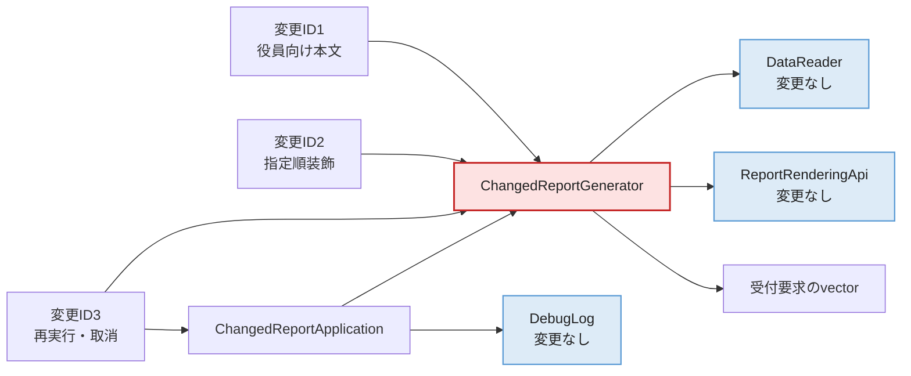
```mermaid
graph LR
    C1["変更ID1<br/>役員向け本文"] --> G["ChangedReportGenerator"]
    C2["変更ID2<br/>指定順装飾"] --> G
    C3["変更ID3<br/>再実行・取消"] --> G
    C3 --> APP["ChangedReportApplication"]
    APP --> G
    APP --> L["DebugLog<br/>変更なし"]:::stable
    G --> D["DataReader<br/>変更なし"]:::stable
    G --> A["ReportRenderingApi<br/>変更なし"]:::stable
    G --> H["受付要求のvector"]

    classDef pain fill:#FDE2E2,stroke:#C62828,stroke-width:2px,color:#222
    classDef stable fill:#DDEBF7,stroke:#5B9BD5,stroke-width:1.5px,color:#222
    class G pain
```

三つの要求は同じGeneratorを変更起点にし、変更ID3では入口も増えます。一方、DebugLogはApplicationから結果を受け取るだけで、クラス自体は変わりません。痛みはログの存在ではなく、変更対象外の読込・描画境界を抱えたGeneratorへ変更ID1〜変更ID3の判断が集中することです。

### 3-3：痛みの言語化

1. 変更ID1では、役員向け本文のために、共通の生成順を持つメソッドへID分岐を追加した。
2. 変更ID2では、ロゴとグラフの指定順適用のために、同じメソッドへ列挙値とAPI呼び出しの分岐を追加した。
3. 変更ID3では、生成処理へ受付履歴の保存時点、再実行、取消の規則が加わる。
4. 変更理由は別なのに、レビューとテストの起点がChangedReportGeneratorへ集中する。

ここで確定したのは、変更ID1〜変更ID3を一つのクラスへ追加すると変更影響が集中する、という事実です。次のフェーズ4で原因を追えるよう、観測した痛みへ**問題ID**を付けます（フェーズ4の原因ID、フェーズ5の課題IDへ順につながります）。

| 問題ID | 観測した痛み（変更途中コード） | 起点の変更ID |
|---|---|---|
| 問題ID1 | 本文を1種足すだけで、共通生成順を持つメソッドへテンプレートID分岐が増える | 変更ID1 |
| 問題ID2 | 装飾の種類・順序を変えるだけで、同じメソッドの列挙値・API分岐が増える | 変更ID2 |
| 問題ID3 | 履歴・再実行・取消を足すと、生成処理本体へ保存時点や操作規則が加わる | 変更ID3 |

3つの問題は別々の変更理由から来ていますが、修正・再テストの起点はどれも同じ生成クラスへ集中します。

---

> **📌 問題（確定）**
>
> 共通の生成順、テンプレートごとの本文、順番付き装飾、受付要求の履歴操作が一つの生成クラスへ集まり、独立した要求が同じクラスを変更起点にしている。

---

## 🟠 フェーズ4：原因分析 ―― なぜ辛いのかを構造で言語化する

### 4-1：痛みの根源を探る（観察と原因）

元の責任と漏れ込んだ知識を分けます。

フェーズ1でReportGeneratorへ与えた中心責任は、売上を読み、本文と装飾を一つの文書へまとめ、出力境界へ渡すことでした。変更ID1〜変更ID3を追加した後も「順番に進める」責任は必要です。

問題は、順番に進めるための知識を超えて、次の判断まで持ったことです。「不要にしたい」3行は、フェーズ3の問題ID1〜問題ID3（本文追加・装飾変更・履歴追加で生成本体を直す痛み）にそれぞれ対応します。

| 知識 | 変わる理由 | ReportGeneratorが知る必要 | 対応する問題ID |
|---|---|---|---|
| 読込→ヘッダー→本文→フッターという共通順 | レポート生成方式の変更 | 必要 | ―（守る側。装飾は骨格の外側で重なるため、文書内では装飾がフッターの後ろに並ぶ） |
| 役員向け月次IDと専用本文 | レポート企画の変更 | 不要にしたい | 問題ID1 |
| 装飾の種類と具体API | 表示機能の追加 | 不要にしたい | 問題ID2 |
| 受付履歴と再実行・取消規則 | 操作運用の変更 | 不要にしたい | 問題ID3 |

したがって、ReportGeneratorの役割が不明なのではありません。「共通順を進める」という役割を保ちたいのに、その役割と異なる変更理由の詳細まで知ったことが根本原因です。

この判断の根拠を、フェーズ3の変更試行コードの関連部分で確認します（この時点で確定しているのは問題IDまで。課題IDはフェーズ5で定義するので、ここでは問題IDで指します）。

```cpp
class ChangedReportGenerator {
    DataReader reader;                         // 【守る】売上読込
    ReportRenderingApi renderer;              // 【守る】描画・出力境界
    vector<ChangedReportRequest> acceptedRequests;

    bool execute(const ChangedReportRequest& request,
                 const string& templateName) {
        SalesSummary summary = reader.readCSV();
        ReportDocument document;
        renderer.addHeader(document, request.format);

        // 【問題ID1の箇所】共通順が本文IDと本文内容を判断する
        if (request.templateId == "SALES_MONTHLY_EXECUTIVE") {
            renderer.addStandardBody(
                document, "役員向け月次専用本文", summary);
        } else {
            renderer.addStandardBody(
                document, templateName, summary);
        }

        // 【問題ID2の箇所】共通順が装飾種別と具体APIを判断する
        for (DecorationType type : request.decorations) {
            if (type == DecorationType::Graph) {
                renderer.addGraph(document);
            } else if (type == DecorationType::Logo) {
                renderer.addLogo(document);
            } else {
                renderer.addWatermark(document);
            }
        }

        renderer.addFooter(document);
        return renderer.writePreview(
            document, request.outputPath, request.format);
    }

public:
    bool submit(const ChangedReportRequest& request,
                const string& templateName) {
        // 【問題ID3の箇所】生成本体が受付履歴の保存時点も決める
        acceptedRequests.push_back(request);
        return execute(request, templateName);
    }
};
```

- 【守る】の2行は、今回の要求に関係なく維持する読込・描画境界です。
- 問題ID1〜問題ID3の箇所は、それぞれ別の要求で変わる判断ですが、同じクラスのメンバーとメソッドに集まっています。
- したがって、単にメソッドが長いことではなく、異なる変更理由が同じ責任境界を通過することが原因だと判断できます。

### 4-2：変わるもの/変わってほしくないもの

> **「変わらないもの」と「変わってほしくないもの」は異なります。** 前者は観察事実、後者はほかの変更から守りたい設計意図です。本章では、共通順と既存境界を変わってほしくない側として整理します。

| **変わり続けるもの** | **変わってほしくないもの** |
|---|---|
| レポート本文の種類と内容 | 読込→ヘッダー→本文→フッターの生成順 |
| 装飾の種類・重ねる順序 | 売上集計と描画・出力境界の契約 |
| 生成要求の実行・再実行・取消 | 内部診断ログの記録契約 |

#### 責任見直し用のクラス図

薄い黄色は残したい責任、薄い赤は別の変更理由で変わる責任です。

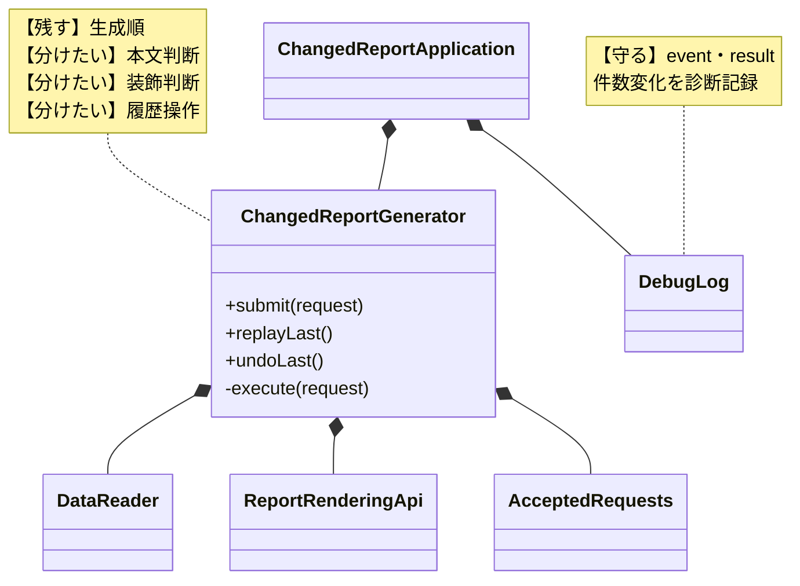
```mermaid
classDiagram
    direction TB
    class ChangedReportGenerator {
        +submit(request)
        +replayLast()
        +undoLast()
        -execute(request)
    }
    class ChangedReportApplication
    class DebugLog
    class DataReader
    class ReportRenderingApi
    class AcceptedRequests

    ChangedReportApplication *-- ChangedReportGenerator
    ChangedReportApplication *-- DebugLog
    ChangedReportGenerator *-- DataReader
    ChangedReportGenerator *-- ReportRenderingApi
    ChangedReportGenerator *-- AcceptedRequests

    note for ChangedReportGenerator "【残す】生成順<br/>【分けたい】本文判断<br/>【分けたい】装飾判断<br/>【分けたい】履歴操作"
    note for DebugLog "【守る】event・result<br/>件数変化を診断記録"

    classDef focus fill:#FFF2CC,stroke:#D6B656,stroke-width:2px,color:#222
    classDef stable fill:#DDEBF7,stroke:#5B9BD5,stroke-width:1.5px,color:#222
    cssClass "ChangedReportGenerator" focus
    cssClass "DebugLog,DataReader,ReportRenderingApi" stable
```

図で着目するのは、クラス数ではなく、薄い黄色の一つの箱に異なる変更理由が四つ並んでいることです。水色のDebugLogは別責任のまま維持され、要求履歴を所有していません。

#### 変わる部分と守る部分の具体化

| 区分 | 内容 | 根拠 |
|---|---|---|
| 守る | 売上読込、集計値、テンプレート検証、描画・出力境界 | 1-5で変更対象外 |
| 守る | DebugLogのイベント・成否記録と件数表示 | 現行の内部診断基盤であり、変更ID1〜変更ID3の変更対象ではない |
| 守る | 読込→ヘッダー→本文→フッターの基本順 | 全テンプレートで共通 |
| 変わる | テンプレートごとの本文 | 変更ID1 |
| 変わる | 装飾の種類・組合せ・順序 | 変更ID2 |
| 変わる | 受付、再実行、取消の規則 | 変更ID3 |

### 4-3：接続点へ漏れている知識を確認する

| 接続点 | 現在漏れている知識 | 変更影響 |
|---|---|---|
| 共通順→本文 | テンプレートIDのifと本文内容 | 本文追加で共通順を修正 |
| 本文→装飾 | 列挙値、具体API、呼出順 | 装飾追加で生成本体を修正 |
| 受付→生成 | vectorの保存時点、再実行、削除 | 履歴規則変更で生成本体を修正 |

`DebugLog`は、これら三つの接続点の判断には参加しません。処理結果を受け取って診断記録するだけなので、後の課題ID1〜課題ID3で分離する変更理由から外して守ります。

フェーズ3の問題IDに対応づけて、構造上の原因へ**原因ID**を付けます。次のフェーズ5は、この原因IDから課題IDを導きます。

| 原因ID | 構造上の原因（何が同じ責任へ集まっているか） | 対応する問題ID |
|---|---|---|
| 原因ID1 | 共通生成順が、テンプレートIDの判断と本文内容まで持っている | 問題ID1 |
| 原因ID2 | 文書生成が、装飾の種類と適用順の判断まで持っている | 問題ID2 |
| 原因ID3 | 生成本体が、受付要求の保存時点・再実行・取消の規則まで持っている | 問題ID3 |

次のフェーズでは、この三つの原因を「何を達成すべき課題か」へ変換します。分離先のクラス名はまだ決めません。

---

## 🟡 フェーズ5：課題定義 ―― 原因から課題を検討して確定する

フェーズ4で確定した3つの原因（原因ID1〜原因ID3）は、まだ課題そのものではありません。ここでは各原因を「何を達成すればその痛みが消えるか」という課題候補へ落とし、システム全体で必要性・重複を評価してから、**課題ID1〜課題ID3として5-3で確定します**（課題IDはこの5-3で初めて定義します）。課題IDは要求IDからではなく、問題ID→原因IDからのみ導きます。

なお、ここで確定する課題は「境界そのもの」ではなく、**その境界で何をできるようにするか**という達成目標です（例：課題ID1＝本文の中身だけを差し替えられるようにする）。問題ID→原因ID→課題IDを一列で見渡す一覧は、課題IDを定義した5-3の末尾に置きます。

#### 原因を「問い」へ変える

各原因（原因ID）を、「何ができれば痛みが消えるか」という問いへ変えます。コードの場所はフェーズ4で示したので繰り返さず、解決クラス名やパターン名もまだ決めません。

| 原因ID（フェーズ4） | 確定した原因 | 検討する問い（課題候補の芽） |
|---|---|---|
| 原因ID1 | 共通順が本文IDと本文内容を持つ | 共通順を変えず、本文の中身だけを差し替えられるか |
| 原因ID2 | 文書生成が装飾種類・順序を持つ | 本文生成に触れず、装飾を入力順に重ねられるか |
| 原因ID3 | 生成本体が履歴規則を持つ | 生成の実行を、記録・再実行できる操作として扱えるか |

### 5-1：原因から課題候補を洗い出す

各原因IDから課題候補を導きます（候補はまだ課題IDではありません。1列目に元の原因IDを添えます）。

| 原因ID・確定した事実 | そのままだと残る痛み | 課題候補 | 候補を導いた理由 |
|---|---|---|---|
| 原因ID1：原因ID1：共通生成順がテンプレートIDごとの本文判断を持つ | 役員本文追加で共通順と既存本文を修正・再確認する | 本文生成の差分を共通生成順から分離する | 本文種類と生成骨格は別の理由で変わる |
| 原因ID2：原因ID2：文書生成が装飾種類と固定適用順を分岐する | 種類・順序変更で文書生成本体を修正する | 装飾を同じ文書部品として順に組み合わせる | 各装飾と本文生成は独立して変わる |
| 原因ID3：原因ID3：受付処理が要求vectorを直接操作して再実行・取消を分岐する | 操作追加で受付・履歴・出力処理が同時変更になる | 完全な生成要求を実行可能な操作単位として扱う | 生成実行と操作履歴は別の責任だから |

この段階では、解決クラス名・契約名・パターン名・生成場所を決めません。原因のどの構造を変える必要があるかだけを候補にします。

### 5-2：課題候補をシステム全体で評価する

| 課題候補 | 必要性・他候補との関係 | 統合／分割の判断 | 採否 |
|---|---|---|---|
| 本文差分の分離 | 必須。変更ID1で共通順への分岐追加が観測された | 生成骨格との一接続点として残す | 採用 |
| 装飾部品の分離 | 必須。変更ID2を固定分岐へ追加すると順序指定を満たせない | 本文差分と同じ文書を受け渡すが独立変化軸 | 採用 |
| 操作単位と履歴の分離 | 必須。変更ID3で完全要求の再構成が複数箇所へ広がる | 生成処理を呼ぶ別の接続点として残す | 採用 |

候補を一つずつ部分対策として採用するのではなく、すべてを解いた完成状態から逆算します。変更IDと課題IDは一対一とは限らないため、変更依頼の数に合わせて課題を増減させません。

### 5-3：課題IDと接続点を確定する

評価を通過した候補に、課題ID1から欠番なく番号を付けて確定します。各課題は、境界（＝接続点）そのものではなく、その接続点で**何をできるようにするか**という達成目標として書きます。表の**完了条件**とは、その課題が解けたことを後で（フェーズ7で）検証するための条件です。

| 課題ID・接続点 | 接続するもの・変わる側 | 守る側 | 完了条件 |
|---|---|---|---|
| 課題ID1：本文の中身だけを差し替え可能に（接続点：共通順と本文） | **接続:** 売上集計と文書<br/>**変わる側:** テンプレートごとの本文 | 読込→ヘッダー→本文→フッターの順 | 本文追加で共通順と既存本文を変えない |
| 課題ID2：装飾を入力順に重ね可能に（接続点：文書と装飾） | **接続:** 一つの文書と順序付き装飾列<br/>**変わる側:** 装飾種類・追加内容 | 同じ文書を次へ渡す契約 | 装飾を入力順に重ね、追加が新部品と登録に閉じる |
| 課題ID3：生成を記録・再実行できる操作に（接続点：受付と操作） | **接続:** 完全な生成要求と実行・取消結果<br/>**変わる側:** 履歴・再実行・取消規則 | 生成処理と要求検証 | 同じ完全要求を記録し、履歴側が本文・装飾の種類を判定しない |

📌 **システム全体の完了状態**：生成骨格は本文差分と装飾部品を同じ文書へ接続し、受付は完全な生成要求を一つの操作として記録・再実行・取消できる。

課題IDを定義できたので、ここまでの追跡を一列で見渡します。

| 問題ID（フェーズ3の痛み） | 原因ID（フェーズ4の構造原因） | 課題ID（達成目標） |
|---|---|---|
| 問題ID1：本文追加で共通順を修正 | 原因ID1：共通順が本文IDと本文内容を持つ | 課題ID1：本文の中身だけを差し替え可能に |
| 問題ID2：装飾変更で生成本体を修正 | 原因ID2：文書生成が装飾種類・順序を持つ | 課題ID2：装飾を入力順に重ね可能に |
| 問題ID3：履歴追加で生成本体を修正 | 原因ID3：生成本体が履歴規則を持つ | 課題ID3：生成を記録・再実行できる操作に |

この課題ID表・完了条件・トレースが、そのままフェーズ6の入力です。要求の受入は要求ID、設計課題の解消は課題ID、今回の変更影響は変更IDで別々に追跡します。

## 🔴 フェーズ6：対策検討 ―― システム全体の最終構造を定める

**ここからしばらくは抽象の話です。** 個々のクラスへ入る前に、この章で「何を、どんな構造へ変えるのか」を先に決めます。

#### まず全体像 ―― どんな構造へ変えるか（抽象）

フェーズ4で、一つの`ReportGenerator`が「本文の中身」「装飾の種類と順序」「生成実行と履歴」という**別々の理由で変わる3つの判断**を、同じ生成処理へ抱えていることを確認しました。対策は、この3つを別々の責任へ分け、最後に一本の実行経路へ結び直すことです。ここで使う3つの構造は、いずれも第一部で扱った基本構造です。第二部の応用編なので、構造名（と対応するパターン名）を語彙として併記しますが、パターン名から設計を選ぶのではなく、上で確認した「別々に変わる3つの判断」から必要な構造を導きます。

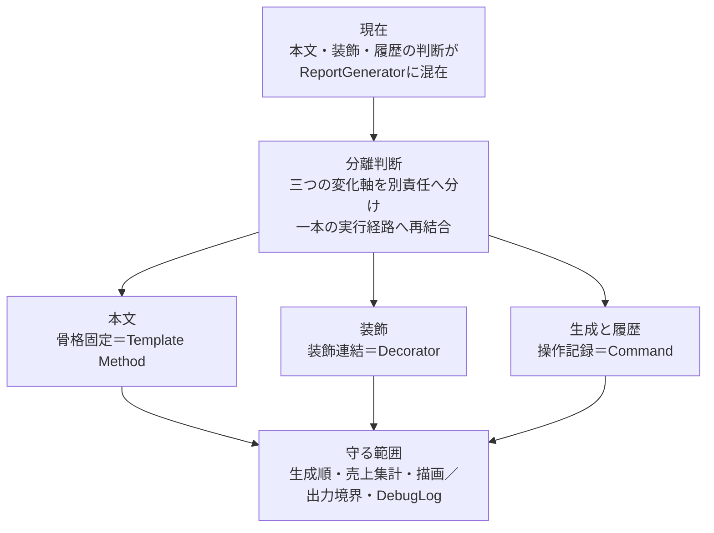
```mermaid
flowchart TB
    A[現在<br/>本文・装飾・履歴の判断が<br/>ReportGeneratorに混在] --> B[分離判断<br/>三つの変化軸を別責任へ分け<br/>一本の実行経路へ再結合]
    B --> C[本文<br/>骨格固定＝Template Method]
    B --> D[装飾<br/>装飾連結＝Decorator]
    B --> E[生成と履歴<br/>操作記録＝Command]
    C --> F[守る範囲<br/>生成順・売上集計・描画／出力境界・DebugLog]
    D --> F
    E --> F
```

まだクラスの中身は見ません。この段階でつかんでほしいのは「3つの変わる理由を3つの構造へ分け、最後に一本へつなぐ」という筋だけです。「どのクラスが生成し、どの契約で実行するか」という具体の結論は、この後の課題ID1〜課題ID3で一つずつ決めていきます。決めた結論をまとめて振り返る表は、フェーズ6の末尾（6-3 設計トレース）に置きます。ここでは先に結論表を出しません。

第0章の「設計の醍醐味」の四拍子でいえば、この章は〈3つの変わる理由の共通契約を見つけて分離〉→〈本文・装飾・操作の部品を生成〉→〈`ReportApplication`／`ReportAssembler` が組み立てて注入〉→〈実行側は契約だけを呼ぶ〉という同じ順序をたどります。

#### 構造ポイントの全貌 ―― どの責任がどこへ移るか

課題ID1〜課題ID3の①〜⑥が、どのクラス・関数から、どのクラス・関数へ責任を移すかを先に一覧します。断片コードを読む前に、この表で全貌をつかんでください。各ポイントの詳しいコードは、この後の課題ID節に同じ番号で置きます。

| ポイント | 変更前の所属 → 変更後の所属 | 設計操作・生成／注入／所有 | 次の接続先 |
|---|---|---|---|
| ① 契約 | `ReportGenerator` が本文・装飾・履歴を直接持つ → `IReport::create()` と `IReportAction::execute()` / `undo()` | 文書生成と操作記録を別々の契約へ切り出す | ③のoverride |
| ② 骨格 | `execute()` に共通順と分岐が同居 → `ReportSkeleton::create()` の共通順、`ReportFeature::create()` の委譲、`ReportActionHistory::submit()` の所有→実行 | 本文・装飾・履歴それぞれで変えない制御順を固定する | ①の `create()` / `execute()` |
| ③ 具体 | 分岐に埋もれた本文選択と装飾 → `ExecutiveMonthlyReport::renderBody()`、`GraphFeature::create()`、`GenerateReportAction::execute()` | 本文・装飾・操作の差分だけを実装へ閉じる | ①経由で②へ戻る |
| ④ 生成 | `execute()` 内の分岐生成 → `ReportAssembler::assemble()` と `ReportApplication` | 本文選択・装飾連結・Action生成を組み立て側へ集める | ⑤の受渡行 |
| ⑤ 注入 | 生成本体が部品を自前で持つ → `assembler(reader, renderer)`、`new GenerateReportAction(service, request)` | 部品と依存を外から渡す（所有は④のまま） | ⑥が呼ぶ公開操作 |
| ⑥ 利用開始 | 呼び出し側がテンプレートIDと装飾順を知る → `ReportGenerationService::generate()` の `report->create();` | ④⑤で組み立てた同じ実体を使い、契約を1回呼ぶ | ②の `create()` |

この表の上から順に、変更前はどこに判断が集まっていたか、何をどこへ移すか、誰が生成・注入・所有するか、代表入力がどの順で流れるかを追えます。実行時の呼び出し順は表の並び（①→⑥）ではなく④→⑤→⑥→②→①→③で、課題ID節の末尾に実行接続表として置きます。

#### 接続点の分離・配置・組み立てを決める

具体クラスへ入る前に、3つの課題を「どう分け、どこへ置き、どう組み立てるか」という同じ3観点で一度に見渡します。まだ実装はしません。各課題が最終構造のどこへ着地するかの地図です。

| 接続点を変える観点 | システム全体の考え方 | 課題ID1〜課題ID3のコードへの反映 |
|---|---|---|
| 分離方法 | 生成骨格には「読込→ヘッダー→本文→フッター」の共通順と契約だけを残し、本文の中身・装飾の種類と順序・履歴操作を外へ出す | 課題ID1は`IReport`／`ReportSkeleton`、課題ID2は`ReportFeature`、課題ID3は`IReportAction`を境界にする |
| 配置場所 | 本文差分は各Reportクラス、装飾は各Featureクラス、操作記録はActionとHistoryへ置く | テンプレート別本文・装飾部品・要求履歴を変更理由ごとに別クラスへ分ける |
| 組み立て方法（生成・所有・注入） | 組み立て側が本文と装飾を生成して連結し、入口がActionを生成してHistoryへ渡し、実行側は契約だけを呼ぶ | `ReportAssembler`が生成・連結、`ReportApplication`がActionを生成・注入、`ReportGenerationService`／`ReportActionHistory`が契約を実行 |

表を左から右へ読むと、課題ID1の本文・課題ID2の装飾・課題ID3の履歴が、それぞれの契約と配置を持ちながら、一つのComposition Root（`ReportApplication`）から共通の実行経路へ接続されます。次から、この地図の各行を課題ID1→課題ID2→課題ID3の順に具体化します。

**ここから具体へ入ります。** まず分ける対象の“もと”のコードを手元に戻し、次に課題ID1→課題ID2→課題ID3の順で、判断を一つずつ構造へ移します。

#### 課題箇所のおさらい（フェーズ3の関連コード）

分ける対象は、フェーズ3で痛みを生んだ変更途中の`ReportGenerator::generate()`という**一つのメソッド**です。その中に、上で挙げた3つの判断が離れて同居しています。**同じメソッド内の3箇所を、間の処理を省略して別々に**抜き出します（`…（中略）…`は省略を表します）。

**掲載箇所：`ReportGenerator::generate(const ReportRequest&, const string&)`** ―― 本文を描く部分（3つの判断のうち1つ目）。

```cpp
// ① ReportGenerator::generate() 内、本文の判断（→課題ID1）
if (request.templateId == "SALES_MONTHLY_EXECUTIVE") {
    renderer.addStandardBody(document, "役員向け月次専用本文", summary);
}
```

続く②は、同じ`ReportGenerator::generate()`の中で、本文の判断（①）の直後にある装飾の判断です。

**掲載箇所：`ReportGenerator::generate(const ReportRequest&, const string&)`** ―― 本文の判断（①）の直後にある装飾の判断。

```cpp
// ReportGenerator::generate(const ReportRequest&, const string&) の続き
// （本文の判断（①）の直後。全文は3-1「ReportGeneratorへ要求を直接
//   追加したコード」に掲載）
// ② 装飾の判断（→課題ID2）
for (DecorationType type : request.decorations) {
    if (type == DecorationType::Graph) {
        renderer.addGraph(document);
    } else if (type == DecorationType::Logo) {
        renderer.addLogo(document);
    } else {
        renderer.addWatermark(document);
    }
}
```

最後の③も同じ`ReportGenerator::generate()`の中にあり、装飾の判断（②）の直後で履歴を積みます。

**掲載箇所：`ReportGenerator::generate(const ReportRequest&, const string&)`** ―― 装飾の判断（②）の直後、メソッドの末尾。

```cpp
// ReportGenerator::generate(const ReportRequest&, const string&) の続き
// （装飾の判断（②）の直後。全文は3-1「ReportGeneratorへ要求を直接
//   追加したコード」に掲載）
// ③ 履歴の判断（→課題ID3）
acceptedRequests.push_back(request);
return execute(request, templateName);
```

この①②③を、次から課題ID1→課題ID2→課題ID3の順で、それぞれ別の責任へ移します。各課題は「**この課題をこう解決したい → そのために具体的にどうする**」を、**①契約を定義 →②骨格・基底を実装 →③具体を実装 →④誰が生成するか →⑤どこで依存を注入するか →⑥実行側は契約だけ呼ぶ →⑦だから課題が解ける**の順で、関係するコードをつなげて示します。抜粋には所属クラスと処理名を必ず添え、省略部分は「中略」と明記します。

#### 設計判断ごとの部分クラス図

ここから課題ID1→課題ID2→課題ID3を順に見ます。各課題は、先頭にその課題だけを抜き出した**部分クラス図**（薄い黄色が新設・変更する型）を置き、続けて①契約→⑦完了条件のコードをつなげて示します。3つの部分図は、最後の「システム全体の最終構造」で一つの採用全体図へ合流します。

### 課題ID1：本文の中身だけを差し替えられるようにする

**【課題ID1の原因】** 問題ID1（本文を1種足すと共通生成順まで修正）＝原因ID1（共通生成順が本文IDと本文内容を持つ）。この原因を分離対象にします。

**この課題（何を解きたいか）：** 本文を1種増やすたび、共通の生成順を持つ`generate()`まで直すことになる——問題ID1（痛み）／原因ID1（共通順が本文の中身まで持つ）です。**共通順は固定したまま、本文の中身だけを差し替えられる**ようにするのが課題ID1です。

**どう解決するか（方針）：** 「読込→ヘッダー→本文→フッター」の共通順を骨格として1箇所に固定し、その途中の「本文を作る」ところだけを差し替え点にします（骨格固定構造＝Template Method）。以下、①契約 →②骨格 →③具体 →④生成 →⑤注入 →⑥実行 の順でコードを組み立てます。

まず静的な構造を図で示します。薄い黄色が今回新設する型、`ReportAssembler`は本文を生成する側です。

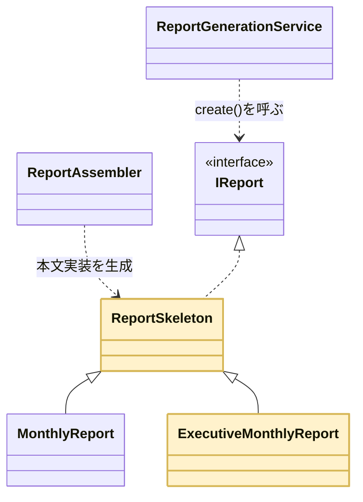
```mermaid
classDiagram
    class ReportAssembler
    class IReport { <<interface>> }
    class ReportSkeleton
    class MonthlyReport
    class ExecutiveMonthlyReport
    class ReportGenerationService
    ReportGenerationService ..> IReport : create()を呼ぶ
    ReportAssembler ..> ReportSkeleton : 本文実装を生成
    IReport <|.. ReportSkeleton
    ReportSkeleton <|-- MonthlyReport
    ReportSkeleton <|-- ExecutiveMonthlyReport
    class ReportSkeleton:::focus
    class ExecutiveMonthlyReport:::focus
    classDef focus fill:#FFF2CC,stroke:#D6B656,stroke-width:2px
```

**① 共通契約 `IReport` を定義する。** すべての本文（後の装飾も）が「一つの文書を作る」同じ操作で呼べるようにします。

```cpp
// 新規：共通契約
class IReport {
public:
    virtual ~IReport() = default;
    virtual ReportDocument create() = 0;   // 文書を1つ作って返す
};
```

**② 骨格 `ReportSkeleton` に共通順を固定し、本文だけを差し替え点 `renderBody()` にする。** 読込・描画に使う部品はコンストラクタで受け取ります（どこから渡すかは⑤）。

```cpp
// 新規：ReportSkeleton（IReport を実装。共通順を final で固定）
class ReportSkeleton : public IReport {
protected:
    DataReader& reader;            // 借用（生成・注入は⑤）
    ReportRenderingApi& renderer;  // 借用
    OutputFormat format;
    virtual void renderBody(ReportDocument& doc,
                            const SalesSummary& s) = 0;  // 差し替え点
public:
    ReportSkeleton(DataReader& r, ReportRenderingApi& re, OutputFormat f)
        : reader(r), renderer(re), format(f) {}
    ReportDocument create() final {          // 共通順（上書き禁止）
        SalesSummary s = reader.readCSV();
        ReportDocument doc;
        renderer.addHeader(doc, format);
        renderBody(doc, s);                  // ← ここだけ差し替わる
        renderer.addFooter(doc);
        return doc;
    }
};
```

**③ 具体本文は `renderBody()` だけを実装する（共通順は書かない）。**

```cpp
// 新規：MonthlyReport / ExecutiveMonthlyReport（renderBody だけを実装）
class MonthlyReport : public ReportSkeleton {
public:
    using ReportSkeleton::ReportSkeleton;
protected:
    void renderBody(ReportDocument& doc, const SalesSummary& s) override {
        renderer.addStandardBody(doc, "月次売上レポート", s);
    }
};
class ExecutiveMonthlyReport : public ReportSkeleton {   // 変更ID1で追加
public:
    using ReportSkeleton::ReportSkeleton;
protected:
    void renderBody(ReportDocument& doc, const SalesSummary& s) override {
        renderer.addExecutiveBody(doc, s);               // 役員向け専用本文
    }
};
```

**④ 本文の具体を選んで生成するのは `ReportAssembler` 一箇所だけ。** どの本文クラスを`new`するかを知るのはここだけです（装飾を包む処理は課題ID2で追記。ここでは省略）。

```cpp
// ReportAssembler::assemble() の本文選択部分（装飾は課題ID2。ここでは省略）
IReport* ReportAssembler::assemble(const ReportRequest& req) {
    IReport* report = nullptr;
    if (req.templateId == "SALES_MONTHLY_EXECUTIVE")
        report = new ExecutiveMonthlyReport(reader, renderer, req.format);
    else if (req.templateId == "SALES_MONTHLY")
        report = new MonthlyReport(reader, renderer, req.format);
    // …週次・部門別も同様。装飾で包む処理は課題ID2で追記…
    return report;
}
```

**⑤ 依存（reader・renderer）は `ReportApplication` が起動時に生成し、`ReportAssembler` へ注入する。** 本文クラスが使う部品は、アプリ起動時に一度だけ作られ、コンストラクタでAssemblerへ渡されます。

```cpp
// ReportApplication のメンバとコンストラクタ（依存の生成と注入）
class ReportApplication {
    DataReader reader;              // 起動時に一度だけ生成・所有
    ReportRenderingApi renderer;    // 同上
    TemplateRegistry registry;
    ReportAssembler assembler;
    ReportGenerationService service;   // 履歴・診断は課題ID3で追記
public:
    ReportApplication()
        : assembler(reader, renderer),               // ← Assembler へ注入
          service(registry, assembler, renderer) {}  // ← Service へ注入
};
```

**⑥ 利用開始。** 実行側 `ReportGenerationService::generate()` が、`IReport` として `create()` を呼ぶだけです。具体本文を判定しません。

**掲載箇所：`ReportGenerationService::generate(const ReportRequest&)`** ―― テンプレート検証を終えた後の生成部分。出力境界への受け渡しは省略しています。

```cpp
// ReportGenerationService::generate() の本文生成部分（検証・出力は省略。全文はフェーズ7）
IReport* report = assembler.assemble(req);   // 生成は Assembler に任せる
ReportDocument doc = report->create();        // ⑥ 契約 create() を呼ぶだけ
delete report;                                 // 生成物なので破棄
```

#### 代表ケースの実行接続

役員向け月次レポートの生成1件を、④から③まで実コードで追います。設計を説明する順は①から⑥ですが、実行時の呼出順は④→⑤→⑥→②→①→③です。

| 実行順・ポイント | 掲載箇所 | 実際のコード接続 | 次の呼出先 |
|---|---|---|---|
| 1. ④生成 | `ReportAssembler::assemble(const ReportRequest&)` | `report = new ExecutiveMonthlyReport(reader, renderer, req.format);` | ⑤へ |
| 2. ⑤注入 | `ReportApplication::ReportApplication()` | `assembler(reader, renderer)` で部品をAssemblerへ注入 | ⑥へ |
| 3. ⑥利用開始 | `ReportGenerationService::generate()` | `ReportDocument doc = report->create();` | `IReport::create()` |
| 4. ②安定骨格 | `ReportSkeleton::create()` | 読込→ヘッダー→`renderBody()`→フッター→保存の共通順を固定 | `ReportSkeleton::renderBody()`（純粋仮想） |
| 5. ①契約 | `IReport::create()` / `ReportSkeleton::renderBody()` | 具体本文へ動的ディスパッチする | `ExecutiveMonthlyReport::renderBody()` |
| 6. ③具体 | `ExecutiveMonthlyReport::renderBody(ReportDocument&, const SalesSummary&)` | 役員向け専用本文だけを描く | 戻って②が続きを進める |

④で生成した本文と、⑤で渡した `reader`・`renderer` と、⑥から②が呼ぶ相手は同じ実体です。

**⑦ これで課題ID1が解ける。完了条件（＝課題が解けたことを検証する条件）：** 本文を1種増やすとき変えるのは「新しい具体本文クラス1つ＋`ReportAssembler`の分岐1つ＋`TemplateRegistry`への登録1行」だけで、共通順（`ReportSkeleton::create()`）・既存本文・実行側は変わらないこと。フェーズ7のA1（通常月次）とA2（役員向け）で、この不変を実際に確認します。

**課題ID1でやめず、課題ID2・課題ID3へ続けます。** ただし④の`ReportAssembler`、⑤⑥の`ReportApplication`・`ReportGenerationService`は、装飾・履歴の分離でも同じ組み立ての中心になります。次はそこへ装飾を足します。

### 課題ID2：装飾を、本文へ順番どおり重ねられるようにする

**【課題ID2の原因】** 問題ID2（装飾の種類・順序を変えると生成本体を修正）＝原因ID2（文書生成が装飾の種類と固定適用順を持つ）。この原因を分離対象にします。

**この課題（何を解きたいか）：** 装飾の種類や順序を変えるたび、生成本体の`for`-`if`を直すことになる——問題ID2／原因ID2（文書生成が装飾の種類・順序まで持つ）です。**本文生成に触れずに、装飾を追加・並べ替えできる**ようにするのが課題ID2です。

**どう解決するか（方針）：** 装飾も本文と**同じ`IReport`契約**にし、各装飾は「内側の`IReport`を1つ持ち、その`create()`を呼んでから自分の表示要素を1つ足して返す」形にします（装飾連結構造＝Decorator）。

**なぜ本文と同じ`IReport`契約にするのか。** 装飾は「本文」でも「別の装飾」でも、相手が`IReport`でありさえすれば中身を問わず包めます。同じ契約にそろえることで、装飾を何段重ねても、実行側は最外側を`IReport`として`create()`を呼ぶだけで済みます。結果として、`IReport`という一つの契約の下に、**本文の系統（`ReportSkeleton`←各本文）と装飾の系統（`ReportFeature`←各装飾）の2系統**がぶら下がります。契約は`IReport`一つ、それを実装する系統が本文と装飾の2つ、という関係です。

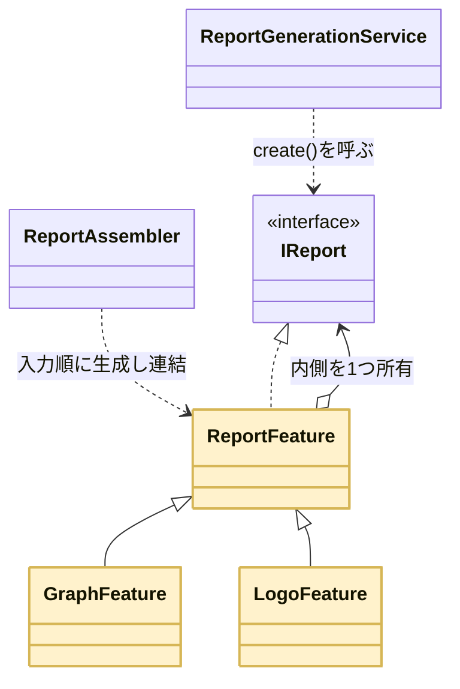
```mermaid
classDiagram
    class ReportGenerationService
    class ReportAssembler
    class IReport { <<interface>> }
    class ReportFeature
    class GraphFeature
    class LogoFeature
    ReportGenerationService ..> IReport : create()を呼ぶ
    ReportAssembler ..> ReportFeature : 入力順に生成し連結
    IReport <|.. ReportFeature
    ReportFeature o--> IReport : 内側を1つ所有
    ReportFeature <|-- GraphFeature
    ReportFeature <|-- LogoFeature
    class ReportFeature:::focus
    class GraphFeature:::focus
    class LogoFeature:::focus
    classDef focus fill:#FFF2CC,stroke:#D6B656,stroke-width:2px
```

**① 契約は課題ID1の `IReport` をそのまま使う**（装飾も`create()`を実装する）。新しい契約は増やしません。

**② 装飾の基底 `ReportFeature`：内側の `IReport` を1つ所有し、破棄する。**

```cpp
// 新規：ReportFeature（IReport を実装し、内側の IReport を所有する）
class ReportFeature : public IReport {
protected:
    IReport* wrapped;              // 内側（本文でも別の装飾でもよい）
    ReportRenderingApi& renderer;
public:
    ReportFeature(IReport* inner, ReportRenderingApi& re)
        : wrapped(inner), renderer(re) {}
    ~ReportFeature() override { delete wrapped; }   // 内側を破棄（所有は外→内）
};
```

**③ 具体装飾は、内側を作ってから自分の要素を1つ足すだけ（前後順は持たない）。**

```cpp
// 新規：GraphFeature / LogoFeature（1つだけ足す。順序判断は持たない）
class GraphFeature : public ReportFeature {
public:
    using ReportFeature::ReportFeature;
    ReportDocument create() override {
        ReportDocument doc = wrapped->create();  // 内側を先に生成
        renderer.addGraph(doc);                  // グラフを1つ追加
        return doc;
    }
};
class LogoFeature : public ReportFeature {
public:
    using ReportFeature::ReportFeature;
    ReportDocument create() override {
        ReportDocument doc = wrapped->create();
        renderer.addLogo(doc);                   // ロゴを1つ追加
        return doc;
    }
};
```

**④ 順序を決めるのは `ReportAssembler`。課題ID1の本文選択に続けて、装飾列を先頭から包む。** これで`assemble()`が完成します（課題ID1で省略した装飾部分がここです）。

```cpp
// ReportAssembler::assemble() の全体（課題ID1の本文選択＋課題ID2の装飾連結）
IReport* ReportAssembler::assemble(const ReportRequest& req) {
    IReport* report = nullptr;                       // 課題ID1：本文を選んで生成
    if (req.templateId == "SALES_MONTHLY_EXECUTIVE")
        report = new ExecutiveMonthlyReport(reader, renderer, req.format);
    else if (req.templateId == "SALES_MONTHLY")
        report = new MonthlyReport(reader, renderer, req.format);
    else if (req.templateId == "SALES_WEEKLY")
        report = new WeeklyReport(reader, renderer, req.format);
    else
        report = new DepartmentReport(reader, renderer, req.format);
    for (DecorationType type : req.decorations) {    // 課題ID2：入力順に外側へ包む
        if (type == DecorationType::Graph)
            report = new GraphFeature(report, renderer);
        else if (type == DecorationType::Logo)
            report = new LogoFeature(report, renderer);
        else
            report = new WatermarkFeature(report, renderer);
    }
    return report;                                   // 最外側の IReport を返す
}
```

**⑤ 注入。** 課題ID1と同じです。`renderer` は `ReportApplication` が起動時に生成して `ReportAssembler` へ注入し、各装飾は生成時に内側の `IReport*` と `renderer` を受け取ります。

**掲載箇所：`ReportAssembler::assemble(const ReportRequest&)`** ―― 装飾列を先頭から回す中の1行。直前の `IReport*` を内側として包みます。

```cpp
report = new GraphFeature(report, renderer);   // ⑤ 内側と描画境界を注入
```

**② 装飾連鎖の安定骨格。** `ReportFeature` を継ぐ各装飾は「内側を先に作ってから、自分の要素を1つ足す」形に固定されています。何段重なっても、この委譲の形は変わりません。

```cpp
ReportDocument GraphFeature::create() {
    ReportDocument doc = wrapped->create();  // ② まず内側の契約を呼ぶ
    renderer.addGraph(doc);                  // ② 自分ぶんを1つ足す
    return doc;
}
```

**⑥ 利用開始。** 課題ID1と同じ入口です。実行側は `assemble()` が返した最外側を `IReport` として呼ぶだけで、装飾が何段付いているかを知りません。

**掲載箇所：`ReportGenerationService::generate(const ReportRequest&)`** ―― 課題ID1と同じ位置・同じコード。装飾が何段付いても変わりません。

```cpp
// ReportGenerationService::generate()（課題ID1と同じ。装飾の有無を意識しない）
IReport* report = assembler.assemble(req);   // 本文＋装飾を組み立て
ReportDocument doc = report->create();        // ⑥ 最外側の create() を呼ぶだけ
delete report;                                 // 最外側を破棄→内側へ連鎖破棄
```

**⑦ これで課題ID2が解ける。完了条件：** 装飾を1種増やすとき変えるのは「新しいFeature1クラス＋`ReportAssembler`の分岐1つ」だけで、本文生成（課題ID1）と実行側は不変。装飾順を入れ替えると出力順も入れ替わる。フェーズ7のA2（Logo→Graph）とA3（Graph→Logo）で確認します。

### 課題ID3：生成の実行を、記録・再実行できる操作にする

**【課題ID3の原因】** 問題ID3（履歴・再実行・取消を足すと生成本体を修正）＝原因ID3（生成本体が受付履歴と操作規則を持つ）。この原因を分離対象にします。

**この課題（何を解きたいか）：** 履歴・再実行・取消を足すたび、生成本体に保存時点や操作規則が入り込む——問題ID3／原因ID3（生成本体が履歴規則まで持つ）です。**生成の実行を、あとから記録・再実行・取消できる一つの「操作」として扱える**ようにするのが課題ID3です。

**どう解決するか（方針）：** 「完全な生成要求を持ち、実行と取消を同じ単位で行う操作」を`IReportAction`契約として定義し、履歴はその契約だけを扱います（操作記録構造＝Command）。以下、①契約 →②操作の具体 →③履歴（所有） →④入口（生成・注入） →⑤実行 →⑦完了条件 の順で組み立てます（実行側が契約だけを呼ぶ⑥は⑤に含めます）。

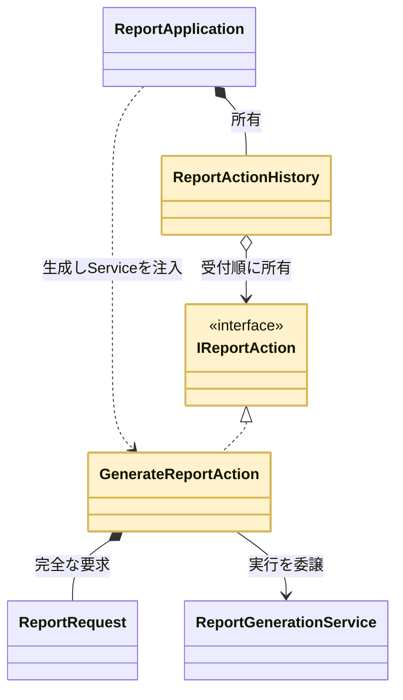
```mermaid
classDiagram
    class ReportApplication
    class ReportActionHistory
    class IReportAction { <<interface>> }
    class GenerateReportAction
    class ReportRequest
    class ReportGenerationService
    ReportApplication ..> GenerateReportAction : 生成しServiceを注入
    ReportApplication *-- ReportActionHistory : 所有
    ReportActionHistory o--> IReportAction : 受付順に所有
    IReportAction <|.. GenerateReportAction
    GenerateReportAction *-- ReportRequest : 完全な要求
    GenerateReportAction --> ReportGenerationService : 実行を委譲
    class ReportActionHistory:::focus
    class IReportAction:::focus
    class GenerateReportAction:::focus
    classDef focus fill:#FFF2CC,stroke:#D6B656,stroke-width:2px
```

**① 操作契約 `IReportAction` を定義し、③ 要求を保持する具体操作 `GenerateReportAction` が実装する。** `GenerateReportAction`は完全な`ReportRequest`を持ち、生成・取消を`ReportGenerationService`へ委譲します。委譲先の`service`は生成時にコンストラクタで受け取ります（＝依存注入の受け口。渡す側は④）。

```cpp
// 採用後コード：操作契約と、要求を保持する操作
class IReportAction {
public:
    virtual ~IReportAction() = default;
    virtual OperationResult execute() = 0;   // 実行
    virtual OperationResult undo() = 0;       // 取消
    virtual const ReportRequest& request() const = 0;  // 履歴表示用の要求
};

class GenerateReportAction : public IReportAction {
    ReportGenerationService& service;    // 実行を委譲する先（注入で受け取る）
    ReportRequest storedRequest;         // 完全な要求を値で保持
public:
    GenerateReportAction(ReportGenerationService& s, ReportRequest r)
        : service(s), storedRequest(move(r)) {}
    OperationResult execute() override {
        return service.generate(storedRequest);   // 本文・装飾の種類は知らない
    }
    OperationResult undo() override {
        return service.removeArtifact(storedRequest.outputPath);
    }
};
```

**② 履歴 `ReportActionHistory` の安定骨格（Actionを所有してから契約を呼ぶ）と、④ 入口 `ReportApplication` が具体Actionを生成し、⑤ `service` を注入して履歴へ渡す。** 具体Action（`GenerateReportAction`）を`new`するのは`ReportApplication`だけです。その`new GenerateReportAction(service, request)`の`service`が、②で受け取る依存の**注入そのもの**です。

```cpp
// 採用後コード：ReportActionHistory のメソッド（Action を所有してから実行）
OperationResult ReportActionHistory::submit(IReportAction* action) {
    accepted.push_back(action);            // 先に所有（vector が生存を持つ）
    return accepted.back()->execute();     // 契約 execute() だけを呼ぶ
}

// 採用後コード：ReportApplication のメソッド（Action を生成し Service を注入）
OperationResult ReportApplication::submit(ReportRequest request) {
    IReportAction* action = new GenerateReportAction(service, request);
    return history.submit(action);         // 生成した Action を履歴へ渡す
}
```

**⑥ 利用開始。実行・再実行・取消は、履歴が契約 `execute()`/`undo()` を呼ぶだけ。** 変更途中コードの`acceptedRequests.push_back(request)`は、生成本体の内部状態から、`ReportApplication`が生成し`ReportActionHistory`が所有する**Actionの列**へ移りました。履歴は`IReportAction`として呼ぶだけで、本文や装飾はもちろん、生成の中身も判定しません。

なお、この章での**依存注入**は、上の④——`ReportApplication`が`new GenerateReportAction(service, request)`で、生成済みの`service`（アプリ起動時に一度だけ作った`ReportGenerationService`）をActionへ外から渡すところ——です。Action自身は`service`を作らず、受け取って使います。

**⑦ これで課題ID3が解ける。完了条件：** 受け付けた同じ要求を再実行・取消でき、履歴が本文・装飾の種類を判定しないこと。フェーズ7のA4（同じ要求を再実行して取消）で、要求履歴4件と診断ログ6件が別物として維持されることを確認します。

以上で3つの判断を、それぞれ骨格固定・装飾連結・操作記録の3構造へ分けました。次に、これらを一本の実行経路へ再結合します。

#### システム全体の最終構造を決める（再結合）

3つに分けた責任を、一本の実行経路へ戻します（**ここは抽象→具体の順で示します**）。まず抽象的な経路です。「誰が具体を作り、誰が契約だけで実行するか」を決めて再結合します。

```text
ReportApplication（要求受付・Action生成・Service注入）
  → ReportActionHistory（Actionを所有し execute() を呼ぶ）
    → GenerateReportAction（保持した要求を Service へ渡す）
      → ReportGenerationService（検証し Assembler で組み立て、create() を呼ぶ）
        → ReportAssembler（本文を選び生成し、装飾で入力順に包む）
          → IReport.create()（骨格→本文→装飾が順に動く）
```

具体を知るのは`ReportAssembler`（本文・装飾を生成）と`ReportApplication`（Actionを生成）だけです。`ReportGenerationService`は`IReport`として、`ReportActionHistory`は`IReportAction`として、契約だけを呼びます。

次に具体入力で、生成されるオブジェクトの形を確かめます。「役員向け月次・装飾Logo→Graph」を受け付けると、`ReportAssembler`は本文`ExecutiveMonthlyReport`を作り、装飾列の順に外側へ包むので、次の入れ子ができます。

```text
GraphFeature（最外側）
  └─ LogoFeature
       └─ ExecutiveMonthlyReport（最内側＝本文）
```

- **実行順**（`create()`は外側から呼ばれ、内側から仕上がる）：Graph.create → Logo.create → Executive.create（骨格が読込→ヘッダー→役員本文→フッター）→ 戻りながらロゴ追加 → グラフ追加。入力順（Logo→Graph）どおりに装飾が乗ります。
- **破棄順**：最外側`GraphFeature`のデストラクタが`delete wrapped`で内側`LogoFeature`を、続けて`ExecutiveMonthlyReport`を破棄します。所有は外→内で連鎖します。
- **診断**：`ReportApplication`が各操作の成否だけを`DebugLog`へ記録します。課題ID1〜3の外側で、再実行・取消の判断には関与しません。

この一本の経路が、課題ID1〜課題ID3を同時に満たす最終構造です。途中までしか分けない案は、この経路を最後まで通せないため完成案として比較しません。次に、この構造を変更前後のクラス図で確定します。

### 対策検討のクラス図：1-3の責任と依存をどう変えるか

薄い黄色は今回新設または責任を変更するクラス、水色は変更しない既存境界です。注記を短く改行し、横幅を抑えています。

変更前の【移す】は責任を分ける対象、変更後の【新設】はその責任を受け持つ新しい境界を示します。

**変更前のクラス図（1-3を責任見直し用に再掲）**

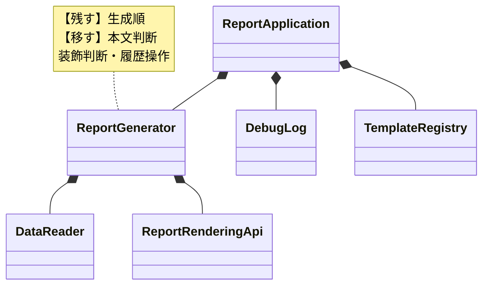
```mermaid
classDiagram
    direction TB
    class ReportApplication
    class ReportGenerator
    class DebugLog
    class DataReader
    class TemplateRegistry
    class ReportRenderingApi

    ReportApplication *-- ReportGenerator
    ReportApplication *-- TemplateRegistry
    ReportApplication *-- DebugLog
    ReportGenerator *-- DataReader
    ReportGenerator *-- ReportRenderingApi

    note for ReportGenerator "【残す】生成順<br/>【移す】本文判断<br/>装飾判断・履歴操作"

    classDef focus fill:#FFF2CC,stroke:#D6B656,stroke-width:2px,color:#222
    classDef stable fill:#DDEBF7,stroke:#5B9BD5,stroke-width:1.5px,color:#222
    cssClass "ReportGenerator" focus
    cssClass "DebugLog,DataReader,TemplateRegistry,ReportRenderingApi" stable
```

**採用した変更後のクラス図**


```mermaid
classDiagram
    direction TB
    class ReportApplication
    class DebugLog {
        -entries : vector
        +write(event, success)
        +size() int
    }
    class ReportActionHistory
    class IReportAction
    class GenerateReportAction
    class ReportGenerationService
    class ReportAssembler
    class IReport
    class ReportSkeleton
    class MonthlyReport
    class ExecutiveMonthlyReport
    class WeeklyReport
    class DepartmentReport
    class ReportFeature
    class GraphFeature
    class LogoFeature
    class WatermarkFeature
    class DataReader
    class TemplateRegistry
    class ReportRenderingApi
    class OutputFormat {
        <<enumeration>>
        Pdf
        Excel
    }
    class DecorationType {
        <<enumeration>>
        Graph
        Logo
        Watermark
    }
    class SalesSummary {
        +count : int
        +total : long
        +average : long
    }
    class ReportDocument {
        +parts : vector
    }
    class ReportRequest {
        +templateId : string
        +format : OutputFormat
        +decorations : vector
        +outputPath : string
    }
    class OperationResult {
        +success : bool
        +message : string
    }
    class ReportTemplate {
        +name : string
        +supportedFormats : vector
    }

    ReportApplication *-- ReportActionHistory
    ReportApplication *-- ReportGenerationService
    ReportApplication *-- DebugLog : 診断記録
    ReportApplication ..> ReportRequest : 受け取る
    ReportApplication ..> OperationResult : 返す
    ReportActionHistory o--> IReportAction : 受付順に所有
    ReportActionHistory ..> OperationResult : 返す
    IReportAction <|.. GenerateReportAction
    GenerateReportAction --> ReportGenerationService : 実行を依頼
    GenerateReportAction *-- ReportRequest : 完全な要求を保持
    ReportGenerationService --> ReportAssembler : 組み立て
    ReportGenerationService --> TemplateRegistry : 検証
    ReportGenerationService --> ReportRenderingApi : 出力・取消
    ReportGenerationService ..> ReportRequest : 利用
    ReportGenerationService ..> OperationResult : 返す
    ReportAssembler --> DataReader : 注入
    ReportAssembler --> ReportRenderingApi : 注入
    ReportAssembler --> IReport : 生成
    ReportAssembler ..> ReportRequest : 選択条件
    ReportAssembler ..> DecorationType : 順に選択

    IReport <|.. ReportSkeleton
    IReport ..> ReportDocument : 生成
    ReportSkeleton <|-- MonthlyReport
    ReportSkeleton <|-- ExecutiveMonthlyReport
    ReportSkeleton <|-- WeeklyReport
    ReportSkeleton <|-- DepartmentReport
    ReportSkeleton ..> SalesSummary : 本文へ渡す
    IReport <|.. ReportFeature
    ReportFeature o--> IReport : 内側を所有
    ReportFeature <|-- GraphFeature
    ReportFeature <|-- LogoFeature
    ReportFeature <|-- WatermarkFeature
    DataReader ..> SalesSummary : 集計
    TemplateRegistry *-- ReportTemplate : 登録
    ReportTemplate ..> OutputFormat : 対応形式
    ReportRequest ..> OutputFormat : 指定
    ReportRequest ..> DecorationType : 指定順
    ReportRenderingApi ..> ReportDocument : 描画・保存
    ReportRenderingApi ..> OutputFormat : 形式

    note for ReportSkeleton "【課題ID1・新設】共通順<br/>本文だけ委譲"
    note for ReportFeature "【課題ID2・新設】文書を受け<br/>装飾を一つ追加"
    note for GenerateReportAction "【課題ID3・新設】要求を保持<br/>実行・取消"

    classDef focus fill:#FFF2CC,stroke:#D6B656,stroke-width:2px,color:#222
    classDef stable fill:#DDEBF7,stroke:#5B9BD5,stroke-width:1.5px,color:#222
    cssClass "ReportApplication,ReportActionHistory,IReportAction,GenerateReportAction,ReportGenerationService,ReportAssembler,IReport,ReportSkeleton,MonthlyReport,ExecutiveMonthlyReport,WeeklyReport,DepartmentReport,ReportFeature,GraphFeature,LogoFeature,WatermarkFeature" focus
    cssClass "DebugLog,DataReader,TemplateRegistry,ReportRenderingApi" stable
```

採用するクラス図と責任配置は、コードを書く前に確定しています。次のコードは試行錯誤ではなく、この一つの完成構造を理解しやすい順に反映します。

### 6-1：生成・所有・実行順のまとめ

課題ID1〜課題ID3の採用後コードは、それぞれの課題の中で示しました。ここでは重複を避け、「誰がどこで生成し、誰が所有し、いつ破棄するか」を一表にまとめ、続けて一つの要求が流れるシーケンスを示します。

| 段階 | 生成する場所 | 生成物と渡し先 | 所有者 |
|---|---|---|---|
| 受付 | ReportApplication | GenerateReportAction→History | ReportActionHistory |
| 本文選択 | ReportAssembler | MonthlyReport等→装飾組み立て | 外側のFeatureへ所有を渡す |
| 装飾組み立て | ReportAssembler | GraphFeature等→次のFeature/Service | 最外側のIReportをServiceが破棄 |
| 実行 | GenerateReportAction | 同じReportRequest→Service | Actionが要求を値で保持 |
| 出力 | ReportGenerationService | ReportDocument→RenderingApi | 実行中のローカル値 |
| 内部診断 | ReportApplication | OperationResult→DebugLog | ApplicationがDebugLogを所有 |

#### 組み立て時のシーケンス

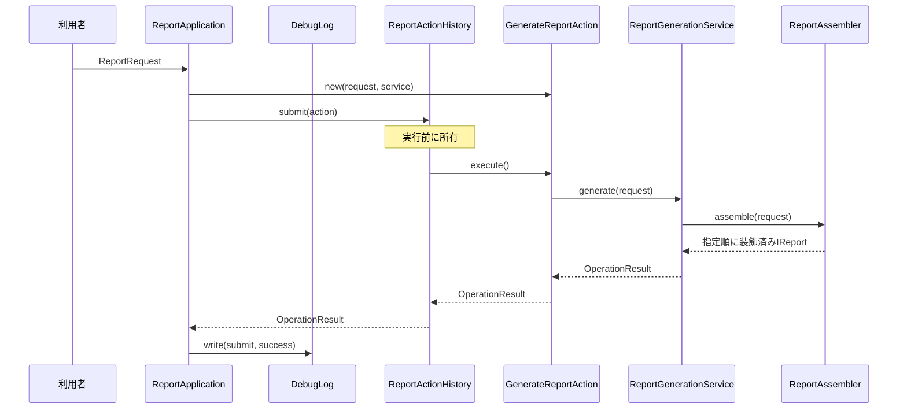
```mermaid
sequenceDiagram
    participant U as 利用者
    participant A as ReportApplication
    participant L as DebugLog
    participant H as ReportActionHistory
    participant C as GenerateReportAction
    participant S as ReportGenerationService
    participant B as ReportAssembler

    U->>A: ReportRequest
    A->>C: new(request, service)
    A->>H: submit(action)
    Note over H: 実行前に所有
    H->>C: execute()
    C->>S: generate(request)
    S->>B: assemble(request)
    B-->>S: 指定順に装飾済みIReport
    S-->>C: OperationResult
    C-->>H: OperationResult
    H-->>A: OperationResult
    A->>L: write(submit, success)
```

#### システム全体のコード適用結果

| 追跡対象 | 課題定義で目指した状態 | 適用した構造とコード | 適用結果 |
|---|---|---|---|
| 課題ID1：本文 | 共通順が本文IDを判断しない | ReportSkeletonと各Report | 役員向け追加で共通順を変更しない |
| 課題ID2：装飾 | 入力順を同じ部品で表す | ReportFeatureとassemble() | Logo→GraphとGraph→Logoを表現できる |
| 課題ID3：履歴 | 完全な要求を受付時に記録 | GenerateReportActionとHistory | 同じ要求を再実行・取消できる |
| 変更対象外：診断 | 操作履歴と混同せず成否を記録 | フェーズ1と同じDebugLog | event・resultと件数変化を継続表示する |

**システム全体の実装結果：達成。** 課題ID1〜課題ID3は、Application→Action→Service→Assembler→Reportの一つの経路で接続されました。その結果はApplicationから既存のDebugLogへ渡されますが、診断記録はこの実行経路を選択しません。

### 6-2：部分対策を最終候補にしない理由

「本文判定をヘルパー関数へ移すだけ」では、生成本体がテンプレートID分岐を持つことは変わりません。「装飾ifを別メソッドへ移すだけ」でも、種類と順序の知識は同じクラスに残ります。どちらも課題ID1〜課題ID3の完了条件を同時に満たさない部分対策なので、別の完成案としては比較しません。

### 6-3：課題から完成構造までの設計トレース

この表は設計課題だけを追います。変更要求の受入はフェーズ7の要求ID表、変更影響は7-4の変更ID表で別に確認します。

| 課題ID | 採用構造と生成・接続場所 | 完成コードの主な場所 | 確認 |
|---|---|---|---|
| 課題ID1 | 骨格固定。Assemblerが本文クラスを生成 | ReportSkeleton、ExecutiveMonthlyReport | 共通順から本文ID判断が消える |
| 課題ID2 | 装飾連結。Assemblerが入力順に連結 | Graph/Logo/WatermarkFeature | 装飾部品が順序判断を持たない |
| 課題ID3 | 操作記録。ApplicationがActionをHistoryへ渡す | GenerateReportAction、ReportActionHistory | 履歴が本文・装飾判断を持たない |
| 変更対象外 | 内部診断。Applicationが結果だけを渡す | DebugLog | 1-4、A1〜A4 |

このクラス図、所有表、シーケンス、コード変更表が、フェーズ7へ渡す完成設計です。

### 6-4：将来リスクに対する設計上の確認

ここでは将来形式・履歴機能の実装有無ではなく、フェーズ2のリスクIDを採用構造へ再適用し、本文・装飾・履歴をどこまで守れ、データ再現性に何が残るかを評価します。

| リスクID・将来リスク | 現在の構造による備え | リスク発生時の変更先 | 守れる範囲・残る弱点 |
|---|---|---|---|
| リスクID1：HTML形式の追加 | 形式検証と出力境界を本文・装飾構造から分けているため、新形式の影響先を限定する | OutputFormat、TemplateRegistry、ReportRenderingApi | 本文・装飾・履歴を守り、形式追加を検証と描画境界へ限定できる。形式別レイアウト差が本文骨格へ漏れる場合はRenderer契約の拡張が必要になる |
| リスクID2：再実行で当時のCSVを使う | Actionが完全な要求を保持する境界は使えるが、現状のReportRequestはデータ版を持たない | ReportRequest、DataReaderの取得契約、GenerateReportAction | 履歴実行経路は守れるが、同じ結果の再現にはデータ版またはスナップショットIDを要求へ含める契約変更が必要である |
| リスクID3：履歴の永続化・上限管理 | 履歴所有をReportActionHistoryへ集め、生成・本文・装飾から保存方針を分ける | ReportActionHistory、Action復元方法、将来の履歴保存境界 | 生成処理を守り、保存方針の変更先を履歴境界へ限定できる。Actionの復元形式と所有権は現在未解決である |

リスクID2・リスクID3は現在の構造だけで対応済みではありません。必要になる契約変更を明記したうえで、変更ID1〜変更ID3に不要なスナップショット保存や永続化クラスを先回りして追加しないと判断します。

---

## 🟢 フェーズ7：対策実施 ―― 変化に強いコードを完成させる

### 7-1：解決後のコード（全体）

コードを読む前に、完成後のクラスと実行経路を確認します。フェーズ6で確定していないクラスや関連は、ここでは追加しません。

#### 完成後のクラス一覧

| 分類 | 型 | 責任 |
|---|---|---|
| 入力値 | OutputFormat | PDF・Excelという要求形式を表す列挙型 |
| 入力値 | DecorationType | グラフ・ロゴ・透かしという装飾種別を表す列挙型 |
| 値 | SalesSummary | 売上の件数・合計・平均を保持する |
| 値 | ReportDocument | 一つの成果物へ入る本文・装飾の順序を保持する |
| 要求 | ReportRequest | テンプレート、形式、装飾列、出力先を保持する |
| 結果 | OperationResult | 実行・再実行・取消の成否と説明を返す |
| 設定 | ReportTemplate | テンプレート名称と対応形式を保持する |
| 内部基盤 | DebugLog | イベントと成否をメモリ記録し、件数変化を表示する。要求履歴には使わない |
| 既存境界 | DataReader | 売上データを読み、集計する |
| 既存境界 | TemplateRegistry | テンプレートを登録・検索・検証する |
| 既存境界 | ReportRenderingApi | 文書要素の描画、デモ保存、削除を担当する |
| 課題ID1契約 | IReport | 一つのReportDocumentを生成する共通契約 |
| 課題ID1骨格 | ReportSkeleton | 読込→ヘッダー→本文→フッターを固定する |
| 課題ID1本文 | MonthlyReport | 通常月次の標準本文を生成する |
| 課題ID1本文 | ExecutiveMonthlyReport | 役員向け月次だけ専用本文を生成する |
| 課題ID1本文 | WeeklyReport | 週次の標準本文を生成する |
| 課題ID1本文 | DepartmentReport | 部門別の標準本文を生成する |
| 課題ID2基底 | ReportFeature | 内側のIReportを所有し、装飾を連結する基底 |
| 課題ID2装飾 | GraphFeature | 文書へグラフを一つ追加する |
| 課題ID2装飾 | LogoFeature | 文書へロゴを一つ追加する |
| 課題ID2装飾 | WatermarkFeature | 文書へ透かしを一つ追加する |
| 課題ID1・課題ID2組立 | ReportAssembler | 本文を選び、入力順に装飾を連結する |
| 接続 | ReportGenerationService | 検証、組み立て、生成、出力、取消を接続する |
| 課題ID3契約 | IReportAction | execute()とundo()を持つ操作契約 |
| 課題ID3操作 | GenerateReportAction | 完全な要求を値で保持し、生成・取消を委譲する |
| 課題ID3履歴 | ReportActionHistory | Actionを受付順に所有し、再実行・取消を委譲する |
| 入口 | ReportApplication | 要求からActionを生成し、Historyへ渡す |

#### 完成後のクラス図

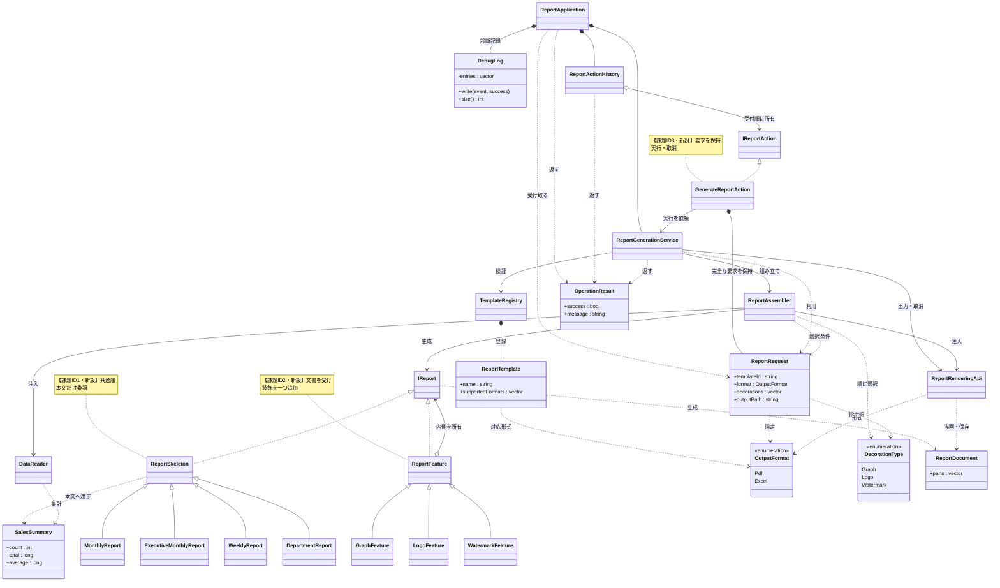
```mermaid
classDiagram
    direction TB
    class ReportApplication
    class DebugLog {
        -entries : vector
        +write(event, success)
        +size() int
    }
    class ReportActionHistory
    class IReportAction
    class GenerateReportAction
    class ReportGenerationService
    class ReportAssembler
    class IReport
    class ReportSkeleton
    class MonthlyReport
    class ExecutiveMonthlyReport
    class WeeklyReport
    class DepartmentReport
    class ReportFeature
    class GraphFeature
    class LogoFeature
    class WatermarkFeature
    class DataReader
    class TemplateRegistry
    class ReportRenderingApi
    class OutputFormat {
        <<enumeration>>
        Pdf
        Excel
    }
    class DecorationType {
        <<enumeration>>
        Graph
        Logo
        Watermark
    }
    class SalesSummary {
        +count : int
        +total : long
        +average : long
    }
    class ReportDocument {
        +parts : vector
    }
    class ReportRequest {
        +templateId : string
        +format : OutputFormat
        +decorations : vector
        +outputPath : string
    }
    class OperationResult {
        +success : bool
        +message : string
    }
    class ReportTemplate {
        +name : string
        +supportedFormats : vector
    }

    ReportApplication *-- ReportActionHistory
    ReportApplication *-- ReportGenerationService
    ReportApplication *-- DebugLog : 診断記録
    ReportApplication ..> ReportRequest : 受け取る
    ReportApplication ..> OperationResult : 返す
    ReportActionHistory o--> IReportAction : 受付順に所有
    ReportActionHistory ..> OperationResult : 返す
    IReportAction <|.. GenerateReportAction
    GenerateReportAction --> ReportGenerationService : 実行を依頼
    GenerateReportAction *-- ReportRequest : 完全な要求を保持
    ReportGenerationService --> ReportAssembler : 組み立て
    ReportGenerationService --> TemplateRegistry : 検証
    ReportGenerationService --> ReportRenderingApi : 出力・取消
    ReportGenerationService ..> ReportRequest : 利用
    ReportGenerationService ..> OperationResult : 返す
    ReportAssembler --> DataReader : 注入
    ReportAssembler --> ReportRenderingApi : 注入
    ReportAssembler --> IReport : 生成
    ReportAssembler ..> ReportRequest : 選択条件
    ReportAssembler ..> DecorationType : 順に選択
    IReport <|.. ReportSkeleton
    IReport ..> ReportDocument : 生成
    ReportSkeleton <|-- MonthlyReport
    ReportSkeleton <|-- ExecutiveMonthlyReport
    ReportSkeleton <|-- WeeklyReport
    ReportSkeleton <|-- DepartmentReport
    ReportSkeleton ..> SalesSummary : 本文へ渡す
    IReport <|.. ReportFeature
    ReportFeature o--> IReport : 内側を所有
    ReportFeature <|-- GraphFeature
    ReportFeature <|-- LogoFeature
    ReportFeature <|-- WatermarkFeature
    DataReader ..> SalesSummary : 集計
    TemplateRegistry *-- ReportTemplate : 登録
    ReportTemplate ..> OutputFormat : 対応形式
    ReportRequest ..> OutputFormat : 指定
    ReportRequest ..> DecorationType : 指定順
    ReportRenderingApi ..> ReportDocument : 描画・保存
    ReportRenderingApi ..> OutputFormat : 形式

    note for ReportSkeleton "【課題ID1・新設】共通順<br/>本文だけ委譲"
    note for ReportFeature "【課題ID2・新設】文書を受け<br/>装飾を一つ追加"
    note for GenerateReportAction "【課題ID3・新設】要求を保持<br/>実行・取消"

    classDef focus fill:#FFF2CC,stroke:#D6B656,stroke-width:2px,color:#222
    classDef stable fill:#DDEBF7,stroke:#5B9BD5,stroke-width:1.5px,color:#222
    cssClass "ReportApplication,ReportActionHistory,IReportAction,GenerateReportAction,ReportGenerationService,ReportAssembler,IReport,ReportSkeleton,MonthlyReport,ExecutiveMonthlyReport,WeeklyReport,DepartmentReport,ReportFeature,GraphFeature,LogoFeature,WatermarkFeature" focus
    cssClass "DebugLog,DataReader,TemplateRegistry,ReportRenderingApi" stable
```

#### 完成後の実行シーケンス

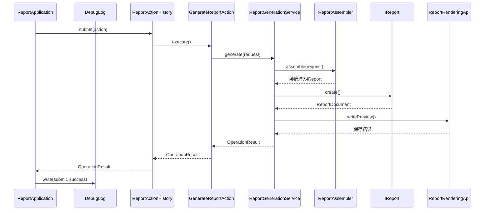
```mermaid
sequenceDiagram
    participant A as ReportApplication
    participant L as DebugLog
    participant H as ReportActionHistory
    participant C as GenerateReportAction
    participant S as ReportGenerationService
    participant B as ReportAssembler
    participant R as IReport
    participant O as ReportRenderingApi

    A->>H: submit(action)
    H->>C: execute()
    C->>S: generate(request)
    S->>B: assemble(request)
    B-->>S: 装飾済みIReport
    S->>R: create()
    R-->>S: ReportDocument
    S->>O: writePreview()
    O-->>S: 保存結果
    S-->>C: OperationResult
    C-->>H: OperationResult
    H-->>A: OperationResult
    A->>L: write(submit, success)
```

以下のコードブロックはクラス単位で分けています。すべてを上から結合すると、一つのC++14プログラムとして実行できます。

#### 完成コード

以下は、前のクラス一覧・クラス図・実行シーケンスを、依存される型から順にクラス単位で実装した完成コードです。

##### 1. 値・列挙・要求

まずファイル冒頭です。共通ヘッダーと、`OutputFormat`・`DecorationType`・`SalesSummary`・`ReportDocument`・`ReportRequest`という値型を置きます。ここはどのクラスにも属さない宣言で、以降のすべてのクラスが使います。

```cpp
#include <cstdio>
#include <fstream>
#include <iostream>
#include <map>
#include <string>
#include <utility>
#include <vector>

using namespace std;

enum class OutputFormat { Pdf, Excel };
enum class DecorationType { Graph, Logo, Watermark };

string formatName(OutputFormat format) {
    return format == OutputFormat::Pdf ? "PDF" : "Excel";
}

struct SalesSummary {
    int count;
    long total;
    long average;
};

struct ReportDocument {
    vector<string> parts;
};

struct ReportRequest {
    string templateId;
    OutputFormat format;
    vector<DecorationType> decorations;
    string outputPath;
};
```

- `OutputFormat`と`DecorationType`は、要求に含まれる形式と順序付き装飾を名前付きの値として表します。`formatName()`は表示用の名前だけを返し、判断を持ちません。
- `SalesSummary`と`ReportDocument`は、読込結果と一つの成果物を処理間で渡します。
- `ReportRequest`は、変更ID3で再実行する完全な要求です。テンプレートID、形式、装飾列、出力先を値として保持します。

続いて、処理の成否とテンプレート設定を運ぶ値です（`OperationResult` と `ReportTemplate`）。

```cpp
struct OperationResult {
    bool success;
    string message;
};

struct ReportTemplate {
    string name;
    vector<OutputFormat> supportedFormats;
};
```

- `OperationResult`は、実行側と履歴側が成否を受け渡す内部契約です。変更ID1〜変更ID3へ新しい業務機能を追加するものではありません。
- `ReportTemplate`は1-4と同じ名称・対応形式を保持します。

##### 2. DebugLog

```cpp
class DebugLog {
    vector<string> entries;
public:
    void write(const string& event, bool success) {
        int before = static_cast<int>(entries.size());
        entries.push_back(
            event + ":" + (success ? "success" : "failure"));
        cout << "デバッグログ件数: " << before
             << "->" << entries.size()
             << "・event=" << event
             << "・result="
             << (success ? "success" : "failure")
             << endl;
    }

    int size() const {
        return static_cast<int>(entries.size());
    }
};
```

- フェーズ1の`DebugLog`と同じコードです。イベント名と成否を一件追加し、内部件数の変化を表示します。
- 変更ID3の`ReportActionHistory`と異なり、完全な`ReportRequest`やActionを保持しません。このログから再実行・取消は行えません。
- 最終構造でも変更機能として追加したのではなく、従来の内部診断境界へ新しい操作結果を渡します。

##### 3. DataReader

```cpp
class DataReader {
    vector<int> sales{520, 610, 480, 700, 560, 640};
public:
    SalesSummary readCSV() const {
        long total = 0;
        for (int value : sales) {
            total += value;
        }
        long average = sales.empty()
            ? 0
            : total / static_cast<long>(sales.size());
        cout << "CSV読込: " << sales.size()
             << "件・合計" << total
             << "・平均" << average << endl;
        return {static_cast<int>(sales.size()), total, average};
    }
};
```

- 1-4と同じ6件を読み、件数6・合計3,510・平均585を返します。
- 変更ID1〜変更ID3では売上データと集計式を変更しないため、本文や装飾の具体型を知りません。

##### 4. ReportRenderingApi

```cpp
class ReportRenderingApi {
    void append(ReportDocument& document,
                const string& text) const {
        document.parts.push_back(text);
        cout << text << endl;
    }
public:
    void addHeader(ReportDocument& document,
                   OutputFormat format) const {
        append(document, "ヘッダー生成: " + formatName(format));
    }

    void addStandardBody(ReportDocument& document,
                         const string& title,
                         const SalesSummary& summary) const {
        append(document,
               title + " 標準本文: 件数"
               + to_string(summary.count)
               + "・合計" + to_string(summary.total)
               + "・平均" + to_string(summary.average));
    }

    void addExecutiveBody(ReportDocument& document,
                          const SalesSummary& summary) const {
        append(document,
               "役員向け月次専用本文: 全社業績"
               "・合計" + to_string(summary.total)
               + "・平均" + to_string(summary.average));
    }

    void addGraph(ReportDocument& document) const {
        append(document, "装飾適用: グラフ");
    }

    void addLogo(ReportDocument& document) const {
        append(document, "装飾適用: ロゴ");
    }

    void addWatermark(ReportDocument& document) const {
        append(document, "装飾適用: 透かし");
    }

    void addFooter(ReportDocument& document) const {
        append(document, "フッター生成");
    }

    bool writePreview(const ReportDocument& document,
                      const string& path,
                      OutputFormat format) const {
        ofstream output(path);
        if (!output) {
            return false;
        }
        output << "[DEMO PREVIEW] requested="
               << formatName(format) << '\n';
        for (const string& part : document.parts) {
            output << part << '\n';
        }
        output.close();
        if (!output) {
            remove(path.c_str());
            return false;
        }
        cout << "デモ成果物を保存: " << path
             << "（実" << formatName(format)
             << "ではない）" << endl;
        return true;
    }

    bool removePreview(const string& path) const {
        return remove(path.c_str()) == 0;
    }
};
```

- ヘッダー、標準本文、三装飾、フッター、デモ成果物の保存は1-4と同じ外部境界です。
- `addExecutiveBody()`は変更ID1、`removePreview()`は変更ID3によって同じ境界へ追加されました。前者は役員向け本文を描き、後者は取消対象のデモ成果物を削除します。
- 本物のPDF・Excelは生成せず、文書要素と呼出順をプレーンテキストで観測する契約も維持します。

##### 5. TemplateRegistry

```cpp
class TemplateRegistry {
    map<string, ReportTemplate> templates;
public:
    TemplateRegistry() {
        templates["SALES_WEEKLY"] =
            {"週次売上レポート",
             {OutputFormat::Pdf, OutputFormat::Excel}};
        templates["SALES_MONTHLY"] =
            {"月次売上レポート",
             {OutputFormat::Pdf, OutputFormat::Excel}};
        templates["SALES_MONTHLY_EXECUTIVE"] =
            {"役員向け月次売上レポート",
             {OutputFormat::Pdf, OutputFormat::Excel}};
        templates["SALES_DEPT"] =
            {"部門別売上レポート",
             {OutputFormat::Pdf, OutputFormat::Excel}};
    }

    bool exists(const string& id) const {
        return templates.count(id) != 0;
    }

    const ReportTemplate& get(const string& id) const {
        return templates.at(id);
    }

    bool supportsFormat(const string& id,
                        OutputFormat format) const {
        const vector<OutputFormat>& formats =
            templates.at(id).supportedFormats;
        for (OutputFormat candidate : formats) {
            if (candidate == format) {
                return true;
            }
        }
        return false;
    }
};
```

- `exists()`、`get()`、`supportsFormat()`という1-4のAPIと検証順を変えていません。
- 変更ID1の役員向け月次テンプレートを一件追加し、通常月次は別IDのまま残します。
- 本文クラスの生成や装飾順は知らず、テンプレート設定の保持と検証だけを担当します。

##### 6. IReportとReportSkeleton

```cpp
class IReport {
public:
    virtual ~IReport() = default;
    virtual ReportDocument create() = 0;
};

class ReportSkeleton : public IReport {
protected:
    DataReader& reader;
    ReportRenderingApi& renderer;
    OutputFormat format;

    virtual void renderBody(
        ReportDocument& document,
        const SalesSummary& summary) = 0;

public:
    ReportSkeleton(DataReader& dataReader,
                   ReportRenderingApi& renderingApi,
                   OutputFormat outputFormat)
        : reader(dataReader),
          renderer(renderingApi),
          format(outputFormat) {}

    ReportDocument create() final {
        SalesSummary summary = reader.readCSV();
        ReportDocument document;
        renderer.addHeader(document, format);
        renderBody(document, summary);
        renderer.addFooter(document);
        return document;
    }
};
```

- `IReport::create()`は、本文クラスと装飾クラスが同じ`ReportDocument`を返すための共通契約です。
- `ReportSkeleton::create()`は「読込→ヘッダー→本文→フッター」を固定し、本文だけを`renderBody()`へ委ねます。
- ここで骨格が守るのは**この4つの順序**です。装飾は骨格の内側へ差し込むのではなく、完成した文書を`ReportFeature`が外側から包んで足します。そのため文書の要素は「ヘッダー→本文→フッター→装飾」の順に並び、フェーズ1の現状（装飾→フッター）とは装飾の位置が変わります。装飾を「文書全体に後から重ねるもの」として扱う以上、この並びは装飾連結構造を選んだ結果であり、A2〜A4の実行結果でも同じ順序になります。骨格の内側へ装飾を差し込みたい場合は、`ReportSkeleton`へ差し込み点のフックを1つ足すことになりますが、そのぶん骨格が装飾の存在を知ることになります。
- 実際の`readCSV()`も基底クラスから呼ぶため、表示だけでなく生成処理の共通順そのものを一か所に置いています。

##### 7. 本文クラス

**MonthlyReport**

```cpp
class MonthlyReport : public ReportSkeleton {
public:
    using ReportSkeleton::ReportSkeleton;
protected:
    void renderBody(ReportDocument& document,
                    const SalesSummary& summary) override {
        renderer.addStandardBody(
            document, "月次売上レポート", summary);
    }
};
```

- 通常月次の標準本文を生成します。変更ID1で役員向けが増えても、この既存本文は置き換えません。

**ExecutiveMonthlyReport**

```cpp
class ExecutiveMonthlyReport : public ReportSkeleton {
public:
    using ReportSkeleton::ReportSkeleton;
protected:
    void renderBody(ReportDocument& document,
                    const SalesSummary& summary) override {
        renderer.addExecutiveBody(document, summary);
    }
};
```

- 変更ID1で追加する役員向け月次だけの本文です。共通順を再実装せず、`renderBody()`だけを差し替えます。

**WeeklyReport**

```cpp
class WeeklyReport : public ReportSkeleton {
public:
    using ReportSkeleton::ReportSkeleton;
protected:
    void renderBody(ReportDocument& document,
                    const SalesSummary& summary) override {
        renderer.addStandardBody(
            document, "週次売上レポート", summary);
    }
};
```

- 週次の標準本文を生成します。役員向け月次の追加による修正を受けません。

**DepartmentReport**

```cpp
class DepartmentReport : public ReportSkeleton {
public:
    using ReportSkeleton::ReportSkeleton;
protected:
    void renderBody(ReportDocument& document,
                    const SalesSummary& summary) override {
        renderer.addStandardBody(
            document, "部門別売上レポート", summary);
    }
};
```

- 部門別の標準本文を生成します。四つの本文クラスは同じ共通順を使い、本文内容だけを所有します。
- 通常月次と役員向け月次を別クラスにしたため、変更ID1により役員向けだけを変え、通常月次を維持できます。

##### 8. ReportFeatureと各装飾

**ReportFeature**

```cpp
class ReportFeature : public IReport {
protected:
    IReport* wrapped;
    ReportRenderingApi& renderer;
public:
    ReportFeature(IReport* inner,
                  ReportRenderingApi& renderingApi)
        : wrapped(inner),
          renderer(renderingApi) {}

    ~ReportFeature() override {
        delete wrapped;
    }
};
```

- 内側の`IReport`を生ポインタで所有し、デストラクタで破棄する装飾基底です。同じ描画境界は参照として受け取ります。
- 自分では装飾種別を判断せず、具体Featureが`create()`へ一つの表示要素を追加できる接続を用意します。

**GraphFeature**

```cpp
class GraphFeature : public ReportFeature {
public:
    using ReportFeature::ReportFeature;
    ReportDocument create() override {
        ReportDocument document = wrapped->create();
        renderer.addGraph(document);
        return document;
    }
};
```

- 内側で文書を生成した後、グラフを一つ追加して同じ文書を返します。

**LogoFeature**

```cpp
class LogoFeature : public ReportFeature {
public:
    using ReportFeature::ReportFeature;
    ReportDocument create() override {
        ReportDocument document = wrapped->create();
        renderer.addLogo(document);
        return document;
    }
};
```

- 内側で文書を生成した後、ロゴを一つ追加します。グラフとの前後はこのクラスでは決めません。

**WatermarkFeature**

```cpp
class WatermarkFeature : public ReportFeature {
public:
    using ReportFeature::ReportFeature;
    ReportDocument create() override {
        ReportDocument document = wrapped->create();
        renderer.addWatermark(document);
        return document;
    }
};
```

- 内側で文書を生成した後、透かしを一つ追加します。
- すべてのFeatureは同じ規則で一要素だけを加えます。`ReportAssembler`が入力列の先頭から包むため、入力順と実行順が一致します。

##### 9. ReportAssembler

```cpp
class ReportAssembler {
    DataReader& reader;
    ReportRenderingApi& renderer;
public:
    ReportAssembler(DataReader& dataReader,
                    ReportRenderingApi& renderingApi)
        : reader(dataReader),
          renderer(renderingApi) {}

    IReport* assemble(
        const ReportRequest& request) {
        IReport* report = nullptr;

        if (request.templateId ==
            "SALES_MONTHLY_EXECUTIVE") {
            report = new ExecutiveMonthlyReport(
                reader, renderer, request.format);
        } else if (request.templateId ==
                   "SALES_MONTHLY") {
            report = new MonthlyReport(
                reader, renderer, request.format);
        } else if (request.templateId ==
                   "SALES_WEEKLY") {
            report = new WeeklyReport(
                reader, renderer, request.format);
        } else {
            report = new DepartmentReport(
                reader, renderer, request.format);
        }

        for (DecorationType type : request.decorations) {
            if (type == DecorationType::Graph) {
                report = new GraphFeature(report, renderer);
            } else if (type == DecorationType::Logo) {
                report = new LogoFeature(report, renderer);
            } else {
                report = new WatermarkFeature(report, renderer);
            }
        }
        return report;
    }
};
```

- `assemble()`はテンプレートIDから本文クラスを一つ選び、装飾列を先頭から走査して対応Featureで包み直します。
- 具体クラスを知る場所は`ReportAssembler`です。`ReportApplication`や履歴側は本文クラスやFeatureを直接生成しません。
- 新しいFeatureは直前の`IReport`を所有します。最外側の`IReport`を削除すると、各Featureのデストラクタが内側を順に削除します。

##### 10. ReportGenerationService

```cpp
class ReportGenerationService {
    TemplateRegistry& registry;
    ReportAssembler& assembler;
    ReportRenderingApi& renderer;
public:
    ReportGenerationService(
        TemplateRegistry& templateRegistry,
        ReportAssembler& reportAssembler,
        ReportRenderingApi& renderingApi)
        : registry(templateRegistry),
          assembler(reportAssembler),
          renderer(renderingApi) {}

    OperationResult generate(
        const ReportRequest& request) {
        if (!registry.exists(request.templateId)) {
            return {false,
                    "未登録テンプレート: "
                    + request.templateId};
        }
        if (!registry.supportsFormat(
                request.templateId, request.format)) {
            return {false,
                    "未対応形式: "
                    + formatName(request.format)};
        }

        cout << "テンプレート: "
             << registry.get(request.templateId).name
             << endl;

        IReport* report = assembler.assemble(request);
        ReportDocument document = report->create();
        delete report;
        bool saved = renderer.writePreview(
            document, request.outputPath, request.format);
        return saved
            ? OperationResult{true, "生成完了"}
            : OperationResult{false, "デモ成果物の保存失敗"};
    }

    OperationResult removeArtifact(
        const string& outputPath) {
        if (!renderer.removePreview(outputPath)) {
            return {false,
                    "取消対象が存在しません: "
                    + outputPath};
        }
        cout << "デモ成果物を取消: "
             << outputPath << endl;
        return {true, "取消完了"};
    }
};
```

- `generate()`はテンプレートIDと形式を検証し、Assemblerで本文・装飾を組み立て、文書を生成して出力境界へ渡します。
- 失敗は`OperationResult`で返し、デモ成果物を保存できた場合だけ成功にします。
- `removeArtifact()`は取消時の削除境界ですが、履歴件数や再実行対象を決める規則は持ちません。

##### 11. GenerateReportAction

```cpp
class IReportAction {
public:
    virtual ~IReportAction() = default;
    virtual OperationResult execute() = 0;
    virtual OperationResult undo() = 0;
    virtual const ReportRequest& request() const = 0;
};

class GenerateReportAction : public IReportAction {
    ReportGenerationService& service;
    ReportRequest storedRequest;
    bool artifactExists = false;
public:
    GenerateReportAction(
        ReportGenerationService& generationService,
        ReportRequest reportRequest)
        : service(generationService),
          storedRequest(move(reportRequest)) {}

    OperationResult execute() override {
        OperationResult result =
            service.generate(storedRequest);
        if (result.success) {
            artifactExists = true;
        }
        return result;
    }

    OperationResult undo() override {
        if (!artifactExists) {
            return {false,
                    "この要求が生成した成果物はありません"};
        }
        OperationResult result =
            service.removeArtifact(
                storedRequest.outputPath);
        if (result.success) {
            artifactExists = false;
        }
        return result;
    }

    const ReportRequest& request() const override {
        return storedRequest;
    }
};
```

- `IReportAction`は、実行と取消を同じ単位で扱う契約です。
- `GenerateReportAction`は完全な`ReportRequest`を値で保持し、生成と削除を`ReportGenerationService`へ委譲します。
- 成功後も`execute()`を拒否しないため、同じテンプレート、形式、装飾順、出力先で再生成できます。

##### 12. ReportActionHistory

```cpp
class ReportActionHistory {
    vector<IReportAction*> accepted;
public:
    ~ReportActionHistory() {
        for (IReportAction* action : accepted) {
            delete action;
        }
    }

    OperationResult submit(
        IReportAction* action) {
        accepted.push_back(action);
        cout << "要求履歴へ受付: "
             << accepted.size() << "件目" << endl;
        return accepted.back()->execute();
    }

    OperationResult replayLast() {
        if (accepted.empty()) {
            return {false, "再実行できる要求がありません"};
        }
        cout << "要求履歴から再実行: "
             << accepted.back()->request().templateId
             << endl;
        return accepted.back()->execute();
    }

    OperationResult undoLast() {
        if (accepted.empty()) {
            return {false, "取り消せる要求がありません"};
        }
        cout << "要求履歴から取消: "
             << accepted.back()->request().templateId
             << endl;
        return accepted.back()->undo();
    }

    int size() const {
        return static_cast<int>(accepted.size());
    }
};
```

- `submit()`はActionのポインタを`vector`へ保存して所有してから`execute()`します。成功結果ではなく、受け付けた要求を履歴の正本にするためです。
- `replayLast()`と`undoLast()`は、最後のActionへ同じ契約で委譲し、本文IDや装飾種別を判断しません。
- 取消後も受付履歴を残すため、`undoLast()`は成果物だけを削除し、`vector`からActionを除きません。
- `ReportActionHistory`のデストラクタは、受け付けたActionをすべて破棄します。Actionの生存期間は履歴の生存期間と同じです。

##### 13. ReportApplicationと実行シナリオ

```cpp
class ReportApplication {
    DataReader reader;
    ReportRenderingApi renderer;
    TemplateRegistry registry;
    ReportAssembler assembler;
    ReportGenerationService service;
    ReportActionHistory history;
    DebugLog debugLog;
public:
    ReportApplication()
        : assembler(reader, renderer),
          service(registry, assembler, renderer) {}

    OperationResult submit(ReportRequest request) {
        IReportAction* action =
            new GenerateReportAction(service, request);
        OperationResult result = history.submit(action);
        debugLog.write("submit", result.success);
        return result;
    }

    OperationResult replayLast() {
        OperationResult result = history.replayLast();
        debugLog.write("replay", result.success);
        return result;
    }

    OperationResult undoLast() {
        OperationResult result = history.undoLast();
        debugLog.write("undo", result.success);
        return result;
    }

    int historySize() const {
        return history.size();
    }

    int debugLogSize() const {
        return debugLog.size();
    }
};

void printResult(const OperationResult& result) {
    cout << "操作結果: "
         << (result.success ? "成功" : "失敗")
         << "（" << result.message << "）" << endl;
}
```

- `ReportApplication::submit()`は要求から`GenerateReportAction`を生成し、`ReportActionHistory`へ所有権を渡します。具体Actionを生成する場所はここだけです。返された成否は、従来の`DebugLog`へ診断記録します。
- `replayLast()`と`undoLast()`は履歴へ委譲し、本文や装飾の詳細を知りません。各結果も同じ診断境界へ渡します。
- `DataReader`、`TemplateRegistry`、`ReportRenderingApi`、`DebugLog`はApplicationが一度だけ所有します。前者三つはAssemblerとServiceへ参照注入し、DebugLogはApplicationだけが利用します。
- `historySize()`は受付要求数、`debugLogSize()`は診断イベント数を返します。二つを別メソッドにすることで、診断ログを要求履歴の正本として扱わないことをコードで明示します。
- `printResult()`は各シナリオが受け取った`OperationResult`を同じ形式で表示します。

**A1〜A4を一つのApplicationで実行するmain**

先に、四つのシナリオを呼ぶ`main()`を示します。この後のA1〜A4は、すべてこの一つの`ReportApplication`を共有し、上から順に実行されます。各シナリオの定義はこの後に置くため、呼び出し側を先に見せられるよう前方宣言だけを添えています。

```cpp
// 各シナリオはこの後で定義する（呼び出し側を先に見せるための前方宣言）
void scenarioA1(ReportApplication& application);
void scenarioA2(ReportApplication& application);
void scenarioA3(ReportApplication& application);
void scenarioA4(ReportApplication& application);
void scenarioA5(ReportApplication& application);

int main() {
    ReportApplication application;
    scenarioA1(application);
    scenarioA2(application);
    scenarioA3(application);
    scenarioA4(application);
    scenarioA5(application);
    return 0;
}
```

- 一つの`ReportApplication`をA1〜A4で共有するため、受付件数が1→4と増え、A4の再実行・取消が同じ履歴へ接続されます。
- 各シナリオのコード直後に対応する実行結果を置いたため、入力と結果を離れた一括出力から探す必要はありません。

**A1：通常月次を維持する実行コード**

```cpp
void scenarioA1(ReportApplication& application) {
    cout << "--- A1: 通常月次は標準本文 ---" << endl;
    printResult(application.submit({
        "SALES_MONTHLY",
        OutputFormat::Pdf,
        {},
        "a1_monthly_demo.txt"
    }));
}
```

- 変更ID1で役員向け月次を追加した後も、既存の`SALES_MONTHLY`を指定して標準本文が生成されることを確認します。

実行結果（A1）：

```
--- A1: 通常月次は標準本文 ---
要求履歴へ受付: 1件目
テンプレート: 月次売上レポート
CSV読込: 6件・合計3510・平均585
ヘッダー生成: PDF
月次売上レポート 標準本文: 件数6・合計3510・平均585
フッター生成
デモ成果物を保存: a1_monthly_demo.txt（実PDFではない）
デバッグログ件数: 0->1・event=submit・result=success
操作結果: 成功（生成完了）
```

**A2：役員向け本文へロゴ→グラフを適用する実行コード**

上の`main()`が2番目に呼ぶ自由関数`scenarioA2()`で、受け取った`ReportApplication`へ役員向けの要求を渡します。

```cpp
void scenarioA2(ReportApplication& application) {
    cout << "--- A2: 役員向け・ロゴ→グラフ ---" << endl;
    printResult(application.submit({
        "SALES_MONTHLY_EXECUTIVE",
        OutputFormat::Pdf,
        {DecorationType::Logo, DecorationType::Graph},
        "a2_executive_demo.txt"
    }));
}
```

- 変更ID1の役員向け専用本文と、変更ID2の入力順`Logo→Graph`が同じ成果物へ反映されることを確認します。

実行結果（A2）：

```
--- A2: 役員向け・ロゴ→グラフ ---
要求履歴へ受付: 2件目
テンプレート: 役員向け月次売上レポート
CSV読込: 6件・合計3510・平均585
ヘッダー生成: PDF
役員向け月次専用本文: 全社業績・合計3510・平均585
フッター生成
装飾適用: ロゴ
装飾適用: グラフ
デモ成果物を保存: a2_executive_demo.txt（実PDFではない）
デバッグログ件数: 1->2・event=submit・result=success
操作結果: 成功（生成完了）
```

**A3：役員向け本文へグラフ→ロゴを適用する実行コード**

同じく`main()`が3番目に呼ぶ`scenarioA3()`で、A2と同じ`ReportApplication`へ装飾の順だけを変えた要求を渡します。

```cpp
void scenarioA3(ReportApplication& application) {
    cout << "--- A3: 役員向け・グラフ→ロゴ ---" << endl;
    printResult(application.submit({
        "SALES_MONTHLY_EXECUTIVE",
        OutputFormat::Excel,
        {DecorationType::Graph, DecorationType::Logo},
        "a3_order_demo.txt"
    }));
}
```

- A2と同じ二装飾を逆順で渡し、変更ID2が固定順ではなく入力列の順を使うことを比較します。

実行結果（A3）：

```
--- A3: 役員向け・グラフ→ロゴ ---
要求履歴へ受付: 3件目
テンプレート: 役員向け月次売上レポート
CSV読込: 6件・合計3510・平均585
ヘッダー生成: Excel
役員向け月次専用本文: 全社業績・合計3510・平均585
フッター生成
装飾適用: グラフ
装飾適用: ロゴ
デモ成果物を保存: a3_order_demo.txt（実Excelではない）
デバッグログ件数: 2->3・event=submit・result=success
操作結果: 成功（生成完了）
```

**A4：同じ要求を再実行して成果物を取り消す実行コード**

`main()`が最後に呼ぶ`scenarioA4()`と`scenarioA5()`で、どちらも同じ`ReportApplication`を受け取ります。

```cpp
void scenarioA4(ReportApplication& application) {
    cout << "--- A4: 同じ要求を再実行して取消 ---" << endl;
    printResult(application.submit({
        "SALES_MONTHLY_EXECUTIVE",
        OutputFormat::Pdf,
        {DecorationType::Logo, DecorationType::Graph},
        "a4_replay_demo.txt"
    }));
    printResult(application.replayLast());
    printResult(application.undoLast());
    cout << "要求履歴件数: "
         << application.historySize() << endl;
    cout << "デバッグログ件数: "
         << application.debugLogSize() << endl;
}

void scenarioA5(ReportApplication& application) {
    // 要求ID1の回帰：1-1のエラー条件と1-2のエラー例1を完成コードで確認する
    cout << "--- A5: 未登録IDでは生成しない ---" << endl;
    printResult(application.submit({
        "UNKNOWN",
        OutputFormat::Pdf,
        {},
        "a5_unknown_demo.txt"
    }));
    cout << "要求履歴件数: "
         << application.historySize() << endl;
}
```

- 変更ID3の完全な要求を4件目として受付後、同じActionを再実行し、同じ出力先の成果物を削除します。
- 取消後も受付履歴は4件のままです。一方、診断ログは4回のsubmit、1回のreplay、1回のundoを記録して6件になります。件数と内容が異なる二つの記録を並べ、要求履歴を成功結果やデバッグログとして扱っていないことを確認します。

実行結果（A4）：

```
--- A4: 同じ要求を再実行して取消 ---
要求履歴へ受付: 4件目
テンプレート: 役員向け月次売上レポート
CSV読込: 6件・合計3510・平均585
ヘッダー生成: PDF
役員向け月次専用本文: 全社業績・合計3510・平均585
フッター生成
装飾適用: ロゴ
装飾適用: グラフ
デモ成果物を保存: a4_replay_demo.txt（実PDFではない）
デバッグログ件数: 3->4・event=submit・result=success
操作結果: 成功（生成完了）
要求履歴から再実行: SALES_MONTHLY_EXECUTIVE
テンプレート: 役員向け月次売上レポート
CSV読込: 6件・合計3510・平均585
ヘッダー生成: PDF
役員向け月次専用本文: 全社業績・合計3510・平均585
フッター生成
装飾適用: ロゴ
装飾適用: グラフ
デモ成果物を保存: a4_replay_demo.txt（実PDFではない）
デバッグログ件数: 4->5・event=replay・result=success
操作結果: 成功（生成完了）
要求履歴から取消: SALES_MONTHLY_EXECUTIVE
デモ成果物を取消: a4_replay_demo.txt
デバッグログ件数: 5->6・event=undo・result=success
操作結果: 成功（取消完了）
要求履歴件数: 4
デバッグログ件数: 6
```

#### 実行結果

実行ログはA1〜A4の各コード直後へ配置しました。ここでは、要求単位の判定だけを一覧にします。

| ケース | 対応要求 | コード直後で確認した結果 |
|---|---|---|
| A1 | 変更ID1・既存月次の維持 | 通常月次は標準本文のまま生成成功 |
| A2 | 変更ID1・変更ID2 | 役員向け専用本文へロゴ→グラフの順で適用 |
| A3 | 変更ID2 | 同じ二装飾をグラフ→ロゴの逆順で適用 |
| A4 | 変更ID3 | 完全な要求を再実行し、成果物だけを取消。要求履歴4件と診断ログ6件を別々に維持 |
| A5 | 要求ID1の回帰 | 未登録テンプレートIDでは生成せず、失敗を診断ログへ記録 |

A5の実行結果：

```text
--- A5: 未登録IDでは生成しない ---
要求履歴へ受付: 5件目
デバッグログ件数: 6->7・event=submit・result=failure
操作結果: 失敗（未登録テンプレート: UNKNOWN）
要求履歴件数: 5
```

1-2のエラー例1（UNKNOWN, pdf）にあたるケースです。成果物は保存されず、診断ログには失敗が1件だけ増えます。受付履歴は「何を要求されたか」の記録なので失敗した要求も5件目として残り、成功結果を表す記録ではないことがここでも確認できます。

#### 最終要求の実装・受入エビデンス

変更後要求ベースラインの全有効要求IDを同じ順序で照合します。今回変わらなかった既存要求も対象にするため、要求の消失を検出できます。

| 要求ID | 最終要求 | 適用コード | 実行シナリオ・観測結果・判定 |
|---|---|---|---|
| 要求ID1 | 登録テンプレートIDと対応出力形式を検証する | `TemplateRegistry`、`ReportGenerationService` | A5で未登録IDを拒否し成果物なし・診断ログへ失敗1件。非対応形式は登録データが全形式対応のため発生しない<br/>**判定:** 合格 |
| 要求ID2 | 入力された売上データの件数・合計・平均を計算する | `DataReader`、`SalesSummary` | A1〜A4で入力した6件から件数6・合計3,510・平均585を算出<br/>**判定:** 合格 |
| 要求ID3 | 既存3本文を保ち、役員向け月次だけ専用本文にする | 各`ReportSkeleton`派生 | 通常月次と役員向けが異なり既存本文不変<br/>**判定:** 合格 |
| 要求ID4 | グラフ・ロゴ・透かしを入力順で重ねる | 各`ReportFeature`、`ReportAssembler` | A2・A3で入力順どおり<br/>**判定:** 合格 |
| 要求ID5 | 描画境界を通して指定先へデモ成果物を保存・削除する | `ReportRenderingApi` | A1〜A4で生成・取消結果を確認<br/>**判定:** 合格 |
| 要求ID6 | 内部デバッグイベントと成否・件数変化を記録する | `DebugLog` | 診断ログ6件と前後件数を出力<br/>**判定:** 合格 |
| 要求ID7 | 完全な生成要求を履歴へ保存し、同じ内容で再実行・取消する | `GenerateReportAction`、`ReportActionHistory` | A4で同じ要求を再実行・取消、履歴4件<br/>**判定:** 合格 |

#### 設計課題の構造改善結果

要求の受入とは分けて、課題IDごとに構造と変更影響を確認します。

| 課題ID | 構造差分・コード適用先 | 確認できた効果 | 残る変更先 |
|---|---|---|---|
| 課題ID1 | `ReportSkeleton`と各本文実装へ共通順・本文差分を分離 | 役員本文追加で共通順と既存本文を変更しない | 新本文と登録・選択 |
| 課題ID2 | `ReportFeature`の連結へ装飾を分離 | 入力順に装飾でき、追加が新Featureに閉じた | 新Featureと組み立て |
| 課題ID3 | 完全要求を持つ`GenerateReportAction`と履歴へ操作を分離 | 履歴側が本文・装飾種類を判定せず再実行・取消できた | Actionと履歴方針 |
#### 変更前→変更後の不変条件照合

| 変更対象外 | 変更前 | 変更後 | 確認根拠 |
|---|---|---|---|
| 売上データ・集計 | 6件、3,510、585 | 同じ | 1-4とA1〜A4 |
| テンプレート検証 | exists/get/supportsFormat | 同じAPIへ一件登録 | TemplateRegistry |
| 描画・出力境界 | ReportRenderingApiで描画・デモ保存 | 既存操作を維持し、変更ID1の役員本文と変更ID3の削除操作だけを追加 | A1〜A4 |
| 既存本文・装飾 | 三本文・三装飾 | すべて維持 | 各Report・Feature |
| 内部デバッグログ | event・resultを記録し件数変化を表示 | 同じDebugLogをApplicationから利用 | 1-4とA1〜A4 |

### 7-2：動作シーケンス図

A4の再実行までを追います。再実行時も、履歴にあるActionから同じReportRequestがServiceへ渡り、本文と装飾列を組み立て直します。

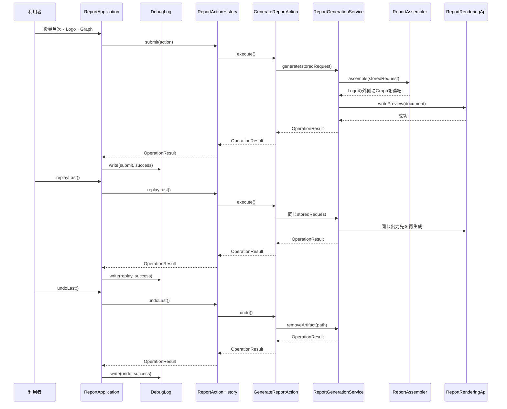
```mermaid
sequenceDiagram
    participant U as 利用者
    participant A as ReportApplication
    participant L as DebugLog
    participant H as ReportActionHistory
    participant C as GenerateReportAction
    participant S as ReportGenerationService
    participant B as ReportAssembler
    participant O as ReportRenderingApi

    U->>A: 役員月次・Logo→Graph
    A->>H: submit(action)
    H->>C: execute()
    C->>S: generate(storedRequest)
    S->>B: assemble(storedRequest)
    B-->>S: Logoの外側にGraphを連結
    S->>O: writePreview(document)
    O-->>S: 成功
    S-->>C: OperationResult
    C-->>H: OperationResult
    H-->>A: OperationResult
    A->>L: write(submit, success)
    U->>A: replayLast()
    A->>H: replayLast()
    H->>C: execute()
    C->>S: 同じstoredRequest
    S->>O: 同じ出力先を再生成
    S-->>C: OperationResult
    C-->>H: OperationResult
    H-->>A: OperationResult
    A->>L: write(replay, success)
    U->>A: undoLast()
    A->>H: undoLast()
    H->>C: undo()
    C->>S: removeArtifact(path)
    S-->>C: OperationResult
    C-->>H: OperationResult
    H-->>A: OperationResult
    A->>L: write(undo, success)
```

### 7-3：変更影響グラフ（改善後）

フェーズ3の変更影響グラフと同じ要求粒度で確認します。

変更ID1〜変更ID3が、それぞれどのクラスを修正起点にするかを示します。**実線**は変更起点から修正が伸びる先、**点線**は修正箇所が利用するだけで変更しない安定境界（水色）です。安定境界も孤立させず、どの修正箇所から使われるかを点線でつなぎます。

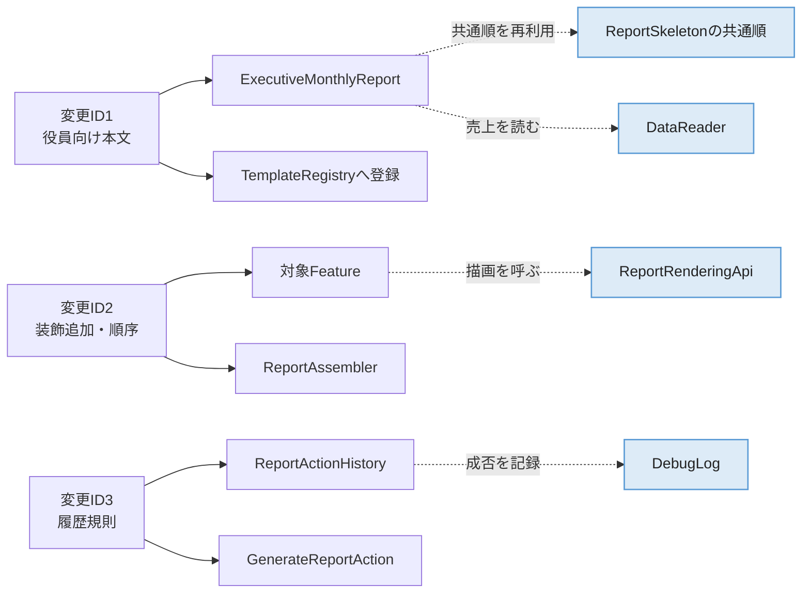
```mermaid
graph LR
    C1["変更ID1<br/>役員向け本文"] --> B1["ExecutiveMonthlyReport"]
    C1 --> REG["TemplateRegistryへ登録"]
    C2["変更ID2<br/>装飾追加・順序"] --> F["対象Feature"]
    C2 --> ASM["ReportAssembler"]
    C3["変更ID3<br/>履歴規則"] --> H["ReportActionHistory"]
    C3 --> GA["GenerateReportAction"]

    B1 -.共通順を再利用.-> ST["ReportSkeletonの共通順"]
    B1 -.売上を読む.-> DR["DataReader"]
    F -.描画を呼ぶ.-> API["ReportRenderingApi"]
    H -.成否を記録.-> LOG["DebugLog"]

    class ST,DR,API,LOG stable
    classDef stable fill:#DDEBF7,stroke:#5B9BD5,stroke-width:1.5px,color:#222
```

実線でたどると変更ID1〜変更ID3の修正起点は交わりません。点線でつながる`ReportSkeleton`の共通順・`DataReader`・`ReportRenderingApi`・`DebugLog`は、修正箇所から利用されるだけで変更されない安定境界です。フェーズ3では一つの`ReportGenerator`へ集まっていた修正が変更要求ごとに分かれ、共通順・売上読込・描画出力・診断を同時に変更する必要がなくなりました。

### 7-4：変更シナリオ表

今回の変更ID1〜変更ID3だけを完成コードへ再適用します。

| 変更依頼 | フェーズ1の現状構造での影響 | 完成構造での結果 |
|---|---|---|---|
| 変更ID1：通常月次を保ち、役員向けだけ専用本文にする | `ReportGenerator`の本文分岐へ役員向け条件と本文を追加 | `ExecutiveMonthlyReport`へ専用本文を置き、通常月次・週次・部門別を変えずにA1/A2で違いを確認 |
| 変更ID2：装飾の種類を順序付きで受け、その順に適用する | `ReportGenerator`へ装飾種類と順序の分岐を追加 | 各`ReportFeature`を入力順に組み立て、A2/A3でロゴ→グラフとグラフ→ロゴの順序一致を確認 |
| 変更ID3：受け付けた完全な生成要求を記録し、再実行・取消する | 生成処理へ要求保存・再実行・取消の条件を追加 | Action・History・Applicationへ分け、A4で同一要求の再実行と成果物削除を確認 |

`DebugLog`は改善後も水色の安定側です。変更ID1〜変更ID3から修正線は伸びず、Applicationが返却結果だけを渡します。

---

## 整理

### 問題・原因・課題・解決策

| 区分 | 内容 |
|---|---|
| 問題 | 変更ID1〜変更ID3が一つの生成クラスを変更起点にした |
| 原因 | 共通順が本文ID、装飾種別・順序、履歴規則まで知った |
| 課題ID1 | 共通順と本文差分の接続を見直す |
| 課題ID2 | 文書と順序付き装飾の接続を見直す |
| 課題ID3 | 受付要求と実行・再実行・取消の接続を見直す |
| 解決 | 骨格固定構造、装飾連結構造、操作記録構造を生成時に直列接続する |

### フェーズとこの章でやったこと

| フェーズ | この章で行ったこと | 読者が確定できたこと |
|---|---|---|
| 1：現状把握 | 入力、テンプレート、売上、処理順、クラス、コードを対応づけた | 現状はReportGeneratorが標準本文と固定順装飾を進める |
| 2：仮説立案 | フェーズ1の事実へ変更ID1〜変更ID3を重ね、本文・装飾・履歴の見当を確認した | 本文、装飾順、履歴規則が別々に変わる |
| 3：問題特定 | 変更ID1〜変更ID3を現状構造へ直接追加した | 三要求の修正起点がChangedReportGeneratorへ集中する |
| 4：原因分析 | 共通順に漏れた本文ID、装飾種別、履歴規則をコードで確認した | 元の責任と異なる三つの変更理由が同居している |
| 5：課題定義 | 接続点を課題ID1〜課題ID3へ変換し、システム全体の完了条件を決めた | 何を分け、何を契約として守るかが決まった |
| 6：対策検討 | 分離・配置・生成・所有・注入・実行を一つの完成構造へした | コードを書く前に最終クラス図と実行経路が決まった |
| 7：対策実施 | クラス単位で実装し、A1〜A4で要求を確認した | 変更ID1〜変更ID3が同時に成立し、変更起点が分かれた |

### 責任の移動

| 変更前の責任 | 変更後の責任 |
|---|---|
| ReportGeneratorが本文IDを判断 | ReportAssemblerが本文クラスを選び、各Reportが本文を持つ |
| ReportGeneratorが装飾ifと順序を持つ | 各FeatureとReportAssemblerが装飾と順序を持つ |
| ReportGeneratorが要求vectorを操作 | Actionが要求を持ち、Historyが受付順に所有する |
| ReportGeneratorがすべてを生成 | Application→Action→Service→Assemblerの経路で再結合する |
| Applicationが実行成否をDebugLogへ記録 | 同じ。要求履歴とは別の内部診断責任として維持する |

### 使った構造とデザインパターン名

本章では、先に課題ID1〜課題ID3を満たす構造を導きました。既知のデザインパターン名へ対応づけると、次のようになります。

| 導いた構造 | パターン名 | 対応クラス |
|---|---|---|
| 共通順を固定し本文だけ委ねる | Template Method | ReportSkeletonと各Report |
| 同じ文書へ装飾を順に重ねる | Decorator | ReportFeatureと各Feature |
| 要求を実行・取消できる単位で記録する | Command | GenerateReportActionとReportActionHistory |

三つのパターンを先に当てはめたのではありません。三つの独立した接続課題を解いた構造に、後から既知の名前を対応づけています。

`DebugLog`はこの三パターンの役ではありません。フェーズ1から存在する診断基盤を安定側に残し、Applicationが各操作の`OperationResult`から成否だけを渡しています。

---

## 振り返り

### 「この章を読むと得られること」は手に入ったか

| 章冒頭で約束したこと | 章内で確認した場所 | 到達した状態 |
|---|---|---|
| 要求を入力と受入条件へ変換する | 1-5、2-2 | 変更ID1〜変更ID3を実行ケースで判定できる |
| 元の責任と漏れ込んだ知識を区別する | 3-1、4-1 | 共通順と本文・装飾・履歴の変更理由を分けられる |
| 三つの変化軸を見分ける | 4-3、5-1 | 課題ID1〜課題ID3として別々の接続課題へ変換できる |
| 生成・選択・所有・注入・実行まで設計する | 6-1、完成クラス図 | 分離した部品を実行可能な一システムへ再結合できる |
| 要求と課題を別々に追跡する | 6-3、7-1 | 要求IDはコード・A1〜A4の受入結果へ、課題IDは構造差分・変更影響へ分けて説明できる |

本章では、変更要求を受けてすぐにクラスを増やしませんでした。

1. 変更ID1〜変更ID3を入力と受入条件まで分けた。
2. 現状構造へ要求を当て、修正が一クラスへ集まることを確認した。
3. 元の責任と漏れ込んだ知識を分けた。
4. 接続点を課題ID1〜課題ID3へ変換した。
5. 共通点と差分から最終構造を導いた。
6. 生成・所有・注入・実行経路を決めてからコードを書いた。
7. 変更ID1〜変更ID3を実行結果で確認した。

この順番により、「パターンを使ったコード」ではなく、「要求を満たし、変更理由を分けたシステム」として設計を説明できます。

### 第0章の3つの設計原則はどう適用されたか

| 原則 | 本章で行ったこと |
|---|---|
| 変わるものと守るものを分ける | 本文・装飾・履歴を変動側、生成順・売上・描画境界・DebugLogを安定側にした |
| 分離して再結合する | Report、Feature、Actionへ分け、AssemblerとApplicationで再接続した |
| 変更影響を結果で確認する | フェーズ3と7-3を同じ要求粒度で比較し、変更ID1〜変更ID3の実行結果を示した |

---

## あなたのコードで考えてみてください

- あなたのシステムは、誰が何を達成するために使うものですか。
- 入力、判定・加工、出力を一つずつ挙げると、どのクラスが担当していますか。
- 最近入った複数の変更要求は、それぞれ同じ理由で変わるものですか、それとも別の理由ですか。
- その要求を現在のコードへ直接追加すると、どのクラスと再テスト範囲へ変更が集中しますか。
- 共通手順を進めるクラスが、具体種別の名前まで判断していませんか。
- 複数の追加処理をboolで受け、固定順のifとして並べていませんか。
- 履歴が「要求」「成功結果」「監査ログ」のどれなのか曖昧になっていませんか。
- クラスを分けた後、誰が具体クラスを生成し、どの順で接続し、誰が所有するか説明できますか。
- 実行結果は、最初に定義した受入条件を直接証明していますか。

---

## パターン解説：Template Method × Decorator × Command

### パターンの骨格

本章で導いた三つの構造を題材名から離して表すと、次の関係になります。

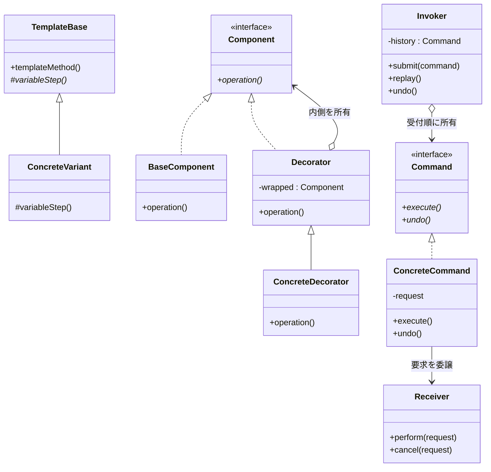
```mermaid
classDiagram
    direction TB
    class TemplateBase {
        +templateMethod()
        #variableStep()*
    }
    class ConcreteVariant {
        #variableStep()
    }
    class Component {
        <<interface>>
        +operation()*
    }
    class BaseComponent {
        +operation()
    }
    class Decorator {
        -wrapped : Component
        +operation()
    }
    class ConcreteDecorator {
        +operation()
    }
    class Command {
        <<interface>>
        +execute()*
        +undo()*
    }
    class ConcreteCommand {
        -request
        +execute()
        +undo()
    }
    class Invoker {
        -history : Command
        +submit(command)
        +replay()
        +undo()
    }
    class Receiver {
        +perform(request)
        +cancel(request)
    }

    TemplateBase <|-- ConcreteVariant
    Component <|.. BaseComponent
    Component <|.. Decorator
    Decorator o--> Component : 内側を所有
    Decorator <|-- ConcreteDecorator
    Command <|.. ConcreteCommand
    ConcreteCommand --> Receiver : 要求を委譲
    Invoker o--> Command : 受付順に所有
```

- Template Methodは、全体の順序を`templateMethod()`へ置き、変わる一部だけを`variableStep()`へ委ねます。
- Decoratorは、同じ`Component`契約の内側を所有し、処理結果へ一機能ずつ追加します。
- Commandは、完全な要求とReceiverへの接続を一つの操作へ閉じ、Invokerがその操作を履歴として所有します。

三つは別々の目的を持ちます。Template Methodが順序、Decoratorが追加処理の組合せ、Commandが操作の時間的な扱いを担当します。

### この章の実装との対応

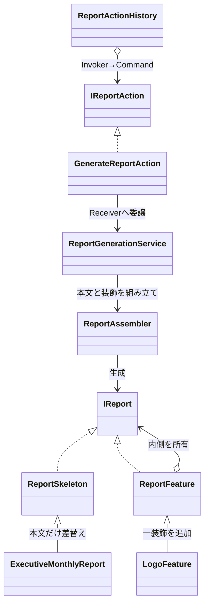
```mermaid
classDiagram
    direction TB
    class ReportActionHistory
    class IReportAction
    class GenerateReportAction
    class ReportGenerationService
    class ReportAssembler
    class IReport
    class ReportSkeleton
    class ExecutiveMonthlyReport
    class ReportFeature
    class LogoFeature

    ReportActionHistory o--> IReportAction : Invoker→Command
    IReportAction <|.. GenerateReportAction
    GenerateReportAction --> ReportGenerationService : Receiverへ委譲
    ReportGenerationService --> ReportAssembler : 本文と装飾を組み立て
    ReportAssembler --> IReport : 生成
    IReport <|.. ReportSkeleton
    ReportSkeleton <|-- ExecutiveMonthlyReport : 本文だけ差替え
    IReport <|.. ReportFeature
    ReportFeature o--> IReport : 内側を所有
    ReportFeature <|-- LogoFeature : 一装飾を追加
```

| 抽象構造の役割 | 本章の型 | 本章で担当したこと |
|---|---|---|
| TemplateBase | ReportSkeleton | 読込→ヘッダー→本文→フッターを固定する |
| ConcreteVariant | MonthlyReport等 | テンプレートごとの本文だけを生成する |
| Component | IReport | ReportDocumentを返す共通契約になる |
| Decorator | ReportFeature | 内側のIReportを所有する |
| ConcreteDecorator | GraphFeature、LogoFeature、WatermarkFeature | 文書へ一装飾を追加する |
| Command | IReportAction | execute()とundo()を共通化する |
| ConcreteCommand | GenerateReportAction | 完全なReportRequestを保持する |
| Invoker | ReportActionHistory | Actionを受付順に所有し、再実行・取消を委譲する |
| Receiver | ReportGenerationService | 検証、生成、出力、削除を実行する |

### 抽象骨格の実行シーケンス

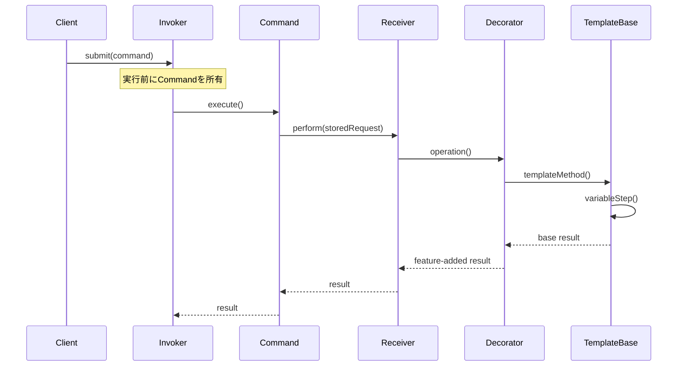
```mermaid
sequenceDiagram
    participant Client
    participant Invoker
    participant Command
    participant Receiver
    participant Decorator
    participant TemplateBase

    Client->>Invoker: submit(command)
    Note over Invoker: 実行前にCommandを所有
    Invoker->>Command: execute()
    Command->>Receiver: perform(storedRequest)
    Receiver->>Decorator: operation()
    Decorator->>TemplateBase: templateMethod()
    TemplateBase->>TemplateBase: variableStep()
    TemplateBase-->>Decorator: base result
    Decorator-->>Receiver: feature-added result
    Receiver-->>Command: result
    Command-->>Invoker: result
```

この順序では、Invokerは具体的な本文や装飾を知りません。Commandが保持した要求をReceiverへ渡し、Receiverの内側でTemplate MethodとDecoratorが一つの成果物を作ります。

### Template Method

処理全体の順序を基底クラスで固定し、変わる一部だけを派生クラスへ委ねます。本章ではReportSkeleton::create()が順序を持ち、renderBody()だけを各Reportへ委ねました。

### Decorator

同じ契約を持つ部品で内側の部品を包み、処理を追加します。本章ではIReportをReportFeatureが包み、入力列の順にグラフ・ロゴ・透かしを追加しました。

### Command

要求を実行可能なオブジェクトとして保持し、実行・再実行・取消を同じ単位で扱います。本章ではGenerateReportActionが完全なReportRequestを保持し、ReportActionHistoryが受付順に所有しました。

### 使いどころと限界

- 生成順に共通性がなければ、Template Methodで固定する対象がありません。
- 装飾を組み合わせないなら、Decoratorの連結コストは不要です。
- 再実行・取消・キューイングが不要なら、Commandとして操作を保存する価値は小さくなります。
- 本物のPDF/Excel生成、非同期ジョブ、履歴永続化は別の設計課題です。本章の構造だけで自動的に提供されるものではありません。

### 過剰適用になる例

- 本文が一種類で生成順も変わらないなら、派生クラスを作らず一つの生成関数で十分です。
- 装飾が一種類だけで組合せも順序指定もないなら、Decoratorの連結は不要です。
- 再実行・取消を要求されていないなら、生成要求をCommandとして履歴所有する必要はありません。
- 「三つのパターンを使う章だから」という理由で一度に導入せず、課題ID1〜課題ID3のように独立した課題が実際に存在する場合だけ組み合わせます。

### この章のまとめ

共通順、本文差分、順番付き装飾、要求履歴を一つのクラスへ足すと、別々の変更が同じ場所へ波及します。本章では、要求を変更ID1〜変更ID3へ固定し、痛みから課題ID1〜課題ID3を導き、骨格固定構造・装飾連結構造・操作記録構造として分離しました。そして、ReportAssembler、ReportGenerationService、ReportApplicationで生成・注入・実行まで再結合しました。

重要なのはパターン名ではありません。「何が共通で、何が別の理由で変わり、どこで再結合すれば要求を最後まで実行できるか」を、コードを書く前に説明できることです。
