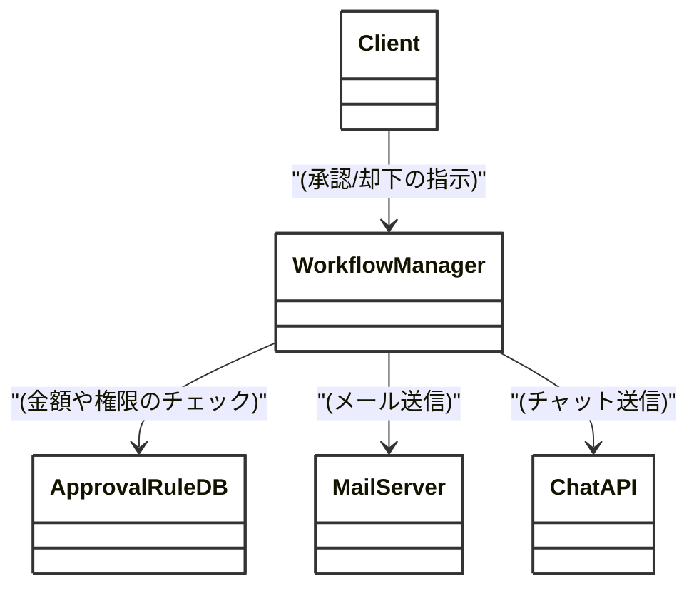
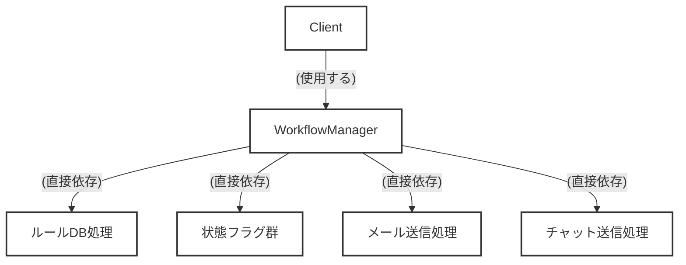
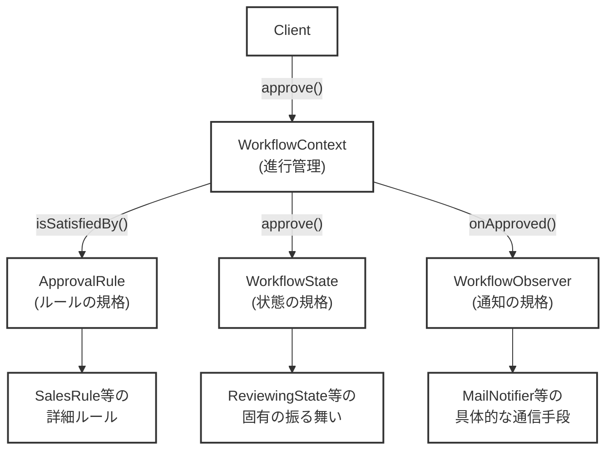
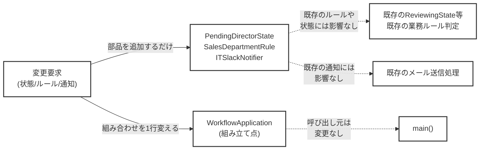
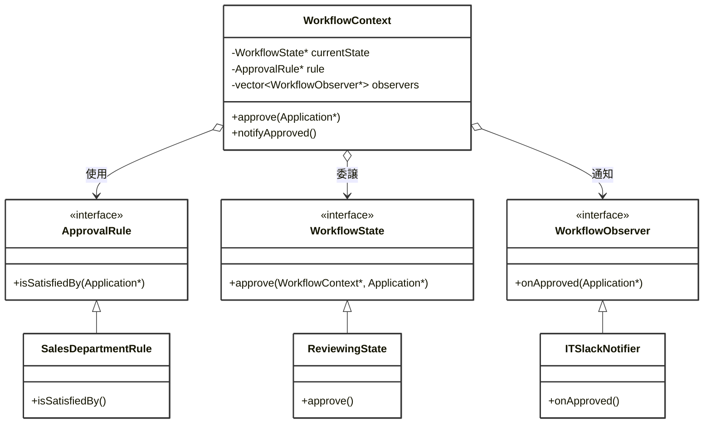

## 第12章（応用）複雑な承認ワークフローシステムを設計する

―― 思考の型：状態変化・通知・判定ルールの「変わる理由」が絡み合う複合課題

### この章の核心

設計の真価は、単一のパターンを丸暗記することではなく、絡み合った複数の「変わる理由」を解きほぐし、状態・通知・ルールといった異なる関心事を、互いに干渉させずに組み合わせる構造を作ることにある。

> **【レゴブロックで考える：複合パターンの適用】**
> 
> 複雑なピタゴラ装置（からくり）を作るとき、全ての歯車やレールを1つの巨大な接着剤の塊で固めてしまうと、後からボールの転がるコースを変えることができなくなります。
> 
> レゴブロックであれば、「状態を記憶するブロック」「ボールが通過したことを知らせる（通知する）ブロック」「コースの分岐を決める（ルール）ブロック」をそれぞれ独立させ、標準化されたジョイントで繋ぐことができます。これにより、特定のレールだけを別の形に差し替えても、装置全体は問題なく動き続けます。
> 
> **【画像生成AI用プロンプト案】**
> 
> `[ImagePrompt: A top-down 3D illustration of Lego blocks on a table. A complex mechanical contraption is being assembled, highlighting interchangeable colored track blocks, connecting sensor wire blocks, and rotating gear blocks working harmoniously. Bright, colorful, educational illustration style, clean white background, isometric view.]`

### この章を読むと得られること

- **得られること1：** 状態遷移、外部への通知、業務ルールの判定という異なる「変わる理由」を見分けられるようになる
    
- **得られること2：** Observer、State、Strategyなどの複数パターンを1つのシステム内で矛盾なく統合する手順がわかるようになる
    
- **得られること3：** 現場によくある「Managerクラス」や「Controllerクラス」といった、何でも屋の巨大クラスを安全に解体できるようになる
    
- **得られること4：** 一つの機能追加がシステム全体に波及する「grep地獄」の根本原因を、既存コードから特定できるようになる
    

---

### ステップ0：システムを把握し、仮説を立てる ―― クラス構成を見てから「変わりそうな場所」を予測する

- **入力：** システムのシナリオ説明 ＋ クラス構成の概要（仕様表・責任一覧）
    
- **産物：** 変動と不変の「仮説テーブル」
    

> **全パターンに共通する問い**
> 
> 「このコードの中に、『変わる理由』が異なる2つのものが、同じ場所に混在していないか？」
> 
> ※「変わる理由」とは「誰の判断で変わるか」のことです。

#### 12.0 この章のシステム構成と仮説

**この章で扱うシステム：**

社内のあらゆる申請（備品購入、出張申請、経費精算など）を処理する「承認ワークフローシステム」です。

ユーザーが申請書を作成（Draft）して提出すると「審査中（Reviewing）」となり、部門長が承認（Approve）または却下（Reject）を行います。承認されれば経理へ連携され、却下されれば申請者へ差し戻されます。また、状態が変わるたびに、申請者や次の承認者へメールやチャットで通知が飛びます。

**仕様表（何ができるシステムか）**

| **機能名**     | **担当クラス**         | **入力**      | **出力**       |
| ----------- | ----------------- | ----------- | ------------ |
| 申請・承認のフロー制御 | `WorkflowManager` | ユーザーからの操作指示 | 書類の状態更新      |
| 業務ルールの判定    | `WorkflowManager` | 申請の金額や種別    | 承認可能かどうかの真偽値 |
| 状態変更の通知     | `WorkflowManager` | 状態の遷移       | メールやチャットへの送信 |

**クラス構成の概要**

現状のシステムは、長年の機能追加と度重なる要件変更により、`WorkflowManager` クラスがすべての処理を抱え込む巨大なクラスになっています。現場で誰もが一度は遭遇する「神クラス（何でも知っていて何でもやるクラス）」です。




→ **このグラフが示す問題：ルールの判定、状態の管理、通信手段の具体的な方法という「全く異なる変わる理由」が、すべて1つのクラスに詰め込まれています。**

**各クラスの責任一覧**

現状の設計におけるクラスごとの役割と、知っている知識を整理します。これが本当に「単一の責任」になっているかを疑うことが、設計改善の第一歩です。

|**クラス名**|**対象責任（1文）**|**知るべきこと**|
|---|---|---|
|`Client`|ユーザーからのアクションを受け付け、マネージャーに渡す。|`WorkflowManager` のメソッドの呼び出し方|
|`WorkflowManager`|申請の判定、状態遷移、通知処理をすべて統括して実行する。|各申請種別ごとのルール、状態遷移のすべてのif文条件、メール・チャット連携の具体的手段|

この構成を踏まえた上で、どこが変わりそうか仮説を立てます。

**変動と不変の仮説（実装コードを読む前に立てる）**

業務システムにおいて、稟議や承認のルールは「組織変更」や「業務改善」のたびに必ず変わる運命にあります。現状の構成から、以下のような変化が予測できます。

|**分類**|**仮説**|**根拠（クラス構成から読み取れること）**|
|---|---|---|
|🔴 **変動する**|承認の条件・判定ルール|「10万円以上は本部長の承認が必要」など、役職や金額によるルールは事業の状況に応じて常に変わるため。|
|🔴 **変動する**|状態遷移に伴う通知先や連携先|「新たにSlackにも通知してほしい」「承認完了時に経理の別システムを直接叩いてほしい」など、後続の処理は増え続けるため。|
|🔴 **変動する**|システムが持つ「状態（ステータス）」の種類|今後「差し戻し中」や「再確認中」といった新しい状態が追加され、ワークフローの経路自体が複雑化するため。|
|🟢 **不変**|「アクションを受けて次の状態へ移り、後続処理をキックする」という基本構造|ワークフローシステム自体の存在意義（骨格）であり、この大枠の概念自体は変わらないと考えられるため。|

現状の `WorkflowManager` クラスは、「承認フローを変えたい業務部門」「通知先を変えたいIT部門」「経理システムとの連携を追加したいバックオフィス部門」という、複数の関係者からの変更要求をすべて1箇所で受け止める構造になっています。

呼び出し元である `Client` は一見シンプルに見えますが、それは `WorkflowManager` があまりに多くの知識を抱え込みすぎているからです。この構造では、ちょっとしたチャット通知の文面変更が、承認ロジック全体に予期せぬバグ（デグレード）を引き起こしかねません。

「ただSlackへの通知を1つ足したいだけなのに、どうして金額判定のロジックまで再テストしなければならないんだ……？」

現場で誰もが直面するこの痛みが、まさに今の構造から生まれています。この仮説を念頭に置きつつ、次節（ステップ1）で実際にこのクラスのコードの中身を覗き、責任の所在を1行ずつチェックしていきましょう。

### ステップ1：実装コードを読む ―― 責任チェックで問題の行を見つける

#### 12.1 実装コードと責任チェック

ステップ0でクラスの責任は把握しました。ここでは実際の実装コードを読み、「責任通りに書かれているか」を1行ずつ確認します。

まずは、現在のシステムがどのように依存関係を築いているか、マクロな視点から依存の広がりを確認してみましょう。

**依存の広がり（実装前の全体像）**




→ **このグラフが示す問題：`WorkflowManager` が、判定ルールから状態遷移、さらにはメールやチャットといった外部への通知手段まで、すべての具体的な実装に直接依存してしまっています。**

それでは、起点となるコードを見ていきます。一見すると直感的でわかりやすい手続き型のコードですが、変更が繰り返されるにつれて徐々に限界が見え始めている状態です。


```cpp
#include <iostream>
#include <string>

// 申請データの構造体
struct Application {
    std::string id;
    std::string applicant;
    int amount;
    std::string status; // "Draft", "Reviewing", "Approved", "Rejected"
};

// 承認フローの全てを担う巨大クラス
class WorkflowManager {
public:
    void submit(Application* app) {
        // 現在の状態による分岐 // ← 知らなくていい状態遷移のルール
        if (app->status == "Draft") {
            app->status = "Reviewing";
            std::cout << "[DB] 申請 " << app->id << " の状態を Reviewing に更新しました。" << std::endl;
            
            // 通知処理がベタ書き // ← 知らなくていいメール送信の詳細
            std::cout << "[Mail] 課長へ: " << app->applicant << " さんから申請が提出されました。" << std::endl;
        }
    }

    void approve(Application* app) {
        if (app->status == "Reviewing") {
            // ルール判定がベタ書き // ← 知らなくていい業務ルールの詳細
            if (app->amount >= 10000) {
                std::cout << "[Rule] 1万円以上の申請は部長の承認が必要です。" << std::endl;
                return; // 疑似的なエラー（処理中断）
            }

            app->status = "Approved";
            std::cout << "[DB] 申請 " << app->id << " の状態を Approved に更新しました。" << std::endl;
            
            // 複数の通知手段が混在 // ← 知らなくていい外部APIの詳細
            std::cout << "[Mail] " << app->applicant << " さんへ: 申請が承認されました。" << std::endl;
            std::cout << "[Chat] 経理チャンネルへ: 新しい承認済み申請 (" << app->id << ") が届きました。" << std::endl;
        }
    }

    void reject(Application* app) {
        if (app->status == "Reviewing") {
            app->status = "Rejected";
            std::cout << "[DB] 申請 " << app->id << " の状態を Rejected に更新しました。" << std::endl;
            std::cout << "[Mail] " << app->applicant << " さんへ: 申請が却下されました。" << std::endl;
        }
    }
};
```

呼び出し側の `main()` 関数と実行結果も確認しておきましょう。


```cpp
int main() {
    WorkflowManager manager;
    Application app1 = {"APP-001", "Alice", 5000, "Draft"};
    Application app2 = {"APP-002", "Bob", 15000, "Reviewing"};

    std::cout << "--- アリスの申請（5000円） ---" << std::endl;
    manager.submit(&app1);
    manager.approve(&app1);

    std::cout << "\n--- ボブの申請（15000円） ---" << std::endl;
    manager.approve(&app2); // 1万円以上なのでルールで弾かれる

    return 0;
}
```

**実行結果：**

```
--- アリスの申請（5000円） ---
[DB] 申請 APP-001 の状態を Reviewing に更新しました。
[Mail] 課長へ: Alice さんから申請が提出されました。
[DB] 申請 APP-001 の状態を Approved に更新しました。
[Mail] Alice さんへ: 申請が承認されました。
[Chat] 経理チャンネルへ: 新しい承認済み申請 (APP-001) が届きました。

--- ボブの申請（15000円） ---
[Rule] 1万円以上の申請は部長の承認が必要です。
```

コードは仕様通りに正しく動いています。 しかし、私たちの目的は「動くコード」ではなく「変更に耐えられる構造」を作ることです。このコードの各行が、本当にこのクラスが持つべき知識なのかを判定してみましょう。

**責任チェック：`WorkflowManager` は自分の責任だけを持っているか**

`WorkflowManager` の責任は「**ユーザーからの指示を受け、承認フローの進行を管理すること**」です。

|**コードの行**|**持っている知識**|**責任内か**|
|---|---|---|
|`if (app->status == "Draft")`|「Draft」の次は「Reviewing」になるという状態遷移のルール|❌ 状態管理担当の責任|
|`if (app->amount >= 10000)`|金額が1万円以上ならエラーにするという業務上の審査ルール|❌ 業務ルール担当の責任|
|`std::cout << "[Mail] 課長へ..."`|メールという具体的な通信手段と、送信先の役職|❌ 通知・インフラ担当の責任|
|`std::cout << "[Chat] 経理チャンネルへ..."`|チャット連携APIの詳細と、経理チャンネルの存在|❌ 通知・インフラ担当の責任|
|`void approve(Application* app)`|「承認」というアクションを受け付ける窓口|✅ 進行管理の責任内|

責任チェック表から一目瞭然なように、`WorkflowManager` クラスは余計なことを知りすぎています。 進行を管理する担当者が、「1万円以上ならどうするか」という細かい業務ルールや、「チャットの送信先のチャンネル名」まで記憶してしまっています。これらが混在しているため、どれか一つに変更が生じただけで、この巨大なクラスにメスを入れなければなりません。

#### 12.2 届いた変更要求

ある日、業務改善チームとIT部門の両方から、同時に別々の要求が飛んできました。

- **誰から：** 業務改善チームのリーダー ＆ IT部門のインフラ担当
    
- **何の要求が：**
    
    1. 「5万円以上の申請」には、新たに「本部長待ち（PendingDirector）」という状態を追加してほしい。
        
    2. 申請種別が「IT機器」の場合、承認完了時の通知を経理チャンネルではなく、IT部門のSlackチャンネルにも飛ばすようにしてほしい。
        
    3. 申請者の所属部署によって、承認ルールの金額しきい値を動的に変えたい（営業部は3万、開発部は5万など）。
        
- **いつまでに：** 次の組織改編が行われる来月末のリリースで。
    

「ちょっと条件と通知先を増やすだけだから、if文を足せばいけるよね？」

現場で誰もが耳にする、悪気のない一言です。

しかし、今の `WorkflowManager` の `approve` メソッドの中でこれらを処理しようとするとどうなるでしょうか。

`if (app->amount >= 50000)` を足し、その中で `app->status = "PendingDirector"` をセットし、さらに `if (app->department == "Sales")` のネストを作り、通知先を振り分ける `if (app->category == "IT Equipment")` を追加する……。

メソッドの内部は複雑なif文のジャングルとなり、ある部署のルール変更が、別の部署の承認フローや通知処理を誤って壊してしまう（デグレード）危険性が跳ね上がります。

変更の影響範囲が広すぎて呼び出し元や関連機能を追いかけられず、grep（文字列検索）を繰り返して疲弊する未来が見えています。 次節（ステップ2）では、この「変わる理由」が将来にわたってどのように変化していくのか、ヒアリングを通じて仮説を確定させましょう。

### ステップ2：仮説を確定する ―― 関係者ヒアリングで「変わる理由」に根拠をつける

#### 12.3 仮説の検証と変動/不変の確定

ステップ1でコードを一行ずつ確認し、現在の `WorkflowManager` には「状態遷移」「業務ルール」「通知などの外部連携」という、異なる理由で変わるはずの知識がべったりと癒着していることがわかりました。

しかし、コードの構造がいびつだからといって、開発者の独断で「ここは変わるはずだ」「ここは不変だ」と勝手に決めつけるのは、設計において最も危険な行為です。ソフトウェアの変更理由は、コードの都合ではなく、常に「ビジネスの都合」や「組織の都合」によってもたらされるからです。

そこで、今回の変更要求を持ってきた業務改善チームのリーダーと、IT部門のインフラ担当者に直接ヒアリングを行い、私たちがステップ0で立てた仮説の裏付けをとりにいきます。

**関係者ヒアリング**

- **開発者（あなた）：** 「今回、『本部長待ち（PendingDirector）』という状態の追加や、部署ごとの金額ルールの変更、それにIT部門向けのSlack通知追加というご依頼をいただきました。これらを実装すること自体は可能なのですが……少し中長期的な見通しを確認させてください。こういった『承認ルールの変更』や『通知先の追加』は、今回限りの特殊な対応でしょうか？ それとも、今後も頻繁に発生する性質のものでしょうか？」
    
- **業務改善チームのリーダー：** 「間違いなく、今後も発生します。実は来期から、全社的に権限委譲を進めるプロジェクトが動いていて、各部署の決裁フローがもっと細かく分かれる予定なんです。金額のしきい値も、事業の状況に合わせて四半期ごとに見直すことになっています。新しい『状態』もさらに増えるかもしれません」
    
- **IT部門のインフラ担当：** 「通知先や連携先についても同じです。今はメールと一部のSlackだけで運用していますが、全社でTeamsへの移行計画が進んでいます。将来的には、『承認が下りたら、手作業ではなく購買システムに直接APIで発注データを流す』といったシステム連携もやりたいと話が出ているんです」
    
- **開発者（あなた）：** 「なるほど……。（心の声：今の `WorkflowManager` の中に、そのすべての条件分岐とAPI呼び出しを書いていたら、来期には完全にシステムがパンクするな……）。逆に、ワークフローとしての『申請を作成する → 審査する → 承認（または却下）する』という大枠の業務フローや、その進行を管理するという根本的な役割自体は変わらない、と考えてよいでしょうか？」
    
- **業務改善チームのリーダー：** 「ええ、そこは会社の基本規定なので変わりません。あくまで、それぞれのステップにおける『審査の条件』や『通過した後の具体的なアクション（通知など）』が変わるだけです」
    

ヒアリングによって、私たちが立てた仮説が、単なる憶測ではなく「確実な未来の課題」として裏付けられました。業務ルールを所管するチームと、インフラを所管するチームという「異なる関係者」が、それぞれのタイミングで変更を要求してくることがはっきりしたのです。

**確定した変動/不変のテーブル**

ヒアリングの結果を踏まえ、「誰の判断で変わるのか」という根拠とともに、システムの中で変わり続けるもの（🔴）と、変わってほしくないもの（🟢）を明確なテーブルとして確定させます。

|**分類**|**具体的な内容**|**変わるタイミング**|**根拠**|
|---|---|---|---|
|🔴 **変動する**|承認の条件・金額のしきい値|四半期ごとの見直しや組織改編のたび|業務改善チーム（ビジネス要請）|
|🔴 **変動する**|状態遷移に伴う通知先や外部連携|新ツールの導入やシステム連携の拡大時|IT部門（インフラ要請）|
|🔴 **変動する**|システムが持つ「状態」の種類|決裁フローの細分化プロジェクトが進むたび|業務改善チーム（ビジネス要請）|
|🟢 **不変**|「アクションを受けて状態が変わり、後続処理を呼ぶ」というワークフローの骨格|変わる日は来ない|全社規定の大枠として合意済み|

このように、システムには「変わる理由」も「変化のペース」もまったく異なる要素が複雑に絡み合っています。これらをすべて1つの巨大なメソッドの中で処理しようとすれば、破綻するのは目に見えています。

> **設計の決断：**
> 
> 🟢 不変な部分である「ワークフローの進行管理（骨格）」を「契約（インターフェース）」として固定し、
> 
> 🔴 変動する部分である「個別の承認ルール」「具体的な状態ごとの振る舞い」「様々な通知・連携手段」は、それぞれのインターフェースの裏側に押し込みます。

この「決断」が、複雑に絡み合った糸を解きほぐすための設計の羅針盤になります。

しかし、まだコードには手を触れません。もし、いま急いでこの変更要求を既存のコードに押し込もうとしたら、私たちの日常にどんな「痛み」が待っているのか。次節（ステップ3）で、変更がもたらす影響の波及（飛び火）を具体的にシミュレーションして、設計上の課題を浮き彫りにしていきます。

### ステップ3：課題分析 ―― 変更が来たとき、どこが辛いかを確認する

#### 12.4 変更要求がもたらす「痛み」と影響範囲

ステップ2のヒアリングを通じて、業務改善チームからは「新しい承認状態（本部長待ち）の追加」と「部署ごとのルール変更」が、IT部門からは「新しい通知先（Slack）の追加」が要求されました。そして、これらは組織が成長する限り、今後も頻繁に発生し続けることが確定しています。

では、これらの変更を、現在の `WorkflowManager` クラスにそのまま組み込もうとすると、現場でどのような「痛み」が発生するでしょうか。実際に既存コードへ手術を施そうとする場面をシミュレーションしてみます。

**痛み1：状態フラグの散在による「grep地獄」とif文の迷宮**

まず、「本部長待ち（PendingDirector）」という新しい状態（ステータス）の追加です。

現在の設計では、システムの状態は単なる文字列として扱われ、`WorkflowManager` の各メソッドの中に `if (app->status == "Reviewing")` といった形でベタ書きされています。

新しい状態を足すということは、システム全体を文字列検索（grep）して、状態によって分岐している箇所をすべて洗い出すことを意味します。

「`submit` メソッドには手を加えるべきか？」「`reject` メソッドで本部長待ちから差し戻された場合は、どう処理すればいいんだ？」と、あちこちのメソッドを開いては `else if (app->status == "PendingDirector")` を書き足して回る、あの泥臭い単純作業の始まりです。もし一つでも見落とせば、特定の操作をしたときだけシステムが沈黙する、原因不明のバグを生み出すことになります。

**痛み2：巨大な塊の手術による「デグレードの恐怖」とテストの肥大化**

次に、「部署ごとのルール」と「新しい通知先」を追加してみましょう。今の `approve` メソッドの中にこれらの要求をねじ込むと、コードはあっという間に次のような姿に成り果てます。


```cpp
// 変更要求を無理やり既存コードに押し込もうとした際のイメージ
void WorkflowManager::approve(Application* app) {
    // 1. 状態の追加でif文の条件が複雑化
    if (app->status == "Reviewing" || app->status == "PendingDirector") { 
        
        // 2. 部署ごとの金額ルールが乱入し、ネストが深くなる
        if (app->department == "Sales" && app->amount >= 30000) {
            std::cout << "[Rule] 営業部は3万円以上で上位承認が必要です。" << std::endl;
            return;
        } else if (app->department == "Development" && app->amount >= 50000) {
            // ...
        }
        
        // （中略：ここに本部長待ちへ移行するロジックなどがさらに混ざる）

        app->status = "Approved";
        
        // 3. 通知先の分岐が乱入
        std::cout << "[Mail] " << app->applicant << " さんへ: 申請が承認されました。" << std::endl;
        if (app->category == "IT Equipment") {
            std::cout << "[Slack] IT部門チャンネルへ: 新しいIT機器の申請です。" << std::endl;
        } else {
            std::cout << "[Chat] 経理チャンネルへ: 新しい申請が届きました。" << std::endl;
        }
    }
}
```

このコードを見た瞬間、誰もが嫌な汗をかくはずです。

「ルール判定」「状態の更新」「通知の送信」が、1つのメソッドの中で強固に絡み合っています。もし、「IT部門向けのSlack通知」のif文を書く位置を数行間違えたり、括弧を一つ消し忘れたりしただけで、全く無関係な「営業部の申請」が承認できなくなるバグ（デグレード）を引き起こします。

「ただIT部門向けのSlack通知を1つ足したいだけなのに、どうして他部署の金額判定ロジックまで再テストして、デグレードに怯えなきゃならないんだ……？」

現場のエンジニアが思わず漏らしてしまうこの呟きこそが、構造の限界を知らせるサインです。 また、この処理をテストしようとすると、「Slackへの通知が飛ぶこと」を確認するためだけに、「営業部ではないこと」「ステータスがReviewingであること」「金額がしきい値を下回っていること」という無関係な前提条件をすべて満たす複雑なテストデータを用意しなければなりません。

**変更が飛び火する依存の広がり（改善前）**

今回の変更要求を実装しようとした際に、影響がどのように波及するのかを図で確認してみましょう。

コード スニペット

```
graph LR
    Requirement["変更要求<br>(状態/ルール/通知)"] -->|"巨大メソッドへの手術"| WorkflowManager["WorkflowManager"]
    WorkflowManager -->|"変更漏れのリスク"| MethodSubmit["各メソッドに散在する<br>状態チェックのif文"]
    WorkflowManager -->|"意図せぬ影響の懸念"| ExistingRule["既存の業務ルール判定"]
    WorkflowManager -->|"意図せぬ影響の懸念"| ExistingNotice["既存のメール送信処理"]
    
    classDef default fill:#fff,stroke:#333,stroke-width:2px
    class Requirement fill:#ffcccc,stroke:#cc0000,stroke-width:2px
```

→ **このグラフが示す問題：1つのクラスに「状態」「ルール」「通知」という異なる責任が詰まっているため、一部の機能追加が他の内部ロジックすべてに意図せぬ影響を及ぼす懸念を生んでいます。**

このまま機能追加を続ければ、`WorkflowManager` はあっという間に数千行のモンスタークラスとなり、誰も手を出せないブラックボックスと化すでしょう。

設計の価値は、新しいコードをきれいに書けることだけではありません。既存のコードを変えるとき、影響を特定の1箇所に閉じ込められることが設計の真の価値です。 いま私たちが直面しているのは、変更の影響が閉じ込められず、クラス内のあらゆる場所に飛び火してしまう構造的な欠陥です。

次節（ステップ4）では、なぜこれほどまでに変更が飛び火してしまうのか、困難の根本にある設計上の原因を言語化し、解決への糸口を探っていきます。

### ステップ4：原因分析 ―― 困難の根本にある設計の問題を言語化する

ステップ3で、ちょっとしたルール変更や通知先の追加が、クラス全体、ひいてはシステム全体に飛び火してしまう「痛み」をシミュレーションしました。なぜ、申請の条件を変えたいだけなのに、これほどまでに怯えなければならないのでしょうか？

ここでは、現在のコードで起きている事象を客観的に観察し、困難の根本にある「設計の問題」を言語化していきます。

**観察から見えてくる原因の方向性**

|**観察**|**原因の方向**|
|---|---|
|「本部長待ち」などの新しい状態を足そうとすると、`submit` や `approve` など複数のメソッドに散在する `if` 文をすべて探し出して書き換えなければならない。|**「今の状態が何か」と「状態ごとにどう振る舞うべきか」が癒着している**ため、状態が増えるたびに条件分岐がシステム中に増殖している。|
|「営業部なら3万円以上」といった業務ルールと、「承認されました」というメール送信処理が、同じメソッドの中に混ざって書かれている。|**「ルールの判定（ビジネス要件）」と「通信手段（インフラ要件）」という全く異なる理由で変わる処理が、一つの塊に混在している。**|
|チャットやメールの送信処理が、`std::cout` の形で各メソッドに直接ハードコードされている。|呼び出し側（WorkflowManager）が、**外部への通知という具体的な「手段」に直接依存しており、結合が固着している。**|

現場で「なぜこのクラスはこんなに複雑なんだ……」と天を仰ぎたくなることがありますが、最初から誰も複雑なものを作ろうとしたわけではありません。「とりあえずここにif文を足せば動くから」という、その場しのぎの素早い対応の積み重ねが、気づけば「誰の責任でもない、誰も手を出せない巨大クラス」を生み出してしまうのです。

**変わるものと変わらないものが同じ場所にいる**

このシステムの最大の悲劇は、本来「別々のタイミングで」「別々の人の判断で」変わるはずの要素が、同じ `WorkflowManager.cpp` というファイルに同居してしまっていることです。

ここから先、変更に強い柔軟な構造を作るために、「変わり続けるもの（変動）」と「変わってほしくないもの（不変）」を明確に切り分けましょう。

|**変わり続けるもの（🔴）**|**変わってほしくないもの（🟢）**|
|---|---|
|申請の金額や役職による承認のルール（条件）|「アクションを受けて次の状態へ移る」という基本構造|
|状態（Draft, Reviewing等）の増減と、その状態での固有の振る舞い|ルール判定をクリアしたら、結果を通知するという大枠の手順|
|メール、Slack、Teamsなど、外部へ結果を伝えるための具体的な通信手段|ワークフローの進行管理そのものを行うという責任|

今の `WorkflowManager` クラスは、この🔴と🟢がミキサーにかけられたように混ざり合っています。IT部門が「Slack通知を足して」と言ったとき、変わってほしくない「承認の基本構造」や「役職ルールの判定」まで巻き添えになる危険に晒されているのは、この混在が原因です。

**本質的な原因と、使うべき物理操作（手札）**

今回は複雑なシステムであり、複数の「変わる理由」が異なるベクトルからやってきます。原因は一つではありません。要素と関係の次元から、私たちが持っている「4つの手札（設計操作）」のどれを適用すべきかを整理します。

|**次元**|**物理操作（手札）**|**本質的な原因（何が問題か）**|**使うべき構造的対策案（本質）**|
|---|---|---|---|
|要素|**① 分割する（切る）**|「状態の管理」「ルールの判定」「外部への通知」という異なる責任や変更理由が、1つのクラスに癒着している。|**責任ごとの分割**（状態、ルール、通知を別々のクラスに切り出す）|
|関係|**③ 規格化する（形を揃える）**|状態ごとの振る舞いや、異なる判定ルールがハードコードされており、使う側がif文で直接制御しなければならない。|**状態とルールのインターフェース統一**（抽象への依存。状態やルールを部品として差し替え可能にする）|
|関係|**③ 規格化する（形を揃える）**|「メールを送る」「チャットに送る」という具体的な相手（実装）に直接依存している。|**通知先のインターフェース統一**（通知を受け取る相手を抽象化する）|

これだけ多くの問題が絡み合っていると、どこから手をつけていいか途方に暮れてしまうかもしれません。

しかし、心配はいりません。巨大なからくり装置を一度に解体する必要はないのです。複数の「変わる理由」が混在しているなら、私たちの手札（分割・隠蔽・規格化・間接化）を一つずつ順番に切り、レゴブロックを分解しては形を整え、再び組み立て直していけばよいのです。

次節（ステップ5）では、まず最も根本的な問題である「状態」「ルール」「通知」の癒着を分割する手札から切り出し、絡み合った糸を解きほぐすプロセスをコードで実践していきます。

### ステップ5：対策案の検討 ―― 原因から手札を選ぶ

- **ステップ4で特定した真因：** 「状態の管理」「業務ルールの判定」「外部への通知」という全く異なる理由で変わる処理が1つのクラスに癒着し、それらをつなぐ「規格化された境界」が存在しないこと。
    

困難の根本原因がはっきりしました。ここからは、私たちが持っている「4つの手札」を切って、この巨大で複雑なクラスを解きほぐしていきます。

#### 1. 分離・隠蔽を試す（手段①の基本）

まずは最も基本的な手札である**①分割する（切る）**を用いて、一つの巨大な `approve` メソッド内にべた書きされていた処理を、関心事ごとに「プライベート関数」として切り出してみます。 手続き型コードとしての理想形を目指し、内部を整理整頓してみましょう。

C++

```cpp
#include <iostream>
#include <string>
#include <vector>

// 申請データの構造体
struct Application {
    std::string id;
    std::string applicant;
    int amount;
    std::string department;
    std::string status;
};

// 手段①：内部の処理をプライベート関数に分割して整理したクラス
class WorkflowManager {
private:
    // ルール判定を分離
    bool checkRules(Application* app) {
        if (app->department == "Sales" && app->amount >= 30000) {
            std::cout << "[Rule] 営業部は3万円以上で上位承認が必要です。" << std::endl;
            return false;
        } else if (app->department == "Development" && app->amount >= 50000) {
            std::cout << "[Rule] 開発部は5万円以上で上位承認が必要です。" << std::endl;
            return false;
        }
        return true;
    }

    // 通知処理を分離
    void sendApprovalNotifications(Application* app) {
        std::cout << "[Mail] " << app->applicant << " さんへ: 申請が承認されました。" << std::endl;
        // ← 知らなくていい「IT部門ならSlack」という通信手段の分岐
        if (app->department == "IT") {
            std::cout << "[Slack] IT部門チャンネルへ: 新しい申請です。" << std::endl;
        } else {
            std::cout << "[Chat] 経理チャンネルへ: 新しい申請が届きました。" << std::endl;
        }
    }

public:
    void approve(Application* app) {
        // 状態ごとの振る舞いを分離
        if (app->status == "Reviewing" || app->status == "PendingDirector") {
            
            // ルールチェック
            if (!checkRules(app)) {
                return;
            }

            // 状態の更新
            app->status = "Approved";
            std::cout << "[DB] 申請 " << app->id << " の状態を Approved に更新しました。" << std::endl;
            
            // 通知の実行
            sendApprovalNotifications(app);
        }
    }
};
```

プライベート関数に分割したことで、「`approve` メソッドの中でどんな順番で何をしているか」は劇的に読みやすくなりました。 一つの巨大な塊の手術に比べれば、少しは安全に変更を加えられそうです。

しかし、この試行コードの責任チェックをしてみると、**設計の根本的な課題は何も解決していない**ことに気づきます。 `WorkflowManager` は依然として「ルール変更」「通知先の追加」「状態の追加」という**複数の理由で変わるクラス**のままです。 業務部門から「新しい部署のルールを足したい」と言われても、IT部門から「Teams連携を足したい」と言われても、相変わらず同じ `WorkflowManager.cpp` を開き、新しく切り出した関数の内側に `else if` の分岐を書き足さなければなりません。

処理の「中身」を別々の関数に隠蔽しても、それらを結びつける「つなぎ目」が規格化されていないため、呼び出し元が依存先の変更理由を丸ごと引き継いでしまっている状態です。 つまり、「置換」や「拡張」の能力はまだ得られていないのです。

#### 2. さらに規格化・間接化を重ねる（手段②：インターフェース導入）

手段①の限界を突破するために、残る手札である**③規格化する（形を揃える）**と**④間接化する（間に挟む）**を使います。 今回は「状態」「ルール」「通知」という複数の「変わる理由」が絡み合っているため、それぞれの関心事に対して別々の規格を設ける「複合アプローチ」をとります。

> **【レゴブロックで考える：複合パターンの適用】**
> 
> ここで行うのは、1つの巨大なブロックを、役割の異なる3種類の専用ブロックに分離し、標準化されたジョイントで繋ぐ操作です。
> 
> - **ルールのブロック（Strategy）**：「承認してよいか」を判定する専用ブロック。部署ごとに差し替え可能です。
>     
> - **状態のブロック（State）**：「今の状態は何か、次どうするか」を記憶し、振る舞うブロック。
>     
> - **通知のブロック（Observer）**：「何か起きたら教えて」と待機し、知らせを受け取って外部へ発信するブロック。
>     
> 
> `[ImagePrompt: A top-down 3D illustration of Lego blocks on a table. A strong central control block is connected to interchangeable rule-checking blocks, colored status-indicator blocks, and antenna-like notification blocks via standardized snap-on joints. Bright, colorful, educational illustration style, clean white background, isometric view.]`

それぞれの規格（インターフェース）をコードで定義してみましょう。これらは技術名ではなく、「ビジネス上の責任（何をするか）」で名前を付けます。

**① ルールの規格化（Strategyの布石）**

金額や部署による様々な判定ロジックを共通の形に揃え、差し替え可能にします。


```cpp
// ビジネス責任：「申請が承認基準を満たしているか判定する」
class ApprovalRule {
public:
    virtual ~ApprovalRule() = default;
    // どんな複雑なルールでも、最終的に「OKかNGか」だけを返す
    virtual bool isSatisfiedBy(Application* app) = 0; 
};
```

**② 状態の規格化（Stateの布石）**

「Reviewing」や「PendingDirector」といった状態を単なる文字列フラグからクラスに格上げし、状態ごとの振る舞いをカプセル化します。


```cpp
class WorkflowContext; // 後方参照用

// ビジネス責任：「現在の状態に応じたアクションを実行する」
class WorkflowState {
public:
    virtual ~WorkflowState() = default;
    // 状態クラス自身が「承認されたらどうするか」の振る舞いを持つ
    virtual void approve(WorkflowContext* context, Application* app) = 0;
    virtual void reject(WorkflowContext* context, Application* app) = 0;
};
```

**③ 通知の規格化（Observerの布石）**

「メール」「Slack」「Teams」といった具体的な通信手段を隠蔽し、「システムに何かが起きたら知らせる」という形に統一します。


```cpp
// ビジネス責任：「ワークフローの進行イベントを受け取り、外部へ伝達する」
class WorkflowObserver {
public:
    virtual ~WorkflowObserver() = default;
    // メールかチャットかを知らなくても、このメソッドを呼べば通知される
    virtual void onApproved(Application* app) = 0;
    virtual void onRejected(Application* app) = 0;
};
```

**手段②がもたらす構造の変化（依存の広がり）**

これらの規格を導入した結果、クラス群の依存関係は以下のように変わります。




もはや `WorkflowManager` という、すべてを知っていてすべてを捌く「神クラス」は存在しません。 代わりに `WorkflowContext` という進行管理の裏方に回り、具体的なルールの判定、状態の更新、通知の送信はすべて「規格化されたインターフェース」越しに各専門クラスへ委譲しています。

これによって、「知っている型がインターフェースに変わった」ことで、`WorkflowContext` の責任は「連携を指揮すること」ただ一つに絞られました。 新しいルールを足したければ `ApprovalRule` を継承するクラスを作るだけ。新しいチャット連携を足したければ `WorkflowObserver` を継承するクラスを作るだけです。既存のコードの `if` 文の海を泳ぐ必要はありません。

次節（ステップ6）では、これらの独立した部品たちを「いつ、どこで」組み立てるのか（Composition Rootの設計）を示しつつ、ヒアリングで挙がった「状態・ルールの追加と通知先の変更」という課題に対しての耐久テストを行い、本当にコストに見合う設計なのかを天秤にかけて判断します。

### ステップ6：天秤にかける ―― 手段を評価する

★規格化は、３つ対応しているが、コストや納期などを考えて、分割して対応して天秤にかける案もあってもよいのでは？

ステップ5で、私たちは2つのアプローチを試しました。 1つ目は、手札の①（分割）と②（隠蔽）を使って、巨大な `approve` メソッドの内部を「ルール判定」「状態遷移」「通知処理」というプライベート関数に整理する手段です。 2つ目は、それに加えて③（規格化）と④（間接化）を使い、「ルールの規格（Strategy）」「状態の規格（State）」「通知の規格（Observer）」という3つの独立したインターフェースを導入する複合アプローチです。

ここで一度、キーボードから手を離して深呼吸しましょう。

設計とは、常にトレードオフ（天秤）です。美しいアーキテクチャを作ることが目的なのではなく、現場の痛みを最小コストで取り除くことが目的です。2つの手段を冷静に評価してみます。

**手段①（分離・隠蔽のみ）の評価：** 「関数に切り出したことで、処理の順番はとても読みやすくなりました。しかし、つなぎ目が『規格化』されていないため、新しいルールや通知先を足すには、結局 `WorkflowManager` クラスを開いて `else if` の分岐を書き足す必要があります。影響範囲が閉じないため、『拡張』という評価軸では不合格です」

**手段②（＋規格化・間接化）の評価：** 「役割ごとにインターフェースで『規格化』し、具象クラスを『間接化』しました。これにより、既存のコードに一切触れることなく、新しいルールや状態の部品を差し替える『置換』と、新機能を足す『拡張』の能力を手に入れました。ただし、部品が細かく分かれるため、ファイル数やクラス数は確実に増えます」

#### 12.5 手段①vs手段②の比較

両者を、私たちが直面している現場のコストという評価軸で測ってみます。

|**評価軸**|**手段①（関数への分割）**|**手段②（インターフェースによる規格化）**|**評価の観点**|
|---|---|---|---|
|現状の設計コスト|**低い**（1ファイル内で完結）|高い（クラスとファイルが増える）|実装工数、学習コスト。手段②はコードの全体量は増えます。|
|現状の評価コスト|高い（全分岐を網羅する手動テストが必要）|**低い**（部品ごとに独立した単体テストが可能）|手段②なら、「メール送信」単体のテストと「ルール判定」単体のテストを分けて書けます。|
|未来の設計コスト|非常に高い（変更のたびにif文の海でgrep地獄）|**低い（既存クラスを開かずに追加のみ）**|次の組織改編が来た際、どれだけ少ない修正で対応できるか（変更容易性）。|
|未来の評価コスト|非常に高い（予期せぬデグレードの恐怖）|**低い（影響範囲が部品単位に閉じる）**|変更したとき、無関係な部署の承認フローが壊れていないことを証明するコスト。|
|現状・未来 総合コスト|短期的には速いが、負債が雪だるま式に膨らむ|**初期投資は要るが、変更が来るたびに回収できる**|短期的なリリース速度と、中長期的な技術負債のバランス。|

**結論：** 今回のシステムは、業務改善チームやIT部門から「承認ルールの変更」「新しい状態の追加」「通知先の追加」という変更要求が別々のタイミングで繰り返し発生することが、事前のヒアリングで確定しています。 初期の実装コスト（クラスが増えること）を支払ってでも、手段②を採用し、将来の変更コストを劇的に下げる投資をすべき状況です。

#### 12.6 耐久テスト ―― ヒアリングで挙がった変化が来た

では、本当に手段②の構造が「既存コードを開かずに追加のみで対応できる」のか、証明してみましょう。 ステップ2のヒアリングで予告されていた、以下の変更要求が実際に来た場面をシミュレートします。

1. 「5万円以上の申請」には、新たに「本部長待ち（PendingDirector）」という状態を追加してほしい。
    
2. 申請種別が「IT機器」の場合、IT部門のSlackチャンネルにも通知を飛ばしてほしい。
    
3. 申請者の所属部署によって、承認ルールの金額しきい値を動的に変えたい。
    

もし手段①のままであれば、ここで `WorkflowManager` クラスを開いて手術を開始し、デグレードに怯えながら全パターンのテストをやり直すことになります。しかし、規格化された手段②では、すべて**「新しいブロックを追加するだけ」**で完了します。

まずは「部署ごとの動的ルール」の追加です。既存のファイルは一切見ません。新しくルールクラスを作るだけです。


```cpp
#include <iostream>
#include <string>
#include <vector>

// 申請データの構造体（再掲）
struct Application {
    std::string id;
    std::string applicant;
    int amount;
    std::string department;
    std::string category;
    std::string status;
};

// 【ルールの規格】（再掲）
class ApprovalRule {
public:
    virtual ~ApprovalRule() = default;
    virtual bool isSatisfiedBy(Application* app) = 0; 
};

// --- 耐久テスト：新しいルールの追加（既存コードには触れない） ---
class SalesDepartmentRule : public ApprovalRule {
public:
    bool isSatisfiedBy(Application* app) override {
        if (app->amount >= 30000) {
            std::cout << "[Rule] 営業部は3万円以上で上位承認が必要です。" << std::endl;
            return false;
        }
        return true;
    }
};

class ITDepartmentRule : public ApprovalRule {
public:
    bool isSatisfiedBy(Application* app) override {
        if (app->amount >= 50000) {
            std::cout << "[Rule] IT部門は5万円以上で上位承認が必要です。" << std::endl;
            return false;
        }
        return true;
    }
};
```

次に「IT部門向けのSlack通知」の追加です。これも Observer（通知の規格）を満たす新しい具象クラスを作るだけです。


```cpp
// 【通知の規格】（再掲）
class WorkflowObserver {
public:
    virtual ~WorkflowObserver() = default;
    virtual void onApproved(Application* app) = 0;
    virtual void onRejected(Application* app) = 0;
};

// --- 耐久テスト：新しい通知先の追加（既存コードには触れない） ---
class ITSlackNotifier : public WorkflowObserver {
public:
    void onApproved(Application* app) override {
        // ← 知らなくていいSlack APIの呼び出し詳細
        if (app->category == "IT Equipment") {
            std::cout << "[Slack] IT部門チャンネルへ: 新しいIT機器の申請(" << app->id << ")が承認されました。" << std::endl;
        }
    }
    void onRejected(Application* app) override {
        // 却下時は何もしない
    }
};

// 既存のメール通知クラス
class MailNotifier : public WorkflowObserver {
public:
    void onApproved(Application* app) override {
        std::cout << "[Mail] " << app->applicant << " さんへ: 申請が承認されました。" << std::endl;
    }
    void onRejected(Application* app) override {
        std::cout << "[Mail] " << app->applicant << " さんへ: 申請が却下されました。" << std::endl;
    }
};
```

そして「新しい状態（本部長待ち）」の追加です。これも既存の状態クラス（Reviewing等）を書き換えるのではなく、新しい State クラスを追加します。


```cpp
class WorkflowContext; // 前方宣言

// 【状態の規格】（再掲）
class WorkflowState {
public:
    virtual ~WorkflowState() = default;
    virtual void approve(WorkflowContext* context, Application* app) = 0;
    virtual void reject(WorkflowContext* context, Application* app) = 0;
};

// コンテキスト（進行管理の本体）
class WorkflowContext {
private:
    WorkflowState* currentState;
    ApprovalRule* rule;
    std::vector<WorkflowObserver*> observers;

public:
    // コンストラクタ引数でインターフェースを受け取る（具体クラスを知らない）
    WorkflowContext(WorkflowState* initialState, ApprovalRule* initialRule) 
        : currentState(initialState), rule(initialRule) {}

    void addObserver(WorkflowObserver* observer) {
        observers.push_back(observer);
    }

    void setState(WorkflowState* newState) {
        currentState = newState;
    }

    ApprovalRule* getRule() { return rule; }

    void notifyApproved(Application* app) {
        for (auto observer : observers) {
            observer->onApproved(app);
        }
    }

    void approve(Application* app) {
        // 実際の振る舞いは「現在の状態オブジェクト」に丸投げする
        currentState->approve(this, app);
    }
};

// --- 耐久テスト：新しい状態の追加（既存コードには触れない） ---
class PendingDirectorState : public WorkflowState {
public:
    void approve(WorkflowContext* context, Application* app) override {
        app->status = "Approved";
        std::cout << "[DB] 申請 " << app->id << " を本部長が承認しました。" << std::endl;
        context->notifyApproved(app);
        // ※本当はここで ApprovedState に遷移させる
    }
    void reject(WorkflowContext* context, Application* app) override {
        app->status = "Rejected";
        std::cout << "[DB] 申請 " << app->id << " を本部長が却下しました。" << std::endl;
    }
};

class ReviewingState : public WorkflowState {
public:
    void approve(WorkflowContext* context, Application* app) override {
        if (!context->getRule()->isSatisfiedBy(app)) {
            // ルールを満たさない（金額が大きい等）場合、新しい状態へ遷移する
            app->status = "PendingDirector";
            std::cout << "[DB] 申請 " << app->id << " は本部長待ち(PendingDirector)に移行しました。" << std::endl;
            context->setState(new PendingDirectorState()); // ← 状態の遷移
            return;
        }

        app->status = "Approved";
        std::cout << "[DB] 申請 " << app->id << " は部門長によって承認されました。" << std::endl;
        context->notifyApproved(app);
    }
    void reject(WorkflowContext* context, Application* app) override {
        app->status = "Rejected";
        std::cout << "[DB] 申請 " << app->id << " は却下されました。" << std::endl;
    }
};
```

これで各部品の準備は整いました。では、これらの部品を一体「誰が」組み立てるのでしょうか？ 各具象クラス（`SalesDepartmentRule` や `ITSlackNotifier`）を `new` して結びつけるのは、システムの中で**たった1箇所（Composition Root：組み立て点）** でなければなりません。


```cpp
// --- 組み立て点（Composition Root） ---
// このクラスだけが、すべての具象クラスを知っている

class WorkflowApplication {
public:
    void run(Application* app) {
        // 1. 部品の選定（申請部署によってルール部品を切り替える）
        ApprovalRule* rule = nullptr;
        if (app->department == "Sales") {
            rule = new SalesDepartmentRule();
        } else {
            rule = new ITDepartmentRule();
        }

        // 2. 初期状態の生成
        WorkflowState* initialState = new ReviewingState();

        // 3. コンテキストの組み立て
        WorkflowContext context(initialState, rule);

        // 4. 通知先の登録（複数登録できる）
        WorkflowObserver* mailNotifier = new MailNotifier();
        WorkflowObserver* slackNotifier = new ITSlackNotifier();
        context.addObserver(mailNotifier);
        context.addObserver(slackNotifier);

        // 5. 実行（これ以降、誰も具象クラスを知らない）
        context.approve(app);

        // ※メモリ解放は省略
    }
};

// --- プログラムの本当の入り口 ---
int main() {
    WorkflowApplication app;
    Application salesApp = {"APP-100", "Alice", 40000, "Sales", "Travel", "Reviewing"};
    Application itApp = {"APP-200", "Bob", 40000, "IT", "IT Equipment", "Reviewing"};

    std::cout << "--- アリス（営業部）の4万円の出張申請 ---" << std::endl;
    app.run(&salesApp); // 営業部は3万以上で本部長待ちへ

    std::cout << "\n--- ボブ（IT部門）の4万円のIT機器申請 ---" << std::endl;
    app.run(&itApp); // IT部門は5万未満なので承認され、Slackにも通知が飛ぶ

    return 0;
}
```

このコードを見て、2つの重要な事実に気づくはずです。

1つ目は、**「呼び出し元が変わる理由を一切引き継いでいない」**ことです。 `main` 関数の責任は「プログラムを起動すること」だけです。 `main` 関数は組み立てクラスを呼んでいるだけで、内部でどのルールが適用され、どこへ通知が飛ぶのかを全く知りません。「`main` が知っているのは `WorkflowApplication` という組み立てクラス一つだけ」という状態が理想です。

2つ目は、「実装手段の名前がそのまま変更内容の説明になっている」ことです。 `ITSlackNotifier` というクラス名には「Slack」という技術的な実装手段が直接入っていますが、これで構いません。組み立てクラスで `new ITSlackNotifier()` と書かれた1行が、「今回はIT部門向けにSlackへ通知するんだな」という変更内容そのものの説明として機能するからです。

**設計の限界と、引数の型の隠蔽について**

ここまで見事に変更を局所化できたように見えますが、守れない変更もあります。 もし、やり取りしている `Application` 構造体の `amount` が、要件変更で `int` から `double`（小数）や、別の通貨単位を扱う複雑な構造体に変わったらどうなるでしょうか？


```cpp
struct Application {
    // int amount; 
    std::string currency; // 型や項目が変わった！
    double amount;
};
```

この瞬間、金額を比較しているすべてのルールのコードがコンパイルエラーや仕様バグを引き起こします。インターフェースでつなぎ目を規格化しても、つなぎ目を流れる「引数の型（シグネチャ）」が複数インターフェースをまたいで変わってしまえば、どんな設計構造があっても影響はシステム全体に及びます。

こういう状況はパターンの限界ではなく、「型をどう扱うかを先に決める問題」です。 もしヒアリングで金額仕様が変わるリスクが高いとわかっていれば、カプセル化の応用として、`int` を直接露出させず `Money` のような独自型（値オブジェクト）で型情報自体を隠蔽するアプローチをとるべきです。

#### 12.7 使う場面・使わない場面

複数の手札を組み合わせたこの構造は非常に強力ですが、導入コスト（クラス数の増加）に見合うかどうかを常に判断する必要があります。

**【過剰コード：変化の予定がないものまでパターン化した例】**


```cpp
// 部署も1つしかなく、金額ルールも固定で永遠に変わらない社内システム
class SingleRule : public ApprovalRule { ... };
class SingleState : public WorkflowState { ... };
class PrintObserver : public WorkflowObserver { ... };
```

依存先が1箇所しかなく、将来別の承認フローや通知手段が増える見込みがない（チームが1人で小規模など）のであれば、この設計は間違いです。 その場合は**ステップ5の最初に見せた「手段①：関数に切り出すだけ」が最小コストの代替案であり、大正解**となります。

「シンプルに保つこと」も、私たちが持つ重要な選択肢の一つです。 以下の表を判断基準にしてください。

|**状況**|**適切な選択**|**理由**|
|---|---|---|
|承認ルールや通知先が部署ごとに異なり、組織変更のたびに繰り返し変更が発生する。|**手段②（複合パターンの適用）**|将来の変更コスト（grep地獄や手動テストの負荷）を、今の実装コストで買う投資判断となるため。|
|当面は1パターンの承認フローとメール通知しか存在せず、機能追加の予定も立っていない。|**手段①（関数への分離のみ）**|依存が1つだけで変化の予定がないものまでパターン化するのは過剰設計だから。|
|変更頻度は高いが、影響が小さく、チーム規模が1人で全コードを把握できている。|**手段①（関数への分離のみ）**|インターフェースを挟む学習・実装コストが、変更容易性のメリットを上回ってしまうため。|

設計に絶対の正解はありません。 目の前のシステムがどう変わっていくのかをヒアリングで聞き出し、変更頻度・チーム規模・将来の見通しの3軸で現状と未来のコストを天秤にかけて決断すること。

次節（ステップ7）では、この設計プロセスを回した結果、コード全体が最終的にどのような姿に落ち着いたのか、影響範囲がどれほど局所化されたのかを変更シナリオ表とともに確認します。

---

### ステップ7：決断と、手に入れた未来

度重なる変更要求と、それに伴うgrep地獄やデグレードの恐怖から解放されるため、私たちは「ルール」「状態」「通知」という3つの独立したインターフェース（規格）を導入する決断を下しました。

初期の実装コストはかかりますが、変更が来るたびに安全かつ迅速に対応できる構造です。

最終的に、私たちのコードがどのような姿になったのかを見てみましょう。

#### 12.8 解決後のコード（全体）

コード全体のボリュームが大きくなったため、役割ごとに分割して確認します。

**1. データ構造と3つのインターフェース（規格）**

まずは、システムをつなぐ「境界」となるインターフェース群です。これらの名前は「Mail」や「Amount」といった実装手段ではなく、「通知する」「判定する」という**ビジネス上の責任**で名付けられています。


```cpp
#include <iostream>
#include <string>
#include <vector>

// 申請データの構造体
struct Application {
    std::string id;
    std::string applicant;
    int amount;
    std::string department;
    std::string category;
    std::string status;
};

class WorkflowContext; // 前方宣言

// 【ルールの規格（Strategy）】ビジネス責任：「申請が基準を満たしているか判定する」
class ApprovalRule {
public:
    virtual ~ApprovalRule() = default;
    virtual bool isSatisfiedBy(Application* app) = 0; 
};

// 【状態の規格（State）】ビジネス責任：「現在の状態に応じたアクションを実行する」
class WorkflowState {
public:
    virtual ~WorkflowState() = default;
    virtual void approve(WorkflowContext* context, Application* app) = 0;
    virtual void reject(WorkflowContext* context, Application* app) = 0;
};

// 【通知の規格（Observer）】ビジネス責任：「進行イベントを受け取り、外部へ伝達する」
class WorkflowObserver {
public:
    virtual ~WorkflowObserver() = default;
    virtual void onApproved(Application* app) = 0;
    virtual void onRejected(Application* app) = 0;
};
```

**2. 進行管理役（Context）の定義**

次に、これら3つの規格を束ねて進行を管理する `WorkflowContext` です。コンストラクタの引数を見てください。インターフェースのポインタを受け取っているため、このクラスは「具体的にどのルールが動くのか」「どこに通知されるのか」を知りません。


```cpp
class WorkflowContext {
private:
    WorkflowState* currentState;
    ApprovalRule* rule;
    std::vector<WorkflowObserver*> observers;

public:
    // インターフェースだけを知っている（具体クラスを知らない）
    WorkflowContext(WorkflowState* initialState, ApprovalRule* initialRule) 
        : currentState(initialState), rule(initialRule) {}

    void addObserver(WorkflowObserver* observer) {
        observers.push_back(observer);
    }

    void setState(WorkflowState* newState) {
        currentState = newState;
    }

    ApprovalRule* getRule() { return rule; }

    void notifyApproved(Application* app) {
        for (auto observer : observers) {
            observer->onApproved(app);
        }
    }

    void notifyRejected(Application* app) {
        for (auto observer : observers) {
            observer->onRejected(app);
        }
    }

    void approve(Application* app) {
        // 実際の振る舞いは「現在の状態オブジェクト」に委譲
        if (currentState) {
            currentState->approve(this, app);
        }
    }

    void reject(Application* app) {
        if (currentState) {
            currentState->reject(this, app);
        }
    }
};
```

**3. ルールと通知の具体クラス**

四半期ごとに変わるかもしれない「部署ごとのルール」と、増え続ける「通知先」です。


```cpp
// 営業部用のルール（3万円以上で上位承認）
class SalesDepartmentRule : public ApprovalRule {
public:
    bool isSatisfiedBy(Application* app) override {
        if (app->amount >= 30000) {
            std::cout << "[Rule] 営業部は3万円以上で上位承認が必要です。" << std::endl;
            return false;
        }
        return true;
    }
};

// IT部門向けのSlack通知
class ITSlackNotifier : public WorkflowObserver {
public:
    void onApproved(Application* app) override {
        if (app->category == "IT Equipment") {
            std::cout << "[Slack] IT部門チャンネルへ: 新しいIT機器の申請(" << app->id << ")が承認されました。" << std::endl;
        }
    }
    void onRejected(Application* app) override {} // 却下時は通知しない
};

// 全体向けのメール通知
class MailNotifier : public WorkflowObserver {
public:
    void onApproved(Application* app) override {
        std::cout << "[Mail] " << app->applicant << " さんへ: 申請が承認されました。" << std::endl;
    }
    void onRejected(Application* app) override {
        std::cout << "[Mail] " << app->applicant << " さんへ: 申請が却下されました。" << std::endl;
    }
};
```

**4. 状態の具体クラス**

そして、ワークフローの各状態です。「審査中」や「本部長待ち」といった状態ごとに、次にどう遷移するかが記述されています。


```cpp
class PendingDirectorState : public WorkflowState {
public:
    void approve(WorkflowContext* context, Application* app) override {
        app->status = "Approved";
        std::cout << "[DB] 申請 " << app->id << " を本部長が承認しました。" << std::endl;
        context->notifyApproved(app);
        // ※本当はメモリ管理等を考慮して完了状態へ遷移させる
    }
    void reject(WorkflowContext* context, Application* app) override {
        app->status = "Rejected";
        std::cout << "[DB] 申請 " << app->id << " を本部長が却下しました。" << std::endl;
        context->notifyRejected(app);
    }
};

class ReviewingState : public WorkflowState {
public:
    void approve(WorkflowContext* context, Application* app) override {
        // コンテキストからルールを取り出してチェックする
        if (!context->getRule()->isSatisfiedBy(app)) {
            app->status = "PendingDirector";
            std::cout << "[DB] 申請 " << app->id << " は本部長待ちに移行しました。" << std::endl;
            // 状態の遷移（次の状態へバトンタッチ）
            context->setState(new PendingDirectorState()); 
            return;
        }

        app->status = "Approved";
        std::cout << "[DB] 申請 " << app->id << " は部門長によって承認されました。" << std::endl;
        context->notifyApproved(app);
    }
    void reject(WorkflowContext* context, Application* app) override {
        app->status = "Rejected";
        std::cout << "[DB] 申請 " << app->id << " は却下されました。" << std::endl;
        context->notifyRejected(app);
    }
};
```

**5. 組み立て点（Composition Root）と main関数**

最後に、すべての具体クラスを生成し、組み合わせる「唯一の場所」です。


```cpp
// 組み立てクラス（Composition Root）
class WorkflowApplication {
public:
    void run(Application* app) {
        // 1. 部品の選定（申請部署によってルール部品を切り替える）
        ApprovalRule* rule = nullptr;
        if (app->department == "Sales") {
            rule = new SalesDepartmentRule();
        } else {
            // デフォルトルールの想定
            rule = new SalesDepartmentRule(); // 簡略化のため
        }

        WorkflowState* initialState = new ReviewingState();
        WorkflowContext context(initialState, rule);

        WorkflowObserver* mailNotifier = new MailNotifier();
        WorkflowObserver* slackNotifier = new ITSlackNotifier();
        context.addObserver(mailNotifier);
        context.addObserver(slackNotifier);

        // 実行（これ以降、誰も具象クラスを知らない）
        context.approve(app);

        // ※本来はnewしたオブジェクトのdeleteが必要
    }
};

int main() {
    // main()の責任はプログラムを起動すること。組み立てクラスを作ることだけが仕事。
    WorkflowApplication app;
    Application app1 = {"APP-300", "Charlie", 40000, "Sales", "Travel", "Reviewing"};

    std::cout << "--- チャーリー（営業部）の4万円の出張申請 ---" << std::endl;
    app.run(&app1); 

    return 0;
}
```

#### 12.9 変更影響グラフ（改善後）

ステップ3の悲惨なグラフと見比べてみてください。新しい部署のルールや通知先を追加してほしいと言われたとき、私たちの設計はどのように振る舞うでしょうか。




→ **新しい要求が来ても、既存のロジックや呼び出し元には一切飛び火せず、新しい部品の追加と組み立て点の1行の変更だけで済むようになりました。**

#### 12.10 変更シナリオ表と最終責任テーブル

「変更に強い」とは、魔法のようにすべてが自動で対応できることではありません。**何が起きたとき、どのファイルを開けば済むかが事前に明確になっていること**です。

**変更シナリオ表：何が変わったとき、どこが変わるか**

|**シナリオ**|**変わるクラス**|**変わらないクラス**|
|---|---|---|
|新しい通知先「Teams」が欲しいと言われた|`TeamsNotifier`（新規追加）、`WorkflowApplication`（組み立て）|`WorkflowContext`（統括）、`WorkflowState`等の既存クラスすべて|
|「経理確認中」という新しい状態が増えた|`AccountingState`（新規追加）、遷移元の状態クラス、`WorkflowApplication`|`WorkflowContext`（統括）、各ルール、各通知先|
|使う部品の組み合わせが変わった（通知をSlackだけにしたい等）|`WorkflowApplication`（組み立て）のみ|すべての既存部品クラス|
|承認の仕組み自体が別のフローエンジンに置き換わった|新しいエンジンを利用するAdapter等、`WorkflowApplication`|`WorkflowObserver`、`ApprovalRule`などの各部品、UI呼び出し側|

表を見ると、どんな変更が来ても「変わるクラス」が1〜2クラスに局所化されていることがわかります。そして、業務フローを統括する `WorkflowContext` は、具体的な状態やルールが差し替わっても「変わらないクラス」にしっかりと留まっています。

**最終責任テーブル**

|**クラス名**|**責任（1文）**|**変わる理由**|
|---|---|---|
|`ApprovalRule`系（具体クラス）|申請が承認基準を満たしているか判定する。|部署の規定や金額しきい値が変わったとき|
|`WorkflowState`系（具体クラス）|現在の状態に応じたアクション（遷移先など）を実行する。|状態の種類や、そこから次にどう進むかが変わったとき|
|`WorkflowObserver`系（具体クラス）|進行イベントを受け取り、外部へ伝達する。|通知の手段や文面、連携先のAPIが変わったとき|
|`WorkflowContext`|状態、ルール、通知を束ねてワークフローの進行を指揮する。|ワークフローという概念自体の根本的な仕組みが変わったとき|
|`WorkflowApplication`|全ての具象クラスを生成し、組み合わせる（Composition Root）。|要求される機能の組み合わせが変わったとき|

---

### 整理

#### 8ステップとこの章でやったこと

|**ステップ**|**この章でやったこと**|
|---|---|
|ステップ0|巨大な `WorkflowManager` クラスの仕様を確認し、状態・ルール・通知という「複数の変わる理由」が混在している仮説を立てました。|
|ステップ1|`approve` メソッドの内部で、ルールの詳細や外部通信の手段が混在していることを、責任チェック表で確認しました。|
|ステップ2|業務・IT両部門からの「新しい状態」「新しい通知先」などの要求が、今後も絶えず発生する性質のものであることを確定しました。|
|ステップ3|変更を加えようとすると、if文の迷宮化によるgrep地獄とデグレードの恐怖に苛まれるという現場の痛みを言語化しました。|
|ステップ4|根本的な原因が「異なる責任の癒着」にあることを見極め、使うべき手札（分割・規格化・間接化）を選定しました。|
|ステップ5|手札①（分割）で関数化を試した後、手札③④を使って3つのインターフェース（State, Strategy, Observer）を導入しました。|
|ステップ6|初期コストと将来の保守コストを天秤にかけ、複合パターンを採用する決断を下しました。耐久テストでもその効果を実証しました。|
|ステップ7|すべての具象クラスを `WorkflowApplication` に集め、影響範囲が完全に局所化されたことを変更シナリオ表で証明しました。|

#### 各クラスの最終的な責任

（※最終責任テーブルで示した通り、ルール・状態・通知・進行管理・組み立てが、それぞれ「変わる理由」を1つだけ持つように単一責任化されました）

#### 振り返り：第0章の3つの哲学はどう適用されたか

- **哲学1「変わるものをカプセル化せよ」の現れ**
    
    - **具体化された場所：** `ReviewingState`（遷移の隠蔽）や `ITSlackNotifier`（通信の隠蔽）。
        
    - **解説：** 次にどの状態へ移るかというロジックや、SlackのAPIをどう叩くかという詳細をそれぞれのクラスの内側に包み込み、呼び出し元から見えないようにしました。
        
- **哲学2「実装ではなくインターフェースに対してプログラムせよ」の現れ**
    
    - **具体化された場所：** `WorkflowContext` のコンストラクタ引数やメンバ変数。
        
    - **解説：** コンテキストは、相手が営業部ルールなのかSlack通知なのかを知りません。「判定する」「通知する」というインターフェースの契約書だけを見てプログラミングされています。
        
- **哲学3「継承よりコンポジションを優先せよ」の現れ**
    
    - **具体化された場所：** `WorkflowApplication` でのオブジェクトの組み立て。
        
    - **解説：** 「営業部ルールとSlack通知を持つ承認マネージャー」といった無数の派生クラスを作るのではなく、別々の部品として作り、実行時にコンポジション（組み立て）することで柔軟な組み合わせを実現しました。
        

---

### パターン解説：複合パターンの設計

本章で私たちが組み上げたのは、1つの特定パターンではなく、**Strategy**（ルールの差し替え）、**State**（状態ごとの振る舞い）、そして **Observer**（通知先の動的追加）という複数のデザインパターンを統合したアーキテクチャです。




> **【レゴブロックで考える：複合パターンの適用】**
> 
> 中央のコントロールブロック（Context）に対して、判定を行うセンサーブロック（Strategy）、現在の状況を示すカラーブロック（State）、外部へ電波を飛ばすアンテナブロック（Observer）が、すべて同じ標準ジョイントで接続されています。
> 
> 別の部署向けのシステムを作るときは、このジョイントからブロックを引き抜き、別のブロックをカチッとはめ込むだけです。本体の配線を繋ぎ直す必要はありません。
> 
> **【画像生成AI用プロンプト案】**
> 
> `[ImagePrompt: A top-down 3D illustration of Lego blocks on a table. A central control block is connected to interchangeable rule-checking sensor blocks, colored status-indicator blocks, and antenna-like notification blocks via standardized snap-on joints. Bright, colorful, educational illustration style, clean white background, isometric view.]`

**この章のまとめ**

複雑な業務システムほど「神クラス」が生まれやすくなります。しかし、コードを一行ずつ確認し、何が変わり、何が変わらないかをヒアリングで確定させれば、絡み合った糸は必ず解きほぐせます。今回のように複数の手札（パターン）を適切に組み合わせれば、どんな巨大な全部入りクラスであっても、変更に強い柔軟な構造へと生まれ変わらせることができるのです。