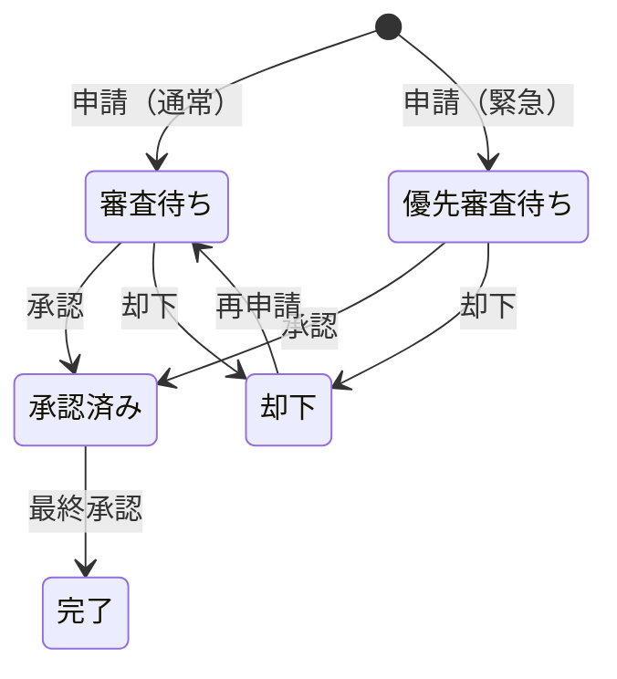
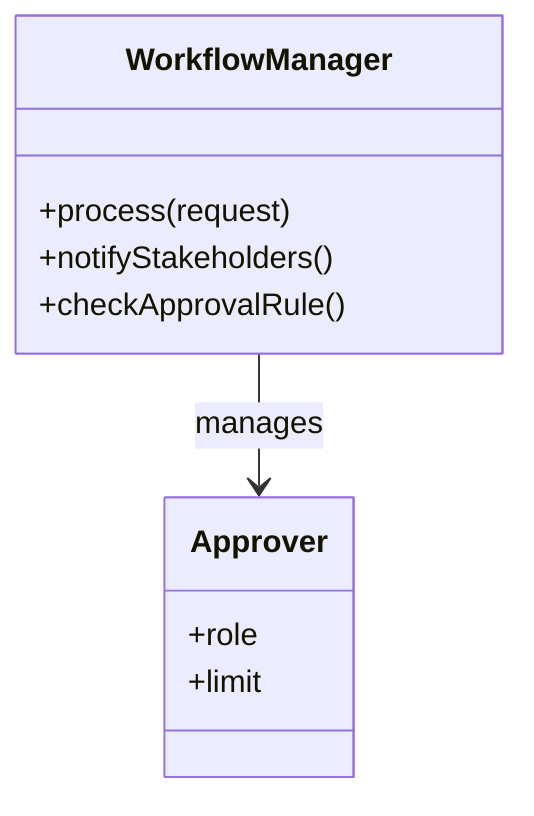
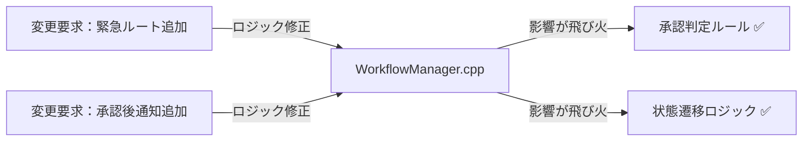
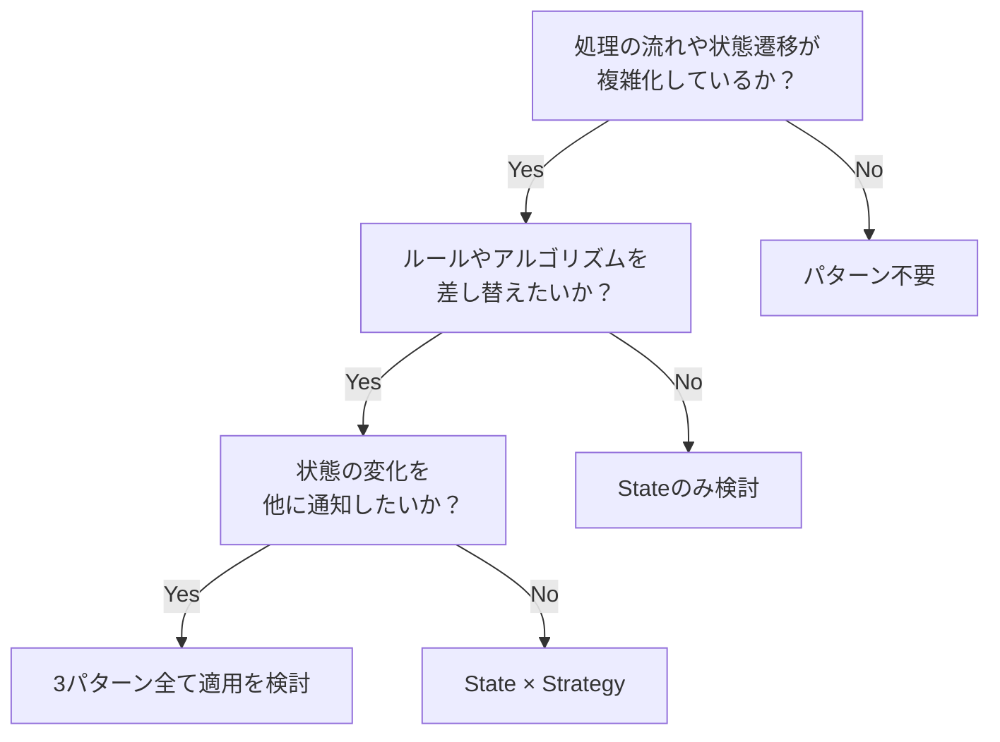
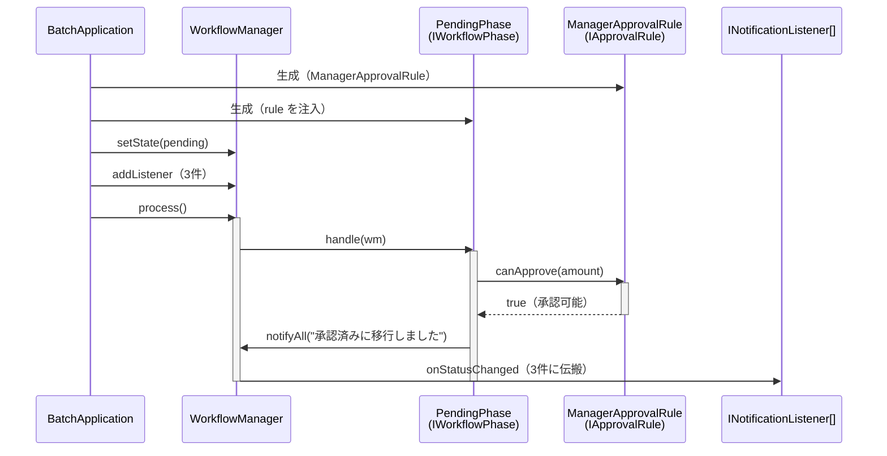
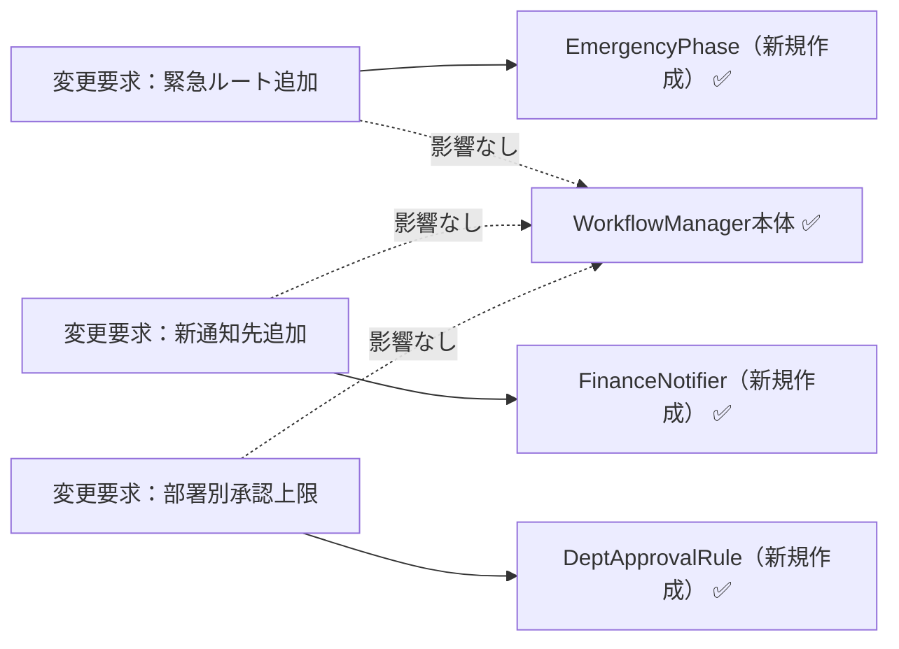
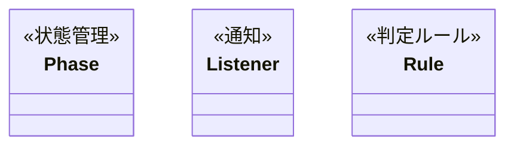
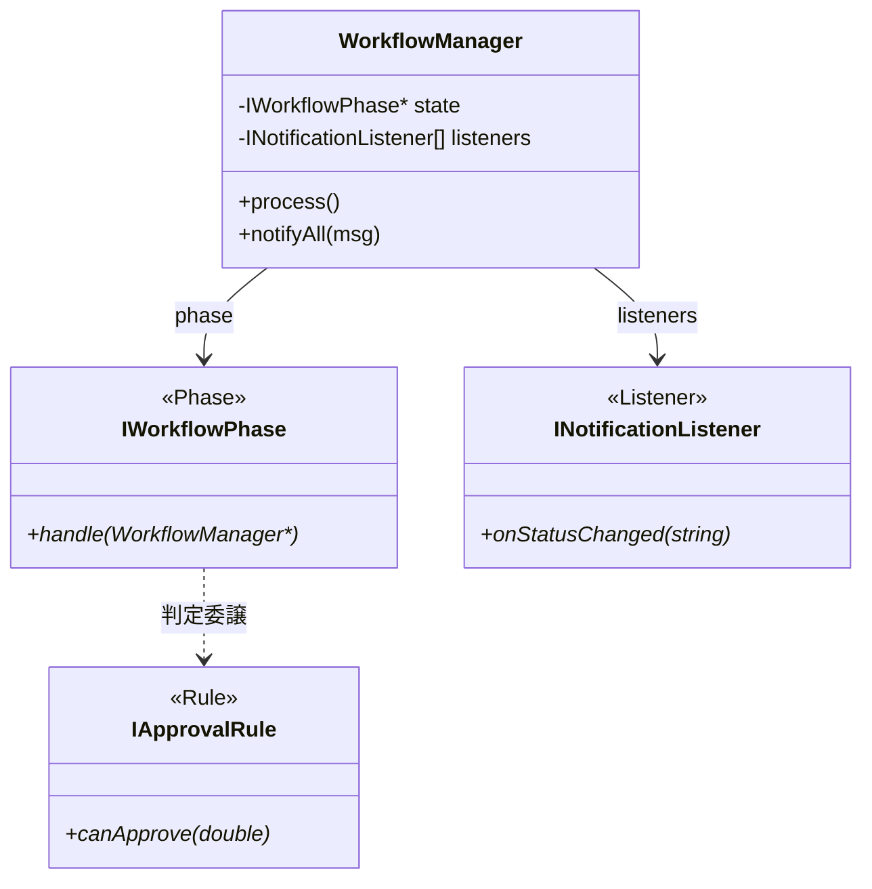

## 第12章 承認ワークフローシステム ―― State × Observer × Strategy パターン

―― 思考の型：複雑な承認プロセスと変化し続ける通知ルールをどう疎結合にするか

### この章の核心

**承認ワークフローのような「状態遷移」を伴う業務システムにおいて、各状態での挙動や通知ロジックを条件分岐で管理しようとすると、状態が増えるたびにコードの依存関係が爆発し、修正が極めて困難な「硬いシステム」になってしまう。**

### この章を読むと得られること

* **得られること1：** 承認状態の変化、関係者への通知、承認可否のルールという、それぞれ異なる「変わる理由」を識別できるようになる。


* **得られること2：** 状態遷移とアクションが「密結合」（複数の責務が一か所に混在し、一方を変えると他方まで影響を受ける状態）になっている接続点（クラスとクラスのつなぎ目）を特定し、問題の発生源を見極められるようになる。


* **得られること3：** 複数の構造を組み合わせることで、複雑なワークフローを疎結合（変更の影響が特定のクラスだけに閉じる状態）に保ちつつ、新しい承認フローにも対応できる設計手法を説明できるようになる。


* **得られること4：** 「状態管理」「通知」「判定ルール」が絡み合う現場で、変更影響を局所化する視点を養う。

---

## 🔵 フェーズ1：現状把握 ―― コードとクラス構成を読む

この問題を解くために7つのフェーズを使います。はじめに現状把握から開始し、仮説立案・問題特定・原因分析・課題定義・対策検討・対策実施という順で進みます。

変更要求が来る前のシステムの現状を事実として把握するところから始めます。はじめに背景と動作例で「このシステムが何をするか」を確認し、それからコードを読みます。

### 1-1：システムの背景

このシステムは、企業内の稟議や経費精算を管理する「承認ワークフローシステム」です。 申請者が申請を作成し、上長や経理担当者が内容を確認・承認するプロセスをデジタル化し、効率的に管理することを目的としています。

リリース当初は「作成」「承認」「却下」という3つの状態のみを扱うシンプルなものでした。 しかし、組織の拡大に伴い「金額に応じた承認者の自動割り当て」「承認プロセス中の関係者への通知」「特定の部署のみ適用される特別な承認ルール」といった要件が次々と追加されています。

現場の担当者からは「承認ルールを一つ変えるだけで、ワークフロー全体のステータス管理を書き直さなければならない」という悲鳴が上がっています。 私自身、このコードを最初に開いたとき、状態遷移のロジック、通知先の一覧、そして判定ルールが巨大なクラスの中に複雑に絡み合っているのを見て、どこから手をつければいいのか言葉を失いました。 一見すると、承認という一連の業務フローは安定しているように見えますが、内側では小さな修正が全体に影響を与える「脆い構造」が構築されています。

---

### 1-2：動作例テーブル

仕様を確認したところで、実際にどのような入力に対してどのような結果が返るかを確認します。このテーブルは「このシステムが正しく動いているとはどういう状態か」の基準になります。後で設計の改善（リファクタリング）を段階的に進めるときも、この表に立ち返ります。

| 操作（入力） | 申請種別 | 結果の状態 | 通知先 |
| --- | --- | --- | --- |
| 申請書提出 | 通常申請 | 審査待ち状態へ移行 | 管理者に通知 |
| 申請書提出 | 緊急申請 | 優先審査待ちへ移行 | 管理者に通知 |
| 審査待ち + 承認操作 | — | 承認済み状態へ移行 | 申請者・次承認者に通知 |
| 審査待ち + 却下操作 | — | 却下状態へ移行 | 申請者に通知 |
| 承認済み + 最終承認操作 | — | 完了状態へ移行 | 全関係者に通知 |
| 却下状態 + 再申請操作 | — | 審査待ち状態に戻る | 管理者に通知 |

コードを読む前に、このシステムが「何をする必要があるか」をこの表で確認できました。次は「どのように実装されているか」を見ていきます。

### 1-2b：状態遷移表

このシステムで管理する承認状態と、各状態から可能な遷移を整理します。

| 現在の状態 | 承認 | 却下 | 最終承認 | 再申請 |
| --- | --- | --- | --- | --- |
| 審査待ち | → 承認済み | → 却下 | —— | —— |
| 優先審査待ち | → 承認済み | → 却下 | —— | —— |
| 承認済み | —— | —— | → 完了 | —— |
| 却下 | —— | —— | —— | → 審査待ち |
| 完了 | —— | —— | —— | —— |



「審査待ち」と「優先審査待ち」という2つの入口を持ちながら、どちらも「承認」「却下」という同じ操作で次の状態に進みます。状態が増えるほど、各状態での振る舞いの違いを管理するコードも複雑になります。

---

### 1-3：実装コード（現状）

システムの現状の実装を確認します。コードを役割ごとに分けて読んでいきます。

**Approver クラス**

```cpp
#include <iostream>
#include <string>

using namespace std;

// 承認者クラス
class Approver {
public:
    string role;
    double limit;
};
```

`Approver` は承認者の役職と承認上限額を保持するだけのシンプルなデータクラスです。

**WorkflowManager クラス（状態遷移・通知・ルール判定が混在）**

```cpp
// ワークフロー管理クラス（状態遷移、通知、ルール判定が混在）
class WorkflowManager {
public:
    void process(string status, double amount) {
        if (status == "SUBMITTED") {
            cout << "承認待ち状態へ移行。" << endl;
            notify("申請者に通知");
        } else if (status == "APPROVED") {
            cout << "承認完了状態へ移行。" << endl;
            notify("関係者に通知");
        }
        // 判定ルール（ハードコード）
        if (amount > 100000) cout << "役員承認が必要。" << endl;
    }
private:
    void notify(string msg) { cout << msg << endl; }
};
```

このクラスが今章の中心です。`process` メソッドの中に「状態の遷移処理」「通知の仕組み」「金額による判定ルール」のすべてが直接記述されていることを確認しておいてください。

**main()**

```cpp
int main() {
    WorkflowManager wm;
    wm.process("SUBMITTED", 50000);
    return 0;
}
```

上記コードの実行結果：

```
承認待ち状態へ移行。
申請者に通知
```

動作例テーブルの1行目（通常申請→審査待ち状態→管理者に通知）と比べると、状態名が「審査待ち」ではなく「承認待ち」、通知先が「管理者」ではなく「申請者」になっており、表現がまだ一致していません。

これは意図的な不一致です。現状コードは「システムが起動して何かを出力できる」ことだけを確認するための骨格であり、詳細な状態名・通知先・緊急申請ルートはまだ実装されていません。動作例テーブルは「このシステムが最終的にどう動くべきか」という到達目標を示しています。フェーズ7の最終コードで、この表の全6行と実行結果が一致することを確認します。

次のフェーズでは、この現状コードに変更を加えたときに何が起きるかを確認します。

---

### 1-4：クラス構成図

コードを読んだところで、クラス間の関係を図で整理します。



`WorkflowManager` クラスが、ワークフローの「状態遷移」、各担当者への「通知」、「承認可否のルール判定」という3つの重い責務をすべて握りしめています。

---

### 1-5：変更要求

ある金曜日の夕方、経理部のマネージャーがデスクにやってきました。

「お疲れ様。今度、承認ワークフローに『緊急申請ルート』を追加することになったんだ。 通常は平社員→課長→部長という承認順序なんだけど、緊急時は課長を飛ばして直接部長に通知が飛ぶようにしたい。 それと、部長が承認した直後に、自動的に『決済部門』へも通知が飛ぶようにしてほしいんだよね。 承認が却下された場合も、申請者に即座にアラートを出す仕組みは必須だよ。いつまでに対応できるかな？」

ふむ、なるほど。 承認ルートのスキップや、特定の状態での追加通知、そして却下時の通知強化と、ワークフローの柔軟性を高める要求ですね。 今の `WorkflowManager` にこれらを付け足すと、さらに条件分岐が複雑化し、修正が困難になる予感がします。

**仕様変更の内容**

変更要求を受けて、現在のワークフローがどう変わるかを整理します。

| 変更項目 | 変更前 | 変更後 |
|---|---|---|
| 承認ルート | 平社員→課長→部長 | 緊急時は課長をスキップして部長へ直接 |
| 部長承認後の通知 | 関係者のみ | 関係者 + 決済部門（新規追加） |
| 却下時の通知 | なし | 申請者に即座にアラート（新規追加） |

フェーズ1でシステムの現状と変更要求が把握できました。次のフェーズ2では、「何が変わり、何が変わらないか」を整理します。

## 🟣 フェーズ2：仮説立案 ―― 何が変わるかを観察し、ヒアリングで裏付ける

### 2-1：責任チェック表

各クラスが「何を知るべきか」を整理します。

| **クラス名** | **責任（1文）** | **知るべきこと** |
| --- | --- | --- |
| `WorkflowManager` | 承認ワークフローの全体フローを統括する | 状態遷移ルール、通知先一覧、承認判定基準 |
| `Approver` | 承認者個人の情報を管理する | 承認者の役職や承認上限額 |

`WorkflowManager` は、ワークフローのフローそのものだけでなく、誰にどう通知するか、どう判定するかという個別の詳細までを知りすぎている状態です。

### 2-2：変わる理由の分析

責任チェック表でクラスの責任が整理できました。次に、コードの各行が「誰の判断で変わる知識か」を確認することで、混在している責任をさらに細かく特定します。判断基準は、「このクラスの担当者とは別の人間が変更を決定するかどうか」です。別の人間が決定するなら、それは「責任外（❌）」と判断します。

`WorkflowManager.process()` の各行を見ると：

| **コードの行** | **持っている知識** | **誰の判断で変わるか** | **責任内か** |
| --- | --- | --- | --- |
| `if (status == "SUBMITTED")` | 状態遷移のルール | フロー設計担当 | ✅ |
| `notify("申請者に通知")` | 通知の仕組みと通知先 | 通知サービス担当 | ❌ 別担当者 |
| `if (amount > 100000)` | 承認の判定ルール | 経理ルール担当 | ❌ 別担当者 |

1つのメソッドの中に、変える理由が異なる3つの知識が混在しています。今すぐ問題とは言えませんが、これが後の痛みの予兆です。

### 2-3：今回の変更で確実に変わること

今回の変更要求から確定している変更は3点です。

- **承認ルートの追加**：緊急時に課長をスキップして部長へ直接通知する
- **部長承認後の通知先拡張**：決済部門への通知を自動追加する
- **却下時のアラート追加**：申請者への即時アラートを実装する

ただし「これらの変更が1回限りか、今後も続くか」によって、どこまで設計を変えるべきかが大きく変わります。関係者に確認します。

### ヒアリングに向けた背景確認

このシステムは、私たちが運用している企業の承認ワークフローを担っています。数年前にサービスが立ち上がった当初は、申請者が申請を提出し、上長が承認するだけのシンプルな2ステップのフローでした。

しかし、組織が拡大し業務が複雑化するにつれて、様々な部署固有の要求が追加されるようになりました。緊急時の特殊ルートや、金額による承認者の自動割り当て、通知先の多様化など、ビジネス上の要求は日々増えています。

### 2-4：関係者ヒアリング

> **現実のヒアリングでは——** 本書のヒアリングシーンでは設計判断を明確にするため、意図的に「理想的な回答」が返ってくるように描いています。これはシミュレーションです。現実には、「変わるかどうか分からない」「たぶん変わらない」という曖昧な答えが返ることも多いです。そのときは `git log` や過去の障害記録を「ヒアリングの代わり」として使ってみてください。「過去に何度変わったか」が最も正直な証拠です。

- **開発者：** 「今回のような『緊急ルート』以外にも、今後別の承認ルートが追加される可能性はありますか？」

- **運用担当者：** 「ああ、あるね。 例えば、海外出張時だけの特殊ルートや、特定のプロジェクト限定の承認フローなども、今後は必要になるだろうな。」

- **開発者：** 「通知についても確認させてください。現状は『申請者』と『関係者』だけですが、承認プロセスに応じて通知先の役職が変わったりする要件はありますか？」

- **運用担当者：** 「それも重要だ。 部長が承認したら経理だけでなく、関連部署の担当者にもメールを飛ばしたいケースが多いね。」

- **開発者：** 「金額による判定ルールは今後変わりますか？ 現状は10万円を閾値にしていますが。」

- **運用担当者：** 「そこも変わるよ。 来期から部署ごとに承認上限を設けたいという話が出てる。課長なら50万まで、部長なら500万まで、みたいな感じで。」

### 2-5：ヒアリングで判明した将来リスク

ヒアリングで浮かび上がった「今回の確定変更ではないが、近い将来起こりうる変化」を記録します。これは今回の設計判断の材料です。

| **将来リスク** | **時期の目安** | **根拠** |
| --- | --- | --- |
| 新しい承認ルートの追加が継続的に発生する | 継続的に | 運用担当者から海外出張ルート・プロジェクト限定フローの必要性を直接確認 |
| 通知先リストの拡張・変更が繰り返される | 継続的に | 関連部署への通知追加ニーズが言及された |
| 金額閾値から部署ごとの承認上限制度へ変更 | 来期（数ヶ月後） | 来期の制度変更として明言された |

> **注：** 「金額閾値の変更」は運用担当者が「来期から部署ごとに承認上限を設けたい」と明言しており、3項目の中で最も確実性が高い変化です。「確定変更」と「将来リスク」の境界は曖昧になりえますが、この項目は実質的に確定に近い近期計画として設計判断の優先材料とします。

フェーズ2で「今変わること（確定）」と「将来変わるかもしれないこと（リスク）」を分けて整理できました。次のフェーズ3では、現在の構造で変更を試みたときに何が起きるかを確認します。

---

## 🟣 フェーズ3：問題特定 ―― 変更の痛みを発見する

### 3-1：変更を試みる

フェーズ2で確定した「緊急申請ルートの追加」と「承認直後の自動通知」という変更要求を、現在の `WorkflowManager` クラスに実装してみます。

はじめに、`process` メソッド内の状態遷移ロジックに「緊急フラグ」の判定を追加しました。 すると、本来であれば課長を経由する必要があるルートが複雑に分岐し始め、`if` 文がネストしてコードの可読性が急速に低下していきます。 次に、承認直後の通知処理を追加しようとして、また別の `if` 文を差し込みました。

すると、承認プロセスが「承認」なのか「却下」なのか、あるいは「緊急」なのかというフラグが大量に混在し、どのタイミングでどの通知が飛ぶのかを追うのが非常に困難になりました。 「あ、これ以上 `WorkflowManager` をいじると、既存の承認ルートまで壊れてしまいそうだ…」という不安が頭をよぎります。 実際に、緊急ルートを追加したことで、通常の承認ルートにおける通知が二重に送信されるバグが発生してしまいました。

### 3-2：変更影響グラフ



`WorkflowManager` が状態遷移、通知、判定ルールのすべてを抱え込んでいるため、一つの機能をいじると、本来無関係なはずの判定ロジックまで影響を受けてしまうことが分かります。

### 3-3：痛みの言語化

**1つ目の痛み：状態管理とアクションの密結合。** 承認状態が増えるたびに `WorkflowManager` 内の `if-else` 分岐が指数関数的に増え、状態遷移のルールを把握するのが極めて困難になっています。「ある状態で何ができるか」というルールが、他の状態の知識と混在しているため、変更が怖くて手が付けられない状態です。

**2つ目の痛み：通知と判定の責務過多。** 承認時の通知や判定といったビジネスルールが、ワークフローの実行フローと同じ場所に記述されているため、これらを一つ修正するたびに、本来のワークフロー実行フローを読み解き、壊さないように注意を払うという多大な認知的負荷が生じています。このような構造では、承認プロセスの複雑化に伴って開発コストが膨れ上がるのは避けられません。

フェーズ3で「変更が辛い」ことが確認できました。次のフェーズ4では、なぜ辛いのかを構造的に言語化します。

---
> **📌 問題（確定）**
> 承認ワークフローシステムでは、「状態遷移のルール（どの状態で何をするか）」「通知の仕組み（誰にどう通知するか）」「承認判定ロジック（金額・役職による可否）」という、それぞれ異なる理由で変わる3つのものが `WorkflowManager` の1メソッドに同居している。緊急ルートを追加しようとすると通知の二重送信が発生し、通知先を変えると既存の承認フローが壊れるリスクが生じる。この3つの変化軸が同じ場所にある限り、「1つを直すと別の何かが壊れる」という痛みは繰り返す。
---

フェーズ4では「なぜその混在が辛いのか」を、コードの構造で言語化します。

## 🟠 フェーズ4：原因分析 ―― なぜ辛いのかを構造で言語化する

### 4-1：痛みの根源を探る（観察と原因）

フェーズ3で確認した「変更の辛さ」は、コードのどこから来ているのでしょうか。コードを注意深く観察すると、痛みを引き起こしている3つの事実が浮かび上がってきます。

第一に、新しい承認ルートを追加するとき、なぜ毎回 `WorkflowManager` を開かなければならないのでしょうか？ それは、このクラス自身が「SUBMITTED なら承認待ちへ移行」「APPROVED なら完了へ移行」といった**具体的な状態遷移のルールをすべて直接知ってしまっている（抱え込んでいる）**からです。

第二に、なぜ通知先を追加するだけで既存の承認フローが壊れるリスクを感じるのでしょうか？ それは、「誰に通知するか」という情報と「どの状態で何をするか」という情報が**同じメソッドの中で物理的に混ざり合っている**からです。

第三に、なぜ判定ルール（金額閾値）を変えるためにワークフロー全体のコードを読み解く必要があるのでしょうか？ それは、`if (amount > 100000)` という**判定ロジックが状態遷移の処理と同じ場所に直書きされている**からです。

この「症状（痛み）」と「根本原因」を整理すると、以下のようになります。

| **観察した症状（痛み）** | **構造的な原因（痛みの根源）** |
|---|---|
| 承認ルートを変えると全体に影響が走る | `WorkflowManager` が各状態の具体的な遷移ルールを直接知っているから |
| 通知先を変えると承認ロジックが壊れるリスク | 変わる理由が違う「状態遷移」と「通知」が同じメソッドの中に混在しているから |
| 判定ルールの変更で全体を読み解く必要がある | 「承認の判定ロジック」が状態遷移コードの隙間に直書きされているから |

これら3つの根本原因は**それぞれ独立した変化軸**です。「承認フローの状態遷移」が変わっても通知先の管理方法は変わらず、「通知先の変動」が起きても状態ごとの振る舞いや承認ルールには影響せず、「承認ルールの変更」が起きても状態の種類や通知先の管理には影響しません。

3つが独立しているからこそ、1つのパターンだけでは解決しきれません。

### 4-2：変わるもの/変わってほしくないもの

> **「変わらないもの」と「変わってほしくないもの」は異なります。** 「変わらないもの」は経験的事実（今まで変わっていない）、「変わってほしくないもの」は設計意図（ここを安定させてほかを守りたい）です。ここで整理するのは後者です。

| **変わり続けるもの（🔴）** | **変わってほしくないもの（🟢）** |
| --- | --- |
| 承認状態遷移のルール（ルート制御） | 申請・承認という業務プロセスの基本骨格 |
| 各状態における通知先リスト | 承認フローの実行順序（入口から出口までの流れ） |
| 金額や役職による承認可否判定 | 申請データが通過する状態遷移の基盤 |

**【変わる部分（状態遷移・通知・判定が混在した if 文）】**
```cpp
        if (status == "SUBMITTED") {
            cout << "承認待ち状態へ移行。" << endl;
            notify("申請者に通知");
        } else if (status == "APPROVED") {
            cout << "承認完了状態へ移行。" << endl;
            notify("関係者に通知");
        }
        if (amount > 100000) cout << "役員承認が必要。" << endl;
```

**【変わらない部分（不変の骨格）】**
```cpp
        // ワークフローを実行する → 状態に応じた処理を行う → 通知を出す
        // この「流れ」自体は変わらない
        void process(string status, double amount) {
            // ... (ここに変わる部分が入る) ...
        }
```

### 4-3：接続形態の診断

現在の `WorkflowManager` は、すべての状態遷移ルール・通知先・判定ロジックを自分自身の中に直接抱え込んでいます。

**【具体×直接のコード】**
```cpp
class WorkflowManager {
public:
    void process(string status, double amount) {
        // 状態遷移（具体）を、自分自身で直接判断して処理している
        if (status == "SUBMITTED") {
            cout << "承認待ち状態へ移行。" << endl;
            notify("申請者に通知"); // 通知先も直接知っている
        }
        // 判定ルール（具体）も、自分自身で直接持っている
        if (amount > 100000) cout << "役員承認が必要。" << endl;
    }
};
```

この状態は **「具体×直接」の接続形態** です。iPhoneに専用のLightningケーブルを直差ししている状態と同じで、新しい承認ルートが増えるたびに本体側を開いて専用の配線（`else if` 文）を直接追加しなければなりません。

|  | 直接（直差し） | 間接（アダプター経由） |
|:---:|:---|:---|
| **具体**（専用規格） | **← 現在地** ライトニング直生え → iPhone（直差し） | ライトニング直生え → ゲーム機専用アダプタを挟む → ゲーム機 |
| **抽象**（汎用規格） | Type-C直生え → 各種機器（直差し） | ライトニング直生え → Type-C変換アダプタを挟む → 各種機器 |

状態遷移ルール・通知要件・判定ロジックは、それぞれが独立して頻繁に変更される可能性を秘めています。これらを一つのクラスで混在させて管理するのではなく、インターフェースを介した接続形態へ分離することが、システムの設計を健全化する鍵となります。

私たちは今、最も密結合で変更に弱い「具体×直接」の地点にいます。

フェーズ4で根本原因が言語化できました。分けるべき場所（変わる理由が異なる3つのもの）が特定できた段階です。次のフェーズ5では、この「取り出すターゲット」を具体的に特定します。

---
> **📌 原因（確定）**
> `WorkflowManager` が「状態遷移のルール」「通知先の一覧」「承認判定ロジック」という3つの知識をすべて直接抱え込んでいる（「具体×直接」の接続形態）。状態の変更頻度・通知の変更頻度・判定ルールの変更頻度はそれぞれ異なるため、この変化の速度差が噛み合わない状況でこの接続形態を維持するコストが膨らみ続ける。1つのクラスに複数の変化速度が混在していることが、修正の痛みの根本原因である。
---

変化の速度が違う3つのものが同居していることは分かりました。フェーズ5では「では何を外に出すか」というターゲットを具体的に特定します。

## 🟡 フェーズ5：課題定義 ―― 解くべき「塊」を特定する

フェーズ4の分析により、問題の根本原因は「状態遷移のルール」「通知の仕組み」「承認判定のロジック」という、変わる理由が違う3つのものが `WorkflowManager` の中で混在していることだと分かりました。

したがって、今回私たちが解くべき課題は、`WorkflowManager` の中にある **3つの変化軸を、それぞれ独立して差し替え可能な部品として分離すること** です。

```cpp
class WorkflowManager {
public:
    void process(string status, double amount) {
        // ↓↓↓ 分離ターゲット①：状態遷移のルール ↓↓↓
        if (status == "SUBMITTED") {
            cout << "承認待ち状態へ移行。" << endl;
        // ↓↓↓ 分離ターゲット②：通知の仕組みと通知先 ↓↓↓
            notify("申請者に通知");
        }
        // ↓↓↓ 分離ターゲット③：承認判定ロジック ↓↓↓
        if (amount > 100000) cout << "役員承認が必要。" << endl;
    }
};
```

最終的な目標は、この `WorkflowManager` から3つの変化軸に関する知識をすべて追い出し、「ワークフローの実行フローを進行する」という骨格だけにすることです。

フェーズ5でターゲットが明確になりました。次のフェーズ6では、この「3つの塊」をどのように分離していくか、段階的に対策を検討していきます。

---
> **📌 課題（確定）**
> `WorkflowManager` から切り離すべき塊は3つある。1つ目は「どの状態でどの処理をするか」という状態遷移の知識で、これを `IWorkflowPhase` の実装クラスとして独立させること。2つ目は「誰に通知するか」という通知先の知識で、これを `INotificationListener` のリスナーとして外部から登録できる形に分離すること。3つ目は「承認可否をどう判定するか」という判定ロジックで、これを `IApprovalRule` として差し替え可能な部品として切り出すこと。この3つを分離して初めて、各変化軸への変更が互いに影響しない構造が実現できる。
---

ターゲットが3つに絞られました。フェーズ6では、この分離をどのステップで・どの形で実現するかを段階的に検討します。

## 🔴 フェーズ6：対策検討 ―― 段階的な改善と決断

ターゲットである「3つの変化軸の塊」を外に出すために、いきなり正解へ飛ぶのではなく、段階的にリファクタリングを進めてみます。それぞれの段階（ステップ）でどこまで痛みが解消されるかを確認し、今回の要件において「どのステップで止めるべきか」を決断します。

### ステップ1：プライベートメソッドで責任を整理する（とりあえず分ける）

はじめに、クラスを分けずに、各分岐の処理をプライベートメソッドとして分離してみます。

```cpp
// ステップ1：プライベートメソッドで各分岐の責任を整理
class WorkflowManager {
public:
    void process(string status, double amount) {
        if (status == "SUBMITTED")  { processSubmitted(amount); return; }
        if (status == "APPROVED")   { processApproved();         return; }
        if (status == "EMERGENCY")  { processEmergency();        return; }
    }
private:
    void processSubmitted(double amount) {
        // ← 直接：判定ロジックをこのメソッド内で自分で実行する
        if (amount > 100000)
            cout << "役員承認が必要。" << endl;
        else
            cout << "審査待ち状態へ移行。" << endl;
        notify("申請者に通知");
    }
    void processApproved() {
        cout << "承認完了状態へ移行。" << endl;
        notify("関係者に通知");
    }
    void processEmergency() {
        cout << "緊急承認ルートで処理。部長へ直接通知。" << endl;
        notify("部長に通知");
    }
    void notify(string msg) { cout << msg << endl; }
};
```

**この段階の評価：**
メインの `process()` がスッキリしました。しかし、各プライベートメソッドの中を見ると、「状態遷移」「通知先」「判定ロジック」という3つの変化軸が相変わらず同じ場所に混在しています。新しい承認ルートが来るたびに結局はこのクラスを開いて処理を書き足さなければなりません。また、通知先を変えるたびにここを修正する必要があります。

### ステップ2：関心ごとに別クラスへ分離する（具体×間接）

ステップ1で「クラス内に3つの変化軸が残っている」という問題を解決するために、判定ルールを `RuleChecker` クラスに、通知処理を `NotificationService` クラスに切り出してみます。

```cpp
// 判定ルールを独立したクラスに切り出した（具体×間接）
class RuleChecker {
public:
    bool requiresExecutiveApproval(double amount) {
        return amount > 100000;
    }
};

// 通知処理を独立したクラスに切り出した（具体×間接）
class NotificationService {
public:
    void notify(string msg) { cout << msg << endl; }
};

// WorkflowManagerが具体クラスを知り、処理を委ねる（具体×間接）
class WorkflowManager {
    RuleChecker* checker;           // ← 具体：型名を名指しで知っている
    NotificationService* notifier;  // ← 具体：型名を名指しで知っている
public:
    WorkflowManager(RuleChecker* c, NotificationService* n)
        : checker(c), notifier(n) {}

    void process(string status, double amount) {
        if (status == "SUBMITTED") {
            if (checker->requiresExecutiveApproval(amount))  // ← 間接：委ねる
                cout << "役員承認が必要。" << endl;
            else
                cout << "審査待ち状態へ移行。" << endl;
            notifier->notify("申請者に通知");  // ← 間接：委ねる
            return;
        }
        if (status == "APPROVED") {
            cout << "承認完了状態へ移行。" << endl;
            notifier->notify("関係者に通知");
            return;
        }
        if (status == "EMERGENCY") {
            cout << "緊急承認ルートで処理。" << endl;
            notifier->notify("部長に通知");
            return;
        }
    }
};
```

**この段階の評価：**
判定処理と通知処理が別クラスに委ねる形（間接）になりましたが、`RuleChecker` と `NotificationService` という具体クラス名の知識が `WorkflowManager` に残っています。また、通知先（「申請者に通知」「関係者に通知」）が `WorkflowManager` の中にまだハードコードされており、新しい承認ルートが来るたびにこのクラスを開かなければなりません。状態遷移の「if の塊」問題は解消されていません。

### ステップ3：単一クラスアプローチの限界 ――3つの関心事が今もひとつのクラスに

ステップ1・2で何を整理しても、気づいていただけたでしょうか。

どれだけプライベートメソッドに切り出しても、どれだけ処理を別クラスに委ねても、`WorkflowManager` は依然として「どの状態でどの処理をするか」という状態遷移の知識を保持し続けています。新しい承認ルートが追加されるたびに、このクラスを開いて `if` 文を書き足す必要があります。

これがシングルクラスアプローチの根本的な限界です。「状態遷移」「通知」「判定ルール」という3つの変化軸が完全に独立して変更できる構造を実現するには、それぞれをインターフェースで切り出す必要があります。

### ステップ4：State パターンを適用する ――状態遷移を分離する

まず「状態遷移の混在」という最も根本的な問題から解決します。各状態の振る舞いをオブジェクトとして切り出し、`WorkflowManager` が状態を切り替えるだけの形にします。

```cpp
// 状態遷移の契約（インターフェース）
class IWorkflowPhase {
public:
    virtual void handle(class WorkflowManager* wm) = 0;
    virtual ~IWorkflowPhase() = default;
};

// 各状態の実装
class SubmittedPhase : public IWorkflowPhase {
    double amount;
public:
    SubmittedPhase(double a) : amount(a) {}
    void handle(WorkflowManager* wm) override {
        // ← 状態遷移の知識がここに封じ込められた
        if (amount > 100000)
            cout << "役員承認が必要。" << endl;
        else
            cout << "審査待ち状態へ移行。" << endl;
        // ← まだ通知先がハードコードされている
        cout << "申請者に通知" << endl;
        // wm は次ステップのObserver通知のために受け取っているが、このステップではまだ使わない
        (void)wm;
    }
};

class EmergencyPhase : public IWorkflowPhase {
public:
    void handle(WorkflowManager* wm) override {
        cout << "緊急承認ルートで処理。部長へ直接通知。" << endl;
        cout << "部長に通知" << endl;
        // wm は次ステップのObserver通知のために受け取っているが、このステップではまだ使わない
        (void)wm;
    }
};

class WorkflowManager {
    IWorkflowPhase* state;  // ← 抽象型のみ知る
public:
    void setState(IWorkflowPhase* s) { state = s; }
    void process() {
        state->handle(this);  // ← if文がなくなった！
    }
};
```

**この段階の評価：**
`WorkflowManager` から状態遷移の `if` 文が完全に消えました。新しい承認ルートは `IWorkflowPhase` を実装した新しいクラスを追加するだけで対応できます。`WorkflowManager` 本体には触れずに済みます。

しかし、まだ2つの問題が残っています。通知先（「申請者に通知」「部長に通知」）が各 Phase クラスにハードコードされており、通知先を変えるたびに Phase クラスを修正しなければなりません。また、判定ロジック（`amount > 100000`）も Phase クラスの中に直書きされています。判定ロジックは `WorkflowManager` から `SubmittedPhase` に移動しただけで、「承認上限金額のルールが変わったら `SubmittedPhase` を開いて書き換える」という問題は残っています。

### ステップ5：Observer パターンを追加する ――通知を分離する

次に「通知の混在」という問題を解決します。通知先をリストとして管理し、`WorkflowManager` が状態変化を登録済みのリスナー全員に伝搬させる形にします。

```cpp
// 通知リスナーの契約（インターフェース）
class INotificationListener {
public:
    virtual void onStatusChanged(string msg) = 0;
    virtual ~INotificationListener() = default;
};

// 通知リスナーの実装例
class ApplicantNotifier : public INotificationListener {
public:
    void onStatusChanged(string msg) override {
        cout << "[申請者通知] " << msg << endl;
    }
};

class ManagerNotifier : public INotificationListener {
public:
    void onStatusChanged(string msg) override {
        cout << "[管理者通知] " << msg << endl;
    }
};

class WorkflowManager {
    IWorkflowPhase* state;
    vector<INotificationListener*> listeners;  // ← Observer リスト
public:
    void setState(IWorkflowPhase* s) { state = s; }

    void addListener(INotificationListener* l) {
        listeners.push_back(l);
    }

    void process() {
        state->handle(this);
    }

    void notifyAll(string msg) {
        // ← 登録済みリスナー全員に伝搬。WorkflowManagerは通知先を知らない
        for (int i = 0; i < (int)listeners.size(); i++) {
            listeners[i]->onStatusChanged(msg);
        }
    }
};

// 状態クラスは WorkflowManager の notifyAll を呼ぶだけでよくなった
class SubmittedPhase : public IWorkflowPhase {
    double amount;
public:
    SubmittedPhase(double a) : amount(a) {}
    void handle(WorkflowManager* wm) override {
        if (amount > 100000)
            cout << "役員承認が必要。" << endl;
        else
            cout << "審査待ち状態へ移行。" << endl;
        // ← 通知先を知らずに済む
        wm->notifyAll("申請が受理されました");
    }
};
```

**この段階の評価：**
通知先の管理が `WorkflowManager` から切り離されました。新しい通知先を追加するときは、`INotificationListener` を実装した新しいクラスを作成して `addListener` で登録するだけです。既存の Phase クラスも `WorkflowManager` 本体も触れずに済みます。

しかし、まだ承認判定ロジック（`amount > 100000`）が Phase クラスに直書きされており、部署ごとの承認上限制度に対応するためには Phase クラスを修正しなければなりません。

### ステップ6：Strategy パターンを追加して完成する

最後に「判定ルールの混在」という問題を解決します。承認判定ロジックをインターフェースで切り出し、外部から差し替え可能にします。

```cpp
// 承認判定ルールの契約（インターフェース）
class IApprovalRule {
public:
    virtual bool canApprove(double amount) = 0;
    virtual ~IApprovalRule() = default;
};

// 判定ルールの実装例
class ManagerApprovalRule : public IApprovalRule {
public:
    bool canApprove(double amount) override {
        return amount <= 100000;  // 課長は10万円以下を承認可能
    }
};

class DirectorApprovalRule : public IApprovalRule {
public:
    bool canApprove(double amount) override {
        return amount <= 1000000;  // 部長は100万円以下を承認可能
    }
};

// Phase クラスは判定ルールを外部から受け取る（Strategy を使う）
class SubmittedPhase : public IWorkflowPhase {
    double amount;
    IApprovalRule* rule;  // ← 判定ルールを注入される
public:
    SubmittedPhase(double a, IApprovalRule* r) : amount(a), rule(r) {}
    void handle(WorkflowManager* wm) override {
        if (rule->canApprove(amount))  // ← 判定を外部ルールに委ねる
            cout << "審査待ち：承認可能。承認済み状態へ移行。" << endl;
        else
            cout << "審査待ち：上位承認者へエスカレーション。" << endl;
        wm->notifyAll("申請が受理されました");
    }
};
```

**この段階の評価：**
ついに3つの変化軸がすべてインターフェースで切り出されました。新しい承認ルートは新しい Phase クラスの追加だけで対応でき、新しい通知先はリスナークラスの追加だけで対応でき、新しい判定ルールはルールクラスの追加だけで対応できます。`WorkflowManager` 本体は一切触れずに済みます。

---

### どこまで設計を進めるべきか（採用ステップの決断）

それぞれのステップには一長一短があります。ステップ6の3パターン統合は強力ですが、クラス数が激増し構造が複雑になる「初期投資コスト」もかかります。どこで止めるかは、**「今後の変更頻度（ビジネス要求）」**で決断します。

*   **ステップ1（プライベートメソッド化）で止めるケース：** 承認フローが「申請→承認」の1段階のみで、今後ほぼ変更がない場合。
*   **ステップ2（具体クラス分離）で止めるケース：** 判定ルールや通知処理は切り出したいが、状態の種類は固定されている場合。
*   **ステップ4（State のみ）で止めるケース：** 承認ルートの追加が頻繁だが、通知先と判定ルールはほとんど変わらない場合。
*   **ステップ5（State + Observer）で止めるケース：** 承認ルートと通知先は頻繁に変わるが、判定ルールは非常にシンプルで固定の場合。
*   **ステップ6（State + Observer + Strategy の統合）まで進むケース：** 「新しい承認ルートの追加」「通知先の拡張」「部署ごとの承認上限の変更」という3つの独立した要件が、それぞれ頻繁に変化する場合。

**今回の決断：**
フェーズ2のヒアリングで「海外出張ルートや限定フローが今後も追加される（承認ルートの変化）」「関連部署への通知追加ニーズが継続的にある（通知の変化）」「来期から部署ごとの承認上限制度に変わる（判定ルールの変化）」と明言されています。3つの独立した変化軸が確定しているため、今すぐ初期投資コストを払ってでも、将来の変更コストをゼロにすることが適切です。したがって、今回は迷わず**ステップ6（3パターンの統合）まで進化させる**決断を下します。

この構造は、「状態ごとの振る舞いをオブジェクトとして切り出す」手法（**State パターン**）、「状態変化を登録されたリスナーへ伝搬させる」手法（**Observer パターン**）、「判定ルールを外部から差し替え可能にする」手法（**Strategy パターン**）の3つを組み合わせた複合設計です。

### どのパターンを使うかの判断基準

3つのパターンのどれを適用するか判断するための基準を整理します。以下のフローチャートを使うと、今の問題にどのパターンが必要かを順を追って確認できます。



フェーズ6で採用ステップが決まりました。次のフェーズ7では、この決断を最終的なコードに落とし込みます。

## 🟢 フェーズ7：対策実施 ―― 変化に強いコードを完成させる

なお、フェーズ6の検討からフェーズ7の最終実装にかけて、以下の2点を変更しています。

- **クラス名**：フェーズ6の `SubmittedPhase` → フェーズ7の `PendingPhase`（審査待ち状態の役割をより正確に表す名前に変更）
- **コンストラクタの引数**：フェーズ6では `SubmittedPhase(double amount, IApprovalRule* r)` として申請金額をコンストラクタで受け取っていましたが、フェーズ7のデモコードでは金額を固定値（50,000円）として直接参照し、`IApprovalRule*` のみを受け取る形に簡略化しています。実運用では申請オブジェクトをコンストラクタや `handle()` の引数で受け取る設計が適切です。

### 7-1：解決後のコード（全体）

ステップ6で決断した構造を、実行可能な完全なコードとして組み上げます。各役割ごとにコードを分けて見ていきましょう。

**1. インターフェース定義（3つの変化軸）**

```cpp
#include <iostream>
#include <vector>

using namespace std;

// 判定ルールの契約（変わる理由：経理ルール変更・部署別上限制度）
class IApprovalRule {
public:
    virtual bool canApprove(double amount) = 0;
    virtual ~IApprovalRule() = default;
};

// 通知リスナーの契約（変わる理由：通知先変更・通知手段の追加）
class INotificationListener {
public:
    virtual void onStatusChanged(string msg) = 0;
    virtual ~INotificationListener() = default;
};

// 状態遷移の契約（変わる理由：承認フロー変更・新ルート追加）
class IWorkflowPhase {
public:
    virtual void handle(class WorkflowManager* wm) = 0;
    virtual ~IWorkflowPhase() = default;
};
```

**2. 承認判定ルールの具体実装（Strategy）**

```cpp
// 課長承認ルール：10万円以下を承認可能
class ManagerApprovalRule : public IApprovalRule {
public:
    bool canApprove(double amount) override {
        return amount <= 100000;
    }
};

// 部長承認ルール：100万円以下を承認可能
class DirectorApprovalRule : public IApprovalRule {
public:
    bool canApprove(double amount) override {
        return amount <= 1000000;
    }
};
```

**3. 通知リスナーの具体実装（Observer）**

```cpp
class ApplicantNotifier : public INotificationListener {
public:
    void onStatusChanged(string msg) override {
        cout << "[申請者通知] " << msg << endl;
    }
};

class ManagerNotifier : public INotificationListener {
public:
    void onStatusChanged(string msg) override {
        cout << "[管理者通知] " << msg << endl;
    }
};

class FinanceNotifier : public INotificationListener {
public:
    void onStatusChanged(string msg) override {
        cout << "[決済部門通知] " << msg << endl;
    }
};
```

**4. 本体クラス（WorkflowManager）**

ワークフローを実行する本体クラスです。具体的な状態クラス・通知先・判定ルールを知らず、インターフェースだけを通じて処理を委譲します。

```cpp
class WorkflowManager {
    IWorkflowPhase* state;
    vector<INotificationListener*> listeners;
public:
    void setState(IWorkflowPhase* s) { state = s; }

    void addListener(INotificationListener* listener) {
        listeners.push_back(listener);
    }

    void process() {
        state->handle(this);  // ← 知らなくていい（状態遷移の詳細はStateが管理）
    }

    void notifyAll(string msg) {
        for (int i = 0; i < (int)listeners.size(); i++) {
            listeners[i]->onStatusChanged(msg);
        }
    }
};
```

**5. 状態クラスの具体実装（State × Strategy の組み合わせ）**

```cpp
struct ApprovalRequest {
    double amount;
};

// 審査待ち状態：承認可否を判定してフェーズを進行する
class PendingPhase : public IWorkflowPhase {
    IApprovalRule* rule;  // ← 判定ルールを外部から注入（Strategy）
public:
    PendingPhase(IApprovalRule* r) : rule(r) {}

    void handle(WorkflowManager* wm) override {
        ApprovalRequest req;
        req.amount = 50000;  // デモ用の固定値。実運用では申請オブジェクトをコンストラクタ等で受け取る
        if (rule->canApprove(req.amount)) {
            cout << "審査待ち：承認可能。承認済み状態へ移行。" << endl;
            wm->notifyAll("承認済みに移行しました");  // ← Observerに伝搬
        } else {
            cout << "審査待ち：上位承認者へエスカレーション。" << endl;
            wm->notifyAll("エスカレーションが発生しました");
        }
    }
};

// 緊急申請状態：課長をスキップして部長へ直接
class EmergencyPhase : public IWorkflowPhase {
public:
    void handle(WorkflowManager* wm) override {
        cout << "優先審査待ちへ移行。部長へ直接通知。" << endl;
        wm->notifyAll("緊急申請が受理されました");
    }
};

// 却下状態：申請者へ即時アラート
class RejectedPhase : public IWorkflowPhase {
public:
    void handle(WorkflowManager* wm) override {
        cout << "却下状態へ移行。" << endl;
        wm->notifyAll("申請が却下されました");
    }
};

// 申請書提出状態：審査待ちへ移行して担当者へ通知
class SubmittedPhase : public IWorkflowPhase {
public:
    void handle(WorkflowManager* wm) override {
        cout << "審査待ち状態へ移行。" << endl;
        wm->notifyAll("申請を受け付けました");
    }
};

// 最終承認状態：完了状態へ移行して全関係者へ通知
class FinalApprovalPhase : public IWorkflowPhase {
public:
    void handle(WorkflowManager* wm) override {
        cout << "完了状態へ移行。" << endl;
        wm->notifyAll("最終承認が完了しました");
    }
};
```

**6. 組み立てと実行（BatchApplication と main）**

具体的なクラス名を知っているのは、この組み立てを行う箇所だけです。

```cpp
class BatchApplication {
public:
    void run() {
        // 判定ルールを準備（Strategy）
        ManagerApprovalRule managerRule;

        // 通知リスナーを準備（Observer）
        ApplicantNotifier applicant;
        ManagerNotifier manager;
        FinanceNotifier finance;

        // 行1: 通常申請書提出 → 審査待ち状態へ移行、担当者に通知
        cout << "--- 行1: 通常申請書提出 ---" << endl;
        WorkflowManager wf1;
        wf1.addListener(&manager);
        SubmittedPhase submitted;
        wf1.setState(&submitted);
        wf1.process();

        // 行2: 緊急申請書提出 → 優先審査待ちへ移行、管理者に通知
        cout << "--- 行2: 緊急申請書提出 ---" << endl;
        WorkflowManager wf2;
        wf2.addListener(&manager);
        EmergencyPhase emergency;
        wf2.setState(&emergency);
        wf2.process();

        // 行3: 審査待ち + 承認操作 → 承認済み状態へ移行、申請者・次承認者に通知
        cout << "--- 行3: 審査待ち→承認操作 ---" << endl;
        WorkflowManager wf3;
        wf3.addListener(&applicant);
        wf3.addListener(&manager);
        PendingPhase pending(&managerRule);
        wf3.setState(&pending);
        wf3.process();

        // 行4: 審査待ち + 却下操作 → 却下状態へ移行、申請者に通知
        cout << "--- 行4: 審査待ち→却下操作 ---" << endl;
        WorkflowManager wf4;
        wf4.addListener(&applicant);
        RejectedPhase rejected;
        wf4.setState(&rejected);
        wf4.process();

        // 行5: 承認済み + 最終承認操作 → 完了状態へ移行、全関係者に通知
        cout << "--- 行5: 承認済み→最終承認操作 ---" << endl;
        WorkflowManager wf5;
        wf5.addListener(&applicant);
        wf5.addListener(&manager);
        wf5.addListener(&finance);
        FinalApprovalPhase finalApproval;
        wf5.setState(&finalApproval);
        wf5.process();

        // 行6: 却下状態 + 再申請操作 → 審査待ち状態に戻る、担当者に通知
        cout << "--- 行6: 却下→再申請操作 ---" << endl;
        WorkflowManager wf6;
        wf6.addListener(&manager);
        SubmittedPhase resubmit;
        wf6.setState(&resubmit);
        wf6.process();
    }
};

int main() {
    BatchApplication app;
    app.run();
    return 0;
}
```

上記コードの実行結果：

```
--- 行1: 通常申請書提出 ---
審査待ち状態へ移行。
[管理者通知] 申請を受け付けました
--- 行2: 緊急申請書提出 ---
優先審査待ちへ移行。部長へ直接通知。
[管理者通知] 緊急申請が受理されました
--- 行3: 審査待ち→承認操作 ---
審査待ち：承認可能。承認済み状態へ移行。
[申請者通知] 承認済みに移行しました
[管理者通知] 承認済みに移行しました
--- 行4: 審査待ち→却下操作 ---
却下状態へ移行。
[申請者通知] 申請が却下されました
--- 行5: 承認済み→最終承認操作 ---
完了状態へ移行。
[申請者通知] 最終承認が完了しました
[管理者通知] 最終承認が完了しました
[決済部門通知] 最終承認が完了しました
--- 行6: 却下→再申請操作 ---
審査待ち状態へ移行。
[管理者通知] 申請を受け付けました
```

動作例テーブルの全6行と一致しています。`WorkflowManager` の中から状態遷移の `if` 文・通知先のハードコード・判定ロジックの直書きがすべて消えました。

### 7-2：動作シーケンス図

ステップ6で到達した3パターン複合設計の実行時のオブジェクト間のやり取りを可視化します。`BatchApplication` が依存関係を注入し、`WorkflowManager` が具象クラスを知らずに抽象インターフェース経由で処理を委譲する流れが確認できます。



### 7-3：変更影響グラフ（改善後）



フェーズ3の変更影響グラフと比べると、変更要求が新規クラスの作成だけに閉じるようになりました。

### 7-4：変更シナリオ表

| **シナリオ** | **変わるクラス（触る場所）** | **変わらないクラス** |
| --- | --- | --- |
| 緊急ルートを追加する | `EmergencyPhase`（新規作成） | `WorkflowManager`、既存の Phase クラス |
| 新しい承認ルールを追加する（部署別上限） | `DeptApprovalRule`（新規作成） | `WorkflowManager`、リスナークラス |
| 却下時の通知先を増やす | `AlertNotifier`（新規作成） | `WorkflowManager`、判定ルールクラス |
| 通常の承認上限金額を変更する | `ManagerApprovalRule`（1行修正） | `WorkflowManager`、Phase クラス |

---

## 整理

### この章で定義したこと

| | 内容 |
|---|---|
| **問題** | 承認ワークフローシステムで「状態遷移のルール」「通知の仕組み」「承認判定ロジック」という変わる理由の異なる3つのものが、1つのクラスに混在している |
| **原因** | `WorkflowManager` が状態・通知・判定の知識をすべて直接抱え込む「具体×直接」の接続形態を取っており、各変化軸の変更頻度の違いに接続コストが追いつかない |
| **課題** | 「状態遷移のルール」「通知先の管理」「承認判定ロジック」という3つの変化軸を、それぞれ独立して差し替え可能な部品として `WorkflowManager` の外に切り出すこと |
| **解決策** | State × Observer × Strategy：状態ごとの振る舞いのオブジェクト化（State）・状態変化の登録リスナーへの伝搬（Observer）・判定ルールの外部差し替え（Strategy）を組み合わせ、各変化軸の変更が `WorkflowManager` 本体に波及しない構造にした |

### フェーズとこの章でやったこと

| **フェーズ** | **この章でやったこと** |
| --- | --- |
| 🔵 フェーズ1：現状把握 | 背景と動作例テーブルを確認した後、コードをクラス単位で読んだ。クラス構成図と変更要求を把握した |
| 🟣 フェーズ2：仮説立案 | 責任チェック表と変わる理由の分析で3つの変化軸を確認した。今回の確定変更とヒアリングで判明した将来リスクを分けて整理した |
| 🟣 フェーズ3：問題特定 | 緊急ルート追加を試み、影響が全体に波及する「通知の二重送信バグ」が発生することを確認した |
| 🟠 フェーズ4：原因分析 | 変わる理由が異なる3つのもの（状態遷移・通知・判定）が同じ場所にいることが痛みの根本と特定した |
| 🟡 フェーズ5：課題定義 | 3つの変化軸を独立して差し替え可能な部品として分離することを課題として定義した |
| 🔴 フェーズ6：対策検討 | 6ステップの段階的進化でそれぞれの限界を確認し、3パターン統合（State + Observer + Strategy）まで進化させる決断を下した |
| 🟢 フェーズ7：対策実施 | 最終コードを実装し、変更影響グラフで変更の局所化を確認した |

### 使ったパターン × 解消した根本原因

| パターン | 解消した根本原因 |
|---|---|
| State | 状態遷移の混在（WorkflowManagerに状態ごとの分岐が詰まっていた問題）|
| Observer | 通知の密結合（通知先追加のたびWorkflowManager本体の修正が必要だった問題）|
| Strategy | 判定ルールの混在（承認判定ロジックが状態クラスに直接書かれていた問題）|

### 各クラスの最終的な責任

| **クラス名** | **責任（1文）** | **変わる理由** |
| --- | --- | --- |
| `WorkflowManager` | 承認ワークフローの実行フローを統括する | 承認プロセスの基本骨格が変わる場合 |
| `IWorkflowPhase` | 現在の承認状態に応じた振る舞いを管理する | 承認の状態遷移ルールが変わる場合 |
| `IApprovalRule` | 承認の可否判定ロジックを管理する | 金額や役職による判定ルールが変わる場合 |
| `INotificationListener` | 承認結果に基づいた通知を実行する | 通知先や通知要件が変わる場合 |

---

## 振り返り

### 「この章を読むと得られること」は手に入ったか

| **得られること** | **この章のどこで示したか** |
| --- | --- |
| 1. 変動箇所の識別 | フェーズ2の責任チェック表と変わる理由の分析で、変化の軸（状態・通知・判定）を識別した |
| 2. 接続形態の診断 | フェーズ4で「具体×直接」の状態を診断し、3つの根本原因を特定した |
| 3. 複合設計の説明 | フェーズ6の段階的進化で、3パターンが自然に選ばれる過程を示した |
| 4. 変更影響の局所化 | フェーズ7の変更シナリオ表で、変更が新規クラスに閉じる構造を示した |

### 3つの設計原則はどう適用されたか

**原則1「変わるものをカプセル化せよ」の現れ**

- 具体化された場所：各状態実装クラス（`PendingPhase` 等）、判定ルール実装クラス（`ManagerApprovalRule` 等）、通知リスナー実装クラス（`ApplicantNotifier` 等）
- 解説：変化の理由が異なる「状態遷移」「判定ルール」「通知」を個別のクラスにカプセル化しました。新しい承認ルートや通知先が追加されても `WorkflowManager` は無影響。

**原則2「実装ではなくインターフェースに対してプログラムせよ」の現れ**

- 具体化された場所：`IWorkflowPhase`、`IApprovalRule`、`INotificationListener`
- 解説：`WorkflowManager` は具体的なルールや遷移先を知らず、インターフェース経由で処理を委譲するようにしました。

**原則3「継承よりコンポジションを優先せよ」の現れ**

- 具体化された場所：`WorkflowManager` が各インターフェースを保持する構成、`PendingPhase` が `IApprovalRule` をコンストラクタで受け取る構成
- 解説：承認ルールを継承による拡張ではなく、コンポジション（保持・委譲）による差し替え可能な構成にしました。

---

## あなたのコードで考えてみてください

この章で辿った思考プロセスを、あなた自身のコードに当てはめてみましょう。

1. **複雑さの核心を探す：** あなたのコードに「現在の状態によって処理が変わり、かつ状態が変わったときに他のクラスへの通知が必要で、さらにどの処理をするかのルールも変わる」箇所がありますか？
2. **肥大化のサインを確認する：** その処理をすべて一か所にまとめているクラスがあるとしたら、そのクラスのコード行数と `if` ブロックの数はどのくらいですか？
3. **変更の交差点を測る：** 「新しい状態の追加」「新しい通知先の追加」「新しいビジネスルールの追加」という3種類の変更は、今の構造では同じファイルを変更しますか？それとも別々のファイルで済みますか？
4. **分けた後のシンプルさを想像する：** 3つの責任（状態遷移・通知・ルール判定）を別々のクラスに切り出したとき、それぞれを独立してテストできるようになりますか？

---

## パターン解説：複合適用

今回は単一の構造ではなく、3つのパターンを組み合わせて解決しました。

### 仕組みの骨格



状態管理の仕組みが「今の状態での振る舞い」を整理し、判定ルールの仕組みが「承認の可否」を判定し、通知の仕組みが「変更の伝搬」を担うことで、複雑なワークフローを整理しています。

### この章の実装との対応



| GoFの名前 | この章での対応 |
|---|---|
| State / Context | `WorkflowManager` |
| State / ConcreteState | `PendingPhase` / `EmergencyPhase` / `RejectedPhase` |
| Observer / Subject | `WorkflowManager`（`notifyAll` を担う）|
| Observer / Observer | `INotificationListener`（`ApplicantNotifier` 等）|
| Strategy / Context | `PendingPhase`（`IApprovalRule` を使う）|
| Strategy / Strategy | `IApprovalRule`（`ManagerApprovalRule` 等）|

### 使いどころと限界

- **使いどころ**：状態遷移が複雑で、さらに通知先や判定ロジックが頻繁に変わるような大規模な業務ワークフロー。

- **限界**：3つのパターンを組み合わせるため、単純なフローであれば過剰設計となります。

【過剰コード：単純なフローへの適用例】

「申請中 → 承認済み」の2状態しかなく、判定ルールも「上長が承認ボタンを押したら確定」だけのシンプルなフローに、State・Observer・Strategyをすべて適用しようとした例です。

```cpp
// 2状態・固定ルール・通知先1件のフローに
// 3つの仕組みを持ち込んだ過剰設計
class IWorkflowPhase { /* ... */ };
class IApprovalRule { /* ... */ };
class INotificationListener { /* ... */ };

// インターフェースが3枚、実装クラスが6枚——
// 変わらないルールのために構造だけが膨れ上がる

// このケースは if 文で十分
class SimpleApproval {
public:
    void approve() {
        if (status == "PENDING") {
            status = "APPROVED";
            sendMail();  // 通知先は固定で1件だけ
        }
    }
private:
    string status;
    void sendMail() { /* メール送信 */ }
};
```

これらの仕組みが威力を発揮するのは、「状態の数が増える」「通知先が変わる」「判定ルールが差し替わる」という変化軸が**実際に複数存在するとき**です。その変化軸が見えないうちはシンプルな実装を選んでください。

### この章のまとめ

この章の冒頭で示した「得られること」4点を、あらためて確認します。

**得られること1**（変動箇所の識別）：フェーズ1とフェーズ2を通じて、「状態遷移」「通知」「判定ルール」という3つの異なる変化軸が1つのクラスに混在していることを確認しました。変わる理由が3者で異なることから、分離が必要と判断できるようになったはずです。

**得られること2**（接続形態の診断）：フェーズ4で、状態遷移・通知・判定を `WorkflowManager` に直書きしている状態を「具体×直接」の接続と診断しました。この接続形態が、仕様変更のたびに既存コードを壊すリスク（痛みの発生源）になっていると判断できるようになります。

**得られること3**（複合設計の説明）：フェーズ6の段階的進化で、「1つのパターンでは解決しきれない」という事実を体験し、問題を分析した結果として3つのパターンが自然に選ばれる過程を学びました。パターンを覚えるのではなく、問題から自然に「現れるもの」として設計を選べるようになります。

**得られること4**（変更影響の局所化）：フェーズ7の変更シナリオ表で見たように、3つの変化軸それぞれへの変更が新規クラスの追加だけに閉じる構造が実現できました。既存の `WorkflowManager` には一切触れずに済みます。

---

## おわりに

ここまで読んでいただき、ありがとうございます。

あるとき気づいたのです。**名前を知っているだけでは、設計の問題は解けない**、と。

問題を解くために必要なのは、「このコードの中に、変わる理由が異なるものが同じ場所にいないか？」という問いを立てる力でした。その問いを7つのフェーズで繰り返し体験することで、目の前のコードがどう見えるかが、少しずつ変わってきました。パターンの名前は、その後に「ああ、これが世間でいう設計パターンか」とついてくるものだった。

この本が届けたかったのは、その順序です。

第1章から第12章まで、題材は銀行振り込みだったり、カスタムドリンクだったり、承認ワークフローだったりと変わり続けましたが、思考の型はずっと同じでした。「何が変わるか」「なぜ変わるか」「誰のために分けるか」——この3つの問いを自分の頭で回せるようになったとき、デザインパターンはもう「暗記するもの」ではなく、「現れるもの」に変わります。

この本で紹介した7フェーズは、あくまで一つの参考です。現場によって、チームによって、コードの文脈によって、最適な解は変わります。「正しい設計」を覚えるのではなく、「自分で考えるプロセス」を手に入れてほしい——それが、この本を書いた唯一の動機です。

あなたの現場で、ぜひ一度、このプロセスを回してみてください。

「変わる理由」が見えた瞬間、コードの読み方が変わります。

---

この本を最後まで読んだあなたは、すでに変わっています。「どのパターンを使うか」ではなく、「何が変わるか、なぜ変わるか、誰のために分けるか」を問える目を持っています。その目は、この本を閉じた後も、現場のコードのそばにあり続けます。

もし「このコードを見せたい人がいる」と思ったなら、ぜひ。設計の議論が、職場の言語になっていく——それが、この本の最終的なゴールです。
