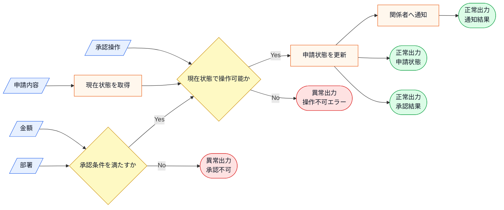
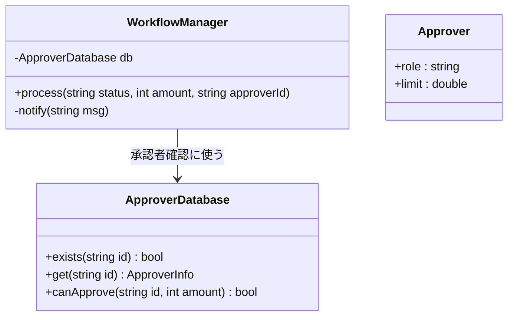
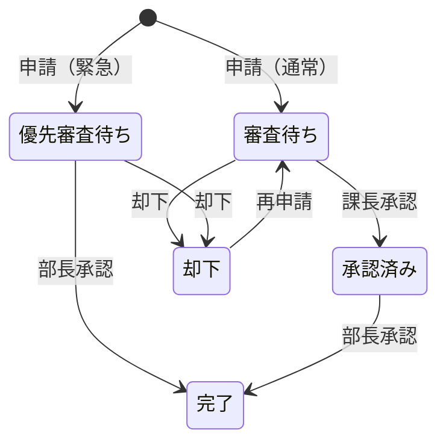
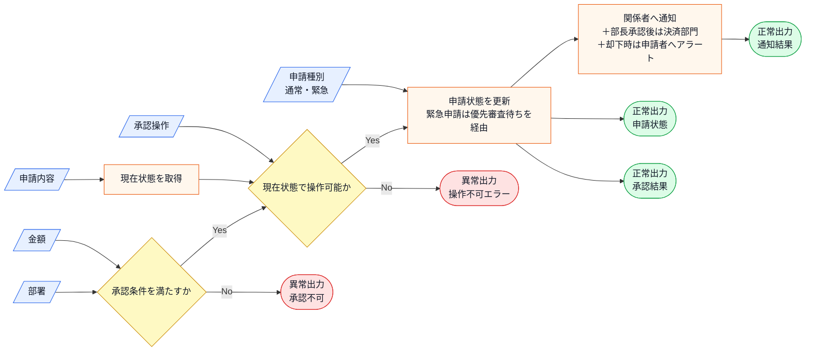
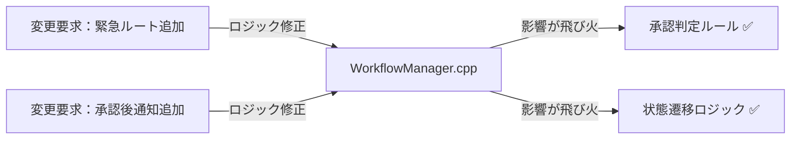
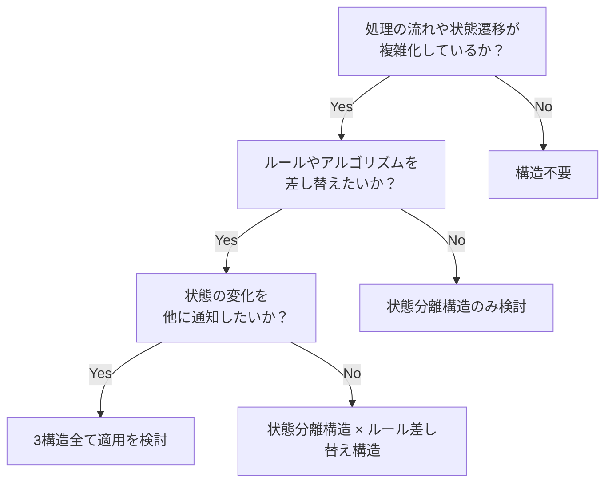
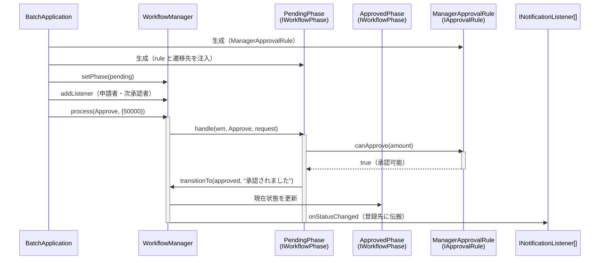
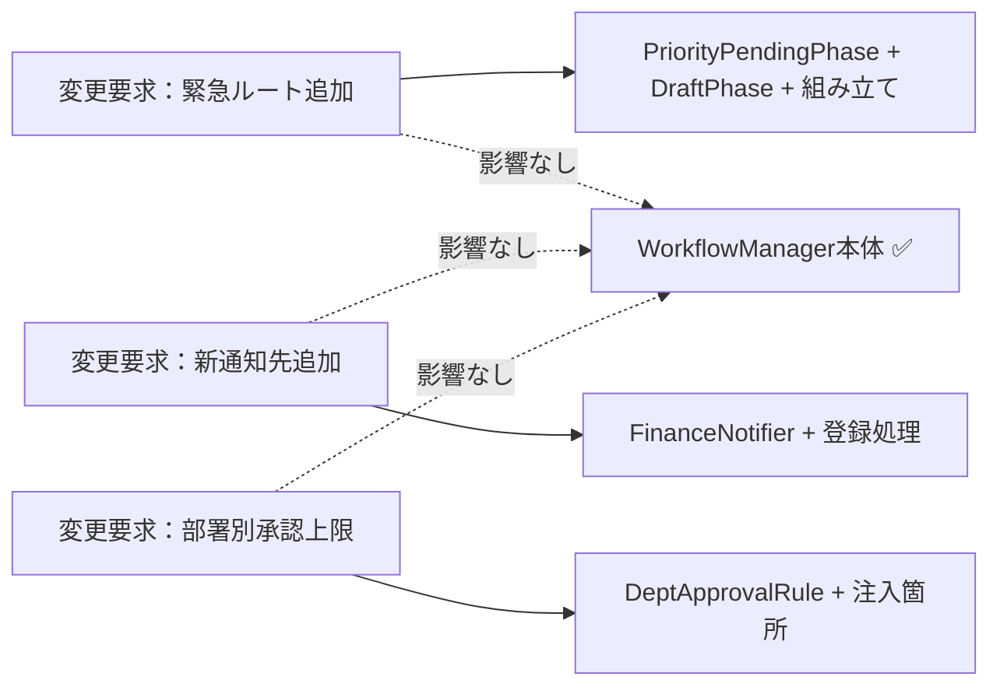
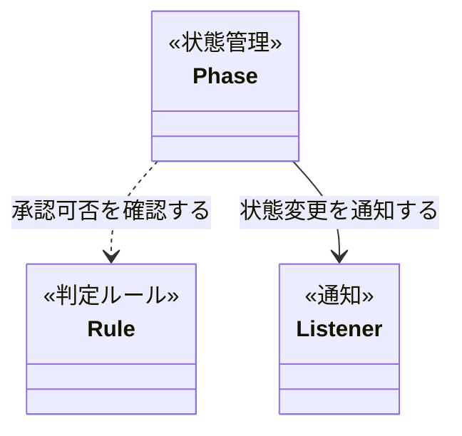
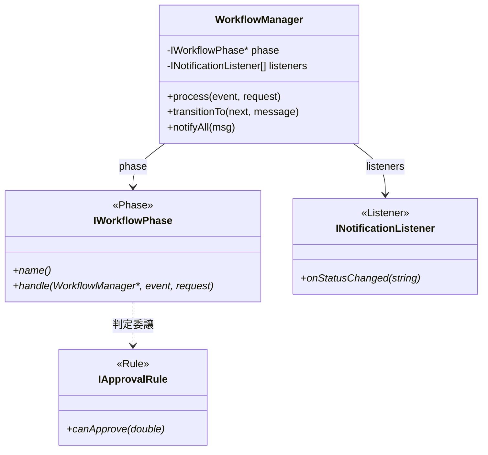

## 第12章 承認ワークフローシステム ―― State × Observer × Strategy パターン

―― 思考の型：複雑な承認プロセスと変化し続ける通知ルールをどう疎結合にするか

### この章の核心

**状態遷移、通知、承認判定が同じ管理処理に集まっていると、緊急ルート追加でも通知先追加でも承認ルール変更でも同じ場所全体を修正・確認する必要が生じる。こういう問題は、「進行する」「知らせる」「判定する」という別々の変更理由が同じ場所に混在しているシステムで起きている。**

### この章を読むと得られること

* **得られること1：** 状態の変化、関係者への通知、判定ルールという、それぞれ異なる「変わる理由」を識別できるようになる。


* **得られること2：** 状態遷移とアクションが「密結合」（複数の責務が一か所に混在し、一方を変えると他方まで影響を受ける状態）になっている接続点（クラスとクラスのつなぎ目）を特定し、問題の発生源を見極められるようになる。


* **得られること3：** 複数の構造を組み合わせることで、複数構造が絡む処理の影響範囲を特定クラス内に局所化しやすくしつつ、新しいフローにも対応できる設計手法を説明できるようになる。


* **得られること4：** 「状態管理」「通知」「判定ルール」が絡み合う現場で、変更影響を局所化する視点を養う。

---

## 🔵 フェーズ1：現状把握 ―― 仕様を整理し、システムと紐付ける

まずは、承認ワークフローシステムが何を入力として受け取り、どの処理で加工し、何を出力するのかを整理します。ここでは設計の良し悪しを判断せず、現状を事実としてそろえます。

### 1-1：このシステムの仕様

このシステムは、企業内の稟議や経費精算を管理する「承認ワークフローシステム」です。申請者が申請を作成し、上長や経理担当者が内容を確認・承認するプロセスをデジタル化し、効率的に管理することを目的としています。

ここまでの説明を、入力・判定・加工・出力の流れとして整理します。

**仕様の入力・加工・出力**



この図から読み取ることは、次の3点です。

- 承認結果は、申請内容、金額、部署、現在状態、承認操作を組み合わせて決まる。
- 承認条件判定と状態遷移が成立した後に、関係者への通知が発生する。
- 出力には申請状態、承認結果、通知結果があり、判定不可や操作不可は別の結果として扱う。

リリース当初は「作成」「承認」「却下」という3つの状態のみを扱うシンプルなものでした。 しかし、組織の拡大に伴い「金額に応じた承認者の自動割り当て」「承認プロセス中の関係者への通知」「特定の部署のみ適用される特別な承認ルール」といった要件が次々と追加されています。

状態遷移のルール、通知先の一覧、判定ルールを、1つのチームが一括して管理しています。

**現在の申請状態一覧**

申請の状態を4つに分けているのは、承認プロセスのどの段階にいるかを追跡し、「誰が何をいつ承認したか」を記録に残せるようにするためです。

| 状態 | 内容 |
|---|---|
| 審査待ち | 申請が提出され、課長の確認を待っている |
| 承認済み | 課長が承認し、部長の最終確認を待っている |
| 完了 | 部長が承認し、処理が完了した |
| 却下 | 承認者が却下し、処理を終了した |

「審査待ち」と「承認済み」を分けているのは、課長と部長が担う役割が独立しているからです。一方の状態にまとめてしまうと、「今どちらの判断を待っているか」が曖昧になり、差し戻しや確認依頼の際に混乱が生じます。

**現在の状態遷移マトリクス**

どの状態からどの状態へ遷移できるかを制限しているのは、業務の順序を強制するためです。たとえば、課長がまだ確認していない申請を部長が直接承認できてしまうと、内部統制の観点で問題が生じます。

| 現在の状態 | 課長承認 | 部長承認 | 却下 |
|---|---|---|---|
| 審査待ち | → 承認済み | —— | → 却下 |
| 承認済み | —— | → 完了 | —— |
| 却下 | —— | —— | —— |
| 完了 | —— | —— | —— |

再申請は「却下」状態からのみ可能で、審査待ち状態に戻ります。「完了」や「承認済み」から再申請できない理由は、すでに動き始めた処理（支払い手続きなど）を遡って取り消せないようにするためです。完了した申請をそのまま再オープンさせると、二重申請のリスクが生じるためです。

**承認フロー**

すべての申請は「審査待ち → 承認済み → 完了」という固定の2段階フローで処理されます。承認者の割り当てや通知先は固定されており、申請種別による経路の切り替えはありません。なお、承認者には役職に応じた承認可能額の上限があり、たとえば課長格の承認者の上限は10万円です。上限を超える申請は、その承認者では処理できず、より上位の承認者が必要になります。

10万円という閾値を設けているのは、「一定額以上の支出には上位者の確認が必要」という会社の内部規程に基づくためです。ただし「10万円」という数字自体は会社や規程によって異なり、組織が変わるたびに見直しが必要になる部分でもあります。

**この仕様を決める業務機能**

承認ワークフローには「誰に通知するか」と「どの金額から上位承認が必要か」という2種類の知識が含まれています。それぞれ異なる業務機能が管理しているのは、変わる理由が異なるからです。

| 業務機能 | この章の仕様で決めていること |
|---|---|
| 通知・連携管理 | 通知先の一覧・通知チャネルの仕様 |
| 業務ルール管理 | 金額閾値・承認者の自動割り当てルール |

業務機能が異なるということは、変更のタイミングも理由も別々に訪れるということです。この「変わる理由が違う」という事実を、ここで頭の片隅に置いておいてください。後のフェーズで変更要求を扱うとき、どの業務機能の知識なのかを確認するための名前として使います。

### 1-2：動作例テーブル

コードを読む前に、現状のワークフローがどんな入力に対してどんな出力を返すかを確認します。ここでは、申請の提出と承認済み申請の最終承認という現在扱っている操作、承認者、申請金額だけを扱います。

| 入力 | 承認者 | 結果 |
| --- | --- | --- |
| 申請を提出 / 50,000円 | 登録済みの承認者 | 審査待ち状態へ移行 / 申請者に通知 |
| 承認済みの申請を最終承認 / 50,000円 | 登録済みの承認者 | 完了状態へ移行 / 関係者に通知 |
| 申請を提出 / 50,000円 | 未登録の承認者 | 承認者IDが存在しないエラー |
| 申請を提出 / 200,000円 | 上限100,000円の承認者 | 承認上限を超えるエラー |

この表を見れば、現状の仕様が「現在状態」「申請金額」「承認者」を受け取り、状態遷移・通知・承認額チェックをまとめて処理していることが分かります。ここではまだ、緊急申請ルートや決済部門通知の話は出しません。

次は仕様とクラスを対応づけます。

**このシステムの登場クラス**

| クラス名 | 役割 | 担当する仕様 |
|---|---|---|
| WorkflowManager | ワークフローの全体管理 | 状態遷移、通知処理、承認判定ロジックなどすべての業務ルール |
| Approver | 承認者データの保持 | 役職や承認上限金額などのデータ保持 |
| ApproverDatabase | 承認者マスターデータの管理 | 承認者IDによる存在確認・情報取得・承認権限額の検証 |

---

### 1-3：登場クラスとクラス構成図

コードへ入る前に、登場するクラスを先に確認します。

| クラス名 | 役割 | 担当する仕様 |
|---|---|---|
| `WorkflowManager` | 承認ワークフロー全体を進める | 状態遷移、通知、承認者確認の呼び出し |
| `ApproverDatabase` | 承認者マスターデータを管理する | 承認者IDの存在確認、承認上限額の確認 |
| `Approver` | 承認者の役職と承認上限額を保持する | 承認者データ |

各クラスの責任を把握したところで、クラス間の関係を図で整理します。



**クラス図に出てくる主なメンバーと操作**

| クラス | メンバー・操作 | 何ができるか |
|---|---|---|
| `WorkflowManager` | `db` | 承認者確認に使う `ApproverDatabase` を保持する |
| `WorkflowManager` | `process()` | 現在状態、金額、承認者IDを受け取り、承認処理を進める |
| `WorkflowManager` | `notify()` | 状態変化や承認結果を関係者へ通知する |
| `ApproverDatabase` | `exists()` / `get()` / `canApprove()` | 承認者IDの確認、承認者情報の取得、承認上限額の検証を行う |
| `Approver` | `role` / `limit` | 承認者の役職と承認上限額を保持する |


`WorkflowManager` は `ApproverDatabase` を使って承認者IDの存在確認と承認上限額の確認を行います。そのうえで、ワークフローの「状態遷移」、各担当者への「通知」、「承認可否のルール判定」を同じクラス内で扱っています。`Approver` は承認者データを表す補助的なデータクラスです。


**この章での簡略化**

1-3でクラス構成を確認したので、掲載コードで何を代替しているかを整理してからフェーズ1の現状コードへ進みます。

この章では、実際のワークフローDB、メール・チャット通知、権限管理を `std::cout` とメモリ上の履歴で簡略化します。論点は「承認状態」「通知」「判定ルール」という異なる変更理由を分けることです。監査ログの永続化、承認者マスタ連携、通知失敗時の再送は本章では扱いません。

---

### 1-4：実装コード（現状）

システムの現状の実装を確認します。コードを役割ごとに分けて読んでいきます。

**ApproverInfo 構造体 と ApproverDatabase クラス**

このシステムには以下の3件の承認者データがあらかじめ登録されています。

| 承認者ID | 氏名 | 役職 | 承認可能額上限 |
|---|---|---|---|
| APR001 | 田中 部長 | manager | 100,000円 |
| APR002 | 佐藤 取締役 | director | 1,000,000円 |
| APR003 | 鈴木 代表 | executive | 上限なし（99,999,999円） |

承認可能額を超える申請や未登録のIDを指定するとエラーになります。コードを読む前にこの対応を把握しておくと、動作結果が追いやすくなります。

```cpp
#include <iostream>
#include <map>
#include <string>

using namespace std;

// 承認者情報
struct ApproverInfo {
    string name;         // 氏名
    string role;         // "manager", "director", "executive"
    int approvalLimit;   // 承認可能な申請金額上限（円）
};

// 承認者マスターデータ
class ApproverDatabase {
    map<string, ApproverInfo> records;
public:
    ApproverDatabase() {
        records["APR001"] = {"田中 部長",   "manager",   100000};
        records["APR002"] = {"佐藤 取締役", "director",  1000000};
        records["APR003"] = {"鈴木 代表",   "executive", 99999999};
    }

    bool exists(const string& id) const {
        return records.count(id) > 0;
    }

    ApproverInfo get(const string& id) const {
        return records.at(id);
    }

    bool canApprove(const string& id, int amount) const {
        return records.at(id).approvalLimit >= amount;
    }
};
```

`ApproverDatabase` は `std::map` で承認者IDと `ApproverInfo` を対応付けたマスターデータです。`exists()` でIDの存在確認、`get()` で情報取得、`canApprove()` で権限額の検証を行います。

**Approver クラス**

```cpp
// 承認者クラス（役職・上限額を保持するデータクラス）
class Approver {
public:
    string role;
    double limit;
};
```

`Approver` は承認者の役職と承認上限額を保持するだけのシンプルなデータクラスです。

**WorkflowManager クラス**

```cpp
// ワークフロー管理クラス
class WorkflowManager {
    ApproverDatabase db;
public:
    void process(
        string status,
        int amount,
        const string& approverId
    ) {
        // 承認者IDの存在確認
        if (!db.exists(approverId)) {
            cout << "エラー：承認者ID " << approverId
                 << " はデータベースに存在しません。" << endl;
            return;
        }
        // 承認権限額チェック
        if (!db.canApprove(approverId, amount)) {
            ApproverInfo info = db.get(approverId);
            cout << "エラー：" << info.name
                 << " の承認上限（"
                 << info.approvalLimit
                 << "円）を超えています。" << endl;
            return;
        }
        if (status == "SUBMITTED") {
            cout << "審査待ち状態へ移行。" << endl;
            notify("申請者に通知");
        } else if (status == "APPROVED") {
            cout << "完了状態へ移行。" << endl;
            notify("関係者に通知");
        }
    }
private:
    void notify(string msg) { cout << msg << endl; }
};
```

このクラスが今章の中心です。`process` メソッドは、承認者IDの存在確認、承認上限額のチェック、申請状態に応じた状態遷移表示と通知を順に実行します。

**main()**

```cpp
int main() {
    WorkflowManager wm;
    // 正常ケース：田中 部長（APR001）が5万円申請を処理
    wm.process("SUBMITTED", 50000, "APR001");
    cout << "---" << endl;
    // エラー：存在しないID
    wm.process("SUBMITTED", 50000, "APR999");
    cout << "---" << endl;
    // エラー：田中 部長の上限（10万円）を超える申請
    wm.process("SUBMITTED", 200000, "APR001");
    return 0;
}
```

実行対象コード：1-4の現状コード
対応する動作例：1-2の動作例テーブル
確認したいこと：入力、加工、出力が仕様どおりに対応していること

実行結果：

```
審査待ち状態へ移行。
申請者に通知
---
エラー：承認者ID APR999 はデータベースに存在しません。
---
エラー：田中 部長 の承認上限（100000円）を超えています。
```

動作例テーブルの「正常ケース」「未登録ID」「承認上限超過」に対応しています。現行コードを読む段階で確認すべきことは、`WorkflowManager` が状態文字列・通知文・承認額チェックをまとめて扱っている、という事実です。

次のフェーズでは、このフェーズ1の現状コードに変更を加えたときに何が起きるかを確認します。

---

### 1-5：変更要求

ある金曜日の夕方、経理部のマネージャーがデスクにやってきました。

「お疲れ様。今度、承認ワークフローに『緊急申請ルート』を追加することになったんだ。 通常は平社員→課長→部長という承認順序なんだけど、緊急時は課長を飛ばして直接部長に通知が飛ぶようにしたい。 それと、部長が承認した直後に、自動的に『決済部門』へも通知が飛ぶようにしてほしいんだよね。 承認が却下された場合も、申請者に即座にアラートを出す仕組みは必須だよ。いつまでに対応できるかな？」

承認ルートのスキップや、特定の状態での追加通知、そして却下時の通知強化と、ワークフローの柔軟性を高める要求ですね。

**仕様変更の内容**

変更要求を受けて、現在のワークフローがどう変わるかを整理します。

| 変更項目 | 変更前 | 変更後 |
|---|---|---|
| 承認ルート | 平社員→課長→部長 | 緊急時は課長をスキップして部長へ直接 |
| 部長承認後の通知 | 関係者のみ | 関係者 + 決済部門（新規追加） |
| 却下時の通知 | なし | 申請者に即座にアラート（新規追加） |

---

#### 変更後の状態遷移と受入条件

現行の背景と変更要求を確認したところで、今回の変更が完了したと判断するための受入条件を整理します。設計前後を比較できるよう、最終的に実現したい7つの振る舞いを基準として固定します。これは現行コードがすでに満たしている仕様ではありません。

**受入条件となる期待される動作**

| 操作（入力） | 申請種別 | 結果の状態 | 通知先 |
| --- | --- | --- | --- |
| 申請書提出 | 通常申請 | 審査待ち状態へ移行 | 管理者に通知 |
| 申請書提出 | 緊急申請 | 優先審査待ちへ移行 | 部長に通知 |
| 審査待ち + 課長承認操作 | 通常申請 | 承認済み状態へ移行 | 申請者・部長に通知 |
| 優先審査待ち + 部長承認操作 | 緊急申請 | 完了状態へ移行 | 申請者・部長・決済部門に通知 |
| 審査待ち + 却下操作 | — | 却下状態へ移行 | 申請者に通知 |
| 承認済み + 部長承認操作 | 通常申請 | 完了状態へ移行 | 申請者・課長・部長・決済部門に通知 |
| 却下状態 + 再申請操作 | — | 審査待ち状態に戻る | 管理者に通知 |

変更後にこのシステムが「何をする必要があるか」を確認できました。

**変更後の状態遷移表**

受入条件を状態遷移として整理します。「優先審査待ち」は今回追加する緊急申請ルートの到達状態であり、現行コードにはまだ存在しません。

| 現在の状態 | 課長/部長承認 | 却下 | 再申請 |
| --- | --- | --- | --- |
| 審査待ち | 課長 → 承認済み | → 却下 | —— |
| 優先審査待ち | 部長 → 完了 | → 却下 | —— |
| 承認済み | 部長 → 完了 | —— | —— |
| 却下 | —— | —— | → 審査待ち |
| 完了 | —— | —— | —— |



通常申請は課長承認を経て部長承認へ進みますが、緊急申請は課長承認を飛ばし、優先審査待ちから部長承認で完了します。同じ承認イベントでも、現在状態によって適用する判定ルールと次状態が変わります。

**変更後の入力・加工・出力**

変更後の仕様を、1-1と同じ入力・判定・加工・出力の流れとして図で確認します。1-1の図との差分は3点です。入力に「申請種別（通常・緊急）」が加わること、状態に「優先審査待ち」が加わり遷移先の決め方が申請種別に依存すること、通知先に「決済部門（部長承認後）」と「申請者へのアラート（却下時）」が加わることです。



この図から読み取ることは、次の3点です。

- 金額・部署による承認条件の判定と、申請状態・承認結果・通知結果という出力の形は1-1のまま変わらない。
- 新しい入力「申請種別」は、「申請状態を更新」の加工で、どの状態を経由するか（審査待ちか優先審査待ちか）を決める材料になる。
- 通知の変更は2つとも「関係者へ通知」という同じ箱に現れ、状態遷移の変更（優先審査待ち）とは別の箱で起きる。

状態の追加と通知先の追加が実際のコードでどこに現れるかは、フェーズ3で変更を試すコードと、フェーズ7の最終コード・実行結果で追います。

---

フェーズ1でシステムの現状と変更要求が把握できました。次のフェーズ2では、「何を変え、何を守るか」を整理します。

## 🟣 フェーズ2：仮説立案 ―― 何が変わるかを観察し、ヒアリングで裏付ける
### 2-1：変わりそうな仕様の見当をつける

ここで作る一覧は、思いつきで「変わりそう」と感じたものを並べる表ではありません。フェーズ1で確認した仕様・動作例・クラス図を材料に、次の順で候補を絞ります。

1. 仕様図と動作例から、入力・判定・加工・出力のうち条件や値が変わりそうな箇所を拾う。
2. その箇所が、1-3のどのクラス・メソッドに書かれているかを対応づける。
3. その仕様が、どんな理由で、何をきっかけに、どのくらいの頻度で変わりそうかを仮説として書く。
4. 逆に、当面変えない前提にできる処理の骨格も分けておく。

この手順で見ると、「承認ワークフローを進める」という大きな処理全体ではなく、その中のどの状態遷移・通知先・承認判定ルールが変更候補なのかを読者自身で追えるようになります。

フェーズ2では、まだ「責務が混在している」とは判断しません。ここで行うのは、フェーズ1で見た仕様のうち、どの状態遷移・通知先・承認判定ルールが変わりそうかを見当づけることです。

| 仕様候補 | 仕様上の場所 | フェーズ1の現状コードでの場所 | 見立て |
|---|---|---|---|
| 状態遷移 | 状態更新、次状態の決定 | `WorkflowManager.process()` | 申請フローに新しい状態が増える可能性があるため、今回見る |
| 通知先・通知方法 | 出力、通知処理 | `WorkflowManager.process()` | 通知先や通知媒体が増える可能性があるため、今回見る |
| 承認判定ルール | 判定、状態更新前の条件 | `WorkflowManager.process()` | 金額条件や承認者条件が変わる可能性があるため、今回見る |

この表から、今回の検討対象は「状態遷移」「通知」「承認判定」の3つに絞れます。これらが同じ場所に書かれて困るかどうかは、フェーズ3で変更を入れてから確認します。

### 2-2：今回の変更で確実に変わること

今回の変更要求から確定している変更は3点です。

- **承認ルートの追加**：緊急時に課長をスキップして部長へ直接通知する
- **部長承認後の通知先拡張**：決済部門への通知を自動追加する
- **却下時のアラート追加**：申請者への即時アラートを実装する

ただし「これらの変更が1回限りか、今後も続くか」によって、どこまで設計を変えるべきかが大きく変わります。関係者に確認します。

### ヒアリングに向けた背景確認

このシステムは、ある企業の承認ワークフローを担っています。数年前にサービスが立ち上がった当初は、申請者が申請を提出し、上長が承認するだけのシンプルな2ステップのフローでした。

しかし、組織が拡大し業務が複雑化するにつれて、様々な部署固有の要求が追加されるようになりました。緊急時の特殊ルートや、金額による承認者の自動割り当て、通知先の多様化など、ビジネス上の要求は日々増えています。

### 2-3：関係者ヒアリング


- **開発者：** 「今回のような『緊急ルート』以外にも、今後別の承認ルートが追加される可能性はありますか？」

- **運用担当者：** 「ああ、あるね。 例えば、海外出張時だけの特殊ルートや、特定のプロジェクト限定の承認フローなども、今後は必要になるだろうな。」

- **開発者：** 「通知についても確認させてください。現状は『申請者』と『関係者』だけですが、承認プロセスに応じて通知先の役職が変わったりする要件はありますか？」

- **運用担当者：** 「それも重要だ。 部長が承認したら経理だけでなく、関連部署の担当者にもメールを飛ばしたいケースが多いね。」

- **開発者：** 「金額による判定ルールは今後変わりますか？ 現状は10万円を閾値にしていますが。」

- **運用担当者：** 「そこも変わるよ。 来期から部署ごとに承認上限を設けたいという話が出てる。課長なら50万まで、部長なら500万まで、みたいな感じで。」

### 2-4：ヒアリングで判明した将来リスク

ヒアリングで浮かび上がった「今回の確定変更ではないが、近い将来起こりうる変化」を記録します。これは今回の設計判断の材料です。

| **将来リスク** | **時期の目安** | **根拠** |
| --- | --- | --- |
| 新しい承認ルートの追加が継続的に発生する | 継続的に | 運用担当者から海外出張ルート・プロジェクト限定フローの必要性を直接確認 |
| 通知先リストの拡張・変更が繰り返される | 継続的に | 関連部署への通知追加ニーズが言及された |
| 金額閾値から部署ごとの承認上限制度へ変更 | 来期（数ヶ月後） | 来期の制度変更として明言された |

> **注：** 「金額閾値の変更」は運用担当者が「来期から部署ごとに承認上限を設けたい」と明言しており、3項目の中で最も確実性が高い変化です。「確定変更」と「将来リスク」の境界は曖昧になりえますが、この項目は実質的に確定に近い近期計画として設計判断の優先材料とします。

フェーズ2で「今変わること（確定）」と「将来変わるかもしれないこと（リスク）」を分けて整理できました。次のフェーズ3では、現在の構造で変更を試みたときに何が起きるかを確認します。

### 2-5：変わる見込みと当面安定の前提を確定する

ヒアリングで「承認ルートの継続追加」「通知先リストの拡張」「承認閾値の制度変更」が予告されました。この変化が来たとき、仕様がどう変わるかを整理しておきます。

| 変更内容 | 現在 | 将来（時期の目安） |
|---|---|---|
| 承認ルートの種類 | 通常ルートと緊急ルートの2種類 | 海外出張ルート・プロジェクト限定フローなど継続的に追加 |
| 通知先リスト | 固定の承認者のみ | 関連部署への通知が継続的に追加・変更される |
| 承認閾値ロジック | 金額ベースの固定ルール | 来期から部署ごとの承認上限制度に変更（来期確定） |

この変化が来たとき、現在の構造がどれだけの修正コストを要求するかを、次のフェーズ3で実際に確かめます。

---

## 🟣 フェーズ3：問題特定 ―― 変更の痛みを発見する
### 3-1：変更を試みる

フェーズ2で確定した「緊急申請ルートの追加」と「承認直後の自動通知」という変更要求を、現在の `WorkflowManager` クラスに実装してみます。

はじめに、`process` メソッド内の状態遷移ロジックに「緊急フラグ」の判定を追加しました。 すると、本来であれば課長を経由する必要があるルートが複雑に分岐し始め、`if` 文がネストしてコードの可読性が急速に低下していきます。 次に、承認直後の通知処理を追加しようとして、また別の `if` 文を差し込みました。

すると、承認プロセスが「承認」なのか「却下」なのか、あるいは「緊急」なのかというフラグが大量に混在し、どのタイミングでどの通知が飛ぶのかを追うのが難しくなりました。 「あ、これ以上 `WorkflowManager` をいじると、既存の承認ルートまで壊れてしまいそうだ…」という不安が頭をよぎります。 緊急ルートを追加したことで、通常の承認ルートにおける通知が二重に送信されるようなバグも起きかねません。

実際に変更を加えたコードを見てみましょう。

```cpp
// 変更後の WorkflowManager（緊急ルートと自動通知を追加）
class WorkflowManager {
public:
    void process(std::string status, double amount,
                 bool urgent) {
        if (status == "SUBMITTED") {
            std::cout << "審査待ち状態へ移行。" << std::endl;
            notify("申請者に通知");
            if (urgent) {           // ← 緊急ルートを追加
                std::cout << "緊急：課長スキップ→部長へ。"
                          << std::endl;
                notify("部長へ緊急通知");
            }
        } else if (status == "APPROVED") {
            std::cout << "完了状態へ移行。" << std::endl;
            notify("関係者に通知");
            notify("申請者に承認完了を通知"); // ← 自動通知追加
            if (urgent) {
                notify("部長へ完了報告");
            }
        }
        if (amount > 100000)
            std::cout << "役員承認が必要。" << std::endl;
    }
private:
    void notify(std::string msg) {
        std::cout << "[通知] " << msg << std::endl;
    }
};

int main() {
    WorkflowManager wm;
    // 通常フロー（承認前）
    wm.process("SUBMITTED", 50000, false);
    std::cout << "---" << std::endl;
    // 承認完了（通常）← 通知が2件になった
    wm.process("APPROVED",  50000, false);
    std::cout << "---" << std::endl;
    // 承認完了（緊急）← 通知が3件になった
    wm.process("APPROVED",  50000, true);
    return 0;
}
```

実行対象コード：3-1の変更試行コード
対応する動作例：変更要求後の代表ケース
確認したいこと：変更要求を現状構造へ当てはめたとき、修正箇所と痛みがどこに出るか

実行結果：

```
審査待ち状態へ移行。
[通知] 申請者に通知
---
完了状態へ移行。
[通知] 関係者に通知
[通知] 申請者に承認完了を通知
---
完了状態へ移行。
[通知] 関係者に通知
[通知] 申請者に承認完了を通知
[通知] 部長へ完了報告
```

通常の完了移行でも「申請者に承認完了を通知」が自動的に追加されており、変更前は1件だった通知が2件になっています。緊急ルートでは3件に増え、どのタイミングでどの通知が飛ぶかを追うのが困難になっています。

### 3-2：変更影響グラフ



`WorkflowManager` が状態遷移、通知、判定ルールのすべてを抱え込んでいるため、一つの機能をいじると、本来無関係なはずの判定ロジックまで影響を受けてしまうことが分かります。

### 3-3：痛みの言語化

**1つ目の痛み：状態管理とアクションの密結合。** 承認状態が増えるたびに `WorkflowManager` 内の `if-else` 分岐が指数関数的に増え、状態遷移のルールを把握するのが極めて困難になっています。「ある状態で何ができるか」というルールが、他の状態の知識と混在しているため、変更が怖くて手が付けられない状態です。

**2つ目の痛み：通知と判定の責務過多。** 承認時の通知や判定といったビジネスルールが、ワークフローの実行フローと同じ場所に記述されているため、これらを一つ修正するたびに、本来のワークフロー実行フローを読み解き、壊さないように注意を払うという多大な認知的負荷が生じています。このような構造では、承認プロセスの複雑化に伴って開発コストが膨れ上がるのは避けられません。

フェーズ3で「変更が辛い」ことが確認できました。次のフェーズ4では、なぜ辛いのかを構造的に言語化します。

---
> **📌 問題（確定）**
> 承認ワークフローシステムでは、「状態遷移のルール（どの状態で何をするか）」「通知の仕組み（誰にどう通知するか）」「承認判定ロジック（金額・役職による可否）」という、それぞれ異なる理由で変わる3つのものが `WorkflowManager` の1メソッドに同居している。緊急ルートを追加しようとすると通知の二重送信が発生し、通知先を変えると既存の承認フローが壊れるリスクが生じる。この3つの変化軸が同じ場所にある限り、「1つを直すと別の何かが壊れる」という痛みは繰り返す。
---

フェーズ4では「なぜその混在が辛いのか」を、コードの構造で言語化します。

## 🟠 フェーズ4：原因分析 ―― なぜ辛いのかを構造で言語化する
### 4-1：痛みの根源を探る（観察と原因）

フェーズ3で確認した「変更の辛さ」は、コードのどこから来ているのでしょうか。コードを注意深く観察すると、痛みを引き起こしている3つの事実が浮かび上がってきます。

第一に、新しい承認ルートを追加するとき、なぜ毎回 `WorkflowManager` を開かなければならないのでしょうか？ それは、このクラス自身が「SUBMITTED なら承認待ちへ移行」「APPROVED なら完了へ移行」といった**具体的な状態遷移のルールをすべて直接知ってしまっている（抱え込んでいる）**からです。

第二に、なぜ通知先を追加するだけで既存の承認フローが壊れるリスクを感じるのでしょうか？ それは、「誰に通知するか」という情報と「どの状態で何をするか」という情報が**同じメソッドの中で物理的に混ざり合っている**からです。

第三に、なぜ判定ルール（金額閾値）を変えるためにワークフロー全体のコードを読み解く必要があるのでしょうか？ それは、`if (amount > 100000)` という**判定ロジックが状態遷移の処理と同じ場所に直書きされている**からです。

この「症状（痛み）」と「根本原因」を整理すると、以下のようになります。

| **観察した症状（痛み）** | **構造的な原因（痛みの根源）** |
|---|---|
| 承認ルートを変えると全体に影響が走る | `WorkflowManager` が各状態の具体的な遷移ルールを直接知っているから |
| 通知先を変えると承認ロジックが壊れるリスク | 変わる理由が違う「状態遷移」と「通知」が同じメソッドの中に混在しているから |
| 判定ルールの変更で全体を読み解く必要がある | 「承認の判定ロジック」が状態遷移コードの隙間に直書きされているから |

これら3つの根本原因は**それぞれ独立した変化軸**です。「承認フローの状態遷移」「通知先の変動」「承認ルールの変更」は、決定者や変更タイミングが異なるため、同じ場所に混ぜると影響範囲が読みにくくなります。逆に境界を分ければ、主な変更先を状態・通知・判定ルールへ分けて考えやすくなります。

3つが独立しているからこそ、1つの構造だけでは解決しきれません。

### 4-2：変わるもの/変わってほしくないもの

> **「変わらないもの」と「変わってほしくないもの」は異なります。** 「変わらないもの」は経験的事実（今まで変わっていない）、「変わってほしくないもの」は設計意図（ここを安定させてほかを守りたい）です。ここで整理するのは後者です。

| **変わり続けるもの（🔴）** | **変わってほしくないもの（🟢）** |
| --- | --- |
| 承認状態遷移のルール（ルート制御） | 申請・承認という業務プロセスの基本骨格 |
| 各状態における通知先リスト | 承認フローの実行順序（入口から出口までの流れ） |
| 金額や役職による承認可否判定 | 申請データが通過する状態遷移の基盤 |

**【変わる部分（状態遷移・通知・判定が混在した if 文）】**
```cpp
        if (status == "SUBMITTED") {
            cout << "審査待ち状態へ移行。" << endl;
            notify("申請者に通知");
        } else if (status == "APPROVED") {
            cout << "完了状態へ移行。" << endl;
            notify("関係者に通知");
        }
        if (amount > 100000) cout << "役員承認が必要。" << endl;
```

**【変わってほしくない部分（守りたい骨格）】**
```cpp
        // ワークフローを実行する → 状態に応じた処理を行う → 通知を出す
        // この「流れ」自体は変わらない
        void process(string status, double amount) {
            // ... (ここに変わる部分が入る) ...
        }
```

### 4-3：接続点に漏れている3つの知識を確認する

ここでの「確認すること」は、前節までに見つけた原因から抽出します。まず、原因文から「守りたい骨格」と「変わる差分」を分けます。次に、その差分を動かすために骨格側が知ってしまっている名前・条件・順序・型を拾います。最後に、接続点に残す最小の約束を、値・型・操作・イベントとして書きます。

原因によって、接続点で見る抽象観点は変わります。条件分岐が原因なら条件・定数・選択基準を見ます。処理手順が原因なら呼び出し順・前後条件・失敗時分岐を見ます。生成判断が原因なら具体クラス名・生成条件・登録場所を見ます。通知や外部連携が原因なら通知先・タイミング・成否の扱いを見ます。データや状態が原因なら、境界を流れる値・型・状態を見ます。

現在の `WorkflowManager` は、すべての状態遷移ルール・通知先・判定ロジックを自分自身の中に直接抱え込んでいます。

**【状態・通知・判定の知識が一か所に集まるコード】**
```cpp
class WorkflowManager {
public:
    void process(string status, double amount) {
        // 状態遷移を、自分自身で判断して処理している
        if (status == "SUBMITTED") {
            cout << "審査待ち状態へ移行。" << endl;
            notify("申請者に通知"); // 通知先も知っている
        }
        // 判定ルールも、自分自身で持っている
        if (amount > 100000) cout << "役員承認が必要。" << endl;
    }
};
```

`WorkflowManager`が、状態遷移、通知先、承認判定の詳細をすべて知っています。接続点ごとに「どの知識を相手へ渡しているか」を見ると、独立して変わる判断が一つのメソッドへ集まっていることが分かります。

| 確認する接続点 | `WorkflowManager`が知っていること | 変更時に起きること |
|---|---|---|
| 状態 → 次状態 | 状態名と遷移条件 | 承認ルート追加で条件分岐を変更する |
| 状態 → 通知 | 通知先と通知タイミング | 通知要件の変更が状態処理へ波及する |
| 状態 → 判定 | 金額閾値と承認者の判断 | 制度変更のたびにワークフロー本体を変更する |

状態遷移ルール・通知要件・判定ロジックは、それぞれが独立して頻繁に変更される可能性を秘めています。これらを一つのクラスで混在させて管理するのではなく、インターフェースを介した依存関係へ分離することが、システムの設計を健全化する鍵となります。

私たちは今、状態・通知・判定の3つの知識が集まる地点にいます。

フェーズ4で根本原因が言語化できました。分けるべき場所（変わる理由が異なる3つのもの）が特定できた段階です。次のフェーズ5では、この「取り出すターゲット」を具体的に特定します。

---
> **📌 原因（確定）**
> `WorkflowManager` が「状態遷移のルール」「通知先の一覧」「承認判定ロジック」という3つの知識をすべて直接抱え込んでいる。状態の変更頻度・通知の変更頻度・判定ルールの変更頻度はそれぞれ異なるため、この変化の速度差が噛み合わない状況でこの依存関係を維持するコストが膨らみ続ける。1つのクラスに複数の変化速度が混在していることが、修正の痛みの根本原因である。
---

変化の速度が違う3つのものが同居していることは分かりました。フェーズ5では「では何を外に出すか」というターゲットを具体的に特定します。

## 🟡 フェーズ5：課題定義 ―― 解くべき接続点を定める
フェーズ4の分析により、問題の根本原因は「状態遷移のルール」「通知の仕組み」「承認判定のロジック」という、変わる理由が違う3つのものが `WorkflowManager` の中で混在していることだと分かりました。

### 接続点を特定する

接続点は、クラス図の線やインターフェース名から探すのではなく、変更要求を当てて特定します。まず、その要求で変えたい側と変えたくない側を分けます。次に、両者がどのメソッド呼び出し・引数・戻り値・生成・イベントでつながっているかを見ます。そのつながりのうち、変更要求のたびに知識が漏れて修正が波及する場所が、ここで解くべき接続点です。

したがって、今回私たちが解くべき課題は、`WorkflowManager` の中にある **3つの変化軸を、それぞれ独立して差し替え可能な部品として分離すること** です。

```cpp
class WorkflowManager {
public:
    void process(string status, double amount) {
        // ↓↓↓ 分離ターゲット①：状態遷移のルール ↓↓↓
        if (status == "SUBMITTED") {
            cout << "審査待ち状態へ移行。" << endl;
        // ↓↓↓ 分離ターゲット②：通知の仕組みと通知先 ↓↓↓
            notify("申請者に通知");
        }
        // ↓↓↓ 分離ターゲット③：承認判定ロジック ↓↓↓
        if (amount > 100000) cout << "役員承認が必要。" << endl;
    }
};
```

最終的な目標は、この `WorkflowManager` から3つの変化軸に関する知識をすべて追い出し、「ワークフローの実行フローを進行する」という骨格だけにすることです。

フェーズ5でターゲットが明確になりました。次のフェーズ6では、この「3つの塊」をどのように分離していくか、段階的に対策を検討していきます。

---
> **📌 課題（確定）**
> `WorkflowManager` から切り離す塊は3つある。1つ目は「どの状態でどの処理をするか」という状態遷移の知識で、これを `IWorkflowPhase` の実装クラスとして独立させること。2つ目は「誰に通知するか」という通知先の知識で、これを `INotificationListener` のリスナーとして外部から登録できる形に分離すること。3つ目は「承認可否をどう判定するか」という判定ロジックで、これを `IApprovalRule` として差し替え可能な部品として切り出すこと。この3つを分離すると、各変化軸への変更の中心を別々のクラスへ寄せられる。なお、これらの切り離しに伴い、具体クラスを組み立てる箇所（組み立てコード）にも対応する修正が必要になる点に注意すること。
---

ターゲットが3つに絞られました。フェーズ6では、この分離をどのステップで・どの形で実現するかを段階的に検討します。

## 🔴 フェーズ6：対策検討 ―― 案を比べ、採用する形を決める

フェーズ6では、第0章の段階的進化アプローチを標準フローとして使います。ただし、ここでのステップは一本道の作業手順ではなく、対策案を比較するための候補です。まず小さな整理で何が見えるかを確認し、次に責任の移動、契約、窓口、組み合わせ、生成責任の移動のうち、この章の課題に必要な案だけを比べます。章の題材に合わない案を省略したり、順序を入れ替えたり、接続点ごとに分岐させたりする場合は、論点外・効果不足・導入コスト過多・接続点が別であるなどの理由を本文中で説明します。
ターゲットである「3つの変化軸の塊」を外に出すために、いきなり正解へ飛ぶのではなく、段階的にリファクタリングを進めてみます。それぞれの段階（ステップ）でどこまで痛みが解消されるかを確認し、今回の要件において「どのステップで止めるべきか」を決断します。

### ステップ1：各処理を独立した関数として切り出す（共通構造を発見する）

はじめに、`process()` の中に混在している3つの分岐を、それぞれ独立したプライベートメソッドとして切り出してみます。「状態ごとに何をするか」を一か所にまとめるのではなく、状態ごとに別々のメソッドへ分散させます。

```cpp
// ステップ1：各分岐を独立したプライベートメソッドに切り出す
class WorkflowManager {
public:
    void process(string status, double amount) {
        if (status == "SUBMITTED")  { processSubmitted(amount); return; }
        if (status == "APPROVED")   { processApproved();         return; }
        if (status == "EMERGENCY")  { processEmergency();        return; }
    }
private:
    void processSubmitted(double amount) {
        // ← 直接：判定ロジックをこのメソッド内で自分で実行する
        if (amount > 100000)
            cout << "役員承認が必要。" << endl;
        else
            cout << "審査待ち状態へ移行。" << endl;
        notify("申請者に通知");
    }
    void processApproved() {
        cout << "完了状態へ移行。" << endl;
        notify("関係者に通知");
    }
    void processEmergency() {
        cout << "緊急承認ルートで処理。部長へ直接通知。" << endl;
        notify("部長に通知");
    }
    void notify(string msg) { cout << msg << endl; }
};
```

**この段階の評価：**
`processSubmitted`・`processApproved`・`processEmergency` という3つの独立したメソッドが生まれました。ここで一つ気づくことがあります。3つのメソッドはいずれも「状態に応じた処理を行い、通知を送る」という同じ構造を持っています。つまり、**複数のメソッドが同じシグネチャを持つ可能性**が見えてきました。また、`process()` は「どのメソッドを呼ぶか」という制御だけを担い、各プライベートメソッドが実際の処理を担う——**処理の実行と制御の分離**が形として現れています。

ただし、各プライベートメソッドの中を見ると、「状態遷移」「通知先」「判定ロジック」という3つの変化軸が相変わらず同じ場所に混在しています。新しい承認ルートが来るたびに結局はこのクラスを開いて処理を書き足さなければなりません。

「同じシグネチャを持つ複数のメソッド」という発見は、次のステップで「共通の契約（インターフェース）として切り出せる」という判断への伏線になります。

### ステップ2：関心ごとに別クラスへ分離する

> **著者の思考プロセス**
> 「はじめは関数に分割してみた。でもクラスがどんどん膨張していく。このままではWorkflowManagerが数千行の神クラスになってしまう。これは関数レベルではなく、クラスそのものを分ける必要があるのではないだろうか？」

ステップ1で「クラス内に3つの変化軸が残っている」という問題を解決するために、判定ルールを `RuleChecker` クラスに、通知処理を `NotificationService` クラスに切り出してみます。

```cpp
// 判定ルールを独立したクラスに切り出した
class RuleChecker {
public:
    bool requiresExecutiveApproval(double amount) {
        return amount > 100000;
    }
};

// 通知処理を独立したクラスに切り出した
class NotificationService {
public:
    void notify(string msg) { cout << msg << endl; }
};

// WorkflowManagerが具体クラスを知り、処理を委ねる
class WorkflowManager {
    RuleChecker* checker;           // ← 具体：型名を名指しで知っている
    NotificationService* notifier;  // ← 具体：型名を名指しで知っている
public:
    WorkflowManager(RuleChecker* c, NotificationService* n)
        : checker(c), notifier(n) {}

    void process(string status, double amount) {
        if (status == "SUBMITTED") {
            if (checker->requiresExecutiveApproval(amount))  // ← 間接：委ねる
                cout << "役員承認が必要。" << endl;
            else
                cout << "審査待ち状態へ移行。" << endl;
            notifier->notify("申請者に通知");  // ← 間接：委ねる
            return;
        }
        if (status == "APPROVED") {
            cout << "完了状態へ移行。" << endl;
            notifier->notify("関係者に通知");
            return;
        }
        if (status == "EMERGENCY") {
            cout << "緊急承認ルートで処理。" << endl;
            notifier->notify("部長に通知");
            return;
        }
    }
};
```

**この段階の評価：**
判定処理と通知処理が別クラスに委ねる形（間接）になりましたが、`RuleChecker` と `NotificationService` という具体クラス名の知識が `WorkflowManager` に残っています。また、通知先（「申請者に通知」「関係者に通知」）が `WorkflowManager` の中にまだハードコードされており、新しい承認ルートが来るたびにこのクラスを開かなければなりません。状態遷移の「if の塊」問題は解消されていません。

### ステップ3：単一クラスアプローチの限界 ――3つの関心事が今もひとつのクラスに

ステップ1・2で何を整理しても、気づいていただけたでしょうか。

どれだけプライベートメソッドに切り出しても、どれだけ処理を別クラスに委ねても、`WorkflowManager` は依然として「どの状態でどの処理をするか」という状態遷移の知識を保持し続けています。新しい承認ルートが追加されるたびに、このクラスを開いて `if` 文を書き足す必要があります。

これが、この章の変更要求に対するシングルクラスアプローチの限界です。「状態遷移」「通知」「判定ルール」は変更の決定者と頻度が異なるため、それぞれの境界をインターフェースで表し、組み立て箇所で連携させる構造を検討します。インターフェース化そのものが目的ではなく、確認した変更シナリオの影響範囲を分けることが目的です。

### ステップ4：第3章で学んだ 状態分離構造を適用する ―― 状態遷移を分離する

はじめに「状態遷移の混在」という最も根本的な問題から解決します。各状態の振る舞いをオブジェクトとして切り出し、`WorkflowManager` が状態を切り替えるだけの形にします。

```cpp
// 状態遷移の契約（インターフェース）
class IWorkflowPhase {
public:
    virtual void handle(class WorkflowManager* wm) = 0;
    virtual ~IWorkflowPhase() = default;
};

// 各状態の実装
class SubmittedPhase : public IWorkflowPhase {
    double amount;
public:
    SubmittedPhase(double a) : amount(a) {}
    void handle(WorkflowManager* wm) override {
        // ← 状態遷移の知識がここに封じ込められた
        if (amount > 100000)
            cout << "役員承認が必要。" << endl;
        else
            cout << "審査待ち状態へ移行。" << endl;
        // ← まだ通知先がハードコードされている
        cout << "申請者に通知" << endl;
        // wm は次ステップで導入するリスナーへの通知のために
        // 受け取っているが、このステップではまだ使わない
        (void)wm;
    }
};

class EmergencyPhase : public IWorkflowPhase {
public:
    void handle(WorkflowManager* wm) override {
        cout << "緊急承認ルートで処理。部長へ直接通知。" << endl;
        cout << "部長に通知" << endl;
        // wm は次ステップで導入するリスナーへの通知のために
        // 受け取っているが、このステップではまだ使わない
        (void)wm;
    }
};

class WorkflowManager {
    IWorkflowPhase* state;  // ← 抽象型のみ知る
public:
    void setState(IWorkflowPhase* s) { state = s; }
    void process() {
        state->handle(this);  // ← if文がなくなった！
    }
};
```

**この段階の評価：**
`WorkflowManager` から具体的な状態名を判定する `if` 文がなくなりました。新しい承認ルートは `IWorkflowPhase` を実装したPhaseクラスを追加し、組み立て箇所へ登録することで対応できます。既存の状態インターフェースで表現できる限り、`WorkflowManager` の委譲ロジックは保てます。

しかし、まだ2つの問題が残っています。通知先（「申請者に通知」「部長に通知」）が各 Phase クラスにハードコードされており、通知先を変えるたびに Phase クラスを修正する必要があるでしょう。また、判定ロジック（`amount > 100000`）も Phase クラスの中に直書きされています。判定ロジックは `WorkflowManager` から `SubmittedPhase` に移動しただけで、「承認上限金額のルールが変わったら `SubmittedPhase` を開いて書き換える」という問題は残っています。

### ステップ5：第7章で学んだ 通知分離構造を追加する ―― 通知を分離する

次に「通知の混在」という問題を解決します。通知先をリストとして管理し、`WorkflowManager` が状態変化を登録済みのリスナー全員に伝搬させる形にします。

> [!INFO] コラム: 状態クラスに「誰に通知するか」を教えない理由
> もし状態クラスの中で「課長に通知する」と直接書いてしまうと、後から「関連部署にも通知したい」という要望が出たときに、状態遷移のロジックまで修正しなければならなくなります。通知分離構造を使って「状態が変わったよ！」と伝える仕組みにすると、状態ロジックと通知ルールの依存を弱められます。

```cpp
// 通知リスナーの契約（インターフェース）
class INotificationListener {
public:
    virtual void onStatusChanged(string msg) = 0;
    virtual ~INotificationListener() = default;
};

// 通知リスナーの実装例
class ApplicantNotifier : public INotificationListener {
public:
    void onStatusChanged(string msg) override {
        cout << "[申請者通知] " << msg << endl;
    }
};

class ManagerNotifier : public INotificationListener {
public:
    void onStatusChanged(string msg) override {
        cout << "[課長通知] " << msg << endl;
    }
};

class WorkflowManager {
    IWorkflowPhase* state;
    vector<INotificationListener*> listeners;  // ← 通知リスナーのリスト
public:
    void setState(IWorkflowPhase* s) { state = s; }

    void addListener(INotificationListener* l) {
        listeners.push_back(l);
    }

    void process() {
        state->handle(this);
    }

    void notifyAll(string msg) {
        // ← 登録済みリスナー全員に伝搬。WorkflowManagerは通知先を知らない
        for (int i = 0; i < (int)listeners.size(); i++) {
            listeners[i]->onStatusChanged(msg);
        }
    }
};

// 状態クラスは WorkflowManager の notifyAll を呼ぶだけでよくなった
class SubmittedPhase : public IWorkflowPhase {
    double amount;
public:
    SubmittedPhase(double a) : amount(a) {}
    void handle(WorkflowManager* wm) override {
        if (amount > 100000)
            cout << "役員承認が必要。" << endl;
        else
            cout << "審査待ち状態へ移行。" << endl;
        // ← 通知先を知らずに済む
        wm->notifyAll("申請が受理されました");
    }
};
```

**この段階の評価：**
通知先の管理が `WorkflowManager` から切り離されました。新しい通知先を追加するときは、`INotificationListener` を実装した新しいクラスを作成して `addListener` で登録するだけです。既存の Phase クラスも `WorkflowManager` 本体も触れずに済みます。

しかし、まだ承認判定ロジック（`amount > 100000`）が Phase クラスに直書きされており、部署ごとの承認上限制度に対応するためには Phase クラスを修正する必要があるでしょう。

### ステップ6：第1章で学んだ ルール差し替え構造を追加して完成する

最後に「判定ルールの混在」という問題を解決します。承認判定ロジックをインターフェースで切り出し、外部から差し替え可能にします。

```cpp
// 承認判定ルールの契約（インターフェース）
class IApprovalRule {
public:
    virtual bool canApprove(double amount) = 0;
    virtual ~IApprovalRule() = default;
};

// 判定ルールの実装例
class ManagerApprovalRule : public IApprovalRule {
public:
    bool canApprove(double amount) override {
        return amount <= 100000;  // 課長は10万円以下を承認可能
    }
};

class DirectorApprovalRule : public IApprovalRule {
public:
    bool canApprove(double amount) override {
        return amount <= 1000000;  // 部長は100万円以下を承認可能
    }
};

// Phase クラスは判定ルールを外部から受け取る（ルール差し替え構造 を使う）
class SubmittedPhase : public IWorkflowPhase {
    double amount;
    IApprovalRule* rule;  // ← 判定ルールを注入される
public:
    SubmittedPhase(double a, IApprovalRule* r) : amount(a), rule(r) {}
    void handle(WorkflowManager* wm) override {
        if (rule->canApprove(amount))  // ← 判定を外部ルールに委ねる
            cout << "審査待ち：承認可能。承認済み状態へ移行。" << endl;
        else
            cout << "審査待ち：上位承認者へエスカレーション。" << endl;
        wm->notifyAll("申請が受理されました");
    }
};
```

**この段階の評価：**
3つの変化軸をそれぞれの契約へ分けました。新しい承認ルート、通知先、判定ルールは対応する実装クラスとして追加し、組み立て・登録・遷移設定を更新します。今回の変更シナリオでは、`WorkflowManager`の実行フローを変更せずに対応できます。

---

### 採用する形を決める

それぞれのステップには一長一短があります。ステップ6の3構造統合は強力ですが、クラス数が激増し構造が複雑になる「初期投資コスト」もかかります。どこで止めるかは、**「今後の変更頻度（ビジネス要求）」**で決断します。

今回の課題は、承認状態、通知先、承認判定ルールという3つの変化軸を同じワークフロー本体で扱っていることです。最初から3構造を当てるのではなく、どの案がどの課題を解くのかを順に比べます。

| 案 | 解けること | 残ること | 今回の判断 |
|---|---|---|---|
| 状態遷移だけ分ける | 承認ルート追加を状態ごとに扱える | 通知先と判定ルールの変更は残る | ルート追加には必要だが単独では不足 |
| 通知だけ登録式にする | 通知先の増減を扱える | 状態遷移と承認判定は本体に残る | 通知追加には必要だが単独では不足 |
| 判定ルールだけ差し替える | 金額条件や承認者条件を局所化できる | 状態追加と通知追加は残る | ルール変更には必要だが単独では不足 |
| 3つの境界を別々に作る | 状態・通知・判定を独立して変更できる | クラス数と組み立てが増える | 3軸すべてが変わるため採用する |

*   **ステップ1（プライベートメソッド化）で止めるケース：** 承認フローが「申請→承認」の1段階のみで、今後ほぼ変更がない場合。
*   **ステップ2（具体クラス分離）で止めるケース：** 判定ルールや通知処理は切り出したいが、状態の種類は固定されている場合。
*   **ステップ4（状態分離構造のみ）で止めるケース：** 承認ルートの追加が頻繁だが、通知先と判定ルールはほとんど変わらない場合。
*   **ステップ5（状態分離構造 + 通知分離構造）で止めるケース：** 承認ルートと通知先は頻繁に変わるが、判定ルールは単純で固定の場合。
*   **ステップ6（状態分離構造 + 通知分離構造 + ルール差し替え構造の統合）まで進むケース：** 「新しい承認ルートの追加」「通知先の拡張」「部署ごとの承認上限の変更」という3つの独立した要件が、それぞれ頻繁に変化する場合。

**今回の決断：**
フェーズ2のヒアリングで「海外出張ルートや限定フローが今後も追加される（承認ルートの変化）」「関連部署への通知追加ニーズが継続的にある（通知の変化）」「来期から部署ごとの承認上限制度に変わる（判定ルールの変化）」と明言されています。3つの独立した変化軸が確認できたため、初期投資コストと将来の変更範囲を比較し、今回は**ステップ6（3構造の統合）まで進化させる**案を採用します。

この構造は、「状態ごとの振る舞いをオブジェクトとして切り出す」手法（**状態分離構造**）、「状態変化を登録されたリスナーへ伝搬させる」手法（**通知分離構造**）、「判定ルールを外部から差し替え可能にする」手法（**ルール差し替え構造**）の3つを組み合わせた複合設計です。

### どの構造を使うかの判断基準

3つの構造のどれを適用するか判断するための基準を整理します。以下のフローチャートを使うと、今の問題にどの構造が必要かを順を追って確認できます。



フェーズ6で採用する形が決まりました。次のフェーズ7では、この決断を最終的なコードに落とし込みます。

## 🟢 フェーズ7：対策実施 ―― 変化に強いコードを完成させる
フェーズ6の短い例では、`SubmittedPhase` が申請受付と承認判定をまとめていました。フェーズ7では状態分離構造の役割を明確にするため、クラスを「操作名」ではなく「現在状態」で分けます。

- `DraftPhase`：通常申請・緊急申請のイベントを受け、審査待ちへ遷移する。
- `PendingPhase` / `PriorityPendingPhase`：承認・却下のイベントを受け、判定ルールを使って次状態を選ぶ。
- `ApprovedPhase` / `RejectedPhase` / `CompletedPhase`：それぞれの状態で許可されたイベントだけを処理する。

`WorkflowManager` は現在の `IWorkflowPhase` を保持し、イベントを現在状態へ渡します。各状態オブジェクトが次状態を選び、Contextの `phase` を更新するため、「状態によって振る舞いが変わる」という状態分離構造の性質をコード上でも確認できます。

### 7-1：解決後のコード（全体）

ステップ6で決断した構造を、実行可能な完全なコードとして組み上げます。各役割ごとにコードを分けて確認します。

**0. 承認者マスターデータ（ApproverDatabase）**

`BatchApplication` が組み立てを開始する前に、承認者IDと権限情報を持つマスターデータを定義します。これによって、承認者IDが不正な場合や権限額を超えた場合にエラーを早期に検出できます。

```cpp
#include <iostream>
#include <algorithm>
#include <map>
#include <stdexcept>
#include <string>
#include <vector>

using namespace std;

// 承認者情報
struct ApproverInfo {
    string name;         // 氏名
    string role;         // "manager", "director", "executive"
    int approvalLimit;   // 承認可能な申請金額上限（円）
};

// 承認者マスターデータ
class ApproverDatabase {
    map<string, ApproverInfo> records;
public:
    ApproverDatabase() {
        records["APR001"] = {"田中 部長",   "manager",   100000};
        records["APR002"] = {"佐藤 取締役", "director",  1000000};
        records["APR003"] = {"鈴木 代表",   "executive", 99999999};
    }

    bool exists(const string& id) const {
        return records.count(id) > 0;
    }

    ApproverInfo get(const string& id) const {
        return records.at(id);
    }

    bool canApprove(const string& id, int amount) const {
        return records.at(id).approvalLimit >= amount;
    }
};
```

`ApproverDatabase` は `BatchApplication` が唯一のインスタンスを保持し、`WorkflowManager` を組み立てる前にIDと権限額の検証に使います。

承認ログ（`ApprovalLog`）はシステム起動時は空で、承認・却下・差し戻しが行われるたびに1件追記されます。ファイルへの保存は行わず、実行中のメモリ上にのみ保持します。

```cpp
struct ApprovalRecord {
    std::string approverId;    // "APR001", "APR002", "APR003"
    std::string approverName;  // "田中部長", "佐藤取締役", "鈴木代表"
    int amount;
    std::string decision;      // "承認", "却下", "差し戻し"
};

// 承認ログを管理するクラス
class ApprovalLog {
    std::vector<ApprovalRecord> records;
public:
    void add(const std::string& approverId, const std::string& approverName,
             int amount, const std::string& decision) {
        records.push_back({approverId, approverName, amount, decision});
    }
    void printAll() const {
        for (const auto& r : records) {
            std::cout << "[" << r.approverId << "] " << r.approverName
                      << " " << r.amount << "円 -> " << r.decision << std::endl;
        }
    }
    int size() const { return (int)records.size(); }
};
```

**1. インターフェース定義（3つの変化軸）**

```cpp

// 判定ルールの契約（変わる理由：経理ルール変更・部署別上限制度）
class IApprovalRule {
public:
    virtual bool canApprove(double amount) = 0;
    virtual ~IApprovalRule() = default;
};

// 通知リスナーの契約（変わる理由：通知先変更・通知手段の追加）
class INotificationListener {
public:
    virtual void onStatusChanged(string msg) = 0;
    virtual ~INotificationListener() = default;
};

enum class WorkflowEvent {
    SubmitNormal,
    SubmitEmergency,
    Approve,
    Reject,
    FinalApprove,
    Resubmit
};

struct ApprovalRequest {
    double amount;
};

// 状態遷移の契約（変わる理由：承認フロー変更・新ルート追加）
class IWorkflowPhase {
public:
    virtual string name() const = 0;
    virtual void handle(
        class WorkflowManager* wm,
        WorkflowEvent event,
        const ApprovalRequest& request
    ) = 0;
    virtual ~IWorkflowPhase() = default;
};
```

**2. 承認判定ルールの具体実装（ルール差し替え構造）**

```cpp
// 課長承認ルール：10万円以下を承認可能
class ManagerApprovalRule : public IApprovalRule {
public:
    bool canApprove(double amount) override {
        return amount <= 100000;
    }
};

// 部長承認ルール：100万円以下を承認可能
class DirectorApprovalRule : public IApprovalRule {
public:
    bool canApprove(double amount) override {
        return amount <= 1000000;
    }
};
```

**3. 通知リスナーの具体実装（通知分離構造）**

```cpp
class ApplicantNotifier : public INotificationListener {
public:
    void onStatusChanged(string msg) override {
        cout << "[申請者通知] " << msg << endl;
    }
};

class ManagerNotifier : public INotificationListener {
public:
    void onStatusChanged(string msg) override {
        cout << "[課長通知] " << msg << endl;
    }
};

class DirectorNotifier : public INotificationListener {
public:
    void onStatusChanged(string msg) override {
        cout << "[部長通知] " << msg << endl;
    }
};

class FinanceNotifier : public INotificationListener {
public:
    void onStatusChanged(string msg) override {
        cout << "[決済部門通知] " << msg << endl;
    }
};
```

**4. 本体クラス（WorkflowManager）**

ワークフローを実行する本体クラスです。具体的な状態クラス・通知先・判定ルールを知らず、インターフェースだけを通じて処理を委譲します。

```cpp
class WorkflowManager {
    // 状態グラフとListenerはBatchApplicationが所有し、
    // WorkflowManagerより長く生存する
    IWorkflowPhase* phase = nullptr;  // 非所有
    vector<INotificationListener*> listeners;  // 非所有
public:
    void setPhase(IWorkflowPhase* p) {
        if (!p) {
            throw invalid_argument("状態にnullは設定できません。");
        }
        phase = p;
    }

    void addListener(INotificationListener* listener) {
        if (!listener) return;
        if (find(listeners.begin(), listeners.end(), listener)
                == listeners.end()) {
            listeners.push_back(listener);
        }
    }

    void removeListener(INotificationListener* listener) {
        listeners.erase(
            remove(listeners.begin(), listeners.end(), listener),
            listeners.end());
    }

    void process(WorkflowEvent event, const ApprovalRequest& request = {0}) {
        if (phase) phase->handle(this, event, request);
    }

    void transitionTo(IWorkflowPhase* next, const string& message) {
        setPhase(next);
        cout << "状態: " << phase->name() << endl;
        notifyAll(message);
    }

    void notifyAll(const string& msg) {
        // 通知開始時点の登録先へ通知する
        auto snapshot = listeners;
        for (auto* listener : snapshot) {
            listener->onStatusChanged(msg);
        }
    }
};
```

この例では、状態グラフとListenerを`BatchApplication`のスタック上に作り、それらより後に各`WorkflowManager`を破棄します。そのためポインタは非所有参照として安全に利用できます。登録先を動的に破棄する実運用では、破棄前に`removeListener()`を呼ぶ契約が必要です。所有関係の設計については、チームのコーディング規約に従って判断してください。重複登録と`null`は`addListener()`で拒否し、通知中の登録変更に左右されないよう通知開始時点のスナップショットを使います。

**5. 状態クラスの具体実装（状態分離構造 × ルール差し替え構造の組み合わせ）**

```cpp
class DraftPhase : public IWorkflowPhase {
    IWorkflowPhase* pending;
    IWorkflowPhase* priorityPending;
public:
    DraftPhase(IWorkflowPhase* p, IWorkflowPhase* pp)
        : pending(p), priorityPending(pp) {}
    string name() const override { return "作成中"; }
    void handle(
        WorkflowManager* wm,
        WorkflowEvent event,
        const ApprovalRequest&
    ) override {
        if (event == WorkflowEvent::SubmitNormal) {
            wm->transitionTo(pending, "申請を受け付けました");
        } else if (event == WorkflowEvent::SubmitEmergency) {
            wm->transitionTo(priorityPending, "緊急申請を受け付けました");
        }
    }
};

class PendingPhase : public IWorkflowPhase {
protected:
    IApprovalRule* rule;
    IWorkflowPhase* approved;
    IWorkflowPhase* rejected;
public:
    PendingPhase(
        IApprovalRule* r,
        IWorkflowPhase* a,
        IWorkflowPhase* reject
    ) : rule(r), approved(a), rejected(reject) {}

    string name() const override { return "審査待ち"; }

    void handle(
        WorkflowManager* wm,
        WorkflowEvent event,
        const ApprovalRequest& request
    ) override {
        if (event == WorkflowEvent::Approve) {
            if (rule->canApprove(request.amount)) {
                wm->transitionTo(approved, "承認されました");
            } else {
                wm->notifyAll("上位承認者への確認が必要です");
            }
        } else if (event == WorkflowEvent::Reject) {
            wm->transitionTo(rejected, "申請が却下されました");
        }
    }
};

class PriorityPendingPhase : public PendingPhase {
public:
    using PendingPhase::PendingPhase;
    string name() const override { return "優先審査待ち"; }
};

class ApprovedPhase : public IWorkflowPhase {
    IApprovalRule* rule;
    IWorkflowPhase* completed;
public:
    ApprovedPhase(IApprovalRule* r, IWorkflowPhase* c)
        : rule(r), completed(c) {}
    string name() const override { return "承認済み"; }
    void handle(
        WorkflowManager* wm,
        WorkflowEvent event,
        const ApprovalRequest& request
    ) override {
        if (event == WorkflowEvent::FinalApprove) {
            if (rule->canApprove(request.amount)) {
                wm->transitionTo(completed, "部長承認が完了しました");
            } else {
                wm->notifyAll("部長の承認上限を超えています");
            }
        }
    }
};

class RejectedPhase : public IWorkflowPhase {
    IWorkflowPhase* pending = nullptr;
public:
    void setPending(IWorkflowPhase* p) { pending = p; }
    string name() const override { return "却下"; }
    void handle(
        WorkflowManager* wm,
        WorkflowEvent event,
        const ApprovalRequest&
    ) override {
        if (event == WorkflowEvent::Resubmit && pending) {
            wm->transitionTo(pending, "再申請を受け付けました");
        }
    }
};

class CompletedPhase : public IWorkflowPhase {
public:
    string name() const override { return "完了"; }
    void handle(
        WorkflowManager*,
        WorkflowEvent,
        const ApprovalRequest&
    ) override {
        // 完了状態からの遷移は、この動作仕様では定義しない
    }
};
```

**6. 組み立てと実行（BatchApplication と main）**

具体的なクラス名を知っているのは、この組み立てを行う箇所だけです。

```cpp
class BatchApplication {
    ApproverDatabase db;

    // 承認者IDを検証し、問題があれば処理を中断する
    bool validateApprover(
        const string& id, int amount
    ) {
        if (!db.exists(id)) {
            cout << "エラー：承認者ID " << id
                 << " はデータベースに存在しません。"
                 << endl;
            return false;
        }
        if (!db.canApprove(id, amount)) {
            ApproverInfo info = db.get(id);
            cout << "エラー：" << info.name
                 << " の承認上限（"
                 << info.approvalLimit
                 << "円）を超えています。" << endl;
            return false;
        }
        return true;
    }

public:
    void run() {
        ApprovalLog approvalLog;
        ManagerApprovalRule managerRule;
        DirectorApprovalRule directorRule;
        ApplicantNotifier applicant;
        ManagerNotifier manager;
        DirectorNotifier director;
        FinanceNotifier finance;

        // 状態グラフを一度組み立てる
        CompletedPhase completed;
        ApprovedPhase approved(&directorRule, &completed);
        RejectedPhase rejected;
        PendingPhase pending(&managerRule, &approved, &rejected);
        PriorityPendingPhase priorityPending(
            &directorRule, &completed, &rejected);
        DraftPhase draft(&pending, &priorityPending);
        rejected.setPending(&pending);

        // 受入条件 行1：APR001（田中 部長）が5万円の通常申請を提出
        cout << "--- 行1: 通常申請書提出 ---" << endl;
        if (validateApprover("APR001", 50000)) {
            WorkflowManager wf1;
            wf1.addListener(&manager);
            wf1.setPhase(&draft);
            wf1.process(WorkflowEvent::SubmitNormal);
            approvalLog.add("APR001", "田中 部長", 50000, "承認");
        }

        // 受入条件 行2：APR002（佐藤 取締役）が50万円の緊急申請を提出
        cout << "--- 行2: 緊急申請書提出 ---" << endl;
        if (validateApprover("APR002", 500000)) {
            WorkflowManager wf2;
            wf2.addListener(&director);
            wf2.setPhase(&draft);
            wf2.process(WorkflowEvent::SubmitEmergency);
            approvalLog.add("APR002", "佐藤 取締役", 500000, "承認");
        }

        // 受入条件 行3：APR001（田中 部長）が5万円申請を課長承認
        cout << "--- 行3: 審査待ち→課長承認操作 ---" << endl;
        if (validateApprover("APR001", 50000)) {
            WorkflowManager wf3;
            wf3.addListener(&applicant);
            wf3.addListener(&director);
            wf3.setPhase(&pending);
            wf3.process(WorkflowEvent::Approve, {50000});
            approvalLog.add("APR001", "田中 部長", 50000, "承認");
        }

        // 受入条件 行4：APR002（佐藤 取締役）が50万円申請を部長承認
        cout << "--- 行4: 優先審査待ち→部長承認操作 ---" << endl;
        if (validateApprover("APR002", 500000)) {
            WorkflowManager wf4;
            wf4.addListener(&applicant);
            wf4.addListener(&director);
            wf4.addListener(&finance);
            wf4.setPhase(&priorityPending);
            wf4.process(WorkflowEvent::Approve, {500000});
            approvalLog.add("APR002", "佐藤 取締役", 500000, "承認");
        }

        // 受入条件 行5：APR001（田中 部長）が5万円申請を却下
        cout << "--- 行5: 審査待ち→却下操作 ---" << endl;
        if (validateApprover("APR001", 50000)) {
            WorkflowManager wf5;
            wf5.addListener(&applicant);
            wf5.setPhase(&pending);
            wf5.process(WorkflowEvent::Reject);
            approvalLog.add("APR001", "田中 部長", 50000, "却下");
        }

        // 受入条件 行6：APR002（佐藤 取締役）が50万円申請を部長最終承認
        cout << "--- 行6: 承認済み→部長承認操作 ---" << endl;
        if (validateApprover("APR002", 500000)) {
            WorkflowManager wf6;
            wf6.addListener(&applicant);
            wf6.addListener(&manager);
            wf6.addListener(&director);
            wf6.addListener(&finance);
            wf6.setPhase(&approved);
            wf6.process(WorkflowEvent::FinalApprove, {500000});
            approvalLog.add("APR002", "佐藤 取締役", 500000, "承認");
        }

        // 受入条件 行7：再申請（金額検証なし）
        cout << "--- 行7: 却下→再申請操作 ---" << endl;
        WorkflowManager wf7;
        wf7.addListener(&manager);
        wf7.setPhase(&rejected);
        wf7.process(WorkflowEvent::Resubmit);
        approvalLog.add("APR001", "田中 部長", 0, "差し戻し");

        // エラーケース：存在しないID
        cout << "--- エラー例1: 不正な承認者ID ---" << endl;
        validateApprover("APR999", 50000);

        // エラーケース：上限超過（APR001の上限は10万円）
        cout << "--- エラー例2: 承認上限超過 ---" << endl;
        validateApprover("APR001", 200000);

        cout << "\n--- 承認ログ ---\n";
        approvalLog.printAll();
    }
};

int main() {
    BatchApplication app;
    app.run();
    return 0;
}
```

実行対象コード：7-1の解決後コード
対応する動作例：1-2の動作例テーブル、および変更要求後の代表ケース
確認したいこと：外部から見える結果を保ちながら、変更理由ごとの責任が分離されていること

実行結果：

```text
--- 行1: 通常申請書提出 ---
状態: 審査待ち
[課長通知] 申請を受け付けました
--- 行2: 緊急申請書提出 ---
状態: 優先審査待ち
[部長通知] 緊急申請を受け付けました
--- 行3: 審査待ち→課長承認操作 ---
状態: 承認済み
[申請者通知] 承認されました
[部長通知] 承認されました
--- 行4: 優先審査待ち→部長承認操作 ---
状態: 完了
[申請者通知] 承認されました
[部長通知] 承認されました
[決済部門通知] 承認されました
--- 行5: 審査待ち→却下操作 ---
状態: 却下
[申請者通知] 申請が却下されました
--- 行6: 承認済み→部長承認操作 ---
状態: 完了
[申請者通知] 部長承認が完了しました
[課長通知] 部長承認が完了しました
[部長通知] 部長承認が完了しました
[決済部門通知] 部長承認が完了しました
--- 行7: 却下→再申請操作 ---
状態: 審査待ち
[課長通知] 再申請を受け付けました
--- エラー例1: 不正な承認者ID ---
エラー：承認者ID APR999 はデータベースに存在しません。
--- エラー例2: 承認上限超過 ---
エラー：田中 部長 の承認上限（100000円）を超えています。

--- 承認ログ ---
[APR001] 田中 部長 50000円 -> 承認
[APR002] 佐藤 取締役 500000円 -> 承認
[APR001] 田中 部長 50000円 -> 承認
[APR002] 佐藤 取締役 500000円 -> 承認
[APR001] 田中 部長 50000円 -> 却下
[APR002] 佐藤 取締役 500000円 -> 承認
[APR001] 田中 部長 0円 -> 差し戻し
```

変更後の受入条件7行と同じ順序で、通常申請は課長承認を経由し、緊急申請は課長を飛ばして部長承認で完了することを確認できます。`ManagerApprovalRule`と`DirectorApprovalRule`は、それぞれ対応する審査状態へ注入されています。エラーケースでは、`ApproverDatabase` による承認者IDの存在確認と権限額の検証が機能し、処理を中断していることも確認できます。
`WorkflowManager` は現在の `IWorkflowPhase` を保持し、操作イベントをその状態へ委譲します。各状態実装は許可するイベントを処理し、`transitionTo()` を通じてContextの現在状態を次の状態オブジェクトへ更新します。


### 7-2：動作シーケンス図

ステップ6で到達した3構造複合設計の実行時のオブジェクト間のやり取りを可視化します。`BatchApplication` が依存関係を注入し、`WorkflowManager` が具象クラスを知らずに抽象インターフェース経由で処理を委譲する流れが確認できます。



### 7-3：変更影響グラフ（改善後）



フェーズ3の変更影響グラフと比べると、変更要求ごとの実装先が、状態・通知・判定ルールの各クラスへ分かれるようになりました。組み立て箇所への登録は必要ですが、`WorkflowManager` の実行骨格は変更せずに済みます。

### 7-4：変更シナリオ表

フェーズ1の現状コードでは `WorkflowManager` が状態遷移・通知・承認ルール判定を全て直接管理していたため、新しい承認フローの追加や通知要件の変化は `WorkflowManager` 本体の大規模な修正を意味していました。改善後は状態・通知・判定ルールの責任が分離されたため、変更の影響を対応する実装クラスに限定できます。

| **シナリオ** | **フェーズ1の現状コードでの影響** | **この設計での影響** |
|---|---|---|
| 新しい承認段階（二次承認等）を追加 | `WorkflowManager` の状態管理・通知・ルール判定を全て修正 | 新しいPhaseクラスを追加し、遷移の組み立てを更新 |
| 承認通知先（Teams等）を追加 | `WorkflowManager` に通知ロジックを直接追記 | `TeamsListener` 実装クラスを新規作成し登録するだけ |
| 承認上限金額のルールを変更 | `WorkflowManager` の判定ロジックを修正 | 対象の `IApprovalRule` 実装クラスのみ修正 |

---

## 整理

### 問題・原因・課題・解決策

| | 内容 |
|---|---|
| **問題** | 承認ワークフローシステムで「状態遷移のルール」「通知の仕組み」「承認判定ロジック」という変わる理由の異なる3つのものが、1つのクラスに混在している |
| **原因** | `WorkflowManager`が状態・通知・判定の知識をすべて抱え込み、異なる変更理由が同じクラスへ集まっている |
| **課題** | 「状態遷移のルール」「通知先の管理」「承認判定ロジック」という3つの変化軸を、それぞれ独立して差し替え可能な部品として `WorkflowManager` の外に切り出すこと |
| **解決策** | 状態分離構造 × 通知分離構造 × ルール差し替え構造：状態ごとの振る舞いのオブジェクト化（状態分離構造）・状態変化の登録リスナーへの伝搬（通知分離構造）・判定ルールの外部差し替え（ルール差し替え構造）を組み合わせ、各変化軸の変更が `WorkflowManager` 本体に波及しない構造にした |

### フェーズとこの章でやったこと

| **フェーズ** | **この章でやったこと** |
| --- | --- |
| 🔵 フェーズ1：現状把握 | 背景・現状の動作例・現行コードをクラス単位で読み、`WorkflowManager` が状態遷移・通知・承認額チェックをまとめて扱っている事実を把握した |
| 🟣 フェーズ2：仮説立案 | 業務機能の所在表と変わる理由の分析で3つの変化軸を確認した。今回の確定変更とヒアリングで判明した将来リスクを分けて整理した |
| 🟣 フェーズ3：問題特定 | 緊急ルート追加を試み、影響が全体に波及する「通知の二重送信バグ」が発生することを確認した |
| 🟠 フェーズ4：原因分析 | 変わる理由が異なる3つのもの（状態遷移・通知・判定）が同じ場所にいることが痛みの根本と特定した |
| 🟡 フェーズ5：課題定義 | 3つの変化軸を独立して差し替え可能な部品として分離することを課題として定義した |
| 🔴 フェーズ6：対策検討 | 6ステップの段階的進化でそれぞれの限界を確認し、3構造統合（状態分離構造 + 通知分離構造 + ルール差し替え構造）まで進化させる決断を下した |
| 🟢 フェーズ7：対策実施 | 最終コードを実装し、変更影響グラフで変更の局所化を確認した |

### 使った構造 × 解消した根本原因

| 構造 | 解消した根本原因 |
|---|---|
| 状態分離構造 | 状態遷移の混在（WorkflowManagerに状態ごとの分岐が詰まっていた問題）|
| 通知分離構造 | 通知の密結合（通知先追加のたびWorkflowManager本体の修正が必要だった問題）|
| ルール差し替え構造 | 判定ルールの混在（承認判定ロジックが状態クラスに直接書かれていた問題）|

### 責任の移動

| **クラス名** | **責任（1文）** | **変わる理由** |
| --- | --- | --- |
| `WorkflowManager` | 承認ワークフローの実行フローを統括する | 承認プロセスの基本骨格が変わる場合 |
| `ApproverDatabase` | 承認者マスターデータを保持し、IDと権限額を検証する | 承認者情報・権限制度が変わる場合 |
| `IWorkflowPhase` | 現在の承認状態に応じた振る舞いを管理する | 承認の状態遷移ルールが変わる場合 |
| `IApprovalRule` | 承認の可否判定ロジックを管理する | 金額や役職による判定ルールが変わる場合 |
| `INotificationListener` | 承認結果に基づいた通知を実行する | 通知先や通知要件が変わる場合 |

---

## 振り返り

### 「この章を読むと得られること」は手に入ったか

| **得られること** | **この章のどこで示したか** |
| --- | --- |
| 1. 変動箇所の識別 | フェーズ2の業務機能の所在表と変わる理由の分析で、変更理由の種類（状態・通知・判定）を識別した |
| 2. 接続点の診断 | フェーズ4で、状態・通知・判定の知識が同じクラスへ集まる3つの原因を特定した |
| 3. 複合設計の説明 | フェーズ6の段階的進化で、3構造が自然に選ばれる過程を示した |
| 4. 変更影響の局所化 | フェーズ7の変更シナリオ表で、変更の中心が新しい実装クラスへ移る構造を示した |

### 3つの設計原則はどう適用されたか

**原則1「変わるものをカプセル化せよ」の現れ**

- 具体化された場所：各状態実装クラス（`DraftPhase`、`PendingPhase` 等）、判定ルール実装クラス（`ManagerApprovalRule` 等）、通知リスナー実装クラス（`ApplicantNotifier` 等）
- 解説：変化の理由が異なる「状態遷移」「判定ルール」「通知」を個別のクラスにカプセル化しました。既存のインターフェースで表現できる承認ルートや通知先であれば、実装クラスと組み立て箇所を中心に変更できます。

**原則2「実装ではなくインターフェースに対してプログラムせよ」の現れ**

- 具体化された場所：`IWorkflowPhase`、`IApprovalRule`、`INotificationListener`
- 解説：`WorkflowManager` は具体的なルールや遷移先を知らず、インターフェース経由で処理を委譲するようにしました。

**原則3「継承よりコンポジションを優先せよ」の現れ**

- 具体化された場所：`WorkflowManager` が現在状態とリスナーを保持する構成、`PendingPhase` が `IApprovalRule` と遷移先をコンストラクタで受け取る構成
- 解説：承認ルールを継承による拡張ではなく、コンポジション（保持・委譲）による差し替え可能な構成にしました。

---

## あなたのコードで考えてみてください

この章で辿った思考プロセスを、あなた自身のコードに当てはめてみましょう。

1. **複雑さの核心を探す：** あなたのコードに「現在の状態によって処理が変わり、かつ状態が変わったときに他のクラスへの通知が必要で、さらにどの処理をするかのルールも変わる」箇所がありますか？
2. **肥大化のサインを確認する：** その処理をすべて一か所にまとめているクラスがあるとしたら、そのクラスのコード行数と `if` ブロックの数はどのくらいですか？
3. **変更の交差点を測る：** 「新しい状態の追加」「新しい通知先の追加」「新しいビジネスルールの追加」という3種類の変更は、今の構造では同じファイルを変更しますか？それとも別々のファイルで済みますか？
4. **分けた後のシンプルさを想像する：** 3つの責任（状態遷移・通知・ルール判定）を別々のクラスに切り出したとき、それぞれを独立してテストできるようになりますか？

---

**題材を置き換えるときの共通手順**

この章の題材名を、自分の現場のシステム名に置き換えて考えます。

1. そのシステムは、誰が何を達成するために使うものか。
2. 入力、加工、出力は何か。
3. 最近入った変更要求、または次に来そうな変更要求は何か。
4. その変更で、触りたくない場所まで修正や再テストが広がるか。
5. 変えたいものと守りたいものを分けると、接続点には何を残すべきか。
6. 何もしない、関数化、クラス分離、契約導入、登録/組み立て移動のうち、どこまで進めるのが今回の文脈に合うか。

## パターン解説：複合適用

今回は単一の構造ではなく、3つのパターンを組み合わせて解決しました。

### 仕組みの骨格



状態管理の仕組みが「今の状態での振る舞い」を整理し、判定ルールの仕組みが「承認の可否」を判定し、通知の仕組みが「変更の伝搬」を担うことで、複雑なワークフローを整理しています。

### この章の実装との対応



| GoFの名前 | この章での対応 |
|---|---|
| State / Context | `WorkflowManager` |
| State / ConcreteState | `DraftPhase` / `PendingPhase` / `PriorityPendingPhase` / `ApprovedPhase` / `RejectedPhase` / `CompletedPhase` |
| Observer / Subject | `WorkflowManager`（`notifyAll` を担う）|
| Observer / Observer | `INotificationListener`（`ApplicantNotifier` 等）|
| Strategy / Context | `PendingPhase` / `PriorityPendingPhase`（`IApprovalRule` を使う）|
| Strategy / Strategy | `IApprovalRule`（`ManagerApprovalRule` 等）|

### 使いどころと限界

- **使いどころ**：状態遷移が複雑で、さらに通知先や判定ロジックが頻繁に変わるような大規模な業務ワークフロー。

- **限界**：3つのパターンを組み合わせるため、単純なフローであれば過剰設計となります。

【過剰コード：単純なフローへの適用例】

「申請中 → 承認済み」の2状態しかなく、判定ルールも「上長が承認ボタンを押したら確定」だけのシンプルなフローに、State・Observer・Strategyをすべて適用しようとした例です。

```cpp
// 2状態・固定ルール・通知先1件のフローに
// 3つの仕組みを持ち込んだ過剰設計
class IWorkflowPhase { /* ... */ };
class IApprovalRule { /* ... */ };
class INotificationListener { /* ... */ };

// インターフェースが3枚、実装クラスが6枚——
// 変わらないルールのために構造だけが膨れ上がる

// このケースは if 文で十分
class SimpleApproval {
public:
    void approve() {
        if (status == "PENDING") {
            status = "APPROVED";
            sendMail();  // 通知先は固定で1件だけ
        }
    }
private:
    string status;
    void sendMail() { /* メール送信 */ }
};
```

これらの仕組みが威力を発揮するのは、「状態の数が増える」「通知先が変わる」「判定ルールが差し替わる」という変化軸が**実際に複数存在するとき**です。その変化軸が見えないうちはシンプルな実装を選んでください。

### この章のまとめ

承認ワークフローというドメインと State × Observer × Strategy の組み合わせの関係を一言で言うなら、状態・通知・判定という3つの変化軸が1クラスに同居すると、どの変更でも同じクラス全体への影響確認が必要になる、ということです。分離後は、状態クラス、通知リスナー、判定ルールと、それらを結び付ける組み立て箇所へ変更対象を分けられます。この章で最も重要なのは、三つのパターンを最初から選んだのではなく、問題を分析して必要な境界を作った結果が、それぞれのパターンの役割に対応したという順序です。

7つのフェーズを通じて、読者は `WorkflowManager` が状態遷移・通知・判定のすべてを直書きしているという観察から始まり、3つの変化軸が独立していることの確認を経て、軸ごとに異なるパターンを当てるという判断へと進みました。フェーズ6で「1つのパターンでは解決しきれない」と気づくたびに次の軸の分析へ進む——その繰り返しの中に、パターン選択の本質的なプロセスがあります。この章の体験が、12章を通じた思考の型の集大成になっていると思っています。

あなたの現場のコードの中にも、修正のたびに「他の部分への影響を確認しなければ」という不安が生じる箇所があるはずです。「変わる理由が何種類あるか、それぞれ誰の判断か」を問うことが、その不安の根本を解消する入口になります。
