## 第12章 承認ワークフローシステム ―― State × Observer × Strategy パターン

―― 思考の型：複雑な承認プロセスと変化し続ける通知ルールをどう疎結合にするか

### この章の核心

**承認ワークフローのような「状態遷移」を伴う業務システムにおいて、各状態での挙動や通知ロジックを条件分岐で管理しようとすると、状態が増えるたびにコードの依存関係が爆発し、修正が極めて困難な「硬いシステム」になってしまう。**

### この章を読むと得られること

* **得られること1：** 承認状態の変化、関係者への通知、承認可否のルールという、それぞれ異なる「変わる理由」を識別できるようになる。


* **得られること2：** 状態遷移とアクションが「密結合」（複数の責務が一か所に混在し、一方を変えると他方まで影響を受ける状態）になっている接続点（クラスとクラスのつなぎ目）を特定し、問題の発生源を見極められるようになる。


* **得られること3：** 複数の構造を組み合わせることで、複雑なワークフローを疎結合（変更の影響が特定のクラスだけに閉じる状態）に保ちつつ、新しい承認フローにも対応できる設計手法を説明できるようになる。


* **得られること4：** 「状態管理」「通知」「判定ルール」が絡み合う現場で、変更影響を局所化する視点を養う。

---

## 🔵 フェーズ1：現状把握 ―― コードとクラス構成を読む
### 1-1：システムの背景

このシステムは、企業内の稟議や経費精算を管理する「承認ワークフローシステム」です。 申請者が申請を作成し、上長や経理担当者が内容を確認・承認するプロセスをデジタル化し、効率的に管理することを目的としています。

リリース当初は「作成」「承認」「却下」という3つの状態のみを扱うシンプルなものでした。 しかし、組織の拡大に伴い「金額に応じた承認者の自動割り当て」「承認プロセス中の関係者への通知」「特定の部署のみ適用される特別な承認ルール」といった要件が次々と追加されています。

現場の担当者からは「承認ルールを一つ変えるだけで、ワークフロー全体のステータス管理を書き直さなければならない」という悲鳴が上がっています。 私自身、このコードを最初に開いたとき、状態遷移のロジック、通知先の一覧、そして判定ルールが巨大なクラスの中に複雑に絡み合っているのを見て、どこから手をつければいいのか言葉を失いました。 一見すると、承認という一連の業務フローは安定しているように見えますが、内側では小さな修正が全体に影響を与える「脆い構造」が構築されています。
---

### 1-2：動作例テーブル

仕様表を読んだだけでは「実際にどう動くか」が見えにくいことがあります。コードを読む前に、代表的な入力パターンとその結果を確認しておきましょう。この表が、のちの設計選択の「共通のものさし」になります。

| 操作（入力） | 申請種別 | 結果の状態 | 通知先 |
| --- | --- | --- | --- |
| 申請書提出 | 通常申請 | 審査待ち状態へ移行 | 担当者に通知 |
| 申請書提出 | 緊急申請 | 優先審査待ちへ移行 | 管理者に通知 |
| 審査待ち + 承認操作 | — | 承認済み状態へ移行 | 申請者・次承認者に通知 |
| 審査待ち + 却下操作 | — | 却下状態へ移行 | 申請者に通知 |
| 承認済み + 最終承認操作 | — | 完了状態へ移行 | 全関係者に通知 |
| 却下状態 + 再申請操作 | — | 審査待ち状態に戻る | 担当者に通知 |

どのステップを選んでも、この6行の動作を実現します。設計の違いは「変更が来たときにどこを触ることになるか」だけです。
---

### 1-3：実装コード

現在の承認処理のコア部分です。

**Approver クラス**

```cpp
#include <iostream>
#include <string>

using namespace std;

// 承認者クラス
class Approver {
public:
    string role;
    double limit;
};

```

**WorkflowManager クラス（状態遷移・通知・ルール判定が混在）**

```cpp
// ワークフロー管理クラス（状態遷移、通知、ルール判定が混在）
class WorkflowManager {
public:
    void process(string status, double amount) {
        if (status == "SUBMITTED") {
            cout << "承認待ち状態へ移行。" << endl;
            notify("申請者に通知");
        } else if (status == "APPROVED") {
            cout << "承認完了状態へ移行。" << endl;
            notify("関係者に通知");
        }
        // 判定ルール（ハードコード）
        if (amount > 100000) cout << "役員承認が必要。" << endl;
    }
private:
    void notify(string msg) { cout << msg << endl; }
};

```

**main()**

```cpp
int main() {
    WorkflowManager wm;
    wm.process("SUBMITTED", 50000);
    return 0;
}

```

このコードを見ると、`WorkflowManager` が「状態の遷移処理」「通知の仕組み」「金額による判定ルール」のすべてを直接知っていることが分かります。
---

### 1-4：クラス構成図

現状のクラス構成です。 ワークフローの制御主体である `WorkflowManager` にすべての責務が集中しています。

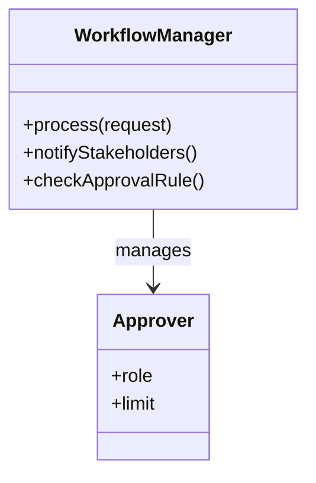

`WorkflowManager` クラスが、ワークフローの「状態遷移」、各担当者への「通知」、「承認可否のルール判定」という3つの重い責務をすべて握りしめています。
---

### 1-5：依存グラフ

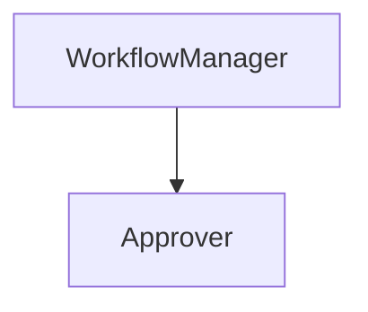

`WorkflowManager` に責務と依存が集中しており、このクラスを修正しないと何も変えられない「単一障害点」の構造になっています。
---

### 1-6：実行結果

上記コードの実行結果：

```text
承認待ち状態へ移行。
申請者に通知
```

これから検討するのは、同じ機能を保ちながら、変更に強い構造をどう作るかという点です。

### 1-7：届いた変更要求

ある金曜日の夕方、経理部のマネージャーがデスクにやってきました。

「お疲れ様。今度、承認ワークフローに『緊急申請ルート』を追加することになったんだ。 通常は平社員→課長→部長という承認順序なんだけど、緊急時は課長を飛ばして直接部長に通知が飛ぶようにしたい。 それと、部長が承認した直後に、自動的に『決済部門』へも通知が飛ぶようにしてほしいんだよね。 承認が却下された場合も、申請者に即座にアラートを出す仕組みは必須だよ。いつまでに対応できるかな？」

ふむ、なるほど。 承認ルートのスキップや、特定の状態での追加通知、そして却下時の通知強化と、ワークフローの柔軟性を高める要求ですね。 今の `WorkflowManager` にこれらを付け足すと、さらに条件分岐が複雑化し、修正が困難になる予感がします。


---

## 🟣 フェーズ2：仮説立案 ―― 何が変わるかを観察し、ヒアリングで裏付ける

フェーズ1で、WorkflowManagerが状態遷移・通知・判定ルールをすべて直接保持している現状を把握しました。届いた変更要求を踏まえ、この設計における変動と不変を整理します。

### 2-1：責任テーブル

| **クラス名** | **責任（1文）** | **知るべきこと** |
| --- | --- | --- |
| `WorkflowManager` | 承認ワークフローの全体フローを統括する。 | 状態遷移ルール、通知先一覧、承認判定基準。 |
| `Approver` | 承認者個人の情報を管理する。 | 承認者の役職や承認上限額。 |

`WorkflowManager` は、ワークフローのフローそのものだけでなく、誰にどう通知するか、どう判定するかという個別の詳細までを知りすぎている状態です。
### 2-2：責任チェック表

| **コードの行** | **持っている知識** | **管理者（観察）** |
| --- | --- | --- |
| `if (status == "SUBMITTED")` | 状態遷移のルール | フロー設計担当 |
| `notify("申請者に通知")` | 通知の仕組み | 通知サービス担当 |
| `if (amount > 100000)` | 承認の判定ルール | 経理ルール担当 |

> 複数の部門が関わる知識が同じ `WorkflowManager` 内に混在しており、状態遷移、通知、判定ルールという変化の理由が異なる要素が同じ場所に並んでいることが見えました。
> 
> 

### 2-3：変動・不変の仮説テーブル

フェーズ2の責任チェック表を材料に、何が変動し、何が変わらないのかの仮説を立てます。

| **分類** | **仮説** | **根拠（フェーズ2の観察から）** |
| --- | --- | --- |
| 🔴 **変動しそう** | 承認ルートの遷移順序 | 2-2で状態遷移ルールがハードコードされていると観察したため。 |
| 🔴 **変動しそう** | 承認時の通知先リスト | 2-2で通知ロジックが固定されていると観察したため。 |
| 🔴 **変動しそう** | 金額に応じた判定ルール | 2-2で判定ロジックが混在していると観察したため。 |
| 🟢 **不変** | ワークフローシステム自体の存在意義 | 申請と承認という業務プロセス自体は不変のため。 |

コードを読んだだけで「変わる」「変わらない」と断定するのは危険です。 関係者に直接確認します。

### 2-4：関係者ヒアリング

仮説を持って、ワークフローの運用担当者と話し合いを持ちました。

* **開発者：** 「今回のような『緊急ルート』以外にも、今後別の承認ルートが追加される可能性はありますか？」


* **運用担当者：** 「ああ、あるね。 例えば、海外出張時だけの特殊ルートや、特定のプロジェクト限定の承認フローなども、今後は必要になるだろうな。」


* **開発者：** 「通知についても確認させてください。現状は『申請者』と『関係者』だけですが、承認プロセスに応じて通知先の役職が変わったりする要件はありますか？」


* **運用担当者：** 「それも重要だ。 部長が承認したら経理だけでなく、関連部署の担当者にもメールを飛ばしたいケースが多いね。」


* **開発者：** 「分かりました。状態遷移ルール、通知の送り先、判定ロジックを、すべて現在の `WorkflowManager` から切り離し、動的に組み合わせられる構造を目指すのが良さそうです。」

> **現実のヒアリングでは——** このシナリオでは相手がちょうど設計に役立つ情報を教えてくれています。現実には「変わるかどうか分からない」「たぶん変わらない」という答えが返ることも多いです。そのときは、コードの変更履歴（`git log`）や過去の障害記録を「ヒアリングの代わり」として使ってみてください。「過去に何度変わったか」が、「将来変わりやすいか」の最も正直な証拠です。

### 2-5：今回の確定変更テーブル

ヒアリングで「今回の変更要求として確実に変わること」が判明しました。これは今回のリファクタリングで必ず対応しなければならない内容です。

| **具体的な内容** | **変わるタイミング** | **根拠（誰との確認か）** |
| --- | --- | --- |
| 承認状態の遷移ルール（ルートスキップ等） | 承認フロー変更時 | 運用担当者との合意 |
| ステータス通知先リスト | 通知要件変更時 | 運用担当者との合意 |
| 金額等による判定ルール | 経理ルール変更時 | 運用担当者との合意 |

### 2-6：将来リスクテーブル

ヒアリングで「今回の変更ではないが、今後変わる可能性がある」として言及されたリスクです。確定変更と混在させずに別で管理することで、設計の根拠を明確に保てます。

| **変化リスク** | **言及内容** | **設計への影響** |
| --- | --- | --- |
| 承認ルートの多様化 | 海外出張時の特殊ルート、プロジェクト限定フローなどが今後必要になる可能性 | 状態遷移ロジックを外部から差し替えられる構造が望ましい |
| 通知先の拡張 | 部長承認後に経理以外の関連部署にも通知したいケースが増える可能性 | 通知先をリストとして管理し、追加が容易な構造が望ましい |

フェーズ2で「何が変わり、何が変わらないか」が確定しました。 次のフェーズ3では、この変更要求を実際に今のコードのままで試みて、どのような痛みが生じるかを確認します。


---

## 🟣 フェーズ3：問題特定 ―― 変更の痛みを発見する

### 3-1：変更シミュレーション

フェーズ2で確定した「緊急申請ルートの追加」と「承認直後の自動通知」という変更要求を、現在の `WorkflowManager` クラスに実装してみます。

はじめに、`process` メソッド内の状態遷移ロジックに「緊急フラグ」の判定を追加しました。 すると、本来であれば課長を経由する必要があるルートが複雑に分岐し始め、`if` 文がネストしてコードの可読性が急速に低下していきます。 次に、承認直後の通知処理を追加しようとして、また別の `if` 文を差し込みました。

すると、承認プロセスが「承認」なのか「却下」なのか、あるいは「緊急」なのかというフラグが大量に混在し、どのタイミングでどの通知が飛ぶのかを追うのが非常に困難になりました。 「あ、これ以上 `WorkflowManager` をいじると、既存の承認ルートまで壊れてしまいそうだ…」という不安が頭をよぎります。 実際に、緊急ルートを追加したことで、通常の承認ルートにおける通知が二重に送信されるバグが発生してしまいました。

### 3-2：変更影響グラフ

今の構造で変更を試みた際に、依存がどのように飛び火するかを図示します。

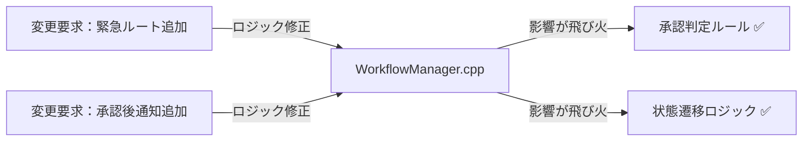

`WorkflowManager` が状態遷移、通知、判定ルールのすべてを抱え込んでいるため、一つの機能をいじると、本来無関係なはずの判定ロジックまで影響を受けてしまうことが分かります。

### 3-3：痛みの言語化

「承認ルートを変えたいだけなのに、なぜ他の状態遷移まで気にしなければならないのか…」

変更をシミュレーションする中で、明確な痛みが二つ浮き彫りになりました。

一つ目の痛みは、「状態管理とアクションの密結合」です。 承認状態が増えるたびに `WorkflowManager` 内の `if-else` 分岐が指数関数的に増え、状態遷移のルールを把握するのが極めて困難になっています。 「ある状態で何ができるか」というルールが、他の状態の知識と混在しているため、変更が怖くて手が付けられない状態です。

二つ目の痛みは、「通知と判定の責務過多」です。 承認時の通知や判定といったビジネスルールが、ワークフローの実行フローと同じ場所に記述されているため、これら一つを修正するたびに、本来のワークフロー実行フローを読み解き、壊さないように注意を払うという多大な認知的負荷が生じています。 このような構造では、承認プロセスの複雑化に伴って開発コストが膨れ上がるのは避けられません。

フェーズ3で「今の構造では変更が辛い」という事実が確認できました。 次のフェーズ4では、なぜこのように辛いのか、構造的な原因を深掘りします。

---

## 🟠 フェーズ4：原因分析 ―― なぜ辛いのかを構造で言語化する

フェーズ3で確認したように、「状態遷移」「通知先」「判定ルール」が `WorkflowManager` クラス内で混在していることが、システムを不安定にし、変更を困難にする最大の要因です。 この状態のまま拡張を繰り返すことは、複雑性の増大という負のスパイラルを招きます。

### 4-1：観察→原因テーブル

フェーズ3で確認された「痛み」と、その根本にある構造的な原因を対応させます。

| **根本原因** | **観察** | **必要な対策の方向** |
| --- | --- | --- |
| 根本原因A：状態遷移の混在（承認状態ごとの条件分岐がWorkflowManagerに集中） | 状態が増えるたびに`if-else`分岐が爆発的に増殖し、状態遷移ルールをカプセル化できていない | →Stateで解消 |
| 根本原因B：通知先管理の混在（通知先追加のたびWorkflowManager修正が必要） | 通知先を変えるたびに`WorkflowManager`内部の通知ロジックを直接書き換える必要がある | →Observerで解消 |
| 根本原因C：判定ルールの混在（承認判定ロジックが状態クラスに直書き） | `if (amount > 100000)` のような判定ロジックが直書きされており、ルール変更のたびに内部実装を書き換えなければならない | →Strategyで解消 |

これら3つの根本原因は**それぞれ独立した変化軸**です。

- 「承認フローの状態遷移」が変わっても（新しい状態が増えても）、通知先の管理方法は変わりません
- 「通知先の変動」が起きても、状態ごとの振る舞いや承認ルールには影響しません
- 「承認ルールの変更」が起きても、状態の種類や通知先の管理には影響しません

3つが独立しているからこそ、1つのパターンだけでは解決しきれません。

コードを追うと、`WorkflowManager` がワークフローの「フロー（骨格）」だけでなく、「個別のビジネスルール（判定）」や「付随するアクション（通知）」までを一身に背負っていることが分かります。

### 4-2：変わるもの / 変わらないものテーブル

構造を整理するために、変化の軸を明確に分離します。

| **変わり続けるもの（🔴）** | **変わってほしくないもの（🟢）** |
| --- | --- |
| 承認状態遷移のルール（ルート制御） | 申請・承認という業務プロセスの基本骨格 |
| 各状態における通知先リスト | 承認フローの実行順序（入口から出口までの流れ） |
| 金額や役職による承認可否判定 | 申請データが通過する状態遷移の基盤 |

現状では、「承認フローを動かす」という一つの目的に向かって、これら全ての要素が同じレイヤーで記述されています。 変化する「承認ルール」や「通知要件」は、基本フローの骨格から切り離し、独立して差し替え可能な部品として定義する必要があります。

### 4-3：接続形態を診断する

現在の接続形態を2×2マトリクスで診断します。

今の承認システムは、専用の変換回路が内蔵されたハブに対して、各機能への専用ケーブルを直差ししているような状態（具体×直接）です。状態遷移ルールを変えたり通知先を増やしたりするたびに、ハブ内部の配線をいじり回さなければならないため、少しの修正がシステム全体を揺るがすリスクを孕んでいます。

|  | 直接（直差し） | 間接（アダプター経由） |
|:---:|:---|:---|
| **具体**（専用規格） | **← 現在地**　ライトニング直生え → iPhone（直差し） | ライトニング直生え → ゲーム機専用アダプタを挟む → ゲーム機 |
| **抽象**（汎用規格） | Type-C直生え → 各種機器（直差し） | ライトニング直生え → Type-C変換アダプタを挟む → 各種機器 |

このコードで言うと：

| ケーブル比喩 | コードの対応箇所 |
|---|---|
| 「具体」＝専用規格ケーブル | `if (status == "SUBMITTED")` / `if (amount > 100000)` — 承認ステータス文字列と金額閾値を `process()` に直接ハードコードしている |
| 「直接」＝直差し | 状態遷移・`notify()` 呼び出し・判定ルール（`if (amount > 100000)`）を `process()` 内にすべて直接記述しており、責務を分離する中間層がない |

「状態遷移ルール」「通知要件」「判定ロジック」は、それぞれが独立して頻繁に変更される可能性を秘めています。 これらを一つのクラスで混在させて管理するのではなく、インターフェースを介した接続形態へ分離することが、システムの設計を健全化する鍵となります。

フェーズ4で根本原因が言語化できました。 次のフェーズ5では、この分析を元に解決する課題を具体的に定義していきます。

---

## 🟡 フェーズ5：課題定義 ―― 解くべき接続点を特定する

フェーズ4で、「承認状態の変化」「関係者への通知」「承認可否のルール判定」という異なる性質を持つ3つの責務が `WorkflowManager` クラスに混在していることが、システムを硬直化させている原因であると特定しました。 この状態を放置すると、承認プロセスが複雑になるたびに修正コストが指数関数的に増大し、システムの保守は不可能に近くなります。

対策を検討する前に、今回のリファクタリングで解決する課題を4つの視点で整理し、確定させます。

### 5-1：接続点の特定

フェーズ4での分析に基づき、以下の3つの接続点（ジョイント）を特定しました。

* 接続点A：`WorkflowManager` ←→ 状態遷移ルールの境界
* 接続点B：`WorkflowManager` ←→ 通知処理の境界
* 接続点C：`WorkflowManager` ←→ 承認可否判定ロジックの境界

これらは現状、`WorkflowManager` 内で一つの巨大な処理塊として絡み合っています。 これらを独立した接続点として切り離し、外部から差し替え可能な構造にすることが今回の最大の課題です。

### 5-2：クライアントへの影響範囲

分離対象の各処理を呼び出している `WorkflowManager` クラスが最大のクライアントです。 このクラスが各ロジックの詳細をすべて直接呼び出しているために、少しの要件変更でクラス全体を書き直さざるを得ません。 各責務を分離することで、`WorkflowManager` はワークフローの「骨格（実行順序）」のみを管理し、実際の判定や通知は分離した部品に任せることができます。

### 5-3：課題まとめ表

分析結果をまとめます。

| **接続点** | **分けた理由** | **非機能制約** | **クライアント影響** |
| --- | --- | --- | --- |
| 接続点A | 状態遷移ロジックの複雑化回避 | 変更頻度：高・複数承認者による同時操作時の競合制御がWorkflowOrchestrator設計に影響 | `WorkflowManager` の状態管理部 |
| 接続点B | 通知ルールの多様化対応 | 変更頻度：高 | `WorkflowManager` のイベント処理 |
| 接続点C | 承認ルール変更への追随 | 変更頻度：高 | `WorkflowManager` の判定処理 |

この表が、フェーズ6の対策検討における出発点となります。 「状態管理」「通知」「ルール判定」をどのようにこれら3つの接続点に割り当て、分離するかが、本章の設計の核心です。

フェーズ5で「何を解くか」が確定しました。 次のフェーズ6では、これらの課題に対して具体的にどのような構造を適用するか、コストの観点からステップを検討します。

---

## 🔴 フェーズ6：段階的進化 ―― どこまで設計を進めるべきか

フェーズ5で整理した「状態遷移」「通知」「判定ルール」という3つの接続点に対し、柔軟で変更に強い設計を検討します。

### 6-1：接続の形 2×2マトリクス

現在の承認システムは、すべての責務が `WorkflowManager` に詰め込まれた「具体×直接」の状態です。 これらを分離し、抽象インターフェースと間接層を導入することで、責務を切り出します。

| 接続形態 | ケーブル例 | 特徴 |
|:---:|:---|:---|
| **具体×直接**（← 現在地） | ライトニング直生え → iPhone（直差し） | 専用端子のみ対応。差し替え不可 |
| **具体×間接** | ライトニング直生え → ゲーム機専用アダプタを挟む → ゲーム機 | 変換器を挟むが規格は専用のまま |
| **抽象×直接** | Type-C直生え → 各種機器（直差し） | どのメーカーでも同じ口で繋がる |
| **抽象×間接** | ライトニング直生え → Type-C変換アダプタを挟む → 各種機器 | アダプタを介して汎用規格で展開可能 |

---

どのステップも、動作例テーブルで示した動作を実現します。違うのは「変更が来たときにどこを触ることになるか」です。

---

#### Step 1：具体×直接 ―― プライベートメソッドで責任を整理する

**この形の考え方：**
フェーズ3で示したコードを、接続の形は変えずにプライベートメソッドで整理した形です。`WorkflowManager` と `EscalationEngine` が判定・通知のロジックを自分自身で直接実行する（具体×直接）点は変わりませんが、各ケースをプライベートメソッドに抽出することで読みやすさが大きく向上します。

**構造図：**

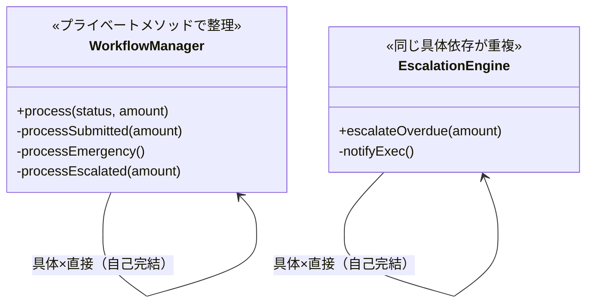

両クラスとも外部オブジェクトに委ねず自ら判定・通知する（直接）。承認ルールが変わると2か所を同時に修正しなければならない点はフェーズ3と変わらないが、プライベートメソッドで読みやすくなった。

**手段比較：**

| 手段 | アプローチ | 評価 |
| --- | --- | --- |
| 手段A：プライベートメソッドに抽出 | 各分岐の処理をプライベートメソッドに切り出す | ✅（読みやすさが向上する） |
| 手段B：コメントのみで整理 | コードは変えずにコメントだけ整理する | ✗（構造問題は解決しない） |

手段Aを採用します。接続形態は具体×直接のままですが、各処理の意図がメソッド名で明確になります。

**WorkflowManager クラス（Step 1）：**

```cpp
// Step 1：プライベートメソッドで各分岐の責任を整理（具体×直接）
class WorkflowManager {
public:
    void process(string status, double amount) {
        if (status == "SUBMITTED")  { processSubmitted(amount); return; }
        if (status == "EMERGENCY")  { processEmergency();        return; }
        if (status == "ESCALATED")  { processEscalated(amount);  return; }
    }
private:
    void processSubmitted(double amount) {
        // ← 直接：判定ロジックをこのメソッド内で自分で実行する
        if (amount > 100000)
            cout << "役員承認が必要。" << endl;
        else
            cout << "審査待ち状態へ移行。" << endl;
    }
    void processEmergency() {
        cout << "緊急承認ルートで処理。部長へ直接通知。" << endl;
    }
    void processEscalated(double amount) {
        // ← 直接：エスカレーション判定も自分で実行する
        if (amount > 100000)
            cout << "期限超過。役員承認要。役員へ直接通知。" << endl;
    }
};
```

**EscalationEngine クラスと main（Step 1）：**

```cpp
// EscalationEngineも同じ構造でプライベートメソッドに整理
class EscalationEngine {
public:
    void escalateOverdue(double amount) {
        // ← 具体かつ直接：WorkflowManagerと同じ判定ロジックを重複して保持
        if (amount > 100000) {
            notifyExec();
        }
    }
private:
    void notifyExec() {
        cout << "役員へ直接通知：期限超過エスカレーション。" << endl;
    }
};

int main() {
    WorkflowManager wf;
    wf.process("SUBMITTED", 50000);
    wf.process("EMERGENCY", 80000);

    EscalationEngine engine;
    // ← 具体×直接：amount > 100000の判定がここでも重複している
    engine.escalateOverdue(150000);
    return 0;
}
```

プライベートメソッドに整理したことで各処理の意図は読みやすくなりましたが、両クラスともに `amount > 100000` という判定ルールを直接知っており、ルールが変わると2か所を修正しなければならない構造は変わっていません。

一文要約：フェーズ3のコードをプライベートメソッドで読みやすく整理した形で、接続は「具体×直接」のまま、同じ判定ロジックが2か所で並行して走る。

**この形のトレードオフ：**

* 変更容易性：低（承認ルールが変わると両クラスを修正する必要がある）


* テスト容易性：低（判定ロジックが内部に閉じており切り離せない）


* 実装コスト：低（プライベートメソッドへの抽出のみ）


---

#### Step 2：具体×間接 ―― 処理を別クラスに切り出して委ねる

**この形の考え方：**
判定ルールを `RuleChecker` クラスに切り出し、`WorkflowManager` はその具体クラスを名指しで知った上で判断を委ねます（具体×間接）。自分で判定するのではなく、切り出したオブジェクトに任せる（間接）ことで、判定の責任が明確に分離されます。ただし `WorkflowManager` は `RuleChecker` という具体型を名指しで保持しており、差し替えるには呼び出し元の修正が必要です。

**構造図：**

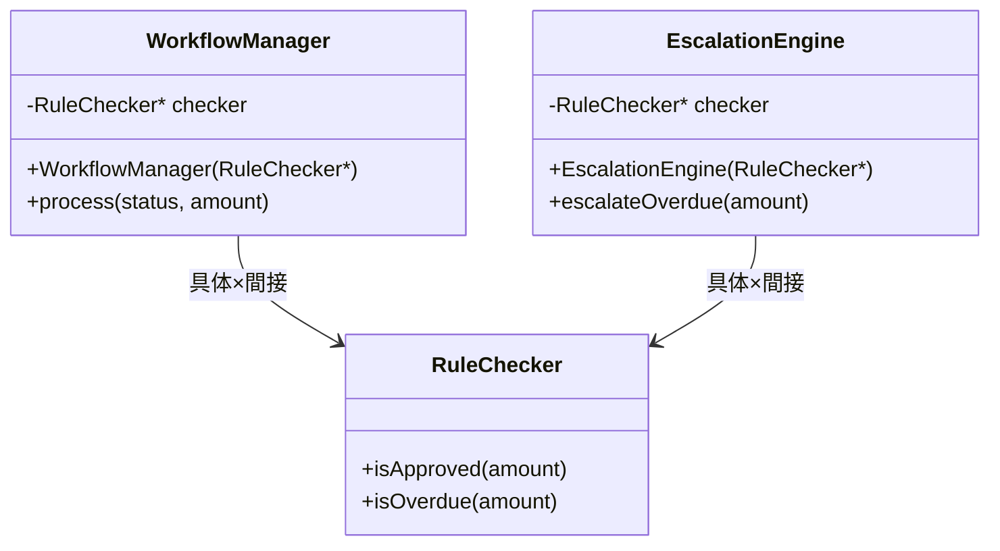

クラスは分離されて処理を委ねるようになりましたが（間接）、`WorkflowManager` と `EscalationEngine` の両方が `RuleChecker*` という具体型を名指しで知っており（具体）、ルール変更時に両方の修正が必要になる。

**手段比較：**

| 手段 | アプローチ | 評価 |
| --- | --- | --- |
| 手段A：コンストラクタインジェクション | `RuleChecker` を外部から注入し、判断を委ねる | ✅（この手段の定義通り） |
| 手段B：内部で直接 new | `WorkflowManager` 内部で `new RuleChecker()` する | ✗（テストで差し替えができない） |

手段Aを採用します。処理を切り出したクラスに「委ねる」形になり、判定の責任が明確に分離されました。ただし呼び出し側が `RuleChecker` という具体クラス名を直接知り続けることは変わりません。

**RuleChecker クラス（Step 2）：**

```cpp
// Step 2：判定ルールを独立したクラスに切り出した（具体×間接）
class RuleChecker {
public:
    // ← 間接：呼び出し元はここに判断を委ねる
    bool isApproved(double amount) {
        return amount <= 100000;
    }
    bool isOverdue(double amount) {
        return amount > 100000;
    }
};
```

**WorkflowManager クラス（Step 2）：**

```cpp
// WorkflowManagerが具体クラスを知り、判断を委ねる（具体×間接）
class WorkflowManager {
    // ← 具体：RuleCheckerという型名を名指しで知っている
    RuleChecker* checker;
public:
    WorkflowManager(RuleChecker* c) : checker(c) {}

    void process(string status, double amount) {
        if (status == "SUBMITTED") {
            // ← 間接：判定はcheckerに委ねる（自分では判定しない）
            if (checker->isApproved(amount))
                cout << "承認完了。" << endl;
            else
                cout << "審査待ち状態へ移行。" << endl;
            return;
        }
        if (status == "EMERGENCY") {
            cout << "緊急承認ルートで処理。部長へ直接通知。" << endl;
            return;
        }
        if (status == "ESCALATED") {
            // ← 間接：エスカレーション判定もcheckerに委ねる
            if (checker->isOverdue(amount))
                cout << "期限超過。役員承認要。役員へ直接通知。" << endl;
            return;
        }
    }
};
```

**EscalationEngine クラスと main（Step 2）：**

```cpp
// EscalationEngineも同じ具体クラスを知り、判断を委ねる
class EscalationEngine {
    // ← 具体：WorkflowManagerと同じRuleChecker*を重複して保持
    RuleChecker* checker;
public:
    EscalationEngine(RuleChecker* c) : checker(c) {}

    void escalateOverdue(double amount) {
        // ← 間接：判定はcheckerに委ねる
        if (checker->isOverdue(amount))
            cout << "役員へ直接通知：期限超過エスカレーション。" << endl;
    }
};

int main() {
    // ← 呼び出し側でRuleCheckerを生成して渡す
    RuleChecker checker;

    // ← 具体：RuleCheckerという型をmainが直接知っている（重複）
    WorkflowManager wf(&checker);
    wf.process("SUBMITTED", 50000);
    wf.process("ESCALATED", 150000);

    EscalationEngine engine(&checker);
    engine.escalateOverdue(150000);
    return 0;
}
```

判定処理を別クラスに委ねる形（間接）になりましたが、`RuleChecker` という具体クラス名の知識が両クラスに重複しており、ルールが変わると `RuleChecker` 自体の修正と、それを使う両クラスへの影響確認が必要になります。

一文要約：判定を別クラスに委ねるようになった（間接）が、「どのクラスを使うか」という具体クラス名の知識が両方の呼び出し元に重複して残っている（具体）。

**この形のトレードオフ：**

* 変更容易性：低〜中（判定ロジックは分離できたが、具体クラス名の依存は両方に残る）


* テスト容易性：低（具体クラスへの依存が強く、差し替えが難しい）


* 実装コスト：中（コンストラクタインジェクションへの切り出し工数が発生する）


---

#### Step 3：抽象×直接 ―― インターフェースを挟み、型だけで接続する

**この形の考え方：**
判定ルール、状態遷移の各責務にインターフェースを導入します。 インターフェースを介すことで、クラス間の依存を具体型から抽象型へ切り替え、差し替え可能にします。

**構造図：**

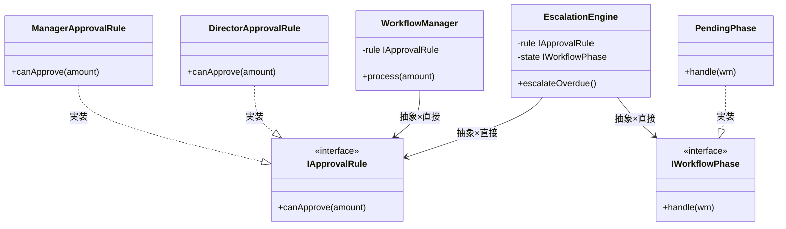

`main()` が具体クラスを生成してインターフェース経由で注入するため、両クラスとも具体的な判定クラスや状態クラスを知らずに済み、選択ロジックの重複が解消される。

**手段比較：**

| 手段 | アプローチ | 評価 |
| --- | --- | --- |
| 手段A：コンストラクタ注入 | 依存をコンストラクタ引数として受け取る | ✅（最も単純で明示的） |
| 手段B：セッター注入 | `setRule(IApprovalRule*)` のように後から差し込む | ✗（初期化順序の管理が複雑になる） |
| 手段C：サービスロケーター | グローバルなレジストリから取得 | ✗（依存が暗黙になりテストが困難） |

手段Aのコンストラクタ注入を採用します。依存が明示的になり、テスト時にスタブを渡しやすくなります。

【コード例】

**インターフェース定義**

```cpp
// 承認可否の判定ルール（インターフェース）
class IApprovalRule {
public:
    virtual bool canApprove(double amount) = 0;
};

// 状態遷移の抽象（インターフェース）
class IWorkflowPhase {
public:
    virtual void handle(class WorkflowManager* wm) = 0;
};

```

**判定ルールの実装クラス群**

```cpp
class ManagerApprovalRule : public IApprovalRule {
public:
    bool canApprove(double amount) override {
        return amount <= 500000; // ← 課長の承認上限
    }
};

class DirectorApprovalRule : public IApprovalRule {
public:
    bool canApprove(double amount) override {
        return amount <= 5000000; // ← 部長の承認上限
    }
};

```

**状態クラスの実装**

```cpp
class PendingPhase : public IWorkflowPhase {
public:
    void handle(WorkflowManager* wm) override {
        cout << "審査待ち状態で処理中。" << endl;
    }
};

```

**WorkflowManager クラス（抽象型で受け取る）**

```cpp
class WorkflowManager {
    IApprovalRule* rule; // ← 抽象：IApprovalRule*型で受け取り、具体クラスを知らない
public:
    WorkflowManager(IApprovalRule* r) : rule(r) {}
    void process(double amount) {
        if (rule->canApprove(amount)) {
            // ← 直接：中間クラスを挟はじめにに直接呼び出す
            cout << "承認完了。" << endl;
        } else {
            cout << "上位承認者へ転送。" << endl;
        }
    }
};

```

**呼び出し側から見た違い（main() 例）：**

**EscalationEngine クラス（インターフェース経由で注入）**

```cpp
// Step 3（抽象×直接）の呼び出し側
// 注入アプローチにより、両クラスで選択ロジックの重複がなくなる
class EscalationEngine {
    IApprovalRule* rule;
    // ← 抽象：外部から注入されたインターフェースのみ知っている
    IWorkflowPhase* state;
    // ← 抽象：外部から注入されたインターフェースのみ知っている
public:
    EscalationEngine(IApprovalRule* r, IWorkflowPhase* st)
        : rule(r), state(st) {}
    void escalateOverdue() {
        cout << "[EscalationEngine] 期限超過申請を処理中。" << endl;
        state->handle(nullptr);
        // ← 直接：インターフェース経由で直接呼び出す
    }
};

```

**main()**

```cpp
int main() {
    ManagerApprovalRule rule;              // ← 具体：呼び出し側だけが具体クラスを生成
    WorkflowManager wf(&rule);            // ← 直接：インターフェース経由で直接注入
    wf.process(50000);

    DirectorApprovalRule esc_rule;
    PendingPhase esc_state;
    EscalationEngine engine(&esc_rule, &esc_state);
    // ← 直接：同様に注入
    engine.escalateOverdue();
    return 0;
}
```

注入アプローチにより、両クラスとも具体クラスを知らずに済み、選択ロジックの重複が解消される。

一文要約：`main()` が具体型を組み立て、両方の呼び出し元は `IApprovalRule*`・`IWorkflowPhase*` という型だけを介して呼ぶため、具体クラスが変わっても呼び出し経路は変わらない。

**この形のトレードオフ：**

* 変更容易性：中〜高（ルール差し替えがインターフェース経由で完結する）


* テスト容易性：高（判定ルールをスタブに差し替えてテスト可能）


* 実装コスト：中（インターフェースと複数の実装クラスが必要）

**Step 3で解決できること・できないこと**

Step 3でインターフェース化を導入したことで、一部の変化軸を切り離せるようになりました。しかし、まだ2つの問題が残っています。

1. **通知の問題**：承認・却下のたびに通知が走りますが、通知先リストの管理がまだ`WorkflowManager`に混在しています。通知先が増えるたびに`WorkflowManager`を変更しなければなりません。
2. **承認ルールの問題**：どの条件で承認・却下するかのルールがまだハードコードされており、ルール変更のたびに内部実装を書き換えなければなりません。

Step 4では、これら2つの残課題を順番に解決します。

**Step 3の限界**

Step 3でStateによる状態遷移の整理はできたが、通知先管理の問題が残っている。新しい通知先（承認者へのSlack通知など）を追加するたびにWorkflowManagerの修正が必要になる。次のStep 4では、この通知の問題を解消するためObserver構造が、さらに判定ルールを外部化するためStrategy構造が自然に加わります。

---

#### Step 4：抽象×間接 ―― インターフェース＋仲介役を両立する

まず「通知の問題」を解決します。通知先をリストで管理し、`WorkflowManager`は通知先の存在を知らなくてよい設計にします。

しかし通知を解決しても「承認ルールの問題」はまだ残ります。そこでさらに、承認ルールを外部から差し替えられる仕組みを加えます。

この2つをStep 3の構造に重ねることで、3つの変化軸がそれぞれ独立して変更できる設計が完成します。

**この形の考え方：**
状態遷移、ルール判定、通知を、それぞれインターフェース経由で仲介クラスに結合させます。 完全に疎結合となり、将来のあらゆる変更要求に対して、メインロジックを一切触らずに対応可能です。

**構造図：**

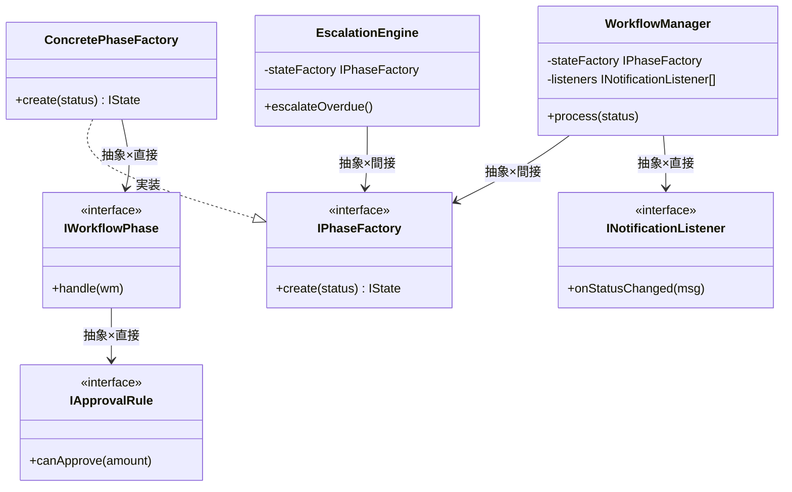

`WorkflowManager` は抽象ファクトリーのみを知り、状態クラスの具体型は `ConcretePhaseFactory` の内部に完全に隠蔽されるため、新しい状態を追加してもワークフロー本体への変更は不要となる。

**手段比較：**

| 手段 | アプローチ | 評価 |
| --- | --- | --- |
| 手段A：ファクトリー＋リスナーリスト | 状態生成をファクトリーに委譲し、通知はリスナーリストで管理 | ✅（3つの変化軸すべてを独立して差し替え可能） |
| 手段B：ファクトリーのみ | 状態生成だけファクトリーに委譲し、通知は直書き | ✗（通知の変化軸が残る） |
| 手段C：DIコンテナ | フレームワークに依存解決を委ねる | ✗（本章のスコープ外。フレームワーク依存を避ける） |

手段Aを採用します。状態生成・判定ルール・通知の3つをすべて独立して差し替えられる唯一の構造です。

【コード例】

**インターフェース定義**

```cpp
// 状態遷移の抽象（インターフェース）
class IWorkflowPhase {
public:
    virtual void handle(class WorkflowManager* wm) = 0;
};

// 承認可否の判定ルール（インターフェース）
class IApprovalRule {
public:
    virtual bool canApprove(double amount) = 0;
};

// 通知リスナー（インターフェース）
class INotificationListener {
public:
    virtual void onStatusChanged(string msg) = 0;
};

// 状態生成ファクトリー（インターフェース）
class IPhaseFactory {
public:
    virtual IWorkflowPhase* create(string status) = 0;
};

```

**具体的な状態クラス群**

```cpp
class PendingPhase : public IWorkflowPhase {
public:
    void handle(WorkflowManager* wm) override {
        cout << "審査待ち状態で処理中。" << endl;
        // 判定ルールへの委譲はWorkflowManagerが保持するルールを使う
    }
};

class ApprovedState : public IWorkflowPhase {
public:
    void handle(WorkflowManager* wm) override {
        cout << "承認済み状態へ移行。" << endl;
    }
};

class RejectedState : public IWorkflowPhase {
public:
    void handle(WorkflowManager* wm) override {
        cout << "却下状態へ移行。" << endl;
    }
};

```

**ファクトリークラス（具体型の知識をここに封じ込める）**

```cpp
class ConcretePhaseFactory : public IPhaseFactory {
public:
    IWorkflowPhase* create(string status) override {
        if (status == "PENDING")   return new PendingPhase();
        if (status == "APPROVED")  return new ApprovedState();
        if (status == "REJECTED")  return new RejectedState();
        return nullptr;
    }
};

```

**WorkflowManager クラス（抽象ファクトリーとリスナーリストのみ知る）**

```cpp
#include <vector>
using namespace std;

class WorkflowManager {
    IPhaseFactory* stateFactory; // ← 抽象：IPhaseFactory*型で受け取り、具体実装を知らない
    vector<INotificationListener*> listeners;
public:
    WorkflowManager(IPhaseFactory* f) : stateFactory(f) {}

    void addListener(INotificationListener* listener) {
        listeners.push_back(listener);
    }

    void process(string status) {
        IWorkflowPhase* state = stateFactory->create(status);
        // ← 間接：Factory経由で呼ぶため具体クラスが見えない
        state->handle(this);
        notifyAll("状態変化: " + status);
    }

private:
    void notifyAll(string msg) {
        for (auto listener : listeners) {
            listener->onStatusChanged(msg);
        }
    }
};

```

**呼び出し側から見た違い（main() 例）：**

**通知リスナーの実装クラス**

```cpp
class EmailNotificationListener : public INotificationListener {
public:
    void onStatusChanged(string msg) override {
        cout << "[Email通知] " << msg << endl;
    }
};

class SlackNotificationListener : public INotificationListener {
public:
    void onStatusChanged(string msg) override {
        cout << "[Slack通知] " << msg << endl;
    }
};

```

**main()**

```cpp
// Step 4（抽象×間接）の呼び出し側
int main() {
    ConcretePhaseFactory factory;         // ← 具体：組み立て側だけが具体型を知る
    WorkflowManager wf(&factory);         // ← 間接：抽象Factoryのみ見えて具体実装は隠れる

    EmailNotificationListener emailListener;
    SlackNotificationListener slackListener;
    wf.addListener(&emailListener);
    wf.addListener(&slackListener);

    wf.process("PENDING");
    return 0;
}
```

**動作図：**

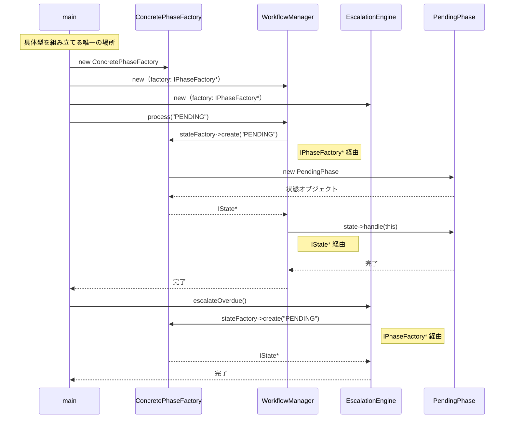

一文要約：呼び出し元→`IPhaseFactory*`→`IState*` という2段階の抽象型を経由するため、どの具体クラスが動くかは `main()` の組み立て部分だけが知っている。

**この形のトレードオフ：**

* 変更容易性：高（どのパーツが変わっても全体は無影響）


* テスト容易性：高（すべての部品が独立してスタブ化可能）


* 実装コスト：高（インターフェース、ファクトリ、多数のクラスが必要）

---

### どこまで設計を進めるべきか（採用ステップの決断）

それぞれのステップには一長一短があります。ステップ4の「抽象×間接（State/Observer/Strategyの統合）」は極めて強力ですが、クラス数が激増し構造が複雑になる「初期投資コスト」もかかります。どこで止めるかは、**「今後の変更頻度（ビジネス要求）」**で決断します。

*   **Step 1（具体×直接）で止めるケース：** 承認フローが「申請→承認」の1段階のみで、金額による分岐なども将来発生しない場合。
*   **Step 2（具体×間接）で止めるケース：** 判定ルールは複雑になるが、状態（ステータス）の種類や通知先は固定されている場合。
*   **Step 3（抽象×直接）で止めるケース：** 状態の種類は増えるが、通知先や判定ルールが非常にシンプルで可変性が低い場合。
*   **Step 4（抽象×間接）まで進むケース：** 状態の追加、複雑な承認ルールの変更、多様な通知手段の追加など、複数の要件が独立して頻繁に変化する場合。

**今回の決断：**
フェーズ2のヒアリングで「金額や部署ごとの複雑な承認ルールの追加（判定ロジックの変化）」、「差し戻しや保留といった新しいステータスの追加（状態の変化）」、「Chatworkやメールなどへの通知手段の多様化（通知の変化）」という3つの独立した要件が求められています。承認ワークフローの「状態」「判定」「通知」という異なる3つの責務が絡み合っているため、これらを個別にインターフェース化し抽象層を設ける**ステップ4（抽象×間接）まで進化させる**決断を下します。

> 実は、この章で選んだStep 4の構造は、「状態ごとの振る舞いをオブジェクトとして切り出す」手法（第3章で学んだ**Stateパターン**）、「判定ルールを外部から差し替え可能にする」手法（第1章で学んだ**Strategyパターン**）、「状態変化を登録されたリスナーへ伝搬させる」手法（第7章で学んだ**Observerパターン**）の3つの仕組みを組み合わせた複合設計です。「パターンを学んで使い方を覚える」のではなく、「問題を分析した結果として自然に選ばれた構造」がこの3つのパターンの組み合わせだったという順序が大切です。

### どのパターンを使うかの判断基準

3つのパターンのどれを適用するか判断するための基準を整理します。以下のフローチャートを使うと、今の問題にどのパターンが必要かを順を追って確認できます。

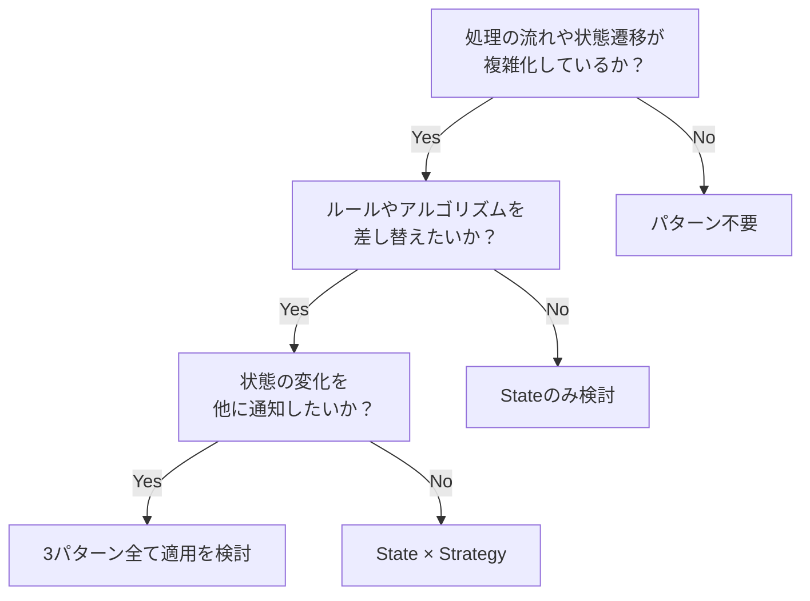

### 6-5：耐久テスト

フェーズ2で予告された変更要求に対する、採用したStep 4の耐性をテストします。

| **変更シナリオ** | **触る場所** | **コスト評価** |
| --- | --- | --- |
| 承認順序を役職ベースから金額ベースへ変更する | 新規判定ルールクラスの実装 | 低 |
| 承認却下時にSlackだけでなくメール通知を追加する | 新規リスナークラスの実装 | 低 |

採用した複合設計では、ルール判定も通知もインターフェース越しに結合されているため、新しい要件は新規クラスを追加するだけで対応でき、既存のワークフロー本体を触る必要がありません。

---

## 🟢 フェーズ7：対策実施 ―― 変化に強いコードを完成させる

Step 4（抽象×間接）を実装し、承認ワークフローの「状態」「判定」「通知」という3つの責務を疎結合に分離します。

フェーズ6でStep 4として選んだ構造は、「状態ごとの振る舞いをオブジェクトとして切り出す」手法（第3章で学んだStateパターン）、「判定ルールを外部から差し替え可能にする」手法（第1章で学んだStrategyパターン）、「状態変化を登録されたリスナーへ伝搬させる」手法（第7章で学んだObserverパターン）の3つの仕組みを組み合わせた複合設計です。

これらの構造は、第3章で学んだ**Stateパターン**（チケット予約管理で「状態ごとの振る舞いをオブジェクトに分離する」構造）、第7章で学んだ**Observerパターン**（在庫管理システムで「変化を登録リスナーへ伝搬する」構造）、第1章で学んだ**Strategyパターン**（ECサイトの決済計算で「ルールを外部から差し替え可能にする」構造）を組み合わせたものです。各パターンの詳細は各章を参照してください。ここでは3つを組み合わせた複合設計の全体像に集中します。

### 7-1：解決後のコード（全体）

判定ルールを `IApprovalRule` として、状態遷移を `IWorkflowPhase` として、通知を `INotificationListener` として定義しました。 これらを `WorkflowManager` が保持・管理することで、複雑なワークフローを整理します。

**インターフェース定義（3つの変化軸）**

```cpp
#include <iostream>
#include <vector>

using namespace std;

// 判定ルールの契約（変わる理由：経理ルール変更）
class IApprovalRule {
public:
    virtual bool canApprove(double amount) = 0;
};

// 通知リスナーの契約（変わる理由：通知先変更）
class INotificationListener {
public:
    virtual void onStatusChanged(string msg) = 0;
};

// 状態遷移の契約（変わる理由：承認フロー変更）
class IWorkflowPhase {
public:
    virtual void handle(class WorkflowManager* wm) = 0;
};

```

**承認判定ルールの具体実装**

```cpp
// 承認判定ルールの具体実装
class ManagerApprovalRule : public IApprovalRule {
public:
    bool canApprove(double amount) const override {
        return amount <= 100000; // 10万円以下はマネージャー承認
    }
};

class DirectorApprovalRule : public IApprovalRule {
public:
    bool canApprove(double amount) const override {
        return amount <= 1000000; // 100万円以下は部長承認
    }
};

```

**状態クラスの実装（IApprovalRuleを使用）**

```cpp
struct ApprovalRequest {
    double amount;
};

class PendingPhase : public IWorkflowPhase {
    IApprovalRule* rule; // ← 判定ルールを外部から注入
public:
    PendingPhase(IApprovalRule* r) : rule(r) {}

    void handle(WorkflowManager* wm) override {
        ApprovalRequest req{50000};
        if (rule->canApprove(req.amount)) {
            cout << "審査待ち：承認可能。承認済み状態へ移行。" << endl;
            wm->notifyAll("承認済みに移行しました");
        } else {
            cout << "審査待ち：上位承認者へエスカレーション。" << endl;
            wm->notifyAll("エスカレーションが発生しました");
        }
    }
};

```

**WorkflowManager クラス（骨格のみを担当）**

```cpp
// 最終的なワークフロー管理
class WorkflowManager {
    IWorkflowPhase* state; // ← ここだけ変わる
    vector<INotificationListener*> listeners;
public:
    void setState(IWorkflowPhase* s) { state = s; }

    void addListener(INotificationListener* listener) {
        listeners.push_back(listener);
    }

    void process() {
        state->handle(this); // ← 知らなくていい（状態遷移の詳細はStateが管理）
    }

    void notifyAll(string msg) {
        for (auto listener : listeners) {
            listener->onStatusChanged(msg);
        }
    }
};

```

各責務をインターフェース経由で独立させることで、個別の修正がワークフロー全体の動作を壊すリスクを排除しました。

### 7-2：変更影響グラフ（改善後）

フェーズ3で行った「緊急ルート追加」の変更要求を再度試みます。

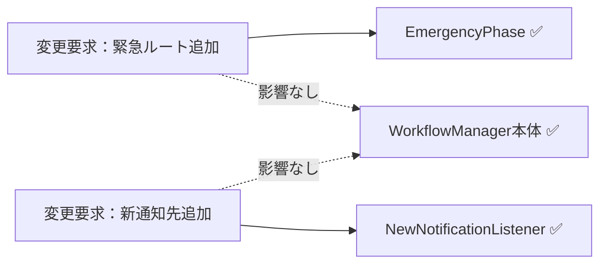

→ フェーズ3のグラフと比較して、承認ルートの変更は「状態クラスの追加」、通知の変更は「リスナークラスの追加」のみで完結し、ワークフロー本体のロジックには一切影響を与えなくなりました。

### 7-3：変更シナリオ表

本設計により、承認業務における頻繁なルール変更に柔軟に対応できるようになりました。

| **シナリオ** | **変わるクラス（触る場所）** | **変わらないクラス** |
| --- | --- | --- |
| 緊急ルートを追加する | 新規状態クラスの実装 | `WorkflowManager`, 既存の状態クラス |
| 新しい承認ルールを追加する | 新規判定ルールクラスの実装 | `WorkflowManager`, リスナークラス |
| 却下時の通知先を増やす | 新規リスナークラスの実装 | `WorkflowManager`, 判定ルールクラス |

「変更が来ても、関連する独立したクラスを一つ作るだけ——それがこの設計で手に入れたものだ。 諦めたものは、クラス数が増えるというわずかな複雑さだ。」

---

### 7-4：接続形態の確認 ── この設計はどの接続か

フェーズ4-3で診断した通り、変更前のコードは **具体×直接** の状態でした。
採用した設計では、接続形態が **抽象×間接（Type-C変換アダプタ経由）** へと変化しています。

**「抽象×間接」の証拠となるコード：**

```cpp
class WorkflowManager {
    IWorkflowPhase* state;                    // ← インターフェース型 = 「抽象」の証拠
    vector<INotificationListener*> listeners; // ← インターフェース型 = 「抽象」の証拠
public:
    void process() {
        state->handle(this);  // ← State が IApprovalRule に判定を委譲 = 「間接」の証拠
    }
};
// WorkflowManager → IWorkflowPhase → IApprovalRule という委譲チェーン
```

- `IWorkflowPhase*` と `vector<INotificationListener*>` はインターフェース型 → **「抽象」** の証拠
- `state->handle(this)` では状態クラスが内部で判定ルールに判定を委譲し、`WorkflowManager` は承認ロジックを直接知らない → **「間接」** の証拠

「状態遷移・通知・判定ルールをすべて独立して差し替えたい」という動機から、**抽象×間接** が選ばれました。


---

### 整理：7フェーズとこの章でやったこと

| **フェーズ** | **この章でやったこと** |
| --- | --- |
| 🔵 フェーズ1：現状把握 | `WorkflowManager` に状態遷移、通知、判定ルールが混在している現状を観察した。 |
| 🟣 フェーズ2：仮説立案 | 「状態遷移」「判定」「通知」の3つの軸に分離する仮説を立てた。 |
| 🟣 フェーズ3：問題特定 | 承認状態が増えるたびに `if-else` 分岐が爆発する「痛み」をシミュレーションした。 |
| 🟠 フェーズ4：原因分析 | ワークフローのフロー（骨格）と、個別のビジネスルールが混在している構造的問題を特定した。 |
| 🟡 フェーズ5：課題定義 | 状態遷移・通知・ルール判定という3つの接続点を課題として定義した。 |
| 🔴 フェーズ6：対策検討 | 3つの変化軸を独立したインターフェースで切り出すStep 4を採用した。 |
| 🟢 フェーズ7：対策実施 | 責務をインターフェースで疎結合化し、変更影響をクラス単位に局所化した。 |

### 使ったパターン × 解消した根本原因

| パターン | 解消した根本原因 |
|---|---|
| State | 状態遷移の混在（WorkflowManagerに状態ごとの分岐が詰まっていた問題）|
| Observer | 通知の密結合（通知先追加のたびWorkflowManager本体の修正が必要だった問題）|
| Strategy | 判定ルールの混在（承認判定ロジックが状態クラスに直接書かれていた問題）|

### 各クラスの最終的な責任

| **クラス名** | **責任（1文）** | **変わる理由** |
| --- | --- | --- |
| `WorkflowManager` | 承認ワークフローの実行フローを統括する。 | 承認プロセスの基本骨格が変わる場合 |
| `IWorkflowPhase` | 現在の承認状態に応じた振る舞いを管理する。 | 承認の状態遷移ルールが変わる場合 |
| `IApprovalRule` | 承認の可否判定ロジックを管理する。 | 金額や役職による判定ルールが変わる場合 |
| `INotificationListener` | 承認結果に基づいた通知を実行する。 | 通知先や通知要件が変わる場合 |

> **このプロセスを回した結果にたどり着いた構造こそが State × Observer × Strategy の複合パターン です。**
> 

### 振り返り：「この章を読むと得られること」は手に入ったか

| **得られること** | **この章のどこで示したか** |
| --- | --- |
| 得られること1 | フェーズ2の確定テーブルで、変化の軸（状態・通知・判定）を識別した。 |
| 得られること2 | フェーズ5で、ワークフロー本体から切り離する必要がある3つの接続点を特定した。 |
| 得られること3 | フェーズ7の変更シナリオ表で、責務分離による局所化を実証した。 |

### 振り返り：3つの設計原則はどう適用されたか

* **原則1「変わるものをカプセル化せよ」の現れ**
* **具体化された場所：** 各状態実装クラス、判定ルール実装クラス、通知リスナー実装クラス
* **解説：** 変化の理由が異なる「状態遷移」「判定ルール」「通知」を個別のクラスにカプセル化しました。


* **原則2「実装ではなくインターフェースに対してプログラムせよ」の現れ**
* **具体化された場所：** `IWorkflowPhase`, `IApprovalRule`, `INotificationListener`
* **解説：** `WorkflowManager` は具体的なルールや遷移先を知らず、インターフェース経由で処理を委譲するようにしました。


* **原則3「継承よりコンポジションを優先せよ」の現れ**
* **具体化された場所：** `WorkflowManager` が各インターフェースを保持する構成
* **解説：** 承認ルールを継承による拡張ではなく、コンポジション（保持・委譲）による差し替え可能な構成にしました。


---

### あなたのコードで考えてみてください

この章で辿った思考プロセスを、あなた自身のコードに当てはめてみましょう。

1. **複雑さの核心を探す：** あなたのコードに「現在の状態によって処理が変わり、かつ状態が変わったときに他のクラスへの通知が必要で、さらにどの処理をするかのルールも変わる」箇所がありますか？
2. **肥大化のサインを確認する：** その処理をすべて一か所にまとめているクラスがあるとしたら、そのクラスのコード行数と `if` ブロックの数はどのくらいですか？
3. **変更の交差点を測る：** 「新しい状態の追加」「新しい通知先の追加」「新しいビジネスルールの追加」という3種類の変更は、今の構造では同じファイルを変更しますか？それとも別々のファイルで済みますか？
4. **分けた後のシンプルさを想像する：** 3つの責任（状態遷移・通知・ルール判定）を別々のクラスに切り出したとき、それぞれを独立してテストできるようになりますか？

---

### パターン解説：複合適用

今回は単一の構造ではなく、3つのパターンを組み合わせて解決しました。

#### 仕組みの骨格

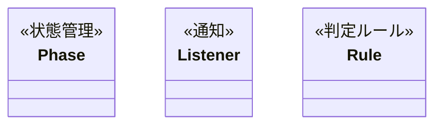

状態管理の仕組みが「今の状態での振る舞い」を整理し、判定ルールの仕組みが「承認の可否」を判定し、通知の仕組みが「変更の伝搬」を担うことで、複雑なワークフローを整理しています。

#### この章の実装との対応

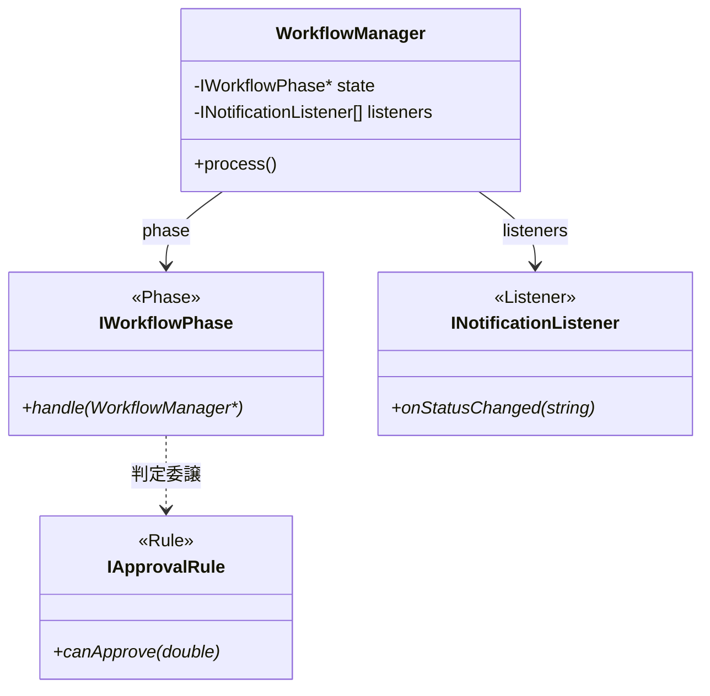

#### 使いどころと限界

* **使いどころ**：状態遷移が複雑で、さらに通知先や判定ロジックが頻繁に変わるような大規模な業務ワークフロー。


* **限界**：3つのパターンを組み合わせるため、単純なフローであれば過剰設計となります。


【過剰コード：単純なフローへの適用例】

「申請中 → 承認済み」の2状態しかなく、判定ルールも「上長が承認ボタンを押したら確定」だけのシンプルなフローに、State・Observer・Strategyをすべて適用しようとした例です。

```cpp
// ❌ 2状態・固定ルール・通知先1件のフローに
//    3つの仕組みを持ち込んだ過剰設計
class IWorkflowPhase { /* ... */ };
class IApprovalRule { /* ... */ };
class INotificationListener { /* ... */ };

// ↑ インターフェースが3枚、実装クラスが6枚——
//   変わらないルールのために構造だけが膨れ上がる

// ✅ このケースは if 文で十分
class SimpleApproval {
public:
    void approve() {
        if (status == "PENDING") {
            status = "APPROVED";
            sendMail(); // 通知先は固定で1件だけ
        }
    }
private:
    std::string status = "PENDING";
    void sendMail() { /* メール送信 */ }
};
```

これらの仕組みが威力を発揮するのは、「状態の数が増える」「通知先が変わる」「判定ルールが差し替わる」という変化軸が**実際に複数存在するとき**です。その変化軸が見えないうちはシンプルな実装を選んでください。


第二部では、複数の変化軸が同居する4つの問題に、第一部と同じ7フェーズの思考プロセスを適用した。フェーズ4で根本原因が複数見つかり、フェーズ6でパターンが積み上がる——これが第二部の体験だった。使ったパターンは全て第一部で学んだものだ。応用は、新しい知識を加えることではなく、既知の知識を組み合わせることで実現した。

---

## おわりに

ここまで読んでいただき、ありがとうございます。

あるとき気づいたのです。**名前を知っているだけでは、設計の問題は解けない**、と。

問題を解くために必要なのは、「このコードの中に、変わる理由が異なるものが同じ場所にいないか？」という問いを立てる力でした。その問いを9つのステップで繰り返し体験することで、目の前のコードがどう見えるかが、少しずつ変わってきました。パターンの名前は、その後に「ああ、これが世間でいう設計パターンか」とついてくるものだった。

この本が届けたかったのは、その順序です。

第1章から第12章まで、題材は銀行振り込みだったり、カスタムドリンクだったり、承認ワークフローだったりと変わり続けましたが、思考の型はずっと同じでした。「何が変わるか」「なぜ変わるか」「誰のために分けるか」——この3つの問いを自分の頭で回せるようになったとき、デザインパターンはもう「暗記するもの」ではなく、「現れるもの」に変わります。

この本で紹介した9ステップは、あくまで一つの参考です。現場によって、チームによって、コードの文脈によって、最適な解は変わります。「正しい設計」を覚えるのではなく、「自分で考えるプロセス」を手に入れてほしい——それが、この本を書いた唯一の動機です。

あなたの現場で、ぜひ一度、このプロセスを回してみてください。

「変わる理由」が見えた瞬間、コードの読み方が変わります。

---

この本を最後まで読んだあなたは、すでに変わっています。「どのパターンを使うか」ではなく、「何が変わるか、なぜ変わるか、誰のために分けるか」を問える目を持っています。その目は、この本を閉じた後も、現場のコードのそばにあり続けます。

もし「このコードを見せたい人がいる」と思ったなら、ぜひ。設計の議論が、職場の言語になっていく——それが、この本の最終的なゴールです。
