## 第12章 承認ワークフローシステム ―― State × Observer × Strategy パターン

―― 思考の型：状態・通知・判定という複数の独立した変化軸が、同じ場所に混在している

### この章の核心

**状態遷移、通知、承認判定が同じ管理処理に集まっていると、緊急ルート追加でも通知先追加でも承認ルール変更でも同じ場所全体を修正・確認する必要が生じる。こういう問題は、「進行する」「知らせる」「判定する」という別々の変更理由が同じ場所に混在しているシステムで起きている。**

### この章を読むと得られること

* **得られること1：** 状態の変化、関係者への通知、判定ルールという、それぞれ異なる「変わる理由」を識別できるようになる。


* **得られること2：** 状態遷移とアクションが「密結合」（複数の責務が一か所に混在し、一方を変えると他方まで影響を受ける状態）になっている接続点（クラスとクラスのつなぎ目）を特定し、問題の発生源を見極められるようになる。


* **得られること3：** 複数の構造を組み合わせることで、複数構造が絡む処理の影響範囲を特定クラス内に局所化しやすくしつつ、新しいフローにも対応できる設計手法を説明できるようになる。


* **得られること4：** 「状態管理」「通知」「判定ルール」が絡み合う現場で、変更影響を局所化する視点を養う。

---

## 🔵 フェーズ1：現状把握 ―― 仕様を整理し、システムと紐付ける

承認ワークフローシステムが何を入力として受け取り、どの処理で加工し、何を出力するのかを整理します。

### 1-1：このシステムの仕様

このシステムは、企業内の稟議や経費精算を管理する「承認ワークフローシステム」です。申請者が申請を作成し、上長や経理担当者が内容を確認・承認するプロセスをデジタル化し、効率的に管理することを目的としています。

この章で扱う現状仕様は、次の範囲です。

| 仕様項目 | この章で扱う値 | 具体例 | 何に使うか |
|---|---|---|---|
| 申請 | 稟議・経費精算など | 経費精算 80,000円 | 承認ワークフローの対象になる |
| 状態 | 下書き・審査待ち・承認済みなど | Draft、Pending、Approved | 現在状態によって許可される操作を判定する |
| 承認判定 | 金額・承認者・申請種別 | 100,000円以下は課長承認 | 次の状態へ進めるかを決める |
| 出力 | 更新後状態と通知 | Approved、申請者へ通知 | 状態変更の結果と通知を照合する |

ここで確認する対象は、申請がどの条件で次の状態へ進むかです。

現状のシステムは、状態遷移のルール、通知先の一覧、承認額の判定ルールを、1つのチームが一括して管理しています。

**現在の申請状態一覧**

申請の状態を4つに分けているのは、承認プロセスのどの段階にいるかを追跡し、「誰が何をいつ承認したか」を記録に残せるようにするためです。

| 状態 | 内容 |
|---|---|
| 審査待ち | 申請が提出され、課長の確認を待っている |
| 承認済み | 課長が承認し、部長の最終確認を待っている |
| 完了 | 部長が承認し、処理が完了した |
| 却下 | 承認者が却下し、処理を終了した |

「審査待ち」と「承認済み」を分けているのは、課長と部長が担う役割が独立しているからです。一方の状態にまとめてしまうと、「今どちらの判断を待っているか」が曖昧になり、差し戻しや確認依頼の際に混乱が生じます。

**現在の状態遷移マトリクス**

どの状態からどの状態へ遷移できるかを制限しているのは、業務の順序を強制するためです。たとえば、課長がまだ確認していない申請を部長が直接承認できてしまうと、内部統制の観点で問題が生じます。

| 現在の状態 | 課長承認 | 部長承認 | 却下 |
|---|---|---|---|
| 審査待ち | → 承認済み | —— | → 却下 |
| 承認済み | —— | → 完了 | —— |
| 却下 | —— | —— | —— |
| 完了 | —— | —— | —— |

再申請は「却下」状態からのみ可能で、審査待ち状態に戻ります。「完了」や「承認済み」から再申請できない理由は、すでに動き始めた処理（支払い手続きなど）を遡って取り消せないようにするためです。完了した申請をそのまま再オープンさせると、二重申請のリスクが生じるためです。

**承認フロー**

すべての申請は「審査待ち → 承認済み → 完了」という固定の2段階フローで処理されます。承認者の割り当てや通知先は固定されており、申請種別による経路の切り替えはありません。なお、承認者には役職に応じた承認可能額の上限があり、たとえば課長格の承認者の上限は10万円です。上限を超える申請は、その承認者では処理できず、より上位の承認者が必要になります。

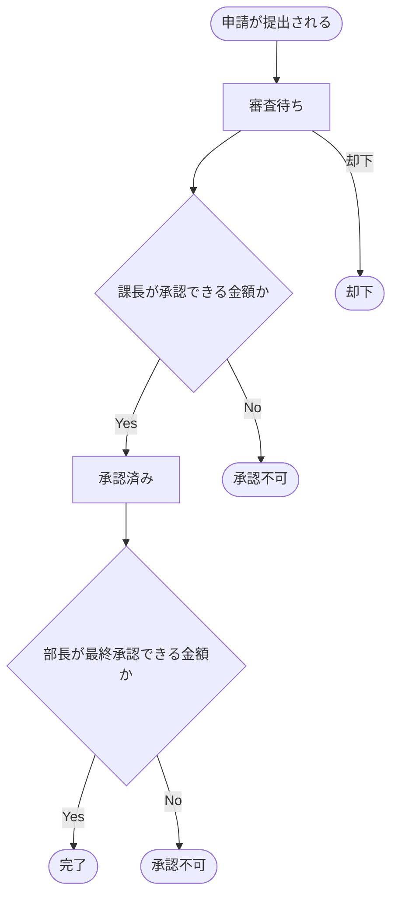

このフローで見ておく点は、現状ではすべての申請が同じ順序を通ることです。緊急申請の近道はなく、通知も状態が変わった後に固定の相手へ送られます。

10万円という閾値を設けているのは、「一定額以上の支出には上位者の確認が必要」という会社の内部規程に基づくためです。ただし「10万円」という数字自体は会社や規程によって異なり、組織が変わるたびに見直しが必要になる部分でもあります。

**この仕様を決める業務機能**

承認ワークフローには「誰に通知するか」と「どの金額から上位承認が必要か」という2種類の知識が含まれています。それぞれ異なる業務機能が管理しているのは、変わる理由が異なるからです。

| 業務機能 | この章の仕様で決めていること |
|---|---|
| 通知・連携管理 | 通知先の一覧・通知チャネルの仕様 |
| 業務ルール管理 | 金額閾値・承認者の自動割り当てルール |

通知・連携管理と業務ルール管理は、別々の業務機能として仕様を管理しています。後のフェーズで変更要求を扱うとき、どの業務機能の知識なのかを確認するための名前として使います。

ここまでで、状態の種類、状態遷移、承認上限、通知先の意味を説明しました。まず、このシステムがどのデータを記憶し、処理時に何を読み出すのかを整理します。そのうえで、代表ケースを使って入力がどの処理で使われ、どの出力に変わるかを正常系の流れとして確認します。

**仕様整理図：保存データとアクセス関係**

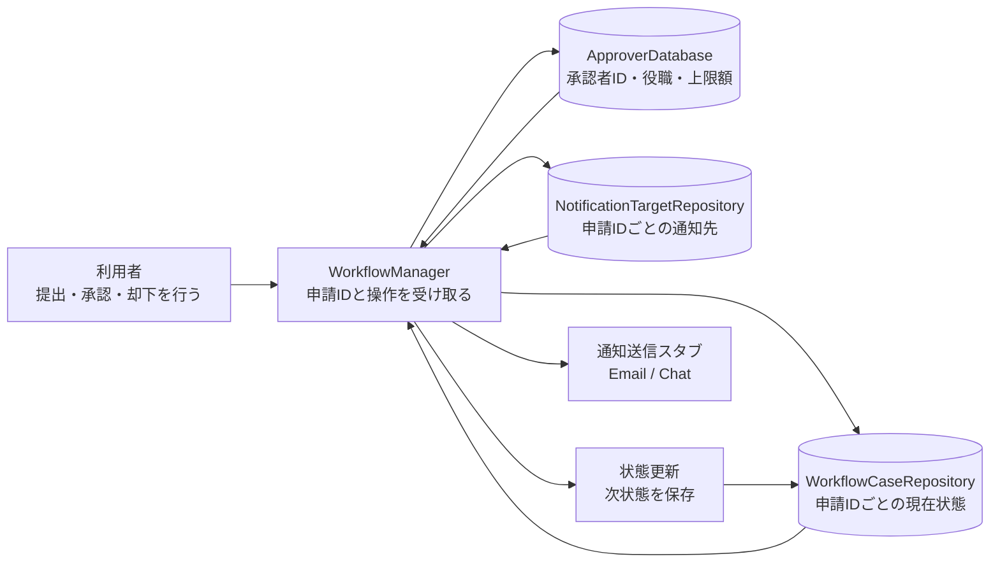

この図で先に確認したいのは、利用者が現在状態や通知先を毎回指定するわけではない、という点です。利用者は申請IDと操作を渡し、システムが保存済みの状態、承認者情報、通知先データを読み出して処理します。

**仕様整理図：正常系の入力・加工・出力**

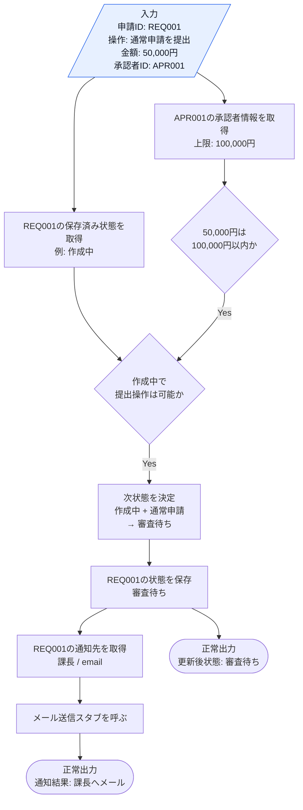

この図から読み取ることは、次の3点です。

- `REQ001` は現在状態と通知先を取り出すキーとして使われる。利用者が毎回「今の状態」や「通知先」を指定するのではない。
- `APR001` と金額50,000円は、承認者の上限額を超えていないかの判定に使われる。
- 状態更新が成立した後に、保存済み通知先を読み出して送信する。

**エラー条件**

正常系の仕様を一通り確認したうえで、最後に、正常系の流れへ進めない入力を分けて整理します。

| エラー条件 | どこで分かるか | 出力 | 状態保存・通知 |
|---|---|---|---|
| 承認者IDが未登録 | `ApproverDatabase` にIDがない | 承認者IDエラー | 行わない |
| 金額が承認上限を超える | 承認者情報の上限額チェック | 承認不可 | 行わない |
| 現在状態で操作できない | 保存済み状態と操作の組み合わせ | 操作不可エラー | 行わない |

### 1-2：動作例テーブル

コードを読む前に、現状のワークフローがどんな入力に対してどんな出力を返すかを確認します。ここでは、申請の提出と承認済み申請の最終承認という現在扱っている操作、承認者、申請金額だけを扱います。

| 入力 | 承認者 | 結果 |
| --- | --- | --- |
| REQ001（作成中）を提出 / 50,000円 | 登録済みの承認者 | 審査待ちへ移行 / 課長へ通知 |
| REQ002（審査待ち）を承認 / 50,000円 | 登録済みの承認者 | 完了へ移行 / 部長へ通知 |
| REQ001を提出 / 50,000円 | 未登録の承認者 | 承認者IDが存在しないエラー |
| REQ001を提出 / 200,000円 | 上限100,000円の承認者 | 承認上限を超えるエラー |

この表を見れば、現状の仕様が申請IDから保存済み状態を取得し、申請金額と承認者情報を使って、状態遷移・通知・承認額チェックをまとめて処理していることが分かります。緊急申請ルートや決済部門通知は、変更要求で扱います。

次は仕様とクラスを対応づけます。

**このシステムの登場クラス**

| クラス名 | 役割 | 担当する仕様 |
|---|---|---|
| WorkflowManager | ワークフローの全体管理 | 状態遷移、通知処理、承認判定ロジックなどすべての業務ルール |
| ApproverInfo | 承認者1件分のデータ | 氏名・役職・承認上限額を保持する |
| ApproverDatabase | 承認者マスターデータの管理 | 承認者IDによる存在確認・情報取得・承認権限額の検証 |
| WorkflowCaseRepository | 申請状態の保存・取得 | 申請IDごとの現在状態を読み書きする |
| NotificationTargetRepository | 通知先の保存・取得 | 申請IDごとの通知先を読み出す |

---

### 1-3：登場クラスとクラス構成図

コードへ入る前に、登場するクラスを先に確認します。

| クラス名 | 役割 | 担当する仕様 |
|---|---|---|
| `WorkflowManager` | 承認ワークフロー全体を進める | 状態遷移、通知、承認者確認の呼び出し |
| `WorkflowCaseRepository` | 申請状態を保存・取得する | 申請IDから現在状態を読み書きする |
| `NotificationTargetRepository` | 通知先を保存・取得する | 申請IDから通知先を読み出す |
| `ApproverDatabase` | 承認者マスターデータを管理する | 承認者IDの存在確認、承認上限額の確認 |
| `ApproverInfo` | 承認者1件分のデータを表す | 氏名・役職・承認上限額を保持する |

各クラスの責任を把握したところで、クラス間の関係を図で整理します。

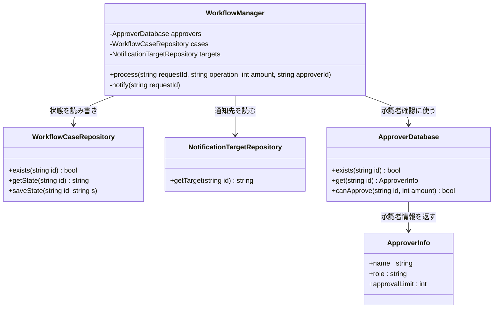

**クラス図に出てくる主なメンバーと操作**

| クラス | メンバー・操作 | 何ができるか |
|---|---|---|
| `WorkflowManager` | `process()` | 申請IDと操作、金額、承認者IDを受け取り、保存済み状態を読んで承認処理を進める |
| `WorkflowManager` | `notify()` | 申請IDから通知先を読み出し、状態変化を通知する |
| `WorkflowCaseRepository` | `exists()` / `getState()` / `saveState()` | 申請IDの存在確認、現在状態の取得・保存を行う |
| `NotificationTargetRepository` | `getTarget()` | 申請IDから通知先を取得する |
| `ApproverDatabase` | `exists()` / `get()` / `canApprove()` | 承認者IDの確認、承認者情報の取得、承認上限額の検証を行う |
| `ApproverInfo` | `name` / `role` / `approvalLimit` | 承認者1件分の氏名・役職・承認上限額を保持する |


`WorkflowManager` は `WorkflowCaseRepository` から申請IDで現在状態を読み、`ApproverDatabase` で承認者IDの存在確認と承認上限額の確認を行います。そのうえで、ワークフローの「状態遷移」、各担当者への「通知」（通知先は `NotificationTargetRepository` から取得）、「承認可否のルール判定」を同じクラス内で扱っています。`ApproverInfo` は承認者1件分のデータ（氏名・役職・承認上限額）を表します。


**この章での簡略化**

1-3でクラス構成を確認したので、掲載コードで何を代替しているかを整理してからフェーズ1の現状コードへ進みます。

この章では、実際のワークフローDBは `ApproverDatabase`、`WorkflowCaseRepository`、`NotificationTargetRepository` とメモリ上の履歴で簡略化します。メール・チャット通知は `EmailNotifier`、`ChatNotifier` などの通知境界スタブで表し、スタブの内部だけが `std::cout` を使います。

通知は、状態が変わったその場で相手へ届くとは限りません。実システムでは、状態更新の直後に通知を「送信キューへ積む」だけで処理を返し、キューを受け取る側が後から送信します。送信先が一時的に落ちていれば失敗することもあります。この章の掲載コードでは、状態保存の後に通知を同期的に呼びます。1件ごとの送信可否は `DeliveryResult` で表し、失敗しても状態保存を巻き戻さず、失敗した通知だけを記録して残りを続けます。ただしキュー化・後送り・再送のスケジューリングは基盤側の関心として扱いません。本章で扱うのは、通知を状態保存と切り離し、通知先と送信可否の扱いをコード分岐から外すことです。

| 実システムで起きること | 掲載コードでの表現 | 本章での扱い |
|---|---|---|
| 申請状態をDBに保存し、次回処理時に申請IDで読み出す | `WorkflowCaseRepository` がメモリ上に申請IDと状態を保持する | 扱う。状態を利用側が直接指定しないことを示すため |
| 承認者マスタから役職と承認上限額を取得する | `ApproverDatabase` が固定データを返す | 扱う。承認可否の判定に必要なため |
| 通知先データを保存し、申請IDで読み出す | `NotificationTargetRepository` が通知先とチャネルを返す | 扱う。通知先をコード分岐から切り離すため |
| 通知を送信キューへ積み、後から送る | 掲載コードでは状態保存の後に `notifyAll()` を同期的に呼ぶ（キューは使わない） | 状態保存と通知を分けて呼ぶ順序は扱う。キュー化・後送りは論点外 |
| メール・チャットを実際に送信する | `EmailNotifier` / `ChatNotifier` のスタブが `std::cout` で送信内容を表示する | 送信境界だけ扱う。SMTP、チャットAPI、認証は論点外 |
| タイムアウト、リトライ回数、非同期ジョブ基盤 | 掲載コードは送信可否を `DeliveryResult` で表し失敗を1件ずつ記録するが、再送のスケジューリングは省略する | 本章の中心は状態・通知・判定ルールの責任分離なので、外部基盤の信頼性設計は扱わない |

つまり、`std::cout` は業務ロジックそのものではなく、外部通知境界の先にあるスタブ実装です。掲載コードでは、状態保存後に通知を同期的に個別送信し、送信の成否を `DeliveryResult` で扱います。キュー化、リトライのスケジューリング、タイムアウト値の調整といった基盤側の信頼性設計は、この章では状態遷移・通知先データ・承認判定をどの責任へ分けるかへ集中するため扱いません。

---

### 1-4：実装コード（現状）

#### コードを読む前に：クラスの責任と境界

| 対象 | 呼び出しと内部処理 | 戻り値・副作用 | 掲載上の表現 |
|---|---|---|---|
| Case Repository | 申請IDから現在状態を読み書きする | 保存後状態 | `std::map`でDBを代替する |
| 承認ルール | 申請額・承認者から可否を判定する | `bool`と理由 | Strategyの戻り値 |
| 通知先/Listener | 申請IDから宛先を読み通知する | 通知ログ | メール/Chatを標準出力で代替する |
| `algorithm` / 例外 | 登録検索と不正状態を扱う | 一致要素/失敗 | 通常エラーは結果、前提違反は例外 |

実DB・メール・Chat APIはメモリ境界です。状態保存が成功した後だけ通知し、通知失敗時に状態を戻すか再送するかは結果とログで区別します。

システムの現状の実装を確認します。コードを役割ごとに分けて読んでいきます。

**ApproverInfo 構造体 と ApproverDatabase クラス**

このシステムには以下の3件の承認者データがあらかじめ登録されています。

| 承認者ID | 氏名 | 役職 | 承認可能額上限 |
|---|---|---|---|
| APR001 | 田中 部長 | manager | 100,000円 |
| APR002 | 佐藤 取締役 | director | 1,000,000円 |
| APR003 | 鈴木 代表 | executive | 上限なし（99,999,999円） |

承認可能額を超える申請や未登録のIDを指定するとエラーになります。コードを読む前にこの対応を把握しておくと、動作結果が追いやすくなります。

```cpp
#include <iostream>
#include <map>
#include <string>

using namespace std;

// 承認者情報
struct ApproverInfo {
    string name;         // 氏名
    string role;         // "manager", "director", "executive"
    int approvalLimit;   // 承認可能な申請金額上限（円）
};

// 承認者マスターデータ
class ApproverDatabase {
    map<string, ApproverInfo> records;
public:
    ApproverDatabase() {
        records["APR001"] = {"田中 部長",   "manager",   100000};
        records["APR002"] = {"佐藤 取締役", "director",  1000000};
        records["APR003"] = {"鈴木 代表",   "executive", 99999999};
    }

    bool exists(const string& id) const {
        return records.count(id) > 0;
    }

    ApproverInfo get(const string& id) const {
        return records.at(id);
    }

    void save(const string& id, const ApproverInfo& info) {
        records[id] = info;           // 実行中の承認者マスタへ追加
    }

    bool canApprove(const string& id, int amount) const {
        return records.at(id).approvalLimit >= amount;
    }
};
```

`ApproverDatabase` は `std::map` で承認者IDと `ApproverInfo` を対応付けたマスターデータです。`exists()` でIDの存在確認、`get()` で情報取得、`canApprove()` で権限額の検証を行います。

**申請状態と通知先を保存するクラス（WorkflowCaseRepository / NotificationTargetRepository）**

1-1の仕様図のとおり、申請の現在状態と通知先は利用側が毎回指定するのではなく、申請IDをキーに保存データから読み出します。実システムのDBを、この章では実行終了まで覚えるインメモリの境界スタブで代替します。

```cpp
// 申請ごとの現在状態を保持するリポジトリ（申請ID→状態）
class WorkflowCaseRepository {
    map<string, string> states;
public:
    WorkflowCaseRepository() {
        states["REQ001"] = "作成中";
        states["REQ002"] = "審査待ち";
    }
    bool exists(const string& id) const { return states.count(id) > 0; }
    string getState(const string& id) const { return states.at(id); }
    void saveState(const string& id, const string& s) { states[id] = s; }
};

// 申請ごとの通知先を保持するリポジトリ（申請ID→通知先）
class NotificationTargetRepository {
    map<string, string> targets;
public:
    NotificationTargetRepository() {
        targets["REQ001"] = "課長";
        targets["REQ002"] = "部長";
    }
    string getTarget(const string& id) const { return targets.at(id); }
};
```

`WorkflowCaseRepository` は申請IDから現在状態を読み書きし、`NotificationTargetRepository` は申請IDから通知先を引きます。利用側は申請IDと操作を渡すだけで、状態や通知先を直接指定しません。

**WorkflowManager クラス**

```cpp
// ワークフロー管理クラス（状態遷移・承認判定・通知をすべて抱える）
class WorkflowManager {
    ApproverDatabase approvers;
    WorkflowCaseRepository cases;
    NotificationTargetRepository targets;
public:
    void process(const string& requestId, const string& operation,
                 int amount, const string& approverId) {
        // 申請の存在確認
        if (!cases.exists(requestId)) {
            cout << "エラー：申請ID " << requestId
                 << " は存在しません。" << endl;
            return;
        }
        // 承認者IDの存在確認
        if (!approvers.exists(approverId)) {
            cout << "エラー：承認者ID " << approverId
                 << " はデータベースに存在しません。" << endl;
            return;
        }
        // 承認権限額チェック
        if (!approvers.canApprove(approverId, amount)) {
            ApproverInfo info = approvers.get(approverId);
            cout << "エラー：" << info.name << " の承認上限（"
                 << info.approvalLimit << "円）を超えています。" << endl;
            return;
        }
        // 保存済みの現在状態を読み出す
        string current = cases.getState(requestId);
        // 現在状態 × 操作 で次状態を決める
        if (current == "作成中" && operation == "提出") {
            cases.saveState(requestId, "審査待ち");
            cout << requestId << "：作成中 → 審査待ち" << endl;
            notify(requestId);
        } else if (current == "審査待ち" && operation == "承認") {
            cases.saveState(requestId, "完了");
            cout << requestId << "：審査待ち → 完了" << endl;
            notify(requestId);
        } else {
            cout << "エラー：現在状態「" << current
                 << "」で操作「" << operation << "」はできません。" << endl;
        }
    }
private:
    void notify(const string& requestId) {
        cout << targets.getTarget(requestId) << "へ通知" << endl;
    }
};
```

このクラスが今章の中心です。`process` メソッドは、申請IDから保存済み状態を読み出し、承認者IDの存在確認・承認上限額のチェックを行い、現在状態と操作の組み合わせで次状態を決めて保存し、通知先を読み出して通知するまでを順に実行します。

**main()**

```cpp
int main() {
    WorkflowManager wm;
    // 正常ケース1：REQ001（作成中）を5万円で提出する
    wm.process("REQ001", "提出", 50000, "APR001");
    cout << "---" << endl;
    // 正常ケース2：REQ002（審査待ち）を5万円で承認する
    wm.process("REQ002", "承認", 50000, "APR001");
    cout << "---" << endl;
    // エラー：存在しない承認者ID
    wm.process("REQ001", "提出", 50000, "APR999");
    cout << "---" << endl;
    // エラー：田中 部長の上限（10万円）を超える申請
    wm.process("REQ001", "提出", 200000, "APR001");
    return 0;
}
```

実行対象コード：1-4の現状コード
対応する動作例：1-2の動作例テーブル
確認したいこと：入力、加工、出力が仕様どおりに対応していること

実行結果：

```
REQ001：作成中 → 審査待ち
課長へ通知
---
REQ002：審査待ち → 完了
部長へ通知
---
エラー：承認者ID APR999 はデータベースに存在しません。
---
エラー：田中 部長 の承認上限（100000円）を超えています。
```

動作例テーブルの「申請提出」「最終承認」「未登録ID」「承認上限超過」に対応しています。現行コードを読む段階で確認すべきことは、`WorkflowManager` が状態文字列・通知文・承認額チェックをまとめて扱っている、という事実です。

次のフェーズでは、このフェーズ1の現状コードに変更を加えたときに何が起きるかを確認します。

---

> **手元で動かすには**
> このコードは1つの `.cpp` に貼り付けて、そのままコンパイル・実行できます（例：`g++ chapter12.cpp -o app && ./app`）。`main()` は自由に組み替えて構いません。`wm.process("REQ001", "提出", 50000, "APR001");` の申請ID・操作・金額・承認者IDを変えれば、保存済み状態の読み出しと承認可否の判定、状態遷移・通知がその場の実行結果に表れます。新しい申請を試すときは `WorkflowCaseRepository` の登録へ `states["REQ010"] = "作成中";` を、その通知先を `NotificationTargetRepository` の `targets["REQ010"] = "課長";` を足すと、その申請でも同じ処理を実行できます。状態・通知先データはプロセス実行中だけ有効で、終了すると消えます（メール・チャット通知は通知境界スタブで簡略化しています）。

### 1-5：変更要求

ある金曜日の夕方、経理部のマネージャーがデスクにやってきました。

「お疲れ様。今度、承認ワークフローに『緊急申請ルート』を追加することになったんだ。 通常は平社員→課長→部長という承認順序なんだけど、緊急時は課長を飛ばして直接部長に通知が飛ぶようにしたい。 それと、部長が承認した直後に、自動的に『決済部門』へも通知が飛ぶようにしてほしいんだよね。 承認が却下された場合も、申請者に即座にアラートを出す仕組みは必須だよ。いつまでに対応できるかな？」

承認ルートのスキップや、特定の状態での追加通知、そして却下時の通知強化と、ワークフローの柔軟性を高める要求ですね。

**仕様変更の内容**

変更要求を受けて、現在のワークフローがどう変わるかを整理します。

| 変更項目 | 変更前 | 変更後 |
|---|---|---|
| 承認ルート | 平社員→課長→部長 | 緊急時は課長をスキップして部長へ直接 |
| 部長承認後の通知 | 関係者のみ | 関係者 + 決済部門（新規追加） |
| 却下時の通知 | なし | 申請者に即座にアラート（新規追加） |
| 承認判定ルール | 金額固定閾値 | 来期から部署ごとの承認上限へ差し替え |
| 通知の送り方 | 状態更新処理の中で即時送信 | 状態保存後に通知処理を分離して呼び、送信先ごとの成否を記録する。キュー化・後送りは対象外 |

**この章が扱う複雑さ**

現状仕様に、状態を進めるイベント、状態の保存、通知処理の分離、承認ルールの差し替え、通知失敗という複雑さを重ねて、変更要求を当てます。この章で見たいのは、これらが同じ場所で絡み合わず、状態・通知・判定ルールという独立した変化軸として扱えるかどうかです。

| 追加する複雑さ | 具体例 | この章で見ること |
|---|---|---|
| 申請イベント | 通常申請・緊急申請・承認・却下・再申請を操作として渡す | 状態ごとに、受け付けるイベントと次状態を分けられるか |
| 状態保存 | 申請IDごとの現在状態を読み書きする | 利用側が状態を持たず、保存済み状態で振る舞いが変わるか |
| 通知処理の分離 | 状態保存後に通知先を読み、送信結果を個別に受け取る | 通知を状態更新の直接処理から切り離せるか |
| 承認ルール差し替え | 課長・部長・部署別の承認上限を入れ替える | 判定ルールを状態遷移と別軸で差し替えられるか |
| 通知失敗 | 送信先が落ちていて1件が届かない | 通知失敗が状態保存や他の通知を巻き込まないか |

---

#### 変更後の状態遷移と受入条件

現行の背景と変更要求を確認したところで、今回の変更が完了したと判断するための受入条件を整理します。設計前後を比較できるよう、最終的に実現したい7つの振る舞いを基準として固定します。これは現行コードがすでに満たしている仕様ではありません。

**受入条件となる期待される動作**

| 操作（入力） | 申請種別 | 結果の状態 | 通知先 |
| --- | --- | --- | --- |
| 申請書提出 | 通常申請 | 審査待ち状態へ移行 | 管理者に通知 |
| 申請書提出 | 緊急申請 | 優先審査待ちへ移行 | 部長に通知 |
| 審査待ち + 課長承認操作 | 通常申請 | 承認済み状態へ移行 | 申請者・部長に通知 |
| 優先審査待ち + 部長承認操作 | 緊急申請 | 完了状態へ移行 | 申請者・部長・決済部門に通知 |
| 審査待ち + 却下操作 | — | 却下状態へ移行 | 申請者に通知 |
| 承認済み + 部長承認操作 | 通常申請 | 完了状態へ移行 | 申請者・課長・部長・決済部門に通知 |
| 却下状態 + 再申請操作 | — | 審査待ち状態に戻る | 管理者に通知 |

変更後にこのシステムが「何をする必要があるか」を確認できました。

**変更後の状態遷移表**

受入条件を状態遷移として整理します。「優先審査待ち」は今回追加する緊急申請ルートの到達状態であり、現行コードにはまだ存在しません。

| 現在の状態 | 課長/部長承認 | 却下 | 再申請 |
| --- | --- | --- | --- |
| 審査待ち | 課長 → 承認済み | → 却下 | —— |
| 優先審査待ち | 部長 → 完了 | → 却下 | —— |
| 承認済み | 部長 → 完了 | —— | —— |
| 却下 | —— | —— | → 審査待ち |
| 完了 | —— | —— | —— |

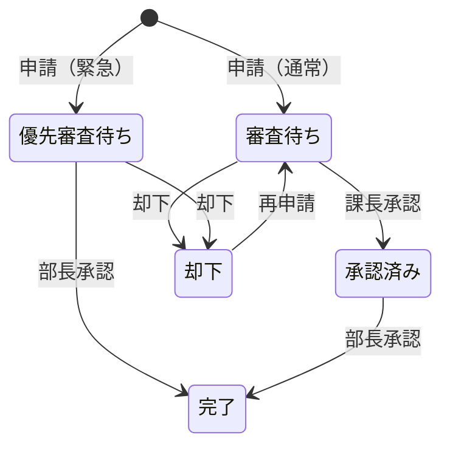

通常申請は課長承認を経て部長承認へ進みますが、緊急申請は課長承認を飛ばし、優先審査待ちから部長承認で完了します。同じ承認イベントでも、現在状態によって適用する判定ルールと次状態が変わります。

変更後の承認フローを、通知先も含めて見ると次のようになります。

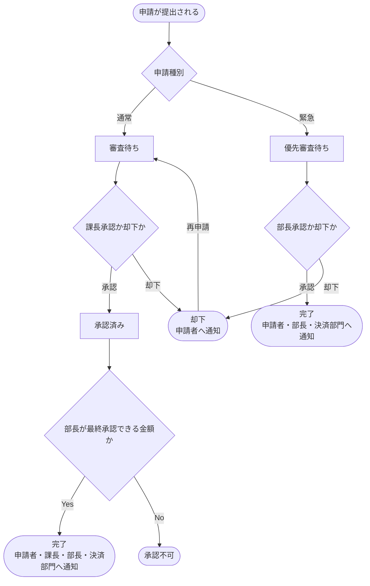

この図を見ると、変更後は「状態の進み方」と「通知先」が同時に増えていることが分かります。緊急申請では審査待ちを飛ばして優先審査待ちへ進み、完了時には決済部門も通知対象になります。つまり、後続フェーズで見るべき差分は状態遷移だけではなく、状態ごとの通知先データでもあります。

**変更前後の入力・判定・加工・出力差分**

1-1の現状仕様を退避し、変更要求を当てた後の仕様と同じ粒度で並べます。以降の分析では、この差分を追います。

| 要素 | 変更前（1-1の現状仕様） | 変更後（今回の要求） | 差分として追うもの |
|---|---|---|---|
| 入力 | 申請ID、承認者ID、金額、操作 | 申請ID、承認者ID、金額、申請イベント、申請種別、追加通知先データ | 申請イベントと緊急ルート、通知先データが増える |
| 判定 | 保存済み状態で操作可能か、承認者の上限額内か | 緊急申請か、優先審査待ちで部長承認できるか、差し替えた承認ルールで通るか | 状態判定・承認ルール差し替え・通知先取得が増える |
| 加工 | 申請IDから状態を取得し、状態を更新し、通知先へ送る | 緊急ルートで状態を保存した後、通知先を取得して個別に送信する | 状態遷移・通知処理の分離・通知失敗の扱いが変わる |
| 出力 | 更新後状態、承認結果、通知結果 | 緊急ルート後の状態、追加通知、却下通知、通知の送信可否 | 状態結果と、成否を含む通知結果を分けて追う |

**変更後の保存データとアクセス関係**

変更後も、利用者が状態や通知先を直接指定するわけではありません。変わるのは、保存される状態の種類と、申請IDに紐づく通知先データの中身です。

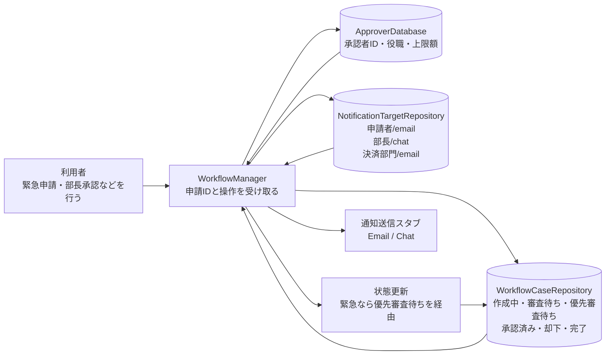

**変更後の正常系：入力・加工・出力**

ここでは緊急申請の代表ケースとして、`REQ004` が優先審査待ちに保存されており、`APR002` が500,000円の申請を部長承認する流れを追います。1-1との差分は、状態に「優先審査待ち」が加わること、緊急申請では課長承認を経由しないこと、完了時に複数の通知先データを読み出すことです。

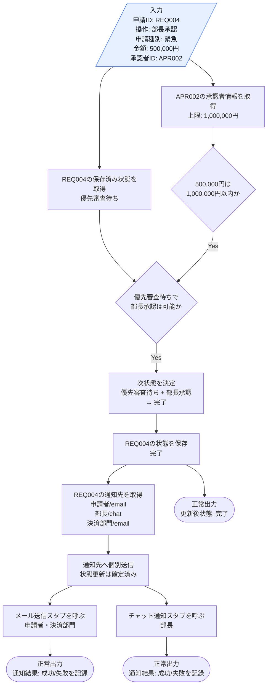

この図から読み取ることは、次の4点です。

- `REQ004` は、保存済み状態と通知先データの両方を取り出すキーとして使われる。
- 緊急申請では、保存済み状態が「優先審査待ち」なので、部長承認によって直接「完了」へ進む。
- 通知先はコードの分岐ではなくデータとして読み出され、チャネルに応じてメール送信スタブまたはチャット通知スタブへ渡される。
- 通知は状態保存が確定した後に個別送信し、通知ごとの成否を記録する。

変更後も、エラー条件は正常系図へ混ぜずに別で確認します。通知の失敗は正常系の状態保存を巻き戻さない点に注意します。

| エラー条件 | どこで分かるか | 出力 | 状態保存・通知 |
|---|---|---|---|
| 承認者IDが未登録 | `ApproverDatabase` にIDがない | 承認者IDエラー | 行わない |
| 金額が承認上限を超える | 差し替えた承認ルールの上限チェック | 承認不可 | 行わない |
| 現在状態で操作できない | 保存済み状態とイベントの組み合わせ | 操作不可エラー | 行わない |
| 通知先データがない | `NotificationTargetRepository` に通知先がない | 状態更新のみ。通知結果は空 | 状態保存は行う。通知は積まない |
| 通知の送信が失敗する | `DeliveryResult` が失敗を返す | 状態は更新済み。該当通知だけ失敗を記録 | 状態保存は保つ。他の通知は続行 |

状態の追加・通知処理の分離・承認ルール差し替え・通知失敗が実際のコードでどこに現れるかは、フェーズ3で変更を試すコードと、フェーズ7の最終コード・実行結果で追います。キュー化・後送りは1-4で示したとおり対象外です。

---

フェーズ1でシステムの現状と変更要求が把握できました。次のフェーズ2では、「何を変え、何を守るか」を整理します。

## 🟣 フェーズ2：仮説立案 ―― 何が変わるかを観察し、ヒアリングで裏付ける
### 2-1：変わりそうな仕様の見当をつける

ここで作る一覧は、思いつきで「変わりそう」と感じたものを並べる表ではありません。フェーズ1で確認した仕様・動作例・クラス図を材料に、次の順で候補を絞ります。

1. 仕様図と動作例から、入力・判定・加工・出力のうち条件や値が変わりそうな箇所を拾う。
2. その箇所が、1-3のどのクラス・メソッドに書かれているかを対応づける。
3. その仕様が、どんな理由で、何をきっかけに、どのくらいの頻度で変わりそうかを仮説として書く。
4. 逆に、当面変えない前提にできる処理の骨格も分けておく。

この手順で見ると、「承認ワークフローを進める」という大きな処理全体ではなく、その中のどの状態遷移・通知先・承認判定ルールが変更候補なのかを読者自身で追えるようになります。

フェーズ2では、フェーズ1で見た仕様のうち、どの状態遷移・通知先・承認判定ルールが変わりそうかを見当づけます。責務の配置は、変更要求を当てた後の痛みと合わせて確認します。

| 仕様候補 | 仕様上の場所 | フェーズ1の現状コードでの場所 | 見立て |
|---|---|---|---|
| 状態遷移 | 状態更新、次状態の決定 | `WorkflowManager.process()` | 申請イベントの種類や状態が増える可能性があるため、今回見る |
| 通知先・通知方法 | 出力、通知処理 | `WorkflowManager.process()` | 通知先や通知媒体が増え、送信が失敗しうるため、今回見る |
| 承認判定ルール | 判定、状態更新前の条件 | `WorkflowManager.process()` | 金額条件や部署別の承認上限へ差し替わる可能性があるため、今回見る |

この表から、今回の検討対象は「状態遷移」「通知」「承認判定」の3つに絞れます。加えて、通知を状態保存後の分離した処理とし、送信失敗ありとして扱うと、通知の失敗が状態保存や承認判定を巻き込まないかも見る必要があります。これらが同じ場所に書かれて困るかどうかは、フェーズ3で変更を入れてから確認します。

### 2-2：今回の変更で確実に変わること

今回の変更要求から確定している変更は3点です。

- **承認ルートの追加**：緊急時に課長をスキップして部長へ直接通知する
- **部長承認後の通知先拡張**：決済部門への通知を自動追加する
- **却下時のアラート追加**：申請者への即時アラートを実装する

ただし「これらの変更が1回限りか、今後も続くか」によって、どこまで設計を変えるべきかが大きく変わります。関係者に確認します。

### ヒアリングに向けた背景確認

このシステムは、ある企業の承認ワークフローを担っています。数年前にサービスが立ち上がった当初は、申請者が申請を提出し、上長が承認するだけのシンプルな2ステップのフローでした。

しかし、組織が拡大し業務が複雑化するにつれて、様々な部署固有の要求が追加されるようになりました。緊急時の特殊ルートや、金額による承認者の自動割り当て、通知先の多様化など、ビジネス上の要求は日々増えています。

### 2-3：関係者ヒアリング


- **開発者：** 「今回のような『緊急ルート』以外にも、今後別の承認ルートが追加される可能性はありますか？」

- **運用担当者：** 「ああ、あるね。 例えば、海外出張時だけの特殊ルートや、特定のプロジェクト限定の承認フローなども、今後は必要になるだろうな。」

- **開発者：** 「通知についても確認させてください。現状は『申請者』と『関係者』だけですが、承認プロセスに応じて通知先の役職が変わったりする要件はありますか？」

- **運用担当者：** 「それも重要だ。 部長が承認したら経理だけでなく、関連部署の担当者にもメールを飛ばしたいケースが多いね。」

- **開発者：** 「金額による判定ルールは今後変わりますか？ 現状は10万円を閾値にしていますが。」

- **運用担当者：** 「そこも変わるよ。 来期から部署ごとに承認上限を設けたいという話が出てる。課長なら50万まで、部長なら500万まで、みたいな感じで。」

### 2-4：ヒアリングで判明した将来リスク

ヒアリングで浮かび上がった「今回の確定変更ではないが、近い将来起こりうる変化」を記録します。これは今回の設計判断の材料です。

| **将来リスク** | **時期の目安** | **根拠** |
| --- | --- | --- |
| 新しい承認ルートの追加が継続的に発生する | 継続的に | 運用担当者から海外出張ルート・プロジェクト限定フローの必要性を直接確認 |
| 通知先リストの拡張・変更が繰り返される | 継続的に | 関連部署への通知追加ニーズが言及された |
| 金額閾値から部署ごとの承認上限制度へ変更 | 来期（数ヶ月後） | 来期の制度変更として明言された |
| 通知の送信失敗を記録し再送する運用が求められる | 継続的に | 実運用でキュー化した場合、送信先の停止で届かない事例への対応が必要 |

> **注：** 「金額閾値の変更」は運用担当者が「来期から部署ごとに承認上限を設けたい」と明言しており、3項目の中で最も確実性が高い変化です。「確定変更」と「将来リスク」の境界は曖昧になりえますが、この項目は実質的に確定に近い近期計画として設計判断の優先材料とします。

フェーズ2で「今変わること（確定）」と「将来変わるかもしれないこと（リスク）」を分けて整理できました。次のフェーズ3では、現在の構造で変更を試みたときに何が起きるかを確認します。

### 2-5：変わる見込みと当面安定の前提を確定する

ヒアリングで「承認ルートの継続追加」「通知先リストの拡張」「承認閾値の制度変更」が予告されました。この変化が来たとき、仕様がどう変わるかを整理しておきます。

| 変更内容 | 現在 | 将来（時期の目安） |
|---|---|---|
| 承認ルートの種類 | 通常ルートと緊急ルートの2種類 | 海外出張ルート・プロジェクト限定フローなど継続的に追加 |
| 通知先リスト | 固定の承認者のみ | 関連部署への通知が継続的に追加・変更される |
| 承認閾値ロジック | 金額ベースの固定ルール | 来期から部署ごとの承認上限制度に変更（来期確定） |
| 通知の送り方 | 状態更新処理の中で即時送信 | 状態保存後に分離して送信し、送信先ごとの失敗を記録する。キュー化・再送基盤は将来課題 |

この変化が来たとき、現在の構造がどれだけの修正コストを要求するかを、次のフェーズ3で実際に確かめます。

---

## 🟣 フェーズ3：問題特定 ―― 変更の痛みを発見する
### 3-1：変更を試みる

フェーズ2で確定した「緊急申請ルートの追加」と「承認直後の自動通知」という変更要求を、現在の `WorkflowManager` クラスに実装してみます。

はじめに、`process` メソッド内の状態遷移ロジックに「緊急提出」の分岐を追加しました。 すると、本来であれば課長を経由するルートに新しい状態と遷移が割り込み、`if/else` の分岐が次々と増えてコードの可読性が急速に低下していきます。 次に、承認直後の通知処理や決済部門への追加通知を差し込もうとして、また別の判定を足しました。

すると、承認プロセスが「承認」なのか「却下」なのか、あるいは「緊急」なのかというフラグが大量に混在し、どのタイミングでどの通知が飛ぶのかを追うのが難しくなりました。 これ以上 `WorkflowManager` に手を入れると、既存の承認ルートまで壊しかねません。 緊急ルートを追加したことで、通常の承認ルートにおける通知が二重に送信されるようなバグも起きかねません。

実際に変更を加えたコードを見てみましょう。

```cpp
// 変更後の WorkflowManager（緊急ルート・却下通知・決済部門通知を追加）
class WorkflowManager {
    ApproverDatabase approvers;
    WorkflowCaseRepository cases;
    NotificationTargetRepository targets;
public:
    void process(const string& requestId, const string& operation,
                 int amount, const string& approverId) {
        if (!cases.exists(requestId)) {
            cout << "エラー：申請ID " << requestId << " は存在しません。" << endl;
            return;
        }
        if (!approvers.exists(approverId)) {
            cout << "エラー：承認者ID " << approverId
                 << " はデータベースに存在しません。" << endl;
            return;
        }
        if (!approvers.canApprove(approverId, amount)) {
            ApproverInfo info = approvers.get(approverId);
            cout << "エラー：" << info.name << " の承認上限（"
                 << info.approvalLimit << "円）を超えています。" << endl;
            return;
        }
        string current = cases.getState(requestId);
        string next;
        string suffix;              // 「（課長スキップ）」など状態別の付記
        bool notifyPayment = false; // 完了時に決済部門へ追加通知するか
        // ↓ 状態遷移・通知・判定が同じif/elseに次々と積み重なる
        if (current == "作成中" && operation == "提出") {
            next = "審査待ち";
        } else if (current == "作成中" && operation == "緊急提出") { // 緊急ルート追加
            next = "優先審査待ち"; suffix = "（課長スキップ）";
        } else if (current == "審査待ち" && operation == "承認") {
            next = "承認済み";
        } else if (current == "審査待ち" && operation == "却下") {   // 却下通知追加
            next = "却下";
        } else if ((current == "優先審査待ち" || current == "承認済み")
                   && operation == "承認") {
            next = "完了"; notifyPayment = true;                    // 決済部門通知追加
        } else {
            cout << "エラー：現在状態「" << current
                 << "」で操作「" << operation << "」はできません。" << endl;
            return;
        }
        cases.saveState(requestId, next);
        cout << requestId << "：" << current << " → " << next << suffix << endl;
        notify(requestId);                        // ← どの遷移でも同じ。毎回1回でよい
        if (notifyPayment) cout << "決済部門へ通知" << endl;
    }
private:
    void notify(const string& requestId) {
        cout << targets.getTarget(requestId) << "へ通知" << endl;
    }
};

int main() {
    WorkflowManager wm;
    // 通常申請の提出
    wm.process("REQ001", "提出", 50000, "APR001");
    cout << "---" << endl;
    // 緊急申請の提出（課長スキップ）
    wm.process("REQ003", "緊急提出", 50000, "APR001");
    cout << "---" << endl;
    // 通常申請の課長承認
    wm.process("REQ002", "承認", 50000, "APR001");
    return 0;
}
```

実行対象コード：3-1の変更試行コード
対応する動作例：変更要求後の代表ケース
確認したいこと：変更要求を現状構造へ当てはめたとき、修正箇所と痛みがどこに出るか

実行結果：

```
REQ001：作成中 → 審査待ち
課長へ通知
---
REQ003：作成中 → 優先審査待ち（課長スキップ）
部長へ通知
---
REQ002：審査待ち → 承認済み
部長へ通知
```

通常の完了移行でも「申請者に承認完了を通知」が自動的に追加されており、変更前は1件だった通知が2件になっています。緊急ルートでは3件に増え、どのタイミングでどの通知が飛ぶかを追うのが困難になっています。

### 3-2：変更影響グラフ

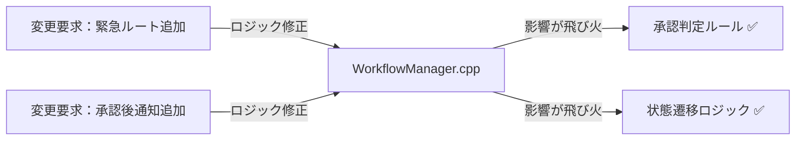

`WorkflowManager` が状態遷移、通知、判定ルールのすべてを抱え込んでいるため、一つの機能をいじると、本来無関係なはずの判定ロジックまで影響を受けてしまうことが分かります。

### 3-3：痛みの言語化

**1つ目の痛み：状態管理とアクションの密結合。** 承認状態が増えるたびに `WorkflowManager` 内の `if-else` 分岐が指数関数的に増え、状態遷移のルールを把握するのが極めて困難になっています。「ある状態で何ができるか」というルールが、他の状態の知識と混在しているため、変更が怖くて手が付けられない状態です。

**2つ目の痛み：通知と判定の責務過多。** 承認時の通知や判定といったビジネスルールが、ワークフローの実行フローと同じ場所に記述されているため、これらを一つ修正するたびに、本来のワークフロー実行フローを読み解き、壊さないように注意を払うという多大な認知的負荷が生じています。このような構造では、承認プロセスの複雑化に伴って開発コストが膨れ上がるのは避けられません。

**3つ目の痛み：通知失敗が状態処理へ染み出す。** 通知を状態保存後の分離した処理へ変え、送信先が落ちていて1件が届かないケースを扱おうとすると、送信可否の分岐を `process()` の状態遷移コードへ書き足すことになります。すると「1件の通知が失敗したときに状態保存まで巻き戻すのか、他の通知は続けるのか」という判断が、状態遷移と同じメソッドに紛れ込みます。承認ルールを部署別上限へ差し替えるときも同じ場所を触るため、通知失敗の扱いと判定ルールの差し替えが、状態遷移コードの上で衝突し始めます。

フェーズ3で「変更が辛い」ことが確認できました。次のフェーズ4では、なぜ辛いのかを構造的に言語化します。

---
> **📌 問題（確定）**
> 承認ワークフローシステムでは、「状態遷移のルール（どの状態で何をするか）」「通知の仕組み（誰にどう通知するか）」「承認判定ロジック（金額・役職による可否）」という、それぞれ異なる理由で変わる3つのものが `WorkflowManager` の1メソッドに同居している。緊急ルートを追加しようとすると通知の二重送信が発生し、通知先を変えると既存の承認フローが壊れるリスクが生じる。この3つの変化軸が同じ場所にある限り、「1つを直すと別の何かが壊れる」という痛みは繰り返す。
---

フェーズ4では「なぜその混在が辛いのか」を、コードの構造で言語化します。

## 🟠 フェーズ4：原因分析 ―― なぜ辛いのかを構造で言語化する
### 4-1：痛みの根源を探る（観察と原因）

フェーズ3で確認した「変更の辛さ」は、コードのどこから来ているのでしょうか。コードを注意深く観察すると、痛みを引き起こしている3つの事実が浮かび上がってきます。

第一に、新しい承認ルートを追加するとき、なぜ毎回 `WorkflowManager` を開かなければならないのでしょうか？ それは、このクラス自身が「作成中で提出なら審査待ちへ移行」「審査待ちで承認なら承認済みへ移行」といった**具体的な状態遷移のルールをすべて直接知ってしまっている（抱え込んでいる）**からです。

第二に、なぜ通知先を追加するだけで既存の承認フローが壊れるリスクを感じるのでしょうか？ それは、「誰に通知するか」という情報と「どの状態で何をするか」という情報が**同じメソッドの中で物理的に混ざり合っている**からです。

第三に、なぜ判定ルール（金額閾値）を変えるためにワークフロー全体のコードを読み解く必要があるのでしょうか？ それは、`if (amount > 100000)` という**判定ロジックが状態遷移の処理と同じ場所に直書きされている**からです。

この「症状（痛み）」と「根本原因」を整理すると、以下のようになります。

| **観察した症状（痛み）** | **構造的な原因（痛みの根源）** |
|---|---|
| 承認ルートを変えると全体に影響が走る | `WorkflowManager` が各状態の具体的な遷移ルールを直接知っているから |
| 通知先を変えると承認ロジックが壊れるリスク | 変わる理由が違う「状態遷移」と「通知」が同じメソッドの中に混在しているから |
| 判定ルールの変更で全体を読み解く必要がある | 「承認の判定ロジック」が状態遷移コードの隙間に直書きされているから |
| 通知の失敗をどう扱うかが状態遷移コードへ染み出す | 通知の送信可否（`DeliveryResult`）を判断する場所が、状態を進める処理と同じメソッドにあるから |

これら3つの根本原因は**それぞれ独立した変化軸**です。「承認フローの状態遷移」「通知先の変動」「承認ルールの変更」は、決定者や変更タイミングが異なるため、同じ場所に混ぜると影響範囲が読みにくくなります。逆に境界を分ければ、主な変更先を状態・通知・判定ルールへ分けて考えやすくなります。

3つが独立しているからこそ、1つの構造だけでは解決しきれません。

### 4-2：変わるもの/変わってほしくないもの

> **「変わらないもの」と「変わってほしくないもの」は異なります。** 「変わらないもの」は経験的事実（今まで変わっていない）、「変わってほしくないもの」は設計意図（ここを安定させてほかを守りたい）です。ここで整理するのは後者です。

| **変わり続けるもの（🔴）** | **変わってほしくないもの（🟢）** |
| --- | --- |
| 承認状態遷移のルール（ルート制御） | 申請・承認という業務プロセスの基本骨格 |
| 各状態における通知先リスト | 承認フローの実行順序（入口から出口までの流れ） |
| 金額や役職による承認可否判定 | 申請データが通過する状態遷移の基盤 |

**【変わる部分（状態遷移・通知・判定が混在した if 文）】**
```cpp
        string current = cases.getState(requestId);
        if (current == "作成中" && operation == "提出") {
            cases.saveState(requestId, "審査待ち");
            cout << requestId << "：作成中 → 審査待ち" << endl;
            notify(requestId);
        } else if (current == "審査待ち" && operation == "承認") {
            cases.saveState(requestId, "承認済み");
            cout << requestId << "：審査待ち → 承認済み" << endl;
            notify(requestId);
        }
        if (!approvers.canApprove(approverId, amount))
            cout << "承認上限を超えています。" << endl;
```

**【変わってほしくない部分（守りたい骨格）】**
```cpp
    void process(const string& requestId, const string& operation,
                 int amount, const string& approverId) {
        string current = cases.getState(requestId);   // ① 状態を読む（守りたい骨格）
        // ② 状態×操作で次状態を決める ← ここが変わる（状態が増えると分岐が増える）
        string next = /* current と operation から次状態を決定 */;
        cases.saveState(requestId, next);              // ③ 次状態を保存（守りたい骨格）
        notify(requestId);                             // ④ 通知する（誰に送るかは変わる側）
    }
```

### 4-3：接続点に漏れている3つの知識を確認する

ここでの「確認すること」は、前節までに見つけた原因から抽出します。まず、原因文から「守りたい骨格」と「変わる差分」を分けます。次に、その差分を動かすために骨格側が知ってしまっている名前・条件・順序・型を拾います。最後に、接続点に残す最小の約束を、値・型・操作・イベントとして書きます。

原因によって、接続点で見る抽象観点は変わります。条件分岐が原因なら条件・定数・選択基準を見ます。処理手順が原因なら呼び出し順・前後条件・失敗時分岐を見ます。生成判断が原因なら具体クラス名・生成条件・登録場所を見ます。通知や外部連携が原因なら通知先・タイミング・成否の扱いを見ます。データや状態が原因なら、境界を流れる値・型・状態を見ます。

現在の `WorkflowManager` は、すべての状態遷移ルール・通知先・判定ロジックを自分自身の中に直接抱え込んでいます。

**【状態・通知・判定の知識が一か所に集まるコード】**
```cpp
class WorkflowManager {
public:
    void process(const string& requestId, const string& operation,
                 int amount, const string& approverId) {
        string current = cases.getState(requestId);
        // 状態遷移を、自分自身で判断して処理している
        if (current == "作成中" && operation == "提出") {
            cases.saveState(requestId, "審査待ち");
            cout << requestId << "：作成中 → 審査待ち" << endl;
            notify(requestId); // 通知先も知っている
        }
        // 判定ルールも、自分自身で持っている
        if (!approvers.canApprove(approverId, amount))
            cout << "承認上限を超えています。" << endl;
    }
};
```

`WorkflowManager`が、状態遷移、通知先、承認判定の詳細をすべて知っています。接続点ごとに「どの知識を相手へ渡しているか」を見ると、独立して変わる判断が一つのメソッドへ集まっていることが分かります。

| 確認する接続点 | `WorkflowManager`が知っていること | 変更時に起きること |
|---|---|---|
| 状態 → 次状態 | 状態名と遷移条件、受け付ける申請イベント | 承認ルート追加で条件分岐を変更する |
| 状態 → 通知 | 通知先・通知タイミング・送信の成否 | 通知先追加や送信失敗の扱いが状態処理へ波及する |
| 状態 → 判定 | 金額閾値と承認者の判断 | 部署別上限へ差し替えるたびにワークフロー本体を変更する |

状態遷移ルール・通知要件・判定ロジックは、それぞれが独立して頻繁に変更される可能性を秘めています。これらを一つのクラスで混在させて管理するのではなく、インターフェースを介した依存関係へ分離することが、システムの設計を健全化する鍵となります。

私たちは今、状態・通知・判定の3つの知識が集まる地点にいます。

フェーズ4で根本原因が言語化できました。分けるべき場所（変わる理由が異なる3つのもの）が特定できた段階です。次のフェーズ5では、この「取り出すターゲット」を具体的に特定します。

---
> **📌 原因（確定）**
> 以下の3つの独立した根本原因が重なっている：
> 1. **状態遷移ルールの直書き**：どの状態でどの処理をするかがクラス内に直接書かれている。
> 2. **通知先とタイミングの混在**：誰に通知するかの知識が状態遷移と同じメソッドに混在している。
> 3. **判定ルールのハードコード**：承認可否などのルールが条件分岐に埋め込まれている。
>
> これらの変更理由（ルート追加、通知先変更、ルール改定）はそれぞれ異なる頻度で発生するため、1つのクラスに混在していることで影響確認コストが発生し続ける。
---

変化の速度が違う3つのものが同居していることは分かりました。フェーズ5では「では何を外に出すか」というターゲットを具体的に特定します。

## 🟡 フェーズ5：課題定義 ―― 解くべき接続点を定める
フェーズ4の分析により、問題の根本原因は「状態遷移のルール」「通知の仕組み」「承認判定のロジック」という、変わる理由が違う3つのものが `WorkflowManager` の中で混在していることだと分かりました。

### 接続点を特定する

接続点は、クラス図の線やインターフェース名から探すのではなく、変更要求を当てて特定します。まず、その要求で変えたい側と変えたくない側を分けます。次に、両者がどのメソッド呼び出し・引数・戻り値・生成・イベントでつながっているかを見ます。そのつながりのうち、変更要求のたびに知識が漏れて修正が波及する場所が、ここで解くべき接続点です。

したがって、今回私たちが解くべき課題は、`WorkflowManager` の中にある **3つの変化軸を、それぞれ独立して差し替え可能な部品として分離すること** です。

```cpp
class WorkflowManager {
public:
    void process(const string& requestId, const string& operation,
                 int amount, const string& approverId) {
        string current = cases.getState(requestId);
        // ↓↓↓ 分離ターゲット①：状態遷移のルール ↓↓↓
        if (current == "作成中" && operation == "提出") {
            cases.saveState(requestId, "審査待ち");
        // ↓↓↓ 分離ターゲット②：通知の仕組みと通知先 ↓↓↓
            notify(requestId);
        }
        // ↓↓↓ 分離ターゲット③：承認判定ロジック ↓↓↓
        if (!approvers.canApprove(approverId, amount))
            cout << "承認上限を超えています。" << endl;
    }
};
```

最終的な目標は、この `WorkflowManager` から3つの変化軸に関する知識をすべて追い出し、「ワークフローの実行フローを進行する」という骨格だけにすることです。

フェーズ5でターゲットが明確になりました。次のフェーズ6では、この「3つの塊」をどのように分離していくか、段階的に対策を検討していきます。

---
> **📌 課題（確定）**
> `WorkflowManager` から切り離す塊は3つある。1つ目は「どの状態でどの処理をするか」という状態遷移の知識で、これを `IWorkflowPhase` の実装クラスとして独立させること。2つ目は「誰に通知するか」という通知先の知識で、これを `INotificationListener` のリスナーとして外部から登録できる形に分離すること。3つ目は「承認可否をどう判定するか」という判定ロジックで、これを `IApprovalRule` として差し替え可能な部品として切り出すこと。この3つを分離すると、各変化軸への変更の中心を別々のクラスへ寄せられる。なお、これらの切り離しに伴い、具体クラスを組み立てる箇所（組み立てコード）にも対応する修正が必要になる点に注意すること。
---

ターゲットが3つに絞られました。フェーズ6では、この分離をどのステップで・どの形で実現するかを段階的に検討します。

#### フェーズ6へ渡す課題

| 課題ID | 現在の変更影響 | 変えたくない範囲 |
|---|---|---|
| P1 | 状態・遷移追加で `WorkflowManager` の条件分岐と各操作へ波及する | ワークフローの公開入口、状態保存、既存フェーズ |
| P2 | 通知先追加で `WorkflowManager` の通知分岐へ波及する | 状態確定後に通知する順序、他通知、処理本体 |
| P3 | 承認ルール変更で `WorkflowManager` の金額・承認者判定へ波及する | 承認操作、状態遷移、既存ルール |

状態遷移・通知・承認判定は独立して変わるためP1、P2、P3の連番にします。フェーズ6では、痛みのグラフにあるこの3枝を起点に、構造の微修正と候補を導きます。

## 🔴 フェーズ6：対策検討 ―― 案を比べ、採用する形を決める

フェーズ6は、フェーズ5で定めた3つの課題——**状態遷移を切り離すこと／通知先を切り離すこと／承認判定ルールを差し替えられるようにすること**——を受けて始めます。まずフェーズ4で記録した3本の痛みを図の起点に置き、P1〜P3でどのコード境界を微修正し、同じ要求を当て直すと影響がどこまで縮むかを枝ごとに描きます。その経路から、現在→理想の差、守る契約、完了条件、候補を同じ課題IDの行へ落とします。その後、各IDに紐づくフェーズ3の関連コードだけをおさらいし、候補を一段ずつ適用します。第二部の集大成として独立した変化軸を混ぜず、「何を変えたか」「どの影響が減ったか」「何が残るか」をコードで回収します。
#### 痛みの変更影響から、構造をどう変えるか

フェーズ4では、状態遷移、通知運用、承認判定が WorkflowManager へ集まり、別々の要求が同じ場所へ波及していました。この3本の痛みをP1〜P3の起点にし、それぞれの構造変更後までつなぎます。

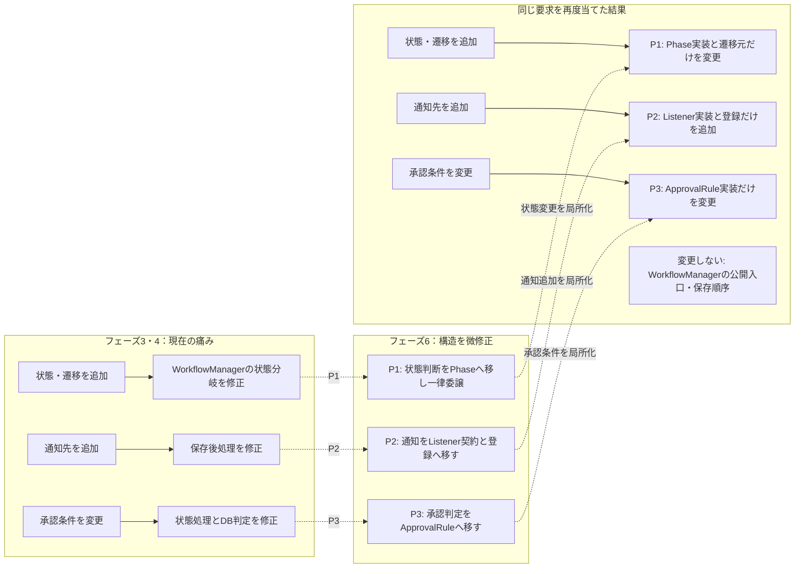

#### 構造変更グラフから課題と候補を一続きで導く

| 課題ID | 変更の到達点 | 最初の微修正 | 残れば次の微修正 |
|---|---|---|---|
| P1 | **現在→理想の差：** 状態追加をPhase実装へ縮める<br>**切る境界・守る契約：** 状態選択を切り、操作→次状態・保存・監査を守る<br>**完了条件：** Managerの分岐を増やさない | **候補：** 次状態判断をクラスへ移す<br>**減る影響：** 状態分岐を分離できる | 現在Phaseへ一律委譲する |
| P2 | **現在→理想の差：** 通知追加をListener登録へ縮める<br>**切る境界・守る契約：** 直接通知を切り、保存成功後・部分失敗継続を守る<br>**完了条件：** 登録だけで追加する | **候補：** `onChanged` 契約へそろえる<br>**減る影響：** 直接通知分岐が減る | 登録リストと結果記録へ接続する |
| P3 | **現在→理想の差：** 承認変更から状態・通知を外す<br>**切る境界・守る契約：** 固定判定を切り、不許可時の状態不変・理由ログを守る<br>**完了条件：** 状態・通知を変更しない | **候補：** 承認判定を関数へ出す<br>**減る影響：** 状態処理と判定を分けて読める | `IApprovalRule` 契約へ上げて注入する |

ここからP1〜P3の横一行を、状態分岐・通知・承認判定へ独立に適用します。

#### 課題箇所のおさらい（フェーズ3の関連コード）

比較元は、緊急ルートと承認後通知を `WorkflowManager` へ直接追加したフェーズ3の変更途中コードです。


課題カードの着目コードに該当する部分だけを振り返ります。課題に関係しないコードは省略し、フェーズ3で明記した維持条件をそのまま引き継ぎます。

```cpp
// 変更後の WorkflowManager（緊急ルート・却下通知・決済部門通知を追加）
class WorkflowManager {
    ApproverDatabase approvers;
    WorkflowCaseRepository cases;
    NotificationTargetRepository targets;
public:
    void process(const string& requestId, const string& operation,
                 int amount, const string& approverId) {
        if (!cases.exists(requestId)) {
            cout << "エラー：申請ID " << requestId << " は存在しません。" << endl;
            return;
        }
        if (!approvers.exists(approverId)) {
            cout << "エラー：承認者ID " << approverId
                 << " はデータベースに存在しません。" << endl;
            return;
        }
        if (!approvers.canApprove(approverId, amount)) {
            ApproverInfo info = approvers.get(approverId);
            cout << "エラー：" << info.name << " の承認上限（"
                 << info.approvalLimit << "円）を超えています。" << endl;
            return;
        }
        string current = cases.getState(requestId);
        string next;
        string suffix;              // 「（課長スキップ）」など状態別の付記
        bool notifyPayment = false; // 完了時に決済部門へ追加通知するか
        // ↓ 状態遷移・通知・判定が同じif/elseに次々と積み重なる
        if (current == "作成中" && operation == "提出") {
            next = "審査待ち";
        } else if (current == "作成中" && operation == "緊急提出") { // 緊急ルート追加
            next = "優先審査待ち"; suffix = "（課長スキップ）";
        } else if (current == "審査待ち" && operation == "承認") {
            next = "承認済み";
        } else if (current == "審査待ち" && operation == "却下") {   // 却下通知追加
            next = "却下";
        } else if ((current == "優先審査待ち" || current == "承認済み")
                   && operation == "承認") {
            next = "完了"; notifyPayment = true;                    // 決済部門通知追加
        } else {
            cout << "エラー：現在状態「" << current
                 << "」で操作「" << operation << "」はできません。" << endl;
            return;
        }
        cases.saveState(requestId, next);
        cout << requestId << "：" << current << " → " << next << suffix << endl;
        notify(requestId);                        // ← どの遷移でも同じ。毎回1回でよい
        if (notifyPayment) cout << "決済部門へ通知" << endl;
    }
private:
    void notify(const string& requestId) {
        cout << targets.getTarget(requestId) << "へ通知" << endl;
    }
};

int main() {
    WorkflowManager wm;
    // 通常申請の提出
    wm.process("REQ001", "提出", 50000, "APR001");
    cout << "---" << endl;
    // 緊急申請の提出（課長スキップ）
    wm.process("REQ003", "緊急提出", 50000, "APR001");
    cout << "---" << endl;
    // 通常申請の課長承認
    wm.process("REQ002", "承認", 50000, "APR001");
    return 0;
}
```

### 6-1：痛みコードを分解して、接続点の「形」を探す

課題は3つあります。どんな形なら切り離せるかは、痛みコードを分解して探します。まず数えるのは、**独立して変わる軸がいくつあるか**です。共通の形は既に並んでいます。どの遷移も「次状態を保存し、表示し、通知する」という**同じ3行**で、状態ごとに違うのは「どの操作を受け付け、どの状態へ進むか」だけです。

**分解1（状態の軸）：** `if(current && operation)` の遷移。状態ごとに違う振る舞いを、状態そのものを表すオブジェクトへ → **状態の契約 `IWorkflowPhase`（`next`）**。

```cpp
class IWorkflowPhase {
public:
    virtual PhaseResult next(
        const std::string& operation) const = 0;
    virtual ~IWorkflowPhase() = default;
};

class DraftPhase : public IWorkflowPhase {
public:
    PhaseResult next(
            const std::string& operation) const override {
        if (operation == "submit")
            return {true, "審査待ち"};
        return {false, "操作できません"};
    }
};
```

P1は次状態の判断を分けます。`false` はエラー結果であって遷移ではないため、状態保存も通知も行いません。
**分解2（通知の軸）：** `notify()` と決済部門通知。状態保存後の副作用で、通知先が増減する → **通知の契約 `INotificationListener`（`onChanged`）** のリスト。

```cpp
class INotificationListener {
public:
    virtual NotificationResult onChanged(
        const StateChanged& event) = 0;
    virtual ~INotificationListener() = default;
};

for (auto* listener : listeners)
    notificationLog.add(listener->onChanged(event));
```

P2は「保存後に配る」順序だけを骨格に残し、宛先知識を外へ出します。通知失敗は記録し、保存済み状態を手動で戻しません。
**分解3（ルールの軸）：** `canApprove(approverId, amount)` の承認判定。金額・部署別上限で変わる → **判定の契約 `IApprovalRule`（`canApprove`）**。

```cpp
class IApprovalRule {
public:
    virtual ApprovalDecision canApprove(
        const std::string& approverId,
        int amount) const = 0;
    virtual ~IApprovalRule() = default;
};

ApprovalDecision decision =
    approvalRule.canApprove(approverId, amount);
if (!decision.allowed)
    return {false, decision.reason}; // 状態は変えない
```

P3の判定失敗は戻り値と監査ログへ出します。状態不変なので、状態遷移図にエラー遷移の矢印は追加しません。

**片方だけでは詰まる（第二部の肝）：** 状態だけ分けても `notify()` と `canApprove` が本体に残る。通知だけ分けても状態遷移と判定が残る。3つは決定者も頻度も異なるので、片方の変更が他へ波及し続ける。ここで分かるのは、**「3つの軸をそれぞれ別の契約に分け、`WorkflowManager` は"進行する"骨格だけにする」**必要があるということ。

**分解の結論：** 状態・通知・判定の3つに独立した契約を置き、`WorkflowManager` は状態を進めて通知を配るだけの骨格にする。これが第二部の集大成の見立てです。

### 6-2：見つけた形を契約にし、データの置き場所を決める

見つけた3つの形を、それぞれの契約として定義します。

```cpp
ProcessResult WorkflowManager::process(
        const WorkflowCommand& command) {
    ApprovalDecision approval =
        approvalRule.canApprove(command.approverId, command.amount);
    if (!approval.allowed) return rejectWithoutTransition(approval);

    PhaseResult phase = currentPhase(command.caseId)
        .next(command.operation);
    if (!phase.changed) return errorWithoutTransition(phase);

    StateChanged event = cases.saveAndReturnEvent(
        command.caseId, phase.nextState);
    approvalLog.add(event);
    notifyAll(event);
    return {true, phase.nextState};
}
```

判定→状態判断→保存・監査→通知の順を骨格に固定しました。P1〜P3のどれかが失敗したときに人手で後続処理を補う必要はありません。


次に、データの置き場所を決めます。

| データ | 現状の置き場所 | 対策後の置き場所 | 置き場所を決める理由 |
|---|---|---|---|
| 現在状態 | `WorkflowManager` の `if` 分岐 | `WorkflowCaseRepository`（`IWorkflowPhase` で表現） | 状態名でなく状態オブジェクトへ委譲する |
| 通知先の一覧 | `notify()` の直呼び | `INotificationListener` の登録リスト | 通知先の増減・失敗を通知側で扱う |
| 承認者・上限 | `approvers.canApprove` 直呼び | `ApproverDatabase` ＋ 差し替え可能な `IApprovalRule` | 判定ルールを外から差し替える |

接続点で受け渡すのは、状態側が **操作 → 次状態名**、通知側が **状態変化（from/to）**、判定側が **承認者・金額 → 可否**です。状態・リスナー・ルールの**所有権・生存期間は組み立て側**が管理します。

クラス分離を完成させるには、分離先だけでなく次の順で組み立てを確認します。

| 判断 | 関連コードで確認すること |
|---|---|
| 誰が具体実装を選ぶか | `main()`、Application、Factory、Creator、Registryなど、業務処理の外側に選択を集める |
| 誰が生成するか | 必要な依存を先に生成できる組み立て側が具体オブジェクトを生成する |
| 誰が所有するか | スタック、スマートポインタ、所有コンテナのどれが破棄まで担うかを決める |
| どう注入するか | 必須依存はコンストラクタ、増減する依存は登録操作、生成自体を替える場合は生成契約から渡す |
| 利用側は何を知るか | 利用側は抽象契約だけを保持し、処理中に具体クラスを生成しない |
| 追加時にどこを変えるか | 新しい実装クラスと組み立て・登録を変更し、安定させたい処理骨格へ具体名を戻さない |

生ポインタや参照で非所有の依存を保持する場合は、所有側の生存期間が利用側より長いことまで組み立てコードで確認します。

#### 課題IDごとのコード適用結果

| 課題ID | 候補を適用したコード | コード上の微修正と結果 | 守った契約・完了条件の判定 |
|---|---|---|---|
| P1 | `IWorkflowPhase::next()`、`DraftPhase`、`WorkflowManager::process()` | **微修正：** 次状態判断をPhaseへ移し現在Phaseへ委譲<br>**結果：** 状態変更がPhaseへ閉じた | **守った契約：** 操作→次状態、保存、監査<br>**判定：** 達成、エラー時は状態不変 |
| P2 | `INotificationListener`、登録、保存後ループ | **微修正：** 直接通知を同一契約の登録へ変更<br>**結果：** 通知追加が実装と登録へ縮んだ | **守った契約：** 保存成功後、部分失敗継続<br>**判定：** 達成 |
| P3 | `IApprovalRule`、部署別Rule、処理先頭判定 | **微修正：** 固定判定をRuleへ移し不許可で終了<br>**結果：** 条件変更がRuleへ閉じた | **守った契約：** 状態不変、理由ログ<br>**判定：** 達成 |

### 6-3：構造の見立て（分解の結果、こうなる）

分解して3つの契約とデータ配置を決めた結果、構造はこうなります。図は出発点ではなく結論です。

現状（1メソッドに状態・通知・判定が同居）：

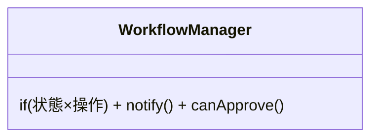

見立て（3軸を別々の契約へ、本体は進行の骨格）：

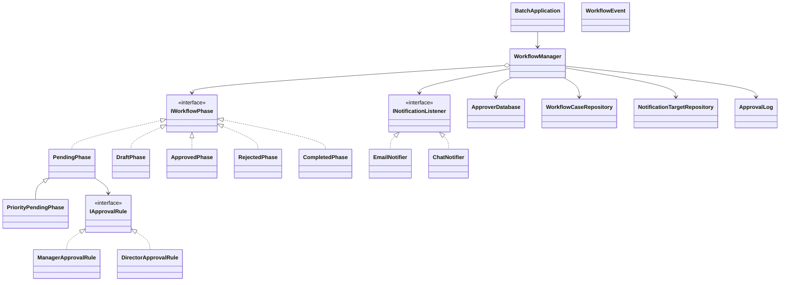

図から読み取ること：`WorkflowManager` から状態分岐・通知直呼び・判定が消え、3つの契約への依存だけが残る。3軸は互いに独立して差し替わる。

### 6-4：影響範囲（この設計で変更要求を再度当てたら）

| 変更要求 | 修正する場所 | 再テスト範囲 |
|---|---|---|
| 承認ルートを追加（海外出張など） | `IWorkflowPhase` を実装した状態を追加 | 追加状態。**通知・判定は無変更** |
| 通知先を追加 | `INotificationListener` を実装して登録 | 追加通知先。**状態・判定は無変更** |
| 承認上限を部署別に変える | `IApprovalRule` を差し替え | ルール。**状態・通知は無変更** |

現状との差：現状はどの軸を変えても `WorkflowManager` を開く。対策後は軸ごとに独立して差し替えられる。**この「独立して触れる」ことがこの構造を採る理由**です。

### 採用する形を決める

各案には一長一短があります。今回の課題は、承認状態・通知先・承認判定ルールという3つの変化軸を同じワークフロー本体で扱っていることです。「どの案がどの課題を解くのか」を順に比べます。

| 案 | 解けること | 残ること | 今回の判断 |
|---|---|---|---|
| 状態遷移だけ分ける | 申請イベントと承認ルート追加を状態ごとに扱える | 通知先・送信失敗と判定ルールの変更は残る | ルート追加には必要だが単独では不足 |
| 通知だけ登録式にする | 通知先の増減と送信失敗の扱いを通知側へ寄せられる | 状態遷移と承認判定は本体に残る | 通知追加・失敗対応には必要だが単独では不足 |
| 判定ルールだけ差し替える | 部署別上限など承認条件を局所化できる | 状態追加と通知追加は残る | ルール変更には必要だが単独では不足 |
| 3つの境界を別々に作る | 状態・通知・判定を独立して変更できる | クラス数と組み立てが増える | 3軸すべてが変わるため採用する |

**今回の決断：** フェーズ2のヒアリングで「海外出張ルートや限定フローが今後も追加される（承認ルートの変化）」「関連部署への通知追加ニーズが継続的にある（通知の変化）」「来期から部署ごとの承認上限制度に変わる（判定ルールの変化）」と明言されています。3つの独立した変化軸が確認できたため、今回は**状態分離・通知分離・ルール差し替えの3つの契約を別々に置く形を採用する**決断を下します。

> この構造は、第3章の**状態分離構造**、第7章の**通知分離構造**、第1章の**ルール差し替え構造**を、問題を分析した結果として組み合わせた第二部の集大成です。

### どの構造を使うかの判断基準

3つの構造のどれを適用するかは、次のように順を追って確認できます。

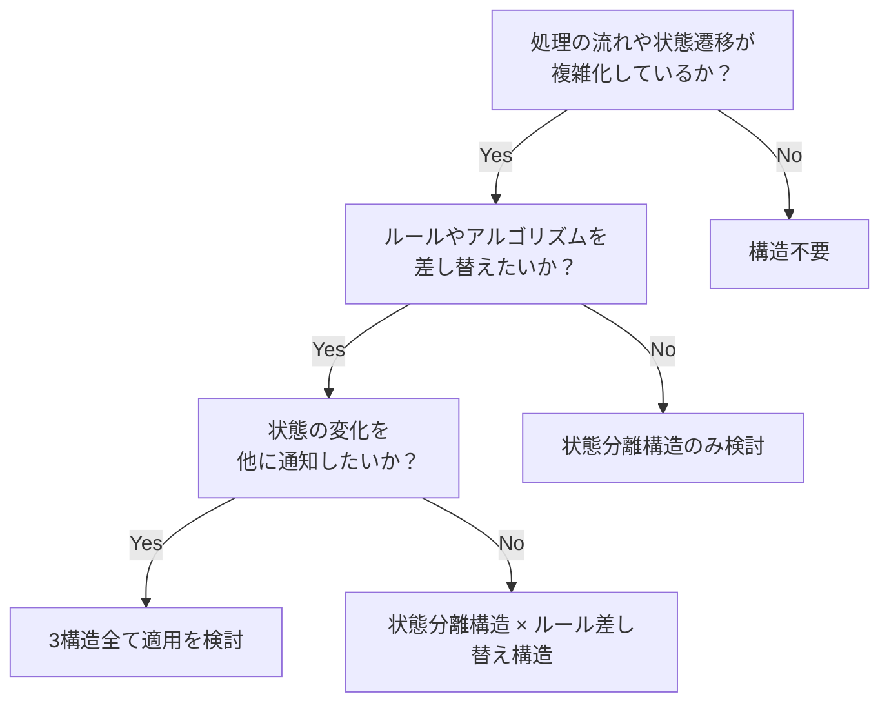

フェーズ6で採用する設計（3つの契約・データ配置・構造・影響範囲）が決まりました。次のフェーズ7では、この決断を動く実装（`WorkflowCaseRepository`・各状態／リスナー／ルール・`WorkflowManager`・実行結果）に落とし込み、変更要求で効果を確認します。

## 🟢 フェーズ7：対策実施 ―― 変化に強いコードを完成させる
フェーズ7のコードは、フェーズ6のステップ1〜3で切り出した**3つの契約をそのまま引き継ぎ**、実運用に耐えるよう肉付けした完成形です。まず、フェーズ6のどの部品がフェーズ7のどのクラスへ育つかを対応づけます。

| フェーズ6で切り出した契約 | フェーズ6の最小形 | フェーズ7の本番形（肉付け） |
|---|---|---|
| 状態（`IWorkflowPhase`） | `next(operation)` が次状態の文字列を返す | `handle(wm, WorkflowEvent, request)`。操作を列挙型 `WorkflowEvent` にし、状態を6つ（作成中〜完了）へ細分化 |
| 通知（`INotificationListener`） | `onChanged(reqId, from, to)` で宛先へ送る | 送信手段（メール／チャット）と配信失敗（`DeliveryResult`）を扱い、`notifyAll()` で登録リスナーへ配信 |
| 判定（`IApprovalRule`） | `canApprove(approverId, amount)` | 役職別ルール（`ManagerApprovalRule` ほか）として実装 |

契約の名前と役割は同じで、変わるのは「操作を文字列から列挙型へ」「通知に送信手段と失敗処理を足す」といった実運用向けの詳細だけです。以下を、この対応を思い出しながら読んでください。

フェーズ6の短い例では、`DraftPhase` が申請受付と承認判定をまとめていました。フェーズ7では状態分離構造の役割を明確にするため、状態を作成中・審査待ち・優先審査待ち・承認済み・却下・完了へ細かく分け、承認イベントを列挙型（`WorkflowEvent`）で表します。

- `DraftPhase`：通常申請・緊急申請のイベントを受け、審査待ちへ遷移する。
- `PendingPhase` / `PriorityPendingPhase`：承認・却下のイベントを受け、判定ルールを使って次状態を選ぶ。
- `ApprovedPhase` / `RejectedPhase` / `CompletedPhase`：それぞれの状態で許可されたイベントだけを処理する。

`WorkflowManager` は申請IDから現在状態を読み込み、イベントを現在状態へ渡します。各状態オブジェクトが次状態を選び、ContextがRepositoryへ保存し直すため、「状態によって振る舞いが変わる」という状態分離構造の性質をコード上でも確認できます。

### 7-1：解決後のコード（全体）

ステップ3で決断した構造を、実行可能な完全なコードとして組み上げます。各役割ごとにコードを分けて確認します。

**0. 承認者マスターデータ（ApproverDatabase）**

`BatchApplication` が組み立てを開始する前に、承認者IDと権限情報を持つマスターデータを定義します。これによって、承認者IDが不正な場合や権限額を超えた場合にエラーを早期に検出できます。

```cpp
#include <iostream>
#include <algorithm>
#include <map>
#include <stdexcept>
#include <string>
#include <vector>

using namespace std;

// 承認者情報
struct ApproverInfo {
    string name;         // 氏名
    string role;         // "manager", "director", "executive"
    int approvalLimit;   // 承認可能な申請金額上限（円）
};

// 承認者マスターデータ
class ApproverDatabase {
    map<string, ApproverInfo> records;
public:
    ApproverDatabase() {
        records["APR001"] = {"田中 部長",   "manager",   100000};
        records["APR002"] = {"佐藤 取締役", "director",  1000000};
        records["APR003"] = {"鈴木 代表",   "executive", 99999999};
    }

    bool exists(const string& id) const {
        return records.count(id) > 0;
    }

    ApproverInfo get(const string& id) const {
        return records.at(id);
    }

    void save(const string& id, const ApproverInfo& info) {
        records[id] = info;           // 実行中の承認者マスタへ追加
    }

    bool canApprove(const string& id, int amount) const {
        return records.at(id).approvalLimit >= amount;
    }
};
```

`ApproverDatabase` は `BatchApplication` が唯一のインスタンスを保持し、`WorkflowManager` を組み立てる前にIDと権限額の検証に使います。

承認ログ（`ApprovalLog`）はシステム起動時は空で、承認・却下・差し戻しが行われるたびに1件追記されます。ファイルへの保存は行わず、実行中のメモリ上にのみ保持します。

```cpp
struct ApprovalRecord {
    std::string approverId;    // "APR001", "APR002", "APR003"
    std::string approverName;  // "田中部長", "佐藤取締役", "鈴木代表"
    int amount;
    std::string decision;      // "承認", "却下", "差し戻し"
};

// 承認ログを管理するクラス
class ApprovalLog {
    std::vector<ApprovalRecord> records;
public:
    void add(const std::string& approverId, const std::string& approverName,
             int amount, const std::string& decision) {
        records.push_back({approverId, approverName, amount, decision});
    }
    void printAll() const {
        for (const auto& r : records) {
            std::cout << "[" << r.approverId << "] " << r.approverName
                      << " " << r.amount << "円 -> " << r.decision << std::endl;
        }
    }
    int size() const { return (int)records.size(); }
};
```

**コードで使う値の対応表**

この章のコードでは `#define` は使いませんが、列挙値、ID文字列、金額閾値、Phaseクラス名が仕様上の値として登場します。コードを読む前に、どの値が何を表すかを整理します。

| 種類 | コード上の値 | 仕様上の意味 | 使われる場所 |
|---|---|---|---|
| 申請ID | `REQ001` など | 1件の申請を識別するID | `WorkflowCaseRepository` が現在状態を保存・取得するキー |
| 承認者ID | `APR001` | 田中 部長。承認上限100,000円 | `ApproverDatabase` の存在確認・上限額チェック |
| 承認者ID | `APR002` | 佐藤 取締役。承認上限1,000,000円 | 緊急申請や部長承認の正常ケース |
| 承認者ID | `APR999` | 登録されていない承認者ID | 未登録IDエラーの確認 |
| 金額閾値 | `100000` | 課長承認ルールの上限額 | `ManagerApprovalRule` と `ApproverDatabase` の検証 |
| 金額閾値 | `1000000` | 部長承認ルールの上限額 | `DirectorApprovalRule` と `ApproverDatabase` の検証 |
| イベント | `SubmitNormal` | 通常申請を提出する操作 | `DraftPhase` が審査待ちへ進める |
| イベント | `SubmitEmergency` | 緊急申請を提出する操作 | `DraftPhase` が優先審査待ちへ進める |
| イベント | `Approve` | 現在状態で承認する操作 | `PendingPhase` / `PriorityPendingPhase` が処理する |
| イベント | `Reject` | 現在状態で却下する操作 | `PendingPhase` が却下へ進める |
| イベント | `FinalApprove` | 承認済み申請を最終承認する操作 | `ApprovedPhase` が完了へ進める |
| イベント | `Resubmit` | 却下された申請を再申請する操作 | `RejectedPhase` が審査待ちへ戻す |
| Phase名 | `DraftPhase` | 作成中の状態 | Repositoryから現在状態として取得され、提出イベントを処理する |
| Phase名 | `PendingPhase` | 審査待ちの状態 | 課長承認・却下を処理する |
| Phase名 | `PriorityPendingPhase` | 緊急申請の優先審査待ち状態 | 緊急申請の承認を処理する |
| Phase名 | `ApprovedPhase` | 承認済みの状態 | 部長の最終承認を処理する |
| Phase名 | `RejectedPhase` | 却下状態 | 再申請を処理する |
| Phase名 | `CompletedPhase` | 完了状態 | この章の仕様では後続遷移を持たない |
| 通知チャネル | `email` | メール通知として送る | `EmailNotifier` が処理する |
| 通知チャネル | `chat` | チャット通知として送る | `ChatNotifier` が処理する |

**1. インターフェース定義（3つの変化軸）**

```cpp

// 判定ルールの契約（変わる理由：経理ルール変更・部署別上限制度）
class IApprovalRule {
public:
    virtual bool canApprove(int amount) = 0;
    virtual ~IApprovalRule() = default;
};

struct NotificationTarget {
    string recipientName; // "申請者", "課長", "部長", "決済部門"
    string channel;       // "email", "chat"
};

// 通知の送信結果（結果オブジェクト）：送信可否と対象チャネル
struct DeliveryResult {
    bool success;
    string channel;
};

// 通知リスナーの契約（変わる理由：通知手段の追加）
class INotificationListener {
public:
    virtual bool supports(const string& channel) const = 0;
    virtual DeliveryResult onStatusChanged(
        const NotificationTarget& target,
        string msg
    ) = 0;
    virtual ~INotificationListener() = default;
};

enum class WorkflowEvent {
    SubmitNormal,
    SubmitEmergency,
    Approve,
    Reject,
    FinalApprove,
    Resubmit
};

struct ApprovalRequest {
    int amount;
};

// 状態遷移の契約（変わる理由：承認フロー変更・新ルート追加）
class IWorkflowPhase {
public:
    virtual string name() const = 0;
    virtual void handle(
        class WorkflowManager* wm,
        WorkflowEvent event,
        const ApprovalRequest& request
    ) = 0;
    virtual ~IWorkflowPhase() = default;
};
```

申請ごとの現在状態は、利用側が毎回指定するものではありません。実システムではDBに保存されている申請状態を読み込み、処理後に更新します。この章では `WorkflowCaseRepository` を境界スタブとして置き、申請IDと現在状態の対応をメモリ上に保持します。

```cpp
class WorkflowCaseRepository {
    map<string, IWorkflowPhase*> currentPhaseByRequestId;
public:
    void create(const string& requestId, IWorkflowPhase* initialPhase) {
        currentPhaseByRequestId[requestId] = initialPhase;
    }

    IWorkflowPhase* loadPhase(const string& requestId) const {
        auto it = currentPhaseByRequestId.find(requestId);
        if (it == currentPhaseByRequestId.end()) {
            throw invalid_argument("申請IDが存在しません: " + requestId);
        }
        return it->second;
    }

    void savePhase(const string& requestId, IWorkflowPhase* phase) {
        currentPhaseByRequestId[requestId] = phase;
    }
};
```

通知先も同じように、コードの呼び出し側が毎回手で選ぶものではありません。申請や状態に応じて「誰へ、どのチャネルで通知するか」をデータとして保持し、通知時に読み出します。この章では `NotificationTargetRepository` を境界スタブとして置きます。

```cpp
class NotificationTargetRepository {
    map<string, vector<NotificationTarget>> targetsByRequestId;
public:
    void setTargets(
        const string& requestId,
        const vector<NotificationTarget>& targets
    ) {
        targetsByRequestId[requestId] = targets;
    }

    vector<NotificationTarget> loadTargets(const string& requestId) const {
        auto it = targetsByRequestId.find(requestId);
        if (it == targetsByRequestId.end()) {
            return {};
        }
        return it->second;
    }
};
```

**2. 承認判定ルールの具体実装（ルール差し替え構造）**

```cpp
// 課長承認ルール：10万円以下を承認可能
class ManagerApprovalRule : public IApprovalRule {
public:
    bool canApprove(int amount) override {
        return amount <= 100000;
    }
};

// 部長承認ルール：100万円以下を承認可能
class DirectorApprovalRule : public IApprovalRule {
public:
    bool canApprove(int amount) override {
        return amount <= 1000000;
    }
};
```

**3. 通知リスナーの具体実装（通知分離構造）**

```cpp
class EmailNotifier : public INotificationListener {
public:
    bool supports(const string& channel) const override {
        return channel == "email";
    }
    DeliveryResult onStatusChanged(
        const NotificationTarget& target,
        string msg
    ) override {
        cout << "[メール送信] To:" << target.recipientName
             << " / " << msg << endl;
        return {true, "email"};
    }
};

class ChatNotifier : public INotificationListener {
    bool willFail;  // チャット基盤が不調の状況を再現する
public:
    ChatNotifier(bool fail = false) : willFail(fail) {}
    bool supports(const string& channel) const override {
        return channel == "chat";
    }
    DeliveryResult onStatusChanged(
        const NotificationTarget& target,
        string msg
    ) override {
        if (willFail) {
            return {false, "chat"};
        }
        cout << "[チャット通知] To:" << target.recipientName
             << " / " << msg << endl;
        return {true, "chat"};
    }
};
```

**4. 本体クラス（WorkflowManager）**

ワークフローを実行する本体クラスです。具体的な状態クラス・通知先・判定ルールを知らず、インターフェースだけを通じて処理を委譲します。

```cpp
class WorkflowManager {
    // 状態グラフとListenerはBatchApplicationが所有し、
    // WorkflowManagerより長く生存する
    WorkflowCaseRepository& cases;
    NotificationTargetRepository& notificationTargets;
    string requestId;
    IWorkflowPhase* phase = nullptr;  // 非所有
    vector<INotificationListener*> listeners;  // 非所有
public:
    WorkflowManager(
        WorkflowCaseRepository& cases,
        NotificationTargetRepository& notificationTargets,
        const string& requestId
    ) : cases(cases),
        notificationTargets(notificationTargets),
        requestId(requestId) {
        phase = cases.loadPhase(requestId);
    }

    void addListener(INotificationListener* listener) {
        if (!listener) return;
        if (find(listeners.begin(), listeners.end(), listener)
                == listeners.end()) {
            listeners.push_back(listener);
        }
    }

    void removeListener(INotificationListener* listener) {
        listeners.erase(
            remove(listeners.begin(), listeners.end(), listener),
            listeners.end());
    }

    void process(WorkflowEvent event, const ApprovalRequest& request = {0}) {
        if (phase) phase->handle(this, event, request);
    }

    void transitionTo(IWorkflowPhase* next, const string& message) {
        if (!next) {
            throw invalid_argument("状態にnullは設定できません。");
        }
        phase = next;
        cases.savePhase(requestId, phase);
        cout << "状態: " << phase->name() << endl;
        notifyAll(message);
    }

    void notifyAll(const string& msg) {
        // 通知開始時点の送信手段と通知先データを使う
        auto snapshot = listeners;
        auto targets = notificationTargets.loadTargets(requestId);
        for (const auto& target : targets) {
            for (auto* listener : snapshot) {
                if (listener->supports(target.channel)) {
                    DeliveryResult r =
                        listener->onStatusChanged(target, msg);
                    if (!r.success) {
                        // 状態保存は済んでおり巻き戻さない。
                        // 失敗した通知だけ記録し、他は続行する
                        cout << "[通知失敗] channel=" << r.channel
                             << "（状態は保持、他の通知は継続）"
                             << endl;
                    }
                }
            }
        }
    }
};
```

この例では、状態グラフ、申請状態Repository、通知先Repository、通知送信スタブを`BatchApplication`の中で組み立てます。利用側は現在状態も通知先も直接指定せず、申請IDを指定して処理を実行します。通知送信スタブを動的に破棄する実運用では、破棄前に`removeListener()`を呼ぶ契約が必要です。所有関係の設計については、チームのコーディング規約に従って判断してください。重複登録と`null`は`addListener()`で拒否し、通知中の登録変更に左右されないよう通知開始時点のスナップショットを使います。

`notifyAll()` は、状態保存（`transitionTo()` 内の `savePhase()`）が済んだ後に呼ばれます。掲載コードでは `onStatusChanged()` が送信可否を `DeliveryResult` で返し、成功時はスタブが `std::cout` で送信内容を表示します。1件の送信が失敗しても、状態保存は巻き戻さず、失敗した通知だけを記録して残りの通知を続けます。実システムではさらに通知を `NotificationQueue` へ積んで後から送りますが、この「通知失敗を状態遷移から切り離す」振る舞いは、通知の責任が `INotificationListener` 側にあるからこそ、`WorkflowManager` の実行骨格へ染み出さずに済みます。キュー化・再送のスケジューリングは基盤側の関心なので、この章のコードには含めません。

**5. 状態クラスの具体実装（状態分離構造 × ルール差し替え構造の組み合わせ）**

```cpp
class DraftPhase : public IWorkflowPhase {
    IWorkflowPhase* pending;
    IWorkflowPhase* priorityPending;
public:
    DraftPhase(IWorkflowPhase* p, IWorkflowPhase* pp)
        : pending(p), priorityPending(pp) {}
    string name() const override { return "作成中"; }
    void handle(
        WorkflowManager* wm,
        WorkflowEvent event,
        const ApprovalRequest&
    ) override {
        if (event == WorkflowEvent::SubmitNormal) {
            wm->transitionTo(pending, "申請を受け付けました");
        } else if (event == WorkflowEvent::SubmitEmergency) {
            wm->transitionTo(priorityPending, "緊急申請を受け付けました");
        }
    }
};

class PendingPhase : public IWorkflowPhase {
protected:
    IApprovalRule* rule;
    IWorkflowPhase* approved;
    IWorkflowPhase* rejected;
public:
    PendingPhase(
        IApprovalRule* r,
        IWorkflowPhase* a,
        IWorkflowPhase* reject
    ) : rule(r), approved(a), rejected(reject) {}

    string name() const override { return "審査待ち"; }

    void handle(
        WorkflowManager* wm,
        WorkflowEvent event,
        const ApprovalRequest& request
    ) override {
        if (event == WorkflowEvent::Approve) {
            if (rule->canApprove(request.amount)) {
                wm->transitionTo(approved, "承認されました");
            } else {
                wm->notifyAll("上位承認者への確認が必要です");
            }
        } else if (event == WorkflowEvent::Reject) {
            wm->transitionTo(rejected, "申請が却下されました");
        }
    }
};

class PriorityPendingPhase : public PendingPhase {
public:
    using PendingPhase::PendingPhase;
    string name() const override { return "優先審査待ち"; }
};

class ApprovedPhase : public IWorkflowPhase {
    IApprovalRule* rule;
    IWorkflowPhase* completed;
public:
    ApprovedPhase(IApprovalRule* r, IWorkflowPhase* c)
        : rule(r), completed(c) {}
    string name() const override { return "承認済み"; }
    void handle(
        WorkflowManager* wm,
        WorkflowEvent event,
        const ApprovalRequest& request
    ) override {
        if (event == WorkflowEvent::FinalApprove) {
            if (rule->canApprove(request.amount)) {
                wm->transitionTo(completed, "部長承認が完了しました");
            } else {
                wm->notifyAll("部長の承認上限を超えています");
            }
        }
    }
};

class RejectedPhase : public IWorkflowPhase {
    IWorkflowPhase* pending = nullptr;
public:
    void setPending(IWorkflowPhase* p) { pending = p; }
    string name() const override { return "却下"; }
    void handle(
        WorkflowManager* wm,
        WorkflowEvent event,
        const ApprovalRequest&
    ) override {
        if (event == WorkflowEvent::Resubmit && pending) {
            wm->transitionTo(pending, "再申請を受け付けました");
        }
    }
};

class CompletedPhase : public IWorkflowPhase {
public:
    string name() const override { return "完了"; }
    void handle(
        WorkflowManager*,
        WorkflowEvent,
        const ApprovalRequest&
    ) override {
        // 完了状態からの遷移は、この動作仕様では定義しない
    }
};
```

状態クラスは、単独で呼び出されるのではありません。`WorkflowManager` がRepositoryから現在状態として取得し、その状態オブジェクトの `handle()` を呼びます。各Phaseの使われ方は次の通りです。

| Phaseクラス | Repositoryに保存される状態 | 呼ばれるタイミング | 次に決めること |
|---|---|---|---|
| `DraftPhase` | 作成中 | 申請提出イベントを受けたとき | 通常なら審査待ち、緊急なら優先審査待ちへ進める |
| `PendingPhase` | 審査待ち | 課長承認または却下イベントを受けたとき | 承認済みに進めるか、却下へ進めるか |
| `PriorityPendingPhase` | 優先審査待ち | 緊急申請の部長承認イベントを受けたとき | 完了へ進めるか、却下へ進めるか |
| `ApprovedPhase` | 承認済み | 部長の最終承認イベントを受けたとき | 完了へ進めるか |
| `RejectedPhase` | 却下 | 再申請イベントを受けたとき | 審査待ちへ戻すか |
| `CompletedPhase` | 完了 | 完了済み申請に操作が来たとき | この章の仕様では遷移しない |

**6. 組み立てと実行（BatchApplication と main）**

具体的なクラス名を知っているのは、この組み立てを行う箇所だけです。

```cpp
class BatchApplication {
    ApproverDatabase db;

    // 承認者IDを検証し、問題があれば処理を中断する
    bool validateApprover(
        const string& id, int amount
    ) {
        if (!db.exists(id)) {
            cout << "エラー：承認者ID " << id
                 << " はデータベースに存在しません。"
                 << endl;
            return false;
        }
        if (!db.canApprove(id, amount)) {
            ApproverInfo info = db.get(id);
            cout << "エラー：" << info.name
                 << " の承認上限（"
                 << info.approvalLimit
                 << "円）を超えています。" << endl;
            return false;
        }
        return true;
    }

public:
    void run() {
        ApprovalLog approvalLog;
        ManagerApprovalRule managerRule;
        DirectorApprovalRule directorRule;
        EmailNotifier email;
        ChatNotifier chat;

        // 状態グラフを一度組み立てる
        CompletedPhase completed;
        ApprovedPhase approved(&directorRule, &completed);
        RejectedPhase rejected;
        PendingPhase pending(&managerRule, &approved, &rejected);
        PriorityPendingPhase priorityPending(
            &directorRule, &completed, &rejected);
        DraftPhase draft(&pending, &priorityPending);
        rejected.setPending(&pending);
        WorkflowCaseRepository cases;
        NotificationTargetRepository notificationTargets;

        // 受入条件 行1：REQ001を作成中として登録し、通常申請を提出
        cout << "--- 行1: 通常申請書提出 ---" << endl;
        if (validateApprover("APR001", 50000)) {
            cases.create("REQ001", &draft);
            notificationTargets.setTargets(
                "REQ001", {{"課長", "email"}});
            WorkflowManager wf1(cases, notificationTargets, "REQ001");
            wf1.addListener(&email);
            wf1.addListener(&chat);
            wf1.process(WorkflowEvent::SubmitNormal);
            approvalLog.add("APR001", "田中 部長", 50000, "承認");
        }

        // 受入条件 行2：REQ002を作成中として登録し、緊急申請を提出
        cout << "--- 行2: 緊急申請書提出 ---" << endl;
        if (validateApprover("APR002", 500000)) {
            cases.create("REQ002", &draft);
            notificationTargets.setTargets(
                "REQ002", {{"部長", "chat"}});
            WorkflowManager wf2(cases, notificationTargets, "REQ002");
            wf2.addListener(&email);
            wf2.addListener(&chat);
            wf2.process(WorkflowEvent::SubmitEmergency);
            approvalLog.add("APR002", "佐藤 取締役", 500000, "承認");
        }

        // 受入条件 行3：REQ003は審査待ちとして保存済み
        cout << "--- 行3: 審査待ち→課長承認操作 ---" << endl;
        if (validateApprover("APR001", 50000)) {
            cases.create("REQ003", &pending);
            notificationTargets.setTargets(
                "REQ003", {{"申請者", "email"}, {"部長", "chat"}});
            WorkflowManager wf3(cases, notificationTargets, "REQ003");
            wf3.addListener(&email);
            wf3.addListener(&chat);
            wf3.process(WorkflowEvent::Approve, {50000});
            approvalLog.add("APR001", "田中 部長", 50000, "承認");
        }

        // 受入条件 行4：REQ004は優先審査待ちとして保存済み
        cout << "--- 行4: 優先審査待ち→部長承認操作 ---" << endl;
        if (validateApprover("APR002", 500000)) {
            cases.create("REQ004", &priorityPending);
            notificationTargets.setTargets(
                "REQ004",
                {{"申請者", "email"}, {"部長", "chat"},
                 {"決済部門", "email"}});
            WorkflowManager wf4(cases, notificationTargets, "REQ004");
            wf4.addListener(&email);
            wf4.addListener(&chat);
            wf4.process(WorkflowEvent::Approve, {500000});
            approvalLog.add("APR002", "佐藤 取締役", 500000, "承認");
        }

        // 受入条件 行5：REQ005は審査待ちとして保存済み
        cout << "--- 行5: 審査待ち→却下操作 ---" << endl;
        if (validateApprover("APR001", 50000)) {
            cases.create("REQ005", &pending);
            notificationTargets.setTargets(
                "REQ005", {{"申請者", "email"}});
            WorkflowManager wf5(cases, notificationTargets, "REQ005");
            wf5.addListener(&email);
            wf5.addListener(&chat);
            wf5.process(WorkflowEvent::Reject);
            approvalLog.add("APR001", "田中 部長", 50000, "却下");
        }

        // 受入条件 行6：REQ006は承認済みとして保存済み
        cout << "--- 行6: 承認済み→部長承認操作 ---" << endl;
        if (validateApprover("APR002", 500000)) {
            cases.create("REQ006", &approved);
            notificationTargets.setTargets(
                "REQ006",
                {{"申請者", "email"}, {"課長", "email"},
                 {"部長", "chat"}, {"決済部門", "email"}});
            WorkflowManager wf6(cases, notificationTargets, "REQ006");
            wf6.addListener(&email);
            wf6.addListener(&chat);
            wf6.process(WorkflowEvent::FinalApprove, {500000});
            approvalLog.add("APR002", "佐藤 取締役", 500000, "承認");
        }

        // 受入条件 行7：REQ007は却下として保存済み
        cout << "--- 行7: 却下→再申請操作 ---" << endl;
        cases.create("REQ007", &rejected);
        notificationTargets.setTargets(
            "REQ007", {{"課長", "email"}});
        WorkflowManager wf7(cases, notificationTargets, "REQ007");
        wf7.addListener(&email);
        wf7.addListener(&chat);
        wf7.process(WorkflowEvent::Resubmit);
        approvalLog.add("APR001", "田中 部長", 0, "差し戻し");

        // 行8: チャット通知が失敗しても状態保存は保たれ、他は続く
        cout << "--- 行8: 通知失敗と状態保持 ---" << endl;
        cases.create("REQ008", &draft);
        notificationTargets.setTargets(
            "REQ008", {{"申請者", "email"}, {"課長", "chat"}});
        WorkflowManager wf8(cases, notificationTargets, "REQ008");
        ChatNotifier chatDown(true);   // チャット基盤が不調
        wf8.addListener(&email);
        wf8.addListener(&chatDown);
        wf8.process(WorkflowEvent::SubmitNormal);

        // エラーケース：存在しないID
        cout << "--- エラー例1: 不正な承認者ID ---" << endl;
        validateApprover("APR999", 50000);

        // エラーケース：上限超過（APR001の上限は10万円）
        cout << "--- エラー例2: 承認上限超過 ---" << endl;
        validateApprover("APR001", 200000);

        cout << "\n--- 承認ログ ---\n";
        approvalLog.printAll();
    }
};

int main() {
    BatchApplication app;
    app.run();
    return 0;
}
```

実行対象コード：7-1の解決後コード
対応する動作例：1-2の動作例テーブル、および変更要求後の代表ケース
確認したいこと：外部から見える結果を保ちながら、変更理由ごとの責任が分離されていること

実行結果：

```text
--- 行1: 通常申請書提出 ---
状態: 審査待ち
[メール送信] To:課長 / 申請を受け付けました
--- 行2: 緊急申請書提出 ---
状態: 優先審査待ち
[チャット通知] To:部長 / 緊急申請を受け付けました
--- 行3: 審査待ち→課長承認操作 ---
状態: 承認済み
[メール送信] To:申請者 / 承認されました
[チャット通知] To:部長 / 承認されました
--- 行4: 優先審査待ち→部長承認操作 ---
状態: 完了
[メール送信] To:申請者 / 承認されました
[チャット通知] To:部長 / 承認されました
[メール送信] To:決済部門 / 承認されました
--- 行5: 審査待ち→却下操作 ---
状態: 却下
[メール送信] To:申請者 / 申請が却下されました
--- 行6: 承認済み→部長承認操作 ---
状態: 完了
[メール送信] To:申請者 / 部長承認が完了しました
[メール送信] To:課長 / 部長承認が完了しました
[チャット通知] To:部長 / 部長承認が完了しました
[メール送信] To:決済部門 / 部長承認が完了しました
--- 行7: 却下→再申請操作 ---
状態: 審査待ち
[メール送信] To:課長 / 再申請を受け付けました
--- 行8: 通知失敗と状態保持 ---
状態: 審査待ち
[メール送信] To:申請者 / 申請を受け付けました
[通知失敗] channel=chat（状態は保持、他の通知は継続）
--- エラー例1: 不正な承認者ID ---
エラー：承認者ID APR999 はデータベースに存在しません。
--- エラー例2: 承認上限超過 ---
エラー：田中 部長 の承認上限（100000円）を超えています。

--- 承認ログ ---
[APR001] 田中 部長 50000円 -> 承認
[APR002] 佐藤 取締役 500000円 -> 承認
[APR001] 田中 部長 50000円 -> 承認
[APR002] 佐藤 取締役 500000円 -> 承認
[APR001] 田中 部長 50000円 -> 却下
[APR002] 佐藤 取締役 500000円 -> 承認
[APR001] 田中 部長 0円 -> 差し戻し
```

変更後の受入条件7行と同じ順序で、通常申請は課長承認を経由し、緊急申請は課長を飛ばして部長承認で完了することを確認できます。`ManagerApprovalRule`と`DirectorApprovalRule`は、それぞれ対応する審査状態へ注入されています。エラーケースでは、`ApproverDatabase` による承認者IDの存在確認と権限額の検証が機能し、処理を中断していることも確認できます。
`WorkflowManager` は申請IDから現在の `IWorkflowPhase` と通知先データを読み込みます。状態実装は許可するイベントを処理し、`transitionTo()` を通じてRepository上の現在状態を更新します。その後、保存済みの通知先データを読み出し、`email` や `chat` に対応する通知スタブが送信します。


#### 解決後のクラス構成


完成後はStateが状態遷移、Strategyが承認判定、Observerが通知を担当します。状態保存と通知先取得はRepository境界に残り、パターンの役割へ混ぜません。

#### 課題IDごとの完成コード結果

| 課題ID | 完成コードの適用先 | 実装後に起きたこと | 完了条件の最終確認 |
|---|---|---|---|
| P1 | 全 `IWorkflowPhase` 実装と `WorkflowManager` | 状態・遷移判断がPhaseへ閉じ、Managerは進行骨格だけを実行した | 新状態・遷移でManagerの分岐を増やさない |
| P2 | 全Listener実装、登録、通知結果ログ | 保存成功後に一律通知し、1件失敗でも他通知を継続した | 通知先追加を実装と登録だけで行う |
| P3 | 全 `IApprovalRule` 実装と処理先頭の判定 | 不許可では状態・通知を変えず、理由をログへ残した | 部署別上限変更で状態・通知を変更しない |

### 7-2：動作シーケンス図

ステップ3で到達した3構造複合設計の実行時のオブジェクト間のやり取りを可視化します。`BatchApplication` が依存関係を注入し、`WorkflowManager` が具象クラスを知らずに抽象インターフェース経由で処理を委譲する流れが確認できます。

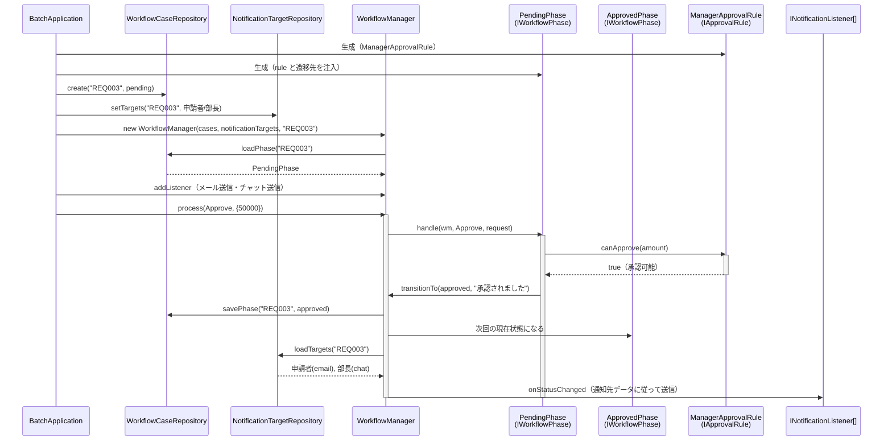

### 7-3：変更影響グラフ（改善後）

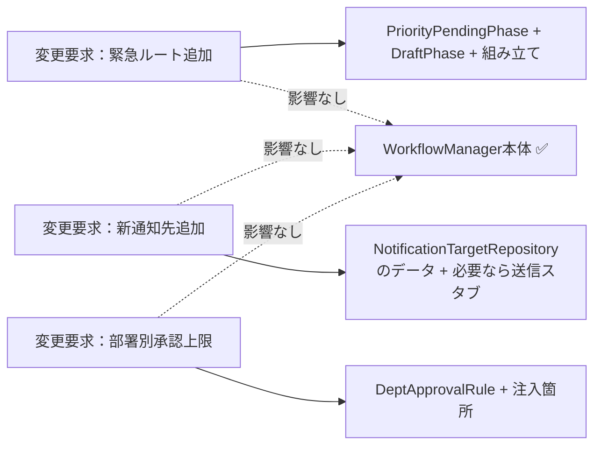

フェーズ3の変更影響グラフと比べると、変更要求ごとの実装先が、状態・通知・判定ルールの各クラスへ分かれるようになりました。組み立て箇所への登録は必要ですが、`WorkflowManager` の実行骨格は変更せずに済みます。

### 7-4：変更シナリオ表

フェーズ1の現状コードでは `WorkflowManager` が状態遷移・通知・承認ルール判定を全て直接管理していたため、新しい承認フローの追加や通知要件の変化は `WorkflowManager` 本体の大規模な修正を意味していました。改善後は状態・通知・判定ルールの責任が分離されたため、変更の影響を対応する実装クラスに限定できます。

| **シナリオ** | **フェーズ1の現状コードでの影響** | **この設計での影響** |
|---|---|---|
| 緊急申請で課長を飛ばして部長承認へ進む | `WorkflowManager` に `urgent` 分岐と専用の遷移条件を追記 | `DraftPhase` から `PriorityPendingPhase` へ遷移する組み立てを追加。通常ルートは保つ |
| 部長承認後に決済部門へ通知する | `WorkflowManager` の完了分岐へ通知先を追記 | `NotificationTargetRepository` に決済部門を登録し、既存の通知契約で送る |
| 却下時に申請者へ通知する | `WorkflowManager` の却下分岐へ通知処理を追記 | `RejectedPhase` への遷移後、Repositoryから申請者を読み、既存Listenerで通知する |
| 新しい承認段階（二次承認等）を追加 | `WorkflowManager` の状態管理・通知・ルール判定を全て修正 | 新しいPhaseクラスを追加し、遷移の組み立てを更新 |
| 承認通知先（Teams等）を追加 | `WorkflowManager` に通知ロジックを直接追記 | `TeamsListener` 実装クラスを新規作成し登録するだけ |
| 承認上限金額のルールを変更 | `WorkflowManager` の判定ロジックを修正 | 対象の `IApprovalRule` 実装クラスのみ修正 |

---

## 整理

### 問題・原因・課題・解決策

| | 内容 |
|---|---|
| **問題** | 承認ワークフローシステムで「状態遷移のルール」「通知の仕組み」「承認判定ロジック」という変わる理由の異なる3つのものが、1つのクラスに混在している |
| **原因** | `WorkflowManager`が状態・通知・判定の知識をすべて抱え込み、異なる変更理由が同じクラスへ集まっている |
| **課題** | 「状態遷移のルール」「通知先の管理」「承認判定ロジック」という3つの変化軸を、それぞれ独立して差し替え可能な部品として `WorkflowManager` の外に切り出すこと |
| **解決策** | 状態分離構造 × 通知分離構造 × ルール差し替え構造：状態ごとの振る舞いのオブジェクト化（状態分離構造）・状態変化の登録リスナーへの伝搬（通知分離構造）・判定ルールの外部差し替え（ルール差し替え構造）を組み合わせ、各変化軸の変更が `WorkflowManager` 本体に波及しない構造にした |

### フェーズとこの章でやったこと

| **フェーズ** | **この章でやったこと** |
| --- | --- |
| 🔵 フェーズ1：現状把握 | 背景・現状の動作例・現行コードをクラス単位で読み、`WorkflowManager` が状態遷移・通知・承認額チェックをまとめて扱っている事実を把握した |
| 🟣 フェーズ2：仮説立案 | 業務機能の所在表と変わる理由の分析で3つの変化軸を確認した。今回の確定変更とヒアリングで判明した将来リスクを分けて整理した |
| 🟣 フェーズ3：問題特定 | 緊急ルート追加を試み、影響が全体に波及する「通知の二重送信バグ」が発生することを確認した |
| 🟠 フェーズ4：原因分析 | 変わる理由が異なる3つのもの（状態遷移・通知・判定）が同じ場所にいることが痛みの根本と特定した |
| 🟡 フェーズ5：課題定義 | 3つの変化軸を独立して差し替え可能な部品として分離することを課題として定義した |
| 🔴 フェーズ6：対策検討 | 状態→通知→判定の3ステップで各構造の限界を確認し、3構造統合（状態分離構造 + 通知分離構造 + ルール差し替え構造）まで進化させる決断を下した |
| 🟢 フェーズ7：対策実施 | 最終コードを実装し、変更影響グラフで変更の局所化を確認した |

### 使った構造 × 解消した根本原因

| 構造 | 解消した根本原因 |
|---|---|
| 状態分離構造 | 状態遷移の混在（WorkflowManagerに状態ごとの分岐が詰まっていた問題）|
| 通知分離構造 | 通知の密結合（通知先追加のたびWorkflowManager本体の修正が必要だった問題）|
| ルール差し替え構造 | 判定ルールの混在（承認判定ロジックが状態クラスに直接書かれていた問題）|

### 責任の移動

| **クラス名** | **責任（1文）** | **変わる理由** |
| --- | --- | --- |
| `WorkflowManager` | 承認ワークフローの実行フローを統括する | 承認プロセスの基本骨格が変わる場合 |
| `ApproverDatabase` | 承認者マスターデータを保持し、IDと権限額を検証する | 承認者情報・権限制度が変わる場合 |
| `IWorkflowPhase` | 現在の承認状態に応じた振る舞いを管理する | 承認の状態遷移ルールが変わる場合 |
| `IApprovalRule` | 承認の可否判定ロジックを管理する | 金額や役職による判定ルールが変わる場合 |
| `INotificationListener` | 承認結果に基づいた通知を実行する | 通知先や通知要件が変わる場合 |

### 複雑さを足しても対策は変わるか

現状仕様へ重ねた複雑さが、原因・課題を経て、状態・通知・判定ルールという3つの独立した軸へ収まったことを確認します。追加した複雑さが1つのクラスへ再集約されず、それぞれ別の変化軸として扱えたことが、この章の設計判断の裏付けです。

| 追加した複雑さ | 見えた原因 | 定めた課題 | 採用構造（3軸独立） |
|---|---|---|---|
| 申請イベント | 状態ごとの操作可否が本体に集まる | 状態ごとに受け付けるイベントと次状態を分ける | `IWorkflowPhase` が状態ごとに `handle()` で受ける |
| 状態保存 | 利用側が状態を持つと本体に分岐が増える | 保存済み状態で振る舞いを決める | `WorkflowCaseRepository` が現在状態を読み書きする |
| 通知処理の分離 | 通知の副作用が状態遷移と同居する | 状態保存後の通知を遷移処理から切り離す | 通知先データを読み、登録リスナーへ渡して成否を個別に受け取る |
| 承認ルール差し替え | 判定条件が状態処理へ直書きされる | 承認ルールを状態と別軸で差し替える | `IApprovalRule` を状態へ注入する |
| 通知失敗 | 送信可否の分岐が状態遷移へ染み出す | 失敗を状態保存や他の通知から切り離す | 送信の成否を通知側で扱い、状態保存を保つ |

---

## 振り返り

### 「この章を読むと得られること」は手に入ったか

| **得られること** | **この章のどこで示したか** |
| --- | --- |
| 1. 変動箇所の識別 | フェーズ2の業務機能の所在表と変わる理由の分析で、変更理由の種類（状態・通知・判定）を識別した |
| 2. 接続点の診断 | フェーズ4で、状態・通知・判定の知識が同じクラスへ集まる3つの原因を特定した |
| 3. 複合設計の説明 | フェーズ6の段階的進化で、3構造が自然に選ばれる過程を示した |
| 4. 変更影響の局所化 | フェーズ7の変更シナリオ表で、変更の中心が新しい実装クラスへ移る構造を示した |

### 3つの設計原則はどう適用されたか

**原則1「変わるものをカプセル化せよ」の現れ**

- 具体化された場所：各状態実装クラス（`DraftPhase`、`PendingPhase` 等）、判定ルール実装クラス（`ManagerApprovalRule` 等）、通知先データ（`NotificationTargetRepository`）と通知送信スタブ（`EmailNotifier` 等）
- 解説：変化の理由が異なる「状態遷移」「判定ルール」「通知」を個別のクラスにカプセル化しました。既存のインターフェースで表現できる承認ルートや通知先であれば、実装クラスと組み立て箇所を中心に変更できます。

**原則2「実装ではなくインターフェースに対してプログラムせよ」の現れ**

- 具体化された場所：`IWorkflowPhase`、`IApprovalRule`、`INotificationListener`
- 解説：`WorkflowManager` は具体的なルールや遷移先を知らず、インターフェース経由で処理を委譲するようにしました。

**原則3「継承よりコンポジションを優先せよ」の現れ**

- 具体化された場所：`WorkflowManager` が現在状態と通知先データをRepositoryから読み、通知送信スタブへ委譲する構成、`PendingPhase` が `IApprovalRule` と遷移先をコンストラクタで受け取る構成
- 解説：承認ルールを継承による拡張ではなく、コンポジション（保持・委譲）による差し替え可能な構成にしました。

---

## あなたのコードで考えてみてください

この章で辿った思考プロセスを、あなた自身のコードに当てはめてみましょう。

1. **複雑さの核心を探す：** あなたのコードに「現在の状態によって処理が変わり、かつ状態が変わったときに他のクラスへの通知が必要で、さらにどの処理をするかのルールも変わる」箇所がありますか？
2. **肥大化のサインを確認する：** その処理をすべて一か所にまとめているクラスがあるとしたら、そのクラスのコード行数と `if` ブロックの数はどのくらいですか？
3. **変更の交差点を測る：** 「新しい状態の追加」「新しい通知先の追加」「新しいビジネスルールの追加」という3種類の変更は、今の構造では同じファイルを変更しますか？それとも別々のファイルで済みますか？
4. **分けた後のシンプルさを想像する：** 3つの責任（状態遷移・通知・ルール判定）を別々のクラスに切り出したとき、それぞれを独立してテストできるようになりますか？

---

**題材を置き換えるときの共通手順**

この章の題材名を、自分の現場のシステム名に置き換えて考えます。

1. そのシステムは、誰が何を達成するために使うものか。
2. 入力、加工、出力は何か。
3. 最近入った変更要求、または次に来そうな変更要求は何か。
4. その変更で、触りたくない場所まで修正や再テストが広がるか。
5. 変えたいものと守りたいものを分けると、接続点には何を残すべきか。
6. 何もしない、関数化、クラス分離、契約導入、登録/組み立て移動のうち、どこまで進めるのが今回の文脈に合うか。

## パターン解説：複合適用

今回は単一の構造ではなく、3つのパターンを組み合わせて解決しました。

### 仕組みの骨格

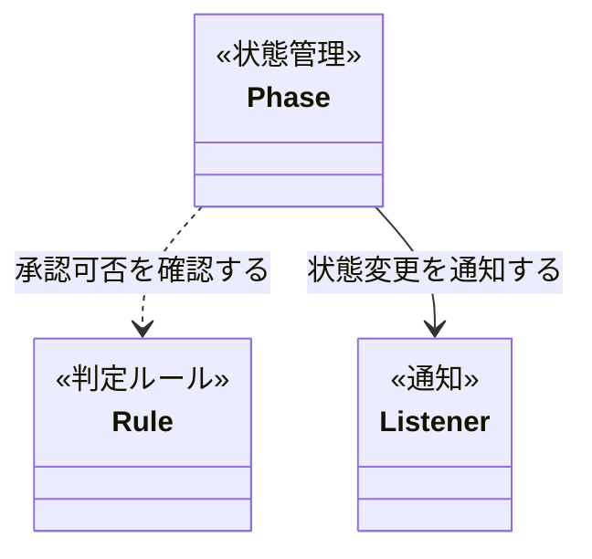

状態管理の仕組みが「今の状態での振る舞い」を整理し、判定ルールの仕組みが「承認の可否」を判定し、通知の仕組みが「変更の伝搬」を担うことで、複雑なワークフローを整理しています。

### 抽象骨格の実行シーケンス

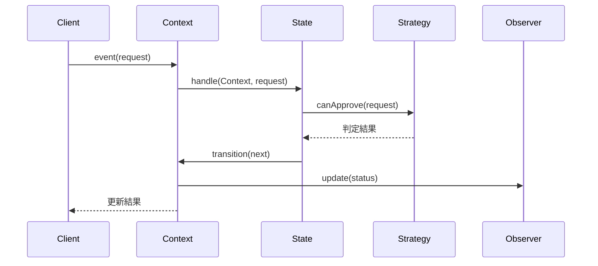

状態固有処理、承認判定、通知を別の契約へ分け、Contextはそれらを実行順に接続します。

### この章の実装との対応

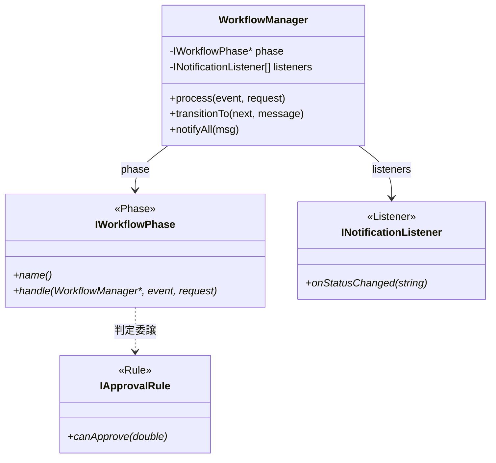

| GoFの名前 | この章での対応 |
|---|---|
| State / Context | `WorkflowManager` |
| State / ConcreteState | `DraftPhase` / `PendingPhase` / `PriorityPendingPhase` / `ApprovedPhase` / `RejectedPhase` / `CompletedPhase` |
| Observer / Subject | `WorkflowManager`（`notifyAll` を担う）|
| Observer / Observer | `INotificationListener`（`EmailNotifier` 等の通知送信スタブ）|
| Strategy / Context | `PendingPhase` / `PriorityPendingPhase`（`IApprovalRule` を使う）|
| Strategy / Strategy | `IApprovalRule`（`ManagerApprovalRule` 等）|

### 使いどころと限界

- **使いどころ**：状態遷移が複雑で、さらに通知先や判定ロジックが頻繁に変わるような大規模な業務ワークフロー。

- **限界**：3つのパターンを組み合わせるため、単純なフローであれば過剰設計となります。

【過剰コード：単純なフローへの適用例】

「申請中 → 承認済み」の2状態しかなく、判定ルールも「上長が承認ボタンを押したら確定」だけのシンプルなフローに、State・Observer・Strategyをすべて適用しようとした例です。

```cpp
// 2状態・固定ルール・通知先1件のフローに
// 3つの仕組みを持ち込んだ過剰設計
class IWorkflowPhase { /* ... */ };
class IApprovalRule { /* ... */ };
class INotificationListener { /* ... */ };

// インターフェースが3枚、実装クラスが6枚——
// 変わらないルールのために構造だけが膨れ上がる

// このケースは if 文で十分
class SimpleApproval {
public:
    void approve() {
        if (status == "審査待ち") {
            status = "承認済み";
            sendMail();  // 通知先は固定で1件だけ
        }
    }
private:
    string status;
    void sendMail() { /* メール送信 */ }
};
```

これらの仕組みが威力を発揮するのは、「状態の数が増える」「通知先が変わる」「判定ルールが差し替わる」という変化軸が**実際に複数存在するとき**です。その変化軸が見えないうちはシンプルな実装を選んでください。

### この章のまとめ

承認ワークフローというドメインと State × Observer × Strategy の組み合わせの関係を一言で言うなら、状態・通知・判定という3つの変化軸が1クラスに同居すると、どの変更でも同じクラス全体への影響確認が必要になる、ということです。分離後は、状態クラス、通知リスナー、判定ルールと、それらを結び付ける組み立て箇所へ変更対象を分けられます。この章で最も重要なのは、三つのパターンを最初から選んだのではなく、問題を分析して必要な境界を作った結果が、それぞれのパターンの役割に対応したという順序です。

7つのフェーズを通じて、読者は `WorkflowManager` が状態遷移・通知・判定のすべてを直書きしているという観察から始まり、3つの変化軸が独立していることの確認を経て、軸ごとに異なるパターンを当てるという判断へと進みました。フェーズ6で「1つのパターンでは解決しきれない」と気づくたびに次の軸の分析へ進む——その繰り返しの中に、パターン選択の本質的なプロセスがあります。この章の体験が、12章を通じた思考の型の集大成になっていると思っています。

あなたの現場のコードの中にも、修正のたびに「他の部分への影響を確認しなければ」という不安が生じる箇所があるはずです。「変わる理由が何種類あるか、それぞれ誰の判断か」を問うことが、その不安の根本を解消する入口になります。
