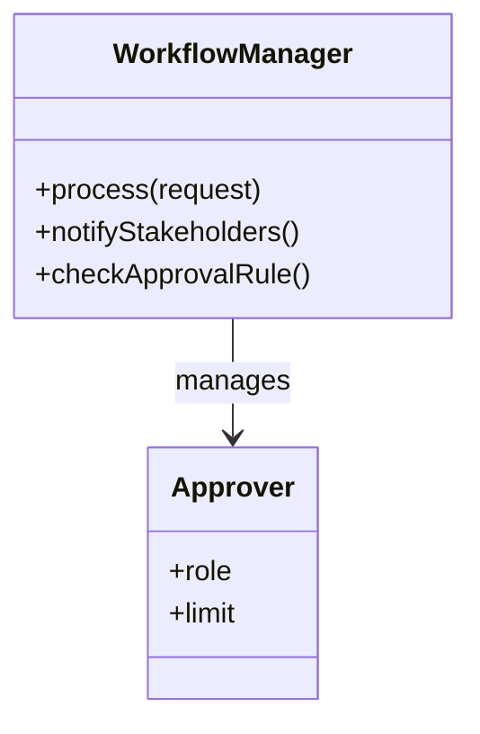
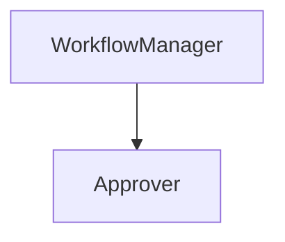
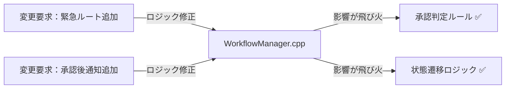
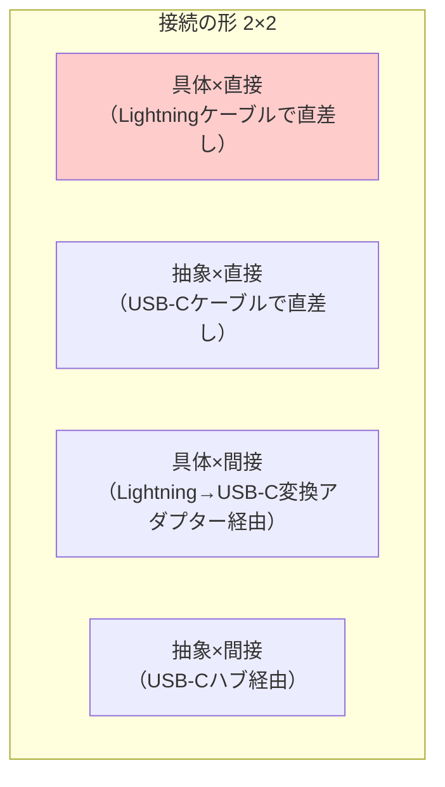
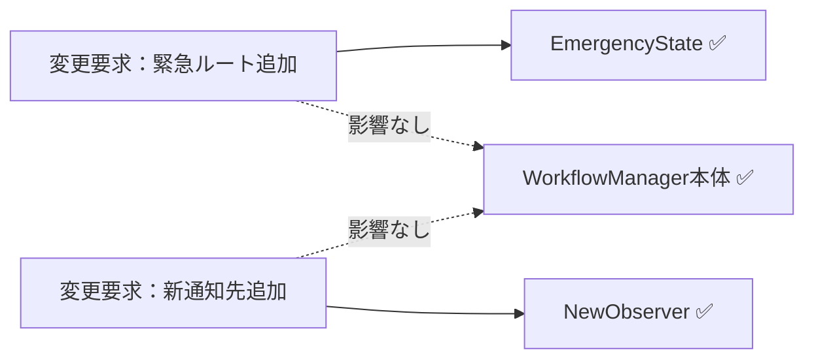
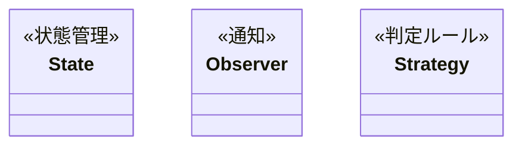
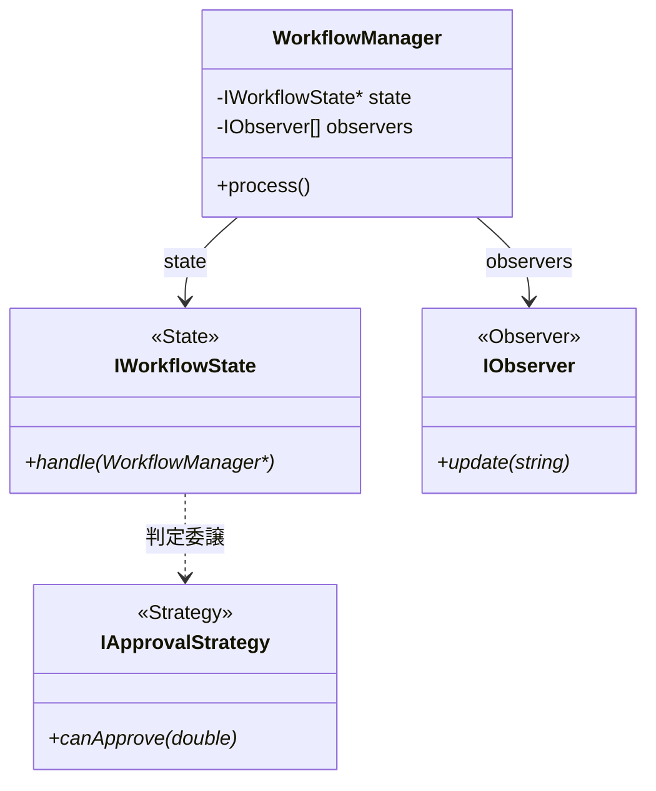

## 第12章 承認ワークフローシステム ―― 状態変化・通知・判定ルールが絡む複合設計

―― 思考の型：複雑な承認プロセスと変化し続ける通知ルールをどう疎結合にするか

### この章の核心

**承認ワークフローのような「状態遷移」を伴う業務システムにおいて、各状態での挙動や通知ロジックを条件分岐で管理しようとすると、状態が増えるたびにコードの依存関係が爆発し、修正が極めて困難な「硬いシステム」になってしまう。**

### この章を読むと得られること

* **得られること1：** 承認状態の変化（State）、関係者への通知（Observer）、承認可否のルール（Strategy）という、それぞれ異なる「変わる理由」を識別できるようになる。


* **得られること2：** 状態遷移とアクションが「密結合」になっている接続点を特定し、問題の発生源を見極められるようになる。


* **得られること3：** 複数のパターンを組み合わせることで、複雑なワークフローを疎結合に保ちつつ、新しい承認フローにも対応できる設計手法を説明できるようになる。


* **得られること4：** 「状態管理」「通知」「判定ルール」が絡み合う現場で、変更影響を局所化する視点を養う。

---

## 🔵 フェーズ1：現状把握 ―― 変更が来る前にコードを把握する

### 1-1：システムの背景

このシステムは、企業内の稟議や経費精算を管理する「承認ワークフローシステム」です。 申請者が申請を作成し、上長や経理担当者が内容を確認・承認するプロセスをデジタル化し、効率的に管理することを目的としています。

リリース当初は「作成」「承認」「却下」という3つの状態のみを扱うシンプルなものでした。 しかし、組織の拡大に伴い「金額に応じた承認者の自動割り当て」「承認プロセス中の関係者への通知」「特定の部署のみ適用される特別な承認ルール」といった要件が次々と追加されています。

現場の担当者からは「承認ルールを一つ変えるだけで、ワークフロー全体のステータス管理を書き直さなければならない」という悲鳴が上がっています。 私自身、このコードを最初に開いたとき、状態遷移のロジック、通知先の一覧、そして判定ルールが巨大なクラスの中に複雑に絡み合っているのを見て、どこから手をつければいいのか言葉を失いました。 一見すると、承認という一連の業務フローは安定しているように見えますが、内側では小さな修正が全体に影響を与える「脆い構造」が構築されています。

### 1-2：仕様表

| **機能名** | **担当クラス** | **入力** | **出力** |
| --- | --- | --- | --- |
| 申請作成 | `WorkflowManager` | 申請内容 | 状態: 作成済 |
| 承認判定 | `WorkflowManager` | 承認者の役職/金額 | 状態: 承認済/却下済 |
| ステータス通知 | `WorkflowManager` | 承認状況 | 各関係者への通知 |

### 1-3：クラス構成図

現状のクラス構成です。 ワークフローの制御主体である `WorkflowManager` にすべての責務が集中しています。



`WorkflowManager` クラスが、ワークフローの「状態遷移」、各担当者への「通知」、「承認可否のルール判定」という3つの重い責務をすべて握りしめています。

### 1-4：責任配置テーブル

| **クラス名** | **責任（1文）** | **知るべきこと** |
| --- | --- | --- |
| `WorkflowManager` | 承認ワークフローの全体フローを統括する。 | 状態遷移ルール、通知先一覧、承認判定基準。 |
| `Approver` | 承認者個人の情報を管理する。 | 承認者の役職や承認上限額。 |

`WorkflowManager` は、ワークフローのフローそのものだけでなく、誰にどう通知するか、どう判定するかという個別の詳細までを知りすぎている状態です。

### 1-5：依存グラフ



`WorkflowManager` に責務と依存が集中しており、このクラスを修正しないと何も変えられない「単一障害点」の構造になっています。

### 1-6：実装コード

現在の承認処理のコア部分です。

```cpp
#include <iostream>
#include <string>

using namespace std;

// 承認者クラス
class Approver {
public:
    string role;
    double limit;
};

// ワークフロー管理クラス（状態遷移、通知、ルール判定が混在）
class WorkflowManager {
public:
    void process(string status, double amount) {
        if (status == "SUBMITTED") {
            cout << "承認待ち状態へ移行。" << endl;
            notify("申請者に通知");
        } else if (status == "APPROVED") {
            cout << "承認完了状態へ移行。" << endl;
            notify("関係者に通知");
        }
        // 判定ルール（ハードコード）
        if (amount > 100000) cout << "役員承認が必要。" << endl;
    }
private:
    void notify(string msg) { cout << msg << endl; }
};

int main() {
    WorkflowManager wm;
    wm.process("SUBMITTED", 50000);
    return 0;
}

```

このコードを見ると、`WorkflowManager` が「状態の遷移処理」「通知の仕組み」「金額による判定ルール」のすべてを直接知っていることが分かります。

### 1-7：実行結果

```text
承認待ち状態へ移行。
申請者に通知

```

> このコードは正しく動く。これから変えていくのは「機能」ではなく「構造」だ。

### 1-8：責任チェック表

| **コードの行** | **持っている知識** | **管理者（観察）** |
| --- | --- | --- |
| `if (status == "SUBMITTED")` | 状態遷移のルール | フロー設計担当 |
| `notify("申請者に通知")` | 通知の仕組み | 通知サービス担当 |
| `if (amount > 100000)` | 承認の判定ルール | 経理ルール担当 |

> 複数の部門が関わる知識が同じ `WorkflowManager` 内に混在しており、状態遷移、通知、判定ルールという変化の理由が異なる要素が同じ場所に並んでいることが見えました。
> 
> 

フェーズ1で責任配置の観察が終わりました。 次のフェーズ2では、変更要求を受けて「何が変わり、何が変わらないか」の仮説を立てます。

---

## 🟠 フェーズ2：仮説立案 ―― 変更要求を受けて、変動と不変を整理する

### 2-1：届いた変更要求

ある金曜日の夕方、経理部のマネージャーがデスクにやってきました。

「お疲れ様。今度、承認ワークフローに『緊急申請ルート』を追加することになったんだ。 通常は平社員→課長→部長という承認順序なんだけど、緊急時は課長を飛ばして直接部長に通知が飛ぶようにしたい。 それと、部長が承認した直後に、自動的に『決済部門』へも通知が飛ぶようにしてほしいんだよね。 承認が却下された場合も、申請者に即座にアラートを出す仕組みは必須だよ。いつまでに対応できるかな？」

ふむ、なるほど。 承認ルートのスキップや、特定の状態での追加通知、そして却下時の通知強化と、ワークフローの柔軟性を高める要求ですね。 今の `WorkflowManager` にこれらを付け足すと、さらに条件分岐が複雑化し、修正が困難になる予感がします。

### 2-2：変動・不変の仮説テーブル

フェーズ1の観察（1-8の責任チェック表）を材料に、何が変動し、何が変わらないのかの仮説を立てます。

| **分類** | **仮説** | **根拠（フェーズ1の観察から）** |
| --- | --- | --- |
| 🔴 **変動しそう** | 承認ルートの遷移順序 | 1-8で状態遷移ルールがハードコードされていると観察したため。 |
| 🔴 **変動しそう** | 承認時の通知先リスト | 1-8で通知ロジックが固定されていると観察したため。 |
| 🔴 **変動しそう** | 金額に応じた判定ルール | 1-8で判定ロジックが混在していると観察したため。 |
| 🟢 **不変** | ワークフローシステム自体の存在意義 | 申請と承認という業務プロセス自体は不変のため。 |

コードを読んだだけで「変わる」「変わらない」と断定するのは危険です。 関係者に直接確認します。

### 2-3：関係者ヒアリング

仮説を持って、ワークフローの運用担当者と話し合いを持ちました。

* **開発者：** 「今回のような『緊急ルート』以外にも、今後別の承認ルートが追加される可能性はありますか？」


* **運用担当者：** 「ああ、あるね。 例えば、海外出張時だけの特殊ルートや、特定のプロジェクト限定の承認フローなども、今後は必要になるだろうな。」


* **開発者：** 「通知についても確認させてください。現状は『申請者』と『関係者』だけですが、承認プロセスに応じて通知先の役職が変わったりする要件はありますか？」


* **運用担当者：** 「それも重要だ。 部長が承認したら経理だけでなく、関連部署の担当者にもメールを飛ばしたいケースが多いね。」


* **開発者：** 「分かりました。状態遷移ルール、通知の送り先、判定ロジックを、すべて現在の `WorkflowManager` から切り離し、動的に組み合わせられる構造を目指すのが良さそうです。」


### 2-4：確定した変動/不変テーブル

ヒアリング結果を反映し、今回の設計で対象とすべき要素を確定しました。

| **分類** | **具体的な内容** | **変わるタイミング** | **根拠（誰との確認か）** |
| --- | --- | --- | --- |
| 🔴 **変動する** | 承認状態の遷移ルール（ルートスキップ等） | 承認フロー変更時 | 運用担当者との合意 |
| 🔴 **変動する** | ステータス通知先リスト | 通知要件変更時 | 運用担当者との合意 |
| 🔴 **変動する** | 金額等による判定ルール | 経理ルール変更時 | 運用担当者との合意 |
| 🟢 **不変** | 申請・承認の基本プロセス | 変わらない | 業務ルールとして確定 |

フェーズ2で「何が変わり、何が変わらないか」が確定しました。 次のフェーズ3では、この変更要求を実際に今のコードのままで試みて、どのような痛みが生じるかを確認します。

---

## 🟡 フェーズ3：問題特定 ―― 変更を試みて、痛みを発見する

### 3-1：変更シミュレーション

フェーズ2で確定した「緊急申請ルートの追加」と「承認直後の自動通知」という変更要求を、現在の `WorkflowManager` クラスに実装してみます。

まず、`process` メソッド内の状態遷移ロジックに「緊急フラグ」の判定を追加しました。 すると、本来であれば課長を経由すべきルートが複雑に分岐し始め、`if` 文がネストしてコードの可読性が急速に低下していきます。 次に、承認直後の通知処理を追加しようとして、また別の `if` 文を差し込みました。

すると、承認プロセスが「承認」なのか「却下」なのか、あるいは「緊急」なのかというフラグが大量に混在し、どのタイミングでどの通知が飛ぶのかを追うのが非常に困難になりました。 「あ、これ以上 `WorkflowManager` をいじると、既存の承認ルートまで壊れてしまいそうだ…」という不安が頭をよぎります。 実際に、緊急ルートを追加したことで、通常の承認ルートにおける通知が二重に送信されるバグが発生してしまいました。

### 3-2：変更影響グラフ

今の構造で変更を試みた際に、依存がどのように飛び火するかを図示します。



`WorkflowManager` が状態遷移、通知、判定ルールのすべてを抱え込んでいるため、一つの機能をいじると、本来無関係なはずの判定ロジックまで影響を受けてしまうことが分かります。

### 3-3：痛みの言語化

「承認ルートを変えたいだけなのに、なぜ他の状態遷移まで気にしなければならないのか…」

変更をシミュレーションする中で、明確な痛みが二つ浮き彫りになりました。

一つ目の痛みは、「状態管理とアクションの密結合」です。 承認状態が増えるたびに `WorkflowManager` 内の `if-else` 分岐が指数関数的に増え、状態遷移のルールを把握するのが極めて困難になっています。 「ある状態で何ができるか」というルールが、他の状態の知識と混在しているため、変更が怖くて手が付けられない状態です。

二つ目の痛みは、「通知と判定の責務過多」です。 承認時の通知や判定といったビジネスルールが、ワークフローの実行フローと同じ場所に記述されているため、これら一つを修正するたびに、本来のワークフロー実行フローを読み解き、壊さないように注意を払うという多大な認知的負荷が生じています。 このような構造では、承認プロセスの複雑化に伴って開発コストが膨れ上がるのは避けられません。

フェーズ3で「今の構造では変更が辛い」という事実が確認できました。 次のフェーズ4では、なぜこのように辛いのか、構造的な原因を深掘りします。

---

## 🔴 フェーズ4：原因分析 ―― なぜ辛いのかを構造的に言語化する

フェーズ3で確認したように、「状態遷移」「通知先」「判定ルール」が `WorkflowManager` クラス内で混在していることが、システムを不安定にし、変更を困難にする最大の要因です。 この状態のまま拡張を繰り返すことは、複雑性の増大という負のスパイラルを招きます。

### 4-1：観察→原因テーブル

フェーズ3で確認された「痛み」と、その根本にある構造的な原因を対応させます。

| **観察** | **原因の方向** |
| --- | --- |
| 承認ルートや通知先の変更時に、`WorkflowManager` を広範囲に修正する必要がある | 状態管理、通知、判定ルールという「変わる理由」の異なる責務が、一つのクラス内に混在しているから。 |
| 状態が増えるたびに `if-else` 分岐が爆発的に増殖する | 状態ごとの振る舞いが個別の条件判定として記述されており、状態遷移のルールをカプセル化できていないから。 |

コードを追うと、`WorkflowManager` がワークフローの「フロー（骨格）」だけでなく、「個別のビジネスルール（判定）」や「付随するアクション（通知）」までを一身に背負っていることが分かります。

### 4-2：変わるもの / 変わらないものテーブル

構造を整理するために、変化の軸を明確に分離します。

| **変わり続けるもの（🔴）** | **変わってほしくないもの（🟢）** |
| --- | --- |
| 承認状態遷移のルール（ルート制御） | 申請・承認という業務プロセスの基本骨格 |
| 各状態における通知先リスト | 承認フローの実行順序（入口から出口までの流れ） |
| 金額や役職による承認可否判定 | 申請データが通過する状態遷移の基盤 |

現状では、「承認フローを動かす」という一つの目的に向かって、これら全ての要素が同じレイヤーで記述されています。 変化する「承認ルール」や「通知要件」は、基本フローの骨格から切り離し、独立して差し替え可能な部品として定義する必要があります。

### 4-3：ケーブルで考える

現在の接続形態を2×2マトリクスで診断します。

今の承認システムは、USB-Cハブの中に専用の変換回路を無理やりはんだ付けし、直接ケーブルを直差ししているような状態（具体×直接）です。 状態遷移ルールを変えたり通知先を増やしたりするたびに、この複雑に絡み合った「基板」そのものを直接加工しなければならないため、少しの修正がシステム全体を揺るがすリスクを孕んでいます。

```mermaid
quadrantChart
    title State × Observer × Strategy ── ★具体×直接（Lightning直差し）
    x-axis 直接（直差し） --> 間接（アダプター経由）
    y-axis 抽象（汎用規格） --> 具体（専用規格）
    quadrant-1 専用アダプター経由 (具体×間接)
    quadrant-2 ★ Lightning直差し (具体×直接)
    quadrant-3 USB-C直差し (抽象×直接)
    quadrant-4 USB-Cハブ経由 (抽象×間接)
    Lightning直差し: [0.25, 0.75]
    専用アダプター経由: [0.8, 0.75]
    USB-C直差し: [0.25, 0.25]
    USB-Cハブ経由: [0.8, 0.25]
```

このコードで言うと：

| ケーブル比喩 | コードの対応箇所 |
|---|---|
| 「具体」＝専用規格ケーブル | `if (status == "SUBMITTED")` / `if (amount > 100000)` — 承認ステータス文字列と金額閾値を `process()` に直接ハードコードしている |
| 「直接」＝直差し | 状態遷移・`notify()` 呼び出し・判定ルール（`if (amount > 100000)`）を `process()` 内にすべて直接記述しており、責務を分離する中間層がない |

「状態遷移ルール」「通知要件」「判定ロジック」は、それぞれが独立して頻繁に変更される可能性を秘めています。 これらを一つのクラスで混在させて管理するのではなく、インターフェースを介した接続形態へ分離することが、システムの設計を健全化する鍵となります。

フェーズ4で根本原因が言語化できました。 次のフェーズ5では、この分析を元に解決すべき課題を具体的に定義していきます。

---

## 🟣 フェーズ5：課題定義 ―― 解くべき問題を具体的に定める

フェーズ4で、「承認状態の変化」「関係者への通知」「承認可否のルール判定」という異なる性質を持つ3つの責務が `WorkflowManager` クラスに混在していることが、システムを硬直化させている原因であると特定しました。 この状態を放置すると、承認プロセスが複雑になるたびに修正コストが指数関数的に増大し、システムの保守は不可能に近くなります。

対策案を検討する前に、今回のリファクタリングで解決すべき課題を4つの視点で整理し、確定させます。

### 5-1：接続点の特定

フェーズ4での分析に基づき、以下の3つの接続点（ジョイント）を特定しました。

* 接続点A：`WorkflowManager` ←→ 状態遷移ルール（State）の境界
* 接続点B：`WorkflowManager` ←→ 通知処理（Observer）の境界
* 接続点C：`WorkflowManager` ←→ 承認可否判定ロジック（Strategy）の境界

これらは現状、`WorkflowManager` 内で一つの巨大な処理塊として絡み合っています。 これらを独立した接続点として切り離し、外部から差し替え可能な構造にすることが今回の最大の課題です。

### 5-2：非機能制約の確認

接続形態の検討に必要な制約を整理します。

| **確認項目** | **内容** | **この章での判断** |
| --- | --- | --- |
| 変更頻度 | この接続点はどのくらいの頻度で変わるか | 高（承認ルールや組織変更により頻繁に変わる） |
| パフォーマンス | ホットパスか（高頻度で呼ばれるか） | 低（ワークフローの承認は非同期・低頻度） |
| メモリ | 間接層の追加でオーバーヘッドが問題になるか | いいえ（柔軟性を優先） |

変更頻度が極めて「高」であるため、修正のたびにメインロジックを書き換える構造は避ける必要があります。 パフォーマンスへの制約が低いことから、インターフェースを多用し、実行時に動的な結合ができる「間接層」を積極的に導入することが合理的です。

### 5-3：クライアントへの影響範囲

分離対象の各処理を呼び出している `WorkflowManager` クラスが最大のクライアントです。 このクラスが各ロジックの詳細をすべて直接呼び出しているために、少しの要件変更でクラス全体を書き直さざるを得ません。 各責務を分離することで、`WorkflowManager` はワークフローの「骨格（実行順序）」のみを管理し、実際の判定や通知は分離した部品に任せることができます。

### 5-4：課題まとめ表

分析結果をまとめます。

| **接続点** | **分けた理由** | **非機能制約** | **クライアント影響** |
| --- | --- | --- | --- |
| 接続点A | 状態遷移ロジックの複雑化回避 | 変更頻度：高 | `WorkflowManager` の状態管理部 |
| 接続点B | 通知ルールの多様化対応 | 変更頻度：高 | `WorkflowManager` のイベント処理 |
| 接続点C | 承認ルール変更への追随 | 変更頻度：高 | `WorkflowManager` の判定処理 |

この表が、フェーズ6の対策案検討における出発点となります。 「状態管理（State）」「通知（Observer）」「ルール判定（Strategy）」をどのようにこれら3つの接続点に割り当て、分離するかが、本章の設計の核心です。

フェーズ5で「何を解くか」が確定しました。 次のフェーズ6では、これらの課題に対して具体的にどのようなパターンを適用するか、コストの観点から案を検討します。

---

## 🟢 フェーズ6：対策案検討 ―― 解決策を並べ、コストで選ぶ

フェーズ5で整理した「状態遷移」「通知」「判定ルール」という3つの接続点に対し、柔軟で変更に強い設計を検討します。

### 6-1：接続の形 2×2マトリクス

現在の承認システムは、すべての責務が `WorkflowManager` に詰め込まれた「具体×直接」の状態です。 これらを分離し、抽象インターフェースと間接層を導入することで、責務を切り出します。



---

#### 案0：現状維持 ―― 構造を変えない

**この形の考え方：**
クラス分割や抽象化を行わず、`if-else` 文を増やして対応します。 承認ルートが今後一切増えず、変更要求もこれ以上発生しないと断言できる場合にのみ合理的な選択です。

**この形にするための準備：**

* 特になし。既存の条件分岐に新しいフラグを継ぎ足す。


【コード例】

```cpp
if (isEmergency) {
    status = "EMERGENCY";
    notify("部長へ直接通知"); // 既存ロジックに修正追加
}

```

**この形のトレードオフ：**

* 変更容易性：低（変更のたびにメインロジックの修正が不可避）


* テスト容易性：低（状態と条件が密結合のため、特定経路のテストが困難）


* 実装コスト：低（今のコードに追記するだけ）


---

#### 案1：具体×直接 ―― クラスを分けるが参照は具体型のまま

**この形の考え方：**
状態遷移、通知、ルール判定を独立した責務としてクラス化し、`WorkflowManager` から切り出します。 ただし、`WorkflowManager` がそれらの具体クラスを直接保持・生成するため、疎結合化には至りません。

**この形にするための準備：**

1. `RuleChecker` や `Notifier` といったクラスを抽出する
2. `WorkflowManager` から抽出したロジックを移動させる

【コード例】

```cpp
void process() {
    RuleChecker checker; // 具体クラスを知っている
    if (checker.isApproved(amount)) { /* ... */ }
}

```

**この形のトレードオフ：**

* 変更容易性：低〜中（責務は分かれたが、利用側の修正は必要）


* テスト容易性：低（具体クラスへの強い依存が残る）


* 実装コスト：低（クラスの抽出のみ）


---

#### 案2：抽象×直接 ―― インターフェースを挟み、型だけで接続する

**この形の考え方：**
判定ルールには **Strategy パターン** を、状態遷移には **State パターン** を適用します。 インターフェースを介すことで、クラス間の依存を具体型から抽象型へ切り替え、差し替え可能にします。

**この形にするための準備：**

1. `IApprovalStrategy` や `IWorkflowState` を定義する
2. 既存ロジックを各実装クラスへ移行する
3. `WorkflowManager` はインターフェース型へのポインタを保持する

【コード例】

```cpp
class IApprovalStrategy {
public:
    virtual bool canApprove(double amount) = 0;
};

```

**この形のトレードオフ：**

* 変更容易性：中〜高（ルール差し替えがインターフェース経由で完結する）


* テスト容易性：高（戦略をスタブに差し替えてテスト可能）


* 実装コスト：中（インターフェースと複数の戦略クラスが必要）

> **【案2の限界：通知の問題が残る】**
> 案2では「承認ルールの判定（Strategy）」と「状態遷移（State）」を分離できますが、**承認結果を誰にどう通知するかという責務が `WorkflowManager` に残り続けます**。
>
> 「Slackにも通知してほしい」「却下時はメールも送ってほしい」という要求が来るたびに、`WorkflowManager` の通知ロジックを直接修正しなければなりません。通知先が増えるほどクラスが肥大化し、案2だけでは「判定ルールの変更」と「通知先の変更」を独立して扱えない構造が残ります。
>
> この「通知の変化軸」を分離するために、案4でさらにObserverパターンが加わります。

---

#### 案3：具体×間接 ―― 仲介クラスを置くが、具体型を知っている

**この形の考え方：**
`WorkflowManager` と個別のロジックの間に「オーケストレーター」を配置します。 オーケストレーターが具体的なロジックを保持し、メインクラスの負担を軽減します。

**この形にするための準備：**

1. `WorkflowOrchestrator` を作成する
2. ロジック管理の責務をオーケストレーターに集約する
3. `WorkflowManager` はオーケストレーターのメソッドを呼び出す

【コード例】

```cpp
void process() {
    orchestrator.dispatch(request); // 中間層を介して処理
}

```

**この形のトレードオフ：**

* 変更容易性：中（メインクラスは修正不要だが、オーケストレーターは具体型を知っている）


* テスト容易性：中（中間層を切り替えることでテスト可能）


* 実装コスト：中（仲介クラスの責務設計が必要）


---

#### 案4：抽象×間接 ―― インターフェース＋仲介役を両立する

**この形の考え方：**
状態遷移（State）、ルール判定（Strategy）、通知（Observer）を、それぞれインターフェース経由で仲介クラスに結合させます。 完全に疎結合となり、将来のあらゆる変更要求に対して、メインロジックを一切触らずに対応可能です。

**この形にするための準備：**

1. すべての責務を独立したインターフェースとして定義する
2. 各要素を Factory で生成する構造にする
3. メインフローをそれらの抽象結合で構築する

【コード例】

```cpp
// 抽象と間接層を極めた設計
IState* state = stateFactory->create(status);
state->handle(this);

```

**この形のトレードオフ：**

* 変更容易性：高（どのパーツが変わっても全体は無影響）


* テスト容易性：高（すべての部品が独立してスタブ化可能）


* 実装コスト：高（インターフェース、ファクトリ、多数のクラスが必要）

---

### 6-7：評価軸

対策案を比較するための評価軸を宣言します。 承認フローの複雑化に対応しつつ、将来のルール変更に耐えうる設計を目指すための基準です。

| **評価軸** | **意味** | **ウェイト** |
| --- | --- | --- |
| 変更容易性 | 承認ルールや通知要件の変更に対し、触る場所が最小で済むか | ×3 |
| テスト容易性 | 判定ロジックや状態遷移を独立してテストできるか | ×2 |
| 可読性 | 複数のパターン導入による構造の理解コスト | ×1 |

**採点基準：**

* **3点**：1クラスの修正で完結。スタブで完全に切り離し可能。クラス増なし。
* **2点**：2〜3クラスの修正。一部スタブが必要。標準的な構造。
* **1点**：4クラス以上の波及。テスト困難。中間層が多く理解コスト高。

パフォーマンスはバッチ処理のため VETO（足切り）は発動しません。

---

### 6-8：コスト天秤

案0〜案4を定量比較します。

| **案** | **現在の対応コスト** | **未来の対応コスト** |
| --- | --- | --- |
| 案0：現状維持 | 低 | 高 |
| 案1：具体×直接 | 低〜中 | 高 |
| 案2：抽象×直接 | 中 | 低〜中 |
| 案3：具体×間接 | 中 | 中 |
| 案4：抽象×間接 | 高 | 低 |

**ステップ1：採点表**

| 案 | 変更容易性（×3） | テスト容易性（×2） | 可読性（×1） |
| --- | --- | --- | --- |
| 案0 | 1 | 1 | 3 |
| 案1 | 1 | 1 | 2 |
| 案2 | 2 | 2 | 2 |
| 案3 | 2 | 2 | 2 |
| 案4 | 3 | 3 | 1 |

**ステップ2：加重合計表**

| 案 | 加重スコア | 判定 |
| --- | --- | --- |
| 案0 | 8 |  |
| 案1 | 7 |  |
| 案2 | 12 |  |
| 案3 | 12 |  |
| 案4 | 16 | ← 採用候補 |

### 6-9：採用案の決定

**採用する案：** 案4（抽象×間接 ―― State × Observer × Strategy パターン）

**理由：**
承認フローの「状態」「通知」「判定ルール」という3つの変動軸をすべて独立したインターフェースとして切り出すことで、将来的に組織変更やルール追加が発生しても、メインロジックを一切修正せずに拡張可能となるため、長期的な運用コストを最小化できると判断しました。

---

### 6-10：耐久テスト

フェーズ2で予告された変更要求に対する、採用案（案4）の耐性をテストします。

| **変更シナリオ** | **触る場所** | **コスト評価** |
| --- | --- | --- |
| 承認順序を役職ベースから金額ベースへ変更する | 新規 Strategy クラスの実装 | 低 |
| 承認却下時にSlackだけでなくメール通知を追加する | 新規 Observer クラスの実装 | 低 |

採用した複合設計では、ルール判定も通知もインターフェース越しに結合されているため、新しい要件は新規クラスを追加するだけで対応でき、既存のワークフロー本体を触る必要がありません。

---

## 🟤 フェーズ7：対策実施 ―― 決断し、変化に強い設計を手に入れる

採用した案4（State × Observer × Strategy パターン）を実装し、承認ワークフローの「状態」「判定」「通知」という3つの責務を疎結合に分離します。

### 7-1：解決後のコード（全体）

承認ルールを `Strategy` として、状態遷移を `State` として、通知を `Observer` として定義しました。 これらを `WorkflowManager` が保持・管理することで、複雑なワークフローを整理します。

```cpp
#include <iostream>
#include <vector>
#include <memory>

using namespace std;

// Strategy: 承認可否の判定ルール
class IApprovalStrategy {
public:
    virtual bool canApprove(double amount) = 0;
};

// Observer: 各種通知の契約
class IObserver {
public:
    virtual void update(string msg) = 0;
};

// State: 状態遷移の抽象
class IWorkflowState {
public:
    virtual void handle(class WorkflowManager* wm) = 0;
};

// 最終的なワークフロー管理
class WorkflowManager {
    IWorkflowState* state; // ← ここだけ変わる
    vector<IObserver*> observers;
public:
    void process() {
        state->handle(this); // ← 知らなくていい（状態遷移の詳細はStateが管理）
    }
};

```

各責務をインターフェース経由で独立させることで、個別の修正がワークフロー全体の動作を壊すリスクを排除しました。

### 7-2：変更影響グラフ（改善後）

フェーズ3で行った「緊急ルート追加」の変更要求を再度試みます。



→ フェーズ3のグラフと比較して、承認ルートの変更は「状態クラスの追加」、通知の変更は「通知クラスの追加」のみで完結し、ワークフロー本体のロジックには一切影響を与えなくなりました。

### 7-3：変更シナリオ表

本設計により、承認業務における頻繁なルール変更に柔軟に対応できるようになりました。

| **シナリオ** | **変わるクラス（触る場所）** | **変わらないクラス** |
| --- | --- | --- |
| 緊急ルートを追加する | 新規 `State` クラスの実装 | `WorkflowManager`, 既存の `State` |
| 新しい承認ルールを追加する | 新規 `Strategy` クラスの実装 | `WorkflowManager`, `Observer` |
| 却下時の通知先を増やす | 新規 `Observer` クラスの実装 | `WorkflowManager`, `Strategy` |

「変更が来ても、関連する独立したクラスを一つ作るだけ——それがこの設計で手に入れたものだ。 諦めたものは、クラス数が増えるというわずかな複雑さだ。」


---

### 整理：7フェーズとこの章でやったこと

| **フェーズ** | **この章でやったこと** |
| --- | --- |
| 🔵 フェーズ1：現状把握 | `WorkflowManager` に状態遷移、通知、判定ルールが混在している現状を観察した。 |
| 🟠 フェーズ2：仮説立案 | 「状態遷移（State）」「判定（Strategy）」「通知（Observer）」の3つの軸に分離する仮説を立てた。 |
| 🟡 フェーズ3：問題特定 | 承認状態が増えるたびに `if-else` 分岐が爆発する「痛み」をシミュレーションした。 |
| 🔴 フェーズ4：原因分析 | ワークフローのフロー（骨格）と、個別のビジネスルールが混在している構造的問題を特定した。 |
| 🟣 フェーズ5：課題定義 | 状態遷移・通知・ルール判定という3つの接続点を課題として定義した。 |
| 🟢 フェーズ6：対策案検討 | State、Observer、Strategy パターンを複合適用する案4を採用した。 |
| 🟤 フェーズ7：対策実施 | 責務をインターフェースで疎結合化し、変更影響をクラス単位に局所化した。 |

### 各クラスの最終的な責任

| **クラス名** | **責任（1文）** | **変わる理由** |
| --- | --- | --- |
| `WorkflowManager` | 承認ワークフローの実行フローを統括する。 | 承認プロセスの基本骨格が変わる場合 |
| `IWorkflowState` | 現在の承認状態に応じた振る舞いを管理する。 | 承認の状態遷移ルールが変わる場合 |
| `IApprovalStrategy` | 承認の可否判定ロジックを管理する。 | 金額や役職による判定ルールが変わる場合 |
| `IObserver` | 承認結果に基づいた通知を実行する。 | 通知先や通知要件が変わる場合 |

> **このプロセスを回した結果にたどり着いた構造こそが State × Observer × Strategy の複合パターン です。**
> 

### 振り返り：「この章を読むと得られること」は手に入ったか

| **得られること** | **この章のどこで示したか** |
| --- | --- |
| 得られること1 | フェーズ2の確定テーブルで、変化の軸（状態・通知・判定）を識別した。 |
| 得られること2 | フェーズ5で、ワークフロー本体から切り離すべき3つの接続点を特定した。 |
| 得られること3 | フェーズ7の変更シナリオ表で、責務分離による局所化を実証した。 |

### 振り返り：第0章の3つの設計原則はどう適用されたか

* **原則1「変わるものをカプセル化せよ」の現れ**
* **具体化された場所：** 各 `State`、`Strategy`、`Observer` 実装クラス
* **解説：** 変化の理由が異なる「状態遷移」「判定ルール」「通知」を個別のクラスにカプセル化しました。


* **原則2「実装ではなくインターフェースに対してプログラムせよ」の現れ**
* **具体化された場所：** `IWorkflowState`, `IApprovalStrategy`, `IObserver`
* **解説：** `WorkflowManager` は具体的なルールや遷移先を知らず、インターフェース経由で処理を委譲するようにしました。


* **原則3「継承よりコンポジションを優先せよ」の現れ**
* **具体化された場所：** `WorkflowManager` が各インターフェースを保持する構成
* **解説：** 承認ルールを継承による拡張ではなく、コンポジションによる差し替え可能な構成にしました。


---

### パターン解説：複合適用

今回は単一のパターンではなく、3つのパターンを組み合わせて解決しました。

#### パターンの骨格



State パターンが「今の状態での振る舞い」を整理し、Strategy が「承認の可否」を判定し、Observer が「変更の伝搬」を担うことで、複雑なワークフローを整理しています。

#### この章の実装との対応



#### 使いどころと限界

* **使いどころ**：状態遷移が複雑で、さらに通知先や判定ロジックが頻繁に変わるような大規模な業務ワークフロー。


* **限界**：3つのパターンを組み合わせるため、単純なフローであれば過剰設計となります。


【過剰コード：単純なフローへの適用例】

「申請中 → 承認済み」の2状態しかなく、判定ルールも「上長が承認ボタンを押したら確定」だけのシンプルなフローに、State・Observer・Strategyをすべて適用しようとした例です。

```cpp
// ❌ 2状態・固定ルール・通知先1件のフローに
//    3パターンを持ち込んだ過剰設計
class IWorkflowState { /* ... */ };
class IApprovalStrategy { /* ... */ };
class IObserver { /* ... */ };

// ↑ インターフェースが3枚、実装クラスが6枚——
//   変わらないルールのために構造だけが膨れ上がる

// ✅ このケースは if 文で十分
class SimpleApproval {
public:
    void approve() {
        if (status == "PENDING") {
            status = "APPROVED";
            sendMail(); // 通知先は固定で1件だけ
        }
    }
private:
    std::string status = "PENDING";
    void sendMail() { /* メール送信 */ }
};
```

State・Observer・Strategyが威力を発揮するのは、「状態の数が増える」「通知先が変わる」「判定ルールが差し替わる」という変化軸が**実際に複数存在するとき**です。その変化軸が見えないうちはシンプルな実装を選んでください。

### この章のまとめ

承認ワークフローシステムは、「状態」「通知」「判定ルール」という3つの独立して変化する責務をいかに疎結合にするかが課題でした。 これらをインターフェースという接続点で切り離し、State、Observer、Strategy パターンを組み合わせることで、どんな複雑な承認プロセスにも後から対応できる柔軟な構造を構築しました。

---

## おわりに

ここまで読んでいただき、ありがとうございます。

この本を書こうと思ったきっかけは、かつての自分への反省からです。駆け出しのころ、「デザインパターン」という言葉に憧れて分厚い本を買い、名前を覚えようとしました。Strategy、Observer、Factory Method……頭には入ったはずなのに、いざ現場のコードを前にすると「これって、どのパターンを使うんだっけ？」と固まってしまう。そんな経験を、何度も繰り返しました。

あるとき気づいたのです。**名前を知っているだけでは、設計の問題は解けない**、と。

問題を解くために必要なのは、「このコードの中に、変わる理由が異なるものが同じ場所にいないか？」という問いを立てる力でした。その問いを9つのステップで繰り返し体験することで、目の前のコードがどう見えるかが、少しずつ変わってきました。パターンの名前は、その後に「ああ、これが世間でいうStrategyか」とついてくるものだった。

この本が届けたかったのは、その順序です。

第1章から第12章まで、題材は銀行振り込みだったり、カスタムドリンクだったり、承認ワークフローだったりと変わり続けましたが、思考の型はずっと同じでした。「何が変わるか」「なぜ変わるか」「誰のために分けるか」——この3つの問いを自分の頭で回せるようになったとき、デザインパターンはもう「暗記するもの」ではなく、「現れるもの」に変わります。

この本で紹介した9ステップは、あくまで一つの参考です。現場によって、チームによって、コードの文脈によって、最適な解は変わります。「正しい設計」を覚えるのではなく、「自分で考えるプロセス」を手に入れてほしい——それが、この本を書いた唯一の動機です。

あなたの現場で、ぜひ一度、このプロセスを回してみてください。

「変わる理由」が見えた瞬間、コードの読み方が変わります。

---

この本を最後まで読んだあなたは、すでに変わっています。「どのパターンを使うか」ではなく、「何が変わるか、なぜ変わるか、誰のために分けるか」を問える目を持っています。その目は、この本を閉じた後も、現場のコードのそばにあり続けます。

もし「このコードを見せたい人がいる」と思ったなら、ぜひ。設計の議論が、職場の言語になっていく——それが、この本の最終的なゴールです。