## 第12章 承認ワークフローシステム ―― State × Observer × Strategy パターン

―― 思考の型：状態・通知・判定という複数の独立した変化軸が、同じ場所に混在している

### この章の核心

**状態遷移、通知、承認判定が同じ管理処理に集まっていると、緊急ルート追加でも通知先追加でも承認ルール変更でも同じ場所全体を修正・確認する必要が生じる。こういう問題は、「進行する」「知らせる」「判定する」という別々の変更理由が同じ場所に混在しているシステムで起きている。**

### この章を読むと得られること

* **得られること1：** 状態の変化、関係者への通知、判定ルールという、それぞれ異なる「変わる理由」を識別できるようになる。


* **得られること2：** 状態遷移とアクションが「密結合」（複数の責務が一か所に混在し、一方を変えると他方まで影響を受ける状態）になっている接続点（クラスとクラスのつなぎ目）を特定し、問題の発生源を見極められるようになる。


* **得られること3：** 複数の構造を組み合わせることで、複数構造が絡む処理の影響範囲を特定クラス内に局所化しやすくしつつ、新しいフローにも対応できる設計手法を説明できるようになる。


* **得られること4：** 「状態管理」「通知」「判定ルール」が絡み合う現場で、変更影響を局所化する視点を養う。

---

## 🔵 フェーズ1：現状把握 ―― 仕様を整理し、システムと紐付ける

承認ワークフローシステムが何を入力として受け取り、どの処理で加工し、何を出力するのかを整理します。

### 1-1：このシステムの仕様

このシステムは、企業内の稟議や経費精算を管理する「承認ワークフローシステム」です。申請者が申請を作成し、上長や経理担当者が内容を確認・承認するプロセスをデジタル化し、効率的に管理することを目的としています。

#### まず実行結果から動きをつかむ

詳細な仕様やコードへ入る前に、申請者が稟議REQ001を提出した結果を見ます。

**代表的な実行結果：**

```
REQ001：作成中 → 審査待ち
課長へ通知
```

この出力から、①申請内容を入力し、②検証→状態更新→通知の順に進み、③更新後の状態と通知先が表示される、という一連の動きが読み取れます。これを押さえてから、以降の要求・仕様・コードを読み進めます。

**この結果を生む入力（1-4の`main()`から抜粋）：**

```cpp
// 稟議REQ001（作成中）を金額5万円で「提出」→ 審査待ちへ進み、次の承認者（課長）へ通知
wm.process("REQ001", "提出", 50000, "APR001");
```

同じ入力を含む完全なコードと実行結果は1-4に掲載します。

#### 最初にシステム全体をつかむ

- **入力：** 申請ID、提出または承認という操作、金額、承認者IDを受け取る。
- **処理：** 申請IDから保存済みの状態と通知先を読み、現在状態で操作できるか、承認者と金額が条件を満たすかを判定する。成功時だけ次状態を保存し、その後に登録済みの相手へ通知する。
- **出力：** 変更後状態と通知結果を返し、不正な申請・操作・承認では状態も通知件数も変えない。
- **掲載コードでの代替：** 実際のワークフローDBは `std::map` を使うメモリ上のRepository、メール・チャットAPIは送信結果を返して標準出力へ表示する通知スタブで表す。状態の読出し・保存、承認判定、保存後の通知は実際に行う。データはプログラム終了時に消え、実DBや実メールには接続しない。

まずこの一連の動きを押さえ、以降で要求、状態、承認条件、通知先、システム境界、クラス、コードの順に詳細を確認します。

#### 現行要求ベースライン

| 要求ID | 現行要求 | 受入条件 |
|---|---|---|
| 要求ID1 | 作成中の申請を提出して審査待ちへ進める | 状態を保存し、登録済み承認者へ通知する |
| 要求ID2 | 審査待ちを登録済み承認者の1回承認で完了へ進める | 正しい承認者だけ完了状態を保存できる |
| 要求ID3 | 固定金額上限と承認者情報で承認可否を判定する | 上限超過・権限不一致では状態を変えない |
| 要求ID4 | 申請IDごとの状態と通知先データを既存形式で保存・取得する | 次の操作と通知が保存済みデータを使う |
| 要求ID5 | 未登録申請・許可されない操作を拒否する | エラー時に状態と通知件数を変えない |

本章の追跡は**要求IDと変更ID**で行います（利用者・運用者から見た「まとまった働き」を束ねる機能IDは設けません）。変更で各要求IDの内容がどう変わるか——継続・変更・追加——は、1-5「変更後要求ベースライン」の「変更種別・根拠となる変更ID」列で追えます。既存動作が落ちていないかは、フェーズ7の要求ID別回帰で確認します。

この章で扱う現状仕様は、次の範囲です。

| 仕様項目 | この章で扱う値 | 具体例 | 何に使うか |
|---|---|---|---|
| 申請 | 稟議・経費精算など | 経費精算 80,000円 | 承認ワークフローの対象になる |
| 状態 | 作成中・審査待ち・完了 | 作成中 | 現在状態によって許可される操作を判定する |
| 承認判定 | 金額・承認者・申請種別 | 100,000円以下は課長承認 | 次の状態へ進めるかを決める |
| 出力 | 更新後状態と通知 | 審査待ち、課長へ通知 | 状態変更の結果と通知を照合する |

ここで確認する対象は、申請がどの条件で次の状態へ進むかです。

状態遷移、通知先、承認額には、それぞれ異なる業務上の決定理由があります。現行コードでは、この3つを同じ管理処理の中で扱っています。

**現在の申請状態一覧**

現行コードが保存する状態は、次の3つです。

| 状態 | 内容 |
|---|---|
| 作成中 | 申請が保存され、まだ提出されていない |
| 審査待ち | 申請が提出され、登録済み承認者の確認を待っている |
| 完了 | 登録済み承認者が承認し、処理が完了した |

承認は各申請につき1回で、審査待ちの申請を承認すると完了へ進みます。状態はこの3つで完結します。

**現在の状態遷移マトリクス**

どの状態からどの状態へ遷移できるかを制限しているのは、未提出の申請を承認したり、完了後にもう一度承認したりする操作を防ぐためです。

| 現在の状態 | 提出 | 承認 |
|---|---|---|
| 作成中 | → 審査待ち | —— |
| 審査待ち | —— | → 完了 |
| 完了 | —— | —— |

**承認フロー**

すべての申請は「作成中 → 審査待ち → 完了」という固定フローで処理されます。承認は1回だけで、申請種別による経路の切り替えもありません。承認者には役職に応じた承認可能額の上限があり、たとえば課長格の承認者の上限は10万円です。上限を超える申請は、その承認者では処理できず、より上位の承認者IDを指定する必要があります。

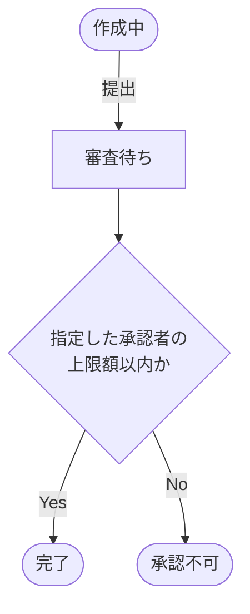
```mermaid
flowchart TD
    A([作成中]) -->|提出| B[審査待ち]
    B --> C{指定した承認者の<br>上限額以内か}
    C -->|Yes| D([完了])
    C -->|No| E([承認不可])
```

このフローで見ておく点は、すべての申請が同じ順序を通り、1回の承認で完了すること、そして通知は状態が変わった後に申請IDごとの固定の相手へ送られることです。

10万円という閾値を設けているのは、「一定額以上の支出には上位者の確認が必要」という会社の内部規程に基づくためです。ただし「10万円」という数字自体は会社や規程によって異なり、組織が変わるたびに見直しが必要になる部分でもあります。

**登録済みの承認者**

現行システムには、次の3名の承認者があらかじめ登録されています。申請では、このいずれかの承認者IDを指定します。指定した承認者の上限を超える金額の申請はその承認者では処理できず、未登録のIDを指定するとエラーになります。

| 承認者ID | 氏名 | 役職（role値） | 承認できる金額の上限 |
|---|---|---|---|
| APR001 | 田中 課長 | 課長（manager） | 100,000円 |
| APR002 | 佐藤 部長 | 部長（director） | 1,000,000円 |
| APR003 | 鈴木 代表 | 代表（executive） | 上限なし |

**この仕様を決める業務機能**

承認ワークフローには「どの順序で状態を進めるか」「誰に通知するか」「どの金額まで承認できるか」という3種類の知識があります。それぞれを決める業務上の理由は異なります。

| 業務機能 | この章の仕様で決めていること |
|---|---|
| 申請プロセス管理 | 許可する操作と、操作後の状態 |
| 通知・連携管理 | 通知先の一覧・通知チャネルの仕様 |
| 業務ルール管理 | 承認者ごとの金額上限 |

これらは別々の業務上の理由で決まる知識です。現行コードがこの3つをどう扱っているかは、1-3の責任一覧と1-4のコードで確認します。

ここまでで、状態の種類、状態遷移、承認上限、通知先の意味を説明しました。まず、このシステムがどのデータを記憶し、処理時に何を読み出すのかを整理します。そのうえで、代表ケースを使って入力がどの処理で使われ、どの出力に変わるかを正常系の流れとして確認します。

最も大きな境界は、「利用者 → 承認ワークフローシステム → 外部の通知送信サービス」です。まずこの境界を固定し、その内側に保存データと処理を配置します。

**システム全体図：利用者・承認ワークフローシステム・保存データ**

この図では、最も大きな境界である利用者→対象システム→外部サービスを先に読み、その内側の保存データを確認します。

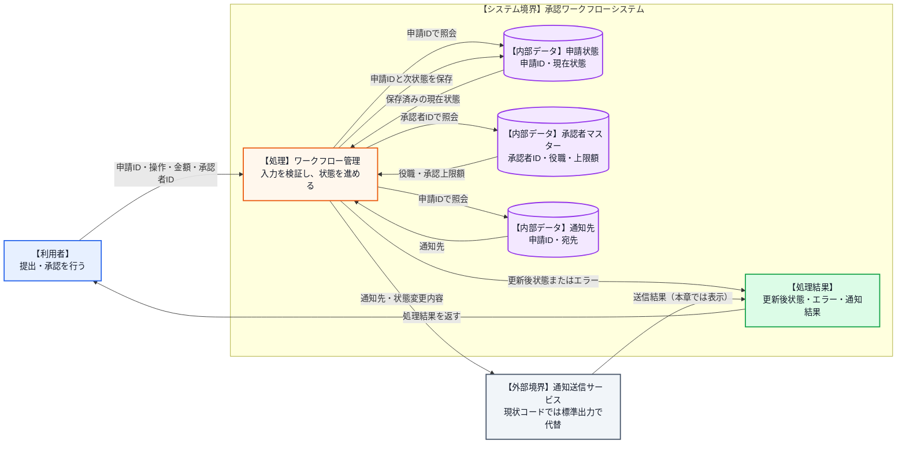
```mermaid
flowchart LR
    U["【利用者】<br>提出・承認を行う"]:::actor
    subgraph SYS["【システム境界】承認ワークフローシステム"]
        WM["【処理】ワークフロー管理<br>入力を検証し、状態を進める"]:::process
        CS[("【内部データ】申請状態<br>申請ID・現在状態")]:::data
        AP[("【内部データ】承認者マスター<br>承認者ID・役職・上限額")]:::data
        NT[("【内部データ】通知先<br>申請ID・宛先")]:::data
        R["【処理結果】<br>更新後状態・エラー・通知結果"]:::output
    end
    NS["【外部境界】通知送信サービス<br>現状コードでは標準出力で代替"]:::external

    U -->|"申請ID・操作・金額・承認者ID"| WM
    WM -->|"申請IDで照会"| CS
    CS -->|"保存済みの現在状態"| WM
    WM -->|"承認者IDで照会"| AP
    AP -->|"役職・承認上限額"| WM
    WM -->|"申請IDと次状態を保存"| CS
    WM -->|"申請IDで照会"| NT
    NT -->|"通知先"| WM
    WM -->|"通知先・状態変更内容"| NS
    WM -->|"更新後状態またはエラー"| R
    NS -->|"送信結果（本章では表示）"| R
    R -->|"処理結果を返す"| U

    classDef actor fill:#e7f0ff,stroke:#2563eb,stroke-width:2px,color:#111827;
    classDef process fill:#fff7ed,stroke:#ea580c,stroke-width:2px,color:#111827;
    classDef data fill:#f3e8ff,stroke:#9333ea,stroke-width:2px,color:#111827;
    classDef external fill:#f1f5f9,stroke:#475569,stroke-width:2px,color:#111827;
    classDef output fill:#dcfce7,stroke:#16a34a,stroke-width:2px,color:#111827;
```

色は役割を示します。青はシステム外の利用者、橙はシステム内の処理、紫はシステムが保持するデータ、灰色は外部サービスとの境界、緑は利用者へ返す結果です。最も大きな枠が本章で設計するシステム境界であり、通知送信サービスの内部は扱いません。

矢印には、境界をまたぐデータを記載しています。利用者は現在状態や通知先を毎回指定せず、申請ID・操作・金額・承認者IDだけを渡します。システムがそのIDをキーに保存済み状態、承認者情報、通知先を読み出し、次状態を保存してから通知境界を呼びます。

**システム内部図：正常系の入力・加工・出力**

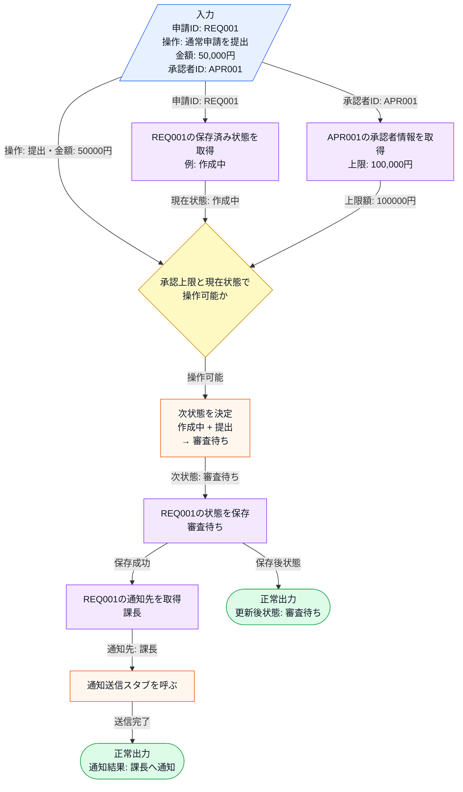
```mermaid
flowchart TD
    A[/入力<br>申請ID: REQ001<br>操作: 通常申請を提出<br>金額: 50,000円<br>承認者ID: APR001/]:::input
    B[REQ001の保存済み状態を取得<br>例: 作成中]:::data
    C[APR001の承認者情報を取得<br>上限: 100,000円]:::data
    D{承認上限と現在状態で<br>操作可能か}:::decision
    F[次状態を決定<br>作成中 + 提出<br>→ 審査待ち]:::process
    G[REQ001の状態を保存<br>審査待ち]:::data
    H[REQ001の通知先を取得<br>課長]:::data
    I[通知送信スタブを呼ぶ]:::process
    J([正常出力<br>更新後状態: 審査待ち]):::normal
    K([正常出力<br>通知結果: 課長へ通知]):::normal

    A -->|"申請ID: REQ001"| B
    A -->|"承認者ID: APR001"| C
    A -->|"操作: 提出・金額: 50000円"| D
    B -->|"現在状態: 作成中"| D
    C -->|"上限額: 100000円"| D
    D -->|"操作可能"| F
    F -->|"次状態: 審査待ち"| G
    G -->|"保存成功"| H
    H -->|"通知先: 課長"| I
    G -->|"保存後状態"| J
    I -->|"送信完了"| K

    classDef input fill:#e7f0ff,stroke:#2563eb,color:#111827;
    classDef process fill:#fff7ed,stroke:#ea580c,color:#111827;
    classDef decision fill:#fef9c3,stroke:#ca8a04,color:#111827;
    classDef data fill:#f3e8ff,stroke:#9333ea,color:#111827;
    classDef normal fill:#dcfce7,stroke:#16a34a,color:#111827;
```

この図から読み取ることは、次の3点です。

- `REQ001` は現在状態と通知先を取り出すキーとして使われる。利用者が毎回「今の状態」や「通知先」を指定するのではない。
- `APR001` と金額50,000円は、承認者の上限額を超えていないかの判定に使われる。
- 状態更新が成立した後に、保存済み通知先を読み出して送信する。

**エラー条件**

正常系の仕様を一通り確認したうえで、最後に、正常系の流れへ進めない入力を分けて整理します。

| エラー条件 | どこで分かるか | 出力 | 状態保存・通知 |
|---|---|---|---|
| 承認者IDが未登録 | 承認者マスターにIDがない | 承認者IDエラー | 行わない |
| 金額が承認上限を超える | 承認者情報の上限額チェック | 承認不可 | 行わない |
| 現在状態で操作できない | 保存済み状態と操作の組み合わせ | 操作不可エラー | 行わない |

### 1-2：動作例テーブル

コードを読む前に、現状のワークフローがどんな入力に対してどんな出力を返すかを確認します。ここでは、作成中申請の提出と審査待ち申請の承認という現在扱っている2操作、承認者、申請金額だけを扱います。

| 入力 | 承認者 | 結果 |
| --- | --- | --- |
| REQ001（作成中）を提出 / 50,000円 | 登録済みの承認者 | 審査待ちへ移行 / 課長へ通知 |
| REQ002（審査待ち）を承認 / 50,000円 | 登録済みの承認者 | 完了へ移行 / 部長へ通知 |
| REQ001を提出 / 50,000円 | 未登録の承認者 | 承認者IDが存在しないエラー |
| REQ001を提出 / 200,000円 | 上限100,000円の承認者 | 承認上限を超えるエラー |

この表を見れば、現状の仕様が申請IDから保存済み状態を取得し、申請金額と承認者情報を使って、状態遷移・通知・承認額チェックをまとめて処理していることが分かります。緊急申請ルートや決済部門通知は、変更要求で扱います。

次は仕様とクラスを対応づけます。

---

### 1-3：登場クラスとクラス構成図

コードへ入る前に、登場するクラスを先に確認します。

| クラス名 | 役割 | 担当する仕様 |
|---|---|---|
| `WorkflowManager` | 承認ワークフロー全体を進める | 状態遷移、通知、承認者確認の呼び出し |
| `WorkflowCaseRepository` | 申請状態を保存・取得する | 申請IDから現在状態を読み書きする |
| `NotificationTargetRepository` | 通知先を保存・取得する | 申請IDから通知先を読み出す |
| `ApproverDatabase` | 承認者マスターデータを管理する | 承認者IDの存在確認、承認上限額の確認 |
| `ApproverInfo` | 承認者1件分のデータを表す | 氏名・役職・承認上限額を保持する |

各クラスの責任を把握したところで、クラス間の関係を図で整理します。

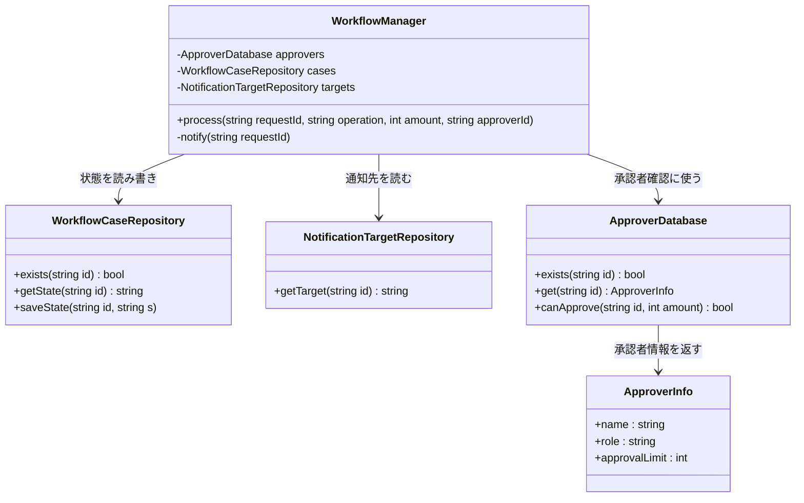
```mermaid
classDiagram
    class WorkflowManager {
        -ApproverDatabase approvers
        -WorkflowCaseRepository cases
        -NotificationTargetRepository targets
        +process(string requestId, string operation, int amount, string approverId)
        -notify(string requestId)
    }
    class WorkflowCaseRepository {
        +exists(string id) bool
        +getState(string id) string
        +saveState(string id, string s)
    }
    class NotificationTargetRepository {
        +getTarget(string id) string
    }
    class ApproverDatabase {
        +exists(string id) bool
        +get(string id) ApproverInfo
        +canApprove(string id, int amount) bool
    }
    class ApproverInfo {
        +name : string
        +role : string
        +approvalLimit : int
    }
    WorkflowManager --> WorkflowCaseRepository : 状態を読み書き
    WorkflowManager --> NotificationTargetRepository : 通知先を読む
    WorkflowManager --> ApproverDatabase : 承認者確認に使う
    ApproverDatabase --> ApproverInfo : 承認者情報を返す
```

**クラス図に出てくる主なメンバーと操作**

| クラス | メンバー・操作 | 何ができるか |
|---|---|---|
| `WorkflowManager` | `process()` | 申請IDと操作、金額、承認者IDを受け取り、保存済み状態を読んで承認処理を進める |
| `WorkflowManager` | `notify()` | 申請IDから通知先を読み出し、状態変化を通知する |
| `WorkflowCaseRepository` | `exists()` / `getState()` / `saveState()` | 申請IDの存在確認、現在状態の取得・保存を行う |
| `NotificationTargetRepository` | `getTarget()` | 申請IDから通知先を取得する |
| `ApproverDatabase` | `exists()` / `get()` / `canApprove()` | 承認者IDの確認、承認者情報の取得、承認上限額の検証を行う |
| `ApproverInfo` | `name` / `role` / `approvalLimit` | 承認者1件分の氏名・役職・承認上限額を保持する |


`WorkflowManager` は `WorkflowCaseRepository` から申請IDで現在状態を読み、`ApproverDatabase` で承認者IDの存在確認と承認上限額の確認を行います。そのうえで、ワークフローの「状態遷移」、各担当者への「通知」（通知先は `NotificationTargetRepository` から取得）、「承認可否のルール判定」を同じクラス内で扱っています。`ApproverInfo` は承認者1件分のデータ（氏名・役職・承認上限額）を表します。


**この章での簡略化**

1-3でクラス構成を確認したので、掲載コードで何を代替しているかを整理してからフェーズ1の現状コードへ進みます。

現状コードでは、実際のワークフローDBを `ApproverDatabase`、`WorkflowCaseRepository`、`NotificationTargetRepository` の `std::map` で代替します。メール・チャットAPIはまだ独立したクラスにせず、`WorkflowManager::notify()` の標準出力で代替します。つまり、通知境界が状態遷移から分離されていないこと自体が、この時点の現状です。

| 実システムで起きること | 掲載コードでの表現 | 本章での扱い |
|---|---|---|
| 申請状態をDBに保存し、次回処理時に申請IDで読み出す | `WorkflowCaseRepository` がメモリ上に申請IDと状態を保持する | 扱う。状態を利用側が直接指定しないことを示すため |
| 承認者マスタから役職と承認上限額を取得する | `ApproverDatabase` が固定データを返す | 扱う。承認可否の判定に必要なため |
| 通知先データを保存し、申請IDで読み出す | `NotificationTargetRepository` が固定の通知先を返す | 扱う。利用者が通知先を直接指定しないことを示すため |
| メール・チャットを実際に送信する | 現状コードでは `WorkflowManager::notify()` が `std::cout` で宛先を表示する | 実送信は扱わない。状態遷移と通知呼び出しが同じクラスにある現状を確認する |
| 通知をキューへ積み、失敗時に再送する | 現状コードにはキュー、送信結果、再送はない | 変更要求で「状態保存後に通知を分離する」範囲まで扱う。キュー化と再送基盤は論点外 |

フェーズ1では変更後の設計要素を先取りせず、状態遷移・通知・承認判定が `WorkflowManager` の `process()` に置かれている現状の事実だけを確認します。

---

### 1-4：実装コード（現状）

#### コードを読む前に：クラスの責任と境界

| 対象 | 呼び出しと内部処理 | 戻り値・副作用 | 掲載上の表現 |
|---|---|---|---|
| Case Repository | 申請IDから現在状態を読み書きする | 保存後状態 | `std::map`でDBを代替する |
| 承認額チェック | `ApproverDatabase::canApprove()` が申請額と上限額を比べる | `bool` | `WorkflowManager` が直接呼ぶ |
| 通知先取得・通知 | Repositoryから宛先を読み、`notify()` が通知する | 標準出力 | 外部通知を文字列表示で代替する |
| 入力エラー | 未登録ID、上限超過、不正な状態と操作を検出する | エラー表示後に終了 | `process()` 内の早期 `return` で表す |

実DBと通知APIは使いません。現状コードは状態保存が成功した後に `notify()` を呼びます。

システムの現状の実装を確認します。コードを役割ごとに分けて読んでいきます。

**ApproverInfo 構造体 と ApproverDatabase クラス**

承認者マスターは、1-1で定義した3名（APR001〜APR003）です。次のコードの `ApproverDatabase` が、その氏名・役職（`role`）・承認上限をそのまま保持します。`role` はコード上で `"manager"` / `"director"` / `"executive"`、代表の上限なしは番兵値 `99999999` として表します。

```cpp
#include <iostream>
#include <map>
#include <string>

using namespace std;

// 承認者情報
struct ApproverInfo {
    string name;         // 氏名
    string role;         // "manager", "director", "executive"
    int approvalLimit;   // 承認可能な申請金額上限（円）
};

// 承認者マスターデータ
class ApproverDatabase {
    map<string, ApproverInfo> records;
public:
    ApproverDatabase() {
        records["APR001"] = {"田中 課長",   "manager",   100000};
        records["APR002"] = {"佐藤 部長",   "director",  1000000};
        records["APR003"] = {"鈴木 代表",   "executive", 99999999};
    }

    bool exists(const string& id) const {
        return records.count(id) > 0;
    }

    ApproverInfo get(const string& id) const {
        return records.at(id);
    }

    void save(const string& id, const ApproverInfo& info) {
        records[id] = info;           // 実行中の承認者マスタへ追加
    }

    bool canApprove(const string& id, int amount) const {
        return records.at(id).approvalLimit >= amount;
    }
};
```

`ApproverDatabase` は `std::map` で承認者IDと `ApproverInfo` を対応付けたマスターデータです。`exists()` でIDの存在確認、`get()` で情報取得、`canApprove()` で権限額の検証を行います。

**申請状態と通知先を保存するクラス（WorkflowCaseRepository / NotificationTargetRepository）**

1-1の仕様図のとおり、申請の現在状態と通知先は利用側が毎回指定するのではなく、申請IDをキーに保存データから読み出します。実システムのDBを、この章では実行終了まで覚えるインメモリの境界スタブで代替します。

```cpp
// 申請ごとの現在状態を保持するリポジトリ（申請ID→状態）
class WorkflowCaseRepository {
    map<string, string> states;
public:
    WorkflowCaseRepository() {
        states["REQ001"] = "作成中";
        states["REQ002"] = "審査待ち";
    }
    bool exists(const string& id) const { return states.count(id) > 0; }
    string getState(const string& id) const { return states.at(id); }
    void saveState(const string& id, const string& s) { states[id] = s; }
};

// 申請ごとの通知先を保持するリポジトリ（申請ID→通知先）
class NotificationTargetRepository {
    map<string, string> targets;
public:
    NotificationTargetRepository() {
        targets["REQ001"] = "課長";
        targets["REQ002"] = "部長";
    }
    string getTarget(const string& id) const { return targets.at(id); }
};
```

`WorkflowCaseRepository` は申請IDから現在状態を読み書きし、`NotificationTargetRepository` は申請IDから通知先を引きます。利用側は申請IDと操作を渡すだけで、状態や通知先を直接指定しません。

**WorkflowManager クラス**

```cpp
// ワークフロー管理クラス（状態遷移・承認判定・通知をすべて抱える）
class WorkflowManager {
    ApproverDatabase approvers;
    WorkflowCaseRepository cases;
    NotificationTargetRepository targets;
public:
    void process(const string& requestId, const string& operation,
                 int amount, const string& approverId) {
        // 申請の存在確認
        if (!cases.exists(requestId)) {
            cout << "エラー：申請ID " << requestId
                 << " は存在しません。" << endl;
            return;
        }
        // 承認者IDの存在確認
        if (!approvers.exists(approverId)) {
            cout << "エラー：承認者ID " << approverId
                 << " はデータベースに存在しません。" << endl;
            return;
        }
        // 承認権限額チェック
        if (!approvers.canApprove(approverId, amount)) {
            ApproverInfo info = approvers.get(approverId);
            cout << "エラー：" << info.name << "（" << info.role
                 << "）の承認上限（"
                 << info.approvalLimit << "円）を超えています。" << endl;
            return;
        }
        // 保存済みの現在状態を読み出す
        string current = cases.getState(requestId);
        // 現在状態 × 操作 で次状態を決める
        if (current == "作成中" && operation == "提出") {
            cases.saveState(requestId, "審査待ち");
            cout << requestId << "：作成中 → 審査待ち" << endl;
            notify(requestId);
        } else if (current == "審査待ち" && operation == "承認") {
            cases.saveState(requestId, "完了");
            cout << requestId << "：審査待ち → 完了" << endl;
            notify(requestId);
        } else {
            cout << "エラー：現在状態「" << current
                 << "」で操作「" << operation << "」はできません。" << endl;
        }
    }
private:
    void notify(const string& requestId) {
        cout << targets.getTarget(requestId) << "へ通知" << endl;
    }
};
```

このクラスが今章の中心です。`process` メソッドは、申請IDから保存済み状態を読み出し、承認者IDの存在確認・承認上限額のチェックを行い、現在状態と操作の組み合わせで次状態を決めて保存し、通知先を読み出して通知するまでを順に実行します。

**main()**

まず依存を組み立て、ケース1（正常：作成中申請の提出）を実行します。

```cpp
int main() {
    WorkflowManager wm;
    // 正常ケース1：REQ001（作成中）を5万円で提出する
    wm.process("REQ001", "提出", 50000, "APR001");
    cout << "---" << endl;
```

ケース1（正常：作成中申請の提出）の実行結果：

```
REQ001：作成中 → 審査待ち
課長へ通知
---
```

続いて、ケース2（正常：審査待ち申請の承認）を実行します。

```cpp
    // 正常ケース2：REQ002（審査待ち）を5万円で承認する
    wm.process("REQ002", "承認", 50000, "APR001");
    cout << "---" << endl;
```

ケース2（正常：審査待ち申請の承認）の実行結果：

```
REQ002：審査待ち → 完了
部長へ通知
---
```

続いて、ケース3（エラー：未登録の承認者ID）を実行します。

```cpp
    // エラー：存在しない承認者ID
    wm.process("REQ001", "提出", 50000, "APR999");
    cout << "---" << endl;
```

ケース3（エラー：未登録の承認者ID）の実行結果：

```
エラー：承認者ID APR999 はデータベースに存在しません。
---
```

最後に、ケース4（エラー：承認上限の超過）を実行し、`main()` を終了します。

```cpp
    // エラー：田中 課長の上限（10万円）を超える申請
    wm.process("REQ001", "提出", 200000, "APR001");
    return 0;
}
```

ケース4（エラー：承認上限の超過）の実行結果：

```
エラー：田中 課長（manager）の承認上限（100000円）を超えています。
```

各ケースのコードとその実行結果をその場で並べたので、離れた `main()` と出力を行き来せずに照合できます（確認したいこと：入力、加工、出力が仕様どおりに対応していること）。

動作例テーブルの「申請提出」「最終承認」「未登録ID」「承認上限超過」に対応しています。現行コードを読む段階で確認すべきことは、`WorkflowManager` が状態文字列・通知文・承認額チェックをまとめて扱っている、という事実です。

次のフェーズでは、このフェーズ1の現状コードに変更を加えたときに何が起きるかを確認します。

---

> **手元で動かすには**
> このコードは1つの `.cpp` に貼り付けて、そのままコンパイル・実行できます（例：`g++ chapter12.cpp -o app && ./app`）。`main()` は自由に組み替えて構いません。`wm.process("REQ001", "提出", 50000, "APR001");` の申請ID・操作・金額・承認者IDを変えれば、保存済み状態の読み出しと承認可否の判定、状態遷移・通知がその場の実行結果に表れます。新しい申請を試すときは `WorkflowCaseRepository` の登録へ `states["REQ010"] = "作成中";` を、その通知先を `NotificationTargetRepository` の `targets["REQ010"] = "課長";` を足すと、その申請でも同じ処理を実行できます。状態・通知先データはプロセス実行中だけ有効で、終了すると消えます（メール・チャット通知は通知境界スタブで簡略化しています）。

### 1-5：変更要求

ある金曜日の夕方、経理部のマネージャーがデスクにやってきました。

「今の仕組みは、申請を提出した後に承認者が1回承認すれば完了します。来期から通常申請は課長承認の後に部長承認を必要とし、緊急申請だけは課長を飛ばして部長が直接承認できるようにしてください。部長が承認した直後には決済部門へも通知し、却下された場合は申請者へ通知する必要があります。さらに、承認上限は部署ごとに差し替えられるようにしてください」

依頼文を、実行結果で判定できる変更依頼へ分けます。

| 変更依頼ID | 確定した変更内容 | 入力 | 受入条件 |
|---|---|---|---|
| 変更ID1 | 通常申請を課長→部長の2段階、緊急申請を部長へ直接進む経路にする | 申請ID、申請種別、承認操作、承認者ID | 通常は2回、緊急は部長の1回で完了し、許可されない役職では状態を変えない |
| 変更ID2 | 部長承認後は決済部門へ、却下時は申請者へ通知する | 保存後状態、申請IDに登録済みの通知先 | 状態保存後に該当通知だけを送り、送信先ごとの結果を返す |
| 変更ID3 | 承認上限を部署ごとに差し替える | 部署、役職、申請金額、承認上限設定 | 同額でも部署設定に応じて承認可否が変わり、判定箇所は一つになる |

#### 変更後要求ベースライン

| 要求ID | 変更種別・根拠となる変更ID | 変更後要求 | 受入条件 |
|---|---|---|---|
| 要求ID1 | 変更<br/>根拠: 変更ID1 | 通常申請は課長→部長、緊急申請は部長へ直接進める | 通常2回・緊急1回の承認で完了する |
| 要求ID2 | 変更<br/>根拠: 変更ID1 | 許可された役職・順序の承認だけ状態を進める | 権限不一致では状態を変えない |
| 要求ID3 | 変更<br/>根拠: 変更ID3 | 部署・役職ごとの承認上限で可否を判定する | 同額でも部署設定により結果が変わる |
| 要求ID4 | 継続<br/>根拠: — | 申請状態と通知先データを既存形式で保存・取得する | 変更前後で保存表現が変わらない |
| 要求ID5 | 継続<br/>根拠: — | 未登録申請・許可されない操作を拒否する | エラー時に状態と通知件数を変えない |
| 要求ID6 | 追加<br/>根拠: 変更ID2 | 部長承認後に決済部門、却下時に申請者へ通知する | 状態保存後に該当通知だけ送り、個別結果を返す |

**変更前→変更後の要求対照（今回変える要求IDだけ）**

現行ベースラインと変更後ベースラインを往復せずに済むよう、今回変える要求IDだけを取り出し、変更前と変更後を同じ行へ並べます。

| 要求ID | 変更前の要求（現行） | 変更後の有効要求 | 根拠変更ID |
|---|---|---|---|
| 要求ID1 | 作成中の申請を提出して審査待ちへ進める | 通常申請は課長→部長、緊急申請は部長へ直接進める | 変更ID1 |
| 要求ID2 | 審査待ちを登録済み承認者の1回承認で完了へ進める | 許可された役職・順序の承認だけ状態を進める | 変更ID1 |
| 要求ID3 | 固定金額上限と承認者情報で承認可否を判定する | 部署・役職ごとの承認上限で可否を判定する | 変更ID3 |
| 要求ID6 | （新規・現行なし） | 部長承認後に決済部門、却下時に申請者へ通知する | 変更ID2 |

要求ID4・要求ID5は継続（変更前＝変更後）のため対照表には載せません。変更後ベースラインで内容を確認できます。

通知先ごとの成否を返す結果型と失敗記録は、変更ID2を安全に実行する内部契約です。通知のキュー化、自動再送、再申請は今回の対象外です。

現行の1段階承認を、通常時は2段階、緊急時は課長を省略する経路へ変更し、状態ごとの通知と承認判定も拡張する要求です。

**仕様変更の内容**

変更要求を受けて、現在のワークフローがどう変わるかを整理します。

| 変更項目 | 変更前 | 変更後 |
|---|---|---|
| 承認ルート | 提出後、登録済み承認者の1回承認で完了 | 通常時は課長→部長の2段階。緊急時は課長を省略して部長へ直接 |
| 部長承認後の通知 | 関係者のみ | 関係者 + 決済部門（新規追加） |
| 却下時の通知 | なし | 申請者に即座にアラート（新規追加） |
| 承認判定ルール | 金額固定閾値 | 今回要求として、部署ごとの承認上限へ差し替え |
| 通知の送り方 | 状態更新処理の中で即時送信 | 状態保存後に通知処理を分離して呼び、送信先ごとの成否を記録する。キュー化・後送りは対象外 |

今回変えるのは状態遷移・通知・承認判定の責任配置です。承認者マスターと通知先データの保存方法は仕様変更の対象ではないため、次の共通基盤は変更前後で維持します。

| 変更対象外の共通基盤 | 変更前 | 変更後 |
|---|---|---|
| `ApproverDatabase` | 承認者情報を保存・取得する | **変更なし** |
| `NotificationTargetRepository` | 通知先を保存・取得する | **変更なし** |

`WorkflowCaseRepository` と `NotificationTargetRepository` は、保存方式も変更対象ではありません。前者は変更後も「申請ID→状態ID文字列」、後者も「申請ID→通知先データ文字列」を保存します。状態IDから状態オブジェクトへの解決、通知先データから送信対象への解決はRepositoryの外に置きます。状態分離を導入するために、仕様変更のない保存表現まで変える必要はありません。

**この章が扱う複雑さ**

現状仕様に、状態を進めるイベント、状態の保存、通知処理の分離、承認ルールの差し替え、通知失敗という複雑さを重ねて、変更要求を当てます。この章で見たいのは、これらが同じ場所で絡み合わず、状態・通知・判定ルールという独立した変化軸として扱えるかどうかです。

| 追加する複雑さ | 具体例 | この章で見ること |
|---|---|---|
| 申請イベント | 通常申請・緊急申請・承認・却下を操作として渡す | 状態ごとに、受け付けるイベントと次状態を分けられるか |
| 状態保存 | 申請IDごとの現在状態を読み書きする | 利用側が状態を持たず、保存済み状態で振る舞いが変わるか |
| 通知処理の分離 | 状態保存後に通知先を読み、送信結果を個別に受け取る | 通知を状態更新の直接処理から切り離せるか |
| 承認ルール差し替え | 課長・部長・部署別の承認上限を入れ替える | 判定ルールを状態遷移と別軸で差し替えられるか |
| 通知失敗 | 送信先が落ちていて1件が届かない | 通知失敗が状態保存や他の通知を巻き込まないか |

---

#### 変更後の状態遷移と受入条件

現行の背景と変更要求を確認したところで、今回の変更が完了したと判断するための受入条件を整理します。設計前後を比較できるよう、最終的に実現したい7つの振る舞いを基準として固定します。これは現行コードがすでに満たしている仕様ではありません。

**受入条件となる期待される動作**

| 操作（入力） | 申請種別 | 結果の状態 | 通知先 |
| --- | --- | --- | --- |
| 申請書提出 | 通常申請 | 審査待ち状態へ移行 | 管理者に通知 |
| 申請書提出 | 緊急申請 | 優先審査待ちへ移行 | 部長に通知 |
| 審査待ち + 課長承認操作 | 通常申請 | 承認済み状態へ移行 | 申請者・部長に通知 |
| 優先審査待ち + 部長承認操作 | 緊急申請 | 完了状態へ移行 | 申請者・部長・決済部門に通知 |
| 審査待ち + 却下操作 | — | 却下状態へ移行 | 申請者に通知 |
| 承認済み + 部長承認操作 | 通常申請 | 完了状態へ移行 | 申請者・課長・部長・決済部門に通知 |

変更後にこのシステムが「何をする必要があるか」を確認できました。

**変更後の状態遷移表**

受入条件を状態遷移として整理します。「優先審査待ち」は今回追加する緊急申請ルートの到達状態であり、現行コードにはまだ存在しません。

| 現在の状態 | 課長/部長承認 | 却下 |
| --- | --- | --- |
| 審査待ち | 課長 → 承認済み | → 却下 |
| 優先審査待ち | 部長 → 完了 | → 却下 |
| 承認済み | 部長 → 完了 | —— |
| 却下 | —— | —— |
| 完了 | —— | —— |

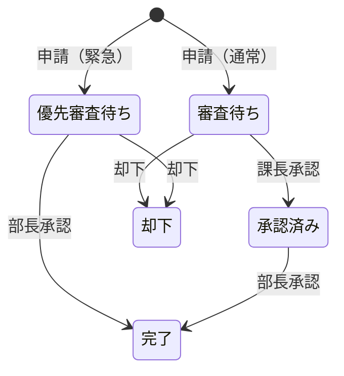
```mermaid
stateDiagram-v2
    [*] --> 審査待ち : 申請（通常）
    [*] --> 優先審査待ち : 申請（緊急）
    審査待ち --> 承認済み : 課長承認
    審査待ち --> 却下 : 却下
    優先審査待ち --> 完了 : 部長承認
    優先審査待ち --> 却下 : 却下
    承認済み --> 完了 : 部長承認
```

通常申請は課長承認を経て部長承認へ進みますが、緊急申請は課長承認を飛ばし、優先審査待ちから部長承認で完了します。同じ承認イベントでも、現在状態によって適用する判定ルールと次状態が変わります。

変更後の承認フローを、通知先も含めて見ると次のようになります。

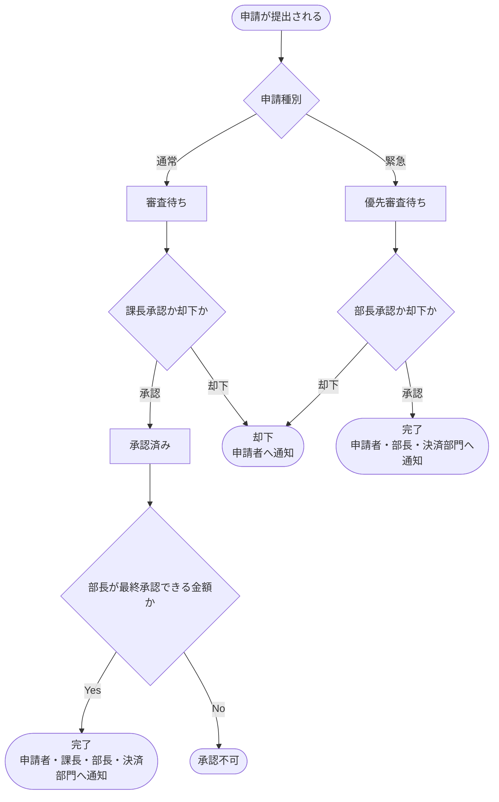
```mermaid
flowchart TD
    A([申請が提出される]) --> B{申請種別}
    B -->|通常| C[審査待ち]
    B -->|緊急| D[優先審査待ち]
    C --> E{課長承認か却下か}
    E -->|承認| F[承認済み]
    E -->|却下| G([却下<br>申請者へ通知])
    D --> H{部長承認か却下か}
    H -->|承認| I([完了<br>申請者・部長・決済部門へ通知])
    H -->|却下| G
    F --> J{部長が最終承認できる金額か}
    J -->|Yes| K([完了<br>申請者・課長・部長・決済部門へ通知])
    J -->|No| L([承認不可])
```

この図を見ると、変更後は「状態の進み方」と「通知先」が同時に増えていることが分かります。緊急申請では審査待ちを飛ばして優先審査待ちへ進み、完了時には決済部門も通知対象になります。つまり、後続フェーズで見るべき差分は状態遷移だけではなく、状態ごとの通知先データでもあります。

**変更前後の入力・判定・加工・出力差分**

1-1の現状仕様を退避し、変更要求を当てた後の仕様と同じ粒度で並べます。以降の分析では、この差分を追います。

| 要素 | 変更前（1-1の現状仕様） | 変更後（今回の要求） | 差分として追うもの |
|---|---|---|---|
| 入力 | 申請ID、承認者ID、金額、操作 | 申請ID、承認者ID、金額、申請イベント、申請種別、追加通知先データ | 申請イベントと緊急ルート、通知先データが増える |
| 判定 | 保存済み状態で操作可能か、承認者の上限額内か | 緊急申請か、優先審査待ちで部長承認できるか、差し替えた承認ルールで通るか | 状態判定・承認ルール差し替え・通知先取得が増える |
| 加工 | 申請IDから状態を取得し、状態を更新し、通知先へ送る | 緊急ルートで状態を保存した後、通知先を取得して個別に送信する | 状態遷移・通知処理の分離・通知失敗の扱いが変わる |
| 出力 | 更新後状態、承認結果、通知結果 | 緊急ルート後の状態、追加通知、却下通知、通知の送信可否 | 状態結果と、成否を含む通知結果を分けて追う |

**変更後のシステム全体図：保存データとアクセス関係**

1-1の現状図と同じ役割・同じ色・同じ矢印の向きで、変更後を表します。変更後も、利用者が状態や通知先を直接指定するわけではありません。Repositoryという保存境界も変えません。変わるのは、保存される状態の種類、申請IDに紐づく通知先データの中身、そしてそれらを扱う処理の責任配置です。

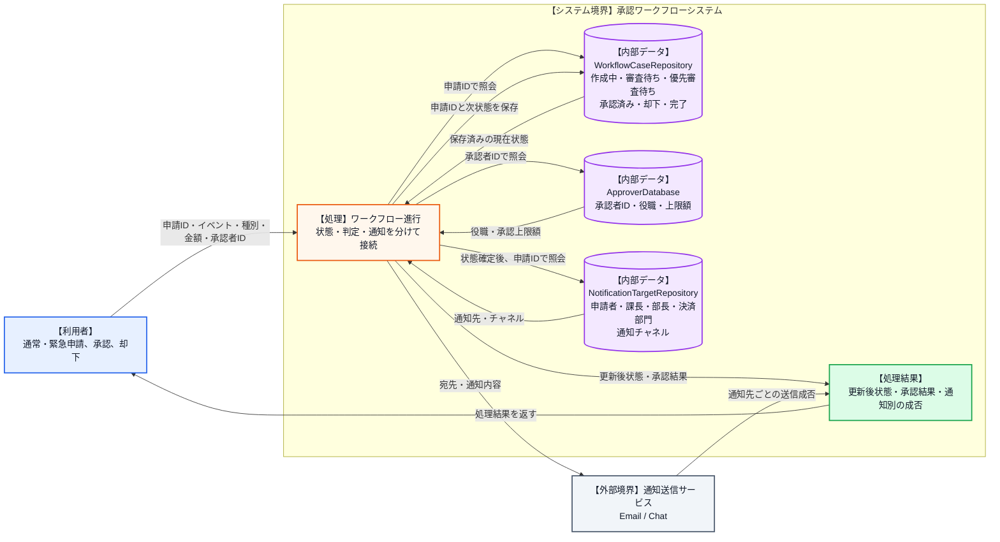
```mermaid
flowchart LR
    U["【利用者】<br>通常・緊急申請、承認、却下"]:::actor
    subgraph SYS["【システム境界】承認ワークフローシステム"]
        WM["【処理】ワークフロー進行<br>状態・判定・通知を分けて接続"]:::process
        CS[("【内部データ】WorkflowCaseRepository<br>作成中・審査待ち・優先審査待ち<br>承認済み・却下・完了")]:::data
        AP[("【内部データ】ApproverDatabase<br>承認者ID・役職・上限額")]:::data
        NT[("【内部データ】NotificationTargetRepository<br>申請者・課長・部長・決済部門<br>通知チャネル")]:::data
        R["【処理結果】<br>更新後状態・承認結果・通知別の成否"]:::output
    end
    NS["【外部境界】通知送信サービス<br>Email / Chat"]:::external

    U -->|"申請ID・イベント・種別・金額・承認者ID"| WM
    WM -->|"申請IDで照会"| CS
    CS -->|"保存済みの現在状態"| WM
    WM -->|"承認者IDで照会"| AP
    AP -->|"役職・承認上限額"| WM
    WM -->|"申請IDと次状態を保存"| CS
    WM -->|"状態確定後、申請IDで照会"| NT
    NT -->|"通知先・チャネル"| WM
    WM -->|"宛先・通知内容"| NS
    WM -->|"更新後状態・承認結果"| R
    NS -->|"通知先ごとの送信成否"| R
    R -->|"処理結果を返す"| U

    classDef actor fill:#e7f0ff,stroke:#2563eb,stroke-width:2px,color:#111827;
    classDef process fill:#fff7ed,stroke:#ea580c,stroke-width:2px,color:#111827;
    classDef data fill:#f3e8ff,stroke:#9333ea,stroke-width:2px,color:#111827;
    classDef external fill:#f1f5f9,stroke:#475569,stroke-width:2px,color:#111827;
    classDef output fill:#dcfce7,stroke:#16a34a,stroke-width:2px,color:#111827;
```

現状図との差は、Repositoryを別の保存方法へ置き換えたことではありません。紫の内部データには新しい状態値・通知先・チャネルが増え、橙の処理では状態遷移、判定、通知を別責任として接続します。これが後続フェーズでコードへ反映する構造差分です。

**変更後の正常系：入力・加工・出力**

ここでは緊急申請の代表ケースとして、`REQ004` が優先審査待ちに保存されており、`APR002` が500,000円の申請を部長承認する流れを追います。1-1との差分は、状態に「優先審査待ち」が加わること、緊急申請では課長承認を経由しないこと、完了時に複数の通知先データを読み出すことです。

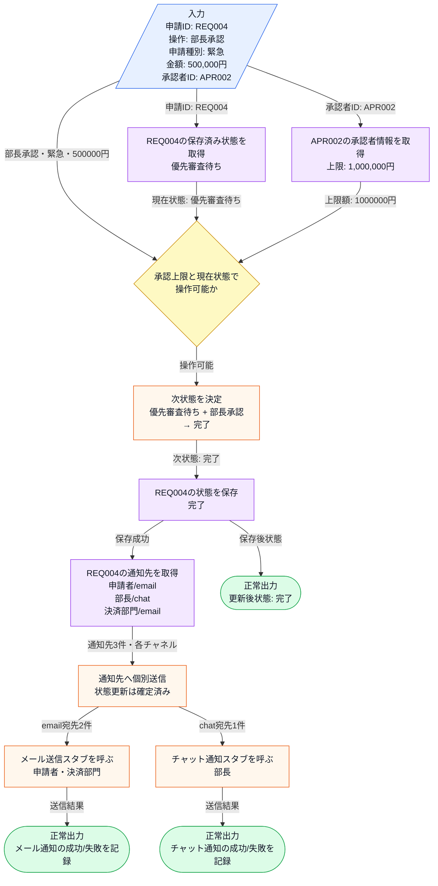
```mermaid
flowchart TD
    A[/入力<br>申請ID: REQ004<br>操作: 部長承認<br>申請種別: 緊急<br>金額: 500,000円<br>承認者ID: APR002/]:::input
    B[REQ004の保存済み状態を取得<br>優先審査待ち]:::data
    C[APR002の承認者情報を取得<br>上限: 1,000,000円]:::data
    D{承認上限と現在状態で<br>操作可能か}:::decision
    F[次状態を決定<br>優先審査待ち + 部長承認<br>→ 完了]:::process
    G[REQ004の状態を保存<br>完了]:::data
    H[REQ004の通知先を取得<br>申請者/email<br>部長/chat<br>決済部門/email]:::data
    Q[通知先へ個別送信<br>状態更新は確定済み]:::process
    I[メール送信スタブを呼ぶ<br>申請者・決済部門]:::process
    J[チャット通知スタブを呼ぶ<br>部長]:::process
    K([正常出力<br>更新後状態: 完了]):::normal
    L([正常出力<br>メール通知の成功/失敗を記録]):::normal
    M([正常出力<br>チャット通知の成功/失敗を記録]):::normal

    A -->|"申請ID: REQ004"| B
    A -->|"承認者ID: APR002"| C
    A -->|"部長承認・緊急・500000円"| D
    B -->|"現在状態: 優先審査待ち"| D
    C -->|"上限額: 1000000円"| D
    D -->|"操作可能"| F
    F -->|"次状態: 完了"| G
    G -->|"保存成功"| H
    H -->|"通知先3件・各チャネル"| Q
    Q -->|"email宛先2件"| I
    Q -->|"chat宛先1件"| J
    G -->|"保存後状態"| K
    I -->|"送信結果"| L
    J -->|"送信結果"| M

    classDef input fill:#e7f0ff,stroke:#2563eb,color:#111827;
    classDef process fill:#fff7ed,stroke:#ea580c,color:#111827;
    classDef decision fill:#fef9c3,stroke:#ca8a04,color:#111827;
    classDef data fill:#f3e8ff,stroke:#9333ea,color:#111827;
    classDef normal fill:#dcfce7,stroke:#16a34a,color:#111827;
```

この図から読み取ることは、次の4点です。

- `REQ004` は、保存済み状態と通知先データの両方を取り出すキーとして使われる。
- 緊急申請では、保存済み状態が「優先審査待ち」なので、部長承認によって直接「完了」へ進む。
- 通知先はコードの分岐ではなくデータとして読み出され、チャネルに応じてメール送信スタブまたはチャット通知スタブへ渡される。
- 通知は状態保存が確定した後に個別送信し、通知ごとの成否を記録する。

変更後も、エラー条件は正常系図へ混ぜずに別で確認します。通知の失敗は正常系の状態保存を巻き戻さない点に注意します。

| エラー条件 | どこで分かるか | 出力 | 状態保存・通知 |
|---|---|---|---|
| 承認者IDが未登録 | `ApproverDatabase` にIDがない | 承認者IDエラー | 行わない |
| 金額が承認上限を超える | 差し替えた承認ルールの上限チェック | 承認不可 | 行わない |
| 現在状態で操作できない | 保存済み状態とイベントの組み合わせ | 操作不可エラー | 行わない |
| 通知先データがない | `NotificationTargetRepository` に通知先がない | 状態更新のみ。通知結果は空 | 状態保存は行う。通知は積まない |
| 通知の送信が失敗する | `DeliveryResult` が失敗を返す | 状態は更新済み。該当通知だけ失敗を記録 | 状態保存は保つ。他の通知は続行 |

状態の追加・通知処理の分離・承認ルール差し替え・通知失敗が実際のコードでどこに現れるかは、フェーズ3で変更を試すコードと、フェーズ7の最終コード・実行結果で追います。キュー化・後送りは1-4で示したとおり対象外です。

---

**フェーズ1のまとめ：今回追う変更ID一覧**

このフェーズで確定した変更依頼を一覧にして締めます。フェーズ2でこの変更IDを仮説・ヒアリングへ、フェーズ3で一つずつ試して痛みへ、と順につなぎます。

| 変更ID | 変更依頼の要点 | 対象の現行要求ID |
|---|---|---|
| 変更ID1 | 通常申請を課長→部長の2段階、緊急申請を部長へ直接進む経路にする | 要求ID1・要求ID2 |
| 変更ID2 | 部長承認後は決済部門へ、却下時は申請者へ通知する | 要求ID6 |
| 変更ID3 | 承認上限を部署ごとに差し替える | 要求ID3 |

フェーズ1でシステムの現状と変更要求が把握できました。次のフェーズ2では、「何を変え、何を守るか」を整理します。

## 🟣 フェーズ2：仮説立案 ―― 何が変わるかを観察し、ヒアリングで裏付ける
### 2-1：変わりそうな仕様の見当をつける

ここで作る一覧は、思いつきで「変わりそう」と感じたものを並べる表ではありません。フェーズ1で確認した仕様・動作例・クラス図を材料に、次の順で候補を絞ります。

1. 仕様図と動作例から、入力・判定・加工・出力のうち条件や値が変わりそうな箇所を拾う。
2. その箇所が、1-3のどのクラス・メソッドに書かれているかを対応づける。
3. その仕様が、どんな理由で、何をきっかけに、どのくらいの頻度で変わりそうかを仮説として書く。
4. 逆に、当面変えない前提にできる処理の骨格も分けておく。

この手順で見ると、「承認ワークフローを進める」という大きな処理全体ではなく、その中のどの状態遷移・通知先・承認判定ルールが変更候補なのかを読者自身で追えるようになります。

フェーズ2では、フェーズ1で見た仕様のうち、どの状態遷移・通知先・承認判定ルールが変わりそうかを見当づけます。責務の配置は、変更要求を当てた後の痛みと合わせて確認します。

| 仕様候補 | 仕様上の場所 | フェーズ1の現状コードでの場所 | 見立て |
|---|---|---|---|
| 状態遷移 | 状態更新、次状態の決定 | `WorkflowManager.process()` | 申請イベントの種類や状態が増える可能性があるため、今回見る |
| 通知先・通知方法 | 出力、通知処理 | `WorkflowManager.process()` | 通知先や通知媒体が増え、送信が失敗しうるため、今回見る |
| 承認判定ルール | 判定、状態更新前の条件 | `WorkflowManager.process()` | 金額条件や部署別の承認上限へ差し替わる可能性があるため、今回見る |

この表から、今回の検討対象は「状態遷移」「通知」「承認判定」の3つに絞れます。加えて、通知を状態保存後の分離した処理とし、送信失敗ありとして扱うと、通知の失敗が状態保存や承認判定を巻き込まないかも見る必要があります。これらが同じ場所に書かれて困るかどうかは、フェーズ3で変更を入れてから確認します。

#### ヒアリングで確認すること

状態遷移・通知・承認判定の見当ごとに、今後の変更可能性を質問へ変換します。

| 見当 | 現時点の仮説 | 確認する質問 | 確認先 |
|---|---|---|---|
| 承認経路 | 緊急以外の経路も増える | 特殊な承認ルートを今後追加するか | 運用担当者 |
| 通知 | 状態に応じて通知先が変わる | 役職・部署別の通知先が増えるか | 運用担当者 |
| 承認判定 | 金額条件は組織ごとに変わる | 閾値や承認上限を見直す予定があるか | 運用担当者 |

2-3ではこの三点を確認し、同じ処理内にあっても別々に変わる仕様かを確かめます。

### 2-2：今回の変更で確実に変わること

今回の変更要求から確定している変更は、1-5で定義した変更ID1〜変更ID3の3点です。

- **変更ID1：承認ルートの変更**：通常申請は課長承認後に部長承認へ進み、緊急申請は課長を省略して部長が直接承認する
- **変更ID2：状態に応じた通知**：部長承認後は決済部門へ、却下後は申請者へ、状態保存後に通知する
- **変更ID3：承認上限の部署別化**：金額固定閾値を部署ごとの承認上限（課長は50万まで、部長は500万まで等）へ差し替える

ただし「これらの変更が1回限りか、今後も続くか」によって、どこまで設計を変えるべきかが大きく変わります。関係者に確認します。

### ヒアリングに向けた背景確認

このシステムは、ある企業の承認ワークフローを担っています。数年前にサービスが立ち上がった当初は、申請者が申請を提出し、上長が承認するだけのシンプルな2ステップのフローでした。

しかし、組織が拡大し業務が複雑化するにつれて、様々な部署固有の要求が追加されるようになりました。緊急時の特殊ルートや、金額による承認者の自動割り当て、通知先の多様化など、ビジネス上の要求は日々増えています。

### 2-3：関係者ヒアリング


- **開発者：** 「今回のような『緊急ルート』以外にも、今後別の承認ルートが追加される可能性はありますか？」

- **運用担当者：** 「ああ、あるね。 例えば、海外出張時だけの特殊ルートや、特定のプロジェクト限定の承認フローなども、今後は必要になるだろうな。」

- **開発者：** 「通知についても確認させてください。現状は『申請者』と『関係者』だけですが、承認プロセスに応じて通知先の役職が変わったりする要件はありますか？」

- **運用担当者：** 「それも重要だ。 部長が承認したら経理だけでなく、関連部署の担当者にもメールを飛ばしたいケースが多いね。」

- **開発者：** 「金額による判定ルールは今後変わりますか？ 現状は10万円を閾値にしていますが。」

- **運用担当者：** 「そこも変わるよ。 来期から部署ごとに承認上限を設けたいという話が出てる。課長なら50万まで、部長なら500万まで、みたいな感じで。」

### 2-4：ヒアリングで判明した将来リスク

ヒアリングで浮かび上がった「今回の確定変更ではないが、近い将来起こりうる変化」を記録します。これは今回の設計判断の材料です。

| リスクID | 将来リスク | 時期の目安 | 根拠 |
|---|---|---|---|
| リスクID1 | 新しい承認ルートの追加が継続的に発生する | 継続的に | 運用担当者から海外出張ルート・プロジェクト限定フローの必要性を直接確認 |
| リスクID2 | 通知先リストの拡張・変更が繰り返される | 継続的に | 関連部署への通知追加ニーズが言及された |
| リスクID3 | 通知の送信失敗を記録し再送する運用が求められる | 継続的に | 実運用でキュー化した場合、送信先の停止で届かない事例への対応が必要 |

> **分類の確認：** 部署別承認上限は1-5の依頼文に含まれる変更ID3であり、将来リスクから先行実装する機能ではありません。キュー化・自動再送は将来リスクのまま、完成コードへ入れません。

フェーズ2で「今変わること（確定）」と「将来変わるかもしれないこと（リスク）」を分けて整理できました。次のフェーズ3では、現在の構造で変更を試みたときに何が起きるかを確認します。

### 2-5：変わる見込みと当面安定の前提を確定する

2-4のリスクIDを、承認ルートと通知で変えられるようにする部分と、申請処理の安定側へ分けます。「はい」は、フェーズ6で**ルートや通知運用が変わっても、申請の受付・状態保存・結果へ影響を広げない構造か**を判定するための印です。

| リスクID・変化軸 | 変わる見込み | 変えられるようにする部分 | 当面安定として守る部分 |
|---|---|---|---|
| リスクID1：新しい承認ルートの追加が継続的に発生する | はい | 状態ごとの承認操作と遷移先 | 申請IDを使う操作、状態保存、処理結果 |
| リスクID2：通知先リストの拡張・変更が繰り返される | はい | 通知先の取得と通知手段の登録 | 状態保存後に該当通知だけを送る順序 |
| リスクID3：通知の送信失敗を記録し再送する運用が求められる | はい | 失敗記録、キュー、再送方針 | 送信先ごとの受付結果、申請状態の確定 |

したがって2-5の出力は、「承認ルート・通知先・再送方針は変えられるようにし、申請操作・状態保存・結果契約は守る」という設計条件です。フェーズ3では変更ID1〜変更ID3だけを現在の構造へ適用し、リスクIDはフェーズ6の構造評価に使います。

---

## 🟣 フェーズ3：問題特定 ―― 変更の痛みを発見する
### 3-1：変更を試みる

フェーズ2で確定した「緊急申請ルートの追加」と「承認直後の自動通知」という変更要求を、現在の `WorkflowManager` クラスに実装してみます。

はじめに、`process` メソッド内の状態遷移ロジックに「緊急提出」の分岐を追加しました。 すると、本来であれば課長を経由するルートに新しい状態と遷移が割り込み、`if/else` の分岐が次々と増えてコードの可読性が急速に低下していきます。 次に、承認直後の通知処理や決済部門への追加通知を差し込もうとして、また別の判定を足しました。

すると、承認プロセスが「承認」なのか「却下」なのか、あるいは「緊急」なのかというフラグが大量に混在し、どのタイミングでどの通知が飛ぶのかを追うのが難しくなりました。 これ以上 `WorkflowManager` に手を入れると、既存の承認ルートまで壊しかねません。 緊急ルートを追加したことで、通常の承認ルートにおける通知が二重に送信されるようなバグも起きかねません。

実際に変更を加えたコードを見てみましょう。

```cpp
// 変更後の WorkflowManager（緊急ルート・却下通知・決済部門通知を追加）
class WorkflowManager {
    ApproverDatabase approvers;
    WorkflowCaseRepository cases;
    NotificationTargetRepository targets;
public:
    void process(const string& requestId, const string& operation,
                 int amount, const string& approverId) {
        if (!cases.exists(requestId)) {
            cout << "エラー：申請ID " << requestId << " は存在しません。" << endl;
            return;
        }
        if (!approvers.exists(approverId)) {
            cout << "エラー：承認者ID " << approverId
                 << " はデータベースに存在しません。" << endl;
            return;
        }
        if (!approvers.canApprove(approverId, amount)) {
            ApproverInfo info = approvers.get(approverId);
            cout << "エラー：" << info.name << "（" << info.role
                 << "）の承認上限（"
                 << info.approvalLimit << "円）を超えています。" << endl;
            return;
        }
        string current = cases.getState(requestId);
        string next;
        string suffix;              // 「（課長スキップ）」など状態別の付記
        bool notifyPayment = false; // 完了時に決済部門へ追加通知するか
        // ↓ 状態遷移・通知・判定が同じif/elseに次々と積み重なる
        if (current == "作成中" && operation == "提出") {
            next = "審査待ち";
        } else if (current == "作成中" && operation == "緊急提出") { // 緊急ルート追加
            next = "優先審査待ち"; suffix = "（課長スキップ）";
        } else if (current == "審査待ち" && operation == "承認") {
            next = "承認済み";
        } else if (current == "審査待ち" && operation == "却下") {   // 却下通知追加
            next = "却下";
        } else if ((current == "優先審査待ち" || current == "承認済み")
                   && operation == "承認") {
            next = "完了"; notifyPayment = true;                    // 決済部門通知追加
        } else {
            cout << "エラー：現在状態「" << current
                 << "」で操作「" << operation << "」はできません。" << endl;
            return;
        }
        cases.saveState(requestId, next);
        cout << requestId << "：" << current << " → " << next << suffix << endl;
        notify(requestId);                        // ← どの遷移でも同じ。毎回1回でよい
        if (notifyPayment) cout << "決済部門へ通知" << endl;
    }
private:
    void notify(const string& requestId) {
        cout << targets.getTarget(requestId) << "へ通知" << endl;
    }
};

```

実行対象コード：3-1の変更試行コード
対応する動作例：変更要求後の代表ケース
確認したいこと：変更要求を現状構造へ当てはめたとき、修正箇所と痛みがどこに出るか

この変更後コードを、代表ケースごとに実行します。まずケース1（通常申請の提出）を実行します。

```cpp
int main() {
    WorkflowManager wm;
    // 通常申請の提出
    wm.process("REQ001", "提出", 50000, "APR001");
    cout << "---" << endl;
```

ケース1（通常申請の提出）の実行結果：

```
REQ001：作成中 → 審査待ち
課長へ通知
---
```

続いて、ケース2（緊急申請の提出・課長スキップ）を実行します。

```cpp
    // 緊急申請の提出（課長スキップ）
    wm.process("REQ003", "緊急提出", 50000, "APR001");
    cout << "---" << endl;
```

ケース2（緊急申請の提出・課長スキップ）の実行結果：

```
REQ003：作成中 → 優先審査待ち（課長スキップ）
部長へ通知
---
```

最後に、ケース3（通常申請の課長承認）を実行し、`main()` を終了します。

```cpp
    // 通常申請の課長承認
    wm.process("REQ002", "承認", 50000, "APR001");
    return 0;
}
```

ケース3（通常申請の課長承認）の実行結果：

```
REQ002：審査待ち → 承認済み
部長へ通知
```

通常の完了移行でも「申請者に承認完了を通知」が自動的に追加されており、変更前は1件だった通知が2件になっています。緊急ルートでは3件に増え、どのタイミングでどの通知が飛ぶかを追うのが困難になっています。

### 3-2：変更影響グラフ

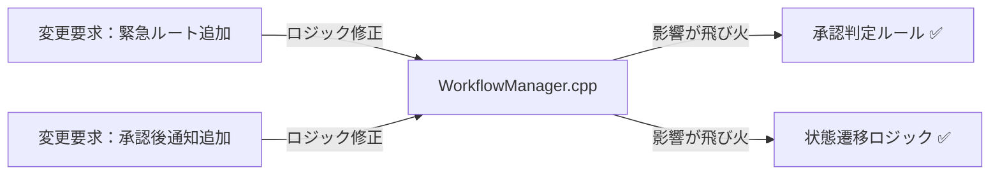
```mermaid
graph LR
    T1["変更要求：緊急ルート追加"] -->|"ロジック修正"| B["WorkflowManager.cpp"]
    T2["変更要求：承認後通知追加"] -->|"ロジック修正"| B
    B -->|"影響が飛び火"| C["承認判定ルール ✅"]
    B -->|"影響が飛び火"| D["状態遷移ロジック ✅"]
```

`WorkflowManager` が状態遷移、通知、判定ルールのすべてを抱え込んでいるため、一つの機能をいじると、本来無関係なはずの判定ロジックまで影響を受けてしまうことが分かります。

### 3-3：痛みの言語化

**1つ目の痛み：状態管理とアクションの密結合。** 変更ID1の通常・緊急ルートを追加するために、`WorkflowManager`内の状態、申請種別、承認者役職の`if-else`を同時に修正しました。「ある状態で誰が何をできるか」というルールが一つのメソッドに混在しています。

**2つ目の痛み：通知と判定の責務過多。** 変更ID2の通知先判定と変更ID3の部署別上限を、ワークフローの状態遷移と同じ場所へ追加しました。通知だけ、または承認判定だけを確認できず、今回の三要求をまとめて読み解く必要があります。

**3つ目の痛み：通知失敗が状態処理へ染み出したこと。** 変更ID2の送信先別結果を返すため、`process()`の状態遷移コードへ送信可否と失敗継続の判断を追加しました。変更ID3の部署別上限も同じメソッドを修正するため、通知結果と承認判定が状態遷移コード上で衝突しています。

フェーズ3で「変更が辛い」ことが確認できました。次のフェーズ4では、なぜ辛いのかを構造的に言語化します。

---
> **📌 問題（確定）**
> 変更ID1の状態遷移、変更ID2の通知先と送信結果、変更ID3の部署別承認判定を`WorkflowManager::process()`へ同時に追加した。緊急ルートでは通知の二重送信も発生し、三つの確定要求が同じメソッドで衝突した。
---

観測した痛みへ`問題ID`を付け、どの変更IDから来たかを対応づけます。本章は状態・通知・承認判定の3軸なので、痛みも3つに対応します。この問題IDが、フェーズ4の原因ID、フェーズ5の課題IDへ順につながります。

| 問題ID | 観測した痛み（変更途中コード） | 起点の変更ID |
|---|---|---|
| 問題ID1 | 承認ルート追加で `WorkflowManager` 内の状態・申請種別・役職の `if-else` を同時修正する | 変更ID1 |
| 問題ID2 | 通知先の追加や通知失敗の扱いが、状態遷移コードへ混在・染み出しする | 変更ID2 |
| 問題ID3 | 部署別上限など判定ルールの変更のために、ワークフロー全体のコードを読み解く | 変更ID3 |

フェーズ4では「なぜその混在が辛いのか」を、コードの構造で言語化します。

## 🟠 フェーズ4：原因分析 ―― なぜ辛いのかを構造で言語化する
### 4-1：痛みの根源を探る（観察と原因）

フェーズ3で確認した「変更の辛さ」は、コードのどこから来ているのでしょうか。コードを注意深く観察すると、痛みを引き起こしている3つの事実が浮かび上がってきます。

第一に、新しい承認ルートを追加するとき、なぜ毎回 `WorkflowManager` を開かなければならないのでしょうか？ それは、このクラス自身が「作成中で提出なら審査待ちへ移行」「審査待ちで承認なら承認済みへ移行」といった**具体的な状態遷移のルールをすべて直接知ってしまっている（抱え込んでいる）**からです。

第二に、なぜ通知先を追加するだけで既存の承認フローが壊れるリスクを感じるのでしょうか？ それは、「誰に通知するか」という情報と「どの状態で何をするか」という情報が**同じメソッドの中で物理的に混ざり合っている**からです。

第三に、なぜ判定ルール（金額閾値）を変えるためにワークフロー全体のコードを読み解く必要があるのでしょうか？ それは、`if (amount > 100000)` という**判定ロジックが状態遷移の処理と同じ場所に直書きされている**からです。

この「症状（痛み）」と「根本原因」を整理すると、以下のようになります。

| **観察した症状（痛み）** | **構造的な原因（痛みの根源）** |
|---|---|
| 承認ルートを変えると全体に影響が走る | `WorkflowManager` が各状態の具体的な遷移ルールを直接知っているから |
| 通知先を変えると承認ロジックが壊れるリスク | 変わる理由が違う「状態遷移」と「通知」が同じメソッドの中に混在しているから |
| 判定ルールの変更で全体を読み解く必要がある | 「承認の判定ロジック」が状態遷移コードの隙間に直書きされているから |
| 通知の失敗をどう扱うかが状態遷移コードへ染み出す | 通知の送信可否（`DeliveryResult`）を判断する場所が、状態を進める処理と同じメソッドにあるから |

4つ目の症状（通知失敗の染み出し）は、2つ目の症状と同じ根＝「通知の知識が状態遷移に混在している」から生じます。そのため独立した原因としては数えず、**通知の軸にまとめて扱います**。独立した根本原因は、次の3つです。

これら3つの根本原因は**それぞれ独立した変化軸**です。「承認フローの状態遷移」「通知先の変動」「承認ルールの変更」は、決定者や変更タイミングが異なるため、同じ場所に混ぜると影響範囲が読みにくくなります。逆に境界を分ければ、主な変更先を状態・通知・判定ルールへ分けて考えやすくなります。

3つが独立しているからこそ、1つの構造だけでは解決しきれません。

### 4-2：変わるもの/変わってほしくないもの

> **「変わらないもの」と「変わってほしくないもの」は異なります。** 「変わらないもの」は経験的事実（今まで変わっていない）、「変わってほしくないもの」は設計意図（ここを安定させてほかを守りたい）です。ここで整理するのは後者です。

| **変わり続けるもの（🔴）** | **変わってほしくないもの（🟢）** |
| --- | --- |
| 承認状態遷移のルール（ルート制御） | 申請・承認という業務プロセスの基本骨格 |
| 各状態における通知先リスト | 承認フローの実行順序（入口から出口までの流れ） |
| 金額や役職による承認可否判定 | 申請データが通過する状態遷移の基盤 |

**【変わる部分（状態遷移・通知・判定が混在した if 文）】**
```cpp
        string current = cases.getState(requestId);
        if (current == "作成中" && operation == "提出") {
            cases.saveState(requestId, "審査待ち");
            cout << requestId << "：作成中 → 審査待ち" << endl;
            notify(requestId);
        } else if (current == "審査待ち" && operation == "承認") {
            cases.saveState(requestId, "承認済み");
            cout << requestId << "：審査待ち → 承認済み" << endl;
            notify(requestId);
        }
        if (!approvers.canApprove(approverId, amount))
            cout << "承認上限を超えています。" << endl;
```

**【変わってほしくない部分（守りたい骨格）】**
```cpp
    void process(const string& requestId, const string& operation,
                 int amount, const string& approverId) {
        string current = cases.getState(requestId);   // ① 状態を読む（守りたい骨格）
        // ② 状態×操作で次状態を決める ← ここが変わる（状態が増えると分岐が増える）
        string next = /* current と operation から次状態を決定 */;
        cases.saveState(requestId, next);              // ③ 次状態を保存（守りたい骨格）
        notify(requestId);                             // ④ 通知する（誰に送るかは変わる側）
    }
```

### 4-3：接続点に漏れている3つの知識を確認する

ここでの「確認すること」は、前節までに見つけた原因から抽出します。まず、原因文から「守りたい骨格」と「変わる差分」を分けます。次に、その差分を動かすために骨格側が知ってしまっている名前・条件・順序・型を拾います。最後に、接続点に残す最小の約束を、値・型・操作・イベントとして書きます。

原因によって、接続点で見る抽象観点は変わります。条件分岐が原因なら条件・定数・選択基準を見ます。処理手順が原因なら呼び出し順・前後条件・失敗時分岐を見ます。生成判断が原因なら具体クラス名・生成条件・登録場所を見ます。通知や外部連携が原因なら通知先・タイミング・成否の扱いを見ます。データや状態が原因なら、境界を流れる値・型・状態を見ます。

現在の `WorkflowManager` は、すべての状態遷移ルール・通知先・判定ロジックを自分自身の中に直接抱え込んでいます。

**【状態・通知・判定の知識が一か所に集まるコード】**
```cpp
class WorkflowManager {
public:
    void process(const string& requestId, const string& operation,
                 int amount, const string& approverId) {
        string current = cases.getState(requestId);
        // 状態遷移を、自分自身で判断して処理している
        if (current == "作成中" && operation == "提出") {
            cases.saveState(requestId, "審査待ち");
            cout << requestId << "：作成中 → 審査待ち" << endl;
            notify(requestId); // 通知先も知っている
        }
        // 判定ルールも、自分自身で持っている
        if (!approvers.canApprove(approverId, amount))
            cout << "承認上限を超えています。" << endl;
    }
};
```

`WorkflowManager`が、状態遷移、通知先、承認判定の詳細をすべて知っています。接続点ごとに「どの知識を相手へ渡しているか」を見ると、独立して変わる判断が一つのメソッドへ集まっていることが分かります。

| 確認する接続点 | `WorkflowManager`が知っていること | 変更時に起きること |
|---|---|---|
| 状態 → 次状態 | 状態名と遷移条件、受け付ける申請イベント | 承認ルート追加で条件分岐を変更する |
| 状態 → 通知 | 通知先・通知タイミング・送信の成否 | 通知先追加や送信失敗の扱いが状態処理へ波及する |
| 状態 → 判定 | 金額閾値と承認者の判断 | 部署別上限へ差し替えるたびにワークフロー本体を変更する |

状態遷移ルール・通知要件・判定ロジックは、それぞれが独立して頻繁に変更される可能性を秘めています。これらを一つのクラスで混在させて管理するのではなく、インターフェースを介した依存関係へ分離することが、システムの設計を健全化する鍵となります。

私たちは今、状態・通知・判定の3つの知識が集まる地点にいます。

フェーズ4で根本原因が言語化できました。分けるべき場所（変わる理由が異なる3つのもの）が特定できた段階です。次のフェーズ5では、この「取り出すターゲット」を具体的に特定します。

---
> **📌 原因（確定）**
> 以下の3つの独立した根本原因が重なっている：
> 1. **状態遷移ルールの直書き**：どの状態でどの処理をするかがクラス内に直接書かれている。
> 2. **通知先とタイミングの混在**：誰に通知するかの知識が状態遷移と同じメソッドに混在している。
> 3. **判定ルールのハードコード**：承認可否などのルールが条件分岐に埋め込まれている。
>
> これらの変更理由（ルート追加、通知先変更、ルール改定）はそれぞれ異なる頻度で発生するため、1つのクラスに混在していることで影響確認コストが発生し続ける。
---

フェーズ3の問題IDに対応づけて、構造上の原因へ`原因ID`を付けます。次のフェーズ5は、この原因IDから課題IDを導きます。

| 原因ID | 構造上の原因（何が同じ責任へ集まっているか） | 対応する問題ID |
|---|---|---|
| 原因ID1 | 状態遷移ルールの直書き：どの状態でどの処理をするかがクラス内に直接書かれている | 問題ID1 |
| 原因ID2 | 通知先とタイミングの混在：誰に通知するかの知識が状態遷移と同じメソッドに混在している（通知失敗の染み出しも同根） | 問題ID2 |
| 原因ID3 | 判定ルールのハードコード：承認可否などのルールが条件分岐に埋め込まれている | 問題ID3 |

変化の速度が違う3つのものが同居していることは分かりました。フェーズ5では「では何を外に出すか」というターゲットを具体的に特定します。

## 🟡 フェーズ5：課題定義 ―― 原因から課題を検討して確定する

フェーズ4で確定した原因は、まだ課題そのものではありません。まず変えるべき構造を候補として導き、システム全体で候補の関係を整理してから、解くべき接続点を確定します。

### 5-1：原因から課題候補を洗い出す

| 原因として確定した事実 | そのままだと残る痛み | 課題候補 | 候補を導いた理由 |
|---|---|---|---|
| ワークフロー進行が全状態・役職・経路を分岐する | 通常・緊急経路追加で全操作を同時修正する | 状態固有の操作可否と遷移を進行処理から分離する | 状態経路は独立して変わる |
| 状態更新処理が通知先・送信処理を直接知る | 通知追加・失敗で状態保存まで影響する | 状態確定後の通知配送を状態遷移から分離する | 状態保存と通知配送は別の理由で変わる |
| 同じ処理が部署・役職ごとの上限条件を持つ | 上限変更で状態遷移まで修正する | 承認判定を状態処理から分離する | 組織ルールと状態経路は別の理由で変わる |

この段階では、解決クラス名・契約名・パターン名・生成場所を決めません。原因のどの構造を変える必要があるかだけを候補にします。

### 5-2：課題候補をシステム全体で評価する

| 課題候補 | 必要性・他候補との関係 | 統合／分割の判断 | 採否 |
|---|---|---|---|
| 状態固有動作の分離 | 必須。変更ID1の経路追加影響を局所化する | 通知・承認判定とは独立変化軸 | 採用 |
| 通知配送の分離 | 必須。変更ID2の追加・失敗を状態保存から切る | 状態確定イベントで接続 | 採用 |
| 承認判定の分離 | 必須。変更ID3の部署差分を状態遷移から切る | 状態が可否結果だけ使う境界として残す | 採用 |

候補を一つずつ部分対策として採用するのではなく、すべてを解いた完成状態から逆算します。変更IDと課題IDは一対一とは限らないため、変更依頼の数に合わせて課題を増減させません。

### 5-3：課題IDと接続点を確定する

評価を通過した候補だけに課題ID1から欠番なくIDを付けます。

| 課題ID・接続点 | 接続するもの・変わる側 | 守る側 | 完了条件 |
|---|---|---|---|
| 課題ID1：状態固有処理とワークフロー進行の境界 | **接続:** 現在状態、操作、次状態、保存結果<br/>**変わる側:** 状態ごとの操作可否・遷移先 | 公開入口、状態保存、既存状態 | 経路追加が状態動作と遷移登録に閉じる |
| 課題ID2：通知配送と状態確定後処理の境界 | **接続:** 状態確定イベントと通知受付結果<br/>**変わる側:** 通知手段・宛先・失敗 | 状態保存後に通知する順序と他通知 | 通知追加・失敗が状態遷移と他通知を変えない |
| 課題ID3：承認判定と承認操作の境界 | **接続:** 部署・役職・金額と承認可否<br/>**変わる側:** 部署別上限と判定規則 | 承認操作、状態遷移、保存 | 上限変更が判定規則と設定に閉じる |

📌 **システム全体の完了状態**：ワークフローは現在状態へ操作を委ね、独立した承認可否を使って状態を保存した後、確定イベントを登録済み通知先へ配送する。

課題IDを定義できたので、ここまでの追跡を一列で見渡します。本章は3軸が綺麗に対応します。

| 問題ID（フェーズ3の痛み） | 原因ID（フェーズ4の構造原因） | 課題ID（達成目標） |
|---|---|---|
| 問題ID1：承認ルート追加で状態遷移を同時修正 | 原因ID1：状態遷移ルールの直書き | 課題ID1：状態固有の操作可否と遷移を進行処理から分離 |
| 問題ID2：通知先追加・失敗が状態遷移へ混在 | 原因ID2：通知先とタイミングの混在 | 課題ID2：状態確定後の通知配送を状態遷移から分離 |
| 問題ID3：判定ルール変更で全体を読み解く | 原因ID3：判定ルールのハードコード | 課題ID3：承認判定を状態処理から分離 |

この表と完了状態が、そのままフェーズ6の入力です。要求の受入は要求ID、設計課題の解消は課題ID、今回の変更影響は変更IDで別々に追跡します。
## 🔴 フェーズ6：対策検討 ―― システム全体の最終構造を定める

**ここからしばらくは抽象の話です。** 個々のクラスへ入る前に、この章で「何を、どんな構造へ変えるのか」を先に決めます。

#### まず全体像 ―― どんな構造へ変えるか（抽象）

フェーズ4で、一つの`WorkflowManager`が「状態ごとの遷移」「結果を届ける通知先」「承認可否の判定」という**別々の理由で変わる3つの判断**を、同じ管理処理へ抱えていることを確認しました。対策は、この3つを別々の責任へ分け、最後に一本の実行経路（承認操作→状態確定→保存→通知）へ結び直すことです。ここで使う3つの構造は、いずれも第一部で扱った基本構造です。第二部の応用編なので、構造名（と対応するパターン名）を語彙として併記しますが、パターン名から設計を選ぶのではなく、上で確認した「別々に変わる3つの判断」から必要な構造を導きます。

```text
現在：WorkflowManager が
      状態遷移 ＋ 通知先 ＋ 承認判定 を全部持つ
                      ↓
変更後：3つの変わる理由を別責任へ分け、一直線の経路へ再結合する
   状態ごとの遷移 → 状態に固有処理を持たせ進行を委ねる（状態分離＝State）      → 課題ID1
   結果を届ける通知先 → 一つの状態確定を登録通知先へ配る（通知連結＝Observer）  → 課題ID2
   承認可否の判定 → 判定規則を差し替え可能にする（規則差し替え＝Strategy）      → 課題ID3
守る範囲：承認操作→状態確定→保存→通知の実行順、両Repositoryの保存表現、承認操作の公開入口
```

まだクラスの中身は見ません。この段階でつかんでほしいのは「3つの変わる理由を3つの接続課題へ分け、最後に一本へつなぐ」という筋だけです。「どのクラスが生成し、どの契約で実行するか」という具体の結論は、この後の課題ID1〜課題ID3で一つずつ決めていきます。決めた結論をまとめて振り返る表は、フェーズ6の末尾（6-3 設計トレース）に置きます。ここでは先に結論表を出しません。

第0章の「設計の醍醐味」の四拍子でいえば、この章は〈状態・通知・判定の共通契約を見つけて3軸を分離〉→〈各部品を生成〉→〈保持・登録・注入〉→〈ワークフロー進行は具体を意識しない〉という同じ順序をたどります。

#### 接続点の分離・配置・組み立てを決める

具体クラスへ入る前に、課題ID1〜課題ID3を「どう分け、どこへ置き、どう組み立てるか」という同じ三観点で一度に見渡します。まだ実装はしません。各課題が最終構造のどこへ着地するかの地図です。

| 接続点を変える観点 | システム全体の考え方 | 課題ID1〜課題ID3のコードへの反映 |
|---|---|---|
| 分離方法 | 進行骨格には状態操作・通知・承認判定の契約だけを残し、具体条件を外す | 課題ID1は `IWorkflowPhase`、課題ID2は `INotificationListener`、課題ID3は `IApprovalRule` を境界にする |
| 配置場所 | 遷移判断は各Phase、送信手段は各Listener、承認可否は各Ruleへ置く | 三つの具象クラス群へ変更理由ごとに配置する |
| 組み立て方法 | 組み立て側が初期Phase・Rule・Listenerを生成・所有し、Managerへ注入・登録する。状態側が次Phaseを選択し、Managerが所有を引き継ぎ、状態保存後に登録Listenerへ通知する | 生成・所有・登録・選択・注入と実行順を一つの経路にする |

#### 設計判断ごとの部分クラス図

課題ID1では、進行処理が現在の`IWorkflowPhase`へ操作を委ね、経路差分を各Phaseへ置きます。

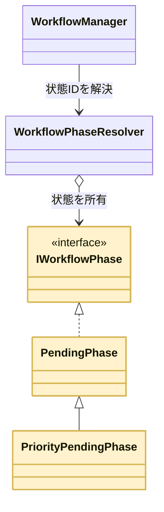
```mermaid
classDiagram
    class WorkflowManager
    class WorkflowPhaseResolver
    class IWorkflowPhase { <<interface>> }
    class PendingPhase
    class PriorityPendingPhase
    WorkflowManager --> WorkflowPhaseResolver : 状態IDを解決
    WorkflowPhaseResolver o--> IWorkflowPhase : 状態を所有
    IWorkflowPhase <|.. PendingPhase
    PendingPhase <|-- PriorityPendingPhase
    class IWorkflowPhase:::focus
    class PendingPhase:::focus
    class PriorityPendingPhase:::focus
    classDef focus fill:#FFF2CC,stroke:#D6B656,stroke-width:2px
```

課題ID2では、状態保存後のイベントを`INotificationListener`へ渡し、個別失敗を配送結果として回収します。

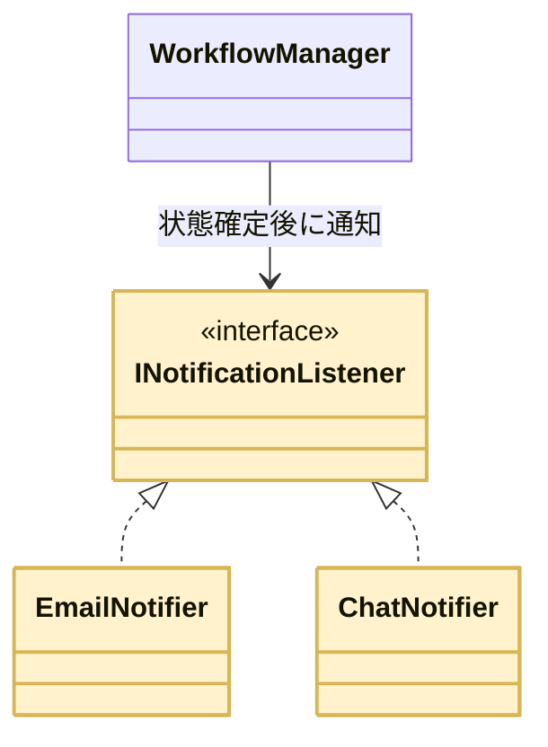
```mermaid
classDiagram
    class WorkflowManager
    class INotificationListener { <<interface>> }
    class EmailNotifier
    class ChatNotifier
    WorkflowManager --> INotificationListener : 状態確定後に通知
    INotificationListener <|.. EmailNotifier
    INotificationListener <|.. ChatNotifier
    class INotificationListener:::focus
    class EmailNotifier:::focus
    class ChatNotifier:::focus
    classDef focus fill:#FFF2CC,stroke:#D6B656,stroke-width:2px
```

課題ID3では、状態が部署別の具体条件を持たず、`IApprovalRule`の可否結果だけを使います。

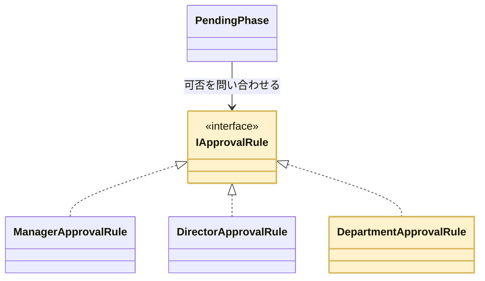
```mermaid
classDiagram
    class PendingPhase
    class IApprovalRule { <<interface>> }
    class ManagerApprovalRule
    class DirectorApprovalRule
    class DepartmentApprovalRule
    PendingPhase --> IApprovalRule : 可否を問い合わせる
    IApprovalRule <|.. ManagerApprovalRule
    IApprovalRule <|.. DirectorApprovalRule
    IApprovalRule <|.. DepartmentApprovalRule
    class IApprovalRule:::focus
    class DepartmentApprovalRule:::focus
    classDef focus fill:#FFF2CC,stroke:#D6B656,stroke-width:2px
```

次のコードでは状態、通知、承認規則を別々に実装し、既存の状態・通知先保存形式を変えずに`WorkflowManager`へ組み立てます。

#### システム全体の最終構造を決める

最終構造は、状態分離構造・通知分離構造・ルール差し替え構造を `WorkflowManager` の進行骨格で接続する一つのシステムです。一部だけを切り出す形は三課題を完了しない途中状態なので比較しません。

### 対策検討のクラス図：1-3の責任と依存をどう変えるか

フェーズ1の1-3で作ったクラス図へフェーズ2〜5の判断を反映し、変更後の形へ更新します。

| クラス図を変える材料 | 前工程で確認したこと | クラス図へ反映すること |
|---|---|---|
| フェーズ1のクラス図 | 現在のクラス、操作、依存関係 | 変更前クラス図としてそのまま使う |
| フェーズ2の変化予測 | 状態・通知先・承認ルールは別チームが増やす | 毎回変わる責任へ `【移す】` と注記する |
| フェーズ4の原因 | `WorkflowManager` に状態・通知・承認判定が混在する | 同じクラスの中で `【残す】` と `【移す】` を分ける |
| フェーズ5の接続点 | 進行入口は残し、状態・通知・承認を各契約へ委ねればよい | 課題ID1を `IWorkflowPhase`、課題ID2を `INotificationListener`、課題ID3を `IApprovalRule` へ置く |

**薄い黄色が着目クラス**です。変更前では `WorkflowManager` の `【残す】` と `【移す】`、変更後では移動先の `【新設】` を追います。矢印は1-3と同じ利用・実装・委譲関係です。

**変更前のクラス図（1-3を責任見直し用に再掲）：**

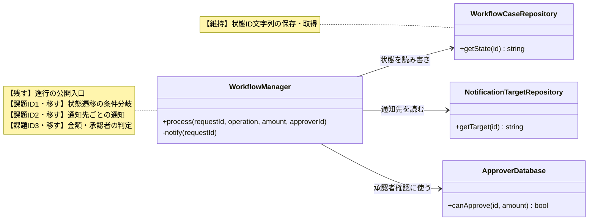
```mermaid
classDiagram
    direction LR
    class WorkflowManager {
        +process(requestId, operation, amount, approverId)
        -notify(requestId)
    }
    class WorkflowCaseRepository { +getState(id) string }
    class NotificationTargetRepository { +getTarget(id) string }
    class ApproverDatabase { +canApprove(id, amount) bool }
    WorkflowManager --> WorkflowCaseRepository : 状態を読み書き
    WorkflowManager --> NotificationTargetRepository : 通知先を読む
    WorkflowManager --> ApproverDatabase : 承認者確認に使う

    note for WorkflowManager "【残す】進行の公開入口<br/>【課題ID1・移す】状態遷移の条件分岐<br/>【課題ID2・移す】通知先ごとの通知<br/>【課題ID3・移す】金額・承認者の判定"
    note for WorkflowCaseRepository "【維持】状態ID文字列の保存・取得"

    classDef focus fill:#FFF2CC,stroke:#D6B656,stroke-width:2px,color:#222222
    cssClass "WorkflowManager" focus
```

変更前は `WorkflowManager` が状態遷移・通知・承認判定の3責務を抱え、状態追加・通知先追加・承認ルール変更のいずれでも同じ `process()` を開きます。

課題ID1〜課題ID3をクラス図の変更として書くと、次の3操作になります。

1. 課題ID1：状態が満たす契約 `IWorkflowPhase`（`handle`）を新設し、遷移判断を各Phaseへ移す（状態分離構造）。
2. 課題ID2：通知先が満たす契約 `INotificationListener`（`onStatusChanged`）を新設し、登録制にする（通知分離構造）。
3. 課題ID3：承認判定を担う契約 `IApprovalRule`（`canApprove`）を新設し、差し替え可能にする（ルール差し替え構造）。

変更後は、`WorkflowManager` が進行骨格だけを持ち、状態・通知・承認判定がそれぞれの契約の裏へ移り、`process()` の混在分岐が消えたことを確認します。

**採用した変更後のクラス図：**

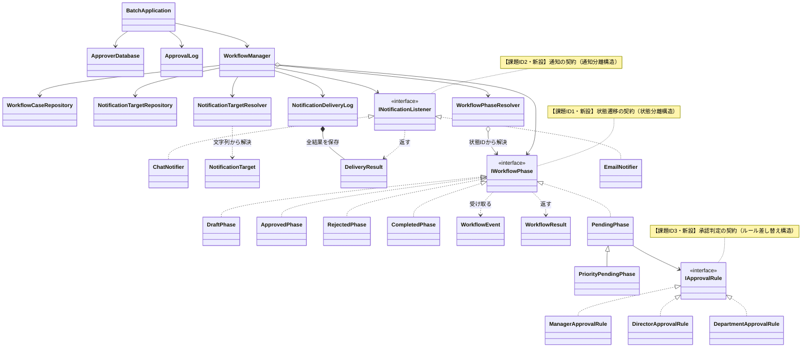
```mermaid
classDiagram
    class DraftPhase
    class ApprovedPhase
    class RejectedPhase
    class CompletedPhase
    class DirectorApprovalRule
    class DepartmentApprovalRule
    class ApproverDatabase
    class WorkflowCaseRepository
    class NotificationTargetRepository
    class ChatNotifier
    class ApprovalLog
    class BatchApplication
    class WorkflowEvent
    class WorkflowResult
    class NotificationTarget
    class DeliveryResult
    class WorkflowManager
    class WorkflowPhaseResolver
    class NotificationTargetResolver
    class NotificationDeliveryLog
    class IWorkflowPhase { <<interface>> }
    class PendingPhase
    class PriorityPendingPhase
    class IApprovalRule { <<interface>> }
    class ManagerApprovalRule
    class INotificationListener { <<interface>> }
    class EmailNotifier
    WorkflowManager o--> IWorkflowPhase
    IWorkflowPhase ..> WorkflowEvent : 受け取る
    IWorkflowPhase ..> WorkflowResult : 返す
    IWorkflowPhase <|.. PendingPhase
    PendingPhase <|-- PriorityPendingPhase
    PendingPhase --> IApprovalRule
    IApprovalRule <|.. ManagerApprovalRule
    WorkflowManager --> INotificationListener
    WorkflowManager --> WorkflowPhaseResolver
    WorkflowManager --> NotificationTargetResolver
    WorkflowManager --> NotificationDeliveryLog
    WorkflowPhaseResolver o--> IWorkflowPhase : 状態IDから解決
    NotificationTargetResolver ..> NotificationTarget : 文字列から解決
    INotificationListener ..> DeliveryResult : 返す
    NotificationDeliveryLog *-- DeliveryResult : 全結果を保存
    INotificationListener <|.. EmailNotifier
    IWorkflowPhase <|.. DraftPhase
    IWorkflowPhase <|.. ApprovedPhase
    IWorkflowPhase <|.. RejectedPhase
    IWorkflowPhase <|.. CompletedPhase
    IApprovalRule <|.. DirectorApprovalRule
    IApprovalRule <|.. DepartmentApprovalRule
    WorkflowManager --> WorkflowCaseRepository
    WorkflowManager --> NotificationTargetRepository
    INotificationListener <|.. ChatNotifier
    BatchApplication --> WorkflowManager
    BatchApplication --> ApproverDatabase
    BatchApplication --> ApprovalLog

    note for IWorkflowPhase "【課題ID1・新設】状態遷移の契約（状態分離構造）"
    note for INotificationListener "【課題ID2・新設】通知の契約（通知分離構造）"
    note for IApprovalRule "【課題ID3・新設】承認判定の契約（ルール差し替え構造）"

    classDef focus fill:#FFF2CC,stroke:#D6B656,stroke-width:2px,color:#222222
    cssClass "IWorkflowPhase,DraftPhase,PendingPhase,INotificationListener,EmailNotifier,IApprovalRule,ManagerApprovalRule,WorkflowPhaseResolver,NotificationTargetResolver,NotificationDeliveryLog" focus
```

クラス図の変更とコード変更を一対一で対応させると、次のようになります。

| 課題ID | クラス図をどう変えるか | コードレベルで何をするか | 詳しく解く節 |
|---|---|---|---|
| 課題ID1 | 状態遷移の契約 `IWorkflowPhase` を新設し、現在状態へ委譲する | 各Phaseが `handle()` で許可イベントと遷移先を持つ | 課題ID1節（①〜⑥） |
| 課題ID2 | 通知の契約 `INotificationListener` を新設し、登録制にする | 各Notifierが `onStatusChanged()` を実装し、状態確定後に一律配布する | 課題ID2節（①〜⑥） |
| 課題ID3 | 承認判定の契約 `IApprovalRule` を新設し、差し替え可能にする | 各Ruleが `canApprove()` を実装し、承認Phaseが委譲する | 課題ID3節（①〜⑥） |

このクラス図が、課題ID1〜課題ID3を反映したシステム全体の設計結論です。課題IDは図の差分を追うために使い、以降はこの構造に必要なコードだけを示します。

#### 課題箇所のおさらい（フェーズ3の関連コード）

統合表で特定した箇所だけを振り返ります。課題ID1は状態遷移の条件分岐、課題ID2は通知先の直呼び、課題ID3は金額・承認者の判定です。課題に関係しないコードは省略し、フェーズ3で明記した維持条件をそのまま引き継ぎます。

```cpp
// 現状：状態遷移・通知・承認判定が process() に混在する
void WorkflowManager::process(const std::string& requestId,
                              const std::string& operation,
                              int amount, const std::string& approverId) {
    std::string current = cases.getState(requestId);
    if (current == "作成中" && operation == "提出") {   // 課題ID1: 状態遷移
        cases.saveState(requestId, "審査待ち");
        notify(requestId);                              // 課題ID2: 通知の直呼び
    }
    if (!approvers.canApprove(approverId, amount))      // 課題ID3: 承認判定
        std::cout << "承認上限を超えています。" << std::endl;
}
```

### 課題ID1：状態固有の操作可否と遷移を進行処理から分離する

**【課題ID1の原因】** 問題ID1（承認ルート追加で状態遷移を同時修正）＝原因ID1（状態遷移ルールの直書き）。この原因を分離対象にします。

**この課題（何を解きたいか）：** 承認ルートを1つ足すだけで、`process()` の状態別 `if` 連鎖と各遷移の副作用まで触る——問題ID1（痛み）／原因ID1（状態遷移の直書き）です。**公開入口は状態を判定せず、状態ごとの許可操作と遷移先だけを差し替えられる**ようにするのが課題ID1です。

**どう解決するか（方針）：** 状態ごとの振る舞いを共通契約の裏へ揃え、現在状態へイベントを委譲します（状態分離構造＝State）。骨格を持たない委譲の構造なので、①契約 →③具体 →④生成 →⑤注入 →⑥実行 の順で組み立てます（②骨格は無し）。

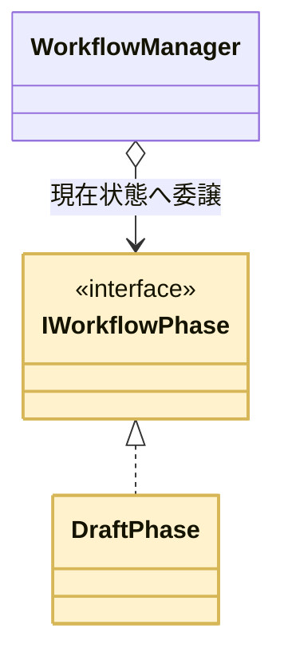
```mermaid
classDiagram
    class WorkflowManager
    class IWorkflowPhase { <<interface>> }
    class DraftPhase
    WorkflowManager o--> IWorkflowPhase : 現在状態へ委譲
    IWorkflowPhase <|.. DraftPhase
    class IWorkflowPhase:::focus
    class DraftPhase:::focus
    classDef focus fill:#FFF2CC,stroke:#D6B656,stroke-width:2px
```

**① 共通契約 `IWorkflowPhase` を定義する。** `WorkflowManager` は `handle()` へ `WorkflowEvent` を渡すだけで、状態別の遷移条件を知りません。

```cpp
class WorkflowManager;

class IWorkflowPhase {
public:
    virtual ~IWorkflowPhase() = default;
    virtual void handle(WorkflowManager& wm, WorkflowEvent ev) = 0;
};
```

**③ 具体状態が許可イベントと遷移先だけを実装する（進行骨格は書かない）。** `DraftPhase` は提出イベントで審査待ちへ進みます。`PendingPhase`／`ApprovedPhase`／`RejectedPhase`／`CompletedPhase` も同じ形で、許可するイベントだけを処理します。

```cpp
class DraftPhase : public IWorkflowPhase {
    void handle(WorkflowManager& wm, WorkflowEvent ev) override {
        if (ev == WorkflowEvent::Submit) wm.transitionTo(/* 審査待ち */);
    }
};
```

**④ 生成・⑤ 注入。** 具体Phaseの生成・所有と状態IDからの解決は組み立て側（`BatchApplication`）と `WorkflowPhaseResolver` に閉じ、`WorkflowManager` は非所有の契約ポインタを受け取ります（生成の全体像は6-1・6-2）。

**⑥ 実行部は現在状態へ委譲するだけ。** `WorkflowManager::process()` は現在Phaseへ `handle()` を委譲し、どの状態かを知りません（コード全体は6-2）。

```cpp
void process(WorkflowEvent ev) { phase->handle(*this, ev); } // ⑥ 委譲
```

これで課題ID1の完了条件「経路追加が新しいPhaseと遷移登録に閉じ、公開入口・状態保存を変えない」を満たします。課題ID2の通知境界・課題ID3の承認判定とは独立したまま、同じ進行経路へ接続します。

### 課題ID2：状態確定後の通知配送を状態遷移から分離する

**【課題ID2の原因】** 問題ID2（通知先追加・失敗が状態遷移へ混在）＝原因ID2（通知先とタイミングの混在）。この原因を分離対象にします。

**この課題（何を解きたいか）：** チャット通知を1つ足すだけで、`process()` が具体通知先の呼び出しと失敗処理まで抱える——問題ID2（痛み）／原因ID2（通知先の混在）です。**状態確定後の配送を、通知先の種類を知らずに一律配布できる**ようにするのが課題ID2です。

**どう解決するか（方針）：** 通知先を共通契約へ揃え、状態保存後に登録済みの通知先へ一律配布します（通知分離構造＝Observer）。骨格を持たない登録・配布の構造なので、①契約 →③具体 →④生成 →⑤注入 →⑥実行 の順で組み立てます（②骨格は無し）。

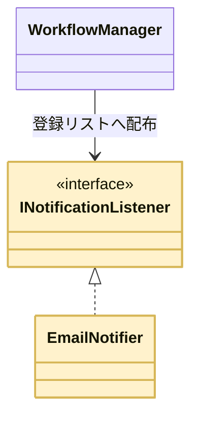
```mermaid
classDiagram
    class WorkflowManager
    class INotificationListener { <<interface>> }
    class EmailNotifier
    WorkflowManager --> INotificationListener : 登録リストへ配布
    INotificationListener <|.. EmailNotifier
    class INotificationListener:::focus
    class EmailNotifier:::focus
    classDef focus fill:#FFF2CC,stroke:#D6B656,stroke-width:2px
```

**① 共通契約 `INotificationListener` を定義する。** `WorkflowManager` は状態確定後に `onStatusChanged()` を呼ぶだけで、具体通知先を知りません。

```cpp
class INotificationListener {
public:
    virtual ~INotificationListener() = default;
    virtual void onStatusChanged(const std::string& requestId,
                                 const std::string& newState) = 0;
};
```

**③ 具体通知先が送信詳細だけを実装する。** `EmailNotifier` はメール送信の詳細を閉じ込めます。`ChatNotifier` も同じ形で、宛先と通信手順だけが変わります。

```cpp
class EmailNotifier : public INotificationListener {
    void onStatusChanged(const std::string& id,
                         const std::string& s) override { /* メール送信 */ }
};
```

**④ 生成・⑤ 注入（登録）。** 組み立て側が `EmailNotifier`・`ChatNotifier` を生成・所有し（借用参照として渡す）、`addListener()` で登録して注入します（全体像は6-1・6-2）。

```cpp
EmailNotifier email;               // ④ 生成・所有は組み立て側
wm.addListener(&email);            // ⑤ 登録で注入（借用参照）
```

**⑥ 実行部は登録リストを一律に回すだけ。** `transitionTo()` は状態保存後に登録済み `INotificationListener` へ順に `onStatusChanged()` を呼び、メールかチャットかを知りません。1件の失敗で状態遷移や他通知を止めません（コード全体は6-2）。

これで課題ID2の完了条件「通知追加・失敗が登録先と個別結果に閉じ、状態遷移と他通知を変えない」を満たします。

### 課題ID3：承認判定を状態処理から分離する

**【課題ID3の原因】** 問題ID3（判定ルール変更で全体を読み解く）＝原因ID3（判定ルールのハードコード）。この原因を分離対象にします。

**この課題（何を解きたいか）：** 部署別上限を変えるだけで、金額・承認者の判定が状態処理へ直書きされ、全体を読み解く必要がある——問題ID3（痛み）／原因ID3（判定のハードコード）です。**承認可否の判定を、状態処理を知らずに差し替えられる**ようにするのが課題ID3です。

**どう解決するか（方針）：** 承認判定を差し替え可能なルール契約の裏へ揃え、承認状態が判定を委ねます（規則差し替え構造＝Strategy）。骨格を持たない委譲の構造なので、①契約 →③具体 →④生成 →⑤注入 →⑥実行 の順で組み立てます（②骨格は無し）。

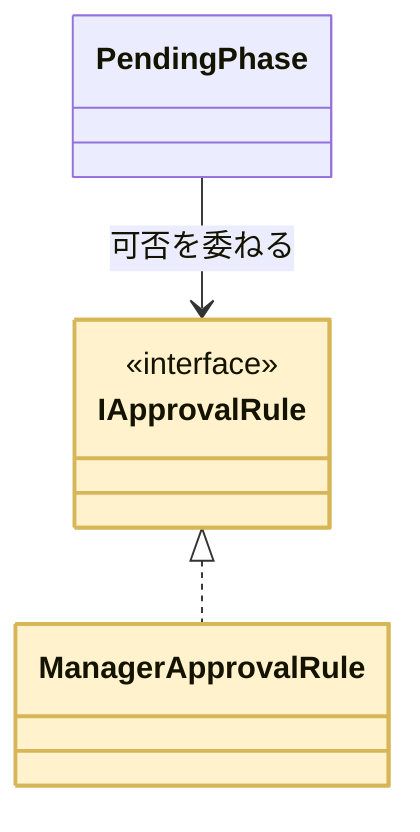
```mermaid
classDiagram
    class PendingPhase
    class IApprovalRule { <<interface>> }
    class ManagerApprovalRule
    PendingPhase --> IApprovalRule : 可否を委ねる
    IApprovalRule <|.. ManagerApprovalRule
    class IApprovalRule:::focus
    class ManagerApprovalRule:::focus
    classDef focus fill:#FFF2CC,stroke:#D6B656,stroke-width:2px
```

**① 共通契約 `IApprovalRule` を定義する。** 承認状態は `canApprove()` の可否だけを受け取り、上限額や部署別規則を知りません。

```cpp
class IApprovalRule {
public:
    virtual ~IApprovalRule() = default;
    virtual bool canApprove(const std::string& approverId, int amount) = 0;
};
```

**③ 具体ルールが判定だけを実装する。** `ManagerApprovalRule` は課長承認上限で可否を返します。`DirectorApprovalRule`・`DepartmentApprovalRule` も同じ契約を実装し、上限変更はルール1クラスの差し替えに閉じます。

```cpp
class ManagerApprovalRule : public IApprovalRule {
    bool canApprove(const std::string& approverId, int amount) override {
        return amount <= 500000;   // 課長承認上限
    }
};
```

**④ 生成・⑤ 注入。** 具体ルールの生成・所有と選択は組み立て側に閉じ、承認Phaseは注入された `IApprovalRule` を借用参照で保持します（全体像は6-1・6-2）。

**⑥ 実行部は注入されたルールへ委譲するだけ。** 承認イベントの処理時に `canApprove()` の結果で次状態を選び、どのルールかを知りません（コード全体は6-2）。

これで課題ID3の完了条件「上限変更が新しいルールクラスと設定に閉じ、状態遷移を変えない」を満たします。ここで状態分離・通知分離・ルール差し替えの3構造が独立したまま接続されました。

### 6-1：生成・所有・破棄と実行順のまとめ

課題ID1〜課題ID3を一本の進行経路へ束ね直します。採用するクラス図と責任配置はコードを書く前に確定しており、上の課題別展開は試行錯誤の履歴ではなく、完成構造を理解できる単位へ分けた実装順です。Phase・Listener・Ruleの生成・所有・選択は組み立て側（`BatchApplication`）に集め、`WorkflowManager` は非所有の契約ポインタを保持します。

- Phase：組み立て側が生成・所有し、`WorkflowPhaseResolver` が状態IDから解決。`WorkflowManager` は現在Phaseを借用参照で保持（非所有）。
- Listener：組み立て側が生成・所有し、`WorkflowManager` は登録リストで借用参照を保持（非所有）。
- Rule：組み立て側が生成・所有し、承認Phaseが借用参照で保持（非所有）。
- 所有側（`BatchApplication`）の生存期間が `WorkflowManager` より長いことを、次の6-2の組み立てコードで一望します。

### 6-2：システム全体の契約とデータ配置を確定する

採用システムの契約、生成場所、依存注入を一表で確定します。接続点で受け渡すのは、遷移を進める `WorkflowManager&` と、承認判定に使う `amount` です（承認者IDは申請入口で存在確認に使い、判定ルールには金額を渡します）。状態保存と通知先取得はRepository境界に残します。

```cpp
class WorkflowManager {
    IWorkflowPhase* phase;                         // 課題ID1: 現在状態
    std::vector<INotificationListener*> listeners; // 課題ID2: 登録リスナー
    WorkflowCaseRepository& cases;
public:
    void addListener(INotificationListener* l) { listeners.push_back(l); }
    void process(WorkflowEvent ev) { phase->handle(*this, ev); }   // 委譲
    void transitionTo(const std::string& s, const std::string& id) {
        cases.saveState(id, s);                    // 保存はRepositoryへ
        for (auto* l : listeners) l->onStatusChanged(id, s);  // 課題ID2: 一律通知
    }
};
```

| 接続点を変える観点 | システム全体での設計判断 | 変えたくない側が知らなくなる詳細 |
|---|---|---|
| 何を分離するか | 課題ID1を `IWorkflowPhase`、課題ID2を `INotificationListener`、課題ID3を `IApprovalRule` へ置く | 状態遷移・通知先・承認ルール |
| どこで生成・選択するか | 組み立て側（`BatchApplication`）がPhase・Listener・Ruleを注入する | 具体Phase・Listener・Ruleの選択 |
| どう依存を渡すか | Phaseにはコンストラクタで、Listenerは登録で渡す | 各契約の実体 |
| 安定側はどう実行するか | `WorkflowManager` は `process()` で現在状態へ委譲するだけ | 状態・通知・承認判定の中身 |

Phase・Listener・Ruleは組み立て側が生成・注入し、`WorkflowManager` は非所有の契約ポインタを保持します。所有側の生存期間がManagerより長いことを組み立てコードで確認します。

#### システム全体のコード適用結果

| 追跡対象 | 課題定義で目指した状態 | 適用した構造とコード | 適用結果 |
|---|---|---|---|
| 課題ID1：状態処理 | 状態・遷移追加で公開入口と既存Phaseを変えない | `IWorkflowPhase` と各Phase | 新Phaseと遷移元へ変更が閉じた |
| 課題ID2：通知 | 通知追加で処理本体を変えない | `INotificationListener` の登録リスト | 新Listenerと登録へ変更が閉じた |
| 課題ID3：承認判定 | ルール変更で状態遷移を変えない | `IApprovalRule` の注入 | 新Ruleと注入へ変更が閉じた |
| 課題ID1〜課題ID3を接続したシステム全体 | 公開入口と判定→状態保存→通知の順を維持する | `process()` が三契約を順に利用する | 三軸を独立させたまま一つの進行経路で動く |

**システム全体の実装結果：達成。** 課題ID1〜課題ID3が一つの実行経路で接続され、フェーズ5で目指した状態を実現しました。実際の動作と変更影響はフェーズ7で確認します。

### 6-3：課題から完成構造までの設計トレース

ここまでの決定を、課題ID1→課題ID2→課題ID3の順に一望へまとめます。この表は設計課題だけを追います。変更要求の受入はフェーズ7の要求ID表、変更影響は7-4の変更ID表で別に確認します。

| 課題ID | 採用構造と生成・接続場所 | 完成コードの主な場所 | 確認 |
|---|---|---|---|
| 課題ID1（状態遷移） | 状態分離。Managerが現在Phaseへ委ね、状態側が次Phaseを選び所有を引き継ぐ | `IWorkflowPhase`、`DraftPhase`／`PendingPhase`／`PriorityPendingPhase`／`ApprovedPhase`／`RejectedPhase`／`CompletedPhase` | 進行骨格から状態ごとの遷移判断が消える |
| 課題ID2（通知） | 通知連結。Managerが各Listenerを登録し、状態保存後に配る | `INotificationListener`、`EmailNotifier`／`ChatNotifier`、配送ログ | 通知先の追加・失敗が状態遷移と他通知へ波及しない |
| 課題ID3（承認判定） | 規則差し替え。承認Phaseが注入された`IApprovalRule`へ可否を委ねる | `IApprovalRule`、`ManagerApprovalRule`／`DirectorApprovalRule`／`DepartmentApprovalRule` | 上限変更が判定規則と設定に閉じる |
| 変更対象外 | 状態・通知先の保存。Managerは保存表現を変えず利用する | 状態Repository、通知先Repository | 変更前後で保存表現が不変 |

このクラス図、コード適用結果、シーケンス、コード変更表が、フェーズ7へ渡す完成設計です。

### 6-4：将来リスクに対する設計上の確認

ここは将来機能を実装する場ではありません。フェーズ2のリスクIDを採用構造へ再適用し、リスクが現実になった場合の変更先と、今回守れる範囲を確認します。

| リスクID・将来リスク | 採用構造での考慮 | 将来の主な変更先 | 今回の判断 |
|---|---|---|---|
| リスクID1：新しい承認ルートの追加が継続的に発生する | IWorkflowPhase実装とResolverへルート差分を置き、WorkflowManagerの実行入口から分ける | 新Phase、WorkflowPhaseResolver、遷移元 | 通知・承認Ruleを守れる。将来ルートは完成コードへ追加しない |
| リスクID2：通知先リストの拡張・変更が繰り返される | INotificationListener実装とTargetResolverへ通知先差分を置く | 新Listener、NotificationTargetResolver、TargetRepository | 状態遷移を守れる。将来通知先は完成コードへ追加しない |
| リスクID3：通知の送信失敗を記録し再送する運用が求められる | DeliveryResultとNotificationDeliveryLogで受付結果を残すが、再送キューは別の運用責任になる | Listener、DeliveryLog、将来のキュー・再送入口 | 失敗記録までは局所化。キュー化・自動再送は完成コードへ追加しない |

リスクID1〜リスクID3を、State・Observer・Strategyを組み合わせる判断へ接続します。将来ルートや再送運用を実現済みとは扱いません。

## 🟢 フェーズ7：対策実施 ―― 変化に強いコードを完成させる
フェーズ7のコードは、フェーズ6のステップ1〜3で切り出した**3つの契約をそのまま引き継ぎ**、実運用に耐えるよう肉付けした完成形です。まず、フェーズ6のどの部品がフェーズ7のどのクラスへ育つかを対応づけます。

| フェーズ6で切り出した契約 | フェーズ6の最小形 | フェーズ7の本番形（肉付け） |
|---|---|---|
| 状態（`IWorkflowPhase`） | `next(operation)` が次状態の文字列を返す | `handle(wm, WorkflowEvent, request)`。操作を列挙型 `WorkflowEvent` にし、状態を6つ（作成中〜完了）へ細分化 |
| 通知（`INotificationListener`） | `onChanged(reqId, from, to)` で宛先へ送る | 送信手段（メール／チャット）と配信失敗（`DeliveryResult`）を扱い、`notifyAll()` で登録リスナーへ配信 |
| 判定（`IApprovalRule`） | `canApprove(approverId, amount)` | 役職別ルール（`ManagerApprovalRule` ほか）として実装 |

契約の名前と役割は同じで、変わるのは「操作を文字列から列挙型へ」「通知に送信手段と失敗処理を足す」といった実運用向けの詳細だけです。以下を、この対応を思い出しながら読んでください。

フェーズ6の短い例では、`DraftPhase` が申請受付と承認判定をまとめていました。フェーズ7では状態分離構造の役割を明確にするため、状態を作成中・審査待ち・優先審査待ち・承認済み・却下・完了へ細かく分け、承認イベントを列挙型（`WorkflowEvent`）で表します。

- `DraftPhase`：通常申請・緊急申請のイベントを受け、審査待ちへ遷移する。
- `PendingPhase` / `PriorityPendingPhase`：承認・却下のイベントを受け、判定ルールを使って次状態を選ぶ。
- `ApprovedPhase` / `RejectedPhase` / `CompletedPhase`：それぞれの状態で許可されたイベントだけを処理する。

`WorkflowManager` は申請IDから現在状態を読み込み、イベントを現在状態へ渡します。各状態オブジェクトが次状態を選び、ContextがRepositoryへ保存し直すため、「状態によって振る舞いが変わる」という状態分離構造の性質をコード上でも確認できます。

### 7-1：解決後のコード（全体）

フェーズ6で課題ID1〜課題ID3を同時に満たすものとして確定した、状態分離・通知分離・ルール差し替えの複合構造を実行可能なコードとして組み上げます。各実装ステップは採用済み構造の責任を理解しやすい順に反映したものです。

**0. 承認者マスターデータ（ApproverDatabase）**

`BatchApplication` が組み立てを開始する前に、承認者IDと権限情報を持つマスターデータを定義します。これによって、承認者IDが不正な場合や権限額を超えた場合にエラーを早期に検出できます。

#### 完成後のクラス一覧

完成コードで定義する型を先に一覧化します。各型の依存方向と実現関係は、直後のクラス図で確認します。

- `DraftPhase`、`ApprovedPhase`、`RejectedPhase`、`CompletedPhase`
- `DirectorApprovalRule`、`DepartmentApprovalRule`、`ApproverDatabase`、`WorkflowCaseRepository`
- `NotificationTargetRepository`、`ChatNotifier`、`ApprovalLog`、`BatchApplication`
- `WorkflowEvent`、`WorkflowResult`、`NotificationTarget`、`DeliveryResult`
- `WorkflowManager`、`WorkflowPhaseResolver`、`NotificationTargetResolver`、`NotificationDeliveryLog`
- `IWorkflowPhase`、`PendingPhase`、`PriorityPendingPhase`、`IApprovalRule`
- `ManagerApprovalRule`、`INotificationListener`、`EmailNotifier`

#### 完成後のクラス図


```mermaid
classDiagram
    class DraftPhase
    class ApprovedPhase
    class RejectedPhase
    class CompletedPhase
    class DirectorApprovalRule
    class DepartmentApprovalRule
    class ApproverDatabase
    class WorkflowCaseRepository
    class NotificationTargetRepository
    class ChatNotifier
    class ApprovalLog
    class BatchApplication
    class WorkflowEvent
    class WorkflowResult
    class NotificationTarget
    class DeliveryResult
    class WorkflowManager
    class WorkflowPhaseResolver
    class NotificationTargetResolver
    class NotificationDeliveryLog
    class IWorkflowPhase { <<interface>> }
    class PendingPhase
    class PriorityPendingPhase
    class IApprovalRule { <<interface>> }
    class ManagerApprovalRule
    class INotificationListener { <<interface>> }
    class EmailNotifier
    WorkflowManager o--> IWorkflowPhase
    IWorkflowPhase ..> WorkflowEvent : 受け取る
    IWorkflowPhase ..> WorkflowResult : 返す
    IWorkflowPhase <|.. PendingPhase
    PendingPhase <|-- PriorityPendingPhase
    PendingPhase --> IApprovalRule
    IApprovalRule <|.. ManagerApprovalRule
    WorkflowManager --> INotificationListener
    WorkflowManager --> WorkflowPhaseResolver
    WorkflowManager --> NotificationTargetResolver
    WorkflowManager --> NotificationDeliveryLog
    WorkflowPhaseResolver o--> IWorkflowPhase : 状態IDから解決
    NotificationTargetResolver ..> NotificationTarget : 文字列から解決
    INotificationListener ..> DeliveryResult : 返す
    NotificationDeliveryLog *-- DeliveryResult : 全結果を保存
    INotificationListener <|.. EmailNotifier
    IWorkflowPhase <|.. DraftPhase
    IWorkflowPhase <|.. ApprovedPhase
    IWorkflowPhase <|.. RejectedPhase
    IWorkflowPhase <|.. CompletedPhase
    IApprovalRule <|.. DirectorApprovalRule
    IApprovalRule <|.. DepartmentApprovalRule
    WorkflowManager --> WorkflowCaseRepository
    WorkflowManager --> NotificationTargetRepository
    INotificationListener <|.. ChatNotifier
    BatchApplication --> WorkflowManager
    BatchApplication --> ApproverDatabase
    BatchApplication --> ApprovalLog

    note for IWorkflowPhase "【課題ID1・新設】状態遷移の契約（状態分離構造）"
    note for INotificationListener "【課題ID2・新設】通知の契約（通知分離構造）"
    note for IApprovalRule "【課題ID3・新設】承認判定の契約（ルール差し替え構造）"

    classDef focus fill:#FFF2CC,stroke:#D6B656,stroke-width:2px,color:#222222
    cssClass "IWorkflowPhase,DraftPhase,PendingPhase,INotificationListener,EmailNotifier,IApprovalRule,ManagerApprovalRule,WorkflowPhaseResolver,NotificationTargetResolver,NotificationDeliveryLog" focus
```

完成後はStateが状態遷移、Strategyが承認判定、Observerが通知を担当します。状態保存と通知先取得はRepository境界に残り、パターンの役割へ混ぜません。

#### 完成後の実行シーケンス

フェーズ6で確定した3構造複合設計の実行時のやり取りを可視化します。`BatchApplication` が依存関係を注入し、`WorkflowManager` が具象クラスを知らずに抽象インターフェース経由で処理を委譲する流れが確認できます。

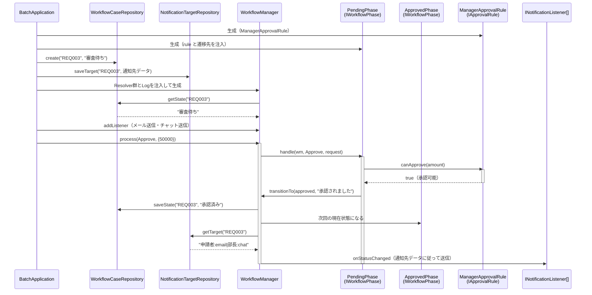
```mermaid
sequenceDiagram
    participant B as BatchApplication
    participant C as WorkflowCaseRepository
    participant N as NotificationTargetRepository
    participant WM as WorkflowManager
    participant P as PendingPhase<br/>(IWorkflowPhase)
    participant A as ApprovedPhase<br/>(IWorkflowPhase)
    participant R as ManagerApprovalRule<br/>(IApprovalRule)
    participant L as INotificationListener[]

    B->>R: 生成（ManagerApprovalRule）
    B->>P: 生成（rule と遷移先を注入）
    B->>C: create("REQ003", "審査待ち")
    B->>N: saveTarget("REQ003", 通知先データ)
    B->>WM: Resolver群とLogを注入して生成
    WM->>C: getState("REQ003")
    C-->>WM: "審査待ち"
    B->>WM: addListener（メール送信・チャット送信）
    B->>WM: process(Approve, {50000})
    activate WM
    WM->>P: handle(wm, Approve, request)
    activate P
    P->>R: canApprove(amount)
    activate R
    R-->>P: true（承認可能）
    deactivate R
    P->>WM: transitionTo(approved, "承認されました")
    WM->>C: saveState("REQ003", "承認済み")
    WM->>A: 次回の現在状態になる
    WM->>N: getTarget("REQ003")
    N-->>WM: "申請者:email|部長:chat"
    WM->>L: onStatusChanged（通知先データに従って送信）
    deactivate P
    deactivate WM
```

#### 完成コード

```cpp
#include <iostream>
#include <algorithm>
#include <map>
#include <stdexcept>
#include <string>
#include <vector>

using namespace std;

// 通知チャネル（判定で使う直文字列を名前へ置き換える）
namespace Channel {
    const string Email = "email";
    const string Chat  = "chat";
}

// 承認者情報
struct ApproverInfo {
    string name;         // 氏名
    string role;         // "manager", "director", "executive"
    int approvalLimit;   // 承認可能な申請金額上限（円）
};

// 承認者マスターデータ
class ApproverDatabase {
    map<string, ApproverInfo> records;
public:
    ApproverDatabase() {
        records["APR001"] = {"田中 課長",   "manager",   100000};
        records["APR002"] = {"佐藤 部長",   "director",  1000000};
        records["APR003"] = {"鈴木 代表",   "executive", 99999999};
    }

    bool exists(const string& id) const {
        return records.count(id) > 0;
    }

    ApproverInfo get(const string& id) const {
        return records.at(id);
    }

    void save(const string& id, const ApproverInfo& info) {
        records[id] = info;           // 実行中の承認者マスタへ追加
    }

};
```

`ApproverDatabase` は `BatchApplication` が唯一のインスタンスを保持し、承認者IDの存在確認と、ルールを組み立てるための承認者情報の取得に使います。実行時の承認可否は `IApprovalRule` だけが判定します。これにより、Applicationの事前判定とRuleに同じ上限値を持つ二重化を避けます。

承認ログ（`ApprovalLog`）はシステム起動時は空で、承認・却下・差し戻しが行われるたびに1件追記されます。ファイルへの保存は行わず、実行中のメモリ上にのみ保持します。

```cpp
struct ApprovalRecord {
    std::string approverId;    // "APR001", "APR002", "APR003"
    std::string approverName;  // "田中部長", "佐藤取締役", "鈴木代表"
    int amount;
    std::string decision;      // "承認", "却下", "差し戻し"
};

// 承認ログを管理するクラス
class ApprovalLog {
    std::vector<ApprovalRecord> records;
public:
    void add(const std::string& approverId, const std::string& approverName,
             int amount, const std::string& decision) {
        records.push_back({approverId, approverName, amount, decision});
    }
    void printAll() const {
        for (const auto& r : records) {
            std::cout << "[" << r.approverId << "] " << r.approverName
                      << " " << r.amount << "円 -> " << r.decision << std::endl;
        }
    }
    int size() const { return (int)records.size(); }
};
```

**コードで使う値の対応表**

この章のコードでは `#define` は使いませんが、列挙値、ID文字列、金額閾値、Phaseクラス名が仕様上の値として登場します。コードを読む前に、どの値が何を表すかを整理します。

| 種類 | コード上の値 | 仕様上の意味 | 使われる場所 |
|---|---|---|---|
| 申請ID | `REQ001` など | 1件の申請を識別するID | `WorkflowCaseRepository` が現在状態を保存・取得するキー |
| 承認者ID | `APR001` | 田中 課長。承認上限100,000円 | `ApproverDatabase` の存在確認・上限額チェック |
| 承認者ID | `APR002` | 佐藤 部長。承認上限1,000,000円 | 緊急申請や部長承認の正常ケース |
| 承認者ID | `APR999` | 登録されていない承認者ID | 未登録IDエラーの確認 |
| 金額閾値 | 承認者マスターの `approvalLimit` | 現行の役職別承認上限 | 組み立て時に役職別Ruleへ渡す唯一の値 |
| 金額閾値 | 部署別Ruleへ注入する設定値 | 来期の部署別承認上限 | `DepartmentApprovalRule` のインスタンスごとに保持 |
| イベント | `SubmitNormal` | 通常申請を提出する操作 | `DraftPhase` が審査待ちへ進める |
| イベント | `SubmitEmergency` | 緊急申請を提出する操作 | `DraftPhase` が優先審査待ちへ進める |
| イベント | `Approve` | 現在状態で承認する操作 | `PendingPhase` / `PriorityPendingPhase` が処理する |
| イベント | `Reject` | 現在状態で却下する操作 | `PendingPhase` が却下へ進める |
| イベント | `FinalApprove` | 承認済み申請を最終承認する操作 | `ApprovedPhase` が完了へ進める |
| Phase名 | `DraftPhase` | 作成中の状態 | Repositoryから現在状態として取得され、提出イベントを処理する |
| Phase名 | `PendingPhase` | 審査待ちの状態 | 課長承認・却下を処理する |
| Phase名 | `PriorityPendingPhase` | 緊急申請の優先審査待ち状態 | 緊急申請の承認を処理する |
| Phase名 | `ApprovedPhase` | 承認済みの状態 | 部長の最終承認を処理する |
| Phase名 | `RejectedPhase` | 却下状態 | この章の確定要求では後続遷移を持たない |
| Phase名 | `CompletedPhase` | 完了状態 | この章の仕様では後続遷移を持たない |
| 通知チャネル | `email` | メール通知として送る | `EmailNotifier` が処理する |
| 通知チャネル | `chat` | チャット通知として送る | `ChatNotifier` が処理する |

**1. インターフェース定義（3つの変化軸）**

```cpp

// 判定ルールの契約（変わる理由：経理ルール変更・部署別上限制度）
class IApprovalRule {
public:
    virtual bool canApprove(int amount) = 0;
    virtual string description() const = 0;
    virtual ~IApprovalRule() = default;
};

struct NotificationTarget {
    string recipientName; // "申請者", "課長", "部長", "決済部門"
    string channel;       // Channel::Email, Channel::Chat
};

// 通知の送信結果（結果オブジェクト）：送信可否と対象チャネル
struct DeliveryResult {
    bool success;
    string channel;
    string recipientName;
    string message;
};

struct WorkflowResult {
    bool stateChanged;
    string stateId;
    string message;
};

// 通知リスナーの契約（変わる理由：通知手段の追加）
class INotificationListener {
public:
    virtual bool supports(const string& channel) const = 0;
    virtual DeliveryResult onStatusChanged(
        const NotificationTarget& target,
        string msg
    ) = 0;
    virtual ~INotificationListener() = default;
};

enum class WorkflowEvent {
    SubmitNormal,
    SubmitEmergency,
    Approve,
    Reject,
    FinalApprove
};

struct ApprovalRequest {
    int amount;
};

// 状態遷移の契約（変わる理由：承認フロー変更・新ルート追加）
class IWorkflowPhase {
public:
    virtual string id() const = 0;
    virtual WorkflowResult handle(
        class WorkflowManager* wm,
        WorkflowEvent event,
        const ApprovalRequest& request
    ) = 0;
    virtual ~IWorkflowPhase() = default;
};
```

申請ごとの現在状態は、利用側が毎回指定するものではありません。実システムではDBに保存されている申請状態を読み込み、処理後に更新します。この章では `WorkflowCaseRepository` を境界スタブとして置き、申請IDと現在状態の対応をメモリ上に保持します。

```cpp
class WorkflowCaseRepository {
    map<string, string> states;
public:
    void create(const string& requestId, const string& initialStateId) {
        states[requestId] = initialStateId;
    }

    bool exists(const string& requestId) const {
        return states.count(requestId) > 0;
    }

    string getState(const string& requestId) const {
        auto it = states.find(requestId);
        if (it == states.end()) {
            throw invalid_argument("申請IDが存在しません: " + requestId);
        }
        return it->second;
    }

    void saveState(const string& requestId, const string& stateId) {
        states[requestId] = stateId;
    }
};

// 保存された状態IDを実行用のPhaseへ解決する。Repositoryは具象を知らない。
class WorkflowPhaseResolver {
    map<string, IWorkflowPhase*> phases;
public:
    void add(IWorkflowPhase* phase) {
        phases[phase->id()] = phase;
    }

    IWorkflowPhase* resolve(const string& stateId) const {
        auto it = phases.find(stateId);
        if (it == phases.end()) {
            throw invalid_argument("未登録の状態IDです: " + stateId);
        }
        return it->second;
    }
};
```

通知先も同じように、コードの呼び出し側が毎回手で選ぶものではありません。申請や状態に応じて「誰へ、どのチャネルで通知するか」をデータとして保持し、通知時に読み出します。この章では `NotificationTargetRepository` を境界スタブとして置きます。

```cpp
class NotificationTargetRepository {
    map<string, string> targets;
public:
    void saveTarget(const string& requestId, const string& targetData) {
        targets[requestId] = targetData;
    }

    string getTarget(const string& requestId) const {
        auto it = targets.find(requestId);
        if (it == targets.end()) {
            return "";
        }
        return it->second;
    }
};

// "宛先:channel|宛先:channel" を実行時の通知対象へ変換する。
class NotificationTargetResolver {
public:
    vector<NotificationTarget> resolve(const string& data) const {
        vector<NotificationTarget> result;
        size_t begin = 0;
        while (begin < data.size()) {
            size_t end = data.find('|', begin);
            string item = data.substr(
                begin, end == string::npos ? string::npos : end - begin);
            size_t separator = item.find(':');
            if (separator != string::npos) {
                result.push_back({
                    item.substr(0, separator),
                    item.substr(separator + 1)
                });
            }
            if (end == string::npos) break;
            begin = end + 1;
        }
        return result;
    }
};
```

**2. 承認判定ルールの具体実装（ルール差し替え構造）**

```cpp
// 役職別ルール：上限値は承認者マスターから組み立て時に受け取る
class ManagerApprovalRule : public IApprovalRule {
    int limit;
public:
    explicit ManagerApprovalRule(int approvalLimit) : limit(approvalLimit) {}
    bool canApprove(int amount) override {
        return amount <= limit;
    }
    string description() const override {
        return "課長上限" + to_string(limit) + "円";
    }
};

class DirectorApprovalRule : public IApprovalRule {
    int limit;
public:
    explicit DirectorApprovalRule(int approvalLimit) : limit(approvalLimit) {}
    bool canApprove(int amount) override {
        return amount <= limit;
    }
    string description() const override {
        return "部長上限" + to_string(limit) + "円";
    }
};

// 部署別承認ルール：部署ごとに設定した上限で判定する。
// 来期の「部署ごとに承認上限を差し替える」制度を、この1クラスの
// 差し替えで実現する（部署ごとに別インスタンスを注入する）。
class DepartmentApprovalRule : public IApprovalRule {
    string department;
    int limit;
public:
    DepartmentApprovalRule(const string& dept, int deptLimit)
        : department(dept), limit(deptLimit) {}
    bool canApprove(int amount) override {
        return amount <= limit;
    }
    string description() const override {
        return department + "上限" + to_string(limit) + "円";
    }
};
```

**3. 通知リスナーの具体実装（通知分離構造）**

```cpp
class EmailNotifier : public INotificationListener {
    vector<string> inbox;  // 送ったメールを実際に蓄積する
public:
    bool supports(const string& channel) const override {
        return channel == Channel::Email;
    }
    DeliveryResult onStatusChanged(
        const NotificationTarget& target,
        string msg
    ) override {
        inbox.push_back(msg);
        cout << "[メール送信 " << inbox.size() << "件目] To:"
             << target.recipientName << " / " << msg << endl;
        return {true, Channel::Email, target.recipientName, msg};
    }
};

class ChatNotifier : public INotificationListener {
    bool willFail;  // チャット基盤が不調の状況を再現する
    vector<string> inbox;  // 送れたチャットだけ蓄積する
public:
    ChatNotifier(bool fail = false) : willFail(fail) {}
    bool supports(const string& channel) const override {
        return channel == Channel::Chat;
    }
    DeliveryResult onStatusChanged(
        const NotificationTarget& target,
        string msg
    ) override {
        if (willFail) {
            return {false, Channel::Chat, target.recipientName, msg};
        }
        inbox.push_back(msg);
        cout << "[チャット通知 " << inbox.size() << "件目] To:"
             << target.recipientName << " / " << msg << endl;
        return {true, Channel::Chat, target.recipientName, msg};
    }
};

class NotificationDeliveryLog {
    vector<DeliveryResult> records;
public:
    void add(const DeliveryResult& result) {
        records.push_back(result);
    }
    int size() const {
        return static_cast<int>(records.size());
    }
    int failureCount() const {
        return static_cast<int>(count_if(
            records.begin(), records.end(),
            [](const DeliveryResult& r) { return !r.success; }));
    }
    void printFailures() const {
        for (const auto& r : records) {
            if (!r.success) {
                cout << "[通知失敗記録] To:" << r.recipientName
                     << " channel=" << r.channel
                     << " message=" << r.message << endl;
            }
        }
    }
};
```

各通知先が `supports()` で受け持つチャネルの判定は、`Channel` の名前付き定数（`Email`／`Chat`）で行い、直文字列の打ち間違いを防ぎます。

**4. 本体クラス（WorkflowManager）**

ワークフローを実行する本体クラスです。具体的な状態クラス・通知先・判定ルールを知らず、インターフェースだけを通じて処理を委譲します。

```cpp
class WorkflowManager {
    // 状態グラフとListenerはBatchApplicationが所有し、
    // WorkflowManagerより長く生存する
    WorkflowCaseRepository& cases;
    NotificationTargetRepository& notificationTargets;
    WorkflowPhaseResolver& phaseResolver;
    NotificationTargetResolver& targetResolver;
    NotificationDeliveryLog& deliveryLog;
    string requestId;
    IWorkflowPhase* phase = nullptr;  // 非所有
    vector<INotificationListener*> listeners;  // 非所有
public:
    WorkflowManager(
        WorkflowCaseRepository& cases,
        NotificationTargetRepository& notificationTargets,
        WorkflowPhaseResolver& phaseResolver,
        NotificationTargetResolver& targetResolver,
        NotificationDeliveryLog& deliveryLog,
        const string& requestId
    ) : cases(cases),
        notificationTargets(notificationTargets),
        phaseResolver(phaseResolver),
        targetResolver(targetResolver),
        deliveryLog(deliveryLog),
        requestId(requestId) {
        // 未登録の申請IDでは phase を nullptr のままにし、
        // process() 側の「現在状態がありません。」で穏当に扱う。
        if (cases.exists(requestId)) {
            phase = phaseResolver.resolve(cases.getState(requestId));
        }
    }

    void addListener(INotificationListener* listener) {
        if (!listener) return;
        if (find(listeners.begin(), listeners.end(), listener)
                == listeners.end()) {
            listeners.push_back(listener);
        }
    }

    void removeListener(INotificationListener* listener) {
        listeners.erase(
            remove(listeners.begin(), listeners.end(), listener),
            listeners.end());
    }

    WorkflowResult process(
        WorkflowEvent event,
        const ApprovalRequest& request = {0}
    ) {
        if (!phase) {
            return {false, "", "現在状態がありません。"};
        }
        return phase->handle(this, event, request);
    }

    WorkflowResult transitionTo(
        IWorkflowPhase* next,
        const string& message
    ) {
        if (!next) {
            throw invalid_argument("状態にnullは設定できません。");
        }
        phase = next;
        cases.saveState(requestId, phase->id());
        cout << "状態: " << phase->id() << endl;
        notifyAll(message);
        return {true, phase->id(), message};
    }

    WorkflowResult unchanged(const string& reason) const {
        cout << "状態変更なし: " << phase->id()
             << "（" << reason << "）" << endl;
        return {false, phase->id(), reason};
    }

    void notifyAll(const string& msg) {
        // 通知開始時点の送信手段と通知先データを使う
        auto snapshot = listeners;
        auto targets = targetResolver.resolve(
            notificationTargets.getTarget(requestId));
        for (const auto& target : targets) {
            for (auto* listener : snapshot) {
                if (listener->supports(target.channel)) {
                    DeliveryResult r =
                        listener->onStatusChanged(target, msg);
                    deliveryLog.add(r);
                    if (!r.success) {
                        // 状態保存は済んでおり巻き戻さない。
                        // 失敗した通知だけ記録し、他は続行する
                        cout << "[通知失敗] channel=" << r.channel
                             << "（状態は保持、他の通知は継続）"
                             << endl;
                    }
                }
            }
        }
    }
};
```

この例では、状態グラフ、申請状態Repository、通知先Repository、通知送信スタブを`BatchApplication`の中で組み立てます。利用側は現在状態も通知先も直接指定せず、申請IDを指定して処理を実行します。通知送信スタブを動的に破棄する実運用では、破棄前に`removeListener()`を呼ぶ契約が必要です。所有関係の設計については、チームのコーディング規約に従って判断してください。重複登録と`null`は`addListener()`で拒否し、通知中の登録変更に左右されないよう通知開始時点のスナップショットを使います。

`notifyAll()` は、状態保存（`transitionTo()` 内の `saveState()`）が済んだ後にだけ呼ばれます。状態が変わらない不正操作や承認不可では `unchanged()` が結果を返し、通知しません。掲載コードでは `onStatusChanged()` が送信可否を `DeliveryResult` で返し、全件を `NotificationDeliveryLog` に保存します。1件の送信が失敗しても、状態保存は巻き戻さず、失敗した通知だけを記録して残りの通知を続けます。

**5. 状態クラスの具体実装（状態分離構造 × ルール差し替え構造の組み合わせ）**

```cpp
class DraftPhase : public IWorkflowPhase {
    IWorkflowPhase* pending;
    IWorkflowPhase* priorityPending;
public:
    DraftPhase(IWorkflowPhase* p, IWorkflowPhase* pp)
        : pending(p), priorityPending(pp) {}
    string id() const override { return "作成中"; }
    WorkflowResult handle(
        WorkflowManager* wm,
        WorkflowEvent event,
        const ApprovalRequest&
    ) override {
        if (event == WorkflowEvent::SubmitNormal) {
            return wm->transitionTo(pending, "申請を受け付けました");
        } else if (event == WorkflowEvent::SubmitEmergency) {
            return wm->transitionTo(
                priorityPending, "緊急申請を受け付けました");
        }
        return wm->unchanged("現在状態では実行できない操作です");
    }
};

class PendingPhase : public IWorkflowPhase {
protected:
    IApprovalRule* rule;
    IWorkflowPhase* approved;
    IWorkflowPhase* rejected;
public:
    PendingPhase(
        IApprovalRule* r,
        IWorkflowPhase* a,
        IWorkflowPhase* reject
    ) : rule(r), approved(a), rejected(reject) {}

    string id() const override { return "審査待ち"; }

    WorkflowResult handle(
        WorkflowManager* wm,
        WorkflowEvent event,
        const ApprovalRequest& request
    ) override {
        if (event == WorkflowEvent::Approve) {
            if (rule->canApprove(request.amount)) {
                return wm->transitionTo(approved, "承認されました");
            } else {
                return wm->unchanged(
                    "承認不可: " + rule->description());
            }
        } else if (event == WorkflowEvent::Reject) {
            return wm->transitionTo(rejected, "申請が却下されました");
        }
        return wm->unchanged("現在状態では実行できない操作です");
    }
};

class PriorityPendingPhase : public PendingPhase {
public:
    using PendingPhase::PendingPhase;
    string id() const override { return "優先審査待ち"; }
};

class ApprovedPhase : public IWorkflowPhase {
    IApprovalRule* rule;
    IWorkflowPhase* completed;
public:
    ApprovedPhase(IApprovalRule* r, IWorkflowPhase* c)
        : rule(r), completed(c) {}
    string id() const override { return "承認済み"; }
    WorkflowResult handle(
        WorkflowManager* wm,
        WorkflowEvent event,
        const ApprovalRequest& request
    ) override {
        if (event == WorkflowEvent::FinalApprove) {
            if (rule->canApprove(request.amount)) {
                return wm->transitionTo(
                    completed, "部長承認が完了しました");
            } else {
                return wm->unchanged(
                    "承認不可: " + rule->description());
            }
        }
        return wm->unchanged("現在状態では実行できない操作です");
    }
};

class RejectedPhase : public IWorkflowPhase {
public:
    string id() const override { return "却下"; }
    WorkflowResult handle(
        WorkflowManager* wm,
        WorkflowEvent,
        const ApprovalRequest&
    ) override {
        return wm->unchanged("却下後の操作は本章の要求範囲外です");
    }
};

class CompletedPhase : public IWorkflowPhase {
public:
    string id() const override { return "完了"; }
    WorkflowResult handle(
        WorkflowManager* wm,
        WorkflowEvent,
        const ApprovalRequest&
    ) override {
        return wm->unchanged("完了状態からの遷移はありません");
    }
};
```

状態クラスは、単独で呼び出されるのではありません。`WorkflowManager` がRepositoryから現在状態として取得し、その状態オブジェクトの `handle()` を呼びます。各Phaseの使われ方は次の通りです。

| Phaseクラス | Repositoryに保存される状態 | 呼ばれるタイミング | 次に決めること |
|---|---|---|---|
| `DraftPhase` | 作成中 | 申請提出イベントを受けたとき | 通常なら審査待ち、緊急なら優先審査待ちへ進める |
| `PendingPhase` | 審査待ち | 課長承認または却下イベントを受けたとき | 承認済みに進めるか、却下へ進めるか |
| `PriorityPendingPhase` | 優先審査待ち | 緊急申請の部長承認イベントを受けたとき | 完了へ進めるか、却下へ進めるか |
| `ApprovedPhase` | 承認済み | 部長の最終承認イベントを受けたとき | 完了へ進めるか |
| `RejectedPhase` | 却下 | 却下済み申請に操作が来たとき | 状態を変えずエラー結果を返す |
| `CompletedPhase` | 完了 | 完了済み申請に操作が来たとき | この章の仕様では遷移しない |

**6. 組み立てと実行（BatchApplication と main）**

具体的なクラス名を知っているのは、この組み立てを行う箇所だけです。実行対象は7-1の完成コードで、確認したいのは外部から見える結果を保ちながら変更理由ごとの責任が分離されていることです。ここからは受入条件（行1〜行8）とエラー例ごとに、実行するコードとその実行結果を並べます。

まず承認者検証・承認ルール・通知先・状態グラフ・Repositoryを組み立て、行1（通常申請の提出）を実行します。

```cpp
class BatchApplication {
    ApproverDatabase db;

    // 承認者IDを検証し、問題があれば処理を中断する
    bool validateApprover(const string& id) {
        if (!db.exists(id)) {
            cout << "エラー：承認者ID " << id
                 << " はデータベースに存在しません。"
                 << endl;
            return false;
        }
        ApproverInfo info = db.get(id);
        if (info.name.empty() || info.role.empty()) {
            cout << "エラー：承認者 " << id
                 << " の氏名または役職が未設定です。" << endl;
            return false;
        }
        return true;
    }

public:
    void run() {
        ApprovalLog approvalLog;
        ManagerApprovalRule managerRule(
            db.get("APR001").approvalLimit);
        DirectorApprovalRule directorRule(
            db.get("APR002").approvalLimit);
        EmailNotifier email;
        ChatNotifier chat;

        // 状態グラフを一度組み立てる
        CompletedPhase completed;
        ApprovedPhase approved(&directorRule, &completed);
        RejectedPhase rejected;
        PendingPhase pending(&managerRule, &approved, &rejected);
        PriorityPendingPhase priorityPending(
            &directorRule, &completed, &rejected);
        DraftPhase draft(&pending, &priorityPending);
        WorkflowPhaseResolver phaseResolver;
        for (IWorkflowPhase* phase : vector<IWorkflowPhase*>{
                 &draft, &pending, &priorityPending,
                 &approved, &rejected, &completed}) {
            phaseResolver.add(phase);
        }
        WorkflowCaseRepository cases;
        NotificationTargetRepository notificationTargets;
        NotificationTargetResolver targetResolver;
        NotificationDeliveryLog deliveryLog;
        // 受入条件 行1：REQ001を作成中として登録し、通常申請を提出
        cout << "--- 行1: 通常申請書提出 ---" << endl;
        if (validateApprover("APR001")) {
            cases.create("REQ001", draft.id());
            notificationTargets.saveTarget(
                "REQ001", "課長:email");
            WorkflowManager wf1(
                cases, notificationTargets, phaseResolver,
                targetResolver, deliveryLog, "REQ001");
            wf1.addListener(&email);
            wf1.addListener(&chat);
            wf1.process(WorkflowEvent::SubmitNormal);
            approvalLog.add("APR001", "田中 課長", 50000, "承認");
        }
```

行1の実行結果：

```text
--- 行1: 通常申請書提出 ---
状態: 審査待ち
[メール送信 1件目] To:課長 / 申請を受け付けました
```

行2は、緊急申請の提出です。

```cpp
        // 受入条件 行2：REQ002を作成中として登録し、緊急申請を提出
        cout << "--- 行2: 緊急申請書提出 ---" << endl;
        if (validateApprover("APR002")) {
            cases.create("REQ002", draft.id());
            notificationTargets.saveTarget(
                "REQ002", "部長:chat");
            WorkflowManager wf2(
                cases, notificationTargets, phaseResolver,
                targetResolver, deliveryLog, "REQ002");
            wf2.addListener(&email);
            wf2.addListener(&chat);
            wf2.process(WorkflowEvent::SubmitEmergency);
            approvalLog.add("APR002", "佐藤 部長", 500000, "承認");
        }
```

行2の実行結果：

```text
--- 行2: 緊急申請書提出 ---
状態: 優先審査待ち
[チャット通知 1件目] To:部長 / 緊急申請を受け付けました
```

行3は、審査待ちからの課長承認です。

```cpp
        // 受入条件 行3：REQ003は審査待ちとして保存済み
        cout << "--- 行3: 審査待ち→課長承認操作 ---" << endl;
        if (validateApprover("APR001")) {
            cases.create("REQ003", pending.id());
            notificationTargets.saveTarget(
                "REQ003", "申請者:email|部長:chat");
            WorkflowManager wf3(
                cases, notificationTargets, phaseResolver,
                targetResolver, deliveryLog, "REQ003");
            wf3.addListener(&email);
            wf3.addListener(&chat);
            wf3.process(WorkflowEvent::Approve, {50000});
            approvalLog.add("APR001", "田中 課長", 50000, "承認");
        }
```

行3の実行結果：

```text
--- 行3: 審査待ち→課長承認操作 ---
状態: 承認済み
[メール送信 2件目] To:申請者 / 承認されました
[チャット通知 2件目] To:部長 / 承認されました
```

行4は、優先審査待ちからの部長承認です。

```cpp
        // 受入条件 行4：REQ004は優先審査待ちとして保存済み
        cout << "--- 行4: 優先審査待ち→部長承認操作 ---" << endl;
        if (validateApprover("APR002")) {
            cases.create("REQ004", priorityPending.id());
            notificationTargets.saveTarget(
                "REQ004", "申請者:email|部長:chat|決済部門:email");
            WorkflowManager wf4(
                cases, notificationTargets, phaseResolver,
                targetResolver, deliveryLog, "REQ004");
            wf4.addListener(&email);
            wf4.addListener(&chat);
            wf4.process(WorkflowEvent::Approve, {500000});
            approvalLog.add("APR002", "佐藤 部長", 500000, "承認");
        }
```

行4の実行結果：

```text
--- 行4: 優先審査待ち→部長承認操作 ---
状態: 完了
[メール送信 3件目] To:申請者 / 承認されました
[チャット通知 3件目] To:部長 / 承認されました
[メール送信 4件目] To:決済部門 / 承認されました
```

行5は、審査待ちからの却下です。

```cpp
        // 受入条件 行5：REQ005は審査待ちとして保存済み
        cout << "--- 行5: 審査待ち→却下操作 ---" << endl;
        if (validateApprover("APR001")) {
            cases.create("REQ005", pending.id());
            notificationTargets.saveTarget(
                "REQ005", "申請者:email");
            WorkflowManager wf5(
                cases, notificationTargets, phaseResolver,
                targetResolver, deliveryLog, "REQ005");
            wf5.addListener(&email);
            wf5.addListener(&chat);
            wf5.process(WorkflowEvent::Reject);
            approvalLog.add("APR001", "田中 課長", 50000, "却下");
        }
```

行5の実行結果：

```text
--- 行5: 審査待ち→却下操作 ---
状態: 却下
[メール送信 5件目] To:申請者 / 申請が却下されました
```

行6は、承認済みからの部長承認です。

```cpp
        // 受入条件 行6：REQ006は承認済みとして保存済み
        cout << "--- 行6: 承認済み→部長承認操作 ---" << endl;
        if (validateApprover("APR002")) {
            cases.create("REQ006", approved.id());
            notificationTargets.saveTarget(
                "REQ006",
                "申請者:email|課長:email|部長:chat|決済部門:email");
            WorkflowManager wf6(
                cases, notificationTargets, phaseResolver,
                targetResolver, deliveryLog, "REQ006");
            wf6.addListener(&email);
            wf6.addListener(&chat);
            wf6.process(WorkflowEvent::FinalApprove, {500000});
            approvalLog.add("APR002", "佐藤 部長", 500000, "承認");
        }
```

行6の実行結果：

```text
--- 行6: 承認済み→部長承認操作 ---
状態: 完了
[メール送信 6件目] To:申請者 / 部長承認が完了しました
[メール送信 7件目] To:課長 / 部長承認が完了しました
[チャット通知 4件目] To:部長 / 部長承認が完了しました
[メール送信 8件目] To:決済部門 / 部長承認が完了しました
```

行7は、通知失敗でも状態保存と他通知は継続です。

```cpp
        // 行7: チャット通知が失敗しても状態保存は保たれ、他は続く
        cout << "--- 行7: 通知失敗と状態保持 ---" << endl;
        cases.create("REQ007", draft.id());
        notificationTargets.saveTarget(
            "REQ007", "申請者:email|課長:chat");
        WorkflowManager wf7(
            cases, notificationTargets, phaseResolver,
            targetResolver, deliveryLog, "REQ007");
        ChatNotifier chatDown(true);   // チャット基盤が不調
        wf7.addListener(&email);
        wf7.addListener(&chatDown);
        WorkflowResult row7 =
            wf7.process(WorkflowEvent::SubmitNormal);
        cout << "[処理結果] changed=" << row7.stateChanged
             << ", state=" << row7.stateId
             << ", message=" << row7.message << endl;
```

行7の実行結果：

```text
--- 行7: 通知失敗と状態保持 ---
状態: 審査待ち
[メール送信 9件目] To:申請者 / 申請を受け付けました
[通知失敗] channel=chat（状態は保持、他の通知は継続）
[処理結果] changed=1, state=審査待ち, message=申請を受け付けました
```

行8は、来期の「部署ごとに承認上限を差し替える」制度を、判定ルール（課題ID3）の差し替えだけで確認します。同じ50万円に対し、開発部（上限30万円）は不承認、営業部（上限80万円）は承認となるため、部署設定が実際の結果へ使われたことをコードと出力で照合できます。

```cpp
        cout << "--- 行8: 部署別上限ルールの差 ---" << endl;
        DepartmentApprovalRule devRule("開発部", 300000);
        DepartmentApprovalRule salesRule("営業部", 800000);
        PendingPhase devPending(&devRule, &approved, &rejected);
        PendingPhase salesPending(&salesRule, &approved, &rejected);
        phaseResolver.add(&devPending);

        if (validateApprover("APR002")) {
            cases.create("REQ008", devPending.id());
            notificationTargets.saveTarget(
                "REQ008", "申請者:email");
            WorkflowManager devWorkflow(
                cases, notificationTargets, phaseResolver,
                targetResolver, deliveryLog, "REQ008");
            devWorkflow.addListener(&email);
            WorkflowResult devResult =
                devWorkflow.process(WorkflowEvent::Approve, {500000});
            cout << "[開発部] changed=" << devResult.stateChanged
                 << ", state=" << devResult.stateId
                 << ", message=" << devResult.message << endl;

            // 同じ状態IDの実行戦略を営業部用Ruleへ差し替える
            phaseResolver.add(&salesPending);
            cases.create("REQ009", salesPending.id());
            notificationTargets.saveTarget(
                "REQ009", "申請者:email");
            WorkflowManager salesWorkflow(
                cases, notificationTargets, phaseResolver,
                targetResolver, deliveryLog, "REQ009");
            salesWorkflow.addListener(&email);
            WorkflowResult salesResult =
                salesWorkflow.process(WorkflowEvent::Approve, {500000});
            cout << "[営業部] changed=" << salesResult.stateChanged
                 << ", state=" << salesResult.stateId
                 << ", message=" << salesResult.message << endl;
            approvalLog.add(
                "APR002", "佐藤 部長", 500000, "部署別判定を確認");
        }
```

行8の実行結果：

```text
--- 行8: 部署別上限ルールの差 ---
状態変更なし: 審査待ち（承認不可: 開発部上限300000円）
[開発部] changed=0, state=審査待ち, message=承認不可: 開発部上限300000円
状態: 承認済み
[メール送信 10件目] To:申請者 / 承認されました
[営業部] changed=1, state=承認済み, message=承認されました
```

開発部では状態も通知回数も変わらず、営業部では同じ操作が承認済みへ進みます。承認不可を通知イベントとして扱わず、`WorkflowResult` で呼び出し元へ返すため、「状態が変わったときだけ通知する」という契約も崩れません。

エラー例は、存在しない承認者IDと、承認不可です。IDの存在確認はApplication、金額による承認可否は注入済みRuleが一度だけ判定します。

```cpp
        // エラーケース：存在しないID
        cout << "--- エラー例1: 不正な承認者ID ---" << endl;
        validateApprover("APR999");

        // エラーケース：課長Ruleの上限超過。状態も通知も変えない
        cout << "--- エラー例2: 承認上限超過 ---" << endl;
        cases.create("REQ010", pending.id());
        notificationTargets.saveTarget("REQ010", "申請者:email");
        phaseResolver.add(&pending);
        WorkflowManager invalidApproval(
            cases, notificationTargets, phaseResolver,
            targetResolver, deliveryLog, "REQ010");
        invalidApproval.addListener(&email);
        WorkflowResult invalidResult =
            invalidApproval.process(WorkflowEvent::Approve, {200000});
        cout << "[処理結果] changed=" << invalidResult.stateChanged
             << ", state=" << invalidResult.stateId
             << ", message=" << invalidResult.message << endl;
        cout << "[通知記録] total=" << deliveryLog.size()
             << ", failed=" << deliveryLog.failureCount() << endl;
        deliveryLog.printFailures();
```

エラー例の実行結果：

```text
--- エラー例1: 不正な承認者ID ---
エラー：承認者ID APR999 はデータベースに存在しません。
--- エラー例2: 承認上限超過 ---
状態変更なし: 審査待ち（承認不可: 課長上限100000円）
[処理結果] changed=0, state=審査待ち, message=承認不可: 課長上限100000円
[通知記録] total=15, failed=1
[通知失敗記録] To:課長 channel=chat message=申請を受け付けました
```

最後に承認ログを出力し、`main()` から実行します。

```cpp
        cout << "\n--- 承認ログ（" << approvalLog.size()
             << "件） ---\n";
        approvalLog.printAll();
    }
};

int main() {
    BatchApplication app;
    app.run();
    return 0;
}
```

承認ログの実行結果：

```text
--- 承認ログ（7件） ---
[APR001] 田中 課長 50000円 -> 承認
[APR002] 佐藤 部長 500000円 -> 承認
[APR001] 田中 課長 50000円 -> 承認
[APR002] 佐藤 部長 500000円 -> 承認
[APR001] 田中 課長 50000円 -> 却下
[APR002] 佐藤 部長 500000円 -> 承認
[APR002] 佐藤 部長 500000円 -> 部署別判定を確認
```

変更後の受入条件6行と同じ順序で、通常申請は課長承認を経由し、緊急申請は課長を飛ばして部長承認で完了することを確認できます。`ManagerApprovalRule`と`DirectorApprovalRule`の上限は承認者マスターから一度だけ組み立て時に渡されます。行8では、開発部と営業部へ異なる `DepartmentApprovalRule` を注入し、同額の申請で結果が変わることを確認できます。エラーケースでは、未登録IDは処理前に中断し、承認不可は状態・通知を変えず `WorkflowResult` を返します。
`WorkflowManager` はRepositoryから状態ID文字列と通知先データ文字列を読み、Resolverで実行用オブジェクトへ変換します。Repositoryの保存表現は変更前と同じです。状態実装は許可するイベントを処理し、`transitionTo()` を通じてRepository上の状態IDを更新します。通知結果は成功・失敗とも `NotificationDeliveryLog` に残ります。


#### 最終要求の実装・受入エビデンス

変更後要求ベースラインの全有効要求IDを同じ順序で照合します。今回変わらなかった既存要求も対象にするため、要求の消失を検出できます。

| 要求ID | 最終要求 | 適用コード | 実行シナリオ・観測結果・判定 |
|---|---|---|---|
| 要求ID1 | 通常申請は課長→部長、緊急申請は部長へ直接進める | 各`IWorkflowPhase`、`WorkflowPhaseResolver` | 通常2回・緊急1回で完了<br/>**判定:** 合格 |
| 要求ID2 | 許可された役職・順序の承認だけ状態を進める | 各Phase、`ApproverDatabase` | 権限不一致で状態不変<br/>**判定:** 合格 |
| 要求ID3 | 部署・役職ごとの承認上限で可否を判定する | 各`IApprovalRule` | 同額で部署により結果が変化<br/>**判定:** 合格 |
| 要求ID4 | 申請状態と通知先データを既存形式で保存・取得する | 両RepositoryとResolver | 変更前後で状態・通知先の保存表現不変<br/>**判定:** 合格 |
| 要求ID5 | 未登録申請・許可されない操作を拒否する | `WorkflowManager`、各Phase | エラー時に状態・通知件数不変<br/>**判定:** 合格 |
| 要求ID6 | 部長承認後に決済部門、却下時に申請者へ通知する | 各`INotificationListener`、配送ログ | 状態保存後に該当通知、個別結果を記録<br/>**判定:** 合格 |

上の表は継続（要求ID4・要求ID5）・変更（要求ID1・要求ID2・要求ID3）・追加（要求ID6）を同じ順序で並べ、変わらなかった既存要求も回帰対象に含めています。継続要求が合格していることで、既存動作が落ちていないことを確認できます。要求の受入・回帰はここで完了します。課題IDへ直接対応付けず、以下では変更試行の痛みから導いた構造課題だけを別に確認します。

#### 設計課題の構造改善結果

要求の受入とは分けて、課題IDごとに構造と変更影響を確認します。

| 課題ID | 構造差分・コード適用先 | 確認できた効果 | 残る変更先 |
|---|---|---|---|
| 課題ID1 | 状態動作を`IWorkflowPhase`へ分離 | 通常・緊急経路追加がPhaseとResolver登録に閉じた | 新Phaseと遷移接続 |
| 課題ID2 | 通知を`INotificationListener`へ分離し全結果を保存 | 1件失敗が状態保存と他通知へ波及しない | 新Listenerと通知先データ |
| 課題ID3 | 承認可否を`IApprovalRule`へ分離 | 部署上限変更がRule設定に閉じた | 部署別Rule設定 |
#### 変更前→変更後の不変条件照合

| 変更対象外 | 変更前 | 変更後 | 確認根拠 |
|---|---|---|---|
| 申請状態の保存表現 | 申請ID→状態文字列 | 同じ状態ID文字列を保存 | `getState()`／`saveState()` と実行結果 |
| 通知先の保存表現 | 申請ID→通知先データ文字列 | 同じ文字列をRepositoryが保持 | `getTarget()` とResolverの分離 |
| 承認者マスター | ID・氏名・役職・上限を保存 | 同じ情報を取得し、Rule組み立てに利用 | 未登録IDと上限判定ケース |

### 7-2：動作シーケンス図の検証

完成クラス図と実行シーケンスは、完成コードへ入る前に示しました。ここまでのコード、要求追跡表、不変条件照合を証拠として、次節で変更影響を再確認します。

### 7-3：変更影響グラフ（改善後）

フェーズ3で確認した「変更要求：状態・遷移の追加」「新通知先追加」「部署別承認上限」のシナリオを、3-2と同じ粒度で再度適用します。

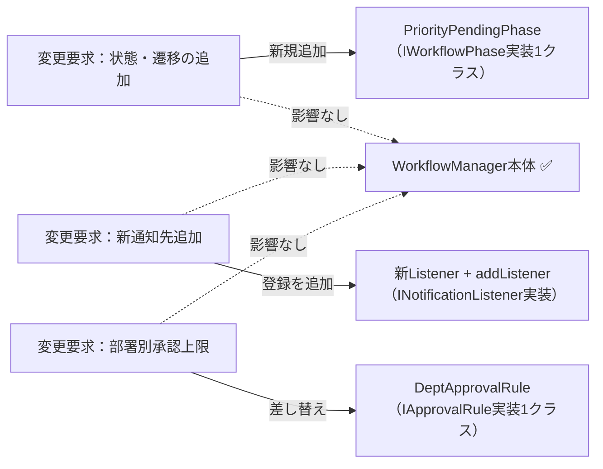
```mermaid
graph LR
    T1["変更要求：状態・遷移の追加"]
        -->|新規追加| N1["PriorityPendingPhase<br>（IWorkflowPhase実装1クラス）"]
    T2["変更要求：新通知先追加"]
        -->|登録を追加| N2["新Listener + addListener<br>（INotificationListener実装）"]
    T3["変更要求：部署別承認上限"]
        -->|差し替え| N3["DeptApprovalRule<br>（IApprovalRule実装1クラス）"]
    T1 -. "影響なし" .-> A["WorkflowManager本体 ✅"]
    T2 -. "影響なし" .-> A
    T3 -. "影響なし" .-> A
```

フェーズ3の変更影響グラフと同じ要求・同じ粒度で比べると、課題ID1の状態追加は `IWorkflowPhase` の実装1クラスへ、課題ID2の通知先追加は `INotificationListener` の実装と登録へ、課題ID3の承認上限変更は `IApprovalRule` の実装1クラスへ限定されました。`WorkflowManager` は3つの契約を別々に保持するため、どの軸の変更も他軸へ飛び火しません。

| 3-2で影響した場所 | 修正後 | 構造変更との対応 |
|---|---|---|
| `process()` の状態遷移分岐（課題ID1） | **修正しない** | 遷移判断を状態分離構造へ移した |
| `process()` の通知直呼び（課題ID2） | Listener追加と `addListener` 1行 | 通知を通知分離構造へ移した |
| `process()` の金額・承認者判定（課題ID3） | Ruleを1クラス差し替える | 判定をルール差し替え構造へ移した |

### 7-4：変更シナリオ表

今回の変更ID1〜変更ID3について、フェーズ1の構造で必要だった修正と完成構造の結果を対比します。

| 変更依頼 | フェーズ1の現状構造での影響 | 完成構造での結果 |
|---|---|---|
| 変更ID1：通常申請を課長→部長の2段階、緊急申請を部長へ直接進む経路にする | `WorkflowManager`へ申請種別・役職・状態遷移の分岐を追加 | Phaseへ遷移判断を分け、通常は2回、緊急は部長の1回で完了し、不正役職では状態を変えないことを確認 |
| 変更ID2：部長承認後は決済部門へ、却下時は申請者へ通知する | 完了・却下分岐へ通知先取得と送信処理を追加 | 状態保存後にRepositoryから対象を取得し、決済部門または申請者だけへ通知した結果を返す |
| 変更ID3：承認上限を部署ごとに差し替える | `WorkflowManager`の金額判定へ部署分岐を追加 | 部署別`IApprovalRule`を注入し、同額でも部署設定に応じて判定結果が変わることを確認 |

---

## 整理

### 問題・原因・課題・解決策

| | 内容 |
|---|---|
| **問題** | 承認ワークフローシステムで「状態遷移のルール」「通知の仕組み」「承認判定ロジック」という変わる理由の異なる3つのものが、1つのクラスに混在している |
| **原因** | `WorkflowManager`が状態・通知・判定の知識をすべて抱え込み、異なる変更理由が同じクラスへ集まっている |
| **課題** | 「状態遷移のルール」「通知先の管理」「承認判定ロジック」という3つの変化軸を、それぞれ独立して差し替え可能な部品として `WorkflowManager` の外に切り出すこと |
| **解決策** | 状態分離構造 × 通知分離構造 × ルール差し替え構造：状態ごとの振る舞いのオブジェクト化（状態分離構造）・状態変化の登録リスナーへの伝搬（通知分離構造）・判定ルールの外部差し替え（ルール差し替え構造）を組み合わせ、各変化軸の変更が `WorkflowManager` 本体に波及しない構造にした |

### フェーズとこの章でやったこと

| **フェーズ** | **この章でやったこと** |
| --- | --- |
| 🔵 フェーズ1：現状把握 | 背景・現状の動作例・現行コードをクラス単位で読み、`WorkflowManager` が状態遷移・通知・承認額チェックをまとめて扱っている事実を把握した |
| 🟣 フェーズ2：仮説立案 | 業務機能の所在表と変わる理由の分析で3つの変化軸を確認した。今回の確定変更とヒアリングで判明した将来リスクを分けて整理した |
| 🟣 フェーズ3：問題特定 | 緊急ルート追加を試み、影響が全体に波及する「通知の二重送信バグ」が発生することを確認した |
| 🟠 フェーズ4：原因分析 | 変わる理由が異なる3つのもの（状態遷移・通知・判定）が同じ場所にいることが痛みの根本と特定した |
| 🟡 フェーズ5：課題定義 | 3つの変化軸を独立して差し替え可能な部品として分離することを課題として定義した |
| 🔴 フェーズ6：対策検討 | 課題ID1〜課題ID3を同時に満たす3構造統合（状態分離構造＋通知分離構造＋ルール差し替え構造）を先に確定し、責任単位で3段階に分けてコードへ反映した |
| 🟢 フェーズ7：対策実施 | 最終コードを実装し、変更影響グラフで変更の局所化を確認した |

### 使った構造 × 解消した根本原因

| 構造 | 解消した根本原因 |
|---|---|
| 状態分離構造 | 状態遷移の混在（WorkflowManagerに状態ごとの分岐が詰まっていた問題）|
| 通知分離構造 | 通知の密結合（通知先追加のたびWorkflowManager本体の修正が必要だった問題）|
| ルール差し替え構造 | 判定ルールの混在（承認判定ロジックが状態クラスに直接書かれていた問題）|

### 責任の移動

| **クラス名** | **責任（1文）** | **変わる理由** |
| --- | --- | --- |
| `WorkflowManager` | 承認ワークフローの実行フローを統括する | 承認プロセスの基本骨格が変わる場合 |
| `ApproverDatabase` | 承認者マスターデータを保持し、IDと権限額を検証する | 承認者情報・権限制度が変わる場合 |
| `IWorkflowPhase` | 現在の承認状態に応じた振る舞いを管理する | 承認の状態遷移ルールが変わる場合 |
| `IApprovalRule` | 承認の可否判定ロジックを管理する | 金額や役職による判定ルールが変わる場合 |
| `INotificationListener` | 承認結果に基づいた通知を実行する | 通知先や通知要件が変わる場合 |

### 複雑さを足しても対策は変わるか

現状仕様へ重ねた複雑さが、原因・課題を経て、状態・通知・判定ルールという3つの独立した軸へ収まったことを確認します。追加した複雑さが1つのクラスへ再集約されず、それぞれ別の変化軸として扱えたことが、この章の設計判断の裏付けです。

| 追加した複雑さ | 見えた原因 | 定めた課題 | 採用構造（3軸独立） |
|---|---|---|---|
| 申請イベント | 状態ごとの操作可否が本体に集まる | 状態ごとに受け付けるイベントと次状態を分ける | `IWorkflowPhase` が状態ごとに `handle()` で受ける |
| 状態保存 | 利用側が状態を持つと本体に分岐が増える | 保存済み状態で振る舞いを決める | `WorkflowCaseRepository` が現在状態を読み書きする |
| 通知処理の分離 | 通知の副作用が状態遷移と同居する | 状態保存後の通知を遷移処理から切り離す | 通知先データを読み、登録リスナーへ渡して成否を個別に受け取る |
| 承認ルール差し替え | 判定条件が状態処理へ直書きされる | 承認ルールを状態と別軸で差し替える | `IApprovalRule` を状態へ注入する |
| 通知失敗 | 送信可否の分岐が状態遷移へ染み出す | 失敗を状態保存や他の通知から切り離す | 送信の成否を通知側で扱い、状態保存を保つ |

---

## 振り返り

### 「この章を読むと得られること」は手に入ったか

| **得られること** | **この章のどこで示したか** |
| --- | --- |
| 1. 変動箇所の識別 | フェーズ2の業務機能の所在表と変わる理由の分析で、変更理由の種類（状態・通知・判定）を識別した |
| 2. 接続点の診断 | フェーズ4で、状態・通知・判定の知識が同じクラスへ集まる3つの原因を特定した |
| 3. 複合設計の説明 | フェーズ5で三軸を先に確定し、フェーズ6で全課題IDを満たす責任配置を一度に決めた根拠を示した |
| 4. 変更影響の局所化 | フェーズ7の変更シナリオ表で、変更の中心が新しい実装クラスへ移る構造を示した |

### 第0章の3つの設計原則はどう適用されたか

**原則1「変わるものをカプセル化せよ」の現れ**

- 具体化された場所：各状態実装クラス（`DraftPhase`、`PendingPhase` 等）、判定ルール実装クラス（`ManagerApprovalRule` 等）、通知先データ（`NotificationTargetRepository`）と通知送信スタブ（`EmailNotifier` 等）
- 解説：変化の理由が異なる「状態遷移」「判定ルール」「通知」を個別のクラスにカプセル化しました。既存のインターフェースで表現できる承認ルートや通知先であれば、実装クラスと組み立て箇所を中心に変更できます。

**原則2「実装ではなくインターフェースに対してプログラムせよ」の現れ**

- 具体化された場所：`IWorkflowPhase`、`IApprovalRule`、`INotificationListener`
- 解説：`WorkflowManager` は具体的なルールや遷移先を知らず、インターフェース経由で処理を委譲するようにしました。

**原則3「継承よりコンポジションを優先せよ」の現れ**

- 具体化された場所：`WorkflowManager` が現在状態と通知先データをRepositoryから読み、通知送信スタブへ委譲する構成、`PendingPhase` が `IApprovalRule` と遷移先をコンストラクタで受け取る構成
- 解説：承認ルールを継承による拡張ではなく、コンポジション（保持・委譲）による差し替え可能な構成にしました。

---

## あなたのコードで考えてみてください

この章で辿った思考プロセスを、あなた自身のコードに当てはめてみましょう。

1. **複雑さの核心を探す：** あなたのコードに「現在の状態によって処理が変わり、かつ状態が変わったときに他のクラスへの通知が必要で、さらにどの処理をするかのルールも変わる」箇所がありますか？
2. **肥大化のサインを確認する：** その処理をすべて一か所にまとめているクラスがあるとしたら、そのクラスのコード行数と `if` ブロックの数はどのくらいですか？
3. **変更の交差点を測る：** 「新しい状態の追加」「新しい通知先の追加」「新しいビジネスルールの追加」という3種類の変更は、今の構造では同じファイルを変更しますか？それとも別々のファイルで済みますか？
4. **分けた後のシンプルさを想像する：** 3つの責任（状態遷移・通知・ルール判定）を別々のクラスに切り出したとき、それぞれを独立してテストできるようになりますか？

---

**題材を置き換えるときの共通手順**

この章の題材名を、自分の現場のシステム名に置き換えて考えます。

1. そのシステムは、誰が何を達成するために使うものか。
2. 入力、加工、出力は何か。
3. 最近入った変更要求、または次に来そうな変更要求は何か。
4. その変更で、触りたくない場所まで修正や再テストが広がるか。
5. 変えたいものと守りたいものを分けると、接続点には何を残すべきか。
6. 全課題を満たす完成構造が複数成立するか。成立するなら、責任配置・変更影響・導入コストの差は何か。

## パターン解説：複合適用

今回は単一の構造ではなく、3つのパターンを組み合わせて解決しました。

### 仕組みの骨格

```mermaid
classDiagram
    class Phase { <<状態管理>> }
    class Listener { <<通知>> }
    class Rule { <<判定ルール>> }
    Phase ..> Rule : 承認可否を確認する
    Phase --> Context : 遷移を依頼する
    Context --> Listener : 保存後に通知する
```

状態管理の仕組みが「今の状態での振る舞い」を整理し、判定ルールの仕組みが「承認の可否」を判定し、通知の仕組みが「変更の伝搬」を担うことで、複雑なワークフローを整理しています。

### 抽象骨格の実行シーケンス

```mermaid
sequenceDiagram
    participant C as Client
    participant X as Context
    participant S as State
    participant R as Strategy
    participant O as Observer
    C->>X: event(request)
    X->>S: handle(Context, request)
    S->>R: canApprove(request)
    R-->>S: 判定結果
    S->>X: transition(next)
    X->>O: update(status)
    X-->>C: 更新結果
```

状態固有処理、承認判定、通知を別の契約へ分け、Contextはそれらを実行順に接続します。

### この章の実装との対応

```mermaid
classDiagram
    class WorkflowManager {
        -IWorkflowPhase* phase
        -INotificationListener[] listeners
        +process(event, request)
        +transitionTo(next, message)
        +notifyAll(msg)
    }
    class IWorkflowPhase {
        <<Phase>>
        +name()*
        +handle(WorkflowManager*, event, request)*
    }
    class IApprovalRule {
        <<Rule>>
        +canApprove(double)*
    }
    class INotificationListener {
        <<Listener>>
        +onStatusChanged(string)*
    }
    WorkflowManager --> IWorkflowPhase : phase
    WorkflowManager --> INotificationListener : listeners
    IWorkflowPhase ..> IApprovalRule : 判定委譲
```

| GoFの名前 | この章での対応 |
|---|---|
| State / Context | `WorkflowManager` |
| State / ConcreteState | `DraftPhase` / `PendingPhase` / `PriorityPendingPhase` / `ApprovedPhase` / `RejectedPhase` / `CompletedPhase` |
| Observer / Subject | `WorkflowManager`（`notifyAll` を担う）|
| Observer / Observer | `INotificationListener`（`EmailNotifier` 等の通知送信スタブ）|
| Strategy / Context | `PendingPhase` / `PriorityPendingPhase`（`IApprovalRule` を使う）|
| Strategy / Strategy | `IApprovalRule`（`ManagerApprovalRule` 等）|

### 使いどころと限界

- **使いどころ**：状態遷移が複雑で、さらに通知先や判定ロジックが頻繁に変わるような大規模な業務ワークフロー。

- **限界**：3つのパターンを組み合わせるため、単純なフローであれば過剰設計となります。

【過剰コード：単純なフローへの適用例】

「申請中 → 承認済み」の2状態しかなく、判定ルールも「上長が承認ボタンを押したら確定」だけのシンプルなフローに、State・Observer・Strategyをすべて適用しようとした例です。

```cpp
// 2状態・固定ルール・通知先1件のフローに
// 3つの仕組みを持ち込んだ過剰設計
class IWorkflowPhase { /* ... */ };
class IApprovalRule { /* ... */ };
class INotificationListener { /* ... */ };

// インターフェースが3枚、実装クラスが6枚——
// 変わらないルールのために構造だけが膨れ上がる

// このケースは if 文で十分
class SimpleApproval {
public:
    void approve() {
        if (status == "審査待ち") {
            status = "承認済み";
            sendMail();  // 通知先は固定で1件だけ
        }
    }
private:
    string status;
    void sendMail() { /* メール送信 */ }
};
```

これらの仕組みが威力を発揮するのは、「状態の数が増える」「通知先が変わる」「判定ルールが差し替わる」という変化軸が**実際に複数存在するとき**です。その変化軸が見えないうちはシンプルな実装を選んでください。

### この章のまとめ

承認ワークフローというドメインと State × Observer × Strategy の組み合わせの関係を一言で言うなら、状態・通知・判定という3つの変化軸が1クラスに同居すると、どの変更でも同じクラス全体への影響確認が必要になる、ということです。分離後は、状態クラス、通知リスナー、判定ルールと、それらを結び付ける組み立て箇所へ変更対象を分けられます。この章で最も重要なのは、三つのパターンを最初から選んだのではなく、問題を分析して必要な境界を作った結果が、それぞれのパターンの役割に対応したという順序です。

7つのフェーズを通じて、読者は `WorkflowManager` が状態遷移・通知・判定のすべてを直書きしているという観察から始まり、3つの変化軸が独立していることの確認を経て、軸ごとに異なるパターンを当てるという判断へと進みました。フェーズ6で「1つのパターンでは解決しきれない」と気づくたびに次の軸の分析へ進む——その繰り返しの中に、パターン選択の本質的なプロセスがあります。この章の体験が、12章を通じた思考の型の集大成になっていると思っています。

あなたの現場のコードの中にも、修正のたびに「他の部分への影響を確認しなければ」という不安が生じる箇所があるはずです。「変わる理由が何種類あるか、それぞれ誰の判断か」を問うことが、その不安の根本を解消する入口になります。
