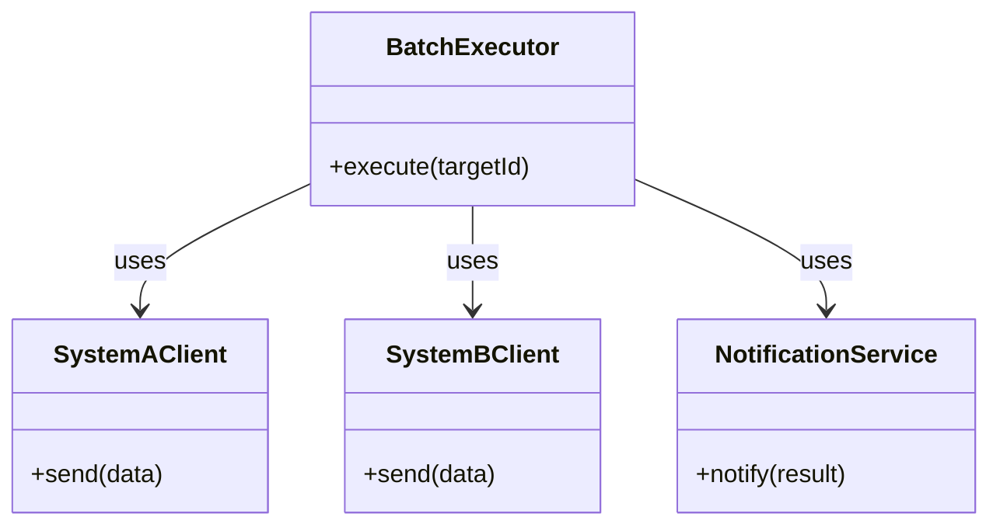
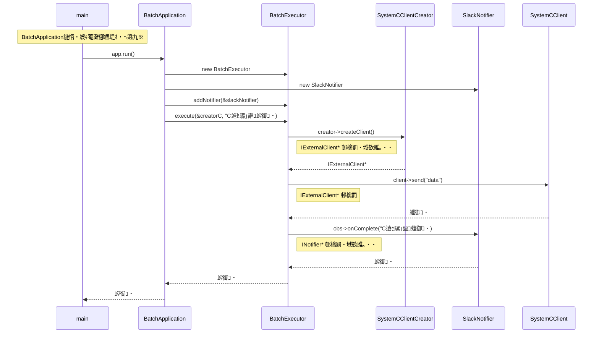
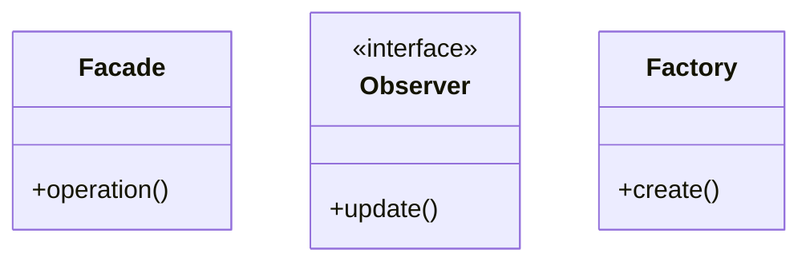

## 隨ｬ10遶 螟夜Κ騾｣謳ｺ繝舌ャ繝√す繧ｹ繝・Β 窶補€・Facade ﾃ・Observer ﾃ・Factory Method 繝代ち繝ｼ繝ｳ

窶補€・諤晁€・・蝙具ｼ夊､・焚縺ｮ縲悟､峨ｏ繧狗炊逕ｱ縲阪′隍・尅縺ｫ邨｡縺ｿ蜷医≧繧ｷ繧ｹ繝・Β繧偵←縺・ｧ｣縺上°

### 縺薙・遶縺ｮ譬ｸ蠢・

**螟夜Κ繧ｷ繧ｹ繝・Β縺ｨ縺ｮ騾｣謳ｺ縺悟ｿ・ｦ√↑繝舌ャ繝∝・逅・↓縺翫＞縺ｦ縲√す繧ｹ繝・Β髢薙・繧､繝ｳ繧ｿ繝ｼ繝輔ぉ繝ｼ繧ｹ邂｡逅・€・撼蜷梧悄逧・↑繧､繝吶Φ繝磯€夂衍縲√◎縺励※謗･邯壼・逕滓・縺ｮ雋ｬ莉ｻ繧貞€句挨縺ｮ繧ｯ繝ｩ繧ｹ縺梧戟縺｡邯壹￠繧九→縲∝､画峩隕∵ｱゅ・縺溘・縺ｫ繧ｷ繧ｹ繝・Β蜈ｨ菴薙′荳榊ｮ牙ｮ壹↓縺ｪ繧九€・*

### 縺薙・遶繧定ｪｭ繧€縺ｨ蠕励ｉ繧後ｋ縺薙→

* **蠕励ｉ繧後ｋ縺薙→1・・* Facade縲＾bserver縲：actory Method 縺ｮ蜷・ヱ繧ｿ繝ｼ繝ｳ縺後€√す繧ｹ繝・Β縺ｮ縺ｩ縺ｮ縲悟､牙喧縲阪↓蟇ｾ蠢懊☆繧九◆繧√↓縺ゅｋ縺ｮ縺九ｒ隴伜挨縺ｧ縺阪ｋ繧医≧縺ｫ縺ｪ繧九€・

* **蠕励ｉ繧後ｋ縺薙→2・・* 隍・焚縺ｮ謗･邯夂せ・医け繝ｩ繧ｹ縺ｨ繧ｯ繝ｩ繧ｹ縺ｮ縺､縺ｪ縺守岼・峨′邨｡縺ｿ蜷医≧隍・尅縺ｪ繧ｷ繧ｹ繝・Β縺ｫ縺翫＞縺ｦ縲√◎繧後◇繧後・雋ｬ蜍吶ｒ縺ｩ縺薙〒蛻・屬縺吶ｋ蠢・ｦ√′縺ゅｋ縺句愛譁ｭ縺ｧ縺阪ｋ繧医≧縺ｫ縺ｪ繧九€・

* **蠕励ｉ繧後ｋ縺薙→3・・* 繝代ち繝ｼ繝ｳ縺ｮ隍・粋驕ｩ逕ｨ繧帝€壹§縺ｦ縲∫鮪邨仙粋・医け繝ｩ繧ｹ髢薙・萓晏ｭ倥ｒ蠑ｱ繧√€∝､画峩縺ｮ蠖ｱ髻ｿ縺悟ｺ・′繧翫↓縺上＞迥ｶ諷具ｼ峨↑騾｣謳ｺ繧｢繝ｼ繧ｭ繝・け繝√Ε繧呈ｧ狗ｯ峨☆繧区婿豕輔ｒ隱ｬ譏弱〒縺阪ｋ繧医≧縺ｫ縺ｪ繧九€・

* **蠕励ｉ繧後ｋ縺薙→4・・* 縲檎函謌舌€阪→縲碁€夂衍縲阪→縲後う繝ｳ繧ｿ繝ｼ繝輔ぉ繝ｼ繧ｹ邨ｱ蜷医€阪→縺・≧縲∫焚縺ｪ繧・縺､縺ｮ雋ｬ蜍吶′豺ｷ蝨ｨ縺吶ｋ繧ｳ繝ｼ繝峨ｒ謨ｴ逅・☆繧玖ｦ也せ縲・

---

## 鳩 繝輔ぉ繝ｼ繧ｺ1・夂樟迥ｶ謚頑升 窶補€・莉墓ｧ倥ｒ謨ｴ逅・＠縲√す繧ｹ繝・Β縺ｨ邏蝉ｻ倥￠繧・

### 1-1・壹％縺ｮ繧ｷ繧ｹ繝・Β縺ｮ莉墓ｧ・

縺薙・繧ｷ繧ｹ繝・Β縺ｯ縲∫､ｾ蜀・・荳ｻ隕√す繧ｹ繝・Β縺ｨ螟夜Κ縺ｮ迚ｩ豬∫ｮ｡逅・す繧ｹ繝・Β繧堤ｹ九＄縲悟､夜Κ騾｣謳ｺ繝舌ャ繝√す繧ｹ繝・Β縲阪〒縺吶€よ律縲・・豕ｨ譁・ョ繝ｼ繧ｿ繧・惠蠎ｫ諠・ｱ繧貞､夜Κ繧ｷ繧ｹ繝・Β縺ｸ蜷梧悄縺吶ｋ蠖ｹ蜑ｲ繧呈球縺｣縺ｦ縺翫ｊ縲・€｣謳ｺ蜈医′蠅励∴繧九◆縺ｳ縺ｫ繝舌ャ繝∝・逅・・隕乗ｨ｡繧よ僑螟ｧ縺励※縺阪∪縺励◆縲・

蠖灘・縺ｯ蜊倅ｸ€縺ｮ螟夜Κ騾｣謳ｺ蜈医↓蟇ｾ縺励※繝・・繧ｿ繧定ｻ｢騾√☆繧九□縺代・繧ｷ繝ｳ繝励Ν縺ｪ讒区・縺ｧ縺励◆縺後€∫樟蝨ｨ縺ｯ騾｣謳ｺ蜈医′3遉ｾ縺ｫ蠅励∴縲√◎繧後◇繧後′迢ｬ閾ｪ縺ｮ繝・・繧ｿ繝輔か繝ｼ繝槭ャ繝医→謗･邯夊ｪ崎ｨｼ繧定ｦ∵ｱゅ＠縺ｦ縺・∪縺吶€ょ刈縺医※縲√ョ繝ｼ繧ｿ縺ｮ霆｢騾∝ｮ御ｺ・ｾ後↓蝨ｨ蠎ｫ邂｡逅・す繧ｹ繝・Β繧・､ｾ蜀・€夂衍繧ｵ繝ｼ繝薙せ縺ｸ縲悟・逅・ｮ御ｺ・€阪ｒ騾夂衍縺吶ｋ讖溯・繧りｿｽ蜉縺輔ｌ縺ｾ縺励◆縲・

繝舌ャ繝∝・逅・・荳ｭ譫｢縺ｨ縺ｪ繧九け繝ｩ繧ｹ縺後€√☆縺ｹ縺ｦ縺ｮ騾｣謳ｺ蜈医→縺ｮ騾壻ｿ｡蛻ｶ蠕｡縲√ョ繝ｼ繧ｿ螟画鋤縲∝ｮ御ｺ・ｾ後・騾夂衍蜃ｦ逅・ｒ縺吶∋縺ｦ謚ｱ縺郁ｾｼ繧薙〒縺・∪縺吶€る€｣謳ｺ蜈医′蠅励∴繧九◆縺ｳ縺ｫ縺昴・蜃ｦ逅・′霑ｽ蜉縺輔ｌ縲∽ｻ翫ｄ縺ｩ縺ｮ繝ｭ繧ｸ繝・け縺後←縺ｮ騾｣謳ｺ蜈医・縺溘ａ縺ｮ繧ゅ・縺ｪ縺ｮ縺九€∽ｸ€隕九＠縺溘□縺代〒縺ｯ蛻､蛻･縺碁屮縺励＞迥ｶ諷九〒縺吶€ゅ％縺ｮ繧ｳ繝ｼ繝峨′縺薙ｌ縺ｾ縺ｧ莠区･ｭ繧呈髪縺医※縺阪◆莠句ｮ溘・蟆企㍾縺励▽縺､縲∫樟迥ｶ繧呈紛逅・＠縺ｦ縺・″縺ｾ縺励ｇ縺・€・

**縺薙・繧ｷ繧ｹ繝・Β縺ｮ髢｢菫り€・*

| 蠖ｹ蜑ｲ | 諡・ｽ楢€・| 邂｡霓・☆繧狗衍隴・|
|---|---|---|
| 騾｣謳ｺ蜈医→縺ｮ遯灘哨繝ｻ騾壻ｿ｡莉墓ｧ・| 繧､繝ｳ繝輔Λ諡・ｽ薙・A遉ｾ遯灘哨諡・ｽ・| 蜷・€｣謳ｺ蜈医・API繝励Ο繝医さ繝ｫ繝ｻ隱崎ｨｼ譁ｹ蠑・|
| 繧ｷ繧ｹ繝・Β蜈ｨ菴薙・讒区・邂｡逅・| 蜈ｨ菴楢ｨｭ險郁€・| 騾夂衍繧ｵ繝ｼ繝薙せ縺ｮ驕ｸ螳壹・逕滓・譁ｹ驥・|
| 騾夂衍蜈医・騾夂衍蜀・ｮｹ縺ｮ豎ｺ螳・| 騾夂衍蜈域球蠖薙メ繝ｼ繝 | 騾夂衍蜈医・荳€隕ｧ繝ｻ騾夂衍譁・擇縺ｮ繝ｫ繝ｼ繝ｫ |

---

### 1-2・壼虚菴應ｾ九ユ繝ｼ繝悶Ν

繧ｳ繝ｼ繝峨ｒ隱ｭ繧€蜑阪↓縲√％縺ｮ繧ｷ繧ｹ繝・Β縺後←繧薙↑蜈･蜉帙↓蟇ｾ縺励※縺ｩ繧薙↑蜃ｺ蜉帙ｒ霑斐☆縺九ｒ遒ｺ隱阪＠縺ｾ縺吶€ゅ％縺ｮ遶縺ｮ蜷・せ繝・ャ繝励・縲∝渕譛ｬ繧ｷ繝翫Μ繧ｪ繧貞ｮ溽樟縺励∪縺呻ｼ医お繝ｩ繝ｼ邉ｻ縺ｯ髯､縺擾ｼ峨€ゅお繝ｩ繝ｼ邉ｻ繧ｷ繝翫Μ繧ｪ・医ち繧､繝繧｢繧ｦ繝医・API髫懷ｮｳ遲会ｼ峨・繧ｨ繝ｩ繝ｼ蜍穂ｽ懊↓萓晏ｭ倥☆繧九◆繧√€∝虚菴應ｻ墓ｧ倥・遒ｺ隱阪→縺励※菴ｿ逕ｨ縺励※縺上□縺輔＞縲・

| 繧ｷ繝翫Μ繧ｪ | 謫堺ｽ・| 螟夜ΚAPI迥ｶ諷・| 邨先棡 | 騾夂衍 |
| --- | --- | --- | --- | --- |
| 譛域ｬ｡繝舌ャ繝√・A遉ｾ豁｣蟶ｸ蠢懃ｭ・| A遉ｾ蜷代￠譛域ｬ｡繝舌ャ繝√ｒ螳溯｡後☆繧・| 豁｣蟶ｸ蠢懃ｭ・| A遉ｾ縺ｸ繝・・繧ｿ霆｢騾∵・蜉・| Slack縲窟遉ｾ騾｣謳ｺ螳御ｺ・€・|
| 譛域ｬ｡繝舌ャ繝√・C遉ｾ繧ｿ繧､繝繧｢繧ｦ繝・| C遉ｾ蜷代￠譛域ｬ｡繝舌ャ繝√ｒ螳溯｡後☆繧・| 繧ｿ繧､繝繧｢繧ｦ繝・| 3蝗槭Μ繝医Λ繧､蠕後↓螟ｱ謨励Ο繧ｰ險倬鹸 | Slack縲靴遉ｾ騾｣謳ｺ螟ｱ謨励€・|
| 譌･谺｡繝舌ャ繝√・譁ｰ隕愁遉ｾ霑ｽ蜉蠕・| D遉ｾ蜷代￠譌･谺｡繝舌ャ繝√ｒ螳溯｡後☆繧・| 豁｣蟶ｸ蠢懃ｭ・| D遉ｾ蜷代￠譁ｰ繧ｯ繝ｩ繧､繧｢繝ｳ繝医′繝・・繧ｿ霆｢騾∵・蜉・| Slack縲轡遉ｾ騾｣謳ｺ螳御ｺ・€・|
| 謇句虚繝医Μ繧ｬ繝ｼ繝ｻB遉ｾ豁｣蟶ｸ蠢懃ｭ・| B遉ｾ蜷代￠繝・・繧ｿ蜷梧悄繧呈焔蜍輔〒螳溯｡後☆繧・| 豁｣蟶ｸ蠢懃ｭ・| B遉ｾ縺ｸ謇句虚繝・・繧ｿ霆｢騾∵・蜉・| Slack縲沓遉ｾ謇句虚騾｣謳ｺ螳御ｺ・€・|
| 繝舌ャ繝∝､ｱ謨励・逶｣隕悶メ繝ｼ繝險ｭ螳壹≠繧・| A遉ｾ蜷代￠譛域ｬ｡繝舌ャ繝√ｒ螳溯｡後☆繧具ｼ・PI髫懷ｮｳ・・| 髫懷ｮｳ | 霆｢騾∝､ｱ謨励Ο繧ｰ險倬鹸 | Slack・九Γ繝ｼ繝ｫ荳｡譁ｹ縺ｫ騾夂衍 |
| 騾夂衍蜈医↓繝ｭ繧ｰ蝓ｺ逶､霑ｽ蜉蠕・| B遉ｾ蜷代￠繝舌ャ繝√ｒ螳溯｡後☆繧・| 豁｣蟶ｸ蠢懃ｭ・| B遉ｾ縺ｸ繝・・繧ｿ霆｢騾∵・蜉・| Slack・九Ο繧ｰ蝓ｺ逶､縺ｸ蜷梧凾騾夂衍 |

---

#### 縺薙・繧ｷ繧ｹ繝・Β縺ｮ逋ｻ蝣ｴ繧ｯ繝ｩ繧ｹ

| 繧ｯ繝ｩ繧ｹ蜷・| 蠖ｹ蜑ｲ | 諡・ｽ薙☆繧倶ｻ墓ｧ・|
|---|---|---|
| BatchExecutor | 蜈ｨ菴薙・繝舌ャ繝∝ｮ溯｡後・蜃ｦ逅・・蛻ｶ蠕｡ | 蟇ｾ雎｡繧ｷ繧ｹ繝・Β縺ｸ縺ｮ繝・・繧ｿ騾∽ｿ｡蜃ｦ逅・→邨先棡騾夂衍縺ｮ邨ｱ諡ｬ |
| SystemAClient / SystemBClient | 蜷・€｣謳ｺ蜈医∈縺ｮ繝・・繧ｿ騾∽ｿ｡ | 蜷・､夜Κ繧ｷ繧ｹ繝・Β縺ｫ蜷医ｏ縺帙◆繝・・繧ｿ騾∽ｿ｡ |
| NotificationService | 騾｣謳ｺ螳御ｺ・・騾夂衍 | 繝舌ャ繝∝ｮ溯｡悟ｮ御ｺ・・騾夂衍 |

### 1-3・壹け繝ｩ繧ｹ讒区・蝗ｳ

迴ｾ蝨ｨ縺ｮ繧ｯ繝ｩ繧ｹ讒矩€縺ｧ縺吶€ＡBatchExecutor` 縺ｫ縺吶∋縺ｦ縺御ｾ晏ｭ倥＠縺ｦ縺・ｋ縺薙→縺悟・縺九ｊ縺ｾ縺吶€・



---

### 1-4・壼ｮ溯｣・さ繝ｼ繝会ｼ育樟迥ｶ・・

騾｣謳ｺ蜃ｦ逅・・襍ｷ轤ｹ縺ｨ縺ｪ繧・`BatchExecutor` 縺ｮ讒伜ｭ舌〒縺吶€・

```cpp
#include <iostream>
#include <memory>
#include <string>
#include <vector>

using namespace std;

class SystemAClient {
public:
    void send(string d) { cout << "A遉ｾ縺ｸ騾∽ｿ｡: " << d << endl; }
};
class SystemBClient {
public:
    void send(string d) { cout << "B遉ｾ縺ｸ騾∽ｿ｡: " << d << endl; }
};
class NotificationService {
public:
    void notify(string r) { cout << "螳御ｺ・€夂衍: " << r << endl; }
};

class BatchExecutor {
public:
    void execute(string targetId) {
        if (targetId == "A") {
            SystemAClient client; // 竊・逕滓・縺ｨ蛻ｩ逕ｨ縺梧ｷｷ蝨ｨ
            client.send("data");
        } else if (targetId == "B") {
            SystemBClient client; // 竊・逕滓・縺ｨ蛻ｩ逕ｨ縺梧ｷｷ蝨ｨ
            client.send("data");
        }
        NotificationService notifier; // 竊・蜃ｦ逅・＃縺ｨ縺ｫ騾夂衍縺ｮ遏･隴倥ｂ豺ｷ蝨ｨ
        notifier.notify("Success");
    }
};

int main() {
    BatchExecutor executor;
    executor.execute("A");
    return 0;
}
```

縺薙・繧ｳ繝ｼ繝峨°繧峨€～BatchExecutor` 縺悟推騾｣謳ｺ蜈医・逕滓・縺ｨ騾∽ｿ｡縲√＆繧峨↓縺ｯ縺昴・蠕後・騾夂衍蜃ｦ逅・∪縺ｧ繧剃ｸ€謇九↓蠑輔″蜿励￠縺ｦ縺・ｋ縺薙→縺悟・縺九ｊ縺ｾ縺吶€・

---

### 1-5・壼､画峩隕∵ｱ・

縲舌・繝ｭ繧ｸ繧ｧ繧ｯ繝医・繝阪・繧ｸ繝｣繝ｼ縺ｨ驕狗畑繝√・繝縺九ｉ縺ｮ隕∵ｱゅ€・
縺ゅｋ驥第屆譌･縺ｮ蜊亥ｾ後€√・繝ｭ繧ｸ繧ｧ繧ｯ繝医・繝阪・繧ｸ繝｣繝ｼ縺九ｉ邱頑€･縺ｮ逶ｸ隲・′鬟帙・霎ｼ繧薙〒縺阪∪縺励◆縲・

縲後♀逍ｲ繧梧ｧ倥€ら樟蝨ｨ驕狗畑縺励※縺・ｋ螟夜Κ騾｣謳ｺ繝舌ャ繝√↑繧薙□縺代←縲∵擂騾ｱ縺九ｉ譁ｰ縺溘↓C遉ｾ縺ｨ繧る€｣謳ｺ縺吶ｋ縺薙→縺ｫ縺ｪ縺｣縺溘ｓ縺縲ゅ◎繧後↓蜉縺医※縲・€｣謳ｺ蜃ｦ逅・・邨先棡繧堤､ｾ蜀・・Slack縺ｸ閾ｪ蜍暮€夂衍縺吶ｋ繧医≧縺ｫ縺励※縺ｻ縺励＞縺ｨ縺・≧隕∵悍縺悟・縺ｦ縺・ｋ縲ゅョ繝ｼ繧ｿ霆｢騾√・繝ｭ繧ｸ繝・け繧剃ｿｮ豁｣縺吶ｋ縺､縺・〒縺ｫ縲・€夂衍蜃ｦ逅・↓縺､縺・※繧ゆｽ輔°濶ｯ縺・ｻ慕ｵ・∩繧貞叙繧雁・繧後ｉ繧後↑縺・°縺ｪ・溘€・

繝・・繧ｿ霆｢騾∝・縺悟｢励∴繧九◆縺ｳ縺ｫ繝舌ャ繝∝・菴薙・繝ｭ繧ｸ繝・け縺瑚ぇ螟ｧ蛹悶＠縲・€夂衍蜃ｦ逅・∪縺ｧ縺後€後♀縺ｾ縺代€阪・繧医≧縺ｫ莉倥￠雜ｳ縺輔ｌ縺ｦ縺・￥迴ｾ迥ｶ縲√◎繧阪◎繧肴ｧ矩€逧・↑繝・さ蜈･繧後′蠢・ｦ√↑繧医≧縺ｧ縺吶€・

---

## 泪 繝輔ぉ繝ｼ繧ｺ2・壻ｻｮ隱ｬ遶区｡・窶補€・菴輔′螟峨ｏ繧九°繧定ｦｳ蟇溘＠縲√ヲ繧｢繝ｪ繝ｳ繧ｰ縺ｧ陬丈ｻ倥￠繧・

繝輔ぉ繝ｼ繧ｺ1縺ｧ縲～BatchExecutor` 縺碁€｣謳ｺ蜈医け繝ｩ繧､繧｢繝ｳ繝医・逕滓・繝ｻ騾壻ｿ｡繝ｻ騾夂衍蜃ｦ逅・ｒ縺吶∋縺ｦ逶ｴ謗･菫晄戟縺励※縺・ｋ迴ｾ迥ｶ繧呈滑謠｡縺励∪縺励◆縲ょｱ翫＞縺溷､画峩隕∵ｱゅｒ雕上∪縺医€√％縺ｮ險ｭ險医↓縺翫￠繧句､牙虚縺ｨ荳榊､峨ｒ謨ｴ逅・＠縺ｾ縺吶€・

### 2-1・夊ｲｬ莉ｻ繝√ぉ繝・け陦ｨ

`BatchExecutor.execute()` 縺ｮ蜷・｡後ｒ隕九※縲√€後％縺ｮ陦後・遏･隴倥・隱ｰ縺檎ｮ｡逅・☆繧九ｂ縺ｮ縺九€阪ｒ遒ｺ隱阪＠縺ｾ縺吶€・

| **繧ｳ繝ｼ繝峨・陦・* | **謖√▲縺ｦ縺・ｋ遏･隴・* | **邂｡逅・€・ｼ郁ｦｳ蟇滂ｼ・* |
| --- | --- | --- |
| `SystemAClient client;` | A遉ｾ蟆ら畑繧ｯ繝ｩ繧､繧｢繝ｳ繝医・逕滓・遏･隴・| 繧､繝ｳ繝輔Λ諡・ｽ薙・A遉ｾ遯灘哨諡・ｽ・|
| `client.send("data");` | A遉ｾ迚ｹ譛峨・騾壻ｿ｡繝励Ο繝医さ繝ｫ遏･隴・| A遉ｾ遯灘哨諡・ｽ・|
| `NotificationService notifier;` | 騾夂衍繧ｵ繝ｼ繝薙せ縺ｮ逕滓・遏･隴・| 蜈ｨ菴楢ｨｭ險郁€・|

隕√☆繧九↓縲・€｣謳ｺ蜈医ｒ隴伜挨縺励※蜃ｦ逅・ｒ螳溯｡後＠縺ｦ縺・ｋ縺ｨ縺・≧隕ｳ蟇溘°繧峨€√ョ繝ｼ繧ｿ霆｢騾√・縲碁€壻ｿ｡隧ｳ邏ｰ縲阪→縲碁€夂衍蜃ｦ逅・€阪€√€碁€｣謳ｺ蜈医・逕滓・縲阪→縺・≧隍・焚縺ｮ逅・罰縺ｧ螟峨ｏ繧九ｂ縺ｮ縺梧ｷｷ蝨ｨ縺励※縺・ｋ讒矩€縺ｮ蝠城｡後′隕九∴縺ｦ縺上ｋ縲・

### 2-2・壼､峨ｏ繧狗炊逕ｱ縺ｮ蛻・梵

雋ｬ莉ｻ繝√ぉ繝・け陦ｨ縺ｧ繧ｯ繝ｩ繧ｹ縺ｮ雋ｬ莉ｻ縺梧紛逅・〒縺阪∪縺励◆縲よｬ｡縺ｫ縲√さ繝ｼ繝峨・蜷・｡後′縲瑚ｪｰ縺ｮ蛻､譁ｭ縺ｧ縲∽ｽ輔ｒ縺阪▲縺九￠縺ｫ螟峨ｏ繧狗衍隴倥°縲阪ｒ遒ｺ隱阪＠縲∵ｷｷ蝨ｨ縺励※縺・ｋ雋ｬ莉ｻ繧偵＆繧峨↓邏ｰ縺九￥迚ｹ螳壹＠縺ｾ縺吶€ゅヰ繝・メ蜃ｦ逅・幕逋ｺ繝√・繝縺ｨ縺ｯ蛻･縺ｮ諡・ｽ楢€・′迢ｬ遶九＠縺滓凾譛溘↓螟画峩縺吶ｋ遏･隴倥・縲∬ｲｬ莉ｻ繧貞・縺代ｋ譛牙鴨縺ｪ謇区寺縺九ｊ縺ｧ縺吶€ゅ◆縺縺励€∵球蠖楢€・′驕輔≧縺縺代〒閾ｪ蜍慕噪縺ｫ雋ｬ莉ｻ螟悶→縺ｯ豎ｺ繧√★縲∝､画峩鬆ｻ蠎ｦ繝ｻ蜈ｱ螟画峩遽・峇繝ｻ繧ｯ繝ｩ繧ｹ縺ｮ蠖ｹ蜑ｲ繧ょ粋繧上○縺ｦ蛻､譁ｭ縺励∪縺吶€・

`BatchExecutor.execute()` 縺ｮ蜷・｡後ｒ隕九ｋ縺ｨ・・

| **繧ｳ繝ｼ繝峨・陦・* | **謖√▲縺ｦ縺・ｋ遏･隴・* | **隱ｰ縺ｮ蛻､譁ｭ縺ｧ螟峨ｏ繧九°** | **雋ｬ莉ｻ蜀・°** |
| --- | --- | --- | --- |
| `if (targetId == "A")` | A遉ｾ騾｣謳ｺ蜈医・隴伜挨縺ｨ謖ｯ繧雁・縺代Ο繧ｸ繝・け | 繧､繝ｳ繝輔Λ諡・ｽ薙・A遉ｾ遯灘哨諡・ｽ・| 笶・蛻･諡・ｽ楢€・|
| `SystemAClient client;` | A遉ｾ蟆ら畑繧ｯ繝ｩ繧､繧｢繝ｳ繝医・逕滓・遏･隴・| 繧､繝ｳ繝輔Λ諡・ｽ薙・A遉ｾ遯灘哨諡・ｽ・| 笶・蛻･諡・ｽ楢€・|
| `client.send("data");` | A遉ｾ迚ｹ譛峨・騾壻ｿ｡繝励Ο繝医さ繝ｫ遏･隴・| A遉ｾ遯灘哨諡・ｽ・| 笶・蛻･諡・ｽ楢€・|
| `NotificationService notifier;` | 騾夂衍繧ｵ繝ｼ繝薙せ縺ｮ逕滓・遏･隴・| 蜈ｨ菴楢ｨｭ險郁€・| 笶・蛻･諡・ｽ楢€・|
| `notifier.notify("Success");` | 騾夂衍蜈医・騾夂衍蜀・ｮｹ縺ｮ遏･隴・| 騾夂衍蜈域球蠖薙メ繝ｼ繝 | 笶・蛻･諡・ｽ楢€・|

1縺､縺ｮ繝｡繧ｽ繝・ラ縺ｮ荳ｭ縺ｫ縲∝､峨∴繧狗炊逕ｱ縺檎焚縺ｪ繧・縺､縺ｮ遏･隴倥′豺ｷ蝨ｨ縺励※縺・∪縺吶€ゅ€碁€｣謳ｺ蜈医・逕滓・縲阪€碁€壻ｿ｡縺ｮ隧ｳ邏ｰ縲阪€碁€夂衍縺ｮ莉慕ｵ・∩縲坂€披€斐◎繧後◇繧後′迢ｬ遶九＠縺溷､牙喧霆ｸ縺ｧ縺吶€ゆｻ翫☆縺仙撫鬘後→縺ｯ險€縺医∪縺帙ｓ縺後€√％繧後′蠕後・逞帙∩縺ｮ莠亥・縺ｧ縺吶€・

### 2-3・壻ｻ雁屓縺ｮ螟画峩縺ｧ遒ｺ螳溘↓螟峨ｏ繧九％縺ｨ

縺薙・螟画峩隕∵ｱゅ〒遒ｺ螳溘↓逋ｺ逕溘☆繧句､画峩繧呈紛逅・＠縺ｾ縺吶€ゅ€悟ｰ・擂襍ｷ縺阪ｋ縺九ｂ縺励ｌ縺ｪ縺・€阪〒縺ｯ縺ｪ縺上€√€御ｻ雁屓縺ｮ隕∽ｻｶ縺ｨ縺励※豎ｺ縺ｾ縺｣縺ｦ縺・ｋ縲阪ｂ縺ｮ縺縺代ｒ霈峨○縺ｾ縺吶€・

| **螟画峩蜀・ｮｹ** | **蜈ｷ菴鍋噪縺ｪ螟画峩邂・園** | **譬ｹ諡・亥､画峩隕∵ｱゑｼ・* |
| --- | --- | --- |
| C遉ｾ縺ｨ縺ｮ螟夜Κ騾｣謳ｺ繧定ｿｽ蜉縺吶ｋ | `BatchExecutor` 縺ｫ `SystemCClient` 縺ｮ逕滓・縺ｨ蜻ｼ縺ｳ蜃ｺ縺励Ο繧ｸ繝・け繧定ｿｽ蜉 | PM縲梧擂騾ｱ縺九ｉC遉ｾ縺ｨ繧る€｣謳ｺ縲・|
| Slack縺ｸ縺ｮ螳御ｺ・€夂衍繧定ｿｽ蜉縺吶ｋ | `BatchExecutor` 蜀・↓ Slack 縺ｸ縺ｮ騾夂衍蜃ｦ逅・ｒ謖ｿ蜈･ | PM縲郡lack縺ｸ閾ｪ蜍暮€夂衍縺励※縺ｻ縺励＞縲・|

### 繝偵い繝ｪ繝ｳ繧ｰ縺ｫ蜷代￠縺溯レ譎ｯ遒ｺ隱・

螟画峩隕∵ｱゅ・蜀・ｮｹ縺ｯ謚頑升縺ｧ縺阪∪縺励◆縲ゅ＠縺九＠縲御ｻ雁屓縺縺代・螟画峩縺九€√％繧後°繧峨ｂ邯壹￥螟牙喧縺ｮ蟋九∪繧翫°縲阪↓繧医▲縺ｦ縲∬ｨｭ險医・蛻､譁ｭ縺ｯ螟ｧ縺阪￥螟峨ｏ繧翫∪縺吶€ゆｻｮ隱ｬ繧呈声縺医※髢｢菫り€・↓遒ｺ隱阪☆繧句燕縺ｫ縲√％縺ｮ繧ｷ繧ｹ繝・Β縺ｮ譚･豁ｴ繧呈紛逅・＠縺ｦ縺翫″縺ｾ縺吶€・

縺薙・繝舌ャ繝√す繧ｹ繝・Β縺ｯ縲∝ｽ灘・A遉ｾ1遉ｾ縺ｨ縺ｮ騾｣謳ｺ縺縺代ｒ諠ｳ螳壹＠縺ｦ菴懊ｉ繧後∪縺励◆縲ゅす繝ｳ繝励Ν縺ｪ隕∽ｻｶ縺縺｣縺溘◆繧√€～BatchExecutor` 縺後☆縺ｹ縺ｦ繧堤峩謗･諡・≧蠖｢縺ｧ蝠城｡後・縺ゅｊ縺ｾ縺帙ｓ縺ｧ縺励◆縲ゅ◎縺ｮ蠕沓遉ｾ縺悟刈繧上ｊ縲∵ｬ｡隨ｬ縺ｫC遉ｾ繧ょｯｾ雎｡縺ｨ縺ｪ繧翫€・€｣謳ｺ蜈医′蠅励∴繧九◆縺ｳ縺ｫ `if-else` 縺ｮ蛻・ｲ舌′霑ｽ蜉縺輔ｌ縺ｦ縺阪∪縺励◆縲る€夂衍蜃ｦ逅・ｂ譛€蛻昴・繧ｳ繝ｳ繧ｽ繝ｼ繝ｫ蜃ｺ蜉帙□縺代〒縺励◆縺後€∝ｾ後°繧・`NotificationService` 縺御ｻ倥￠雜ｳ縺輔ｌ縺溽ｵ檎ｷｯ縺後≠繧翫∪縺吶€・

莉雁屓縺ｮ螟画峩隕∵ｱゅｂ縺昴・蟒ｶ髟ｷ邱壻ｸ翫↓縺ゅｊ縺ｾ縺吶€ゅ€御ｻ雁屓縺ｯC遉ｾ縺ｨSlack縲阪〒邨ゅｏ繧九°縺ｩ縺・°窶披€斐◎繧後ｒ繝偵い繝ｪ繝ｳ繧ｰ縺ｧ遒ｺ隱阪＠縺ｾ縺吶€・

### 2-4・夐未菫り€・ヲ繧｢繝ｪ繝ｳ繧ｰ

莉ｮ隱ｬ繧呈声縺医€・°逕ｨ諡・ｽ楢€・→蜊碑ｭｰ繧定｡後＞縺ｾ縺励◆縲・

* **髢狗匱閠・ｼ・* 縲靴遉ｾ縺ｨ縺ｮ騾｣謳ｺ縺ｧ縺吶′縲∽ｻ雁屓縺ｮ繝・・繧ｿ繝輔か繝ｼ繝槭ャ繝医・譌｢蟄倥・A遉ｾ繧В遉ｾ縺ｨ螟ｧ縺阪￥逡ｰ縺ｪ繧翫∪縺吶°・溘€・

* **驕狗畑諡・ｽ楢€・ｼ・* 縲後ヵ繧ｩ繝ｼ繝槭ャ繝医・蛻･迚ｩ縺縺ｭ縲ゅ∪縺溘€∽ｻ雁ｾ轡遉ｾ繧Е遉ｾ繧よ而縺医※縺・ｋ縺九ｉ縲∵磁邯壼・縺ｮ霑ｽ蜉縺ｯ縺薙ｌ縺九ｉ繧ら匱逕溘☆繧九ｈ縲ゅ€・

* **髢狗匱閠・ｼ・* 縲碁€夂衍縺ｫ縺､縺・※縺ｯ縺ｩ縺・〒縺励ｇ縺・°・・Slack莉･螟悶↓繧ゅΓ繝ｼ繝ｫ騾夂衍縺悟ｿ・ｦ√↓縺ｪ繧句庄閭ｽ諤ｧ縺ｯ縺ゅｊ縺ｾ縺吶°・溘€・

* **驕狗畑諡・ｽ楢€・ｼ・* 縲後◎縺・□縺ｭ縲∝ｰ・擂逧・↓縺ｯ繝ｭ繧ｰ蜿朱寔蝓ｺ逶､縺ｸ縺ｮ繝・・繧ｿ謚募・繧よ､懆ｨ弱＠縺ｦ縺・ｋ縲ゅ◆縺縲∬ｻ｢騾∵・蜉溘°螟ｱ謨励°縺ｨ縺・≧縲守ｵ先棡縺ｮ騾夂衍縲上→縺・≧莉慕ｵ・∩閾ｪ菴薙・莉雁ｾ後ｂ螟峨ｏ繧峨↑縺・ｈ縲ゅ€・

* **髢狗匱閠・ｼ・* 縲悟・縺九ｊ縺ｾ縺励◆縲ょ､夜Κ縺ｨ縺ｮ騾壻ｿ｡繝ｭ繧ｸ繝・け縺ｨ縲・€夂衍縺ｨ縺・≧謖ｯ繧玖・縺・・縲√◎繧後◇繧檎峡遶九＠縺ｦ蠅玲ｮ悶＠縺ｦ縺・￥蜿ｯ閭ｽ諤ｧ縺後≠繧九→縺・≧縺薙→縺ｧ縺吶・縲ゅ€・

繝偵い繝ｪ繝ｳ繧ｰ縺ｫ繧医ｊ縲・€壻ｿ｡蜈茨ｼ育函謌撰ｼ峨・蠅玲ｮ悶→縲・€夂衍蜃ｦ逅・ｼ医う繝吶Φ繝医・蜿榊ｿ懶ｼ峨・螟壽ｧ伜喧縺後€√◎繧後◇繧悟挨蛟九・螟牙喧霆ｸ縺ｧ縺ゅｋ縺薙→縺檎｢ｺ螳溘↓縺ｪ繧翫∪縺励◆縲・

> **迴ｾ螳溘・繝偵い繝ｪ繝ｳ繧ｰ縺ｧ縺ｯ窶披€・* 縺薙・繧ｷ繝翫Μ繧ｪ縺ｧ縺ｯ逶ｸ謇九′縺｡繧・≧縺ｩ險ｭ險医↓蠖ｹ遶九▽諠・ｱ繧呈蕗縺医※縺上ｌ縺ｦ縺・∪縺吶€ら樟螳溘↓縺ｯ縲悟､峨ｏ繧九°縺ｩ縺・°蛻・°繧峨↑縺・€阪€後◆縺ｶ繧灘､峨ｏ繧峨↑縺・€阪→縺・≧遲斐∴縺瑚ｿ斐ｋ縺薙→繧ょ､壹＞縺ｧ縺吶€ゅ◎縺ｮ縺ｨ縺阪・縲√さ繝ｼ繝峨・螟画峩螻･豁ｴ・・git log`・峨ｄ驕主悉縺ｮ髫懷ｮｳ險倬鹸繧偵€後ヲ繧｢繝ｪ繝ｳ繧ｰ縺ｮ莉｣繧上ｊ縲阪→縺励※菴ｿ縺｣縺ｦ縺ｿ縺ｦ縺上□縺輔＞縲ゅ€碁℃蜴ｻ縺ｫ菴募ｺｦ螟峨ｏ縺｣縺溘°縲阪′縲√€悟ｰ・擂螟峨ｏ繧翫ｄ縺吶＞縺九€阪・譛€繧よｭ｣逶ｴ縺ｪ險ｼ諡縺ｧ縺吶€・

### 2-5・壹ヲ繧｢繝ｪ繝ｳ繧ｰ縺ｧ蛻､譏弱＠縺溷ｰ・擂繝ｪ繧ｹ繧ｯ

繝偵い繝ｪ繝ｳ繧ｰ縺ｧ蛻､譏弱＠縺溘€悟ｰ・擂襍ｷ縺阪ｋ縺九ｂ縺励ｌ縺ｪ縺・€榊､牙喧繧偵∪縺ｨ繧√∪縺吶€ら｢ｺ螳壼､画峩・・-3・峨→縺ｯ蛻･縺ｫ邂｡逅・☆繧九％縺ｨ縺ｧ縲∽ｻ雁屓縺ｮ險ｭ險亥愛譁ｭ縺ｨ蟆・擂縺ｸ縺ｮ蛯吶∴繧呈ｷｷ蝨ｨ縺輔○縺壹↓貂医∩縺ｾ縺吶€・

| **蟆・擂縺ｮ繝ｪ繧ｹ繧ｯ** | **螟峨ｏ繧句庄閭ｽ諤ｧ縺後≠繧狗ｮ・園** | **譬ｹ諡・郁ｪｰ縺瑚ｨ€縺｣縺溘°・・* |
| --- | --- | --- |
| D遉ｾ繝ｻE遉ｾ縺ｪ縺ｩ騾｣謳ｺ蜈医′縺輔ｉ縺ｫ蠅励∴繧・| `BatchExecutor` 蜀・・謖ｯ繧雁・縺代Ο繧ｸ繝・け蜈ｨ菴・| 驕狗畑諡・ｽ楢€・€轡遉ｾ繝ｻE遉ｾ繧よ而縺医※縺・ｋ縲・|
| Slack莉･螟悶↓繝｡繝ｼ繝ｫ繝ｻ繝ｭ繧ｰ蝓ｺ逶､縺ｸ縺ｮ騾夂衍縺瑚ｿｽ蜉縺輔ｌ繧・| 騾夂衍蜃ｦ逅・・菴・| 驕狗畑諡・ｽ楢€・€後Ο繧ｰ蜿朱寔蝓ｺ逶､繧よ､懆ｨ惹ｸｭ縲・|
| 繝舌ャ繝√・螳溯｡後ヵ繝ｭ繝ｼ閾ｪ菴薙・螟峨ｏ繧峨↑縺・| 荳榊､・| 驕狗畑諡・ｽ楢€・€御ｻ慕ｵ・∩閾ｪ菴薙・螟峨ｏ繧峨↑縺・€・|

繝輔ぉ繝ｼ繧ｺ2縺ｧ縲御ｽ輔′螟峨ｏ繧翫€∽ｽ輔′螟峨ｏ繧峨↑縺・°縲阪′遒ｺ螳壹＠縺ｾ縺励◆縲よｬ｡縺ｮ繝輔ぉ繝ｼ繧ｺ3縺ｧ縺ｯ縲√％縺ｮ螟画峩隕∵ｱゅｒ迴ｾ蝨ｨ縺ｮ繧ｳ繝ｼ繝峨〒螳溯｡後＠繧医≧縺ｨ縺吶ｋ縺ｨ菴輔′襍ｷ縺阪ｋ縺九€√◎縺ｮ逞帙∩繧堤｢ｺ隱阪＠縺ｾ縺吶€・

---

## 泪 繝輔ぉ繝ｼ繧ｺ3・壼撫鬘檎音螳・窶補€・螟画峩縺ｮ逞帙∩繧堤匱隕九☆繧・

### 3-1・壼､画峩繧定ｩｦ縺ｿ繧・

繝輔ぉ繝ｼ繧ｺ2縺ｧ遒ｺ螳壹＠縺溷､画峩繧偵€∵里蟄倥・ `BatchExecutor` 縺ｫ縺昴・縺ｾ縺ｾ邨・∩霎ｼ繧ゅ≧縺ｨ縺励∪縺吶€ゅ€靴遉ｾ騾｣謳ｺ縺ｮ霑ｽ蜉縲阪→縲郡lack騾夂衍縺ｮ霑ｽ蜉縲坂€披€斐←縺｡繧峨ｂ繧ｷ繝ｳ繝励Ν縺ｫ閨槭％縺医∪縺吶′縲∝ｮ滄圀縺ｫ繧ｳ繝ｼ繝峨ｒ螟峨∴繧医≧縺ｨ縺吶ｋ縺ｨ菴輔′襍ｷ縺阪ｋ縺九ｒ遒ｺ隱阪＠縺ｾ縺吶€・

螟画峩繧定ｩｦ縺ｿ繧九→縲∵ｬ｡縺ｮ繧医≧縺ｪ繧ｳ繝ｼ繝峨↓縺ｪ繧翫∪縺吶€・

```cpp
// C遉ｾ騾｣謳ｺ繧定ｿｽ蜉縺励ｈ縺・→縺吶ｋ縺ｨ...
class BatchExecutor {
public:
    void execute(string targetId) {
        if (targetId == "A") {
            SystemAClient client;
            client.send("data");
        } else if (targetId == "B") {
            SystemBClient client;
            client.send("data");
        } else if (targetId == "C") {          // 竊・譁ｰ縺励＞騾｣謳ｺ蜈医ｒ霑ｽ蜉
            SystemCClient client;              // 竊・SystemCClient繧りｿｽ蜉縺悟ｿ・ｦ・
            client.send("data");
        }
        // Slack騾夂衍繧定ｿｽ蜉縺励ｈ縺・→縺吶ｋ縺ｨ縲・€夂衍縺ｮ莉慕ｵ・∩繧ゆｸ€邱偵↓螟画峩縺悟ｿ・ｦ・
        NotificationService notifier;
        notifier.notify("Success");
        SlackNotifier slack;                  // 竊・騾夂衍蜈医ｒ蠅励ｄ縺吶→縺薙％繧ょ｢励∴繧・
        slack.notify("Success");
    }
};
```

縺薙・繧ｳ繝ｼ繝峨・菴輔′蝠城｡後°縲ゅ€靴遉ｾ騾｣謳ｺ繧定ｿｽ蜉縺励◆縺・€阪→縺・≧隕∵ｱゅ→縲郡lack騾夂衍繧定ｿｽ蜉縺励◆縺・€阪→縺・≧隕∵ｱゅ・縲∵悽譚･縺ｾ縺｣縺溘￥蛻･縺ｮ隧ｱ縺ｮ縺ｯ縺壹〒縺吶€ゅ＠縺九＠ `BatchExecutor` 縺ｮ `execute()` 繝｡繧ｽ繝・ラ縺ｮ荳ｭ縺ｧ荳｡譁ｹ縺梧ｷｷ蝨ｨ縺励※縺・ｋ縺溘ａ縲・縺､縺ｮ螟画峩繧貞刈縺医ｋ縺ｨ縲・未菫ゅ・縺ｪ縺・ｻ悶・蜃ｦ逅・↓繧よ焔縺悟ｱ翫＞縺ｦ縺励∪縺・∪縺吶€・

縺輔ｉ縺ｫ縲．遉ｾ縺瑚ｿｽ蜉縺輔ｌ繧後・縺ｾ縺・`if-else` 縺御ｼｸ縺ｳ縺ｾ縺吶€ゅΓ繝ｼ繝ｫ騾夂衍縺瑚ｿｽ蜉縺輔ｌ繧後・縲√∪縺滄€夂衍縺ｮ陦後′蠅励∴縺ｾ縺吶€ゅ％縺ｮ繝｡繧ｽ繝・ラ縺ｯ螟画峩隕∵ｱゅ・縺溘・縺ｫ閧･螟ｧ蛹悶＠邯壹￠繧区ｧ矩€縺ｫ縺ｪ縺｣縺ｦ縺・∪縺吶€・

### 3-2・壼､画峩蠖ｱ髻ｿ繧ｰ繝ｩ繝・

迴ｾ迥ｶ縺ｮ讒矩€縺ｧ螟画峩繧定ｩｦ縺ｿ縺滄圀縲∝ｽｱ髻ｿ縺後←縺ｮ繧医≧縺ｫ鬟帙・轣ｫ縺吶ｋ縺九ｒ蜿ｯ隕門喧縺励∪縺吶€・

```mermaid
graph LR
    T1["螟画峩隕∵ｱゑｼ咾遉ｾ騾｣謳ｺ霑ｽ蜉"] -->|"蛻・ｲ占ｿｽ蜉"| B["BatchExecutor.cpp"]
    T2["螟画峩隕∵ｱゑｼ售lack騾夂衍霑ｽ蜉"] -->|"繝ｭ繧ｸ繝・け謖ｿ蜈･"| B
    B -->|"蠖ｱ髻ｿ縺碁｣帙・轣ｫ"| C["譌｢蟄倥・A遉ｾ騾壻ｿ｡繝ｭ繧ｸ繝・け 笨・]
    B -->|"蠖ｱ髻ｿ縺碁｣帙・轣ｫ"| D["譌｢蟄倥・B遉ｾ騾壻ｿ｡繝ｭ繧ｸ繝・け 笨・]
```

繧ｰ繝ｩ繝輔′遉ｺ縺咎€壹ｊ縲，遉ｾ騾｣謳ｺ縺ｮ霑ｽ蜉繧Тlack騾夂衍縺ｮ螳溯｣・→縺・▲縺溷€句挨縺ｮ隕∵ｱゅ′縲∵里蟄倥・莉悶・騾｣謳ｺ蜈医Ο繧ｸ繝・け縺ｫ縺ｾ縺ｧ蠖ｱ髻ｿ繧貞所縺ｼ縺呎ｧ矩€縺ｫ縺ｪ縺｣縺ｦ縺・∪縺吶€・

### 3-3・夂李縺ｿ縺ｮ險€隱槫喧

縲碁€｣謳ｺ蜈医′蠅励∴繧九◆縺ｳ縺ｫ縲∵里蟄倥・螳牙ｮ壹＠縺ｦ縺・ｋ騾壻ｿ｡蜃ｦ逅・∪縺ｧ繝・せ繝医＠逶ｴ縺輔↑縺・→縺・￠縺ｪ縺・・縺銀€ｦ縲・

螟画峩繧偵す繝溘Η繝ｬ繝ｼ繝医☆繧倶ｸｭ縺ｧ縲√お繝ｳ繧ｸ繝九い縺ｨ縺励※諢溘§繧九€檎李縺ｿ縲阪′2縺､譏守｢ｺ縺ｫ縺ｪ繧翫∪縺励◆縲・

1縺､逶ｮ縺ｯ縲～BatchExecutor` 縺梧干縺医ｋ縲悟ｷｨ螟ｧ縺ｪ雋ｬ莉ｻ縲阪・霎帙＆縺ｧ縺吶€ゅ％縺ｮ繧ｯ繝ｩ繧ｹ縺ｯ譛ｬ譚･縲√ヰ繝・メ蜃ｦ逅・・菴薙・繝輔Ο繝ｼ繧貞宛蠕｡縺吶ｋ縺縺代〒縺・＞縺ｯ縺壹↑縺ｮ縺ｫ縲・€｣謳ｺ蜈医＃縺ｨ縺ｮ蜈ｷ菴鍋噪縺ｪ騾壻ｿ｡謇区ｮｵ繧・€・€夂衍蜈医→縺・▲縺溘€瑚ｩｳ邏ｰ縲阪∪縺ｧ繧偵☆縺ｹ縺ｦ謚頑升縺励€∫函謌舌∪縺ｧ陦後▲縺ｦ縺・∪縺吶€ゅ％繧後〒縺ｯ縲・€｣謳ｺ蜈医′蠅励∴繧九◆縺ｳ縺ｫ邂｡逅・ｸ崎・縺ｪ縺ｻ縺ｩ隍・尅縺ｪ繧ｳ繝ｼ繝峨↓縺ｪ繧九・縺ｯ蠢・┯縺ｧ縺吶€・

2縺､逶ｮ縺ｯ縲・€｣謳ｺ縺ｮ縲檎函謌舌€阪→縲碁€夂衍縲阪→縺・≧縲∝､峨ｏ繧狗炊逕ｱ縺檎焚縺ｪ繧玖ｲｬ蜍吶′豺ｷ蝨ｨ縺励※縺・ｋ縺薙→縺ｧ縺吶€る€｣謳ｺ蜈医・騾壻ｿ｡莉墓ｧ倥′螟峨ｏ繧九・縺九€√◎繧後→繧る€夂衍縺ｮ隕∽ｻｶ縺悟､峨ｏ繧九・縺九↓縺九°繧上ｉ縺壹€∝酔縺伜､ｧ縺阪↑繧ｯ繝ｩ繧ｹ繧堤ｷｨ髮・＠縲∫┌髢｢菫ゅ↑蜃ｦ逅・∪縺ｧ蠖ｱ髻ｿ遒ｺ隱阪☆繧句ｿ・ｦ√′縺ゅｊ縺ｾ縺吶€・

---
> **東 蝠城｡鯉ｼ育｢ｺ螳夲ｼ・*
> 螟夜Κ騾｣謳ｺ繝舌ャ繝√す繧ｹ繝・Β縺ｧ縺ｯ縲√€碁€｣謳ｺ蜈医・霑ｽ蜉縲阪€碁€夂衍蜈医・霑ｽ蜉縲阪€檎函謌先婿豕輔・螟画峩縲阪→縺・≧3縺､縺ｮ螟牙喧縺後€√◎繧後◇繧檎焚縺ｪ繧区球蠖楢€・・蛻､譁ｭ縺ｧ迢ｬ遶九＠縺ｦ逋ｺ逕溘☆繧九€ゅ←縺ｮ螟牙喧縺梧擂縺ｦ繧・`BatchExecutor` 繧帝幕縺九↑縺代ｌ縺ｰ縺ｪ繧峨★縲・未菫ゅ・縺ｪ縺・ｻ悶・騾｣謳ｺ蜈医Ο繧ｸ繝・け繧・€夂衍蜃ｦ逅・∪縺ｧ蜀阪ユ繧ｹ繝医ｒ蠑ｷ縺・ｉ繧後ｋ縲・
---

繝輔ぉ繝ｼ繧ｺ3縺ｧ縲御ｻ翫・讒矩€縺ｧ縺ｯ螟画峩縺瑚ｾ帙＞縲阪→縺・≧莠句ｮ溘′遒ｺ隱阪〒縺阪∪縺励◆縲よｬ｡縺ｮ繝輔ぉ繝ｼ繧ｺ4縺ｧ縺ｯ縲√％縺ｮ逞帙∩縺ｮ蜴溷屏繧呈ｧ矩€逧・↓蛻・梵縺励∪縺吶€・

---

## 泛 繝輔ぉ繝ｼ繧ｺ4・壼次蝗蛻・梵 窶補€・縺ｪ縺懆ｾ帙＞縺ｮ縺九ｒ讒矩€縺ｧ險€隱槫喧縺吶ｋ

繝輔ぉ繝ｼ繧ｺ3縺ｧ縲悟､夜Κ騾｣謳ｺ蜈医′蠅励∴繧九◆縺ｳ縺ｫ縲√ヰ繝・メ蜃ｦ逅・・菴薙・繧ｳ繝ｼ繝峨′菫ｮ豁｣縺ｮ縺溘・縺ｫ荳榊ｮ牙ｮ壹↓縺ｪ繧九€阪→縺・≧逞帙∩繧堤｢ｺ隱阪＠縺ｾ縺励◆縲ゅ↑縺懊％縺ｮ繧医≧縺ｪ迥ｶ諷九↓髯･繧九・縺九€√◎縺ｮ譬ｹ譛ｬ蜴溷屏繧呈ｧ矩€逧・↑隕也せ縺ｧ蛻・梵縺励∪縺吶€・

### 4-1・夂李縺ｿ縺ｮ譬ｹ貅舌ｒ謗｢繧具ｼ郁ｦｳ蟇溘→蜴溷屏・・

繝輔ぉ繝ｼ繧ｺ3縺ｧ隕ｳ蟇溘＠縺溘€檎李縺ｿ縲阪→縲√◎縺ｮ閭悟ｾ後↓縺ゅｋ讒矩€逧・↑蜴溷屏繧貞ｯｾ蠢懊＆縺帙∪縺吶€・

| **隕ｳ蟇溘＠縺溽裸迥ｶ・育李縺ｿ・・* | **讒矩€逧・↑蜴溷屏・育李縺ｿ縺ｮ譬ｹ貅撰ｼ・* |
| --- | --- |
| 譁ｰ縺励＞騾｣謳ｺ蜈医ｒ霑ｽ蜉縺吶ｋ縺溘・縺ｫ `BatchExecutor` 縺ｮ逕滓・繧ｳ繝ｼ繝峨ｒ菫ｮ豁｣縺吶ｋ蠢・ｦ√′縺ゅｋ縺ｧ縺励ｇ縺・€ゅ∪縺溘€∬､・焚縺ｮ騾｣謳ｺ蜈茨ｼ・遉ｾ繝ｻB遉ｾ繝ｻC遉ｾ・峨→縺ｮ騾壻ｿ｡隧ｳ邏ｰ縺・`BatchExecutor` 蜀・↓逶ｴ謗･螻暮幕縺輔ｌ縺ｦ縺翫ｊ縲・€｣謳ｺ蜈医＃縺ｨ縺ｮ謗･邯壽焔鬆・ｒ蜈ｨ縺ｦ謚頑升縺吶ｋ蠢・ｦ√′縺ゅｋ縺ｧ縺励ｇ縺・| 逕滓・縺ｮ豺ｷ蝨ｨ・亥・菴薙け繝ｩ繧ｹ縺ｮ逕滓・縺後ン繧ｸ繝阪せ繝ｭ繧ｸ繝・け縺ｫ豺ｷ蝨ｨ・会ｼ玖､・尅縺輔・髴ｲ蜃ｺ・亥､夜ΚAPI縺ｮ隧ｳ邏ｰ繧・`BatchExecutor` 縺檎峩謗･遏･縺｣縺ｦ縺・ｋ・・|
| 霆｢騾∫ｵ先棡縺ｮ騾夂衍莉墓ｧ倥ｒ螟峨∴繧九→縲・€｣謳ｺ蜃ｦ逅・・繝輔Ο繝ｼ蜈ｨ菴薙∪縺ｧ蠖ｱ髻ｿ繧貞女縺代ｋ | 騾夂衍縺ｮ蟇・ｵ仙粋・磯€夂衍蜈郁ｿｽ蜉縺ｮ縺溘・縺ｫ `BatchExecutor` 縺ｮ螟画峩縺悟ｿ・ｦ・ｼ・|

縺薙ｌ繧・縺､縺ｮ譬ｹ譛ｬ蜴溷屏縺ｯ**縺昴ｌ縺槭ｌ迢ｬ遶九＠縺溷､牙喧霆ｸ**縺ｧ縺吶€・

- 騾｣謳ｺ蜈医′蠅励∴縺ｦ繧る€夂衍蜈医・螟峨ｏ繧翫∪縺帙ｓ
- 騾夂衍蜈医′蠅励∴縺ｦ繧る€｣謳ｺ蜈医け繝ｩ繧､繧｢繝ｳ繝医・逕滓・譁ｹ豕輔・螟峨ｏ繧翫∪縺帙ｓ
- 逕滓・縺ｮ莉慕ｵ・∩縺悟､峨ｏ縺｣縺ｦ繧り､・焚繧ｵ繝悶す繧ｹ繝・Β縺ｮ遯灘哨縺ｮ蠖ｹ蜑ｲ縺ｯ螟峨ｏ繧翫∪縺帙ｓ

3縺､縺檎峡遶九＠縺ｦ縺・ｋ縺九ｉ縺薙◎縲・縺､縺ｮ繝代ち繝ｼ繝ｳ縺縺代〒縺ｯ隗｣豎ｺ縺励″繧後∪縺帙ｓ縲・

### 4-2・壼､峨ｏ繧九ｂ縺ｮ/螟峨ｏ縺｣縺ｦ縺ｻ縺励￥縺ｪ縺・ｂ縺ｮ

> **縲悟､峨ｏ繧峨↑縺・ｂ縺ｮ縲阪→縲悟､峨ｏ縺｣縺ｦ縺ｻ縺励￥縺ｪ縺・ｂ縺ｮ縲阪・逡ｰ縺ｪ繧翫∪縺吶€・* 縲悟､峨ｏ繧峨↑縺・ｂ縺ｮ縲阪・邨碁ｨ鍋噪莠句ｮ滂ｼ井ｻ翫∪縺ｧ螟峨ｏ縺｣縺ｦ縺・↑縺・ｼ峨€√€悟､峨ｏ縺｣縺ｦ縺ｻ縺励￥縺ｪ縺・ｂ縺ｮ縲阪・險ｭ險域э蝗ｳ・医％縺薙ｒ螳牙ｮ壹＆縺帙※縺ｻ縺九ｒ螳医ｊ縺溘＞・峨〒縺吶€ゅ％縺薙〒謨ｴ逅・☆繧九・縺ｯ蠕瑚€・〒縺吶€・

螟牙喧縺ｮ霆ｸ縺檎焚縺ｪ繧玖ｦ∫ｴ繧呈紛逅・＠縺ｾ縺吶€・

| **螟峨ｏ繧顔ｶ壹￠繧九ｂ縺ｮ・芋沐ｴ・・* | **螟峨ｏ縺｣縺ｦ縺ｻ縺励￥縺ｪ縺・ｂ縺ｮ・芋沺｢・・* |
| --- | --- |
| 螟夜Κ騾｣謳ｺ蜈医＃縺ｨ縺ｮ騾壻ｿ｡謇区ｮｵ・医・繝ｭ繝医さ繝ｫ繝ｻ隱崎ｨｼ遲会ｼ・| 繝舌ャ繝∝・菴薙・蜃ｦ逅・ｮ溯｡碁・ｺ擾ｼ亥叙蠕冷・霆｢騾≫・騾夂衍・・|
| 騾夂衍蜈医・繧ｵ繝ｼ繝薙せ繧・€夂衍繝ｫ繝ｼ繝ｫ | 騾夂衍縺ｨ縺・≧縲後う繝吶Φ繝医€崎・菴薙ｒ逋ｺ逕溘＆縺帙ｋ雋ｬ蜍・|

騾｣謳ｺ蜈医・霑ｽ蜉縺ｯ莉雁ｾ後ｂ逋ｺ逕溘☆繧九€悟､牙虚縲阪〒縺吶′縲√ヰ繝・メ蜈ｨ菴薙・霆｢騾√ヵ繝ｭ繝ｼ縺ｯ縲御ｸ榊､峨€阪↓霑代＞讒矩€縺ｧ縺吶€よ悽譚･縲√％繧後ｉ縺ｯ蛻･縺ｮ雋ｬ蜍吶→縺励※蛻・屬縺輔ｌ繧九∋縺阪ｂ縺ｮ縺ｧ縺ゅｊ縲∝酔縺倥け繝ｩ繧ｹ蜀・〒謇ｱ繧上ｌ縺ｦ縺・ｋ縺薙→閾ｪ菴薙′險ｭ險井ｸ翫・豁ｪ縺ｿ繧堤函繧薙〒縺・∪縺吶€・

### 4-3・・縺､縺ｮ謗･邯夂せ縺ｫ貍上ｌ縺ｦ縺・ｋ遏･隴倥ｒ遒ｺ隱阪☆繧・

`BatchExecutor`縺後€∝､夜Κ騾｣謳ｺ縲・€夂衍縲∫函謌舌↓縺､縺・※菴輔ｒ遏･縺｣縺ｦ縺・ｋ縺九ｒ遒ｺ隱阪＠縺ｾ縺吶€・

莉翫・ `BatchExecutor` 縺ｨ蜷・け繝ｩ繧､繧｢繝ｳ繝医€√♀繧医・騾夂衍繧ｵ繝ｼ繝薙せ縺ｨ縺ｮ謗･邯壹・縲∝推騾｣謳ｺ蜈医・繧ｯ繝ｩ繧ｹ蜷阪・蜻ｼ縺ｳ蜃ｺ縺鈴・ｺ上・騾夂衍譁ｹ豕輔・逕滓・譁ｹ豕輔′`BatchExecutor`縺ｸ髮・∪縺｣縺ｦ縺・∪縺吶€・

繝上ヶ・・BatchExecutor`・峨・荳ｭ縺ｫ縺ｯ蜷・ｩ溷勣蟆ら畑縺ｮ隍・尅縺ｪ螟画鋤蝗櫁ｷｯ縺悟・阡ｵ縺輔ｌ縺ｦ縺翫ｊ縲∵眠縺励＞讖溷勣繧堤ｹ九＄縺溘ａ縺ｫ荳€縺､縺ｮ蝗櫁ｷｯ繧偵＞縺倥ｍ縺・→縺吶ｋ縺ｨ縲∽ｻ悶・蝗櫁ｷｯ縺ｫ縺ｾ縺ｧ蠖ｱ髻ｿ縺悟所繧薙〒縺励∪縺・ｈ縺・↑迥ｶ諷九〒縺吶€よ悽譚･縺ｪ繧峨€√ワ繝悶・繝昴・繝医↓縺ｯ豎守畑逧・↑隕乗ｼ・域歓雎｡・峨・繝励Λ繧ｰ繧貞ｷｮ縺苓ｾｼ繧€縺ｹ縺阪→縺薙ｍ繧偵€∝ｰら畑邱壹〒縺､縺ｪ縺・〒縺励∪縺｣縺ｦ縺・ｋ縺溘ａ縺ｫ縲∝､画峩縺後す繧ｹ繝・Β蜈ｨ菴薙∈縺ｨ莨晄眺縺励※縺励∪縺・・縺ｧ縺吶€・

|  | 逶ｴ謗･・育峩蟾ｮ縺暦ｼ・| 髢捺磁・医い繝€繝励ち繝ｼ邨檎罰・・|
|:---:|:---|:---|
| **蜈ｷ菴・*・亥ｰら畑隕乗ｼ・・| **竊・迴ｾ蝨ｨ蝨ｰ**縲€繝ｩ繧､繝医ル繝ｳ繧ｰ逶ｴ逕溘∴ 竊・iPhone・育峩蟾ｮ縺暦ｼ・| 繝ｩ繧､繝医ル繝ｳ繧ｰ逶ｴ逕溘∴ 竊・繧ｲ繝ｼ繝讖溷ｰら畑繧｢繝€繝励ち繧呈検繧€ 竊・繧ｲ繝ｼ繝讖・|
| **謚ｽ雎｡**・域ｱ守畑隕乗ｼ・・| Type-C逶ｴ逕溘∴ 竊・蜷・ｨｮ讖溷勣・育峩蟾ｮ縺暦ｼ・| 繝ｩ繧､繝医ル繝ｳ繧ｰ逶ｴ逕溘∴ 竊・Type-C螟画鋤繧｢繝€繝励ち繧呈検繧€ 竊・蜷・ｨｮ讖溷勣 |

---
> **東 蜴溷屏・育｢ｺ螳夲ｼ・*
> `BatchExecutor` 縺悟推騾｣謳ｺ蜈医け繝ｩ繧､繧｢繝ｳ繝茨ｼ・SystemAClient` 遲会ｼ峨→騾夂衍繧ｵ繝ｼ繝薙せ・・NotificationService`・峨ｒ逕滓・譁ｹ豕輔→蜻ｼ縺ｳ蜃ｺ縺玲焔鬆・ｒ遏･縺｣縺ｦ縺・ｋ縺薙→縺梧ｹ譛ｬ蜴溷屏縺ｧ縺ゅｋ縲る€｣謳ｺ蜈医・霑ｽ蜉繝ｻ騾夂衍蜈医・螟画峩繝ｻ逕滓・譁ｹ豕輔・隕狗峩縺励→縺・≧螟峨ｏ繧狗炊逕ｱ縺後◎繧後◇繧檎焚縺ｪ繧矩ｻ蠎ｦ縺ｧ逋ｺ逕溘☆繧九◆繧√€∝､牙喧縺ｮ縺溘・縺ｫ `BatchExecutor` 蜈ｨ菴薙∈縺ｮ蠖ｱ髻ｿ遒ｺ隱阪さ繧ｹ繝医′逋ｺ逕溘＠邯壹￠繧九€・
---

繝輔ぉ繝ｼ繧ｺ4縺ｧ譬ｹ譛ｬ蜴溷屏縺瑚ｨ€隱槫喧縺ｧ縺阪∪縺励◆縲よｬ｡縺ｮ繝輔ぉ繝ｼ繧ｺ5縺ｧ縺ｯ縲∬ｧ｣豎ｺ縺吶ｋ隱ｲ鬘後ｒ蜈ｷ菴鍋噪縺ｫ螳夂ｾｩ縺励※縺・″縺ｾ縺吶€・

---

## 泯 繝輔ぉ繝ｼ繧ｺ5・夊ｪｲ鬘悟ｮ夂ｾｩ 窶補€・謗･邯夂せ縺ｧ菴輔′豬√ｌ縺ｦ縺・ｋ縺九ｒ隕九ｋ

繝輔ぉ繝ｼ繧ｺ4縺ｧ縲√€悟､夜Κ騾｣謳ｺ繝ｭ繧ｸ繝・け・磯€壻ｿ｡・峨€阪€碁€｣謳ｺ蜈医け繝ｩ繧､繧｢繝ｳ繝医・逕滓・縲阪€後う繝吶Φ繝磯€夂衍縲阪→縺・≧3縺､縺ｮ螟牙喧霆ｸ縺・`BatchExecutor` 蜀・〒蟇・ｵ仙粋縺励※縺・ｋ縺薙→縺梧ｹ譛ｬ蜴溷屏縺縺ｨ迚ｹ螳壹＠縺ｾ縺励◆縲る€｣謳ｺ蜈医＃縺ｨ縺ｫ逡ｰ縺ｪ繧矩€壻ｿ｡繝励Ο繝医さ繝ｫ縲∝ｰ・擂蠅励∴繧九〒縺ゅｍ縺・€｣謳ｺ蜈医・逕滓・繝ｭ繧ｸ繝・け縲√◎縺励※騾夂衍謇区ｮｵ縺ｮ螟壽ｧ伜喧繧偵€∫樟蝨ｨ縺ｮ讒矩€縺ｮ縺ｾ縺ｾ謇ｱ縺・ｶ壹￠繧九％縺ｨ縺ｯ髯千阜縺ｫ驕斐＠縺ｦ縺・∪縺吶€・

莉雁屓縺ｮ繝ｪ繝輔ぃ繧ｯ繧ｿ繝ｪ繝ｳ繧ｰ縺ｧ縲御ｽ輔ｒ隗｣豎ｺ縺吶ｋ蠢・ｦ√′縺ゅｋ縺九€阪ｒ謨ｴ逅・☆繧九→縲∵磁邯夂せ縺・縺､縺ゅｋ縺薙→縺悟・縺九ｊ縺ｾ縺吶€・

- **謗･邯夂せA**・啻BatchExecutor` 竊絶・ 蜷・､夜Κ繧ｷ繧ｹ繝・Β・・ystemA/B/C・峨・騾壻ｿ｡蠅・阜
- **謗･邯夂せB**・啻BatchExecutor` 竊絶・ 騾夂衍繧ｵ繝ｼ繝薙せ・・otificationService・峨・騾夂衍蠅・阜
- **謗･邯夂せC**・啻BatchExecutor` 蜀・Κ縺ｧ縺ｮ蜈ｷ菴薙け繝ｩ繧､繧｢繝ｳ繝医け繝ｩ繧ｹ縺ｮ逕滓・蠅・阜

迴ｾ蝨ｨ縲～BatchExecutor` 縺ｯ縺薙ｌ繧・縺､縺ｮ謗･邯夂せ縺ｫ蟇ｾ縺励※縲∝・菴鍋噪縺ｪ繧ｯ繝ｩ繧ｹ繧堤峩謗･逕滓・縺励€√Γ繧ｽ繝・ラ繧堤峩謗･蜻ｼ縺ｳ蜃ｺ縺吶◆繧√€√◎繧後◇繧後・螟画峩逅・罰縺悟酔縺倥け繝ｩ繧ｹ縺ｸ髮・∪縺｣縺ｦ縺・∪縺吶€る€｣謳ｺ蜈茨ｼ域磁邯夂せA・峨・蠅玲ｮ悶€・€夂衍謇区ｮｵ・域磁邯夂せB・峨・螟壽ｧ伜喧縲√◎縺励※逕滓・繝ｭ繧ｸ繝・け・域磁邯夂せC・峨・謨｣蝨ｨ縺ｨ縺・≧縲・縺､縺ｮ逡ｰ縺ｪ繧句､牙喧霆ｸ縺・縺､縺ｮ繧ｯ繝ｩ繧ｹ蜀・〒邨｡縺ｿ蜷医▲縺ｦ縺・ｋ縺ｮ縺梧怙螟ｧ縺ｮ隱ｲ鬘後〒縺吶€・

蛻・屬蟇ｾ雎｡縺ｮ雋ｬ蜍吶ｒ蜻ｼ縺ｳ蜃ｺ縺励※縺・ｋ縺ｮ縺ｯ `BatchExecutor` 繧ｯ繝ｩ繧ｹ閾ｪ霄ｫ縺ｧ縺吶€ゅ％縺ｮ繧ｯ繝ｩ繧ｹ縺碁€｣謳ｺ蜈医・騾夂衍蜈医・逕滓・縺ｮ縲瑚ｩｳ邏ｰ縲阪ｒ縺吶∋縺ｦ遏･縺｣縺ｦ縺・ｋ縺薙→縺檎樟蝨ｨ縺ｮ蛻ｶ髯蝉ｺ矩・〒縺吶€ゅ％縺ｮ險ｭ險医ｒ謾ｹ蝟・☆繧九％縺ｨ縺ｧ縲～BatchExecutor` 縺ｯ縲後ヰ繝・メ縺ｮ螳溯｡碁・ｺ擾ｼ医ヵ繝ｭ繝ｼ・峨€阪□縺代ｒ邂｡逅・＠縲∝ｮ滄圀縺ｮ蜃ｦ逅・ｼ磯€壻ｿ｡繝ｻ騾夂衍繝ｻ逕滓・・峨・螟夜Κ蛹悶＆繧後◆繧ｯ繝ｩ繧ｹ縺ｫ莉ｻ縺帙ｋ縺薙→縺後〒縺阪∪縺吶€・

險€縺・鋤縺医ｋ縺ｨ縲∬ｧ｣縺上∋縺崎ｪｲ鬘後・谺｡縺ｮ3轤ｹ縺ｧ縺吶€よ磁邯夂せA縺ｧ縺ｯ縲・€｣謳ｺ蜈医・騾壻ｿ｡隧ｳ邏ｰ繧・`BatchExecutor` 縺九ｉ髫縺吶％縺ｨ縲よ磁邯夂せB縺ｧ縺ｯ縲・€夂衍謇区ｮｵ縺ｮ螟壽ｧ伜喧縺ｫ蟇ｾ蠢懊〒縺阪ｋ譟碑ｻ溘↑莉慕ｵ・∩繧呈戟縺､縺薙→縲よ磁邯夂せC縺ｧ縺ｯ縲・€｣謳ｺ蜈医け繝ｩ繧､繧｢繝ｳ繝医・逕滓・繝ｭ繧ｸ繝・け繧・縺区園縺ｫ髮・ｴ・☆繧九％縺ｨ縲ゅ％縺ｮ3轤ｹ繧堤峡遶九＠縺ｦ螟画峩縺ｧ縺阪ｋ讒矩€繧剃ｽ懊ｋ縺薙→縺後€√ヵ繧ｧ繝ｼ繧ｺ6縺ｧ縺ｮ逶ｮ讓吶↓縺ｪ繧翫∪縺吶€・

```cpp
// 迴ｾ蝨ｨ縺ｮ BatchExecutor.execute() 縺檎衍縺｣縺ｦ縺・ｋ縺薙→・亥・驛ｨ・・
void execute(string targetId) {
    if (targetId == "A") {
        SystemAClient client;   // 竊・蜈ｷ菴薙け繝ｩ繧ｹ繧堤函謌舌＠縺ｦ縺・ｋ・域磁邯夂せC・・
        client.send("data");    // 竊・騾壻ｿ｡縺ｮ隧ｳ邏ｰ繧堤衍縺｣縺ｦ縺・ｋ・域磁邯夂せA・・
    } else if (targetId == "B") {
        SystemBClient client;   // 竊・蜈ｷ菴薙け繝ｩ繧ｹ繧堤函謌舌＠縺ｦ縺・ｋ・域磁邯夂せC・・
        client.send("data");    // 竊・騾壻ｿ｡縺ｮ隧ｳ邏ｰ繧堤衍縺｣縺ｦ縺・ｋ・域磁邯夂せA・・
    }
    NotificationService n;      // 竊・騾夂衍繧ｵ繝ｼ繝薙せ縺ｮ螳溯｣・ｒ遏･縺｣縺ｦ縺・ｋ・域磁邯夂せB・・
    n.notify("Success");        // 竊・騾夂衍縺ｮ隧ｳ邏ｰ繧堤衍縺｣縺ｦ縺・ｋ・域磁邯夂せB・・
}
```

縺薙・繝｡繧ｽ繝・ラ縺九ｉ縲梧磁邯夂せA・磯€壻ｿ｡縺ｮ隧ｳ邏ｰ・峨€阪€梧磁邯夂せB・磯€夂衍縺ｮ莉慕ｵ・∩・峨€阪€梧磁邯夂せC・磯€｣謳ｺ蜈医・逕滓・・峨€阪ｒ蛻・ｊ蜃ｺ縺吶％縺ｨ縺後€∵ｬ｡縺ｮ繝輔ぉ繝ｼ繧ｺ6縺ｧ蜿悶ｊ邨・・隱ｲ鬘後〒縺吶€・

---
> **東 隱ｲ鬘鯉ｼ育｢ｺ螳夲ｼ・*
> 隗｣縺上∋縺崎ｪｲ鬘後・3縺､縺ゅｋ縲よ磁邯夂せA縺ｧ縺ｯ縲・€｣謳ｺ蜈医け繝ｩ繧､繧｢繝ｳ繝医・騾壻ｿ｡隧ｳ邏ｰ・・SystemAClient` 遲峨′謖√▽蝗ｺ譛峨・騾∽ｿ｡蜃ｦ逅・ｼ峨ｒ `BatchExecutor` 縺九ｉ蛻・ｊ髮｢縺励€・€｣謳ｺ蜈医′蠅励∴縺ｦ繧・`BatchExecutor` 繧貞､画峩縺励↑縺上※貂医・讒矩€縺ｫ縺吶ｋ縺薙→縲よ磁邯夂せB縺ｧ縺ｯ縲・€夂衍蜈茨ｼ・NotificationService` 遲会ｼ峨ｒ `BatchExecutor` 縺九ｉ蛻・ｊ髮｢縺励€・€夂衍蜈医′蠅励∴縺ｦ繧・`BatchExecutor` 繧貞､画峩縺励↑縺上※貂医・莉慕ｵ・∩繧呈戟縺､縺薙→縲よ磁邯夂せC縺ｧ縺ｯ縲・€｣謳ｺ蜈医け繝ｩ繧､繧｢繝ｳ繝医・逕滓・繝ｭ繧ｸ繝・け繧・`BatchExecutor` 縺九ｉ蛻・ｊ髮｢縺励€√←縺ｮ繧ｯ繝ｩ繧､繧｢繝ｳ繝医ｒ逕滓・縺吶ｋ縺九ｒ1縺区園縺ｧ邂｡逅・〒縺阪ｋ繧医≧縺ｫ縺吶ｋ縺薙→縲・
---

繝輔ぉ繝ｼ繧ｺ5縺ｧ縲御ｽ輔ｒ隗｣縺上°縲阪′遒ｺ螳壹＠縺ｾ縺励◆縲よｬ｡縺ｮ繝輔ぉ繝ｼ繧ｺ6縺ｧ縺ｯ縲√％繧後ｉ縺ｮ隱ｲ鬘後↓蟇ｾ縺励※蜈ｷ菴鍋噪縺ｫ縺ｩ縺ｮ繧医≧縺ｪ讒矩€縺梧怙驕ｩ縺九€√さ繧ｹ繝医・隕ｳ轤ｹ縺九ｉ繧ｹ繝・ャ繝励ｒ讀懆ｨ弱＠縺ｾ縺吶€・

---

## 閥 繝輔ぉ繝ｼ繧ｺ6・壼ｯｾ遲匁､懆ｨ・窶補€・谿ｵ髫守噪縺ｪ謾ｹ蝟・→豎ｺ譁ｭ

螟夜Κ騾｣謳ｺ繝舌ャ繝√す繧ｹ繝・Β縺ｫ縺翫＞縺ｦ縲√€碁€壻ｿ｡縺ｮ隧ｳ邏ｰ縲阪€碁€夂衍蜃ｦ逅・・螟壽ｧ伜喧縲阪€碁€｣謳ｺ蜈医け繝ｩ繧､繧｢繝ｳ繝医・逕滓・縲阪→縺・≧3縺､縺ｮ螟画峩霆ｸ縺・`BatchExecutor` 縺ｫ豺ｷ蝨ｨ縺励※縺・ｋ縺薙→縺後€√す繧ｹ繝・Β繧定､・尅縺ｫ縺吶ｋ蜴溷屏縺ｧ縺吶€ゅ％縺薙〒縺ｯ縲√％繧後ｉ縺ｮ雋ｬ蜍吶ｒ驕ｩ蛻・↓蛻・ｊ髮｢縺吶◆繧√・蟇ｾ遲悶せ繝・ャ繝励ｒ讀懆ｨ弱＠縺ｾ縺吶€・

**縺ｩ縺ｮ繧ｹ繝・ャ繝励ｂ縲∝虚菴應ｾ九ユ繝ｼ繝悶Ν縺ｮ蝓ｺ譛ｬ繧ｷ繝翫Μ繧ｪ・郁｡・繝ｻ3繝ｻ4繝ｻ6・峨ｒ螳溽樟縺励∪縺吶€ゅお繝ｩ繝ｼ邉ｻ・郁｡・繝ｻ5・峨・繧ｨ繝ｩ繝ｼ蜍穂ｽ懊↓萓晏ｭ倥☆繧九◆繧∝推繧ｹ繝・ャ繝励〒縺ｯ逵∫払縺励※縺・∪縺吶€る＆縺・・縺ｯ縲悟､画峩縺梧擂縺溘→縺阪↓縺ｩ縺薙ｒ隗ｦ繧九％縺ｨ縺ｫ縺ｪ繧九°縲阪〒縺吶€・*

---

### 繧ｹ繝・ャ繝・・壼､夜ΚAPI蜻ｼ縺ｳ蜃ｺ縺励ｒ髢｢謨ｰ縺ｫ蛻・ｊ蜃ｺ縺呻ｼ医→繧翫≠縺医★蛻・￠繧具ｼ・

縺ｯ縺倥ａ縺ｫ譛€蛻昴↓諤昴＞縺､縺乗隼蝟・→縺励※縲～execute()` 縺ｮ荳ｭ霄ｫ繧偵・繝ｩ繧､繝吶・繝医Γ繧ｽ繝・ラ縺ｫ蛻・￠縺ｦ縺ｿ縺ｾ縺吶€ょ推蜃ｦ逅・・諢丞峙繧偵Γ繧ｽ繝・ラ蜷阪〒陦ｨ迴ｾ縺吶ｋ縺薙→縺ｧ縲√さ繝ｼ繝峨・隱ｭ縺ｿ繧・☆縺輔・蜷台ｸ翫＠縺ｾ縺吶€・

```cpp
// 繧ｹ繝・ャ繝・・壹・繝ｩ繧､繝吶・繝医Γ繧ｽ繝・ラ縺ｧ蜷・・蟯舌・雋ｬ莉ｻ繧呈紛逅・
class BatchExecutor {
public:
    void execute(string targetId) {
        if (targetId == "A") {
            sendToA(); // 竊・蜃ｦ逅・・諢丞峙縺後Γ繧ｽ繝・ラ蜷阪〒譏守｢ｺ縺ｫ縺ｪ縺｣縺・
        } else if (targetId == "B") {
            sendToB();
        } else if (targetId == "C") {
            sendToC();
        }
        notifyComplete(); // 竊・騾夂衍蜃ｦ逅・ｂ繝｡繧ｽ繝・ラ蜷阪〒諢丞峙繧堤､ｺ縺・
    }
private:
    void sendToA() {
        SystemAClient client; // 竊・蜈ｷ菴難ｼ售ystemAClient繧堤峩謗･逕滓・
        client.send("data");
    }
    void sendToB() {
        SystemBClient client; // 竊・蜈ｷ菴難ｼ售ystemBClient繧堤峩謗･逕滓・
        client.send("data");
    }
    void sendToC() {
        SystemCClient client; // 竊・蜈ｷ菴難ｼ售ystemCClient繧堤峩謗･逕滓・
        client.send("data");
    }
    void notifyComplete() {
        NotificationService n; // 竊・蜈ｷ菴難ｼ哢otificationService繧堤峩謗･逕滓・
        n.notify("Success");
    }
};
```

`execute()` 縺檎洒縺上↑繧翫€∝推繝｡繧ｽ繝・ラ縺ｮ諢丞峙縺ｯ莨昴ｏ繧翫ｄ縺吶￥縺ｪ繧翫∪縺励◆縲ゅ＠縺九＠縲∝推繝励Λ繧､繝吶・繝医Γ繧ｽ繝・ラ縺ｮ荳ｭ繧定ｦ九ｋ縺ｨ縲∽ｾ晉┯縺ｨ縺励※蜈ｷ菴薙け繝ｩ繧ｹ繧堤峩謗･逕滓・縺励※縺・∪縺吶€ら衍隴倥・鄂ｮ縺榊ｴ謇€縺ｯ螟峨ｏ縺｣縺ｦ縺・∪縺帙ｓ縲・

**隧穂ｾ｡・・* 隱ｭ縺ｿ繧・☆縺輔・蜷台ｸ翫＠縺溘′縲・€｣謳ｺ蜈医′蠅励∴繧九◆縺ｳ縺ｫ `BatchExecutor` 縺ｫ `sendToD()`縲～sendToE()` 縺ｨ霑ｽ蜉縺礼ｶ壹￠縺ｪ縺代ｌ縺ｰ縺ｪ繧峨↑縺・€・縺､縺ｮ髢｢蠢・ｼ医←縺ｮ繧ｯ繝ｩ繧､繧｢繝ｳ繝医ｒ逕滓・縺吶ｋ縺九・騾壻ｿ｡縺ｮ隧ｳ邏ｰ繝ｻ騾夂衍縺ｮ莉慕ｵ・∩・峨・萓晉┯縺ｨ縺励※豺ｷ蝨ｨ縺励※縺・ｋ縲・

---

### 繧ｹ繝・ャ繝・・夊ｲｬ莉ｻ縺斐→縺ｫ謨ｴ逅・☆繧具ｼ域磁邯壹・騾夂衍繝ｻ逕滓・・・

繧ｹ繝・ャ繝・縺ｮ髯千阜繧定ｸ上∪縺医※縲∝推騾｣謳ｺ蜈医け繝ｩ繧､繧｢繝ｳ繝医ｒ迢ｬ遶九＠縺溘け繝ｩ繧ｹ縺ｫ蛻・ｊ蜃ｺ縺励€∝他縺ｳ蜃ｺ縺怜・縺ｯ縺昴・繧ｯ繝ｩ繧ｹ縺ｫ蜃ｦ逅・ｒ縲悟ｧ斐・繧九€榊ｽ｢縺ｫ縺励※縺ｿ縺ｾ縺吶€・

```cpp
// 繧ｹ繝・ャ繝・・壼推繧ｯ繝ｩ繧､繧｢繝ｳ繝医ｒ迢ｬ遶九＠縺溘け繝ｩ繧ｹ縺ｫ蛻・ｊ蜃ｺ縺・
class SystemAClient {
public:
    void send(string data) { cout << "A遉ｾ縺ｸ騾∽ｿ｡: " << data << endl; }
};
class SystemBClient {
public:
    void send(string data) { cout << "B遉ｾ縺ｸ騾∽ｿ｡: " << data << endl; }
};
class SystemCClient {
public:
    void send(string data) { cout << "C遉ｾ縺ｸ騾∽ｿ｡: " << data << endl; }
};
class NotificationService {
public:
    void notify(string result) { cout << "螳御ｺ・€夂衍: " << result << endl; }
};

// BatchExecutor縺悟・菴薙け繝ｩ繧ｹ繧堤衍繧翫€∝・逅・ｒ縺昴・繧ｯ繝ｩ繧ｹ縺ｫ蟋斐・繧・
class BatchExecutor {
public:
    void execute(string targetId) {
        if (targetId == "A") {
            SystemAClient client; // 竊・蜈ｷ菴難ｼ壼梛蜷阪ｒ逶ｴ謗･譖ｸ縺・※縺・ｋ
            client.send("data"); // 竊・髢捺磁・夐€∽ｿ｡蜃ｦ逅・・client縺ｫ蟋斐・繧・
        } else if (targetId == "B") {
            SystemBClient client;
            client.send("data");
        } else if (targetId == "C") {
            SystemCClient client;
            client.send("data");
        }
        NotificationService n;
        n.notify("Success");
    }
};
```

繧ｯ繝ｩ繧ｹ繧貞・縺代※蜃ｦ逅・ｒ蟋斐・繧九ｈ縺・↓縺ｪ繧翫∪縺励◆縲ゅ＠縺九＠ `BatchExecutor` 縺ｯ萓晉┯縺ｨ縺励※ `SystemAClient`縲～SystemBClient`縲～SystemCClient` 縺ｮ繧ｯ繝ｩ繧ｹ蜷阪→逕滓・譁ｹ豕輔ｒ遏･縺｣縺ｦ縺・ｋ縺溘ａ縲・€｣謳ｺ蜈医・霑ｽ蜉縺ｧ縺ｯ `BatchExecutor` 繧ゆｿｮ豁｣縺励∪縺吶€・

**隧穂ｾ｡・・* 繧ｯ繝ｩ繧ｹ縺ｮ蛻・屬縺ｯ縺ｧ縺阪◆縺後€～BatchExecutor` 縺悟・騾｣謳ｺ蜈医・蜈ｷ菴薙け繝ｩ繧ｹ蜷阪ｒ遏･縺｣縺ｦ縺・ｋ迥ｶ豕√・螟峨ｏ縺｣縺ｦ縺・↑縺・€ＡManualTriggerController` 縺ｮ繧医≧縺ｪ蛻･縺ｮ蜻ｼ縺ｳ蜃ｺ縺怜・縺後〒縺阪ｋ縺ｨ縲∝酔縺伜・菴薙け繝ｩ繧ｹ蜷阪・遏･隴倥′2縺区園縺ｫ驥崎､・☆繧九€る剞逡後′隕九∴縺ｦ縺阪◆縲・

---

### 繧ｹ繝・ャ繝・・夐未謨ｰ繧｢繝励Ο繝ｼ繝√・髯千阜 窶補€・3縺､縺ｮ髢｢蠢・′邨｡縺ｿ蜷医≧

繧ｹ繝・ャ繝・縺ｨ繧ｹ繝・ャ繝・縺ｮ謾ｹ蝟・ｒ邨後※縲∝撫鬘後・霈ｪ驛ｭ縺後ｈ繧企ｮｮ譏弱↓縺ｪ繧翫∪縺励◆縲る未謨ｰ繧・け繝ｩ繧ｹ蛻・牡縺ｨ縺・≧繧｢繝励Ο繝ｼ繝√〒縺ｯ隗｣豸医＠縺阪ｌ縺ｪ縺・€・縺､縺ｮ髢｢蠢・・邨｡縺ｿ蜷医＞縲阪′谿九▲縺ｦ縺・∪縺吶€・

`ManualTriggerController`・域焔蜍募ｮ溯｡後さ繝ｳ繝医Ο繝ｼ繝ｩ繝ｼ・峨′逋ｻ蝣ｴ縺励◆蝣ｴ蜷医ｒ閠・∴縺ｦ縺ｿ縺ｾ縺吶€・

```cpp
// ManualTriggerController繧・BatchExecutor縺ｨ蜷後§蜈ｷ菴薙け繝ｩ繧ｹ繧帝㍾隍・＠縺ｦ菴ｿ縺・
class ManualTriggerController {
public:
    void triggerSync(string systemId) {
        // 竊・BatchExecutor縺ｨ蜷後§蜈ｷ菴灘梛縺ｮ遏･隴倥′驥崎､・＠縺ｦ縺・ｋ
        if (systemId == "A") {
            SystemAClient client; client.send("manualData");
        }
        if (systemId == "B") {
            SystemBClient client; client.send("manualData");
        }
        if (systemId == "C") {
            SystemCClient client; client.send("manualData");
        }
        NotificationService n; n.notify("謇句虚蜷梧悄螳御ｺ・);
    }
};
```

D遉ｾ縺瑚ｿｽ蜉縺輔ｌ繧九→縲～BatchExecutor` 縺ｨ `ManualTriggerController` 縺ｮ荳｡譁ｹ繧剃ｿｮ豁｣縺吶ｋ蠢・ｦ√′縺ゅｋ縺ｧ縺励ｇ縺・€ゅ％縺ｮ縲檎衍隴倥・驥崎､・€阪′髢｢謨ｰ繧｢繝励Ο繝ｼ繝√・螢√〒縺吶€・

3縺､縺ｮ髢｢蠢・′莉翫ｂ豺ｷ蝨ｨ縺励※縺・∪縺吶€ゅ€後←縺ｮ騾｣謳ｺ蜈医け繝ｩ繧､繧｢繝ｳ繝医ｒ逕滓・縺吶ｋ縺具ｼ育函謌舌・髢｢蠢・ｼ峨€阪€後←縺・€壻ｿ｡縺吶ｋ縺具ｼ磯€壻ｿ｡縺ｮ髢｢蠢・ｼ峨€阪€瑚ｪｰ縺ｫ騾夂衍縺吶ｋ縺具ｼ磯€夂衍縺ｮ髢｢蠢・ｼ峨€坂€披€斐％繧後ｉ3縺､縺ｯ螟峨ｏ繧狗炊逕ｱ縺後◎繧後◇繧檎焚縺ｪ繧九↓繧ゅ°縺九ｏ繧峨★縲∝酔縺伜ｴ謇€縺ｫ蜷悟ｱ・＠邯壹￠縺ｦ縺・∪縺吶€る未謨ｰ繧｢繝励Ο繝ｼ繝√〒縺ｯ縲√％縺ｮ3縺､繧堤峡遶九＠縺ｦ螟画峩縺ｧ縺阪ｋ讒矩€縺ｯ菴懊ｌ縺ｾ縺帙ｓ縲よｬ｡縺ｮ繧ｹ繝・ャ繝励°繧峨€√う繝ｳ繧ｿ繝ｼ繝輔ぉ繝ｼ繧ｹ縺ｨ繝代ち繝ｼ繝ｳ縺ｫ繧医ｋ讒矩€逧・↑蛻・屬繧呈､懆ｨ弱＠縺ｾ縺吶€・

---

### 繧ｹ繝・ャ繝・・哥acade繝代ち繝ｼ繝ｳ繧帝←逕ｨ縺吶ｋ 窶補€・螟夜Κ縺ｮ隍・尅縺輔ｒ髫縺・

繧ｹ繝・ャ繝・縺ｧ隕九∴縺滄剞逡後ｒ蜿励￠縺ｦ縲・€｣謳ｺ蜈医け繝ｩ繧､繧｢繝ｳ繝医↓繧､繝ｳ繧ｿ繝ｼ繝輔ぉ繝ｼ繧ｹ繧貞ｰ主・縺励∪縺吶€ＡBatchExecutor` 縺ｯ繧､繝ｳ繧ｿ繝ｼ繝輔ぉ繝ｼ繧ｹ蝙九□縺代ｒ遏･繧翫€∝・菴鍋噪縺ｪ繧ｯ繝ｩ繧､繧｢繝ｳ繝医け繝ｩ繧ｹ縺ｸ縺ｮ萓晏ｭ倥ｒ縺ｪ縺上＠縺ｾ縺吶€・

```cpp
// 騾｣謳ｺ蜈医け繝ｩ繧､繧｢繝ｳ繝医・繧､繝ｳ繧ｿ繝ｼ繝輔ぉ繝ｼ繧ｹ繧貞ｮ夂ｾｩ
class IExternalClient {
public:
    virtual void send(string data) = 0;
};

class SystemAClient : public IExternalClient {
public:
    void send(string data) override {
        cout << "A遉ｾ縺ｸ騾∽ｿ｡: " << data << endl;
    }
};
class SystemBClient : public IExternalClient {
public:
    void send(string data) override {
        cout << "B遉ｾ縺ｸ騾∽ｿ｡: " << data << endl;
    }
};
class SystemCClient : public IExternalClient {
public:
    void send(string data) override {
        cout << "C遉ｾ縺ｸ騾∽ｿ｡: " << data << endl;
    }
};

// BatchExecutor縺ｯ繧､繝ｳ繧ｿ繝ｼ繝輔ぉ繝ｼ繧ｹ縺縺代ｒ遏･繧具ｼ・acade縺ｨ縺励※讖溯・・・
class BatchExecutor {
    IExternalClient* client; // 竊・謚ｽ雎｡・壼・菴薙け繝ｩ繧ｹ蜷阪ｒ遏･繧峨↑縺・
public:
    BatchExecutor(IExternalClient* c) : client(c) {}
    void execute(string targetId) {
        client->send("data"); // 竊・逶ｴ謗･・壹う繝ｳ繧ｿ繝ｼ繝輔ぉ繝ｼ繧ｹ邨檎罰縺ｧ蜻ｼ縺ｳ蜃ｺ縺・
        // 騾夂衍縺ｯ縺ｾ縺蜈ｷ菴薙け繝ｩ繧ｹ繧堤峩謗･遏･縺｣縺ｦ縺・ｋ
        NotificationService n;
        n.notify("Success");
    }
};
```

`BatchExecutor` 縺ｮ蜀・Κ縺九ｉ蜈ｷ菴薙け繝ｩ繧､繧｢繝ｳ繝医け繝ｩ繧ｹ蜷阪′豸医∴縺ｾ縺励◆縲る€｣謳ｺ蜈医・隍・尅縺輔′ `IExternalClient` 縺ｨ縺・≧繧､繝ｳ繧ｿ繝ｼ繝輔ぉ繝ｼ繧ｹ縺ｮ陬上↓髫繧後€～BatchExecutor` 縺ｯ螟夜Κ騾｣謳ｺ縺ｮ遯灘哨・・acade・峨→縺励※讖溯・縺怜ｧ九ａ縺ｦ縺・∪縺吶€・

**隧穂ｾ｡・・* 騾｣謳ｺ蜈医・隧ｳ邏ｰ繧帝國縺吶％縺ｨ縺後〒縺阪◆縲ゅ＠縺九＠騾夂衍蜃ｦ逅・ｼ・NotificationService`・峨・縺ｾ縺 `BatchExecutor` 縺ｮ荳ｭ縺ｧ逶ｴ謗･逕滓・縺輔ｌ縺ｦ縺・ｋ縲ゅ€郡lack莉･螟悶∈縺ｮ騾夂衍繧定ｿｽ蜉縺励◆縺・€阪→縺・≧螟画峩隕∵ｱゅ′譚･繧九→縲√∪縺・`BatchExecutor` 繧剃ｿｮ豁｣縺吶ｋ蠢・ｦ√′縺ゅｋ縺ｧ縺励ｇ縺・€る€夂衍縺ｮ螟牙喧霆ｸ縺後∪縺谿九▲縺ｦ縺・ｋ縲・

---

### 繧ｹ繝・ャ繝・・唹bserver繝代ち繝ｼ繝ｳ繧貞刈縺医ｋ 窶補€・騾夂衍繧堤鮪邨仙粋縺ｫ縺吶ｋ

繧ｹ繝・ャ繝・縺ｧ谿九▲縺溘€碁€夂衍縺ｮ螟牙喧霆ｸ縲阪ｒ隗｣豸医＠縺ｾ縺吶€る€夂衍蜃ｦ逅・↓繧ゅう繝ｳ繧ｿ繝ｼ繝輔ぉ繝ｼ繧ｹ繧貞ｰ主・縺励€・€夂衍蜈医ｒ繝ｪ繧ｹ繝医〒蜍慕噪縺ｫ邂｡逅・☆繧倶ｻ慕ｵ・∩繧貞刈縺医∪縺吶€・

```cpp
// 騾夂衍縺ｮ繧､繝ｳ繧ｿ繝ｼ繝輔ぉ繝ｼ繧ｹ繧貞ｮ夂ｾｩ・・bserver繝代ち繝ｼ繝ｳ縺ｮ螂醍ｴ・ｼ・
class INotifier {
public:
    virtual void onComplete(string result) = 0;
};

class SlackNotifier : public INotifier {
public:
    void onComplete(string result) override {
        cout << "Slack騾夂衍: " << result << endl;
    }
};

// BatchExecutor縺ｯINotifier縺ｮ繝ｪ繧ｹ繝医ｒ謖√■縲・€夂衍蜈医ｒ逶ｴ謗･遏･繧峨↑縺・
class BatchExecutor {
    IExternalClient* client;          // 竊・謚ｽ雎｡・夐€｣謳ｺ蜈医ｒ遏･繧峨↑縺・
    vector<INotifier*> notifiers;     // 竊・Observer繝ｪ繧ｹ繝茨ｼ域歓雎｡蝙九・縺ｿ・・
public:
    BatchExecutor(IExternalClient* c) : client(c) {}
    void addNotifier(INotifier* obs) { notifiers.push_back(obs); }

    void execute(string targetId) {
        client->send("data");
        // 蜈ｨObserver縺ｫ騾夂衍・磯€夂衍蜈医ｒ遏･繧峨↑縺・ｼ・
        for (int i = 0; i < notifiers.size(); i++) {
            notifiers[i]->onComplete("Success");
        }
    }
};
```

騾夂衍蜈医′繝ｪ繧ｹ繝医〒邂｡逅・＆繧後ｋ繧医≧縺ｫ縺ｪ繧翫∪縺励◆縲４lack莉･螟悶↓繝｡繝ｼ繝ｫ騾夂衍繧・Ο繧ｰ蝓ｺ逶､縺ｸ縺ｮ騾夂衍繧定ｿｽ蜉縺励◆縺・ｴ蜷医・縲～INotifier` 繧貞ｮ溯｣・＠縺滓眠繧ｯ繝ｩ繧ｹ繧剃ｽ懊ｊ縲～addNotifier()` 縺ｧ逋ｻ骭ｲ縺吶ｋ縺縺代〒縺吶€ＡBatchExecutor`縺ｮ螳溯｡後ヵ繝ｭ繝ｼ縺ｯ螟画峩縺励∪縺帙ｓ・育ｵ・∩遶九※邂・園縺ｸ縺ｮ逋ｻ骭ｲ縺ｯ蠢・ｦ√〒縺呻ｼ峨€・

**隧穂ｾ｡・・* 騾｣謳ｺ蜈医・隍・尅縺包ｼ・acade・峨→騾夂衍縺ｮ逍守ｵ仙粋・・bserver・峨・螳溽樟縺ｧ縺阪◆縲ゅ＠縺九＠縲後←縺ｮ騾｣謳ｺ蜈医け繝ｩ繧､繧｢繝ｳ繝医ｒ逕滓・縺吶ｋ縺九€阪→縺・≧蛻､譁ｭ縺後€√∪縺蜻ｼ縺ｳ蜃ｺ縺怜・・・main()` 繧・`BatchApplication`・峨↓蟋斐・繧峨ｌ縺ｦ縺・ｋ縲・遉ｾ縺瑚ｿｽ蜉縺輔ｌ縺溘→縺阪€∝他縺ｳ蜃ｺ縺怜・縺ｧ `SystemDClient` 繧堤函謌舌＠縺ｦ貂｡縺吩ｿｮ豁｣縺悟ｿ・ｦ√↓縺ｪ繧九€ら函謌舌・遏･隴倥′縺ｾ縺蛻・淵縺励※縺・ｋ縲・

---

### 繧ｹ繝・ャ繝・・哥actory Method繝代ち繝ｼ繝ｳ繧貞刈縺医ｋ 窶補€・逕滓・繧剃ｸ€縺区園縺ｫ髮・ａ繧具ｼ亥ｮ悟・隗｣・・

繧ｹ繝・ャ繝・縺ｫ谿九▲縺溘€檎函謌舌・蛻・淵縲阪ｒ隗｣豸医＠縺ｾ縺吶€ら函謌舌Γ繧ｽ繝・ラ繧蛋IClientCreator::createClient()`縺ｨ縺励※螳夂ｾｩ縺励€・€｣謳ｺ蜈医＃縺ｨ縺ｮCreator縺後が繝ｼ繝舌・繝ｩ繧､繝峨＠縺ｾ縺吶€ＡBatchExecutor` 縺ｯCreator縺ｮ謚ｽ雎｡蝙九□縺代ｒ蜿励￠蜿悶ｊ縲√←縺ｮ繧ｯ繝ｩ繧､繧｢繝ｳ繝医ｒ逕滓・縺吶ｋ縺九ｒ遏･繧翫∪縺帙ｓ縲・

```cpp
// Creator縺ｮ螂醍ｴ・€ＤreateClient()縺熊actory Method縺ｫ蠖薙◆繧・
class IClientCreator {
public:
    virtual ~IClientCreator() = default;
    virtual unique_ptr<IExternalClient> createClient() = 0;
};

class SystemAClientCreator : public IClientCreator {
public:
    unique_ptr<IExternalClient> createClient() override {
        return make_unique<SystemAClient>();
    }
};

class SystemBClientCreator : public IClientCreator {
public:
    unique_ptr<IExternalClient> createClient() override {
        return make_unique<SystemBClient>();
    }
};

class SystemCClientCreator : public IClientCreator {
public:
    unique_ptr<IExternalClient> createClient() override {
        return make_unique<SystemCClient>();
    }
};

// BatchExecutor縺ｯCreator縺ｮ謚ｽ雎｡蝙九□縺代ｒ蜿励￠蜿悶ｋ
class BatchExecutor {
    vector<INotifier*> notifiers;
public:
    void addNotifier(INotifier* obs) { notifiers.push_back(obs); }

    void execute(IClientCreator* creator) {
        IExternalClient* client = creator->createClient();
        client->send("data");
        for (auto* notifier : notifiers) {
            notifier->onComplete("Success");
        }
        delete client;
    }
};
```

`BatchExecutor` 縺ｯ`IClientCreator`縺縺代ｒ遏･繧翫€∝・菴鍋噪縺ｪCreator繧・け繝ｩ繧､繧｢繝ｳ繝医↓縺ｯ萓晏ｭ倥＠縺ｾ縺帙ｓ縲よ眠縺励＞騾｣謳ｺ蜈医↓縺ｯ譁ｰ縺励＞蜈ｷ雎｡Creator繧定ｿｽ蜉縺励€∫ｵ・∩遶九※邂・園縺ｧ驕ｸ謚槭＠縺ｾ縺吶€ら函謌先婿豕輔・螟画峩縺悟ｮ溯｡後ヵ繝ｭ繝ｼ縺ｸ豕｢蜿翫＠縺ｪ縺・せ縺後€：actory Method繧貞ｰ主・縺励◆蜉ｹ譫懊〒縺吶€・

**隧穂ｾ｡・・* 3縺､縺ｮ螟牙喧霆ｸ・育函謌舌・騾壻ｿ｡繝ｻ騾夂衍・峨′縺昴ｌ縺槭ｌ迢ｬ遶九＠縺ｦ螟画峩縺ｧ縺阪ｋ讒矩€縺ｫ縺ｪ縺｣縺溘€ゅ％繧後′莉雁屓縺ｮ螳悟・隗｣縺ｧ縺吶€・

---

### 縺ｩ縺薙∪縺ｧ險ｭ險医ｒ騾ｲ繧√ｋ縺ｮ縺瑚憶縺・°・域治逕ｨ繧ｹ繝・ャ繝励・豎ｺ譁ｭ・・

縺昴ｌ縺槭ｌ縺ｮ繧ｹ繝・ャ繝励↓縺ｯ荳€髟ｷ荳€遏ｭ縺後≠繧翫∪縺吶€・

| **繧ｹ繝・ャ繝・* | **遘ｻ縺励◆遏･隴・* | **迚ｹ蠕ｴ** | **谿九ｋ蝠城｡・* |
| --- | --- | --- | --- |
| 繧ｹ繝・ャ繝・ | 縺ｪ縺・| 隱ｭ縺ｿ繧・☆縺募髄荳翫・縺ｿ | 3縺､縺ｮ髢｢蠢・′豺ｷ蝨ｨ縺励◆縺ｾ縺ｾ |
| 繧ｹ繝・ャ繝・ | 蜷・・逅・ｒ蛻･繧ｯ繝ｩ繧ｹ縺ｸ遘ｻ縺・| 繧ｯ繝ｩ繧ｹ蛻・屬 | 蜈ｷ菴薙け繝ｩ繧ｹ蜷阪・遏･隴倥′隍・焚邂・園縺ｫ驥崎､・|
| 繧ｹ繝・ャ繝・ | 髢｢謨ｰ縺ｸ謨ｴ逅・| 髯千阜繧堤｢ｺ隱・| 髢｢謨ｰ縺ｧ縺ｯ3縺､縺ｮ髢｢蠢・ｒ蛻・屬縺ｧ縺阪↑縺・|
| 繧ｹ繝・ャ繝・ | 螟夜Κ騾｣謳ｺ謇矩・ｒ遯灘哨縺ｸ遘ｻ縺・| Facade驕ｩ逕ｨ | 騾夂衍縺ｮ螟牙喧霆ｸ縺梧ｮ九ｋ |
| 繧ｹ繝・ャ繝・ | 騾夂衍蜈医・遏･隴倥ｒ逋ｻ骭ｲ蜈医∈遘ｻ縺・| Observer霑ｽ蜉 | 逕滓・縺ｮ遏･隴倥′蛻・淵縺励※縺・ｋ |
| 繧ｹ繝・ャ繝・ | 逕滓・蛻､譁ｭ繧辰reator縺ｸ遘ｻ縺・| Factory Method霑ｽ蜉 | 蜈ｷ雎｡Creator縺ｮ邨・∩遶九※縺悟ｿ・ｦ・|

莉雁屓縺ｮ豎ｺ譁ｭ縺ｯ繧ｹ繝・ャ繝・縺ｾ縺ｧ騾ｲ繧√ｋ縺薙→縺ｧ縺吶€ゅヵ繧ｧ繝ｼ繧ｺ2縺ｮ繝偵い繝ｪ繝ｳ繧ｰ縺ｧ縲悟､夜Κ騾｣謳ｺ蜈医・霑ｽ蜉・・遉ｾ繝ｻE遉ｾ・峨€阪→縲碁€夂衍譁ｹ豕輔・螟壽ｧ伜喧・医Ο繧ｰ蝓ｺ逶､・峨€阪′遒ｺ隱阪＆繧後※縺・∪縺吶€ょ､画峩縺ｮ豎ｺ螳夊€・→鬆ｻ蠎ｦ縺檎焚縺ｪ繧・縺､縺ｮ雋ｬ蜍吶↓縺､縺・※縲∝､夜Κ騾｣謳ｺ縺ｮ遯灘哨縲・€夂衍蜈医・逋ｻ骭ｲ縲，lient逕滓・縺ｮ蠅・阜繧偵◎繧後◇繧梧・遉ｺ縺吶ｋ讒矩€繧呈治逕ｨ縺励∪縺吶€・

> 螳溘・縲√％縺ｮ遶縺ｧ驕ｸ繧薙□繧ｹ繝・ャ繝・縺ｮ蜷・ｧ矩€縺ｫ縺ｯ蜷榊燕縺後≠繧翫∪縺吶€ょ､夜Κ騾｣謳ｺ縺ｮ遯灘哨縺ｯ **Facade 繝代ち繝ｼ繝ｳ**縲・€夂衍蜈医・逋ｻ骭ｲ縺ｯ **Observer 繝代ち繝ｼ繝ｳ**縲∫函謌占ｲｬ莉ｻ縺ｮ蛻・屬縺ｯ **Factory Method 繝代ち繝ｼ繝ｳ** 縺ｫ蟇ｾ蠢懊＠縺ｾ縺吶€ゅヱ繧ｿ繝ｼ繝ｳ蜷阪ｒ蜈医↓豎ｺ繧√◆縺ｮ縺ｧ縺ｯ縺ｪ縺上€∽ｸ峨▽縺ｮ蝠城｡後∈蛻･縲・↓蟇ｾ遲悶＠縺溽ｵ先棡縺ｨ縺励※縲√％縺ｮ邨・∩蜷医ｏ縺帙↓縺ｪ縺｣縺溘→縺・≧鬆・ｺ上′螟ｧ蛻・〒縺吶€・

---

## 泙 繝輔ぉ繝ｼ繧ｺ7・壼ｯｾ遲門ｮ滓命 窶補€・螟牙喧縺ｫ蠑ｷ縺・さ繝ｼ繝峨ｒ螳梧・縺輔○繧・

繧ｹ繝・ャ繝・・亥､夜Κ騾｣謳ｺ繝ｻ騾夂衍繝ｻ逕滓・縺ｮ遏･隴倥ｒ蛻･縲・・蠖ｹ蜑ｲ縺ｸ遘ｻ縺呎｡茨ｼ峨ｒ螳溯｣・＠縲∝､夜Κ騾｣謳ｺ縺ｨ騾夂衍蜃ｦ逅・・雋ｬ蜍吶ｒ縺昴ｌ縺槭ｌ迢ｬ遶九＠縺溘け繝ｩ繧ｹ縺ｸ繧ｫ繝励そ繝ｫ蛹厄ｼ亥､画峩縺ｮ蠖ｱ髻ｿ繧・繧ｯ繝ｩ繧ｹ蜀・↓髢峨§霎ｼ繧√ｋ縺薙→・峨＠縺ｾ縺吶€・

縺薙ｌ繧峨・讒矩€縺ｯ縲∫ｬｬ2遶縺ｧ蟄ｦ繧薙□**Facade繝代ち繝ｼ繝ｳ**・医ロ繝・ヨ驫€陦後・謖ｯ繧願ｾｼ縺ｿ蜃ｦ逅・〒縲瑚､・焚繧ｵ繝悶す繧ｹ繝・Β縺ｮ隍・尅縺輔ｒ遯灘哨1縺､縺ｫ髫縺吶€肴ｧ矩€・峨€∫ｬｬ7遶縺ｧ蟄ｦ繧薙□**Observer繝代ち繝ｼ繝ｳ**・亥惠蠎ｫ邂｡逅・す繧ｹ繝・Β縺ｧ縲悟､牙喧繧堤匳骭ｲ繝ｪ繧ｹ繝翫・縺ｸ莨晄成縺吶ｋ縲肴ｧ矩€・峨€∫ｬｬ8遶縺ｧ蟄ｦ繧薙□**Factory Method繝代ち繝ｼ繝ｳ**・域ｱｺ貂医・繝ｭ繧ｻ繝・し繝ｼ縺ｮ蛻・ｊ譖ｿ縺医〒縲檎函謌舌・遏･隴倥ｒ荳€邂・園縺ｫ髮・ｴ・☆繧九€肴ｧ矩€・峨ｒ邨・∩蜷医ｏ縺帙◆繧ゅ・縺ｧ縺吶€ょ推繝代ち繝ｼ繝ｳ縺ｮ隧ｳ邏ｰ縺ｯ蜷・ｫ繧貞盾辣ｧ縺励※縺上□縺輔＞縲・

### 7-1・夊ｧ｣豎ｺ蠕後・繧ｳ繝ｼ繝会ｼ亥・菴難ｼ・

繝輔ぉ繝ｼ繧ｺ6縺ｧ驕ｸ繧薙□讒矩€繧貞ｮ溯｣・＠縺ｾ縺吶€る€｣謳ｺ蜈医け繝ｩ繧､繧｢繝ｳ繝医・逕滓・繧蛋IClientCreator`縺ｨ蜈ｷ雎｡Creator縺ｫ縲・€夂衍蜃ｦ逅・ｒ`INotifier`縺ｨ縺励※蛻・屬縺励∪縺励◆縲・

縺ｯ縺倥ａ縺ｫ縲・€夂衍縺ｮ繧､繝ｳ繧ｿ繝ｼ繝輔ぉ繝ｼ繧ｹ縺ｨ蜈ｷ菴鍋噪縺ｪ騾夂衍繧ｯ繝ｩ繧ｹ繧貞ｮ夂ｾｩ縺励∪縺吶€・

```cpp
#include <iostream>
#include <memory>
#include <string>
#include <vector>

using namespace std;

// 騾夂衍縺ｮ繧､繝ｳ繧ｿ繝ｼ繝輔ぉ繝ｼ繧ｹ・・bserver 繝代ち繝ｼ繝ｳ縺ｮ螂醍ｴ・ｼ・
class INotifier {
public:
    virtual ~INotifier() {}
    virtual void onComplete(string result) = 0;
};

// Slack騾夂衍縺ｮ蜈ｷ菴鍋噪縺ｪ螳溯｣・
class SlackNotifier : public INotifier {
public:
    void onComplete(string result) {
        cout << "Slack騾夂衍: " << result << endl;
    }
};

// 繝｡繝ｼ繝ｫ騾夂衍縺ｮ蜈ｷ菴鍋噪縺ｪ螳溯｣・
class EmailNotifier : public INotifier {
public:
    void onComplete(string result) {
        cout << "Email騾夂衍: " << result << endl;
    }
};

// 繝ｭ繧ｰ蝓ｺ逶､縺ｸ縺ｮ險倬鹸
class LogNotifier : public INotifier {
public:
    void onComplete(string result) {
        cout << "繝ｭ繧ｰ蝓ｺ逶､縺ｸ險倬鹸: " << result << endl;
    }
};
```

`INotifier` 繧貞ｮ夂ｾｩ縺吶ｋ縺薙→縺ｧ縲・€夂衍蜈医＃縺ｨ縺ｮ騾∽ｿ｡譁ｹ豕輔ｒ蛟句挨繧ｯ繝ｩ繧ｹ縺ｸ蛻・￠繧峨ｌ縺ｾ縺吶€よ眠縺励＞騾夂衍蜈医ｒ蛻ｩ逕ｨ縺吶ｋ縺ｨ縺阪・縲√％縺ｮ繧､繝ｳ繧ｿ繝ｼ繝輔ぉ繝ｼ繧ｹ繧貞ｮ溯｣・＠縺溘け繝ｩ繧ｹ繧定ｿｽ蜉縺励€∫ｵ・∩遶九※邂・園縺ｧ逋ｻ骭ｲ縺励∪縺吶€・

谺｡縺ｫ縲・€｣謳ｺ蜈医け繝ｩ繧､繧｢繝ｳ繝医・繧､繝ｳ繧ｿ繝ｼ繝輔ぉ繝ｼ繧ｹ縺ｨ螳溯｣・ｒ螳夂ｾｩ縺励∪縺吶€・

```cpp
// 騾｣謳ｺ蜈医け繝ｩ繧､繧｢繝ｳ繝医・繧､繝ｳ繧ｿ繝ｼ繝輔ぉ繝ｼ繧ｹ・・acade 縺ｮ蜀・Κ縺ｧ菴ｿ繧上ｌ繧具ｼ・
class IExternalClient {
public:
    virtual ~IExternalClient() {}
    virtual void send(string data) = 0;
};

// A遉ｾ蜷代￠螳溯｣・
class SystemAClient : public IExternalClient {
public:
    void send(string data) {
        cout << "A遉ｾ縺ｸ霆｢騾・ " << data << endl;
    }
};

// B遉ｾ蜷代￠螳溯｣・ｼ井ｻ･髯阪€・€｣謳ｺ蜈医′蠅励∴繧九◆縺ｳ縺ｫ縺薙・蠖｢縺ｧ霑ｽ蜉縺吶ｋ・・
class SystemBClient : public IExternalClient {
public:
    void send(string data) {
        cout << "B遉ｾ縺ｸ霆｢騾・ " << data << endl;
    }
};

class SystemCClient : public IExternalClient {
public:
    void send(string data) {
        cout << "C遉ｾ縺ｸ霆｢騾・ " << data << endl;
    }
};

// D遉ｾ蜷代￠螳溯｣・ｼ域眠隕剰ｿｽ蜉・・
class SystemDClient : public IExternalClient {
public:
    void send(string data) {
        cout << "D遉ｾ縺ｸ霆｢騾・ " << data << endl;
    }
};
```

蜷・€｣謳ｺ蜈医け繝ｩ繧､繧｢繝ｳ繝医・`IExternalClient`繧貞ｮ溯｣・＠縺ｾ縺吶€・遉ｾ繧定ｿｽ蜉縺吶ｋ縺ｨ縺阪・縲√け繝ｩ繧､繧｢繝ｳ繝医→蟇ｾ蠢懊☆繧気reator繧定ｿｽ蜉縺励∪縺吶€・

逕滓・繝｡繧ｽ繝・ラ縺ｮ螂醍ｴ・→縲・€｣謳ｺ蜈医＃縺ｨ縺ｮ蜈ｷ雎｡Creator繧貞ｮ夂ｾｩ縺励∪縺吶€・

```cpp
// Creator縺ｮ螂醍ｴ・ｼ壹し繝悶け繝ｩ繧ｹ縺檎函謌先婿豕輔ｒ豎ｺ繧√ｋ
class IClientCreator {
public:
    virtual ~IClientCreator() = default;
    virtual unique_ptr<IExternalClient> createClient() = 0;
};

class SystemAClientCreator : public IClientCreator {
public:
    unique_ptr<IExternalClient> createClient() override {
        return make_unique<SystemAClient>();
    }
};

class SystemBClientCreator : public IClientCreator {
public:
    unique_ptr<IExternalClient> createClient() override {
        return make_unique<SystemBClient>();
    }
};

class SystemCClientCreator : public IClientCreator {
public:
    unique_ptr<IExternalClient> createClient() override {
        return make_unique<SystemCClient>();
    }
};

class SystemDClientCreator : public IClientCreator {
public:
    unique_ptr<IExternalClient> createClient() override {
        return make_unique<SystemDClient>();
    }
};
```

蜷・・雎｡Creator縺後€∬・蛻・↓蟇ｾ蠢懊☆繧九け繝ｩ繧､繧｢繝ｳ繝医・逕滓・縺縺代ｒ遏･繧翫∪縺吶€ＡBatchExecutor`縺ｯ`IClientCreator`縺縺代ｒ遏･繧翫€∫函謌舌☆繧句・菴灘梛繧堤衍繧翫∪縺帙ｓ縲・

譛€蠕後↓縲√ヵ繝ｭ繝ｼ繧堤ｵｱ諡ｬ縺吶ｋ `BatchExecutor` 縺ｨ邨・∩遶九※繧堤､ｺ縺励∪縺吶€・

```cpp
// 繝舌ャ繝∝・菴薙・繝輔Ο繝ｼ繧堤ｵｱ諡ｬ縺吶ｋ繧ｯ繝ｩ繧ｹ・・acade・・
class BatchExecutor {
    vector<INotifier*> notifiers;
public:
    void addNotifier(INotifier* obs) { notifiers.push_back(obs); }

    void execute(IClientCreator* creator, string completionMessage) {
        // Factory Method繧呈歓雎｡Creator邨檎罰縺ｧ蜻ｼ縺ｳ蜃ｺ縺・
        auto client = creator->createClient();
        client->send("data");
        for (auto* notifier : notifiers) {
            notifier->onComplete(completionMessage);
        }
    }
};

class ManualTriggerController {
    IExternalClient* client;
    vector<INotifier*> notifiers;
public:
    ManualTriggerController(IExternalClient* c) : client(c) {}
    void addNotifier(INotifier* notifier) {
        notifiers.push_back(notifier);
    }
    void triggerSync(string targetId) {
        cout << "[ManualTrigger] " << targetId
             << " 縺ｸ縺ｮ謇句虚蜷梧悄繧貞ｮ溯｡後€・ << endl;
        client->send("manualData");
        for (auto* notifier : notifiers) {
            notifier->onComplete(targetId + "遉ｾ謇句虚騾｣謳ｺ螳御ｺ・);
        }
    }
};

class BatchApplication {
public:
    void run() {
        SlackNotifier slack;
        LogNotifier log;
        SystemAClientCreator creatorA;
        SystemBClientCreator creatorB;
        SystemDClientCreator creatorD;

        cout << "--- 陦・: A遉ｾ譛域ｬ｡繝舌ャ繝・---" << endl;
        BatchExecutor executorA;
        executorA.addNotifier(&slack);
        executorA.execute(&creatorA, "A遉ｾ騾｣謳ｺ螳御ｺ・);

        cout << "--- 陦・: D遉ｾ譌･谺｡繝舌ャ繝・ｼ域眠隕城€｣謳ｺ蜈茨ｼ・---" << endl;
        BatchExecutor executorD;
        executorD.addNotifier(&slack);
        executorD.execute(&creatorD, "D遉ｾ騾｣謳ｺ螳御ｺ・);

        cout << "--- 陦・: B遉ｾ謇句虚繝医Μ繧ｬ繝ｼ ---" << endl;
        auto bClient = creatorB.createClient();
        ManualTriggerController manual(bClient.get());
        manual.addNotifier(&slack);
        manual.triggerSync("B");

        cout << "--- 陦・: B遉ｾ繝舌ャ繝・ｼ・lack・九Ο繧ｰ蝓ｺ逶､・・---" << endl;
        BatchExecutor executorB;
        executorB.addNotifier(&slack);
        executorB.addNotifier(&log);
        executorB.execute(&creatorB, "B遉ｾ騾｣謳ｺ螳御ｺ・);
    }
};

int main() {
    BatchApplication app;
    app.run();
    return 0;
}
```

**螳溯｡檎ｵ先棡・・*

```
--- 陦・: A遉ｾ譛域ｬ｡繝舌ャ繝・---
A遉ｾ縺ｸ霆｢騾・ data
Slack騾夂衍: A遉ｾ騾｣謳ｺ螳御ｺ・
--- 陦・: D遉ｾ譌･谺｡繝舌ャ繝・ｼ域眠隕城€｣謳ｺ蜈茨ｼ・---
D遉ｾ縺ｸ霆｢騾・ data
Slack騾夂衍: D遉ｾ騾｣謳ｺ螳御ｺ・
--- 陦・: B遉ｾ謇句虚繝医Μ繧ｬ繝ｼ ---
[ManualTrigger] B 縺ｸ縺ｮ謇句虚蜷梧悄繧貞ｮ溯｡後€・
B遉ｾ縺ｸ霆｢騾・ manualData
Slack騾夂衍: B遉ｾ謇句虚騾｣謳ｺ螳御ｺ・
--- 陦・: B遉ｾ繝舌ャ繝・ｼ・lack・九Ο繧ｰ蝓ｺ逶､・・---
B遉ｾ縺ｸ霆｢騾・ data
Slack騾夂衍: B遉ｾ騾｣謳ｺ螳御ｺ・
繝ｭ繧ｰ蝓ｺ逶､縺ｸ險倬鹸: B遉ｾ騾｣謳ｺ螳御ｺ・
```

蝓ｺ譛ｬ繧ｷ繝翫Μ繧ｪ縺ｮ陦・繝ｻ3繝ｻ4繝ｻ6縺ｨ荳€閾ｴ縺励※縺・∪縺吶€ＡBatchExecutor` 縺ｨ `ManualTriggerController` 縺ｯ縺ｩ縺｡繧峨ｂ `INotifier` 繧堤匳骭ｲ縺ｧ縺阪ｋ縺溘ａ縲∝ｮ溯｡檎ｵ瑚ｷｯ縺檎焚縺ｪ縺｣縺ｦ繧ょ酔縺倬€夂衍螂醍ｴ・ｒ蛻ｩ逕ｨ縺ｧ縺阪∪縺吶€り｡・・医ち繧､繝繧｢繧ｦ繝医・繝ｪ繝医Λ繧､・峨→陦・・・PI髫懷ｮｳ・峨・縲√％縺薙〒縺ｯ螟夜ΚAPI縺ｮ螟ｱ謨怜ｮ溯｣・ｒ逵∫払縺励※縺・ｋ縺溘ａ蜍穂ｽ應ｻ墓ｧ倥→縺励※谿九＠縺ｾ縺吶€・

縺薙・螳溯｣・↓繧医ｊ縲～BatchExecutor` 縺ｯ騾壻ｿ｡縺ｮ隧ｳ邏ｰ繧・€夂衍縺ｮ莉慕ｵ・∩繧堤衍繧九％縺ｨ縺ｪ縺上€√ヵ繝ｭ繝ｼ縺ｮ邨ｱ諡ｬ縺ｮ縺ｿ縺ｫ蟆ょｿｵ縺ｧ縺阪ｋ繧医≧縺ｫ縺ｪ繧翫∪縺励◆縲・

### 7-2・壼虚菴懊す繝ｼ繧ｱ繝ｳ繧ｹ蝗ｳ

螳溯｡梧凾縺ｫ繧ｪ繝悶ず繧ｧ繧ｯ繝磯俣縺ｧ縺ｩ縺ｮ繧医≧縺ｪ繝｡繝・そ繝ｼ繧ｸ縺梧ｵ√ｌ繧九°繧堤､ｺ縺励∪縺吶€ＡBatchApplication` 縺悟・蜈ｷ菴灘梛繧堤ｵ・∩遶九※縲～BatchExecutor` 縺ｯ繧､繝ｳ繧ｿ繝ｼ繝輔ぉ繝ｼ繧ｹ邨檎罰縺ｧ縺ｮ縺ｿ蜷・が繝悶ず繧ｧ繧ｯ繝医→騾壻ｿ｡縺励※縺・ｋ縺薙→縺悟・縺九ｊ縺ｾ縺吶€・



### 7-3・壼､画峩蠖ｱ髻ｿ繧ｰ繝ｩ繝包ｼ域隼蝟・ｾ鯉ｼ・

繝輔ぉ繝ｼ繧ｺ3縺ｧ陦後▲縺溘€靴遉ｾ騾｣謳ｺ縺ｮ霑ｽ蜉縲阪→縺・≧隕∵ｱゅｒ縲∵隼蝟・ｾ後・讒矩€縺ｧ蜀咲｢ｺ隱阪＠縺ｾ縺吶€・

```mermaid
graph LR
    T1["螟画峩隕∵ｱゑｼ咾遉ｾ騾｣謳ｺ霑ｽ蜉"] --> F1["SystemCClient + Creator 笨・]
    T1 -. "蠖ｱ髻ｿ縺ｪ縺・ .-> A["BatchExecutor 笨・]
    T2["螟画峩隕∵ｱゑｼ售lack騾夂衍螟画峩"] --> F2["SlackNotifier 笨・]
    T2 -. "蠖ｱ髻ｿ縺ｪ縺・ .-> A
```

繧ｰ繝ｩ繝輔′遉ｺ縺咎€壹ｊ縲・€｣謳ｺ蜈郁ｿｽ蜉縺ｯ繧ｯ繝ｩ繧､繧｢繝ｳ繝医→蜈ｷ雎｡Creator縲・€夂衍螟画峩縺ｯNotifier縺ｮ螳溯｣・↓蛻・°繧後∪縺吶€らｵ・∩遶九※邂・園縺ｧCreator繧堤匳骭ｲ縺吶ｋ螟画峩縺ｯ蠢・ｦ√〒縺吶′縲～BatchExecutor`縺ｮ螳溯｡後ヵ繝ｭ繝ｼ縺ｯ螟峨ｏ繧翫∪縺帙ｓ縲・

### 7-4・壼､画峩繧ｷ繝翫Μ繧ｪ陦ｨ

縺薙・險ｭ險医↓繧医ｊ縲・€｣謳ｺ蜈郁ｿｽ蜉繧・€夂衍隕∽ｻｶ縺ｮ螟牙喧縺ｫ蠑ｷ縺・ｧ矩€縺ｨ縺ｪ繧翫∪縺励◆縲・

| **繧ｷ繝翫Μ繧ｪ** | **螟峨ｏ繧九け繝ｩ繧ｹ・郁ｧｦ繧句ｴ謇€・・* | **螟峨ｏ繧峨↑縺・け繝ｩ繧ｹ** |
| --- | --- | --- |
| 譁ｰ縺励＞騾｣謳ｺ蜈茨ｼ・遉ｾ・峨ｒ霑ｽ蜉縺吶ｋ | `SystemDClient`縺ｨ`SystemDClientCreator`繧呈眠隕丈ｽ懈・縺励€∫ｵ・∩遶九※邂・園縺ｸ逋ｻ骭ｲ | `BatchExecutor`, `INotifier` 螳溯｣・け繝ｩ繧ｹ |
| 繝｡繝ｼ繝ｫ騾夂衍繧定ｿｽ蜉縺吶ｋ | `MailNotifier` 繧ｯ繝ｩ繧ｹ繧呈眠隕丈ｽ懈・縺励€∫ｵ・∩遶九※邂・園縺ｸ逋ｻ骭ｲ | `BatchExecutor`, `IExternalClient` 螳溯｣・け繝ｩ繧ｹ |

螟画峩蜀・ｮｹ縺ｫ蟇ｾ蠢懊☆繧気lient繝ｻCreator繝ｻNotifier縺ｨ邨・∩遶九※邂・園縺ｸ縲∽ｿｮ豁｣蟇ｾ雎｡繧堤ｵ槭ｊ繧・☆縺上↑繧翫∪縺励◆縲ゆｸ€譁ｹ縺ｧ縲√け繝ｩ繧ｹ謨ｰ縺悟｢励∴縲√←縺ｮ驛ｨ蜩√ｒ邨・∩蜷医ｏ縺帙ｋ縺九ｒ邂｡逅・☆繧九さ繧ｹ繝医・蠑輔″蜿励￠縺ｾ縺吶€・

---

## 謨ｴ逅・

### 繝輔ぉ繝ｼ繧ｺ縺ｨ縺薙・遶縺ｧ繧・▲縺溘％縺ｨ

| **繝輔ぉ繝ｼ繧ｺ** | **縺薙・遶縺ｧ繧・▲縺溘％縺ｨ** |
| --- | --- |
| 鳩 繝輔ぉ繝ｼ繧ｺ1・夂樟迥ｶ謚頑升 | 螟夜Κ騾｣謳ｺ蜈医・蠅玲ｮ悶→騾夂衍蜃ｦ逅・′ `BatchExecutor` 縺ｫ豺ｷ蝨ｨ縺励※縺・ｋ迴ｾ迥ｶ繧定ｦｳ蟇溘＠縺溘€・|
| 泪 繝輔ぉ繝ｼ繧ｺ2・壻ｻｮ隱ｬ遶区｡・| 縲碁€｣謳ｺ蜈医・逕滓・縲阪→縲碁€夂衍縲阪ｒ迢ｬ遶九＆縺帙ｋ莉ｮ隱ｬ繧堤ｫ九※縺溘€ら｢ｺ螳壼､画峩縺ｨ蟆・擂繝ｪ繧ｹ繧ｯ繧貞挨縲・↓邂｡逅・＠縺溘€・|
| 泪 繝輔ぉ繝ｼ繧ｺ3・壼撫鬘檎音螳・| `BatchExecutor` 縺後☆縺ｹ縺ｦ縺ｮ隧ｳ邏ｰ繧堤衍縺｣縺ｦ縺・ｋ縺薙→縺ｫ繧医ｋ菫ｮ豁｣縺ｮ騾｣骼厄ｼ育李縺ｿ・峨ｒ遒ｺ隱阪＠縺溘€・|
| 泛 繝輔ぉ繝ｼ繧ｺ4・壼次蝗蛻・梵 | 雋ｬ蜍吶・豺ｷ蝨ｨ繧偵€悟・菴薙け繝ｩ繧ｹ縺ｸ縺ｮ逶ｴ謗･萓晏ｭ倥€阪→縺・≧讒矩€逧・ｲ蛯ｵ縺ｨ縺励※迚ｹ螳壹＠縺溘€・|
| 泯 繝輔ぉ繝ｼ繧ｺ5・夊ｪｲ鬘悟ｮ夂ｾｩ | 騾壻ｿ｡蠅・阜・域磁邯夂せA・峨・騾夂衍蠅・阜・域磁邯夂せB・峨・逕滓・蠅・阜・域磁邯夂せC・峨・3轤ｹ繧呈磁邯夂せ縺ｨ縺励※迚ｹ螳壹＠縲∝推霆ｸ縺ｮ逍守ｵ仙粋蛹悶ｒ隱ｲ鬘後→縺励◆縲・|
| 閥 繝輔ぉ繝ｼ繧ｺ6・壼ｯｾ遲匁､懆ｨ・| 繧ｹ繝・ャ繝・縲・繧剃ｸｦ縺ｹ縲∵ｮｵ髫守噪縺ｫ謾ｹ蝟・＠縺ｪ縺後ｉ繧ｹ繝・ャ繝・繧呈治逕ｨ縺励◆縲・|
| 泙 繝輔ぉ繝ｼ繧ｺ7・壼ｯｾ遲門ｮ滓命 | 蜷・ｲｬ蜍吶ｒ繧､繝ｳ繧ｿ繝ｼ繝輔ぉ繝ｼ繧ｹ邨檎罰縺ｧ蛻・屬縺励€√ヰ繝・メ譛ｬ菴薙・螟画峩閠先€ｧ繧帝ｫ倥ａ縺溘€よ治逕ｨ縺励◆讒矩€縺・Facade ﾃ・Observer ﾃ・Factory Method 繝代ち繝ｼ繝ｳ縺ｨ蜻ｼ縺ｰ繧後ｋ縺薙→繧堤｢ｺ隱阪＠縺溘€・|

### 菴ｿ縺｣縺溘ヱ繧ｿ繝ｼ繝ｳ ﾃ・隗｣豸医＠縺滓ｹ譛ｬ蜴溷屏

| **繝代ち繝ｼ繝ｳ** | **隗｣豸医＠縺滓ｹ譛ｬ蜴溷屏** |
| --- | --- |
| Facade | 隍・尅縺輔・髴ｲ蜃ｺ・・atchExecutor縺悟､夜ΚAPI縺ｮ隧ｳ邏ｰ繧堤峩謗･遏･縺｣縺ｦ縺・◆蝠城｡鯉ｼ・|
| Observer | 騾夂衍縺ｮ蟇・ｵ仙粋・域眠騾夂衍蜈郁ｿｽ蜉縺ｧBatchExecutor譛ｬ菴薙・菫ｮ豁｣縺悟ｿ・ｦ√□縺｣縺溷撫鬘鯉ｼ・|
| Factory Method | 逕滓・縺ｮ豺ｷ蝨ｨ・亥・菴薙け繝ｩ繧ｹ縺ｮ逕滓・縺後ン繧ｸ繝阪せ繝ｭ繧ｸ繝・け縺ｨ蜷悟ｱ・＠縺ｦ縺・◆蝠城｡鯉ｼ・|

### 蜷・け繝ｩ繧ｹ縺ｮ譛€邨ら噪縺ｪ雋ｬ莉ｻ

| **繧ｯ繝ｩ繧ｹ蜷・* | **雋ｬ莉ｻ・・譁・ｼ・* | **螟峨ｏ繧狗炊逕ｱ** |
| --- | --- | --- |
| `IExternalClient` | 螟夜Κ騾｣謳ｺ繧ｯ繝ｩ繧､繧｢繝ｳ繝医・騾壻ｿ｡螂醍ｴ・ｒ謠蝉ｾ帙☆繧九€・| 縺ｪ縺・|
| `INotifier` | 騾夂衍蜃ｦ逅・・螂醍ｴ・ｒ謠蝉ｾ帙☆繧九€・| 縺ｪ縺・|
| `BatchExecutor` | 繝舌ャ繝∝・菴薙・蜃ｦ逅・ヵ繝ｭ繝ｼ繧堤ｵｱ諡ｬ縺吶ｋ縲・| 繝舌ャ繝√・螳溯｡碁・ｺ上′螟峨ｏ繧句ｴ蜷・|
| `IClientCreator` / 蜈ｷ雎｡Creator | Factory Method縺ｮ螂醍ｴ・ｒ螳夂ｾｩ縺励€・€｣謳ｺ蜈医＃縺ｨ縺ｮ繧ｯ繝ｩ繧､繧｢繝ｳ繝医ｒ逕滓・縺吶ｋ | 譁ｰ縺励＞騾｣謳ｺ蜈医′蠅励∴繧句ｴ蜷・|

> **縺薙・繝励Ο繧ｻ繧ｹ繧貞屓縺励◆邨先棡縺ｫ縺溘←繧顔捩縺・◆讒矩€縺薙◎縺・Facade ﾃ・Observer ﾃ・Factory Method 縺ｮ隍・粋繝代ち繝ｼ繝ｳ縺ｧ縺吶€・*

---

## 謖ｯ繧願ｿ斐ｊ

### 縲後％縺ｮ遶繧定ｪｭ繧€縺ｨ蠕励ｉ繧後ｋ縺薙→縲阪・謇九↓蜈･縺｣縺溘°

| **蠕励ｉ繧後ｋ縺薙→** | **縺薙・遶縺ｮ縺ｩ縺薙〒遉ｺ縺励◆縺・* |
| --- | --- |
| 蠕励ｉ繧後ｋ縺薙→1・壼推繝代ち繝ｼ繝ｳ縺後←縺ｮ縲悟､牙喧縲阪↓蟇ｾ蠢懊☆繧九°繧定ｭ伜挨縺ｧ縺阪ｋ | 繝輔ぉ繝ｼ繧ｺ6縺ｮ繧ｹ繝・ャ繝・縲・縺ｧ縲∝推繝代ち繝ｼ繝ｳ縺檎匳蝣ｴ縺吶ｋ鬆・ｺ上→逅・罰繧呈ｮｵ髫守噪縺ｫ遉ｺ縺励◆縲・|
| 蠕励ｉ繧後ｋ縺薙→2・夊､・焚縺ｮ謗･邯夂せ繧偵←縺薙〒蛻・屬縺吶ｋ縺句愛譁ｭ縺ｧ縺阪ｋ | 繝輔ぉ繝ｼ繧ｺ5縺ｧ縲・€壻ｿ｡蠅・阜・域磁邯夂せA・峨・騾夂衍蠅・阜・域磁邯夂せB・峨・逕滓・蠅・阜・域磁邯夂せC・峨・3轤ｹ繧堤音螳壹＠縺溘€・|
| 蠕励ｉ繧後ｋ縺薙→3・夂鮪邨仙粋縺ｪ騾｣謳ｺ繧｢繝ｼ繧ｭ繝・け繝√Ε縺ｮ讒狗ｯ画婿豕輔ｒ隱ｬ譏弱〒縺阪ｋ | 繝輔ぉ繝ｼ繧ｺ7縺ｮ螟画峩繧ｷ繝翫Μ繧ｪ陦ｨ縺ｧ縲∝､画峩縺ｮ螻€謇€蛹悶ｒ螳溯ｨｼ縺励◆縲・|
| 蠕励ｉ繧後ｋ縺薙→4・壹€檎函謌舌・騾夂衍繝ｻ邨ｱ蜷医€阪・3縺､縺ｮ雋ｬ蜍吶′豺ｷ蝨ｨ縺吶ｋ繧ｳ繝ｼ繝峨ｒ謨ｴ逅・〒縺阪ｋ | 繝輔ぉ繝ｼ繧ｺ2縺ｮ雋ｬ莉ｻ繝√ぉ繝・け陦ｨ縺ｨ螟峨ｏ繧狗炊逕ｱ縺ｮ蛻・梵縺ｧ縲・縺､縺ｮ螟牙喧霆ｸ繧貞庄隕門喧縺励◆縲・|

### 3縺､縺ｮ險ｭ險亥次蜑・・縺ｩ縺・←逕ｨ縺輔ｌ縺溘°

* **蜴溷援1縲悟､峨ｏ繧九ｂ縺ｮ繧偵き繝励そ繝ｫ蛹悶○繧医€阪・迴ｾ繧・*
* **蜈ｷ菴灘喧縺輔ｌ縺溷ｴ謇€・・* `IClientCreator`縺ｮ蜈ｷ雎｡Creator縺ｨ`INotifier`豢ｾ逕溘け繝ｩ繧ｹ
* **隗｣隱ｬ・・* 騾｣謳ｺ蜈医・螳溯｣・ｩｳ邏ｰ繧・€夂衍蜈医＃縺ｨ縺ｮ繝ｭ繧ｸ繝・け繧偵€∫峡遶九＠縺溘け繝ｩ繧ｹ鄒､縺ｫ繧ｫ繝励そ繝ｫ蛹悶＠縺ｾ縺励◆縲・

* **蜴溷援2縲悟ｮ溯｣・〒縺ｯ縺ｪ縺上う繝ｳ繧ｿ繝ｼ繝輔ぉ繝ｼ繧ｹ縺ｫ蟇ｾ縺励※繝励Ο繧ｰ繝ｩ繝縺帙ｈ縲阪・迴ｾ繧・*
* **蜈ｷ菴灘喧縺輔ｌ縺溷ｴ謇€・・* `IExternalClient` 縺翫ｈ縺ｳ `INotifier`
* **隗｣隱ｬ・・* 繝舌ャ繝∝ｮ溯｡碁Κ縺ｯ繧､繝ｳ繧ｿ繝ｼ繝輔ぉ繝ｼ繧ｹ縺ｮ縺ｿ繧剃ｿ晄戟縺励€∝ｮ溯｣・ｩｳ邏ｰ縺ｫ萓晏ｭ倥＠縺ｪ縺・ｨｭ險医↓縺励∪縺励◆縲・

* **蜴溷援3縲檎ｶ呎価繧医ｊ繧ｳ繝ｳ繝昴ず繧ｷ繝ｧ繝ｳ繧貞━蜈医○繧医€阪・迴ｾ繧・*
* **蜈ｷ菴灘喧縺輔ｌ縺溷ｴ謇€・・* `BatchExecutor` 縺・`INotifier` 繝ｪ繧ｹ繝医ｒ菫晄戟縺吶ｋ讒矩€
* **隗｣隱ｬ・・* 騾夂衍繝ｭ繧ｸ繝・け繧堤ｶ呎価縺ｧ諡｡蠑ｵ縺吶ｋ縺ｮ縺ｧ縺ｯ縺ｪ縺上€√が繝悶ず繧ｧ繧ｯ繝医ｒ豕ｨ蜈･縺吶ｋ縺薙→縺ｧ讖溯・繧定ｿｽ蜉縺励∪縺励◆縲・

---

## 縺ゅ↑縺溘・繧ｳ繝ｼ繝峨〒閠・∴縺ｦ縺ｿ縺ｦ縺上□縺輔＞

縺薙・遶縺ｧ霎ｿ縺｣縺滓€晁€・・繝ｭ繧ｻ繧ｹ繧偵€√≠縺ｪ縺溯・霄ｫ縺ｮ繧ｳ繝ｼ繝峨↓蠖薙※縺ｯ繧√※縺ｿ縺ｾ縺励ｇ縺・€・

1. **隍・尅縺輔・蜈・€吶ｒ謗｢縺呻ｼ・* 縺ゅ↑縺溘・繧ｳ繝ｼ繝峨↓縲瑚､・焚縺ｮ螟夜Κ繧ｵ繝ｼ繝薙せ蜻ｼ縺ｳ蜃ｺ縺励′1縺､縺ｮ繧ｯ繝ｩ繧ｹ縺ｫ髮・ｸｭ縺励※縺・※縲∽ｽ輔°縺悟､峨ｏ繧九◆縺ｳ縺ｫ縺昴％繧帝幕縺・※縺・ｋ縲咲ｮ・園縺後≠繧翫∪縺吶°・・
2. **螟峨ｏ繧狗炊逕ｱ繧・縺､縺ｫ蛻・￠繧具ｼ・* 縺昴・繧ｯ繝ｩ繧ｹ縺ｮ螟画峩隕∵ｱゅ・縲√€後←縺ｮ繧ｵ繝ｼ繝薙せ繧剃ｽｿ縺・°・育函謌撰ｼ峨€阪€悟・逅・・蜈ｨ菴鍋噪縺ｪ豬√ｌ・育ｪ灘哨・峨€阪€御ｽ輔°縺瑚ｵｷ縺阪◆縺ｨ縺阪・蜿榊ｿ懶ｼ磯€夂衍・峨€阪・縺ｩ繧後↓螻槭＠縺ｾ縺吶°・滓ｷｷ蝨ｨ縺励※縺・ｋ縺ｪ繧牙・縺代ｋ繧ｵ繧､繝ｳ縺ｧ縺吶€・
3. **蠖ｱ髻ｿ縺ｮ騾｣骼悶ｒ貂ｬ繧具ｼ・* 螟夜Κ繧ｵ繝ｼ繝薙せ縺・縺､蠅励∴縺溘→縺阪€∝､画峩縺悟ｿ・ｦ√↑繝輔ぃ繧､繝ｫ縺ｯ菴募€九≠繧翫∪縺吶°・溷茜逕ｨ蛛ｴ縺ｮ繧ｳ繝ｼ繝峨ｂ螟峨ｏ繧翫∪縺吶°・・
4. **蛻・￠縺溷ｾ後ｒ諠ｳ蜒上☆繧具ｼ・* 縲檎ｪ灘哨縲阪€碁€夂衍縲阪€檎函謌舌€阪ｒ蛻･縲・・雋ｬ莉ｻ縺ｨ縺励※蛻・ｊ蜃ｺ縺励◆縺ｨ縺阪€√◎繧後◇繧後・螟画峩縺御ｻ悶↓蠖ｱ髻ｿ縺励↑縺上↑繧九↓縺ｯ菴輔′蠢・ｦ√〒縺吶°・・

---

## 繝代ち繝ｼ繝ｳ隗｣隱ｬ・哥acade ﾃ・Observer ﾃ・Factory Method

譛ｬ遶縺ｧ縺ｯ3縺､縺ｮ繝代ち繝ｼ繝ｳ繧堤ｵ・∩蜷医ｏ縺帙ｋ縺薙→縺ｧ縲・€｣謳ｺ繝舌ャ繝∫音譛峨・隍・尅縺輔ｒ隗｣縺阪⊇縺舌＠縺ｾ縺励◆縲・

### 繝代ち繝ｼ繝ｳ縺ｮ鬪ｨ譬ｼ



Facade 縺ｯ繝舌ャ繝∝ｮ溯｡碁Κ縺ｮ隍・尅縺ｪ騾｣謳ｺ繝輔Ο繝ｼ繧帝國阡ｽ縺励€：actory Method 縺ｯ騾｣謳ｺ蜈医・蠅玲ｮ悶↓蟇ｾ蠢懊☆繧狗函謌舌・遯灘哨縺ｨ縺ｪ繧翫€＾bserver 縺ｯ騾夂衍蜈亥､画峩縺ｮ豕｢蜿翫ｒ驕ｮ譁ｭ縺励∪縺吶€・

### 菴ｿ縺・←縺薙ｍ縺ｨ髯千阜

* **菴ｿ縺・←縺薙ｍ**・壼､夜Κ繧ｷ繧ｹ繝・Β騾｣謳ｺ縲√う繝吶Φ繝磯ｧ・虚蝙九・繝舌ャ繝√€∬ｨｭ螳壹↓繧医▲縺ｦ謖ｯ繧玖・縺・′蜍慕噪縺ｫ螟峨ｏ繧九す繧ｹ繝・Β縲・

* **髯千阜**・夐撼蟶ｸ縺ｫ蟆剰ｦ乗ｨ｡縺ｪ繝・・繝ｫ縺ｧ縺ゅｌ縺ｰ縲√％繧後ｉ縺ｮ繝代ち繝ｼ繝ｳ驕ｩ逕ｨ縺ｯ繧ｪ繝ｼ繝舌・繧ｹ繝壹ャ繧ｯ縺ｧ縺吶€・

```cpp
// 縲宣℃蜑ｰ繧ｳ繝ｼ繝我ｾ九€鷹€｣謳ｺ蜈医′1遉ｾ繝ｻ騾夂衍繧４lack蝗ｺ螳壹・蜊倡ｴ斐こ繝ｼ繧ｹ縺ｧ
//               Factory+Observer+Facade繧貞・驛ｨ菴ｿ縺｣縺溷ｴ蜷・
class SimpleBatchExecutor {
    // 騾｣謳ｺ蜈医・ SystemAClient 縺ｮ縺ｿ繝ｻ騾夂衍縺ｯ SlackNotifier 縺ｮ縺ｿ
    // 縺薙・隕乗ｨ｡縺ｧFactory/Observer/Facade繧貞・驛ｨ菴ｿ縺・・縺ｯ驕主臆
    IExternalClient* client;
    vector<INotifier*> notifiers;
public:
    SimpleBatchExecutor(IExternalClient* c) : client(c) {}
    void addNotifier(INotifier* n) { notifiers.push_back(n); }
    void execute() {
        client->send("data");
        for (int i = 0; i < notifiers.size(); i++) {
            notifiers[i]->onComplete("Success");
        }
    }
};

// 繧ｷ繝ｳ繝励Ν縺ｪ逶ｴ謗･螳溯｣・〒蜊∝・縺ｪ蝣ｴ蜷・
class SimpleBatch {
public:
    void execute() {
        SystemAClient client;   // 騾｣謳ｺ蜈医・蝗ｺ螳・
        client.send("data");
        NotificationService n;  // 騾夂衍蜈医・蝗ｺ螳・
        n.notify("Success");
    }
};
// 竊・騾｣謳ｺ蜈医′1遉ｾ繝ｻ騾夂衍蜈医′1縺､縺ｧ莉雁ｾ後ｂ螟峨ｏ繧峨↑縺・↑繧・
//   SimpleBatch 縺ｮ逶ｴ謗･螳溯｣・〒蜊∝・縲・
//   繧､繝ｳ繧ｿ繝ｼ繝輔ぉ繝ｼ繧ｹ繧・Factory 繧帝㍾縺ｭ繧九さ繧ｹ繝医↓隕句粋繧上↑縺・€・
```

### 縺薙・遶縺ｮ縺ｾ縺ｨ繧・

螟夜Κ騾｣謳ｺ繝舌ャ繝∝・逅・→縺・≧繝峨Γ繧､繝ｳ縺ｨ Facade ﾃ・Observer ﾃ・Factory Method 縺ｮ邨・∩蜷医ｏ縺帙・髢｢菫ゅｒ荳€險€縺ｧ險€縺・↑繧峨€√€碁€壻ｿ｡縺ｮ遯灘哨繝ｻ騾夂衍繝ｻ逕滓・縲阪→縺・≧3遞ｮ鬘槭・雋ｬ蜍吶・縺昴ｌ縺槭ｌ螟峨ｏ繧狗炊逕ｱ縺檎焚縺ｪ繧翫€√←縺ｮ雋ｬ蜍吶′縺ｩ縺・､峨ｏ繧九°繧貞・縺ｫ蛻・梵縺吶ｋ縺薙→縺瑚､・粋驕ｩ逕ｨ縺ｮ蜃ｺ逋ｺ轤ｹ縺ｫ縺ｪ繧九€√→縺・≧縺薙→縺ｧ縺吶€ＡBatchExecutor` 縺ｮ蜷・｡後°繧牙､牙喧霆ｸ繧定ｪｭ縺ｿ隗｣縺阪€∝ｿ・ｦ√↑蠅・阜繧剃ｽ懊▲縺溽ｵ先棡縺御ｸ峨▽縺ｮ繝代ち繝ｼ繝ｳ縺ｮ蠖ｹ蜑ｲ縺ｫ蟇ｾ蠢懊＠縺溪€披€斐◎縺ｮ鬆・ｺ上′縲√％縺ｮ遶縺ｮ譛€繧る㍾隕√↑繝｡繝・そ繝ｼ繧ｸ縺ｧ縺吶€・

7縺､縺ｮ繝輔ぉ繝ｼ繧ｺ繧帝€壹§縺ｦ縲∬ｪｭ閠・・ `BatchExecutor` 縺碁€｣謳ｺ蜈医・騾夂衍蜈医・逕滓・譁ｹ豕輔・縺吶∋縺ｦ繧堤衍縺｣縺ｦ縺・ｋ縺ｨ縺・≧隕ｳ蟇溘°繧牙ｧ九∪繧翫€・遞ｮ鬘槭・謗･邯夂せ繧定ｭ伜挨縺吶ｋ蛻・梵繧堤ｵ後※縲√◎繧後◇繧後・蠅・阜縺ｫ蜷医≧繝代ち繝ｼ繝ｳ繧貞ｽ薙※繧九→縺・≧蛻､譁ｭ縺ｸ縺ｨ騾ｲ縺ｿ縺ｾ縺励◆縲ゅヵ繧ｧ繝ｼ繧ｺ2縺ｮ雋ｬ莉ｻ繝√ぉ繝・け陦ｨ縺ｧ縲・縺､縺ｮ雋ｬ蜍吶′豺ｷ蝨ｨ縺励※縺・ｋ縲阪→遒ｺ隱阪＠縺滓凾轤ｹ縺ｧ蝠城｡後・霈ｪ驛ｭ縺瑚ｦ九∴縲√ヵ繧ｧ繝ｼ繧ｺ5縺ｧ騾壻ｿ｡蠅・阜繝ｻ騾夂衍蠅・阜繝ｻ逕滓・蠅・阜縺ｨ縺・≧3縺､縺ｮ謗･邯夂せ繧堤音螳壹＠縺滓凾轤ｹ縺ｧ縲√◎繧後◇繧後↓逡ｰ縺ｪ繧玖ｧ｣縺悟ｿ・ｦ√↑縺薙→縺瑚ｦ九∴縺ｾ縺励◆縲・縺､縺ｮ繝代ち繝ｼ繝ｳ縺ｧ隗｣豎ｺ縺励″繧後↑縺・→縺・≧豌励▼縺阪′縲∵ｬ｡縺ｮ繝代ち繝ｼ繝ｳ縺ｸ騾ｲ繧€譬ｹ諡縺ｫ縺ｪ繧翫∪縺吶€・

縺ゅ↑縺溘・繧ｳ繝ｼ繝峨・荳ｭ縺ｫ繧ゅ€・縺､縺ｮ繧ｯ繝ｩ繧ｹ縺瑚､・焚縺ｮ螟夜Κ繧ｵ繝ｼ繝薙せ縺ｮ逕滓・繝ｻ蜻ｼ縺ｳ蜃ｺ縺励・騾夂衍繧偵∪縺ｨ繧√※諡・▲縺ｦ縺・ｋ邂・園縺後≠繧九・縺壹〒縺吶€ゅ€後◎繧後◇繧後・雋ｬ蜍吶・隱ｰ縺ｮ蛻､譁ｭ縺ｧ螟峨ｏ繧九°縲阪ｒ蝠上≧縺薙→縺後€√←縺ｮ蠅・阜縺ｫ縺ｩ縺ｮ繝代ち繝ｼ繝ｳ繧貞ｽ薙※繧九°繧定ｦ九▽縺代ｋ蜈･蜿｣縺ｫ縺ｪ繧翫∪縺吶€・

---

### 縺薙・遶縺ｧ螳夂ｾｩ縺励◆縺薙→

| | 蜀・ｮｹ |
|---|---|
| **蝠城｡・* | 螟夜Κ騾｣謳ｺ繝舌ャ繝√〒縲碁€｣謳ｺ蜈医・霑ｽ蜉縲阪€碁€夂衍蜈医・霑ｽ蜉縲阪€檎函謌先婿豕輔・螟画峩縲阪→縺・≧螟峨ｏ繧狗炊逕ｱ縺檎焚縺ｪ繧・縺､縺ｮ螟牙喧縺後€∝酔縺・`BatchExecutor` 縺ｫ豺ｷ蝨ｨ縺励※縺・ｋ |
| **蜴溷屏** | `BatchExecutor` 縺悟推騾｣謳ｺ蜈医け繝ｩ繧､繧｢繝ｳ繝医→騾夂衍繧ｵ繝ｼ繝薙せ繧堤函謌先婿豕輔→蜻ｼ縺ｳ蜃ｺ縺玲焔鬆・ｒ遏･縺｣縺ｦ縺・ｋ縺溘ａ縲√←縺ｮ螟牙喧縺梧擂縺ｦ繧・`BatchExecutor` 蜈ｨ菴薙∈縺ｮ蠖ｱ髻ｿ遒ｺ隱阪′蠢・ｦ√↓縺ｪ繧・|
| **隱ｲ鬘・* | 騾壻ｿ｡縺ｮ隧ｳ邏ｰ・域磁邯夂せA・峨・騾夂衍蜈医・莉慕ｵ・∩・域磁邯夂せB・峨・騾｣謳ｺ蜈医け繝ｩ繧､繧｢繝ｳ繝医・逕滓・・域磁邯夂せC・峨ｒ縲√◎繧後◇繧檎峡遶九＠縺ｦ蟾ｮ縺玲崛縺医ｉ繧後ｋ讒矩€縺ｫ蛻・ｊ髮｢縺吶％縺ｨ |
| **隗｣豎ｺ遲・* | Facade ﾃ・Observer ﾃ・Factory Method・啻IExternalClient`・磯€壻ｿ｡縺ｮ隍・尅縺輔ｒ髫縺呻ｼ峨・`INotifier`繝ｪ繧ｹ繝茨ｼ磯€夂衍蜈医ｒ逋ｻ骭ｲ縺吶ｋ・峨・`IClientCreator`縺ｨ蜈ｷ雎｡Creator・育函謌先婿豕輔ｒ蛻・￠繧具ｼ峨ｒ邨・∩蜷医ｏ縺帙€～BatchExecutor` 縺ｮ螳溯｡後ヵ繝ｭ繝ｼ縺ｸ蜈ｷ雎｡繧ｯ繝ｩ繧ｹ縺斐→縺ｮ蛻・ｲ舌ｒ蠅励ｄ縺輔↑縺・ｨｭ險医↓縺吶ｋ |
