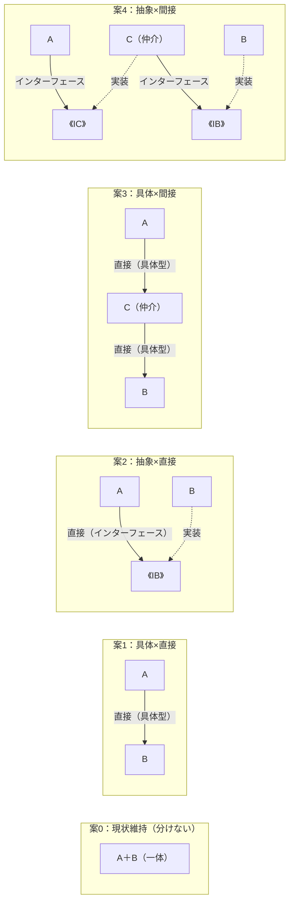

# フェーズ5〜7 モデル定義

---

## フェーズ5：課題定義 ―― 対策に入る前に「何を解くか」を確定する

フェーズ4で「分けるべき場所がある」という判断ができた。しかしそのままフェーズ6の対策案に進むのは早すぎる。「分ける」という判断だけでは、まだ何を解くべきかが曖昧なままだ。

対策案を作る前に、解くべき課題を4つの視点で具体化しておくことで、的外れな案を作るリスクを下げる。

### 視点1：接続点の特定

フェーズ4で「分ける」と判断した場所に、接続点（ジョイント）が生まれる。その接続点がどこに何個あるかを明確にする。

```
例：
- 接続点A：注文処理クラス ←→ 割引ルールクラス の境界
- 接続点B：割引ルールクラス ←→ 料金計算サービス の境界
```

接続点が複数ある場合、それぞれ独立に課題を定義する。

### 視点2：非機能制約

接続点の形は「なぜ分けたか」だけで決まるわけではない。変更頻度・パフォーマンス・メモリ制約が、選択できる接続の形を絞ることがある。

| 確認項目 | 内容 |
|:---|:---|
| 変更頻度 | この接続点は頻繁に変わるか？変更頻度が高いほど抽象化のメリットが出る |
| パフォーマンス | この接続点はホットパス（頻繁に呼び出されるコードパス）か？ |
| メモリ | 間接層の追加でメモリオーバーヘッドが問題になるか？ |

ホットパス（頻繁に呼び出されるコードパス）に位置する接続点は、接続の形の選択肢が「具体×直接」寄りに絞られる。

### 視点3：クライアントへの影響範囲

「クライアント」とは、分離対象のクラスを呼び出している既存コードのことだ。分けることで、既存コードにどの程度の変更が波及するかを確認する。

```
例：
- OrderProcessor は DiscountRule を直接呼んでいる
  → 接続点の形を変えると修正が必要
- PaymentService は影響を受けない
```

クライアントへの影響が大きいほど、段階的なリファクタリングが必要になる。

### 視点4：課題まとめ表

以上の3視点を一覧に整理する。

| 接続点 | 分けた理由 | 非機能制約 | クライアント影響 |
|:---|:---|:---|:---|
| 接続点A | 変わる理由が異なる | ホットパスではない | OrderProcessor に影響 |
| 接続点B | 複雑さを隠したい | 呼び出し頻度は低い | 影響なし |

この表が埋まった状態がフェーズ6の出発点になる。

---

## フェーズ6：対策案検討 ―― 分け方と接続の形を段階的に決める

### 「なぜ分けたか → 接続の形が決まる」

このステップで最も重要なことは、**「デザインパターン名を最初から思い浮かべない」** ことだ。「なぜ分けたか」が決まれば、接続の形は自動的に決まる。

接続点の形を決める軸は2つある。

- **具体 vs 抽象**：特定クラスへの依存か、インターフェースへの依存か
- **直接 vs 間接**：直接呼び出すか、中間層を挟むか

### 「なぜ分けたか」と接続の形の対応

| なぜ分けたか | 接続の形 |
|:---|:---|
| 責任を整理したい | 具体×直接 |
| 実装を差し替えたい | 抽象×直接 |
| 知らせたくない・複雑さを隠したい | 具体×間接 |
| 差し替えたい かつ 知らせたくない | 抽象×間接 |

接続点が複数あれば、それぞれ独立に判断する。

### 2×2 接続マトリクス

| | **直接** | **間接** |
|:---:|:---:|:---:|
| **具体** | 具体×直接 | 具体×間接 |
| **抽象** | 抽象×直接 | 抽象×間接 |

### 対策案の作り方

**重要な前提：どの案も優劣はない。**
各案は異なるトレードオフを持つ並列の選択肢であり、変更頻度・チーム規模・パフォーマンス制約などプロジェクトの文脈によって合理的な選択は変わる。

**標準の5案（案0〜案4）：**

「案N」という表現は使わない。2×2マトリクスの各セルに対応する連番で示す。

| 案 | 接続の形 | 一言で |
|:---|:---|:---|
| **案0** | —（現状維持） | 構造を変えず、if 文追加や定数変更で対応する |
| **案1** | 具体×直接 | クラスを分けるが、呼び出し側は具体型を直接知る |
| **案2** | 抽象×直接 | インターフェースを挟み、呼び出し側は型だけを知る |
| **案3** | 具体×間接 | 仲介クラスを置くが、仲介役は具体型を知っている |
| **案4** | 抽象×間接 | インターフェース＋仲介役の両方を導入し、全層を抽象化する |

**案0と案1の違い（混同しやすいため明記）：**
案0は「クラスを分けない（AとBが一体のまま）」。案1は「クラスは分けるが、Aは具体型のBを直接知っている（`#include "B.h"` や `new B()` がAの中に書いてある）」。案0→案1への変化は「分ける/分けない」の決断。案1→案2への変化は「知り方を変える（具体型→インターフェース）」の決断。

**5案の並列出力ルール（フェーズ6では必ずこの構造を全案に適用する）：**

各案を以下の同一テンプレートで書く。案0〜案4のどれか1つだけ丁寧に書き、他を省略するのは禁止。

```
#### 案X：【接続の形】―― 【一言で】

**この形の考え方：**
【なぜこの構造になるか・どう考えてこの形を選ぶかを2〜3文で】

**この形にするための準備：**
【具体的に何を変えるかをステップで】

【コード例（main相当の呼び出し部分または変更箇所のみ、20〜30行程度）】

**この形のトレードオフ：**
- 変更容易性：【高/中/低とその理由】
- テスト容易性：【高/中/低とその理由】
- 実装コスト：【高/中/低とその理由】
```



### 各象限の非機能コスト対応表

接続の形によって異なる実行時コストがある。パフォーマンスが制約になる場合（視点2で確認済み）、この表を参照して案を絞る。

| 接続の形 | パフォーマンス上の特徴 |
|:---|:---|
| 具体×直接 | オーバーヘッド最小。コンパイラが最適化しやすい |
| 抽象×直接（virtual 関数） | vtable ルックアップのコスト。ヒープ確保が加わる場合もある |
| 抽象×直接（template） | 実行コストはゼロに近いが、コンパイル時間・バイナリサイズが増大する |
| 具体×間接 | 間接参照のコスト。中間層の分だけ呼び出しが1段増える |
| 抽象×間接 | vtable ルックアップ＋間接参照。最も柔軟だが実行時コストが最も高い |

ホットパスではオーバーヘッドを抑えた「具体×直接」寄りの案が合理的。ビジネスロジックが集中する部分では、置換のしやすさを優先して「抽象×直接」を選ぶことが多い。

---

## フェーズ6（後半）：コスト天秤で選ぶ（6-7〜6-10）

対策案を「現在の対応コスト」と「未来の対応コスト」で比較する。

| 対策案 | 現在の対応コスト | 未来の対応コスト |
|:---|:---|:---|
| 案0：現状維持 | 低 | 高 |
| 案1：具体×直接 | 低〜中 | 高 |
| 案2：抽象×直接 | 中 | 低〜中 |
| 案3：具体×間接 | 中 | 中 |
| 案4：抽象×間接 | 高 | 低 |

### コストを見積もるための評価ルール

#### パフォーマンス要件は VETO（拒否権）

パフォーマンスは「得点を加算する軸」ではなく「足切りの門」として扱う。
フェーズ5の視点2でホットパスと判定された接続点については、以下のルールが優先する：

- 「抽象×間接（案4）」や「抽象×直接（案2）」は vtable（仮想関数テーブル）ルックアップと間接参照のコストが加わる
- ホットパスにある接続点でこれらの案を選ぶ場合、パフォーマンス計測で問題なしと確認できない限り採用しない
- 計測せずに「たぶん大丈夫」と判断するのは VETO 違反

ホットパスでない接続点については VETO は発動しない。スコアリングだけで比較してよい。

#### 3軸スコアリング（パフォーマンス VETO を通過した案のみ）

パフォーマンス VETO を通過した案を、以下の3軸で採点する。軸ごとにウェイトが異なる。

| 評価軸 | 採点基準 | ウェイト |
|:---|:---|:---|
| **変更容易性**（置換・拡張のしやすさ） | 1箇所の変更だけで済むか。既存コードを触らずに新ケースを追加できるか | ×3 |
| **テスト容易性**（依存の切り離しやすさ） | 依存をスタブ/モックに差し替えてテストを書けるか | ×2 |
| **可読性**（実装複雑度・理解コスト） | 変更前に構造を理解する工数はどの程度か | ×1 |

採点は 1（低）〜3（高）の3段階。スコアが最も高い案を採用候補にし、採用理由を1文で明記する。

### トレードオフの判断基準

| 現在コスト | 未来コスト | 判断 |
|:---|:---|:---|
| 低い | 低い | 迷わず採用 |
| 高い | 低い | 長期重視なら採用。納期優先なら案0を暫定対応＋リファクタ計画 |
| 低い | 高い | 案0の暫定対応として採用。リファクタ計画を必ず明記 |
| 高い | 高い | その案を再検討 |

「今すぐ納期を間に合わせたいか、将来も低コストで完成させたいか」——この問いが判断の本質。

---

## フェーズ7：対策実施

採用した案でコードを修正し、以下を確認する。

**耐久テスト：**

フェーズ2のヒアリングで出た将来の変更を当ててみる。採用した案で「触る場所が最小限か」を確認する。

| 変更シナリオ | 触る場所 | コスト評価 |
|:---|:---|:---|
| （ヒアリングで出た変更1） | （クラス名） | 低/中/高 |
| （ヒアリングで出た変更2） | （クラス名） | 低/中/高 |

**変更シナリオ表：**

どのシナリオで何が変わり、何が変わらないかを一覧で示す。「変更が1クラスだけで済む」という事実を数字で示すことが目的。

| 変更シナリオ | 変わるクラス（触る場所） | 変わらないクラス |
|:---|:---|:---|
| （シナリオ1） | （変わるクラス） | （変わらないクラス） |
