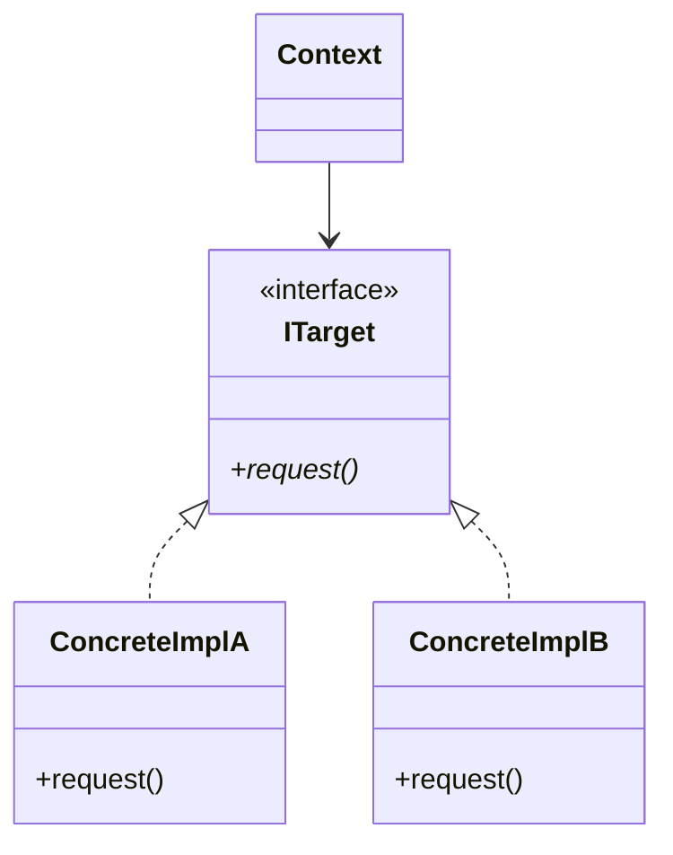

# skills/chapter-writer.md
# 章を執筆する手順スキル

---

## このスキルの役割

`patterns/*.yaml` の定義と `templates/chapter-template.md` を組み合わせて
1章分のMarkdownを生成する手順を定義する。
対象は第1〜8章。第0章には `templates/chapter0-template.md` を使うこと。

> **注意：章の構造（何をどの節に書くか）の唯一の正は `templates/chapter-template.md`。**
> このファイルはその補完説明（品質基準・ニュアンス・生成手順）を提供する。
> 両者に差異がある場合は `chapter-template.md` を優先すること。
> 生成ルールの詳細は `agents/chapter-agent.md` を参照すること。

---

## 前提：必ず読んでいること

このスキルを使う前に以下を読んでいること：
- `../../shared/skills/author-voice.md`
- `../../shared/personas/reader-profiles.md`
- `CLAUDE.md`
- `templates/chapter-template.md`
- `agents/chapter-agent.md`（生成ルールの正）
- `rules/design-decision-guide.md`（ステップ5〜ステップ8の詳細モデル）

---

## 分量と詳しさの基準（重要）

他章との品質・ボリュームの統一を図るため、各章は **全体で約1000〜1500行程度** のしっかりとした分量になるように執筆すること。
単に説明を長くするのではなく、以下の点に注力して「詳しさ」を担保すること：

1. **実装コードの充実**：変更前・変更後のコードは省略せず、実用的な文脈（DIの組み立て、`main`関数、テストコード等）を必ず含める。
   - **【コードブロックの分割ルール】**：1つのコードブロックに複数の話題を詰め込んではならない。必ず状態や話題ごとにコードブロックを分割し、直前に説明の散文を置くこと。
2. **関係者ヒアリングの具体性**：ステップ2での会話はリアルに、なぜその決断に至ったのかの背景を厚く描く。
3. **原因分析の深掘り**：表面的な事実だけでなく「なぜその構造が辛いのか」をケーブル比喩も交えて読者が共感できるレベルで詳述する。
4. **対策案の対比**：案0〜案Nはそれぞれのトレードオフを正直に示し、どれが正解とは言わない。

---

## 9ステップの構造（ステップ0〜ステップ8）

この章テンプレートは以下の9ステップで構成される。
フェーズ1〜7のH2見出しがあり、その後に `## 整理`、`## パターン解説` が続く。

| フェーズ | ステップ | H2見出し（フェーズ見出し） | 含まれる主な節 |
| :--- | :--- | :--- | :--- |
| 🔵 現状把握 | ステップ0 | フェーズ1：現状把握（ステップ0〜1） | X.0 クラス構成・仕様表・責任一覧（事実のみ）　　※仕様の把握 |
| 🔵 現状把握 | ステップ1 | 〃 | X.1 実装コードと責任チェック、X.2 届いた変更要求　　※システムの把握 |
| 🟠 仮説立案 | ステップ2 | フェーズ2：仮説立案（ステップ2） | X.3 仮説テーブル → ヒアリング → 確定テーブル |
| 🟡 問題特定 | ステップ3 | フェーズ3：問題特定（ステップ3） | 変更シミュレーション・痛みの言語化・依存グラフ |
| 🔴 原因 | ステップ4 | フェーズ4：原因（ステップ4） | 観察→原因表・変わるもの/変わらないもの・ケーブル比喩 |
| 🔴 課題 | ステップ5 | フェーズ5：課題（ステップ5） | 接続点の特定・非機能制約・クライアント影響・課題まとめ表 |
| 🟢 対策案 | ステップ6 | フェーズ6：対策案検討（ステップ6〜7） | 2×2マトリクス・案0〜案4・コスト天秤・耐久テスト・使う/使わない場面 |
| 🟢 対策案 | ステップ7 | 〃 | コスト天秤・採用決定・耐久テスト・使う/使わない場面（過剰コード） |
| 🔵 対策実施 | ステップ8 | フェーズ7：対策実施（ステップ8） | 最終コード全体・変更影響グラフ・変更シナリオ表・最終責任テーブル |
| — | — | 整理 | 9ステップとこの章でやったこと対応表・各クラスの最終的な責任 |
| — | — | パターン解説 | パターンの骨格クラス図・章固有マッピング図・散文説明 |

---

## 生成手順

### ステップ1：pattern_file から素材を取り出す

以下の情報を確認する：
- `scenario.domain` : システムのドメイン
- `scenario.system_overview` : システムの概要
- `scenario.current_spec` : 現在の仕様
- `scenario.situation` : 変更要求（誰から・何の要求・いつまでに）
- `observations` : 観察リスト（ステップ3 変更シミュレーションの素材）
- `advanced_scenario` : より難しい変化（ステップ7 耐久テストの素材）
- `threshold` : 使う・使わない状況（ステップ7 使い分けの素材）

---

### ステップ2：各節を順番に生成する

#### 冒頭：この章を読むと得られること

**ステップ0より前に必ず書く（`> **この章の核心**` ブロックの直後）。**

`## この章を読むと得られること` というH2セクションとして配置する。

書き方の原則（詳細は `agents/chapter-agent.md` を参照）：
- 「〜できるようになる」形式で3〜4項目
- パターン名を前面に出さない（「〇〇パターンが書けるようになる」はNG）
- 以下の3視点を基本とする：
  1. どんな観点でコードの変動箇所を識別するか（変わる理由の見極め方）
  2. 接続点がどの形（2×2マトリクスのどのセル）になっているかをどう読み取るか
  3. 接続点の形を変えることで変更がどのように局所化されるか

また、書き始める前に CLAUDE.md のドメイン割り当て表を確認し、この章のドメインが割り当て済みのものと一致していることを確認する。

---

#### X.0（ステップ0）：仕様を把握する ―― クラス構成と責任を読む

**入力：** システムのシナリオ説明 ＋ クラス構成の概要。実装コードはまだ読まない。
**産物：** クラス構成・仕様表・責任一覧（事実のみ。この段階では仮説を立てない）

3層で書く：
- **第1層**：システムの概要（2〜3文。業務用語を定義）
- **第2層**：仕様表（機能・担当クラス・入力・出力）
- **第3層**：クラス構成の概要（mermaid classDiagram）＋ 各クラスの責任一覧

当時の担当者への敬意を忘れない。「このコードが今日まで現場を支えてきた事実」に触れる。
仮説はここでは立てない。観察した事実をステップ2に持ち込む。

---

#### X.1（ステップ1）：システムを把握する ―― 実装コードと責任チェック

**入力：** ステップ0で把握したクラス責任 ＋ 実際の実装コード
**産物：** 責任チェック表。「このクラスが持つべきでない知識」が混在している行の発見。

- `scenario.situation` の内容から起点コードを示す（main()含む）
- コメントで「なぜこう書いたかの背景」を示す
- 実行結果を示す（「このコードは正しく動く。問題は構造にある」を明示する）
- 責任チェック表：コードの行 ｜ 持っている知識 ｜ 責任内か（✅または❌）

---

#### X.2（ステップ1）：届いた変更要求

- `scenario.situation` の内容を人間的な文体で書く
- 「誰から・何の要求が・いつまでに」の形式
- 著者の口癖を1箇所入れる

---

#### X.3（ステップ2）：仮説の立案と確定

**入力：** ステップ0のクラス構成・責任一覧 ＋ ステップ1の責任チェック結果・変更要求
**産物：** 確定した変動/不変テーブル（「誰の判断で変わるか」明記）

2段構えで書く：
- **第1段（仮説）**：ステップ0・ステップ1の観察から「変わりそう / 変わらなそう」の仮説テーブルを立てる（根拠列付き）
- **第2段（確定）**：「コードを読んだだけで断定するのは危険」と述べて関係者ヒアリングへ進む。問答形式で確定テーブルを得る。
- 「🟢不変を契約（インターフェース）として固定し、🔴変動をその裏側に押し込む」という設計の決断を宣言して締める

---

#### ステップ3：変更シミュレーション

- 変更要求を「素朴に実装しようとすると何が起きるか」を描く
- 「痛み」を2点、散文で言語化する（grep地獄・影響範囲の広さ等、現場の実体験に基づく辛さ）
- 変更が飛び火する様子をmermaidで図示する

---

#### ステップ4：原因分析

- 観察 → 原因の方向 の表を示す
- 「変わり続けるもの ｜ 変わってほしくないもの」の2列表で仕分ける
- 「ケーブルで考える」：現在の接続形態をケーブル比喩（Lightning/USB-C/ハブ）で示す。2×2マトリクスのどのセルに当たるかを説明してからImagePromptを出力する（詳細は `agents/chapter-agent.md` 参照）

---

#### ステップ5：課題の定義

ステップ4で「分ける」と判断した場所に接続点を特定し、以下の4視点で課題を定義する（詳細は `rules/design-decision-guide.md` 参照）：

1. **接続点の特定**：どこに何個の接続点があるかを明示する
2. **非機能制約の確認**：変更頻度・パフォーマンス・メモリを表で確認する
3. **クライアントへの影響範囲**：どのクラスが影響を受けるかを列挙する
4. **課題まとめ表**（接続点 ｜ 分けた理由 ｜ 非機能制約 ｜ クライアント影響）を必ず出力する

---

#### ステップ6：対策案の検討

この節の核心：ステップ5の課題定義に対する正当な応答として案を提示する（詳細は `rules/design-decision-guide.md` 参照）。

- **冒頭に2×2マトリクス接続図（mermaid）を必ず出力する**
- 案0〜案4を並列の選択肢として展開する。各案に優劣はない。
  - 案0：構造を変えない（`if`文追加・定数変更などで対応）
  - 案4：接続点を全て変更（ステップ5で特定した接続の形を全て変える）
  - 中間案（意味のある段階がある場合のみ追加）
- 各案のコード・クラス図・残るトレードオフをセットで示す

---

#### ステップ7：コスト天秤にかける

- **評価軸を比較より前に宣言する**（変更容易性・拡張性・テスト容易性・実装複雑度・パフォーマンス）
- コスト天秤表（案0 vs 中間案 vs 案4）で現在コスト・未来コストを比較する
- 採用案を決定し、理由を「現在/未来コストの観点から」1〜2文で説明する
- **耐久テスト**：ステップ2のヒアリングで挙がった将来の変化を実際にシミュレートする（伏線回収）
- **使う場面・使わない場面**：
  - 【過剰コード】：変化の予定がないところに適用して複雑になった例を示す
  - 状況ごとの選択指針を表で示す（状況 ｜ 適切な選択 ｜ 理由）
  - 最小コスト代替案との比較

---

#### ステップ8：決断と、手に入れた未来

- BatchApplication / main() を含む最終コード全体を示す
- 変更影響グラフ改善後（mermaid graph LR）を示す
- 変更シナリオ表（シナリオ ｜ 変わるクラス ｜ 変わらないクラス）
- 最終責任テーブル（クラス ｜ 責任（1文） ｜ 変わる理由）

---

#### 整理

- **9ステップとこの章でやったことの対応表**（ステップ0〜ステップ8 ｜ この章でやったこと）
- 各クラスの最終的な責任（クラス ｜ 責任 ｜ 変わる理由）
- 「このプロセスを回した結果にたどり着いた構造こそが【パターン名】パターンです」で締める

---

#### 振り返り：第0章の3つの原則はどう適用されたか

- **原則1「変わるものをカプセル化せよ」の現れ**：どのクラス・どの構造に現れているかを具体化した場所を示してから散文で説明
- **原則2「実装ではなくインターフェースに対してプログラムせよ」の現れ**：同様
- **原則3「継承よりコンポジションを優先せよ」の現れ**：同様

各原則の説明は箇条書きにせず、散文で書く。

---

## パターン解説：〇〇パターン

### パターンの骨格

このパターンが解決する構造上の問題を、ここに1〜2文で記述します。



- **Context**: パターンの利用者であり、抽象的なインターフェースを通じて処理を呼び出します。
- **ITarget**: 具象クラスが実装すべき共通の振る舞いを定義するインターフェースです。
- **ConcreteImplA/B**: インターフェースを具体的に実装し、それぞれの固有の振る舞いを提供します。

---

### この章の実装との対応

本章で作成したクラスと、GoFの抽象ロールを対応させた図です。

```mermaid
classDiagram
    class [章のContextクラス] {
    }
    class [章のInterface] {
        <<interface>>
    }
    class [章の具象クラスA] {
    }
    [章のContextクラス] ..> [章のInterface]
    [章のInterface] <|.. [章の具象クラスA]
```

抽象ロールと実際に動く具象クラスの対応を1〜2文で説明します。

---

### ステップ3：生成後の確認（セルフチェックリスト）

#### 1. 構造チェック（節の存在・順序）

- [ ] **author-voice.md** の口癖が3〜5箇所、自然に含まれているか
- [ ] ステップ0に仮説テーブルが混入していないか（仮説はステップ2のみ）
- [ ] パターン名がステップ6の対策案実装後に初登場しているか（それより前に出ていないか）
- [ ] ステップ6冒頭に2×2マトリクス接続図（mermaid）があるか
- [ ] ステップ7で評価軸が比較表より前に宣言されているか
- [ ] 整理セクションに「9ステップ対応表」と「最終責任テーブル」の両方があるか
- [ ] パターン解説に「GoF抽象クラス図」と「章固有マッピング図」の両方があるか

#### 2. 内容整合チェック

- [ ] ステップ3の変更シミュレーションがステップ1・ステップ2の変更要求と結びついているか
- [ ] ステップ4のケーブル比喩でステップ4末尾にImagePromptが出力されているか
- [ ] ステップ5の接続点特定がステップ4の原因分析から導出されているか
- [ ] ステップ7の耐久テストがステップ2のヒアリングで出た将来のリスクと対応しているか（伏線回収）
- [ ] ステップ8の変更シナリオ表で「変わるクラス・変わらないクラス」が明示されているか

#### 3. 設計判断の明示

- [ ] 各案を「正解 vs 不正解」ではなく「並列のトレードオフ」として扱っているか
- [ ] 「正解はない」という前置きの後に「今回の状況ではこう判断した」という結論が続いているか
- [ ] 「使わない方が良い状況」「過剰コード例」が含まれているか
