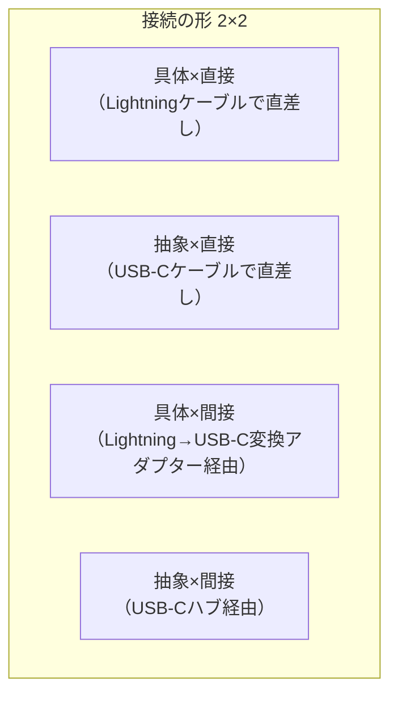

# 【第一部】デザインパターン執筆テンプレート v7

対象：第1〜8章（第二部の応用編は本テンプレートをベースに調整する）

---

## 前段

---

## 第X章　【パターン名】

―― 思考の型：【この章で直面する「混在の種類」を一言で】

### この章の核心

**【パターン特有の教訓を1〜2行で】**

---

### この章を読むと得られること

<!-- 書き方の詳細ルールは agents/chapter-agent.md を参照（こちらが正）。
     要点：パターン名を前面に出さない。「構造分析の眼」で3〜4項目。「〜できるようになる」形式。 -->

- **得られること1：** 「【この章の変化の観点】」という観点で、コードの変動箇所を識別できるようになる
- **得られること2：** 接続点が「【接続形態】」になっているクラスを見て、そこが変更の痛みの発生源だと判断できるようになる
- **得られること3：** 接続点の形を変えると変更がどのように局所化されるかを、構造から説明できるようになる
- **得られること4（任意）：** 【パターン特有の追加的な視点】

---

## 🔵 フェーズ1：現状把握 ―― 変更が来る前にコードを把握する

<!--
目安：300〜400行
目的：システムが何をするものか（仕様）と、どう実装されているか（コード）を事実として把握する。
仮説はここでは立てない。変更要求も来ていない。観察した事実をフェーズ2に持ち込む。
-->

---

### 1-1：システムの背景

<!-- 目安：300〜500文字
     誰が使い、何のために動いているかを2〜4段落で描写する。
     末尾に「一見整理されている」という印象を1段落で添える。
     このコードが今日まで現場を支えてきた事実への敬意を忘れない。 -->

【このシステムはどんなビジネスの文脈で動いているか。誰が使い、何のために動いているかを2〜4段落で描写する。読者が「こういう現場だな」と感じられる具体的な説明にする。末尾に「一見すると、このコードはうまく整理されている」という印象を1段落で添える】

---

### 1-2：仕様表

<!-- 目安：4〜8行 -->

| **機能名** | **担当クラス** | **入力** | **出力** |
|---|---|---|---|
| 【機能名】 | 【担当クラス】 | 【入力】 | 【出力】 |

---

### 1-3：クラス構成図

```mermaid
classDiagram
    %% 【変更前のクラス図。問題の構造を可視化する】
```

→ 【クラス図が示す構成を1文で。評価は加えない】

---

### 1-4：責任配置テーブル

<!-- 目安：クラス数分の行 -->

| **クラス名** | **責任（1文）** | **知るべきこと** |
|---|---|---|
| 【クラス名】 | 【責任】 | 【知るべきこと】 |

【この表で何が見えるかを1〜2段落で。表だけで終わらない】

---

### 1-5：依存グラフ

```mermaid
graph TD
    %% 【問題の広がりをマクロで示す依存グラフ。誰が誰に依存しているかを可視化する】
```

→ **【このグラフが示す依存関係を1文で】**

---

### 1-6：実装コード

<!-- 目安：30〜60行
     起点コードの文脈を1〜2文で説明してからコードを示す。
     コメントで「なぜこう書いたかの背景」を示す。 -->

【コードを示す前に1〜2文で文脈を説明する】

```cpp
// 【起点コード（main()含む）＋ コメントで背景を示す】
```

---

### 1-7：実行結果

【実行結果を示す。「このコードは正しく動く。問題は構造にある」を明示する】

---

### 1-8：責任チェック表

<!-- 判断基準：「その知識は誰の判断で変わるか」。変わる理由が別担当者・別タイミングなら責務外の可能性がある。
     この時点では❌/✅の「判定」はしない。「観察」にとどめる。
     「具体型を使っている＝責務外」ではない。変わる理由で判断する。 -->

【クラスの責任を1文で再確認し、「知るべきこと」を定義する】

| **コードの行** | **持っている知識** | **管理者（観察）** |
|---|---|---|
| `【コードの一部】` | 【その行が持つ知識】 | 【その知識を管理するのは誰か】 |

> 【責任チェックで見えたことを散文で1〜2段落。「混在している」「していない」を観察として述べる。まだ判定しない】

フェーズ1で責任配置の観察が終わりました。次のフェーズ2では、変更要求を受けて「何が変わり、何が変わらないか」の仮説を立てます。

---

## 🟠 フェーズ2：仮説立案 ―― 変更要求を受けて、変動と不変を整理する

<!--
目安：180〜230行
目的：届いた変更要求を起点に、「何が変わり得るか・変わらないか」を仮説立案し、関係者との確認で確定する。
「設計の決断（どの案を採用するか）」はここでは行わない。決断はフェーズ6で行う。
-->

---

### 2-1：届いた変更要求

<!-- 目安：200〜300文字
     「誰から・何の要求が・いつまでに」の形式。著者の口癖を1箇所入れる。 -->

【変更要求のシーン。人間的な文体で書く】

---

### 2-2：変動・不変の仮説テーブル

<!-- フェーズ1の観察から「変わりそう/変わらなそう」の仮説を立てる。根拠列付き。
     断定しない。「〜と読み取れる」「〜しそうだ」のレベルにとどめる。 -->

| **分類** | **仮説** | **根拠（フェーズ1の観察から）** |
|---|---|---|
| 🔴 **変動しそう** | 【変わりそうな部分】 | 【なぜそう読み取れるか】 |
| 🟢 **不変そう** | 【変わらなそうな部分】 | 【なぜそう読み取れるか】 |

コードを読んだだけで「変わる」「変わらない」と断定するのは危険です。関係者に直接確認します。

---

### 2-3：関係者ヒアリング

<!-- 目安：400〜600文字
     確認すべき内容：将来の変化・型の安定性・出力先の固定性など。
     なぜその決断に至ったのかの背景を厚く描く。問答形式で書く。
     ヒアリングで挙がった将来のリスクはフェーズ6-10（耐久テスト）で実演する（伏線回収）。 -->

【問答形式のヒアリングシーン】

- **開発者：** 「【確認したい質問】」
- **【関係者の役職】：** 「【回答】」

---

### 2-4：確定した変動/不変テーブル

| **分類** | **具体的な内容** | **変わるタイミング** | **根拠（誰との確認か）** |
|---|---|---|---|
| 🔴 **変動する** | 【変わる部分】 | 【いつ変わるか】 | 【誰への確認か】 |
| 🟢 **不変** | 【変わらない部分】 | 変わる日は来ない | 【誰との合意か】 |

フェーズ2で「何が変わり、何が変わらないか」が確定しました。次のフェーズ3では、変更要求を実際に試みて、何が起きるかを確認します。

---

## 🟡 フェーズ3：問題特定 ―― 変更を試みて、痛みを発見する

<!--
目安：150〜200行
目的：「変わると確定したものを、今のコードのままで変更しようとする」と何が起きるかを確認する。
「痛みを確認しましょう」ではなく「変更を試みてみましょう」と書く。
発見は中立に記述し、読者自身が不便さに気づく形にする。
-->

---

### 3-1：変更シミュレーション

<!-- 目安：400〜600文字
     変更要求を今のコードに加えようとすると何が起きるかを描く。中立に記述する。 -->

【変更を試みる場面。「やってみたら何が起きたか」を中立に描写する】

---

### 3-2：変更影響グラフ

```mermaid
graph LR
    %% 【変更が飛び火する様子を図示する】
```

---

### 3-3：痛みの言語化

<!-- 目安：2点、各200〜300文字
     grep地獄・影響範囲の広さ等、現場の実体験に基づく辛さを散文で言語化する。 -->

【「痛み」を2点、散文で言語化する】

フェーズ3で「変更が辛い」という事実が確認できました。次のフェーズ4では、なぜ辛いのかを構造的に言語化します。

---

## 🔴 フェーズ4：原因分析 ―― 「なぜ辛いのか」を構造的に言語化する

<!--
目安：120〜160行
目的：フェーズ3で発見した「痛み」の根本原因を、構造（接続形態）の観点から言語化する。
-->

---

### 4-1：観察→原因テーブル

| **観察** | **原因の方向** |
|---|---|
| 【観察した事実】 | 【なぜそうなるか】 |

---

### 4-2：変わるもの / 変わらないものテーブル

| **変わり続けるもの（🔴）** | **変わってほしくないもの（🟢）** |
|---|---|
| 【変わる部分】 | 【変わらない部分】 |

---

### 4-3：ケーブルで考える

<!-- 目安：200〜400文字
     現在の構造が2×2マトリクスのどのセルに当たるかを説明してからImagePromptを出力する。
     「〜の状態は、Lightningケーブルの直差し（具体×直接）になっている」という形で。 -->

【現在の接続形態をケーブル比喩で1〜2文で説明する】

<!-- ImagePrompt：ケーブル比喩を図示するためのプロンプト。chapter-agent.mdの規則に従って出力する。 -->
[ImagePrompt: ここにImagePromptを挿入する]

フェーズ4で根本原因が言語化できました。次のフェーズ5では、解決すべき問題を具体的に定めます。

---

## 🔴 フェーズ5：課題定義 ―― 解くべき問題を具体的に定める

<!--
目安：100〜130行
目的：フェーズ4で「分けるべき」と判断した場所に接続点を特定し、制約を整理して「何を解くか」を確定する。
-->

---

### 5-1：接続点の特定

<!-- 目安：100〜200文字 -->

フェーズ4で「分ける」と判断した場所に、接続点（ジョイント）が生まれます。その接続点がどこに何個あるかを明確にします。

【接続点の列挙。どこに何個あるかを明示する】

---

### 5-2：非機能制約の確認

| **確認項目** | **内容** | **この章での判断** |
|---|---|---|
| 変更頻度 | この接続点はどのくらいの頻度で変わるか | 【高 / 中 / 低】 |
| パフォーマンス | ホットパスか（高頻度で呼ばれるか） | 【はい / いいえ】 |
| メモリ | 間接層の追加でオーバーヘッドが問題になるか | 【はい / いいえ】 |

---

### 5-3：クライアントへの影響範囲

<!-- 目安：100〜200文字。クライアント＝分離対象のクラスを呼び出している既存コード -->

【どのクラスが影響を受けるかを列挙する】

---

### 5-4：課題まとめ表

| **接続点** | **分けた理由** | **非機能制約** | **クライアント影響** |
|---|---|---|---|
| 接続点A | 【変わる理由が異なる / 複雑さを隠したい / etc.】 | 【ホットパスか否か】 | 【影響するクラス名】 |

フェーズ5で「何を解くか」が確定しました。次のフェーズ6では、解決策を並べてコストで選びます。

---

## 🟢 フェーズ6：対策案検討 ―― 解決策を並べ、コストで選ぶ

<!--
目安：320〜420行
目的：フェーズ5の課題定義に対する解決策（案0〜案4）を並列に示し、評価軸を宣言した上でコスト比較し、採用案を決定する。
パターン名はここで初登場する（6-2〜6-6のいずれかの案として）。
各案に優劣はない。どの案を採用するかはプロジェクトの文脈で決まる。
-->

---

### 6-1：接続の形 2×2マトリクス



---

### 6-2：案0 現状維持 ―― 構造を変えない

<!--
目安：80〜100行
含める項目：考え方（2〜3文）・準備（箇条書き）・コード例（20〜30行）・トレードオフ（3軸）
-->

**考え方：** クラスの分割も接続形態の変更もしない。既存の構造のまま、`if` 文の追加や定数の変更でその場の変更要求に対応する。変更頻度が低く、将来的な変化も見込めない場合に合理的な選択となる。

**準備：**
- 既存コードを触れる最小範囲（`if` の追加・定数の変更）を特定する
- 変更が波及しないことを確認してから実施する

【案0のコード（一部）。if 文追加や定数変更など最小限の修正例を示す】

**トレードオフ：**
- 変更容易性：低（次の変更要求が来たとき同じ作業が繰り返される）
- テスト容易性：低（ロジックが散在したまま）
- 実装コスト：低（今すぐ対応できる）

---

### 6-3：案1 具体×直接 ―― クラスを分けるが参照は具体型のまま

<!--
目安：80〜100行（同上の構成）
-->

**考え方：** クラスを分割し責任を整理するが、AはBの具体型を直接知っている状態を維持する。「責任を分けたい」という動機はあるが、「差し替えは不要」という場合に合う形。

**準備：**
1. AとBの境界をどこに引くかを決める
2. `if` ブロックやメソッドを別クラスに移動する
3. AのコードからBの具体型を直接 `new` する部分は残す

【案1のコード（一部）】

**トレードオフ：**
- 変更容易性：低〜中（Bの実装が変わるとAの修正が必要）
- テスト容易性：低（Bを差し替えてテストできない）
- 実装コスト：低（リファクタリングの範囲が小さい）

---

### 6-4：案2 抽象×直接 ―― インターフェースを挟み、型だけで接続する

<!--
目安：80〜100行（同上の構成）
-->

**考え方：** AはBの具体型を知らなくてよい。Bが満たすべきインターフェース（契約）を定義し、AはそのI/Fだけを知る。BをCに差し替えるとき、Aはノータッチでよくなる。

**準備：**
1. 「BはAに何を提供するか」をI/F名・メソッド名で表現する
2. 既存のBにそのI/Fを実装させる
3. AのコードをBの具体型 → I/F型に書き換える

【案2のコード（一部）】

**トレードオフ：**
- 変更容易性：中〜高（Bの差し替えはAを触らずに済む）
- テスト容易性：高（スタブをI/Fに差し込んでテスト可）
- 実装コスト：中（I/Fの設計が必要）

---

### 6-5：案3 具体×間接 ―― 仲介クラスを置くが、具体型を知っている

<!--
目安：80〜100行（同上の構成）
-->

**考え方：** AはBを直接知らなくてよい。CというオブジェクトがA〜B間の仲介役になる。ただしCはBの具体型を知っている。「Bの複雑さをAから隠したい」「生成の責任をAから切り出したい」場合に合う形。

**準備：**
1. A〜B間で何を仲介させるかを決める（生成・選択・変換など）
2. Cが持つ責任（どの具体型を使うかの判断）を定義する
3. AはCだけを知ればよい形に書き換える

【案3のコード（一部）】

**トレードオフ：**
- 変更容易性：中（BはCの修正で対応できる。Aは無影響）
- テスト容易性：中（CをスタブにすればAのテストは書ける）
- 実装コスト：中（仲介クラスの責任設計が必要）

---

### 6-6：案4 抽象×間接 ―― インターフェース＋仲介役を両立する

<!--
目安：80〜100行（同上の構成）
-->

**考え方：** AはCのI/Fだけを知り、CはBのI/Fだけを知る。実装の詳細はどの層も知らない。変更影響が最も局所化されるが、クラス数と間接層が増える。「差し替えたい かつ 知らせたくない」という2つの動機が重なる場合に合う形。

**準備：**
1. 案2の手順でI/Fを定義する
2. 案3の手順で仲介役Cを作る
3. CもI/F化して、AとCの間にも抽象を挟む

【案4のコード（一部）】

**トレードオフ：**
- 変更容易性：高（どの層の実装が変わっても他層は無影響）
- テスト容易性：高（全層でスタブに差し替え可）
- 実装コスト：高（I/F設計 × 2層＋仲介クラスが必要）

---

### 6-7：評価軸

<!-- 比較表より前に宣言する。3軸固定。 -->

| **評価軸** | **意味** |
|---|---|
| 変更容易性 | 変更要求が来たとき、触る場所が最小で済むか |
| パフォーマンス | 間接層の追加によるオーバーヘッドが問題になるか |
| 実装複雑度 | コードの読みやすさ・理解コスト |

---

### 6-8：コスト天秤

| **案** | **現在の対応コスト** | **未来の対応コスト** |
|:---|:---|:---|
| 案0：構造を変えない | 低 | 高 |
| 案1：具体×直接 | 低〜中 | 高 |
| 案2：抽象×直接 | 中 | 低〜中 |
| 案3：具体×間接 | 中 | 中 |
| 案4：抽象×間接 | 高 | 低 |

| **評価軸** | **案0** | **案1** | **案2** | **案3** | **案4** |
|---|---|---|---|---|---|
| 変更容易性 | （評価） | （評価） | （評価） | （評価） | （評価） |
| パフォーマンス | （評価） | （評価） | （評価） | （評価） | （評価） |
| 実装複雑度 | （評価） | （評価） | （評価） | （評価） | （評価） |

---

### 6-9：採用案の決定

<!-- 目安：100〜200文字 -->

**採用する案：** 案【X】

**理由：** 【現在/未来コストの観点から1〜2文で。納期と長期コストのトレードオフを明記】

---

### 6-10：耐久テスト

<!-- フェーズ2のヒアリングで挙がった「将来のリスク」が実際に発生した場面をシミュレートする（伏線回収）
     目安：100〜200文字 + 表 -->

フェーズ2のヒアリングで挙がった「将来のリスク」が実際に発生した場面をシミュレートします。

| **変更シナリオ** | **触る場所** | **コスト評価** |
|:---|:---|:---|
| （ヒアリングで出た変更1） | （クラス名） | 低/中/高 |
| （ヒアリングで出た変更2） | （クラス名） | 低/中/高 |

フェーズ6で採用案が決まりました。次のフェーズ7では、その決断をコードに落とし込みます。

---

## 🔵 フェーズ7：対策実施 ―― 決断し、変化に強い設計を手に入れる

<!--
目安：150〜200行
目的：採用案を実装し、変更が局所化された様子を可視化する。
-->

---

### 7-1：解決後のコード（全体）

<!-- 目安：60〜100行
     BatchApplication / main() を含む最終コード全体を示す。 -->

```cpp
// 【BatchApplication / main() を含む最終コード全体】
```

---

### 7-2：変更影響グラフ（改善後）

```mermaid
graph LR
    %% 【改善後の変更影響グラフ。フェーズ3と同じシナリオで、変更が局所化された様子を示す】
```

→ **【フェーズ3の変更影響グラフと比較して、何が変わったかを1文で】**

---

### 7-3：変更シナリオ表

| **シナリオ** | **変わるクラス** | **変わらないクラス** |
|---|---|---|
| 【シナリオ1】 | 【変わるクラス】 | 【変わらないクラス】 |

---

## 後段

---

## 整理

### 7フェーズとこの章でやったこと

| **フェーズ** | **この章でやったこと** |
|---|---|
| 🔵 フェーズ1：現状把握 | 【フェーズ1の概要】 |
| 🟠 フェーズ2：仮説立案 | 【フェーズ2の概要】 |
| 🟡 フェーズ3：問題特定 | 【フェーズ3の概要】 |
| 🔴 フェーズ4：原因分析 | 【フェーズ4の概要】 |
| 🔴 フェーズ5：課題定義 | 【フェーズ5の概要】 |
| 🟢 フェーズ6：対策案検討 | 【フェーズ6の概要】 |
| 🔵 フェーズ7：対策実施 | 【フェーズ7の概要】 |

### 各クラスの最終的な責任

| **クラス名** | **責任（1文）** | **変わる理由** |
|---|---|---|
| 【クラス名】 | 【責任】 | 【変わる理由】 |

> **このプロセスを回した結果にたどり着いた構造こそが 【パターン名】パターン です。**

---

## 振り返り：「この章を読むと得られること」は手に入ったか

| **得られること** | **この章のどこで示したか** |
|---|---|
| 得られること1 | 【どのフェーズで示したか】 |
| 得られること2 | 【どのフェーズで示したか】 |
| 得られること3 | 【どのフェーズで示したか】 |

---

## 振り返り：第0章の3つの設計原則はどう適用されたか

- **原則1「変わるものをカプセル化せよ」の現れ**

  - **具体化された場所：** 【どのクラス・どの構造に現れているか】
  - **解説：** 【散文で説明する】

- **原則2「実装ではなくインターフェースに対してプログラムせよ」の現れ**

  - **具体化された場所：** 【どのクラス・どの構造に現れているか】
  - **解説：** 【散文で説明する】

- **原則3「継承よりコンポジションを優先せよ」の現れ**

  - **具体化された場所：** 【どのクラス・どの構造に現れているか】
  - **解説：** 【散文で説明する】

---

## パターン解説：【パターン名】パターン

### パターンの骨格

【パターンが解決する構造問題を1〜2文で述べてから図を入れる】

```mermaid
classDiagram
    %% GoFパターンの標準的なクラス図
```

---

### この章の実装との対応

```mermaid
classDiagram
    %% 章固有のマッピング図。GoFの抽象ロールと実際のクラスを対応させる。
```

抽象ロールと実際に動く具象クラスの対応を1〜2文で説明する。

---

### 使いどころと限界

<!-- 目安：200〜400文字 -->

【このパターンが有効な状況と、使わない方が良い状況を示す】

【過剰コード：変化の予定がないものまでパターン化した例】

```cpp
// 【過剰コードの例。シンプルに書けばよいものをパターン化した場合を示す】
```

| **状況** | **適切な選択** | **理由** |
|---|---|---|
| 【変化の予定がある場合】 | 【このパターンを使う】 | 【理由】 |
| 【変化の予定がない場合】 | 【シンプルなコードで十分】 | 【理由】 |

---

### この章のまとめ

【このパターンが解決する構造問題・読者が持ち帰るべき1点を2〜3文で。「構造が変わった」「接続点の形が変わった」という視点で締める】
