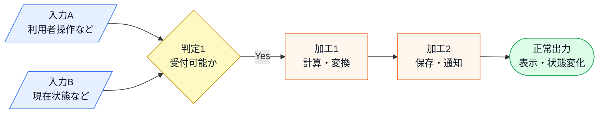

# デザインパターン章テンプレート

このファイルだけを章構成の正本とする。第1章を含む各章は、次の見出し名・
順序・役割に合わせる。第1章は実装例であり、正本ではない。
章固有の補足が必要な場合は、標準見出しを増減させず、その配下に`#### 補足：...`として置く。

このテンプレートは、第0章で説明した「7つのフェーズ」を各章の本文へ落とすための
執筆用設計図である。第0章は読者向けにフェーズの意味を説明する。こちらは執筆者向けに、
各項目の目的、達成基準、必要素材を定義する。第0章の思想とこのテンプレートが食い違う
場合は、両方を見直してそろえる。

章を量産するときは、まず次の入力をそろえる。不足している入力がある場合は、本文で
推測して埋めず、章の題材設計に戻って補う。

| 章作成の入力 | 必須内容 |
|---|---|
| 題材システム | 利用者、目的、扱うデータ、現在の仕様、フェーズ1の現状コード |
| 題材のコア処理 | その題材で読者が最も気にする実処理、処理順序、状態、失敗、非同期、外部連携、手段別の入力差分 |
| 複雑度ストレス条件 | 順次実行、非同期/ポーリング、イベント、部分失敗、ジョブ/スレッド、再試行など、この章の設計判断に効く複雑さ |
| 仕様粒度 | 動作例・変更要求・実行結果に出る入力値、状態名、フラグ、ID、金額、判定条件、出力名、エラー条件 |
| 代表動作 | 入力、操作、出力、状態変化、エラー条件、実行結果 |
| 登場クラス | クラス名、責任、主な依存関係、`main()` での使われ方 |
| 変更要求 | 今回確実に変わる仕様、変更後の受入条件 |
| 変化情報 | どの機能・仕様が変わるか、変更契機、変更頻度、将来リスク、分かる場合は担当者・関係者 |
| 簡略化方針 | 実システムでは存在するが掲載コードでは省略するDB、画面、外部API、ファイル出力、通知など |
| 論点外補足 | 実際はどう動くか、掲載コードでは何で代替するか、なぜ章の論点から外すか |
| 制約 | 性能、メモリ、互換性、納期、既存コードを保つ範囲 |

各フェーズは、前フェーズの産物を次フェーズの入力にする。章を書くときは、次の
入出力が本文上で回収されているかを必ず確認する。

| フェーズ | 入力 | 産物 |
|---|---|---|
| 1：現状把握 | 題材システム、代表動作、登場クラス、フェーズ1の現状コード、変更要求 | 入力→加工→出力の仕様構造、動作例、責任一覧、実行結果対応、依存/分岐/処理順序、変更差分 |
| 2：仮説立案 | フェーズ1の事実、関係者情報 | 変わる見込み/当面安定の前提、今回確定した変更、将来リスク、当面安定の前提 |
| 3：問題特定 | フェーズ2で固定した変更、フェーズ1の現状コード | 修正箇所、波及範囲、再テスト範囲、将来変更でも繰り返される痛み |
| 4：原因分析 | フェーズ3の痛み、変更理由、コード構造 | 混在している判定/処理/生成判断、漏れている依存、保ちたい処理の骨格 |
| 5：課題定義 | フェーズ4の原因、接続点候補、制約 | 解くべき接続点、流れるデータ、分ける単位、残す約束、守る制約 |
| 6：対策検討 | フェーズ5の課題、変更頻度、制約 | 採用案、移す判定/処理/生成判断、残る変更、受け入れるコスト |
| 7：対策実施 | フェーズ6の採用案、変更シナリオ | 改善後コード、責任の移動、変更シナリオ表、得たもの/諦めたもの |
| 整理・振り返り | フェーズ1〜7の産物 | 問題・原因・課題・解決策の鎖、責任の移動、章冒頭の約束の回収 |

量産時の完了条件:

- 各フェーズの入力が、前フェーズの産物または章作成の入力から来ている。
- 産物が次フェーズの本文で実際に使われている。
- 目的、達成基準、本文、図、表、コード、実行結果が同じ読者状態へ向いている。
- 1-1の仕様が、動作例・変更要求・実行結果に出る値・状態・判定条件・出力と紐づく粒度になっている。入力・加工・出力の各要素は、後でどの動作例・変更要求・接続点で使うかまで示す。クラス名・メソッド名・変数名との対応は1-3以降で扱う。
- 題材のコア処理が、単なるハンドリング・分岐・分類箱に薄められていない。実際のシステムで読者が気にする処理順序、必要データ、状態、失敗、非同期、外部境界を、章の論点に必要な粒度で仕様とコードに残す。
- 複雑度ストレス条件が、章の中心課題に関係する範囲で扱われている。順次実行、非同期/ポーリング、イベント、部分失敗、ジョブ/スレッド、再試行などを足す場合は、それがフェーズ4の原因、フェーズ5の課題、フェーズ6の対策比較にどう効くかまで示す。複雑さを足しても課題に影響しない場合は、論点外として本文へ入れない。
- 仕様が分かりづらい原因は、情報不足ではなく対応の断絶である。入力・判定・加工・正常出力の各要素が、動作例・コード・変更要求・接続点のどこで再利用されるかを追える状態にする。異常系は正常系図に混ぜず、エラー条件表で追える状態にする。
- 仕様、動作例、コード、実行結果、クラス構成図、変更要求、変更影響グラフ、最終コードが同じ対象を追っている。
- `rules/phase-consistency-check.md` の照合ラインで、フェーズ間の不一致がない。
- 全体像、入出力の流れ、クラス間の関係、変更前後の差分、変更影響の広がりは、文章だけで説明せず図または表で先に見せる。
- パターン名や一般論が、問題・原因・課題の説明より先に判断理由として出ていない。
- 「知識」「案」「痛み」「コスト」「責任」などの抽象語は、本文中で具体物に置き換えられている。
- 専門用語・略語・英語由来の呼び名は、初出で意味を説明する。説明なしで使うより自然なら、一般的な日本語へ言い換える。

図で示すべき箇所:

| 箇所 | 図の役割 | 推奨形式 |
|---|---|---|
| 1-1：仕様 | 入力→加工→出力の全体像と、各要素が後で使われる場所を示す | flowchart + 対応表 |
| 1-5：変更要求 | 変更後の入力→加工→出力を1-1と同じ形式で示し、1-1との差分を明示する | flowchart（1-1と同じ記法） |
| 1-3後：簡略化範囲 | 実システムの要素と掲載コードで代替する要素を、クラス構成を見た後に示す | graph または表 |
| 1-3：登場クラスとクラス構成図 | クラス責任を読んだ後、依存関係を示す | classDiagram / graph |
| 3-2：変更影響グラフ | 直接変更と巻き込まれた変更を区別する | graph |
| 4：原因分析 | 混在している判定/処理/生成判断と、漏れている依存を示す | graph / 注釈付きコード |
| 5：課題定義 | 解くべき接続点と、境界を流れる値・型・操作を示す | graph / 表 |
| 6：対策検討 | 各案で何を移し、何が残るかを比較する | 比較表 / before-after 図 |
| 7-2：動作シーケンス図 | 改善後の呼び出し順を示す | sequenceDiagram |
| 7-3：変更影響グラフ（改善後） | 改善前後で変更範囲がどう減ったかを示す | graph / before-after 図 |

図を置くときの条件:

- 図の前に、読者が図を見る目的を1文で書く。
- 図に出るクラス名・値・状態名は、本文または表で説明済みにする。
- 図の後に、図から読み取るべき結論を1〜3文で回収する。
- 図だけで新しい仕様や判断を初出ししない。
- 図が細かくなりすぎる場合は、全体図と補足図に分ける。

各フェーズ・各項目は、理解を一段進めるために置く。フェーズ見出しは上表の
入力/産物と矛盾させない。すべての標準見出しの直下に
執筆用コメントとして「目的」と「内部基準」を置く。目的には「なぜこの項目を置くのか」
を、内部基準には「この項目で説明・予測・判断できるようにすること」を明記する。
目的が先にあり、内部基準はその目的を満たすための確認観点として定義する。
このコメントは本文にそのまま出さず、本文・図・表・コード・実行結果によって自然に満たす。

本文では、各項目の冒頭または末尾で「前の項目で何が分かったか」「だから次に何を見るのか」を1〜2文でつなぐ。つながりを書けない場合は、項目の順序が早すぎる、別フェーズへ移すべき内容である、または章の目的に不要である可能性がある。

本文を作るときは、各項目について次の順で確認する。

1. 目的：この項目は読者の理解を何のために進めるのか。
2. 内部基準：この項目で何を自分の言葉で説明・予測・判断できるようにするか。
3. 必要素材：その状態にするために、仕様・図・表・コード・実行結果のどれが必要か。
4. 整合性：前後フェーズの仕様・クラス・動作例・変更要求・コードと食い違っていないか。
5. 不要素材：目的にも達成基準にも効かない説明、先取り、一般論が混ざっていないか。

過去の `★` 指摘から、特に次の観点を必ず確認する。

- 本文で使うID、状態名、フラグ、入力値、金額、エラー条件は、コードや実行結果に出る前に仕様または動作例で説明する。
- 仕様はコードを読める粒度まで具体化する。コードに現れる値・状態・判定条件・出力名が、仕様で説明されていない状態にしない。
- 1-1の現状仕様図には、1-5以降の変更要求で初めて登場する入力・出力・履歴・Undo・通知などを混ぜない。変更後の図は1-5で、1-1と同じ粒度で差分として示す。
- 1-2の動作例は、フェーズ1の現状コードで確認できる代表ケースを基本にする。最終コードで初めて実現する動作は、変更要求後またはフェーズ7の確認表へ分ける。
- 掲載コードで `print`、固定データ、簡略化した `main()` を使う場合、実際のシステムでは画面・DB・外部API・ファイル・通知などの何を代替しているかを全体図または表で示す。
- 外部処理を `print` で直書きして終わらせない。実システムではAPI、DB、ファイル、通知、描画ライブラリなどを呼ぶ箇所は、掲載コードでも `Repository`、`Client`、`Gateway`、`Renderer`、`Notifier` などの境界クラスまたはインターフェースを呼ぶ形にし、その先のスタブ実装だけを `print` にする。
- 題材の中心となる処理を、都合よく同じ引数・同じ戻り値にそろえない。種類ごとに必要データや制約が異なる場合は、要求オブジェクト、結果オブジェクト、状態、イベントなどで差分を表し、どこを共通契約として残すかを説明する。
- 仕様図が代表ケースなら「代表ケース」と明記し、全種類を示す必要がある値・設定・状態は別表で網羅する。コードに登録されるID、状態、フラグ、手数料、形式、通知先などは、仕様表と一致させる。
- 実システムで認証、外部APIの連続呼び出し、非同期完了、失敗照会、リトライなどが題材の痛みに関係する場合は、簡略化で消さず、境界クラス・状態・結果で表す。論点外なら、その処理が後続の原因・課題・対策に影響しない理由を書く。
- 複雑度を上げた場合は、「複雑度が上がっても同じ論理で対策できること」を章内の整理または変更シナリオ表で回収する。少なくとも、追加した複雑さ、見えた原因、定めた課題、採用した構造の対応が分かる表を置く。
- 簡略化した範囲は「省略したから存在しない」のではなく、「この章の設計論点では扱わない」と明記する。
- 論点から外す処理は、実際の動き、掲載コードでの代替表現、割愛する理由、設計論点への影響がないことを補足する。
- DB保存、API呼び出し、メール/チャット通知、ファイル出力などを省略する場合は、成功時に何が保存・送信され、失敗時にどう扱うのか、処理時間・タイムアウト・リトライ・非同期化が設計論点に入るのかを確認する。論点外なら、なぜ本文では扱わないかを書く。
- 動作例テーブル、`main()`、実行結果は同じケースを同じ粒度で対応させる。計算式や対象データが読者に推測任せにならないようにする。
- 実行結果には、どのフェーズ・どのコード・どの動作例ケースを実行した結果かを見出しまたはラベルで明記する。
- 「現状コード」とだけ書くと対象がぶれる場合は、「フェーズ1の現状コード」「フェーズ3の変更途中コード」「フェーズ6の検討案コード」「フェーズ7の最終コード」のように、対象フェーズを付ける。
- 複数の実行結果を並べる場合は、ケース名または番号と区切り線を入れ、読者がどこからどこまでが1つの結果か迷わないようにする。略語だけのケース名は避け、「ケース1：予約して支払う」のように内容が読める名前にする。
- 登場クラス表、クラス構成図、掲載コード、シーケンス図に出る主要クラス名は一致させる。存在しないクラスを図に出さない。
- 変更要求、変更後コード、変更影響グラフ、改善後シナリオ表は同じ変更要求を扱う。途中で別の要求にすり替えない。
- 登場クラスの責任説明はクラス構成図より前に置く。図は責任を理解した後に依存関係を確認するために使う。
- 1-3で登場クラスとクラス構成を説明する前に、具体的なクラス名、メソッド名、状態定数、変数名、コード風の出力文字列を本文へ出さない。1-1〜1-2では仕様語彙と日本語の操作名で説明する。
- クラス図に出した関数名・変数名は、クラス図の直後から説明してよい。ただし、その関数や変数の中でどんな条件分岐・計算・生成・例外処理をしているかは、実装コードを提示した後に説明する。
- 「一般的」「業界標準」「現場ではよくある」と断定しない。根拠を示せない場合は「この章のシステムでは」「この章では〜として扱う」と範囲を限定する。
- フェーズ2は、フェーズ1の事実から仮説を立て、ヒアリングで裏付け、変わる見込み/当面安定の前提を確定する流れにする。
- フェーズ2では「混在」「適切/不適切」「違反」といった原因判定をしない。仕様の値・条件・加工が変わりそうかを、仕様図・動作例・コード上の場所に対応づける。
- フェーズ5の課題定義では、抽象メソッド、サブクラス名、デザインパターン名、最終クラス名などの対策を先に書かない。切り離すべき接続点と、何を守り何を変えたいかだけを確定する。
- フェーズ6では、読者が自然に思いつく代替案を比較表に入れる。採用しない案も、どこまで解けて何が残るかを説明してから採用案へ進む。
- フェーズ6の候補案は、第0章の「課題文から対策候補を出す」ロジックを起点にする。課題文に出た、変えたいもの、変えたくないもの、接続点に残す約束、守る制約から逆算して案を出す。
- フェーズ6で「知識」とだけ書かない。判定条件、計算式、変換式、処理順序、生成判断、具体クラス名、状態名、フラグなどの具体物を書く。
- `★` 指摘を本文から消すときは、指摘内容・判断・対応先を `review-tasks.md` などに残す。指摘文だけを削除して対応済みにしない。

# 第X章　【題材・設計上の痛み】―― 【パターン名】

### この章の核心

<!-- 執筆用：この項目の目的・達成基準
目的: 章全体で扱う設計上の痛みを最初に固定し、読者が何を解く章なのかを見失わないようにする。
達成基準:
読者が、この章で扱う設計上の痛みを1文で把握できる。パターン名や解決策ではなく、章の題材・中心クラス・混在している具体的な知識を使って、「何が混在しているから何が起きるのか」を先に理解できる。どの章にも当てはまる一般論だけで終わらせない。
-->

### この章を読むと得られること

<!-- 執筆用：この項目の目的・達成基準
目的: 章末で回収する学習成果を先に約束し、読者が読む理由と到達点を持てるようにする。
達成基準:
読者が、この章を読み終えたときにできるようになることを3〜4項目で把握できる。各項目は章末の振り返りで回収できる粒度にする。
-->

---

## 🔵 フェーズ1：現状把握 ―― 仕様を整理し、システムと紐付ける

<!-- 執筆用：このフェーズの目的・達成基準
目的: 読者が仕様、動作例、クラス責任、フェーズ1の現状コード、変更要求を同じ対象として追える土台を作る。
内部基準:
システムの目的、代表入力に対する出力、各クラスの責任を説明できる。
- 1-1：システムの目的・利用者・扱うデータ・業務上の制約を説明できる。
- 1-2：動作例テーブルを見て、代表入力の結果を予測できる。
- 1-3：クラス名を見て、その責任を1文で言える。
- 1-4：フェーズ1の現状コードの `main()` と実行結果を、動作例テーブルと対応づけられる。
- 1-5：今回の変更要求で、現状仕様から何が変わるかを説明できる。
注意: この達成基準は執筆者・レビュー用であり、本文へそのまま書かない。本文では判断保留を宣言する管理口調を避け、読者が次に何を確認するのかを自然に書く。
-->

### 1-1：このシステムの仕様

<!-- 執筆用：この項目の目的・達成基準
目的: コードを読む前に、システムが何を受け取り、何を加工し、何を出力するかを読者に渡す。
達成基準:
読者が、システムの目的・利用者・扱うデータ・入力・加工・出力・業務上の制約を自分の言葉で説明できる。
確認観点:
- 後続の動作例・実行結果・変更要求に出るID、状態名、入力値、エラー条件をここで先に説明する。
- 最初にシステムの目的・利用者・扱うデータ・業務上の前提・代表的な入力値・正常出力を文章または表で一通り説明し、その後に入力→加工→出力の仕様構造図を置く。図を先に出して、読者に文脈のない箱を読ませない。異常系は正常系を説明した後、別表で扱う。
- 仕様図は仕様説明の代わりではなく、説明済みの仕様を整理して俯瞰するために置く。図に初出の仕様を入れない。
- 1-1の冒頭では、仕様そのものを優先する。担当チーム、責任分担、変更背景、設計上の困りごとは、仕様と図を説明した後に置く。
- 入力・判定・加工・出力は分類名だけで終わらせない。代表値、条件例、出力例、後続で何を確認するために使うかを書く。
- 入力→加工→出力の仕様構造図または表を置く。加工は実装詳細ではなく、業務上の変換・判定・保存・通知として書く。
- 仕様図は、まず「どのデータがどこに記憶され、誰がアクセスし、どう使うか」を示す保存データ構造図を置けないか検討する。状態・通知先・承認者・設定値など、保存データが動作を決める章では必須とする。
- 入力→加工→出力の図は、まず正常系だけで描く。代表的な入力が、どの判定・計算・変換・保存・通知を通り、どの正常出力になるのかを示す。承認不可・操作不可・未登録IDなどのエラーは、正常系図へ混ぜず、直後のエラー条件表で分けて説明する。
- 正常系図では、入力・判定・加工・正常出力を同じ四角で表さない。入力は平行四辺形、判定はひし形、加工は四角、正常出力は終端形と色で区別する。異常系は正常系図へ混ぜず、直後のエラー条件表で扱う。
- 図は分類で終わらせない。図の直後には対応表ではなく、「この図から読み取ること」を3点程度で書く。読者が得られるものは、入力がどの加工に使われるか、保存データがどこで参照・更新されるか、後でコードを読むときにどの正常系の流れを追えばよいかである。
- 仕様の語彙と、動作例・変更要求・実行結果で使う語彙を対応させる。クラス名・メソッド名・変数名などの実装詳細は、1-3以降で扱う。
- ファイル形式、入力フォーマット、状態遷移、計算ルールなど、文章だけでは差分が見えにくい仕様は、実際のデータ例・比較表・状態例を置いて読者が目で比較できるようにする。
- 1-2の動作例でも、1-3より前は `reserve()`、`SUBMITTED`、クラス名などのコード表記を使わない。必要なら「予約する」「申請中」のような仕様語彙で書き、1-3以降でコード上の名前へ対応づける。
- 実システムでは存在するが掲載コードでは省略する画面・DB・外部API・ファイル出力・通知などは、ここでは予告に留める。簡略化範囲の表は、登場クラスとクラス構成を説明した後、1-4のコードへ入る直前に置く。
- 動作例テーブルは、この仕様構造の代表ケースとして置く。仕様構造にない入力値や出力を動作例で突然出さない。
- 「一般的」「現場では」と断定せず、この章のシステムの前提として説明する。
-->

まず、この章のシステムが何をするものかを説明する。

このシステムは、（利用者・業務）が（目的）を達成するために使う（システム名）です。
（入力や操作）を受け取り、（業務上の判定・計算・変換・保存・通知）を行い、（正常出力）を返します。
（エラー条件や対象外ケース）がある場合は、ここで現状仕様として説明します。
担当チーム、責任分担、変更背景、設計上の困りごとは、仕様と図を説明した後に書きます。

この章で扱う現状仕様は、次の範囲です。

| 仕様項目 | この章で扱う値 | 具体例 | 何に使うか |
|---|---|---|---|
| 【入力】 | 【入力値・操作・状態など】 | 【例: 顧客ID C001、金額 5,000円、状態 Draft】 | 【どの判定・計算・保存の材料になるか】 |
| 【判定】 | 【正常系で通る条件】 | 【例: 状態がPendingなら承認可能、金額が上限以内なら承認可能】 | 【正常系がどの条件で進むか】 |
| 【加工】 | 【計算・変換・保存・通知など】 | 【例: 税込金額を計算、CSV行を注文データへ変換、在庫を3個から2個へ更新】 | 【入力がどの値・状態へ変わるか】 |
| 【出力】 | 【正常出力】 | 【例: 支払金額 4,850円、承認済み、通知送信済み】 | 【動作例・実行結果・変更要求で何を照合するか】 |

上の文章と表で仕様を一通り確認したので、最後に入力・判定・加工・出力の流れとして整理します。



この図から読み取ることは、次の3点です。

- （入力A）は、（判定1）で使われ、処理を続けられるかを決める。
- 正常に進む場合は、（加工1）から（加工2）を経て（正常出力）になる。
- 後でコードを読むときは、この正常系の流れを基準に、どのクラスがどの処理を担当しているかを確認する。

正常系の流れを押さえたうえで、エラー条件は別に整理します。

| エラー条件 | どこで分かるか | 出力 | 保存・通知などの副作用 |
|---|---|---|---|
| 【例: 金額が0以下】 | 【判定1】 | 【入力エラー】 | 【保存・通知は行わない】 |

<!-- 図に入れた要素が本文や動作例で使われない場合は図から外す。後で必要な要素が図に無い場合は、仕様説明へ戻して追加する。 -->

| 区分 | この章のシステムで書くこと |
|---|---|
| 入力 | ユーザー操作、引数、ファイル、外部イベント、状態など |
| 加工 | 業務上の判定、計算、変換、保存、通知など |
| 出力 | 戻り値、表示、保存結果、状態変化、通知、エラーなど |
| 制約 | 対象外ケース、エラー条件、順序、性能、既存仕様など |

### 1-2：動作例テーブル

<!-- 執筆用：この項目の目的・達成基準
目的: 仕様を具体的な入出力へ落とし、後続のコードと実行結果を照合する基準を作る。
達成基準:
読者が、代表的な入力や操作から、どんな出力・状態・通知になるかを予測できる。後続のコードと実行結果を照合する基準として使える。
確認観点:
- `main()` と実行結果で確認するケースと対応させる。
- 金額計算、状態遷移、エラー理由などは、読者が表だけで追える粒度にする。
- 未対応・対象外のケースがある場合は、現状仕様なのか後続の変更要求で扱うのかを明記する。
-->

### 1-3：登場クラスとクラス構成図

<!-- 執筆用：この項目の目的・達成基準
目的: コード詳細へ入る前に、登場クラスの責任分担を読者が把握できるようにする。
達成基準:
読者が、登場クラスの責任を1文で言える。クラス図を見る前に、どのクラスが何を担当するかを把握できている。
確認観点:
- クラス構成図の前に、登場クラス表または責任説明を置く。
- 図に出るクラスは本文または表で役割を説明済みにする。
- クラス構成図は、クラス同士の依存・生成・保持・呼び出しなどの関係を示すために置く。関係線がない図を置く場合は、「関係がないこと」を確認する図だと直前に明記する。
- クラス図に出した主要なメンバー変数・メソッドは、図の直後に「何を保持するか」「何ができるか」として説明する。クラス図だけで読者に推測させない。
-->

このシステムに登場するクラスを先に確認する。

| クラス名 | 役割 | 担当する仕様 |
|---|---|---|
| `【クラス名A】` | 【責任を1文で書く】 | 【1-1の仕様のどこを担うか】 |
| `【クラス名B】` | 【責任を1文で書く】 | 【1-1の仕様のどこを担うか】 |

各クラスの責任を把握したところで、クラス同士の関係を図で確認する。

```mermaid
classDiagram
    class 【クラス名A】
    class 【クラス名B】
    【クラス名A】 --> 【クラス名B】 : 【依存・生成・保持・呼び出しなど】
```

この図から、【どのクラスがどのクラスを使うか】を確認する。関係線がない図を置く場合は、ここで「関係がないこと自体を確認する図」であると明記する。

**クラス図に出てくる主なメンバーと操作**

| クラス | メンバー・操作 | 何ができるか |
|---|---|---|
| `【クラス名A】` | `【メンバーまたはメソッド】` | 【保持するデータ、または実行できる処理】 |
| `【クラス名B】` | `【メンバーまたはメソッド】` | 【保持するデータ、または実行できる処理】 |

**この章での簡略化**

1-3でクラス構成を確認したので、掲載コードで何を代替しているかを整理してからフェーズ1の現状コードへ進む。

| 実システムではどう動くか | 掲載コードでの表現 | 割愛する理由 | 設計論点への影響 |
|---|---|---|---|
| 画面・API・DB・ファイル・通知・描画ライブラリなどで入出力する | 境界クラス/インターフェースを呼び、その先のスタブで `print`・固定データを使う | この章の論点ではないため | 責任分担や変更影響の説明は変わらない |
| 成功・失敗・処理時間・リトライ・非同期化を扱う | 【扱う場合: エラー処理コードを掲載 / 扱わない場合: 補足で本番の扱いを説明】 | 【論点外にする理由】 | 【扱わなくても中心課題の判断が変わらない理由】 |

> 実際のシステムでは【実際の処理】を行います。この章では【境界クラス/インターフェース】を呼び、その先を【掲載コードでの代替】として表します。ここで見たいのは【設計上の論点】なので、【割愛する処理】の詳細は扱いません。

省略した外部境界（DB・画面・API・通知）が実運用で失敗・非同期になりうる場合、その失敗を扱うコードを最低1つ示すか、補足で本番の扱い（例外・リトライ・タイムアウト・非同期）と、境界を流れる値の形（同期の戻り値か、将来値・成否を含む形か）への影響を明記する。処理時間が読者の疑問になりやすい題材では、同期処理で待つのか、ジョブ化するのか、結果だけ記録するのかも補足する。

### 1-4：実装コード（現状）

<!-- 執筆用：この項目の目的・達成基準
目的: フェーズ1の現状コードが仕様をどう実現しているかを、動作例と対応づけて確認できるようにする。
達成基準:
読者が、フェーズ1の現状コードの `main()` と実行結果を動作例テーブルへ対応づけられる。コード上の依存・分岐・処理順序を後続フェーズの材料として確認できる。
確認観点:
- 登場させた主要クラスは、定義だけで終わらせず `main()` または説明で使い道を回収する。
- コードは責任の固まり（入力データ／顧客情報／計算／組み立て／実行など）ごとに分割して掲載し、各ブロックの直後に「1-1仕様のどの部分か」「何をしているか」を箇条書きで補う。プログラミングに不慣れな読者がブロック単位で追えることを基準にする。
- 長いメソッド（計算・判定）は、処理の固まり（小計の算出／割引の適用など）にコメントや区切りを入れ、各固まりが仕様のどのルールに対応するかを示す。
- 実行結果には、どの入力・どのデータに対する結果かを明記する。
- 実行結果は最終値だけを並べない。入力（誰が・何を・いくらで）と条件（会員種別、状態、フラグ、操作種別など）と結果（小計→支払金額、状態遷移など）をセットで出力し、施策や操作の効果（割引前→割引後）が読み取れるようにする。
- 実行結果の直前に「実行対象コード」「対応する動作例」「確認したいこと」を1〜3行で書く。
- 実行結果ブロックの中では、必要に応じて `Case 1`、`Case 2` のようにケースを区切る。
- コード抜粋を載せる場合は、直前に「どのクラスのどの関数か」「何を省略しているか」「何に着目して読むか」を明記する。
- 読者に「別途テストしてください」と投げず、掲載した動作例との対応を本文で確認する。
- 0章の「実装を観察する4つの視点」（具体クラス名、条件分岐、処理順序、境界を越えるデータ）のうち、この章の後続分析で使うコード上の事実を1-4本文で明示する。
- 1-4では構造分析や問題提起をしない。「どのクラスのどのメソッドに、どの入力・判定・出力が書かれているか」という事実説明に留める。「混在している」「分けるべき」「変更に弱い」「影響を受ける」といった評価はフェーズ3以降、原因の言語化はフェーズ4へ送る。
- 4視点で確認したコード上の事実は、単発のメモで終わらせず、2-1の仮説、3-1の変更シミュレーション、4-1の原因分析の根拠として再利用する。
-->

### 1-5：変更要求

<!-- 執筆用：この項目の目的・達成基準
目的: 現状仕様と今回変わる仕様の差分を明確にし、以降の分析対象を固定する。
達成基準:
読者が、今回の変更要求で現状仕様から何が変わるかを説明できる。変更後の受入条件と、まだフェーズ1の現状コードが満たしていないことを区別できる。
確認観点:
- 変更要求はフェーズ2以降の分析対象を決めるために置く。ここで原因分析やパターン名を先取りしない。
- 現状仕様、変更後仕様、受入条件を同じ粒度で並べる。
- 1-1の入力・判定・加工・出力を「変更前」として退避し、1-5で「変更後」と横比較する差分表を置く。変更後の図だけで差分を読ませない。
- 差分表は `要素 / 変更前（1-1の現状仕様） / 変更後（今回の要求） / 差分として追うもの` の4列を基本にする。
- 変更後の仕様を、1-1と同じ入力→加工→出力の図（同じ記法・同じ語彙）で示す。図の前後で「1-1の図との差分はどこか」を1〜2文で明示し、新しい要素（入力・判定・加工・出力）がどれかを読者が指させるようにする。
- 変更後の図に置いた新要素は、フェーズ3の変更途中コード・フェーズ7の最終コード・実行結果のどこに現れるかを追える語彙で書く（クラス名・メソッド名の先取りはしない）。
-->

フェーズ1では、仕様・動作例・コード対応を確認し、問題・原因・対策の説明を先取りしない。
登場クラス表は1-3の先頭（クラス構成図の前）に置く。1-3は「登場クラスと
クラス構成図」なので、責任一覧の表を最初に示し、その後に依存関係の図を置く。
クラス構成図に関係線がない場合は、それが「協調関係がない」「単一クラスに集約されている」などの事実を示すための図であることを明記する。単なる責任一覧なら図ではなく表にする。
依存グラフや実行結果などの補足は、1-3または1-4の配下に`####`で置く。

---

## 🟣 フェーズ2：仮説立案 ―― 何が変わるかを観察し、ヒアリングで裏付ける

<!-- 執筆用：このフェーズの目的・達成基準
目的: 現状の事実から変化しそうな部分を見立て、今回確実に変わることを切り分け、関係者確認で根拠を持たせる。
内部基準:
何が変わりそうで、何が当面安定しているかを、根拠付きで区別できる。
- 2-1：フェーズ1の事実から、変わりそうな仕様を仮説として挙げられる。
- 2-1：仮説は「事業上・技術上の理由」「変更のきっかけ・頻度」「変わりにくい安定部分」の3問いで整理されている。
- ヒアリング：仮説が裏付いたか修正されたかを説明できる。
- 将来見通し：今回の変更と将来の変更リスクを分けて説明できる。
-->

### 2-1：変わりそうな仕様の見当をつける

<!-- 執筆用：この項目の目的・達成基準
目的: フェーズ1の事実を材料に、どこが変更軸になりそうかを読者に推測させる。
達成基準:
読者が、フェーズ1で観察した事実から、変わりそうな仕様と当面安定しそうな仕様を仮説として挙げられる。仮説には根拠を添える。
確認観点:
- チーム名や担当者名を主軸にせず、フェーズ1の事実から「どの機能・仕様の種類が変わりそうか」を仮説として書く。担当者名は分かる場合の補助情報に留める。
- 0章の3問いを必ず回収する：
  1. この仕様はどんな事業上・技術上の理由で変わりそうか。
  2. 何をきっかけに、どのくらいの頻度で変わるか。
  3. 変わりにくい安定した部分はどこか（ドメインの本質）。
- ここでは断定せず、後続のヒアリングで裏付ける前提にする。
- 責務の混在・違反・分離を断定しない。責務は設計判断であり、現状配置を最初から誤りとしない。2-1は「どの仕様が変わりやすいか」「クラス図のどこにあるか」「どんなきっかけ・頻度で変わるか」の見立てに留める。担当者・チームが分かる場合は補助情報として添える。混在は痛みを見たフェーズ4で原因として言語化する。
- 2-1の主語は「仕様（値・条件・計算・状態・通知先など）が変わるかどうか」であり、「このクラスは責任が多い」「この構造は良い/悪い」というシステム構造の評価ではない。構造への言及は、変わりそうな仕様がどのクラス・メソッドにあるかの所在確認に限る。構造の良し悪しへ話が向いていたら、それは仕様変化の見立てへ書き直す（構造評価はフェーズ4）。
- 変わりそうな仕様が、1-3のクラス図のどのクラス・どのメソッドにあるかを対応づける。
- 変わりそうな仕様の一覧を出す前に、一覧を作る考え方を説明する。仕様図・動作例・クラス図から候補を拾い、クラス/メソッドへ対応づけ、変更理由・変更契機・安定部分の3問いで絞る流れを読者が再現できるようにする。
-->

ここで作る一覧は、思いつきで「変わりそう」と感じたものを並べる表ではない。
フェーズ1で確認した仕様・動作例・クラス図を材料に、次の順で候補を絞る。

1. 仕様図と動作例から、入力・判定・加工・出力のうち条件や値が変わりそうな箇所を拾う。
2. その箇所が、1-3のどのクラス・メソッドに書かれているかを対応づける。
3. その仕様が、どんな理由で、何をきっかけに、どのくらいの頻度で変わりそうかを仮説として書く。
4. 逆に、当面変えない前提にできる処理の骨格も分けておく。

この手順で見ると、【章の中心処理】全体ではなく、その中のどの条件・計算式・状態・通知先・生成判断が変更候補なのかを読者自身で追えるようになる。

フェーズ1の仕様表・コード観察を踏まえ、変わりそうな仕様の仮説を立てる。
仮説の根拠（事業上・技術上の理由、変更契機、頻度）と、変わりにくい安定部分も合わせて整理する。

### 2-2：今回の変更で確実に変わること

<!-- 執筆用：この項目の目的・達成基準
目的: 仮説や将来リスクと、今回必ず対応する要件を切り分ける。
達成基準:
読者が、今回の要件として確定している変更と、将来起きるかもしれない変更を混同せずに説明できる。
-->

### 2-3：関係者ヒアリング

<!-- 執筆用：この項目の目的・達成基準
目的: 仮説を独りよがりにせず、どの機能・仕様が、どんな理由・きっかけ・頻度で変わるのかを確認する。
達成基準:
読者が、どの仮説をどんな根拠で確認し、どの回答・資料・履歴によって裏付いたか、または修正されたかを説明できる。
確認観点:
- 2-1で立てた仮説を質問として回収する。
- ヒアリング結果が、後続の「変わる見込み/当面安定の前提」の根拠になるようにする。
-->

ヒアリング会話と確認内容を記載する。

### 2-4：ヒアリングで判明した将来リスク

<!-- 執筆用：この項目の目的・達成基準
目的: 今回の対応だけではなく、同じ種類の変更が繰り返される可能性を見えるようにする。
達成基準:
読者が、今回すぐ対応する変更ではないが、将来繰り返される可能性のある変更軸を説明できる。
-->

確定事項と将来リスクを混ぜない。

### 2-5：変わる見込みと当面安定の前提を確定する

<!-- 執筆用：この項目の目的・達成基準
目的: 今回確定した変更、将来繰り返される変更軸、当面安定している部分を整理し、フェーズ3以降で試す変更を固定する。
達成基準:
読者が、今回の変更後の状態、将来リスクが現実になった場合の状態、当面変えない前提を混同せずに比較できる。フェーズ3以降でどの変更を当てて痛みを見るのか説明できる。
確認観点:
- フェーズ2の出口として、変わる見込み、今回確定したこと、将来リスク、当面安定と見る前提を混ぜずに整理する。「変わらない」と断定せず、ヒアリング時点での前提として扱う。
- フェーズ3で試す変更が、この表から自然に導けるようにする。
-->

ヒアリング結果をもとに、今回確定した変更、将来リスク、当面安定と見る前提を
テーブルで整理する。現在（今回追加後）と将来（数ヶ月後）の列で比較する。

| 変更軸 | 現在（今回追加後） | 将来（数ヶ月後） |
|---|---|---|
| （現在の仕様A） | 対応済み | 変更なし |
| （今回追加する仕様B） | 今回追加 | 変更なし |
| （ヒアリングで予告された仕様C） | —（なし） | 追加予定 |

仮説表などの補足は2-1配下へ置く。確定事項、将来リスク、当面安定している前提を混ぜない。
「2-5：変わる見込み/当面安定の前提の確定」は「将来リスク」の直後に置き、フェーズ2の末尾とする。

---

## 🟣 フェーズ3：問題特定 ―― 変更の痛みを発見する

<!-- 執筆用：このフェーズの目的・達成基準
目的: 変更要求をフェーズ1の現状コードへ当て、どこに修正と確認が広がるかを読者に体感させる。
内部基準:
変更要求をフェーズ1の現状コードへ当てると、どのクラス・メソッドへ修正が広がるかを説明できる。
- 3-1：変更を試みると、どこを触る必要があるか追える。
- 3-2：変更の波及範囲を図で説明できる。
- 3-3：痛みを感想ではなく、修正箇所・確認範囲として説明できる。
-->

### 3-1：変更を試みる

<!-- 執筆用：この項目の目的・達成基準
目的: 抽象的な問題提起ではなく、実際にどこを触る必要があるかを明らかにする。
達成基準:
読者が、変更要求をフェーズ1の現状コードへ当てると、どのクラス・メソッド・引数・分岐を触る必要があるか追える。
-->

### 3-2：変更影響グラフ

<!-- 執筆用：この項目の目的・達成基準
目的: 変更の広がりを視覚化し、直接変更と巻き込まれた変更を区別できるようにする。
達成基準:
読者が、変更の波及範囲を図で説明できる。どこが直接変更で、どこが巻き込まれた変更かを区別できる。
-->

### 3-3：痛みの言語化

<!-- 執筆用：この項目の目的・達成基準
目的: 感じた不便さを、修正箇所・確認範囲・再テスト範囲という設計課題へ変換する。
達成基準:
読者が、痛みを「読みにくい」「悪い」ではなく、修正箇所・確認範囲・再テスト範囲として説明できる。
-->

変更前コードを批判せず、今回の変更要求を当てたときの修正・再テスト範囲を示す。

3-3の末尾（またはその直後）に、ヒアリングで予告された将来変更の「目処づけ」を
1〜2段落のテキストで加える。コードブロックは不要。
「ヒアリング段階ではまだ仕様が固まっていないため全コードを書ける状況ではないが、
〇〇が増えるたびに同じクラスに変更が積み重なる構造は変わらない」という形を基本とする。
目的は「現在の痛みが将来の変更でも繰り返されること」を読者に見えるようにすることで、
将来変更の完全実装を示すことではない。

---

## 🟠 フェーズ4：原因分析 ―― なぜ辛いのかを構造で言語化する

<!-- 執筆用：このフェーズの目的・達成基準
目的: フェーズ3で見えた痛みを、コード構造上の原因として説明できる形にする。
内部基準:
フェーズ3で見えた痛みの原因を、混在している判定/処理/生成判断・責任・依存の形で説明できる。
- 4-1：痛みを生む構造を、依存・分岐・責任の混在として説明できる。
- 4-2：分離すべき判定/処理/生成判断と、保ちたい処理の骨格を区別できる。
- 4-3：呼び出し元が相手の何を知りすぎているか説明できる。
-->

### 4-1：痛みの根源を探る（観察と原因）

<!-- 執筆用：この項目の目的・達成基準
目的: 変更が広がった理由を、依存・分岐・責任の混在として観察する。
達成基準:
読者が、フェーズ3の痛みを生んだ構造を、依存・分岐・責任の混在として説明できる。
-->

### 4-2：変わるもの/変わってほしくないもの

<!-- 執筆用：この項目の目的・達成基準
目的: 分離すべき判定/処理/生成判断と、安定させたい処理の骨格を見分ける。
達成基準:
読者が、変更されるべき判定条件・計算式・生成判断などと、保ちたい処理の骨格を区別できる。
-->

### 4-3：接続点に漏れている判断や前提を確認する

<!-- 執筆用：この項目の目的・達成基準
目的: 境界の外へ漏れているクラス名・生成方法・条件・順序を特定する。
達成基準:
読者が、呼び出し元が相手のクラス名・生成方法・処理順序・条件のうち何を知りすぎているか説明できる。
-->

4-3の題材語は章に合わせてよい。ただし役割は共通とする。

4-3で確認することは、固定リストから選ぶのではなく、4-1/4-2で言語化した原因から抽出する。

抽出手順:

1. フェーズ4の原因文から、守りたい骨格を1文で書く。
2. 同じ原因文から、変わる差分を1文で書く。
3. その差分を動かすために、骨格側が知ってしまっている名前・条件・順序・型を拾う。
4. それを原因タイプに分類し、接続点で見る抽象観点を決める。
5. 接続点に残す最小の約束を、値・型・操作・イベントとして書く。

原因によって、接続点で見る抽象観点は変わる。ただし抽出手順は共通とする。

| 原因タイプ | 接続点で確認する抽象観点 | 具体化するもの |
|---|---|---|
| 判定/条件が漏れている | 条件・定数・選択基準 | `if`条件、比較値、優先順位、対象外条件 |
| 処理手順が漏れている | 呼び出し順・前後条件・失敗時分岐 | open→parse→save→close、リトライ、例外時処理 |
| 生成判断が漏れている | 具体クラス名・生成条件・登録場所 | `new`する型、factory分岐、生成に必要な設定 |
| データ/状態が漏れている | 境界を流れる値・型・状態 | DTO、enum、状態名、フラグ、ID |
| 通知/副作用が漏れている | 通知先・タイミング・成否の扱い | observer、送信先、イベント名、失敗時の扱い |

章本文では、読者が同じ抽出を自分で再現できるように、少なくとも次を明示する。

- 4-1/4-2の原因から、どの骨格と差分を取り出したか
- その原因タイプでは、なぜその抽象観点を見るのか
- 呼び出し元へ漏れているクラス名・生成方法・処理順序・条件
- 境界で本当に受け渡したい値・型・操作・イベント
- 変更要求によって波及する修正・再テスト範囲

固定的な接続分類へ当てはめない。分類名ではなく、今回の原因から「何を知らなくてよい状態にするか」を説明する。

---

## 🟡 フェーズ5：課題定義 ―― 解くべき接続点を定める

<!-- 執筆用：このフェーズの目的・達成基準
目的: 原因分析をそのまま実装案に飛ばさず、解くべき境界と守る制約を定義する。
内部基準:
解くべき接続点、そこを流れるデータ、分ける単位を説明できる。
- 接続点：どのクラス間・どのメソッド呼び出しが問題の境界か説明できる。
- 制約：性能・メモリ・変更頻度など、対策前に守る条件を説明できる。
- 課題：何をどこから切り離し、接続点には何を残すかを課題文として言える。
-->

接続点ごとに次を整理する。

- 受け渡す値・型・操作・イベント
- その仕様が属する機能種類と、分かる場合は変更に関わる担当者・関係者
- 呼び出し元へ残す最小限の約束
- 移すべき判定/処理/生成判断
- 非機能制約と影響範囲

### 接続点を特定する

<!-- 執筆用：この項目の目的・達成基準
目的: フェーズ4の原因を、解くべき境界へ絞り込む。
達成基準:
読者が、変更要求が通る場所、守りたい側、変わる側、境界を越える値・操作を使って、接続点を自分で特定できる。
-->

接続点は、クラス図の線やインターフェース名から探し始めない。フェーズ4で見つけた原因から、次の順に特定する。

1. 変更要求を1つ置く。
2. その要求で変えたい側を決める。
3. その要求では変えたくない側を決める。
4. 変えたい側と変えたくない側が、どのメソッド呼び出し・引数・戻り値・生成・イベントでつながっているかを見る。
5. そのつながりのうち、変更要求のたびに知識が漏れて修正が波及する場所を、解くべき接続点とする。

本文では、次の形で説明する。

| 特定の手がかり | 章で書く内容 |
|---|---|
| 変更要求 | 今回どの仕様・機能が変わるのか |
| 変えたい側 | 判定・処理・生成判断・通知先など、差し替えたいもの |
| 変えたくない側 | 処理の骨格、業務フロー、利用側コードなど、安定させたいもの |
| つながり | メソッド呼び出し、引数、戻り値、生成、イベント |
| 解くべき接続点 | その変更要求で知識が漏れ、修正が波及する境界 |

「接続点を特定する」とは、単にクラス間の関係を見つけることではない。変更要求を当てたときに、どの境界を通って変更影響が広がるかを特定することである。

### 変わるものを一緒に分離するか、分けて分離するか

<!-- 執筆用：この項目の目的・達成基準
目的: 複数の変化軸を同じ単位で扱うべきか、別々に扱うべきかを判断する。
達成基準:
読者が、複数の変化軸を一緒に分離するべきか、別々に分離するべきかを、変わる理由の違いから判断できる。
-->

フェーズ4で見つけた接続点が複数ある場合、または1つの接続点に複数の変化軸がある場合、
それらを一緒のクラス/インターフェースに収めるか、別々に分けるかを検討する。

判断基準：「変わる理由（機能・仕様の種類、変更契機、変更タイミング）が同じか、異なるか」

| 変更軸 | 変わる理由 |
|---|---|
| （変化軸A） | 〜という機能変更で変わる |
| （変化軸B） | 〜という仕様変更で変わる |

- 変わる理由が同じ（同じ機能種類、同じタイミング）→ 一緒に分離する
- 変わる理由が異なる（機能種類・タイミングが独立）→ 別々に分離する

最後に`📌 課題（確定）`として、対策手段ではなく解くべき境界を文章化する。

---

## 🔴 フェーズ6：対策検討 ―― 案を比べ、採用する形を決める

<!-- 執筆用：このフェーズの目的・達成基準
目的: 課題に対する複数の改善案を段階的に比較し、文脈に合う落とし所を選ぶ。
内部基準:
各ステップがどの判定条件・計算式・生成判断・処理順序などをどこへ移す案なのか、何を得て何を諦めるのかを比較できる。
- 各ステップ：移した判定/処理/生成判断・残った痛み・次へ進む理由を説明できる。
- 比較：現在コストと将来コストを分けて見られる。
- 決断：今回の文脈で採用する案と、受け入れるコストを説明できる。
-->

関数化、責任のクラス移動、契約導入、窓口・仲介、コンポジション、生成責任の移動から、章の問題に必要な案だけを段階的に比較する。
ここでいう「知識」は抽象語のまま使わず、判定条件・計算式・変換式・処理順序・生成判断・具体クラス名・状態名・フラグなど、本文中の具体物として書く。

フェーズ6は、第0章の段階的進化アプローチを標準フローとして使う。ただし、ステップは一本道の作業手順ではなく、対策案を比較するための候補である。章の題材に合わない案を省略したり、順序を入れ替えたり、複数の接続点ごとに分岐させたりする場合は、本文で理由を説明する。

フェーズ6の起点は、フェーズ3で変更要求を当てて痛んだ「変更途中コード」とする。フェーズ1の現状コード（変更要求を容れる前）へ戻さない。痛んだコードには、変更要求を受けて増えた判定・処理・生成・結果が具体物として現れている。そこから、同じ形で扱える共通点（共通の判定・処理・生成・結果の契約）を抽出し、変わる差分を接続点の外へ出す形へ整理する。読者が「痛み → 共通点の発見 → 抽象化」の順で追えるようにする。段階的進化の最初の小さな案（関数化など）も、この変更途中コードを整理する形で始める。

説明すること:

- フェーズ5のどの課題を解くために、この順序で案を並べるのか
- フェーズ6の冒頭に、フェーズ4の原因、フェーズ5の課題、そこから出る対策候補を対応させる表を置く。読者が「課題に着目したからこの案が出る」と追えるようにする。
- 読者が自然に思い浮かべる案（何もしない、関数化、クラス分離、契約導入、登録方式、生成責任の移動、既存構造の組み合わせなど）を一度棚卸しし、どの課題に効き、どの課題が残るかを示す
- 省略する案があるなら、なぜ今回の接続点では効果が薄いのか、または論点外なのか
- 複合章で複数の接続点を扱う場合、どの接続点を先に解くのか、または接続点ごとに案を分岐させるのか
- 標準フローから外れても、各案で「移すもの・接続点・減る変更・残る変更・導入コスト」を比較しているか

各案で次を示す。

| フェーズ4で見えた原因 | フェーズ5で定めた課題 | だからフェーズ6で見る候補 |
|---|---|---|
| 【痛みを生んだ構造上の原因】 | 【何を切り離し、接続点に何を残すか】 | 【最初に見る小さな案、次に見る責任移動・契約・登録など】 |

| 観点 | 内容 |
|---|---|
| 移す判定/処理/生成判断 | 判定条件・処理・生成判断など、何をどこへ移すか |
| 接続点 | どの値・型・操作・イベントを受け渡すか |
| 減る変更 | 今回の要求で触らなくなる箇所 |
| 残る変更 | 組み立て・登録・設定など |
| 導入コスト | クラス数、理解、性能、テスト |

### 採用する形を決める

<!-- 執筆用：この項目の目的・達成基準
目的: 柔軟性と導入コストを天秤にかけ、今回採用する設計の深さを決める。
達成基準:
読者が、今回の文脈で採用するステップと、採用しないステップの理由を説明できる。柔軟性だけでなく、クラス数・理解コスト・組み立てコストも含めて判断できる。
-->

ヒアリング結果、将来リスク、減らせる変更範囲、導入コスト、残る変更箇所を根拠に採用段階を決める。パターン名を先に理由として使わない。
採用理由は「このパターンを使いたいから」ではなく、「フェーズ5の課題がこの形の接続点を要求しているから」と書く。
本文には、読者の頭の中で起きる判断を次の順で書く。

1. まず考えられる対策案を複数挙げる。
2. 各案が解ける課題と、残る課題を分ける。
3. 今回の変更頻度・将来リスク・導入コストで絞る。
4. 最後に、採用した形が既存のデザイン構造名に対応することを説明する。

| 観点 | 書くこと |
|---|---|
| 変更頻度 | フェーズ2で確認した変更の多さ・近さ |
| 将来リスク | 対策コードが備えるリスクと、備えないリスク |
| 効果 | どの変更箇所・再テスト範囲が減るか |
| コスト | 増えるクラス、抽象、組み立て、学習負荷 |
| 残る変更 | 採用後も変更が残る場所 |

---

## 🟢 フェーズ7：対策実施 ―― 変化に強いコードを完成させる

<!-- 執筆用：このフェーズの目的・達成基準
目的: 選んだ方針をコードへ落とし、責任の移動と変更影響の減少を確認する。
内部基準:
最終コードで責任がどこへ移り、将来変更時に触る場所と触らない場所がどう変わったかを説明できる。
- 7-1：最終コードの責任分担と組み立て箇所を追える。
- 7-2/7-3：処理の流れと変更影響の減り方を図で説明できる。
- 7-4：変更シナリオごとに、触る場所・触らない場所・確認範囲を予測できる。
-->

### 7-1：解決後のコード（全体）

<!-- 執筆用：この項目の目的・達成基準
目的: 最終コードの責任分担と組み立て箇所を、読者が追えるようにする。
達成基準:
読者が、最終コードの責任分担と組み立て箇所を追える。変更前からどの責任がどこへ移ったか説明できる。
-->

### 7-2：動作シーケンス図

<!-- 執筆用：この項目の目的・達成基準
目的: 実行時の呼び出し順を可視化し、責任移動後の処理の流れを確認する。
達成基準:
読者が、実行時にどのオブジェクトへ処理が渡るかを順に説明できる。
-->

### 7-3：変更影響グラフ（改善後）

<!-- 執筆用：この項目の目的・達成基準
目的: 改善前後の変更範囲を比べ、設計変更で何が減ったかを見えるようにする。
達成基準:
読者が、改善前と比べて変更の波及範囲がどう変わったかを説明できる。
-->

### 7-4：変更シナリオ表

<!-- 執筆用：この項目の目的・達成基準
目的: 将来の変更ごとに触る場所・触らない場所・確認範囲を予測できるようにする。
達成基準:
読者が、将来の変更ごとに、触る場所・触らない場所・確認範囲を予測できる。得たものと諦めたものを説明できる。
-->

動作例との一致、今回の変更要求での修正箇所、組み立て・登録・設定に残る変更を区別する。

---

## 整理

### 問題・原因・課題・解決策

<!-- 執筆用：この項目の目的・達成基準
目的: 章で扱った概念を混同しないよう、問題から解決策までの鎖を整理する。
達成基準:
読者が、この章で扱った問題・原因・課題・解決策を混同せずに説明できる。
-->

### フェーズとこの章でやったこと

<!-- 執筆用：この項目の目的・達成基準
目的: 7フェーズで読者の理解がどう進んだかを振り返る。
達成基準:
読者が、7つのフェーズで自分の理解状態がどう進んだかを振り返れる。
-->

### 責任の移動

<!-- 執筆用：この項目の目的・達成基準
目的: 設計改善の本質を、どの責任がどこへ移ったかとして整理する。
達成基準:
読者が、変更前はどのクラスが責任を持ち、変更後はどのクラスへ移ったかを説明できる。
-->

---

## 振り返り

### 「この章を読むと得られること」は手に入ったか

<!-- 執筆用：この項目の目的・達成基準
目的: 章冒頭の約束を回収し、読者が到達点を確認できるようにする。
達成基準:
読者が、章冒頭の約束が章内のどこで満たされたかを確認できる。
-->

### 第0章の3つの設計原則はどう適用されたか

<!-- 執筆用：この項目の目的・達成基準
目的: 章固有の判断を、第0章の原則と接続して再利用できる知識にする。
達成基準:
読者が、第0章の原則がこの章の判断にどう使われたかを説明できる。
-->

---

## あなたのコードで考えてみてください

<!-- 執筆用：この項目の目的・達成基準
目的: 章固有の設計判断を、読者が自分のコードへ持ち帰れる問いに変える。
達成基準:
読者が、自分のコードの中から「変わる理由が異なるものの混在」を探す問いを持ち帰れる。一般論ではなく、この章で見た判断を自分の現場へ当てる問いになっている。
章の題材名を置き換えても使えるように、任意のシステムへ当てる入口として、目的・入力/加工/出力・最近の変更要求・変更時に痛い場所・守りたいものを問う。
-->

この節では、章の題材をそのまま繰り返さず、読者の現場システムへ移す問いを書く。

最低限、次の形を含める。

1. あなたのシステムは、誰が何を達成するために使うものか。
2. そのシステムの入力・加工・出力は何か。
3. 最近増えた変更要求、または次に来そうな変更要求は何か。
4. その変更を入れると、どこまで修正・再テストが広がるか。
5. 変えたいものと守りたいものを分けると、接続点には何を残すべきか。
6. 何もしない、関数化、クラス分離、契約導入、登録/組み立て移動のうち、どこまで進めるのが今回の文脈に合うか。

---

## パターン解説：【パターン名】

### パターンの骨格

<!-- 執筆用：この項目の目的・達成基準
目的: 題材から離れて、パターンの抽象構造を説明する。
達成基準:
読者が、章固有の題材から離れて、パターンの抽象構造を説明できる。
-->

### この章の実装との対応

<!-- 執筆用：この項目の目的・達成基準
目的: 抽象構造と章の具体コードを対応づけ、パターンを実装として理解できるようにする。
達成基準:
読者が、抽象構造の各役割が、この章のどのクラスに対応するか説明できる。
-->

### 使いどころと限界

<!-- 執筆用：この項目の目的・達成基準
目的: パターンが有効な条件と、使わない方がよい条件を区別する。
達成基準:
読者が、このパターンを使う場面と使わない場面を区別できる。
-->

### 過剰適用になる例

<!-- 執筆用：この項目の目的・達成基準
目的: 設計を進めすぎる危険を示し、文脈に応じて使う感覚を持たせる。
達成基準:
読者が、変更要求に対して過剰な設計になるケースを説明できる。
-->

### この章のまとめ

<!-- 執筆用：この項目の目的・達成基準
目的: 章の設計判断を、読者が自分のコードへ持ち帰れる形に圧縮する。
達成基準:
読者が、この章の設計判断を、自分のコードへ持ち帰るための一文として整理できる。
-->
