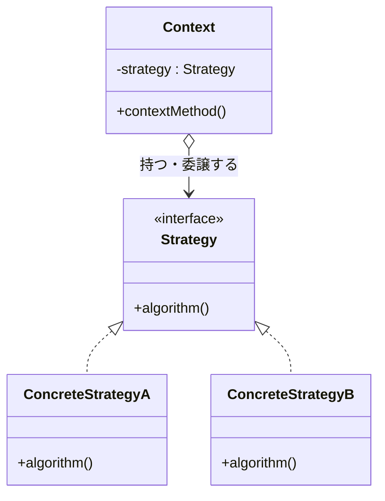

# 【第一部】デザインパターン執筆テンプレート v3
# 対象：第1〜8章（第二部の応用編は本テンプレートをベースに調整する）

---

## 第X章　【パターン名】
―― 思考の型：【この章で直面する「混在の種類」を一言で】

> **この章の核心**
> 【パターン特有の教訓を1〜2行で】

---

## ステップ0：システムを把握し、仮説を立てる ―― クラス構成を見てから「変わりそうな場所」を予測する

> **入力：** システムのシナリオ説明 ＋ クラス構成の概要（仕様表・責任一覧）。実装コードはまだ読まない。
> **産物：** 変動と不変の「仮説テーブル」

**【全パターン共通の問い】**

> 「このコードの中に、**『変わる理由』が異なる2つのものが、
> 同じ場所に混在していないか？」**

「変わる理由」とは **「誰の判断で変わるか」** のことです。

### X.0 この章のシステム構成と仮説

**この章で扱うシステム：**
【システムの概要を2〜3文で。業務用語を定義する】

**仕様表（何ができるシステムか）**

| 機能 | 担当 | 入力 | 出力 |
|---|---|---|---|
| 【機能名】 | 【担当クラス】 | 【入力】 | 【出力】 |

**クラス構成の概要**

```mermaid
classDiagram
    【変更前のクラス図。問題の構造を可視化する】
```

*→ 【クラス図が示す問題を1文で】*

**各クラスの責任一覧**

| 対象 | 責任（1文） | 知るべきこと |
|---|---|---|
| `【クラス名】` | 【責任】 | 【知るべきこと】 |

---

この構成を踏まえた上で、仮説を立てます。

**変動と不変の仮説（実装コードを読む前に立てる）**

| 分類 | 仮説 | 根拠（クラス構成から読み取れること） |
|---|---|---|
| 🔴 **変動する** | 【変わりそうな部分】 | 【なぜそう読み取れるか】 |
| 🟢 **不変** | 【変わらなそうな部分】 | 【なぜそう読み取れるか】 |

この仮説をステップ2（X.3）でヒアリング後に確定します。

---

## ステップ1：実装コードを読む ―― 責任チェックで問題の行を見つける

> **入力：** ステップ0で把握したクラス責任 ＋ 実際の実装コード
> **産物：** 責任チェック表。「このクラスが持つべきでない知識」が混在している行の発見。

### X.1 実装コードと責任チェック

ステップ0でクラスの責任は把握しました。
ここでは実際の実装コードを読み、「責任通りに書かれているか」を1行ずつ確認します。

```cpp
// 【起点コード（main()含む）＋ コメントで背景を示す】
```

**実行結果：**
```
【実行結果を示す。「このコードは正しく動く。問題は構造にある」を明示する】
```

**責任チェック：`【クラス名】` は自分の責任だけを持っているか**

【クラスの責任を1文で再確認し、「知るべきこと」を定義する】

| コードの行 | 持っている知識 | 責任内か |
|---|---|---|
| 【コードの一部】 | 【その行が持つ知識】 | **✗ 【誰の責任か】** または ✅ |

【責任外の知識が混在していることを散文で説明する】

---

### X.2 届いた変更要求

【変更要求のシーン。「誰から・何の要求が・いつまでに」の形式で書く】

---

## ステップ2：仮説を確定する ―― 関係者ヒアリングで「変わる理由」に根拠をつける

> **入力：** ステップ0の仮説 × ステップ1の責任チェック結果。関係者に直接確認する。
> **産物：** 確定した変動/不変テーブル（「誰の判断で変わるか」明記）

### X.3 仮説の検証と変動/不変の確定

ステップ0で仮説を立てました。ステップ1で責任チェックからも確認できました。
しかし——**コードを読んだだけで「変わる」「変わらない」と断定するのは危険です。**

---

**関係者ヒアリング**

> **開発者**：「【確認したい質問】」
>
> **【関係者の役職】**：「【回答】」

---

| 分類 | 具体的な内容 | 変わるタイミング | 根拠 |
|---|---|---|---|
| 🔴 **変動する** | 【変わる部分】 | 【いつ変わるか】 | 【誰への確認か】 |
| 🟢 **不変** | 【変わらない部分】 | 変わる日は来ない | 【誰との合意か】 |

> **設計の決断**：🟢 不変な部分を「契約（インターフェース）」として固定し、
> 🔴 変動する部分はそれぞれのインターフェースの裏側に押し込む。

---

## ステップ3：課題分析 ―― 変更が来たとき、どこが辛いかを確認する

【変更要求を今のコードに加えようとすると何が起きるかを描く。「痛み」を2点言語化する】

**依存の広がり**

```mermaid
graph TD
    【変更が飛び火する様子を図示する】
```

---

## ステップ4：原因分析 ―― 困難の根本にある設計の問題を言語化する

| 観察 | 原因の方向 |
|---|---|
| 【観察した事実】 | 【なぜそうなるか】 |

#### 変わるものと変わらないものが同じ場所にいる

| 変わり続けるもの | 変わってほしくないもの |
|---|---|
| 【変わる部分】 | 【変わらない部分】 |

---

## ステップ5：対策案の検討 ―― 「理想の契約」から逆算して構造を作る

### X.【節番号】 試み①：【シンプルな試みの名前】

```cpp
// 【最初の試みのコード】
```

**試み①の責任チェック**

| コードの行 | 持っている知識 | 責任内か |
|---|---|---|
| 【行】 | 【知識】 | **✗ 【誰の責任か】** |

【「問題の場所が変わっただけ」という限界を説明する】

---

### X.【節番号】 試み②：【インターフェースを使う試みの名前】

```cpp
// 【インターフェースと実装クラスのコード】
```

```mermaid
classDiagram
    【変更後の構造を示すクラス図】
```

**★ここで初めてパターン名を出してよい★**

【パターン名を「辿り着いたラベル」として紹介する】

---

### X.【節番号】 評価軸の宣言

| 評価軸 | なぜこの状況で重要か |
|---|---|
| 【軸1】 | 【理由】 |
| 【軸2】 | 【理由】 |

---

### X.【節番号】 各アプローチをテストで比較する

```cpp
// 【試み①のテストコード】
```

```cpp
// 【試み②のテストコード】
```

**比較のまとめ**

| 基準 | 試み① | 試み② |
|---|---|---|
| 【軸1】 | 【評価】 | 【評価】 |
| 【軸2】 | 【評価】 | 【評価】 |

---

## ステップ6：天秤にかける ―― 柔軟性とシンプルさのバランスを評価する

### X.【節番号】 耐久テスト ―― ヒアリングで挙がった変化が来た

【X.3のヒアリングで挙がったリスクを実際に変化させ、試み②がどう対応するかを示す】

```cpp
// 【耐久テストのコード】
```

---

### X.【節番号】 使う場面・使わない場面

```cpp
// 【過剰コード：変化の予定がないものまでパターン化した例】
```

| 状況 | 適切な選択 | 理由 |
|---|---|---|
| 【状況1】 | 【選択】 | 【理由】 |
| 【状況2】 | 【選択】 | 【理由】 |

---

## ステップ7：決断と、手に入れた未来

### X.【節番号】 解決後のコード（全体）

```cpp
// 【BatchApplication / main() を含む最終コード全体】
```

---

### X.【節番号】 変更シナリオ表と最終責任テーブル

**変更シナリオ表：何が変わったとき、どこが変わるか**

| シナリオ | 変わるクラス | 変わらないクラス |
|---|---|---|
| 【シナリオ1】 | 【変わるクラス】 | 【変わらないクラス】 |

**最終責任テーブル**

| クラス | 責任（1文） | 変わる理由 |
|---|---|---|
| `【クラス名】` | 【責任】 | 【変わる理由】 |

---

## 整理

### 8ステップとこの章でやったこと

| ステップ | この章でやったこと |
|---|---|
| ステップ0 | 【ステップ0の概要】 |
| ステップ1 | 【ステップ1の概要】 |
| ステップ2 | 【ステップ2の概要】 |
| ステップ3 | 【ステップ3の概要】 |
| ステップ4 | 【ステップ4の概要】 |
| ステップ5 | 【ステップ5の概要】 |
| ステップ6 | 【ステップ6の概要】 |
| ステップ7 | 【ステップ7の概要】 |

**各クラスの最終的な責任**

| クラス | 責任 | 変わる理由 |
|---|---|---|
| `【クラス名】` | 【責任】 | 【変わる理由】 |

このプロセスを回した結果にたどり着いた構造こそが **【パターン名】パターン** です。

---

## 振り返り：第0章の3つの哲学はどう適用されたか

### 哲学1「変わるものをカプセル化せよ」の現れ

**具体化された場所：** 【どのクラス・どの構造に現れているか】

【散文で説明する】

### 哲学2「実装ではなくインターフェースに対してプログラムせよ」の現れ

**具体化された場所：** 【どのクラス・どの構造に現れているか】

【散文で説明する】

---

### 哲学3「継承よりコンポジションを優先せよ」の現れ

**具体化された場所：** 【どのクラス・どの構造に現れているか】

【散文で説明する】

---

## パターン解説：【パターン名】パターン

### パターンの骨格

【パターンが解決する構造問題を1〜2文で述べてから図を入れる】



【各役割（Context / Strategy / ConcreteStrategy）を1行ずつ散文で説明する】

### この章の実装との対応

```mermaid
classDiagram
    【章固有クラスを使った対応図。役割とクラスが視覚的に対応するようにする】
```

【抽象と具体の対応を1〜2文で説明する】

### どんな構造問題を解くか

【「処理の骨格」と「処理の中身」が同じ場所にいる状態がこのパターンの出番、という説明を散文で】

### 使いどころと限界

**使いどころ：**【どんな条件のときに使うか。「誰の判断で変わるか」の観点で】

**限界：**【使わないほうがよい状況。コストとのバランスの観点で】
