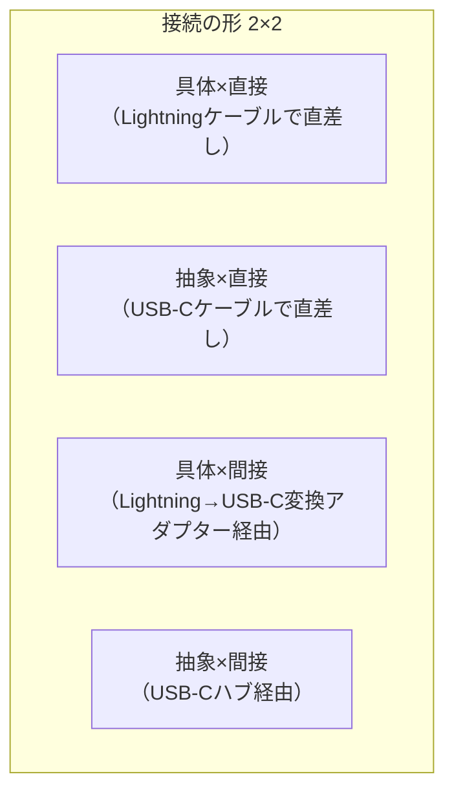

# 【第一部】デザインパターン執筆テンプレート v7

対象：第1〜8章（第二部の応用編は本テンプレートをベースに調整する）

このテンプレートは「Geminiが章を書くための設計図」である。
各サブ項目の `<!-- -->` コメントを必ず読み、目的・産物・禁止事項を把握してから本文を生成すること。

---

## 前段

<!--
【目的】読者が「この章で何を得られるか」を把握し、読み続ける動機を作る。
【禁止】パターン名を前面に出してはならない。「Strategyパターンを学びます」ではなく
　　　　「変わるアルゴリズムをどう分離するかを学びます」という表現にする。
【禁止】「前章で学んだ〜」「次章では〜」など他章への参照は禁止。この章だけで完結する。
-->

---

## 第X章　【パターン名】

―― 思考の型：【この章で直面する「混在の種類」を一言で】

<!--
タイトル形式：章番号 + パターン名 + サブタイトル（問題の本質を一言で）
サブタイトルは「〜が〜に混在している」という構造問題の形で書く。
例：「変わるアルゴリズムが、呼び出し側に直接埋め込まれている」
-->

### この章の核心

**【パターン特有の教訓を1〜2行で】**

<!--
【目的】この章を1文で要約する。読者が何を持ち帰るかを宣言する。
【形式】「〇〇が変わると△△も変わる。それは□□が混在しているからだ。」という因果構造で書く。
【禁止】パターン名から始めない。問題の痛みから始める。
-->

---

### この章を読むと得られること

<!--
【目的】読者が「この章を読む価値があるか」を判断できるようにする。
【形式】3〜4項目。「〜できるようになる」「〜と判断できるようになる」形式で書く。
【内容】以下の4観点から1項目ずつ書く：
　　　　1. 変動箇所の識別力（コードの何が変わるかを見つけられるか）
　　　　2. 接続形態の診断力（どこが変更の痛みの発生源かを判断できるか）
　　　　3. 構造改善の説明力（なぜ設計を変えると痛みが消えるかを説明できるか）
　　　　4. パターン特有の視点（この章固有のスキル）
【禁止】「Strategyパターンを理解できる」のような「パターン理解＝目的」の書き方は禁止。
-->

- **得られること1：** 「【この章の変化の観点】」という観点で、コードの変動箇所を識別できるようになる
- **得られること2：** 接続点が「【接続形態】」になっているクラスを見て、そこが変更の痛みの発生源だと判断できるようになる
- **得られること3：** 接続点の形を変えると変更がどのように局所化されるかを、構造から説明できるようになる
- **得られること4（任意）：** 【パターン特有の追加的な視点】

---

## 🔵 フェーズ1：現状把握 ―― 変更が来る前にコードを把握する

<!--
【フェーズ全体の目的】
　変更要求が来る前のシステムを「事実として」把握する。
　仮説は立てない。判断もしない。観察した事実をフェーズ2に持ち込む。

【フェーズ全体の産物】
　「このシステムは何をするものか（仕様）」と
　「どう実装されているか（コード）」の両方が把握できた状態。

【フェーズ全体の禁止事項】
　・「この設計には問題があります」「後で修正が必要です」など、評価・判断を含む表現
　・変更要求への言及（変更要求はフェーズ2で登場する）
　・解決策・パターン名の言及（フェーズ6まで出してはならない）
　・「混在している」「問題がある」などの判定（観察にとどめる）

【目安】全体で300〜400行
-->

---

### 1-1：システムの背景

<!--
【目的】
　読者に「こういう現場だな」と感じさせる。
　このシステムが「正しく動いている」「これまで役に立ってきた」という印象を作る。
　コードの問題は「構造」にあって「機能」にはないことを読者に予感させる。

【産物】
　システムの業務文脈（誰が使い、何のために動いているか）が理解できる状態。

【執筆ポイント】
　・誰が使い、何のために動いているかを2〜4段落で描写する
　・現場の雰囲気（担当者が増えてきた、リリース頻度が上がってきたなど）を入れると読者が共感しやすい
　・末尾の段落で「一見すると、このコードはうまく整理されている」という印象を添える
　・このコードが今日まで現場を支えてきた事実への敬意を忘れない

【禁止】
　・「このコードには問題があります」のような先取り評価
　・設計用語（SRP・OCP・依存性注入など）の登場
　・パターン名の言及

【文字数目安】300〜500文字
-->

【このシステムはどんなビジネスの文脈で動いているか。誰が使い、何のために動いているかを2〜4段落で描写する。読者が「こういう現場だな」と感じられる具体的な説明にする。末尾に「一見すると、このコードはうまく整理されている」という印象を1段落で添える】

---

### 1-2：仕様表

<!--
【目的】
　「何のシステムか」を素早く把握できる一覧を提供する。
　読者がコードを読む前に「仕様の概要」を頭に入れられるようにする。

【産物】
　機能・担当クラス・入出力の対応が分かる表。

【執筆ポイント】
　・主要な機能を4〜8行で列挙する（全機能の網羅が目的ではない）
　・「担当クラス」列は1-3のクラス構成図と一致させる
　・入力・出力は具体的な型や値の例を書く（「文字列」ではなく「顧客ID（int）」など）

【禁止】
　・仕様の詳細解説（ここは概要表。詳細は実装コードで示す）
　・ビジネスルールの説明（それは1-1の仕事）
-->

| **機能名** | **担当クラス** | **入力** | **出力** |
|---|---|---|---|
| 【機能名】 | 【担当クラス】 | 【入力】 | 【出力】 |

---

### 1-3：クラス構成図

<!--
【目的】
　システムのクラス構成を可視化し、どのクラスがどのクラスを知っているかを一目で示す。
　この図は「変更前」の構造を示す。フェーズ7で「変更後」と対比する。

【産物】
　クラス名・関係（依存・継承・集約）が分かるクラス図。

【執筆ポイント】
　・問題の構造（後でフェーズ3〜4で取り上げる「変更が痛みになる箇所」）を必ず含める
　・矢印の数が多い箇所が問題の予告になる（ただし今の段階では指摘しない）
　・クラス名は実装コードと一致させる

【禁止】
　・「このクラスは責任が多すぎます」などの評価コメント
　・パターン適用後のクラスを混ぜない（あくまで変更前の現状）
-->

```mermaid
classDiagram
    %% 【変更前のクラス図。問題の構造を可視化する。矢印が集中する箇所が後の問題の伏線になる】
```

→ 【クラス図が示す構成を1文で。評価は加えない。「〇〇クラスが△△クラスを知っている」のような事実描写にする】

---

### 1-4：責任配置テーブル

<!--
【目的】
　各クラスが「何を知るべきか」を定義する。
　後の1-8（責任チェック表）で「実際に何を知っているか」と照合するための基準を作る。

【産物】
　クラス名・責任（1文）・知るべきことの対応表。

【執筆ポイント】
　・「責任」は1文で書く（「〜の計算を担当する」「〜を管理する」）
　・「知るべきこと」は「このクラスが責任を果たすために必要な知識」を列挙する
　・表の後に1〜2段落の散文を加える。「この表から何が読み取れるか」を中立に述べる

【禁止】
　・「知りすぎている」「責任が多い」などの評価（それは1-8の仕事）
　・解決策への言及

【目安】クラス数分の行
-->

| **クラス名** | **責任（1文）** | **知るべきこと** |
|---|---|---|
| 【クラス名】 | 【責任】 | 【知るべきこと】 |

【この表で何が見えるかを1〜2段落で。表だけで終わらない。「各クラスの責任と知識の定義が確認できた」という締め方にする】

---

### 1-5：依存グラフ

<!--
【目的】
　クラス間の「依存の方向」をマクロで示す。
　誰が誰を知っているかを矢印で可視化し、変更が連鎖するリスクの予告にする。

【産物】
　依存グラフ（graph TD）。矢印は「AがBを知っている（依存している）」方向で引く。

【クラス図(1-3)との違い】
　1-3：クラスの構造（継承・集約・コンポジション）を示す
　1-5：依存の方向（誰が誰を参照しているか）を示す
　　　　変更が波及するリスクを読み取るためのビュー

【執筆ポイント】
　・矢印が集中するクラス（多くから依存されているクラス）を目立たせる
　・後でフェーズ3の変更影響グラフと連動することを意識する
　・グラフの後に「このグラフで何が見えるか」を1文で書く

【禁止】
　・「このクラスへの依存が問題です」などの評価
-->

```mermaid
graph TD
    %% 【問題の広がりをマクロで示す依存グラフ。誰が誰に依存しているかを矢印で可視化する】
```

→ **【このグラフが示す依存関係を1文で。「〇〇クラスに矢印が集中している」のような事実描写にする】**

---

### 1-6：実装コード

<!--
【目的】
　「このシステムは正しく動いている」ことを、実際のコードで証明する。
　問題は機能にではなく構造にあることを、後のフェーズで示すための基盤を作る。

【産物】
　main()を含む起点コード全体（動くコード）。

【執筆ポイント】
　・コードを示す前に1〜2文で「このコードが何をするか」の文脈を説明する
　・main()を含め、エンドツーエンドで動作が追える形にする
　・コメントで「変わりそうな箇所」（後でフェーズ3〜4で取り上げる部分）を自然に目立たせる
　　　例：`// 割引ルール：条件ごとに if で分岐している`
　・コードは30〜60行程度。長すぎる場合は要点だけ抜粋して「// ... 省略 ...」を使う
　・1行80文字以内（Kindle制限）

【禁止】
　・templateメタプログラミング・lambda式・スマートポインタ（unique_ptr等）
　・ファイルI/O・通信・特定フレームワーク・DB操作などの専門知識
　・「// ← この設計には問題がある」などの評価コメント

【目安】30〜60行
-->

【コードを示す前に1〜2文で文脈を説明する】

```cpp
// 【起点コード（main()含む）。コメントで変わりそうな箇所に自然に言及する。動くコードを示す】
```

【コードの直後に「このコードで何が分かったか」を1文で書く。コードブロックの後に何もなく次の見出しへ進むのは禁止】

---

### 1-7：実行結果

<!--
【目的】
　「このコードは正しく動く。問題は構造にある」を読者に明示する。
　これが重要な理由：読者に「動いているコードを後でリファクタリングする」体験をさせるため。
　動かないコードを修正するのではなく、動くコードをより良い構造に改善することを示す。

【産物】
　実際の実行結果（標準出力）。

【執筆ポイント】
　・実行結果を示した後に「このコードは正しく動く。変えるのは構造だ」という1文を入れる
-->

【実行結果を示す。フォーマット例：`出力：XXX円（割引適用後）`】

> このコードは正しく動く。これから変えていくのは「機能」ではなく「構造」だ。

---

### 1-8：責任チェック表

<!--
【目的】
　1-4で定義した「知るべきこと」と、実際にコードが「知っていること」を照合する。
　「知るべきでない知識を持っている行」を特定し、フェーズ2以降の分析の起点にする。

【産物】
　責任チェック表（コードの行・持っている知識・管理者の観察）。
　「混在しているかもしれない」という観察の記録。

【執筆ポイント】
　・「管理者（観察）」列では「誰の判断でその知識は変わるか」を書く
　　（例：「営業チームが変更を決める」「法務部門が管理する」）
　・「管理者が2人以上いる」行が見つかれば、それが後のフェーズの核心になる
　・表の後に1〜2段落の散文を加える。「観察した事実」を中立に述べる

【重要：判定禁止ルール】
　この表では ❌/✅ の「判定」をしてはならない。あくまで「観察」にとどめる。
　「〜という知識が混在している可能性が見える」「〜は別の担当者が管理しているようだ」
　というレベルの表現にする。
　判定はフェーズ4（原因分析）で行う。

【禁止】
　・「責任外の知識を持っているため問題です」などの評価
　・解決策の提示
-->

【クラスの責任を1文で再確認し、「知るべきこと」を定義する】

| **コードの行** | **持っている知識** | **管理者（観察）** |
|---|---|---|
| `【コードの一部】` | 【その行が持つ知識】 | 【その知識を管理するのは誰か（観察）】 |

> 【責任チェックで見えたことを散文で1〜2段落。「混在している」「していない」を「観察として」述べる。まだ「問題だ」と判定しない。「〜という知識が同じ場所に並んでいることが見えた」程度の表現にとどめる】

フェーズ1で責任配置の観察が終わりました。次のフェーズ2では、変更要求を受けて「何が変わり、何が変わらないか」の仮説を立てます。

---

## 🟠 フェーズ2：仮説立案 ―― 変更要求を受けて、変動と不変を整理する

<!--
【フェーズ全体の目的】
　届いた変更要求を起点に「何が変わり得るか・変わらないか」を仮説立案し、
　関係者との確認で確定する。

【フェーズ全体の産物】
　確定した変動/不変テーブル（2-4）。これがフェーズ3〜6の分析の基盤になる。

【フェーズ全体の流れ】
　変更要求が届く（2-1）
　→ フェーズ1の観察から仮説を立てる（2-2）
　→ 関係者に確認する（2-3）
　→ 確定テーブルを作る（2-4）

【フェーズ全体の禁止事項】
　・設計の決断（どの案を採用するか）はここでは行わない。決断はフェーズ6で行う。
　・解決策・パターン名の言及

【目安】全体で180〜230行
-->

---

### 2-1：届いた変更要求

<!--
【目的】
　フェーズ2の起点となる「変更の引き金」を描く。
　「誰から・何の要求が・いつまでに」という現実感のあるシーンにする。

【産物】
　変更要求の内容と背景が分かる場面描写。

【執筆ポイント】
　・「誰から（役職・担当者名）」「何の変更要求が」「いつまでに」の3要素を含める
　・著者の口癖（「なるほど」「確かに」「ちょっと待ってくれ」）を1箇所入れると人間的な文体になる
　・変更要求の背景（ビジネス上の理由）を1〜2文で添える

【文字数目安】200〜300文字
-->

【変更要求のシーン。人間的な文体で書く。「誰から・何の要求が・いつまでに」の3要素を含める】

---

### 2-2：変動・不変の仮説テーブル

<!--
【目的】
　フェーズ1の観察（1-8の責任チェック表）を材料に、
　「変わりそうな部分」と「変わらなそうな部分」の仮説を立てる。
　まだ「確定」ではない。2-3のヒアリングで確認する。

【産物】
　仮説テーブル（変動しそう / 不変そう / 根拠）。

【執筆ポイント】
　・根拠列には「フェーズ1のどの観察から仮説を立てたか」を書く
　　（例：「1-8で〇〇クラスが割引ルールを直接知っていると観察した」）
　・🔴（変動しそう）の行は、2-3のヒアリング対象になる
　・断定しない：「〜と読み取れる」「〜しそうだ」のレベルにとどめる

【禁止】
　・「確定的に変わる」「間違いなく変わらない」などの断定表現
　・設計の方向性への言及
-->

| **分類** | **仮説** | **根拠（フェーズ1の観察から）** |
|---|---|---|
| 🔴 **変動しそう** | 【変わりそうな部分】 | 【なぜそう読み取れるか。1-8のどの観察から来ているか】 |
| 🟢 **不変そう** | 【変わらなそうな部分】 | 【なぜそう読み取れるか】 |

コードを読んだだけで「変わる」「変わらない」と断定するのは危険です。関係者に直接確認します。

---

### 2-3：関係者ヒアリング

<!--
【目的】
　2-2の仮説を関係者との対話で確認する。
　「将来の変化」についても聞き出し、フェーズ6-10（耐久テスト）の伏線を作る。

【産物】
　・2-2の仮説が確認された記録
　・将来の変化リスク（6-10の耐久テストに使う）

【執筆ポイント】
　・問答形式で書く。「開発者：〜」「関係者（役職）：〜」の会話形式
　・確認すべき質問：
　　　1. 「この部分は将来変わる予定はありますか？」
　　　2. 「このID・型は今後変更になりますか？」（型の安定性）
　　　3. 「他に変わりそうなものがあれば教えてください」（将来リスクの掘り起こし）
　・ヒアリングで挙がった「将来のリスク（まだ確定ではない変化）」は必ず記録する
　　→ これが6-10（耐久テスト）の伏線になる
　・「設計に絶対の正解はない。だからこそ確認する」という姿勢を文体に出す

【伏線回収ルール】
　ヒアリングで「将来〇〇に変わるかもしれない」と挙がった変化は、
　6-10の耐久テストで「あのとき言っていた変化が来た」として実演する。
　この伏線回収が読者の「ああそのためだったか」という体験になる。

【文字数目安】400〜600文字
-->

【問答形式のヒアリングシーン。最低3往復の会話を含める】

- **開発者：** 「【確認したい質問】」
- **【関係者の役職】：** 「【回答。将来の変化リスクを含める】」

---

### 2-4：確定した変動/不変テーブル

<!--
【目的】
　2-3のヒアリング結果を反映し、変動/不変を「確定」する。
　この表がフェーズ3（変更シミュレーション）・フェーズ4（原因分析）・フェーズ6（対策案）の基盤になる。

【産物】
　確定版の変動/不変テーブル。

【執筆ポイント】
　・「変わるタイミング」列が重要：いつ変わるかで対策の優先度が変わる
　・「根拠（誰との確認か）」列：設計の決断は合意に基づく、という姿勢を示す
　・🔴（変動する）の内容は、次のフェーズ3で「変更を試みる対象」になる

【禁止】
　・まだ解決策・接続形態への言及はしない
-->

| **分類** | **具体的な内容** | **変わるタイミング** | **根拠（誰との確認か）** |
|---|---|---|---|
| 🔴 **変動する** | 【変わる部分】 | 【いつ変わるか】 | 【誰への確認か】 |
| 🟢 **不変** | 【変わらない部分】 | 変わる日は来ない | 【誰との合意か】 |

フェーズ2で「何が変わり、何が変わらないか」が確定しました。次のフェーズ3では、変更要求を実際に試みて、何が起きるかを確認します。

---

## 🟡 フェーズ3：問題特定 ―― 変更を試みて、痛みを発見する

<!--
【フェーズ全体の目的】
　「変わると確定したものを、今のコードのままで変更しようとする」と何が起きるかを確認する。
　「痛み」を発見する段階。まだ「なぜ痛いか」の原因は分析しない（それはフェーズ4の仕事）。

【フェーズ全体の産物】
　「今の構造で変更しようとすると、〇〇という痛みが生じる」という事実の記録。

【フェーズ全体の言葉遣いルール】
　「痛みを確認しましょう」ではなく「変更を試みてみましょう」と書く。
　発見は中立に記述し、読者自身が不便さに気づく形にする。
　「これが問題です」と先に言わず、変更を試みる場面を丁寧に描く。

【目安】全体で150〜200行
-->

---

### 3-1：変更シミュレーション

<!--
【目的】
　2-4で確定した「変わる部分」を、今のコードで実際に変更しようとすると何が起きるかを描く。

【産物】
　「変更を試みたら何が起きたか」の場面描写。

【執筆ポイント】
　・「変更しようとした場面」を現在進行形で描く（「〜を追加しようとしたとき、気づいた」）
　・コードの何行目をどう変えようとしたかを具体的に書く
　・「思ったより多くの箇所を触ることになった」という発見を中立に描写する
　・変更を試みる「前」と「後」で何が起きたかを対比する

【禁止】
　・「これは設計が悪い」などの判定表現（発見の描写にとどめる）

【文字数目安】400〜600文字
-->

【変更を試みる場面。「やってみたら何が起きたか」を中立に描写する。読者が「自分も同じことをした」と感じられるリアルな描写にする】

---

### 3-2：変更影響グラフ

<!--
【目的】
　3-1の「変更が広がった様子」を図で可視化する。
　フェーズ7(7-2)の「改善後グラフ」と対比するための「改善前グラフ」。

【産物】
　graph LR形式の変更影響グラフ。

【執筆ポイント】
　・「変更要求 → 影響するクラスA → さらに影響するクラスB」の連鎖を矢印で示す
　・「飛び火」という表現が示す通り、変更が波及する様子を可視化する
　・同一シナリオをフェーズ7でも描き、「改善前」と「改善後」を対比できるようにする

【グラフの形式】
　T1["変更要求の内容"] -->|"影響が飛び火"| A["ClassName.cpp"]
　A -->|"さらに影響"| B["OtherClass.cpp"]
-->

```mermaid
graph LR
    %% 【変更が飛び火する様子を図示する。T1（変更要求）→影響クラスの連鎖を矢印で示す】
```

【グラフの直後に「このグラフで何が見えるか」を1文で書く。「〇〇という変更要求が、△△と□□の両方に影響していることが見える」のような形】

---

### 3-3：痛みの言語化

<!--
【目的】
　3-1と3-2で発見した「痛み」を、現場エンジニアが感じる言葉で言語化する。
　技術的な問題説明ではなく、「こういう状況は辛い」という共感を生む文章にする。

【産物】
　2点の「痛み」の散文。

【執筆ポイント】
　・「grep地獄（変更箇所を探すのが大変）」「影響範囲が読めない（変えると何が壊れるか分からない）」
　　など、現場の実体験に基づく具体的な辛さを言葉にする
　・「こういうとき困る」という読者の体験と一致させる
　・2点を箇条書きではなく散文で書く（各200〜300文字）

【禁止】
　・「この設計には問題があります」などの設計用語での評価
　・解決策の言及（それはフェーズ6）
　・「SRP違反」「OCP違反」などの原則名を使った断罪

【目安】2点、各200〜300文字
-->

【「痛み」を2点、散文で言語化する。grep地獄・影響範囲の広さなど、現場の実体験に基づく辛さを「こういうとき困る」という共感の言葉で書く】

フェーズ3で「変更が辛い」という事実が確認できました。次のフェーズ4では、なぜ辛いのかを構造的に言語化します。

---

## 🔴 フェーズ4：原因分析 ―― 「なぜ辛いのか」を構造的に言語化する

<!--
【フェーズ全体の目的】
　フェーズ3で「痛い」ことは分かった。このフェーズでは「なぜ痛いのか」を
　コードの構造（接続形態）の観点から言語化する。

【フェーズ全体の産物】
　「この設計の問題は〇〇である」という1つの原因の言語化。
　現在の接続形態（具体×直接 / 抽象×直接 / 具体×間接 / 抽象×間接）の診断。

【フェーズ全体の流れ】
　観察した事実 → 原因の方向性（4-1）
　変わるもの / 変わらないものの整理（4-2）
　ケーブル比喩で現在の接続形態を診断（4-3）

【目安】全体で120〜160行
-->

---

### 4-1：観察→原因テーブル

<!--
【目的】
　フェーズ3で観察した「痛み」と、その根本にある構造的な原因を対応させる。
　「痛いのは〇〇が△△を直接知っているから」という因果を言語化する。

【産物】
　観察事実と原因の方向性の対応表。

【執筆ポイント】
　・「観察」列：フェーズ3で発見した具体的な痛みを書く
　・「原因の方向」列：その痛みの構造的な理由を書く
　　　→ 「〇〇クラスが△△の具体的な条件を直接知っているから」
　　　→ 「変わる理由が異なる2つのものが同じ場所に混在しているから」
　・2〜3行の対応で十分

【禁止】
　・解決策・パターン名の言及
-->

| **観察** | **原因の方向** |
|---|---|
| 【フェーズ3で観察した痛み】 | 【なぜそうなるか。「〇〇が△△を直接知っているから」の形で書く】 |

---

### 4-2：変わるもの / 変わらないものテーブル

<!--
【目的】
　原因分析の結果として「変わる側」と「変わらない側」を明確に分ける。
　「変わる側をカプセル化できれば、変わらない側は安定する」という論理の基盤を作る。
　このテーブルが、フェーズ5（課題定義）・フェーズ6（対策案）の前提になる。

【産物】
　変わり続けるもの（🔴）/ 変わってほしくないもの（🟢）の対応表。

【執筆ポイント】
　・「変わり続けるもの」：ビジネスルール・状態・アルゴリズムなど、変化の理由があるもの
　・「変わってほしくないもの」：コアロジック・処理の骨格・呼び出し側のコードなど
　・2-4の確定テーブルと整合していることを確認する

【禁止】
　・解決策・パターン名の言及
-->

| **変わり続けるもの（🔴）** | **変わってほしくないもの（🟢）** |
|---|---|
| 【変わる部分。ビジネスルール・条件・状態など】 | 【変わらない部分。処理の骨格・呼び出し側など】 |

---

### 4-3：ケーブルで考える

<!--
【目的】
　現在の接続形態を「2×2マトリクス」のどのセルに当たるかで診断する。
　「今はLightningケーブルで直差しの状態（具体×直接）だ」という比喩で、
　接続形態の問題を直感的に示す。
　この診断が「どのセルに移動するか」という対策の方向性を示すフェーズ5〜6の前提になる。

【産物】
　・現在の接続形態の診断（1〜2文）
　・ImagePrompt（接続形態を図示するための画像生成プロンプト）

【2×2マトリクスの対応】
　具体×直接 → Lightningケーブルで直差し（iPhoneに専用ケーブルで直接つなぐ）
　抽象×直接 → USB-Cケーブルで直差し（規格に合うなら何でも直接つなげる）
　具体×間接 → Lightning→USB-C変換アダプター経由（専用アダプターを間に挟む）
　抽象×間接 → USB-Cハブ経由（ハブの先に何があるかを知らずに使う）

【執筆ポイント】
　・「現在の〇〇クラスと△△クラスの接続は、〜の状態になっている」という形で診断する
　・ImagePromptは必須。現在地のセルをハイライトした2×2マトリクス図のプロンプトを書く

【文字数目安】200〜400文字
-->

【現在の接続形態を2×2マトリクスのどのセルで診断するかを1〜2文で説明する。「〇〇クラスは△△の具体クラスを直接知っている。これはLightningケーブルで直差しの状態（具体×直接）だ」の形で】

[ImagePrompt: A clean flat 2x2 matrix diagram showing cable/connector metaphors. HIGHLIGHT the cell corresponding to the current connection form with a bright border. 具体×直接＝Lightning直差し、抽象×直接＝USB-C直差し、具体×間接＝専用アダプター経由、抽象×間接＝USB-Cハブ経由。Other cells are muted gray. Vertical axis: "具体（専用規格）" top, "抽象（汎用規格）" bottom. Horizontal axis: "直接（直差し）" left, "間接（アダプター経由）" right. Minimalist flat style, white background, no gradients.]

フェーズ4で根本原因が言語化できました。次のフェーズ5では、解決すべき問題を具体的に定めます。

---

## 🔴 フェーズ5：課題定義 ―― 解くべき問題を具体的に定める

<!--
【フェーズ全体の目的】
　フェーズ4で「分けるべき」と判断した場所に何が生まれるかを特定し、
　制約を整理して「何を解くか」を確定する。
　「どう解くか」（対策案）はフェーズ6の仕事。ここでは「何を解くか」だけを定める。

【フェーズ全体の産物】
　課題まとめ表（5-4）。これがフェーズ6の出発点になる。

【目安】全体で100〜130行
-->

---

### 5-1：接続点の特定

<!--
【目的】
　フェーズ4で「分ける」と判断した場所に生まれる「接続点（ジョイント）」を特定する。
　接続点の場所・数を明確にすることで、解くべき課題の対象を確定する。

【産物】
　接続点の列挙（どこに何個あるか）。

【執筆ポイント】
　・「接続点A：〇〇クラス ←→ △△クラスの境界」の形で列挙する
　・接続点が複数ある場合は、それぞれ独立に課題を定義する
　・接続点の「数」を明記する（1個なのか2個なのかで対策の規模が変わる）

【文字数目安】100〜200文字
-->

フェーズ4で「分ける」と判断した場所に、接続点（ジョイント）が生まれます。その接続点がどこに何個あるかを明確にします。

【接続点の列挙。「接続点A：〇〇クラス ←→ △△クラスの境界」の形で、どこに何個あるかを明示する】

---

### 5-2：非機能制約の確認

<!--
【目的】
　接続形態の選択に影響する制約を確認する。
　「なぜ分けたか」だけでなく「どんな制約があるか」が、フェーズ6の案選定に影響する。

【産物】
　非機能制約の確認表（変更頻度・パフォーマンス・メモリ）。

【執筆ポイント】
　・ホットパス（高頻度で呼ばれる処理）なら「具体×直接」寄りの選択が合理的
　・「変更頻度が低い」なら案0（変えない）も合理的な選択肢になる
　・この表の結果が6-7（評価軸宣言）で参照される

【パフォーマンスと接続形態の対応】
　具体×直接：オーバーヘッド最小。コンパイラが最適化しやすい。
　抽象×直接（virtual）：vtableルックアップのコスト。
　具体×間接：間接参照のコスト（呼び出しが1段増える）。
　抽象×間接：vtableルックアップ＋間接参照。最も柔軟だが実行時コストが最も高い。
-->

| **確認項目** | **内容** | **この章での判断** |
|---|---|---|
| 変更頻度 | この接続点はどのくらいの頻度で変わるか | 【高 / 中 / 低】 |
| パフォーマンス | ホットパスか（高頻度で呼ばれるか） | 【はい / いいえ】 |
| メモリ | 間接層の追加でオーバーヘッドが問題になるか | 【はい / いいえ】 |

---

### 5-3：クライアントへの影響範囲

<!--
【目的】
　「分けること」で既存コードにどの程度の変更が波及するかを確認する。
　影響範囲が大きいほど、段階的なリファクタリングが必要になる。

【用語】
　「クライアント」＝分離対象のクラスを呼び出している既存コード。
　（例：OrderProcessorがDiscountRuleを直接呼んでいれば、OrderProcessorがクライアント）

【産物】
　影響を受けるクラスの列挙と、その影響の内容。

【文字数目安】100〜200文字
-->

【どのクラスが影響を受けるかを列挙する。「〇〇クラスは△△を直接呼んでいるため、接続点の形を変えると修正が必要になる」の形で書く】

---

### 5-4：課題まとめ表

<!--
【目的】
　5-1〜5-3の内容を一覧にまとめ、フェーズ6の出発点を確定する。
　「この表が埋まった状態がフェーズ6のスタート地点」。

【産物】
　課題まとめ表（接続点・分けた理由・非機能制約・クライアント影響）。

【執筆ポイント】
　・接続点が複数ある場合、それぞれ1行ずつ記述する
　・この表の内容がフェーズ6の各案（案0〜案4）の設計根拠になる

【禁止】
　・この表の段階で「案Xを採用する」などの決断をしない
-->

| **接続点** | **分けた理由** | **非機能制約** | **クライアント影響** |
|---|---|---|---|
| 接続点A | 【変わる理由が異なる / 複雑さを隠したい / etc.】 | 【ホットパスか否か】 | 【影響するクラス名】 |

フェーズ5で「何を解くか」が確定しました。次のフェーズ6では、解決策を並べてコストで選びます。

---

## 🟢 フェーズ6：対策案検討 ―― 解決策を並べ、コストで選ぶ

<!--
【フェーズ全体の目的】
　フェーズ5の課題定義に対する解決策（案0〜案4）を並列に示し、
　評価軸を宣言した上でコスト比較し、採用案を決定する。

【フェーズ全体の構造】
　6-1 現在地の確認（2×2マトリクス）
　6-2〜6-6 案0〜案4を並列提示（優劣なし）
　6-7 評価軸を宣言
　6-8 コスト天秤（比較表）
　6-9 採用案の決定
　6-10 耐久テスト（フェーズ2の伏線回収）

【最重要ルール：パターン名の登場タイミング】
　パターン名は6-2〜6-6のいずれかの案として登場する。
　「案2 抽象×直接 ―― これをStrategyパターンと呼ぶ」という形で初登場させる。
　6-1より前にパターン名を出してはならない。

【最重要ルール：案の並列提示】
　案0〜案4はどれが「正解」かを誘導せず、優劣なく並列に提示する。
　「これが最善です」という書き方は禁止。
　「どれを選ぶかはプロジェクトの文脈で決まる」という姿勢を維持する。

【目安】全体で320〜420行
-->

---

### 6-1：接続の形 2×2マトリクス

<!--
【目的】
　現在地（フェーズ4で診断した接続形態）と、案0〜案4がどのセルに対応するかを可視化する。
　読者が「今どこにいて、どこに移動する選択肢があるか」を一目で把握できるようにする。

【産物】
　2×2マトリクス図（graph TD形式）。

【執筆ポイント】
　・現在地のセルを `style A fill:#ffcccc` でハイライトする
　・案ごとにどのセルに対応するかをコメントで示す

【禁止】
　・パターン名はこの図にはまだ出さない
-->



---

### 6-2：案0 現状維持 ―― 構造を変えない

<!--
【目的】
　「あえて何もしない」という選択肢を最初に提示する。
　案0が存在する理由：変更頻度が低い・納期が短い場合、現状維持が合理的な判断になるから。

【産物】
　案0の考え方・準備・コード例・トレードオフの4点セット。

【執筆ポイント】
　・「変更頻度が低く将来的な変化も見込めない場合に合理的」という文脈を必ず含める
　・コードは「if文追加」「定数変更」などの最小限の修正例を示す
　・トレードオフは変更容易性・テスト容易性・実装コストの3軸で書く

【禁止】
　・「案0は悪い選択肢です」などの評価（案0は正当な選択肢）
-->

**考え方：** クラスの分割も接続形態の変更もしない。既存の構造のまま、`if` 文の追加や定数の変更でその場の変更要求に対応する。変更頻度が低く、将来的な変化も見込めない場合に合理的な選択となる。

**準備：**
- 既存コードを触れる最小範囲（`if` の追加・定数の変更）を特定する
- 変更が波及しないことを確認してから実施する

【案0のコード（一部）。if 文追加や定数変更など最小限の修正例を示す】

**トレードオフ：**
- 変更容易性：低（次の変更要求が来たとき同じ作業が繰り返される）
- テスト容易性：低（ロジックが散在したまま）
- 実装コスト：低（今すぐ対応できる）

---

### 6-3：案1 具体×直接 ―― クラスを分けるが参照は具体型のまま

<!--
【目的】
　「責任を整理したい」という動機に応える最もシンプルな分離案を提示する。
　AはBの具体型を直接知っているが、責任の境界は引かれている状態。

【産物】
　案1の考え方・準備・コード例・トレードオフの4点セット。

【執筆ポイント】
　・「責任を分けたいが差し替えは不要」という場合に合う形、という文脈を含める
　・コードはクラスを分けた後の具体的な実装例を示す
-->

**考え方：** クラスを分割し責任を整理するが、AはBの具体型を直接知っている状態を維持する。「責任を分けたい」という動機はあるが、「差し替えは不要」という場合に合う形。

**準備：**
1. AとBの境界をどこに引くかを決める
2. `if` ブロックやメソッドを別クラスに移動する
3. AのコードからBの具体型を直接 `new` する部分は残す

【案1のコード（一部）】

**トレードオフ：**
- 変更容易性：低〜中（Bの実装が変わるとAの修正が必要）
- テスト容易性：低（Bを差し替えてテストできない）
- 実装コスト：低（リファクタリングの範囲が小さい）

---

### 6-4：案2 抽象×直接 ―― インターフェースを挟み、型だけで接続する

<!--
【目的】
　「実装を差し替えたい」という動機に応える案を提示する。
　インターフェース（純粋仮想クラス）を定義し、AはI/F型だけを知る状態。
　この案でパターン名が登場することが多い（章によってはここで「Strategyパターン」と命名）。

【産物】
　案2の考え方・準備・コード例・トレードオフの4点セット。
　＋ パターン名の初登場（この案が採用案になる場合）。

【パターン名の登場ルール】
　案2の説明の末尾またはコード例の後に：
　「この構造を【パターン名】パターンと呼ぶ」という形で自然に初登場させる。
　「パターンを適用しましょう」という説明はしない。
　「この構造にしたら、人々はそれを〇〇パターンと呼んでいる」という発見の形にする。
-->

**考え方：** AはBの具体型を知らなくてよい。Bが満たすべきインターフェース（契約）を定義し、AはそのI/Fだけを知る。BをCに差し替えるとき、Aはノータッチでよくなる。

**準備：**
1. 「BはAに何を提供するか」をI/F名・メソッド名で表現する
2. 既存のBにそのI/Fを実装させる
3. AのコードをBの具体型 → I/F型に書き換える

【案2のコード（一部）】

**トレードオフ：**
- 変更容易性：中〜高（Bの差し替えはAを触らずに済む）
- テスト容易性：高（スタブをI/Fに差し込んでテスト可）
- 実装コスト：中（I/Fの設計が必要）

---

### 6-5：案3 具体×間接 ―― 仲介クラスを置くが、具体型を知っている

<!--
【目的】
　「複雑さを隠したい」「Aに知らせたくない変化がある」という動機に応える案を提示する。
　間に仲介クラスCを置くが、CはBの具体型を直接知っている。

【産物】
　案3の考え方・準備・コード例・トレードオフの4点セット。
-->

**考え方：** AはBを直接知らなくてよい。CというオブジェクトがA〜B間の仲介役になる。ただしCはBの具体型を知っている。「Bの複雑さをAから隠したい」「生成の責任をAから切り出したい」場合に合う形。

**準備：**
1. A〜B間で何を仲介させるかを決める（生成・選択・変換など）
2. Cが持つ責任（どの具体型を使うかの判断）を定義する
3. AはCだけを知ればよい形に書き換える

【案3のコード（一部）】

**トレードオフ：**
- 変更容易性：中（BはCの修正で対応できる。Aは無影響）
- テスト容易性：中（CをスタブにすればAのテストは書ける）
- 実装コスト：中（仲介クラスの責任設計が必要）

---

### 6-6：案4 抽象×間接 ―― インターフェース＋仲介役を両立する

<!--
【目的】
　「差し替えたい かつ 知らせたくない」という2つの動機が重なる場合に対応する案を提示する。
　最も柔軟だが最も複雑な形。

【産物】
　案4の考え方・準備・コード例・トレードオフの4点セット。

【執筆ポイント】
　・「2つの動機が重なる場合にこの形が必要になる」という条件を明記する
　・クラス数の増加というコストを正直に示す
-->

**考え方：** AはCのI/Fだけを知り、CはBのI/Fだけを知る。実装の詳細はどの層も知らない。変更影響が最も局所化されるが、クラス数と間接層が増える。「差し替えたい かつ 知らせたくない」という2つの動機が重なる場合に合う形。

**準備：**
1. 案2の手順でI/Fを定義する
2. 案3の手順で仲介役Cを作る
3. CもI/F化して、AとCの間にも抽象を挟む

【案4のコード（一部）】

**トレードオフ：**
- 変更容易性：高（どの層の実装が変わっても他層は無影響）
- テスト容易性：高（全層でスタブに差し替え可）
- 実装コスト：高（I/F設計 × 2層＋仲介クラスが必要）

---

### 6-7：評価軸

<!--
【目的】
　コスト天秤（6-8）の「ものさし」を先に宣言する。
　評価軸は比較表の後ではなく「前」に宣言しなければならない。

【なぜ先に宣言するか】
　比較表を見せてから「この軸で評価しました」と言うのは後付けの評価。
　軸を先に宣言してから比較することで「透明な比較」になる。

【産物】
　評価軸の宣言表（3軸固定）。

【3軸固定ルール】
　変更容易性・パフォーマンス・実装複雑度の3軸は全章共通。変えない。
-->

| **評価軸** | **意味** | **ウェイト** |
|---|---|---|
| 変更容易性 | 変更要求が来たとき、触る場所が最小で済むか | ×3 |
| テスト容易性 | 依存をスタブ/モックに差し替えてテストを書けるか | ×2 |
| 可読性 | コードの読みやすさ・構造を理解する工数 | ×1 |

パフォーマンスはスコアリング軸ではなく VETO（足切り）として扱う。フェーズ5でホットパスと判定された接続点に案2・案4（抽象を使う案）を採用する場合は、計測で問題なしを確認できない限り除外する。

---

### 6-8：コスト天秤

<!--
【目的】
　案0〜案4を3軸スコアリングで定量比較し、採用候補を決める。
　パフォーマンスVETOを先に適用し、通過した案だけをスコアリングする。

【産物】
　現在/未来コスト概観表 → 採点表（案×3軸）→ 加重合計表の3段構成。

【執筆ポイント】
　・採点は 1（低い）〜3（高い）の3段階
　・ウェイト：変更容易性×3、テスト容易性×2、可読性×1
　・加重スコアが最大の案を採用候補とする
　・パフォーマンスVETOで除外した案は採点表から外してよい
-->

| **案** | **現在の対応コスト** | **未来の対応コスト** |
|:---|:---|:---|
| 案0：構造を変えない | 低 | 高 |
| 案1：具体×直接 | 低〜中 | 高 |
| 案2：抽象×直接 | 中 | 低〜中 |
| 案3：具体×間接 | 中 | 中 |
| 案4：抽象×間接 | 高 | 低 |

**ステップ1：採点表**（1＝低い、2＝中程度、3＝高い）

| 案 | 変更容易性（×3） | テスト容易性（×2） | 可読性（×1） |
|:---|:---:|:---:|:---:|
| 案0：構造を変えない | （採点） | （採点） | （採点） |
| 案1：具体×直接 | （採点） | （採点） | （採点） |
| 案2：抽象×直接 | （採点） | （採点） | （採点） |
| 案3：具体×間接 | （採点） | （採点） | （採点） |
| 案4：抽象×間接 | （採点） | （採点） | （採点） |

**ステップ2：加重合計表**（変更容易性×3 ＋ テスト容易性×2 ＋ 可読性×1）

| 案 | 加重スコア | 判定 |
|:---|:---:|:---|
| 案0 | （合計値） | |
| 案1 | （合計値） | |
| 案2 | （合計値） | |
| 案3 | （合計値） | |
| 案4 | （合計値） | |

加重スコアが最大の案を採用候補とし、6-9で採用理由を1文で明記する。

---

### 6-9：採用案の決定

<!--
【目的】
　6-8のコスト天秤の結果を受けて、採用する案を1つ決定する。
　「なぜその案を選んだか」を現在/未来コストの観点から明示する。

【産物】
　採用案の宣言と理由。

【執筆ポイント】
　・「採用する案：案2」のように、選んだ案の番号（0〜4）を明示する
　・理由は「現在コストと未来コストのバランス」の観点から1〜2文で書く
　・「納期を優先するなら案0」「長期運用を重視するなら案2」のようなトレードオフを明記する

【文字数目安】100〜200文字
-->

**採用する案：** 案【X】

**理由：** 【現在/未来コストの観点から1〜2文で。「〇〇という変化に備えて長期コストを下げるため、案Xを選ぶ」「今は変更頻度が低いため案0を暫定対応とし、将来リファクタリングの計画を立てる」などの形で書く】

---

### 6-10：耐久テスト

<!--
【目的】
　フェーズ2（2-3のヒアリング）で挙がった「将来のリスク（まだ確定ではない変化）」が
　実際に発生した場面をシミュレートする。
　「あのとき言っていた変化が来た。でも採用案で対応できた」という伏線回収。

【産物】
　耐久テスト表（変更シナリオ・触る場所・コスト評価）。

【伏線回収ルール】
　2-3のヒアリングで「将来〇〇に変わるかもしれない」と挙がった変化を、
　ここで「その変化が来た」として実演する。
　例：「ヒアリングで『PDF→Excelに変わるかもしれない』と言っていた。
　　　　その変化が来た場合、採用案ではどうなるか」

【執筆ポイント】
　・2つ以上のシナリオを示す
　・「触る場所」が最小（1クラスだけ）であることを示す
　・採用案の「変更耐性」を実証する

【目安】100〜200文字 + 表
-->

フェーズ2のヒアリングで挙がった「将来のリスク」が実際に発生した場面をシミュレートします。

| **変更シナリオ** | **触る場所** | **コスト評価** |
|:---|:---|:---|
| 【2-3のヒアリングで出た変更1。「あのとき言っていた変化」として書く】 | 【クラス名。1クラスだけで済むことを示す】 | 低/中/高 |
| 【2-3のヒアリングで出た変更2】 | 【クラス名】 | 低/中/高 |

フェーズ6で採用案が決まりました。次のフェーズ7では、その決断をコードに落とし込みます。

---

## 🔵 フェーズ7：対策実施 ―― 決断し、変化に強い設計を手に入れる

<!--
【フェーズ全体の目的】
　採用案を実装し、変更が局所化された様子を可視化する。
　「何を手に入れたか（変更が1クラスに閉じた）」と「何を諦めたか（クラス数が増えた）」を明示する。

【フェーズ全体の産物】
　最終コード全体（7-1）・変更影響グラフ改善後（7-2）・変更シナリオ表（7-3）。

【最終コードの設計要件（必須）】
　・変動する実装クラスは必ずインターフェースを持つ
　・呼び出し元は契約（I/F）だけを知る。具体クラスへの依存を残さない
　・BatchApplicationが依存の組み立て（どの具体クラスを注入するか）を担う
　・main()はBatchApplicationを起動するだけ
　・インターフェース名はビジネス責任で命名する（`IPaySlipOutputService` ○、`IPdfService` ✕）

【目安】全体で150〜200行
-->

---

### 7-1：解決後のコード（全体）

<!--
【目的】
　採用案を実装した最終コード全体を示す。
　「変更前（フェーズ1-6）」と「変更後（フェーズ7）」の構造の違いを明確にする。

【産物】
　BatchApplication / main() を含む最終コード全体。

【執筆ポイント】
　・コードの前に「この実装で何が変わったか」を1〜2文で説明する
　・コメントで「// ← ここだけ変わる」「// ← 知らなくていい」などのラベルを使う
　・main()はBatchApplicationを起動するだけの形にする
　・コードの後に「このコードで何が変わったか」を1文で書く

【禁止】
　・templateメタプログラミング・lambda式・スマートポインタ
　・ファイルI/O・通信・フレームワーク・DB操作
　・1行80文字超え（Kindle制限）

【目安】60〜100行
-->

【コードを示す前に「この実装で何が変わったか」を1〜2文で説明する】

```cpp
// 【BatchApplication / main() を含む最終コード全体。
//   コメントで「// ← ここだけ変わる」「// ← 知らなくていい」のラベルを使う】
```

【コードの後に「このコードで何が変わったか」を1文で書く。「〇〇クラスは△△を知らなくなった」「新しいルールを追加するには〇〇だけを変えればよい」のような形】

---

### 7-2：変更影響グラフ（改善後）

<!--
【目的】
　フェーズ3（3-2）と同じシナリオで変更影響グラフを描き、改善前と対比する。
　変更が局所化された様子（矢印が1本だけになった）を可視化する。

【産物】
　graph LR形式の変更影響グラフ（改善後）。

【対比ルール】
　3-2と同じ変更要求・同じクラス名を使う。
　変わったのは矢印の数と行き先だけ、という対比にする。
　グラフの後に「フェーズ3のグラフと何が変わったか」を1文で書く。

【グラフの形式（改善後）】
　T1["変更要求"] --> F1["対象クラス（1つだけ）"]
　T1 -. "影響なし" .-> A["骨格クラス ✅"]
-->

```mermaid
graph LR
    %% 【改善後の変更影響グラフ。フェーズ3と同じシナリオで、変更が局所化された様子を示す。
    %%   変更が1クラスだけに閉じていることを矢印で示す。
    %%   影響を受けないクラスには「影響なし」の点線矢印を付ける】
```

→ **【フェーズ3の変更影響グラフと比較して、何が変わったかを1文で。「〇〇という変更要求が、△△クラスだけに閉じた」の形で】**

---

### 7-3：変更シナリオ表

<!--
【目的】
　「この設計で何を手に入れたか」を一覧表で示す。
　各変更シナリオで「触る場所（変わるクラス）」と「触らない場所（変わらないクラス）」を明示する。

【産物】
　変更シナリオ表。

【執筆ポイント】
　・「変わらないクラス」の多さが設計の価値を示す
　・フェーズ2のヒアリングで挙がった変化・フェーズ6-10の耐久テストのシナリオを含める
　・最後に「何を手に入れたか・何を諦めたか」を1〜2文で締める

【変更シナリオ表の後の締め文の例】
　「変更が来ても、触るのは1クラスだけ——それがこの設計で手に入れたものだ。
　　諦めたものは、クラス数の増加というわずかな複雑さだ。」
-->

| **シナリオ** | **変わるクラス** | **変わらないクラス** |
|---|---|---|
| 【シナリオ1：〇〇が変わった場合】 | 【変わるクラス（できるだけ少なく）】 | 【変わらないクラス（できるだけ多く）】 |
| 【シナリオ2：△△が変わった場合】 | 【変わるクラス】 | 【変わらないクラス】 |

【変更シナリオ表の後に「何を手に入れたか・何を諦めたか」を1〜2文で締める】

---

## 後段

<!--
【後段の目的】
　フェーズ1〜7の思考プロセスを振り返り、読者が「自分でもこのプロセスを回せる」
　という確信を持てるようにする。パターンの解説は最後に置く。
-->

---

## 整理

### 7フェーズとこの章でやったこと

<!--
【目的】
　フェーズ1〜7の構造と、この章で実際にやったことを対応させる。
　「7フェーズは汎用のプロセスであり、この章はその1つの体験だ」という理解を促す。
-->

| **フェーズ** | **この章でやったこと** |
|---|---|
| 🔵 フェーズ1：現状把握 | 【フェーズ1の概要。「〇〇システムのクラス構成と責任を観察した」の形で】 |
| 🟠 フェーズ2：仮説立案 | 【フェーズ2の概要】 |
| 🟡 フェーズ3：問題特定 | 【フェーズ3の概要】 |
| 🔴 フェーズ4：原因分析 | 【フェーズ4の概要】 |
| 🔴 フェーズ5：課題定義 | 【フェーズ5の概要】 |
| 🟢 フェーズ6：対策案検討 | 【フェーズ6の概要】 |
| 🔵 フェーズ7：対策実施 | 【フェーズ7の概要】 |

### 各クラスの最終的な責任

<!--
【目的】
　フェーズ7後のクラス構成を責任の観点で整理する。
　「フェーズ1の責任配置テーブル（1-4）と比較してどう変わったか」を示す。
-->

| **クラス名** | **責任（1文）** | **変わる理由** |
|---|---|---|
| 【クラス名】 | 【責任】 | 【変わる理由。「〇〇チームが決める」の形で】 |

> **このプロセスを回した結果にたどり着いた構造こそが 【パターン名】パターン です。**

---

## 振り返り：「この章を読むと得られること」は手に入ったか

<!--
【目的】
　前段で宣言した「得られること」が実際に章の中で示されたかを確認する。
　読者への「約束を守った」証拠になる。
-->

| **得られること** | **この章のどこで示したか** |
|---|---|
| 得られること1 | 【どのフェーズ・どのサブ項目で示したか】 |
| 得られること2 | 【どのフェーズ・どのサブ項目で示したか】 |
| 得られること3 | 【どのフェーズ・どのサブ項目で示したか】 |

---

## 振り返り：第0章の3つの設計原則はどう適用されたか

<!--
【目的】
　第0章で説明した3原則が、この章のコードのどこに現れているかを確認する。
　「原則は抽象論ではなく、具体的なコードに現れる」ことを示す。
-->

- **原則1「変わるものをカプセル化せよ」の現れ**

  - **具体化された場所：** 【どのクラス・どの構造に現れているか】
  - **解説：** 【散文で説明する。「〇〇クラスが分離されたことで、変わる部分が△△クラスに閉じた」の形で】

- **原則2「実装ではなくインターフェースに対してプログラムせよ」の現れ**

  - **具体化された場所：** 【どのクラス・どの構造に現れているか】
  - **解説：** 【散文で説明する】

- **原則3「継承よりコンポジションを優先せよ」の現れ**

  - **具体化された場所：** 【どのクラス・どの構造に現れているか】
  - **解説：** 【散文で説明する】

---

## パターン解説：【パターン名】パターン

<!--
【目的】
　フェーズ1〜7のプロセスで「結果として」現れた構造に、名前を与える。
　「最初からパターンを使おうとしたのではなく、問題を分析した結果この構造になった」
　という事実を強調する。

【重要】
　パターン解説は章末に置く。章の本体（フェーズ1〜7）が終わってから初めて詳細を解説する。
-->

### パターンの骨格

<!--
【目的】
　GoFの標準的なクラス図でパターンの抽象構造を示す。
　この図は「抽象ロール（Context・Strategy など）」で描く。
-->

【パターンが解決する構造問題を1〜2文で述べてから図を入れる】

```mermaid
classDiagram
    %% GoFパターンの標準的なクラス図。抽象ロール（Context・Strategy等）で描く。
```

---

### この章の実装との対応

<!--
【目的】
　GoFの抽象ロールと、この章の具体クラスを対応させる。
　「抽象のパターン」と「現実のコード」がつながることを示す。
-->

```mermaid
classDiagram
    %% 章固有のマッピング図。GoFの抽象ロールと実際のクラスを対応させる。
    %% 例：Context → OrderProcessor、Strategy → IDiscountRule、ConcreteStrategy → RegularDiscount
```

抽象ロールと実際に動く具象クラスの対応を1〜2文で説明する。

---

### 使いどころと限界

<!--
【目的】
　このパターンが有効な状況と、使わない方が良い状況を具体的に示す。
　「パターンは万能ではない」「文脈で判断する」というメッセージを残す。

【必須要素】
　・「このパターンを使うと良い状況」（変更頻度が高い・差し替えが必要）
　・「このパターンを使わない方が良い状況」（変更頻度が低い・変化の見通しがない）
　・【過剰コード】ラベル付きのコード例（シンプルに書けばいいものをパターン化した場合）

【文字数目安】200〜400文字
-->

【このパターンが有効な状況と、使わない方が良い状況を示す】

【過剰コード：変化の予定がないものまでパターン化した例】

```cpp
// 【過剰コードの例。if文1本で書けるものを無理にパターン化した場合を示す】
```

| **状況** | **適切な選択** | **理由** |
|---|---|---|
| 【変化の予定がある場合】 | 【このパターンを使う】 | 【理由】 |
| 【変化の予定がない場合】 | 【シンプルなコードで十分】 | 【理由】 |

---

### この章のまとめ

<!--
【目的】
　この章で読者が持ち帰るべき1点を2〜3文で締める。
　「構造が変わった」「接続点の形が変わった」という視点で締める。

【禁止】
　・次章への予告
　・「このパターンを使えば問題は解決します」的な安易な結論
-->

【このパターンが解決する構造問題・読者が持ち帰るべき1点を2〜3文で。「接続点の形が変わったことで、変更が1クラスに閉じるようになった」という視点で締める】
