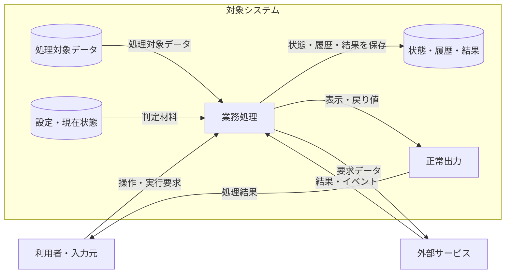
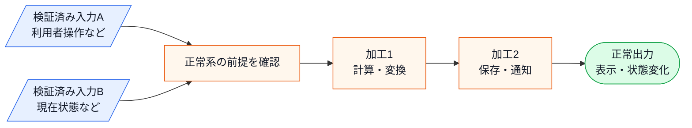
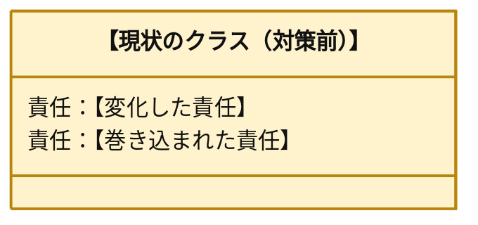
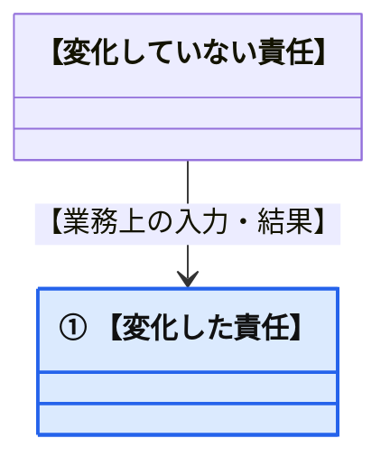

# デザインパターン章テンプレート

このファイルだけを章構成の正本とする。第1章を含む各章は、次の見出し名・
順序・役割に合わせる。第1章は実装例であり、正本ではない。
章固有の補足が必要な場合は、標準見出しを増減させず、その配下に`#### 補足：...`として置く。

このテンプレートは、第0章で説明した「7つのフェーズ」を各章の本文へ落とすための
執筆用設計図である。第0章は読者向けにフェーズの意味を説明する。こちらは執筆者向けに、
各項目の目的、達成基準、必要素材を定義する。第0章の思想とこのテンプレートが食い違う
場合は、両方を見直してそろえる。

章を量産するときは、まず次の入力をそろえる。不足している入力がある場合は、本文で
推測して埋めず、章の題材設計に戻って補う。

| 章作成の入力 | 必須内容 |
|---|---|
| 題材システム | 利用者、目的、扱うデータ、現在の仕様、フェーズ1の現状コード |
| 題材のコア処理 | その題材で読者が最も気にする実処理、処理順序、状態、失敗、非同期、外部連携、手段別の入力差分 |
| この章が扱う複雑さ | 順次実行、非同期/ポーリング、イベント、部分失敗、ジョブ/スレッド、再試行など、この章の設計判断に効く複雑さ |
| 仕様粒度 | 動作例・変更要求・実行結果に出る入力値、状態名、フラグ、ID、金額、判定条件、出力名、エラー条件 |
| 代表動作 | 入力、操作、出力、状態変化、エラー条件、実行結果 |
| 登場クラス | クラス名、責任、主な依存関係、`main()` での使われ方 |
| 現行要求 | 要求ID1から連番を付けた変更前システムの要求と受入条件（まとまった働きを束ねる機能IDは設けない） |
| 変更依頼 | 変更ID1から連番を付けた今回の変更内容と、対象要求ID・影響する要求ID |
| 変化情報 | どの機能・仕様が変わるか、変更契機、変更頻度、将来リスク、分かる場合は担当者・関係者 |
| 簡略化方針 | 現状システムと仕様変更で新たに加わる要素を分け、実システムでは存在するが掲載コードでは省略するDB、画面、外部API、タイマー、ファイル出力、通知など |
| 論点外補足 | 実際はどう動くか、掲載コードでは何で代替するか、なぜ章の論点から外すか |
| 制約 | 性能、メモリ、互換性、納期、既存コードを保つ範囲 |

各フェーズは、前フェーズの産物を次フェーズの入力にする。章を書くときは、次の
入出力が本文上で回収されているかを必ず確認する。

| フェーズ | 入力 | 産物 |
|---|---|---|
| 1：現状把握 | 題材システム、現行要求ID、代表動作、登場クラス、現状コード、変更ID | 入力→加工→出力の仕様構造、現行要求ベースライン、動作例、責任一覧、変更後要求ベースライン |
| 2：仮説立案 | フェーズ1の事実、変更ID、関係者情報 | フェーズ3で試す確定変更、変えられるようにする部分、当面守る部分、フェーズ6でも使うリスクID付き将来リスク |
| 3：問題特定 | フェーズ2の確定変更・変える側／守る側、フェーズ1の現状コード | 今回の変更で実際に生じた修正箇所、波及範囲、再テスト範囲、問題ID、変更影響グラフ |
| 4：原因分析 | フェーズ3の問題ID・変更影響グラフ、変更理由、コード構造 | 責任ごとの変更前後、異なる変更理由を持つ責任の同居・直接依存、原因ID |
| 5：課題定義 | フェーズ4の原因ID・責任ごとの変更前後・同居の証拠 | 対策前と目標の責任配置、課題ID付き接続点表、完了条件 |
| 6：対策検討 | フェーズ5の責任の目標配置、確定課題表、完了条件 | 契約・代表具体・生成・選択・受け渡し・実行の要点コード、課題と決定構造の対応、リスク評価 |
| 7：対策実施 | フェーズ6で確定した構想、変更後要求ベースライン、フェーズ5の完了条件 | 改善後コード、要求ID別受入・回帰エビデンス、完了条件別の証拠と判定、変更ID別変更影響、得たもの/諦めたもの |
| 整理・振り返り | フェーズ1〜7の産物 | 問題→原因→課題→構造→結果の短い鎖、章冒頭の約束の回収 |

量産時の完了条件:

- 各フェーズの入力が、前フェーズの産物または章作成の入力から来ている。
- 産物が次フェーズの本文で実際に使われている。
- 現状の全体コードはフェーズ1、完成した全体コードはフェーズ7だけに置く。フェーズ3・4・6は、そのフェーズの判断に必要な箇所だけを抜粋し、確定済みの仕様・表・図・コードを丸ごと再掲しない。
- 変更が変える側だけに収まり、守る側を開かず、再確認も局所で済むなら問題ID・原因ID・課題IDを作らない。構造変更なしを結論にして後続を短く確認し、必要な変更と要求の受入・回帰だけを行う。
- フェーズの分量を横並びにそろえない。原因数、接続点数、非同期・共有状態などの確認量に応じ、成果物を次へ渡せる最小限にする。
- 完了条件の導き方は第0章だけで説明する。実践章では、フェーズ4で確定した原因を裏返し、コードで合否を判定できる章固有の完了条件だけを書く。「疎結合にする」「拡張しやすくする」のような抽象語だけで終えない。
- フェーズ6は、契約・代表具体・生成・所有・受け渡し・実行の判断に必要なコードだけを示す。フェーズ7の完成コードと同じクラス全文を再掲しない。
- フェーズ7の変更確認は7-3へ集約し、3-2と同じ変更ID・同じ粒度で、改善後グラフと結果を一度だけ示す。別の変更シナリオ表を重ねない。
- コンパイル方法、1ファイル掲載の理由、`main()`の組み替え方は第0章だけで説明する。実践章では配布コードの場所を一文で示すにとどめる。
- 章末の整理は、問題→原因→課題→構造→結果の鎖を一つの小表で確認する。フェーズ別一覧、責任移動表、三つの問いの回答など、本文ですでに確定した結論を別形式で繰り返さない。
- パターン解説は、抽象的なGoF構造、章のクラスとの対応、適用できる条件と限界に絞る。完成後クラス図や実行シーケンスを章末で描き直さない。
- 目的、達成基準、本文、図、表、コード、実行結果が同じ読者状態へ向いている。
- 1-1の仕様が、動作例・変更要求・実行結果に出る値・状態・判定条件・出力と紐づく粒度になっている。入力・加工・出力の各要素は、後でどの動作例・変更要求・接続点で使うかまで示す。クラス名・メソッド名・変数名との対応は1-3以降で扱う。
- 題材のコア処理が、単なるハンドリング・分岐・分類箱に薄められていない。実際のシステムで読者が気にする処理順序、必要データ、状態、失敗、非同期、外部境界を、章の論点に必要な粒度で仕様とコードに残す。 具体的な判定は `rules/checklist.md` の「実システム化ルーブリック（R1〜R5）」で行う：R1 要求／結果オブジェクト、R2 順序を持つ手順、R3 保存データ＋境界、R4 成功／保留／失敗・非同期、R5 代表ケースと全量表の分離。
- 「この章が扱う複雑さ」が、章の中心課題に関係する範囲で扱われている。順次実行、非同期/ポーリング、イベント、部分失敗、ジョブ/スレッド、再試行などを足す場合は、それがフェーズ4の原因、フェーズ5の課題、フェーズ6の対策比較にどう効くかまで示す。複雑さを足しても課題に影響しない場合は、論点外として本文へ入れない。
- システム構成が同期呼び出しやポーリングだけに固定化していないか、`rules/checklist.md` の「システム構成の多様化チェック（ARCH）」で確認する：ARCH-01 イベント駆動、ARCH-02 別スレッド／ワーカー（実スレッドを使わずキューと結果オブジェクトで表す）、ARCH-03 構成の固定化回避、ARCH-04 ロールバック／補償と中断。
- 仕様が分かりづらい原因は、情報不足ではなく対応の断絶である。入力・判定・加工・正常出力の各要素が、動作例・コード・変更要求・接続点のどこで再利用されるかを追える状態にする。異常系は正常系図に混ぜず、エラー条件表で追える状態にする。
- 仕様、動作例、コード、実行結果、クラス構成図、変更要求、変更影響グラフ、最終コードが同じ対象を追っている。
- `rules/phase-consistency-check.md` の照合ラインで、フェーズ間の不一致がない。
- 全体像、入出力の流れ、クラス間の関係、変更前後の差分、変更影響の広がりは、文章だけで説明せず図または表で先に見せる。
- パターン名や一般論が、問題・原因・課題の説明より先に判断理由として出ていない。
- 「知識」「案」「痛み」「コスト」「責任」などの抽象語は、本文中で具体物に置き換えられている。
- 専門用語・略語・英語由来の呼び名は、初出で意味を説明する。説明なしで使うより自然なら、一般的な日本語へ言い換える。

図で示すべき箇所:

| 箇所 | 図の役割 | 推奨形式 |
|---|---|---|
| 1-1：仕様 | 入力→加工→出力の全体像と、各要素が後で使われる場所を示す | flowchart + 対応表 |
| 1-5：変更要求 | 変更後の入力→加工→出力を1-1と同じ形式で示し、1-1との差分を明示する | flowchart（1-1と同じ記法） |
| 代表実行直後：簡略化範囲 | 実システムの要素と掲載コードで代替する要素を、仕様詳細へ入る前に示す | 3列以内の表 |
| 1-3：登場クラスとクラス構成図 | クラス責任を読んだ後、依存関係を示す | classDiagram / graph |
| 3-2：変更影響グラフ | 直接変更と巻き込まれた変更を区別する | graph |
| 4：原因分析 | 混在している判定/処理/生成判断と、漏れている依存を示す | graph / 注釈付きコード |
| 5：課題定義 | 解くべき接続点と、境界を流れる値・型・操作、変わる側・守る側を示す | 表 |
| 6：対策検討 | 契約、実現・継承、保持・注入を決めるたびに、今見る関係だけを示す | 対象外を明記した部分classDiagram / 対応表 |
| 7-1：完成後の実行シーケンス | 完成コードを読む前に、改善後の呼び出し順を示す | sequenceDiagram |
| 7-3：変更影響グラフ（改善後） | 改善前後で変更範囲がどう減ったかを示す | graph / before-after 図 |

図を置くときの条件:

- 図の前に、読者が図を見る目的を1文で書く。
- 図の前は「次の図」、図の後は「直前の図」と書き、画像に挟まれた文章がどちらを指すか曖昧にしない。
- 図には内容を識別できる短い題名を付ける。出版時は図番号付きキャプションとして画像と同じページに置く。
- 図に出るクラス名・値・状態名は、本文または表で説明済みにする。
- 図の後に、図から読み取るべき結論を1〜3文で回収する。
- 図だけで新しい仕様や判断を初出ししない。
- 図が細かくなりすぎる場合は、全体図と補足図に分ける。縦一列の図がA5の1ページを占有する場合は、意味のまとまりを保って横配置または複数段へ組み直す。

各フェーズ・各項目は、理解を一段進めるために置く。フェーズ見出しは上表の
入力/産物と矛盾させない。すべての標準見出しの直下に
執筆用コメントとして「目的」と「内部基準」を置く。目的には「なぜこの項目を置くのか」
を、内部基準には「この項目で説明・予測・判断できるようにすること」を明記する。
目的が先にあり、内部基準はその目的を満たすための確認観点として定義する。
このコメントは本文にそのまま出さず、本文・図・表・コード・実行結果によって自然に満たす。

本文では、各項目の冒頭または末尾で「前の項目で何が分かったか」「だから次に何を見るのか」を1〜2文でつなぐ。つながりを書けない場合は、項目の順序が早すぎる、別フェーズへ移すべき内容である、または章の目的に不要である可能性がある。

本文を作るときは、各項目について次の順で確認する。

1. 目的：この項目は読者の理解を何のために進めるのか。
2. 内部基準：この項目で何を自分の言葉で説明・予測・判断できるようにするか。
3. 必要素材：その状態にするために、仕様・図・表・コード・実行結果のどれが必要か。
4. 整合性：前後フェーズの仕様・クラス・動作例・変更要求・コードと食い違っていないか。
5. 不要素材：目的にも達成基準にも効かない説明、先取り、一般論が混ざっていないか。

過去の `★` 指摘から、特に次の観点を必ず確認する。

- 本文で使うID、状態名、フラグ、入力値、金額、エラー条件は、コードや実行結果に出る前に仕様または動作例で説明する。
- 仕様はコードを読める粒度まで具体化する。コードに現れる値・状態・判定条件・出力名が、仕様で説明されていない状態にしない。
- 1-1の現状仕様図には、1-5以降の変更要求で初めて登場する入力・出力・履歴・Undo・通知などを混ぜない。変更後の図は1-5で、1-1と同じ粒度で差分として示す。
- 仕様変更で外部API、タイマー、永続化、非同期受信、画面などが新たに必要になる場合は、1-5に`仕様変更で加わる簡略化`を置く。`実システムの変更対象 / 掲載コードでの表現 / この章で省くもの`を対応づけ、省略しても掲載コードで実行する業務処理を続けて明記する。
- 完成コードにだけ見える要素を、直ちに「変更後の新要素」と判定しない。変更要求を根拠に、今回変える要素と、前後で維持する共通基盤（保存方法、結果契約、検証、履歴、内部デバッグログ、既存の外部境界）へ先に分類する。共通基盤は現状仕様・現状クラス・現状コードにも置く。
- ログは用途で分ける。処理経過を調査する内部デバッグログ、業務上の監査ログ、再実行などの正本になる操作履歴を同一視しない。内部デバッグログが仕様変更前からあるなら、要求IDへ追加せず、現状コードから完成コードまで同じ内部基盤として維持する。
- 1-2の動作例は、フェーズ1の現状コードで確認できる代表ケースを基本にする。最終コードで初めて実現する動作は、変更要求後またはフェーズ7の確認表へ分ける。
- 掲載コードで `print`、固定データ、簡略化した `main()` を使う場合、実際のシステムでは画面・DB・外部API・ファイル・通知などの何を代替しているかを全体図または表で示す。コードを実行して生成・更新されるものと、実際には生成・送信されないものを具体名で区別し、ログだけで実物のPDF・Excel・メール・API送信が完了したように書かない。
- 掲載コードではlambda、`std::unique_ptr`、`std::shared_ptr`、`std::make_unique`を使わない。生ポインタを所有するクラスはデストラクタで破棄し、非所有参照とは本文で区別する。これらの標準ライブラリ用語は第0章で補足するが、設計説明の途中へ新しい所有権記法を持ち込まない。
- 外部処理を `print` で直書きして終わらせない。実システムではAPI、DB、ファイル、通知、描画ライブラリなどを呼ぶ箇所は、掲載コードでも `Repository`、`Client`、`Gateway`、`Renderer`、`Notifier` などの境界クラスまたはインターフェースを呼ぶ形にし、その先のスタブ実装だけを `print` にする。
- 保存を伴う境界クラスは、`print` で捨てるのではなく、実行終了まで状態を覚えるインメモリ保存（`std::map`/`std::vector` 等、必要なら `static`）にし、`save()`/`add()` と `get()`/`find()` を持たせる。読者が `main()` を組み替えてデータを足すと挙動が変わるようにする。各章コードは1つの `.cpp` としてそのままコンパイル・実行できる形にするが、コンパイル方法、1ファイルにする理由、`main()` の組み替え方は第0章「掲載コードを手元で動かす」だけで説明し、実践章へ「手元で動かすには」を繰り返さない。`std::map`/`std::vector`/`<fstream>` は標準ライブラリなので可、外部DB/APIフレームワーク知識は依然禁止。永続化は不要（実行中だけ保持）。
- 題材の中心となる処理を、都合よく同じ引数・同じ戻り値にそろえない。種類ごとに必要データや制約が異なる場合は、要求オブジェクト、結果オブジェクト、状態、イベントなどで差分を表し、どこを共通契約として残すかを説明する。
- 仕様図が代表ケースなら「代表ケース」と明記し、全種類を示す必要がある値・設定・状態は別表で網羅する。コードに登録されるID、状態、フラグ、手数料、形式、通知先などは、仕様表と一致させる。
- 実システムで認証、外部APIの連続呼び出し、非同期完了、失敗照会、リトライなどが題材の痛みに関係する場合は、簡略化で消さず、境界クラス・状態・結果で表す。論点外なら、その処理が後続の原因・課題・対策に影響しない理由を書く。
- 複雑度を上げた場合は、「複雑度が上がっても同じ論理で対策できること」を章内の整理で回収する。少なくとも、追加した複雑さ、見えた原因、定めた課題、採用した構造の対応を短く追えるようにする。
- 簡略化した範囲は「省略したから存在しない」のではなく、「この章の設計論点では扱わない」と明記する。
- 論点から外す処理は、実際の動き、掲載コードでの代替表現、割愛する理由、設計論点への影響がないことを補足する。
- DB保存、API呼び出し、メール/チャット通知、ファイル出力などを省略する場合は、成功時に何が保存・送信され、失敗時にどう扱うのか、処理時間・タイムアウト・リトライ・非同期化が設計論点に入るのかを確認する。論点外なら、なぜ本文では扱わないかを書く。
- 動作例テーブル、`main()`、実行結果は同じケースを同じ粒度で対応させる。計算式や対象データが読者に推測任せにならないようにする。
- 実行結果には、どのフェーズ・どのコード・どの動作例ケースを実行した結果かを見出しまたはラベルで明記する。
- 「現状コード」とだけ書くと対象がぶれる場合は、「フェーズ1の現状コード」「フェーズ3の変更途中コード」「フェーズ6の検討案コード」「フェーズ7の最終コード」のように、対象フェーズを付ける。
- 複数の実行結果を並べる場合は、`ケース1`から欠番なく同じ番号を実行コードと結果へ付け、読者がどこからどこまでが1つの結果か迷わないようにする。表の行を指すように見える`行1`や、`動作例1`・`1回目`など別の呼び方を混ぜない。略語だけのケース名は避け、「ケース1：予約して支払う」のように内容が読める名前にする。
- 登場クラス表、クラス構成図、掲載コード、シーケンス図に出る主要クラス名は一致させる。存在しないクラスを図に出さない。
- 変更要求、変更後コード、変更影響グラフ、改善後シナリオ表は同じ変更要求を扱う。途中で別の要求にすり替えない。
- 登場クラスの責任説明はクラス構成図より前に置く。図は責任を理解した後に依存関係を確認するために使う。
- 1-3で登場クラスとクラス構成を説明する前に、具体的なクラス名、メソッド名、状態定数、変数名、コード風の出力文字列を本文へ出さない。1-1〜1-2では仕様語彙と日本語の操作名で説明する。
- クラス図に出した関数名・変数名は、クラス図の直後から説明してよい。ただし、その関数や変数の中でどんな条件分岐・計算・生成・例外処理をしているかは、実装コードを提示した後に説明する。
- クラス図の`<<interface>>`はデータ・業務上の共通実装を持たず公開業務操作が純粋仮想の型だけ、`<<abstract>>`は純粋仮想に加えて共通実装または状態を持つ型だけに付ける。純粋仮想関数のない通常基底にはステレオタイプを付けない。実現は点線白三角、抽象基底・通常基底からの継承は実線白三角とし、型名の`I`だけで決めない。
- 「一般的」「業界標準」「現場ではよくある」と断定しない。根拠を示せない場合は「この章のシステムでは」「この章では〜として扱う」と範囲を限定する。
- フェーズ2は、フェーズ1の事実から仮説を立て、ヒアリングで裏付け、変わる見込みと今回維持する範囲を確定する流れにする。
- フェーズ2の出口で、今回確定した変更ID、将来リスク、実装上の内部契約、今回の対象外を明確に分ける。フェーズ3へ変更として渡すのは変更ID、フェーズ6へ設計条件として渡すのはリスクIDであり、未確定の将来機能を完成コードへ先回りして入れない。
- フェーズ2では「混在」「適切/不適切」「違反」といった原因判定をしない。仕様の値・条件・加工が変わりそうかを、仕様図・動作例・コード上の場所に対応づける。
- フェーズ5では、原因ごとに変わる側・守る側・接続点・流れるもの・完了条件を確定する。片方の原因を残す部分案は最終候補として比較せず、全原因を解く境界へ統合する。抽象メソッド、サブクラス名、デザインパターン名、最終クラス名などの対策を先に書かない。
- フェーズ6は、全課題IDから主要クラスと `契約→具体→生成・所有→章固有の選択・登録・遷移→受け渡し→実行骨格→公開入口` の中心経路を先に一つへまとめる。説明順と実行順を区別し、意味や条件が異なる具体でも契約が成立するか確認する。生成・所有・選択・登録・遷移・受け渡し・公開入口のうち、実コードに存在する操作だけを示す。責任・継承・実現・保持・注入を決める場所では、対象外を明記した部分クラス図とコードをセットで示す。それらを統合した完成クラス図と全コードはフェーズ7だけに置く。
- フェーズ6は、フェーズ5の接続点表から直接始める。変更影響の再統合、受け入れ条件の再掲、同内容の課題カードを挟まない。
- フェーズ6で「知識」とだけ書かない。判定条件、計算式、変換式、処理順序、生成判断、具体クラス名、状態名、フラグなどの具体物を書く。
- フェーズ7の7-1は、完成クラス一覧、フェーズ6の構想を実コードの関係として表す完成後クラス図、完成コードに対応する実行シーケンスをコードより前に置く。その後、値・境界・契約・具体クラス・組み立て・`main()`の順にクラス単位でコードを示し、最後に最終有効要求ID別の受入エビデンスと、フェーズ5の完了条件別の証拠・判定を置く。
- 現行要求と変更後要求の分類は、要求の利用目的・外部契約・受入条件で判断する。計算結果や状態値が今回の変更によって変わっても、同じ項目を同じ目的で返すだけなら、その要求を変更扱いにしない。設計で追加した型・履歴・表示項目を変更依頼へ逆流させない。
- フェーズ3とフェーズ7の変更影響グラフは、同じ変更ID・同じ構造粒度で比較する。実際に変更する入力、クラス、`main()`／組み立て、生成・登録を省かず、回帰確認だけの箇所は変更箇所と分ける。枠数を減らすことを目的にせず、変更理由が安定側から専用部品へ移ったかを説明する。
- 出版本文には「この図を置く」「他章では省く」「章ごとの数をそろえない」「変更依頼にないものは行わない」のような編集判断を書かない。システムの何が変わるか、読者が図のどこを読むか、要求上の範囲はどこまでかを肯定形で直接書く。
- flowchart / graph の `［変更］` は場所を示す目印にすぎないため、同じノードへ`変更前→変更後`を具体的に書く。`［変更］ クラス名`だけで変更内容を読者に推測させない。
- `main()` が別の `run()` を起動するだけの場合、実行コードと結果の見出しは実際のシナリオ所有者へ合わせる。`main()` と書きながら `run()` の断片を載せない。
- `★` 指摘を本文から消すときは、指摘内容・判断・対応先を `review-tasks.md` などに残す。指摘文だけを削除して対応済みにしない。
- 本文から別項目を参照するときは、初回を`フェーズ3「変更を試みる（3-1）」`、近接した再参照を`変更試行（3-1）`のように、項目名と番号を併記する。表の列名、要求ID対応欄、コード出典ラベルは番号だけでもよい。

# 第X章　【題材・設計上の痛み】―― 【パターン名】

### この章の核心

<!-- 執筆用：この項目の目的・達成基準
目的: 章全体で扱う設計上の痛みを最初に固定し、読者が何を解く章なのかを見失わないようにする。
達成基準:
読者が、この章で扱う設計上の痛みを1文で把握できる。パターン名や解決策ではなく、章の題材・中心クラス・混在している具体的な知識を使って、「何が混在しているから何が起きるのか」を先に理解できる。どの章にも当てはまる一般論だけで終わらせない。
-->

### この章を読むと得られること

<!-- 執筆用：この項目の目的・達成基準
目的: 章末で回収する学習成果を先に約束し、読者が読む理由と到達点を持てるようにする。
達成基準:
読者が、この章を読み終えたときに別のシステムでも使える構造判断を3〜4項目で把握できる。題材固有の機能や操作を習得目標にせず、(1)変動と安定の切り分け、(2)依存・責任の原因特定、(3)契約と生成・所有・受け渡しによる再結合、(4)変更局所化と適用可否の検証、のうち章で実際に扱う思考を書く。各項目は、そのパターン固有の構造差が分かる表現にし、章末で同じ項目名を使って根拠を回収できる粒度にする。
-->

---

## 🔵 フェーズ1：現状把握 ―― 仕様を整理し、システムと紐付ける

<!-- 執筆用：このフェーズの目的・達成基準
目的: 読者が仕様、動作例、クラス責任、フェーズ1の現状コード、変更要求を同じ対象として追える土台を作る。
内部基準:
システムの目的、代表入力に対する出力、各クラスの責任を説明できる。
- 1-1：システムの目的・利用者・扱うデータ・業務上の制約を説明できる。
- 1-2：動作例テーブルを見て、代表入力の結果を予測できる。
- 1-3：クラス名を見て、その責任を1文で言える。
- 1-4：フェーズ1の現状コードの `main()` と実行結果を、動作例テーブルと対応づけられる。
 - 1-1：現行要求へ要求ID1から欠番なくIDを付け、受入条件を説明できる。
 - 1-5：今回の変更依頼へ変更ID1から欠番なくIDを付け、対象要求の継続・変更・追加・廃止を説明できる。
 - 1-5：変更後の要求ベースラインに、現行要求の消失や根拠のない追加がない。
注意: この達成基準は執筆者・レビュー用であり、本文へそのまま書かない。本文では判断保留を宣言する管理口調を避け、読者が次に何を確認するのかを自然に書く。
-->

> **フェーズ1の確認観点：** 「何を受け取り、何をして、何を返すか」「どのクラスが何を担うか」「今回何を変えるのか」を、仕様→構造→コードの順で確定します。

### 1-1：このシステムの仕様

<!-- 執筆用：この項目の目的・達成基準
目的: コードを読む前に、システムが何を受け取り、何を加工し、何を出力するかを読者に渡す。
達成基準:
読者が、システムの目的・利用者・扱うデータ・入力・加工・出力・業務上の制約を自分の言葉で説明できる。
確認観点:
- 後続の動作例・実行結果・変更要求に出るID、状態名、入力値、エラー条件をここで先に説明する。
- 最初にシステムの目的・利用者・扱うデータ・業務上の前提・代表的な入力値・正常出力を文章または表で一通り説明し、その後に入力→加工→出力の仕様構造図を置く。図を先に出して、読者に文脈のない箱を読ませない。異常系は正常系を説明した後、別表で扱う。
- 仕様図は仕様説明の代わりではなく、説明済みの仕様を整理して俯瞰するために置く。図に初出の仕様を入れない。
- 1-1の冒頭では、仕様そのものを優先する。担当チーム、責任分担、変更背景、設計上の困りごとは、仕様と図を説明した後に置く。
- 1-1の最初の具体物は代表操作の`main()`抜粋と対応する実行結果の一組とする。これは詳細仕様より前に動きをつかむ**動作の予告**であり、ここで責任配置や設計の良否を判断しない。複数回呼ぶ場合は各呼び出しの直後へその結果を置き、「全呼び出し→全結果」に分離しない。結果の説明は、出力に直接現れた事実と、後続のコード・状態表から分かる内部処理を区別する。その後に`#### 最初にシステム全体をつかむ`で入力、主要処理、出力、掲載コードでの代替を4項目にまとめ、正式な仕様→クラス→コードの対応へ進む。
- コード分割の読解番号は用途別に分ける。フェーズ1は`(1)`、フェーズ3は`[試行1]`、フェーズ6は「分離」「組み立て」の意味名、フェーズ7は`【1】`を使う。別フェーズの記号を流用せず、参照にも意味名を含める。
- 現状コードに登場する役割、種類、状態、操作、処理順は、コードを読む前に現状仕様としてすべて説明する。変更要求で初めて加わるものは1-5で説明し、コードで初出にしない。
- 入力・判定・加工・出力は分類名だけで終わらせない。代表値、条件例、出力例、後続で何を確認するために使うかを書く。
- 入力→加工→出力の仕様構造図または表を置く。加工は実装詳細ではなく、業務上の変換・判定・保存・通知として書く。
- 仕様図は「システム全体図」と「システム内部図」に分ける。システム全体図は、まず「利用者・入力元 → 対象システム → 外部サービス」という最も大きな境界を示し、対象システムを `subgraph` で囲む。保存データと内部処理はその内側、外部システムは外側へ置き、境界を越える要求・データ・結果を矢印へ書く。システム内部図は対象システムへの入力・業務処理の順序・出力／保存／通知を示す。二つを同じ内容の言い換えにしない。
- 仕様図では実装クラス名・メソッド名・結果型を使わない。図の箱は業務上のシステム、保存データ、処理、入出力の名称で書き、1-3以降でクラスへ対応づける。
- 入力→加工→出力の図は、まず正常系だけで描く。代表的な入力が、どの判定・計算・変換・保存・通知を通り、どの正常出力になるのかを示す。承認不可・操作不可・未登録IDなどのエラーは、正常系図へ混ぜず、エラー条件表で分けて説明する。この表は、正常系の仕様（図と各種仕様表）をすべて説明したあと、1-1の最後に置く（システム説明の途中でエラーを差し込まない）。
- 正常系図では、入力・判定・加工・正常出力を同じ四角で表さない。入力は平行四辺形、判定はひし形、加工は四角、正常出力は終端形と色で区別する。異常系は正常系図へ混ぜず、エラー条件表で扱い、その表は1-1の最後に置く。
- 図は分類で終わらせない。図の直後には対応表ではなく、「この図から読み取ること」を3点程度で書く。読者が得られるものは、入力がどの加工に使われるか、保存データがどこで参照・更新されるか、後でコードを読むときにどの正常系の流れを追えばよいかである。
- 仕様の語彙と、動作例・変更要求・実行結果で使う語彙を対応させる。クラス名・メソッド名・変数名などの実装詳細は、1-3以降で扱う。
- ファイル形式、入力フォーマット、状態遷移、計算ルールなど、文章だけでは差分が見えにくい仕様は、実際のデータ例・比較表・状態例を置いて読者が目で比較できるようにする。
- 1-2の動作例でも、1-3より前は `reserve()`、`SUBMITTED`、クラス名などのコード表記を使わない。必要なら「予約する」「申請中」のような仕様語彙で書き、1-3以降でコード上の名前へ対応づける。
- 実システムでは存在するが掲載コードでは省略する画面・DB・外部API・ファイル出力・通知などは、代表入力と実行結果の直後に示す。何が本当に実行され、何が代役かを確定してから現行要求へ進み、同じ表を1-4直前へ再掲しない。
- 動作例テーブルは、この仕様構造の代表ケースとして置く。仕様構造にない入力値や出力を動作例で突然出さない。
- 「一般的」「現場では」と断定せず、この章のシステムの前提として説明する。
-->

まず、この章のシステムが何をするものかを説明する。

このシステムは、（利用者・業務）が（目的）を達成するために使う（システム名）です。
（入力や操作）を受け取り、（業務上の判定・計算・変換・保存・通知）を行い、（正常出力）を返します。
（エラー条件や対象外ケース）がある場合は、ここで現状仕様として説明します。
担当チーム、責任分担、変更背景、設計上の困りごとは、仕様と図を説明した後に書きます。

#### まず代表入力と実行結果から動きをつかむ

詳細な仕様やコードへ入る前に、1-4の`main()`で行う【利用者・代表操作】を入力から確認します。

**代表入力（1-4の`main()`から抜粋）：**

```cpp
// ケース1：【ケース名】
【入力型】 input{【実際の代表値】}; // 実行に渡す業務入力をここで生成する
【公開入口】.execute(input);        // 下の結果を生む公開操作
```

変数を使う場合は、この抜粋内で業務入力の生成・各値の設定・公開操作への受け渡しまで示す。`request`や`r1`をコメントだけで説明して未定義のまま呼び出さない。アプリケーションやDBなどの組み立て済み依存は、1-4の`main()`からの抜粋であることが分かる範囲で省略してよい。

1回目の実行結果です。

**代表的な実行結果：**

```text
【主要処理、状態・数値の変化、最終出力を時系列で示す】
```

複数回呼ぶ場合は、ここで `// ケース2：【ケース名】` の呼び出しコードと `ケース2の実行結果です。` を同じ順で繰り返します。各コードブロックの直後へ、その呼び出しだけが生む結果を置きます。

この入力と出力から、(1)【誰が何を行い】、(2)【出力で直接確認できる主要順序】、(3)【何が変化・出力されたか】という一連の動きが読み取れます。出力に現れない内部処理は「後続のコード・状態表で確認する」と書き分けます。同じ入力を含む完全なコードと実行結果は1-4に掲載します。

**この章での簡略化**

掲載コードが実物として行うことと、外部境界の代役を区別します。現状コードだけを扱い、変更要求や対策後のクラスを先取りしません。

| 実システムではどう動くか | 掲載コードでの表現 | この章で省くもの |
|---|---|---|
| 画面・API・DB・ファイル・通知などで入出力する | 境界クラスを呼び、その先のスタブで標準出力・固定データを使う | 【UI、外部通信、永続化など】 |

この表の直後に、掲載コードを実行すると生成・更新されるものと、生成・送信されない実物を具体名で書きます。簡略化しても、後で調べる責任分担と変更影響が変わらない理由も説明します。

#### 最初にシステム全体をつかむ

- **入力：** 【利用者・外部システムから受け取るID、値、操作、イベント】
- **処理：** 【保存データの読出し、判定、計算、状態更新、保存、通知までの主要順序】
- **出力：** 【戻り値、状態・数値の変化、保存、通知。不正時に変えないものも含む】
- **掲載コードでの代替：** 【実DB・外部API・画面・ファイル・通知を何で代替するか】。そのうえで、【掲載コードが実際に行う判定・計算・更新】を明記する。

まずこの一連の動きを押さえ、以降で要求、データ、システム境界、クラス、コードの順に詳細を確認します。

この章で扱う現状仕様は、次の範囲です。

| 仕様項目 | この章で扱う値 | 具体例 | 何に使うか |
|---|---|---|---|
| 【入力】 | 【入力値・操作・状態など】 | 【例: 顧客ID C001、金額 5,000円、状態 Draft】 | 【どの判定・計算・保存の材料になるか】 |
| 【判定】 | 【正常系で通る条件】 | 【例: 状態がPendingなら承認可能、金額が上限以内なら承認可能】 | 【正常系がどの条件で進むか】 |
| 【加工】 | 【計算・変換・保存・通知など】 | 【例: 税込金額を計算、CSV行を注文データへ変換、在庫を3個から2個へ更新】 | 【入力がどの値・状態へ変わるか】 |
| 【出力】 | 【正常出力】 | 【例: 支払金額 4,850円、承認済み、通知送信済み】 | 【動作例・実行結果・変更要求で何を照合するか】 |

上の文章と表で仕様を一通り確認したので、まず「利用者・入力元 → 対象システム → 外部サービス」という最も大きな境界を示します。保存データと内部処理は対象システムの内側へ置き、システムの箱を開いた詳しい処理順は次の内部図へ分けます。


```mermaid
flowchart LR
    U["利用者・入力元"] -->|"操作・実行要求"| S

    subgraph TARGET["対象システム"]
        S["業務処理"]
        D1[("処理対象データ")]
        C[("設定・現在状態")]
        D2[("状態・履歴・結果")]
        O["正常出力"]
        D1 -->|"処理対象データ"| S
        C -->|"判定材料"| S
        S -->|"状態・履歴・結果を保存"| D2
        S -->|"表示・戻り値"| O
    end

    S -->|"要求データ"| E["外部サービス"]
    E -->|"結果・イベント"| S
    O -->|"処理結果"| U
```

このシステム全体図では、誰が対象システムを起動し、どの保存データと外部境界を使い、結果がどこへ戻るかを確認します。次に対象システムの箱を開き、正常系の入力・加工・出力の流れを整理します。成功側しか描かない入力検証はひし形にせず、検証済み入力と処理順で表します。正常系にも複数の有効な結果がある判定だけ、全分岐を描きます。


```mermaid
flowchart LR
    A[/検証済み入力A<br>利用者操作など/]:::input --> B[正常系の前提を確認]:::process
    C[/検証済み入力B<br>現在状態など/]:::input --> B
    B --> D[加工1<br>計算・変換]:::process
    D --> E[加工2<br>保存・通知]:::process
    E --> F([正常出力<br>表示・状態変化]):::normal

    classDef input fill:#e7f0ff,stroke:#2563eb,color:#111827;
    classDef process fill:#fff7ed,stroke:#ea580c,color:#111827;
    classDef decision fill:#fef9c3,stroke:#ca8a04,color:#111827;
    classDef normal fill:#dcfce7,stroke:#16a34a,color:#111827;
```

この図から読み取ることは、次の3点です。

- （入力A）は、（判定1）で使われ、処理を続けられるかを決める。
- 正常に進む場合は、（加工1）から（加工2）を経て（正常出力）になる。
- 後でコードを読むときは、この正常系の流れを基準に、どのクラスがどの処理を担当しているかを確認する。

正常系の流れを押さえたうえで、エラー条件は別に整理します。

| エラー条件 | どこで分かるか | 出力 | 保存・通知などの副作用 |
|---|---|---|---|
| 【例: 金額が0以下】 | 【判定1】 | 【入力エラー】 | 【保存・通知は行わない】 |

#### 現行要求ベースライン

現状コードが満たしている要求へ、`要求ID1`から欠番のないIDを付ける。正常系だけでなく、エラー時に値・状態を変えないこと、既存の保存・通知・診断など、この章のシステム境界内で最終版にも残す要求を含める。利用者・運用者から見た「まとまった働き」を束ねる機能IDは設けず、追跡は要求ID・変更ID・課題IDで行う。既存動作の維持・消失は、要求ID別の受入・回帰エビデンス（フェーズ7）で確認する。

| 要求ID | 現行要求 | 受入条件 | 対応する動作例 |
|---|---|---|---|
| 要求ID1 | 【現状で満たしている要求】 | 【入力と観測可能な結果】 | 【1-2のケース名】 |

<!-- 図に入れた要素が本文や動作例で使われない場合は図から外す。後で必要な要素が図に無い場合は、仕様説明へ戻して追加する。 -->

| 区分 | この章のシステムで書くこと |
|---|---|
| 入力 | ユーザー操作、引数、ファイル、外部イベント、状態など |
| 加工 | 業務上の判定、計算、変換、保存、通知など |
| 出力 | 戻り値、表示、保存結果、状態変化、通知、エラーなど |
| 制約 | 対象外ケース、エラー条件、順序、性能、既存仕様など |

### 1-2：動作例テーブル

<!-- 執筆用：この項目の目的・達成基準
目的: 仕様を具体的な入出力へ落とし、後続のコードと実行結果を照合する基準を作る。
達成基準:
読者が、代表的な入力や操作から、どんな出力・状態・通知になるかを予測できる。後続のコードと実行結果を照合する基準として使える。
確認観点:
- `main()` と実行結果で確認するケースと対応させる。
- 金額計算、状態遷移、エラー理由などは、読者が表だけで追える粒度にする。
- 未対応・対象外のケースがある場合は、現状仕様なのか後続の変更要求で扱うのかを明記する。
-->

### 1-3：登場クラスとクラス構成図

<!-- 執筆用：この項目の目的・達成基準
目的: コード詳細へ入る前に、登場クラスの責任分担を読者が把握できるようにする。
達成基準:
読者が、登場クラスの責任を1文で言える。クラス図を見る前に、どのクラスが何を担当するかを把握できている。
確認観点:
- クラス構成図の前に、登場クラス表または責任説明を置く。
- 図に出るクラスは本文または表で役割を説明済みにする。
- 1-4の現状コードに定義するすべての`class`と`struct`を、登場型表とクラス図へ載せる。データ型も「結果・要求・設定を受け渡す責任」として扱い、都合よく省略しない。
- 現状コードにない型、1-5の変更要求後に初めて追加する型、定義しただけで使わない型を現状の表・図へ置かない。
- クラス構成図は、クラス同士の依存・生成・保持・呼び出しなどの関係を示すために置く。関係線がない図を置く場合は、「関係がないこと」を確認する図だと直前に明記する。
- 複数型を載せたクラス図では、各型に保持・生成・取得・引数・戻り値・呼び出しのいずれかの関係線を付け、コードにない孤立型を作らない。
- クラス図に出した主要なメンバー変数・メソッドは、図の直後に「何を保持するか」「何ができるか」として説明する。クラス図だけで読者に推測させない。
-->

このシステムに登場するクラスを先に確認する。

| クラス名 | 役割 | 担当する仕様 |
|---|---|---|
| `【クラス名A】` | 【責任を1文で書く】 | 【1-1の仕様のどこを担うか】 |
| `【クラス名B】` | 【責任を1文で書く】 | 【1-1の仕様のどこを担うか】 |

各クラスの責任を把握したところで、クラス同士の関係を図で確認する。

```mermaid
classDiagram
    direction TB
    class 【クラス名A】
    class 【クラス名B】
    【クラス名A】 --> 【クラス名B】 : 【依存・生成・保持・呼び出しなど】
```

この図から、【どのクラスがどのクラスを使うか】を確認する。関係線がない図を置く場合は、ここで「関係がないこと自体を確認する図」であると明記する。

**クラス図に出てくる主なメンバーと操作**

| クラス | メンバー・操作 | 何ができるか |
|---|---|---|
| `【クラス名A】` | `【メンバーまたはメソッド】` | 【保持するデータ、または実行できる処理】 |
| `【クラス名B】` | `【メンバーまたはメソッド】` | 【保持するデータ、または実行できる処理】 |

### 1-4：実装コード（現状）

<!-- 執筆用：この項目の目的・達成基準
目的: フェーズ1の現状コードが仕様をどう実現しているかを、動作例と対応づけて確認できるようにする。
達成基準:
読者が、フェーズ1の現状コードの `main()` と実行結果を動作例テーブルへ対応づけられる。コード上の依存・分岐・処理順序を後続フェーズの材料として確認できる。
確認観点:
- 登場させた主要クラスは、定義だけで終わらせず `main()` または説明で使い道を回収する。
- コードは責任の固まり（入力データ／顧客情報／計算／組み立て／実行など）ごとに分割して掲載し、各ブロックの直後に「1-1仕様のどの部分か」「何をしているか」を補う。プログラミングに不慣れな読者がブロック単位で追えることを基準にする。**この分割基準は1-4の現状コードだけでなく、7-1の解決後コード（対策コード）にも同じく適用する**。`class`、`struct`、通常の`enum`、`enum class`、`namespace`は、トップレベルの1定義ごとにブロックを分ける。各見出しには直下で定義する1つの名前だけを書き、複数クラスのまとめ見出しにしない。
- 掲載単位は `rules/writing-rules.md`「掲載単位（1定義1ブロック）」に従う。1-4、3-1、フェーズ6の断片、7-1を同じ書き方でそろえ、トップレベルの`class`、`struct`、`enum class`を1ブロックに1つだけ置く。短い兄弟クラスも同居させず、共通の導入の下へ1クラスずつ隣接して置く。各単位は「見出し（定義名だけ）→ 1行の導入 → コード → 説明 → `---`」の順にする。基準実装は第9章の1-4・3-1・7-1。
- 宣言と定義を分けるのは、手順を持つ関数（制御フロー・複数ステップ）を抱えるクラスだけにする。読者向けには、まずメンバーが保持する状態を示し、次に公開操作ごとに「入力」「戻り値」「状態変更」「画面・保存・外部呼び出しなどの副作用」を説明する。7-1の具象クラスは手順を持つ関数がないので、`override`宣言と実装を分断せず実装込みで載せる。相互参照がある場合はコンテキスト型を先に定義する。
- 1-1で定義した入力は、1-4の公開メソッドの引数または取得境界から入り、判定・データ選択・計算・送信のいずれかに実際に使う。仕様図にだけある入力、受け取るだけで未使用の値、仕様上のデータを置き換えた `"data"` のような固定文字列を残さない。変更対象外なら7-1でも同じ入力契約とデータ起点を維持する。
- 長いメソッド（計算・判定）は、処理の固まり（小計の算出／割引の適用など）にコメントや区切りを入れ、各固まりが仕様のどのルールに対応するかを示す。入力・取得、判定、選択・計算、状態変更・保存、通知・返却など、意図が切り替わる場所には空行を1行入れ、同じ段階の連続処理は空行で分断しない。
- 実行結果には、どの入力・どのデータに対する結果かを明記する。
- 実行結果は最終値だけを並べない。入力（誰が・何を・いくらで）と条件（会員種別、状態、フラグ、操作種別など）と結果（小計→支払金額、状態遷移など）をセットで出力し、施策や操作の効果（割引前→割引後）が読み取れるようにする。
- 件数・残高・在庫・予約数などの内部数値を変更するコードは、対象ID・変更前→変更後・上限/単位を実行ログへ出す。上限エラーは、上限へ到達した数値を先に見せてから再操作し、エラー時に数値が変わらないことを示す。
- 利用者操作の後にシステムが続けるべき昇格・通知・補償・履歴記録は、`main()` から別メソッドを手動で呼ばず、起点ユースケースの内部から接続する。
- 状態不変のエラーは状態遷移図の自己遷移へ描かず、エラー条件表と実行結果で扱う。
- 実行結果の直前に「実行対象コード」「対応する動作例」「確認したいこと」を1〜3行で書く。
- 実行結果ブロックの中では、必要に応じて `Case 1`、`Case 2` のようにケースを区切る。
- 実行結果が複数ケースにまたがる、または1ブロック25行以上になる場合は、`main()`や呼び出し関数をケース単位へ分け、各コードブロックの直後へ対応する結果を置く。
- コード抜粋を載せる場合は、直前に「どのクラスのどの関数か」「何を省略しているか」「何に着目して読むか」を明記する。抜粋内にも所属クラス、メソッド開始、まとまった省略、注目行、メソッドとクラスの終了を残し、孤立した1〜2行だけを置かない。
- 読者に「別途テストしてください」と投げず、掲載した動作例との対応を本文で確認する。
- 0章の「実装を観察する4つの視点」（具体クラス名、条件分岐、処理順序、境界を越えるデータ）のうち、この章の後続分析で使うコード上の事実を1-4本文で明示する。
- 1-4では構造分析や問題提起をしない。「どのクラスのどのメソッドに、どの入力・判定・出力が書かれているか」という事実説明に留める。「混在している」「分けるべき」「変更に弱い」「影響を受ける」といった評価はフェーズ3以降、原因の言語化はフェーズ4へ送る。
- 4視点で確認したコード上の事実は、単発のメモで終わらせず、2-1の仮説、3-1の変更シミュレーション、4-1の原因分析の根拠として再利用する。
-->

#### 現状コードと実行結果

責任の固まりごとに分けた現状コードを掲載し、各ブロックの直後に役割と接続を説明する。代表入力を実コードで生成して実行し、1-2の動作例と対応する結果を示す。

```cpp
// 【現状コード：入力、保存データ、処理、境界、組み立て、代表実行】
```

```text
【代表入力に対応する実行結果】
```

#### 仕様入力が現状コードで使われるまで

現状コードと実行結果を読んだ後に、1-1で定義した入力を、受け取り口から利用箇所、確認できる結果まで追う。値が型に存在するだけでなく、判定・データ選択・計算・保存・外部送信のいずれかに実際に使われることを示す。

| 仕様入力 | コード上の受け取り口 | 実際に使う箇所 | 結果への現れ方 |
|---|---|---|---|
| 【1-1の入力名】 | `【公開メソッド、要求型、取得境界】` | `【判定・検索・計算・保存・送信】` | 【実行結果で確認できる値・状態・副作用】 |

この表には、1-5以降で初めて追加するクラス、インターフェース、履歴、登録一覧、結果型を現状要素として書かない。現状コードでまだ扱えない入力は、架空の利用経路を足さず「現状では入力経路がない」と明記し、1-5の変更後仕様へ送る。

### 1-5：変更要求

<!-- 執筆用：この項目の目的・達成基準
目的: 変更依頼を、現行要求ベースラインへ反映した最終要求ベースラインへ変換し、以降の分析対象と最終受入対象を固定する。
達成基準:
読者が、今回の変更要求で現状仕様から何が変わるかを説明できる。変更後の受入条件と、まだフェーズ1の現状コードが満たしていないことを区別できる。
確認観点:
- 変更依頼は変更ID1から欠番なくIDを付ける。変更IDは要求IDではなく、どの要求を継続・変更・追加・廃止したかの根拠である。ここで原因分析やパターン名を先取りしない。
- 要求の意図が同じなら、内部クラスが変わっても要求IDを維持する。新規要求は新ID、廃止はIDを残して廃止、分割・統合は新旧IDの系譜を記録する。
- 現状仕様、変更後仕様、受入条件を同じ粒度で並べる。
- 差分表には、変更項目だけでなく、誤って作り替えやすい共通基盤（保存・結果・検証・内部デバッグログ・外部境界）を「変更なし」として明示する。変更前と変更後のシステムは、要求で変えると定義した箇所以外を同じにする。
- 1-1の入力・判定・加工・出力を「変更前」として退避し、1-5で「変更後」と横比較する差分表を置く。変更後の図だけで差分を読ませない。
- 差分表は `要素 / 変更前（1-1の現状仕様） / 変更後（今回の要求） / 差分として追うもの` の4列を基本にする。
- 変更後の仕様を、1-1と同じ入力→加工→出力の図（同じ記法・同じ語彙）で示す。図の前後で「1-1の図との差分はどこか」を1〜2文で明示する。外部システム・利用者・保存境界そのものが変わる章だけ、変更後のシステム境界図を追加する。本文では編集上の配置理由ではなく、変更前後の境界と図で確認する対象を書く。flowchart/graph の差分ノードには `［変更］`・`［新規］`、classDiagram には `<<changed>>`・`<<new>>` を付け、色だけで判別させない。flowchart/graph の `［変更］` ノードには`変更前→変更後`も書き、変更なしのノードは通常色のままにする。
- 変更後の図に置いた新要素は、フェーズ3の変更途中コード・フェーズ7の最終コード・実行結果のどこに現れるかを追える語彙で書く（クラス名・メソッド名の先取りはしない）。
- 1-4と7-1を比較し、仕様変更または課題ID1〜課題IDnで説明できない型・保存・検証・履歴・内部デバッグログの追加／削除／移動があれば、共通基盤へ戻すか、変更要求として明示する。
- 現行要求IDを削除しない。不要になった要求は行ごと消さず「廃止」と根拠となる変更IDを残す。同じ意図を改訂する場合は要求IDを維持し、分割・新規追加では新しい要求IDを採番する。
- 変更後要求ベースラインには、すべての現行要求IDと追加要求IDを載せ、変更種別、変更後要求、受入条件、根拠となる変更IDを明記する。
- 変更後要求ベースラインの直後へ、同じ内容の「変更前→変更後」対照表を重ねない。変更種別・根拠変更ID・変更後要求・受入条件を完全なベースライン一表で確認し、継続・変更・追加の要点だけを短い文章で補う。
- 要求一覧のあと、コードへ直接落ちる業務ルール（条件、式、状態、遷移、順序、失敗時の扱い）を `#### 変更後に有効な業務ルール` で確定する。要求を言い換える表ではなく、`継続`と`追加／変更`を区別し、この後のコード判断に必要なルールだけを書く。
-->

フェーズ1では、仕様・動作例・コード対応を確認し、問題・原因・対策の説明を先取りしない。

変更依頼を、実行結果で判定できる単位へ分ける。

**仕様変更で加わる簡略化**

仕様変更によって外部API、タイマー、永続化、非同期受信、画面などが加わる場合だけ置く。変更前からある簡略化は1-1の表から重複させない。

| 実システムの変更対象 | 掲載コードでの表現 | この章で省くもの |
|---|---|---|
| 【仕様変更で新しく必要になる実システム要素】 | 【境界クラス、メモリ保存、ハーネスなどの代替】 | 【通信、永続化、実時間待機、UIなど】 |

表の直後に、簡略化しても掲載コードで実際に動かす判定・計算・状態遷移・結果記録を具体的に書く。

| 変更ID | 変更内容 | 確認する具体例 |
|---|---|---|
| 変更ID1 | 【何を変えるか】 | 【具体的な入力と観測結果】 |

#### 変更後要求ベースライン

| 要求ID | 変更種別・根拠となる変更ID | 変更後の有効要求 | 受入条件 |
|---|---|---|---|
| 要求ID1 | 継続／変更／廃止<br/>根拠: 現行／変更ID1 | 【変更後の要求。廃止の場合も履歴を残す】 | 【最終版での判定条件】 |
| 要求ID2 | 追加<br/>根拠: 変更ID1 | 【新しい要求】 | 【最終版での判定条件】 |

変更種別の要点を、重複表ではなく短い文章で補う。

#### 変更後に有効な業務ルール

| 今回の扱い | 変更後にコードへ落とすルール |
|---|---|
| 継続 | 【既存動作を守る条件・式・状態・順序】 |
| 追加／変更 | 【今回加える、または変える条件・式・状態・順序】 |

登場クラス表は1-3の先頭（クラス構成図の前）に置く。1-3は「登場クラスと
クラス構成図」なので、責任一覧の表を最初に示し、その後に依存関係の図を置く。
クラス構成図に関係線がない場合は、それが「協調関係がない」「単一クラスに集約されている」などの事実を示すための図であることを明記する。単なる責任一覧なら図ではなく表にする。
依存グラフや実行結果などの補足は、1-3または1-4の配下に`####`で置く。

---

## 🟣 フェーズ2：仮説立案 ―― 何が変わるかを観察し、ヒアリングで裏付ける

<!-- 執筆用：このフェーズの目的・達成基準
目的: 現状の事実から変化しそうな部分を見立て、今回確実に変わることを切り分け、関係者確認で根拠を持たせる。
内部基準:
何が変わりそうで、今回何を維持するかを、根拠付きで区別できる。
- 2-1：フェーズ1の事実から、変わりそうな仕様を仮説として挙げられる。
- 2-1：仮説は「事業上・技術上の理由」「変更のきっかけ・頻度」「今回維持する仕様・処理と見直し契機」の3問いで整理されている。
- ヒアリング：仮説が裏付いたか修正されたかを説明できる。
- 将来見通し：今回の変更と将来の変更リスクを分けて説明できる。
-->

> **フェーズ2の確認観点：** 「どの仕様が、どんな理由・きっかけ・頻度で変わりそうか」「今回、何を維持するか」を、フェーズ1の事実から仮説にしてヒアリングで確かめます。

### 2-1：変わりそうな仕様の見当をつける

<!-- 執筆用：この項目の目的・達成基準
目的: フェーズ1の事実を材料に、どこが変更軸になりそうかを読者に推測させる。
達成基準:
読者が、フェーズ1で観察した事実から、変わりそうな仕様と今回維持する仕様を仮説として挙げられる。仮説には根拠と見直し契機を添える。
確認観点:
- チーム名や担当者名を主軸にせず、フェーズ1の事実から「どの機能・仕様の種類が変わりそうか」を仮説として書く。担当者名は分かる場合の補助情報に留める。
- 0章の3問いを必ず回収する：
  1. この仕様はどんな事業上・技術上の理由で変わりそうか。
  2. 何をきっかけに、どのくらいの頻度で変わるか。
  3. 今回の変更で維持する仕様・処理はどこか。その前提を見直す契機は何か。
- 観察から得た見当を仮説として書き、後続のヒアリングで裏付ける。
- 責務の混在・違反・分離を断定しない。責務は設計判断であり、現状配置を最初から誤りとしない。2-1は「どの仕様が変わりやすいか」「クラス図のどこにあるか」「どんなきっかけ・頻度で変わるか」の見立てに留める。担当者・チームが分かる場合は補助情報として添える。混在は痛みを見たフェーズ4で原因として言語化する。
- 2-1の主語は「仕様（値・条件・計算・状態・通知先など）が変わるかどうか」であり、「このクラスは責任が多い」「この構造は良い/悪い」というシステム構造の評価ではない。構造への言及は、変わりそうな仕様がどのクラス・メソッドにあるかの所在確認に限る。構造の良し悪しへ話が向いていたら、それは仕様変化の見立てへ書き直す（構造評価はフェーズ4）。
- 変わりそうな仕様が、1-3のクラス図のどのクラス・どのメソッドにあるかを対応づける。
- 変わりそうな仕様の一覧を出す前に、一覧を作る考え方を説明する。仕様図・動作例・クラス図から候補を拾い、クラス/メソッドへ対応づけ、変更理由・変更契機・安定部分の3問いで絞る流れを読者が再現できるようにする。
-->

ここで作る一覧は、思いつきで「変わりそう」と感じたものを並べる表ではない。
フェーズ1で確認した仕様・動作例・クラス図を材料に、次の順で候補を絞る。

1. 仕様図と動作例から、入力・判定・加工・出力のうち条件や値が変わりそうな箇所を拾う。
2. その箇所が、1-3のどのクラス・メソッドに書かれているかを対応づける。
3. その仕様が、どんな理由で、何をきっかけに、どのくらいの頻度で変わりそうかを仮説として書く。
4. 逆に、当面変えない前提にできる処理の骨格も分けておく。

この手順で見ると、【章の中心処理】全体ではなく、その中のどの条件・計算式・状態・通知先・生成判断が変更候補なのかを読者自身で追えるようになる。

フェーズ1の仕様表・コード観察を踏まえ、変わりそうな仕様の仮説を立てる。
仮説の根拠（事業上・技術上の理由、変更契機、頻度）と、今回維持する仕様・処理、その前提を見直す契機も合わせて整理する。

#### ヒアリングで確認すること

<!-- 執筆用：この項目の目的・達成基準
目的: 2-1の見当から、2-3で確認する質問を先に決める。
達成基準:
読者が、各質問をフェーズ1の事実と現時点の仮説から導き、誰へ確認するかを説明できる。
確認観点:
- 見当を結論にせず、まだ不明な点を具体的な質問へ変換する。
- 2-3はこの表の質問へ答える順で構成し、回答で仮説が裏付いたか修正されたかを示す。
-->

| 確認したい仮説 | 確認する質問 | 確認先 |
|---|---|---|
| 【仕様上の変化候補と、事実から立てた仮説】 | 【理由・頻度・安定範囲を確認する質問】 | 【担当者・資料・履歴】 |

### 2-2：今回の変更で確実に変わること

<!-- 執筆用：この項目の目的・達成基準
目的: 仮説や将来リスクと、今回必ず対応する要件を切り分ける。
達成基準:
読者が、今回の要件として確定している変更と、将来起きるかもしれない変更を混同せずに説明できる。
-->

1-5で確定した変更IDを、そのまま今回確実に変わることとして確認します。章ごとに異なる色や記号は使わず、以降でも同じ変更IDで追跡します。

- **変更ID1：【1-5の変更依頼の要点を同じ意味で再掲】**
- **変更ID2：【必要な数だけ、欠落・追加なく再掲】**

これらが今回確実に変わる範囲です。将来どれだけ変わり続けるかは、次の関係者ヒアリングで確認します。

### 2-3：関係者ヒアリング

<!-- 執筆用：この項目の目的・達成基準
目的: 仮説を独りよがりにせず、どの機能・仕様が、どんな理由・きっかけ・頻度で変わるのかを確認する。
達成基準:
読者が、どの仮説をどんな根拠で確認し、どの回答・資料・履歴によって裏付いたか、または修正されたかを説明できる。
確認観点:
- 2-1の「ヒアリングで確認すること」にある質問を同じ順序で回収する。
- 各回答によって仮説が裏付いたか、修正されたかを明記する。
- ヒアリング結果が、後続の「変わる見込み／今回維持する範囲」の根拠になるようにする。
-->

ヒアリング会話と確認内容を記載する。

### 2-4：ヒアリングで判明した将来リスク

<!-- 執筆用：この項目の目的・達成基準
目的: 今回の対応だけではなく、同じ種類の変更が繰り返される可能性を見えるようにする。
達成基準:
読者が、今回すぐ対応する変更ではないが、将来繰り返される可能性のある変更軸を説明できる。
-->

確定事項と将来リスクを混ぜない。

2-4の表は全章で次の4列に統一する。リスクID1から欠番のないリスクIDを付け、フェーズ6の設計確認まで同じIDと同じ文言で追跡する。分類・確率などの列や、行頭の🟣🟡🔴などのマーカーは付けない（今回維持する範囲は2-5で扱う）。

| リスクID | 将来リスク | 時期の目安 | 根拠 |
|---|---|---|---|
| リスクID1 | （将来変わりうる仕様・機能） | （継続的に／数ヶ月後 等の目安） | （誰との確認か・発言の出所） |

ヒアリングでは、この章の設計軸そのものだけでなく、出力方法（画面表示・帳票・通知・保存先・出力形式）が将来変わる可能性も必ず確認する。出力方法の変更が本章の設計軸そのものなら、リスクIDとして表へ起こしフェーズ6の6-4まで追跡する。設計軸と独立した境界にとどまるなら、表へは起こさず「今回の変更対象ではない対象外」として1文で記録し、その章のパターンの分離には影響しないことを添える。いずれにせよ、出力方法の変更を検討し忘れたまま素通りしない。

### 2-5：変わる見込みと今回維持する範囲を確定する

<!-- 執筆用：この項目の目的・達成基準
目的: リスクIDごとに、変えられるようにする部分と今回維持する部分を整理し、フェーズ6で採用構造を評価する条件を固定する。
達成基準:
読者が、「変わる見込み＝はい」を先行実装の指示と誤解せず、その変化が起きても守る部分へ影響を広げない構造にするための判断材料だと説明できる。
確認観点:
- 2-4の全リスクIDを同じ順序・同じ文言で使う。
- 変えられるようにする部分と、今回維持する部分をシステムの仕様語彙で書く。クラス名やパターン名で解決策を先出ししない。
- フェーズ3へ今回の変更として渡すのは変更IDだけとし、リスクIDはフェーズ6の構造評価へ渡す。
-->

「変わる見込み＝はい」は、その機能を今回実装するという意味ではない。フェーズ6で、変える側と守る側を分離し、採用構造が影響を局所化できるかを判断するための印である。

| リスクID・変化軸 | 変わる見込み | 変えられるようにする部分 | 今回維持する部分 |
|---|---|---|---|
| リスクID1：（2-4と同じリスク文） | はい | （変化を受ける条件・値・手順・種類） | （影響を広げず維持する入力・処理・結果） |

表の後に、どの部分を変えられるようにし、どの部分を守る設計条件にしたかを一文で確定する。
「2-5：変わる見込みと今回維持する範囲の確定」は「将来リスク」の直後に置き、フェーズ2の末尾とする。

章として並べる非目標が複数ある場合、その「今回実装しないもの（今回の対象外）」一覧は、フェーズ1ではなく、この2-5末尾で確定する。対象外は、ヒアリングでスコープを確かめて初めて確定できるフェーズ2の出口成果だからである。リスクIDと重複する項目（HTML形式などリスクID化済みの将来機能）は2-4/2-5のリスクID表へ寄せ、対象外リストにはリスクID以外の確定スコープ外（バックグラウンド処理・別用途の監査ログなど）だけを列挙して二重掲載を避ける。フェーズ1では、対象外はフェーズ2で確定する旨を一文で予告するにとどめ、非目標の一覧を先出ししない。

これは全章へ空の対象外セクションを強制する規定ではない。並べるべき非目標が実在する章だけがこの一覧を持つ。内部契約や共通基盤の説明に添える「この仕組みはここまでしか扱わない」という一文単位の線引きは、一覧の先出しには当たらず、フェーズ1に置いてよい。

---

## 🟣 フェーズ3：問題特定 ―― 変更の痛みを発見する

フェーズ3で中心ロジックだけを抜粋する場合は、コードの前に「抜粋の前提（周辺は現状のまま）」を置く。フェーズ1から維持するDatabase / Repository / Registry / Gateway、入力検証、保存・通知・履歴などの副作用を具体名で示し、抜粋の前後で引き続き実行されることを明記する。省略を削除や別仕様として読ませない。

変更要求は、未実装エラーを出すだけで終えず、現在の責任配置のまま**要求が実際に動く状態まで実装して実行する**。その結果、同時に修正したクラス・分岐・復元データ・副作用を変更の痛みとして観察する。要件未実装の失敗を、設計上の痛みの証拠にしない。

変更箇所を示すときは、追加行だけの断片にしない。変更対象のクラス／関数名、既存の類似処理、変更行の前後、呼び出し元と接続先が分かる範囲を掲載する。全コードの再掲は不要だが、コードブロック内の `...` や「既存部分」「同様」は使わない。

<!-- 執筆用：このフェーズの目的・達成基準
目的: 変更要求をフェーズ1の現状コードへ当て、どこに修正と確認が広がるかを読者に体感させる。
内部基準:
変更要求をフェーズ1の現状コードへ当てると、どのクラス・メソッドへ修正が広がるかを説明できる。
- 3-1：変更を試みると、どこを触る必要があるか追える。
- 3-2：変更の波及範囲を図で説明できる。
- 3-3：痛みを感想ではなく、修正箇所・確認範囲として説明できる。
-->

> **フェーズ3の確認観点：** 「この場所は、今回の変更の理由と関係があるか？」
>
> 【要求を満たすために直接必要な追加・修正と、現在の構造のために巻き込まれた既存処理の修正・解読・再テストを、題材固有のコードで区別する】

### 3-1：変更を試みる

<!-- 執筆用：この項目の目的・達成基準
目的: 抽象的な問題提起ではなく、実際にどこを触る必要があるかを明らかにする。
達成基準:
読者が、変更要求をフェーズ1の現状コードへ当てると、どのクラス・メソッド・引数・分岐を触る必要があるか追える。
-->

### 3-2：変更影響グラフ

<!-- 執筆用：この項目の目的・達成基準
目的: 変更の広がりを視覚化し、直接変更と巻き込まれた変更を区別できるようにする。
達成基準:
読者が、変更の波及範囲を図で説明できる。どこが直接変更で、どこが巻き込まれた変更かを区別できる。
-->

1-5の全変更IDを同じ文言で図の起点に置く。3-1で実際に変更したクラス・入力型・`main()`／組み立て箇所を同じ粒度で載せ、新規部品、変更した既存箇所、回帰確認だけの箇所を区別する。この粒度を7-3まで維持する。

### 3-3：痛みの言語化

<!-- 執筆用：この項目の目的・達成基準
目的: 感じた不便さを、修正箇所・確認範囲・再テスト範囲という設計課題へ変換する。
達成基準:
読者が、痛みを「読みにくい」「悪い」ではなく、修正箇所・確認範囲・再テスト範囲として説明できる。
-->

変更前コードを批判せず、今回の変更要求を当てたときの修正・再テスト範囲を示す。

フェーズ3では変更IDだけを扱う。2-4・2-5のリスクIDを引用したり、未確定の機能を仮に適用したりしない。3-3の問題文は、今回実際に修正した箇所・波及範囲・再テスト範囲だけから確定する。

3-3の末尾で、観測した痛みへ`問題ID1`から欠番なく採番し、一覧表で締める。各行は「観測した痛み（変更途中コード）」と「起点の変更ID」を持つ。この問題IDが、フェーズ4の原因ID、フェーズ5の課題IDへ順につながる。

同じ変更箇所について「修正した」「読み直した」「壊しやすい」と言い換えただけの項目は、一つの問題IDへまとめる。問題IDは観測した修正の単位であり、説明の観点を増やすための番号ではない。

| 問題ID | 観測した痛み（変更途中コード） | 起点の変更ID |
|---|---|---|
| 問題ID1 | 【変更を試して観測した修正・再テストの痛み】 | 変更ID1 |

---

## 🟠 フェーズ4：原因分析 ―― なぜ辛いのかを構造で言語化する

<!-- 執筆用：このフェーズの目的・達成基準
目的: フェーズ3で見えた痛みを、コード構造上の原因として説明できる形にする。
内部基準:
- 4-1：問題IDごとに、変更の中心と、同じ場所にあるため影響した責任の組を説明できる。
- 4-2：責任ごとに変更前後のルールを並べ、今回どの責任が変化したかを区別できる。
- 4-3：変更理由の異なる責任が同居した関係を原因IDとして確定できる。
- フェーズ4では、境界、クラス、インターフェース、操作名、生成場所を決めない。
-->

### 4-1：問題が起きたコードを確認する

<!-- 執筆用：この項目の目的・達成基準
目的: フェーズ3で確定した問題を、変更の中心と影響した責任の関係へ戻す。
達成基準:
読者が、どの責任を変えたくて、どの責任まで巻き込まれたかを問題IDごとに説明できる。
-->

問題IDごとに、【何を変えたかったか】、【既存のどこまで直したか】、【コード上の目印】を短い文章で書く。表へ矢印で詰め込まず、変更途中コードと対応する具体名を使う。

### 4-2：責任ごとに、今回の変化を整理する

<!-- 執筆用：この項目の目的・達成基準
目的: 4-1で関係した責任について、変更前後のルールを比べ、今回変化した責任を明らかにする。
達成基準:
読者が、各責任の役割と変更前後の違いを説明できる。
-->

責任名は、クラスやメソッドが変わっても使える業務上の言葉にする。1行を一つの責任として、左から変更前、変更後の順に読む。変わらない責任も載せることで、どこまで巻き込まれたかを確認できる。セルには具体的なルールを書き、「追加」「変更」だけで済ませない。

| 責任 | 変更前 | 変更後 |
|---|---|---|
| 【販促方針、待機方針、在庫方針など安定した責任名】 | 【変更前に担うルール】 | 【変更後に担うルール。変わらない場合は「変更なし：〜」】 |

### 4-3：原因を確定する

<!-- 執筆用：この項目の目的・達成基準
目的: 変更理由の異なる責任が同じ場所へ置かれた関係を、問題の原因として確定する。
達成基準:
読者が、どの責任の同居がどの問題IDを生んだか説明できる。
-->

4-2で分かったのは、どの責任のルールが変化したかまでである。変更途中コードへ戻り、変化した責任と変化していない責任が同じ場所にあることや、一方が他方の具体を直接知っていることが問題の理由かを確認する。

原因IDごとに、【どの責任配置が】【どの問題IDを生んだか】を一、二文で書く。同じ原因はまとめる。問題と原因を一対一にそろえない。

> **問い1：同じ場所に、別々の理由で変わるものがないか**
>
> 【題材固有の責任と変更理由を使い、「ある／ない」の根拠を答える】

---

## 🟡 フェーズ5：課題定義 ―― 原因から課題を検討して確定する

<!-- 執筆用：このフェーズの目的・達成基準
目的: フェーズ3の変更影響とフェーズ4で確定した原因から課題候補を出し、システム全体で検討して、解くべき接続点と完了条件を確定する。
内部基準:
- 独立した変化軸へ課題ID1から欠番なくIDを振る。
- 境界を越える業務上の依頼・入力・結果、変わる側、守る側を説明できる。
- 現在の波及と、対策後に目指す状態をシステム全体の課題として書ける。
- 新設クラス、配置先、生成・注入方法などの対策を先取りしない。
-->

### 5-1：原因をなくす責任配置を決める

原因IDごとに、【どの責任を】【どの責任から分けるか】を短い文章で書く。続けて、分けた両側で【何を渡し】【何を受け取るか】を書く。この時点では課題IDを確定しない。

責任はフィールドやメソッド単位に分けない。同じ業務上の理由で一緒に変わる判断・状態・処理は、一つの責任として扱う。

まず、変更要求を現状構造へ当てた責任配置を部分クラス図で示す。次に、同じ責任名を使って目標配置を示す。着目する責任と関係は色を変え、図の直前に対策前／目標のどちらかを書く。図はクラスの完成形ではなく責任配置を検討する図なので、どちらにも`%% provisional-role-diagram`を付ける。

**対策前：変更を現状構造へ当てた状態**


```mermaid
classDiagram
    %% provisional-role-diagram
    class CurrentPart["【現状のクラス（対策前）】"]:::current {
        責任：【変化した責任】
        責任：【巻き込まれた責任】
    }
    classDef current fill:#fff3cd,stroke:#b8860b,stroke-width:2px,color:#111;
```

**目標：変更理由の異なる責任を分けてつなぐ**


```mermaid
classDiagram
    %% provisional-role-diagram
    class StablePart["【変化していない責任】"]
    class ChangePart["① 【変化した責任】"]:::focus
    StablePart --> ChangePart : 【業務上の入力・結果】
    classDef focus fill:#dbeafe,stroke:#2563eb,stroke-width:2px,color:#111;
```

各境界について、フェーズ4で確定したどの原因を解くかを文章で確認する。一部を関数へ移しただけで具体名や判断が残るなど、原因を残す切り方は完成案ではなく途中状態としてここで退ける。原因全体を解く責任配置が複数成立するときだけ、完成構造どうしの比較をフェーズ6で行う。変更IDとの一対一対応は条件にしない。

フェーズ5では、最終インターフェース名や具体クラスを含むC++コードを置かない。境界を越える業務上の依頼・入力・結果を文章と責任図で確定し、型名・操作名・シグネチャとコードはフェーズ6で根拠とともに導く。

### 5-2：課題と完了条件を確定する

5-1で決めた目標配置の番号へ課題IDを付ける。課題は「原因をなくせた」とコードで判断できる状態である。

接続点の根拠は呼び出し行だけにしない。フェーズ4で見つけた変更理由から、なぜその両側を分け、どの業務情報がなければ動作をつなげられないかを説明する。コード上の呼び出し、引数、戻り値、型はフェーズ6で確定する。

表の直前に「1行が一つの課題」であることと、左から何を追うかを説明する。さらに「入力」は元の処理から分けた側へ渡すもの、「結果／反映」は分けた側から返すもの、または元の状態へ反映するものだと明記する。セルは端末で潰れないよう、入力・結果の名前だけに絞る。

| 課題（解く原因） | 分ける責任 | 分けた後のつなぎ方 |
|---|---|---|
| 課題ID1（短い名前）<br>解く原因：原因ID1 | 【変える責任を守る責任から分ける】 | 入力：【業務上の入力】<br>結果：【業務上の結果】 |

各課題の直後に `#### 課題ID1（短い名前）の完了条件` を置き、原因を裏返した、完成コードで真偽判定できる短い箇条書きにする。機能要求の受入条件は混ぜず、フェーズ7で要求IDとして検証する。

複数の変化軸が同じ変更で一緒に変わるか、別々に変わるかを、フェーズ6で分離単位を決める材料として短く説明する。フェーズ5の記述対象は接続点、変わる側、守る側、完了状態とする。

最後に`📌 **システム全体の完了状態**`として、すべての課題IDを解いたとき、変わる側の変更がどこへ閉じ、守る側がどの詳細を知らずに実行できるかを一文で回収する。その後の問題・原因・課題の対応表は一つの原因を1行とし、その読み方を直前に説明する。同じ問題に複数の原因がある場合、問題IDが複数行に現れることも明記する。

| 観測した問題 | 確定した原因 | 課題で目指す状態 |
|---|---|---|
| 問題ID1：【変更試行で起きたこと】 | 原因ID1：【原因となる責任配置】 | 課題ID1：【原因をなくした状態】 |

この対応表が、そのままフェーズ6の入力になる。

---

## 🔴 フェーズ6：対策検討 ―― 構想を一つのコード経路へ変える

フェーズ5で確定した全課題を、生成から実行まで動く一つの構想としてまとめる。

> **フェーズ6の確認観点：** 「契約と具体」「生成・所有」「選択・登録・遷移」「受け渡し」「実行」が、全課題を同時に解く一つの経路としてつながるかを確認します。

### 分離した責任をコードの構造へ変える

フェーズ5では、【変化した責任】を【変化していない責任】から分け、【業務上の入力・結果】でつなぐ目標配置を決めた。ここから、その責任配置を実行できるC++コードへ変える。

このフェーズでは、次の順で判断する。

1. 変化していない側が呼ぶ最小の契約を決める。
2. 変化する処理を具体として実現する。
3. 具体を生成・所有し、利用側へ渡す場所を決める。
4. 公開入口から契約を通って具体が実行されることを確かめる。

ここでは結論の一覧表や完成図を先に置かない。各判断を、その根拠を説明する部分クラス図とコードの直前で確定する。完成クラス図はフェーズ7にだけ置く。

### 構想をコードでつなぐ

> **コードの読み方：** 設計の説明は契約→具体→生成・所有→この章で必要な選択・登録・遷移→受け渡し→実行の順で行う。実行時系列は章の構造から別に示す。代表一つだけで完了にせず、意味や条件が異なる具体でも引数・戻り値・操作が成立するか確かめる。断片は所属クラスとメソッドの開始・終了を残し、全コードはフェーズ7で統合する。

#### 契約：境界の形と受け渡しを決める

> **問い2：境界では、何を約束すれば足りるか**
>
> 【変えたくない側が具体を知らずに動くための、必要最小限の値と操作を答える】

【フェーズ3の境界候補を必要な数行だけ抜き、値・型・操作を契約へ変える理由を書く】

**変更前から抜き出す箇所：`Class::method()`** ―― 【境界候補】

```cpp
// 【変更前の数行】
```

**ここで確認するコード：`IContract`（クラス全体）**

```cpp
// 【契約】
```

#### 具体：契約の裏へ変わる判断を置く

【代表具体を一つ示す。同型の全具体は表で列挙し、ここで全クラスを再掲しない】

**ここで確認するコード：`RepresentativeConcrete`（クラス全体）**

```cpp
// 【代表具体】
```

#### 生成・所有・受け渡しを決める

> **問い3：実体を、誰が作り、持ち、渡すのか**
>
> 【生成者、所有者、生存期間、登録・選択、利用側へ渡す経路を題材固有に答える】

【誰が生成・所有し、どこで登録・選択し、どの利用側へ渡すかを一続きで示す。登録順や組み合わせが業務上の優先関係なら、専用の組み立てクラスへ置き、mainから具体名と順序を外す】

**ここで確認するコード：`PolicySet`／`ApplicationParts`（該当する場合）** ―― 【具体の所有と業務方針に沿った登録】

```cpp
// 【生成・所有】

// 【登録・選択】
```

**ここで確認するコード：`main()`** ―― 【完成した部品の生成と利用側への受け渡し】

```cpp
// 【完成した部品を生成】

// 【利用側へ渡す】
```

#### 実行骨格：組み立てた実体を契約から呼ぶ

**ここで確認するコード：`StableFlow::execute()`** ―― 【契約を呼ぶ箇所】

```cpp
// 【契約だけを呼ぶ守る処理】
```

#### 公開入口から具体の実行まで追う

【公開入口から、直前に組み立てた同じ実体の具体処理と結果までをコード名で追う】

### 構想を確定する

【完成可能な構想が一つなら不要な比較を置かない。複数ある場合だけ責任配置・変更影響・導入コストで比べる】

必要な判断箇所に、契約と代表具体、または生成・保持・注入の関係だけを載せた部分クラス図を置く。図の前に「現在の判断対象以外は省略」と書き、直後のコードと同じ関係かを照合する。それらを統合した完成クラス図、完成コード、実行シーケンス、実行結果はフェーズ7だけに置く。

#### 課題と決定した構造を対応づける

1行が一つの課題である。左から、フェーズ5の課題、その課題を解くために決定した構造、C++コードで実現する箇所の順に読む。完了条件の合否は、完成コードと実行結果がそろうフェーズ7で一つずつ判定する。

| 課題 | 決定した構造 | コード上の実現 |
|---|---|---|
| 課題ID1 | 【決定した契約・具体・配置】 | 【クラス・操作・生成・受け渡し箇所】 |

【変更しない既存の境界や保存方法がある場合は、なぜ変更不要かを一、二文で補う】

#### 将来リスクに対して構想を確認する

| リスクID・将来リスク | 現在の構想による備え | リスク発生時の変更先 | 守れる範囲・残る弱点 |
|---|---|---|---|
| リスクID1：【2-4と同じリスク文】 | 【現在の境界・責任配置】 | 【クラス・契約・生成場所】 | 【守れる範囲と見直し条件】 |

## 🟢 フェーズ7：対策実施 ―― 変化に強いコードを完成させる

<!-- 執筆用：このフェーズの目的・達成基準
目的: 選んだ方針をコードへ落とし、責任の移動と変更影響の質がどう変わったかを確認する。
内部基準:
最終コードで責任がどこへ移り、今回の確定要求に対する修正範囲がどう変わったかを説明できる。
- 7-1：最終コードの責任分担と組み立て箇所を追える。
- 7-1：事前に示した処理の流れと完成コード・実行結果の一致を説明できる。
- 7-1：変更後要求ベースラインの全有効要求IDを、最終コードと受入結果へ照合できる。
- 7-3：1-5と同じ変更ID・同じ変更文で、フェーズ1の影響と完成構造の結果を比較できる。
-->

> **フェーズ7の確認観点：** 「変更後の全要求IDを満たし、既存要求も落としていないか」と「フェーズ5の構造上の完了条件を満たし、同じ変更IDの影響が縮んだか」を分けて確認します。

### 7-1：解決後のコード（全体）

<!-- 執筆用：この項目の目的・達成基準
目的: 完成構造と呼び出し順を先に把握したうえで、最終コードの責任分担と組み立て箇所を読者が追えるようにする。
達成基準:
読者が、最終コードの責任分担と組み立て箇所を追える。変更前からどの責任がどこへ移ったか説明できる。
最終コードの前に、完成クラス一覧、実クラス名の完成後クラス図、完成コードに対応する実行シーケンスを置く。フェーズ6の部分図をシステム全体へ統合した完成後クラス図はフェーズ7で一度だけ示し、章末の抽象的なパターン骨格図と同じ向きで描く。コードはクラス単位へ分け、値・境界・契約・具体クラス・組み立て・`main()`の順で示す。
-->

#### 完成後のクラス一覧

フェーズ7のコードへ登場する全クラス・構造体・列挙型と責任を先に示す。

#### 完成後のクラス図

フェーズ6の部分クラス図を、完成コードと同じ実クラス名・関係でシステム全体へ統合する。

#### 完成後の実行シーケンス

これから示す完成コードの準備、登録・選択・受け渡しのうち実際に行う操作、実行、結果保存を追えるシーケンス図を置く。

#### 完成コード

一つの巨大なコードブロックへまとめず、依存される型から順に、各ブロックの責任を説明してから示す。すべてを一つの `.cpp` へ結合したときにコンパイル・実行できる内容にする。

#### 最終要求の実装・受入エビデンス

要求の過不足と既存要求の消失を確認する。ここで扱う要求IDは、1-5で確定した変更後要求ベースラインのIDである。全有効要求IDを同じ順序で載せる。廃止要求IDはコードがないことではなく、廃止の合意と残存動作がないことを根拠で示す。変更依頼による構造への効果は、要求ID表へ混ぜず7-3の変更ID別比較で確認する。

| 要求ID | 最終要求 | 適用コード | 実行シナリオ・観測結果・判定 |
|---|---|---|---|
| 要求ID1 | 【1-5と同じ要求文】 | 【クラス・メソッド】 | 【入力と実出力】<br/>**判定:** 合格／不合格 |

要求IDと課題IDを同じ行へ強制的に結びつけない。要求の受入・回帰結果は上の要求ID表で、課題の構造結果は次の表で別々に確認する。課題IDは`変更ID→変更試行→痛み→原因`からだけ導く。

#### 設計課題の完了確認

フェーズ5で確定した完了条件を省略せず、一つずつ完成コードへ照合する。課題ごとに表を分ける。1行が一つの完了条件であり、左から条件、コードまたは実行結果の証拠、判定の順に読む。

**課題ID1（【短い名前】）**

| フェーズ5の完了条件 | コード・実行結果の証拠 | 判定 |
|---|---|---|
| 【フェーズ5と同じ完了条件】 | 【クラス・操作、必要なら観測値】 | 合格／不合格 |

#### 変更前→変更後の不変条件照合

仕様変更と無関係な入力・保存・外部境界が、完成コードへそのまま引き継がれたかをコードと実行結果で照合する。

| 変更対象外 | 変更前 | 変更後 | 確認根拠 |
|---|---|---|---|
| 【維持する契約】 | 【現状コードの型・保存・呼出】 | 【完成コードで同一であること】 | 【コード位置・受入結果】 |

### 7-3：変更影響グラフ（改善後）

<!-- 執筆用：この項目の目的・達成基準
目的: 改善前後の変更範囲を同じ条件で比べ、変更理由がどの責任へ移ったかを見えるようにする。
達成基準:
読者が、改善前と比べて、既存の安定側から何が外れ、どの専用部品・組み立て箇所が変更先になったかを説明できる。
-->

完成構造から今回の機能固有部品だけを除いた基準へ、3-2と同じ全変更IDを再適用する。3-2と同じ構造粒度で、変更する既存箇所、新規部品、入力・生成・登録・`main()`／組み立て箇所をすべて載せる。別の将来変更を代理にせず、枠数が減らない場合も隠さない。改善は、変更理由が安定側から専用の変更先へ移ったかで説明する。

改善後グラフの直後に、同じ変更IDについて、フェーズ3で観測した影響と完成構造での結果を簡潔に照合する。最終要求全件の受入確認は7-1の要求ID表で行う。

| 変更依頼 | フェーズ1の現状構造での影響 | 完成構造での結果 |
|---|---|---|
| 変更ID1：【1-5と同じ変更文】 | 【フェーズ3で実際に修正・確認した範囲】 | 【完成コードと実行結果で確認した効果】 |

フェーズ7の受入確認では変更後要求ベースラインの全有効要求IDを扱い、7-3の変更影響比較では変更IDだけを扱う。リスクIDの構造評価は6-4で完了しており、7-3へ持ち込まない。

---

## 整理

<!-- 執筆用：この項目の目的・達成基準
目的: 章で扱った判断を重複させず、問題から結果までの鎖を短く整理する。
達成基準:
読者が、この章で扱った問題・原因・課題・採用構造・結果を一列で説明できる。
-->

| 判断 | 結論 |
|---|---|
| 問題 | 【変更時に観測した痛み】 |
| 原因 | 【異なる変更理由を持つ責任の混在】 |
| 課題 | 【切る境界と守る契約】 |
| 構造 | 【分離と再結合の方法】 |
| 結果 | 【変更先と再確認範囲の変化】 |

---

## 振り返り

### 「この章を読むと得られること」は手に入ったか

<!-- 執筆用：この項目の目的・達成基準
目的: 章冒頭の約束を回収し、読者が到達点を確認できるようにする。
達成基準:
読者が、章冒頭で約束した構造判断ごとに、章内のどの観察・原因・設計・検証が根拠になったかを確認できる。冒頭と同じ項目名を使い、題材固有の事実は学習成果そのものではなく、その構造判断を獲得したエビデンスとして右列に置く。
-->

---

## あなたのコードで考えてみてください

<!-- 執筆用：この項目の目的・達成基準
目的: 章固有の設計判断を、読者が自分のコードへ持ち帰れる問いに変える。
達成基準:
読者が、自分のコードの中から「変わる理由が異なるものの混在」を探す問いを持ち帰れる。一般論ではなく、この章で見た判断を自分の現場へ当てる問いになっている。
章の題材名を置き換えても使えるように、任意のシステムへ当てる入口として、目的・入力/加工/出力・最近の変更要求・変更時に痛い場所・守りたいものを問う。
-->

この節では、章の題材をそのまま繰り返さず、読者の現場システムへ移す問いを書く。

最低限、次の形を含める。

1. あなたのシステムは、誰が何を達成するために使うものか。
2. そのシステムの入力・加工・出力は何か。
3. 最近増えた変更要求、または次に来そうな変更要求は何か。
4. その変更を入れると、どこまで修正・再テストが広がるか。
5. 変えたいものと守りたいものを分けると、接続点には何を残すべきか。
6. 全課題を満たす完成構造が複数成立するか。成立するなら、責任配置・変更影響・導入コストの差は何か。

---

ここまで題材の問題から導いた【構造名】には、チームで共有できる既知の名前がある。以降では、この構造を【パターン名】として抽象化し、題材を離れて再利用できる骨格を確認する。

## パターン解説：【パターン名】

### パターンの骨格

<!-- 執筆用：この項目の目的・達成基準
目的: 題材から離れて、パターンの抽象構造を説明する。
達成基準:
読者が、章固有の題材から離れて、パターンの抽象構造を説明できる。
-->

### この章の実装との対応

<!-- 執筆用：この項目の目的・達成基準
目的: 問題から導いた構造と章の具体コードを対応づけ、その構造に後から付けたパターン名を実装と結び付けて理解できるようにする。
達成基準:
読者が、抽象構造の各役割が、この章のどのクラスに対応するか説明できる。
-->

### 使いどころと限界

<!-- 執筆用：この項目の目的・達成基準
目的: 問題から導いた構造が有効な条件と、設計を進めず単純な形で止める条件を区別する。
達成基準:
読者が、この章で導いた構造が向く場面と向かない場面を区別できる。
-->

### 過剰適用になる例

<!-- 執筆用：この項目の目的・達成基準
目的: 設計を進めすぎる危険を示し、文脈に応じて使う感覚を持たせる。
達成基準:
読者が、変更要求に対して過剰な設計になるケースを説明できる。
-->

### この章のまとめ

<!-- 執筆用：この項目の目的・達成基準
目的: 章の設計判断を、読者が自分のコードへ持ち帰れる形に圧縮する。
達成基準:
読者が、この章の設計判断を、構造の着目点と変更点として自分のコードへ持ち帰れる。
-->

#### 構造の着目点

【具体クラス名ではなく、変更が広がる依存・混在・繰り返しをどこで見つけるか】

#### 構造の変更点

【変わる責任をどこへ分け、生成・所有・受け渡し・実行をどう再接続するか】
