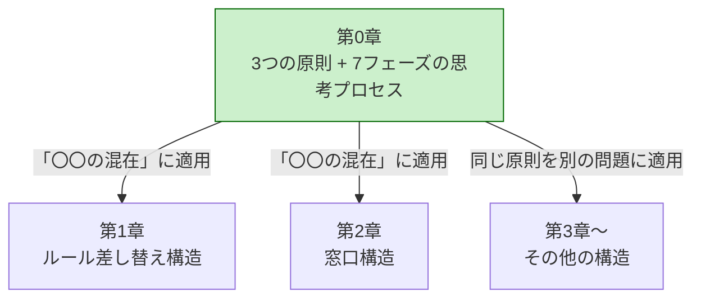
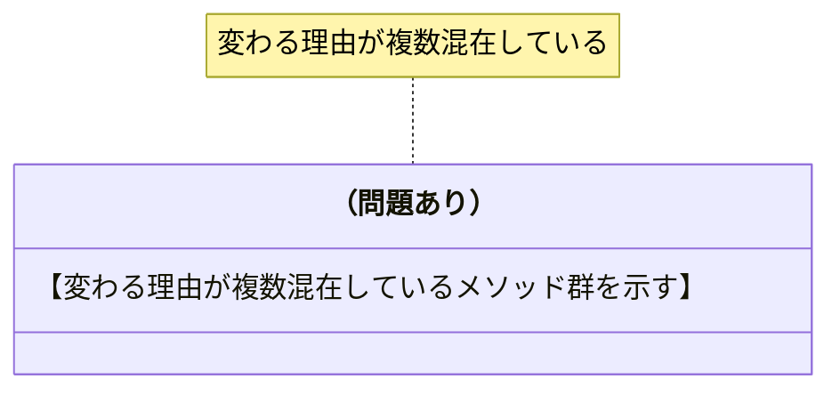
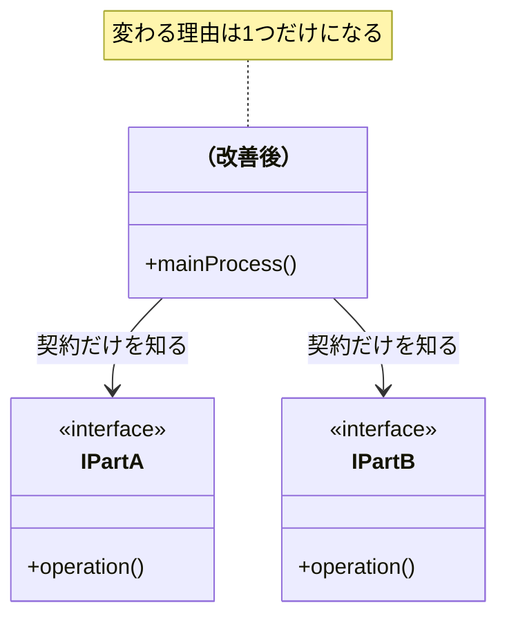
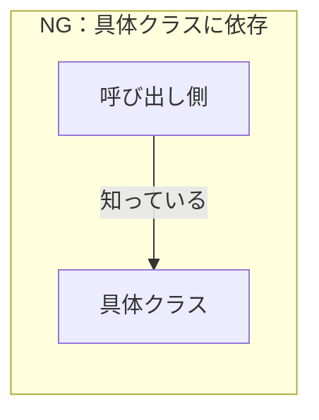
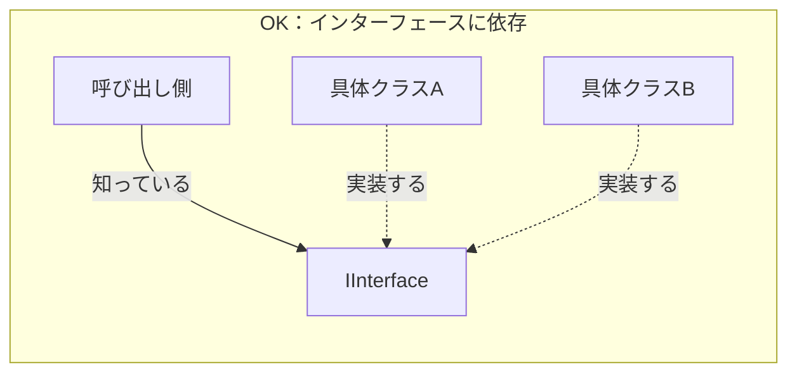
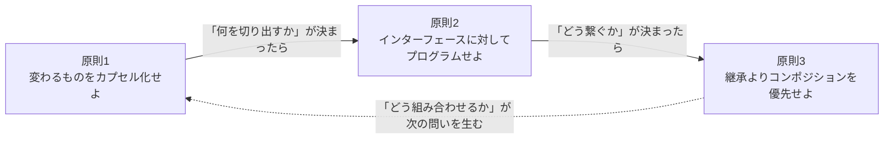
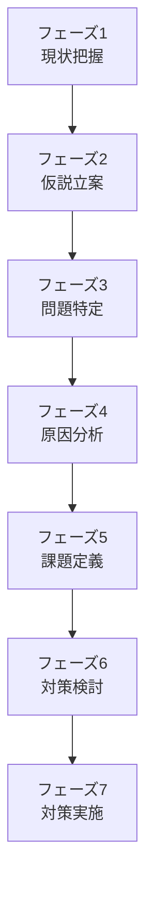

# 第0章テンプレート：この本の読み方
# 対象：chapter00.md のみ（第1〜8章は chapter-template.md を使うこと）

このテンプレートは第0章専用です。第1章以降の7フェーズ章は
`chapter-template.md` を正本とします。第0章は構造適用の章ではなく、
読者へ本書の読み方・設計原則・フェーズの意味を渡す章なので、通常章テンプレートとは
役割を分けます。

---

## 第0章　この本の読み方
―― デザイン構造は「考えた結果」に過ぎない

---

## なぜ「構造を覚えても使えない」のか

【読者が共感できる「構造を学んでも使えなかった体験」を2〜3段落で。
著者自身の体験を1人称で書く。「その感覚、うまく伝わっているでしょうか」のような語りかけを入れる。
最後に「構造を最初から目指すべき答えとして扱っているから」という核心を1文で言語化する】

---

## この章の地図

【第0章が第1章以降の「基礎言語」であることを示すmermaid図を入れる。
第0章（3つの原則 + 7フェーズ）→ 各章（変更要求への適用）という構造を可視化する】



*第0章が「基礎言語」。各章はその言語を特定の問題に適用するだけ。*

---

## すべての構造を貫く3つの原則

【GoFの23構造がたった3つの原則の具体化である、という見立てを1段落で示す。
「暗記する公式」から「同じ原則の別表現」に見え始める、という読者への予告を入れる】

---

### 原則1：変わるものをカプセル化せよ

【「変わりやすい部分」と「変わってほしくない部分」を同じ場所に書かないという原則を説明する】

#### なぜこの原則が生まれたのか

【「変わる理由が2つ混在していると、どちらが変わってもそのクラスが変更対象になる」という現場の痛みを散文で】

#### 「変わる理由」を見つける問い

> 「このコードは、どの種類の機能・仕様変更で変わるのか？」

【答えが1種類なら変わる理由は1つ、複数種類なら変わる理由が混在している、という解説を短く。担当者やチームは分かる場合だけ補助情報として扱う】

#### 問題のある構造と改善後の構造を図で比較する





#### コードで確かめる

```cpp
// NG：【変わる理由が複数混在している例のコメント】
// 【NGコードのスケルトン】

// OK：変わる理由ごとに分離する
// 【OKコードのスケルトン】
```

**この原則を使うための問い——この本を通じて使い回せる1つの問い：**

> 「このコードの中に、**『変わる理由』が異なる2つのものが、同じ場所に混在していないか？**」

【構造が違っても問いはこれ1つ。「何と何が混在しているか」の組み合わせが違うだけ、という説明を短く】

#### この原則がどの構造に現れるか

| 構造 | 分離した「変わるもの」 |
|---|---|
| ルール差し替え構造 | アルゴリズムの実装 |
| 骨格固定構造 | 処理の各ステップ |
| 操作記録構造 | 実行する操作 |
| 装飾連結構造 | 追加する機能の組み合わせ |
| 通知分離構造 | 通知先の種類 |
| 状態分離構造 | 状態ごとの振る舞い |

---

### 原則2：実装ではなくインターフェースに対してプログラムせよ

【「何をするか（契約）」と「どうやるか（実装）」を分けるという原則を説明する】

#### なぜこの原則が生まれたのか

【原則1で切り出した後に残る「どう呼び出すか」の問題として位置づける。
インターフェースが「安定した呼び出し側と不安定な実装側の間の緩衝材」だという説明を散文で】

#### 依存の方向を図で理解する





#### コードで確かめる

```cpp
// NG：具体クラスに直接依存している
// 【NGコードのスケルトン】

// OK：インターフェースに依存する
// 【OKコードのスケルトン】
```

#### インターフェースが守れない変更がある：型の安定性

【引数の型が変わるときの限界を説明する。
「この型はどこまで安定しているか？チームで合意できているか？」という問いを中心に据える。
3択（①型を合意・固定、②独自型でくるむ、③void*）のコードと比較表を示す】

---

### 原則3：継承よりコンポジションを優先せよ

【「is-a（継承）」より「has-a（コンポジション）」を使うべき理由を説明する】

#### なぜこの原則が生まれたのか

【継承による「クラス爆発」と「親への依存の蓄積」という2つの問題を散文で。
コンポジションが「部品を差し替えるだけで振る舞いを変えられる」という解決を示す】

#### 継承だとなぜ組み合わせが爆発するか

mermaid
```
classDiagram
    【継承で組み合わせが爆発する例のクラス図（機能の組み合わせ数だけクラスが増える）】
```

mermaid
```
classDiagram
    【コンポジションで部品を重ねる例のクラス図（クラス数は機能の数だけ）】
```

#### コードで確かめる

```cpp
// NG：継承（is-a）で機能を拡張する
// 【NGコードのスケルトン】
```

```cpp
// OK：コンポジション（has-a）で振る舞いを組み合わせる
// 【OKコードのスケルトン】
```

---

### 3つの原則の連携

【3つの原則が順番に適用される連携関係であることをmermaid図で示す。
「原則1で分離→原則2でインターフェース接続→原則3で組み合わせ方を決める」という流れ】



---

## 各章で使う「7フェーズの思考プロセス」

【各章で一貫して使う7フェーズを紹介する。
ここで示すフェーズ名・順序は `templates/chapter-template.md` と一致させる。
独自のステップ番号や過去の章構成を復活させない】



| フェーズ | 読む対象 | 読者の到達状態 |
|---|---|---|
| **フェーズ1：現状把握** | 仕様、動作例、登場クラス、現状コード、変更要求 | 読者がシステムを説明できる材料をそろえる |
| **フェーズ2：仮説立案** | フェーズ1の事実、関係者確認 | 変わりそうな部分、今回確実に変わること、将来リスクを分ける |
| **フェーズ3：問題特定** | 変更要求、現状コード | 変更を試し、修正・確認・再テスト範囲として痛みを見えるようにする |
| **フェーズ4：原因分析** | 変更影響、痛みの言語化 | 混在する判定・処理・生成判断と、接続点へ漏れている前提を特定する |
| **フェーズ5：課題定義** | 原因分析、接続点 | 課題ID・流れるデータ・変わる側・守る側を一表にし、システム全体の課題を確定する |
| **フェーズ6：対策検討** | 接続点表、システム全体の課題 | 分離方法・配置場所・組み立て方法を決め、完成構造が複数残る場合だけ比較する |
| **フェーズ7：対策実施** | 採用案、変更要求 | 実装・実行し、改善後の変更影響と限界を確認する |

---

### フェーズ1：現状把握 ―― 仕様とコードの対応をそろえる

【仕様、動作例、登場クラス、現状コード、変更要求を順にそろえるフェーズの説明を散文で。
原因分析や解決策はまだ出さない。
仕様は入力→加工→出力の図または表で示すこと、ただし分類ではなく各要素が後でどの動作例・コード・変更要求・接続点で使われるかまで示すことを説明する】

#### なぜ事実から始めるのか

【問題や対策を先に語ると、読者が何を材料に判断しているのか見失う。
まず、同じ仕様・同じ動作・同じコードを見ている状態を作る、という説明を散文で】

**仕様構造の形式：**

| 要素 | この章で見るもの | 具体例 | 後で何に使うか |
|---|---|---|---|
| 入力 | 値・操作・状態 | 顧客ID C001、金額 5,000円、状態 Draft | どの判定や加工の材料になるかを見る |
| 判定 | 正常系で通る条件、対象外条件 | 状態がPendingなら承認可能、金額が上限以内なら承認可能 | 正常系がどの条件で進むかを見る |
| 加工 | 計算・変換・保存・通知 | 税込金額を計算、在庫を3個から2個へ更新、通知を送る | 入力がどの値・状態へ変わるかを見る |
| 出力 | 正常出力・状態変化 | 支払金額 4,850円、承認済み、通知送信済み | 動作例・コード・実行結果で同じ結果を追う |

**仕様要素の使用先対応表：**

この図から読者が得るもの：

- どの入力が、どの判定や加工に使われるのかが分かる。
- 正常に進む流れを先に把握し、エラー条件は別表で確認できる。
- 後でコードを読んだときに、各処理が仕様上どの流れを実現しているのかを確認しやすくなる。

---

### フェーズ2：仮説立案 ―― 変わる可能性と確定事項を分ける

【フェーズ1の事実を材料に、変わりそうな部分を仮説として置く。
その後、関係者確認により今回確実に変わること、当面安定していること、将来リスクを分ける、という説明を散文で】

#### なぜ仮説と確定事項を分けるのか

【コードだけでは、どの機能・仕様がどんな理由・頻度で変わるのかを断定できない。
仮説を立ててから確認することで、設計判断の根拠を持たせる、という説明を散文で】

**仮説・確認結果テーブルの形式：**

| 観点 | 内容 | 根拠 |
|---|---|---|
| 変わりそうな部分 | 【仮説】 | 【フェーズ1の事実】 |
| 今回確実に変わること | 【確定変更】 | 【確認結果】 |
| 当面安定していること | 【安定する約束】 | 【確認結果】 |
| 将来リスク | 【将来起こり得る変更】 | 【確認結果】 |

---

### フェーズ3：問題特定 ―― 変更を試して痛みを見る

【変更要求を現状コードへ当てるフェーズ。
痛みを感想で語らず、修正箇所・確認範囲・再テスト範囲として示すことを説明する。
変更影響グラフで直接変更と巻き込まれた変更を区別する】

---

### フェーズ4：原因分析 ―― 痛みの根本を言語化する

【フェーズ3で確認した痛みの根本にある構造を言語化するフェーズ。
「知識」とだけ書かず、判定条件・計算式・処理順序・生成判断・クラス名・型・操作名へ具体化する。
原則1との直接的なつながりを示す】

| 観察 | 原因の方向 |
|---|---|
| 【観察した事実】 | 【どの判断・処理・生成判断がどこに混在しているか】 |

---

### フェーズ5：課題定義 ―― 接続点と変わる側・守る側を確定する

【原因分析から、解くべき接続点を定義するフェーズ。
`課題ID・接続点／接続するデータ／変わる側／守る側`の4列で一度だけ整理し、現在の波及と目指す状態をシステム全体の課題として確定する。
実装案、配置先、生成・注入方法へ飛ばず、そのままフェーズ6へ渡すことを説明する】

---

### フェーズ6：対策検討 ―― 三つの観点で接続点を変える

【接続点の分離方法、切り出した責任の配置場所、生成・所有・登録・選択・注入を含む組み立て方法を順に決める。
その結果、責任配置や依存が異なる完成可能なシステムが複数残る場合だけ、目的・効果・コストで比較する。
途中状態や、課題を一部しか解かない案を比較しないことを明示する】

---

### フェーズ7：対策実施 ―― 実装して効果と限界を確認する

【最終コード、動作シーケンス図、改善後の変更影響グラフ、変更シナリオ表を示すフェーズ。
「どこが変わったとき、どこだけを変えればいいか」が一目で分かる構造を示す形式を説明する】

**変更シナリオ表の形式：**

| シナリオ | 触る場所 | 触らない場所 |
|---|---|---|
| 【シナリオ1】 | 【変更するクラス・関数】 | 【変更しないクラス・関数】 |

---

## 問題を発見した後の手札 ―― 構造ではなく「考え方」で戦う

【この節は chapter00.md に固定で存在する、手札カタログ節。
「実装の小手先」と「設計の手札」の違いを1文で示す。
関数化、責任移動、契約導入、窓口・仲介、コンポジション、生成分離をそれぞれ3行程度で説明する。
「デザイン構造は手札を使った結果に過ぎない」という締め文で終わる。
次章予告（「次章では〇〇」等）は一切書かない。】

---

## 注意事項（chapter0-template.md 執筆者向け）

- この章は構造を「覚えさせる」のではなく「使える原則を渡す」章である
- コードは C++ で統一。lambda / unique_ptr / auto / C++17以降の記法は使わない
- 原則の説明は「なぜこの原則が生まれたのか（現場の痛み）」から始め、抽象論から入らない
- 3つの原則のいずれも、mermaid図（NG / OK の比較）＋コード（NG / OK の比較）の両方を必ず含める
- 次章予告（「次章では〇〇」等）は一切書かない。この章は第1章以降と独立している
