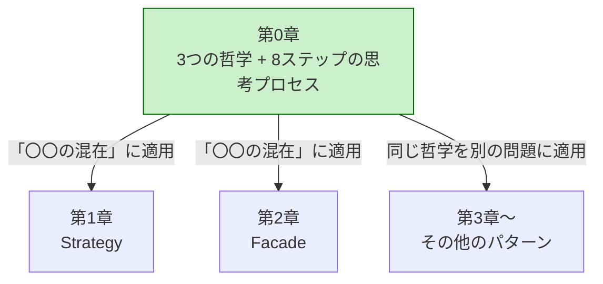
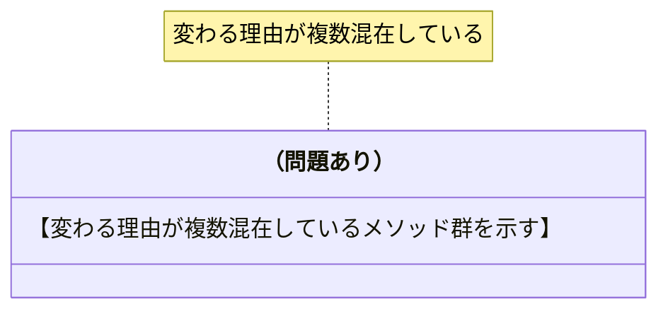
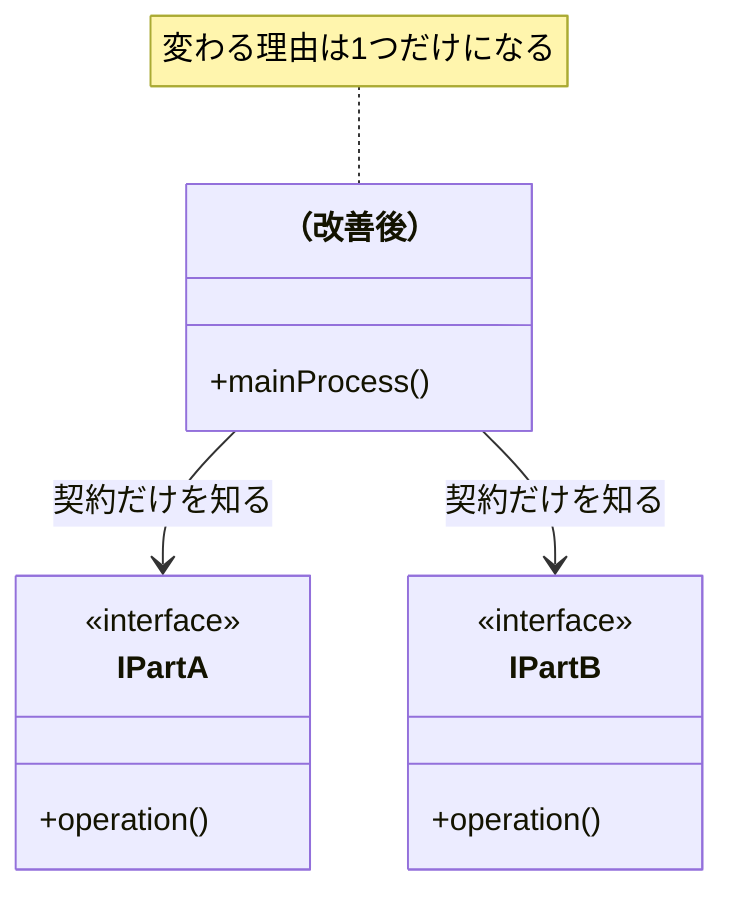
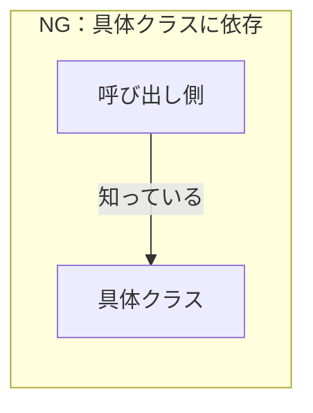
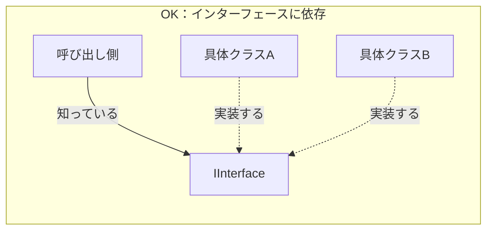
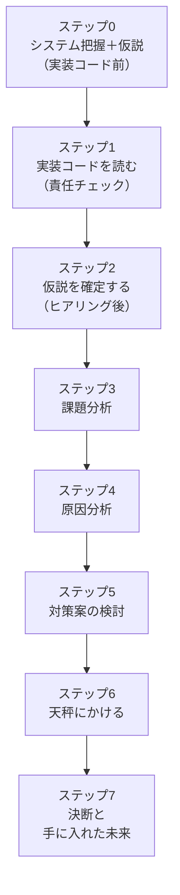

# 第0章テンプレート：この本の読み方
# 対象：chapter00.md のみ（第1〜8章は chapter-template.md を使うこと）

---

## 第0章　この本の読み方
―― デザインパターンは「考えた結果」に過ぎない

---

## なぜ「パターンを覚えても使えない」のか

【読者が共感できる「パターンを学んでも使えなかった体験」を2〜3段落で。
著者自身の体験を1人称で書く。「その感覚、うまく伝わっているでしょうか」のような語りかけを入れる。
最後に「パターンを最初から目指すべき答えとして扱っているから」という核心を1文で言語化する】

---

## この章の地図

【第0章が第1章以降の「基礎言語」であることを示すmermaid図を入れる。
第0章（3つの哲学 + 8ステップ）→ 各章（そのパターンへの適用）という構造を可視化する】



*第0章が「基礎言語」。各章はその言語を特定の問題に適用するだけ。*

---

## すべてのパターンを貫く3つの哲学

【GoFの23パターンがたった3つの哲学の具体化である、という見立てを1段落で示す。
「暗記する公式」から「同じ哲学の別表現」に見え始める、という読者への予告を入れる】

---

### 哲学1：変わるものをカプセル化せよ

【「変わりやすい部分」と「変わってほしくない部分」を同じ場所に書かないという哲学を説明する】

#### なぜこの哲学が生まれたのか

【「変わる理由が2つ混在していると、どちらが変わってもそのクラスが変更対象になる」という現場の痛みを散文で】

#### 「変わる理由」を見つける問い

> 「このコードを変更するとき、変更を決定するのは誰か？」

【答えが1人なら変わる理由は1つ、2人以上なら複数混在という解説を短く】

#### 問題のある構造と改善後の構造を図で比較する





#### コードで確かめる

```cpp
// NG：【変わる理由が複数混在している例のコメント】
// 【NGコードのスケルトン】

// OK：変わる理由ごとに分離する
// 【OKコードのスケルトン】
```

**この哲学を使うための問い——この本を通じて使い回せる1つの問い：**

> 「このコードの中に、**『変わる理由』が異なる2つのものが、同じ場所に混在していないか？**」

【パターンが違っても問いはこれ1つ。「何と何が混在しているか」の組み合わせが違うだけ、という説明を短く】

#### この哲学がどのパターンに現れるか

| パターン | 分離した「変わるもの」 |
|---|---|
| Strategy | アルゴリズムの実装 |
| Template Method | 処理の各ステップ |
| Command | 実行する操作 |
| Decorator | 追加する機能の組み合わせ |
| Observer | 通知先の種類 |
| State | 状態ごとの振る舞い |

---

### 哲学2：実装ではなくインターフェースに対してプログラムせよ

【「何をするか（契約）」と「どうやるか（実装）」を分けるという哲学を説明する】

#### なぜこの哲学が生まれたのか

【哲学1で切り出した後に残る「どう呼び出すか」の問題として位置づける。
インターフェースが「安定した呼び出し側と不安定な実装側の間の緩衝材」だという説明を散文で】

#### 依存の方向を図で理解する





#### コードで確かめる

```cpp
// NG：具体クラスに直接依存している
// 【NGコードのスケルトン】

// OK：インターフェースに依存する
// 【OKコードのスケルトン】
```

#### インターフェースが守れない変更がある：型の安定性

【引数の型が変わるときの限界を説明する。
「この型はどこまで安定しているか？チームで合意できているか？」という問いを中心に据える。
3択（①型を合意・固定、②独自型でくるむ、③void*）のコードと比較表を示す】

---

### 哲学3：継承よりコンポジションを優先せよ

【「is-a（継承）」より「has-a（コンポジション）」を使うべき理由を説明する】

#### なぜこの哲学が生まれたのか

【継承による「クラス爆発」と「親への依存の蓄積」という2つの問題を散文で。
コンポジションが「部品を差し替えるだけで振る舞いを変えられる」という解決を示す】

#### 継承だとなぜ組み合わせが爆発するか

```mermaid
classDiagram
    【継承で組み合わせが爆発する例のクラス図（機能の組み合わせ数だけクラスが増える）】
```

```mermaid
classDiagram
    【コンポジションで部品を重ねる例のクラス図（クラス数は機能の数だけ）】
```

#### コードで確かめる

```cpp
// NG：継承（is-a）で機能を拡張する
// 【NGコードのスケルトン】

// OK：コンポジション（has-a）で振る舞いを組み合わせる
// 【OKコードのスケルトン】
```

---

### 3つの哲学の連携

【3つの哲学が順番に適用される連携関係であることをmermaid図で示す。
「哲学1で分離→哲学2でインターフェース接続→哲学3で組み合わせ方を決める」という流れ】


---

## 先人たちが使っていた「8ステップの思考プロセス」

【「意識的かどうかはともかく8ステップを踏んでいた」という導入を1段落で。
各章でこのステップを一貫して使うことを予告する】



| ステップ | 読む対象 | やること |
|---|---|---|
| **ステップ0** | クラス構成の概要（仕様表・責任一覧） | クラスの責任を把握し、「何が変わりそうか」の仮説を立てる |
| **ステップ1** | 実装コード（`if` 文の中身・各行） | 各行が責任範囲内かを確認し、責任外の知識を見つける |
| **ステップ2** | 関係者（ヒアリング） | 「なぜ変わるのか・誰が決めるのか」を確認し、仮説を確定する |

---

### ステップ0：システムを把握し、仮説を立てる

【「実装コードを読む前に」クラス構成の概要だけを見て仮説を立てるステップの説明を散文で。
3つの哲学の接続：哲学1（変わる理由を読み取る出発点）との繋がりを示す】

#### なぜ実装コードを読む前に仮説を立てるのか

【コードを読んでから考えると「コードに引きずられた仮説」になる。
クラス構成（責任の宣言）から先に読むことで「変わりそうな場所」を構造的に予測できる、という説明を散文で】

**仮説テーブルの形式：**

| 分類 | 仮説 | 根拠（クラス構成から読み取れること） |
|---|---|---|
| 🔴 **変動する** | 【変わりそうな部分】 | 【なぜそう読み取れるか】 |
| 🟢 **不変** | 【変わらなそうな部分】 | 【なぜそう読み取れるか】 |

---

### ステップ1：実装コードを読む

【「仮説を持ってから読む」という順序の重要性を散文で。
責任チェックとは「このクラスの責任以外の知識を持っていないか」の確認だという定義を示す】

#### 責任チェックの問い

> 「このコードの中に、**『変わる理由』が異なる2つのものが、同じ場所に混在していないか？」**

【「変わる理由」とは「誰の判断で変わるか」のことだと定義する】

**責任チェック表の形式：**

| コードの行 | 持っている知識 | 責任内か |
|---|---|---|
| 【コードの一部】 | 【その行が持つ知識】 | **✗ 【誰の責任か】** または ✅ |

---

### ステップ2：仮説を確定する

【「コードを読んだだけで断定しない。関係者に直接確認する」という姿勢を散文で。
ヒアリングの形式（開発者→関係者の問答形式）を示す】

#### なぜコードだけで判断してはいけないのか

【ビジネス上の都合・担当チームの決定権・スケジュールなどは、コードに現れない。
「変わる理由」は技術ではなくビジネスに由来する、という説明を散文で】

**ヒアリング後の確定テーブル形式：**

| 分類 | 具体的な内容 | 変わるタイミング | 根拠 |
|---|---|---|---|
| 🔴 **変動する** | 【変わる部分】 | 【いつ変わるか】 | 【誰への確認か】 |
| 🟢 **不変** | 【変わらない部分】 | 変わる日は来ない | 【誰との合意か】 |

---

### ステップ3：課題分析

【「変更が来たとき、現状のコードで何が辛いか」を確認するステップ。
「変更の飛び火」という概念をmermaid図で示す形式を説明する】

---

### ステップ4：原因分析

【ステップ3で確認した「辛さ」の根本にある設計の問題を言語化するステップ。
「変わるものと変わらないものが同じ場所にいる」が核心、という説明を散文で。
哲学1との直接的な繋がりを示す】

| 観察 | 原因の方向 |
|---|---|
| 【観察した事実】 | 【なぜそうなるか】 |

---

### ステップ5：対策案の検討

【「理想の契約（インターフェース）から逆算して構造を作る」というアプローチを説明。
試み①（シンプルな案）→試み②（インターフェースを使う案）の2段階で示すことを説明する。
★試み②の後で初めてパターン名を出してよい★という制約を明示する】

---

### ステップ6：天秤にかける

【「柔軟性とシンプルさのバランス」を評価するステップ。
耐久テスト（ヒアリングで挙がったリスクを実際に変化させる）と
使う場面・使わない場面の両方を示すことを説明する】

---

### ステップ7：決断と、手に入れた未来

【最終コード（全体）と変更シナリオ表・最終責任テーブルを示すステップ。
「どこが変わったとき、どこだけを変えればいいか」が一目で分かる構造を示す形式を説明する】

**変更シナリオ表の形式：**

| シナリオ | 変わるクラス | 変わらないクラス |
|---|---|---|
| 【シナリオ1】 | 【変わるクラス】 | 【変わらないクラス】 |

---

## 各章で起きること——8ステップの反復

【第0章で定義した「8ステップ」と「3つの哲学」を、第1章以降で毎回同じ形で使う。
各章の違いは「何と何が混在しているか」という状況の違いだけ。
「次の現場で同じ問題に出会ったとき、同じ8ステップで考えてみよう」という締め方で終わる】

---

## 注意事項（chapter0-template.md 執筆者向け）

- この章はパターンを「覚えさせる」のではなく「使える哲学を渡す」章である
- コードは C++ で統一。lambda / unique_ptr / auto / C++17以降の記法は使わない
- 哲学の説明は「なぜこの哲学が生まれたのか（現場の痛み）」から始め、抽象論から入らない
- 3つの哲学のいずれも、mermaid図（NG / OK の比較）＋コード（NG / OK の比較）の両方を必ず含める
- 次章予告（「次章では〇〇」等）は一切書かない。この章は第1章以降と独立している
