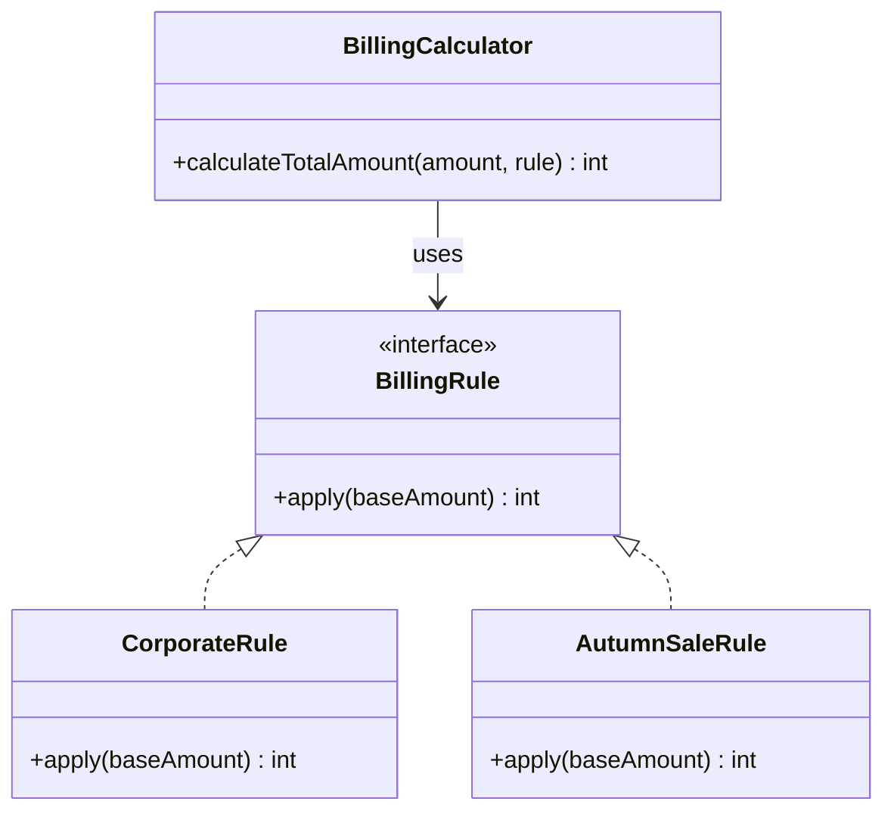

# 第1章　Strategyパターン：役割を分かち合い、共に歩む
―― 今回の変化：「実行する振る舞い（アルゴリズム）が変わる」

> **第0章との対応**：この章では「実行する振る舞い」が変わるという問題に、
> 5ステップの思考プロセスを適用します。
> どの章から読んでいただいても、同じ手順で考えを進められます。

---

## ステップ1：現状把握
> 今のシステムと、今日届いた変更要求を正確に把握する

### 1.1 今のシステムの仕様とコードの構造

#### このシステムが何をするか

受注した商品の合計金額を計算し、
割引・消費税を適用して最終請求額を返すモジュールです。
顧客の属性（法人／一般）とキャンペーンの有無によって
割引ルールが変わるため、実際の請求額は条件次第で大きく異なります。

#### 現在の仕様

現在、このシステムは以下のように動作することが期待されています。

- 法人顧客（B2B）には基本料金の10%引きを適用する
- プレミアム契約かつ100個以上の注文には、さらに5万円を差し引く
- 継続年数が1年を超える法人顧客には、さらに1万円を差し引く
- 一般顧客（B2C）は夏のセール期間中20%引きを適用する
- 初回購入者には一律500円引きを適用する
- 最終金額に消費税10%を加算する
- 最終金額が0円を下回る場合は0円とする

#### 【起点コード】

このシステムを最初に書いた担当者が、
仕様通りに誠実に実装した姿がここにあります。
当時は法人・一般の2パターンのみでした。
以来、要求が増えるたびにこの関数が育ち続けてきました。
当時の担当者の苦労を想像しながら、コードを観察します。

```cpp
// 【起点コード】
// billing/BillingCalculator.cpp
// 当初は法人・一般の2パターンのみ。
// 要求が増えるたびに、この関数が育ち続けてきた。

int calculateTotalAmount(
    int baseAmount,
    bool isCorporate,
    bool isPremium,
    int quantity,
    int continuationYears,
    bool isSummerSale,
    bool isFirstPurchase
) {
    int amount = baseAmount;

    if (isCorporate) {
        amount = amount * 9 / 10;        // 法人: 10%引き
        if (isPremium && quantity >= 100) {
            amount -= 50000;             // プレミアム＆大量注文
        }
        if (continuationYears > 1) {
            amount -= 10000;             // 継続1年超
        }
    } else {
        if (isSummerSale) {
            amount = amount * 8 / 10;    // 夏セール: 20%引き
        }
        if (isFirstPurchase) {
            amount -= 500;               // 初回購入
        }
    }

    amount = static_cast<int>(amount * 1.1);  // 消費税10%
    return std::max(0, amount);
}
```

---

### 1.2 届いた変更要求

営業チームから連絡が入りました。

「秋の特大セールを来週末に始めたいんです。
　新しい割引ルールを追加してもらえますか？」

5日後のリリース。いつもと変わらない要求です。
私自身、何度もこの状況で迷いました。
「またここに手を入れるのか」という感覚、
うまく伝わっているでしょうか。

---

## ステップ2：課題の発見
> 変更要求を受けて「何が難しいのか」を具体化する

### 1.3 変更しようとしたときに現れる困難

秋の特大セール（例：15%引き）をこの関数に追加しようとすると、
何が起きるでしょうか。頭の中で試してみます。

- **困難1：また引数が増える**
  `isAutumnSale` という bool 引数を追加し、
  関数の中にまた新しい `if` ブロックを書くことになります。
  今日の7引数が、来月は9引数、再来月は11引数……
  この先がイメージできてしまいます。

- **困難2：B2Cを変えるとB2Bのテストが不安になる**
  法人ルールと一般ルールが同じ関数の中にあるため、
  秋セール（一般向け）の1行を変えるだけで
  「法人側を壊していないか？」と
  全テストを走らせたくなります。
  担当チームが別なのに、互いの変更を気にしなければならない状態です。

> 「なぜ、新しいルールを1つ追加するだけで、
>　こんなに気を使わなければならないのか？」

*まだ答えを出しません。
「難しい」という事実をはっきりさせることが、このステップの目的です。*

---

## ステップ3：原因特定
> 「なぜ難しいのか」の根本を突き止める

### 1.4 困難の根本にあるもの

コードを観察して、困難の原因を探ります。

- 観察1：キャンペーンや法人の新契約が決まるたびに、
  `calculateTotalAmount` の本体に手を入れる必要がある
- 観察2：法人担当チームとキャンペーン担当チームが、
  同じ関数という1つの空間を共有している
- 観察3：B2Cの条件を1行直しただけで、
  B2Bのテストをやり直す恐怖が生まれる

この観察から、問題の構造が見えてきます。

#### 変わるものと変わらないものが同じ場所にいる

| 変わり続けるもの | 変わってほしくないもの |
|:---|:---|
| 割引ルールの種類と計算方法 | 「割引を適用して消費税を加算する」骨格 |
| ルールの数（今後も増え続ける） | 入力（基本金額）と出力（最終請求額）の形 |

「変わり続けるもの」と「変わってほしくないもの」が
`calculateTotalAmount` という1つの場所に同居しています。
これが、変更のたびに全体が揺れる原因です。

> **ここで立ち止まって考える**
>
> 「『割引ルール』を `calculateTotalAmount` の外へ切り出せたら、
> 何が変わるでしょうか？」
>
> 秋セールのルールが追加されても、
> `calculateTotalAmount` 本体には触れずに済むようになります。
> 法人チームは法人ルールだけに集中できる。
> キャンペーンチームはキャンペーンルールだけに集中できる。
> その姿が実現したとき、ステップ2の困難はどう変わるでしょうか。

---

## ステップ4：対策案の検討
> 原因から論理的に案を導く。どの案も原因への正当な対処

### 1.5 原因から対策の方向性を論理的に導く

「変わるルールと変わらない骨格が同じ場所にいる」という構造上の問題を解消するには、
大きく2つのアプローチが論理的に考えられます。

チームで話し合う価値がある部分だと思います。

**アプローチA：振る舞いを関数として渡す**

「変わるルール」の計算処理を `std::function<int(int)>` として
外から受け取る形にすれば、`calculateTotalAmount` はルールの中身を知らずに済む。
「変わるもの（ルールの実体）を外部へ追い出す」という方向で原因を解消する。
コスト：実装が軽い。新しいクラスを定義する必要がない。
適する状況：ルールが2〜3種類で条件がシンプル、1人で管理できる規模。

**アプローチB：振る舞いをクラスとして独立させる**

「変わるルール」を状態と振る舞いを持つ独立した部品（クラス）として定義すれば、
各ルールが完全に独立した単位になる。
複雑な状態（`isPremium`、`quantity`）も自然に表現でき、
それぞれを単独でテストできる。
「変わるものをそれぞれ独立した責任の単位として切り出す」という方向で原因を解消する。
コスト：インターフェース定義と具象クラスが必要。構造が増える。
適する状況：ルールが複雑・状態を持つ、チームで分担する、
各ルールを独立してテストしたい。

*いずれのアプローチも、ステップ3で特定した原因に対して
論理的に正しい対処です。
どれが「最善か」は、ステップ5の天秤で状況に応じて判断します。*

---

### 1.6 各アプローチの実装

#### アプローチA：【関数で渡すコード】

`std::function<int(int)>` を引数として受け取ることで、
`calculateTotalAmount` は「何%引くか」を知らなくてよくなります。
「変わるルール」を呼び出し元が関数として用意し、渡す形です。

```cpp
// 【関数で渡すコード】
// billing/BillingCalculator.cpp
// 「変わるルール」を関数として受け取る。
// calculateTotalAmountはルールの中身を知らなくてよい。

int calculateTotalAmount(
    int baseAmount,
    std::function<int(int)> applyDiscount
) {
    int amount = applyDiscount(baseAmount);
    amount = static_cast<int>(amount * 1.1);  // 消費税
    return std::max(0, amount);
}
```

秋セールなら、呼び出し元でラムダ式として渡せます。

```cpp
// 秋セール（15%引き）の呼び出し例
int total = calculateTotalAmount(10000,
    [](int base) {
        return static_cast<int>(base * 0.85);
    }
);
```

法人ルールのように状態が必要な場合は、キャプチャを使います。

```cpp
// 法人ルールの呼び出し例（状態のキャプチャが必要）
bool isPremium = true;
int quantity = 150;
int years = 2;
int total = calculateTotalAmount(100000,
    [isPremium, quantity, years](int base) {
        int amount = base * 9 / 10;
        if (isPremium && quantity >= 100) amount -= 50000;
        if (years > 1) amount -= 10000;
        return amount;
    }
);
```

`calculateTotalAmount` はルールを知らなくなりました。
ただし、法人ルールのような複雑な条件では
ラムダのキャプチャリストが長くなる傾向があります。
また、「このルールが正しいか」を単独でテストしようとすると、
`calculateTotalAmount` を介さずに確認する方法がありません。

---

#### アプローチB：【インターフェースで渡すコード】

「割引ルール」という概念をインターフェースとして定義し、
各ルールをそれぞれ独立したクラスとして実装します。
`calculateTotalAmount` は `BillingRule` の形さえ知っていれば、
どのルールが来ても同じように動きます。

```cpp
// 【インターフェースで渡すコード】① インターフェース定義
// billing/BillingRule.h
// 「割引ルール」という概念に名前を与える。
// どのルールも、この形を通じて受け渡しできる。

class BillingRule {
public:
    virtual ~BillingRule() = default;
    virtual int apply(int baseAmount) const = 0;
};
```

```cpp
// ② 法人ルール
// billing/CorporateRule.h
// 法人向けルールを1つの部品に閉じ込める。
// キャンペーンの変更がここに影響することはない。

class CorporateRule : public BillingRule {
public:
    CorporateRule(
        bool isPremium,
        int quantity,
        int continuationYears
    )
        : isPremium_(isPremium)
        , quantity_(quantity)
        , continuationYears_(continuationYears)
    {}

    int apply(int baseAmount) const override {
        int amount = baseAmount * 9 / 10;
        if (isPremium_ && quantity_ >= 100) {
            amount -= 50000;
        }
        if (continuationYears_ > 1) {
            amount -= 10000;
        }
        return amount;
    }

private:
    bool isPremium_;
    int quantity_;
    int continuationYears_;
};
```

```cpp
// ③ 秋セールルール
// billing/AutumnSaleRule.h
// 秋セールのルールを新しい部品として追加する。
// CorporateRuleにも
// calculateTotalAmountにも触れない。

class AutumnSaleRule : public BillingRule {
public:
    int apply(int baseAmount) const override {
        return static_cast<int>(baseAmount * 0.85);
    }
};
```

```cpp
// ④ コンテキスト
// billing/BillingCalculator.cpp
// 「変わらないもの（計算の骨格）」だけに専念する。
// ルールが何種類に増えても、
// この関数には触れなくてよい。

int calculateTotalAmount(
    int baseAmount,
    const BillingRule& rule
) {
    int amount = rule.apply(baseAmount);
    amount = static_cast<int>(amount * 1.1);
    return std::max(0, amount);
}
```



*図が表示されない環境のために補足します。*
中心に `BillingRule`（インターフェース）があり、
各ルールクラス（`CorporateRule`、`AutumnSaleRule` など）がそれを実装します。
`BillingCalculator` は `BillingRule` という形さえ知っていれば、
どのルールが渡されても同じように動きます。
新しいルールを追加するとき、`BillingCalculator` には触れません。

秋セールのルールを追加したとき、
`calculateTotalAmount` にも `CorporateRule` にも
一切手を触れませんでした。

> 「アプローチBの構造」を、先人たちは **Strategyパターン** と呼んでいます。
> 名前は、論理的に辿り着いた構造へのラベルです。
> 覚えることが目的ではありません。

---

## ステップ5：天秤にかける・決断する
> 基準を先に宣言し、各案を等価に比較した上で決断する

### 1.7 比較の基準を先に宣言する

比較を始める前に「何を重視するか」を明示します。
基準を後から決めると、結論ありきの比較になってしまいます。

今回の状況で私が重視する基準は次の通りです。

| 基準 | なぜこの状況で重要か |
|:---|:---|
| テストの独立性 | 法人ルールとキャンペーンルールを互いに干渉せずテストしたい |
| 変更の局所性 | 新しいルール追加のとき、変更箇所を1か所に収めたい |
| チームの分担 | 担当チームが別れているため、コードも別れていてほしい |

---

### 1.8 各アプローチをテストで比較する

#### アプローチAのテスト：テストの独立性に照らすと

```cpp
// アプローチAのテスト
// 秋セールルールを確認する

TEST(BillingCalculatorTest, AutumnSaleDiscount) {
    auto autumnSaleRule = [](int base) {
        return static_cast<int>(base * 0.85);
    };
    // ルールの中身がテストに入り込んでいる
    int result = calculateTotalAmount(10000, autumnSaleRule);
    EXPECT_EQ(9350, result);  // 10000 * 0.85 * 1.1
}
```

```cpp
// 法人ルールの確認（状態が複雑なケース）
TEST(BillingCalculatorTest, CorporateRuleWithPremium) {
    bool isPremium = true;
    int quantity = 150;
    int years = 2;
    // ルールのロジックがテスト内に複製される
    auto rule = [isPremium, quantity, years](int base) {
        int amount = base * 9 / 10;
        if (isPremium && quantity >= 100) amount -= 50000;
        if (years > 1) amount -= 10000;
        return amount;
    };
    // 100000 * 0.9 - 50000 - 10000 = 30000 → 33000(税込)
    EXPECT_EQ(33000, calculateTotalAmount(100000, rule));
}
```

各ルールの確認はできます。
ただし、ルールの中身は常に `calculateTotalAmount` を介してしか確認できません。
法人ルールのロジックがテスト内に重複して存在する形になります。

#### アプローチBのテスト：テストの独立性に照らすと

```cpp
// アプローチBのテスト① コンテキスト側
// ルールの中身を知らなくても書ける

class MockBillingRule : public BillingRule {
public:
    int apply(int baseAmount) const override {
        return 8000;  // 固定値（委譲確認用）
    }
};

TEST(BillingCalculatorTest, AppliesTaxToRuleResult) {
    MockBillingRule rule;
    // 「委譲して消費税をかけているか」だけを確認する
    EXPECT_EQ(8800, calculateTotalAmount(10000, rule));
}
```

```cpp
// アプローチBのテスト② ルール側
// calculateTotalAmountの存在を知らなくてよい

TEST(AutumnSaleRuleTest, AppliesFifteenPercentDiscount) {
    AutumnSaleRule rule;
    EXPECT_EQ(8500, rule.apply(10000));  // 10000 * 0.85
}

TEST(CorporateRuleTest, AppliesBaseDiscount) {
    CorporateRule rule(false, 10, 0);
    EXPECT_EQ(9000, rule.apply(10000));  // 10%引きのみ
}

TEST(CorporateRuleTest, AppliesPremiumBulkDiscount) {
    CorporateRule rule(true, 150, 2);
    // 100000 * 0.9 - 50000 - 10000 = 30000
    EXPECT_EQ(30000, rule.apply(100000));
}
```

各部品が「自分の責任だけ」をテストしています。
法人ルールが変わっても、秋セールのテストには影響しません。

#### 比較のまとめ

| 基準 | アプローチA | アプローチB |
|:---|:---|:---|
| テストの独立性 | △ 計算器を介してしか確認できない | ○ ルール単体でテストできる |
| 変更の局所性 | ○ 呼び出し元を変えればよい | ○ 新クラスを追加するだけ |
| チームの分担 | △ ルール定義が呼び出し元に散らばる | ○ ルールごとにファイルが分かれる |
| 実装コスト | 少ない（クラス定義不要） | 多い（インターフェース＋クラス必要） |
| **この状況に合うか** | ルールが少なく単純な場合 | 複雑なルールが増え続ける場合 |

*この比較はあくまで「今回の状況と基準」に対するものです。
別の状況・別の基準であれば、違う選択が正解になります。*

---

### 1.9 より難しい変化への耐久テスト

#### 新たな状況

再び営業チームから連絡が入りました。

「今度は複数の割引を重ねて使えるようにしたいんです。
　秋セール割引に加えて、会員割引とクーポンも
　同時に適用できるようにしてほしくて。
　リリースは来月初めを想定しています」

> **ステップ1〜4で導いた複数の案は、この変化にも通用するでしょうか？**
>
> 少し立ち止まって、考えてみてください。

アプローチA（関数で渡す）は、
引数を `std::vector<std::function<int(int)>>` に変えることで対応できます。
ただし、複数のラムダを渡す呼び出し元のコードは複雑になります。
法人ルールのキャプチャが絡むと、さらに追いにくくなります。

アプローチB（クラスで渡す）は、
引数を1つから「リスト」に変えるだけで対応できます。
`BillingRule` インターフェースにも各ルールクラスにも、
一切触れる必要がありません。

#### 【深化コード】

```cpp
// 【深化コード】
// 1.6 アプローチBからの変更点：
// - BillingRule インターフェース：変更なし
// - 各 Rule クラス：変更なし
// - calculateTotalAmount：引数を1つからリストに変えた

int calculateTotalAmount(
    int baseAmount,
    const std::vector<
        std::unique_ptr<BillingRule>
    >& rules
) {
    int amount = baseAmount;
    for (const auto& rule : rules) {
        amount = rule->apply(amount);
    }
    amount = static_cast<int>(amount * 1.1);
    return std::max(0, amount);
}
```

#### 対象：1.9【深化コード】に対するテスト

```cpp
TEST(BillingCalculatorTest, AppliesMultipleRulesInOrder) {
    std::vector<std::unique_ptr<BillingRule>> rules;
    rules.push_back(std::make_unique<AutumnSaleRule>());
    rules.push_back(std::make_unique<MemberDiscountRule>(500));

    // 10000 → 8500（秋15%引き）
    //       → 8000（会員500円引き）
    //       → 8800（消費税10%）
    EXPECT_EQ(8800, calculateTotalAmount(10000, rules));
}
```

*この耐久テストを経て、この状況ではアプローチBが合っていると判断できます。
ステップ1〜4で論理的に導いた構造が、難しい変化にも通用することが確認できました。*

---

### 1.10 使う場面・使わない場面

「では、アプローチBを常に選べばいいのか？」という問いは自然です。
間違えても大丈夫です。
この問いと向き合うことがステップ5の本質です。

#### 【過剰コード】：アプローチBを使いすぎた例

```cpp
// 【過剰コード】
// 「消費税10%をかける」という
// 変わる予定のない処理まで部品にした例

class TaxRule : public BillingRule {
public:
    int apply(int baseAmount) const override {
        return static_cast<int>(baseAmount * 1.1);
    }
};
```

消費税率がゼロではないことは認めます。
でも、このプロジェクトでその変化を見込む根拠はあるでしょうか。
変化の予定がないものを「変わるもの」として扱うと、
コードの複雑さだけが増えます。
このケースではアプローチAの方が合っていました。

#### 状況ごとの選択指針

| 状況 | 適切な選択 | 理由 |
|:---|:---|:---|
| ルールが複雑・チームで分担する | アプローチB | テスト独立性・チーム分担が必要 |
| ルールが2〜3個・1人で管理 | アプローチA | 実装コストが割に合う |

#### この現場ではどこまでやれば十分か

| 状況 | 選ぶ形 | 省略するもの | 次の判断タイミング |
|:---|:---|:---|:---|
| 締切まで数日 | アプローチA（最小） | インターフェース定義 | ルールが3種類を超えたとき |
| 動かしながら移行 | 中間形態 | 複数ルールの組み合わせ | 最初の新ルール追加時 |
| 新規・拡張が明確 | アプローチB（完全体） | 省略なし | — |

```cpp
// アプローチA（最小採用）の例
// ルールが2〜3種類で固定されている場合に選べる形

int calculateTotalAmount(
    int baseAmount,
    std::function<int(int)> applyDiscount
) {
    int amount = applyDiscount(baseAmount);
    amount = static_cast<int>(amount * 1.1);
    return std::max(0, amount);
}
```

> **どの形を選んでも守る一線**
>
> 「割引ルール」を `calculateTotalAmount` の中央に
> 直書きで増やし続けることだけは避ける。
> アプローチAかBかは、ビジネスの文脈と1.7の基準が決めます。

---

## この章で踏んだ思考の整理

### 1.11 5ステップとこの章でやったこと

| ステップ | この章でやったこと |
|:---|:---|
| **1. 現状把握** | ECサイト決済モジュールの仕様・コード・新ルール追加要求をひとつの状況として把握した |
| **2. 課題の発見** | 変更しようとすると引数が増え続け、別チームの変更が互いに干渉することがわかった |
| **3. 原因特定** | 「変わり続ける割引ルール」と「変わらない計算の骨格」が同じ場所にいることを突き止めた |
| **4. 対策案検討** | 原因から論理的に2つのアプローチを導き、それぞれを実装した |
| **5. 天秤・決断** | 基準を宣言し、テストで比較し、この状況に合う案を選んだ |

この思考の結果として辿り着いた構造を、
先人たちは **Strategyパターン** と呼んでいます。
一つの参考として受け取っていただければと思います。

### 次章について

次章では「複雑な依存関係を隠したい」という、
別の種類の問題を扱います。
ステップの踏み方は同じです。問題の種類だけが変わります。
