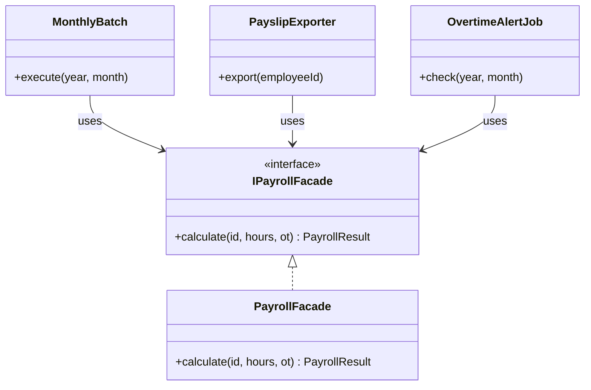

# 第2章　Facadeパターン：複雑な依存を一枚の壁に隠す
―― 今回の変化：「依存している外部サービスのAPIが変わる」

> **第0章との対応**：この章では「呼び出し元が外部サービスの詳細を
> 知りすぎている」という問題に、5ステップの思考プロセスを適用します。
> どの章から読んでいただいても、同じ手順で考えを進められます。

---

## ステップ1：現状把握
> 今のシステムと、今日届いた変更要求を正確に把握する

### 2.1 今のシステムの仕様とコードの構造

#### このシステムが何をするか

従業員の出退勤打刻を記録し、月次で勤務時間・残業時間を集計して
給与計算と労務管理へ連携するシステムです。
打刻データは社内の勤怠DBで管理し、給与計算は外部ベンダーの
給与計算APIへ、36協定の管理は別の労務管理サービスへ
それぞれ連携しています。

#### 現在の仕様

- 打刻時刻をDBに記録する（出勤・退勤・休憩）
- 月次集計バッチが月末に勤務時間・残業時間を算出する
- 集計結果を給与計算APIに送信し、明細データを受け取る
- 残業が月45時間を超えた従業員の情報を労務管理サービスに通知する
- 給与明細PDFを社内ファイルサーバーに保存する

#### 【起点コード】

このシステムを最初に構築した担当者が、
要件通りに誠実に実装した姿がここにあります。
当時は給与計算APIのベンダーも1社だけで、
連携先はシンプルでした。
要件が増えるたびに、連携処理が少しずつ育ってきた。
当時の担当者の苦労を想像しながら、コードを観察します。

```cpp
// 【起点コード】
// attendance/MonthlyBatch.cpp
// 月次集計バッチ。月末夜間に自動実行される。
// 給与計算APIとの接続詳細はここに直接書かれている。

class MonthlyBatch {
public:
    void execute(int year, int month) {
        // 1. 勤務時間を集計
        auto records =
            db_.fetchMonthlyRecords(year, month);
        auto summary = calculateSummary(records);

        // 2. 給与計算APIに送信
        // エンドポイントURLをここで管理している
        HttpRequest req(
            "https://payroll-v1.example.com"
            "/api/calculate"
        );
        // 認証トークンをここで管理している
        req.setHeader(
            "Authorization",
            "Bearer " + apiToken_
        );
        req.setBody({
            {"employee_id", summary.employeeId},
            {"total_hours", summary.totalHours},
            {"overtime_hours", summary.overtimeHours}
        });
        auto raw = req.post();

        // 3. レスポンスのフィールド名をここで参照
        auto json = Json::parse(raw);
        double baseSalary  = json["base_salary"];
        double overtimePay = json["overtime_pay"];
        db_.savePayroll(
            summary.employeeId,
            baseSalary + overtimePay
        );
    }
private:
    Database    db_;
    std::string apiToken_ = "tok_prod_xxxx";
};
```

このコードが月末のたびに正しく動いて、
給与計算に必要なデータを作り続けてきた事実は
まず率直に認めたいと思います。

---

### 2.2 届いた変更要求

人事部から連絡が入りました。

「今使っている給与計算APIのベンダーが変わることになったんです。
　新しいAPIに切り替えてほしいんですが、3週間後がデッドラインで。
　あと、新しいAPIは認証方式も変わるらしくて……」

3週間後。コードの変更範囲を確認しなければ、とまず検索をかけます。
`payroll-v1.example.com` で検索すると、3か所ヒットする。
「またここに手が入るのか」という感覚、
うまく伝わっているでしょうか。

---

## ステップ2：課題の発見
> 変更要求を受けて「何が難しいのか」を具体化する

### 2.3 変更しようとしたときに現れる困難

MonthlyBatch に加えて、PayslipExporter（明細PDF出力処理）と
OvertimeAlertJob（残業アラート処理）の2ファイルにも
給与計算APIの呼び出しコードが書かれていることがわかりました。

変更しようとすると、何が難しいでしょうか。頭の中で試してみます。

- **困難1：3か所を全て探して書き直す必要がある**
  エンドポイントURLが変わり、認証方式が変わる。
  MonthlyBatch・PayslipExporter・OvertimeAlertJobの3ファイルを開いて、
  それぞれに書かれた接続コードを書き直さなければならない。
  「1か所直せば終わる」ではなく、
  「3か所のうち1か所でも見落とすと本番で障害が起きる」状況です。

- **困難2：認証を直しながら、レスポンス解析の壊れ方も確認しなければならない**
  認証方式が変わると、新APIのレスポンス形式も変わる可能性があります。
  確認のために MonthlyBatch・PayslipExporter・OvertimeAlertJob を開いてみると、
  `json["base_salary"]` というレスポンスフィールドへの依存が
  3か所それぞれに書かれています。
  認証を直す作業のついでに、「このフィールド名は大丈夫か」を
  3か所全てで確認しなければ、作業が完了しているとは言えない状態です。

> 「なぜ、外部APIの仕様が変わっただけで、
>　こんなに広い範囲を確認しなければならないのか？」

*まだ答えを出しません。
「難しい」という事実をはっきりさせることが、このステップの目的です。*

---

## ステップ3：原因特定
> 「なぜ難しいのか」の根本を突き止める

### 2.4 困難の根本にあるもの

コードを観察して、困難の原因を探ります。

- 観察1：給与計算APIの呼び出しが、MonthlyBatch・PayslipExporter・
  OvertimeAlertJobの3か所に散らばっている
- 観察2：APIのエンドポイントURLと認証トークンが、
  各呼び出し元にそれぞれ書かれている
- 観察3：認証方式が変わると、3か所全てを探して書き直す必要がある
- 観察4：給与計算APIのレスポンス形式（フィールド名・エラーコード）の知識が
  各呼び出し元に漏れ出している

この観察から、問題の構造が見えてきます。

#### 使う側が「知らなくていいこと」まで知っている

MonthlyBatch・PayslipExporter・OvertimeAlertJobは、
本来「勤務データを使って何かをする」のが責任のはずです。
しかし今は、それに加えて以下のことまで知っています。

| 本来知っていればよいこと | 知らなくていいのに知っていること |
|:---|:---|
| 「給与計算の結果を取得したい」という意図 | エンドポイントURL |
| 入力（勤務時間・残業時間） | 認証方式・トークンの扱い |
| 返ってくる計算結果の業務的な意味 | レスポンスのJSONフィールド名 |

「知らなくていいことを知っている」という状態が、
変化が1か所（給与計算APIのベンダー変更）で起きたとき、
複数の場所（3か所の呼び出し元）に影響を波及させる原因です。

> **ここで立ち止まって考える**
>
> 「給与計算APIについての全知識を1か所に集められたら、
> 何が変わるでしょうか？」
>
> ベンダーが変わったとき、エンドポイントURLを書き直す場所は
> 1か所だけになります。
> 認証方式が変わったとき、その変更も1か所で完結します。
> MonthlyBatch・PayslipExporter・OvertimeAlertJobは
> 「給与計算の結果が欲しい」という意図だけを伝えれば済むようになります。
> その姿が実現したとき、ステップ2の困難はどう変わるでしょうか。

---

## ステップ4：対策案の検討
> 原因から論理的に案を導く。どの案も原因への正当な対処

### 2.5 原因から対策の方向性を論理的に導く

「使う側が知らなくていいことまで知っている」という構造上の問題を解消するには、
大きく2つのアプローチが論理的に考えられます。

チームで話し合う価値がある部分だと思います。

**アプローチA：接続詳細だけを専用クラスに集める**

知らなくていい情報の中で最も変わりやすい「認証・エンドポイントURL」だけを
`PayrollApiClient`クラスに集める。
呼び出し元はこのクライアントを使えば、
認証トークンやURLを直接知らなくてよくなる。
「変わりやすい接続詳細だけを分離する」という方向で
原因を部分的に解消する。
コスト：実装が軽い。既存3ファイルへの変更が最小。
適する状況：認証・エンドポイントの変更が主な懸念で、
レスポンス形式は安定していると見込まれる場合。

**アプローチB：外部サービスへの全知識を1か所に集める**

認証・エンドポイントに加えて、レスポンス解析・エラーハンドリングを含む
給与計算APIに関する全知識を1つのクラスに閉じ込める。
呼び出し元は「勤務時間を渡して計算結果を受け取る」という意図だけを表現すれば済む。
「知らなくていいことを全て1か所に集める」という方向で
原因を根本から解消する。
コスト：クラスの責任範囲を明確に設計する必要がある。Aより構造の検討が必要。
適する状況：外部サービスの仕様変更が今後も続く可能性がある、
呼び出し元が複数ある、サービスをスタブに差し替えてテストしたい場合。

*いずれのアプローチも、ステップ3で特定した原因に対して
論理的に正しい対処です。
どれが「最善か」は、ステップ5の天秤で状況に応じて判断します。*

---

### 2.6 各アプローチの実装

#### アプローチA：【試行コード】

`PayrollApiClient`クラスが認証・エンドポイントURLを持ち、
HTTPリクエストの発行まで担当します。
呼び出し元はURLや認証トークンを知らなくてよくなります。

```cpp
// 【試行コード】① クライアント
// payroll/PayrollApiClient.h
// 認証とエンドポイントURLだけをここに集める。
// レスポンスの解析は呼び出し元の責任のまま残る。

class PayrollApiClient {
public:
    explicit PayrollApiClient(
        const std::string& token
    ) : token_(token) {}

    // 呼び出し元はURLと認証を知らなくてよい
    std::string calculate(const Json& body) {
        HttpRequest req(
            "https://payroll-v1.example.com"
            "/api/calculate"
        );
        req.setHeader(
            "Authorization", "Bearer " + token_
        );
        req.setBody(body);
        return req.post();
    }
private:
    std::string token_;
};
```

MonthlyBatch はこのクライアントを使う形に変わります。

```cpp
// 【試行コード】② 呼び出し元の変化
// attendance/MonthlyBatch.cpp（変更後）
// URLと認証は知らなくなった。
// ただし、レスポンスのフィールド名はまだここにいる。

void MonthlyBatch::execute(int year, int month) {
    auto records =
        db_.fetchMonthlyRecords(year, month);
    auto summary = calculateSummary(records);

    // URL・認証を知らなくてよくなった
    auto raw = apiClient_.calculate({
        {"employee_id",   summary.employeeId},
        {"total_hours",   summary.totalHours},
        {"overtime_hours", summary.overtimeHours}
    });

    // レスポンスのフィールド名はまだここにいる
    auto json = Json::parse(raw);
    double baseSalary  = json["base_salary"];
    double overtimePay = json["overtime_pay"];
    db_.savePayroll(
        summary.employeeId,
        baseSalary + overtimePay
    );
}
```

URL・認証は1か所に集まりました。
しかし `json["base_salary"]` というレスポンスフィールドへの知識は、
MonthlyBatch・PayslipExporter・OvertimeAlertJobに
それぞれ残り続けます。
新APIでフィールド名が `base_salary_jpy` に変わったとき、
また3か所を探すことになります。

---

#### アプローチB：【Facadeコード】

給与計算APIへの全知識（URL・認証・リクエスト組み立て・レスポンス解析）を
`PayrollFacade`クラスに閉じ込めます。
呼び出し元は「勤務データを渡して結果を受け取る」という意図だけを表現します。

```cpp
// 【Facadeコード】① インターフェース
// payroll/IPayrollFacade.h
// 呼び出し元が知る必要があるのはこの形だけ。
// APIの詳細は一切出てこない。

struct PayrollResult {
    double      totalSalary;
    bool        success;
    std::string errorMessage;
};

class IPayrollFacade {
public:
    virtual ~IPayrollFacade() = default;
    virtual PayrollResult calculate(
        const std::string& employeeId,
        double totalHours,
        double overtimeHours
    ) = 0;
};
```

```cpp
// 【Facadeコード】② 実装クラス
// payroll/PayrollFacade.cpp
// 給与計算APIへの全知識がここに収まる。
// ベンダーが変わっても、このファイルだけを変更すればよい。

class PayrollFacade : public IPayrollFacade {
public:
    PayrollResult calculate(
        const std::string& employeeId,
        double totalHours,
        double overtimeHours
    ) override {
        // 接続詳細・認証はここに閉じ込める
        HttpRequest req(
            "https://payroll-v1.example.com"
            "/api/calculate"
        );
        req.setHeader(
            "Authorization", "Bearer tok_prod_xxxx"
        );
        req.setBody({
            {"employee_id",    employeeId},
            {"total_hours",    totalHours},
            {"overtime_hours", overtimeHours}
        });
        auto raw = req.post();

        // レスポンス解析もここに閉じ込める
        auto json = Json::parse(raw);
        if (json.contains("error")) {
            return {0.0, false, json["error"]};
        }
        // フィールド名の知識はFacadeだけが持つ
        double total =
            json["base_salary"].get<double>()
            + json["overtime_pay"].get<double>();
        return {total, true, ""};
    }
};
```

```cpp
// 【Facadeコード】③ 呼び出し元の変化
// attendance/MonthlyBatch.cpp（変更後）
// 給与計算APIについての知識がゼロになった。

void MonthlyBatch::execute(int year, int month) {
    auto records =
        db_.fetchMonthlyRecords(year, month);
    auto summary = calculateSummary(records);

    // 「計算してほしい」という意図だけを伝える
    auto result = payroll_.calculate(
        summary.employeeId,
        summary.totalHours,
        summary.overtimeHours
    );
    if (result.success) {
        db_.savePayroll(
            summary.employeeId, result.totalSalary
        );
    }
}
```



*図が表示されない環境のために補足します。*
中心に `IPayrollFacade`（インターフェース）があり、
`PayrollFacade` がそれを実装します。
`MonthlyBatch`・`PayslipExporter`・`OvertimeAlertJob` の3つは
`IPayrollFacade` という形だけを知っています。
給与計算APIの実装詳細は `PayrollFacade` の内側に完全に収まっています。

ベンダーが変わったとき、変更するのは `PayrollFacade.cpp` の1ファイルだけです。
3つの呼び出し元には一切手を触れる必要がありません。

> 「アプローチBの構造」を、先人たちは **Facadeパターン** と呼んでいます。
> 名前は、論理的に辿り着いた構造へのラベルです。
> 覚えることが目的ではありません。

---

## ステップ5：天秤にかける・決断する
> 基準を先に宣言し、各案を等価に比較した上で決断する

### 2.7 比較の基準を先に宣言する

比較を始める前に「何を重視するか」を明示します。
基準を後から決めると、結論ありきの比較になってしまいます。

今回の状況で私が重視する基準は次の通りです。

| 基準 | なぜこの状況で重要か |
|:---|:---|
| 変更の局所性 | ベンダー変更で変更箇所が1か所に収まってほしい |
| テストの独立性 | 本物のAPIを使わずに各処理をテストしたい |
| 変化の継続性 | 認証だけでなくレスポンス形式も将来変わる可能性がある |

---

### 2.8 各アプローチをテストで比較する

#### アプローチAのテスト：変更の局所性・テストの独立性に照らすと

```cpp
// アプローチAのテスト
// MonthlyBatchをテストする
// クライアントはスタブにできるが、
// レスポンスのJSON形式はテストに登場する

class StubPayrollApiClient : public PayrollApiClient {
public:
    StubPayrollApiClient()
        : PayrollApiClient("fake") {}
    std::string calculate(const Json&) override {
        // テストが期待するフィールド名を知っている
        return R"({"base_salary": 300000,
                   "overtime_pay": 50000})";
    }
};

TEST(MonthlyBatchTest, SavesCalculatedPayroll) {
    StubPayrollApiClient stub;
    MockDatabase mockDb;
    MonthlyBatch batch(stub, mockDb);
    batch.execute(2024, 12);

    EXPECT_DOUBLE_EQ(350000.0, mockDb.lastSaved());
    // "base_salary" "overtime_pay" の知識が
    // MonthlyBatch内のコードにまだ残っているため、
    // フィールド名が変わるとこのテストも壊れる
}
```

URL・認証を知らなくてよくなり、テストは書きやすくなりました。
ただし `MonthlyBatch` の中には `json["base_salary"]` のような
レスポンスフィールド名がまだ残っています。
新APIでフィールド名が変わると、このテストを含む3か所を変更する必要があります。

#### アプローチBのテスト：変更の局所性・テストの独立性に照らすと

```cpp
// アプローチBのテスト①  MonthlyBatch 側
// IPayrollFacadeを差し替えるだけで本物のAPIが不要になる

class StubPayrollFacade : public IPayrollFacade {
public:
    PayrollResult calculate(
        const std::string&, double, double
    ) override {
        // URLもフィールド名もここには登場しない
        return {350000.0, true, ""};
    }
};

TEST(MonthlyBatchTest, SavesSuccessfulResult) {
    StubPayrollFacade stub;
    MockDatabase mockDb;
    MonthlyBatch batch(stub, mockDb);
    batch.execute(2024, 12);

    // MonthlyBatchはAPIの詳細を何も知らない
    // 「結果を保存したか」だけをテストできる
    EXPECT_DOUBLE_EQ(350000.0, mockDb.lastSaved());
}
```

```cpp
// アプローチBのテスト②  PayrollFacade 側
// APIの仕様だけをここで確認する

class StubHttpRequest {
public:
    StubHttpRequest(const std::string& url)
        : url_(url) {}
    void setHeader(const std::string&,
                   const std::string&) {}
    void setBody(const Json&) {}
    std::string post() {
        return R"({"base_salary": 300000,
                   "overtime_pay": 50000})";
    }
    std::string url_;
};

TEST(PayrollFacadeTest, ParsesResponseCorrectly) {
    // "base_salary" の知識はPayrollFacadeのテストだけにある
    PayrollFacade facade;
    auto result =
        facade.calculate("emp001", 160.0, 20.0);

    EXPECT_TRUE(result.success);
    EXPECT_DOUBLE_EQ(350000.0, result.totalSalary);
}

TEST(PayrollFacadeTest, HandlesApiError) {
    // エラーレスポンスへの対処もFacadeだけで確認できる
    PayrollFacade facade; // エラーを返すスタブを注入
    auto result =
        facade.calculate("emp001", 0.0, 0.0);

    EXPECT_FALSE(result.success);
    EXPECT_FALSE(result.errorMessage.empty());
}
```

`MonthlyBatch` のテストから「APIのレスポンス形式」という概念が消えました。
新APIでフィールド名が変わっても、変更するのは `PayrollFacade` の1か所だけ。
`MonthlyBatch`・`PayslipExporter`・`OvertimeAlertJob` のテストは
変更不要です。

#### 比較のまとめ

| 基準 | アプローチA | アプローチB |
|:---|:---|:---|
| 変更の局所性 | △ 認証のみ。レスポンス形式は散在 | ○ 全知識が1か所 |
| テストの独立性 | △ フィールド名の知識が残る | ○ 呼び出し元は業務意図だけ |
| 変化の継続性 | △ 次の変化でまた3か所探す | ○ 1か所の変更で完結 |
| 実装コスト | 少ない（既存クラスの小修正） | 多い（Facade設計が必要） |
| **この状況に合うか** | 認証変更のみが懸念の場合 | 継続的な外部仕様変更が見込まれる場合 |

*この比較はあくまで「今回の状況と基準」に対するものです。
別の状況・別の基準であれば、違う選択が正解になります。*

---

### 2.9 より難しい変化への耐久テスト

#### 新たな状況

再び人事部から連絡が入りました。

「実は、労務管理サービスの方も来期に別ベンダーへ移行することになって。
　36協定のアラートを送っているあのシステムなんですが、
　そちらも新しいAPIに対応してもらえますか？」

> **ステップ1〜4で導いた複数の案は、この変化にも通用するでしょうか？**
>
> 少し立ち止まって、考えてみてください。

アプローチA（クライアントクラス）の場合、
労務管理サービス用に別の `LaborApiClient` を作れば
認証・URLは集められます。
ただし、そのAPIのレスポンス解析は OvertimeAlertJob に残ったままです。
「外部サービスが増えるたびにクライアントクラスを作り、
レスポンス解析は呼び出し元に散らばる」というパターンが続きます。

アプローチB（Facade）の場合は、
`LaborManagementFacade` を追加するだけで完結します。
`OvertimeAlertJob` はFacadeのインターフェースだけを知っていればよく、
労務管理サービスのAPI詳細を一切知らないまま切り替えられます。

#### 【深化コード】

```cpp
// 【深化コード】
// payroll/ILaborManagementFacade.h
// PayrollFacadeと対称的な構造。
// IPayrollFacadeと同じパターンで、
// 呼び出し元は業務意図だけを表現する。

class ILaborManagementFacade {
public:
    virtual ~ILaborManagementFacade() = default;
    virtual bool notifyOvertime(
        const std::string& employeeId,
        double overtimeHours
    ) = 0;
};

// LaborManagementFacadeの実装クラスは
// 労務管理サービスへの全知識を閉じ込める。
// PayrollFacadeに触れずにこのファイルだけを変更すればよい。
class LaborManagementFacade
    : public ILaborManagementFacade {
public:
    bool notifyOvertime(
        const std::string& employeeId,
        double overtimeHours
    ) override {
        HttpRequest req(
            "https://labor-v2.example.com"
            "/api/overtime-alert"
        );
        req.setHeader("X-Api-Key", apiKey_);
        req.setBody({
            {"emp_id",   employeeId},
            {"ot_hours", overtimeHours}
        });
        auto raw = req.post();
        return Json::parse(raw)["accepted"];
    }
private:
    std::string apiKey_ = "key_labor_xxxx";
};
```

#### 対象：2.9【深化コード】に対するテスト

```cpp
// OvertimeAlertJobのテスト
// 労務管理サービスのAPIについて何も知らずに書ける

class StubLaborFacade
    : public ILaborManagementFacade {
public:
    bool notifyOvertime(
        const std::string& id, double hours
    ) override {
        notifiedId_    = id;
        notifiedHours_ = hours;
        return true;
    }
    std::string notifiedId_;
    double      notifiedHours_ = 0.0;
};

TEST(OvertimeAlertJobTest, NotifiesWhenOverLimit) {
    StubLaborFacade stub;
    MockDatabase mockDb;
    OvertimeAlertJob job(stub, mockDb);
    job.check(2024, 12);

    // 45時間超の従業員に通知が届いたか
    EXPECT_EQ("emp001", stub.notifiedId_);
    EXPECT_GT(stub.notifiedHours_, 45.0);
}
```

`OvertimeAlertJob` は労務管理サービスについて何も知らないまま、
新ベンダーへの切り替えに対応できました。
`PayrollFacade` のときと同じ構造が、別の外部サービスにも
自然に適用できています。

*この耐久テストを経て、この状況ではアプローチBが合っていると判断できます。
ステップ1〜4で論理的に導いた構造が、難しい変化にも通用することが確認できました。*

---

### 2.10 使う場面・使わない場面

「では、アプローチBを常に選べばいいのか？」という問いは自然です。
間違えても大丈夫です。
この問いと向き合うことがステップ5の本質です。

#### 【過剰コード】：Facadeに本来の責任外の処理を入れてしまった例

```cpp
// 【過剰コード】
// PayrollFacadeにAPIと無関係な処理が混入した例。
// 「依存を隠すのが得意」という理由で
// 何でも入れてしまっている。

class PayrollFacade : public IPayrollFacade {
public:
    PayrollResult calculate(...) override {
        // ← 本来の責任：外部APIを呼び出す
        // ... （APIの呼び出しコード）...
    }

    // ← 外部APIに関係のない処理が入り始めている
    bool validateEmployeeId(
        const std::string& id
    ) {
        // DBへのアクセスが混入している
        return db_.exists(id);
    }

    double computeBonus(double baseSalary) {
        // ドメインロジックが混入している
        return baseSalary * 0.1;
    }
private:
    Database db_; // Facade本来の役割に不要な依存
};
```

`PayrollFacade` の本来の責任は「外部APIへの依存を隠す」ことです。
バリデーションやボーナス計算は、
給与計算APIの知識とは別の責任です。
ここに混入させると、Facadeが「便利な何でも屋クラス」になり、
本来の目的（外部との境界を管理する）が失われます。
`FacadeクラスにDB操作・ドメインロジックが混在し始めたら、
設計を見直す価値があるサインかもしれません。

#### 状況ごとの選択指針

| 状況 | 適切な選択 | 理由 |
|:---|:---|:---|
| 外部サービスが複数の呼び出し元から使われ変化が見込まれる | アプローチB | 変更局所性とテスト独立性が得られる |
| 外部サービスの呼び出しが1か所で変化リスクが低い | アプローチA | Facade導入コストが効果を上回る |

#### この現場ではどこまでやれば十分か

| 状況 | 選ぶ形 | 省略するもの | 次の判断タイミング |
|:---|:---|:---|:---|
| 3週間・ベンダー移行が確定 | アプローチB | 省略なし | — |
| 呼び出しが今は1か所のみ | アプローチA | Facadeインターフェース | 呼び出し元が2か所に増えたとき |
| プロトタイプ段階 | 直接呼び出し | 全て | 本番移行の前 |

```cpp
// アプローチA（最小採用）の例
// 呼び出しが1か所のみ・変化リスクが低い場合に選べる形

class PayrollApiClient {
public:
    std::string calculate(const Json& body) {
        // URLと認証だけここに集まっている
        HttpRequest req(
            "https://payroll-v1.example.com"
            "/api/calculate"
        );
        req.setHeader(
            "Authorization", "Bearer " + token_
        );
        req.setBody(body);
        return req.post();
    }
private:
    std::string token_ = "tok_prod_xxxx";
};
```

> **どの形を選んでも守る一線**
>
> 「給与計算APIへの接続詳細（URL・認証・レスポンス形式）」を
> MonthlyBatch・PayslipExporter・OvertimeAlertJobに
> 直接書き続けることだけは避ける。
> アプローチAかBかは、変化の見込みと2.7の基準が決めます。

---

## この章で踏んだ思考の整理

### 2.11 5ステップとこの章でやったこと

| ステップ | この章でやったこと |
|:---|:---|
| **1. 現状把握** | 勤怠管理システムの仕様・起点コード・API移行要求をひとつの状況として把握した |
| **2. 課題の発見** | 変更しようとすると3か所を修正する必要があり、見落としリスクがあることがわかった |
| **3. 原因特定** | 「知らなくていい情報（API詳細）」を3か所の呼び出し元がそれぞれ直接持っていることを突き止めた |
| **4. 対策案検討** | 原因から論理的に2つのアプローチを導き、それぞれを実装した |
| **5. 天秤・決断** | 基準を宣言し、テストで比較し、この状況に合う案を選んだ |

この思考の結果として辿り着いた構造を、
先人たちは **Facadeパターン** と呼んでいます。
一つの参考として受け取っていただければと思います。

### 次章について

次章では「状態が変わると振る舞いも変わる」という、
別の種類の問題を扱います。
ステップの踏み方は同じです。変化の種類だけが変わります。
